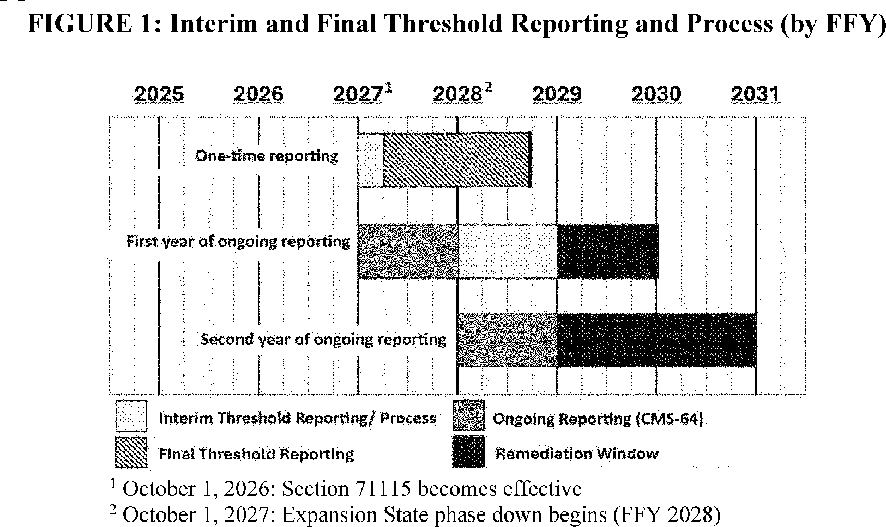
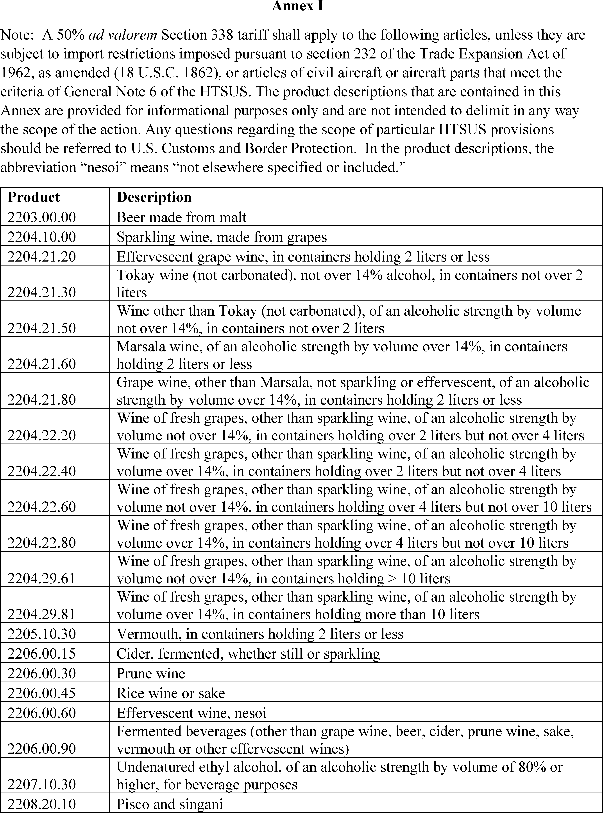
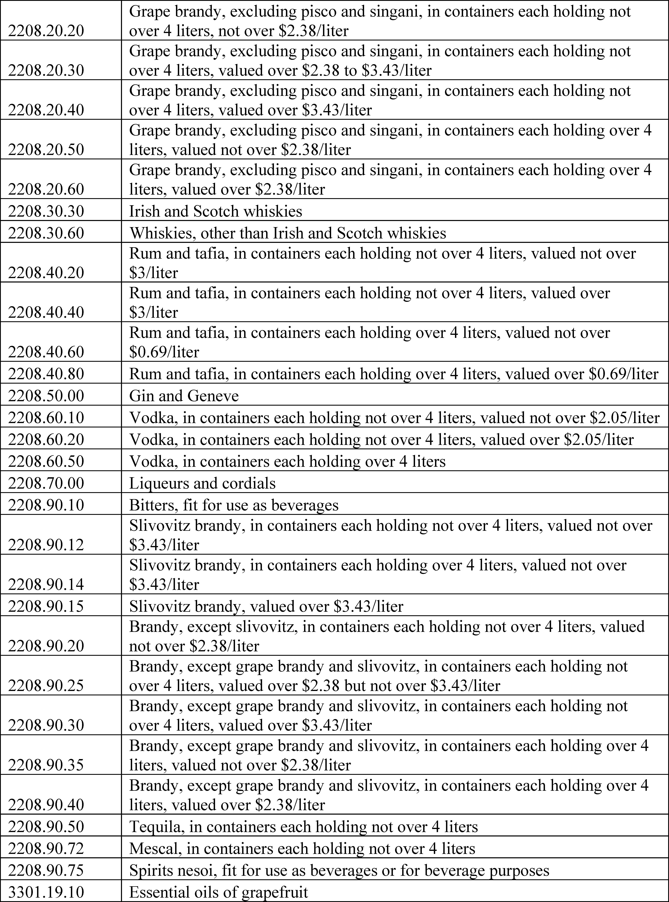
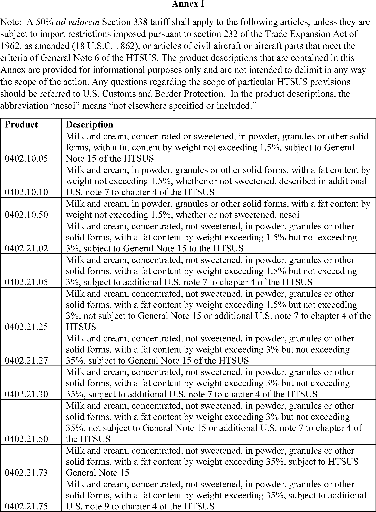
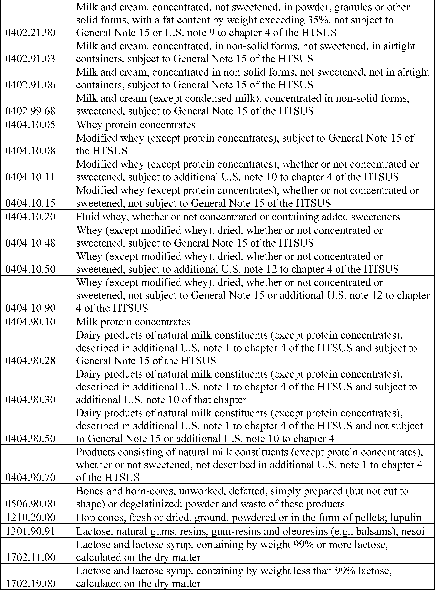
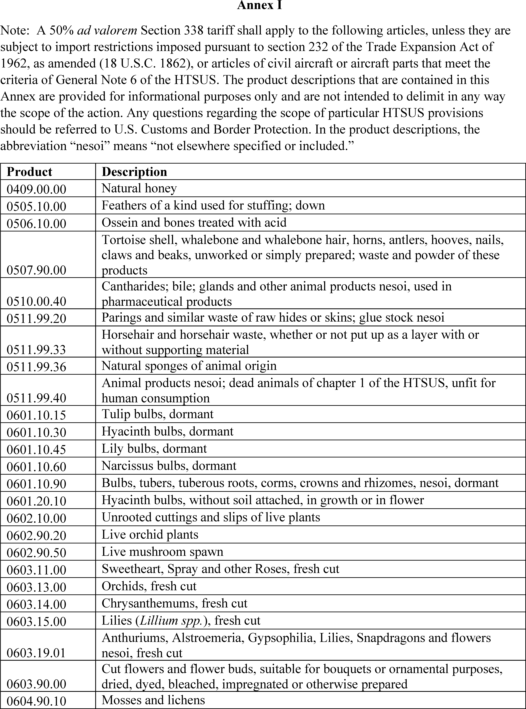
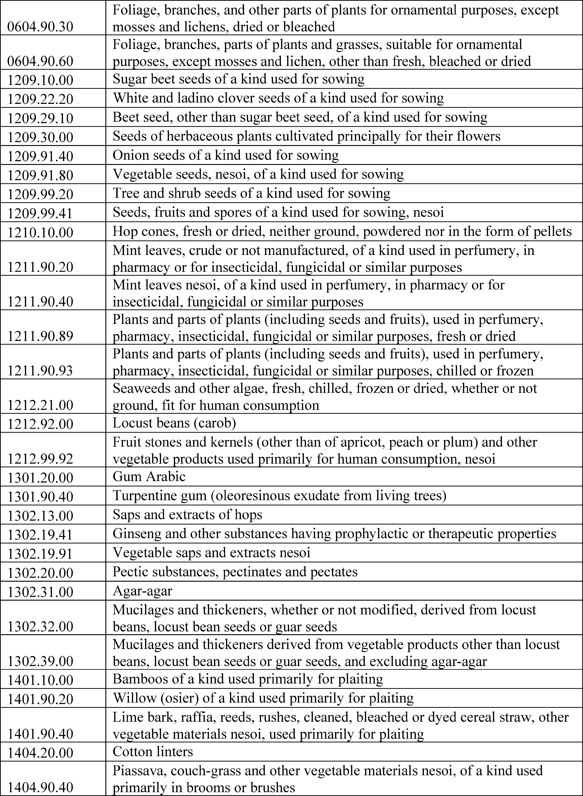

# Daily Digest — 2026-07-23

| | |
|---|---|
| **Digest date** | 2026-07-23 |
| **Data date range** | 2026-07-23 to 2026-07-23 |
| **Generated at** | 2026-07-25T17:18:23Z (UTC) |
| **Pipeline version** | fd6c37a |
| **Source watermarks** | CREC: 2026-07-24T11:53:38Z · BILLS: 2026-07-24T16:07:05Z · FR: 2026-07-24T16:11:21Z |

All items below cite the govinfo package (and granule, where applicable) they
summarize. Selection is mechanical; each item states the rule that included
it. See the Coverage Statement at the end for a full accounting of what was
published, what was summarized, and what was excluded and why.

---

## Day in Review

The House passed two measures by recorded vote: H. Con. Res. 89, directing the President to remove U.S. Armed Forces from hostilities with Iran under the War Powers Resolution, 214-208 with 9 not voting; and H.R. 8884, the Removing Barriers to Work for Disabled Americans Act, extending Social Security disability demonstration project authority through 2031, 232-188 with 11 not voting. Members introduced eight bills spanning trade, energy, tax, education, transportation, cybersecurity, defense, health, and agriculture, alongside 19 extensions of remarks. The Senate moved to proceed to S. 4784, the FY2027 National Defense Authorization Act, confirmed the Traynor nomination 48-47 and the Pozos nomination 49-44, took up a motion to proceed to H.R. 5334 on the educator expense deduction, and heard a motion by Senator Van Hollen to discharge S.J. Res. 180 on Iran hostilities.

The Federal Register carried eight presidential documents, 17 final rules, 16 proposed rules, and 85 notices. Proclamation 11045 modified aluminum import tariffs with reduced rates tied to domestic production commitments, and Proclamations 11046, 11047, and 11048 imposed 50 percent additional duties on Canadian alcoholic beverage, dairy, and motor vehicle products effective August 19, 2026. Executive Order 14415 addressed defense supply chains for critical materials. Final rules included State and Commerce interim final rules moving firearm suppressors from the U.S. Munitions List to the Commerce Control List, FDA's revocation of the Orange B color additive listing, and Education and HHS rescissions of vocational education civil rights guidelines.

*Composed from the summarized items below and the day's mechanical
counts; all specifics are cited in their sections.*

---

## 1. Congressional Floor Activity

Source: Congressional Record (CREC), daily edition for 2026-07-23. Total issue size: 192 granule(s).

### 1.1 Senate

- **Legislative Session** — The Senate moved to proceed to S. 4784, the National Defense Authorization Act for Fiscal Year 2027, which authorizes appropriations for military activities of the Department of Defense and military construction and prescribes military personnel strengths. Senators discussed policy matters related to military operations, trade tariffs, and electoral procedures.
  - *In plain terms:* The Senate began consideration of S. 4784, the National Defense Authorization Act for Fiscal Year 2027, authorizing defense spending, military construction, and personnel levels.
  - Included because: CREC-SEL-01 — floor item ≥ threshold floor time (40,566 characters)
  - Source: [CREC-2026-07-23 / CREC-2026-07-23-pt1-PgS4241-8](https://www.govinfo.gov/app/details/CREC-2026-07-23/CREC-2026-07-23-pt1-PgS4241-8)
- **Directing the Removal of United States Armed Forces from Hostilities within or against the Islamic Republic of Iran Tha…** — Senator Van Hollen moved to discharge S.J. Res. 180 from the Committee on Foreign Relations, a joint resolution directing the removal of United States Armed Forces from hostilities within or against Iran that have not been authorized by Congress. Senators debated the constitutional authority of Congress regarding military operations and the statutory requirements for authorized use of force.
  - *In plain terms:* Senator Van Hollen moved to discharge a joint resolution requiring removal of U.S. armed forces from hostilities in or against Iran that Congress has not authorized.
  - Included because: CREC-SEL-01 — floor item ≥ threshold floor time (25,130 characters)
  - Source: [CREC-2026-07-23 / CREC-2026-07-23-pt1-PgS4246](https://www.govinfo.gov/app/details/CREC-2026-07-23/CREC-2026-07-23-pt1-PgS4246)
- **SUPPORTING EARLY-CHILDHOOD EDUCATORS' DEDUCTIONS ACT--Motion to Proceed** — The Senate considered a motion to proceed to H.R. 5334, which would amend the Internal Revenue Code to allow early childhood educators to take the educator expense deduction. A cloture motion was filed to limit debate on the motion to proceed.
  - *In plain terms:* The Senate considered H.R. 5334, which would allow early childhood educators to claim the educator expense deduction, with a vote to end debate filed.
  - Included because: CREC-SEL-01 — floor item ≥ threshold floor time (36,910 characters)
  - Source: [CREC-2026-07-23 / CREC-2026-07-23-pt1-PgS4253-5](https://www.govinfo.gov/app/details/CREC-2026-07-23/CREC-2026-07-23-pt1-PgS4253-5)
- **Petitions and Memorials** — The Senate received three concurrent resolutions from the Louisiana Legislature: one urging investigation and prosecution of individuals named in released Epstein files, one supporting legislation to establish a Mississippi River Basin Fishery Commission, and one requesting federal reevaluation of flood-risk maps based on the Comite River Diversion Canal Project's progress.
  - *In plain terms:* The Senate received three resolutions from Louisiana: one urging investigation of individuals in Epstein files, one supporting a Mississippi River Basin Fishery Commission, and one requesting federal flood-risk map review.
  - Included because: CREC-SEL-01 — floor item ≥ threshold floor time (41,277 characters)
  - Source: [CREC-2026-07-23 / CREC-2026-07-23-pt1-PgS4261](https://www.govinfo.gov/app/details/CREC-2026-07-23/CREC-2026-07-23-pt1-PgS4261)

### 1.2 House of Representatives

- **Removing Barriers to Work for Disabled Americans Act** — H.R. 8884, the Removing Barriers to Work for Disabled Americans Act, amends the Social Security Act to extend the Social Security Administration's authority to conduct disability insurance demonstration projects through 2031. The bill requires a 120-day notification period and evaluation metrics for projects and specifies that participants' total income will not be reduced due to participation.
  - *In plain terms:* H.R. 8884 extends the Social Security Administration's authority to run disability insurance demonstration projects through 2031, requiring 120-day notice and evaluation metrics, with participants' income unchanged.
  - Included because: CREC-SEL-01 — floor item ≥ threshold floor time (28,744 characters)
  - Source: [CREC-2026-07-23 / CREC-2026-07-23-pt1-PgH5182-6](https://www.govinfo.gov/app/details/CREC-2026-07-23/CREC-2026-07-23-pt1-PgH5182-6)
- **Public Bills and Resolutions** — The House of Representatives introduced multiple bills on varied topics including trade policy, international relief, energy efficiency, tax provisions, higher education, transportation, cybersecurity, defense, healthcare, and agriculture, with each bill referred to appropriate committees.
  - *In plain terms:* The House introduced bills on trade, international relief, energy efficiency, taxes, education, transportation, cybersecurity, defense, healthcare, and agriculture, each referred to committees.
  - Included because: CREC-SEL-01 — floor item ≥ threshold floor time (33,893 characters)
  - Source: [CREC-2026-07-23 / CREC-2026-07-23-pt1-PgH5194-3](https://www.govinfo.gov/app/details/CREC-2026-07-23/CREC-2026-07-23-pt1-PgH5194-3)

### 1.3 Recorded Votes

- **Directing the President, Pursuant to Section 5(c) of the War Powers Resolution, to Remove United States Armed Forces fr…** — The House of Representatives passed H. Con. Res. 89, a concurrent resolution directing the President to remove United States Armed Forces from hostilities with Iran pursuant to the War Powers Resolution. The vote was 214 yeas, 208 nays, and 9 not voting.
  - *In plain terms:* The House passed a resolution directing the President to withdraw U.S. armed forces from hostilities with Iran under the War Powers Resolution, 214-208-9.
  - Included because: CREC-SEL-02 — recorded vote (all recorded votes are listed)
  - Source: [CREC-2026-07-23 / CREC-2026-07-23-pt1-PgH5186-2](https://www.govinfo.gov/app/details/CREC-2026-07-23/CREC-2026-07-23-pt1-PgH5186-2)
- **Removing Barriers to Work for Disabled Americans Act** — The House of Representatives passed H.R. 8884, the Removing Barriers to Work for Disabled Americans Act, by a vote of 232 yeas, 188 nays, and 11 not voting.
  - *In plain terms:* The House passed H.R. 8884, the Removing Barriers to Work for Disabled Americans Act, 232-188-11.
  - Included because: CREC-SEL-02 — recorded vote (all recorded votes are listed)
  - Source: [CREC-2026-07-23 / CREC-2026-07-23-pt1-PgH5186-3](https://www.govinfo.gov/app/details/CREC-2026-07-23/CREC-2026-07-23-pt1-PgH5186-3)
- **Vote on Traynor Nomination (Executive Session)** — The Senate voted on the Traynor nomination, with 48 senators voting in favor, 47 voting against, and 5 not voting. The nomination was confirmed.
  - *In plain terms:* The Senate confirmed the Traynor nomination, 48-47-5.
  - Included because: CREC-SEL-02 — recorded vote (all recorded votes are listed)
  - Source: [CREC-2026-07-23 / CREC-2026-07-23-pt1-PgS4250](https://www.govinfo.gov/app/details/CREC-2026-07-23/CREC-2026-07-23-pt1-PgS4250)
- **Vote on Pozos Nomination (Executive Calendar)** — The Senate voted on the Pozos nomination, with 49 senators voting in favor, 44 voting against, and 7 not voting. The nomination was confirmed.
  - *In plain terms:* The Senate confirmed the Pozos nomination, 49-44-7.
  - Included because: CREC-SEL-02 — recorded vote (all recorded votes are listed)
  - Source: [CREC-2026-07-23 / CREC-2026-07-23-pt1-PgS4253-2](https://www.govinfo.gov/app/details/CREC-2026-07-23/CREC-2026-07-23-pt1-PgS4253-2)

---

## 2. Legislation

Source: Congressional Bills (BILLS), text versions published 2026-07-23 to 2026-07-23.

### 2.1 Counts by Stage

| Stage (bill text version) | Count |
|---|---|
| Introduced (ih/is) | 8 |
| Reported (rh/rs) | 0 |
| Engrossed (eh/es) | 3 |
| Enrolled (enr) | 0 |
| Other versions | 0 |
| **Total bill texts published** | **11** |

### 2.2 Bills Listed by Mechanical Rule

Bills below are listed because they matched at least one listing rule; the
matching rule is stated per item. All other bill texts are counted above and
accounted for in the Coverage Statement.

No bill texts published in this range matched a listing rule; all 11 are
accounted for in the Coverage Statement.

---

## 3. Federal Register

Source: Federal Register (FR), issue of 2026-07-23.

### 3.1 Counts by Document Type

| Document type | Count |
|---|---|
| Rules | 17 |
| Proposed rules | 16 |
| Notices | 85 |
| Presidential documents | 8 |
| **Total FR documents** | **126** |

### 3.2 Rules Published

#### CONSUMER PRODUCT SAFETY COMMISSION

- **Removal of Obsolete or Unnecessary Requirements** (2026-14934; 16 CFR Parts 1203, 1401, 1402, and 1406) — The U.S. Consumer Product Safety Commission (Commission or CPSC) is reviewing its regulations to reduce regulatory burdens and costs. Pursuant to this review, CPSC has identified several obsolete or unnecessary provisions that are being removed or amended in this direct final rule. The changes in this rule will not affect consumer safety. Action: Direct final rule. Dates: The rule is effective on September 21, 2026, unless the Commission receives a significant adverse comment by August 24, 2026. If the Commission receives such a comment, it will publish a notice in the Federal Register , withdrawing any portion of this direct final rule related to such a comment before its effective date. The approval of the Director of the Federal Register (FR) for incorporation by reference (IBR) of certain material listed in this rule expires as of September 21, 2026.
  - *In plain terms:* The Consumer Product Safety Commission is removing obsolete or unnecessary regulatory requirements to reduce regulatory burden without affecting consumer safety.
  - Included because: FR-SEL-01 — document type: final rule (all listed)
  - Source: [FR-2026-07-23 / 2026-14934](https://www.govinfo.gov/app/details/FR-2026-07-23/2026-14934)

#### DEPARTMENT OF COMMERCE

- **Implementation of EAR Export Controls on Silencers, Mufflers, and Sound Suppressors; and Other Firearms Related Changes** (2026-14942; 15 CFR Parts 740, 742, 758, and 774) — The Department of Commerce (Commerce), Bureau of Industry and Security (BIS) is revising the Export Administration Regulations (EAR) and the Commerce Control List (CCL) to appropriately control certain silencers, mufflers, and sound suppressors (sound suppressors) that will no longer be described on the International Traffic in Arms Regulations U.S. Munitions List (USML). This interim final rule (IFR) complements a Department of State interim final rule published elsewhere in this issue of the Federal Register ( International Traffic in Arms Regulations: USML Category I Firearm Suppressors (1400-AG11) (State IFR)). This transfer of jurisdiction will reduce the regulatory burden on exports of sound suppressors. This IFR also revises the EAR to allow firearms and related items to be temporarily exported and reexported under a license exception as tools of trade, thereby relieving exporters of the regulatory burden of applying for authorization. Finally, this IFR clarifies which items fall within the scope of the EAR's entry clearance requirements for a temporary import. Action: Interim final rule. Dates: Effective dates: This rule is effective November 20, 2026, except for amendatory instructions 1, 2, 3, 4, 6, 7, 8, 9, 10, and 11, which are effective July 23, 2026. Comments due date: Comments must be received by BIS no later than August 24, 2026.
  - *In plain terms:* The Commerce Department is revising export controls to transfer firearm silencers and sound suppressors from the munitions list to less restrictive Commerce controls and allow temporary export as trade tools.
  - Included because: FR-SEL-01 — document type: final rule (all listed)
  - Source: [FR-2026-07-23 / 2026-14942](https://www.govinfo.gov/app/details/FR-2026-07-23/2026-14942)

#### DEPARTMENT OF EDUCATION

- **Rescinding Guidelines for Eliminating Discrimination and Denial of Services on the Basis of Race, Color, National Origin, Sex, and Handicap in Vocational Education Programs** (2026-14892; 34 CFR Parts 100, 104, and 106) — The Secretary of Education rescinds the U.S. Department of Education's (Department) Guidelines for Eliminating Discrimination and Denial of Services on the Basis of Race, Color, National Origin, Sex, and Handicap in Vocational Education Programs ( Guidelines ). The Guidelines, first published in the Federal Register in 1979 and added to the Title VI regulations of the Department's predecessor, the Department of Health, Education, and Welfare (HEW), apply to recipients of Federal financial assistance, including State education agencies, that offer or administer vocational education or training programs. Following the establishment of the Department and HEW's successor, the Department of Health and Human Services (HHS), the Guidelines were transferred to both agencies and have remained substantively unchanged since they were first issued in 1979. The Department has determined that the Guidelines are no longer necessary due to significant changes in governing jurisprudence on what constitutes actionable discrimination and in the vocational education landscape in the intervening half-century. [official summary truncated; see source] Action: Final rule; rescission. Dates: This final rule is effective on July 23, 2026.
  - *In plain terms:* The Education Department is eliminating 1979 guidelines for preventing discrimination in vocational education programs because discrimination law and the vocational education landscape have significantly changed.
  - Included because: FR-SEL-01 — document type: final rule (all listed)
  - Source: [FR-2026-07-23 / 2026-14892](https://www.govinfo.gov/app/details/FR-2026-07-23/2026-14892)

#### DEPARTMENT OF ENERGY

- **Categorical Exclusion Under the National Environmental Policy Act for Certain Terminations or Revocations of Water Power Licenses or Exemptions** (2026-14878; 18 CFR Part 380) — The Federal Energy Regulatory Commission amends its regulations implementing the National Environmental Policy Act (NEPA) to expand an existing Categorical Exclusion (CE) to include “terminations or revocations of water power licenses and exemptions that will result in minor or no ground disturbing activity and minor or no changes in reservoir conditions and downstream flows.” Action: Final rule. Dates: This rule is effective August 24, 2026.
  - *In plain terms:* The Federal Energy Regulatory Commission expands its environmental review exemption to include terminations of water power licenses with minor or no ground disturbance or flow changes.
  - Included because: FR-SEL-01 — document type: final rule (all listed)
  - Source: [FR-2026-07-23 / 2026-14878](https://www.govinfo.gov/app/details/FR-2026-07-23/2026-14878)

#### DEPARTMENT OF HEALTH AND HUMAN SERVICES

- **Rescinding Guidelines for Eliminating Discrimination and Denial of Services on the Basis of Race, Color, National Origin, Sex, and Handicap in Vocational Education Programs** (2026-14893; 45 CFR Parts 80, 84, and 86) — The U.S. Department of Health and Human Services (HHS or the Department) rescinds the Guidelines for Eliminating Discrimination and Denial of Services on the Basis of Race, Color, National Origin, Sex, and Handicap in Vocational Education Programs ( Guidelines ). The Department also makes conforming amendments by removing cross-references to the Guidelines in its regulations. The Guidelines were developed and issued by HHS's predecessor, the Department of Health, Education, and Welfare (HEW), in 1979 in response to litigation concerning HEW's enforcement of Title VI of the Civil Rights Act of 1964 and a then-existing Federal vocational education program structure. Following the establishment of the U.S. Department of Education (ED) in 1980, administration of Federal vocational education programs, and the associated civil rights compliance framework for those programs detailed in the Guidelines, transferred to ED. HHS does not administer the vocational education program structure contemplated by the Guidelines and does not use the Guidelines as an ongoing compliance mechanism. [official summary truncated; see source] Action: Final rule; rescission. Dates: This final rule is effective on July 23, 2026.
  - *In plain terms:* The Health and Human Services Department is eliminating the 1979 vocational discrimination guidelines and removing related regulatory references because it no longer administers vocational education programs.
  - Included because: FR-SEL-01 — document type: final rule (all listed)
  - Source: [FR-2026-07-23 / 2026-14893](https://www.govinfo.gov/app/details/FR-2026-07-23/2026-14893)
- **Revocation of the Color Additive Listing for Use of Orange B on Casings or Surfaces of Frankfurters and Sausages** (2026-14910; 21 CFR Part 74) — The Food and Drug Administration (FDA or we) is issuing an order to repeal the color additive regulation that allows for the use of Orange B for coloring the casings or surfaces of frankfurters and sausages. We have determined that the authorized use of Orange B has been abandoned, and we have concluded that this color additive regulation is outdated and unnecessary. Therefore, FDA is revoking the authorized use in food of Orange B in the color additive regulations. Action: Final amendment; order. Dates: This order is effective September 8, 2026. If any provisions are delayed or stayed by the filing of proper objections, FDA will publish such notification in the Federal Register . Submit either electronic or written objections and requests for a hearing on the order by August 24, 2026. See section VII for further information on the filing of objections.
  - *In plain terms:* The FDA is revoking the regulation permitting Orange B as a color additive on frankfurter and sausage casings because this use has been abandoned.
  - Included because: FR-SEL-01 — document type: final rule (all listed)
  - Source: [FR-2026-07-23 / 2026-14910](https://www.govinfo.gov/app/details/FR-2026-07-23/2026-14910)

#### DEPARTMENT OF HOMELAND SECURITY

- **Special Local Regulation; Lake Erie, Fairport Harbor, OH** (2026-14883; 33 CFR Part 100) — The Coast Guard is establishing a temporary special local regulation (SLR) for certain waters off the shore of Fairport Harbor Lakefront Park on Lake Erie. This action is necessary to provide for the safety of life on these navigable waters near Fairport Harbor, OH during the Lake Metroparks Pirate Triathlon event on August 2, 2026. This regulation prohibits persons and vessels from entering the regulated area unless specifically authorized by the Captain of the Port Sector Eastern Great Lakes or their designated representative. Action: Temporary final rule. Dates: This rule is effective from 7:30 a.m. through 12:30 p.m. on August 2, 2026.
  - *In plain terms:* The Coast Guard is establishing a temporary safety zone on Lake Erie near Fairport Harbor for the Lake Metroparks Pirate Triathlon on August 2, 2026.
  - Included because: FR-SEL-01 — document type: final rule (all listed)
  - Source: [FR-2026-07-23 / 2026-14883](https://www.govinfo.gov/app/details/FR-2026-07-23/2026-14883)
- **Safety Zone; Ohio Street Beach Swim Course, Lake Michigan, Chicago Harbor, Chicago, IL** (2026-14888; 33 CFR Part 165) — The Coast Guard will enforce a safety zone for the Swim Across America event to provide for the safety of life on navigable waterways during a swim race. Our regulation for marine events within the Coast Guard Great Lakes District identifies the safety zone for this event in Chicago, IL. During the enforcement period, entry into, transiting, or anchoring within the safety zone is prohibited unless authorized by the Captain of the Port Lake Michigan or a designated on-scene representative. Action: Notification of enforcement of regulation. Dates: The regulations in 33 CFR 165.932 will be enforced from 7 a.m. through 10 a.m. on August 8, 2026.
  - *In plain terms:* The Coast Guard is enforcing a safety zone in Chicago's Lake Michigan for the Swim Across America swim race.
  - Included because: FR-SEL-01 — document type: final rule (all listed)
  - Source: [FR-2026-07-23 / 2026-14888](https://www.govinfo.gov/app/details/FR-2026-07-23/2026-14888)
- **Safety Zone; Lake Erie, Avon Lake, OH** (2026-14894; 33 CFR Part 165) — The Coast Guard is establishing a temporary safety zone for certain navigable waters of Lake Erie. The safety zone is needed to protect personnel, vessels, and the marine environment from potential hazards associated with an over water fireworks display. Entry of vessels or persons into this zone is prohibited unless specifically authorized by the Captain of the Port, Sector Eastern Great Lakes, or their designated representative. Action: Temporary final rule. Dates: This rule is effective from 9 p.m. to 9:45 p.m. on August 1, 2026.
  - *In plain terms:* The Coast Guard is establishing a temporary safety zone on Lake Erie to protect personnel, vessels, and the environment during a fireworks display.
  - Included because: FR-SEL-01 — document type: final rule (all listed)
  - Source: [FR-2026-07-23 / 2026-14894](https://www.govinfo.gov/app/details/FR-2026-07-23/2026-14894)
- **Safety Zone; Lake St. Clair; New Baltimore, MI** (2026-14895; 33 CFR Part 165) — The Coast Guard is establishing a temporary safety zone for navigable waters of Lake St. Clair within a 420-foot radius of Brandenburg Park on Anchor Bay in Lake St. Clair, New Baltimore, MI. The safety zone is needed to protect personnel, vessels, and the marine environment from potential hazards during a fireworks event. Entry of vessels or persons into this zone is prohibited unless specifically authorized by the Captain of the Port Detroit or their designated representative. Action: Temporary final rule. Dates: This rule is effective from 9:30 p.m. through 11:00 p.m. on July 30, 2026.
  - *In plain terms:* The Coast Guard is establishing a temporary safety zone within 420 feet of Brandenburg Park in Lake St. Clair to protect personnel, vessels, and the environment during a fireworks event.
  - Included because: FR-SEL-01 — document type: final rule (all listed)
  - Source: [FR-2026-07-23 / 2026-14895](https://www.govinfo.gov/app/details/FR-2026-07-23/2026-14895)

#### DEPARTMENT OF STATE

- **International Traffic in Arms Regulations: USML Category I Firearm Suppressors** (2026-14943; 22 CFR Part 121) — In support of the President's Executive Order of April 9, 2025, on Reforming Foreign Defense Sales to Improve Speed and Accountability, the Department of State (the Department) issues this interim final rule removing firearm silencers, mufflers, and sound suppressors for non-automatic and semi-automatic firearms from the U.S. Munitions List (USML). Action: Interim final rule; request for comments. Dates: Effective date: November 20, 2026. Comment due date: Send comments by August 24, 2026.
  - *In plain terms:* The State Department is removing firearm silencers and sound suppressors for non-automatic and semi-automatic firearms from the U.S. Munitions List per Executive Order of April 9, 2025.
  - Included because: FR-SEL-01 — document type: final rule (all listed)
  - Source: [FR-2026-07-23 / 2026-14943](https://www.govinfo.gov/app/details/FR-2026-07-23/2026-14943)

#### DEPARTMENT OF TRANSPORTATION

- **Standard Instrument Approach Procedures, and Takeoff Minimums and Obstacle Departure Procedures; Miscellaneous Amendments** (2026-14889; 14 CFR Part 97) — This rule establishes, amends, suspends, or removes Standard Instrument Approach Procedures (SIAPS) and associated Takeoff Minimums and Obstacle Departure procedures (ODPs) for operations at certain airports. These regulatory actions are needed because of the adoption of new or revised criteria, or because of changes occurring in the National Airspace System, such as the commissioning of new navigational facilities, adding new obstacles, or changing air traffic requirements. These changes are designed to provide safe and efficient use of the navigable airspace and to promote safe flight operations under instrument flight rules at the affected airports. Action: Final rule. Dates: This rule is effective July 23, 2026. The compliance date for each SIAP, associated Takeoff Minimums, and ODP is specified in the amendatory provisions. The incorporation by reference of certain publications listed in the regulations is approved by the Director of the Federal Register as of July 23, 2026.
  - *In plain terms:* This rule updates instrument approach procedures and takeoff minimums for certain airports to reflect new criteria or changes in airspace systems.
  - Included because: FR-SEL-01 — document type: final rule (all listed)
  - Source: [FR-2026-07-23 / 2026-14889](https://www.govinfo.gov/app/details/FR-2026-07-23/2026-14889)
- **Standard Instrument Approach Procedures, and Takeoff Minimums and Obstacle Departure Procedures; Miscellaneous Amendments** (2026-14890; 14 CFR Part 97) — This rule amends, suspends, or removes Standard Instrument Approach Procedures (SIAPs) and associated Takeoff Minimums and Obstacle Departure Procedures for operations at certain airports. These regulatory actions are needed because of the adoption of new or revised criteria, or because of changes occurring in the National Airspace System, such as the commissioning of new navigational facilities, adding new obstacles, or changing air traffic requirements. These changes are designed to provide for the safe and efficient use of the navigable airspace and to promote safe flight operations under instrument flight rules at the affected airports. Action: Final rule. Dates: This rule is effective July 23, 2026. The compliance date for each SIAP, associated Takeoff Minimums, and ODP is specified in the amendatory provisions. The incorporation by reference of certain publications listed in the regulations is approved by the Director of the Federal Register as of July 23, 2026.
  - *In plain terms:* This rule updates instrument approach procedures and takeoff minimums for certain airports based on new criteria or airspace system changes.
  - Included because: FR-SEL-01 — document type: final rule (all listed)
  - Source: [FR-2026-07-23 / 2026-14890](https://www.govinfo.gov/app/details/FR-2026-07-23/2026-14890)

#### ENVIRONMENTAL PROTECTION AGENCY

- **Air Plan Approval; Missouri; Control of Emissions During Petroleum Liquid Storage, Loading, and Transfer** (2026-14880; 40 CFR Part 52) — The Environmental Protection Agency (EPA) is taking final action to approve revisions to the Missouri State Implementation Plan (SIP) related to the control of emissions during petroleum liquid storage, loading, and transfer in the St. Louis area. The revisions to this rule include revising the tank size threshold applicability of the rule, adding incorporations by reference to other State rules, adding definitions specific to the rule, revising unnecessarily restrictive or duplicative language, adding a streamlined process for modifications to vapor recovery systems at gasoline dispensing facilities and thereby eliminating the associated permitting requirement, and clarifying rule language on testing and reporting. The revisions make this provision consistent with a similar rule that is applicable to the Kansas City, Missouri area and regulates the same type of facilities. The EPA's final approval of this rule revision is being done in accordance with the requirements of the CAA. Action: Final rule. Dates: This final rule is effective on August 24, 2026.
  - *In plain terms:* The EPA is approving Missouri air quality rule changes for petroleum storage and transfer facilities in the St. Louis area, including revised tank thresholds and simplified procedures.
  - Included because: FR-SEL-01 — document type: final rule (all listed)
  - Source: [FR-2026-07-23 / 2026-14880](https://www.govinfo.gov/app/details/FR-2026-07-23/2026-14880)
- **Air Plan Approval; Maine; Chapter 140: Part 70 Air Emission License Regulation** (2026-14885; 40 CFR Part 70) — The Environmental Protection Agency (EPA) is approving a Clean Air Act (CAA) operating permit program revision submitted by the State of Maine. This revision makes minor changes to Maine's operating permit program that are considered clarifications, that correct grammar, that codify longstanding practices, or that are necessary for the state to utilize an expected future electronic application system. The revisions also include provisions allowing the public comment period on a draft permit to run concurrently with the EPA's review of a proposed permit. The intended effect of this action is to approve Maine's revisions. This action is being taken in accordance with the Clean Air Act. Action: Final rule. Dates: This rule is effective on August 24, 2026.
  - *In plain terms:* The EPA is approving revisions to Maine's operating permit program that clarify existing rules and allow public comment to run concurrently with EPA review.
  - Included because: FR-SEL-01 — document type: final rule (all listed)
  - Source: [FR-2026-07-23 / 2026-14885](https://www.govinfo.gov/app/details/FR-2026-07-23/2026-14885)

#### NUCLEAR REGULATORY COMMISSION

- **List of Approved Spent Fuel Storage Casks: Holtec International HI-STORM Flood/Wind System, Certificate of Compliance No. 1032, Amendment No. 10** (2026-14876; 10 CFR Part 72) — The U.S. Nuclear Regulatory Commission (NRC) is amending its spent fuel storage regulations by revising the Holtec International HI-STORM Flood/Wind (FW) System listing within the “List of approved spent fuel storage casks” to include Amendment No. 10 to Certificate of Compliance (CoC) No. 1032. Amendment No. 10 revises the CoC for the HI-STORM FW dry storage system to incorporate several enhancements. These changes include the introduction of the HI-STORM FW Extended Configuration, adoption of a methodology for developing site-specific loading patterns with higher allowable per-canister and per-cell heat-load limits, incorporation of a radiological fuel-qualification methodology, reduction of minimum cooling-time requirements for certain multi-purpose canister models based on updated evaluations, and refinement of the missile-impact analysis methodology to allow site-specific credit for the HI-TRAC VW water-jacket shell. The amendment also includes a minor editorial clarification. Action: Direct final rule. Dates: This direct final rule is effective October 6, 2026, unless significant adverse comments are received by August 24, 2026. If this direct final rule is withdrawn as a result of such comments, timely notice of the withdrawal will be published in the Federal Register . Comments received after this date will be considered if it is practical to do so, but the NRC is able to ensure consideration only for comments received on or before this date. Comments received on this direct final rule will also be considered to be comments on a companion proposed rule published in the Proposed Rules section of this issue of the Federal Register .
  - *In plain terms:* The Nuclear Regulatory Commission is updating regulations for the Holtec HI-STORM Flood/Wind spent fuel storage system with Amendment No. 10, incorporating various enhancements.
  - Included because: FR-SEL-01 — document type: final rule (all listed)
  - Source: [FR-2026-07-23 / 2026-14876](https://www.govinfo.gov/app/details/FR-2026-07-23/2026-14876)

#### OFFICE OF GOVERNMENT ETHICS

- **Exempting Certain Career Federal Employees From Ethics Reporting Requirements** (2026-14872; 5 CFR Part 2634) — The Office of Government Ethics (OGE) is amending the ethics reporting requirements to preserve the filing status of each position transferred to Schedule Policy/Career as it existed prior to being rescheduled. The effect of this rule will be to continue the exclusion of all Schedule Policy/Career employees who are not otherwise required to file public financial disclosure reports from the requirement to file, which should not adversely affect the integrity of the Government or the public's confidence in the integrity of the Government. Moreover, requiring these employees to file public financial disclosure reports would be unnecessarily burdensome to both agency ethics staff and the employees. Action: Interim final rule; request for comments. Dates: This interim final rule is effective July 23, 2026. Comments must be received on or before August 24, 2026.
  - *In plain terms:* The Office of Government Ethics is preserving prior filing status for positions reclassified as Schedule Policy/Career to avoid requiring them to file disclosure reports.
  - Included because: FR-SEL-01 — document type: final rule (all listed)
  - Source: [FR-2026-07-23 / 2026-14872](https://www.govinfo.gov/app/details/FR-2026-07-23/2026-14872)

### 3.3 Proposed Rules Published

#### CORPORATION FOR NATIONAL AND COMMUNITY SERVICE

- **Rescinding Portions of AmeriCorps Title VI Regulations To Conform More Closely With the Statutory Text and To Implement Executive Order 14281** (2026-14906; 45 CFR Part 1203) — The Corporation for National and Community Service (operating as AmeriCorps) proposes to amend its regulations implementing Title VI of the Civil Rights Act of 1964 (“Title VI”) to eliminate disparate-impact liability. The proposed amendments would align the conduct prohibited by AmeriCorps' regulations with Title VI's original public meaning, avoid constitutional concerns, reduce compliance costs, and serve the public interest. In addition, these revisions would be consistent with Executive Order (E.O.) 14281 and conform to regulatory updates recently finalized by the U.S. Department of Justice (DOJ). Action: Proposed rule. Dates: Written comments must be submitted by August 24, 2026.
  - *In plain terms:* AmeriCorps is proposing to amend its civil rights regulations to eliminate disparate-impact liability and align with Executive Order 14281 and Justice Department updates.
  - Included because: FR-SEL-02 — document type: proposed rule (all listed)
  - Source: [FR-2026-07-23 / 2026-14906](https://www.govinfo.gov/app/details/FR-2026-07-23/2026-14906)

#### DEPARTMENT OF AGRICULTURE

- **Grapes Grown in a Designated Area of Southeastern California; Decreased Assessment Rate** (2026-14918; 7 CFR Part 925) — This proposed rule would implement a recommendation from the California Desert Grape Administrative Committee (Committee) to decrease the assessment rate established for the 2026 and subsequent fiscal periods from $0.030 to $0.025 per 18-pound lug for grapes grown in a designated area of southeastern California. The proposed assessment rate would remain in effect indefinitely until modified, suspended, or terminated. Action: Proposed rule. Dates: Comments must be received by August 24, 2026.
  - *In plain terms:* This proposed rule would reduce the assessment rate for grapes grown in southeastern California from $0.030 to $0.025 per 18-pound lug starting in 2026.
  - Included because: FR-SEL-02 — document type: proposed rule (all listed)
  - Source: [FR-2026-07-23 / 2026-14918](https://www.govinfo.gov/app/details/FR-2026-07-23/2026-14918)
- **Spearmint Oil Produced in the Far West; Salable Quantities and Allotment Percentages for the 2026-2027 Marketing Year** (2026-14927; 7 CFR Part 985) — This proposed rule would implement a recommendation from the Far West Spearmint Oil Administrative Committee (Committee) to establish salable quantities and allotment percentages for Class 1 (Scotch) and Class 3 (Native) spearmint oil produced in Washington, Idaho, and Oregon and parts of Nevada and Utah (Far West) for the 2026-2027 marketing year. Action: Proposed rule. Dates: Comments must be received by August 24, 2026.
  - *In plain terms:* This proposed rule would establish salable quantities and allotment percentages for spearmint oil produced in the Far West for the 2026-2027 marketing year.
  - Included because: FR-SEL-02 — document type: proposed rule (all listed)
  - Source: [FR-2026-07-23 / 2026-14927](https://www.govinfo.gov/app/details/FR-2026-07-23/2026-14927)

#### DEPARTMENT OF HEALTH AND HUMAN SERVICES

- **Medicaid Program; Amending the Indirect Hold Harmless Threshold of Health Care-Related Taxes** (2026-14897; 42 CFR Part 433) — This proposed rule would revise standards for determining whether an indirect hold harmless arrangement exists for a health care-related tax. This proposed rule is necessary to implement a provision in the “One Big Beautiful Bill Act,” herein referred to as the “Working Families Tax Cut (WFTC) legislation,” which established new indirect hold harmless thresholds for health care-related taxes. Currently, the threshold for a State's collection of tax revenues is no more than 6 percent of net patient revenue attributable to the assessed permissible class of health care items or services. Effective October 1, 2026, the WFTC legislation generally sets the threshold equal to the applicable percent of net patient revenue attributable to taxes imposed as of July 4, 2025. Effective October 1, 2027, the WFTC legislation also requires a phase down of the hold harmless threshold in expansion States. [official summary truncated; see source] Action: Proposed rule. Dates: To be assured consideration, comments must be received at one of the addresses provided below, by September 21, 2026.
  - *In plain terms:* This proposed rule would update health care-related tax standards under the Working Families Tax Cut legislation, effective October 1, 2026, with a phase-down requirement starting October 1, 2027.
  - Included because: FR-SEL-02 — document type: proposed rule (all listed)
  - Source: [FR-2026-07-23 / 2026-14897](https://www.govinfo.gov/app/details/FR-2026-07-23/2026-14897)
  -  *Source graphic 1 of 1 from 2026-14897.*
- **Proposal To Revoke the Color Additive Listing for Use of Citrus Red No. 2 on the Skins of Mature Oranges** (2026-14909; 21 CFR Part 74) — The Food and Drug Administration (FDA or we) is proposing to issue an order that would repeal the color additive regulation that allows for the use of Citrus Red No. 2 for coloring the skins of mature oranges. Based on certification data, it appears that Citrus Red No. 2 is no longer used for coloring the skins of oranges and has not been certified for use as a color additive in food marketed in the United States since 2020. Because the authorized use of Citrus Red No. 2 appears to have been abandoned, we have tentatively concluded that this color additive regulation is outdated and unnecessary. Action: Proposed amendment; proposed order. Dates: Submit electronic or written comments on the proposed order by August 24, 2026.
  - *In plain terms:* The FDA is proposing to eliminate the regulation permitting Citrus Red No. 2 as a color additive on orange skins because the product has not been used or certified since 2020.
  - Included because: FR-SEL-02 — document type: proposed rule (all listed)
  - Source: [FR-2026-07-23 / 2026-14909](https://www.govinfo.gov/app/details/FR-2026-07-23/2026-14909)

#### DEPARTMENT OF LABOR

- **Electronic Disclosure by Group Health Plans Under ERISA** (2026-14917; 29 CFR Parts 2520 and 2560) — This proposed rule sets forth a new, additional safe harbor for group health plan administrators to use electronic media ( e.g., email or web portal) to furnish documents and information to participants and beneficiaries of plans subject to the Employee Retirement Income Security Act of 1974 (ERISA). This proposal, if finalized, would allow plan administrators who satisfy specified conditions to provide participants and beneficiaries with a notice that certain disclosures will be made available electronically on a website. Individuals who prefer to receive these disclosures on paper will be able to request paper copies and to opt out of electronic delivery entirely. The Department expects that the proposal, if finalized, would improve the effectiveness of the disclosures and significantly reduce the costs and burden to group health plans associated with furnishing many of the recurring disclosures. Action: Proposed rule. Dates: To be assured consideration, comments must be received at one of the addresses provided below by September 21, 2026.
  - *In plain terms:* This proposed rule would allow group health plan administrators to provide disclosures electronically instead of on paper, with participants able to request paper copies or opt out entirely.
  - Included because: FR-SEL-02 — document type: proposed rule (all listed)
  - Source: [FR-2026-07-23 / 2026-14917](https://www.govinfo.gov/app/details/FR-2026-07-23/2026-14917)

#### DEPARTMENT OF TRANSPORTATION

- **Airworthiness Directives; Bell Textron Canada Limited Helicopters** (2026-14881; 14 CFR Part 39) — The FAA proposes to supersede Airworthiness Directive (AD) 2022-20-11, which applies to certain Bell Textron Canada Limited Model 429 helicopters. AD 2022-20-11 requires visually inspecting the external surface of the tail rotor (TR) gearbox support assembly, borescope inspecting or visually inspecting the inside of the tail boom, and performing a tactile inspection. Depending on the results of the inspections, AD 2022-20-11 requires removing certain rivets from service or repairing gaps in accordance with an approved method. Since the FAA issued AD 2022-20-11, the manufacturer determined the repetitive inspection interval needs to be reduced. This proposed AD would require the same actions as AD 2022-20-11 and would reduce the inspection interval. The FAA is proposing this AD to address the unsafe condition on these products. Action: Notice of proposed rulemaking (NPRM). Dates: The FAA must receive comments on this NPRM by September 8, 2026.
  - *In plain terms:* The FAA proposes replacing an airworthiness directive for Bell 429 helicopters with updated, more frequent inspection requirements for the tail rotor gearbox support and boom.
  - Included because: FR-SEL-02 — document type: proposed rule (all listed)
  - Source: [FR-2026-07-23 / 2026-14881](https://www.govinfo.gov/app/details/FR-2026-07-23/2026-14881)
- **Airworthiness Directives; Rolls-Royce Deutschland Ltd & Co KG Engines** (2026-14882; 14 CFR Part 39) — The FAA proposes to supersede Airworthiness Directive (AD) 2023-12-16, which applies to certain Rolls-Royce Deutschland Ltd & Co KG (RRD) Model Trent 1000 engines. AD 2023-12-16 requires an inspection of the high-pressure turbine (HPT) triple seal for excessive wear and, depending on the results of the inspection, replacement of the HPT triple seal and the intermediate-pressure turbine (IPT) disk. Since the FAA issued AD 2023-12-16, the manufacturer has developed a modification that removes the need for the inspection of the HPT triple seal. This proposed AD would continue to require an inspection of the HPT triple seal for excessive wear and, depending on the results of the inspection, replacement of the HPT triple seal and IPT disk. This proposed AD would remove certain engine serial numbers from the applicability of the existing AD. The FAA is proposing this AD to address the unsafe condition on these products. Action: Notice of proposed rulemaking (NPRM). Dates: The FAA must receive comments on this NPRM by September 8, 2026.
  - *In plain terms:* The FAA proposes updating an airworthiness directive for Rolls-Royce Trent 1000 engines, continuing high-pressure turbine triple seal inspections while exempting certain engine models.
  - Included because: FR-SEL-02 — document type: proposed rule (all listed)
  - Source: [FR-2026-07-23 / 2026-14882](https://www.govinfo.gov/app/details/FR-2026-07-23/2026-14882)
- **Airworthiness Directives; Airbus Helicopters** (2026-14886; 14 CFR Part 39) — The FAA proposes to adopt a new airworthiness directive (AD) for all Airbus Helicopters (AH) Model EC130B4 helicopters. This proposed AD was prompted by reports of weaknesses in the locking mechanisms on the left-hand side swinging and sliding door. This proposed AD would require modifying the swinging door star support and sliding door star support stringer. This proposed AD would also prohibit installing an affected composite door on any helicopter unless certain requirements are met. The FAA is proposing this AD to address the unsafe condition on these products. Action: Notice of proposed rulemaking (NPRM). Dates: The FAA must receive comments on this NPRM by September 8, 2026.
  - *In plain terms:* The FAA proposes an airworthiness directive for Airbus EC130B4 helicopters requiring modifications to the left-side door supports due to locking mechanism weaknesses.
  - Included because: FR-SEL-02 — document type: proposed rule (all listed)
  - Source: [FR-2026-07-23 / 2026-14886](https://www.govinfo.gov/app/details/FR-2026-07-23/2026-14886)

#### ENVIRONMENTAL PROTECTION AGENCY

- **Significant New Use Rules on Certain Chemical Substances (26-3)** (2026-14877; 40 CFR Part 721) — EPA is proposing significant new use rules (SNURs) under the Toxic Substances Control Act (TSCA) for certain chemical substances that were the subject of premanufacture notices (PMNs) and are also subject to an Order issued by EPA pursuant to TSCA. Once finalized, the SNURs would require persons who intend to manufacture (defined by statute to include import) or process any of these chemical substances for an activity that is proposed as a significant new use by this rulemaking to notify EPA at least 90 days before commencing that activity. The required notification initiates EPA's evaluation of the conditions of that use for that chemical substance. In addition, the manufacture or processing for the significant new use may not commence until EPA has conducted a review of the required notification, made an appropriate determination regarding that notification, and taken such actions as required by that determination. Action: Proposed rule. Dates: Comments must be received on or before August 24, 2026.
  - *In plain terms:* The EPA is proposing rules requiring anyone manufacturing or processing certain chemicals for new uses to notify EPA 90 days in advance and obtain approval before proceeding.
  - Included because: FR-SEL-02 — document type: proposed rule (all listed)
  - Source: [FR-2026-07-23 / 2026-14877](https://www.govinfo.gov/app/details/FR-2026-07-23/2026-14877)
- **Air Plan Approval; Pennsylvania; Revision to Source-Specific Reasonably Available Control Technology (RACT) Requirements** (2026-14891; 40 CFR Part 52) — The Environmental Protection Agency (EPA) is proposing to approve a state implementation plan (SIP) revision submitted by the Pennsylvania Department of Environmental Protection on behalf of the Commonwealth of Pennsylvania. This revision pertains to previously approved, source-specific reasonably available control technology (RACT) requirements for the Equitrans, Inc. Hartson Compressor Station in Washington County, Pennsylvania. This proposed action is being taken under the Clean Air Act (CAA). Action: Proposed rule. Dates: Written comments must be received on or before August 24, 2026.
  - *In plain terms:* The EPA is proposing to approve Pennsylvania's update to pollution control requirements for the Equitrans Hartson Compressor Station in Washington County.
  - Included because: FR-SEL-02 — document type: proposed rule (all listed)
  - Source: [FR-2026-07-23 / 2026-14891](https://www.govinfo.gov/app/details/FR-2026-07-23/2026-14891)
- **Air Plan Approval; Pennsylvania; Harrisburg-Lebanon-Carlisle-York Maintenance Area, Second 10-Year Maintenance Plan for the 2006 Fine Particulate Matter National Ambient Air Quality Standard** (2026-14902; 40 CFR Part 52) — The Environmental Protection Agency (EPA) is proposing to approve under the Clean Air Act (CAA), the Second Maintenance Plan for the Harrisburg-Lebanon-Carlisle and York Maintenance Area (Harrisburg-York Area) for the 2006 Fine Particulate Matter national ambient air quality standard (NAAQS) (Second 10-Year Maintenance Plan) as a revision to the state implementation plan (SIP). The SIP revision, submitted on February 7, 2025 by the Pennsylvania Department of Environmental Protection (PADEP), addresses the second 10-year maintenance period for particulate matter with an aerodynamic diameter less than or equal to a nominal 2.5 micrometers (µm), commonly known as fine particulate matter or PM 2.5 . The Plan includes, among other elements, a base year emissions inventory, a maintenance demonstration, contingency provisions, and motor vehicle emissions budgets for use in transportation conformity determinations, to ensure the continued maintenance of the 2006 PM 2.5 NAAQS. The EPA is also proposing to find adequate and approve the motor vehicle emission budgets for the Harrisburg-York Area. Action: Proposed rule. Dates: Written comments must be received on or before August 24, 2026.
  - *In plain terms:* The EPA is proposing to approve Pennsylvania's second 10-year air quality maintenance plan for the Harrisburg-York area to ensure continued compliance with 2006 fine particulate matter standards.
  - Included because: FR-SEL-02 — document type: proposed rule (all listed)
  - Source: [FR-2026-07-23 / 2026-14902](https://www.govinfo.gov/app/details/FR-2026-07-23/2026-14902)
- **Approval and Promulgation of State Implementation Plans; New Jersey; RACT Certifications for the 2008 and 2015 Ozone National Ambient Air Quality Standards** (2026-14923; 40 CFR Part 52) — The Environmental Protection Agency (EPA) is proposing to approve a State Implementation Plan (SIP) revision submitted by the State of New Jersey for purposes of certifying and meeting the requirements for Reasonably Available Control Technology (RACT) for the Serious classification of the 2008 and the Moderate classification of the 2015 8-hour ozone National Ambient Air Quality Standards (NAAQS). EPA is also proposing to approve that the SIP revisions fulfill SIP requirements pertaining to the Ozone Transport Region (OTR) for the 2015 Ozone NAAQS. These actions are being taken in accordance with the requirements of the Clean Air Act (CAA). Action: Proposed rule. Dates: Written comments must be received on or before August 24, 2026.
  - *In plain terms:* The EPA is proposing to approve New Jersey's air quality plan certifying compliance with reasonable control technology requirements for 2008 and 2015 ozone standards.
  - Included because: FR-SEL-02 — document type: proposed rule (all listed)
  - Source: [FR-2026-07-23 / 2026-14923](https://www.govinfo.gov/app/details/FR-2026-07-23/2026-14923)

#### EQUAL EMPLOYMENT OPPORTUNITY COMMISSION

- **Removal of Reporting Requirements** (2026-14937; 29 CFR Part 1602) — The Equal Employment Opportunity Commission (“EEOC” or “Commission”) is issuing a proposed rule to rescind and remove the requirements for the filing of the EEO-1, EEO-2, EEO-3, EEO-4, EEO-5, and EEO-6 reports, and the recordkeeping and record preservation requirements related to these reports, under 29 CFR part 1602 because it has preliminarily determined that the reports are inconsistent with equal employment opportunity law and potentially unconstitutional. It further finds the data collected is not narrowly tailored, is unnecessary to enforce anti-discrimination laws, and at a minimum, that any marginal benefits are outweighed by the substantial burdens imposed on both employers, who must submit these reports annually regardless of any specific allegation or indication of a potential violation of the statutes the EEOC enforces, as well as the Commission. As part of this proposed rule, the Commission also reminds stakeholders that, in a notice of proposed rulemaking issued on November 21, 2024, the Commission proposed incorporating into part 1602 references to the Pregnant Workers Fairness Act. [official summary truncated; see source] Action: Proposed rule; public hearing. Dates: Comments regarding this proposal must be received by the Commission on or before August 24, 2026. A public hearing concerning this proposal will be held on August 11, 2026 at 10:00 a.m. To request an opportunity to testify at the hearing, please submit a written request no later than August 7, 2026. Please see the sections below entitled ADDRESSES and SUPPLEMENTARY INFORMATION for additional information on submitting comments and requests to testify.
  - *In plain terms:* The EEOC is proposing to eliminate annual employment data reporting and recordkeeping requirements, finding them inconsistent with discrimination law and that the burdens outweigh the benefits.
  - Included because: FR-SEL-02 — document type: proposed rule (all listed)
  - Source: [FR-2026-07-23 / 2026-14937](https://www.govinfo.gov/app/details/FR-2026-07-23/2026-14937)

#### EXPORT-IMPORT BANK

- **Implementation of the Administrative False Claims Act** (2026-14959; 12 CFR Part 415) — This proposed rule would establish procedural regulations for the Administrative False Claims Act (AFCA) at the Export-Import Bank of the United States (EXIM). Action: Proposed rule. Dates: Comments must be received on or before September 21, 2026.
  - *In plain terms:* This proposed rule would establish procedural requirements for handling false claims cases at the Export-Import Bank.
  - Included because: FR-SEL-02 — document type: proposed rule (all listed)
  - Source: [FR-2026-07-23 / 2026-14959](https://www.govinfo.gov/app/details/FR-2026-07-23/2026-14959)

#### NUCLEAR REGULATORY COMMISSION

- **List of Approved Spent Fuel Storage Casks: Holtec International HI-STORM Flood/Wind System, Certificate of Compliance No. 1032, Amendment No. 10** (2026-14879; 10 CFR Part 72) — The U.S. Nuclear Regulatory Commission (NRC) is proposing to amend its spent fuel storage regulations by revising the Holtec International HI-STORM Flood/Wind (FW) System listing within the “List of approved spent fuel storage casks” to include Amendment No. 10 to Certificate of Compliance (CoC) No. 1032. Amendment No. 10 revises the CoC for the HI-STORM FW dry storage system to incorporate several enhancements. These changes include the introduction of the HI-STORM FW Extended Configuration adoption of a methodology for developing site-specific loading patterns with higher allowable per-canister and per-cell heat-load limits, incorporation of a radiological fuel-qualification methodology, reduction of minimum cooling-time requirements for certain multi-purpose canister models based on updated evaluations, and refinement of the missile-impact analysis methodology to allow site-specific credit for the HI-TRAC VW water-jacket shell. The amendment also includes a minor editorial clarification. Action: Proposed rule. Dates: Submit comments by August 24, 2026. Comments received after this date will be considered if it is practical to do so, but the NRC is able to ensure consideration of only comments received on or before this date.
  - *In plain terms:* The Nuclear Regulatory Commission is proposing to update regulations for the Holtec HI-STORM Flood/Wind spent fuel storage system with Amendment No. 10, incorporating various enhancements.
  - Included because: FR-SEL-02 — document type: proposed rule (all listed)
  - Source: [FR-2026-07-23 / 2026-14879](https://www.govinfo.gov/app/details/FR-2026-07-23/2026-14879)

### 3.4 Notices and Presidential Documents

Notices are summarized only when they match a listing rule; all are counted
in 3.1 and in the Coverage Statement. Presidential documents in the FR are
always listed.

- **Further Strengthening Actions Taken To Adjust Imports of Aluminum Into the United States** (2026-14990) — President Trump issued Proclamation 11045 modifying the tariff regime for aluminum imports to encourage domestic production. The proclamation establishes a program allowing companies to import primary aluminum at reduced tariff rates if they commit to constructing, expanding, or refurbishing U.S. primary aluminum production facilities, with construction required to begin by January 20, 2029.
  - *In plain terms:* Proclamation 11045 allows reduced tariff rates for primary aluminum imports if companies commit to constructing or expanding U.S. aluminum production facilities by January 20, 2029.
  - Included because: FR-SEL-03 — presidential document (all listed)
  - Source: [FR-2026-07-23 / 2026-14990](https://www.govinfo.gov/app/details/FR-2026-07-23/2026-14990)
- **Imposing Additional Duties To Offset Canadian Discrimination Against the Commerce of the United States With Respect to Alcoholic Beverages** (2026-14991) — President Trump issued Proclamation 11046 imposing a 50 percent additional tariff on certain Canadian products, effective August 19, 2026. The proclamation cites an 81 percent decline in U.S. alcoholic beverage exports to Canada following Canadian provincial restrictions on U.S. products implemented in March 2025.
  - *In plain terms:* Proclamation 11046 imposes a 50 percent additional tariff on specified Canadian products effective August 19, 2026, citing restrictions on U.S. alcoholic beverages implemented in March 2025.
  - Included because: FR-SEL-03 — presidential document (all listed)
  - Source: [FR-2026-07-23 / 2026-14991](https://www.govinfo.gov/app/details/FR-2026-07-23/2026-14991)
  -  *Source graphic 1 of 10 from 2026-14991.*
  -  *Source graphic 2 of 10 from 2026-14991.*
  - *Graphics not rendered here: 8 of 10 — see the [source PDF](https://www.govinfo.gov/content/pkg/FR-2026-07-23/pdf/FR-2026-07-23.pdf).*
- **Imposing Additional Duties To Offset Canadian Discrimination Against the Commerce of the United States With Respect to Dairy** (2026-14992) — Proclamation 11047 makes findings that Canada's tariff-rate quota allocation system for dairy products discriminates against U.S. commerce by allowing retailers access under the Canada-EU CETA but not under USMCA. It imposes a 50 percent additional ad valorem duty on specified Canadian products, effective August 19, 2026.
  - *In plain terms:* Proclamation 11047 imposes a 50 percent additional tariff on specified Canadian products effective August 19, 2026, citing Canada's dairy tariff system that discriminates against U.S. exporters.
  - Included because: FR-SEL-03 — presidential document (all listed)
  - Source: [FR-2026-07-23 / 2026-14992](https://www.govinfo.gov/app/details/FR-2026-07-23/2026-14992)
  -  *Source graphic 1 of 5 from 2026-14992.*
  -  *Source graphic 2 of 5 from 2026-14992.*
  - *Graphics not rendered here: 3 of 5 — see the [source PDF](https://www.govinfo.gov/content/pkg/FR-2026-07-23/pdf/FR-2026-07-23.pdf).*
- **Imposing Additional Duties To Offset Canadian Discrimination Against the Commerce of the United States With Respect to Motor Vehicles** (2026-14997) — Proclamation 11048 makes findings that Canada's motor vehicle tariff scheme discriminates against U.S. exports through a 25 percent tariff on non-USMCA-qualifying vehicles and company-specific tariff-rate quotas that limit duty-free access. It imposes a 50 percent additional ad valorem duty on specified Canadian products, effective August 19, 2026.
  - *In plain terms:* Proclamation 11048 imposes a 50 percent additional tariff on specified Canadian products effective August 19, 2026, citing Canada's motor vehicle tariff system that discriminates against U.S. exports.
  - Included because: FR-SEL-03 — presidential document (all listed)
  - Source: [FR-2026-07-23 / 2026-14997](https://www.govinfo.gov/app/details/FR-2026-07-23/2026-14997)
  -  *Source graphic 1 of 22 from 2026-14997.*
  -  *Source graphic 2 of 22 from 2026-14997.*
  - *Graphics not rendered here: 20 of 22 — see the [source PDF](https://www.govinfo.gov/content/pkg/FR-2026-07-23/pdf/FR-2026-07-23.pdf).*
- **Captive Nations Week, 2026** (2026-14998) — Proclamation 11049 designates July 19-25, 2026 as Captive Nations Week and calls upon Americans to reaffirm commitment to supporting those around the world striving for liberty, justice, and the rule of law.
  - *In plain terms:* Proclamation 11049 designates July 19-25, 2026 as Captive Nations Week to reaffirm commitment to supporting liberty, justice, and rule of law around the world.
  - Included because: FR-SEL-03 — presidential document (all listed)
  - Source: [FR-2026-07-23 / 2026-14998](https://www.govinfo.gov/app/details/FR-2026-07-23/2026-14998)
- **Made in America Week, 2026** (2026-14999) — Proclamation 11050 designates July 19-25, 2026 as Made in America Week to celebrate American manufacturing and workers.
  - *In plain terms:* Proclamation 11050 designates July 19-25, 2026 as Made in America Week to celebrate American manufacturing and workers.
  - Included because: FR-SEL-03 — presidential document (all listed)
  - Source: [FR-2026-07-23 / 2026-14999](https://www.govinfo.gov/app/details/FR-2026-07-23/2026-14999)
- **Securing America's Defense Supply Chains and Ensuring Domestic Acquisition of Critical Materials** (2026-15003) — Executive Order 14415 restricts issuance of waivers by defense departments for acquisition of covered materials from foreign suppliers beginning January 1, 2027, requires contractors to map critical defense supply chains with complete bills of materials and risk assessments, and mandates qualification of domestic alternative sources for materials supplied by unreliable foreign suppliers.
  - *In plain terms:* Executive Order 14415 restricts waivers for foreign defense material acquisitions beginning January 1, 2027, and requires contractors to map supply chains and develop domestic alternatives for unreliable foreign suppliers.
  - Included because: FR-SEL-03 — presidential document (all listed)
  - Source: [FR-2026-07-23 / 2026-15003](https://www.govinfo.gov/app/details/FR-2026-07-23/2026-15003)
- **Continuation of the National Emergency With Respect to Mali** (2026-15024) — The notice continues the national emergency declared in Executive Order 13882 regarding Mali for an additional year based on findings of ceasefire violations, coups, terrorism, drug trafficking, and attacks against civilians and international presences as ongoing threats to U.S. national security and foreign policy.
  - *In plain terms:* The President extends a declaration that Mali threatens U.S. national security and foreign policy for another year due to ceasefire violations, coups, terrorism, drug trafficking, and attacks on civilians and international presences.
  - Included because: FR-SEL-03 — presidential document (all listed)
  - Source: [FR-2026-07-23 / 2026-15024](https://www.govinfo.gov/app/details/FR-2026-07-23/2026-15024)

---

## 4. Enacted Laws

Source: Public and Private Laws (PLAW). PLAW is not yet ingested by this
pipeline version; enacted laws are not covered in this digest.

---

## Terms Used Today

- *certificate of compliance* — an official approval that a specific design meets regulatory requirements
- *cloture* — a Senate vote to end debate so a final vote can happen
- *concurrent resolution* — a measure passed by both chambers that does not go to the President and does not have the force of law
- *direct final rule* — a rule that takes effect automatically unless significant objections arrive
- *discharge* — a motion to pull a measure out of committee for floor consideration
- *engrossed* — the official text of a bill as passed by one chamber
- *enrolled* — the final text of a bill passed by both chambers, sent to the President
- *incorporation by reference* — making an outside document legally part of a rule without reprinting it
- *interim final rule* — a rule that takes effect without waiting for public comment, though comments are still accepted
- *joint resolution* — a measure that, like a bill, becomes law if passed and signed
- *motion to proceed* — a Senate vote on whether to start considering a bill
- *notice of proposed rulemaking* — the formal announcement of a draft regulation
- *proposed rule* — a draft regulation published for public comment before adoption
- *safety zone* — a temporary area of water that vessels may not enter without permission
- *state implementation plan* — a state's federally-approved plan for meeting national air quality standards

---

## Coverage Statement

*This section is mandatory and appears in every digest, including days with
no publications. It accounts for every package the sync observed in the data
date range. "Excluded" always names the mechanical rule; there are no
unexplained omissions.*

**Sync summary:** BILLS: completed 2026-07-24T16:54:02Z · CREC: completed 2026-07-24T16:48:13Z · FR: completed 2026-07-24T17:20:03Z; last watermarks as listed in the header.

| Collection | Packages published | Granules/documents | Summarized | Counted only | Excluded by rule |
|---|---|---|---|---|---|
| CREC | 1 | 192 | 10 | 25 | 157 |
| BILLS | 11 | — | 0 | 11 | 0 |
| FR | 1 | 126 | 41 | 85 | 0 |

**Exclusion rules applied today:**

- CREC-EX-01: floor granule below floor-time threshold — 157 item(s)
- CREC-EX-02: extensions/daily-digest sections (counted) — 25 item(s)
- FR-EX-01: notices counted, not individually summarized — 85 item(s)

**Source graphics:** 54 graphic(s) flagged across today's documents: 46 content graphic(s) (equations, forms, maps, annex pages) and 8 boilerplate (signatures/seals, excluded by rule FR-GPH-01). Of the content graphics, 0 were analyzed via vision pass (vision pass not yet implemented) and 7 embedded above; the remainder are viewable in the cited source PDFs.

**Known gaps:** none identified.

*Verification: any item above can be checked against its source in one click
via its govinfo link. Totals in this table are reproducible from the stored
extraction records for 2026-07-23.*

---

## Methodology

Selection rules, summarization prompts, and thresholds are versioned in this
repository and identified by the pipeline version in the header (fd6c37a).
Editorial principles — primary sources only, opinion-agnostic prose, mechanical
party-blind selection, full coverage accounting — are defined in
[GUIDE.md](../GUIDE.md) §2. Ruleset in effect: prompt version 1; plain-language version 1. To reproduce this digest: re-run the
report stage against the extracted records for 2026-07-23; no upstream re-fetch
is required (GUIDE.md §5).

*"In plain terms" lines are model-generated restatements of the stored
summaries, derived only from the summary text shown beside them; items
without one had no usable restatement. ALL-CAPS source headings are
case-normalized for display; original casing is preserved at the source
link. Term definitions above are static, repo-versioned prose.*
