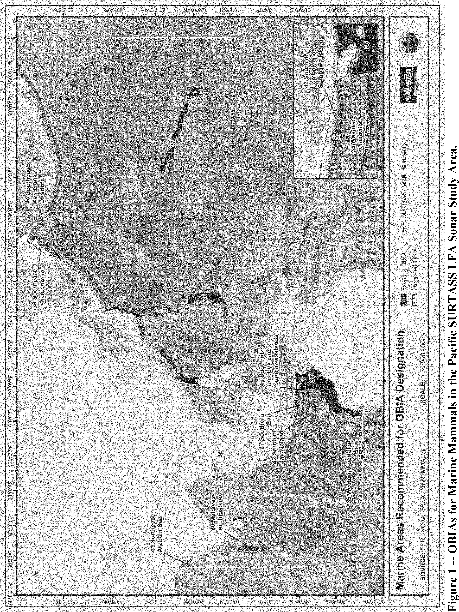
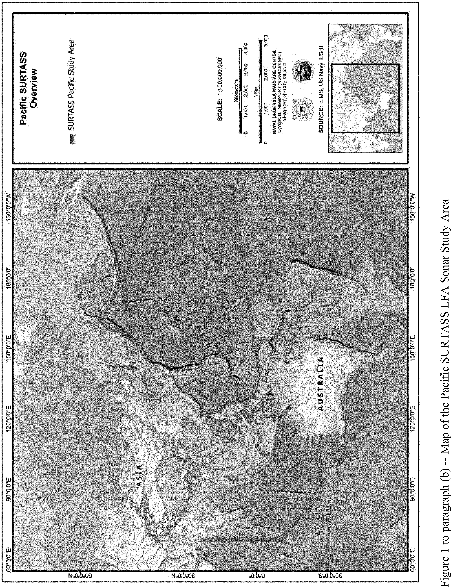
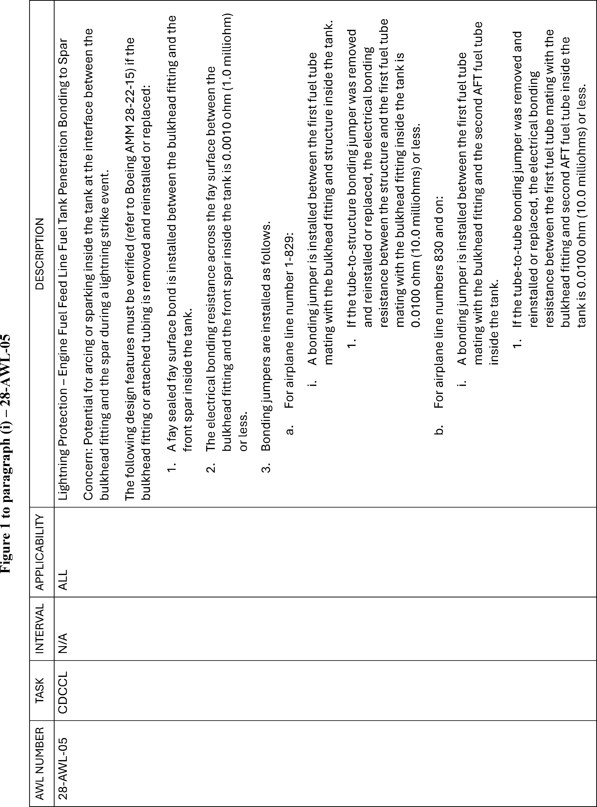
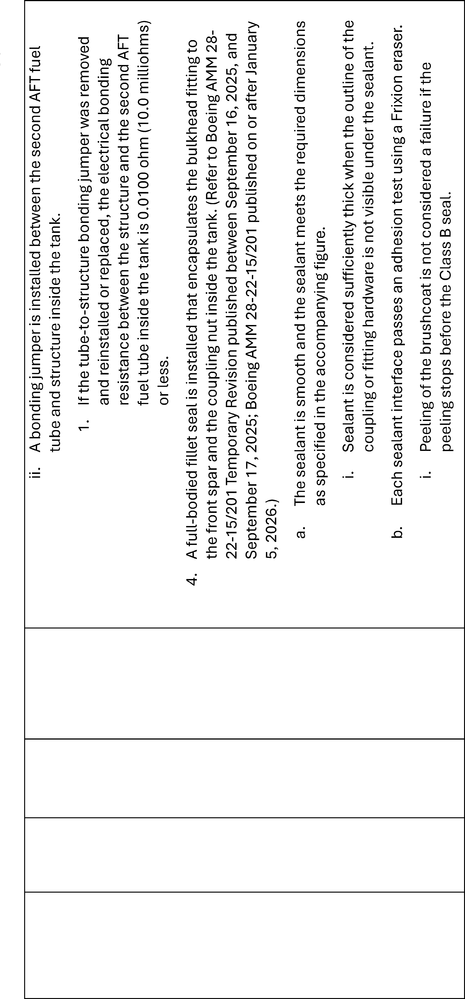
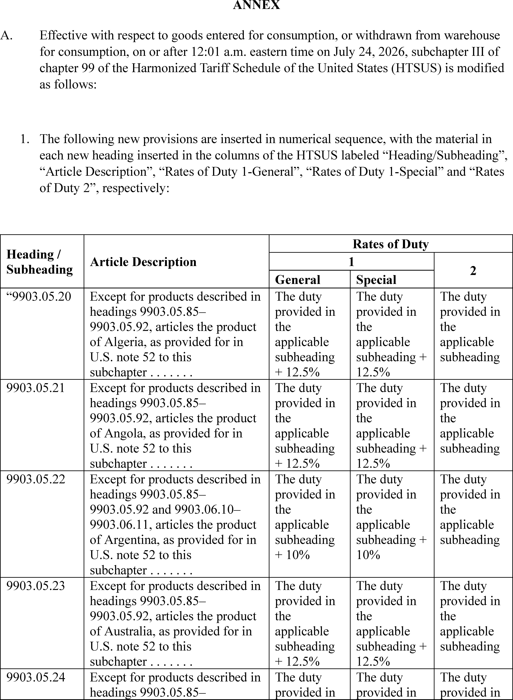
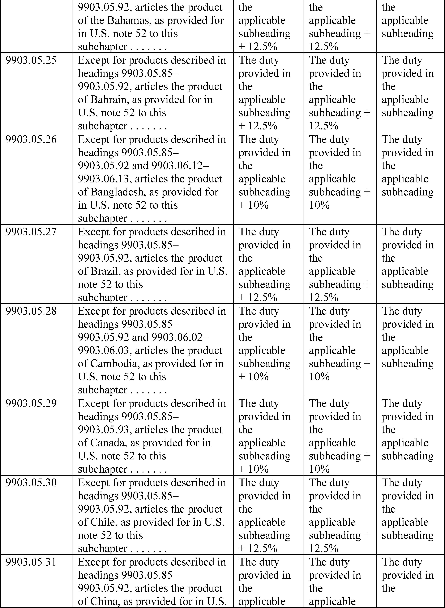

# Daily Digest — 2026-07-28

| | |
|---|---|
| **Digest date** | 2026-07-28 |
| **Data date range** | 2026-07-28 to 2026-07-28 |
| **Generated at** | 2026-07-29T23:17:01Z (UTC) |
| **Pipeline version** | 0165457 |
| **Source watermarks** | CREC: 2026-07-29T09:12:06Z · BILLS: 2026-07-29T18:30:06Z · FR: 2026-07-29T17:57:50Z · USCOURTS: 2026-07-29T22:17:16Z · PLAW: 2026-07-25T00:00:00Z |

All items below cite the govinfo package (and granule, where applicable) they
summarize. Selection is mechanical; each item states the rule that included
it. See the Coverage Statement at the end for a full accounting of what was
published, what was summarized, and what was excluded and why.

---

## Contents

- [Day in Review](#day-in-review)
- [1. Congressional Floor Activity](#1-congressional-floor-activity)
- [2. Legislation](#2-legislation)
- [3. Federal Register](#3-federal-register)
- [4. Enacted Laws](#4-enacted-laws)
- [5. Judicial Activity](#5-judicial-activity)
- [6. Agency Announcements](#6-agency-announcements)
- [Terms Used Today](#terms-used-today)
- [Coverage Statement](#coverage-statement)
- [Methodology](#methodology)

---

## Day in Review

The Senate held recorded votes on two matters, confirming the Clayton nomination 51-47 with two senators absent, and agreeing 86-12 to a cloture motion on H.R. 5334, a bill amending the Internal Revenue Code to extend the educator expense deduction to early childhood educators. The chamber also received 23 rules and airworthiness directives transmitted by the Federal Aviation Administration, referred to the Committee on Commerce, Science, and Transportation. Senate floor material accounted for 41 items alongside 6 Daily Digest entries; no House floor items appear.

Two presidential documents were published: a determination approving a proposed US-Saudi Arabia agreement on peaceful nuclear cooperation, and a directive to the Trade Representative imposing Section 301 tariffs of 10 or 12.5 percent on goods from 60 economies over forced-labor import enforcement findings. The Federal Register carried 9 final rules, 10 proposed rules, and 65 notices, including a DHS rule allowing asylum referrals without interview, EPA compliance-date extensions for perchloroethylene and carbon tetrachloride, VA rescission of Veterans Choice Program regulations, EPA proposals to redesignate three Michigan ozone areas to attainment, and reopened comment periods on OSHA's benzene standard and NHTSA brake-system standards.

Courts issued 90 appellate and 55 district opinions. The D.C. Circuit denied petitions challenging an EPA New Source Review permitting rule and affirmed the denial of a preliminary injunction against Executive Order 14,399 on mail voting as unripe. The Seventh Circuit reversed remand denials in consolidated infant-formula litigation, holding that weak litigation intent does not establish fraudulent joinder; the Tenth Circuit rejected facial First and Fourteenth Amendment challenges to Oklahoma's riot statute; the Ninth Circuit vacated a firearm sentence over the categorical status of a California assault conviction; the Eleventh Circuit affirmed summary judgment for Lockheed Martin in toxic-tort cases on expert-causation grounds; and the Fourth Circuit vacated a FOIA judgment for the Department of Energy.

*Composed from the summarized items below and the day's mechanical
counts; all specifics are cited in their sections.*

---

## 1. Congressional Floor Activity

Source: Congressional Record (CREC), daily edition for 2026-07-28. Total issue size: 47 granule(s).

### 1.1 Senate

*In plain terms: The FAA submitted 23 rules and airworthiness directives to the Senate, including Class E airspace modifications and maintenance directives for Boeing, Airbus, Gulfstream, and Pratt aircraft.*

- **Executive and Other Communications** — The Federal Aviation Administration transmitted 23 rules and airworthiness directives to the Senate, including modifications to Class E airspace and maintenance directives for aircraft from manufacturers including Boeing, Airbus, Gulfstream, and Pratt & Whitney. The communications were referred to the Committee on Commerce, Science, and Transportation.
  - *In plain terms:* The Federal Aviation Administration submitted 23 rules and maintenance directives to the Senate, including airspace modifications and aircraft maintenance requirements.
  - Included because: CREC-SEL-01 — floor item ≥ threshold floor time (24,591 characters)
  - Source: [CREC-2026-07-28 / CREC-2026-07-28-pt1-PgS4295-2](https://www.govinfo.gov/app/details/CREC-2026-07-28/CREC-2026-07-28-pt1-PgS4295-2)

### 1.2 House of Representatives

No House floor items met the selection thresholds. 0 floor granule(s) are accounted for in the Coverage Statement.

### 1.3 Recorded Votes

- **Vote on Clayton Nomination (Executive Session)** — The Senate voted 51-47 to confirm the Clayton nomination on July 28, 2026, with two senators absent. The nomination was confirmed.
  - *In plain terms:* The Senate confirmed Clayton's nomination with a 51-47 vote on July 28, 2026.
  - Included because: CREC-SEL-02 — recorded vote (all recorded votes are listed)
  - Source: [CREC-2026-07-28 / CREC-2026-07-28-pt1-PgS4292](https://www.govinfo.gov/app/details/CREC-2026-07-28/CREC-2026-07-28-pt1-PgS4292)
- **Cloture Motion** — The Senate voted 86-12 to invoke cloture and close debate on H.R. 5334, a bill to amend the Internal Revenue Code to allow early childhood educators to take the educator expense deduction. The motion to close debate was agreed to.
  - *In plain terms:* The Senate voted 86-12 to end debate on H.R. 5334, a bill allowing early childhood educators to claim the educator expense deduction.
  - Included because: CREC-SEL-02 — recorded vote (all recorded votes are listed)
  - Source: [CREC-2026-07-28 / CREC-2026-07-28-pt1-PgS4292-2](https://www.govinfo.gov/app/details/CREC-2026-07-28/CREC-2026-07-28-pt1-PgS4292-2)

---

## 2. Legislation

Source: Congressional Bills (BILLS), text versions published 2026-07-28 to 2026-07-28.

### 2.1 Counts by Stage

| Stage (bill text version) | Count |
|---|---|
| Introduced (ih/is) | 0 |
| Reported (rh/rs) | 0 |
| Engrossed (eh/es) | 0 |
| Enrolled (enr) | 0 |
| Other versions | 0 |
| **Total bill texts published** | **0** |

### 2.2 Bills Listed by Mechanical Rule

Bills below are listed because they matched at least one listing rule; the
matching rule is stated per item. All other bill texts are counted above and
accounted for in the Coverage Statement.

No bill texts published in this range matched a listing rule; all 0 are
accounted for in the Coverage Statement.

---

## 3. Federal Register

Source: Federal Register (FR), issue of 2026-07-28.

### 3.1 Counts by Document Type

| Document type | Count |
|---|---|
| Rules | 9 |
| Proposed rules | 10 |
| Notices | 65 |
| Presidential documents | 2 |
| **Total FR documents** | **86** |

### 3.2 Rules Published

*In plain terms: 9 final rules led by DHS asylum referrals and Veterans program rescission; also covering pesticide tolerances, environmental compliance, marine protections, airspace, and nuclear reactor standards.*

#### DEPARTMENT OF COMMERCE

- **Takes of Marine Mammals Incidental to Specified Activities; Taking Marine Mammals Incidental to U.S. Navy Operations of Surveillance Towed Array Sensor System Low Frequency Active Sonar in the Western and Central North Pacific Ocean and Eastern Indian Ocean** (2026-15206; 50 CFR Part 218) — NMFS, upon request from the U.S. Department of the Navy (Navy), issues these regulations pursuant to the Marine Mammal Protection Act (MMPA) to govern the taking of marine mammals incidental to training and testing activities using Surveillance Towed Array Sensor System (SURTASS) Low Frequency Active (LFA) sonar systems in the western and central North Pacific and eastern Indian oceans over the course of 7 years from August 2026 through August 2033. These regulations allow for the issuance of a letter of authorization (LOA) for the incidental take of marine mammals during specified activities and timeframes, prescribe the permissible methods of taking and other means of effecting the least practicable adverse impact on marine mammal species and their habitat, and establish requirements pertaining to the monitoring and reporting of such taking. The Navy's activities are considered military readiness activities pursuant to the MMPA, as amended by the National Defense Authorization Act for Fiscal Year 2004 (2004 NDAA) and the NDAA for Fiscal Year 2019 (2019 NDAA). Action: Final rule; notification of issuance of Letter of Authorization. Dates: Effective from August 12, 2026, through August 11, 2033.
  - *In plain terms:* NMFS allows Navy to incidentally take marine mammals during sonar training and testing in Pacific and Indian oceans from August 2026 through August 2033.
  - Included because: FR-SEL-01 — document type: final rule (all listed)
  - Source: [FR-2026-07-28 / 2026-15206](https://www.govinfo.gov/app/details/FR-2026-07-28/2026-15206)
  -  *Source graphic 1 of 3 from 2026-15206.*
  -  *Source graphic 2 of 3 from 2026-15206.*
  - *Graphics not rendered here: 1 of 3 — see the [source PDF](https://www.govinfo.gov/content/pkg/FR-2026-07-28/pdf/FR-2026-07-28.pdf).*

#### DEPARTMENT OF HOMELAND SECURITY

- **Affirmative Asylum Referrals Without Interview** (2026-15190; 8 CFR Part 208) — The Department of Homeland Security (DHS) is amending its regulations to permit U.S. Citizenship and Immigration Services (USCIS) to refer certain affirmative asylum applications to the Department of Justice (DOJ) Executive Office for Immigration Review (EOIR) without interview. USCIS still offers an interview prior to a grant or denial of asylum. DHS is also removing the requirement that a letter communicating the basis for referral of asylum include an assessment of the alien's credibility. Action: Interim final rule with request for comments. Dates: Effective date: This interim final rule (IFR) is effective July 28, 2026. Comment due date: Written comments on this interim final rule must be submitted on or before September 28, 2026. The electronic Federal Docket Management System will accept comments prior to midnight eastern time at the end of that day.
  - *In plain terms:* DHS allows USCIS to refer certain asylum applications to immigration court without interview, removes credibility assessment requirement, and still offers interviews upon request.
  - Included because: FR-SEL-01 — document type: final rule (all listed)
  - Source: [FR-2026-07-28 / 2026-15190](https://www.govinfo.gov/app/details/FR-2026-07-28/2026-15190)
- **2026 Quarterly Listings; Second Quarter; Safety Zones, Security Zones, and Special Local Regulations** (2026-15212; 33 CFR Parts 100 and 165) — This document provides notification of substantive rules issued by the Coast Guard that were made temporarily effective but expired before they could be published in the Federal Register . This document lists temporary safety zones, security zones, and special local regulations, all of limited duration and for which timely publication in the Federal Register was not possible. This document also announces notifications of enforcement for existing reoccurring regulations that we issued but were unable to be published before the enforcement period ended. Action: Notification of expired temporary rules issued. Dates: This document lists temporary Coast Guard rules that became effective, primarily between April 2026 and June 2026, unless otherwise indicated, and were terminated before they could be published in the Federal Register .
  - *In plain terms:* Coast Guard notifies of temporary safety zones and security zones that became effective but expired before Federal Register publication.
  - Included because: FR-SEL-01 — document type: final rule (all listed)
  - Source: [FR-2026-07-28 / 2026-15212](https://www.govinfo.gov/app/details/FR-2026-07-28/2026-15212)

#### DEPARTMENT OF TRANSPORTATION

- **Airworthiness Directives; The Boeing Company Airplanes** (2026-15239; 14 CFR Part 39) — The FAA is superseding Airworthiness Directive (AD) 2024-19-14, which applied to certain The Boeing Company Model 777-200, 777-200LR, 777-300ER, and 777F series airplanes. AD 2024-19-14 required repetitive inspections and bond resistance measurement of the bonding jumpers on the first fuel feed tube installed immediately forward of the wing front spar at the left and right main fuel tank penetrations and applicable corrective actions. This AD was prompted by a determination that additional inspections are required to address the unsafe condition. This AD requires repetitive detailed inspections (DETs), repetitive bond resistance measurement, and applicable on-condition actions. This AD also expands the applicability and requires revising the existing maintenance or inspection program, as applicable, to incorporate a certain airworthiness limitation. The FAA is issuing this AD to address the unsafe condition on these products. Action: Final rule. Dates: This AD is effective September 1, 2026. The Director of the Federal Register approved the incorporation by reference of certain publications listed in this AD as of September 1, 2026.
  - *In plain terms:* FAA replaces previous directive to require additional inspections of fuel feed tube bonding on certain Boeing 777 aircraft.
  - Included because: FR-SEL-01 — document type: final rule (all listed)
  - Source: [FR-2026-07-28 / 2026-15239](https://www.govinfo.gov/app/details/FR-2026-07-28/2026-15239)
  -  *Source graphic 1 of 3 from 2026-15239.*
  -  *Source graphic 2 of 3 from 2026-15239.*
  - *Graphics not rendered here: 1 of 3 — see the [source PDF](https://www.govinfo.gov/content/pkg/FR-2026-07-28/pdf/FR-2026-07-28.pdf).*

#### DEPARTMENT OF VETERANS AFFAIRS

- **Rescission of Outdated Veterans Choice Program Regulations** (2026-15210; 38 CFR Part 17) — The Department of Veterans Affairs (VA) is rescinding obsolete regulations that were previously implemented for the Veterans Choice Program, which has been replaced by the Veterans Community Care Program as of June 6, 2019. Action: Final rule. Dates: This rule is effective on August 27, 2026.
  - *In plain terms:* VA rescinding outdated Veterans Choice Program regulations that were replaced by the Veterans Community Care Program as of June 6, 2019.
  - Included because: FR-SEL-01 — document type: final rule (all listed)
  - Source: [FR-2026-07-28 / 2026-15210](https://www.govinfo.gov/app/details/FR-2026-07-28/2026-15210)

#### ENVIRONMENTAL PROTECTION AGENCY

- **Epyrifenacil; Pesticide Tolerances; Correction** (2026-15191; 40 CFR Part 180) — EPA issued a final rule in the Federal Register of June 30, 2026, establishing tolerances for residues of epyrifenacil (CASRN 353292-31-6) in or on multiple commodities requested by Valent U.S.A. LLC under the Federal Food, Drug, and Cosmetic Act (FFDCA). That document inadvertently issued incorrect tolerances for corn, field (forage, stover); wheat (forage, hay, straw); and soybean (forage, hay). This document corrects that final regulation. Action: Correcting amendment. Dates: This rule is effective on July 28, 2026. Objections and requests for hearings must be received on or before September 28, 2026 and must be filed in accordance with the instructions provided in 40 CFR part 178 (see also Unit I.C. of this document).
  - *In plain terms:* EPA corrects mistakes in pesticide residue limits for epyrifenacil on certain crops from its June 30, 2026 rule.
  - Included because: FR-SEL-01 — document type: final rule (all listed)
  - Source: [FR-2026-07-28 / 2026-15191](https://www.govinfo.gov/app/details/FR-2026-07-28/2026-15191)
- **Perchloroethylene (PCE) and Carbon Tetrachloride (CTC); Regulation under the Toxic Substances Control Act (TSCA); Compliance Date Extensions** (2026-15192; 40 CFR Part 751) — The U.S. Environmental Protection Agency (EPA or Agency) is finalizing an extension of certain compliance dates applicable to certain entities subject to the risk-management rules for perchloroethylene (PCE) and carbon tetrachloride (CTC) under the Toxic Substances Control Act (TSCA). EPA is extending certain Workplace Chemical Protection Program (WCPP) compliance dates for non-federal owners and operators to match the existing compliance dates for federal agencies and their contractors. For both PCE and CTC, this action extends the compliance date for initial monitoring for inhalation exposure to June 21, 2027, and extends the compliance date to meet the existing chemical exposure limit (ECEL), establish a regulated area, institute a workplace information and training program, provide any required respiratory personal protective equipment (PPE), and establish a respiratory PPE program to September 20, 2027. For PCE, EPA is also extending the compliance date for federal entities to institute a workplace information and training program to September 20, 2027, and for non-federal entities to establish and implement an exposure control plan to December 20, 2027. Action: Final rule. Dates: This final rule is effective on July 28, 2026.
  - *In plain terms:* EPA extends compliance dates for workplace chemical monitoring to June 21, 2027, workplace requirements to September 20, 2027, and exposure control plans to December 20, 2027.
  - Included because: FR-SEL-01 — document type: final rule (all listed)
  - Source: [FR-2026-07-28 / 2026-15192](https://www.govinfo.gov/app/details/FR-2026-07-28/2026-15192)

#### NATIONAL FOUNDATION ON THE ARTS AND THE HUMANITIES

- **Civil Penalties Adjustment for 2026** (2026-15230; 45 CFR Parts 1149 and 1158) — The National Endowment for the Arts (NEA) is notifying the public that its civil monetary penalty amounts will not increase for the 2026 calendar year. The NEA is generally required by statute to amend its regulations annually to adjust for inflation the maximum civil monetary penalties (CMPs) that may be imposed for violations of the Program Fraud Civil Remedies Act (PFCRA) and the NEA's Restrictions on Lobbying. In accordance with guidance from the Office of Management and Budget (OMB), the NEA will continue to use the 2025 civil monetary penalty levels because there will be no cost-of-living adjustment for 2026. Action: Final action. Dates: This action is effective July 28, 2026.
  - *In plain terms:* NEA announces civil monetary penalties will not increase for 2026 because there is no inflation adjustment.
  - Included because: FR-SEL-01 — document type: final rule (all listed)
  - Source: [FR-2026-07-28 / 2026-15230](https://www.govinfo.gov/app/details/FR-2026-07-28/2026-15230)

#### NUCLEAR REGULATORY COMMISSION

- **Risk-Informed, Technology-Inclusive Regulatory Framework for Advanced Reactors; Correction** (2026-15213; 10 CFR Part 75) — The U.S. Nuclear Regulatory Commission (NRC) published a final rule in the Federal Register on March 30, 2026, to add a risk-informed, performance-based, and technology-inclusive regulatory framework for commercial nuclear plants. The final rule contained an error in the amendatory instruction for the definition, “Facilities” in part 75, “Safeguards On Nuclear Material—Implementation Of Safeguards Agreements Between The United States And The International Atomic Energy Agency.” This document corrects the final rule by revising the section that contains the error. Action: Correcting amendments. Dates: This rule is effective on July 28, 2026.
  - *In plain terms:* NRC corrects an error in its March 30, 2026 rule establishing a risk-informed regulatory framework for advanced nuclear reactors.
  - Included because: FR-SEL-01 — document type: final rule (all listed)
  - Source: [FR-2026-07-28 / 2026-15213](https://www.govinfo.gov/app/details/FR-2026-07-28/2026-15213)

### 3.3 Proposed Rules Published

*In plain terms: The EPA proposes air quality redesignations for three Michigan areas; other proposals cover gambling petitions, drawbridges, shark protection, energy conservation, derivatives trading, occupational health, airspace, and vehicle safety.*

#### COMMODITY FUTURES TRADING COMMISSION

- **Request for Comment on the Extension of Standard Futures Contracts to 24/7 Trading and on Perpetual Contracts Referencing Physically Delivered or Storable Energy Commodities** (2026-15216; 17 CFR Part 1) — On June 25, 2026, the Commodity Futures Trading Commission (“Commission” or “CFTC”) published in the Federal Register a request for comment (“RFC”) titled “Request for Comment on the Extension of Standard Futures Contracts to 24/7 Trading and on Perpetual Contracts Referencing Physically Delivered or Storable Energy Commodities.” The comment period for the RFC was set to close on July 27, 2026. The Commission is extending the comment period for this RFC by an additional thirty days. In addition to the questions set forth in the RFC, the Commission is further requesting comment on the self-certified 24/7 oil contract listed by Chicago Mercantile Exchange's (“CME's”) New York Mercantile Exchange, Inc. (“NYMEX”) on July 8, 2026 and that the Commission stayed on July 9, 2026. Action: Request for comment; extension of comment period. Dates: The comment period for the request for comment published June 25, 2026, at 91 FR 38334, is extended through August 26, 2026.
  - *In plain terms:* CFTC extends by 30 days the comment period for proposed 24/7 futures trading and perpetual energy commodity contracts.
  - Included because: FR-SEL-02 — document type: proposed rule (all listed)
  - Source: [FR-2026-07-28 / 2026-15216](https://www.govinfo.gov/app/details/FR-2026-07-28/2026-15216)

#### DEPARTMENT OF COMMERCE

- **Endangered and Threatened Wildlife and Plants; 12-Month Finding on a Petition To List the Smalltail Shark (Carcharhinus porosus) as Threatened or Endangered Under the Endangered Species Act** (2026-15204; 50 CFR Part 223) — We, NMFS, have completed a comprehensive status review for the smalltail shark ( Carcharhinus porosus ) in response to a petition from the Center for Biological Diversity to list the species. After reviewing the best scientific and commercial data available, including the Status Review Report, we have determined that listing the smalltail shark as a threatened or endangered species under the Endangered Species Act (ESA) is not warranted. Action: Notice of 12-month finding and availability of a status review. Dates: This finding was made on July 28, 2026.
  - *In plain terms:* NMFS determined that listing the smalltail shark as threatened or endangered under the Endangered Species Act is not warranted.
  - Included because: FR-SEL-02 — document type: proposed rule (all listed)
  - Source: [FR-2026-07-28 / 2026-15204](https://www.govinfo.gov/app/details/FR-2026-07-28/2026-15204)

#### DEPARTMENT OF ENERGY

- **Energy Conservation Program: Procedures, Interpretations, and Policies for Consideration of New or Revised Energy Conservation Standards and Test Procedures for Consumer Products and Certain Commercial/Industrial Equipment; Extension of Public Comment Period** (2026-15211; 10 CFR Part 430) — On July 7, 2026, the U.S. Department of Energy (“DOE”) published in the Federal Register a notice of proposed rulemaking (“NOPR”) and announcement of webinar proposing to update the Department's current rulemaking methodology titled, “Procedures, Interpretations, and Policies for Consideration of New or Revised Energy Conservation Standards and Test Procedures for Consumer Products and Certain Commercial/Industrial Equipment.” The notice provided an opportunity for submitting written comments by August 6, 2026. On July 13, 2026, DOE received a joint request from multiple trade organizations to extend the public comment period to September 8, 2026. DOE has reviewed this request and is granting a 15-day extension of the public comment period so as to allow public comments to be submitted until August 21, 2026. Action: Notice of proposed rulemaking; extension of public comment period. Dates: The comment period for the NOPR published on July 7, 2026 (91 FR 42034) is extended. DOE will accept comments, data, and information regarding this NOPR received no later than August 21, 2026.
  - *In plain terms:* DOE extends public comment period for proposed rulemaking on energy conservation standards procedures to August 21, 2026.
  - Included because: FR-SEL-02 — document type: proposed rule (all listed)
  - Source: [FR-2026-07-28 / 2026-15211](https://www.govinfo.gov/app/details/FR-2026-07-28/2026-15211)

#### DEPARTMENT OF HOMELAND SECURITY

- **Drawbridge Operation Regulation; Cuyahoga River, Cleveland, OH** (2026-15197; 33 CFR Part 117) — The Coast Guard is seeking information and comments on a proposed change to the operating regulation for all movable bridges over the Cuyahoga River in Cleveland, OH. The Cuyahoga River Harbor Safety Committee raised concerns to the Coast Guard regarding the radio frequency of the movable bridges and its interference with distress calls on VHF-FM Marine Channel 16 on 156.800 Megahertz. Currently, the Coast Guard's proposed solution to these issues would move the hailing channel for the bridges from VHF-FM Marine Channel 16 on 156.800 Megahertz to VHF-FM Marine Channel 9 on 156.450 Megahertz for all movable bridges over the Cuyahoga River. We invite your comments on this Notice of Inquiry. Action: Notice of inquiry, request for comments. Dates: Comments and related material must reach the Coast Guard on or before August 27, 2026.
  - *In plain terms:* Coast Guard seeks comments on proposal to change movable bridge radio hailing channel from VHF-FM Channel 16 to Channel 9 to prevent distress call interference.
  - Included because: FR-SEL-02 — document type: proposed rule (all listed)
  - Source: [FR-2026-07-28 / 2026-15197](https://www.govinfo.gov/app/details/FR-2026-07-28/2026-15197)

#### DEPARTMENT OF LABOR

- **Benzene** (2026-15227; 29 CFR Parts 1910, 1915, 1917, 1918, 1926) — OSHA is providing an additional comment period to allow interested persons to comment on OSHA's proposal to revise the Benzene standard. Following consideration of the rulemaking by OSHA's Advisory Committee on Construction Safety and Health (ACCSH), OSHA is re-opening the record for this rulemaking to provide an additional 30 days for public comment. Action: Proposed rule; reopening of the rulemaking record. Dates: Written comments must be submitted on or before August 27, 2026.
  - *In plain terms:* OSHA extends the public comment period by 30 days for its proposed revision to the Benzene workplace standard.
  - Included because: FR-SEL-02 — document type: proposed rule (all listed)
  - Source: [FR-2026-07-28 / 2026-15227](https://www.govinfo.gov/app/details/FR-2026-07-28/2026-15227)

#### DEPARTMENT OF TRANSPORTATION

- **Modification of Class E Airspace, Samaritan North Lincoln Hospital Heliport, Lincoln, OR** (2026-15229; 14 CFR Part 71) — This action proposes to modify Class E airspace extending upward from 700 feet above the surface at Samaritan North Lincoln Hospital Heliport, Lincoln, OR. This action would support the safety and management of instrument flight rules (IFR) operations at the airport. Action: Notice of proposed rulemaking (NPRM). Dates: Comments must be received on or before September 11, 2026.
  - *In plain terms:* FAA proposes modifying airspace around Lincoln, Oregon heliport to support instrument flight rule operations.
  - Included because: FR-SEL-02 — document type: proposed rule (all listed)
  - Source: [FR-2026-07-28 / 2026-15229](https://www.govinfo.gov/app/details/FR-2026-07-28/2026-15229)
- **Federal Motor Vehicle Safety Standards; Modernization of FMVSS No. 135 To Accommodate ADS-Equipped Vehicles; Extension of Comment Period** (2026-15231; 49 CFR Part 571) — In response to a request from Varnum LLP (Varnum), NHTSA is announcing a 30-day extension of the public comment period for the notice of proposed rulemaking (NPRM) published on June 26, 2026 proposing to amend Federal Motor Vehicle Safety Standard (FMVSS) No. 135, “Light vehicle brake systems.” The proposed modifications would distinguish how regulations apply to vehicles with and without manually operated driving controls. The comment period for the NPRM was originally scheduled to end on July 27, 2026. It will now end on August 26, 2026. Action: Extension of comment period. Dates: The comment period for the NPRM published at 91 FR 38593 on June 26, 2026, is extended to August 26, 2026.
  - *In plain terms:* NHTSA extends the comment period for proposed brake system standard amendments by 30 days to August 26, 2026.
  - Included because: FR-SEL-02 — document type: proposed rule (all listed)
  - Source: [FR-2026-07-28 / 2026-15231](https://www.govinfo.gov/app/details/FR-2026-07-28/2026-15231)

#### ENVIRONMENTAL PROTECTION AGENCY

- **Air Plan Approval; Michigan; Redesignation of the Berrien, MI and Muskegon, MI Areas to Attainment of the 2015 Ozone Standards** (2026-15167; 40 CFR Parts 52 and 81) — The Environmental Protection Agency (EPA) is proposing to approve the Michigan Department of Environment, Great Lakes, and Energy's (EGLE's) December 26, 2025, requests to redesignate the Berrien and Muskegon areas to attainment for the 2015 ozone NAAQS because the requests meet the statutory requirements for redesignation under the Clean Air Act (CAA). The Berrien area includes Berrien County, and the Muskegon area includes the western portion of Muskegon County. The EPA is proposing to approve, as revisions to the Michigan State Implementation Plan (SIP), the State's plans for maintaining the 2015 ozone NAAQS through 2036 in the Berrien and Muskegon areas. The EPA is initiating the adequacy process and proposing to approve Michigan's 2032 and 2036 volatile organic compound (VOC) and oxides of nitrogen (NO X ) motor vehicle emissions budgets (budgets) for the Berrien and Muskegon areas. Pursuant to section 110 and part D of the CAA, the EPA is proposing to approve the enhanced monitoring plan (EMP) of ozone and ozone precursors SIP revision submitted by Michigan on January 12, 2026, because it satisfies Serious SIP requirements of the CAA for the Berrien and Muskegon areas. [official summary truncated; see source] Action: Proposed rule. Dates: Comments must be received on or before August 27, 2026.
  - *In plain terms:* EPA proposes approving Michigan's request to redesignate Berrien and Muskegon areas as meeting ozone standards and approving maintenance plans through 2036.
  - Included because: FR-SEL-02 — document type: proposed rule (all listed)
  - Source: [FR-2026-07-28 / 2026-15167](https://www.govinfo.gov/app/details/FR-2026-07-28/2026-15167)
- **Air Plan Approval; Michigan; Redesignation of the Detroit, MI Area to Attainment of the 2015 Ozone Standards** (2026-15168; 40 CFR Parts 52 and 81) — The Environmental Protection Agency (EPA) is proposing to approve a request from the Michigan Department of Environment, Great Lakes, and Energy (EGLE) to redesignate the Detroit, Michigan area to attainment for the 2015 ozone National Ambient Air Quality Standards (NAAQS) because the request meets the statutory requirements for redesignation under the Clean Air Act (CAA). EGLE submitted this request on January 3, 2022, and submitted a supplement to this request on May 18, 2026. The EPA is also proposing to approve, as a revision to the Michigan State Implementation Plan (SIP), the State's updated maintenance plan for the 2015 ozone NAAQS through 2040 in the Detroit area, including motor vehicle emissions budgets for 2035 and 2040, for both volatile organic compound (VOC) and oxides of nitrogen (NO X ). The EPA is also initiating the adequacy process for these maintenance plan budgets. Additionally, the EPA is proposing to adjust the SIP submission and control measure implementation deadlines for certain Moderate requirements. [official summary truncated; see source] Action: Proposed rule. Dates: Comments must be received on or before August 27, 2026.
  - *In plain terms:* EPA proposes approving Detroit's redesignation as meeting ozone standards and approving maintenance through 2040 with emissions budgets for 2035 and 2040.
  - Included because: FR-SEL-02 — document type: proposed rule (all listed)
  - Source: [FR-2026-07-28 / 2026-15168](https://www.govinfo.gov/app/details/FR-2026-07-28/2026-15168)

#### FEDERAL TRADE COMMISSION

- **Petition for Rulemaking of the National Consumers League, Campaign for Fairer Gambling, the National Council for Problem Gambling, the Public Health Advocacy Institute, and Truth in Advertising, Inc.** (2026-15182; 16 CFR Part 1) — Please take notice that the Federal Trade Commission (“Commission”) received a petition for rulemaking from the National Consumers League, Campaign for Fairer Gambling, the National Council for Problem Gambling, the Public Health Advocacy Institute, and Truth in Advertising, Inc., and has published that petition online at https://www.regulations.gov. The Commission invites written comments concerning the petition. Publication of this petition is pursuant to the Commission's Rules of Practice and Procedure and does not affect the legal status of the petition or its final disposition. Action: Receipt of petition; request for comment. Dates: Comments must identify the petition docket number and be filed by August 27, 2026.
  - *In plain terms:* FTC received a petition for rulemaking from various advocacy groups, published it online, and invites written comments.
  - Included because: FR-SEL-02 — document type: proposed rule (all listed)
  - Source: [FR-2026-07-28 / 2026-15182](https://www.govinfo.gov/app/details/FR-2026-07-28/2026-15182)

### 3.4 Notices and Presidential Documents

*In plain terms: The President approved a US-Saudi Arabia nuclear cooperation agreement and imposed Section 301 tariffs at 10-12.5 percent on goods from 60 economies.*

Notices are summarized only when they match a listing rule; all are counted
in 3.1 and in the Coverage Statement. Presidential documents in the FR are
always listed.

- **Presidential Determination on the Proposed Agreement for Cooperation Between the Government of the United States of America and the Government of the Kingdom of Saudi Arabia Concerning Peaceful Uses of Nuclear Energy** (2026-15273) — The President approved a proposed Agreement for Cooperation between the United States and Saudi Arabia on peaceful uses of nuclear energy, determining it will promote common defense and security without constituting an unreasonable risk. The President authorized the Secretary of State to execute the agreement and publish the determination in the Federal Register.
  - *In plain terms:* President approves agreement between United States and Saudi Arabia on peaceful nuclear energy cooperation.
  - Included because: FR-SEL-03 — presidential document (all listed)
  - Source: [FR-2026-07-28 / 2026-15273](https://www.govinfo.gov/app/details/FR-2026-07-28/2026-15273)
- **Actions by the United States in the Investigations Under Section 301 of the Trade Act of 1974 of the Acts, Policies, and Practices of 60 Economies Related to the Failure of Each Economy To Impose and Effectively Enforce a Prohibition on the Importation of Goods Produced With Forced Labor** (2026-15274) — The President directed the Trade Representative to impose tariffs under Section 301 of the Trade Act of 1974 on goods from 60 economies, with rates of 10 or 12.5 percent depending on the economy, in response to findings that each economy fails to impose and effectively enforce prohibitions on imports of goods produced with forced labor. The action includes specified product exemptions and tariff-rate quotas, following investigations initiated in March 2026 and public hearings held in July 2026.
  - *In plain terms:* President directs tariffs of 10-12.5% on goods from 60 economies for failing to prohibit forced labor imports.
  - Included because: FR-SEL-03 — presidential document (all listed)
  - Source: [FR-2026-07-28 / 2026-15274](https://www.govinfo.gov/app/details/FR-2026-07-28/2026-15274)
  -  *Source graphic 1 of 55 from 2026-15274.*
  -  *Source graphic 2 of 55 from 2026-15274.*
  - *Graphics not rendered here: 53 of 55 — see the [source PDF](https://www.govinfo.gov/content/pkg/FR-2026-07-28/pdf/FR-2026-07-28.pdf).*

---

## 4. Enacted Laws

Source: Public and Private Laws (PLAW) published 2026-07-28.

No laws were published in this range.

---

## 5. Judicial Activity

Source: United States Courts Opinions (USCOURTS): opinions issued 2026-07-28
by participating federal courts.

Completeness disclosure (standing): USCOURTS carries opinions from
approximately 140 participating appellate, district, bankruptcy, and
national federal courts. Unlike the Congressional Record and the Federal
Register, which are the complete official record of their branches,
USCOURTS is participation-based and is NOT the complete federal judicial
record. Courts post opinions with delay; opinions filed on this date may
appear in later digests.

### 5.1 Appellate and National Court Opinions

*In plain terms: 90 appellate decisions spanning criminal convictions, civil rights claims, environmental regulations, infant formula liability, and FOIA disputes, with most affirming lower court dismissals.*

Appellate and national court opinions are summarized; district and
bankruptcy opinions are counted in 5.2 and in the Coverage Statement.

#### United States Court of Appeals for the District of Columbia Circuit

- **Environmental Defense Fund, et al v. EPA, et al** (No. 18-01149; filed 2026-07-28) — The DC Circuit denied petitions for review of an EPA rule modifying the Environmental Protection Agency's process for determining whether modifications to stationary air pollution sources require a permit under the Clean Air Act's New Source Review program. The court found that petitioners had not demonstrated the rule was contrary to law or arbitrary and capricious.
  - *In plain terms:* The DC Circuit denied petitions challenging an EPA rule that changed how the agency determines whether modifications to stationary air pollution sources require permits under the Clean Air Act.
  - Included because: USCOURTS-SEL-01 — appellate court opinion (all listed)
  - Source: [USCOURTS-caDC-18-01149 / USCOURTS-caDC-18-01149-0](https://www.govinfo.gov/app/details/USCOURTS-caDC-18-01149/USCOURTS-caDC-18-01149-0)
- **Environmental Defense Fund, et al v. EPA, et al** (No. 21-01039; filed 2026-07-28) — The DC Circuit denied petitions for review of an EPA rule modifying the Environmental Protection Agency's process for determining whether modifications to stationary air pollution sources require a permit under the Clean Air Act's New Source Review program. The court found that petitioners had not demonstrated the rule was contrary to law or arbitrary and capricious.
  - *In plain terms:* The DC Circuit denied petitions challenging an EPA rule that changed how the agency determines whether modifications to stationary air pollution sources require permits under the Clean Air Act.
  - Included because: USCOURTS-SEL-01 — appellate court opinion (all listed)
  - Source: [USCOURTS-caDC-21-01039 / USCOURTS-caDC-21-01039-0](https://www.govinfo.gov/app/details/USCOURTS-caDC-21-01039/USCOURTS-caDC-21-01039-0)
- **Environmental Defense Fund, et al v. EPA, et al** (No. 21-01259; filed 2026-07-28) — The DC Circuit denied petitions for review of an EPA rule modifying the Environmental Protection Agency's process for determining whether modifications to stationary air pollution sources require a permit under the Clean Air Act's New Source Review program. The court found that petitioners had not demonstrated the rule was contrary to law or arbitrary and capricious.
  - *In plain terms:* The DC Circuit denied petitions challenging an EPA rule that changed how the agency determines whether modifications to stationary air pollution sources require permits under the Clean Air Act.
  - Included because: USCOURTS-SEL-01 — appellate court opinion (all listed)
  - Source: [USCOURTS-caDC-21-01259 / USCOURTS-caDC-21-01259-0](https://www.govinfo.gov/app/details/USCOURTS-caDC-21-01259/USCOURTS-caDC-21-01259-0)
- **Accuracy in Media, et al v. DOD, et al** (No. 24-05165; filed 2026-07-28) — The DC Circuit affirmed the district court's grant of summary judgment in favor of federal agencies in a Freedom of Information Act case brought by Accuracy in Media and individual plaintiffs seeking documents related to the 2012 Benghazi attack. The court found that the agencies conducted adequate searches for responsive documents and properly withheld information under applicable FOIA exemptions.
  - *In plain terms:* A federal appeals court upheld the government's dismissal of a lawsuit seeking documents about the 2012 Benghazi attack, finding the agencies conducted proper searches and lawfully withheld sensitive information.
  - Included because: USCOURTS-SEL-01 — appellate court opinion (all listed)
  - Source: [USCOURTS-caDC-24-05165 / USCOURTS-caDC-24-05165-0](https://www.govinfo.gov/app/details/USCOURTS-caDC-24-05165/USCOURTS-caDC-24-05165-0)
- **The Estate of Stephen M. Jennions v. CFTC** (No. 25-01106; filed 2026-07-28) — The Estate of Stephen M. Jennions sought review of the CFTC's denial of a whistleblower award related to enforcement actions against five banks in November 2014 for manipulating foreign exchange benchmark rates. The D.C. Circuit affirmed the denial, holding that Jennions had not provided original information sufficiently specific and credible to cause CFTC staff to commence their investigation, and that there was no evidence of undue influence within the Commission.
  - *In plain terms:* A federal appeals court upheld denial of a whistleblower award, finding the estate had not provided sufficiently specific information to trigger an investigation into currency benchmark manipulation by banks.
  - Included because: USCOURTS-SEL-01 — appellate court opinion (all listed)
  - Source: [USCOURTS-caDC-25-01106 / USCOURTS-caDC-25-01106-0](https://www.govinfo.gov/app/details/USCOURTS-caDC-25-01106/USCOURTS-caDC-25-01106-0)
- **Environmental Defense Fund, et al v. EPA, et al** (No. 25-01176; filed 2026-07-28) — Environmental groups petitioned for review of an EPA rule altering the process for determining whether modifications to stationary air pollution sources require permits under the Clean Air Act's New Source Review program. The D.C. Circuit denied the petitions, finding the rule consistent with law and not arbitrary or capricious.
  - *In plain terms:* A federal appeals court denied a petition challenging an EPA rule that changed how the agency determines whether modifications to stationary air pollution sources require permits under the Clean Air Act.
  - Included because: USCOURTS-SEL-01 — appellate court opinion (all listed)
  - Source: [USCOURTS-caDC-25-01176 / USCOURTS-caDC-25-01176-0](https://www.govinfo.gov/app/details/USCOURTS-caDC-25-01176/USCOURTS-caDC-25-01176-0)
- **DSCC, et al v. Donald Trump, et al** (No. 26-05193; filed 2026-07-28) — The DSCC and other Democratic Party organizations appealed the denial of a preliminary injunction against Executive Order 14,399, which directs federal agencies to develop new rules and procedures for mail voting. The D.C. Circuit affirmed the denial, finding the case unripe because the agencies had not yet taken concrete actions to implement the order.
  - *In plain terms:* A federal appeals court upheld dismissal of a lawsuit challenging an executive order on mail voting procedures, finding the case premature because federal agencies had not yet implemented the order.
  - Included because: USCOURTS-SEL-01 — appellate court opinion (all listed)
  - Source: [USCOURTS-caDC-26-05193 / USCOURTS-caDC-26-05193-0](https://www.govinfo.gov/app/details/USCOURTS-caDC-26-05193/USCOURTS-caDC-26-05193-0)

#### United States Court of Appeals for the Eighth Circuit

- **United States v. Benjamin Striplin** (No. 24-02969; filed 2026-07-28) — The Eighth Circuit issued an opinion and judgment in United States v. Benjamin Striplin (Case No. 24-2969) on July 28, 2026. The clerk's office notified counsel of procedural deadlines for petitions for rehearing and rehearing en banc.
  - *In plain terms:* The Eighth Circuit Court of Appeals issued an opinion and judgment in a criminal case on July 28, 2026, and notified counsel of deadlines for petitions for rehearing.
  - Included because: USCOURTS-SEL-01 — appellate court opinion (all listed)
  - Source: [USCOURTS-ca8-24-02969 / USCOURTS-ca8-24-02969-0](https://www.govinfo.gov/app/details/USCOURTS-ca8-24-02969/USCOURTS-ca8-24-02969-0)
- **United States v. Lance Longie** (No. 24-03302; filed 2026-07-28) — The Eighth Circuit Court of Appeals issued an opinion and entered judgment in United States v. Lance Longie, case no. 24-3302. The court notified counsel that petitions for rehearing or rehearing en banc must be filed electronically within 14 days of judgment entry.
  - *In plain terms:* The Eighth Circuit Court of Appeals issued an opinion in a criminal case, with petitions to reconsider the judgment due within 14 days.
  - Included because: USCOURTS-SEL-01 — appellate court opinion (all listed)
  - Source: [USCOURTS-ca8-24-03302 / USCOURTS-ca8-24-03302-0](https://www.govinfo.gov/app/details/USCOURTS-ca8-24-03302/USCOURTS-ca8-24-03302-0)

#### United States Court of Appeals for the Eleventh Circuit

- **Michael Davis v. Lockheed Martin Corporation** (No. 24-10080; filed 2026-07-28) — The Eleventh Circuit affirmed summary judgment in Michael Davis's toxic tort case against Lockheed Martin, upholding the district court's exclusion of expert witnesses regarding general causation for alleged neurological harm from volatile organic compound exposure. The court found the experts did not reliably apply their epidemiological and statistical methodologies.
  - *In plain terms:* The court upheld exclusion of expert witnesses on whether chemical exposure caused neurological harm, finding the experts' methods unreliable.
  - Included because: USCOURTS-SEL-01 — appellate court opinion (all listed)
  - Source: [USCOURTS-ca11-24-10080 / USCOURTS-ca11-24-10080-0](https://www.govinfo.gov/app/details/USCOURTS-ca11-24-10080/USCOURTS-ca11-24-10080-0)
- **Donna DeMilt, et al v. Lockheed Martin Corporation, et al** (No. 24-10416; filed 2026-07-28) — The Eleventh Circuit affirmed summary judgment in the consolidated case of Donna DeMilt and others against Lockheed Martin, upholding the district court's exclusion of expert witnesses regarding general causation for alleged neurological harm from volatile organic compound exposure. The court found the experts did not reliably apply their epidemiological and statistical methodologies.
  - *In plain terms:* The court upheld exclusion of expert witnesses on whether chemical exposure caused neurological harm, finding the experts' methods unreliable.
  - Included because: USCOURTS-SEL-01 — appellate court opinion (all listed)
  - Source: [USCOURTS-ca11-24-10416 / USCOURTS-ca11-24-10416-0](https://www.govinfo.gov/app/details/USCOURTS-ca11-24-10416/USCOURTS-ca11-24-10416-0)
- **USA v. Kenneth Burke, Jr.** (No. 24-13903; filed 2026-07-28) — Kenneth H. Burke, Jr. appealed his re-sentencing following vacation of one conviction through postconviction relief. The Eleventh Circuit found no arguable issues of merit on appeal and affirmed the sentences.
  - *In plain terms:* The court affirmed Burke's sentences after one conviction was vacated, finding no valid grounds for appeal.
  - Included because: USCOURTS-SEL-01 — appellate court opinion (all listed)
  - Source: [USCOURTS-ca11-24-13903 / USCOURTS-ca11-24-13903-0](https://www.govinfo.gov/app/details/USCOURTS-ca11-24-13903/USCOURTS-ca11-24-13903-0)
- **Curtis Nairn v. Secretary, Florida Department of Corrections, et al** (No. 25-12527; filed 2026-07-28) — Curtis Nairn, a pro se Florida prisoner, appealed the denial of his Rule 60(b) motion to reopen a habeas corpus case. The Eleventh Circuit held that the motion seeking to raise a new claim of actual innocence constituted an unauthorized successive § 2254 petition and affirmed the lower court's dismissal.
  - *In plain terms:* The court dismissed Nairn's attempt to reopen his habeas corpus case as an unauthorized successive petition.
  - Included because: USCOURTS-SEL-01 — appellate court opinion (all listed)
  - Source: [USCOURTS-ca11-25-12527 / USCOURTS-ca11-25-12527-0](https://www.govinfo.gov/app/details/USCOURTS-ca11-25-12527/USCOURTS-ca11-25-12527-0)
- **USA v. Harlan Decoste** (No. 26-10603; filed 2026-07-28) — Harlan Decoste, a federal prisoner proceeding pro se, appealed the district court's denial of his compassionate release motion under 18 U.S.C. § 3582(c)(1)(A). The Eleventh Circuit granted the government's motion for summary affirmance, finding the district court did not abuse its discretion in weighing sentencing factors and determining that release would pose danger to the community.
  - *In plain terms:* The court upheld denial of Decoste's compassionate release request, finding the lower court did not abuse its discretion.
  - Included because: USCOURTS-SEL-01 — appellate court opinion (all listed)
  - Source: [USCOURTS-ca11-26-10603 / USCOURTS-ca11-26-10603-0](https://www.govinfo.gov/app/details/USCOURTS-ca11-26-10603/USCOURTS-ca11-26-10603-0)

#### United States Court of Appeals for the Federal Circuit

- **James v. Collins** (No. 24-02141; filed 2026-07-28) — Larry James appealed a Veterans Court decision regarding his disability rating for headaches. The Federal Circuit dismissed the appeal, finding it lacked jurisdiction because the Veterans Court's dismissal rested on application of law to fact and the Veterans Court did not rely on the statutes and regulations James challenged.
  - *In plain terms:* The Federal Circuit dismissed James's appeal of a Veterans Court disability rating decision for lack of jurisdiction.
  - Included because: USCOURTS-SEL-01 — appellate court opinion (all listed)
  - Source: [USCOURTS-ca13-24-02141 / USCOURTS-ca13-24-02141-0](https://www.govinfo.gov/app/details/USCOURTS-ca13-24-02141/USCOURTS-ca13-24-02141-0)
- **Dover v. Collins** (No. 24-02146; filed 2026-07-28) — Lydia Dover, surviving spouse of a veteran, appealed the Veterans Court's affirmance of the Board's denial of a request to revise a 1968 service connection denial based on clear and unmistakable error. The Federal Circuit affirmed-in-part and dismissed-in-part, finding the Board's decision rested on plausible factual findings rather than legal error.
  - *In plain terms:* The Federal Circuit partially affirmed and partially dismissed Dover's appeal of the service connection denial.
  - Included because: USCOURTS-SEL-01 — appellate court opinion (all listed)
  - Source: [USCOURTS-ca13-24-02146 / USCOURTS-ca13-24-02146-0](https://www.govinfo.gov/app/details/USCOURTS-ca13-24-02146/USCOURTS-ca13-24-02146-0)
- **Griffin v. Collins** (No. 25-01450; filed 2026-07-28) — Terry Griffin, a veteran, appealed the Veterans Court's affirmance of the Board's denial of his motion to revise a 1986 decision denying service-connected disability compensation. The Federal Circuit dismissed the appeal for lack of jurisdiction, finding Griffin's challenge amounted to disagreement with the Board's weighing of evidence on a medical question.
  - *In plain terms:* The Federal Circuit dismissed Griffin's appeal challenging denial of his motion to revise a prior disability decision.
  - Included because: USCOURTS-SEL-01 — appellate court opinion (all listed)
  - Source: [USCOURTS-ca13-25-01450 / USCOURTS-ca13-25-01450-0](https://www.govinfo.gov/app/details/USCOURTS-ca13-25-01450/USCOURTS-ca13-25-01450-0)
- **Fritz v. Collins** (No. 25-02076; filed 2026-07-28) — The Federal Circuit dismissed for lack of jurisdiction an appeal challenging a Veterans Court decision that granted-in-part and dismissed-in-part a mandamus petition by veteran David Fritz seeking orders to adjudicate pending disability benefit claims and Board reconsideration motions. The court concluded Fritz's arguments amounted to factual disagreements with underlying benefits awards and constitutional challenges that did not raise reviewable legal questions under the All Writs Act.
  - *In plain terms:* The Federal Circuit dismissed Fritz's appeal challenging a Veterans Court's mandamus decision for lack of jurisdiction.
  - Included because: USCOURTS-SEL-01 — appellate court opinion (all listed)
  - Source: [USCOURTS-ca13-25-02076 / USCOURTS-ca13-25-02076-0](https://www.govinfo.gov/app/details/USCOURTS-ca13-25-02076/USCOURTS-ca13-25-02076-0)

#### United States Court of Appeals for the Fifth Circuit

- **USA v. Minger** (No. 25-11212; filed 2026-07-28) — Derek Lyn Minger appealed the revocation of his supervised release and resulting 28-month prison sentence, challenging a condition requiring participation in sex-offender treatment. The Fifth Circuit dismissed the appeal for lack of jurisdiction.
  - *In plain terms:* Minger appealed the revocation of his supervised release and 28-month sentence, challenging a requirement to participate in sex-offender treatment; the court dismissed the appeal for lacking jurisdiction.
  - Included because: USCOURTS-SEL-01 — appellate court opinion (all listed)
  - Source: [USCOURTS-ca5-25-11212 / USCOURTS-ca5-25-11212-0](https://www.govinfo.gov/app/details/USCOURTS-ca5-25-11212/USCOURTS-ca5-25-11212-0)
- **Bello v. Ciolli** (No. 25-11381; filed 2026-07-28) — Olamide Bello's appeal from the dismissal of his habeas petition challenging his convictions for conspiracy to commit wire fraud and money laundering was dismissed as frivolous by the Fifth Circuit. The court held that Bello's § 2241 petition should have been filed as a motion in the sentencing court and found his appeal presented no nonfrivolous legal issues. The court warned Bello that future filing of frivolous pleadings may result in sanctions including dismissal and restrictions on his ability to file.
  - *In plain terms:* Bello's appeal of a dismissal of his petition challenging his wire fraud and money laundering convictions was dismissed as frivolous, with warning that future frivolous filings may result in sanctions including restrictions on filing.
  - Included because: USCOURTS-SEL-01 — appellate court opinion (all listed)
  - Source: [USCOURTS-ca5-25-11381 / USCOURTS-ca5-25-11381-0](https://www.govinfo.gov/app/details/USCOURTS-ca5-25-11381/USCOURTS-ca5-25-11381-0)
- **Lockwood v. B. Riley Financial** (No. 25-20434; filed 2026-07-28) — The Fifth Circuit affirmed contempt orders against Michael Lockwood for violating a bankruptcy court's enforcement order requiring him to dismiss a state court lawsuit seeking damages over a bankruptcy reorganization. Lockwood challenged the contempt sanctions and attorney fees award but forfeited most arguments by failing to raise them before the bankruptcy court, and the appellate court found no abuse of discretion. Lockwood was released once he complied with the enforcement order by filing a notice of non-suit.
  - *In plain terms:* The court upheld contempt sanctions against Lockwood for violating a bankruptcy court order requiring him to dismiss a state lawsuit; he forfeited his arguments by not raising them earlier and was released once he complied.
  - Included because: USCOURTS-SEL-01 — appellate court opinion (all listed)
  - Source: [USCOURTS-ca5-25-20434 / USCOURTS-ca5-25-20434-0](https://www.govinfo.gov/app/details/USCOURTS-ca5-25-20434/USCOURTS-ca5-25-20434-0)
- **Naylor v. Town of Rayville** (No. 25-30737; filed 2026-07-28) — Nafeesa Naylor's civil rights and negligence claims arising from a Popeyes restaurant incident were dismissed by the district court, which granted summary judgment for Popeyes Louisiana Kitchen on the ground that as a franchisor it was not liable for acts at franchisee-operated locations. The district court dismissed her remaining claims with prejudice as sanctions for her repeated failures to comply with discovery orders, attend her deposition, and appear at court-ordered hearings.
  - *In plain terms:* Naylor's claims against Popeyes were dismissed because a franchisor is not liable for acts at franchisee locations, and her remaining claims were dismissed as sanctions for failing to comply with court orders and attend proceedings.
  - Included because: USCOURTS-SEL-01 — appellate court opinion (all listed)
  - Source: [USCOURTS-ca5-25-30737 / USCOURTS-ca5-25-30737-0](https://www.govinfo.gov/app/details/USCOURTS-ca5-25-30737/USCOURTS-ca5-25-30737-0)
- **USA v. Sanford** (No. 25-40627; filed 2026-07-28) — Samuel Sanford's criminal appeal was dismissed by the Fifth Circuit after his appointed counsel filed an Anders brief stating that no nonfrivolous issues were available for appellate review. The court granted counsel's motion to withdraw and dismissed the appeal.
  - *In plain terms:* Sanford's criminal appeal was dismissed after his court-appointed lawyer stated that no legitimate issues existed for appeal and was allowed to withdraw.
  - Included because: USCOURTS-SEL-01 — appellate court opinion (all listed)
  - Source: [USCOURTS-ca5-25-40627 / USCOURTS-ca5-25-40627-0](https://www.govinfo.gov/app/details/USCOURTS-ca5-25-40627/USCOURTS-ca5-25-40627-0)
- **Hopper v. Guerrero** (No. 25-50169; filed 2026-07-28) — Steven Hopper's appeal of the dismissal of his § 2254 habeas petition on statute of limitations grounds was affirmed by the Fifth Circuit. Hopper failed to address the tolling issue in his briefs on appeal and thereby waived it, and the court denied all pending motions.
  - *In plain terms:* Hopper's appeal of a dismissal of his petition challenging his conviction on statute of limitations grounds was upheld; he waived his argument by not addressing it in his briefs.
  - Included because: USCOURTS-SEL-01 — appellate court opinion (all listed)
  - Source: [USCOURTS-ca5-25-50169 / USCOURTS-ca5-25-50169-0](https://www.govinfo.gov/app/details/USCOURTS-ca5-25-50169/USCOURTS-ca5-25-50169-0)
- **USA v. Carrillo-Ojeda** (No. 25-50979; filed 2026-07-28) — Vicente Carrillo-Ojeda's appeal of his 48-month sentence for illegal reentry was affirmed by the Fifth Circuit. The court found the district court adequately explained its sentencing decision through a lengthy sentencing colloquy and did not abuse its discretion in varying upward based on his criminal history and the need to promote respect for the law and deter criminal conduct.
  - *In plain terms:* Carrillo-Ojeda's appeal of his 48-month sentence for illegal reentry was upheld; the court found the judge properly explained the sentencing and did not abuse discretion.
  - Included because: USCOURTS-SEL-01 — appellate court opinion (all listed)
  - Source: [USCOURTS-ca5-25-50979 / USCOURTS-ca5-25-50979-0](https://www.govinfo.gov/app/details/USCOURTS-ca5-25-50979/USCOURTS-ca5-25-50979-0)

#### United States Court of Appeals for the Fourth Circuit

- **In re: Mark Anthony Key** (No. 23-09502; filed 2026-07-28) — The Fourth Circuit imposed a five-year suspension from practice on attorney Mark Anthony Key based on his violations of North Carolina Rules of Professional Conduct, including failure to timely file required appellate documents in multiple cases, engagement in tax violations and mortgage fraud, failure to communicate with clients, and making false statements during disciplinary investigation. The court applied reciprocal discipline matching the North Carolina State Bar's disciplinary order.
  - *In plain terms:* The court suspended attorney Key from practice for five years for professional violations including missed filings, tax violations, mortgage fraud, and false statements.
  - Included because: USCOURTS-SEL-01 — appellate court opinion (all listed)
  - Source: [USCOURTS-ca4-23-09502 / USCOURTS-ca4-23-09502-0](https://www.govinfo.gov/app/details/USCOURTS-ca4-23-09502/USCOURTS-ca4-23-09502-0)
- **US v. Darrell Thompson** (No. 24-04589; filed 2026-07-28) — The Fourth Circuit affirmed prison sentences for defendants Darrell Thompson and Antonio Hair who pleaded guilty to bank fraud conspiracy involving theft from U.S. Postal Service collection boxes and modification of stolen checks, resulting in approximately $100,000 in losses. Thompson received a mandatory minimum 180-month sentence under the Armed Career Criminal Act; Hair received 51 months; both appellants' challenges to sentencing were rejected.
  - *In plain terms:* Thompson and Hair were sentenced for bank fraud conspiracy involving postal box theft and check fraud causing approximately $100,000 in losses.
  - Included because: USCOURTS-SEL-01 — appellate court opinion (all listed)
  - Source: [USCOURTS-ca4-24-04589 / USCOURTS-ca4-24-04589-0](https://www.govinfo.gov/app/details/USCOURTS-ca4-24-04589/USCOURTS-ca4-24-04589-0)
- **Ayyakkannu Manivannan v. Department of Energy** (No. 25-01206; filed 2026-07-28) — The Fourth Circuit vacated and remanded a District Court summary judgment order in a Freedom of Information Act lawsuit where the Department of Energy's National Energy Technology Laboratory withheld documents in response to two FOIA requests. The court found the agency failed to meet its burden of demonstrating the applicability of statutory exemptions for the challenged records.
  - *In plain terms:* The court overturned summary judgment in a FOIA lawsuit, finding the Department of Energy did not justify withholding the documents.
  - Included because: USCOURTS-SEL-01 — appellate court opinion (all listed)
  - Source: [USCOURTS-ca4-25-01206 / USCOURTS-ca4-25-01206-0](https://www.govinfo.gov/app/details/USCOURTS-ca4-25-01206/USCOURTS-ca4-25-01206-0)
- **US v. Antonio Hair** (No. 25-04036; filed 2026-07-28) — The Fourth Circuit affirmed prison sentences for defendants Darrell Thompson and Antonio Hair who pleaded guilty to bank fraud conspiracy involving theft from U.S. Postal Service collection boxes and modification of stolen checks, resulting in approximately $100,000 in losses. Thompson received a mandatory minimum 180-month sentence under the Armed Career Criminal Act; Hair received 51 months; both appellants' challenges to sentencing were rejected.
  - *In plain terms:* Hair and Thompson were sentenced for bank fraud conspiracy involving postal box theft and check fraud causing approximately $100,000 in losses.
  - Included because: USCOURTS-SEL-01 — appellate court opinion (all listed)
  - Source: [USCOURTS-ca4-25-04036 / USCOURTS-ca4-25-04036-0](https://www.govinfo.gov/app/details/USCOURTS-ca4-25-04036/USCOURTS-ca4-25-04036-0)
- **US v. Gary Jones** (No. 25-04074; filed 2026-07-28) — Gary Jones was convicted of 27 counts of child exploitation, 15 counts of coercion and enticement, and related offenses; sentenced to life plus 10 years; he appealed on Sixth Amendment grounds regarding trial procedures and absence from trial, but the Fourth Circuit affirmed the conviction.
  - *In plain terms:* The court upheld Jones's conviction on 27 counts of child exploitation and 15 counts of coercion, sentencing him to life plus 10 years.
  - Included because: USCOURTS-SEL-01 — appellate court opinion (all listed)
  - Source: [USCOURTS-ca4-25-04074 / USCOURTS-ca4-25-04074-0](https://www.govinfo.gov/app/details/USCOURTS-ca4-25-04074/USCOURTS-ca4-25-04074-0)
- **US v. George Hamer, II** (No. 25-04212; filed 2026-07-28) — George Hamer, II, a former U.S. Immigration and Customs Enforcement agent, was convicted of providing false statements during an investigation into lost documents related to undercover work. The Fourth Circuit affirmed his conviction on appeal challenging the sufficiency of evidence and the court's evidentiary rulings.
  - *In plain terms:* A former Immigration and Customs Enforcement agent was convicted of giving false statements during an investigation about lost documents from undercover operations; an appeals court upheld his conviction.
  - Included because: USCOURTS-SEL-01 — appellate court opinion (all listed)
  - Source: [USCOURTS-ca4-25-04212 / USCOURTS-ca4-25-04212-0](https://www.govinfo.gov/app/details/USCOURTS-ca4-25-04212/USCOURTS-ca4-25-04212-0)
- **US v. Thomas Williams** (No. 25-04226; filed 2026-07-28) — Thomas Williams sold ten firearms, three machinegun-conversion devices, and controlled substances to a confidential informant for illegal resale in New York. The Fourth Circuit affirmed his convictions on firearms and drug charges and upheld the district court's application of a firearms-trafficking sentencing enhancement.
  - *In plain terms:* A court upheld Thomas Williams's convictions for selling firearms, machinegun-conversion devices, and controlled substances to a confidential informant for illegal resale in New York, and confirmed a firearms-trafficking sentencing enhancement.
  - Included because: USCOURTS-SEL-01 — appellate court opinion (all listed)
  - Source: [USCOURTS-ca4-25-04226 / USCOURTS-ca4-25-04226-0](https://www.govinfo.gov/app/details/USCOURTS-ca4-25-04226/USCOURTS-ca4-25-04226-0)
- **US v. Abdullah Michelle** (No. 25-04378; filed 2026-07-28) — Abdullah Khalil Michelle pleaded guilty to conspiracy to commit Hobbs Act robbery and firearm violations, and was sentenced to 252 months. The Fourth Circuit upheld the appellate waiver as valid and enforceable, affirmed his convictions, and dismissed his appeal on sentencing issues covered by the waiver.
  - *In plain terms:* Abdullah Khalil Michelle pleaded guilty to conspiracy to commit Hobbs Act robbery and firearm violations, received 252 months in prison, and the Fourth Circuit affirmed his convictions, upheld his appeal waiver, and dismissed his sentencing appeal.
  - Included because: USCOURTS-SEL-01 — appellate court opinion (all listed)
  - Source: [USCOURTS-ca4-25-04378 / USCOURTS-ca4-25-04378-0](https://www.govinfo.gov/app/details/USCOURTS-ca4-25-04378/USCOURTS-ca4-25-04378-0)
- **US v. Robert Hoffman, II** (No. 25-06561; filed 2026-07-28) — Robert Patrick Hoffman, II appealed the district court's denial of his motion for a sentence reduction under 18 U.S.C. § 3582(c)(2). The Fourth Circuit affirmed the denial of the sentence reduction motion.
  - *In plain terms:* Robert Hoffman asked a court to reduce his sentence, the court refused, he appealed, and the appeals court upheld the refusal.
  - Included because: USCOURTS-SEL-01 — appellate court opinion (all listed)
  - Source: [USCOURTS-ca4-25-06561 / USCOURTS-ca4-25-06561-0](https://www.govinfo.gov/app/details/USCOURTS-ca4-25-06561/USCOURTS-ca4-25-06561-0)
- **US v. Donnell Callaham** (No. 25-06991; filed 2026-07-28) — Donnell Edward Callaham appealed the denial of compassionate release based on inadequate medical care for liver masses and colon cancer screening, arguing that delays in diagnostic testing constituted extraordinary and compelling reasons for release. The Fourth Circuit affirmed the denial because by the time of appeal the delayed testing revealed benign liver masses and absence of colon cancer, leaving no current medical condition requiring unmet specialized care.
  - *In plain terms:* Donnell Callaham appealed for early release from prison based on delayed medical testing and inadequate medical care, but the court denied his appeal because testing showed benign liver masses and no colon cancer.
  - Included because: USCOURTS-SEL-01 — appellate court opinion (all listed)
  - Source: [USCOURTS-ca4-25-06991 / USCOURTS-ca4-25-06991-0](https://www.govinfo.gov/app/details/USCOURTS-ca4-25-06991/USCOURTS-ca4-25-06991-0)
- **Michael Chatman v. Peter Hegseth** (No. 26-01017; filed 2026-07-28) — The Fourth Circuit dismissed an appeal by Michael Chatman of a district court's grant of summary judgment on civil rights claims brought under Title VII and the Age Discrimination in Employment Act against Department of Defense officials. The notice of appeal was filed on November 25, 2025, outside the 60-day deadline that expired October 21, 2025, and Chatman's motion for an extension was denied because it was filed after the 30-day period for seeking extensions had expired.
  - *In plain terms:* A court dismissed Chatman's civil rights appeal against Defense Department officials because he filed it after the October 21, 2025 deadline and his request for more time was also denied.
  - Included because: USCOURTS-SEL-01 — appellate court opinion (all listed)
  - Source: [USCOURTS-ca4-26-01017 / USCOURTS-ca4-26-01017-0](https://www.govinfo.gov/app/details/USCOURTS-ca4-26-01017/USCOURTS-ca4-26-01017-0)
- **Saira Ghumman v. Boeing Intelligence & Analytics, Inc.** (No. 26-01041; filed 2026-07-28) — The Fourth Circuit affirmed the district court's order granting summary judgment on Saira Ghumman's Title VII race and color discrimination claims against Boeing Intelligence & Analytics, Inc. Ghumman forfeited appellate review because her informal brief did not challenge the basis for the district court's disposition.
  - *In plain terms:* The Fourth Circuit upheld the lower court's decision against Saira Ghumman's race and color discrimination claim, which was forfeited because her appeal brief did not challenge the lower court's reasons.
  - Included because: USCOURTS-SEL-01 — appellate court opinion (all listed)
  - Source: [USCOURTS-ca4-26-01041 / USCOURTS-ca4-26-01041-0](https://www.govinfo.gov/app/details/USCOURTS-ca4-26-01041/USCOURTS-ca4-26-01041-0)
- **Rhonda Jackson v. Edgefield County Water and Sewer Authority** (No. 26-01073; filed 2026-07-28) — The Fourth Circuit affirmed the district court's dismissal of Rhonda L. Jackson's civil complaint against Edgefield County Water and Sewer Authority on res judicata grounds. Jackson forfeited appellate review because her informal brief failed to challenge the basis for the district court's disposition.
  - *In plain terms:* The Fourth Circuit upheld the lower court's dismissal of Jackson's lawsuit against the water authority because the case had already been decided before, and Jackson's appeal didn't properly challenge why the lower court dismissed it.
  - Included because: USCOURTS-SEL-01 — appellate court opinion (all listed)
  - Source: [USCOURTS-ca4-26-01073 / USCOURTS-ca4-26-01073-0](https://www.govinfo.gov/app/details/USCOURTS-ca4-26-01073/USCOURTS-ca4-26-01073-0)
- **David Willis v. Todd Sponseller** (No. 26-01103; filed 2026-07-28) — The Fourth Circuit affirmed the district court's dismissal of David Keith Willis's 42 U.S.C. § 1983 civil rights claims against a judge and other defendants. The court found no reversible error in the district court's review under 28 U.S.C. § 1915(e)(2).
  - *In plain terms:* The Fourth Circuit upheld the lower court's dismissal of David Willis's civil rights lawsuit against a judge and others, finding no mistake serious enough to overturn that decision.
  - Included because: USCOURTS-SEL-01 — appellate court opinion (all listed)
  - Source: [USCOURTS-ca4-26-01103 / USCOURTS-ca4-26-01103-0](https://www.govinfo.gov/app/details/USCOURTS-ca4-26-01103/USCOURTS-ca4-26-01103-0)
- **In re: Weldon Holtzclaw, Jr.** (No. 26-01110; filed 2026-07-28) — The Fourth Circuit dismissed Weldon Eugene Holtzclaw, Jr.'s petition for a writ of habeas corpus for lack of jurisdiction. The court held that it has no authority to entertain original habeas corpus petitions and declined to transfer the petition to the district court as not in the interest of justice.
  - *In plain terms:* The Fourth Circuit dismissed a petition for custody review because it lacks authority to hear such petitions directly, and declined to transfer it to a lower court as not in the interest of justice.
  - Included because: USCOURTS-SEL-01 — appellate court opinion (all listed)
  - Source: [USCOURTS-ca4-26-01110 / USCOURTS-ca4-26-01110-0](https://www.govinfo.gov/app/details/USCOURTS-ca4-26-01110/USCOURTS-ca4-26-01110-0)
- **Wesley Bethea v. T. Bissette** (No. 26-01203; filed 2026-07-28) — The Fourth Circuit affirmed the district court's dismissal of Wesley Leon Bethea's 42 U.S.C. § 1983 complaint under 28 U.S.C. § 1915(e)(2)(B). The district court determined that Bethea's complaint was time-barred because it was filed outside the applicable limitations period.
  - *In plain terms:* A federal appeals court agreed that Wesley Leon Bethea's civil rights lawsuit was dismissed because he filed it after the deadline for such claims.
  - Included because: USCOURTS-SEL-01 — appellate court opinion (all listed)
  - Source: [USCOURTS-ca4-26-01203 / USCOURTS-ca4-26-01203-0](https://www.govinfo.gov/app/details/USCOURTS-ca4-26-01203/USCOURTS-ca4-26-01203-0)
- **Presidential Candidate Number P60005535 v. Chief Judge Derrick Watson** (No. 26-01267; filed 2026-07-28) — Ronald Satish Emrit appealed a civil case nearly three months after filing his complaint and before the district court entered any orders. The Fourth Circuit dismissed the appeal for lack of jurisdiction, finding that Emrit did not appeal either a final order or an appealable interlocutory order.
  - *In plain terms:* An appeal was dismissed because the person tried to appeal nearly three months after filing his complaint but before the judge issued any rulings.
  - Included because: USCOURTS-SEL-01 — appellate court opinion (all listed)
  - Source: [USCOURTS-ca4-26-01267 / USCOURTS-ca4-26-01267-0](https://www.govinfo.gov/app/details/USCOURTS-ca4-26-01267/USCOURTS-ca4-26-01267-0)
- **Thomas Bowling v. City of Lynchburg** (No. 26-01272; filed 2026-07-28) — Thomas Bowling appealed the district court's dismissal of his civil complaint as frivolous and the subsequent denial of his Rule 60(b) motion for reconsideration. The Fourth Circuit dismissed the appeal regarding the dismissal order as untimely, filed more than six months after the order was entered, and affirmed the denial of the reconsideration motion.
  - *In plain terms:* Thomas Bowling appealed his dismissed lawsuit and denied reconsideration request; the appeals court dismissed the appeal as untimely (filed over six months after the order) and upheld the reconsideration denial.
  - Included because: USCOURTS-SEL-01 — appellate court opinion (all listed)
  - Source: [USCOURTS-ca4-26-01272 / USCOURTS-ca4-26-01272-0](https://www.govinfo.gov/app/details/USCOURTS-ca4-26-01272/USCOURTS-ca4-26-01272-0)
- **In re: Robert Christiansen** (No. 26-01313; filed 2026-07-28) — Robert Christiansen petitioned for writs of mandamus alleging undue delay by the district court in acting on his § 2255 motion and later seeking to challenge the validity of his criminal judgment. The Fourth Circuit denied both petitions, finding the first petition moot because the district court had recently decided the case, and finding the second petition did not meet the standards for mandamus relief.
  - *In plain terms:* Christiansen alleged the district court was unduly delaying his conviction-challenge motion and sought orders to compel action and to challenge his judgment; the Fourth Circuit denied both, the first as moot because the court had already acted and the second for not meeting legal standards.
  - Included because: USCOURTS-SEL-01 — appellate court opinion (all listed)
  - Source: [USCOURTS-ca4-26-01313 / USCOURTS-ca4-26-01313-0](https://www.govinfo.gov/app/details/USCOURTS-ca4-26-01313/USCOURTS-ca4-26-01313-0)
- **Timothy Suggs v. Prince Court, LLC** (No. 26-01322; filed 2026-07-28) — Timothy Suggs appealed a magistrate judge's recommendation to dismiss his civil complaint. The Fourth Circuit dismissed the appeal for lack of jurisdiction, finding that a magistrate judge's recommendation is neither a final order nor an appealable interlocutory order.
  - *In plain terms:* Timothy Suggs appealed a magistrate judge's recommendation to dismiss his lawsuit, but the appeal was dismissed because such recommendations aren't final court orders that can be appealed.
  - Included because: USCOURTS-SEL-01 — appellate court opinion (all listed)
  - Source: [USCOURTS-ca4-26-01322 / USCOURTS-ca4-26-01322-0](https://www.govinfo.gov/app/details/USCOURTS-ca4-26-01322/USCOURTS-ca4-26-01322-0)
- **Jordan Owens v. US** (No. 26-01403; filed 2026-07-28) — Jordan Owens appealed the district court's denial of his motion for a preliminary injunction and subsequent Rule 59(e) motions for reconsideration of that denial. The Fourth Circuit affirmed, finding no reversible error in the district court's conclusion that Owens failed to demonstrate a likelihood of success on the merits or irreparable harm.
  - *In plain terms:* A federal appeals court upheld the district court's denial of Owens' request for an emergency court order, finding he failed to show he would likely win his case or suffer harm that money couldn't fix.
  - Included because: USCOURTS-SEL-01 — appellate court opinion (all listed)
  - Source: [USCOURTS-ca4-26-01403 / USCOURTS-ca4-26-01403-0](https://www.govinfo.gov/app/details/USCOURTS-ca4-26-01403/USCOURTS-ca4-26-01403-0)
- **David Graham Grice v. Linda Ford** (No. 26-01405; filed 2026-07-28) — David Graham Grice appealed the district court's dismissal of his civil action, arguing only that the court erred in declining to grant his requests for default judgment. The Fourth Circuit affirmed, finding that because Grice's initial service was defective and proper service was not effected until February 2025, the defendants timely responded and were not in default.
  - *In plain terms:* Grice's appeal of a dismissed case was rejected because his faulty initial notice of the lawsuit meant the defendants weren't in default; proper notice wasn't delivered until February 2025, so they had time to respond.
  - Included because: USCOURTS-SEL-01 — appellate court opinion (all listed)
  - Source: [USCOURTS-ca4-26-01405 / USCOURTS-ca4-26-01405-0](https://www.govinfo.gov/app/details/USCOURTS-ca4-26-01405/USCOURTS-ca4-26-01405-0)
- **In re: Jimmy Allred** (No. 26-01720; filed 2026-07-28) — Jimmy Lee Allred petitioned for a writ of mandamus alleging that the district court unduly delayed ruling on motions for discovery, disclosure of grand jury minutes, and to supplement the record. The court found that the motions for discovery and grand jury disclosure had already been denied on July 1, 2026, rendering the mandamus request moot, and found no evidence of undue delay on the remaining motion. The petition was denied.
  - *In plain terms:* Allred asked the court to force the district court to rule on motions, but since those motions were already denied July 1, 2026, the request was no longer relevant, and no unreasonable delay was found.
  - Included because: USCOURTS-SEL-01 — appellate court opinion (all listed)
  - Source: [USCOURTS-ca4-26-01720 / USCOURTS-ca4-26-01720-0](https://www.govinfo.gov/app/details/USCOURTS-ca4-26-01720/USCOURTS-ca4-26-01720-0)
- **In re: Emory Chiles** (No. 26-01784; filed 2026-07-28) — Emory Taylor Chiles petitioned for a writ of mandamus alleging that the district court unduly delayed ruling on his Rule 60(b) motion in 28 U.S.C. § 2255 proceedings. The district court had denied the motion on June 22, 2026, rendering the mandamus petition moot. The court also denied without prejudice Chiles's pending motion for an extension of time to file a motion for certificate of appealability.
  - *In plain terms:* Chiles petitioned to force a district court to rule faster on his conviction-challenge motion; the court ruled June 22, 2026, making his petition unnecessary, and denied his request for extra time to appeal.
  - Included because: USCOURTS-SEL-01 — appellate court opinion (all listed)
  - Source: [USCOURTS-ca4-26-01784 / USCOURTS-ca4-26-01784-0](https://www.govinfo.gov/app/details/USCOURTS-ca4-26-01784/USCOURTS-ca4-26-01784-0)
- **US v. Perry Moore** (No. 26-04051; filed 2026-07-28) — Perry Frank Moore appealed the revocation of his supervised release and resulting sentence of 15 months in prison and 24 months of supervised release for methamphetamine trafficking. Defense counsel filed an Anders brief indicating no meritorious grounds for appeal. The court affirmed the sentence, finding it procedurally and substantively reasonable based on the applicable sentencing guidelines and Moore's criminal history.
  - *In plain terms:* Perry Moore appealed his sentence of 15 months in prison and 24 months of probation for methamphetamine trafficking, but the court upheld it as justified under sentencing guidelines and his criminal history.
  - Included because: USCOURTS-SEL-01 — appellate court opinion (all listed)
  - Source: [USCOURTS-ca4-26-04051 / USCOURTS-ca4-26-04051-0](https://www.govinfo.gov/app/details/USCOURTS-ca4-26-04051/USCOURTS-ca4-26-04051-0)
- **US v. David Turner** (No. 26-04281; filed 2026-07-28) — David Turner attempted to appeal a district court order regarding his detention hearing and related motions in a criminal case. The court dismissed the appeal for lack of jurisdiction, finding that the order was neither final nor an appealable interlocutory or collateral order under applicable law.
  - *In plain terms:* David Turner's appeal of his detention order and related motions in a criminal case was dismissed because that type of order cannot be appealed.
  - Included because: USCOURTS-SEL-01 — appellate court opinion (all listed)
  - Source: [USCOURTS-ca4-26-04281 / USCOURTS-ca4-26-04281-0](https://www.govinfo.gov/app/details/USCOURTS-ca4-26-04281/USCOURTS-ca4-26-04281-0)
- **Robert Blankenship v. Jim Shortt** (No. 26-06013; filed 2026-07-28) — Robert McKinley Blankenship appealed the district court's sua sponte dismissal of his 42 U.S.C. § 1983 civil rights complaint and denial of his motion for reconsideration. The court affirmed both orders, finding no reversible error.
  - *In plain terms:* Robert Blankenship appealed after a lower court dismissed his civil rights case and denied his request to reconsider, but the appeals court upheld both decisions.
  - Included because: USCOURTS-SEL-01 — appellate court opinion (all listed)
  - Source: [USCOURTS-ca4-26-06013 / USCOURTS-ca4-26-06013-0](https://www.govinfo.gov/app/details/USCOURTS-ca4-26-06013/USCOURTS-ca4-26-06013-0)
- **US v. Erick Hobbs** (No. 26-06045; filed 2026-07-28) — Erick Rahumid Hobbs sought to appeal the denial of relief on his 28 U.S.C. § 2255 motion. The court denied his motion for a certificate of appealability, finding that he did not demonstrate that reasonable jurists could find the district court's assessment of the constitutional claims debatable or wrong. The appeal was dismissed.
  - *In plain terms:* Erick Hobbs' appeal was dismissed after the court refused permission to appeal a lower court's denial of his constitutional challenge to his conviction, finding he failed to show that reasonable judges would disagree with that decision.
  - Included because: USCOURTS-SEL-01 — appellate court opinion (all listed)
  - Source: [USCOURTS-ca4-26-06045 / USCOURTS-ca4-26-06045-0](https://www.govinfo.gov/app/details/USCOURTS-ca4-26-06045/USCOURTS-ca4-26-06045-0)
- **US v. Michael Hoover** (No. 26-06077; filed 2026-07-28) — Michael Hoover appealed a district court's denial of his § 2255 motion challenging his conviction. The Fourth Circuit Court of Appeals dismissed the appeal for lack of a certificate of appealability, finding that Hoover did not make the requisite showing of substantial denial of a constitutional right.
  - *In plain terms:* Michael Hoover appealed a district court's rejection of his motion to challenge his conviction, but the Fourth Circuit dismissed it because he didn't show a significant violation of a constitutional right.
  - Included because: USCOURTS-SEL-01 — appellate court opinion (all listed)
  - Source: [USCOURTS-ca4-26-06077 / USCOURTS-ca4-26-06077-0](https://www.govinfo.gov/app/details/USCOURTS-ca4-26-06077/USCOURTS-ca4-26-06077-0)
- **Charles Terry v. Jonathan Frame** (No. 26-06170; filed 2026-07-28) — Charles Terry appealed a district court's denial of his § 2254 habeas petition. Although Terry filed timely objections to the magistrate judge's recommendation, the Fourth Circuit found the objections insufficiently specific to preserve appellate review and dismissed the appeal.
  - *In plain terms:* Charles Terry appealed a lower court's rejection of his request to challenge his imprisonment, but the appeals court dismissed his appeal because his objections weren't detailed enough.
  - Included because: USCOURTS-SEL-01 — appellate court opinion (all listed)
  - Source: [USCOURTS-ca4-26-06170 / USCOURTS-ca4-26-06170-0](https://www.govinfo.gov/app/details/USCOURTS-ca4-26-06170/USCOURTS-ca4-26-06170-0)
- **Robert Brown v. West Virginia State Police Forensic Laboratory** (No. 26-06222; filed 2026-07-28) — Robert Brown appealed the dismissal of his § 1983 civil rights complaint against the West Virginia State Police Forensic Laboratory. The Fourth Circuit affirmed the district court's dismissal on grounds of Eleventh Amendment immunity and Heck v. Humphrey.
  - *In plain terms:* Brown's appeal of his civil rights complaint against the state police forensic lab was dismissed on grounds of state sovereign immunity and a prior Supreme Court ruling.
  - Included because: USCOURTS-SEL-01 — appellate court opinion (all listed)
  - Source: [USCOURTS-ca4-26-06222 / USCOURTS-ca4-26-06222-0](https://www.govinfo.gov/app/details/USCOURTS-ca4-26-06222/USCOURTS-ca4-26-06222-0)
- **US v. Servando Mendoza** (No. 26-06296; filed 2026-07-28) — Servando Mendoza appealed a district court's denial of his motion for sentence reduction under § 3582(c)(2). The Fourth Circuit affirmed, finding the district court properly considered the relevant sentencing factors.
  - *In plain terms:* Mendoza's appeal of a denial of his request to reduce his sentence was rejected; the court found the judge properly weighed sentencing factors.
  - Included because: USCOURTS-SEL-01 — appellate court opinion (all listed)
  - Source: [USCOURTS-ca4-26-06296 / USCOURTS-ca4-26-06296-0](https://www.govinfo.gov/app/details/USCOURTS-ca4-26-06296/USCOURTS-ca4-26-06296-0)
- **US v. Marcus Curry** (No. 26-06310; filed 2026-07-28) — Marcus Curry appealed the district court's denial of his Rule 60(b) motion, which challenged the prior denial of his § 2255 conviction challenge. The Fourth Circuit dismissed the appeal, holding that the claim should have been construed as a successive § 2255 motion, which requires prefiling authorization from the circuit court.
  - *In plain terms:* Curry's appeal of a denial of his motion challenging his conviction was dismissed as an unauthorized second attempt, which requires special court permission beforehand.
  - Included because: USCOURTS-SEL-01 — appellate court opinion (all listed)
  - Source: [USCOURTS-ca4-26-06310 / USCOURTS-ca4-26-06310-0](https://www.govinfo.gov/app/details/USCOURTS-ca4-26-06310/USCOURTS-ca4-26-06310-0)
- **US v. Milton Lane, Jr.** (No. 26-06337; filed 2026-07-28) — Milton Lane appealed a district court's denial of his § 2255 motion challenging his conviction. The Fourth Circuit dismissed the appeal for lack of a certificate of appealability, finding that Lane did not demonstrate a substantial showing of denial of a constitutional right.
  - *In plain terms:* Lane's appeal of a denial of his motion challenging his conviction was dismissed because he did not adequately show that his constitutional rights were violated.
  - Included because: USCOURTS-SEL-01 — appellate court opinion (all listed)
  - Source: [USCOURTS-ca4-26-06337 / USCOURTS-ca4-26-06337-0](https://www.govinfo.gov/app/details/USCOURTS-ca4-26-06337/USCOURTS-ca4-26-06337-0)
- **US v. Sarah Berry** (No. 26-06353; filed 2026-07-28) — Sarah Lynn Berry appealed the district court's denial of her motion to correct a clerical error in a criminal judgment and denial of reconsideration. The Fourth Circuit Court of Appeals affirmed.
  - *In plain terms:* Berry appealed a denial of her request to correct a clerical error in her criminal judgment; the court upheld the denial.
  - Included because: USCOURTS-SEL-01 — appellate court opinion (all listed)
  - Source: [USCOURTS-ca4-26-06353 / USCOURTS-ca4-26-06353-0](https://www.govinfo.gov/app/details/USCOURTS-ca4-26-06353/USCOURTS-ca4-26-06353-0)
- **US v. Jose Tapia** (No. 26-06406; filed 2026-07-28) — Jose Miguel Tapia, serving a federal revocation sentence, appealed the district court's order denying his motion for good-time credits for failure to exhaust administrative remedies. The Fourth Circuit affirmed.
  - *In plain terms:* Tapia appealed a denial of credits toward his sentence for failing to first pursue administrative remedies; the court upheld the denial.
  - Included because: USCOURTS-SEL-01 — appellate court opinion (all listed)
  - Source: [USCOURTS-ca4-26-06406 / USCOURTS-ca4-26-06406-0](https://www.govinfo.gov/app/details/USCOURTS-ca4-26-06406/USCOURTS-ca4-26-06406-0)
- **Darrel Fisher v. Peter A. Moore, Jr.** (No. 26-06413; filed 2026-07-28) — Darrel R. Fisher appealed orders dismissing his claims against five district court judges with prejudice and against a district court clerk without prejudice. The Fourth Circuit affirmed.
  - *In plain terms:* Fisher appealed dismissals of his claims against five judges and a court clerk; the court upheld the dismissals.
  - Included because: USCOURTS-SEL-01 — appellate court opinion (all listed)
  - Source: [USCOURTS-ca4-26-06413 / USCOURTS-ca4-26-06413-0](https://www.govinfo.gov/app/details/USCOURTS-ca4-26-06413/USCOURTS-ca4-26-06413-0)
- **US v. Roberto Darden** (No. 26-06545; filed 2026-07-28) — Roberto Antoine Darden appealed the district court's order dismissing his motion to amend a Section 2255 petition as an unauthorized successive motion. The Fourth Circuit affirmed and denied authorization to file a successive Section 2255 motion.
  - *In plain terms:* Darden's attempt to amend his conviction challenge was dismissed as an unauthorized second attempt, and the court denied permission to file another.
  - Included because: USCOURTS-SEL-01 — appellate court opinion (all listed)
  - Source: [USCOURTS-ca4-26-06545 / USCOURTS-ca4-26-06545-0](https://www.govinfo.gov/app/details/USCOURTS-ca4-26-06545/USCOURTS-ca4-26-06545-0)
- **Torian Gaither v. Captain Jefferson** (No. 26-06588; filed 2026-07-28) — Torian Gaither appealed the district court's order dismissing his Section 1983 civil rights complaint without prejudice for failure to prosecute. The Fourth Circuit affirmed, finding the appeal forfeited because Gaither's brief did not challenge the basis for dismissal.
  - *In plain terms:* Gaither appealed a dismissal of his civil rights complaint for failing to pursue it; the court upheld the dismissal because he did not address the reason in his appeal.
  - Included because: USCOURTS-SEL-01 — appellate court opinion (all listed)
  - Source: [USCOURTS-ca4-26-06588 / USCOURTS-ca4-26-06588-0](https://www.govinfo.gov/app/details/USCOURTS-ca4-26-06588/USCOURTS-ca4-26-06588-0)

#### United States Court of Appeals for the Ninth Circuit

- **USA V. LOPEZ** (No. 24-3268; filed 2026-07-28) — The Ninth Circuit vacated Jonathan Lopez's firearm possession sentence and remanded for resentencing after finding that prior convictions under California Penal Code § 273.5 do not categorically qualify as crimes of violence under federal sentencing guidelines. The court held that § 273.5, as a general intent crime requiring only intent to commit the assaultive act without requiring intent that force be directed at another person, does not meet the mens rea threshold for crimes of violence established in Supreme Court precedent and prior Ninth Circuit decisions.
  - *In plain terms:* A federal appeals court vacated a firearm possession sentence, holding that prior domestic violence convictions do not automatically count as crimes of violence under federal sentencing guidelines.
  - Included because: USCOURTS-SEL-01 — appellate court opinion (all listed)
  - Source: [USCOURTS-ca9-24-3268 / USCOURTS-ca9-24-3268-0](https://www.govinfo.gov/app/details/USCOURTS-ca9-24-3268/USCOURTS-ca9-24-3268-0)

#### United States Court of Appeals for the Seventh Circuit

- **USA v. Karl Taylor** (No. 22-03298; filed 2026-07-28) — Karl Taylor was convicted of unlawful firearm possession by a felon under 18 U.S.C. § 922(g)(1) and sentenced to 90 months' imprisonment. His appointed counsel filed an Anders brief asserting the appeal was frivolous; after the Seventh Circuit held in a related case that the statute is facially constitutional, the court granted counsel's motion to withdraw and dismissed the appeal.
  - *In plain terms:* Taylor was convicted of unlawful firearm possession and sentenced to 90 months; his court-appointed lawyer argued the appeal was frivolous, and the court dismissed it after finding the statute constitutional.
  - Included because: USCOURTS-SEL-01 — appellate court opinion (all listed)
  - Source: [USCOURTS-ca7-22-03298 / USCOURTS-ca7-22-03298-0](https://www.govinfo.gov/app/details/USCOURTS-ca7-22-03298/USCOURTS-ca7-22-03298-0)
- **Selene Danielle Arriaga v. Thomas J. Dart, et al** (No. 24-02573; filed 2026-07-28) — A transgender police officer sued Cook County Sheriff's Office, Metra, and related defendants for disclosing her transgender status and failing to protect her from workplace discrimination and harassment. The district court granted summary judgment for the defendants and sanctioned the plaintiff and her counsel; the appellate court affirmed.
  - *In plain terms:* A transgender police officer sued for disclosure of her status and failure to protect from workplace discrimination and harassment; the court dismissed the case and sanctioned the plaintiff and her lawyer.
  - Included because: USCOURTS-SEL-01 — appellate court opinion (all listed)
  - Source: [USCOURTS-ca7-24-02573 / USCOURTS-ca7-24-02573-0](https://www.govinfo.gov/app/details/USCOURTS-ca7-24-02573/USCOURTS-ca7-24-02573-0)
- **Eiad Barghouti v. Cheryl Hansen, et al** (No. 24-02610; filed 2026-07-28) — An Illinois prisoner sued for alleged deliberate indifference to his serious medical condition after experiencing delays in refilling prescribed medication for inflammatory bowel disease. The district court granted summary judgment for the defendants, finding no Eighth Amendment violation, and the appellate court affirmed.
  - *In plain terms:* An Illinois prisoner sued for delayed refilling of his inflammatory bowel disease medication, alleging deliberate indifference to his medical condition; the court dismissed the case, finding no constitutional violation.
  - Included because: USCOURTS-SEL-01 — appellate court opinion (all listed)
  - Source: [USCOURTS-ca7-24-02610 / USCOURTS-ca7-24-02610-0](https://www.govinfo.gov/app/details/USCOURTS-ca7-24-02610/USCOURTS-ca7-24-02610-0)
- **Terraine Abdullah v. Mead Johnson & Company LLC, et al** (No. 25-02322; filed 2026-07-28) — Five consolidated cases involved parents alleging their premature infants developed necrotizing enterocolitis after being fed cow's milk-based infant formula manufactured by Abbott and Mead Johnson. The appellate court reversed the district court's finding that Pennsylvania Hospital was fraudulently joined, holding that insufficient litigation intent alone does not constitute fraudulent joinder.
  - *In plain terms:* Five cases alleged premature infants developed necrotizing enterocolitis after being fed cow's milk-based formula; the court reversed a finding that Pennsylvania Hospital was fraudulently joined, holding mere lack of litigation intent does not constitute fraudulent joinder.
  - Included because: USCOURTS-SEL-01 — appellate court opinion (all listed)
  - Source: [USCOURTS-ca7-25-02322 / USCOURTS-ca7-25-02322-0](https://www.govinfo.gov/app/details/USCOURTS-ca7-25-02322/USCOURTS-ca7-25-02322-0)
- **Holli Carter v. Mead Johnson & Company LLC, et al** (No. 25-02323; filed 2026-07-28) — Five consolidated cases involved parents alleging their premature infants developed necrotizing enterocolitis after being fed cow's milk-based infant formula manufactured by Abbott and Mead Johnson. The appellate court reversed the district court's finding that Pennsylvania Hospital was fraudulently joined, holding that insufficient litigation intent alone does not constitute fraudulent joinder.
  - *In plain terms:* A federal appeals court reversed a finding that Pennsylvania Hospital was improperly joined to a lawsuit by parents of premature infants who developed a bowel condition after being fed cow's milk-based infant formula.
  - Included because: USCOURTS-SEL-01 — appellate court opinion (all listed)
  - Source: [USCOURTS-ca7-25-02323 / USCOURTS-ca7-25-02323-0](https://www.govinfo.gov/app/details/USCOURTS-ca7-25-02323/USCOURTS-ca7-25-02323-0)
- **Shondera Drayton v. Mead Johnson & Company LLC, et al** (No. 25-02324; filed 2026-07-28) — Five consolidated cases involved parents alleging their premature infants developed necrotizing enterocolitis after being fed cow's milk-based infant formula manufactured by Abbott and Mead Johnson. The appellate court reversed the district court's finding that Pennsylvania Hospital was fraudulently joined, holding that insufficient litigation intent alone does not constitute fraudulent joinder.
  - *In plain terms:* A federal appeals court reversed a finding that Pennsylvania Hospital was improperly joined to a lawsuit by parents of premature infants who developed a bowel condition after being fed cow's milk-based infant formula.
  - Included because: USCOURTS-SEL-01 — appellate court opinion (all listed)
  - Source: [USCOURTS-ca7-25-02324 / USCOURTS-ca7-25-02324-0](https://www.govinfo.gov/app/details/USCOURTS-ca7-25-02324/USCOURTS-ca7-25-02324-0)
- **Gina Wieger v. Mead Johnson & Company LLC, et al** (No. 25-02325; filed 2026-07-28) — Five consolidated cases involved parents alleging their premature infants developed necrotizing enterocolitis after being fed cow's milk-based infant formula manufactured by Abbott and Mead Johnson. The appellate court reversed the district court's finding that Pennsylvania Hospital was fraudulently joined, holding that insufficient litigation intent alone does not constitute fraudulent joinder.
  - *In plain terms:* A federal appeals court reversed a finding that Pennsylvania Hospital was improperly joined to a lawsuit by parents of premature infants who developed a bowel condition after being fed cow's milk-based infant formula.
  - Included because: USCOURTS-SEL-01 — appellate court opinion (all listed)
  - Source: [USCOURTS-ca7-25-02325 / USCOURTS-ca7-25-02325-0](https://www.govinfo.gov/app/details/USCOURTS-ca7-25-02325/USCOURTS-ca7-25-02325-0)
- **Alice Stills v. Mead Johnson & Company LLC, et al** (No. 25-02327; filed 2026-07-28) — The Seventh Circuit reversed a district court's denial of remand to state court in consolidated infant formula litigation, holding that a plaintiff's failure to demonstrate intent to pursue claims against a non-diverse defendant does not constitute fraudulent joinder. The court clarified that fraudulent joinder doctrine applies only where a plaintiff has lied about jurisdictional facts or cannot succeed against the non-diverse defendant as a matter of law.
  - *In plain terms:* A federal appeals court reversed a decision keeping infant formula cases in federal court, holding that a plaintiff's lack of intent to sue certain defendants does not mean those defendants were improperly joined.
  - Included because: USCOURTS-SEL-01 — appellate court opinion (all listed)
  - Source: [USCOURTS-ca7-25-02327 / USCOURTS-ca7-25-02327-0](https://www.govinfo.gov/app/details/USCOURTS-ca7-25-02327/USCOURTS-ca7-25-02327-0)
- **Bradshaw Genard Nunnally v. Fraternal Order of Police, Illinois State Trooper, et al** (No. 25-03001; filed 2026-07-28) — The Seventh Circuit affirmed dismissal of a civil rights complaint arising from a traffic stop for driving without a license, registration, or insurance. The plaintiff's claims were based on sovereign-citizen legal theories and historical documents, which the court found frivolous and lacking any validity in American law.
  - *In plain terms:* A federal appeals court upheld dismissal of a civil rights complaint from a traffic stop, finding the plaintiff's legal arguments based on sovereign-citizen theories lack validity under American law.
  - Included because: USCOURTS-SEL-01 — appellate court opinion (all listed)
  - Source: [USCOURTS-ca7-25-03001 / USCOURTS-ca7-25-03001-0](https://www.govinfo.gov/app/details/USCOURTS-ca7-25-03001/USCOURTS-ca7-25-03001-0)
- **Charles Walker v. Dane County Child Support Agency, et al** (No. 25-03173; filed 2026-07-28) — The Seventh Circuit affirmed dismissal of federal civil rights suits challenging a 2007 arrest warrant and child support enforcement orders. Claims regarding the 2007 arrest were time-barred under the statute of limitations, and claims against judges and state agencies were barred by judicial immunity and sovereign immunity.
  - *In plain terms:* A federal appeals court upheld dismissal of civil rights lawsuits challenging a 2007 arrest and child support orders, finding the claims too old to pursue and barred by judicial and sovereign immunity.
  - Included because: USCOURTS-SEL-01 — appellate court opinion (all listed)
  - Source: [USCOURTS-ca7-25-03173 / USCOURTS-ca7-25-03173-0](https://www.govinfo.gov/app/details/USCOURTS-ca7-25-03173/USCOURTS-ca7-25-03173-0)
- **Charles Walker v. Jacob Frost, et al** (No. 25-03174; filed 2026-07-28) — The Seventh Circuit affirmed dismissal of federal civil rights suits challenging a 2007 arrest warrant and child support enforcement orders. Claims regarding the 2007 arrest were time-barred under the statute of limitations, and claims against judges and state agencies were barred by judicial immunity and sovereign immunity.
  - *In plain terms:* A federal appeals court upheld dismissal of civil rights lawsuits challenging a 2007 arrest and child support orders, finding the claims too old to pursue and barred by judicial and sovereign immunity.
  - Included because: USCOURTS-SEL-01 — appellate court opinion (all listed)
  - Source: [USCOURTS-ca7-25-03174 / USCOURTS-ca7-25-03174-0](https://www.govinfo.gov/app/details/USCOURTS-ca7-25-03174/USCOURTS-ca7-25-03174-0)
- **Jeffery Henson, Sr. v. Dwight Common School District #232, et al** (No. 25-03276; filed 2026-07-28) — The Seventh Circuit affirmed dismissal of claims challenging a school district's blanket policy denying volunteer positions to applicants with criminal histories. The court held that parents lack a fundamental constitutional right to serve as school volunteers, and the district's policy was rationally related to the government interest in student safety.
  - *In plain terms:* A federal appeals court upheld a school district's policy denying volunteer positions to applicants with criminal histories, holding that parents have no constitutional right to volunteer and the policy protects student safety.
  - Included because: USCOURTS-SEL-01 — appellate court opinion (all listed)
  - Source: [USCOURTS-ca7-25-03276 / USCOURTS-ca7-25-03276-0](https://www.govinfo.gov/app/details/USCOURTS-ca7-25-03276/USCOURTS-ca7-25-03276-0)

#### United States Court of Appeals for the Sixth Circuit

- **Socorro Perez-Hernandez v. Todd Blanche** (No. 25-03592; filed 2026-07-28) — Perez-Hernandez, a Guatemalan citizen who entered the United States illegally in 2007, was cited for littering in Ohio in 2011, which led to removal proceedings. He challenged the admission of evidence obtained during detention and applied for asylum and Convention Against Torture protection, claiming persecution in Guatemala; the immigration judge denied his motion to suppress and applications for relief, and the BIA and Sixth Circuit affirmed.
  - *In plain terms:* Perez-Hernandez, who entered the U.S. illegally in 2007, was cited for littering in 2011 leading to removal proceedings; his challenge to evidence and applications for asylum and torture protection were denied.
  - Included because: USCOURTS-SEL-01 — appellate court opinion (all listed)
  - Source: [USCOURTS-ca6-25-03592 / USCOURTS-ca6-25-03592-0](https://www.govinfo.gov/app/details/USCOURTS-ca6-25-03592/USCOURTS-ca6-25-03592-0)
- **USA v. Cody King** (No. 25-05195; filed 2026-07-28) — Cody King pleaded guilty to possessing fentanyl with intent to distribute. The district court applied the career-offender guideline based on his prior state drug convictions, sentencing him to 188 months' imprisonment. King appealed, arguing the guideline's inclusion of state-law drug offenses exceeded the Sentencing Commission's statutory authority, but the Sixth Circuit affirmed.
  - *In plain terms:* King pleaded guilty to fentanyl possession with intent to distribute and was sentenced to 188 months based on the career-offender guideline; his appeal arguing the guideline exceeded the Sentencing Commission's authority was rejected.
  - Included because: USCOURTS-SEL-01 — appellate court opinion (all listed)
  - Source: [USCOURTS-ca6-25-05195 / USCOURTS-ca6-25-05195-0](https://www.govinfo.gov/app/details/USCOURTS-ca6-25-05195/USCOURTS-ca6-25-05195-0)
- **USA v. Justin Carroll** (No. 25-05587; filed 2026-07-28) — Justin Carroll, a 38-year-old FBI employee, exchanged sexually explicit messages and images with a 14-year-old girl over several months. After the girl's mother discovered the exchanges and informed Carroll to stop, he continued communication. He was convicted of sexual exploitation of a child and enticement of a child; the Sixth Circuit affirmed the conviction.
  - *In plain terms:* FBI employee Carroll exchanged sexually explicit messages and images with a 14-year-old girl for several months and continued after her mother told him to stop; his conviction for child exploitation and enticement was upheld.
  - Included because: USCOURTS-SEL-01 — appellate court opinion (all listed)
  - Source: [USCOURTS-ca6-25-05587 / USCOURTS-ca6-25-05587-0](https://www.govinfo.gov/app/details/USCOURTS-ca6-25-05587/USCOURTS-ca6-25-05587-0)
- **Mueller Brass Company, et al v. David Crompton** (No. 25-05621; filed 2026-07-28) — Mueller Brass sued David Crompton to enforce a personal guaranty on a defaulted loan from Crompton's company, Quick Fitting. The district court found Mueller had misallocated settlement proceeds from Quick Fitting's asset sale and required reallocation. The Sixth Circuit affirmed the reallocation but remanded for the district court to address whether proceeds should also cover Mueller's attorneys' fees.
  - *In plain terms:* Mueller Brass sued Crompton on a personal guaranty for a defaulted company loan; the court required reallocation of misallocated settlement proceeds and remanded to determine if proceeds should cover Mueller's attorneys' fees.
  - Included because: USCOURTS-SEL-01 — appellate court opinion (all listed)
  - Source: [USCOURTS-ca6-25-05621 / USCOURTS-ca6-25-05621-0](https://www.govinfo.gov/app/details/USCOURTS-ca6-25-05621/USCOURTS-ca6-25-05621-0)
- **USA v. Christopher Clough** (No. 25-05720; filed 2026-07-28) — Christopher Clough, a registered sex offender, resided at an apartment for approximately two weeks without registering the address with Tennessee authorities within the required 48-hour period. The district court revoked his supervised release and added 24 months of imprisonment for violating state registration requirements; the Sixth Circuit affirmed.
  - *In plain terms:* Clough, a registered sex offender, failed to register a new address within 48 hours as required; his supervised release was revoked and 24 months added to his sentence, and the court upheld this.
  - Included because: USCOURTS-SEL-01 — appellate court opinion (all listed)
  - Source: [USCOURTS-ca6-25-05720 / USCOURTS-ca6-25-05720-0](https://www.govinfo.gov/app/details/USCOURTS-ca6-25-05720/USCOURTS-ca6-25-05720-0)

#### United States Court of Appeals for the Tenth Circuit

- **Garrett v. Denver C.A.R.E.S., et al** (No. 24-01363; filed 2026-07-28) — Brian Garrett sued Denver CARES and its staff alleging they violated his Fourth Amendment rights by seizing and detaining him for approximately eleven hours while intoxicated with a blood alcohol level of 0.196. The Tenth Circuit affirmed the district court's dismissal, holding that officers had probable cause to seize Garrett and that Denver CARES reasonably detained him based on that assessment.
  - *In plain terms:* The court upheld dismissal of Garrett's lawsuit challenging his 11-hour detention while intoxicated, finding officers had probable cause to seize him.
  - Included because: USCOURTS-SEL-01 — appellate court opinion (all listed)
  - Source: [USCOURTS-ca10-24-01363 / USCOURTS-ca10-24-01363-0](https://www.govinfo.gov/app/details/USCOURTS-ca10-24-01363/USCOURTS-ca10-24-01363-0)
- **United States v. Meier** (No. 24-01480; filed 2026-07-28) — Christopher Meier pleaded guilty to conspiracy to distribute child pornography and five counts of distributing child pornography involving minor boys. The Tenth Circuit affirmed the district court's application of the Production Cross Reference sentencing guideline, rejecting Meier's argument that plain error occurred in not applying an alternative enhancement.
  - *In plain terms:* The court affirmed Meier's sentence for guilty pleas to conspiracy and five counts of distributing child pornography.
  - Included because: USCOURTS-SEL-01 — appellate court opinion (all listed)
  - Source: [USCOURTS-ca10-24-01480 / USCOURTS-ca10-24-01480-0](https://www.govinfo.gov/app/details/USCOURTS-ca10-24-01480/USCOURTS-ca10-24-01480-0)
- **Terry, et al v. Drummond, et al** (No. 24-06046; filed 2026-07-28) — Plaintiffs sued Oklahoma's Attorney General and County District Attorney challenging the state's Riot Statute as facially unconstitutional for overbreadth under the First Amendment and vagueness under the Fourteenth Amendment. The Tenth Circuit rejected both facial challenges and affirmed the district court's denial of preliminary injunction relief.
  - *In plain terms:* The court rejected a constitutional challenge to Oklahoma's Riot Statute for being overly broad and vague.
  - Included because: USCOURTS-SEL-01 — appellate court opinion (all listed)
  - Source: [USCOURTS-ca10-24-06046 / USCOURTS-ca10-24-06046-0](https://www.govinfo.gov/app/details/USCOURTS-ca10-24-06046/USCOURTS-ca10-24-06046-0)
- **United States v. Ellett** (No. 25-05140; filed 2026-07-28) — The Tenth Circuit affirmed Jason Eugene Ellett's conviction for being a felon in possession of a firearm under 18 U.S.C. § 922(g)(1), rejecting his Second Amendment challenge. The court held that established precedent establishes the statute's constitutionality and applies to all convicted felons regardless of whether the predicate offense was violent or nonviolent.
  - *In plain terms:* The court upheld Ellett's conviction for firearm possession by a felon, rejecting his Second Amendment challenge.
  - Included because: USCOURTS-SEL-01 — appellate court opinion (all listed)
  - Source: [USCOURTS-ca10-25-05140 / USCOURTS-ca10-25-05140-0](https://www.govinfo.gov/app/details/USCOURTS-ca10-25-05140/USCOURTS-ca10-25-05140-0)
- **Jabeth v. Mullin, et al** (No. 26-01211; filed 2026-07-28) — The Tenth Circuit granted Appellants' motion to dismiss appeal in the case of Aliou A. Jabeth against federal immigration officials.
  - *In plain terms:* The court granted the motion to dismiss the appeal in the immigration case.
  - Included because: USCOURTS-SEL-01 — appellate court opinion (all listed)
  - Source: [USCOURTS-ca10-26-01211 / USCOURTS-ca10-26-01211-0](https://www.govinfo.gov/app/details/USCOURTS-ca10-26-01211/USCOURTS-ca10-26-01211-0)
- **Lopez Lopez v. Baltazar, et al** (No. 26-01212; filed 2026-07-28) — The Tenth Circuit granted the unopposed motion for voluntary dismissal and dismissed the appeal in Lopez Lopez v. Baltazar.
  - *In plain terms:* The court dismissed the appeal at the appellant's request.
  - Included because: USCOURTS-SEL-01 — appellate court opinion (all listed)
  - Source: [USCOURTS-ca10-26-01212 / USCOURTS-ca10-26-01212-0](https://www.govinfo.gov/app/details/USCOURTS-ca10-26-01212/USCOURTS-ca10-26-01212-0)
- **Todd v. Peterson, et al** (No. 26-04016; filed 2026-07-28) — The Tenth Circuit dismissed Shayne E. Todd's appeal for failure to pay the required $605.00 appellate filing fee under the Prison Litigation Reform Act. The court ordered that Todd's partial fee payment of $77.90 be returned to his inmate account.
  - *In plain terms:* The court dismissed the appeal for failure to pay the $605 filing fee.
  - Included because: USCOURTS-SEL-01 — appellate court opinion (all listed)
  - Source: [USCOURTS-ca10-26-04016 / USCOURTS-ca10-26-04016-0](https://www.govinfo.gov/app/details/USCOURTS-ca10-26-04016/USCOURTS-ca10-26-04016-0)

#### United States Court of Appeals for the Third Circuit

- **Barbara Banks, et al v. Tunic Group LLC, et al** (No. 25-03253; filed 2026-07-28) — The Third Circuit affirmed a District Court dismissal for lack of subject matter jurisdiction in a case alleging apartment staff theft of belongings. The court found the plaintiffs failed to establish either federal question jurisdiction, as no federal law was invoked in the complaint, or diversity jurisdiction, as all parties were New Jersey citizens.
  - *In plain terms:* The court affirmed dismissal of a theft case for lacking federal jurisdiction because all parties were New Jersey residents.
  - Included because: USCOURTS-SEL-01 — appellate court opinion (all listed)
  - Source: [USCOURTS-ca3-25-03253 / USCOURTS-ca3-25-03253-0](https://www.govinfo.gov/app/details/USCOURTS-ca3-25-03253/USCOURTS-ca3-25-03253-0)

### 5.2 Counts by Court Category

| Court category | Opinions |
|---|---|
| Appellate | 90 |
| District | 55 |
| Bankruptcy | 0 |
| National | 0 |
| **Total opinions extracted** | **145** |

Archive-window disclosure (rule USCOURTS-FETCH-01): 14848 USCOURTS package(s) have been listed in delta syncs but fell outside the 7-day archive window and were not fetched (global running count across all syncs, not limited to this date).

---

## 6. Agency Announcements

Official press releases and statements the agencies themselves date
on 2026-07-28 (sources listed in the source guide). These are the
agencies' own announcements — official advocacy, quoted and
attributed, not findings of this digest. Agency web content can be
edited or removed without notice; captures and hashes are preserved
per the provenance policy.

#### CISA Cybersecurity Advisories

- **[ABB KNX Update Tool](https://www.cisa.gov/news-events/ics-advisories/icsa-26-209-07)** — dated 2026-07-28 by the agency
  - Included because: AGENCYPR-SEL-01 — official agency release dated this day by the agency (all such releases from active sources are listed; titles only in the pilot)
- **[CI Fortify – Advice for isolating vital systems](https://www.cisa.gov/resources-tools/resources/ci-fortify-advice-isolating-vital-systems)** — dated 2026-07-28 by the agency
  - Included because: AGENCYPR-SEL-01 — official agency release dated this day by the agency (all such releases from active sources are listed; titles only in the pilot)
- **[MikroTik RouterOS and Cloud Hosted Router](https://www.cisa.gov/news-events/ics-advisories/icsa-26-209-05)** — dated 2026-07-28 by the agency
  - Included because: AGENCYPR-SEL-01 — official agency release dated this day by the agency (all such releases from active sources are listed; titles only in the pilot)
- **[Siemens Desigo CC](https://www.cisa.gov/news-events/ics-advisories/icsa-26-209-01)** — dated 2026-07-28 by the agency
  - Included because: AGENCYPR-SEL-01 — official agency release dated this day by the agency (all such releases from active sources are listed; titles only in the pilot)
- **[Siemens Mendix Runtime](https://www.cisa.gov/news-events/ics-advisories/icsa-26-209-02)** — dated 2026-07-28 by the agency
  - Included because: AGENCYPR-SEL-01 — official agency release dated this day by the agency (all such releases from active sources are listed; titles only in the pilot)
- **[Siemens SIMATIC S7-1500 CPU 1518(F)-4 PN/DP MFP](https://www.cisa.gov/news-events/ics-advisories/icsa-26-209-04)** — dated 2026-07-28 by the agency
  - Included because: AGENCYPR-SEL-01 — official agency release dated this day by the agency (all such releases from active sources are listed; titles only in the pilot)
- **[Siemens SIMATIC S7-PLCSIM Advanced](https://www.cisa.gov/news-events/ics-advisories/icsa-26-209-03)** — dated 2026-07-28 by the agency
  - Included because: AGENCYPR-SEL-01 — official agency release dated this day by the agency (all such releases from active sources are listed; titles only in the pilot)
- **[igloohome Smart Lock Mobile Application](https://www.cisa.gov/news-events/ics-advisories/icsa-26-209-06)** — dated 2026-07-28 by the agency
  - Included because: AGENCYPR-SEL-01 — official agency release dated this day by the agency (all such releases from active sources are listed; titles only in the pilot)

#### Defense News Releases

- **[Service Member Compensation More Competitive Than Many Realize, War Department Says](https://www.war.gov/News/News-Stories/Article/Article/4557571/service-member-compensation-more-competitive-than-many-realize-war-department-s/)** — dated 2026-07-28 by the agency
  - Included because: AGENCYPR-SEL-01 — official agency release dated this day by the agency (all such releases from active sources are listed; titles only in the pilot)
- **[U.S., Partner Forces Conduct Multilateral Maritime Cooperative Activity](https://www.war.gov/News/News-Stories/Article/Article/4557424/us-partner-forces-conduct-multilateral-maritime-cooperative-activity/)** — dated 2026-07-28 by the agency
  - Included because: AGENCYPR-SEL-01 — official agency release dated this day by the agency (all such releases from active sources are listed; titles only in the pilot)

#### GAO Reports & Testimonies

- **[Disaster Response: Lessons Learned in Supporting Mothers and Young Children](https://www.gao.gov/products/gao-26-107790)** — dated 2026-07-28 by the agency
  - Included because: AGENCYPR-SEL-01 — official agency release dated this day by the agency (all such releases from active sources are listed; titles only in the pilot)
- **[Professional Standards Update No. 101](https://www.gao.gov/products/e15005)** — dated 2026-07-28 by the agency
  - Included because: AGENCYPR-SEL-01 — official agency release dated this day by the agency (all such releases from active sources are listed; titles only in the pilot)
- **[Transportation Worker Identification Credential: Actions Needed to Address Maritime Security Risks](https://www.gao.gov/products/gao-26-107521)** — dated 2026-07-28 by the agency
  - Included because: AGENCYPR-SEL-01 — official agency release dated this day by the agency (all such releases from active sources are listed; titles only in the pilot)

#### Justice Press Releases

- **[Albuquerque Man Charged in Alien Smuggling Conspiracy](https://www.justice.gov/usao-nm/pr/albuquerque-man-charged-alien-smuggling-conspiracy)** — dated 2026-07-28 by the agency
  - Included because: AGENCYPR-SEL-01 — official agency release dated this day by the agency (all such releases from active sources are listed; titles only in the pilot)
- **[Armed Bridgeport Drug Dealer Sentenced to 5 Years in Federal Prison](https://www.justice.gov/usao-ct/pr/armed-bridgeport-drug-dealer-sentenced-5-years-federal-prison)** — dated 2026-07-28 by the agency
  - Included because: AGENCYPR-SEL-01 — official agency release dated this day by the agency (all such releases from active sources are listed; titles only in the pilot)
- **[Final Three Defendants in Central Arkansas Drug-Trafficking Conspiracy Sentenced to Combined 29 Years in Federal Prison](https://www.justice.gov/usao-edar/pr/final-three-defendants-central-arkansas-drug-trafficking-conspiracy-sentenced-combined)** — dated 2026-07-28 by the agency
  - Included because: AGENCYPR-SEL-01 — official agency release dated this day by the agency (all such releases from active sources are listed; titles only in the pilot)
- **[Former Attorney to Serve More Than Three Years in Federal Prison after Stealing Settlement Money from Clients](https://www.justice.gov/usao-wdok/pr/former-attorney-serve-more-three-years-federal-prison-after-stealing-settlement-money)** — dated 2026-07-28 by the agency
  - Included because: AGENCYPR-SEL-01 — official agency release dated this day by the agency (all such releases from active sources are listed; titles only in the pilot)
- **[Former CPA and International Fugitive to Face Charges of Failing to Report Foreign Bank Accounts and Filing False Documents with the IRS](https://www.justice.gov/opa/pr/former-cpa-and-international-fugitive-face-charges-failing-report-foreign-bank-accounts-and)** — dated 2026-07-28 by the agency
  - Included because: AGENCYPR-SEL-01 — official agency release dated this day by the agency (all such releases from active sources are listed; titles only in the pilot)
- **[Former Columbia Teacher Indicted for Attempted Production, Distribution, and Possession of Child Sexual Abuse Material](https://www.justice.gov/usao-sc/pr/former-columbia-teacher-indicted-attempted-production-distribution-and-possession-child)** — dated 2026-07-28 by the agency
  - Included because: AGENCYPR-SEL-01 — official agency release dated this day by the agency (all such releases from active sources are listed; titles only in the pilot)
- **[Former Executive Director and Former Employee of Queens Defenders Legal Services Non-Profit Sentenced to Prison for Embezzling Funds](https://www.justice.gov/usao-edny/pr/former-executive-director-and-former-employee-queens-defenders-legal-services-non)** — dated 2026-07-28 by the agency
  - Included because: AGENCYPR-SEL-01 — official agency release dated this day by the agency (all such releases from active sources are listed; titles only in the pilot)
- **[Former Shelby County Division of Corrections Officer Sentenced to Federal Prison for Providing Contraband in a Prison](https://www.justice.gov/usao-wdtn/pr/former-shelby-county-division-corrections-officer-sentenced-federal-prison-providing)** — dated 2026-07-28 by the agency
  - Included because: AGENCYPR-SEL-01 — official agency release dated this day by the agency (all such releases from active sources are listed; titles only in the pilot)
- **[Former law enforcement officer guilty of sexual exploitation of a child in the Eastern District of Texas](https://www.justice.gov/usao-edtx/pr/former-law-enforcement-officer-guilty-sexual-exploitation-child-eastern-district-texas)** — dated 2026-07-28 by the agency
  - Included because: AGENCYPR-SEL-01 — official agency release dated this day by the agency (all such releases from active sources are listed; titles only in the pilot)
- **[Ghanaian National Sentenced To 85 Months In Prison For Stealing More Than $10 Million Via Romance Scams](https://www.justice.gov/usao-sdny/pr/ghanaian-national-sentenced-85-months-prison-stealing-more-10-million-romance-scams)** — dated 2026-07-28 by the agency
  - Included because: AGENCYPR-SEL-01 — official agency release dated this day by the agency (all such releases from active sources are listed; titles only in the pilot)
- **[Homeland Security Task Force Investigation Leads to Federal Conviction for Illegal Possession of a Machinegun](https://www.justice.gov/usao-ndfl/pr/homeland-security-task-force-investigation-leads-federal-conviction-illegal-possession)** — dated 2026-07-28 by the agency
  - Included because: AGENCYPR-SEL-01 — official agency release dated this day by the agency (all such releases from active sources are listed; titles only in the pilot)
- **[Illegal alien from Venezuela sentenced to federal prison in the Eastern District of Texas for trafficking methamphetamine](https://www.justice.gov/usao-edtx/pr/illegal-alien-venezuela-sentenced-federal-prison-eastern-district-texas-trafficking)** — dated 2026-07-28 by the agency
  - Included because: AGENCYPR-SEL-01 — official agency release dated this day by the agency (all such releases from active sources are listed; titles only in the pilot)
- **[Inmate Sentenced for Leading Drug Conspiracy from Prison](https://www.justice.gov/usao-ndok/pr/inmate-sentenced-leading-drug-conspiracy-prison)** — dated 2026-07-28 by the agency
  - Included because: AGENCYPR-SEL-01 — official agency release dated this day by the agency (all such releases from active sources are listed; titles only in the pilot)
- **[Liverpool Man Indicted for Wire Fraud and Aggravated Identity Theft in Decade Long Social Security Scheme](https://www.justice.gov/usao-ndny/pr/liverpool-man-indicted-wire-fraud-and-aggravated-identity-theft-decade-long-social)** — dated 2026-07-28 by the agency
  - Included because: AGENCYPR-SEL-01 — official agency release dated this day by the agency (all such releases from active sources are listed; titles only in the pilot)
- **[Maple Heights Man with History of Violent Crimes Sentenced to 11 Years in Prison](https://www.justice.gov/usao-ndoh/pr/maple-heights-man-history-violent-crimes-sentenced-11-years-prison)** — dated 2026-07-28 by the agency
  - Included because: AGENCYPR-SEL-01 — official agency release dated this day by the agency (all such releases from active sources are listed; titles only in the pilot)
- **[Maryland Man Admits to Role in Kidnapping and Multiple Murders](https://www.justice.gov/usao-ndwv/pr/maryland-man-admits-role-kidnapping-and-multiple-murders)** — dated 2026-07-28 by the agency
  - Included because: AGENCYPR-SEL-01 — official agency release dated this day by the agency (all such releases from active sources are listed; titles only in the pilot)
- **[New York man pleads guilty to transporting Colerain teenager with intent to engage in sexual activity](https://www.justice.gov/usao-sdoh/pr/new-york-man-pleads-guilty-transporting-colerain-teenager-intent-engage-sexual)** — dated 2026-07-28 by the agency
  - Included because: AGENCYPR-SEL-01 — official agency release dated this day by the agency (all such releases from active sources are listed; titles only in the pilot)
- **[North Texas men sentenced to federal prison for trafficking fentanyl in the Eastern District of Texas](https://www.justice.gov/usao-edtx/pr/north-texas-men-sentenced-federal-prison-trafficking-fentanyl-eastern-district-texas)** — dated 2026-07-28 by the agency
  - Included because: AGENCYPR-SEL-01 — official agency release dated this day by the agency (all such releases from active sources are listed; titles only in the pilot)
- **[Registered Sex Offender Pleads Guilty to Production and Attempted Production of Child Pornography](https://www.justice.gov/usao-mn/pr/registered-sex-offender-pleads-guilty-production-and-attempted-production-child)** — dated 2026-07-28 by the agency
  - Included because: AGENCYPR-SEL-01 — official agency release dated this day by the agency (all such releases from active sources are listed; titles only in the pilot)
- **[St. Albans Man Sentenced for Illegal Possession of a Firearm](https://www.justice.gov/usao-vt/pr/st-albans-man-sentenced-illegal-possession-firearm)** — dated 2026-07-28 by the agency
  - Included because: AGENCYPR-SEL-01 — official agency release dated this day by the agency (all such releases from active sources are listed; titles only in the pilot)
- **[Superseding Indictment Charges Two Men for Their Alleged Roles in the Murder of a Woman](https://www.justice.gov/usao-nv/pr/superseding-indictment-charges-two-men-their-alleged-roles-murder-woman)** — dated 2026-07-28 by the agency
  - Included because: AGENCYPR-SEL-01 — official agency release dated this day by the agency (all such releases from active sources are listed; titles only in the pilot)
- **[Westlake Man Sentenced to More Than 3 Years in Prison for Throwing Rocks and Lighted Debris at CHP Officers During Anti-ICE Riot](https://www.justice.gov/usao-cdca/pr/westlake-man-sentenced-more-3-years-prison-throwing-rocks-and-lighted-debris-chp)** — dated 2026-07-28 by the agency
  - Included because: AGENCYPR-SEL-01 — official agency release dated this day by the agency (all such releases from active sources are listed; titles only in the pilot)

#### Labor News Releases

- **[US Department of Labor recovers $613K for 46 workers denied minimum wage, overtime by Minnesota restaurant](http://www.dol.gov/newsroom/releases/whd/whd20260728)** — dated 2026-07-28 by the agency
  - Included because: AGENCYPR-SEL-01 — official agency release dated this day by the agency (all such releases from active sources are listed; titles only in the pilot)

#### NASA News Releases

- **[Smoke Blankets Oregon](https://science.nasa.gov/earth/natural-disasters/wildfires/smoke-blankets-oregon/)** — dated 2026-07-28 by the agency
  - Included because: AGENCYPR-SEL-01 — official agency release dated this day by the agency (all such releases from active sources are listed; titles only in the pilot)

#### U.S. Courts News

- **[Bankruptcies Rise 12.2 Percent](http://www.uscourts.gov/data-news/judiciary-news/2026/07/28/bankruptcies-rise-122-percent)** — dated 2026-07-28 by the agency
  - Included because: AGENCYPR-SEL-01 — official agency release dated this day by the agency (all such releases from active sources are listed; titles only in the pilot)

#### VA News Releases

- **[Meet a VA pharmacist: Dr. Andreina Ottman](https://news.va.gov/148363/meet-a-va-pharmacist-dr-andreina-ottman/)** — dated 2026-07-28 by the agency
  - Included because: AGENCYPR-SEL-01 — official agency release dated this day by the agency (all such releases from active sources are listed; titles only in the pilot)
- **[VA home loan first-time homebuyer benefits](https://news.va.gov/148277/home-loan-first-time-homebuyer-benefits/)** — dated 2026-07-28 by the agency
  - Included because: AGENCYPR-SEL-01 — official agency release dated this day by the agency (all such releases from active sources are listed; titles only in the pilot)
  - Source: agency newsroom (above) · [independent archive](https://web.archive.org/web/20260728165149/https://news.va.gov/148277/home-loan-first-time-homebuyer-benefits/)
- **[Women Veterans find community and renewal at retreat](https://news.va.gov/148353/women-veterans-find-community-renewal-retreat/)** — dated 2026-07-28 by the agency
  - Included because: AGENCYPR-SEL-01 — official agency release dated this day by the agency (all such releases from active sources are listed; titles only in the pilot)
  - Source: agency newsroom (above) · [independent archive](https://web.archive.org/web/20260728165129/https://news.va.gov/148353/women-veterans-find-community-renewal-retreat/)

Also observed this day, not listed above: 241 release(s) the agencies date on other days (feed backfill from newly activated sources). Excluded under AGENCYPR-EX-01; counted in the Coverage Statement; captures preserved.

---

## Terms Used Today

- *cloture* — a Senate vote to end debate so a final vote can happen
- *engrossed* — the official text of a bill as passed by one chamber
- *enrolled* — the final text of a bill passed by both chambers, sent to the President
- *incorporation by reference* — making an outside document legally part of a rule without reprinting it
- *interim final rule* — a rule that takes effect without waiting for public comment, though comments are still accepted
- *notice of proposed rulemaking* — the formal announcement of a draft regulation
- *proposed rule* — a draft regulation published for public comment before adoption
- *state implementation plan* — a state's federally-approved plan for meeting national air quality standards

---

## Coverage Statement

*This section is mandatory and appears in every digest, including days with
no publications. It accounts for every package the sync observed in the data
date range. "Excluded" always names the mechanical rule; there are no
unexplained omissions.*

**Sync summary:** BILLS: completed 2026-07-29T22:14:53Z · CREC: completed 2026-07-29T22:14:38Z · FR: completed 2026-07-29T22:17:56Z · PLAW: completed 2026-07-29T22:34:22Z · USCOURTS: completed 2026-07-29T22:19:03Z; last watermarks as listed in the header.

| Collection | Packages published | Granules/documents | Summarized | Counted only | Excluded by rule |
|---|---|---|---|---|---|
| CREC | 1 | 47 | 3 | 6 | 38 |
| BILLS | 0 | — | 0 | 0 | 0 |
| FR | 1 | 86 | 21 | 65 | 0 |
| USCOURTS | 231 | 145 | 90 | 55 | 0 |
| PLAW | 0 | 0 | 0 | 0 | 0 |
| AGENCYPR | 282 | 282 | 0 | 41 | 241 |

**Exclusion rules applied today:**

- CREC-EX-01: floor granule below floor-time threshold — 38 item(s)
- CREC-EX-02: extensions/daily-digest sections (counted) — 6 item(s)
- FR-EX-01: notices counted, not individually summarized — 65 item(s)
- USCOURTS-EX-01: district court opinions counted, not individually summarized — 55 item(s)

**Source graphics:** 390 graphic(s) flagged across today's documents: 388 content graphic(s) (equations, forms, maps, annex pages) and 2 boilerplate (signatures/seals, excluded by rule FR-GPH-01). Of the content graphics, 0 were analyzed via vision pass (vision pass not yet implemented) and 6 embedded above; the remainder are viewable in the cited source PDFs.

**Known gaps:** 132 package(s) were not fetched and are not covered above; courts post opinions with delay; opinions filed on this date may appear in later syncs.

*Verification: any item above can be checked against its source in one click
via its govinfo link. Totals in this table are reproducible from the stored
extraction records for 2026-07-28.*

---

## Methodology

Selection rules, summarization prompts, and thresholds are versioned in this
repository and identified by the pipeline version in the header (0165457).
Editorial principles — primary sources only, opinion-agnostic prose, mechanical
party-blind selection, full coverage accounting — are defined in
[GUIDE.md](../GUIDE.md) §2. Ruleset in effect: prompt version 1; plain-language version 1. To reproduce this digest: re-run the
report stage against the extracted records for 2026-07-28; no upstream re-fetch
is required (GUIDE.md §5).

*"In plain terms" lines are model-generated restatements of the stored
summaries, derived only from the summary text shown beside them; items
without one had no usable restatement. ALL-CAPS source headings are
case-normalized for display; original casing is preserved at the source
link. Term definitions above are static, repo-versioned prose.*

License: this digest's compilation and prose are
[CC BY 4.0](https://creativecommons.org/licenses/by/4.0/) (credit
"FAPD — Free Agentic Publication Digester"); quoted official
government text is public domain (17 U.S.C. § 105).
