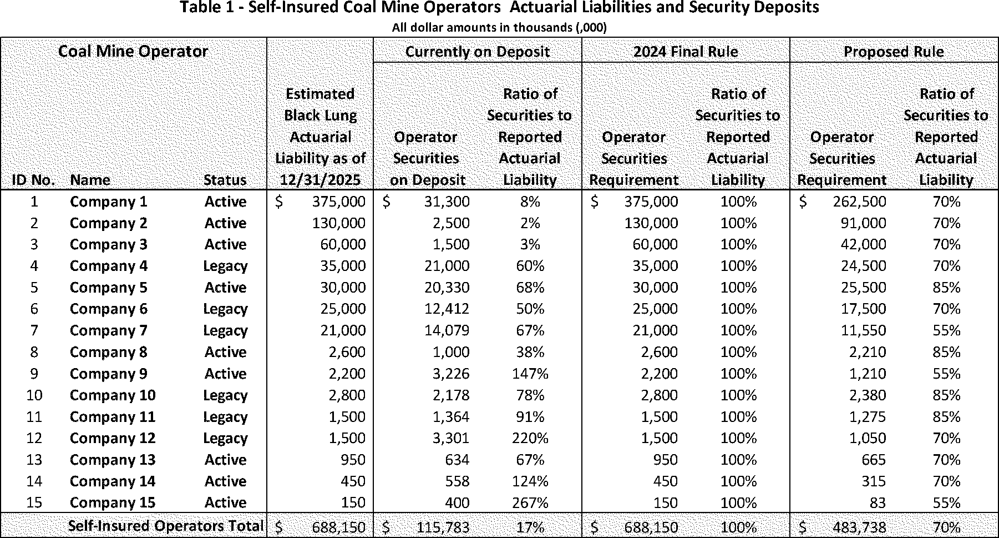
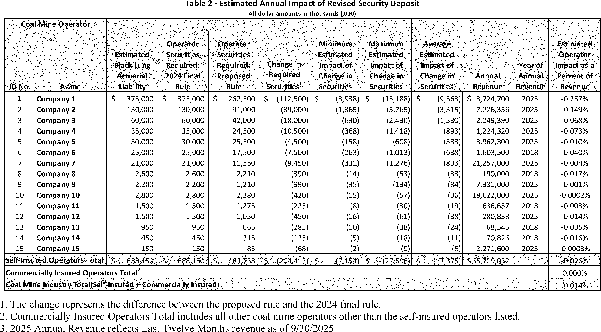

# Daily Digest — 2026-07-30

| | |
|---|---|
| **Digest date** | 2026-07-30 |
| **Data date range** | 2026-07-30 to 2026-07-30 |
| **Generated at** | 2026-07-31T20:18:58Z (UTC) |
| **Pipeline version** | 0b510b9 |
| **Source watermarks** | CREC: 2026-07-31T09:55:23Z · BILLS: 2026-07-31T10:32:48Z · FR: 2026-07-31T07:57:51Z · USCOURTS: 2026-07-31T03:42:00Z · PLAW: 2026-07-25T00:00:00Z |

All items below cite the govinfo package (and granule, where applicable) they
summarize. Selection is mechanical; each item states the rule that included
it. See the Coverage Statement at the end for a full accounting of what was
published, what was summarized, and what was excluded and why.

---

## Contents

- [Day in Review](#day-in-review)
- [1. Congressional Floor Activity](#1-congressional-floor-activity)
- [2. Legislation](#2-legislation)
- [3. Federal Register](#3-federal-register)
- [4. Enacted Laws](#4-enacted-laws)
- [5. Judicial Activity](#5-judicial-activity)
- [6. Agency Announcements](#6-agency-announcements)
- [7. Recorded Votes](#7-recorded-votes)
- [Terms Used Today](#terms-used-today)
- [Coverage Statement](#coverage-statement)
- [Methodology](#methodology)

---

## Day in Review

The Senate's floor record ran to 69 items against the House's 47, with 14 extensions of remarks and six daily digest entries. Senators rejected 49–50 a motion by Senator Gillibrand to discharge S.J. Res. 181, directing removal of US Armed Forces from unauthorized hostilities with Iran, from the Foreign Relations Committee; Senator Schumer spoke in support. S. Res. 817, an executive resolution, was agreed to 50–47. A unanimous consent request from Senator Scott to pass S. 3101, the SAFE KIDS Act, drew an objection from Senator Durbin. The Senate confirmed military officer nominations en bloc across the Air Force, Army, Navy, and Space Force, moved to proceed to H.R. 6500 on African Growth and Opportunity Act duty-free treatment, and received three amendments and bills including S. 5183 and S. 5194. Twenty-four House bills, H.R. 9977 through 10000, were introduced and referred.

The Federal Register carried 16 final rules, 12 proposed rules, and 98 notices, alongside 159 agency press releases. Final rules included ten FAA airworthiness directives, EPA approval of New Hampshire permit program revisions and a California ozone plan, a Justice Department rulemaking-petition process, and Postal Service duty collection standards. Proposals covered Black Lung Benefits Act self-insurance, an EEOC hearing on rescinding EEO reports, TSCA new use rules, and state air plans.

*Composed from the summarized items below and the day's mechanical
counts; all specifics are cited in their sections.*

---

## 1. Congressional Floor Activity

Source: Congressional Record (CREC), daily edition for 2026-07-30. Total issue size: 136 granule(s).

### 1.1 Senate

Tags: legislative

*In plain terms: Military officer confirmations; bills on commercial surrogacy trade restrictions, duty-free commerce, anti-corruption bureau creation, and judicial facilities management.*

- **Unanimous Consent Request--S. 3101 (Executive Session)** — Senator Scott sought unanimous consent to pass S. 3101, the SAFE KIDS Act, which would void commercial surrogacy contracts involving nationals of designated foreign adversaries and impose criminal penalties on brokers facilitating such arrangements. Senator Durbin objected, expressing concerns that the bill's scope extends beyond its stated national security purpose and affects reproductive rights and legitimate surrogacy practices.
  - *In plain terms:* A senator sought to pass the SAFE KIDS Act voiding commercial surrogacy contracts with nationals of designated foreign adversaries; another senator objected citing concerns about reproductive rights.
  - Included because: CREC-SEL-01 — floor item ≥ threshold floor time (15,709 characters)
  - Source: [CREC-2026-07-30 / CREC-2026-07-30-pt1-PgS4357-2](https://www.govinfo.gov/app/details/CREC-2026-07-30/CREC-2026-07-30-pt1-PgS4357-2)
- **AGOA EXTENSION ACT--Motion to Proceed** — Senator Murkowski moved to proceed to H.R. 6500, a bill to extend duty-free treatment under the African Growth and Opportunity Act and extend customs user fees. Senator Lummis discussed the Digital Asset Market Clarity Act, addressing bankruptcy protections and consumer safeguards in digital asset markets following past exchange failures.
  - *In plain terms:* A motion to proceed to H.R. 6500 extending duty-free treatment and customs user fees was made; the Digital Asset Market Clarity Act regarding consumer protections was discussed.
  - Included because: CREC-SEL-01 — floor item ≥ threshold floor time (41,004 characters)
  - Source: [CREC-2026-07-30 / CREC-2026-07-30-pt1-PgS4360-3](https://www.govinfo.gov/app/details/CREC-2026-07-30/CREC-2026-07-30-pt1-PgS4360-3)
- **EXECUTIVE CALENDAR (Executive Session)** — The Senate considered en bloc and confirmed military officer nominations across the Air Force, Army, Navy, and Space Force to various grades including brigadier general, major general, lieutenant general, rear admiral, and vice admiral.
  - *In plain terms:* The Senate confirmed military officer nominations across the Air Force, Army, Navy, and Space Force.
  - Included because: CREC-SEL-01 — floor item ≥ threshold floor time (19,015 characters)
  - Source: [CREC-2026-07-30 / CREC-2026-07-30-pt1-PgS4365-2](https://www.govinfo.gov/app/details/CREC-2026-07-30/CREC-2026-07-30-pt1-PgS4365-2)
- **Statements on Introduced Bills and Joint Resolutions** — Senate bill S. 5183 establishes an independent Anti-Corruption Bureau with seven Senate-confirmed commissioners and grants it investigative and enforcement authority over corruption matters. The bill creates a private right of action allowing Americans and state attorneys general to sue to recover money obtained through use of government influence. It includes provisions to limit presidential authority over the Bureau through restrictions on weaponization, defunding, and removal of commissioners.
  - *In plain terms:* Senate bill S. 5183 creates an independent Anti-Corruption Bureau with seven Senate-confirmed commissioners empowered to investigate corruption; allows Americans and state attorneys general to sue to recover money obtained through government influence.
  - Included because: CREC-SEL-01 — floor item ≥ threshold floor time (204,394 characters)
  - Source: [CREC-2026-07-30 / CREC-2026-07-30-pt1-PgS4371](https://www.govinfo.gov/app/details/CREC-2026-07-30/CREC-2026-07-30-pt1-PgS4371)
- **Introductory Statement on S. 5183** — Senate bill S. 5183 establishes an independent Anti-Corruption Bureau with seven Senate-confirmed commissioners and grants it investigative and enforcement authority over corruption matters. The bill creates a private right of action allowing Americans and state attorneys general to sue to recover money obtained through use of government influence. It includes provisions to limit presidential authority over the Bureau through restrictions on weaponization, defunding, and removal of commissioners.
  - *In plain terms:* Senate bill S. 5183 creates an independent Anti-Corruption Bureau with seven Senate-confirmed commissioners empowered to investigate corruption; allows Americans and state attorneys general to sue to recover money obtained through government influence.
  - Included because: CREC-SEL-01 — floor item ≥ threshold floor time (150,163 characters)
  - Source: [CREC-2026-07-30 / CREC-2026-07-30-pt1-PgS4371-2](https://www.govinfo.gov/app/details/CREC-2026-07-30/CREC-2026-07-30-pt1-PgS4371-2)
- **Introductory Statement on S. 5194** — Senate bill S. 5194 authorizes a pilot program transferring management of judicial facilities in up to 10 judicial districts from the General Services Administration to the Director of the Administrative Office of the United States Courts. The Director is empowered to acquire, construct, alter, and lease court accommodations within covered districts and to manage the Thurgood Marshall Federal Judiciary Building.
  - *In plain terms:* Senate bill S. 5194 authorizes a pilot program transferring management of judicial facilities from GSA to the court system's Director in up to ten judicial districts.
  - Included because: CREC-SEL-01 — floor item ≥ threshold floor time (50,440 characters)
  - Source: [CREC-2026-07-30 / CREC-2026-07-30-pt1-PgS4385](https://www.govinfo.gov/app/details/CREC-2026-07-30/CREC-2026-07-30-pt1-PgS4385)
- **Text of Amendments** — Three Senate amendments were submitted. SA 6720 adds a provision terminating duty rates on imported goods when countries no longer meet specified criteria. SA 6721, titled the REPO for Ukrainians Implementation Act of 2026, modifies existing law to authorize transfer of Russian sovereign assets into an interest-bearing Ukraine Support Fund, requires quarterly obligations of at least $250 million for Ukraine assistance, and directs diplomatic engagement with G7, EU, and Australia members to repurpose frozen Russian assets. SA 6722 addresses seizure and forfeiture of assets of Russian individuals.
  - *In plain terms:* Three amendments were submitted: one terminating import duty rates under certain conditions; one establishing a Ukraine Support Fund requiring quarterly $250 million obligations; one addressing seizure of Russian individuals' assets.
  - Included because: CREC-SEL-01 — floor item ≥ threshold floor time (46,477 characters)
  - Source: [CREC-2026-07-30 / CREC-2026-07-30-pt1-PgS4394](https://www.govinfo.gov/app/details/CREC-2026-07-30/CREC-2026-07-30-pt1-PgS4394)
- **Confirmations** — The Senate confirmed military officer nominations on July 30, 2026, including 17 Air Force brigadier generals, 1 Air Force lieutenant general, 15 Air Force major generals, 1 vice admiral and 20 Navy rear admirals, 7 Army lieutenant generals, and 3 Space Force major generals. The Senate also confirmed previously-received Air Force, Army, and Navy nominations by batch, with specified exclusions noted in some groups.
  - *In plain terms:* The Senate confirmed military officer nominations on July 30, 2026, including Air Force brigadier and major generals, Navy rear admirals, Army lieutenant generals, and Space Force major generals.
  - Included because: CREC-SEL-01 — floor item ≥ threshold floor time (17,925 characters)
  - Source: [CREC-2026-07-30 / CREC-2026-07-30-pt1-PgS4399](https://www.govinfo.gov/app/details/CREC-2026-07-30/CREC-2026-07-30-pt1-PgS4399)

### 1.2 House of Representatives

Tags: legislative

*In plain terms: 24 House bills on home building tariffs, homeowner insurance deductions, firearms transportation, and school lunch programs.*

- **Public Bills and Resolutions** — Twenty-four bills (H.R. 9977–10000) were introduced in the House and referred to appropriate committees, addressing topics including tariffs on home building products, tax deductions for homeowners insurance, firearms transportation, school lunch program waivers, CDC staffing, sanctions against the Polisario Front, domestic violence and firearm possession, Medicare payments for radiologist assistants, election campaign misrepresentation through artificial intelligence, prison library studies, recycling infrastructure databases, food allergen labeling, federal employee conflict-of-interest requirements, disaster relief coordination, child care accessibility, child protective services and poverty, forced arbitration in employment disputes, newborn health coverage, workforce integration, fire science research coordination, and mountain pine beetle response programs.
  - *In plain terms:* The House introduced 24 bills on topics including tariffs, tax deductions, firearms, school lunch programs, CDC staffing, domestic violence, Medicare payments, artificial intelligence misuse, recycling infrastructure, food allergen labeling, federal ethics, and child care.
  - Included because: CREC-SEL-01 — floor item ≥ threshold floor time (19,006 characters)
  - Source: [CREC-2026-07-30 / CREC-2026-07-30-pt1-PgH5206](https://www.govinfo.gov/app/details/CREC-2026-07-30/CREC-2026-07-30-pt1-PgH5206)

### 1.3 Recorded Votes

- **Directing the Removal of United States Armed Forces from Hostilities within or against the Islamic Republic of Iran Tha…** — Senator Gillibrand moved to discharge S.J. Res. 181, a joint resolution directing removal of US Armed Forces from unauthorized hostilities with Iran, from the Committee on Foreign Relations; the motion to discharge was rejected 49–50. Senator Schumer spoke in support of the resolution, noting polling data showing limited public support for continued military conflict.
  - *In plain terms:* A motion to bring to a vote a resolution directing removal of US Armed Forces from hostilities with Iran failed 49–50 in the Senate.
  - Included because: CREC-SEL-02 — recorded vote (all recorded votes are listed)
  - Source: [CREC-2026-07-30 / CREC-2026-07-30-pt1-PgS4356](https://www.govinfo.gov/app/details/CREC-2026-07-30/CREC-2026-07-30-pt1-PgS4356)
- **Vote on S. Res. 817 (Executive Session)** — S. Res. 817, an executive resolution, was agreed to by a vote of 50–47.
  - *In plain terms:* The Senate agreed to Senate Resolution 817 by a vote of 50–47.
  - Included because: CREC-SEL-02 — recorded vote (all recorded votes are listed)
  - Source: [CREC-2026-07-30 / CREC-2026-07-30-pt1-PgS4360](https://www.govinfo.gov/app/details/CREC-2026-07-30/CREC-2026-07-30-pt1-PgS4360)

---

## 2. Legislation

Source: Congressional Bills (BILLS), text versions published 2026-07-30 to 2026-07-30.

### 2.1 Counts by Stage

| Stage (bill text version) | Count |
|---|---|
| Introduced (ih/is) | 17 |
| Reported (rh/rs) | 0 |
| Engrossed (eh/es) | 0 |
| Enrolled (enr) | 0 |
| Other versions | 0 |
| **Total bill texts published** | **17** |

### 2.2 Bills Listed by Mechanical Rule

Bills below are listed because they matched at least one listing rule; the
matching rule is stated per item. All other bill texts are counted above and
accounted for in the Coverage Statement.

No bill texts published in this range matched a listing rule; all 17 are
accounted for in the Coverage Statement.

---

## 3. Federal Register

Source: Federal Register (FR), issue of 2026-07-30.

### 3.1 Counts by Document Type

| Document type | Count |
|---|---|
| Rules | 16 |
| Proposed rules | 12 |
| Notices | 98 |
| Presidential documents | 0 |
| **Total FR documents** | **126** |

### 3.2 Rules Published

Tags: department of health and human services · department of transportation · executive · model keys: administrative procedures · air quality · airworthiness directives

*In plain terms: 10 FAA airworthiness directives on aircraft and helicopters; EPA air approvals and updates to property, mail, and Medicare procedures.*

#### DEPARTMENT OF HEALTH AND HUMAN SERVICES

- **Medicare Program; Updates to the Master List of Items Potentially Subject to Face-to-Face Encounter and Written Order Prior to Delivery and/or Prior Authorization Requirements; Updates to the Required Face-to-Face Encounter and Written Order Prior to Delivery List; and Updates to the Required Prior Authorization List** (2026-15446; 42 CFR Parts 410 and 414) — This document announces updates to the Healthcare Common Procedure Coding System (HCPCS) codes on the Master List. It also announces updates to the HCPCS codes on the Required Face-to-Face Encounter and Written Order Prior to Delivery List and the Required Prior Authorization List. Action: Updates to the Master List of Items Potentially Subject to Face-To-Face Encounter and Written Order Prior to Delivery and/or Prior Authorization Requirements (the “Master List”); Updates to the Required Face-to-Face Encounter and Written Order Prior to Delivery List; and Updates to the Required Prior Authorization List. Dates: Implementation of updates to the Master List, the Required Face-to-Face Encounter and Written Order Prior to Delivery List, and the Required Prior Authorization List, excluding upper limb orthoses, are effective October 28, 2026. Prior authorization requirements for the upper limb orthoses will be implemented in three phases. Phase one includes New York, Michigan, Florida, and California and is effective October 28, 2026. Phase two includes the States in phase one and Pennsylvania, Massachusetts, Ohio, Illinois, Texas, Georgia, Arizona, and Oregon and is effective January 26, 2027. Phase three includes all States and territories not included in phases one and two and is effective April 26, 2027.
  - *In plain terms:* The document updates medical billing codes for Medicare face-to-face encounters, written orders before delivery, and prior authorization requirements.
  - Included because: FR-SEL-01 — document type: final rule (all listed)
  - Source: [FR-2026-07-30 / 2026-15446](https://www.govinfo.gov/app/details/FR-2026-07-30/2026-15446)

#### DEPARTMENT OF JUSTICE

- **Procedures for Submission and Consideration of Petitions for Rulemaking** (2026-15434; 28 CFR Part 50) — Pursuant to the Administrative Procedure Act, the Department of Justice (“the Department”) is adopting a process for considering petitions submitted by interested persons requesting that the Department issue, amend, or repeal a rule. Action: Interim final rule; request for comments. Dates: Effective date: This rule is effective July 31, 2026. Comments: Comments are due on or before September 29, 2026.
  - *In plain terms:* The Department of Justice establishes a process for the public to petition the agency to issue, change, or repeal rules.
  - Included because: FR-SEL-01 — document type: final rule (all listed)
  - Source: [FR-2026-07-30 / 2026-15434](https://www.govinfo.gov/app/details/FR-2026-07-30/2026-15434)

#### DEPARTMENT OF TRANSPORTATION

- **Airworthiness Directives; Bell Textron Canada Limited Helicopters** (2026-15365; 14 CFR Part 39) — The FAA is superseding Airworthiness Directive (AD) 2024-02-55, which applies to certain Bell Textron Canada Limited (BTCL) Model 505 helicopters. AD 2024-02-55 required initial and recurring inspections of the vertical stabilizer top end cap assembly and corrective action if a crack is found. Since the FAA issued AD 2024-02-55, the manufacturer introduced a new one- piece vertical stabilizer machined top end cap assembly, which is implemented during production, and designed a new replacement for the vertical stabilizer machined top end cap assembly currently in service. This AD continues to require the inspection requirements of AD 2024-02-55 and would limit the applicability to exclude certain serial numbered BTCL Model 505 helicopters with an improved design vertical stabilizer top end cap installed at production. This AD also requires replacing the vertical stabilizer top end cap assembly with an improved design top end cap assembly, which constitutes a terminating action for the recurring detailed visual inspections. The FAA is issuing this AD to address the unsafe condition on these products. Action: Final rule. Dates: This AD is effective September 3, 2026. The Director of the Federal Register approved the incorporation by reference of a certain publication listed in this AD as of September 3, 2026.
  - *In plain terms:* The FAA updates inspection requirements for certain Bell helicopters' vertical stabilizer components and excludes aircraft with improved designs already installed.
  - Included because: FR-SEL-01 — document type: final rule (all listed)
  - Source: [FR-2026-07-30 / 2026-15365](https://www.govinfo.gov/app/details/FR-2026-07-30/2026-15365)
- **Airworthiness Directives; Safran Helicopter Engines, S.A. (Type Certificate Previously Held by Turbomeca, S.A.) Engines** (2026-15369; 14 CFR Part 39) — The FAA is adopting a new airworthiness directive (AD) for all Safran Helicopter Engines, S.A. (Safran) Model Arriel 2E engines. This AD was prompted by the determination that new or more restrictive airworthiness limitations are necessary. This AD requires revising the existing maintenance or inspection program to incorporate the airworthiness limitations section (ALS) of the existing approved aircraft maintenance program (AMP), as applicable. The FAA is issuing this AD to address the unsafe condition on these products. Action: Final rule. Dates: This AD is effective September 3, 2026. The Director of the Federal Register approved the incorporation by reference of a certain publication listed in this AD as of September 3, 2026.
  - *In plain terms:* The FAA requires operators of certain Safran helicopter engines to update their maintenance programs with new safety requirements.
  - Included because: FR-SEL-01 — document type: final rule (all listed)
  - Source: [FR-2026-07-30 / 2026-15369](https://www.govinfo.gov/app/details/FR-2026-07-30/2026-15369)
- **Airworthiness Directives; Leonardo S.p.a. Helicopters** (2026-15370; 14 CFR Part 39) — The FAA is adopting a new airworthiness directive (AD) for all Leonardo S.p.a. Model AW189 helicopters. This AD was prompted by reports of cracking on the ejector ducts. This AD requires repetitively inspecting the left-hand (LH) side and right-hand (RH) side ejector ducts, including the exhaust bracket reinforcements and reinforcement plates, and, depending on the results, replacing any affected ejector duct. The FAA is issuing this AD to address the unsafe condition on these products. Action: Final rule. Dates: This AD is effective September 3, 2026. The Director of the Federal Register approved the incorporation by reference of a certain publication listed in this AD as of September 3, 2026.
  - *In plain terms:* The FAA requires repetitive inspections of ejector ducts on certain Leonardo helicopters and replacement if damage is found.
  - Included because: FR-SEL-01 — document type: final rule (all listed)
  - Source: [FR-2026-07-30 / 2026-15370](https://www.govinfo.gov/app/details/FR-2026-07-30/2026-15370)
- **Airworthiness Directives; Bombardier, Inc., Airplanes** (2026-15409; 14 CFR Part 39) — The FAA is adopting a new airworthiness directive (AD) for certain Bombardier, Inc. Model BD-700-1A10 and BD-700-1A11 airplanes. This AD was prompted by an in-service event where a main landing gear tire burst upon landing. This AD requires an inspection to determine if an affected brake control unit (BCU) is installed and replacement of affected BCUs. This AD also prohibits the installation of affected parts. The FAA is issuing this AD to address the unsafe condition on these products. Action: Final rule. Dates: This AD is effective September 3, 2026. The Director of the Federal Register approved the incorporation by reference of a certain publication listed in this AD as of September 3, 2026.
  - *In plain terms:* The FAA requires inspection of brake units on certain Bombardier business jets after a landing gear tire burst and replacement if needed.
  - Included because: FR-SEL-01 — document type: final rule (all listed)
  - Source: [FR-2026-07-30 / 2026-15409](https://www.govinfo.gov/app/details/FR-2026-07-30/2026-15409)
- **Airworthiness Directives; Airbus SAS Airplanes** (2026-15410; 14 CFR Part 39) — The FAA is adopting a new airworthiness directive (AD) for all Airbus SAS Model A330-841 and Model A330-941 airplanes. This AD was prompted by reports of crack findings on the sloping rib. This AD requires a repetitive inspection of the external surface of each sloping rib and each slat 1 inboard seal, and applicable corrective actions. The FAA is issuing this AD to address the unsafe condition on these products. Action: Final rule. Dates: This AD is effective September 3, 2026. The Director of the Federal Register approved the incorporation by reference of a certain publication listed in this AD as of September 3, 2026.
  - *In plain terms:* The FAA requires repetitive inspections of aircraft parts on certain Airbus models and corrective action if cracks are found.
  - Included because: FR-SEL-01 — document type: final rule (all listed)
  - Source: [FR-2026-07-30 / 2026-15410](https://www.govinfo.gov/app/details/FR-2026-07-30/2026-15410)
- **Airworthiness Directives; Airbus Canada Limited Partnership (Type Certificate Previously Held by C Series Aircraft Limited Partnership (CSALP); Bombardier, Inc.) Airplanes** (2026-15411; 14 CFR Part 39) — The FAA is superseding Airworthiness Directive (AD) 2025-06-01, which applied to all Airbus Canada Limited Partnership Model BD-500-1A10 and BD-500-1A11 airplanes. AD 2025-06-01 required revising the existing airplane flight manual (AFM) to incorporate the procedures for the flightcrew to manually isolate the opposite functional engine in the event of an engine bleed duct large leak condition. Since the FAA issued AD 2025-06-01, an electronic engine control (EEC) software update has been developed to address the unsafe condition. This AD continues to require the actions in AD 2025-06-01 and requires installing a certain EEC software update on both engines. This AD also removes airplanes from the applicability. The FAA is issuing this AD to address the unsafe condition on these products. Action: Final rule. Dates: This AD is effective September 3, 2026. The Director of the Federal Register approved the incorporation by reference of a certain publication listed in this AD as of September 3, 2026.
  - *In plain terms:* The FAA requires certain Airbus aircraft to install an electronic engine control software update for engine bleed leak procedures.
  - Included because: FR-SEL-01 — document type: final rule (all listed)
  - Source: [FR-2026-07-30 / 2026-15411](https://www.govinfo.gov/app/details/FR-2026-07-30/2026-15411)
- **Airworthiness Directives; MHI RJ Aviation ULC (Type Certificate Previously Held by Bombardier, Inc.) Airplanes** (2026-15412; 14 CFR Part 39) — The FAA is adopting a new airworthiness directive (AD) for all MHI RJ Aviation ULC Model CL-600-2C10 (Regional Jet Series 700, 701 & 702), CL-600-2C11 (Regional Jet Series 550), CL-600-2D15 (Regional Jet Series 705), and CL-600-2D24 (Regional Jet Series 900) airplanes. This AD was prompted by a determination that new or more restrictive airworthiness limitations are necessary. This AD requires revising the existing maintenance or inspection program, as applicable, to incorporate new or more restrictive airworthiness limitations. The FAA is issuing this AD to address the unsafe condition on these products. Action: Final rule. Dates: This AD is effective September 3, 2026. The Director of the Federal Register approved the incorporation by reference of a certain publication listed in this AD as of September 3, 2026.
  - *In plain terms:* The FAA requires operators of certain regional jets to update their maintenance programs with new and stricter safety requirements.
  - Included because: FR-SEL-01 — document type: final rule (all listed)
  - Source: [FR-2026-07-30 / 2026-15412](https://www.govinfo.gov/app/details/FR-2026-07-30/2026-15412)
- **Airworthiness Directives; Airbus SAS Airplanes** (2026-15455; 14 CFR Part 39) — The FAA is adopting a new airworthiness directive (AD) for certain Airbus SAS Model A330-200 and A330-300 series airplanes modified by a certain supplemental type certificate (STC). This AD was prompted by a finding that, for airplanes with a flightcrew oxygen system supplied by a single oxygen cylinder, the oxygen supply would not be sufficient under all circumstances for extended operations (ETOPS) with a maximum diversion time of 180 minutes (ETOPS-180) with four flightcrew members. This AD requires revising the existing Airplane Flight Manual Supplement (AFM-S) to limit ETOPS-180 operations to three flightcrew members, as applicable, and correct minimum oxygen dispatch pressure information. The FAA is issuing this AD to address the unsafe condition on these products. Action: Final rule. Dates: This AD is effective September 3, 2026. The Director of the Federal Register approved the incorporation by reference of a certain publication listed in this AD as of September 3, 2026.
  - *In plain terms:* The FAA requires certain modified Airbus aircraft to limit extended-range operations to three flightcrew members due to insufficient oxygen for four.
  - Included because: FR-SEL-01 — document type: final rule (all listed)
  - Source: [FR-2026-07-30 / 2026-15455](https://www.govinfo.gov/app/details/FR-2026-07-30/2026-15455)
- **Airworthiness Directives; Stemme GmbH Gliders** (2026-15466; 14 CFR Part 39) — The FAA is adopting a new airworthiness directive (AD) for all Stemme GmbH (Stemme) Model Stemme S 12 gliders. This AD was prompted by reports of fuel leaking around certain copper sealing rings within the fuel system. This AD requires repetitive visual checks of the fuel system for fuel leakage, and replacement of the affected copper sealing ring. This AD also prohibits the installation of affected parts. The FAA is issuing this AD to address the unsafe condition on these products. Action: Final rule. Dates: This AD is effective September 3, 2026. The Director of the Federal Register approved the incorporation by reference of a certain publication listed in this AD as of September 3, 2026.
  - *In plain terms:* Owners of Stemme S 12 gliders must regularly inspect fuel systems for leaks and replace certain copper sealing rings to prevent fuel leakage.
  - Included because: FR-SEL-01 — document type: final rule (all listed)
  - Source: [FR-2026-07-30 / 2026-15466](https://www.govinfo.gov/app/details/FR-2026-07-30/2026-15466)
- **Airworthiness Directives; Pilatus Aircraft Ltd. Airplanes** (2026-15467; 14 CFR Part 39) — The FAA is adopting a new airworthiness directive (AD) for certain Pilatus Aircraft Ltd. (Pilatus) Model PC-12/47E airplanes. This AD was prompted by a report that, during an engine start on the ground, the airplane battery voltage dropped to a value that resulted in an avionic system shutdown. This AD requires incorporating a temporary revision (TR) into the existing pilot's operating handbook (POH) for the affected airplanes to provide operators with instructions for an enhanced engine start procedure. The FAA is issuing this AD to address the unsafe condition on these products. Action: Final rule. Dates: This AD is effective September 3, 2026. The Director of the Federal Register approved the incorporation by reference of a certain publication listed in this AD as of September 3, 2026.
  - *In plain terms:* Pilatus PC-12/47E airplane operating manuals must include an enhanced engine start procedure to prevent aircraft electronic systems from shutting down.
  - Included because: FR-SEL-01 — document type: final rule (all listed)
  - Source: [FR-2026-07-30 / 2026-15467](https://www.govinfo.gov/app/details/FR-2026-07-30/2026-15467)

#### ENVIRONMENTAL PROTECTION AGENCY

- **Operating Permit Program Approval; New Hampshire; Revised Definitions** (2026-15363; 40 CFR Part 70) — The Environmental Protection Agency (EPA) approves revisions to the State of New Hampshire's Clean Air Act (CAA) title V operating permit program. These revisions amend the definitions of “hazardous air pollutant” and “regulated air pollutant” in New Hampshire regulations to remain consistent with Federal permitting and air toxics requirements in accordance with the CAA. Action: Final rule. Dates: This rule is effective on August 31, 2026.
  - *In plain terms:* The EPA approves New Hampshire's updates to air permit definitions to align with federal air quality and toxics requirements.
  - Included because: FR-SEL-01 — document type: final rule (all listed)
  - Source: [FR-2026-07-30 / 2026-15363](https://www.govinfo.gov/app/details/FR-2026-07-30/2026-15363)
- **Air Plan Approval; California; San Joaquin Valley Air Pollution Control District** (2026-15377; 40 CFR Part 52) — The Environmental Protection Agency (EPA) is taking final action to approve a revision to the San Joaquin Valley Air Pollution Control District (SJVAPCD or “District”) portion of the California State Implementation Plan (SIP) concerning two rules submitted to address section 185 of the Clean Air Act (CAA or the “Act”) with respect to the 2008 and 2015 8-hour ozone National Ambient Air Quality Standards (NAAQS or “standards”). Action: Final rule. Dates: This rule is effective August 31, 2026.
  - *In plain terms:* The EPA approves air quality rules by the San Joaquin Valley Air Pollution Control District regarding ozone standards.
  - Included because: FR-SEL-01 — document type: final rule (all listed)
  - Source: [FR-2026-07-30 / 2026-15377](https://www.govinfo.gov/app/details/FR-2026-07-30/2026-15377)

#### GENERAL SERVICES ADMINISTRATION

- **General Services Administration Property Management Regulation (GSPMR); Nondiscrimination on the Basis of the Age Act Regulation for Programs or Activities Receiving Federal Financial Assistance; Technical Amendment** (2026-15368; 41 CFR Parts 101-8 and 105-9) — The General Services Administration (GSA) is publishing a technical amendment to effectuate the rule published March 6, 2026. That published rule required clarifying edits in the amendatory instructions in order to facilitate the removal of GSA's regulations from the government-wide Federal Property Management Regulation (FPMR) and the addition of those regulations into the General Services Administration Property Management Regulations (GSPMR). Action: Technical amendment. Dates: This technical amendment is effective July 30, 2026. The subject GSPMR case continues to be effective March 6, 2026.
  - *In plain terms:* The General Services Administration makes clarifying changes to transfer its property management regulations from government-wide to agency-specific rules.
  - Included because: FR-SEL-01 — document type: final rule (all listed)
  - Source: [FR-2026-07-30 / 2026-15368](https://www.govinfo.gov/app/details/FR-2026-07-30/2026-15368)

#### POSTAL SERVICE

- **Duty Collection for Domestic Mail Arriving From Certain Insular Possessions and Territories** (2026-15420; 39 CFR Part 111) — The Postal Service is revising Mailing Standards of the United States Postal Service, Domestic Mail Manual (DMM®), section 608, to provide instructions for customs clearance and the prepayment of applicable customs duties, taxes, and fees for certain goods mailed from American Samoa, Guam, Northern Mariana Islands, and U.S. Virgin Islands destined to the customs territory of the United States (CTUS), which is defined in 19 Code of Federal Regulations (CFR) 101.1 as the fifty States, the District of Columbia, and Puerto Rico. Action: Interim final rule. Dates: Effective: July 30, 2026. Comments must be received by August 31, 2026.
  - *In plain terms:* The Postal Service updates customs duty collection instructions for mail from U.S. territories destined to the mainland and Puerto Rico.
  - Included because: FR-SEL-01 — document type: final rule (all listed)
  - Source: [FR-2026-07-30 / 2026-15420](https://www.govinfo.gov/app/details/FR-2026-07-30/2026-15420)

### 3.3 Proposed Rules Published

Tags: department of health and human services · department of transportation · executive · model keys: air quality · aviation safety · employment

*In plain terms: Black Lung self-insurer authorization, EPA environmental and chemical rules, FAA commercial space licensing, and immigration enforcement proposals.*

#### DEPARTMENT OF HEALTH AND HUMAN SERVICES

- **Administrative Costs for Children in Title IV-E Foster Care** (2026-15403; 45 CFR Part 1356) — This document withdraws a proposed rule that was published in the Federal Register on January 31, 2005. The proposed rule would have amended the regulations for Child and Family Services with respect to title IV-E administrative costs and eligibility determinations and re-determinations for title IV-E foster care recipients and foster care “candidates” to implement title IV-E foster care eligibility and administrative cost provisions in sections 472 and 474 of the Social Security Act (the Act) and incorporates previously issued policy guidance. Action: Proposed rule; withdrawal. Dates: The proposed rule published January 31, 2005 (70 FR 4803) is withdrawn, effective July 30, 2026.
  - *In plain terms:* The agency withdraws a proposed rule from 2005 concerning federal foster care administrative costs and children's eligibility determination procedures.
  - Included because: FR-SEL-02 — document type: proposed rule (all listed)
  - Source: [FR-2026-07-30 / 2026-15403](https://www.govinfo.gov/app/details/FR-2026-07-30/2026-15403)

#### DEPARTMENT OF JUSTICE

- **Civil Money Penalty for Actions in Contempt of an Immigration Judge's Proper Exercise of Authority** (2026-15458; 8 CFR Parts 1003 and 1103) — This notice of proposed rulemaking (“NPRM”) would implement a provision of the Immigration and Nationality Act (“INA” or “the Act”) that authorizes Immigration Judges, under regulations prescribed by the Attorney General, to sanction by civil money penalty any action (or inaction) in contempt of the proper exercise of their authority by certain individuals. The rule would: define the scope of the contempt authority; provide procedures for contempt findings, penalty determinations, and penalty payment; establish an appellate process; and implement oversight of the use of contempt authority. The rule would also make conforming changes to the grounds for practitioner discipline. Action: Notice of proposed rulemaking. Dates: Electronic comments must be submitted on or before September 28, 2026. The electronic Federal Docket Management System at https://www.regulations.gov will accept electronic comments until 11:59 p.m. Eastern Time on that date.
  - *In plain terms:* This proposed rule would authorize immigration judges to impose monetary fines on people for disobeying their court orders and establish procedures for penalties, appeals, and oversight.
  - Included because: FR-SEL-02 — document type: proposed rule (all listed)
  - Source: [FR-2026-07-30 / 2026-15458](https://www.govinfo.gov/app/details/FR-2026-07-30/2026-15458)

#### DEPARTMENT OF LABOR

- **Black Lung Benefits Act: Authorization of Self-Insurers** (2026-15325; 20 CFR Part 726) — The Department is proposing revisions to regulations under the Black Lung Benefits Act (BLBA or the Act) governing authorization of self-insurers. These rules will determine the process for coal mine operators to apply for authorization to self-insure, the requirements operators must meet to qualify to self-insure, the amount of security self-insured operators must provide, and the types of security accepted for operators to self-insure. Action: Notice of proposed rulemaking; request for comments. Dates: The Department invites written comments on the proposed regulations from interested parties. Written comments must be received by September 28, 2026.
  - *In plain terms:* The Department proposes new rules for how coal operators apply to self-insure, including eligibility requirements and types of security deposits they must provide.
  - Included because: FR-SEL-02 — document type: proposed rule (all listed)
  - Source: [FR-2026-07-30 / 2026-15325](https://www.govinfo.gov/app/details/FR-2026-07-30/2026-15325)
  -  *Source graphic 1 of 5 from 2026-15325.*
  -  *Source graphic 2 of 5 from 2026-15325.*
  - *Graphics not rendered here: 3 of 5 — see the [source PDF](https://www.govinfo.gov/content/pkg/FR-2026-07-30/pdf/FR-2026-07-30.pdf).*

#### DEPARTMENT OF STATE

- **Exchange Visitor Program—Termination of Program Participation, Extension of Program and Reinstatement to Valid Program Status** (2026-15450; 22 CFR Part 62) — The Department of State's (Department's) Bureau of Educational and Cultural Affairs administers the Exchange Visitor Program, as set forth at 22 CFR part 62, wherein exchange visitors on educational and cultural exchange programs travel to the United States in the J visa category. The Department tracks the status and geographic location of exchange visitors through the Student and Exchange Visitor Information System (SEVIS), a database administered by the Department of Homeland Security. This Notice of Proposed Rulemaking (Proposed Rule) seeks to clarify the conditions under which a sponsor must terminate an exchange visitor's program and authorizes the Department, in its discretion, to terminate an exchange visitor's program in limited circumstances; modifies Extension of Program and Reinstatement to valid program status in their entirety by eliminating outdated requirements and introducing updated procedures that make use of current SEVIS functionality; amends Definitions to include definitions for “Unauthorized Employment” and “Valid Program Status”; and rescinds the separate extension of program provision for au pairs. Action: Proposed rule with request for comment. Dates: The Department of State will accept comments from the public for 60 days from July 30, 2026.
  - *In plain terms:* The State Department proposes clarifying when exchange visitor sponsors must terminate participants and updating reinstatement procedures using current system capabilities.
  - Included because: FR-SEL-02 — document type: proposed rule (all listed)
  - Source: [FR-2026-07-30 / 2026-15450](https://www.govinfo.gov/app/details/FR-2026-07-30/2026-15450)

#### DEPARTMENT OF THE INTERIOR

- **First State National Historical Park; Bicycling** (2026-15406; 36 CFR Part 7) — The National Park Service (NPS) proposes to issue special regulations for First State National Historical Park to allow for bicycle use on approximately 25 miles of trails within the Brandywine Valley unit of the park. Action: Proposed rule. Dates: Comments on the proposed rule must be received by 11:59 p.m. EDT on September 28, 2026.
  - *In plain terms:* The National Park Service proposes allowing bicycling on approximately 25 miles of trails in the Brandywine Valley area of the park.
  - Included because: FR-SEL-02 — document type: proposed rule (all listed)
  - Source: [FR-2026-07-30 / 2026-15406](https://www.govinfo.gov/app/details/FR-2026-07-30/2026-15406)

#### DEPARTMENT OF TRANSPORTATION

- **Airworthiness Directives; Airbus Helicopters Deutschland GmbH (AHD) Helicopters** (2026-15374; 14 CFR Part 39) — The FAA proposes to supersede Airworthiness Directive (AD) 2024-04-10, which applies to all Airbus Helicopters Deutschland GmbH (AHD) Model EC135P1, EC135P2, EC135P2+, EC135P3, EC135T1, EC135T2, EC135T2+, EC135T3, and EC635T2+ helicopters. AD 2024-04-10 requires repetitively inspecting certain part-numbered tail rotor (T/R) blades for a crack and, depending on the results, removing any cracked T/R blade from service. AD 2024-04-10 also prohibits installing certain T/R blades on any helicopter unless certain requirements are met. Since AD 2024-04-10 was issued, it was determined that inspection Method A should be discontinued and that additional limitations shall be provided. This proposed AD would retain the actions of AD 2024-04-10 and would require repetitively inspecting a certain tail rotor blade (TRB) assembly for cracks and, depending on the results, removing any cracked TRB assembly from service and replacing an affected part as terminating action for the repetitive inspections. This proposed AD would also prohibit installing an affected TRB assembly on any helicopter unless certain requirements are met. [official summary truncated; see source] Action: Notice of proposed rulemaking (NPRM). Dates: The FAA must receive comments on this NPRM by September 14, 2026.
  - *In plain terms:* The FAA proposes updating inspection requirements for tail rotor blades on certain Airbus helicopters and discontinuing a prior inspection method.
  - Included because: FR-SEL-02 — document type: proposed rule (all listed)
  - Source: [FR-2026-07-30 / 2026-15374](https://www.govinfo.gov/app/details/FR-2026-07-30/2026-15374)
- **Waiver of Specified Statutory Requirements for Commercial Space Launch and Reentry Actions** (2026-15415; 14 CFR Parts 400, 420, 433, 437, 450) — FAA proposes to amend its commercial space licensing regulations to streamline the licensing process and reduce regulatory burden for applicants. Specifically, FAA proposes to invoke the Secretary of Transportation's statutory authority to waive requirements of laws of the U.S. for a license or permit, after consultation with the head of the appropriate executive agency, when the requirement is not necessary to protect the public health and safety, safety of property, and national security and foreign policy interests of the United States. FAA proposes waiving requirements under 13 laws for commercial space licenses and permits to operate a launch site, licenses to operate a reentry site, experimental permits, and licenses to operate a launch or reentry vehicle. Action: Notice of proposed rulemaking (NPRM). Dates: Send comments on or before August 31, 2026.
  - *In plain terms:* The FAA proposes waiving certain legal requirements for commercial space launch and reentry licenses to streamline the licensing process.
  - Included because: FR-SEL-02 — document type: proposed rule (all listed)
  - Source: [FR-2026-07-30 / 2026-15415](https://www.govinfo.gov/app/details/FR-2026-07-30/2026-15415)

#### ENVIRONMENTAL PROTECTION AGENCY

- **Significant New Use Rules on Certain Chemical Substances (26-4)** (2026-15352; 40 CFR Part 721) — EPA is proposing significant new use rules (SNURs) under the Toxic Substances Control Act (TSCA) for certain chemical substances that were the subject of premanufacture notices (PMNs) and are also subject to an Order issued by EPA pursuant to TSCA. Once finalized, the SNURs would require persons who intend to manufacture (defined by statute to include import) or process any of these chemical substances for an activity that is proposed as a significant new use by this rulemaking to notify EPA at least 90 days before commencing that activity. The required notification initiates EPA's evaluation of the conditions of that use for that chemical substance. In addition, the manufacture or processing for the significant new use may not commence until EPA has conducted a review of the required notification, made an appropriate determination regarding that notification, and taken such actions as required by that determination. Action: Proposed rule. Dates: Comments must be received on or before August 31, 2026.
  - *In plain terms:* The EPA proposes rules requiring manufacturers to notify the agency 90 days before manufacturing certain chemicals for new uses and obtain EPA approval before proceeding.
  - Included because: FR-SEL-02 — document type: proposed rule (all listed)
  - Source: [FR-2026-07-30 / 2026-15352](https://www.govinfo.gov/app/details/FR-2026-07-30/2026-15352)
- **Clean Air Act Operating Permit Program Revisions; California; Amador County Air Pollution Control District, Calaveras County Air Pollution Control District, Great Basin Unified Air Pollution Control District, Northern Sierra Air Quality Management District** (2026-15362; 40 CFR Part 70) — The Environmental Protection Agency (EPA) is proposing to approve revisions to four State of California air districts' Clean Air Act title V program rules to remove emergency affirmative defense provisions. The four districts are the Amador County Air Pollution Control District (ACAPCD), the Calaveras County Air Pollution Control District (CCAPCD), the Great Basin Unified Air Pollution Control District (GBUAPCD), and the Northern Sierra Air Quality Management District (NSAQMD) (“Districts”). This proposed action is being taken in accordance with Federal regulations and the Clean Air Act (CAA or “Act”). We are taking comments on these proposed revisions and plan to follow with a final action. Action: Proposed rule. Dates: Written comments must be received on or before August 31, 2026.
  - *In plain terms:* The EPA proposes approving rule changes by four California air districts that remove emergency defense provisions from air permits.
  - Included because: FR-SEL-02 — document type: proposed rule (all listed)
  - Source: [FR-2026-07-30 / 2026-15362](https://www.govinfo.gov/app/details/FR-2026-07-30/2026-15362)
- **Air Plan Approval; Missouri; Construction Permit Exemptions** (2026-15371; 40 CFR Part 52) — The Environmental Protection Agency (EPA) is proposing to approve revisions to the Missouri State Implementation Plan (SIP) received on February 10, 2026. The submission revises Missouri's regulation on construction permit exemptions in their Minor New Source Review (NSR) program. These revisions refine exemptions for emergency generators, update references to other rules, and update recordkeeping requirements. The EPA is proposing to approve this rule revision pursuant to the Clean Air Act (CAA). Action: Proposed rule. Dates: Comments must be received on or before August 31, 2026.
  - *In plain terms:* The EPA proposes approving Missouri's updates to air quality permit exemptions for emergency generators and recordkeeping requirements.
  - Included because: FR-SEL-02 — document type: proposed rule (all listed)
  - Source: [FR-2026-07-30 / 2026-15371](https://www.govinfo.gov/app/details/FR-2026-07-30/2026-15371)
- **Air Plan Approval; Pennsylvania; Redesignation of the Warren County Nonattainment Area to Attainment and Approval of the Area's Maintenance Plan for the 2010 1-Hour Primary Sulfur Dioxide National Ambient Air Quality Standard** (2026-15372; 40 CFR Parts 52 and 81) — The Environmental Protection Agency (EPA) is proposing to approve a state implementation plan (SIP) revision and redesignation request submitted on September 19, 2025 by the Pennsylvania Department of Environmental Protection (PADEP). The SIP revision asks the EPA to redesignate the Warren County, Pennsylvania area from nonattainment to attainment for the 2010 1-hour primary sulfur dioxide (SO 2 ) national ambient air quality standard (NAAQS). The revision also asks the EPA to approve into the SIP the Commonwealth's maintenance plan for the 2010 1-hour primary SO 2 NAAQS for the Warren County area. Furthermore, Pennsylvania requests that the EPA correct source-specific requirements for United Refining Company within the Pennsylvania SIP that were previously included in error. This proposed action is being taken under the Clean Air Act (CAA). Action: Proposed rule. Dates: Written comments must be received on or before August 31, 2026.
  - *In plain terms:* The EPA proposes approving Pennsylvania's redesignation of Warren County as meeting sulfur dioxide air quality standards and its maintenance plan.
  - Included because: FR-SEL-02 — document type: proposed rule (all listed)
  - Source: [FR-2026-07-30 / 2026-15372](https://www.govinfo.gov/app/details/FR-2026-07-30/2026-15372)

#### EQUAL EMPLOYMENT OPPORTUNITY COMMISSION

- **Removal of Reporting Requirements; Public Hearing** (2026-15340; 29 CFR Part 1602) — The Equal Employment Opportunity Commission has scheduled a public hearing to gather information and hear public comment on its proposed rulemaking—Rescission of EEO Reports (EEO-1, EEO-2, EEO-3, EEO-4, EEO-5, EEO-6) and related recordkeeping and record preservation requirements. Action: Proposed rule; public hearing. Dates: Tuesday, August 11, 2026, 10:00 a.m.-12:00 p.m. Eastern Time.
  - *In plain terms:* The Equal Employment Opportunity Commission holds a public hearing on its proposal to eliminate employment reporting requirements.
  - Included because: FR-SEL-02 — document type: proposed rule (all listed)
  - Source: [FR-2026-07-30 / 2026-15340](https://www.govinfo.gov/app/details/FR-2026-07-30/2026-15340)

### 3.4 Notices and Presidential Documents

Notices are summarized only when they match a listing rule; all are counted
in 3.1 and in the Coverage Statement. Presidential documents in the FR are
always listed.

No notices or presidential documents matched a listing rule.

---

## 4. Enacted Laws

Source: Public and Private Laws (PLAW) published 2026-07-30.

No laws were published in this range.

---

## 5. Judicial Activity

Source: United States Courts Opinions (USCOURTS): opinions issued 2026-07-30
by participating federal courts.

Completeness disclosure (standing): USCOURTS carries opinions from
approximately 140 participating appellate, district, bankruptcy, and
national federal courts. Unlike the Congressional Record and the Federal
Register, which are the complete official record of their branches,
USCOURTS is participation-based and is NOT the complete federal judicial
record. Courts post opinions with delay; opinions filed on this date may
appear in later digests.

### 5.1 Appellate and National Court Opinions

Appellate and national court opinions are summarized; district and
bankruptcy opinions are counted in 5.2 and in the Coverage Statement.

No appellate or national court opinions matched a listing rule for this
date; all opinions are counted in 5.2 and accounted for in the Coverage
Statement.

### 5.2 Counts by Court Category

| Court category | Opinions |
|---|---|
| Appellate | 0 |
| District | 16 |
| Bankruptcy | 0 |
| National | 0 |
| **Total opinions extracted** | **16** |

Archive-window disclosure (rule USCOURTS-FETCH-01): 18450 USCOURTS package(s) have been listed in delta syncs but fell outside the 7-day archive window and were not fetched (global running count across all syncs, not limited to this date).

---

## 6. Agency Announcements

Official press releases and statements the agencies themselves date
on 2026-07-30 (sources listed in the source guide). These are the
agencies' own announcements — official advocacy, quoted and
attributed, not findings of this digest. Agency web content can be
edited or removed without notice; captures and hashes are preserved
per the provenance policy.

#### CISA Cybersecurity Advisories

- **[CISA Urges Water and Wastewater Systems Sector to Protect OT Against Activity Targeting PLCs](https://www.cisa.gov/news-events/alerts/2026/07/30/cisa-urges-water-and-wastewater-systems-sector-protect-ot-against-activity-targeting-plcs)** — dated 2026-07-30 by the agency
  - Included because: AGENCYPR-SEL-01 — official agency release dated this day by the agency (all such releases from active sources are listed; titles only in the pilot)
  - Source: agency newsroom (above) · [independent archive](https://web.archive.org/web/20260730212807/https://www.cisa.gov/news-events/alerts/2026/07/30/cisa-urges-water-and-wastewater-systems-sector-protect-ot-against-activity-targeting-plcs)
- **[Johnson Controls OpenBlue Employee](https://www.cisa.gov/news-events/ics-advisories/icsa-26-211-02)** — dated 2026-07-30 by the agency
  - Included because: AGENCYPR-SEL-01 — official agency release dated this day by the agency (all such releases from active sources are listed; titles only in the pilot)
  - Source: agency newsroom (above) · [independent archive](https://web.archive.org/web/20260730212928/https://www.cisa.gov/news-events/ics-advisories/icsa-26-211-02)
- **[MZ Automation GmbH libiec61850](https://www.cisa.gov/news-events/ics-advisories/icsa-26-211-10)** — dated 2026-07-30 by the agency
  - Included because: AGENCYPR-SEL-01 — official agency release dated this day by the agency (all such releases from active sources are listed; titles only in the pilot)
  - Source: agency newsroom (above) · [independent archive](https://web.archive.org/web/20260730213046/https://www.cisa.gov/news-events/ics-advisories/icsa-26-211-10)
- **[MZ Automation lib60870](https://www.cisa.gov/news-events/ics-advisories/icsa-26-211-11)** — dated 2026-07-30 by the agency
  - Included because: AGENCYPR-SEL-01 — official agency release dated this day by the agency (all such releases from active sources are listed; titles only in the pilot)
- **[MikroTik RouterOS](https://www.cisa.gov/news-events/ics-advisories/icsa-26-211-01)** — dated 2026-07-30 by the agency
  - Included because: AGENCYPR-SEL-01 — official agency release dated this day by the agency (all such releases from active sources are listed; titles only in the pilot)
  - Source: agency newsroom (above) · [independent archive](https://web.archive.org/web/20260730212429/https://www.cisa.gov/news-events/ics-advisories/icsa-26-211-01)
- **[Mitsubishi Electric CC-Link IE TSN Communication Protocol](https://www.cisa.gov/news-events/ics-advisories/icsa-26-211-07)** — dated 2026-07-30 by the agency
  - Included because: AGENCYPR-SEL-01 — official agency release dated this day by the agency (all such releases from active sources are listed; titles only in the pilot)
- **[NASA Core Flight System (cFS) Health & Safety (HS) Application](https://www.cisa.gov/news-events/ics-advisories/icsa-26-211-06)** — dated 2026-07-30 by the agency
  - Included because: AGENCYPR-SEL-01 — official agency release dated this day by the agency (all such releases from active sources are listed; titles only in the pilot)
- **[Open Source Software: Security Principles and Practices](https://www.cisa.gov/resources-tools/resources/open-source-software-security-principles-and-practices)** — dated 2026-07-30 by the agency
  - Included because: AGENCYPR-SEL-01 — official agency release dated this day by the agency (all such releases from active sources are listed; titles only in the pilot)
- **[Rockwell Automation CompactLogix 5380 ControlLogix 5580 / 1756-EN4TR Communications Module](https://www.cisa.gov/news-events/ics-advisories/icsa-26-211-05)** — dated 2026-07-30 by the agency
  - Included because: AGENCYPR-SEL-01 — official agency release dated this day by the agency (all such releases from active sources are listed; titles only in the pilot)
- **[Schneider Electric IGSS](https://www.cisa.gov/news-events/ics-advisories/icsa-26-211-04)** — dated 2026-07-30 by the agency
  - Included because: AGENCYPR-SEL-01 — official agency release dated this day by the agency (all such releases from active sources are listed; titles only in the pilot)
  - Source: agency newsroom (above) · [independent archive](https://web.archive.org/web/20260730212305/https://www.cisa.gov/news-events/ics-advisories/icsa-26-211-04)
- **[Toptech Systems RCU II+ and Multiload II+](https://www.cisa.gov/news-events/ics-advisories/icsa-26-211-03)** — dated 2026-07-30 by the agency
  - Included because: AGENCYPR-SEL-01 — official agency release dated this day by the agency (all such releases from active sources are listed; titles only in the pilot)
  - Source: agency newsroom (above) · [independent archive](https://web.archive.org/web/20260730212545/https://www.cisa.gov/news-events/ics-advisories/icsa-26-211-03)
- **[Watchfire Controller Software](https://www.cisa.gov/news-events/ics-advisories/icsa-26-211-09)** — dated 2026-07-30 by the agency
  - Included because: AGENCYPR-SEL-01 — official agency release dated this day by the agency (all such releases from active sources are listed; titles only in the pilot)
  - Source: agency newsroom (above) · [independent archive](https://web.archive.org/web/20260730212653/https://www.cisa.gov/news-events/ics-advisories/icsa-26-211-09)
- **[o6 Automation open62541](https://www.cisa.gov/news-events/ics-advisories/icsa-26-211-08)** — dated 2026-07-30 by the agency
  - Included because: AGENCYPR-SEL-01 — official agency release dated this day by the agency (all such releases from active sources are listed; titles only in the pilot)

#### CMS Newsroom (email)

- **[In This Edition: SNF & IPF Final Payment Rules | Clinical Labs | Vaccine Pricing](https://www.cms.gov/training-education/medicare-learning-network/newsletter/mln-connects-newsletter-july-30-2026#_Toc236303480)** — dated 2026-07-30 by the agency
  - Included because: AGENCYPR-SEL-01 — official agency release dated this day by the agency (all such releases from active sources are listed; titles only in the pilot)
  - Source: agency email bulletin to this project's subscription, captured and DKIM-verified

#### DEA Updates (email)

- **The DEA Museum Welcomes You** — dated 2026-07-30 by the agency
  - Included because: AGENCYPR-SEL-01 — official agency release dated this day by the agency (all such releases from active sources are listed; titles only in the pilot)
  - Source: agency email bulletin to this project's subscription, captured and DKIM-verified (the bulletin named no canonical page)

#### Defense News Releases

- **[Army Chaplain Corps Celebrates 251 Years](https://www.war.gov/News/News-Stories/Article/Article/4560080/army-chaplain-corps-celebrates-251-years/)** — dated 2026-07-30 by the agency
  - Included because: AGENCYPR-SEL-01 — official agency release dated this day by the agency (all such releases from active sources are listed; titles only in the pilot)
- **[Freedom Haulers Initiative to Help Veterans Get Commercial Driver's Licenses, Better Jobs](https://www.war.gov/News/News-Stories/Article/Article/4560661/freedom-haulers-initiative-to-help-veterans-get-commercial-drivers-licenses-bet/)** — dated 2026-07-30 by the agency
  - Included because: AGENCYPR-SEL-01 — official agency release dated this day by the agency (all such releases from active sources are listed; titles only in the pilot)
- **[U.S., U.K. Air Forces Conduct Fighter Weapons Certification During Exercise Combat Archer](https://www.war.gov/News/News-Stories/Article/Article/4560115/us-uk-air-forces-conduct-fighter-weapons-certification-during-exercise-combat-a/)** — dated 2026-07-30 by the agency
  - Included because: AGENCYPR-SEL-01 — official agency release dated this day by the agency (all such releases from active sources are listed; titles only in the pilot)
- **[Walter Reed's Skull Base Team Performs Innovative Brain Surgery](https://www.war.gov/News/News-Stories/Article/Article/4560184/walter-reeds-skull-base-team-performs-innovative-brain-surgery/)** — dated 2026-07-30 by the agency
  - Included because: AGENCYPR-SEL-01 — official agency release dated this day by the agency (all such releases from active sources are listed; titles only in the pilot)

#### FDA Email Updates (email)

- **[529 Commerce LLC Recalls Rooted in Rare brand Aquafaba Powder due to Undeclared Eggs](https://www.fda.gov/safety/recalls-market-withdrawals-safety-alerts/529-commerce-llc-recalls-rooted-rare-brand-aquafaba-powder-due-undeclared-eggs?utm_medium=email&utm_source=govdelivery)** — dated 2026-07-30 by the agency
  - Included because: AGENCYPR-SEL-01 — official agency release dated this day by the agency (all such releases from active sources are listed; titles only in the pilot)
  - Source: agency email bulletin to this project's subscription, captured and DKIM-verified
- **FDA MedWatch - Convenience Kit Correction: Argon Medical Issues Correction for Convenience Kits Containing Spectra Medical Device Lidocaine Ampules** — dated 2026-07-30 by the agency
  - Included because: AGENCYPR-SEL-01 — official agency release dated this day by the agency (all such releases from active sources are listed; titles only in the pilot)
  - Source: agency email bulletin to this project's subscription, captured and DKIM-verified (the bulletin named no canonical page)
- **[Publix recalls all lots of GreenWise Organic Frozen Blueberries and Whole Mixed Berries Due to potential E. coli O145 contamination](https://www.fda.gov/safety/recalls-market-withdrawals-safety-alerts/publix-recalls-all-lots-greenwise-organic-frozen-blueberries-and-whole-mixed-berries-due-potential-e?utm_medium=email&utm_source=govdelivery)** — dated 2026-07-30 by the agency
  - Included because: AGENCYPR-SEL-01 — official agency release dated this day by the agency (all such releases from active sources are listed; titles only in the pilot)
  - Source: agency email bulletin to this project's subscription, captured and DKIM-verified
- **The FDA Wants to Hear From You** — dated 2026-07-30 by the agency
  - Included because: AGENCYPR-SEL-01 — official agency release dated this day by the agency (all such releases from active sources are listed; titles only in the pilot)
  - Source: agency email bulletin to this project's subscription, captured and DKIM-verified (the bulletin named no canonical page)

#### FDIC Press Releases (email)

- **Financial Institution Letter: Community Bank Leverage Ratio Framework: Community Bank Compliance Guide Update** — dated 2026-07-30 by the agency
  - Included because: AGENCYPR-SEL-01 — official agency release dated this day by the agency (all such releases from active sources are listed; titles only in the pilot)
  - Source: agency email bulletin to this project's subscription, captured and DKIM-verified (the bulletin named no canonical page)

#### Federal Reserve Press Releases

- **[Federal Reserve Board issues enforcement action with Iuka Bancshares, Inc. and The Iuka State Bank](https://www.federalreserve.gov/newsevents/pressreleases/enforcement20260730b.htm)** — dated 2026-07-30 by the agency
  - Included because: AGENCYPR-SEL-01 — official agency release dated this day by the agency (all such releases from active sources are listed; titles only in the pilot)
  - Source: agency newsroom (above) · [independent archive](https://web.archive.org/web/20260730152013/https://www.federalreserve.gov/newsevents/pressreleases/enforcement20260730b.htm)
- **[Federal Reserve Board issues enforcement actions with former employee of Regions Bank and former employee of First Interstate Bank](https://www.federalreserve.gov/newsevents/pressreleases/enforcement20260730a.htm)** — dated 2026-07-30 by the agency
  - Included because: AGENCYPR-SEL-01 — official agency release dated this day by the agency (all such releases from active sources are listed; titles only in the pilot)

#### FSIS Recalls and Public Health Alerts (email)

- **Export Information Update** — dated 2026-07-30 by the agency
  - Included because: AGENCYPR-SEL-01 — official agency release dated this day by the agency (all such releases from active sources are listed; titles only in the pilot)
  - Source: agency email bulletin to this project's subscription, captured and DKIM-verified (the bulletin named no canonical page)
- **[FSIS Issues Public Health Alert for Chicken Salad Product that May Be Contaminated with Listeria](https://www.fsis.usda.gov/recalls-alerts/fsis-issues-public-health-alert-chicken-salad-product-may-be-contaminated-listeria)** — dated 2026-07-30 by the agency
  - Included because: AGENCYPR-SEL-01 — official agency release dated this day by the agency (all such releases from active sources are listed; titles only in the pilot)
  - Source: agency email bulletin to this project's subscription, captured and DKIM-verified

#### GAO Reports & Testimonies

- **[Financial Audit Manual: Volume 3, July 2026](https://www.gao.gov/products/gao-26-108632)** — dated 2026-07-30 by the agency
  - Included because: AGENCYPR-SEL-01 — official agency release dated this day by the agency (all such releases from active sources are listed; titles only in the pilot)
- **[Public Health Preparedness: Experts Identified Actions to Improve Surveillance for Emerging Disease Threats](https://www.gao.gov/products/gao-26-107610)** — dated 2026-07-30 by the agency
  - Included because: AGENCYPR-SEL-01 — official agency release dated this day by the agency (all such releases from active sources are listed; titles only in the pilot)

#### IRS Newswire (email)

- **[Tax Tip 2026-59: Eligible taxpayers may receive automatic penalty relief](https://www.irs.gov/newsroom/irs-simplifies-penalty-relief-introduces-automatic-process-for-eligible-taxpayers)** — dated 2026-07-30 by the agency
  - Included because: AGENCYPR-SEL-01 — official agency release dated this day by the agency (all such releases from active sources are listed; titles only in the pilot)
  - Source: agency email bulletin to this project's subscription, captured and DKIM-verified

#### Justice Department News (email)

- **Antitrust Division Employment Page Update** — dated 2026-07-30 by the agency
  - Included because: AGENCYPR-SEL-01 — official agency release dated this day by the agency (all such releases from active sources are listed; titles only in the pilot)
  - Source: agency email bulletin to this project's subscription, captured and DKIM-verified (the bulletin named no canonical page)
- **[Assistant United States Attorney - Civil](https://www.justice.gov/legal-careers/job/assistant-united-states-attorney-civil-218)** — dated 2026-07-30 by the agency
  - Included because: AGENCYPR-SEL-01 — official agency release dated this day by the agency (all such releases from active sources are listed; titles only in the pilot)
  - Source: agency email bulletin to this project's subscription, captured and DKIM-verified
- **[CEO and VA Employee Plead Guilty to Paying and Receiving Illegal Health Care Kickbacks and Bribes](https://www.justice.gov/opa/pr/ceo-and-va-employee-plead-guilty-paying-and-receiving-illegal-health-care-kickbacks-and)** — dated 2026-07-30 by the agency
  - Included because: AGENCYPR-SEL-01 — official agency release dated this day by the agency (all such releases from active sources are listed; titles only in the pilot)
  - Source: agency email bulletin to this project's subscription, captured and DKIM-verified
- **Job Announcement: Office on Violence Against Women, Tribal Affairs Division** — dated 2026-07-30 by the agency
  - Included because: AGENCYPR-SEL-01 — official agency release dated this day by the agency (all such releases from active sources are listed; titles only in the pilot)
  - Source: agency email bulletin to this project's subscription, captured and DKIM-verified (the bulletin named no canonical page)
- **[Justice Department Announces New State Partnerships and Record Fraud Enforcement Actions Across Southeast](https://www.justice.gov/opa/video/justice-department-announces-new-state-partnerships-and-record-fraud-enforcement-actions)** — dated 2026-07-30 by the agency
  - Included because: AGENCYPR-SEL-01 — official agency release dated this day by the agency (all such releases from active sources are listed; titles only in the pilot)
  - Source: agency email bulletin to this project's subscription, captured and DKIM-verified
- **[Justice Department’s Fraud Division Announces Unprecedented Fraud Enforcement Actions in Southeast Resulting from Federal–State Partnerships](https://www.justice.gov/opa/pr/justice-departments-fraud-division-announces-unprecedented-fraud-enforcement-actions)** — dated 2026-07-30 by the agency
  - Included because: AGENCYPR-SEL-01 — official agency release dated this day by the agency (all such releases from active sources are listed; titles only in the pilot)
  - Source: agency email bulletin to this project's subscription, captured and DKIM-verified
- **[Louisiana U.S. Attorneys Highlight Nine Recent Fraud Prosecutions Across the State](https://www.justice.gov/usao-edla/pr/louisiana-us-attorneys-highlight-nine-recent-fraud-prosecutions-across-state)** — dated 2026-07-30 by the agency
  - Included because: AGENCYPR-SEL-01 — official agency release dated this day by the agency (all such releases from active sources are listed; titles only in the pilot)
  - Source: agency email bulletin to this project's subscription, captured and DKIM-verified
- **[South Florida Man Pleads Guilty to Filing a False Tax Return and Agrees to Pay the IRS More Than $34 Million in Restitution](https://www.justice.gov/usao-mdfl/pr/south-florida-man-pleads-guilty-filing-false-tax-return-and-agrees-pay-irs-more-34)** — dated 2026-07-30 by the agency
  - Included because: AGENCYPR-SEL-01 — official agency release dated this day by the agency (all such releases from active sources are listed; titles only in the pilot)
  - Source: agency email bulletin to this project's subscription, captured and DKIM-verified
- **[Southwest Georgia Man Sentenced on Federal Dog Fighting, Firearms, and Drug Trafficking Charges](https://www.justice.gov/opa/pr/southwest-georgia-man-sentenced-federal-dog-fighting-firearms-and-drug-trafficking-charges)** — dated 2026-07-30 by the agency
  - Included because: AGENCYPR-SEL-01 — official agency release dated this day by the agency (all such releases from active sources are listed; titles only in the pilot)
  - Source: agency email bulletin to this project's subscription, captured and DKIM-verified
- **[U.S. Department of Justice Antitrust Appellate Briefs Update](https://www.justice.gov/atr/appellate-briefs)** — dated 2026-07-30 by the agency
  - Included because: AGENCYPR-SEL-01 — official agency release dated this day by the agency (all such releases from active sources are listed; titles only in the pilot)
  - Source: agency email bulletin to this project's subscription, captured and DKIM-verified
- **[U.S. Department of Justice Antitrust Upcoming Public Hearings Update](https://www.justice.gov/atr/upcoming-hearings-and-trials)** — dated 2026-07-30 by the agency
  - Included because: AGENCYPR-SEL-01 — official agency release dated this day by the agency (all such releases from active sources are listed; titles only in the pilot)
  - Source: agency email bulletin to this project's subscription, captured and DKIM-verified

#### Justice Press Releases

- **[Ada Ngozi Otuka, British citizen, guilty of illegal voting in U.S. elections](https://www.justice.gov/usao-sdtx/pr/ada-ngozi-otuka-british-citizen-guilty-illegal-voting-us-elections)** — dated 2026-07-30 by the agency
  - Included because: AGENCYPR-SEL-01 — official agency release dated this day by the agency (all such releases from active sources are listed; titles only in the pilot)
- **[Auto Dealership to Pay $137,000 for Mishandling Servicemembers’ Vehicle Leases](https://www.justice.gov/opa/pr/auto-dealership-pay-137000-mishandling-servicemembers-vehicle-leases)** — dated 2026-07-30 by the agency
  - Included because: AGENCYPR-SEL-01 — official agency release dated this day by the agency (all such releases from active sources are listed; titles only in the pilot)
- **[Convicted felon indicted for firearm possession](https://www.justice.gov/usao-ks/pr/convicted-felon-indicted-firearm-possession)** — dated 2026-07-30 by the agency
  - Included because: AGENCYPR-SEL-01 — official agency release dated this day by the agency (all such releases from active sources are listed; titles only in the pilot)
- **[Criminal Complaint Filed Against Lee’s Summit, Missouri Man for Ponzi Scheme Defrauding Millions of Dollars from Investors](https://www.justice.gov/usao-wdmo/pr/criminal-complaint-filed-against-lees-summit-missouri-man-ponzi-scheme-defrauding)** — dated 2026-07-30 by the agency
  - Included because: AGENCYPR-SEL-01 — official agency release dated this day by the agency (all such releases from active sources are listed; titles only in the pilot)
- **[Cuban National Sentenced for His Role in an International Alien Smuggling, Asylum Fraud, and Money Laundering Conspiracy](https://www.justice.gov/usao-mdfl/pr/cuban-national-sentenced-his-role-international-alien-smuggling-asylum-fraud-and-money)** — dated 2026-07-30 by the agency
  - Included because: AGENCYPR-SEL-01 — official agency release dated this day by the agency (all such releases from active sources are listed; titles only in the pilot)
- **[CyberTip Leads to 20 Year Federal Sentence for Wheeling Man](https://www.justice.gov/usao-ndwv/pr/cybertip-leads-20-year-federal-sentence-wheeling-man)** — dated 2026-07-30 by the agency
  - Included because: AGENCYPR-SEL-01 — official agency release dated this day by the agency (all such releases from active sources are listed; titles only in the pilot)
- **[Department of Justice Files First Case in U.S. Alien Terrorist Removal Court to Deport Afghan Alien Who Supported Her Family’s Plans for Election-Day Shooting](https://www.justice.gov/opa/pr/department-justice-files-first-case-us-alien-terrorist-removal-court-deport-afghan-alien-who)** — dated 2026-07-30 by the agency
  - Included because: AGENCYPR-SEL-01 — official agency release dated this day by the agency (all such releases from active sources are listed; titles only in the pilot)
- **[El Salvadorian man sentenced for illegal reentry into the country](https://www.justice.gov/usao-mt/pr/el-salvadorian-man-sentenced-illegal-reentry-country)** — dated 2026-07-30 by the agency
  - Included because: AGENCYPR-SEL-01 — official agency release dated this day by the agency (all such releases from active sources are listed; titles only in the pilot)
- **[Forsyth man sentenced to 27 years for producing, collecting child pornography](https://www.justice.gov/usao-mt/pr/forsyth-man-sentenced-27-years-producing-collecting-child-pornography)** — dated 2026-07-30 by the agency
  - Included because: AGENCYPR-SEL-01 — official agency release dated this day by the agency (all such releases from active sources are listed; titles only in the pilot)
- **[Four Charged in $19 Million SNAP Fraud and Money Laundering Scheme](https://www.justice.gov/usao-sdfl/pr/four-charged-19-million-snap-fraud-and-money-laundering-scheme)** — dated 2026-07-30 by the agency
  - Included because: AGENCYPR-SEL-01 — official agency release dated this day by the agency (all such releases from active sources are listed; titles only in the pilot)
- **[Guatemalan National Indicted for Illegal Reentry into the United States After Prior Deportation](https://www.justice.gov/usao-wdmo/pr/guatemalan-national-indicted-illegal-reentry-united-states-after-prior-deportation)** — dated 2026-07-30 by the agency
  - Included because: AGENCYPR-SEL-01 — official agency release dated this day by the agency (all such releases from active sources are listed; titles only in the pilot)
- **[Guatemalan National Pleads Guilty for Illegal Reentry into the United States After a Prior Deportation](https://www.justice.gov/usao-wdmo/pr/guatemalan-national-pleads-guilty-illegal-reentry-united-states-after-prior)** — dated 2026-07-30 by the agency
  - Included because: AGENCYPR-SEL-01 — official agency release dated this day by the agency (all such releases from active sources are listed; titles only in the pilot)
- **[Healthcare Executive and Telemarketing Company Owner Sentenced to Prison for Exploiting Elderly Medicare Advantage Beneficiaries in $35 Million Fraud Scheme](https://www.justice.gov/usao-sdfl/pr/healthcare-executive-and-telemarketing-company-owner-sentenced-prison-exploiting)** — dated 2026-07-30 by the agency
  - Included because: AGENCYPR-SEL-01 — official agency release dated this day by the agency (all such releases from active sources are listed; titles only in the pilot)
- **[Identity Theft Ring, Including Former Bank Employee, Charged With Posing As Bank Customers And Stealing Over $1.6 Million](https://www.justice.gov/usao-sdny/pr/identity-theft-ring-including-former-bank-employee-charged-posing-bank-customers-and)** — dated 2026-07-30 by the agency
  - Included because: AGENCYPR-SEL-01 — official agency release dated this day by the agency (all such releases from active sources are listed; titles only in the pilot)
- **[Jackson Man Sentenced to Over Six Years for Felon in Possession of a Firearm](https://www.justice.gov/usao-sdms/pr/jackson-man-sentenced-over-six-years-felon-possession-firearm)** — dated 2026-07-30 by the agency
  - Included because: AGENCYPR-SEL-01 — official agency release dated this day by the agency (all such releases from active sources are listed; titles only in the pilot)
- **[Jefferson County man sentenced to federal prison for burglarizing Beaumont gun store](https://www.justice.gov/usao-edtx/pr/jefferson-county-man-sentenced-federal-prison-burglarizing-beaumont-gun-store)** — dated 2026-07-30 by the agency
  - Included because: AGENCYPR-SEL-01 — official agency release dated this day by the agency (all such releases from active sources are listed; titles only in the pilot)
- **[Kansas City Woman Sentenced to Seven Years for Possession and Intent to Distribute Meth](https://www.justice.gov/usao-wdmo/pr/kansas-city-woman-sentenced-seven-years-possession-and-intent-distribute-meth)** — dated 2026-07-30 by the agency
  - Included because: AGENCYPR-SEL-01 — official agency release dated this day by the agency (all such releases from active sources are listed; titles only in the pilot)
- **[Kansas man indicted for robbing a bank at gunpoint](https://www.justice.gov/usao-ks/pr/kansas-man-indicted-robbing-bank-gunpoint)** — dated 2026-07-30 by the agency
  - Included because: AGENCYPR-SEL-01 — official agency release dated this day by the agency (all such releases from active sources are listed; titles only in the pilot)
- **[Louisiana man sentenced to 25+ years in federal prison for Jefferson County violent crime spree that included carjackings, a shooting, and a convenience store robbery](https://www.justice.gov/usao-edtx/pr/louisiana-man-sentenced-25-years-federal-prison-jefferson-county-violent-crime-spree)** — dated 2026-07-30 by the agency
  - Included because: AGENCYPR-SEL-01 — official agency release dated this day by the agency (all such releases from active sources are listed; titles only in the pilot)
- **[Manitowoc Man Sentenced to 7 Years’ Imprisonment for Transportation of Child Pornography](https://www.justice.gov/usao-edwi/pr/manitowoc-man-sentenced-7-years-imprisonment-transportation-child-pornography)** — dated 2026-07-30 by the agency
  - Included because: AGENCYPR-SEL-01 — official agency release dated this day by the agency (all such releases from active sources are listed; titles only in the pilot)
- **[Maryland Woman and Ghanaian National Sentenced to 70 Months in Federal Prison for Role in Nationwide Romance Scam](https://www.justice.gov/usao-sdia/pr/maryland-woman-and-ghanaian-national-sentenced-70-months-federal-prison-role)** — dated 2026-07-30 by the agency
  - Included because: AGENCYPR-SEL-01 — official agency release dated this day by the agency (all such releases from active sources are listed; titles only in the pilot)
- **[Maryland Felon Pleads Guilty in D.C. to Federal Firearm Charge After Traffic Stop Uncovers Loaded Glock, Drugs](https://www.justice.gov/usao-dc/pr/maryland-felon-pleads-guilty-dc-federal-firearm-charge-after-traffic-stop-uncovers)** — dated 2026-07-30 by the agency
  - Included because: AGENCYPR-SEL-01 — official agency release dated this day by the agency (all such releases from active sources are listed; titles only in the pilot)
- **[Meridian Man Sentenced for Making a Bomb Threat](https://www.justice.gov/usao-sdms/pr/meridian-man-sentenced-making-bomb-threat)** — dated 2026-07-30 by the agency
  - Included because: AGENCYPR-SEL-01 — official agency release dated this day by the agency (all such releases from active sources are listed; titles only in the pilot)
- **[Natchez Man Sentenced to Year in Prison for Possession of a Stolen Firearm](https://www.justice.gov/usao-sdms/pr/natchez-man-sentenced-year-prison-possession-stolen-firearm)** — dated 2026-07-30 by the agency
  - Included because: AGENCYPR-SEL-01 — official agency release dated this day by the agency (all such releases from active sources are listed; titles only in the pilot)
- **[New York Man Sentenced to Three Years in Federal Prison for Armed Robbery in Londonderry](https://www.justice.gov/usao-nh/pr/new-york-man-sentenced-three-years-federal-prison-armed-robbery-londonderry)** — dated 2026-07-30 by the agency
  - Included because: AGENCYPR-SEL-01 — official agency release dated this day by the agency (all such releases from active sources are listed; titles only in the pilot)
- **[Philadelphia Man Charged with Robbing Williston Convenience Store at Gunpoint](https://www.justice.gov/usao-vt/pr/philadelphia-man-charged-robbing-williston-convenience-store-gunpoint)** — dated 2026-07-30 by the agency
  - Included because: AGENCYPR-SEL-01 — official agency release dated this day by the agency (all such releases from active sources are listed; titles only in the pilot)
- **[Previously Convicted Robber Sentenced in Southeast D.C. Firearm and Ammunition Case](https://www.justice.gov/usao-dc/pr/previously-convicted-robber-sentenced-southeast-dc-firearm-and-ammunition-case)** — dated 2026-07-30 by the agency
  - Included because: AGENCYPR-SEL-01 — official agency release dated this day by the agency (all such releases from active sources are listed; titles only in the pilot)
- **[Southwest Georgia Man Sentenced on Federal Dog Fighting, Firearms, and Drug Trafficking Charges](https://www.justice.gov/usao-mdga/pr/southwest-georgia-man-sentenced-federal-dog-fighting-firearms-and-drug-trafficking)** — dated 2026-07-30 by the agency
  - Included because: AGENCYPR-SEL-01 — official agency release dated this day by the agency (all such releases from active sources are listed; titles only in the pilot)
- **[Stephenville man pleads guilty to wire fraud and identity theft charges](https://www.justice.gov/usao-ndtx/pr/stephenville-man-pleads-guilty-wire-fraud-and-identity-theft-charges)** — dated 2026-07-30 by the agency
  - Included because: AGENCYPR-SEL-01 — official agency release dated this day by the agency (all such releases from active sources are listed; titles only in the pilot)
- **[Tallahassee Woman Federally Indicted for Defrauding Tallahassee Housing Authority of $378,000](https://www.justice.gov/usao-ndfl/pr/tallahassee-woman-federally-indicted-defrauding-tallahassee-housing-authority-378000)** — dated 2026-07-30 by the agency
  - Included because: AGENCYPR-SEL-01 — official agency release dated this day by the agency (all such releases from active sources are listed; titles only in the pilot)
- **[Texas Laboratory, Former CEO, and Florida Businessman Pay $36.4 Million to Settle Health Care Fraud Allegations](https://www.justice.gov/usao-ndga/pr/texas-laboratory-former-ceo-and-florida-businessman-pay-364-million-settle-health-care)** — dated 2026-07-30 by the agency
  - Included because: AGENCYPR-SEL-01 — official agency release dated this day by the agency (all such releases from active sources are listed; titles only in the pilot)
- **[Texas Laboratory, Former CEO, and Florida Businessman Pay a Total of $36.4M to Settle Allegations of Kickbacks and Unnecessary Genetic Testing](https://www.justice.gov/opa/pr/texas-laboratory-former-ceo-and-florida-businessman-pay-total-364m-settle-allegations)** — dated 2026-07-30 by the agency
  - Included because: AGENCYPR-SEL-01 — official agency release dated this day by the agency (all such releases from active sources are listed; titles only in the pilot)
- **[Third Georgia State Representative Pleads Guilty to Pandemic Unemployment Fraud](https://www.justice.gov/usao-ndga/pr/third-georgia-state-representative-pleads-guilty-pandemic-unemployment-fraud)** — dated 2026-07-30 by the agency
  - Included because: AGENCYPR-SEL-01 — official agency release dated this day by the agency (all such releases from active sources are listed; titles only in the pilot)
- **[Two Charged in Alleged Fraudulent Immigration Document Scheme](https://www.justice.gov/usao-nm/pr/two-charged-alleged-fraudulent-immigration-document-scheme)** — dated 2026-07-30 by the agency
  - Included because: AGENCYPR-SEL-01 — official agency release dated this day by the agency (all such releases from active sources are listed; titles only in the pilot)
- **[USTP Issues Report to Congress on Criminal Referrals for FY 2025](https://www.justice.gov/ust/notice/ustp-issues-report-congress-criminal-referrals-fy-2025)** — dated 2026-07-30 by the agency
  - Included because: AGENCYPR-SEL-01 — official agency release dated this day by the agency (all such releases from active sources are listed; titles only in the pilot)
- **[Utah Man Sentenced to 20 Years for Sexual Exploitation of Two Minor Victims and Illegal Reentry](https://www.justice.gov/usao-wdmo/pr/utah-man-sentenced-20-years-sexual-exploitation-two-minor-victims-and-illegal-reentry)** — dated 2026-07-30 by the agency
  - Included because: AGENCYPR-SEL-01 — official agency release dated this day by the agency (all such releases from active sources are listed; titles only in the pilot)
- **[West Tennessee Woman Sentenced to 16 Months for Stolen Valor](https://www.justice.gov/usao-wdtn/pr/west-tennessee-woman-sentenced-16-months-stolen-valor)** — dated 2026-07-30 by the agency
  - Included because: AGENCYPR-SEL-01 — official agency release dated this day by the agency (all such releases from active sources are listed; titles only in the pilot)
- **[Wood County Man Pleads Guilty to $510,465.19 Fraud Scheme](https://www.justice.gov/usao-sdwv/pr/wood-county-man-pleads-guilty-51046519-fraud-scheme)** — dated 2026-07-30 by the agency
  - Included because: AGENCYPR-SEL-01 — official agency release dated this day by the agency (all such releases from active sources are listed; titles only in the pilot)

#### Labor News Releases

- **[Federal court order requires 4 Detroit-metro Leo’s Coney Island franchises, owner to pay $515K in back wages, damages to 143 workers](http://www.dol.gov/newsroom/releases/whd/whd20260730)** — dated 2026-07-30 by the agency
  - Included because: AGENCYPR-SEL-01 — official agency release dated this day by the agency (all such releases from active sources are listed; titles only in the pilot)
- **[US Department of Labor awards $5.6M to serve eligible individuals in Florida communities impacted by Spirit Airlines closure](http://www.dol.gov/newsroom/releases/eta/eta20260730-0)** — dated 2026-07-30 by the agency
  - Included because: AGENCYPR-SEL-01 — official agency release dated this day by the agency (all such releases from active sources are listed; titles only in the pilot)
- **[US Department of Labor cites Maine hardwood pulp mill more than $700K for exposing workers to chemical hazards](http://www.dol.gov/newsroom/releases/osha/osha20260730)** — dated 2026-07-30 by the agency
  - Included because: AGENCYPR-SEL-01 — official agency release dated this day by the agency (all such releases from active sources are listed; titles only in the pilot)
- **[Unemployment Insurance Weekly Claims Report](http://www.dol.gov/newsroom/releases/eta/eta20260730)** — dated 2026-07-30 by the agency
  - Included because: AGENCYPR-SEL-01 — official agency release dated this day by the agency (all such releases from active sources are listed; titles only in the pilot)
  - Source: agency newsroom (above) · [independent archive](https://web.archive.org/web/20260730212203/https://www.dol.gov/sites/dolgov/files/OPA/newsreleases/ui-claims/20261273.pdf)

#### NASA News Releases

- **[APOD: July 30 – Red Sun trough Wildfire Smoke](https://science.nasa.gov/image-article/apod-july-30-red-sun-trough-wildfire-smoke/)** — dated 2026-07-30 by the agency
  - Included because: AGENCYPR-SEL-01 — official agency release dated this day by the agency (all such releases from active sources are listed; titles only in the pilot)
- **[NASA Assigns Astronaut Deniz Burnham to First Space Station Mission](https://www.nasa.gov/news-release/nasa-assigns-astronaut-deniz-burnham-to-first-space-station-mission/)** — dated 2026-07-30 by the agency
  - Included because: AGENCYPR-SEL-01 — official agency release dated this day by the agency (all such releases from active sources are listed; titles only in the pilot)
- **[NASA Johnson Interns Shaping the Future of Exploration](https://www.nasa.gov/centers-and-facilities/johnson/nasa-johnson-interns-shaping-the-future-of-exploration/)** — dated 2026-07-30 by the agency
  - Included because: AGENCYPR-SEL-01 — official agency release dated this day by the agency (all such releases from active sources are listed; titles only in the pilot)
  - Source: agency newsroom (above) · [independent archive](https://web.archive.org/web/20260730151905/https://www.nasa.gov/centers-and-facilities/johnson/nasa-johnson-interns-shaping-the-future-of-exploration/)
- **[New Zealand’s Southern Wilderness](https://science.nasa.gov/earth/earth-observatory/new-zealands-southern-wilderness/)** — dated 2026-07-30 by the agency
  - Included because: AGENCYPR-SEL-01 — official agency release dated this day by the agency (all such releases from active sources are listed; titles only in the pilot)
  - Source: agency newsroom (above) · [independent archive](https://web.archive.org/web/20260730152037/https://science.nasa.gov/earth/earth-observatory/new-zealands-southern-wilderness/)
- **[Starburst Galaxy Centaurus A](https://www.nasa.gov/image-article/starburst-galaxy-centaurus-a/)** — dated 2026-07-30 by the agency
  - Included because: AGENCYPR-SEL-01 — official agency release dated this day by the agency (all such releases from active sources are listed; titles only in the pilot)
  - Source: agency newsroom (above) · [independent archive](https://web.archive.org/web/20260730151832/https://www.nasa.gov/image-article/starburst-galaxy-centaurus-a/)
- **[Students Take on Airborne Field Research with NASA](https://science.nasa.gov/earth/students-take-on-airborne-field-research-with-nasa/)** — dated 2026-07-30 by the agency
  - Included because: AGENCYPR-SEL-01 — official agency release dated this day by the agency (all such releases from active sources are listed; titles only in the pilot)

#### SEC Press Releases

- **[SEC Announces Continuation of Small Business Advisory Committee Meeting](https://www.sec.gov/newsroom/press-releases/2026-71-sec-announces-continuation-small-business-advisory-committee-meeting)** — dated 2026-07-30 by the agency
  - Included because: AGENCYPR-SEL-01 — official agency release dated this day by the agency (all such releases from active sources are listed; titles only in the pilot)
  - Source: agency newsroom (above) · [independent archive](https://web.archive.org/web/20260730151905/https://www.sec.gov/newsroom/press-releases/2026-71-sec-announces-continuation-small-business-advisory-committee-meeting)

#### SSA Press Releases (email)

- **[70th Anniversary of the Social Security Disability Insurance Program](https://govlinks.ssa.gov/CL0/http:%2F%2Fwww.socialsecurity.gov%2Fmyaccount%2F%3Futm_medium=email%26utm_source=govdelivery/1/0100019fb43ae153-426a5bed-2288-42d8-9d48-e9807871095d-000000/RPzgR5DOPg-rFYc6Bs0zuzVg91vHix5EtpE8c1h51Qo=452)** — dated 2026-07-30 by the agency
  - Included because: AGENCYPR-SEL-01 — official agency release dated this day by the agency (all such releases from active sources are listed; titles only in the pilot)
  - Source: agency email bulletin to this project's subscription, captured and DKIM-verified
- **Our Lifetime of Protections Extends to Veterans** — dated 2026-07-30 by the agency
  - Included because: AGENCYPR-SEL-01 — official agency release dated this day by the agency (all such releases from active sources are listed; titles only in the pilot)
  - Source: agency email bulletin to this project's subscription, captured and DKIM-verified (the bulletin named no canonical page)
- **[Social Security Administration Marks 70th Anniversary of the Disability Insurance Program](https://govlinks.ssa.gov/CL0/http:%2F%2Fwww.socialsecurity.gov%2Fmyaccount%2F%3Futm_medium=email%26utm_source=govdelivery/1/0100019fb43bc1e6-0a8bcbac-e73e-49c9-a26b-1fdd257f21fa-000000/efAqnPiawmbub763sxz3VPReMja0Ywa8YpJHgGwm3e4=452)** — dated 2026-07-30 by the agency
  - Included because: AGENCYPR-SEL-01 — official agency release dated this day by the agency (all such releases from active sources are listed; titles only in the pilot)
  - Source: agency email bulletin to this project's subscription, captured and DKIM-verified

#### Treasury Press Releases (email)

- **OFAC SDN List Update: Counter Terrorism Designations; Non-Proliferation Designation Update** — dated 2026-07-30 by the agency
  - Included because: AGENCYPR-SEL-01 — official agency release dated this day by the agency (all such releases from active sources are listed; titles only in the pilot)
  - Source: agency email bulletin to this project's subscription, captured and DKIM-verified (the bulletin named no canonical page)
- **Treasury Cracks Down on Global Networks Enabling Iran’s Mahan Air and IRGC** — dated 2026-07-30 by the agency
  - Included because: AGENCYPR-SEL-01 — official agency release dated this day by the agency (all such releases from active sources are listed; titles only in the pilot)
  - Source: agency email bulletin to this project's subscription, captured and DKIM-verified (the bulletin named no canonical page)
- **U.S. Department of the Treasury Daily Treasury Bill Rates Update** — dated 2026-07-30 by the agency
  - Included because: AGENCYPR-SEL-01 — official agency release dated this day by the agency (all such releases from active sources are listed; titles only in the pilot)
  - Source: agency email bulletin to this project's subscription, captured and DKIM-verified (the bulletin named no canonical page)
- **U.S. Department of the Treasury Daily Treasury Long-Term Rates Update** — dated 2026-07-30 by the agency
  - Included because: AGENCYPR-SEL-01 — official agency release dated this day by the agency (all such releases from active sources are listed; titles only in the pilot)
  - Source: agency email bulletin to this project's subscription, captured and DKIM-verified (the bulletin named no canonical page)
- **U.S. Department of the Treasury Daily Treasury Real Long-Term Rates Update** — dated 2026-07-30 by the agency
  - Included because: AGENCYPR-SEL-01 — official agency release dated this day by the agency (all such releases from active sources are listed; titles only in the pilot)
  - Source: agency email bulletin to this project's subscription, captured and DKIM-verified (the bulletin named no canonical page)
- **U.S. Department of the Treasury Daily Treasury Real Yield Curve Rates Update** — dated 2026-07-30 by the agency
  - Included because: AGENCYPR-SEL-01 — official agency release dated this day by the agency (all such releases from active sources are listed; titles only in the pilot)
  - Source: agency email bulletin to this project's subscription, captured and DKIM-verified (the bulletin named no canonical page)
- **U.S. Department of the Treasury Daily Treasury Yield Curve Rates Update** — dated 2026-07-30 by the agency
  - Included because: AGENCYPR-SEL-01 — official agency release dated this day by the agency (all such releases from active sources are listed; titles only in the pilot)
  - Source: agency email bulletin to this project's subscription, captured and DKIM-verified (the bulletin named no canonical page)

#### U.S. Attorneys News (email)

- **[Adult Day Care Provider Accused of $1.47 Million Missouri Medicaid Fraud](https://www.justice.gov/usao-edmo/pr/adult-day-care-provider-accused-147-million-missouri-medicaid-fraud)** — dated 2026-07-30 by the agency
  - Included because: AGENCYPR-SEL-01 — official agency release dated this day by the agency (all such releases from active sources are listed; titles only in the pilot)
  - Source: agency email bulletin to this project's subscription, captured and DKIM-verified
- **[Anchorage man sentenced to 6 years for possessing a firearm as a felon during a domestic violence assault](https://www.justice.gov/usao-ak/pr/anchorage-man-sentenced-6-years-possessing-firearm-felon-during-domestic-violence)** — dated 2026-07-30 by the agency
  - Included because: AGENCYPR-SEL-01 — official agency release dated this day by the agency (all such releases from active sources are listed; titles only in the pilot)
  - Source: agency email bulletin to this project's subscription, captured and DKIM-verified
- **[CEO of Cross-Border Currency Exchange Business Arrested in Murder-for-Hire Plot](https://www.justice.gov/usao-sdca/pr/ceo-cross-border-currency-exchange-business-arrested-murder-hire-plot)** — dated 2026-07-30 by the agency
  - Included because: AGENCYPR-SEL-01 — official agency release dated this day by the agency (all such releases from active sources are listed; titles only in the pilot)
  - Source: agency email bulletin to this project's subscription, captured and DKIM-verified
- **[Child Predator to Spend 14 More Years in Prison After Possessing Child Sexual Abuse Material and Attempt to Destroy Evidence](https://www.justice.gov/usao-sdin/pr/child-predator-spend-14-more-years-prison-after-possessing-child-sexual-abuse-material)** — dated 2026-07-30 by the agency
  - Included because: AGENCYPR-SEL-01 — official agency release dated this day by the agency (all such releases from active sources are listed; titles only in the pilot)
  - Source: agency email bulletin to this project's subscription, captured and DKIM-verified
- **[Cole Manor Motel fentanyl dealer sentenced to 25 years in federal prison](https://www.justice.gov/usao-ndtx/pr/cole-manor-motel-fentanyl-dealer-sentenced-25-years-federal-prison)** — dated 2026-07-30 by the agency
  - Included because: AGENCYPR-SEL-01 — official agency release dated this day by the agency (all such releases from active sources are listed; titles only in the pilot)
  - Source: agency email bulletin to this project's subscription, captured and DKIM-verified
- **[Contractor Agrees to Pay $50,000 to Resolve Allegations of Invoicing Employee Food Expenses Disguised as IT Products](https://www.justice.gov/usao-dc/pr/contractor-agrees-pay-50000-resolve-allegations-invoicing-employee-food-expenses)** — dated 2026-07-30 by the agency
  - Included because: AGENCYPR-SEL-01 — official agency release dated this day by the agency (all such releases from active sources are listed; titles only in the pilot)
  - Source: agency email bulletin to this project's subscription, captured and DKIM-verified
- **[Dominican National Sentenced for Possession With Intent to Distribute Crack Cocaine and Fentanyl](https://www.justice.gov/usao-nh/pr/dominican-national-sentenced-possession-intent-distribute-crack-cocaine-and-fentanyl)** — dated 2026-07-30 by the agency
  - Included because: AGENCYPR-SEL-01 — official agency release dated this day by the agency (all such releases from active sources are listed; titles only in the pilot)
  - Source: agency email bulletin to this project's subscription, captured and DKIM-verified
- **[Dover Man Indicted for Possessing Privately Manufactured “Ghost Gun”](https://www.justice.gov/usao-de/pr/dover-man-indicted-possessing-privately-manufactured-ghost-gun)** — dated 2026-07-30 by the agency
  - Included because: AGENCYPR-SEL-01 — official agency release dated this day by the agency (all such releases from active sources are listed; titles only in the pilot)
  - Source: agency email bulletin to this project's subscription, captured and DKIM-verified
- **[Eagle Butte Man Sentenced to Over 3 Years in Federal Prison for Sexually Abusing a Minor](https://www.justice.gov/usao-sd/pr/eagle-butte-man-sentenced-over-3-years-federal-prison-sexually-abusing-minor)** — dated 2026-07-30 by the agency
  - Included because: AGENCYPR-SEL-01 — official agency release dated this day by the agency (all such releases from active sources are listed; titles only in the pilot)
  - Source: agency email bulletin to this project's subscription, captured and DKIM-verified
- **[El Salvadorian man sentenced for illegal reentry into the country](https://www.justice.gov/usao-mt/pr/el-salvadorian-man-sentenced-illegal-reentry-country)** — dated 2026-07-30 by the agency
  - Included because: AGENCYPR-SEL-01 — official agency release dated this day by the agency (all such releases from active sources are listed; titles only in the pilot)
  - Source: agency email bulletin to this project's subscription, captured and DKIM-verified
- **[Faith, South Dakota Man Sentenced to 18 Months in Federal Prison for First-Degree Burglary](https://www.justice.gov/usao-sd/pr/faith-south-dakota-man-sentenced-18-months-federal-prison-first-degree-burglary)** — dated 2026-07-30 by the agency
  - Included because: AGENCYPR-SEL-01 — official agency release dated this day by the agency (all such releases from active sources are listed; titles only in the pilot)
  - Source: agency email bulletin to this project's subscription, captured and DKIM-verified
- **[Former Correctional Sergeant Sentenced to Federal Prison for Excessive, Unlawful Force Against Inmate](https://www.justice.gov/usao-sdin/pr/former-correctional-sergeant-sentenced-federal-prison-excessive-unlawful-force-against)** — dated 2026-07-30 by the agency
  - Included because: AGENCYPR-SEL-01 — official agency release dated this day by the agency (all such releases from active sources are listed; titles only in the pilot)
  - Source: agency email bulletin to this project's subscription, captured and DKIM-verified
- **[Former Executive Director of Stanford Housing Authority Sentenced for Wire Fraud and Federal Funding Theft](https://www.justice.gov/usao-edky/pr/former-executive-director-stanford-housing-authority-sentenced-wire-fraud-and-0)** — dated 2026-07-30 by the agency
  - Included because: AGENCYPR-SEL-01 — official agency release dated this day by the agency (all such releases from active sources are listed; titles only in the pilot)
  - Source: agency email bulletin to this project's subscription, captured and DKIM-verified
- **[Forsyth man sentenced to 27 years for producing, collecting child pornography](https://www.justice.gov/usao-mt/pr/forsyth-man-sentenced-27-years-producing-collecting-child-pornography)** — dated 2026-07-30 by the agency
  - Included because: AGENCYPR-SEL-01 — official agency release dated this day by the agency (all such releases from active sources are listed; titles only in the pilot)
  - Source: agency email bulletin to this project's subscription, captured and DKIM-verified
- **[Grand Jury Indicts Father and Son for Kidnapping Two Forest Service Employees in Shasta-Trinity National Forest](https://www.justice.gov/usao-edca/pr/grand-jury-indicts-father-and-son-kidnapping-two-forest-service-employees-shasta)** — dated 2026-07-30 by the agency
  - Included because: AGENCYPR-SEL-01 — official agency release dated this day by the agency (all such releases from active sources are listed; titles only in the pilot)
  - Source: agency email bulletin to this project's subscription, captured and DKIM-verified
- **[Henderson Woman Sentenced to Over Five Years in Prison for Embezzling Over $26 Million From Employer](https://www.justice.gov/usao-nv/pr/henderson-woman-sentenced-over-five-years-prison-embezzling-over-26-million-employer)** — dated 2026-07-30 by the agency
  - Included because: AGENCYPR-SEL-01 — official agency release dated this day by the agency (all such releases from active sources are listed; titles only in the pilot)
  - Source: agency email bulletin to this project's subscription, captured and DKIM-verified
- **[Kansas man indicted for robbing a bank at gunpoint](https://www.justice.gov/usao-ks/pr/kansas-man-indicted-robbing-bank-gunpoint)** — dated 2026-07-30 by the agency
  - Included because: AGENCYPR-SEL-01 — official agency release dated this day by the agency (all such releases from active sources are listed; titles only in the pilot)
  - Source: agency email bulletin to this project's subscription, captured and DKIM-verified
- **[LOUISIANA U.S. ATTORNEYS HIGHLIGHT NINE RECENT FRAUD PROSECUTIONS ACROSS THE STATE](https://www.justice.gov/usao-mdla/pr/louisiana-us-attorneys-highlight-nine-recent-fraud-prosecutions-across-state)** — dated 2026-07-30 by the agency
  - Included because: AGENCYPR-SEL-01 — official agency release dated this day by the agency (all such releases from active sources are listed; titles only in the pilot)
  - Source: agency email bulletin to this project's subscription, captured and DKIM-verified
- **[Luzerne County Man Sentenced To 151 Months’ Imprisonment For Drug Trafficking And Firearm Offenses](https://www.justice.gov/usao-mdpa/pr/luzerne-county-man-sentenced-151-months-imprisonment-drug-trafficking-and-firearm)** — dated 2026-07-30 by the agency
  - Included because: AGENCYPR-SEL-01 — official agency release dated this day by the agency (all such releases from active sources are listed; titles only in the pilot)
  - Source: agency email bulletin to this project's subscription, captured and DKIM-verified
- **[Manitowoc Man Sentenced to 7 Years’ Imprisonment for Transportation of Child Pornography](https://www.justice.gov/usao-edwi/pr/manitowoc-man-sentenced-7-years-imprisonment-transportation-child-pornography)** — dated 2026-07-30 by the agency
  - Included because: AGENCYPR-SEL-01 — official agency release dated this day by the agency (all such releases from active sources are listed; titles only in the pilot)
  - Source: agency email bulletin to this project's subscription, captured and DKIM-verified
- **[Maryland Man Pleads Guilty to Persuading and Inducing Individuals, Including Two Minors, to Travel to Engage in Prostitution](https://www.justice.gov/usao-ma/pr/maryland-man-pleads-guilty-persuading-and-inducing-individuals-including-two-minors)** — dated 2026-07-30 by the agency
  - Included because: AGENCYPR-SEL-01 — official agency release dated this day by the agency (all such releases from active sources are listed; titles only in the pilot)
  - Source: agency email bulletin to this project's subscription, captured and DKIM-verified
- **[Modesto Man Indicted for Illegal Possession of Ammunition](https://www.justice.gov/usao-edca/pr/modesto-man-indicted-illegal-possession-ammunition)** — dated 2026-07-30 by the agency
  - Included because: AGENCYPR-SEL-01 — official agency release dated this day by the agency (all such releases from active sources are listed; titles only in the pilot)
  - Source: agency email bulletin to this project's subscription, captured and DKIM-verified
- **[North Carolina Man Sentenced for Investment Fund Theft Scheme](https://www.justice.gov/usao-md/pr/north-carolina-man-sentenced-investment-fund-theft-scheme)** — dated 2026-07-30 by the agency
  - Included because: AGENCYPR-SEL-01 — official agency release dated this day by the agency (all such releases from active sources are listed; titles only in the pilot)
  - Source: agency email bulletin to this project's subscription, captured and DKIM-verified
- **[Oregon Department of Corrections Officer Charged with Cyberstalking](https://www.justice.gov/usao-or/pr/oregon-department-corrections-officer-charged-cyberstalking)** — dated 2026-07-30 by the agency
  - Included because: AGENCYPR-SEL-01 — official agency release dated this day by the agency (all such releases from active sources are listed; titles only in the pilot)
  - Source: agency email bulletin to this project's subscription, captured and DKIM-verified
- **[Owasso Man Sentenced for Receiving, Possessing, and Distributing Child Sexual Abuse Material](https://www.justice.gov/usao-ndok/pr/owasso-man-sentenced-receiving-possessing-and-distributing-child-sexual-abuse-material)** — dated 2026-07-30 by the agency
  - Included because: AGENCYPR-SEL-01 — official agency release dated this day by the agency (all such releases from active sources are listed; titles only in the pilot)
  - Source: agency email bulletin to this project's subscription, captured and DKIM-verified
- **[Previously convicted child sex offender sentenced to 16 years in prison for latest crimes](https://www.justice.gov/usao-edva/pr/previously-convicted-child-sex-offender-sentenced-16-prison-latest-crimes)** — dated 2026-07-30 by the agency
  - Included because: AGENCYPR-SEL-01 — official agency release dated this day by the agency (all such releases from active sources are listed; titles only in the pilot)
  - Source: agency email bulletin to this project's subscription, captured and DKIM-verified
- **[Registered Sex Offender in Sacramento Charged with Multiple Counts of Producing Child Sexual Abuse Material](https://www.justice.gov/usao-edca/pr/registered-sex-offender-sacramento-charged-multiple-counts-producing-child-sexual)** — dated 2026-07-30 by the agency
  - Included because: AGENCYPR-SEL-01 — official agency release dated this day by the agency (all such releases from active sources are listed; titles only in the pilot)
  - Source: agency email bulletin to this project's subscription, captured and DKIM-verified
- **[Sex Offender Pleads Guilty to Violating the Federal Sex Offender Registration and Notification Act](https://www.justice.gov/usao-sdwv/pr/sex-offender-pleads-guilty-violating-federal-sex-offender-registration-and-0)** — dated 2026-07-30 by the agency
  - Included because: AGENCYPR-SEL-01 — official agency release dated this day by the agency (all such releases from active sources are listed; titles only in the pilot)
  - Source: agency email bulletin to this project's subscription, captured and DKIM-verified
- **[Tallahassee Man Faces 25 Years in Prison After Conviction for Federal Drug-Trafficking and Possession of Firearms](https://www.justice.gov/usao-ndfl/pr/tallahassee-man-faces-25-years-prison-after-conviction-federal-drug-trafficking-and)** — dated 2026-07-30 by the agency
  - Included because: AGENCYPR-SEL-01 — official agency release dated this day by the agency (all such releases from active sources are listed; titles only in the pilot)
  - Source: agency email bulletin to this project's subscription, captured and DKIM-verified
- **[Two Charged in Alleged Fraudulent Immigration Document Scheme](https://www.justice.gov/usao-nm/pr/two-charged-alleged-fraudulent-immigration-document-scheme)** — dated 2026-07-30 by the agency
  - Included because: AGENCYPR-SEL-01 — official agency release dated this day by the agency (all such releases from active sources are listed; titles only in the pilot)
  - Source: agency email bulletin to this project's subscription, captured and DKIM-verified
- **[United States Reaches $7.5 Million Settlement with Ascend Elements to Resolve False Claims Act Allegations Involving Department of Energy Grant](https://www.justice.gov/usao-wdky/pr/united-states-reaches-75-million-settlement-ascend-elements-resolve-false-claims-act)** — dated 2026-07-30 by the agency
  - Included because: AGENCYPR-SEL-01 — official agency release dated this day by the agency (all such releases from active sources are listed; titles only in the pilot)
  - Source: agency email bulletin to this project's subscription, captured and DKIM-verified
- **[Vermont and Texas Men Charged with Distributing Fentanyl and Crack Cocaine in Burlington, Vermont](https://www.justice.gov/usao-vt/pr/vermont-and-texas-men-charged-distributing-fentanyl-and-crack-cocaine-burlington-vermont)** — dated 2026-07-30 by the agency
  - Included because: AGENCYPR-SEL-01 — official agency release dated this day by the agency (all such releases from active sources are listed; titles only in the pilot)
  - Source: agency email bulletin to this project's subscription, captured and DKIM-verified
- **[Wilmington Man Indicted for Fentanyl Found in Storage Unit](https://www.justice.gov/usao-de/pr/wilmington-man-indicted-fentanyl-found-storage-unit)** — dated 2026-07-30 by the agency
  - Included because: AGENCYPR-SEL-01 — official agency release dated this day by the agency (all such releases from active sources are listed; titles only in the pilot)
  - Source: agency email bulletin to this project's subscription, captured and DKIM-verified
- **[Yuba County Senior Citizen Indicted in Heroin Distribution Case](https://www.justice.gov/usao-edca/pr/yuba-county-senior-citizen-indicted-heroin-distribution-case)** — dated 2026-07-30 by the agency
  - Included because: AGENCYPR-SEL-01 — official agency release dated this day by the agency (all such releases from active sources are listed; titles only in the pilot)
  - Source: agency email bulletin to this project's subscription, captured and DKIM-verified

#### U.S. Courts News

- **[Federal Circuit Celebrates Independence Day Anniversary Through History and Civic Learning](http://www.uscourts.gov/data-news/judiciary-news/2026/07/30/federal-circuit-celebrates-independence-day-anniversary-through-history-and-civic-learning)** — dated 2026-07-30 by the agency
  - Included because: AGENCYPR-SEL-01 — official agency release dated this day by the agency (all such releases from active sources are listed; titles only in the pilot)
- **[Statement of Judge Robert J. Conrad, Jr., Director of the AO, Regarding Introduction of the Judicial Space and Facilities Management Effectiveness Act](http://www.uscourts.gov/data-news/judiciary-news/2026/07/30/statement-judge-robert-j-conrad-jr-director-ao-regarding-introduction-judicial-space-and-facilities)** — dated 2026-07-30 by the agency
  - Included because: AGENCYPR-SEL-01 — official agency release dated this day by the agency (all such releases from active sources are listed; titles only in the pilot)

#### USDA News (email)

- **Secretary Rollins Visits Douglas Port of Entry, Announces $25 Million Commitment for New Arizona Sterile Fly Dispersal Facility** — dated 2026-07-30 by the agency
  - Included because: AGENCYPR-SEL-01 — official agency release dated this day by the agency (all such releases from active sources are listed; titles only in the pilot)
  - Source: agency email bulletin to this project's subscription, captured and DKIM-verified (the bulletin named no canonical page)
- **USDA Daily Radio Newsline - 07/28/2026** — dated 2026-07-30 by the agency
  - Included because: AGENCYPR-SEL-01 — official agency release dated this day by the agency (all such releases from active sources are listed; titles only in the pilot)
  - Source: agency email bulletin to this project's subscription, captured and DKIM-verified (the bulletin named no canonical page)

#### USPS Inspector General (email)

- **[OIG Issues Management Alert on Potential Revenue Losses in the APV System](https://www.uspsoig.gov/reports/audit-reports/technical-errors-caused-revenue-loss)** — dated 2026-07-30 by the agency
  - Included because: AGENCYPR-SEL-01 — official agency release dated this day by the agency (all such releases from active sources are listed; titles only in the pilot)
  - Source: agency email bulletin to this project's subscription, captured and DKIM-verified

#### VA News Releases

- **[Live Whole Health #328: Your body, your home](https://news.va.gov/148459/live-whole-health-328-your-body-your-home/)** — dated 2026-07-30 by the agency
  - Included because: AGENCYPR-SEL-01 — official agency release dated this day by the agency (all such releases from active sources are listed; titles only in the pilot)
- **[Never lost hope: A journey through illness, homelessness and healing](https://news.va.gov/148378/never-lost-journey-illness-homelessness-healing/)** — dated 2026-07-30 by the agency
  - Included because: AGENCYPR-SEL-01 — official agency release dated this day by the agency (all such releases from active sources are listed; titles only in the pilot)
  - Source: agency newsroom (above) · [independent archive](https://web.archive.org/web/20260730151831/https://news.va.gov/148378/never-lost-journey-illness-homelessness-healing/)

#### VA Updates (email)

- **VA honors Revolutionary War Veterans** — dated 2026-07-30 by the agency
  - Included because: AGENCYPR-SEL-01 — official agency release dated this day by the agency (all such releases from active sources are listed; titles only in the pilot)
  - Source: agency email bulletin to this project's subscription, captured and DKIM-verified (the bulletin named no canonical page)

Also observed this day, not listed above: 16 release(s) the agencies date on other days (feed backfill from newly activated sources). Excluded under AGENCYPR-EX-01; counted in the Coverage Statement; captures preserved.

---

## 7. Recorded Votes

Roll-call votes the chambers themselves record on 2026-07-30, in
vote-number order. Every recorded vote in the window is listed:
selection is by existence, not by importance, and no rule here
prefers one question over another. Tallies and member positions
come from the chamber's own published vote record, captured and
hashed like every other source. This is the chambers' vote record
itself; section 1.3 lists the Congressional Record granules in
which votes were printed.

No recorded votes dated this day were observed.

---

## Terms Used Today

- *discharge* — a motion to pull a measure out of committee for floor consideration
- *engrossed* — the official text of a bill as passed by one chamber
- *enrolled* — the final text of a bill passed by both chambers, sent to the President
- *incorporation by reference* — making an outside document legally part of a rule without reprinting it
- *interim final rule* — a rule that takes effect without waiting for public comment, though comments are still accepted
- *joint resolution* — a measure that, like a bill, becomes law if passed and signed
- *motion to proceed* — a Senate vote on whether to start considering a bill
- *notice of proposed rulemaking* — the formal announcement of a draft regulation
- *proposed rule* — a draft regulation published for public comment before adoption
- *state implementation plan* — a state's federally-approved plan for meeting national air quality standards

---

## Coverage Statement

*This section is mandatory and appears in every digest, including days with
no publications. It accounts for every package the sync observed in the data
date range. "Excluded" always names the mechanical rule; there are no
unexplained omissions.*

**Sync summary:** BILLS: completed 2026-07-31T19:39:21Z · CREC: completed 2026-07-31T19:39:21Z · FR: completed 2026-07-31T19:39:22Z · PLAW: completed 2026-07-31T20:17:18Z · USCOURTS: completed 2026-07-31T19:39:23Z; last watermarks as listed in the header.

| Collection | Packages published | Granules/documents | Summarized | Counted only | Excluded by rule |
|---|---|---|---|---|---|
| CREC | 1 | 136 | 11 | 20 | 105 |
| BILLS | 17 | — | 0 | 17 | 0 |
| FR | 1 | 126 | 28 | 98 | 0 |
| USCOURTS | 7 | 16 | 0 | 16 | 0 |
| PLAW | 0 | 0 | 0 | 0 | 0 |
| AGENCYPR | 159 | 159 | 0 | 143 | 16 |
| VOTES | 0 | 0 | 0 | 0 | 0 |

**Exclusion rules applied today:**

- CREC-EX-01: floor granule below floor-time threshold — 105 item(s)
- CREC-EX-02: extensions/daily-digest sections (counted) — 20 item(s)
- FR-EX-01: notices counted, not individually summarized — 98 item(s)
- USCOURTS-EX-01: district court opinions counted, not individually summarized — 16 item(s)

**Source graphics:** 9 graphic(s) flagged across today's documents: 9 content graphic(s) (equations, forms, maps, annex pages) and 0 boilerplate (signatures/seals, excluded by rule FR-GPH-01). Of the content graphics, 0 were analyzed via vision pass (vision pass not yet implemented) and 2 embedded above; the remainder are viewable in the cited source PDFs.

**Known gaps:** courts post opinions with delay; opinions filed on this date may appear in later syncs.

*Verification: any item above can be checked against its source in one click
via its govinfo link. Totals in this table are reproducible from the stored
extraction records for 2026-07-30.*

---

## Methodology

Selection rules, summarization prompts, and thresholds are versioned in this
repository and identified by the pipeline version in the header (0b510b9).
Editorial principles — primary sources only, opinion-agnostic prose, mechanical
party-blind selection, full coverage accounting — are defined in
[GUIDE.md](../GUIDE.md) §2. Ruleset in effect: prompt version 1; plain-language version 1. To reproduce this digest: re-run the
report stage against the extracted records for 2026-07-30; no upstream re-fetch
is required (GUIDE.md §5).

*"In plain terms" lines are model-generated restatements of the stored
summaries, derived only from the summary text shown beside them; items
without one had no usable restatement. ALL-CAPS source headings are
case-normalized for display; original casing is preserved at the source
link. Term definitions above are static, repo-versioned prose.*

License: this digest's compilation and prose are
[CC BY 4.0](https://creativecommons.org/licenses/by/4.0/) (credit
"FAPD — Free Agentic Publication Digester"); quoted official
government text is public domain (17 U.S.C. § 105).
