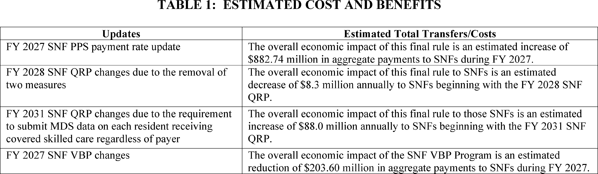
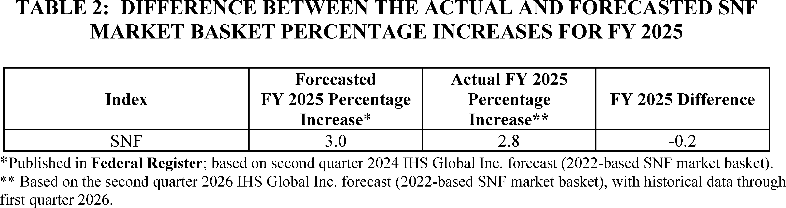
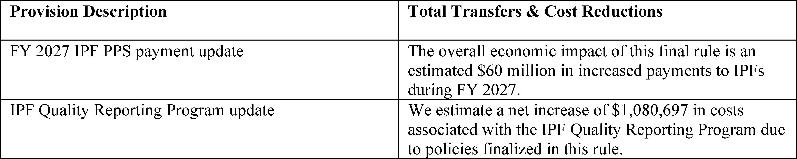
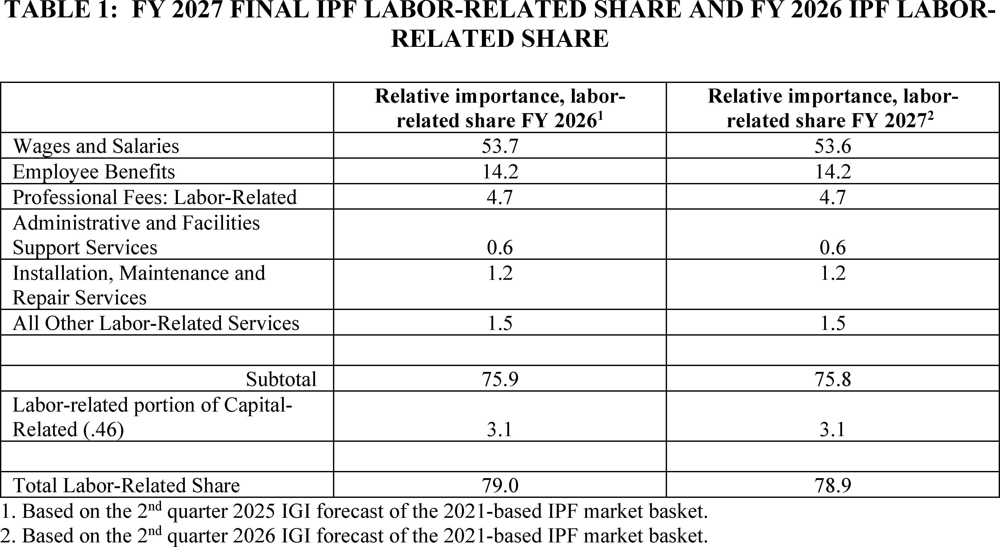
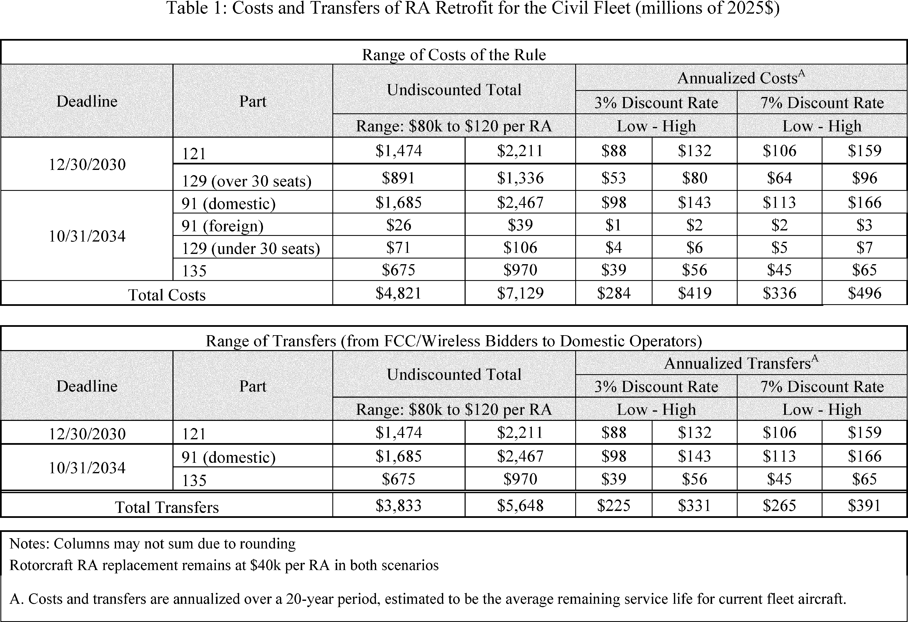
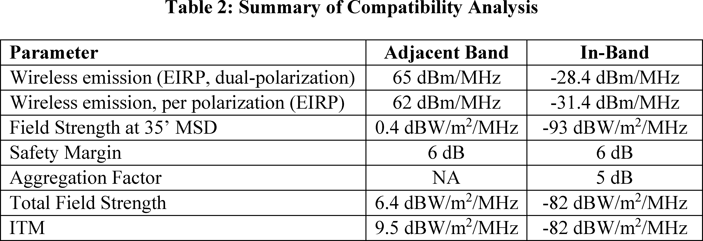
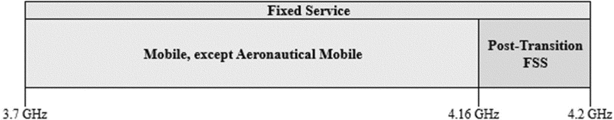
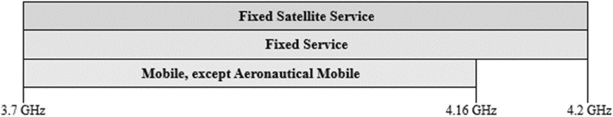

# Daily Digest — 2026-07-31

| | |
|---|---|
| **Digest date** | 2026-07-31 |
| **Data date range** | 2026-07-31 to 2026-07-31 |
| **Generated at** | 2026-08-01T03:07:18Z (UTC) |
| **Pipeline version** | 63a37dc |
| **Source watermarks** | CREC: 2026-07-31T09:55:23Z · BILLS: 2026-07-31T10:32:48Z · FR: 2026-07-31T07:57:51Z · USCOURTS: 2026-08-01T00:30:18Z · PLAW: 2026-07-25T00:00:00Z |

All items below cite the govinfo package (and granule, where applicable) they
summarize. Selection is mechanical; each item states the rule that included
it. See the Coverage Statement at the end for a full accounting of what was
published, what was summarized, and what was excluded and why.

---

## Contents

- [Day in Review](#day-in-review)
- [1. Congressional Floor Activity](#1-congressional-floor-activity)
- [2. Legislation](#2-legislation)
- [3. Federal Register](#3-federal-register)
- [4. Enacted Laws](#4-enacted-laws)
- [5. Judicial Activity](#5-judicial-activity)
- [6. Agency Announcements](#6-agency-announcements)
- [7. Recorded Votes](#7-recorded-votes)
- [8. Bill Actions](#8-bill-actions)
- [Terms Used Today](#terms-used-today)
- [Coverage Statement](#coverage-statement)
- [Methodology](#methodology)

---

## Day in Review

The congressional record for the day consists of eight recorded roll call votes. No floor summaries accompanied them in this collection; the votes are listed with their official citations below.

The executive and regulatory record is larger: 35 final rules, five proposed rules, 107 notices, one presidential document, and 902 agency press releases. The President continued the national emergency with respect to Lebanon, first declared in August 2007, for another year through August 1, 2027. PHMSA accounted for much of the final-rule volume, confirming effective dates for a dozen direct final rules published April 24 that incorporate updated pipeline standards, and withdrawing two others. CMS issued FY 2027 payment updates for skilled nursing facilities and inpatient psychiatric facilities. The FCC adopted orders making 160 megahertz of the Upper C-band available for terrestrial wireless use, setting radio altimeter requirements, and imposing Emergency Alert System cybersecurity requirements, alongside a further proposed rulemaking on alerting systems. The FAA established Prohibited Area P-75 over the President's New York residence and amended New York Class B airspace to exclude it, and adjusted airspace and routes in Connecticut, Alaska, and Nebraska. OPM removed references to the Uniform Guidelines on Employee Selection Procedures, citing a June 9, 2026 Office of Legal Counsel opinion. Proposed rules included an FRA English language proficiency requirement for locomotive engineers and conductors.

*Composed from the summarized items below and the day's mechanical
counts; all specifics are cited in their sections.*

---

## 1. Congressional Floor Activity

Source: Congressional Record (CREC), daily edition for 2026-07-31. Total issue size: 0 granule(s).

### 1.1 Senate

No Senate floor items met the selection thresholds. 0 floor granule(s) are accounted for in the Coverage Statement.

### 1.2 House of Representatives

No House floor items met the selection thresholds. 0 floor granule(s) are accounted for in the Coverage Statement.

### 1.3 Recorded Votes

No recorded votes were published in this issue of the Congressional Record.

---

## 2. Legislation

Source: Congressional Bills (BILLS), text versions published 2026-07-31 to 2026-07-31.

### 2.1 Counts by Stage

| Stage (bill text version) | Count |
|---|---|
| Introduced (ih/is) | 0 |
| Reported (rh/rs) | 0 |
| Engrossed (eh/es) | 0 |
| Enrolled (enr) | 0 |
| Other versions | 0 |
| **Total bill texts published** | **0** |

### 2.2 Bills Listed by Mechanical Rule

Bills below are listed because they matched at least one listing rule; the
matching rule is stated per item. All other bill texts are counted above and
accounted for in the Coverage Statement.

No bill texts published in this range matched a listing rule; all 0 are
accounted for in the Coverage Statement.

---

## 3. Federal Register

Source: Federal Register (FR), issue of 2026-07-31.

### 3.1 Counts by Document Type

| Document type | Count |
|---|---|
| Rules | 35 |
| Proposed rules | 5 |
| Notices | 107 |
| Presidential documents | 1 |
| **Total FR documents** | **148** |

### 3.2 Rules Published

Tags: department of the interior · department of transportation · executive · model keys: airspace · medicare · motor vehicle safety

*In plain terms: 35 rules, led by pipeline safety standards confirmations; the rest are Medicare updates, airspace amendments, and agency procedures.*

#### DEPARTMENT OF AGRICULTURE

- **Clingstone Peach Diversion Program; Amendment of Program Regulations** (2026-15525; 7 CFR Part 82) — This interim final rule amends the regulatory requirements for the Clingstone Peach Diversion Program (Program). The Program is voluntary, consists of payments for peach tree removal, and is implemented under clause (3) of section 32 of the Agricultural Adjustment Act Amendment of 1935, as amended. The Program is expected to reestablish the purchasing power of clingstone peach growers by making payments to such growers to facilitate reductions in peach production capacity. This action will help to align the domestic supply of clingstone peaches with the market demand for those peaches and thus mitigate the economic effects of systemic oversupply. The parameters established herein will ensure that diversion under this Program is not part of a normal tree replacement cycle for orchard rejuvenation. This rule also announces the Agricultural Marketing Service's intention to request approval by the Office of Management and Budget of new information collection requirements necessary to implement the Program. Action: Interim final rule with request for comments. Dates: Effective August 3, 2026. Comments received by September 29, 2026 will be considered prior to issuance of a final rule.
  - *In plain terms:* A rule that takes effect now while public comments are still accepted updates the voluntary program that pays peach growers to remove trees and reduce production.
  - Included because: FR-SEL-01 — document type: final rule (all listed)
  - Source: [FR-2026-07-31 / 2026-15525](https://www.govinfo.gov/app/details/FR-2026-07-31/2026-15525)

#### DEPARTMENT OF HEALTH AND HUMAN SERVICES

- **Medicare Program; Prospective Payment System and Consolidated Billing for Skilled Nursing Facilities; Updates to the Quality Reporting Program for Federal Fiscal Year 2027** (2026-15562; 42 CFR Part 413) — This final rule finalizes changes and updates to the policies and payment rates used under the Skilled Nursing Facility (SNF) Prospective Payment System (PPS) for fiscal year (FY) 2027. This final rule also updates the requirements for the SNF Quality Reporting Program and the SNF Value-Based Purchasing Program. Action: Final rule. Dates: These regulations are effective on October 1, 2026.
  - *In plain terms:* This rule finalizes payment rates and policy changes for skilled nursing facilities for fiscal year 2027 and updates quality reporting requirements.
  - Included because: FR-SEL-01 — document type: final rule (all listed)
  - Source: [FR-2026-07-31 / 2026-15562](https://www.govinfo.gov/app/details/FR-2026-07-31/2026-15562)
  -  *Source graphic 1 of 34 from 2026-15562.*
  -  *Source graphic 2 of 34 from 2026-15562.*
  - *Graphics not rendered here: 32 of 34 — see the [source PDF](https://www.govinfo.gov/content/pkg/FR-2026-07-31/pdf/FR-2026-07-31.pdf).*
- **Reducing Bureaucracy and Burden for Family Assistance Programs** (2026-15567; 45 CFR Parts 201, 204, 205, 225, 233, 234, 235, 237, 260, 261, 262, 263, 264, 265, 270, 283, 284, 286, and 287) — This final rule amends the Grants to States for Public Assistance Programs regulations, the General Administration—State Plans and Grant Appeals regulations, the General Administration—Public Assistance Programs regulations, the Training and Use of Subprofessionals and Volunteers regulations, the Coverage and Conditions of Eligibility in Financial Assistance Programs regulations, the Financial Assistance to Individuals regulations, the Administration of Financial Assistance Programs regulations, the Fiscal Administration of Financial Assistance Programs regulations, the General Temporary Assistance for Needy Families (TANF) Provisions regulations, the Ensuring That Recipients Work regulations, the Accountability Provisions—General regulations, the Expenditures of State and Federal TANF Funds regulations, the Other Accountability Provisions regulations, the Data Collection and Reporting Requirements regulations, the High Performance Bonus Awards regulations, the Implementation of Section 403(a)(2) of the Social Security Act Bonus to Reward Decrease in Illegitimacy Ratio regulations, the Methodology for Determining Whether an Increase in a State or Territory's Child Poverty Rate Is t [official summary truncated; see source] Action: Final rule. Dates: Effective date September 29, 2026.
  - *In plain terms:* This rule amends regulations for multiple state assistance programs including Temporary Assistance for Needy Families to reduce administrative requirements.
  - Included because: FR-SEL-01 — document type: final rule (all listed)
  - Source: [FR-2026-07-31 / 2026-15567](https://www.govinfo.gov/app/details/FR-2026-07-31/2026-15567)
- **Medicare Program; FY 2027 Inpatient Psychiatric Facilities Prospective Payment System—Rate Update** (2026-15588; 42 CFR Part 412) — This final rule updates the prospective payment rates, the outlier threshold, and the wage index for Medicare inpatient hospital services provided by Inpatient Psychiatric Facilities (IPFs), which include psychiatric hospitals and excluded psychiatric units of an acute care hospital or critical access hospital. This final rule also refines the Inpatient Psychiatric Facilities Prospective Payment System (IPF PPS) outlier policy. These changes will be effective for IPF discharges occurring during the fiscal year beginning October 1, 2026, through September 30, 2027. We are also finalizing the implementation of a standardized IPF patient assessment instrument, and removing two measures used in the Inpatient Psychiatric Facilities Quality Reporting Program. Action: Final rule. Dates: These regulations are effective October 1, 2026.
  - *In plain terms:* Medicare is updating payment rates and policies for inpatient psychiatric facilities effective October 1, 2026 through September 30, 2027, and implementing a new patient assessment tool.
  - Included because: FR-SEL-01 — document type: final rule (all listed)
  - Source: [FR-2026-07-31 / 2026-15588](https://www.govinfo.gov/app/details/FR-2026-07-31/2026-15588)
  -  *Source graphic 1 of 22 from 2026-15588.*
  -  *Source graphic 2 of 22 from 2026-15588.*
  - *Graphics not rendered here: 20 of 22 — see the [source PDF](https://www.govinfo.gov/content/pkg/FR-2026-07-31/pdf/FR-2026-07-31.pdf).*

#### DEPARTMENT OF HOMELAND SECURITY

- **Safety Zone; Fireworks Display, Ohio River, Follansbee, WV** (2026-15535; 33 CFR Part 165) — The Coast Guard is establishing a temporary safety zone for the Ohio River on August 1, 2026, from mile marker 70 to mile marker 71, near Follansbee, WV. The safety zone is needed to protect personnel, vessels, and the marine environment from potential hazards associated with a fireworks display. Entry of vessels or persons into this zone is prohibited unless specifically authorized by the Captain of the Port, Marine Safety Unit Pittsburgh, or their designated representative. Action: Temporary final rule. Dates: This rule is effective August 1, 2026. It will be enforced from 9:30 p.m. to 11:30 p.m.
  - *In plain terms:* The Coast Guard is establishing a temporary safety zone on the Ohio River on August 1, 2026, to protect people and vessels from a fireworks display.
  - Included because: FR-SEL-01 — document type: final rule (all listed)
  - Source: [FR-2026-07-31 / 2026-15535](https://www.govinfo.gov/app/details/FR-2026-07-31/2026-15535)

#### DEPARTMENT OF TRANSPORTATION

- **Temporary Exemption From Motor Vehicle Safety and Bumper Standards** (2026-15482; 49 CFR Part 555) — This interim final rule amends NHTSA's general exemption regulations to remove language limiting the application of temporary exemptions from the Federal Motor Vehicle Safety Standards (FMVSS) and the bumper standard to motor vehicles manufactured on and after the effective date of an exemption, and to align the regulations with the Administrator's statutory discretion to determine the vehicle population covered by a temporary exemption. It also removes the requirement that applications for exemption be submitted in three copies and specifies an electronic means for submission. Though these amendments are effective immediately, to benefit from comments interested parties and the public may have, NHTSA requests that any comments be submitted to the docket for this rule. Following the close of the comment period, NHTSA will publish a final rule responding to any comments received and making any appropriate changes to the interim final rule. Action: Interim final rule; request for comments. Dates: This interim final rule is effective July 31, 2026. Comments concerning this document are due no later than August 31, 2026.
  - *In plain terms:* A rule that takes effect now while public comments are still accepted removes restrictions on temporary vehicle safety exemptions and allows electronic applications.
  - Included because: FR-SEL-01 — document type: final rule (all listed)
  - Source: [FR-2026-07-31 / 2026-15482](https://www.govinfo.gov/app/details/FR-2026-07-31/2026-15482)
- **Amendment of Class B Airspace; New York, NY** (2026-15552; 14 CFR Part 71) — This action amends the Class B airspace in New York, NY, to exclude Prohibited Area 75 (P-75) that overlies the residence of the President of the United States. P-75 is simultaneously established through a separate rulemaking action under Docket No. FAA-2025-2635. Additionally, the FAA makes technical amendments to geographic coordinates, an airport name, and navigational aid (NAVAID) type in the airspace description to conform to the National Airspace System Resource (NASR) database. Action: Final rule. Dates: Effective date 0901 UTC, October 29, 2026. The Director of the Federal Register approves this incorporation by reference action under 1 CFR part 51, subject to the annual revision of FAA Order JO 7400.11 and publication of conforming amendments.
  - *In plain terms:* The FAA is excluding the area over the President's New York residence from New York's Class B airspace and updating geographic coordinates.
  - Included because: FR-SEL-01 — document type: final rule (all listed)
  - Source: [FR-2026-07-31 / 2026-15552](https://www.govinfo.gov/app/details/FR-2026-07-31/2026-15552)
- **Establishment of Prohibited Area P-75; New York, NY** (2026-15554; 14 CFR Part 73) — This action establishes Prohibited Area 75 (P-75) in the vicinity of the New York, NY, residence of the President of the United States. The United States Secret Service (USSS) requested that the FAA restrict aircraft operations in the vicinity of President Trump's New York residence. To provide adequate safeguards for the USSS to fully secure the non-Governmental property and USSS protectees in the interest of national security, the FAA is establishing a prohibited area in the immediate vicinity of the presidential residence. Action: Final rule. Dates: Effective date 0901 UTC, October 29, 2026.
  - *In plain terms:* The FAA is establishing a prohibited airspace area near the President's New York residence to restrict aircraft operations for national security.
  - Included because: FR-SEL-01 — document type: final rule (all listed)
  - Source: [FR-2026-07-31 / 2026-15554](https://www.govinfo.gov/app/details/FR-2026-07-31/2026-15554)
- **Amendment of Class D Airspace and Class E Airspace Over Groton, CT** (2026-15556; 14 CFR Part 71) — This action amends Class D and Class E airspace over Groton, CT. This action reduces the dimensions of the Groton, CT, Class D airspace to a 4.2-mile radius of the airport, excluding that airspace within a 1-mile radius of Elizabeth Field, Fishers Island, NY. This action updates the geographic coordinates for the Groton-New London Airport, Groton, CT, and the Elizabeth Field Airport, Fishers Island, NY, in the associated airspace legal descriptions. This action also updates the airport name for the Elizabeth Field Airport in the Groton, CT Class D airspace legal description. This action also replaces “Airport/Facility Directory” in the Groton, CT Class D airspace legal description with “Chart Supplement” to comply with current FAA guidance. This action also removes the exclusions of adjacent Class E airspace areas from the Groton, CT and Fishers Island, NY Class E airspace legal descriptions to comply with current FAA guidance. Action: Final rule. Dates: Effective 0901 UTC, October 29, 2026. The Director of the Federal Register approves this incorporation by reference action under 1 CFR part 51, subject to the annual revision of FAA Order JO 7400.11 and publication of conforming amendments.
  - *In plain terms:* The FAA is reducing the controlled airspace around Groton, Connecticut airport, updating geographic coordinates and airport names, and removing certain exclusions.
  - Included because: FR-SEL-01 — document type: final rule (all listed)
  - Source: [FR-2026-07-31 / 2026-15556](https://www.govinfo.gov/app/details/FR-2026-07-31/2026-15556)
- **Pipeline Safety: Standards Update—ASTM D2564** (2026-15568; 49 CFR Part 192) — PHMSA is confirming the effective date for a DFR published in the Federal Register on April 24, 2026. The DFR amended PHMSA's regulations at 49 CFR part 192 to incorporate by reference the updated industry standard ASTM D2564, Standard Specification for Solvent Cements for Poly (Vinyl Chloride) (PVC) Plastic Piping Systems. Action: Direct final rule (DFR); confirmation of effective date. Dates: The effective date of the DFR is January 1, 2027.
  - *In plain terms:* PHMSA is confirming the effective date for a rule that incorporates an industry standard for solvent cement used in plastic gas piping.
  - Included because: FR-SEL-01 — document type: final rule (all listed)
  - Source: [FR-2026-07-31 / 2026-15568](https://www.govinfo.gov/app/details/FR-2026-07-31/2026-15568)
- **Pipeline Safety: Electronic Retention of Part 194 Response Plans** (2026-15569; 49 CFR Part 194) — PHMSA is confirming the effective date for a DFR titled “Pipeline Safety: Electronic Retention of Part 194 Response Plans,” which published in the Federal Register on April 24, 2026. The DFR amended oil spill response plan requirements to clarify that operators may maintain the plans electronically. Action: Direct final rule (DFR); confirmation of effective date. Dates: The effective date of the DFR is August 3, 2026.
  - *In plain terms:* PHMSA is confirming the effective date for a rule allowing pipeline operators to maintain oil spill response plans electronically.
  - Included because: FR-SEL-01 — document type: final rule (all listed)
  - Source: [FR-2026-07-31 / 2026-15569](https://www.govinfo.gov/app/details/FR-2026-07-31/2026-15569)
- **Pipeline Safety: Standards Update—ASTM F1973** (2026-15570; 49 CFR Part 192) — PHMSA is confirming the effective date for a DFR published in the Federal Register on April 24, 2026. The DFR amended PHMSA's regulations at 49 CFR part 192 to incorporate by reference the updated industry standard ASTM F1973, Standard Specification for Factory Assembled Anodeless Risers and Transition Fittings in Polyethylene (PE) and Polyamide (PA11) and Polyamide 12 (PA12) Fuel Gas Distribution Systems. Action: Direct final rule (DFR); confirmation of effective date. Dates: The effective date of the DFR is January 1, 2027.
  - *In plain terms:* PHMSA is confirming the effective date for a rule incorporating an industry standard for factory-built risers and fittings in fuel gas systems.
  - Included because: FR-SEL-01 — document type: final rule (all listed)
  - Source: [FR-2026-07-31 / 2026-15570](https://www.govinfo.gov/app/details/FR-2026-07-31/2026-15570)
- **Pipeline Safety: Standards Update—NFPA 58** (2026-15571; 49 CFR Part 192) — PHMSA is confirming the effective date for a DFR published in the Federal Register on April 24, 2026. The DFR amended PHMSA's regulations at 49 CFR part 192 to incorporate by reference the updated industry standard NFPA 58, Liquefied Petroleum Gas Code (NFPA 58). Action: Direct final rule (DFR); confirmation of effective date. Dates: The effective date of the DFR is January 1, 2027.
  - *In plain terms:* PHMSA is confirming the effective date for a rule incorporating the industry standard code for liquefied petroleum gas systems.
  - Included because: FR-SEL-01 — document type: final rule (all listed)
  - Source: [FR-2026-07-31 / 2026-15571](https://www.govinfo.gov/app/details/FR-2026-07-31/2026-15571)
- **Pipeline Safety: Standards Update—NFPA 59** (2026-15572; 49 CFR Part 192) — PHMSA is confirming the effective date for a DFR published in the Federal Register on April 24, 2026. The DFR amended PHMSA's regulations at 49 CFR part 192 to incorporate by reference the updated industry standard NFPA 59, Utility LP-Gas Plant Code (NFPA 59). Action: Direct final rule (DFR); confirmation of effective date. Dates: The effective date of the DFR is January 1, 2027.
  - *In plain terms:* PHMSA is confirming the effective date for a rule incorporating the industry standard code for liquefied gas plant facilities.
  - Included because: FR-SEL-01 — document type: final rule (all listed)
  - Source: [FR-2026-07-31 / 2026-15572](https://www.govinfo.gov/app/details/FR-2026-07-31/2026-15572)
- **Pipeline Safety: Standards Update—NACE SP0502** (2026-15573; 49 CFR Parts 192 and 195) — PHMSA is confirming the effective date for the DFR titled “Pipeline Safety: Standards Update—NACE SP0502,” which published in the Federal Register on April 24, 2026. The DFR incorporates by reference into 49 CFR parts 192 and 195 the updated edition of industry standard NACE SP0502, Pipeline External Corrosion Direct Assessment Methodology. Action: Direct final rule (DFR); confirmation of effective date. Dates: The effective date of the DFR is January 1, 2027.
  - *In plain terms:* PHMSA is confirming the effective date for a rule incorporating an industry standard for assessing external corrosion on pipelines.
  - Included because: FR-SEL-01 — document type: final rule (all listed)
  - Source: [FR-2026-07-31 / 2026-15573](https://www.govinfo.gov/app/details/FR-2026-07-31/2026-15573)
- **Pipeline Safety: Standards Update—NACE SP0206** (2026-15574; 49 CFR Part 192) — PHMSA is confirming the effective date for the DFR titled “Pipeline Safety: Standards Update—NACE SP0206,” which published in the Federal Register on April 24, 2026. The DFR incorporates by reference into 49 CFR part 192 the updated edition of industry standard NACE SP0206, Internal Corrosion Direct Assessment Methodology for Pipelines Carrying Normally Dry Natural Gas. Action: Direct final rule (DFR); confirmation of effective date. Dates: The effective date of the DFR is January 1, 2027.
  - *In plain terms:* PHMSA is confirming the effective date for a rule incorporating an industry standard for assessing internal corrosion in dry natural gas pipelines.
  - Included because: FR-SEL-01 — document type: final rule (all listed)
  - Source: [FR-2026-07-31 / 2026-15574](https://www.govinfo.gov/app/details/FR-2026-07-31/2026-15574)
- **Pipeline Safety: Standards Update—MSS SP-75** (2026-15575; 49 CFR Part 195) — PHMSA is confirming the effective date for a DFR published in the Federal Register on April 24, 2026. The DFR amended PHMSA's regulations at 49 CFR part 195 to incorporate by reference the updated industry standard MSS SP-75, High-Strength, Wrought, Butt-Welding Fittings. Action: Direct final rule (DFR); confirmation of effective date. Dates: The effective date of the DFR is January 1, 2027.
  - *In plain terms:* PHMSA is confirming the effective date for a rule incorporating an industry standard for high-strength welded pipe fittings.
  - Included because: FR-SEL-01 — document type: final rule (all listed)
  - Source: [FR-2026-07-31 / 2026-15575](https://www.govinfo.gov/app/details/FR-2026-07-31/2026-15575)
- **Pipeline Safety: Standards Update—ASTM F2620** (2026-15576; 49 CFR Part 192) — PHMSA is confirming the effective date for a DFR published in the Federal Register on April 24, 2026. The DFR amended PHMSA's regulations at 49 CFR part 192 to incorporate by reference the updated industry standard ASTM F2620, Standard Practice for Heat Fusion Joining of Polyethylene Pipe and Fittings. Action: Direct final rule (DFR); confirmation of effective date. Dates: The effective date of the DFR is January 1, 2027.
  - *In plain terms:* PHMSA is confirming the effective date for a rule incorporating an industry standard for heat-fusion joining of plastic gas piping.
  - Included because: FR-SEL-01 — document type: final rule (all listed)
  - Source: [FR-2026-07-31 / 2026-15576](https://www.govinfo.gov/app/details/FR-2026-07-31/2026-15576)
- **Pipeline Safety: Standards Update—ASTM F2767** (2026-15577; 49 CFR Part 192) — PHMSA is confirming the effective date for a DFR published in the Federal Register on April 24, 2026. The DFR amended PHMSA's regulations at 49 CFR part 192 to incorporate by reference the updated industry standard ASTM F2767, Standard Specification for Electrofusion Type Polyamide-12 Fittings for Outside Diameter Controlled Polyamide-12 Pipe and Tubing for Gas Distribution. Action: Direct final rule (DFR); confirmation of effective date. Dates: The effective date of the DFR is January 1, 2027.
  - *In plain terms:* PHMSA is confirming the effective date for a rule incorporating an industry standard for electrofusion fittings in plastic gas distribution systems.
  - Included because: FR-SEL-01 — document type: final rule (all listed)
  - Source: [FR-2026-07-31 / 2026-15577](https://www.govinfo.gov/app/details/FR-2026-07-31/2026-15577)
- **Pipeline Safety: Standards Update—ASTM D2513** (2026-15578; 49 CFR Part 192) — PHMSA is confirming the effective date for a DFR published in the Federal Register on April 24, 2026. The DFR amended PHMSA's regulations at 49 CFR part 192 to incorporate by reference the updated industry standard ASTM D2513, Standard Specification for Polyethylene (PE) Gas Pressure Pipe, Tubing, and Fittings. Action: Direct final rule (DFR); confirmation of effective date. Dates: The effective date of the DFR is January 1, 2027.
  - *In plain terms:* PHMSA is confirming the effective date for a rule incorporating an industry standard for polyethylene gas distribution piping and fittings.
  - Included because: FR-SEL-01 — document type: final rule (all listed)
  - Source: [FR-2026-07-31 / 2026-15578](https://www.govinfo.gov/app/details/FR-2026-07-31/2026-15578)
- **Pipeline Safety: Standards Update—ASME B31.4** (2026-15579; 49 CFR Part 195) — PHMSA is withdrawing the DFR titled “Pipeline Safety: Standards Update—ASME B31.4,” which published on April 24, 2026. Action: Withdrawal of direct final rule (DFR). Dates: Effective July 31, 2026, PHMSA withdraws the DFR published at 91 FR 22039 on April 24, 2026.
  - *In plain terms:* PHMSA is withdrawing a rule that was intended to incorporate an industry standard for pipeline design and construction.
  - Included because: FR-SEL-01 — document type: final rule (all listed)
  - Source: [FR-2026-07-31 / 2026-15579](https://www.govinfo.gov/app/details/FR-2026-07-31/2026-15579)
- **Pipeline Safety: Standards Update—ASTM F1055** (2026-15580; 49 CFR Part 192) — PHMSA is confirming the effective date for a DFR published in the Federal Register on April 24, 2026. The DFR amended PHMSA's regulations at 49 CFR part 192 to incorporate by reference the updated industry standard ASTM F1055, Standard Specification for Electrofusion Type Polyethylene Fittings for Outside Diameter Controlled Polyethylene and Crosslinked Polyethylene (PEX) Pipe and Tubing. Action: Direct final rule (DFR); confirmation of effective date. Dates: The effective date of the DFR is January 1, 2027.
  - *In plain terms:* PHMSA is confirming the effective date for a rule incorporating an industry standard for electrofusion fittings in plastic gas piping.
  - Included because: FR-SEL-01 — document type: final rule (all listed)
  - Source: [FR-2026-07-31 / 2026-15580](https://www.govinfo.gov/app/details/FR-2026-07-31/2026-15580)
- **Pipeline Safety: Standards Update—ASTM A372/A372M** (2026-15581; 49 CFR Part 192) — PHMSA is confirming the effective date for a DFR published in the Federal Register on April 24, 2026. The DFR amended PHMSA's regulations at 49 CFR part 192 to incorporate by reference the updated industry standard ASTM A372/A372M, Standard Specification for Carbon and Alloy Steel Forgings for Thin-Walled Pressure Vessels (ASTM A372/A372M). Action: Direct final rule (DFR); confirmation of effective date. Dates: The effective date of the DFR is January 1, 2027.
  - *In plain terms:* PHMSA is confirming the effective date for a rule incorporating an industry standard for steel forgings used in pressure vessels.
  - Included because: FR-SEL-01 — document type: final rule (all listed)
  - Source: [FR-2026-07-31 / 2026-15581](https://www.govinfo.gov/app/details/FR-2026-07-31/2026-15581)
- **Pipeline Safety: Clarifying Hazardous Liquid Pipeline Integrity Management Guidance** (2026-15582; 49 CFR Part 195) — PHMSA is withdrawing the DFR titled “Pipeline Safety: Clarifying Hazardous Liquid Pipeline Integrity Management Guidance,” which published on April 24, 2026. Action: Withdrawal of direct final rule (DFR). Dates: Effective July 31, 2026, PHMSA withdraws the DFR published in the Federal Register at 91 FR 22047 on April 24, 2026.
  - *In plain terms:* PHMSA is withdrawing guidance about managing the integrity of hazardous liquid pipelines that was published on April 24, 2026.
  - Included because: FR-SEL-01 — document type: final rule (all listed)
  - Source: [FR-2026-07-31 / 2026-15582](https://www.govinfo.gov/app/details/FR-2026-07-31/2026-15582)
- **Pipeline Safety: Standards Update—ASTM A333/A333M** (2026-15583; 49 CFR Parts 192 and 195) — PHMSA is confirming the effective date for a DFR published in the Federal Register on April 24, 2026. The DFR amended PHMSA's regulations at 49 CFR parts 192 and 195 to incorporate by reference the updated industry standard ASTM A333/A333M, Standard Specification for Seamless and Welded Steel Pipe for Low-Temperature Service and Other Applications with Required Notch Toughness (ASTM A333/A333M). Action: Direct final rule (DFR); confirmation of effective date. Dates: The effective date of the DFR is January 1, 2027.
  - *In plain terms:* PHMSA is confirming the effective date for updated regulations incorporating the ASTM A333/A333M standard for steel pipe for low-temperature service.
  - Included because: FR-SEL-01 — document type: final rule (all listed)
  - Source: [FR-2026-07-31 / 2026-15583](https://www.govinfo.gov/app/details/FR-2026-07-31/2026-15583)
- **Pipeline Safety: Standards Update—ASTM A53/A53M** (2026-15584; 49 CFR Parts 192 and 195) — PHMSA is confirming the effective date for a DFR published in the Federal Register on April 24, 2026. The DFR amended PHMSA's regulations at 49 CFR parts 192 and 195 to incorporate by reference the updated industry standard ASTM A53/A53M, Standard Specification for Pipe, Steel, Black and Hot-Dipped, Zinc-Coated, Welded and Seamless (ASTM A53/A53M). Action: Direct final rule (DFR); confirmation of effective date. Dates: PHMSA confirms the effective date of January 1, 2027, for the DFR that appeared in the Federal Register on April 24, 2026 (91 FR 22032) .
  - *In plain terms:* PHMSA is confirming the effective date for updated regulations incorporating the ASTM A53/A53M standard for steel pipe.
  - Included because: FR-SEL-01 — document type: final rule (all listed)
  - Source: [FR-2026-07-31 / 2026-15584](https://www.govinfo.gov/app/details/FR-2026-07-31/2026-15584)
- **Requirements for Interference-Tolerant Radio Altimeter Systems** (2026-15585; 14 CFR Parts 91, 121, and 129) — In July 2025, President Trump signed the One Big Beautiful Bill Act. Section 40002 of that law re-institutes the Federal Communications Commission's general auction authority and specifically directs the Commission to complete a system of competitive bidding for not less than 100 megahertz in the 3.98-4.2 gigahertz band (Upper C-band). This final rule supports the Federal Communications Commission's July 2026 Report and Order that makes 160 megahertz of the Upper C-band available for terrestrial wireless flexible use via a system of competitive bidding. To ensure safe, efficient, and reliable aviation operations in the presence of wireless signals in the C-band, the Federal Aviation Administration is issuing new regulations that require all radio altimeters to meet specific minimum performance requirements. These new radio altimeters must withstand interference from wireless signals in neighboring spectrum bands and continue to provide accurate altitude readings to both pilots and integrated aircraft safety systems. [official summary truncated; see source] Action: Final rule. Dates: Effective date: Effective September 29, 2026. Compliance date: The compliance date for the requirements in title 14 of the Code of Federal Regulations (14 CFR) sections 121.326 and 129.16(a) in this final rule is December 30, 2030, and the compliance date for the requirements in 14 CFR 91.220(a) and 129.16(b) is October 31, 2034.
  - *In plain terms:* The FAA is requiring radio altimeters to withstand interference from wireless signals in the C-band and provide accurate altitude readings.
  - Included because: FR-SEL-01 — document type: final rule (all listed)
  - Source: [FR-2026-07-31 / 2026-15585](https://www.govinfo.gov/app/details/FR-2026-07-31/2026-15585)
  -  *Source graphic 1 of 15 from 2026-15585.*
  -  *Source graphic 2 of 15 from 2026-15585.*
  - *Graphics not rendered here: 13 of 15 — see the [source PDF](https://www.govinfo.gov/content/pkg/FR-2026-07-31/pdf/FR-2026-07-31.pdf).*
- **Amendment of United States Area Navigation Route T-388 in the Vicinity of Kodiak, Alaska** (2026-15599; 14 CFR Part 71) — This action amends United States Area Navigation Route (RNAV) T-388 in the vicinity of Kodiak, Alaska. The FAA is taking this action to increase the route structure connectivity in Alaska. Action: Final rule. Dates: Effective date 0901 UTC, October 29, 2026. The Director of the Federal Register approves this incorporation by reference action under 1 CFR part 71, subject to the annual revision of FAA Order JO 7400.11 and publication of conforming amendments.
  - *In plain terms:* The FAA is amending Area Navigation Route T-388 in Alaska to improve route connectivity.
  - Included because: FR-SEL-01 — document type: final rule (all listed)
  - Source: [FR-2026-07-31 / 2026-15599](https://www.govinfo.gov/app/details/FR-2026-07-31/2026-15599)
- **Amendment of United States Area Navigation Routes (RNAV) T-285 and T-286 in the Vicinity of Thedford, NE** (2026-15603; 14 CFR Part 71) — This action amends the published coordinates of the Thedford, NE, Very High Frequency Omnidirectional Range/Distance Measuring Equipment (VOR/DME) in the legal descriptions of Area Navigation (RNAV) routes T-285 and T-286 in the vicinity of Thedford, NE. The FAA is taking this action due to discovering that the published coordinates were incorrect by a distance of 344 feet. Action: Final rule. Dates: Effective date 0901 UTC, October 29, 2026. The Director of the Federal Register approves this incorporation by reference action under 1 CFR part 51, subject to the annual revision of FAA Order JO 7400.11 and publication of conforming amendments.
  - *In plain terms:* The FAA is correcting the coordinates for navigation routes near Thedford, Nebraska that were published 344 feet off.
  - Included because: FR-SEL-01 — document type: final rule (all listed)
  - Source: [FR-2026-07-31 / 2026-15603](https://www.govinfo.gov/app/details/FR-2026-07-31/2026-15603)

#### ENVIRONMENTAL PROTECTION AGENCY

- **Air Plan Approval; Rhode Island; Update to Materials Incorporated by Reference** (2026-15493; 40 CFR Part 52) — The Environmental Protection Agency (EPA) is updating the materials that are incorporated by reference (IBR) into the Rhode Island State Implementation Plan (SIP). The regulations affected by this update have been previously submitted by the State of Rhode Island and approved by the EPA. In this final rule, the EPA is also notifying the public of corrections and clarifying changes in the Code of Federal Regulations tables that identify the materials incorporated by reference into the Rhode Island SIP. This update affects the materials that are available for public inspection at the National Archives and Records Administration and the EPA Regional Office. Action: Final rule; administrative change. Dates: This rule is effective on July 31, 2026.
  - *In plain terms:* The EPA is updating the materials in Rhode Island's air quality plan and noting corrections and clarifying changes to them.
  - Included because: FR-SEL-01 — document type: final rule (all listed)
  - Source: [FR-2026-07-31 / 2026-15493](https://www.govinfo.gov/app/details/FR-2026-07-31/2026-15493)

#### FEDERAL COMMUNICATIONS COMMISSION

- **Upper C-Band (3.98-4.2 GHz); Expanding Flexible Use of the 3.7 to 4.2 GHz Band** (2026-15598; 47 CFR Parts 1, 25, and 27) — In this document, the Federal Communications Commission (Commission) adopted a Report and Order, Order of Proposed Modification, and Order on Reconsideration ( Order ), that expands the ecosystem for next-generation wireless services in the 3.7-4.2 GHz band (C-band) by making 160 megahertz of the 3.98-4.2 GHz band (Upper C-band) available for terrestrial wireless flexible use. This action is pursuant to Congress' direction in the One Big Beautiful Bill Act to complete a system of competitive bidding by July 4, 2027, for at least 100 megahertz of spectrum in the 3.98-4.2 GHz band. The Order creates a single 3.7 GHz Service that spans 3.7-4.14 GHz and adopts competitive bidding procedures for an auction. The Order largely applies the current Lower C-band licensing and operating rules to the Upper C-band, but it imposes more forward-leaning performance requirements. The Commission also generally adopts the Lower C-band technical rules for the Upper C-band, with certain modifications designed to reinforce a successful coexistence environment with adjacent band radio altimeters. [official summary truncated; see source] Action: Final rule. Dates: The rules are effective September 29, 2026, except for instruction 7 (§§ 25.138(a) and (b)); instruction 8 (§ 25.147); instruction 17 § (27.14(x)(3)); instruction 26 (§ 27.1412(b), (c), (e), and (g); instruction 28 (§ 27.1413(a)(3), (c)(1), (c)(9), (e) and (f)); instruction 30 (§ 27.1414(e)); instruction 31 (§ 27.1415); instruction 32 (§ 27.1416); instruction 33 (§ 27.1417); instruction 35 (§ 27.1419); instruction 37 (§ 27.1421); instruction 39 (§ 27.1422(c)); and instruction 41 § 27.1424 of the Commission's rules, which contain new or modified information collection requirements that require review by the Office of Management and Budget (OMB) under the Paperwork Reduction Act and will not become effective until the effective date for those information collections is announced in a document published in the Federal Register after the Commission receives OMB approval. The Federal Communications Commission will publish a document in the Federal Register announcing the effective date of these rule sections.
  - *In plain terms:* The FCC is making 160 megahertz of the Upper C-band available for wireless flexible use through competitive bidding per Congress's July 4, 2027 deadline.
  - Included because: FR-SEL-01 — document type: final rule (all listed)
  - Source: [FR-2026-07-31 / 2026-15598](https://www.govinfo.gov/app/details/FR-2026-07-31/2026-15598)
  -  *Source graphic 1 of 8 from 2026-15598.*
  -  *Source graphic 2 of 8 from 2026-15598.*
  - *Graphics not rendered here: 6 of 8 — see the [source PDF](https://www.govinfo.gov/content/pkg/FR-2026-07-31/pdf/FR-2026-07-31.pdf).*
- **Modernization of the Nation's Alerting Systems; Protecting the Nation's Communications Systems From Cybersecurity Threats** (2026-15601; 47 CFR Part 11) — In the Report and Order, the Federal Communications Commission (the FCC or the Commission) seeks to preserve the public's trust in the Emergency Alert System (EAS) by requiring targeted cybersecurity improvements that will help protect against hijacking by cybercriminals and our nation's adversaries. Action: Final rule. Dates: This rule is effective September 29, 2026.
  - *In plain terms:* The FCC is requiring cybersecurity improvements to the Emergency Alert System to protect against hijacking by cybercriminals and adversaries.
  - Included because: FR-SEL-01 — document type: final rule (all listed)
  - Source: [FR-2026-07-31 / 2026-15601](https://www.govinfo.gov/app/details/FR-2026-07-31/2026-15601)

#### OFFICE OF PERSONNEL MANAGEMENT

- **Removal of References to the Uniform Guidelines on Employee Selection Procedures in Federal Personnel Regulations** (2026-15586; 5 CFR Parts 300, 330, 337 and 720) — The Office of Personnel Management (OPM) is issuing an interim final rule with request for comments to remove references to the Uniform Guidelines on Employee Selection Procedures (UGESP) from Federal civil service regulations. These amendments conform OPM's regulations to the Department of Justice, Office of Legal Counsel's June 9, 2026, opinion finding the UGESP unlawful. Action: Interim final rule; request for comments. Dates: This rule is effective July 31, 2026. Comment date: Comments must be received on or before September 29, 2026. OPM will consider all timely comments received. After reviewing the comments, OPM may revise, withdraw, or confirm this interim final rule through a subsequent document published in the Federal Register .
  - *In plain terms:* OPM is removing references to the Uniform Guidelines on Employee Selection Procedures from federal civil service rules, effective now while public comments are still accepted, per a June 2026 legal opinion finding them unlawful.
  - Included because: FR-SEL-01 — document type: final rule (all listed)
  - Source: [FR-2026-07-31 / 2026-15586](https://www.govinfo.gov/app/details/FR-2026-07-31/2026-15586)
- **Procedures for Settling Claims** (2026-15589; 5 CFR Part 178) — The Office of Personnel Management (OPM) is issuing this direct final rule to update the provisions concerning administrative claims submissions to OPM. Action: Direct final rule. Dates: This direct final rule (DFR) is effective September 29, 2026 unless significant adverse comment is submitted by August 31, 2026. If OPM receives significant adverse comment, OPM will publish a timely withdrawal in the Federal Register .
  - *In plain terms:* The Office of Personnel Management is updating rules for submitting administrative claims to OPM.
  - Included because: FR-SEL-01 — document type: final rule (all listed)
  - Source: [FR-2026-07-31 / 2026-15589](https://www.govinfo.gov/app/details/FR-2026-07-31/2026-15589)
- **FLSA Claims and Compliance** (2026-15597; 5 CFR Part 551) — The Office of Personnel Management (OPM) is issuing this direct final rule to update the provisions concerning Fair Labor Standards Act (FLSA) claims submissions to OPM. Action: Direct final rule. Dates: This direct final rule (DFR) is effective September 29, 2026 unless significant adverse comment is submitted by August 31, 2026. If OPM receives significant adverse comment, OPM will publish a timely withdrawal in the Federal Register .
  - *In plain terms:* The Office of Personnel Management is updating rules for submitting Fair Labor Standards Act claims to OPM.
  - Included because: FR-SEL-01 — document type: final rule (all listed)
  - Source: [FR-2026-07-31 / 2026-15597](https://www.govinfo.gov/app/details/FR-2026-07-31/2026-15597)

### 3.3 Proposed Rules Published

Tags: department of the interior · department of transportation · executive · model keys: aviation · emergency alerts · rail

*In plain terms: 5 proposed rules on air fare advertising, aircraft engine inspections, emergency alert systems, aviation routes, and rail certification.*

#### DEPARTMENT OF TRANSPORTATION

- **Enhancing Flexibility of Air Fare Price Advertising** (2026-15529; 14 CFR Part 399) — The U.S. Department of Transportation (Department or DOT) is extending the comment end date for interested persons to submit comments to its proposed rule on Enhancing Flexibility of Air Fare Price Advertising from July 31, 2026, to August 21, 2026. Action: Proposed rule; extension of comment period. Dates: The comment period for the proposed rule, which was published in the Federal Register on July 1, 2026, at 91 FR 39932, is extended to August 21, 2026.
  - *In plain terms:* The Department of Transportation is extending the deadline for comments on air fare price advertising rules from July 31 to August 21, 2026.
  - Included because: FR-SEL-02 — document type: proposed rule (all listed)
  - Source: [FR-2026-07-31 / 2026-15529](https://www.govinfo.gov/app/details/FR-2026-07-31/2026-15529)
- **Airworthiness Directives; CFM International, S.A. Engines** (2026-15532; 14 CFR Part 39) — The FAA proposes to supersede Airworthiness Directive (AD) 2018-26-01, which applies to all CFM International, S.A. (CFM) Model CFM56-7B engines. AD 2018-26-01 requires initial and repetitive ultrasonic inspections or eddy current inspections of certain fan blades for crack indications and, depending on the results of the inspections, replacement with parts eligible for installation. Since the FAA issued AD 2018-26-01, CFM issued updated service material providing improvements to the ultrasonic inspection procedures and expanding the inspection area. This proposed AD would require initial and repetitive ultrasonic inspections or eddy current inspections of certain fan blades for crack indications and, depending on the results of the inspections, replacement with parts eligible for installation. The FAA is proposing this AD to address the unsafe condition on these products. Action: Notice of proposed rulemaking (NPRM). Dates: The FAA must receive comments on this proposed AD by August 31, 2026.
  - *In plain terms:* The FAA is proposing updated requirements for ultrasonic and eddy current inspections of certain jet engine fan blades, incorporating improved inspection procedures.
  - Included because: FR-SEL-02 — document type: proposed rule (all listed)
  - Source: [FR-2026-07-31 / 2026-15532](https://www.govinfo.gov/app/details/FR-2026-07-31/2026-15532)
- **Amendment of Jet Route J-24 and Very High Frequency Omnidirectional Range Federal Airways V-244, V-508 and Revocation of Very High Frequency Omnidirectional Range Federal Airway V-255 in the Vicinity of Hays, Kansas.** (2026-15602; 14 CFR Part 71) — This action proposes to amend Jet Route J-24 and Very High Frequency Omnidirectional Range Federal (VOR) Airways V-244 and V-508 and revoke VOR Federal Airway V-255 in the vicinity of Hays, Kansas. The FAA is proposing this action due to the planned decommissioning of the VOR portion of the Hays, KS, VOR/Tactical Air Navigation (VORTAC) navigational aid (NAVAID). The VOR portion of this NAVAID is being decommissioned as part of the FAA's VOR Minimum Operational Network (MON) program. The TACAN portion of this NAVAID will be retained. Action: Notice of proposed rulemaking (NPRM). Dates: Comments must be received on or before September 14, 2026.
  - *In plain terms:* The FAA is proposing to amend aviation routes near Hays, Kansas due to the planned decommissioning of a navigation aid's VOR portion.
  - Included because: FR-SEL-02 — document type: proposed rule (all listed)
  - Source: [FR-2026-07-31 / 2026-15602](https://www.govinfo.gov/app/details/FR-2026-07-31/2026-15602)
- **Qualification and Certification of Locomotive Engineers and Conductors; English Language Proficiency and Other Requirements** (2026-15605; 49 CFR Parts 240 and 242) — FRA proposes to amend its regulations governing the qualification and certification of locomotive engineers and conductors to establish English language proficiency as a requirement for a railroad carrier to certify and recertify locomotive engineers and conductors. FRA also proposes that each railroad carrier conducting a triennial examination of skill performance, and an annual operational monitoring observation for locomotive engineers, which are current requirements, conduct those examinations and observations without engaging energy management systems that limit the need for a locomotive engineer to operate the throttle or braking systems. Further, FRA proposes to codify limitations on operations at the southern border, including a 10 route-mile geographic limitation, to ensure domestic training, testing, and certification requirements for Mexican crew members are adequate. In addition, FRA proposes changes to clarify that a locomotive engineer or conductor's territorial qualification is limited to the specific direction of travel traversed during the qualification process. Action: Notice of proposed rulemaking (NPRM). Dates: Written comments must be received on or before September 29, 2026. FRA will consider comments received after that date to the extent practicable.
  - *In plain terms:* The Federal Railroad Administration is proposing to require English language proficiency for locomotive crews, restrict energy-saving systems during examinations, limit southern border operations to 10 route-miles, and limit territorial qualifications to specific travel directions.
  - Included because: FR-SEL-02 — document type: proposed rule (all listed)
  - Source: [FR-2026-07-31 / 2026-15605](https://www.govinfo.gov/app/details/FR-2026-07-31/2026-15605)

#### FEDERAL COMMUNICATIONS COMMISSION

- **Wireless Emergency Alerts; The Emergency Alert System; Modernization of the Nation's Alerting Systems** (2026-15600; 47 CFR Parts 0, 10, 11) — In this document, the Federal Communications Commission (“FCC” or “Commission”) adopted a Further Notice of Proposed Rulemaking that seeks comment on proposed rules intended to make the Emergency Alert System (EAS) and Wireless Emergency Alerts (WEA) more resilient, flexible, and useful. Action: Proposed rule. Dates: Comments are due on or before August 31, 2026, and reply comments are due on or before September 29, 2026.
  - *In plain terms:* The FCC is seeking comment on proposed rules to make the Emergency Alert System and Wireless Emergency Alerts more resilient, flexible, and useful.
  - Included because: FR-SEL-02 — document type: proposed rule (all listed)
  - Source: [FR-2026-07-31 / 2026-15600](https://www.govinfo.gov/app/details/FR-2026-07-31/2026-15600)

### 3.4 Notices and Presidential Documents

Tags: department of the interior · department of transportation · executive · model keys: lebanon · national emergency

*In plain terms: President continued the Lebanon national emergency through August 2027, originally declared in 2007.*

Notices are summarized only when they match a listing rule; all are counted
in 3.1 and in the Coverage Statement. Presidential documents in the FR are
always listed.

- **Continuation of the National Emergency With Respect to Lebanon** (2026-15658) — The President continued the national emergency with respect to Lebanon, initially declared in August 2007, for an additional year through August 1, 2027, pursuant to the National Emergencies Act. The continuation addresses ongoing threats including Iran's arms transfers to Hezbollah and Iranian funding and influence over the organization. The notice was transmitted to Congress and published in the Federal Register.
  - *In plain terms:* The President continued the national emergency for Lebanon through August 1, 2027 due to ongoing threats including Iranian arms transfers to Hezbollah.
  - Included because: FR-SEL-03 — presidential document (all listed)
  - Source: [FR-2026-07-31 / 2026-15658](https://www.govinfo.gov/app/details/FR-2026-07-31/2026-15658)

---

## 4. Enacted Laws

Source: Public and Private Laws (PLAW) published 2026-07-31.

No laws were published in this range.

---

## 5. Judicial Activity

Source: United States Courts Opinions (USCOURTS): opinions issued 2026-07-31
by participating federal courts.

Completeness disclosure (standing): USCOURTS carries opinions from
approximately 140 participating appellate, district, bankruptcy, and
national federal courts. Unlike the Congressional Record and the Federal
Register, which are the complete official record of their branches,
USCOURTS is participation-based and is NOT the complete federal judicial
record. Courts post opinions with delay; opinions filed on this date may
appear in later digests.

### 5.1 Appellate and National Court Opinions

Appellate and national court opinions are summarized; district and
bankruptcy opinions are counted in 5.2 and in the Coverage Statement.

No appellate or national court opinions matched a listing rule for this
date; all opinions are counted in 5.2 and accounted for in the Coverage
Statement.

### 5.2 Counts by Court Category

| Court category | Opinions |
|---|---|
| Appellate | 0 |
| District | 1 |
| Bankruptcy | 0 |
| National | 0 |
| **Total opinions extracted** | **1** |

Archive-window disclosure (rule USCOURTS-FETCH-01): 19499 USCOURTS package(s) have been listed in delta syncs but fell outside the 7-day archive window and were not fetched (global running count across all syncs, not limited to this date).

---

## 6. Agency Announcements

Official press releases and statements the agencies themselves date
on 2026-07-31 (sources listed in the source guide). These are the
agencies' own announcements — official advocacy, quoted and
attributed, not findings of this digest. Agency web content can be
edited or removed without notice; captures and hashes are preserved
per the provenance policy.

#### CFTC Press Releases

- **[CFTC Orders George Santos to Pay $35,000 for Manipulative Trading of State-of-the-Union Event Contract](https://www.cftc.gov/PressRoom/PressReleases/9276-26)** — dated 2026-07-31 by the agency
  - Included because: AGENCYPR-SEL-01 — official agency release dated this day by the agency (all such releases from active sources are listed; titles only in the pilot)
- **[ICYMI: Members of the CFTC’s Agricultural Advisory Committee Join Chairman Selig in Washington at First Meeting of 2026](https://www.cftc.gov/PressRoom/PressReleases/9275-26)** — dated 2026-07-31 by the agency
  - Included because: AGENCYPR-SEL-01 — official agency release dated this day by the agency (all such releases from active sources are listed; titles only in the pilot)

#### Defense News Releases

- **[Hegseth: Department Success Buoyed by Courage, Spirit, Leadership](https://www.war.gov/News/News-Stories/Article/Article/4561838/hegseth-department-success-buoyed-by-courage-spirit-leadership/)** — dated 2026-07-31 by the agency
  - Included because: AGENCYPR-SEL-01 — official agency release dated this day by the agency (all such releases from active sources are listed; titles only in the pilot)
- **[Oregon Guard Aircrews Support State Wildfire Response](https://www.war.gov/News/News-Stories/Article/Article/4561168/oregon-guard-aircrews-support-state-wildfire-response/)** — dated 2026-07-31 by the agency
  - Included because: AGENCYPR-SEL-01 — official agency release dated this day by the agency (all such releases from active sources are listed; titles only in the pilot)
- **[USS Minnesota Completes First Forward-Deployment](https://www.war.gov/News/News-Stories/Article/Article/4561139/uss-minnesota-completes-first-forward-deployment/)** — dated 2026-07-31 by the agency
  - Included because: AGENCYPR-SEL-01 — official agency release dated this day by the agency (all such releases from active sources are listed; titles only in the pilot)

#### DHS News Releases

- **[DHS Announces the Addition of 43 Companies to the UFLPA Entity List](https://www.dhs.gov/news/2026/07/31/dhs-announces-addition-43-companies-uflpa-entity-list)** — dated 2026-07-31 by the agency
  - Included because: AGENCYPR-SEL-01 — official agency release dated this day by the agency (all such releases from active sources are listed; titles only in the pilot)
- **[DHS Cracks Down on Non-Citizens Illegally Voting in New Jersey](https://www.dhs.gov/news/2026/07/31/dhs-cracks-down-non-citizens-illegally-voting-new-jersey)** — dated 2026-07-31 by the agency
  - Included because: AGENCYPR-SEL-01 — official agency release dated this day by the agency (all such releases from active sources are listed; titles only in the pilot)
- **[ICE Arrests Former “Dancing With the Stars” Contestant from Latvia with Violent Criminal History in California](https://www.dhs.gov/news/2026/07/31/ice-arrests-former-dancing-stars-contestant-latvia-violent-criminal-history)** — dated 2026-07-31 by the agency
  - Included because: AGENCYPR-SEL-01 — official agency release dated this day by the agency (all such releases from active sources are listed; titles only in the pilot)
- **[ICE Asks Idaho to Not Release Illegal Alien Charged with Repeatedly Sexually Abusing a Child](https://www.dhs.gov/news/2026/07/31/ice-asks-idaho-not-release-illegal-alien-charged-repeatedly-sexually-abusing-child)** — dated 2026-07-31 by the agency
  - Included because: AGENCYPR-SEL-01 — official agency release dated this day by the agency (all such releases from active sources are listed; titles only in the pilot)
- **[ICE Asks Texas to Not Release Criminal Illegal Alien Charged for Double Murder in Texas](https://www.dhs.gov/news/2026/07/31/ice-asks-texas-not-release-criminal-illegal-alien-charged-double-murder-texas)** — dated 2026-07-31 by the agency
  - Included because: AGENCYPR-SEL-01 — official agency release dated this day by the agency (all such releases from active sources are listed; titles only in the pilot)
- **[LAW AND ORDER: Crime Rates Reach Historic Lows Following DHS Deportations of Criminal Illegal Aliens](https://www.dhs.gov/news/2026/07/31/law-and-order-crime-rates-reach-historic-lows-following-dhs-deportations-criminal)** — dated 2026-07-31 by the agency
  - Included because: AGENCYPR-SEL-01 — official agency release dated this day by the agency (all such releases from active sources are listed; titles only in the pilot)
- **[MAKE AMERICA SAFE AGAIN: DHS Highlights Worst of the Worst Criminal Illegal Aliens Deported Yesterday, Including Pedophiles, Kidnappers, Burglars, and Gang Members](https://www.dhs.gov/news/2026/07/31/make-america-safe-again-dhs-highlights-worst-worst-criminal-illegal-aliens-deported)** — dated 2026-07-31 by the agency
  - Included because: AGENCYPR-SEL-01 — official agency release dated this day by the agency (all such releases from active sources are listed; titles only in the pilot)
- **[WORST OF THE WORST: ICE Arrests Murderers, Pedophiles, Sexual Predators, and Drug Traffickers](https://www.dhs.gov/news/2026/07/31/worst-worst-ice-arrests-murderers-pedophiles-sexual-predators-and-drug-traffickers)** — dated 2026-07-31 by the agency
  - Included because: AGENCYPR-SEL-01 — official agency release dated this day by the agency (all such releases from active sources are listed; titles only in the pilot)

#### FDIC Press Releases (email)

- **FDIC Board of Directors Approve New Actions** — dated 2026-07-31 by the agency
  - Included because: AGENCYPR-SEL-01 — official agency release dated this day by the agency (all such releases from active sources are listed; titles only in the pilot)
  - Source: agency email bulletin to this project's subscription, captured and DKIM-verified (the bulletin named no canonical page)
- **Press Release: Joint Statement of Enforcement Policy in support of Venezuela’s Economic Recovery and Earthquake Relief Efforts** — dated 2026-07-31 by the agency
  - Included because: AGENCYPR-SEL-01 — official agency release dated this day by the agency (all such releases from active sources are listed; titles only in the pilot)
  - Source: agency email bulletin to this project's subscription, captured and DKIM-verified (the bulletin named no canonical page)

#### Federal Reserve Board Announcements (email)

- **[Federal Reserve Board requests comment on a proposal to modernize its rule governing the extension of credit to bank "insiders"—bank executives, board members and major shareholders who could potentially influence a bank's lending decisions](https://www.federalreserve.gov/newsevents/pressreleases/bcreg20260731b.htm)** — dated 2026-07-31 by the agency
  - Included because: AGENCYPR-SEL-01 — official agency release dated this day by the agency (all such releases from active sources are listed; titles only in the pilot)
  - Source: agency email bulletin to this project's subscription, captured and DKIM-verified

#### Federal Reserve Press Releases

- **[Federal Reserve Board requests comment on a proposal to modernize its rule governing the extension of credit to bank "insiders"—bank executives, board members and major shareholders who could potentia](https://www.federalreserve.gov/newsevents/pressreleases/bcreg20260731b.htm)** — dated 2026-07-31 by the agency
  - Included because: AGENCYPR-SEL-01 — official agency release dated this day by the agency (all such releases from active sources are listed; titles only in the pilot)
- **[Federal Reserve Board requests comment on a proposal to modernize rules for mutual banking organizations](https://www.federalreserve.gov/newsevents/pressreleases/bcreg20260731a.htm)** — dated 2026-07-31 by the agency
  - Included because: AGENCYPR-SEL-01 — official agency release dated this day by the agency (all such releases from active sources are listed; titles only in the pilot)

#### FEMA Press Releases

- **[FEMA Authorizes Funds to Fight Modrite Fire in Washington](https://www.fema.gov/press-release/20260731/fema-authorizes-funds-fight-modrite-fire-washington)** — dated 2026-07-31 by the agency
  - Included because: AGENCYPR-SEL-01 — official agency release dated this day by the agency (all such releases from active sources are listed; titles only in the pilot)
- **[One Month Left to Apply for FEMA Assistance after Tropical Storm Arthur](https://www.fema.gov/press-release/20260731/one-month-left-apply-fema-assistance-after-tropical-storm-arthur)** — dated 2026-07-31 by the agency
  - Included because: AGENCYPR-SEL-01 — official agency release dated this day by the agency (all such releases from active sources are listed; titles only in the pilot)

#### FSIS Recalls and Public Health Alerts (email)

- **Constituent Update - July 31, 2026** — dated 2026-07-31 by the agency
  - Included because: AGENCYPR-SEL-01 — official agency release dated this day by the agency (all such releases from active sources are listed; titles only in the pilot)
  - Source: agency email bulletin to this project's subscription, captured and DKIM-verified (the bulletin named no canonical page)
- **[FSIS Directive 3300.1 Revision 3](https://www.fsis.usda.gov/policy/fsis-directives/3300.1)** — dated 2026-07-31 by the agency
  - Included because: AGENCYPR-SEL-01 — official agency release dated this day by the agency (all such releases from active sources are listed; titles only in the pilot)
  - Source: agency email bulletin to this project's subscription, captured and DKIM-verified
- **FSIS Notice 30-26** — dated 2026-07-31 by the agency
  - Included because: AGENCYPR-SEL-01 — official agency release dated this day by the agency (all such releases from active sources are listed; titles only in the pilot)
  - Source: agency email bulletin to this project's subscription, captured and DKIM-verified (the bulletin named no canonical page)
- **USDA Food Safety and Inspection Service Eligible U.S. Establishments by Country Update** — dated 2026-07-31 by the agency
  - Included because: AGENCYPR-SEL-01 — official agency release dated this day by the agency (all such releases from active sources are listed; titles only in the pilot)
  - Source: agency email bulletin to this project's subscription, captured and DKIM-verified (the bulletin named no canonical page)
- **USDA Food Safety and Inspection Service Equivalence Process Update** — dated 2026-07-31 by the agency
  - Included because: AGENCYPR-SEL-01 — official agency release dated this day by the agency (all such releases from active sources are listed; titles only in the pilot)
  - Source: agency email bulletin to this project's subscription, captured and DKIM-verified (the bulletin named no canonical page)

#### FTC Press Releases

- **[Statements on the Grant of Early Termination of the FTC’s Investigation of IonQ’s Proposed Acquisition of SkyWater](https://www.ftc.gov/news-events/news/press-releases/2026/07/statements-grant-early-termination-ftcs-investigation-ionqs-proposed-acquisition-skywater)** — dated 2026-07-31 by the agency
  - Included because: AGENCYPR-SEL-01 — official agency release dated this day by the agency (all such releases from active sources are listed; titles only in the pilot)

#### Justice Department News (email)

- **[Brother of Notorious Mexican Cartel Leader Pleads Guilty to International Drug Trafficking and Firearm Offenses](https://www.justice.gov/opa/pr/brother-notorious-mexican-cartel-leader-pleads-guilty-international-drug-trafficking-and)** — dated 2026-07-31 by the agency
  - Included because: AGENCYPR-SEL-01 — official agency release dated this day by the agency (all such releases from active sources are listed; titles only in the pilot)
  - Source: agency email bulletin to this project's subscription, captured and DKIM-verified
- **[CEO of Skincare Company Pleads Guilty to FDCA Charges and Mail Fraud](https://www.justice.gov/opa/pr/ceo-skincare-company-pleads-guilty-fdca-charges-and-mail-fraud)** — dated 2026-07-31 by the agency
  - Included because: AGENCYPR-SEL-01 — official agency release dated this day by the agency (all such releases from active sources are listed; titles only in the pilot)
  - Source: agency email bulletin to this project's subscription, captured and DKIM-verified
- **EOIR BIA Decision - July 31, 2026** — dated 2026-07-31 by the agency
  - Included because: AGENCYPR-SEL-01 — official agency release dated this day by the agency (all such releases from active sources are listed; titles only in the pilot)
  - Source: agency email bulletin to this project's subscription, captured and DKIM-verified (the bulletin named no canonical page)
- **EOIR BIA Decision - July 31, 2026** — dated 2026-07-31 by the agency
  - Included because: AGENCYPR-SEL-01 — official agency release dated this day by the agency (all such releases from active sources are listed; titles only in the pilot)
  - Source: agency email bulletin to this project's subscription, captured and DKIM-verified (the bulletin named no canonical page)
- **[Justice Department Announces Funding Opportunities to Advance Public Safety Efforts Across Tribal Nations](https://www.justice.gov/opa/pr/justice-department-announces-funding-opportunities-advance-public-safety-efforts-across)** — dated 2026-07-31 by the agency
  - Included because: AGENCYPR-SEL-01 — official agency release dated this day by the agency (all such releases from active sources are listed; titles only in the pilot)
  - Source: agency email bulletin to this project's subscription, captured and DKIM-verified
- **[Turkey-Based Global Director of Sham Charity Arrested and Charged with Conspiring to Provide Material Support to Hamas](https://www.justice.gov/opa/pr/turkey-based-global-director-sham-charity-arrested-and-charged-conspiring-provide-material)** — dated 2026-07-31 by the agency
  - Included because: AGENCYPR-SEL-01 — official agency release dated this day by the agency (all such releases from active sources are listed; titles only in the pilot)
  - Source: agency email bulletin to this project's subscription, captured and DKIM-verified
- **[Two Additional Ophthalmology Practices Agree to Pay $2.3M to Resolve Allegations of Fraudulent Claims to Medicare and Medicaid for Cranial Ultrasounds](https://www.justice.gov/opa/pr/two-additional-ophthalmology-practices-agree-pay-23m-resolve-allegations-fraudulent-claims)** — dated 2026-07-31 by the agency
  - Included because: AGENCYPR-SEL-01 — official agency release dated this day by the agency (all such releases from active sources are listed; titles only in the pilot)
  - Source: agency email bulletin to this project's subscription, captured and DKIM-verified
- **[Washington County Woman Charged with Theft of Social Security Benefits](https://www.justice.gov/usao-wdpa/pr/washington-county-woman-charged-theft-social-security-benefits)** — dated 2026-07-31 by the agency
  - Included because: AGENCYPR-SEL-01 — official agency release dated this day by the agency (all such releases from active sources are listed; titles only in the pilot)
  - Source: agency email bulletin to this project's subscription, captured and DKIM-verified

#### Justice Press Releases

- **[Apollo Beach Man Sentenced to 27 Years in Prison for Distribution of Fentanyl Resulting in Death](https://www.justice.gov/usao-mdfl/pr/apollo-beach-man-sentenced-27-years-prison-distribution-fentanyl-resulting-death)** — dated 2026-07-31 by the agency
  - Included because: AGENCYPR-SEL-01 — official agency release dated this day by the agency (all such releases from active sources are listed; titles only in the pilot)
- **[CEO of Scalpa, Inc. Pleads Guilty to FDCA Charges and Mail Fraud](https://www.justice.gov/usao-wdva/pr/ceo-scalpa-inc-pleads-guilty-fdca-charges-and-mail-fraud)** — dated 2026-07-31 by the agency
  - Included because: AGENCYPR-SEL-01 — official agency release dated this day by the agency (all such releases from active sources are listed; titles only in the pilot)
- **[CEO of Skincare Company Pleads Guilty to FDCA Charges and Mail Fraud](https://www.justice.gov/opa/pr/ceo-skincare-company-pleads-guilty-fdca-charges-and-mail-fraud)** — dated 2026-07-31 by the agency
  - Included because: AGENCYPR-SEL-01 — official agency release dated this day by the agency (all such releases from active sources are listed; titles only in the pilot)
- **[D.C. Man is Sentenced to 24 Months for Strangling His Wife](https://www.justice.gov/usao-dc/pr/dc-man-sentenced-24-months-strangling-his-wife)** — dated 2026-07-31 by the agency
  - Included because: AGENCYPR-SEL-01 — official agency release dated this day by the agency (all such releases from active sources are listed; titles only in the pilot)
- **[Diversity Visa Lottery Winner Found Guilty of Visa Fraud](https://www.justice.gov/usao-ndia/pr/diversity-visa-lottery-winner-found-guilty-visa-fraud)** — dated 2026-07-31 by the agency
  - Included because: AGENCYPR-SEL-01 — official agency release dated this day by the agency (all such releases from active sources are listed; titles only in the pilot)
- **[Federal Jury Finds Man Guilty of Four Robberies with a Firearm](https://www.justice.gov/usao-mdfl/pr/federal-jury-finds-man-guilty-four-robberies-firearm)** — dated 2026-07-31 by the agency
  - Included because: AGENCYPR-SEL-01 — official agency release dated this day by the agency (all such releases from active sources are listed; titles only in the pilot)
- **[Florida Man Sentenced for Conspiracy to Commit Wire Fraud](https://www.justice.gov/usao-edky/pr/florida-man-sentenced-conspiracy-commit-wire-fraud)** — dated 2026-07-31 by the agency
  - Included because: AGENCYPR-SEL-01 — official agency release dated this day by the agency (all such releases from active sources are listed; titles only in the pilot)
- **[Gainesville Man Sentenced to Over 14 Years for Robbery and Firearm Offenses](https://www.justice.gov/usao-mdfl/pr/gainesville-man-sentenced-over-14-years-robbery-and-firearm-offenses)** — dated 2026-07-31 by the agency
  - Included because: AGENCYPR-SEL-01 — official agency release dated this day by the agency (all such releases from active sources are listed; titles only in the pilot)
- **[Illegal Alien Pleads Guilty to Cocaine Trafficking Charge](https://www.justice.gov/usao-ct/pr/illegal-alien-pleads-guilty-cocaine-trafficking-charge)** — dated 2026-07-31 by the agency
  - Included because: AGENCYPR-SEL-01 — official agency release dated this day by the agency (all such releases from active sources are listed; titles only in the pilot)
- **[Justice Department Announces Funding Opportunities to Advance Public Safety Efforts Across Tribal Nations](https://www.justice.gov/opa/pr/justice-department-announces-funding-opportunities-advance-public-safety-efforts-across)** — dated 2026-07-31 by the agency
  - Included because: AGENCYPR-SEL-01 — official agency release dated this day by the agency (all such releases from active sources are listed; titles only in the pilot)
- **[Lincoln Man Sentenced to 7 Years for Receipt of Child Pornography](https://www.justice.gov/usao-ne/pr/lincoln-man-sentenced-7-years-receipt-child-pornography)** — dated 2026-07-31 by the agency
  - Included because: AGENCYPR-SEL-01 — official agency release dated this day by the agency (all such releases from active sources are listed; titles only in the pilot)
- **[Lincoln Woman Sentenced to 25 Years for Possession with Intent to Distribute Methamphetamine](https://www.justice.gov/usao-ne/pr/lincoln-woman-sentenced-25-years-possession-intent-distribute-methamphetamine)** — dated 2026-07-31 by the agency
  - Included because: AGENCYPR-SEL-01 — official agency release dated this day by the agency (all such releases from active sources are listed; titles only in the pilot)
- **[Man Sentenced to 264 Months in Prison for Sexual Exploitation of a Minor](https://www.justice.gov/usao-pr/pr/man-sentenced-264-months-prison-sexual-exploitation-minor)** — dated 2026-07-31 by the agency
  - Included because: AGENCYPR-SEL-01 — official agency release dated this day by the agency (all such releases from active sources are listed; titles only in the pilot)
- **[Massachusetts Ophthalmology Practice to Pay Nearly $4 Million to Resolve False Claims Act Allegations](https://www.justice.gov/usao-ma/pr/massachusetts-ophthalmology-practice-pay-nearly-4-million-resolve-false-claims-act)** — dated 2026-07-31 by the agency
  - Included because: AGENCYPR-SEL-01 — official agency release dated this day by the agency (all such releases from active sources are listed; titles only in the pilot)
- **[Montana Man Arrested for Allegedly Threatening to Kill Massachusetts Resident](https://www.justice.gov/usao-ma/pr/montana-man-arrested-allegedly-threatening-kill-massachusetts-resident)** — dated 2026-07-31 by the agency
  - Included because: AGENCYPR-SEL-01 — official agency release dated this day by the agency (all such releases from active sources are listed; titles only in the pilot)
- **[Operation Take Back America efforts continue with 251 more cases filed in border enforcement actions](https://www.justice.gov/usao-sdtx/pr/operation-take-back-america-efforts-continue-251-more-cases-filed-border-enforcement)** — dated 2026-07-31 by the agency
  - Included because: AGENCYPR-SEL-01 — official agency release dated this day by the agency (all such releases from active sources are listed; titles only in the pilot)
- **[PORT ORCHARD MAN SENTENCED TO 10 YEARS IN PRISON FOR ATTEMPTING TO ENGAGE IN SEXUAL ACTS WITH MINOR CHILDREN](https://www.justice.gov/usao-edwa/pr/port-orchard-man-sentenced-10-years-prison-attempting-engage-sexual-acts-minor)** — dated 2026-07-31 by the agency
  - Included because: AGENCYPR-SEL-01 — official agency release dated this day by the agency (all such releases from active sources are listed; titles only in the pilot)
- **[Pena Blanca Man Charged with Child Abuse](https://www.justice.gov/usao-nm/pr/pena-blanca-man-charged-child-abuse)** — dated 2026-07-31 by the agency
  - Included because: AGENCYPR-SEL-01 — official agency release dated this day by the agency (all such releases from active sources are listed; titles only in the pilot)
- **[Pine Bluff Man Who Was Found Guilty of Conspiracy to Possess with Intent to Distribute Methamphetamine and Possession of a Firearm in Furtherance of a Drug-Trafficking Crime Sentenced to 30 Years in](https://www.justice.gov/usao-edar/pr/pine-bluff-man-who-was-found-guilty-conspiracy-possess-intent-distribute)** — dated 2026-07-31 by the agency
  - Included because: AGENCYPR-SEL-01 — official agency release dated this day by the agency (all such releases from active sources are listed; titles only in the pilot)
- **[Shiprock Man Charged with Armed Carjacking](https://www.justice.gov/usao-nm/pr/shiprock-man-charged-armed-carjacking)** — dated 2026-07-31 by the agency
  - Included because: AGENCYPR-SEL-01 — official agency release dated this day by the agency (all such releases from active sources are listed; titles only in the pilot)
- **[U.S. Attorney's Office for the District of New Mexico Weekly Immigration and Border Crimes Report](https://www.justice.gov/usao-nm/pr/us-attorneys-office-district-new-mexico-weekly-immigration-and-border-crimes-report-50)** — dated 2026-07-31 by the agency
  - Included because: AGENCYPR-SEL-01 — official agency release dated this day by the agency (all such releases from active sources are listed; titles only in the pilot)
- **[U.S. Attorney’s Office Filed 115 Border-Related Cases This Week](https://www.justice.gov/usao-sdca/pr/us-attorneys-office-filed-115-border-related-cases-week-0)** — dated 2026-07-31 by the agency
  - Included because: AGENCYPR-SEL-01 — official agency release dated this day by the agency (all such releases from active sources are listed; titles only in the pilot)
- **[United States Attorney’s Office Files Civil Forfeiture Action to Recover Crypto Involved in Online Fraud Scheme](https://www.justice.gov/usao-ma/pr/united-states-attorneys-office-files-civil-forfeiture-action-recover-crypto-involved)** — dated 2026-07-31 by the agency
  - Included because: AGENCYPR-SEL-01 — official agency release dated this day by the agency (all such releases from active sources are listed; titles only in the pilot)

#### NASA News Releases

- **[APOD: 2026 July 31 – NGC 4372 and the Dark Doodad](https://science.nasa.gov/image-article/apod-2026-july-31-ngc-4372-and-the-dark-doodad/)** — dated 2026-07-31 by the agency
  - Included because: AGENCYPR-SEL-01 — official agency release dated this day by the agency (all such releases from active sources are listed; titles only in the pilot)
  - Source: agency newsroom (above) · [independent archive](https://web.archive.org/web/20260731062935/https://science.nasa.gov/image-article/apod-2026-july-31-ngc-4372-and-the-dark-doodad/)
- **[Curiosity Blog, Sols 4961-4967: Approaching a Break in the Rock Record?](https://science.nasa.gov/blog/curiosity-blog-sols-4961-4967-approaching-a-break-in-the-rock-record/)** — dated 2026-07-31 by the agency
  - Included because: AGENCYPR-SEL-01 — official agency release dated this day by the agency (all such releases from active sources are listed; titles only in the pilot)
- **[Destructive Fires Char Western Europe](https://science.nasa.gov/earth/earth-observatory/destructive-fires-char-western-europe/)** — dated 2026-07-31 by the agency
  - Included because: AGENCYPR-SEL-01 — official agency release dated this day by the agency (all such releases from active sources are listed; titles only in the pilot)
  - Source: agency newsroom (above) · [independent archive](https://web.archive.org/web/20260731122403/https://science.nasa.gov/earth/earth-observatory/destructive-fires-char-western-europe/)
- **[NASA Opens New Flight Dynamics Research Facility in Virginia](https://www.nasa.gov/news-release/nasa-opens-new-flight-dynamics-research-facility-in-virginia/)** — dated 2026-07-31 by the agency
  - Included because: AGENCYPR-SEL-01 — official agency release dated this day by the agency (all such releases from active sources are listed; titles only in the pilot)
- **[NASA to Host Florida Event Celebrating American Air, Space Leadership](https://www.nasa.gov/news-release/nasa-to-host-florida-event-celebrating-american-air-space-leadership/)** — dated 2026-07-31 by the agency
  - Included because: AGENCYPR-SEL-01 — official agency release dated this day by the agency (all such releases from active sources are listed; titles only in the pilot)
- **[NASA, SpaceX Advance Wind Tunnel Tests for Starship Rocket](https://www.nasa.gov/directorates/esdmd/artemis-campaign-development-division/human-landing-system-program/nasa-spacex-advance-wind-tunnel-tests-for-starship-rocket/)** — dated 2026-07-31 by the agency
  - Included because: AGENCYPR-SEL-01 — official agency release dated this day by the agency (all such releases from active sources are listed; titles only in the pilot)
- **[NASA’s Newest Wind Tunnel Opens at NASA Langley](https://www.nasa.gov/image-article/nasas-newest-wind-tunnel-opens-at-nasa-langley/)** — dated 2026-07-31 by the agency
  - Included because: AGENCYPR-SEL-01 — official agency release dated this day by the agency (all such releases from active sources are listed; titles only in the pilot)
- **[NASA’s Roman Telescope to Carry 1.35 Million Names to Deep Space](https://www.nasa.gov/image-article/nasas-roman-telescope-to-carry-1-35-million-names-to-deep-space/)** — dated 2026-07-31 by the agency
  - Included because: AGENCYPR-SEL-01 — official agency release dated this day by the agency (all such releases from active sources are listed; titles only in the pilot)
- **[TB 26-04 Webbings for Use in Elevated Oxygen Environments](https://www.nasa.gov/centers-and-facilities/nesc/tb-26-04-webbings-for-use-in-elevated-oxygen-environments/)** — dated 2026-07-31 by the agency
  - Included because: AGENCYPR-SEL-01 — official agency release dated this day by the agency (all such releases from active sources are listed; titles only in the pilot)
- **[What’s Up: August 2026 Skywatching Tips from NASA](https://science.nasa.gov/solar-system/whats-up-august-2026-skywatching-tips-from-nasa/)** — dated 2026-07-31 by the agency
  - Included because: AGENCYPR-SEL-01 — official agency release dated this day by the agency (all such releases from active sources are listed; titles only in the pilot)

#### SSA Press Releases (email)

- **SSA Program Policy Updates** — dated 2026-07-31 by the agency
  - Included because: AGENCYPR-SEL-01 — official agency release dated this day by the agency (all such releases from active sources are listed; titles only in the pilot)
  - Source: agency email bulletin to this project's subscription, captured and DKIM-verified (the bulletin named no canonical page)

#### Treasury Press Releases (email)

- **U.S. Department of the Treasury Daily Treasury Bill Rates Update** — dated 2026-07-31 by the agency
  - Included because: AGENCYPR-SEL-01 — official agency release dated this day by the agency (all such releases from active sources are listed; titles only in the pilot)
  - Source: agency email bulletin to this project's subscription, captured and DKIM-verified (the bulletin named no canonical page)
- **U.S. Department of the Treasury Daily Treasury Long-Term Rates Update** — dated 2026-07-31 by the agency
  - Included because: AGENCYPR-SEL-01 — official agency release dated this day by the agency (all such releases from active sources are listed; titles only in the pilot)
  - Source: agency email bulletin to this project's subscription, captured and DKIM-verified (the bulletin named no canonical page)
- **U.S. Department of the Treasury Daily Treasury Real Long-Term Rates Update** — dated 2026-07-31 by the agency
  - Included because: AGENCYPR-SEL-01 — official agency release dated this day by the agency (all such releases from active sources are listed; titles only in the pilot)
  - Source: agency email bulletin to this project's subscription, captured and DKIM-verified (the bulletin named no canonical page)
- **U.S. Department of the Treasury Daily Treasury Real Yield Curve Rates Update** — dated 2026-07-31 by the agency
  - Included because: AGENCYPR-SEL-01 — official agency release dated this day by the agency (all such releases from active sources are listed; titles only in the pilot)
  - Source: agency email bulletin to this project's subscription, captured and DKIM-verified (the bulletin named no canonical page)
- **U.S. Department of the Treasury Daily Treasury Yield Curve Rates Update** — dated 2026-07-31 by the agency
  - Included because: AGENCYPR-SEL-01 — official agency release dated this day by the agency (all such releases from active sources are listed; titles only in the pilot)
  - Source: agency email bulletin to this project's subscription, captured and DKIM-verified (the bulletin named no canonical page)

#### U.S. Attorneys News (email)

- **[14 Indicted in Connection with Federal Investigation Into West Baltimore Drug Operation](https://www.justice.gov/usao-md/pr/14-indicted-connection-federal-investigation-west-baltimore-drug-operation)** — dated 2026-07-31 by the agency
  - Included because: AGENCYPR-SEL-01 — official agency release dated this day by the agency (all such releases from active sources are listed; titles only in the pilot)
  - Source: agency email bulletin to this project's subscription, captured and DKIM-verified
- **[Amarillo man indicted on federal charges after methamphetamine and firearms seized during motel search](https://www.justice.gov/usao-ndtx/pr/amarillo-man-indicted-federal-charges-after-methamphetamine-and-firearms-seized-during)** — dated 2026-07-31 by the agency
  - Included because: AGENCYPR-SEL-01 — official agency release dated this day by the agency (all such releases from active sources are listed; titles only in the pilot)
  - Source: agency email bulletin to this project's subscription, captured and DKIM-verified
- **[Apollo Beach Man Sentenced to 27 Years in Prison for Distribution of Fentanyl Resulting in Death](https://www.justice.gov/usao-mdfl/pr/apollo-beach-man-sentenced-27-years-prison-distribution-fentanyl-resulting-death)** — dated 2026-07-31 by the agency
  - Included because: AGENCYPR-SEL-01 — official agency release dated this day by the agency (all such releases from active sources are listed; titles only in the pilot)
  - Source: agency email bulletin to this project's subscription, captured and DKIM-verified
- **[Asian Boyz Gang Member Sentenced to 11 Years in Prison for Methamphetamine Pill Trafficking Conspiracy](https://www.justice.gov/usao-ma/pr/asian-boyz-gang-member-sentenced-11-years-prison-methamphetamine-pill-trafficking)** — dated 2026-07-31 by the agency
  - Included because: AGENCYPR-SEL-01 — official agency release dated this day by the agency (all such releases from active sources are listed; titles only in the pilot)
  - Source: agency email bulletin to this project's subscription, captured and DKIM-verified
- **[Brazilian National Becomes Sixth Defendant to Plead Guilty in $30 Million Drug-Proceeds Money Laundering Conspiracy](https://www.justice.gov/usao-sdfl/pr/brazilian-national-becomes-sixth-defendant-plead-guilty-30-million-drug-proceeds-money)** — dated 2026-07-31 by the agency
  - Included because: AGENCYPR-SEL-01 — official agency release dated this day by the agency (all such releases from active sources are listed; titles only in the pilot)
  - Source: agency email bulletin to this project's subscription, captured and DKIM-verified
- **[Broward Teacher Charged with Exploiting Children as Young as Five](https://www.justice.gov/usao-sdfl/pr/broward-teacher-charged-exploiting-children-young-five)** — dated 2026-07-31 by the agency
  - Included because: AGENCYPR-SEL-01 — official agency release dated this day by the agency (all such releases from active sources are listed; titles only in the pilot)
  - Source: agency email bulletin to this project's subscription, captured and DKIM-verified
- **[CEO of Scalpa, Inc. Pleads Guilty to FDCA Charges and Mail Fraud](https://www.justice.gov/usao-wdva/pr/ceo-scalpa-inc-pleads-guilty-fdca-charges-and-mail-fraud)** — dated 2026-07-31 by the agency
  - Included because: AGENCYPR-SEL-01 — official agency release dated this day by the agency (all such releases from active sources are listed; titles only in the pilot)
  - Source: agency email bulletin to this project's subscription, captured and DKIM-verified
- **[California Country Club Agrees to Pay $850,000 to Resolve False Claims Act Allegations of Improper Receipt of Paycheck Protection Program Loan](https://www.justice.gov/usao-dc/pr/california-country-club-agrees-pay-850000-resolve-false-claims-act-allegations-improper)** — dated 2026-07-31 by the agency
  - Included because: AGENCYPR-SEL-01 — official agency release dated this day by the agency (all such releases from active sources are listed; titles only in the pilot)
  - Source: agency email bulletin to this project's subscription, captured and DKIM-verified
- **[Canton Man Pleads Guilty to Buying Guns in Ohio to Smuggle to Greece](https://www.justice.gov/usao-ndoh/pr/canton-man-pleads-guilty-buying-guns-ohio-smuggle-greece)** — dated 2026-07-31 by the agency
  - Included because: AGENCYPR-SEL-01 — official agency release dated this day by the agency (all such releases from active sources are listed; titles only in the pilot)
  - Source: agency email bulletin to this project's subscription, captured and DKIM-verified
- **[Chinese Graduate Student Pleads Guilty to Receiving Child Sexual Abuse Material](https://www.justice.gov/usao-edla/pr/chinese-graduate-student-pleads-guilty-receiving-child-sexual-abuse-material)** — dated 2026-07-31 by the agency
  - Included because: AGENCYPR-SEL-01 — official agency release dated this day by the agency (all such releases from active sources are listed; titles only in the pilot)
  - Source: agency email bulletin to this project's subscription, captured and DKIM-verified
- **[D.C. Man Sentenced for the Fatal Stabbing of Wheelchair Bound Victim](https://www.justice.gov/usao-dc/pr/dc-man-sentenced-fatal-stabbing-wheelchair-bound-victim)** — dated 2026-07-31 by the agency
  - Included because: AGENCYPR-SEL-01 — official agency release dated this day by the agency (all such releases from active sources are listed; titles only in the pilot)
  - Source: agency email bulletin to this project's subscription, captured and DKIM-verified
- **[D.C. Man is Sentenced to 24 Months for Strangling His Wife](https://www.justice.gov/usao-dc/pr/dc-man-sentenced-24-months-strangling-his-wife)** — dated 2026-07-31 by the agency
  - Included because: AGENCYPR-SEL-01 — official agency release dated this day by the agency (all such releases from active sources are listed; titles only in the pilot)
  - Source: agency email bulletin to this project's subscription, captured and DKIM-verified
- **[D.C. Teen Sentenced in 2025 Crime Spree](https://www.justice.gov/usao-dc/pr/dc-teen-sentenced-2025-crime-spree)** — dated 2026-07-31 by the agency
  - Included because: AGENCYPR-SEL-01 — official agency release dated this day by the agency (all such releases from active sources are listed; titles only in the pilot)
  - Source: agency email bulletin to this project's subscription, captured and DKIM-verified
- **[District of Arizona Charges 216 Individuals for Immigration-Related Criminal Conduct this Week](https://www.justice.gov/usao-az/pr/district-arizona-charges-216-individuals-immigration-related-criminal-conduct-week)** — dated 2026-07-31 by the agency
  - Included because: AGENCYPR-SEL-01 — official agency release dated this day by the agency (all such releases from active sources are listed; titles only in the pilot)
  - Source: agency email bulletin to this project's subscription, captured and DKIM-verified
- **[Diversity Visa Lottery Winner Found Guilty of Visa Fraud](https://www.justice.gov/usao-ndia/pr/diversity-visa-lottery-winner-found-guilty-visa-fraud)** — dated 2026-07-31 by the agency
  - Included because: AGENCYPR-SEL-01 — official agency release dated this day by the agency (all such releases from active sources are listed; titles only in the pilot)
  - Source: agency email bulletin to this project's subscription, captured and DKIM-verified
- **[Egyptian National Arrested and Indicted by Grand Jury After Allegedly Brutally Beating a Man During a Carjacking in Utah](https://www.justice.gov/usao-ut/pr/egyptian-national-arrested-and-indicted-grand-jury-after-allegedly-brutally-beating-man)** — dated 2026-07-31 by the agency
  - Included because: AGENCYPR-SEL-01 — official agency release dated this day by the agency (all such releases from active sources are listed; titles only in the pilot)
  - Source: agency email bulletin to this project's subscription, captured and DKIM-verified
- **[Federal Grand Jury Indicts 7 for Drug Offenses Following Homeland Security Task Force Investigation](https://www.justice.gov/usao-wdky/pr/federal-grand-jury-indicts-7-drug-offenses-following-homeland-security-task-force)** — dated 2026-07-31 by the agency
  - Included because: AGENCYPR-SEL-01 — official agency release dated this day by the agency (all such releases from active sources are listed; titles only in the pilot)
  - Source: agency email bulletin to this project's subscription, captured and DKIM-verified
- **[Federal Jury Finds Man Guilty of Four Robberies with a Firearm](https://www.justice.gov/usao-mdfl/pr/federal-jury-finds-man-guilty-four-robberies-firearm)** — dated 2026-07-31 by the agency
  - Included because: AGENCYPR-SEL-01 — official agency release dated this day by the agency (all such releases from active sources are listed; titles only in the pilot)
  - Source: agency email bulletin to this project's subscription, captured and DKIM-verified
- **[Federal Jury finds Armed Career Criminal Guilty of Unlawful Possession of a Firearm](https://www.justice.gov/usao-wdtn/pr/federal-jury-finds-armed-career-criminal-guilty-unlawful-possession-firearm)** — dated 2026-07-31 by the agency
  - Included because: AGENCYPR-SEL-01 — official agency release dated this day by the agency (all such releases from active sources are listed; titles only in the pilot)
  - Source: agency email bulletin to this project's subscription, captured and DKIM-verified
- **[Florida Man Sentenced for Conspiracy to Commit Wire Fraud](https://www.justice.gov/usao-edky/pr/florida-man-sentenced-conspiracy-commit-wire-fraud)** — dated 2026-07-31 by the agency
  - Included because: AGENCYPR-SEL-01 — official agency release dated this day by the agency (all such releases from active sources are listed; titles only in the pilot)
  - Source: agency email bulletin to this project's subscription, captured and DKIM-verified
- **[Florida Woman Sentenced To Two Years In Prison For Orchestrating Multimillion-Dollar Federal Student Aid Loan Forgiveness Fraud Scheme](https://www.justice.gov/usao-sdny/pr/florida-woman-sentenced-two-years-prison-orchestrating-multimillion-dollar-federal)** — dated 2026-07-31 by the agency
  - Included because: AGENCYPR-SEL-01 — official agency release dated this day by the agency (all such releases from active sources are listed; titles only in the pilot)
  - Source: agency email bulletin to this project's subscription, captured and DKIM-verified
- **[Foreign-Owned Industrial Lubricant Company To Pay $1.8 Million To Settle False Claims Act Allegations Related To Paycheck Protection Program Loan](https://www.justice.gov/usao-edmi/pr/foreign-owned-industrial-lubricant-company-pay-18-million-settle-false-claims-act)** — dated 2026-07-31 by the agency
  - Included because: AGENCYPR-SEL-01 — official agency release dated this day by the agency (all such releases from active sources are listed; titles only in the pilot)
  - Source: agency email bulletin to this project's subscription, captured and DKIM-verified
- **[Former Federal Law Enforcement Officer Pleads Guilty to Stealing $340,000 Cash from Elderly Scam Victims](https://www.justice.gov/usao-ma/pr/former-federal-law-enforcement-officer-pleads-guilty-stealing-340000-cash-elderly-scam)** — dated 2026-07-31 by the agency
  - Included because: AGENCYPR-SEL-01 — official agency release dated this day by the agency (all such releases from active sources are listed; titles only in the pilot)
  - Source: agency email bulletin to this project's subscription, captured and DKIM-verified
- **[Former Gretna Bank Manager Guilty of Bank Theft](https://www.justice.gov/usao-edla/pr/former-gretna-bank-manager-guilty-bank-theft)** — dated 2026-07-31 by the agency
  - Included because: AGENCYPR-SEL-01 — official agency release dated this day by the agency (all such releases from active sources are listed; titles only in the pilot)
  - Source: agency email bulletin to this project's subscription, captured and DKIM-verified
- **[Former USPS mail carrier stole mail meant for delivery](https://www.justice.gov/usao-ks/pr/former-usps-mail-carrier-stole-mail-meant-delivery)** — dated 2026-07-31 by the agency
  - Included because: AGENCYPR-SEL-01 — official agency release dated this day by the agency (all such releases from active sources are listed; titles only in the pilot)
  - Source: agency email bulletin to this project's subscription, captured and DKIM-verified
- **[Gainesville Man Sentenced to Over 14 Years for Robbery and Firearm Offenses](https://www.justice.gov/usao-mdfl/pr/gainesville-man-sentenced-over-14-years-robbery-and-firearm-offenses)** — dated 2026-07-31 by the agency
  - Included because: AGENCYPR-SEL-01 — official agency release dated this day by the agency (all such releases from active sources are listed; titles only in the pilot)
  - Source: agency email bulletin to this project's subscription, captured and DKIM-verified
- **[Honduran Illegal Alien Sentenced to Prison](https://www.justice.gov/usao-edla/pr/honduran-illegal-alien-sentenced-prison)** — dated 2026-07-31 by the agency
  - Included because: AGENCYPR-SEL-01 — official agency release dated this day by the agency (all such releases from active sources are listed; titles only in the pilot)
  - Source: agency email bulletin to this project's subscription, captured and DKIM-verified
- **[Illegal Alien Faces Federal Fentanyl and Firearms Charges after Stockbridge Arrest](https://www.justice.gov/usao-ndga/pr/illegal-alien-faces-federal-fentanyl-and-firearms-charges-after-stockbridge-arrest)** — dated 2026-07-31 by the agency
  - Included because: AGENCYPR-SEL-01 — official agency release dated this day by the agency (all such releases from active sources are listed; titles only in the pilot)
  - Source: agency email bulletin to this project's subscription, captured and DKIM-verified
- **[Illegal Alien Pleads Guilty to Cocaine Trafficking Charge](https://www.justice.gov/usao-ct/pr/illegal-alien-pleads-guilty-cocaine-trafficking-charge)** — dated 2026-07-31 by the agency
  - Included because: AGENCYPR-SEL-01 — official agency release dated this day by the agency (all such releases from active sources are listed; titles only in the pilot)
  - Source: agency email bulletin to this project's subscription, captured and DKIM-verified
- **[Illegal Alien Pleads Guilty to Illegal Reentry](https://www.justice.gov/usao-ma/pr/illegal-alien-pleads-guilty-illegal-reentry)** — dated 2026-07-31 by the agency
  - Included because: AGENCYPR-SEL-01 — official agency release dated this day by the agency (all such releases from active sources are listed; titles only in the pilot)
  - Source: agency email bulletin to this project's subscription, captured and DKIM-verified
- **[Illegal Alien from Guatemala Sentenced to More Than Eight Years in Federal Prison for Being an Illegal Alien in Possession of a Firearm](https://www.justice.gov/usao-edar/pr/illegal-alien-guatemala-sentenced-more-eight-years-federal-prison-being-illegal-alien)** — dated 2026-07-31 by the agency
  - Included because: AGENCYPR-SEL-01 — official agency release dated this day by the agency (all such releases from active sources are listed; titles only in the pilot)
  - Source: agency email bulletin to this project's subscription, captured and DKIM-verified
- **[Illegal Firearm Possession and Witness Tampering after Attack Outside Metro Business Lands Oklahoma City Man in Federal Prison for a Decade](https://www.justice.gov/usao-wdok/pr/illegal-firearm-possession-and-witness-tampering-after-attack-outside-metro-business)** — dated 2026-07-31 by the agency
  - Included because: AGENCYPR-SEL-01 — official agency release dated this day by the agency (all such releases from active sources are listed; titles only in the pilot)
  - Source: agency email bulletin to this project's subscription, captured and DKIM-verified
- **[Illegal alien from Honduras and murder suspect arrested and charged with illegal re-entry into the United States](https://www.justice.gov/usao-edmi/pr/illegal-alien-honduras-and-murder-suspect-arrested-and-charged-illegal-re-entry-united)** — dated 2026-07-31 by the agency
  - Included because: AGENCYPR-SEL-01 — official agency release dated this day by the agency (all such releases from active sources are listed; titles only in the pilot)
  - Source: agency email bulletin to this project's subscription, captured and DKIM-verified
- **[Ivorian national charged in $14 million fraud scheme in the Eastern District of Texas](https://www.justice.gov/usao-edtx/pr/ivorian-national-charged-14-million-fraud-scheme-eastern-district-texas)** — dated 2026-07-31 by the agency
  - Included because: AGENCYPR-SEL-01 — official agency release dated this day by the agency (all such releases from active sources are listed; titles only in the pilot)
  - Source: agency email bulletin to this project's subscription, captured and DKIM-verified
- **[Kershaw County Man Sentenced to 15 Years in Federal Prison for Illegally Possessing a Gun](https://www.justice.gov/usao-sc/pr/kershaw-county-man-sentenced-15-years-federal-prison-illegally-possessing-gun)** — dated 2026-07-31 by the agency
  - Included because: AGENCYPR-SEL-01 — official agency release dated this day by the agency (all such releases from active sources are listed; titles only in the pilot)
  - Source: agency email bulletin to this project's subscription, captured and DKIM-verified
- **[Lincoln Man Sentenced to 7 Years for Receipt of Child Pornography](https://www.justice.gov/usao-ne/pr/lincoln-man-sentenced-7-years-receipt-child-pornography)** — dated 2026-07-31 by the agency
  - Included because: AGENCYPR-SEL-01 — official agency release dated this day by the agency (all such releases from active sources are listed; titles only in the pilot)
  - Source: agency email bulletin to this project's subscription, captured and DKIM-verified
- **[Lincoln Woman Sentenced to 25 Years for Possession with Intent to Distribute Methamphetamine](https://www.justice.gov/usao-ne/pr/lincoln-woman-sentenced-25-years-possession-intent-distribute-methamphetamine)** — dated 2026-07-31 by the agency
  - Included because: AGENCYPR-SEL-01 — official agency release dated this day by the agency (all such releases from active sources are listed; titles only in the pilot)
  - Source: agency email bulletin to this project's subscription, captured and DKIM-verified
- **[Longmeadow Accountant Sentenced to Prison for $18 Million Loan Fraud Conspiracy](https://www.justice.gov/usao-ma/pr/longmeadow-accountant-sentenced-prison-18-million-loan-fraud-conspiracy)** — dated 2026-07-31 by the agency
  - Included because: AGENCYPR-SEL-01 — official agency release dated this day by the agency (all such releases from active sources are listed; titles only in the pilot)
  - Source: agency email bulletin to this project's subscription, captured and DKIM-verified
- **[Los Angeles Man Sentenced to Life in Prison for Selling Fentanyl That Resulted in Fatal Overdose](https://www.justice.gov/usao-sdfl/pr/los-angeles-man-sentenced-life-prison-selling-fentanyl-resulted-fatal-overdose)** — dated 2026-07-31 by the agency
  - Included because: AGENCYPR-SEL-01 — official agency release dated this day by the agency (all such releases from active sources are listed; titles only in the pilot)
  - Source: agency email bulletin to this project's subscription, captured and DKIM-verified
- **[Mabelvale Woman Indicted for Illegally Smuggling Clams into the United States](https://www.justice.gov/usao-edar/pr/mabelvale-woman-indicted-illegally-smuggling-clams-united-states)** — dated 2026-07-31 by the agency
  - Included because: AGENCYPR-SEL-01 — official agency release dated this day by the agency (all such releases from active sources are listed; titles only in the pilot)
  - Source: agency email bulletin to this project's subscription, captured and DKIM-verified
- **[Man Pleads Guilty to Coercion and Enticement of a Minor](https://www.justice.gov/usao-mn/pr/man-pleads-guilty-coercion-and-enticement-minor)** — dated 2026-07-31 by the agency
  - Included because: AGENCYPR-SEL-01 — official agency release dated this day by the agency (all such releases from active sources are listed; titles only in the pilot)
  - Source: agency email bulletin to this project's subscription, captured and DKIM-verified
- **[Man Sentenced to 264 Months in Prison for Sexual Exploitation of a Minor](https://www.justice.gov/usao-pr/pr/man-sentenced-264-months-prison-sexual-exploitation-minor)** — dated 2026-07-31 by the agency
  - Included because: AGENCYPR-SEL-01 — official agency release dated this day by the agency (all such releases from active sources are listed; titles only in the pilot)
  - Source: agency email bulletin to this project's subscription, captured and DKIM-verified
- **[Massachusetts Ophthalmology Practice to Pay Nearly $4 Million to Resolve False Claims Act Allegations](https://www.justice.gov/usao-ma/pr/massachusetts-ophthalmology-practice-pay-nearly-4-million-resolve-false-claims-act)** — dated 2026-07-31 by the agency
  - Included because: AGENCYPR-SEL-01 — official agency release dated this day by the agency (all such releases from active sources are listed; titles only in the pilot)
  - Source: agency email bulletin to this project's subscription, captured and DKIM-verified
- **[Meth Trafficking and Illegal Firearms Possession Lands Oklahoma City Man in Federal Prison for 25 Years](https://www.justice.gov/usao-wdok/pr/meth-trafficking-and-illegal-firearms-possession-lands-oklahoma-city-man-federal)** — dated 2026-07-31 by the agency
  - Included because: AGENCYPR-SEL-01 — official agency release dated this day by the agency (all such releases from active sources are listed; titles only in the pilot)
  - Source: agency email bulletin to this project's subscription, captured and DKIM-verified
- **[Mexican citizen sentenced for illegally reentering the U.S.](https://www.justice.gov/usao-mt/pr/mexican-citizen-sentenced-illegally-reentering-us-0)** — dated 2026-07-31 by the agency
  - Included because: AGENCYPR-SEL-01 — official agency release dated this day by the agency (all such releases from active sources are listed; titles only in the pilot)
  - Source: agency email bulletin to this project's subscription, captured and DKIM-verified
- **[Montana Man Arrested for Allegedly Threatening to Kill Massachusetts Resident](https://www.justice.gov/usao-ma/pr/montana-man-arrested-allegedly-threatening-kill-massachusetts-resident)** — dated 2026-07-31 by the agency
  - Included because: AGENCYPR-SEL-01 — official agency release dated this day by the agency (all such releases from active sources are listed; titles only in the pilot)
  - Source: agency email bulletin to this project's subscription, captured and DKIM-verified
- **[New Orleans Man Indicted for Possession of Fentanyl and Federal Gun Charges](https://www.justice.gov/usao-edla/pr/new-orleans-man-indicted-possession-fentanyl-and-federal-gun-charges)** — dated 2026-07-31 by the agency
  - Included because: AGENCYPR-SEL-01 — official agency release dated this day by the agency (all such releases from active sources are listed; titles only in the pilot)
  - Source: agency email bulletin to this project's subscription, captured and DKIM-verified
- **[Norfolk Man Pleads Guilty to Sexually Exploiting Minor](https://www.justice.gov/usao-ma/pr/norfolk-man-pleads-guilty-sexually-exploiting-minor)** — dated 2026-07-31 by the agency
  - Included because: AGENCYPR-SEL-01 — official agency release dated this day by the agency (all such releases from active sources are listed; titles only in the pilot)
  - Source: agency email bulletin to this project's subscription, captured and DKIM-verified
- **[Operation Take Back America efforts continue with 251 more cases filed in border enforcement actions](https://www.justice.gov/usao-sdtx/pr/operation-take-back-america-efforts-continue-251-more-cases-filed-border-enforcement)** — dated 2026-07-31 by the agency
  - Included because: AGENCYPR-SEL-01 — official agency release dated this day by the agency (all such releases from active sources are listed; titles only in the pilot)
  - Source: agency email bulletin to this project's subscription, captured and DKIM-verified
- **[PORT ORCHARD MAN SENTENCED TO 10 YEARS IN PRISON FOR ATTEMPTING TO ENGAGE IN SEXUAL ACTS WITH MINOR CHILDREN](https://www.justice.gov/usao-edwa/pr/port-orchard-man-sentenced-10-years-prison-attempting-engage-sexual-acts-minor)** — dated 2026-07-31 by the agency
  - Included because: AGENCYPR-SEL-01 — official agency release dated this day by the agency (all such releases from active sources are listed; titles only in the pilot)
  - Source: agency email bulletin to this project's subscription, captured and DKIM-verified
- **[Pena Blanca Man Charged with Child Abuse](https://www.justice.gov/usao-nm/pr/pena-blanca-man-charged-child-abuse)** — dated 2026-07-31 by the agency
  - Included because: AGENCYPR-SEL-01 — official agency release dated this day by the agency (all such releases from active sources are listed; titles only in the pilot)
  - Source: agency email bulletin to this project's subscription, captured and DKIM-verified
- **[Pine Bluff Man Who Was Found Guilty of Conspiracy to Possess with Intent to Distribute Methamphetamine and Possession of a Firearm in Furtherance of a Drug-Trafficking Crime Sentenced to 30 Years in Federal Prison](https://www.justice.gov/usao-edar/pr/pine-bluff-man-who-was-found-guilty-conspiracy-possess-intent-distribute)** — dated 2026-07-31 by the agency
  - Included because: AGENCYPR-SEL-01 — official agency release dated this day by the agency (all such releases from active sources are listed; titles only in the pilot)
  - Source: agency email bulletin to this project's subscription, captured and DKIM-verified
- **[Previously Convicted Robber Sentenced to 36 Months for Possessing ‘Ghost Gun’ and Ammunition in Southeast D.C.](https://www.justice.gov/usao-dc/pr/previously-convicted-robber-sentenced-36-months-possessing-ghost-gun-and-ammunition)** — dated 2026-07-31 by the agency
  - Included because: AGENCYPR-SEL-01 — official agency release dated this day by the agency (all such releases from active sources are listed; titles only in the pilot)
  - Source: agency email bulletin to this project's subscription, captured and DKIM-verified
- **[Red Lake Man Sentenced to 72 Months’ Imprisonment for Receiving Child Pornography](https://www.justice.gov/usao-mn/pr/red-lake-man-sentenced-72-months-imprisonment-receiving-child-pornography)** — dated 2026-07-31 by the agency
  - Included because: AGENCYPR-SEL-01 — official agency release dated this day by the agency (all such releases from active sources are listed; titles only in the pilot)
  - Source: agency email bulletin to this project's subscription, captured and DKIM-verified
- **[Savannah Man Linked to Georgia House Explosion Convicted in Louisiana on Federal Firearm Charge](https://www.justice.gov/usao-wdla/pr/savannah-man-linked-georgia-house-explosion-convicted-louisiana-federal-firearm-0)** — dated 2026-07-31 by the agency
  - Included because: AGENCYPR-SEL-01 — official agency release dated this day by the agency (all such releases from active sources are listed; titles only in the pilot)
  - Source: agency email bulletin to this project's subscription, captured and DKIM-verified
- **[Shiprock Man Charged with Armed Carjacking](https://www.justice.gov/usao-nm/pr/shiprock-man-charged-armed-carjacking)** — dated 2026-07-31 by the agency
  - Included because: AGENCYPR-SEL-01 — official agency release dated this day by the agency (all such releases from active sources are listed; titles only in the pilot)
  - Source: agency email bulletin to this project's subscription, captured and DKIM-verified
- **[Shiprock Man Sentenced for Sexual Abuse of Minor](https://www.justice.gov/usao-nm/pr/shiprock-man-sentenced-sexual-abuse-minor)** — dated 2026-07-31 by the agency
  - Included because: AGENCYPR-SEL-01 — official agency release dated this day by the agency (all such releases from active sources are listed; titles only in the pilot)
  - Source: agency email bulletin to this project's subscription, captured and DKIM-verified
- **[Shiprock Woman Charged in Assault with Mental Pipe](https://www.justice.gov/usao-nm/pr/shiprock-woman-charged-assault-mental-pipe)** — dated 2026-07-31 by the agency
  - Included because: AGENCYPR-SEL-01 — official agency release dated this day by the agency (all such releases from active sources are listed; titles only in the pilot)
  - Source: agency email bulletin to this project's subscription, captured and DKIM-verified
- **[South Korean National Pleads Guilty To Million Dollar Bank Fraud Scheme, Illegal Re-Entry, And False Use Of Passport](https://www.justice.gov/usao-ndca/pr/south-korean-national-pleads-guilty-million-dollar-bank-fraud-scheme-illegal-re-entry)** — dated 2026-07-31 by the agency
  - Included because: AGENCYPR-SEL-01 — official agency release dated this day by the agency (all such releases from active sources are listed; titles only in the pilot)
  - Source: agency email bulletin to this project's subscription, captured and DKIM-verified
- **[Southlake man sentenced to nine years in prison for $8 million loan fraud scheme](https://www.justice.gov/usao-ndtx/pr/southlake-man-sentenced-nine-years-prison-8-million-loan-fraud-scheme)** — dated 2026-07-31 by the agency
  - Included because: AGENCYPR-SEL-01 — official agency release dated this day by the agency (all such releases from active sources are listed; titles only in the pilot)
  - Source: agency email bulletin to this project's subscription, captured and DKIM-verified
- **[Springfield Man Sentenced to Four Years Prison for Fentanyl Trafficking](https://www.justice.gov/usao-ma/pr/springfield-man-sentenced-four-years-prison-fentanyl-trafficking)** — dated 2026-07-31 by the agency
  - Included because: AGENCYPR-SEL-01 — official agency release dated this day by the agency (all such releases from active sources are listed; titles only in the pilot)
  - Source: agency email bulletin to this project's subscription, captured and DKIM-verified
- **[Swedish Man Who Licensed the Rights to Late Colombian Drug Lord Pablo Escobar Sentenced to 4 Years in Prison for Fraud](https://www.justice.gov/usao-cdca/pr/swedish-man-who-licensed-rights-late-colombian-drug-lord-pablo-escobar-sentenced-4)** — dated 2026-07-31 by the agency
  - Included because: AGENCYPR-SEL-01 — official agency release dated this day by the agency (all such releases from active sources are listed; titles only in the pilot)
  - Source: agency email bulletin to this project's subscription, captured and DKIM-verified
- **[Tallahassee Man Sent to Federal Prison for Sending Multiple Threats to Kill the President and Federal Officials](https://www.justice.gov/usao-ndfl/pr/tallahassee-man-sent-federal-prison-sending-multiple-threats-kill-president-and)** — dated 2026-07-31 by the agency
  - Included because: AGENCYPR-SEL-01 — official agency release dated this day by the agency (all such releases from active sources are listed; titles only in the pilot)
  - Source: agency email bulletin to this project's subscription, captured and DKIM-verified
- **[Teen Sentenced to Prison Term for Armed Carjacking Using a Fully Automatic Weapon](https://www.justice.gov/usao-dc/pr/teen-sentenced-prison-term-armed-carjacking-using-fully-automatic-weapon)** — dated 2026-07-31 by the agency
  - Included because: AGENCYPR-SEL-01 — official agency release dated this day by the agency (all such releases from active sources are listed; titles only in the pilot)
  - Source: agency email bulletin to this project's subscription, captured and DKIM-verified
- **[Three Plead Guilty in Bribery Scheme That Enabled Over 100 Drivers to Fraudulently Obtain Commercial Driver’s Licenses](https://www.justice.gov/usao-edla/pr/three-plead-guilty-bribery-scheme-enabled-over-100-drivers-fraudulently-obtain)** — dated 2026-07-31 by the agency
  - Included because: AGENCYPR-SEL-01 — official agency release dated this day by the agency (all such releases from active sources are listed; titles only in the pilot)
  - Source: agency email bulletin to this project's subscription, captured and DKIM-verified
- **[Turkey-Based Global Director Of Sham Charity Arrested And Charged With Conspiring To Provide Material Support To Hamas](https://www.justice.gov/usao-sdny/pr/turkey-based-global-director-sham-charity-arrested-and-charged-conspiring-provide)** — dated 2026-07-31 by the agency
  - Included because: AGENCYPR-SEL-01 — official agency release dated this day by the agency (all such releases from active sources are listed; titles only in the pilot)
  - Source: agency email bulletin to this project's subscription, captured and DKIM-verified
- **[Two Brockton Brothers Plead Guilty to Staging Credit Union Heist](https://www.justice.gov/usao-ma/pr/two-brockton-brothers-plead-guilty-staging-credit-union-heist)** — dated 2026-07-31 by the agency
  - Included because: AGENCYPR-SEL-01 — official agency release dated this day by the agency (all such releases from active sources are listed; titles only in the pilot)
  - Source: agency email bulletin to this project's subscription, captured and DKIM-verified
- **[U.S. Attorney's Office for the District of New Mexico Weekly Immigration and Border Crimes Report](https://www.justice.gov/usao-nm/pr/us-attorneys-office-district-new-mexico-weekly-immigration-and-border-crimes-report-50)** — dated 2026-07-31 by the agency
  - Included because: AGENCYPR-SEL-01 — official agency release dated this day by the agency (all such releases from active sources are listed; titles only in the pilot)
  - Source: agency email bulletin to this project's subscription, captured and DKIM-verified
- **[U.S. Attorney’s Office Filed 115 Border-Related Cases This Week](https://www.justice.gov/usao-sdca/pr/us-attorneys-office-filed-115-border-related-cases-week-0)** — dated 2026-07-31 by the agency
  - Included because: AGENCYPR-SEL-01 — official agency release dated this day by the agency (all such releases from active sources are listed; titles only in the pilot)
  - Source: agency email bulletin to this project's subscription, captured and DKIM-verified
- **[U.S. Attorney’s Office Joins Law Enforcement Partners for Family-friendly Event](https://www.justice.gov/usao-ndoh/pr/us-attorneys-office-joins-law-enforcement-partners-family-friendly-event)** — dated 2026-07-31 by the agency
  - Included because: AGENCYPR-SEL-01 — official agency release dated this day by the agency (all such releases from active sources are listed; titles only in the pilot)
  - Source: agency email bulletin to this project's subscription, captured and DKIM-verified
- **[U.S. Attorney’s Office to Present Senior Fraud Prevention Seminar in Godfrey](https://www.justice.gov/usao-sdil/pr/us-attorneys-office-present-senior-fraud-prevention-seminar-godfrey)** — dated 2026-07-31 by the agency
  - Included because: AGENCYPR-SEL-01 — official agency release dated this day by the agency (all such releases from active sources are listed; titles only in the pilot)
  - Source: agency email bulletin to this project's subscription, captured and DKIM-verified
- **[U.S. Attorney’s Office, law enforcement, community partners to host National Night Out event in East St. Louis](https://www.justice.gov/usao-sdil/pr/us-attorneys-office-law-enforcement-community-partners-host-national-night-out-event-2)** — dated 2026-07-31 by the agency
  - Included because: AGENCYPR-SEL-01 — official agency release dated this day by the agency (all such releases from active sources are listed; titles only in the pilot)
  - Source: agency email bulletin to this project's subscription, captured and DKIM-verified
- **[United States Attorney's Office Joining Law Enforcement, Community Leaders and Residents for National Night Out Events in Utah](https://www.justice.gov/usao-ut/pr/united-states-attorneys-office-joining-law-enforcement-community-leaders-and-residents)** — dated 2026-07-31 by the agency
  - Included because: AGENCYPR-SEL-01 — official agency release dated this day by the agency (all such releases from active sources are listed; titles only in the pilot)
  - Source: agency email bulletin to this project's subscription, captured and DKIM-verified
- **[United States Attorney’s Office Files Civil Forfeiture Action to Recover Crypto Involved in Online Fraud Scheme](https://www.justice.gov/usao-ma/pr/united-states-attorneys-office-files-civil-forfeiture-action-recover-crypto-involved)** — dated 2026-07-31 by the agency
  - Included because: AGENCYPR-SEL-01 — official agency release dated this day by the agency (all such releases from active sources are listed; titles only in the pilot)
  - Source: agency email bulletin to this project's subscription, captured and DKIM-verified
- **[Western District of Texas Ends July with 250 New Immigration Cases](https://www.justice.gov/usao-wdtx/pr/western-district-texas-ends-july-250-new-immigration-cases)** — dated 2026-07-31 by the agency
  - Included because: AGENCYPR-SEL-01 — official agency release dated this day by the agency (all such releases from active sources are listed; titles only in the pilot)
  - Source: agency email bulletin to this project's subscription, captured and DKIM-verified
- **[Woman Sentenced to 10 Years in Federal Prison for Robbing Banks in Waterbury and Bristol in 2024](https://www.justice.gov/usao-ct/pr/woman-sentenced-10-years-federal-prison-robbing-banks-waterbury-and-bristol-2024)** — dated 2026-07-31 by the agency
  - Included because: AGENCYPR-SEL-01 — official agency release dated this day by the agency (all such releases from active sources are listed; titles only in the pilot)
  - Source: agency email bulletin to this project's subscription, captured and DKIM-verified
- **[Youngstown Man Sentenced to 15+ Years in Prison For Intent to Distribute Cocaine Mailed from Puerto Rico](https://www.justice.gov/usao-ndoh/pr/youngstown-man-sentenced-15-years-prison-intent-distribute-cocaine-mailed-puerto-rico)** — dated 2026-07-31 by the agency
  - Included because: AGENCYPR-SEL-01 — official agency release dated this day by the agency (all such releases from active sources are listed; titles only in the pilot)
  - Source: agency email bulletin to this project's subscription, captured and DKIM-verified

#### USDA News (email)

- **Secretary Rollins Announces Continued Growth of USDA’s Product of USA Label with Six Additional Companies Joining Initiative** — dated 2026-07-31 by the agency
  - Included because: AGENCYPR-SEL-01 — official agency release dated this day by the agency (all such releases from active sources are listed; titles only in the pilot)
  - Source: agency email bulletin to this project's subscription, captured and DKIM-verified (the bulletin named no canonical page)
- **USDA Daily Radio Newsline - 07/31/2026** — dated 2026-07-31 by the agency
  - Included because: AGENCYPR-SEL-01 — official agency release dated this day by the agency (all such releases from active sources are listed; titles only in the pilot)
  - Source: agency email bulletin to this project's subscription, captured and DKIM-verified (the bulletin named no canonical page)

#### USPS Newsroom

- **[History of U.S. Postal Service holiday stamps](https://about.usps.com/newsroom/rssrequest.htm?nr=national-releases/2025/1212-a-history-of-the-us-postal-services-holiday-stamps.htm)** — dated by first observation (no agency date given)
  - Included because: AGENCYPR-SEL-01 — official agency release dated this day by the agency (all such releases from active sources are listed; titles only in the pilot)

#### VA News Releases

- **[Southern Arizona VA sees surge as more Veterans enroll in VA health care](https://news.va.gov/148420/surge-more-veterans-enroll-va-health-care/)** — dated 2026-07-31 by the agency
  - Included because: AGENCYPR-SEL-01 — official agency release dated this day by the agency (all such releases from active sources are listed; titles only in the pilot)
- **[VA Research Wrap Up: New findings on telehealth, PTSD and wheelchair sports](https://news.va.gov/148399/va-research-findings-telehealth-ptsd-wheelchair/)** — dated 2026-07-31 by the agency
  - Included because: AGENCYPR-SEL-01 — official agency release dated this day by the agency (all such releases from active sources are listed; titles only in the pilot)
- **[VA’s visionary careers in eye care](https://news.va.gov/148371/vas-visionary-careers-in-eye-care/)** — dated 2026-07-31 by the agency
  - Included because: AGENCYPR-SEL-01 — official agency release dated this day by the agency (all such releases from active sources are listed; titles only in the pilot)

Also observed this day, not listed above: 746 release(s) the agencies date on other days (feed backfill from newly activated sources). Excluded under AGENCYPR-EX-01; counted in the Coverage Statement; captures preserved.

---

## 7. Recorded Votes

Roll-call votes the chambers themselves record on 2026-07-31, in
vote-number order. Every recorded vote in the window is listed:
selection is by existence, not by importance, and no rule here
prefers one question over another. Tallies and member positions
come from the chamber's own published vote record, captured and
hashed like every other source. This is the chambers' vote record
itself; section 1.3 lists the Congressional Record granules in
which votes were printed.

No recorded votes dated this day were observed.

Also observed this day, not listed above: 8 recorded vote(s) the chambers date on other days (the index lookback window reaches back further than one day). Excluded under VOTES-EX-01; counted in the Coverage Statement; captures preserved.

---

## 8. Bill Actions

What the chambers did with individual measures on 2026-07-31, as the
Library of Congress's own bill-status record states it. Every action
in the ingestion window is listed, in bill-designation order:
selection is by existence, not by importance, and no rule here
prefers one measure over another. Section 2 lists the text of bills
published this day; this section lists what happened to them.

Publication lag: the record dates an action by the day the chamber took it and publishes it the following morning, so this section fills in after the day it describes has ended — the same lag the judicial section carries, and it is restated under Known gaps.

No bill actions dated this day were observed.

---

## Terms Used Today

- *direct final rule* — a rule that takes effect automatically unless significant objections arrive
- *engrossed* — the official text of a bill as passed by one chamber
- *enrolled* — the final text of a bill passed by both chambers, sent to the President
- *incorporation by reference* — making an outside document legally part of a rule without reprinting it
- *interim final rule* — a rule that takes effect without waiting for public comment, though comments are still accepted
- *notice of proposed rulemaking* — the formal announcement of a draft regulation
- *proposed rule* — a draft regulation published for public comment before adoption
- *safety zone* — a temporary area of water that vessels may not enter without permission
- *state implementation plan* — a state's federally-approved plan for meeting national air quality standards

---

## Coverage Statement

*This section is mandatory and appears in every digest, including days with
no publications. It accounts for every package the sync observed in the data
date range. "Excluded" always names the mechanical rule; there are no
unexplained omissions.*

**Sync summary:** BILLS: completed 2026-08-01T00:45:39Z · CREC: completed 2026-08-01T00:45:38Z · FR: completed 2026-08-01T00:45:40Z · PLAW: completed 2026-08-01T03:02:46Z · USCOURTS: completed 2026-08-01T00:45:41Z; last watermarks as listed in the header.

| Collection | Packages published | Granules/documents | Summarized | Counted only | Excluded by rule |
|---|---|---|---|---|---|
| CREC | 0 | 0 | 0 | 0 | 0 |
| BILLS | 0 | — | 0 | 0 | 0 |
| FR | 1 | 148 | 41 | 107 | 0 |
| USCOURTS | 4 | 1 | 0 | 1 | 0 |
| PLAW | 0 | 0 | 0 | 0 | 0 |
| AGENCYPR | 902 | 902 | 0 | 156 | 746 |
| VOTES | 8 | 8 | 0 | 0 | 8 |
| BILLACTIONS | 0 | 0 | 0 | 0 | 0 |

**Exclusion rules applied today:**

- FR-EX-01: notices counted, not individually summarized — 107 item(s)
- USCOURTS-EX-01: district court opinions counted, not individually summarized — 1 item(s)
- VOTES-EX-01: recorded vote the chamber dates on another day (inside the index lookback window) — counted, not listed — 8 item(s)

**Source graphics:** 80 graphic(s) flagged across today's documents: 79 content graphic(s) (equations, forms, maps, annex pages) and 1 boilerplate (signatures/seals, excluded by rule FR-GPH-01). Of the content graphics, 0 were analyzed via vision pass (vision pass not yet implemented) and 8 embedded above; the remainder are viewable in the cited source PDFs.

**Known gaps:** 3 package(s) were not fetched and are not covered above; courts post opinions with delay; opinions filed on this date may appear in later syncs.

*Verification: any item above can be checked against its source in one click
via its govinfo link. Totals in this table are reproducible from the stored
extraction records for 2026-07-31.*

---

## Methodology

Selection rules, summarization prompts, and thresholds are versioned in this
repository and identified by the pipeline version in the header (63a37dc).
Editorial principles — primary sources only, opinion-agnostic prose, mechanical
party-blind selection, full coverage accounting — are defined in
[GUIDE.md](../GUIDE.md) §2. Ruleset in effect: prompt version 1; plain-language version 1. To reproduce this digest: re-run the
report stage against the extracted records for 2026-07-31; no upstream re-fetch
is required (GUIDE.md §5).

*"In plain terms" lines are model-generated restatements of the stored
summaries, derived only from the summary text shown beside them; items
without one had no usable restatement. ALL-CAPS source headings are
case-normalized for display; original casing is preserved at the source
link. Term definitions above are static, repo-versioned prose.*

License: this digest's compilation and prose are
[CC BY 4.0](https://creativecommons.org/licenses/by/4.0/) (credit
"FAPD — Free Agentic Publication Digester"); quoted official
government text is public domain (17 U.S.C. § 105).
