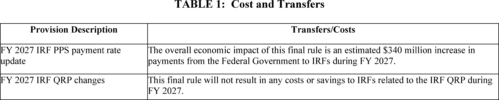
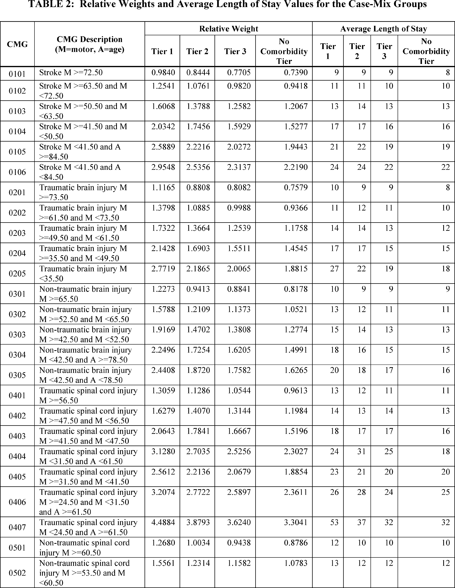
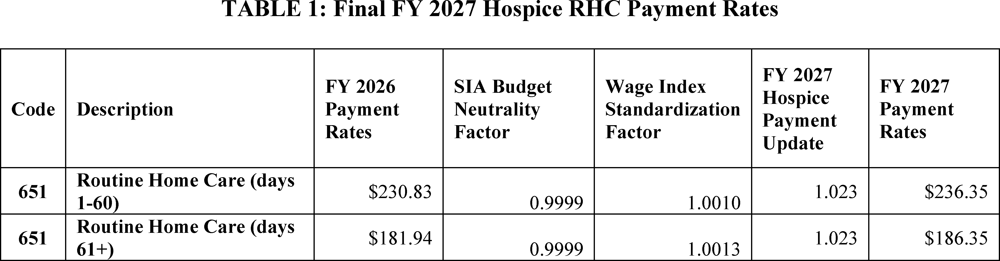
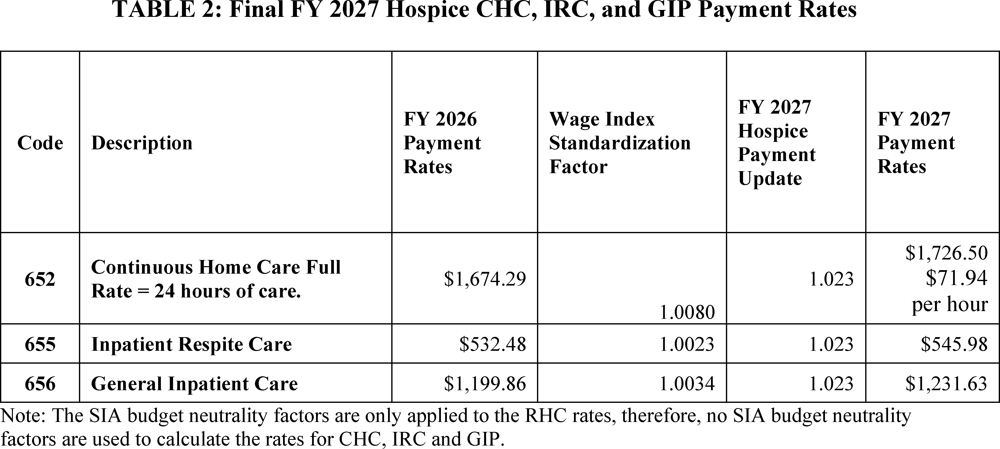
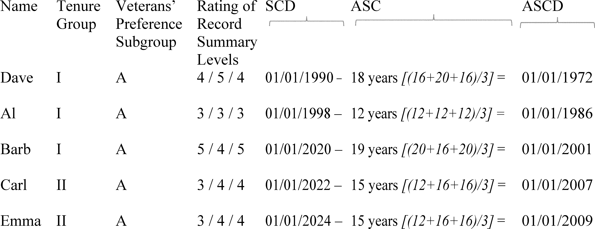
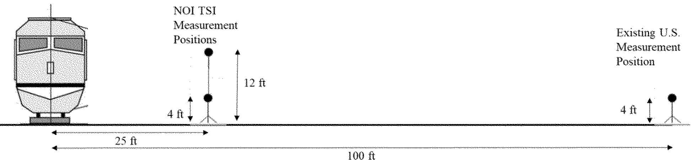
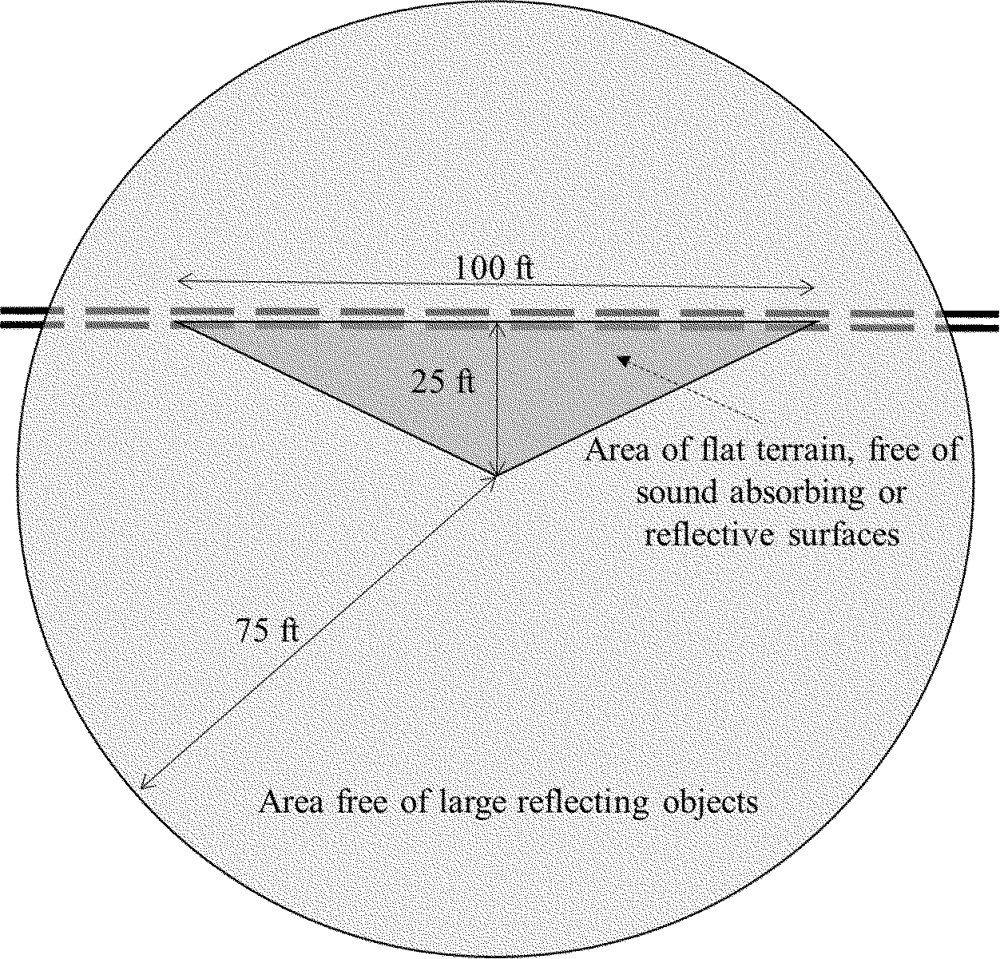
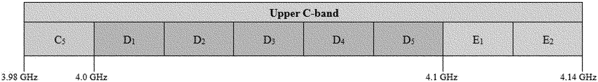

# Daily Digest — 2026-08-03

| | |
|---|---|
| **Digest date** | 2026-08-03 |
| **Data date range** | 2026-08-03 to 2026-08-03 |
| **Generated at** | 2026-08-04T04:06:29Z (UTC) |
| **Pipeline version** | bd8b08d |
| **Source watermarks** | CREC: 2026-07-31T09:55:23Z · BILLS: 2026-08-01T07:04:13Z · FR: 2026-08-03T19:51:15Z · USCOURTS: 2026-08-04T01:18:11Z · PLAW: 2026-07-25T00:00:00Z |

[Full observed listing for this day](day/2026-08-03.html) — every item our collectors observed for this publication day, mechanical rules applied, frozen at end of day. This digest is the canonical record.

All items below cite the govinfo package (and granule, where applicable) they
summarize. Selection is mechanical; each item states the rule that included
it. See the Coverage Statement at the end for a full accounting of what was
published, what was summarized, and what was excluded and why.

---

## Contents

- [Day in Review](#day-in-review)
- [1. Congressional Floor Activity](#1-congressional-floor-activity)
- [2. Legislation](#2-legislation)
- [3. Federal Register](#3-federal-register)
- [4. Enacted Laws](#4-enacted-laws)
- [5. Judicial Activity](#5-judicial-activity)
- [6. Agency Announcements](#6-agency-announcements)
- [7. Recorded Votes](#7-recorded-votes)
- [8. Bill Actions](#8-bill-actions)
- [Terms Used Today](#terms-used-today)
- [Coverage Statement](#coverage-statement)
- [Methodology](#methodology)

---

## Day in Review

One recorded vote appears in the day's congressional floor record; no other chamber proceedings are present in the collected publications.

The regulatory record carries 12 final rules, 9 proposed rules, 92 notices, and 164 agency press releases. The Office of Personnel Management issued four final rules, revising its reduction-in-force regulations and replacing the Merit Systems Protection Board as the adjudicative agency for suitability-action, reduction-in-force, and probationary-period appeals. The Centers for Medicare & Medicaid Services finalized fiscal year 2027 payment updates for inpatient rehabilitation facilities and for hospices. Treasury amended its Title VI regulations to eliminate disparate-impact liability; a separate rule made permanent the visa bond program that began as a pilot on August 20, 2025. Other final rules set a permethrin tolerance on black pepper, made two FAA air-route changes, and removed sections of the Family Violence Prevention and Services Program regulations. Among proposed rules were Treasury regulations on allocating foreign taxes and foreign tax credit disallowance, a Drug Enforcement Administration listing amendment covering esters of PMK glycidic acid, noise standards for trains operating above 160 mph, and an FCC auction of 3,248 upper C-band licenses scheduled for April 27, 2027. The Mine Safety and Health Administration reopened two rulemaking records for virtual hearings, and the FDA reopened one comment period.

*Composed from the summarized items below and the day's mechanical
counts; all specifics are cited in their sections.*

---

## 1. Congressional Floor Activity

Source: Congressional Record (CREC), daily edition for 2026-08-03. Total issue size: 0 granule(s).

### 1.1 Senate

No Senate floor items met the selection thresholds. 0 floor granule(s) are accounted for in the Coverage Statement.

### 1.2 House of Representatives

No House floor items met the selection thresholds. 0 floor granule(s) are accounted for in the Coverage Statement.

### 1.3 Recorded Votes

No recorded votes were published in this issue of the Congressional Record.

---

## 2. Legislation

Source: Congressional Bills (BILLS), text versions published 2026-08-03 to 2026-08-03.

### 2.1 Counts by Stage

| Stage (bill text version) | Count |
|---|---|
| Introduced (ih/is) | 0 |
| Reported (rh/rs) | 0 |
| Engrossed (eh/es) | 0 |
| Enrolled (enr) | 0 |
| Other versions | 0 |
| **Total bill texts published** | **0** |

### 2.2 Bills Listed by Mechanical Rule

Bills below are listed because they matched at least one listing rule; the
matching rule is stated per item. All other bill texts are counted above and
accounted for in the Coverage Statement.

No bill texts published in this range matched a listing rule; all 0 are
accounted for in the Coverage Statement.

---

## 3. Federal Register

Source: Federal Register (FR), issue of 2026-08-03.

### 3.1 Counts by Document Type

| Document type | Count |
|---|---|
| Rules | 12 |
| Proposed rules | 9 |
| Notices | 92 |
| Presidential documents | 0 |
| **Total FR documents** | **113** |

### 3.2 Rules Published

Tags: department of health and human services · department of the interior · executive · model keys: aviation · federal employment · medicare

*In plain terms: Twelve final rules include Medicare payment updates for FY 2027 inpatient rehabilitation and hospice facilities, multiple OPM employment regulations, and visa bond program finalization, plus routine pesticide, aviation, and family services updates.*

#### DEPARTMENT OF HEALTH AND HUMAN SERVICES

- **Medicare Program; Inpatient Rehabilitation Facility Prospective Payment System for Federal Fiscal Year 2027 and Updates to the IRF Quality Reporting Program** (2026-15652; 42 CFR Parts 412 and 414) — This final rule updates the prospective payment rates for inpatient rehabilitation facilities (IRFs) for Federal fiscal year (FY) 2027. As required by statute, this final rule includes the classification and weighting factors for the IRF prospective payment system's (PPS) case-mix groups and a description of the methodologies and data used in computing the prospective payment rates for FY 2027. It also finalizes the third and final of the 3-year phaseout of the rural adjustment, which began in FY 2025. This final rule includes a solicitation for public comments on alternative data sources for the IRF PPS wage index; requires all therapy treatments and/or therapy evaluations to begin no later than 36 hours from midnight on the day of admission; finalizes requirements for the initial Interdisciplinary Team meeting to occur on or before 4 days from the date the patient is admitted; and summarizes a request for information on potential future IRF PPS payment reform. Additionally, this final rule includes updates to the IRF Quality Reporting Program and changes to the Durable Medical Equipment, Prosthetics, Orthotics, and Supplies (DMEPOS) Competitive Bidding Program. Action: Final rule. Dates: These regulations are effective on October 1, 2026.
  - *In plain terms:* Medicare updates inpatient rehabilitation facility payment rates for fiscal year 2027, requires therapy treatment to begin within 36 hours of admission, and completes a 3-year rural adjustment phaseout.
  - Included because: FR-SEL-01 — document type: final rule (all listed)
  - Source: [FR-2026-08-03 / 2026-15652](https://www.govinfo.gov/app/details/FR-2026-08-03/2026-15652)
  -  *Source graphic 1 of 23 from 2026-15652.*
  -  *Source graphic 2 of 23 from 2026-15652.*
  - *Graphics not rendered here: 21 of 23 — see the [source PDF](https://www.govinfo.gov/content/pkg/FR-2026-08-03/pdf/FR-2026-08-03.pdf).*
- **Reducing Bureaucracy and Burden in Family Violence and Prevention Services** (2026-15681; 45 CFR Part 1370) — This final rule removes duplicative and unnecessary sections from the Family Violence Prevention and Services Program regulations. These amendments will streamline the Family Violence Prevention and Services regulations and make them more accessible to the public. Action: Final rule. Dates: Effective date October 2, 2026.
  - *In plain terms:* This rule removes duplicative and unnecessary sections from the Family Violence Prevention and Services Program regulations.
  - Included because: FR-SEL-01 — document type: final rule (all listed)
  - Source: [FR-2026-08-03 / 2026-15681](https://www.govinfo.gov/app/details/FR-2026-08-03/2026-15681)
- **Medicare Program; FY 2027 Hospice Wage Index and Payment Rate Update and Hospice Quality Reporting Program Requirements** (2026-15686; 42 CFR Part 418) — This final rule updates the hospice wage index, payment rates, and aggregate cap amount for fiscal year 2027. This final rule also includes an analysis of Medicare non-hospice spending, including details regarding a hospice service and spending variation index, and finalizes the requirement that hospices provide the hospice election statement addendum to all Medicare beneficiaries at the time of hospice election. Additionally, this rule finalizes conforming changes to discharge from hospice care regulations and changes to the face-to-face encounter regulations. This final rule also includes a summary of comments received on our requests for information regarding community-based palliative care; the construction of a hospice specific wage index; and the overlap between hospice and medical aid in dying laws. Finally, this rule finalizes changes to the Hospice Quality Reporting Program. Action: Final rule. Dates: These regulations are effective on October 1, 2026.
  - *In plain terms:* Medicare updates hospice payment rates and the wage index for fiscal year 2027 and requires hospices to provide an election statement to all Medicare beneficiaries.
  - Included because: FR-SEL-01 — document type: final rule (all listed)
  - Source: [FR-2026-08-03 / 2026-15686](https://www.govinfo.gov/app/details/FR-2026-08-03/2026-15686)
  -  *Source graphic 1 of 28 from 2026-15686.*
  -  *Source graphic 2 of 28 from 2026-15686.*
  - *Graphics not rendered here: 26 of 28 — see the [source PDF](https://www.govinfo.gov/content/pkg/FR-2026-08-03/pdf/FR-2026-08-03.pdf).*

#### DEPARTMENT OF STATE

- **Visas: Visa Bond Program** (2026-15726; 22 CFR Part 41) — This rule finalizes the temporary final rule that went into effect on August 20, 2025, which launched a 12-month long Visa Bond Pilot Program (Pilot Program), and establishes a permanent visa bond program. An alien applying for a visa as a temporary visitor for business or pleasure (B-1/B-2) may be required to submit a bond (“visa bond”) to ensure that the alien maintains his or her nonimmigrant status and departs as required. Consular officers may require covered nonimmigrant visa applicants to post a bond of up to $20,000 as a condition of visa issuance, as determined by the consular officers. Action: Final rule. Dates: This final rule is effective August 3, 2026.
  - *In plain terms:* This rule permanently establishes the visa bond program that operated temporarily from August 20, 2025, allowing consular officers to require visitor visa applicants to post bonds up to $20,000.
  - Included because: FR-SEL-01 — document type: final rule (all listed)
  - Source: [FR-2026-08-03 / 2026-15726](https://www.govinfo.gov/app/details/FR-2026-08-03/2026-15726)

#### DEPARTMENT OF THE TREASURY

- **Rescinding Portions of Department of the Treasury Title VI Regulations To Conform More Closely With the Statutory Text and To Implement an Executive Order** (2026-15720; 31 CFR Part 22) — By this rule, the Department of the Treasury (“Department”) amends its regulations implementing Title VI of the Civil Rights Act of 1964 (“Title VI”) to eliminate disparate-impact liability. These amendments align the Department's regulations with Title VI's original public meaning, avoid constitutional concerns, reduce compliance costs, and serve the public interest. In addition, these revisions implement changes directed in the Executive order, Restoring Equality of Opportunity and Meritocracy. Action: Final rule. Dates: This rule is effective on August 3, 2026.
  - *In plain terms:* The Treasury Department amends its Title VI civil rights regulations to eliminate disparate-impact liability and align with the original statutory text.
  - Included because: FR-SEL-01 — document type: final rule (all listed)
  - Source: [FR-2026-08-03 / 2026-15720](https://www.govinfo.gov/app/details/FR-2026-08-03/2026-15720)

#### DEPARTMENT OF TRANSPORTATION

- **Establishment of United States Area Navigation Route T-581 in the Vicinity of Missoula, Montana** (2026-15675; 14 CFR Part 71) — This action establishes United States Area Navigation (RNAV) Route T-581 in the vicinity of Missoula, Montana. The FAA is taking this action to increase navigational flexibility and safety margins for the users and to expand Air Traffic Control operational capabilities. Action: Final rule. Dates: Effective date 0901 UTC, October 29, 2026. The Director of the Federal Register approves this incorporation by reference action under 1 CFR part 51, subject to the annual revision of FAA Order JO 7400.11 and publication of conforming amendments.
  - *In plain terms:* The FAA establishes a new navigation route near Missoula, Montana, to improve navigational flexibility and safety margins.
  - Included because: FR-SEL-01 — document type: final rule (all listed)
  - Source: [FR-2026-08-03 / 2026-15675](https://www.govinfo.gov/app/details/FR-2026-08-03/2026-15675)
- **Amendment of Very High Frequency Omnidirectional Range Federal Airways V-108 in the Vicinity of Concord, California** (2026-15680; 14 CFR Part 71) — This action amends Very High Frequency Omnidirectional Range (VOR) Federal Airway V-108 in the vicinity of Concord, California. The FAA is taking this action due to the planned decommissioning of the Concord VOR/Distance Measuring Equipment (DME) navigational aid (NAVAID) as part of the VOR Minimum Operational Network (MON) program. Action: Final rule. Dates: Effective date 0901 UTC, October 29, 2026. The Director of the Federal Register approves this incorporation by reference action under 14 CFR part 71, subject to the annual revision of FAA Order JO 7400.11 and publication of conforming amendments.
  - *In plain terms:* The FAA amends a federal airway in Concord, California, following the planned decommissioning of the local navigational aid.
  - Included because: FR-SEL-01 — document type: final rule (all listed)
  - Source: [FR-2026-08-03 / 2026-15680](https://www.govinfo.gov/app/details/FR-2026-08-03/2026-15680)

#### ENVIRONMENTAL PROTECTION AGENCY

- **Permethrin; Pesticide Tolerances** (2026-15634; 40 CFR Part 180) — This regulation establishes a tolerance for residues of permethrin (CASRN 52645-53-1) in or on the food and feed commodity of black pepper at 0.1 parts per million (ppm). Under the Federal Food, Drug, and Cosmetic Act (FFDCA), the American Spice Trade Association, Inc., submitted a petition to EPA requesting that EPA establish a maximum permissible level for residues of this pesticide in or on the identified commodity. Action: Final rule. Dates: This regulation is effective August 3, 2026. Objections and requests for hearings must be received on or before October 2, 2026 and must be filed in accordance with the instructions provided in 40 CFR part 178 (see also Unit I.C. of the SUPPLEMENTARY INFORMATION ).
  - *In plain terms:* EPA sets the maximum permissible level of permethrin residue on black pepper at 0.1 parts per million.
  - Included because: FR-SEL-01 — document type: final rule (all listed)
  - Source: [FR-2026-08-03 / 2026-15634](https://www.govinfo.gov/app/details/FR-2026-08-03/2026-15634)

#### OFFICE OF PERSONNEL MANAGEMENT

- **Suitability Action Appeals** (2026-15650; 5 CFR Part 731) — The Office of Personnel Management (OPM) is issuing final regulations to revise how an applicant, appointee, or employee may appeal a suitability action taken under 5 CFR part 731. OPM will replace the Merit Systems Protection Board (MSPB) as the adjudicative agency for such appeals. The change will streamline suitability action appeals procedures, thereby improving the efficiency, rigor, and timeliness by which OPM and agencies resolve challenges to suitability actions and ensure the integrity and efficiency of the service. Action: Final rule. Dates: Effective September 2, 2026. This rule does not apply to appeals filed with the MSPB before the effective date of this final rule.
  - *In plain terms:* The Office of Personnel Management will now handle appeals of federal employee suitability actions, replacing the Merit Systems Protection Board.
  - Included because: FR-SEL-01 — document type: final rule (all listed)
  - Source: [FR-2026-08-03 / 2026-15650](https://www.govinfo.gov/app/details/FR-2026-08-03/2026-15650)
- **Streamlining Probationary and Trial Period Appeals** (2026-15654; 5 CFR Parts 11, 230, 315, 432, 751, and 752) — The Office of Personnel Management (OPM) is issuing a final rule to change the circumstances and procedures for adjudicating appeals from employees terminated during their probationary and trial periods and supervisors and managers who fail to complete their probationary periods. Executive order, “Strengthening Probationary Periods in the Federal Service,” rendered the prior procedures for appealing such actions to the Merit Systems Protection Board (MSPB) inoperative. This final rule establishes a new, limited appeals process adjudicated by OPM. The final rule also makes conforming amendments. Action: Final rule. Dates: Effective September 2, 2026. Covered actions ( i.e., terminations, assignments, noncertifications, or failures to certify/finalize) effected before the effective date of this rule are not governed by this final rule.
  - *In plain terms:* The Office of Personnel Management establishes a new limited appeals process for federal employees terminated during probationary or trial periods, replacing the Merit Systems Protection Board.
  - Included because: FR-SEL-01 — document type: final rule (all listed)
  - Source: [FR-2026-08-03 / 2026-15654](https://www.govinfo.gov/app/details/FR-2026-08-03/2026-15654)
- **Reduction in Force** (2026-15665; 5 CFR Parts 316, 330, 351, 353, 359, 362 and 430) — The Office of Personnel Management (OPM) is revising its reduction in force (RIF) regulations to make the RIF regulations more streamlined, efficient, and merit-based by prioritizing performance over tenure and length of service when determining which employees will be retained in a RIF and by modifying the types of employees who are excluded from RIF competition. OPM is also revising its regulations regarding the reemployment priority list (RPL), career transition assistance program (CTAP), the interagency career transition assistance program (ICTAP), and transfers of function. Action: Final rule. Dates: This rule is effective September 2, 2026. An agency that issued a RIF notice before the effective date of the rule must process the RIF under the regulations in effect when the RIF notice was issued. An agency that issues a RIF notice on or after the effective date must apply the RIF provisions as amended by this final rule.
  - *In plain terms:* The Office of Personnel Management streamlines reduction-in-force rules to prioritize employee performance over tenure and length of service when determining which employees are retained.
  - Included because: FR-SEL-01 — document type: final rule (all listed)
  - Source: [FR-2026-08-03 / 2026-15665](https://www.govinfo.gov/app/details/FR-2026-08-03/2026-15665)
  -  *Source graphic 1 of 1 from 2026-15665.*
- **Reduction in Force Appeals** (2026-15666; 5 CFR Part 351) — The Office of Personnel Management (OPM) is issuing final regulations to revise how an employee may appeal a furlough of more than 30 days, separation, or demotion by a reduction-in-force (RIF) action. OPM will replace the Merit Systems Protection Board (MSPB) as the adjudicative agency for such appeals. The rule establishes a uniform, record-based OPM appeal process; clarifies the appellant's burden; requires production of the complete agency record; preserves collateral statutory remedies; and applies prospectively to improve timeliness, consistency, and cost-effectiveness while maintaining administrative review. Action: Final rule. Dates: Effective September 2, 2026. This final rule applies only to a RIF action for which an agency issues the employee a specific RIF notice under 5 CFR 351.802 on or after September 2, 2026.
  - *In plain terms:* The Office of Personnel Management will now hear appeals of reduction-in-force actions involving furloughs, separations, or demotions, replacing the Merit Systems Protection Board.
  - Included because: FR-SEL-01 — document type: final rule (all listed)
  - Source: [FR-2026-08-03 / 2026-15666](https://www.govinfo.gov/app/details/FR-2026-08-03/2026-15666)

### 3.3 Proposed Rules Published

Tags: department of health and human services · department of the interior · executive · model keys: mine safety · train noise · wireless licenses

*In plain terms: Nine proposed rules include an FCC wireless license auction with 3,248 new licenses and high-speed train noise standards, along with updates on chemical listings, airspace, mine safety, and FDA matters.*

#### DEPARTMENT OF HEALTH AND HUMAN SERVICES

- **Modification of Certain Terminology in Title 21; Reopening of the Comment Period** (2026-15671; 21 CFR Parts 10, 56, 106, 201, 251, 310, 312, 314, 329, 600, 803, 862, 866, 870, 882, 1114) — The Food and Drug Administration (FDA or the Agency) is reopening the comment period for the proposed rule that appeared in the Federal Register of May 6, 2026, to modify certain terminology in Title 21 of the Code of Federal Regulations (CFR) to comply with Executive Order (E.O.) 14168, “Defending Women From Gender Ideology Extremism and Restoring Biological Truth to the Federal Government,” issued on January 20, 2025. Specifically, this proposed rule, if finalized, will remove the term “gender” wherever it appears and either replace it with the term “sex,” or delete reference to gender, as applicable, along with other editorial changes to improve readability. The Agency is taking this action to allow interested persons additional time to submit comments. Action: Proposed rule; reopening of the comment period. Dates: FDA is reopening the comment period on the proposed rule published on May 6, 2026 (91 FR 24380). Submit either electronic or written comments on the proposed rule by October 2, 2026.
  - *In plain terms:* The FDA reopens the comment period for a proposed rule to remove the term 'gender' from its regulations, replacing it with 'sex' or deleting the reference as applicable.
  - Included because: FR-SEL-02 — document type: proposed rule (all listed)
  - Source: [FR-2026-08-03 / 2026-15671](https://www.govinfo.gov/app/details/FR-2026-08-03/2026-15671)

#### DEPARTMENT OF JUSTICE

- **Amendment to 3,4-MDP-2-P Methyl Glycidic Acid, a List I Chemical** (2026-15624; 21 CFR Part 1310) — The Drug Enforcement Administration is proposing to modify the listing of the list I chemical 3,4-MDP-2-P methyl glycidic acid (also known as PMK glycidic acid) to include esters of 3,4-MDP-2-P methyl glycidic acid, not listed elsewhere in the Controlled Substances Act (CSA), as list I chemicals under the CSA. The current listing of 3,4-MDP-2-P methyl glycidic acid includes its salts, optical and geometric isomers, and salts of isomers. DEA proposes the new listing to read as follows: 3,4-MDP-2-P methyl glycidic acid (PMK glycidic acid) and its esters, not listed elsewhere in the CSA, its optical and geometric isomers, its salts, salts of its optical and geometric isomers, salts of its esters, not listed elsewhere in the CSA, and any combination thereof, whenever the existence of such is possible. Action: Notice of proposed rulemaking. Dates: Comments must be submitted electronically or postmarked on or before September 2, 2026. Commenters should be aware that the electronic Federal Docket Management System will not accept any comments after 11:59 p.m. Eastern Time on the last day of the comment period.
  - *In plain terms:* The DEA proposes to expand the definition of the list I chemical 3,4-MDP-2-P methyl glycidic acid to include its esters.
  - Included because: FR-SEL-02 — document type: proposed rule (all listed)
  - Source: [FR-2026-08-03 / 2026-15624](https://www.govinfo.gov/app/details/FR-2026-08-03/2026-15624)

#### DEPARTMENT OF LABOR

- **Roof Control Plan Approval Criteria** (2026-15670; 30 CFR Part 75) — In response to a public request, the Mine Safety and Health Administration (MSHA) is reopening the rulemaking record and is scheduling a virtual public hearing on the Agency's proposed rule published on July 1, 2025, titled, “ Roof Control Plan Approval Criteria .” Action: Proposed rule; reopening of comment period and notice of public hearing. Dates: Reopening of the comment period: MSHA is reopening the comment period for the proposed rule published on July 1, 2025, (90 FR 28432) for additional public comments. All new comments must be received or postmarked by 11:59 p.m. Eastern Time on September 30, 2026. Public Hearing: The virtual public hearing will be held on September 15, 2026. Information on how to participate is listed below under SUPPLEMENTARY INFORMATION .
  - *In plain terms:* The Mine Safety and Health Administration reopens the public comment period for its proposed roof control plan approval criteria and will hold a hearing.
  - Included because: FR-SEL-02 — document type: proposed rule (all listed)
  - Source: [FR-2026-08-03 / 2026-15670](https://www.govinfo.gov/app/details/FR-2026-08-03/2026-15670)
- **Ventilation Plan Approval Criteria** (2026-15717; 30 CFR Part 75) — In response to a public request, the Mine Safety and Health Administration (MSHA) is reopening the rulemaking record and is scheduling a virtual public hearing on the Agency's proposed rule published on July 1, 2025, titled, “ Ventilation Plan Approval Criteria. ” Action: Proposed rule; reopening of comment period and notice of public hearing. Dates: Reopening of the comment period: MSHA is reopening the comment period for the proposed rule published on July 1, 2025 (90 FR 28443) for additional public comments. All new comments must be received or postmarked by 11:59 p.m. Eastern Time on September 30, 2026. Public Hearing: The virtual public hearing will be held on September 16, 2026. Information on how to participate is listed below under SUPPLEMENTARY INFORMATION .
  - *In plain terms:* The Mine Safety and Health Administration reopens the public comment period for its proposed ventilation plan approval criteria and will hold a hearing.
  - Included because: FR-SEL-02 — document type: proposed rule (all listed)
  - Source: [FR-2026-08-03 / 2026-15717](https://www.govinfo.gov/app/details/FR-2026-08-03/2026-15717)

#### DEPARTMENT OF THE TREASURY

- **Section 898(c) Transition Rule for Allocating Foreign Taxes and Section 960(d)(4) Foreign Tax Credit Disallowance** (2026-15614; 26 CFR Part 1) — This document contains proposed regulations that relate to allocating foreign taxes of foreign corporations affected by the repeal of the one-month deferral election and to the disallowance of foreign tax credits on certain distributions of previously taxed earnings and profits. The proposed regulations would affect taxpayers that operate in foreign countries through certain foreign corporations and taxpayers that claim the foreign tax credit. Action: Notice of proposed rulemaking. Dates: Written or electronic comments and requests for a public hearing must be received by September 17, 2026.
  - *In plain terms:* Proposed regulations clarify how foreign corporations allocate taxes and address foreign tax credit disallowance following a repealed deferral election.
  - Included because: FR-SEL-02 — document type: proposed rule (all listed)
  - Source: [FR-2026-08-03 / 2026-15614](https://www.govinfo.gov/app/details/FR-2026-08-03/2026-15614)

#### DEPARTMENT OF TRANSPORTATION

- **Amendment of Class D and Class E Airspace; Morgantown, WV: Withdrawal** (2026-15657; 14 CFR Part 71) — This action withdraws the notice of proposed rulemaking (NPRM) that the FAA published in the Federal Register on July 8, 2026, proposing to amend Class D and Class E airspace at Morgantown, WV. The FAA has determined that withdrawal of that NPRM is warranted as new airspace data have been received which significantly changed the requirements for the proposed airspace. The FAA expects to publish a new NPRM to amend the Class D and Class E airspace at Morgantown, WV, after assessing the new data. Action: Proposed rule, withdrawal. Dates: The proposed rule published July 8, 2026 (91 FR 42390) is withdrawn as of August 3, 2026.
  - *In plain terms:* The FAA withdraws its July 2026 proposal to change airspace classifications at Morgantown, West Virginia, citing new data.
  - Included because: FR-SEL-02 — document type: proposed rule (all listed)
  - Source: [FR-2026-08-03 / 2026-15657](https://www.govinfo.gov/app/details/FR-2026-08-03/2026-15657)
- **High-Speed Train Noise Emission Standards** (2026-15724; 49 CFR Part 210) — This NPRM seeks to amend the noise emission regulations to address the unique noise emission characteristics of trains operating at speeds exceeding 160 miles per hour (mph). Specifically, the proposed regulation would provide an alternative standard for noise emissions from train operations exceeding 160 mph, up to 220 mph, and also provide a special approval process for noise emissions from train operations exceeding 220 mph. This alternative noise emission standard and compliance process would effectively remove an existing regulatory barrier to the railroad industry for high-speed rail operations, while continuing to protect public health and welfare. Existing noise emission limits for all train operations at speeds up to 160 mph would continue to apply, and these existing limits would remain available for demonstrating compliance at higher speeds as well. Action: Notice of proposed rulemaking (NPRM); request for comments. Dates: Comments on the proposed rule must be received by October 2, 2026. Comments received after that date will be considered to the extent practicable.
  - *In plain terms:* This proposal establishes alternative noise emission standards for high-speed trains operating above 160 miles per hour while maintaining existing limits for slower trains.
  - Included because: FR-SEL-02 — document type: proposed rule (all listed)
  - Source: [FR-2026-08-03 / 2026-15724](https://www.govinfo.gov/app/details/FR-2026-08-03/2026-15724)
  -  *Source graphic 1 of 3 from 2026-15724.*
  -  *Source graphic 2 of 3 from 2026-15724.*
  - *Graphics not rendered here: 1 of 3 — see the [source PDF](https://www.govinfo.gov/content/pkg/FR-2026-08-03/pdf/FR-2026-08-03.pdf).*

#### FEDERAL COMMUNICATIONS COMMISSION

- **Petition for Reconsideration of Action in Rulemaking Proceeding** (2026-15677; 47 CFR Part 54) — Petitions for Reconsideration (Petitions) have been filed in the Commission's proceeding by Chris Webber on behalf of CRW Consulting LLC and Kristen Corra on behalf of Schools, Health & Libraries Broadband Coalition. Action: Petition for reconsideration. Dates: Oppositions to the Petition must be filed on or before August 18, 2026. Replies to oppositions to the Petition must be filed on or before August 28, 2026.
  - *In plain terms:* Two petitions for reconsideration have been filed in the Commission's proceeding.
  - Included because: FR-SEL-02 — document type: proposed rule (all listed)
  - Source: [FR-2026-08-03 / 2026-15677](https://www.govinfo.gov/app/details/FR-2026-08-03/2026-15677)
- **Auction of Flexible-Use Licenses in the Upper C-Band for Next-Generation Wireless Services Scheduled for April 27, 2027; Comment Sought on Competitive Bidding Procedures for Auction 115** (2026-15725; 47 CFR Parts 1 and 27) — In this document, the Federal Communications Commission (the Commission or FCC) announces an auction of 3,248 new flexible-use licenses in the 3.98-4.14 GHz band. The Office of Economics and Analytics (OEA) and the Wireless Telecommunications Bureau (WTB) seek comment on the competitive bidding procedures and auction design to be used for this auction, which is designated as Auction 115. Action: Proposed rule; proposed auction procedures. Dates: Comments are due on or before August 24, 2026, and reply comments are due on or before September 8, 2026.
  - *In plain terms:* The Federal Communications Commission announces an auction of 3,248 wireless licenses on April 27, 2027, and seeks comment on bidding procedures.
  - Included because: FR-SEL-02 — document type: proposed rule (all listed)
  - Source: [FR-2026-08-03 / 2026-15725](https://www.govinfo.gov/app/details/FR-2026-08-03/2026-15725)
  -  *Source graphic 1 of 1 from 2026-15725.*

### 3.4 Notices and Presidential Documents

Notices are summarized only when they match a listing rule; all are counted
in 3.1 and in the Coverage Statement. Presidential documents in the FR are
always listed.

No notices or presidential documents matched a listing rule.

---

## 4. Enacted Laws

Source: Public and Private Laws (PLAW) published 2026-08-03.

No laws were published in this range.

---

## 5. Judicial Activity

Source: United States Courts Opinions (USCOURTS): opinions issued 2026-08-03
by participating federal courts.

Completeness disclosure (standing): USCOURTS carries opinions from
approximately 140 participating appellate, district, bankruptcy, and
national federal courts. Unlike the Congressional Record and the Federal
Register, which are the complete official record of their branches,
USCOURTS is participation-based and is NOT the complete federal judicial
record. Courts post opinions with delay; opinions filed on this date may
appear in later digests.

### 5.1 Appellate and National Court Opinions

Appellate and national court opinions are summarized; district and
bankruptcy opinions are counted in 5.2 and in the Coverage Statement.

No appellate or national court opinions matched a listing rule for this
date; all opinions are counted in 5.2 and accounted for in the Coverage
Statement.

### 5.2 Counts by Court Category

| Court category | Opinions |
|---|---|
| Appellate | 0 |
| District | 14 |
| Bankruptcy | 0 |
| National | 0 |
| **Total opinions extracted** | **14** |

Archive-window disclosure (rule USCOURTS-FETCH-01): 20498 USCOURTS package(s) have been listed in delta syncs but fell outside the 7-day archive window and were not fetched (global running count across all syncs, not limited to this date).

---

## 6. Agency Announcements

Official press releases and statements the agencies themselves date
on 2026-08-03 (sources listed in the source guide). These are the
agencies' own announcements — official advocacy, quoted and
attributed, not findings of this digest. Agency web content can be
edited or removed without notice; captures and hashes are preserved
per the provenance policy.

#### CFTC Press Releases

- **[CFTC Orders UBS Financial Services Inc. to Pay $8 Million for Supervision Failures Impacting Its AML Transaction Monitoring Systems](https://www.cftc.gov/PressRoom/PressReleases/9277-26)** — dated 2026-08-03 by the agency
  - Included because: AGENCYPR-SEL-01 — official agency release dated this day by the agency (all such releases from active sources are listed; titles only in the pilot)

#### CISA Cybersecurity Advisories

- **[CISA Adds One Known Exploited Vulnerability to Catalog](https://www.cisa.gov/news-events/alerts/2026/08/03/cisa-adds-one-known-exploited-vulnerability-catalog)** — dated 2026-08-03 by the agency
  - Included because: AGENCYPR-SEL-01 — official agency release dated this day by the agency (all such releases from active sources are listed; titles only in the pilot)
  - Source: agency newsroom (above) · [independent archive](https://web.archive.org/web/20260803204637/https://www.cisa.gov/news-events/alerts/2026/08/03/cisa-adds-one-known-exploited-vulnerability-catalog)

#### CMS Newsroom (email)

- **[Special Edition: 3 Final Payment Rules](https://www.cms.gov/training-education/medicare-learning-network/newsletter/mln-connects-newsletter-august-3-2026#_Toc236638989)** — dated 2026-08-03 by the agency
  - Included because: AGENCYPR-SEL-01 — official agency release dated this day by the agency (all such releases from active sources are listed; titles only in the pilot)
  - Source: agency email bulletin to this project's subscription, captured and DKIM-verified

#### DEA Updates (email)

- **Learn How DEA Operates at Teen Academy** — dated 2026-08-03 by the agency
  - Included because: AGENCYPR-SEL-01 — official agency release dated this day by the agency (all such releases from active sources are listed; titles only in the pilot)
  - Source: agency email bulletin to this project's subscription, captured and DKIM-verified (the bulletin named no canonical page)

#### Defense News Releases

- **[Largest Pacific Joint Maritime Exercise Successfully Concludes](https://www.war.gov/News/News-Stories/Article/Article/4562605/largest-pacific-joint-maritime-exercise-successfully-concludes/)** — dated 2026-08-03 by the agency
  - Included because: AGENCYPR-SEL-01 — official agency release dated this day by the agency (all such releases from active sources are listed; titles only in the pilot)
- **[Marine Expeditionary Unit Transits Panama Canal](https://www.war.gov/News/News-Stories/Article/Article/4562420/marine-expeditionary-unit-transits-panama-canal/)** — dated 2026-08-03 by the agency
  - Included because: AGENCYPR-SEL-01 — official agency release dated this day by the agency (all such releases from active sources are listed; titles only in the pilot)
- **[Trump Establishes Military Spouse Commission](https://www.war.gov/News/News-Stories/Article/Article/4562726/trump-establishes-military-spouse-commission/)** — dated 2026-08-03 by the agency
  - Included because: AGENCYPR-SEL-01 — official agency release dated this day by the agency (all such releases from active sources are listed; titles only in the pilot)

#### DHS News Releases

- **[GANGBUSTERS: DHS Highlights Dangerous Illegal Alien Gang Members Recently Deported](https://www.dhs.gov/news/2026/08/03/gangbusters-dhs-highlights-dangerous-illegal-alien-gang-members-recently-deported)** — dated 2026-08-03 by the agency
  - Included because: AGENCYPR-SEL-01 — official agency release dated this day by the agency (all such releases from active sources are listed; titles only in the pilot)
- **[WORST OF THE WORST: Over the Weekend, ICE Arrests Murderers, Pedophiles, Rapists, and Kidnappers](https://www.dhs.gov/news/2026/08/03/worst-worst-over-weekend-ice-arrests-murderers-pedophiles-rapists-and-kidnappers)** — dated 2026-08-03 by the agency
  - Included because: AGENCYPR-SEL-01 — official agency release dated this day by the agency (all such releases from active sources are listed; titles only in the pilot)

#### FDA Email Updates (email)

- **[American Regent, Inc. Animal Health Issues Nationwide Recall of Two Lots of Adequan® Canine and Two Lots of Adequan® I.M. Due to Visible Glass Fiber Material in the Product](https://www.fda.gov/safety/recalls-market-withdrawals-safety-alerts/american-regent-inc-animal-health-issues-nationwide-recall-two-lots-adequanr-canine-and-two-lots?utm_medium=email&utm_source=govdelivery)** — dated 2026-08-03 by the agency
  - Included because: AGENCYPR-SEL-01 — official agency release dated this day by the agency (all such releases from active sources are listed; titles only in the pilot)
  - Source: agency email bulletin to this project's subscription, captured and DKIM-verified
- **FDA MedWatch - Convenience Kit Correction: Medline Issues Correction for Kits Containing Huons Lidocaine Hydrochloride and Bupivacaine Hydrochloride in Dextrose Injection** — dated 2026-08-03 by the agency
  - Included because: AGENCYPR-SEL-01 — official agency release dated this day by the agency (all such releases from active sources are listed; titles only in the pilot)
  - Source: agency email bulletin to this project's subscription, captured and DKIM-verified (the bulletin named no canonical page)
- **[Lidl US Expands Recall of Eridanous Shortbread Cookies Due to Undeclared Wheat, Soy, Milk, Egg and Tree Nut (Coconut) Allergens](https://www.fda.gov/safety/recalls-market-withdrawals-safety-alerts/lidl-us-expands-recall-eridanous-shortbread-cookies-due-undeclared-wheat-soy-milk-egg-and-tree-nut?utm_medium=email&utm_source=govdelivery)** — dated 2026-08-03 by the agency
  - Included because: AGENCYPR-SEL-01 — official agency release dated this day by the agency (all such releases from active sources are listed; titles only in the pilot)
  - Source: agency email bulletin to this project's subscription, captured and DKIM-verified
- **[Ukrop’s Homestyle Foods Announces a Voluntary Recall Due to Possible Foreign Object](https://www.fda.gov/safety/recalls-market-withdrawals-safety-alerts/ukrops-homestyle-foods-announces-voluntary-recall-due-possible-foreign-object?utm_medium=email&utm_source=govdelivery)** — dated 2026-08-03 by the agency
  - Included because: AGENCYPR-SEL-01 — official agency release dated this day by the agency (all such releases from active sources are listed; titles only in the pilot)
  - Source: agency email bulletin to this project's subscription, captured and DKIM-verified

#### FEMA Press Releases

- **[FEMA Authorizes Funds to Fight Tartar Fire in Idaho](https://www.fema.gov/press-release/20260803/fema-authorizes-funds-fight-tartar-fire-idaho)** — dated 2026-08-03 by the agency
  - Included because: AGENCYPR-SEL-01 — official agency release dated this day by the agency (all such releases from active sources are listed; titles only in the pilot)
- **[FEMA Calls May Come from Unfamiliar Numbers](https://www.fema.gov/press-release/20260803/fema-calls-may-come-unfamiliar-numbers)** — dated 2026-08-03 by the agency
  - Included because: AGENCYPR-SEL-01 — official agency release dated this day by the agency (all such releases from active sources are listed; titles only in the pilot)

#### FinCEN Updates (email)

- **FinCEN Updates: FinCEN Assesses Historic $125 Million Penalty Against UBS Financial Services Inc. for Recidivist BSA Violations** — dated 2026-08-03 by the agency
  - Included because: AGENCYPR-SEL-01 — official agency release dated this day by the agency (all such releases from active sources are listed; titles only in the pilot)
  - Source: agency email bulletin to this project's subscription, captured and DKIM-verified (the bulletin named no canonical page)

#### FSIS Recalls and Public Health Alerts (email)

- **Export Information Update** — dated 2026-08-03 by the agency
  - Included because: AGENCYPR-SEL-01 — official agency release dated this day by the agency (all such releases from active sources are listed; titles only in the pilot)
  - Source: agency email bulletin to this project's subscription, captured and DKIM-verified (the bulletin named no canonical page)
- **USDA Food Safety and Inspection Service Eligible Foreign Establishments Update** — dated 2026-08-03 by the agency
  - Included because: AGENCYPR-SEL-01 — official agency release dated this day by the agency (all such releases from active sources are listed; titles only in the pilot)
  - Source: agency email bulletin to this project's subscription, captured and DKIM-verified (the bulletin named no canonical page)

#### GAO Reports & Testimonies

- **[Law Enforcement: DOJ Should Improve Training and Misconduct Guidelines for Nonfederal Task Force Officers](https://www.gao.gov/products/gao-26-108468)** — dated 2026-08-03 by the agency
  - Included because: AGENCYPR-SEL-01 — official agency release dated this day by the agency (all such releases from active sources are listed; titles only in the pilot)

#### Justice Department News (email)

- **Antitrust Division Employment Page Update** — dated 2026-08-03 by the agency
  - Included because: AGENCYPR-SEL-01 — official agency release dated this day by the agency (all such releases from active sources are listed; titles only in the pilot)
  - Source: agency email bulletin to this project's subscription, captured and DKIM-verified (the bulletin named no canonical page)
- **[Assistant United States Attorney (Criminal)](https://www.justice.gov/legal-careers/job/assistant-united-states-attorney-criminal-338)** — dated 2026-08-03 by the agency
  - Included because: AGENCYPR-SEL-01 — official agency release dated this day by the agency (all such releases from active sources are listed; titles only in the pilot)
  - Source: agency email bulletin to this project's subscription, captured and DKIM-verified
- **EOIR BIA Decision - Aug. 3, 2026** — dated 2026-08-03 by the agency
  - Included because: AGENCYPR-SEL-01 — official agency release dated this day by the agency (all such releases from active sources are listed; titles only in the pilot)
  - Source: agency email bulletin to this project's subscription, captured and DKIM-verified (the bulletin named no canonical page)
- **EOIR BIA Decision - Aug. 3, 2026** — dated 2026-08-03 by the agency
  - Included because: AGENCYPR-SEL-01 — official agency release dated this day by the agency (all such releases from active sources are listed; titles only in the pilot)
  - Source: agency email bulletin to this project's subscription, captured and DKIM-verified (the bulletin named no canonical page)
- **OIG Criminal or Civil Cases Update** — dated 2026-08-03 by the agency
  - Included because: AGENCYPR-SEL-01 — official agency release dated this day by the agency (all such releases from active sources are listed; titles only in the pilot)
  - Source: agency email bulletin to this project's subscription, captured and DKIM-verified (the bulletin named no canonical page)

#### Justice Press Releases

- **[Justice Department Files Record 25 Denaturalization Cases Against Naturalized Criminals Including Attempted Murderers, Spousal Abusers, and Child Sex Offenders](https://www.justice.gov/opa/pr/justice-department-files-record-24-denaturalization-cases-against-naturalized-criminals)** — dated 2026-08-03 by the agency
  - Included because: AGENCYPR-SEL-01 — official agency release dated this day by the agency (all such releases from active sources are listed; titles only in the pilot)
  - Corroborated: the same release (same canonical URL) also arrived via the agency's email bulletin to this project's subscription, DKIM-verified — one document received through two ingestion channels; listed once, both captures preserved.
- **[Medicare Advantage Provider Complete Health to Pay $14,100,000 to Settle False Claims Act Suit](https://www.justice.gov/opa/pr/medicare-advantage-provider-complete-health-pay-14100000-settle-false-claims-act-suit)** — dated 2026-08-03 by the agency
  - Included because: AGENCYPR-SEL-01 — official agency release dated this day by the agency (all such releases from active sources are listed; titles only in the pilot)
  - Corroborated: the same release (same canonical URL) also arrived via the agency's email bulletin to this project's subscription, DKIM-verified — one document received through two ingestion channels; listed once, both captures preserved.
- **[Silver Spring Woman Sentenced to More Than Three Years in Federal Prison for Role in COVID Fraud Scheme](https://www.justice.gov/usao-md/pr/silver-spring-woman-sentenced-more-three-years-federal-prison-role-covid-fraud-scheme)** — dated 2026-08-03 by the agency
  - Included because: AGENCYPR-SEL-01 — official agency release dated this day by the agency (all such releases from active sources are listed; titles only in the pilot)
  - Corroborated: the same release (same canonical URL) also arrived via the agency's email bulletin to this project's subscription, DKIM-verified — one document received through two ingestion channels; listed once, both captures preserved.
- **[U.S. Attorney Phillip W. Williams Jr. Joins the Department of Justice to Announce Unprecedented Fraud Enforcement Actions Across the Southeast](https://www.justice.gov/usao-ndal/pr/us-attorney-phillip-w-williams-jr-joins-department-justice-announce-unprecedented)** — dated 2026-08-03 by the agency
  - Included because: AGENCYPR-SEL-01 — official agency release dated this day by the agency (all such releases from active sources are listed; titles only in the pilot)
  - Corroborated: the same release (same canonical URL) also arrived via the agency's email bulletin to this project's subscription, DKIM-verified — one document received through two ingestion channels; listed once, both captures preserved.
- **[Air Force Active Duty Member Settles False Claims Act Allegations for Fraudulent Government Loan](https://www.justice.gov/usao-ndfl/pr/air-force-active-duty-member-settles-false-claims-act-allegations-fraudulent)** — dated 2026-08-03 by the agency
  - Included because: AGENCYPR-SEL-01 — official agency release dated this day by the agency (all such releases from active sources are listed; titles only in the pilot)
- **[Arizona Man Sentenced for Assault](https://www.justice.gov/usao-nm/pr/arizona-man-sentenced-assault)** — dated 2026-08-03 by the agency
  - Included because: AGENCYPR-SEL-01 — official agency release dated this day by the agency (all such releases from active sources are listed; titles only in the pilot)
  - Corroborated: the same release (same canonical URL) also arrived via the agency's email bulletin to this project's subscription, DKIM-verified — one document received through two ingestion channels; listed once, both captures preserved.
- **[BATON ROUGE MAN PLEADS GUILTY TO RECEIPT OF CHILD PORNOGRAPHY](https://www.justice.gov/usao-mdla/pr/baton-rouge-man-pleads-guilty-receipt-child-pornography)** — dated 2026-08-03 by the agency
  - Included because: AGENCYPR-SEL-01 — official agency release dated this day by the agency (all such releases from active sources are listed; titles only in the pilot)
  - Corroborated: the same release (same canonical URL) also arrived via the agency's email bulletin to this project's subscription, DKIM-verified — one document received through two ingestion channels; listed once, both captures preserved.
- **[Belen Man Charged After Investigation into Alleged Child Sexual Abuse Material](https://www.justice.gov/usao-nm/pr/belen-man-charged-after-investigation-alleged-child-sexual-abuse-material)** — dated 2026-08-03 by the agency
  - Included because: AGENCYPR-SEL-01 — official agency release dated this day by the agency (all such releases from active sources are listed; titles only in the pilot)
  - Corroborated: the same release (same canonical URL) also arrived via the agency's email bulletin to this project's subscription, DKIM-verified — one document received through two ingestion channels; listed once, both captures preserved.
- **[Billings man sentenced to 3 years in prison for attempted drug trafficking after wife tips off authorities](https://www.justice.gov/usao-mt/pr/billings-man-sentenced-3-years-prison-attempted-drug-trafficking-after-wife-tips)** — dated 2026-08-03 by the agency
  - Included because: AGENCYPR-SEL-01 — official agency release dated this day by the agency (all such releases from active sources are listed; titles only in the pilot)
  - Corroborated: the same release (same canonical URL) also arrived via the agency's email bulletin to this project's subscription, DKIM-verified — one document received through two ingestion channels; listed once, both captures preserved.
- **[Bronx Man Sentenced to 58 Months in Prison for Multi-State Identify Theft and Bank Fraud Ring](https://www.justice.gov/usao-az/pr/bronx-man-sentenced-58-months-prison-multi-state-identify-theft-and-bank-fraud-ring)** — dated 2026-08-03 by the agency
  - Included because: AGENCYPR-SEL-01 — official agency release dated this day by the agency (all such releases from active sources are listed; titles only in the pilot)
  - Corroborated: the same release (same canonical URL) also arrived via the agency's email bulletin to this project's subscription, DKIM-verified — one document received through two ingestion channels; listed once, both captures preserved.
- **[California Man Pleads Guilty to Role in Phantom Hacker Scheme Targeting Elderly Victims](https://www.justice.gov/usao-az/pr/california-man-pleads-guilty-role-phantom-hacker-scheme-targeting-elderly-victims)** — dated 2026-08-03 by the agency
  - Included because: AGENCYPR-SEL-01 — official agency release dated this day by the agency (all such releases from active sources are listed; titles only in the pilot)
  - Corroborated: the same release (same canonical URL) also arrived via the agency's email bulletin to this project's subscription, DKIM-verified — one document received through two ingestion channels; listed once, both captures preserved.
- **[California man sentenced to life in federal prison for sex trafficking, enticement of a minor and other related charges](https://www.justice.gov/usao-ndtx/pr/california-man-sentenced-life-federal-prison-sex-trafficking-enticement-minor-and)** — dated 2026-08-03 by the agency
  - Included because: AGENCYPR-SEL-01 — official agency release dated this day by the agency (all such releases from active sources are listed; titles only in the pilot)
  - Corroborated: the same release (same canonical URL) also arrived via the agency's email bulletin to this project's subscription, DKIM-verified — one document received through two ingestion channels; listed once, both captures preserved.
- **[Coral Gables Woman Pleads Guilty to Impersonating Federal Immigration Official to Dismiss Removal Proceedings](https://www.justice.gov/usao-sdfl/pr/coral-gables-woman-pleads-guilty-impersonating-federal-immigration-official-dismiss)** — dated 2026-08-03 by the agency
  - Included because: AGENCYPR-SEL-01 — official agency release dated this day by the agency (all such releases from active sources are listed; titles only in the pilot)
  - Corroborated: the same release (same canonical URL) also arrived via the agency's email bulletin to this project's subscription, DKIM-verified — one document received through two ingestion channels; listed once, both captures preserved.
- **[Court Sentences Mobile County Man for Possessing a Firearm as a Convicted Felon](https://www.justice.gov/usao-sdal/pr/court-sentences-mobile-county-man-possessing-firearm-convicted-felon-0)** — dated 2026-08-03 by the agency
  - Included because: AGENCYPR-SEL-01 — official agency release dated this day by the agency (all such releases from active sources are listed; titles only in the pilot)
  - Corroborated: the same release (same canonical URL) also arrived via the agency's email bulletin to this project's subscription, DKIM-verified — one document received through two ingestion channels; listed once, both captures preserved.
- **[Crestview Woman Federally Indicted for Fraud Offenses Totaling Over Four Million Dollars](https://www.justice.gov/usao-ndfl/pr/crestview-woman-federally-indicted-fraud-offenses-totaling-over-four-million-dollars)** — dated 2026-08-03 by the agency
  - Included because: AGENCYPR-SEL-01 — official agency release dated this day by the agency (all such releases from active sources are listed; titles only in the pilot)
  - Corroborated: the same release (same canonical URL) also arrived via the agency's email bulletin to this project's subscription, DKIM-verified — one document received through two ingestion channels; listed once, both captures preserved.
- **[Department of Justice Awards Plymouth County District Attorney’s Office More Than $700,000 to Cross-Designate Prosecutor](https://www.justice.gov/usao-ma/pr/department-justice-awards-plymouth-county-district-attorneys-office-more-700000-cross)** — dated 2026-08-03 by the agency
  - Included because: AGENCYPR-SEL-01 — official agency release dated this day by the agency (all such releases from active sources are listed; titles only in the pilot)
  - Corroborated: the same release (same canonical URL) also arrived via the agency's email bulletin to this project's subscription, DKIM-verified — one document received through two ingestion channels; listed once, both captures preserved.
- **[Dominican Man and Former Massachusetts Resident Sentenced to 10 Years for Distributing Fentanyl](https://www.justice.gov/usao-nh/pr/dominican-man-and-former-massachusetts-resident-sentenced-10-years-distributing-fentanyl)** — dated 2026-08-03 by the agency
  - Included because: AGENCYPR-SEL-01 — official agency release dated this day by the agency (all such releases from active sources are listed; titles only in the pilot)
  - Corroborated: the same release (same canonical URL) also arrived via the agency's email bulletin to this project's subscription, DKIM-verified — one document received through two ingestion channels; listed once, both captures preserved.
- **[Eastern District of Texas prosecutes multiple defendants as part of Homeland Security Task Force investigations in July 2026](https://www.justice.gov/usao-edtx/pr/eastern-district-texas-prosecutes-multiple-defendants-part-homeland-security-task)** — dated 2026-08-03 by the agency
  - Included because: AGENCYPR-SEL-01 — official agency release dated this day by the agency (all such releases from active sources are listed; titles only in the pilot)
  - Corroborated: the same release (same canonical URL) also arrived via the agency's email bulletin to this project's subscription, DKIM-verified — one document received through two ingestion channels; listed once, both captures preserved.
- **[Fayetteville Resident Charged in Nearly $1 Million Pandemic Relief Scam](https://www.justice.gov/usao-ednc/pr/fayetteville-resident-charged-nearly-1-million-pandemic-relief-scam)** — dated 2026-08-03 by the agency
  - Included because: AGENCYPR-SEL-01 — official agency release dated this day by the agency (all such releases from active sources are listed; titles only in the pilot)
  - Corroborated: the same release (same canonical URL) also arrived via the agency's email bulletin to this project's subscription, DKIM-verified — one document received through two ingestion channels; listed once, both captures preserved.
- **[Federal Judge Sentences Man to 14 Years in Prison for Violently Robbing Six Banks in Chicago Suburbs](https://www.justice.gov/usao-ndil/pr/federal-judge-sentences-man-14-years-prison-violently-robbing-six-banks-chicago)** — dated 2026-08-03 by the agency
  - Included because: AGENCYPR-SEL-01 — official agency release dated this day by the agency (all such releases from active sources are listed; titles only in the pilot)
  - Corroborated: the same release (same canonical URL) also arrived via the agency's email bulletin to this project's subscription, DKIM-verified — one document received through two ingestion channels; listed once, both captures preserved.
- **[Federal Officials Announce Major Arrests in International Drug Smuggling Case](https://www.justice.gov/usao-ndny/pr/federal-officials-announce-major-arrests-international-drug-smuggling-case)** — dated 2026-08-03 by the agency
  - Included because: AGENCYPR-SEL-01 — official agency release dated this day by the agency (all such releases from active sources are listed; titles only in the pilot)
  - Corroborated: the same release (same canonical URL) also arrived via the agency's email bulletin to this project's subscription, DKIM-verified — one document received through two ingestion channels; listed once, both captures preserved.
- **[Former Postal Worker Admits to Repeatedly Burglarizing Post Offices to Steal Mail](https://www.justice.gov/usao-nj/pr/former-postal-worker-admits-repeatedly-burglarizing-post-offices-steal-mail)** — dated 2026-08-03 by the agency
  - Included because: AGENCYPR-SEL-01 — official agency release dated this day by the agency (all such releases from active sources are listed; titles only in the pilot)
  - Corroborated: the same release (same canonical URL) also arrived via the agency's email bulletin to this project's subscription, DKIM-verified — one document received through two ingestion channels; listed once, both captures preserved.
- **[Fort Thompson Man Sentenced to 17 Years in Federal Prison for Second Degree Murder](https://www.justice.gov/usao-sd/pr/fort-thompson-man-sentenced-17-years-federal-prison-second-degree-murder)** — dated 2026-08-03 by the agency
  - Included because: AGENCYPR-SEL-01 — official agency release dated this day by the agency (all such releases from active sources are listed; titles only in the pilot)
  - Corroborated: the same release (same canonical URL) also arrived via the agency's email bulletin to this project's subscription, DKIM-verified — one document received through two ingestion channels; listed once, both captures preserved.
- **[Goffstown Man Sentenced to Over Eight Years on Firearms and Narcotics Offenses](https://www.justice.gov/usao-nh/pr/goffstown-man-sentenced-over-eight-years-firearms-and-narcotics-offenses)** — dated 2026-08-03 by the agency
  - Included because: AGENCYPR-SEL-01 — official agency release dated this day by the agency (all such releases from active sources are listed; titles only in the pilot)
  - Corroborated: the same release (same canonical URL) also arrived via the agency's email bulletin to this project's subscription, DKIM-verified — one document received through two ingestion channels; listed once, both captures preserved.
- **[Honduran Illegal Alien Pleaded Guilty and Sentenced for Reentry of a Removed Alien](https://www.justice.gov/usao-edla/pr/honduran-illegal-alien-pleaded-guilty-and-sentenced-reentry-removed-alien)** — dated 2026-08-03 by the agency
  - Included because: AGENCYPR-SEL-01 — official agency release dated this day by the agency (all such releases from active sources are listed; titles only in the pilot)
  - Corroborated: the same release (same canonical URL) also arrived via the agency's email bulletin to this project's subscription, DKIM-verified — one document received through two ingestion channels; listed once, both captures preserved.
- **[Illegal Alien Charged with Unlawful Reentry](https://www.justice.gov/usao-ma/pr/illegal-alien-charged-unlawful-reentry)** — dated 2026-08-03 by the agency
  - Included because: AGENCYPR-SEL-01 — official agency release dated this day by the agency (all such releases from active sources are listed; titles only in the pilot)
  - Corroborated: the same release (same canonical URL) also arrived via the agency's email bulletin to this project's subscription, DKIM-verified — one document received through two ingestion channels; listed once, both captures preserved.
- **[Illegal Alien Convicted of Conspiracy to Export Firearms from South Florida to Honduras](https://www.justice.gov/usao-sdfl/pr/illegal-alien-convicted-conspiracy-export-firearms-south-florida-honduras)** — dated 2026-08-03 by the agency
  - Included because: AGENCYPR-SEL-01 — official agency release dated this day by the agency (all such releases from active sources are listed; titles only in the pilot)
  - Corroborated: the same release (same canonical URL) also arrived via the agency's email bulletin to this project's subscription, DKIM-verified — one document received through two ingestion channels; listed once, both captures preserved.
- **[Illegal Alien in Lake Charles Sentenced in Altercation with Federal Officers](https://www.justice.gov/usao-wdla/pr/illegal-alien-lake-charles-sentenced-altercation-federal-officers)** — dated 2026-08-03 by the agency
  - Included because: AGENCYPR-SEL-01 — official agency release dated this day by the agency (all such releases from active sources are listed; titles only in the pilot)
  - Corroborated: the same release (same canonical URL) also arrived via the agency's email bulletin to this project's subscription, DKIM-verified — one document received through two ingestion channels; listed once, both captures preserved.
- **[Illegal alien from Guatemala who caused head-on collision pleads guilty to illegally reentering United States](https://www.justice.gov/usao-sdoh/pr/illegal-alien-guatemala-who-caused-head-collision-pleads-guilty-illegally-reentering)** — dated 2026-08-03 by the agency
  - Included because: AGENCYPR-SEL-01 — official agency release dated this day by the agency (all such releases from active sources are listed; titles only in the pilot)
- **[Jefferson County Man Admits Selling Fatal Fentanyl Capsules](https://www.justice.gov/usao-edmo/pr/jefferson-county-man-admits-selling-fatal-fentanyl-capsules)** — dated 2026-08-03 by the agency
  - Included because: AGENCYPR-SEL-01 — official agency release dated this day by the agency (all such releases from active sources are listed; titles only in the pilot)
  - Corroborated: the same release (same canonical URL) also arrived via the agency's email bulletin to this project's subscription, DKIM-verified — one document received through two ingestion channels; listed once, both captures preserved.
- **[Justice Department Sues Montgomery County, MD for Violating Supreme Court’s Wolford Decision](https://www.justice.gov/opa/pr/justice-department-sues-montgomery-county-md-violating-supreme-courts-wolford-decision)** — dated 2026-08-03 by the agency
  - Included because: AGENCYPR-SEL-01 — official agency release dated this day by the agency (all such releases from active sources are listed; titles only in the pilot)
- **[Kenel Man Found Guilty by a Federal Jury of Felony Domestic Assault by Strangulation](https://www.justice.gov/usao-sd/pr/kenel-man-found-guilty-federal-jury-felony-domestic-assault-strangulation)** — dated 2026-08-03 by the agency
  - Included because: AGENCYPR-SEL-01 — official agency release dated this day by the agency (all such releases from active sources are listed; titles only in the pilot)
  - Corroborated: the same release (same canonical URL) also arrived via the agency's email bulletin to this project's subscription, DKIM-verified — one document received through two ingestion channels; listed once, both captures preserved.
- **[L.A. Man Sentenced to More Than 3 Years in Federal Prison for Pouring Lighter Fluid on Burning CHP Vehicle During Anti-ICE Riot in DTLA](https://www.justice.gov/usao-cdca/pr/la-man-sentenced-more-3-years-federal-prison-pouring-lighter-fluid-burning-chp-vehicle)** — dated 2026-08-03 by the agency
  - Included because: AGENCYPR-SEL-01 — official agency release dated this day by the agency (all such releases from active sources are listed; titles only in the pilot)
  - Corroborated: the same release (same canonical URL) also arrived via the agency's email bulletin to this project's subscription, DKIM-verified — one document received through two ingestion channels; listed once, both captures preserved.
- **[Las Cruces Man Charged with Federal Firearms Offense After Firing Shots at Catholic Church](https://www.justice.gov/usao-nm/pr/las-cruces-man-charged-federal-firearms-offense-after-firing-shots-catholic-church)** — dated 2026-08-03 by the agency
  - Included because: AGENCYPR-SEL-01 — official agency release dated this day by the agency (all such releases from active sources are listed; titles only in the pilot)
  - Corroborated: the same release (same canonical URL) also arrived via the agency's email bulletin to this project's subscription, DKIM-verified — one document received through two ingestion channels; listed once, both captures preserved.
- **[Leader of massive drug trafficking ring sentenced to more than ten years in prison](https://www.justice.gov/usao-wdwa/pr/leader-massive-drug-trafficking-ring-sentenced-more-ten-years-prison)** — dated 2026-08-03 by the agency
  - Included because: AGENCYPR-SEL-01 — official agency release dated this day by the agency (all such releases from active sources are listed; titles only in the pilot)
  - Corroborated: the same release (same canonical URL) also arrived via the agency's email bulletin to this project's subscription, DKIM-verified — one document received through two ingestion channels; listed once, both captures preserved.
- **[Man Who Shot Federal Law Enforcement Officer and Service Canine Pleads Guilty to Attempted Murder and Firearm Charges](https://www.justice.gov/usao-ndil/pr/man-who-shot-federal-law-enforcement-officer-and-service-canine-pleads-guilty)** — dated 2026-08-03 by the agency
  - Included because: AGENCYPR-SEL-01 — official agency release dated this day by the agency (all such releases from active sources are listed; titles only in the pilot)
  - Corroborated: the same release (same canonical URL) also arrived via the agency's email bulletin to this project's subscription, DKIM-verified — one document received through two ingestion channels; listed once, both captures preserved.
- **[Marion County Man Sentenced to 20 Years for Possession with Intent to Distribute Fentanyl and Methamphetamine](https://www.justice.gov/usao-mdfl/pr/marion-county-man-sentenced-20-years-possession-intent-distribute-fentanyl-and)** — dated 2026-08-03 by the agency
  - Included because: AGENCYPR-SEL-01 — official agency release dated this day by the agency (all such releases from active sources are listed; titles only in the pilot)
  - Corroborated: the same release (same canonical URL) also arrived via the agency's email bulletin to this project's subscription, DKIM-verified — one document received through two ingestion channels; listed once, both captures preserved.
- **[Philadelphia County Child Predator Sentenced to 27 Years for Child Exploitation Offenses](https://www.justice.gov/usao-nj/pr/philadelphia-county-child-predator-sentenced-27-years-child-exploitation-offenses)** — dated 2026-08-03 by the agency
  - Included because: AGENCYPR-SEL-01 — official agency release dated this day by the agency (all such releases from active sources are listed; titles only in the pilot)
- **[Portage County Man Sentenced to 20 Years in Prison For Child Pornography Offenses](https://www.justice.gov/usao-ndoh/pr/portage-county-man-sentenced-20-years-prison-child-pornography-offenses)** — dated 2026-08-03 by the agency
  - Included because: AGENCYPR-SEL-01 — official agency release dated this day by the agency (all such releases from active sources are listed; titles only in the pilot)
  - Corroborated: the same release (same canonical URL) also arrived via the agency's email bulletin to this project's subscription, DKIM-verified — one document received through two ingestion channels; listed once, both captures preserved.
- **[Qatari national ordered into custody on child sexual abuse material charges](https://www.justice.gov/usao-sdtx/pr/qatari-national-ordered-custody-child-sexual-abuse-material-charges)** — dated 2026-08-03 by the agency
  - Included because: AGENCYPR-SEL-01 — official agency release dated this day by the agency (all such releases from active sources are listed; titles only in the pilot)
  - Corroborated: the same release (same canonical URL) also arrived via the agency's email bulletin to this project's subscription, DKIM-verified — one document received through two ingestion channels; listed once, both captures preserved.
- **[Raleigh Business Owner Sentenced to Prison for Bankruptcy Fraud](https://www.justice.gov/usao-ednc/pr/raleigh-business-owner-sentenced-prison-bankruptcy-fraud)** — dated 2026-08-03 by the agency
  - Included because: AGENCYPR-SEL-01 — official agency release dated this day by the agency (all such releases from active sources are listed; titles only in the pilot)
- **[Recidivist Felon Sentenced to 30 Months in Prison for Illegally Possessing a Firearm](https://www.justice.gov/usao-sdal/pr/recidivist-felon-sentenced-30-months-prison-illegally-possessing-firearm)** — dated 2026-08-03 by the agency
  - Included because: AGENCYPR-SEL-01 — official agency release dated this day by the agency (all such releases from active sources are listed; titles only in the pilot)
  - Corroborated: the same release (same canonical URL) also arrived via the agency's email bulletin to this project's subscription, DKIM-verified — one document received through two ingestion channels; listed once, both captures preserved.
- **[Romanian Alien Trio Collectively Sentenced to More Than 11 Years in Federal Prison for ATM "Skimming" Scheme](https://www.justice.gov/usao-wdok/pr/romanian-alien-trio-collectively-sentenced-more-11-years-federal-prison-atm-skimming)** — dated 2026-08-03 by the agency
  - Included because: AGENCYPR-SEL-01 — official agency release dated this day by the agency (all such releases from active sources are listed; titles only in the pilot)
  - Corroborated: the same release (same canonical URL) also arrived via the agency's email bulletin to this project's subscription, DKIM-verified — one document received through two ingestion channels; listed once, both captures preserved.
- **[Stafford County Sheriff’s Deputy arrested for receipt of child sexual abuse material](https://www.justice.gov/usao-edva/pr/stafford-county-sheriffs-deputy-arrested-receipt-child-sexual-abuse-material)** — dated 2026-08-03 by the agency
  - Included because: AGENCYPR-SEL-01 — official agency release dated this day by the agency (all such releases from active sources are listed; titles only in the pilot)
- **[Three Men Sentenced for Exploiting Missing Foster Teens in Sex Trafficking Scheme](https://www.justice.gov/usao-sdfl/pr/three-men-sentenced-exploiting-missing-foster-teens-sex-trafficking-scheme)** — dated 2026-08-03 by the agency
  - Included because: AGENCYPR-SEL-01 — official agency release dated this day by the agency (all such releases from active sources are listed; titles only in the pilot)
  - Corroborated: the same release (same canonical URL) also arrived via the agency's email bulletin to this project's subscription, DKIM-verified — one document received through two ingestion channels; listed once, both captures preserved.
- **[Two Charged With Holyoke-Based Fentanyl Distribution Conspiracy](https://www.justice.gov/usao-ma/pr/two-charged-holyoke-based-fentanyl-distribution-conspiracy)** — dated 2026-08-03 by the agency
  - Included because: AGENCYPR-SEL-01 — official agency release dated this day by the agency (all such releases from active sources are listed; titles only in the pilot)
  - Corroborated: the same release (same canonical URL) also arrived via the agency's email bulletin to this project's subscription, DKIM-verified — one document received through two ingestion channels; listed once, both captures preserved.
- **[Two Men Indicted for Laser Strikes on Police Helicopters](https://www.justice.gov/usao-nv/pr/two-men-indicted-laser-strikes-police-helicopters)** — dated 2026-08-03 by the agency
  - Included because: AGENCYPR-SEL-01 — official agency release dated this day by the agency (all such releases from active sources are listed; titles only in the pilot)
  - Corroborated: the same release (same canonical URL) also arrived via the agency's email bulletin to this project's subscription, DKIM-verified — one document received through two ingestion channels; listed once, both captures preserved.
- **[U.S. Attorney Ryan Raybould meets with Dyess AFB leadership and Taylor County Sheriff to strengthen strategic partnerships and reaffirm support for the Abilene community](https://www.justice.gov/usao-ndtx/pr/us-attorney-ryan-raybould-meets-dyess-afb-leadership-and-taylor-county-sheriff)** — dated 2026-08-03 by the agency
  - Included because: AGENCYPR-SEL-01 — official agency release dated this day by the agency (all such releases from active sources are listed; titles only in the pilot)
  - Corroborated: the same release (same canonical URL) also arrived via the agency's email bulletin to this project's subscription, DKIM-verified — one document received through two ingestion channels; listed once, both captures preserved.
- **[U.S. Attorney’s Office recovers more than $325,000 for fraud victims](https://www.justice.gov/usao-mt/pr/us-attorneys-office-recovers-more-325000-fraud-victims)** — dated 2026-08-03 by the agency
  - Included because: AGENCYPR-SEL-01 — official agency release dated this day by the agency (all such releases from active sources are listed; titles only in the pilot)
  - Corroborated: the same release (same canonical URL) also arrived via the agency's email bulletin to this project's subscription, DKIM-verified — one document received through two ingestion channels; listed once, both captures preserved.
- **[United States Attorney’s Office Files Civil Forfeiture Action to Recover Approximately $1.4 Million in Proceeds of Insider Trading Scheme](https://www.justice.gov/usao-ma/pr/united-states-attorneys-office-files-civil-forfeiture-action-recover-approximately-14)** — dated 2026-08-03 by the agency
  - Included because: AGENCYPR-SEL-01 — official agency release dated this day by the agency (all such releases from active sources are listed; titles only in the pilot)
  - Corroborated: the same release (same canonical URL) also arrived via the agency's email bulletin to this project's subscription, DKIM-verified — one document received through two ingestion channels; listed once, both captures preserved.
- **[United States Attorney’s Office Joining Law Enforcement, Community Leaders and Residents for National Night Out Events](https://www.justice.gov/usao-ndfl/pr/united-states-attorneys-office-joining-law-enforcement-community-leaders-and-residents)** — dated 2026-08-03 by the agency
  - Included because: AGENCYPR-SEL-01 — official agency release dated this day by the agency (all such releases from active sources are listed; titles only in the pilot)
  - Corroborated: the same release (same canonical URL) also arrived via the agency's email bulletin to this project's subscription, DKIM-verified — one document received through two ingestion channels; listed once, both captures preserved.
- **[Zuni Man Accused of Stabbing Two People](https://www.justice.gov/usao-nm/pr/zuni-man-accused-stabbing-two-people)** — dated 2026-08-03 by the agency
  - Included because: AGENCYPR-SEL-01 — official agency release dated this day by the agency (all such releases from active sources are listed; titles only in the pilot)
  - Corroborated: the same release (same canonical URL) also arrived via the agency's email bulletin to this project's subscription, DKIM-verified — one document received through two ingestion channels; listed once, both captures preserved.
- **[Zuni Man Sentenced for Triple Homicide](https://www.justice.gov/usao-nm/pr/zuni-man-sentenced-triple-homicide)** — dated 2026-08-03 by the agency
  - Included because: AGENCYPR-SEL-01 — official agency release dated this day by the agency (all such releases from active sources are listed; titles only in the pilot)
  - Corroborated: the same release (same canonical URL) also arrived via the agency's email bulletin to this project's subscription, DKIM-verified — one document received through two ingestion channels; listed once, both captures preserved.

#### NASA News Releases

- **[APOD: 2026 August 3 – Vaporizing Meteor Photobombs the Lacerta Nebula](https://science.nasa.gov/image-article/apod-2026-august-3-vaporizing-meteor-photobombs-the-lacerta-nebula/)** — dated 2026-08-03 by the agency
  - Included because: AGENCYPR-SEL-01 — official agency release dated this day by the agency (all such releases from active sources are listed; titles only in the pilot)
  - Source: agency newsroom (above) · [independent archive](https://web.archive.org/web/20260803043803/https://science.nasa.gov/image-article/apod-2026-august-3-vaporizing-meteor-photobombs-the-lacerta-nebula/)
- **[Guinea-Bissau Tidal Waters](https://www.nasa.gov/image-article/guinea-bissau-tidal-waters/)** — dated 2026-08-03 by the agency
  - Included because: AGENCYPR-SEL-01 — official agency release dated this day by the agency (all such releases from active sources are listed; titles only in the pilot)
- **[Ike Theriot Helps Prepare Astronauts to Work on the Moon](https://www.nasa.gov/centers-and-facilities/johnson/ike-theriot-helps-prepare-astronauts-to-work-on-the-moon/)** — dated 2026-08-03 by the agency
  - Included because: AGENCYPR-SEL-01 — official agency release dated this day by the agency (all such releases from active sources are listed; titles only in the pilot)
  - Source: agency newsroom (above) · [independent archive](https://web.archive.org/web/20260803143850/https://www.nasa.gov/centers-and-facilities/johnson/ike-theriot-helps-prepare-astronauts-to-work-on-the-moon/)
- **[Louisiana Students Loft Payloads from NASA Balloon Facility in Texas](https://www.nasa.gov/missions/scientific-balloons/louisiana-students-loft-payloads-from-nasa-balloon-facility-in-texas/)** — dated 2026-08-03 by the agency
  - Included because: AGENCYPR-SEL-01 — official agency release dated this day by the agency (all such releases from active sources are listed; titles only in the pilot)
  - Source: agency newsroom (above) · [independent archive](https://web.archive.org/web/20260803193833/https://www.nasa.gov/missions/scientific-balloons/louisiana-students-loft-payloads-from-nasa-balloon-facility-in-texas/)
- **[NASA Delivers Navigation System for Commercial Lunar Relay](https://www.nasa.gov/technology/space-comms/nasa-delivers-navigation-system-for-commercial-lunar-relay/)** — dated 2026-08-03 by the agency
  - Included because: AGENCYPR-SEL-01 — official agency release dated this day by the agency (all such releases from active sources are listed; titles only in the pilot)
  - Source: agency newsroom (above) · [independent archive](https://web.archive.org/web/20260803143832/https://www.nasa.gov/technology/space-comms/nasa-delivers-navigation-system-for-commercial-lunar-relay/)
- **[NASA Brings Space Exploration to the FIFA World Cup](https://www.nasa.gov/centers-and-facilities/johnson/nasa-brings-space-exploration-to-the-fifa-world-cup/)** — dated 2026-08-03 by the agency
  - Included because: AGENCYPR-SEL-01 — official agency release dated this day by the agency (all such releases from active sources are listed; titles only in the pilot)
  - Source: agency newsroom (above) · [independent archive](https://web.archive.org/web/20260803143908/https://www.nasa.gov/centers-and-facilities/johnson/nasa-brings-space-exploration-to-the-fifa-world-cup/)

#### ODNI Newsroom

- **[Jay Clayton Sworn In As Director Of National Intelligence](https://www.odni.gov/14064/pr-12-26/)** — dated 2026-08-03 by the agency
  - Included because: AGENCYPR-SEL-01 — official agency release dated this day by the agency (all such releases from active sources are listed; titles only in the pilot)
  - Source: agency newsroom (above) · [independent archive](https://web.archive.org/web/20260803182934/https://www.odni.gov/14064/pr-12-26/)

#### SSA Press Releases (email)

- **SSA Program Policy Updates** — dated 2026-08-03 by the agency
  - Included because: AGENCYPR-SEL-01 — official agency release dated this day by the agency (all such releases from active sources are listed; titles only in the pilot)
  - Source: agency email bulletin to this project's subscription, captured and DKIM-verified (the bulletin named no canonical page)
- **Time to report your wages** — dated 2026-08-03 by the agency
  - Included because: AGENCYPR-SEL-01 — official agency release dated this day by the agency (all such releases from active sources are listed; titles only in the pilot)
  - Source: agency email bulletin to this project's subscription, captured and DKIM-verified (the bulletin named no canonical page)

#### The Week at State (email)

- **Account request expired** — dated 2026-08-03 by the agency
  - Included because: AGENCYPR-SEL-01 — official agency release dated this day by the agency (all such releases from active sources are listed; titles only in the pilot)
  - Source: agency email bulletin to this project's subscription, captured and DKIM-verified (the bulletin named no canonical page)

#### Treasury Press Releases (email)

- **Economy Statement for the Treasury Borrowing Advisory Committee** — dated 2026-08-03 by the agency
  - Included because: AGENCYPR-SEL-01 — official agency release dated this day by the agency (all such releases from active sources are listed; titles only in the pilot)
  - Source: agency email bulletin to this project's subscription, captured and DKIM-verified (the bulletin named no canonical page)
- **[Issuance of Amended Venezuela-related General License and Frequently Asked Question](https://ofac.treasury.gov/media/936651/download?inline)** — dated 2026-08-03 by the agency
  - Included because: AGENCYPR-SEL-01 — official agency release dated this day by the agency (all such releases from active sources are listed; titles only in the pilot)
  - Source: agency email bulletin to this project's subscription, captured and DKIM-verified
- **Office of Tribal and Native Affairs Broadcast - August 3, 2026** — dated 2026-08-03 by the agency
  - Included because: AGENCYPR-SEL-01 — official agency release dated this day by the agency (all such releases from active sources are listed; titles only in the pilot)
  - Source: agency email bulletin to this project's subscription, captured and DKIM-verified (the bulletin named no canonical page)
- **TREASURY ANNOUNCES MARKETABLE BORROWING ESTIMATES** — dated 2026-08-03 by the agency
  - Included because: AGENCYPR-SEL-01 — official agency release dated this day by the agency (all such releases from active sources are listed; titles only in the pilot)
  - Source: agency email bulletin to this project's subscription, captured and DKIM-verified (the bulletin named no canonical page)
- **U.S. Department of the Treasury Daily Treasury Bill Rates Update** — dated 2026-08-03 by the agency
  - Included because: AGENCYPR-SEL-01 — official agency release dated this day by the agency (all such releases from active sources are listed; titles only in the pilot)
  - Source: agency email bulletin to this project's subscription, captured and DKIM-verified (the bulletin named no canonical page)
- **U.S. Department of the Treasury Daily Treasury Long-Term Rates Update** — dated 2026-08-03 by the agency
  - Included because: AGENCYPR-SEL-01 — official agency release dated this day by the agency (all such releases from active sources are listed; titles only in the pilot)
  - Source: agency email bulletin to this project's subscription, captured and DKIM-verified (the bulletin named no canonical page)
- **U.S. Department of the Treasury Daily Treasury Real Long-Term Rates Update** — dated 2026-08-03 by the agency
  - Included because: AGENCYPR-SEL-01 — official agency release dated this day by the agency (all such releases from active sources are listed; titles only in the pilot)
  - Source: agency email bulletin to this project's subscription, captured and DKIM-verified (the bulletin named no canonical page)
- **U.S. Department of the Treasury Daily Treasury Real Yield Curve Rates Update** — dated 2026-08-03 by the agency
  - Included because: AGENCYPR-SEL-01 — official agency release dated this day by the agency (all such releases from active sources are listed; titles only in the pilot)
  - Source: agency email bulletin to this project's subscription, captured and DKIM-verified (the bulletin named no canonical page)
- **U.S. Department of the Treasury Daily Treasury Yield Curve Rates Update** — dated 2026-08-03 by the agency
  - Included because: AGENCYPR-SEL-01 — official agency release dated this day by the agency (all such releases from active sources are listed; titles only in the pilot)
  - Source: agency email bulletin to this project's subscription, captured and DKIM-verified (the bulletin named no canonical page)

#### USDA News (email)

- **USDA Daily Radio Newsline - 08/03/2026** — dated 2026-08-03 by the agency
  - Included because: AGENCYPR-SEL-01 — official agency release dated this day by the agency (all such releases from active sources are listed; titles only in the pilot)
  - Source: agency email bulletin to this project's subscription, captured and DKIM-verified (the bulletin named no canonical page)

#### VA News Releases

- **[Hiring Veterans: Jobs of the week for August 3, 2026](https://news.va.gov/148485/hiring-veterans-jobs-week-august-3-2026/)** — dated 2026-08-03 by the agency
  - Included because: AGENCYPR-SEL-01 — official agency release dated this day by the agency (all such releases from active sources are listed; titles only in the pilot)
  - Source: agency newsroom (above) · [independent archive](https://web.archive.org/web/20260803143512/https://news.va.gov/148485/hiring-veterans-jobs-week-august-3-2026/)
- **[Housing and support helped Veteran rebuild his life after addiction](https://news.va.gov/148434/housing-support-helped-rebuild-after-addiction/)** — dated 2026-08-03 by the agency
  - Included because: AGENCYPR-SEL-01 — official agency release dated this day by the agency (all such releases from active sources are listed; titles only in the pilot)
  - Source: agency newsroom (above) · [independent archive](https://web.archive.org/web/20260803143453/https://news.va.gov/148434/housing-support-helped-rebuild-after-addiction/)
- **[Live Whole Health #329: A simple sleep routine for snoozing smarter](https://news.va.gov/148517/live-whole-health-329-sleep-routine/)** — dated 2026-08-03 by the agency
  - Included because: AGENCYPR-SEL-01 — official agency release dated this day by the agency (all such releases from active sources are listed; titles only in the pilot)

47 release(s) above arrived through more than one ingestion channel and are each listed once, marked "Corroborated" in place. Every arrival is captured, hashed, and counted in the Coverage Statement — the merge is presentation, not omission.

Also observed this day, not listed above: 17 release(s) the agencies date on other days (feed backfill from newly activated sources). Excluded under AGENCYPR-EX-01; counted in the Coverage Statement; captures preserved.

---

## 7. Recorded Votes

Roll-call votes the chambers themselves record on 2026-08-03, in
vote-number order. Every recorded vote in the window is listed:
selection is by existence, not by importance, and no rule here
prefers one question over another. Tallies and member positions
come from the chamber's own published vote record, captured and
hashed like every other source. This is the chambers' vote record
itself; section 1.3 lists the Congressional Record granules in
which votes were printed.

#### United States Senate

- **[Vote 218 — H.R. 6500: On Cloture on the Motion to Proceed](https://www.senate.gov/legislative/LIS/roll_call_votes/vote1192/vote_119_2_00218.xml)** — Cloture on the Motion to Proceed Agreed to (89-4, 3/5 majority required).
  - Motion to Invoke Cloture: Motion to Proceed to H.R. 6500; A bill to extend duty-free treatment provided with respect to imports from certain countries in Africa under the African Growth and Opportunity Act, to extend customs user fees, and for other purposes.
  - Tally: Yea 89 · Nay 4 · Present 0 · Not Voting 7
  - Included because: VOTES-SEL-01 — recorded vote of this day in a chamber's own roll-call record (every recorded vote is listed, in vote-number order; selection is by existence, not importance)
  - Source: the chamber's own roll-call record (linked above) · [independent archive](https://web.archive.org/web/20260803234902/https://www.senate.gov/legislative/LIS/roll_call_votes/vote1192/vote_119_2_00218.xml)

---

## 8. Bill Actions

What the chambers did with individual measures on 2026-08-03, as the
Library of Congress's own bill-status record states it. Every action
in the ingestion window is listed, in bill-designation order:
selection is by existence, not by importance, and no rule here
prefers one measure over another. Section 2 lists the text of bills
published this day; this section lists what happened to them.

Publication lag: the record dates an action by the day the chamber took it and publishes it the following morning, so this section fills in after the day it describes has ended — the same lag the judicial section carries, and it is restated under Known gaps.

No bill actions dated this day were observed.

---

## Terms Used Today

- *cloture* — a Senate vote to end debate so a final vote can happen
- *discharge* — a motion to pull a measure out of committee for floor consideration
- *engrossed* — the official text of a bill as passed by one chamber
- *enrolled* — the final text of a bill passed by both chambers, sent to the President
- *incorporation by reference* — making an outside document legally part of a rule without reprinting it
- *motion to proceed* — a Senate vote on whether to start considering a bill
- *notice of proposed rulemaking* — the formal announcement of a draft regulation
- *proposed rule* — a draft regulation published for public comment before adoption

---

## Coverage Statement

*This section is mandatory and appears in every digest, including days with
no publications. It accounts for every package the sync observed in the data
date range. "Excluded" always names the mechanical rule; there are no
unexplained omissions.*

**Sync summary:** BILLS: completed 2026-08-04T04:04:46Z · CREC: completed 2026-08-04T04:04:45Z · FR: completed 2026-08-04T04:04:47Z · PLAW: completed 2026-08-04T04:04:59Z · USCOURTS: completed 2026-08-04T04:04:48Z; last watermarks as listed in the header.

| Collection | Packages published | Granules/documents | Summarized | Counted only | Excluded by rule |
|---|---|---|---|---|---|
| CREC | 0 | 0 | 0 | 0 | 0 |
| BILLS | 0 | — | 0 | 0 | 0 |
| FR | 1 | 113 | 21 | 92 | 0 |
| USCOURTS | 8 | 14 | 0 | 14 | 0 |
| PLAW | 0 | 0 | 0 | 0 | 0 |
| AGENCYPR | 164 | 164 | 0 | 147 | 17 |
| VOTES | 1 | 1 | 0 | 1 | 0 |
| BILLACTIONS | 0 | 0 | 0 | 0 | 0 |

**Exclusion rules applied today:**

- FR-EX-01: notices counted, not individually summarized — 92 item(s)
- USCOURTS-EX-01: district court opinions counted, not individually summarized — 14 item(s)
- AGENCYPR-EX-01: release dated outside this day by the agency (feed backfill / newly activated source) — counted, not listed — 17 item(s)

**Source graphics:** 56 graphic(s) flagged across today's documents: 56 content graphic(s) (equations, forms, maps, annex pages) and 0 boilerplate (signatures/seals, excluded by rule FR-GPH-01). Of the content graphics, 0 were analyzed via vision pass (vision pass not yet implemented) and 8 embedded above; the remainder are viewable in the cited source PDFs.

**Known gaps:** courts post opinions with delay; opinions filed on this date may appear in later syncs.

*Verification: any item above can be checked against its source in one click
via its govinfo link. Totals in this table are reproducible from the stored
extraction records for 2026-08-03.*

---

## Methodology

Selection rules, summarization prompts, and thresholds are versioned in this
repository and identified by the pipeline version in the header (bd8b08d).
Editorial principles — primary sources only, opinion-agnostic prose, mechanical
party-blind selection, full coverage accounting — are defined in
[GUIDE.md](../GUIDE.md) §2. Ruleset in effect: prompt version 2; plain-language version 2. To reproduce this digest: re-run the
report stage against the extracted records for 2026-08-03; no upstream re-fetch
is required (GUIDE.md §5).

*"In plain terms" lines are model-generated restatements of the stored
summaries, derived only from the summary text shown beside them; items
without one had no usable restatement. ALL-CAPS source headings are
case-normalized for display; original casing is preserved at the source
link. Term definitions above are static, repo-versioned prose.*

License: this digest's compilation and prose are
[CC BY 4.0](https://creativecommons.org/licenses/by/4.0/) (credit
"FAPD — Free Agentic Publication Digester"); quoted official
government text is public domain (17 U.S.C. § 105).
