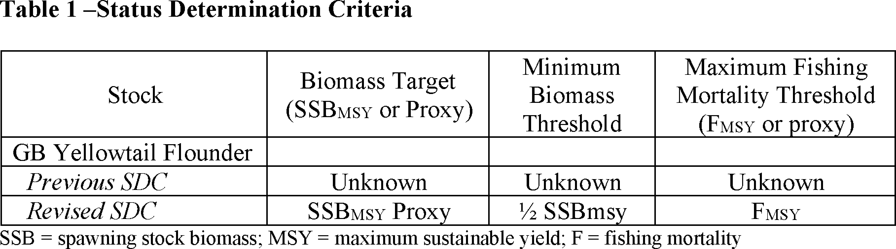
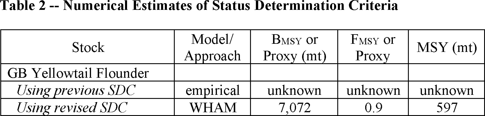
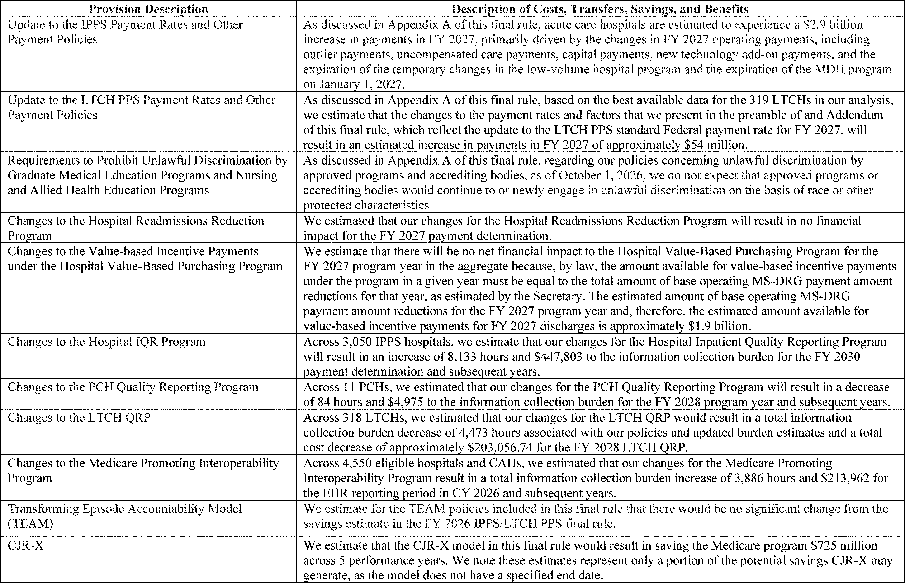
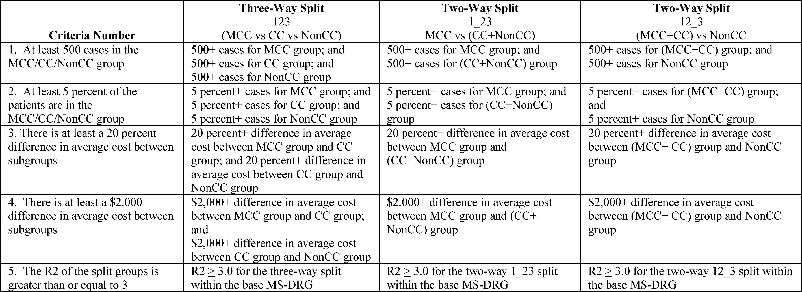
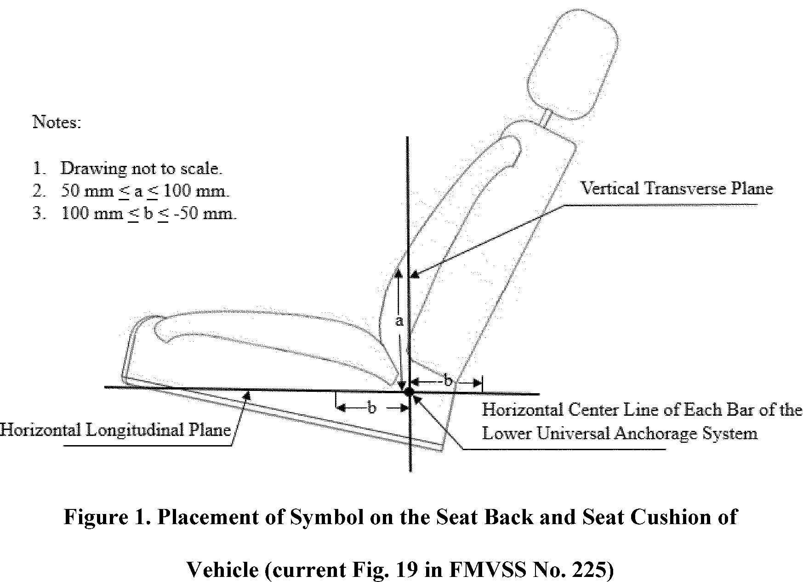
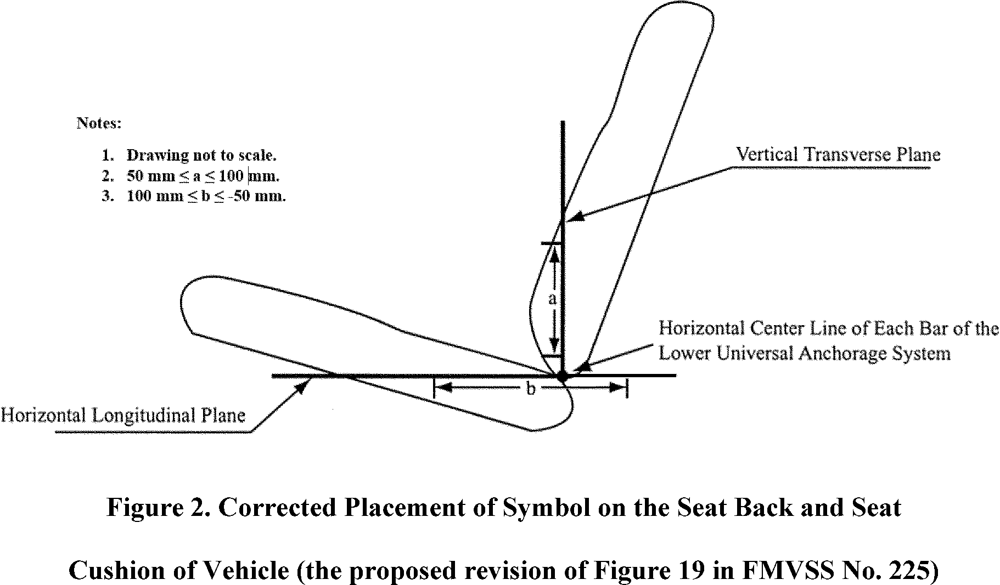
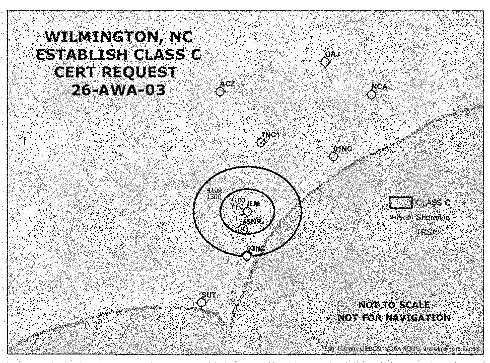
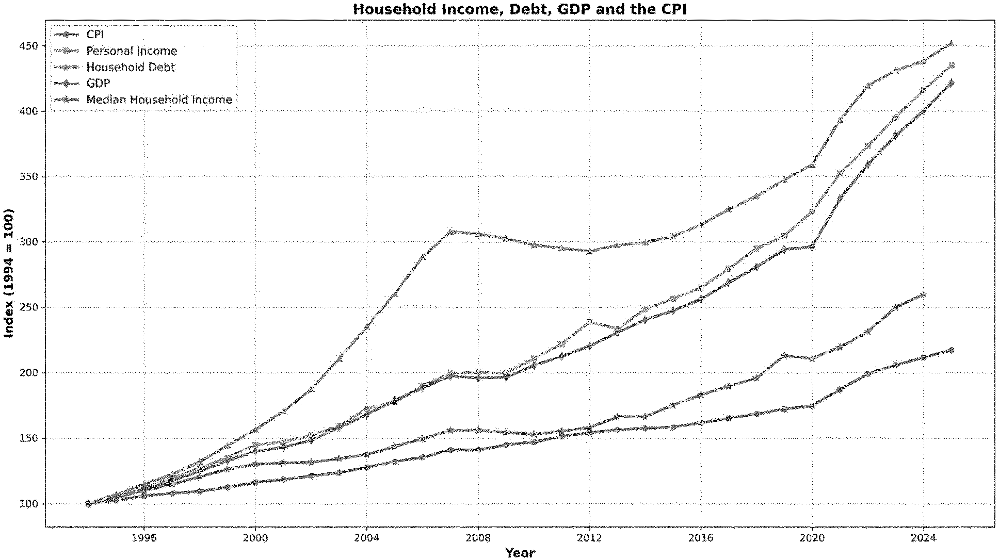

# Daily Digest — 2026-08-04

| | |
|---|---|
| **Digest date** | 2026-08-04 |
| **Data date range** | 2026-08-04 to 2026-08-04 |
| **Generated at** | 2026-08-05T04:47:44Z (UTC) |
| **Pipeline version** | b7066c8 |
| **Source watermarks** | CREC: 2026-08-05T03:49:07Z · BILLS: 2026-08-04T12:58:40Z · FR: 2026-08-04T17:48:39Z · USCOURTS: 2026-08-05T03:13:18Z · PLAW: 2026-07-25T00:00:00Z |

[Full observed listing for this day](day/2026-08-04.html) — every item our collectors observed for this publication day, mechanical rules applied, frozen at end of day. This digest is the canonical record.

All items below cite the govinfo package (and granule, where applicable) they
summarize. Selection is mechanical; each item states the rule that included
it. See the Coverage Statement at the end for a full accounting of what was
published, what was summarized, and what was excluded and why.

---

## Contents

- [Day in Review](#day-in-review)
- [1. Congressional Floor Activity](#1-congressional-floor-activity)
- [2. Legislation](#2-legislation)
- [3. Federal Register](#3-federal-register)
- [4. Enacted Laws](#4-enacted-laws)
- [5. Judicial Activity](#5-judicial-activity)
- [6. Agency Announcements](#6-agency-announcements)
- [7. Recorded Votes](#7-recorded-votes)
- [8. Bill Actions](#8-bill-actions)
- [Terms Used Today](#terms-used-today)
- [Coverage Statement](#coverage-statement)
- [Methodology](#methodology)

---

## Day in Review

The Federal Register carried 98 documents, including two presidential documents. The President issued a determination under Section 101 of the Defense Production Act of 1950 designating recoverable critical minerals and materials — black mass, end-of-life rare-earth permanent magnets, and mineral-containing waste and scrap — as scarce and critical to national defense, and issued a permit dated July 30, 2026 authorizing Cameron County, Texas, to own, operate, and maintain the Brownsville and Matamoros Bridge at the port of entry on the U.S.-Mexico border.

Of 25 final rules, 16 came from the Pipeline and Hazardous Materials Safety Administration, amending the Hazardous Materials Regulations on aerosol definitions, limited-quantity markings, electronic recordkeeping, special-permit adoptions, and lithium-battery quantities. Others set Medicare inpatient prospective payment rates, revised National Science Foundation Title VI regulations, implemented Framework Adjustment 72 for Northeast multispecies fisheries, established pesticide tolerances for isofetamid, and extended enforcement discretion under the air-travel wheelchair rule. Six proposed rules covered child restraint anchorage phase-in dates, Wilmington, North Carolina airspace, Federal Reserve Regulations MM and O, Access Board FOIA procedures, and a Federal Trade Commission rulemaking petition. Agencies published 65 notices and 215 press releases.

Six federal district court opinions were issued.

*Composed from the summarized items below and the day's mechanical
counts; all specifics are cited in their sections.*

---

## 1. Congressional Floor Activity

Source: Congressional Record (CREC), daily edition for 2026-08-04. Total issue size: 0 granule(s).

### 1.1 Senate

No Senate floor items met the selection thresholds. 0 floor granule(s) are accounted for in the Coverage Statement.

### 1.2 House of Representatives

No House floor items met the selection thresholds. 0 floor granule(s) are accounted for in the Coverage Statement.

### 1.3 Recorded Votes

No recorded votes were published in this issue of the Congressional Record.

---

## 2. Legislation

Source: Congressional Bills (BILLS), text versions published 2026-08-04 to 2026-08-04.

### 2.1 Counts by Stage

| Stage (bill text version) | Count |
|---|---|
| Introduced (ih/is) | 0 |
| Reported (rh/rs) | 0 |
| Engrossed (eh/es) | 0 |
| Enrolled (enr) | 0 |
| Other versions | 0 |
| **Total bill texts published** | **0** |

### 2.2 Bills Listed by Mechanical Rule

Bills below are listed because they matched at least one listing rule; the
matching rule is stated per item. All other bill texts are counted above and
accounted for in the Coverage Statement.

No bill texts published in this range matched a listing rule; all 0 are
accounted for in the Coverage Statement.

---

## 3. Federal Register

Source: Federal Register (FR), issue of 2026-08-04.

### 3.1 Counts by Document Type

| Document type | Count |
|---|---|
| Rules | 25 |
| Proposed rules | 6 |
| Notices | 65 |
| Presidential documents | 2 |
| **Total FR documents** | **98** |

### 3.2 Rules Published

Tags: department of commerce · department of transportation · executive · model keys: aviation · fisheries · hazmat

*In plain terms: 25 rules: 16 hazmat regulations streamline aerosol, shipment, and transport requirements; Medicare hospital payment system updates; plus fisheries, aircraft, pesticide tolerances, and other actions.*

#### DEPARTMENT OF COMMERCE

- **Magnuson-Stevens Fishery Conservation and Management Act Provisions; Fisheries of the Northeastern United States; Northeast Multispecies Fishery; Framework Adjustment 72** (2026-15784; 50 CFR Part 648) — NMFS issues this interim final rule to implement Framework Adjustment 72 (Framework 72) to the Northeast Multispecies Fishery Management Plan (FMP), specifically to implement status determination criteria for Georges Bank yellowtail flounder, set catch limits for multispecies (groundfish) stocks, and revise the process for setting recreational measures for Atlantic cod and haddock. This action is necessary to respond to updated scientific information and to achieve the goals and objectives of the FMP. The measures are intended to help prevent overfishing, rebuild overfished stocks, achieve optimum yield, and ensure that management measures are based on the best scientific information available. Action: Interim final rule; request for comments. Dates: Effective August 4, 2026. Comments must be received by 5 p.m. EST on September 3, 2026.
  - *In plain terms:* This rule implements new status criteria for Georges Bank yellowtail flounder, sets catch limits for groundfish stocks, and revises the process for setting recreational measures.
  - Included because: FR-SEL-01 — document type: final rule (all listed)
  - Source: [FR-2026-08-04 / 2026-15784](https://www.govinfo.gov/app/details/FR-2026-08-04/2026-15784)
  -  *Source graphic 1 of 16 from 2026-15784.*
  -  *Source graphic 2 of 16 from 2026-15784.*
  - *Graphics not rendered here: 14 of 16 — see the [source PDF](https://www.govinfo.gov/content/pkg/FR-2026-08-04/pdf/FR-2026-08-04.pdf).*

#### DEPARTMENT OF HEALTH AND HUMAN SERVICES

- **Medicare Program; Hospital Inpatient Prospective Payment Systems for Acute Care Hospitals (IPPS) and the Long-Term Care Hospital Prospective Payment System and Policy Changes and Fiscal Year (FY) 2027 Rates; Requirements for Quality Programs; Other Policy Changes; and Adoption of Updated Versions of Certain Health Information Technology Standards** (2026-15833; 42 CFR Parts 405, 412, 413, 415, 419, 495, and 512; 45 CFR Part 170) — This final rule will revise the Medicare hospital inpatient prospective payment systems (IPPS) for operating and capital-related costs of acute care hospitals; make changes relating to Medicare graduate medical education (GME) for teaching hospitals; update the payment policies and the annual payment rates for the Medicare prospective payment system (PPS) for inpatient hospital services provided by long-term care hospitals (LTCHs); update and make changes to requirements for certain quality programs; and make other policy-related changes. ONC also adopts certain health information technology (health IT) standards and specifications on behalf of HHS. Action: Final rule. Dates: These regulations are effective on October 1, 2026. The incorporation by reference of certain material listed in this rule is approved by the Director of the Federal Register as of October 1, 2026. The incorporation of reference of certain other material listed in the rule was approved by the Director of the Federal Register as of October 1, 2025.
  - *In plain terms:* This rule updates how Medicare pays hospitals for patient care, changes graduate medical education support, and adopts new health information technology standards.
  - Included because: FR-SEL-01 — document type: final rule (all listed)
  - Source: [FR-2026-08-04 / 2026-15833](https://www.govinfo.gov/app/details/FR-2026-08-04/2026-15833)
  -  *Source graphic 1 of 282 from 2026-15833.*
  -  *Source graphic 2 of 282 from 2026-15833.*
  - *Graphics not rendered here: 280 of 282 — see the [source PDF](https://www.govinfo.gov/content/pkg/FR-2026-08-04/pdf/FR-2026-08-04.pdf).*

#### DEPARTMENT OF HOMELAND SECURITY

- **Safety Zone; Ohio River; River, Aurora, IN** (2026-15756; 33 CFR Part 165) — The Coast Guard is establishing a temporary safety zone for navigable waters on the Ohio River, from mile marker (MM) 499 to MM 497 in Aurora, Indiana. The safety zone is needed to protect personnel, vessels, and the marine environment from potential hazards associated with an over water powerline replacement. Entry of vessels or persons into this zone is prohibited unless specifically authorized by the Captain of the Port, Ohio Valley, or their designated representative. Action: Temporary final rule. Dates: This rule is effective from August 3, 2026, through August 9, 2026. It will be enforced from 7 a.m. to 5 p.m. each day during this period, or until operations are complete, whichever occurs first.
  - *In plain terms:* The Coast Guard establishes a temporary safety zone on the Ohio River near Aurora, Indiana to protect against hazards from a powerline replacement, prohibiting unauthorized entry.
  - Included because: FR-SEL-01 — document type: final rule (all listed)
  - Source: [FR-2026-08-04 / 2026-15756](https://www.govinfo.gov/app/details/FR-2026-08-04/2026-15756)

#### DEPARTMENT OF TRANSPORTATION

- **IFR Altitudes; Miscellaneous Amendments** (2026-15757; 14 CFR Part 95) — This amendment adopts miscellaneous amendments to the required IFR (instrument flight rules) altitudes and changeover points for certain Federal airways, jet routes, or direct routes for which a minimum or maximum en-route authorized IFR altitude is prescribed. This regulatory action is needed because of changes occurring in the National Airspace System. These changes are designed to provide for the safe and efficient use of the navigable airspace under instrument conditions in the affected areas. Action: Final rule. Dates: 0901 UTC, September 3, 2026.
  - *In plain terms:* This amendment updates instrument flight rules altitudes and changeover points for certain airways and routes to reflect changes in the National Airspace System.
  - Included because: FR-SEL-01 — document type: final rule (all listed)
  - Source: [FR-2026-08-04 / 2026-15757](https://www.govinfo.gov/app/details/FR-2026-08-04/2026-15757)
- **Hazardous Materials: Reducing Burdens on Domestic Aerosol Shippers** (2026-15803; 49 CFR Part 171) — PHMSA is amending the Hazardous Materials Regulations by updating the definition of an aerosol to eliminate unnecessary regulatory burdens and maintain consistency with current international transportation standards. Action: Final rule. Dates: This final rule is effective September 3, 2026.
  - *In plain terms:* This rule updates the definition of an aerosol to reduce regulatory burdens and align with international transportation standards.
  - Included because: FR-SEL-01 — document type: final rule (all listed)
  - Source: [FR-2026-08-04 / 2026-15803](https://www.govinfo.gov/app/details/FR-2026-08-04/2026-15803)
- **Hazardous Materials: Reducing Costs to Domestic Shippers and Carriers of Limited Quantities** (2026-15805; 49 CFR Parts 172 and 173) — This final rule removes undue regulatory burdens by allowing regulated entities to use a reduced sized marking for limited quantity shipments of hazardous materials by highway, rail, or vessel. Action: Final rule. Dates: This final rule is effective September 3, 2026.
  - *In plain terms:* This rule allows smaller markings on limited quantity hazardous materials shipments transported by highway, rail, or vessel.
  - Included because: FR-SEL-01 — document type: final rule (all listed)
  - Source: [FR-2026-08-04 / 2026-15805](https://www.govinfo.gov/app/details/FR-2026-08-04/2026-15805)
- **Hazardous Materials: Reducing Undue Paperwork Burdens to Domestic Carriers** (2026-15808; 49 CFR Part 172) — This final rule removes undue regulatory burdens by providing domestic carriers and facility operators the option to maintain electronic copies of emergency response information rather than requiring a hard copy printed on paper. Action: Final rule. Dates: This final rule is effective September 3, 2026.
  - *In plain terms:* This rule allows carriers and facility operators to maintain electronic copies rather than printed copies of emergency response information for hazardous materials.
  - Included because: FR-SEL-01 — document type: final rule (all listed)
  - Source: [FR-2026-08-04 / 2026-15808](https://www.govinfo.gov/app/details/FR-2026-08-04/2026-15808)
- **Hazardous Materials: Remove Redundant List of U.S. EPA CERCLA Hazardous Substances** (2026-15809; 49 CFR Parts 171, 172, and 173) — To improve efficiency and eliminate redundancy, this final rule streamlines the Hazardous Materials Regulations by modifying how hazardous substances are listed. Instead of maintaining a duplicative list, the regulations will now rely on the authoritative, comprehensive list already maintained by the U.S. Environmental Protection Agency. Action: Final rule. Dates: This final rule is effective December 2, 2026.
  - *In plain terms:* This rule streamlines hazardous materials regulations by eliminating a duplicative list and using the Environmental Protection Agency's authoritative list instead.
  - Included because: FR-SEL-01 — document type: final rule (all listed)
  - Source: [FR-2026-08-04 / 2026-15809](https://www.govinfo.gov/app/details/FR-2026-08-04/2026-15809)
- **Hazardous Materials: Reducing Burdens by Allowing Continued Use of Department of Transportation Special Permit Packagings** (2026-15810; 49 CFR Part 173) — This final rule removes undue regulatory burdens by allowing for the continued use of packagings authorized under a manufacturing special permit for the useful life of the package. Manufacturing special permits typically authorize the manufacture, mark, sale, and use of the packaging authorized by the special permit. Action: Final rule. Dates: This final rule is effective September 3, 2026.
  - *In plain terms:* This rule allows continued use of packagings authorized under a manufacturing special permit for the package's useful life.
  - Included because: FR-SEL-01 — document type: final rule (all listed)
  - Source: [FR-2026-08-04 / 2026-15810](https://www.govinfo.gov/app/details/FR-2026-08-04/2026-15810)
- **Hazardous Materials: Improving Efficiencies for Special Permits and Approvals Renewals** (2026-15811; 49 CFR Part 107) — This final rule amends the Hazardous Materials Program Procedures to allow an application to renew a special permit or approval to be filed any time on or before its expiration date rather than requiring the renewal application to be filed 60 days in advance as under the current regulations. Action: Final rule. Dates: Effective September 3, 2026.
  - *In plain terms:* This rule allows renewal applications for special permits to be filed any time before expiration instead of requiring 60-day advance notice.
  - Included because: FR-SEL-01 — document type: final rule (all listed)
  - Source: [FR-2026-08-04 / 2026-15811](https://www.govinfo.gov/app/details/FR-2026-08-04/2026-15811)
- **Hazardous Materials: Modernizing Payments To and From America's Bank Account** (2026-15812; 49 CFR Part 107) — This final rule modernizes the payment system for hazardous materials transportation registration fees by eliminating the option to pay by paper check and requiring electronic payment through the U.S. Department of Transportation (Department or DOT) e-Commerce internet site. This action improves processing efficiency, reduces administrative burden, and aligns payment procedures with current Government-wide electronic commerce practices. Action: Final rule. Dates: This final rule is effective September 3, 2026.
  - *In plain terms:* This rule eliminates paper check payment for hazardous materials registration fees and requires electronic payment through the Department of Transportation website.
  - Included because: FR-SEL-01 — document type: final rule (all listed)
  - Source: [FR-2026-08-04 / 2026-15812](https://www.govinfo.gov/app/details/FR-2026-08-04/2026-15812)
- **Hazardous Materials: Reducing Recordkeeping Requirements for Domestic Carriers** (2026-15813; 49 CFR Part 107) — This final rule amends the hazardous materials program procedures to allow motor and vessel carriers to carry PHMSA registration documents in electronic form. Action: Final rule. Dates: This final rule is effective September 3, 2026.
  - *In plain terms:* This rule allows motor and vessel carriers to maintain hazardous materials registration documents in electronic form.
  - Included because: FR-SEL-01 — document type: final rule (all listed)
  - Source: [FR-2026-08-04 / 2026-15813](https://www.govinfo.gov/app/details/FR-2026-08-04/2026-15813)
- **Hazardous Materials: Reduce Training Burdens for America's Farmers** (2026-15814; 49 CFR Part 172) — This final rule makes an inflationary adjustment to the monetary threshold for farmers to be eligible for an exception from security plan and in-depth security training requirements. Action: Final rule. Dates: This final rule is effective September 3, 2026.
  - *In plain terms:* This rule adjusts the monetary threshold for farmers' exemption from hazardous materials security plan and training requirements.
  - Included because: FR-SEL-01 — document type: final rule (all listed)
  - Source: [FR-2026-08-04 / 2026-15814](https://www.govinfo.gov/app/details/FR-2026-08-04/2026-15814)
- **Hazardous Materials: Removing Burdensome Rail Reporting Requirements** (2026-15815; 49 CFR Parts 171 and 174) — This final rule reduces undue regulatory burdens by eliminating or replacing various rail transportation requirements that are either obsolete, overly burdensome, or conflict with other requirements in the Hazardous Materials Regulations. Action: Final rule. Dates: This final rule is effective September 3, 2026.
  - *In plain terms:* This rule eliminates or replaces obsolete and overly burdensome rail transportation requirements for hazardous materials.
  - Included because: FR-SEL-01 — document type: final rule (all listed)
  - Source: [FR-2026-08-04 / 2026-15815](https://www.govinfo.gov/app/details/FR-2026-08-04/2026-15815)
- **Hazardous Materials: Adoption of Department of Transportation Special Permits 12412 and 11646 Into the Hazardous Materials Regulations** (2026-15816; 49 CFR Part 177) — PHMSA is amending the Hazardous Materials Regulations to adopt the provisions of U.S. Department of Transportation (DOT) special permit (SP) 12412 and DOT SP 11646. These amendments will provide greater regulatory flexibility and eliminate the need for special permit renewal requests, reducing paperwork burdens and facilitating commerce while maintaining an equivalent level of safety. Action: Final rule. Dates: Effective date: This final rule is effective September 3, 2026.
  - *In plain terms:* This rule adopts the provisions of Department of Transportation special permits to provide greater flexibility and eliminate the need for renewal requests.
  - Included because: FR-SEL-01 — document type: final rule (all listed)
  - Source: [FR-2026-08-04 / 2026-15816](https://www.govinfo.gov/app/details/FR-2026-08-04/2026-15816)
- **Hazardous Materials: Adoption of Department of Transportation Special Permit 21287** (2026-15817; 49 CFR Parts 171 and 173) — This final rule removes undue regulatory burdens by adopting the provisions of U.S Department of Transportation (DOT) special permit (SP) 21287 to streamline the transportation of refrigerating machines—including common household appliances like refrigerators, window-mounted air-conditioning units, and dehumidifiers—that contain small quantities of certain low flammability refrigerant gases. Action: Final rule. Dates: Effective date: This final rule is effective August 19, 2026. Incorporation by reference date: The incorporation by reference of certain material listed in this rule is approved by the Director of the Federal Register as of August 19, 2026. The incorporation by reference of certain other material listed in the rule was approved by the Director of the Federal Register as of January 1, 2004.
  - *In plain terms:* This rule adopts Department of Transportation special permit 21287 to streamline transportation of refrigerating machines and appliances containing low flammability refrigerant gases.
  - Included because: FR-SEL-01 — document type: final rule (all listed)
  - Source: [FR-2026-08-04 / 2026-15817](https://www.govinfo.gov/app/details/FR-2026-08-04/2026-15817)
- **Hazardous Materials: Adoption of Department of Transportation Special Permit 21379** (2026-15818; 49 CFR Parts 171 and 173) — This final rule removes undue regulatory burdens by adopting the provisions of U.S. Department of Transportation (DOT) special permit (SP) 21379 to streamline the transportation of refrigerating machines and components containing certain low flammability refrigerant gases. Action: Final rule. Dates: Effective date: This final rule is effective September 3, 2026. Incorporation by reference date: The incorporation by reference of certain material listed in this rule is approved by the Director of the Federal Register as of September 3, 2026. The incorporation by reference of certain other material listed in the rule was approved by the Director of the Federal Register as of January 1, 2004 and December 28, 2020.
  - *In plain terms:* This rule adopts Department of Transportation special permit 21379 to streamline transportation of refrigerating machines and components containing low flammability refrigerant gases.
  - Included because: FR-SEL-01 — document type: final rule (all listed)
  - Source: [FR-2026-08-04 / 2026-15818](https://www.govinfo.gov/app/details/FR-2026-08-04/2026-15818)
- **Hazardous Materials: Adoption of Department of Transportation Special Permit 14175** (2026-15819; 49 CFR Part 180) — This final rule removes undue regulatory burdens by adopting the provisions of U.S. Department of Transportation (DOT) special permit (SP) 14175 to authorize a 10-year requalification period and the ultrasonic examination (UE) testing method for DOT specification 3A and 3AA cylinders in flammable and non-flammable, nonpoisonous gas service. This adoption reflects advances in testing technology and will relieve stakeholders of the burden of performing more frequent cylinder requalification. Action: Final rule. Dates: This final rule is effective September 3, 2026.
  - *In plain terms:* This rule adopts Department of Transportation special permit 14175 to allow a 10-year requalification period and ultrasonic examination for certain gas cylinders.
  - Included because: FR-SEL-01 — document type: final rule (all listed)
  - Source: [FR-2026-08-04 / 2026-15819](https://www.govinfo.gov/app/details/FR-2026-08-04/2026-15819)
- **Hazardous Materials: Adoption of Department of Transportation Special Permit 21478** (2026-15820; 49 CFR Parts 172 and 173) — This final rule removes undue regulatory burdens by adopting the provisions of U.S. Department of Transportation (DOT) special permit (SP) 21478 to allow empty intermediate bulk containers (IBCs) that only contain the residue of a hazardous material to be transported without shipping papers, placards, and United Nations (UN) identification (ID) numbers. Action: Final rule. Dates: This final rule is effective September 3, 2026.
  - *In plain terms:* Empty containers that once held hazardous materials can now be shipped without special paperwork or labels.
  - Included because: FR-SEL-01 — document type: final rule (all listed)
  - Source: [FR-2026-08-04 / 2026-15820](https://www.govinfo.gov/app/details/FR-2026-08-04/2026-15820)
- **Hazardous Materials: Reducing Burdens on Domestic Companies Using Battery-Powered Equipment in Trades** (2026-15823; 49 CFR Part 173) — This final rule modernizes the Materials of Trade (MOT) exception in the Hazardous Materials Regulations (HMR) by increasing the maximum allowable quantities of lithium batteries that can be transported as MOTs. This increase removes an undue regulatory burden which constrains the ability of construction, landscaping, mowing, tree service, food service, and entertainment companies to perform their trade. Action: Final rule. Dates: This final rule is effective September 3, 2026.
  - *In plain terms:* Companies in trades like construction and landscaping can now transport more lithium batteries as part of their regular work materials.
  - Included because: FR-SEL-01 — document type: final rule (all listed)
  - Source: [FR-2026-08-04 / 2026-15823](https://www.govinfo.gov/app/details/FR-2026-08-04/2026-15823)
- **Airworthiness Directives; Diamond Aircraft Industries Inc. Airplanes** (2026-15825; 14 CFR Part 39) — The FAA is adopting a new airworthiness directive (AD) for certain Diamond Aircraft Industries Inc. (DAI) Model DA20-C1 airplanes. This AD was prompted by a report of a certain emergency locator transmitter (ELT) not activating due to a missing jumper wire. This AD requires a continuity inspection of the D-sub connector of the Artex ELT 1000 and, if necessary, corrective actions. The FAA is issuing this AD to address the unsafe condition on these products. Action: Final rule. Dates: This AD is effective September 8, 2026. The Director of the Federal Register approved the incorporation by reference of a certain publication listed in this AD as of September 8, 2026.
  - *In plain terms:* The FAA is requiring Diamond Aircraft model DA20-C1 planes to have their emergency transmitter connectors inspected and repaired if needed.
  - Included because: FR-SEL-01 — document type: final rule (all listed)
  - Source: [FR-2026-08-04 / 2026-15825](https://www.govinfo.gov/app/details/FR-2026-08-04/2026-15825)
- **Accessible Lavatories on Single-Aisle Aircraft and Ensuring Safe Accommodations for Air Travelers With Disabilities Using Wheelchairs** (2026-15835; 14 CFR Part 382) — The U.S. Department of Transportation (DOT or Department) is extending its previously announced enforcement discretion for four provisions of the final rule on “Ensuring Safe Accommodations for Air Travelers With Disabilities Using Wheelchairs” (Wheelchair Rule I) related to airline liability for mishandled wheelchairs, refresher training frequency, pre-departure notifications, and fare difference reimbursements from December 31, 2026 to April 30, 2027. To maintain regulatory consistency, the Department is also expanding this enforcement discretion to include the 12-month hands-on training mandate for flight attendants regarding on-board wheelchair (OBW) assistance and lavatory accessibility in the final rule titled “Accessible Lavatories on Single-Aisle Aircraft” (Accessible Lavatory Rule). These provisions will be formally addressed in an upcoming rulemaking titled “Airline Obligations to Accommodate Air Travelers with Disabilities Using Wheelchairs” (Wheelchair Rule II). This extension is necessary to allow sufficient time for the Department to review and analyze public comments, and to make final determinations regarding the content of the final rule. [official summary truncated; see source] Action: Notification of enforcement discretion. Dates: As of August 4, 2026, enforcement of 14CFR 382.125(e), 382.130(a), 382.132, and the at least once every 12-month training requirements found in §§ 382.141(a)(6) and 14 CFR 382.63(h)(1) are delayed until April 30, 2027.
  - *In plain terms:* The government is delaying enforcement of some airline wheelchair accommodation requirements until April 30, 2027 to review public feedback.
  - Included because: FR-SEL-01 — document type: final rule (all listed)
  - Source: [FR-2026-08-04 / 2026-15835](https://www.govinfo.gov/app/details/FR-2026-08-04/2026-15835)

#### ENVIRONMENTAL PROTECTION AGENCY

- **Isofetamid; Pesticide Tolerances** (2026-15761; 40 CFR Part 180) — This regulation establishes tolerances for residues of isofetamid in or on nut, tree, group 14-12, and almond, hulls. Under the Federal Food, Drug, and Cosmetic Act (FFDCA) ISK Biosciences Corporation submitted a petition to EPA requesting that EPA establish a maximum permissible level for residues of this pesticide in or on the identified commodities. Action: Final rule. Dates: This regulation is effective August 4, 2026. Objections and requests for hearings must be received on or before October 5, 2026, and must be filed in accordance with the instructions provided in 40 CFR part 178 (see also Unit I.C. of this document).
  - *In plain terms:* This regulation establishes maximum permissible levels for isofetamid pesticide residues in nut tree crops and almond hulls.
  - Included because: FR-SEL-01 — document type: final rule (all listed)
  - Source: [FR-2026-08-04 / 2026-15761](https://www.govinfo.gov/app/details/FR-2026-08-04/2026-15761)

#### FEDERAL MEDIATION AND CONCILIATION SERVICE

- **Requests for Arbitration Panels** (2026-15798; 29 CFR PART 1404) — The Federal Mediation and Conciliation Service (FMCS) is issuing an interim final rule with requests for comments to amend its arbitration services regulations. The interim final rule clarifies the circumstances in which the Office of Arbitration (OA) may decline to issue an arbitration panel, make a direct appointment, or provide related arbitration services. The rule would remove language that could be read to require FMCS to honor every unilateral request for an arbitration panel, regardless of legal constraints or FMCS's authority. FMCS seeks public comment on this interim final rule. Action: Interim final rule; request for comments. Dates: This interim final rule is effective August 4, 2026. Comment date: Comments must be received on or before September 3, 2026. FMCS will consider all timely comments received. After reviewing the comments, FMCS may revise, withdraw, or confirm this interim final rule through a subsequent document published in the Federal Register .
  - *In plain terms:* The Federal Mediation and Conciliation Service clarifies when it may decline to issue arbitration panels, removing language that could require it to honor every request.
  - Included because: FR-SEL-01 — document type: final rule (all listed)
  - Source: [FR-2026-08-04 / 2026-15798](https://www.govinfo.gov/app/details/FR-2026-08-04/2026-15798)

#### NATIONAL SCIENCE FOUNDATION

- **Nondiscrimination in Federally Assisted Programs of the National Science Foundation** (2026-15778; 45 CFR Part 611) — The U.S. National Science Foundation (NSF or Foundation) is revising its regulations implementing Title VI of the Civil Rights Act of 1964 (Title VI). NSF is taking this action to align the conduct prohibited by NSF's regulations with Title VI's text, avoid constitutional concerns, reduce compliance costs, serve the public interest, ensure consistency with the final rule recently issued by the Department of Justice (DOJ), and implement the direction outlined in Executive Order (E.O.) 14281. Action: Final rule. Dates: The Rule is effective on August 4, 2026.
  - *In plain terms:* The National Science Foundation is revising its nondiscrimination regulations to align with Title VI, reduce compliance costs, and align with Department of Justice guidance.
  - Included because: FR-SEL-01 — document type: final rule (all listed)
  - Source: [FR-2026-08-04 / 2026-15778](https://www.govinfo.gov/app/details/FR-2026-08-04/2026-15778)

### 3.3 Proposed Rules Published

Tags: department of commerce · department of transportation · executive · model keys: airspace · banking · vehicle safety

*In plain terms: Six proposals: child restraint phase-in extends from three to four years, Wilmington Airport becomes Class C airspace; regulatory updates for mutual holding companies, insider lending, FOIA, and one FTC petition.*

#### ARCHITECTURAL AND TRANSPORTATION BARRIERS COMPLIANCE BOARD

- **Revision of Freedom of Information Act Regulations** (2026-15782; 36 CFR Part 1120) — The Architectural and Transportation Barriers Compliance Board (Access Board or Board) is issuing this Notice of Proposed Rulemaking (NPRM) to update its regulations under the Freedom of Information Act (FOIA). The Board proposes to replace its existing FOIA regulations with this proposed rule, which streamlines the language of several procedural provisions; updates procedures consistent with current technology; incorporates changes required by amendments to the FOIA under the OPEN Government Act of 2007 and the FOIA Improvement Act of 2016, and developments in case law; and conforms to Department of Justice guidelines for agency FOIA regulations. Action: Notice of proposed rulemaking. Dates: Submit comments by September 3, 2026. Comments received by mail will be considered timely if they are postmarked on or before that date. The electronic Federal Docket Management System ( https://www.regulations.gov ) will accept comments until Midnight Eastern Time at the end of that day.
  - *In plain terms:* The Architectural and Transportation Barriers Compliance Board proposes updating Freedom of Information Act regulations to streamline procedures, incorporate recent amendments, and conform to Department of Justice guidelines.
  - Included because: FR-SEL-02 — document type: proposed rule (all listed)
  - Source: [FR-2026-08-04 / 2026-15782](https://www.govinfo.gov/app/details/FR-2026-08-04/2026-15782)

#### DEPARTMENT OF TRANSPORTATION

- **Federal Motor Vehicle Safety Standards; Child Restraint Anchorage Systems; Child Restraint Systems** (2026-15743; 49 CFR Part 571 and 585) — This NPRM responds to petitions for reconsideration of the January 7, 2025 final rule amending Federal Motor Vehicle Safety Standard (FMVSS) No. 225. NHTSA proposes granting the requests to extend the 3-year phase-in period to a 4-year phase-in period to comply with updated requirements in FMVSS No. 225 and to extend the lead time for small-volume manufacturers to comply fully with the updated requirements by the end of the proposed phase-in period. The agency also proposes granting the request to extend the sunset of the tether anchorage exemption for convertibles by two years. NHTSA proposes denying the request to allow tether routing over adjustable or removable head restraints to meet the tether anchorage location requirements. NHTSA is also proposing to make several technical corrections, and clarify certain test procedures. Action: Notice of proposed rulemaking; response to petitions for reconsideration, technical corrections. Dates: Comments must be received by September 3, 2026. Proposed Compliance Dates: NHTSA proposes adopting a 4-year phase-in period to comply with the updated requirements in FMVSS No. 225 and proposes extending the lead time for small-volume manufacturers to comply fully with the updated requirements by the end of the proposed phase-in period. The agency also proposes extending the sunset date of the tether anchorage exclusions for convertibles by two years. NHTSA proposes to permit early compliance.
  - *In plain terms:* NHTSA proposes extending the phase-in from 3 to 4 years, extending the lead time for small manufacturers, extending the tether exemption sunset by 2 years, while denying a tether routing request.
  - Included because: FR-SEL-02 — document type: proposed rule (all listed)
  - Source: [FR-2026-08-04 / 2026-15743](https://www.govinfo.gov/app/details/FR-2026-08-04/2026-15743)
  -  *Source graphic 1 of 5 from 2026-15743.*
  -  *Source graphic 2 of 5 from 2026-15743.*
  - *Graphics not rendered here: 3 of 5 — see the [source PDF](https://www.govinfo.gov/content/pkg/FR-2026-08-04/pdf/FR-2026-08-04.pdf).*
- **Establishment of Class C Airspace and Removal of Class D Airspace; Wilmington International Airport, NC** (2026-15758; 14 CFR Part 71) — This action proposes to establish Class C airspace and remove Class D airspace at Wilmington International Airport (ILM), NC. The FAA is proposing this action to enhance the efficient management of air traffic operations and reduce the potential for midair collision in the Wilmington, NC, terminal area. The Class C airspace would replace the existing Class D airspace at ILM. In addition, the non-regulatory Terminal Radar Service Area (TRSA) would be removed. Action: Notice of proposed rulemaking (NPRM). Dates: Comments must be received on or before October 5, 2026.
  - *In plain terms:* The FAA proposes replacing Class D airspace with Class C airspace at Wilmington International Airport to improve air traffic management and reduce midair collision risk.
  - Included because: FR-SEL-02 — document type: proposed rule (all listed)
  - Source: [FR-2026-08-04 / 2026-15758](https://www.govinfo.gov/app/details/FR-2026-08-04/2026-15758)
  -  *Source graphic 1 of 1 from 2026-15758.*

#### FEDERAL RESERVE SYSTEM

- **Regulatory Modernization and Relief for Mutual Holding Companies** (2026-15774; 12 CFR Parts 217 and 239) — The Board invites comment on a notice of proposed rulemaking (proposal) to modernize the regulatory framework applicable to mutual holding companies (MHCs), primarily through proposed revisions to Regulation MM (12 CFR part 239), which governs the formation, operations, activities, and conversion of savings and loan holding companies in mutual form. The proposal would amend Regulation MM by, among other things, eliminating certain dividend waiver requirements, reducing burden associated with conversions from mutual-to-stock form, revising certain post-conversion restrictions, eliminating the requirement that subsidiary holding companies of MHCs obtain federal charters, and revising and clarifying other provisions of the regulation. The proposal also would amend the capital rule (12 CFR part 217) to clarify that certain mutual capital instruments may qualify as regulatory capital and to codify model term sheets for mutual capital certificates as appendices to the regulation. Action: Notice of proposed rulemaking. Dates: Comments must be submitted by October 5, 2026.
  - *In plain terms:* The Board proposes modernizing mutual holding company regulations by eliminating dividend waivers, reducing conversion burdens, and removing the federal charter requirement for subsidiaries.
  - Included because: FR-SEL-02 — document type: proposed rule (all listed)
  - Source: [FR-2026-08-04 / 2026-15774](https://www.govinfo.gov/app/details/FR-2026-08-04/2026-15774)
- **Loans to Executive Officers, Directors, and Principal Shareholders of Member Banks; Bank Holding Companies** (2026-15777; 12 CFR Parts 215 and 225) — The Board is inviting public comment on proposed amendments to Regulation O, which governs loans by member banks to their insiders and insiders of their affiliates. The proposed amendments would update and modernize the regulation, increase transparency by clarifying requirements and incorporating existing interpretations, and promote efficiency by reducing regulatory burden. The proposed amendments also would incorporate existing statutory requirements that are not currently reflected in the regulation. Moreover, the proposed amendments would update several outdated dollar-based thresholds in Regulation O and index these thresholds going forward. In addition, the proposed amendments would address the application of Regulation O to member banks that lend to companies that are presumed to be controlled by large asset management companies through passive investment funds. Finally, the proposed amendments would revise and reorganize the regulation to streamline the text and make it more accessible. Action: Notice of proposed rulemaking with request for public comment. Dates: Comments must be submitted on or before October 5, 2026.
  - *In plain terms:* The Board proposes updating loan regulations to modernize requirements for bank insiders, increase transparency, reduce burden, and address passive investment companies.
  - Included because: FR-SEL-02 — document type: proposed rule (all listed)
  - Source: [FR-2026-08-04 / 2026-15777](https://www.govinfo.gov/app/details/FR-2026-08-04/2026-15777)
  -  *Source graphic 1 of 1 from 2026-15777.*

#### FEDERAL TRADE COMMISSION

- **Petition for Rulemaking of Matheus Garcia Pereira** (2026-15824; 16 CFR Part 1) — Please take notice that the Federal Trade Commission (“Commission”) received a petition for rulemaking from Matheus Garcia Pereira and has published that petition online at https://www.regulations.gov. The Commission invites written comments concerning the petition. Publication of this petition is pursuant to the Commission's Rules of Practice and Procedure and does not affect the legal status of the petition or its final disposition. Action: Receipt of petition; request for comment. Dates: Comments must identify the petition docket number and be filed by September 3, 2026.
  - *In plain terms:* The Federal Trade Commission received and published a petition for a new rule and is inviting public comments on it.
  - Included because: FR-SEL-02 — document type: proposed rule (all listed)
  - Source: [FR-2026-08-04 / 2026-15824](https://www.govinfo.gov/app/details/FR-2026-08-04/2026-15824)

### 3.4 Notices and Presidential Documents

Tags: department of commerce · department of transportation · executive · model keys: critical minerals · defense production · infrastructure

*In plain terms: Two presidential actions: Defense Production Act designates recoverable critical minerals including black mass and rare-earth magnets; permit authorizes Cameron County to own and operate Brownsville-Matamoros Bridge.*

Notices are summarized only when they match a listing rule; all are counted
in 3.1 and in the Coverage Statement. Presidential documents in the FR are
always listed.

- **Presidential Determination Pursuant to Section 101 of the Defense Production Act of 1950, as Amended, on Recoverable Critical Minerals and Materials** (2026-15859) — The President issued a determination under the Defense Production Act of 1950 designating recoverable critical minerals and materials (CMMs)—including black mass, end-of-life rare-earth permanent magnets, and mineral-containing waste and scrap—as scarce and critical to national defense. The determination finds that inadequate domestic supply, due to heavy reliance on foreign imports, poses risks to supply chain stability and authorizes the Secretary of Commerce to issue regulations and take appropriate action to ensure an adequate supply.
  - *In plain terms:* The President declared that recycled critical minerals are vital to national defense and authorized the Commerce Secretary to ensure adequate domestic supply.
  - Included because: FR-SEL-03 — presidential document (all listed)
  - Source: [FR-2026-08-04 / 2026-15859](https://www.govinfo.gov/app/details/FR-2026-08-04/2026-15859)
- **Authorizing Cameron County, Texas, To Own, Operate, and Maintain the Brownsville and Matamoros Bridge in Brownsville, Texas** (2026-15860) — The President issued a permit on July 30, 2026, authorizing Cameron County, Texas to own, operate, and maintain the Brownsville and Matamoros Bridge, a vehicular, pedestrian, and bicycle crossing at the Brownsville and Matamoros Port of Entry on the U.S.-Mexico border. The permit establishes conditions requiring the county to maintain the bridge in good repair, comply with applicable law, allow federal and state inspection, obtain required permits, and submit reports as required by federal law. The President retains authority to terminate, revoke, or amend the permit at any time.
  - *In plain terms:* The President authorized Cameron County, Texas to manage the Brownsville-Matamoros Bridge on the U.S.-Mexico border, subject to maintenance and reporting requirements.
  - Included because: FR-SEL-03 — presidential document (all listed)
  - Source: [FR-2026-08-04 / 2026-15860](https://www.govinfo.gov/app/details/FR-2026-08-04/2026-15860)

---

## 4. Enacted Laws

Source: Public and Private Laws (PLAW) published 2026-08-04.

No laws were published in this range.

---

## 5. Judicial Activity

Source: United States Courts Opinions (USCOURTS): opinions issued 2026-08-04
by participating federal courts.

Completeness disclosure (standing): USCOURTS carries opinions from
approximately 140 participating appellate, district, bankruptcy, and
national federal courts. Unlike the Congressional Record and the Federal
Register, which are the complete official record of their branches,
USCOURTS is participation-based and is NOT the complete federal judicial
record. Courts post opinions with delay; opinions filed on this date may
appear in later digests.

### 5.1 Appellate and National Court Opinions

Appellate and national court opinions are summarized; district and
bankruptcy opinions are counted in 5.2 and in the Coverage Statement.

No appellate or national court opinions matched a listing rule for this
date; all opinions are counted in 5.2 and accounted for in the Coverage
Statement.

### 5.2 Counts by Court Category

| Court category | Opinions |
|---|---|
| Appellate | 0 |
| District | 6 |
| Bankruptcy | 0 |
| National | 0 |
| **Total opinions extracted** | **6** |

Archive-window disclosure (rule USCOURTS-FETCH-01): 20761 USCOURTS package(s) have been listed in delta syncs but fell outside the 7-day archive window and were not fetched (global running count across all syncs, not limited to this date).

---

## 6. Agency Announcements

Official press releases and statements the agencies themselves date
on 2026-08-04 (sources listed in the source guide). These are the
agencies' own announcements — official advocacy, quoted and
attributed, not findings of this digest. Agency web content can be
edited or removed without notice; captures and hashes are preserved
per the provenance policy.

#### CISA Cybersecurity Advisories

- **[Acrisure KARR BT and DR-100](https://www.cisa.gov/news-events/ics-advisories/icsa-26-216-01)** — dated 2026-08-04 by the agency
  - Included because: AGENCYPR-SEL-01 — official agency release dated this day by the agency (all such releases from active sources are listed; titles only in the pilot)
  - Source: agency newsroom (above) · [independent archive](https://web.archive.org/web/20260804171628/https://www.cisa.gov/news-events/ics-advisories/icsa-26-216-01)
- **[CISA Adds Three Known Exploited Vulnerabilities to Catalog](https://www.cisa.gov/news-events/alerts/2026/08/04/cisa-adds-three-known-exploited-vulnerabilities-catalog)** — dated 2026-08-04 by the agency
  - Included because: AGENCYPR-SEL-01 — official agency release dated this day by the agency (all such releases from active sources are listed; titles only in the pilot)
  - Source: agency newsroom (above) · [independent archive](https://web.archive.org/web/20260804182815/https://www.cisa.gov/news-events/alerts/2026/08/04/cisa-adds-three-known-exploited-vulnerabilities-catalog)
- **[Thermo Fisher Applied Biosystems Genetic Analyzers](https://www.cisa.gov/news-events/ics-medical-advisories/icsma-26-216-01)** — dated 2026-08-04 by the agency
  - Included because: AGENCYPR-SEL-01 — official agency release dated this day by the agency (all such releases from active sources are listed; titles only in the pilot)
  - Source: agency newsroom (above) · [independent archive](https://web.archive.org/web/20260804171216/https://www.cisa.gov/news-events/ics-medical-advisories/icsma-26-216-01)

#### DEA Updates (email)

- **Discover Our Interactive Activities** — dated 2026-08-04 by the agency
  - Included because: AGENCYPR-SEL-01 — official agency release dated this day by the agency (all such releases from active sources are listed; titles only in the pilot)
  - Source: agency email bulletin to this project's subscription, captured and DKIM-verified (the bulletin named no canonical page)
- **Help Save Lives: Fight Fentanyl in Your Community** — dated 2026-08-04 by the agency
  - Included because: AGENCYPR-SEL-01 — official agency release dated this day by the agency (all such releases from active sources are listed; titles only in the pilot)
  - Source: agency email bulletin to this project's subscription, captured and DKIM-verified (the bulletin named no canonical page)
- **Stay Up to Date with DEA** — dated 2026-08-04 by the agency
  - Included because: AGENCYPR-SEL-01 — official agency release dated this day by the agency (all such releases from active sources are listed; titles only in the pilot)
  - Source: agency email bulletin to this project's subscription, captured and DKIM-verified (the bulletin named no canonical page)

#### Defense News Releases

- **[Air National Guard Squadron Sharpens Readiness in Jungle Terrain](https://www.war.gov/News/News-Stories/Article/Article/4563721/air-national-guard-squadron-sharpens-readiness-in-jungle-terrain/)** — dated 2026-08-04 by the agency
  - Included because: AGENCYPR-SEL-01 — official agency release dated this day by the agency (all such releases from active sources are listed; titles only in the pilot)
- **[Always Present: Joint Task Force D.C. Patrols the City](https://www.war.gov/Multimedia/Photo-Collections/20081/)** — dated 2026-08-04 by the agency
  - Included because: AGENCYPR-SEL-01 — official agency release dated this day by the agency (all such releases from active sources are listed; titles only in the pilot)
- **[Washington National Guardsmen Support Statewide Wildfire Response](https://www.war.gov/News/News-Stories/Article/Article/4563880/washington-national-guardsmen-support-statewide-wildfire-response/)** — dated 2026-08-04 by the agency
  - Included because: AGENCYPR-SEL-01 — official agency release dated this day by the agency (all such releases from active sources are listed; titles only in the pilot)

#### DHS News Releases

- **[DHS and Department of Transportation Announce Successful Operation that Removed More than 800 Dangerous Truckers from America’s Roads](https://www.dhs.gov/news/2026/08/04/dhs-and-department-transportation-announce-successful-operation-removed-more-800)** — dated 2026-08-04 by the agency
  - Included because: AGENCYPR-SEL-01 — official agency release dated this day by the agency (all such releases from active sources are listed; titles only in the pilot)
- **[ICE Lodges Detainer for Haitian Illegal Alien Charged with Sexually Assaulting Two Women in Utah](https://www.dhs.gov/news/2026/08/04/ice-lodges-detainer-haitian-illegal-alien-charged-sexually-assaulting-two-women)** — dated 2026-08-04 by the agency
  - Included because: AGENCYPR-SEL-01 — official agency release dated this day by the agency (all such releases from active sources are listed; titles only in the pilot)
- **[MAKE AMERICA SAFE AGAIN: DHS Deports Criminal Illegal Aliens, Including Murderers, Sexual Assailants, Kidnappers, and Robbers](https://www.dhs.gov/news/2026/08/04/make-america-safe-again-dhs-deports-criminal-illegal-aliens-including-murderers)** — dated 2026-08-04 by the agency
  - Included because: AGENCYPR-SEL-01 — official agency release dated this day by the agency (all such releases from active sources are listed; titles only in the pilot)
- **[WORST OF THE WORST: ICE Arrests Murderers, Sexual Predators, Violent Assailants, and Drug Traffickers](https://www.dhs.gov/news/2026/08/04/worst-worst-ice-arrests-murderers-sexual-predators-violent-assailants-and-drug)** — dated 2026-08-04 by the agency
  - Included because: AGENCYPR-SEL-01 — official agency release dated this day by the agency (all such releases from active sources are listed; titles only in the pilot)

#### FDA Email Updates (email)

- **[BD Issues Nationwide Recall for Specific Lots of BD® Intraosseous Vascular Access System Needle Sets Due to Reports of Difficulty Removing the Obturator](https://www.fda.gov/safety/recalls-market-withdrawals-safety-alerts/bd-issues-nationwide-recall-specific-lots-bdr-intraosseous-vascular-access-system-needle-sets-due?utm_medium=email&utm_source=govdelivery)** — dated 2026-08-04 by the agency
  - Included because: AGENCYPR-SEL-01 — official agency release dated this day by the agency (all such releases from active sources are listed; titles only in the pilot)
  - Source: agency email bulletin to this project's subscription, captured and DKIM-verified
- **[Boticelli Foods Recalls Bettergoods Pistachio Nut Butter Because of Possible Health Risk](https://www.fda.gov/safety/recalls-market-withdrawals-safety-alerts/boticelli-foods-recalls-bettergoods-pistachio-nut-butter-because-possible-health-risk?utm_medium=email&utm_source=govdelivery)** — dated 2026-08-04 by the agency
  - Included because: AGENCYPR-SEL-01 — official agency release dated this day by the agency (all such releases from active sources are listed; titles only in the pilot)
  - Source: agency email bulletin to this project's subscription, captured and DKIM-verified
- **[FDA MedWatch - Early Alert: Intraosseous Needle Set Issue from Becton Dickinson](https://www.fda.gov/medical-devices/medical-device-recalls-and-early-alerts/what-early-alert?utm_medium=email&utm_source=govdelivery)** — dated 2026-08-04 by the agency
  - Included because: AGENCYPR-SEL-01 — official agency release dated this day by the agency (all such releases from active sources are listed; titles only in the pilot)
  - Source: agency email bulletin to this project's subscription, captured and DKIM-verified
- **FDA MedWatch - OPTIRAY Imaging Bulk Package - 350, 500mL, Vial by Liebel-Flarsheim Company** — dated 2026-08-04 by the agency
  - Included because: AGENCYPR-SEL-01 — official agency release dated this day by the agency (all such releases from active sources are listed; titles only in the pilot)
  - Source: agency email bulletin to this project's subscription, captured and DKIM-verified (the bulletin named no canonical page)
- **[Get Helpful FDA Consumer Updates - Just for You](https://www.fda.gov/consumers/consumer-updates?utm_campaign=reengagement2&utm_content=consumerUpdates&utm_medium=email&utm_source=govdelivery&utm_term=sleepy)** — dated 2026-08-04 by the agency
  - Included because: AGENCYPR-SEL-01 — official agency release dated this day by the agency (all such releases from active sources are listed; titles only in the pilot)
  - Source: agency email bulletin to this project's subscription, captured and DKIM-verified
- **[Liebel-Flarsheim Company, LLC Issues Recall of OPTIRAY Imaging Bulk Package - 350, 500mL, Vial, Nationwide and Mexico Due to Presence of Particulate Matter](https://www.fda.gov/safety/recalls-market-withdrawals-safety-alerts/liebel-flarsheim-company-llc-issues-recall-optiray-imaging-bulk-package-350-500ml-vial-nationwide?utm_medium=email&utm_source=govdelivery)** — dated 2026-08-04 by the agency
  - Included because: AGENCYPR-SEL-01 — official agency release dated this day by the agency (all such releases from active sources are listed; titles only in the pilot)
  - Source: agency email bulletin to this project's subscription, captured and DKIM-verified

#### FDIC Press Releases (email)

- **[Press Release: FDIC Launches New Office of Supervisory Appeals](https://www.fdic.gov/laws-and-regulations/office-supervisory-appeals?source=govdelivery&utm_medium=email&utm_source=govdelivery)** — dated 2026-08-04 by the agency
  - Included because: AGENCYPR-SEL-01 — official agency release dated this day by the agency (all such releases from active sources are listed; titles only in the pilot)
  - Source: agency email bulletin to this project's subscription, captured and DKIM-verified

#### Federal Reserve Press Releases

- **[Federal Reserve Board announces approval of the application by Banco Santander, S.A. and Santander Holdings USA, Inc.](https://www.federalreserve.gov/newsevents/pressreleases/orders20260804a.htm)** — dated 2026-08-04 by the agency
  - Included because: AGENCYPR-SEL-01 — official agency release dated this day by the agency (all such releases from active sources are listed; titles only in the pilot)
  - Source: agency newsroom (above) · [independent archive](https://web.archive.org/web/20260804204023/https://www.federalreserve.gov/newsevents/pressreleases/orders20260804a.htm)
- **[Federal Reserve Board announces approval of the application by Coastal Bend Bancshares, Inc.](https://www.federalreserve.gov/newsevents/pressreleases/orders20260804c.htm)** — dated 2026-08-04 by the agency
  - Included because: AGENCYPR-SEL-01 — official agency release dated this day by the agency (all such releases from active sources are listed; titles only in the pilot)
  - Source: agency newsroom (above) · [independent archive](https://web.archive.org/web/20260804203910/https://www.federalreserve.gov/newsevents/pressreleases/orders20260804c.htm)
- **[Federal Reserve Board announces approval of the application by FS Bancorp, Inc.](https://www.federalreserve.gov/newsevents/pressreleases/orders20260804b.htm)** — dated 2026-08-04 by the agency
  - Included because: AGENCYPR-SEL-01 — official agency release dated this day by the agency (all such releases from active sources are listed; titles only in the pilot)
  - Source: agency newsroom (above) · [independent archive](https://web.archive.org/web/20260804203928/https://www.federalreserve.gov/newsevents/pressreleases/orders20260804b.htm)

#### FEMA Press Releases

- **[FEMA Public Assistance and Incident Period Extension Added to Major Disaster Declaration for Tropical Storm Arthur](https://www.fema.gov/press-release/20260804/fema-public-assistance-and-incident-period-extension-added-major-disaster)** — dated 2026-08-04 by the agency
  - Included because: AGENCYPR-SEL-01 — official agency release dated this day by the agency (all such releases from active sources are listed; titles only in the pilot)
- **[President Donald J. Trump Approves Major Disaster Declaration for Mississippi](https://www.fema.gov/press-release/20260804/president-donald-j-trump-approves-major-disaster-declaration-mississippi)** — dated 2026-08-04 by the agency
  - Included because: AGENCYPR-SEL-01 — official agency release dated this day by the agency (all such releases from active sources are listed; titles only in the pilot)
- **[President Donald J. Trump Approves Major Disaster Declaration for Missouri](https://www.fema.gov/press-release/20260804/president-donald-j-trump-approves-major-disaster-declaration-missouri)** — dated 2026-08-04 by the agency
  - Included because: AGENCYPR-SEL-01 — official agency release dated this day by the agency (all such releases from active sources are listed; titles only in the pilot)
- **[President Donald J. Trump Approves Major Disaster Declaration for Nebraska](https://www.fema.gov/press-release/20260804/president-donald-j-trump-approves-major-disaster-declaration-nebraska)** — dated 2026-08-04 by the agency
  - Included because: AGENCYPR-SEL-01 — official agency release dated this day by the agency (all such releases from active sources are listed; titles only in the pilot)
- **[President Donald J. Trump Approves Major Disaster Declaration for West Virginia](https://www.fema.gov/press-release/20260804/president-donald-j-trump-approves-major-disaster-declaration-west-virginia)** — dated 2026-08-04 by the agency
  - Included because: AGENCYPR-SEL-01 — official agency release dated this day by the agency (all such releases from active sources are listed; titles only in the pilot)
- **[President Donald J. Trump Approves Major Disaster Declaration for the Commonwealth of the Northern Mariana Islands](https://www.fema.gov/press-release/20260804/president-donald-j-trump-approves-major-disaster-declaration-commonwealth)** — dated 2026-08-04 by the agency
  - Included because: AGENCYPR-SEL-01 — official agency release dated this day by the agency (all such releases from active sources are listed; titles only in the pilot)
- **[President Donald J. Trump Increases Federal Cost Share for the Commonwealth of the Northern Mariana Islands](https://www.fema.gov/press-release/20260804/president-donald-j-trump-increases-federal-cost-share-commonwealth-northern)** — dated 2026-08-04 by the agency
  - Included because: AGENCYPR-SEL-01 — official agency release dated this day by the agency (all such releases from active sources are listed; titles only in the pilot)

#### FSIS Recalls and Public Health Alerts (email)

- **USDA Food Safety and Inspection Service Eligible Foreign Establishments Update** — dated 2026-08-04 by the agency
  - Included because: AGENCYPR-SEL-01 — official agency release dated this day by the agency (all such releases from active sources are listed; titles only in the pilot)
  - Source: agency email bulletin to this project's subscription, captured and DKIM-verified (the bulletin named no canonical page)
- **USDA-FSIS Recall Cases, Retail List - Update** — dated 2026-08-04 by the agency
  - Included because: AGENCYPR-SEL-01 — official agency release dated this day by the agency (all such releases from active sources are listed; titles only in the pilot)
  - Source: agency email bulletin to this project's subscription, captured and DKIM-verified (the bulletin named no canonical page)

#### GAO Reports & Testimonies

- **[FEMA Workforce: Staff Reductions and Lack of Planning May Impact Mission Readiness](https://www.gao.gov/products/gao-26-108427)** — dated 2026-08-04 by the agency
  - Included because: AGENCYPR-SEL-01 — official agency release dated this day by the agency (all such releases from active sources are listed; titles only in the pilot)
- **[Priority Open Recommendations: Department of Defense](https://www.gao.gov/products/gao-26-108980)** — dated 2026-08-04 by the agency
  - Included because: AGENCYPR-SEL-01 — official agency release dated this day by the agency (all such releases from active sources are listed; titles only in the pilot)

#### IRS Newswire (email)

- **[IR-2026-85: Tax pros should watch out for phishing emails and other attacks, Security Summit warns](https://www.irs.gov/newsroom/security-summit)** — dated 2026-08-04 by the agency
  - Included because: AGENCYPR-SEL-01 — official agency release dated this day by the agency (all such releases from active sources are listed; titles only in the pilot)
  - Source: agency email bulletin to this project's subscription, captured and DKIM-verified
- **[Tax Tip 2026-60: Taxpayer rights include being able to appeal an IRS decision in an independent forum](https://www.irs.gov/taxpayer-bill-of-rights)** — dated 2026-08-04 by the agency
  - Included because: AGENCYPR-SEL-01 — official agency release dated this day by the agency (all such releases from active sources are listed; titles only in the pilot)
  - Source: agency email bulletin to this project's subscription, captured and DKIM-verified

#### Justice Department News (email)

- **Antitrust Division Employment Page Update** — dated 2026-08-04 by the agency
  - Included because: AGENCYPR-SEL-01 — official agency release dated this day by the agency (all such releases from active sources are listed; titles only in the pilot)
  - Source: agency email bulletin to this project's subscription, captured and DKIM-verified (the bulletin named no canonical page)
- **[Assistant United States Attorney](https://www.justice.gov/legal-careers/job/assistant-united-states-attorney-679)** — dated 2026-08-04 by the agency
  - Included because: AGENCYPR-SEL-01 — official agency release dated this day by the agency (all such releases from active sources are listed; titles only in the pilot)
  - Source: agency email bulletin to this project's subscription, captured and DKIM-verified
- **[Assistant United States Attorney](https://www.justice.gov/legal-careers/job/assistant-united-states-attorney-678)** — dated 2026-08-04 by the agency
  - Included because: AGENCYPR-SEL-01 — official agency release dated this day by the agency (all such releases from active sources are listed; titles only in the pilot)
  - Source: agency email bulletin to this project's subscription, captured and DKIM-verified
- **[Dozens Charged With Health Care Fraud in Federal and State Cases Involving $5.76 Million in Billings to Pennsylvania’s Medicaid Program](https://www.justice.gov/usao-edpa/pr/dozens-charged-health-care-fraud-federal-and-state-cases-involving-576-million)** — dated 2026-08-04 by the agency
  - Included because: AGENCYPR-SEL-01 — official agency release dated this day by the agency (all such releases from active sources are listed; titles only in the pilot)
  - Source: agency email bulletin to this project's subscription, captured and DKIM-verified
- **EOIR BIA Decision - Aug. 4, 2026** — dated 2026-08-04 by the agency
  - Included because: AGENCYPR-SEL-01 — official agency release dated this day by the agency (all such releases from active sources are listed; titles only in the pilot)
  - Source: agency email bulletin to this project's subscription, captured and DKIM-verified (the bulletin named no canonical page)
- **EOIR OCAHO Decisions - Aug. 4, 2026** — dated 2026-08-04 by the agency
  - Included because: AGENCYPR-SEL-01 — official agency release dated this day by the agency (all such releases from active sources are listed; titles only in the pilot)
  - Source: agency email bulletin to this project's subscription, captured and DKIM-verified (the bulletin named no canonical page)
- **[Mexican national sentenced for firearms possession in the Eastern District of Texas](https://www.justice.gov/usao-edtx/pr/mexican-national-sentenced-firearms-possession-eastern-district-texas)** — dated 2026-08-04 by the agency
  - Included because: AGENCYPR-SEL-01 — official agency release dated this day by the agency (all such releases from active sources are listed; titles only in the pilot)
  - Source: agency email bulletin to this project's subscription, captured and DKIM-verified
- **OIG Open Recommendations Update** — dated 2026-08-04 by the agency
  - Included because: AGENCYPR-SEL-01 — official agency release dated this day by the agency (all such releases from active sources are listed; titles only in the pilot)
  - Source: agency email bulletin to this project's subscription, captured and DKIM-verified (the bulletin named no canonical page)

#### Justice Press Releases

- **[Civil Rights Division Secures Settlement with OpenAI for Discriminating Against U.S. Workers](https://www.justice.gov/opa/pr/civil-rights-division-secures-settlement-openai-discriminating-against-us-workers)** — dated 2026-08-04 by the agency
  - Included because: AGENCYPR-SEL-01 — official agency release dated this day by the agency (all such releases from active sources are listed; titles only in the pilot)
  - Corroborated: the same release (same canonical URL) also arrived via the agency's email bulletin to this project's subscription, DKIM-verified — one document received through two ingestion channels; listed once, both captures preserved.
- **[Justice Department Announces Monitoring of Polling Sites in Four Michigan Cities](https://www.justice.gov/opa/pr/justice-department-announces-monitoring-polling-sites-four-michigan-cities)** — dated 2026-08-04 by the agency
  - Included because: AGENCYPR-SEL-01 — official agency release dated this day by the agency (all such releases from active sources are listed; titles only in the pilot)
  - Corroborated: the same release (same canonical URL) also arrived via the agency's email bulletin to this project's subscription, DKIM-verified — one document received through two ingestion channels; listed once, both captures preserved.
- **[Justice Department Announces Significant Health Care Fraud Takedown, District Anti-Fraud Initiative](https://www.justice.gov/opa/video/justice-department-announces-significant-health-care-fraud-takedown-district-anti-fraud)** — dated 2026-08-04 by the agency
  - Included because: AGENCYPR-SEL-01 — official agency release dated this day by the agency (all such releases from active sources are listed; titles only in the pilot)
  - Corroborated: the same release (same canonical URL) also arrived via the agency's email bulletin to this project's subscription, DKIM-verified — one document received through two ingestion channels; listed once, both captures preserved.
- **[The Fraud Division Announces Charges Against 19 Defendants for Medicaid Home Health Aid Schemes Expands](https://www.justice.gov/opa/pr/fraud-division-announces-charges-against-19-defendants-medicaid-home-health-aid-schemes)** — dated 2026-08-04 by the agency
  - Included because: AGENCYPR-SEL-01 — official agency release dated this day by the agency (all such releases from active sources are listed; titles only in the pilot)
  - Corroborated: the same release (same canonical URL) also arrived via the agency's email bulletin to this project's subscription, DKIM-verified — one document received through two ingestion channels; listed once, both captures preserved.
- **[Chinese Manufacturing Subsidiary Settles Paycheck Protection Program Loan Fraud Allegations for Over $5 Million](https://www.justice.gov/usao-nj/pr/chinese-manufacturing-subsidiary-settles-paycheck-protection-program-loan-fraud)** — dated 2026-08-04 by the agency
  - Included because: AGENCYPR-SEL-01 — official agency release dated this day by the agency (all such releases from active sources are listed; titles only in the pilot)
  - Corroborated: the same release (same canonical URL) also arrived via the agency's email bulletin to this project's subscription, DKIM-verified — one document received through two ingestion channels; listed once, both captures preserved.
- **[Chinese National Sentenced to Five Years in Federal Prison for Conspiracy to Commit Wire Fraud as Part of Gold Scam](https://www.justice.gov/usao-mdfl/pr/chinese-national-sentenced-five-years-federal-prison-conspiracy-commit-wire-fraud-part)** — dated 2026-08-04 by the agency
  - Included because: AGENCYPR-SEL-01 — official agency release dated this day by the agency (all such releases from active sources are listed; titles only in the pilot)
  - Corroborated: the same release (same canonical URL) also arrived via the agency's email bulletin to this project's subscription, DKIM-verified — one document received through two ingestion channels; listed once, both captures preserved.
- **[Convicted Felon Sentenced to 10 Years for Highway Shooting that Injured Two People](https://www.justice.gov/usao-wdnc/pr/convicted-felon-sentenced-10-years-highway-shooting-injured-two-people)** — dated 2026-08-04 by the agency
  - Included because: AGENCYPR-SEL-01 — official agency release dated this day by the agency (all such releases from active sources are listed; titles only in the pilot)
  - Corroborated: the same release (same canonical URL) also arrived via the agency's email bulletin to this project's subscription, DKIM-verified — one document received through two ingestion channels; listed once, both captures preserved.
- **[Convicted Felon Sentenced to 20 Years in Prison for $50 Million Real Estate Fraud Scheme](https://www.justice.gov/usao-sdfl/pr/convicted-felon-sentenced-20-years-prison-50-million-real-estate-fraud-scheme)** — dated 2026-08-04 by the agency
  - Included because: AGENCYPR-SEL-01 — official agency release dated this day by the agency (all such releases from active sources are listed; titles only in the pilot)
  - Corroborated: the same release (same canonical URL) also arrived via the agency's email bulletin to this project's subscription, DKIM-verified — one document received through two ingestion channels; listed once, both captures preserved.
- **[EDNC US Attorney’s Office Joins New Southeast Fraud Enforcement Partnership](https://www.justice.gov/usao-ednc/pr/ednc-us-attorneys-office-joins-new-southeast-fraud-enforcement-partnership)** — dated 2026-08-04 by the agency
  - Included because: AGENCYPR-SEL-01 — official agency release dated this day by the agency (all such releases from active sources are listed; titles only in the pilot)
- **[Evansville Pedophile to Spend 15 Years in Federal Prison After Victim Discovers Hidden Bathroom Camera](https://www.justice.gov/usao-sdin/pr/evansville-pedophile-spend-15-years-federal-prison-after-victim-discovers-hidden)** — dated 2026-08-04 by the agency
  - Included because: AGENCYPR-SEL-01 — official agency release dated this day by the agency (all such releases from active sources are listed; titles only in the pilot)
  - Corroborated: the same release (same canonical URL) also arrived via the agency's email bulletin to this project's subscription, DKIM-verified — one document received through two ingestion channels; listed once, both captures preserved.
- **[Federal Inmate Sentenced to Five Years in Federal Prison for Possession of Methamphetamine with the Intent to Distribute](https://www.justice.gov/usao-mdfl/pr/federal-inmate-sentenced-five-years-federal-prison-possession-methamphetamine-intent)** — dated 2026-08-04 by the agency
  - Included because: AGENCYPR-SEL-01 — official agency release dated this day by the agency (all such releases from active sources are listed; titles only in the pilot)
  - Corroborated: the same release (same canonical URL) also arrived via the agency's email bulletin to this project's subscription, DKIM-verified — one document received through two ingestion channels; listed once, both captures preserved.
- **[Final Sentencing Completed in Multi‑Defendant Scheme to Deliver Contraband into Alabama Prison](https://www.justice.gov/usao-mdal/pr/final-sentencing-completed-multi-defendant-scheme-deliver-contraband-alabama-prison)** — dated 2026-08-04 by the agency
  - Included because: AGENCYPR-SEL-01 — official agency release dated this day by the agency (all such releases from active sources are listed; titles only in the pilot)
  - Corroborated: the same release (same canonical URL) also arrived via the agency's email bulletin to this project's subscription, DKIM-verified — one document received through two ingestion channels; listed once, both captures preserved.
- **[Former Employee of Lafayette Medical Clinics Sentenced for Embezzling More Than $500k](https://www.justice.gov/usao-wdla/pr/former-employee-lafayette-medical-clinics-sentenced-embezzling-more-500k)** — dated 2026-08-04 by the agency
  - Included because: AGENCYPR-SEL-01 — official agency release dated this day by the agency (all such releases from active sources are listed; titles only in the pilot)
  - Corroborated: the same release (same canonical URL) also arrived via the agency's email bulletin to this project's subscription, DKIM-verified — one document received through two ingestion channels; listed once, both captures preserved.
- **[Houston Man Pleads Guilty to Child Sexual Exploitation Charges](https://www.justice.gov/usao-md/pr/houston-man-pleads-guilty-child-sexual-exploitation-charges)** — dated 2026-08-04 by the agency
  - Included because: AGENCYPR-SEL-01 — official agency release dated this day by the agency (all such releases from active sources are listed; titles only in the pilot)
- **[Hunterdon County Felon Pleads Guilty to Possessing Videos and Images of Child Sexual Abuse](https://www.justice.gov/usao-nj/pr/hunterdon-county-felon-pleads-guilty-possessing-videos-and-images-child-sexual-abuse)** — dated 2026-08-04 by the agency
  - Included because: AGENCYPR-SEL-01 — official agency release dated this day by the agency (all such releases from active sources are listed; titles only in the pilot)
  - Corroborated: the same release (same canonical URL) also arrived via the agency's email bulletin to this project's subscription, DKIM-verified — one document received through two ingestion channels; listed once, both captures preserved.
- **[Illegal alien couple sentenced to 10 years in prison for cocaine, gun crimes](https://www.justice.gov/usao-sdoh/pr/illegal-alien-couple-sentenced-10-years-prison-cocaine-gun-crimes)** — dated 2026-08-04 by the agency
  - Included because: AGENCYPR-SEL-01 — official agency release dated this day by the agency (all such releases from active sources are listed; titles only in the pilot)
  - Corroborated: the same release (same canonical URL) also arrived via the agency's email bulletin to this project's subscription, DKIM-verified — one document received through two ingestion channels; listed once, both captures preserved.
- **[Jackson County Postal Employee Pleads Guilty to Delay or Destruction of Mail](https://www.justice.gov/usao-ndfl/pr/jackson-county-postal-employee-pleads-guilty-delay-or-destruction-mail)** — dated 2026-08-04 by the agency
  - Included because: AGENCYPR-SEL-01 — official agency release dated this day by the agency (all such releases from active sources are listed; titles only in the pilot)
- **[Knoxville Man Indicted on 22 Counts For Making Threats To Kill Public Officals](https://www.justice.gov/usao-edtn/pr/knoxville-man-indicted-22-counts-making-threats-kill-public-officals)** — dated 2026-08-04 by the agency
  - Included because: AGENCYPR-SEL-01 — official agency release dated this day by the agency (all such releases from active sources are listed; titles only in the pilot)
- **[Knoxville Man Indicted on 22 Counts For Making Threats To Kill Public Officals](https://www.justice.gov/usao-edtn/pr/knoxville-man-indicted-22-counts-making-threats-kill-public-officals-0)** — dated 2026-08-04 by the agency
  - Included because: AGENCYPR-SEL-01 — official agency release dated this day by the agency (all such releases from active sources are listed; titles only in the pilot)
- **[Man Currently Serving a State Prison Sentence Pleads Guilty to Threatening Several U.S. Senators and Former Vice President Kamala Harris](https://www.justice.gov/usao-edar/pr/man-currently-serving-state-prison-sentence-pleads-guilty-threatening-several-us)** — dated 2026-08-04 by the agency
  - Included because: AGENCYPR-SEL-01 — official agency release dated this day by the agency (all such releases from active sources are listed; titles only in the pilot)
  - Corroborated: the same release (same canonical URL) also arrived via the agency's email bulletin to this project's subscription, DKIM-verified — one document received through two ingestion channels; listed once, both captures preserved.
- **[Maple Hill Man Sentenced to 10 Years in Federal Prison for Drug Distribution](https://www.justice.gov/usao-ednc/pr/maple-hill-man-sentenced-10-years-federal-prison-drug-distribution)** — dated 2026-08-04 by the agency
  - Included because: AGENCYPR-SEL-01 — official agency release dated this day by the agency (all such releases from active sources are listed; titles only in the pilot)
- **[Maryland Man Sentenced for Possessing Firearm in Furtherance of Drug Trafficking](https://www.justice.gov/usao-md/pr/maryland-man-sentenced-possessing-firearm-furtherance-drug-trafficking)** — dated 2026-08-04 by the agency
  - Included because: AGENCYPR-SEL-01 — official agency release dated this day by the agency (all such releases from active sources are listed; titles only in the pilot)
  - Corroborated: the same release (same canonical URL) also arrived via the agency's email bulletin to this project's subscription, DKIM-verified — one document received through two ingestion channels; listed once, both captures preserved.
- **[Maryland Man Sentenced to 60 Months in Prison for His Role in Commercial Burglary Ring in New Jersey, New York, Pennsylvania, Maryland, and Delaware](https://www.justice.gov/usao-nj/pr/maryland-man-sentenced-60-months-prison-his-role-commercial-burglary-ring-new-jersey-new)** — dated 2026-08-04 by the agency
  - Included because: AGENCYPR-SEL-01 — official agency release dated this day by the agency (all such releases from active sources are listed; titles only in the pilot)
  - Corroborated: the same release (same canonical URL) also arrived via the agency's email bulletin to this project's subscription, DKIM-verified — one document received through two ingestion channels; listed once, both captures preserved.
- **[Maryland Man and Illegal Alien Indicted in Connection With Southern Maryland HSTF Drug Investigation](https://www.justice.gov/usao-md/pr/maryland-man-and-illegal-alien-indicted-connection-southern-maryland-hstf-drug)** — dated 2026-08-04 by the agency
  - Included because: AGENCYPR-SEL-01 — official agency release dated this day by the agency (all such releases from active sources are listed; titles only in the pilot)
  - Corroborated: the same release (same canonical URL) also arrived via the agency's email bulletin to this project's subscription, DKIM-verified — one document received through two ingestion channels; listed once, both captures preserved.
- **[Members of Violent D.C. Street Crew Convicted of Drug Trafficking, Murder Charges](https://www.justice.gov/usao-dc/pr/members-violent-dc-street-crew-convicted-drug-trafficking-murder-charges)** — dated 2026-08-04 by the agency
  - Included because: AGENCYPR-SEL-01 — official agency release dated this day by the agency (all such releases from active sources are listed; titles only in the pilot)
- **[Milton Man Sentenced to More Than Eight Years in Prison for Role in Cross-State Drug Trafficking Conspiracy](https://www.justice.gov/usao-nh/pr/milton-man-sentenced-more-eight-years-prison-role-cross-state-drug-trafficking)** — dated 2026-08-04 by the agency
  - Included because: AGENCYPR-SEL-01 — official agency release dated this day by the agency (all such releases from active sources are listed; titles only in the pilot)
  - Corroborated: the same release (same canonical URL) also arrived via the agency's email bulletin to this project's subscription, DKIM-verified — one document received through two ingestion channels; listed once, both captures preserved.
- **[Missoula man pleads guilty to drug, gun charges following high-speed chase](https://www.justice.gov/usao-mt/pr/missoula-man-pleads-guilty-drug-gun-charges-following-high-speed-chase)** — dated 2026-08-04 by the agency
  - Included because: AGENCYPR-SEL-01 — official agency release dated this day by the agency (all such releases from active sources are listed; titles only in the pilot)
  - Corroborated: the same release (same canonical URL) also arrived via the agency's email bulletin to this project's subscription, DKIM-verified — one document received through two ingestion channels; listed once, both captures preserved.
- **[Ohio Man Sentenced to 160 Months in Prison for Sex with Missouri Teen](https://www.justice.gov/usao-edmo/pr/ohio-man-sentenced-160-months-prison-sex-missouri-teen)** — dated 2026-08-04 by the agency
  - Included because: AGENCYPR-SEL-01 — official agency release dated this day by the agency (all such releases from active sources are listed; titles only in the pilot)
  - Corroborated: the same release (same canonical URL) also arrived via the agency's email bulletin to this project's subscription, DKIM-verified — one document received through two ingestion channels; listed once, both captures preserved.
- **[Operations Manager of Wholesale Drug Distributor Sentenced to 30 Months in Prison for Role in Scheme to Buy Nearly $50m of Prescription Medications Under False Pretenses and Resell Them for Profit](https://www.justice.gov/usao-nj/pr/operations-manager-wholesale-drug-distributor-sentenced-30-months-prison-role-scheme-buy)** — dated 2026-08-04 by the agency
  - Included because: AGENCYPR-SEL-01 — official agency release dated this day by the agency (all such releases from active sources are listed; titles only in the pilot)
  - Corroborated: the same release (same canonical URL) also arrived via the agency's email bulletin to this project's subscription, DKIM-verified — one document received through two ingestion channels; listed once, both captures preserved.
- **[Owner of Brockton Store “Banks & Brancos” Pleads Guilty to Drug Trafficking and Firearm Crimes](https://www.justice.gov/usao-ma/pr/owner-brockton-store-banks-brancos-pleads-guilty-drug-trafficking-and-firearm-crimes)** — dated 2026-08-04 by the agency
  - Included because: AGENCYPR-SEL-01 — official agency release dated this day by the agency (all such releases from active sources are listed; titles only in the pilot)
- **[Perry County man sentenced to 40 years in prison for sexually exploiting 4 minors](https://www.justice.gov/usao-sdoh/pr/perry-county-man-sentenced-40-years-prison-sexually-exploiting-4-minors)** — dated 2026-08-04 by the agency
  - Included because: AGENCYPR-SEL-01 — official agency release dated this day by the agency (all such releases from active sources are listed; titles only in the pilot)
  - Corroborated: the same release (same canonical URL) also arrived via the agency's email bulletin to this project's subscription, DKIM-verified — one document received through two ingestion channels; listed once, both captures preserved.
- **[Polk County Man Sentenced to Federal Prison for Attempted Production of Child Sexual Abuse Material](https://www.justice.gov/usao-mdfl/pr/polk-county-man-sentenced-federal-prison-attempted-production-child-sexual-abuse)** — dated 2026-08-04 by the agency
  - Included because: AGENCYPR-SEL-01 — official agency release dated this day by the agency (all such releases from active sources are listed; titles only in the pilot)
- **[Providence Man Pleads Guilty to Methamphetamine and Fentanyl Trafficking](https://www.justice.gov/usao-ri/pr/providence-man-pleads-guilty-methamphetamine-and-fentanyl-trafficking)** — dated 2026-08-04 by the agency
  - Included because: AGENCYPR-SEL-01 — official agency release dated this day by the agency (all such releases from active sources are listed; titles only in the pilot)
  - Corroborated: the same release (same canonical URL) also arrived via the agency's email bulletin to this project's subscription, DKIM-verified — one document received through two ingestion channels; listed once, both captures preserved.
- **[Rhode Island Woman Pleads Guilty to Operating Unlicensed Money Transmitting Business](https://www.justice.gov/usao-ri/pr/rhode-island-woman-pleads-guilty-operating-unlicensed-money-transmitting-business)** — dated 2026-08-04 by the agency
  - Included because: AGENCYPR-SEL-01 — official agency release dated this day by the agency (all such releases from active sources are listed; titles only in the pilot)
- **[Rocky Mount Tax Preparer Pleads Guilty in $3.9M Fraud Scheme](https://www.justice.gov/usao-ednc/pr/rocky-mount-tax-preparer-pleads-guilty-39m-fraud-scheme)** — dated 2026-08-04 by the agency
  - Included because: AGENCYPR-SEL-01 — official agency release dated this day by the agency (all such releases from active sources are listed; titles only in the pilot)
- **[South Florida Resident Pleads Guilty in D.C. to Smuggling Firearms from Florida to Haiti](https://www.justice.gov/usao-dc/pr/south-florida-resident-pleads-guilty-dc-smuggling-firearms-florida-haiti)** — dated 2026-08-04 by the agency
  - Included because: AGENCYPR-SEL-01 — official agency release dated this day by the agency (all such releases from active sources are listed; titles only in the pilot)
- **[South Florida Resident Pleads Guilty to Smuggling Firearms from Florida to Haiti as Part of Homeland Security Task Force Initiative](https://www.justice.gov/opa/pr/south-florida-resident-pleads-guilty-smuggling-firearms-florida-haiti-part-homeland-security)** — dated 2026-08-04 by the agency
  - Included because: AGENCYPR-SEL-01 — official agency release dated this day by the agency (all such releases from active sources are listed; titles only in the pilot)
  - Corroborated: the same release (same canonical URL) also arrived via the agency's email bulletin to this project's subscription, DKIM-verified — one document received through two ingestion channels; listed once, both captures preserved.
- **[Sumter County Man Sentenced to Three Years in Federal Prison for Possessing Obscene Animated Images of Child Sexual Abuse](https://www.justice.gov/usao-mdfl/pr/sumter-county-man-sentenced-three-years-federal-prison-possessing-obscene-animated)** — dated 2026-08-04 by the agency
  - Included because: AGENCYPR-SEL-01 — official agency release dated this day by the agency (all such releases from active sources are listed; titles only in the pilot)
  - Corroborated: the same release (same canonical URL) also arrived via the agency's email bulletin to this project's subscription, DKIM-verified — one document received through two ingestion channels; listed once, both captures preserved.
- **[Tallahassee Postal Employee Indicted for Theft of Mail](https://www.justice.gov/usao-ndfl/pr/tallahassee-postal-employee-indicted-theft-mail)** — dated 2026-08-04 by the agency
  - Included because: AGENCYPR-SEL-01 — official agency release dated this day by the agency (all such releases from active sources are listed; titles only in the pilot)
- **[Three Arrested for Conspiracy to Commit Mail Fraud](https://www.justice.gov/usao-mdfl/pr/three-arrested-conspiracy-commit-mail-fraud)** — dated 2026-08-04 by the agency
  - Included because: AGENCYPR-SEL-01 — official agency release dated this day by the agency (all such releases from active sources are listed; titles only in the pilot)
- **[Three Defendants Indicted for Alleged Multi-State Fraud Scheme](https://www.justice.gov/usao-wdmi/pr/2026_0804_Matthews_et_al_IND_PR)** — dated 2026-08-04 by the agency
  - Included because: AGENCYPR-SEL-01 — official agency release dated this day by the agency (all such releases from active sources are listed; titles only in the pilot)
  - Corroborated: the same release (same canonical URL) also arrived via the agency's email bulletin to this project's subscription, DKIM-verified — one document received through two ingestion channels; listed once, both captures preserved.
- **[Torrington Man Pleads Guilty to Narcotics Trafficking Charge, Admits Violating Supervised Release](https://www.justice.gov/usao-ct/pr/torrington-man-pleads-guilty-narcotics-trafficking-charge-admits-violating-supervised)** — dated 2026-08-04 by the agency
  - Included because: AGENCYPR-SEL-01 — official agency release dated this day by the agency (all such releases from active sources are listed; titles only in the pilot)
  - Corroborated: the same release (same canonical URL) also arrived via the agency's email bulletin to this project's subscription, DKIM-verified — one document received through two ingestion channels; listed once, both captures preserved.
- **[Two Companies Agree to Pay Over $2.3 Million to Resolve False Claims Act Allegations Relating to Paycheck Protection Program Loans](https://www.justice.gov/usao-de/pr/two-companies-agree-pay-over-23-million-resolve-false-claims-act-allegations-relating)** — dated 2026-08-04 by the agency
  - Included because: AGENCYPR-SEL-01 — official agency release dated this day by the agency (all such releases from active sources are listed; titles only in the pilot)
  - Corroborated: the same release (same canonical URL) also arrived via the agency's email bulletin to this project's subscription, DKIM-verified — one document received through two ingestion channels; listed once, both captures preserved.
- **[Two Houston Gang Leaders Convicted at Trial for Ordering Drive-by Murder of Innocent Bystander](https://www.justice.gov/opa/pr/two-houston-gang-leaders-convicted-trial-ordering-drive-murder-innocent-bystander)** — dated 2026-08-04 by the agency
  - Included because: AGENCYPR-SEL-01 — official agency release dated this day by the agency (all such releases from active sources are listed; titles only in the pilot)
- **[Two Men Plead Guilty to 2023 Crime Spree](https://www.justice.gov/usao-dc/pr/two-men-plead-guilty-2023-crime-spree)** — dated 2026-08-04 by the agency
  - Included because: AGENCYPR-SEL-01 — official agency release dated this day by the agency (all such releases from active sources are listed; titles only in the pilot)
  - Corroborated: the same release (same canonical URL) also arrived via the agency's email bulletin to this project's subscription, DKIM-verified — one document received through two ingestion channels; listed once, both captures preserved.
- **[U.S. Attorney’s Office for Western District of Kentucky Joining Law Enforcement, Community Leaders and Neighbors for National Night Out](https://www.justice.gov/usao-wdky/pr/us-attorneys-office-western-district-kentucky-joining-law-enforcement-community)** — dated 2026-08-04 by the agency
  - Included because: AGENCYPR-SEL-01 — official agency release dated this day by the agency (all such releases from active sources are listed; titles only in the pilot)
  - Corroborated: the same release (same canonical URL) also arrived via the agency's email bulletin to this project's subscription, DKIM-verified — one document received through two ingestion channels; listed once, both captures preserved.
- **[United States Attorney's Office Joining Law Enforcement, Community Leaders and Residents for National Night Out Events in New Jersey](https://www.justice.gov/usao-nj/pr/united-states-attorneys-office-joining-law-enforcement-community-leaders-and-residents)** — dated 2026-08-04 by the agency
  - Included because: AGENCYPR-SEL-01 — official agency release dated this day by the agency (all such releases from active sources are listed; titles only in the pilot)
- **[United States Attorney's Office Joining Law Enforcement, Community Partners, and Residents for National Night Out Events in Rhode Island](https://www.justice.gov/usao-ri/pr/united-states-attorneys-office-joining-law-enforcement-community-partners-and-residents)** — dated 2026-08-04 by the agency
  - Included because: AGENCYPR-SEL-01 — official agency release dated this day by the agency (all such releases from active sources are listed; titles only in the pilot)
  - Corroborated: the same release (same canonical URL) also arrived via the agency's email bulletin to this project's subscription, DKIM-verified — one document received through two ingestion channels; listed once, both captures preserved.
- **[United States Attorney’s Office Joining Law Enforcement, Community Leaders and Residents for National Night Out Events](https://www.justice.gov/usao-mdpa/pr/united-states-attorneys-office-joining-law-enforcement-community-leaders-and-residents)** — dated 2026-08-04 by the agency
  - Included because: AGENCYPR-SEL-01 — official agency release dated this day by the agency (all such releases from active sources are listed; titles only in the pilot)
- **[Venezuelan National Pleads Guilty to Attempted Production of Child Sexual Abuse Material and Attempted Transfer of Obscene Material to a Minor](https://www.justice.gov/usao-mdfl/pr/venezuelan-national-pleads-guilty-attempted-production-child-sexual-abuse-material-and)** — dated 2026-08-04 by the agency
  - Included because: AGENCYPR-SEL-01 — official agency release dated this day by the agency (all such releases from active sources are listed; titles only in the pilot)
- **[West Tennessee Couple Sentenced to Decades in Federal Prison for Child Exploitation Offense](https://www.justice.gov/usao-wdtn/pr/west-tennessee-couple-sentenced-decades-federal-prison-child-exploitation-offense)** — dated 2026-08-04 by the agency
  - Included because: AGENCYPR-SEL-01 — official agency release dated this day by the agency (all such releases from active sources are listed; titles only in the pilot)
  - Corroborated: the same release (same canonical URL) also arrived via the agency's email bulletin to this project's subscription, DKIM-verified — one document received through two ingestion channels; listed once, both captures preserved.

#### NASA News Releases

- **[APOD: August 4, 2026 – Curious Cometary Knots in the Helix Nebula](https://science.nasa.gov/image-article/apod-august-4-2026-curious-cometary-knots-in-the-helix-nebula/)** — dated 2026-08-04 by the agency
  - Included because: AGENCYPR-SEL-01 — official agency release dated this day by the agency (all such releases from active sources are listed; titles only in the pilot)
  - Source: agency newsroom (above) · [independent archive](https://web.archive.org/web/20260804142907/https://science.nasa.gov/image-article/apod-august-4-2026-curious-cometary-knots-in-the-helix-nebula/)
- **[Ames Science Stars of the Month – August 2026](https://www.nasa.gov/general/ames-science-stars-of-the-month-august-2026/)** — dated 2026-08-04 by the agency
  - Included because: AGENCYPR-SEL-01 — official agency release dated this day by the agency (all such releases from active sources are listed; titles only in the pilot)
  - Source: agency newsroom (above) · [independent archive](https://web.archive.org/web/20260804172941/https://www.nasa.gov/general/ames-science-stars-of-the-month-august-2026/)
- **[August 2026 Satellite Puzzler](https://science.nasa.gov/earth/earth-observatory/august-2026-satellite-puzzler/)** — dated 2026-08-04 by the agency
  - Included because: AGENCYPR-SEL-01 — official agency release dated this day by the agency (all such releases from active sources are listed; titles only in the pilot)
  - Source: agency newsroom (above) · [independent archive](https://web.archive.org/web/20260804204155/https://science.nasa.gov/earth/earth-observatory/august-2026-satellite-puzzler/)
- **[NASA Provides Updates on Moon Base Cargo Landers, Tech Demonstrations](https://www.nasa.gov/missions/moon-base/nasa-provides-updates-on-moon-base-cargo-landers-tech-demonstrations/)** — dated 2026-08-04 by the agency
  - Included because: AGENCYPR-SEL-01 — official agency release dated this day by the agency (all such releases from active sources are listed; titles only in the pilot)
  - Source: agency newsroom (above) · [independent archive](https://web.archive.org/web/20260804173000/https://www.nasa.gov/missions/moon-base/nasa-provides-updates-on-moon-base-cargo-landers-tech-demonstrations/)
- **[NASA Will Attempt to Observe Rocket Part’s Lunar Impact](https://www.nasa.gov/humans-in-space/commercial-space/nasa-will-attempt-to-observe-rocket-parts-lunar-impact/)** — dated 2026-08-04 by the agency
  - Included because: AGENCYPR-SEL-01 — official agency release dated this day by the agency (all such releases from active sources are listed; titles only in the pilot)
  - Source: agency newsroom (above) · [independent archive](https://web.archive.org/web/20260804204112/https://www.nasa.gov/humans-in-space/commercial-space/nasa-will-attempt-to-observe-rocket-parts-lunar-impact/)
- **[NASA’s PUNCH Sharpens Solar Storm Forecasting in First Test](https://science.nasa.gov/science-research/heliophysics/nasas-punch-sharpens-solar-storm-forecasting-in-first-test/)** — dated 2026-08-04 by the agency
  - Included because: AGENCYPR-SEL-01 — official agency release dated this day by the agency (all such releases from active sources are listed; titles only in the pilot)
  - Source: agency newsroom (above) · [independent archive](https://web.archive.org/web/20260804204134/https://science.nasa.gov/science-research/heliophysics/nasas-punch-sharpens-solar-storm-forecasting-in-first-test/)
- **[Roman Space Telescope Plaque Install](https://www.nasa.gov/image-article/roman-space-telescope-plaque-install/)** — dated 2026-08-04 by the agency
  - Included because: AGENCYPR-SEL-01 — official agency release dated this day by the agency (all such releases from active sources are listed; titles only in the pilot)
  - Source: agency newsroom (above) · [independent archive](https://web.archive.org/web/20260804162950/https://www.nasa.gov/image-article/roman-space-telescope-plaque-install/)
- **[Smoke Streams Across Eastern Washington](https://science.nasa.gov/earth/earth-observatory/smoke-streams-across-eastern-washington/)** — dated 2026-08-04 by the agency
  - Included because: AGENCYPR-SEL-01 — official agency release dated this day by the agency (all such releases from active sources are listed; titles only in the pilot)
  - Source: agency newsroom (above) · [independent archive](https://web.archive.org/web/20260804142928/https://science.nasa.gov/earth/earth-observatory/smoke-streams-across-eastern-washington/)

#### NIST News

- **[NIST Joins National Genesis Mission to Accelerate AI Innovation](https://www.nist.gov/news-events/news/2026/08/nist-joins-national-genesis-mission-accelerate-ai-innovation)** — dated 2026-08-04 by the agency
  - Included because: AGENCYPR-SEL-01 — official agency release dated this day by the agency (all such releases from active sources are listed; titles only in the pilot)
  - Source: agency newsroom (above) · [independent archive](https://web.archive.org/web/20260804141140/https://www.nist.gov/news-events/news/2026/08/nist-joins-national-genesis-mission-accelerate-ai-innovation)

#### NOAA News Releases

- **[NOAA Announces 2026 Small Business of the Year Award Recipient](https://www.noaa.gov/acquisition-grants/small-business/news/noaa-announces-2026-small-business-of-year-award-recipient)** — dated 2026-08-04 by the agency
  - Included because: AGENCYPR-SEL-01 — official agency release dated this day by the agency (all such releases from active sources are listed; titles only in the pilot)
- **[New turbulence detection tool aims to make commercial flights smoother](https://www.noaa.gov/news/new-turbulence-detection-tool-aims-to-make-commercial-flights-smoother-ext)** — dated 2026-08-04 by the agency
  - Included because: AGENCYPR-SEL-01 — official agency release dated this day by the agency (all such releases from active sources are listed; titles only in the pilot)

#### SSA Press Releases (email)

- **Celebrating 70 Years of Disability: A Legacy of Support and Service** — dated 2026-08-04 by the agency
  - Included because: AGENCYPR-SEL-01 — official agency release dated this day by the agency (all such releases from active sources are listed; titles only in the pilot)
  - Source: agency email bulletin to this project's subscription, captured and DKIM-verified (the bulletin named no canonical page)
- **[Get the Facts About Disability Benefits](https://govlinks.ssa.gov/CL0/https:%2F%2Fwww.ssa.gov%2Fpeople%2Fveterans%2F%3Futm_campaign=vet%26utm_medium=govdelivery%26utm_source=usssa%26utm_term=m2/1/0100019fcdf2bed4-25aeaf6a-6d14-4532-9a76-dbb7d4b61a9a-000000/aEYKDf8nJDm2BYSUlSOrZMwDmx8A7WOzbLnNNH_eSgo=452)** — dated 2026-08-04 by the agency
  - Included because: AGENCYPR-SEL-01 — official agency release dated this day by the agency (all such releases from active sources are listed; titles only in the pilot)
  - Source: agency email bulletin to this project's subscription, captured and DKIM-verified
- **SSA Program Policy Updates** — dated 2026-08-04 by the agency
  - Included because: AGENCYPR-SEL-01 — official agency release dated this day by the agency (all such releases from active sources are listed; titles only in the pilot)
  - Source: agency email bulletin to this project's subscription, captured and DKIM-verified (the bulletin named no canonical page)

#### Treasury Press Releases (email)

- **IRS Auctions** — dated 2026-08-04 by the agency
  - Included because: AGENCYPR-SEL-01 — official agency release dated this day by the agency (all such releases from active sources are listed; titles only in the pilot)
  - Source: agency email bulletin to this project's subscription, captured and DKIM-verified (the bulletin named no canonical page)
- **Media Credentialing Opens for the United States G20 Finance Ministerial in Asheville, North Carolina** — dated 2026-08-04 by the agency
  - Included because: AGENCYPR-SEL-01 — official agency release dated this day by the agency (all such releases from active sources are listed; titles only in the pilot)
  - Source: agency email bulletin to this project's subscription, captured and DKIM-verified (the bulletin named no canonical page)
- **U.S. Department of the Treasury Daily Treasury Bill Rates Update** — dated 2026-08-04 by the agency
  - Included because: AGENCYPR-SEL-01 — official agency release dated this day by the agency (all such releases from active sources are listed; titles only in the pilot)
  - Source: agency email bulletin to this project's subscription, captured and DKIM-verified (the bulletin named no canonical page)
- **U.S. Department of the Treasury Daily Treasury Long-Term Rates Update** — dated 2026-08-04 by the agency
  - Included because: AGENCYPR-SEL-01 — official agency release dated this day by the agency (all such releases from active sources are listed; titles only in the pilot)
  - Source: agency email bulletin to this project's subscription, captured and DKIM-verified (the bulletin named no canonical page)
- **U.S. Department of the Treasury Daily Treasury Real Long-Term Rates Update** — dated 2026-08-04 by the agency
  - Included because: AGENCYPR-SEL-01 — official agency release dated this day by the agency (all such releases from active sources are listed; titles only in the pilot)
  - Source: agency email bulletin to this project's subscription, captured and DKIM-verified (the bulletin named no canonical page)
- **U.S. Department of the Treasury Daily Treasury Real Yield Curve Rates Update** — dated 2026-08-04 by the agency
  - Included because: AGENCYPR-SEL-01 — official agency release dated this day by the agency (all such releases from active sources are listed; titles only in the pilot)
  - Source: agency email bulletin to this project's subscription, captured and DKIM-verified (the bulletin named no canonical page)
- **U.S. Department of the Treasury Daily Treasury Yield Curve Rates Update** — dated 2026-08-04 by the agency
  - Included because: AGENCYPR-SEL-01 — official agency release dated this day by the agency (all such releases from active sources are listed; titles only in the pilot)
  - Source: agency email bulletin to this project's subscription, captured and DKIM-verified (the bulletin named no canonical page)
- **U.S. Secretary of the Treasury Scott Bessent to Travel to Arizona** — dated 2026-08-04 by the agency
  - Included because: AGENCYPR-SEL-01 — official agency release dated this day by the agency (all such releases from active sources are listed; titles only in the pilot)
  - Source: agency email bulletin to this project's subscription, captured and DKIM-verified (the bulletin named no canonical page)

#### U.S. Attorneys News (email)

- **[28 Charged with Firearms Offenses in HSTF Takedown](https://www.justice.gov/usao-az/pr/28-charged-firearms-offenses-hstf-takedown)** — dated 2026-08-04 by the agency
  - Included because: AGENCYPR-SEL-01 — official agency release dated this day by the agency (all such releases from active sources are listed; titles only in the pilot)
  - Source: agency email bulletin to this project's subscription, captured and DKIM-verified
- **[Armed career criminal sentenced to over 15 years in prison for federal drug trafficking and firearms charges](https://www.justice.gov/usao-edva/pr/armed-career-criminal-sentenced-over-15-years-prison-federal-drug-trafficking-and)** — dated 2026-08-04 by the agency
  - Included because: AGENCYPR-SEL-01 — official agency release dated this day by the agency (all such releases from active sources are listed; titles only in the pilot)
  - Source: agency email bulletin to this project's subscription, captured and DKIM-verified
- **[Barrington Christian Academy Teacher Charged with Federal Offenses](https://www.justice.gov/usao-ri/pr/barrington-christian-academy-teacher-charged-federal-offenses)** — dated 2026-08-04 by the agency
  - Included because: AGENCYPR-SEL-01 — official agency release dated this day by the agency (all such releases from active sources are listed; titles only in the pilot)
  - Source: agency email bulletin to this project's subscription, captured and DKIM-verified
- **[Bronx man going to prison for bank fraud conspiracy and ID theft](https://www.justice.gov/usao-wdny/pr/bronx-man-going-prison-bank-fraud-conspiracy-and-id-theft)** — dated 2026-08-04 by the agency
  - Included because: AGENCYPR-SEL-01 — official agency release dated this day by the agency (all such releases from active sources are listed; titles only in the pilot)
  - Source: agency email bulletin to this project's subscription, captured and DKIM-verified
- **[Brush Prairie, Washington, man charged with killing Bald Eagle](https://www.justice.gov/usao-wdwa/pr/brush-prairie-washington-man-charged-killing-bald-eagle)** — dated 2026-08-04 by the agency
  - Included because: AGENCYPR-SEL-01 — official agency release dated this day by the agency (all such releases from active sources are listed; titles only in the pilot)
  - Source: agency email bulletin to this project's subscription, captured and DKIM-verified
- **[Buffalo man pleads guilty to cocaine charge](https://www.justice.gov/usao-wdny/pr/buffalo-man-pleads-guilty-cocaine-charge-10)** — dated 2026-08-04 by the agency
  - Included because: AGENCYPR-SEL-01 — official agency release dated this day by the agency (all such releases from active sources are listed; titles only in the pilot)
  - Source: agency email bulletin to this project's subscription, captured and DKIM-verified
- **[Buffalo man pleads guilty to selling fentanyl involved in an overdose death](https://www.justice.gov/usao-wdny/pr/buffalo-man-pleads-guilty-selling-fentanyl-involved-overdose-death)** — dated 2026-08-04 by the agency
  - Included because: AGENCYPR-SEL-01 — official agency release dated this day by the agency (all such releases from active sources are listed; titles only in the pilot)
  - Source: agency email bulletin to this project's subscription, captured and DKIM-verified
- **[Cabell County Man Pleads Guilty to Violating the Federal Sex Offender Registration and Notification Act](https://www.justice.gov/usao-sdwv/pr/cabell-county-man-pleads-guilty-violating-federal-sex-offender-registration-and)** — dated 2026-08-04 by the agency
  - Included because: AGENCYPR-SEL-01 — official agency release dated this day by the agency (all such releases from active sources are listed; titles only in the pilot)
  - Source: agency email bulletin to this project's subscription, captured and DKIM-verified
- **[Clarendon County Armed Drug Dealer Sentenced to 20 Years in Federal Prison for Drug and Gun Offenses](https://www.justice.gov/usao-sc/pr/clarendon-county-armed-drug-dealer-sentenced-20-years-federal-prison-drug-and-gun)** — dated 2026-08-04 by the agency
  - Included because: AGENCYPR-SEL-01 — official agency release dated this day by the agency (all such releases from active sources are listed; titles only in the pilot)
  - Source: agency email bulletin to this project's subscription, captured and DKIM-verified
- **[Columbus Woman Sentenced as Career Offender for Distributing Meth](https://www.justice.gov/usao-mdga/pr/columbus-woman-sentenced-career-offender-distributing-meth)** — dated 2026-08-04 by the agency
  - Included because: AGENCYPR-SEL-01 — official agency release dated this day by the agency (all such releases from active sources are listed; titles only in the pilot)
  - Source: agency email bulletin to this project's subscription, captured and DKIM-verified
- **[Flatwoods Woman Sentenced for Meth Trafficking Through U.S. Mail](https://www.justice.gov/usao-ndwv/pr/flatwoods-woman-sentenced-meth-trafficking-through-us-mail)** — dated 2026-08-04 by the agency
  - Included because: AGENCYPR-SEL-01 — official agency release dated this day by the agency (all such releases from active sources are listed; titles only in the pilot)
  - Source: agency email bulletin to this project's subscription, captured and DKIM-verified
- **[Former Union Officer Sentenced to Federal Prison for Embezzlement](https://www.justice.gov/usao-wdmo/pr/former-union-officer-sentenced-federal-prison-embezzlement)** — dated 2026-08-04 by the agency
  - Included because: AGENCYPR-SEL-01 — official agency release dated this day by the agency (all such releases from active sources are listed; titles only in the pilot)
  - Source: agency email bulletin to this project's subscription, captured and DKIM-verified
- **[Four Individuals Charged with Illegal Re-Entry After Being Previously Deported](https://www.justice.gov/usao-wdmo/pr/four-individuals-charged-illegal-re-entry-after-being-previously-deported)** — dated 2026-08-04 by the agency
  - Included because: AGENCYPR-SEL-01 — official agency release dated this day by the agency (all such releases from active sources are listed; titles only in the pilot)
  - Source: agency email bulletin to this project's subscription, captured and DKIM-verified
- **[Illegal Alien Pleads Guilty To Unlawful Reentry](https://www.justice.gov/usao-edok/pr/illegal-alien-pleads-guilty-unlawful-reentry-31)** — dated 2026-08-04 by the agency
  - Included because: AGENCYPR-SEL-01 — official agency release dated this day by the agency (all such releases from active sources are listed; titles only in the pilot)
  - Source: agency email bulletin to this project's subscription, captured and DKIM-verified
- **[Illegal alien who was convicted of the sexual assault of a child pleads guilty to and sentenced for illegal re-entry](https://www.justice.gov/usao-wdny/pr/illegal-alien-who-was-convicted-sexual-assault-child-pleads-guilty-and-sentenced)** — dated 2026-08-04 by the agency
  - Included because: AGENCYPR-SEL-01 — official agency release dated this day by the agency (all such releases from active sources are listed; titles only in the pilot)
  - Source: agency email bulletin to this project's subscription, captured and DKIM-verified
- **[JUSTICE DEPARTMENT AWARDS OVER $2.8 MILLION IN GRANTS TO AREA LAW ENFORCEMENT AGENCIES](https://www.justice.gov/usao-mdla/pr/justice-department-awards-over-28-million-grants-area-law-enforcement-agencies)** — dated 2026-08-04 by the agency
  - Included because: AGENCYPR-SEL-01 — official agency release dated this day by the agency (all such releases from active sources are listed; titles only in the pilot)
  - Source: agency email bulletin to this project's subscription, captured and DKIM-verified
- **[Knoxville Resident Indicted for Laundering Fraudulently Obtained COVID-19 Unemployment Insurance Benefits](https://www.justice.gov/usao-edtn/pr/knoxville-resident-indicted-laundering-fraudulently-obtained-covid-19-unemployment)** — dated 2026-08-04 by the agency
  - Included because: AGENCYPR-SEL-01 — official agency release dated this day by the agency (all such releases from active sources are listed; titles only in the pilot)
  - Source: agency email bulletin to this project's subscription, captured and DKIM-verified
- **[Lafayette Man Sentenced to Eight Years in Federal Prison for Felon-in-Possession Firearm Offense](https://www.justice.gov/usao-wdla/pr/lafayette-man-sentenced-eight-years-federal-prison-felon-possession-firearm-offense)** — dated 2026-08-04 by the agency
  - Included because: AGENCYPR-SEL-01 — official agency release dated this day by the agency (all such releases from active sources are listed; titles only in the pilot)
  - Source: agency email bulletin to this project's subscription, captured and DKIM-verified
- **[Macy, Nebraska Man Sentenced to 120 Months for Abusive Sexual Contact](https://www.justice.gov/usao-ne/pr/macy-nebraska-man-sentenced-120-months-abusive-sexual-contact)** — dated 2026-08-04 by the agency
  - Included because: AGENCYPR-SEL-01 — official agency release dated this day by the agency (all such releases from active sources are listed; titles only in the pilot)
  - Source: agency email bulletin to this project's subscription, captured and DKIM-verified
- **[Man charged with wire fraud, aggravated identity theft in solar panel loan scheme](https://www.justice.gov/usao-ndtx/pr/man-charged-wire-fraud-aggravated-identity-theft-solar-panel-loan-scheme)** — dated 2026-08-04 by the agency
  - Included because: AGENCYPR-SEL-01 — official agency release dated this day by the agency (all such releases from active sources are listed; titles only in the pilot)
  - Source: agency email bulletin to this project's subscription, captured and DKIM-verified
- **[Man operating trafficking ring from California prison pleads guilty to drug charges](https://www.justice.gov/usao-mt/pr/man-operating-trafficking-ring-california-prison-pleads-guilty-drug-charges)** — dated 2026-08-04 by the agency
  - Included because: AGENCYPR-SEL-01 — official agency release dated this day by the agency (all such releases from active sources are listed; titles only in the pilot)
  - Source: agency email bulletin to this project's subscription, captured and DKIM-verified
- **[Massachusetts Man Pleads Guilty to Trafficking Large Quantities of Methamphetamine and Fentanyl in New Hampshire](https://www.justice.gov/usao-nh/pr/massachusetts-man-pleads-guilty-trafficking-large-quantities-methamphetamine-and)** — dated 2026-08-04 by the agency
  - Included because: AGENCYPR-SEL-01 — official agency release dated this day by the agency (all such releases from active sources are listed; titles only in the pilot)
  - Source: agency email bulletin to this project's subscription, captured and DKIM-verified
- **[Miami Man Sentenced to 27 Years in Prison for Exploiting Child in Cuba and Transporting CSAM](https://www.justice.gov/usao-sdfl/pr/miami-man-sentenced-27-years-prison-exploiting-child-cuba-and-transporting-csam)** — dated 2026-08-04 by the agency
  - Included because: AGENCYPR-SEL-01 — official agency release dated this day by the agency (all such releases from active sources are listed; titles only in the pilot)
  - Source: agency email bulletin to this project's subscription, captured and DKIM-verified
- **[NJ man pleads guilty to document fraud](https://www.justice.gov/usao-wdny/pr/nj-man-pleads-guilty-document-fraud)** — dated 2026-08-04 by the agency
  - Included because: AGENCYPR-SEL-01 — official agency release dated this day by the agency (all such releases from active sources are listed; titles only in the pilot)
  - Source: agency email bulletin to this project's subscription, captured and DKIM-verified
- **[New Federal Charges Filed Against Two Defendants in Providence-Area Gang Racketeering Case; Arraignments Completed for All Arrested Defendants](https://www.justice.gov/usao-ri/pr/new-federal-charges-filed-against-two-defendants-providence-area-gang-racketeering-case)** — dated 2026-08-04 by the agency
  - Included because: AGENCYPR-SEL-01 — official agency release dated this day by the agency (all such releases from active sources are listed; titles only in the pilot)
  - Source: agency email bulletin to this project's subscription, captured and DKIM-verified
- **[Northern District of Indiana U.S. Attorney’s Office Supports Community Events During National Night Out](https://www.justice.gov/usao-ndin/pr/northern-district-indiana-us-attorneys-office-supports-community-events-during)** — dated 2026-08-04 by the agency
  - Included because: AGENCYPR-SEL-01 — official agency release dated this day by the agency (all such releases from active sources are listed; titles only in the pilot)
  - Source: agency email bulletin to this project's subscription, captured and DKIM-verified
- **[Philadelphia Man Sentenced to 11 Years in Prison for Multiple Robberies Targeting Armored Trucks](https://www.justice.gov/usao-edpa/pr/philadelphia-man-sentenced-11-years-prison-multiple-robberies-targeting-armored-trucks)** — dated 2026-08-04 by the agency
  - Included because: AGENCYPR-SEL-01 — official agency release dated this day by the agency (all such releases from active sources are listed; titles only in the pilot)
  - Source: agency email bulletin to this project's subscription, captured and DKIM-verified
- **[Puerto Rican Man Sentenced for Damaging Aircraft](https://www.justice.gov/usao-ma/pr/puerto-rican-man-sentenced-damaging-aircraft)** — dated 2026-08-04 by the agency
  - Included because: AGENCYPR-SEL-01 — official agency release dated this day by the agency (all such releases from active sources are listed; titles only in the pilot)
  - Source: agency email bulletin to this project's subscription, captured and DKIM-verified
- **[Recidivist Westchester County Drug Trafficker Sentenced To 292 Months In Prison For Distributing Fentanyl That Killed A Man, Conspiring To Distribute Crack Cocaine, And Possessing Ammunition](https://www.justice.gov/usao-sdny/pr/recidivist-westchester-county-drug-trafficker-sentenced-292-months-prison-distributing)** — dated 2026-08-04 by the agency
  - Included because: AGENCYPR-SEL-01 — official agency release dated this day by the agency (all such releases from active sources are listed; titles only in the pilot)
  - Source: agency email bulletin to this project's subscription, captured and DKIM-verified
- **[Sioux City Woman Pleads Guilty to Meth Distribution Conspiracy](https://www.justice.gov/usao-ndia/pr/sioux-city-woman-pleads-guilty-meth-distribution-conspiracy-0)** — dated 2026-08-04 by the agency
  - Included because: AGENCYPR-SEL-01 — official agency release dated this day by the agency (all such releases from active sources are listed; titles only in the pilot)
  - Source: agency email bulletin to this project's subscription, captured and DKIM-verified
- **[St. Louis Felon Admits Repeatedly Being Caught with Firearms](https://www.justice.gov/usao-edmo/pr/st-louis-felon-admits-repeatedly-being-caught-firearms)** — dated 2026-08-04 by the agency
  - Included because: AGENCYPR-SEL-01 — official agency release dated this day by the agency (all such releases from active sources are listed; titles only in the pilot)
  - Source: agency email bulletin to this project's subscription, captured and DKIM-verified
- **[Statement from United States Attorney Moore Capito on the Passing of Former U.S. Attorney Chuck Miller](https://www.justice.gov/usao-sdwv/pr/statement-united-states-attorney-moore-capito-passing-former-us-attorney-chuck-miller)** — dated 2026-08-04 by the agency
  - Included because: AGENCYPR-SEL-01 — official agency release dated this day by the agency (all such releases from active sources are listed; titles only in the pilot)
  - Source: agency email bulletin to this project's subscription, captured and DKIM-verified
- **[Three Missouri Men Charged in Cryptocurrency Robbery Scheme](https://www.justice.gov/usao-ct/pr/three-missouri-men-charged-cryptocurrency-robbery-scheme)** — dated 2026-08-04 by the agency
  - Included because: AGENCYPR-SEL-01 — official agency release dated this day by the agency (all such releases from active sources are listed; titles only in the pilot)
  - Source: agency email bulletin to this project's subscription, captured and DKIM-verified
- **[Two MS-13 Gang Members Indicted for a 2016 Murder in Brentwood and 2023 Murder of Long Island Man in Maryland](https://www.justice.gov/usao-edny/pr/two-ms-13-gang-members-indicted-2016-murder-brentwood-and-2023-murder-long-island-man)** — dated 2026-08-04 by the agency
  - Included because: AGENCYPR-SEL-01 — official agency release dated this day by the agency (all such releases from active sources are listed; titles only in the pilot)
  - Source: agency email bulletin to this project's subscription, captured and DKIM-verified
- **[Two Men Plead Guilty for Roles in Drug Trafficking Operation](https://www.justice.gov/usao-nh/pr/two-men-plead-guilty-roles-drug-trafficking-operation)** — dated 2026-08-04 by the agency
  - Included because: AGENCYPR-SEL-01 — official agency release dated this day by the agency (all such releases from active sources are listed; titles only in the pilot)
  - Source: agency email bulletin to this project's subscription, captured and DKIM-verified
- **[Umatilla County Man Sentenced in Armed Casino Robbery](https://www.justice.gov/usao-or/pr/umatilla-county-man-sentenced-armed-casino-robbery)** — dated 2026-08-04 by the agency
  - Included because: AGENCYPR-SEL-01 — official agency release dated this day by the agency (all such releases from active sources are listed; titles only in the pilot)
  - Source: agency email bulletin to this project's subscription, captured and DKIM-verified
- **[West Park Man Sentenced to More Than 26 Years in Federal Prison for Kidnapping and Carjacking Hired Driver at Gunpoint](https://www.justice.gov/usao-sdfl/pr/west-park-man-sentenced-more-26-years-federal-prison-kidnapping-and-carjacking-hired)** — dated 2026-08-04 by the agency
  - Included because: AGENCYPR-SEL-01 — official agency release dated this day by the agency (all such releases from active sources are listed; titles only in the pilot)
  - Source: agency email bulletin to this project's subscription, captured and DKIM-verified
- **[Yamhill County Photographer Sentenced to 40 Years in Federal Prison for Production of Child Sexual Abuse Material](https://www.justice.gov/usao-or/pr/yamhill-county-photographer-sentenced-40-years-federal-prison-production-child-sexual)** — dated 2026-08-04 by the agency
  - Included because: AGENCYPR-SEL-01 — official agency release dated this day by the agency (all such releases from active sources are listed; titles only in the pilot)
  - Source: agency email bulletin to this project's subscription, captured and DKIM-verified

#### USDA News (email)

- **Secretary Rollins Announces New Steps to Put Farmers First While at Minnesota Farmfest** — dated 2026-08-04 by the agency
  - Included because: AGENCYPR-SEL-01 — official agency release dated this day by the agency (all such releases from active sources are listed; titles only in the pilot)
  - Source: agency email bulletin to this project's subscription, captured and DKIM-verified (the bulletin named no canonical page)
- **USDA Daily Radio Newsline - 08/04/2026** — dated 2026-08-04 by the agency
  - Included because: AGENCYPR-SEL-01 — official agency release dated this day by the agency (all such releases from active sources are listed; titles only in the pilot)
  - Source: agency email bulletin to this project's subscription, captured and DKIM-verified (the bulletin named no canonical page)
- **USDA Weekly Features Package - 08/04/2026** — dated 2026-08-04 by the agency
  - Included because: AGENCYPR-SEL-01 — official agency release dated this day by the agency (all such releases from active sources are listed; titles only in the pilot)
  - Source: agency email bulletin to this project's subscription, captured and DKIM-verified (the bulletin named no canonical page)

#### USPS Inspector General (email)

- **[Give Us Your Thoughts on Making Domestic Mail Insurance Claims](https://www.uspsoig.gov/reports/upcoming-audit-work)** — dated 2026-08-04 by the agency
  - Included because: AGENCYPR-SEL-01 — official agency release dated this day by the agency (all such releases from active sources are listed; titles only in the pilot)
  - Source: agency email bulletin to this project's subscription, captured and DKIM-verified

#### USPS Newsroom

- **[Christmas Cookie Stamp Designs for the Holidays](https://about.usps.com/newsroom/rssrequest.htm?nr=national-releases/2026/0804ma-christmas-cookie-stamp-designs-for-the-holidays.htm)** — dated 2026-08-04 by the agency
  - Included because: AGENCYPR-SEL-01 — official agency release dated this day by the agency (all such releases from active sources are listed; titles only in the pilot)

#### VA News Releases

- **[Employ the Contract Buy-Out Program to make the jump to VA](https://news.va.gov/148470/contract-buy-out-program-make-jump-to-va/)** — dated 2026-08-04 by the agency
  - Included because: AGENCYPR-SEL-01 — official agency release dated this day by the agency (all such releases from active sources are listed; titles only in the pilot)
- **[The Veterans Crisis Line isn’t only for a suicide crisis](https://news.va.gov/148508/veterans-crisis-line-isnt-only-suicide-crisis/)** — dated 2026-08-04 by the agency
  - Included because: AGENCYPR-SEL-01 — official agency release dated this day by the agency (all such releases from active sources are listed; titles only in the pilot)
- **[VA ChatEHR helps staff stay focused on Veteran care](https://news.va.gov/148522/va-chatehr-helps-staff-stay-focused-on-veteran-care/)** — dated 2026-08-04 by the agency
  - Included because: AGENCYPR-SEL-01 — official agency release dated this day by the agency (all such releases from active sources are listed; titles only in the pilot)
  - Source: agency newsroom (above) · [independent archive](https://web.archive.org/web/20260804141319/https://news.va.gov/148522/va-chatehr-helps-staff-stay-focused-on-veteran-care/)

33 release(s) above arrived through more than one ingestion channel and are each listed once, marked "Corroborated" in place. Every arrival is captured, hashed, and counted in the Coverage Statement — the merge is presentation, not omission.

Also observed this day, not listed above: 19 release(s) the agencies date on other days (feed backfill from newly activated sources). Excluded under AGENCYPR-EX-01; counted in the Coverage Statement; captures preserved.

---

## 7. Recorded Votes

Roll-call votes the chambers themselves record on 2026-08-04, in
vote-number order. Every recorded vote in the window is listed:
selection is by existence, not by importance, and no rule here
prefers one question over another. Tallies and member positions
come from the chamber's own published vote record, captured and
hashed like every other source. This is the chambers' vote record
itself; section 1.3 lists the Congressional Record granules in
which votes were printed.

No recorded votes dated this day were observed.

---

## 8. Bill Actions

What the chambers did with individual measures on 2026-08-04, as the
Library of Congress's own bill-status record states it. Every action
in the ingestion window is listed, in bill-designation order:
selection is by existence, not by importance, and no rule here
prefers one measure over another. Section 2 lists the text of bills
published this day; this section lists what happened to them.

Publication lag: the record dates an action by the day the chamber took it and publishes it the following morning, so this section fills in after the day it describes has ended — the same lag the judicial section carries, and it is restated under Known gaps.

No bill actions dated this day were observed.

---

## Terms Used Today

- *engrossed* — the official text of a bill as passed by one chamber
- *enrolled* — the final text of a bill passed by both chambers, sent to the President
- *incorporation by reference* — making an outside document legally part of a rule without reprinting it
- *interim final rule* — a rule that takes effect without waiting for public comment, though comments are still accepted
- *notice of proposed rulemaking* — the formal announcement of a draft regulation
- *proposed rule* — a draft regulation published for public comment before adoption
- *safety zone* — a temporary area of water that vessels may not enter without permission

---

## Coverage Statement

*This section is mandatory and appears in every digest, including days with
no publications. It accounts for every package the sync observed in the data
date range. "Excluded" always names the mechanical rule; there are no
unexplained omissions.*

**Sync summary:** BILLS: completed 2026-08-05T04:04:28Z · CREC: completed 2026-08-05T04:03:10Z · FR: completed 2026-08-05T04:04:29Z · PLAW: completed 2026-08-05T04:42:35Z · USCOURTS: completed 2026-08-05T04:04:30Z; last watermarks as listed in the header.

| Collection | Packages published | Granules/documents | Summarized | Counted only | Excluded by rule |
|---|---|---|---|---|---|
| CREC | 0 | 0 | 0 | 0 | 0 |
| BILLS | 0 | — | 0 | 0 | 0 |
| FR | 1 | 98 | 33 | 65 | 0 |
| USCOURTS | 6 | 6 | 0 | 6 | 0 |
| PLAW | 0 | 0 | 0 | 0 | 0 |
| AGENCYPR | 215 | 215 | 0 | 196 | 19 |
| VOTES | 0 | 0 | 0 | 0 | 0 |
| BILLACTIONS | 0 | 0 | 0 | 0 | 0 |

**Exclusion rules applied today:**

- FR-EX-01: notices counted, not individually summarized — 65 item(s)
- USCOURTS-EX-01: district court opinions counted, not individually summarized — 6 item(s)
- AGENCYPR-EX-01: release dated outside this day by the agency (feed backfill / newly activated source) — counted, not listed — 19 item(s)

**Source graphics:** 309 graphic(s) flagged across today's documents: 307 content graphic(s) (equations, forms, maps, annex pages) and 2 boilerplate (signatures/seals, excluded by rule FR-GPH-01). Of the content graphics, 0 were analyzed via vision pass (vision pass not yet implemented) and 8 embedded above; the remainder are viewable in the cited source PDFs.

**Known gaps:** courts post opinions with delay; opinions filed on this date may appear in later syncs.

*Verification: any item above can be checked against its source in one click
via its govinfo link. Totals in this table are reproducible from the stored
extraction records for 2026-08-04.*

---

## Methodology

Selection rules, summarization prompts, and thresholds are versioned in this
repository and identified by the pipeline version in the header (b7066c8).
Editorial principles — primary sources only, opinion-agnostic prose, mechanical
party-blind selection, full coverage accounting — are defined in
[GUIDE.md](../GUIDE.md) §2. Ruleset in effect: prompt version 2; plain-language version 2. To reproduce this digest: re-run the
report stage against the extracted records for 2026-08-04; no upstream re-fetch
is required (GUIDE.md §5).

*"In plain terms" lines are model-generated restatements of the stored
summaries, derived only from the summary text shown beside them; items
without one had no usable restatement. ALL-CAPS source headings are
case-normalized for display; original casing is preserved at the source
link. Term definitions above are static, repo-versioned prose.*

License: this digest's compilation and prose are
[CC BY 4.0](https://creativecommons.org/licenses/by/4.0/) (credit
"FAPD — Free Agentic Publication Digester"); quoted official
government text is public domain (17 U.S.C. § 105).
