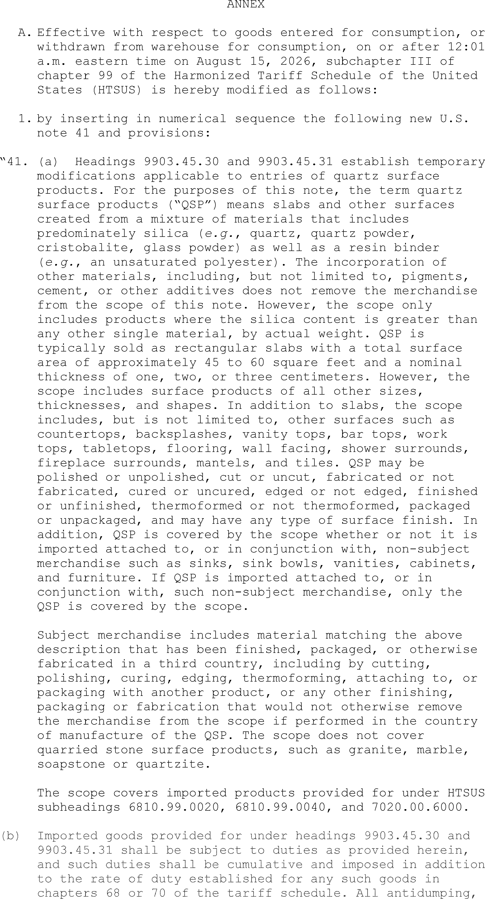
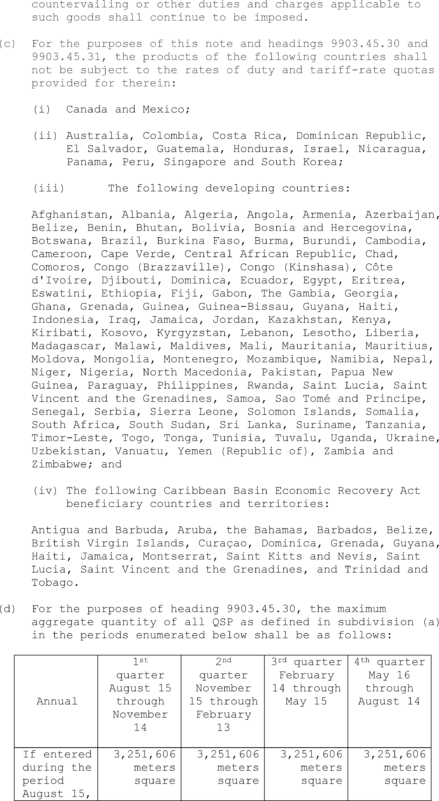

# Daily Digest — 2026-08-05

| | |
|---|---|
| **Digest date** | 2026-08-05 |
| **Data date range** | 2026-08-05 to 2026-08-05 |
| **Generated at** | 2026-08-06T04:32:39Z (UTC) |
| **Pipeline version** | a585f3e |
| **Source watermarks** | CREC: 2026-08-05T11:34:54Z · BILLS: 2026-08-06T02:39:32Z · FR: 2026-08-05T05:50:36Z · USCOURTS: 2026-08-06T01:37:26Z · PLAW: 2026-07-25T00:00:00Z |

[Full observed listing for this day](day/2026-08-05.html) — every item our collectors observed for this publication day, mechanical rules applied, frozen at end of day. This digest is the canonical record.

All items below cite the govinfo package (and granule, where applicable) they
summarize. Selection is mechanical; each item states the rule that included
it. See the Coverage Statement at the end for a full accounting of what was
published, what was summarized, and what was excluded and why.

---

## Contents

- [Day in Review](#day-in-review)
- [1. Congressional Floor Activity](#1-congressional-floor-activity)
- [2. Legislation](#2-legislation)
- [3. Federal Register](#3-federal-register)
- [4. Enacted Laws](#4-enacted-laws)
- [5. Judicial Activity](#5-judicial-activity)
- [6. Agency Announcements](#6-agency-announcements)
- [7. Recorded Votes](#7-recorded-votes)
- [8. Bill Actions](#8-bill-actions)
- [Terms Used Today](#terms-used-today)
- [Coverage Statement](#coverage-statement)
- [Methodology](#methodology)

---

## Day in Review

Four recorded votes appear in the day's congressional record.

The Federal Register carried two presidential documents, seven final rules, four proposed rules, and 77 notices. The President proclaimed a four-year tariff-rate quota on imports of quartz surface products, following a determination that imports are causing serious injury to the domestic industry, with within-quota quantities rising and duties falling in the second through fourth years and exclusions for products of specified trading partners; a second document continued, for one year beyond August 9, 2026, the national emergency declared under Executive Order 14105 concerning countries of concern in sensitive technologies. Final rules included two FAA amendments to standard instrument approach procedures and takeoff minimums, an amendment to RNAV Route Q-10 with revocation of two Alaska routes, Coast Guard enforcement of recurring Northern Great Lakes safety zones, NMFS closures of the Gulf of Maine trophy bluefin tuna angling fishery and the 2026 Gulf of America commercial greater amberjack season, and an FDA response to objections and hearing requests on an FD&C Red No. 3 color additive order. The proposed rules addressed the National Poultry Improvement Plan, coffee importation into Hawaii and Puerto Rico, OCC information disclosure, and airline emergency medical kits. Agencies issued 224 press releases.

*Composed from the summarized items below and the day's mechanical
counts; all specifics are cited in their sections.*

---

## 1. Congressional Floor Activity

Source: Congressional Record (CREC), daily edition for 2026-08-05. Total issue size: 0 granule(s).

### 1.1 Senate

No Senate floor items met the selection thresholds. 0 floor granule(s) are accounted for in the Coverage Statement.

### 1.2 House of Representatives

No House floor items met the selection thresholds. 0 floor granule(s) are accounted for in the Coverage Statement.

### 1.3 Recorded Votes

No recorded votes were published in this issue of the Congressional Record.

---

## 2. Legislation

Source: Congressional Bills (BILLS), text versions published 2026-08-05 to 2026-08-05.

### 2.1 Counts by Stage

| Stage (bill text version) | Count |
|---|---|
| Introduced (ih/is) | 0 |
| Reported (rh/rs) | 0 |
| Engrossed (eh/es) | 0 |
| Enrolled (enr) | 0 |
| Other versions | 0 |
| **Total bill texts published** | **0** |

### 2.2 Bills Listed by Mechanical Rule

Bills below are listed because they matched at least one listing rule; the
matching rule is stated per item. All other bill texts are counted above and
accounted for in the Coverage Statement.

No bill texts published in this range matched a listing rule; all 0 are
accounted for in the Coverage Statement.

---

## 3. Federal Register

Source: Federal Register (FR), issue of 2026-08-05.

### 3.1 Counts by Document Type

| Document type | Count |
|---|---|
| Rules | 7 |
| Proposed rules | 4 |
| Notices | 77 |
| Presidential documents | 2 |
| **Total FR documents** | **90** |

### 3.2 Rules Published

Tags: department of health and human services · department of transportation · executive · model keys: aviation procedures · fisheries · maritime safety

*In plain terms: Seven rules amend instrument approach procedures for various airports, close bluefin tuna and greater amberjack fisheries, modernize Alaska airways, establish maritime safety zones, and address an FDA administrative matter.*

#### DEPARTMENT OF COMMERCE

- **Atlantic Highly Migratory Species; Atlantic Bluefin Tuna Fisheries; Closure of the Angling Category Gulf of Maine Area Trophy Fishery for 2026** (2026-15878; 50 CFR Part 635) — NMFS closes the Angling category Gulf of Maine area fishery for large medium and giant (“trophy” ( i.e., measuring 73 inches (185 centimeters (cm)) curved fork length or greater)) Atlantic bluefin tuna (BFT). This action applies to Highly Migratory Species (HMS) Angling and HMS Charter/Headboat permitted vessels when fishing recreationally. Action: Temporary rule; closure. Dates: Effective 11:30 p.m., local time, August 4, 2026, through December 31, 2026.
  - *In plain terms:* The government is closing recreational fishing for large Atlantic bluefin tuna measuring 73 inches or longer in the Gulf of Maine area.
  - Included because: FR-SEL-01 — document type: final rule (all listed)
  - Source: [FR-2026-08-05 / 2026-15878](https://www.govinfo.gov/app/details/FR-2026-08-05/2026-15878)
- **Fisheries of the Caribbean, Gulf of America, and South Atlantic; Reef Fish Fishery in the Gulf of America; 2026 Commercial Closure for Greater Amberjack** (2026-15886; 50 CFR Part 622) — NMFS is closing the 2026 commercial fishing season for greater amberjack in the Gulf of America (Gulf). Federal regulations require NMFS to close commercial harvest for greater amberjack if landings reach the commercial annual catch target (ACT) during the fishing year, which NMFS has projected will occur by August 5, 2026. The commercial closure for greater amberjack will remain closed through the rest of 2026. This action is necessary to protect the greater amberjack resource in the Gulf. Action: Temporary rule; closure. Dates: The commercial closure is effective from August 8, 2026, through December 31, 2026.
  - *In plain terms:* The government is closing commercial fishing for greater amberjack in the Gulf of America for the remainder of 2026 after the annual catch limit was reached.
  - Included because: FR-SEL-01 — document type: final rule (all listed)
  - Source: [FR-2026-08-05 / 2026-15886](https://www.govinfo.gov/app/details/FR-2026-08-05/2026-15886)

#### DEPARTMENT OF HEALTH AND HUMAN SERVICES

- **Micro-Tracers, Inc.; Response to Objections and Requests for a Public Hearing** (2026-15920; 21 CFR Part 74) — The Food and Drug Administration (FDA or we) received objections and requests for a public hearing submitted by Buchanan Ingersoll & Rooney PC, on behalf of Micro-Tracers, Inc. (Micro-Tracers or objector), on the order granting a color additive petition (3C0323) requesting that we repeal specified regulations to no longer provide for the safe use of FD&C Red No. 3 in food (including dietary supplements) and ingested drugs. After reviewing the objections, we have concluded that the objections do not raise issues of material fact that justify a hearing. We are also providing notice that the administrative stay of the effective date for the repeal and delisting of the color additive regulations is now lifted. Action: Notification; response to objections and denial of public hearing requests; removal of administrative stay. Dates: This order that published in the Federal Register of January 16, 2025 (90 FR 4628) with effective dates of January 15, 2027, and January 18, 2028, was administratively stayed by the filing of objections under section 701(e)(2) of the Federal Food, Drug, and Cosmetic Act (FD&C Act) (21 U.S.C. 371(e)(2)) as of February 18, 2025. FDA lifts the administrative stay as of August 5, 2026. The effective dates of January 15, 2027, and January 18, 2028, for amendatory instruction 4, for the order published on January 16, 2025 (90 FR 4628), are confirmed.
  - *In plain terms:* The FDA is ending a temporary delay and proceeding with eliminating the food dye FD&C Red No. 3, rejecting objections that requested a public hearing.
  - Included because: FR-SEL-01 — document type: final rule (all listed)
  - Source: [FR-2026-08-05 / 2026-15920](https://www.govinfo.gov/app/details/FR-2026-08-05/2026-15920)

#### DEPARTMENT OF HOMELAND SECURITY

- **Safety Zones; Recurring Safety Zones in Captain of the Port Northern Great Lakes** (2026-15855; 33 CFR Part 165) — The Coast Guard will enforce various safety zones for maritime events in the Captain of the Port Northern Great Lakes zone. Enforcement of these safety zones is necessary to protect the safety of life and property on the navigable waters immediately prior to, during, and immediately after the events. During the periods in question, the Coast Guard will enforce restrictions upon, and control movement of, vessels in a specified area immediately prior to, during, and immediately after events. During each enforcement period, vessels must stay out of the established safety zone and may only enter with permission from the designated representative of the Captain of the Port Northern Great Lakes. Action: Notification of enforcement of regulation. Dates: The regulations in 33 CFR 165.918 will be enforced for the safety zones identified in the SUPPLEMENTARY INFORMATION section below for the dates and times specified.
  - *In plain terms:* The Coast Guard will establish and enforce temporary restricted areas for maritime events where vessels are prohibited without permission.
  - Included because: FR-SEL-01 — document type: final rule (all listed)
  - Source: [FR-2026-08-05 / 2026-15855](https://www.govinfo.gov/app/details/FR-2026-08-05/2026-15855)

#### DEPARTMENT OF TRANSPORTATION

- **Standard Instrument Approach Procedures, and Takeoff Minimums and Obstacle Departure Procedures; Miscellaneous Amendments** (2026-15852; 14 CFR Part 97) — This rule establishes, amends, suspends, or removes Standard Instrument Approach Procedures (SIAPS) and associated Takeoff Minimums and Obstacle Departure procedures (ODPs) for operations at certain airports. These regulatory actions are needed because of the adoption of new or revised criteria, or because of changes occurring in the National Airspace System, such as the commissioning of new navigational facilities, adding new obstacles, or changing air traffic requirements. These changes are designed to provide safe and efficient use of the navigable airspace and to promote safe flight operations under instrument flight rules at the affected airports. Action: Final rule. Dates: This rule is effective August 5, 2026. The compliance date for each SIAP, associated Takeoff Minimums, and ODP is specified in the amendatory provisions. The incorporation by reference of certain publications listed in the regulations is approved by the Director of the Federal Register as of August 5, 2026.
  - *In plain terms:* The FAA is updating flight approach procedures at various airports to reflect new navigational facilities, obstacles, or air traffic requirements.
  - Included because: FR-SEL-01 — document type: final rule (all listed)
  - Source: [FR-2026-08-05 / 2026-15852](https://www.govinfo.gov/app/details/FR-2026-08-05/2026-15852)
- **Standard Instrument Approach Procedures, and Takeoff Minimums and Obstacle Departure Procedures; Miscellaneous Amendments** (2026-15853; 14 CFR Part 97) — This rule amends, suspends, or removes Standard Instrument Approach Procedures (SIAPs) and associated Takeoff Minimums and Obstacle Departure Procedures for operations at certain airports. These regulatory actions are needed because of the adoption of new or revised criteria, or because of changes occurring in the National Airspace System, such as the commissioning of new navigational facilities, adding new obstacles, or changing air traffic requirements. These changes are designed to provide for the safe and efficient use of the navigable airspace and to promote safe flight operations under instrument flight rules at the affected airports. Action: Final rule. Dates: This rule is effective August 5, 2026. The compliance date for each SIAP, associated Takeoff Minimums, and ODP is specified in the amendatory provisions. The incorporation by reference of certain publications listed in the regulations is approved by the Director of the Federal Register as of August 5, 2026.
  - *In plain terms:* The FAA is updating flight approach procedures at various airports to reflect new navigational facilities, obstacles, or air traffic requirements.
  - Included because: FR-SEL-01 — document type: final rule (all listed)
  - Source: [FR-2026-08-05 / 2026-15853](https://www.govinfo.gov/app/details/FR-2026-08-05/2026-15853)
- **Amendment of United States Area Navigation Route Q-10 and Revocation of Alaska Area Navigation Routes J-804R and J-889R in Alaska** (2026-15912; 14 CFR Part 71) — This action amends United States Area Navigation (RNAV) Route Q-10 and revokes Alaska RNAV Routes J-804R and J-889R in Alaska. These actions are part of a large and comprehensive airway modernization project for the state of Alaska. Action: Final rule. Dates: Effective date 0901 UTC, October 29, 2026. The Director of the Federal Register approves this incorporation by reference action under 14 CFR part 71, subject to the annual revision of FAA Order JO 7400.11 and publication of conforming amendments.
  - *In plain terms:* The FAA is updating airplane navigation routes in Alaska as part of a statewide airway modernization project.
  - Included because: FR-SEL-01 — document type: final rule (all listed)
  - Source: [FR-2026-08-05 / 2026-15912](https://www.govinfo.gov/app/details/FR-2026-08-05/2026-15912)

### 3.3 Proposed Rules Published

Tags: department of health and human services · department of transportation · executive · model keys: coffee imports · medical kits · poultry

*In plain terms: Four proposals include FAA's shift to performance-based emergency medical kit standards and National Poultry Improvement Plan amendments, plus notice-based processes for coffee imports and OCC disclosure rules.*

#### DEPARTMENT OF AGRICULTURE

- **National Poultry Improvement Plan and Auxiliary Provisions** (2026-15845; 9 CFR Parts 145, 146, and 147) — We are proposing to amend the regulations governing the National Poultry Improvement Plan (NPIP). These amendments would, among other things, clarify existing provisions of the regulations, fix editorial errors, and align the regulations more closely with current producer practices. These proposed changes were voted on and approved by the voting delegates at the NPIP's 2024 National Plan Conference. Action: Proposed rule. Dates: We will consider all comments that we receive on or before October 5, 2026.
  - *In plain terms:* The Department of Agriculture is proposing to update poultry improvement regulations to clarify rules, fix errors, and better match current farming practices.
  - Included because: FR-SEL-02 — document type: proposed rule (all listed)
  - Source: [FR-2026-08-05 / 2026-15845](https://www.govinfo.gov/app/details/FR-2026-08-05/2026-15845)
- **Importation of Coffee Into Hawaii and Puerto Rico** (2026-15857; 7 CFR Part 319) — We are proposing to amend the regulations regarding the importation of unroasted coffee and related articles into Hawaii and Puerto Rico by establishing a notice-based process for changes to the prohibitions on importing such articles. We would also broaden language regarding coffee pests. We are proposing these amendments because they would allow the Agency to more efficiently respond to market access requests as well as to emerging pest situations. These amendments would allow us to use a streamlined approach to update the importation conditions for unroasted coffee and related articles while continuing to protect plant health. Action: Proposed rule. Dates: We will consider all comments that we receive on or before October 5, 2026.
  - *In plain terms:* The Department of Agriculture is proposing a streamlined process for updating rules on importing unroasted coffee into Hawaii and Puerto Rico to address pest concerns.
  - Included because: FR-SEL-02 — document type: proposed rule (all listed)
  - Source: [FR-2026-08-05 / 2026-15857](https://www.govinfo.gov/app/details/FR-2026-08-05/2026-15857)

#### DEPARTMENT OF THE TREASURY

- **OCC Rules Regarding the Availability of OCC Information** (2026-15867; 12 CFR Parts 4, 5, 7, 21, and 163) — The Office of the Comptroller of the Currency (OCC) is proposing changes to its rules on information disclosure. The proposal would clarify the process for obtaining OCC approval to disclose non-public OCC information and allow for the disclosure of confidential supervisory information without OCC approval in certain circumstances, provided that applicable safeguards are observed. It also refines the OCC's process for requesting records under the Freedom of Information Act (FOIA), amends the rules to provide for expedited process of FOIA requests, and makes other structural and conforming changes. Action: Notice of proposed rulemaking. Dates: Comments must be received on or before October 5, 2026.
  - *In plain terms:* The Office of the Comptroller of the Currency is proposing to clarify and simplify rules for disclosing bank examination information and responding to Freedom of Information Act requests.
  - Included because: FR-SEL-02 — document type: proposed rule (all listed)
  - Source: [FR-2026-08-05 / 2026-15867](https://www.govinfo.gov/app/details/FR-2026-08-05/2026-15867)

#### DEPARTMENT OF TRANSPORTATION

- **Improving Emergency Medical Kit Efficacy and Flexibility in Commercial Airline Operations** (2026-15929; 14 CFR Part 121) — FAA proposes to eliminate the prescriptive list of required items in emergency medical kits and first aid kits and replace it with a performance-based requirement to ensure contents are practical and sufficient to allow crewmembers to address the most common medical emergencies that occur onboard commercial aircraft. FAA seeks to increase flexibility for operators while maintaining predictability for operators to equip their onboard medical kits. This rule would also remove an outdated reference to certain emergency medical kits modified on April 12, 2004. This action is necessary to address requirements in the FAA Reauthorization Act of 2024. Action: Notice of proposed rulemaking. Dates: Send comments on or before October 5, 2026.
  - *In plain terms:* The FAA is proposing to replace detailed lists of required medical kit items with flexible standards that ensure airlines can handle common in-flight medical emergencies.
  - Included because: FR-SEL-02 — document type: proposed rule (all listed)
  - Source: [FR-2026-08-05 / 2026-15929](https://www.govinfo.gov/app/details/FR-2026-08-05/2026-15929)

### 3.4 Notices and Presidential Documents

Tags: department of health and human services · department of transportation · executive · model keys: national security · quartz products · tariffs

*In plain terms: The President imposed a four-year tariff-rate quota on quartz surface products due to import injury and continued a national emergency declaration over sensitive technology advancement.*

Notices are summarized only when they match a listing rule; all are counted
in 3.1 and in the Coverage Statement. Presidential documents in the FR are
always listed.

- **To Facilitate Positive Adjustment to Competition From Imports of Quartz Surface Products** (2026-15975) — President proclaims a safeguard measure in the form of a tariff-rate quota on imports of quartz surface products for four years, following a determination that imports are causing serious injury to the domestic industry. The measure includes annual increases in within-quota quantities and duty reductions in the second through fourth years, with exclusions for products of specified trading partners and developing countries meeting threshold requirements.
  - *In plain terms:* The President is imposing a four-year import quota on quartz surface products with graduated reductions in tariffs and exclusions for certain trading partners, citing injury to the domestic industry.
  - Included because: FR-SEL-03 — presidential document (all listed)
  - Source: [FR-2026-08-05 / 2026-15975](https://www.govinfo.gov/app/details/FR-2026-08-05/2026-15975)
  -  *Source graphic 1 of 5 from 2026-15975.*
  -  *Source graphic 2 of 5 from 2026-15975.*
  - *Graphics not rendered here: 3 of 5 — see the [source PDF](https://www.govinfo.gov/content/pkg/FR-2026-08-05/pdf/FR-2026-08-05.pdf).*
- **Continuation of the National Emergency With Respect to the Advancement by Countries of Concern in Sensitive Technologies and Products Critical for the Military, Intelligence, Surveillance, or Cyber-Enabled Capabilities of Such Countries** (2026-16015) — The President continues the national emergency declared under Executive Order 14105 concerning the advancement by countries of concern in sensitive technologies and products critical for military, intelligence, surveillance, or cyber-enabled capabilities. The emergency is continued for one year beyond August 9, 2026, citing ongoing concerns about United States outbound investments that risk exacerbating threats to national security.
  - *In plain terms:* The President is continuing through August 9, 2027 the national emergency over foreign technological advancement, citing concerns that U.S. investments abroad could increase security threats.
  - Included because: FR-SEL-03 — presidential document (all listed)
  - Source: [FR-2026-08-05 / 2026-16015](https://www.govinfo.gov/app/details/FR-2026-08-05/2026-16015)

---

## 4. Enacted Laws

Source: Public and Private Laws (PLAW) published 2026-08-05.

No laws were published in this range.

---

## 5. Judicial Activity

Source: United States Courts Opinions (USCOURTS): opinions issued 2026-08-05
by participating federal courts.

Completeness disclosure (standing): USCOURTS carries opinions from
approximately 140 participating appellate, district, bankruptcy, and
national federal courts. Unlike the Congressional Record and the Federal
Register, which are the complete official record of their branches,
USCOURTS is participation-based and is NOT the complete federal judicial
record. Courts post opinions with delay; opinions filed on this date may
appear in later digests.

### 5.1 Appellate and National Court Opinions

Appellate and national court opinions are summarized; district and
bankruptcy opinions are counted in 5.2 and in the Coverage Statement.

No appellate or national court opinions matched a listing rule for this
date; all opinions are counted in 5.2 and accounted for in the Coverage
Statement.

### 5.2 Counts by Court Category

| Court category | Opinions |
|---|---|
| Appellate | 0 |
| District | 16 |
| Bankruptcy | 0 |
| National | 0 |
| **Total opinions extracted** | **16** |

Archive-window disclosure (rule USCOURTS-FETCH-01): 21116 USCOURTS package(s) have been listed in delta syncs but fell outside the 7-day archive window and were not fetched (global running count across all syncs, not limited to this date).

---

## 6. Agency Announcements

Official press releases and statements the agencies themselves date
on 2026-08-05 (sources listed in the source guide). These are the
agencies' own announcements — official advocacy, quoted and
attributed, not findings of this digest. Agency web content can be
edited or removed without notice; captures and hashes are preserved
per the provenance policy.

#### CISA Cybersecurity Advisories

- **[CISA Adds One Known Exploited Vulnerability to Catalog](https://www.cisa.gov/news-events/alerts/2026/08/05/cisa-adds-one-known-exploited-vulnerability-catalog)** — dated 2026-08-05 by the agency
  - Included because: AGENCYPR-SEL-01 — official agency release dated this day by the agency (all such releases from active sources are listed; titles only in the pilot)
  - Source: agency newsroom (above) · [independent archive](https://web.archive.org/web/20260805194623/https://www.cisa.gov/news-events/alerts/2026/08/05/cisa-adds-one-known-exploited-vulnerability-catalog)

#### Defense News Releases

- **[Coast Guard Participates in Panama Canal Counter-Threat Exercise](https://www.war.gov/News/News-Stories/Article/Article/4564659/coast-guard-participates-in-panama-canal-counter-threat-exercise/)** — dated 2026-08-05 by the agency
  - Included because: AGENCYPR-SEL-01 — official agency release dated this day by the agency (all such releases from active sources are listed; titles only in the pilot)
- **[Southcom Establishes Joint Task Force Western Hemisphere](https://www.war.gov/News/News-Stories/Article/Article/4564574/southcom-establishes-joint-task-force-western-hemisphere/)** — dated 2026-08-05 by the agency
  - Included because: AGENCYPR-SEL-01 — official agency release dated this day by the agency (all such releases from active sources are listed; titles only in the pilot)

#### DHS News Releases

- **[DEPORTED: DHS Deports More Criminal Illegal Aliens, Including Murderers, Rapists, Drug Traffickers, and Violent Assailants](https://www.dhs.gov/news/2026/08/05/deported-dhs-deports-more-criminal-illegal-aliens-including-murderers-rapists-drug)** — dated 2026-08-05 by the agency
  - Included because: AGENCYPR-SEL-01 — official agency release dated this day by the agency (all such releases from active sources are listed; titles only in the pilot)
- **[Secretary Mullin Tours Border Wall, Meets Border Patrol Agents in Texas](https://www.dhs.gov/news/2026/08/05/secretary-mullin-tours-border-wall-meets-border-patrol-agents-texas)** — dated 2026-08-05 by the agency
  - Included because: AGENCYPR-SEL-01 — official agency release dated this day by the agency (all such releases from active sources are listed; titles only in the pilot)
- **[WORST OF THE WORST: ICE Arrests Murderers, Pedophiles, Sexual Predators, and Drug Traffickers](https://www.dhs.gov/news/2026/08/05/worst-worst-ice-arrests-murderers-pedophiles-sexual-predators-and-drug-traffickers)** — dated 2026-08-05 by the agency
  - Included because: AGENCYPR-SEL-01 — official agency release dated this day by the agency (all such releases from active sources are listed; titles only in the pilot)

#### EEOC Newsroom

- **[EEOC Sues North American Lighting Under the Pregnant Workers Fairness Act](https://www.eeoc.gov/newsroom/eeoc-sues-north-american-lighting-under-pregnant-workers-fairness-act)** — dated 2026-08-05 by the agency
  - Included because: AGENCYPR-SEL-01 — official agency release dated this day by the agency (all such releases from active sources are listed; titles only in the pilot)

#### FAA Updates (email)

- **[Draft Airports Advisory Circulars -- U.S. Federal Aviation Administration Web Update](http://www.faa.gov/airports/resources/draft_advisory_circulars/)** — dated 2026-08-05 by the agency
  - Included because: AGENCYPR-SEL-01 — official agency release dated this day by the agency (all such releases from active sources are listed; titles only in the pilot)
  - Source: agency email bulletin to this project's subscription, captured and DKIM-verified
- **[Engineering Briefs Update -- U.S. Federal Aviation Administration Website](http://www.faa.gov/airports/engineering/engineering_briefs/)** — dated 2026-08-05 by the agency
  - Included because: AGENCYPR-SEL-01 — official agency release dated this day by the agency (all such releases from active sources are listed; titles only in the pilot)
  - Source: agency email bulletin to this project's subscription, captured and DKIM-verified
- **FAA Advisory Circulars Update Notification** — dated 2026-08-05 by the agency
  - Included because: AGENCYPR-SEL-01 — official agency release dated this day by the agency (all such releases from active sources are listed; titles only in the pilot)
  - Source: agency email bulletin to this project's subscription, captured and DKIM-verified (the bulletin named no canonical page)
- **FAA Orders & Notices Update Notification** — dated 2026-08-05 by the agency
  - Included because: AGENCYPR-SEL-01 — official agency release dated this day by the agency (all such releases from active sources are listed; titles only in the pilot)
  - Source: agency email bulletin to this project's subscription, captured and DKIM-verified (the bulletin named no canonical page)
- **FAA Orders & Notices Update Notification** — dated 2026-08-05 by the agency
  - Included because: AGENCYPR-SEL-01 — official agency release dated this day by the agency (all such releases from active sources are listed; titles only in the pilot)
  - Source: agency email bulletin to this project's subscription, captured and DKIM-verified (the bulletin named no canonical page)
- **FAA Orders & Notices Update Notification** — dated 2026-08-05 by the agency
  - Included because: AGENCYPR-SEL-01 — official agency release dated this day by the agency (all such releases from active sources are listed; titles only in the pilot)
  - Source: agency email bulletin to this project's subscription, captured and DKIM-verified (the bulletin named no canonical page)
- **[Updated List of AIP Buy American Waivers -- U.S. Federal Aviation Administration Website](https://www.faa.gov/airports/aip/buy_american#waivers-issued)** — dated 2026-08-05 by the agency
  - Included because: AGENCYPR-SEL-01 — official agency release dated this day by the agency (all such releases from active sources are listed; titles only in the pilot)
  - Source: agency email bulletin to this project's subscription, captured and DKIM-verified

#### FDA Email Updates (email)

- **FDA MedWatch - One Lot of Morphine Sulfate Injection, USP in a Simplist Prefilled Syringe by Fresenius Kabi** — dated 2026-08-05 by the agency
  - Included because: AGENCYPR-SEL-01 — official agency release dated this day by the agency (all such releases from active sources are listed; titles only in the pilot)
  - Source: agency email bulletin to this project's subscription, captured and DKIM-verified (the bulletin named no canonical page)
- **Heads up! New FDA Articles Headed Your Way** — dated 2026-08-05 by the agency
  - Included because: AGENCYPR-SEL-01 — official agency release dated this day by the agency (all such releases from active sources are listed; titles only in the pilot)
  - Source: agency email bulletin to this project's subscription, captured and DKIM-verified (the bulletin named no canonical page)
- **Weekly FDA Warning Letters** — dated 2026-08-05 by the agency
  - Included because: AGENCYPR-SEL-01 — official agency release dated this day by the agency (all such releases from active sources are listed; titles only in the pilot)
  - Source: agency email bulletin to this project's subscription, captured and DKIM-verified (the bulletin named no canonical page)

#### FDA Press Announcements

- **[FDA Approves First Drug to Treat the Full Range of Narcolepsy Type 1 Symptoms](http://www.fda.gov/news-events/press-announcements/fda-approves-first-drug-treat-full-range-narcolepsy-type-1-symptoms)** — dated 2026-08-05 by the agency
  - Included because: AGENCYPR-SEL-01 — official agency release dated this day by the agency (all such releases from active sources are listed; titles only in the pilot)
  - Source: agency newsroom (above) · [independent archive](https://web.archive.org/web/20260805204025/https://www.fda.gov/news-events/press-announcements/fda-approves-first-drug-treat-full-range-narcolepsy-type-1-symptoms)
  - Corroborated: the same release (same canonical URL) also arrived via the agency's email bulletin to this project's subscription, DKIM-verified — one document received through two ingestion channels; listed once, both captures preserved.

#### FDIC Press Releases (email)

- **[Press Release: FDIC Issues List of Banks Examined for CRA Compliance](https://www.fdic.gov/banker-resource-center/monthly-list-banks-examined-cra-compliance-august-2026?source=govdelivery&utm_medium=email&utm_source=govdelivery)** — dated 2026-08-05 by the agency
  - Included because: AGENCYPR-SEL-01 — official agency release dated this day by the agency (all such releases from active sources are listed; titles only in the pilot)
  - Source: agency email bulletin to this project's subscription, captured and DKIM-verified

#### FEMA Press Releases

- **[FEMA Announces $11.4 Million for States and Territories to Address Critical Dam Infrastructure](https://www.fema.gov/press-release/20260805/fema-announces-11-million-states-and-territories-address-critical-dam)** — dated 2026-08-05 by the agency
  - Included because: AGENCYPR-SEL-01 — official agency release dated this day by the agency (all such releases from active sources are listed; titles only in the pilot)
- **[FEMA Approves Fire Management Assistance Grant for Gann Fire in Calaveras County](https://www.fema.gov/press-release/20260805/fema-approves-fire-management-assistance-grant-gann-fire-calaveras-county)** — dated 2026-08-05 by the agency
  - Included because: AGENCYPR-SEL-01 — official agency release dated this day by the agency (all such releases from active sources are listed; titles only in the pilot)
- **[President Donald J. Trump Increases Federal Cost Share for the Sisseton-Wahpeton Oyate](https://www.fema.gov/press-release/20260805/president-donald-j-trump-increases-federal-cost-share-sisseton-wahpeton)** — dated 2026-08-05 by the agency
  - Included because: AGENCYPR-SEL-01 — official agency release dated this day by the agency (all such releases from active sources are listed; titles only in the pilot)

#### FSIS Recalls and Public Health Alerts (email)

- **Export Information Update** — dated 2026-08-05 by the agency
  - Included because: AGENCYPR-SEL-01 — official agency release dated this day by the agency (all such releases from active sources are listed; titles only in the pilot)
  - Source: agency email bulletin to this project's subscription, captured and DKIM-verified (the bulletin named no canonical page)
- **FSIS Notice 31-26** — dated 2026-08-05 by the agency
  - Included because: AGENCYPR-SEL-01 — official agency release dated this day by the agency (all such releases from active sources are listed; titles only in the pilot)
  - Source: agency email bulletin to this project's subscription, captured and DKIM-verified (the bulletin named no canonical page)
- **FSIS Updates for Small Plants - August 5, 2026** — dated 2026-08-05 by the agency
  - Included because: AGENCYPR-SEL-01 — official agency release dated this day by the agency (all such releases from active sources are listed; titles only in the pilot)
  - Source: agency email bulletin to this project's subscription, captured and DKIM-verified (the bulletin named no canonical page)
- **USDA Food Safety and Inspection Service Eligible U.S. Establishments by Country Update** — dated 2026-08-05 by the agency
  - Included because: AGENCYPR-SEL-01 — official agency release dated this day by the agency (all such releases from active sources are listed; titles only in the pilot)
  - Source: agency email bulletin to this project's subscription, captured and DKIM-verified (the bulletin named no canonical page)
- **USDA Food Safety and Inspection Service Recall Case Archive Update** — dated 2026-08-05 by the agency
  - Included because: AGENCYPR-SEL-01 — official agency release dated this day by the agency (all such releases from active sources are listed; titles only in the pilot)
  - Source: agency email bulletin to this project's subscription, captured and DKIM-verified (the bulletin named no canonical page)

#### GAO Reports & Testimonies

- **[College Athletics: Most Programs Spend More Than They Generate in Revenue](https://www.gao.gov/products/gao-26-108640)** — dated 2026-08-05 by the agency
  - Included because: AGENCYPR-SEL-01 — official agency release dated this day by the agency (all such releases from active sources are listed; titles only in the pilot)
- **[DOGE: Information on Personnel and Ethics Activities](https://www.gao.gov/products/gao-26-108403)** — dated 2026-08-05 by the agency
  - Included because: AGENCYPR-SEL-01 — official agency release dated this day by the agency (all such releases from active sources are listed; titles only in the pilot)

#### IRS Newswire (email)

- **Announcement 2026-15: defined contribution qualified pre-approved plans** — dated 2026-08-05 by the agency
  - Included because: AGENCYPR-SEL-01 — official agency release dated this day by the agency (all such releases from active sources are listed; titles only in the pilot)
  - Source: agency email bulletin to this project's subscription, captured and DKIM-verified (the bulletin named no canonical page)
- **Notice 2026-28: Guidance on the employer credit for paid family and medical leave under section 45S** — dated 2026-08-05 by the agency
  - Included because: AGENCYPR-SEL-01 — official agency release dated this day by the agency (all such releases from active sources are listed; titles only in the pilot)
  - Source: agency email bulletin to this project's subscription, captured and DKIM-verified (the bulletin named no canonical page)
- **[Revenue Procedure 2026-30: streamlining applications for requesting letter rulings](https://www.irs.gov/pub/irs-drop/rp-26-30.pdf)** — dated 2026-08-05 by the agency
  - Included because: AGENCYPR-SEL-01 — official agency release dated this day by the agency (all such releases from active sources are listed; titles only in the pilot)
  - Source: agency email bulletin to this project's subscription, captured and DKIM-verified
- **UPDATED: Announcement 2026-15, defined contribution qualified pre-approved plans** — dated 2026-08-05 by the agency
  - Included because: AGENCYPR-SEL-01 — official agency release dated this day by the agency (all such releases from active sources are listed; titles only in the pilot)
  - Source: agency email bulletin to this project's subscription, captured and DKIM-verified (the bulletin named no canonical page)
- **e-News for Tax Professionals 2026-31** — dated 2026-08-05 by the agency
  - Included because: AGENCYPR-SEL-01 — official agency release dated this day by the agency (all such releases from active sources are listed; titles only in the pilot)
  - Source: agency email bulletin to this project's subscription, captured and DKIM-verified (the bulletin named no canonical page)

#### Justice Department News (email)

- **EOIR BIA Decision - Aug. 5, 2026** — dated 2026-08-05 by the agency
  - Included because: AGENCYPR-SEL-01 — official agency release dated this day by the agency (all such releases from active sources are listed; titles only in the pilot)
  - Source: agency email bulletin to this project's subscription, captured and DKIM-verified (the bulletin named no canonical page)
- **Homeland Security Task Force: Dominican National Admits Role in Firearms Trafficking Scheme** — dated 2026-08-05 by the agency
  - Included because: AGENCYPR-SEL-01 — official agency release dated this day by the agency (all such releases from active sources are listed; titles only in the pilot)
  - Source: agency email bulletin to this project's subscription, captured and DKIM-verified (the bulletin named no canonical page)
- **[New Charges and Rewards Announced for the Capture and/or Conviction of Senior Leaders of Notorious Mexican Cartel](https://www.justice.gov/opa/pr/new-charges-and-rewards-announced-capture-andor-conviction-senior-leaders-notorious-mexican)** — dated 2026-08-05 by the agency
  - Included because: AGENCYPR-SEL-01 — official agency release dated this day by the agency (all such releases from active sources are listed; titles only in the pilot)
  - Source: agency email bulletin to this project's subscription, captured and DKIM-verified

#### Justice Press Releases

- **[Former St. Louis Aldermanic Candidate Admits Committing Social Security Fraud](https://www.justice.gov/usao-edmo/pr/former-st-louis-aldermanic-candidate-admits-committing-social-security-fraud)** — dated 2026-08-05 by the agency
  - Included because: AGENCYPR-SEL-01 — official agency release dated this day by the agency (all such releases from active sources are listed; titles only in the pilot)
  - Corroborated: the same release (same canonical URL) also arrived via the agency's email bulletin to this project's subscription, DKIM-verified — one document received through two ingestion channels; listed once, both captures preserved.
- **[Justice Department Secures Agreement with Connecticut Children’s to End Pediatric “Gender-Affirming Care”](https://www.justice.gov/opa/pr/justice-department-secures-agreement-connecticut-childrens-end-pediatric-gender-affirming)** — dated 2026-08-05 by the agency
  - Included because: AGENCYPR-SEL-01 — official agency release dated this day by the agency (all such releases from active sources are listed; titles only in the pilot)
  - Corroborated: the same release (same canonical URL) also arrived via the agency's email bulletin to this project's subscription, DKIM-verified — one document received through two ingestion channels; listed once, both captures preserved.
- **[Las Vegas Woman Sentenced to Prison in $5M Refund Fraud Scheme](https://www.justice.gov/opa/pr/las-vegas-woman-sentenced-prison-5m-refund-fraud-scheme)** — dated 2026-08-05 by the agency
  - Included because: AGENCYPR-SEL-01 — official agency release dated this day by the agency (all such releases from active sources are listed; titles only in the pilot)
  - Corroborated: the same release (same canonical URL) also arrived via the agency's email bulletin to this project's subscription, DKIM-verified — one document received through two ingestion channels; listed once, both captures preserved.
- **[Pflugerville Woman Sentenced to Federal Prison for Defrauding PPP Loan Program](https://www.justice.gov/usao-wdtx/pr/pflugerville-woman-sentenced-federal-prison-defrauding-ppp-loan-program)** — dated 2026-08-05 by the agency
  - Included because: AGENCYPR-SEL-01 — official agency release dated this day by the agency (all such releases from active sources are listed; titles only in the pilot)
  - Corroborated: the same release (same canonical URL) also arrived via the agency's email bulletin to this project's subscription, DKIM-verified — one document received through two ingestion channels; listed once, both captures preserved.
- **[BCSO Investigator Receives Freedom 250 Hometown Hero Award from U.S. Attorney for the Western District of Texas](https://www.justice.gov/usao-wdtx/pr/bcso-investigator-receives-freedom-250-hometown-hero-award-us-attorney-western)** — dated 2026-08-05 by the agency
  - Included because: AGENCYPR-SEL-01 — official agency release dated this day by the agency (all such releases from active sources are listed; titles only in the pilot)
  - Corroborated: the same release (same canonical URL) also arrived via the agency's email bulletin to this project's subscription, DKIM-verified — one document received through two ingestion channels; listed once, both captures preserved.
- **[Bahamian Drug Trafficker Faces Federal Cocaine Charges Following At-Sea Rescue from Plane Crash](https://www.justice.gov/usao-ndga/pr/bahamian-drug-trafficker-faces-federal-cocaine-charges-following-sea-rescue-plane)** — dated 2026-08-05 by the agency
  - Included because: AGENCYPR-SEL-01 — official agency release dated this day by the agency (all such releases from active sources are listed; titles only in the pilot)
  - Corroborated: the same release (same canonical URL) also arrived via the agency's email bulletin to this project's subscription, DKIM-verified — one document received through two ingestion channels; listed once, both captures preserved.
- **[Baltimore Man Sentenced for Drug Trafficking and Firearm Possession Charges](https://www.justice.gov/usao-md/pr/baltimore-man-sentenced-drug-trafficking-and-firearm-possession-charges)** — dated 2026-08-05 by the agency
  - Included because: AGENCYPR-SEL-01 — official agency release dated this day by the agency (all such releases from active sources are listed; titles only in the pilot)
  - Corroborated: the same release (same canonical URL) also arrived via the agency's email bulletin to this project's subscription, DKIM-verified — one document received through two ingestion channels; listed once, both captures preserved.
- **[Bridgeport Man Charged with Dumping Used Oil at Abandoned Property in Hartford](https://www.justice.gov/usao-ct/pr/bridgeport-man-charged-dumping-used-oil-abandoned-property-hartford)** — dated 2026-08-05 by the agency
  - Included because: AGENCYPR-SEL-01 — official agency release dated this day by the agency (all such releases from active sources are listed; titles only in the pilot)
- **[Bridgeport Man Guilty of Multiple Child Exploitation Offenses](https://www.justice.gov/usao-ct/pr/bridgeport-man-guilty-multiple-child-exploitation-offenses)** — dated 2026-08-05 by the agency
  - Included because: AGENCYPR-SEL-01 — official agency release dated this day by the agency (all such releases from active sources are listed; titles only in the pilot)
  - Corroborated: the same release (same canonical URL) also arrived via the agency's email bulletin to this project's subscription, DKIM-verified — one document received through two ingestion channels; listed once, both captures preserved.
- **[Bridgeport Man Sentenced to 10 Years in Federal Prison for Drug and Firearm Offenses](https://www.justice.gov/usao-ct/pr/bridgeport-man-sentenced-10-years-federal-prison-drug-and-firearm-offenses)** — dated 2026-08-05 by the agency
  - Included because: AGENCYPR-SEL-01 — official agency release dated this day by the agency (all such releases from active sources are listed; titles only in the pilot)
- **[Brooklyn Man Charged with Distribution of Cocaine Base and Cocaine](https://www.justice.gov/usao-vt/pr/brooklyn-man-charged-distribution-cocaine-base-and-cocaine)** — dated 2026-08-05 by the agency
  - Included because: AGENCYPR-SEL-01 — official agency release dated this day by the agency (all such releases from active sources are listed; titles only in the pilot)
  - Corroborated: the same release (same canonical URL) also arrived via the agency's email bulletin to this project's subscription, DKIM-verified — one document received through two ingestion channels; listed once, both captures preserved.
- **[Canadian Man Pleads Guilty to Hacking U.S. Cloud Storage Provider and Extorting Its Customers for Millions](https://www.justice.gov/opa/pr/canadian-man-pleads-guilty-hacking-us-cloud-storage-provider-and-extorting-its-customers)** — dated 2026-08-05 by the agency
  - Included because: AGENCYPR-SEL-01 — official agency release dated this day by the agency (all such releases from active sources are listed; titles only in the pilot)
  - Corroborated: the same release (same canonical URL) also arrived via the agency's email bulletin to this project's subscription, DKIM-verified — one document received through two ingestion channels; listed once, both captures preserved.
- **[Casper man sentenced to over 12 years on meth distribution charges](https://www.justice.gov/usao-wy/pr/casper-man-sentenced-over-12-years-meth-distribution-charges)** — dated 2026-08-05 by the agency
  - Included because: AGENCYPR-SEL-01 — official agency release dated this day by the agency (all such releases from active sources are listed; titles only in the pilot)
  - Corroborated: the same release (same canonical URL) also arrived via the agency's email bulletin to this project's subscription, DKIM-verified — one document received through two ingestion channels; listed once, both captures preserved.
- **[Collin County man sentenced to over 20 years in federal prison for trafficking methamphetamine, firearms violation in the Eastern District of Texas](https://www.justice.gov/usao-edtx/pr/collin-county-man-sentenced-over-20-years-federal-prison-trafficking-methamphetamine)** — dated 2026-08-05 by the agency
  - Included because: AGENCYPR-SEL-01 — official agency release dated this day by the agency (all such releases from active sources are listed; titles only in the pilot)
  - Corroborated: the same release (same canonical URL) also arrived via the agency's email bulletin to this project's subscription, DKIM-verified — one document received through two ingestion channels; listed once, both captures preserved.
- **[Columbia City Man Sentenced to 120 Months in Prison and 120 Months Supervised Release For Possession of Child Pornography](https://www.justice.gov/usao-ndin/pr/columbia-city-man-sentenced-120-months-prison-and-120-months-supervised-release)** — dated 2026-08-05 by the agency
  - Included because: AGENCYPR-SEL-01 — official agency release dated this day by the agency (all such releases from active sources are listed; titles only in the pilot)
- **[Convicted Drug Trafficker Sentenced for Violating Federal Controlled Substances Act](https://www.justice.gov/usao-edla/pr/convicted-drug-trafficker-sentenced-violating-federal-controlled-substances-act-0)** — dated 2026-08-05 by the agency
  - Included because: AGENCYPR-SEL-01 — official agency release dated this day by the agency (all such releases from active sources are listed; titles only in the pilot)
  - Corroborated: the same release (same canonical URL) also arrived via the agency's email bulletin to this project's subscription, DKIM-verified — one document received through two ingestion channels; listed once, both captures preserved.
- **[Convicted Felon Sentenced to Over 17 Years in Federal Prison for Drug Trafficking Offenses](https://www.justice.gov/usao-ndfl/pr/convicted-felon-sentenced-over-17-years-federal-prison-drug-trafficking-offenses)** — dated 2026-08-05 by the agency
  - Included because: AGENCYPR-SEL-01 — official agency release dated this day by the agency (all such releases from active sources are listed; titles only in the pilot)
  - Corroborated: the same release (same canonical URL) also arrived via the agency's email bulletin to this project's subscription, DKIM-verified — one document received through two ingestion channels; listed once, both captures preserved.
- **[Convictions through Guilty Pleas and Sentencings in Homeland Security Task Force (HSTF) Prosecutions (July 27 through July 31, 2026)](https://www.justice.gov/usao-pr/pr/convictions-through-guilty-pleas-and-sentencings-homeland-security-task-force-hstf-4)** — dated 2026-08-05 by the agency
  - Included because: AGENCYPR-SEL-01 — official agency release dated this day by the agency (all such releases from active sources are listed; titles only in the pilot)
  - Corroborated: the same release (same canonical URL) also arrived via the agency's email bulletin to this project's subscription, DKIM-verified — one document received through two ingestion channels; listed once, both captures preserved.
- **[Court Sentences Mobile County Man for Possessing a Firearm as a Convicted Felon](https://www.justice.gov/usao-sdal/pr/court-sentences-mobile-county-man-possessing-firearm-convicted-felon-1)** — dated 2026-08-05 by the agency
  - Included because: AGENCYPR-SEL-01 — official agency release dated this day by the agency (all such releases from active sources are listed; titles only in the pilot)
  - Corroborated: the same release (same canonical URL) also arrived via the agency's email bulletin to this project's subscription, DKIM-verified — one document received through two ingestion channels; listed once, both captures preserved.
- **[Cranston Man Charged in Federal Criminal Complaint Arising from ICAC Investigation](https://www.justice.gov/usao-ri/pr/cranston-man-charged-federal-criminal-complaint-arising-icac-investigation)** — dated 2026-08-05 by the agency
  - Included because: AGENCYPR-SEL-01 — official agency release dated this day by the agency (all such releases from active sources are listed; titles only in the pilot)
  - Corroborated: the same release (same canonical URL) also arrived via the agency's email bulletin to this project's subscription, DKIM-verified — one document received through two ingestion channels; listed once, both captures preserved.
- **[DENHAM SPRINGS ACCOUNTANT PLEADS GUILTY TO WIRE FRAUD](https://www.justice.gov/usao-mdla/pr/denham-springs-accountant-pleads-guilty-wire-fraud)** — dated 2026-08-05 by the agency
  - Included because: AGENCYPR-SEL-01 — official agency release dated this day by the agency (all such releases from active sources are listed; titles only in the pilot)
- **[Delco Man Pleads Guilty to Stalking by Mail, Witness Tampering](https://www.justice.gov/usao-edpa/pr/delco-man-pleads-guilty-stalking-mail-witness-tampering)** — dated 2026-08-05 by the agency
  - Included because: AGENCYPR-SEL-01 — official agency release dated this day by the agency (all such releases from active sources are listed; titles only in the pilot)
  - Corroborated: the same release (same canonical URL) also arrived via the agency's email bulletin to this project's subscription, DKIM-verified — one document received through two ingestion channels; listed once, both captures preserved.
- **[Dover Man Indicted as Armed Career Criminal for Federal Gun and Drug Offenses](https://www.justice.gov/usao-de/pr/dover-man-indicted-armed-career-criminal-federal-gun-and-drug-offenses)** — dated 2026-08-05 by the agency
  - Included because: AGENCYPR-SEL-01 — official agency release dated this day by the agency (all such releases from active sources are listed; titles only in the pilot)
- **[East St. Louis Felon Admits Shooting Homeless Man](https://www.justice.gov/usao-edmo/pr/east-st-louis-felon-admits-shooting-homeless-man)** — dated 2026-08-05 by the agency
  - Included because: AGENCYPR-SEL-01 — official agency release dated this day by the agency (all such releases from active sources are listed; titles only in the pilot)
  - Corroborated: the same release (same canonical URL) also arrived via the agency's email bulletin to this project's subscription, DKIM-verified — one document received through two ingestion channels; listed once, both captures preserved.
- **[Federal Corrections Officer and Wife Plead Guilty to Smuggling Contraband, Including Drugs, to Lompoc Inmate](https://www.justice.gov/usao-cdca/pr/federal-corrections-officer-and-wife-plead-guilty-smuggling-contraband-including-drugs)** — dated 2026-08-05 by the agency
  - Included because: AGENCYPR-SEL-01 — official agency release dated this day by the agency (all such releases from active sources are listed; titles only in the pilot)
  - Corroborated: the same release (same canonical URL) also arrived via the agency's email bulletin to this project's subscription, DKIM-verified — one document received through two ingestion channels; listed once, both captures preserved.
- **[Federal Inmate Convicted Of Voluntary Manslaughter In The Death Of Cellmate](https://www.justice.gov/usao-mdpa/pr/federal-inmate-convicted-voluntary-manslaughter-death-cellmate)** — dated 2026-08-05 by the agency
  - Included because: AGENCYPR-SEL-01 — official agency release dated this day by the agency (all such releases from active sources are listed; titles only in the pilot)
  - Corroborated: the same release (same canonical URL) also arrived via the agency's email bulletin to this project's subscription, DKIM-verified — one document received through two ingestion channels; listed once, both captures preserved.
- **[Federal Jury Finds Armed Career Criminal Guilty of Firearm Possession](https://www.justice.gov/usao-wdtn/pr/federal-jury-finds-armed-career-criminal-guilty-firearm-possession)** — dated 2026-08-05 by the agency
  - Included because: AGENCYPR-SEL-01 — official agency release dated this day by the agency (all such releases from active sources are listed; titles only in the pilot)
  - Corroborated: the same release (same canonical URL) also arrived via the agency's email bulletin to this project's subscription, DKIM-verified — one document received through two ingestion channels; listed once, both captures preserved.
- **[Federal Jury Finds Columbia County Man Guilty of Knowingly Providing a False Statement to a Federally Licensed Firearms Dealer](https://www.justice.gov/usao-mdfl/pr/federal-jury-finds-columbia-county-man-guilty-knowingly-providing-false-statement)** — dated 2026-08-05 by the agency
  - Included because: AGENCYPR-SEL-01 — official agency release dated this day by the agency (all such releases from active sources are listed; titles only in the pilot)
  - Corroborated: the same release (same canonical URL) also arrived via the agency's email bulletin to this project's subscription, DKIM-verified — one document received through two ingestion channels; listed once, both captures preserved.
- **[Fentanyl Near Playground Leads to Ohio Man’s Conviction](https://www.justice.gov/usao-ndwv/pr/fentanyl-near-playground-leads-ohio-mans-conviction)** — dated 2026-08-05 by the agency
  - Included because: AGENCYPR-SEL-01 — official agency release dated this day by the agency (all such releases from active sources are listed; titles only in the pilot)
  - Corroborated: the same release (same canonical URL) also arrived via the agency's email bulletin to this project's subscription, DKIM-verified — one document received through two ingestion channels; listed once, both captures preserved.
- **[Final Defendant Sentenced in Montgomery Dry Cleaning Business Robbery Case](https://www.justice.gov/usao-mdal/pr/final-defendant-sentenced-montgomery-dry-cleaning-business-robbery-case)** — dated 2026-08-05 by the agency
  - Included because: AGENCYPR-SEL-01 — official agency release dated this day by the agency (all such releases from active sources are listed; titles only in the pilot)
  - Corroborated: the same release (same canonical URL) also arrived via the agency's email bulletin to this project's subscription, DKIM-verified — one document received through two ingestion channels; listed once, both captures preserved.
- **[Final defendant sentenced to 21 years for distributing fentanyl resulting in fatal overdose in Homeland Security Task Force case](https://www.justice.gov/usao-ak/pr/final-defendant-sentenced-21-years-distributing-fentanyl-resulting-fatal-overdose)** — dated 2026-08-05 by the agency
  - Included because: AGENCYPR-SEL-01 — official agency release dated this day by the agency (all such releases from active sources are listed; titles only in the pilot)
  - Corroborated: the same release (same canonical URL) also arrived via the agency's email bulletin to this project's subscription, DKIM-verified — one document received through two ingestion channels; listed once, both captures preserved.
- **[Former General Superintendent Of The New York City Department Of Sanitation Charged With Possession Of Child Pornography](https://www.justice.gov/usao-sdny/pr/former-general-superintendent-new-york-city-department-sanitation-charged-possession)** — dated 2026-08-05 by the agency
  - Included because: AGENCYPR-SEL-01 — official agency release dated this day by the agency (all such releases from active sources are listed; titles only in the pilot)
  - Corroborated: the same release (same canonical URL) also arrived via the agency's email bulletin to this project's subscription, DKIM-verified — one document received through two ingestion channels; listed once, both captures preserved.
- **[Former Kansas first responder pleads guilty to child pornography distribution](https://www.justice.gov/usao-ks/pr/former-kansas-first-responder-pleads-guilty-child-pornography-distribution)** — dated 2026-08-05 by the agency
  - Included because: AGENCYPR-SEL-01 — official agency release dated this day by the agency (all such releases from active sources are listed; titles only in the pilot)
  - Corroborated: the same release (same canonical URL) also arrived via the agency's email bulletin to this project's subscription, DKIM-verified — one document received through two ingestion channels; listed once, both captures preserved.
- **[Georgia Man Sentenced to 13½ Years in Prison for Philadelphia, Upper Darby Carjackings](https://www.justice.gov/usao-edpa/pr/georgia-man-sentenced-13-12-years-prison-philadelphia-upper-darby-carjackings)** — dated 2026-08-05 by the agency
  - Included because: AGENCYPR-SEL-01 — official agency release dated this day by the agency (all such releases from active sources are listed; titles only in the pilot)
- **[Global Veterinary Drug Distributor Agrees to $100,000 Settlement](https://www.justice.gov/usao-sdwv/pr/global-veterinary-drug-distributor-agrees-100000-settlement)** — dated 2026-08-05 by the agency
  - Included because: AGENCYPR-SEL-01 — official agency release dated this day by the agency (all such releases from active sources are listed; titles only in the pilot)
  - Corroborated: the same release (same canonical URL) also arrived via the agency's email bulletin to this project's subscription, DKIM-verified — one document received through two ingestion channels; listed once, both captures preserved.
- **[Homeland Security Task Force Arrests Members of Dade City Fentanyl Trafficking Organization on Federal Drug Charges](https://www.justice.gov/usao-mdfl/pr/homeland-security-task-force-arrests-members-dade-city-fentanyl-trafficking)** — dated 2026-08-05 by the agency
  - Included because: AGENCYPR-SEL-01 — official agency release dated this day by the agency (all such releases from active sources are listed; titles only in the pilot)
- **[Homeland Security Task Force: Dual Dominican and French National Admits Role in Firearms Trafficking Scheme](https://www.justice.gov/usao-ct/pr/homeland-security-task-force-dominican-national-admits-role-firearms-trafficking-scheme)** — dated 2026-08-05 by the agency
  - Included because: AGENCYPR-SEL-01 — official agency release dated this day by the agency (all such releases from active sources are listed; titles only in the pilot)
- **[Honduran Sex Offender Sentenced in Del Rio to 20 Years in Federal Prison for Illegal Re-Entry into the U.S.](https://www.justice.gov/usao-wdtx/pr/honduran-sex-offender-sentenced-del-rio-20-years-federal-prison-illegal-re-entry-us)** — dated 2026-08-05 by the agency
  - Included because: AGENCYPR-SEL-01 — official agency release dated this day by the agency (all such releases from active sources are listed; titles only in the pilot)
- **[Individual Arrested for Arson of Historic Brooklyn Church](https://www.justice.gov/usao-edny/pr/individual-arrested-arson-historic-brooklyn-church)** — dated 2026-08-05 by the agency
  - Included because: AGENCYPR-SEL-01 — official agency release dated this day by the agency (all such releases from active sources are listed; titles only in the pilot)
  - Corroborated: the same release (same canonical URL) also arrived via the agency's email bulletin to this project's subscription, DKIM-verified — one document received through two ingestion channels; listed once, both captures preserved.
- **[Interstate Fentanyl Trafficker Sentenced to Federal Prison](https://www.justice.gov/usao-ndwv/pr/interstate-fentanyl-trafficker-sentenced-federal-prison)** — dated 2026-08-05 by the agency
  - Included because: AGENCYPR-SEL-01 — official agency release dated this day by the agency (all such releases from active sources are listed; titles only in the pilot)
  - Corroborated: the same release (same canonical URL) also arrived via the agency's email bulletin to this project's subscription, DKIM-verified — one document received through two ingestion channels; listed once, both captures preserved.
- **[Jury Convicts Orleans Parish Man of Maintaining Residence for Fentanyl Distribution and Possessing Machinegun to Further Drug Trafficking Conspiracy](https://www.justice.gov/usao-edla/pr/jury-convicts-orleans-parish-man-maintaining-residence-fentanyl-distribution-and)** — dated 2026-08-05 by the agency
  - Included because: AGENCYPR-SEL-01 — official agency release dated this day by the agency (all such releases from active sources are listed; titles only in the pilot)
- **[Justice Department Sues Pennsylvania Landlord for Sexual Harassment in Housing](https://www.justice.gov/opa/pr/justice-department-sues-pennsylvania-landlord-sexual-harassment-housing)** — dated 2026-08-05 by the agency
  - Included because: AGENCYPR-SEL-01 — official agency release dated this day by the agency (all such releases from active sources are listed; titles only in the pilot)
- **[Justice Department Withdraws Business Review Letter Issued to Proxy Advisory Firm](https://www.justice.gov/opa/pr/justice-department-withdraws-business-review-letter-issued-proxy-advisory-firm)** — dated 2026-08-05 by the agency
  - Included because: AGENCYPR-SEL-01 — official agency release dated this day by the agency (all such releases from active sources are listed; titles only in the pilot)
- **[Las Vegas Woman Sentenced to Prison in $5M Refund Fraud Scheme](https://www.justice.gov/usao-nv/pr/las-vegas-woman-sentenced-prison-5m-refund-fraud-scheme)** — dated 2026-08-05 by the agency
  - Included because: AGENCYPR-SEL-01 — official agency release dated this day by the agency (all such releases from active sources are listed; titles only in the pilot)
  - Corroborated: the same release (same canonical URL) also arrived via the agency's email bulletin to this project's subscription, DKIM-verified — one document received through two ingestion channels; listed once, both captures preserved.
- **[Leader of 2024 Armed Robbery, Carjacking Spree Sentenced to 180 Months](https://www.justice.gov/usao-dc/pr/leader-2024-armed-robbery-carjacking-spree-sentenced-180-months)** — dated 2026-08-05 by the agency
  - Included because: AGENCYPR-SEL-01 — official agency release dated this day by the agency (all such releases from active sources are listed; titles only in the pilot)
- **[Lebanon Woman Sentenced for Child Sex Trafficking and Exploitation Charges](https://www.justice.gov/usao-mdtn/pr/lebanon-woman-sentenced-child-sex-trafficking-and-exploitation-charges)** — dated 2026-08-05 by the agency
  - Included because: AGENCYPR-SEL-01 — official agency release dated this day by the agency (all such releases from active sources are listed; titles only in the pilot)
  - Corroborated: the same release (same canonical URL) also arrived via the agency's email bulletin to this project's subscription, DKIM-verified — one document received through two ingestion channels; listed once, both captures preserved.
- **[Local man with 56,000 child sexual abuse files sent to prison](https://www.justice.gov/usao-sdtx/pr/local-man-56000-child-sexual-abuse-files-sent-prison)** — dated 2026-08-05 by the agency
  - Included because: AGENCYPR-SEL-01 — official agency release dated this day by the agency (all such releases from active sources are listed; titles only in the pilot)
- **[Man pleads guilty after sexual meetup with agent posing as 14-year-old girl](https://www.justice.gov/usao-ks/pr/man-pleads-guilty-after-sexual-meetup-agent-posing-14-year-old-girl)** — dated 2026-08-05 by the agency
  - Included because: AGENCYPR-SEL-01 — official agency release dated this day by the agency (all such releases from active sources are listed; titles only in the pilot)
  - Corroborated: the same release (same canonical URL) also arrived via the agency's email bulletin to this project's subscription, DKIM-verified — one document received through two ingestion channels; listed once, both captures preserved.
- **[Massachusetts Man Charged in Federal Court for Exploitation of a Minor](https://www.justice.gov/usao-ri/pr/massachusetts-man-charged-federal-court-exploitation-minor)** — dated 2026-08-05 by the agency
  - Included because: AGENCYPR-SEL-01 — official agency release dated this day by the agency (all such releases from active sources are listed; titles only in the pilot)
  - Corroborated: the same release (same canonical URL) also arrived via the agency's email bulletin to this project's subscription, DKIM-verified — one document received through two ingestion channels; listed once, both captures preserved.
- **[Memphis Tax Preparer Pleads Guilty to Filing False Returns for Clients](https://www.justice.gov/opa/pr/memphis-tax-preparer-pleads-guilty-filing-false-returns-clients)** — dated 2026-08-05 by the agency
  - Included because: AGENCYPR-SEL-01 — official agency release dated this day by the agency (all such releases from active sources are listed; titles only in the pilot)
- **[Mexican citizen/local bar owner pleads guilty to cocaine, stolen vehicle crimes](https://www.justice.gov/usao-sdoh/pr/mexican-citizenlocal-bar-owner-pleads-guilty-cocaine-stolen-vehicle-crimes)** — dated 2026-08-05 by the agency
  - Included because: AGENCYPR-SEL-01 — official agency release dated this day by the agency (all such releases from active sources are listed; titles only in the pilot)
  - Corroborated: the same release (same canonical URL) also arrived via the agency's email bulletin to this project's subscription, DKIM-verified — one document received through two ingestion channels; listed once, both captures preserved.
- **[NFT Startup Founder Charged With Fraud](https://www.justice.gov/usao-sdny/pr/nft-startup-founder-charged-fraud)** — dated 2026-08-05 by the agency
  - Included because: AGENCYPR-SEL-01 — official agency release dated this day by the agency (all such releases from active sources are listed; titles only in the pilot)
  - Corroborated: the same release (same canonical URL) also arrived via the agency's email bulletin to this project's subscription, DKIM-verified — one document received through two ingestion channels; listed once, both captures preserved.
- **[Nevada Doctor Charged with $95 Million Wound Care Fraud on Medicare](https://www.justice.gov/usao-nv/pr/nevada-doctor-charged-95-million-wound-care-fraud-medicare)** — dated 2026-08-05 by the agency
  - Included because: AGENCYPR-SEL-01 — official agency release dated this day by the agency (all such releases from active sources are listed; titles only in the pilot)
  - Corroborated: the same release (same canonical URL) also arrived via the agency's email bulletin to this project's subscription, DKIM-verified — one document received through two ingestion channels; listed once, both captures preserved.
- **[Nevada Doctor Charged with $95M Wound Care Fraud on Medicare](https://www.justice.gov/opa/pr/nevada-doctor-charged-95m-wound-care-fraud-medicare)** — dated 2026-08-05 by the agency
  - Included because: AGENCYPR-SEL-01 — official agency release dated this day by the agency (all such releases from active sources are listed; titles only in the pilot)
- **[Nigerian Citizen and Three Other Individuals Sentenced in Connection with a $1.7 Million Money Laundering Operation](https://www.justice.gov/usao-mdnc/pr/nigerian-citizen-and-three-other-individuals-sentenced-connection-17-million-money)** — dated 2026-08-05 by the agency
  - Included because: AGENCYPR-SEL-01 — official agency release dated this day by the agency (all such releases from active sources are listed; titles only in the pilot)
  - Corroborated: the same release (same canonical URL) also arrived via the agency's email bulletin to this project's subscription, DKIM-verified — one document received through two ingestion channels; listed once, both captures preserved.
- **[Ohio Felon Sentenced to More Than Four Years in Prison for Checking Luggage Containing Concealed Firearms and Ammunition](https://www.justice.gov/usao-wdpa/pr/ohio-felon-sentenced-more-four-years-prison-checking-luggage-containing-concealed)** — dated 2026-08-05 by the agency
  - Included because: AGENCYPR-SEL-01 — official agency release dated this day by the agency (all such releases from active sources are listed; titles only in the pilot)
  - Corroborated: the same release (same canonical URL) also arrived via the agency's email bulletin to this project's subscription, DKIM-verified — one document received through two ingestion channels; listed once, both captures preserved.
- **[Oklahoma City Man Sentenced to 12 Years in Federal Prison for Possessing Firearm Used in Drive-By Shooting](https://www.justice.gov/usao-wdok/pr/oklahoma-city-man-sentenced-12-years-federal-prison-possessing-firearm-used-drive)** — dated 2026-08-05 by the agency
  - Included because: AGENCYPR-SEL-01 — official agency release dated this day by the agency (all such releases from active sources are listed; titles only in the pilot)
  - Corroborated: the same release (same canonical URL) also arrived via the agency's email bulletin to this project's subscription, DKIM-verified — one document received through two ingestion channels; listed once, both captures preserved.
- **[Oklahoma Inmate Sentenced to Life in Prison for Coercing South Florida Child to Produce Child Sexual Abuse Material](https://www.justice.gov/usao-sdfl/pr/oklahoma-inmate-sentenced-life-prison-coercing-south-florida-child-produce-child)** — dated 2026-08-05 by the agency
  - Included because: AGENCYPR-SEL-01 — official agency release dated this day by the agency (all such releases from active sources are listed; titles only in the pilot)
  - Corroborated: the same release (same canonical URL) also arrived via the agency's email bulletin to this project's subscription, DKIM-verified — one document received through two ingestion channels; listed once, both captures preserved.
- **[Operation Clean Sweep Produces Major Arrests and Seizures in Onondaga County](https://www.justice.gov/usao-ndny/pr/operation-clean-sweep-produces-major-arrests-and-seizures-onondaga-county)** — dated 2026-08-05 by the agency
  - Included because: AGENCYPR-SEL-01 — official agency release dated this day by the agency (all such releases from active sources are listed; titles only in the pilot)
- **[Orlando Men Sentenced for Attempting to Coerce and Entice a Minor to Engage in Sexually Explicit Conduct](https://www.justice.gov/usao-mdfl/pr/orlando-men-sentenced-attempting-coerce-and-entice-minor-engage-sexually-explicit)** — dated 2026-08-05 by the agency
  - Included because: AGENCYPR-SEL-01 — official agency release dated this day by the agency (all such releases from active sources are listed; titles only in the pilot)
  - Corroborated: the same release (same canonical URL) also arrived via the agency's email bulletin to this project's subscription, DKIM-verified — one document received through two ingestion channels; listed once, both captures preserved.
- **[Pierce County woman sentenced to federal prison for child pornography](https://www.justice.gov/usao-sdga/pr/pierce-county-woman-sentenced-federal-prison-child-pornography)** — dated 2026-08-05 by the agency
  - Included because: AGENCYPR-SEL-01 — official agency release dated this day by the agency (all such releases from active sources are listed; titles only in the pilot)
  - Corroborated: the same release (same canonical URL) also arrived via the agency's email bulletin to this project's subscription, DKIM-verified — one document received through two ingestion channels; listed once, both captures preserved.
- **[Pittsburgh Man Pleads Guilty to Drug and Firearm Charges](https://www.justice.gov/usao-wdpa/pr/pittsburgh-man-pleads-guilty-drug-and-firearm-charges)** — dated 2026-08-05 by the agency
  - Included because: AGENCYPR-SEL-01 — official agency release dated this day by the agency (all such releases from active sources are listed; titles only in the pilot)
- **[Registered Sex Offender From Rhode Island Arrested for Possession of Child Pornography](https://www.justice.gov/usao-ma/pr/registered-sex-offender-rhode-island-arrested-possession-child-pornography)** — dated 2026-08-05 by the agency
  - Included because: AGENCYPR-SEL-01 — official agency release dated this day by the agency (all such releases from active sources are listed; titles only in the pilot)
  - Corroborated: the same release (same canonical URL) also arrived via the agency's email bulletin to this project's subscription, DKIM-verified — one document received through two ingestion channels; listed once, both captures preserved.
- **[Registered Sex Offender Sentenced to 25 Years in Prison for Commanding the Exploitation of a Then-Four-Year-Old Child in New Jersey and Producing Child Pornography](https://www.justice.gov/usao-nj/pr/registered-sex-offender-sentenced-25-years-prison-commanding-exploitation-then-four-year)** — dated 2026-08-05 by the agency
  - Included because: AGENCYPR-SEL-01 — official agency release dated this day by the agency (all such releases from active sources are listed; titles only in the pilot)
  - Corroborated: the same release (same canonical URL) also arrived via the agency's email bulletin to this project's subscription, DKIM-verified — one document received through two ingestion channels; listed once, both captures preserved.
- **[Repeat Narcotics Dealer Found Guilty by Federal Jury in Distributing PCP at a Southwest D.C. Rec Center](https://www.justice.gov/usao-dc/pr/repeat-narcotics-dealer-found-guilty-federal-jury-distributing-pcp-southwest-dc-rec)** — dated 2026-08-05 by the agency
  - Included because: AGENCYPR-SEL-01 — official agency release dated this day by the agency (all such releases from active sources are listed; titles only in the pilot)
  - Corroborated: the same release (same canonical URL) also arrived via the agency's email bulletin to this project's subscription, DKIM-verified — one document received through two ingestion channels; listed once, both captures preserved.
- **[Repeat Sex Offender Pleads Guilty to Federal Child Exploitation Charge](https://www.justice.gov/usao-mdtn/pr/repeat-sex-offender-pleads-guilty-federal-child-exploitation-charge)** — dated 2026-08-05 by the agency
  - Included because: AGENCYPR-SEL-01 — official agency release dated this day by the agency (all such releases from active sources are listed; titles only in the pilot)
  - Corroborated: the same release (same canonical URL) also arrived via the agency's email bulletin to this project's subscription, DKIM-verified — one document received through two ingestion channels; listed once, both captures preserved.
- **[Rhode Island Department of Human Services Supervisor Pleads Guilty in Scheme to Defraud Supplemental Nutrition Assistance Program](https://www.justice.gov/usao-ri/pr/rhode-island-department-human-services-supervisor-pleads-guilty-scheme-defraud)** — dated 2026-08-05 by the agency
  - Included because: AGENCYPR-SEL-01 — official agency release dated this day by the agency (all such releases from active sources are listed; titles only in the pilot)
  - Corroborated: the same release (same canonical URL) also arrived via the agency's email bulletin to this project's subscription, DKIM-verified — one document received through two ingestion channels; listed once, both captures preserved.
- **[San Francisco Woman Convicted of Selling Counterfeit Native American Jewelry](https://www.justice.gov/usao-az/pr/san-francisco-woman-convicted-selling-counterfeit-native-american-jewelry)** — dated 2026-08-05 by the agency
  - Included because: AGENCYPR-SEL-01 — official agency release dated this day by the agency (all such releases from active sources are listed; titles only in the pilot)
  - Corroborated: the same release (same canonical URL) also arrived via the agency's email bulletin to this project's subscription, DKIM-verified — one document received through two ingestion channels; listed once, both captures preserved.
- **[Sanostee Woman Pleads to 2022 Assault](https://www.justice.gov/usao-nm/pr/sanostee-woman-pleads-2022-assault)** — dated 2026-08-05 by the agency
  - Included because: AGENCYPR-SEL-01 — official agency release dated this day by the agency (all such releases from active sources are listed; titles only in the pilot)
- **[South Florida Man Pleads Guilty to Posting Online Threats Against Secretary of State Marco Rubio and Special Envoy Kristi Noem](https://www.justice.gov/usao-sdfl/pr/south-florida-man-pleads-guilty-posting-online-threats-against-secretary-state-marco)** — dated 2026-08-05 by the agency
  - Included because: AGENCYPR-SEL-01 — official agency release dated this day by the agency (all such releases from active sources are listed; titles only in the pilot)
  - Corroborated: the same release (same canonical URL) also arrived via the agency's email bulletin to this project's subscription, DKIM-verified — one document received through two ingestion channels; listed once, both captures preserved.
- **[Springfield Man Sentenced to Federal Prison for Distribution of Methamphetamine](https://www.justice.gov/usao-or/pr/springfield-man-sentenced-federal-prison-distribution-methamphetamine)** — dated 2026-08-05 by the agency
  - Included because: AGENCYPR-SEL-01 — official agency release dated this day by the agency (all such releases from active sources are listed; titles only in the pilot)
  - Corroborated: the same release (same canonical URL) also arrived via the agency's email bulletin to this project's subscription, DKIM-verified — one document received through two ingestion channels; listed once, both captures preserved.
- **[St. Louis Bus Driver Sentenced to 15 Years in Prison for Sex with 12-Year-Old Michigan Girl](https://www.justice.gov/usao-edmo/pr/st-louis-bus-driver-sentenced-15-years-prison-sex-12-year-old-michigan-girl)** — dated 2026-08-05 by the agency
  - Included because: AGENCYPR-SEL-01 — official agency release dated this day by the agency (all such releases from active sources are listed; titles only in the pilot)
  - Corroborated: the same release (same canonical URL) also arrived via the agency's email bulletin to this project's subscription, DKIM-verified — one document received through two ingestion channels; listed once, both captures preserved.
- **[Taiwan LED Manufacturer Agrees to $5.15M Settlement of False Claims Act and Administrative Allegations of Evading Customs Duties](https://www.justice.gov/usao-md/pr/taiwan-led-manufacturer-agrees-515m-settlement-false-claims-act-and-administrative)** — dated 2026-08-05 by the agency
  - Included because: AGENCYPR-SEL-01 — official agency release dated this day by the agency (all such releases from active sources are listed; titles only in the pilot)
  - Corroborated: the same release (same canonical URL) also arrived via the agency's email bulletin to this project's subscription, DKIM-verified — one document received through two ingestion channels; listed once, both captures preserved.
- **[Tallahassee Man Pleads Guilty to Child Exploitation Offenses and Possession of a Firearm by a Convicted Felon](https://www.justice.gov/usao-ndfl/pr/tallahassee-man-pleads-guilty-child-exploitation-offenses-and-possession-firearm)** — dated 2026-08-05 by the agency
  - Included because: AGENCYPR-SEL-01 — official agency release dated this day by the agency (all such releases from active sources are listed; titles only in the pilot)
  - Corroborated: the same release (same canonical URL) also arrived via the agency's email bulletin to this project's subscription, DKIM-verified — one document received through two ingestion channels; listed once, both captures preserved.
- **[Texas Physician Sentenced to 12 Years in Prison for Operating a Houston-Area Pill Mill](https://www.justice.gov/opa/pr/texas-physician-sentenced-12-years-prison-operating-houston-area-pill-mill)** — dated 2026-08-05 by the agency
  - Included because: AGENCYPR-SEL-01 — official agency release dated this day by the agency (all such releases from active sources are listed; titles only in the pilot)
- **[Two Illegal Aliens from Honduras Sentenced to Prison for Fentanyl Trafficking Following Homeland Security Task Force Investigation](https://www.justice.gov/usao-wdnc/pr/two-illegal-aliens-honduras-sentenced-prison-fentanyl-trafficking-following-homeland)** — dated 2026-08-05 by the agency
  - Included because: AGENCYPR-SEL-01 — official agency release dated this day by the agency (all such releases from active sources are listed; titles only in the pilot)
  - Corroborated: the same release (same canonical URL) also arrived via the agency's email bulletin to this project's subscription, DKIM-verified — one document received through two ingestion channels; listed once, both captures preserved.
- **[U.S. Attorney Announces District Election Officer to Ensure Voting Integrity in West Tennessee](https://www.justice.gov/usao-wdtn/pr/us-attorney-announces-district-election-officer-ensure-voting-integrity-west-tennessee)** — dated 2026-08-05 by the agency
  - Included because: AGENCYPR-SEL-01 — official agency release dated this day by the agency (all such releases from active sources are listed; titles only in the pilot)
  - Corroborated: the same release (same canonical URL) also arrived via the agency's email bulletin to this project's subscription, DKIM-verified — one document received through two ingestion channels; listed once, both captures preserved.
- **[U.S. Attorney's Office Joins Communities Across Massachusetts for National Night Out](https://www.justice.gov/usao-ma/pr/us-attorneys-office-joins-communities-across-massachusetts-national-night-out)** — dated 2026-08-05 by the agency
  - Included because: AGENCYPR-SEL-01 — official agency release dated this day by the agency (all such releases from active sources are listed; titles only in the pilot)
  - Corroborated: the same release (same canonical URL) also arrived via the agency's email bulletin to this project's subscription, DKIM-verified — one document received through two ingestion channels; listed once, both captures preserved.
- **[U.S. Attorney's Office joins law enforcement, community leaders, and residents for National Night Out events in Kansas](https://www.justice.gov/usao-ks/pr/us-attorneys-office-joins-law-enforcement-community-leaders-and-residents-national-night)** — dated 2026-08-05 by the agency
  - Included because: AGENCYPR-SEL-01 — official agency release dated this day by the agency (all such releases from active sources are listed; titles only in the pilot)
  - Corroborated: the same release (same canonical URL) also arrived via the agency's email bulletin to this project's subscription, DKIM-verified — one document received through two ingestion channels; listed once, both captures preserved.
- **[United States Attorney’s Office Sues State College Landlord for Sexual Harassment and Retaliation in Housing](https://www.justice.gov/usao-mdpa/pr/united-states-attorneys-office-sues-state-college-landlord-sexual-harassment-and)** — dated 2026-08-05 by the agency
  - Included because: AGENCYPR-SEL-01 — official agency release dated this day by the agency (all such releases from active sources are listed; titles only in the pilot)
  - Corroborated: the same release (same canonical URL) also arrived via the agency's email bulletin to this project's subscription, DKIM-verified — one document received through two ingestion channels; listed once, both captures preserved.

#### NASA News Releases

- **[APOD: 2026 August 5 – Spokes on Saturn’s B Ring](https://science.nasa.gov/image-article/apod-2026-august-5-spokes-on-saturns-b-ring/)** — dated 2026-08-05 by the agency
  - Included because: AGENCYPR-SEL-01 — official agency release dated this day by the agency (all such releases from active sources are listed; titles only in the pilot)
  - Source: agency newsroom (above) · [independent archive](https://web.archive.org/web/20260805140846/https://science.nasa.gov/image-article/apod-2026-august-5-spokes-on-saturns-b-ring/)
- **[Advanced Mini-laboratories Automate Space Station Research](https://www.nasa.gov/image-article/advanced-mini-laboratories-automate-space-station-research/)** — dated 2026-08-05 by the agency
  - Included because: AGENCYPR-SEL-01 — official agency release dated this day by the agency (all such releases from active sources are listed; titles only in the pilot)
  - Source: agency newsroom (above) · [independent archive](https://web.archive.org/web/20260805145331/https://www.nasa.gov/image-article/advanced-mini-laboratories-automate-space-station-research/)
- **[Artemis III Orion Crew and Service Models Joined](https://www.nasa.gov/image-article/artemis-iii-orion-crew-and-service-models-joined/)** — dated 2026-08-05 by the agency
  - Included because: AGENCYPR-SEL-01 — official agency release dated this day by the agency (all such releases from active sources are listed; titles only in the pilot)
  - Source: agency newsroom (above) · [independent archive](https://web.archive.org/web/20260805184653/https://www.nasa.gov/image-article/artemis-iii-orion-crew-and-service-models-joined/)
- **[NASA’s IXPE May Have Proven 90-Year-Old Theory](https://science.nasa.gov/missions/ixpe/nasas-ixpe-may-have-proven-90-year-old-theory/)** — dated 2026-08-05 by the agency
  - Included because: AGENCYPR-SEL-01 — official agency release dated this day by the agency (all such releases from active sources are listed; titles only in the pilot)
  - Source: agency newsroom (above) · [independent archive](https://web.archive.org/web/20260805224600/https://science.nasa.gov/missions/ixpe/nasas-ixpe-may-have-proven-90-year-old-theory/)
- **[NASA’s Perseverance Captures Phobos and Earth](https://science.nasa.gov/photojournal/nasas-perseverance-captures-phobos-and-earth/)** — dated 2026-08-05 by the agency
  - Included because: AGENCYPR-SEL-01 — official agency release dated this day by the agency (all such releases from active sources are listed; titles only in the pilot)
  - Source: agency newsroom (above) · [independent archive](https://web.archive.org/web/20260805184713/https://science.nasa.gov/photojournal/nasas-perseverance-captures-phobos-and-earth/)
- **[NASA’s Perseverance Rover Watches Earth Vanish Behind Martian Moon](https://www.nasa.gov/solar-system/planets/mars/nasas-perseverance-rover-watches-earth-vanish-behind-martian-moon/)** — dated 2026-08-05 by the agency
  - Included because: AGENCYPR-SEL-01 — official agency release dated this day by the agency (all such releases from active sources are listed; titles only in the pilot)
- **[The Paradox of Lençóis Maranhenses National Park](https://science.nasa.gov/earth/earth-observatory/the-paradox-of-lencois-maranhenses-national-park/)** — dated 2026-08-05 by the agency
  - Included because: AGENCYPR-SEL-01 — official agency release dated this day by the agency (all such releases from active sources are listed; titles only in the pilot)

#### NIST News

- **[‘Spooky’ Particles Transit DC Suburbs, a Step Toward a Quantum Network](https://www.nist.gov/news-events/news/2026/08/spooky-particles-transit-dc-suburbs-step-toward-quantum-network)** — dated 2026-08-05 by the agency
  - Included because: AGENCYPR-SEL-01 — official agency release dated this day by the agency (all such releases from active sources are listed; titles only in the pilot)
  - Source: agency newsroom (above) · [independent archive](https://web.archive.org/web/20260805174535/https://www.nist.gov/news-events/news/2026/08/spooky-particles-transit-dc-suburbs-step-toward-quantum-network)

#### PBGC Updates (email)

- **[2024 Pension Insurance Data Tables](https://www.pbgc.gov/employers-practitioners/whats-new?utm_medium=email&utm_source=govdelivery)** — dated 2026-08-05 by the agency
  - Included because: AGENCYPR-SEL-01 — official agency release dated this day by the agency (all such releases from active sources are listed; titles only in the pilot)
  - Source: agency email bulletin to this project's subscription, captured and DKIM-verified

#### SEC Press Releases

- **[SEC Establishes Financial Reporting and Accounting Unit in Enforcement Division](https://www.sec.gov/newsroom/press-releases/2026-72-sec-establishes-financial-reporting-accounting-unit-enforcement-division)** — dated 2026-08-05 by the agency
  - Included because: AGENCYPR-SEL-01 — official agency release dated this day by the agency (all such releases from active sources are listed; titles only in the pilot)

#### SSA Press Releases (email)

- **SSA Program Policy Updates** — dated 2026-08-05 by the agency
  - Included because: AGENCYPR-SEL-01 — official agency release dated this day by the agency (all such releases from active sources are listed; titles only in the pilot)
  - Source: agency email bulletin to this project's subscription, captured and DKIM-verified (the bulletin named no canonical page)
- **SSI Address Change Service Enhancements** — dated 2026-08-05 by the agency
  - Included because: AGENCYPR-SEL-01 — official agency release dated this day by the agency (all such releases from active sources are listed; titles only in the pilot)
  - Source: agency email bulletin to this project's subscription, captured and DKIM-verified (the bulletin named no canonical page)

#### Treasury Press Releases (email)

- **HAPPENING SOON: U.S. Secretary of the Treasury Scott Bessent to Hold a Press Conference Alongside Speaker Mike Johnson and Congressman Juan Ciscomani in Casa Grande, Arizona** — dated 2026-08-05 by the agency
  - Included because: AGENCYPR-SEL-01 — official agency release dated this day by the agency (all such releases from active sources are listed; titles only in the pilot)
  - Source: agency email bulletin to this project's subscription, captured and DKIM-verified (the bulletin named no canonical page)
- **OFAC SDN List Update: Counter Terrorism Designations Removals and Update** — dated 2026-08-05 by the agency
  - Included because: AGENCYPR-SEL-01 — official agency release dated this day by the agency (all such releases from active sources are listed; titles only in the pilot)
  - Source: agency email bulletin to this project's subscription, captured and DKIM-verified (the bulletin named no canonical page)
- **Quarterly Refunding Statement of Deputy Assistant Secretary for Federal Finance Brian Smith** — dated 2026-08-05 by the agency
  - Included because: AGENCYPR-SEL-01 — official agency release dated this day by the agency (all such releases from active sources are listed; titles only in the pilot)
  - Source: agency email bulletin to this project's subscription, captured and DKIM-verified (the bulletin named no canonical page)
- **[Treasury, IRS Issue Guidance on the Permanent Expansion of Paid Family and Medical Leave under the Working Families Tax Cuts](https://www.irs.gov/newsroom/section-45s-employer-credit-for-paid-family-and-medical-leave-faqs)** — dated 2026-08-05 by the agency
  - Included because: AGENCYPR-SEL-01 — official agency release dated this day by the agency (all such releases from active sources are listed; titles only in the pilot)
  - Source: agency email bulletin to this project's subscription, captured and DKIM-verified
- **U.S. Department of the Treasury Daily Treasury Bill Rates Update** — dated 2026-08-05 by the agency
  - Included because: AGENCYPR-SEL-01 — official agency release dated this day by the agency (all such releases from active sources are listed; titles only in the pilot)
  - Source: agency email bulletin to this project's subscription, captured and DKIM-verified (the bulletin named no canonical page)
- **U.S. Department of the Treasury Daily Treasury Long-Term Rates Update** — dated 2026-08-05 by the agency
  - Included because: AGENCYPR-SEL-01 — official agency release dated this day by the agency (all such releases from active sources are listed; titles only in the pilot)
  - Source: agency email bulletin to this project's subscription, captured and DKIM-verified (the bulletin named no canonical page)
- **U.S. Department of the Treasury Daily Treasury Real Long-Term Rates Update** — dated 2026-08-05 by the agency
  - Included because: AGENCYPR-SEL-01 — official agency release dated this day by the agency (all such releases from active sources are listed; titles only in the pilot)
  - Source: agency email bulletin to this project's subscription, captured and DKIM-verified (the bulletin named no canonical page)
- **U.S. Department of the Treasury Daily Treasury Real Yield Curve Rates Update** — dated 2026-08-05 by the agency
  - Included because: AGENCYPR-SEL-01 — official agency release dated this day by the agency (all such releases from active sources are listed; titles only in the pilot)
  - Source: agency email bulletin to this project's subscription, captured and DKIM-verified (the bulletin named no canonical page)
- **U.S. Department of the Treasury Daily Treasury Yield Curve Rates Update** — dated 2026-08-05 by the agency
  - Included because: AGENCYPR-SEL-01 — official agency release dated this day by the agency (all such releases from active sources are listed; titles only in the pilot)
  - Source: agency email bulletin to this project's subscription, captured and DKIM-verified (the bulletin named no canonical page)

#### U.S. Attorneys News (email)

- **[Alexandria Man Indicted for Murder of Federal Agent, Attempted Murder of Another Federal Agent, and Related Firearm Crimes](https://www.justice.gov/usao-wdla/pr/alexandria-man-indicted-murder-federal-agent-attempted-murder-another-federal-agent)** — dated 2026-08-05 by the agency
  - Included because: AGENCYPR-SEL-01 — official agency release dated this day by the agency (all such releases from active sources are listed; titles only in the pilot)
  - Source: agency email bulletin to this project's subscription, captured and DKIM-verified
- **[Falconer man pleads guilty to production of child pornography shortly after federal trial begins](https://www.justice.gov/usao-wdny/pr/falconer-man-pleads-guilty-production-child-pornography-shortly-after-federal-trial)** — dated 2026-08-05 by the agency
  - Included because: AGENCYPR-SEL-01 — official agency release dated this day by the agency (all such releases from active sources are listed; titles only in the pilot)
  - Source: agency email bulletin to this project's subscription, captured and DKIM-verified
- **[Former Denver Man Sentenced To 42 Months For Complex Fraud Scheme](https://www.justice.gov/usao-co/pr/former-denver-man-sentenced-42-months-complex-fraud-scheme)** — dated 2026-08-05 by the agency
  - Included because: AGENCYPR-SEL-01 — official agency release dated this day by the agency (all such releases from active sources are listed; titles only in the pilot)
  - Source: agency email bulletin to this project's subscription, captured and DKIM-verified
- **[Guatemalan man pleads guilty to crashing into a Border Patrol vehicle](https://www.justice.gov/usao-wdny/pr/guatemalan-man-pleads-guilty-crashing-border-patrol-vehicle)** — dated 2026-08-05 by the agency
  - Included because: AGENCYPR-SEL-01 — official agency release dated this day by the agency (all such releases from active sources are listed; titles only in the pilot)
  - Source: agency email bulletin to this project's subscription, captured and DKIM-verified
- **[Iranian National Pleads Guilty to Conspiracy to Commit Healthcare Fraud](https://www.justice.gov/usao-or/pr/iranian-national-pleads-guilty-conspiracy-commit-healthcare-fraud)** — dated 2026-08-05 by the agency
  - Included because: AGENCYPR-SEL-01 — official agency release dated this day by the agency (all such releases from active sources are listed; titles only in the pilot)
  - Source: agency email bulletin to this project's subscription, captured and DKIM-verified
- **[Leader of drug trafficking organization that sold fentanyl, cocaine, and meth in ‘The Jungle’ and International District sentenced to ten years in prison](https://www.justice.gov/usao-wdwa/pr/leader-drug-trafficking-organization-sold-fentanyl-cocaine-and-meth-jungle-and)** — dated 2026-08-05 by the agency
  - Included because: AGENCYPR-SEL-01 — official agency release dated this day by the agency (all such releases from active sources are listed; titles only in the pilot)
  - Source: agency email bulletin to this project's subscription, captured and DKIM-verified
- **[Prior sex offender arrested on new child pornography charges](https://www.justice.gov/usao-wdny/pr/prior-sex-offender-arrested-new-child-pornography-charges-0)** — dated 2026-08-05 by the agency
  - Included because: AGENCYPR-SEL-01 — official agency release dated this day by the agency (all such releases from active sources are listed; titles only in the pilot)
  - Source: agency email bulletin to this project's subscription, captured and DKIM-verified

#### USCIS Updates (email)

- **USCIS to Reduce Frivolous Immigration Benefits Requests by Reinforcing Evidence Standards** — dated 2026-08-05 by the agency
  - Included because: AGENCYPR-SEL-01 — official agency release dated this day by the agency (all such releases from active sources are listed; titles only in the pilot)
  - Source: agency email bulletin to this project's subscription, captured and DKIM-verified (the bulletin named no canonical page)

#### USDA News (email)

- **[Secretary Rollins Proclaims National Farmers Market Week, Calls on Americans to Support Local Farmers and Ranchers](https://www.usda.gov/gafm?utm_medium=email&utm_source=govdelivery)** — dated 2026-08-05 by the agency
  - Included because: AGENCYPR-SEL-01 — official agency release dated this day by the agency (all such releases from active sources are listed; titles only in the pilot)
  - Source: agency email bulletin to this project's subscription, captured and DKIM-verified
- **USDA Daily Radio Newsline - 08/05/2026** — dated 2026-08-05 by the agency
  - Included because: AGENCYPR-SEL-01 — official agency release dated this day by the agency (all such releases from active sources are listed; titles only in the pilot)
  - Source: agency email bulletin to this project's subscription, captured and DKIM-verified (the bulletin named no canonical page)

#### USPS Inspector General (email)

- **[A New White Paper Explores the Growing Use of AI in Postal and Logistics Industries](https://www.uspsoig.gov/reports/white-papers/postal-applications-artificial-intelligence)** — dated 2026-08-05 by the agency
  - Included because: AGENCYPR-SEL-01 — official agency release dated this day by the agency (all such releases from active sources are listed; titles only in the pilot)
  - Source: agency email bulletin to this project's subscription, captured and DKIM-verified

#### VA News Releases

- **[Standing strong after the storm: Natural disasters fraud prevention](https://news.va.gov/148481/standing-strong-after-the-storm-natural-disasters-fraud-prevention/)** — dated 2026-08-05 by the agency
  - Included because: AGENCYPR-SEL-01 — official agency release dated this day by the agency (all such releases from active sources are listed; titles only in the pilot)
  - Source: agency newsroom (above) · [independent archive](https://web.archive.org/web/20260805135746/https://news.va.gov/148481/standing-strong-after-the-storm-natural-disasters-fraud-prevention/)
- **[Team effort brings critical support to help a blind Veteran in crisis](https://news.va.gov/148437/team-critical-support-help-blind-veteran-crisis/)** — dated 2026-08-05 by the agency
  - Included because: AGENCYPR-SEL-01 — official agency release dated this day by the agency (all such releases from active sources are listed; titles only in the pilot)
  - Source: agency newsroom (above) · [independent archive](https://web.archive.org/web/20260805145302/https://news.va.gov/148437/team-critical-support-help-blind-veteran-crisis/)

#### VA Updates (email)

- **[Register Today – GI Bill 101 Webinar](https://benefits.va.gov/GIBILL/digital-engagement/employmentwebinars.asp?utm_medium=email&utm_source=govdelivery)** — dated 2026-08-05 by the agency
  - Included because: AGENCYPR-SEL-01 — official agency release dated this day by the agency (all such releases from active sources are listed; titles only in the pilot)
  - Source: agency email bulletin to this project's subscription, captured and DKIM-verified
- **VA starts GLP-1 trials for alcohol use disorder** — dated 2026-08-05 by the agency
  - Included because: AGENCYPR-SEL-01 — official agency release dated this day by the agency (all such releases from active sources are listed; titles only in the pilot)
  - Source: agency email bulletin to this project's subscription, captured and DKIM-verified (the bulletin named no canonical page)

61 release(s) above arrived through more than one ingestion channel and are each listed once, marked "Corroborated" in place. Every arrival is captured, hashed, and counted in the Coverage Statement — the merge is presentation, not omission.

Also observed this day, not listed above: 10 release(s) the agencies date on other days (feed backfill from newly activated sources). Excluded under AGENCYPR-EX-01; counted in the Coverage Statement; captures preserved.

---

## 7. Recorded Votes

Roll-call votes the chambers themselves record on 2026-08-05, in
vote-number order. Every recorded vote in the window is listed:
selection is by existence, not by importance, and no rule here
prefers one question over another. Tallies and member positions
come from the chamber's own published vote record, captured and
hashed like every other source. This is the chambers' vote record
itself; section 1.3 lists the Congressional Record granules in
which votes were printed.

#### United States Senate

- **[Vote 219 — PN932: On the Cloture Motion](https://www.senate.gov/legislative/LIS/roll_call_votes/vote1192/vote_119_2_00219.xml)** — Cloture Motion Agreed to (51-43).
  - Motion to Invoke Cloture: Erica Schwartz to be Director of the Centers for Disease Control and Prevention
  - Tally: Yea 51 · Nay 43 · Present 0 · Not Voting 6
  - Included because: VOTES-SEL-01 — recorded vote of this day in a chamber's own roll-call record (every recorded vote is listed, in vote-number order; selection is by existence, not importance)
  - Source: the chamber's own roll-call record (linked above) · [independent archive](https://web.archive.org/web/20260805174054/https://www.senate.gov/legislative/LIS/roll_call_votes/vote1192/vote_119_2_00219.xml)
- **[Vote 220 — PN932: On the Nomination](https://www.senate.gov/legislative/LIS/roll_call_votes/vote1192/vote_119_2_00220.xml)** — Nomination Confirmed (51-44).
  - Confirmation: Erica Schwartz, of Florida, to be Director of the Centers for Disease Control and Prevention
  - Tally: Yea 51 · Nay 44 · Present 0 · Not Voting 5
  - Included because: VOTES-SEL-01 — recorded vote of this day in a chamber's own roll-call record (every recorded vote is listed, in vote-number order; selection is by existence, not importance)
  - Source: the chamber's own roll-call record (linked above)
- **[Vote 221](https://www.senate.gov/legislative/LIS/roll_call_votes/vote1192/vote_119_2_00221.xml)**
  - Motion to Invoke Cloture: En Bloc Nominations Provided for under the provisions of S. Res. 817
  - Included because: VOTES-SEL-01 — recorded vote of this day in a chamber's own roll-call record (every recorded vote is listed, in vote-number order; selection is by existence, not importance)
  - Source: the chamber's own roll-call record (linked above) · [independent archive](https://web.archive.org/web/20260802204718/https://www.senate.gov/legislative/roll-call-vote-not-available.htm)
- **[Vote 222 — S.J.Res. 187: On the Motion to Proceed](https://www.senate.gov/legislative/LIS/roll_call_votes/vote1192/vote_119_2_00222.xml)** — Motion to Proceed Rejected (48-50).
  - Motion to Proceed to S. J. Res. 187; A joint resolution providing for congressional disapproval under chapter 8 of title 5, United States Code, of the rule submitted by the Environmental Protection Agency relating to "Modification to the Start of the Submission Period for Perfluoroalkyl and Polyfluoroalkyl Substances (PFAS) Reporting and Recordkeeping Under TSCA 8(a)(7)".
  - Tally: Yea 48 · Nay 50 · Present 0 · Not Voting 2
  - Included because: VOTES-SEL-01 — recorded vote of this day in a chamber's own roll-call record (every recorded vote is listed, in vote-number order; selection is by existence, not importance)
  - Source: the chamber's own roll-call record (linked above) · [independent archive](https://web.archive.org/web/20260805224435/https://www.senate.gov/legislative/LIS/roll_call_votes/vote1192/vote_119_2_00222.xml)

---

## 8. Bill Actions

What the chambers did with individual measures on 2026-08-05, as the
Library of Congress's own bill-status record states it. Every action
in the ingestion window is listed, in bill-designation order:
selection is by existence, not by importance, and no rule here
prefers one measure over another. Section 2 lists the text of bills
published this day; this section lists what happened to them.

Publication lag: the record dates an action by the day the chamber took it and publishes it the following morning, so this section fills in after the day it describes has ended — the same lag the judicial section carries, and it is restated under Known gaps.

No bill actions dated this day were observed.

---

## Terms Used Today

- *cloture* — a Senate vote to end debate so a final vote can happen
- *engrossed* — the official text of a bill as passed by one chamber
- *enrolled* — the final text of a bill passed by both chambers, sent to the President
- *incorporation by reference* — making an outside document legally part of a rule without reprinting it
- *joint resolution* — a measure that, like a bill, becomes law if passed and signed
- *motion to proceed* — a Senate vote on whether to start considering a bill
- *notice of proposed rulemaking* — the formal announcement of a draft regulation
- *proposed rule* — a draft regulation published for public comment before adoption
- *safety zone* — a temporary area of water that vessels may not enter without permission

---

## Coverage Statement

*This section is mandatory and appears in every digest, including days with
no publications. It accounts for every package the sync observed in the data
date range. "Excluded" always names the mechanical rule; there are no
unexplained omissions.*

**Sync summary:** BILLS: completed 2026-08-06T04:02:01Z · CREC: completed 2026-08-06T04:02:00Z · FR: completed 2026-08-06T04:02:02Z · PLAW: completed 2026-08-06T04:29:49Z · USCOURTS: completed 2026-08-06T04:02:03Z; last watermarks as listed in the header.

| Collection | Packages published | Granules/documents | Summarized | Counted only | Excluded by rule |
|---|---|---|---|---|---|
| CREC | 0 | 0 | 0 | 0 | 0 |
| BILLS | 0 | — | 0 | 0 | 0 |
| FR | 1 | 90 | 13 | 77 | 0 |
| USCOURTS | 9 | 16 | 0 | 16 | 0 |
| PLAW | 0 | 0 | 0 | 0 | 0 |
| AGENCYPR | 224 | 224 | 0 | 214 | 10 |
| VOTES | 4 | 4 | 0 | 4 | 0 |
| BILLACTIONS | 0 | 0 | 0 | 0 | 0 |

**Exclusion rules applied today:**

- FR-EX-01: notices counted, not individually summarized — 77 item(s)
- USCOURTS-EX-01: district court opinions counted, not individually summarized — 16 item(s)
- AGENCYPR-EX-01: release dated outside this day by the agency (feed backfill / newly activated source) — counted, not listed — 10 item(s)

**Source graphics:** 11 graphic(s) flagged across today's documents: 9 content graphic(s) (equations, forms, maps, annex pages) and 2 boilerplate (signatures/seals, excluded by rule FR-GPH-01). Of the content graphics, 0 were analyzed via vision pass (vision pass not yet implemented) and 2 embedded above; the remainder are viewable in the cited source PDFs.

**Known gaps:** courts post opinions with delay; opinions filed on this date may appear in later syncs.

*Verification: any item above can be checked against its source in one click
via its govinfo link. Totals in this table are reproducible from the stored
extraction records for 2026-08-05.*

---

## Methodology

Selection rules, summarization prompts, and thresholds are versioned in this
repository and identified by the pipeline version in the header (a585f3e).
Editorial principles — primary sources only, opinion-agnostic prose, mechanical
party-blind selection, full coverage accounting — are defined in
[GUIDE.md](../GUIDE.md) §2. Ruleset in effect: prompt version 2; plain-language version 2. To reproduce this digest: re-run the
report stage against the extracted records for 2026-08-05; no upstream re-fetch
is required (GUIDE.md §5).

*"In plain terms" lines are model-generated restatements of the stored
summaries, derived only from the summary text shown beside them; items
without one had no usable restatement. ALL-CAPS source headings are
case-normalized for display; original casing is preserved at the source
link. Term definitions above are static, repo-versioned prose.*

License: this digest's compilation and prose are
[CC BY 4.0](https://creativecommons.org/licenses/by/4.0/) (credit
"FAPD — Free Agentic Publication Digester"); quoted official
government text is public domain (17 U.S.C. § 105).
