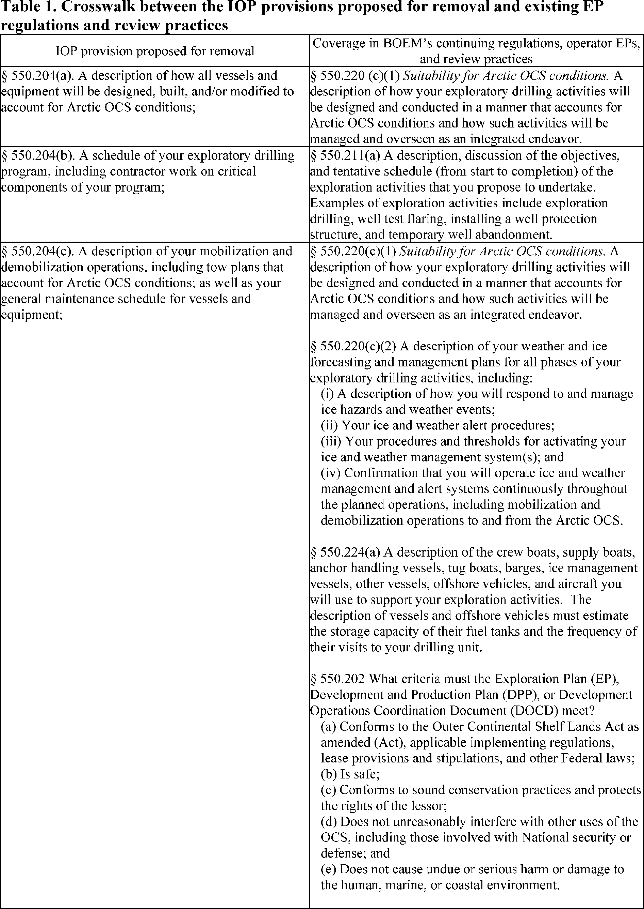
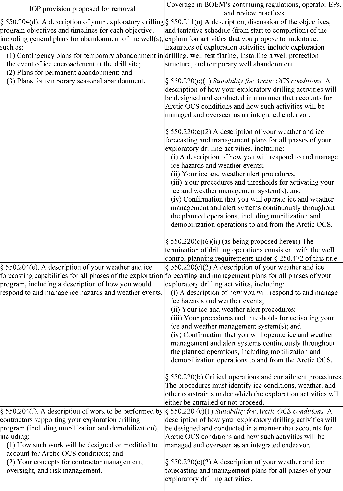

# Daily Digest — 2026-08-06

| | |
|---|---|
| **Digest date** | 2026-08-06 |
| **Data date range** | 2026-08-06 to 2026-08-06 |
| **Generated at** | 2026-08-07T04:20:58Z (UTC) |
| **Pipeline version** | 50095fc |
| **Source watermarks** | CREC: 2026-08-06T13:56:07Z · BILLS: 2026-08-07T02:22:58Z · FR: 2026-08-06T13:59:53Z · USCOURTS: 2026-08-07T04:01:42Z · PLAW: 2026-07-25T00:00:00Z |

[Full observed listing for this day](day/2026-08-06.html) — every item our collectors observed for this publication day, mechanical rules applied, frozen at end of day. This digest is the canonical record.

All items below cite the govinfo package (and granule, where applicable) they
summarize. Selection is mechanical; each item states the rule that included
it. See the Coverage Statement at the end for a full accounting of what was
published, what was summarized, and what was excluded and why.

---

## Contents

- [Day in Review](#day-in-review)
- [1. Congressional Floor Activity](#1-congressional-floor-activity)
- [2. Legislation](#2-legislation)
- [3. Federal Register](#3-federal-register)
- [4. Enacted Laws](#4-enacted-laws)
- [5. Judicial Activity](#5-judicial-activity)
- [6. Agency Announcements](#6-agency-announcements)
- [7. Recorded Votes](#7-recorded-votes)
- [8. Bill Actions](#8-bill-actions)
- [9. Presidential Actions](#9-presidential-actions)
- [Terms Used Today](#terms-used-today)
- [Coverage Statement](#coverage-statement)
- [Methodology](#methodology)

---

## Day in Review

The Senate's floor record dominates the congressional material observed for the day, with 80 Senate proceedings, six Daily Digest entries and one Extensions of Remarks item. Recorded votes include a 51-43 cloture vote and a 51-44 confirmation vote on Erica Schwartz as Director of the Centers for Disease Control and Prevention, a 50-44 cloture vote on 69 executive nominations proceeding en bloc under S. Res. 817, and a 48-50 rejection of the motion to proceed to S.J. Res. 187, a disapproval resolution addressed to an Environmental Protection Agency rule on the reporting submission period for perfluoroalkyl and polyfluoroalkyl substances under the Toxic Substances Control Act. The digest carries 45 introduced bills, five reported in the Senate, two agreed to, and 53 recorded bill actions.

The executive material runs to 27 final rules, eight proposed rules, 118 notices and one presidential document — Executive Order 14417, establishing the President's Military Spouse Commission. The National Credit Union Administration accounts for eleven of the final rules, rescinding interpretive statements and amending share-insurance, lending and chartering provisions; other final rules cover FAA airworthiness directives, Coast Guard safety zones, EPA state-plan approvals, fishery closures and export restrictions on black mass and tungsten scrap. Proposed rules come from the CFTC, FDIC, Interior, EPA, the Postal Service and FAA. The digest also carries 36 executive orders, 16 proclamations, four memoranda and four nominations, and 226 agency press releases.

Judicial items number 60 appellate opinions, 614 district opinions and four bankruptcy opinions. The Eleventh Circuit reversed a standing dismissal in a school-masking disability case and vacated a firearm sentence for resentencing; the Fourth Circuit affirmed dismissals in employment and consumer-credit suits and applied Younger abstention to a state usury proceeding; the Fifth Circuit vacated dismissal of a Clean Water Act citizen suit and granted mandamus on attorney-client privilege; the Sixth Circuit held a second removal untimely; the Seventh Circuit denied qualified immunity to a town official who deleted public comments by viewpoint; the Ninth Circuit remanded an EPA approval of San Joaquin Valley air plans; and the Federal Circuit affirmed a patent unpatentability ruling and a federal removal.

*Composed from the summarized items below and the day's mechanical
counts; all specifics are cited in their sections.*

---

## 1. Congressional Floor Activity

Source: Congressional Record (CREC), issue observed 2026-08-06, covering proceedings of 2026-08-05. Published by govinfo 2026-08-06T13:56:07Z; observed by our collector 2026-08-06T14:24:03Z. Total issue size: 87 granule(s).

### 1.1 Senate

Tags: legislative · model keys: attorney general · january 6 · pardons

*In plain terms: Senator Durbin delivered remarks on Todd Blanche's Attorney General nomination, addressing January 6 prosecutions and presidential pardons.*

- **Nomination of Todd Blanche (Executive Calendar)** — Senator Durbin delivered remarks on the nomination of Todd Blanche as Attorney General, discussing January 6, 2021, subsequent prosecutions, presidential pardons for convicted participants, the proposed Anti-Weaponization Fund, and related tax settlements.
  - *In plain terms:* Senator Durbin spoke about Todd Blanche's nomination as Attorney General, discussing January 6, 2021, prosecutions, pardons for convicted participants, and related funding and tax settlements.
  - Included because: CREC-SEL-01 — floor item ≥ threshold floor time (103,803 characters) (document dated 2026-08-05)
  - Source: [CREC-2026-08-05 / CREC-2026-08-05-pt1-PgS4453-3](https://www.govinfo.gov/app/details/CREC-2026-08-05/CREC-2026-08-05-pt1-PgS4453-3)

### 1.2 House of Representatives

No House floor items met the selection thresholds. 0 floor granule(s) are accounted for in the Coverage Statement.

### 1.3 Recorded Votes

- **Cloture Motion (Executive Session)** — The Senate voted 51-43 to invoke cloture on debate regarding Erica Schwartz's nomination as Director of the Centers for Disease Control and Prevention.
  - *In plain terms:* The Senate voted 51-43 to end debate over Erica Schwartz's nomination as CDC Director.
  - Included because: CREC-SEL-02 — recorded vote (all recorded votes are listed) (document dated 2026-08-05)
  - Source: [CREC-2026-08-05 / CREC-2026-08-05-pt1-PgS4453](https://www.govinfo.gov/app/details/CREC-2026-08-05/CREC-2026-08-05-pt1-PgS4453)
- **Vote on Schwartz Nomination (Executive Calendar)** — The Senate confirmed Erica Schwartz as Director of the Centers for Disease Control and Prevention by a vote of 51-44.
  - *In plain terms:* The Senate confirmed Erica Schwartz as CDC Director in a 51-44 vote.
  - Included because: CREC-SEL-02 — recorded vote (all recorded votes are listed) (document dated 2026-08-05)
  - Source: [CREC-2026-08-05 / CREC-2026-08-05-pt1-PgS4464](https://www.govinfo.gov/app/details/CREC-2026-08-05/CREC-2026-08-05-pt1-PgS4464)
- **Cloture Motion (Executive Calendar)** — The Senate voted 50-44 to invoke cloture on debate over 69 executive nominations proceeding en bloc under S. Res. 817.
  - *In plain terms:* The Senate voted 50-44 to end debate over 69 executive nominations being voted on together under Senate Resolution 817.
  - Included because: CREC-SEL-02 — recorded vote (all recorded votes are listed) (document dated 2026-08-05)
  - Source: [CREC-2026-08-05 / CREC-2026-08-05-pt1-PgS4464-3](https://www.govinfo.gov/app/details/CREC-2026-08-05/CREC-2026-08-05-pt1-PgS4464-3)
- **Providing for Congressional Disapproval Under Chapter 8 of Title 5, United States Code, of the Rule Submitted by the En…** — The Senate rejected 48-50 a motion to proceed to S.J. Res. 187, which would provide for Congressional disapproval of an Environmental Protection Agency rule modifying the submission period for perfluoroalkyl and polyfluoroalkyl substances reporting under the Toxic Substances Control Act.
  - *In plain terms:* The Senate rejected a motion to proceed to a resolution disapproving an EPA rule that changes the submission deadline for certain chemical reporting under the Toxic Substances Control Act.
  - Included because: CREC-SEL-02 — recorded vote (all recorded votes are listed) (document dated 2026-08-05)
  - Source: [CREC-2026-08-05 / CREC-2026-08-05-pt1-PgS4468-3](https://www.govinfo.gov/app/details/CREC-2026-08-05/CREC-2026-08-05-pt1-PgS4468-3)

---

## 2. Legislation

Source: Congressional Bills (BILLS), text versions published 2026-08-06 to 2026-08-06.

### 2.1 Counts by Stage

| Stage (bill text version) | Count |
|---|---|
| Introduced (ih/is) | 45 |
| Reported (rh/rs) | 5 |
| Engrossed (eh/es) | 1 |
| Enrolled (enr) | 0 |
| Other versions | 3 |
| **Total bill texts published** | **54** |

### 2.2 Bills Listed by Mechanical Rule

Bills below are listed because they matched at least one listing rule; the
matching rule is stated per item. All other bill texts are counted above and
accounted for in the Coverage Statement.

No bill texts published in this range matched a listing rule; all 54 are
accounted for in the Coverage Statement.

---

## 3. Federal Register

Source: Federal Register (FR), issue of 2026-08-06.

### 3.1 Counts by Document Type

| Document type | Count |
|---|---|
| Rules | 27 |
| Proposed rules | 8 |
| Notices | 118 |
| Presidential documents | 1 |
| **Total FR documents** | **154** |

### 3.2 Rules Published

Tags: department of commerce · department of homeland security · executive · model keys: airworthiness directives · environmental regulation · safety zones

*In plain terms: 27 final rules led by FAA airworthiness directives and NCUA credit union regulatory streamlining, plus coast guard safety zones and environmental measures.*

#### DEPARTMENT OF COMMERCE

- **Fisheries of the Exclusive Economic Zone Off Alaska; Commercial Salmon Fishing in the Cook Inlet EEZ Area** (2026-15989; 50 CFR Part 679) — NMFS is prohibiting commercial fishing for salmon in the Cook Inlet exclusive economic zone (EEZ) Area. This action is necessary to prevent exceeding the 2026 total allowable catch (TAC) of the aggregate coho salmon stock complex in the Cook Inlet EEZ Area. Action: Temporary rule; closure. Dates: Effective 0700 hours, Alaska local time (A.l.t.), August 5, 2026, through 1900 hours, A.l.t., August 15, 2026.
  - *In plain terms:* The National Marine Fisheries Service prohibits commercial salmon fishing in the Cook Inlet to prevent exceeding the 2026 catch limit.
  - Included because: FR-SEL-01 — document type: final rule (all listed)
  - Source: [FR-2026-08-06 / 2026-15989](https://www.govinfo.gov/app/details/FR-2026-08-06/2026-15989)
- **Magnuson-Stevens Act Provisions; Fisheries Off West Coast States; Pacific Coast Groundfish Fishery; Pacific Coast Groundfish Fishery Management Plan; Amendment 36; Limited Entry Fixed Gear Follow-On Actions; Correction** (2026-16049; 50 CFR Part 660) — NMFS corrects the final rule published on July 22, 2026 to implement Amendment 36 to the Pacific Coast Groundfish Fishery Management Plan (91 FR 46000). The final rule inadvertently omitted portions of three amendatory instructions. This correction fixes the omissions. Action: Final rule; correction. Dates: Effective on August 6, 2026.
  - *In plain terms:* NMFS is correcting the July 22, 2026 groundfish fishery rule that inadvertently omitted portions of three amendment instructions.
  - Included because: FR-SEL-01 — document type: final rule (all listed)
  - Source: [FR-2026-08-06 / 2026-16049](https://www.govinfo.gov/app/details/FR-2026-08-06/2026-16049)
- **Pacific Halibut Fisheries of the West Coast; Inseason Action for the 2026 Area 2A Pacific Halibut Directed Commercial Fishery** (2026-16077; 50 CFR Part 300) — NMFS announces an inseason action for the 2026 Pacific halibut non-Tribal directed commercial fishery in the International Pacific Halibut Commission's (IPHC) regulatory Area 2A. This action adds a fishing period, August 18 through August 20, 2026, with a fishing period catch limit of 5,000 pounds (lb) (2.27 metric tons (mt)) per vessel, dressed weight. This action is intended to provide additional opportunity for the fleet to achieve the 2026 non-Tribal directed commercial fishery allocation. Action: Temporary rule; inseason adjustment. Dates: This rule is effective August 18, 2026, through August 20, 2026.
  - *In plain terms:* NMFS is opening a Pacific halibut fishing season August 18–20, 2026, with a 5,000-pound-per-vessel catch limit.
  - Included because: FR-SEL-01 — document type: final rule (all listed)
  - Source: [FR-2026-08-06 / 2026-16077](https://www.govinfo.gov/app/details/FR-2026-08-06/2026-16077)
- **DPAS Directive Allocation Order and Additional Requirements for Recoverable Critical Minerals and Materials** (2026-16078; 15 CFR 700) — The Bureau of Industry and Security (“BIS”) is publishing this temporary final rule to restrict the exportation of black mass and tungsten waste and scrap without a license. Specifically, as of August 27, 2026, U.S. persons engaged in the sale of black mass and tungsten waste and scrap must allocate 100 percent of monthly sales to U.S. persons, unless an adjustment or exception is obtained in advance from BIS. This action is taken pursuant to section 101 of the Defense Production Act of 1950, as amended (“DPA” or the “Act”), the Defense Priorities and Allocations System (15 CFR part 700) and Presidential Determination Pursuant to Section 101 of the Defense Production Act of 1950, as Amended, on Recoverable Critical Minerals and Materials, dated July 30, 2026 (“DPA Determination on Recoverable CMMs”), in which the President authorized the Department of Commerce (“Commerce”) to address the scarcity of recoverable critical minerals and materials (“CMMs”). BIS invites the public to submit comments on whether any additional sales requirements are necessary or appropriate to promote the national defense. Action: Temporary final rule; Request for comments. Dates: Directive Allocation Order Effective date: August 27, 2026 through August 27, 2027. Request for Adjustment and Exceptions date: Requests may be submitted on a rolling basis beginning August 6, 2026 through August 27, 2027. Comments: Comments must be received by November 4, 2026.
  - *In plain terms:* Starting August 27, 2026, U.S. sellers of black mass and tungsten waste must allocate all monthly sales domestically unless BIS grants an exemption.
  - Included because: FR-SEL-01 — document type: final rule (all listed)
  - Source: [FR-2026-08-06 / 2026-16078](https://www.govinfo.gov/app/details/FR-2026-08-06/2026-16078)

#### DEPARTMENT OF HEALTH AND HUMAN SERVICES

- **Medical Devices; Radiology Devices; Classification of the Fludeoxyglucose F18-Guided Radiation Therapy System** (2026-15963; 21 CFR Part 892) — The Food and Drug Administration (FDA) is classifying the fludeoxyglucose F18-guided radiation therapy system into class II (special controls). The special controls that apply to the device type are identified in this order and will be part of the codified language for classification of the fludeoxyglucose F18-guided radiation therapy system. We are taking this action because we have determined that classifying the device into class II will provide a reasonable assurance of safety and effectiveness of the device. We believe this action will also enhance patients' access to beneficial innovative devices, in part by reducing regulatory burdens. Action: Final amendment; final order. Dates: This order is effective August 6, 2026. The classification was applicable on February 1, 2023.
  - *In plain terms:* The FDA classifies a fludeoxyglucose F18-guided radiation therapy system as a Class II medical device, requiring special safety controls.
  - Included because: FR-SEL-01 — document type: final rule (all listed)
  - Source: [FR-2026-08-06 / 2026-15963](https://www.govinfo.gov/app/details/FR-2026-08-06/2026-15963)

#### DEPARTMENT OF HOMELAND SECURITY

- **Safety Zone; St. Johns River, Jacksonville, FL** (2026-15967; 33 CFR Part 165) — The Coast Guard is establishing a temporary safety zone for navigable waters on the St. Johns River, Jacksonville, FL. The safety zone is needed to protect personnel, vessels, and the marine environment from potential hazards associated with raising power lines across the river. Entry of vessels or persons into this zone is prohibited unless specifically authorized by the Captain of the Port, Sector Jacksonville, or their designated representative. We invite your comments on this interim rule. Action: Temporary interim rule. Dates: This rule is effective without actual notice from August 6, 2026 through March 5, 2027. For purposes of enforcement, actual notice will be used from July 27, 2026, until August 6, 2026. Comments and related material must be received by the Coast Guard on or before September 8, 2026.
  - *In plain terms:* The Coast Guard is establishing a temporary safety zone on the St. Johns River during power line raising work.
  - Included because: FR-SEL-01 — document type: final rule (all listed)
  - Source: [FR-2026-08-06 / 2026-15967](https://www.govinfo.gov/app/details/FR-2026-08-06/2026-15967)
- **Safety Zone; Lake Erie, Madison Township, OH** (2026-15970; 33 CFR Part 165) — The Coast Guard is establishing a temporary safety zone for navigable waters on Lake Erie. The safety zone is needed to protect personnel, vessels, and the marine environment from potential hazards associated with an over-water fireworks display on August 8, 2026. Entry of vessels or persons into this zone is prohibited unless specifically authorized by the Captain of the Port, Sector Eastern Great Lakes, or their designated representative. Action: Temporary final rule. Dates: This rule is effective from 9:30 p.m. through 11:30 p.m. on August 8, 2026.
  - *In plain terms:* The Coast Guard is establishing a temporary safety zone on Lake Erie for an over-water fireworks display on August 8, 2026.
  - Included because: FR-SEL-01 — document type: final rule (all listed)
  - Source: [FR-2026-08-06 / 2026-15970](https://www.govinfo.gov/app/details/FR-2026-08-06/2026-15970)
- **Safety Zone; Rockport Illuminations Fireworks, Rockport Harbor, Rockport, MA** (2026-15991; 33 CFR Part 165) — The Coast Guard is establishing a temporary safety zone for the navigable waters of Rockport Harbor, Rockport, MA within a 350-yard radius of the land-based Rockport Illuminations Fireworks launch site. The safety zone is needed to protect spectators, personnel, vessels, and the marine environment from potential hazards associated with the firework displays. Entry of vessels or persons into this zone is prohibited unless specifically authorized by the Captain of the Port, Sector Boston, or their designated representative. Action: Temporary final rule. Dates: This rule is effective from 8 p.m. on August 8, 2026, through 10 p.m. on August 9, 2026. It will only be enforced, however, from 8 p.m. until 10 p.m. on August 8, 2026, unless the event is delayed because of weather conditions, in which case it will be subject to enforcement during those same hours on August 9, 2026.
  - *In plain terms:* The Coast Guard is establishing a temporary safety zone in Rockport Harbor for a fireworks display.
  - Included because: FR-SEL-01 — document type: final rule (all listed)
  - Source: [FR-2026-08-06 / 2026-15991](https://www.govinfo.gov/app/details/FR-2026-08-06/2026-15991)
- **Special Local Regulations; Marine Events Within the USCG East District** (2026-16013; 33 CFR Part 100) — The Coast Guard is amending a table of special local regulations (SLR's) located in the Sector Delaware Bay Captain of the Port Zone by adding regulations for four annual marine events, revising regulations for three SLR's already in the table, and revising the order of entries within the table. These rules serve to protect participants, spectators, and vessels from the hazards associated with a variety of marine events. This rulemaking prohibits people and vessels from being present in the regulated areas during an enforcement period unless authorized by the Captain of the Port or a designated representative. Action: Final rule. Dates: This rule is effective September 8, 2026.
  - *In plain terms:* The Coast Guard is updating special regulations for four annual marine events and revising three existing event regulations in Delaware Bay.
  - Included because: FR-SEL-01 — document type: final rule (all listed)
  - Source: [FR-2026-08-06 / 2026-16013](https://www.govinfo.gov/app/details/FR-2026-08-06/2026-16013)

#### DEPARTMENT OF TRANSPORTATION

- **Airworthiness Directives; The Boeing Company Airplanes** (2026-15936; 14 CFR Part 39) — The FAA is adopting a new airworthiness directive (AD) for certain The Boeing Company Model 737-8, 737-9, and 737-8200 airplanes. This AD was prompted by reports of cracks in the bear strap at the forward upper corner of the forward galley door cutout. This AD requires an inspection of the fuselage skin for existing repairs and applicable on-condition actions. The FAA is issuing this AD to address the unsafe condition on these products. Action: Final rule. Dates: This AD is effective September 10, 2026. The Director of the Federal Register approved the incorporation by reference of a certain publication listed in this AD as of September 10, 2026.
  - *In plain terms:* The FAA is requiring inspections and repairs for cracks found in the forward galley door area of certain Boeing 737 airplanes.
  - Included because: FR-SEL-01 — document type: final rule (all listed)
  - Source: [FR-2026-08-06 / 2026-15936](https://www.govinfo.gov/app/details/FR-2026-08-06/2026-15936)
- **Airworthiness Directives; Various Helicopters** (2026-15978; 14 CFR Part 39) — The FAA is superseding Airworthiness Directive (AD) 2015-20-12 for certain Sikorsky Aircraft Corporation Model S-61A, D, E, L, N, NM, R, and V; Croman Corporation Model SH-3H; Carson Helicopters, Inc., Model S-61L and SH-3H; Glacier Helicopter, Inc., Model CH-3E; Robinson Air Crane, Inc., Model CH-3E, CH-3C, HH-3C and HH-3E; and Siller Helicopters Model CH-3E and SH-3A helicopters. AD 2015-20-12 required performing calculations to determine whether the main rotor shaft (MRS) was used in repetitive external lift (REL) operations or non-REL operations, performing a nondestructive inspection (NDI) of the REL MRS for cracks and, depending on the results of the NDI, replacing the MRS, marking any REL MRS at the time of the NDI, establishing retirement lives for each REL MRS, and removing from service any MRS with oversized dowel pin bores. Since the FAA issued AD 2015-20-12, a design re-evaluation shows that the MRS on certain helicopter models requires a lower life limit. [official summary truncated; see source] Action: Final rule. Dates: This AD is effective September 10, 2026. The Director of the Federal Register approved the incorporation by reference of a certain publication listed in this AD as of September 10, 2026.
  - *In plain terms:* The FAA supersedes a directive requiring new inspection and retirement standards for main rotor shafts on certain Sikorsky helicopter models.
  - Included because: FR-SEL-01 — document type: final rule (all listed)
  - Source: [FR-2026-08-06 / 2026-15978](https://www.govinfo.gov/app/details/FR-2026-08-06/2026-15978)
- **Airworthiness Directives; Bell Textron Canada Limited Helicopters** (2026-16043; 14 CFR Part 39) — The FAA is adopting a new airworthiness directive (AD) for certain Bell Textron Canada Limited Model 505 helicopters. This AD was prompted by a report of a quality escape in the production installation of a washer installed on the tail rotor pitch link assembly (pitch link assembly). This AD requires a one-time visual inspection for proper installation of the washer installed on the pitch link assembly and, depending on the results of the inspection, corrective actions. The FAA is issuing this AD to address the unsafe condition on these products. Action: Final rule. Dates: This AD is effective September 10, 2026. The Director of the Federal Register approved the incorporation by reference of a certain publication listed in this AD as of September 10, 2026.
  - *In plain terms:* The FAA requires inspections of a washer on Bell helicopter tail rotor assemblies and corrective actions if installation defects are found.
  - Included because: FR-SEL-01 — document type: final rule (all listed)
  - Source: [FR-2026-08-06 / 2026-16043](https://www.govinfo.gov/app/details/FR-2026-08-06/2026-16043)
- **Airworthiness Directives; Airbus Helicopters** (2026-16047; 14 CFR Part 39) — The FAA is adopting a new airworthiness directive (AD) for certain Airbus Helicopters Model AS350B, AS350BA, AS350B1, AS350B2, AS350B3, AS350D, EC130B4, and EC130T2 helicopters. This AD was prompted by reports of an incorrectly installed engine flange on the main gear box (MGB) engine coupling. This AD requires inspecting the MGB engine coupling for correct installation and, depending on the results, corrective actions. The FAA is issuing this AD to address the unsafe condition on these products. Action: Final rule. Dates: This AD is effective September 10, 2026. The Director of the Federal Register approved the incorporation by reference of a certain publication listed in this AD as of September 10, 2026.
  - *In plain terms:* The FAA requires inspections of engine flanges on Airbus helicopter main gear boxes and corrective actions if installation errors are found.
  - Included because: FR-SEL-01 — document type: final rule (all listed)
  - Source: [FR-2026-08-06 / 2026-16047](https://www.govinfo.gov/app/details/FR-2026-08-06/2026-16047)

#### ENVIRONMENTAL PROTECTION AGENCY

- **Alaska: Final Authorization of State Hazardous Waste Program** (2026-15984; 40 CFR Part 271) — The State of Alaska (Alaska or the State) has applied to the United States Environmental Protection Agency (the EPA or the Agency) for final authorization of its hazardous waste program under the Resource Conservation and Recovery Act, as amended (RCRA). The EPA has reviewed Alaska's application and has made a final determination that Alaska's hazardous waste program satisfies all requirements for final authorization. Thus, the EPA is granting final authorization for the State to operate its program subject to the limitations on its authority retained by the EPA in accordance with RCRA, including the Hazardous and Solid Waste Amendments of 1984 (HSWA). Alaska's program will operate in lieu of the Federal hazardous waste program in Alaska; however, the EPA will retain jurisdiction and authority to implement the Federal RCRA program in Indian country and areas of exclusive Federal jurisdiction in Alaska. Action: Final authorization. Dates: This action is effective on August 6, 2026.
  - *In plain terms:* The EPA grants final authorization for Alaska to operate its hazardous waste program in place of the federal program.
  - Included because: FR-SEL-01 — document type: final rule (all listed)
  - Source: [FR-2026-08-06 / 2026-15984](https://www.govinfo.gov/app/details/FR-2026-08-06/2026-15984)
- **Air Plan Approval; Connecticut; Plan for Inclusion of a Consent Order No. 8383-Algonquin Gas Transmission, LLC and Negative Declaration for Rubber Tire Manufacturing Sources** (2026-15986; 40 CFR Part 52) — The Environmental Protection Agency (EPA) is approving a State Implementation Plan (SIP) revision submitted by the State of Connecticut to address certain Federal requirements for the 2008 and 2015 8-hour ozone National Ambient Air Quality Standards (NAAQS) under the Clean Air Act (CAA). This revision approves a source-specific SIP revision for Algonquin Gas Transmission, LLC's Cromwell compressor station facility in Cromwell, CT, to address reasonably available control technology (RACT) determinations for major stationary sources of volatile organic compounds (VOC). The CAA requires states to submit SIP revisions addressing RACT requirements for ozone nonattainment areas classified as Moderate or higher and for any portion of the state located in an ozone transport region (OTR). RACT determinations are required for this source because it is located in the New York-Northern New Jersey-Long Island, NY-NJ-CT 2008 ozone Severe nonattainment area and 2015 ozone Serious nonattainment area and because Connecticut is in the OTR. The EPA is also approving a negative declaration for existing rubber tire manufacturing sources statewide. [official summary truncated; see source] Action: Final rule. Dates: This rule is effective on September 8, 2026.
  - *In plain terms:* The EPA approves Connecticut's air quality plan for meeting ozone standards, including control requirements for a compressor station and rubber tire manufacturers.
  - Included because: FR-SEL-01 — document type: final rule (all listed)
  - Source: [FR-2026-08-06 / 2026-15986](https://www.govinfo.gov/app/details/FR-2026-08-06/2026-15986)

#### NATIONAL CREDIT UNION ADMINISTRATION

- **Credit Union Service Contracts** (2026-16021; 12 CFR Parts 701 and 721) — The NCUA Board (Board) is revising its regulations governing the organization and operation of federal credit unions (FCUs) by eliminating a provision related to credit union service contracts. The Board intends to reduce administrative costs and compliance complexity with this revision, enabling FCUs to serve their members more efficiently. Action: Final rule. Dates: This final rule is effective on September 8, 2026.
  - *In plain terms:* The NCUA is eliminating regulations on credit union service contracts to reduce administrative costs and compliance burden.
  - Included because: FR-SEL-01 — document type: final rule (all listed)
  - Source: [FR-2026-08-06 / 2026-16021](https://www.govinfo.gov/app/details/FR-2026-08-06/2026-16021)
- **Corporate Credit Unions** (2026-16022; 12 CFR Part 704) — The NCUA Board (Board) is issuing this action to rescind its Interpretive Ruling and Policy Statement (IRPS) 11-02, which addresses chartering corporate credit unions, because it is redundant to the Federal Corporate Credit Union Chartering Manual. This action eliminates potential confusion. Action: Final action. Dates: This action is effective on September 8, 2026.
  - *In plain terms:* The NCUA is rescinding a policy statement on chartering corporate credit unions because its requirements are already in the chartering manual.
  - Included because: FR-SEL-01 — document type: final rule (all listed)
  - Source: [FR-2026-08-06 / 2026-16022](https://www.govinfo.gov/app/details/FR-2026-08-06/2026-16022)
- **Requirements for Insurance** (2026-16023; 12 CFR Part 741) — The NCUA Board (Board) is amending its regulations that establish the requirements for obtaining and maintaining federal share insurance with the National Credit Union Share Insurance Fund (Share Insurance Fund). The provisions of this part apply to all federally insured credit unions (FICUs). The rule will reduce regulatory burden by eliminating unnecessary and redundant requirements related to disclosing when nonmember accounts are not covered by federal share insurance. Action: Final rule. Dates: This final rule is effective on September 8, 2026.
  - *In plain terms:* The NCUA is eliminating unnecessary requirements for disclosing when credit union accounts lack federal share insurance coverage.
  - Included because: FR-SEL-01 — document type: final rule (all listed)
  - Source: [FR-2026-08-06 / 2026-16023](https://www.govinfo.gov/app/details/FR-2026-08-06/2026-16023)
- **Chartering and Field of Membership for Federal Credit Unions—Interpretive Ruling and Policy Statement 10-1** (2026-16024; 12 CFR Part 701) — The NCUA Board (Board) is rescinding Interpretive Ruling and Policy Statement (IRPS) 10-1. The Chartering and Field of Membership Manual (Chartering Manual) incorporates NCUA's current chartering requirements for federal credit unions (FCUs), making IRPS 10-1 unnecessary. This rescission reduces the burden for FCUs by limiting the number of sources that they must check to verify compliance with applicable requirements. After considering the public comments, the Board adopts the proposal without modification. Action: Final action. Dates: This action is effective on September 8, 2026.
  - *In plain terms:* The NCUA is rescinding a policy statement on federal credit union chartering because its requirements are now in the chartering manual.
  - Included because: FR-SEL-01 — document type: final rule (all listed)
  - Source: [FR-2026-08-06 / 2026-16024](https://www.govinfo.gov/app/details/FR-2026-08-06/2026-16024)
- **Termination of Excess Insurance Coverage** (2026-16026; 12 CFR Part 741) — The NCUA Board (Board) is amending its regulations that establish the requirements for obtaining and maintaining federal share insurance with the National Credit Union Share Insurance Fund (Share Insurance Fund). The provisions of this part apply to all federally insured credit unions (FICUs). This final rule will reduce regulatory burden by amending the provision on the timing of prior notice provided to members of the termination of excess non-federal insurance coverage. Action: Final rule. Dates: This final rule is effective on September 8, 2026.
  - *In plain terms:* The NCUA is amending the timing requirements for credit unions to notify members before terminating excess insurance coverage.
  - Included because: FR-SEL-01 — document type: final rule (all listed)
  - Source: [FR-2026-08-06 / 2026-16026](https://www.govinfo.gov/app/details/FR-2026-08-06/2026-16026)
- **Suretyship and Guaranty; Segregated Deposit and Collateral** (2026-16027; 12 CFR Part 701) — The NCUA Board (Board) is amending its regulations to eliminate prescriptive segregated deposit and collateral requirements for suretyship and guaranty agreements. By removing these requirements, the Board is authorizing federally insured credit unions (FICUs) acting as sureties and guarantors to design products that address member needs while maintaining safety and soundness standards. Federal credit unions (FCUs), and federally insured, state-chartered credit unions (FISCUs) if permitted under state law to act as a surety or guarantor, continue to be subject to other requirements related to these arrangements, including the applicable lending regulations. The final rule follows publication of the December 29, 2025, proposed rule, and takes into consideration the public comments received. Action: Final rule. Dates: This final rule is effective on September 8, 2026.
  - *In plain terms:* The NCUA is eliminating prescriptive requirements for segregated deposits and collateral in credit union suretyship and guaranty agreements.
  - Included because: FR-SEL-01 — document type: final rule (all listed)
  - Source: [FR-2026-08-06 / 2026-16027](https://www.govinfo.gov/app/details/FR-2026-08-06/2026-16027)
- **Chartering and Field of Membership for Federal Credit Unions—Interpretive Ruling and Policy Statement 06-1** (2026-16028; 12 CFR Part 701) — The NCUA Board (Board) is rescinding Interpretive Ruling and Policy Statement (IRPS) 06-1. The Chartering and Field of Membership Manual (Chartering Manual) incorporates the current requirements for adding underserved areas, making IRPS 06-1 unnecessary. This rescission reduces the burden for federal credit unions (FCUs) by limiting the number of sources that FCUs must check to verify compliance with applicable requirements. After considering the public comments, the Board adopts the proposal without modification. Action: Final action. Dates: This final actionis effective on September 8, 2026.
  - *In plain terms:* The NCUA is rescinding a policy statement on underserved areas for credit unions because those requirements are now in the chartering manual.
  - Included because: FR-SEL-01 — document type: final rule (all listed)
  - Source: [FR-2026-08-06 / 2026-16028](https://www.govinfo.gov/app/details/FR-2026-08-06/2026-16028)
- **Third-Party Servicing of Indirect Vehicle Loans** (2026-16029; 12 CFR Parts 701, 741, and 746) — The NCUA Board (Board) is issuing a final rule removing NCUA's unnecessarily prescriptive regulation regarding third-party servicing of indirect vehicle loans. This action will reduce regulatory burden and provide federally insured credit unions (FICUs) with greater operational flexibility, consistent with a principles-based supervisory approach. The intent is to reduce administrative costs and compliance complexity, enabling credit unions to serve their members more efficiently. Action: Final rule. Dates: This final rule is effective on September 8, 2026.
  - *In plain terms:* The NCUA is removing prescriptive regulations on third-party servicing of credit union indirect vehicle loans to increase operational flexibility.
  - Included because: FR-SEL-01 — document type: final rule (all listed)
  - Source: [FR-2026-08-06 / 2026-16029](https://www.govinfo.gov/app/details/FR-2026-08-06/2026-16029)
- **Purchase, Sale, and Pledge Of Eligible Obligations** (2026-16030; 12 CFR Parts 701 and 746) — This final rule streamlines the NCUA Board (Board)'s regulations governing the purchase, sale, and pledge of eligible obligations. Specifically, the final rule removes the prescriptive lists of items that must be addressed in the written policies adopted by a federal credit union (FCU). Removal of the mandated items will enable a more efficient and principles-based approach. The final rule also removes detailed requirements regarding conflicts of interest and compensation. These regulatory provisions are unnecessary because FCUs are already governed by broader conflict of interest provisions in their bylaws and by the fiduciary duties of their officials. The final rule follows publication of a February 25, 2026, proposed rule and takes into consideration the public comments received on the proposal. After careful consideration of the comments, the Board has decided to adopt the proposed rule without change. Action: Final rule. Dates: This final rule is effective on September 8, 2026.
  - *In plain terms:* The NCUA is streamlining regulations on purchase and pledge of eligible obligations by removing prescriptive policy requirements for credit unions.
  - Included because: FR-SEL-01 — document type: final rule (all listed)
  - Source: [FR-2026-08-06 / 2026-16030](https://www.govinfo.gov/app/details/FR-2026-08-06/2026-16030)
- **Chartering and Field of Membership for Federal Credit Unions—Interpretive Ruling and Policy Statement 08-2** (2026-16031; 12 CFR Part 701) — The NCUA Board (Board) is rescinding Interpretive Ruling and Policy Statement (IRPS) 08-2. The Chartering and Field of Membership Manual (Chartering Manual) incorporates the current requirements for adding underserved areas, making IRPS 08-2 unnecessary. This rescission reduces the burden for federal credit unions (FCUs) by limiting the number of sources that FCUs must check to verify compliance with applicable requirements. After considering the public comments, the Board adopts the proposal without modification. Action: Final rule. Dates: This final rule is effective on September 8, 2026.
  - *In plain terms:* The NCUA is eliminating an outdated policy since requirements are now in the Chartering Manual, reducing what federal credit unions must check for compliance.
  - Included because: FR-SEL-01 — document type: final rule (all listed)
  - Source: [FR-2026-08-06 / 2026-16031](https://www.govinfo.gov/app/details/FR-2026-08-06/2026-16031)
- **Limits on Loans to Other Credit Unions** (2026-16035; 12 CFR Part 701) — The NCUA Board (Board) is issuing this rule to remove the regulations related to approval and policies on making loans to other credit unions. While this provision will no longer be codified in regulation, federal credit unions remain subject to statutory requirements related to making loans to credit unions. Federally insured, state-chartered credit unions remain subject to any other applicable NCUA or state law or regulation. The final rule follows publication of a December 29, 2025, proposed rule, and takes into consideration the public comments recieved on the proposal. Action: Final rule. Dates: This final rule is effective on September 8, 2026.
  - *In plain terms:* The NCUA is removing codified regulations about loans between credit unions, though statutory loan requirements still apply.
  - Included because: FR-SEL-01 — document type: final rule (all listed)
  - Source: [FR-2026-08-06 / 2026-16035](https://www.govinfo.gov/app/details/FR-2026-08-06/2026-16035)

#### SECURITIES AND EXCHANGE COMMISSION

- **Investment Company Governance Technical Amendments** (2026-16066; 17 CFR Part 270) — The Securities and Exchange Commission (the “Commission”) is adopting technical amendments to a rule under the Investment Company Act of 1940 (the “Investment Company Act”) related to registered investment company and business development company (collectively “regulated funds”) governance standards to reflect a Federal court's vacatur of certain amendments to those standards that the Commission adopted on July 27, 2004. The court's vacatur of the amendments was effective as of July 6, 2006, and had the legal effect of reverting the fund governance standards to those standards in effect before adoption of the vacated requirements. These technical amendments revise the Code of Federal Regulations (the “CFR”) to reflect the court's vacatur. Action: Final rule; technical amendments. Dates: This release was published in the Federal Register on August 6, 2026. Effective August 6, 2026. The Federal court issued its vacatur of the rule amendments on April 7, 2006.
  - *In plain terms:* The SEC is updating fund governance standards in response to a 2006 court decision that invalidated amendments adopted in 2004.
  - Included because: FR-SEL-01 — document type: final rule (all listed)
  - Source: [FR-2026-08-06 / 2026-16066](https://www.govinfo.gov/app/details/FR-2026-08-06/2026-16066)

### 3.3 Proposed Rules Published

Tags: department of commerce · department of homeland security · executive · model keys: air quality · aviation standards · oil and gas

*In plain terms: 8 proposed rules covering financial oversight, Arctic drilling regulations, aviation standards, and environmental air quality revisions.*

#### COMMODITY FUTURES TRADING COMMISSION

- **Conflicts and Affiliations** (2026-15948; 17 CFR Parts 1, 37, 38, and 39) — The Commodity Futures Trading Commission (“CFTC” or “Commission”) is proposing new rules and amendments to its existing regulations for futures commission merchants (“FCMs”), swap execution facilities (“SEFs”), designated contract markets (“DCMs”), and derivatives clearing organizations (“DCOs”) (the “Proposal”). The Proposal addresses requirements relating to financial oversight of FCMs by self-regulatory organizations (“SROs”) and designated self-regulatory organizations (“DSROs”), as well as disclosure requirements by FCMs regarding affiliate relationships that an FCM has with a SEF, DCM, or DCO. For SEFs, DCMs, and DCOs, the Proposal would also establish requirements, including conflicts of interest rules, to address those registered entities' relationships with certain affiliates, such as FCM affiliates and affiliated principal trading firms. The Proposal includes guidance regarding the implementation of safeguards to protect the impartiality of SEFs, DCMs, and DCOs, including where applicable in their role as SROs or performing SRO functions with respect to certain affiliates. [official summary truncated; see source] Action: Notice of proposed rulemaking. Dates: Comments must be in writing and received by October 5, 2026.
  - *In plain terms:* The CFTC proposes requiring disclosure and conflict-of-interest safeguards for futures firms and their affiliated trading facilities.
  - Included because: FR-SEL-02 — document type: proposed rule (all listed)
  - Source: [FR-2026-08-06 / 2026-15948](https://www.govinfo.gov/app/details/FR-2026-08-06/2026-15948)

#### DEPARTMENT OF THE INTERIOR

- **Oil and Gas and Sulfur Operations on the Outer Continental Shelf—Revisions to the Requirements for Exploratory Drilling on the Arctic Outer Continental Shelf** (2026-15953; 30 CFR Part 250 and 254; 30 CFR Part 550) — The Department of the Interior (DOI or Department), acting through BSEE and BOEM (collectively, “the Bureaus”), is proposing to revise its existing regulations for exploratory drilling and related operations on the Arctic Outer Continental Shelf (OCS), to reduce unnecessary burdens on stakeholders while ensuring that energy exploration on the Arctic OCS is safe and environmentally responsible. 1 This proposed rule would revise certain requirements promulgated through the rule entitled, Oil and Gas and Sulfur Operations on the Outer Continental Shelf—Requirements for Exploratory Drilling on the Arctic Outer Continental Shelf (“2016 Arctic Exploratory Drilling Rule”) ( see 81 FR 46478). This proposed rule would modify existing Arctic OCS blowout preventer (BOP) real-time monitoring requirements and add new provisions to BSEE's regulations pertaining to requirements for crane operations on artificial islands, suspensions of operations (SOO), and suspensions of production (SOP). This proposed rule would also revise certain parts of the Exploration Plan (EP) and Development and Production Plan (DPP) regulations implemented by BOEM. 1 Outer Continental Shelf Lands Act, sec. 3, 43 U.S.C. [official summary truncated; see source] Action: Proposed rule. Dates: Submit comments on this proposed rule to BSEE on or before October 5, 2026. The Bureaus may not fully consider comments received after this date. You may submit comments to the Office of Management and Budget (OMB) on the information collection burden in this proposed rule by September 8, 2026. The deadline for comments on the information collection burden does not affect the deadline for the public to comment to the Bureaus on the proposed regulations.
  - *In plain terms:* The Interior Department proposes revising rules for Arctic oil and gas exploration drilling to reduce burdens while maintaining safety and environmental responsibility.
  - Included because: FR-SEL-02 — document type: proposed rule (all listed)
  - Source: [FR-2026-08-06 / 2026-15953](https://www.govinfo.gov/app/details/FR-2026-08-06/2026-15953)
  -  *Source graphic 1 of 17 from 2026-15953.*
  -  *Source graphic 2 of 17 from 2026-15953.*
  - *Graphics not rendered here: 15 of 17 — see the [source PDF](https://www.govinfo.gov/content/pkg/FR-2026-08-06/pdf/FR-2026-08-06.pdf).*

#### DEPARTMENT OF TRANSPORTATION

- **Transport Airplane and Propulsion Certification Modernization; Extension of Comment Period** (2026-16025; 14 CFR Part 25) — This action extends the comment period for a NPRM titled “Transport Airplane and Propulsion Certification Modernization” that was published on June 26, 2026. In that document, FAA proposed to amend various airworthiness regulations to modernize certain certification standards for transport category airplanes and propulsion systems. This rule would be both deregulatory and relieving by reducing the number of exemptions, special conditions, and equivalent level of safety findings required during the certification process. FAA expects that this proposal would reduce certification costs and time to certify new and changed products for both industry and FAA while maintaining or increasing the level of safety provided by the current regulations. FAA proposes to remove Special Federal Aviation Regulation No. 109 from part 25 and relocate certain of its requirements. Finally, this action would address industry and National Transportation Safety Board recommendations while also harmonizing FAA's regulations with international standards. FAA is extending the comment period closing date, on request, to allow commenters additional time to analyze the proposed rule and prepare a response. Action: Notice of proposed rulemaking (NPRM); Extension of comment period. Dates: The comment period for the NPRM published on June 26, 2026, at 91 FR 38878, is extended. Comments should be received on or before September 24, 2026.
  - *In plain terms:* The FAA is extending the comment period for proposed airplane and propulsion certification modernization rules that would reduce certification time and costs.
  - Included because: FR-SEL-02 — document type: proposed rule (all listed)
  - Source: [FR-2026-08-06 / 2026-16025](https://www.govinfo.gov/app/details/FR-2026-08-06/2026-16025)
- **Amendment of Class D and Class E Airspace; Morgantown, WV** (2026-16084; 14 CFR Part 71) — This action proposes to amend the Class D and Class E airspace at Morgantown Municipal Airport-Walter L. Bill Hart Field, Morgantown, WV. The FAA is proposing this action as the result of a biennial airspace review. This action would bring the airspace into compliance with FAA orders and support instrument flight rule (IFR) procedures operations. Action: Notice of proposed rulemaking (NPRM). Dates: Comments must be received on or before September 21, 2026.
  - *In plain terms:* The FAA proposes updating controlled airspace around Morgantown Municipal Airport to comply with regulations and support instrument flight procedures.
  - Included because: FR-SEL-02 — document type: proposed rule (all listed)
  - Source: [FR-2026-08-06 / 2026-16084](https://www.govinfo.gov/app/details/FR-2026-08-06/2026-16084)

#### ENVIRONMENTAL PROTECTION AGENCY

- **Air Plan Approval; Illinois; 2015 Ozone Moderate and Serious Reasonably Available Control Technology Update** (2026-16001; 40 CFR Part 52) — The U.S. Environmental Protection Agency (EPA) is proposing to approve revisions to 35 Illinois Administrative Code (IAC) parts 217, 218, and 219 into the Illinois State Implementation Plan (SIP). The Illinois Environmental Protection Agency (Illinois or Illinois EPA) submitted these revisions on December 18, 2024, and May 12, 2025, supplemented their submittal on August 13, 2025, for Moderate Reasonably Available Control Technology (RACT). The EPA is proposing to approve 35 IAC parts 217, 218, and 219 as satisfying the Moderate Volatile Organic Compound (VOC) RACT and NO X RACT requirements as well as Serious NO X RACT requirements for the Chicago, IL (Cook County, DuPage County, Grundy County, Kane County, Kendall County, Lake County, McHenry County, and Will County) and Metro-East St. Louis (Madison County, Monroe County, and St. Clair County) nonattainment areas under the 2015 ozone National Ambient Air Quality Standard (NAAQS or standard). Action: Proposed rule. Dates: Comments must be received on or before September 8, 2026.
  - *In plain terms:* The EPA proposes approving Illinois's revised air quality standards for volatile organic compound and nitrogen oxide emissions in two nonattainment areas.
  - Included because: FR-SEL-02 — document type: proposed rule (all listed)
  - Source: [FR-2026-08-06 / 2026-16001](https://www.govinfo.gov/app/details/FR-2026-08-06/2026-16001)
- **Partial Approval and Partial Disapproval of Air Quality State Implementation Plans; Arizona; Prevention of Significant Deterioration Infrastructure Requirements for the 2012 Fine Particulate Matter National Ambient Air Quality Standard** (2026-16083; 40 CFR Part 52) — The Environmental Protection Agency (EPA) is proposing to partially approve and partially disapprove a revision to the Arizona State implementation plan (SIP) as meeting the requirements of the Clean Air Act (CAA) for the implementation, maintenance, and enforcement of the 2012 fine particulate matter (PM 2.5 ) national ambient air quality standard (NAAQS or “standards”). The EPA is proposing to approve the portions of Arizona's submission addressing prevention of significant deterioration (PSD) requirements in the permitting jurisdictions of the Arizona Department of Environmental Quality (ADEQ), Maricopa County Air Quality Department (MCAQD), and Pinal County Air Quality Control District (PCAQCD). The EPA is proposing to disapprove the portions of the Arizona submission addressing PSD requirements in the Pima County Department of Environmental Quality (PDEQ) permitting jurisdiction. Action: Proposed rule; withdrawal. Dates: Comments must be received by September 8, 2026. As of July 21, 2026, the proposed rule published on June 13, 2024, at 89 FR 50245, is withdrawn insofar as it related to the PSD-related requirements of CAA sections 110(a)(2)(C), 110(a)(2)(D)(i)(II), 110(a)(2)(D)(ii), and 110(a)(2)(J).
  - *In plain terms:* The EPA is approving Arizona's air quality plan for three counties but disapproving it for Pima County regarding particulate matter standards.
  - Included because: FR-SEL-02 — document type: proposed rule (all listed)
  - Source: [FR-2026-08-06 / 2026-16083](https://www.govinfo.gov/app/details/FR-2026-08-06/2026-16083)

#### FEDERAL DEPOSIT INSURANCE CORPORATION

- **Extensions of Credit to Insiders** (2026-15995; 12 CFR Part 337) — The Federal Deposit Insurance Corporation (FDIC) is proposing to increase quantitative thresholds for certain extensions of credit to insiders of FDIC-supervised institutions, as restricted by the Federal Reserve Act and regulations promulgated thereunder. Specifically, the proposal would increase the thresholds for certain extensions of credit to executive officers not otherwise specifically authorized by statute from $100,000 to $400,000; and extensions of credit to insiders requiring prior approval by the board of directors from $500,000 to $2,000,000. The proposal would also establish an indexing methodology to periodically update such thresholds over time. Action: Notice of proposed rulemaking. Dates: Comments must be received on or before October 5, 2026.
  - *In plain terms:* The FDIC proposes increasing credit limits for bank insiders from $100,000 to $400,000 for executives and $500,000 to $2,000,000 for other insiders.
  - Included because: FR-SEL-02 — document type: proposed rule (all listed)
  - Source: [FR-2026-08-06 / 2026-15995](https://www.govinfo.gov/app/details/FR-2026-08-06/2026-15995)

#### POSTAL SERVICE

- **New Mailing Standards for Live Animals** (2026-16016; 39 CFR Parts 111 and 211) — The Postal Service proposes revising Publication 52, Hazardous, Restricted, and Perishable Mail (Pub 52), for various package requirements for live animals. This proposal will improve package integrity and container identification for all live animal shipments during processing and handling by prohibiting the reuse of fiberboard containers and requiring individual addressing and sequential numbering for multiple container shipments when bound together in a single shipment. Also, this proposal requires mailers to write the recipient's name and address directly on the packaging of Adult Bird shipments in the event the shipping label becomes detached from the packaging. Action: Proposed rule. Dates: Comments must be received on or before September 8, 2026.
  - *In plain terms:* The Postal Service proposes new packaging requirements for live animals, prohibiting container reuse and requiring direct addressing on bird shipments.
  - Included because: FR-SEL-02 — document type: proposed rule (all listed)
  - Source: [FR-2026-08-06 / 2026-16016](https://www.govinfo.gov/app/details/FR-2026-08-06/2026-16016)

### 3.4 Notices and Presidential Documents

Tags: department of commerce · department of homeland security · executive · model keys: executive order · military families

*In plain terms: Executive Order 14417 established the President's Military Spouse Commission to advise on policies affecting military spouses and families.*

Notices are summarized only when they match a listing rule; all are counted
in 3.1 and in the Coverage Statement. Presidential documents in the FR are
always listed.

- **Establishing the President's Military Spouse Commission** (2026-16125) — Executive Order 14417, issued August 3, 2026, establishes the President's Military Spouse Commission to advise the President on policies affecting military spouses and families. Composed of spouses of senior military officials and chaired by the spouse of the Secretary of War, the Commission will monitor policy implementation, liaison with military spouses, and develop recommendations addressing housing, employment, healthcare, education, and deployment-related challenges. The Commission is authorized to report annually to the President and will terminate two years from the order's date unless extended.
  - *In plain terms:* Executive Order 14417 establishes a Military Spouse Commission chaired by the Secretary of War's spouse to advise on military family policies and report annually to the President, terminating in two years unless extended.
  - Included because: FR-SEL-03 — presidential document (all listed)
  - Source: [FR-2026-08-06 / 2026-16125](https://www.govinfo.gov/app/details/FR-2026-08-06/2026-16125)

---

## 4. Enacted Laws

Source: Public and Private Laws (PLAW) published 2026-08-06.

No laws were published in this range.

---

## 5. Judicial Activity

Source: United States Courts Opinions (USCOURTS): opinions observed 2026-08-06
by our collector; each opinion states its own issue date beside its
listing ([how our clocks work](faq.html#fapds-three-clocks)).

Completeness disclosure (standing): USCOURTS carries opinions from
approximately 140 participating appellate, district, bankruptcy, and
national federal courts. Unlike the Congressional Record and the Federal
Register, which are the complete official record of their branches,
USCOURTS is participation-based and is NOT the complete federal judicial
record. Courts post opinions with delay — typically over several days —
so a day's digest carries the opinions that became available that day,
whatever date each was issued.

### 5.1 Appellate and National Court Opinions

Tags: judicial · model keys: civil rights · criminal appeals · employment discrimination

*In plain terms: 60 appellate decisions addressing employment discrimination, criminal convictions, civil rights claims, immigration cases, insurance disputes, and environmental litigation.*

Appellate and national court opinions are summarized; district and
bankruptcy opinions are counted in 5.2 and in the Coverage Statement.

#### United States Court of Appeals for the Eleventh Circuit

- **L.E., et al v. Superintendent of Cobb County School District, et al** (No. 23-11741; filed 2026-08-05) — The Eleventh Circuit Court of Appeals reversed the district court's dismissal of two unenrolled students for lack of standing in their disability discrimination claims against a Georgia school district's COVID-19 masking policies, while affirming the denial of a preliminary injunction requiring the school district to reconsider masking accommodations for two enrolled students with disabilities.
  - *In plain terms:* The Eleventh Circuit reversed dismissal of unenrolled students' disability claims against Georgia school COVID-19 masking policies, but upheld rejection of an order requiring reconsideration of masking accommodations.
  - Included because: USCOURTS-SEL-01 — appellate court opinion (all listed) (document dated 2026-08-05)
  - Source: [USCOURTS-ca11-23-11741 / USCOURTS-ca11-23-11741-0](https://www.govinfo.gov/app/details/USCOURTS-ca11-23-11741/USCOURTS-ca11-23-11741-0)
- **USA v. Anthony Mobley** (No. 24-10323; filed 2025-07-11) — Anthony Mobley appealed the revocation of his supervised release, arguing the district court violated his Sixth Amendment right to counsel by denying his request for new counsel. The appellate court found the record insufficiently developed to resolve the claim and remanded for an evidentiary hearing to determine the nature and timing of the alleged conflict of interest.
  - *In plain terms:* Mobley appealed his supervised release revocation claiming the court denied him new counsel, and the appeals court sent the case back for a hearing on potential conflicts of interest.
  - Included because: USCOURTS-SEL-01 — appellate court opinion (all listed) (document dated 2026-08-05)
  - Source: [USCOURTS-ca11-24-10323 / USCOURTS-ca11-24-10323-0](https://www.govinfo.gov/app/details/USCOURTS-ca11-24-10323/USCOURTS-ca11-24-10323-0)
- **USA v. Anthony Mobley** (No. 24-10323; filed 2026-08-05) — The appellate court dismissed Mobley's appeal as moot after he completed his prison sentence while the appeal was pending. The court determined that Mobley failed to demonstrate ongoing collateral consequences from his supervised release revocation that would preserve the case as justiciable.
  - *In plain terms:* Mobley's appeal was dismissed as moot because he completed his prison sentence and showed no ongoing consequences from the supervised release revocation.
  - Included because: USCOURTS-SEL-01 — appellate court opinion (all listed) (document dated 2026-08-05)
  - Source: [USCOURTS-ca11-24-10323 / USCOURTS-ca11-24-10323-1](https://www.govinfo.gov/app/details/USCOURTS-ca11-24-10323/USCOURTS-ca11-24-10323-1)
- **Davita Key v. Dynamic Security, Inc.** (No. 24-11069; filed 2026-08-05) — The Eleventh Circuit affirmed dismissals against other defendants and Dynamic Security's § 1981 race discrimination conviction, but reversed and remanded Dynamic Security's case on issues regarding timeliness of Title VII claims and jury instructions regarding race discrimination.
  - *In plain terms:* The Eleventh Circuit upheld dismissals against other defendants and Dynamic Security's race discrimination conviction, but reversed and remanded issues regarding timeliness of Title VII claims and jury instructions.
  - Included because: USCOURTS-SEL-01 — appellate court opinion (all listed) (document dated 2026-08-05)
  - Source: [USCOURTS-ca11-24-11069 / USCOURTS-ca11-24-11069-0](https://www.govinfo.gov/app/details/USCOURTS-ca11-24-11069/USCOURTS-ca11-24-11069-0)
- **Davita Key v. Hyundai Motor Manufacturing Alabama, LLC, et al** (No. 24-11126; filed 2026-08-05) — The Eleventh Circuit affirmed dismissals against Hyundai Motor Manufacturing Alabama and Hyundai Engineering America, affirmed Dynamic Security's § 1981 race discrimination conviction, but reversed and remanded on issues regarding timeliness of Title VII claims and jury instructions.
  - *In plain terms:* The Eleventh Circuit upheld dismissals against Hyundai entities and Dynamic Security's race discrimination conviction, but reversed and remanded issues regarding Title VII timeliness and jury instructions.
  - Included because: USCOURTS-SEL-01 — appellate court opinion (all listed) (document dated 2026-08-05)
  - Source: [USCOURTS-ca11-24-11126 / USCOURTS-ca11-24-11126-0](https://www.govinfo.gov/app/details/USCOURTS-ca11-24-11126/USCOURTS-ca11-24-11126-0)
- **USA v. Alexander Alli** (No. 24-11945; filed 2026-08-05) — Alexander Alli was convicted of conspiracy to commit wire fraud and wire fraud for fraudulently obtaining an $80,500 COVID-19 relief loan; the Eleventh Circuit affirmed the convictions and the district court's evidentiary rulings and jury instructions.
  - *In plain terms:* Alexander Alli was convicted of conspiracy and wire fraud for fraudulently obtaining an $80,500 COVID-19 relief loan; the Eleventh Circuit upheld the convictions and lower court's evidentiary rulings.
  - Included because: USCOURTS-SEL-01 — appellate court opinion (all listed) (document dated 2026-08-05)
  - Source: [USCOURTS-ca11-24-11945 / USCOURTS-ca11-24-11945-0](https://www.govinfo.gov/app/details/USCOURTS-ca11-24-11945/USCOURTS-ca11-24-11945-0)
- **USA v. Marcus Telfair** (No. 25-10011; filed 2026-08-05) — The Eleventh Circuit vacated Marcus Telfair's sentence for felon in possession of a firearm and remanded for resentencing, holding that the federal kidnapping sentencing guideline is the most analogous guideline for his state kidnapping conduct.
  - *In plain terms:* The Eleventh Circuit set aside Marcus Telfair's firearm possession sentence and ordered resentencing, finding the federal kidnapping guideline most applicable to his state kidnapping conduct.
  - Included because: USCOURTS-SEL-01 — appellate court opinion (all listed) (document dated 2026-08-05)
  - Source: [USCOURTS-ca11-25-10011 / USCOURTS-ca11-25-10011-0](https://www.govinfo.gov/app/details/USCOURTS-ca11-25-10011/USCOURTS-ca11-25-10011-0)
- **Jazzma Hall v. Ally Financial** (No. 25-11512; filed 2026-08-05) — The Eleventh Circuit vacated the district court's dismissal of Jazzma Hall's claims against Ally Financial for lack of standing, holding that the case should have been remanded to state court rather than dismissed.
  - *In plain terms:* The Eleventh Circuit reversed the dismissal of Jazzma Hall's claims against Ally Financial for lack of standing, finding the case should have been sent to state court instead.
  - Included because: USCOURTS-SEL-01 — appellate court opinion (all listed) (document dated 2026-08-05)
  - Source: [USCOURTS-ca11-25-11512 / USCOURTS-ca11-25-11512-0](https://www.govinfo.gov/app/details/USCOURTS-ca11-25-11512/USCOURTS-ca11-25-11512-0)
- **USA v. Jerome Kiggundu** (No. 25-12779; filed 2026-08-05) — The Eleventh Circuit affirmed Jerome Kiggundu's convictions for bank fraud, bankruptcy fraud, and making false statements, applying the law-of-the-case doctrine to bar arguments not raised during his first appeal.
  - *In plain terms:* The Eleventh Circuit upheld Jerome Kiggundu's bank fraud, bankruptcy fraud, and false statement convictions, applying the law-of-the-case doctrine to exclude arguments not raised in his first appeal.
  - Included because: USCOURTS-SEL-01 — appellate court opinion (all listed) (document dated 2026-08-05)
  - Source: [USCOURTS-ca11-25-12779 / USCOURTS-ca11-25-12779-0](https://www.govinfo.gov/app/details/USCOURTS-ca11-25-12779/USCOURTS-ca11-25-12779-0)
- **Michelle Maupin v. School Board of Miami-Dade County, et al** (No. 25-12982; filed 2026-08-05) — The Eleventh Circuit vacated a district court's dismissal with prejudice of Maupin's federal employment discrimination and retaliation claims against a school board. The court found that dismissal with prejudice was not warranted because the pro se litigant's conduct reflected simple negligence and isolated mistakes rather than a clear pattern of willful delay or contumacious conduct.
  - *In plain terms:* The Eleventh Circuit reversed a final dismissal of Michelle Maupin's federal employment discrimination and retaliation claims, finding her negligence and isolated mistakes did not justify permanent closure.
  - Included because: USCOURTS-SEL-01 — appellate court opinion (all listed) (document dated 2026-08-05)
  - Source: [USCOURTS-ca11-25-12982 / USCOURTS-ca11-25-12982-0](https://www.govinfo.gov/app/details/USCOURTS-ca11-25-12982/USCOURTS-ca11-25-12982-0)
- **Svetlana Wrightson v. Secretary, U.S. Department of the Treasury** (No. 25-13676; filed 2026-08-05) — The Eleventh Circuit affirmed dismissal of Wrightson's Title VII hostile work environment and retaliation claims against the Treasury Department. The court found the plaintiff failed to allege sufficient facts to establish either claim.
  - *In plain terms:* The Eleventh Circuit upheld dismissal of Svetlana Wrightson's Title VII hostile work environment and retaliation claims against the Treasury Department, finding insufficient factual allegations.
  - Included because: USCOURTS-SEL-01 — appellate court opinion (all listed) (document dated 2026-08-05)
  - Source: [USCOURTS-ca11-25-13676 / USCOURTS-ca11-25-13676-0](https://www.govinfo.gov/app/details/USCOURTS-ca11-25-13676/USCOURTS-ca11-25-13676-0)
- **USA v. Michael Kersey** (No. 25-14446; filed 2026-08-05) — The Eleventh Circuit granted the government's motion to dismiss Kersey's appeal of his 1,200-month sentence for conspiracy to sexually exploit children and related offenses. The court held that Kersey's valid plea agreement appeal waiver barred his appeal, and no exceptions to the waiver applied.
  - *In plain terms:* The Eleventh Circuit stopped Michael Kersey's appeal of his 1,200-month child exploitation sentence, finding his valid plea agreement barred him from appealing.
  - Included because: USCOURTS-SEL-01 — appellate court opinion (all listed) (document dated 2026-08-05)
  - Source: [USCOURTS-ca11-25-14446 / USCOURTS-ca11-25-14446-0](https://www.govinfo.gov/app/details/USCOURTS-ca11-25-14446/USCOURTS-ca11-25-14446-0)

#### United States Court of Appeals for the Federal Circuit

- **Nike, Inc. v. lululemon athletica Canada Inc.** (No. 24-02134; filed 2026-08-05) — The Federal Circuit affirmed the Patent Trial and Appeal Board's decision that Nike's patent for a fitness-tracking portable electronic device was unpatentable. The court found the patent's claims were anticipated or rendered obvious by prior art references, and rejected Nike's arguments regarding claim construction and the Board's analysis.
  - *In plain terms:* The court upheld the Patent Board's decision that Nike's fitness-tracking device patent was unpatentable because earlier patents covered the same ideas.
  - Included because: USCOURTS-SEL-01 — appellate court opinion (all listed) (document dated 2026-08-05)
  - Source: [USCOURTS-ca13-24-02134 / USCOURTS-ca13-24-02134-0](https://www.govinfo.gov/app/details/USCOURTS-ca13-24-02134/USCOURTS-ca13-24-02134-0)
- **Guttenberg v. DHS** (No. 25-01081; filed 2026-08-05) — The Federal Circuit affirmed the removal of Immigration and Customs Enforcement deportation officer Mark Guttenberg from federal service for conduct unbecoming an officer and lack of candor. Guttenberg engaged in a verbal altercation while searching for stolen personal property and failed to disclose his actions during the investigation.
  - *In plain terms:* The court upheld removal of ICE officer Guttenberg from federal service for a verbal altercation during a property search and failing to disclose his actions.
  - Included because: USCOURTS-SEL-01 — appellate court opinion (all listed) (document dated 2026-08-05)
  - Source: [USCOURTS-ca13-25-01081 / USCOURTS-ca13-25-01081-0](https://www.govinfo.gov/app/details/USCOURTS-ca13-25-01081/USCOURTS-ca13-25-01081-0)

#### United States Court of Appeals for the Fifth Circuit

- **USA v. Greer** (No. 25-11319; filed 2026-08-05) — Wayne Edward Greer appealed his conviction for firearm possession by a convicted felon, challenging the constitutionality of the statute under the Commerce Clause and contesting a sentencing enhancement related to drug trafficking. The court found both his constitutional challenges foreclosed by precedent and the sentencing enhancement finding permissible based on the record. The judgment was affirmed.
  - *In plain terms:* The court affirmed Greer's felon-in-possession conviction, rejecting constitutional challenges and upholding a sentencing enhancement based on drug trafficking.
  - Included because: USCOURTS-SEL-01 — appellate court opinion (all listed) (document dated 2026-08-05)
  - Source: [USCOURTS-ca5-25-11319 / USCOURTS-ca5-25-11319-0](https://www.govinfo.gov/app/details/USCOURTS-ca5-25-11319/USCOURTS-ca5-25-11319-0)
- **Ramsey v. San Jacinto College District** (No. 25-20195; filed 2026-08-05) — Jennifer Ramsey brought employment discrimination claims under the Americans with Disabilities Act and the Family and Medical Leave Act against San Jacinto College District after being terminated. The district court granted summary judgment for the employer, but the Fifth Circuit reversed in part, finding genuine disputes of material fact existed regarding whether the employer's stated reasons for termination were pretextual. The case was remanded for further proceedings.
  - *In plain terms:* The appeals court reversed part of a judgment for the employer in Ramsey's disability and medical-leave discrimination case, finding disputed facts about the stated reasons for termination.
  - Included because: USCOURTS-SEL-01 — appellate court opinion (all listed) (document dated 2026-08-05)
  - Source: [USCOURTS-ca5-25-20195 / USCOURTS-ca5-25-20195-0](https://www.govinfo.gov/app/details/USCOURTS-ca5-25-20195/USCOURTS-ca5-25-20195-0)
- **Frontier Custom v. Kinsale** (No. 25-20428; filed 2026-08-05) — Frontier Custom Builders appealed the denial of insurance coverage by Kinsale for defense costs in a construction defect arbitration, arguing a policy exclusion for property damage to owned property did not apply because Frontier held only legal title. The Fifth Circuit remanded for clarification on whether the exclusion applies under Texas law when an insured holds only legal title, as this issue had not been previously addressed. The court found the district court's order lacked sufficient analysis to permit meaningful appellate review.
  - *In plain terms:* The court sent back Frontier's insurance coverage dispute for clarification on whether a property-damage exclusion applies when the insured holds only legal title.
  - Included because: USCOURTS-SEL-01 — appellate court opinion (all listed) (document dated 2026-08-05)
  - Source: [USCOURTS-ca5-25-20428 / USCOURTS-ca5-25-20428-0](https://www.govinfo.gov/app/details/USCOURTS-ca5-25-20428/USCOURTS-ca5-25-20428-0)
- **Damond v. Wiley** (No. 25-30523; filed 2026-08-05) — Glenn Damond appealed a judgment dismissing his claims regarding incarceration conditions at a correctional center, alleging excessive secondhand smoke exposure and retaliation. The Fifth Circuit identified a jurisdictional defect regarding whether proper service was made on one defendant and remanded for the district court to determine whether service was properly effectuated. The case was returned to the panel for review after the remand.
  - *In plain terms:* The court sent back Damond's incarceration conditions case after finding the lower court failed to determine whether one defendant was properly served.
  - Included because: USCOURTS-SEL-01 — appellate court opinion (all listed) (document dated 2026-08-05)
  - Source: [USCOURTS-ca5-25-30523 / USCOURTS-ca5-25-30523-0](https://www.govinfo.gov/app/details/USCOURTS-ca5-25-30523/USCOURTS-ca5-25-30523-0)
- **Spinks v. USA** (No. 25-30583; filed 2026-08-05) — Robert Spinks and Jessica Williams sued the United States under the Federal Tort Claims Act for negligence after an Army truck struck Spinks's vehicle following an unsecured sawhorse falling on I-12 in Louisiana. The district court found the Army truck driver had not breached his duty of care and had maintained safe distance before the hazard fell, and the Fifth Circuit affirmed. The court held that the driver had no meaningful opportunity to establish a new following distance after Spinks merged before the sawhorse fell.
  - *In plain terms:* The court upheld judgment for the Army, finding the truck driver maintained safe distance and had no chance to react after a sawhorse fell into traffic.
  - Included because: USCOURTS-SEL-01 — appellate court opinion (all listed) (document dated 2026-08-05)
  - Source: [USCOURTS-ca5-25-30583 / USCOURTS-ca5-25-30583-0](https://www.govinfo.gov/app/details/USCOURTS-ca5-25-30583/USCOURTS-ca5-25-30583-0)
- **Davenport v. Zachary Manor** (No. 25-30625; filed 2026-08-05) — Chrishendral Davenport appealed the dismissal of claims that Zachary Manor Nursing and Rehabilitation Center violated the Family and Medical Leave Act by terminating her employment after she requested leave to quarantine due to a COVID-19 exposure. The Fifth Circuit affirmed, holding Davenport failed to produce evidence that her mother had a serious health condition as defined by the FMLA and provided no evidence her termination was causally linked to FMLA-protected activity. The court found she was terminated for an unapproved absence, not for exercising FMLA rights.
  - *In plain terms:* The court upheld dismissal of Davenport's medical-leave claim, finding no evidence of a serious health condition or causal link to her termination.
  - Included because: USCOURTS-SEL-01 — appellate court opinion (all listed) (document dated 2026-08-05)
  - Source: [USCOURTS-ca5-25-30625 / USCOURTS-ca5-25-30625-0](https://www.govinfo.gov/app/details/USCOURTS-ca5-25-30625/USCOURTS-ca5-25-30625-0)
- **Micah 6:8 Mission v. Reynolds Metals** (No. 25-30673; filed 2026-08-05) — The Fifth Circuit vacated a district court's dismissal of a Clean Water Act citizen suit against Reynolds Metals. The district court had taken judicial notice of a state environmental agency memo concluding no violation occurred and dismissed the case on that basis. The Fifth Circuit held that while courts may take judicial notice of public documents, they cannot rely on the disputed factual findings within those documents to establish their truth, and remanded for reconsideration of subject-matter jurisdiction.
  - *In plain terms:* The court sent back a Clean Water Act suit, ruling that courts cannot rely on an agency memo's disputed factual findings to establish truth, and must reconsider jurisdiction.
  - Included because: USCOURTS-SEL-01 — appellate court opinion (all listed) (document dated 2026-08-05)
  - Source: [USCOURTS-ca5-25-30673 / USCOURTS-ca5-25-30673-0](https://www.govinfo.gov/app/details/USCOURTS-ca5-25-30673/USCOURTS-ca5-25-30673-0)
- **USA v. Dill** (No. 25-40763; filed 2026-08-05) — Rodney Dill pleaded guilty to receiving child pornography and was sentenced to 60 months with $8,000 in restitution to the victim's family for lost wages and relocation costs. The Fifth Circuit affirmed the restitution award, finding that Dill's offense conduct proximately caused the family's losses because his solicitation and receipt of images were inextricably linked to the minor leaving home.
  - *In plain terms:* Rodney Dill pleaded guilty to receiving child pornography and was sentenced to 60 months with $8,000 restitution to the victim's family; the Fifth Circuit upheld the award, finding his conduct caused their losses.
  - Included because: USCOURTS-SEL-01 — appellate court opinion (all listed) (document dated 2026-08-05)
  - Source: [USCOURTS-ca5-25-40763 / USCOURTS-ca5-25-40763-0](https://www.govinfo.gov/app/details/USCOURTS-ca5-25-40763/USCOURTS-ca5-25-40763-0)
- **Pena v. Fuentes** (No. 25-50186; filed 2026-08-05) — Martin Pena appealed the summary judgment dismissal of his civil rights complaint alleging constitutional violations by jail officers, including an excessive force claim under the Fourth Amendment. The district court granted the defendants qualified immunity on the excessive force claim. The Fifth Circuit affirmed, finding no genuine dispute of material fact.
  - *In plain terms:* The court upheld dismissal of Pena's excessive force claim against jail officers, finding no genuine dispute of material fact.
  - Included because: USCOURTS-SEL-01 — appellate court opinion (all listed) (document dated 2026-08-05)
  - Source: [USCOURTS-ca5-25-50186 / USCOURTS-ca5-25-50186-0](https://www.govinfo.gov/app/details/USCOURTS-ca5-25-50186/USCOURTS-ca5-25-50186-0)
- **Spencer v. North Mountain** (No. 25-50465; filed 2026-08-05) — Rosetta Spencer appealed the dismissal of her Fair Housing Act complaint against landlords after her original premises liability claims were dismissed for lack of diversity jurisdiction. The district court dismissed her FHA complaint, finding it failed to allege disparate treatment or disparate impact. The Fifth Circuit affirmed the dismissal.
  - *In plain terms:* The court upheld dismissal of Spencer's housing discrimination complaint.
  - Included because: USCOURTS-SEL-01 — appellate court opinion (all listed) (document dated 2026-08-05)
  - Source: [USCOURTS-ca5-25-50465 / USCOURTS-ca5-25-50465-0](https://www.govinfo.gov/app/details/USCOURTS-ca5-25-50465/USCOURTS-ca5-25-50465-0)
- **USA v. Garcia-Infante** (No. 25-50509; filed 2026-08-05) — Juan Garcia-Infante appealed his 24-month sentence for illegal reentry following deportation, arguing the above-guidelines sentence was substantively unreasonable. The Fifth Circuit affirmed, finding the district court did not abuse its discretion in imposing the sentence based on statutory sentencing factors and the defendant's criminal history.
  - *In plain terms:* The court upheld Garcia-Infante's 24-month sentence for illegal reentry following deportation.
  - Included because: USCOURTS-SEL-01 — appellate court opinion (all listed) (document dated 2026-08-05)
  - Source: [USCOURTS-ca5-25-50509 / USCOURTS-ca5-25-50509-0](https://www.govinfo.gov/app/details/USCOURTS-ca5-25-50509/USCOURTS-ca5-25-50509-0)
- **USA v. Sierra-Cruz** (No. 25-50669; filed 2026-08-05) — Johes Sierra-Cruz appealed his 42-month sentence for illegal reentry in violation of 8 U.S.C. § 1326(a), contending the above-guidelines sentence was substantively unreasonable. The Fifth Circuit affirmed, finding the district court properly varied upward based on criminal history, deterrence needs, and public safety.
  - *In plain terms:* The court upheld Sierra-Cruz's 42-month sentence for illegal reentry, affirming the above-guidelines sentence based on criminal history and public safety.
  - Included because: USCOURTS-SEL-01 — appellate court opinion (all listed) (document dated 2026-08-05)
  - Source: [USCOURTS-ca5-25-50669 / USCOURTS-ca5-25-50669-0](https://www.govinfo.gov/app/details/USCOURTS-ca5-25-50669/USCOURTS-ca5-25-50669-0)
- **USA v. Barberena-Bustos** (No. 25-50827; filed 2026-08-05) — Court-appointed counsel for Jose Barberena-Bustos sought to withdraw from the appeal and filed a brief indicating no nonfrivolous issues existed for review under Anders v. California. The Fifth Circuit granted the withdrawal motion and dismissed the appeal.
  - *In plain terms:* The court dismissed Barberena-Bustos's appeal after his attorney found no valid legal issues to raise.
  - Included because: USCOURTS-SEL-01 — appellate court opinion (all listed) (document dated 2026-08-05)
  - Source: [USCOURTS-ca5-25-50827 / USCOURTS-ca5-25-50827-0](https://www.govinfo.gov/app/details/USCOURTS-ca5-25-50827/USCOURTS-ca5-25-50827-0)
- **Mzese v. Blanche** (No. 25-60449; filed 2026-08-05) — Mrisho Mzese, a Tanzanian national, petitioned the Fifth Circuit for review of a Board of Immigration Appeals decision denying his waiver of inadmissibility and various immigration remedies. The court dismissed the petition as untimely because it was filed more than 30 days after the BIA's decision and Mzese failed to satisfy the prison mailbox rule requirements.
  - *In plain terms:* The court dismissed Mzese's immigration petition as untimely (filed over 30 days late) and for failing to meet prison-mailbox-rule requirements.
  - Included because: USCOURTS-SEL-01 — appellate court opinion (all listed) (document dated 2026-08-05)
  - Source: [USCOURTS-ca5-25-60449 / USCOURTS-ca5-25-60449-0](https://www.govinfo.gov/app/details/USCOURTS-ca5-25-60449/USCOURTS-ca5-25-60449-0)
- **Agbor v. Blanche** (No. 25-60616; filed 2026-08-05) — The Fifth Circuit denied Gilbert Ayuk Agbor's petition for review of the Board of Immigration Appeals' denial of asylum, withholding of removal, and Convention Against Torture protection. The court found Agbor failed to demonstrate that evidence compelled a contrary conclusion and forfeited arguments not properly raised before the immigration authorities.
  - *In plain terms:* The Fifth Circuit denied Gilbert Ayuk Agbor's appeal of asylum, withholding of removal, and Convention Against Torture protection denials, finding insufficient evidence and forfeited arguments.
  - Included because: USCOURTS-SEL-01 — appellate court opinion (all listed) (document dated 2026-08-05)
  - Source: [USCOURTS-ca5-25-60616 / USCOURTS-ca5-25-60616-0](https://www.govinfo.gov/app/details/USCOURTS-ca5-25-60616/USCOURTS-ca5-25-60616-0)
- **USA v. Frazier** (No. 26-10094; filed 2026-08-05) — David Wayne Frazier, Jr. appealed his criminal conviction through appointed counsel. His counsel concluded the appeal presented no nonfrivolous issue for review and moved to withdraw. The Fifth Circuit granted the motion to withdraw and dismissed the appeal.
  - *In plain terms:* The court dismissed Frazier's criminal appeal after his attorney found no valid legal issues to raise.
  - Included because: USCOURTS-SEL-01 — appellate court opinion (all listed) (document dated 2026-08-05)
  - Source: [USCOURTS-ca5-26-10094 / USCOURTS-ca5-26-10094-0](https://www.govinfo.gov/app/details/USCOURTS-ca5-26-10094/USCOURTS-ca5-26-10094-0)
- **USA v. Alderete** (No. 26-10276; filed 2026-08-05) — Yordi Alderete appealed his criminal conviction through appointed counsel. After reviewing counsel's brief and relevant record portions, the court determined the appeal presented no nonfrivolous issue for appellate review. The court granted counsel's motion to withdraw and dismissed the appeal.
  - *In plain terms:* The court dismissed Alderete's criminal appeal after finding no valid legal issues to raise.
  - Included because: USCOURTS-SEL-01 — appellate court opinion (all listed) (document dated 2026-08-05)
  - Source: [USCOURTS-ca5-26-10276 / USCOURTS-ca5-26-10276-0](https://www.govinfo.gov/app/details/USCOURTS-ca5-26-10276/USCOURTS-ca5-26-10276-0)
- **Whiticar v. Parish Hosp Svc Dist** (No. 26-30071; filed 2026-08-05) — Lethornia J. Whiticar, Jr. appealed the dismissal of his employment-retaliation claim against Louisiana Children's Medical Center, asserting that his demotion from Chief Engineer was retaliation for complaining about discrimination by his supervisor. The Fifth Circuit affirmed the dismissal, finding that Whiticar failed to establish the decision-maker's awareness of his protected activity and presented no evidence contradicting the employer's performance-based reason for the demotion.
  - *In plain terms:* The court upheld dismissal of Whiticar's retaliation claim, finding no evidence his discrimination complaint caused his demotion.
  - Included because: USCOURTS-SEL-01 — appellate court opinion (all listed) (document dated 2026-08-05)
  - Source: [USCOURTS-ca5-26-30071 / USCOURTS-ca5-26-30071-0](https://www.govinfo.gov/app/details/USCOURTS-ca5-26-30071/USCOURTS-ca5-26-30071-0)
- **In re: Prime Holdings Insurance Svc** (No. 26-30410; filed 2026-08-05) — The Fifth Circuit granted Prime Holdings' petition for a writ of mandamus preventing disclosure of attorney-client privileged materials in a bad-faith insurance dispute. The court found the district court applied an incorrect legal standard by treating relevance as sufficient to waive privilege, rather than requiring that the privilege holder affirmatively rely on privileged communications in its pleadings.
  - *In plain terms:* The Fifth Circuit granted Prime Holdings' petition preventing disclosure of attorney-client privileged materials in an insurance dispute, finding the lower court incorrectly waived privilege based on relevance alone.
  - Included because: USCOURTS-SEL-01 — appellate court opinion (all listed) (document dated 2026-08-05)
  - Source: [USCOURTS-ca5-26-30410 / USCOURTS-ca5-26-30410-0](https://www.govinfo.gov/app/details/USCOURTS-ca5-26-30410/USCOURTS-ca5-26-30410-0)
- **Pete v. USA** (No. 26-40110; filed 2026-08-05) — David R. Pete brought a pro se lawsuit against the United States and federal officials alleging systematic discrimination over several years. The Fifth Circuit affirmed the dismissal for lack of subject matter jurisdiction, finding that Pete's complaint alleged only generalized grievances and failed to establish a concrete injury necessary for Article III standing.
  - *In plain terms:* The court upheld dismissal of Pete's discrimination lawsuit, finding he alleged only generalized grievances and failed to show a concrete injury.
  - Included because: USCOURTS-SEL-01 — appellate court opinion (all listed) (document dated 2026-08-05)
  - Source: [USCOURTS-ca5-26-40110 / USCOURTS-ca5-26-40110-0](https://www.govinfo.gov/app/details/USCOURTS-ca5-26-40110/USCOURTS-ca5-26-40110-0)

#### United States Court of Appeals for the Fourth Circuit

- **Umar Adeyola v. Edavally Reddy** (No. 24-01244; filed 2026-08-05) — The Fourth Circuit affirmed the district court's order denying relief on an amended complaint filed under the Federal Tort Claims Act and Bivens. The court found no reversible error in the district court's determination that Eighth Amendment claims presented a new Bivens context.
  - *In plain terms:* The Fourth Circuit upheld dismissal of Umar Adeyola's Federal Tort Claims Act and Bivens claims, finding no error in determining Eighth Amendment claims present a novel legal context.
  - Included because: USCOURTS-SEL-01 — appellate court opinion (all listed) (document dated 2026-08-05)
  - Source: [USCOURTS-ca4-24-01244 / USCOURTS-ca4-24-01244-0](https://www.govinfo.gov/app/details/USCOURTS-ca4-24-01244/USCOURTS-ca4-24-01244-0)
- **Bryan Wardell v. Pitt County, North Carolina** (No. 25-01077; filed 2026-08-05) — The Fourth Circuit affirmed dismissal of claims that a Black county attorney's termination violated Title VII and 42 U.S.C. §§ 1981 and 1983. The court found the plaintiff failed to allege sufficient facts to support a plausible claim of racial discrimination, including failing to establish that the county manager was the actual decisionmaker in the termination.
  - *In plain terms:* The Fourth Circuit upheld dismissal of Bryan Wardell's civil rights claims related to his termination, finding insufficient facts to support racial discrimination and failure to identify the actual decisionmaker.
  - Included because: USCOURTS-SEL-01 — appellate court opinion (all listed) (document dated 2026-08-05)
  - Source: [USCOURTS-ca4-25-01077 / USCOURTS-ca4-25-01077-0](https://www.govinfo.gov/app/details/USCOURTS-ca4-25-01077/USCOURTS-ca4-25-01077-0)
- **Ibrahima Dieng v. Orkin, LLC** (No. 25-01221; filed 2026-08-05) — The Fourth Circuit vacated and remanded the district court's summary judgment on Dieng's ADA reasonable accommodation claim and affirmed summary judgment on his disability discrimination claim. The court found genuine disputes of material fact existed regarding whether the employer was obligated to reassign him to a light-duty position following his workplace injury, but held he failed to exhaust administrative remedies on the discrimination claim.
  - *In plain terms:* The Fourth Circuit reversed summary judgment on Ibrahima Dieng's reasonable accommodation claim, finding disputed facts about reassignment after injury, but upheld dismissal of his discrimination claim.
  - Included because: USCOURTS-SEL-01 — appellate court opinion (all listed) (document dated 2026-08-05)
  - Source: [USCOURTS-ca4-25-01221 / USCOURTS-ca4-25-01221-0](https://www.govinfo.gov/app/details/USCOURTS-ca4-25-01221/USCOURTS-ca4-25-01221-0)
- **Elshan Bayramov v. American Credit Acceptance** (No. 25-01490; filed 2026-08-05) — The Fourth Circuit affirmed dismissal of claims brought by business owners against creditors and loan servicers. The court held that the owners lacked standing to sue personally over injuries to their bankrupt business entity, applying the principle that stakeholders cannot personally raise claims belonging to the business itself.
  - *In plain terms:* The Fourth Circuit upheld dismissal of Elshan Bayramov's claims against creditors and loan servicers, finding business owners cannot sue personally over claims belonging to their bankrupt business.
  - Included because: USCOURTS-SEL-01 — appellate court opinion (all listed) (document dated 2026-08-05)
  - Source: [USCOURTS-ca4-25-01490 / USCOURTS-ca4-25-01490-0](https://www.govinfo.gov/app/details/USCOURTS-ca4-25-01490/USCOURTS-ca4-25-01490-0)
- **Elshan Bayramov v. Peritus Portfolio Services** (No. 25-01501; filed 2026-08-05) — The Fourth Circuit affirmed dismissal of tort and contract claims brought by a business owner in his personal capacity against a loan servicer and creditor. The court held that the claims arose from conduct involving the business entity rather than the owner individually, and therefore belonged to the business, not to the owner personally.
  - *In plain terms:* The Fourth Circuit upheld dismissal of Elshan Bayramov's personal tort and contract claims against a loan servicer, finding the claims involved his business entity, not him personally.
  - Included because: USCOURTS-SEL-01 — appellate court opinion (all listed) (document dated 2026-08-05)
  - Source: [USCOURTS-ca4-25-01501 / USCOURTS-ca4-25-01501-0](https://www.govinfo.gov/app/details/USCOURTS-ca4-25-01501/USCOURTS-ca4-25-01501-0)
- **TitleMax of South Carolina, Inc. v. Wendy Spicher** (No. 25-02027; filed 2026-08-05) — The Fourth Circuit affirmed dismissal of a South Carolina auto title lender's challenge to Pennsylvania's administrative enforcement proceeding alleging usury violations. The court held that federal courts must abstain under Younger doctrine from interfering with ongoing state administrative proceedings and that claims regarding a second investigative subpoena were not ripe for review.
  - *In plain terms:* The court upheld dismissal of the auto lender's challenge to Pennsylvania's usury enforcement, ruling federal courts must not interfere with ongoing state proceedings.
  - Included because: USCOURTS-SEL-01 — appellate court opinion (all listed) (document dated 2026-08-05)
  - Source: [USCOURTS-ca4-25-02027 / USCOURTS-ca4-25-02027-0](https://www.govinfo.gov/app/details/USCOURTS-ca4-25-02027/USCOURTS-ca4-25-02027-0)
- **US v. Daryl Smith** (No. 25-04122; filed 2026-08-05) — Daryl Smith appealed his 120-month sentence for distributing cocaine base, alleging the government breached the plea agreement by advocating for a sentence above the guidelines range. The Fourth Circuit affirmed, finding the government complied with the agreement by recommending a sentence within the guideline range and was entitled to address the defendant's criminal history.
  - *In plain terms:* Daryl Smith appealed his 120-month cocaine distribution sentence, alleging breach of the plea agreement, but the Fourth Circuit upheld the sentence, finding the government complied and addressed his criminal history appropriately.
  - Included because: USCOURTS-SEL-01 — appellate court opinion (all listed) (document dated 2026-08-05)
  - Source: [USCOURTS-ca4-25-04122 / USCOURTS-ca4-25-04122-0](https://www.govinfo.gov/app/details/USCOURTS-ca4-25-04122/USCOURTS-ca4-25-04122-0)
- **US v. Randy Price** (No. 25-04541; filed 2026-08-05) — The Fourth Circuit affirmed Randy Price's convictions for possessing a firearm with an obliterated serial number and felon in possession of a firearm. The court found that binding precedent from prior appeals foreclosed his Second Amendment challenges following the Supreme Court's decision in New York State Rifle & Pistol Association v. Bruen.
  - *In plain terms:* The court upheld Price's firearm convictions, finding prior appellate rulings bar his Second Amendment arguments even under recent Supreme Court precedent.
  - Included because: USCOURTS-SEL-01 — appellate court opinion (all listed) (document dated 2026-08-05)
  - Source: [USCOURTS-ca4-25-04541 / USCOURTS-ca4-25-04541-0](https://www.govinfo.gov/app/details/USCOURTS-ca4-25-04541/USCOURTS-ca4-25-04541-0)

#### United States Court of Appeals for the Ninth Circuit

- **INLAND EMPIRE WATERKEEPER, ET AL. V. CORONA CLAY COMPANY** (No. 24-6090; filed 2026-08-05) — The Ninth Circuit Court of Appeals remanded a Clean Water Act citizen suit for further proceedings following an intervening Supreme Court decision that narrowed what constitutes protected waters subject to the Act's requirements. Environmental groups sued Corona Clay Company over stormwater-permit compliance for clay-recycling operations near Temescal Creek; the company prevailed at trial, but on remand following a Supreme Court ruling on indirect discharges, plaintiffs prevailed in a second trial. The court held that because Sackett v. EPA subsequently narrowed the definition of "waters of the United States," Corona must have an opportunity to challenge whether Temescal Creek remains subject to regulation under the new standard.
  - *In plain terms:* An appeals court sent back a Clean Water Act case so a company can challenge whether the creek is still regulated under a recent Supreme Court decision narrowing water protection rules.
  - Included because: USCOURTS-SEL-01 — appellate court opinion (all listed) (document dated 2026-08-05)
  - Source: [USCOURTS-ca9-24-6090 / USCOURTS-ca9-24-6090-0](https://www.govinfo.gov/app/details/USCOURTS-ca9-24-6090/USCOURTS-ca9-24-6090-0)
- **INLAND EMPIRE WATERKEEPER, ET AL. V. CORONA CLAY COMPANY** (No. 24-6199; filed 2026-08-05) — The Ninth Circuit Court of Appeals remanded a Clean Water Act citizen suit for further proceedings following an intervening Supreme Court decision that narrowed what constitutes protected waters subject to the Act's requirements. Environmental groups sued Corona Clay Company over stormwater-permit compliance for clay-recycling operations near Temescal Creek; the company prevailed at trial, but on remand following a Supreme Court ruling on indirect discharges, plaintiffs prevailed in a second trial. The court held that because Sackett v. EPA subsequently narrowed the definition of "waters of the United States," Corona must have an opportunity to challenge whether Temescal Creek remains subject to regulation under the new standard.
  - *In plain terms:* An appeals court sent back a Clean Water Act case so a company can challenge whether the creek is still regulated under a recent Supreme Court decision narrowing water protection rules.
  - Included because: USCOURTS-SEL-01 — appellate court opinion (all listed) (document dated 2026-08-05)
  - Source: [USCOURTS-ca9-24-6199 / USCOURTS-ca9-24-6199-0](https://www.govinfo.gov/app/details/USCOURTS-ca9-24-6199/USCOURTS-ca9-24-6199-0)
- **COMMITTEE FOR A BETTER ARVIN, ET AL. V. UNITED STATES ENVIRONMENTAL PROTECTION AGENCY, ET AL.** (No. 24-7270; filed 2026-08-05) — The Ninth Circuit Court of Appeals remanded an Environmental Protection Agency rule approving air quality plans for California's San Joaquin Valley, holding that the EPA improperly applied a feasibility exemption not authorized by the Clean Air Act. Environmental groups challenged the agency's approval of contingency measures including wood burning restrictions, fugitive dust controls, and emissions testing, arguing the measures failed to meet statutory emission-reduction standards. The court remanded without vacatur for the EPA to reconsider compliance with Clean Air Act requirements.
  - *In plain terms:* An appeals court sent back an EPA air quality rule to reconsider whether the approved measures meet federal emission-reduction requirements.
  - Included because: USCOURTS-SEL-01 — appellate court opinion (all listed) (document dated 2026-08-05)
  - Source: [USCOURTS-ca9-24-7270 / USCOURTS-ca9-24-7270-0](https://www.govinfo.gov/app/details/USCOURTS-ca9-24-7270/USCOURTS-ca9-24-7270-0)

#### United States Court of Appeals for the Seventh Circuit

- **Consolidated Chassis Management LLC, et al v. Northland Insurance Company** (No. 25-01067; filed 2026-08-05) — The Seventh Circuit affirmed in part and reversed in part a district court judgment regarding whether an insurance company must reimburse an insured party for independent counsel in a defended lawsuit. The court held that Illinois law recognizes a narrow exception to an insurer's right to control its insured's defense only when there are serious, actual conflicts of interest between the parties, and no such conflict existed in this case.
  - *In plain terms:* An appeals court said an insurance company doesn't have to pay for separate lawyers unless there's a serious conflict of interest between the company and the insured party, which didn't happen here.
  - Included because: USCOURTS-SEL-01 — appellate court opinion (all listed) (document dated 2026-08-05)
  - Source: [USCOURTS-ca7-25-01067 / USCOURTS-ca7-25-01067-0](https://www.govinfo.gov/app/details/USCOURTS-ca7-25-01067/USCOURTS-ca7-25-01067-0)
- **Consolidated Chassis Management LLC, et al v. Northland Insurance Company** (No. 25-01134; filed 2026-08-05) — The Seventh Circuit affirmed in part and reversed in part a district court judgment regarding whether an insurance company must reimburse an insured party for independent counsel in a defended lawsuit. The court held that Illinois law recognizes a narrow exception to an insurer's right to control its insured's defense only when there are serious, actual conflicts of interest between the parties, and no such conflict existed in this case.
  - *In plain terms:* An appeals court said an insurance company doesn't have to pay for separate lawyers unless there's a serious conflict of interest between the company and the insured party, which didn't happen here.
  - Included because: USCOURTS-SEL-01 — appellate court opinion (all listed) (document dated 2026-08-05)
  - Source: [USCOURTS-ca7-25-01134 / USCOURTS-ca7-25-01134-0](https://www.govinfo.gov/app/details/USCOURTS-ca7-25-01134/USCOURTS-ca7-25-01134-0)
- **USA v. Miguel A. Morales-Garcia** (No. 25-01199; filed 2026-08-05) — The Seventh Circuit affirmed the conviction of Miguel A. Morales-Garcia for cocaine trafficking charges despite finding that the district court improperly admitted evidence of a prior heroin sale discussion under Federal Rule of Evidence 404(b). The court determined the evidentiary error was harmless because overwhelming evidence of guilt existed, and the prosecutor's rebuttal comments did not implicate Fifth Amendment rights.
  - *In plain terms:* A cocaine trafficking conviction was upheld even though the trial court wrongly allowed evidence of a prior heroin discussion, because other evidence clearly proved guilt.
  - Included because: USCOURTS-SEL-01 — appellate court opinion (all listed) (document dated 2026-08-05)
  - Source: [USCOURTS-ca7-25-01199 / USCOURTS-ca7-25-01199-0](https://www.govinfo.gov/app/details/USCOURTS-ca7-25-01199/USCOURTS-ca7-25-01199-0)
- **Consolidated Chassis Management LLC, et al v. Northland Insurance Company** (No. 25-01285; filed 2026-08-05) — The Seventh Circuit affirmed in part and reversed in part a district court judgment regarding insurance defense following a 2016 traffic accident. After Consolidated Chassis Management retained its own counsel against its insurer Northland's wishes and sought reimbursement, the appellate court determined that Illinois law provides an exception to insurer control of defense only where serious, actual conflicts of interest exist—none of which arose here. The court held that Northland fulfilled its duty to defend and neither breached its contract nor violated the Illinois Insurance Code.
  - *In plain terms:* An appeals court said an insurance company fulfilled its duty to defend a client after a 2016 traffic accident and didn't have to pay for separate lawyers, since no serious conflict existed.
  - Included because: USCOURTS-SEL-01 — appellate court opinion (all listed) (document dated 2026-08-05)
  - Source: [USCOURTS-ca7-25-01285 / USCOURTS-ca7-25-01285-0](https://www.govinfo.gov/app/details/USCOURTS-ca7-25-01285/USCOURTS-ca7-25-01285-0)
- **Consolidated Chassis Management LLC, et al v. Northland Insurance Company** (No. 25-01336; filed 2026-08-05) — The Seventh Circuit affirmed in part and reversed in part a district court judgment regarding insurance defense following a 2016 traffic accident. After Consolidated Chassis Management retained its own counsel against its insurer Northland's wishes and sought reimbursement, the appellate court determined that Illinois law provides an exception to insurer control of defense only where serious, actual conflicts of interest exist—none of which arose here. The court held that Northland fulfilled its duty to defend and neither breached its contract nor violated the Illinois Insurance Code.
  - *In plain terms:* An appeals court said an insurance company fulfilled its duty to defend a client after a 2016 traffic accident and didn't have to pay for separate lawyers, since no serious conflict existed.
  - Included because: USCOURTS-SEL-01 — appellate court opinion (all listed) (document dated 2026-08-05)
  - Source: [USCOURTS-ca7-25-01336 / USCOURTS-ca7-25-01336-0](https://www.govinfo.gov/app/details/USCOURTS-ca7-25-01336/USCOURTS-ca7-25-01336-0)
- **USA v. Shawn Pena** (No. 25-01691; filed 2026-08-05) — The Seventh Circuit affirmed Shawn Pena's 24-month revocation sentence for violating multiple conditions of supervised release, including unauthorized arrests, failure to report his address, and fleeing police. Although the defendant and government jointly recommended 14 months, the district court imposed 24 months based on the defendant's criminal history and assessed risk to the community. The appellate court vacated one supervised release condition as unconstitutionally vague and remanded for clarification.
  - *In plain terms:* A 24-month prison sentence for supervised release violations was upheld; one condition was struck down as too vague and must be clarified.
  - Included because: USCOURTS-SEL-01 — appellate court opinion (all listed) (document dated 2026-08-05)
  - Source: [USCOURTS-ca7-25-01691 / USCOURTS-ca7-25-01691-0](https://www.govinfo.gov/app/details/USCOURTS-ca7-25-01691/USCOURTS-ca7-25-01691-0)
- **Arthur Simmons, Jr. v. Gundersen Health System, et al** (No. 25-01826; filed 2026-08-05) — The Seventh Circuit affirmed dismissal of Arthur Simmons's civil rights claim arising from a fall during a medical visit while in custody. Simmons alleged that correctional officers and the medical clinic violated the Eighth Amendment by failing to prevent his fall when his leg restraints became entangled in an examination chair, but the court determined his allegations described negligence rather than the deliberate indifference required to state a constitutional claim.
  - *In plain terms:* A court dismissed a civil rights case about a fall during medical care in custody, finding the claim described negligence rather than deliberate indifference.
  - Included because: USCOURTS-SEL-01 — appellate court opinion (all listed) (document dated 2026-08-05)
  - Source: [USCOURTS-ca7-25-01826 / USCOURTS-ca7-25-01826-0](https://www.govinfo.gov/app/details/USCOURTS-ca7-25-01826/USCOURTS-ca7-25-01826-0)
- **Elizabeth Schulte v. Kenneth Leners, et al** (No. 25-01856; filed 2026-08-05) — The Seventh Circuit held that a town official was not entitled to qualified immunity when he selectively deleted public comments on the town's website based on commenters' disagreement with his views on recreational-vehicle regulations. The court ruled that the principle forbidding viewpoint discrimination in government-hosted speech forums is clearly established constitutional law applicable to online comment sections, and that the official could not reasonably have believed his conduct lawful.
  - *In plain terms:* A town official can be sued for deleting public comments from the town's website when commenters disagreed with his views on recreational-vehicle rules, because the government cannot penalize people based on their opinions.
  - Included because: USCOURTS-SEL-01 — appellate court opinion (all listed) (document dated 2026-08-05)
  - Source: [USCOURTS-ca7-25-01856 / USCOURTS-ca7-25-01856-0](https://www.govinfo.gov/app/details/USCOURTS-ca7-25-01856/USCOURTS-ca7-25-01856-0)
- **Hector Arevalo-Carrasco v. Ludlow Manufacturing Inc.** (No. 25-02776; filed 2026-08-05) — The Seventh Circuit affirmed dismissal of Hector Arevalo-Carrasco's disability discrimination claim against Ludlow Manufacturing, his former employer. Arevalo was terminated in December 2021 after taking disability leave following open heart surgery and filed his EEOC charge in October 2023, nearly two years later and exceeding the 300-day filing window required by Title VII of the Civil Rights Act.
  - *In plain terms:* A disability discrimination case was dismissed because the complaint was filed nearly two years after termination, exceeding the 300-day legal deadline.
  - Included because: USCOURTS-SEL-01 — appellate court opinion (all listed) (document dated 2026-08-05)
  - Source: [USCOURTS-ca7-25-02776 / USCOURTS-ca7-25-02776-0](https://www.govinfo.gov/app/details/USCOURTS-ca7-25-02776/USCOURTS-ca7-25-02776-0)
- **Dupont Water Company, Inc. v. City of Madison, Indiana** (No. 25-03131; filed 2026-08-05) — The Seventh Circuit affirmed summary judgment for the City of Madison and Jefferson County in a dispute over water service to a new county jail. Dupont Water Company, a rural water association holding USDA loans that grants certain monopoly protections under 7 U.S.C. § 1926(b), sued after Madison supplied water to the jail, but the court held that Dupont had not 'provided or made available' water service as required to invoke its statutory protections, lacking necessary infrastructure and failing to provide a price quote despite months of negotiation.
  - *In plain terms:* A rural water company's lawsuit against a city over jail water service was dismissed because the company didn't provide necessary infrastructure or pricing despite months of negotiation.
  - Included because: USCOURTS-SEL-01 — appellate court opinion (all listed) (document dated 2026-08-05)
  - Source: [USCOURTS-ca7-25-03131 / USCOURTS-ca7-25-03131-0](https://www.govinfo.gov/app/details/USCOURTS-ca7-25-03131/USCOURTS-ca7-25-03131-0)

#### United States Court of Appeals for the Sixth Circuit

- **Travis Kotke v. Andrew Ager** (No. 25-01936; filed 2026-08-05) — Travis Kotke called 911 reporting a domestic disturbance, but responding Michigan state troopers determined Kotke was the aggressor and placed him under arrest. When Kotke refused to release his four-year-old son during the arrest, trooper Andrew Ager used an arm-bar takedown that resulted in injuries. The Sixth Circuit affirmed the denial of qualified immunity on Kotke's excessive-force claim, holding that the right to be free from such a takedown while passively resisting arrest was clearly established.
  - *In plain terms:* The court upheld a civil rights suit against trooper Ager for using an arm-bar takedown on Kotke during arrest, finding the right to be free from such force was clearly established.
  - Included because: USCOURTS-SEL-01 — appellate court opinion (all listed) (document dated 2026-08-05)
  - Source: [USCOURTS-ca6-25-01936 / USCOURTS-ca6-25-01936-0](https://www.govinfo.gov/app/details/USCOURTS-ca6-25-01936/USCOURTS-ca6-25-01936-0)
- **Mark Charlton-Perkins v. UC, et al** (No. 25-03693; filed 2026-08-05) — Dr. Mark Charlton-Perkins, a U.S. citizen residing in the United Kingdom, brought Title IX and equal-protection claims against the University of Cincinnati after it cancelled a job search for an assistant professor position that a faculty committee had recommended him for. The Sixth Circuit affirmed summary judgment for the defendants, holding that Title IX protects only persons within the United States and that sovereign and qualified immunity bar his equal-protection claims.
  - *In plain terms:* The court upheld dismissal of Charlton-Perkins's discrimination suit, finding Title IX doesn't protect people outside the US and government immunity applies.
  - Included because: USCOURTS-SEL-01 — appellate court opinion (all listed) (document dated 2026-08-05)
  - Source: [USCOURTS-ca6-25-03693 / USCOURTS-ca6-25-03693-0](https://www.govinfo.gov/app/details/USCOURTS-ca6-25-03693/USCOURTS-ca6-25-03693-0)
- **John Ewalt, et al v. Gatehouse Media Ohio Holdings II, Inc.** (No. 25-04015; filed 2026-05-22) — The Sixth Circuit reversed a district court decision allowing a second removal of a class action lawsuit from state to federal court. Applying recent Supreme Court precedent holding that the 30-day removal deadline under 28 U.S.C. § 1446(b)(1) cannot be equitably tolled, the court found the defendant's removal more than six years after the original complaint was untimely and remanded the case to state court.
  - *In plain terms:* A federal appeals court said a defendant waited too long (over six years) to move the case to federal court, so it must go back to state court.
  - Included because: USCOURTS-SEL-01 — appellate court opinion (all listed) (document dated 2026-08-05)
  - Source: [USCOURTS-ca6-25-04015 / USCOURTS-ca6-25-04015-0](https://www.govinfo.gov/app/details/USCOURTS-ca6-25-04015/USCOURTS-ca6-25-04015-0)
- **John Ewalt, et al v. Gatehouse Media Ohio Holdings II, Inc.** (No. 25-04015; filed 2026-08-05) — The Sixth Circuit reversed a district court decision allowing a second removal of a class action lawsuit from state to federal court. Applying recent Supreme Court precedent holding that the 30-day removal deadline under 28 U.S.C. § 1446(b)(1) cannot be equitably tolled, the court found the defendant's removal more than six years after the original complaint was untimely and remanded the case to state court.
  - *In plain terms:* A federal appeals court said a defendant waited too long (over six years) to move the case to federal court, so it must go back to state court.
  - Included because: USCOURTS-SEL-01 — appellate court opinion (all listed) (document dated 2026-08-05)
  - Source: [USCOURTS-ca6-25-04015 / USCOURTS-ca6-25-04015-1](https://www.govinfo.gov/app/details/USCOURTS-ca6-25-04015/USCOURTS-ca6-25-04015-1)
- **Marion Sinclair, et al v. Andrew Meisner, et al** (No. 26-01061; filed 2026-08-05) — The Sixth Circuit Court of Appeals vacated and remanded a district court's award of $1,361,476.51 in attorney fees to plaintiffs' counsel in takings-clause litigation against Oakland County, finding the requested award of over $4.2 million based on 4,800 claimed billable hours was excessively padded and unreasonable. The court identified 573 hours spent pursuing a failed class-certification motion as categorically non-compensable, since such work benefits unrepresented future class members rather than the actual plaintiffs, and found the billing records contained widespread improper entries that rendered large portions unreliable.
  - *In plain terms:* The Sixth Circuit vacated attorney fees in a takings-clause case against Oakland County, finding 4,800 claimed hours unreasonable; 573 hours for a failed class-certification motion were non-compensable, and billing records contained improper entries.
  - Included because: USCOURTS-SEL-01 — appellate court opinion (all listed) (document dated 2026-08-05)
  - Source: [USCOURTS-ca6-26-01061 / USCOURTS-ca6-26-01061-0](https://www.govinfo.gov/app/details/USCOURTS-ca6-26-01061/USCOURTS-ca6-26-01061-0)

### 5.2 Counts by Court Category

| Court category | Opinions |
|---|---|
| Appellate | 60 |
| District | 614 |
| Bankruptcy | 4 |
| National | 0 |
| **Total opinions extracted** | **678** |

Archive-window disclosure (rule USCOURTS-FETCH-01): 22166 USCOURTS package(s) have been listed in delta syncs but fell outside the 7-day archive window and were not fetched (global running count across all syncs, not limited to this date).

---

## 6. Agency Announcements

Official press releases and statements the agencies themselves date
on 2026-08-06 (sources listed in the source guide). These are the
agencies' own announcements — official advocacy, quoted and
attributed, not findings of this digest. Agency web content can be
edited or removed without notice; captures and hashes are preserved
per the provenance policy.

#### CISA Cybersecurity Advisories

- **[ABB Ability Zenon](https://www.cisa.gov/news-events/ics-advisories/icsa-26-218-01)** — dated 2026-08-06 by the agency
  - Included because: AGENCYPR-SEL-01 — official agency release dated this day by the agency (all such releases from active sources are listed; titles only in the pilot)
  - Source: agency newsroom (above) · [independent archive](https://web.archive.org/web/20260806163109/https://www.cisa.gov/news-events/ics-advisories/icsa-26-218-01)
- **[Johnson Controls Inc. TL280](https://www.cisa.gov/news-events/ics-advisories/icsa-26-218-02)** — dated 2026-08-06 by the agency
  - Included because: AGENCYPR-SEL-01 — official agency release dated this day by the agency (all such releases from active sources are listed; titles only in the pilot)
- **[Medixant RadiAnt DICOM](https://www.cisa.gov/news-events/ics-medical-advisories/icsma-26-218-01)** — dated 2026-08-06 by the agency
  - Included because: AGENCYPR-SEL-01 — official agency release dated this day by the agency (all such releases from active sources are listed; titles only in the pilot)
  - Source: agency newsroom (above) · [independent archive](https://web.archive.org/web/20260806163010/https://www.cisa.gov/news-events/ics-medical-advisories/icsma-26-218-01)

#### CMS Newsroom (email)

- **[In This Edition: Health Technology Ecosystem | Skilled Nursing Facility](https://www.cms.gov/training-education/medicare-learning-network/newsletter/mln-connects-newsletter-august-6-2026#_Toc236805707)** — dated 2026-08-06 by the agency
  - Included because: AGENCYPR-SEL-01 — official agency release dated this day by the agency (all such releases from active sources are listed; titles only in the pilot)
  - Source: agency email bulletin to this project's subscription, captured and DKIM-verified

#### DEA Updates (email)

- **Celebrate Five Decades of DEA with One Historic Book** — dated 2026-08-06 by the agency
  - Included because: AGENCYPR-SEL-01 — official agency release dated this day by the agency (all such releases from active sources are listed; titles only in the pilot)
  - Source: agency email bulletin to this project's subscription, captured and DKIM-verified (the bulletin named no canonical page)
- **SAMHSA's National Report and Song for Charlie Collaboration Forum** — dated 2026-08-06 by the agency
  - Included because: AGENCYPR-SEL-01 — official agency release dated this day by the agency (all such releases from active sources are listed; titles only in the pilot)
  - Source: agency email bulletin to this project's subscription, captured and DKIM-verified (the bulletin named no canonical page)

#### Defense News Releases

- **[Marines Make History With First Attack Drone Live-Fire Series in South Korea](https://www.war.gov/News/News-Stories/Article/Article/4565502/marines-make-history-with-first-attack-drone-live-fire-series-in-south-korea/)** — dated 2026-08-06 by the agency
  - Included because: AGENCYPR-SEL-01 — official agency release dated this day by the agency (all such releases from active sources are listed; titles only in the pilot)
- **[Northcom Prepares Deployment to Support Wildfire Suppression](https://www.war.gov/News/News-Stories/Article/Article/4565533/northcom-prepares-deployment-to-support-wildfire-suppression/)** — dated 2026-08-06 by the agency
  - Included because: AGENCYPR-SEL-01 — official agency release dated this day by the agency (all such releases from active sources are listed; titles only in the pilot)

#### DHS News Releases

- **[DEPORTED: DHS Deports More Criminal Illegal Aliens, Including Murderers, Sexual Assailants, Burglars, Drunk Drivers, and Drug Traffickers](https://www.dhs.gov/news/2026/08/06/deported-dhs-deports-more-criminal-illegal-aliens-including-murderers-sexual)** — dated 2026-08-06 by the agency
  - Included because: AGENCYPR-SEL-01 — official agency release dated this day by the agency (all such releases from active sources are listed; titles only in the pilot)
- **[ICE Arrests Criminal Illegal Alien in Possession of Multiple Molotov Cocktails After Sanctuary Officials in Illinois Released Him](https://www.dhs.gov/news/2026/08/06/ice-arrests-criminal-illegal-alien-possession-multiple-molotov-cocktails-after)** — dated 2026-08-06 by the agency
  - Included because: AGENCYPR-SEL-01 — official agency release dated this day by the agency (all such releases from active sources are listed; titles only in the pilot)
- **[ICE Asks Miami-Dade County to Not Release Illegal Alien Charged in Hit-and-Run that Critically Injured 74-Year-Old Woman](https://www.dhs.gov/news/2026/08/06/ice-asks-miami-dade-county-not-release-illegal-alien-charged-hit-and-run-critically)** — dated 2026-08-06 by the agency
  - Included because: AGENCYPR-SEL-01 — official agency release dated this day by the agency (all such releases from active sources are listed; titles only in the pilot)
- **[WORST OF THE WORST: ICE Arrests Murderers, Pedophiles, and Drug Traffickers](https://www.dhs.gov/news/2026/08/06/worst-worst-ice-arrests-murderers-pedophiles-and-drug-traffickers)** — dated 2026-08-06 by the agency
  - Included because: AGENCYPR-SEL-01 — official agency release dated this day by the agency (all such releases from active sources are listed; titles only in the pilot)

#### EEOC Newsroom

- **[EEOC Sues KLLM Transport Services LLC and KLLM Driving Academy, Inc. for Companywide Sex Discrimination](https://www.eeoc.gov/newsroom/eeoc-sues-kllm-transport-services-llc-and-kllm-driving-academy-inc-companywide-sex)** — dated 2026-08-06 by the agency
  - Included because: AGENCYPR-SEL-01 — official agency release dated this day by the agency (all such releases from active sources are listed; titles only in the pilot)

#### FAA Updates (email)

- **FAA Orders & Notices Update Notification** — dated 2026-08-06 by the agency
  - Included because: AGENCYPR-SEL-01 — official agency release dated this day by the agency (all such releases from active sources are listed; titles only in the pilot)
  - Source: agency email bulletin to this project's subscription, captured and DKIM-verified (the bulletin named no canonical page)
- **FAA Orders & Notices Update Notification** — dated 2026-08-06 by the agency
  - Included because: AGENCYPR-SEL-01 — official agency release dated this day by the agency (all such releases from active sources are listed; titles only in the pilot)
  - Source: agency email bulletin to this project's subscription, captured and DKIM-verified (the bulletin named no canonical page)
- **MMEL Update for GVI, Rev. 6a, Date -- 8/5/2026** — dated 2026-08-06 by the agency
  - Included because: AGENCYPR-SEL-01 — official agency release dated this day by the agency (all such releases from active sources are listed; titles only in the pilot)
  - Source: agency email bulletin to this project's subscription, captured and DKIM-verified (the bulletin named no canonical page)
- **[News and New Resources for Airport Projects-- U.S. Federal Aviation Administration Website](http://www.faa.gov/airports/news_information/)** — dated 2026-08-06 by the agency
  - Included because: AGENCYPR-SEL-01 — official agency release dated this day by the agency (all such releases from active sources are listed; titles only in the pilot)
  - Source: agency email bulletin to this project's subscription, captured and DKIM-verified
- **Part 139 CertAlerts Update -- U.S. Federal Aviation Administration Website** — dated 2026-08-06 by the agency
  - Included because: AGENCYPR-SEL-01 — official agency release dated this day by the agency (all such releases from active sources are listed; titles only in the pilot)
  - Source: agency email bulletin to this project's subscription, captured and DKIM-verified (the bulletin named no canonical page)
- **[U.S. Federal Aviation Administration Safety Alerts and Charting Notices Update](https://www.faa.gov/air_traffic/flight_info/aeronav/safety_alerts/)** — dated 2026-08-06 by the agency
  - Included because: AGENCYPR-SEL-01 — official agency release dated this day by the agency (all such releases from active sources are listed; titles only in the pilot)
  - Source: agency email bulletin to this project's subscription, captured and DKIM-verified
- **[Wildlife Hazard Mitigation Update -- U.S. Federal Aviation Administration](https://www.faa.gov/airports/airport_safety/wildlife/)** — dated 2026-08-06 by the agency
  - Included because: AGENCYPR-SEL-01 — official agency release dated this day by the agency (all such releases from active sources are listed; titles only in the pilot)
  - Source: agency email bulletin to this project's subscription, captured and DKIM-verified

#### FDA Email Updates (email)

- **FDA MedWatch - Certain Lots of Compounded Glutathione 200 mg/mL Multi-Dose Vials by Victory Medical Center Pharmacy** — dated 2026-08-06 by the agency
  - Included because: AGENCYPR-SEL-01 — official agency release dated this day by the agency (all such releases from active sources are listed; titles only in the pilot)
  - Source: agency email bulletin to this project's subscription, captured and DKIM-verified (the bulletin named no canonical page)

#### FDA Press Announcements

- **[FDA Approves New Engineered Viral Immunotherapy for Patients with Treatment-Resistant Advanced Melanoma](http://www.fda.gov/news-events/press-announcements/fda-approves-new-engineered-viral-immunotherapy-patients-treatment-resistant-advanced-melanoma)** — dated 2026-08-06 by the agency
  - Included because: AGENCYPR-SEL-01 — official agency release dated this day by the agency (all such releases from active sources are listed; titles only in the pilot)
  - Source: agency newsroom (above) · [independent archive](https://web.archive.org/web/20260807022017/https://www.fda.gov/news-events/press-announcements/fda-approves-new-engineered-viral-immunotherapy-patients-treatment-resistant-advanced-melanoma)
  - Corroborated: the same release (same canonical URL) also arrived via the agency's email bulletin to this project's subscription, DKIM-verified — one document received through two ingestion channels; listed once, both captures preserved.

#### FSIS Recalls and Public Health Alerts (email)

- **USDA Food Safety and Inspection Service Eligible Foreign Establishments Update** — dated 2026-08-06 by the agency
  - Included because: AGENCYPR-SEL-01 — official agency release dated this day by the agency (all such releases from active sources are listed; titles only in the pilot)
  - Source: agency email bulletin to this project's subscription, captured and DKIM-verified (the bulletin named no canonical page)
- **USDA Food Safety and Inspection Service Humane Handling Enforcement Actions Update** — dated 2026-08-06 by the agency
  - Included because: AGENCYPR-SEL-01 — official agency release dated this day by the agency (all such releases from active sources are listed; titles only in the pilot)
  - Source: agency email bulletin to this project's subscription, captured and DKIM-verified (the bulletin named no canonical page)

#### GAO Reports & Testimonies

- **[Carbon Capture Tax Credit: Actions Needed to Improve Federal Administration and Evaluation of Tax Expenditure](https://www.gao.gov/products/gao-26-107711)** — dated 2026-08-06 by the agency
  - Included because: AGENCYPR-SEL-01 — official agency release dated this day by the agency (all such releases from active sources are listed; titles only in the pilot)
- **[DOGE Wall of Receipts: More Transparency Needed on How Savings Are Derived from Contract, Grant, and Lease Terminations](https://www.gao.gov/products/gao-26-108615)** — dated 2026-08-06 by the agency
  - Included because: AGENCYPR-SEL-01 — official agency release dated this day by the agency (all such releases from active sources are listed; titles only in the pilot)
- **[Federal Student Loans: Education Could Better Coordinate with Servicers When Making Program Changes](https://www.gao.gov/products/gao-26-107780)** — dated 2026-08-06 by the agency
  - Included because: AGENCYPR-SEL-01 — official agency release dated this day by the agency (all such releases from active sources are listed; titles only in the pilot)
- **[International Agreements: DOD Has Opportunities to Improve Internal Communication and Oversight](https://www.gao.gov/products/gao-26-108249)** — dated 2026-08-06 by the agency
  - Included because: AGENCYPR-SEL-01 — official agency release dated this day by the agency (all such releases from active sources are listed; titles only in the pilot)
- **[Semiconductors: Commerce Needs Plan to Meet CHIPS for America R&D Requirements](https://www.gao.gov/products/gao-26-109121)** — dated 2026-08-06 by the agency
  - Included because: AGENCYPR-SEL-01 — official agency release dated this day by the agency (all such releases from active sources are listed; titles only in the pilot)
- **[Wearable Technologies: Potential Benefits and Challenges in Clinical Decision-Making](https://www.gao.gov/products/gao-26-107847)** — dated 2026-08-06 by the agency
  - Included because: AGENCYPR-SEL-01 — official agency release dated this day by the agency (all such releases from active sources are listed; titles only in the pilot)

#### IRS Newswire (email)

- **[IR-2026-87: Business Tax Account gives eligible taxpayers more secure, convenient ways to manage federal tax obligations online](https://www.irs.gov/businesses/business-tax-account)** — dated 2026-08-06 by the agency
  - Included because: AGENCYPR-SEL-01 — official agency release dated this day by the agency (all such releases from active sources are listed; titles only in the pilot)
  - Source: agency email bulletin to this project's subscription, captured and DKIM-verified
- **IR-2026-88: IRS updates FAQs on qualified overtime deduction** — dated 2026-08-06 by the agency
  - Included because: AGENCYPR-SEL-01 — official agency release dated this day by the agency (all such releases from active sources are listed; titles only in the pilot)
  - Source: agency email bulletin to this project's subscription, captured and DKIM-verified (the bulletin named no canonical page)
- **[Tax Tip 2026-61: How to request help with the IRS Independent Office of Appeals](https://www.irs.gov/appeals)** — dated 2026-08-06 by the agency
  - Included because: AGENCYPR-SEL-01 — official agency release dated this day by the agency (all such releases from active sources are listed; titles only in the pilot)
  - Source: agency email bulletin to this project's subscription, captured and DKIM-verified

#### Justice Department News (email)

- **[DOJ OIG Releases Report on Grants to the North Dakota Department of Corrections and Rehabilitation, Bismarck, North Dakota](https://oig.justice.gov/reports/audit-office-justice-programs-victim-assistance-grants-awarded-north-dakota-department?utm_source=govdelivery&utm_medium=email&utm_campaign=report&utm_content=title)** — dated 2026-08-06 by the agency
  - Included because: AGENCYPR-SEL-01 — official agency release dated this day by the agency (all such releases from active sources are listed; titles only in the pilot)
  - Source: agency email bulletin to this project's subscription, captured and DKIM-verified
- **[DOJ OIG Releases Report on Grants to the United Citizens Foundation Inc., Las Vegas, Nevada](https://oig.justice.gov/reports/audit-office-justice-programs-victim-assistance-funds-subawarded-nevada-division-child-0?utm_source=govdelivery&utm_medium=email&utm_campaign=report&utm_content=title)** — dated 2026-08-06 by the agency
  - Included because: AGENCYPR-SEL-01 — official agency release dated this day by the agency (all such releases from active sources are listed; titles only in the pilot)
  - Source: agency email bulletin to this project's subscription, captured and DKIM-verified
- **[Philadelphia Man Indicted on Civil Rights Charge in Connection with July Arson at Northeast Philadelphia Islamic Center](https://www.justice.gov/opa/pr/philadelphia-man-indicted-civil-rights-charge-connection-july-arson-northeast-philadelphia)** — dated 2026-08-06 by the agency
  - Included because: AGENCYPR-SEL-01 — official agency release dated this day by the agency (all such releases from active sources are listed; titles only in the pilot)
  - Source: agency email bulletin to this project's subscription, captured and DKIM-verified

#### Justice Press Releases

- **[Bovine Artificial Insemination Manager Pleads Guilty to Multi-Year Bid-Rigging Conspiracy](https://www.justice.gov/opa/pr/bovine-artificial-insemination-manager-pleads-guilty-multi-year-bid-rigging-conspiracy)** — dated 2026-08-06 by the agency
  - Included because: AGENCYPR-SEL-01 — official agency release dated this day by the agency (all such releases from active sources are listed; titles only in the pilot)
  - Corroborated: the same release (same canonical URL) also arrived via the agency's email bulletin to this project's subscription, DKIM-verified — one document received through two ingestion channels; listed once, both captures preserved.
- **[Consumer Bankruptcy Firm Waives $90K in Fees After USTP Inquiry Reveals Lapses in Diligence](https://www.justice.gov/opa/pr/consumer-bankruptcy-firm-waives-90k-fees-after-ustp-inquiry-reveals-lapses-diligence)** — dated 2026-08-06 by the agency
  - Included because: AGENCYPR-SEL-01 — official agency release dated this day by the agency (all such releases from active sources are listed; titles only in the pilot)
  - Corroborated: the same release (same canonical URL) also arrived via the agency's email bulletin to this project's subscription, DKIM-verified — one document received through two ingestion channels; listed once, both captures preserved.
- **[Florida Man Pleads Guilty to $14M Fraudulent Check Scheme](https://www.justice.gov/opa/pr/florida-man-pleads-guilty-14m-fraudulent-check-scheme)** — dated 2026-08-06 by the agency
  - Included because: AGENCYPR-SEL-01 — official agency release dated this day by the agency (all such releases from active sources are listed; titles only in the pilot)
  - Corroborated: the same release (same canonical URL) also arrived via the agency's email bulletin to this project's subscription, DKIM-verified — one document received through two ingestion channels; listed once, both captures preserved.
- **[Former Banker Convicted for Scheme to Bribe Ghanaian Officials](https://www.justice.gov/opa/pr/former-banker-convicted-scheme-bribe-ghanaian-officials)** — dated 2026-08-06 by the agency
  - Included because: AGENCYPR-SEL-01 — official agency release dated this day by the agency (all such releases from active sources are listed; titles only in the pilot)
  - Corroborated: the same release (same canonical URL) also arrived via the agency's email bulletin to this project's subscription, DKIM-verified — one document received through two ingestion channels; listed once, both captures preserved.
- **[Four Managers and Supervisors of Illinois Mine Indicted for Failing to Evacuate Miners During Underground Fire, Conspiracy to Obstruct Investigators, and Falsifying Records](https://www.justice.gov/opa/pr/four-managers-and-supervisors-illinois-mine-indicted-failing-evacuate-miners-during)** — dated 2026-08-06 by the agency
  - Included because: AGENCYPR-SEL-01 — official agency release dated this day by the agency (all such releases from active sources are listed; titles only in the pilot)
  - Corroborated: the same release (same canonical URL) also arrived via the agency's email bulletin to this project's subscription, DKIM-verified — one document received through two ingestion channels; listed once, both captures preserved.
- **[73-Year-Old Cape Coral Man Sentenced to Federal Prison for Threatening to Kill ICE Officers](https://www.justice.gov/usao-mdfl/pr/73-year-old-cape-coral-man-sentenced-federal-prison-threatening-kill-ice-officers)** — dated 2026-08-06 by the agency
  - Included because: AGENCYPR-SEL-01 — official agency release dated this day by the agency (all such releases from active sources are listed; titles only in the pilot)
  - Corroborated: the same release (same canonical URL) also arrived via the agency's email bulletin to this project's subscription, DKIM-verified — one document received through two ingestion channels; listed once, both captures preserved.
- **[Arrests, Seizures, And Federal Firearms Charges Surge In Oakland Through Coordinated Federal-Local Law Enforcement Efforts](https://www.justice.gov/usao-ndca/pr/arrests-seizures-and-federal-firearms-charges-surge-oakland-through-coordinated)** — dated 2026-08-06 by the agency
  - Included because: AGENCYPR-SEL-01 — official agency release dated this day by the agency (all such releases from active sources are listed; titles only in the pilot)
- **[Atlanta's "Master of Disguise" Faces Federal Charges for Nearly a Dozen Armed Robberies](https://www.justice.gov/usao-ndga/pr/atlantas-master-disguise-faces-federal-charges-nearly-dozen-armed-robberies)** — dated 2026-08-06 by the agency
  - Included because: AGENCYPR-SEL-01 — official agency release dated this day by the agency (all such releases from active sources are listed; titles only in the pilot)
  - Corroborated: the same release (same canonical URL) also arrived via the agency's email bulletin to this project's subscription, DKIM-verified — one document received through two ingestion channels; listed once, both captures preserved.
- **[August Federal Grand Jury 2026-A Indictments Announced](https://www.justice.gov/usao-ndok/pr/august-federal-grand-jury-2026-indictments-announced)** — dated 2026-08-06 by the agency
  - Included because: AGENCYPR-SEL-01 — official agency release dated this day by the agency (all such releases from active sources are listed; titles only in the pilot)
  - Corroborated: the same release (same canonical URL) also arrived via the agency's email bulletin to this project's subscription, DKIM-verified — one document received through two ingestion channels; listed once, both captures preserved.
- **[Boyle County Man Sentenced for Armed Fentanyl Trafficking](https://www.justice.gov/usao-edky/pr/boyle-county-man-sentenced-armed-fentanyl-trafficking)** — dated 2026-08-06 by the agency
  - Included because: AGENCYPR-SEL-01 — official agency release dated this day by the agency (all such releases from active sources are listed; titles only in the pilot)
  - Corroborated: the same release (same canonical URL) also arrived via the agency's email bulletin to this project's subscription, DKIM-verified — one document received through two ingestion channels; listed once, both captures preserved.
- **[Buffalo man charged with possession of methamphetamine, cocaine and fentanyl](https://www.justice.gov/usao-wdny/pr/buffalo-man-charged-possession-methamphetamine-cocaine-and-fentanyl)** — dated 2026-08-06 by the agency
  - Included because: AGENCYPR-SEL-01 — official agency release dated this day by the agency (all such releases from active sources are listed; titles only in the pilot)
  - Corroborated: the same release (same canonical URL) also arrived via the agency's email bulletin to this project's subscription, DKIM-verified — one document received through two ingestion channels; listed once, both captures preserved.
- **[Buffalo man pleads guilty to selling fentanyl that resulted in two deaths](https://www.justice.gov/usao-wdny/pr/buffalo-man-pleads-guilty-selling-fentanyl-resulted-two-deaths)** — dated 2026-08-06 by the agency
  - Included because: AGENCYPR-SEL-01 — official agency release dated this day by the agency (all such releases from active sources are listed; titles only in the pilot)
- **[Bunkie Man Indicted as Armed Career Criminal for Drug and Firearm Offenses](https://www.justice.gov/usao-wdla/pr/bunkie-man-indicted-armed-career-criminal-drug-and-firearm-offenses)** — dated 2026-08-06 by the agency
  - Included because: AGENCYPR-SEL-01 — official agency release dated this day by the agency (all such releases from active sources are listed; titles only in the pilot)
  - Corroborated: the same release (same canonical URL) also arrived via the agency's email bulletin to this project's subscription, DKIM-verified — one document received through two ingestion channels; listed once, both captures preserved.
- **[California Man Sentenced for Stalking, Harassing, and Threatening Women in Rhode Island, Massachusetts, and in Other States](https://www.justice.gov/usao-ri/pr/california-man-sentenced-stalking-harassing-and-threatening-women-rhode-island)** — dated 2026-08-06 by the agency
  - Included because: AGENCYPR-SEL-01 — official agency release dated this day by the agency (all such releases from active sources are listed; titles only in the pilot)
  - Corroborated: the same release (same canonical URL) also arrived via the agency's email bulletin to this project's subscription, DKIM-verified — one document received through two ingestion channels; listed once, both captures preserved.
- **[D.C. Business Owner Pleads Guilty to Stealing More than $1 Million in COVID-19 Relief Funds](https://www.justice.gov/usao-dc/pr/dc-business-owner-pleads-guilty-stealing-more-1-million-covid-19-relief-funds)** — dated 2026-08-06 by the agency
  - Included because: AGENCYPR-SEL-01 — official agency release dated this day by the agency (all such releases from active sources are listed; titles only in the pilot)
- **[D.C. Man Sentenced to 60 Months in Federal Prison for Possessing Child Sexual Abuse Material](https://www.justice.gov/usao-dc/pr/dc-man-sentenced-60-months-federal-prison-possessing-child-sexual-abuse-material)** — dated 2026-08-06 by the agency
  - Included because: AGENCYPR-SEL-01 — official agency release dated this day by the agency (all such releases from active sources are listed; titles only in the pilot)
- **[Dallas drug dealer sentenced to 30 years in federal prison in the Eastern District of Texas in connection with a 2022 overdose death](https://www.justice.gov/usao-edtx/pr/dallas-drug-dealer-sentenced-30-years-federal-prison-eastern-district-texas-connection)** — dated 2026-08-06 by the agency
  - Included because: AGENCYPR-SEL-01 — official agency release dated this day by the agency (all such releases from active sources are listed; titles only in the pilot)
  - Corroborated: the same release (same canonical URL) also arrived via the agency's email bulletin to this project's subscription, DKIM-verified — one document received through two ingestion channels; listed once, both captures preserved.
- **[Defendant in Largest Methamphetamine Seizure in New Jersey History Admits to Drug Distribution Conspiracy](https://www.justice.gov/usao-nj/pr/defendant-largest-methamphetamine-seizure-new-jersey-history-admits-drug-distribution)** — dated 2026-08-06 by the agency
  - Included because: AGENCYPR-SEL-01 — official agency release dated this day by the agency (all such releases from active sources are listed; titles only in the pilot)
- **[Deming Man Sentenced for Machinegun Offenses and Fleeing Border Patrol Checkpoint](https://www.justice.gov/usao-nm/pr/deming-man-sentenced-machinegun-offenses-and-fleeing-border-patrol-checkpoint)** — dated 2026-08-06 by the agency
  - Included because: AGENCYPR-SEL-01 — official agency release dated this day by the agency (all such releases from active sources are listed; titles only in the pilot)
- **[Dominican National Charged With Illegal Reentry](https://www.justice.gov/usao-mdpa/pr/dominican-national-charged-illegal-reentry-1)** — dated 2026-08-06 by the agency
  - Included because: AGENCYPR-SEL-01 — official agency release dated this day by the agency (all such releases from active sources are listed; titles only in the pilot)
  - Corroborated: the same release (same canonical URL) also arrived via the agency's email bulletin to this project's subscription, DKIM-verified — one document received through two ingestion channels; listed once, both captures preserved.
- **[Dominican National Indicted for Illegal Reentry](https://www.justice.gov/usao-ma/pr/dominican-national-indicted-ofr-illegal-reentry)** — dated 2026-08-06 by the agency
  - Included because: AGENCYPR-SEL-01 — official agency release dated this day by the agency (all such releases from active sources are listed; titles only in the pilot)
- **[Dominican National Pleads Guilty Pleads Guilty for Role in Drug Trafficking Conspiracy](https://www.justice.gov/usao-nh/pr/dominican-national-pleads-guilty-pleads-guilty-role-drug-trafficking-conspiracy)** — dated 2026-08-06 by the agency
  - Included because: AGENCYPR-SEL-01 — official agency release dated this day by the agency (all such releases from active sources are listed; titles only in the pilot)
- **[Dominican National Pleads Guilty to Illegal Reentry](https://www.justice.gov/usao-ma/pr/dominican-national-pleads-guilty-illegal-reentry-17)** — dated 2026-08-06 by the agency
  - Included because: AGENCYPR-SEL-01 — official agency release dated this day by the agency (all such releases from active sources are listed; titles only in the pilot)
- **[Dover Resident Charged With Defrauding Elderly Victim Of Over $1 Million And Using Proceeds For His Personal Benefit](https://www.justice.gov/usao-mdpa/pr/dover-resident-charged-defrauding-elderly-victim-over-1-million-and-using-proceeds-his)** — dated 2026-08-06 by the agency
  - Included because: AGENCYPR-SEL-01 — official agency release dated this day by the agency (all such releases from active sources are listed; titles only in the pilot)
- **[Federal Jury Convicts Panama City Man of Attempting To Entice A Minor to Engage in Sexual Activity](https://www.justice.gov/usao-ndfl/pr/federal-jury-convicts-panama-city-man-attempting-entice-minor-engage-sexual-activity)** — dated 2026-08-06 by the agency
  - Included because: AGENCYPR-SEL-01 — official agency release dated this day by the agency (all such releases from active sources are listed; titles only in the pilot)
  - Corroborated: the same release (same canonical URL) also arrived via the agency's email bulletin to this project's subscription, DKIM-verified — one document received through two ingestion channels; listed once, both captures preserved.
- **[Felon Pleads Guilty to Possessing Hundreds of Ghost Guns](https://www.justice.gov/usao-ma/pr/felon-pleads-guilty-possessing-hundreds-ghost-guns)** — dated 2026-08-06 by the agency
  - Included because: AGENCYPR-SEL-01 — official agency release dated this day by the agency (all such releases from active sources are listed; titles only in the pilot)
- **[First Assistant U.S. Attorney John A. Sarcone III Attends U.S. Coast Guard Atlantic Area Change of Command Ceremony at Historic Faneuil Hall](https://www.justice.gov/usao-ndny/pr/first-assistant-us-attorney-john-sarcone-iii-attends-us-coast-guard-atlantic-area)** — dated 2026-08-06 by the agency
  - Included because: AGENCYPR-SEL-01 — official agency release dated this day by the agency (all such releases from active sources are listed; titles only in the pilot)
- **[Former Clarksville Resident Sentenced to 10 Years for Distributing Child Sexual Abuse Material](https://www.justice.gov/usao-mdtn/pr/former-clarksville-resident-sentenced-10-years-distributing-child-sexual-abuse)** — dated 2026-08-06 by the agency
  - Included because: AGENCYPR-SEL-01 — official agency release dated this day by the agency (all such releases from active sources are listed; titles only in the pilot)
  - Corroborated: the same release (same canonical URL) also arrived via the agency's email bulletin to this project's subscription, DKIM-verified — one document received through two ingestion channels; listed once, both captures preserved.
- **[Former Federal Correctional Officer Pleads Guilty to Distributing Methamphetamine in Federal Prison in Lassen County](https://www.justice.gov/usao-edca/pr/former-federal-correctional-officer-pleads-guilty-distributing-methamphetamine-federal)** — dated 2026-08-06 by the agency
  - Included because: AGENCYPR-SEL-01 — official agency release dated this day by the agency (all such releases from active sources are listed; titles only in the pilot)
- **[Former Goldman Sachs Investment Banker Convicted of Foreign Bribery and Money Laundering](https://www.justice.gov/usao-edny/pr/former-goldman-sachs-investment-banker-convicted-foreign-bribery-and-money-laundering)** — dated 2026-08-06 by the agency
  - Included because: AGENCYPR-SEL-01 — official agency release dated this day by the agency (all such releases from active sources are listed; titles only in the pilot)
  - Corroborated: the same release (same canonical URL) also arrived via the agency's email bulletin to this project's subscription, DKIM-verified — one document received through two ingestion channels; listed once, both captures preserved.
- **[Former Ionia Township Treasurer Pleads Guilty to Bank Fraud](https://www.justice.gov/usao-wdmi/pr/2026_0806_Harp_Plea_PR)** — dated 2026-08-06 by the agency
  - Included because: AGENCYPR-SEL-01 — official agency release dated this day by the agency (all such releases from active sources are listed; titles only in the pilot)
- **[Fort Myers Man Sentenced to 30 Years for Enticing Minors to Engage in Sexual Activity, and Receiving, Possessing and Accessing Child Sexual Abuse Images and Videos](https://www.justice.gov/usao-mdfl/pr/fort-myers-man-sentenced-30-years-enticing-minors-engage-sexual-activity-and-receiving)** — dated 2026-08-06 by the agency
  - Included because: AGENCYPR-SEL-01 — official agency release dated this day by the agency (all such releases from active sources are listed; titles only in the pilot)
  - Corroborated: the same release (same canonical URL) also arrived via the agency's email bulletin to this project's subscription, DKIM-verified — one document received through two ingestion channels; listed once, both captures preserved.
- **[Founder of Cryptocurrency Financial Services Firm “MyTrade” Sentenced for Market Manipulation and Fraud Conspiracy](https://www.justice.gov/usao-ma/pr/founder-cryptocurrency-financial-services-firm-mytrade-sentenced-market-manipulation-and)** — dated 2026-08-06 by the agency
  - Included because: AGENCYPR-SEL-01 — official agency release dated this day by the agency (all such releases from active sources are listed; titles only in the pilot)
- **[Four Georgia Men Sentenced for $17 Million Pandemic-Relief Fraud](https://www.justice.gov/usao-mdga/pr/four-georgia-men-sentenced-17-million-pandemic-relief-fraud)** — dated 2026-08-06 by the agency
  - Included because: AGENCYPR-SEL-01 — official agency release dated this day by the agency (all such releases from active sources are listed; titles only in the pilot)
- **[Guatemalan Man Sentenced to Prison for Attacking ICE Officer](https://www.justice.gov/usao-wdmi/pr/2026_0806_Lopez-Mejia_Sentencing_PR)** — dated 2026-08-06 by the agency
  - Included because: AGENCYPR-SEL-01 — official agency release dated this day by the agency (all such releases from active sources are listed; titles only in the pilot)
  - Corroborated: the same release (same canonical URL) also arrived via the agency's email bulletin to this project's subscription, DKIM-verified — one document received through two ingestion channels; listed once, both captures preserved.
- **[Homeland Security Task Force Investigation Delivers Federal Jury Conviction of Pensacola Armed Drug Trafficker](https://www.justice.gov/usao-ndfl/pr/homeland-security-task-force-investigation-delivers-federal-jury-conviction-pensacola)** — dated 2026-08-06 by the agency
  - Included because: AGENCYPR-SEL-01 — official agency release dated this day by the agency (all such releases from active sources are listed; titles only in the pilot)
- **[Illegal alien living in Dallas sentenced to 13 years in federal prison as part of Homeland Security Task Force investigation for trafficking methamphetamine in the Eastern District of Texas](https://www.justice.gov/usao-edtx/pr/illegal-alien-living-dallas-sentenced-13-years-federal-prison-part-homeland-security)** — dated 2026-08-06 by the agency
  - Included because: AGENCYPR-SEL-01 — official agency release dated this day by the agency (all such releases from active sources are listed; titles only in the pilot)
  - Corroborated: the same release (same canonical URL) also arrived via the agency's email bulletin to this project's subscription, DKIM-verified — one document received through two ingestion channels; listed once, both captures preserved.
- **[Illegal immigrant from Honduras pleads guilty to reentering the country and stealing the identity of a U.S. citizen](https://www.justice.gov/usao-edva/pr/illegal-immigrant-honduras-pleads-guilty-reentering-country-and-stealing-identity-us)** — dated 2026-08-06 by the agency
  - Included because: AGENCYPR-SEL-01 — official agency release dated this day by the agency (all such releases from active sources are listed; titles only in the pilot)
  - Corroborated: the same release (same canonical URL) also arrived via the agency's email bulletin to this project's subscription, DKIM-verified — one document received through two ingestion channels; listed once, both captures preserved.
- **[Illinois Man Sentenced to 15 Months in Prison for Failing to Pay Employment Taxes](https://www.justice.gov/usao-edwi/pr/illinois-man-sentenced-15-months-prison-failing-pay-employment-taxes)** — dated 2026-08-06 by the agency
  - Included because: AGENCYPR-SEL-01 — official agency release dated this day by the agency (all such releases from active sources are listed; titles only in the pilot)
  - Corroborated: the same release (same canonical URL) also arrived via the agency's email bulletin to this project's subscription, DKIM-verified — one document received through two ingestion channels; listed once, both captures preserved.
- **[Interim Jackson County Executive Philip LeVota Indicted for Bribery](https://www.justice.gov/usao-wdmo/pr/interim-jackson-county-executive-philip-levota-indicted-bribery)** — dated 2026-08-06 by the agency
  - Included because: AGENCYPR-SEL-01 — official agency release dated this day by the agency (all such releases from active sources are listed; titles only in the pilot)
  - Corroborated: the same release (same canonical URL) also arrived via the agency's email bulletin to this project's subscription, DKIM-verified — one document received through two ingestion channels; listed once, both captures preserved.
- **[Jamestown man charged with fentanyl and gun charges](https://www.justice.gov/usao-wdny/pr/jamestown-man-charged-fentanyl-and-gun-charges)** — dated 2026-08-06 by the agency
  - Included because: AGENCYPR-SEL-01 — official agency release dated this day by the agency (all such releases from active sources are listed; titles only in the pilot)
- **[Jury finds Columbus man guilty of drug crime within Marietta school zone, firearms crimes](https://www.justice.gov/usao-sdoh/pr/jury-finds-columbus-man-guilty-drug-crime-within-marietta-school-zone-firearms-crimes)** — dated 2026-08-06 by the agency
  - Included because: AGENCYPR-SEL-01 — official agency release dated this day by the agency (all such releases from active sources are listed; titles only in the pilot)
- **[Justice Department Files Complaint to Stop Nevada Firm from Manufacturing and Selling Adulterated and Misbranded Dental Products](https://www.justice.gov/opa/pr/justice-department-files-complaint-stop-nevada-firm-manufacturing-and-selling-adulterated)** — dated 2026-08-06 by the agency
  - Included because: AGENCYPR-SEL-01 — official agency release dated this day by the agency (all such releases from active sources are listed; titles only in the pilot)
- **[Justice Department Finds Duke Law School Discriminates Based on Race in Admissions](https://www.justice.gov/opa/pr/justice-department-finds-duke-law-school-discriminates-based-race-admissions)** — dated 2026-08-06 by the agency
  - Included because: AGENCYPR-SEL-01 — official agency release dated this day by the agency (all such releases from active sources are listed; titles only in the pilot)
- **[Kalamazoo Drug Trafficker Sentenced to 18 Years for Gun and Drug Crimes](https://www.justice.gov/usao-wdmi/pr/2026_0806_Walker_Sentencing_PR)** — dated 2026-08-06 by the agency
  - Included because: AGENCYPR-SEL-01 — official agency release dated this day by the agency (all such releases from active sources are listed; titles only in the pilot)
  - Corroborated: the same release (same canonical URL) also arrived via the agency's email bulletin to this project's subscription, DKIM-verified — one document received through two ingestion channels; listed once, both captures preserved.
- **[Kansas man pleads guilty to distributing AI-generated child pornography](https://www.justice.gov/usao-ks/pr/kansas-man-pleads-guilty-distributing-ai-generated-child-pornography)** — dated 2026-08-06 by the agency
  - Included because: AGENCYPR-SEL-01 — official agency release dated this day by the agency (all such releases from active sources are listed; titles only in the pilot)
  - Corroborated: the same release (same canonical URL) also arrived via the agency's email bulletin to this project's subscription, DKIM-verified — one document received through two ingestion channels; listed once, both captures preserved.
- **[Kenel Man Sentenced to Over 3 Years in Federal Prison for Aggravated Assault of a Romantic Partner](https://www.justice.gov/usao-sd/pr/kenel-man-sentenced-over-3-years-federal-prison-aggravated-assault-romantic-partner)** — dated 2026-08-06 by the agency
  - Included because: AGENCYPR-SEL-01 — official agency release dated this day by the agency (all such releases from active sources are listed; titles only in the pilot)
  - Corroborated: the same release (same canonical URL) also arrived via the agency's email bulletin to this project's subscription, DKIM-verified — one document received through two ingestion channels; listed once, both captures preserved.
- **[Lackawanna County Man Sentenced To 24 Months Imprisonment For Identity Theft Offense](https://www.justice.gov/usao-mdpa/pr/lackawanna-county-man-sentenced-24-months-imprisonment-identity-theft-offense)** — dated 2026-08-06 by the agency
  - Included because: AGENCYPR-SEL-01 — official agency release dated this day by the agency (all such releases from active sources are listed; titles only in the pilot)
  - Corroborated: the same release (same canonical URL) also arrived via the agency's email bulletin to this project's subscription, DKIM-verified — one document received through two ingestion channels; listed once, both captures preserved.
- **[Manderson Man Sentenced to Over 2 Years in Federal Prison for Failing to Register as a Sex Offender](https://www.justice.gov/usao-sd/pr/manderson-man-sentenced-over-2-years-federal-prison-failing-register-sex-offender)** — dated 2026-08-06 by the agency
  - Included because: AGENCYPR-SEL-01 — official agency release dated this day by the agency (all such releases from active sources are listed; titles only in the pilot)
  - Corroborated: the same release (same canonical URL) also arrived via the agency's email bulletin to this project's subscription, DKIM-verified — one document received through two ingestion channels; listed once, both captures preserved.
- **[Massachusetts Man Indicted for Armed Bank Robbery in Nashua](https://www.justice.gov/usao-nh/pr/massachusetts-man-indicted-armed-bank-robbery-nashua)** — dated 2026-08-06 by the agency
  - Included because: AGENCYPR-SEL-01 — official agency release dated this day by the agency (all such releases from active sources are listed; titles only in the pilot)
  - Corroborated: the same release (same canonical URL) also arrived via the agency's email bulletin to this project's subscription, DKIM-verified — one document received through two ingestion channels; listed once, both captures preserved.
- **[Maui Police Department Lieutenant Charged with Taking Bribes from Criminals to Protect Chicken Fighting and Drug Operations on Maui](https://www.justice.gov/usao-hi/pr/maui-police-department-lieutenant-charged-taking-bribes-criminals-protect-chicken)** — dated 2026-08-06 by the agency
  - Included because: AGENCYPR-SEL-01 — official agency release dated this day by the agency (all such releases from active sources are listed; titles only in the pilot)
- **[Memphis Tax Preparer Pleads Guilty to Filing False Returns for Clients](https://www.justice.gov/usao-wdtn/pr/memphis-tax-preparer-pleads-guilty-filing-false-returns-clients)** — dated 2026-08-06 by the agency
  - Included because: AGENCYPR-SEL-01 — official agency release dated this day by the agency (all such releases from active sources are listed; titles only in the pilot)
- **[Mexican National Deported Multiple Times Sentenced to 18 Months in Federal Prison for Illegally Reentering U.S.](https://www.justice.gov/usao-ct/pr/mexican-national-deported-multiple-times-sentenced-18-months-federal-prison-illegally)** — dated 2026-08-06 by the agency
  - Included because: AGENCYPR-SEL-01 — official agency release dated this day by the agency (all such releases from active sources are listed; titles only in the pilot)
  - Corroborated: the same release (same canonical URL) also arrived via the agency's email bulletin to this project's subscription, DKIM-verified — one document received through two ingestion channels; listed once, both captures preserved.
- **[Miami-Dade Man Pleads Guilty to $14M Fraudulent Check Scheme](https://www.justice.gov/usao-sdfl/pr/miami-dade-man-pleads-guilty-14m-fraudulent-check-scheme-0)** — dated 2026-08-06 by the agency
  - Included because: AGENCYPR-SEL-01 — official agency release dated this day by the agency (all such releases from active sources are listed; titles only in the pilot)
- **[Milwaukee County Man Sentenced to 18 Months in Federal Prison for Wire Fraud Involving Government Benefit Programs](https://www.justice.gov/usao-edwi/pr/milwaukee-county-man-sentenced-18-months-federal-prison-wire-fraud-involving)** — dated 2026-08-06 by the agency
  - Included because: AGENCYPR-SEL-01 — official agency release dated this day by the agency (all such releases from active sources are listed; titles only in the pilot)
  - Corroborated: the same release (same canonical URL) also arrived via the agency's email bulletin to this project's subscription, DKIM-verified — one document received through two ingestion channels; listed once, both captures preserved.
- **[Missouri woman pleads guilty to cyberstalking with threats of murder](https://www.justice.gov/usao-ks/pr/missouri-woman-pleads-guilty-cyberstalking-threats-murder)** — dated 2026-08-06 by the agency
  - Included because: AGENCYPR-SEL-01 — official agency release dated this day by the agency (all such releases from active sources are listed; titles only in the pilot)
- **[New Orleans Felon Guilty of Fentanyl and Cocaine Trafficking and Illegal Possession of Firearm](https://www.justice.gov/usao-edla/pr/new-orleans-felon-guilty-fentanyl-and-cocaine-trafficking-and-illegal-possession)** — dated 2026-08-06 by the agency
  - Included because: AGENCYPR-SEL-01 — official agency release dated this day by the agency (all such releases from active sources are listed; titles only in the pilot)
  - Corroborated: the same release (same canonical URL) also arrived via the agency's email bulletin to this project's subscription, DKIM-verified — one document received through two ingestion channels; listed once, both captures preserved.
- **[New Orleans Man Sentenced for Possession with intent to distribute Fentanyl, Oxycodone and Possessing Firearms to Further Drug Trafficking](https://www.justice.gov/usao-edla/pr/new-orleans-man-sentenced-possession-intent-distribute-fentanyl-oxycodone-and)** — dated 2026-08-06 by the agency
  - Included because: AGENCYPR-SEL-01 — official agency release dated this day by the agency (all such releases from active sources are listed; titles only in the pilot)
  - Corroborated: the same release (same canonical URL) also arrived via the agency's email bulletin to this project's subscription, DKIM-verified — one document received through two ingestion channels; listed once, both captures preserved.
- **[Northwest Arkansas Man Sentenced to 15 years for Wire Fraud and Aggravated Identify Theft](https://www.justice.gov/usao-wdar/pr/northwest-arkansas-man-sentenced-15-years-wire-fraud-and-aggravated-identify-theft)** — dated 2026-08-06 by the agency
  - Included because: AGENCYPR-SEL-01 — official agency release dated this day by the agency (all such releases from active sources are listed; titles only in the pilot)
  - Corroborated: the same release (same canonical URL) also arrived via the agency's email bulletin to this project's subscription, DKIM-verified — one document received through two ingestion channels; listed once, both captures preserved.
- **[Porcupine Man Sentenced to 12 Years in Federal Prison for Five Charges of Abusive Sexual Contact](https://www.justice.gov/usao-sd/pr/porcupine-man-sentenced-12-years-federal-prison-five-charges-abusive-sexual-contact)** — dated 2026-08-06 by the agency
  - Included because: AGENCYPR-SEL-01 — official agency release dated this day by the agency (all such releases from active sources are listed; titles only in the pilot)
- **[Prior Federal Drug Trafficker Sentenced to 14 Years in Prison](https://www.justice.gov/usao-wdnc/pr/prior-federal-drug-trafficker-sentenced-14-years-prison)** — dated 2026-08-06 by the agency
  - Included because: AGENCYPR-SEL-01 — official agency release dated this day by the agency (all such releases from active sources are listed; titles only in the pilot)
  - Corroborated: the same release (same canonical URL) also arrived via the agency's email bulletin to this project's subscription, DKIM-verified — one document received through two ingestion channels; listed once, both captures preserved.
- **[Rapid City Man Sentenced to 9 Years in Federal Prison for Receipt of Child Pornography](https://www.justice.gov/usao-sd/pr/rapid-city-man-sentenced-9-years-federal-prison-receipt-child-pornography)** — dated 2026-08-06 by the agency
  - Included because: AGENCYPR-SEL-01 — official agency release dated this day by the agency (all such releases from active sources are listed; titles only in the pilot)
  - Corroborated: the same release (same canonical URL) also arrived via the agency's email bulletin to this project's subscription, DKIM-verified — one document received through two ingestion channels; listed once, both captures preserved.
- **[Recidivist Sex Offender Sentenced to 20 Years in Prison for Distributing Child Sexual Abuse Material](https://www.justice.gov/usao-wdnc/pr/recidivist-sex-offender-sentenced-20-years-prison-distributing-child-sexual-abuse)** — dated 2026-08-06 by the agency
  - Included because: AGENCYPR-SEL-01 — official agency release dated this day by the agency (all such releases from active sources are listed; titles only in the pilot)
  - Corroborated: the same release (same canonical URL) also arrived via the agency's email bulletin to this project's subscription, DKIM-verified — one document received through two ingestion channels; listed once, both captures preserved.
- **[Red Lake Man Sentenced to 63 Months in Prison for Violent Assault Against Intimate Partner and Vulnerable Child](https://www.justice.gov/usao-mn/pr/red-lake-man-sentenced-63-months-prison-violent-assault-against-intimate-partner-and)** — dated 2026-08-06 by the agency
  - Included because: AGENCYPR-SEL-01 — official agency release dated this day by the agency (all such releases from active sources are listed; titles only in the pilot)
- **[Repeat Felon Sentenced After Ghost Gun, Drugs Recovered at Southeast D.C. Apartment Complex](https://www.justice.gov/usao-dc/pr/repeat-felon-sentenced-after-ghost-gun-drugs-recovered-southeast-dc-apartment-complex)** — dated 2026-08-06 by the agency
  - Included because: AGENCYPR-SEL-01 — official agency release dated this day by the agency (all such releases from active sources are listed; titles only in the pilot)
  - Corroborated: the same release (same canonical URL) also arrived via the agency's email bulletin to this project's subscription, DKIM-verified — one document received through two ingestion channels; listed once, both captures preserved.
- **[Repeat Offender Sentenced to Prison for Unlawful Possession of Firearms](https://www.justice.gov/usao-nv/pr/repeat-offender-sentenced-prison-unlawful-possession-firearms)** — dated 2026-08-06 by the agency
  - Included because: AGENCYPR-SEL-01 — official agency release dated this day by the agency (all such releases from active sources are listed; titles only in the pilot)
- **[Repeat felon bites cops during arrest, sentenced to over 11 years for drugs and firearms charges](https://www.justice.gov/usao-sdtx/pr/repeat-felon-bites-cops-during-arrest-sentenced-over-11-years-drugs-and-firearms)** — dated 2026-08-06 by the agency
  - Included because: AGENCYPR-SEL-01 — official agency release dated this day by the agency (all such releases from active sources are listed; titles only in the pilot)
  - Corroborated: the same release (same canonical URL) also arrived via the agency's email bulletin to this project's subscription, DKIM-verified — one document received through two ingestion channels; listed once, both captures preserved.
- **[Six Defendants Sentenced to Total of 540 Months’ Imprisonment for Role in Conspiracy to Distribute Nearly 30 Kilograms of Fentanyl Pills](https://www.justice.gov/usao-mn/pr/six-defendants-sentenced-total-540-months-imprisonment-role-conspiracy-distribute-nearly)** — dated 2026-08-06 by the agency
  - Included because: AGENCYPR-SEL-01 — official agency release dated this day by the agency (all such releases from active sources are listed; titles only in the pilot)
- **[Syracuse Felon Sentenced to 77 Months for Possessing a Firearm](https://www.justice.gov/usao-ndny/pr/syracuse-felon-sentenced-77-months-possessing-firearm)** — dated 2026-08-06 by the agency
  - Included because: AGENCYPR-SEL-01 — official agency release dated this day by the agency (all such releases from active sources are listed; titles only in the pilot)
  - Corroborated: the same release (same canonical URL) also arrived via the agency's email bulletin to this project's subscription, DKIM-verified — one document received through two ingestion channels; listed once, both captures preserved.
- **[Syracuse Man Sentenced to 75 Months for Gun and Drug Trafficking Offenses](https://www.justice.gov/usao-ndny/pr/syracuse-man-sentenced-75-months-gun-and-drug-trafficking-offenses-0)** — dated 2026-08-06 by the agency
  - Included because: AGENCYPR-SEL-01 — official agency release dated this day by the agency (all such releases from active sources are listed; titles only in the pilot)
- **[Taos Man Sentenced to Life in Prison Plus 120 Months for Brutal 2023 Taos Slaying and Coverup](https://www.justice.gov/usao-nm/pr/taos-man-sentenced-life-prison-plus-120-months-brutal-2023-taos-slaying-and-coverup)** — dated 2026-08-06 by the agency
  - Included because: AGENCYPR-SEL-01 — official agency release dated this day by the agency (all such releases from active sources are listed; titles only in the pilot)
  - Corroborated: the same release (same canonical URL) also arrived via the agency's email bulletin to this project's subscription, DKIM-verified — one document received through two ingestion channels; listed once, both captures preserved.
- **[Tulsa Man Federally Indicted for Sexually Abusing Two Victims](https://www.justice.gov/usao-ndok/pr/tulsa-man-federally-indicted-sexually-abusing-two-victims)** — dated 2026-08-06 by the agency
  - Included because: AGENCYPR-SEL-01 — official agency release dated this day by the agency (all such releases from active sources are listed; titles only in the pilot)
  - Corroborated: the same release (same canonical URL) also arrived via the agency's email bulletin to this project's subscription, DKIM-verified — one document received through two ingestion channels; listed once, both captures preserved.
- **[Two Defendants Convicted of Bank Fraud Schemes Targeting a Federal Court and a Luxury Vehicle Dealership, and Prison Contraband Offenses](https://www.justice.gov/usao-sdal/pr/two-defendants-convicted-bank-fraud-schemes-targeting-federal-court-and-luxury-vehicle)** — dated 2026-08-06 by the agency
  - Included because: AGENCYPR-SEL-01 — official agency release dated this day by the agency (all such releases from active sources are listed; titles only in the pilot)
  - Corroborated: the same release (same canonical URL) also arrived via the agency's email bulletin to this project's subscription, DKIM-verified — one document received through two ingestion channels; listed once, both captures preserved.
- **[West Hartford Man Pleads Guilty to Drug Distribution and Gun Possession Offenses](https://www.justice.gov/usao-ct/pr/west-hartford-man-pleads-guilty-drug-distribution-and-gun-possession-offenses)** — dated 2026-08-06 by the agency
  - Included because: AGENCYPR-SEL-01 — official agency release dated this day by the agency (all such releases from active sources are listed; titles only in the pilot)
  - Corroborated: the same release (same canonical URL) also arrived via the agency's email bulletin to this project's subscription, DKIM-verified — one document received through two ingestion channels; listed once, both captures preserved.
- **[Wichita man sentenced after caught with firearms and methamphetamine](https://www.justice.gov/usao-ks/pr/wichita-man-sentenced-after-caught-firearms-and-methamphetamine)** — dated 2026-08-06 by the agency
  - Included because: AGENCYPR-SEL-01 — official agency release dated this day by the agency (all such releases from active sources are listed; titles only in the pilot)
- **[Winnebago County Man Sentenced to Five Years in Federal Prison for Conspiring to Straw Purchase Firearms](https://www.justice.gov/usao-ndil/pr/winnebago-county-man-sentenced-five-years-federal-prison-conspiring-straw-purchase)** — dated 2026-08-06 by the agency
  - Included because: AGENCYPR-SEL-01 — official agency release dated this day by the agency (all such releases from active sources are listed; titles only in the pilot)
  - Corroborated: the same release (same canonical URL) also arrived via the agency's email bulletin to this project's subscription, DKIM-verified — one document received through two ingestion channels; listed once, both captures preserved.

#### Labor News Releases

- **[Unemployment Insurance Weekly Claims Report](http://www.dol.gov/newsroom/releases/eta/eta20260806)** — dated 2026-08-06 by the agency
  - Included because: AGENCYPR-SEL-01 — official agency release dated this day by the agency (all such releases from active sources are listed; titles only in the pilot)
  - Source: agency newsroom (above) · [independent archive](https://web.archive.org/web/20260806195120/https://www.dol.gov/sites/dolgov/files/OPA/newsreleases/ui-claims/20261307.pdf)

#### NASA News Releases

- **[APOD: 2026 August 6 – New Sharpest Image of the Sun Uncovers Instability](https://science.nasa.gov/image-article/apod-2026-august-6-new-sharpest-image-of-the-sun-uncovers-instability/)** — dated 2026-08-06 by the agency
  - Included because: AGENCYPR-SEL-01 — official agency release dated this day by the agency (all such releases from active sources are listed; titles only in the pilot)
  - Source: agency newsroom (above) · [independent archive](https://web.archive.org/web/20260806053144/https://science.nasa.gov/image-article/apod-2026-august-6-new-sharpest-image-of-the-sun-uncovers-instability/)
- **[Antenna Testing for NASA’s SkyFall Mission](https://science.nasa.gov/photojournal/antenna-testing-for-nasas-skyfall-mission/)** — dated 2026-08-06 by the agency
  - Included because: AGENCYPR-SEL-01 — official agency release dated this day by the agency (all such releases from active sources are listed; titles only in the pilot)
  - Source: agency newsroom (above) · [independent archive](https://web.archive.org/web/20260806190617/https://science.nasa.gov/photojournal/antenna-testing-for-nasas-skyfall-mission/)
- **[Educators & Teens Get Hands-On With TEMPO Data to Help Investigate Local Air Quality](https://science.nasa.gov/learning-resources/science-activation/educators-teens-get-hands-on-with-tempo-data-to-help-investigate-local-air-quality/)** — dated 2026-08-06 by the agency
  - Included because: AGENCYPR-SEL-01 — official agency release dated this day by the agency (all such releases from active sources are listed; titles only in the pilot)
  - Source: agency newsroom (above) · [independent archive](https://web.archive.org/web/20260806234740/https://science.nasa.gov/learning-resources/science-activation/educators-teens-get-hands-on-with-tempo-data-to-help-investigate-local-air-quality/)
- **[How the Tide Turns at the Mouth of the Elbe](https://science.nasa.gov/earth/earth-observatory/how-the-tide-turns-at-the-mouth-of-the-elbe/)** — dated 2026-08-06 by the agency
  - Included because: AGENCYPR-SEL-01 — official agency release dated this day by the agency (all such releases from active sources are listed; titles only in the pilot)
  - Source: agency newsroom (above) · [independent archive](https://web.archive.org/web/20260806141948/https://science.nasa.gov/earth/earth-observatory/how-the-tide-turns-at-the-mouth-of-the-elbe/)
- **[I Am Artemis Tom Percy](https://www.nasa.gov/missions/artemis/i-am-artemis/i-am-artemis-tom-percy/)** — dated 2026-08-06 by the agency
  - Included because: AGENCYPR-SEL-01 — official agency release dated this day by the agency (all such releases from active sources are listed; titles only in the pilot)
  - Source: agency newsroom (above) · [independent archive](https://web.archive.org/web/20260806170202/https://www.nasa.gov/missions/artemis/i-am-artemis/i-am-artemis-tom-percy/)
- **[JOB OPPORTUNITIES: NASA OFFICE OF THE GENERAL COUNSEL](https://www.nasa.gov/organizations/ogc/job-opportunities-nasa-office-of-the-general-counsel/)** — dated 2026-08-06 by the agency
  - Included because: AGENCYPR-SEL-01 — official agency release dated this day by the agency (all such releases from active sources are listed; titles only in the pilot)
  - Source: agency newsroom (above) · [independent archive](https://web.archive.org/web/20260806150615/https://www.nasa.gov/organizations/ogc/job-opportunities-nasa-office-of-the-general-counsel/)
- **[NASA’s SkyFall Helicopters at Work (Artist’s Concept)](https://science.nasa.gov/photojournal/nasas-skyfall-helicopters-at-work-artists-concept/)** — dated 2026-08-06 by the agency
  - Included because: AGENCYPR-SEL-01 — official agency release dated this day by the agency (all such releases from active sources are listed; titles only in the pilot)
  - Source: agency newsroom (above) · [independent archive](https://web.archive.org/web/20260806183419/https://science.nasa.gov/photojournal/nasas-skyfall-helicopters-at-work-artists-concept/)
- **[Taking Flight to Prepare for Space](https://www.nasa.gov/image-article/taking-flight-to-prepare-for-space/)** — dated 2026-08-06 by the agency
  - Included because: AGENCYPR-SEL-01 — official agency release dated this day by the agency (all such releases from active sources are listed; titles only in the pilot)
  - Source: agency newsroom (above) · [independent archive](https://web.archive.org/web/20260806153731/https://www.nasa.gov/image-article/taking-flight-to-prepare-for-space/)

#### NIST News

- **[NIST Researchers Correct Common Error Confounding Nanotech Measurements](https://www.nist.gov/news-events/news/2026/08/nist-researchers-correct-common-error-confounding-nanotech-measurements)** — dated 2026-08-06 by the agency
  - Included because: AGENCYPR-SEL-01 — official agency release dated this day by the agency (all such releases from active sources are listed; titles only in the pilot)
  - Source: agency newsroom (above) · [independent archive](https://web.archive.org/web/20260806133526/https://www.nist.gov/news-events/news/2026/08/nist-researchers-correct-common-error-confounding-nanotech-measurements)

#### NOAA News Releases

- **[Pacific Hurricanes Fausto and Genevieve actually had origins near Africa](https://www.noaa.gov/stories/pacific-hurricanes-fausto-and-genevieve-actually-had-origins-near-africa)** — dated 2026-08-06 by the agency
  - Included because: AGENCYPR-SEL-01 — official agency release dated this day by the agency (all such releases from active sources are listed; titles only in the pilot)

#### SSA Press Releases (email)

- **New Online Tools Make Managing Your Disability Claim Easier** — dated 2026-08-06 by the agency
  - Included because: AGENCYPR-SEL-01 — official agency release dated this day by the agency (all such releases from active sources are listed; titles only in the pilot)
  - Source: agency email bulletin to this project's subscription, captured and DKIM-verified (the bulletin named no canonical page)
- **We can help you to find the right tools** — dated 2026-08-06 by the agency
  - Included because: AGENCYPR-SEL-01 — official agency release dated this day by the agency (all such releases from active sources are listed; titles only in the pilot)
  - Source: agency email bulletin to this project's subscription, captured and DKIM-verified (the bulletin named no canonical page)

#### Treasury Press Releases (email)

- **HAPPENING SOON: Bessent, Gould convene border-state bankers in AZ** — dated 2026-08-06 by the agency
  - Included because: AGENCYPR-SEL-01 — official agency release dated this day by the agency (all such releases from active sources are listed; titles only in the pilot)
  - Source: agency email bulletin to this project's subscription, captured and DKIM-verified (the bulletin named no canonical page)
- **OFAC SDN List Update: Cuba-related Designations; Issuance of Cuba-related Frequently Asked Question** — dated 2026-08-06 by the agency
  - Included because: AGENCYPR-SEL-01 — official agency release dated this day by the agency (all such releases from active sources are listed; titles only in the pilot)
  - Source: agency email bulletin to this project's subscription, captured and DKIM-verified (the bulletin named no canonical page)
- **Remarks from Secretary of the Treasury Scott Bessent at Event with Arizona Bankers in Phoenix** — dated 2026-08-06 by the agency
  - Included because: AGENCYPR-SEL-01 — official agency release dated this day by the agency (all such releases from active sources are listed; titles only in the pilot)
  - Source: agency email bulletin to this project's subscription, captured and DKIM-verified (the bulletin named no canonical page)
- **U.S. Department of the Treasury Daily Treasury Bill Rates Update** — dated 2026-08-06 by the agency
  - Included because: AGENCYPR-SEL-01 — official agency release dated this day by the agency (all such releases from active sources are listed; titles only in the pilot)
  - Source: agency email bulletin to this project's subscription, captured and DKIM-verified (the bulletin named no canonical page)
- **U.S. Department of the Treasury Daily Treasury Long-Term Rates Update** — dated 2026-08-06 by the agency
  - Included because: AGENCYPR-SEL-01 — official agency release dated this day by the agency (all such releases from active sources are listed; titles only in the pilot)
  - Source: agency email bulletin to this project's subscription, captured and DKIM-verified (the bulletin named no canonical page)
- **U.S. Department of the Treasury Daily Treasury Real Long-Term Rates Update** — dated 2026-08-06 by the agency
  - Included because: AGENCYPR-SEL-01 — official agency release dated this day by the agency (all such releases from active sources are listed; titles only in the pilot)
  - Source: agency email bulletin to this project's subscription, captured and DKIM-verified (the bulletin named no canonical page)
- **U.S. Department of the Treasury Daily Treasury Real Yield Curve Rates Update** — dated 2026-08-06 by the agency
  - Included because: AGENCYPR-SEL-01 — official agency release dated this day by the agency (all such releases from active sources are listed; titles only in the pilot)
  - Source: agency email bulletin to this project's subscription, captured and DKIM-verified (the bulletin named no canonical page)
- **U.S. Department of the Treasury Daily Treasury Yield Curve Rates Update** — dated 2026-08-06 by the agency
  - Included because: AGENCYPR-SEL-01 — official agency release dated this day by the agency (all such releases from active sources are listed; titles only in the pilot)
  - Source: agency email bulletin to this project's subscription, captured and DKIM-verified (the bulletin named no canonical page)
- **UPDATED: HAPPENING SOON: Bessent, Gould convene border-state bankers in AZ** — dated 2026-08-06 by the agency
  - Included because: AGENCYPR-SEL-01 — official agency release dated this day by the agency (all such releases from active sources are listed; titles only in the pilot)
  - Source: agency email bulletin to this project's subscription, captured and DKIM-verified (the bulletin named no canonical page)

#### U.S. Attorneys News (email)

- **[Ajo Man Sentenced to 19 Years in Prison for Sexual Contact with a Minor](https://www.justice.gov/usao-az/pr/ajo-man-sentenced-19-years-prison-sexual-contact-minor)** — dated 2026-08-06 by the agency
  - Included because: AGENCYPR-SEL-01 — official agency release dated this day by the agency (all such releases from active sources are listed; titles only in the pilot)
  - Source: agency email bulletin to this project's subscription, captured and DKIM-verified
- **[Armed Career Criminal from Memphis Found Guilty a Second Time for Being a Felon in Possession of a Firearm Sentenced to More Than 19 Years in Federal Prison](https://www.justice.gov/usao-edar/pr/armed-career-criminal-memphis-found-guilty-second-time-being-felon-possession-firearm)** — dated 2026-08-06 by the agency
  - Included because: AGENCYPR-SEL-01 — official agency release dated this day by the agency (all such releases from active sources are listed; titles only in the pilot)
  - Source: agency email bulletin to this project's subscription, captured and DKIM-verified
- **[Calabasas Man Sentenced to 27 Years in Federal Prison for Running ‘DoorDash for Drugs’ Service that Led to Two Fatal Fentanyl OD’s](https://www.justice.gov/usao-cdca/pr/calabasas-man-sentenced-27-years-federal-prison-running-doordash-drugs-service-led-two)** — dated 2026-08-06 by the agency
  - Included because: AGENCYPR-SEL-01 — official agency release dated this day by the agency (all such releases from active sources are listed; titles only in the pilot)
  - Source: agency email bulletin to this project's subscription, captured and DKIM-verified
- **[Four Managers and Supervisors of Franklin County Mine Indicted for Failing to Evacuate Miners During Underground Fire, Conspiracy to Obstruct Investigators, and Falsifying Records](https://www.justice.gov/usao-sdil/pr/four-managers-and-supervisors-franklin-county-mine-indicted-failing-evacuate-miners)** — dated 2026-08-06 by the agency
  - Included because: AGENCYPR-SEL-01 — official agency release dated this day by the agency (all such releases from active sources are listed; titles only in the pilot)
  - Source: agency email bulletin to this project's subscription, captured and DKIM-verified
- **[Jamestown man sentenced on multiple drug charges](https://www.justice.gov/usao-wdny/pr/jamestown-man-sentenced-multiple-drug-charges)** — dated 2026-08-06 by the agency
  - Included because: AGENCYPR-SEL-01 — official agency release dated this day by the agency (all such releases from active sources are listed; titles only in the pilot)
  - Source: agency email bulletin to this project's subscription, captured and DKIM-verified
- **[Las Vegas Man Sentenced to 12 Years in Prison for Lead Role in Large-Scale Drug Trafficking Organizations](https://www.justice.gov/usao-nv/pr/las-vegas-man-sentenced-12-years-prison-lead-role-large-scale-drug-trafficking)** — dated 2026-08-06 by the agency
  - Included because: AGENCYPR-SEL-01 — official agency release dated this day by the agency (all such releases from active sources are listed; titles only in the pilot)
  - Source: agency email bulletin to this project's subscription, captured and DKIM-verified
- **[Mexican National Indicted On Charges of Illegal Reentry, False Claim of United States Citizenship, After Assuming Identity Of Deceased Child](https://www.justice.gov/usao-co/pr/mexican-national-indicted-charges-illegal-reentry-false-claim-united-states-citizenship)** — dated 2026-08-06 by the agency
  - Included because: AGENCYPR-SEL-01 — official agency release dated this day by the agency (all such releases from active sources are listed; titles only in the pilot)
  - Source: agency email bulletin to this project's subscription, captured and DKIM-verified
- **[Mexican National Sentenced for Felony Reentry of Removed Alien For Immigration Offense](https://www.justice.gov/usao-ndin/pr/mexican-national-sentenced-felony-reentry-removed-alien-immigration-offense)** — dated 2026-08-06 by the agency
  - Included because: AGENCYPR-SEL-01 — official agency release dated this day by the agency (all such releases from active sources are listed; titles only in the pilot)
  - Source: agency email bulletin to this project's subscription, captured and DKIM-verified
- **[Mexican National Unlawfully Residing in the United States Pleads Guilty to Firearms Offenses](https://www.justice.gov/usao-or/pr/mexican-national-unlawfully-residing-united-states-pleads-guilty-firearms-offenses)** — dated 2026-08-06 by the agency
  - Included because: AGENCYPR-SEL-01 — official agency release dated this day by the agency (all such releases from active sources are listed; titles only in the pilot)
  - Source: agency email bulletin to this project's subscription, captured and DKIM-verified
- **[Okanogan County Man Sentenced to 25 Years in Prison for Producing Child Sexual Abuse Material](https://www.justice.gov/usao-edwa/pr/okanogan-county-man-sentenced-25-years-prison-producing-child-sexual-abuse-material)** — dated 2026-08-06 by the agency
  - Included because: AGENCYPR-SEL-01 — official agency release dated this day by the agency (all such releases from active sources are listed; titles only in the pilot)
  - Source: agency email bulletin to this project's subscription, captured and DKIM-verified
- **[Owner of Santa Ana-Based Fruits-and-Vegetables Food Truck Indicted on Charges She Committed Food Stamp Fraud](https://www.justice.gov/usao-cdca/pr/owner-santa-ana-based-fruits-and-vegetables-food-truck-indicted-charges-she-committed)** — dated 2026-08-06 by the agency
  - Included because: AGENCYPR-SEL-01 — official agency release dated this day by the agency (all such releases from active sources are listed; titles only in the pilot)
  - Source: agency email bulletin to this project's subscription, captured and DKIM-verified
- **[Three O.C. Gang Members Sentenced to Life in Federal Prison for Murdering a Gangster Who’d Fallen Afoul of Mexican Mafia](https://www.justice.gov/usao-cdca/pr/three-oc-gang-members-sentenced-life-federal-prison-murdering-gangster-whod-fallen)** — dated 2026-08-06 by the agency
  - Included because: AGENCYPR-SEL-01 — official agency release dated this day by the agency (all such releases from active sources are listed; titles only in the pilot)
  - Source: agency email bulletin to this project's subscription, captured and DKIM-verified
- **[Ventura County Tax Preparer Sentenced to More Than 2 Years in Federal Prison for Filing More Than 1,700 False Returns](https://www.justice.gov/usao-cdca/pr/ventura-county-tax-preparer-sentenced-more-2-years-federal-prison-filing-more-1700)** — dated 2026-08-06 by the agency
  - Included because: AGENCYPR-SEL-01 — official agency release dated this day by the agency (all such releases from active sources are listed; titles only in the pilot)
  - Source: agency email bulletin to this project's subscription, captured and DKIM-verified

#### USDA News (email)

- **USDA Daily Radio Newsline - 08/06/2026** — dated 2026-08-06 by the agency
  - Included because: AGENCYPR-SEL-01 — official agency release dated this day by the agency (all such releases from active sources are listed; titles only in the pilot)
  - Source: agency email bulletin to this project's subscription, captured and DKIM-verified (the bulletin named no canonical page)

#### USPS Inspector General (email)

- **[Information Technology (IT) Specialist (User Experience) (External)](https://www.uspsoig.gov/work-for-us/information-technology-it-specialist-user-experience-external)** — dated 2026-08-06 by the agency
  - Included because: AGENCYPR-SEL-01 — official agency release dated this day by the agency (all such releases from active sources are listed; titles only in the pilot)
  - Source: agency email bulletin to this project's subscription, captured and DKIM-verified
- **[Information Technology (IT) Specialist (User Experience) (Internal)](https://www.uspsoig.gov/work-for-us/information-technology-it-specialist-user-experience-internal)** — dated 2026-08-06 by the agency
  - Included because: AGENCYPR-SEL-01 — official agency release dated this day by the agency (all such releases from active sources are listed; titles only in the pilot)
  - Source: agency email bulletin to this project's subscription, captured and DKIM-verified
- **[Our Capping Report on Mail Delivery Operations for Miami and the Florida 3 District Is In](https://www.uspsoig.gov/reports/audit-reports/florida-3-district-delivery-operations-miami-fl-area)** — dated 2026-08-06 by the agency
  - Included because: AGENCYPR-SEL-01 — official agency release dated this day by the agency (all such releases from active sources are listed; titles only in the pilot)
  - Source: agency email bulletin to this project's subscription, captured and DKIM-verified
- **[Special Assistant United States Attorney (External)](https://www.uspsoig.gov/work-for-us/special-assistant-united-states-attorney-external-11)** — dated 2026-08-06 by the agency
  - Included because: AGENCYPR-SEL-01 — official agency release dated this day by the agency (all such releases from active sources are listed; titles only in the pilot)
  - Source: agency email bulletin to this project's subscription, captured and DKIM-verified
- **[Special Assistant United States Attorney (Internal)](https://www.uspsoig.gov/work-for-us/special-assistant-united-states-attorney-internal-11)** — dated 2026-08-06 by the agency
  - Included because: AGENCYPR-SEL-01 — official agency release dated this day by the agency (all such releases from active sources are listed; titles only in the pilot)
  - Source: agency email bulletin to this project's subscription, captured and DKIM-verified

#### VA News Releases

- **[National Financial Awareness Day: Preparing for homeownership with your VA home loan benefit](https://news.va.gov/148526/national-financial-awareness-day-homeownership/)** — dated 2026-08-06 by the agency
  - Included because: AGENCYPR-SEL-01 — official agency release dated this day by the agency (all such releases from active sources are listed; titles only in the pilot)
  - Source: agency newsroom (above) · [independent archive](https://web.archive.org/web/20260806142406/https://news.va.gov/148526/national-financial-awareness-day-homeownership/)
- **[New VA Video Connect features make telehealth appointments more accessible](https://news.va.gov/148456/new-va-video-connect-appointments-accessible/)** — dated 2026-08-06 by the agency
  - Included because: AGENCYPR-SEL-01 — official agency release dated this day by the agency (all such releases from active sources are listed; titles only in the pilot)
  - Source: agency newsroom (above) · [independent archive](https://web.archive.org/web/20260806150619/https://news.va.gov/148456/new-va-video-connect-appointments-accessible/)

#### VA Updates (email)

- **Veterans Benefits Newsletter | August 2026** — dated 2026-08-06 by the agency
  - Included because: AGENCYPR-SEL-01 — official agency release dated this day by the agency (all such releases from active sources are listed; titles only in the pilot)
  - Source: agency email bulletin to this project's subscription, captured and DKIM-verified (the bulletin named no canonical page)

46 release(s) above arrived through more than one ingestion channel and are each listed once, marked "Corroborated" in place. Every arrival is captured, hashed, and counted in the Coverage Statement — the merge is presentation, not omission.

Also observed this day, not listed above: 24 release(s) the agencies date on other days (feed backfill from newly activated sources). Excluded under AGENCYPR-EX-01; counted in the Coverage Statement; captures preserved.

---

## 7. Recorded Votes

Roll-call votes the chambers themselves record on 2026-08-06, in
vote-number order. Every recorded vote in the window is listed:
selection is by existence, not by importance, and no rule here
prefers one question over another. Tallies and member positions
come from the chamber's own published vote record, captured and
hashed like every other source. This is the chambers' vote record
itself; section 1.3 lists the Congressional Record granules in
which votes were printed.

No recorded votes dated this day were observed.

---

## 8. Bill Actions

What the chambers did with individual measures on 2026-08-06, as the
Library of Congress's own bill-status record states it. Every action
in the ingestion window is listed, in bill-designation order:
selection is by existence, not by importance, and no rule here
prefers one measure over another. Section 2 lists the text of bills
published this day; this section lists what happened to them.

Publication lag: the record dates an action by the day the chamber took it and publishes it the following morning, so this section fills in after the day it describes has ended — the same lag the judicial section carries, and it is restated under Known gaps.

- **[H.R. 2400 — Pit River Land Transfer Act of 2025](https://www.congress.gov/bill/119th-congress/house-bill/2400)**
  - Action: Committee on Indian Affairs. Ordered to be reported with an amendment in the nature of a substitute favorably.
  - 119th Congress · originated in the House
  - Included because: BILLACTIONS-SEL-01 — action the Library of Congress's bill-status record dates on this day (every bill action in the window is listed, in bill-designation order; selection is by existence, not importance)
  - Source: the Library of Congress's bill-status record via the Congress.gov API; the bill page is linked above
- **[H.R. 6500 — AGOA Extension Act](https://www.congress.gov/bill/119th-congress/house-bill/6500)**
  - Action: Cloture motion on the measure presented in Senate.
  - 119th Congress · originated in the House
  - Included because: BILLACTIONS-SEL-01 — action the Library of Congress's bill-status record dates on this day (every bill action in the window is listed, in bill-designation order; selection is by existence, not importance)
  - Source: the Library of Congress's bill-status record via the Congress.gov API; the bill page is linked above
- **[H.R. 7008 — Stop Insider Trading Act](https://www.congress.gov/bill/119th-congress/house-bill/7008)**
  - Action: Read the first time. Placed on Senate Legislative Calendar under Read the First Time.
  - 119th Congress · originated in the House
  - Included because: BILLACTIONS-SEL-01 — action the Library of Congress's bill-status record dates on this day (every bill action in the window is listed, in bill-designation order; selection is by existence, not importance)
  - Source: the Library of Congress's bill-status record via the Congress.gov API; the bill page is linked above
- **[S. 239 — Crow Revenue Act](https://www.congress.gov/bill/119th-congress/senate-bill/239)**
  - Action: Committee on Indian Affairs. Ordered to be reported with an amendment in the nature of a substitute favorably.
  - 119th Congress · originated in the Senate
  - Included because: BILLACTIONS-SEL-01 — action the Library of Congress's bill-status record dates on this day (every bill action in the window is listed, in bill-designation order; selection is by existence, not importance)
  - Source: the Library of Congress's bill-status record via the Congress.gov API; the bill page is linked above
- **[S. 850 — Northern Border Security Enhancement and Review Act](https://www.congress.gov/bill/119th-congress/senate-bill/850)**
  - Action: Passed Senate with amendments by Unanimous Consent.
  - 119th Congress · originated in the Senate
  - Included because: BILLACTIONS-SEL-01 — action the Library of Congress's bill-status record dates on this day (every bill action in the window is listed, in bill-designation order; selection is by existence, not importance)
  - Source: the Library of Congress's bill-status record via the Congress.gov API; the bill page is linked above
- **[S. 1055 — Indian Health Service Emergency Claims Parity Act](https://www.congress.gov/bill/119th-congress/senate-bill/1055)**
  - Action: Committee on Indian Affairs. Ordered to be reported without amendment favorably.
  - 119th Congress · originated in the Senate
  - Included because: BILLACTIONS-SEL-01 — action the Library of Congress's bill-status record dates on this day (every bill action in the window is listed, in bill-designation order; selection is by existence, not importance)
  - Source: the Library of Congress's bill-status record via the Congress.gov API; the bill page is linked above
- **[S. 1514 — Quinault Indian Nation Land Transfer Act](https://www.congress.gov/bill/119th-congress/senate-bill/1514)**
  - Action: Committee on Indian Affairs. Ordered to be reported with an amendment favorably.
  - 119th Congress · originated in the Senate
  - Included because: BILLACTIONS-SEL-01 — action the Library of Congress's bill-status record dates on this day (every bill action in the window is listed, in bill-designation order; selection is by existence, not importance)
  - Source: the Library of Congress's bill-status record via the Congress.gov API; the bill page is linked above
- **[S. 1748 — Kids Online Safety Act](https://www.congress.gov/bill/119th-congress/senate-bill/1748)**
  - Action: Committee on Commerce, Science, and Transportation. Ordered to be reported with an amendment in the nature of a substitute favorably.
  - 119th Congress · originated in the Senate
  - Included because: BILLACTIONS-SEL-01 — action the Library of Congress's bill-status record dates on this day (every bill action in the window is listed, in bill-designation order; selection is by existence, not importance)
  - Source: the Library of Congress's bill-status record via the Congress.gov API; the bill page is linked above
- **[S. 3010 — 21st Century Dyslexia Act](https://www.congress.gov/bill/119th-congress/senate-bill/3010)**
  - Action: Placed on Senate Legislative Calendar under General Orders. Calendar No. 542.
  - 119th Congress · originated in the Senate
  - Included because: BILLACTIONS-SEL-01 — action the Library of Congress's bill-status record dates on this day (every bill action in the window is listed, in bill-designation order; selection is by existence, not importance)
  - Source: the Library of Congress's bill-status record via the Congress.gov API; the bill page is linked above
- **[S. 3219 — Albuquerque Indian School Act of 2025](https://www.congress.gov/bill/119th-congress/senate-bill/3219)**
  - Action: Committee on Indian Affairs. Ordered to be reported with an amendment in the nature of a substitute favorably.
  - 119th Congress · originated in the Senate
  - Included because: BILLACTIONS-SEL-01 — action the Library of Congress's bill-status record dates on this day (every bill action in the window is listed, in bill-designation order; selection is by existence, not importance)
  - Source: the Library of Congress's bill-status record via the Congress.gov API; the bill page is linked above
- **[S. 3333 — Emergency Savings Enhancement Act of 2025](https://www.congress.gov/bill/119th-congress/senate-bill/3333)**
  - Action: Placed on Senate Legislative Calendar under General Orders. Calendar No. 544.
  - 119th Congress · originated in the Senate
  - Included because: BILLACTIONS-SEL-01 — action the Library of Congress's bill-status record dates on this day (every bill action in the window is listed, in bill-designation order; selection is by existence, not importance)
  - Source: the Library of Congress's bill-status record via the Congress.gov API; the bill page is linked above
- **[S. 3589 — RISE Act](https://www.congress.gov/bill/119th-congress/senate-bill/3589)**
  - Action: Placed on Senate Legislative Calendar under General Orders. Calendar No. 543.
  - 119th Congress · originated in the Senate
  - Included because: BILLACTIONS-SEL-01 — action the Library of Congress's bill-status record dates on this day (every bill action in the window is listed, in bill-designation order; selection is by existence, not importance)
  - Source: the Library of Congress's bill-status record via the Congress.gov API; the bill page is linked above
- **[S. 4199 — Youth AI Privacy Act](https://www.congress.gov/bill/119th-congress/senate-bill/4199)**
  - Action: Committee on Commerce, Science, and Transportation. Ordered to be reported with an amendment in the nature of a substitute favorably.
  - 119th Congress · originated in the Senate
  - Included because: BILLACTIONS-SEL-01 — action the Library of Congress's bill-status record dates on this day (every bill action in the window is listed, in bill-designation order; selection is by existence, not importance)
  - Source: the Library of Congress's bill-status record via the Congress.gov API; the bill page is linked above
- **[S. 4407 — CHATBOT Act](https://www.congress.gov/bill/119th-congress/senate-bill/4407)**
  - Action: Committee on Commerce, Science, and Transportation. Ordered to be reported with an amendment in the nature of a substitute favorably.
  - 119th Congress · originated in the Senate
  - Included because: BILLACTIONS-SEL-01 — action the Library of Congress's bill-status record dates on this day (every bill action in the window is listed, in bill-designation order; selection is by existence, not importance)
  - Source: the Library of Congress's bill-status record via the Congress.gov API; the bill page is linked above
- **[S. 4615 — Intelligence Authorization Act for Fiscal Year 2027](https://www.congress.gov/bill/119th-congress/senate-bill/4615)**
  - Action: By Senator Cotton from Select Committee on Intelligence filed written report. Report No. 119-133. Additional and Minority views filed.
  - 119th Congress · originated in the Senate
  - Included because: BILLACTIONS-SEL-01 — action the Library of Congress's bill-status record dates on this day (every bill action in the window is listed, in bill-designation order; selection is by existence, not importance)
  - Source: the Library of Congress's bill-status record via the Congress.gov API; the bill page is linked above
- **[S. 4668 — Protect College Sports Act of 2026](https://www.congress.gov/bill/119th-congress/senate-bill/4668)**
  - Action: Cloture motion on the motion to proceed to the measure presented in Senate.
  - 119th Congress · originated in the Senate
  - Included because: BILLACTIONS-SEL-01 — action the Library of Congress's bill-status record dates on this day (every bill action in the window is listed, in bill-designation order; selection is by existence, not importance)
  - Source: the Library of Congress's bill-status record via the Congress.gov API; the bill page is linked above
- **[S. 5171 — Children's Artificial Intelligence Toy Safety Act of 2026](https://www.congress.gov/bill/119th-congress/senate-bill/5171)**
  - Action: Committee on Commerce, Science, and Transportation. Ordered to be reported with an amendment in the nature of a substitute favorably.
  - 119th Congress · originated in the Senate
  - Included because: BILLACTIONS-SEL-01 — action the Library of Congress's bill-status record dates on this day (every bill action in the window is listed, in bill-designation order; selection is by existence, not importance)
  - Source: the Library of Congress's bill-status record via the Congress.gov API; the bill page is linked above
- **[S. 5243 — A bill to provide for the automatic establishment of Trump accounts using information collected under the Enumeration at Birth Program of the Social Security Administration.](https://www.congress.gov/bill/119th-congress/senate-bill/5243)**
  - Action: Read twice and referred to the Committee on Finance.
  - 119th Congress · originated in the Senate
  - Included because: BILLACTIONS-SEL-01 — action the Library of Congress's bill-status record dates on this day (every bill action in the window is listed, in bill-designation order; selection is by existence, not importance)
  - Source: the Library of Congress's bill-status record via the Congress.gov API; the bill page is linked above
- **[S. 5244 — A bill to amend the Public Health Service Act with respect to the drug discount program, and for other purposes.](https://www.congress.gov/bill/119th-congress/senate-bill/5244)**
  - Action: Read twice and referred to the Committee on Health, Education, Labor, and Pensions.
  - 119th Congress · originated in the Senate
  - Included because: BILLACTIONS-SEL-01 — action the Library of Congress's bill-status record dates on this day (every bill action in the window is listed, in bill-designation order; selection is by existence, not importance)
  - Source: the Library of Congress's bill-status record via the Congress.gov API; the bill page is linked above
- **[S. 5245 — A bill to establish the Karly Rain Wood Repeat Violent Felon Registration and Notification Program within the Department of Justice, and for other purposes.](https://www.congress.gov/bill/119th-congress/senate-bill/5245)**
  - Action: Read twice and referred to the Committee on the Judiciary.
  - 119th Congress · originated in the Senate
  - Included because: BILLACTIONS-SEL-01 — action the Library of Congress's bill-status record dates on this day (every bill action in the window is listed, in bill-designation order; selection is by existence, not importance)
  - Source: the Library of Congress's bill-status record via the Congress.gov API; the bill page is linked above
- **[S. 5246 — A bill to amend title XXX of the Public Health Service Act to establish standards and protocols to improve patient matching.](https://www.congress.gov/bill/119th-congress/senate-bill/5246)**
  - Action: Read twice and referred to the Committee on Health, Education, Labor, and Pensions.
  - 119th Congress · originated in the Senate
  - Included because: BILLACTIONS-SEL-01 — action the Library of Congress's bill-status record dates on this day (every bill action in the window is listed, in bill-designation order; selection is by existence, not importance)
  - Source: the Library of Congress's bill-status record via the Congress.gov API; the bill page is linked above
- **[S. 5247 — A bill to amend title 10, United States Code, to include Indian Tribes in the defense community infrastructure program, and for other purposes.](https://www.congress.gov/bill/119th-congress/senate-bill/5247)**
  - Action: Read twice and referred to the Committee on Armed Services.
  - 119th Congress · originated in the Senate
  - Included because: BILLACTIONS-SEL-01 — action the Library of Congress's bill-status record dates on this day (every bill action in the window is listed, in bill-designation order; selection is by existence, not importance)
  - Source: the Library of Congress's bill-status record via the Congress.gov API; the bill page is linked above
- **[S. 5248 — A bill to authorize the Secretary of Health and Human Services to make grants to States to improve the knowledge, credentials, compensation, and professional development of early childhood educators working with children in early childhood education programs.](https://www.congress.gov/bill/119th-congress/senate-bill/5248)**
  - Action: Read twice and referred to the Committee on Health, Education, Labor, and Pensions.
  - 119th Congress · originated in the Senate
  - Included because: BILLACTIONS-SEL-01 — action the Library of Congress's bill-status record dates on this day (every bill action in the window is listed, in bill-designation order; selection is by existence, not importance)
  - Source: the Library of Congress's bill-status record via the Congress.gov API; the bill page is linked above
- **[S. 5249 — A bill to amend the Atomic Energy Act of 1954 to align the licensing of uranium enrichment facilities with other fuel cycle facilities under that Act, and for other purposes.](https://www.congress.gov/bill/119th-congress/senate-bill/5249)**
  - Action: Read twice and referred to the Committee on Environment and Public Works.
  - 119th Congress · originated in the Senate
  - Included because: BILLACTIONS-SEL-01 — action the Library of Congress's bill-status record dates on this day (every bill action in the window is listed, in bill-designation order; selection is by existence, not importance)
  - Source: the Library of Congress's bill-status record via the Congress.gov API; the bill page is linked above
- **[S. 5250 — A bill to amend title XVIII of the Social Security Act to decrease fraud related to home health agencies in Medicare, and for other purposes.](https://www.congress.gov/bill/119th-congress/senate-bill/5250)**
  - Action: Read twice and referred to the Committee on Finance.
  - 119th Congress · originated in the Senate
  - Included because: BILLACTIONS-SEL-01 — action the Library of Congress's bill-status record dates on this day (every bill action in the window is listed, in bill-designation order; selection is by existence, not importance)
  - Source: the Library of Congress's bill-status record via the Congress.gov API; the bill page is linked above
- **[S. 5251 — A bill to modify the termination of the aviation consumer protection advisory committee, and for other purposes.](https://www.congress.gov/bill/119th-congress/senate-bill/5251)**
  - Action: Read twice and referred to the Committee on Commerce, Science, and Transportation.
  - 119th Congress · originated in the Senate
  - Included because: BILLACTIONS-SEL-01 — action the Library of Congress's bill-status record dates on this day (every bill action in the window is listed, in bill-designation order; selection is by existence, not importance)
  - Source: the Library of Congress's bill-status record via the Congress.gov API; the bill page is linked above
- **[S. 5252 — A bill to prevent foreign adversaries from threatening the national security of the United States by extracting key technical features of closed-source, United States-owned artificial intelligence models, and for other purposes.](https://www.congress.gov/bill/119th-congress/senate-bill/5252)**
  - Action: Read twice and referred to the Committee on Banking, Housing, and Urban Affairs.
  - 119th Congress · originated in the Senate
  - Included because: BILLACTIONS-SEL-01 — action the Library of Congress's bill-status record dates on this day (every bill action in the window is listed, in bill-designation order; selection is by existence, not importance)
  - Source: the Library of Congress's bill-status record via the Congress.gov API; the bill page is linked above
- **[S. 5253 — A bill to amend the Food, Agriculture, Conservation, and Trade Act of 1990 to prioritize emerging tick-borne livestock disease research, and for other purposes.](https://www.congress.gov/bill/119th-congress/senate-bill/5253)**
  - Action: Read twice and referred to the Committee on Agriculture, Nutrition, and Forestry.
  - 119th Congress · originated in the Senate
  - Included because: BILLACTIONS-SEL-01 — action the Library of Congress's bill-status record dates on this day (every bill action in the window is listed, in bill-designation order; selection is by existence, not importance)
  - Source: the Library of Congress's bill-status record via the Congress.gov API; the bill page is linked above
- **[S. 5254 — A bill to modify the prohibition on financing of civil nuclear energy by the Export-Import Bank of the United States, and for other purposes.](https://www.congress.gov/bill/119th-congress/senate-bill/5254)**
  - Action: Read twice and referred to the Committee on Banking, Housing, and Urban Affairs.
  - 119th Congress · originated in the Senate
  - Included because: BILLACTIONS-SEL-01 — action the Library of Congress's bill-status record dates on this day (every bill action in the window is listed, in bill-designation order; selection is by existence, not importance)
  - Source: the Library of Congress's bill-status record via the Congress.gov API; the bill page is linked above
- **[S. 5255 — A bill to amend title 10, United States Code, to define the purpose, role, duties, and professional qualification requirements for chaplains in the Armed Forces, and for other purposes.](https://www.congress.gov/bill/119th-congress/senate-bill/5255)**
  - Action: Read twice and referred to the Committee on Armed Services.
  - 119th Congress · originated in the Senate
  - Included because: BILLACTIONS-SEL-01 — action the Library of Congress's bill-status record dates on this day (every bill action in the window is listed, in bill-designation order; selection is by existence, not importance)
  - Source: the Library of Congress's bill-status record via the Congress.gov API; the bill page is linked above
- **[S. 5256 — A bill to provide increased oversight of certain pardons, to clarify the applicability of bribery prohibitions to pardons and commutations, and for other purposes.](https://www.congress.gov/bill/119th-congress/senate-bill/5256)**
  - Action: Read twice and referred to the Committee on the Judiciary.
  - 119th Congress · originated in the Senate
  - Included because: BILLACTIONS-SEL-01 — action the Library of Congress's bill-status record dates on this day (every bill action in the window is listed, in bill-designation order; selection is by existence, not importance)
  - Source: the Library of Congress's bill-status record via the Congress.gov API; the bill page is linked above
- **[S. 5257 — A bill to expedite the provision of humanitarian assistance, including life-saving medical care, to the people of North Korea, and for other purposes.](https://www.congress.gov/bill/119th-congress/senate-bill/5257)**
  - Action: Read twice and referred to the Committee on Banking, Housing, and Urban Affairs.
  - 119th Congress · originated in the Senate
  - Included because: BILLACTIONS-SEL-01 — action the Library of Congress's bill-status record dates on this day (every bill action in the window is listed, in bill-designation order; selection is by existence, not importance)
  - Source: the Library of Congress's bill-status record via the Congress.gov API; the bill page is linked above
- **[S. 5258 — A bill to amend title XI of the Social Security Act to establish a payment model to reimburse providers for furnishing comprehensive breast cancer risk assessments and developing personalized screening and risk-reduction plans, and for other purposes.](https://www.congress.gov/bill/119th-congress/senate-bill/5258)**
  - Action: Read twice and referred to the Committee on Finance.
  - 119th Congress · originated in the Senate
  - Included because: BILLACTIONS-SEL-01 — action the Library of Congress's bill-status record dates on this day (every bill action in the window is listed, in bill-designation order; selection is by existence, not importance)
  - Source: the Library of Congress's bill-status record via the Congress.gov API; the bill page is linked above
- **[S. 5259 — A bill to prohibit sanctuary jurisdictions from receiving community development block grants, and for other purposes.](https://www.congress.gov/bill/119th-congress/senate-bill/5259)**
  - Action: Read twice and referred to the Committee on Banking, Housing, and Urban Affairs.
  - 119th Congress · originated in the Senate
  - Included because: BILLACTIONS-SEL-01 — action the Library of Congress's bill-status record dates on this day (every bill action in the window is listed, in bill-designation order; selection is by existence, not importance)
  - Source: the Library of Congress's bill-status record via the Congress.gov API; the bill page is linked above
- **[S. 5260 — A bill to require the Secretary of Health and Human Services to carry out research and data collection to improve the quality of stroke care, and for other purposes.](https://www.congress.gov/bill/119th-congress/senate-bill/5260)**
  - Action: Read twice and referred to the Committee on Health, Education, Labor, and Pensions.
  - 119th Congress · originated in the Senate
  - Included because: BILLACTIONS-SEL-01 — action the Library of Congress's bill-status record dates on this day (every bill action in the window is listed, in bill-designation order; selection is by existence, not importance)
  - Source: the Library of Congress's bill-status record via the Congress.gov API; the bill page is linked above
- **[S. 5261 — A bill to amend the Federal Fire Prevention and Control Act of 1974 to make available under the assistance to firefighters grant program the establishment of cancer prevention programs, and for other purposes.](https://www.congress.gov/bill/119th-congress/senate-bill/5261)**
  - Action: Read twice and referred to the Committee on Homeland Security and Governmental Affairs.
  - 119th Congress · originated in the Senate
  - Included because: BILLACTIONS-SEL-01 — action the Library of Congress's bill-status record dates on this day (every bill action in the window is listed, in bill-designation order; selection is by existence, not importance)
  - Source: the Library of Congress's bill-status record via the Congress.gov API; the bill page is linked above
- **[S. 5262 — A bill to amend the Federal Water Pollution Control Act to clarify the definition of navigable waters, and for other purposes.](https://www.congress.gov/bill/119th-congress/senate-bill/5262)**
  - Action: Read twice and referred to the Committee on Environment and Public Works.
  - 119th Congress · originated in the Senate
  - Included because: BILLACTIONS-SEL-01 — action the Library of Congress's bill-status record dates on this day (every bill action in the window is listed, in bill-designation order; selection is by existence, not importance)
  - Source: the Library of Congress's bill-status record via the Congress.gov API; the bill page is linked above
- **[S. 5263 — A bill to amend the Workforce Innovation and Opportunity Act to provide to States and local areas information on the best practices for addressing the effects that substance use disorder has on the workforce, and to provide local areas with grants to provide training activities related to the treatment and prevention of substance use disorder.](https://www.congress.gov/bill/119th-congress/senate-bill/5263)**
  - Action: Read twice and referred to the Committee on Health, Education, Labor, and Pensions.
  - 119th Congress · originated in the Senate
  - Included because: BILLACTIONS-SEL-01 — action the Library of Congress's bill-status record dates on this day (every bill action in the window is listed, in bill-designation order; selection is by existence, not importance)
  - Source: the Library of Congress's bill-status record via the Congress.gov API; the bill page is linked above
- **[S. 5264 — A bill to amend title 49, United States Code. to set requirements for certain operator workstations for fixed route buses, and for other purposes.](https://www.congress.gov/bill/119th-congress/senate-bill/5264)**
  - Action: Read twice and referred to the Committee on Banking, Housing, and Urban Affairs.
  - 119th Congress · originated in the Senate
  - Included because: BILLACTIONS-SEL-01 — action the Library of Congress's bill-status record dates on this day (every bill action in the window is listed, in bill-designation order; selection is by existence, not importance)
  - Source: the Library of Congress's bill-status record via the Congress.gov API; the bill page is linked above
- **[S. 5265 — A bill to identify and take action against international trade practices of high income countries that unfairly exploit innovation by deviating from market-based policies and unfairly exploit United States innovation, and for other purposes.](https://www.congress.gov/bill/119th-congress/senate-bill/5265)**
  - Action: Read twice and referred to the Committee on Finance.
  - 119th Congress · originated in the Senate
  - Included because: BILLACTIONS-SEL-01 — action the Library of Congress's bill-status record dates on this day (every bill action in the window is listed, in bill-designation order; selection is by existence, not importance)
  - Source: the Library of Congress's bill-status record via the Congress.gov API; the bill page is linked above
- **[S. 5266 — A bill to amend title 10, United States Code, to provide flexibility in the recoupment of separation pay, severance pay, and readjustment pay from members of the Armed Forces receiving veterans' disability compensation.](https://www.congress.gov/bill/119th-congress/senate-bill/5266)**
  - Action: Read twice and referred to the Committee on Veterans' Affairs.
  - 119th Congress · originated in the Senate
  - Included because: BILLACTIONS-SEL-01 — action the Library of Congress's bill-status record dates on this day (every bill action in the window is listed, in bill-designation order; selection is by existence, not importance)
  - Source: the Library of Congress's bill-status record via the Congress.gov API; the bill page is linked above
- **[S. 5267 — A bill to amend title XI of the Social Security Act to require the Center for Medicare and Medicaid Innovation to test a model to reduce chronic diseases by using Accountable Produce is Medicine.](https://www.congress.gov/bill/119th-congress/senate-bill/5267)**
  - Action: Read twice and referred to the Committee on Finance.
  - 119th Congress · originated in the Senate
  - Included because: BILLACTIONS-SEL-01 — action the Library of Congress's bill-status record dates on this day (every bill action in the window is listed, in bill-designation order; selection is by existence, not importance)
  - Source: the Library of Congress's bill-status record via the Congress.gov API; the bill page is linked above
- **[S. 5268 — A bill to amend the Fair Labor Standards Act of 1938 to adjust the rate employers pay for overtime hours from one and one-half to two times the regular rate.](https://www.congress.gov/bill/119th-congress/senate-bill/5268)**
  - Action: Read twice and referred to the Committee on Health, Education, Labor, and Pensions.
  - 119th Congress · originated in the Senate
  - Included because: BILLACTIONS-SEL-01 — action the Library of Congress's bill-status record dates on this day (every bill action in the window is listed, in bill-designation order; selection is by existence, not importance)
  - Source: the Library of Congress's bill-status record via the Congress.gov API; the bill page is linked above
- **[S. 5269 — A bill to provide for the establishment of hybrid primary care payments under the Medicare program, and for other purposes.](https://www.congress.gov/bill/119th-congress/senate-bill/5269)**
  - Action: Read twice and referred to the Committee on Finance.
  - 119th Congress · originated in the Senate
  - Included because: BILLACTIONS-SEL-01 — action the Library of Congress's bill-status record dates on this day (every bill action in the window is listed, in bill-designation order; selection is by existence, not importance)
  - Source: the Library of Congress's bill-status record via the Congress.gov API; the bill page is linked above
- **[S. 5270 — A bill to amend title XVIII of the Social Security Act to establish a Medicare home care benefit, and for other purposes.](https://www.congress.gov/bill/119th-congress/senate-bill/5270)**
  - Action: Read twice and referred to the Committee on Finance.
  - 119th Congress · originated in the Senate
  - Included because: BILLACTIONS-SEL-01 — action the Library of Congress's bill-status record dates on this day (every bill action in the window is listed, in bill-designation order; selection is by existence, not importance)
  - Source: the Library of Congress's bill-status record via the Congress.gov API; the bill page is linked above
- **[S. 5271 — A bill to amend the Help America Vote Act of 2002 to require voters to provide photo identification.](https://www.congress.gov/bill/119th-congress/senate-bill/5271)**
  - Action: Introduced in the Senate. Read the first time. Placed on Senate Legislative Calendar under Read the First Time.
  - 119th Congress · originated in the Senate
  - Included because: BILLACTIONS-SEL-01 — action the Library of Congress's bill-status record dates on this day (every bill action in the window is listed, in bill-designation order; selection is by existence, not importance)
  - Source: the Library of Congress's bill-status record via the Congress.gov API; the bill page is linked above
- **[S. 5272 — A bill to recover unclaimed pandemic-era unemployment compensation funds held by financial institutions or escheated to State unclaimed property administrators, and for other purposes.](https://www.congress.gov/bill/119th-congress/senate-bill/5272)**
  - Action: Read twice and referred to the Committee on Finance.
  - 119th Congress · originated in the Senate
  - Included because: BILLACTIONS-SEL-01 — action the Library of Congress's bill-status record dates on this day (every bill action in the window is listed, in bill-designation order; selection is by existence, not importance)
  - Source: the Library of Congress's bill-status record via the Congress.gov API; the bill page is linked above
- **[S.J.Res. 187 — A joint resolution providing for congressional disapproval under chapter 8 of title 5, United States Code, of the rule submitted by the Environmental Protection Agency relating to "Modification to the Start of the Submission Period for Perfluoroalkyl and Polyfluoroalkyl Substances (PFAS) Reporting and Recordkeeping Under TSCA 8(a)(7)".](https://www.congress.gov/bill/119th-congress/senate-joint-resolution/187)**
  - Action: Motion to proceed to consideration of measure rejected in Senate by Yea-Nay Vote. 48 - 50. Record Vote Number: 222.
  - 119th Congress · originated in the Senate
  - Included because: BILLACTIONS-SEL-01 — action the Library of Congress's bill-status record dates on this day (every bill action in the window is listed, in bill-designation order; selection is by existence, not importance)
  - Source: the Library of Congress's bill-status record via the Congress.gov API; the bill page is linked above
- **[S.J.Res. 205 — A joint resolution providing for congressional disapproval under chapter 8 of title 5, United States Code, of the rule submitted by the Environmental Protection Agency relating to "California State Nonroad Engine Pollution Control Standards; Small Off-Road Engines Regulations; Notice of Decision".](https://www.congress.gov/bill/119th-congress/senate-joint-resolution/205)**
  - Action: Read twice and referred to the Committee on Environment and Public Works.
  - 119th Congress · originated in the Senate
  - Included because: BILLACTIONS-SEL-01 — action the Library of Congress's bill-status record dates on this day (every bill action in the window is listed, in bill-designation order; selection is by existence, not importance)
  - Source: the Library of Congress's bill-status record via the Congress.gov API; the bill page is linked above
- **[S.J.Res. 206 — A joint resolution providing for congressional disapproval under chapter 8 of title 5, United States Code, of the rule submitted by the Environmental Protection Agency relating to "California State Motor Vehicle Pollution Control Standards; Notice of Decision Granting a Waiver of Clean Air Act Preemption for California's 2009 and Subsequent Model Year Greenhouse Gas Emission Standards for New Motor Vehicles".](https://www.congress.gov/bill/119th-congress/senate-joint-resolution/206)**
  - Action: Read twice and referred to the Committee on Environment and Public Works.
  - 119th Congress · originated in the Senate
  - Included because: BILLACTIONS-SEL-01 — action the Library of Congress's bill-status record dates on this day (every bill action in the window is listed, in bill-designation order; selection is by existence, not importance)
  - Source: the Library of Congress's bill-status record via the Congress.gov API; the bill page is linked above
- **[S.J.Res. 207 — A joint resolution providing for congressional disapproval under chapter 8 of title 5, United States Code, of the rule submitted by the Environmental Protection Agency relating to "California State Motor Vehicle Pollution Control Standards; Notice of Decision Granting a Waiver of Clean Air Act Preemption for California's Advanced Clean Car Program and a Within the Scope Conformation for California's Zero Emission Vehicle Amendments for 2017 and Earlier Model Years".](https://www.congress.gov/bill/119th-congress/senate-joint-resolution/207)**
  - Action: Read twice and referred to the Committee on Environment and Public Works.
  - 119th Congress · originated in the Senate
  - Included because: BILLACTIONS-SEL-01 — action the Library of Congress's bill-status record dates on this day (every bill action in the window is listed, in bill-designation order; selection is by existence, not importance)
  - Source: the Library of Congress's bill-status record via the Congress.gov API; the bill page is linked above
- **[S.J.Res. 208 — A joint resolution providing for congressional disapproval under chapter 8 of title 5, United States Code, of the rule submitted by the Environmental Protection Agency relating to "California State Motor Vehicle Pollution Control Standards; Advanced Clean Car Program; Reconsideration of a Previous Withdrawal of a Waiver of Preemption; Notice of Decision".](https://www.congress.gov/bill/119th-congress/senate-joint-resolution/208)**
  - Action: Read twice and referred to the Committee on Environment and Public Works.
  - 119th Congress · originated in the Senate
  - Included because: BILLACTIONS-SEL-01 — action the Library of Congress's bill-status record dates on this day (every bill action in the window is listed, in bill-designation order; selection is by existence, not importance)
  - Source: the Library of Congress's bill-status record via the Congress.gov API; the bill page is linked above
- **[S.Res. 831 — A resolution recognizing the 100th anniversary of Northwest Mississippi Community College and celebrating a century of educational excellence, workforce development, student success, and service to the people of Mississippi and the United States.](https://www.congress.gov/bill/119th-congress/senate-resolution/831)**
  - Action: Submitted in the Senate, considered, and agreed to without amendment and with a preamble by Unanimous Consent.
  - 119th Congress · originated in the Senate
  - Included because: BILLACTIONS-SEL-01 — action the Library of Congress's bill-status record dates on this day (every bill action in the window is listed, in bill-designation order; selection is by existence, not importance)
  - Source: the Library of Congress's bill-status record via the Congress.gov API; the bill page is linked above

---

## 9. Presidential Actions

Source: the Executive Office of the President, as published on
whitehouse.gov and observed 2026-08-06. These are the President's own
instruments — executive orders, proclamations, memoranda — carried
here as the White House published them, days before the Federal
Register compiles them into section 3.

Register (GUIDE §2): titles are the publisher's words and appear verbatim; any prose of ours about them is attributed, exactly as it is for agency releases. This section states what the White House published, never whether it was significant.

2 action(s) below arrived through both whitehouse.gov feeds; each is listed once and marked corroborated, with every observation preserved.

### 9.1 Executive Orders

- **[Continuing to Protect the Meaning and Value of American Citizenship](https://www.whitehouse.gov/presidential-actions/2026/08/continuing-to-protect-the-meaning-and-value-of-american-citizenship/)**
  - Published by the White House 2026-08-06
  - Included because: PRESACT-SEL-01 — executive order published by the White House (all listed)
  - Corroborated: also observed through 1 other White House feed(s)
- **[Ending Birth Tourism](https://www.whitehouse.gov/presidential-actions/2026/08/ending-birth-tourism/)**
  - Published by the White House 2026-08-06
  - Included because: PRESACT-SEL-01 — executive order published by the White House (all listed)
  - Corroborated: also observed through 1 other White House feed(s)

### 9.2 Proclamations

- **[Adjusting Imports of Polysilicon and its Derivatives into the United States](https://www.whitehouse.gov/presidential-actions/2026/08/adjusting-imports-of-polysilicon-and-its-derivatives-into-the-united-states/)**
  - Published by the White House 2026-08-06
  - Included because: PRESACT-SEL-02 — presidential proclamation published by the White House (all listed)
- **[National Purple Heart Day, 2026](https://www.whitehouse.gov/presidential-actions/2026/08/national-purple-heart-day-2026/)**
  - Published by the White House 2026-08-06
  - Included because: PRESACT-SEL-02 — presidential proclamation published by the White House (all listed)
  - [independent archive](https://web.archive.org/web/20260806234910/https://www.whitehouse.gov/presidential-actions/2026/08/national-purple-heart-day-2026/)

### 9.3 Presidential Memoranda

No presidential memoranda were observed this day.

### 9.4 Other Presidential Actions

No other presidential actions were observed this day.

### 9.5 Nominations and Appointments

No nominations and appointments were observed this day.

54 presidential action(s) the White House dates on another day were observed today and are counted under PRESACT-EX-01 in the Coverage Statement, not listed above.

---

## Terms Used Today

- *cloture* — a Senate vote to end debate so a final vote can happen
- *engrossed* — the official text of a bill as passed by one chamber
- *enrolled* — the final text of a bill passed by both chambers, sent to the President
- *incorporation by reference* — making an outside document legally part of a rule without reprinting it
- *joint resolution* — a measure that, like a bill, becomes law if passed and signed
- *motion to proceed* — a Senate vote on whether to start considering a bill
- *notice of proposed rulemaking* — the formal announcement of a draft regulation
- *proposed rule* — a draft regulation published for public comment before adoption
- *safety zone* — a temporary area of water that vessels may not enter without permission
- *state implementation plan* — a state's federally-approved plan for meeting national air quality standards

---

## Coverage Statement

*This section is mandatory and appears in every digest, including days with
no publications. It accounts for every package observed on this digest day
(GUIDE §3, observation-day filing); each package's own date may differ
and is stated where it does. "Excluded" always names the mechanical rule;
there are no unexplained omissions.*

**Sync summary:** BILLS: completed 2026-08-07T04:02:19Z · CREC: completed 2026-08-07T04:02:19Z · FR: completed 2026-08-07T04:02:20Z · PLAW: completed 2026-08-07T04:05:16Z · USCOURTS: completed 2026-08-07T04:02:23Z; last watermarks as listed in the header.

| Collection | Packages observed | Granules/documents | Summarized | Counted only | Excluded by rule |
|---|---|---|---|---|---|
| CREC | 1 | 87 | 5 | 7 | 75 |
| BILLS | 54 | — | 0 | 54 | 0 |
| FR | 1 | 154 | 36 | 118 | 0 |
| USCOURTS | 1013 | 678 | 60 | 618 | 0 |
| PLAW | 0 | 0 | 0 | 0 | 0 |
| AGENCYPR | 226 | 226 | 0 | 202 | 24 |
| VOTES | 0 | 0 | 0 | 0 | 0 |
| BILLACTIONS | 53 | 53 | 0 | 53 | 0 |
| PRESACT | 60 | 60 | 0 | 6 | 54 |

**Exclusion rules applied today:**

- CREC-EX-01: floor granule below floor-time threshold — 75 item(s)
- CREC-EX-02: extensions/daily-digest sections (counted) — 7 item(s)
- FR-EX-01: notices counted, not individually summarized — 118 item(s)
- USCOURTS-EX-01: district court opinions counted, not individually summarized — 614 item(s)
- USCOURTS-EX-02: bankruptcy court opinions counted, not individually summarized — 4 item(s)
- AGENCYPR-EX-01: release dated outside this day by the agency (feed backfill / newly activated source) — counted, not listed — 24 item(s)
- PRESACT-EX-01: presidential action the White House dated outside this day (feed backfill / newly activated source) — counted, not listed — 54 item(s)

**Source graphics:** 28 graphic(s) flagged across today's documents: 27 content graphic(s) (equations, forms, maps, annex pages) and 1 boilerplate (signatures/seals, excluded by rule FR-GPH-01). Of the content graphics, 0 were analyzed via vision pass (vision pass not yet implemented) and 2 embedded above; the remainder are viewable in the cited source PDFs.

**Known gaps:** 751 package(s) were not fetched and are not covered above; courts post opinions with delay; opinions filed on this date may appear in later syncs; the Library of Congress publishes a day's bill actions the following morning; actions taken on this date may appear in later polls.

*Verification: any item above can be checked against its source in one click
via its govinfo link. Totals in this table are reproducible from the stored
extraction records for 2026-08-06.*

---

## Methodology

Selection rules, summarization prompts, and thresholds are versioned in this
repository and identified by the pipeline version in the header (50095fc).
Editorial principles — primary sources only, opinion-agnostic prose, mechanical
party-blind selection, full coverage accounting — are defined in
[GUIDE.md](../GUIDE.md) §2. Ruleset in effect: prompt version 2; plain-language version 2. To reproduce this digest: re-run the
report stage against the extracted records for 2026-08-06; no upstream re-fetch
is required (GUIDE.md §5).

*Filing note (2026-08-06, standing): digests from 2026-08-06 file
govinfo packages under their day of first observation — FAPD's three
clocks are explained in the [FAQ](faq.html#fapds-three-clocks). The
Federal Register files under its cover date, on which it is legally
published. Digests before 2026-08-06 filed by each document's own
date; the two Congressional Record issues observed 2026-08-04/05
(proceedings of 08-03/08-04) fell between the freeze and this change
and appear in no digest — disclosed here, not backfilled.*

*"In plain terms" lines are model-generated restatements of the stored
summaries, derived only from the summary text shown beside them; items
without one had no usable restatement. ALL-CAPS source headings are
case-normalized for display; original casing is preserved at the source
link. Term definitions above are static, repo-versioned prose.*

License: this digest's compilation and prose are
[CC BY 4.0](https://creativecommons.org/licenses/by/4.0/) (credit
"FAPD — Free Agentic Publication Digester"); quoted official
government text is public domain (17 U.S.C. § 105).
