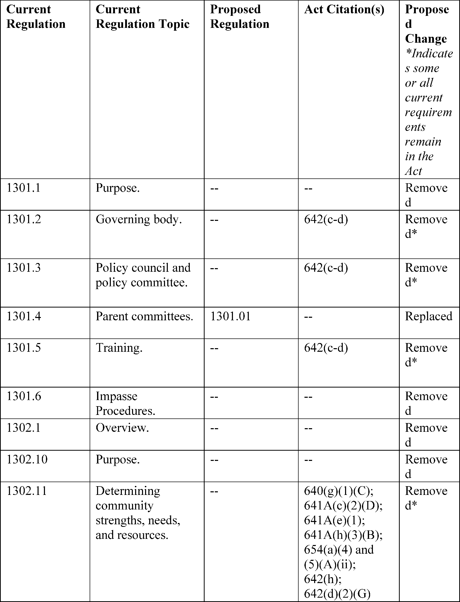
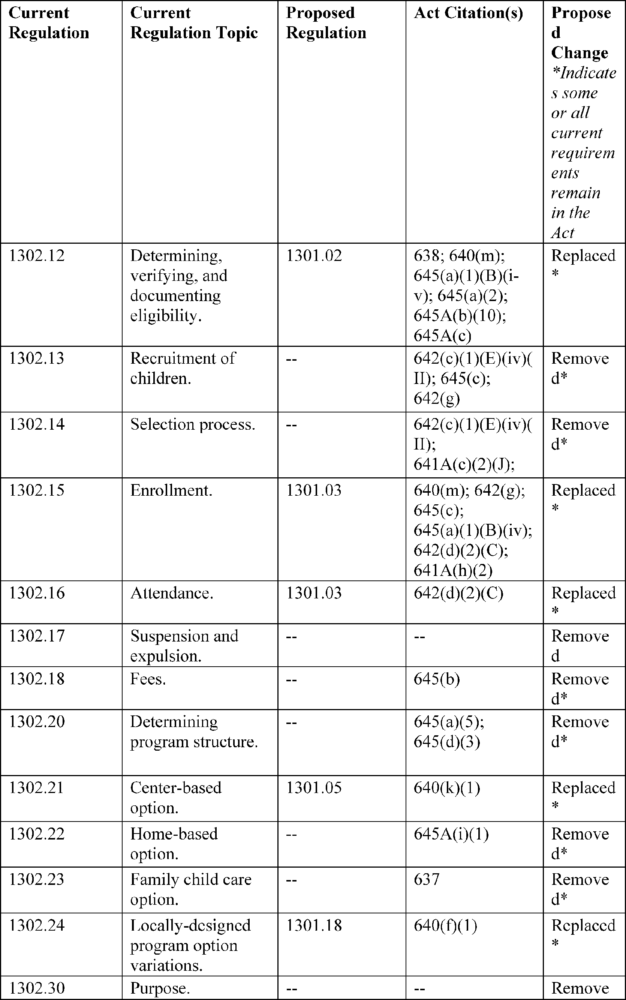

# Daily Digest — 2026-08-07

| | |
|---|---|
| **Digest date** | 2026-08-07 |
| **Data date range** | 2026-08-07 to 2026-08-07 |
| **Generated at** | 2026-08-08T04:15:05Z (UTC) |
| **Pipeline version** | 4c1f91d |
| **Source watermarks** | CREC: 2026-08-07T11:56:54Z · BILLS: 2026-08-08T03:01:47Z · FR: 2026-08-07T16:52:41Z · USCOURTS: 2026-08-08T03:59:45Z · PLAW: 2026-07-25T00:00:00Z |

[Full observed listing for this day](day/2026-08-07.html) — every item our collectors observed for this publication day, mechanical rules applied, frozen at end of day. This digest is the canonical record.

All items below cite the govinfo package (and granule, where applicable) they
summarize. Selection is mechanical; each item states the rule that included
it. See the Coverage Statement at the end for a full accounting of what was
published, what was summarized, and what was excluded and why.

---

## Contents

- [Day in Review](#day-in-review)
- [1. Congressional Floor Activity](#1-congressional-floor-activity)
- [2. Legislation](#2-legislation)
- [3. Federal Register](#3-federal-register)
- [4. Enacted Laws](#4-enacted-laws)
- [5. Judicial Activity](#5-judicial-activity)
- [6. Agency Announcements](#6-agency-announcements)
- [7. Recorded Votes](#7-recorded-votes)
- [8. Bill Actions](#8-bill-actions)
- [9. Presidential Actions](#9-presidential-actions)
- [Terms Used Today](#terms-used-today)
- [Coverage Statement](#coverage-statement)
- [Methodology](#methodology)

---

## Day in Review

The Senate's floor day is the largest congressional record in the digest, which carries 95 Senate proceedings, 41 House proceedings, 13 extensions of remarks, and six daily digest entries alongside four recorded roll call votes. The Senate passed S. 1838, the DeOndra Dixon INCLUDE Project Act, authorizing coordinated National Institutes of Health research on Down syndrome and requiring biennial reports to Congress, and debated H.R. 5366, a disaster tax relief measure for wildfire victims, with an amendment offered to add two Texas wildfires as qualified disasters. Senate Resolution 832 establishes a bipartisan working group on the long-term solvency of the Social Security Trust Funds, with a report due October 1, 2026. Thirty-four Senate bills were introduced, and the House Budget Committee published fiscal year 2026 section 302(a) allocations under S. Con. Res. 33. The digest carries 27 bill texts at various stages and one presidential nomination.

On the regulatory side, the digest carries 12 final rules, nine proposed rules, and 79 notices from the Federal Register, plus 168 agency press releases. Final rules include an EPA pesticide tolerance exemption for a Bacillus thuringiensis protein in corn, FAA airspace amendments at Chicago/Rockford and a revocation at Lake Geneva, Wisconsin, an FCC notice setting procedures for a February 2027 FM broadcast auction, and Coast Guard safety zone enforcement periods. Proposed rules include a Department of Health and Human Services rulemaking to rescind and replace the Head Start Program Performance Standards, an FAA airworthiness directive for Boeing 787 models, and FCC proposals on wireline deployment and equipment authorization security.

The digest carries 71 appellate opinions, 1,642 district court opinions, and eight bankruptcy opinions. The Eleventh Circuit reversed the dismissal of Eighth Amendment claims brought by family members of an inmate killed at a Georgia prison, and affirmed a judgment for DISH Network on exclusive distribution rights to Arabic-language programming, awarding a permanent injunction and $600,000 in statutory damages. The Fifth Circuit vacated an asylum denial after finding an adverse credibility determination rested in part on a mistranslated Afghan calendar date, and reversed a denial of qualified immunity to officers in an excessive force suit. The Fourth Circuit held that judges may find sentencing facts affecting only the advisory guideline range by a preponderance of the evidence. The Federal Circuit affirmed a Patent Trial and Appeal Board ruling that a crossbow string-guide patent claim is unpatentable as anticipated, and the Ninth Circuit reversed summary judgment for a law firm in a legal malpractice suit.

*Composed from the summarized items below and the day's mechanical
counts; all specifics are cited in their sections.*

---

## 1. Congressional Floor Activity

Source: Congressional Record (CREC), issue observed 2026-08-07, covering proceedings of 2026-08-06. Published by govinfo 2026-08-07T11:56:54Z; observed by our collector 2026-08-07T12:20:59Z. Total issue size: 155 granule(s).

### 1.1 Senate

Tags: legislative · model keys: legislation · research · tax relief

*In plain terms: The Senate passed the DeOndra Dixon INCLUDE Project Act for Down syndrome research, debated wildfire tax relief, and introduced 34 bills on fisheries, housing, healthcare, and labor policy.*

- **Unanimous Consent Requests (Executive Session)** — The Senate debated H.R. 5366, a disaster tax relief bill providing tax relief to wildfire victims, with Senator Cruz proposing an amendment to include two Texas wildfires as qualified disasters, while Senators Wyden and Padilla discussed the bill's broader tax relief provisions.
  - *In plain terms:* The Senate debated a wildfire disaster tax relief bill, with Senator Cruz proposing to add two Texas wildfires as qualified disasters.
  - Included because: CREC-SEL-01 — floor item ≥ threshold floor time (15,246 characters) (document dated 2026-08-06)
  - Source: [CREC-2026-08-06 / CREC-2026-08-06-pt1-PgS4487](https://www.govinfo.gov/app/details/CREC-2026-08-06/CREC-2026-08-06-pt1-PgS4487)
- **Deondra Dixon Include Project Act of 2026** — The Senate passed S. 1838, the DeOndra Dixon INCLUDE Project Act, authorizing the National Institutes of Health to conduct coordinated research on Down syndrome and associated conditions, and requiring biennial reports to Congress on research findings.
  - *In plain terms:* The Senate passed the DeOndra Dixon INCLUDE Project Act, authorizing NIH to conduct coordinated research on Down syndrome and requiring biennial reports.
  - Included because: CREC-SEL-01 — floor item ≥ threshold floor time (24,777 characters) (document dated 2026-08-06)
  - Source: [CREC-2026-08-06 / CREC-2026-08-06-pt1-PgS4495](https://www.govinfo.gov/app/details/CREC-2026-08-06/CREC-2026-08-06-pt1-PgS4495)
- **Recognizing the 1960 University of Missouri Tigers Football Team** — Senate Resolution 833 recognized the 1960 University of Missouri Tigers football team for their undefeated regular season and Orange Bowl victory. Senator Booker delivered remarks regarding Edwin Lopez-Cornejo, who died at the Delaney Hall ICE detention facility in Newark, New Jersey, and discussed conditions at the facility.
  - *In plain terms:* The Senate recognized the 1960 University of Missouri Tigers for their undefeated season and Orange Bowl victory; Senator Booker discussed Delaney Hall detention facility conditions.
  - Included because: CREC-SEL-01 — floor item ≥ threshold floor time (50,866 characters) (document dated 2026-08-06)
  - Source: [CREC-2026-08-06 / CREC-2026-08-06-pt1-PgS4498](https://www.govinfo.gov/app/details/CREC-2026-08-06/CREC-2026-08-06-pt1-PgS4498)
- **Executive and Other Communications** — The Senate received executive communications from the Federal Communications Commission and Federal Aviation Administration, including notices of proposed rules on FM broadcast auctions, airworthiness directives for aircraft, and amendments to airspace designations, referred to the Committee on Commerce, Science, and Transportation.
  - *In plain terms:* The Senate received FCC and FAA communications including notices of proposed rules on FM broadcast auctions, aircraft airworthiness directives, and airspace amendments.
  - Included because: CREC-SEL-01 — floor item ≥ threshold floor time (18,758 characters) (document dated 2026-08-06)
  - Source: [CREC-2026-08-06 / CREC-2026-08-06-pt1-PgS4512-2](https://www.govinfo.gov/app/details/CREC-2026-08-06/CREC-2026-08-06-pt1-PgS4512-2)
- **Introduction of Bills and Joint Resolutions** — The Senate introduced 34 bills (S. 5273–S. 5306) addressing fisheries management, tax law, disaster relief, housing, healthcare, labor protections, environmental standards, and other policy areas.
  - *In plain terms:* The Senate introduced 34 bills addressing fisheries management, taxes, disaster relief, housing, healthcare, labor protections, and environmental standards.
  - Included because: CREC-SEL-01 — floor item ≥ threshold floor time (31,239 characters) (document dated 2026-08-06)
  - Source: [CREC-2026-08-06 / CREC-2026-08-06-pt1-PgS4513](https://www.govinfo.gov/app/details/CREC-2026-08-06/CREC-2026-08-06-pt1-PgS4513)
- **Additional Cosponsors** — Record of senators requesting the addition of fellow senators as cosponsors to 26 Senate bills covering immigration, sanctions, housing, Medicare, military cooperation, agricultural support, financial crime prevention, and other legislative subjects.
  - *In plain terms:* Senators requested cosponsors on 26 bills covering immigration, sanctions, housing, Medicare, military cooperation, agriculture, and financial crime prevention.
  - Included because: CREC-SEL-01 — floor item ≥ threshold floor time (18,097 characters) (document dated 2026-08-06)
  - Source: [CREC-2026-08-06 / CREC-2026-08-06-pt1-PgS4517](https://www.govinfo.gov/app/details/CREC-2026-08-06/CREC-2026-08-06-pt1-PgS4517)
- **Statements on Introduced Bills and Joint Resolutions** — Senator Padilla introduced four bills addressing farmworker support: reauthorizing the USDA Farmworker Coordinator position, establishing an Office of the Farm and Food System Workforce within USDA, providing labor protections for agricultural workers, and enabling sustainable manure management practices. Senator Reed introduced S. 5320 to define and prohibit insider trading under securities law.
  - *In plain terms:* Senator Padilla introduced bills on farmworker support including a USDA Farmworker Coordinator position and farm workforce office; Senator Reed introduced a bill on insider trading.
  - Included because: CREC-SEL-01 — floor item ≥ threshold floor time (19,125 characters) (document dated 2026-08-06)
  - Source: [CREC-2026-08-06 / CREC-2026-08-06-pt1-PgS4519](https://www.govinfo.gov/app/details/CREC-2026-08-06/CREC-2026-08-06-pt1-PgS4519)
- **Senate Resolution 832--ESTABLISHING a Process to Assure the Long-Term Fiscal Stability of the Federal Old-Age and Survi…** — Senate Resolution 832 establishes a bipartisan working group to develop recommendations and legislative language for achieving long-term solvency of the Social Security Trust Funds. The working group is to be formed by August 10, 2026, hold public listening sessions, and report by October 1, 2026; a Social Security bill would then be introduced by November 9, 2026, for Committee consideration.
  - *In plain terms:* Senate Resolution 832 establishes a bipartisan group to recommend Social Security solvency legislation, to report by October 1, 2026, with a bill introduced by November 9.
  - Included because: CREC-SEL-01 — floor item ≥ threshold floor time (18,741 characters) (document dated 2026-08-06)
  - Source: [CREC-2026-08-06 / CREC-2026-08-06-pt1-PgS4521-3](https://www.govinfo.gov/app/details/CREC-2026-08-06/CREC-2026-08-06-pt1-PgS4521-3)
- **Text of Amendments** — Three proposed amendments were submitted: SA 6747 striking section 2019 of H.R. 6500 relating to trade duty extensions; SA 6748 establishing a Commercial Space Activity Advisory Committee within the Department of Commerce; and SA 6749 modifying penny production and implementing cash transaction rounding to the nearest 5 cents.
  - *In plain terms:* Three amendments were proposed: one to strike a trade duty extension provision, one to establish a Commerce Department space activity advisory committee, and one to end penny production.
  - Included because: CREC-SEL-01 — floor item ≥ threshold floor time (27,167 characters) (document dated 2026-08-06)
  - Source: [CREC-2026-08-06 / CREC-2026-08-06-pt1-PgS4527](https://www.govinfo.gov/app/details/CREC-2026-08-06/CREC-2026-08-06-pt1-PgS4527)

### 1.2 House of Representatives

Tags: legislative · model keys: allocations · appropriations · budget

*In plain terms: The House Budget Committee published fiscal year 2026 spending authority allocations for appropriations and authorizing committees under Senate Concurrent Resolution 33.*

- **Publication of Budgetary Material** — The House Committee on the Budget published the 302(a) allocations of budget authority and spending authority for fiscal year 2026 pursuant to S. Con. Res. 33, setting spending caps for the Committee on Appropriations and authorizing committees under the Congressional Budget Act of 1974.
  - *In plain terms:* The House Budget Committee released fiscal 2026 spending authority allocations and caps for the Appropriations and authorizing committees.
  - Included because: CREC-SEL-01 — floor item ≥ threshold floor time (15,163 characters) (document dated 2026-08-06)
  - Source: [CREC-2026-08-06 / CREC-2026-08-06-pt1-PgH5217-6](https://www.govinfo.gov/app/details/CREC-2026-08-06/CREC-2026-08-06-pt1-PgH5217-6)

### 1.3 Recorded Votes

No recorded votes were published in this issue of the Congressional Record.

---

## 2. Legislation

Source: Congressional Bills (BILLS), text versions published 2026-08-07 to 2026-08-07.

### 2.1 Counts by Stage

| Stage (bill text version) | Count |
|---|---|
| Introduced (ih/is) | 12 |
| Reported (rh/rs) | 2 |
| Engrossed (eh/es) | 5 |
| Enrolled (enr) | 0 |
| Other versions | 8 |
| **Total bill texts published** | **27** |

### 2.2 Bills Listed by Mechanical Rule

Bills below are listed because they matched at least one listing rule; the
matching rule is stated per item. All other bill texts are counted above and
accounted for in the Coverage Statement.

No bill texts published in this range matched a listing rule; all 27 are
accounted for in the Coverage Statement.

---

## 3. Federal Register

Source: Federal Register (FR), issue of 2026-08-07.

### 3.1 Counts by Document Type

| Document type | Count |
|---|---|
| Rules | 12 |
| Proposed rules | 9 |
| Notices | 79 |
| Presidential documents | 0 |
| **Total FR documents** | **100** |

### 3.2 Rules Published

Tags: department of commerce · department of energy · executive · model keys: broadcast · fisheries · regulations

*In plain terms: Twelve final rules address fireworks certification expansion, pesticide tolerance exemptions, FM broadcast auction procedures, airspace adjustments, fisheries reapportionment, and Coast Guard marine event regulations.*

#### DEPARTMENT OF COMMERCE

- **Fisheries of the Exclusive Economic Zone Off Alaska; Reapportionment of Halibut Prohibited Species Catch Limits in the Bering Sea and Aleutian Islands Management Area** (2026-16156; 50 CFR Part 679) — NMFS is reapportioning the unused amounts of the Pacific cod Trawl Cooperative (PCTC) Program halibut prohibited species catch (PSC) limit to the Pacific cod trawl limited access catcher vessel sector C season in the Bering Sea and Aleutian Islands management area (BSAI). Action: Temporary rule; reallocation. Dates: Effective August 7, 2026, through 2400 hours, Alaska local time (A.l.t.), November 1, 2026.
  - *In plain terms:* The National Marine Fisheries Service reassigns unused halibut catch limits to the Pacific cod trawl limited-access catcher vessel sector in the Bering Sea.
  - Included because: FR-SEL-01 — document type: final rule (all listed)
  - Source: [FR-2026-08-07 / 2026-16156](https://www.govinfo.gov/app/details/FR-2026-08-07/2026-16156)
- **Pacific Halibut Fisheries of the West Coast; 2026 Catch Sharing Plan; Inseason Action; Correction** (2026-16181; 50 CFR Part 300) — NMFS is correcting a temporary rule for the Pacific halibut recreational fishery in the International Pacific Halibut Commission's (IPHC) regulatory Area 2A. The action added fishing dates in August and September in the Columbia River and Washington subareas. The dates listed under each subarea were incorrect. Action: Temporary rule; inseason adjustment; correction. Dates: Effective August 5, 2026 through September 30, 2026.
  - *In plain terms:* The National Marine Fisheries Service corrects a halibut fishing rule by fixing incorrectly listed fishing dates in August and September for the Columbia River and Washington subareas.
  - Included because: FR-SEL-01 — document type: final rule (all listed)
  - Source: [FR-2026-08-07 / 2026-16181](https://www.govinfo.gov/app/details/FR-2026-08-07/2026-16181)

#### DEPARTMENT OF HOMELAND SECURITY

- **Safety Zones; Annual Events in the Captain of the Port Detroit Zone** (2026-16155; 33 CFR Part 165) — The Coast Guard will enforce the safety zone for the Roostertail Fireworks in Detroit, MI, from 9:30 p.m. to 11 p.m. on August 8, 2026, to protect the safety of life and property on the navigable waters of the Detroit River immediately prior to, during, and immediately after this event. During the enforcement period, no person or vessel may enter the safety zone without permission from the Captain of the Port (COTP) Detroit or a designated representative. Action: Notification of enforcement of regulation. Dates: The regulations in 33 CFR 165.941 will be enforced for the location identified in item (32) of Table 1, from 9:30 p.m. through 11 p.m. on August 8, 2026.
  - *In plain terms:* The Coast Guard will enforce a safety zone around the Roostertail Fireworks event in Detroit on August 8, 2026, from 9:30 p.m. to 11 p.m.
  - Included because: FR-SEL-01 — document type: final rule (all listed)
  - Source: [FR-2026-08-07 / 2026-16155](https://www.govinfo.gov/app/details/FR-2026-08-07/2026-16155)
- **Special Local Regulations; Annual Les Cheneaux Islands Antique Wooden Boat Show, Marquette Bay, Hessel, MI** (2026-16164; 33 CFR Part 100) — The Coast Guard will enforce the Annual Les Cheneaux Islands Antique Wooden Boat Show special local regulation on the U.S. navigable waters of Marquette Bay, Hessel, MI on August 8, 2026. This action is necessary to provide for the safety of life and property on these navigable waters prior to, during, and immediately after the boat show. While in the regulated area all vessels will operate at a no wake speed and follow the directions of the on-scene patrol commander. Action: Notice of enforcement of regulation. Dates: The regulations in 33 CFR 100.922 will be enforced for the Annual Les Cheneaux Islands Antique Wooden Boat Show regulated area from 9 a.m. to 5 p.m. on August 8, 2026.
  - *In plain terms:* The Coast Guard will enforce a special regulation for the August 8, 2026 Les Cheneaux Islands Antique Wooden Boat Show requiring vessels to operate at no-wake speeds.
  - Included because: FR-SEL-01 — document type: final rule (all listed)
  - Source: [FR-2026-08-07 / 2026-16164](https://www.govinfo.gov/app/details/FR-2026-08-07/2026-16164)

#### DEPARTMENT OF THE INTERIOR

- **Ohio Regulatory Program** (2026-16136; 30 CFR Part 935) — The Office of Surface Mining Reclamation and Enforcement (OSM), is approving, in part, two amendments to the Ohio regulatory program (the Ohio program) under the Surface Mining Control and Reclamation Act of 1977 (SMCRA or the Act). As proposed by Ohio, the amendment involves statutory and regulatory changes to its bonding program ( i.e., revising Ohio's alternative bonding system and providing the option for an applicant to post full-cost performance securities) and also includes statutory and regulatory changes pertaining to other subjects, such as abandoned mine land program funding, permitting standards, valid existing rights, remining, blasting, and topsoil handling. Ohio submitted this amendment, in part, to satisfy a program condition related to bonding inadequacies. We are removing this program condition. Action: Final rule; partial approval of amendment. Dates: The effective date is September 8, 2026.
  - *In plain terms:* The Office of Surface Mining approves amendments to Ohio's coal mining program revising its bonding system and updating rules on permitting, blasting, and mine reclamation.
  - Included because: FR-SEL-01 — document type: final rule (all listed)
  - Source: [FR-2026-08-07 / 2026-16136](https://www.govinfo.gov/app/details/FR-2026-08-07/2026-16136)

#### DEPARTMENT OF TRANSPORTATION

- **Hazardous Materials: Allowing Fireworks Certification Agencies (FCAs) To Approve Professional Fireworks** (2026-16111; 49 CFR Parts 107, 171, 172, and 173) — This final rule expands the authority of a Fireworks Certification Agency (FCA) to obtain the ability to approve fireworks constructed to certain requirements. These amendments will streamline PHMSA's fireworks approval process and provide the industry with improved regulatory flexibility. Action: Final rule. Dates: This final rule is effective September 8, 2026. The incorporation by reference of certain publications listed in this rule is approved by the Director of the Federal Register as of September 8, 2026.
  - *In plain terms:* The rule expands what types of professional fireworks certification agencies can approve, streamlining the approval process.
  - Included because: FR-SEL-01 — document type: final rule (all listed)
  - Source: [FR-2026-08-07 / 2026-16111](https://www.govinfo.gov/app/details/FR-2026-08-07/2026-16111)
- **Special Conditions: ATR-GIE Avions de Transport Régional Model ATR42-500 and ATR72-212A Airplanes; Electronic System Security Protection From Unauthorized Internal Access** (2026-16129; 14 CFR Part 25) — These special conditions are issued for the ATR-GIE Avions de Transport Régional (ATR) Model ATR42-500 and ATR72-212A airplanes. These airplanes will have a novel or unusual design feature when compared to the state of technology envisioned in the airworthiness standards for transport-category airplanes. This design feature is the installation of a digital system that contains a wireless and hardwired network with hosted application functionality that allows access, from sources internal to the airplane, to the airplane's internal electronic components. The applicable airworthiness regulations do not contain adequate or appropriate safety standards for this design feature. These special conditions contain the additional safety standards that the Administrator considers necessary to establish a level of safety equivalent to that established by the existing airworthiness standards. Action: Final special conditions; request for comments. Dates: This action is effective on ATR on August 7, 2026. Send comments on or before September 21, 2026.
  - *In plain terms:* The FAA establishes safety standards for ATR airplanes equipped with digital systems allowing wireless and wired network access to internal airplane components.
  - Included because: FR-SEL-01 — document type: final rule (all listed)
  - Source: [FR-2026-08-07 / 2026-16129](https://www.govinfo.gov/app/details/FR-2026-08-07/2026-16129)
- **Amendment of Class D and Class E Airspace; Chicago/Rockford, IL** (2026-16158; 14 CFR Part 71) — This action amends the Class D and Class E airspace at Chicago/Rockford, IL. This action is due to a biennial airspace review conducted pursuant to FAA Order JO 7400.2R, Procedures for Handling Airspace Matters. This action brings the airspace into compliance with FAA orders and supports instrument flight rule (IFR) procedures and operations. Action: Final rule. Dates: Effective 0901 UTC, October 29, 2026. The Director of the Federal Register approves this incorporation by reference action under 1 CFR part 51, subject to the annual revision of FAA Order JO 7400.11 and publication of conforming amendments.
  - *In plain terms:* The FAA updates airspace classifications at Chicago/Rockford to comply with federal standards and support instrument flight rule procedures.
  - Included because: FR-SEL-01 — document type: final rule (all listed)
  - Source: [FR-2026-08-07 / 2026-16158](https://www.govinfo.gov/app/details/FR-2026-08-07/2026-16158)
- **Revocation of Class E Airspace; Lake Geneva, WI** (2026-16159; 14 CFR Part 71) — This action revokes the Class E airspace at Lake Geneva, WI. This action is due to the instrument procedures being cancelled and the closure of the airport. Action: Final rule. Dates: Effective 0901 UTC, October 29, 2026. The Director of the Federal Register approves this incorporation by reference action under 1 CFR part 51, subject to the annual revision of FAA Order JO 7400.11 and publication of conforming amendments.
  - *In plain terms:* The FAA revokes the Class E airspace at Lake Geneva because the airport closed and the instrument procedures for it were cancelled.
  - Included because: FR-SEL-01 — document type: final rule (all listed)
  - Source: [FR-2026-08-07 / 2026-16159](https://www.govinfo.gov/app/details/FR-2026-08-07/2026-16159)

#### ENVIRONMENTAL PROTECTION AGENCY

- **Bacillus thuringiensis eCry1Gb.1Ig Protein; Exemption From the Requirement of a Pesticide Tolerance** (2026-16120; 40 CFR Part 174) — This regulation establishes an exemption from the requirement of a tolerance for residues of Bacillus thuringiensis eCry1Gb.1Ig protein in or on the food and feed commodities of corn, field; corn, sweet; and corn, pop when used as a plant-incorporated protectant (PIP) in corn. Syngenta Seeds, LLC submitted a petition to EPA under the Federal Food, Drug, and Cosmetic Act (FFDCA) requesting an exemption from the requirement of a tolerance. This regulation eliminates the need to establish a maximum permissible level for residues of eCry1Gb.1Ig protein under FFDCA when used in accordance with the terms of the exemption. Action: Final rule. Dates: This rule is effective on August 7, 2026. Objections and requests for hearings must be received on or before October 6, 2026, and must be filed in accordance with the instructions provided in 40 CFR part 178 (see also Unit I.C. of this document).
  - *In plain terms:* The EPA exempts residues of Bacillus thuringiensis eCry1Gb.1Ig protein in corn from having a maximum permissible residue level when used as a plant protectant.
  - Included because: FR-SEL-01 — document type: final rule (all listed)
  - Source: [FR-2026-08-07 / 2026-16120](https://www.govinfo.gov/app/details/FR-2026-08-07/2026-16120)
- **2-Propenoic Acid, 2-Methyl-, Telomer With 1-Dodecanethiol, and 2-Methyloxirane Polymer With Oxirane Monoether With 1,2-Propanediol Mono(2-Methyl-2-Propenoate) in Pesticide Formulations; Exemption From the Requirement for a Tolerance** (2026-16123; 40 CFR Part 180) — This regulation establishes an exemption from the requirement of a tolerance for residues of 2-propenoic acid, 2-methyl-, telomer with 1-dodecanethiol, and 2-methyloxirane polymer with oxirane monoether with 1,2-propanediol mono(2-methyl-2-propenoate) (CAS Reg. No 1186225-21-7) when used as an inert ingredient in a pesticide chemical formulation. Spring Regulatory Sciences on behalf of Clariant Corporation submitted a petition to EPA under the Federal Food, Drug, and Cosmetic Act (FFDCA), requesting an exemption from the requirement of a tolerance. This regulation eliminates the need to establish a maximum permissible level for residues of 2-propenoic acid, 2-methyl-, telomer with 1-dodecanethiol, and 2-methyloxirane polymer with oxirane monoether with 1,2-propanediol mono(2-methyl-2-propenoate) on food or feed commodities when used in accordance with these exemptions. Action: Final rule. Dates: This regulation is effective August 7, 2026. Objections and requests for hearings must be received on or before October 6, 2026 and must be filed in accordance with the instructions provided in 40 CFR part 178 (see also Unit I.C. of this document).
  - *In plain terms:* The EPA exempts residues of a chemical used as an inert ingredient in pesticide formulations from needing a maximum permissible residue level on food or feed.
  - Included because: FR-SEL-01 — document type: final rule (all listed)
  - Source: [FR-2026-08-07 / 2026-16123](https://www.govinfo.gov/app/details/FR-2026-08-07/2026-16123)

#### FEDERAL COMMUNICATIONS COMMISSION

- **Auction of FM Broadcasting Construction Permits Scheduled for February 2, 2027; Notice and Filing Requirements, Minimum Opening Bids, Upfront Payments, and Other Procedures for Auction 114** (2026-16133; 47 CFR Parts 1 and 73) — This document summarizes the procedures, deadlines, and upfront payment and minimum opening bid amounts for the upcoming auction of FM broadcast construction permits. The Auction 114 Procedures Public Notice summarized here provides details regarding the procedures, terms, conditions, dates, and deadlines governing participation in Auction 114 bidding, as well as overview of the post-auction application and payment processes. Action: Final action; requirements and procedures. Dates: Applications to participate in Auction 114 must be submitted prior to 6:00 p.m. Eastern Time (ET) on September 30, 2026. Upfront payments for Auction 114 must be received prior to 6:00 p.m. ET on December 3, 2026. Bidding in Auction 114 is scheduled to start on February 2, 2027.
  - *In plain terms:* The FCC provides procedures, deadlines, upfront payments, and minimum opening bids for the February 2, 2027 auction of FM broadcast construction permits.
  - Included because: FR-SEL-01 — document type: final rule (all listed)
  - Source: [FR-2026-08-07 / 2026-16133](https://www.govinfo.gov/app/details/FR-2026-08-07/2026-16133)

### 3.3 Proposed Rules Published

Tags: department of commerce · department of energy · executive · model keys: aviation · infrastructure · regulations

*In plain terms: Nine proposed regulations address Head Start burden reduction, Boeing 787 airworthiness directives, wireless infrastructure deployment barriers, and Coast Guard drawbridge and safety zone modifications.*

#### DEPARTMENT OF HEALTH AND HUMAN SERVICES

- **Reducing Federal Burden for Head Start Programs** (2026-16134; 45 CFR Part 1301, 1302, 1303, 1304, and 1305) — This NPRM proposes to rescind and replace the Head Start Program Performance Standards (Performance Standards), last revised in 2024. The proposed Performance Standards would significantly reduce Federal bureaucratic burden on programs; defer to State policies wherever possible; return substantial local control to Head Start agencies delivering the services and to parents as the primary caregivers and decision-makers for their children; reduce unnecessary duplication of Head Start regulations with Federal statute and other regulations; and emphasize the critical role of health, nutrition, and physical exercise for young children. Action: Notice of proposed rulemaking. Dates: Please submit comments on this NPRM by October 6, 2026.
  - *In plain terms:* The Department of Health and Human Services proposes replacing Head Start performance standards to reduce federal requirements, give states and local programs more control, and eliminate duplication.
  - Included because: FR-SEL-02 — document type: proposed rule (all listed)
  - Source: [FR-2026-08-07 / 2026-16134](https://www.govinfo.gov/app/details/FR-2026-08-07/2026-16134)
  -  *Source graphic 1 of 40 from 2026-16134.*
  -  *Source graphic 2 of 40 from 2026-16134.*
  - *Graphics not rendered here: 38 of 40 — see the [source PDF](https://www.govinfo.gov/content/pkg/FR-2026-08-07/pdf/FR-2026-08-07.pdf).*

#### DEPARTMENT OF HOMELAND SECURITY

- **Safety Zone; Chevron GENESIS SPAR Outer Continental Shelf Facility, Green Canyon Block 205A, Gulf of America** (2026-16118; 33 CFR Part 147) — The Coast Guard is proposing to disestablish a safety zone around the GENESIS SPAR facility, previously located in Green Canyon Block 205A on the Outer Continental Shelf (OCS) in the Gulf of America. The GENESIS SPAR facility was decommissioned and fully removed by the Chevron Corporation in June of 2024. This proposed rulemaking would disestablish the permanent safety zone and remove the regulatory text of 33 CFR 147.825. We invite your comments on this proposed rulemaking. Action: Notice of proposed rulemaking. Dates: Comments and related material must be received by the Coast Guard on or before September 8, 2026.
  - *In plain terms:* The Coast Guard proposes to remove the safety zone around the GENESIS SPAR facility, which Chevron decommissioned and removed in June 2024.
  - Included because: FR-SEL-02 — document type: proposed rule (all listed)
  - Source: [FR-2026-08-07 / 2026-16118](https://www.govinfo.gov/app/details/FR-2026-08-07/2026-16118)
- **Drawbridge Operation Regulation; Old Brazos River, Freeport, Texas** (2026-16121; 33 CFR Part 117) — The Coast Guard proposes to modify the operating schedule that governs the Union Pacific Railroad (UPRR) drawbridge that crosses the Old Brazos River, mile 5.3, near Brazoria, TX. UPRR has proposed to remotely operate the drawbridge from their train yard located in Brazos, TX. The Coast Guard temporarily changed the regulation to test this system. During the test the drawbridge continued to operate safely and provided boats and mariners with a reasonable ability to use this waterway. We invite your comments on this proposed rulemaking. Action: Notice of proposed rulemaking. Dates: Comments and related material must reach the Coast Guard on or before September 8, 2026.
  - *In plain terms:* The Coast Guard proposes to allow the Union Pacific Railroad to remotely operate the Old Brazos River drawbridge from their train yard in Brazos, Texas, based on successful testing.
  - Included because: FR-SEL-02 — document type: proposed rule (all listed)
  - Source: [FR-2026-08-07 / 2026-16121](https://www.govinfo.gov/app/details/FR-2026-08-07/2026-16121)
- **Drawbridge Operation Regulation; Drawbridge Operation Regulation; San Bernard River, Brazoria County, Texas** (2026-16124; 33 CFR Part 117) — The Coast Guard proposes to change the operating schedule that governs the Union Pacific Railroad (UPRR) drawbridge that crosses the San Bernard River, mile 20.7, near Brazoria, TX. UPRR proposed to operate this drawbridge on a 24 hour basis from its Train Dispatch Center located in Spring, TX. The Coast Guard temporarily changed the regulation to test this system. During the test the drawbridge continued to operate safely and provided boats and mariners with a reasonable ability to use this waterway. We invite your comments on this proposed rulemaking. Action: Notice of proposed rulemaking. Dates: Comments and related material must be received by the Coast Guard on or before September 8, 2026.
  - *In plain terms:* The Coast Guard proposes to allow the Union Pacific Railroad to operate the San Bernard River drawbridge 24 hours a day from its dispatch center in Spring, Texas, based on successful testing.
  - Included because: FR-SEL-02 — document type: proposed rule (all listed)
  - Source: [FR-2026-08-07 / 2026-16124](https://www.govinfo.gov/app/details/FR-2026-08-07/2026-16124)
- **Safety Zone; WHALE Floating Production System Outer Continental Shelf Facility, Alaminos Canyon 773, Gulf of America** (2026-16130; 33 CFR Part 147) — The Coast Guard is proposing to establish a safety zone around the WHALE Floating Production System (FPS), on the Outer Continental Shelf (OCS) in the Gulf of America. Establishing a safety zone around the facility will significantly reduce the threat of allisions, collisions, security breaches, oil spills, and releases of natural gas, and thereby protect the safety of life, property, and the environment. This proposed rulemaking would prohibit entry of vessels into this safety zone unless specifically authorized by the Commander, Coast Guard Heartland District or their designated representative. We invite your comments on this proposed rulemaking. Action: Notice of proposed rulemaking. Dates: Comments and related material must be received by the Coast Guard on or before September 8, 2026.
  - *In plain terms:* The Coast Guard proposes a safety zone around the WHALE floating production system in the Gulf to reduce risks of vessel strikes, security breaches, oil spills, and gas releases.
  - Included because: FR-SEL-02 — document type: proposed rule (all listed)
  - Source: [FR-2026-08-07 / 2026-16130](https://www.govinfo.gov/app/details/FR-2026-08-07/2026-16130)

#### DEPARTMENT OF TRANSPORTATION

- **Airworthiness Directives; The Boeing Company Airplanes** (2026-16157; 14 CFR Part 39) — The FAA proposes to adopt a new airworthiness directive (AD) for certain The Boeing Company Model 787-8, 787-9, and 787-10 airplanes. This proposed AD was prompted by a report indicating that the protection system on the left fan cowl of the right engine does not sufficiently cover the components and systems from possible cross engine debris. This proposed AD would require performing a maintenance records check or inspection of the right engine to determine the part number of the left fan cowl and applicable on-condition actions. The FAA is proposing this AD to address the unsafe condition on these products. Action: Notice of proposed rulemaking (NPRM). Dates: The FAA must receive comments on this proposed AD by September 21, 2026.
  - *In plain terms:* The FAA proposes requiring inspections and maintenance checks on Boeing 787 airplanes to ensure the right engine fan cowl adequately protects against debris from the opposite engine.
  - Included because: FR-SEL-02 — document type: proposed rule (all listed)
  - Source: [FR-2026-08-07 / 2026-16157](https://www.govinfo.gov/app/details/FR-2026-08-07/2026-16157)

#### FEDERAL COMMUNICATIONS COMMISSION

- **Build America: Eliminating Barriers to Wireline Deployments** (2026-16196; 47 CFR Part 1) — In this document, the Federal Communications Commission (Commission) proposes and seeks comment on rules that would eliminate state and local requirements that constrain the deployment of modern high-speed wireline infrastructure in violation of section 253 of the Communications Act (Act), particularly through the imposition of excessive delays and fees that impede infrastructure deployments and disincentivize investments in them. [official summary truncated; see source] Action: Proposed rule. Dates: Comments are due on or before September 21, 2026 and reply comments are due on or before November 5, 2026.
  - *In plain terms:* The FCC proposes rules to eliminate state and local requirements that delay or impose excessive fees on high-speed internet infrastructure deployment.
  - Included because: FR-SEL-02 — document type: proposed rule (all listed)
  - Source: [FR-2026-08-07 / 2026-16196](https://www.govinfo.gov/app/details/FR-2026-08-07/2026-16196)
- **Protecting Against National Security Threats to the Communications Supply Chain Through the Equipment Authorization Program** (2026-16197; 47 CFR Parts 1, 2, and 15) — The Federal Communications Commission (Commission or FCC) issues a Third Further Notice of Proposed Rulemaking seeking comment on a broad set of additional measures to strengthen the security and integrity of its equipment authorization program. [official summary truncated; see source] Action: Proposed rule. Dates: Comments are due on or before September 8, 2026 and reply comments are due on or before September 21, 2026.
  - *In plain terms:* The FCC seeks public comment on measures to strengthen security and integrity in its program for authorizing communications equipment.
  - Included because: FR-SEL-02 — document type: proposed rule (all listed)
  - Source: [FR-2026-08-07 / 2026-16197](https://www.govinfo.gov/app/details/FR-2026-08-07/2026-16197)

#### GOVERNMENT ACCOUNTABILITY OFFICE

- **Personnel Appeals Board; Procedural Rules** (2026-16108; 4 CFR Part 28) — The Government Accountability Office Personnel Appeals Board (PAB or Board) proposes several significant changes to its existing regulations to streamline and modernize case processing before the Board. The Board is codifying a process to submit pleadings and to execute service of process through electronic means. The Board will also begin requiring the submission of a petition form to ensure the Board is appraised of the crucial case-related information at the beginning of the case. The Board is also eliminating the automatic commencement of discovery upon the issuance of notice of petition to allow the Administrative Judge to tailor the process on a case-by-case basis. The Board is also beginning implementation of local rules for practice to aid pro se parties and legal practitioners who are unfamiliar with PAB processes. The local rules and petition form are available for viewing on the PAB website at www.pab.gao.gov. The Board is also proposing removal of §§ 28.46-28.50 relating to subpoenas issued by the Board. The Board has also clarified language related to issuing of stays of personnel actions. The Board has also clarified the class certification process. [official summary truncated; see source] Action: Proposed rule. Dates: Comments must be received on or before September 8, 2026.
  - *In plain terms:* The Government Accountability Office Personnel Appeals Board is updating procedures to allow electronic filing, require petition forms, adjust discovery timing, and clarify rules on stays and class certification.
  - Included because: FR-SEL-02 — document type: proposed rule (all listed)
  - Source: [FR-2026-08-07 / 2026-16108](https://www.govinfo.gov/app/details/FR-2026-08-07/2026-16108)

### 3.4 Notices and Presidential Documents

Notices are summarized only when they match a listing rule; all are counted
in 3.1 and in the Coverage Statement. Presidential documents in the FR are
always listed.

No notices or presidential documents matched a listing rule.

---

## 4. Enacted Laws

Source: Public and Private Laws (PLAW) published 2026-08-07.

No laws were published in this range.

---

## 5. Judicial Activity

Source: United States Courts Opinions (USCOURTS): opinions observed 2026-08-07
by our collector; each opinion states its own issue date beside its
listing ([how our clocks work](faq.html#fapds-three-clocks)).

Completeness disclosure (standing): USCOURTS carries opinions from
approximately 140 participating appellate, district, bankruptcy, and
national federal courts. Unlike the Congressional Record and the Federal
Register, which are the complete official record of their branches,
USCOURTS is participation-based and is NOT the complete federal judicial
record. Courts post opinions with delay — typically over several days —
so a day's digest carries the opinions that became available that day,
whatever date each was issued.

### 5.1 Appellate and National Court Opinions

Tags: judicial · model keys: appellate decisions · civil rights · criminal

*In plain terms: Seventy-one circuit court decisions addressed criminal convictions, civil rights claims, immigration proceedings, and fraud cases, with most affirmed or dismissed.*

Appellate and national court opinions are summarized; district and
bankruptcy opinions are counted in 5.2 and in the Coverage Statement.

#### United States Court of Appeals for the District of Columbia Circuit

- **Jason Long v. EDUC, et al** (No. 26-05097; filed 2026-08-06) — Jason Long appealed the dismissal of his complaint against the Department of Education. The District of Columbia Circuit affirmed the dismissal, finding the district court properly exercised its authority to dismiss the action sua sponte after determining it lacked subject matter jurisdiction.
  - *In plain terms:* Jason Long appealed the dismissal of his complaint against the Department of Education; the appeals court upheld the dismissal the lower court made on its own after finding it lacked jurisdiction.
  - Included because: USCOURTS-SEL-01 — appellate court opinion (all listed) (document dated 2026-08-06)
  - Source: [USCOURTS-caDC-26-05097 / USCOURTS-caDC-26-05097-0](https://www.govinfo.gov/app/details/USCOURTS-caDC-26-05097/USCOURTS-caDC-26-05097-0)

#### United States Court of Appeals for the Eighth Circuit

- **Thomas Riles v. Officer Laralyn Koster** (No. 25-01605; filed 2026-08-05) — Judgment was entered by the Eighth Circuit in the case of Thomas Riles v. Officer Laralyn Koster following issuance of an opinion in the case.
  - *In plain terms:* Judgment was entered in the Riles v. Officer Koster case.
  - Included because: USCOURTS-SEL-01 — appellate court opinion (all listed) (document dated 2026-08-05)
  - Source: [USCOURTS-ca8-25-01605 / USCOURTS-ca8-25-01605-0](https://www.govinfo.gov/app/details/USCOURTS-ca8-25-01605/USCOURTS-ca8-25-01605-0)
- **United States v. Todd Sutton, Jr.** (No. 25-02313; filed 2026-08-05) — The Eighth Circuit Court of Appeals issued a judgment in United States v. Todd Sutton, Jr. (case 25-2313) on August 5, 2026. Counsel were notified that petitions for rehearing must be filed within 14 days and must be submitted electronically.
  - *In plain terms:* The Eighth Circuit issued judgment in Sutton's criminal case; rehearing petitions must be filed electronically within 14 days.
  - Included because: USCOURTS-SEL-01 — appellate court opinion (all listed) (document dated 2026-08-05)
  - Source: [USCOURTS-ca8-25-02313 / USCOURTS-ca8-25-02313-0](https://www.govinfo.gov/app/details/USCOURTS-ca8-25-02313/USCOURTS-ca8-25-02313-0)
- **United States v. Latroy Currie** (No. 25-02666; filed 2026-08-05) — The Eighth Circuit Court of Appeals issued judgments in United States v. Latroy Currie and United States v. Malik Marshall (cases 25-2666 and 25-3141) on August 5, 2026. Counsel were notified that petitions for rehearing must be filed within 14 days and must be submitted electronically.
  - *In plain terms:* The Eighth Circuit issued judgments in Currie's and Marshall's cases; rehearing petitions must be filed electronically within 14 days.
  - Included because: USCOURTS-SEL-01 — appellate court opinion (all listed) (document dated 2026-08-05)
  - Source: [USCOURTS-ca8-25-02666 / USCOURTS-ca8-25-02666-0](https://www.govinfo.gov/app/details/USCOURTS-ca8-25-02666/USCOURTS-ca8-25-02666-0)
- **United States v. Malik Marshall** (No. 25-03141; filed 2026-08-05) — The Eighth Circuit Court of Appeals issued a judgment in United States v. Malik Marshall (case 25-3141) on August 5, 2026. Counsel were notified that petitions for rehearing must be filed within 14 days and must be submitted electronically.
  - *In plain terms:* The Eighth Circuit issued judgment in Marshall's criminal case; rehearing petitions must be filed electronically within 14 days.
  - Included because: USCOURTS-SEL-01 — appellate court opinion (all listed) (document dated 2026-08-05)
  - Source: [USCOURTS-ca8-25-03141 / USCOURTS-ca8-25-03141-0](https://www.govinfo.gov/app/details/USCOURTS-ca8-25-03141/USCOURTS-ca8-25-03141-0)

#### United States Court of Appeals for the Eleventh Circuit

- **Dish Network L.L.C. v. Gaby Fraifer, et al** (No. 24-10223; filed 2026-04-09) — The Eleventh Circuit affirmed the district court's judgment that DISH Network holds valid exclusive distribution rights to protected Arabic-language programming and that defendants who operated unauthorized streaming services infringed those copyrights. The court awarded DISH a permanent injunction and $600,000 in statutory damages, attorney fees, and costs.
  - *In plain terms:* DISH Network won its case affirming exclusive rights to Arabic-language programming, with a permanent injunction, $600,000 in statutory damages, and attorney fees and costs.
  - Included because: USCOURTS-SEL-01 — appellate court opinion (all listed) (document dated 2026-08-06)
  - Source: [USCOURTS-ca11-24-10223 / USCOURTS-ca11-24-10223-0](https://www.govinfo.gov/app/details/USCOURTS-ca11-24-10223/USCOURTS-ca11-24-10223-0)
- **Dish Network L.L.C. v. Gaby Fraifer, et al** (No. 24-10223; filed 2026-08-06) — This substituted opinion (vacating the prior opinion from April 2026) affirms the district court's judgment that DISH Network holds valid exclusive distribution rights to protected Arabic-language programming and that defendants who operated unauthorized streaming services infringed those copyrights, awarding DISH a permanent injunction and $600,000 in statutory damages.
  - *In plain terms:* A revised court opinion confirmed DISH Network holds exclusive rights to Arabic-language programming, with a permanent injunction and $600,000 in statutory damages.
  - Included because: USCOURTS-SEL-01 — appellate court opinion (all listed) (document dated 2026-08-06)
  - Source: [USCOURTS-ca11-24-10223 / USCOURTS-ca11-24-10223-1](https://www.govinfo.gov/app/details/USCOURTS-ca11-24-10223/USCOURTS-ca11-24-10223-1)
- **USA v. Evan Graves** (No. 24-12089; filed 2026-08-06) — The Eleventh Circuit affirmed Evan Graves' wire fraud conviction and a forfeiture order totaling $1,355,600, holding that the district court properly advised him of his restitution and forfeiture obligations and that his sentence-appeal waiver was valid and enforceable.
  - *In plain terms:* Evan Graves' wire fraud conviction and $1,355,600 forfeiture order were upheld, with his sentence-appeal waiver found valid.
  - Included because: USCOURTS-SEL-01 — appellate court opinion (all listed) (document dated 2026-08-06)
  - Source: [USCOURTS-ca11-24-12089 / USCOURTS-ca11-24-12089-0](https://www.govinfo.gov/app/details/USCOURTS-ca11-24-12089/USCOURTS-ca11-24-12089-0)
- **USA v. Aunyis Cherry** (No. 25-11208; filed 2026-08-06) — The Eleventh Circuit affirmed Aunyis Cherry's conviction for being a felon in possession of a firearm and his 120-month sentence, rejecting his constitutional challenges to the conviction and his arguments regarding sentencing enhancements, finding any error in applying enhancements was harmless.
  - *In plain terms:* Aunyis Cherry's conviction for possessing a firearm as a felon and 120-month sentence were upheld despite his constitutional objections.
  - Included because: USCOURTS-SEL-01 — appellate court opinion (all listed) (document dated 2026-08-06)
  - Source: [USCOURTS-ca11-25-11208 / USCOURTS-ca11-25-11208-0](https://www.govinfo.gov/app/details/USCOURTS-ca11-25-11208/USCOURTS-ca11-25-11208-0)
- **Julia Hagans v. Timothy Ward, et al** (No. 25-12631; filed 2026-08-06) — Family members of an inmate killed by other inmates at a Georgia prison appealed the dismissal of their Eighth Amendment claims against state prison officials alleging deliberate indifference to dangerous conditions. The Eleventh Circuit reversed the dismissal of Eighth Amendment claims against both named defendants (prison officials) and unnamed defendants (supervisors and correctional officers), while affirming the dismissal of the denial of access claim.
  - *In plain terms:* A court reversed the dismissal of an Eighth Amendment claim that prison officials were deliberately indifferent to dangerous conditions that led to an inmate's death.
  - Included because: USCOURTS-SEL-01 — appellate court opinion (all listed) (document dated 2026-08-06)
  - Source: [USCOURTS-ca11-25-12631 / USCOURTS-ca11-25-12631-0](https://www.govinfo.gov/app/details/USCOURTS-ca11-25-12631/USCOURTS-ca11-25-12631-0)
- **Wilver Catarino, et al v. Banks County Sheriff, et al** (No. 25-12921; filed 2026-08-06) — A man refused arrest for an unpaid $330 cab fare, pulled a metal pipe from his backpack, and advanced toward a deputy sheriff despite repeated commands to stop. The deputy shot and killed him; the family's Fourth Amendment excessive force claim was submitted to summary judgment, which the district court granted and the Eleventh Circuit affirmed.
  - *In plain terms:* A deputy shot and killed a man who pulled a metal pipe and advanced toward him after refusing arrest for an unpaid cab fare; the family's excessive force claim was dismissed.
  - Included because: USCOURTS-SEL-01 — appellate court opinion (all listed) (document dated 2026-08-06)
  - Source: [USCOURTS-ca11-25-12921 / USCOURTS-ca11-25-12921-0](https://www.govinfo.gov/app/details/USCOURTS-ca11-25-12921/USCOURTS-ca11-25-12921-0)
- **USA v. Hector Castro** (No. 25-13337; filed 2026-08-06) — A defendant convicted in 2013 of cocaine conspiracy filed a second motion for compassionate release under 18 U.S.C. § 3582(c)(1)(A), citing serious medical conditions including a prior heart attack and stents, plus rehabilitation and a low recidivism score. The district court denied the motion and the Eleventh Circuit affirmed, finding the defendant failed to demonstrate extraordinary and compelling reasons and that the sentencing factors did not favor reduction.
  - *In plain terms:* A defendant convicted of cocaine conspiracy in 2013 failed in his request for early release based on serious medical conditions and good behavior.
  - Included because: USCOURTS-SEL-01 — appellate court opinion (all listed) (document dated 2026-08-06)
  - Source: [USCOURTS-ca11-25-13337 / USCOURTS-ca11-25-13337-0](https://www.govinfo.gov/app/details/USCOURTS-ca11-25-13337/USCOURTS-ca11-25-13337-0)
- **Candice Ballard v. Joseph Barrett, et al** (No. 25-13516; filed 2026-08-06) — A woman was arrested for obstruction when police came to her home seeking her husband and she refused to open the door or allow officers to search. She was released after her husband surrendered and no charges were filed against her; the Eleventh Circuit affirmed judgment on the pleadings for the officers on her false arrest and related federal and state law claims.
  - *In plain terms:* A woman's false arrest claim after being arrested for obstruction when she refused to open her door to police was rejected on appeal.
  - Included because: USCOURTS-SEL-01 — appellate court opinion (all listed) (document dated 2026-08-06)
  - Source: [USCOURTS-ca11-25-13516 / USCOURTS-ca11-25-13516-0](https://www.govinfo.gov/app/details/USCOURTS-ca11-25-13516/USCOURTS-ca11-25-13516-0)
- **USA v. Devin Randle** (No. 25-13604; filed 2026-08-06) — Appointed counsel for a criminal defendant moved to withdraw from representation and filed an Anders brief. The Eleventh Circuit granted the motion after independent review found no arguable issues of merit in the record and affirmed the conviction and sentence.
  - *In plain terms:* A criminal defendant's court-appointed lawyer was permitted to withdraw after the court found no valid issues to appeal.
  - Included because: USCOURTS-SEL-01 — appellate court opinion (all listed) (document dated 2026-08-06)
  - Source: [USCOURTS-ca11-25-13604 / USCOURTS-ca11-25-13604-0](https://www.govinfo.gov/app/details/USCOURTS-ca11-25-13604/USCOURTS-ca11-25-13604-0)
- **Lourdes Villanueva-Quiroz, et al v. U.S. Attorney General** (No. 25-13891; filed 2026-08-06) — Petitioners sought review of the Board of Immigration Appeals' dismissal of their asylum appeal based on alleged gang persecution in Honduras, arguing the BIA failed to provide reasoned consideration of their claims. The Eleventh Circuit found the BIA adequately considered their arguments concerning the Honduran government's ability and willingness to control the gang and denied the petition for review.
  - *In plain terms:* Asylum seekers from Honduras challenging gang persecution claims failed to convince the court that their asylum appeal was inadequately considered.
  - Included because: USCOURTS-SEL-01 — appellate court opinion (all listed) (document dated 2026-08-06)
  - Source: [USCOURTS-ca11-25-13891 / USCOURTS-ca11-25-13891-0](https://www.govinfo.gov/app/details/USCOURTS-ca11-25-13891/USCOURTS-ca11-25-13891-0)
- **Dalton Banks v. Tammy Brown, et al** (No. 26-10483; filed 2026-08-06) — Dalton Banks appealed the dismissal of his civil rights complaint against a probate judge and sheriff's department for his involuntary commitment and seizure of his firearm. The Eleventh Circuit affirmed the dismissal, finding that judicial immunity and sovereign immunity barred his claims, as the probate judge's issuance of an involuntary commitment order constituted a judicial act within her jurisdiction.
  - *In plain terms:* Dalton Banks' civil rights case against a probate judge and sheriff for involuntary commitment and firearm seizure was dismissed due to judicial immunity.
  - Included because: USCOURTS-SEL-01 — appellate court opinion (all listed) (document dated 2026-08-06)
  - Source: [USCOURTS-ca11-26-10483 / USCOURTS-ca11-26-10483-0](https://www.govinfo.gov/app/details/USCOURTS-ca11-26-10483/USCOURTS-ca11-26-10483-0)

#### United States Court of Appeals for the Federal Circuit

- **Ravin Crossbows, LLC v. Squires** (No. 24-02136; filed 2026-08-06) — The Federal Circuit Court of Appeals affirmed the Patent Trial and Appeal Board's decision that claim 1 of U.S. Patent No. 9,354,015, relating to rotatable string guides in crossbows, is unpatentable as anticipated by prior art. The court rejected the patent applicant's proposed claim construction and found that the Board properly interpreted the term "mounted to" based on the claim's plain and ordinary meaning as constrained by the claim's structural and functional limitations.
  - *In plain terms:* A federal appeals court upheld a ruling that a crossbow patent claim is unpatentable because prior art already described it.
  - Included because: USCOURTS-SEL-01 — appellate court opinion (all listed) (document dated 2026-08-06)
  - Source: [USCOURTS-ca13-24-02136 / USCOURTS-ca13-24-02136-0](https://www.govinfo.gov/app/details/USCOURTS-ca13-24-02136/USCOURTS-ca13-24-02136-0)

#### United States Court of Appeals for the Fifth Circuit

- **Turner v. Johnson** (No. 25-11274; filed 2026-08-06) — The Fifth Circuit dismissed as frivolous a prisoner's appeal of the district court's dismissal of a civil rights complaint under 42 U.S.C. § 1983, finding that the appellant failed to meaningfully address the district court's reasoning for dismissal or identify any legal error in its analysis.
  - *In plain terms:* A federal appeals court dismissed a prisoner's frivolous appeal for failing to meaningfully address the lower court's reasoning for dismissal.
  - Included because: USCOURTS-SEL-01 — appellate court opinion (all listed) (document dated 2026-08-06)
  - Source: [USCOURTS-ca5-25-11274 / USCOURTS-ca5-25-11274-0](https://www.govinfo.gov/app/details/USCOURTS-ca5-25-11274/USCOURTS-ca5-25-11274-0)
- **USA v. Deluna** (No. 25-20036; filed 2026-08-06) — The Fifth Circuit affirmed Karina Deluna's conviction for conspiracy and seven counts of making false statements on federal firearms purchase forms, finding that her statements to ATF agents were voluntary and that the district court properly admitted recorded admissions from two interviews. Deluna was sentenced to 87 consecutive months of imprisonment after being found guilty of falsely indicating on firearms forms that she was the actual purchaser when she was acquiring the weapons for others.
  - *In plain terms:* A federal appeals court upheld Karina Deluna's conviction for conspiracy and seven counts of falsely claiming she purchased firearms when she acquired them for others; she received 87 consecutive months in prison.
  - Included because: USCOURTS-SEL-01 — appellate court opinion (all listed) (document dated 2026-08-06)
  - Source: [USCOURTS-ca5-25-20036 / USCOURTS-ca5-25-20036-0](https://www.govinfo.gov/app/details/USCOURTS-ca5-25-20036/USCOURTS-ca5-25-20036-0)
- **Adler v. Energy Debt Holdings** (No. 25-20475; filed 2026-08-06) — Joshua Adler appealed a bankruptcy court judgment dismissing his suit seeking declaratory relief that an SBA Note held senior payment priority over an EDH Note. The court held that Adler's adversary proceeding was barred by a prior Cash Collateral Order prohibiting challenges to the EDH Note's priority after a specified date, and a Confirmation Order established the EDH Note had first priority. The Fifth Circuit affirmed.
  - *In plain terms:* A federal appeals court upheld dismissal of a lawsuit challenging the priority of an SBA Note over an EDH Note because prior orders barred such challenges.
  - Included because: USCOURTS-SEL-01 — appellate court opinion (all listed) (document dated 2026-08-06)
  - Source: [USCOURTS-ca5-25-20475 / USCOURTS-ca5-25-20475-0](https://www.govinfo.gov/app/details/USCOURTS-ca5-25-20475/USCOURTS-ca5-25-20475-0)
- **MAPP v. Floor and Decor** (No. 25-30536; filed 2026-08-06) — Floor and Decor sought to compel arbitration of a construction dispute with contractor MAPP under a contractual clause giving the owner sole discretion to elect arbitration. The district court denied the motion to compel, finding the arbitration clause unenforceable under Louisiana law as an adhesion contract lacking mutuality. The Fifth Circuit affirmed.
  - *In plain terms:* A federal appeals court upheld that a construction contract's arbitration clause is unenforceable under Louisiana law because it was an unfair one-sided agreement.
  - Included because: USCOURTS-SEL-01 — appellate court opinion (all listed) (document dated 2026-08-06)
  - Source: [USCOURTS-ca5-25-30536 / USCOURTS-ca5-25-30536-0](https://www.govinfo.gov/app/details/USCOURTS-ca5-25-30536/USCOURTS-ca5-25-30536-0)
- **USA v. Sealed Appellant** (No. 25-30592; filed 2026-08-06) — A defendant convicted of firearm possession in furtherance of drug trafficking and methamphetamine conspiracy appealed her sentence, arguing the government should have stated reasons for declining to file a sentencing departure motion. The Fifth Circuit affirmed, holding the defendant failed to establish that the government acted with unconstitutional motive.
  - *In plain terms:* A federal appeals court upheld a sentence for firearm possession related to drug trafficking and methamphetamine conspiracy, finding no constitutional violation in the government's choice not to seek a sentencing reduction.
  - Included because: USCOURTS-SEL-01 — appellate court opinion (all listed) (document dated 2026-08-06)
  - Source: [USCOURTS-ca5-25-30592 / USCOURTS-ca5-25-30592-0](https://www.govinfo.gov/app/details/USCOURTS-ca5-25-30592/USCOURTS-ca5-25-30592-0)
- **Bruce v. 9th Jud Dist Ct** (No. 25-30730; filed 2026-08-06) — Robert Bruce sued the 9th Judicial District Court of Louisiana for mishandling his property-damage case and constitutional violations. The Fifth Circuit affirmed the dismissal, holding that Louisiana district courts are not separate juridical entities capable of being sued and any suit against the state would be barred by Eleventh Amendment immunity.
  - *In plain terms:* Robert Bruce's lawsuit against Louisiana's 9th Judicial District Court was dismissed because courts cannot be sued as separate entities.
  - Included because: USCOURTS-SEL-01 — appellate court opinion (all listed) (document dated 2026-08-06)
  - Source: [USCOURTS-ca5-25-30730 / USCOURTS-ca5-25-30730-0](https://www.govinfo.gov/app/details/USCOURTS-ca5-25-30730/USCOURTS-ca5-25-30730-0)
- **Rogers v. Espinoza** (No. 25-40367; filed 2026-08-06) — Taylor Rogers sued police officers for excessive force under 42 U.S.C. § 1983 following her arrest in a school parking lot, where she pleaded guilty to felony evading arrest. The officers sought summary judgment on qualified immunity grounds; the district court denied their motions, but the Fifth Circuit reversed, finding video evidence contradicted Rogers's factual allegations and that she failed to show her constitutional rights were clearly established.
  - *In plain terms:* A federal appeals court reversed the denial of qualified immunity to police officers in an excessive force case, finding video evidence contradicted the plaintiff's claims.
  - Included because: USCOURTS-SEL-01 — appellate court opinion (all listed) (document dated 2026-08-06)
  - Source: [USCOURTS-ca5-25-40367 / USCOURTS-ca5-25-40367-0](https://www.govinfo.gov/app/details/USCOURTS-ca5-25-40367/USCOURTS-ca5-25-40367-0)
- **Black v. Triplett** (No. 25-40520; filed 2026-08-06) — Creditors Black and Haltom brought adversary proceedings seeking to deny discharge to debtor Triplett under 11 U.S.C. § 727(a), alleging he concealed financial records, made false statements under oath, and refused to obey court orders. The bankruptcy court found the creditors failed to carry their burden of proof and denied discharge. The district court affirmed on discharge, and the Fifth Circuit affirmed that judgment.
  - *In plain terms:* A federal appeals court upheld the bankruptcy court's decision to reject creditors' attempt to deny discharge to a debtor for concealing financial records and making false statements.
  - Included because: USCOURTS-SEL-01 — appellate court opinion (all listed) (document dated 2026-08-06)
  - Source: [USCOURTS-ca5-25-40520 / USCOURTS-ca5-25-40520-0](https://www.govinfo.gov/app/details/USCOURTS-ca5-25-40520/USCOURTS-ca5-25-40520-0)
- **Bellamy v. Ford** (No. 25-50630; filed 2026-08-06) — Jeremy Bellamy, a police officer poisoned by carbon monoxide in his Ford patrol vehicle, sued Ford for negligence and design defects; a jury returned a verdict for Ford. Bellamy's motion for a new trial based on erroneous admission of a summary chart was denied by the district court, and the Fifth Circuit affirmed, finding the exhibit was cumulative of other evidence and not prejudicial.
  - *In plain terms:* A police officer's negligence suit against Ford over carbon monoxide poisoning in his patrol vehicle was lost at trial and upheld on appeal.
  - Included because: USCOURTS-SEL-01 — appellate court opinion (all listed) (document dated 2026-08-06)
  - Source: [USCOURTS-ca5-25-50630 / USCOURTS-ca5-25-50630-0](https://www.govinfo.gov/app/details/USCOURTS-ca5-25-50630/USCOURTS-ca5-25-50630-0)
- **Rivera Castelan v. Taylor** (No. 25-50714; filed 2026-08-06) — Moctezuma Rivera sued Val Verde Processing Center administrator Ronny Taylor under 42 U.S.C. § 1983, alleging a Sixth Amendment violation when Taylor failed to timely transmit appointed counsel paperwork, resulting in an eight-month period without effective legal representation before his criminal trespass charge was dropped. The district court denied Taylor's motion to dismiss based on qualified immunity.
  - *In plain terms:* A district court rejected qualified immunity in a civil rights suit alleging failure to timely transmit attorney paperwork that left the plaintiff without legal representation for eight months.
  - Included because: USCOURTS-SEL-01 — appellate court opinion (all listed) (document dated 2026-08-06)
  - Source: [USCOURTS-ca5-25-50714 / USCOURTS-ca5-25-50714-0](https://www.govinfo.gov/app/details/USCOURTS-ca5-25-50714/USCOURTS-ca5-25-50714-0)
- **Surface v. Pacillas** (No. 25-50786; filed 2026-08-06) — Two supervisory police officers sued for discrimination and retaliation after their terminations following allegations of sexual harassment against female officers under their supervision. The appeals court affirmed summary judgment for the defendants, finding no genuine dispute of material fact supporting the officers' claims.
  - *In plain terms:* Two police supervisors' discrimination and retaliation claims after their terminations were dismissed on summary judgment.
  - Included because: USCOURTS-SEL-01 — appellate court opinion (all listed) (document dated 2026-08-06)
  - Source: [USCOURTS-ca5-25-50786 / USCOURTS-ca5-25-50786-0](https://www.govinfo.gov/app/details/USCOURTS-ca5-25-50786/USCOURTS-ca5-25-50786-0)
- **Williams v. Doe** (No. 25-50977; filed 2026-08-06) — A prisoner's civil rights complaint concerning medical care received while detained in jail in 2022 was affirmed as time-barred under the applicable statute of limitations.
  - *In plain terms:* A prisoner's civil rights complaint about medical care in jail was dismissed as filed too late under the statute of limitations.
  - Included because: USCOURTS-SEL-01 — appellate court opinion (all listed) (document dated 2026-08-06)
  - Source: [USCOURTS-ca5-25-50977 / USCOURTS-ca5-25-50977-0](https://www.govinfo.gov/app/details/USCOURTS-ca5-25-50977/USCOURTS-ca5-25-50977-0)
- **Knighton v. Benton County, MS** (No. 25-60383; filed 2026-08-06) — A woman sued county officials alleging violation of her constitutional rights following disputed events involving a drug test, loss of custody, and subsequent arrest, with the appeals court addressing qualified immunity and color-of-law issues.
  - *In plain terms:* A woman's constitutional rights claim against county officials over a drug test, custody loss, and arrest was decided on qualified immunity grounds.
  - Included because: USCOURTS-SEL-01 — appellate court opinion (all listed) (document dated 2026-08-06)
  - Source: [USCOURTS-ca5-25-60383 / USCOURTS-ca5-25-60383-0](https://www.govinfo.gov/app/details/USCOURTS-ca5-25-60383/USCOURTS-ca5-25-60383-0)
- **Eqbal v. Blanche** (No. 25-60504; filed 2026-08-06) — A Fifth Circuit court vacated an asylum denial, finding that the immigration judge's adverse credibility determination was not supported by substantial evidence. The judge had relied on inconsistencies in the applicant's testimony that the court found either illusory or explained by a calendar translation error in which the Afghan date 1372 was mistranslated as 1972 instead of 1993. The case was remanded for further proceedings.
  - *In plain terms:* A federal appeals court vacated an asylum denial, finding the immigration judge's credibility decision lacked sufficient evidence because inconsistencies in the testimony were either not real or explained by a date translation error.
  - Included because: USCOURTS-SEL-01 — appellate court opinion (all listed) (document dated 2026-08-06)
  - Source: [USCOURTS-ca5-25-60504 / USCOURTS-ca5-25-60504-0](https://www.govinfo.gov/app/details/USCOURTS-ca5-25-60504/USCOURTS-ca5-25-60504-0)
- **USA v. McCuin** (No. 25-60555; filed 2026-08-06) — A defendant convicted of felon firearm possession appealed on Second Amendment and Commerce Clause grounds, but the appeals court affirmed the conviction, finding his constitutional arguments foreclosed by established precedent.
  - *In plain terms:* A defendant's Second Amendment and Commerce Clause arguments against his felon firearm possession conviction were rejected on appeal.
  - Included because: USCOURTS-SEL-01 — appellate court opinion (all listed) (document dated 2026-08-06)
  - Source: [USCOURTS-ca5-25-60555 / USCOURTS-ca5-25-60555-0](https://www.govinfo.gov/app/details/USCOURTS-ca5-25-60555/USCOURTS-ca5-25-60555-0)
- **USA v. Lathen** (No. 26-10052; filed 2026-08-06) — Demarkus Jermaine Lathen appealed a criminal conviction with appointed counsel who moved to withdraw. The Fifth Circuit reviewed the brief filed in accordance with Anders v. California and found no nonfrivolous issues for appellate review. The court granted counsel's motion to withdraw and dismissed the appeal.
  - *In plain terms:* A federal appeals court dismissed a criminal appeal after finding no nonfrivolous issues to raise and permitting appointed counsel to withdraw.
  - Included because: USCOURTS-SEL-01 — appellate court opinion (all listed) (document dated 2026-08-06)
  - Source: [USCOURTS-ca5-26-10052 / USCOURTS-ca5-26-10052-0](https://www.govinfo.gov/app/details/USCOURTS-ca5-26-10052/USCOURTS-ca5-26-10052-0)
- **USA v. Johnson** (No. 26-10064; filed 2026-08-06) — James Lucas Johnson appealed a criminal conviction with appointed counsel who moved to withdraw. Johnson filed a response claiming ineffective assistance of counsel, but the court found the record insufficiently developed to evaluate the claim and declined to consider it without prejudice to collateral review. The court found no other nonfrivolous issues and dismissed the appeal.
  - *In plain terms:* A federal appeals court dismissed a criminal appeal after finding the record inadequate to evaluate an ineffective-counsel claim, which the defendant can pursue through other means.
  - Included because: USCOURTS-SEL-01 — appellate court opinion (all listed) (document dated 2026-08-06)
  - Source: [USCOURTS-ca5-26-10064 / USCOURTS-ca5-26-10064-0](https://www.govinfo.gov/app/details/USCOURTS-ca5-26-10064/USCOURTS-ca5-26-10064-0)
- **Queen v. USA** (No. 26-30085; filed 2026-08-06) — Nicholas Queen, a former federal prisoner, appealed a district court order in a civil action alleging excessive force during imprisonment. The district court had vacated the order from which he appealed. The Fifth Circuit dismissed the appeal as moot because the vacated order did not present a live controversy.
  - *In plain terms:* A federal appeals court dismissed an appeal as moot because the vacated order left no ongoing dispute to resolve.
  - Included because: USCOURTS-SEL-01 — appellate court opinion (all listed) (document dated 2026-08-06)
  - Source: [USCOURTS-ca5-26-30085 / USCOURTS-ca5-26-30085-0](https://www.govinfo.gov/app/details/USCOURTS-ca5-26-30085/USCOURTS-ca5-26-30085-0)
- **Abas v. City of Plano** (No. 26-40181; filed 2026-08-06) — Mohammad G. Abas appealed the dismissal of a civil rights suit alleging Fourth and Fourteenth Amendment violations by police officers. He filed suit on April 16, 2025, outside the two-year statute of limitations under Texas law for the October 1, 2022 incident. Abas forfeited his equitable tolling argument through inadequate appellate briefing, and Texas law does not support tolling based on attorney advice to delay filing.
  - *In plain terms:* A federal appeals court upheld dismissal of a civil rights suit filed April 16, 2025, outside the two-year statute of limitations for an October 1, 2022 incident.
  - Included because: USCOURTS-SEL-01 — appellate court opinion (all listed) (document dated 2026-08-06)
  - Source: [USCOURTS-ca5-26-40181 / USCOURTS-ca5-26-40181-0](https://www.govinfo.gov/app/details/USCOURTS-ca5-26-40181/USCOURTS-ca5-26-40181-0)
- **Okorie v. Forrest General Hosp** (No. 26-60070; filed 2026-08-06) — Ikechukwu Okorie, an independent-contractor physician, appealed summary judgment dismissing his claims against a hospital and staffing agency following termination of his contract. The employment contract authorized immediate termination at the institution's request, and the defendant's termination complied with the contract terms. Okorie forfeited most of his arguments through inadequate appellate briefing.
  - *In plain terms:* A federal appeals court upheld dismissal of termination claims by an independent-contractor physician, finding the contract permitted immediate termination by the hospital.
  - Included because: USCOURTS-SEL-01 — appellate court opinion (all listed) (document dated 2026-08-06)
  - Source: [USCOURTS-ca5-26-60070 / USCOURTS-ca5-26-60070-0](https://www.govinfo.gov/app/details/USCOURTS-ca5-26-60070/USCOURTS-ca5-26-60070-0)

#### United States Court of Appeals for the Fourth Circuit

- **US v. Robert Boyd** (No. 23-06914; filed 2026-08-06) — Robert Boyd, convicted of sexual offenses against minors and child sexual abuse material, was civilly committed under the Adam Walsh Act as a sexually dangerous person. After conditional discharge in 2021, the government sought revocation based on non-compliance with treatment requirements. The Fourth Circuit affirmed the district court's revocation and return of Boyd to custody.
  - *In plain terms:* Robert Boyd's conditional discharge from civil commitment was revoked and he was returned to custody for non-compliance with treatment requirements.
  - Included because: USCOURTS-SEL-01 — appellate court opinion (all listed) (document dated 2026-08-06)
  - Source: [USCOURTS-ca4-23-06914 / USCOURTS-ca4-23-06914-0](https://www.govinfo.gov/app/details/USCOURTS-ca4-23-06914/USCOURTS-ca4-23-06914-0)
- **Maria Navarrete-Melgar v. Todd Blanche** (No. 24-02205; filed 2026-08-06) — Maria Navarrete-Melgar petitioned for review of her removal order to El Salvador, challenging the defect in her Notice to Appear for failing to specify the hearing date and time. The Fourth Circuit denied her petition, finding the defect was not jurisdictional, she had waived the objection by not raising it timely, and the immigration judge's adverse credibility determination supported the removal order.
  - *In plain terms:* Maria Navarrete-Melgar's removal to El Salvador was upheld despite a defect in her Notice to Appear, as she failed to timely object.
  - Included because: USCOURTS-SEL-01 — appellate court opinion (all listed) (document dated 2026-08-06)
  - Source: [USCOURTS-ca4-24-02205 / USCOURTS-ca4-24-02205-0](https://www.govinfo.gov/app/details/USCOURTS-ca4-24-02205/USCOURTS-ca4-24-02205-0)
- **US v. Tyree May** (No. 24-04632; filed 2026-08-06) — Tyree May challenged two sentencing guideline enhancements, arguing a factual finding should have been submitted to a jury under Apprendi v. New Jersey. The Fourth Circuit affirmed, holding that judges may find facts affecting only the advisory guideline range by preponderance of evidence without violating Apprendi.
  - *In plain terms:* Tyree May's sentencing guideline enhancements were upheld, as judges may determine such facts without jury findings.
  - Included because: USCOURTS-SEL-01 — appellate court opinion (all listed) (document dated 2026-08-06)
  - Source: [USCOURTS-ca4-24-04632 / USCOURTS-ca4-24-04632-0](https://www.govinfo.gov/app/details/USCOURTS-ca4-24-04632/USCOURTS-ca4-24-04632-0)
- **PSEG Renewable Transmission LLC v. Arentz Family, LP** (No. 25-01730; filed 2026-08-06) — The Fourth Circuit affirmed a district court's preliminary injunction granting PSEG Renewable Transmission access to private properties in Maryland for field studies required to complete its Certificate of Public Convenience and Necessity application for the Maryland Piedmont Reliability Project, a 67-mile transmission line. The court held that Maryland law permits such property access when necessary for environmental and socioeconomic studies required by the state's regulatory approval process for transmission line construction.
  - *In plain terms:* A federal appeals court upheld an order allowing a power company to access private Maryland properties for environmental and economic studies for a transmission line project.
  - Included because: USCOURTS-SEL-01 — appellate court opinion (all listed) (document dated 2026-08-06)
  - Source: [USCOURTS-ca4-25-01730 / USCOURTS-ca4-25-01730-0](https://www.govinfo.gov/app/details/USCOURTS-ca4-25-01730/USCOURTS-ca4-25-01730-0)

#### United States Court of Appeals for the Ninth Circuit

- **In re: Koi Design LLC, et al v. Marron Lawyers, APC, et al** (No. 23-55704; filed 2026-08-06) — Koi Design sued its law firm Marron Lawyers for breach of fiduciary duty and legal malpractice, alleging that an associate attorney mishandled a trademark infringement case, resulting in default judgment and treble damages against Koi. The Ninth Circuit reversed summary judgment in Marron's favor, holding that genuine disputes of material fact existed regarding whether Marron breached its duties to disclose material developments and supervise its employees, and whether those breaches caused Koi's damages.
  - *In plain terms:* Koi Design's lawsuit against its law firm Marron Lawyers for mishandling a trademark case that resulted in default judgment was allowed to proceed.
  - Included because: USCOURTS-SEL-01 — appellate court opinion (all listed) (document dated 2026-08-06)
  - Source: [USCOURTS-ca9-23-55704 / USCOURTS-ca9-23-55704-0](https://www.govinfo.gov/app/details/USCOURTS-ca9-23-55704/USCOURTS-ca9-23-55704-0)

#### United States Court of Appeals for the Seventh Circuit

- **USA v. Rishi Shah** (No. 24-02230; filed 2026-08-06) — Rishi Shah and Shradha Agarwal were convicted of mail, wire, and bank fraud in connection with a multi-million-dollar scheme at their company Outcome Health, which inflated performance metrics to clients and misrepresented financial statements to investors; Shah was also convicted of money laundering. On appeal, the Seventh Circuit affirmed the convictions, rejecting their challenges to the pretrial asset restraint order and evidentiary rulings.
  - *In plain terms:* Rishi Shah and Shradha Agarwal's convictions for fraud at their company Outcome Health—which inflated performance metrics and misrepresented finances—were upheld on appeal.
  - Included because: USCOURTS-SEL-01 — appellate court opinion (all listed) (document dated 2026-08-06)
  - Source: [USCOURTS-ca7-24-02230 / USCOURTS-ca7-24-02230-0](https://www.govinfo.gov/app/details/USCOURTS-ca7-24-02230/USCOURTS-ca7-24-02230-0)
- **USA v. Shradha Agarwal** (No. 24-02236; filed 2026-08-06) — Rishi Shah and Shradha Agarwal were convicted of orchestrating a multi-year, multi-million-dollar fraud scheme at Outcome Health, a healthcare technology company, by defrauding clients and investors through inflated performance metrics and misrepresented financial statements. They challenged a pretrial asset freeze that restricted access to funds for legal counsel and alleged government misconduct at trial, but the Seventh Circuit affirmed their convictions for mail, wire, and bank fraud (Shah also for money laundering). The court found Shah and Agarwal had sufficient information during discovery to challenge the asset restraint and found no merit to their other arguments.
  - *In plain terms:* A federal appeals court upheld convictions of two healthcare company executives for a years-long fraud involving false performance data and financial misstatements to defraud clients and investors.
  - Included because: USCOURTS-SEL-01 — appellate court opinion (all listed) (document dated 2026-08-06)
  - Source: [USCOURTS-ca7-24-02236 / USCOURTS-ca7-24-02236-0](https://www.govinfo.gov/app/details/USCOURTS-ca7-24-02236/USCOURTS-ca7-24-02236-0)
- **USA v. Damond Wiley, Jr.** (No. 24-02744; filed 2026-08-06) — Damond Wiley was charged with felony firearm possession after Illinois State Police stopped his vehicle for illegal window tinting, speeding, failure to signal, and failure to stop at a stop sign. After Wiley fled the stopped vehicle, police found a firearm in plain view on the driver's seat and arrested him; he moved to suppress the evidence from the stop and search. The Seventh Circuit affirmed the district court's denial of the suppression motion, finding the officers had legitimate traffic-based reasons for the stop and lawful grounds to search the vehicle.
  - *In plain terms:* A federal appeals court upheld denial of suppression of evidence in a firearm possession case, finding police had lawful grounds for the traffic stop and resulting vehicle search.
  - Included because: USCOURTS-SEL-01 — appellate court opinion (all listed) (document dated 2026-08-06)
  - Source: [USCOURTS-ca7-24-02744 / USCOURTS-ca7-24-02744-0](https://www.govinfo.gov/app/details/USCOURTS-ca7-24-02744/USCOURTS-ca7-24-02744-0)
- **Mario Javier Cedeno-Gonzalez v. Markwayne Mullin, et al** (No. 25-03186; filed 2026-08-06) — Mario Cedeno-Gonzalez, a Venezuelan citizen convicted of mail fraud and subject to removal, appealed the denial of his habeas corpus petition challenging his detention and removal to Mexico. The Seventh Circuit dismissed the appeal regarding detention claims as moot because Cedeno-Gonzalez had already been removed, and rejected his remaining claims concerning third-country removal as either moot or not properly raised in the district court.
  - *In plain terms:* Mario Cedeno-Gonzalez's habeas corpus challenge to his detention and removal was dismissed because he had already been removed.
  - Included because: USCOURTS-SEL-01 — appellate court opinion (all listed) (document dated 2026-08-06)
  - Source: [USCOURTS-ca7-25-03186 / USCOURTS-ca7-25-03186-0](https://www.govinfo.gov/app/details/USCOURTS-ca7-25-03186/USCOURTS-ca7-25-03186-0)

#### United States Court of Appeals for the Sixth Circuit

- **Jerreece Noel v. Challenge Mfg Holdings, Inc.** (No. 25-01776; filed 2026-08-06) — Jerreece Noel, an African American female HR specialist at Challenge Manufacturing, appealed the district court's dismissal of her discrimination, retaliation, and hostile work environment claims. The Sixth Circuit affirmed, finding Noel failed to present evidence that the company's stated reasons for its actions—her attendance and performance issues—were pretextual, which was necessary to establish her discrimination and retaliation claims. Noel also forfeited her hostile work environment claims by not disputing one of the district court's alternative grounds for rejection.
  - *In plain terms:* A federal appeals court upheld dismissal of an HR specialist's discrimination and retaliation claims, finding she failed to prove the employer's stated reasons were false.
  - Included because: USCOURTS-SEL-01 — appellate court opinion (all listed) (document dated 2026-08-06)
  - Source: [USCOURTS-ca6-25-01776 / USCOURTS-ca6-25-01776-0](https://www.govinfo.gov/app/details/USCOURTS-ca6-25-01776/USCOURTS-ca6-25-01776-0)
- **Larry Richardson v. Nathan Falk** (No. 25-01867; filed 2026-08-06) — An inmate sued a corrections officer alleging deliberate indifference after the officer dismissed his chest-pain complaint and delayed medical care by approximately eight minutes; the appeals court reversed, finding no clearly established constitutional right violation warranting denial of qualified immunity.
  - *In plain terms:* An inmate's claim that a corrections officer deliberately delayed his medical care by about eight minutes for chest pain failed.
  - Included because: USCOURTS-SEL-01 — appellate court opinion (all listed) (document dated 2026-08-06)
  - Source: [USCOURTS-ca6-25-01867 / USCOURTS-ca6-25-01867-0](https://www.govinfo.gov/app/details/USCOURTS-ca6-25-01867/USCOURTS-ca6-25-01867-0)
- **Demond Liles v. V. Michael Fisher** (No. 25-03529; filed 2026-08-06) — Demond Liles appealed the denial of federal habeas relief after entering a state plea agreement that included a no-sentencing-recommendation clause from the prosecution. Although the prosecutor breached the agreement by advocating for a lengthy sentence at sentencing and Liles's trial counsel failed to object, Liles could not demonstrate that he was prejudiced by this failure, so the Sixth Circuit affirmed the district court's procedural default dismissal.
  - *In plain terms:* A federal appeals court upheld dismissal of a habeas petition where a prosecutor breached a sentencing agreement and counsel did not object, but the defendant showed no resulting prejudice.
  - Included because: USCOURTS-SEL-01 — appellate court opinion (all listed) (document dated 2026-08-06)
  - Source: [USCOURTS-ca6-25-03529 / USCOURTS-ca6-25-03529-0](https://www.govinfo.gov/app/details/USCOURTS-ca6-25-03529/USCOURTS-ca6-25-03529-0)
- **Newton Mulama v. Todd Blanche** (No. 25-03947; filed 2026-08-06) — An immigration court rejected a Kenyan national's request to cancel his removal order based on insufficient exceptional hardship to his U.S. citizen children, but remanded for reconsideration of his voluntary departure request regarding disputed bond payment documentation.
  - *In plain terms:* A Kenyan national's removal was upheld due to insufficient hardship to his U.S. citizen children, though his voluntary departure request was remanded.
  - Included because: USCOURTS-SEL-01 — appellate court opinion (all listed) (document dated 2026-08-06)
  - Source: [USCOURTS-ca6-25-03947 / USCOURTS-ca6-25-03947-0](https://www.govinfo.gov/app/details/USCOURTS-ca6-25-03947/USCOURTS-ca6-25-03947-0)

#### United States Court of Appeals for the Tenth Circuit

- **Thigpen v. Westlake Services, LLC** (No. 25-02081; filed 2026-08-05) — Thigpen appealed a summary judgment favoring Westlake Services, LLC in a dispute over an installment purchase of a truck. The Tenth Circuit affirmed, rejecting claims under the Truth in Lending Act and other consumer protection statutes, finding the contractual disclosures adequate and the claims time-barred.
  - *In plain terms:* Thigpen lost his appeal over a truck purchase; the Tenth Circuit found the loan disclosures adequate and the claims time-barred.
  - Included because: USCOURTS-SEL-01 — appellate court opinion (all listed) (document dated 2026-08-05)
  - Source: [USCOURTS-ca10-25-02081 / USCOURTS-ca10-25-02081-0](https://www.govinfo.gov/app/details/USCOURTS-ca10-25-02081/USCOURTS-ca10-25-02081-0)
- **United States v. Mertlich** (No. 25-04147; filed 2026-08-05) — Mertlich appealed his revocation sentence for violating the terms of his supervised release following a conviction for transportation of explosive materials. The Tenth Circuit determined the appeal was wholly frivolous and dismissed it, granting defense counsel's motion to withdraw.
  - *In plain terms:* Mertlich appealed his supervised release revocation for an explosives conviction; the court dismissed the appeal as frivolous.
  - Included because: USCOURTS-SEL-01 — appellate court opinion (all listed) (document dated 2026-08-05)
  - Source: [USCOURTS-ca10-25-04147 / USCOURTS-ca10-25-04147-0](https://www.govinfo.gov/app/details/USCOURTS-ca10-25-04147/USCOURTS-ca10-25-04147-0)
- **Williams v. Hopkins** (No. 26-01151; filed 2026-08-05) — The Tenth Circuit dismissed Williams's appeal against Sergeant Hopkins for lack of prosecution.
  - *In plain terms:* Williams's appeal against Sergeant Hopkins was dismissed for lack of prosecution.
  - Included because: USCOURTS-SEL-01 — appellate court opinion (all listed) (document dated 2026-08-05)
  - Source: [USCOURTS-ca10-26-01151 / USCOURTS-ca10-26-01151-0](https://www.govinfo.gov/app/details/USCOURTS-ca10-26-01151/USCOURTS-ca10-26-01151-0)
- **Henry, et al v. Century Casinos** (No. 26-01282; filed 2026-08-05) — The Tenth Circuit dismissed Henry's appeal against Century Casinos, Inc. for lack of prosecution, finding the appellants failed to adequately respond to the court's show cause order regarding waiver of appellate review.
  - *In plain terms:* Henry's appeal was dismissed after failing to respond to the court's order.
  - Included because: USCOURTS-SEL-01 — appellate court opinion (all listed) (document dated 2026-08-05)
  - Source: [USCOURTS-ca10-26-01282 / USCOURTS-ca10-26-01282-0](https://www.govinfo.gov/app/details/USCOURTS-ca10-26-01282/USCOURTS-ca10-26-01282-0)
- **Reuter v. Orvis Hot Springs, et al** (No. 26-01284; filed 2026-08-05) — The Tenth Circuit dismissed Reuter's appeal against Orvis Hot Springs, Inc. due to an untimely notice of appeal, finding that neither Federal Rule of Appellate Procedure 26(c) nor her Rule 60 motion extended her time to appeal.
  - *In plain terms:* Reuter's appeal was dismissed because her notice of appeal was filed too late.
  - Included because: USCOURTS-SEL-01 — appellate court opinion (all listed) (document dated 2026-08-05)
  - Source: [USCOURTS-ca10-26-01284 / USCOURTS-ca10-26-01284-0](https://www.govinfo.gov/app/details/USCOURTS-ca10-26-01284/USCOURTS-ca10-26-01284-0)
- **Cales v. The State of New Mexico, et al** (No. 26-02048; filed 2026-08-05) — Cales, a state prisoner convicted of first-degree murder, sought a certificate of appealability to appeal the denial of his federal habeas petition challenging his conviction. The Tenth Circuit denied the certificate of appealability, finding Cales did not make a substantial showing of a constitutional violation.
  - *In plain terms:* Cales, imprisoned for murder, was denied permission to appeal the denial of his federal habeas petition.
  - Included because: USCOURTS-SEL-01 — appellate court opinion (all listed) (document dated 2026-08-05)
  - Source: [USCOURTS-ca10-26-02048 / USCOURTS-ca10-26-02048-0](https://www.govinfo.gov/app/details/USCOURTS-ca10-26-02048/USCOURTS-ca10-26-02048-0)
- **Tiapa Moreno v. Blanche, et al** (No. 26-02124; filed 2026-08-05) — The Tenth Circuit granted an unopposed motion to dismiss an appeal filed by Valentina de los Angeles Tiapa Moreno against the Acting United States Attorney General and Department of Homeland Security officials.
  - *In plain terms:* Tiapa Moreno's appeal against the Attorney General and Department of Homeland Security was dismissed.
  - Included because: USCOURTS-SEL-01 — appellate court opinion (all listed) (document dated 2026-08-05)
  - Source: [USCOURTS-ca10-26-02124 / USCOURTS-ca10-26-02124-0](https://www.govinfo.gov/app/details/USCOURTS-ca10-26-02124/USCOURTS-ca10-26-02124-0)
- **United States v. Ignatovich** (No. 26-05034; filed 2026-08-05) — The Tenth Circuit dismissed a criminal appeal filed by Timothy James Ray Ignatovich for lack of prosecution.
  - *In plain terms:* Ignatovich's criminal appeal was dismissed for lack of prosecution.
  - Included because: USCOURTS-SEL-01 — appellate court opinion (all listed) (document dated 2026-08-05)
  - Source: [USCOURTS-ca10-26-05034 / USCOURTS-ca10-26-05034-0](https://www.govinfo.gov/app/details/USCOURTS-ca10-26-05034/USCOURTS-ca10-26-05034-0)
- **President v. Green** (No. 26-05066; filed 2026-08-05) — The Tenth Circuit dismissed the appeal of Christopher Lee President against Margaret Green, Warden, for lack of prosecution pursuant to Tenth Circuit Rule 42.1.
  - *In plain terms:* The Tenth Circuit dismissed Christopher Lee President's appeal against Warden Margaret Green because he did not properly pursue the case.
  - Included because: USCOURTS-SEL-01 — appellate court opinion (all listed) (document dated 2026-08-05)
  - Source: [USCOURTS-ca10-26-05066 / USCOURTS-ca10-26-05066-0](https://www.govinfo.gov/app/details/USCOURTS-ca10-26-05066/USCOURTS-ca10-26-05066-0)
- **Wells Fargo Bank National Association v. Reed** (No. 26-06105; filed 2026-08-05) — The Tenth Circuit dismissed the appeal of Larry Reed against Wells Fargo Bank National Association for lack of prosecution pursuant to Tenth Circuit Rule 42.1.
  - *In plain terms:* The Tenth Circuit dismissed Larry Reed's appeal against Wells Fargo Bank National Association because he did not properly pursue the case.
  - Included because: USCOURTS-SEL-01 — appellate court opinion (all listed) (document dated 2026-08-05)
  - Source: [USCOURTS-ca10-26-06105 / USCOURTS-ca10-26-06105-0](https://www.govinfo.gov/app/details/USCOURTS-ca10-26-06105/USCOURTS-ca10-26-06105-0)
- **In re: White** (No. 26-07050; filed 2026-08-05) — The Tenth Circuit dismissed a motion by Rickey White for authorization to file a second or successive habeas petition under 28 U.S.C. § 2254 and an accompanying motion to compel.
  - *In plain terms:* White's motion for permission to file a second habeas petition was dismissed.
  - Included because: USCOURTS-SEL-01 — appellate court opinion (all listed) (document dated 2026-08-05)
  - Source: [USCOURTS-ca10-26-07050 / USCOURTS-ca10-26-07050-0](https://www.govinfo.gov/app/details/USCOURTS-ca10-26-07050/USCOURTS-ca10-26-07050-0)
- **Flores Rojas v. Blanche** (No. 26-09549; filed 2026-08-05) — The Tenth Circuit dismissed a petition for review filed by Herbert Bhoris Flores Rojas against the Acting United States Attorney General for lack of prosecution.
  - *In plain terms:* Flores Rojas's petition challenging the Attorney General was dismissed for lack of prosecution.
  - Included because: USCOURTS-SEL-01 — appellate court opinion (all listed) (document dated 2026-08-05)
  - Source: [USCOURTS-ca10-26-09549 / USCOURTS-ca10-26-09549-0](https://www.govinfo.gov/app/details/USCOURTS-ca10-26-09549/USCOURTS-ca10-26-09549-0)

#### United States Court of Appeals for the Third Circuit

- **USA v. Jamal Gwaltney** (No. 24-03280; filed 2026-08-05) — Jamal Gwaltney pleaded guilty to robbery involving controlled substances and possession of a firearm in furtherance of robbery, receiving a 204-month sentence. The Third Circuit affirmed the sentence and the District Court's application of a four-level abduction enhancement based on the forced movement of store employees during the robbery.
  - *In plain terms:* Gwaltney pleaded guilty to robbery involving controlled substances and a firearm; his 204-month sentence was upheld.
  - Included because: USCOURTS-SEL-01 — appellate court opinion (all listed) (document dated 2026-08-05)
  - Source: [USCOURTS-ca3-24-03280 / USCOURTS-ca3-24-03280-0](https://www.govinfo.gov/app/details/USCOURTS-ca3-24-03280/USCOURTS-ca3-24-03280-0)
- **USA v. Tyleeya Williams** (No. 25-01237; filed 2026-08-05) — Tyleeya Williams pleaded guilty to manufacture and distribution of child pornography, receiving a 480-month sentence followed by lifetime supervised release. The Third Circuit affirmed the sentence, finding no clear error in the District Court's factual findings and finding the sentence procedurally and substantively reasonable.
  - *In plain terms:* Williams pleaded guilty to manufacturing and distributing child pornography; her 480-month sentence plus lifetime supervised release was upheld.
  - Included because: USCOURTS-SEL-01 — appellate court opinion (all listed) (document dated 2026-08-05)
  - Source: [USCOURTS-ca3-25-01237 / USCOURTS-ca3-25-01237-0](https://www.govinfo.gov/app/details/USCOURTS-ca3-25-01237/USCOURTS-ca3-25-01237-0)
- **Samuel Arribasplata-Marin v. Attorney General United States of America** (No. 25-01296; filed 2026-08-05) — The Third Circuit denied a petition for review of the Board of Immigration Appeals' denial of a motion to reopen removal proceedings, finding the petitioner failed to file a timely petition for review of the underlying removal order and did not meet the requirements for reopening by failing to overcome an adverse credibility finding or establish an independent claim of changed country conditions.
  - *In plain terms:* Arribasplata-Marin's immigration appeal was denied because he didn't file timely and didn't meet requirements to reopen his removal case.
  - Included because: USCOURTS-SEL-01 — appellate court opinion (all listed) (document dated 2026-08-05)
  - Source: [USCOURTS-ca3-25-01296 / USCOURTS-ca3-25-01296-0](https://www.govinfo.gov/app/details/USCOURTS-ca3-25-01296/USCOURTS-ca3-25-01296-0)
- **Ronald Alonzo v. Joe Terra, et al** (No. 25-02676; filed 2026-08-05) — The Third Circuit affirmed summary judgment for prison officials in a civil rights suit alleging retaliation for filing a Prison Rape Elimination Act complaint, finding the officials' decisions regarding the inmate's custody, transfer, and classification were supported by legitimate penological interests in prison safety and security.
  - *In plain terms:* Alonzo's retaliation suit against prison officials was dismissed; their custody decisions served prison safety and security interests.
  - Included because: USCOURTS-SEL-01 — appellate court opinion (all listed) (document dated 2026-08-05)
  - Source: [USCOURTS-ca3-25-02676 / USCOURTS-ca3-25-02676-0](https://www.govinfo.gov/app/details/USCOURTS-ca3-25-02676/USCOURTS-ca3-25-02676-0)
- **Samson Orusa v. Warden Allenwood FCI** (No. 25-02790; filed 2026-08-05) — The Third Circuit affirmed the denial of a habeas corpus petition challenging a disciplinary conviction, finding that accumulating prescribed medication beyond authorized quantities constituted misuse of authorized medication and that the sanctions imposed were appropriate.
  - *In plain terms:* Orusa's habeas appeal was denied; accumulating prescribed medication beyond authorized amounts constituted authorized medication misuse.
  - Included because: USCOURTS-SEL-01 — appellate court opinion (all listed) (document dated 2026-08-05)
  - Source: [USCOURTS-ca3-25-02790 / USCOURTS-ca3-25-02790-0](https://www.govinfo.gov/app/details/USCOURTS-ca3-25-02790/USCOURTS-ca3-25-02790-0)
- **Eric Weiss v. Deborah Posner, et al** (No. 25-02817; filed 2026-08-05) — The Third Circuit affirmed the denial of a motion for injunctive relief to vacate state court child custody and support orders, finding the Rooker-Feldman doctrine prohibited federal review of the state court judgments and the applicant could not demonstrate irreparable harm, particularly given that over six years had elapsed and the affected children were now adults.
  - *In plain terms:* Weiss's request for relief to overturn state custody and support orders was denied because federal courts cannot review those state judgments.
  - Included because: USCOURTS-SEL-01 — appellate court opinion (all listed) (document dated 2026-08-05)
  - Source: [USCOURTS-ca3-25-02817 / USCOURTS-ca3-25-02817-0](https://www.govinfo.gov/app/details/USCOURTS-ca3-25-02817/USCOURTS-ca3-25-02817-0)
- **Bezalel Grossberger v. Robert Cormack** (No. 25-03032; filed 2026-08-05) — The Third Circuit affirmed the District Court's dismissal of Bezalel Grossberger's pro se complaint alleging attorney Robert Cormack extorted and harassed him over a decade in retaliation for a contested real estate deal. The court found Grossberger failed to state a RICO claim by not alleging facts establishing a pattern of racketeering activity, and that Cormack does not qualify as a state actor under 42 U.S.C. § 1983.
  - *In plain terms:* The Third Circuit upheld the dismissal of Grossberger's complaint alleging attorney Cormack extorted and harassed him over a decade in retaliation for a real estate dispute, finding the facts did not establish racketeering activity.
  - Included because: USCOURTS-SEL-01 — appellate court opinion (all listed) (document dated 2026-08-05)
  - Source: [USCOURTS-ca3-25-03032 / USCOURTS-ca3-25-03032-0](https://www.govinfo.gov/app/details/USCOURTS-ca3-25-03032/USCOURTS-ca3-25-03032-0)
- **Cristofer Ortega-Varela v. Attorney General United States of America** (No. 25-03098; filed 2026-08-05) — The Third Circuit denied a petition for review of the Board of Immigration Appeals' denial of a motion to reopen removal proceedings, finding the motion was filed beyond the statutory 90-day deadline and the petitioner failed to demonstrate extraordinary circumstances warranting equitable tolling of the filing period.
  - *In plain terms:* Ortega-Varela's immigration appeal was denied because his motion was filed past the 90-day deadline without extraordinary circumstances.
  - Included because: USCOURTS-SEL-01 — appellate court opinion (all listed) (document dated 2026-08-05)
  - Source: [USCOURTS-ca3-25-03098 / USCOURTS-ca3-25-03098-0](https://www.govinfo.gov/app/details/USCOURTS-ca3-25-03098/USCOURTS-ca3-25-03098-0)
- **Christopher Mbewe v. Superintendent Mahanoy SCI, et al** (No. 25-03239; filed 2026-08-05) — The Third Circuit summarily affirmed the District Court's dismissal of Christopher Mbewe's pro se complaint alleging SCI Mahanoy staff mishandled legal mail from the Pennsylvania Innocence Project, violating his First Amendment and Fourteenth Amendment rights. The court found his free speech claim factually insufficient and his access to courts and due process claims barred by claim preclusion based on a prior 2021 suit involving similar mail mishandling allegations.
  - *In plain terms:* The Third Circuit upheld dismissal of Mbewe's complaint that SCI Mahanoy staff mishandled mail from the Pennsylvania Innocence Project, finding his free speech claim unsupported and access-to-courts claims barred by a similar 2021 suit.
  - Included because: USCOURTS-SEL-01 — appellate court opinion (all listed) (document dated 2026-08-05)
  - Source: [USCOURTS-ca3-25-03239 / USCOURTS-ca3-25-03239-0](https://www.govinfo.gov/app/details/USCOURTS-ca3-25-03239/USCOURTS-ca3-25-03239-0)

### 5.2 Counts by Court Category

| Court category | Opinions |
|---|---|
| Appellate | 71 |
| District | 1642 |
| Bankruptcy | 8 |
| National | 0 |
| **Total opinions extracted** | **1721** |

Archive-window disclosure (rule USCOURTS-FETCH-01): 25020 USCOURTS package(s) have been listed in delta syncs but fell outside the 7-day archive window and were not fetched (global running count across all syncs, not limited to this date).

---

## 6. Agency Announcements

Official press releases and statements the agencies themselves date
on 2026-08-07 (sources listed in the source guide). These are the
agencies' own announcements — official advocacy, quoted and
attributed, not findings of this digest. Agency web content can be
edited or removed without notice; captures and hashes are preserved
per the provenance policy.

#### CFTC Press Releases

- **[CFTC Reminds Markets to Display Clear Pricing Information](https://www.cftc.gov/PressRoom/PressReleases/9278-26)** — dated 2026-08-07 by the agency
  - Included because: AGENCYPR-SEL-01 — official agency release dated this day by the agency (all such releases from active sources are listed; titles only in the pilot)

#### CISA Cybersecurity Advisories

- **[CISA Adds One Known Exploited Vulnerability to Catalog](https://www.cisa.gov/news-events/alerts/2026/08/07/cisa-adds-one-known-exploited-vulnerability-catalog)** — dated 2026-08-07 by the agency
  - Included because: AGENCYPR-SEL-01 — official agency release dated this day by the agency (all such releases from active sources are listed; titles only in the pilot)
  - Source: agency newsroom (above) · [independent archive](https://web.archive.org/web/20260807182036/https://www.cisa.gov/news-events/alerts/2026/08/07/cisa-adds-one-known-exploited-vulnerability-catalog)
- **[CPDLC over ATN-B1 Vulnerabilities](https://www.cisa.gov/news-events/ics-advisories/icsa-26-219-01)** — dated 2026-08-07 by the agency
  - Included because: AGENCYPR-SEL-01 — official agency release dated this day by the agency (all such releases from active sources are listed; titles only in the pilot)

#### Defense News Releases

- **[Boys & Girls Clubs Honor Military Youth](https://www.war.gov/News/News-Stories/Article/Article/4566639/boys-girls-clubs-honor-military-youth/)** — dated 2026-08-07 by the agency
  - Included because: AGENCYPR-SEL-01 — official agency release dated this day by the agency (all such releases from active sources are listed; titles only in the pilot)
- **[Multinational Partners Strengthen Regional Readiness During Exercise Panamax 2026](https://www.war.gov/News/News-Stories/Article/Article/4566693/multinational-partners-strengthen-regional-readiness-during-exercise-panamax-20/)** — dated 2026-08-07 by the agency
  - Included because: AGENCYPR-SEL-01 — official agency release dated this day by the agency (all such releases from active sources are listed; titles only in the pilot)
- **[Space Launch Delta 45 Partners With Florida National Guard to Strengthen Hazmat Response](https://www.war.gov/News/News-Stories/Article/Article/4566255/space-launch-delta-45-partners-with-florida-national-guard-to-strengthen-hazmat/)** — dated 2026-08-07 by the agency
  - Included because: AGENCYPR-SEL-01 — official agency release dated this day by the agency (all such releases from active sources are listed; titles only in the pilot)
- **[War Department Releases Open Letter to Defense Industry Stakeholders](https://www.war.gov/News/News-Stories/Article/Article/4566672/war-department-releases-open-letter-to-defense-industry-stakeholders/)** — dated 2026-08-07 by the agency
  - Included because: AGENCYPR-SEL-01 — official agency release dated this day by the agency (all such releases from active sources are listed; titles only in the pilot)

#### DHS News Releases

- **[ICE Arrests Illegal Aliens Charged for Thefts in West Virginia, Including $21,000 Worth of Jewelry](https://www.dhs.gov/news/2026/08/07/ice-arrests-illegal-aliens-charged-thefts-west-virginia-including-21000-worth)** — dated 2026-08-07 by the agency
  - Included because: AGENCYPR-SEL-01 — official agency release dated this day by the agency (all such releases from active sources are listed; titles only in the pilot)
- **[ICE Asks North Carolina to Not Release Illegal Alien Charged with Murder After Allegedly Letting a Toddler Drown in a Bathtub](https://www.dhs.gov/news/2026/08/07/ice-asks-north-carolina-not-release-illegal-alien-charged-murder-after-allegedly)** — dated 2026-08-07 by the agency
  - Included because: AGENCYPR-SEL-01 — official agency release dated this day by the agency (all such releases from active sources are listed; titles only in the pilot)
- **[MAKE AMERICA SAFE AGAIN: DHS Deports Criminal Illegal Aliens, Including Murders, Drug Traffickers, and Burglars](https://www.dhs.gov/news/2026/08/07/make-america-safe-again-dhs-deports-criminal-illegal-aliens-including-murders-drug)** — dated 2026-08-07 by the agency
  - Included because: AGENCYPR-SEL-01 — official agency release dated this day by the agency (all such releases from active sources are listed; titles only in the pilot)
- **[Secretary Mullin Tours Olympic Training Facility and Visits ICE Office in Colorado](https://www.dhs.gov/news/2026/08/07/secretary-mullin-tours-olympic-training-facility-and-visits-ice-office-colorado)** — dated 2026-08-07 by the agency
  - Included because: AGENCYPR-SEL-01 — official agency release dated this day by the agency (all such releases from active sources are listed; titles only in the pilot)
- **[WORST OF THE WORST: ICE Arrests Murderers, Pedophiles, and Kidnappers](https://www.dhs.gov/news/2026/08/07/worst-worst-ice-arrests-murderers-pedophiles-and-kidnappers)** — dated 2026-08-07 by the agency
  - Included because: AGENCYPR-SEL-01 — official agency release dated this day by the agency (all such releases from active sources are listed; titles only in the pilot)

#### FAA Updates (email)

- **FAA Advisory Circulars Update Notification** — dated 2026-08-07 by the agency
  - Included because: AGENCYPR-SEL-01 — official agency release dated this day by the agency (all such releases from active sources are listed; titles only in the pilot)
  - Source: agency email bulletin to this project's subscription, captured and DKIM-verified (the bulletin named no canonical page)
- **FAA Advisory Circulars Update Notification** — dated 2026-08-07 by the agency
  - Included because: AGENCYPR-SEL-01 — official agency release dated this day by the agency (all such releases from active sources are listed; titles only in the pilot)
  - Source: agency email bulletin to this project's subscription, captured and DKIM-verified (the bulletin named no canonical page)
- **FAA Advisory Circulars Update Notification** — dated 2026-08-07 by the agency
  - Included because: AGENCYPR-SEL-01 — official agency release dated this day by the agency (all such releases from active sources are listed; titles only in the pilot)
  - Source: agency email bulletin to this project's subscription, captured and DKIM-verified (the bulletin named no canonical page)

#### FDA Press Announcements

- **[FDA Issues Emergency Use Authorization for Drug to Prevent New World Screwworm in Multiple Species, Including Sheep, Cattle, Goats, and Swine](http://www.fda.gov/news-events/press-announcements/fda-issues-emergency-use-authorization-drug-prevent-new-world-screwworm-multiple-species-including)** — dated 2026-08-07 by the agency
  - Included because: AGENCYPR-SEL-01 — official agency release dated this day by the agency (all such releases from active sources are listed; titles only in the pilot)
  - Source: agency newsroom (above) · [independent archive](https://web.archive.org/web/20260807164148/https://www.fda.gov/news-events/press-announcements/fda-issues-emergency-use-authorization-drug-prevent-new-world-screwworm-multiple-species-including)
  - Corroborated: the same release (same canonical URL) also arrived via the agency's email bulletin to this project's subscription, DKIM-verified — one document received through two ingestion channels; listed once, both captures preserved.

#### FinCEN Updates (email)

- **[FinCEN Updates: FinCEN Renews Minnesota Geographic Targeting Order](https://www.fincen.gov/system/files/2026-08/Minnesota-GTO-Order.pdf)** — dated 2026-08-07 by the agency
  - Included because: AGENCYPR-SEL-01 — official agency release dated this day by the agency (all such releases from active sources are listed; titles only in the pilot)
  - Source: agency email bulletin to this project's subscription, captured and DKIM-verified

#### FSIS Recalls and Public Health Alerts (email)

- **Constituent Update - August 7, 2026** — dated 2026-08-07 by the agency
  - Included because: AGENCYPR-SEL-01 — official agency release dated this day by the agency (all such releases from active sources are listed; titles only in the pilot)
  - Source: agency email bulletin to this project's subscription, captured and DKIM-verified (the bulletin named no canonical page)
- **[Corte Argentino USA LLC Recalls Raw Beef Products Imported Without The Benefit Of Import Reinspection](https://www.fsis.usda.gov/recalls-alerts/corte-argentino-usa-llc-recalls-raw-beef-products-imported-without-benefit-import)** — dated 2026-08-07 by the agency
  - Included because: AGENCYPR-SEL-01 — official agency release dated this day by the agency (all such releases from active sources are listed; titles only in the pilot)
  - Source: agency email bulletin to this project's subscription, captured and DKIM-verified
- **Export Information Update** — dated 2026-08-07 by the agency
  - Included because: AGENCYPR-SEL-01 — official agency release dated this day by the agency (all such releases from active sources are listed; titles only in the pilot)
  - Source: agency email bulletin to this project's subscription, captured and DKIM-verified (the bulletin named no canonical page)
- **[Shan Distribution Network, Inc. Recalls Ineligible Frozen Siluriformes Breaded Fish Fillet and Stick Products Imported from the United Arab Emirates](https://www.fsis.usda.gov/recalls-alerts/shan-distribution-network-inc--recalls-ineligible-frozen-siluriformes-breaded-fish)** — dated 2026-08-07 by the agency
  - Included because: AGENCYPR-SEL-01 — official agency release dated this day by the agency (all such releases from active sources are listed; titles only in the pilot)
  - Source: agency email bulletin to this project's subscription, captured and DKIM-verified

#### FTC Press Releases

- **[FTC Ditches ‘Disparate Impact’](https://www.ftc.gov/news-events/news/press-releases/2026/08/ftc-ditches-disparate-impact)** — dated 2026-08-07 by the agency
  - Included because: AGENCYPR-SEL-01 — official agency release dated this day by the agency (all such releases from active sources are listed; titles only in the pilot)
  - Source: agency newsroom (above) · [independent archive](https://web.archive.org/web/20260807134116/https://www.ftc.gov/news-events/news/press-releases/2026/08/ftc-ditches-disparate-impact)

#### IRS Newswire (email)

- **IR-2026-89: Treasury, IRS begin implementing Executive Order 14403 by announcing intent to issue proposed regulations on Saver's Match, which will benefit millions of low- and moderate-income taxpayers** — dated 2026-08-07 by the agency
  - Included because: AGENCYPR-SEL-01 — official agency release dated this day by the agency (all such releases from active sources are listed; titles only in the pilot)
  - Source: agency email bulletin to this project's subscription, captured and DKIM-verified (the bulletin named no canonical page)
- **Notice 2026-48 Guidance on the federal Saver’s Match program** — dated 2026-08-07 by the agency
  - Included because: AGENCYPR-SEL-01 — official agency release dated this day by the agency (all such releases from active sources are listed; titles only in the pilot)
  - Source: agency email bulletin to this project's subscription, captured and DKIM-verified (the bulletin named no canonical page)

#### Justice Department News (email)

- **EOIR OCAHO Decisions - Aug. 7, 2026** — dated 2026-08-07 by the agency
  - Included because: AGENCYPR-SEL-01 — official agency release dated this day by the agency (all such releases from active sources are listed; titles only in the pilot)
  - Source: agency email bulletin to this project's subscription, captured and DKIM-verified (the bulletin named no canonical page)
- **[U.S. Department of Justice Attorney Vacancies Update](http://justice.gov)** — dated 2026-08-07 by the agency
  - Included because: AGENCYPR-SEL-01 — official agency release dated this day by the agency (all such releases from active sources are listed; titles only in the pilot)
  - Source: agency email bulletin to this project's subscription, captured and DKIM-verified
- **[U.S. and Plaintiff States v. Google LLC [2020]](https://www.justice.gov/atr/case/us-and-plaintiff-states-v-google-llc)** — dated 2026-08-07 by the agency
  - Included because: AGENCYPR-SEL-01 — official agency release dated this day by the agency (all such releases from active sources are listed; titles only in the pilot)
  - Source: agency email bulletin to this project's subscription, captured and DKIM-verified
- **[U.S. and State of Tennessee v. CRH plc, et al.](https://www.justice.gov/atr/case/us-and-state-tennessee-v-crh-plc-et-al)** — dated 2026-08-07 by the agency
  - Included because: AGENCYPR-SEL-01 — official agency release dated this day by the agency (all such releases from active sources are listed; titles only in the pilot)
  - Source: agency email bulletin to this project's subscription, captured and DKIM-verified

#### Justice Press Releases

- **[Alabama Man Sentenced to Ten Years in Federal Prison for Child Exploitation Crimes](https://www.justice.gov/usao-ndfl/pr/alabama-man-sentenced-ten-years-federal-prison-child-exploitation-crimes)** — dated 2026-08-07 by the agency
  - Included because: AGENCYPR-SEL-01 — official agency release dated this day by the agency (all such releases from active sources are listed; titles only in the pilot)
  - Corroborated: the same release (same canonical URL) also arrived via the agency's email bulletin to this project's subscription, DKIM-verified — one document received through two ingestion channels; listed once, both captures preserved.
- **[August Underway with 271 New Federal Immigration Cases in Western District of Texas](https://www.justice.gov/usao-wdtx/pr/august-underway-271-new-federal-immigration-cases-western-district-texas)** — dated 2026-08-07 by the agency
  - Included because: AGENCYPR-SEL-01 — official agency release dated this day by the agency (all such releases from active sources are listed; titles only in the pilot)
  - Corroborated: the same release (same canonical URL) also arrived via the agency's email bulletin to this project's subscription, DKIM-verified — one document received through two ingestion channels; listed once, both captures preserved.
- **[Bixby Man Convicted by Federal Jury for Possessing Child Sexual Abuse Material](https://www.justice.gov/usao-ndok/pr/bixby-man-convicted-federal-jury-possessing-child-sexual-abuse-material)** — dated 2026-08-07 by the agency
  - Included because: AGENCYPR-SEL-01 — official agency release dated this day by the agency (all such releases from active sources are listed; titles only in the pilot)
  - Corroborated: the same release (same canonical URL) also arrived via the agency's email bulletin to this project's subscription, DKIM-verified — one document received through two ingestion channels; listed once, both captures preserved.
- **[Brooklyn Man Sentenced to 78 Months for Drug Charges](https://www.justice.gov/usao-de/pr/brooklyn-man-sentenced-78-months-drug-charges)** — dated 2026-08-07 by the agency
  - Included because: AGENCYPR-SEL-01 — official agency release dated this day by the agency (all such releases from active sources are listed; titles only in the pilot)
- **[Clarksville, Tennessee, Woman Sentenced to 2 Years in Federal Prison and Ordered to Pay $291,470 in Restitution for Defrauding Employer](https://www.justice.gov/usao-wdky/pr/clarksville-tennessee-woman-sentenced-2-years-federal-prison-and-ordered-pay-291470)** — dated 2026-08-07 by the agency
  - Included because: AGENCYPR-SEL-01 — official agency release dated this day by the agency (all such releases from active sources are listed; titles only in the pilot)
  - Corroborated: the same release (same canonical URL) also arrived via the agency's email bulletin to this project's subscription, DKIM-verified — one document received through two ingestion channels; listed once, both captures preserved.
- **[Cocaine and Fentanyl Ringleader Sentenced to 22 Years in Federal Prison](https://www.justice.gov/usao-ednc/pr/cocaine-and-fentanyl-ringleader-sentenced-22-years-federal-prison)** — dated 2026-08-07 by the agency
  - Included because: AGENCYPR-SEL-01 — official agency release dated this day by the agency (all such releases from active sources are listed; titles only in the pilot)
  - Corroborated: the same release (same canonical URL) also arrived via the agency's email bulletin to this project's subscription, DKIM-verified — one document received through two ingestion channels; listed once, both captures preserved.
- **[Convicted Felon Sentenced for Illegal Gun Possession](https://www.justice.gov/usao-dc/pr/convicted-felon-sentenced-illegal-gun-possession)** — dated 2026-08-07 by the agency
  - Included because: AGENCYPR-SEL-01 — official agency release dated this day by the agency (all such releases from active sources are listed; titles only in the pilot)
- **[Convicted Sex Offender Sentenced to 16 Years in Federal Prison After Sending Child Sexual Abuse Material](https://www.justice.gov/usao-sdin/pr/convicted-sex-offender-sentenced-16-years-federal-prison-after-sending-child-sexual)** — dated 2026-08-07 by the agency
  - Included because: AGENCYPR-SEL-01 — official agency release dated this day by the agency (all such releases from active sources are listed; titles only in the pilot)
  - Corroborated: the same release (same canonical URL) also arrived via the agency's email bulletin to this project's subscription, DKIM-verified — one document received through two ingestion channels; listed once, both captures preserved.
- **[Crestview Cocaine Traffickers Plead Guilty](https://www.justice.gov/usao-ndfl/pr/crestview-cocaine-traffickers-plead-guilty)** — dated 2026-08-07 by the agency
  - Included because: AGENCYPR-SEL-01 — official agency release dated this day by the agency (all such releases from active sources are listed; titles only in the pilot)
- **[Federal Jury Finds Robert Ivers Guilty on All Counts in Threats Against United States Judge and Trial Witness](https://www.justice.gov/usao-mn/pr/federal-jury-finds-robert-ivers-guilty-all-counts-threats-against-united-states-judge)** — dated 2026-08-07 by the agency
  - Included because: AGENCYPR-SEL-01 — official agency release dated this day by the agency (all such releases from active sources are listed; titles only in the pilot)
- **[Felon on supervised release pleads guilty to possessing machinegun device, drugs while causing high-speed chase](https://www.justice.gov/usao-sdoh/pr/felon-supervised-release-pleads-guilty-possessing-machinegun-device-drugs-while)** — dated 2026-08-07 by the agency
  - Included because: AGENCYPR-SEL-01 — official agency release dated this day by the agency (all such releases from active sources are listed; titles only in the pilot)
- **[Fleming County Man Sentenced for Production of Child Pornography](https://www.justice.gov/usao-edky/pr/fleming-county-man-sentenced-production-child-pornography)** — dated 2026-08-07 by the agency
  - Included because: AGENCYPR-SEL-01 — official agency release dated this day by the agency (all such releases from active sources are listed; titles only in the pilot)
  - Corroborated: the same release (same canonical URL) also arrived via the agency's email bulletin to this project's subscription, DKIM-verified — one document received through two ingestion channels; listed once, both captures preserved.
- **[Former USDA Employee Indicted for Threatening Federal Law Enforcement Officer](https://www.justice.gov/usao-nh/pr/former-usda-employee-indicted-threatening-federal-law-enforcement-officer)** — dated 2026-08-07 by the agency
  - Included because: AGENCYPR-SEL-01 — official agency release dated this day by the agency (all such releases from active sources are listed; titles only in the pilot)
  - Corroborated: the same release (same canonical URL) also arrived via the agency's email bulletin to this project's subscription, DKIM-verified — one document received through two ingestion channels; listed once, both captures preserved.
- **[Former USDA Program Director Sentenced in $400,000 Fraud Scheme](https://www.justice.gov/usao-dc/pr/former-usda-program-director-sentenced-400000-fraud-scheme)** — dated 2026-08-07 by the agency
  - Included because: AGENCYPR-SEL-01 — official agency release dated this day by the agency (all such releases from active sources are listed; titles only in the pilot)
- **[Four Arizona Residents Charged with Anabolic Steroid-Trafficking Conspiracy in Homeland Security Task Force Investigation](https://www.justice.gov/usao-sdal/pr/four-arizona-residents-charged-anabolic-steroid-trafficking-conspiracy-homeland)** — dated 2026-08-07 by the agency
  - Included because: AGENCYPR-SEL-01 — official agency release dated this day by the agency (all such releases from active sources are listed; titles only in the pilot)
  - Corroborated: the same release (same canonical URL) also arrived via the agency's email bulletin to this project's subscription, DKIM-verified — one document received through two ingestion channels; listed once, both captures preserved.
- **[Homeland Security Task Force (HSTF) investigation leads to dismantling of dark web drug trafficking organization](https://www.justice.gov/usao-sdoh/pr/homeland-security-task-force-hstf-investigation-leads-dismantling-dark-web-drug)** — dated 2026-08-07 by the agency
  - Included because: AGENCYPR-SEL-01 — official agency release dated this day by the agency (all such releases from active sources are listed; titles only in the pilot)
- **[Honduran National Sentenced for Illegal Reentry of a Removed Alien](https://www.justice.gov/usao-edla/pr/honduran-national-sentenced-illegal-reentry-removed-alien-0)** — dated 2026-08-07 by the agency
  - Included because: AGENCYPR-SEL-01 — official agency release dated this day by the agency (all such releases from active sources are listed; titles only in the pilot)
  - Corroborated: the same release (same canonical URL) also arrived via the agency's email bulletin to this project's subscription, DKIM-verified — one document received through two ingestion channels; listed once, both captures preserved.
- **[Illegal Alien Sentenced to Federal Prison for Illegal Re-entry and Failure to Register as a Sex Offender](https://www.justice.gov/usao-ndia/pr/illegal-alien-sentenced-federal-prison-illegal-re-entry-and-failure-register-sex)** — dated 2026-08-07 by the agency
  - Included because: AGENCYPR-SEL-01 — official agency release dated this day by the agency (all such releases from active sources are listed; titles only in the pilot)
  - Corroborated: the same release (same canonical URL) also arrived via the agency's email bulletin to this project's subscription, DKIM-verified — one document received through two ingestion channels; listed once, both captures preserved.
- **[Illegal Alien Sentenced to Two and a Half Years in Federal Prison for Firing Shots Near Border Patrol Agents During Operation Midway Blitz in Chicago](https://www.justice.gov/usao-ndil/pr/illegal-alien-sentenced-two-and-half-years-federal-prison-firing-shots-near-border)** — dated 2026-08-07 by the agency
  - Included because: AGENCYPR-SEL-01 — official agency release dated this day by the agency (all such releases from active sources are listed; titles only in the pilot)
  - Corroborated: the same release (same canonical URL) also arrived via the agency's email bulletin to this project's subscription, DKIM-verified — one document received through two ingestion channels; listed once, both captures preserved.
- **[Illegal Alien With Sexual Assault Conviction Sentenced to Federal Prison for Unlawfully Re-Entering United States After Deportation](https://www.justice.gov/usao-ndil/pr/illegal-alien-sexual-assault-conviction-sentenced-federal-prison-unlawfully-re)** — dated 2026-08-07 by the agency
  - Included because: AGENCYPR-SEL-01 — official agency release dated this day by the agency (all such releases from active sources are listed; titles only in the pilot)
  - Corroborated: the same release (same canonical URL) also arrived via the agency's email bulletin to this project's subscription, DKIM-verified — one document received through two ingestion channels; listed once, both captures preserved.
- **[Illegal Alien from Ecuador Caught with Hidden App Containing Child Pornography, Will Spend 10 Years in Federal Prison](https://www.justice.gov/usao-wdtx/pr/illegal-alien-ecuador-caught-hidden-app-containing-child-pornography-will-spend-10)** — dated 2026-08-07 by the agency
  - Included because: AGENCYPR-SEL-01 — official agency release dated this day by the agency (all such releases from active sources are listed; titles only in the pilot)
  - Corroborated: the same release (same canonical URL) also arrived via the agency's email bulletin to this project's subscription, DKIM-verified — one document received through two ingestion channels; listed once, both captures preserved.
- **[Illegal Alien from Honduras Sentenced for Drug Trafficking in Utah](https://www.justice.gov/usao-ut/pr/illegal-alien-honduras-sentenced-drug-trafficking-utah)** — dated 2026-08-07 by the agency
  - Included because: AGENCYPR-SEL-01 — official agency release dated this day by the agency (all such releases from active sources are listed; titles only in the pilot)
  - Corroborated: the same release (same canonical URL) also arrived via the agency's email bulletin to this project's subscription, DKIM-verified — one document received through two ingestion channels; listed once, both captures preserved.
- **[Illegal alien breaks law, plays the victim, is found guilty, and sent to federal prison](https://www.justice.gov/usao-sdtx/pr/illegal-alien-breaks-law-plays-victim-found-guilty-and-sent-federal-prison)** — dated 2026-08-07 by the agency
  - Included because: AGENCYPR-SEL-01 — official agency release dated this day by the agency (all such releases from active sources are listed; titles only in the pilot)
  - Corroborated: the same release (same canonical URL) also arrived via the agency's email bulletin to this project's subscription, DKIM-verified — one document received through two ingestion channels; listed once, both captures preserved.
- **[Illegal alien brothers sentenced for gun possession in the Eastern District of Texas](https://www.justice.gov/usao-edtx/pr/illegal-alien-brothers-sentenced-gun-possession-eastern-district-texas)** — dated 2026-08-07 by the agency
  - Included because: AGENCYPR-SEL-01 — official agency release dated this day by the agency (all such releases from active sources are listed; titles only in the pilot)
  - Corroborated: the same release (same canonical URL) also arrived via the agency's email bulletin to this project's subscription, DKIM-verified — one document received through two ingestion channels; listed once, both captures preserved.
- **[Illegal aliens sentenced for methamphetamine trafficking and firearms offenses](https://www.justice.gov/usao-ks/pr/illegal-alien-sentenced-methamphetamine-trafficking)** — dated 2026-08-07 by the agency
  - Included because: AGENCYPR-SEL-01 — official agency release dated this day by the agency (all such releases from active sources are listed; titles only in the pilot)
  - Corroborated: the same release (same canonical URL) also arrived via the agency's email bulletin to this project's subscription, DKIM-verified — one document received through two ingestion channels; listed once, both captures preserved.
- **[Justice Department Partners with Tennessee Attorney General to Preserve Competition for Asphalt in Western Tennessee](https://www.justice.gov/opa/pr/justice-department-partners-tennessee-attorney-general-preserve-competition-asphalt-western)** — dated 2026-08-07 by the agency
  - Included because: AGENCYPR-SEL-01 — official agency release dated this day by the agency (all such releases from active sources are listed; titles only in the pilot)
- **[Laurel man pleads guilty to gun charges after shooting himself in the leg](https://www.justice.gov/usao-mt/pr/laurel-man-pleads-guilty-gun-charges-after-shooting-himself-leg)** — dated 2026-08-07 by the agency
  - Included because: AGENCYPR-SEL-01 — official agency release dated this day by the agency (all such releases from active sources are listed; titles only in the pilot)
  - Corroborated: the same release (same canonical URL) also arrived via the agency's email bulletin to this project's subscription, DKIM-verified — one document received through two ingestion channels; listed once, both captures preserved.
- **[Maine Man Indicted for Escape from Custody](https://www.justice.gov/usao-nh/pr/maine-man-indicted-escape-custody)** — dated 2026-08-07 by the agency
  - Included because: AGENCYPR-SEL-01 — official agency release dated this day by the agency (all such releases from active sources are listed; titles only in the pilot)
  - Corroborated: the same release (same canonical URL) also arrived via the agency's email bulletin to this project's subscription, DKIM-verified — one document received through two ingestion channels; listed once, both captures preserved.
- **[Marshalltown Man Convicted of Possession with Intent to Distribute Methamphetamine](https://www.justice.gov/usao-sdia/pr/marshalltown-man-convicted-possession-intent-distribute-methamphetamine)** — dated 2026-08-07 by the agency
  - Included because: AGENCYPR-SEL-01 — official agency release dated this day by the agency (all such releases from active sources are listed; titles only in the pilot)
  - Corroborated: the same release (same canonical URL) also arrived via the agency's email bulletin to this project's subscription, DKIM-verified — one document received through two ingestion channels; listed once, both captures preserved.
- **[Master of Shadow Fleet Tanker Sentenced in D.C. for Evading U.S. Coast Guard During Weeks-Long Pursuit](https://www.justice.gov/usao-dc/pr/master-shadow-fleet-tanker-sentenced-dc-evading-us-coast-guard-during-weeks-long-pursuit)** — dated 2026-08-07 by the agency
  - Included because: AGENCYPR-SEL-01 — official agency release dated this day by the agency (all such releases from active sources are listed; titles only in the pilot)
- **[Mercer County Man Sentenced for Armed Fentanyl Trafficking and Illegal Firearm Possession as a Convicted Felon](https://www.justice.gov/usao-edky/pr/mercer-county-man-sentenced-armed-fentanyl-trafficking-and-illegal-firearm-possession)** — dated 2026-08-07 by the agency
  - Included because: AGENCYPR-SEL-01 — official agency release dated this day by the agency (all such releases from active sources are listed; titles only in the pilot)
  - Corroborated: the same release (same canonical URL) also arrived via the agency's email bulletin to this project's subscription, DKIM-verified — one document received through two ingestion channels; listed once, both captures preserved.
- **[Mexican National Pleads Guilty to Laundering More than $1.9 Million in Drug Proceeds](https://www.justice.gov/opa/pr/mexican-national-pleads-guilty-laundering-more-19-million-drug-proceeds)** — dated 2026-08-07 by the agency
  - Included because: AGENCYPR-SEL-01 — official agency release dated this day by the agency (all such releases from active sources are listed; titles only in the pilot)
- **[Pocahontas County Man Admits to Transporting Methamphetamine](https://www.justice.gov/usao-ndwv/pr/pocahontas-county-man-admits-transporting-methamphetamine)** — dated 2026-08-07 by the agency
  - Included because: AGENCYPR-SEL-01 — official agency release dated this day by the agency (all such releases from active sources are listed; titles only in the pilot)
  - Corroborated: the same release (same canonical URL) also arrived via the agency's email bulletin to this project's subscription, DKIM-verified — one document received through two ingestion channels; listed once, both captures preserved.
- **[Repeat Felon Sentenced to 36 Months After Loaded Glock Found in D.C. Car](https://www.justice.gov/usao-dc/pr/repeat-felon-sentenced-36-months-after-loaded-glock-found-dc-car)** — dated 2026-08-07 by the agency
  - Included because: AGENCYPR-SEL-01 — official agency release dated this day by the agency (all such releases from active sources are listed; titles only in the pilot)
- **[Seven Charged for Roles in Fentanyl Drug Trafficking Conspiracy as Part of the Las Vegas Homeland Security Task Force](https://www.justice.gov/usao-nv/pr/seven-charged-roles-fentanyl-drug-trafficking-conspiracy-part-las-vegas-homeland)** — dated 2026-08-07 by the agency
  - Included because: AGENCYPR-SEL-01 — official agency release dated this day by the agency (all such releases from active sources are listed; titles only in the pilot)
  - Corroborated: the same release (same canonical URL) also arrived via the agency's email bulletin to this project's subscription, DKIM-verified — one document received through two ingestion channels; listed once, both captures preserved.
- **[Sex-trafficking Crips member sentenced to 30 years in prison](https://www.justice.gov/usao-sdtx/pr/sex-trafficking-crips-member-sentenced-30-years-prison)** — dated 2026-08-07 by the agency
  - Included because: AGENCYPR-SEL-01 — official agency release dated this day by the agency (all such releases from active sources are listed; titles only in the pilot)
- **[Shiprock Man Charged with Assaulting Federal Officer](https://www.justice.gov/usao-nm/pr/shiprock-man-charged-assaulting-federal-officer)** — dated 2026-08-07 by the agency
  - Included because: AGENCYPR-SEL-01 — official agency release dated this day by the agency (all such releases from active sources are listed; titles only in the pilot)
  - Corroborated: the same release (same canonical URL) also arrived via the agency's email bulletin to this project's subscription, DKIM-verified — one document received through two ingestion channels; listed once, both captures preserved.
- **[Smyrna Man Pleads Guilty to Cocaine Distribution and Illegal Firearm Possession](https://www.justice.gov/usao-de/pr/smyrna-man-pleads-guilty-cocaine-distribution-and-illegal-firearm-possession)** — dated 2026-08-07 by the agency
  - Included because: AGENCYPR-SEL-01 — official agency release dated this day by the agency (all such releases from active sources are listed; titles only in the pilot)
  - Corroborated: the same release (same canonical URL) also arrived via the agency's email bulletin to this project's subscription, DKIM-verified — one document received through two ingestion channels; listed once, both captures preserved.
- **[South Carolina Man Sentenced to 18.5 Years for 2022 Shooting in Adams Morgan](https://www.justice.gov/usao-dc/pr/south-carolina-man-sentenced-185-years-2022-shooting-adams-morgan)** — dated 2026-08-07 by the agency
  - Included because: AGENCYPR-SEL-01 — official agency release dated this day by the agency (all such releases from active sources are listed; titles only in the pilot)
  - Corroborated: the same release (same canonical URL) also arrived via the agency's email bulletin to this project's subscription, DKIM-verified — one document received through two ingestion channels; listed once, both captures preserved.
- **[Tallahassee Man Sentenced to 15 Years in Federal Prison for Child Pornography Offenses](https://www.justice.gov/usao-ndfl/pr/tallahassee-man-sentenced-15-years-federal-prison-child-pornography-offenses)** — dated 2026-08-07 by the agency
  - Included because: AGENCYPR-SEL-01 — official agency release dated this day by the agency (all such releases from active sources are listed; titles only in the pilot)
- **[Three Southern California Gang Members Sentenced to Life in Prison for Murder as Part of Homeland Security Task Force Initiative](https://www.justice.gov/opa/pr/three-southern-california-gang-members-sentenced-life-prison-murder-part-homeland-security)** — dated 2026-08-07 by the agency
  - Included because: AGENCYPR-SEL-01 — official agency release dated this day by the agency (all such releases from active sources are listed; titles only in the pilot)
- **[Trinitarios Gang Member Pleads Guilty to Participating in 2023 Double Murder](https://www.justice.gov/usao-ma/pr/trinitarios-gang-member-pleads-guilty-participating-2023-double-murder)** — dated 2026-08-07 by the agency
  - Included because: AGENCYPR-SEL-01 — official agency release dated this day by the agency (all such releases from active sources are listed; titles only in the pilot)
  - Corroborated: the same release (same canonical URL) also arrived via the agency's email bulletin to this project's subscription, DKIM-verified — one document received through two ingestion channels; listed once, both captures preserved.
- **[U.S. Attorney’s Office Announces Immigration-Related Prosecutions Against Previously Deported Illegal Aliens](https://www.justice.gov/usao-md/pr/us-attorneys-office-announces-immigration-related-prosecutions-against-previously)** — dated 2026-08-07 by the agency
  - Included because: AGENCYPR-SEL-01 — official agency release dated this day by the agency (all such releases from active sources are listed; titles only in the pilot)
- **[U.S. Attorney’s Office Filed 107 Border-Related Cases This Week](https://www.justice.gov/usao-sdca/pr/us-attorneys-office-filed-107-border-related-cases-week)** — dated 2026-08-07 by the agency
  - Included because: AGENCYPR-SEL-01 — official agency release dated this day by the agency (all such releases from active sources are listed; titles only in the pilot)
- **[U.S. Attorney’s Office Reports More Than $3.2M in Criminal and Civil Collections for April-June](https://www.justice.gov/usao-ndoh/pr/us-attorneys-office-reports-more-32m-criminal-and-civil-collections-april-june)** — dated 2026-08-07 by the agency
  - Included because: AGENCYPR-SEL-01 — official agency release dated this day by the agency (all such releases from active sources are listed; titles only in the pilot)
  - Corroborated: the same release (same canonical URL) also arrived via the agency's email bulletin to this project's subscription, DKIM-verified — one document received through two ingestion channels; listed once, both captures preserved.
- **[U.S. Attorney’s Office recovers nearly $850,000 for Montana dairy, other fraud victims](https://www.justice.gov/usao-mt/pr/us-attorneys-office-recovers-nearly-850000-montana-dairy-other-fraud-victims)** — dated 2026-08-07 by the agency
  - Included because: AGENCYPR-SEL-01 — official agency release dated this day by the agency (all such releases from active sources are listed; titles only in the pilot)
- **[USAO-DC's Civil Division Earns Supreme Court Victory in Miot v. Trump](https://www.justice.gov/usao-dc/pr/usao-dcs-civil-division-earns-supreme-court-victory-miot-v-trump)** — dated 2026-08-07 by the agency
  - Included because: AGENCYPR-SEL-01 — official agency release dated this day by the agency (all such releases from active sources are listed; titles only in the pilot)
  - Corroborated: the same release (same canonical URL) also arrived via the agency's email bulletin to this project's subscription, DKIM-verified — one document received through two ingestion channels; listed once, both captures preserved.
- **[United States Attorney Meets with Community and Leaders in the Red Lake Indian Reservation and Beltrami County](https://www.justice.gov/usao-mn/pr/united-states-attorney-meets-community-and-leaders-red-lake-indian-reservation-and)** — dated 2026-08-07 by the agency
  - Included because: AGENCYPR-SEL-01 — official agency release dated this day by the agency (all such releases from active sources are listed; titles only in the pilot)

#### Labor News Releases

- **[Acting Secretary Sonderling statement on July jobs report](http://www.dol.gov/newsroom/releases/osec/osec20260807)** — dated 2026-08-07 by the agency
  - Included because: AGENCYPR-SEL-01 — official agency release dated this day by the agency (all such releases from active sources are listed; titles only in the pilot)
  - Source: agency newsroom (above) · [independent archive](https://web.archive.org/web/20260807202424/https://www.dol.gov/newsroom/releases/osec/osec20260807)

#### NASA News Releases

- **[2026 IGARSS Hyperwall Schedule](https://science.nasa.gov/earth/2026-igarss-hyperwall-schedule/)** — dated 2026-08-07 by the agency
  - Included because: AGENCYPR-SEL-01 — official agency release dated this day by the agency (all such releases from active sources are listed; titles only in the pilot)
- **[APOD: 2026 August 7 – Rubin’s Cosmos Field](https://science.nasa.gov/image-article/apod-2026-august-6-rubins-cosmos-field/)** — dated 2026-08-07 by the agency
  - Included because: AGENCYPR-SEL-01 — official agency release dated this day by the agency (all such releases from active sources are listed; titles only in the pilot)
  - Source: agency newsroom (above) · [independent archive](https://web.archive.org/web/20260807133822/https://science.nasa.gov/image-article/apod-2026-august-6-rubins-cosmos-field/)
- **[NASA’s IXPE Studies Magnetar](https://www.nasa.gov/image-article/nasas-ixpe-studies-magnetar/)** — dated 2026-08-07 by the agency
  - Included because: AGENCYPR-SEL-01 — official agency release dated this day by the agency (all such releases from active sources are listed; titles only in the pilot)
  - Source: agency newsroom (above) · [independent archive](https://web.archive.org/web/20260807153023/https://www.nasa.gov/image-article/nasas-ixpe-studies-magnetar/)
- **[NASA’s Lunar Development and Test Facility Prepares Artemis Hardware for Moon](https://www.nasa.gov/centers-and-facilities/johnson/nasas-lunar-development-and-test-facility-prepares-artemis-hardware-for-moon/)** — dated 2026-08-07 by the agency
  - Included because: AGENCYPR-SEL-01 — official agency release dated this day by the agency (all such releases from active sources are listed; titles only in the pilot)
  - Source: agency newsroom (above) · [independent archive](https://web.archive.org/web/20260807063944/https://www.nasa.gov/centers-and-facilities/johnson/nasas-lunar-development-and-test-facility-prepares-artemis-hardware-for-moon/)
- **[Sensing the Poles’ Hidden Heat](https://science.nasa.gov/earth/earth-observatory/sensing-the-poles-hidden-heat/)** — dated 2026-08-07 by the agency
  - Included because: AGENCYPR-SEL-01 — official agency release dated this day by the agency (all such releases from active sources are listed; titles only in the pilot)

#### NIH News Releases

- **[NIH selects Dr. Judy Cho to helm the National Human Genome Research Institute](https://www.nih.gov/news-events/news-releases/nih-selects-dr-judy-cho-helm-national-human-genome-research-institute)** — dated 2026-08-07 by the agency
  - Included because: AGENCYPR-SEL-01 — official agency release dated this day by the agency (all such releases from active sources are listed; titles only in the pilot)

#### NOAA News Releases

- **[Environmental education in action at Fla.'s Guana Tolomato Matanzas Reserve](https://www.noaa.gov/stories/environmental-education-in-action-at-guana-tolomato-matanzas-reserve-ext)** — dated 2026-08-07 by the agency
  - Included because: AGENCYPR-SEL-01 — official agency release dated this day by the agency (all such releases from active sources are listed; titles only in the pilot)
- **[The USS Monitor, Part 1: History and Legacy](https://www.noaa.gov/multimedia/podcast/uss-monitor-part-1-history-and-legacy-ext)** — dated 2026-08-07 by the agency
  - Included because: AGENCYPR-SEL-01 — official agency release dated this day by the agency (all such releases from active sources are listed; titles only in the pilot)

#### SSA Press Releases (email)

- **SSA OIG Audit Report: Recovery Efforts for Deceased Beneficiaries’ Overpayments** — dated 2026-08-07 by the agency
  - Included because: AGENCYPR-SEL-01 — official agency release dated this day by the agency (all such releases from active sources are listed; titles only in the pilot)
  - Source: agency email bulletin to this project's subscription, captured and DKIM-verified (the bulletin named no canonical page)
- **SSA OIG Investigation Highlights | Week of August 7, 2026** — dated 2026-08-07 by the agency
  - Included because: AGENCYPR-SEL-01 — official agency release dated this day by the agency (all such releases from active sources are listed; titles only in the pilot)
  - Source: agency email bulletin to this project's subscription, captured and DKIM-verified (the bulletin named no canonical page)
- **[Social Security Administration Actuarial Publications Update](https://govlinks.ssa.gov/CL0/http:%2F%2Fwww.socialsecurity.gov%2Fmyaccount%2F%3Futm_campaign=%26utm_content=%26utm_medium=email%26utm_source=govdelivery/1/0100019fdcf14986-827cdf9f-200b-4622-803e-14dfafcc9f40-000000/SLWh7emJdffE8PzXLXWMo_uPzQTxPzhX4_Tghv3gucc=452)** — dated 2026-08-07 by the agency
  - Included because: AGENCYPR-SEL-01 — official agency release dated this day by the agency (all such releases from active sources are listed; titles only in the pilot)
  - Source: agency email bulletin to this project's subscription, captured and DKIM-verified

#### Treasury Press Releases (email)

- **OFAC SDN List Update: Counter Terrorism and Iran-related Designations; Counter Narcotics Designations Removals; Issuance of Amended Iran-related Frequently Asked Question** — dated 2026-08-07 by the agency
  - Included because: AGENCYPR-SEL-01 — official agency release dated this day by the agency (all such releases from active sources are listed; titles only in the pilot)
  - Source: agency email bulletin to this project's subscription, captured and DKIM-verified (the bulletin named no canonical page)
- **Secretary Bessent Issues Statement Welcoming S&P Global Release of Critical Mineral Reference Prices** — dated 2026-08-07 by the agency
  - Included because: AGENCYPR-SEL-01 — official agency release dated this day by the agency (all such releases from active sources are listed; titles only in the pilot)
  - Source: agency email bulletin to this project's subscription, captured and DKIM-verified (the bulletin named no canonical page)
- **[Treasury Continues to Follow the Money in Minnesota to Eliminate Fraud](https://www.fincen.gov/system/files/2026-01/minnesota-fraud-gto-submission.csv)** — dated 2026-08-07 by the agency
  - Included because: AGENCYPR-SEL-01 — official agency release dated this day by the agency (all such releases from active sources are listed; titles only in the pilot)
  - Source: agency email bulletin to this project's subscription, captured and DKIM-verified
- **U.S. Department of the Treasury Daily Treasury Bill Rates Update** — dated 2026-08-07 by the agency
  - Included because: AGENCYPR-SEL-01 — official agency release dated this day by the agency (all such releases from active sources are listed; titles only in the pilot)
  - Source: agency email bulletin to this project's subscription, captured and DKIM-verified (the bulletin named no canonical page)
- **U.S. Department of the Treasury Daily Treasury Long-Term Rates Update** — dated 2026-08-07 by the agency
  - Included because: AGENCYPR-SEL-01 — official agency release dated this day by the agency (all such releases from active sources are listed; titles only in the pilot)
  - Source: agency email bulletin to this project's subscription, captured and DKIM-verified (the bulletin named no canonical page)
- **U.S. Department of the Treasury Daily Treasury Real Long-Term Rates Update** — dated 2026-08-07 by the agency
  - Included because: AGENCYPR-SEL-01 — official agency release dated this day by the agency (all such releases from active sources are listed; titles only in the pilot)
  - Source: agency email bulletin to this project's subscription, captured and DKIM-verified (the bulletin named no canonical page)
- **U.S. Department of the Treasury Daily Treasury Real Yield Curve Rates Update** — dated 2026-08-07 by the agency
  - Included because: AGENCYPR-SEL-01 — official agency release dated this day by the agency (all such releases from active sources are listed; titles only in the pilot)
  - Source: agency email bulletin to this project's subscription, captured and DKIM-verified (the bulletin named no canonical page)
- **U.S. Department of the Treasury Daily Treasury Yield Curve Rates Update** — dated 2026-08-07 by the agency
  - Included because: AGENCYPR-SEL-01 — official agency release dated this day by the agency (all such releases from active sources are listed; titles only in the pilot)
  - Source: agency email bulletin to this project's subscription, captured and DKIM-verified (the bulletin named no canonical page)

#### U.S. Attorneys News (email)

- **[Canadian Man Pleads Guilty to Wire Fraud for Falsely Posing as a Commercial Airline Pilot](https://www.justice.gov/usao-hi/pr/canadian-man-pleads-guilty-wire-fraud-falsely-posing-commercial-airline-pilot)** — dated 2026-08-07 by the agency
  - Included because: AGENCYPR-SEL-01 — official agency release dated this day by the agency (all such releases from active sources are listed; titles only in the pilot)
  - Source: agency email bulletin to this project's subscription, captured and DKIM-verified
- **[Concord Man Sentenced To Eighteen Years Of Imprisonment For Violent Extortion Scheme And Shooting At Federal Officers](https://www.justice.gov/usao-ndca/pr/concord-man-sentenced-eighteen-years-imprisonment-violent-extortion-scheme-and)** — dated 2026-08-07 by the agency
  - Included because: AGENCYPR-SEL-01 — official agency release dated this day by the agency (all such releases from active sources are listed; titles only in the pilot)
  - Source: agency email bulletin to this project's subscription, captured and DKIM-verified
- **[District of Arizona Charges 227 Individuals for Immigration-Related Criminal Conduct this Week](https://www.justice.gov/usao-az/pr/district-arizona-charges-227-individuals-immigration-related-criminal-conduct-week)** — dated 2026-08-07 by the agency
  - Included because: AGENCYPR-SEL-01 — official agency release dated this day by the agency (all such releases from active sources are listed; titles only in the pilot)
  - Source: agency email bulletin to this project's subscription, captured and DKIM-verified
- **[Ex-CBP Officer Sentenced for Opening His Inspection Lane to Cartel Drug Smugglers](https://www.justice.gov/usao-sdca/pr/ex-cbp-officer-sentenced-opening-his-inspection-lane-cartel-drug-smugglers)** — dated 2026-08-07 by the agency
  - Included because: AGENCYPR-SEL-01 — official agency release dated this day by the agency (all such releases from active sources are listed; titles only in the pilot)
  - Source: agency email bulletin to this project's subscription, captured and DKIM-verified
- **[Felon Charged for Unlawful Possession of “Ghost Guns” and Ammunition](https://www.justice.gov/usao-nv/pr/felon-charged-unlawful-possession-ghost-guns-and-ammunition)** — dated 2026-08-07 by the agency
  - Included because: AGENCYPR-SEL-01 — official agency release dated this day by the agency (all such releases from active sources are listed; titles only in the pilot)
  - Source: agency email bulletin to this project's subscription, captured and DKIM-verified
- **[Final member of COVID rental assistance fraud ring convicted at trial of wire fraud and money laundering](https://www.justice.gov/usao-wdwa/pr/final-member-covid-rental-assistance-fraud-ring-convicted-trial-wire-fraud-and-money)** — dated 2026-08-07 by the agency
  - Included because: AGENCYPR-SEL-01 — official agency release dated this day by the agency (all such releases from active sources are listed; titles only in the pilot)
  - Source: agency email bulletin to this project's subscription, captured and DKIM-verified
- **[Lincoln Man Sentenced to 10 Years for Receiving Child Pornography](https://www.justice.gov/usao-ne/pr/lincoln-man-sentenced-10-years-receiving-child-pornography)** — dated 2026-08-07 by the agency
  - Included because: AGENCYPR-SEL-01 — official agency release dated this day by the agency (all such releases from active sources are listed; titles only in the pilot)
  - Source: agency email bulletin to this project's subscription, captured and DKIM-verified
- **[Multi-Agency Gang Investigation in Las Cruces Leads to Federal Charges and Seizure of Firearms and Narcotics](https://www.justice.gov/usao-nm/pr/multi-agency-gang-investigation-las-cruces-leads-federal-charges-and-seizure-firearms)** — dated 2026-08-07 by the agency
  - Included because: AGENCYPR-SEL-01 — official agency release dated this day by the agency (all such releases from active sources are listed; titles only in the pilot)
  - Source: agency email bulletin to this project's subscription, captured and DKIM-verified
- **[Terrebonne Parish Felon Indicted for Possession with Intent to Distribute Fentanyl and Possession of Firearm to further Drug Trafficking](https://www.justice.gov/usao-edla/pr/terrebonne-parish-felon-indicted-possession-intent-distribute-fentanyl-and-possession)** — dated 2026-08-07 by the agency
  - Included because: AGENCYPR-SEL-01 — official agency release dated this day by the agency (all such releases from active sources are listed; titles only in the pilot)
  - Source: agency email bulletin to this project's subscription, captured and DKIM-verified

#### USDA News (email)

- **USDA Applauds Confirmation of Glen Smith** — dated 2026-08-07 by the agency
  - Included because: AGENCYPR-SEL-01 — official agency release dated this day by the agency (all such releases from active sources are listed; titles only in the pilot)
  - Source: agency email bulletin to this project's subscription, captured and DKIM-verified (the bulletin named no canonical page)
- **USDA Daily Radio Newsline - 08/07/2026** — dated 2026-08-07 by the agency
  - Included because: AGENCYPR-SEL-01 — official agency release dated this day by the agency (all such releases from active sources are listed; titles only in the pilot)
  - Source: agency email bulletin to this project's subscription, captured and DKIM-verified (the bulletin named no canonical page)

#### USPS Newsroom

- **[Here come bold stripes and bright stars](https://about.usps.com/newsroom/rssrequest.htm?nr=national-releases/2026/0807-here-come-bold-stripes-and-bright-stars.htm)** — dated 2026-08-07 by the agency
  - Included because: AGENCYPR-SEL-01 — official agency release dated this day by the agency (all such releases from active sources are listed; titles only in the pilot)
- **[Postmaster General David Steiner’s Aug. 7 USPS Board of Governors meeting remarks](https://about.usps.com/newsroom/rssrequest.htm?nr=national-releases/2026/0807-remarks-by-postmaster-general-david-steiner-at-the-aug-7-2026-usps-board-of-governors-meeting.htm)** — dated 2026-08-07 by the agency
  - Included because: AGENCYPR-SEL-01 — official agency release dated this day by the agency (all such releases from active sources are listed; titles only in the pilot)
- **[U.S. Postal Service reports third quarter fiscal year 2026 results](https://about.usps.com/newsroom/rssrequest.htm?nr=national-releases/2026/0807-usps-reports-third-quarter-fiscal-year-2026-results.htm)** — dated 2026-08-07 by the agency
  - Included because: AGENCYPR-SEL-01 — official agency release dated this day by the agency (all such releases from active sources are listed; titles only in the pilot)

#### VA News Releases

- **[Exploring VA nursing residencies](https://news.va.gov/148474/exploring-va-nursing-residencies/)** — dated 2026-08-07 by the agency
  - Included because: AGENCYPR-SEL-01 — official agency release dated this day by the agency (all such releases from active sources are listed; titles only in the pilot)
- **[VA Research Wrap Up: New findings on prostate cancer, aging in place and TBI](https://news.va.gov/148488/va-research-findings-prostate-cancer-aging-tbi/)** — dated 2026-08-07 by the agency
  - Included because: AGENCYPR-SEL-01 — official agency release dated this day by the agency (all such releases from active sources are listed; titles only in the pilot)
  - Source: agency newsroom (above) · [independent archive](https://web.archive.org/web/20260807134455/https://news.va.gov/148488/va-research-findings-prostate-cancer-aging-tbi/)
- **[“I feel young”: At 77, a Vietnam Veteran gets his fresh start](https://news.va.gov/148535/feel-young-77-vietnam-veteran-gets-fresh-start/)** — dated 2026-08-07 by the agency
  - Included because: AGENCYPR-SEL-01 — official agency release dated this day by the agency (all such releases from active sources are listed; titles only in the pilot)
  - Source: agency newsroom (above) · [independent archive](https://web.archive.org/web/20260807144027/https://news.va.gov/148535/feel-young-77-vietnam-veteran-gets-fresh-start/)

31 release(s) above arrived through more than one ingestion channel and are each listed once, marked "Corroborated" in place. Every arrival is captured, hashed, and counted in the Coverage Statement — the merge is presentation, not omission.

Also observed this day, not listed above: 24 release(s) the agencies date on other days (feed backfill from newly activated sources). Excluded under AGENCYPR-EX-01; counted in the Coverage Statement; captures preserved.

---

## 7. Recorded Votes

Roll-call votes the chambers themselves record on 2026-08-07, in
vote-number order. Every recorded vote in the window is listed:
selection is by existence, not by importance, and no rule here
prefers one question over another. Tallies and member positions
come from the chamber's own published vote record, captured and
hashed like every other source. This is the chambers' vote record
itself; section 1.3 lists the Congressional Record granules in
which votes were printed.

#### United States Senate

- **[Vote 223 — H.R. 5334: On the Amendment](https://www.senate.gov/legislative/LIS/roll_call_votes/vote1192/vote_119_2_00223.xml)** — Amendment Rejected (32-64).
  - Paul Amdt. No. 6715; To strike the provision relating to duties on countries that purchase Russian-origin crude oil or natural gas or facilitate sanctions evasion.
  - Tally: Yea 32 · Nay 64 · Present 0 · Not Voting 4
  - Included because: VOTES-SEL-01 — recorded vote of this day in a chamber's own roll-call record (every recorded vote is listed, in vote-number order; selection is by existence, not importance)
  - Source: the chamber's own roll-call record (linked above)
- **[Vote 224 — H.R. 5334: On Passage of the Bill](https://www.senate.gov/legislative/LIS/roll_call_votes/vote1192/vote_119_2_00224.xml)** — Passed.
  - H.R. 5334, as amended; A bill to amend the Internal Revenue Code of 1986 to allow early childhood educators to take the educator expense deduction, and for other purposes.
  - Included because: VOTES-SEL-01 — recorded vote of this day in a chamber's own roll-call record (every recorded vote is listed, in vote-number order; selection is by existence, not importance)
  - Source: the chamber's own roll-call record (linked above) · [independent archive](https://web.archive.org/web/20260805203446/https://www.senate.gov/legislative/roll-call-vote-not-available.htm)
- **[Vote 225 — On the Nomination](https://www.senate.gov/legislative/LIS/roll_call_votes/vote1192/vote_119_2_00225.xml)** — Nomination Confirmed (51-47).
  - Confirmation: En Bloc nominations provided for under the provisions of S. Res. 817
  - Tally: Yea 51 · Nay 47 · Present 0 · Not Voting 2
  - Included because: VOTES-SEL-01 — recorded vote of this day in a chamber's own roll-call record (every recorded vote is listed, in vote-number order; selection is by existence, not importance)
  - Source: the chamber's own roll-call record (linked above) · [independent archive](https://web.archive.org/web/20260807192217/https://www.senate.gov/legislative/LIS/roll_call_votes/vote1192/vote_119_2_00225.xml)
- **[Vote 226 — H.R. 6500: On the Cloture Motion](https://www.senate.gov/legislative/LIS/roll_call_votes/vote1192/vote_119_2_00226.xml)** — Cloture Motion Agreed to (91-6, 3/5 majority required).
  - Motion to Invoke Cloture: Collins Amdt. No. 6732 to H.R. 6500; In the nature of a substitute.
  - Tally: Yea 91 · Nay 6 · Present 1 · Not Voting 2
  - Included because: VOTES-SEL-01 — recorded vote of this day in a chamber's own roll-call record (every recorded vote is listed, in vote-number order; selection is by existence, not importance)
  - Source: the chamber's own roll-call record (linked above)

---

## 8. Bill Actions

What the chambers did with individual measures on 2026-08-07, as the
Library of Congress's own bill-status record states it. Every action
in the ingestion window is listed, in bill-designation order:
selection is by existence, not by importance, and no rule here
prefers one measure over another. Section 2 lists the text of bills
published this day; this section lists what happened to them.

Publication lag: the record dates an action by the day the chamber took it and publishes it the following morning, so this section fills in after the day it describes has ended — the same lag the judicial section carries, and it is restated under Known gaps.

No bill actions dated this day were observed.

---

## 9. Presidential Actions

Source: the Executive Office of the President, as published on
whitehouse.gov and observed 2026-08-07. These are the President's own
instruments — executive orders, proclamations, memoranda — carried
here as the White House published them, days before the Federal
Register compiles them into section 3.

Register (GUIDE §2): titles are the publisher's words and appear verbatim; any prose of ours about them is attributed, exactly as it is for agency releases. This section states what the White House published, never whether it was significant.

### 9.1 Executive Orders

No executive orders were observed this day.

### 9.2 Proclamations

No proclamations were observed this day.

### 9.3 Presidential Memoranda

No presidential memoranda were observed this day.

### 9.4 Other Presidential Actions

No other presidential actions were observed this day.

### 9.5 Nominations and Appointments

- **[Nominations Sent to the Senate](https://www.whitehouse.gov/presidential-actions/2026/08/nominations-sent-to-the-senate-e61c/)**
  - Published by the White House 2026-08-07
  - Included because: PRESACT-SEL-04 — other presidential action published by the White House (all listed)

---

## Terms Used Today

- *cloture* — a Senate vote to end debate so a final vote can happen
- *discharge* — a motion to pull a measure out of committee for floor consideration
- *engrossed* — the official text of a bill as passed by one chamber
- *enrolled* — the final text of a bill passed by both chambers, sent to the President
- *incorporation by reference* — making an outside document legally part of a rule without reprinting it
- *notice of proposed rulemaking* — the formal announcement of a draft regulation
- *proposed rule* — a draft regulation published for public comment before adoption
- *safety zone* — a temporary area of water that vessels may not enter without permission

---

## Coverage Statement

*This section is mandatory and appears in every digest, including days with
no publications. It accounts for every package observed on this digest day
(GUIDE §3, observation-day filing); each package's own date may differ
and is stated where it does. "Excluded" always names the mechanical rule;
there are no unexplained omissions.*

**Sync summary:** BILLS: completed 2026-08-08T04:01:03Z · CREC: completed 2026-08-08T04:01:02Z · FR: completed 2026-08-08T04:01:04Z · PLAW: completed 2026-08-08T04:04:36Z · USCOURTS: completed 2026-08-08T04:01:07Z; last watermarks as listed in the header.

| Collection | Packages observed | Granules/documents | Summarized | Counted only | Excluded by rule |
|---|---|---|---|---|---|
| CREC | 1 | 155 | 10 | 19 | 126 |
| BILLS | 27 | — | 0 | 27 | 0 |
| FR | 1 | 100 | 21 | 79 | 0 |
| USCOURTS | 3530 | 1721 | 71 | 1650 | 0 |
| PLAW | 0 | 0 | 0 | 0 | 0 |
| AGENCYPR | 168 | 168 | 0 | 144 | 24 |
| VOTES | 4 | 4 | 0 | 4 | 0 |
| BILLACTIONS | 0 | 0 | 0 | 0 | 0 |
| PRESACT | 1 | 1 | 0 | 1 | 0 |

**Exclusion rules applied today:**

- CREC-EX-01: floor granule below floor-time threshold — 126 item(s)
- CREC-EX-02: extensions/daily-digest sections (counted) — 19 item(s)
- FR-EX-01: notices counted, not individually summarized — 79 item(s)
- USCOURTS-EX-01: district court opinions counted, not individually summarized — 1642 item(s)
- USCOURTS-EX-02: bankruptcy court opinions counted, not individually summarized — 8 item(s)
- AGENCYPR-EX-01: release dated outside this day by the agency (feed backfill / newly activated source) — counted, not listed — 24 item(s)

**Source graphics:** 43 graphic(s) flagged across today's documents: 43 content graphic(s) (equations, forms, maps, annex pages) and 0 boilerplate (signatures/seals, excluded by rule FR-GPH-01). Of the content graphics, 0 were analyzed via vision pass (vision pass not yet implemented) and 2 embedded above; the remainder are viewable in the cited source PDFs.

**Known gaps:** 2870 package(s) were not fetched and are not covered above; courts post opinions with delay; opinions filed on this date may appear in later syncs.

*Verification: any item above can be checked against its source in one click
via its govinfo link. Totals in this table are reproducible from the stored
extraction records for 2026-08-07.*

---

## Methodology

Selection rules, summarization prompts, and thresholds are versioned in this
repository and identified by the pipeline version in the header (4c1f91d).
Editorial principles — primary sources only, opinion-agnostic prose, mechanical
party-blind selection, full coverage accounting — are defined in
[GUIDE.md](../GUIDE.md) §2. Ruleset in effect: prompt version 2; plain-language version 2. To reproduce this digest: re-run the
report stage against the extracted records for 2026-08-07; no upstream re-fetch
is required (GUIDE.md §5).

*Filing note (2026-08-06, standing): digests from 2026-08-06 file
govinfo packages under their day of first observation — FAPD's three
clocks are explained in the [FAQ](faq.html#fapds-three-clocks). The
Federal Register files under its cover date, on which it is legally
published. Digests before 2026-08-06 filed by each document's own
date; the two Congressional Record issues observed 2026-08-04/05
(proceedings of 08-03/08-04) fell between the freeze and this change
and appear in no digest — disclosed here, not backfilled.*

*"In plain terms" lines are model-generated restatements of the stored
summaries, derived only from the summary text shown beside them; items
without one had no usable restatement. ALL-CAPS source headings are
case-normalized for display; original casing is preserved at the source
link. Term definitions above are static, repo-versioned prose.*

License: this digest's compilation and prose are
[CC BY 4.0](https://creativecommons.org/licenses/by/4.0/) (credit
"FAPD — Free Agentic Publication Digester"); quoted official
government text is public domain (17 U.S.C. § 105).
