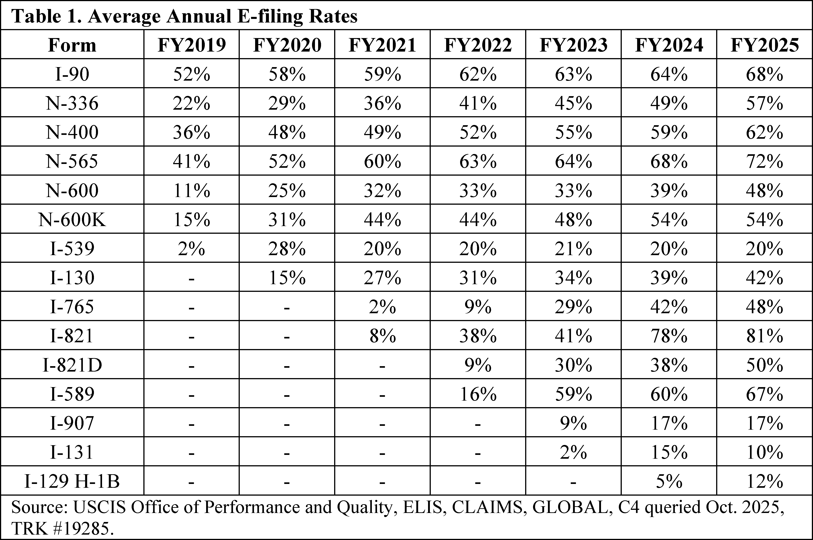
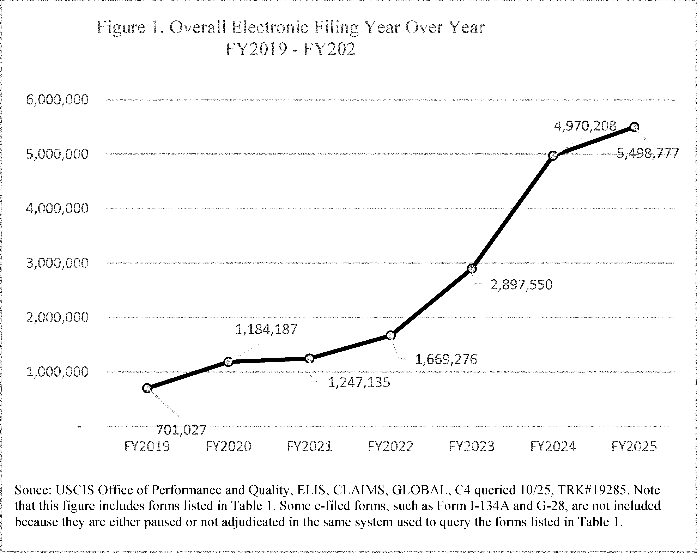
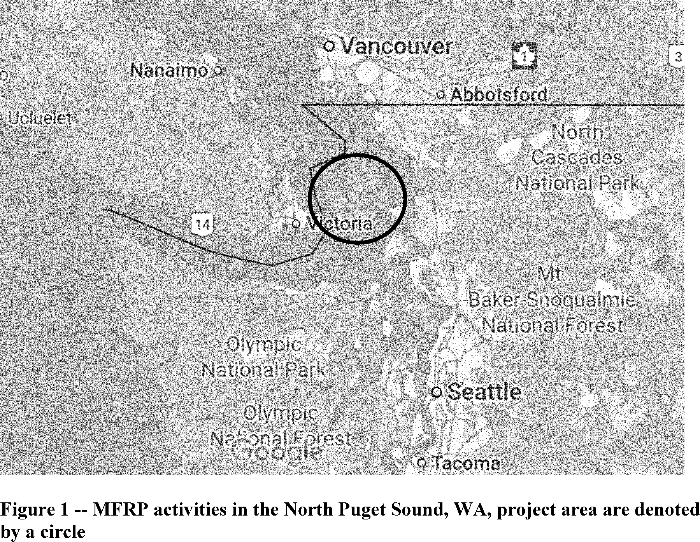
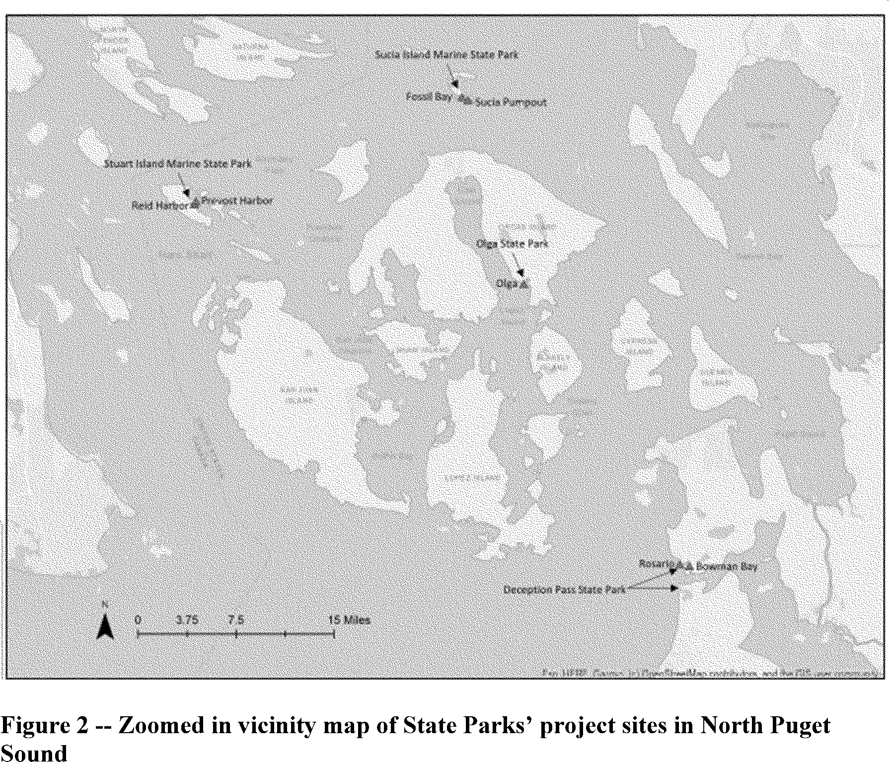
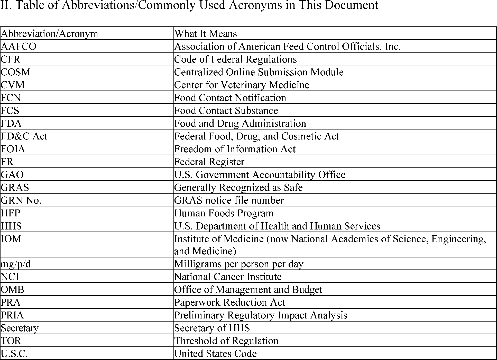
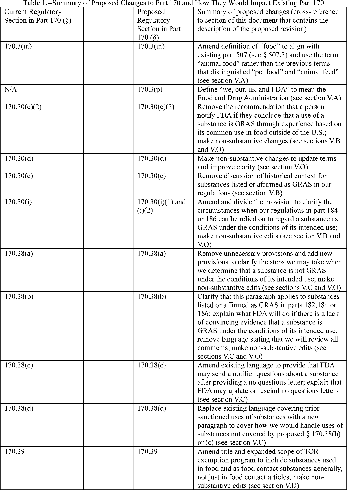
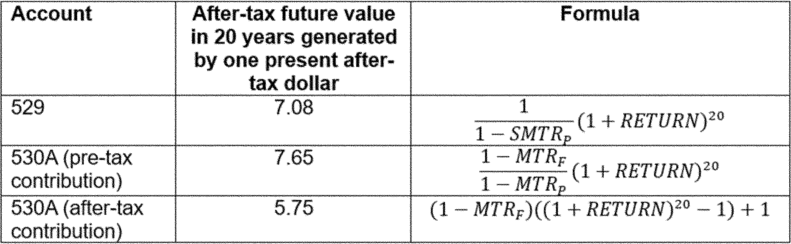
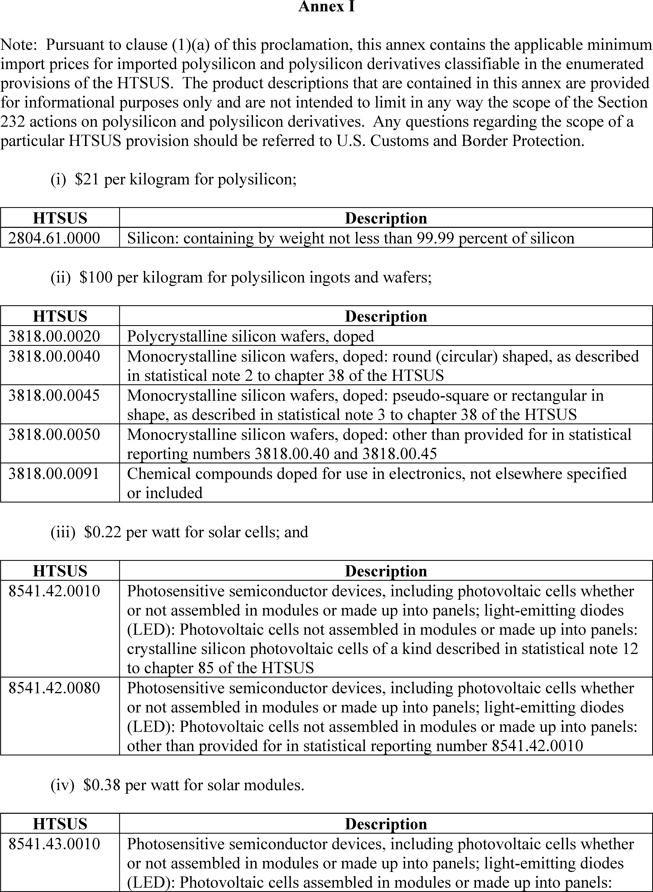
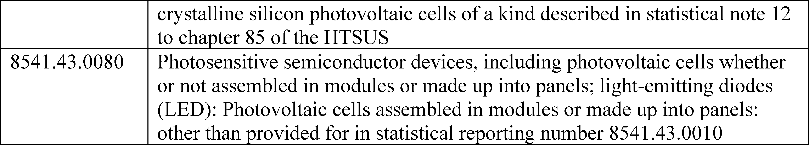

# Daily Digest — 2026-08-11

| | |
|---|---|
| **Digest date** | 2026-08-11 |
| **Data date range** | 2026-08-11 to 2026-08-11 |
| **Generated at** | 2026-08-12T04:08:33Z (UTC) |
| **Pipeline version** | 249efc1 |
| **Source watermarks** | CREC: 2026-08-11T15:20:53Z · BILLS: 2026-08-12T03:32:09Z · FR: 2026-08-11T22:03:01Z · USCOURTS: 2026-08-11T21:27:17Z · PLAW: 2026-07-25T00:00:00Z |

[Full observed listing for this day](day/2026-08-11.html) — every item our collectors observed for this publication day, mechanical rules applied, frozen at end of day. This digest is the canonical record.

All items below cite the govinfo package (and granule, where applicable) they
summarize. Selection is mechanical; each item states the rule that included
it. See the Coverage Statement at the end for a full accounting of what was
published, what was summarized, and what was excluded and why.

---

## Contents

- [Day in Review](#day-in-review)
- [1. Congressional Floor Activity](#1-congressional-floor-activity)
- [2. Legislation](#2-legislation)
- [3. Federal Register](#3-federal-register)
- [4. Enacted Laws](#4-enacted-laws)
- [5. Judicial Activity](#5-judicial-activity)
- [6. Agency Announcements](#6-agency-announcements)
- [7. Recorded Votes](#7-recorded-votes)
- [8. Bill Actions](#8-bill-actions)
- [9. Presidential Actions](#9-presidential-actions)
- [Terms Used Today](#terms-used-today)
- [Coverage Statement](#coverage-statement)
- [Methodology](#methodology)

---

## Day in Review

The House side of the Congressional Record dominates the legislative material: the digest carries 27 House proceedings documents, 4 Senate, 20 Extensions of Remarks, and 6 Daily Digest items. Among them the House recorded receipt and referral of executive communications covering interim and final agency rules on agricultural programs, pesticide tolerances, emergency alert modernization, and firearms regulations, along with fiscal year 2027 budget amendments and defense sale notifications. Bill texts number 103 across stages, including 75 introduced in the Senate, 13 introduced in the House, 6 agreed to in the Senate, and 4 enrolled.

On the executive and regulatory side, the digest carries 15 final rules, 12 proposed rules, 70 notices, and 4 presidential documents, plus 218 agency press releases. The presidential documents include a proclamation designating August 7, 2026, as National Purple Heart Day; an action setting a minimum import price program and a 15 percent ad valorem tariff on polysilicon derivatives effective December 4, 2026; and two executive orders, 14418 on the issuance of citizenship documents and 14419 defining and addressing birth tourism. Rules and proposals span FDA food-substance notices, Treasury guidance on employer contributions to Trump accounts, DEA rescheduling of three insomnia medications, EPA state implementation plan actions in New Hampshire and Arizona, FAA airspace amendments, Coast Guard safety zones, and an SBA change removing a rebuttable presumption of social disadvantage in the 8(a) program.

The digest carries 39 appellate opinions, 239 district court opinions, and 5 bankruptcy opinions. The Ninth Circuit dismissed consolidated appeals by Meta and TikTok, holding that Section 230 supplies a defense to liability rather than immunity from suit and so does not support interlocutory appeal; it also addressed Hawaii and California sensitive-places firearm laws under the Bruen framework, affirming some preliminary injunctions and reversing others. The Eleventh Circuit affirmed denial of habeas relief in an Atkins intellectual-disability claim, and the Federal Circuit affirmed that interactive-chart patents are ineligible under Section 101.

*Composed from the summarized items below and the day's mechanical
counts; all specifics are cited in their sections.*

---

## 1. Congressional Floor Activity

Source: Congressional Record (CREC), issue observed 2026-08-11, covering proceedings of 2026-08-10. Published by govinfo 2026-08-11T09:00:32Z; observed by our collector 2026-08-11T09:15:24Z. Total issue size: 57 granule(s).

### 1.1 Senate

No Senate floor items met the selection thresholds. 4 floor granule(s) are accounted for in the Coverage Statement.

### 1.2 House of Representatives

Tags: legislative · model keys: agriculture · emergency alert · pesticides

*In plain terms: The House received and referred executive communications on agricultural programs, pesticide tolerances, emergency alert modernization, and firearms regulations.*

- **Executive Communications, ETC.** — The House received and referred multiple executive communications from federal agencies, including interim and final rules on agricultural programs, pesticide tolerances, emergency alert modernization, and firearms regulations, along with budget amendments for fiscal year 2027 and defense sale notifications to appropriate congressional committees for consideration.
  - *In plain terms:* The House referred to committees federal agency rules (taking effect immediately or permanently) on agriculture, pesticides, emergency alert modernization, and firearms, plus fiscal year 2027 budget amendments and defense sale notifications.
  - Included because: CREC-SEL-01 — floor item ≥ threshold floor time (61,645 characters) (document dated 2026-08-10)
  - Source: [CREC-2026-08-10 / CREC-2026-08-10-pt1-PgH5224-2](https://www.govinfo.gov/app/details/CREC-2026-08-10/CREC-2026-08-10-pt1-PgH5224-2)

### 1.3 Recorded Votes

No recorded votes were published in this issue of the Congressional Record.

---

## 2. Legislation

Source: Congressional Bills (BILLS), text versions published 2026-08-11 to 2026-08-11.

### 2.1 Counts by Stage

| Stage (bill text version) | Count |
|---|---|
| Introduced (ih/is) | 88 |
| Reported (rh/rs) | 2 |
| Engrossed (eh/es) | 0 |
| Enrolled (enr) | 4 |
| Other versions | 9 |
| **Total bill texts published** | **103** |

### 2.2 Bills Listed by Mechanical Rule

Bills below are listed because they matched at least one listing rule; the
matching rule is stated per item. All other bill texts are counted above and
accounted for in the Coverage Statement.

No bill texts published in this range matched a listing rule; all 103 are
accounted for in the Coverage Statement.

---

## 3. Federal Register

Source: Federal Register (FR), issue of 2026-08-11.

### 3.1 Counts by Document Type

| Document type | Count |
|---|---|
| Rules | 15 |
| Proposed rules | 12 |
| Notices | 70 |
| Presidential documents | 4 |
| **Total FR documents** | **101** |

### 3.2 Rules Published

Tags: department of commerce · executive · securities and exchange commission · model keys: air quality · airspace amendments · fisheries

*In plain terms: 15 final and interim rules including airspace amendments at three locations, pollock reallocation, mandatory USCIS e-filing, FinCEN reporting requirements, and reforms spanning energy, air quality, and marine fisheries.*

#### DEPARTMENT OF COMMERCE

- **Fisheries of the Exclusive Economic Zone Off Alaska; Reallocation of Pollock in the Bering Sea and Aleutian Islands** (2026-16336; 50 CFR Part 679) — NMFS is reallocating the projected unused amounts of the Aleut Corporation pollock directed fishing allowance (DFA) from the Aleutian Islands subarea (AI) to the Bering Sea subarea (BS). This action is necessary to provide the opportunity for the harvest of the 2026 total allowable catch (TAC) of pollock, consistent with the goals and objectives of the Fishery Management Plan for Groundfish of the Bering Sea and Aleutian Islands Management Area (BSAI). Action: Temporary rule; reallocation. Dates: Effective 1200 hours, Alaska local time (A.l.t.), August 11, 2026, through 2400 hours, A.l.t., December 31, 2026.
  - *In plain terms:* The National Marine Fisheries Service is shifting unused pollock fishing rights from the Aleutian Islands to the Bering Sea area.
  - Included because: FR-SEL-01 — document type: final rule (all listed)
  - Source: [FR-2026-08-11 / 2026-16336](https://www.govinfo.gov/app/details/FR-2026-08-11/2026-16336)

#### DEPARTMENT OF DEFENSE

- **Danger Zone: Pacific Ocean at Marine Corps Base Hawaii, Kaneohe Bay, Island of Oahu, Hawaii** (2026-16359; 33 CFR Part 334) — The United States Army Corps of Engineers (Corps) is amending its regulations for an existing danger zone at the U.S. Marine Corps Ulupau Crater Weapons Training Range in the vicinity of Kaneohe Bay, Hawaii. The Marine Corps requested a change to the current hours that weapons firing may be conducted. This amendment is necessary in order to ensure public safety. Action: Final rule. Dates: Effective September 10, 2026.
  - *In plain terms:* The Army Corps of Engineers is updating when the Marine Corps can conduct weapons training in Hawaii to ensure public safety.
  - Included because: FR-SEL-01 — document type: final rule (all listed)
  - Source: [FR-2026-08-11 / 2026-16359](https://www.govinfo.gov/app/details/FR-2026-08-11/2026-16359)

#### DEPARTMENT OF HOMELAND SECURITY

- **Mandatory Electronic Filing (e-Filing)** (2026-16313; 8 CFR Parts 1, 103, and 106) — This interim final rule (IFR) amends U.S. Department of Homeland Security (DHS) regulations to provide: USCIS may require mandatory electronic filing (e-filing) of certain benefit requests; the process USCIS will follow to require a benefit request to be e-filed; and how a waiver of the e-filing requirement for those individuals unable to file electronically may be requested. This rule is intended to increase digital intake and processing to move USCIS and requestors from a mostly paper process to an electronic process and further enhance the integrity of the immigration system and the security of the United States. Action: Interim final rule (IFR) with request for comments. Dates: This IFR is effective August 11, 2026. Comments must be received on or before October 13, 2026. The electronic Federal Docket Management System will accept comments prior to midnight eastern time at the end of that day. Comments on the Paperwork Reduction Act section of this interim final rule must be submitted by October 13, 2026.
  - *In plain terms:* USCIS can now require electronic filing instead of paper for some immigration benefit requests, with a process for requesting waivers if you cannot file electronically.
  - Included because: FR-SEL-01 — document type: final rule (all listed)
  - Source: [FR-2026-08-11 / 2026-16313](https://www.govinfo.gov/app/details/FR-2026-08-11/2026-16313)
  -  *Source graphic 1 of 25 from 2026-16313.*
  -  *Source graphic 2 of 25 from 2026-16313.*
  - *Graphics not rendered here: 23 of 25 — see the [source PDF](https://www.govinfo.gov/content/pkg/FR-2026-08-11/pdf/FR-2026-08-11.pdf).*
- **Regulatory Changes Required by the Energy Security and Lightering Independence Act of 2022** (2026-16319; 8 CFR Parts 214 and 252) — The Energy Security and Lightering Independence Act of 2022 amended the nonimmigrant classifications for aliens in transit (C) and for aliens serving as crewmen (D) to include individuals who perform ship-to-ship liquid cargo transfer operations to or from another vessel engaged in foreign trade (lightering). The statute authorizes qualifying aliens to seek admission to the United States or request temporary landing permits for a period not to exceed 180 days. This rule amends Department of Homeland Security (DHS) regulations to conform to these statutory changes and make related technical amendments. Action: Final rule. Dates: This rule is effective August 11, 2026.
  - *In plain terms:* The Department of Homeland Security is updating rules to allow foreign workers doing ship-to-ship cargo transfers to enter the U.S. or get temporary landing permits for up to 180 days.
  - Included because: FR-SEL-01 — document type: final rule (all listed)
  - Source: [FR-2026-08-11 / 2026-16319](https://www.govinfo.gov/app/details/FR-2026-08-11/2026-16319)
- **Cancellation of Obsolete Navigation and Vessel Inspection Circular** (2026-16337; 33 CFR Parts 151, 152, and 159; 46 CFR Part 162) — The Coast Guard announces the cancellation of an obsolete Navigation and Vessel Inspection Circular (NVIC). NVICs are guidance documents issued by the Coast Guard. While they do not have the force of law, NVICs help ensure Coast Guard inspections and other regulatory actions conducted by field personnel are complete and consistent. Similarly, the marine industry and the general public rely on NVICs to assess how the Coast Guard will enforce certain regulations or conduct various marine safety programs. Thus, to avoid confusion, it is important that the public be notified when NVICs are cancelled. Action: Cancellation of guidance document. Dates: NVIC 01-04 was cancelled on December 2, 2025.
  - *In plain terms:* The Coast Guard is cancelling an outdated guidance document that helped inspectors and the marine industry understand certain safety regulations.
  - Included because: FR-SEL-01 — document type: final rule (all listed)
  - Source: [FR-2026-08-11 / 2026-16337](https://www.govinfo.gov/app/details/FR-2026-08-11/2026-16337)
- **Safety Zone; Lake Michigan, Chicago, IL** (2026-16341; 33 CFR Part 165) — The Coast Guard is establishing a temporary safety zone for navigable waters within a small area of Monroe Harbor in Lake Michigan in Chicago, IL. This action is necessary to protect personnel, vessels, and the marine environment from potential hazards created by the Chicago Triathlon swim event. Entry of vessels or persons into this zone is prohibited unless specifically authorized by the Captain of the Port, Sector Lake Michigan or their designated representative. Action: Temporary final rule. Dates: This rule is effective from 6 a.m. through 10:30 a.m. on August 23, 2026.
  - *In plain terms:* The Coast Guard is temporarily closing a small area of Lake Michigan in Chicago to protect swimmers and vessels during the Chicago Triathlon.
  - Included because: FR-SEL-01 — document type: final rule (all listed)
  - Source: [FR-2026-08-11 / 2026-16341](https://www.govinfo.gov/app/details/FR-2026-08-11/2026-16341)
- **Special Local Regulation; Great Lakes Annual Marine Events—Cuyahoga River, Cleveland, OH** (2026-16354; 33 CFR Part 100) — The Coast Guard is establishing a recurring Special Local Regulation (SLR) for certain navigable waters of the Cuyahoga River. The SLR is necessary to provide for the safety of life on these waters during the Cleveland Dragon Boat Festival, which occurs annually on or around the 4th weekend in August. This rulemaking prohibits persons and vessels from entering the regulated area during enforcement periods unless specifically authorized by the Captain of the Port, Sector Eastern Great Lakes or their designated representative. Action: Final rule. Dates: This rule is effective August 11, 2026.
  - *In plain terms:* The Coast Guard is setting up a yearly rule restricting boat traffic on the Cuyahoga River during Cleveland's Dragon Boat Festival in mid-August.
  - Included because: FR-SEL-01 — document type: final rule (all listed)
  - Source: [FR-2026-08-11 / 2026-16354](https://www.govinfo.gov/app/details/FR-2026-08-11/2026-16354)

#### DEPARTMENT OF JUSTICE

- **Adjudication of Civil Penalties Against International Marriage Brokers** (2026-16290; 28 CFR Part 68) — This interim final rule (“IFR”) amends Department of Justice (“Department”) regulations to specify the procedures for adjudicating alleged violations of the International Marriage Broker Regulation Act of 2005 (“IMBRA”) by international marriage brokers (“IMBs”) doing business in the United States that fail to provide required information to persons recruited for matchmaking services or that improperly disclose prohibited information. This IFR is necessary to deter fraudulent marriages and the exploitation of immigrants recruited by IMBs. Action: Interim final rule; request for comments. Dates: Effective date: This interim final rule is effective September 10, 2026. Comments due date: Electronic comments must be submitted on or before September 10, 2026. The electronic Federal Docket Management System will accept electronic comments until 11:59 p.m. Eastern Time on that date.
  - *In plain terms:* The Department of Justice is setting up a process that takes effect now while public comments are still accepted for penalizing marriage brokers that fail to give required information or wrongly share protected information.
  - Included because: FR-SEL-01 — document type: final rule (all listed)
  - Source: [FR-2026-08-11 / 2026-16290](https://www.govinfo.gov/app/details/FR-2026-08-11/2026-16290)

#### DEPARTMENT OF THE INTERIOR

- **North Dakota Regulatory Program** (2026-16318; 30 CFR Part 934) — We, the Office of Surface Mining (OSM), are approving an amendment to the North Dakota regulatory program under the Surface Mining Control and Reclamation Act of 1977 (SMCRA or the Act). North Dakota has made changes to the North Dakota Century Code and North Dakota Administrative Code resulting from actions initiated during both the 2017 and 2021 Legislative Sessions. Changes include altering the time required for scheduling and applying for select permit related actions, creation of the North Dakota Department of Environmental Quality and a transfer of select responsibilities from the Department of Health, establishment of the Department of Water Resources, and the powers and duties of that agency and the state engineer. Action: Final rule; approval of amendment. Dates: The effective date is September 10, 2026.
  - *In plain terms:* The federal government is approving North Dakota's updated coal mining rules that reflect recent state law changes, including new agencies and reassigned responsibilities.
  - Included because: FR-SEL-01 — document type: final rule (all listed)
  - Source: [FR-2026-08-11 / 2026-16318](https://www.govinfo.gov/app/details/FR-2026-08-11/2026-16318)

#### DEPARTMENT OF THE TREASURY

- **Geographic Targeting Order Imposing Recordkeeping and Reporting Requirements on Certain Financial Institutions in Minnesota** (2026-16365; 31 CFR Part 1010) — FinCEN is issuing this Geographic Targeting Order, requiring banks and money transmitters located in the Counties of Hennepin and Ramsey, Minnesota to retain and report records of certain payments of $3,000 or more. Action: Order. Dates: Effective date: This action is effective on August 11, 2026.
  - *In plain terms:* The federal government is requiring banks and money transmitters in two Minnesota counties to report transfers of $3,000 or more.
  - Included because: FR-SEL-01 — document type: final rule (all listed)
  - Source: [FR-2026-08-11 / 2026-16365](https://www.govinfo.gov/app/details/FR-2026-08-11/2026-16365)

#### DEPARTMENT OF TRANSPORTATION

- **Amendment of Class D and Class E Airspace and Revocation of Class E Airspace; Muncie and Alexandria, IN** (2026-16289; 14 CFR Part 71) — This action amends the Class D and Class E airspace at Muncie, IN, and revokes Class E airspace at Muncie, IN, and Alexandria, IN. This action is due to airspace reviews conducted due to the decommissioning of the Muncie very high frequency omnidirectional range (VOR) as part of the VOR Minimum Operational Network (MON) Program, and the cancellation of the instrument procedures at Alexandria Airport, Alexandria, IN. The geographic coordinates and name of Delaware County Regional Airport, Muncie, IN, are also being updated to coincide with the FAA's aeronautical database. This action brings the airspace into compliance with FAA orders and supports instrument flight rule (IFR) procedures and operations. Action: Final rule. Dates: Effective 0901 UTC, October 29, 2026. The Director of the Federal Register approves this incorporation by reference action under 1 CFR part 51, subject to the annual revision of FAA Order JO 7400.11 and publication of conforming amendments.
  - *In plain terms:* The FAA is adjusting airplane traffic control zones near Muncie and Alexandria, Indiana following the shutdown of a navigation aid, and updating airport information.
  - Included because: FR-SEL-01 — document type: final rule (all listed)
  - Source: [FR-2026-08-11 / 2026-16289](https://www.govinfo.gov/app/details/FR-2026-08-11/2026-16289)
- **Amendment of Class E Airspace; Bedford, IN** (2026-16292; 14 CFR Part 71) — This action amends the Class E airspace at Bedford, IN. This action is due to an airspace review conducted due to the decommissioning of the Hoosier very high frequency omnidirectional range (VOR) as part of the VOR Minimum Operational Network (MON) Program. The name of IU Health Bedford Hospital Heliport, Beford, IN, is also being updated to coincide with the FAA's aeronautical database. This action brings the airspace into compliance with FAA orders and supports instrument flight rule (IFR) procedures and operations. Action: Final rule. Dates: Effective 0901 UTC, October 29, 2026. The Director of the Federal Register approves this incorporation by reference action under 1 CFR part 51, subject to the annual revision of FAA Order JO 7400.11 and publication of conforming amendments.
  - *In plain terms:* The FAA is adjusting airplane traffic control zones near Bedford, Indiana following the shutdown of a navigation aid, and updating heliport information.
  - Included because: FR-SEL-01 — document type: final rule (all listed)
  - Source: [FR-2026-08-11 / 2026-16292](https://www.govinfo.gov/app/details/FR-2026-08-11/2026-16292)

#### ENVIRONMENTAL PROTECTION AGENCY

- **Determination To Defer Sanctions; Arizona; Maricopa County Air Quality Department; Gasoline Loading** (2026-16334; 40 CFR Part 52) — The U.S. Environmental Protection Agency (EPA) is making an interim final determination that the Arizona Department of Environmental Quality (ADEQ) has submitted rules on behalf of the Maricopa County Air Quality Department (MCAQD or “County”) that addresses deficiencies in its Clean Air Act (CAA or “Act”) State Implementation Plan (SIP) concerning emissions of volatile organic compounds (VOC) from loading of organic liquids and gasoline. This determination is based on a proposed approval of MCAQD Rule 352 and conditional approval of MCAQD Rule 353, published elsewhere in this issue of the Federal Register , that regulate this category of sources. The effect of this interim final determination is that the application of offset and highway sanctions that was triggered by a previous limited disapproval by the EPA in 2025 is now deferred. If the EPA finalizes its approval and conditional approval of MCAQD's submission, relief from these sanctions will become permanent. Action: Interim final determination. Dates: This interim final determination is effective August 11, 2026. However, comments will be accepted on or before September 10, 2026.
  - *In plain terms:* The EPA is temporarily stopping penalties against Arizona's Maricopa County for air quality violations based on new gasoline-loading rules, with permanent relief if finalized.
  - Included because: FR-SEL-01 — document type: final rule (all listed)
  - Source: [FR-2026-08-11 / 2026-16334](https://www.govinfo.gov/app/details/FR-2026-08-11/2026-16334)

#### NUCLEAR REGULATORY COMMISSION

- **NRC Modernization: Rulemaking Procedure, Federal Advisory Committee Act Alignment, Access, and Security** (2026-16374; 10 CFR Parts 2, 7, and 10) — The U.S. Nuclear Regulatory Commission (NRC) is amending its regulations by streamlining procedural provisions related to information withholding and post-promulgation comment periods; aligning the NRC's regulations with Committee Management Secretariat (CMS) Federal Advisory Committee Act (FACA) standards; and updating national security eligibility criteria. The goal is to modernize and clarify the NRC's regulatory framework to ensure consistency with government-wide standards and improve administrative efficiency. The scope includes updates to outdated provisions and revisions to ensure compliance with current federal policies. This action is being taken in response to Executive Order 14300, “Ordering the Reform of the Nuclear Regulatory Commission.” Action: Direct final rule. Dates: The final rule is effective October 26, 2026, unless significant adverse comments are received. Comments must be submitted electronically using https://www.regulations.gov by 11:59 p.m. Eastern Time on September 10, 2026. If the direct final rule is withdrawn as a result of such comments, timely notice of the withdrawal will be published in the Federal Register . Comments received on this direct final rule will also be considered to be comments on a companion proposed rule published in the Proposed Rules section of this issue of the Federal Register .
  - *In plain terms:* The Nuclear Regulatory Commission is updating its rules to streamline procedures for information withholding and public comment periods, align with federal advisory committee standards, and update national security eligibility requirements.
  - Included because: FR-SEL-01 — document type: final rule (all listed)
  - Source: [FR-2026-08-11 / 2026-16374](https://www.govinfo.gov/app/details/FR-2026-08-11/2026-16374)

#### SMALL BUSINESS ADMINISTRATION

- **Reforms to 13 CFR 124.103 To Remove SBA's 8(a) Program's Rebuttable Presumption of Social Disadvantage for Individually Owned Firms Only. Reforms Do Not Impact Entity-Owned Firms** (2026-16370; 13 CFR Part 124) — The U.S. Small Business Administration (“SBA” or “Agency”) amends its regulations to align the Section 8(a) Business Development Program (8(a) BD program) with constitutional requirements and the law. The rule applies only to the 8(a) BD eligibility of small businesses owned and controlled by individuals. It does not in any way amend or affect the eligibility of entity-owned small businesses ( i.e., those owned by tribes, Alaska Native Corporations, Native Hawaiian Organizations, or Community Development Corporations). Specifically, the rule amends SBA's regulations to remove the rebuttable presumption that individuals belonging to certain designated groups are socially disadvantaged and sets forth revised standards for individuals establishing social disadvantage. Action: Final rule. Dates: This rule is effective on September 10, 2026. It applies to all pending applications of individually-owned applicants as of that date.
  - *In plain terms:* The Small Business Administration is changing rules for its 8(a) development program to no longer assume individual business owners face social disadvantage.
  - Included because: FR-SEL-01 — document type: final rule (all listed)
  - Source: [FR-2026-08-11 / 2026-16370](https://www.govinfo.gov/app/details/FR-2026-08-11/2026-16370)

### 3.3 Proposed Rules Published

Tags: department of commerce · executive · securities and exchange commission · model keys: air quality · airspace amendments · medication

*In plain terms: 12 proposed rules including FDA GRAS notice requirements, guidance on Trump accounts, New Hampshire air quality and ozone initiatives, three airspace amendments, and DEA rescheduling of three sleep-aid medications.*

#### DEPARTMENT OF COMMERCE

- **Takes of Marine Mammals Incidental to Specified Activities; Taking Marine Mammals Incidental to the Washington State Parks and Recreation Commission's Marine Facilities Replacement Program in North Puget Sound, Washington** (2026-16329; 50 CFR Part 217) — Pursuant to the Marine Mammal Protection Act (MMPA), NMFS has received a request from the Washington State Parks and Recreation Commission (State Parks) for authorization to take marine mammals incidental to the Marine Facilities Replacement Program (MFRP) in North Puget Sound in Western Washington (WA) over the course of 5 years from the date of effectiveness. NMFS is proposing incidental take regulations setting forth permissible methods of taking, other means of effecting the least practicable adverse impact on such marine mammal stocks ( i.e., mitigation measures), and requirements pertaining to monitoring and reporting such takes, and requests comments on the proposed regulations. NMFS will consider public comments before making any final decision on promulgating the requested MMPA regulations. Action: Proposed rule; request for comments. Dates: Comments and information must be received no later than September 10, 2026.
  - *In plain terms:* The National Marine Fisheries Service is proposing rules for allowing marine mammal deaths and injuries during a five-year Washington State marine construction project.
  - Included because: FR-SEL-02 — document type: proposed rule (all listed)
  - Source: [FR-2026-08-11 / 2026-16329](https://www.govinfo.gov/app/details/FR-2026-08-11/2026-16329)
  -  *Source graphic 1 of 18 from 2026-16329.*
  -  *Source graphic 2 of 18 from 2026-16329.*
  - *Graphics not rendered here: 16 of 18 — see the [source PDF](https://www.govinfo.gov/content/pkg/FR-2026-08-11/pdf/FR-2026-08-11.pdf).*

#### DEPARTMENT OF DEFENSE

- **Restricted Area: Naval Weapons Station Seal Beach** (2026-16357; 33 CFR Part 334) — The U.S. Army Corps of Engineers (Corps) is proposing to revise the existing regulations for a restricted area within Naval Weapons Station Seal Beach (NWSSB). The Department of the Navy requested amendment of a restricted area located within NWSSB, in the City of Seal Beach, Orange County, California (33.7334 Latitude/−118.0953 Longitude). NWSSB is the primary West Coast installation for the supply of munitions to U.S. Navy vessels. Following an extensive project to reconfigure Anaheim Bay, including the creation of a new ammunition pier and the relocation of a public boating channel, the Department of the Navy requested the Corps modify the existing restricted area regulations to protect the public from navigational and operational hazards, and to protect government assets, missions, and the base population in general. Action: Notice of proposed rulemaking and request for comments. Dates: Written comments must be submitted on or before September 10, 2026.
  - *In plain terms:* The Army Corps of Engineers is proposing updated restrictions for a Navy weapons storage area in California following construction of new facilities.
  - Included because: FR-SEL-02 — document type: proposed rule (all listed)
  - Source: [FR-2026-08-11 / 2026-16357](https://www.govinfo.gov/app/details/FR-2026-08-11/2026-16357)

#### DEPARTMENT OF HEALTH AND HUMAN SERVICES

- **Substances Generally Recognized as Safe** (2026-16296; 21 CFR Parts 170 and 570) — The Food and Drug Administration (FDA or we) is proposing to require the submission of generally recognized as safe (GRAS) notices for the use of a human or animal food substance purported to be GRAS under the conditions of its intended use under the Federal Food, Drug, and Cosmetic Act (FD&C Act). Action: Proposed rule. Dates: Either electronic or written comments on the proposed rule must be submitted by December 9, 2026. Submit comments (including recommendations) on the collection of information under the Paperwork Reduction Act of 1995 by December 9, 2026.
  - *In plain terms:* The FDA is proposing to require food makers to submit notices when they claim a substance is generally recognized as safe.
  - Included because: FR-SEL-02 — document type: proposed rule (all listed)
  - Source: [FR-2026-08-11 / 2026-16296](https://www.govinfo.gov/app/details/FR-2026-08-11/2026-16296)
  -  *Source graphic 1 of 12 from 2026-16296.*
  -  *Source graphic 2 of 12 from 2026-16296.*
  - *Graphics not rendered here: 10 of 12 — see the [source PDF](https://www.govinfo.gov/content/pkg/FR-2026-08-11/pdf/FR-2026-08-11.pdf).*

#### DEPARTMENT OF JUSTICE

- **Schedules of Controlled Substances: Rescheduling of Suvorexant, Lemborexant, and Daridorexant From Schedule IV Into Schedule V** (2026-16375; 21 CFR Part 1308) — The Drug Enforcement Administration proposes to transfer suvorexant ([(7 R )-4-(5-chloro-1,3-benzoxazol-2-yl)-7-methyl-1,4-diazepan-1-yl]-[5-methyl-2-(triazol-2-yl)phenyl]methanone), lemborexant ((1 R, 2 S )-2-[(2,4-dimethylpyrimidin-5-yl)oxymethyl]-2-(3-fluorophenyl)- N -(5-fluoropyridin-2-yl)cyclopropane-1-carboxamide), and daridorexant ([(2 S )-2-(5-chloro-4-methyl-1 H -benzimidazol-2-yl)-2-methylpyrrolidin-1-yl]-[5-methoxy-2-(triazol-2-yl)phenyl]methanone) from schedule IV to schedule V of the Controlled Substances Act. If finalized, this action would impose the regulatory controls and administrative, civil, and criminal sanctions applicable to schedule V controlled substances on persons who handle (manufacture, distribute, reverse distribute, import, export, engage in research, conduct instructional activities or chemical analysis with, or possess) or propose to handle suvorexant, lemborexant, and daridorexant. Action: Notice of proposed rulemaking. Dates: Comments must be submitted electronically or postmarked on or before September 10, 2026. The electronic Federal Docket Management System will not accept comments after 11:59 p.m. Eastern Time on the last day of the comment period. Interested persons may file a request for a hearing or waiver of hearing pursuant to 21 CFR 1308.44 and in accordance with 21 CFR 1316.47 and/or 1316.49, as applicable. Requests for a hearing and waivers of an opportunity for a hearing or to participate in a hearing, together with a written statement of position on the matters of fact and law asserted in the hearing, must be received or postmarked on or before September 10, 2026.
  - *In plain terms:* The Drug Enforcement Administration proposes moving three controlled substances from Schedule IV to Schedule V, which would impose stricter regulatory controls and penalties on their handling.
  - Included because: FR-SEL-02 — document type: proposed rule (all listed)
  - Source: [FR-2026-08-11 / 2026-16375](https://www.govinfo.gov/app/details/FR-2026-08-11/2026-16375)

#### DEPARTMENT OF THE TREASURY

- **Employer Contributions to Trump Accounts and Nondiscrimination Rules for Dependent Care Assistance Programs** (2026-16314; 26 CFR Part 1) — This document contains proposed regulations that would provide guidance with respect to employer contributions to Trump accounts, including applicable nondiscrimination rules, and the nondiscrimination rules for dependent care assistance programs. This document also provides a notice of a public hearing on the proposed regulations. The proposed regulations would affect employers maintaining a Trump account contribution program or a dependent care assistance program and employees participating in those programs. Action: Notice of proposed rulemaking and notice of public hearing. Dates: Comments: Electronic or written comments must be received by September 25, 2026 Public Hearing: The public hearing is scheduled to be held on October 15, 2026 at 10 a.m. ET. Requests to speak and outlines of topics to be discussed at the public hearing must be received by September 25, 2026. If no requests to speak or outlines are received by September 25, 2026, the public hearing will be cancelled. Requests to attend the public hearing must be received by 5 p.m. ET on October 13, 2026.
  - *In plain terms:* The Treasury Department is proposing rules for how employers can contribute to Trump accounts and new nondiscrimination rules for dependent care assistance programs.
  - Included because: FR-SEL-02 — document type: proposed rule (all listed)
  - Source: [FR-2026-08-11 / 2026-16314](https://www.govinfo.gov/app/details/FR-2026-08-11/2026-16314)
  -  *Source graphic 1 of 1 from 2026-16314.*

#### DEPARTMENT OF TRANSPORTATION

- **Amendment of Class D Airspace and Class E Airspace Over Tri-Cities, TN** (2026-16333; 14 CFR Part 71) — This action proposes to amend Class D and Class E airspace over Tri-Cities, TN. This action would modify the dimensions of the Tri-Cities, TN Class D and Class E2 airspace to appropriately contain Instrument Flight Rules (IFR) operations at the Tri-Cities Airport. This action would also remove the Tri-Cities, TN Class E4 airspace, as it is no longer necessary. This action would also modify the Tri-Cities, TN Class E5 airspace to appropriately contain IFR operations at the airport. This action would also update verbiage in the Class D and Class E2 airspace legal descriptions to comply with current FAA guidance. This action would also update the airport name for Tri-Cities Airport in the Class D, Class E2, and Class E5 airspace legal descriptions. Action: Notice of proposed rulemaking (NPRM). Dates: Comments must be received on or before September 25, 2026.
  - *In plain terms:* The FAA is proposing to adjust airplane traffic control zones for Tri-Cities Airport in Tennessee, remove an unused zone, and update legal descriptions.
  - Included because: FR-SEL-02 — document type: proposed rule (all listed)
  - Source: [FR-2026-08-11 / 2026-16333](https://www.govinfo.gov/app/details/FR-2026-08-11/2026-16333)
- **Establishment of Class E Airspace; Canton, IL** (2026-16350; 14 CFR Part 71) — This action proposes to establish Class E airspace at Graham Hospital Heliport, Canton, IL. The FAA is proposing this action to support new instrument procedures and instrument flight rule (IFR) operations. Action: Notice of proposed rulemaking (NPRM). Dates: Comments must be received on or before September 25, 2026.
  - *In plain terms:* The FAA is proposing to create a controlled airplane traffic zone at a hospital heliport in Canton, Illinois for instrument flight operations.
  - Included because: FR-SEL-02 — document type: proposed rule (all listed)
  - Source: [FR-2026-08-11 / 2026-16350](https://www.govinfo.gov/app/details/FR-2026-08-11/2026-16350)

#### ENVIRONMENTAL PROTECTION AGENCY

- **Air Plan Approval; New Hampshire; Repeal of Motor Vehicle Inspection and Maintenance Program** (2026-16330; 40 CFR Part 52) — The U.S. Environmental Protection Agency (EPA) is proposing to conditionally approve a State Implementation Plan (SIP) revision submitted by the State of New Hampshire on December 24, 2025, through the New Hampshire Department of Environmental Services (NHDES). The proposed revision would remove the Statewide motor vehicle inspection and maintenance (I/M) program as an active measure, which was previously approved into the SIP to address emissions from on-road sources. In accordance with plan revision requirements of the Clean Air Act (CAA), the SIP submittal contains a demonstration that the removal of the I/M program will not interfere with New Hampshire's compliance with any National Ambient Air Quality Standard (NAAQS) or with any applicable requirement of the CAA. In a letter to the EPA, NHDES committed to submitting an additional SIP revision within one year of a final conditional approval to address maintenance plan requirements. Action: Proposed rule. Dates: Written comments must be received on or before September 25, 2026.
  - *In plain terms:* The EPA is proposing to approve New Hampshire's removal of its motor vehicle inspection program from its air quality plan, with a commitment to submit additional updates within one year.
  - Included because: FR-SEL-02 — document type: proposed rule (all listed)
  - Source: [FR-2026-08-11 / 2026-16330](https://www.govinfo.gov/app/details/FR-2026-08-11/2026-16330)
- **Response to Clean Air Act Section 176A Petition From New Hampshire** (2026-16331; 40 CFR Part 81) — The Environmental Protection Agency (EPA) is proposing to grant a Clean Air Act (CAA or Act) petition submitted by the state of New Hampshire on December 24, 2025. The petition requests that the EPA remove the State of New Hampshire from the Ozone Transport Region (OTR) based on New Hampshire's continued attainment of the ozone National Ambient Air Quality Standards (NAAQS) and technical analyses demonstrating that the additional control of emissions from the state will not significantly contribute to ozone attainment in any area in the OTR. The OTR was established by the 1990 Clean Air Act Amendments and included the States of Connecticut, Delaware, Maine, Maryland, Massachusetts, New Hampshire, New Jersey, New York, Pennsylvania, Rhode Island, Vermont, the District of Columbia, and portions of northern Virginia. Action: Notice of proposed action on petition. Dates: Comments must be received on or before September 25, 2026. Public hearing: The EPA will hold a virtual public hearing on August 26, 2026. The EPA may close a session 15 minutes after the last registered speaker has testified if there are no additional speakers. The EPA will announce further details at https://www.epa.gov/nh/new-hampshire-clean-air-act-176a-petition-im-program-sip-revision. The EPA will begin pre-registering speakers for the hearing on August 11, 2026. To register to speak at the virtual hearing, please use the online registration form available at https://www.epa.gov/nh/new-hampshire-clean-air-act-176a-petition-im-program-sip-revision. The last day to pre-register to speak at the hearing will be August 18, 2026. Prior to the hearing, the EPA will post a general agenda that will list pre-registered speakers at: https://www.epa.gov/nh/new-hampshire-clean-air-act-176a-petition-im-program-sip-revision. The EPA will make every effort to follow the schedule as closely as possible on the day of the hearing; however, please plan for the hearing to run either ahead of schedule or behind schedule. Each commenter will have 4 minutes to provide oral testimony. The EPA encourages commenters to submit a copy of their oral testimony as written comments electronically to the rulemaking docket. The EPA may ask clarifying questions during the oral presentations but will not respond to the presentations at that time. Written statements and supporting information submitted during the comment period will be considered with the same weight as oral testimony and supporting information presented at the public hearing. Please note that any updates made to any aspect of the hearing will be posted online at https://www.epa.gov/nh/new-hampshire-clean-air-act-176a-petition-im-program-sip-revision. While the EPA expects the hearing to go forward as set forth above, please monitor our website or contact the contact listed in the FOR FURTHER INFORMATION CONTACT section to determine if there are any updates. The EPA does not intend to publish a document in the Federal Register announcing updates. If you require the services of a translator or special accommodation such as audio description, please pre-register for the hearing with the public hearing team and describe your needs by August 8, 2026. The EPA may not be able to arrange accommodations without advanced notice.
  - *In plain terms:* The EPA is proposing to remove New Hampshire from the Ozone Transport Region because the state continues to meet air quality standards.
  - Included because: FR-SEL-02 — document type: proposed rule (all listed)
  - Source: [FR-2026-08-11 / 2026-16331](https://www.govinfo.gov/app/details/FR-2026-08-11/2026-16331)
- **Air Quality Plan; Arizona; Maricopa County Air Quality Department; Gasoline Loading** (2026-16335; 40 CFR Part 52) — The U.S. Environmental Protection Agency (EPA) is proposing to approve and conditionally approve revisions to the Maricopa County Air Quality Department (MCAQD or “County”) portion of the Arizona State Implementation Plan (SIP). These revisions concern emissions of volatile organic compounds (VOC) from loading organic liquids and gasoline. We are proposing action on local rules to regulate these emission sources under the Clean Air Act (CAA or “Act”). We are also proposing to approve and conditionally approve the MCAQD's reasonably available control technology (RACT) demonstration for the source categories associated with these rules for the 2008 8-hour ozone national ambient air quality standards (NAAQS) in the Phoenix-Mesa ozone nonattainment area. Action: Proposed rule. Dates: Comments must be received on or before September 10, 2026.
  - *In plain terms:* The EPA is proposing to approve Arizona's Maricopa County air quality rules for controlling emissions from loading gasoline and organic liquids.
  - Included because: FR-SEL-02 — document type: proposed rule (all listed)
  - Source: [FR-2026-08-11 / 2026-16335](https://www.govinfo.gov/app/details/FR-2026-08-11/2026-16335)

#### FEDERAL COMMUNICATIONS COMMISSION

- **Television Broadcasting Services St. George, Utah** (2026-16317; 47 CFR Part 73) — This document proposes to amend the Table of TV Allotments (Table) of the Federal Communications Commission's (Commission) rules in response to a petition for rulemaking filed by KUTV Licensee, LLC (Licensee), the Licensee of full service television station KMYU(TV) (KMYU or Station), St. George, Utah (St. George). The Licensee applied for a construction permit (CP) to construct a facility on UHF channel 21 at St. George, which remains pending, and now requests that the Bureau substitute VHF channel 9 for UHF channel 21 in the Table with technical parameters set forth in KMYU's current license. The Media Bureau previously granted a petition for rulemaking submitted by the Licensee to substitute UHF channel 21 for VHF channel 9 at St. George. The Licensee later filed an application for a CP for its new channel, however, under further consideration and restraints, wishes to abandon its plans to modify its license for KMYU to operate on channel 21, and proposes to continue to operate on VHF channel 9 and specify the technical parameters of its currently licensed VHF channel 9 facility. [official summary truncated; see source] Action: Proposed rule. Dates: Comments must be filed on or before September 10, 2026 and reply comments on or before September 25, 2026.
  - *In plain terms:* The FCC is considering a TV station's request to switch back from a proposed UHF channel to its current VHF channel in St. George, Utah.
  - Included because: FR-SEL-02 — document type: proposed rule (all listed)
  - Source: [FR-2026-08-11 / 2026-16317](https://www.govinfo.gov/app/details/FR-2026-08-11/2026-16317)

#### NUCLEAR REGULATORY COMMISSION

- **NRC Modernization: Rulemaking Procedure, Federal Advisory Committee Act Alignment, Access, and Security** (2026-16373; 10 CFR Parts 2, 7, and 10) — The U.S. Nuclear Regulatory Commission (NRC) is proposing to amend its regulations by streamlining procedural provisions related to information withholding and post-promulgation comment periods; aligning the NRC's regulations with Committee Management Secretariat (CMS) Federal Advisory Committee Act (FACA) standards; and updating national security eligibility criteria. The goal is to modernize and clarify the NRC's regulatory framework to ensure consistency with government-wide standards and improve administrative efficiency. The scope includes updates to outdated provisions and revisions to ensure compliance with current federal policies. This action is being undertaken in response to Executive Order 14300, “Ordering the Reform of the Nuclear Regulatory Commission.” Action: Proposed rule. Dates: Comments must be submitted electronically using https://www.regulations.gov by 11:59 p.m. Eastern Time on September 10, 2026.
  - *In plain terms:* The Nuclear Regulatory Commission is proposing to simplify its rules for handling information and comments, align with government standards, and update security requirements.
  - Included because: FR-SEL-02 — document type: proposed rule (all listed)
  - Source: [FR-2026-08-11 / 2026-16373](https://www.govinfo.gov/app/details/FR-2026-08-11/2026-16373)

### 3.4 Notices and Presidential Documents

Tags: department of commerce · executive · securities and exchange commission · model keys: birth tourism · citizenship · polysilicon tariffs

*In plain terms: Four presidential actions: polysilicon tariffs and import pricing, citizenship document restrictions based on parental citizenship, birth tourism prevention, and Purple Heart Day designation.*

Notices are summarized only when they match a listing rule; all are counted
in 3.1 and in the Coverage Statement. Presidential documents in the FR are
always listed.

- **Adjusting Imports of Polysilicon and Its Derivatives Into the United States** (2026-16400) — The President establishes a minimum import price program for polysilicon and polysilicon derivatives (effective December 4, 2026) with specified floor prices and imposes a 15 percent ad valorem tariff on polysilicon derivatives; the policy is based on findings that imports threaten national security given reduced domestic production capacity.
  - *In plain terms:* The President establishes a minimum price program and 15 percent tariff on polysilicon and polysilicon derivatives, effective December 4, 2026, citing national security concerns about reduced domestic production.
  - Included because: FR-SEL-03 — presidential document (all listed)
  - Source: [FR-2026-08-11 / 2026-16400](https://www.govinfo.gov/app/details/FR-2026-08-11/2026-16400)
  -  *Source graphic 1 of 6 from 2026-16400.*
  -  *Source graphic 2 of 6 from 2026-16400.*
  - *Graphics not rendered here: 4 of 6 — see the [source PDF](https://www.govinfo.gov/content/pkg/FR-2026-08-11/pdf/FR-2026-08-11.pdf).*
- **National Purple Heart Day, 2026** (2026-16401) — Proclamation 11053 designates August 7, 2026, as National Purple Heart Day to honor service members wounded or killed in combat. The document notes the Purple Heart as the nation's oldest military decoration, established by General George Washington in 1782, and calls on Americans to observe the day by honoring recipients and veterans. The proclamation describes administration policies regarding military and veterans affairs.
  - *In plain terms:* Proclamation 11053 designates August 7, 2026, as National Purple Heart Day to honor service members wounded or killed in combat.
  - Included because: FR-SEL-03 — presidential document (all listed)
  - Source: [FR-2026-08-11 / 2026-16401](https://www.govinfo.gov/app/details/FR-2026-08-11/2026-16401)
- **Continuing To Protect the Meaning and Value of American Citizenship** (2026-16403) — Executive Order 14418 establishes policy that executive departments shall not issue U.S. citizenship documents to persons where neither parent is a citizen if certain conditions apply, including when a parent is designated as an alien enemy, foreign government employee, engaged in commercial transactions to obtain birthright citizenship, or when the person was born in U.S. territories where citizenship is not conferred by federal statute. The order references the June 2026 Supreme Court decision in Trump v. Barbara regarding birthright citizenship and the Citizenship Clause of the Fourteenth Amendment. The order directs the Secretaries of State and Homeland Security, Attorney General, and Commissioner of Social Security to implement consistent regulations and policies within 30 days.
  - *In plain terms:* Executive Order 14418 directs federal agencies to deny citizenship documents to persons without citizen parents under specified conditions, with implementation required within 30 days.
  - Included because: FR-SEL-03 — presidential document (all listed)
  - Source: [FR-2026-08-11 / 2026-16403](https://www.govinfo.gov/app/details/FR-2026-08-11/2026-16403)
- **Ending Birth Tourism** (2026-16404) — Executive Order 14419 defines 'birth tourism' as entry into the United States via nonimmigrant visa for the purpose of giving birth or facilitating such entry, and establishes policy to prevent such practices. The order delegates authority to the Secretaries of State and Homeland Security to deny, revoke, or permanently bar visas and entry for aliens engaged in birth tourism, with exemptions available on humanitarian grounds or national interest. The order directs relevant executive departments to provide necessary records and information for implementation.
  - *In plain terms:* Executive Order 14419 defines birth tourism as entry via nonimmigrant visa for childbirth and directs federal agencies to deny or revoke visas for persons engaging in this practice, with humanitarian and national interest exemptions.
  - Included because: FR-SEL-03 — presidential document (all listed)
  - Source: [FR-2026-08-11 / 2026-16404](https://www.govinfo.gov/app/details/FR-2026-08-11/2026-16404)

---

## 4. Enacted Laws

Source: Public and Private Laws (PLAW) published 2026-08-11.

No laws were published in this range.

---

## 5. Judicial Activity

Source: United States Courts Opinions (USCOURTS): opinions observed 2026-08-11
by our collector; each opinion states its own issue date beside its
listing ([how our clocks work](faq.html#fapds-three-clocks)).

Completeness disclosure (standing): USCOURTS carries opinions from
approximately 140 participating appellate, district, bankruptcy, and
national federal courts. Unlike the Congressional Record and the Federal
Register, which are the complete official record of their branches,
USCOURTS is participation-based and is NOT the complete federal judicial
record. Courts post opinions with delay — typically over several days —
so a day's digest carries the opinions that became available that day,
whatever date each was issued.

### 5.1 Appellate and National Court Opinions

Tags: judicial · model keys: criminal convictions · employment · immigration

*In plain terms: 39 judicial opinions spanning immigration and asylum appeals, five Section 230 immunity cases against Meta and TikTok, criminal convictions including child exploitation, and civil disputes over employment, disability, and intellectual property.*

Appellate and national court opinions are summarized; district and
bankruptcy opinions are counted in 5.2 and in the Coverage Statement.

#### United States Court of Appeals for the Eleventh Circuit

- **Leonardo Franqui v. Secretary, Florida Department of Corrections** (No. 24-11887; filed 2026-08-10) — The Eleventh Circuit affirmed the denial of habeas relief for a death row inmate claiming intellectual disability, finding that Florida courts reasonably determined based on IQ test scores above 70 and expert evaluations that he did not meet the state's requirements for intellectual disability under Atkins v. Virginia.
  - *In plain terms:* A court upheld the denial of release for a death row inmate claiming intellectual disability, finding his IQ scores and expert evaluations didn't meet Florida's standards.
  - Included because: USCOURTS-SEL-01 — appellate court opinion (all listed) (document dated 2026-08-10)
  - Source: [USCOURTS-ca11-24-11887 / USCOURTS-ca11-24-11887-0](https://www.govinfo.gov/app/details/USCOURTS-ca11-24-11887/USCOURTS-ca11-24-11887-0)
- **Shannon Waller, Jr. v. Board of Regents of the University System of Geor, et al** (No. 24-13307; filed 2026-08-10) — A respiratory therapy student was disciplined with a failing grade following an incident during his clinical rotation involving patient care procedures. He sued the university board for breach of contract and disability discrimination, and the district court dismissed both claims, which were affirmed on appeal.
  - *In plain terms:* A university was not liable for dismissing a respiratory therapy student's lawsuit over a failing grade and disability discrimination from a clinical rotation incident.
  - Included because: USCOURTS-SEL-01 — appellate court opinion (all listed) (document dated 2026-08-10)
  - Source: [USCOURTS-ca11-24-13307 / USCOURTS-ca11-24-13307-0](https://www.govinfo.gov/app/details/USCOURTS-ca11-24-13307/USCOURTS-ca11-24-13307-0)
- **Ronald King, et al v. UA Local 91, et al** (No. 24-13658; filed 2026-08-10) — Five Black union members brought race discrimination claims against their union and a local affiliate under Title VII, alleging disparate impact and disparate treatment in job referrals and leadership selections. The district court granted summary judgment for the unions, finding the plaintiffs had not demonstrated discrimination with respect to their properly pleaded claims.
  - *In plain terms:* Five Black union members failed to prove race discrimination in job referrals and leadership selections against their union.
  - Included because: USCOURTS-SEL-01 — appellate court opinion (all listed) (document dated 2026-08-10)
  - Source: [USCOURTS-ca11-24-13658 / USCOURTS-ca11-24-13658-0](https://www.govinfo.gov/app/details/USCOURTS-ca11-24-13658/USCOURTS-ca11-24-13658-0)
- **Ronald King, et al v. Day & Zimmermann NPS, Inc.** (No. 24-13659; filed 2026-08-10) — Black workers sued a power plant maintenance contractor for racial discrimination in hiring and promotions under Title VII and a federal civil rights statute. The district court dismissed the discrimination claims as an improperly pleaded shotgun complaint, and retaliation claims by two plaintiffs were unsuccessful at summary judgment.
  - *In plain terms:* Black workers' racial discrimination lawsuit against a power plant contractor was dismissed for improper pleading, and retaliation claims were unsuccessful.
  - Included because: USCOURTS-SEL-01 — appellate court opinion (all listed) (document dated 2026-08-10)
  - Source: [USCOURTS-ca11-24-13659 / USCOURTS-ca11-24-13659-0](https://www.govinfo.gov/app/details/USCOURTS-ca11-24-13659/USCOURTS-ca11-24-13659-0)
- **John Owoc v. The Liquidating Trustee** (No. 24-14048; filed 2026-08-10) — A shareholder challenged a bankruptcy court's determination that his corporation's Subchapter S tax election was estate property, preventing him from revoking it during bankruptcy. The appeals court reversed, holding that an S-election belongs to the shareholder, not the corporation, and therefore is not property of the estate.
  - *In plain terms:* A court ruled that a shareholder owns their Subchapter S tax election and can revoke it during bankruptcy, contrary to the bankruptcy court's decision.
  - Included because: USCOURTS-SEL-01 — appellate court opinion (all listed) (document dated 2026-08-10)
  - Source: [USCOURTS-ca11-24-14048 / USCOURTS-ca11-24-14048-0](https://www.govinfo.gov/app/details/USCOURTS-ca11-24-14048/USCOURTS-ca11-24-14048-0)
- **Walter Ebbert v. Ocean City Wright Fire Control District** (No. 25-10435; filed 2026-08-10) — A disabled veteran sued a fire district for violating the Americans with Disabilities Act by firing him. Although the fire chief was unaware of his disabilities when deciding to terminate him, the court found a reasonable jury could conclude the district caused his termination by failing to accommodate his requested accommodations for managing stress and prioritizing tasks.
  - *In plain terms:* A fire district violated the Americans with Disabilities Act by firing a disabled veteran without accommodating his requests for help managing stress and tasks.
  - Included because: USCOURTS-SEL-01 — appellate court opinion (all listed) (document dated 2026-08-10)
  - Source: [USCOURTS-ca11-25-10435 / USCOURTS-ca11-25-10435-0](https://www.govinfo.gov/app/details/USCOURTS-ca11-25-10435/USCOURTS-ca11-25-10435-0)
- **USA v. Jordan Trexler** (No. 25-10845; filed 2026-08-10) — A defendant was convicted of enticing a minor to engage in sexual activity and producing child pornography. He received a life sentence plus thirty years and appealed, challenging the sentence as unreasonable; the appellate court affirmed both the procedural and substantive reasonableness of the sentence.
  - *In plain terms:* A defendant's life sentence plus 30 years for enticing a minor to sexual activity and producing child pornography was upheld as reasonable.
  - Included because: USCOURTS-SEL-01 — appellate court opinion (all listed) (document dated 2026-08-10)
  - Source: [USCOURTS-ca11-25-10845 / USCOURTS-ca11-25-10845-0](https://www.govinfo.gov/app/details/USCOURTS-ca11-25-10845/USCOURTS-ca11-25-10845-0)
- **Guerlancie Felix v. U.S. Attorney General** (No. 25-12328; filed 2026-08-10) — Guerlancie Felix petitioned for review of the Board of Immigration Appeals' denial of her asylum and withholding of removal applications. The Eleventh Circuit dismissed her petition in part because she failed to exhaust administrative remedies by not raising her burden-of-proof argument before the BIA, and denied it in part because the BIA had no obligation to consider a humanitarian asylum claim she did not present to the agency.
  - *In plain terms:* A court rejected an asylum applicant's petition because she didn't raise burden-of-proof arguments before the immigration board and didn't present her humanitarian claim to the agency.
  - Included because: USCOURTS-SEL-01 — appellate court opinion (all listed) (document dated 2026-08-10)
  - Source: [USCOURTS-ca11-25-12328 / USCOURTS-ca11-25-12328-0](https://www.govinfo.gov/app/details/USCOURTS-ca11-25-12328/USCOURTS-ca11-25-12328-0)
- **Daniel Habtemariam v. U.S. Attorney General** (No. 25-12403; filed 2026-08-10) — Daniel Habtemariam, an Eritrean national, petitioned for review of the Board of Immigration Appeals' affirmation of the denial of his motion to reopen his asylum case based on changed country conditions and new family circumstances. The Eleventh Circuit upheld the denial, finding that the BIA adequately considered the evidence and did not abuse its discretion in concluding that the evidence demonstrated changes in personal circumstances rather than material changes in country conditions.
  - *In plain terms:* A court upheld the denial of reopening an asylum case, finding changes in the applicant's family circumstances didn't constitute material changes in country conditions.
  - Included because: USCOURTS-SEL-01 — appellate court opinion (all listed) (document dated 2026-08-10)
  - Source: [USCOURTS-ca11-25-12403 / USCOURTS-ca11-25-12403-0](https://www.govinfo.gov/app/details/USCOURTS-ca11-25-12403/USCOURTS-ca11-25-12403-0)
- **USA v. Gilberto Gomez** (No. 25-13329; filed 2026-08-10) — Gilberto Gomez appealed his 240-month sentence for production of child pornography under 18 U.S.C. § 2251(a). The Eleventh Circuit affirmed the sentence, finding that the district court properly enhanced it under the sentencing guidelines based on clear evidence that Gomez intended to produce child pornography and engaged in a pattern of prohibited sexual conduct involving a minor, and that the overall sentence was reasonable.
  - *In plain terms:* A 240-month sentence for producing child pornography was upheld based on clear evidence of intent and a pattern of illegal sexual conduct with a minor.
  - Included because: USCOURTS-SEL-01 — appellate court opinion (all listed) (document dated 2026-08-10)
  - Source: [USCOURTS-ca11-25-13329 / USCOURTS-ca11-25-13329-0](https://www.govinfo.gov/app/details/USCOURTS-ca11-25-13329/USCOURTS-ca11-25-13329-0)

#### United States Court of Appeals for the Federal Circuit

- **iCharts LLC v. Tableau Software, LLC** (No. 25-01302; filed 2026-08-10) — The Federal Circuit affirmed a district court decision that patents owned by iCharts LLC directed to systems and methods for creating self-contained interactive charts are ineligible for patent protection under 35 U.S.C. § 101. The court found that the representative claims of the three patents are directed to abstract ideas and fail to recite an inventive concept sufficient to satisfy the two-step Alice test for patent eligibility.
  - *In plain terms:* A federal appeals court upheld a lower court's decision that iCharts LLC's patents for interactive charts don't qualify for patent protection because they cover abstract ideas.
  - Included because: USCOURTS-SEL-01 — appellate court opinion (all listed) (document dated 2026-08-10)
  - Source: [USCOURTS-ca13-25-01302 / USCOURTS-ca13-25-01302-0](https://www.govinfo.gov/app/details/USCOURTS-ca13-25-01302/USCOURTS-ca13-25-01302-0)

#### United States Court of Appeals for the Fifth Circuit

- **USA v. Galeas-Mejia** (No. 24-50888; filed 2026-08-10) — Galeas-Mejia was convicted of conspiracy to transport illegal aliens, conspiracy to harbor illegal aliens, and conspiracy to launder monetary instruments. The Fifth Circuit affirmed his convictions, finding the evidence adequate to support the guilty verdicts.
  - *In plain terms:* A defendant's convictions for conspiring to transport and harbor undocumented aliens and launder money were upheld.
  - Included because: USCOURTS-SEL-01 — appellate court opinion (all listed) (document dated 2026-08-10)
  - Source: [USCOURTS-ca5-24-50888 / USCOURTS-ca5-24-50888-0](https://www.govinfo.gov/app/details/USCOURTS-ca5-24-50888/USCOURTS-ca5-24-50888-0)
- **USA v. Willis** (No. 25-11061; filed 2026-08-10) — Dewayne Willis appealed his 136-month sentence for possession with intent to distribute cocaine, challenging the drug quantity attributed to him for calculating his offense level. The Fifth Circuit affirmed the district court's drug quantity calculation, finding no reversible plain error.
  - *In plain terms:* A 136-month sentence for cocaine possession with intent to distribute was upheld, including the drug quantity used to calculate the offense level.
  - Included because: USCOURTS-SEL-01 — appellate court opinion (all listed) (document dated 2026-08-10)
  - Source: [USCOURTS-ca5-25-11061 / USCOURTS-ca5-25-11061-0](https://www.govinfo.gov/app/details/USCOURTS-ca5-25-11061/USCOURTS-ca5-25-11061-0)
- **USA v. Wilkerson** (No. 25-50549; filed 2026-08-10) — Antonio Wilkerson pleaded guilty to conspiracy to possess with intent to distribute methamphetamine and was sentenced to 72 months imprisonment plus five years of supervised release. He appealed the mental health treatment conditions imposed as part of his supervised release, but the Fifth Circuit affirmed the conditions, finding sufficient record evidence of his thirteen-year history with a behavioral health institution, trauma, and medication abuse to support them.
  - *In plain terms:* A 72-month sentence for methamphetamine conspiracy including mental health treatment conditions during release was upheld based on the defendant's medical history.
  - Included because: USCOURTS-SEL-01 — appellate court opinion (all listed) (document dated 2026-08-10)
  - Source: [USCOURTS-ca5-25-50549 / USCOURTS-ca5-25-50549-0](https://www.govinfo.gov/app/details/USCOURTS-ca5-25-50549/USCOURTS-ca5-25-50549-0)
- **USA v. Hood** (No. 25-60092; filed 2026-08-10) — Jarvis Hood appealed his conviction for conspiring to traffic firearms, arguing the government failed to prove he had entered into an agreement to make false statements on firearm purchase forms. The Fifth Circuit affirmed the conviction, finding that evidence including law enforcement and co-conspirator testimony, video, and text messages was sufficient for a rational factfinder to prove the essential elements.
  - *In plain terms:* A conviction for conspiring to traffic firearms was upheld, based on testimony, video, and text messages proving an agreement to falsify firearm purchase forms.
  - Included because: USCOURTS-SEL-01 — appellate court opinion (all listed) (document dated 2026-08-10)
  - Source: [USCOURTS-ca5-25-60092 / USCOURTS-ca5-25-60092-0](https://www.govinfo.gov/app/details/USCOURTS-ca5-25-60092/USCOURTS-ca5-25-60092-0)
- **Palacios-Ayala v. Blanche** (No. 25-60374; filed 2026-08-10) — Fabio Palacios-Ayala, a native and citizen of El Salvador, petitioned for review of the Board of Immigration Appeals' rejection of his arguments regarding adjustment of status and asylum eligibility. The Fifth Circuit denied the petition, finding several issues forfeited due to procedural briefing failures and that the agency's asylum denial was supported by substantial evidence.
  - *In plain terms:* A court denied an asylum petition from an El Salvadoran, finding procedural failures in the briefing and substantial evidence supporting the denial.
  - Included because: USCOURTS-SEL-01 — appellate court opinion (all listed) (document dated 2026-08-10)
  - Source: [USCOURTS-ca5-25-60374 / USCOURTS-ca5-25-60374-0](https://www.govinfo.gov/app/details/USCOURTS-ca5-25-60374/USCOURTS-ca5-25-60374-0)
- **Chavarria v. Sam's Real Estate** (No. 26-10262; filed 2026-08-10) — Virginia Chavarria brought a slip-and-fall suit against Sam's Club after falling on an oily substance at a store in Tarrant County, Texas, but failed to timely respond to defendants' motion for summary judgment. The Fifth Circuit vacated and remanded, finding the district court failed to apply the required balancing test to determine whether to consider Chavarria's untimely evidence, including security footage and photos.
  - *In plain terms:* A slip-and-fall lawsuit was remanded after the court failed to properly consider security footage and photos the plaintiff submitted late.
  - Included because: USCOURTS-SEL-01 — appellate court opinion (all listed) (document dated 2026-08-10)
  - Source: [USCOURTS-ca5-26-10262 / USCOURTS-ca5-26-10262-0](https://www.govinfo.gov/app/details/USCOURTS-ca5-26-10262/USCOURTS-ca5-26-10262-0)
- **Knight v. Methanex USA** (No. 26-30178; filed 2026-08-10) — Albert Knight sued Methanex for injuries to his hand incurred while installing equipment at a methanol plant, working through his employer Turner Industries. The district court dismissed his intentional tort claim and granted summary judgment on his negligence claim, finding Methanex was Knight's statutory employer under Louisiana law and therefore entitled to immunity, and the Fifth Circuit affirmed.
  - *In plain terms:* A lawsuit against a methanol plant company was dismissed because the company was the worker's statutory employer under state law and had immunity.
  - Included because: USCOURTS-SEL-01 — appellate court opinion (all listed) (document dated 2026-08-10)
  - Source: [USCOURTS-ca5-26-30178 / USCOURTS-ca5-26-30178-0](https://www.govinfo.gov/app/details/USCOURTS-ca5-26-30178/USCOURTS-ca5-26-30178-0)

#### United States Court of Appeals for the Fourth Circuit

- **Joann Haysbert v. Outback Steakhouse of Florida, LLC** (No. 25-01332; filed 2026-08-10) — Dr. Joann Wright Haysbert appealed after losing a negligence case against Outback Steakhouse following a slip-and-fall injury. The Fourth Circuit affirmed the district court's decisions to revoke her attorney's pro hac vice admission due to unprofessional conduct during the first trial, to exclude her expert witness for failing to timely disclose a supplemental report, and to reject her Batson challenge regarding the jury selection process.
  - *In plain terms:* A negligence lawsuit from a slip-and-fall was upheld, with the court affirming removal of the attorney for misconduct and exclusion of an expert witness.
  - Included because: USCOURTS-SEL-01 — appellate court opinion (all listed) (document dated 2026-08-10)
  - Source: [USCOURTS-ca4-25-01332 / USCOURTS-ca4-25-01332-0](https://www.govinfo.gov/app/details/USCOURTS-ca4-25-01332/USCOURTS-ca4-25-01332-0)
- **Richard Kelly v. Altria Client Services, LLC** (No. 25-01350; filed 2026-08-10) — Richard Kelly appealed the district court's grant of summary judgment on his claims against Altria and Fidelity regarding liquidation of his retirement account in connection with an expected post-election stock market movement in 2020. The Fourth Circuit affirmed on claims that the plan administrator reasonably denied his benefits and that the record keeper breached no fiduciary duties, but reversed and remanded on his claim that Altria failed to provide him with a contractual plan document as required by ERISA.
  - *In plain terms:* A court upheld dismissal of a retirement account dispute but reversed on the requirement that a company provide its pension plan document as required by law.
  - Included because: USCOURTS-SEL-01 — appellate court opinion (all listed) (document dated 2026-08-10)
  - Source: [USCOURTS-ca4-25-01350 / USCOURTS-ca4-25-01350-0](https://www.govinfo.gov/app/details/USCOURTS-ca4-25-01350/USCOURTS-ca4-25-01350-0)
- **The Cincinnati Insurance Company v. Levi Owens** (No. 25-01848; filed 2026-08-10) — The Cincinnati Insurance Company sought a declaration that it owed no duty to defend or indemnify an employee of its insured after the employee was not properly notified of an underlying wrongful-death lawsuit and a default judgment was entered against him. The Fourth Circuit affirmed the district court's grant of summary judgment for Cincinnati, finding that the lack of timely notice and resulting material prejudice relieved Cincinnati of its duties under the insurance policies.
  - *In plain terms:* An insurance company wasn't required to defend or indemnify an employee after the employee received a default judgment without proper notice of the lawsuit.
  - Included because: USCOURTS-SEL-01 — appellate court opinion (all listed) (document dated 2026-08-10)
  - Source: [USCOURTS-ca4-25-01848 / USCOURTS-ca4-25-01848-0](https://www.govinfo.gov/app/details/USCOURTS-ca4-25-01848/USCOURTS-ca4-25-01848-0)
- **Richard Kelly v. Altria Client Services, LLC** (No. 25-02080; filed 2026-08-10) — Kelly sued Altria and Fidelity over a disputed 401(k) account liquidation, claiming the administrator unreasonably delayed transferring his funds and the record keeper misrepresented the timeline. The Fourth Circuit affirmed dismissals of his ERISA benefits-deprivation and fiduciary-duty claims, but reversed on his demand for disclosure of the plan's administrative services agreement with the record keeper.
  - *In plain terms:* A court upheld the dismissal of a 401(k) dispute but ordered the company to disclose its administrative services agreement with the plan's record keeper.
  - Included because: USCOURTS-SEL-01 — appellate court opinion (all listed) (document dated 2026-08-10)
  - Source: [USCOURTS-ca4-25-02080 / USCOURTS-ca4-25-02080-0](https://www.govinfo.gov/app/details/USCOURTS-ca4-25-02080/USCOURTS-ca4-25-02080-0)
- **Claudia Orellana-Ramos v. Todd Blanche** (No. 25-02320; filed 2026-08-10) — Orellana, an El Salvador national, applied for asylum claiming she and her children faced persecution from a man who threatened her family after a personal dispute with her former partner. The Fourth Circuit granted her petition for review and remanded, holding that immigration authorities erred by analyzing the persecutor's grievance against the former partner rather than his reasons for threatening Orellana and her children, which the court found were based on family membership, a protected ground for asylum eligibility.
  - *In plain terms:* A court granted an asylum petition, ruling immigration officials wrongly focused on a personal dispute rather than the applicant's family membership when evaluating persecution claims.
  - Included because: USCOURTS-SEL-01 — appellate court opinion (all listed) (document dated 2026-08-10)
  - Source: [USCOURTS-ca4-25-02320 / USCOURTS-ca4-25-02320-0](https://www.govinfo.gov/app/details/USCOURTS-ca4-25-02320/USCOURTS-ca4-25-02320-0)
- **US v. Jason Rhule** (No. 25-04403; filed 2026-08-10) — Rhule pled guilty to felon in possession of a firearm and was sentenced to 77 months; he appealed the denial of a sentencing reduction for acceptance of responsibility after cocaine and pills were found in his jail cell following his guilty plea. The Fourth Circuit affirmed, holding that continued criminal activity after arrest weighs heavily against the reduction and the court properly exercised discretion in denying it.
  - *In plain terms:* A 77-month sentence for a convicted felon possessing a firearm was upheld, rejecting a reduction for accepting responsibility due to drugs found in custody.
  - Included because: USCOURTS-SEL-01 — appellate court opinion (all listed) (document dated 2026-08-10)
  - Source: [USCOURTS-ca4-25-04403 / USCOURTS-ca4-25-04403-0](https://www.govinfo.gov/app/details/USCOURTS-ca4-25-04403/USCOURTS-ca4-25-04403-0)
- **Tawoine Banks v. M. King** (No. 25-06283; filed 2026-08-10) — Banks, a federal prisoner, appealed orders denying his petition for release under 28 USC § 2241 and his motions for reconsideration. The Fourth Circuit dismissed his appeal of the denial as untimely but affirmed the denial of the reconsideration motions themselves.
  - *In plain terms:* A federal prisoner's appeal of a release denial was dismissed as untimely, but the court upheld the denial of his reconsideration motions.
  - Included because: USCOURTS-SEL-01 — appellate court opinion (all listed) (document dated 2026-08-10)
  - Source: [USCOURTS-ca4-25-06283 / USCOURTS-ca4-25-06283-0](https://www.govinfo.gov/app/details/USCOURTS-ca4-25-06283/USCOURTS-ca4-25-06283-0)
- **Ernest Owusu v. Todd Blanche** (No. 26-01231; filed 2026-08-10) — Owusu appealed the district court's dismissal of his complaint seeking to halt his removal proceedings and the denial of his request for emergency relief. The Fourth Circuit affirmed, holding that the district court lacked subject matter jurisdiction under 8 USC § 1252(g), which precludes judicial review of removal proceedings in certain circumstances.
  - *In plain terms:* A court lacked the power to hear a complaint challenging removal proceedings against a foreign national under immigration law.
  - Included because: USCOURTS-SEL-01 — appellate court opinion (all listed) (document dated 2026-08-10)
  - Source: [USCOURTS-ca4-26-01231 / USCOURTS-ca4-26-01231-0](https://www.govinfo.gov/app/details/USCOURTS-ca4-26-01231/USCOURTS-ca4-26-01231-0)

#### United States Court of Appeals for the Ninth Circuit

- **Jesus Adame Garcia v. Todd Blanche** (No. 16-71147; filed 2026-08-10) — The Ninth Circuit affirmed that a California conviction for distributing harmful matter to a minor is categorically a crime of child abuse that renders an alien deportable. The court rejected arguments that the statute was overbroad compared to the federal definition of child abuse.
  - *In plain terms:* The court upheld that a California conviction for distributing harmful material to minors counts as child abuse under immigration law, rejecting the claim the state law was overly broad.
  - Included because: USCOURTS-SEL-01 — appellate court opinion (all listed) (document dated 2026-08-10)
  - Source: [USCOURTS-ca9-16-71147 / USCOURTS-ca9-16-71147-0](https://www.govinfo.gov/app/details/USCOURTS-ca9-16-71147/USCOURTS-ca9-16-71147-0)
- **Jesus Gonzalez-Godinez v. Todd Blanche** (No. 19-71322; filed 2026-08-10) — The Ninth Circuit affirmed that an Oregon conviction for using a child in sexually explicit content is categorically a crime of child abuse that renders an alien removable. The court rejected arguments that the statute lacked sufficient mental state requirements or could realistically reach consensual conduct between older minors.
  - *In plain terms:* The court upheld that an Oregon conviction for using a child in sexually explicit material counts as child abuse under immigration law, rejecting claims the law lacked intent requirements or applied to consensual conduct.
  - Included because: USCOURTS-SEL-01 — appellate court opinion (all listed) (document dated 2026-08-10)
  - Source: [USCOURTS-ca9-19-71322 / USCOURTS-ca9-19-71322-0](https://www.govinfo.gov/app/details/USCOURTS-ca9-19-71322/USCOURTS-ca9-19-71322-0)
- **Drip More LLC v. FDA** (No. 21-71380; filed 2026-08-10) — The Ninth Circuit denied a petition for review of the FDA's denial of premarket authorization for flavored e-cigarettes. The agency's requirement for comparative efficacy evidence and denial based on the applicant's failure to provide such evidence was not arbitrary and capricious.
  - *In plain terms:* The court upheld the FDA's denial of authorization for flavored e-cigarettes because the company failed to provide required evidence comparing their product to alternatives.
  - Included because: USCOURTS-SEL-01 — appellate court opinion (all listed) (document dated 2026-08-10)
  - Source: [USCOURTS-ca9-21-71380 / USCOURTS-ca9-21-71380-0](https://www.govinfo.gov/app/details/USCOURTS-ca9-21-71380/USCOURTS-ca9-21-71380-0)
- **Jason Wolford, et al v. Anne Lopez** (No. 23-16164; filed 2024-09-06) — Multiple consolidated cases challenged Hawaii and California laws restricting firearm carry at sensitive places. Applying the Bruen framework, the court determined that some designated sensitive places have historical regulatory support while others do not, partially affirming and partially reversing preliminary injunctions.
  - *In plain terms:* The court partially upheld and partially rejected challenges to Hawaii and California laws restricting firearms at sensitive locations, finding some restrictions historically supported and others not.
  - Included because: USCOURTS-SEL-01 — appellate court opinion (all listed) (document dated 2026-08-10)
  - Source: [USCOURTS-ca9-23-16164 / USCOURTS-ca9-23-16164-0](https://www.govinfo.gov/app/details/USCOURTS-ca9-23-16164/USCOURTS-ca9-23-16164-0)
- **Jason Wolford, et al v. Anne Lopez** (No. 23-16164; filed 2026-08-10) — On remand from the United States Supreme Court, the Ninth Circuit panel affirmed the district court's preliminary injunction regarding Hawaii Revised Statutes section 134-9.5, which concerns firearm carry on private property. The Supreme Court had reversed the panel's prior determination that plaintiffs failed to show likelihood of success in challenging the law's default private property rule.
  - *In plain terms:* After the Supreme Court reversed the panel's decision, the panel on remand upheld the block on Hawaii's law restricting firearms on private property.
  - Included because: USCOURTS-SEL-01 — appellate court opinion (all listed) (document dated 2026-08-10)
  - Source: [USCOURTS-ca9-23-16164 / USCOURTS-ca9-23-16164-1](https://www.govinfo.gov/app/details/USCOURTS-ca9-23-16164/USCOURTS-ca9-23-16164-1)
- **PEOPLE OF THE STATE OF CALIFORNIA, ET AL. V. META PLATFORMS, INC., ET AL.** (No. 24-7032; filed 2026-08-10) — The Ninth Circuit dismissed appeals by Meta and TikTok challenging district court orders denying their motions to dismiss claims based on Section 230 of the Communications Decency Act. The court held that Section 230 provides a defense to liability rather than immunity from suit, and therefore interlocutory appeals of such denials are not permitted.
  - *In plain terms:* The court dismissed Meta and TikTok's appeals because Section 230 is a defense available at trial, not a reason to dismiss the case before trial.
  - Included because: USCOURTS-SEL-01 — appellate court opinion (all listed) (document dated 2026-08-10)
  - Source: [USCOURTS-ca9-24-7032 / USCOURTS-ca9-24-7032-0](https://www.govinfo.gov/app/details/USCOURTS-ca9-24-7032/USCOURTS-ca9-24-7032-0)
- **PERSONAL INJURY PLAINTIFFS, ET AL. V. META PLATFORMS, INC., ET AL.** (No. 24-7037; filed 2026-08-10) — The Ninth Circuit dismissed appeals by Meta and TikTok challenging district court orders denying their motions to dismiss claims based on Section 230 of the Communications Decency Act. The court held that Section 230 provides a defense to liability rather than immunity from suit, and therefore interlocutory appeals of such denials are not permitted.
  - *In plain terms:* The court dismissed Meta and TikTok's appeals because Section 230 is a defense available at trial, not a reason to dismiss the case before trial.
  - Included because: USCOURTS-SEL-01 — appellate court opinion (all listed) (document dated 2026-08-10)
  - Source: [USCOURTS-ca9-24-7037 / USCOURTS-ca9-24-7037-0](https://www.govinfo.gov/app/details/USCOURTS-ca9-24-7037/USCOURTS-ca9-24-7037-0)
- **STATE OF COLORADO, ET AL. V. META PLATFORMS, INC., ET AL.** (No. 24-7265; filed 2026-08-10) — The Ninth Circuit dismissed appeals by Meta and TikTok challenging district court orders denying their motions to dismiss claims based on Section 230 of the Communications Decency Act. The court held that Section 230 provides a defense to liability rather than immunity from suit, and therefore interlocutory appeals of such denials are not permitted.
  - *In plain terms:* The court dismissed Meta and TikTok's appeals because Section 230 is a defense available at trial, not a reason to dismiss the case before trial.
  - Included because: USCOURTS-SEL-01 — appellate court opinion (all listed) (document dated 2026-08-10)
  - Source: [USCOURTS-ca9-24-7265 / USCOURTS-ca9-24-7265-0](https://www.govinfo.gov/app/details/USCOURTS-ca9-24-7265/USCOURTS-ca9-24-7265-0)
- **MULTISTATE ATTORNEY GENERAL PLAINTIFFS, ET AL. V. META PLATFORMS, INC., ET AL.** (No. 24-7300; filed 2026-08-10) — The Ninth Circuit dismissed appeals by Meta and TikTok challenging district court orders denying their motions to dismiss claims based on Section 230 of the Communications Decency Act. The court held that Section 230 provides a defense to liability rather than immunity from suit, and therefore interlocutory appeals of such denials are not permitted.
  - *In plain terms:* The court dismissed Meta and TikTok's appeals because Section 230 is a defense available at trial, not a reason to dismiss the case before trial.
  - Included because: USCOURTS-SEL-01 — appellate court opinion (all listed) (document dated 2026-08-10)
  - Source: [USCOURTS-ca9-24-7300 / USCOURTS-ca9-24-7300-0](https://www.govinfo.gov/app/details/USCOURTS-ca9-24-7300/USCOURTS-ca9-24-7300-0)
- **PERSONAL INJURY PLAINTIFFS, ET AL. V. META PLATFORMS, INC., ET AL.** (No. 24-7304; filed 2026-08-10) — The Ninth Circuit dismissed appeals by Meta and TikTok challenging district court orders denying their motions to dismiss claims based on Section 230 of the Communications Decency Act. The court held that Section 230 provides a defense to liability rather than immunity from suit, and therefore interlocutory appeals of such denials are not permitted.
  - *In plain terms:* The court dismissed Meta and TikTok's appeals because Section 230 is a defense available at trial, not a reason to dismiss the case before trial.
  - Included because: USCOURTS-SEL-01 — appellate court opinion (all listed) (document dated 2026-08-10)
  - Source: [USCOURTS-ca9-24-7304 / USCOURTS-ca9-24-7304-0](https://www.govinfo.gov/app/details/USCOURTS-ca9-24-7304/USCOURTS-ca9-24-7304-0)
- **PERSONAL INJURY PLAINTIFFS, ET AL. V. TIKTOK, LLC, ET AL.** (No. 24-7312; filed 2026-08-10) — The Ninth Circuit Court of Appeals dismissed appeals by Meta and TikTok from a district court's order denying in part their motions to dismiss claims by personal injury plaintiffs, state attorneys general, and school districts alleging the platforms encouraged addictive behavior, failed to verify user ages, and inadequately protected against harmful content. The court held that Section 230 of the Communications Decency Act provides a defense to liability rather than immunity from suit, and therefore lacked jurisdiction to review the district court's interlocutory rulings while litigation remained pending. Plaintiffs' conditional cross-appeals were also dismissed.
  - *In plain terms:* The court dismissed Meta and TikTok's appeals of claims they encouraged addictive behavior, failed to verify user ages, and inadequately protected against harmful content, since Section 230 is a defense at trial, not immunity.
  - Included because: USCOURTS-SEL-01 — appellate court opinion (all listed) (document dated 2026-08-10)
  - Source: [USCOURTS-ca9-24-7312 / USCOURTS-ca9-24-7312-0](https://www.govinfo.gov/app/details/USCOURTS-ca9-24-7312/USCOURTS-ca9-24-7312-0)

#### United States Court of Appeals for the Seventh Circuit

- **Robert Hague v. Chicago Board of Education** (No. 23-01691; filed 2026-08-10) — The Seventh Circuit affirmed summary judgment for the Chicago Board of Education in a disability discrimination and Family and Medical Leave Act case. The employee failed to establish that the Board's stated reason for termination (discourteous treatment) was a pretext for discrimination based on disability.
  - *In plain terms:* The court upheld the school board's victory, finding the employee didn't prove the firing reason (discourtesy) was actually discrimination based on disability.
  - Included because: USCOURTS-SEL-01 — appellate court opinion (all listed) (document dated 2026-08-10)
  - Source: [USCOURTS-ca7-23-01691 / USCOURTS-ca7-23-01691-0](https://www.govinfo.gov/app/details/USCOURTS-ca7-23-01691/USCOURTS-ca7-23-01691-0)

#### United States Court of Appeals for the Sixth Circuit

- **Deylin Ortega Villalba v. Todd Blanche** (No. 25-03980; filed 2026-08-10) — The Sixth Circuit denied a petition for review of an asylum denial. The applicant forfeited review of dispositive grounds by not developing key arguments in her opening brief and failed to show prejudice from the immigration judge's rescission of administrative closure.
  - *In plain terms:* The court upheld the asylum denial because the applicant didn't argue key points in their brief and couldn't show the judge's temporary case suspension caused harm.
  - Included because: USCOURTS-SEL-01 — appellate court opinion (all listed) (document dated 2026-08-10)
  - Source: [USCOURTS-ca6-25-03980 / USCOURTS-ca6-25-03980-0](https://www.govinfo.gov/app/details/USCOURTS-ca6-25-03980/USCOURTS-ca6-25-03980-0)

### 5.2 Counts by Court Category

| Court category | Opinions |
|---|---|
| Appellate | 39 |
| District | 239 |
| Bankruptcy | 5 |
| National | 0 |
| **Total opinions extracted** | **283** |

Archive-window disclosure (rule USCOURTS-FETCH-01): 27574 USCOURTS package(s) have been listed in delta syncs but fell outside the 7-day archive window and were not fetched (global running count across all syncs, not limited to this date).

---

## 6. Agency Announcements

Official press releases and statements the agencies themselves date
on 2026-08-11 (sources listed in the source guide). These are the
agencies' own announcements — official advocacy, quoted and
attributed, not findings of this digest. Agency web content can be
edited or removed without notice; captures and hashes are preserved
per the provenance policy.

#### CFTC Press Releases

- **[CFTC Charges Goliath Ventures Inc. and CEO with $400 Million Fraud Scheme](https://www.cftc.gov/PressRoom/PressReleases/9280-26)** — dated 2026-08-11 by the agency
  - Included because: AGENCYPR-SEL-01 — official agency release dated this day by the agency (all such releases from active sources are listed; titles only in the pilot)
- **[CFTC Exercises Emergency Authority to Ensure Market Stability](https://www.cftc.gov/PressRoom/PressReleases/9281-26)** — dated 2026-08-11 by the agency
  - Included because: AGENCYPR-SEL-01 — official agency release dated this day by the agency (all such releases from active sources are listed; titles only in the pilot)

#### CISA Cybersecurity Advisories

- **[CISA Adds Three Known Exploited Vulnerabilities to Catalog](https://www.cisa.gov/news-events/alerts/2026/08/11/cisa-adds-three-known-exploited-vulnerabilities-catalog)** — dated 2026-08-11 by the agency
  - Included because: AGENCYPR-SEL-01 — official agency release dated this day by the agency (all such releases from active sources are listed; titles only in the pilot)
  - Source: agency newsroom (above) · [independent archive](https://web.archive.org/web/20260811210006/https://www.cisa.gov/news-events/alerts/2026/08/11/cisa-adds-three-known-exploited-vulnerabilities-catalog)
- **[Mira Hormone Monitor, Mira Android App](https://www.cisa.gov/news-events/ics-medical-advisories/icsma-26-223-01)** — dated 2026-08-11 by the agency
  - Included because: AGENCYPR-SEL-01 — official agency release dated this day by the agency (all such releases from active sources are listed; titles only in the pilot)
  - Source: agency newsroom (above) · [independent archive](https://web.archive.org/web/20260811165521/https://www.cisa.gov/news-events/ics-medical-advisories/icsma-26-223-01)
- **[Pulsetto Vagus Nerve Stimulator](https://www.cisa.gov/news-events/ics-medical-advisories/icsma-26-223-02)** — dated 2026-08-11 by the agency
  - Included because: AGENCYPR-SEL-01 — official agency release dated this day by the agency (all such releases from active sources are listed; titles only in the pilot)
  - Source: agency newsroom (above) · [independent archive](https://web.archive.org/web/20260811165545/https://www.cisa.gov/news-events/ics-medical-advisories/icsma-26-223-02)

#### Defense News Releases

- **[Exercise Tenacious Archer Strengthens Joint Air Defense Readiness](https://www.war.gov/News/News-Stories/Article/Article/4568480/exercise-tenacious-archer-strengthens-joint-air-defense-readiness/)** — dated 2026-08-11 by the agency
  - Included because: AGENCYPR-SEL-01 — official agency release dated this day by the agency (all such releases from active sources are listed; titles only in the pilot)
- **[ManTech Marks 70 Years of Creating Innovative Military Solutions](https://www.war.gov/News/News-Stories/Article/Article/4569062/mantech-marks-70-years-of-creating-innovative-military-solutions/)** — dated 2026-08-11 by the agency
  - Included because: AGENCYPR-SEL-01 — official agency release dated this day by the agency (all such releases from active sources are listed; titles only in the pilot)
- **[National Guard Continues Washington Wildfire Support](https://www.war.gov/News/News-Stories/Article/Article/4568436/national-guard-continues-washington-wildfire-support/)** — dated 2026-08-11 by the agency
  - Included because: AGENCYPR-SEL-01 — official agency release dated this day by the agency (all such releases from active sources are listed; titles only in the pilot)

#### DHS News Releases

- **[BROWARD BACKSTABBER: ICE Lodges Detainer for Illegal Alien Accused of Fatally Stabbing Roommate with a Machete in Florida](https://www.dhs.gov/news/2026/08/11/broward-backstabber-ice-lodges-detainer-illegal-alien-accused-fatally-stabbing)** — dated 2026-08-11 by the agency
  - Included because: AGENCYPR-SEL-01 — official agency release dated this day by the agency (all such releases from active sources are listed; titles only in the pilot)
- **[ICE Arrests Cuban Illegal Alien in Florida with Expired Commercial Driver’s License](https://www.dhs.gov/news/2026/08/11/ice-arrests-cuban-illegal-alien-florida-expired-commercial-drivers-license)** — dated 2026-08-11 by the agency
  - Included because: AGENCYPR-SEL-01 — official agency release dated this day by the agency (all such releases from active sources are listed; titles only in the pilot)
- **[Secretary Mullin Meets with CBP and TSA Personnel in Alaska](https://www.dhs.gov/news/2026/08/11/secretary-mullin-meets-cbp-and-tsa-personnel-alaska)** — dated 2026-08-11 by the agency
  - Included because: AGENCYPR-SEL-01 — official agency release dated this day by the agency (all such releases from active sources are listed; titles only in the pilot)
- **[WORST OF THE WORST: ICE Arrests Pedophiles, Drunk Drivers, and Kidnappers](https://www.dhs.gov/news/2026/08/11/worst-worst-ice-arrests-pedophiles-drunk-drivers-and-kidnappers)** — dated 2026-08-11 by the agency
  - Included because: AGENCYPR-SEL-01 — official agency release dated this day by the agency (all such releases from active sources are listed; titles only in the pilot)

#### FAA Updates (email)

- **FAA Advisory Circulars Update Notification** — dated 2026-08-11 by the agency
  - Included because: AGENCYPR-SEL-01 — official agency release dated this day by the agency (all such releases from active sources are listed; titles only in the pilot)
  - Source: agency email bulletin to this project's subscription, captured and DKIM-verified (the bulletin named no canonical page)
- **FAA Advisory Circulars Update Notification** — dated 2026-08-11 by the agency
  - Included because: AGENCYPR-SEL-01 — official agency release dated this day by the agency (all such releases from active sources are listed; titles only in the pilot)
  - Source: agency email bulletin to this project's subscription, captured and DKIM-verified (the bulletin named no canonical page)
- **FAA Form Update Notification** — dated 2026-08-11 by the agency
  - Included because: AGENCYPR-SEL-01 — official agency release dated this day by the agency (all such releases from active sources are listed; titles only in the pilot)
  - Source: agency email bulletin to this project's subscription, captured and DKIM-verified (the bulletin named no canonical page)
- **FAA Orders & Notices Update Notification** — dated 2026-08-11 by the agency
  - Included because: AGENCYPR-SEL-01 — official agency release dated this day by the agency (all such releases from active sources are listed; titles only in the pilot)
  - Source: agency email bulletin to this project's subscription, captured and DKIM-verified (the bulletin named no canonical page)
- **FAA Orders & Notices Update Notification** — dated 2026-08-11 by the agency
  - Included because: AGENCYPR-SEL-01 — official agency release dated this day by the agency (all such releases from active sources are listed; titles only in the pilot)
  - Source: agency email bulletin to this project's subscription, captured and DKIM-verified (the bulletin named no canonical page)

#### FDA Email Updates (email)

- **FDA MedWatch - Breathing Circuit Set Recall: Hamilton Medical Removes Breathing Circuit Set** — dated 2026-08-11 by the agency
  - Included because: AGENCYPR-SEL-01 — official agency release dated this day by the agency (all such releases from active sources are listed; titles only in the pilot)
  - Source: agency email bulletin to this project's subscription, captured and DKIM-verified (the bulletin named no canonical page)

#### FEMA Press Releases

- **[FEMA Approves Fire Management Assistance Grant for Fred Mountain Fire in Washoe County](https://www.fema.gov/press-release/20260811/fema-approves-fire-management-assistance-grant-fred-mountain-fire-washoe)** — dated 2026-08-11 by the agency
  - Included because: AGENCYPR-SEL-01 — official agency release dated this day by the agency (all such releases from active sources are listed; titles only in the pilot)

#### FinCEN Updates (email)

- **FinCEN Updates: FinCEN Permanently Ends Beneficial Ownership Reporting Requirements for Millions of Small Business Owners; Will Delete Information Previously Reported by U.S. Persons** — dated 2026-08-11 by the agency
  - Included because: AGENCYPR-SEL-01 — official agency release dated this day by the agency (all such releases from active sources are listed; titles only in the pilot)
  - Source: agency email bulletin to this project's subscription, captured and DKIM-verified (the bulletin named no canonical page)

#### FSIS Recalls and Public Health Alerts (email)

- **USDA Food Safety and Inspection Service Eligible Foreign Establishments Update** — dated 2026-08-11 by the agency
  - Included because: AGENCYPR-SEL-01 — official agency release dated this day by the agency (all such releases from active sources are listed; titles only in the pilot)
  - Source: agency email bulletin to this project's subscription, captured and DKIM-verified (the bulletin named no canonical page)
- **USDA Food Safety and Inspection Service Foreign Audit Reports Update** — dated 2026-08-11 by the agency
  - Included because: AGENCYPR-SEL-01 — official agency release dated this day by the agency (all such releases from active sources are listed; titles only in the pilot)
  - Source: agency email bulletin to this project's subscription, captured and DKIM-verified (the bulletin named no canonical page)

#### GAO Reports & Testimonies

- **[Airports: Online Information Is Widely Available for General Aviation Fuel Prices but Not for Required Fees](https://www.gao.gov/products/gao-26-108578)** — dated 2026-08-11 by the agency
  - Included because: AGENCYPR-SEL-01 — official agency release dated this day by the agency (all such releases from active sources are listed; titles only in the pilot)
- **[Priority Open Recommendations: Office of Management and Budget](https://www.gao.gov/products/gao-26-108991)** — dated 2026-08-11 by the agency
  - Included because: AGENCYPR-SEL-01 — official agency release dated this day by the agency (all such releases from active sources are listed; titles only in the pilot)

#### IRS Newswire (email)

- **[IR-2026-90: Treasury, IRS issue proposed regulations on employer contributions to Trump Accounts under the Working Families Tax Cut](https://www.federalregister.gov/public-inspection/2026-16314/employer-contributions-to-trump-accounts-and-nondiscrimination-rules-for-dependent-care-assistance)** — dated 2026-08-11 by the agency
  - Included because: AGENCYPR-SEL-01 — official agency release dated this day by the agency (all such releases from active sources are listed; titles only in the pilot)
  - Source: agency email bulletin to this project's subscription, captured and DKIM-verified
- **[Tax Tip 2026-62: Heavy highway vehicle owners: Know the Form 2290 filing deadlines](https://www.irs.gov/forms-pubs/about-form-2290)** — dated 2026-08-11 by the agency
  - Included because: AGENCYPR-SEL-01 — official agency release dated this day by the agency (all such releases from active sources are listed; titles only in the pilot)
  - Source: agency email bulletin to this project's subscription, captured and DKIM-verified

#### Justice Department News (email)

- **[Genalo v. Keisy](https://www.justice.gov/osg/brief/genalo-v-keisy)** — dated 2026-08-11 by the agency
  - Included because: AGENCYPR-SEL-01 — official agency release dated this day by the agency (all such releases from active sources are listed; titles only in the pilot)
  - Source: agency email bulletin to this project's subscription, captured and DKIM-verified
- **[Guerrero v. Johnson](https://www.justice.gov/osg/brief/guerrero-v-johnson)** — dated 2026-08-11 by the agency
  - Included because: AGENCYPR-SEL-01 — official agency release dated this day by the agency (all such releases from active sources are listed; titles only in the pilot)
  - Source: agency email bulletin to this project's subscription, captured and DKIM-verified
- **[United States v. Carroll](https://www.justice.gov/osg/brief/united-states-v-carroll)** — dated 2026-08-11 by the agency
  - Included because: AGENCYPR-SEL-01 — official agency release dated this day by the agency (all such releases from active sources are listed; titles only in the pilot)
  - Source: agency email bulletin to this project's subscription, captured and DKIM-verified

#### Justice Press Releases

- **[Chinese-Owned Company to Pay More Than $11M to Resolve False Claims Act Allegations Relating to Paycheck Protection Program Loan](https://www.justice.gov/opa/pr/chinese-owned-company-pay-more-11m-resolve-false-claims-act-allegations-relating-paycheck)** — dated 2026-08-11 by the agency
  - Included because: AGENCYPR-SEL-01 — official agency release dated this day by the agency (all such releases from active sources are listed; titles only in the pilot)
  - Corroborated: the same release (same canonical URL) also arrived via the agency's email bulletin to this project's subscription, DKIM-verified — one document received through two ingestion channels; listed once, both captures preserved.
- **[Jacksonville Beach Dentist Indicted for Evading Personal Income Taxes, Failing to Pay Employment Taxes, and Attempting to Obstruct IRS Investigation](https://www.justice.gov/usao-mdfl/pr/jacksonville-beach-dentist-indicted-evading-personal-income-taxes-failing-pay)** — dated 2026-08-11 by the agency
  - Included because: AGENCYPR-SEL-01 — official agency release dated this day by the agency (all such releases from active sources are listed; titles only in the pilot)
  - Corroborated: the same release (same canonical URL) also arrived via the agency's email bulletin to this project's subscription, DKIM-verified — one document received through two ingestion channels; listed once, both captures preserved.
- **[Justice Department Files Complaint to Stop Washington Firm from Manufacturing and Selling Adulterated Food Products](https://www.justice.gov/opa/pr/justice-department-files-complaint-stop-washington-firm-manufacturing-and-selling-0)** — dated 2026-08-11 by the agency
  - Included because: AGENCYPR-SEL-01 — official agency release dated this day by the agency (all such releases from active sources are listed; titles only in the pilot)
  - Corroborated: the same release (same canonical URL) also arrived via the agency's email bulletin to this project's subscription, DKIM-verified — one document received through two ingestion channels; listed once, both captures preserved.
- **[Justice Department to Conduct Election Monitoring in Minnesota Primary Election](https://www.justice.gov/opa/pr/justice-department-conduct-election-monitoring-minnesota-primary-election)** — dated 2026-08-11 by the agency
  - Included because: AGENCYPR-SEL-01 — official agency release dated this day by the agency (all such releases from active sources are listed; titles only in the pilot)
  - Corroborated: the same release (same canonical URL) also arrived via the agency's email bulletin to this project's subscription, DKIM-verified — one document received through two ingestion channels; listed once, both captures preserved.
- **[New York Woman Pleads Guilty to Smuggling Illegal Aliens from Canada](https://www.justice.gov/opa/pr/new-york-woman-pleads-guilty-smuggling-illegal-aliens-canada)** — dated 2026-08-11 by the agency
  - Included because: AGENCYPR-SEL-01 — official agency release dated this day by the agency (all such releases from active sources are listed; titles only in the pilot)
  - Corroborated: the same release (same canonical URL) also arrived via the agency's email bulletin to this project's subscription, DKIM-verified — one document received through two ingestion channels; listed once, both captures preserved.
- **[$5,000 Reward Offered and New FBI Tip Line Launched to Catch Los Angeles Animal Abusers](https://www.justice.gov/usao-cdca/pr/5000-reward-offered-and-new-fbi-tip-line-launched-catch-los-angeles-animal-abusers)** — dated 2026-08-11 by the agency
  - Included because: AGENCYPR-SEL-01 — official agency release dated this day by the agency (all such releases from active sources are listed; titles only in the pilot)
  - Corroborated: the same release (same canonical URL) also arrived via the agency's email bulletin to this project's subscription, DKIM-verified — one document received through two ingestion channels; listed once, both captures preserved.
- **[Alexandria Man Indicted for Concealing Assets and Making False Statements in Bankruptcy Case](https://www.justice.gov/usao-wdla/pr/alexandria-man-indicted-concealing-assets-and-making-false-statements-bankruptcy-case)** — dated 2026-08-11 by the agency
  - Included because: AGENCYPR-SEL-01 — official agency release dated this day by the agency (all such releases from active sources are listed; titles only in the pilot)
  - Corroborated: the same release (same canonical URL) also arrived via the agency's email bulletin to this project's subscription, DKIM-verified — one document received through two ingestion channels; listed once, both captures preserved.
- **[Atlanta Man Sentenced to 15 Years for Dealing Fentanyl While Armed with Fully Automatic Machinegun](https://www.justice.gov/usao-ndga/pr/atlanta-man-sentenced-15-years-dealing-fentanyl-while-armed-fully-automatic-machinegun)** — dated 2026-08-11 by the agency
  - Included because: AGENCYPR-SEL-01 — official agency release dated this day by the agency (all such releases from active sources are listed; titles only in the pilot)
  - Corroborated: the same release (same canonical URL) also arrived via the agency's email bulletin to this project's subscription, DKIM-verified — one document received through two ingestion channels; listed once, both captures preserved.
- **[Charlotte Man Sentenced to Prison for Using U.S. Postal Service Arrow Keys to Steal $963,000](https://www.justice.gov/usao-wdnc/pr/charlotte-man-sentenced-prison-using-us-postal-service-arrow-keys-steal-963000)** — dated 2026-08-11 by the agency
  - Included because: AGENCYPR-SEL-01 — official agency release dated this day by the agency (all such releases from active sources are listed; titles only in the pilot)
  - Corroborated: the same release (same canonical URL) also arrived via the agency's email bulletin to this project's subscription, DKIM-verified — one document received through two ingestion channels; listed once, both captures preserved.
- **[Chinese-Owned Company to Pay More Than $11M to Resolve False Claims Act Allegations Relating to Paycheck Protection Program Loan](https://www.justice.gov/usao-sdal/pr/chinese-owned-company-pay-more-11m-resolve-false-claims-act-allegations-relating)** — dated 2026-08-11 by the agency
  - Included because: AGENCYPR-SEL-01 — official agency release dated this day by the agency (all such releases from active sources are listed; titles only in the pilot)
  - Corroborated: the same release (same canonical URL) also arrived via the agency's email bulletin to this project's subscription, DKIM-verified — one document received through two ingestion channels; listed once, both captures preserved.
- **[Columbia County man pleads guilty in district court to child pornography charges](https://www.justice.gov/usao-sdga/pr/columbia-county-man-pleads-guilty-district-court-child-pornography-charges)** — dated 2026-08-11 by the agency
  - Included because: AGENCYPR-SEL-01 — official agency release dated this day by the agency (all such releases from active sources are listed; titles only in the pilot)
  - Corroborated: the same release (same canonical URL) also arrived via the agency's email bulletin to this project's subscription, DKIM-verified — one document received through two ingestion channels; listed once, both captures preserved.
- **[DOJ Invests Nearly $30 Million in the USAO Eastern District of North Carolina to Support Law Enforcement and Strengthen Community Safety](https://www.justice.gov/usao-ednc/pr/doj-invests-nearly-30-million-usao-eastern-district-north-carolina-support-law)** — dated 2026-08-11 by the agency
  - Included because: AGENCYPR-SEL-01 — official agency release dated this day by the agency (all such releases from active sources are listed; titles only in the pilot)
- **[Delaware Drug Dealer Receives 12-Year Federal Prison Sentence For Trafficking Meth](https://www.justice.gov/usao-ednc/pr/delaware-drug-dealer-receives-12-year-federal-prison-sentence-trafficking-meth)** — dated 2026-08-11 by the agency
  - Included because: AGENCYPR-SEL-01 — official agency release dated this day by the agency (all such releases from active sources are listed; titles only in the pilot)
  - Corroborated: the same release (same canonical URL) also arrived via the agency's email bulletin to this project's subscription, DKIM-verified — one document received through two ingestion channels; listed once, both captures preserved.
- **[Dominican National Sentenced to Five Years in Prison for Trafficking Tens of Thousands of Fentanyl Pills](https://www.justice.gov/usao-ma/pr/dominican-national-sentenced-five-years-prison-trafficking-tens-thousands-fentanyl-pills)** — dated 2026-08-11 by the agency
  - Included because: AGENCYPR-SEL-01 — official agency release dated this day by the agency (all such releases from active sources are listed; titles only in the pilot)
  - Corroborated: the same release (same canonical URL) also arrived via the agency's email bulletin to this project's subscription, DKIM-verified — one document received through two ingestion channels; listed once, both captures preserved.
- **[Dominican National and Leader of Drug Trafficking Conspiracy Sentenced to 15 Years in Prison](https://www.justice.gov/usao-nh/pr/dominican-national-and-leader-drug-trafficking-conspiracy-sentenced-15-years-prison)** — dated 2026-08-11 by the agency
  - Included because: AGENCYPR-SEL-01 — official agency release dated this day by the agency (all such releases from active sources are listed; titles only in the pilot)
  - Corroborated: the same release (same canonical URL) also arrived via the agency's email bulletin to this project's subscription, DKIM-verified — one document received through two ingestion channels; listed once, both captures preserved.
- **[Drug-Dealing Marine Sentenced to 7-Years in Federal Prison](https://www.justice.gov/usao-ednc/pr/drug-dealing-marine-sentenced-7-years-federal-prison)** — dated 2026-08-11 by the agency
  - Included because: AGENCYPR-SEL-01 — official agency release dated this day by the agency (all such releases from active sources are listed; titles only in the pilot)
  - Corroborated: the same release (same canonical URL) also arrived via the agency's email bulletin to this project's subscription, DKIM-verified — one document received through two ingestion channels; listed once, both captures preserved.
- **[Dulce Man Pleads Guilty to Violent Assault](https://www.justice.gov/usao-nm/pr/dulce-man-pleads-guilty-violent-assault)** — dated 2026-08-11 by the agency
  - Included because: AGENCYPR-SEL-01 — official agency release dated this day by the agency (all such releases from active sources are listed; titles only in the pilot)
- **[Eight Individuals Plead to Roles in $11 Million Bank Fraud Conspiracy](https://www.justice.gov/usao-nj/pr/eight-individuals-plead-roles-11-million-bank-fraud-conspiracy)** — dated 2026-08-11 by the agency
  - Included because: AGENCYPR-SEL-01 — official agency release dated this day by the agency (all such releases from active sources are listed; titles only in the pilot)
  - Corroborated: the same release (same canonical URL) also arrived via the agency's email bulletin to this project's subscription, DKIM-verified — one document received through two ingestion channels; listed once, both captures preserved.
- **[Evansville Man Lands Back in Federal Prison for Dealing Meth and Heroin While on Supervised Release](https://www.justice.gov/usao-sdin/pr/evansville-man-lands-back-federal-prison-dealing-meth-and-heroin-while-supervised)** — dated 2026-08-11 by the agency
  - Included because: AGENCYPR-SEL-01 — official agency release dated this day by the agency (all such releases from active sources are listed; titles only in the pilot)
  - Corroborated: the same release (same canonical URL) also arrived via the agency's email bulletin to this project's subscription, DKIM-verified — one document received through two ingestion channels; listed once, both captures preserved.
- **[Felon Sentenced for Possessing Two Firearms within 35 Days](https://www.justice.gov/usao-ndok/pr/felon-sentenced-possessing-two-firearms-within-35-days)** — dated 2026-08-11 by the agency
  - Included because: AGENCYPR-SEL-01 — official agency release dated this day by the agency (all such releases from active sources are listed; titles only in the pilot)
  - Corroborated: the same release (same canonical URL) also arrived via the agency's email bulletin to this project's subscription, DKIM-verified — one document received through two ingestion channels; listed once, both captures preserved.
- **[Former CFO Charged And Pleads Guilty To Defrauding Hedge Fund Of More Than $3 Million](https://www.justice.gov/usao-sdny/pr/former-cfo-charged-and-pleads-guilty-defrauding-hedge-fund-more-3-million)** — dated 2026-08-11 by the agency
  - Included because: AGENCYPR-SEL-01 — official agency release dated this day by the agency (all such releases from active sources are listed; titles only in the pilot)
  - Corroborated: the same release (same canonical URL) also arrived via the agency's email bulletin to this project's subscription, DKIM-verified — one document received through two ingestion channels; listed once, both captures preserved.
- **[Former Cherokee County employee guilty of embezzling over $400k from Tax Assessor-Collector’s Office](https://www.justice.gov/usao-edtx/pr/former-cherokee-county-employee-guilty-embezzling-over-400k-tax-assessor-collectors)** — dated 2026-08-11 by the agency
  - Included because: AGENCYPR-SEL-01 — official agency release dated this day by the agency (all such releases from active sources are listed; titles only in the pilot)
- **[Former Coast Guard Rescue Swimmer Sentenced to 5 Years in Prison for Possessing Child Pornography](https://www.justice.gov/usao-sdal/pr/former-coast-guard-rescue-swimmer-sentenced-5-years-prison-possessing-child)** — dated 2026-08-11 by the agency
  - Included because: AGENCYPR-SEL-01 — official agency release dated this day by the agency (all such releases from active sources are listed; titles only in the pilot)
  - Corroborated: the same release (same canonical URL) also arrived via the agency's email bulletin to this project's subscription, DKIM-verified — one document received through two ingestion channels; listed once, both captures preserved.
- **[Former Department of Labor Employee Sentenced for Fraudulently Obtaining Over $40,000 in Pandemic Unemployment Assistance Benefits](https://www.justice.gov/usao-ma/pr/former-department-labor-employee-sentenced-fraudulently-obtaining-over-40000-pandemic)** — dated 2026-08-11 by the agency
  - Included because: AGENCYPR-SEL-01 — official agency release dated this day by the agency (all such releases from active sources are listed; titles only in the pilot)
  - Corroborated: the same release (same canonical URL) also arrived via the agency's email bulletin to this project's subscription, DKIM-verified — one document received through two ingestion channels; listed once, both captures preserved.
- **[Former New York City Real Estate Developer Sentenced To Four Years For Defrauding Investors](https://www.justice.gov/usao-sdny/pr/former-new-york-city-real-estate-developer-sentenced-four-years-defrauding-investors)** — dated 2026-08-11 by the agency
  - Included because: AGENCYPR-SEL-01 — official agency release dated this day by the agency (all such releases from active sources are listed; titles only in the pilot)
- **[Geneva County Insurance Agent Sentenced for Falsifying Federal Crop Insurance Application](https://www.justice.gov/usao-mdal/pr/geneva-county-insurance-agent-sentenced-falsifying-federal-crop-insurance-application)** — dated 2026-08-11 by the agency
  - Included because: AGENCYPR-SEL-01 — official agency release dated this day by the agency (all such releases from active sources are listed; titles only in the pilot)
  - Corroborated: the same release (same canonical URL) also arrived via the agency's email bulletin to this project's subscription, DKIM-verified — one document received through two ingestion channels; listed once, both captures preserved.
- **[Gibson County Man Sentenced to 10 Years in Federal Prison for Distribution of Child Pornography](https://www.justice.gov/usao-wdtn/pr/gibson-county-man-sentenced-10-years-federal-prison-distribution-child-pornography)** — dated 2026-08-11 by the agency
  - Included because: AGENCYPR-SEL-01 — official agency release dated this day by the agency (all such releases from active sources are listed; titles only in the pilot)
- **[Grand Jury Returns Indictment Charging Interstate Drug Trafficking and Money Laundering Conspiracy](https://www.justice.gov/usao-wdmi/pr/2026_0811_Brewer_et_al_IND_PR)** — dated 2026-08-11 by the agency
  - Included because: AGENCYPR-SEL-01 — official agency release dated this day by the agency (all such releases from active sources are listed; titles only in the pilot)
  - Corroborated: the same release (same canonical URL) also arrived via the agency's email bulletin to this project's subscription, DKIM-verified — one document received through two ingestion channels; listed once, both captures preserved.
- **[Guatemalan National Pleads Guilty for Illegal Reentry Into the United States After a Prior Deportation](https://www.justice.gov/usao-wdmo/pr/guatemalan-national-pleads-guilty-illegal-reentry-united-states-after-prior-0)** — dated 2026-08-11 by the agency
  - Included because: AGENCYPR-SEL-01 — official agency release dated this day by the agency (all such releases from active sources are listed; titles only in the pilot)
  - Corroborated: the same release (same canonical URL) also arrived via the agency's email bulletin to this project's subscription, DKIM-verified — one document received through two ingestion channels; listed once, both captures preserved.
- **[Hartford Man Pleads Guilty to Cocaine Trafficking Charge](https://www.justice.gov/usao-ct/pr/hartford-man-pleads-guilty-cocaine-trafficking-charge-0)** — dated 2026-08-11 by the agency
  - Included because: AGENCYPR-SEL-01 — official agency release dated this day by the agency (all such releases from active sources are listed; titles only in the pilot)
  - Corroborated: the same release (same canonical URL) also arrived via the agency's email bulletin to this project's subscription, DKIM-verified — one document received through two ingestion channels; listed once, both captures preserved.
- **[Homeland Security Task Force Announces Twenty-Five-Year Sentence for Colombian Drug Kingpin](https://www.justice.gov/usao-mdfl/pr/homeland-security-task-force-announces-twenty-five-year-sentence-colombian-drug)** — dated 2026-08-11 by the agency
  - Included because: AGENCYPR-SEL-01 — official agency release dated this day by the agency (all such releases from active sources are listed; titles only in the pilot)
- **[Homeland Security Task Force Announces the Indictment and Arrests of Four CJNG Members for Narco-terrorism, Drug Trafficking, and Firearms Trafficking Offenses](https://www.justice.gov/usao-mdfl/pr/homeland-security-task-force-announces-indictment-and-arrests-four-cjng-members-narco)** — dated 2026-08-11 by the agency
  - Included because: AGENCYPR-SEL-01 — official agency release dated this day by the agency (all such releases from active sources are listed; titles only in the pilot)
- **[Homeland Security Task Force Investigation Leads to Five Year Prison Sentence for Tallahassee Felon](https://www.justice.gov/usao-ndfl/pr/homeland-security-task-force-investigation-leads-five-year-prison-sentence-tallahassee)** — dated 2026-08-11 by the agency
  - Included because: AGENCYPR-SEL-01 — official agency release dated this day by the agency (all such releases from active sources are listed; titles only in the pilot)
- **[Illegal Immigrant Pleads Guilty to Attempting to Have Sex with a Minor](https://www.justice.gov/usao-ndny/pr/illegal-immigrant-pleads-guilty-attempting-have-sex-minor)** — dated 2026-08-11 by the agency
  - Included because: AGENCYPR-SEL-01 — official agency release dated this day by the agency (all such releases from active sources are listed; titles only in the pilot)
  - Corroborated: the same release (same canonical URL) also arrived via the agency's email bulletin to this project's subscription, DKIM-verified — one document received through two ingestion channels; listed once, both captures preserved.
- **[Illinois Man Sentenced to 154 Months in Prison for Carjacking, Shooting in St. Louis](https://www.justice.gov/usao-edmo/pr/illinois-man-sentenced-154-months-prison-carjacking-shooting-st-louis)** — dated 2026-08-11 by the agency
  - Included because: AGENCYPR-SEL-01 — official agency release dated this day by the agency (all such releases from active sources are listed; titles only in the pilot)
  - Corroborated: the same release (same canonical URL) also arrived via the agency's email bulletin to this project's subscription, DKIM-verified — one document received through two ingestion channels; listed once, both captures preserved.
- **[Indiana County Man Indicted for Theft of Social Security Benefits](https://www.justice.gov/usao-wdpa/pr/indiana-county-man-indicted-theft-social-security-benefits)** — dated 2026-08-11 by the agency
  - Included because: AGENCYPR-SEL-01 — official agency release dated this day by the agency (all such releases from active sources are listed; titles only in the pilot)
  - Corroborated: the same release (same canonical URL) also arrived via the agency's email bulletin to this project's subscription, DKIM-verified — one document received through two ingestion channels; listed once, both captures preserved.
- **[International Fugitive Pleads Guilty to Healthcare Fraud Conspiracy and Failure to Appear](https://www.justice.gov/usao-sc/pr/international-fugitive-pleads-guilty-healthcare-fraud-conspiracy-and-failure-appear)** — dated 2026-08-11 by the agency
  - Included because: AGENCYPR-SEL-01 — official agency release dated this day by the agency (all such releases from active sources are listed; titles only in the pilot)
- **[Justice Department Secures $150,000 Settlement in Sexual Harassment Lawsuit Against Kentucky Landlord](https://www.justice.gov/usao-edky/pr/justice-department-secures-150000-settlement-sexual-harassment-lawsuit-against)** — dated 2026-08-11 by the agency
  - Included because: AGENCYPR-SEL-01 — official agency release dated this day by the agency (all such releases from active sources are listed; titles only in the pilot)
  - Corroborated: the same release (same canonical URL) also arrived via the agency's email bulletin to this project's subscription, DKIM-verified — one document received through two ingestion channels; listed once, both captures preserved.
- **[Justice Department to Conduct Election Monitoring in Minnesota Primary Election](https://www.justice.gov/usao-mn/pr/justice-department-conduct-election-monitoring-minnesota-primary-election)** — dated 2026-08-11 by the agency
  - Included because: AGENCYPR-SEL-01 — official agency release dated this day by the agency (all such releases from active sources are listed; titles only in the pilot)
  - Corroborated: the same release (same canonical URL) also arrived via the agency's email bulletin to this project's subscription, DKIM-verified — one document received through two ingestion channels; listed once, both captures preserved.
- **[Kansas City Man Sentenced to Nearly 12 Years in Prison for Illegal Firearm Possession](https://www.justice.gov/usao-wdmo/pr/kansas-city-man-sentenced-nearly-12-years-prison-illegal-firearm-possession-0)** — dated 2026-08-11 by the agency
  - Included because: AGENCYPR-SEL-01 — official agency release dated this day by the agency (all such releases from active sources are listed; titles only in the pilot)
  - Corroborated: the same release (same canonical URL) also arrived via the agency's email bulletin to this project's subscription, DKIM-verified — one document received through two ingestion channels; listed once, both captures preserved.
- **[Lakeland Drug Dealer Sentenced to 25 years in Federal Prison](https://www.justice.gov/usao-mdfl/pr/lakeland-drug-dealer-sentenced-25-years-federal-prison)** — dated 2026-08-11 by the agency
  - Included because: AGENCYPR-SEL-01 — official agency release dated this day by the agency (all such releases from active sources are listed; titles only in the pilot)
- **[Las Vegas Man Pleads Guilty to Pointing Laser at Police Helicopter](https://www.justice.gov/usao-nv/pr/las-vegas-man-pleads-guilty-pointing-laser-police-helicopter)** — dated 2026-08-11 by the agency
  - Included because: AGENCYPR-SEL-01 — official agency release dated this day by the agency (all such releases from active sources are listed; titles only in the pilot)
  - Corroborated: the same release (same canonical URL) also arrived via the agency's email bulletin to this project's subscription, DKIM-verified — one document received through two ingestion channels; listed once, both captures preserved.
- **[Little Water Man Sentenced for 2024 Shooting](https://www.justice.gov/usao-nm/pr/little-water-man-sentenced-2024-shooting)** — dated 2026-08-11 by the agency
  - Included because: AGENCYPR-SEL-01 — official agency release dated this day by the agency (all such releases from active sources are listed; titles only in the pilot)
- **[Man Admits Producing Child Sexual Abuse Material When a Minor, Distributing as Adult](https://www.justice.gov/usao-edmo/pr/man-admits-producing-child-sexual-abuse-material-when-minor-distributing-adult)** — dated 2026-08-11 by the agency
  - Included because: AGENCYPR-SEL-01 — official agency release dated this day by the agency (all such releases from active sources are listed; titles only in the pilot)
- **[Manitowoc Resident Indicted on Child Obscenity and Commission of a Felony Sex Offense by a Registered Sex Offender](https://www.justice.gov/usao-edwi/pr/manitowoc-resident-indicted-child-obscenity-and-commission-felony-sex-offense)** — dated 2026-08-11 by the agency
  - Included because: AGENCYPR-SEL-01 — official agency release dated this day by the agency (all such releases from active sources are listed; titles only in the pilot)
  - Corroborated: the same release (same canonical URL) also arrived via the agency's email bulletin to this project's subscription, DKIM-verified — one document received through two ingestion channels; listed once, both captures preserved.
- **[Massachusetts Man Sentenced to Prison for Investment Fraud](https://www.justice.gov/usao-ma/pr/massachusetts-man-sentenced-prison-investment-fraud)** — dated 2026-08-11 by the agency
  - Included because: AGENCYPR-SEL-01 — official agency release dated this day by the agency (all such releases from active sources are listed; titles only in the pilot)
  - Corroborated: the same release (same canonical URL) also arrived via the agency's email bulletin to this project's subscription, DKIM-verified — one document received through two ingestion channels; listed once, both captures preserved.
- **[Minneapolis Man Indicted for Coercion and Enticement of a Minor to Engage in Sexual Activity](https://www.justice.gov/usao-mn/pr/minneapolis-man-indicted-coercion-and-enticement-minor-engage-sexual-activity)** — dated 2026-08-11 by the agency
  - Included because: AGENCYPR-SEL-01 — official agency release dated this day by the agency (all such releases from active sources are listed; titles only in the pilot)
  - Corroborated: the same release (same canonical URL) also arrived via the agency's email bulletin to this project's subscription, DKIM-verified — one document received through two ingestion channels; listed once, both captures preserved.
- **[New Hampshire Man Pleads Guilty to Trafficking in Large Quantities of Methamphetamine](https://www.justice.gov/usao-nh/pr/new-hampshire-man-pleads-guilty-trafficking-large-quantities-methamphetamine)** — dated 2026-08-11 by the agency
  - Included because: AGENCYPR-SEL-01 — official agency release dated this day by the agency (all such releases from active sources are listed; titles only in the pilot)
  - Corroborated: the same release (same canonical URL) also arrived via the agency's email bulletin to this project's subscription, DKIM-verified — one document received through two ingestion channels; listed once, both captures preserved.
- **[New York Man Charged With Child Exploitation Offense](https://www.justice.gov/usao-ma/pr/new-york-man-charged-child-exploitation-offense)** — dated 2026-08-11 by the agency
  - Included because: AGENCYPR-SEL-01 — official agency release dated this day by the agency (all such releases from active sources are listed; titles only in the pilot)
- **[Northern District of Ohio Agencies Receive More Than $4M in Grant Awards to Support Criminal Justice Activities](https://www.justice.gov/usao-ndoh/pr/northern-district-ohio-agencies-receive-more-4m-grant-awards-support-criminal-justice)** — dated 2026-08-11 by the agency
  - Included because: AGENCYPR-SEL-01 — official agency release dated this day by the agency (all such releases from active sources are listed; titles only in the pilot)
  - Corroborated: the same release (same canonical URL) also arrived via the agency's email bulletin to this project's subscription, DKIM-verified — one document received through two ingestion channels; listed once, both captures preserved.
- **[Oneida County Man Sentenced to 20 Years in Federal Prison for Enticing and Coercing a Minor and Receiving Child Pornography](https://www.justice.gov/usao-ndny/pr/oneida-county-man-sentenced-20-years-federal-prison-enticing-and-coercing-minor-and)** — dated 2026-08-11 by the agency
  - Included because: AGENCYPR-SEL-01 — official agency release dated this day by the agency (all such releases from active sources are listed; titles only in the pilot)
- **[Onondaga County Man Charged with Possessing Child Pornography](https://www.justice.gov/usao-ndny/pr/onondaga-county-man-charged-possessing-child-pornography)** — dated 2026-08-11 by the agency
  - Included because: AGENCYPR-SEL-01 — official agency release dated this day by the agency (all such releases from active sources are listed; titles only in the pilot)
  - Corroborated: the same release (same canonical URL) also arrived via the agency's email bulletin to this project's subscription, DKIM-verified — one document received through two ingestion channels; listed once, both captures preserved.
- **[Pennsylvania Man Sentenced for Interstate Travel to Have Sex with a Child](https://www.justice.gov/usao-ndny/pr/pennsylvania-man-sentenced-interstate-travel-have-sex-child)** — dated 2026-08-11 by the agency
  - Included because: AGENCYPR-SEL-01 — official agency release dated this day by the agency (all such releases from active sources are listed; titles only in the pilot)
- **[Philadelphia Man Sentenced to 11½ Years in Prison for Multiple Robberies Targeting Armored Trucks](https://www.justice.gov/usao-edpa/pr/philadelphia-man-sentenced-11-12-years-prison-multiple-robberies-targeting-armored)** — dated 2026-08-11 by the agency
  - Included because: AGENCYPR-SEL-01 — official agency release dated this day by the agency (all such releases from active sources are listed; titles only in the pilot)
  - Corroborated: the same release (same canonical URL) also arrived via the agency's email bulletin to this project's subscription, DKIM-verified — one document received through two ingestion channels; listed once, both captures preserved.
- **[Previously Convicted Killer Pleads Guilty to Possessing Loaded Pistol](https://www.justice.gov/usao-dc/pr/previously-convicted-killer-pleads-guilty-possessing-loaded-pistol)** — dated 2026-08-11 by the agency
  - Included because: AGENCYPR-SEL-01 — official agency release dated this day by the agency (all such releases from active sources are listed; titles only in the pilot)
  - Corroborated: the same release (same canonical URL) also arrived via the agency's email bulletin to this project's subscription, DKIM-verified — one document received through two ingestion channels; listed once, both captures preserved.
- **[Salinas Acosta Plaza Norteño Gang Member Sentenced To Thirty Years In Prison](https://www.justice.gov/usao-ndca/pr/salinas-acosta-plaza-norteno-gang-member-sentenced-thirty-years-prison)** — dated 2026-08-11 by the agency
  - Included because: AGENCYPR-SEL-01 — official agency release dated this day by the agency (all such releases from active sources are listed; titles only in the pilot)
  - Corroborated: the same release (same canonical URL) also arrived via the agency's email bulletin to this project's subscription, DKIM-verified — one document received through two ingestion channels; listed once, both captures preserved.
- **[Shelbyville Man Sentenced to 5 Years for Firearms Conspiracy, Dealing, Smuggling and False Statements](https://www.justice.gov/usao-wdky/pr/shelbyville-man-sentenced-5-years-firearms-conspiracy-dealing-smuggling-and-false)** — dated 2026-08-11 by the agency
  - Included because: AGENCYPR-SEL-01 — official agency release dated this day by the agency (all such releases from active sources are listed; titles only in the pilot)
- **[Shiprock Man Pleads Guilty to Federal Sexual Abuse Charge](https://www.justice.gov/usao-nm/pr/shiprock-man-pleads-guilty-federal-sexual-abuse-charge)** — dated 2026-08-11 by the agency
  - Included because: AGENCYPR-SEL-01 — official agency release dated this day by the agency (all such releases from active sources are listed; titles only in the pilot)
- **[Six Illegal Aliens Sentenced, Four Charged for Immigration Offenses](https://www.justice.gov/usao-ndoh/pr/six-illegal-aliens-sentenced-four-charged-immigration-offenses)** — dated 2026-08-11 by the agency
  - Included because: AGENCYPR-SEL-01 — official agency release dated this day by the agency (all such releases from active sources are listed; titles only in the pilot)
  - Corroborated: the same release (same canonical URL) also arrived via the agency's email bulletin to this project's subscription, DKIM-verified — one document received through two ingestion channels; listed once, both captures preserved.
- **[Three Members of Florida Keys Cocaine Trafficking Organization Sentenced to Federal Prison](https://www.justice.gov/usao-sdfl/pr/three-members-florida-keys-cocaine-trafficking-organization-sentenced-federal-prison)** — dated 2026-08-11 by the agency
  - Included because: AGENCYPR-SEL-01 — official agency release dated this day by the agency (all such releases from active sources are listed; titles only in the pilot)
- **[Three Sentenced in Plot to Rob Marijuana Dealer in Radford](https://www.justice.gov/usao-wdva/pr/three-sentenced-plot-rob-marijuana-dealer-radford)** — dated 2026-08-11 by the agency
  - Included because: AGENCYPR-SEL-01 — official agency release dated this day by the agency (all such releases from active sources are listed; titles only in the pilot)
  - Corroborated: the same release (same canonical URL) also arrived via the agency's email bulletin to this project's subscription, DKIM-verified — one document received through two ingestion channels; listed once, both captures preserved.
- **[Trinitarios Gang Member Pleads Guilty to Participating in 2023 Double Murder](https://www.justice.gov/usao-ma/pr/trinitarios-gang-member-pleads-guilty-participating-2023-double-murder-0)** — dated 2026-08-11 by the agency
  - Included because: AGENCYPR-SEL-01 — official agency release dated this day by the agency (all such releases from active sources are listed; titles only in the pilot)
- **[U.S. Attorney Announces $2.26 Million in Law Enforcement and Public Safety Grant Awards](https://www.justice.gov/usao-ndwv/pr/us-attorney-announces-226-million-law-enforcement-and-public-safety-grant-awards)** — dated 2026-08-11 by the agency
  - Included because: AGENCYPR-SEL-01 — official agency release dated this day by the agency (all such releases from active sources are listed; titles only in the pilot)
  - Corroborated: the same release (same canonical URL) also arrived via the agency's email bulletin to this project's subscription, DKIM-verified — one document received through two ingestion channels; listed once, both captures preserved.
- **[U.S. Department of Justice Awards More than $12 Million to New Hampshire State and Local Governments to Improve Public Safety](https://www.justice.gov/usao-nh/pr/us-department-justice-awards-more-12-million-new-hampshire-state-and-local-governments)** — dated 2026-08-11 by the agency
  - Included because: AGENCYPR-SEL-01 — official agency release dated this day by the agency (all such releases from active sources are listed; titles only in the pilot)
  - Corroborated: the same release (same canonical URL) also arrived via the agency's email bulletin to this project's subscription, DKIM-verified — one document received through two ingestion channels; listed once, both captures preserved.
- **[U.S. Department of Justice Awards Over $3 Million to Oregon Communities to Improve Public Safety](https://www.justice.gov/usao-or/pr/us-department-justice-awards-over-3-million-oregon-communities-improve-public-safety)** — dated 2026-08-11 by the agency
  - Included because: AGENCYPR-SEL-01 — official agency release dated this day by the agency (all such releases from active sources are listed; titles only in the pilot)
  - Corroborated: the same release (same canonical URL) also arrived via the agency's email bulletin to this project's subscription, DKIM-verified — one document received through two ingestion channels; listed once, both captures preserved.
- **[Utah Man Pleads Guilty to Assaulting Woman with Knife](https://www.justice.gov/usao-nm/pr/utah-man-pleads-guilty-assaulting-woman-knife)** — dated 2026-08-11 by the agency
  - Included because: AGENCYPR-SEL-01 — official agency release dated this day by the agency (all such releases from active sources are listed; titles only in the pilot)
  - Corroborated: the same release (same canonical URL) also arrived via the agency's email bulletin to this project's subscription, DKIM-verified — one document received through two ingestion channels; listed once, both captures preserved.
- **[Virginia Man to Plead Guilty to $7.1 Million Wire Fraud Scheme](https://www.justice.gov/usao-ma/pr/virginia-man-plead-guilty-71-million-wire-fraud-scheme)** — dated 2026-08-11 by the agency
  - Included because: AGENCYPR-SEL-01 — official agency release dated this day by the agency (all such releases from active sources are listed; titles only in the pilot)
  - Corroborated: the same release (same canonical URL) also arrived via the agency's email bulletin to this project's subscription, DKIM-verified — one document received through two ingestion channels; listed once, both captures preserved.
- **[West Rutland, Vermont Man Charged with Distribution of Child Sexual Abuse Materials](https://www.justice.gov/usao-vt/pr/west-rutland-vermont-man-charged-distribution-child-sexual-abuse-materials)** — dated 2026-08-11 by the agency
  - Included because: AGENCYPR-SEL-01 — official agency release dated this day by the agency (all such releases from active sources are listed; titles only in the pilot)
- **[Wytheville Man to Serve More than 14 Years for Possessing Child Sexual Abuse Material](https://www.justice.gov/usao-wdva/pr/wytheville-man-serve-more-14-years-possessing-child-sexual-abuse-material)** — dated 2026-08-11 by the agency
  - Included because: AGENCYPR-SEL-01 — official agency release dated this day by the agency (all such releases from active sources are listed; titles only in the pilot)
  - Corroborated: the same release (same canonical URL) also arrived via the agency's email bulletin to this project's subscription, DKIM-verified — one document received through two ingestion channels; listed once, both captures preserved.

#### NASA News Releases

- **[APOD: 2026 August 11 – Six Moons of Saturn](https://science.nasa.gov/image-article/apod/apod-2026-august-11-six-moons-of-saturn/)** — dated 2026-08-11 by the agency
  - Included because: AGENCYPR-SEL-01 — official agency release dated this day by the agency (all such releases from active sources are listed; titles only in the pilot)
  - Source: agency newsroom (above) · [independent archive](https://web.archive.org/web/20260811045754/https://science.nasa.gov/image-article/apod/apod-2026-august-11-six-moons-of-saturn/)
- **[Bountiful Roebuck Bay](https://science.nasa.gov/earth/earth-observatory/bountiful-roebuck-bay/)** — dated 2026-08-11 by the agency
  - Included because: AGENCYPR-SEL-01 — official agency release dated this day by the agency (all such releases from active sources are listed; titles only in the pilot)
  - Source: agency newsroom (above) · [independent archive](https://web.archive.org/web/20260811045840/https://science.nasa.gov/earth/earth-observatory/bountiful-roebuck-bay/)
- **[Building the Moon Base: NASA Stories at the Ion](https://www.nasa.gov/missions/moon-base/building-the-moon-base-nasa-stories-at-the-ion/)** — dated 2026-08-11 by the agency
  - Included because: AGENCYPR-SEL-01 — official agency release dated this day by the agency (all such releases from active sources are listed; titles only in the pilot)
- **[Curiosity Blog, Sols 4968-4974: Rock Climbing Towards the Discontinuity](https://science.nasa.gov/blog/curiosity-blog-sols-4968-4974-rock-climbing-towards-the-discontinuity/)** — dated 2026-08-11 by the agency
  - Included because: AGENCYPR-SEL-01 — official agency release dated this day by the agency (all such releases from active sources are listed; titles only in the pilot)
  - Source: agency newsroom (above) · [independent archive](https://web.archive.org/web/20260811080144/https://science.nasa.gov/blog/curiosity-blog-sols-4968-4974-rock-climbing-towards-the-discontinuity/)
- **[Lion Nebula Roars in Webb’s Sights](https://www.nasa.gov/image-article/lion-nebula-roars-in-webbs-sights/)** — dated 2026-08-11 by the agency
  - Included because: AGENCYPR-SEL-01 — official agency release dated this day by the agency (all such releases from active sources are listed; titles only in the pilot)
- **[NASA Completes Astronaut-Deployed Science Instrument for Lunar Surface](https://science.nasa.gov/missions/artemis/nasa-completes-astronaut-deployed-science-instrument-for-lunar-surface/)** — dated 2026-08-11 by the agency
  - Included because: AGENCYPR-SEL-01 — official agency release dated this day by the agency (all such releases from active sources are listed; titles only in the pilot)
  - Source: agency newsroom (above) · [independent archive](https://web.archive.org/web/20260811205321/https://science.nasa.gov/missions/artemis/nasa-completes-astronaut-deployed-science-instrument-for-lunar-surface/)
- **[NASA Shares Station Research Today Supporting Moon, Mars Tomorrow](https://www.nasa.gov/missions/station/iss-research/nasa-shares-station-research-today-supporting-moon-mars-tomorrow/)** — dated 2026-08-11 by the agency
  - Included because: AGENCYPR-SEL-01 — official agency release dated this day by the agency (all such releases from active sources are listed; titles only in the pilot)
  - Source: agency newsroom (above) · [independent archive](https://web.archive.org/web/20260811150004/https://www.nasa.gov/missions/station/iss-research/nasa-shares-station-research-today-supporting-moon-mars-tomorrow/)
- **[NASA Telescopes Create Colorful ‘Craft’ From Nearby Nebula](https://science.nasa.gov/missions/chandra/nasa-telescopes-create-colorful-craft-from-nearby-nebula/)** — dated 2026-08-11 by the agency
  - Included because: AGENCYPR-SEL-01 — official agency release dated this day by the agency (all such releases from active sources are listed; titles only in the pilot)
- **[What Is the Nancy Grace Roman Space Telescope? (Grades 5-8)](https://www.nasa.gov/learning-resources/for-kids-and-students/what-is-the-nancy-grace-roman-space-telescope-grades-5-8/)** — dated 2026-08-11 by the agency
  - Included because: AGENCYPR-SEL-01 — official agency release dated this day by the agency (all such releases from active sources are listed; titles only in the pilot)
  - Source: agency newsroom (above) · [independent archive](https://web.archive.org/web/20260811215246/https://www.nasa.gov/learning-resources/for-kids-and-students/what-is-the-nancy-grace-roman-space-telescope-grades-5-8/)

#### NIH News Releases

- **[Virtual intervention reduces substance use in American Indians and Alaska Natives](https://www.nih.gov/news-events/news-releases/virtual-intervention-reduces-substance-use-american-indians-alaska-natives)** — dated 2026-08-11 by the agency
  - Included because: AGENCYPR-SEL-01 — official agency release dated this day by the agency (all such releases from active sources are listed; titles only in the pilot)
  - Source: agency newsroom (above) · [independent archive](https://web.archive.org/web/20260811151904/https://www.nih.gov/news-events/news-releases/virtual-intervention-reduces-substance-use-american-indians-alaska-natives)

#### NOAA News Releases

- **[Amberlyn Wilson](https://www.noaa.gov/hollings-scholarship/our-people/amberlyn-wilson)** — dated 2026-08-11 by the agency
  - Included because: AGENCYPR-SEL-01 — official agency release dated this day by the agency (all such releases from active sources are listed; titles only in the pilot)
- **[Courtney Urbanek](https://www.noaa.gov/hollings-scholarship/our-people/courtney-urbanek)** — dated 2026-08-11 by the agency
  - Included because: AGENCYPR-SEL-01 — official agency release dated this day by the agency (all such releases from active sources are listed; titles only in the pilot)
- **[David Winchester](https://www.noaa.gov/hollings-scholarship/our-people/david-winchester)** — dated 2026-08-11 by the agency
  - Included because: AGENCYPR-SEL-01 — official agency release dated this day by the agency (all such releases from active sources are listed; titles only in the pilot)
- **[Jenny Wang](https://www.noaa.gov/hollings-scholarship/our-people/jenny-wang)** — dated 2026-08-11 by the agency
  - Included because: AGENCYPR-SEL-01 — official agency release dated this day by the agency (all such releases from active sources are listed; titles only in the pilot)
- **[Leila Vergara](https://www.noaa.gov/hollings-scholarship/our-people/leila-vergara)** — dated 2026-08-11 by the agency
  - Included because: AGENCYPR-SEL-01 — official agency release dated this day by the agency (all such releases from active sources are listed; titles only in the pilot)
- **[Madeline Yarkin](https://www.noaa.gov/hollings-scholarship/our-people/madeline-yarkin)** — dated 2026-08-11 by the agency
  - Included because: AGENCYPR-SEL-01 — official agency release dated this day by the agency (all such releases from active sources are listed; titles only in the pilot)
- **[Milla Vogelezang-Liu](https://www.noaa.gov/hollings-scholarship/our-people/milla-vogelezang-liu)** — dated 2026-08-11 by the agency
  - Included because: AGENCYPR-SEL-01 — official agency release dated this day by the agency (all such releases from active sources are listed; titles only in the pilot)
- **[Rohan Warrier](https://www.noaa.gov/hollings-scholarship/our-people/rohan-warrier)** — dated 2026-08-11 by the agency
  - Included because: AGENCYPR-SEL-01 — official agency release dated this day by the agency (all such releases from active sources are listed; titles only in the pilot)
- **[Sophia Voulgaris](https://www.noaa.gov/hollings-scholarship/our-people/sophia-voulgaris)** — dated 2026-08-11 by the agency
  - Included because: AGENCYPR-SEL-01 — official agency release dated this day by the agency (all such releases from active sources are listed; titles only in the pilot)
- **[Wyatt Van Dyke](https://www.noaa.gov/hollings-scholarship/our-people/wyatt-van-dyke)** — dated 2026-08-11 by the agency
  - Included because: AGENCYPR-SEL-01 — official agency release dated this day by the agency (all such releases from active sources are listed; titles only in the pilot)

#### PBGC Updates (email)

- **PBGC launches Coverage Assessment Program** — dated 2026-08-11 by the agency
  - Included because: AGENCYPR-SEL-01 — official agency release dated this day by the agency (all such releases from active sources are listed; titles only in the pilot)
  - Source: agency email bulletin to this project's subscription, captured and DKIM-verified (the bulletin named no canonical page)

#### SSA Press Releases (email)

- **Find Out How We Can Help You** — dated 2026-08-11 by the agency
  - Included because: AGENCYPR-SEL-01 — official agency release dated this day by the agency (all such releases from active sources are listed; titles only in the pilot)
  - Source: agency email bulletin to this project's subscription, captured and DKIM-verified (the bulletin named no canonical page)
- **[Social Security Accelerates Access for Individuals with Severe Disabilities](https://govlinks.ssa.gov/CL0/http:%2F%2Fwww.socialsecurity.gov%2Fmyaccount%2F%3Futm_content=blog%26utm_medium=email%26utm_source=govdelivery/1/0100019ff22acd84-d5e538e5-cba0-430d-ae40-c9716ad9b1d6-000000/kYsTH3En5y4cxDpTYg4kxOCsAC3_4pXAvLSoEBHJdEU=452)** — dated 2026-08-11 by the agency
  - Included because: AGENCYPR-SEL-01 — official agency release dated this day by the agency (all such releases from active sources are listed; titles only in the pilot)
  - Source: agency email bulletin to this project's subscription, captured and DKIM-verified
- **[Social Security Adds 14 Compassionate Allowance Conditions](https://govlinks.ssa.gov/CL0/http:%2F%2Fwww.socialsecurity.gov%2Fmyaccount%2F%3Futm_medium=email%26utm_source=govdelivery/1/0100019ff22beab5-dea3478d-5680-49d9-bf8f-481b0c0a7958-000000/mQDME3cmTlL0ftePun4rLOLvk-Fkeap1SGcbw2oV2Ps=452)** — dated 2026-08-11 by the agency
  - Included because: AGENCYPR-SEL-01 — official agency release dated this day by the agency (all such releases from active sources are listed; titles only in the pilot)
  - Source: agency email bulletin to this project's subscription, captured and DKIM-verified
- **[Social Security Adds 14 Conditions to Compassionate Allowances List](https://govlinks.ssa.gov/CL0/http:%2F%2Fwww.socialsecurity.gov%2Fmyaccount%2F%3Futm_campaign=%26utm_content=%26utm_id=69496209%26utm_medium=govdelemail%26utm_source=usssa%26utm_term=/1/0100019ff1d1b8e7-abe4beb1-86a4-4612-8dcc-0584f7acfd30-000000/ePE55BMJ83FT_vTmN1J3CZwakGakby8_5pB9bKJFPig=452)** — dated 2026-08-11 by the agency
  - Included because: AGENCYPR-SEL-01 — official agency release dated this day by the agency (all such releases from active sources are listed; titles only in the pilot)
  - Source: agency email bulletin to this project's subscription, captured and DKIM-verified

#### Treasury Press Releases (email)

- **FinCEN Permanently Ends Beneficial Ownership Reporting Requirements for Millions of Small Business Owners** — dated 2026-08-11 by the agency
  - Included because: AGENCYPR-SEL-01 — official agency release dated this day by the agency (all such releases from active sources are listed; titles only in the pilot)
  - Source: agency email bulletin to this project's subscription, captured and DKIM-verified (the bulletin named no canonical page)
- **IRS Auctions** — dated 2026-08-11 by the agency
  - Included because: AGENCYPR-SEL-01 — official agency release dated this day by the agency (all such releases from active sources are listed; titles only in the pilot)
  - Source: agency email bulletin to this project's subscription, captured and DKIM-verified (the bulletin named no canonical page)
- **IRS Auctions** — dated 2026-08-11 by the agency
  - Included because: AGENCYPR-SEL-01 — official agency release dated this day by the agency (all such releases from active sources are listed; titles only in the pilot)
  - Source: agency email bulletin to this project's subscription, captured and DKIM-verified (the bulletin named no canonical page)
- **IRS Auctions** — dated 2026-08-11 by the agency
  - Included because: AGENCYPR-SEL-01 — official agency release dated this day by the agency (all such releases from active sources are listed; titles only in the pilot)
  - Source: agency email bulletin to this project's subscription, captured and DKIM-verified (the bulletin named no canonical page)
- **Treasury Announces Employer Contributions to Trump Accounts, Drawing Corporate Support** — dated 2026-08-11 by the agency
  - Included because: AGENCYPR-SEL-01 — official agency release dated this day by the agency (all such releases from active sources are listed; titles only in the pilot)
  - Source: agency email bulletin to this project's subscription, captured and DKIM-verified (the bulletin named no canonical page)
- **U.S. Department of the Treasury Daily Treasury Bill Rates Update** — dated 2026-08-11 by the agency
  - Included because: AGENCYPR-SEL-01 — official agency release dated this day by the agency (all such releases from active sources are listed; titles only in the pilot)
  - Source: agency email bulletin to this project's subscription, captured and DKIM-verified (the bulletin named no canonical page)
- **U.S. Department of the Treasury Daily Treasury Long-Term Rates Update** — dated 2026-08-11 by the agency
  - Included because: AGENCYPR-SEL-01 — official agency release dated this day by the agency (all such releases from active sources are listed; titles only in the pilot)
  - Source: agency email bulletin to this project's subscription, captured and DKIM-verified (the bulletin named no canonical page)
- **U.S. Department of the Treasury Daily Treasury Real Long-Term Rates Update** — dated 2026-08-11 by the agency
  - Included because: AGENCYPR-SEL-01 — official agency release dated this day by the agency (all such releases from active sources are listed; titles only in the pilot)
  - Source: agency email bulletin to this project's subscription, captured and DKIM-verified (the bulletin named no canonical page)
- **U.S. Department of the Treasury Daily Treasury Real Yield Curve Rates Update** — dated 2026-08-11 by the agency
  - Included because: AGENCYPR-SEL-01 — official agency release dated this day by the agency (all such releases from active sources are listed; titles only in the pilot)
  - Source: agency email bulletin to this project's subscription, captured and DKIM-verified (the bulletin named no canonical page)
- **U.S. Department of the Treasury Daily Treasury Yield Curve Rates Update** — dated 2026-08-11 by the agency
  - Included because: AGENCYPR-SEL-01 — official agency release dated this day by the agency (all such releases from active sources are listed; titles only in the pilot)
  - Source: agency email bulletin to this project's subscription, captured and DKIM-verified (the bulletin named no canonical page)

#### U.S. Attorneys News (email)

- **[Concord Man Pleads Guilty to Possession of Child Sexual Abuse Material](https://www.justice.gov/usao-nh/pr/concord-man-pleads-guilty-possession-child-sexual-abuse-material)** — dated 2026-08-11 by the agency
  - Included because: AGENCYPR-SEL-01 — official agency release dated this day by the agency (all such releases from active sources are listed; titles only in the pilot)
  - Source: agency email bulletin to this project's subscription, captured and DKIM-verified
- **[Crestview Man Indicted for Distributing Methamphetamine](https://www.justice.gov/usao-ndfl/pr/crestview-man-indicted-distributing-methamphetamine)** — dated 2026-08-11 by the agency
  - Included because: AGENCYPR-SEL-01 — official agency release dated this day by the agency (all such releases from active sources are listed; titles only in the pilot)
  - Source: agency email bulletin to this project's subscription, captured and DKIM-verified
- **[Former Bridgestone Americas Assistant Treasurer Pleads Guilty to Nearly $15 Million Wire Fraud Scheme](https://www.justice.gov/usao-mdtn/pr/former-bridgestone-americas-assistant-treasurer-pleads-guilty-nearly-15-million-wire)** — dated 2026-08-11 by the agency
  - Included because: AGENCYPR-SEL-01 — official agency release dated this day by the agency (all such releases from active sources are listed; titles only in the pilot)
  - Source: agency email bulletin to this project's subscription, captured and DKIM-verified
- **[Former Williams-Sonoma Executive Pleads Guilty To Fraud And Money Laundering Conspiracies That Caused Over $16 Million In Losses](https://www.justice.gov/usao-ndca/pr/former-williams-sonoma-executive-pleads-guilty-fraud-and-money-laundering-conspiracies)** — dated 2026-08-11 by the agency
  - Included because: AGENCYPR-SEL-01 — official agency release dated this day by the agency (all such releases from active sources are listed; titles only in the pilot)
  - Source: agency email bulletin to this project's subscription, captured and DKIM-verified
- **[Genesee County man sentenced for possession of machineguns](https://www.justice.gov/usao-wdny/pr/genesee-county-man-sentenced-possession-machineguns)** — dated 2026-08-11 by the agency
  - Included because: AGENCYPR-SEL-01 — official agency release dated this day by the agency (all such releases from active sources are listed; titles only in the pilot)
  - Source: agency email bulletin to this project's subscription, captured and DKIM-verified
- **[Georgia Man Admits to Conspiring to Distribute Fentanyl and to Bank Fraud Crimes](https://www.justice.gov/usao-nj/pr/georgia-man-admits-conspiring-distribute-fentanyl-and-bank-fraud-crimes)** — dated 2026-08-11 by the agency
  - Included because: AGENCYPR-SEL-01 — official agency release dated this day by the agency (all such releases from active sources are listed; titles only in the pilot)
  - Source: agency email bulletin to this project's subscription, captured and DKIM-verified
- **[Illegal Alien With Multiple Deportations and Felony Convictions Charged for Illegal Reentry](https://www.justice.gov/usao-nv/pr/illegal-alien-multiple-deportations-and-felony-convictions-charged-illegal-reentry)** — dated 2026-08-11 by the agency
  - Included because: AGENCYPR-SEL-01 — official agency release dated this day by the agency (all such releases from active sources are listed; titles only in the pilot)
  - Source: agency email bulletin to this project's subscription, captured and DKIM-verified
- **[Registered sex offender arrested on new child pornography charges](https://www.justice.gov/usao-wdny/pr/registered-sex-offender-arrested-new-child-pornography-charges-0)** — dated 2026-08-11 by the agency
  - Included because: AGENCYPR-SEL-01 — official agency release dated this day by the agency (all such releases from active sources are listed; titles only in the pilot)
  - Source: agency email bulletin to this project's subscription, captured and DKIM-verified

#### USDA News (email)

- **Secretary Rollins Visits Moore Air Base To Announce New Memorandum of Understanding Between USDA and DHS** — dated 2026-08-11 by the agency
  - Included because: AGENCYPR-SEL-01 — official agency release dated this day by the agency (all such releases from active sources are listed; titles only in the pilot)
  - Source: agency email bulletin to this project's subscription, captured and DKIM-verified (the bulletin named no canonical page)
- **USDA Daily Radio Newsline - 08/11/2026** — dated 2026-08-11 by the agency
  - Included because: AGENCYPR-SEL-01 — official agency release dated this day by the agency (all such releases from active sources are listed; titles only in the pilot)
  - Source: agency email bulletin to this project's subscription, captured and DKIM-verified (the bulletin named no canonical page)
- **USDA Weekly Feature Package - 08/11/2026** — dated 2026-08-11 by the agency
  - Included because: AGENCYPR-SEL-01 — official agency release dated this day by the agency (all such releases from active sources are listed; titles only in the pilot)
  - Source: agency email bulletin to this project's subscription, captured and DKIM-verified (the bulletin named no canonical page)

#### USPS Inspector General (email)

- **[Special Assistant United States Attorney (PAID) (External)](https://www.uspsoig.gov/work-for-us/special-assistant-united-states-attorney-paid-external-0)** — dated 2026-08-11 by the agency
  - Included because: AGENCYPR-SEL-01 — official agency release dated this day by the agency (all such releases from active sources are listed; titles only in the pilot)
  - Source: agency email bulletin to this project's subscription, captured and DKIM-verified
- **[Special Assistant United States Attorney (PAID) (Internal)](https://www.uspsoig.gov/work-for-us/special-assistant-united-states-attorney-paid-internal-0)** — dated 2026-08-11 by the agency
  - Included because: AGENCYPR-SEL-01 — official agency release dated this day by the agency (all such releases from active sources are listed; titles only in the pilot)
  - Source: agency email bulletin to this project's subscription, captured and DKIM-verified

#### VA News Releases

- **[How one VA dietitian is tackling Veteran food insecurity](https://news.va.gov/148588/va-dietitian-tackling-veteran-food-insecurity/)** — dated 2026-08-11 by the agency
  - Included because: AGENCYPR-SEL-01 — official agency release dated this day by the agency (all such releases from active sources are listed; titles only in the pilot)
- **[Make a difference every day as a VA attorney](https://news.va.gov/148575/make-a-difference-every-day-as-a-va-attorney/)** — dated 2026-08-11 by the agency
  - Included because: AGENCYPR-SEL-01 — official agency release dated this day by the agency (all such releases from active sources are listed; titles only in the pilot)
- **[Official ‘Choose VA’ postcards are coming soon](https://news.va.gov/148601/official-choose-va-postcards-are-coming-soon/)** — dated 2026-08-11 by the agency
  - Included because: AGENCYPR-SEL-01 — official agency release dated this day by the agency (all such releases from active sources are listed; titles only in the pilot)
  - Source: agency newsroom (above) · [independent archive](https://web.archive.org/web/20260811143041/https://news.va.gov/148601/official-choose-va-postcards-are-coming-soon/)
- **[We CARE Vet Fair connects Georgia Veterans to life-changing support](https://news.va.gov/148645/we-care-vet-fair-georgia-veterans-support/)** — dated 2026-08-11 by the agency
  - Included because: AGENCYPR-SEL-01 — official agency release dated this day by the agency (all such releases from active sources are listed; titles only in the pilot)
  - Source: agency newsroom (above) · [independent archive](https://web.archive.org/web/20260811183959/https://news.va.gov/148645/we-care-vet-fair-georgia-veterans-support/)

#### VA Updates (email)

- **In Case You Missed It: Veterans Benefits Newsletter | August 2026** — dated 2026-08-11 by the agency
  - Included because: AGENCYPR-SEL-01 — official agency release dated this day by the agency (all such releases from active sources are listed; titles only in the pilot)
  - Source: agency email bulletin to this project's subscription, captured and DKIM-verified (the bulletin named no canonical page)

49 release(s) above arrived through more than one ingestion channel and are each listed once, marked "Corroborated" in place. Every arrival is captured, hashed, and counted in the Coverage Statement — the merge is presentation, not omission.

Also observed this day, not listed above: 18 release(s) the agencies date on other days (feed backfill from newly activated sources). Excluded under AGENCYPR-EX-01; counted in the Coverage Statement; captures preserved.

---

## 7. Recorded Votes

Roll-call votes the chambers themselves record on 2026-08-11, in
vote-number order. Every recorded vote in the window is listed:
selection is by existence, not by importance, and no rule here
prefers one question over another. Tallies and member positions
come from the chamber's own published vote record, captured and
hashed like every other source. This is the chambers' vote record
itself; section 1.3 lists the Congressional Record granules in
which votes were printed.

No recorded votes dated this day were observed.

---

## 8. Bill Actions

What the chambers did with individual measures on 2026-08-11, as the
Library of Congress's own bill-status record states it. Every action
in the ingestion window is listed, in bill-designation order:
selection is by existence, not by importance, and no rule here
prefers one measure over another. Section 2 lists the text of bills
published this day; this section lists what happened to them.

Publication lag: the record dates an action by the day the chamber took it and publishes it the following morning, so this section fills in after the day it describes has ended — the same lag the judicial section carries, and it is restated under Known gaps.

No bill actions dated this day were observed.

---

## 9. Presidential Actions

Source: the Executive Office of the President, as published on
whitehouse.gov and observed 2026-08-11. These are the President's own
instruments — executive orders, proclamations, memoranda — carried
here as the White House published them, days before the Federal
Register compiles them into section 3.

Register (GUIDE §2): titles are the publisher's words and appear verbatim; any prose of ours about them is attributed, exactly as it is for agency releases. This section states what the White House published, never whether it was significant.

No presidential actions dated this day were observed. The White House publishes on its own schedule; an action taken today may appear in a later digest, and one dated earlier is counted under PRESACT-EX-01 rather than listed as today's news.

---

## Terms Used Today

- *direct final rule* — a rule that takes effect automatically unless significant objections arrive
- *engrossed* — the official text of a bill as passed by one chamber
- *enrolled* — the final text of a bill passed by both chambers, sent to the President
- *incorporation by reference* — making an outside document legally part of a rule without reprinting it
- *interim final rule* — a rule that takes effect without waiting for public comment, though comments are still accepted
- *notice of proposed rulemaking* — the formal announcement of a draft regulation
- *proposed rule* — a draft regulation published for public comment before adoption
- *safety zone* — a temporary area of water that vessels may not enter without permission
- *state implementation plan* — a state's federally-approved plan for meeting national air quality standards

---

## Coverage Statement

*This section is mandatory and appears in every digest, including days with
no publications. It accounts for every package observed on this digest day
(GUIDE §3, observation-day filing); each package's own date may differ
and is stated where it does. "Excluded" always names the mechanical rule;
there are no unexplained omissions.*

**Sync summary:** BILLS: completed 2026-08-12T04:03:21Z · CREC: completed 2026-08-12T04:03:20Z · FR: completed 2026-08-12T04:03:22Z · PLAW: completed 2026-08-12T04:03:24Z · USCOURTS: completed 2026-08-12T04:03:23Z; last watermarks as listed in the header.

| Collection | Packages observed | Granules/documents | Summarized | Counted only | Excluded by rule |
|---|---|---|---|---|---|
| CREC | 1 | 57 | 1 | 26 | 30 |
| BILLS | 103 | — | 0 | 103 | 0 |
| FR | 1 | 101 | 31 | 70 | 0 |
| USCOURTS | 348 | 283 | 39 | 244 | 0 |
| PLAW | 0 | 0 | 0 | 0 | 0 |
| AGENCYPR | 218 | 218 | 0 | 200 | 18 |
| VOTES | 0 | 0 | 0 | 0 | 0 |
| BILLACTIONS | 0 | 0 | 0 | 0 | 0 |
| PRESACT | 0 | 0 | 0 | 0 | 0 |

**Exclusion rules applied today:**

- CREC-EX-01: floor granule below floor-time threshold — 30 item(s)
- CREC-EX-02: extensions/daily-digest sections (counted) — 26 item(s)
- FR-EX-01: notices counted, not individually summarized — 70 item(s)
- USCOURTS-EX-01: district court opinions counted, not individually summarized — 239 item(s)
- USCOURTS-EX-02: bankruptcy court opinions counted, not individually summarized — 5 item(s)
- AGENCYPR-EX-01: release dated outside this day by the agency (feed backfill / newly activated source) — counted, not listed — 18 item(s)

**Source graphics:** 69 graphic(s) flagged across today's documents: 65 content graphic(s) (equations, forms, maps, annex pages) and 4 boilerplate (signatures/seals, excluded by rule FR-GPH-01). Of the content graphics, 0 were analyzed via vision pass (vision pass not yet implemented) and 9 embedded above; the remainder are viewable in the cited source PDFs.

**Known gaps:** 229 package(s) were not fetched and are not covered above; courts post opinions with delay; opinions filed on this date may appear in later syncs.

*Verification: any item above can be checked against its source in one click
via its govinfo link. Totals in this table are reproducible from the stored
extraction records for 2026-08-11.*

---

## Methodology

Selection rules, summarization prompts, and thresholds are versioned in this
repository and identified by the pipeline version in the header (249efc1).
Editorial principles — primary sources only, opinion-agnostic prose, mechanical
party-blind selection, full coverage accounting — are defined in
[GUIDE.md](../GUIDE.md) §2. Ruleset in effect: prompt version 2; plain-language version 2. To reproduce this digest: re-run the
report stage against the extracted records for 2026-08-11; no upstream re-fetch
is required (GUIDE.md §5).

*Filing note (2026-08-06, standing): digests from 2026-08-06 file
govinfo packages under their day of first observation — FAPD's three
clocks are explained in the [FAQ](faq.html#fapds-three-clocks). The
Federal Register files under its cover date, on which it is legally
published. Digests before 2026-08-06 filed by each document's own
date; the two Congressional Record issues observed 2026-08-04/05
(proceedings of 08-03/08-04) fell between the freeze and this change
and appear in no digest — disclosed here, not backfilled.*

*"In plain terms" lines are model-generated restatements of the stored
summaries, derived only from the summary text shown beside them; items
without one had no usable restatement. ALL-CAPS source headings are
case-normalized for display; original casing is preserved at the source
link. Term definitions above are static, repo-versioned prose.*

License: this digest's compilation and prose are
[CC BY 4.0](https://creativecommons.org/licenses/by/4.0/) (credit
"FAPD — Free Agentic Publication Digester"); quoted official
government text is public domain (17 U.S.C. § 105).
