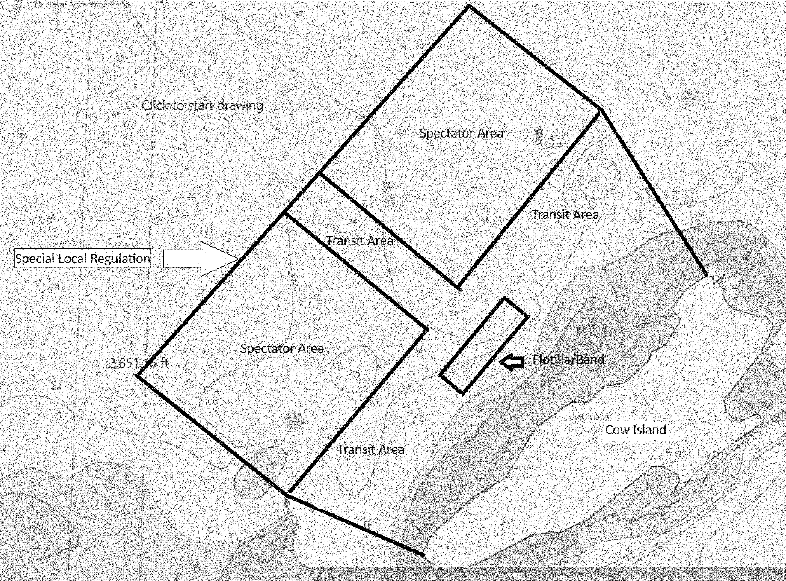

# Daily Digest — 2026-08-12

| | |
|---|---|
| **Digest date** | 2026-08-12 |
| **Data date range** | 2026-08-12 to 2026-08-12 |
| **Generated at** | 2026-08-13T04:51:33Z (UTC) |
| **Pipeline version** | e9a6477 |
| **Source watermarks** | CREC: 2026-08-12T10:45:42Z · BILLS: 2026-08-13T02:27:31Z · FR: 2026-08-12T21:54:05Z · USCOURTS: 2026-08-13T04:04:38Z · PLAW: 2026-07-25T00:00:00Z |

[Full observed listing for this day](day/2026-08-12.html) — every item our collectors observed for this publication day, mechanical rules applied, frozen at end of day. This digest is the canonical record.

All items below cite the govinfo package (and granule, where applicable) they
summarize. Selection is mechanical; each item states the rule that included
it. See the Coverage Statement at the end for a full accounting of what was
published, what was summarized, and what was excluded and why.

---

## Contents

- [Day in Review](#day-in-review)
- [1. Congressional Floor Activity](#1-congressional-floor-activity)
- [2. Legislation](#2-legislation)
- [3. Federal Register](#3-federal-register)
- [4. Enacted Laws](#4-enacted-laws)
- [5. Judicial Activity](#5-judicial-activity)
- [6. Agency Announcements](#6-agency-announcements)
- [7. Recorded Votes](#7-recorded-votes)
- [8. Bill Actions](#8-bill-actions)
- [9. Presidential Actions](#9-presidential-actions)
- [Terms Used Today](#terms-used-today)
- [Coverage Statement](#coverage-statement)
- [Methodology](#methodology)

---

## Day in Review

The House passed two energy measures by recorded vote: H.R. 3109, the REFINER Act, directing a National Petroleum Council report on petrochemical refinery capacity, 230-176; and H.R. 1949, the Unlocking Our Domestic LNG Potential Act of 2025, granting FERC exclusive authority over natural gas export and import facility applications, 217-188. The Senate passed S. 351, the STEWARD Act of 2025, establishing an EPA recycling grant pilot, and debated S. 222 on whole milk in school lunch programs, subpoenaed phone records in the Arctic Frost investigation, and defense appropriations amendments to H.R. 4016. The digest carries 43 introduced bills, 265 House and Senate proceedings, and 28 extensions of remarks.

The digest carries 12 final rules, 4 proposed rules, and 54 notices from the Federal Register, alongside one presidential memorandum and one proclamation. Final rules include a National Park Service framework for powered micromobility devices, DEA's temporary Schedule I placement of O-desmethyltramadol, CBP import restrictions on Nepali archaeological material, and an MSPB jurisdictional amendment. Proposed rules cover Boeing 787 airworthiness, a Los Angeles Harbor security zone, and OCC and FDIC changes to Community Reinvestment Act rules. Agency press releases number 184.

Among 76 appellate opinions, the Eleventh Circuit denied consolidated petitions challenging the Federal Railroad Administration's 2024 two-person crew size rule. The D.C. Circuit upheld FERC's approval of Southwest Power Pool transmission cost reclassification and vacated a stay of DHS expedited-removal actions for lack of standing. The Fifth Circuit, en banc, addressed No Surprises Act payment calculations, and the Tenth Circuit held New Mexico's Campaign Reporting Act facially violates the First Amendment. The digest also carries 1,026 district court and one bankruptcy opinion.

*Composed from the summarized items below and the day's mechanical
counts; all specifics are cited in their sections.*

---

## 1. Congressional Floor Activity

Source: Congressional Record (CREC), issue observed 2026-08-12, covering proceedings of 2025-11-20. Published by govinfo 2026-08-12T10:45:42Z; observed by our collector 2026-08-12T10:54:55Z. Total issue size: 305 granule(s).
Source: Congressional Record (CREC), issue observed 2026-08-12, covering proceedings of 2025-12-30. Published by govinfo 2026-08-12T09:56:52Z; observed by our collector 2026-08-12T10:21:56Z. Total issue size: 305 granule(s).

### 1.1 Senate

Tags: legislative · model keys: climate · defense · recycling

*In plain terms: The Senate passed the STEWARD Act on recycling accessibility, debated whole milk options for school lunches, heard speeches on immigration and climate, and Foreign Relations reported on two ambassadorial nominations.*

- **Trump appointees win again. Eight of the ten least partisan judges were nominated by President Trump.** — Sen. Durbin addressed federal immigration enforcement operations in Illinois and discussed healthcare policy regarding premium tax credit extensions for insurance access.
  - *In plain terms:* Senator Durbin addressed federal immigration enforcement operations in Illinois and healthcare premium tax credit extensions for insurance access.
  - Included because: CREC-SEL-01 — floor item ≥ threshold floor time (82,036 characters) (document dated 2025-11-20)
  - Source: [CREC-2025-11-20 / CREC-2025-11-20-pt1-PgS8250](https://www.govinfo.gov/app/details/CREC-2025-11-20/CREC-2025-11-20-pt1-PgS8250)
- **Whole Milk for Healthy Kids Act of 2025** — The Senate debated S. 222, the Whole Milk for Healthy Kids Act, which allows schools in the National School Lunch Program to offer whole and reduced-fat milk alongside nutritionally equivalent nondairy beverages. The bill, which passed the Senate Agriculture Committee on a bipartisan basis, prompted discussion of nutritional benefits and dairy farmer support, with senators working to address concerns about lactose intolerance classification through additional legislative action.
  - *In plain terms:* The Senate debated S. 222 allowing schools to offer whole and reduced-fat milk alongside nutritionally equivalent nondairy beverages.
  - Included because: CREC-SEL-01 — floor item ≥ threshold floor time (16,416 characters) (document dated 2025-11-20)
  - Source: [CREC-2025-11-20 / CREC-2025-11-20-pt1-PgS8259-2](https://www.govinfo.gov/app/details/CREC-2025-11-20/CREC-2025-11-20-pt1-PgS8259-2)
- **Unanimous Consent Requests** — The Senate debated provisions related to the Arctic Frost investigation involving subpoenaed phone records of senators and others, with Senator Graham objecting to a proposal and seeking legal remedies for those affected, while Senator Thune proposed a resolution clarifying that any damages awarded under related legislation would be forfeited to the U.S. Treasury rather than retained by individual senators.
  - *In plain terms:* The Senate debated an investigation involving subpoenaed phone records of senators and proposed that any related damages be forfeited to the U.S. Treasury.
  - Included because: CREC-SEL-01 — floor item ≥ threshold floor time (21,407 characters) (document dated 2025-11-20)
  - Source: [CREC-2025-11-20 / CREC-2025-11-20-pt1-PgS8262-3](https://www.govinfo.gov/app/details/CREC-2025-11-20/CREC-2025-11-20-pt1-PgS8262-3)
- **Climate Change** — Senator Whitehouse delivered a floor speech discussing climate policy, including public opinion polling showing majority American support for carbon pollution limits and fees on large polluters, the importance of carbon pricing mechanisms and the Carbon Border Adjustment Mechanism for climate mitigation, and warnings from economists and financial institutions regarding climate-related risks to insurance and mortgage markets.
  - *In plain terms:* Senator Whitehouse discussed climate policy including carbon pollution limits, carbon pricing mechanisms, and climate-related risks to insurance and mortgage markets.
  - Included because: CREC-SEL-01 — floor item ≥ threshold floor time (20,474 characters) (document dated 2025-11-20)
  - Source: [CREC-2025-11-20 / CREC-2025-11-20-pt1-PgS8266-2](https://www.govinfo.gov/app/details/CREC-2025-11-20/CREC-2025-11-20-pt1-PgS8266-2)
- **Text of Amendments** — Senator Collins submitted an amendment to H.R. 4016 proposing comprehensive defense appropriations for fiscal year 2026, including military personnel pay and allowances for active duty and reserve forces across all service branches, and operation and maintenance expenses for the Department of Defense.
  - *In plain terms:* Senator Collins submitted an amendment proposing fiscal year 2026 defense appropriations for military personnel pay and operation and maintenance expenses.
  - Included because: CREC-SEL-01 — floor item ≥ threshold floor time (1,327,592 characters) (document dated 2025-11-20)
  - Source: [CREC-2025-11-20 / CREC-2025-11-20-pt1-PgS8270-23](https://www.govinfo.gov/app/details/CREC-2025-11-20/CREC-2025-11-20-pt1-PgS8270-23)
- **Text of Senate Amendment 3951** — Senator Collins submitted an amendment to H.R. 4016 proposing comprehensive defense appropriations for fiscal year 2026, including military personnel pay and allowances for active duty and reserve forces across all service branches, and operation and maintenance expenses for the Department of Defense.
  - *In plain terms:* Senator Collins submitted an amendment proposing fiscal year 2026 defense appropriations for military personnel pay and operation and maintenance expenses.
  - Included because: CREC-SEL-01 — floor item ≥ threshold floor time (1,322,651 characters) (document dated 2025-11-20)
  - Source: [CREC-2025-11-20 / CREC-2025-11-20-pt1-PgS8270-24](https://www.govinfo.gov/app/details/CREC-2025-11-20/CREC-2025-11-20-pt1-PgS8270-24)
- **Strategies to Eliminate Waste and Accelerate Recycling Development Act of 2025** — The Senate passed S. 351, the STEWARD Act of 2025, which establishes a pilot grant program administered by the EPA to improve recycling accessibility in underserved communities through infrastructure investment, requires EPA data collection and dissemination on recycling and composting programs, and authorizes $30 million annually through fiscal year 2029 for competitive grants to eligible entities.
  - *In plain terms:* The Senate passed S. 351 establishing an EPA grant program to improve recycling accessibility in underserved communities with $30 million in annual funding through fiscal year 2029.
  - Included because: CREC-SEL-01 — floor item ≥ threshold floor time (26,508 characters) (document dated 2025-11-20)
  - Source: [CREC-2025-11-20 / CREC-2025-11-20-pt1-PgS8270-31](https://www.govinfo.gov/app/details/CREC-2025-11-20/CREC-2025-11-20-pt1-PgS8270-31)
- **Executive Reports of Committees** — The Senate Foreign Relations Committee submitted executive reports on two ambassadorial nominations: Leo Brent Bozell III to the Republic of South Africa and Benjamin Leon Jr. to the Kingdom of Spain and Principality of Andorra. Leon's nomination report includes a comprehensive disclosure of his federal campaign contributions to various political committees and PACs spanning from 2021 to 2024.
  - *In plain terms:* The Senate Foreign Relations Committee reported on ambassadorial nominations for South Africa and Spain/Andorra, including campaign contribution disclosures.
  - Included because: CREC-SEL-01 — floor item ≥ threshold floor time (17,639 characters) (document dated 2025-11-20)
  - Source: [CREC-2025-11-20 / CREC-2025-11-20-pt1-PgS8270-5](https://www.govinfo.gov/app/details/CREC-2025-11-20/CREC-2025-11-20-pt1-PgS8270-5)
- **Introduction of Bills and Joint Resolutions** — The Senate introduced numerous bills addressing topics including restrictions on federal funding for solar projects on farmland, amendments to the Controlled Substances Act, limitations on presidential tariff authority, improvements to family caregiver programs under the Older Americans Act, and various other measures covering health, agriculture, defense, taxation, and regulatory matters.
  - *In plain terms:* The Senate introduced bills addressing solar project funding restrictions, controlled substances amendments, tariff limitations, and family caregiver program improvements.
  - Included because: CREC-SEL-01 — floor item ≥ threshold floor time (20,144 characters) (document dated 2025-11-20)
  - Source: [CREC-2025-11-20 / CREC-2025-11-20-pt1-PgS8270-6](https://www.govinfo.gov/app/details/CREC-2025-11-20/CREC-2025-11-20-pt1-PgS8270-6)
- **Statements on Introduced Bills and Joint Resolutions** — The Senate introduced S. 3252, the FSMA Fee Technical Corrections Act, which adjusts the amount and methodology of food-related reinspection and recall fees that the FDA may collect from food facilities and importers, including reduced fees for small businesses. The Senate also introduced S. 3253, the Servicemember Student Loan Affordability Act of 2025, which extends the Servicemembers Civil Relief Act's 6 percent interest rate limitation to military service members' consolidation or refinancing of student loans incurred before their service.
  - *In plain terms:* The Senate introduced bills adjusting food facility reinspection fees and extending a 6 percent interest rate limitation to service members' student loan consolidation and refinancing.
  - Included because: CREC-SEL-01 — floor item ≥ threshold floor time (15,793 characters) (document dated 2025-11-20)
  - Source: [CREC-2025-11-20 / CREC-2025-11-20-pt1-PgS8270-9](https://www.govinfo.gov/app/details/CREC-2025-11-20/CREC-2025-11-20-pt1-PgS8270-9)

### 1.2 House of Representatives

Tags: legislative · model keys: bills · energy · fiscal-policy

*In plain terms: The House introduced bills on petrochemical refineries, FERC natural gas authority, and other topics; members delivered speeches honoring constituents and discussing fiscal and policy matters.*

- **Researching Efficient Federal Improvements for Necessary Energy Refining Act** — H.R. 3109 requires the Secretary of Energy to direct the National Petroleum Council to submit a report within 90 days on petrochemical refineries' role in U.S. energy security, capacity analysis and projections, expansion opportunities, federal and state actions affecting refinery capacity, and recommendations for increasing capacity; the report must be made publicly available.
  - *In plain terms:* H.R. 3109 requires the Energy Secretary to direct the National Petroleum Council to submit a publicly available report within 90 days on petrochemical refineries' role in U.S. energy security and capacity expansion.
  - Included because: CREC-SEL-01 — floor item ≥ threshold floor time (46,651 characters) (document dated 2025-11-20)
  - Source: [CREC-2025-11-20 / CREC-2025-11-20-pt1-PgH4835-6](https://www.govinfo.gov/app/details/CREC-2025-11-20/CREC-2025-11-20-pt1-PgH4835-6)
- **Unlocking Our Domestic Lng Potential Act of 2025** — H.R. 1949 amends the Natural Gas Act to grant the Federal Energy Regulatory Commission exclusive authority to approve or deny applications for natural gas export and import facilities and to deem such transactions consistent with the public interest, while preserving presidential authority to impose sanctions-based trade restrictions.
  - *In plain terms:* H.R. 1949 gives the Federal Energy Regulatory Commission exclusive authority to approve or deny natural gas export and import facilities while preserving presidential authority for trade-based sanctions.
  - Included because: CREC-SEL-01 — floor item ≥ threshold floor time (70,122 characters) (document dated 2025-11-20)
  - Source: [CREC-2025-11-20 / CREC-2025-11-20-pt1-PgH4841-2](https://www.govinfo.gov/app/details/CREC-2025-11-20/CREC-2025-11-20-pt1-PgH4841-2)
- **No Mandate to Cut Medicaid** — Representative Green discussed his removal from a joint session of Congress for objecting to Medicaid cuts, referenced statements attributed to the President regarding Democratic lawmakers, and called for impeachment proceedings.
  - *In plain terms:* Representative Green discussed his removal from a joint congressional session for objecting to Medicaid cuts and called for impeachment proceedings.
  - Included because: CREC-SEL-01 — floor item ≥ threshold floor time (20,567 characters) (document dated 2025-11-20)
  - Source: [CREC-2025-11-20 / CREC-2025-11-20-pt1-PgH4854-5](https://www.govinfo.gov/app/details/CREC-2025-11-20/CREC-2025-11-20-pt1-PgH4854-5)
- **Facing Fiscal Reality** — Representative Schweikert presented analysis of U.S. fiscal conditions, noting that federal spending exceeds tax receipts by $1.43 for every dollar collected, with interest expenditures and demographic changes identified as primary fiscal drivers.
  - *In plain terms:* Representative Schweikert presented analysis showing federal spending exceeds tax receipts by $1.43 per dollar collected, with interest costs and demographic changes as primary drivers.
  - Included because: CREC-SEL-01 — floor item ≥ threshold floor time (31,677 characters) (document dated 2025-11-20)
  - Source: [CREC-2025-11-20 / CREC-2025-11-20-pt1-PgH4857-2](https://www.govinfo.gov/app/details/CREC-2025-11-20/CREC-2025-11-20-pt1-PgH4857-2)
- **Honoring Reverend Fernando Siaba** — House members delivered special order speeches addressing community members and federal policies: Rep. Ramirez honored Reverend Fernando Siaba and artist Marisol Velez, Rep. Underwood addressed immigration enforcement operations in Illinois, and Rep. Ramirez discussed federal spending and social programs.
  - *In plain terms:* House representatives honored community members and addressed topics including immigration enforcement and federal spending.
  - Included because: CREC-SEL-01 — floor item ≥ threshold floor time (21,177 characters) (document dated 2025-11-20)
  - Source: [CREC-2025-11-20 / CREC-2025-11-20-pt1-PgH4861](https://www.govinfo.gov/app/details/CREC-2025-11-20/CREC-2025-11-20-pt1-PgH4861)
- **Highlighting the State of California** — Rep. Kiley honored businessman Eduardo Agullo Garcia, introduced H.R. 4889 to prohibit mid-decade congressional redistricting, discussed federal corruption charges against California's former chief of staff, and addressed the REFINER Act on expanding refining capacity.
  - *In plain terms:* Representative Kiley honored a businessman, introduced legislation prohibiting mid-decade congressional redistricting, and discussed federal corruption charges and refining capacity expansion.
  - Included because: CREC-SEL-01 — floor item ≥ threshold floor time (17,666 characters) (document dated 2025-11-20)
  - Source: [CREC-2025-11-20 / CREC-2025-11-20-pt1-PgH4863](https://www.govinfo.gov/app/details/CREC-2025-11-20/CREC-2025-11-20-pt1-PgH4863)
- **Honoring the Life of Eric Andrew Farmer** — Rep. Torres delivered recognitions of six Bronx community members—Eric Farmer, Roza Gjonaj, Domonic Smith, Reverend Reginald Paris, Tanya Pedler, and Rosetta Kirkland—for their contributions to community development and civic engagement.
  - *In plain terms:* Representative Torres recognized six Bronx community members for their contributions to community development and civic engagement.
  - Included because: CREC-SEL-01 — floor item ≥ threshold floor time (19,414 characters) (document dated 2025-11-20)
  - Source: [CREC-2025-11-20 / CREC-2025-11-20-pt1-PgH4865](https://www.govinfo.gov/app/details/CREC-2025-11-20/CREC-2025-11-20-pt1-PgH4865)
- **Congress Is Back** — Rep. Roy outlined legislative achievements in border security, government spending controls, tax policy, energy independence, and healthcare reform, asserting these reflected Republican policy priorities.
  - *In plain terms:* Representative Roy outlined legislative achievements in border security, spending controls, tax policy, energy independence, and healthcare reform.
  - Included because: CREC-SEL-01 — floor item ≥ threshold floor time (24,981 characters) (document dated 2025-11-20)
  - Source: [CREC-2025-11-20 / CREC-2025-11-20-pt1-PgH4868](https://www.govinfo.gov/app/details/CREC-2025-11-20/CREC-2025-11-20-pt1-PgH4868)
- **Public Bills and Resolutions** — The House introduced numerous bills addressing arts funding, drug pricing negotiation, healthcare coverage, infrastructure, farm loans, adoption practices, arbitration, transportation, homelessness treatment, energy regulation, and cryptocurrency mining standards.
  - *In plain terms:* The House introduced bills addressing arts funding, drug pricing, healthcare coverage, infrastructure, farm loans, adoption practices, transportation, homelessness treatment, and energy and cryptocurrency regulation.
  - Included because: CREC-SEL-01 — floor item ≥ threshold floor time (47,141 characters) (document dated 2025-11-20)
  - Source: [CREC-2025-11-20 / CREC-2025-11-20-pt1-PgH4872](https://www.govinfo.gov/app/details/CREC-2025-11-20/CREC-2025-11-20-pt1-PgH4872)
- **Executive Communications, ETC.** — The House recorded the receipt and referral of executive communications from federal agencies to appropriate committees, including notifications of regulatory actions by the Commodity Futures Trading Commission, Consumer Financial Protection Bureau, Environmental Protection Agency, Federal Communications Commission, and reports from the Farm Credit Administration, Treasury Department, and other agencies, made pursuant to congressional procedures.
  - *In plain terms:* The House received and referred to committees notifications of regulatory actions from the CFTC, CFPB, EPA, and FCC, and reports from the Farm Credit Administration, Treasury, and other federal agencies.
  - Included because: CREC-SEL-01 — floor item ≥ threshold floor time (44,474 characters) (document dated 2025-12-30)
  - Source: [CREC-2025-12-30 / CREC-2025-12-30-pt1-PgH6130](https://www.govinfo.gov/app/details/CREC-2025-12-30/CREC-2025-12-30-pt1-PgH6130)

### 1.3 Recorded Votes

- **Researching Efficient Federal Improvements for Necessary Energy Refining Act** — The House voted 230-176 on passage of H.R. 3109, the REFINER Act, requiring a National Petroleum Council report on petrochemical refineries.
  - *In plain terms:* The House passed H.R. 3109 on a vote of 230-176.
  - Included because: CREC-SEL-02 — recorded vote (all recorded votes are listed) (document dated 2025-11-20)
  - Source: [CREC-2025-11-20 / CREC-2025-11-20-pt1-PgH4849-4](https://www.govinfo.gov/app/details/CREC-2025-11-20/CREC-2025-11-20-pt1-PgH4849-4)
- **Unlocking Our Domestic Lng Potential Act of 2025** — The House voted 217-188 on passage of H.R. 1949, the Unlocking Our Domestic LNG Potential Act of 2025.
  - *In plain terms:* The House passed H.R. 1949 on a vote of 217-188.
  - Included because: CREC-SEL-02 — recorded vote (all recorded votes are listed) (document dated 2025-11-20)
  - Source: [CREC-2025-11-20 / CREC-2025-11-20-pt1-PgH4850-2](https://www.govinfo.gov/app/details/CREC-2025-11-20/CREC-2025-11-20-pt1-PgH4850-2)

---

## 2. Legislation

Source: Congressional Bills (BILLS), text versions published 2026-08-12 to 2026-08-12.

### 2.1 Counts by Stage

| Stage (bill text version) | Count |
|---|---|
| Introduced (ih/is) | 43 |
| Reported (rh/rs) | 0 |
| Engrossed (eh/es) | 0 |
| Enrolled (enr) | 0 |
| Other versions | 0 |
| **Total bill texts published** | **43** |

### 2.2 Bills Listed by Mechanical Rule

Bills below are listed because they matched at least one listing rule; the
matching rule is stated per item. All other bill texts are counted above and
accounted for in the Coverage Statement.

No bill texts published in this range matched a listing rule; all 43 are
accounted for in the Coverage Statement.

---

## 3. Federal Register

Source: Federal Register (FR), issue of 2026-08-12.

### 3.1 Counts by Document Type

| Document type | Count |
|---|---|
| Rules | 12 |
| Proposed rules | 4 |
| Notices | 54 |
| Presidential documents | 0 |
| **Total FR documents** | **70** |

### 3.2 Rules Published

Tags: department of energy · department of health and human services · executive · model keys: airspace · food-safety · nuclear

*In plain terms: Agencies issued 12 final rules including Coast Guard safety and local regulations, FAA airspace and helicopter amendments, NRC nuclear storage confirmation, DEA controlled substance scheduling, FDA produce guidance, and CBP import restrictions.*

#### DEPARTMENT OF ENERGY

- **Rescission of DOE's Procedures for Traffic Control on the Nevada Test Site** (2026-16425; 10 CFR Part 861) — This interim final rule rescinds DOE's regulations outlining the establishment of traffic control regulations on the Nevada National Security Site (NNSS), formerly known as the Nevada Test Site. This action is being taken to remove regulations that are obsolete because the NNSS uses Nevada traffic enforcement statutes. The effect of this action will be the removal of obsolete regulations. Action: Interim final rule; request for comments. Dates: The interim final rule is effective on August 12, 2026. Comments must be filed electronically no later than September 11, 2026. The Department will not necessarily consider any comments received after the above date in making our decision.
  - *In plain terms:* The Department of Energy removes outdated traffic control regulations from the Nevada National Security Site, which now follows state traffic laws.
  - Included because: FR-SEL-01 — document type: final rule (all listed)
  - Source: [FR-2026-08-12 / 2026-16425](https://www.govinfo.gov/app/details/FR-2026-08-12/2026-16425)

#### DEPARTMENT OF HEALTH AND HUMAN SERVICES

- **Guide To Minimize Biological Hazards in Ready-to-Eat Fresh-Cut Produce; Guidance for Industry; Availability** (2026-16420; 21 CFR Part 117) — The Food and Drug Administration (FDA or we) is announcing the availability of a final guidance for industry entitled “Guide to Minimize Biological Hazards in Ready-to-Eat Fresh-Cut Produce.” This guidance supersedes a previous guidance, entitled “Guide to Minimize Microbial Food Safety Hazards of Fresh-Cut Fruits and Vegetables,” issued in 2008, and is a final guidance to the draft guidance for industry entitled “Guide to Minimize Food Safety Hazards of Fresh-Cut Produce” issued in 2018. The guidance is intended to help manufacturers or processors of ready-to-eat fresh-cut produce that is not a low-moisture food comply with applicable requirements in our regulations on current good manufacturing practices for hazard analysis and risk-based preventive controls for human food. Action: Notification of availability. Dates: The announcement of the guidance is published in the Federal Register on August 12, 2026.
  - *In plain terms:* The FDA announces updated guidance for manufacturers of ready-to-eat fresh-cut produce on minimizing biological food safety hazards.
  - Included because: FR-SEL-01 — document type: final rule (all listed)
  - Source: [FR-2026-08-12 / 2026-16420](https://www.govinfo.gov/app/details/FR-2026-08-12/2026-16420)

#### DEPARTMENT OF HOMELAND SECURITY

- **Safety Zone; T/V DENISE FOSS (O.N. 1254223), Honolulu, HI** (2026-16407; 33 CFR Part 165) — The Coast Guard is establishing a temporary safety zone for navigable waters within a 500-yard radius of the T/V DENISE FOSS (O.N. 1254223) and its tow, FOSS 3612 (O.N. 1255436). The moving safety zone is needed to protect personnel, vessels, and the marine environment from potential hazards associated with the transportation of three ship-to-shore cranes. Entry of vessels or persons into this zone is prohibited unless specifically authorized by the Captain of the Port, Sector Honolulu, or their designated representative. Action: Temporary final rule. Dates: This rule is effective from 6 a.m. on August 13, 2026, until 9 a.m. on August 17, 2026.
  - *In plain terms:* The Coast Guard establishes a temporary moving safety zone around vessels transporting ship-to-shore cranes near Honolulu, Hawaii.
  - Included because: FR-SEL-01 — document type: final rule (all listed)
  - Source: [FR-2026-08-12 / 2026-16407](https://www.govinfo.gov/app/details/FR-2026-08-12/2026-16407)
- **Special Local Regulation; Daugherty Creek, Crisfield, MD** (2026-16426; 33 CFR Part 100) — The Coast Guard is establishing a temporary special local regulation (SLR) for certain waters of Daugherty Creek, off Wellington Beach, near Crisfield, MD. This action is necessary to provide for the safety of life on these navigable waters during a power boat racing event on September 5, 2026. In the event of inclement weather, the event will take place on September 6, 2026. This regulation prohibits persons and vessels from entering the regulated area unless specifically authorized by the Captain of the Port Sector Maryland-National Capital Region or their designated representative. Action: Temporary final rule. Dates: This rule is effective from 12:30 p.m. on September 5, 2026, through 3 p.m. on September 6, 2026. It will only be subject to enforcement, however, between 12:30 p.m. and 3 p.m. on September 5 unless the event is postponed due to inclement weather. In that case, the rule will be enforced 12:30 p.m. to 3 p.m. on September 6.
  - *In plain terms:* The Coast Guard creates temporary safety regulations for a power boat racing event in Daugherty Creek, Maryland, scheduled for September 5, 2026, or September 6 if weather prevents it.
  - Included because: FR-SEL-01 — document type: final rule (all listed)
  - Source: [FR-2026-08-12 / 2026-16426](https://www.govinfo.gov/app/details/FR-2026-08-12/2026-16426)
- **Special Local Regulation; Casco Bay, Flotilla To Fight Cancer, Long Island, ME** (2026-16428; 33 CFR Part 100) — The Coast Guard is establishing a temporary special local regulation for the navigable waters of Casco Bay, in the vicinity of Cow Island, in the Town of Long Island, ME, to support an offshore concert with spectator vessels. This regulation is needed to protect spectators and mariners from safety risks associated with a large gathering on the water. The regulation will temporarily establish a spectator area and two safe access lanes for transit and emergency response while also prohibiting swimming and creating a speed restriction/no wake zone. Action: Temporary final rule. Dates: This rule is effective from 12:30 p.m. on August 15, 2026, through 5:30 p.m. on August 16, 2026. It will only be enforced, however, from 12:30 p.m. until 5:30 p.m. on August 15, 2026, unless the event is delayed because of weather conditions, in which case it will be subject to enforcement during those same hours on August 16, 2026.
  - *In plain terms:* The Coast Guard establishes temporary safety measures for an offshore concert with spectator vessels in Casco Bay, Maine.
  - Included because: FR-SEL-01 — document type: final rule (all listed)
  - Source: [FR-2026-08-12 / 2026-16428](https://www.govinfo.gov/app/details/FR-2026-08-12/2026-16428)
  -  *Source graphic 1 of 2 from 2026-16428.*
  -  *Source graphic 2 of 2 from 2026-16428.*
- **Imposition of Import Restrictions on Categories of Archaeological and Ethnological Material of Nepal** (2026-16432; 19 CFR Part 12) — This document amends U.S. Customs and Border Protection (CBP) regulations to reflect the imposition of import restrictions on certain archaeological and ethnological material from the Federal Democratic Republic of Nepal (Nepal). These restrictions are imposed pursuant to an agreement between the United States and Nepal, entered into under the authority of the Convention on Cultural Property Implementation Act. This document amends the CBP regulations by adding Nepal to the list of countries which have bilateral agreements with the United States imposing cultural property import restrictions and contains the Designated List, describing the archaeological and ethnological material to which the restrictions apply. Action: Final rule. Dates: Effective on August 12, 2026.
  - *In plain terms:* The Customs and Border Protection adds Nepal to the list of countries with import restrictions on archaeological and ethnological materials under a bilateral cultural property agreement.
  - Included because: FR-SEL-01 — document type: final rule (all listed)
  - Source: [FR-2026-08-12 / 2026-16432](https://www.govinfo.gov/app/details/FR-2026-08-12/2026-16432)

#### DEPARTMENT OF JUSTICE

- **Schedules of Controlled Substances: Temporary Placement of O-Desmethyltramadol in Schedule I** (2026-16413; 21 CFR Part 1308) — The Drug Enforcement Administration issues this temporary order to schedule O -desmethyltramadol (other names: O -DSMT; desmetramadol; 3-[(1 R, 2 R )-2-[(dimethylamino)methyl]-1-hydroxycyclohexyl]phenol), including its isomers, esters, ethers, salts, and salts of isomers, esters and ethers, in schedule I of the Controlled Substances Act. DEA bases this action on a finding that placing O -DSMT in schedule I is necessary to avoid an imminent hazard to public safety. This order imposes the regulatory controls and administrative, civil, and criminal sanctions applicable to schedule I controlled substances on persons who handle (manufacture, distribute, reverse distribute, import, export, engage in research, conduct instructional activities or chemical analysis with, or possess) or propose to handle O -DSMT. Action: Temporary amendment; temporary scheduling order. Dates: This temporary order is effective August 12, 2026, until August 12, 2028. If this order is extended or made permanent, DEA will publish a document in the Federal Register .
  - *In plain terms:* The DEA places O-desmethyltramadol, a tramadol metabolite, in Schedule I of controlled substances due to public safety concerns.
  - Included because: FR-SEL-01 — document type: final rule (all listed)
  - Source: [FR-2026-08-12 / 2026-16413](https://www.govinfo.gov/app/details/FR-2026-08-12/2026-16413)

#### DEPARTMENT OF THE INTERIOR

- **Powered Micromobility Devices** (2026-16388; 36 CFR Parts 1, 2, and 4) — The National Park Service finalizes a management framework for the use of powered micromobility devices within the National Park System. The final rule defines powered micromobility devices separately from motor vehicles, traditional bicycles, electric bicycles, and human powered coasting devices, and creates rules for where and how they may be used in units of the National Park System. Examples of powered micromobility devices include electric scooters (e-scooters), hoverboards, and Segways. Action: Final rule. Dates: This rule is effective September 11, 2026.
  - *In plain terms:* The National Park Service defines rules for powered devices like e-scooters and hoverboards, distinguishing them from bicycles and motor vehicles for use in national parks.
  - Included because: FR-SEL-01 — document type: final rule (all listed)
  - Source: [FR-2026-08-12 / 2026-16388](https://www.govinfo.gov/app/details/FR-2026-08-12/2026-16388)

#### DEPARTMENT OF TRANSPORTATION

- **Amendment of Class E Airspace Over Staunton, VA** (2026-16393; 14 CFR Part 71) — This action amends Class E airspace over Staunton, VA. This action expands that portion of the Staunton, VA Class E5 airspace extending to the northwest of Bridgewater Air Park from “within 1.5 miles either side of the 338° bearing from the airport extending from the 8.3-mile radius to 10 miles northwest of the airport” to “within 3.2 miles each side of the 329° bearing from the airport extending from the 8.3-mile radius to 15.2 miles northwest of the airport.” This modification is necessary to contain Instrument Flight Rules (IFR) operations utilizing new special instrument approach procedures at Bridgewater Air Park. This action also updates the geographic coordinates for Bridgewater Air Park, Bridgewater, VA, in the Staunton, VA Class E5 airspace legal description. Action: Final rule. Dates: Effective 0901 UTC, October 29, 2026. The Director of the Federal Register approves this incorporation by reference action under 1 CFR part 51, subject to the annual revision of FAA Order JO 7400.11 and publication of conforming amendments.
  - *In plain terms:* The FAA expands the controlled airspace around Bridgewater Air Park to accommodate new instrument approach procedures for pilots.
  - Included because: FR-SEL-01 — document type: final rule (all listed)
  - Source: [FR-2026-08-12 / 2026-16393](https://www.govinfo.gov/app/details/FR-2026-08-12/2026-16393)
- **Special Conditions: Skyryse, Robinson Helicopter Company Model R66 Helicopter; Flight Control System Annunciation of Control** (2026-16412; 14 CFR Part 27) — These special conditions are issued for the Robinson Helicopter Company (Robinson) Model R66 helicopter. This helicopter, as modified by Skyryse, will have a novel or unusual design feature when compared to the state of technology envisioned in the airworthiness standards for normal category helicopters. This design feature replaces the mechanical flight controls with a digital fly-by-wire (FBW) system. The applicable airworthiness regulations do not contain adequate or appropriate safety standards for this design feature. These special conditions contain the additional safety standards that the Administrator considers necessary to establish a level of safety equivalent to that established by the existing airworthiness standards. Action: Final special conditions. Dates: Effective September 11, 2026.
  - *In plain terms:* The FAA sets safety standards for a Robinson R66 helicopter modified with digital fly-by-wire flight controls instead of mechanical ones.
  - Included because: FR-SEL-01 — document type: final rule (all listed)
  - Source: [FR-2026-08-12 / 2026-16412](https://www.govinfo.gov/app/details/FR-2026-08-12/2026-16412)

#### MERIT SYSTEMS PROTECTION BOARD

- **Appellate Jurisdiction Update II** (2026-16456; 5 CFR Part 1201) — The Merit Systems Protection Board (MSPB or Board) is amending its regulations to remove references to MSPB's jurisdiction over probationary termination, suitability, and reduction-in-force (RIF) appeals. This revision reflects the Office of Personnel Management's (OPM's) rescission of the MSPB's jurisdiction to hear these types of appeals. The rule retains MSPB's statutory jurisdiction over Foreign Service reduction-in-force appeals under 22 U.S.C. 4010a. Action: Final rule. Dates: This final rule is effective on September 2, 2026. However, consistent with OPM's rulemakings, the MSPB will not apply this rule to pending cases or to newly filed cases relating to agency actions taken before the effective date of OPM's rulemakings, and will continue to adjudicate such probationary termination appeals, suitability appeals, and RIF appeals.
  - *In plain terms:* The Merit Systems Protection Board removes references to its authority over probationary termination, suitability, and reduction-in-force appeals, reflecting OPM's rescission of that jurisdiction.
  - Included because: FR-SEL-01 — document type: final rule (all listed)
  - Source: [FR-2026-08-12 / 2026-16456](https://www.govinfo.gov/app/details/FR-2026-08-12/2026-16456)

#### NUCLEAR REGULATORY COMMISSION

- **List of Approved Spent Fuel Storage Casks: NAC International, Inc., MAGNASTOR® Storage System, Certificate of Compliance No. 1031, Amendment Nos. 16 and 17 and Revisions to Amendment Nos. 0 through 16** (2026-16398) — The U.S. Nuclear Regulatory Commission (NRC) is confirming the effective date of September 14, 2026, for the direct final rule that was published in the Federal Register on July 1, 2026. This direct final rule amended the NAC MAGNASTOR System listing within the “List of approved spent fuel storage casks” to include Amendment Nos. 16 and 17 and revisions to Amendment Nos. 0 through 16 to Certificate of Compliance No. 1031. Action: Direct final rule; confirmation of effective date. Dates: The effective date of September 14, 2026, for the direct final rule published July 1, 2026 (91 FR 39843), is confirmed.
  - *In plain terms:* The NRC confirms an effective date of September 14, 2026, for amendments to approved spent fuel storage cask regulations.
  - Included because: FR-SEL-01 — document type: final rule (all listed)
  - Source: [FR-2026-08-12 / 2026-16398](https://www.govinfo.gov/app/details/FR-2026-08-12/2026-16398)

### 3.3 Proposed Rules Published

Tags: department of energy · department of health and human services · executive · model keys: aviation · banking · ports

*In plain terms: Agencies proposed a Boeing 787 airworthiness amendment and a permanent LA Harbor security zone, while withdrawing a 2008 foster care analysis proposal and advancing revisions to Community Reinvestment Act rules.*

#### DEPARTMENT OF HEALTH AND HUMAN SERVICES

- **Adoption and Foster Care Analysis and Reporting System** (2026-16414; 45 CFR Part 1356) — This document withdraws a proposed rule that was published in the Federal Register on January 11, 2008. The proposed rule would have amended the Adoption and Foster Care Analysis and Reporting System (AFCARS) regulations at 45 CFR 1355.40 and the appendices to Part 1355 to modify the requirements for States to collect and report data to ACF on children in out-of-home care and in subsidized adoption or guardianship arrangements with the State. This document also withdraws the provision of the 2008 proposed rule that implemented the AFCARS penalty requirements of the Adoption Promotion Act of 2003 (Pub. L. 108-145). Action: Proposed rule; withdrawal. Dates: The proposed rule published January 11, 2008 (73 FR 2082) is withdrawn effective August 12, 2026.
  - *In plain terms:* This withdraws a proposed 2008 rule about state data collection requirements for children in foster care and adoption arrangements.
  - Included because: FR-SEL-02 — document type: proposed rule (all listed)
  - Source: [FR-2026-08-12 / 2026-16414](https://www.govinfo.gov/app/details/FR-2026-08-12/2026-16414)

#### DEPARTMENT OF HOMELAND SECURITY

- **Security Zone; U.S. Coast Guard Base, Los Angeles Harbor Main Channel, Los Angeles, CA** (2026-16406; 33 CFR Part 165) — The Coast Guard is proposing to establish a permanent security zone extending 40 yards into the navigable waters of the main channel of Los Angeles Harbor including the entire perimeter of the Coast Guard Base on Terminal Island. This action is necessary for the security of military service members on vessels, and military members and government property on Terminal Island. All persons and vessels would be prohibited from entering, transiting through, or anchoring in the proposed security zone unless authorized by the Captain of the Port Los Angeles-Long Beach. We invite your comments on this proposed rulemaking. Action: Notice of proposed rulemaking. Dates: Comments and related material must be received by the Coast Guard on or before September 11, 2026.
  - *In plain terms:* The Coast Guard proposes a permanent security zone around its base in Los Angeles Harbor; entry requires authorization from the Captain of the Port.
  - Included because: FR-SEL-02 — document type: proposed rule (all listed)
  - Source: [FR-2026-08-12 / 2026-16406](https://www.govinfo.gov/app/details/FR-2026-08-12/2026-16406)

#### DEPARTMENT OF THE TREASURY

- **Community Reinvestment Act Regulations** (2026-16454; 12 CFR Parts 5, 24, 25, and 35; 12 CFR Parts 345 and 346) — The Office of the Comptroller of the Currency (OCC) and the Federal Deposit Insurance Corporation (FDIC) are proposing to amend their Community Reinvestment Act rules by making certain substantive, technical, and process-oriented changes to refocus on the statutory objective of encouraging banks to meet the credit needs of their communities; to better ensure that community development grants reach the communities they are intended to benefit; to reduce unnecessary burden, particularly for community banks; and to provide greater clarity for how to obtain CRA consideration. The OCC and the FDIC are also proposing certain technical changes to their rules implementing the Community Reinvestment Act sunshine requirements of the Federal Deposit Insurance Act. In addition, the OCC is proposing similar technical changes to its Public Welfare Investments rule and its Rules, Policies, and Procedures for Corporate Activities. Action: Notice of proposed rulemaking. Dates: Comments must be received on or before October 13, 2026.
  - *In plain terms:* The OCC and FDIC propose changes to Community Reinvestment Act rules to refocus on encouraging banks to meet community credit needs and reduce unnecessary burden on community banks.
  - Included because: FR-SEL-02 — document type: proposed rule (all listed)
  - Source: [FR-2026-08-12 / 2026-16454](https://www.govinfo.gov/app/details/FR-2026-08-12/2026-16454)

#### DEPARTMENT OF TRANSPORTATION

- **Airworthiness Directives; The Boeing Company Airplanes** (2026-16389; 14 CFR Part 39) — The FAA proposes to supersede Airworthiness Directive (AD) 2022-15-01, which applies to certain The Boeing Company Model 787-8, 787-9, and 787-10 airplanes. AD 2022-15-01 requires inspecting certain vertical fin tension bolt holes; reviewing the bolt sealant application installation procedure in the existing maintenance or inspection program, as applicable; checking maintenance records to determine the replacement status of vertical fin tension bolts; and doing applicable on-condition actions. Since the FAA issued AD 2022-15-01, the FAA has determined that optional sealant types allowed by that AD may not provide sufficient time to complete all bolt installations. The FAA has also received additional reports of corrosion that, in some cases, was more severe than expected. As a result, the FAA has determined that the compliance times for certain actions must be reduced. This proposed AD would, for certain airplanes, continue to require certain actions required by AD 2022-15-01 with reduced compliance times. [official summary truncated; see source] Action: Notice of proposed rulemaking (NPRM). Dates: The FAA must receive comments on this proposed AD by September 28, 2026.
  - *In plain terms:* The FAA proposes shorter deadlines for maintenance actions on certain Boeing 787 airplanes because corrosion is occurring faster than previously expected.
  - Included because: FR-SEL-02 — document type: proposed rule (all listed)
  - Source: [FR-2026-08-12 / 2026-16389](https://www.govinfo.gov/app/details/FR-2026-08-12/2026-16389)

### 3.4 Notices and Presidential Documents

Notices are summarized only when they match a listing rule; all are counted
in 3.1 and in the Coverage Statement. Presidential documents in the FR are
always listed.

No notices or presidential documents matched a listing rule.

---

## 4. Enacted Laws

Source: Public and Private Laws (PLAW) published 2026-08-12.

No laws were published in this range.

---

## 5. Judicial Activity

Source: United States Courts Opinions (USCOURTS): opinions observed 2026-08-12
by our collector; each opinion states its own issue date beside its
listing ([how our clocks work](faq.html#fapds-three-clocks)).

Completeness disclosure (standing): USCOURTS carries opinions from
approximately 140 participating appellate, district, bankruptcy, and
national federal courts. Unlike the Congressional Record and the Federal
Register, which are the complete official record of their branches,
USCOURTS is participation-based and is NOT the complete federal judicial
record. Courts post opinions with delay — typically over several days —
so a day's digest carries the opinions that became available that day,
whatever date each was issued.

### 5.1 Appellate and National Court Opinions

Tags: judicial · model keys: employment · immigration · patents

*In plain terms: Federal appeals courts upheld the Federal Railroad Administration's crew-size rule in seven consolidated industry petitions and ruled in 76 total cases involving criminal convictions, employment disputes, patents, immigration, and administrative matters.*

Appellate and national court opinions are summarized; district and
bankruptcy opinions are counted in 5.2 and in the Coverage Statement.

#### United States Court of Appeals for the District of Columbia Circuit

- **City Utilities of Springfield, Missouri, et al v. FERC** (No. 24-01270; filed 2026-08-11) — The D.C. Circuit Court of Appeals upheld FERC's approval of Southwest Power Pool's proposal to reclassify four transmission facilities in Kansas as "Highway" facilities, shifting their cost allocation from primarily local to regional based on evidence that they primarily serve customers outside the local zone. The court found that FERC properly applied the cost-causation principle under the Federal Power Act and that SPP's studies on facility capacity, power flow, and regional benefits provided substantial evidence supporting the reclassification. Petitions from affected utilities and state regulators challenging the approval were denied.
  - *In plain terms:* The court upheld FERC's approval of shifting Kansas transmission costs from local to regional based on evidence the facilities primarily serve customers outside the local zone.
  - Included because: USCOURTS-SEL-01 — appellate court opinion (all listed) (document dated 2026-08-11)
  - Source: [USCOURTS-caDC-24-01270 / USCOURTS-caDC-24-01270-0](https://www.govinfo.gov/app/details/USCOURTS-caDC-24-01270/USCOURTS-caDC-24-01270-0)
- **Louisiana Public Service Commission v. FERC** (No. 24-01282; filed 2026-08-11) — The D.C. Circuit Court of Appeals upheld FERC's approval of Southwest Power Pool's proposal to reclassify four transmission facilities in Kansas as "Highway" facilities, shifting their cost allocation from primarily local to regional based on evidence that they primarily serve customers outside the local zone. The court found that FERC properly applied the cost-causation principle under the Federal Power Act and that SPP's studies on facility capacity, power flow, and regional benefits provided substantial evidence supporting the reclassification. Petitions from affected utilities and state regulators challenging the approval were denied.
  - *In plain terms:* The court upheld FERC's approval of shifting Kansas transmission costs from local to regional based on evidence the facilities primarily serve customers outside the local zone.
  - Included because: USCOURTS-SEL-01 — appellate court opinion (all listed) (document dated 2026-08-11)
  - Source: [USCOURTS-caDC-24-01282 / USCOURTS-caDC-24-01282-0](https://www.govinfo.gov/app/details/USCOURTS-caDC-24-01282/USCOURTS-caDC-24-01282-0)
- **Oklahoma Gas and Electric Company v. FERC** (No. 24-01283; filed 2026-08-11) — The U.S. Court of Appeals for the District of Columbia Circuit upheld the Federal Energy Regulatory Commission's approval of Southwest Power Pool's reclassification of four transmission facilities in Kansas from local-cost to regional-cost allocation. Evidence showed the facilities primarily served customers outside their home zone due to wind generation expansion in the region. The court denied petitioners' challenges to the cost-allocation decision.
  - *In plain terms:* The court upheld FERC's approval of shifting Kansas transmission costs from local to regional, finding the facilities primarily serve customers outside their zone due to wind generation.
  - Included because: USCOURTS-SEL-01 — appellate court opinion (all listed) (document dated 2026-08-11)
  - Source: [USCOURTS-caDC-24-01283 / USCOURTS-caDC-24-01283-0](https://www.govinfo.gov/app/details/USCOURTS-caDC-24-01283/USCOURTS-caDC-24-01283-0)
- **American Electric Power Service Corporation, et al v. FERC** (No. 24-01285; filed 2026-08-11) — The U.S. Court of Appeals for the District of Columbia Circuit upheld the Federal Energy Regulatory Commission's approval of Southwest Power Pool's reclassification of four transmission facilities in Kansas from local-cost to regional-cost allocation. Evidence showed the facilities primarily served customers outside their home zone due to wind generation expansion in the region. The court denied petitioners' challenges to the cost-allocation decision.
  - *In plain terms:* The court upheld FERC's approval of shifting Kansas transmission costs from local to regional, finding the facilities primarily serve customers outside their zone due to wind generation.
  - Included because: USCOURTS-SEL-01 — appellate court opinion (all listed) (document dated 2026-08-11)
  - Source: [USCOURTS-caDC-24-01285 / USCOURTS-caDC-24-01285-0](https://www.govinfo.gov/app/details/USCOURTS-caDC-24-01285/USCOURTS-caDC-24-01285-0)
- **American Electric Power Service Corporation, et al v. FERC** (No. 24-01372; filed 2026-08-11) — The U.S. Court of Appeals for the District of Columbia Circuit upheld the Federal Energy Regulatory Commission's approval of Southwest Power Pool's reclassification of four transmission facilities in Kansas from local-cost to regional-cost allocation. Evidence showed the facilities primarily served customers outside their home zone due to wind generation expansion in the region. The court denied petitioners' challenges to the cost-allocation decision.
  - *In plain terms:* The court upheld FERC's approval of shifting Kansas transmission costs from local to regional, finding the facilities primarily serve customers outside their zone due to wind generation.
  - Included because: USCOURTS-SEL-01 — appellate court opinion (all listed) (document dated 2026-08-11)
  - Source: [USCOURTS-caDC-24-01372 / USCOURTS-caDC-24-01372-0](https://www.govinfo.gov/app/details/USCOURTS-caDC-24-01372/USCOURTS-caDC-24-01372-0)
- **USA v. Edward William** (No. 24-03067; filed 2026-08-11) — Edward Williams appealed his conviction for possessing a firearm as a convicted felon, claiming his guilty plea was invalid because he was not informed that knowledge of his felon status was an essential element of the offense. The court rejected his claim as procedurally defaulted and found he presented no valid excuse for the default, noting he had served over two years in prison for his prior felony conviction. The court affirmed the denial of his motion to vacate.
  - *In plain terms:* The court upheld Williams's conviction for possessing a firearm as a felon, rejecting his claim that he wasn't informed of required elements.
  - Included because: USCOURTS-SEL-01 — appellate court opinion (all listed) (document dated 2026-08-11)
  - Source: [USCOURTS-caDC-24-03067 / USCOURTS-caDC-24-03067-0](https://www.govinfo.gov/app/details/USCOURTS-caDC-24-03067/USCOURTS-caDC-24-03067-0)
- **Friends of Animals v. Martha Williams, et al** (No. 24-05278; filed 2026-08-11) — The U.S. Court of Appeals for the District of Columbia Circuit reversed the District Court's decision and ruled that the Fish and Wildlife Service did not violate the Administrative Procedure Act in declining to analyze whether an already-listed scarlet macaw subspecies should receive additional protection based on similarity of appearance. The court found that Section 1533(e) of the Endangered Species Act does not authorize similarity-of-appearance protection for species already listed as endangered or threatened.
  - *In plain terms:* The court ruled the Fish and Wildlife Service did not violate the law in declining to offer extra protection status to an already-listed scarlet macaw subspecies.
  - Included because: USCOURTS-SEL-01 — appellate court opinion (all listed) (document dated 2026-08-11)
  - Source: [USCOURTS-caDC-24-05278 / USCOURTS-caDC-24-05278-0](https://www.govinfo.gov/app/details/USCOURTS-caDC-24-05278/USCOURTS-caDC-24-05278-0)
- **Oklahoma Gas and Electric Company v. FERC** (No. 25-01007; filed 2026-08-11) — The U.S. Court of Appeals for the District of Columbia Circuit upheld the Federal Energy Regulatory Commission's approval of Southwest Power Pool's reclassification of four transmission facilities in Kansas from local-cost to regional-cost allocation. Evidence showed the facilities primarily served customers outside their home zone due to wind generation expansion in the region. The court denied petitioners' challenges to the cost-allocation decision.
  - *In plain terms:* The court upheld FERC's approval of shifting Kansas transmission costs from local to regional, finding the facilities primarily serve customers outside their zone due to wind generation.
  - Included because: USCOURTS-SEL-01 — appellate court opinion (all listed) (document dated 2026-08-11)
  - Source: [USCOURTS-caDC-25-01007 / USCOURTS-caDC-25-01007-0](https://www.govinfo.gov/app/details/USCOURTS-caDC-25-01007/USCOURTS-caDC-25-01007-0)
- **Louisiana Public Service Commission v. FERC** (No. 25-01023; filed 2026-08-11) — The DC Circuit upheld FERC's approval of Southwest Power Pool's cost reallocation that shifted costs for four transmission facilities from a local Kansas zone to the broader SPP region, finding the facilities primarily serve customers outside the local zone due to expanded wind generation. The court held that FERC's approval was adequately reasoned and supported by substantial evidence despite petitioners' challenges.
  - *In plain terms:* The court upheld FERC's approval of shifting Kansas transmission costs to regional after finding wind generation expansion causes the facilities to primarily serve customers outside their zone.
  - Included because: USCOURTS-SEL-01 — appellate court opinion (all listed) (document dated 2026-08-11)
  - Source: [USCOURTS-caDC-25-01023 / USCOURTS-caDC-25-01023-0](https://www.govinfo.gov/app/details/USCOURTS-caDC-25-01023/USCOURTS-caDC-25-01023-0)
- **Coalition for Humane Immigrant Rights, et al v. Markwayne Mullin, et al** (No. 25-05289; filed 2026-08-11) — The DC Circuit vacated a district court stay of DHS actions regarding expedited removal of parolees, holding that the organizational plaintiffs lacked standing to challenge DHS memoranda and an email directing consideration of expedited removal. The court found that standing could not be established without challenging the underlying regulation authorizing expedited removal of parolees.
  - *In plain terms:* The court vacated a stay on DHS expedited removal actions, finding the plaintiffs lacked legal standing to challenge the policy.
  - Included because: USCOURTS-SEL-01 — appellate court opinion (all listed) (document dated 2026-08-11)
  - Source: [USCOURTS-caDC-25-05289 / USCOURTS-caDC-25-05289-0](https://www.govinfo.gov/app/details/USCOURTS-caDC-25-05289/USCOURTS-caDC-25-05289-0)
- **Jared Fishman v. DC, et al** (No. 25-07050; filed 2026-08-11) — The DC Circuit granted qualified immunity to DC Metropolitan Police officers who detained Jared Fishman for approximately 25 minutes while investigating a 911 report of a possible kidnapping or child abuse. The appeals court reversed the district court's denial of qualified immunity, finding the officers did not violate clearly established Fourth Amendment law in conducting and continuing their detention to investigate and speak with the involved child.
  - *In plain terms:* The court granted immunity to officers who detained Fishman for approximately 25 minutes while investigating a report of possible child abuse.
  - Included because: USCOURTS-SEL-01 — appellate court opinion (all listed) (document dated 2026-08-11)
  - Source: [USCOURTS-caDC-25-07050 / USCOURTS-caDC-25-07050-0](https://www.govinfo.gov/app/details/USCOURTS-caDC-25-07050/USCOURTS-caDC-25-07050-0)
- **Eugene Nyambal v. Allied Barton Security Services, LLC** (No. 25-07140; filed 2026-08-11) — The DC Circuit affirmed summary judgment for AlliedBarton Security Services in Eugene Nyambal's defamation claim arising from his placement on a "No Admit List" that prevented entry to IMF and World Bank facilities. The court found the record established no genuine dispute of material fact on either theory of defamation liability Nyambal advanced at summary judgment.
  - *In plain terms:* The court upheld summary judgment for the security company in a defamation claim arising from the plaintiff's placement on a no-entry list.
  - Included because: USCOURTS-SEL-01 — appellate court opinion (all listed) (document dated 2026-08-11)
  - Source: [USCOURTS-caDC-25-07140 / USCOURTS-caDC-25-07140-0](https://www.govinfo.gov/app/details/USCOURTS-caDC-25-07140/USCOURTS-caDC-25-07140-0)

#### United States Court of Appeals for the Eleventh Circuit

- **Robert Martin v. Eric Bischoff** (No. 23-13851; filed 2026-08-11) — The Eleventh Circuit Court of Appeals addressed a dispute between cousins over the validity of share transfers in Boar's Head Provisions Company under a 1991 shareholder's agreement. The court affirmed the district court's determination that a statute of limitations barred challenge to a 2011 transfer but vacated and remanded its conclusions regarding 2013 and 2016 transfers for further proceedings.
  - *In plain terms:* A court upheld that a statute of limitations barred a challenge to a 2011 share transfer but sent back questions about 2013 and 2016 transfers for further review.
  - Included because: USCOURTS-SEL-01 — appellate court opinion (all listed) (document dated 2026-08-11)
  - Source: [USCOURTS-ca11-23-13851 / USCOURTS-ca11-23-13851-0](https://www.govinfo.gov/app/details/USCOURTS-ca11-23-13851/USCOURTS-ca11-23-13851-0)
- **Mt. Hawley Insurance Company v. H&M Builders, LLC, et al** (No. 24-10460; filed 2026-08-11) — Mt. Hawley Insurance Company sought a declaratory judgment that it had no duty to defend or indemnify H&M Builders in a wrongful death suit; the district court ruled Mt. Hawley did have a duty to defend. During the appeal, the underlying state-court action was settled and dismissed. The Eleventh Circuit dismissed the appeal, finding the dispute moot and the interlocutory order lacking the injunctive qualities required for such appeals.
  - *In plain terms:* An appeals court dismissed an insurance dispute about duty to defend as moot because the underlying lawsuit was settled during the appeal.
  - Included because: USCOURTS-SEL-01 — appellate court opinion (all listed) (document dated 2026-08-11)
  - Source: [USCOURTS-ca11-24-10460 / USCOURTS-ca11-24-10460-0](https://www.govinfo.gov/app/details/USCOURTS-ca11-24-10460/USCOURTS-ca11-24-10460-0)
- **Florida East Coast Railway LLC v. Federal Railroad Administration, et al** (No. 24-11076; filed 2026-08-11) — The Eleventh Circuit Court of Appeals upheld the Federal Railroad Administration's 2024 Crew Size Rule, which requires railroads to operate trains with at least two crew members on board unless using a one-person crew would be at least as safe. Eight consolidated petitions for review from various railroads and industry associations challenging the rule were denied. The regulation followed a regulatory process initiated more than a decade earlier in response to safety concerns in the railroad industry.
  - *In plain terms:* A court upheld a 2024 rule requiring railroads to operate trains with at least two crew members unless one person would be equally safe.
  - Included because: USCOURTS-SEL-01 — appellate court opinion (all listed) (document dated 2026-08-11)
  - Source: [USCOURTS-ca11-24-11076 / USCOURTS-ca11-24-11076-0](https://www.govinfo.gov/app/details/USCOURTS-ca11-24-11076/USCOURTS-ca11-24-11076-0)
- **Texas & Northern Railway Company v. Federal Railroad Administration, et al** (No. 24-11300; filed 2026-08-11) — Six railroads and two industry trade organizations petitioned for review of the Federal Railroad Administration's 2024 Crew Size Rule, which requires trains to operate with at least two crewmembers unless one-person operations would be equally safe. The railroads challenged the rule as exceeding statutory authority and acting arbitrarily and capriciously. The court upheld the rule and denied all petitions for review.
  - *In plain terms:* A court upheld the 2024 Crew Size Rule requiring trains to operate with at least two crew members unless one-person operations would be equally safe.
  - Included because: USCOURTS-SEL-01 — appellate court opinion (all listed) (document dated 2026-08-11)
  - Source: [USCOURTS-ca11-24-11300 / USCOURTS-ca11-24-11300-0](https://www.govinfo.gov/app/details/USCOURTS-ca11-24-11300/USCOURTS-ca11-24-11300-0)
- **Association of American Railroads v. Federal Railroad Administration, et al** (No. 24-11366; filed 2026-08-11) — The Eleventh Circuit addressed consolidated petitions for review of the Federal Railroad Administration's 2024 Crew Size Rule, which requires railroads to operate with at least two crewmembers on board unless one-person crews would be equally safe. Multiple railroads and industry organizations challenged the rule as exceeding the FRA's statutory authority and as arbitrary and capricious under the Administrative Procedure Act. The court denied all petitions, finding the railroads' arguments to lack merit.
  - *In plain terms:* A court denied petitions from railroads challenging the 2024 Crew Size Rule requiring at least two crew members unless one-person crews would be equally safe.
  - Included because: USCOURTS-SEL-01 — appellate court opinion (all listed) (document dated 2026-08-11)
  - Source: [USCOURTS-ca11-24-11366 / USCOURTS-ca11-24-11366-0](https://www.govinfo.gov/app/details/USCOURTS-ca11-24-11366/USCOURTS-ca11-24-11366-0)
- **American Short Line and Regional Railroad Associat v. Federal Railroad Administration, et al** (No. 24-11367; filed 2026-08-11) — The Eleventh Circuit addressed consolidated petitions for review of the Federal Railroad Administration's 2024 Crew Size Rule, which requires railroads to operate with at least two crewmembers on board unless one-person crews would be equally safe. Multiple railroads and industry organizations challenged the rule as exceeding the FRA's statutory authority and as arbitrary and capricious under the Administrative Procedure Act. The court denied all petitions, finding the railroads' arguments to lack merit.
  - *In plain terms:* A court denied petitions from railroads challenging the 2024 Crew Size Rule requiring at least two crew members unless one-person crews would be equally safe.
  - Included because: USCOURTS-SEL-01 — appellate court opinion (all listed) (document dated 2026-08-11)
  - Source: [USCOURTS-ca11-24-11367 / USCOURTS-ca11-24-11367-0](https://www.govinfo.gov/app/details/USCOURTS-ca11-24-11367/USCOURTS-ca11-24-11367-0)
- **Indiana Rail Road Company v. Federal Railroad Administration, et al** (No. 24-11428; filed 2026-08-11) — The Eleventh Circuit addressed consolidated petitions for review of the Federal Railroad Administration's 2024 Crew Size Rule, which requires railroads to operate with at least two crewmembers on board unless one-person crews would be equally safe. Multiple railroads and industry organizations challenged the rule as exceeding the FRA's statutory authority and as arbitrary and capricious under the Administrative Procedure Act. The court denied all petitions, finding the railroads' arguments to lack merit.
  - *In plain terms:* A court denied petitions from railroads challenging the 2024 Crew Size Rule requiring at least two crew members unless one-person crews would be equally safe.
  - Included because: USCOURTS-SEL-01 — appellate court opinion (all listed) (document dated 2026-08-11)
  - Source: [USCOURTS-ca11-24-11428 / USCOURTS-ca11-24-11428-0](https://www.govinfo.gov/app/details/USCOURTS-ca11-24-11428/USCOURTS-ca11-24-11428-0)
- **Union Pacific Railroad Co. v. Federal Railroad Administration, et al** (No. 24-11444; filed 2026-08-11) — The Eleventh Circuit addressed consolidated petitions for review of the Federal Railroad Administration's 2024 Crew Size Rule, which requires railroads to operate with at least two crewmembers on board unless one-person crews would be equally safe. Multiple railroads and industry organizations challenged the rule as exceeding the FRA's statutory authority and as arbitrary and capricious under the Administrative Procedure Act. The court denied all petitions, finding the railroads' arguments to lack merit.
  - *In plain terms:* A court denied petitions from railroads challenging the 2024 Crew Size Rule requiring at least two crew members unless one-person crews would be equally safe.
  - Included because: USCOURTS-SEL-01 — appellate court opinion (all listed) (document dated 2026-08-11)
  - Source: [USCOURTS-ca11-24-11444 / USCOURTS-ca11-24-11444-0](https://www.govinfo.gov/app/details/USCOURTS-ca11-24-11444/USCOURTS-ca11-24-11444-0)
- **Nebraska Central Railroad Company v. Federal Railroad Administration, et al** (No. 24-11445; filed 2026-08-11) — The Eleventh Circuit addressed consolidated petitions for review of the Federal Railroad Administration's 2024 Crew Size Rule, which requires railroads to operate with at least two crewmembers on board unless one-person crews would be equally safe. Multiple railroads and industry organizations challenged the rule as exceeding the FRA's statutory authority and as arbitrary and capricious under the Administrative Procedure Act. The court denied all petitions, finding the railroads' arguments to lack merit.
  - *In plain terms:* A court denied petitions from railroads challenging the 2024 Crew Size Rule requiring at least two crew members unless one-person crews would be equally safe.
  - Included because: USCOURTS-SEL-01 — appellate court opinion (all listed) (document dated 2026-08-11)
  - Source: [USCOURTS-ca11-24-11445 / USCOURTS-ca11-24-11445-0](https://www.govinfo.gov/app/details/USCOURTS-ca11-24-11445/USCOURTS-ca11-24-11445-0)
- **BNSF Railway Company v. Federal Railroad Administration, et al** (No. 24-12003; filed 2026-08-11) — The Eleventh Circuit addressed consolidated petitions for review of the Federal Railroad Administration's 2024 Crew Size Rule, which requires railroads to operate with at least two crewmembers on board unless one-person crews would be equally safe. Multiple railroads and industry organizations challenged the rule as exceeding the FRA's statutory authority and as arbitrary and capricious under the Administrative Procedure Act. The court denied all petitions, finding the railroads' arguments to lack merit.
  - *In plain terms:* A court denied petitions from railroads challenging the 2024 Crew Size Rule requiring at least two crew members unless one-person crews would be equally safe.
  - Included because: USCOURTS-SEL-01 — appellate court opinion (all listed) (document dated 2026-08-11)
  - Source: [USCOURTS-ca11-24-12003 / USCOURTS-ca11-24-12003-0](https://www.govinfo.gov/app/details/USCOURTS-ca11-24-12003/USCOURTS-ca11-24-12003-0)
- **Martin Renfroe v. USAA** (No. 24-13382; filed 2026-08-11) — The Eleventh Circuit Court of Appeals ruled that an insurance policy's innocent-insured exclusion—which prevents even innocent parties from collecting for losses caused by a co-insured's intentional conduct—is enforceable under Alabama law and does not violate public policy. The court reversed the trial court's invalidation of the exclusion but affirmed its grant of summary judgment on the bad faith denial claim, finding the insurer had sufficient evidence the policyholder may have committed arson.
  - *In plain terms:* A court ruled that an insurance policy's innocent-insured exclusion is enforceable under Alabama law and rejected a bad faith denial claim by the policyholder.
  - Included because: USCOURTS-SEL-01 — appellate court opinion (all listed) (document dated 2026-08-11)
  - Source: [USCOURTS-ca11-24-13382 / USCOURTS-ca11-24-13382-0](https://www.govinfo.gov/app/details/USCOURTS-ca11-24-13382/USCOURTS-ca11-24-13382-0)
- **USA v. Scott Hollington** (No. 25-11171; filed 2026-08-11) — The Eleventh Circuit affirmed a physician's convictions for unlawfully prescribing controlled substances to five undercover officers and four patients, and for obstruction of justice after he altered patient records following his indictment. The court also affirmed the trial court's 144-month sentence, which exceeded the guideline range of 30 to 37 months to account for sexual misconduct the defendant committed against his patients.
  - *In plain terms:* A court affirmed convictions of a physician for unlawfully prescribing controlled substances and for altering patient records after indictment, with a 144-month sentence.
  - Included because: USCOURTS-SEL-01 — appellate court opinion (all listed) (document dated 2026-08-11)
  - Source: [USCOURTS-ca11-25-11171 / USCOURTS-ca11-25-11171-0](https://www.govinfo.gov/app/details/USCOURTS-ca11-25-11171/USCOURTS-ca11-25-11171-0)
- **USA v. Kenneth Steele** (No. 25-13970; filed 2026-08-11) — The Eleventh Circuit affirmed a defendant's 90-month sentence for conspiracy to distribute methamphetamine, rejecting his argument that a post-sentencing amendment to the Sentencing Guidelines should apply retroactively to provide a four-level mitigation reduction. The court found Amendment 833 substantive rather than clarifying and therefore inapplicable, and determined the district court did not abuse its discretion in weighing the sentencing factors.
  - *In plain terms:* A court affirmed a 90-month sentence for methamphetamine conspiracy, rejecting the argument that a later Sentencing Guidelines amendment should apply retroactively.
  - Included because: USCOURTS-SEL-01 — appellate court opinion (all listed) (document dated 2026-08-11)
  - Source: [USCOURTS-ca11-25-13970 / USCOURTS-ca11-25-13970-0](https://www.govinfo.gov/app/details/USCOURTS-ca11-25-13970/USCOURTS-ca11-25-13970-0)
- **USA v. Anthony Griffin** (No. 25-14479; filed 2026-08-11) — The Eleventh Circuit affirmed a defendant's convictions and sentence after independent review revealed no arguable issues of merit, and granted appointed counsel's motion to withdraw pursuant to Anders v. California.
  - *In plain terms:* A court affirmed a defendant's convictions and sentence after finding no arguable issues to raise.
  - Included because: USCOURTS-SEL-01 — appellate court opinion (all listed) (document dated 2026-08-11)
  - Source: [USCOURTS-ca11-25-14479 / USCOURTS-ca11-25-14479-0](https://www.govinfo.gov/app/details/USCOURTS-ca11-25-14479/USCOURTS-ca11-25-14479-0)
- **Donald Goins v. Secretary Department of Corrections** (No. 26-10852; filed 2026-08-11) — The Eleventh Circuit dismissed a prisoner's habeas corpus appeal for lack of jurisdiction after finding his notice of appeal was filed more than 30 days after the district court's January 26, 2026, judgment, exceeding the 30-day statutory deadline required by 28 U.S.C. § 2107(a).
  - *In plain terms:* A court dismissed a prisoner's habeas corpus appeal because the notice of appeal was filed more than 30 days after the January 26, 2026, judgment.
  - Included because: USCOURTS-SEL-01 — appellate court opinion (all listed) (document dated 2026-08-11)
  - Source: [USCOURTS-ca11-26-10852 / USCOURTS-ca11-26-10852-0](https://www.govinfo.gov/app/details/USCOURTS-ca11-26-10852/USCOURTS-ca11-26-10852-0)

#### United States Court of Appeals for the Federal Circuit

- **VL Collective IP, LLC v. Netflix, Inc.** (No. 25-01132; filed 2026-08-10) — The Federal Circuit affirmed the Patent Trial and Appeal Board's determination that claims 1-24 of VL Collective IP's U.S. Patent No. 7,440,559 relating to controlling multimedia content flow between servers and terminals are unpatentable. The court rejected the appellant's arguments regarding the meanings of the terms 'instructs' and 'response to content status' in the patent claims.
  - *In plain terms:* A court upheld a decision that patent claims for multimedia content technology aren't patentable.
  - Included because: USCOURTS-SEL-01 — appellate court opinion (all listed) (document dated 2026-08-10)
  - Source: [USCOURTS-ca13-25-01132 / USCOURTS-ca13-25-01132-0](https://www.govinfo.gov/app/details/USCOURTS-ca13-25-01132/USCOURTS-ca13-25-01132-0)
- **Fusong Jinlong Wooden Group Co., Ltd. v. US** (No. 25-01196; filed 2026-08-11) — The Federal Circuit affirmed antidumping duties on multilayered wood flooring imported from China, sustaining the Department of Commerce's redetermination of a 31.63 percent separate dumping rate using a weighted average methodology. The appellants' arguments on appeal were deemed forfeited because they had previously accepted the remand results and requested the Trade Court to uphold them before subsequently appealing.
  - *In plain terms:* A court affirmed antidumping duties on multilayered wood flooring from China after finding that the appellants forfeited their arguments by previously accepting the Commerce Department's redetermination.
  - Included because: USCOURTS-SEL-01 — appellate court opinion (all listed) (document dated 2026-08-11)
  - Source: [USCOURTS-ca13-25-01196 / USCOURTS-ca13-25-01196-0](https://www.govinfo.gov/app/details/USCOURTS-ca13-25-01196/USCOURTS-ca13-25-01196-0)
- **Hernandez v. Collins** (No. 25-01301; filed 2026-08-10) — The Federal Circuit affirmed the Board of Veterans' Appeals' denial of service connection for Christopher Michael Hernandez's claimed conditions (tinnitus, eye disability, and migraines) from his 1985-1989 Air Force service. The court held that the Board properly credited medical records over later statements made when seeking compensation, relying on a principle from the Federal Rules of Evidence that persons seeking medical care have incentive to provide accurate health information.
  - *In plain terms:* A court upheld the denial of veteran benefits for conditions, finding medical records more reliable than later compensation claims.
  - Included because: USCOURTS-SEL-01 — appellate court opinion (all listed) (document dated 2026-08-10)
  - Source: [USCOURTS-ca13-25-01301 / USCOURTS-ca13-25-01301-0](https://www.govinfo.gov/app/details/USCOURTS-ca13-25-01301/USCOURTS-ca13-25-01301-0)
- **Dental Monitoring SAS v. Align Technology, Inc.** (No. 25-01752; filed 2026-08-10) — The Federal Circuit vacated the Patent Trial and Appeal Board's decision that claims 1-15 of Dental Monitoring SAS's U.S. Patent 10,755,409 relating to acquiring and analyzing dental arch images using deep learning are unpatentable as obvious. The court disagreed with the Board's interpretation of 35 U.S.C. § 102(d)(2) regarding the conditions under which a reference patent may establish an earlier prior art date.
  - *In plain terms:* A court reversed a decision that patent claims for dental imaging technology using deep learning were unpatentable.
  - Included because: USCOURTS-SEL-01 — appellate court opinion (all listed) (document dated 2026-08-10)
  - Source: [USCOURTS-ca13-25-01752 / USCOURTS-ca13-25-01752-0](https://www.govinfo.gov/app/details/USCOURTS-ca13-25-01752/USCOURTS-ca13-25-01752-0)
- **Chitlik v. HHS** (No. 25-01804; filed 2026-08-10) — The Federal Circuit reversed the Court of Federal Claims' finding that Laurence Chitlik failed to exercise reasonable diligence in pursuing his vaccine injury compensation claim, holding that the special master imposed an improper requirement for guaranteed-delivery service rather than conducting a case-specific reasonableness analysis. The court vacated the finding regarding whether extraordinary circumstances prevented timely filing and remanded for reconsideration.
  - *In plain terms:* A court reversed a finding that a vaccine injury claimant didn't pursue the case diligently, saying the standard used was wrong.
  - Included because: USCOURTS-SEL-01 — appellate court opinion (all listed) (document dated 2026-08-10)
  - Source: [USCOURTS-ca13-25-01804 / USCOURTS-ca13-25-01804-0](https://www.govinfo.gov/app/details/USCOURTS-ca13-25-01804/USCOURTS-ca13-25-01804-0)
- **Fedmet Resources Corporation v. US** (No. 26-01160; filed 2026-08-11) — The Federal Circuit affirmed the Commerce Department's determination that certain refractory bricks containing five percent or less alumina are not covered by existing antidumping and countervailing duty orders on magnesia carbon bricks from Mexico and the People's Republic of China. The court held that the original duty order's scope, as defined by the initial petitioner, excluded magnesia alumina carbon bricks, and therefore bricks with added alumina fall outside the orders' coverage.
  - *In plain terms:* A court affirmed that refractory bricks containing five percent or less alumina are not covered by existing antidumping orders on magnesia carbon bricks.
  - Included because: USCOURTS-SEL-01 — appellate court opinion (all listed) (document dated 2026-08-11)
  - Source: [USCOURTS-ca13-26-01160 / USCOURTS-ca13-26-01160-0](https://www.govinfo.gov/app/details/USCOURTS-ca13-26-01160/USCOURTS-ca13-26-01160-0)

#### United States Court of Appeals for the Fifth Circuit

- **Texas Medical Association v. HHS** (No. 23-40605; filed 2024-10-30) — Healthcare providers challenged agency rules implementing the No Surprises Act's qualifying payment amount calculation and related requirements. The Fifth Circuit reversed the district court's vacatur of QPA-calculation provisions, affirmed vacatur of deadline provisions, and upheld the disclosure requirements against arbitrary-and-capricious claims.
  - *In plain terms:* A court reversed a lower court's invalidation of rules calculating insurance payment amounts under the No Surprises Act while upholding the invalidation of deadline provisions.
  - Included because: USCOURTS-SEL-01 — appellate court opinion (all listed) (document dated 2026-08-11)
  - Source: [USCOURTS-ca5-23-40605 / USCOURTS-ca5-23-40605-0](https://www.govinfo.gov/app/details/USCOURTS-ca5-23-40605/USCOURTS-ca5-23-40605-0)
- **Texas Medical Association v. HHS** (No. 23-40605; filed 2026-08-11) — In an en banc rehearing of the No Surprises Act dispute, the Fifth Circuit held that insurers cannot include non-negotiated "ghost rates" in qualifying payment amount calculations or exclude bonus and incentive payments from such calculations, but may exclude one-off agreements. The court addressed three contested aspects of agency QPA methodology.
  - *In plain terms:* In a rehearing, a court held that insurers cannot use non-negotiated rates or exclude bonus payments in calculating qualifying payment amounts, but may exclude one-off agreements.
  - Included because: USCOURTS-SEL-01 — appellate court opinion (all listed) (document dated 2026-08-11)
  - Source: [USCOURTS-ca5-23-40605 / USCOURTS-ca5-23-40605-1](https://www.govinfo.gov/app/details/USCOURTS-ca5-23-40605/USCOURTS-ca5-23-40605-1)
- **USA v. Elliott** (No. 24-30772; filed 2026-08-11) — Burneal Elliott appealed his conviction for being a felon in possession of firearms under 18 U.S.C. § 922(g)(1) and machine gun possession under § 922(o). The Fifth Circuit reversed the § 922(g)(1) conviction based on United States v. Hembree holding that statute unconstitutional as applied to simple cocaine possession, affirmed the machine gun conviction, and vacated his sentence for resentencing.
  - *In plain terms:* The court reversed Elliott's gun conviction as unconstitutional regarding simple cocaine possession, upheld his machine gun conviction, and ordered a new sentencing.
  - Included because: USCOURTS-SEL-01 — appellate court opinion (all listed) (document dated 2026-08-11)
  - Source: [USCOURTS-ca5-24-30772 / USCOURTS-ca5-24-30772-0](https://www.govinfo.gov/app/details/USCOURTS-ca5-24-30772/USCOURTS-ca5-24-30772-0)
- **State of Mississippi v. DOE** (No. 24-60529; filed 2026-08-11) — Mississippi and other states petitioned for review of the Department of Energy's Direct Final Rule establishing energy conservation standards for consumer cooking appliances and banning linear power supplies. The states challenged the rule-making process and the substantive standards, and the Fifth Circuit granted the petition for review.
  - *In plain terms:* The court agreed to review the Department of Energy's rule on energy conservation standards and bans on power supplies for cooking appliances.
  - Included because: USCOURTS-SEL-01 — appellate court opinion (all listed) (document dated 2026-08-11)
  - Source: [USCOURTS-ca5-24-60529 / USCOURTS-ca5-24-60529-0](https://www.govinfo.gov/app/details/USCOURTS-ca5-24-60529/USCOURTS-ca5-24-60529-0)
- **USA v. Dominguez** (No. 25-11278; filed 2026-08-11) — Justin Lee Dominguez's appointed counsel moved to withdraw and filed an Anders brief indicating no nonfrivolous issues for appellate review. The Fifth Circuit granted counsel's motion to withdraw and dismissed the appeal.
  - *In plain terms:* The court allowed Dominguez's attorney to withdraw and dismissed the appeal after finding no nonfrivolous issues to review.
  - Included because: USCOURTS-SEL-01 — appellate court opinion (all listed) (document dated 2026-08-11)
  - Source: [USCOURTS-ca5-25-11278 / USCOURTS-ca5-25-11278-0](https://www.govinfo.gov/app/details/USCOURTS-ca5-25-11278/USCOURTS-ca5-25-11278-0)
- **USA v. Tijerina** (No. 25-40049; filed 2026-08-11) — A jury found Omar Tijerina guilty of possession with intent to distribute cocaine. The district court sentenced him based on a drug quantity calculation that the Fifth Circuit found included two kilograms of cocaine not supported by the record. The court vacated the sentence and remanded for resentencing.
  - *In plain terms:* The court vacated Tijerina's sentence after finding the drug quantity used in sentencing included cocaine unsupported by evidence and ordered resentencing.
  - Included because: USCOURTS-SEL-01 — appellate court opinion (all listed) (document dated 2026-08-11)
  - Source: [USCOURTS-ca5-25-40049 / USCOURTS-ca5-25-40049-0](https://www.govinfo.gov/app/details/USCOURTS-ca5-25-40049/USCOURTS-ca5-25-40049-0)
- **USA v. Avila-Cruz** (No. 25-50705; filed 2026-08-11) — Ricardo Avila-Cruz pleaded guilty to illegal reentry into the United States and was sentenced to 72 months imprisonment followed by three years supervised release, above the applicable guidelines range. The Fifth Circuit affirmed, finding the district court provided proper procedural explanations and did not abuse its discretion. The court upheld the supervised release imposed despite Avila-Cruz being a deportable alien, as the district court found it would provide added deterrence.
  - *In plain terms:* The court upheld Avila-Cruz's 72-month sentence for illegal reentry plus three years of supervision, above standard guidelines, despite his deportable status.
  - Included because: USCOURTS-SEL-01 — appellate court opinion (all listed) (document dated 2026-08-11)
  - Source: [USCOURTS-ca5-25-50705 / USCOURTS-ca5-25-50705-0](https://www.govinfo.gov/app/details/USCOURTS-ca5-25-50705/USCOURTS-ca5-25-50705-0)
- **USA v. Perez-Montano** (No. 25-50710; filed 2026-08-11) — Jony Rene Perez-Montano appealed his 160-month imprisonment sentence for illegal reentry into the United States, arguing the sentence was substantively unreasonable as an upward variance. The Fifth Circuit affirmed, finding the record supported the variance based on the need to promote respect for law, provide just punishment, and deter criminal conduct, noting Perez-Montano's extensive criminal history showed violence and recidivism.
  - *In plain terms:* The court upheld Perez-Montano's 160-month sentence for illegal reentry as justified by his extensive criminal history involving violence and repeat offenses.
  - Included because: USCOURTS-SEL-01 — appellate court opinion (all listed) (document dated 2026-08-11)
  - Source: [USCOURTS-ca5-25-50710 / USCOURTS-ca5-25-50710-0](https://www.govinfo.gov/app/details/USCOURTS-ca5-25-50710/USCOURTS-ca5-25-50710-0)
- **Spinks v. Linthicum** (No. 25-50811; filed 2026-08-11) — Nancy Jackson Spinks appealed the district court's grant of summary judgment to defendants and denial of her motions to alter or amend. The Fifth Circuit affirmed, finding Spinks failed to properly brief and preserve her arguments for appeal, thus abandoning her challenge.
  - *In plain terms:* The court upheld summary judgment against Spinks, finding she failed to properly preserve her arguments for appeal.
  - Included because: USCOURTS-SEL-01 — appellate court opinion (all listed) (document dated 2026-08-11)
  - Source: [USCOURTS-ca5-25-50811 / USCOURTS-ca5-25-50811-0](https://www.govinfo.gov/app/details/USCOURTS-ca5-25-50811/USCOURTS-ca5-25-50811-0)
- **USA v. Dunn** (No. 26-10045; filed 2026-08-11) — Edith Marie Dunn's appointed counsel filed a motion to withdraw from her appeal along with a brief identifying no nonfrivolous issues for appellate review. The Fifth Circuit granted the motion to withdraw and dismissed the appeal.
  - *In plain terms:* The court allowed Dunn's attorney to withdraw and dismissed the appeal after finding no nonfrivolous issues to review.
  - Included because: USCOURTS-SEL-01 — appellate court opinion (all listed) (document dated 2026-08-11)
  - Source: [USCOURTS-ca5-26-10045 / USCOURTS-ca5-26-10045-0](https://www.govinfo.gov/app/details/USCOURTS-ca5-26-10045/USCOURTS-ca5-26-10045-0)
- **USA v. Bogle** (No. 26-10058; filed 2026-08-11) — Charlie Everette Bogle, Jr.'s Federal Public Defender filed a motion to withdraw from his appeal along with a brief identifying no nonfrivolous issues for appellate review. The Fifth Circuit granted the motion to withdraw and dismissed the appeal.
  - *In plain terms:* The court allowed Bogle's attorney to withdraw and dismissed the appeal after finding no nonfrivolous issues to review.
  - Included because: USCOURTS-SEL-01 — appellate court opinion (all listed) (document dated 2026-08-11)
  - Source: [USCOURTS-ca5-26-10058 / USCOURTS-ca5-26-10058-0](https://www.govinfo.gov/app/details/USCOURTS-ca5-26-10058/USCOURTS-ca5-26-10058-0)

#### United States Court of Appeals for the Fourth Circuit

- **Jaime Navarro Cerritos v. Todd Blanche** (No. 23-01897; filed 2026-08-11) — The Fourth Circuit reversed and remanded an immigration board decision denying withholding of removal and Convention Against Torture protection to a Salvadoran man who fled MS-13 gang violence. The court held it had jurisdiction over the petition through equitable tolling of the filing deadline and agreed with the petitioner's arguments that the immigration judge improperly rejected his proposed social group and failed to adequately analyze his factual circumstances.
  - *In plain terms:* A court reversed denial of withholding of removal and torture protection for a Salvadoran man fleeing MS-13 gang violence, finding the judge erred rejecting his social group.
  - Included because: USCOURTS-SEL-01 — appellate court opinion (all listed) (document dated 2026-08-11)
  - Source: [USCOURTS-ca4-23-01897 / USCOURTS-ca4-23-01897-0](https://www.govinfo.gov/app/details/USCOURTS-ca4-23-01897/USCOURTS-ca4-23-01897-0)
- **US v. Lashawn Pullie** (No. 24-04498; filed 2026-08-11) — The Fourth Circuit affirmed the conviction and sentence of Lashawn Pullie for drug trafficking and firearm charges after he pleaded guilty and chose self-representation at sentencing. The court found no reversible error in the remaining issues not foreclosed by his appellate waiver.
  - *In plain terms:* A court affirmed drug trafficking and firearm convictions and sentence, finding no reversible error in remaining issues not covered by the guilty plea waiver.
  - Included because: USCOURTS-SEL-01 — appellate court opinion (all listed) (document dated 2026-08-11)
  - Source: [USCOURTS-ca4-24-04498 / USCOURTS-ca4-24-04498-0](https://www.govinfo.gov/app/details/USCOURTS-ca4-24-04498/USCOURTS-ca4-24-04498-0)
- **Timothy Taylor v. US** (No. 25-01570; filed 2026-08-11) — The Fourth Circuit affirmed dismissal of Timothy Taylor's Federal Tort Claims Act suit against the United States alleging FBI misconduct in investigating him for a 2009 kidnapping and murder case. The court found that Taylor did not challenge the district court's primary holdings regarding the discretionary function exception and other statutory bars to his claims.
  - *In plain terms:* A court affirmed dismissal of a Federal Tort Claims Act suit against the United States alleging FBI misconduct in investigating a 2009 kidnapping and murder case.
  - Included because: USCOURTS-SEL-01 — appellate court opinion (all listed) (document dated 2026-08-11)
  - Source: [USCOURTS-ca4-25-01570 / USCOURTS-ca4-25-01570-0](https://www.govinfo.gov/app/details/USCOURTS-ca4-25-01570/USCOURTS-ca4-25-01570-0)
- **Kaitlyn Trimble v. Entrata, Inc.** (No. 25-01975; filed 2026-08-11) — The Fourth Circuit affirmed that an arbitration agreement in an online rent payment portal's terms and conditions was unenforceable for lack of consideration under Maryland law. The court held that the service provider's promise to arbitrate was illusory because a modification clause permitted unilateral changes without advance notice, preventing the other party from ending the agreement before changes took effect.
  - *In plain terms:* A court affirmed that an arbitration agreement in a rent payment service's terms of use was unenforceable under Maryland law due to lack of consideration.
  - Included because: USCOURTS-SEL-01 — appellate court opinion (all listed) (document dated 2026-08-11)
  - Source: [USCOURTS-ca4-25-01975 / USCOURTS-ca4-25-01975-0](https://www.govinfo.gov/app/details/USCOURTS-ca4-25-01975/USCOURTS-ca4-25-01975-0)
- **US v. Marvin Cummings** (No. 25-04235; filed 2026-08-11) — The Fourth Circuit affirmed the conviction and sentence of Marvin Rashaad Cummings for Hobbs Act robbery and firearms offenses despite the district court's mistaken statement during the plea hearing about the mandatory minimum sentence. The defendant consistently acknowledged the correct 25-year minimum in his written plea agreement and made no objections at sentencing, demonstrating he understood the actual terms.
  - *In plain terms:* A court affirmed convictions for Hobbs Act robbery and firearms offenses despite a mistaken statement about the mandatory minimum, finding the defendant understood the actual terms.
  - Included because: USCOURTS-SEL-01 — appellate court opinion (all listed) (document dated 2026-08-11)
  - Source: [USCOURTS-ca4-25-04235 / USCOURTS-ca4-25-04235-0](https://www.govinfo.gov/app/details/USCOURTS-ca4-25-04235/USCOURTS-ca4-25-04235-0)
- **US v. Jacqueline Brewster** (No. 25-04369; filed 2026-08-11) — Jacqueline Brewster appealed her sentence imposed after pleading guilty to violations of 18 U.S.C. § 843(a)(3) and 42 U.S.C. § 1320d-6(a)(2). The Fourth Circuit reviewed the record and found no reversible error. The court affirmed the district court's judgment.
  - *In plain terms:* A court affirmed a defendant's sentence for violating federal statutes after finding no reversible error in the record.
  - Included because: USCOURTS-SEL-01 — appellate court opinion (all listed) (document dated 2026-08-11)
  - Source: [USCOURTS-ca4-25-04369 / USCOURTS-ca4-25-04369-0](https://www.govinfo.gov/app/details/USCOURTS-ca4-25-04369/USCOURTS-ca4-25-04369-0)

#### United States Court of Appeals for the Ninth Circuit

- **DURALEV V. USA** (No. 23-4189; filed 2026-08-11) — Grigorii Duralev, a Russian citizen with a pending asylum application, sued the United States under the Federal Tort Claims Act for unlawful arrest and detention by Immigration and Customs Enforcement, assault during detention, and wrongful denial of his employment authorization application. The district court dismissed the claims as time-barred or lacking a private analog in tort law as required by the FTCA, and the appellate court affirmed this dismissal.
  - *In plain terms:* The court upheld dismissal of Duralev's claims against the U.S. for his ICE detention and denial of employment authorization.
  - Included because: USCOURTS-SEL-01 — appellate court opinion (all listed) (document dated 2026-08-11)
  - Source: [USCOURTS-ca9-23-4189 / USCOURTS-ca9-23-4189-0](https://www.govinfo.gov/app/details/USCOURTS-ca9-23-4189/USCOURTS-ca9-23-4189-0)
- **HEALTHCARE ALLY MANAGEMENT OF CALIFORNIA, LLC V. WSP USA, INC., ET AL.** (No. 24-3479; filed 2026-08-11) — La Peer Surgery Center received assurance from plan administrator Aetna that an out-of-network procedure would be reimbursed at the usual, customary, and reasonable rate, but the plan paid only at the Medicare rate, amounting to five percent of the bill. The court partially reversed the district court's dismissal, holding that ERISA does not preempt the negligent misrepresentation claim but does preempt the promissory estoppel claim.
  - *In plain terms:* The court partially reversed the dismissal, allowing the surgery center's claim that Aetna misrepresented its promise to reimburse at customary rates.
  - Included because: USCOURTS-SEL-01 — appellate court opinion (all listed) (document dated 2026-08-11)
  - Source: [USCOURTS-ca9-24-3479 / USCOURTS-ca9-24-3479-0](https://www.govinfo.gov/app/details/USCOURTS-ca9-24-3479/USCOURTS-ca9-24-3479-0)

#### United States Court of Appeals for the Seventh Circuit

- **USA v. Johntavis Matlock** (No. 23-03374; filed 2026-08-11) — Johntavis Matlock distributed heroin to Lindsey Wiley on December 11, 2020, resulting in her overdose and serious bodily injury; Wiley died from an overdose on February 27, 2021, following another meeting with Matlock. A jury convicted Matlock of distributing heroin causing serious bodily injury and other charges, and acquitted him on the count involving the subsequent death. The court affirmed the conviction.
  - *In plain terms:* The court affirmed Matlock's conviction for distributing heroin that caused serious bodily injury in December 2020, though he was acquitted on charges involving a subsequent death.
  - Included because: USCOURTS-SEL-01 — appellate court opinion (all listed) (document dated 2026-08-11)
  - Source: [USCOURTS-ca7-23-03374 / USCOURTS-ca7-23-03374-0](https://www.govinfo.gov/app/details/USCOURTS-ca7-23-03374/USCOURTS-ca7-23-03374-0)

#### United States Court of Appeals for the Sixth Circuit

- **Danielle Arthur v. Douglas Krause, et al** (No. 25-02123; filed 2026-08-11) — Danielle Arthur participated in a prison hostage training exercise at Oaks Correctional Facility in Michigan and was injured when pinned against an armchair during the simulation. She sued corrections officers for excessive force under the Fourth Amendment, but the district court granted summary judgment finding she was not subjected to a Fourth Amendment seizure. The appellate court affirmed this judgment.
  - *In plain terms:* The court upheld summary judgment against Arthur, finding she was not subjected to an unconstitutional seizure during a prison training exercise.
  - Included because: USCOURTS-SEL-01 — appellate court opinion (all listed) (document dated 2026-08-11)
  - Source: [USCOURTS-ca6-25-02123 / USCOURTS-ca6-25-02123-0](https://www.govinfo.gov/app/details/USCOURTS-ca6-25-02123/USCOURTS-ca6-25-02123-0)

#### United States Court of Appeals for the Tenth Circuit

- **Mighell v. HPG Pizza I, et al** (No. 25-01019; filed 2026-08-11) — In a Fair Labor Standards Act case, the Tenth Circuit Court of Appeals vacated the district court's dismissal for lack of standing. The district court had improperly considered the merits of the plaintiff's wage claim—alleging his employer failed to pay minimum wage when unreimbursed vehicle delivery expenses were factored in—when determining whether he had standing to sue.
  - *In plain terms:* The appeals court overturned a dismissal because the lower court wrongly examined the wage-and-delivery-expenses claim while deciding if the employee could sue.
  - Included because: USCOURTS-SEL-01 — appellate court opinion (all listed) (document dated 2026-08-11)
  - Source: [USCOURTS-ca10-25-01019 / USCOURTS-ca10-25-01019-0](https://www.govinfo.gov/app/details/USCOURTS-ca10-25-01019/USCOURTS-ca10-25-01019-0)
- **Watson v. DeQuardo, et al** (No. 25-01271; filed 2026-08-11) — The Tenth Circuit affirmed dismissal of a pretrial detainee's §1983 claim alleging two doctors were deliberately indifferent to his medical needs by failing to warn him about potential side effects of prescribed medication. The court found he failed to allege facts showing either doctor knew he faced substantial risk of harm, and that a failure to warn constitutes medical negligence, not a constitutional violation.
  - *In plain terms:* The appeals court upheld dismissal of a suit against doctors, finding the inmate didn't show the doctors knew his medication posed serious risk.
  - Included because: USCOURTS-SEL-01 — appellate court opinion (all listed) (document dated 2026-08-11)
  - Source: [USCOURTS-ca10-25-01271 / USCOURTS-ca10-25-01271-0](https://www.govinfo.gov/app/details/USCOURTS-ca10-25-01271/USCOURTS-ca10-25-01271-0)
- **Edwards Lifesciences, et al v. Thompson, et al** (No. 25-01278; filed 2026-08-10) — Former Edwards Lifesciences salesman Michael Thompson violated non-competition and non-solicitation provisions of his employment contract by competing with Abbott Laboratories after leaving Edwards. The district court granted a preliminary injunction enforcing the 18-month non-competition and non-solicitation periods, but the appeal became moot when the preliminary injunction expired before appellate review concluded.
  - *In plain terms:* A court order stopping a former employee from competing with his old company expired before his appeal was decided.
  - Included because: USCOURTS-SEL-01 — appellate court opinion (all listed) (document dated 2026-08-10)
  - Source: [USCOURTS-ca10-25-01278 / USCOURTS-ca10-25-01278-0](https://www.govinfo.gov/app/details/USCOURTS-ca10-25-01278/USCOURTS-ca10-25-01278-0)
- **United States v. Van** (No. 25-01434; filed 2026-08-11) — The Tenth Circuit granted the defendant's voluntary motion to dismiss his appeal.
  - *In plain terms:* The appeals court granted the defendant's request to drop his appeal.
  - Included because: USCOURTS-SEL-01 — appellate court opinion (all listed) (document dated 2026-08-11)
  - Source: [USCOURTS-ca10-25-01434 / USCOURTS-ca10-25-01434-0](https://www.govinfo.gov/app/details/USCOURTS-ca10-25-01434/USCOURTS-ca10-25-01434-0)
- **Ortiz y Pino v. Oliver** (No. 25-02016; filed 2026-08-11) — The Tenth Circuit concluded New Mexico's Campaign Reporting Act facially violates the First Amendment by prohibiting certain campaign donations and vacated the district court's summary judgment in favor of the defendant. The court held that the statute's restriction on campaign expenditures regulates activity protected by the First Amendment.
  - *In plain terms:* The appeals court ruled New Mexico's campaign law unconstitutional because it restricted donations protected by free speech.
  - Included because: USCOURTS-SEL-01 — appellate court opinion (all listed) (document dated 2026-08-11)
  - Source: [USCOURTS-ca10-25-02016 / USCOURTS-ca10-25-02016-0](https://www.govinfo.gov/app/details/USCOURTS-ca10-25-02016/USCOURTS-ca10-25-02016-0)
- **Mitchell-Pennington v. Installtec** (No. 25-03141; filed 2026-08-11) — The Tenth Circuit affirmed a district court ruling in favor of Installtec on all claims brought by a former employee for race discrimination, disability discrimination, and retaliation under Title VII and the Americans with Disabilities Act. The court found that Installtec lawfully terminated the employee for refusing to perform job duties, failing to follow supervisory instructions, aggressive behavior toward coworkers, and attendance problems, and that the employee failed to establish a causal connection between any protected activity and the termination.
  - *In plain terms:* The appeals court upheld Installtec's firing of the employee for refusing job duties, disobeying supervisors, aggressive behavior, and absences.
  - Included because: USCOURTS-SEL-01 — appellate court opinion (all listed) (document dated 2026-08-11)
  - Source: [USCOURTS-ca10-25-03141 / USCOURTS-ca10-25-03141-0](https://www.govinfo.gov/app/details/USCOURTS-ca10-25-03141/USCOURTS-ca10-25-03141-0)
- **Rusk v. Beutler** (No. 25-04090; filed 2026-08-11) — The Tenth Circuit affirmed a Bankruptcy Appellate Panel decision denying a debtor's motion to strike and granting his attorney's motion to withdraw from a Chapter 13 bankruptcy case. The court found the debtor's opening brief on appeal to be frivolous, consisting entirely of incomprehensible statements and invocations of unrelated legal doctrines without explanation of how they applied to the bankruptcy court's order.
  - *In plain terms:* The appeals court upheld denial of the debtor's motion and approval of the attorney's withdrawal because the appeal brief was incomprehensible and unrelated.
  - Included because: USCOURTS-SEL-01 — appellate court opinion (all listed) (document dated 2026-08-11)
  - Source: [USCOURTS-ca10-25-04090 / USCOURTS-ca10-25-04090-0](https://www.govinfo.gov/app/details/USCOURTS-ca10-25-04090/USCOURTS-ca10-25-04090-0)
- **Homie Technology v. National Association of Realtors, et al** (No. 25-04101; filed 2026-08-11) — The Tenth Circuit affirmed dismissal of antitrust claims brought by Homie Technology, a discount real estate brokerage, against the National Association of Realtors and competitor brokerages. The court found Homie's claims time-barred under the applicable statute of limitations and held that Homie failed to plausibly allege the NAR rules themselves constituted a conspiracy to exclude lower-cost competitors.
  - *In plain terms:* The appeals court upheld the dismissal of the discount broker's antitrust suit, finding it was filed too late and didn't show a conspiracy.
  - Included because: USCOURTS-SEL-01 — appellate court opinion (all listed) (document dated 2026-08-11)
  - Source: [USCOURTS-ca10-25-04101 / USCOURTS-ca10-25-04101-0](https://www.govinfo.gov/app/details/USCOURTS-ca10-25-04101/USCOURTS-ca10-25-04101-0)
- **Paige v. Long, et al** (No. 26-01112; filed 2026-08-10) — A pro se habeas petitioner's notice of appeal from a denied § 2254 habeas petition was filed 32 days past the required deadline. The district court declined to extend the filing deadline, and the Tenth Circuit dismissed the appeal for lack of jurisdiction.
  - *In plain terms:* An appeal was dismissed because it was filed too late and the deadline wasn't extended.
  - Included because: USCOURTS-SEL-01 — appellate court opinion (all listed) (document dated 2026-08-10)
  - Source: [USCOURTS-ca10-26-01112 / USCOURTS-ca10-26-01112-0](https://www.govinfo.gov/app/details/USCOURTS-ca10-26-01112/USCOURTS-ca10-26-01112-0)
- **Curry v. Jones** (No. 26-01176; filed 2026-08-10) — The appeal was dismissed for lack of prosecution pursuant to Tenth Circuit Rule 42.1.
  - *In plain terms:* An appeal was dismissed because the case wasn't being actively pursued.
  - Included because: USCOURTS-SEL-01 — appellate court opinion (all listed) (document dated 2026-08-10)
  - Source: [USCOURTS-ca10-26-01176 / USCOURTS-ca10-26-01176-0](https://www.govinfo.gov/app/details/USCOURTS-ca10-26-01176/USCOURTS-ca10-26-01176-0)
- **Hebert v. Ritter** (No. 26-01194; filed 2026-08-11) — The Tenth Circuit dismissed the appeal of Hebert v. Ritter for lack of prosecution.
  - *In plain terms:* The appeals court dismissed the appeal because it wasn't pursued.
  - Included because: USCOURTS-SEL-01 — appellate court opinion (all listed) (document dated 2026-08-11)
  - Source: [USCOURTS-ca10-26-01194 / USCOURTS-ca10-26-01194-0](https://www.govinfo.gov/app/details/USCOURTS-ca10-26-01194/USCOURTS-ca10-26-01194-0)
- **Wind v. Stancil, et al** (No. 26-01207; filed 2026-08-11) — The Tenth Circuit dismissed the appeal of Wind v. Stancil and the Colorado Attorney General for failure to prosecute, as the appellant did not file required briefs and motions.
  - *In plain terms:* The appeals court dismissed the appeal because the appellant didn't file required briefs and motions.
  - Included because: USCOURTS-SEL-01 — appellate court opinion (all listed) (document dated 2026-08-11)
  - Source: [USCOURTS-ca10-26-01207 / USCOURTS-ca10-26-01207-0](https://www.govinfo.gov/app/details/USCOURTS-ca10-26-01207/USCOURTS-ca10-26-01207-0)
- **Tunson-Harrington v. Arthur, et al** (No. 26-01274; filed 2026-08-11) — The Tenth Circuit dismissed the appeal of Tunson-Harrington v. Arthur and others for lack of prosecution.
  - *In plain terms:* The appeals court dismissed the appeal because it wasn't pursued.
  - Included because: USCOURTS-SEL-01 — appellate court opinion (all listed) (document dated 2026-08-11)
  - Source: [USCOURTS-ca10-26-01274 / USCOURTS-ca10-26-01274-0](https://www.govinfo.gov/app/details/USCOURTS-ca10-26-01274/USCOURTS-ca10-26-01274-0)
- **In re: Sisneros** (No. 26-01287; filed 2026-08-10) — A motion for authorization to file a second or successive habeas petition was denied because the petitioner failed to satisfy statutory requirements. The Colorado Forensic Science Integrity Act is state legislation, not a Supreme Court-established rule of constitutional law, and the petitioner's allegations of evidence tampering lack supporting evidence.
  - *In plain terms:* A request to file another habeas petition was denied because the law cited wasn't a Supreme Court rule and the claims lacked evidence.
  - Included because: USCOURTS-SEL-01 — appellate court opinion (all listed) (document dated 2026-08-10)
  - Source: [USCOURTS-ca10-26-01287 / USCOURTS-ca10-26-01287-0](https://www.govinfo.gov/app/details/USCOURTS-ca10-26-01287/USCOURTS-ca10-26-01287-0)
- **Khudaev v. Blanche, et al** (No. 26-02129; filed 2026-08-10) — The Tenth Circuit granted the appellant's motion to dismiss the appeal pursuant to Tenth Circuit Rule 27.5(A)(9) and Federal Rule of Appellate Procedure 42(b).
  - *In plain terms:* An appeal was dismissed at the appellant's request.
  - Included because: USCOURTS-SEL-01 — appellate court opinion (all listed) (document dated 2026-08-10)
  - Source: [USCOURTS-ca10-26-02129 / USCOURTS-ca10-26-02129-0](https://www.govinfo.gov/app/details/USCOURTS-ca10-26-02129/USCOURTS-ca10-26-02129-0)
- **Riddles v. Bridges** (No. 26-06101; filed 2026-08-10) — Michael Ray Riddles's appeal was dismissed for lack of appellate jurisdiction because he filed his notice of appeal after the 30-day deadline required for habeas corpus petitions under 28 U.S.C. § 2254. The court held that timely filing of a notice of appeal is a jurisdictional requirement in civil cases that cannot be waived or subject to equitable tolling.
  - *In plain terms:* An appeal was dismissed because it was filed after the 30-day deadline for habeas petitions, which cannot be extended.
  - Included because: USCOURTS-SEL-01 — appellate court opinion (all listed) (document dated 2026-08-10)
  - Source: [USCOURTS-ca10-26-06101 / USCOURTS-ca10-26-06101-0](https://www.govinfo.gov/app/details/USCOURTS-ca10-26-06101/USCOURTS-ca10-26-06101-0)

#### United States Court of Appeals for the Third Circuit

- **USA v. Derby Clerfe** (No. 24-02116; filed 2026-08-10) — Derby Clerfe purchased and arranged to smuggle handguns from Pennsylvania to Haiti without filing required export information. He pleaded guilty to conspiring to violate federal firearms export laws. The Court of Appeals affirmed his conviction, rejecting challenges based on the Second Amendment and the non-delegation doctrine.
  - *In plain terms:* A conviction for smuggling firearms without export paperwork was upheld.
  - Included because: USCOURTS-SEL-01 — appellate court opinion (all listed) (document dated 2026-08-10)
  - Source: [USCOURTS-ca3-24-02116 / USCOURTS-ca3-24-02116-0](https://www.govinfo.gov/app/details/USCOURTS-ca3-24-02116/USCOURTS-ca3-24-02116-0)
- **USA v. Michael Bragg** (No. 25-01281; filed 2026-08-11) — Michael Bragg appealed the denial of his motion to vacate his sentence for producing child sexual abuse material, claiming ineffective assistance of counsel. The Court of Appeals affirmed the District Court's denial, finding Bragg failed to demonstrate prejudice under the Strickland standard.
  - *In plain terms:* An appeal to overturn a sentence for producing child sexual abuse material was denied because ineffective counsel wasn't demonstrated.
  - Included because: USCOURTS-SEL-01 — appellate court opinion (all listed) (document dated 2026-08-11)
  - Source: [USCOURTS-ca3-25-01281 / USCOURTS-ca3-25-01281-0](https://www.govinfo.gov/app/details/USCOURTS-ca3-25-01281/USCOURTS-ca3-25-01281-0)
- **Jameson Rosado v. Joseph Dickson** (No. 25-01448; filed 2026-08-11) — Jameson Rosado appealed the dismissal of his civil complaint against judges, law enforcement, and other officials relating to prior unsuccessful litigation. The Court of Appeals affirmed the dismissal, finding the judicial defendants protected by judicial immunity, the prosecutor protected by prosecutorial immunity, and the remaining claims barred by res judicata.
  - *In plain terms:* A lawsuit against judges and officials was dismissed because of judicial immunity, prosecutorial immunity, and because the claims were already decided.
  - Included because: USCOURTS-SEL-01 — appellate court opinion (all listed) (document dated 2026-08-11)
  - Source: [USCOURTS-ca3-25-01448 / USCOURTS-ca3-25-01448-0](https://www.govinfo.gov/app/details/USCOURTS-ca3-25-01448/USCOURTS-ca3-25-01448-0)
- **Timothy McLaughlin v. International Brotherhood of Teamsters Local 249, et al** (No. 25-01613; filed 2026-08-10) — Timothy McLaughlin appealed the dismissal of his claims that his exclusion from work as a movie and television production driver violated labor and age discrimination laws. The Court of Appeals affirmed, finding the Union had no authority over production company hiring decisions and McLaughlin failed to establish the required elements for age discrimination or retaliation claims.
  - *In plain terms:* A claim of age and labor discrimination against a movie production driver by a union was dismissed because the union didn't control hiring.
  - Included because: USCOURTS-SEL-01 — appellate court opinion (all listed) (document dated 2026-08-10)
  - Source: [USCOURTS-ca3-25-01613 / USCOURTS-ca3-25-01613-0](https://www.govinfo.gov/app/details/USCOURTS-ca3-25-01613/USCOURTS-ca3-25-01613-0)
- **Winfield Scott Tower Urban Renewal LP v. Lorissa Luciani, et al** (No. 25-02554; filed 2026-08-11) — Winfield Scott Tower Urban Renewal LP filed a Section 1983 due process claim after NJDCA officials demanded payment of $692,393 from sale proceeds before approving the sale of a mortgaged property. The Court of Appeals affirmed the dismissal, finding Winfield's allegations unsupported by sufficient factual allegations and that a state breach-of-contract remedy was adequate.
  - *In plain terms:* A challenge to a state agency's demand for payment before approving a property sale was dismissed.
  - Included because: USCOURTS-SEL-01 — appellate court opinion (all listed) (document dated 2026-08-11)
  - Source: [USCOURTS-ca3-25-02554 / USCOURTS-ca3-25-02554-0](https://www.govinfo.gov/app/details/USCOURTS-ca3-25-02554/USCOURTS-ca3-25-02554-0)
- **NAACP Delaware State Conference of Branches, et al v. City of Wilmington, et al** (No. 25-02576; filed 2026-08-10) — The NAACP Delaware chapter and individual residents sued Wilmington over alleged police patterns of unconstitutional stops and racially discriminatory policing, seeking prospective relief. The Court of Appeals affirmed dismissal for lack of standing, holding plaintiffs failed to plausibly allege both a pattern or practice of violations and a real and immediate threat of future harm to themselves.
  - *In plain terms:* A lawsuit alleging police patterns of unconstitutional stops and racial discrimination was dismissed for lack of standing.
  - Included because: USCOURTS-SEL-01 — appellate court opinion (all listed) (document dated 2026-08-10)
  - Source: [USCOURTS-ca3-25-02576 / USCOURTS-ca3-25-02576-0](https://www.govinfo.gov/app/details/USCOURTS-ca3-25-02576/USCOURTS-ca3-25-02576-0)

### 5.2 Counts by Court Category

| Court category | Opinions |
|---|---|
| Appellate | 76 |
| District | 1026 |
| Bankruptcy | 1 |
| National | 0 |
| **Total opinions extracted** | **1103** |

Archive-window disclosure (rule USCOURTS-FETCH-01): 28318 USCOURTS package(s) have been listed in delta syncs but fell outside the 7-day archive window and were not fetched (global running count across all syncs, not limited to this date).

---

## 6. Agency Announcements

Official press releases and statements the agencies themselves date
on 2026-08-12 (sources listed in the source guide). These are the
agencies' own announcements — official advocacy, quoted and
attributed, not findings of this digest. Agency web content can be
edited or removed without notice; captures and hashes are preserved
per the provenance policy.

#### CFTC Press Releases

- **[CFTC Releases Advisory on Self-Certification of Incentive Programs for Prediction Markets](https://www.cftc.gov/PressRoom/PressReleases/9282-26)** — dated 2026-08-12 by the agency
  - Included because: AGENCYPR-SEL-01 — official agency release dated this day by the agency (all such releases from active sources are listed; titles only in the pilot)

#### CMS Newsroom (email)

- **[Centers for Medicare & Medicaid Services July 2026 Data Products Recap](http://www.cms.gov/)** — dated 2026-08-12 by the agency
  - Included because: AGENCYPR-SEL-01 — official agency release dated this day by the agency (all such releases from active sources are listed; titles only in the pilot)
  - Source: agency email bulletin to this project's subscription, captured and DKIM-verified

#### Defense News Releases

- **[Army Corps of Engineers Rehabilitates 1942 Flood Mitigation Machinery](https://www.war.gov/News/News-Stories/Article/Article/4570097/army-corps-of-engineers-rehabilitates-1942-flood-mitigation-machinery/)** — dated 2026-08-12 by the agency
  - Included because: AGENCYPR-SEL-01 — official agency release dated this day by the agency (all such releases from active sources are listed; titles only in the pilot)
- **[Hegseth Touts Americas Counter Cartel Coalition During Panama Visit](https://www.war.gov/News/News-Stories/Article/Article/4572481/hegseth-touts-americas-counter-cartel-coalition-during-panama-visit/)** — dated 2026-08-12 by the agency
  - Included because: AGENCYPR-SEL-01 — official agency release dated this day by the agency (all such releases from active sources are listed; titles only in the pilot)
- **[Naval Academy Integrates Robotics, Autonomous Systems Into Summer Training](https://www.war.gov/News/News-Stories/Article/Article/4569991/naval-academy-integrates-robotics-autonomous-systems-into-summer-training/)** — dated 2026-08-12 by the agency
  - Included because: AGENCYPR-SEL-01 — official agency release dated this day by the agency (all such releases from active sources are listed; titles only in the pilot)
- **[Utah National Guard Aviation Crews Support Wildfire Response](https://www.war.gov/News/News-Stories/Article/Article/4569866/utah-national-guard-aviation-crews-support-wildfire-response/)** — dated 2026-08-12 by the agency
  - Included because: AGENCYPR-SEL-01 — official agency release dated this day by the agency (all such releases from active sources are listed; titles only in the pilot)

#### DHS News Releases

- **[GANGBUSTERS: DHS Deports Illegal Alien Gang Members, Including Killers, Sexual Assailants, Drunk Drivers, and Drug Traffickers](https://www.dhs.gov/news/2026/08/12/gangbusters-dhs-deports-illegal-alien-gang-members-including-killers-sexual)** — dated 2026-08-12 by the agency
  - Included because: AGENCYPR-SEL-01 — official agency release dated this day by the agency (all such releases from active sources are listed; titles only in the pilot)
- **[Secretary Mullin Visits Coast Guard Base Kodiak, Future Home to New Arctic Security Cutters](https://www.dhs.gov/news/2026/08/12/secretary-mullin-visits-coast-guard-base-kodiak-future-home-new-arctic-security)** — dated 2026-08-12 by the agency
  - Included because: AGENCYPR-SEL-01 — official agency release dated this day by the agency (all such releases from active sources are listed; titles only in the pilot)
- **[WORST OF THE WORST: ICE Arrests Murderers, Violent Assailants, Kidnappers, and Drug Traffickers](https://www.dhs.gov/news/2026/08/12/worst-worst-ice-arrests-murderers-violent-assailants-kidnappers-and-drug)** — dated 2026-08-12 by the agency
  - Included because: AGENCYPR-SEL-01 — official agency release dated this day by the agency (all such releases from active sources are listed; titles only in the pilot)

#### EEOC Newsroom

- **[EEOC Sues Washington University for Retaliation](https://www.eeoc.gov/newsroom/eeoc-sues-washington-university-retaliation)** — dated 2026-08-12 by the agency
  - Included because: AGENCYPR-SEL-01 — official agency release dated this day by the agency (all such releases from active sources are listed; titles only in the pilot)
- **[Ground Zero Blues Club to Pay $35,000 in EEOC Sexual Harassment and Retaliation Lawsuit](https://www.eeoc.gov/newsroom/ground-zero-blues-club-pay-35000-eeoc-sexual-harassment-and-retaliation-lawsuit)** — dated 2026-08-12 by the agency
  - Included because: AGENCYPR-SEL-01 — official agency release dated this day by the agency (all such releases from active sources are listed; titles only in the pilot)

#### FAA Updates (email)

- **InFO 26012, Reporting Requirements Per 49 U.S.C. for 14 CFR Part 121 Air Carriers Utilizing 14 CFR Part 145 Foreign Repair Stations for Heavy Maintenance** — dated 2026-08-12 by the agency
  - Included because: AGENCYPR-SEL-01 — official agency release dated this day by the agency (all such releases from active sources are listed; titles only in the pilot)
  - Source: agency email bulletin to this project's subscription, captured and DKIM-verified (the bulletin named no canonical page)

#### FDA Email Updates (email)

- **FDA MedWatch - Convenience Kit Correction: Medline Issues Correction for Convenience Kits Containing ICU Medical Pain Management Components** — dated 2026-08-12 by the agency
  - Included because: AGENCYPR-SEL-01 — official agency release dated this day by the agency (all such releases from active sources are listed; titles only in the pilot)
  - Source: agency email bulletin to this project's subscription, captured and DKIM-verified (the bulletin named no canonical page)
- **FDA MedWatch - One Lot of Tyenne Injection 400 mg/20 ml Vials by Fresenius Kabi** — dated 2026-08-12 by the agency
  - Included because: AGENCYPR-SEL-01 — official agency release dated this day by the agency (all such releases from active sources are listed; titles only in the pilot)
  - Source: agency email bulletin to this project's subscription, captured and DKIM-verified (the bulletin named no canonical page)
- **FDA MedWatch - Update on Alert: Convenience Kit Issue from Medline** — dated 2026-08-12 by the agency
  - Included because: AGENCYPR-SEL-01 — official agency release dated this day by the agency (all such releases from active sources are listed; titles only in the pilot)
  - Source: agency email bulletin to this project's subscription, captured and DKIM-verified (the bulletin named no canonical page)
- **[Frankie's Organic Issues Allergy Alert on Undeclared Milk in Frankie’s Organic Plant-Based Vegan Cheddar Puffs](https://www.fda.gov/safety/recalls-market-withdrawals-safety-alerts/frankies-organic-issues-allergy-alert-undeclared-milk-frankies-organic-plant-based-vegan-cheddar?utm_medium=email&utm_source=govdelivery)** — dated 2026-08-12 by the agency
  - Included because: AGENCYPR-SEL-01 — official agency release dated this day by the agency (all such releases from active sources are listed; titles only in the pilot)
  - Source: agency email bulletin to this project's subscription, captured and DKIM-verified
- **[Fresenius Kabi Issues Nationwide Recall of Tyenne® (tocilizumab-aazg) Injection 400 mg/20 mL Vials Due to Presence of Glass Particles](https://www.fda.gov/safety/recalls-market-withdrawals-safety-alerts/fresenius-kabi-issues-nationwide-recall-tyenner-tocilizumab-aazg-injection-400-mg20-ml-vials-due?utm_medium=email&utm_source=govdelivery)** — dated 2026-08-12 by the agency
  - Included because: AGENCYPR-SEL-01 — official agency release dated this day by the agency (all such releases from active sources are listed; titles only in the pilot)
  - Source: agency email bulletin to this project's subscription, captured and DKIM-verified
- **[Henkel Corp. Announces a Nationwide Recall of Schwarzkopf Professional Osis Grip 6.76 fl. Oz/200 ml Due to Packaging Imperfection](https://www.fda.gov/safety/recalls-market-withdrawals-safety-alerts/henkel-corp-announces-nationwide-recall-schwarzkopf-professional-osis-grip-676-fl-oz200-ml-due?utm_medium=email&utm_source=govdelivery)** — dated 2026-08-12 by the agency
  - Included because: AGENCYPR-SEL-01 — official agency release dated this day by the agency (all such releases from active sources are listed; titles only in the pilot)
  - Source: agency email bulletin to this project's subscription, captured and DKIM-verified
- **Weekly FDA Warning Letters** — dated 2026-08-12 by the agency
  - Included because: AGENCYPR-SEL-01 — official agency release dated this day by the agency (all such releases from active sources are listed; titles only in the pilot)
  - Source: agency email bulletin to this project's subscription, captured and DKIM-verified (the bulletin named no canonical page)
- **[Whole Foods Market Announces a Recall of Select Salsas, Guacamole, Pico de Gallo, and Prepared Foods Products Because of Possible Health Risk](https://www.fda.gov/safety/recalls-market-withdrawals-safety-alerts/whole-foods-market-announces-recall-select-salsas-guacamole-pico-de-gallo-and-prepared-foods?utm_medium=email&utm_source=govdelivery)** — dated 2026-08-12 by the agency
  - Included because: AGENCYPR-SEL-01 — official agency release dated this day by the agency (all such releases from active sources are listed; titles only in the pilot)
  - Source: agency email bulletin to this project's subscription, captured and DKIM-verified

#### FEMA Press Releases

- **[Beware of Fraud and Scams](https://www.fema.gov/press-release/20260812/beware-fraud-and-scams)** — dated 2026-08-12 by the agency
  - Included because: AGENCYPR-SEL-01 — official agency release dated this day by the agency (all such releases from active sources are listed; titles only in the pilot)
- **[FEMA Approves Fire Management Assistance Grant for Stallion Fire in Washoe County](https://www.fema.gov/press-release/20260812/fema-approves-fire-management-assistance-grant-stallion-fire-washoe-county)** — dated 2026-08-12 by the agency
  - Included because: AGENCYPR-SEL-01 — official agency release dated this day by the agency (all such releases from active sources are listed; titles only in the pilot)

#### FSIS Recalls and Public Health Alerts (email)

- **Export Information Update** — dated 2026-08-12 by the agency
  - Included because: AGENCYPR-SEL-01 — official agency release dated this day by the agency (all such releases from active sources are listed; titles only in the pilot)
  - Source: agency email bulletin to this project's subscription, captured and DKIM-verified (the bulletin named no canonical page)
- **Petitions Update** — dated 2026-08-12 by the agency
  - Included because: AGENCYPR-SEL-01 — official agency release dated this day by the agency (all such releases from active sources are listed; titles only in the pilot)
  - Source: agency email bulletin to this project's subscription, captured and DKIM-verified (the bulletin named no canonical page)

#### FTC Press Releases

- **[FTC Sends More than $23.8 Million to Drivers and Diners Harmed by Grubhub’s Deceptive Advertising Claims and Other Unlawful Conduct](https://www.ftc.gov/news-events/news/press-releases/2026/08/ftc-sends-more-238-million-drivers-diners-harmed-grubhubs-deceptive-advertising-claims-other)** — dated 2026-08-12 by the agency
  - Included because: AGENCYPR-SEL-01 — official agency release dated this day by the agency (all such releases from active sources are listed; titles only in the pilot)
  - Source: agency newsroom (above) · [independent archive](https://web.archive.org/web/20260812154143/https://www.ftc.gov/news-events/news/press-releases/2026/08/ftc-sends-more-238-million-drivers-diners-harmed-grubhubs-deceptive-advertising-claims-other)

#### IRS Newswire (email)

- **IR-2026-91: Treasury, IRS issue guidance on rollovers between retirement plans and individual retirement accounts** — dated 2026-08-12 by the agency
  - Included because: AGENCYPR-SEL-01 — official agency release dated this day by the agency (all such releases from active sources are listed; titles only in the pilot)
  - Source: agency email bulletin to this project's subscription, captured and DKIM-verified (the bulletin named no canonical page)
- **Notice 2026-49 provides guidance in accordance with section 324 of the SECURE 2.0 Act of 2022** — dated 2026-08-12 by the agency
  - Included because: AGENCYPR-SEL-01 — official agency release dated this day by the agency (all such releases from active sources are listed; titles only in the pilot)
  - Source: agency email bulletin to this project's subscription, captured and DKIM-verified (the bulletin named no canonical page)
- **e-News for Tax Professionals 2026-32** — dated 2026-08-12 by the agency
  - Included because: AGENCYPR-SEL-01 — official agency release dated this day by the agency (all such releases from active sources are listed; titles only in the pilot)
  - Source: agency email bulletin to this project's subscription, captured and DKIM-verified (the bulletin named no canonical page)

#### Justice Department News (email)

- **EOIR BIA Decision - Aug. 12, 2026** — dated 2026-08-12 by the agency
  - Included because: AGENCYPR-SEL-01 — official agency release dated this day by the agency (all such releases from active sources are listed; titles only in the pilot)
  - Source: agency email bulletin to this project's subscription, captured and DKIM-verified (the bulletin named no canonical page)
- **[Utah Man Indicted on Hate Crime Charge for Stabbing at West Valley Mall](https://www.justice.gov/opa/pr/utah-man-indicted-hate-crime-charge-stabbing-west-valley-mall)** — dated 2026-08-12 by the agency
  - Included because: AGENCYPR-SEL-01 — official agency release dated this day by the agency (all such releases from active sources are listed; titles only in the pilot)
  - Source: agency email bulletin to this project's subscription, captured and DKIM-verified

#### Justice Press Releases

- **[11 Defendants Charged in Dismantling of Decade-Long Nationwide Marriage Fraud Scheme](https://www.justice.gov/opa/pr/11-defendants-charged-dismantling-decade-long-nationwide-marriage-fraud-scheme)** — dated 2026-08-12 by the agency
  - Included because: AGENCYPR-SEL-01 — official agency release dated this day by the agency (all such releases from active sources are listed; titles only in the pilot)
  - Corroborated: the same release (same canonical URL) also arrived via the agency's email bulletin to this project's subscription, DKIM-verified — one document received through two ingestion channels; listed once, both captures preserved.
- **[Former Brooklyn Bank Manager Sentenced to Prison for Laundering Proceeds of Medicare Fraud for Transnational Criminal Organization](https://www.justice.gov/opa/pr/former-brooklyn-bank-manager-sentenced-prison-laundering-proceeds-medicare-fraud)** — dated 2026-08-12 by the agency
  - Included because: AGENCYPR-SEL-01 — official agency release dated this day by the agency (all such releases from active sources are listed; titles only in the pilot)
  - Corroborated: the same release (same canonical URL) also arrived via the agency's email bulletin to this project's subscription, DKIM-verified — one document received through two ingestion channels; listed once, both captures preserved.
- **[RentGrow Inc. Agrees to $2.25M Civil Penalty and Injunction for Alleged Violations of Fair Credit Reporting Act and FTC Act](https://www.justice.gov/opa/pr/rentgrow-inc-agrees-225m-civil-penalty-and-injunction-alleged-violations-fair-credit)** — dated 2026-08-12 by the agency
  - Included because: AGENCYPR-SEL-01 — official agency release dated this day by the agency (all such releases from active sources are listed; titles only in the pilot)
  - Corroborated: the same release (same canonical URL) also arrived via the agency's email bulletin to this project's subscription, DKIM-verified — one document received through two ingestion channels; listed once, both captures preserved.
- **[Two Georgia Men and a Chinese National Indicted for Forced Labor and Related Offenses](https://www.justice.gov/opa/pr/two-georgia-men-and-chinese-national-indicted-forced-labor-and-related-offenses)** — dated 2026-08-12 by the agency
  - Included because: AGENCYPR-SEL-01 — official agency release dated this day by the agency (all such releases from active sources are listed; titles only in the pilot)
  - Corroborated: the same release (same canonical URL) also arrived via the agency's email bulletin to this project's subscription, DKIM-verified — one document received through two ingestion channels; listed once, both captures preserved.
- **[11 Defendants Charged In Dismantling Of Decade-Long Nationwide Marriage Fraud Scheme](https://www.justice.gov/usao-sdny/pr/11-defendants-charged-dismantling-decade-long-nationwide-marriage-fraud-scheme)** — dated 2026-08-12 by the agency
  - Included because: AGENCYPR-SEL-01 — official agency release dated this day by the agency (all such releases from active sources are listed; titles only in the pilot)
  - Corroborated: the same release (same canonical URL) also arrived via the agency's email bulletin to this project's subscription, DKIM-verified — one document received through two ingestion channels; listed once, both captures preserved.
- **[11 Defendants Charged in Dismantling of Decade-Long Nationwide Marriage Fraud Scheme](https://www.justice.gov/opa/video/11-defendants-charged-dismantling-decade-long-nationwide-marriage-fraud-scheme)** — dated 2026-08-12 by the agency
  - Included because: AGENCYPR-SEL-01 — official agency release dated this day by the agency (all such releases from active sources are listed; titles only in the pilot)
- **[Alexandria Resident Sentenced to Over 22 Years in Federal Prison for Drug and Firearm Offenses](https://www.justice.gov/usao-wdla/pr/alexandria-resident-sentenced-over-22-years-federal-prison-drug-and-firearm-offenses)** — dated 2026-08-12 by the agency
  - Included because: AGENCYPR-SEL-01 — official agency release dated this day by the agency (all such releases from active sources are listed; titles only in the pilot)
- **[Arizona Man Sentenced for Federal Assault and Firearms Offenses](https://www.justice.gov/usao-nm/pr/arizona-man-sentenced-federal-assault-and-firearms-offenses)** — dated 2026-08-12 by the agency
  - Included because: AGENCYPR-SEL-01 — official agency release dated this day by the agency (all such releases from active sources are listed; titles only in the pilot)
- **[Belmont Businessman Charged with Aiding the Filing of False Tax Returns](https://www.justice.gov/usao-ma/pr/belmont-businessman-charged-aiding-filing-false-tax-returns)** — dated 2026-08-12 by the agency
  - Included because: AGENCYPR-SEL-01 — official agency release dated this day by the agency (all such releases from active sources are listed; titles only in the pilot)
  - Corroborated: the same release (same canonical URL) also arrived via the agency's email bulletin to this project's subscription, DKIM-verified — one document received through two ingestion channels; listed once, both captures preserved.
- **[Bloods Member Sentenced to 27 Years in Prison for Gang-Related Shooting at Hamptons House Party and for Selling Fentanyl that Resulted in Death and Serious Bodily Injury](https://www.justice.gov/usao-edny/pr/bloods-member-sentenced-27-years-prison-gang-related-shooting-hamptons-house-party-and)** — dated 2026-08-12 by the agency
  - Included because: AGENCYPR-SEL-01 — official agency release dated this day by the agency (all such releases from active sources are listed; titles only in the pilot)
- **[California Jails Forced to Transfer Hundreds of Criminal Illegal Aliens into Federal Custody One Year into Operation Guardian Angel](https://www.justice.gov/usao-cdca/pr/california-jails-forced-transfer-hundreds-criminal-illegal-aliens-federal-custody-one)** — dated 2026-08-12 by the agency
  - Included because: AGENCYPR-SEL-01 — official agency release dated this day by the agency (all such releases from active sources are listed; titles only in the pilot)
- **[Columbia Man Sentenced to Federal Prison for Guns and Drugs](https://www.justice.gov/usao-sc/pr/columbia-man-sentenced-federal-prison-guns-and-drugs)** — dated 2026-08-12 by the agency
  - Included because: AGENCYPR-SEL-01 — official agency release dated this day by the agency (all such releases from active sources are listed; titles only in the pilot)
  - Corroborated: the same release (same canonical URL) also arrived via the agency's email bulletin to this project's subscription, DKIM-verified — one document received through two ingestion channels; listed once, both captures preserved.
- **[Convicted Felon Sentenced to Prison for Illegally Possessing Firearms, Including a Machinegun](https://www.justice.gov/usao-wdnc/pr/convicted-felon-sentenced-prison-illegally-possessing-firearms-including-machinegun)** — dated 2026-08-12 by the agency
  - Included because: AGENCYPR-SEL-01 — official agency release dated this day by the agency (all such releases from active sources are listed; titles only in the pilot)
  - Corroborated: the same release (same canonical URL) also arrived via the agency's email bulletin to this project's subscription, DKIM-verified — one document received through two ingestion channels; listed once, both captures preserved.
- **[Convicted Sex Offender Indicted on New Child Sex Abuse Charges](https://www.justice.gov/usao-md/pr/convicted-sex-offender-indicted-new-child-sex-abuse-charges)** — dated 2026-08-12 by the agency
  - Included because: AGENCYPR-SEL-01 — official agency release dated this day by the agency (all such releases from active sources are listed; titles only in the pilot)
- **[Convicted sex offender sentenced for distributing child pornography](https://www.justice.gov/usao-ks/pr/convicted-sex-offender-sentenced-distributing-child-pornography)** — dated 2026-08-12 by the agency
  - Included because: AGENCYPR-SEL-01 — official agency release dated this day by the agency (all such releases from active sources are listed; titles only in the pilot)
- **[Cuban National Convicted of Unlawfully Obtaining US Citizenship After Concealing Healthcare Fraud Scheme](https://www.justice.gov/usao-sdfl/pr/cuban-national-convicted-unlawfully-obtaining-us-citizenship-after-concealing)** — dated 2026-08-12 by the agency
  - Included because: AGENCYPR-SEL-01 — official agency release dated this day by the agency (all such releases from active sources are listed; titles only in the pilot)
  - Corroborated: the same release (same canonical URL) also arrived via the agency's email bulletin to this project's subscription, DKIM-verified — one document received through two ingestion channels; listed once, both captures preserved.
- **[Dallas-Based Bus Companies Settle PPP Lawsuit for $3.9 Million](https://www.justice.gov/usao-ndtx/pr/dallas-based-bus-companies-settle-ppp-lawsuit-39-million)** — dated 2026-08-12 by the agency
  - Included because: AGENCYPR-SEL-01 — official agency release dated this day by the agency (all such releases from active sources are listed; titles only in the pilot)
- **[Dallas-based physician staffing and emergency services companies agree to pay $3.5 million to resolve allegations involving paycheck protection program loans](https://www.justice.gov/usao-ndtx/pr/dallas-based-physician-staffing-and-emergency-services-companies-agree-pay-35-million)** — dated 2026-08-12 by the agency
  - Included because: AGENCYPR-SEL-01 — official agency release dated this day by the agency (all such releases from active sources are listed; titles only in the pilot)
- **[Defendant Sentenced to 135 Months in Federal Prison for Unlawful Distribution of Methamphetamine](https://www.justice.gov/usao-cdil/pr/defendant-sentenced-135-months-federal-prison-unlawful-distribution-methamphetamine)** — dated 2026-08-12 by the agency
  - Included because: AGENCYPR-SEL-01 — official agency release dated this day by the agency (all such releases from active sources are listed; titles only in the pilot)
  - Corroborated: the same release (same canonical URL) also arrived via the agency's email bulletin to this project's subscription, DKIM-verified — one document received through two ingestion channels; listed once, both captures preserved.
- **[Federal Bureau of Prisons Correctional Officer Indicted for Bribery, Drug Scheme](https://www.justice.gov/usao-sc/pr/federal-bureau-prisons-correctional-officer-indicted-bribery-drug-scheme)** — dated 2026-08-12 by the agency
  - Included because: AGENCYPR-SEL-01 — official agency release dated this day by the agency (all such releases from active sources are listed; titles only in the pilot)
  - Corroborated: the same release (same canonical URL) also arrived via the agency's email bulletin to this project's subscription, DKIM-verified — one document received through two ingestion channels; listed once, both captures preserved.
- **[Federal Judge Sends Meth Dealer to Federal Prison for 14 Years](https://www.justice.gov/usao-ednc/pr/federal-judge-sends-meth-dealer-federal-prison-14-years)** — dated 2026-08-12 by the agency
  - Included because: AGENCYPR-SEL-01 — official agency release dated this day by the agency (all such releases from active sources are listed; titles only in the pilot)
- **[Former Credit Union Branch Manager Sentenced to Federal Prison for Ripping Off Elderly and Incapacitated Customers](https://www.justice.gov/usao-sdin/pr/former-credit-union-branch-manager-sentenced-federal-prison-ripping-elderly-and)** — dated 2026-08-12 by the agency
  - Included because: AGENCYPR-SEL-01 — official agency release dated this day by the agency (all such releases from active sources are listed; titles only in the pilot)
  - Corroborated: the same release (same canonical URL) also arrived via the agency's email bulletin to this project's subscription, DKIM-verified — one document received through two ingestion channels; listed once, both captures preserved.
- **[Fort White Man Indicted for Conspiring to Transfer Firearms to Mexico](https://www.justice.gov/usao-ndfl/pr/fort-white-man-indicted-conspiring-transfer-firearms-mexico)** — dated 2026-08-12 by the agency
  - Included because: AGENCYPR-SEL-01 — official agency release dated this day by the agency (all such releases from active sources are listed; titles only in the pilot)
- **[Georgia Man Sentenced for Multi State Fraud Scheme Targeting Seniors](https://www.justice.gov/usao-ri/pr/georgia-man-sentenced-multi-state-fraud-scheme-targeting-seniors)** — dated 2026-08-12 by the agency
  - Included because: AGENCYPR-SEL-01 — official agency release dated this day by the agency (all such releases from active sources are listed; titles only in the pilot)
- **[Illegal Alien Pleads Guilty To Unlawful Reentry](https://www.justice.gov/usao-edok/pr/illegal-alien-pleads-guilty-unlawful-reentry-34)** — dated 2026-08-12 by the agency
  - Included because: AGENCYPR-SEL-01 — official agency release dated this day by the agency (all such releases from active sources are listed; titles only in the pilot)
- **[Illegal Alien from Mexico Indicted after Utah Agents Seize Narcotics, Including Methamphetamine from Alleged Drug Trafficker](https://www.justice.gov/usao-ut/pr/illegal-alien-mexico-indicted-after-utah-agents-seize-narcotics-including)** — dated 2026-08-12 by the agency
  - Included because: AGENCYPR-SEL-01 — official agency release dated this day by the agency (all such releases from active sources are listed; titles only in the pilot)
  - Corroborated: the same release (same canonical URL) also arrived via the agency's email bulletin to this project's subscription, DKIM-verified — one document received through two ingestion channels; listed once, both captures preserved.
- **[Illegal Alien from Mexico with Ties to the Sinaloa Cartel Sentenced to Prison for Trafficking more than 133,000 Counterfeit Pills Containing Fentanyl](https://www.justice.gov/usao-wdnc/pr/illegal-alien-mexico-ties-sinaloa-cartel-sentenced-prison-trafficking-more-133000)** — dated 2026-08-12 by the agency
  - Included because: AGENCYPR-SEL-01 — official agency release dated this day by the agency (all such releases from active sources are listed; titles only in the pilot)
  - Corroborated: the same release (same canonical URL) also arrived via the agency's email bulletin to this project's subscription, DKIM-verified — one document received through two ingestion channels; listed once, both captures preserved.
- **[Iowa Man Sentenced for Distributing Child Pornography to a Panama City Resident](https://www.justice.gov/usao-ndfl/pr/iowa-man-sentenced-distributing-child-pornography-panama-city-resident)** — dated 2026-08-12 by the agency
  - Included because: AGENCYPR-SEL-01 — official agency release dated this day by the agency (all such releases from active sources are listed; titles only in the pilot)
- **[Jefferson County felon sentenced to federal prison for gun possession in the Eastern District of Texas](https://www.justice.gov/usao-edtx/pr/jefferson-county-felon-sentenced-federal-prison-gun-possession-eastern-district-texas)** — dated 2026-08-12 by the agency
  - Included because: AGENCYPR-SEL-01 — official agency release dated this day by the agency (all such releases from active sources are listed; titles only in the pilot)
  - Corroborated: the same release (same canonical URL) also arrived via the agency's email bulletin to this project's subscription, DKIM-verified — one document received through two ingestion channels; listed once, both captures preserved.
- **[Jury Convicted Two in Sinaloa Cartel-Directed South Florida Drug Robbery Plot](https://www.justice.gov/usao-sdfl/pr/jury-convicted-two-sinaloa-cartel-directed-south-florida-drug-robbery-plot)** — dated 2026-08-12 by the agency
  - Included because: AGENCYPR-SEL-01 — official agency release dated this day by the agency (all such releases from active sources are listed; titles only in the pilot)
- **[Jury Finds Convicted Felon Guilty of Strangling His Former Romantic Partner and Obstructing Justice](https://www.justice.gov/usao-dc/pr/jury-finds-convicted-felon-guilty-strangling-his-former-romantic-partner-and-obstructing)** — dated 2026-08-12 by the agency
  - Included because: AGENCYPR-SEL-01 — official agency release dated this day by the agency (all such releases from active sources are listed; titles only in the pilot)
- **[Justice Department Awards Nearly $290 Million to Improve Safety](https://www.justice.gov/usao-ks/pr/justice-department-awards-nearly-290-million-improve-safety)** — dated 2026-08-12 by the agency
  - Included because: AGENCYPR-SEL-01 — official agency release dated this day by the agency (all such releases from active sources are listed; titles only in the pilot)
  - Corroborated: the same release (same canonical URL) also arrived via the agency's email bulletin to this project's subscription, DKIM-verified — one document received through two ingestion channels; listed once, both captures preserved.
- **[Justice Department Awards Nearly $290 Million to Improve Safety, Including More Than $12 Million for Northern District of Florida](https://www.justice.gov/usao-ndfl/pr/justice-department-awards-nearly-290-million-improve-safety-including-more-12-million)** — dated 2026-08-12 by the agency
  - Included because: AGENCYPR-SEL-01 — official agency release dated this day by the agency (all such releases from active sources are listed; titles only in the pilot)
- **[Leake County Man Found Guilty of Attempted Coercion of Minor](https://www.justice.gov/usao-sdms/pr/leake-county-man-found-guilty-attempted-coercion-minor)** — dated 2026-08-12 by the agency
  - Included because: AGENCYPR-SEL-01 — official agency release dated this day by the agency (all such releases from active sources are listed; titles only in the pilot)
- **[Lexington County Man Sentenced to 2 Years in Federal Prison on Drug and Gun Offenses](https://www.justice.gov/usao-sc/pr/lexington-county-man-sentenced-2-years-federal-prison-drug-and-gun-offenses)** — dated 2026-08-12 by the agency
  - Included because: AGENCYPR-SEL-01 — official agency release dated this day by the agency (all such releases from active sources are listed; titles only in the pilot)
  - Corroborated: the same release (same canonical URL) also arrived via the agency's email bulletin to this project's subscription, DKIM-verified — one document received through two ingestion channels; listed once, both captures preserved.
- **[Louisville Man Sentenced to 16 Years in Prison for Distribution of Fentanyl and Firearm Offenses](https://www.justice.gov/usao-wdky/pr/louisville-man-sentenced-16-years-prison-distribution-fentanyl-and-firearm-offenses)** — dated 2026-08-12 by the agency
  - Included because: AGENCYPR-SEL-01 — official agency release dated this day by the agency (all such releases from active sources are listed; titles only in the pilot)
- **[Lowell Man Sentenced to More Than Three Years in Prison for Money Laundering](https://www.justice.gov/usao-ma/pr/lowell-man-sentenced-more-three-years-prison-money-laundering)** — dated 2026-08-12 by the agency
  - Included because: AGENCYPR-SEL-01 — official agency release dated this day by the agency (all such releases from active sources are listed; titles only in the pilot)
  - Corroborated: the same release (same canonical URL) also arrived via the agency's email bulletin to this project's subscription, DKIM-verified — one document received through two ingestion channels; listed once, both captures preserved.
- **[Man Sentenced to 260 Months’ Imprisonment for Coercion and Enticement of a Minor to Engage in Sexual Activity](https://www.justice.gov/usao-mn/pr/man-sentenced-260-months-imprisonment-coercion-and-enticement-minor-engage-sexual)** — dated 2026-08-12 by the agency
  - Included because: AGENCYPR-SEL-01 — official agency release dated this day by the agency (all such releases from active sources are listed; titles only in the pilot)
  - Corroborated: the same release (same canonical URL) also arrived via the agency's email bulletin to this project's subscription, DKIM-verified — one document received through two ingestion channels; listed once, both captures preserved.
- **[Massachusetts Man Sentenced to 21 Years in Prison for Operating Fentanyl and Methamphetamine Pill Factory](https://www.justice.gov/usao-ma/pr/massachusetts-man-sentenced-21-years-prison-operating-fentanyl-and-methamphetamine-pill)** — dated 2026-08-12 by the agency
  - Included because: AGENCYPR-SEL-01 — official agency release dated this day by the agency (all such releases from active sources are listed; titles only in the pilot)
- **[Meat Processing Plant and Employees Charged with Conspiring to Violate the Clean Water Act and Discharging Pollutants in Puerto Rico](https://www.justice.gov/opa/pr/meat-processing-plant-and-employees-charged-conspiring-violate-clean-water-act-and)** — dated 2026-08-12 by the agency
  - Included because: AGENCYPR-SEL-01 — official agency release dated this day by the agency (all such releases from active sources are listed; titles only in the pilot)
- **[Meat Processing Plant and Four Employees Charged with Conspiring to Violate the Clean Water Act and Discharging Pollutants in Naguabo, Puerto Rico](https://www.justice.gov/usao-pr/pr/meat-processing-plant-and-four-employees-charged-conspiring-violate-clean-water-act-and)** — dated 2026-08-12 by the agency
  - Included because: AGENCYPR-SEL-01 — official agency release dated this day by the agency (all such releases from active sources are listed; titles only in the pilot)
  - Corroborated: the same release (same canonical URL) also arrived via the agency's email bulletin to this project's subscription, DKIM-verified — one document received through two ingestion channels; listed once, both captures preserved.
- **[Montgomery County Man, 22, Pleads Guilty to Manufacturing Child Pornography](https://www.justice.gov/usao-edpa/pr/montgomery-county-man-22-pleads-guilty-manufacturing-child-pornography)** — dated 2026-08-12 by the agency
  - Included because: AGENCYPR-SEL-01 — official agency release dated this day by the agency (all such releases from active sources are listed; titles only in the pilot)
  - Corroborated: the same release (same canonical URL) also arrived via the agency's email bulletin to this project's subscription, DKIM-verified — one document received through two ingestion channels; listed once, both captures preserved.
- **[New York Resident Admits to Racketeering Conspiracy](https://www.justice.gov/usao-nj/pr/new-york-resident-admits-racketeering-conspiracy)** — dated 2026-08-12 by the agency
  - Included because: AGENCYPR-SEL-01 — official agency release dated this day by the agency (all such releases from active sources are listed; titles only in the pilot)
  - Corroborated: the same release (same canonical URL) also arrived via the agency's email bulletin to this project's subscription, DKIM-verified — one document received through two ingestion channels; listed once, both captures preserved.
- **[Northern Kentucky Man Sentenced for Methamphetamine Trafficking](https://www.justice.gov/usao-edky/pr/northern-kentucky-man-sentenced-methamphetamine-trafficking)** — dated 2026-08-12 by the agency
  - Included because: AGENCYPR-SEL-01 — official agency release dated this day by the agency (all such releases from active sources are listed; titles only in the pilot)
- **[Orlando Business Owner Sentenced to Six Years in Federal Prison for Illegally Possessing an Arsenal of Firearms](https://www.justice.gov/usao-mdfl/pr/orlando-business-owner-sentenced-six-years-federal-prison-illegally-possessing-arsenal)** — dated 2026-08-12 by the agency
  - Included because: AGENCYPR-SEL-01 — official agency release dated this day by the agency (all such releases from active sources are listed; titles only in the pilot)
  - Corroborated: the same release (same canonical URL) also arrived via the agency's email bulletin to this project's subscription, DKIM-verified — one document received through two ingestion channels; listed once, both captures preserved.
- **[Parsons man indicted for trying to create child pornography](https://www.justice.gov/usao-ks/pr/parsons-man-indicted-trying-create-child-pornography)** — dated 2026-08-12 by the agency
  - Included because: AGENCYPR-SEL-01 — official agency release dated this day by the agency (all such releases from active sources are listed; titles only in the pilot)
- **[Passaic County Convicted Felon Sentenced to 15 Years for Firearms and Narcotics Offenses](https://www.justice.gov/usao-nj/pr/passaic-county-convicted-felon-sentenced-15-years-firearms-and-narcotics-offenses)** — dated 2026-08-12 by the agency
  - Included because: AGENCYPR-SEL-01 — official agency release dated this day by the agency (all such releases from active sources are listed; titles only in the pilot)
  - Corroborated: the same release (same canonical URL) also arrived via the agency's email bulletin to this project's subscription, DKIM-verified — one document received through two ingestion channels; listed once, both captures preserved.
- **[Pittsburgh Man Sentenced to Five Years in Prison for Drug Trafficking](https://www.justice.gov/usao-wdpa/pr/pittsburgh-man-sentenced-five-years-prison-drug-trafficking)** — dated 2026-08-12 by the agency
  - Included because: AGENCYPR-SEL-01 — official agency release dated this day by the agency (all such releases from active sources are listed; titles only in the pilot)
  - Corroborated: the same release (same canonical URL) also arrived via the agency's email bulletin to this project's subscription, DKIM-verified — one document received through two ingestion channels; listed once, both captures preserved.
- **[Richland County Man Pleads Guilty to Drug and Gun Offenses](https://www.justice.gov/usao-sc/pr/richland-county-man-pleads-guilty-drug-and-gun-offenses)** — dated 2026-08-12 by the agency
  - Included because: AGENCYPR-SEL-01 — official agency release dated this day by the agency (all such releases from active sources are listed; titles only in the pilot)
  - Corroborated: the same release (same canonical URL) also arrived via the agency's email bulletin to this project's subscription, DKIM-verified — one document received through two ingestion channels; listed once, both captures preserved.
- **[Ruskin Man Sentenced to Over Seven Years in Federal Prison for Child Sexual Abuse Offenses](https://www.justice.gov/usao-mdfl/pr/ruskin-man-sentenced-over-seven-years-federal-prison-child-sexual-abuse-offenses)** — dated 2026-08-12 by the agency
  - Included because: AGENCYPR-SEL-01 — official agency release dated this day by the agency (all such releases from active sources are listed; titles only in the pilot)
  - Corroborated: the same release (same canonical URL) also arrived via the agency's email bulletin to this project's subscription, DKIM-verified — one document received through two ingestion channels; listed once, both captures preserved.
- **[Scammer pharmacist guilty in $20 million healthcare kickback scheme](https://www.justice.gov/usao-sdtx/pr/pharmacist-found-guilty-20-million-kickback-scheme)** — dated 2026-08-12 by the agency
  - Included because: AGENCYPR-SEL-01 — official agency release dated this day by the agency (all such releases from active sources are listed; titles only in the pilot)
  - Corroborated: the same release (same canonical URL) also arrived via the agency's email bulletin to this project's subscription, DKIM-verified — one document received through two ingestion channels; listed once, both captures preserved.
- **[Scottsdale Man Sentenced to More than Six Years in Prison for Embezzling Over $10 Million from Employer](https://www.justice.gov/usao-az/pr/scottsdale-man-sentenced-more-six-years-prison-embezzling-over-10-million-employer)** — dated 2026-08-12 by the agency
  - Included because: AGENCYPR-SEL-01 — official agency release dated this day by the agency (all such releases from active sources are listed; titles only in the pilot)
  - Corroborated: the same release (same canonical URL) also arrived via the agency's email bulletin to this project's subscription, DKIM-verified — one document received through two ingestion channels; listed once, both captures preserved.
- **[Second Superseding Indictment Adds Defendant and Charges in Southern Poverty Law Center Case](https://www.justice.gov/usao-mdal/pr/second-superseding-indictment-adds-defendant-and-charges-southern-poverty-law-center)** — dated 2026-08-12 by the agency
  - Included because: AGENCYPR-SEL-01 — official agency release dated this day by the agency (all such releases from active sources are listed; titles only in the pilot)
- **[Shiprock Man Charged with Assault and Assaulting Federal Officers](https://www.justice.gov/usao-nm/pr/shiprock-man-charged-assault-and-assaulting-federal-officers)** — dated 2026-08-12 by the agency
  - Included because: AGENCYPR-SEL-01 — official agency release dated this day by the agency (all such releases from active sources are listed; titles only in the pilot)
- **[Snapchat User Sentenced to 15 Years in Prison for Distributing and Possessing Child Sexual Abuse Material](https://www.justice.gov/usao-wdnc/pr/snapchat-user-sentenced-15-years-prison-distributing-and-possessing-child-sexual-abuse)** — dated 2026-08-12 by the agency
  - Included because: AGENCYPR-SEL-01 — official agency release dated this day by the agency (all such releases from active sources are listed; titles only in the pilot)
- **[Tulsa Man Sentenced for Strangling Girlfriend](https://www.justice.gov/usao-ndok/pr/tulsa-man-sentenced-strangling-girlfriend)** — dated 2026-08-12 by the agency
  - Included because: AGENCYPR-SEL-01 — official agency release dated this day by the agency (all such releases from active sources are listed; titles only in the pilot)
- **[Two Cartersville Men and a Chinese National Indicted for Forced Labor and Related Offenses](https://www.justice.gov/usao-ndga/pr/two-cartersville-men-and-chinese-national-indicted-forced-labor-and-related-offenses)** — dated 2026-08-12 by the agency
  - Included because: AGENCYPR-SEL-01 — official agency release dated this day by the agency (all such releases from active sources are listed; titles only in the pilot)
  - Corroborated: the same release (same canonical URL) also arrived via the agency's email bulletin to this project's subscription, DKIM-verified — one document received through two ingestion channels; listed once, both captures preserved.
- **[Two Defendants Sentenced in Atlanta to Milledgeville Meth Trafficking Case](https://www.justice.gov/usao-mdga/pr/two-defendants-sentenced-atlanta-milledgeville-meth-trafficking-case)** — dated 2026-08-12 by the agency
  - Included because: AGENCYPR-SEL-01 — official agency release dated this day by the agency (all such releases from active sources are listed; titles only in the pilot)
  - Corroborated: the same release (same canonical URL) also arrived via the agency's email bulletin to this project's subscription, DKIM-verified — one document received through two ingestion channels; listed once, both captures preserved.
- **[Two Detained Pending Trial for Conspiracy to Defraud Elderly Victims](https://www.justice.gov/usao-mdpa/pr/two-detained-pending-trial-conspiracy-defraud-elderly-victims)** — dated 2026-08-12 by the agency
  - Included because: AGENCYPR-SEL-01 — official agency release dated this day by the agency (all such releases from active sources are listed; titles only in the pilot)
  - Corroborated: the same release (same canonical URL) also arrived via the agency's email bulletin to this project's subscription, DKIM-verified — one document received through two ingestion channels; listed once, both captures preserved.
- **[Utah Man Indicted on Hate Crime Charge for Stabbing at West Valley Mall](https://www.justice.gov/usao-ut/pr/utah-man-indicted-hate-crime-charge-stabbing-west-valley-mall)** — dated 2026-08-12 by the agency
  - Included because: AGENCYPR-SEL-01 — official agency release dated this day by the agency (all such releases from active sources are listed; titles only in the pilot)
  - Corroborated: the same release (same canonical URL) also arrived via the agency's email bulletin to this project's subscription, DKIM-verified — one document received through two ingestion channels; listed once, both captures preserved.
- **[Violent Drug Dealer Sentenced to Federal Prison for Trafficking Kilograms of Fentanyl Hidden in Car Batteries, Fentanyl Pills, and Methamphetamine](https://www.justice.gov/usao-ndga/pr/violent-drug-dealer-sentenced-federal-prison-trafficking-kilograms-fentanyl-hidden-car)** — dated 2026-08-12 by the agency
  - Included because: AGENCYPR-SEL-01 — official agency release dated this day by the agency (all such releases from active sources are listed; titles only in the pilot)
  - Corroborated: the same release (same canonical URL) also arrived via the agency's email bulletin to this project's subscription, DKIM-verified — one document received through two ingestion channels; listed once, both captures preserved.
- **[West Haven Woman Sentenced to 12 Years in Federal Prison for Enticing Minor to Engage in Sexual Activity](https://www.justice.gov/usao-ct/pr/west-haven-woman-sentenced-12-years-federal-prison-enticing-minor-engage-sexual-activity)** — dated 2026-08-12 by the agency
  - Included because: AGENCYPR-SEL-01 — official agency release dated this day by the agency (all such releases from active sources are listed; titles only in the pilot)
  - Corroborated: the same release (same canonical URL) also arrived via the agency's email bulletin to this project's subscription, DKIM-verified — one document received through two ingestion channels; listed once, both captures preserved.

#### NASA News Releases

- **[2026 Total Solar Eclipse in Spain](https://www.nasa.gov/image-article/2026-total-solar-eclipse-in-spain/)** — dated 2026-08-12 by the agency
  - Included because: AGENCYPR-SEL-01 — official agency release dated this day by the agency (all such releases from active sources are listed; titles only in the pilot)
  - Source: agency newsroom (above) · [independent archive](https://web.archive.org/web/20260812211119/https://www.nasa.gov/image-article/2026-total-solar-eclipse-in-spain/)
- **[APOD: 2026 August 12 – Perseids over a Little Planet](https://science.nasa.gov/image-article/apod/apod-2026-august-12-perseids-over-a-little-planet/)** — dated 2026-08-12 by the agency
  - Included because: AGENCYPR-SEL-01 — official agency release dated this day by the agency (all such releases from active sources are listed; titles only in the pilot)
  - Source: agency newsroom (above) · [independent archive](https://web.archive.org/web/20260812155850/https://science.nasa.gov/image-article/apod/apod-2026-august-12-perseids-over-a-little-planet/)
- **[NASA Astronaut Mike Fincke Leaves NASA, Career Includes 4 Spaceflights](https://www.nasa.gov/news-release/nasa-astronaut-mike-fincke-leaves-nasa-career-includes-4-spaceflights/)** — dated 2026-08-12 by the agency
  - Included because: AGENCYPR-SEL-01 — official agency release dated this day by the agency (all such releases from active sources are listed; titles only in the pilot)
- **[NASA Data Helps Commercial Space Plan Living Off Our Moon](https://www.nasa.gov/technology/tech-transfer-spinoffs/nasa-data-helps-commercial-space-plan-living-off-our-moon/)** — dated 2026-08-12 by the agency
  - Included because: AGENCYPR-SEL-01 — official agency release dated this day by the agency (all such releases from active sources are listed; titles only in the pilot)
  - Source: agency newsroom (above) · [independent archive](https://web.archive.org/web/20260812211056/https://www.nasa.gov/technology/tech-transfer-spinoffs/nasa-data-helps-commercial-space-plan-living-off-our-moon/)
- **[NASA Upgrades Vertical Motion Simulator for Modern Mission Needs](https://www.nasa.gov/centers-and-facilities/ames/nasa-upgrades-vertical-motion-simulator-for-modern-mission-needs/)** — dated 2026-08-12 by the agency
  - Included because: AGENCYPR-SEL-01 — official agency release dated this day by the agency (all such releases from active sources are listed; titles only in the pilot)
  - Source: agency newsroom (above) · [independent archive](https://web.archive.org/web/20260812185919/https://www.nasa.gov/centers-and-facilities/ames/nasa-upgrades-vertical-motion-simulator-for-modern-mission-needs/)
- **[Pursuing a Dream of Working for NASA](https://www.nasa.gov/centers-and-facilities/kennedy/pursuing-a-dream-of-working-for-nasa/)** — dated 2026-08-12 by the agency
  - Included because: AGENCYPR-SEL-01 — official agency release dated this day by the agency (all such releases from active sources are listed; titles only in the pilot)
  - Source: agency newsroom (above) · [independent archive](https://web.archive.org/web/20260812155830/https://www.nasa.gov/centers-and-facilities/kennedy/pursuing-a-dream-of-working-for-nasa/)
- **[Quality Assessment Report Evaluates Polar Geospatial Center EarthDEM Elevation Products](https://science.nasa.gov/science-research/earth-science/quality-assessment-report-evaluates-polar-geospatial-center-earthdem-elevation-products/)** — dated 2026-08-12 by the agency
  - Included because: AGENCYPR-SEL-01 — official agency release dated this day by the agency (all such releases from active sources are listed; titles only in the pilot)
  - Source: agency newsroom (above) · [independent archive](https://web.archive.org/web/20260812155909/https://science.nasa.gov/science-research/earth-science/quality-assessment-report-evaluates-polar-geospatial-center-earthdem-elevation-products/)
- **[Stops Along the Path of Totality](https://science.nasa.gov/earth/earth-observatory/stops-along-the-path-of-totality/)** — dated 2026-08-12 by the agency
  - Included because: AGENCYPR-SEL-01 — official agency release dated this day by the agency (all such releases from active sources are listed; titles only in the pilot)

#### NIH News Releases

- **[Elevated use of cannabis, nicotine among U.S. adults continues into 2025](https://www.nih.gov/news-events/news-releases/elevated-use-cannabis-nicotine-among-us-adults-continues-into-2025)** — dated 2026-08-12 by the agency
  - Included because: AGENCYPR-SEL-01 — official agency release dated this day by the agency (all such releases from active sources are listed; titles only in the pilot)

#### SSA Press Releases (email)

- **New Audit Press Release: SSA Could Potentially Recover $106 Million in Overpayments** — dated 2026-08-12 by the agency
  - Included because: AGENCYPR-SEL-01 — official agency release dated this day by the agency (all such releases from active sources are listed; titles only in the pilot)
  - Source: agency email bulletin to this project's subscription, captured and DKIM-verified (the bulletin named no canonical page)
- **SSA Program Policy Updates** — dated 2026-08-12 by the agency
  - Included because: AGENCYPR-SEL-01 — official agency release dated this day by the agency (all such releases from active sources are listed; titles only in the pilot)
  - Source: agency email bulletin to this project's subscription, captured and DKIM-verified (the bulletin named no canonical page)

#### Treasury Press Releases (email)

- **IRS Auctions** — dated 2026-08-12 by the agency
  - Included because: AGENCYPR-SEL-01 — official agency release dated this day by the agency (all such releases from active sources are listed; titles only in the pilot)
  - Source: agency email bulletin to this project's subscription, captured and DKIM-verified (the bulletin named no canonical page)
- **IRS Auctions** — dated 2026-08-12 by the agency
  - Included because: AGENCYPR-SEL-01 — official agency release dated this day by the agency (all such releases from active sources are listed; titles only in the pilot)
  - Source: agency email bulletin to this project's subscription, captured and DKIM-verified (the bulletin named no canonical page)
- **Settlement Agreement between the U.S. Department of the Treasury's Office of Foreign Assets Control and Rice Lake Weighing Systems, Inc.** — dated 2026-08-12 by the agency
  - Included because: AGENCYPR-SEL-01 — official agency release dated this day by the agency (all such releases from active sources are listed; titles only in the pilot)
  - Source: agency email bulletin to this project's subscription, captured and DKIM-verified (the bulletin named no canonical page)
- **Treasury Secretary Scott Bessent Highlights America’s Main Street and Manufacturing Renaissance** — dated 2026-08-12 by the agency
  - Included because: AGENCYPR-SEL-01 — official agency release dated this day by the agency (all such releases from active sources are listed; titles only in the pilot)
  - Source: agency email bulletin to this project's subscription, captured and DKIM-verified (the bulletin named no canonical page)
- **U.S. Department of the Treasury Daily Treasury Bill Rates Update** — dated 2026-08-12 by the agency
  - Included because: AGENCYPR-SEL-01 — official agency release dated this day by the agency (all such releases from active sources are listed; titles only in the pilot)
  - Source: agency email bulletin to this project's subscription, captured and DKIM-verified (the bulletin named no canonical page)
- **U.S. Department of the Treasury Daily Treasury Long-Term Rates Update** — dated 2026-08-12 by the agency
  - Included because: AGENCYPR-SEL-01 — official agency release dated this day by the agency (all such releases from active sources are listed; titles only in the pilot)
  - Source: agency email bulletin to this project's subscription, captured and DKIM-verified (the bulletin named no canonical page)
- **U.S. Department of the Treasury Daily Treasury Real Long-Term Rates Update** — dated 2026-08-12 by the agency
  - Included because: AGENCYPR-SEL-01 — official agency release dated this day by the agency (all such releases from active sources are listed; titles only in the pilot)
  - Source: agency email bulletin to this project's subscription, captured and DKIM-verified (the bulletin named no canonical page)
- **U.S. Department of the Treasury Daily Treasury Real Yield Curve Rates Update** — dated 2026-08-12 by the agency
  - Included because: AGENCYPR-SEL-01 — official agency release dated this day by the agency (all such releases from active sources are listed; titles only in the pilot)
  - Source: agency email bulletin to this project's subscription, captured and DKIM-verified (the bulletin named no canonical page)
- **U.S. Department of the Treasury Daily Treasury Yield Curve Rates Update** — dated 2026-08-12 by the agency
  - Included because: AGENCYPR-SEL-01 — official agency release dated this day by the agency (all such releases from active sources are listed; titles only in the pilot)
  - Source: agency email bulletin to this project's subscription, captured and DKIM-verified (the bulletin named no canonical page)

#### U.S. Attorneys News (email)

- **[Athol Man Arrested for Possessing Child Sexual Abuse Material](https://www.justice.gov/usao-ma/pr/athol-man-arrested-possessing-child-sexual-abuse-material)** — dated 2026-08-12 by the agency
  - Included because: AGENCYPR-SEL-01 — official agency release dated this day by the agency (all such releases from active sources are listed; titles only in the pilot)
  - Source: agency email bulletin to this project's subscription, captured and DKIM-verified
- **[Buffalo man going to prison on gun charge](https://www.justice.gov/usao-wdny/pr/buffalo-man-going-prison-gun-charge)** — dated 2026-08-12 by the agency
  - Included because: AGENCYPR-SEL-01 — official agency release dated this day by the agency (all such releases from active sources are listed; titles only in the pilot)
  - Source: agency email bulletin to this project's subscription, captured and DKIM-verified
- **[California Alleged Drug Trafficker Indicted in the District of Utah](https://www.justice.gov/usao-ut/pr/california-alleged-drug-trafficker-indicted-district-utah)** — dated 2026-08-12 by the agency
  - Included because: AGENCYPR-SEL-01 — official agency release dated this day by the agency (all such releases from active sources are listed; titles only in the pilot)
  - Source: agency email bulletin to this project's subscription, captured and DKIM-verified
- **[Federal grand jury indicts Pittsford father and son on multiple fraud and ID theft charges in credit card scam](https://www.justice.gov/usao-wdny/pr/federal-grand-jury-indicts-pittsford-father-and-son-multiple-fraud-and-id-theft)** — dated 2026-08-12 by the agency
  - Included because: AGENCYPR-SEL-01 — official agency release dated this day by the agency (all such releases from active sources are listed; titles only in the pilot)
  - Source: agency email bulletin to this project's subscription, captured and DKIM-verified
- **[Former Oak Ridge National Laboratory Program Director Sentenced To 19 Years For Sexual Exploitation Of A Child In Two Federal Districts](https://www.justice.gov/usao-edtn/pr/former-oak-ridge-national-laboratory-program-director-sentenced-19-years-sexual)** — dated 2026-08-12 by the agency
  - Included because: AGENCYPR-SEL-01 — official agency release dated this day by the agency (all such releases from active sources are listed; titles only in the pilot)
  - Source: agency email bulletin to this project's subscription, captured and DKIM-verified
- **[Grand Jury Indicts Romanian National for Identity Theft](https://www.justice.gov/usao-nv/pr/grand-jury-indicts-romanian-national-identity-theft)** — dated 2026-08-12 by the agency
  - Included because: AGENCYPR-SEL-01 — official agency release dated this day by the agency (all such releases from active sources are listed; titles only in the pilot)
  - Source: agency email bulletin to this project's subscription, captured and DKIM-verified
- **[Judge Finds Man Guilty of Assaulting Woman](https://www.justice.gov/usao-dc/pr/judge-finds-man-guilty-assaulting-woman)** — dated 2026-08-12 by the agency
  - Included because: AGENCYPR-SEL-01 — official agency release dated this day by the agency (all such releases from active sources are listed; titles only in the pilot)
  - Source: agency email bulletin to this project's subscription, captured and DKIM-verified
- **[Member of Lummi Nation sentenced to five years in prison for vicious assault and strangulation of former intimate partner](https://www.justice.gov/usao-wdwa/pr/member-lummi-nation-sentenced-five-years-prison-vicious-assault-and-strangulation)** — dated 2026-08-12 by the agency
  - Included because: AGENCYPR-SEL-01 — official agency release dated this day by the agency (all such releases from active sources are listed; titles only in the pilot)
  - Source: agency email bulletin to this project's subscription, captured and DKIM-verified
- **[Mexican Man Indicted for Using a Counterfeit Foreign Passport to Deceive American Victims and Launder Money](https://www.justice.gov/usao-nv/pr/mexican-man-indicted-using-counterfeit-foreign-passport-deceive-american-victims-and)** — dated 2026-08-12 by the agency
  - Included because: AGENCYPR-SEL-01 — official agency release dated this day by the agency (all such releases from active sources are listed; titles only in the pilot)
  - Source: agency email bulletin to this project's subscription, captured and DKIM-verified
- **[Postal Employee Guilty of Mail Theft](https://www.justice.gov/usao-edla/pr/postal-employee-guilty-mail-theft)** — dated 2026-08-12 by the agency
  - Included because: AGENCYPR-SEL-01 — official agency release dated this day by the agency (all such releases from active sources are listed; titles only in the pilot)
  - Source: agency email bulletin to this project's subscription, captured and DKIM-verified
- **[Prior felon pleads guilty to cocaine and gun charges](https://www.justice.gov/usao-wdny/pr/prior-felon-pleads-guilty-cocaine-and-gun-charges)** — dated 2026-08-12 by the agency
  - Included because: AGENCYPR-SEL-01 — official agency release dated this day by the agency (all such releases from active sources are listed; titles only in the pilot)
  - Source: agency email bulletin to this project's subscription, captured and DKIM-verified
- **[St. Louis Area Man Sentenced to 5 Years in Prison for Maintaining Drug-Involved Premises](https://www.justice.gov/usao-edmo/pr/st-louis-area-man-sentenced-5-years-prison-maintaining-drug-involved-premises)** — dated 2026-08-12 by the agency
  - Included because: AGENCYPR-SEL-01 — official agency release dated this day by the agency (all such releases from active sources are listed; titles only in the pilot)
  - Source: agency email bulletin to this project's subscription, captured and DKIM-verified
- **[Texas Man Guilty of Federal Controlled Substances Act and Interstate Travel Act Violations uncovered during Homeland Security Task Force investigation](https://www.justice.gov/usao-edla/pr/texas-man-guilt-federal-controlled-substances-act-and-interstate-travel-act-violations)** — dated 2026-08-12 by the agency
  - Included because: AGENCYPR-SEL-01 — official agency release dated this day by the agency (all such releases from active sources are listed; titles only in the pilot)
  - Source: agency email bulletin to this project's subscription, captured and DKIM-verified
- **[Three Northern California Men Found Guilty of the Violent Kidnapping and Robbery of Antelope Valley Businessman](https://www.justice.gov/usao-cdca/pr/three-northern-california-men-found-guilty-violent-kidnapping-and-robbery-antelope)** — dated 2026-08-12 by the agency
  - Included because: AGENCYPR-SEL-01 — official agency release dated this day by the agency (all such releases from active sources are listed; titles only in the pilot)
  - Source: agency email bulletin to this project's subscription, captured and DKIM-verified

#### USDA News (email)

- **USDA Daily Radio Newsline - 08/12/2026** — dated 2026-08-12 by the agency
  - Included because: AGENCYPR-SEL-01 — official agency release dated this day by the agency (all such releases from active sources are listed; titles only in the pilot)
  - Source: agency email bulletin to this project's subscription, captured and DKIM-verified (the bulletin named no canonical page)
- **Updated News from USDA Radio - 08/12/2026** — dated 2026-08-12 by the agency
  - Included because: AGENCYPR-SEL-01 — official agency release dated this day by the agency (all such releases from active sources are listed; titles only in the pilot)
  - Source: agency email bulletin to this project's subscription, captured and DKIM-verified (the bulletin named no canonical page)

#### USPS Inspector General (email)

- **[Missed Our USPS Financial Gap White Paper? Catch the Digital Story.](https://www.uspsoig.gov/reports/white-papers/options-addressing-us-postal-services-financial-gap)** — dated 2026-08-12 by the agency
  - Included because: AGENCYPR-SEL-01 — official agency release dated this day by the agency (all such releases from active sources are listed; titles only in the pilot)
  - Source: agency email bulletin to this project's subscription, captured and DKIM-verified
- **[When Pandemic Aid Turned into Postal Crime](https://stories.uspsoig.gov/when-pandemic-aid-turned-into-postal-crime/index.html)** — dated 2026-08-12 by the agency
  - Included because: AGENCYPR-SEL-01 — official agency release dated this day by the agency (all such releases from active sources are listed; titles only in the pilot)
  - Source: agency email bulletin to this project's subscription, captured and DKIM-verified

#### VA News Releases

- **[100+ VSOs meet in Georgia for VetResources Community Network annual convening](https://news.va.gov/148650/vsos-vetresources-community-network-convening/)** — dated 2026-08-12 by the agency
  - Included because: AGENCYPR-SEL-01 — official agency release dated this day by the agency (all such releases from active sources are listed; titles only in the pilot)
  - Source: agency newsroom (above) · [independent archive](https://web.archive.org/web/20260812203458/https://news.va.gov/148650/vsos-vetresources-community-network-convening/)
- **[MVP leads to health discoveries for Veterans like you](https://news.va.gov/148641/mvp-health-discoveries-for-veterans-like-you/)** — dated 2026-08-12 by the agency
  - Included because: AGENCYPR-SEL-01 — official agency release dated this day by the agency (all such releases from active sources are listed; titles only in the pilot)
  - Source: agency newsroom (above) · [independent archive](https://web.archive.org/web/20260812144101/https://news.va.gov/148641/mvp-health-discoveries-for-veterans-like-you/)
- **[National Financial Awareness Day: Financial pitfalls Veteran homebuyers should avoid](https://news.va.gov/148629/financial-pitfalls-veteran-homebuyers-should-avoid/)** — dated 2026-08-12 by the agency
  - Included because: AGENCYPR-SEL-01 — official agency release dated this day by the agency (all such releases from active sources are listed; titles only in the pilot)
  - Source: agency newsroom (above) · [independent archive](https://web.archive.org/web/20260812133452/https://news.va.gov/148629/financial-pitfalls-veteran-homebuyers-should-avoid/)
- **[SBA resources help Veterans build a future in entrepreneurship](https://news.va.gov/148579/sba-resources-help-veterans-entrepreneurship/)** — dated 2026-08-12 by the agency
  - Included because: AGENCYPR-SEL-01 — official agency release dated this day by the agency (all such releases from active sources are listed; titles only in the pilot)
  - Source: agency newsroom (above) · [independent archive](https://web.archive.org/web/20260812184608/https://news.va.gov/148579/sba-resources-help-veterans-entrepreneurship/)

#### VA Updates (email)

- **VA starts new psychedelic trials to treat depression** — dated 2026-08-12 by the agency
  - Included because: AGENCYPR-SEL-01 — official agency release dated this day by the agency (all such releases from active sources are listed; titles only in the pilot)
  - Source: agency email bulletin to this project's subscription, captured and DKIM-verified (the bulletin named no canonical page)

35 release(s) above arrived through more than one ingestion channel and are each listed once, marked "Corroborated" in place. Every arrival is captured, hashed, and counted in the Coverage Statement — the merge is presentation, not omission.

Also observed this day, not listed above: 14 release(s) the agencies date on other days (feed backfill from newly activated sources). Excluded under AGENCYPR-EX-01; counted in the Coverage Statement; captures preserved.

---

## 7. Recorded Votes

Roll-call votes the chambers themselves record on 2026-08-12, in
vote-number order. Every recorded vote in the window is listed:
selection is by existence, not by importance, and no rule here
prefers one question over another. Tallies and member positions
come from the chamber's own published vote record, captured and
hashed like every other source. This is the chambers' vote record
itself; section 1.3 lists the Congressional Record granules in
which votes were printed.

No recorded votes dated this day were observed.

---

## 8. Bill Actions

What the chambers did with individual measures on 2026-08-12, as the
Library of Congress's own bill-status record states it. Every action
in the ingestion window is listed, in bill-designation order:
selection is by existence, not by importance, and no rule here
prefers one measure over another. Section 2 lists the text of bills
published this day; this section lists what happened to them.

Publication lag: the record dates an action by the day the chamber took it and publishes it the following morning, so this section fills in after the day it describes has ended — the same lag the judicial section carries, and it is restated under Known gaps.

No bill actions dated this day were observed.

---

## 9. Presidential Actions

Source: the Executive Office of the President, as published on
whitehouse.gov and observed 2026-08-12. These are the President's own
instruments — executive orders, proclamations, memoranda — carried
here as the White House published them, days before the Federal
Register compiles them into section 3.

Register (GUIDE §2): titles are the publisher's words and appear verbatim; any prose of ours about them is attributed, exactly as it is for agency releases. This section states what the White House published, never whether it was significant.

### 9.1 Executive Orders

No executive orders were observed this day.

### 9.2 Proclamations

- **[National Substance Use Primary Prevention Month, 2026](https://www.whitehouse.gov/presidential-actions/2026/08/national-substance-use-primary-prevention-month-2026/)**
  - Published by the White House 2026-08-12
  - Included because: PRESACT-SEL-02 — presidential proclamation published by the White House (all listed)
  - [independent archive](https://web.archive.org/web/20260812220555/https://www.whitehouse.gov/presidential-actions/2026/08/national-substance-use-primary-prevention-month-2026/)

### 9.3 Presidential Memoranda

- **[Expanding Capabilities to Combat Transnational Cyber-Enabled Crime](https://www.whitehouse.gov/presidential-actions/2026/08/expanding-capabilities-to-combat-transnational-cyber-enabled-crime/)**
  - Published by the White House 2026-08-12
  - Included because: PRESACT-SEL-03 — presidential memorandum or determination published by the White House (all listed)
  - [independent archive](https://web.archive.org/web/20260812220532/https://www.whitehouse.gov/presidential-actions/2026/08/expanding-capabilities-to-combat-transnational-cyber-enabled-crime/)

### 9.4 Other Presidential Actions

No other presidential actions were observed this day.

### 9.5 Nominations and Appointments

No nominations and appointments were observed this day.

---

## Terms Used Today

- *certificate of compliance* — an official approval that a specific design meets regulatory requirements
- *direct final rule* — a rule that takes effect automatically unless significant objections arrive
- *engrossed* — the official text of a bill as passed by one chamber
- *enrolled* — the final text of a bill passed by both chambers, sent to the President
- *incorporation by reference* — making an outside document legally part of a rule without reprinting it
- *interim final rule* — a rule that takes effect without waiting for public comment, though comments are still accepted
- *notice of proposed rulemaking* — the formal announcement of a draft regulation
- *proposed rule* — a draft regulation published for public comment before adoption
- *safety zone* — a temporary area of water that vessels may not enter without permission

---

## Coverage Statement

*This section is mandatory and appears in every digest, including days with
no publications. It accounts for every package observed on this digest day
(GUIDE §3, observation-day filing); each package's own date may differ
and is stated where it does. "Excluded" always names the mechanical rule;
there are no unexplained omissions.*

**Sync summary:** BILLS: completed 2026-08-13T04:05:01Z · CREC: completed 2026-08-13T04:05:01Z · FR: completed 2026-08-13T04:05:02Z · PLAW: completed 2026-08-13T04:46:04Z · USCOURTS: completed 2026-08-13T04:05:05Z; last watermarks as listed in the header.

| Collection | Packages observed | Granules/documents | Summarized | Counted only | Excluded by rule |
|---|---|---|---|---|---|
| CREC | 2 | 305 | 22 | 40 | 243 |
| BILLS | 43 | — | 0 | 43 | 0 |
| FR | 1 | 70 | 16 | 54 | 0 |
| USCOURTS | 927 | 1103 | 76 | 1027 | 0 |
| PLAW | 0 | 0 | 0 | 0 | 0 |
| AGENCYPR | 184 | 184 | 0 | 170 | 14 |
| VOTES | 0 | 0 | 0 | 0 | 0 |
| BILLACTIONS | 0 | 0 | 0 | 0 | 0 |
| PRESACT | 2 | 2 | 0 | 2 | 0 |

**Exclusion rules applied today:**

- CREC-EX-01: floor granule below floor-time threshold — 243 item(s)
- CREC-EX-02: extensions/daily-digest sections (counted) — 40 item(s)
- FR-EX-01: notices counted, not individually summarized — 54 item(s)
- USCOURTS-EX-01: district court opinions counted, not individually summarized — 1026 item(s)
- USCOURTS-EX-02: bankruptcy court opinions counted, not individually summarized — 1 item(s)
- AGENCYPR-EX-01: release dated outside this day by the agency (feed backfill / newly activated source) — counted, not listed — 14 item(s)

**Source graphics:** 3 graphic(s) flagged across today's documents: 3 content graphic(s) (equations, forms, maps, annex pages) and 0 boilerplate (signatures/seals, excluded by rule FR-GPH-01). Of the content graphics, 0 were analyzed via vision pass (vision pass not yet implemented) and 2 embedded above; the remainder are viewable in the cited source PDFs.

**Known gaps:** 514 package(s) were not fetched and are not covered above; courts post opinions with delay; opinions filed on this date may appear in later syncs.

*Verification: any item above can be checked against its source in one click
via its govinfo link. Totals in this table are reproducible from the stored
extraction records for 2026-08-12.*

---

## Methodology

Selection rules, summarization prompts, and thresholds are versioned in this
repository and identified by the pipeline version in the header (e9a6477).
Editorial principles — primary sources only, opinion-agnostic prose, mechanical
party-blind selection, full coverage accounting — are defined in
[GUIDE.md](../GUIDE.md) §2. Ruleset in effect: prompt version 2; plain-language version 2. To reproduce this digest: re-run the
report stage against the extracted records for 2026-08-12; no upstream re-fetch
is required (GUIDE.md §5).

*Filing note (2026-08-06, standing): digests from 2026-08-06 file
govinfo packages under their day of first observation — FAPD's three
clocks are explained in the [FAQ](faq.html#fapds-three-clocks). The
Federal Register files under its cover date, on which it is legally
published. Digests before 2026-08-06 filed by each document's own
date; the two Congressional Record issues observed 2026-08-04/05
(proceedings of 08-03/08-04) fell between the freeze and this change
and appear in no digest — disclosed here, not backfilled.*

*"In plain terms" lines are model-generated restatements of the stored
summaries, derived only from the summary text shown beside them; items
without one had no usable restatement. ALL-CAPS source headings are
case-normalized for display; original casing is preserved at the source
link. Term definitions above are static, repo-versioned prose.*

License: this digest's compilation and prose are
[CC BY 4.0](https://creativecommons.org/licenses/by/4.0/) (credit
"FAPD — Free Agentic Publication Digester"); quoted official
government text is public domain (17 U.S.C. § 105).
