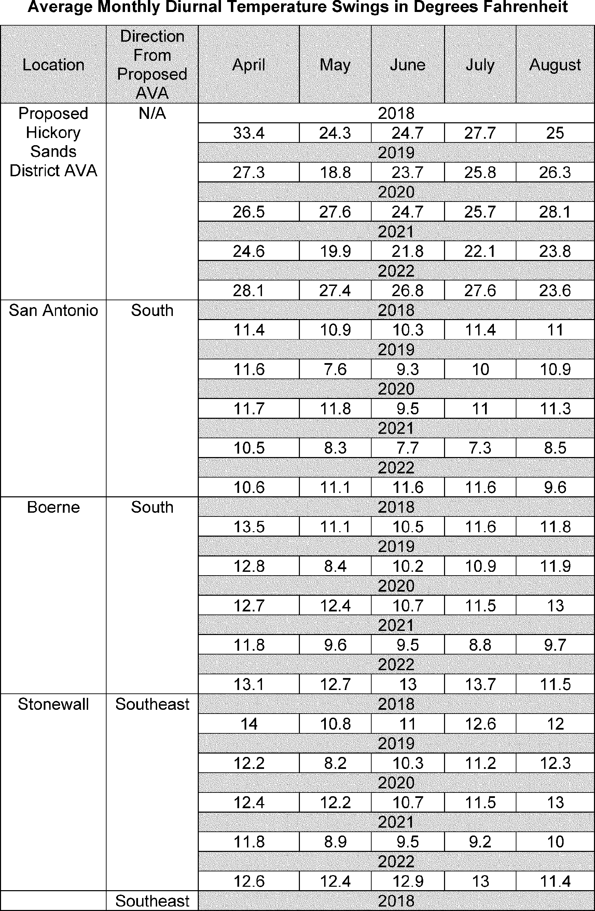
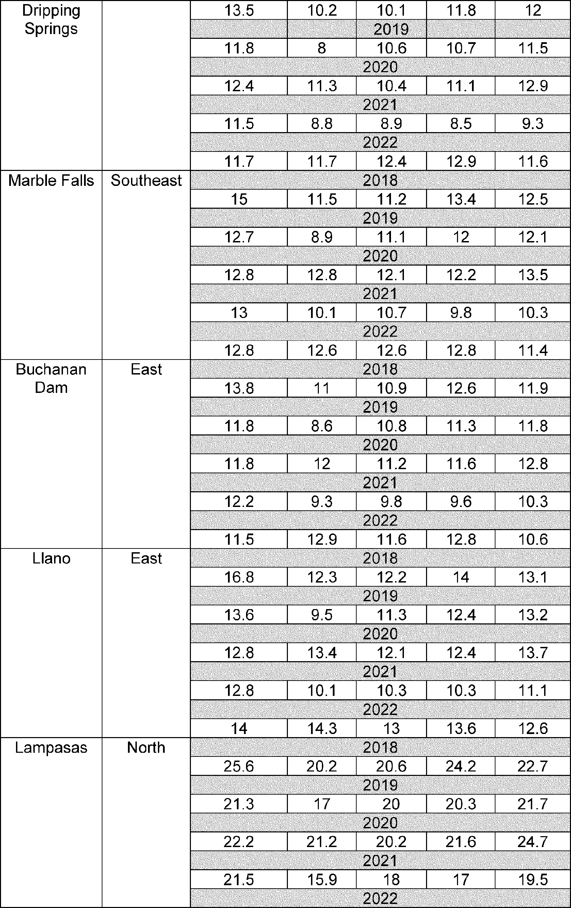

# Daily Digest — 2026-08-14

| | |
|---|---|
| **Digest date** | 2026-08-14 |
| **Data date range** | 2026-08-14 to 2026-08-14 |
| **Generated at** | 2026-08-15T14:41:02Z (UTC) |
| **Pipeline version** | a8f9821 |
| **Source watermarks** | CREC: 2026-08-14T09:24:41Z · BILLS: 2026-08-15T00:12:19Z · FR: 2026-08-15T05:02:50Z · USCOURTS: 2026-08-15T02:18:59Z · PLAW: 2026-07-25T00:00:00Z |

[Full observed listing for this day](day/2026-08-14.html) — every item our collectors observed for this publication day, mechanical rules applied, frozen at end of day. This digest is the canonical record.

All items below cite the govinfo package (and granule, where applicable) they
summarize. Selection is mechanical; each item states the rule that included
it. See the Coverage Statement at the end for a full accounting of what was
published, what was summarized, and what was excluded and why.

---

## Contents

- [Day in Review](#day-in-review)
- [1. Congressional Floor Activity](#1-congressional-floor-activity)
- [2. Legislation](#2-legislation)
- [3. Federal Register](#3-federal-register)
- [4. Enacted Laws](#4-enacted-laws)
- [5. Judicial Activity](#5-judicial-activity)
- [6. Agency Announcements](#6-agency-announcements)
- [7. Recorded Votes](#7-recorded-votes)
- [8. Bill Actions](#8-bill-actions)
- [9. Presidential Actions](#9-presidential-actions)
- [Terms Used Today](#terms-used-today)
- [Coverage Statement](#coverage-statement)
- [Methodology](#methodology)

---

## Day in Review

The digest carries eighteen bills introduced in the House of Representatives and five in the Senate. The Congressional Record includes thirty-eight entries from the House, four from the Senate, fifteen Extensions of Remarks, and six Daily Digests.

The executive branch picture includes two presidential documents: Executive Order 14420 establishing Gold Standard Childhood Vaccine Recommendations, and a notice continuing a national emergency concerning export control regulations. Federal agencies published eleven proposed rules, notably from the Environmental Protection Agency regarding state air plan approvals and the Alcohol and Tobacco Tax and Trade Bureau proposing four new American viticultural areas. Sixteen final rules were also issued, covering beneficial ownership reporting requirements, Civil Service Rule updates, various airworthiness directives, and Coast Guard safety zones. Additionally, the digest carries ninety-seven notices and one hundred eighty-six agency press releases.

The digest carries seventy-seven appellate court opinions and seven national court opinions. Among the appellate decisions, the Eleventh Circuit affirmed Tax Court valuations and upheld a felony battery as a crime of violence. The Fourth Circuit affirmed preliminary injunctions in trademark infringement cases. The Fifth Circuit addressed a preliminary injunction concerning national removals. The Sixth Circuit identified plausible Fourth Amendment claims. The Seventh Circuit affirmed forced labor convictions and resolved arbitration disputes. The Ninth Circuit affirmed a university's immunity and reversed an antitrust judgment.

*Composed from the summarized items below and the day's mechanical
counts; all specifics are cited in their sections.*

---

## 1. Congressional Floor Activity

Source: Congressional Record (CREC), issue observed 2026-08-14, covering proceedings of 2026-08-13. Published by govinfo 2026-08-14T09:24:41Z; observed by our collector 2026-08-14T09:33:51Z. Total issue size: 63 granule(s).

### 1.1 Senate

No Senate floor items met the selection thresholds. 4 floor granule(s) are accounted for in the Coverage Statement.

### 1.2 House of Representatives

No House floor items met the selection thresholds. 38 floor granule(s) are accounted for in the Coverage Statement.

### 1.3 Recorded Votes

No recorded votes were published in this issue of the Congressional Record.

---

## 2. Legislation

Source: Congressional Bills (BILLS), text versions published 2026-08-14 to 2026-08-14.

### 2.1 Counts by Stage

| Stage (bill text version) | Count |
|---|---|
| Introduced (ih/is) | 23 |
| Reported (rh/rs) | 0 |
| Engrossed (eh/es) | 0 |
| Enrolled (enr) | 0 |
| Other versions | 0 |
| **Total bill texts published** | **23** |

### 2.2 Bills Listed by Mechanical Rule

Bills below are listed because they matched at least one listing rule; the
matching rule is stated per item. All other bill texts are counted above and
accounted for in the Coverage Statement.

No bill texts published in this range matched a listing rule; all 23 are
accounted for in the Coverage Statement.

---

## 3. Federal Register

Source: Federal Register (FR), issue of 2026-08-14.

### 3.1 Counts by Document Type

| Document type | Count |
|---|---|
| Rules | 16 |
| Proposed rules | 11 |
| Notices | 97 |
| Presidential documents | 2 |
| **Total FR documents** | **126** |

### 3.2 Rules Published

#### DEPARTMENT OF COMMERCE

- **Streamlining Export Controls for Drone Exports** (2026-16628; 15 CFR Parts 740, 744, and 774) — The Bureau of Industry and Security (BIS) is easing export controls on certain Unmanned Aerial Vehicles (UAVs or drones) and related parts, components, accessories, attachments, technology, and software under the Export Administration Regulations (EAR). Specifically, this rule: eliminates wind gust tolerance as a parameter for determining UAV controls under the EAR; increases the threshold for national security controls on certain UAVs from an endurance of 30 minutes to an endurance of 3 hours; makes conforming changes to remove national security controls on software and technology associated with UAVs with an endurance less than 3 hours; maintains military end-use and end-user controls on those lower endurance drones and associated software and technology; clarifies Commerce Control List (CCL) controls for certain UAVs specially designed for military use; and removes national security controls on certain specially designed parts, components, accessories, and attachments for such UAVs as they do not provide any significant military or intelligence capabilities. Action: Final rule. Dates: This rule is effective on August 13, 2026.
  - *In plain terms:* The Commerce Department eases export limits on certain drones and related equipment, raising the endurance threshold from 30 minutes to 3 hours.
  - Included because: FR-SEL-01 — document type: final rule (all listed)
  - Source: [FR-2026-08-14 / 2026-16628](https://www.govinfo.gov/app/details/FR-2026-08-14/2026-16628)

#### DEPARTMENT OF HOMELAND SECURITY

- **Safety Zone; Atlantic Ocean, Culebra, Puerto Rico** (2026-16643; 33 CFR Part 165) — The Coast Guard is establishing a temporary safety zone for navigable waters within 200 yards west of Carlos Rosario Beach, Culebra, Puerto Rico. The safety zone is needed to protect personnel, vessels, and the marine environment from potential hazards associated with unexploded ordnance and associated removal operations. Entry of vessels or persons into this zone is prohibited unless specifically authorized by the Captain of the Port, Sector San Juan, or their designated representative. Action: Temporary final rule. Dates: This rule is effective without actual notice from August 14, 2026, through September 4, 2026. For the purposes of enforcement, actual notice will be used from August 10, 2026, until August 14, 2026.
  - *In plain terms:* The Coast Guard prohibits vessel entry in waters near Carlos Rosario Beach to protect people and the environment during unexploded ordnance removal.
  - Included because: FR-SEL-01 — document type: final rule (all listed)
  - Source: [FR-2026-08-14 / 2026-16643](https://www.govinfo.gov/app/details/FR-2026-08-14/2026-16643)
- **Safety Zone; St. Clair River; Port Huron, MI** (2026-16644; 33 CFR Part 165) — The Coast Guard is establishing a temporary safety zone for navigable waters of the St. Clair River for 7.5 miles beginning in Port Huron, MI. Though this is an unsanctioned, non-permitted marine event, this zone is necessary to provide for the safety of life on these navigable waters during a float down event near Port Huron, MI. Entry into this zone of vessels or non-participants in the event is prohibited unless specifically authorized by the Captain of the Port Detroit (COTP) or their designated representative. Action: Temporary final rule. Dates: This rule is effective from 12 p.m. through 6 p.m. on August 16, 2026.
  - *In plain terms:* The Coast Guard prohibits vessel entry on the St. Clair River during a float down event near Port Huron.
  - Included because: FR-SEL-01 — document type: final rule (all listed)
  - Source: [FR-2026-08-14 / 2026-16644](https://www.govinfo.gov/app/details/FR-2026-08-14/2026-16644)
- **Safety Zone; West Passage Narragansett Bay, Narragansett, RI** (2026-16645; 33 CFR Part 165) — The Coast Guard is establishing a temporary safety zone for navigable waters on the West Passage Narragansett Bay. The safety zone is needed to protect swimmers, personnel, vessels, and the marine environment from potential hazards during a swim event. Entry of vessels or persons into this zone is prohibited unless specifically authorized by the Captain of the Port, Sector Southeastern New England, or their designated representative. Action: Temporary final rule. Dates: This rule is effective from 10:30 a.m. on August 18, 2026, through 1 p.m. on August 19, 2026. It will only be subject to enforcement, however, from 10:30 a.m. until 1 p.m. on August 18, 2026, unless the event is delayed because of weather conditions, in which case it will be subject to enforcement during those same hours on August 19, 2026.
  - *In plain terms:* The Coast Guard prohibits vessel entry in Narragansett Bay during a swimming event to protect participants from boats.
  - Included because: FR-SEL-01 — document type: final rule (all listed)
  - Source: [FR-2026-08-14 / 2026-16645](https://www.govinfo.gov/app/details/FR-2026-08-14/2026-16645)
- **Special Local Regulation; ChattaWake Wakesurfing Event, Tennessee River, Chattanooga TN** (2026-16660; 33 CFR Part 100) — The Coast Guard is establishing a special local regulation (SLR) for the ChattaWake wakesurfing competition, from Mile Marker 462 to 466 on the Tennessee River near Chattanooga, TN. This rulemaking will create a special regulated area requiring non-participants to transit at no-wake speed to protect wake surfers from potential hazards on the waterway. Action: Temporary final rule. Dates: This rule is effective from 7 a.m. on August 13, 2026, through 5 p.m. on August 16, 2026.
  - *In plain terms:* The Coast Guard requires non-participants to travel at no-wake speed on the Tennessee River during the ChattaWake wakesurfing competition.
  - Included because: FR-SEL-01 — document type: final rule (all listed)
  - Source: [FR-2026-08-14 / 2026-16660](https://www.govinfo.gov/app/details/FR-2026-08-14/2026-16660)

#### DEPARTMENT OF THE TREASURY

- **Beneficial Ownership Information Reporting Requirement Revision** (2026-16576; 31 CFR Part 1010) — FinCEN is issuing this final rule to adopt as final and with certain limited changes the interim final rule issued on March 26, 2025, which narrowed beneficial ownership information (BOI) reporting requirements under FinCEN's regulations implementing the Corporate Transparency Act (CTA). In particular, this final rule not only continues to exempt reporting companies from having to report the BOI of U.S. person beneficial owners and U.S. person beneficial owners from having to provide BOI to reporting companies; it also exempts reporting companies from having to submit information about their U.S. person company applicants to FinCEN and exempts U.S. person company applicants from any obligation to provide their information. In addition, the final rule exempts all U.S. persons from the requirement to update information already provided to FinCEN in connection with obtaining a FinCEN identifier (FinCEN ID). Action: Final rule. Dates: This rule is effective August 14, 2026.
  - *In plain terms:* FinCEN finalizes rules that exempt U.S. persons and U.S. companies from reporting beneficial ownership information and from updating previously reported information.
  - Included because: FR-SEL-01 — document type: final rule (all listed)
  - Source: [FR-2026-08-14 / 2026-16576](https://www.govinfo.gov/app/details/FR-2026-08-14/2026-16576)

#### DEPARTMENT OF TRANSPORTATION

- **Airworthiness Directives; Rolls-Royce Deutschland Ltd & Co KG Engines** (2026-16636; 14 CFR Part 39) — The FAA is adopting a new airworthiness directive (AD) for all Rolls-Royce Deutschland Ltd & Co KG (RRD) Model Trent 1000-A2, Trent 1000-AE2, Trent 1000-C2, Trent 1000-CE2, Trent 1000-D2, Trent 1000-E2, Trent 1000-G2, Trent 1000-H2, Trent 1000-J2, Trent 1000-K2, and Trent 1000-L2 engines. This AD was prompted by reports of cracking of the intermediate pressure (IP) compressor variable inlet guide vanes (VIGVs) due to high-cycle fatigue propagation. This AD requires repetitive borescope inspections (BSIs) for cracks of the IP compressor VIGVs and, depending on the inspection results, reduced inspection intervals for the repetitive BSIs or removal of the engine from service and replacement of the IP compressor VIGVs. The FAA is issuing this AD to address the unsafe condition on these products. Action: Final rule. Dates: This AD is effective September 18, 2026. The Director of the Federal Register approved the incorporation by reference of a certain publication listed in this AD as of September 18, 2026.
  - *In plain terms:* The FAA requires repeated inspection of certain Rolls-Royce engines for cracks and replacement of compressor parts if needed.
  - Included because: FR-SEL-01 — document type: final rule (all listed)
  - Source: [FR-2026-08-14 / 2026-16636](https://www.govinfo.gov/app/details/FR-2026-08-14/2026-16636)
- **Airworthiness Directives; Airbus Helicopters** (2026-16641; 14 CFR Part 39) — The FAA is superseding Airworthiness Directive (AD) 2023-25-14, which applied to certain Airbus Helicopters Model EC130T2 helicopters. AD 2023-25-14 revised the procedures for inspecting the vibration level on the tail rotor drive shaft and, depending on these results, required replacing certain parts. Since the FAA issued AD 2023-25-14, the manufacturer developed a modification of the rear drive shaft, sliding flange, and equipped splined sleeve. This AD requires installing this modification and repetitively inspecting the vibration level of the tail rotor drive shaft. This AD also prohibits the installation of certain parts and prohibits the performance of a balance correction unless certain requirements are met. The FAA is issuing this AD to address the unsafe condition on these products. Action: Final rule. Dates: This AD is effective September 18, 2026. The Director of the Federal Register approved the incorporation by reference of a certain publication listed in this AD as of September 18, 2026.
  - *In plain terms:* The FAA updates helicopter inspection and repair requirements for tail rotor drive shafts with a new manufacturer modification.
  - Included because: FR-SEL-01 — document type: final rule (all listed)
  - Source: [FR-2026-08-14 / 2026-16641](https://www.govinfo.gov/app/details/FR-2026-08-14/2026-16641)
- **Airworthiness Directives; Pratt & Whitney Canada Corp. Engines** (2026-16655; 14 CFR Part 39) — The FAA is superseding Airworthiness Directive (AD) 2026-13-09, which applied to all Pratt & Whitney Canada Corp. (P&WC) Model PW210A, PW210A1, and PW210S engines. AD 2026-13-09 required repetitive visual inspections of the turbine exhaust frame for cracks and, depending on the results of the inspections, replacement of the turbine exhaust frame. Since the FAA issued AD 2026-13-09, a manufacturer's analysis revealed that turbine exhaust frames manufactured from a certain material were less durable and more susceptible to developing cracks under thermal stress. This AD requires repetitive visual inspections of the turbine exhaust frame for cracks at different initial inspection thresholds than required by AD 2026-13-09 based on the material used during manufacture and, depending on the results of the inspections, replacement of the turbine exhaust frame. The FAA is issuing this AD to address the unsafe condition on these products. Action: Final rule; request for comments. Dates: This AD is effective August 31, 2026. The Director of the Federal Register approved the incorporation by reference of a certain publication listed in this AD as of August 31, 2026. The FAA must receive comments on this AD by September 28, 2026.
  - *In plain terms:* The FAA updates inspection schedules for Pratt & Whitney engine exhaust frames based on manufacturing material durability.
  - Included because: FR-SEL-01 — document type: final rule (all listed)
  - Source: [FR-2026-08-14 / 2026-16655](https://www.govinfo.gov/app/details/FR-2026-08-14/2026-16655)
- **Airworthiness Directives; ATR-GIE Avions de Transport Régional Airplanes** (2026-16657; 14 CFR Part 39) — The FAA is superseding Airworthiness Directive (AD) 2023-21-10, which applied to certain ATR-GIE Avions de Transport Régional Model ATR42-500 and ATR72-212A airplanes. AD 2023-21-10 required an inspection of the horizontal stabilizer (HS) left- and right-hand leading edge lateral ribs, the box in between, the center box upper panel, and HS forward back-up fitting for discrepancies and applicable corrective action. Since the FAA issued AD 2023-21-10, it was determined that additional airplanes are affected and additional areas must be inspected. This AD continues to require the actions in AD 2023-21-10 and requires expanding the applicability and inspecting the HS front spar web and center box internal area for discrepancies and accomplishing applicable corrective actions. The FAA is issuing this AD to address the unsafe condition on these products. Action: Final rule. Dates: This AD is effective September 18, 2026. The Director of the Federal Register approved the incorporation by reference of certain publications listed in this AD as of September 18, 2026.
  - *In plain terms:* The FAA expands inspection requirements for ATR airplane wing components to include additional areas and materials.
  - Included because: FR-SEL-01 — document type: final rule (all listed)
  - Source: [FR-2026-08-14 / 2026-16657](https://www.govinfo.gov/app/details/FR-2026-08-14/2026-16657)
- **Airworthiness Directives; Gulfstream Aerospace LP (Type Certificate Previously Held by Israel Aircraft Industries, Ltd.) Airplanes** (2026-16659; 14 CFR Part 39) — The FAA is adopting a new airworthiness directive (AD) for all Gulfstream Aerospace LP Model Gulfstream 200 and Galaxy airplanes. This AD was prompted by a determination that new or more restrictive airworthiness limitations are necessary. This AD requires revising the existing maintenance or inspection program, as applicable, to incorporate new or more restrictive airworthiness limitations. The FAA is issuing this AD to address the unsafe condition on these products. Action: Final rule. Dates: This AD is effective September 18, 2026. The Director of the Federal Register approved the incorporation by reference of a certain publication listed in this AD as of September 18, 2026.
  - *In plain terms:* The FAA requires Gulfstream 200 and Galaxy airplane operators to adopt new maintenance limitations to address safety issues.
  - Included because: FR-SEL-01 — document type: final rule (all listed)
  - Source: [FR-2026-08-14 / 2026-16659](https://www.govinfo.gov/app/details/FR-2026-08-14/2026-16659)
- **Airworthiness Directives; Air Tractor, Inc. Airplanes** (2026-16672; 14 CFR Part 39) — The FAA is superseding Airworthiness Directive (AD) 2024-16-06, which applied to all Air Tractor, Inc. (Air Tractor) Model AT-802 and AT-802A airplanes with Wipaire, Inc. Supplemental Type Certificate (STC) No. SA01795CH installed. AD 2024-16-06 required repetitively inspecting the left and right, forward and rear, horizontal stabilizer spars for cracks, replacing any horizontal stabilizer spar found cracked or damaged, installing bathtub fittings, and reporting inspection results to the FAA. Since the FAA issued AD 2024-16-06, additional cracks in the horizontal stabilizer spars were reported where the vertical fin structural support brace mounts to the horizontal stabilizer spar. This AD retains all the actions of AD 2024-16-06 and adds inspections to another area. The FAA is issuing this AD to address the unsafe condition on these products. Action: Final rule; request for comments. Dates: This AD is effective August 31, 2026. The Director of the Federal Register approved the incorporation by reference of certain publications listed in this AD as of August 31, 2026. The Director of the Federal Register approved the incorporation by reference of a certain other publication listed in this AD as of September 4, 2024 (89 FR 67267, August 20, 2024). The FAA must receive comments on this AD by September 28, 2026.
  - *In plain terms:* The FAA is updating an airworthiness directive for Air Tractor airplanes to add inspections for newly-discovered cracks in a structural support area while retaining all previous inspection and repair requirements.
  - Included because: FR-SEL-01 — document type: final rule (all listed)
  - Source: [FR-2026-08-14 / 2026-16672](https://www.govinfo.gov/app/details/FR-2026-08-14/2026-16672)

#### ENVIRONMENTAL PROTECTION AGENCY

- **Approval of Source-Specific Air Quality Implementation Plan; New York; Big Six Towers Inc.** (2026-16627; 40 CFR Part 52) — The Environmental Protection Agency (EPA) is approving a revision to the State of New York's State Implementation Plan (SIP) for the ozone National Ambient Air Quality Standard (NAAQS) related to a source-specific SIP (SSSIP) revision for Big Six Towers Inc. (the Big Six), located at 59-55 47th Ave. Woodside, NY 11377 (the Facility). The EPA found that the control options in this SSSIP revision implement Reasonably Available Control Technology (RACT) with respect to oxides of nitrogen (NO X ) emissions from the relevant Facility sources, which are identified as three oil-fired engines. This SSSIP revision implements NO X RACT for the relevant Facility sources in accordance with the requirements for implementation of the 2008 and 2015 ozone NAAQS. The EPA determined that this action will not interfere with ozone NAAQS requirements and meets all applicable requirements of the Clean Air Act (CAA). Action: Final rule. Dates: This final rule is effective on September 14, 2026.
  - *In plain terms:* The EPA approves pollution control technology for engines at a specific facility to meet ozone air quality standards.
  - Included because: FR-SEL-01 — document type: final rule (all listed)
  - Source: [FR-2026-08-14 / 2026-16627](https://www.govinfo.gov/app/details/FR-2026-08-14/2026-16627)

#### GENERAL SERVICES ADMINISTRATION

- **General Services Administration Property Management Regulation (GSPMR): Nondiscrimination in Programs Receiving Federal Financial Assistance** (2026-16584; 41 CFR Parts 101-4, 101-6, 101-8, and 105-10) — The General Services Administration (GSA) revises its regulations implementing Title VI of the Civil Rights Act of 1964 (Title VI) and moves those regulations from the Federal Property Management Regulations (FPMR) to the General Services Administration Property Management Regulations (GSPMR). Title VI prohibits discrimination on the basis of race, color, or national origin in programs or activities receiving Federal financial assistance. This final rule updates GSA's Title VI regulations to reflect current statutory interpretation, applicable executive orders, and government-wide regulatory structure. This final rule also improves clarity, consistency, and administrative efficiency. These revisions align with changes made by the U.S. Department of Justice (DOJ) to its Title VI Regulations. Action: Final rule. Dates: This rule is effective September 14, 2026.
  - *In plain terms:* The General Services Administration updates its nondiscrimination rules to prohibit discrimination based on race, color, or national origin in federally-funded programs.
  - Included because: FR-SEL-01 — document type: final rule (all listed)
  - Source: [FR-2026-08-14 / 2026-16584](https://www.govinfo.gov/app/details/FR-2026-08-14/2026-16584)

#### OFFICE OF PERSONNEL MANAGEMENT

- **Updates and Amendments to the Civil Service Rules** (2026-16630; 5 CFR PARTS 2, 3, 5, 6, 9, and 10) — Pursuant to the President's direction in Executive Order 14410, Implementing Schedule Policy/Career in the Excepted Service, the Office of Personnel Management (OPM) is issuing a direct final rule to update and amend obsolete and outdated provisions of the Civil Service Rules that do not substantively affect agency operations. Action: Direct final rule. Dates: This rule is effective October 13, 2026, unless significant adverse comments are received by September 14, 2026. If significant adverse comments are received, OPM will withdraw the relevant provisions of this direct final rule.
  - *In plain terms:* The Office of Personnel Management updates outdated Civil Service Rules following the President's direction on excepted service policy.
  - Included because: FR-SEL-01 — document type: final rule (all listed)
  - Source: [FR-2026-08-14 / 2026-16630](https://www.govinfo.gov/app/details/FR-2026-08-14/2026-16630)
- **Differential Pay for Prescribed Wildland Fire Activities** (2026-16687; 5 CFR Parts 532 and 550) — The Office of Personnel Management is issuing a final rule to add prescribed (planned) wildland fire duties as covered activities triggering payment of Hazardous Duty Pay (HDP) for General Schedule (GS) employees and Environmental Differential Pay (EDP) for Federal Wage System (FWS) employees. The final rule authorizes a 25 percent differential for GS and FWS employees participating as a member of a firefighting crew engaged in activities on the fireline directly involving the implementation and control of prescribed wildland fires. Action: Final rule. Dates: Effective date: This regulation is effective September 14, 2026. Applicability date: This change applies on the first day of the first pay period beginning on or after September 14, 2026.
  - *In plain terms:* The Office of Personnel Management is authorizing a 25 percent pay differential for federal employees participating as firefighting crew members in planned wildland fire suppression activities on the fireline.
  - Included because: FR-SEL-01 — document type: final rule (all listed)
  - Source: [FR-2026-08-14 / 2026-16687](https://www.govinfo.gov/app/details/FR-2026-08-14/2026-16687)

### 3.3 Proposed Rules Published

#### DEPARTMENT OF COMMERCE

- **Atlantic Highly Migratory Species; Revisions to Fishing Gear Regulations** (2026-16591; 50 CFR Part 635) — NMFS is proposing regulatory revisions to fishing gear requirements in fisheries targeting Atlantic highly migratory species (HMS) to increase flexibility and remove inefficiencies, thus increasing fishing opportunities and the ability of HMS fisheries to achieve optimum yield. Specifically, NMFS is proposing changes to buoy gear regulations that include modifying gear deployment and retrieval requirements, authorizing this gear under additional permits, and allowing the retention of additional species. NMFS is also proposing changes to speargun fishing gear regulations that include authorizing this gear under additional permits and targeting additional species. Finally, NMFS is proposing overarching changes regarding gear used for the collection of bait in all HMS fisheries. Action: Proposed rule; request for comments. Dates: Written comments must be received by October 13, 2026. NMFS will hold two public hearing webinars on August 31, 2026 from 1 to 3 p.m. ET and October 1, 2026 from 1 to 3 p.m. ET. For additional details on the public hearings, see the SUPPLEMENTARY INFORMATION section of this document.
  - *In plain terms:* The federal fisheries agency proposes allowing more flexibility in fishing gear for Atlantic species, including changes to buoy and speargun regulations.
  - Included because: FR-SEL-02 — document type: proposed rule (all listed)
  - Source: [FR-2026-08-14 / 2026-16591](https://www.govinfo.gov/app/details/FR-2026-08-14/2026-16591)

#### DEPARTMENT OF THE TREASURY

- **Foreign Currency Gain or Loss of Controlled Foreign Corporations** (2026-16569; 26 CFR Part 1) — This document contains proposed regulations providing rules relating to the determination and recognition of foreign currency gain or loss with respect to qualified business units (“QBUs”) of controlled foreign corporations (“CFCs”). The proposed regulations provide an election under which a CFC generally would not be required to compute or recognize foreign currency gain or loss upon a remittance from a QBU, except in connection with certain inbound nonrecognition transactions. Action: Notice of proposed rulemaking. Dates: Written or electronic comments and requests for a public hearing must be received by November 12, 2026.
  - *In plain terms:* The Treasury proposes rules allowing some foreign-controlled companies to skip reporting currency gains or losses when moving money between their divisions, except in certain transactions.
  - Included because: FR-SEL-02 — document type: proposed rule (all listed)
  - Source: [FR-2026-08-14 / 2026-16569](https://www.govinfo.gov/app/details/FR-2026-08-14/2026-16569)
- **Proposed Establishment of the Kaw Valley Viticultural Area** (2026-16668; 27 CFR Part 9) — The Alcohol and Tobacco Tax and Trade Bureau (TTB) proposes to establish the approximately 3,515,482-acre (5,493-square mile) “Kaw Valley” American viticultural area in northeastern Kansas. The proposed viticultural area is not within any other established viticultural area. TTB designates viticultural areas to allow vintners to better describe the origin of their wines and to allow consumers to better identify wines they may purchase. TTB invites comments on this proposed addition to its regulations. Action: Notice of proposed rulemaking. Dates: Comments must be received by October 13, 2026.
  - *In plain terms:* The Alcohol and Tobacco Tax and Trade Bureau proposes designating a 5,493-square-mile region in Kansas as a wine-growing area.
  - Included because: FR-SEL-02 — document type: proposed rule (all listed)
  - Source: [FR-2026-08-14 / 2026-16668](https://www.govinfo.gov/app/details/FR-2026-08-14/2026-16668)
- **Proposed Establishment of the Mill Creek—Walla Walla Valley Viticultural Area** (2026-16669; 27 CFR Part 9) — The Alcohol and Tobacco Tax and Trade Bureau (TTB) proposes to establish the approximately 4,898-acre “Mill Creek—Walla Walla Valley” American viticultural area (AVA) in Walla Walla County, Washington. The proposed viticultural area lies entirely within the established Columbia Valley and Walla Walla Valley AVAs. TTB designates viticultural areas to allow vintners to better describe the origin of their wines and to allow consumers to better identify wines they may purchase. TTB invites comments on this proposed addition to its regulations. Action: Notice of proposed rulemaking. Dates: TTB must receive comments on or before October 13, 2026.
  - *In plain terms:* The Alcohol and Tobacco Tax and Trade Bureau proposes designating a 4,898-acre wine-growing area in Washington within existing viticultural areas.
  - Included because: FR-SEL-02 — document type: proposed rule (all listed)
  - Source: [FR-2026-08-14 / 2026-16669](https://www.govinfo.gov/app/details/FR-2026-08-14/2026-16669)
- **Proposed Establishment of the Llano Uplift and Hickory Sands District Viticultural Areas** (2026-16670; 27 CFR Part 9) — The Alcohol and Tobacco Tax and Trade Bureau (TTB) proposes to establish the 2,096-square mile “Llano Uplift” American viticultural area (AVA) in portions of Blanco, Burnet, Gillespie, Llano, Mason, McCulloch, and San Saba Counties in Texas. The proposed AVA entirely encompasses the established Bell Mountain AVA. TTB is also proposing to establish the 193-square mile “Hickory Sands District” AVA in portions of Llano, Mason, McCulloch, and San Saba Counties in Texas. TTB is proposing these two AVAs simultaneously because, if established, the proposed Hickory Sands District AVA would be located entirely within the proposed Llano Uplift AVA. Additionally, both proposed AVAs are located entirely within the boundaries of the existing Texas Hill Country AVA. TTB designates viticultural areas to allow vintners to better describe the origin of their wines and to allow consumers to better identify wines they may purchase. TTB invites comments on these proposals. Action: Notice of proposed rulemaking. Dates: TTB must receive your comments on or before October 13, 2026.
  - *In plain terms:* The Alcohol and Tobacco Tax and Trade Bureau proposes designating two wine-growing areas in Texas, with one entirely within the other.
  - Included because: FR-SEL-02 — document type: proposed rule (all listed)
  - Source: [FR-2026-08-14 / 2026-16670](https://www.govinfo.gov/app/details/FR-2026-08-14/2026-16670)
  -  *Source graphic 1 of 3 from 2026-16670.*
  -  *Source graphic 2 of 3 from 2026-16670.*
  - *Graphics not rendered here: 1 of 3 — see the [source PDF](https://www.govinfo.gov/content/pkg/FR-2026-08-14/pdf/FR-2026-08-14.pdf).*
- **Proposed Establishment of the Rancho Santa Fe Viticultural Area** (2026-16671; 27 CFR Part 9) — The Alcohol and Tobacco Tax and Trade Bureau (TTB) proposes to establish the 15,827-acre “Rancho Santa Fe” American viticultural area (AVA) in San Diego County, California. The proposed AVA is located entirely within the existing South Coast AVA. TTB designates viticultural areas to allow vintners to better describe the origin of their wines and to allow consumers to better identify wines they may purchase. TTB invites comments on these proposals. Action: Notice of proposed rulemaking. Dates: TTB must receive your comments on or before October 13, 2026.
  - *In plain terms:* The Alcohol and Tobacco Tax and Trade Bureau proposes designating a 15,827-acre wine-growing area in San Diego County, California.
  - Included because: FR-SEL-02 — document type: proposed rule (all listed)
  - Source: [FR-2026-08-14 / 2026-16671](https://www.govinfo.gov/app/details/FR-2026-08-14/2026-16671)

#### DEPARTMENT OF TRANSPORTATION

- **Airworthiness Directives; Airbus Helicopters** (2026-16640; 14 CFR Part 39) — The FAA proposes to adopt a new airworthiness directive (AD) for certain Airbus Helicopters Model H160-B helicopters. This proposed AD was prompted by a determination that a gap without fire-resistant sealant (sealant) may be present in the cargo bay near the fuel segregation box. This proposed AD would require inspecting for any missing sealant and, depending on findings, corrective action. The FAA is proposing this AD to address the unsafe condition on these products. Action: Notice of proposed rulemaking (NPRM). Dates: The FAA must receive comments on this NPRM by September 28, 2026.
  - *In plain terms:* The FAA proposes requiring inspection and repair of missing fire-resistant sealant in cargo bay areas of certain Airbus helicopters.
  - Included because: FR-SEL-02 — document type: proposed rule (all listed)
  - Source: [FR-2026-08-14 / 2026-16640](https://www.govinfo.gov/app/details/FR-2026-08-14/2026-16640)

#### ENVIRONMENTAL PROTECTION AGENCY

- **Air Plan Approval; Iowa; Interstate Transport Requirements for the 2010 Sulfur Dioxide Standard** (2026-16570; 40 CFR Part 52) — The Environmental Protection Agency (EPA) is proposing to approve the State Implementation Plan (SIP) submission from Iowa addressing the Clean Air Act (CAA or Act) interstate transport requirements, also known as the “good neighbor” provision, for the 2010 1-hour primary sulfur dioxide (SO 2 ) National Ambient Air Quality Standard (NAAQS). The good neighbor provision requires each State's plan to contain adequate provisions prohibiting the interstate transport of air pollution in amounts that will contribute significantly to nonattainment, or interfere with maintenance, of a NAAQS in any other State. The EPA's proposed approval of this rule revision is being done in accordance with the requirements of the CAA. Action: Proposed rule. Dates: Comments must be received on or before September 14, 2026.
  - *In plain terms:* The EPA proposes approving Iowa's plan to prevent air pollution from crossing state lines and harming air quality for the sulfur dioxide standard.
  - Included because: FR-SEL-02 — document type: proposed rule (all listed)
  - Source: [FR-2026-08-14 / 2026-16570](https://www.govinfo.gov/app/details/FR-2026-08-14/2026-16570)
- **Air Plan Approval; Missouri; Moderate Attainment Plan Elements for the 2015 8-Hour Ozone Standard for the Missouri Portion of the St. Louis Nonattainment Area** (2026-16571; 40 CFR Part 52) — The Environmental Protection Agency (EPA) is proposing to approve portions of a state implementation plan (SIP) revision submitted by the State of Missouri on September 6, 2023, as meeting Clean Air Act (CAA) requirements for the 2015 8-hour ozone national ambient air quality standards (NAAQS) in the Missouri portion of the St. Louis, MO-IL bi-state nonattainment area. Specifically, the EPA is proposing approval of the submitted vehicle inspection and maintenance (I/M) program, nonattainment new source review (NNSR) program, and reasonably available control technology (RACT) determinations for major sources of volatile organic compounds (VOC) and Nitrogen Oxides (NO X ) SIP elements as meeting applicable Moderate nonattainment area requirements for the 2015 8-hour ozone NAAQS. The EPA will address the remaining SIP elements in a separate action. Action: Proposed rule. Dates: Comments must be received on or before September 14, 2026.
  - *In plain terms:* The EPA proposes approving parts of Missouri's plan to meet ozone air quality standards, including vehicle inspection and pollution control programs.
  - Included because: FR-SEL-02 — document type: proposed rule (all listed)
  - Source: [FR-2026-08-14 / 2026-16571](https://www.govinfo.gov/app/details/FR-2026-08-14/2026-16571)
- **Air Plan Approval; Virginia; 1997 8-Hour Ozone National Ambient Air Quality Standard Second Maintenance Plan for the Madison and Page Counties (Shenandoah National Park) Area** (2026-16575; 40 CFR Part 52) — The Environmental Protection Agency (EPA) is proposing to approve a state implementation plan (SIP) revision submitted by the Commonwealth of Virginia (the Commonwealth or Virginia). This revision pertains to the Commonwealth's plan, submitted by the Virginia Department of Environmental Quality (VADEQ), for maintaining the 1997 8-hour ozone national ambient air quality standard (NAAQS) (referred to as the 1997 ozone NAAQS) in the Madison & Page Counties (Shenandoah NP), VA, Area (Shenandoah NP Area or Area) for the second 10-year maintenance period. This action is being taken under the Clean Air Act (CAA). Action: Proposed rule. Dates: Written comments must be received on or before September 14, 2026.
  - *In plain terms:* The EPA proposes approving Virginia's plan to maintain ozone air quality around Shenandoah National Park for the second 10-year maintenance period.
  - Included because: FR-SEL-02 — document type: proposed rule (all listed)
  - Source: [FR-2026-08-14 / 2026-16575](https://www.govinfo.gov/app/details/FR-2026-08-14/2026-16575)

#### FEDERAL COMMUNICATIONS COMMISSION

- **FCC To Review E-Rate Program To Ensure Congress's Vision** (2026-16590; 47 CFR Part 54) — In this document, the Federal Communications Commission (Commission) seeks comment on measures the Commission can take to better protect children when using E-Rate-funded networks, the Commission's progress in ensuring affordable access to high-speed broadband to and within schools and libraries, and whether the Commission's current interpretation of the Children's Internet Protection Act (CIPA) is the best reading of the statute. The Commission also proposes actions to strengthen E-Rate program integrity and streamline program administration. Action: Proposed rule. Dates: Comments are due on or before October 13, 2026 and reply comments are due on or before November 12, 2026. If you anticipate that you will be submitting comments but find it difficult to do so within the period of time allowed by this document, you should advise the contact listed in the following as soon as possible.
  - *In plain terms:* The FCC asks for comments on ways to better protect children on E-Rate-funded school and library networks and strengthen program integrity.
  - Included because: FR-SEL-02 — document type: proposed rule (all listed)
  - Source: [FR-2026-08-14 / 2026-16590](https://www.govinfo.gov/app/details/FR-2026-08-14/2026-16590)

### 3.4 Notices and Presidential Documents

Notices are summarized only when they match a listing rule; all are counted
in 3.1 and in the Coverage Statement. Presidential documents in the FR are
always listed.

- **Delivering Gold Standard Childhood Vaccine Recommendations for Americans** (2026-16730) — Executive Order 14420 establishes Gold Standard Childhood Vaccine Recommendations organized into three categories: immunizations recommended for all children (measles, mumps, rubella, diphtheria, tetanus, pertussis, polio, Haemophilus influenzae type B, pneumococcal disease, human papillomavirus, and varicella), immunizations recommended for certain high-risk groups, and immunizations based on shared clinical decision-making. The order directs the HHS Task Force on Safer Childhood Vaccines to present plans within 90 days for offering single-disease vaccines, assessing vaccine timing and sequencing, developing alternative adjuvants to aluminum, and improving vaccine safety monitoring and transparency. Federal departments are directed to ensure compliance with obligations regarding parental authority, religious freedom, disability accommodations, and exemptions from childhood immunization requirements.
  - *In plain terms:* Executive Order 14420 establishes childhood vaccine recommendations and directs HHS to develop plans within 90 days for single-disease vaccines, vaccine timing, alternative adjuvants, and improved monitoring while preserving parental authority and religious exemptions.
  - Included because: FR-SEL-03 — presidential document (all listed)
  - Source: [FR-2026-08-14 / 2026-16730](https://www.govinfo.gov/app/details/FR-2026-08-14/2026-16730)
- **Continuation of the National Emergency With Respect to Export Control Regulations** (2026-16748) — The notice continues the national emergency originally declared in 2001 regarding unusual and extraordinary threats to national security, foreign policy, and the economy related to the Export Administration Act of 1979 for an additional year through August 2027. The continuation is necessary to carry out implementation of certain sanctions authorities under the International Emergency Economic Powers Act.
  - *In plain terms:* The notice extends a national emergency originally declared in 2001 regarding export control threats through August 2027 to maintain implementation of sanctions authorities.
  - Included because: FR-SEL-03 — presidential document (all listed)
  - Source: [FR-2026-08-14 / 2026-16748](https://www.govinfo.gov/app/details/FR-2026-08-14/2026-16748)

---

## 4. Enacted Laws

Source: Public and Private Laws (PLAW) published 2026-08-14.

No laws were published in this range.

---

## 5. Judicial Activity

Source: United States Courts Opinions (USCOURTS): opinions observed 2026-08-14
by our collector; each opinion states its own issue date beside its
listing ([how our clocks work](faq.html#fapds-three-clocks)).

Completeness disclosure (standing): USCOURTS carries opinions from
approximately 140 participating appellate, district, bankruptcy, and
national federal courts. Unlike the Congressional Record and the Federal
Register, which are the complete official record of their branches,
USCOURTS is participation-based and is NOT the complete federal judicial
record. Courts post opinions with delay — typically over several days —
so a day's digest carries the opinions that became available that day,
whatever date each was issued.

### 5.1 Appellate and National Court Opinions

Appellate and national court opinions are summarized; district and
bankruptcy opinions are counted in 5.2 and in the Coverage Statement.

#### United States Court of Appeals for the Eleventh Circuit

- **Ralph Evans v. Commissioner of Internal Revenue** (No. 24-11882; filed 2026-08-13) — The Eleventh Circuit affirmed the Tax Court's valuation of a conservation easement on a Georgia property at $1,000,000, rejecting taxpayers' claimed deduction of approximately $10.3 million. The court found the Tax Court properly credited the IRS expert's comparable-property appraisal methodology while finding the taxpayers' experts' valuation work unreliable due to methodological flaws.
  - *In plain terms:* A court upheld a $1 million valuation of a Georgia conservation easement, rejecting the owners' $10.3 million deduction claim.
  - Included because: USCOURTS-SEL-01 — appellate court opinion (all listed) (document dated 2026-08-13)
  - Source: [USCOURTS-ca11-24-11882 / USCOURTS-ca11-24-11882-0](https://www.govinfo.gov/app/details/USCOURTS-ca11-24-11882/USCOURTS-ca11-24-11882-0)
- **Nathaniel Carter, et al v. Commissioner of Internal Revenue** (No. 24-11884; filed 2026-08-13) — The Eleventh Circuit affirmed the Tax Court's valuation of a conservation easement on a Georgia property at $1,000,000, rejecting taxpayers' claimed deduction of approximately $10.3 million. The court found the Tax Court properly credited the IRS expert's comparable-property appraisal methodology while finding the taxpayers' experts' valuation work unreliable due to methodological flaws.
  - *In plain terms:* A court upheld a $1 million valuation of a Georgia conservation easement, rejecting the owners' $10.3 million deduction claim.
  - Included because: USCOURTS-SEL-01 — appellate court opinion (all listed) (document dated 2026-08-13)
  - Source: [USCOURTS-ca11-24-11884 / USCOURTS-ca11-24-11884-0](https://www.govinfo.gov/app/details/USCOURTS-ca11-24-11884/USCOURTS-ca11-24-11884-0)
- **USA v. Thomas Sheely, Jr.** (No. 24-13967; filed 2026-08-13) — The court affirmed Sheely's 84-month sentence for felon in possession of firearm, holding that Florida felony battery continues to qualify as a crime of violence for sentencing enhancement purposes after the Borden decision. The court rejected Sheely's argument that Borden's mens rea requirement excluded this conviction from the crime-of-violence classification.
  - *In plain terms:* A court upheld an 84-month prison sentence for felon firearm possession, finding a prior battery conviction qualifies as a violent crime.
  - Included because: USCOURTS-SEL-01 — appellate court opinion (all listed) (document dated 2026-08-13)
  - Source: [USCOURTS-ca11-24-13967 / USCOURTS-ca11-24-13967-0](https://www.govinfo.gov/app/details/USCOURTS-ca11-24-13967/USCOURTS-ca11-24-13967-0)
- **USA v. Henry Abdo** (No. 25-11767; filed 2026-08-13) — The court affirmed Abdo's 168-month sentence for wire fraud involving a $6 million Ponzi scheme operated through his company. The court found no plain error in applying a sentencing enhancement for misrepresenting charitable involvement, noting that courts are split on whether the guideline applies when a defendant solicits investments in a for-profit company with false charitable claims.
  - *In plain terms:* A court upheld a 168-month prison sentence for running a $6 million Ponzi scheme through a company.
  - Included because: USCOURTS-SEL-01 — appellate court opinion (all listed) (document dated 2026-08-13)
  - Source: [USCOURTS-ca11-25-11767 / USCOURTS-ca11-25-11767-0](https://www.govinfo.gov/app/details/USCOURTS-ca11-25-11767/USCOURTS-ca11-25-11767-0)
- **USA v. Kyle Maharaj** (No. 25-11883; filed 2026-08-13) — The court affirmed dismissal of Maharaj's collateral attack on his deportation order, holding that his Florida robbery conviction resulting in a two-year community control sentence constitutes a "term of imprisonment" under immigration law. Community control, defined under Florida law as intensive supervised custody with restricted freedom in the community, qualifies as confinement for purposes of the aggravated felony classification.
  - *In plain terms:* A court upheld deportation, finding that a two-year sentence of intensive supervised community custody counts as imprisonment for immigration purposes.
  - Included because: USCOURTS-SEL-01 — appellate court opinion (all listed) (document dated 2026-08-13)
  - Source: [USCOURTS-ca11-25-11883 / USCOURTS-ca11-25-11883-0](https://www.govinfo.gov/app/details/USCOURTS-ca11-25-11883/USCOURTS-ca11-25-11883-0)
- **USA v. Timothy Arthur** (No. 25-11903; filed 2026-08-13) — The court granted the government's motion to dismiss Arthur's appeal based on the appeal waiver in his plea agreement, finding the waiver was knowingly and voluntarily entered and enforceable under precedent.
  - *In plain terms:* A court dismissed an appeal because the defendant agreed in his plea deal to give up his right to appeal.
  - Included because: USCOURTS-SEL-01 — appellate court opinion (all listed) (document dated 2026-08-13)
  - Source: [USCOURTS-ca11-25-11903 / USCOURTS-ca11-25-11903-0](https://www.govinfo.gov/app/details/USCOURTS-ca11-25-11903/USCOURTS-ca11-25-11903-0)
- **USA v. John Lapinski** (No. 25-13163; filed 2026-08-13) — Lapinski appealed his conviction and 300-month sentence for firearm and body armor offenses. The Eleventh Circuit found the district court erred by convicting him on two separate 18 U.S.C. § 922(g) firearm possession charges arising from the same conduct, violating the Double Jeopardy Clause, and vacated his sentence for resentencing.
  - *In plain terms:* A court overturned a conviction because the defendant was convicted twice for firearm possession on the same occasion.
  - Included because: USCOURTS-SEL-01 — appellate court opinion (all listed) (document dated 2026-08-13)
  - Source: [USCOURTS-ca11-25-13163 / USCOURTS-ca11-25-13163-0](https://www.govinfo.gov/app/details/USCOURTS-ca11-25-13163/USCOURTS-ca11-25-13163-0)
- **USA v. Eduardo Palomeque** (No. 25-13543; filed 2026-08-13) — Palomeque appealed his 135-month sentence for conspiracy to distribute cocaine, arguing his sentence was unreasonable. His plea agreement contained a valid and enforceable sentence-appeal waiver, and the district court's statement at sentencing that he had a right to appeal did not negate it; the Eleventh Circuit dismissed the appeal.
  - *In plain terms:* A court dismissed an appeal of a 135-month cocaine conspiracy sentence because the defendant waived his appeal rights.
  - Included because: USCOURTS-SEL-01 — appellate court opinion (all listed) (document dated 2026-08-13)
  - Source: [USCOURTS-ca11-25-13543 / USCOURTS-ca11-25-13543-0](https://www.govinfo.gov/app/details/USCOURTS-ca11-25-13543/USCOURTS-ca11-25-13543-0)
- **USA v. Jelyssa Washington** (No. 26-10016; filed 2026-08-13) — Washington appealed the denial of her motion for a sentence reduction under 18 U.S.C. § 3582(c)(2). Her appointed counsel filed an Anders brief concluding the appeal had no arguable merit, and the Eleventh Circuit affirmed the denial of her motion.
  - *In plain terms:* A court denied a motion to reduce a sentence.
  - Included because: USCOURTS-SEL-01 — appellate court opinion (all listed) (document dated 2026-08-13)
  - Source: [USCOURTS-ca11-26-10016 / USCOURTS-ca11-26-10016-0](https://www.govinfo.gov/app/details/USCOURTS-ca11-26-10016/USCOURTS-ca11-26-10016-0)
- **Ervin Joiner v. Houston County Sheriff Department** (No. 26-10077; filed 2026-08-13) — Joiner appealed the dismissal of his habeas corpus petition, but his notice of appeal was untimely, with the postmark date of January 6, 2026 exceeding the 30-day deadline from the November 26, 2025 judgment. The Eleventh Circuit dismissed the appeal for lack of jurisdiction.
  - *In plain terms:* A court dismissed an appeal because the notice of appeal was filed after the 30-day deadline.
  - Included because: USCOURTS-SEL-01 — appellate court opinion (all listed) (document dated 2026-08-13)
  - Source: [USCOURTS-ca11-26-10077 / USCOURTS-ca11-26-10077-0](https://www.govinfo.gov/app/details/USCOURTS-ca11-26-10077/USCOURTS-ca11-26-10077-0)
- **John Shung v. Secretary of Health and Human Services** (No. 26-10201; filed 2026-08-13) — Shung sought judicial review of a Medicare Advantage plan's denial of reimbursement for laboratory tests totaling $1,658.62. The Eleventh Circuit affirmed dismissal for lack of subject matter jurisdiction because his claim fell short of the $1,900 amount-in-controversy threshold required for judicial review under 2025 standards.
  - *In plain terms:* A court dismissed a Medicare coverage dispute because the claim of $1,658.62 was below the $1,900 required threshold.
  - Included because: USCOURTS-SEL-01 — appellate court opinion (all listed) (document dated 2026-08-13)
  - Source: [USCOURTS-ca11-26-10201 / USCOURTS-ca11-26-10201-0](https://www.govinfo.gov/app/details/USCOURTS-ca11-26-10201/USCOURTS-ca11-26-10201-0)

#### United States Court of Appeals for the Fifth Circuit

- **W.M.M. v. Trump** (No. 25-10534; filed 2025-09-02) — The Fifth Circuit, on remand from the Supreme Court, granted a preliminary injunction preventing the removal of Venezuelan nationals detained under a March 2025 Presidential Proclamation invoking the 1798 Alien Enemies Act. The court found no invasion or predatory incursion as required by the statute, concluded that updated notice procedures satisfied due process requirements, and remanded the case for further proceedings.
  - *In plain terms:* A court blocked the removal of Venezuelan nationals detained under a March 2025 presidential order.
  - Included because: USCOURTS-SEL-01 — appellate court opinion (all listed) (document dated 2026-08-13)
  - Source: [USCOURTS-ca5-25-10534 / USCOURTS-ca5-25-10534-0](https://www.govinfo.gov/app/details/USCOURTS-ca5-25-10534/USCOURTS-ca5-25-10534-0)
- **W.M.M. v. Trump** (No. 25-10534; filed 2026-08-13) — Three Venezuelan nationals challenged a presidential proclamation of March 14, 2025, invoking the Alien Enemies Act against members of Tren de Aragua. The Supreme Court remanded to the Fifth Circuit to determine whether the proclamation violated the Alien Enemies Act and due process. The Fifth Circuit dismissed the appeal for lack of jurisdiction after the government removed all three named petitioners under the Immigration and Nationality Act while the appeal was pending.
  - *In plain terms:* A court dismissed an appeal after the government removed the three Venezuelan nationals who had filed it.
  - Included because: USCOURTS-SEL-01 — appellate court opinion (all listed) (document dated 2026-08-13)
  - Source: [USCOURTS-ca5-25-10534 / USCOURTS-ca5-25-10534-1](https://www.govinfo.gov/app/details/USCOURTS-ca5-25-10534/USCOURTS-ca5-25-10534-1)
- **USA v. Greim** (No. 25-11136; filed 2026-08-13) — The Federal Public Defender withdrew from representing Maximus Dean Greim in an appeal, filing an Anders brief concluding the appeal presented no nonfrivolous issues. The Fifth Circuit granted the motion to withdraw and dismissed the appeal.
  - *In plain terms:* The court dismissed the appeal after the public defender concluded it had no valid issues to address.
  - Included because: USCOURTS-SEL-01 — appellate court opinion (all listed) (document dated 2026-08-13)
  - Source: [USCOURTS-ca5-25-11136 / USCOURTS-ca5-25-11136-0](https://www.govinfo.gov/app/details/USCOURTS-ca5-25-11136/USCOURTS-ca5-25-11136-0)
- **USA v. Hamilton** (No. 25-40588; filed 2026-08-13) — Jahtaya O'Dayjah Kiara Hamilton pleaded guilty to receipt or possession of an unregistered firearm and was sentenced to 63 months imprisonment. She appealed a five-level sentencing enhancement based on the district court's finding she knew firearms were being purchased for an unlawful purpose. The Fifth Circuit affirmed the enhancement, finding the district court reasonably inferred unlawful intent from evidence that she was paid to clandestinely transfer 22 firearms.
  - *In plain terms:* The appeals court upheld a sentencing increase after finding she knew firearms were being purchased illegally.
  - Included because: USCOURTS-SEL-01 — appellate court opinion (all listed) (document dated 2026-08-13)
  - Source: [USCOURTS-ca5-25-40588 / USCOURTS-ca5-25-40588-0](https://www.govinfo.gov/app/details/USCOURTS-ca5-25-40588/USCOURTS-ca5-25-40588-0)
- **Merchant v. Merchant** (No. 25-60197; filed 2026-08-13) — Frank and Dorothy Merchant sued to recover farmland they had deeded to Frank's brother Billy in 2006 to shield assets from creditors. The district court ruled against them under the unclean hands doctrine and awarded Billy attorney fees for a frivolous lawsuit. The Fifth Circuit affirmed the fee award but vacated the appellate fee portion because the request was filed more than 14 days after judgment.
  - *In plain terms:* The court upheld the attorney fee award after finding the couple's lawsuit was frivolous, but struck appellate fees filed late.
  - Included because: USCOURTS-SEL-01 — appellate court opinion (all listed) (document dated 2026-08-13)
  - Source: [USCOURTS-ca5-25-60197 / USCOURTS-ca5-25-60197-0](https://www.govinfo.gov/app/details/USCOURTS-ca5-25-60197/USCOURTS-ca5-25-60197-0)
- **Deras-Velasquez v. Blanche** (No. 25-60698; filed 2026-08-13) — Two Honduran nationals petitioned for review of a Board of Immigration Appeals decision denying withholding of removal. The Fifth Circuit denied the petition, finding the petitioners waived the issue of whether their proposed social groups were cognizable and failed to exhaust an unexhausted due process claim.
  - *In plain terms:* The court denied the immigration appeal, finding the petitioners failed to properly raise key issues.
  - Included because: USCOURTS-SEL-01 — appellate court opinion (all listed) (document dated 2026-08-13)
  - Source: [USCOURTS-ca5-25-60698 / USCOURTS-ca5-25-60698-0](https://www.govinfo.gov/app/details/USCOURTS-ca5-25-60698/USCOURTS-ca5-25-60698-0)
- **Astran v. Austin Police Dept** (No. 26-50346; filed 2026-08-13) — Brandie Astran appealed a district court decision in a case involving claims against the Austin Police Department, Pflugerville Police Department, City of Austin, City of Pflugerville, and Travis County Medical Examiner Office. The Fifth Circuit affirmed the district court judgment, finding no reversible error.
  - *In plain terms:* The court upheld the lower court's decision in the case against the police departments and county office.
  - Included because: USCOURTS-SEL-01 — appellate court opinion (all listed) (document dated 2026-08-13)
  - Source: [USCOURTS-ca5-26-50346 / USCOURTS-ca5-26-50346-0](https://www.govinfo.gov/app/details/USCOURTS-ca5-26-50346/USCOURTS-ca5-26-50346-0)

#### United States Court of Appeals for the Fourth Circuit

- **US v. James Flood, III** (No. 23-07032; filed 2026-08-13) — Flood, serving a life sentence for kidnapping and murder, appealed the denial of his § 2255 motion claiming trial counsel rendered ineffective assistance by failing to pursue a plea agreement. The Fourth Circuit affirmed the denial without a hearing because the undisputed record showed the government would not have offered any plea without Flood's truthful proffer and testimony against his co-conspirators, which counsel believed he would not provide.
  - *In plain terms:* A court upheld denial of a new trial for a man serving life for kidnapping and murder who claimed his lawyer failed to pursue a plea deal.
  - Included because: USCOURTS-SEL-01 — appellate court opinion (all listed) (document dated 2026-08-13)
  - Source: [USCOURTS-ca4-23-07032 / USCOURTS-ca4-23-07032-0](https://www.govinfo.gov/app/details/USCOURTS-ca4-23-07032/USCOURTS-ca4-23-07032-0)
- **Eddie Stewart v. GES Recycling South Carolina LLC** (No. 24-01523; filed 2026-08-13) — The Fourth Circuit vacated summary judgment for GES Recycling South Carolina LLC on an employment discrimination claim, finding factual questions regarding racial harassment and retaliatory discharge under 42 U.S.C. § 1981 that require further proceedings at trial.
  - *In plain terms:* A court allowed an employment discrimination lawsuit based on racial harassment to proceed to trial.
  - Included because: USCOURTS-SEL-01 — appellate court opinion (all listed) (document dated 2026-08-13)
  - Source: [USCOURTS-ca4-24-01523 / USCOURTS-ca4-24-01523-0](https://www.govinfo.gov/app/details/USCOURTS-ca4-24-01523/USCOURTS-ca4-24-01523-0)
- **Gilead Sciences, Inc. v. Meritain Health, Inc.** (No. 25-01828; filed 2026-08-13) — The Fourth Circuit affirmed a preliminary injunction preventing Meritain Health, Inc. from facilitating the importation and distribution of foreign-market versions of Gilead's Biktarvy medication in the United States, finding Lanham Act trademark infringement.
  - *In plain terms:* A court upheld an order stopping a company from selling imported versions of a prescription drug in the United States.
  - Included because: USCOURTS-SEL-01 — appellate court opinion (all listed) (document dated 2026-08-13)
  - Source: [USCOURTS-ca4-25-01828 / USCOURTS-ca4-25-01828-0](https://www.govinfo.gov/app/details/USCOURTS-ca4-25-01828/USCOURTS-ca4-25-01828-0)
- **Gilead Sciences, Inc. v. ProAct, Inc.** (No. 25-01829; filed 2026-08-13) — The Fourth Circuit affirmed a preliminary injunction preventing ProAct, Inc. from facilitating the importation and distribution of foreign-market versions of Gilead's Biktarvy medication in the United States, finding Lanham Act trademark infringement.
  - *In plain terms:* A court upheld an order stopping a company from selling imported versions of a prescription drug in the United States.
  - Included because: USCOURTS-SEL-01 — appellate court opinion (all listed) (document dated 2026-08-13)
  - Source: [USCOURTS-ca4-25-01829 / USCOURTS-ca4-25-01829-0](https://www.govinfo.gov/app/details/USCOURTS-ca4-25-01829/USCOURTS-ca4-25-01829-0)
- **Gilead Sciences, Inc. v. RX Valet, LLC** (No. 25-01849; filed 2026-08-13) — The Fourth Circuit affirmed a preliminary injunction preventing RX Valet, LLC, Advanced Pharmacy, LLC, and Aqua Enterprise Inc. from importing and selling foreign-market versions of Gilead's Biktarvy medication in the United States, finding Lanham Act trademark infringement.
  - *In plain terms:* A court upheld an order stopping companies from selling imported versions of a prescription drug in the United States.
  - Included because: USCOURTS-SEL-01 — appellate court opinion (all listed) (document dated 2026-08-13)
  - Source: [USCOURTS-ca4-25-01849 / USCOURTS-ca4-25-01849-0](https://www.govinfo.gov/app/details/USCOURTS-ca4-25-01849/USCOURTS-ca4-25-01849-0)
- **Gilead Sciences, Inc. v. Gregory Santulli** (No. 25-01850; filed 2026-08-13) — The Fourth Circuit affirmed a preliminary injunction preventing Gregory Santulli from advertising, selling, or facilitating the sale of imported foreign-market versions of Gilead's Biktarvy medication in the United States, finding Lanham Act trademark infringement.
  - *In plain terms:* A court upheld an order stopping an individual from selling imported versions of a prescription drug in the United States.
  - Included because: USCOURTS-SEL-01 — appellate court opinion (all listed) (document dated 2026-08-13)
  - Source: [USCOURTS-ca4-25-01850 / USCOURTS-ca4-25-01850-0](https://www.govinfo.gov/app/details/USCOURTS-ca4-25-01850/USCOURTS-ca4-25-01850-0)
- **US v. John Perkins, III** (No. 25-04220; filed 2026-08-13) — The Fourth Circuit affirmed John Austin Perkins III's guilty plea and sentence for falsifying a document with intent to obstruct a federal investigation under 18 U.S.C. § 1519, rejecting challenges to the plea colloquy, sentencing procedure, and sentence reasonableness.
  - *In plain terms:* A court upheld a guilty plea and sentence for falsifying a document to obstruct a federal investigation.
  - Included because: USCOURTS-SEL-01 — appellate court opinion (all listed) (document dated 2026-08-13)
  - Source: [USCOURTS-ca4-25-04220 / USCOURTS-ca4-25-04220-0](https://www.govinfo.gov/app/details/USCOURTS-ca4-25-04220/USCOURTS-ca4-25-04220-0)
- **US v. Cortez Ireland** (No. 25-04663; filed 2026-08-13) — The Fourth Circuit Court of Appeals issued an order correcting its August 13, 2026 opinion by changing the word 'concurrently' to 'consecutively' on page 3.
  - *In plain terms:* A court issued a correction to its August 13, 2026 opinion, changing 'concurrently' to 'consecutively'.
  - Included because: USCOURTS-SEL-01 — appellate court opinion (all listed) (document dated 2026-08-13)
  - Source: [USCOURTS-ca4-25-04663 / USCOURTS-ca4-25-04663-0](https://www.govinfo.gov/app/details/USCOURTS-ca4-25-04663/USCOURTS-ca4-25-04663-0)
- **US v. Cortez Ireland** (No. 25-04663; filed 2026-08-13) — The Fourth Circuit affirmed Cortez Ireland's conviction and sentence for possessing a firearm after a prior felony conviction and violating his supervised release conditions, which stemmed from his shooting at a police car. The court found any potential error in applying sentencing guidelines was harmless and that the district court properly imposed consecutive sentences of 165 months for the new conviction and 24 months for the supervision violation.
  - *In plain terms:* A court upheld a felon's firearm possession conviction and supervised release violation with consecutive sentences of 165 and 24 months.
  - Included because: USCOURTS-SEL-01 — appellate court opinion (all listed) (document dated 2026-08-13)
  - Source: [USCOURTS-ca4-25-04663 / USCOURTS-ca4-25-04663-1](https://www.govinfo.gov/app/details/USCOURTS-ca4-25-04663/USCOURTS-ca4-25-04663-1)
- **US v. Cortez Ireland** (No. 25-04664; filed 2026-08-13) — The Fourth Circuit Court of Appeals issued an order correcting its August 13, 2026 opinion by changing the word 'concurrently' to 'consecutively' on page 3.
  - *In plain terms:* A court issued a correction to its August 13, 2026 opinion, changing 'concurrently' to 'consecutively'.
  - Included because: USCOURTS-SEL-01 — appellate court opinion (all listed) (document dated 2026-08-13)
  - Source: [USCOURTS-ca4-25-04664 / USCOURTS-ca4-25-04664-0](https://www.govinfo.gov/app/details/USCOURTS-ca4-25-04664/USCOURTS-ca4-25-04664-0)
- **US v. Cortez Ireland** (No. 25-04664; filed 2026-08-13) — The Fourth Circuit affirmed Cortez Ireland's conviction and sentence for possessing a firearm after a prior felony conviction and violating his supervised release conditions, which stemmed from his shooting at a police car. The court found any potential error in applying sentencing guidelines was harmless and that the district court properly imposed consecutive sentences of 165 months for the new conviction and 24 months for the supervision violation.
  - *In plain terms:* A court upheld a felon's firearm possession conviction and supervised release violation with consecutive sentences of 165 and 24 months.
  - Included because: USCOURTS-SEL-01 — appellate court opinion (all listed) (document dated 2026-08-13)
  - Source: [USCOURTS-ca4-25-04664 / USCOURTS-ca4-25-04664-1](https://www.govinfo.gov/app/details/USCOURTS-ca4-25-04664/USCOURTS-ca4-25-04664-1)
- **Arthur Jones v. Warden** (No. 25-06329; filed 2026-08-13) — The Fourth Circuit dismissed Arthur Jones's appeal of the district court's denial of relief on his federal habeas corpus petition without issuing a certificate of appealability. The court found Jones did not demonstrate a substantial showing of the denial of a constitutional right as required by law.
  - *In plain terms:* A court dismissed an appeal of a denial of federal habeas corpus relief.
  - Included because: USCOURTS-SEL-01 — appellate court opinion (all listed) (document dated 2026-08-13)
  - Source: [USCOURTS-ca4-25-06329 / USCOURTS-ca4-25-06329-0](https://www.govinfo.gov/app/details/USCOURTS-ca4-25-06329/USCOURTS-ca4-25-06329-0)

#### United States Court of Appeals for the Ninth Circuit

- **NILSEN, ET AL. V. UNIVERSITY OF WASHINGTON, ET AL.** (No. 24-7460; filed 2026-08-13) — The court affirmed that the University of Washington is an arm of Washington State and therefore immune from suit under 42 U.S.C. § 1983 for civil rights violations. Former employees terminated for refusing to comply with the university's COVID-19 vaccine mandate could not bring federal civil rights claims against the institution because the state is formally liable for any judgments against it and structured the university as part of itself rather than as a legally independent entity.
  - *In plain terms:* The court affirmed the university is immune from federal civil rights lawsuits because it is part of the state.
  - Included because: USCOURTS-SEL-01 — appellate court opinion (all listed) (document dated 2026-08-13)
  - Source: [USCOURTS-ca9-24-7460 / USCOURTS-ca9-24-7460-0](https://www.govinfo.gov/app/details/USCOURTS-ca9-24-7460/USCOURTS-ca9-24-7460-0)
- **SURGICAL INSTRUMENT SERVICE COMPANY, INC. V. INTUITIVE SURGICAL, INC.** (No. 25-1372; filed 2026-08-13) — The court reversed a judgment and held that the district court erred in requiring Surgical Instrument Service Company to prove the Kodak/Epic factors in its antitrust claim against Intuitive Surgical. Intuitive holds over 99% market share in minimally invasive surgical robots and 100% market share in compatible robot attachment instruments, and evidence demonstrated it leveraged its foremarket dominance to maintain the aftermarket monopoly through use-limiting counter technology installed in the instruments.
  - *In plain terms:* A court reversed a judgment that wrongly required Surgical Instrument Service Company to prove specific legal factors in its antitrust case against Intuitive Surgical, which controls virtually all the surgical robot market and all compatible replacement parts.
  - Included because: USCOURTS-SEL-01 — appellate court opinion (all listed) (document dated 2026-08-13)
  - Source: [USCOURTS-ca9-25-1372 / USCOURTS-ca9-25-1372-0](https://www.govinfo.gov/app/details/USCOURTS-ca9-25-1372/USCOURTS-ca9-25-1372-0)
- **GONZALEZ-ARGUETA V. BLANCHE** (No. 25-557; filed 2026-08-13) — The court denied Gonzalez-Argueta's petition for review of the Board of Immigration Appeals' denial of asylum and withholding of removal, finding he failed to establish the required nexus between persecutory harm and his status as a former Salvadoran police officer. Because all threats from MS-13 gang members occurred while he was an active police officer and no threats have occurred since he left El Salvador, he could not demonstrate future persecution on account of his former officer status.
  - *In plain terms:* A court declined to reconsider an asylum denial for Gonzalez-Argueta, finding he failed to show he would face future persecution for his former police service, since MS-13 gang members only threatened him while he was actively serving.
  - Included because: USCOURTS-SEL-01 — appellate court opinion (all listed) (document dated 2026-08-13)
  - Source: [USCOURTS-ca9-25-557 / USCOURTS-ca9-25-557-0](https://www.govinfo.gov/app/details/USCOURTS-ca9-25-557/USCOURTS-ca9-25-557-0)

#### United States Court of Appeals for the Seventh Circuit

- **Robert Ferguson, et al v. Aon Risk Services Companies, Inc., et al** (No. 24-02017; filed 2026-08-13) — Former shareholders sued insurance brokers Aon for professional negligence and breach of contract related to losses from a failed reinsurance program. The court found Clarendon, the insurance company that participated in the failed program, was not a third-party beneficiary to the relevant contracts and that Aon owed it no duty. The appellate court affirmed summary judgment in Aon's favor.
  - *In plain terms:* The court upheld summary judgment for the insurance brokers, finding the insurance company wasn't entitled to contract protections.
  - Included because: USCOURTS-SEL-01 — appellate court opinion (all listed) (document dated 2026-08-13)
  - Source: [USCOURTS-ca7-24-02017 / USCOURTS-ca7-24-02017-0](https://www.govinfo.gov/app/details/USCOURTS-ca7-24-02017/USCOURTS-ca7-24-02017-0)
- **Jevarreo Kelley-Lomax v. City of Chicago, et al** (No. 24-02682; filed 2026-08-13) — Officers arrested Kelley-Lomax for unlawful gun possession after finding a loaded handgun under the front passenger seat of a vehicle during an investigative stop. At state trial, the judge granted a directed verdict finding insufficient evidence of guilt. The appellate court affirmed summary judgment for the officers, determining probable cause existed for both the arrest and prosecution.
  - *In plain terms:* The court upheld summary judgment for the officers, finding they had sufficient grounds to arrest and prosecute.
  - Included because: USCOURTS-SEL-01 — appellate court opinion (all listed) (document dated 2026-08-13)
  - Source: [USCOURTS-ca7-24-02682 / USCOURTS-ca7-24-02682-0](https://www.govinfo.gov/app/details/USCOURTS-ca7-24-02682/USCOURTS-ca7-24-02682-0)
- **USA v. Marina Oke** (No. 24-02977; filed 2026-08-13) — Three defendants brought two underage girls from Benin to the United States under false pretenses and forced them to work unpaid in their homes while subjecting them to physical abuse. The defendants were convicted of conspiracy to harbor unauthorized aliens, harboring unauthorized aliens, and forced labor. The appellate court affirmed all convictions and sentences.
  - *In plain terms:* The court upheld convictions and sentences for forced labor and harboring unauthorized aliens.
  - Included because: USCOURTS-SEL-01 — appellate court opinion (all listed) (document dated 2026-08-13)
  - Source: [USCOURTS-ca7-24-02977 / USCOURTS-ca7-24-02977-0](https://www.govinfo.gov/app/details/USCOURTS-ca7-24-02977/USCOURTS-ca7-24-02977-0)
- **USA v. Nawomi Awoga** (No. 24-03017; filed 2026-08-13) — Three defendants brought two underage girls from Benin to the United States under false pretenses and forced them to work unpaid in their homes while subjecting them to physical abuse. The defendants were convicted of conspiracy to harbor unauthorized aliens, harboring unauthorized aliens, and forced labor. The appellate court affirmed all convictions and sentences.
  - *In plain terms:* The court upheld convictions and sentences for forced labor and harboring unauthorized aliens.
  - Included because: USCOURTS-SEL-01 — appellate court opinion (all listed) (document dated 2026-08-13)
  - Source: [USCOURTS-ca7-24-03017 / USCOURTS-ca7-24-03017-0](https://www.govinfo.gov/app/details/USCOURTS-ca7-24-03017/USCOURTS-ca7-24-03017-0)
- **USA v. Assiba Fandohan** (No. 24-03018; filed 2026-08-13) — Three defendants brought two underage girls from Benin to the United States under false pretenses and forced them to work unpaid in their homes while subjecting them to physical abuse. The defendants were convicted of conspiracy to harbor unauthorized aliens, harboring unauthorized aliens, and forced labor. The appellate court affirmed all convictions and sentences.
  - *In plain terms:* The court upheld convictions and sentences for forced labor and harboring unauthorized aliens.
  - Included because: USCOURTS-SEL-01 — appellate court opinion (all listed) (document dated 2026-08-13)
  - Source: [USCOURTS-ca7-24-03018 / USCOURTS-ca7-24-03018-0](https://www.govinfo.gov/app/details/USCOURTS-ca7-24-03018/USCOURTS-ca7-24-03018-0)
- **Reginald Chapman v. Eileen O'Neill Burke** (No. 25-01311; filed 2026-08-13) — Chapman, convicted of murder in 1998, sought federal court review of an Illinois state court's denial of his post-conviction DNA testing motion, challenging the constitutionality of the Illinois DNA testing statute. The district court dismissed for lack of subject matter jurisdiction under Rooker-Feldman doctrine; the Seventh Circuit reversed, holding Chapman has standing and Rooker-Feldman does not bar federal jurisdiction over the constitutional challenge.
  - *In plain terms:* The court reversed dismissal, finding the defendant has standing to challenge the constitutionality of the state DNA testing law.
  - Included because: USCOURTS-SEL-01 — appellate court opinion (all listed) (document dated 2026-08-13)
  - Source: [USCOURTS-ca7-25-01311 / USCOURTS-ca7-25-01311-0](https://www.govinfo.gov/app/details/USCOURTS-ca7-25-01311/USCOURTS-ca7-25-01311-0)
- **Reginald Chapman v. Eileen O'Neill Burke** (No. 25-01392; filed 2026-08-13) — Chapman, convicted of murder in 1998, sought federal court review of an Illinois state court's denial of his post-conviction DNA testing motion, challenging the constitutionality of the Illinois DNA testing statute. The district court dismissed for lack of subject matter jurisdiction under Rooker-Feldman doctrine; the Seventh Circuit reversed, holding Chapman has standing and Rooker-Feldman does not bar federal jurisdiction over the constitutional challenge.
  - *In plain terms:* The court reversed dismissal, finding the defendant has standing to challenge the constitutionality of the state DNA testing law.
  - Included because: USCOURTS-SEL-01 — appellate court opinion (all listed) (document dated 2026-08-13)
  - Source: [USCOURTS-ca7-25-01392 / USCOURTS-ca7-25-01392-0](https://www.govinfo.gov/app/details/USCOURTS-ca7-25-01392/USCOURTS-ca7-25-01392-0)
- **Aisha Putnam v. Caramelcrisp, LLC** (No. 25-01516; filed 2026-08-13) — Putnam reported food safety violations to her employer CaramelCrisp's management and sent anonymous complaints to the FDA; she was terminated two days after the FDA responded to her email. She sued for retaliation under the Food Safety Modernization Act, but the district court rejected her common law claim and granted summary judgment on the FDA email theory; a jury found her management complaints did not contribute to her termination, and the Seventh Circuit affirmed.
  - *In plain terms:* The court affirmed that the employer's termination was not retaliation for reporting food safety violations.
  - Included because: USCOURTS-SEL-01 — appellate court opinion (all listed) (document dated 2026-08-13)
  - Source: [USCOURTS-ca7-25-01516 / USCOURTS-ca7-25-01516-0](https://www.govinfo.gov/app/details/USCOURTS-ca7-25-01516/USCOURTS-ca7-25-01516-0)
- **Taewoo Kim, et al v. Jump Trading, LLC, et al** (No. 25-01964; filed 2026-08-13) — Kim disputed with Jump Trading over claimed restoration of investment value under their business arrangement; the parties contested whether an arbitration clause required Kim to submit the dispute to arbitration and whether certain non-parties were bound by that clause.
  - *In plain terms:* The court addressed whether the arbitration agreement required the dispute be submitted to arbitration and bound non-parties.
  - Included because: USCOURTS-SEL-01 — appellate court opinion (all listed) (document dated 2026-08-13)
  - Source: [USCOURTS-ca7-25-01964 / USCOURTS-ca7-25-01964-0](https://www.govinfo.gov/app/details/USCOURTS-ca7-25-01964/USCOURTS-ca7-25-01964-0)
- **USA v. Jerid Hinz** (No. 25-02118; filed 2026-08-13) — Hinz violated supervised release conditions by testing positive for methamphetamine and failing to report; the district court revoked his supervision and imposed 24 months' imprisonment plus a registration requirement with state authorities. The Seventh Circuit affirmed the revocation but reversed the registration condition, holding the court lacked authority to impose it without an additional term of supervised release.
  - *In plain terms:* The court upheld revocation of supervised release but struck the registration requirement imposed without authority.
  - Included because: USCOURTS-SEL-01 — appellate court opinion (all listed) (document dated 2026-08-13)
  - Source: [USCOURTS-ca7-25-02118 / USCOURTS-ca7-25-02118-0](https://www.govinfo.gov/app/details/USCOURTS-ca7-25-02118/USCOURTS-ca7-25-02118-0)
- **Sunco International Inc. v. Jiangsu Sunco Boiler Co., Ltd., et al** (No. 25-02251; filed 2026-08-13) — Sunco's shareholders and directors disputed control of the company and its assets; the Seventh Circuit addressed whether an arbitration clause in their agreement required resolution of the disputes through arbitration and whether non-party shareholders were bound by that requirement.
  - *In plain terms:* The court addressed whether the arbitration agreement required the control dispute be submitted to arbitration and bound non-parties.
  - Included because: USCOURTS-SEL-01 — appellate court opinion (all listed) (document dated 2026-08-13)
  - Source: [USCOURTS-ca7-25-02251 / USCOURTS-ca7-25-02251-0](https://www.govinfo.gov/app/details/USCOURTS-ca7-25-02251/USCOURTS-ca7-25-02251-0)
- **David McDonald, et al v. Trustees of Indiana University, et al** (No. 25-02366; filed 2026-08-13) — The court affirmed dismissal of four Indiana professors' facial constitutional challenge to the state's "Protection of Free Inquiry, Free Expression, and Intellectual Diversity" law, which requires universities to establish policies affecting tenure, promotion, and periodic review of faculty based on standards related to intellectual diversity and unrelated political views. The professors lacked Article III standing because they failed to demonstrate either a credible threat of enforcement against them or an objectively reasonable chilling effect on their speech based on the law's operation and text.
  - *In plain terms:* The court upheld dismissal, finding the professors lacked standing to challenge the law because they faced no credible threat of enforcement.
  - Included because: USCOURTS-SEL-01 — appellate court opinion (all listed) (document dated 2026-08-13)
  - Source: [USCOURTS-ca7-25-02366 / USCOURTS-ca7-25-02366-0](https://www.govinfo.gov/app/details/USCOURTS-ca7-25-02366/USCOURTS-ca7-25-02366-0)

#### United States Court of Appeals for the Sixth Circuit

- **Afzal Beemath v. USA** (No. 24-02115; filed 2026-08-13) — Physician Afzal Beemath was convicted of conspiracy to distribute controlled substances after prescribing opioids and other medications to patients without legitimate medical needs in exchange for cash payments. The Sixth Circuit affirmed the district court's denial of his motion to vacate his 120-month sentence, finding he received effective assistance of counsel despite alleged misadvice regarding a good-faith defense.
  - *In plain terms:* The court upheld the 120-month sentence for a doctor convicted of illegally distributing prescription medications for cash.
  - Included because: USCOURTS-SEL-01 — appellate court opinion (all listed) (document dated 2026-08-13)
  - Source: [USCOURTS-ca6-24-02115 / USCOURTS-ca6-24-02115-0](https://www.govinfo.gov/app/details/USCOURTS-ca6-24-02115/USCOURTS-ca6-24-02115-0)
- **Eric Thomas v. Kim Cargor** (No. 25-01471; filed 2026-08-13) — Eric Thomas pled no contest to first-degree criminal sexual conduct in 2014 and was sentenced to a minimum of 280 months and maximum of 700 months. The Sixth Circuit affirmed the district court's denial of his habeas petition, rejecting claims that his plea was not knowing and voluntary and that he received ineffective assistance of counsel.
  - *In plain terms:* The court upheld the sentence after rejecting claims the guilty plea was unknowing or counsel was ineffective.
  - Included because: USCOURTS-SEL-01 — appellate court opinion (all listed) (document dated 2026-08-13)
  - Source: [USCOURTS-ca6-25-01471 / USCOURTS-ca6-25-01471-0](https://www.govinfo.gov/app/details/USCOURTS-ca6-25-01471/USCOURTS-ca6-25-01471-0)
- **Derek Antol v. Robert English, et al** (No. 25-02054; filed 2026-08-13) — Police officers executed a search warrant on Derek Antol's residence based on an investigation into his smoke shop's marijuana promotion and alleged tax evasion. The Sixth Circuit reversed in part and remanded, holding that Antol stated plausible Fourth Amendment claims for unreasonable search and excessive force when an officer denied him restroom access during the search.
  - *In plain terms:* The court found the defendant stated valid claims for unreasonable search and excessive force during warrant execution.
  - Included because: USCOURTS-SEL-01 — appellate court opinion (all listed) (document dated 2026-08-13)
  - Source: [USCOURTS-ca6-25-02054 / USCOURTS-ca6-25-02054-0](https://www.govinfo.gov/app/details/USCOURTS-ca6-25-02054/USCOURTS-ca6-25-02054-0)
- **Cornelius Phelps v. City of Saginaw, MI, et al** (No. 25-02092; filed 2026-08-13) — Cornelius Phelps was setting up an informational table outside a police lodge in July 2020 when officers arrested him after a brief confrontation about property lines. The Sixth Circuit affirmed that Phelps stated a plausible claim that Officer Terrance Moore violated the Fourth Amendment by deploying his taser against Phelps multiple times while Phelps was seated on the ground with hands raised and not actively resisting.
  - *In plain terms:* The court upheld the Fourth Amendment claim that an officer violated rights by repeatedly using a taser while he was seated and not resisting.
  - Included because: USCOURTS-SEL-01 — appellate court opinion (all listed) (document dated 2026-08-13)
  - Source: [USCOURTS-ca6-25-02092 / USCOURTS-ca6-25-02092-0](https://www.govinfo.gov/app/details/USCOURTS-ca6-25-02092/USCOURTS-ca6-25-02092-0)
- **Ala Yonan v. Todd Blanche** (No. 25-03437; filed 2026-08-13) — Ala Yonan, an Iraqi Chaldean Christian ordered removed in 2008, filed his third motion to reopen removal proceedings based on altered country conditions including the rise of militia groups he claimed threaten religious minorities. The Sixth Circuit granted the petition and vacated the Board of Immigration Appeals' decision, finding the Board applied an incorrect legal standard when determining whether evidence of changed country conditions was material.
  - *In plain terms:* The court granted the petition after finding the immigration board applied the wrong legal test regarding country conditions.
  - Included because: USCOURTS-SEL-01 — appellate court opinion (all listed) (document dated 2026-08-13)
  - Source: [USCOURTS-ca6-25-03437 / USCOURTS-ca6-25-03437-0](https://www.govinfo.gov/app/details/USCOURTS-ca6-25-03437/USCOURTS-ca6-25-03437-0)
- **Michael Washington v. City of Cincinnati, OH, et al** (No. 25-03692; filed 2026-08-13) — Michael Washington, promoted to Fire Chief in 2021, was terminated without a pre-termination hearing despite the Cincinnati City Charter requiring removal only for cause after six months of service. The Sixth Circuit affirmed that the City Manager and City were not entitled to qualified immunity for the procedural due process violation based on the pre-deprivation hearing requirement.
  - *In plain terms:* The court found the city violated due process by terminating the Fire Chief without the required pre-termination hearing.
  - Included because: USCOURTS-SEL-01 — appellate court opinion (all listed) (document dated 2026-08-13)
  - Source: [USCOURTS-ca6-25-03692 / USCOURTS-ca6-25-03692-0](https://www.govinfo.gov/app/details/USCOURTS-ca6-25-03692/USCOURTS-ca6-25-03692-0)
- **Aaron Davis v. Tyler Duncan, et al** (No. 26-03013; filed 2026-08-13) — Davis sued corrections officer Duncan and institutional defendants after Duncan assaulted him while he was incarcerated. The district court granted summary judgment dismissing all defendants except Duncan. The appellate court affirmed the dismissals, finding no error in the lower court's decision.
  - *In plain terms:* The court affirmed dismissal of the claims against all defendants except the corrections officer.
  - Included because: USCOURTS-SEL-01 — appellate court opinion (all listed) (document dated 2026-08-13)
  - Source: [USCOURTS-ca6-26-03013 / USCOURTS-ca6-26-03013-0](https://www.govinfo.gov/app/details/USCOURTS-ca6-26-03013/USCOURTS-ca6-26-03013-0)

### 5.2 Counts by Court Category

| Court category | Opinions |
|---|---|
| Appellate | 77 |
| District | 1725 |
| Bankruptcy | 8 |
| National | 7 |
| **Total opinions extracted** | **1817** |

Archive-window disclosure (rule USCOURTS-FETCH-01): 29648 USCOURTS package(s) have been listed in delta syncs but fell outside the 7-day archive window and were not fetched (global running count across all syncs, not limited to this date).

---

## 6. Agency Announcements

Official press releases and statements the agencies themselves date
on 2026-08-14 (sources listed in the source guide). These are the
agencies' own announcements — official advocacy, quoted and
attributed, not findings of this digest. Agency web content can be
edited or removed without notice; captures and hashes are preserved
per the provenance policy.

#### ATF News (email)

- **eATF Web Updates Newsletter: August 2026** — dated 2026-08-14 by the agency
  - Included because: AGENCYPR-SEL-01 — official agency release dated this day by the agency (all such releases from active sources are listed; titles only in the pilot)
  - Source: agency email bulletin to this project's subscription, captured and DKIM-verified (the bulletin named no canonical page)

#### Defense News Releases

- **[Centcom Launches First-Ever Multinational Attack Drone Task Force](https://www.war.gov/News/News-Stories/Article/Article/4573946/centcom-launches-first-ever-multinational-attack-drone-task-force/)** — dated 2026-08-14 by the agency
  - Included because: AGENCYPR-SEL-01 — official agency release dated this day by the agency (all such releases from active sources are listed; titles only in the pilot)
- **[U.S. Forces Japan Airlifts Supplies to Region Recovering From Earthquake](https://www.war.gov/News/News-Stories/Article/Article/4574045/us-forces-japan-airlifts-supplies-to-region-recovering-from-earthquake/)** — dated 2026-08-14 by the agency
  - Included because: AGENCYPR-SEL-01 — official agency release dated this day by the agency (all such releases from active sources are listed; titles only in the pilot)

#### DHS News Releases

- **[DEPORTED: DHS Deports Criminal Illegal Aliens, Including Killers, Drunk Drivers, Sexual Assailants, and Weapons Traffickers](https://www.dhs.gov/news/2026/08/14/deported-dhs-deports-criminal-illegal-aliens-including-killers-drunk-drivers-sexual)** — dated 2026-08-14 by the agency
  - Included because: AGENCYPR-SEL-01 — official agency release dated this day by the agency (all such releases from active sources are listed; titles only in the pilot)
- **[ICE Investigation Leads to Sentencing of Illegal Alien Who Committed Identity Theft to Illegally Vote in Elections for More Than 20 Years](https://www.dhs.gov/news/2026/08/14/ice-investigation-leads-sentencing-illegal-alien-who-committed-identity-theft)** — dated 2026-08-14 by the agency
  - Included because: AGENCYPR-SEL-01 — official agency release dated this day by the agency (all such releases from active sources are listed; titles only in the pilot)
- **[WORST OF THE WORST: ICE Arrests Murderers, Pedophiles, Rapists, and Violent Assailants](https://www.dhs.gov/news/2026/08/14/worst-worst-ice-arrests-murderers-pedophiles-rapists-and-violent-assailants)** — dated 2026-08-14 by the agency
  - Included because: AGENCYPR-SEL-01 — official agency release dated this day by the agency (all such releases from active sources are listed; titles only in the pilot)

#### FAA Updates (email)

- **FAA Orders & Notices Update Notification** — dated 2026-08-14 by the agency
  - Included because: AGENCYPR-SEL-01 — official agency release dated this day by the agency (all such releases from active sources are listed; titles only in the pilot)
  - Source: agency email bulletin to this project's subscription, captured and DKIM-verified (the bulletin named no canonical page)
- **FAA Orders & Notices Update Notification** — dated 2026-08-14 by the agency
  - Included because: AGENCYPR-SEL-01 — official agency release dated this day by the agency (all such releases from active sources are listed; titles only in the pilot)
  - Source: agency email bulletin to this project's subscription, captured and DKIM-verified (the bulletin named no canonical page)
- **FAA Orders & Notices Update Notification** — dated 2026-08-14 by the agency
  - Included because: AGENCYPR-SEL-01 — official agency release dated this day by the agency (all such releases from active sources are listed; titles only in the pilot)
  - Source: agency email bulletin to this project's subscription, captured and DKIM-verified (the bulletin named no canonical page)
- **FAA Orders & Notices Update Notification** — dated 2026-08-14 by the agency
  - Included because: AGENCYPR-SEL-01 — official agency release dated this day by the agency (all such releases from active sources are listed; titles only in the pilot)
  - Source: agency email bulletin to this project's subscription, captured and DKIM-verified (the bulletin named no canonical page)

#### FDA Email Updates (email)

- **[Kettle Cuisine Recalls Marketside Tomato Bisque Soup Kit – Sold Exclusively at Walmart Stores Because of Possible Health Risk](https://www.fda.gov/safety/recalls-market-withdrawals-safety-alerts/kettle-cuisine-recalls-marketside-tomato-bisque-soup-kit-sold-exclusively-walmart-stores-because?utm_medium=email&utm_source=govdelivery)** — dated 2026-08-14 by the agency
  - Included because: AGENCYPR-SEL-01 — official agency release dated this day by the agency (all such releases from active sources are listed; titles only in the pilot)
  - Source: agency email bulletin to this project's subscription, captured and DKIM-verified
- **[Lidl US Recalls Vitasia Asian Style Wok Spice Mix Due to Potential Salmonella Contamination](https://www.fda.gov/safety/recalls-market-withdrawals-safety-alerts/lidl-us-recalls-vitasia-asian-style-wok-spice-mix-due-potential-salmonella-contamination?utm_medium=email&utm_source=govdelivery)** — dated 2026-08-14 by the agency
  - Included because: AGENCYPR-SEL-01 — official agency release dated this day by the agency (all such releases from active sources are listed; titles only in the pilot)
  - Source: agency email bulletin to this project's subscription, captured and DKIM-verified
- **[NatureBest Precut & Produce LLC Voluntarily Recalls Products Containing Jalapenos Due to Potential Salmonella Contamination](https://www.fda.gov/safety/recalls-market-withdrawals-safety-alerts/naturebest-precut-produce-llc-voluntarily-recalls-products-containing-jalapenos-due-potential?utm_medium=email&utm_source=govdelivery)** — dated 2026-08-14 by the agency
  - Included because: AGENCYPR-SEL-01 — official agency release dated this day by the agency (all such releases from active sources are listed; titles only in the pilot)
  - Source: agency email bulletin to this project's subscription, captured and DKIM-verified
- **[Oma's Pride Voluntarily Recalls One Lot of Woof Complete Canine Chicken Recipe (6 Lb Bag) Because of Possible Salmonella Health Risk](https://www.fda.gov/safety/recalls-market-withdrawals-safety-alerts/omas-pride-voluntarily-recalls-one-lot-woof-complete-canine-chicken-recipe-6-lb-bag-because-possible?utm_medium=email&utm_source=govdelivery)** — dated 2026-08-14 by the agency
  - Included because: AGENCYPR-SEL-01 — official agency release dated this day by the agency (all such releases from active sources are listed; titles only in the pilot)
  - Source: agency email bulletin to this project's subscription, captured and DKIM-verified

#### FEMA Press Releases

- **[FEMA Authorizes Funds to Fight Fielder Mountain Fire in Oregon](https://www.fema.gov/press-release/20260814/fema-authorizes-funds-fight-fielder-mountain-fire-oregon)** — dated 2026-08-14 by the agency
  - Included because: AGENCYPR-SEL-01 — official agency release dated this day by the agency (all such releases from active sources are listed; titles only in the pilot)

#### FSIS Recalls and Public Health Alerts (email)

- **[Constituent Update - August 14, 2026](https://www.fsis.usda.gov/news-events/news-press-releases/constituent-update-august-7-2026#:~:text=Reminder%3A%20FSIS%20to%20Host%20Webinar%20PHIS%20Egg%20Product%20Exporters)** — dated 2026-08-14 by the agency
  - Included because: AGENCYPR-SEL-01 — official agency release dated this day by the agency (all such releases from active sources are listed; titles only in the pilot)
  - Source: agency email bulletin to this project's subscription, captured and DKIM-verified
- **Export Information Update** — dated 2026-08-14 by the agency
  - Included because: AGENCYPR-SEL-01 — official agency release dated this day by the agency (all such releases from active sources are listed; titles only in the pilot)
  - Source: agency email bulletin to this project's subscription, captured and DKIM-verified (the bulletin named no canonical page)

#### IRS Newswire (email)

- **[Notice 2026-50 provides interim guidance, pending the issuance of regulations, relating to the credit for carbon oxide sequestration under section 45Q of the Internal Revenue Code](https://www.irs.gov/)** — dated 2026-08-14 by the agency
  - Included because: AGENCYPR-SEL-01 — official agency release dated this day by the agency (all such releases from active sources are listed; titles only in the pilot)
  - Source: agency email bulletin to this project's subscription, captured and DKIM-verified

#### Justice Department News (email)

- **[Don R. Berthiaume Sworn In as Inspector General for the U.S. Department of Justice and Announces the Release of the “Principles of Effective Oversight of the Department of Justice”](https://oig.justice.gov/about/principles-effective-oversight-department-justice)** — dated 2026-08-14 by the agency
  - Included because: AGENCYPR-SEL-01 — official agency release dated this day by the agency (all such releases from active sources are listed; titles only in the pilot)
  - Source: agency email bulletin to this project's subscription, captured and DKIM-verified
- **EOIR BIA Decision - Aug. 14, 2026** — dated 2026-08-14 by the agency
  - Included because: AGENCYPR-SEL-01 — official agency release dated this day by the agency (all such releases from active sources are listed; titles only in the pilot)
  - Source: agency email bulletin to this project's subscription, captured and DKIM-verified (the bulletin named no canonical page)
- **EOIR OCAHO Decisions - Aug. 14, 2026** — dated 2026-08-14 by the agency
  - Included because: AGENCYPR-SEL-01 — official agency release dated this day by the agency (all such releases from active sources are listed; titles only in the pilot)
  - Source: agency email bulletin to this project's subscription, captured and DKIM-verified (the bulletin named no canonical page)

#### Justice Press Releases

- **[ENRD Statement After Return from APEC Forestry Ministerial in China](https://www.justice.gov/opa/pr/enrd-statement-after-return-apec-forestry-ministerial-china)** — dated 2026-08-14 by the agency
  - Included because: AGENCYPR-SEL-01 — official agency release dated this day by the agency (all such releases from active sources are listed; titles only in the pilot)
  - Corroborated: the same release (same canonical URL) also arrived via the agency's email bulletin to this project's subscription, DKIM-verified — one document received through two ingestion channels; listed once, both captures preserved.
- **[Louisville Woman Pleads Guilty to Federal Charges for CARES Act Fraud](https://www.justice.gov/usao-wdky/pr/louisville-woman-pleads-guilty-federal-charges-cares-act-fraud)** — dated 2026-08-14 by the agency
  - Included because: AGENCYPR-SEL-01 — official agency release dated this day by the agency (all such releases from active sources are listed; titles only in the pilot)
  - Corroborated: the same release (same canonical URL) also arrived via the agency's email bulletin to this project's subscription, DKIM-verified — one document received through two ingestion channels; listed once, both captures preserved.
- **[21-Year Sentence Handed Down for Fatal Bar Shooting](https://www.justice.gov/usao-dc/pr/21-year-sentence-handed-down-fatal-bar-shooting)** — dated 2026-08-14 by the agency
  - Included because: AGENCYPR-SEL-01 — official agency release dated this day by the agency (all such releases from active sources are listed; titles only in the pilot)
  - Corroborated: the same release (same canonical URL) also arrived via the agency's email bulletin to this project's subscription, DKIM-verified — one document received through two ingestion channels; listed once, both captures preserved.
- **[Albuquerque Man Sentenced for Aiming Laser at Bernalillo County Sheriff’s Office Helicopter](https://www.justice.gov/usao-nm/pr/albuquerque-man-sentenced-aiming-laser-bernalillo-county-sheriffs-office-helicopter)** — dated 2026-08-14 by the agency
  - Included because: AGENCYPR-SEL-01 — official agency release dated this day by the agency (all such releases from active sources are listed; titles only in the pilot)
- **[Amazon Agrees to $2.25 Million Settlement and Injunction to Resolve Alleged Violations of the Fair Credit Reporting Act](https://www.justice.gov/opa/pr/amazon-agrees-225-million-settlement-and-injunction-resolve-alleged-violations-fair-credit)** — dated 2026-08-14 by the agency
  - Included because: AGENCYPR-SEL-01 — official agency release dated this day by the agency (all such releases from active sources are listed; titles only in the pilot)
- **[Apollo Man Charged with Casting Multiple Votes in 2024 Presidential Election](https://www.justice.gov/usao-wdpa/pr/apollo-man-charged-casting-multiple-votes-2024-presidential-election)** — dated 2026-08-14 by the agency
  - Included because: AGENCYPR-SEL-01 — official agency release dated this day by the agency (all such releases from active sources are listed; titles only in the pilot)
- **[Bloods Gang Leader Pleads Guilty to Racketeering, Including Murder On Long Island](https://www.justice.gov/usao-edny/pr/bloods-gang-leader-pleads-guilty-racketeering-including-murder-long-island)** — dated 2026-08-14 by the agency
  - Included because: AGENCYPR-SEL-01 — official agency release dated this day by the agency (all such releases from active sources are listed; titles only in the pilot)
- **[Brims Gang Member and Felon Sentenced to 70 Months in Federal Prison for Possessing a Firearm While a Fugitive from Justice](https://www.justice.gov/usao-mdfl/pr/brims-gang-member-and-felon-sentenced-70-months-federal-prison-possessing-firearm)** — dated 2026-08-14 by the agency
  - Included because: AGENCYPR-SEL-01 — official agency release dated this day by the agency (all such releases from active sources are listed; titles only in the pilot)
  - Corroborated: the same release (same canonical URL) also arrived via the agency's email bulletin to this project's subscription, DKIM-verified — one document received through two ingestion channels; listed once, both captures preserved.
- **[Brooklyn, New York Man Sentenced for Conspiracy to Commit Bank and Wire Fraud and Aggravated Identity Theft in Alabama’s River Region](https://www.justice.gov/usao-mdal/pr/brooklyn-new-york-man-sentenced-conspiracy-commit-bank-and-wire-fraud-and-aggravated)** — dated 2026-08-14 by the agency
  - Included because: AGENCYPR-SEL-01 — official agency release dated this day by the agency (all such releases from active sources are listed; titles only in the pilot)
- **[California man sentenced to more than 17 years in prison for sex trafficking women across the U.S.A](https://www.justice.gov/usao-wdwa/pr/california-man-sentenced-more-17-years-prison-sex-trafficking-women-across-usa)** — dated 2026-08-14 by the agency
  - Included because: AGENCYPR-SEL-01 — official agency release dated this day by the agency (all such releases from active sources are listed; titles only in the pilot)
  - Corroborated: the same release (same canonical URL) also arrived via the agency's email bulletin to this project's subscription, DKIM-verified — one document received through two ingestion channels; listed once, both captures preserved.
- **[Crystal Springs Man Sentenced to Statutory Maximum of 15 Years Imprisonment for Felon in Possession of a Firearm](https://www.justice.gov/usao-sdms/pr/crystal-springs-man-sentenced-statutory-maximum-15-years-imprisonment-felon-possession)** — dated 2026-08-14 by the agency
  - Included because: AGENCYPR-SEL-01 — official agency release dated this day by the agency (all such releases from active sources are listed; titles only in the pilot)
  - Corroborated: the same release (same canonical URL) also arrived via the agency's email bulletin to this project's subscription, DKIM-verified — one document received through two ingestion channels; listed once, both captures preserved.
- **[D.C. Man Pleads Guilty to Beating Two-Year-Old Child to Death](https://www.justice.gov/usao-dc/pr/dc-man-pleads-guilty-beating-two-year-old-child-death)** — dated 2026-08-14 by the agency
  - Included because: AGENCYPR-SEL-01 — official agency release dated this day by the agency (all such releases from active sources are listed; titles only in the pilot)
  - Corroborated: the same release (same canonical URL) also arrived via the agency's email bulletin to this project's subscription, DKIM-verified — one document received through two ingestion channels; listed once, both captures preserved.
- **[D.C. Man Pleads Guilty to Deadly Arson Spree](https://www.justice.gov/usao-dc/pr/dc-man-pleads-guilty-deadly-arson-spree)** — dated 2026-08-14 by the agency
  - Included because: AGENCYPR-SEL-01 — official agency release dated this day by the agency (all such releases from active sources are listed; titles only in the pilot)
  - Corroborated: the same release (same canonical URL) also arrived via the agency's email bulletin to this project's subscription, DKIM-verified — one document received through two ingestion channels; listed once, both captures preserved.
- **[Davenport Man Sentenced to Over 9 Years in Federal Prison for a Firearm Charge](https://www.justice.gov/usao-sdia/pr/davenport-man-sentenced-over-9-years-federal-prison-firearm-charge)** — dated 2026-08-14 by the agency
  - Included because: AGENCYPR-SEL-01 — official agency release dated this day by the agency (all such releases from active sources are listed; titles only in the pilot)
  - Corroborated: the same release (same canonical URL) also arrived via the agency's email bulletin to this project's subscription, DKIM-verified — one document received through two ingestion channels; listed once, both captures preserved.
- **[Delco Man Sentenced to Six and a Half Years in Prison for Conspiring to Steal, Sell U.S. Treasury Checks Worth Millions](https://www.justice.gov/usao-edpa/pr/delco-man-sentenced-six-and-half-years-prison-conspiring-steal-sell-us-treasury-checks)** — dated 2026-08-14 by the agency
  - Included because: AGENCYPR-SEL-01 — official agency release dated this day by the agency (all such releases from active sources are listed; titles only in the pilot)
  - Corroborated: the same release (same canonical URL) also arrived via the agency's email bulletin to this project's subscription, DKIM-verified — one document received through two ingestion channels; listed once, both captures preserved.
- **[District of Arizona Charges 268 Individuals for Immigration-Related Criminal Conduct this Week](https://www.justice.gov/usao-az/pr/district-arizona-charges-268-individuals-immigration-related-criminal-conduct-week)** — dated 2026-08-14 by the agency
  - Included because: AGENCYPR-SEL-01 — official agency release dated this day by the agency (all such releases from active sources are listed; titles only in the pilot)
  - Corroborated: the same release (same canonical URL) also arrived via the agency's email bulletin to this project's subscription, DKIM-verified — one document received through two ingestion channels; listed once, both captures preserved.
- **[Drive Planning Fraudsters Sentenced to Federal Prison for Operating Massive $380 Million Ponzi Scheme](https://www.justice.gov/usao-ndga/pr/drive-planning-fraudsters-sentenced-federal-prison-operating-massive-380-million-ponzi)** — dated 2026-08-14 by the agency
  - Included because: AGENCYPR-SEL-01 — official agency release dated this day by the agency (all such releases from active sources are listed; titles only in the pilot)
  - Corroborated: the same release (same canonical URL) also arrived via the agency's email bulletin to this project's subscription, DKIM-verified — one document received through two ingestion channels; listed once, both captures preserved.
- **[Eight inmates guilty of possessing cellular phones while incarcerated in Beaumont’s Federal Correctional Complex](https://www.justice.gov/usao-edtx/pr/eight-inmates-guilty-possessing-cellular-phones-while-incarcerated-beaumonts-federal)** — dated 2026-08-14 by the agency
  - Included because: AGENCYPR-SEL-01 — official agency release dated this day by the agency (all such releases from active sources are listed; titles only in the pilot)
  - Corroborated: the same release (same canonical URL) also arrived via the agency's email bulletin to this project's subscription, DKIM-verified — one document received through two ingestion channels; listed once, both captures preserved.
- **[Federal Grand Juries in Bowling Green and Paducah Indict 10 Illegal Aliens for Immigration and Other Federal Offenses](https://www.justice.gov/usao-wdky/pr/federal-grand-juries-bowling-green-and-paducah-indict-10-illegal-aliens-immigration)** — dated 2026-08-14 by the agency
  - Included because: AGENCYPR-SEL-01 — official agency release dated this day by the agency (all such releases from active sources are listed; titles only in the pilot)
  - Corroborated: the same release (same canonical URL) also arrived via the agency's email bulletin to this project's subscription, DKIM-verified — one document received through two ingestion channels; listed once, both captures preserved.
- **[Federal Grand Jury Indicts 7 for Owensboro Methamphetamine Trafficking Conspiracy following Homeland Security Task Force Investigation](https://www.justice.gov/usao-wdky/pr/federal-grand-jury-indicts-7-owensboro-methamphetamine-trafficking-conspiracy)** — dated 2026-08-14 by the agency
  - Included because: AGENCYPR-SEL-01 — official agency release dated this day by the agency (all such releases from active sources are listed; titles only in the pilot)
  - Corroborated: the same release (same canonical URL) also arrived via the agency's email bulletin to this project's subscription, DKIM-verified — one document received through two ingestion channels; listed once, both captures preserved.
- **[Federal Grand Jury Indicts Grundy County Man on Child Pornography Charges](https://www.justice.gov/usao-ndil/pr/federal-grand-jury-indicts-grundy-county-man-child-pornography-charges)** — dated 2026-08-14 by the agency
  - Included because: AGENCYPR-SEL-01 — official agency release dated this day by the agency (all such releases from active sources are listed; titles only in the pilot)
  - Corroborated: the same release (same canonical URL) also arrived via the agency's email bulletin to this project's subscription, DKIM-verified — one document received through two ingestion channels; listed once, both captures preserved.
- **[Florida Inmate Sentenced To 20 Years in Federal Prison for Distribution & Receipt of Child Pornography](https://www.justice.gov/usao-ndfl/pr/florida-inmate-sentenced-20-years-federal-prison-distribution-receipt-child)** — dated 2026-08-14 by the agency
  - Included because: AGENCYPR-SEL-01 — official agency release dated this day by the agency (all such releases from active sources are listed; titles only in the pilot)
- **[Florida man convicted of defrauding a Wyoming bank and passing a counterfeit U.S. Treasury check](https://www.justice.gov/usao-wy/pr/florida-man-convicted-defrauding-wyoming-bank-and-passing-counterfeit-us-treasury-check)** — dated 2026-08-14 by the agency
  - Included because: AGENCYPR-SEL-01 — official agency release dated this day by the agency (all such releases from active sources are listed; titles only in the pilot)
  - Corroborated: the same release (same canonical URL) also arrived via the agency's email bulletin to this project's subscription, DKIM-verified — one document received through two ingestion channels; listed once, both captures preserved.
- **[Former New Mexico State Representative and Business Owner Convicted in Federal Bribery, Fraud and Money Laundering Scheme](https://www.justice.gov/usao-nm/pr/former-new-mexico-state-representative-and-business-owner-convicted-federal-bribery)** — dated 2026-08-14 by the agency
  - Included because: AGENCYPR-SEL-01 — official agency release dated this day by the agency (all such releases from active sources are listed; titles only in the pilot)
  - Corroborated: the same release (same canonical URL) also arrived via the agency's email bulletin to this project's subscription, DKIM-verified — one document received through two ingestion channels; listed once, both captures preserved.
- **[Former Police Officer Sentenced to 7 Years in Federal Court for Child Exploitation Offense](https://www.justice.gov/usao-ct/pr/former-police-officer-sentenced-7-years-federal-court-child-exploitation-offense)** — dated 2026-08-14 by the agency
  - Included because: AGENCYPR-SEL-01 — official agency release dated this day by the agency (all such releases from active sources are listed; titles only in the pilot)
  - Corroborated: the same release (same canonical URL) also arrived via the agency's email bulletin to this project's subscription, DKIM-verified — one document received through two ingestion channels; listed once, both captures preserved.
- **[Former Sweetwater Commissioner Sentenced to Prison for Fraudulently Obtaining Nearly $950,000 in PPP Loans](https://www.justice.gov/usao-sdfl/pr/former-sweetwater-commissioner-sentenced-prison-fraudulently-obtaining-nearly-950000)** — dated 2026-08-14 by the agency
  - Included because: AGENCYPR-SEL-01 — official agency release dated this day by the agency (all such releases from active sources are listed; titles only in the pilot)
  - Corroborated: the same release (same canonical URL) also arrived via the agency's email bulletin to this project's subscription, DKIM-verified — one document received through two ingestion channels; listed once, both captures preserved.
- **[Fort Walton Beach Felon Indicted for Federal Drug & Gun Offenses](https://www.justice.gov/usao-ndfl/pr/fort-walton-beach-felon-indicted-federal-drug-gun-offenses)** — dated 2026-08-14 by the agency
  - Included because: AGENCYPR-SEL-01 — official agency release dated this day by the agency (all such releases from active sources are listed; titles only in the pilot)
- **[Fremont Man Sentenced to 29 Years for Production/Attempted Production of Child Pornography and Receipt of Child Pornography](https://www.justice.gov/usao-ne/pr/fremont-man-sentenced-29-years-productionattempted-production-child-pornography-and)** — dated 2026-08-14 by the agency
  - Included because: AGENCYPR-SEL-01 — official agency release dated this day by the agency (all such releases from active sources are listed; titles only in the pilot)
  - Corroborated: the same release (same canonical URL) also arrived via the agency's email bulletin to this project's subscription, DKIM-verified — one document received through two ingestion channels; listed once, both captures preserved.
- **[Green County Cheese Manufacturer Sentenced to Probation and $237,500 Fine for Criminally Violating Clean Water Act](https://www.justice.gov/usao-wdwi/pr/green-county-cheese-manufacturer-sentenced-probation-and-237500-fine-criminally)** — dated 2026-08-14 by the agency
  - Included because: AGENCYPR-SEL-01 — official agency release dated this day by the agency (all such releases from active sources are listed; titles only in the pilot)
  - Corroborated: the same release (same canonical URL) also arrived via the agency's email bulletin to this project's subscription, DKIM-verified — one document received through two ingestion channels; listed once, both captures preserved.
- **[Illegal aliens face immediate deportation for immigration violations](https://www.justice.gov/usao-sdga/pr/illegal-aliens-face-immediate-deportation-immigration-violations-1)** — dated 2026-08-14 by the agency
  - Included because: AGENCYPR-SEL-01 — official agency release dated this day by the agency (all such releases from active sources are listed; titles only in the pilot)
- **[Iowa Man Sentenced for Distribution of Methamphetamine Resulting in Death of Omaha Woman](https://www.justice.gov/usao-ne/pr/iowa-man-sentenced-distribution-methamphetamine-resulting-death-omaha-woman)** — dated 2026-08-14 by the agency
  - Included because: AGENCYPR-SEL-01 — official agency release dated this day by the agency (all such releases from active sources are listed; titles only in the pilot)
  - Corroborated: the same release (same canonical URL) also arrived via the agency's email bulletin to this project's subscription, DKIM-verified — one document received through two ingestion channels; listed once, both captures preserved.
- **[Jacksonville Woman Charged with Fraudulently Seeking over $130 Million in Tax Refunds](https://www.justice.gov/usao-mdfl/pr/jacksonville-woman-charged-fraudulently-seeking-over-130-million-tax-refunds)** — dated 2026-08-14 by the agency
  - Included because: AGENCYPR-SEL-01 — official agency release dated this day by the agency (all such releases from active sources are listed; titles only in the pilot)
- **[Jamaican Citizen Charged with Sexual Abuse of 19-Year-Old Woman in Yosemite National Park](https://www.justice.gov/usao-edca/pr/jamaican-citizen-charged-sexual-abuse-19-year-old-woman-yosemite-national-park)** — dated 2026-08-14 by the agency
  - Included because: AGENCYPR-SEL-01 — official agency release dated this day by the agency (all such releases from active sources are listed; titles only in the pilot)
  - Corroborated: the same release (same canonical URL) also arrived via the agency's email bulletin to this project's subscription, DKIM-verified — one document received through two ingestion channels; listed once, both captures preserved.
- **[Justice served in bulk meth attempt: Casper resident sentenced to more than 12 years](https://www.justice.gov/usao-wy/pr/justice-served-bulk-meth-attempt-casper-resident-sentenced-more-12-years)** — dated 2026-08-14 by the agency
  - Included because: AGENCYPR-SEL-01 — official agency release dated this day by the agency (all such releases from active sources are listed; titles only in the pilot)
  - Corroborated: the same release (same canonical URL) also arrived via the agency's email bulletin to this project's subscription, DKIM-verified — one document received through two ingestion channels; listed once, both captures preserved.
- **[Kentucky Woman Charged with Vandalizing World War II Memorial on D.C.’s National Mall](https://www.justice.gov/usao-dc/pr/kentucky-woman-charged-vandalizing-world-war-ii-memorial-dcs-national-mall)** — dated 2026-08-14 by the agency
  - Included because: AGENCYPR-SEL-01 — official agency release dated this day by the agency (all such releases from active sources are listed; titles only in the pilot)
- **[Large-Scale Costa Rican Cocaine Trafficker Extradited To The United States](https://www.justice.gov/usao-sdny/pr/large-scale-costa-rican-cocaine-trafficker-extradited-united-states)** — dated 2026-08-14 by the agency
  - Included because: AGENCYPR-SEL-01 — official agency release dated this day by the agency (all such releases from active sources are listed; titles only in the pilot)
  - Corroborated: the same release (same canonical URL) also arrived via the agency's email bulletin to this project's subscription, DKIM-verified — one document received through two ingestion channels; listed once, both captures preserved.
- **[Louisville Man Sentenced to 15 Years for Possession with Intent to Distribute Narcotics and Firearm Offenses](https://www.justice.gov/usao-wdky/pr/louisville-man-sentenced-15-years-possession-intent-distribute-narcotics-and-firearm)** — dated 2026-08-14 by the agency
  - Included because: AGENCYPR-SEL-01 — official agency release dated this day by the agency (all such releases from active sources are listed; titles only in the pilot)
  - Corroborated: the same release (same canonical URL) also arrived via the agency's email bulletin to this project's subscription, DKIM-verified — one document received through two ingestion channels; listed once, both captures preserved.
- **[Luigi Mangione Pleads Guilty In Connection With His Murder Of United Healthcare CEO Brian Thompson](https://www.justice.gov/usao-sdny/pr/luigi-mangione-pleads-guilty-connection-his-murder-united-healthcare-ceo-brian)** — dated 2026-08-14 by the agency
  - Included because: AGENCYPR-SEL-01 — official agency release dated this day by the agency (all such releases from active sources are listed; titles only in the pilot)
  - Corroborated: the same release (same canonical URL) also arrived via the agency's email bulletin to this project's subscription, DKIM-verified — one document received through two ingestion channels; listed once, both captures preserved.
- **[Madison Man Sentenced to 5 Years for Drug Trafficking in Homeland Security Task Force Case](https://www.justice.gov/usao-wdwi/pr/madison-man-sentenced-5-years-drug-trafficking-homeland-security-task-force-case)** — dated 2026-08-14 by the agency
  - Included because: AGENCYPR-SEL-01 — official agency release dated this day by the agency (all such releases from active sources are listed; titles only in the pilot)
  - Corroborated: the same release (same canonical URL) also arrived via the agency's email bulletin to this project's subscription, DKIM-verified — one document received through two ingestion channels; listed once, both captures preserved.
- **[Man Wanted for Two Separate Texas Murders Arrested in Belleville by USMS Great Lakes Regional Fugitive Task Force](https://www.justice.gov/usao-sdil/pr/man-wanted-two-separate-texas-murders-arrested-belleville-usms-great-lakes-regional)** — dated 2026-08-14 by the agency
  - Included because: AGENCYPR-SEL-01 — official agency release dated this day by the agency (all such releases from active sources are listed; titles only in the pilot)
- **[Man pleads guilty after leaving bag of fentanyl in daycare center](https://www.justice.gov/usao-ks/pr/man-pleads-guilty-after-leaving-bag-fentanyl-daycare-center)** — dated 2026-08-14 by the agency
  - Included because: AGENCYPR-SEL-01 — official agency release dated this day by the agency (all such releases from active sources are listed; titles only in the pilot)
  - Corroborated: the same release (same canonical URL) also arrived via the agency's email bulletin to this project's subscription, DKIM-verified — one document received through two ingestion channels; listed once, both captures preserved.
- **[Marion County Man Indicted for Distributing Methamphetamine](https://www.justice.gov/usao-mdfl/pr/marion-county-man-indicted-distributing-methamphetamine)** — dated 2026-08-14 by the agency
  - Included because: AGENCYPR-SEL-01 — official agency release dated this day by the agency (all such releases from active sources are listed; titles only in the pilot)
  - Corroborated: the same release (same canonical URL) also arrived via the agency's email bulletin to this project's subscription, DKIM-verified — one document received through two ingestion channels; listed once, both captures preserved.
- **[Marion County Man Indicted for Possession with Intent to Distribute Methamphetamine](https://www.justice.gov/usao-mdfl/pr/marion-county-man-indicted-possession-intent-distribute-methamphetamine)** — dated 2026-08-14 by the agency
  - Included because: AGENCYPR-SEL-01 — official agency release dated this day by the agency (all such releases from active sources are listed; titles only in the pilot)
  - Corroborated: the same release (same canonical URL) also arrived via the agency's email bulletin to this project's subscription, DKIM-verified — one document received through two ingestion channels; listed once, both captures preserved.
- **[Massachusetts Mayor Charged with Pandemic Loan Fraud and Money Laundering](https://www.justice.gov/usao-ma/pr/massachusetts-mayor-charged-pandemic-loan-fraud-and-money-laundering)** — dated 2026-08-14 by the agency
  - Included because: AGENCYPR-SEL-01 — official agency release dated this day by the agency (all such releases from active sources are listed; titles only in the pilot)
  - Corroborated: the same release (same canonical URL) also arrived via the agency's email bulletin to this project's subscription, DKIM-verified — one document received through two ingestion channels; listed once, both captures preserved.
- **[Michigan Man Indicted for Obtaining Child Sexual Abuse Material from Minor Victim in New Hampshire](https://www.justice.gov/usao-nh/pr/michigan-man-indicted-obtaining-child-sexual-abuse-material-minor-victim-new-hampshire)** — dated 2026-08-14 by the agency
  - Included because: AGENCYPR-SEL-01 — official agency release dated this day by the agency (all such releases from active sources are listed; titles only in the pilot)
  - Corroborated: the same release (same canonical URL) also arrived via the agency's email bulletin to this project's subscription, DKIM-verified — one document received through two ingestion channels; listed once, both captures preserved.
- **[Multiple Convicted Felon Sentenced to Federal Prison for Possession of a Firearm](https://www.justice.gov/usao-wdtn/pr/multiple-convicted-felon-sentenced-federal-prison-possession-firearm)** — dated 2026-08-14 by the agency
  - Included because: AGENCYPR-SEL-01 — official agency release dated this day by the agency (all such releases from active sources are listed; titles only in the pilot)
  - Corroborated: the same release (same canonical URL) also arrived via the agency's email bulletin to this project's subscription, DKIM-verified — one document received through two ingestion channels; listed once, both captures preserved.
- **[Multiple Individuals Indicted in Federal and State Court for Roles in Multi-State Theft Ring](https://www.justice.gov/usao-md/pr/multiple-individuals-indicted-federal-and-state-court-roles-multi-state-theft-ring)** — dated 2026-08-14 by the agency
  - Included because: AGENCYPR-SEL-01 — official agency release dated this day by the agency (all such releases from active sources are listed; titles only in the pilot)
  - Corroborated: the same release (same canonical URL) also arrived via the agency's email bulletin to this project's subscription, DKIM-verified — one document received through two ingestion channels; listed once, both captures preserved.
- **[Murder and Sexual Assault Charges Yields Guilty Plea from D.C. Man](https://www.justice.gov/usao-dc/pr/murder-and-sexual-assault-charges-yields-guilty-plea-dc-man)** — dated 2026-08-14 by the agency
  - Included because: AGENCYPR-SEL-01 — official agency release dated this day by the agency (all such releases from active sources are listed; titles only in the pilot)
  - Corroborated: the same release (same canonical URL) also arrived via the agency's email bulletin to this project's subscription, DKIM-verified — one document received through two ingestion channels; listed once, both captures preserved.
- **[North Fort Myers Felon Sentenced to Federal Prison for Possessing and Manufacturing Firearms](https://www.justice.gov/usao-mdfl/pr/north-fort-myers-felon-sentenced-federal-prison-possessing-and-manufacturing-firearms)** — dated 2026-08-14 by the agency
  - Included because: AGENCYPR-SEL-01 — official agency release dated this day by the agency (all such releases from active sources are listed; titles only in the pilot)
  - Corroborated: the same release (same canonical URL) also arrived via the agency's email bulletin to this project's subscription, DKIM-verified — one document received through two ingestion channels; listed once, both captures preserved.
- **[North Syracuse Sex Offender Charged with Receiving Child Pornography](https://www.justice.gov/usao-ndny/pr/north-syracuse-sex-offender-charged-receiving-child-pornography)** — dated 2026-08-14 by the agency
  - Included because: AGENCYPR-SEL-01 — official agency release dated this day by the agency (all such releases from active sources are listed; titles only in the pilot)
- **[Northern Nevada Man Pleads Guilty to Trafficking 140 Firearms to Mexican Drug Trafficking Organizations, Money Laundering, and Harboring Illegal Aliens](https://www.justice.gov/usao-nv/pr/northern-nevada-man-pleads-guilty-trafficking-140-firearms-mexican-drug-trafficking)** — dated 2026-08-14 by the agency
  - Included because: AGENCYPR-SEL-01 — official agency release dated this day by the agency (all such releases from active sources are listed; titles only in the pilot)
  - Corroborated: the same release (same canonical URL) also arrived via the agency's email bulletin to this project's subscription, DKIM-verified — one document received through two ingestion channels; listed once, both captures preserved.
- **[Oakdale Man Sentenced to Three Years in Federal Prison for Impersonating DEA Agent](https://www.justice.gov/usao-wdla/pr/oakdale-man-sentenced-three-years-federal-prison-impersonating-dea-agent)** — dated 2026-08-14 by the agency
  - Included because: AGENCYPR-SEL-01 — official agency release dated this day by the agency (all such releases from active sources are listed; titles only in the pilot)
  - Corroborated: the same release (same canonical URL) also arrived via the agency's email bulletin to this project's subscription, DKIM-verified — one document received through two ingestion channels; listed once, both captures preserved.
- **[Ocala Mental Health Counselor Pleads Guilty to Aggravated Identity Theft and Wire Fraud](https://www.justice.gov/usao-mdfl/pr/ocala-mental-health-counselor-pleads-guilty-aggravated-identity-theft-and-wire-fraud)** — dated 2026-08-14 by the agency
  - Included because: AGENCYPR-SEL-01 — official agency release dated this day by the agency (all such releases from active sources are listed; titles only in the pilot)
  - Corroborated: the same release (same canonical URL) also arrived via the agency's email bulletin to this project's subscription, DKIM-verified — one document received through two ingestion channels; listed once, both captures preserved.
- **[Ohio Man Pleads Guilty to Laundering Health Care Fraud Proceeds for Transnational Criminal Organization](https://www.justice.gov/opa/pr/ohio-man-pleads-guilty-laundering-health-care-fraud-proceeds-transnational-criminal)** — dated 2026-08-14 by the agency
  - Included because: AGENCYPR-SEL-01 — official agency release dated this day by the agency (all such releases from active sources are listed; titles only in the pilot)
- **[Previously Deported Illegal Alien Faces Federal Methamphetamine and Immigration Charges after Gainesville Bust](https://www.justice.gov/usao-ndga/pr/previously-deported-illegal-alien-faces-federal-methamphetamine-and-immigration)** — dated 2026-08-14 by the agency
  - Included because: AGENCYPR-SEL-01 — official agency release dated this day by the agency (all such releases from active sources are listed; titles only in the pilot)
  - Corroborated: the same release (same canonical URL) also arrived via the agency's email bulletin to this project's subscription, DKIM-verified — one document received through two ingestion channels; listed once, both captures preserved.
- **[Prior Felon on Federal Probation Sentenced to Prison for Distributing Fentanyl](https://www.justice.gov/usao-wdnc/pr/prior-felon-federal-probation-sentenced-prison-distributing-fentanyl)** — dated 2026-08-14 by the agency
  - Included because: AGENCYPR-SEL-01 — official agency release dated this day by the agency (all such releases from active sources are listed; titles only in the pilot)
  - Corroborated: the same release (same canonical URL) also arrived via the agency's email bulletin to this project's subscription, DKIM-verified — one document received through two ingestion channels; listed once, both captures preserved.
- **[Repeat Federal Drug Trafficker and Girlfriend Sentenced to Prison](https://www.justice.gov/usao-wdnc/pr/repeat-federal-drug-trafficker-and-girlfriend-sentenced-prison)** — dated 2026-08-14 by the agency
  - Included because: AGENCYPR-SEL-01 — official agency release dated this day by the agency (all such releases from active sources are listed; titles only in the pilot)
- **[Richland County Man Sentenced for Illegally Possessing Gun](https://www.justice.gov/usao-sc/pr/richland-county-man-sentenced-illegally-possessing-gun)** — dated 2026-08-14 by the agency
  - Included because: AGENCYPR-SEL-01 — official agency release dated this day by the agency (all such releases from active sources are listed; titles only in the pilot)
  - Corroborated: the same release (same canonical URL) also arrived via the agency's email bulletin to this project's subscription, DKIM-verified — one document received through two ingestion channels; listed once, both captures preserved.
- **[School Security Guard Sentenced to 30 Years in Prison](https://www.justice.gov/usao-wdmi/pr/2026_0814_Dookhan_Sentenced)** — dated 2026-08-14 by the agency
  - Included because: AGENCYPR-SEL-01 — official agency release dated this day by the agency (all such releases from active sources are listed; titles only in the pilot)
  - Corroborated: the same release (same canonical URL) also arrived via the agency's email bulletin to this project's subscription, DKIM-verified — one document received through two ingestion channels; listed once, both captures preserved.
- **[South Philadelphia Man Charged With Receiving Child Pornography](https://www.justice.gov/usao-edpa/pr/south-philadelphia-man-charged-receiving-child-pornography)** — dated 2026-08-14 by the agency
  - Included because: AGENCYPR-SEL-01 — official agency release dated this day by the agency (all such releases from active sources are listed; titles only in the pilot)
  - Corroborated: the same release (same canonical URL) also arrived via the agency's email bulletin to this project's subscription, DKIM-verified — one document received through two ingestion channels; listed once, both captures preserved.
- **[Summerville Woman Sentenced to Federal Prison for Straw Purchasing Firearms for Her Felon Son](https://www.justice.gov/usao-sc/pr/summerville-woman-sentenced-federal-prison-straw-purchasing-firearms-her-felon-son)** — dated 2026-08-14 by the agency
  - Included because: AGENCYPR-SEL-01 — official agency release dated this day by the agency (all such releases from active sources are listed; titles only in the pilot)
  - Corroborated: the same release (same canonical URL) also arrived via the agency's email bulletin to this project's subscription, DKIM-verified — one document received through two ingestion channels; listed once, both captures preserved.
- **[Suspended Broker Sentenced To Two Years In Prison For Defrauding Social Media Followers](https://www.justice.gov/usao-sdny/pr/suspended-broker-sentenced-two-years-prison-defrauding-social-media-followers)** — dated 2026-08-14 by the agency
  - Included because: AGENCYPR-SEL-01 — official agency release dated this day by the agency (all such releases from active sources are listed; titles only in the pilot)
  - Corroborated: the same release (same canonical URL) also arrived via the agency's email bulletin to this project's subscription, DKIM-verified — one document received through two ingestion channels; listed once, both captures preserved.
- **[Texas Man Pleads Guilty to Producing Child Sexual Abuse Material by Secretly Recording Children](https://www.justice.gov/usao-sdfl/pr/texas-man-pleads-guilty-producing-child-sexual-abuse-material-secretly-recording)** — dated 2026-08-14 by the agency
  - Included because: AGENCYPR-SEL-01 — official agency release dated this day by the agency (all such releases from active sources are listed; titles only in the pilot)
  - Corroborated: the same release (same canonical URL) also arrived via the agency's email bulletin to this project's subscription, DKIM-verified — one document received through two ingestion channels; listed once, both captures preserved.
- **[Three Las Cruces Men Plead Guilty to Federal Firearms Charges Following Young Park Shooting](https://www.justice.gov/usao-nm/pr/three-las-cruces-men-plead-guilty-federal-firearms-charges-following-young-park-shooting)** — dated 2026-08-14 by the agency
  - Included because: AGENCYPR-SEL-01 — official agency release dated this day by the agency (all such releases from active sources are listed; titles only in the pilot)
  - Corroborated: the same release (same canonical URL) also arrived via the agency's email bulletin to this project's subscription, DKIM-verified — one document received through two ingestion channels; listed once, both captures preserved.
- **[Two Men Indicted for Distributing Pounds of Methamphetamine](https://www.justice.gov/usao-mdfl/pr/two-men-indicted-distributing-pounds-methamphetamine)** — dated 2026-08-14 by the agency
  - Included because: AGENCYPR-SEL-01 — official agency release dated this day by the agency (all such releases from active sources are listed; titles only in the pilot)
  - Corroborated: the same release (same canonical URL) also arrived via the agency's email bulletin to this project's subscription, DKIM-verified — one document received through two ingestion channels; listed once, both captures preserved.
- **[U.S. Attorney’s Office Adds Nearly 300 New Immigration Cases in Western District of Texas](https://www.justice.gov/usao-wdtx/pr/us-attorneys-office-adds-nearly-300-new-immigration-cases-western-district-texas)** — dated 2026-08-14 by the agency
  - Included because: AGENCYPR-SEL-01 — official agency release dated this day by the agency (all such releases from active sources are listed; titles only in the pilot)
- **[U.S. Attorney’s Office Filed 116 Border-Related Cases This Week](https://www.justice.gov/usao-sdca/pr/us-attorneys-office-filed-116-border-related-cases-week-1)** — dated 2026-08-14 by the agency
  - Included because: AGENCYPR-SEL-01 — official agency release dated this day by the agency (all such releases from active sources are listed; titles only in the pilot)
  - Corroborated: the same release (same canonical URL) also arrived via the agency's email bulletin to this project's subscription, DKIM-verified — one document received through two ingestion channels; listed once, both captures preserved.
- **[Wausau Man Sentenced to 5 Years for Methamphetamine Trafficking](https://www.justice.gov/usao-wdwi/pr/wausau-man-sentenced-5-years-methamphetamine-trafficking)** — dated 2026-08-14 by the agency
  - Included because: AGENCYPR-SEL-01 — official agency release dated this day by the agency (all such releases from active sources are listed; titles only in the pilot)
  - Corroborated: the same release (same canonical URL) also arrived via the agency's email bulletin to this project's subscription, DKIM-verified — one document received through two ingestion channels; listed once, both captures preserved.
- **[Yellowstone County trio sentenced to prison for trafficking fentanyl](https://www.justice.gov/usao-mt/pr/yellowstone-county-trio-sentenced-prison-trafficking-fentanyl)** — dated 2026-08-14 by the agency
  - Included because: AGENCYPR-SEL-01 — official agency release dated this day by the agency (all such releases from active sources are listed; titles only in the pilot)
  - Corroborated: the same release (same canonical URL) also arrived via the agency's email bulletin to this project's subscription, DKIM-verified — one document received through two ingestion channels; listed once, both captures preserved.

#### NASA News Releases

- **[A Sunflower’s View of Totality](https://science.nasa.gov/earth/earth-observatory/a-sunflowers-view-of-totality/)** — dated 2026-08-14 by the agency
  - Included because: AGENCYPR-SEL-01 — official agency release dated this day by the agency (all such releases from active sources are listed; titles only in the pilot)
  - Source: agency newsroom (above) · [independent archive](https://web.archive.org/web/20260814044447/https://science.nasa.gov/earth/earth-observatory/a-sunflowers-view-of-totality/)
- **[APOD: 2026 August 14 – Total Solar Eclipse from Greenland](https://science.nasa.gov/image-article/apod/apod-2026-august-14-total-solar-eclipse-from-greenland/)** — dated 2026-08-14 by the agency
  - Included because: AGENCYPR-SEL-01 — official agency release dated this day by the agency (all such releases from active sources are listed; titles only in the pilot)
  - Source: agency newsroom (above) · [independent archive](https://web.archive.org/web/20260814044430/https://science.nasa.gov/image-article/apod/apod-2026-august-14-total-solar-eclipse-from-greenland/)
- **[NASA Announces MAX POWER: America’s Newest Aerospace Expo, Airshow](https://www.nasa.gov/news-release/nasa-announces-max-power-americas-newest-aerospace-expo-airshow/)** — dated 2026-08-14 by the agency
  - Included because: AGENCYPR-SEL-01 — official agency release dated this day by the agency (all such releases from active sources are listed; titles only in the pilot)
  - Source: agency newsroom (above) · [independent archive](https://web.archive.org/web/20260814195548/https://www.nasa.gov/news-release/nasa-announces-max-power-americas-newest-aerospace-expo-airshow/)
- **[NASA Competition Invites Students to Help Imagine a Future Enabled by Lunar Technologies](https://www.nasa.gov/directorates/stmd/prizes-challenges-crowdsourcing-program/nasa-competition-invites-students-to-help-imagine-a-future-enabled-by-lunar-technologies/)** — dated 2026-08-14 by the agency
  - Included because: AGENCYPR-SEL-01 — official agency release dated this day by the agency (all such releases from active sources are listed; titles only in the pilot)
  - Source: agency newsroom (above) · [independent archive](https://web.archive.org/web/20260814210115/https://www.nasa.gov/directorates/stmd/prizes-challenges-crowdsourcing-program/nasa-competition-invites-students-to-help-imagine-a-future-enabled-by-lunar-technologies/)
- **[NASA’s COFFIES Uses AI to Predict Storm-Causing Active Regions on Sun](https://science.nasa.gov/science-research/heliophysics/nasas-coffies-uses-ai-to-predict-storm-causing-active-regions-on-sun/)** — dated 2026-08-14 by the agency
  - Included because: AGENCYPR-SEL-01 — official agency release dated this day by the agency (all such releases from active sources are listed; titles only in the pilot)
  - Source: agency newsroom (above) · [independent archive](https://web.archive.org/web/20260814175332/https://science.nasa.gov/science-research/heliophysics/nasas-coffies-uses-ai-to-predict-storm-causing-active-regions-on-sun/)
- **[Total Solar Eclipse in Sunflower Field](https://www.nasa.gov/image-article/total-solar-eclipse-in-sunflower-field/)** — dated 2026-08-14 by the agency
  - Included because: AGENCYPR-SEL-01 — official agency release dated this day by the agency (all such releases from active sources are listed; titles only in the pilot)
  - Source: agency newsroom (above) · [independent archive](https://web.archive.org/web/20260814155132/https://www.nasa.gov/image-article/total-solar-eclipse-in-sunflower-field/)
- **[Volunteer Develops Machine-Learning Tool to Identify Rare Clouds](https://science.nasa.gov/get-involved/citizen-science/volunteer-develops-machine-learning-tool-to-identify-rare-clouds/)** — dated 2026-08-14 by the agency
  - Included because: AGENCYPR-SEL-01 — official agency release dated this day by the agency (all such releases from active sources are listed; titles only in the pilot)
  - Source: agency newsroom (above) · [independent archive](https://web.archive.org/web/20260814185411/https://science.nasa.gov/get-involved/citizen-science/volunteer-develops-machine-learning-tool-to-identify-rare-clouds/)

#### SEC Press Releases

- **[SEC Charges Boiler Room Operator and Three Entities with Defrauding Retail Investors in $74 Million Pre-IPO Investment Scam](https://www.sec.gov/newsroom/press-releases/2026-75-sec-charges-boiler-room-operator-three-entities-defrauding-retail-investors-74-million-pre-ipo)** — dated 2026-08-14 by the agency
  - Included because: AGENCYPR-SEL-01 — official agency release dated this day by the agency (all such releases from active sources are listed; titles only in the pilot)
  - Source: agency newsroom (above) · [independent archive](https://web.archive.org/web/20260814215425/https://www.sec.gov/newsroom/press-releases/2026-75-sec-charges-boiler-room-operator-three-entities-defrauding-retail-investors-74-million-pre-ipo)

#### SSA Press Releases (email)

- **[Celebrating 91 Years of Social Security: Service and Progress](https://govlinks.ssa.gov/CL0/http:%2F%2Fwww.socialsecurity.gov%2Fmyaccount%2F%3Futm_medium=email%26utm_source=govdelivery/1/010001a0010be64b-2cac5e28-5d6c-48c2-8af9-92707ec90066-000000/9tiKlqManhxPuo7Bbc7MwG6TkJoMWPdyv65hPE9xiCg=452)** — dated 2026-08-14 by the agency
  - Included because: AGENCYPR-SEL-01 — official agency release dated this day by the agency (all such releases from active sources are listed; titles only in the pilot)
  - Source: agency email bulletin to this project's subscription, captured and DKIM-verified
- **[Social Security Administration Celebrates 91 Years of Service to the American People](https://govlinks.ssa.gov/CL0/http:%2F%2Fwww.socialsecurity.gov%2Fmyaccount%2F%3Futm_campaign=%26utm_content=%26utm_id=69530189%26utm_medium=govdelemail%26utm_source=usssa%26utm_term=/1/010001a000f0b522-5f4bb1ac-87cc-4da8-92f4-08363bcdcc6e-000000/4nk2ondDYsGD-gozclzjZpTMO_vE7ovcpQK7qvikKKE=452)** — dated 2026-08-14 by the agency
  - Included because: AGENCYPR-SEL-01 — official agency release dated this day by the agency (all such releases from active sources are listed; titles only in the pilot)
  - Source: agency email bulletin to this project's subscription, captured and DKIM-verified

#### Treasury Press Releases (email)

- **IRS Auctions** — dated 2026-08-14 by the agency
  - Included because: AGENCYPR-SEL-01 — official agency release dated this day by the agency (all such releases from active sources are listed; titles only in the pilot)
  - Source: agency email bulletin to this project's subscription, captured and DKIM-verified (the bulletin named no canonical page)
- **REMINDER: Media Credentialing Opens for the United States G20 Finance Ministerial in Asheville, North Carolina** — dated 2026-08-14 by the agency
  - Included because: AGENCYPR-SEL-01 — official agency release dated this day by the agency (all such releases from active sources are listed; titles only in the pilot)
  - Source: agency email bulletin to this project's subscription, captured and DKIM-verified (the bulletin named no canonical page)
- **[Treasury's Bureau of the Fiscal Service Unveils Historic Federal Financial Data](https://fiscal.treasury.gov/)** — dated 2026-08-14 by the agency
  - Included because: AGENCYPR-SEL-01 — official agency release dated this day by the agency (all such releases from active sources are listed; titles only in the pilot)
  - Source: agency email bulletin to this project's subscription, captured and DKIM-verified
- **U.S. Department of the Treasury Daily Treasury Bill Rates Update** — dated 2026-08-14 by the agency
  - Included because: AGENCYPR-SEL-01 — official agency release dated this day by the agency (all such releases from active sources are listed; titles only in the pilot)
  - Source: agency email bulletin to this project's subscription, captured and DKIM-verified (the bulletin named no canonical page)
- **U.S. Department of the Treasury Daily Treasury Long-Term Rates Update** — dated 2026-08-14 by the agency
  - Included because: AGENCYPR-SEL-01 — official agency release dated this day by the agency (all such releases from active sources are listed; titles only in the pilot)
  - Source: agency email bulletin to this project's subscription, captured and DKIM-verified (the bulletin named no canonical page)
- **U.S. Department of the Treasury Daily Treasury Real Long-Term Rates Update** — dated 2026-08-14 by the agency
  - Included because: AGENCYPR-SEL-01 — official agency release dated this day by the agency (all such releases from active sources are listed; titles only in the pilot)
  - Source: agency email bulletin to this project's subscription, captured and DKIM-verified (the bulletin named no canonical page)
- **U.S. Department of the Treasury Daily Treasury Real Yield Curve Rates Update** — dated 2026-08-14 by the agency
  - Included because: AGENCYPR-SEL-01 — official agency release dated this day by the agency (all such releases from active sources are listed; titles only in the pilot)
  - Source: agency email bulletin to this project's subscription, captured and DKIM-verified (the bulletin named no canonical page)
- **U.S. Department of the Treasury Daily Treasury Yield Curve Rates Update** — dated 2026-08-14 by the agency
  - Included because: AGENCYPR-SEL-01 — official agency release dated this day by the agency (all such releases from active sources are listed; titles only in the pilot)
  - Source: agency email bulletin to this project's subscription, captured and DKIM-verified (the bulletin named no canonical page)

#### U.S. Attorneys News (email)

- **[Citizen of Mexico Sentenced to 3 Years for Illegally Possessing Firearm](https://www.justice.gov/usao-wdwi/pr/citizen-mexico-sentenced-3-years-illegally-possessing-firearm)** — dated 2026-08-14 by the agency
  - Included because: AGENCYPR-SEL-01 — official agency release dated this day by the agency (all such releases from active sources are listed; titles only in the pilot)
  - Source: agency email bulletin to this project's subscription, captured and DKIM-verified
- **[Husband And Wife Sentenced To Life In Prison For Charges Related To 2020 Murder Of Wife’s Ex-Husband](https://www.justice.gov/usao-sdny/pr/husband-and-wife-sentenced-life-prison-charges-related-2020-murder-wifes-ex-husband)** — dated 2026-08-14 by the agency
  - Included because: AGENCYPR-SEL-01 — official agency release dated this day by the agency (all such releases from active sources are listed; titles only in the pilot)
  - Source: agency email bulletin to this project's subscription, captured and DKIM-verified
- **[Woman Sentenced to Two Years for Embezzling From Jackson County School District](https://www.justice.gov/usao-wdwi/pr/woman-sentenced-two-years-embezzling-jackson-county-school-district)** — dated 2026-08-14 by the agency
  - Included because: AGENCYPR-SEL-01 — official agency release dated this day by the agency (all such releases from active sources are listed; titles only in the pilot)
  - Source: agency email bulletin to this project's subscription, captured and DKIM-verified

#### USCIS Updates (email)

- **USCIS to Publish New Editions of Form I-539 and Form I-765; Older Editions Will Be Rejected Starting Sept. 15** — dated 2026-08-14 by the agency
  - Included because: AGENCYPR-SEL-01 — official agency release dated this day by the agency (all such releases from active sources are listed; titles only in the pilot)
  - Source: agency email bulletin to this project's subscription, captured and DKIM-verified (the bulletin named no canonical page)

#### USDA News (email)

- **USDA Daily Radio Newsline - -08/14/2026** — dated 2026-08-14 by the agency
  - Included because: AGENCYPR-SEL-01 — official agency release dated this day by the agency (all such releases from active sources are listed; titles only in the pilot)
  - Source: agency email bulletin to this project's subscription, captured and DKIM-verified (the bulletin named no canonical page)

#### USPS Inspector General (email)

- **[Training and Talent Development Analyst (External)](https://www.uspsoig.gov/work-for-us/training-and-talent-development-analyst-external-0)** — dated 2026-08-14 by the agency
  - Included because: AGENCYPR-SEL-01 — official agency release dated this day by the agency (all such releases from active sources are listed; titles only in the pilot)
  - Source: agency email bulletin to this project's subscription, captured and DKIM-verified
- **[Training and Talent Development Analyst (Internal)](https://www.uspsoig.gov/work-for-us/training-and-talent-development-analyst-internal-0)** — dated 2026-08-14 by the agency
  - Included because: AGENCYPR-SEL-01 — official agency release dated this day by the agency (all such releases from active sources are listed; titles only in the pilot)
  - Source: agency email bulletin to this project's subscription, captured and DKIM-verified

#### VA News Releases

- **[Making strides in mental health care with the Million Veteran Program](https://news.va.gov/148581/making-strides-care-million-veteran-program/)** — dated 2026-08-14 by the agency
  - Included because: AGENCYPR-SEL-01 — official agency release dated this day by the agency (all such releases from active sources are listed; titles only in the pilot)
- **[Suicide prevention is for all Veterans, no matter what you’re facing](https://news.va.gov/148703/suicide-prevention-veterans-no-matter-facing/)** — dated 2026-08-14 by the agency
  - Included because: AGENCYPR-SEL-01 — official agency release dated this day by the agency (all such releases from active sources are listed; titles only in the pilot)
  - Source: agency newsroom (above) · [independent archive](https://web.archive.org/web/20260814144703/https://news.va.gov/148703/suicide-prevention-veterans-no-matter-facing/)
- **[VA Research Wrap Up: New findings on drug safety, chronic pain and infection](https://news.va.gov/148573/va-research-drug-safety-chronic-pain-infection/)** — dated 2026-08-14 by the agency
  - Included because: AGENCYPR-SEL-01 — official agency release dated this day by the agency (all such releases from active sources are listed; titles only in the pilot)
  - Source: agency newsroom (above) · [independent archive](https://web.archive.org/web/20260814134134/https://news.va.gov/148573/va-research-drug-safety-chronic-pain-infection/)
- **[VA honors Native American Veterans and one of last Navajo Code Talkers](https://news.va.gov/148756/va-honors-native-american-navajo-code-talkers/)** — dated 2026-08-14 by the agency
  - Included because: AGENCYPR-SEL-01 — official agency release dated this day by the agency (all such releases from active sources are listed; titles only in the pilot)

54 release(s) above arrived through more than one ingestion channel and are each listed once, marked "Corroborated" in place. Every arrival is captured, hashed, and counted in the Coverage Statement — the merge is presentation, not omission.

Also observed this day, not listed above: 13 release(s) the agencies date on other days (feed backfill from newly activated sources). Excluded under AGENCYPR-EX-01; counted in the Coverage Statement; captures preserved.

---

## 7. Recorded Votes

Roll-call votes the chambers themselves record on 2026-08-14, in
vote-number order. Every recorded vote in the window is listed:
selection is by existence, not by importance, and no rule here
prefers one question over another. Tallies and member positions
come from the chamber's own published vote record, captured and
hashed like every other source. This is the chambers' vote record
itself; section 1.3 lists the Congressional Record granules in
which votes were printed.

No recorded votes dated this day were observed.

---

## 8. Bill Actions

What the chambers did with individual measures on 2026-08-14, as the
Library of Congress's own bill-status record states it. Every action
in the ingestion window is listed, in bill-designation order:
selection is by existence, not by importance, and no rule here
prefers one measure over another. Section 2 lists the text of bills
published this day; this section lists what happened to them.

Publication lag: the record dates an action by the day the chamber took it and publishes it the following morning, so this section fills in after the day it describes has ended — the same lag the judicial section carries, and it is restated under Known gaps.

No bill actions dated this day were observed.

---

## 9. Presidential Actions

Source: the Executive Office of the President, as published on
whitehouse.gov and observed 2026-08-14. These are the President's own
instruments — executive orders, proclamations, memoranda — carried
here as the White House published them, days before the Federal
Register compiles them into section 3.

Register (GUIDE §2): titles are the publisher's words and appear verbatim; any prose of ours about them is attributed, exactly as it is for agency releases. This section states what the White House published, never whether it was significant.

No presidential actions dated this day were observed. The White House publishes on its own schedule; an action taken today may appear in a later digest, and one dated earlier is counted under PRESACT-EX-01 rather than listed as today's news.

---

## Terms Used Today

- *direct final rule* — a rule that takes effect automatically unless significant objections arrive
- *discharge* — a motion to pull a measure out of committee for floor consideration
- *engrossed* — the official text of a bill as passed by one chamber
- *enrolled* — the final text of a bill passed by both chambers, sent to the President
- *incorporation by reference* — making an outside document legally part of a rule without reprinting it
- *interim final rule* — a rule that takes effect without waiting for public comment, though comments are still accepted
- *notice of proposed rulemaking* — the formal announcement of a draft regulation
- *proposed rule* — a draft regulation published for public comment before adoption
- *safety zone* — a temporary area of water that vessels may not enter without permission
- *state implementation plan* — a state's federally-approved plan for meeting national air quality standards

---

## Coverage Statement

*This section is mandatory and appears in every digest, including days with
no publications. It accounts for every package observed on this digest day
(GUIDE §3, observation-day filing); each package's own date may differ
and is stated where it does. "Excluded" always names the mechanical rule;
there are no unexplained omissions.*

**Sync summary:** BILLS: completed 2026-08-15T14:33:31Z · CREC: completed 2026-08-15T14:33:30Z · FR: completed 2026-08-15T14:33:32Z · PLAW: completed 2026-08-15T14:33:34Z · USCOURTS: completed 2026-08-15T14:33:33Z; last watermarks as listed in the header.

| Collection | Packages observed | Granules/documents | Summarized | Counted only | Excluded by rule |
|---|---|---|---|---|---|
| CREC | 1 | 63 | 0 | 21 | 42 |
| BILLS | 23 | — | 0 | 23 | 0 |
| FR | 1 | 126 | 29 | 97 | 0 |
| USCOURTS | 733 | 1817 | 52 | 1733 | 32 |
| PLAW | 0 | 0 | 0 | 0 | 0 |
| AGENCYPR | 186 | 186 | 0 | 173 | 13 |
| VOTES | 0 | 0 | 0 | 0 | 0 |
| BILLACTIONS | 0 | 0 | 0 | 0 | 0 |
| PRESACT | 0 | 0 | 0 | 0 | 0 |

**Exclusion rules applied today:**

- CREC-EX-01: floor granule below floor-time threshold — 42 item(s)
- CREC-EX-02: extensions/daily-digest sections (counted) — 21 item(s)
- FR-EX-01: notices counted, not individually summarized — 97 item(s)
- USCOURTS-EX-01: district court opinions counted, not individually summarized — 1725 item(s)
- USCOURTS-EX-02: bankruptcy court opinions counted, not individually summarized — 8 item(s)
- AGENCYPR-EX-01: release dated outside this day by the agency (feed backfill / newly activated source) — counted, not listed — 13 item(s)

**Source graphics:** 30 graphic(s) flagged across today's documents: 28 content graphic(s) (equations, forms, maps, annex pages) and 2 boilerplate (signatures/seals, excluded by rule FR-GPH-01). Of the content graphics, 0 were analyzed via vision pass (vision pass not yet implemented) and 2 embedded above; the remainder are viewable in the cited source PDFs.

**Known gaps:** 94 package(s) were not fetched and are not covered above; courts post opinions with delay; opinions filed on this date may appear in later syncs.

*Verification: any item above can be checked against its source in one click
via its govinfo link. Totals in this table are reproducible from the stored
extraction records for 2026-08-14.*

---

## Methodology

Selection rules, summarization prompts, and thresholds are versioned in this
repository and identified by the pipeline version in the header (a8f9821).
Editorial principles — primary sources only, opinion-agnostic prose, mechanical
party-blind selection, full coverage accounting — are defined in
[GUIDE.md](../GUIDE.md) §2. Ruleset in effect: prompt version 2; plain-language version 2. To reproduce this digest: re-run the
report stage against the extracted records for 2026-08-14; no upstream re-fetch
is required (GUIDE.md §5).

*Filing note (2026-08-06, standing): digests from 2026-08-06 file
govinfo packages under their day of first observation — FAPD's three
clocks are explained in the [FAQ](faq.html#fapds-three-clocks). The
Federal Register files under its cover date, on which it is legally
published. Digests before 2026-08-06 filed by each document's own
date; the two Congressional Record issues observed 2026-08-04/05
(proceedings of 08-03/08-04) fell between the freeze and this change
and appear in no digest — disclosed here, not backfilled.*

*"In plain terms" lines are model-generated restatements of the stored
summaries, derived only from the summary text shown beside them; items
without one had no usable restatement. ALL-CAPS source headings are
case-normalized for display; original casing is preserved at the source
link. Term definitions above are static, repo-versioned prose.*

License: this digest's compilation and prose are
[CC BY 4.0](https://creativecommons.org/licenses/by/4.0/) (credit
"FAPD — Free Agentic Publication Digester"); quoted official
government text is public domain (17 U.S.C. § 105).
