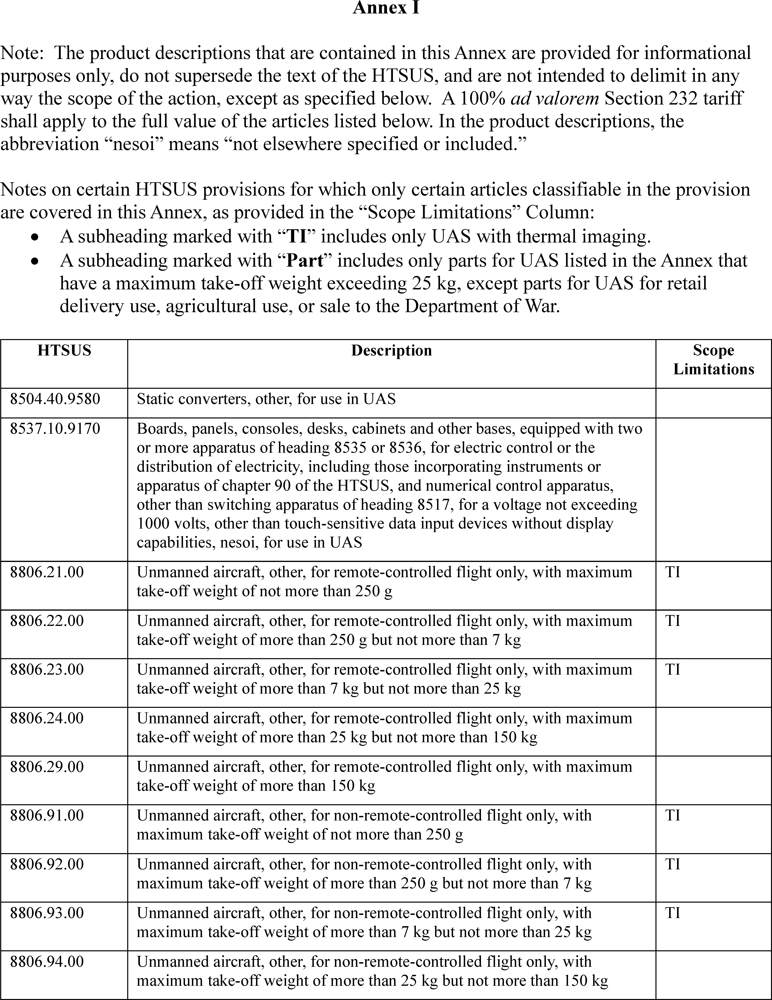
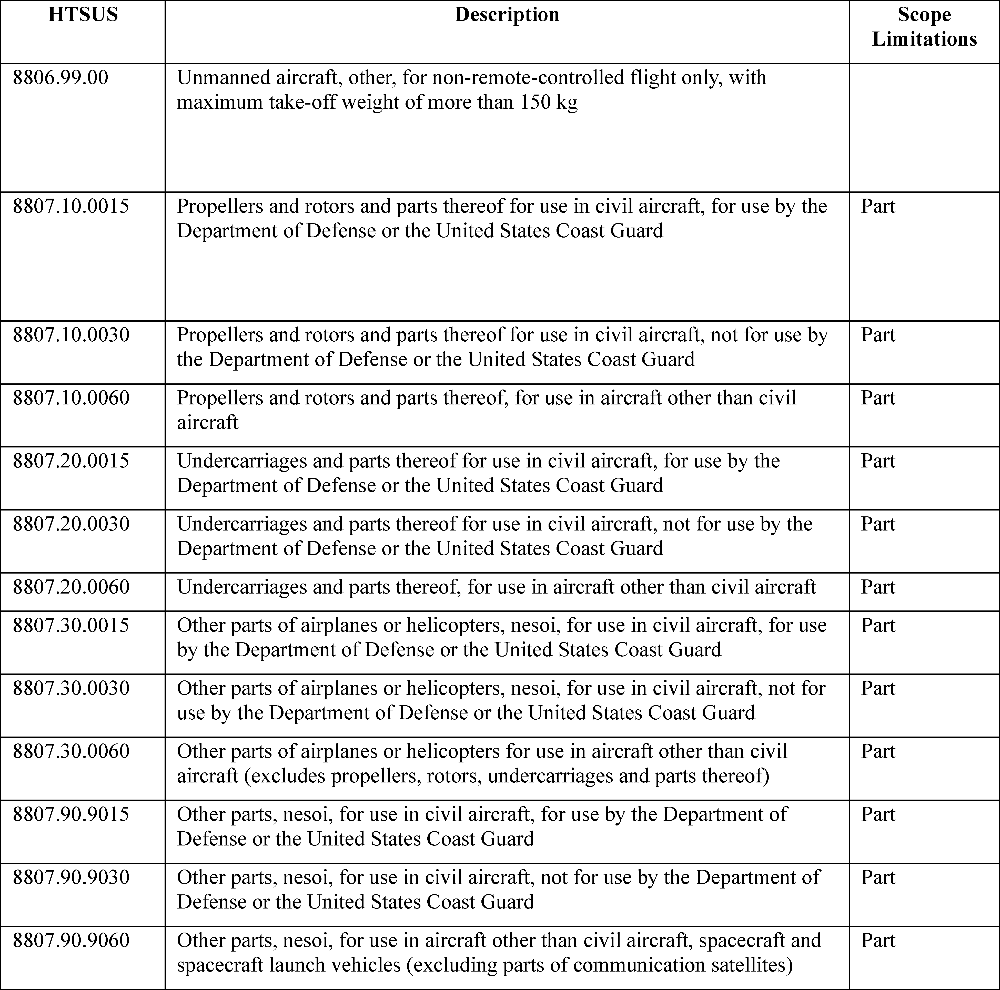

# Daily Digest — 2026-08-19

| | |
|---|---|
| **Digest date** | 2026-08-19 |
| **Data date range** | 2026-08-19 to 2026-08-19 |
| **Generated at** | 2026-08-20T17:51:43Z (UTC) |
| **Pipeline version** | 06a4b12 |
| **Source watermarks** | CREC: 2026-08-18T07:59:23Z · BILLS: 2026-08-20T03:00:09Z · FR: 2026-08-20T05:47:28Z · USCOURTS: 2026-08-19T21:20:43Z · PLAW: 2026-08-20T14:06:56Z |

[Full observed listing for this day](day/2026-08-19.html) — every item our collectors observed for this publication day, mechanical rules applied, frozen at end of day. This digest is the canonical record.

> **Notice:** AI-assisted summarization and plain-language restatements were disabled for this digest day. Item summaries below consist of verbatim official agency summaries or direct source excerpts. Selection and validation remain 100% mechanical and party-blind.

All items below cite the govinfo package (and granule, where applicable) they
summarize. Selection is mechanical; each item states the rule that included
it. See the Coverage Statement at the end for a full accounting of what was
published, what was summarized, and what was excluded and why.

---

## Contents

- [1. Congressional Floor Activity](#1-congressional-floor-activity)
- [2. Legislation](#2-legislation)
- [3. Federal Register](#3-federal-register)
- [4. Enacted Laws](#4-enacted-laws)
- [5. Judicial Activity](#5-judicial-activity)
- [6. Agency Announcements](#6-agency-announcements)
- [7. Recorded Votes](#7-recorded-votes)
- [8. Bill Actions](#8-bill-actions)
- [9. Presidential Actions](#9-presidential-actions)
- [Terms Used Today](#terms-used-today)
- [Coverage Statement](#coverage-statement)
- [Methodology](#methodology)

---

## 1. Congressional Floor Activity

No Congressional Record issue was observed on this day. The Record for a day's proceedings is typically published by govinfo the following morning; it appears in the digest for the day it is observed ([how our clocks work](faq.html#fapds-three-clocks)).

### 1.1 Senate

No Senate floor items met the selection thresholds. 0 floor granule(s) are accounted for in the Coverage Statement.

### 1.2 House of Representatives

No House floor items met the selection thresholds. 0 floor granule(s) are accounted for in the Coverage Statement.

### 1.3 Recorded Votes

No recorded votes were published in this issue of the Congressional Record.

---

## 2. Legislation

Source: Congressional Bills (BILLS), text versions published 2026-08-19 to 2026-08-19.

### 2.1 Counts by Stage

| Stage (bill text version) | Count |
|---|---|
| Introduced (ih/is) | 24 |
| Reported (rh/rs) | 0 |
| Engrossed (eh/es) | 0 |
| Enrolled (enr) | 0 |
| Other versions | 0 |
| **Total bill texts published** | **24** |

### 2.2 Bills Listed by Mechanical Rule

Bills below are listed because they matched at least one listing rule; the
matching rule is stated per item. All other bill texts are counted above and
accounted for in the Coverage Statement.

No bill texts published in this range matched a listing rule; all 24 are
accounted for in the Coverage Statement.

---

## 3. Federal Register

Source: Federal Register (FR), issue of 2026-08-19.

### 3.1 Counts by Document Type

| Document type | Count |
|---|---|
| Rules | 4 |
| Proposed rules | 8 |
| Notices | 74 |
| Presidential documents | 1 |
| **Total FR documents** | **87** |

### 3.2 Rules Published

Tags: department of commerce · department of labor · executive

#### DEPARTMENT OF COMMERCE

- **Atlantic Highly Migratory Species; North Atlantic Swordfish, South Atlantic Swordfish, North Atlantic Albacore, and Atlantic Bluefin Tuna Quotas** (2026-16870; 50 CFR Part 635) — In this final rule, NMFS is implementing binding recommendations of the International Commission for the Conservation of Atlantic Tunas (ICCAT) on quotas for North Atlantic swordfish, South Atlantic swordfish, North Atlantic albacore tuna (northern albacore), and Atlantic bluefin tuna, including aspects of the management procedures for North Atlantic swordfish and northern albacore. For bluefin tuna, this action implements the increased U.S. baseline quota adopted by ICCAT in 2025, dividing it among the established regulatory domestic subquota categories, and implements changes to the bluefin tuna quota associated with pelagic longline bycatch adopted by ICCAT in 2025. Finally, this action transfers 30.8 metric tons (mt) of bluefin tuna quota from the Longline category to the Reserve category and temporarily adjusts the baseline quotas for U.S. North and South Atlantic swordfish, northern albacore, and the Atlantic bluefin tuna Reserve category for 2026 based on 2025 underharvests and applicable international quota transfers. Action: Final rule; temporary quota adjustment; temporary quota transfer. Dates: The final rule is effective August 19, 2026. The temporary quota adjustments and transfer are effective August 19, 2026, through December 31, 2026.
  - *In plain terms:* The National Marine Fisheries Service is putting into effect international fishing limits for North Atlantic swordfish, South Atlantic swordfish, North Atlantic albacore, and Atlantic bluefin tuna, adjusting 2026 limits and transferring 30.8 metric tons of bluefin tuna quota.
  - Included because: FR-SEL-01 — document type: final rule (all listed)
  - Source: [FR-2026-08-19 / 2026-16870](https://www.govinfo.gov/app/details/FR-2026-08-19/2026-16870)

#### DEPARTMENT OF HEALTH AND HUMAN SERVICES

- **Food Additives Permitted in Feed and Drinking Water of Animals; Chromium DL-methionine Chelate** (2026-16942; 21 CFR Part 573) — The Food and Drug Administration (FDA, we, or the Agency) is amending the regulations for food additives permitted in feed and drinking water of animals to provide for the safe use of chromium DL-methionine chelate as a nutritional source of chromium in cattle feed. This action is in response to a food additive petition filed by Zinpro Corp. Action: Final amendment; order. Dates: This order is effective August 19, 2026. See section V, Objections and Hearing Requests, for further information on the filing of objections. Either electronic or written objections and requests for a hearing on the final amendment must be submitted by September 18, 2026.
  - *In plain terms:* The FDA is changing rules for animal feed additives to allow the safe use of chromium DL-methionine chelate as a chromium source in cattle feed, following a request from Zinpro Corp.
  - Included because: FR-SEL-01 — document type: final rule (all listed)
  - Source: [FR-2026-08-19 / 2026-16942](https://www.govinfo.gov/app/details/FR-2026-08-19/2026-16942)

#### DEPARTMENT OF TRANSPORTATION

- **Standard Instrument Approach Procedures, and Takeoff Minimums and Obstacle Departure Procedures; Miscellaneous Amendments** (2026-16887; 14 CFR Part 97) — This rule establishes, amends, suspends, or removes Standard Instrument Approach Procedures (SIAPS) and associated Takeoff Minimums and Obstacle Departure procedures (ODPs) for operations at certain airports. These regulatory actions are needed because of the adoption of new or revised criteria, or because of changes occurring in the National Airspace System, such as the commissioning of new navigational facilities, adding new obstacles, or changing air traffic requirements. These changes are designed to provide safe and efficient use of the navigable airspace and to promote safe flight operations under instrument flight rules at the affected airports. Action: Final rule. Dates: This rule is effective August 19, 2026. The compliance date for each SIAP, associated Takeoff Minimums, and ODP is specified in the amendatory provisions. The incorporation by reference of certain publications listed in the regulations is approved by the Director of the Federal Register as of August 19, 2026.
  - *In plain terms:* This rule creates, changes, pauses, or cancels standard flight procedures for approaching, taking off, and departing certain airports, due to new criteria or changes in the national air traffic system.
  - Included because: FR-SEL-01 — document type: final rule (all listed)
  - Source: [FR-2026-08-19 / 2026-16887](https://www.govinfo.gov/app/details/FR-2026-08-19/2026-16887)
- **Standard Instrument Approach Procedures, and Takeoff Minimums and Obstacle Departure Procedures; Miscellaneous Amendments** (2026-16888; 14 CFR Part 97) — This rule amends, suspends, or removes Standard Instrument Approach Procedures (SIAPs) and associated Takeoff Minimums and Obstacle Departure Procedures for operations at certain airports. These regulatory actions are needed because of the adoption of new or revised criteria, or because of changes occurring in the National Airspace System, such as the commissioning of new navigational facilities, adding new obstacles, or changing air traffic requirements. These changes are designed to provide for the safe and efficient use of the navigable airspace and to promote safe flight operations under instrument flight rules at the affected airports. Action: Final rule. Dates: This rule is effective August 19, 2026. The compliance date for each SIAP, associated Takeoff Minimums, and ODP is specified in the amendatory provisions. The incorporation by reference of certain publications listed in the regulations is approved by the Director of the Federal Register as of August 19, 2026.
  - *In plain terms:* This rule changes, pauses, or cancels standard flight procedures for approaching, taking off, and departing certain airports, due to new criteria or changes in the national air traffic system.
  - Included because: FR-SEL-01 — document type: final rule (all listed)
  - Source: [FR-2026-08-19 / 2026-16888](https://www.govinfo.gov/app/details/FR-2026-08-19/2026-16888)

### 3.3 Proposed Rules Published

Tags: department of commerce · department of labor · executive

#### DEPARTMENT OF AGRICULTURE

- **Rescission of Rural Development's Construction and Repair Regulation** (2026-16914; 7 CFR Parts 1924, 4280, and 4290) — The Rural Business-Cooperative Service (RBCS), Rural Housing Service (RHS), and Rural Utilities Service (RUS), together make up the Rural Development (RD or the Agency) mission area within the U.S. Department of Agriculture (USDA). RD is issuing this proposed rule to rescind its regulation regarding construction and repairs. RD found this regulation to be unnecessary and unduly burdensome. In addition, it makes changes to RBCS regulations by removing references to the construction and repair regulations. The plain language summary of the proposal is available on Regulations.gov in the docket for rulemaking. Action: Proposed rule. Dates: Comment Date: Comments must be submitted on or before October 19, 2026.
  - *In plain terms:* Rural Development proposes to cancel its regulation regarding construction and repairs, finding it unnecessary, and will remove references to it from Rural Business-Cooperative Service regulations.
  - Included because: FR-SEL-02 — document type: proposed rule (all listed)
  - Source: [FR-2026-08-19 / 2026-16914](https://www.govinfo.gov/app/details/FR-2026-08-19/2026-16914)

#### DEPARTMENT OF HEALTH AND HUMAN SERVICES

- **GNT USA, LLC.; Filing of Color Additive Petition** (2026-16939; 21 CFR Part 73) — The Food and Drug Administration (FDA or we) is announcing that we have filed a petition, submitted by GNT USA, LLC., c/o Exponent, Inc., proposing that we amend our color additive regulations to provide for the safe use of safflower ( Carthamus tinctorius L.) extract as a color additive in various foods at levels consistent with good manufacturing practices. Action: Notification of petition. Dates: The color additive petition was filed on July 20, 2026.
  - *In plain terms:* The FDA received a formal request from GNT USA, LLC, proposing to change color additive rules to allow the safe use of safflower extract as a color in various foods.
  - Included because: FR-SEL-02 — document type: proposed rule (all listed)
  - Source: [FR-2026-08-19 / 2026-16939](https://www.govinfo.gov/app/details/FR-2026-08-19/2026-16939)
- **International Association of Color Manufacturers; Filing of Color Additive Petition** (2026-16943; 21 CFR Part 73) — The Food and Drug Administration (FDA or we) is announcing that we have filed a petition, submitted by the International Association of Color Manufacturers, proposing that we amend our color additive regulations to provide for the safe use of acetone as a solvent in the manufacture of carrot oil. The petition also proposes to add heavy metal limits and secondary names for carrot oil. FDA may also consider other changes to the regulation, as appropriate, during the course of our review. Action: Notification of petition. Dates: The color additive petition was filed on August 3, 2026. Either electronic or written comments on the petitioner's environmental assessment must be submitted by September 18, 2026.
  - *In plain terms:* The FDA received a request to change color additive rules to allow acetone as a solvent in carrot oil production and to add heavy metal limits and secondary names.
  - Included because: FR-SEL-02 — document type: proposed rule (all listed)
  - Source: [FR-2026-08-19 / 2026-16943](https://www.govinfo.gov/app/details/FR-2026-08-19/2026-16943)
- **Gardenia Blue Interest Group; Filing of Color Additive Petition** (2026-16944; 21 CFR Part 73) — The Food and Drug Administration (FDA or we) is announcing that we have filed a petition, submitted by Gardenia Blue Interest Group (GBIG or petitioner), c/o Exponent, Inc., proposing that we amend our color additive regulations to expand the safe use of gardenia (genipin) blue in various foods at levels consistent with good manufacturing practice. The petition also proposes to lower the specification for arsenic in gardenia (genipin) blue. Action: Notification of petition. Dates: The color additive petition was filed on August 4, 2026.
  - *In plain terms:* The FDA received a formal request to change color additive rules to expand the safe use of gardenia blue in various foods and to lower the allowable limit for arsenic in gardenia blue.
  - Included because: FR-SEL-02 — document type: proposed rule (all listed)
  - Source: [FR-2026-08-19 / 2026-16944](https://www.govinfo.gov/app/details/FR-2026-08-19/2026-16944)

#### DEPARTMENT OF TRANSPORTATION

- **Airworthiness Directives; Airbus SAS Airplanes** (2026-16874; 14 CFR Part 39) — The FAA proposes to adopt a new airworthiness directive (AD) for certain Airbus SAS Model A330-941 airplanes. This proposed AD was prompted by an occurrence of a triple “PRIM FAULT” in the Flight Control Primary Computer (FCPC) at touchdown. This proposed AD would require the installation of a new FCPC standard and applicable concurrent modifications. This proposed AD would also prohibit the installation of certain parts The FAA is proposing this AD to address the unsafe condition on these products. Action: Notice of proposed rulemaking (NPRM). Dates: The FAA must receive comments on this proposed AD by October 5, 2026.
  - *In plain terms:* The FAA proposes an order for certain Airbus A330-941 airplanes to install a new flight control computer and related changes, and to prohibit certain parts, after a computer failure at touchdown.
  - Included because: FR-SEL-02 — document type: proposed rule (all listed)
  - Source: [FR-2026-08-19 / 2026-16874](https://www.govinfo.gov/app/details/FR-2026-08-19/2026-16874)

#### ENVIRONMENTAL PROTECTION AGENCY

- **Air Plan Approval; South Carolina; Minor Source Permit Program Revisions** (2026-16930; 40 CFR Part 52) — The U.S. Environmental Protection Agency (EPA or Agency) is proposing action on changes to South Carolina's State Implementation Plan (SIP) to revise regulations prescribing minor source permitting program requirements, including minor new source review (NSR) requirements, involving, in part, minor source permitting public participation, in SIP revisions submitted by the State of South Carolina through the South Carolina Department of Health and Environmental Control (SC DHEC) on October 1, 2007; July 18, 2011; August 8, 2014; July 27, 2016; and April 24, 2020. This proposal supplements previous proposals the EPA published on August 17, 2017, and January 21, 2025. This proposal is being issued pursuant to the Clean Air Act (CAA or Act). Action: Proposed rule. Dates: Comments must be received on or before September 18, 2026.
  - *In plain terms:* The EPA proposes to approve changes to South Carolina's state plan to meet Clean Air Act requirements, revising rules for permits and public participation for smaller pollution sources.
  - Included because: FR-SEL-02 — document type: proposed rule (all listed)
  - Source: [FR-2026-08-19 / 2026-16930](https://www.govinfo.gov/app/details/FR-2026-08-19/2026-16930)
- **Air Plan Partial Approval and Partial Conditional Approval; South Carolina; Control of Oxides of Nitrogen and Source Testing Requirements** (2026-16932; 40 CFR Part 52) — The U.S. Environmental Protection Agency (EPA or Agency) is proposing to partially approve and partially conditionally approve changes to South Carolina's State Implementation Plan (SIP) to revise source testing requirements and regulations prescribing control requirements for certain stationary sources of nitrogen oxides (NO X ) submitted by the State of South Carolina, through the South Carolina Department of Environmental Services (SC DES), on October 1, 2007; July 27, 2016; September 5, 2017; April 24, 2020; and February 4, 2022. This action is being proposed pursuant to the Clean Air Act (CAA or Act). Action: Proposed rule. Dates: Comments must be received on or before September 18, 2026.
  - *In plain terms:* The EPA proposes to approve some changes and conditionally approve others to South Carolina's state plan to meet Clean Air Act requirements, revising rules for testing and controlling nitrogen oxides from certain fixed locations.
  - Included because: FR-SEL-02 — document type: proposed rule (all listed)
  - Source: [FR-2026-08-19 / 2026-16932](https://www.govinfo.gov/app/details/FR-2026-08-19/2026-16932)
- **Air Plan Approval; South Carolina; Minor Source Permit Program Revisions** (2026-16937; 40 CFR Part 52) — The U.S. Environmental Protection Agency (EPA or Agency) is proposing to approve changes to South Carolina's State Implementation Plan (SIP) to revise regulations prescribing minor source permit program requirements, including minor new source review (NSR) requirements, in SIP revisions submitted by the State of South Carolina on October 1, 2007, July 18, 2011, August 8, 2014, April 24, 2020, and July 23, 2025. This action is being proposed pursuant to the Clean Air Act (CAA or Act). Action: Proposed rule. Dates: Comments must be received on or before September 18, 2026.
  - *In plain terms:* The EPA proposes to approve changes to South Carolina's state plan to meet Clean Air Act requirements, revising rules for permits and new source reviews for smaller pollution sources.
  - Included because: FR-SEL-02 — document type: proposed rule (all listed)
  - Source: [FR-2026-08-19 / 2026-16937](https://www.govinfo.gov/app/details/FR-2026-08-19/2026-16937)

### 3.4 Notices and Presidential Documents

Tags: department of commerce · department of labor · executive

Notices are summarized only when they match a listing rule; all are counted
in 3.1 and in the Coverage Statement. Presidential documents in the FR are
always listed.

- **Adjusting Imports of Unmanned Aircraft Systems and Unmanned Aircraft Systems Components Into the United States** (2026-16979) — Presidential Proclamation 11055 implements ad valorem duties on certain unmanned aircraft systems (UAS) and their components. This action follows a Secretary of Commerce report concluding that imports of these items threaten to impair U.S. national security under section 232 of the Trade Expansion Act of 1962. The proclamation imposes duties of 100 percent on larger UAS, UAS with thermal imagers, docking stations, and specified components, and 25 percent on smaller UAS and other components, with a delayed effective date for some component duties.
  - *In plain terms:* Presidential Proclamation 11055 puts into effect tariffs of 25% or 100% on certain imported drones and components, as these imports pose a risk to U.S. national security, with some duties delayed.
  - Included because: FR-SEL-03 — presidential document (all listed)
  - Source: [FR-2026-08-19 / 2026-16979](https://www.govinfo.gov/app/details/FR-2026-08-19/2026-16979)
  -  *Source graphic 1 of 7 from 2026-16979.*
  -  *Source graphic 2 of 7 from 2026-16979.*
  - *Graphics not rendered here: 5 of 7 — see the [source PDF](https://www.govinfo.gov/content/pkg/FR-2026-08-19/pdf/FR-2026-08-19.pdf).*

---

## 4. Enacted Laws

Source: Public and Private Laws (PLAW) published 2026-08-19.

No laws were published in this range.

---

## 5. Judicial Activity

Source: United States Courts Opinions (USCOURTS): opinions observed 2026-08-19
by our collector; each opinion states its own issue date beside its
listing ([how our clocks work](faq.html#fapds-three-clocks)).

Completeness disclosure (standing): USCOURTS carries opinions from
approximately 140 participating appellate, district, bankruptcy, and
national federal courts. Unlike the Congressional Record and the Federal
Register, which are the complete official record of their branches,
USCOURTS is participation-based and is NOT the complete federal judicial
record. Courts post opinions with delay — typically over several days —
so a day's digest carries the opinions that became available that day,
whatever date each was issued.

### 5.1 Appellate and National Court Opinions

Tags: judicial

Appellate and national court opinions are summarized; district and
bankruptcy opinions are counted in 5.2 and in the Coverage Statement.

#### United States Court of Appeals for the District of Columbia Circuit

- **Chamber of Commerce of the United States of Americ, et al v. EPA, et al** (No. 24-01193; filed 2026-08-18) — The U.S. Court of Appeals for the D.C. Circuit denied petitions challenging the Environmental Protection Agency's 2024 designation of Perfluorooctanoic Acid (PFOA) and Perfluorooctanesulfonic Acid (PFOS) as "hazardous substances." This designation was made under the Comprehensive Environmental Response, Compensation, and Liability Act of 1980, based on studies linking these chemicals to various health conditions. Industry groups had sought to overturn the EPA's decision.
  - *In plain terms:* The D.C. Circuit denied petitions challenging the Environmental Protection Agency's 2024 designation of PFOA and PFOS as "hazardous substances" under a 1980 law, based on health studies.
  - Included because: USCOURTS-SEL-01 — appellate court opinion (all listed) (document dated 2026-08-18)
  - Source: [USCOURTS-caDC-24-01193 / USCOURTS-caDC-24-01193-0](https://www.govinfo.gov/app/details/USCOURTS-caDC-24-01193/USCOURTS-caDC-24-01193-0)
- **Institute of Scrap Recycling Industries v. EPA, et al** (No. 24-01261; filed 2026-08-18) — The U.S. Court of Appeals for the D.C. Circuit denied petitions challenging the Environmental Protection Agency's 2024 designation of Perfluorooctanoic Acid (PFOA) and Perfluorooctanesulfonic Acid (PFOS) as "hazardous substances." This designation was made under the Comprehensive Environmental Response, Compensation, and Liability Act of 1980, based on studies linking these chemicals to various health conditions. Industry groups had sought to overturn the EPA's decision.
  - *In plain terms:* The D.C. Circuit denied petitions challenging the Environmental Protection Agency's 2024 designation of PFOA and PFOS as "hazardous substances" under a 1980 law, based on health studies.
  - Included because: USCOURTS-SEL-01 — appellate court opinion (all listed) (document dated 2026-08-18)
  - Source: [USCOURTS-caDC-24-01261 / USCOURTS-caDC-24-01261-0](https://www.govinfo.gov/app/details/USCOURTS-caDC-24-01261/USCOURTS-caDC-24-01261-0)
- **American Forest & Paper Association v. EPA, et al** (No. 24-01266; filed 2026-08-18) — The U.S. Court of Appeals for the D.C. Circuit denied petitions challenging the Environmental Protection Agency's 2024 designation of Perfluorooctanoic Acid (PFOA) and Perfluorooctanesulfonic Acid (PFOS) as "hazardous substances." This designation was made under the Comprehensive Environmental Response, Compensation, and Liability Act of 1980, based on studies linking these chemicals to various health conditions. Industry groups had sought to overturn the EPA's decision.
  - *In plain terms:* The D.C. Circuit denied petitions challenging the Environmental Protection Agency's 2024 designation of PFOA and PFOS as "hazardous substances" under a 1980 law, based on health studies.
  - Included because: USCOURTS-SEL-01 — appellate court opinion (all listed) (document dated 2026-08-18)
  - Source: [USCOURTS-caDC-24-01266 / USCOURTS-caDC-24-01266-0](https://www.govinfo.gov/app/details/USCOURTS-caDC-24-01266/USCOURTS-caDC-24-01266-0)
- **American Chemistry Council v. EPA, et al** (No. 24-01271; filed 2026-08-18) — The U.S. Court of Appeals for the D.C. Circuit affirmed the Environmental Protection Agency's 2024 designation of Perfluorooctanoic Acid (PFOA) and Perfluorooctanesulfonic Acid (PFOS) as "hazardous substances" under the Comprehensive Environmental Response, Compensation, and Liability Act of 1980 (CERCLA). Industry groups had challenged this designation, which the EPA based on extensive studies linking PFOA and PFOS exposure to serious health conditions. The court denied the petitions for review.
  - *In plain terms:* The D.C. Circuit denied petitions challenging the Environmental Protection Agency's 2024 designation of PFOA and PFOS as "hazardous substances" under a 1980 law, based on health studies.
  - Included because: USCOURTS-SEL-01 — appellate court opinion (all listed) (document dated 2026-08-18)
  - Source: [USCOURTS-caDC-24-01271 / USCOURTS-caDC-24-01271-0](https://www.govinfo.gov/app/details/USCOURTS-caDC-24-01271/USCOURTS-caDC-24-01271-0)
- **American Fuel & Petrochemical Manufacturers v. EPA, et al** (No. 24-01272; filed 2026-08-18) — The U.S. Court of Appeals for the D.C. Circuit affirmed the Environmental Protection Agency's 2024 designation of Perfluorooctanoic Acid (PFOA) and Perfluorooctanesulfonic Acid (PFOS) as "hazardous substances" under the Comprehensive Environmental Response, Compensation, and Liability Act of 1980 (CERCLA). Industry groups had challenged this designation, which the EPA based on extensive studies linking PFOA and PFOS exposure to serious health conditions. The court denied the petitions for review.
  - *In plain terms:* The D.C. Circuit denied petitions challenging the Environmental Protection Agency's 2024 designation of PFOA and PFOS as "hazardous substances" under a 1980 law, based on health studies.
  - Included because: USCOURTS-SEL-01 — appellate court opinion (all listed) (document dated 2026-08-18)
  - Source: [USCOURTS-caDC-24-01272 / USCOURTS-caDC-24-01272-0](https://www.govinfo.gov/app/details/USCOURTS-caDC-24-01272/USCOURTS-caDC-24-01272-0)
- **Bruno Mpoy v. John Burst, et al** (No. 24-07120; filed 2026-08-18) — The U.S. Court of Appeals for the D.C. Circuit reversed a district court's dismissal of a plaintiff's section 1983 claim. The district court had dismissed the claim for failure to exhaust administrative remedies under District of Columbia law. The appeals court held that federal court plaintiffs are not required to exhaust state or D.C. administrative remedies before filing a section 1983 claim, and remanded the case for further proceedings.
  - *In plain terms:* The D.C. Circuit reversed a dismissal of a section 1983 claim, stating federal plaintiffs do not need to finish state administrative reviews before suing, and sent the case back.
  - Included because: USCOURTS-SEL-01 — appellate court opinion (all listed) (document dated 2026-08-18)
  - Source: [USCOURTS-caDC-24-07120 / USCOURTS-caDC-24-07120-0](https://www.govinfo.gov/app/details/USCOURTS-caDC-24-07120/USCOURTS-caDC-24-07120-0)
- **Music Choice v. CRB, et al** (No. 25-01039; filed 2026-08-18) — The U.S. Court of Appeals for the D.C. Circuit dismissed a petition from Music Choice for direct review of a Copyright Royalty Board (CRB) ruling. The CRB had issued a "Ruling on Regulatory Interpretation" concerning royalty payments for ephemeral recordings by Business Services, following a referral from a district court. The appeals court determined it lacked statutory jurisdiction for direct review, instructing Music Choice to return to the district court to address the ruling.
  - *In plain terms:* The D.C. Circuit dismissed Music Choice's petition for direct review of a Copyright Royalty Board ruling on ephemeral recording royalties, saying it lacked jurisdiction and Music Choice must return to district court.
  - Included because: USCOURTS-SEL-01 — appellate court opinion (all listed) (document dated 2026-08-18)
  - Source: [USCOURTS-caDC-25-01039 / USCOURTS-caDC-25-01039-0](https://www.govinfo.gov/app/details/USCOURTS-caDC-25-01039/USCOURTS-caDC-25-01039-0)
- **James Knight v. NTSB, et al** (No. 25-01158; filed 2026-08-18) — The D.C. Circuit Court of Appeals denied a petition from pilot James Knight for attorney's fees and expenses under the Equal Access to Justice Act. Knight sought review of an order from the National Transportation Safety Board (NTSB), which had reversed an Administrative Law Judge's decision granting him fees after Knight's certificate sanction was reduced from revocation to a 90-day suspension. The Court of Appeals affirmed the NTSB's finding that the Administrator's position in seeking revocation was "substantially justified."
  - *In plain terms:* The D.C. Circuit Court of Appeals denied pilot James Knight's request for attorney's fees, confirming the National Transportation Safety Board's position in seeking revocation was "substantially justified."
  - Included because: USCOURTS-SEL-01 — appellate court opinion (all listed) (document dated 2026-08-18)
  - Source: [USCOURTS-caDC-25-01158 / USCOURTS-caDC-25-01158-0](https://www.govinfo.gov/app/details/USCOURTS-caDC-25-01158/USCOURTS-caDC-25-01158-0)
- **Vanda Pharmaceuticals, Inc. v. FDA, et al** (No. 25-05041; filed 2026-08-18) — The U.S. Court of Appeals for the D.C. Circuit partially vacated a district court's summary judgment regarding the Food and Drug Administration's (FDA) approval of generic drug labeling for tasimelteon. The FDA had approved generic labeling that omitted braille and associated pharmacy instructions found on the brand-name drug, Hetlioz, citing an exception for differences due to manufacturing or distribution. The appeals court remanded the case for the FDA to determine if the generic label, without braille and instructions, still satisfies the statutory requirement of being "the same as" the brand-name label.
  - *In plain terms:* The D.C. Circuit partially overturned a lower court decision on FDA approval for generic tasimelteon labeling omitting braille and instructions, returning it for the FDA to decide if it is "the same as" the brand-name label.
  - Included because: USCOURTS-SEL-01 — appellate court opinion (all listed) (document dated 2026-08-18)
  - Source: [USCOURTS-caDC-25-05041 / USCOURTS-caDC-25-05041-0](https://www.govinfo.gov/app/details/USCOURTS-caDC-25-05041/USCOURTS-caDC-25-05041-0)
- **Servier Pharmaceuticals LLC v. Robert F. Kennedy, Jr., et al** (No. 25-05054; filed 2026-08-18) — The D.C. Circuit Court of Appeals affirmed a district court's ruling regarding Servier Pharmaceuticals LLC's status under the Medicare Manufacturer Discount Program. The Centers for Medicare & Medicaid Services (CMS) had designated Servier as a "specified manufacturer" but not a "specified small manufacturer," impacting its drug discount obligations. The Court agreed with CMS that Servier did not meet the criteria for a "specified small manufacturer" because it had not demonstrated that it produced, prepared, propagated, compounded, converted, or processed Tibsovo for any Part D sales in 2021, a key requirement for the designation.
  - *In plain terms:* The D.C. Circuit Court of Appeals upheld that Servier Pharmaceuticals was not a "specified small manufacturer" under the Medicare Manufacturer Discount Program, as it did not show 2021 Part D sales.
  - Included because: USCOURTS-SEL-01 — appellate court opinion (all listed) (document dated 2026-08-18)
  - Source: [USCOURTS-caDC-25-05054 / USCOURTS-caDC-25-05054-0](https://www.govinfo.gov/app/details/USCOURTS-caDC-25-05054/USCOURTS-caDC-25-05054-0)
- **Hesai Technology Co., Ltd, et al v. DOD, et al** (No. 25-05256; filed 2026-08-18) — The D.C. Circuit Court of Appeals reversed a district court's summary judgment in favor of the Secretary of Defense regarding the designation of Hesai Technology Co., Ltd. as a "Chinese military company." The Court found that the Secretary's designation implicated a protected interest due to its reputational and legal consequences, including procurement restrictions for listed companies. The Court concluded that the Fifth Amendment's Due Process Clause required the Secretary to provide Hesai notice of unclassified materials and an opportunity to respond before finalizing the designation, which was not done.
  - *In plain terms:* The D.C. Circuit Court of Appeals reversed a "Chinese military company" designation for Hesai Technology, as the Secretary of Defense did not provide notice or a chance to respond.
  - Included because: USCOURTS-SEL-01 — appellate court opinion (all listed) (document dated 2026-08-18)
  - Source: [USCOURTS-caDC-25-05256 / USCOURTS-caDC-25-05256-0](https://www.govinfo.gov/app/details/USCOURTS-caDC-25-05256/USCOURTS-caDC-25-05256-0)
- **Henry Elem v. Scott Bessent, et al** (No. 25-05275; filed 2026-08-18) — The D.C. Circuit Court of Appeals affirmed the district court's order dismissing Henry Elem's complaint. The lower court had dismissed the complaint as frivolous, meaning it lacked an arguable basis in law or fact. The Court of Appeals clarified that the dismissal was based on the claims' frivolousness and not on any perceived ideology of the appellant.
  - *In plain terms:* The D.C. Circuit Court of Appeals upheld the dismissal of Henry Elem's complaint, confirming the lower court found his claims lacked an arguable basis in law or fact.
  - Included because: USCOURTS-SEL-01 — appellate court opinion (all listed) (document dated 2026-08-18)
  - Source: [USCOURTS-caDC-25-05275 / USCOURTS-caDC-25-05275-0](https://www.govinfo.gov/app/details/USCOURTS-caDC-25-05275/USCOURTS-caDC-25-05275-0)
- **Friends of the Earth U.S., et al v. Export-Import Bank of the United States, et al** (No. 25-05387; filed 2026-08-18) — The D.C. Circuit Court of Appeals affirmed a district court's denial of a preliminary injunction sought by Friends of the Earth U.S. and Justiça Ambiental against the Export-Import Bank of the United States (Eximbank). The appellants sought to halt the disbursement of loan funds for the Mozambique Liquefied Natural Gas Project, arguing violations of the APA, NEPA, and the Bank Act. The Court of Appeals upheld the district court's finding that the appellants were unlikely to establish standing for several claims and had not demonstrated a likelihood of success on the merits.
  - *In plain terms:* The D.C. Circuit Court of Appeals upheld the denial of a preliminary injunction to halt loan funds for the Mozambique Liquefied Natural Gas Project, citing unlikely standing and success on merits.
  - Included because: USCOURTS-SEL-01 — appellate court opinion (all listed) (document dated 2026-08-18)
  - Source: [USCOURTS-caDC-25-05387 / USCOURTS-caDC-25-05387-0](https://www.govinfo.gov/app/details/USCOURTS-caDC-25-05387/USCOURTS-caDC-25-05387-0)
- **Teva Pharmaceuticals USA, Inc., et al v. Robert Kennedy, Jr., et al** (No. 25-05425; filed 2026-08-18) — The D.C. Circuit Court of Appeals partially affirmed and partially reversed a district court's summary judgment concerning rules established under the Medicare Drug Price Negotiation Program. The Court concluded that the Inflation Reduction Act permits the Centers for Medicare & Medicaid Services (CMS) to group different formulations of a drug as one "qualifying single source drug" and that the program does not deprive manufacturers of a protected property interest. However, the Court remanded for district court consideration Teva Pharmaceuticals' challenge to CMS's requirement that a generic drug must be "bona fide marketed" to avoid negotiation.
  - *In plain terms:* The D.C. Circuit upheld parts of the Medicare Drug Price Negotiation Program, allowing CMS to group drug formulations, but sent back a challenge to the "bona fide marketed" requirement.
  - Included because: USCOURTS-SEL-01 — appellate court opinion (all listed) (document dated 2026-08-18)
  - Source: [USCOURTS-caDC-25-05425 / USCOURTS-caDC-25-05425-0](https://www.govinfo.gov/app/details/USCOURTS-caDC-25-05425/USCOURTS-caDC-25-05425-0)
- **Jose Colon v. Donald Trump, et al** (No. 26-05012; filed 2026-08-18) — The United States Court of Appeals for the District of Columbia Circuit affirmed a district court's order dismissing Jose M. Colon's complaint. The appellate court denied the appellant's motion to appoint counsel, citing a lack of demonstrated likelihood of success on the merits. The district court's decision was affirmed because the appellant failed to allege a concrete and particularized harm required to establish standing under Article III of the Constitution.
  - *In plain terms:* The D.C. Circuit Court of Appeals upheld the dismissal of Jose M. Colon's complaint because he failed to allege specific harm required to have constitutional standing.
  - Included because: USCOURTS-SEL-01 — appellate court opinion (all listed) (document dated 2026-08-18)
  - Source: [USCOURTS-caDC-26-05012 / USCOURTS-caDC-26-05012-0](https://www.govinfo.gov/app/details/USCOURTS-caDC-26-05012/USCOURTS-caDC-26-05012-0)

#### United States Court of Appeals for the Eighth Circuit

- **United States v. Travon Rice** (No. 24-02817; filed 2026-08-18) — The United States Court of Appeals for the Eighth Circuit issued an opinion and entered judgment in the case of United States v. Travon Rice. The court's clerk notified counsel of the judgment and provided information regarding post-submission procedures. This notification included the 14-day deadline for filing petitions for rehearing or rehearing en banc.
  - *In plain terms:* The Eighth Circuit Court of Appeals decided the case of United States v. Travon Rice, and informed lawyers about the decision and the 14-day deadline to ask for a reconsideration.
  - Included because: USCOURTS-SEL-01 — appellate court opinion (all listed) (document dated 2026-08-18)
  - Source: [USCOURTS-ca8-24-02817 / USCOURTS-ca8-24-02817-0](https://www.govinfo.gov/app/details/USCOURTS-ca8-24-02817/USCOURTS-ca8-24-02817-0)
- **Kenneth Hunt v. Dale Acosta** (No. 25-01322; filed 2026-08-17) — The Eighth Circuit Court of Appeals issued an opinion and entered judgment in this case. The court advised counsel to review Federal Rules of Appellate Procedure and Eighth Circuit Rules regarding post-submission procedure. Petitions for rehearing and rehearing en banc must be received by the clerk's office within 14 days of judgment entry.
  - *In plain terms:* The Eighth Circuit Court of Appeals issued an opinion and judgment, reminding counsel that petitions for rehearing must be received within 14 days of the judgment entry.
  - Included because: USCOURTS-SEL-01 — appellate court opinion (all listed) (document dated 2026-08-17)
  - Source: [USCOURTS-ca8-25-01322 / USCOURTS-ca8-25-01322-0](https://www.govinfo.gov/app/details/USCOURTS-ca8-25-01322/USCOURTS-ca8-25-01322-0)
- **David Taff v. Brian DuBuc** (No. 25-01405; filed 2026-08-18) — The Eighth Circuit Court of Appeals issued an opinion and entered judgment in the case of David Taff v. Brian DuBuc on August 18, 2026. The Clerk of Court notified counsel of the judgment and provided guidance on post-submission procedures, including the 14-day deadline for electronically filing petitions for rehearing.
  - *In plain terms:* The Eighth Circuit Court of Appeals ruled in David Taff v. Brian DuBuc on August 18, 2026, and told counsel its decision and a 14-day deadline for electronic reconsideration requests.
  - Included because: USCOURTS-SEL-01 — appellate court opinion (all listed) (document dated 2026-08-18)
  - Source: [USCOURTS-ca8-25-01405 / USCOURTS-ca8-25-01405-0](https://www.govinfo.gov/app/details/USCOURTS-ca8-25-01405/USCOURTS-ca8-25-01405-0)
- **Raya Nsheiwat v. Walmart, Inc.** (No. 25-01506; filed 2026-08-17) — The Eighth Circuit Court of Appeals issued an opinion and entered judgment in this case. The court advised counsel to review Federal Rules of Appellate Procedure and Eighth Circuit Rules regarding post-submission procedure. Petitions for rehearing and rehearing en banc must be received by the clerk's office within 14 days of judgment entry.
  - *In plain terms:* The Eighth Circuit Court of Appeals issued an opinion and judgment, reminding counsel that petitions for rehearing must be received within 14 days of the judgment entry.
  - Included because: USCOURTS-SEL-01 — appellate court opinion (all listed) (document dated 2026-08-17)
  - Source: [USCOURTS-ca8-25-01506 / USCOURTS-ca8-25-01506-0](https://www.govinfo.gov/app/details/USCOURTS-ca8-25-01506/USCOURTS-ca8-25-01506-0)
- **United States v. Nicholas Peterson** (No. 25-01788; filed 2026-08-17) — The Eighth Circuit Court of Appeals issued an opinion and entered judgment in this case. The court advised counsel to review Federal Rules of Appellate Procedure and Eighth Circuit Rules regarding post-submission procedure. Petitions for rehearing and rehearing en banc must be received by the clerk's office within 14 days of judgment entry.
  - *In plain terms:* The Eighth Circuit Court of Appeals issued an opinion and judgment, reminding counsel that petitions for rehearing must be received within 14 days of the judgment entry.
  - Included because: USCOURTS-SEL-01 — appellate court opinion (all listed) (document dated 2026-08-17)
  - Source: [USCOURTS-ca8-25-01788 / USCOURTS-ca8-25-01788-0](https://www.govinfo.gov/app/details/USCOURTS-ca8-25-01788/USCOURTS-ca8-25-01788-0)
- **Jessica McKee v. Jessica Brady** (No. 25-01963; filed 2026-08-17) — The Eighth Circuit Court of Appeals issued an opinion and entered judgment in this case. The court advised counsel to review Federal Rules of Appellate Procedure and Eighth Circuit Rules regarding post-submission procedure. Petitions for rehearing and rehearing en banc must be received by the clerk's office within 14 days of judgment entry.
  - *In plain terms:* The Eighth Circuit Court of Appeals issued an opinion and judgment, reminding counsel that petitions for rehearing must be received within 14 days of the judgment entry.
  - Included because: USCOURTS-SEL-01 — appellate court opinion (all listed) (document dated 2026-08-17)
  - Source: [USCOURTS-ca8-25-01963 / USCOURTS-ca8-25-01963-0](https://www.govinfo.gov/app/details/USCOURTS-ca8-25-01963/USCOURTS-ca8-25-01963-0)
- **Kenneth Hunt v. Dale Acosta** (No. 25-02102; filed 2026-08-17) — The United States Court of Appeals for the Eighth Circuit issued an opinion and entered judgment in the case of Kenneth Hunt v. Dale Acosta. The court's clerk informed counsel of post-submission procedures. This information included the 14-day deadline for filing petitions for rehearing or rehearing en banc, which must be submitted electronically.
  - *In plain terms:* The Eighth Circuit Court of Appeals issued an opinion and judgment, informing counsel that petitions for rehearing must be filed electronically within 14 days of the judgment entry.
  - Included because: USCOURTS-SEL-01 — appellate court opinion (all listed) (document dated 2026-08-17)
  - Source: [USCOURTS-ca8-25-02102 / USCOURTS-ca8-25-02102-0](https://www.govinfo.gov/app/details/USCOURTS-ca8-25-02102/USCOURTS-ca8-25-02102-0)
- **Kenneth Hunt v. Dale Acosta** (No. 25-02230; filed 2026-08-17) — The United States Court of Appeals for the Eighth Circuit issued an opinion and entered judgment in the case of Kenneth Hunt v. Dale Acosta, referencing multiple appellate case numbers. The court's clerk provided counsel with information on post-submission procedures. This included the requirement to file petitions for rehearing or rehearing en banc electronically within 14 days of the judgment entry.
  - *In plain terms:* The Eighth Circuit Court of Appeals issued an opinion and judgment, notifying counsel that petitions for rehearing must be filed electronically within 14 days of the judgment entry.
  - Included because: USCOURTS-SEL-01 — appellate court opinion (all listed) (document dated 2026-08-17)
  - Source: [USCOURTS-ca8-25-02230 / USCOURTS-ca8-25-02230-0](https://www.govinfo.gov/app/details/USCOURTS-ca8-25-02230/USCOURTS-ca8-25-02230-0)
- **United States v. Miles Caldwell** (No. 25-02538; filed 2026-08-18) — The United States Court of Appeals for the Eighth Circuit issued an opinion and entered judgment in the case of United States v. Miles Caldwell. The court's clerk informed counsel of the judgment and detailed the post-submission procedures. This included instructions on the 14-day period for filing petitions for rehearing or rehearing en banc.
  - *In plain terms:* The Eighth Circuit Court of Appeals decided the case of United States v. Miles Caldwell, and informed lawyers about the decision and the 14-day period to ask for a reconsideration.
  - Included because: USCOURTS-SEL-01 — appellate court opinion (all listed) (document dated 2026-08-18)
  - Source: [USCOURTS-ca8-25-02538 / USCOURTS-ca8-25-02538-0](https://www.govinfo.gov/app/details/USCOURTS-ca8-25-02538/USCOURTS-ca8-25-02538-0)
- **Joseph Falasco v. USAA Casualty Insurance Company** (No. 25-02632; filed 2026-08-18) — The Eighth Circuit Court of Appeals issued an opinion and entered judgment in the case of Joseph Falasco v. USAA Casualty Insurance Company on August 18, 2026. The Clerk of Court notified counsel of the judgment and provided guidance on post-submission procedures, including the 14-day deadline for electronically filing petitions for rehearing.
  - *In plain terms:* The Eighth Circuit Court of Appeals ruled in Joseph Falasco v. USAA Casualty Insurance Company on August 18, 2026, and told counsel its decision and a 14-day deadline for electronic reconsideration requests.
  - Included because: USCOURTS-SEL-01 — appellate court opinion (all listed) (document dated 2026-08-18)
  - Source: [USCOURTS-ca8-25-02632 / USCOURTS-ca8-25-02632-0](https://www.govinfo.gov/app/details/USCOURTS-ca8-25-02632/USCOURTS-ca8-25-02632-0)
- **United States v. Anfernee Rondeau** (No. 25-02743; filed 2026-08-17) — The United States Court of Appeals for the Eighth Circuit issued an opinion and entered judgment in the case of United States v. Anfernee Rondeau. The court's clerk informed counsel about post-submission procedures. This notification specified the 14-day deadline for filing petitions for rehearing or rehearing en banc, which must be submitted electronically.
  - *In plain terms:* The Eighth Circuit Court of Appeals issued an opinion and judgment, informing counsel that petitions for rehearing must be filed electronically within 14 days of the judgment entry.
  - Included because: USCOURTS-SEL-01 — appellate court opinion (all listed) (document dated 2026-08-17)
  - Source: [USCOURTS-ca8-25-02743 / USCOURTS-ca8-25-02743-0](https://www.govinfo.gov/app/details/USCOURTS-ca8-25-02743/USCOURTS-ca8-25-02743-0)
- **Nuria Argueta-Rodriguez, et al v. Todd Blanche** (No. 25-03062; filed 2026-08-17) — The United States Court of Appeals for the Eighth Circuit issued an opinion and entered judgment in the case of Nuria Argueta-Rodriguez, et al v. Todd Blanche. The court's clerk provided counsel with information on post-submission procedures. Petitions for rehearing and petitions for rehearing en banc must be received within 45 days of the judgment entry date and filed electronically.
  - *In plain terms:* The Eighth Circuit Court of Appeals issued an opinion and judgment, informing counsel that petitions for rehearing must be filed electronically within 45 days of the judgment entry.
  - Included because: USCOURTS-SEL-01 — appellate court opinion (all listed) (document dated 2026-08-17)
  - Source: [USCOURTS-ca8-25-03062 / USCOURTS-ca8-25-03062-0](https://www.govinfo.gov/app/details/USCOURTS-ca8-25-03062/USCOURTS-ca8-25-03062-0)
- **United States v. Marshawn Jeffries** (No. 26-01067; filed 2026-08-18) — The United States Court of Appeals for the Eighth Circuit issued an unpublished per curiam opinion in United States v. Marshawn Ladarius Jeffries. The court reviewed Marshawn Jeffries' appeal of his within-Guidelines-range sentence imposed after a guilty plea to a firearm offense. Concluding that the district court did not abuse its discretion, the Eighth Circuit affirmed the sentence and granted counsel's motion to withdraw.
  - *In plain terms:* The Eighth Circuit Court of Appeals upheld Marshawn Jeffries' sentence for a firearm offense, finding the lower court's decision was reasonable, and permitted his lawyer to withdraw.
  - Included because: USCOURTS-SEL-01 — appellate court opinion (all listed) (document dated 2026-08-18)
  - Source: [USCOURTS-ca8-26-01067 / USCOURTS-ca8-26-01067-0](https://www.govinfo.gov/app/details/USCOURTS-ca8-26-01067/USCOURTS-ca8-26-01067-0)
- **Dr. Theoda Mills, Jr. v. City of St. Louis, Missouri, et al** (No. 26-01236; filed 2026-08-18) — The Eighth Circuit Court of Appeals issued an opinion and entered judgment in the case of Dr. Theoda Mills, Jr. v. City of St. Louis, Missouri, et al on August 18, 2026. The Clerk of Court notified Dr. Mills of the judgment and provided guidance on post-submission procedures, including the 14-day deadline for electronically filing petitions for rehearing.
  - *In plain terms:* The Eighth Circuit Court of Appeals ruled in Dr. Theoda Mills, Jr. v. City of St. Louis, Missouri, et al on August 18, 2026, and told Dr. Mills its decision and a 14-day deadline for electronic reconsideration requests.
  - Included because: USCOURTS-SEL-01 — appellate court opinion (all listed) (document dated 2026-08-18)
  - Source: [USCOURTS-ca8-26-01236 / USCOURTS-ca8-26-01236-0](https://www.govinfo.gov/app/details/USCOURTS-ca8-26-01236/USCOURTS-ca8-26-01236-0)

#### United States Court of Appeals for the Eleventh Circuit

- **Vinitha Robinson v. Phillip Sutton, et al** (No. 22-13632; filed 2026-08-17) — The United States Court of Appeals for the Eleventh Circuit affirmed a district court's grant of summary judgment to Phillip Sutton and Habersham County, Georgia. The appellant, Vinitha Robinson, had alleged race discrimination in violation of Title VII, challenging the district court's findings on similarly situated comparators and evidence of pretext. The Eleventh Circuit considered all arguments raised and found no reversible error in the district court's proceedings.
  - *In plain terms:* The Eleventh Circuit Court of Appeals affirmed a district court's summary judgment in favor of Phillip Sutton and Habersham County, Georgia, against a race discrimination claim.
  - Included because: USCOURTS-SEL-01 — appellate court opinion (all listed) (document dated 2026-08-17)
  - Source: [USCOURTS-ca11-22-13632 / USCOURTS-ca11-22-13632-0](https://www.govinfo.gov/app/details/USCOURTS-ca11-22-13632/USCOURTS-ca11-22-13632-0)
- **USA v. Steven Chun, et al** (No. 22-14192; filed 2026-08-18) — The Eleventh Circuit Court of Appeals affirmed the convictions and sentences of Steven Chun and Daniel Tondre. The defendants had appealed their convictions for conspiracy to violate the Anti-Kickback Statute and other offenses related to a scheme involving bribing physicians to prescribe Subsys. The court found no errors in the district court's denial of motions for judgment of acquittal, handling of jury notes, or Chun's sentence.
  - *In plain terms:* The Eleventh Circuit Court of Appeals upheld the guilty verdicts and punishments of Steven Chun and Daniel Tondre for conspiracy to break anti-kickback laws and other offenses related to bribing doctors.
  - Included because: USCOURTS-SEL-01 — appellate court opinion (all listed) (document dated 2026-08-18)
  - Source: [USCOURTS-ca11-22-14192 / USCOURTS-ca11-22-14192-0](https://www.govinfo.gov/app/details/USCOURTS-ca11-22-14192/USCOURTS-ca11-22-14192-0)
- **USA v. Andres Alvarado** (No. 23-13946; filed 2026-08-18) — The Eleventh Circuit Court of Appeals vacated the conviction and sentence of Andres Alvarado, a non-U.S. citizen who pleaded guilty to conspiracy to distribute cocaine. The district court failed to advise Alvarado of the immigration consequences of his plea, as required by Federal Rule of Criminal Procedure 11(b)(1)(O). The appellate court determined this constituted plain error that affected his substantial rights, requiring a remand for further proceedings.
  - *In plain terms:* The Eleventh Circuit Court of Appeals cancelled Andres Alvarado's guilty verdict and punishment for agreeing to sell cocaine, as the lower court failed to inform him of immigration effects, sending the case back.
  - Included because: USCOURTS-SEL-01 — appellate court opinion (all listed) (document dated 2026-08-18)
  - Source: [USCOURTS-ca11-23-13946 / USCOURTS-ca11-23-13946-0](https://www.govinfo.gov/app/details/USCOURTS-ca11-23-13946/USCOURTS-ca11-23-13946-0)
- **Jiangmen Benlida Printed Circuit Co., Ltd. v. Circuitronix, LLC** (No. 23-14102; filed 2026-08-17) — The United States Court of Appeals for the Eleventh Circuit affirmed a district court's grant of summary judgment against Jiangmen Benlida Printed Circuit Co. (Benlida) and a jury verdict in favor of Circuitronix, LLC. Benlida had sued Circuitronix for unpaid invoices, but the district court determined Circuitronix was not liable for invoices issued to its Hong Kong affiliate and had overpaid on its own invoices. The Eleventh Circuit found no error in the district court's summary judgment ruling or its exclusion of expert testimony at trial related to unpleaded agency or alter-ego theories.
  - *In plain terms:* The Eleventh Circuit Court of Appeals upheld a district court's summary judgment and jury verdict, finding Circuitronix, LLC not liable for unpaid invoices from Jiangmen Benlida Printed Circuit Co.
  - Included because: USCOURTS-SEL-01 — appellate court opinion (all listed) (document dated 2026-08-17)
  - Source: [USCOURTS-ca11-23-14102 / USCOURTS-ca11-23-14102-0](https://www.govinfo.gov/app/details/USCOURTS-ca11-23-14102/USCOURTS-ca11-23-14102-0)
- **Ricardo Devengoechea v. Bolivarian Republic of Venezuela** (No. 24-10029; filed 2025-10-01) — The Eleventh Circuit Court of Appeals vacated a district court judgment against the Bolivarian Republic of Venezuela and remanded the case. The district court had tried the case in absentia after Venezuela failed to defend, but the plaintiff did not seek a default judgment under Federal Rule of Civil Procedure 55. The appellate court held that the Foreign Sovereign Immunities Act requires courts to follow default provisions of the Federal Rules of Civil Procedure, which do not permit trial in absentia for civil defendants.
  - *In plain terms:* The Eleventh Circuit Court of Appeals cancelled a judgment against Venezuela and sent the case back, finding the lower court improperly held a trial without Venezuela present, instead of following default judgment rules.
  - Included because: USCOURTS-SEL-01 — appellate court opinion (all listed) (document dated 2026-08-18)
  - Source: [USCOURTS-ca11-24-10029 / USCOURTS-ca11-24-10029-0](https://www.govinfo.gov/app/details/USCOURTS-ca11-24-10029/USCOURTS-ca11-24-10029-0)
- **Ricardo Devengoechea v. Bolivarian Republic of Venezuela** (No. 24-10029; filed 2026-08-18) — The Eleventh Circuit Court of Appeals vacated its prior opinion in this case and issued a substituted opinion. The court again vacated a district court judgment against the Bolivarian Republic of Venezuela and remanded the case. The appellate court reiterated that the district court improperly tried the case in absentia rather than adhering to the default judgment procedures outlined in 28 U.S.C. § 1608(e) of the Foreign Sovereign Immunities Act and Federal Rule of Civil Procedure 55.
  - *In plain terms:* The Eleventh Circuit Court of Appeals cancelled its earlier decision, re-issued an opinion, and again cancelled a judgment against Venezuela, sending the case back, finding the lower court wrongly tried it without Venezuela present.
  - Included because: USCOURTS-SEL-01 — appellate court opinion (all listed) (document dated 2026-08-18)
  - Source: [USCOURTS-ca11-24-10029 / USCOURTS-ca11-24-10029-1](https://www.govinfo.gov/app/details/USCOURTS-ca11-24-10029/USCOURTS-ca11-24-10029-1)
- **USA v. Tamara Quicutis, et al** (No. 24-10138; filed 2026-08-18) — The Eleventh Circuit Court of Appeals affirmed in part and vacated and remanded in part the convictions and sentences of Tamara Quicutis and Karel Felipe. The court affirmed Quicutis's conviction for conspiracy to commit money laundering and Felipe's conviction for conspiracy to commit healthcare and wire fraud, citing sufficient evidence. It declined to review Quicutis's challenge to her healthcare fraud conviction due to procedural abandonment and remanded for correction of a clerical error in the judgment.
  - *In plain terms:* The Eleventh Circuit Court of Appeals upheld some guilty verdicts for Tamara Quicutis and Karel Felipe for money laundering and fraud, but cancelled others and sent parts back to correct a clerical error.
  - Included because: USCOURTS-SEL-01 — appellate court opinion (all listed) (document dated 2026-08-18)
  - Source: [USCOURTS-ca11-24-10138 / USCOURTS-ca11-24-10138-0](https://www.govinfo.gov/app/details/USCOURTS-ca11-24-10138/USCOURTS-ca11-24-10138-0)
- **Blake Warner v. Hillsborough County Clerk of Courts** (No. 24-10748; filed 2026-08-17) — The United States Court of Appeals for the Eleventh Circuit partially reversed a district court's grant of summary judgment to the Hillsborough County Clerk of Courts in a case concerning forfeited funds. The court determined that while Florida Statute § 116.21's notice procedure is not facially unconstitutional, its application to the appellant was unconstitutional because no notice was reasonably calculated to reach him. The Eleventh Circuit also held that an unconstitutional taking of the appellant's property occurred as he had not abandoned the funds.
  - *In plain terms:* The Eleventh Circuit Court of Appeals partly reversed a summary judgment, finding that Hillsborough County Clerk of Courts' notice procedure for forfeited funds was unconstitutional as applied to the appellant, resulting in an unconstitutional taking.
  - Included because: USCOURTS-SEL-01 — appellate court opinion (all listed) (document dated 2026-08-17)
  - Source: [USCOURTS-ca11-24-10748 / USCOURTS-ca11-24-10748-0](https://www.govinfo.gov/app/details/USCOURTS-ca11-24-10748/USCOURTS-ca11-24-10748-0)
- **USA v. Barrett Purvis** (No. 24-12632; filed 2026-08-17) — The United States Court of Appeals for the Eleventh Circuit affirmed the conviction of Barrett Purvis for wire fraud and money laundering. Purvis had obtained a U.S. Small Business Administration loan for business expenses but spent the funds on personal debts, including gambling. The court found that evidence presented at trial supported a jury instruction on deliberate ignorance, indicating Purvis was aware of a high probability of loan restrictions and purposely avoided learning them.
  - *In plain terms:* The Eleventh Circuit Court of Appeals upheld Barrett Purvis's conviction for wire fraud and money laundering, finding sufficient evidence that he knowingly misused a Small Business Administration loan.
  - Included because: USCOURTS-SEL-01 — appellate court opinion (all listed) (document dated 2026-08-17)
  - Source: [USCOURTS-ca11-24-12632 / USCOURTS-ca11-24-12632-0](https://www.govinfo.gov/app/details/USCOURTS-ca11-24-12632/USCOURTS-ca11-24-12632-0)
- **Travelers Property Casualty Insurance Company v. Kamesha Davis** (No. 24-13310; filed 2026-08-18) — The Eleventh Circuit Court of Appeals affirmed in part and reversed in part a district court's summary judgment in an insurance dispute between Travelers Property Casualty Insurance Company and Kamesha Davis. The court agreed with the district court that Kamesha Davis was a resident of the property owned by her mother, Theresa Davis. However, the appellate court reversed the summary judgment, concluding that a genuine dispute of fact remained regarding whether Kamesha Davis was part of her mother's household for insurance coverage purposes, and remanded the case.
  - *In plain terms:* The Eleventh Circuit Court of Appeals upheld part and overturned part of a lower court's decision in an insurance dispute, sending the case back to determine if Kamesha Davis was part of her mother's household for coverage.
  - Included because: USCOURTS-SEL-01 — appellate court opinion (all listed) (document dated 2026-08-18)
  - Source: [USCOURTS-ca11-24-13310 / USCOURTS-ca11-24-13310-0](https://www.govinfo.gov/app/details/USCOURTS-ca11-24-13310/USCOURTS-ca11-24-13310-0)
- **USA v. Kenneth Mininger** (No. 25-10073; filed 2026-08-18) — The Eleventh Circuit Court of Appeals affirmed Kenneth Mininger's convictions for child sexual abuse material offenses. The court ruled that Mininger did not have a reasonable expectation of privacy in SD cards he placed in shared areas of his ex-wife's home, thereby allowing the warrantless search of those cards. It also concluded that the subsequent warrant to search his electronic devices was not overbroad.
  - *In plain terms:* The Eleventh Circuit Court of Appeals upheld Kenneth Mininger's guilty verdicts for child sexual abuse material offenses, ruling he had no privacy in SD cards in shared areas of his ex-wife's home, allowing their search.
  - Included because: USCOURTS-SEL-01 — appellate court opinion (all listed) (document dated 2026-08-18)
  - Source: [USCOURTS-ca11-25-10073 / USCOURTS-ca11-25-10073-0](https://www.govinfo.gov/app/details/USCOURTS-ca11-25-10073/USCOURTS-ca11-25-10073-0)
- **Ann Johnson v. Russell Investments Trust Company, et al** (No. 25-10692; filed 2026-08-17) — The Eleventh Circuit reversed a district court's grant of summary judgment and remanded the case concerning a breach of fiduciary duty under the Employee Retirement Income Security Act. The appeal addressed whether Royal Caribbean prudently selected investments for its employee retirement plan. The appellate court determined that an ERISA plaintiff is not always required to identify "apples-to-apples" comparison funds to establish objective imprudence at summary judgment.
  - *In plain terms:* The Eleventh Circuit Court of Appeals reversed a summary judgment and sent back a case about a breach of fiduciary duty regarding Royal Caribbean's employee retirement plan investments.
  - Included because: USCOURTS-SEL-01 — appellate court opinion (all listed) (document dated 2026-08-17)
  - Source: [USCOURTS-ca11-25-10692 / USCOURTS-ca11-25-10692-0](https://www.govinfo.gov/app/details/USCOURTS-ca11-25-10692/USCOURTS-ca11-25-10692-0)
- **USA v. Christopher Clark** (No. 25-11441; filed 2026-08-18) — The Eleventh Circuit Court of Appeals affirmed the restitution component of Christopher David Clark's sentence for child pornography offenses. Clark argued that the restitution involved unconstitutional judicial factfinding and that the amount violated the Eighth Amendment. The court stated that binding precedent foreclosed both of Clark's arguments.
  - *In plain terms:* The Eleventh Circuit Court of Appeals upheld the restitution part of Christopher Clark's punishment for child pornography offenses, as previous rulings prevented his arguments about unconstitutional fact-finding and an Eighth Amendment violation.
  - Included because: USCOURTS-SEL-01 — appellate court opinion (all listed) (document dated 2026-08-18)
  - Source: [USCOURTS-ca11-25-11441 / USCOURTS-ca11-25-11441-0](https://www.govinfo.gov/app/details/USCOURTS-ca11-25-11441/USCOURTS-ca11-25-11441-0)
- **USA v. Christopher Clark** (No. 25-11466; filed 2026-08-18) — The Eleventh Circuit Court of Appeals affirmed the restitution component of Christopher David Clark's sentence for child pornography offenses. Clark argued that the restitution involved unconstitutional judicial factfinding and that the amount violated the Eighth Amendment. The court stated that binding precedent foreclosed both of Clark's arguments.
  - *In plain terms:* The Eleventh Circuit Court of Appeals upheld the restitution part of Christopher Clark's punishment for child pornography offenses, as previous rulings prevented his arguments about unconstitutional fact-finding and an Eighth Amendment violation.
  - Included because: USCOURTS-SEL-01 — appellate court opinion (all listed) (document dated 2026-08-18)
  - Source: [USCOURTS-ca11-25-11466 / USCOURTS-ca11-25-11466-0](https://www.govinfo.gov/app/details/USCOURTS-ca11-25-11466/USCOURTS-ca11-25-11466-0)
- **Commodity Futures Trading Commission v. Joshua Nicholas** (No. 25-12377; filed 2026-08-17) — The Eleventh Circuit affirmed the district court's denial of Joshua Nicholas's Rule 60(b) and Rule 59(e) motions. Nicholas had challenged a default judgment issued against him by the Commodity Futures Trading Commission. The appellate court found Nicholas abandoned his challenges to the June orders by not raising specific arguments under the rules in his brief.
  - *In plain terms:* The Eleventh Circuit Court of Appeals upheld a district court's denial of Joshua Nicholas's motions, finding he failed to properly challenge a default judgment from the Commodity Futures Trading Commission.
  - Included because: USCOURTS-SEL-01 — appellate court opinion (all listed) (document dated 2026-08-17)
  - Source: [USCOURTS-ca11-25-12377 / USCOURTS-ca11-25-12377-0](https://www.govinfo.gov/app/details/USCOURTS-ca11-25-12377/USCOURTS-ca11-25-12377-0)
- **USA v. Duber Torres Tapias** (No. 25-12428; filed 2026-08-17) — The Eleventh Circuit granted appointed counsel's motion to withdraw from representing Duber Dario Torres Tapias in a direct criminal appeal. Counsel had filed a brief pursuant to Anders v. California. The court's independent review of the entire record found no arguable issues of merit, and thus affirmed Torres Tapias's conviction and sentence.
  - *In plain terms:* The Eleventh Circuit Court of Appeals affirmed Duber Dario Torres Tapias's conviction and sentence after his attorney withdrew, finding no arguable issues during an independent record review.
  - Included because: USCOURTS-SEL-01 — appellate court opinion (all listed) (document dated 2026-08-17)
  - Source: [USCOURTS-ca11-25-12428 / USCOURTS-ca11-25-12428-0](https://www.govinfo.gov/app/details/USCOURTS-ca11-25-12428/USCOURTS-ca11-25-12428-0)
- **Ernest Finley, Jr., et al v. Thomas Albritton, et al** (No. 25-12478; filed 2026-08-17) — The Eleventh Circuit affirmed a district court's grant of summary judgment in favor of state ethics officials. Police officers had sued the officials, alleging they fabricated evidence during an investigation into misconduct. The appellate court concluded that the officers failed to present substantial evidence to support their claim of fabrication.
  - *In plain terms:* The Eleventh Circuit Court of Appeals upheld a district court's summary judgment for state ethics officials, finding police officers did not provide enough evidence to support their evidence fabrication claim.
  - Included because: USCOURTS-SEL-01 — appellate court opinion (all listed) (document dated 2026-08-17)
  - Source: [USCOURTS-ca11-25-12478 / USCOURTS-ca11-25-12478-0](https://www.govinfo.gov/app/details/USCOURTS-ca11-25-12478/USCOURTS-ca11-25-12478-0)
- **USA v. William Franklin** (No. 25-13004; filed 2026-08-17) — The Eleventh Circuit affirmed William Franklin's conviction and sentence for obstructing the mails, assault upon a federal officer, aggravated assault upon a federal officer, and retaliating against a witness. Franklin had challenged the sufficiency of the evidence for several counts and the reasonableness of his sentence. The court found sufficient evidence to support the jury's verdicts and upheld the sentence.
  - *In plain terms:* The Eleventh Circuit Court of Appeals affirmed William Franklin's conviction and sentence for obstructing mails and assaulting federal officers, finding sufficient evidence to support the jury's verdicts.
  - Included because: USCOURTS-SEL-01 — appellate court opinion (all listed) (document dated 2026-08-17)
  - Source: [USCOURTS-ca11-25-13004 / USCOURTS-ca11-25-13004-0](https://www.govinfo.gov/app/details/USCOURTS-ca11-25-13004/USCOURTS-ca11-25-13004-0)
- **Darrel Harvey v. Secretary, Florida Department of Corrections, et al** (No. 25-13290; filed 2026-08-18) — The Eleventh Circuit Court of Appeals affirmed the district court's dismissal of Darrel Deon Harvey's 42 U.S.C. § 1983 complaint. Harvey challenged his sex offender designation and registration requirements under Florida law and the federal Sex Offender Registration and Notification Act. The court found that Harvey's claims were barred by the statute of limitations or failed to state a claim.
  - *In plain terms:* The Eleventh Circuit Court of Appeals upheld the dismissal of Darrel Harvey's civil rights lawsuit challenging his sex offender label and registration rules, finding his claims were past the legal deadline or lacked valid arguments.
  - Included because: USCOURTS-SEL-01 — appellate court opinion (all listed) (document dated 2026-08-18)
  - Source: [USCOURTS-ca11-25-13290 / USCOURTS-ca11-25-13290-0](https://www.govinfo.gov/app/details/USCOURTS-ca11-25-13290/USCOURTS-ca11-25-13290-0)
- **USA v. Emanuel Soroa** (No. 25-13831; filed 2026-08-18) — The Eleventh Circuit Court of Appeals affirmed Emanuel Soroa's conviction for possession of a firearm and ammunition by a convicted felon. Soroa argued that 18 U.S.C. § 922(g)(1) is unconstitutional under the Second Amendment. The court granted the government's motion for summary affirmance, citing prior binding precedents that uphold the constitutionality of Section 922(g)(1).
  - *In plain terms:* The Eleventh Circuit Court of Appeals upheld Emanuel Soroa's guilty verdict for a convicted felon possessing a firearm, rejecting his argument that the law violates the Second Amendment, citing earlier required legal rulings.
  - Included because: USCOURTS-SEL-01 — appellate court opinion (all listed) (document dated 2026-08-18)
  - Source: [USCOURTS-ca11-25-13831 / USCOURTS-ca11-25-13831-0](https://www.govinfo.gov/app/details/USCOURTS-ca11-25-13831/USCOURTS-ca11-25-13831-0)
- **Kimberly Bellamy v. C2 Global Professional Services LCC** (No. 25-14185; filed 2026-08-18) — The Eleventh Circuit Court of Appeals affirmed the district court's grant of summary judgment in a disability discrimination claim under the Americans with Disabilities Act. Kimberly Bellamy alleged C2 Global Professional Services, LLC, rescinded a job offer due to her PTSD. The court upheld the finding that C2's reason for rescinding the offer—Bellamy's failure to complete a mandatory drug test—was legitimate and nondiscriminatory.
  - *In plain terms:* The Eleventh Circuit Court of Appeals upheld the lower court's decision in a disability discrimination claim, finding the company withdrew a job offer because Kimberly Bellamy failed a mandatory drug test.
  - Included because: USCOURTS-SEL-01 — appellate court opinion (all listed) (document dated 2026-08-18)
  - Source: [USCOURTS-ca11-25-14185 / USCOURTS-ca11-25-14185-0](https://www.govinfo.gov/app/details/USCOURTS-ca11-25-14185/USCOURTS-ca11-25-14185-0)
- **Melissa Madaffari v. Hayes Wood, et al** (No. 25-14291; filed 2026-08-18) — The Eleventh Circuit Court of Appeals affirmed a district court's dismissal of Melissa Madaffari's second amended complaint. Madaffari's complaint alleged violations of the Civil Racketeer Influenced and Corrupt Organizations Act, the Americans with Disabilities Act, and Florida statutes against multiple defendants. The appeals court determined the complaint was a "shotgun pleading" and lacked jurisdiction over her recusal claim.
  - *In plain terms:* The Eleventh Circuit affirmed the dismissal of Melissa Madaffari's complaint, which alleged Civil RICO, ADA, and Florida statute violations, because it lacked clarity and the court lacked jurisdiction over her recusal claim.
  - Included because: USCOURTS-SEL-01 — appellate court opinion (all listed) (document dated 2026-08-18)
  - Source: [USCOURTS-ca11-25-14291 / USCOURTS-ca11-25-14291-0](https://www.govinfo.gov/app/details/USCOURTS-ca11-25-14291/USCOURTS-ca11-25-14291-0)
- **USA v. Saleem Hakim** (No. 26-10473; filed 2026-08-18) — The Eleventh Circuit Court of Appeals affirmed the district court's revocation of Saleem Hakim's supervised release. The revocation was based on Hakim's failure to make timely restitution payments and to submit a completed financial disclosure form. The appeals court found no abuse of discretion in the district court's decision.
  - *In plain terms:* The Eleventh Circuit affirmed the revocation of Saleem Hakim's post-prison supervision due to his failure to make restitution payments and submit a financial disclosure form.
  - Included because: USCOURTS-SEL-01 — appellate court opinion (all listed) (document dated 2026-08-18)
  - Source: [USCOURTS-ca11-26-10473 / USCOURTS-ca11-26-10473-0](https://www.govinfo.gov/app/details/USCOURTS-ca11-26-10473/USCOURTS-ca11-26-10473-0)
- **Robert Wright, III v. Martin Fitzpatrick** (No. 26-10528; filed 2026-08-18) — The Eleventh Circuit Court of Appeals dismissed Robert Lee Wright, III's appeal for lack of jurisdiction. The court determined that the notice of appeal, delivered to prison officials on February 11, 2026, was not timely to appeal any prior orders or judgments in the action. All pending motions were denied as moot.
  - *In plain terms:* The Eleventh Circuit Court of Appeals dismissed Robert Lee Wright, III's appeal for lack of jurisdiction, finding his notice of appeal, delivered February 11, 2026, was not timely.
  - Included because: USCOURTS-SEL-01 — appellate court opinion (all listed) (document dated 2026-08-18)
  - Source: [USCOURTS-ca11-26-10528 / USCOURTS-ca11-26-10528-0](https://www.govinfo.gov/app/details/USCOURTS-ca11-26-10528/USCOURTS-ca11-26-10528-0)
- **USA v. John Cato** (No. 26-10548; filed 2026-08-18) — The Eleventh Circuit Court of Appeals dismissed John Cato's appeal of his 180-month sentence for firearms trafficking. The court granted the government's motion to dismiss, determining that Cato had knowingly and voluntarily waived his right to appeal his sentence as part of a plea agreement. The court found no miscarriage of justice that would prevent enforcement of the waiver.
  - *In plain terms:* The Eleventh Circuit dismissed John Cato's appeal of his 180-month firearms trafficking sentence, finding he waived his appeal right in a plea agreement, and no injustice occurred.
  - Included because: USCOURTS-SEL-01 — appellate court opinion (all listed) (document dated 2026-08-18)
  - Source: [USCOURTS-ca11-26-10548 / USCOURTS-ca11-26-10548-0](https://www.govinfo.gov/app/details/USCOURTS-ca11-26-10548/USCOURTS-ca11-26-10548-0)

#### United States Court of Appeals for the Federal Circuit

- **Robert Bosch LLC v. Westport Fuel Systems Canada Inc.** (No. 25-01455; filed 2026-08-18) — The United States Court of Appeals for the Federal Circuit affirmed the Patent Trial and Appeal Board's decisions regarding U.S. Patent Nos. 6,298,829 and 6,575,138. Robert Bosch LLC and Mercedes-Benz USA, LLC had appealed the Board's finding that they failed to prove certain claims of these patents would have been obvious. The court found substantial evidence supported the Board's determination.
  - *In plain terms:* The Federal Circuit affirmed the Patent Board's finding that Robert Bosch LLC did not prove claims for Patent Nos. 6,298,829 and 6,575,138 would have been obvious, citing substantial evidence.
  - Included because: USCOURTS-SEL-01 — appellate court opinion (all listed) (document dated 2026-08-18)
  - Source: [USCOURTS-ca13-25-01455 / USCOURTS-ca13-25-01455-0](https://www.govinfo.gov/app/details/USCOURTS-ca13-25-01455/USCOURTS-ca13-25-01455-0)
- **Robert Bosch LLC v. Westport Fuel Systems Canada Inc.** (No. 25-01456; filed 2026-08-18) — The United States Court of Appeals for the Federal Circuit affirmed the Patent Trial and Appeal Board's decisions regarding U.S. Patent Nos. 6,298,829 and 6,575,138. Robert Bosch LLC and Mercedes-Benz USA, LLC had appealed the Board's finding that they failed to prove certain claims of these patents would have been obvious. The court found substantial evidence supported the Board's determination.
  - *In plain terms:* The Federal Circuit affirmed the Patent Board's finding that Robert Bosch LLC did not prove claims for Patent Nos. 6,298,829 and 6,575,138 would have been obvious, citing substantial evidence.
  - Included because: USCOURTS-SEL-01 — appellate court opinion (all listed) (document dated 2026-08-18)
  - Source: [USCOURTS-ca13-25-01456 / USCOURTS-ca13-25-01456-0](https://www.govinfo.gov/app/details/USCOURTS-ca13-25-01456/USCOURTS-ca13-25-01456-0)

#### United States Court of Appeals for the Fifth Circuit

- **USA v. Enclade** (No. 24-30684; filed 2026-08-18) — The Fifth Circuit Court of Appeals affirmed the convictions of Travis Enclade and Terence Wilson. Both individuals were convicted of conspiring to distribute methamphetamine, fentanyl, and heroin, with additional drug and firearm possession convictions. The court reviewed nine issues raised by the defendants on appeal and found no reversible error.
  - *In plain terms:* The Fifth Circuit affirmed the convictions of Travis Enclade and Terence Wilson for conspiring to distribute methamphetamine, fentanyl, and heroin, finding no error.
  - Included because: USCOURTS-SEL-01 — appellate court opinion (all listed) (document dated 2026-08-18)
  - Source: [USCOURTS-ca5-24-30684 / USCOURTS-ca5-24-30684-0](https://www.govinfo.gov/app/details/USCOURTS-ca5-24-30684/USCOURTS-ca5-24-30684-0)
- **Gaither v. Carter** (No. 25-10983; filed 2026-08-18) — The Fifth Circuit Court of Appeals affirmed the dismissal of a lawsuit filed by Charles S. Gaither against Bank of America and Jessica Carter. Gaither had alleged racial discrimination and state law violations related to a mortgage payment incident in 2020. The court concluded that Gaither's claims were time-barred under the applicable statutes of limitations.
  - *In plain terms:* The Fifth Circuit affirmed the dismissal of Charles S. Gaither's lawsuit alleging racial discrimination and state law violations, concluding his claims were filed too late.
  - Included because: USCOURTS-SEL-01 — appellate court opinion (all listed) (document dated 2026-08-18)
  - Source: [USCOURTS-ca5-25-10983 / USCOURTS-ca5-25-10983-0](https://www.govinfo.gov/app/details/USCOURTS-ca5-25-10983/USCOURTS-ca5-25-10983-0)
- **USA v. Manzo-Cardenas** (No. 25-11226; filed 2026-08-18) — The Fifth Circuit Court of Appeals granted counsel's motion to withdraw in USA v. Manzo-Cardenas. The court reviewed counsel's brief and the record, concluding that the appeal presented no nonfrivolous issue for appellate review. Accordingly, the appeal was dismissed.
  - *In plain terms:* The Fifth Circuit Court of Appeals granted counsel's motion to withdraw and dismissed the appeal in USA v. Manzo-Cardenas, concluding there was no nonfrivolous issue for review.
  - Included because: USCOURTS-SEL-01 — appellate court opinion (all listed) (document dated 2026-08-18)
  - Source: [USCOURTS-ca5-25-11226 / USCOURTS-ca5-25-11226-0](https://www.govinfo.gov/app/details/USCOURTS-ca5-25-11226/USCOURTS-ca5-25-11226-0)
- **USA v. Njoku** (No. 25-20374; filed 2026-08-18) — The Fifth Circuit Court of Appeals affirmed the conviction of Paul Njoku for conspiracy to commit Medicare fraud, making false statements, and aggravated identity theft. Njoku appealed for the first time on the sufficiency of the evidence for his aggravated identity theft conviction. The court found no plain error.
  - *In plain terms:* The Fifth Circuit affirmed Paul Njoku's conviction for conspiracy to commit Medicare fraud, false statements, and aggravated identity theft, finding no obvious error.
  - Included because: USCOURTS-SEL-01 — appellate court opinion (all listed) (document dated 2026-08-18)
  - Source: [USCOURTS-ca5-25-20374 / USCOURTS-ca5-25-20374-0](https://www.govinfo.gov/app/details/USCOURTS-ca5-25-20374/USCOURTS-ca5-25-20374-0)
- **Quadvest v. San Jacinto River Auth** (No. 25-20415; filed 2026-08-18) — The Fifth Circuit Court of Appeals affirmed a district court's decision siding with the San Jacinto River Authority against Quadvest, L.P. Quadvest had alleged that the River Authority's contracts for a groundwater reduction plan constituted unlawful restraints of trade. The plan sought to achieve collective compliance with a mandated reduction in groundwater usage.
  - *In plain terms:* The Fifth Circuit affirmed a decision favoring the San Jacinto River Authority against Quadvest, which alleged the River Authority's groundwater reduction contracts unlawfully restricted trade.
  - Included because: USCOURTS-SEL-01 — appellate court opinion (all listed) (document dated 2026-08-18)
  - Source: [USCOURTS-ca5-25-20415 / USCOURTS-ca5-25-20415-0](https://www.govinfo.gov/app/details/USCOURTS-ca5-25-20415/USCOURTS-ca5-25-20415-0)
- **R J Reynolds Tobacco Company v. FDA** (No. 25-40137; filed 2026-08-18) — The Fifth Circuit Court of Appeals affirmed the interim postponement of an FDA rule regarding cigarette warning statements. R.J. Reynolds Tobacco Company and others challenged the rule, which mandated eleven warning statements and graphic images. The court noted that the Family Smoking Prevention and Tobacco Control Act prescribed nine warnings and granted the FDA only limited authority to adjust them, leading to a finding of likely statutory overreach.
  - *In plain terms:* The Fifth Circuit affirmed the temporary delay of an FDA rule mandating 11 graphic cigarette warnings, finding the FDA likely exceeded its authority granted by law.
  - Included because: USCOURTS-SEL-01 — appellate court opinion (all listed) (document dated 2026-08-18)
  - Source: [USCOURTS-ca5-25-40137 / USCOURTS-ca5-25-40137-0](https://www.govinfo.gov/app/details/USCOURTS-ca5-25-40137/USCOURTS-ca5-25-40137-0)
- **Degollado v. City of Port Lavaca** (No. 25-40206; filed 2026-08-18) — The Fifth Circuit Court of Appeals affirmed the district court's dismissal of claims brought by Alexandra Degollado, Daniel Herrera Jr., and Faded Smoke Shop, LLC against the City of Port Lavaca and its officers. The appellants had asserted constitutional violations under 42 U.S.C. § 1983, including claims for unlawful arrests, unlawful search and seizure, and failure to intervene. The court found that the plaintiffs did not provide sufficient specific facts to defeat the asserted qualified immunity defense.
  - *In plain terms:* The Fifth Circuit Court of Appeals upheld the dismissal of constitutional claims against the City of Port Lavaca and its officers because the plaintiffs did not provide enough specific facts to overcome the qualified immunity defense.
  - Included because: USCOURTS-SEL-01 — appellate court opinion (all listed) (document dated 2026-08-18)
  - Source: [USCOURTS-ca5-25-40206 / USCOURTS-ca5-25-40206-0](https://www.govinfo.gov/app/details/USCOURTS-ca5-25-40206/USCOURTS-ca5-25-40206-0)
- **USA v. Sethi** (No. 25-40567; filed 2026-08-18) — The Fifth Circuit Court of Appeals affirmed the conviction of Sameer Praveen Sethi for seven counts of wire fraud and one count of money laundering. Sethi appealed the district court's rulings concerning the hearsay rule, a limiting jury instruction, the denial of a trial continuance, and a wire fraud jury instruction. The appellate court concluded that the district court did not err in its handling of these matters.
  - *In plain terms:* The Fifth Circuit affirmed Sameer Sethi's conviction for seven counts of wire fraud and one of money laundering, finding no errors in the district court's rulings.
  - Included because: USCOURTS-SEL-01 — appellate court opinion (all listed) (document dated 2026-08-18)
  - Source: [USCOURTS-ca5-25-40567 / USCOURTS-ca5-25-40567-0](https://www.govinfo.gov/app/details/USCOURTS-ca5-25-40567/USCOURTS-ca5-25-40567-0)
- **Anyanwu v. City of San Antonio** (No. 25-50791; filed 2026-08-18) — The Fifth Circuit Court of Appeals affirmed the district court's grant of summary judgment against Dr. Chinyere U. Anyanwu. Anyanwu had sued the City of San Antonio, alleging discrimination based on her race, national origin, age, and religion after her termination. The appellate court concluded that Anyanwu failed to present sufficient evidence to create a genuine dispute of material fact that her termination was pretextual.
  - *In plain terms:* The Fifth Circuit affirmed the dismissal of Dr. Chinyere Anyanwu's discrimination lawsuit against the City of San Antonio, finding insufficient evidence her termination was for a false reason.
  - Included because: USCOURTS-SEL-01 — appellate court opinion (all listed) (document dated 2026-08-18)
  - Source: [USCOURTS-ca5-25-50791 / USCOURTS-ca5-25-50791-0](https://www.govinfo.gov/app/details/USCOURTS-ca5-25-50791/USCOURTS-ca5-25-50791-0)
- **Anderson v. Americredit** (No. 25-50946; filed 2026-08-18) — The Fifth Circuit Court of Appeals affirmed the district court's judgment concerning Melissa Ann Anderson's Chapter 7 bankruptcy case. The court upheld the finding that the automatic stay protecting Anderson's vehicle terminated by operation of law. This occurred because Anderson did not successfully reaffirm or redeem the debt within the statutory timeframe, rendering her motion to redeem moot.
  - *In plain terms:* The Fifth Circuit affirmed that the protection for Melissa Anderson's vehicle in bankruptcy ended because she did not formally agree to pay or buy back the debt on time.
  - Included because: USCOURTS-SEL-01 — appellate court opinion (all listed) (document dated 2026-08-18)
  - Source: [USCOURTS-ca5-25-50946 / USCOURTS-ca5-25-50946-0](https://www.govinfo.gov/app/details/USCOURTS-ca5-25-50946/USCOURTS-ca5-25-50946-0)
- **Zhuravlev v. Blanche** (No. 25-60410; filed 2026-08-18) — The Fifth Circuit Court of Appeals denied Evgenii Zhuravlev's petition for review of an order from the Board of Immigration Appeals. Zhuravlev, a gay Russian citizen, sought asylum and withholding of removal under the Convention Against Torture. The court found substantial evidence supported the BIA's conclusion that Zhuravlev did not establish past persecution, a well-founded fear of future persecution, or that he was more likely than not to be tortured if removed to Russia.
  - *In plain terms:* The Fifth Circuit denied Evgenii Zhuravlev's appeal for asylum, finding insufficient evidence he faced past persecution, a fear of future persecution, or likely torture in Russia.
  - Included because: USCOURTS-SEL-01 — appellate court opinion (all listed) (document dated 2026-08-18)
  - Source: [USCOURTS-ca5-25-60410 / USCOURTS-ca5-25-60410-0](https://www.govinfo.gov/app/details/USCOURTS-ca5-25-60410/USCOURTS-ca5-25-60410-0)
- **Bonds v. Woodall** (No. 25-60462; filed 2026-08-18) — The Fifth Circuit Court of Appeals reversed the district court's denial of qualified immunity for officers Sonya Woodall and Mike Milholen. Stacey Bonds sued the officers and the City of Magnolia for claims including false arrest and malicious prosecution after being arrested for statements she made during a customer service call. The appellate court determined that the officers had probable cause to arrest Bonds and declined to exercise jurisdiction over her remaining claims.
  - *In plain terms:* The Fifth Circuit reversed the denial of protection for officers Sonya Woodall and Mike Milholen, finding they had reasonable grounds to arrest Stacey Bonds for her statements.
  - Included because: USCOURTS-SEL-01 — appellate court opinion (all listed) (document dated 2026-08-18)
  - Source: [USCOURTS-ca5-25-60462 / USCOURTS-ca5-25-60462-0](https://www.govinfo.gov/app/details/USCOURTS-ca5-25-60462/USCOURTS-ca5-25-60462-0)
- **Wessinger v. Vannoy** (No. 25-70012; filed 2026-08-18) — The Fifth Circuit Court of Appeals reversed a district court's second grant of habeas relief to Todd Kelvin Wessinger, a death row inmate. Wessinger sought relief based on a claim of ineffective assistance of counsel during the penalty phase of his state court trial. The appellate court concluded that this second grant of relief exceeded the limits on federal review of state convictions.
  - *In plain terms:* The Fifth Circuit reversed a second grant of relief to death row inmate Todd Wessinger, who claimed his lawyer was ineffective, finding the federal court exceeded review limits.
  - Included because: USCOURTS-SEL-01 — appellate court opinion (all listed) (document dated 2026-08-18)
  - Source: [USCOURTS-ca5-25-70012 / USCOURTS-ca5-25-70012-0](https://www.govinfo.gov/app/details/USCOURTS-ca5-25-70012/USCOURTS-ca5-25-70012-0)
- **Ellis v. City of River Oaks, Texas** (No. 26-10242; filed 2026-08-18) — The United States Court of Appeals for the Fifth Circuit affirmed the judgment of the district court in *Ellis v. City of River Oaks, Texas*. The court found no reversible error after reviewing the parties' briefs and the record.
  - *In plain terms:* The Fifth Circuit affirmed the district court's judgment in *Ellis v. City of River Oaks, Texas*, finding no error that would require changing the decision.
  - Included because: USCOURTS-SEL-01 — appellate court opinion (all listed) (document dated 2026-08-18)
  - Source: [USCOURTS-ca5-26-10242 / USCOURTS-ca5-26-10242-0](https://www.govinfo.gov/app/details/USCOURTS-ca5-26-10242/USCOURTS-ca5-26-10242-0)

#### United States Court of Appeals for the First Circuit

- **Kyick Holdings, LLC v. Bessent** (No. 25-01429; filed 2026-08-17) — The United States Court of Appeals for the First Circuit affirmed a Tax Court's dismissal of a petition filed by Kyick Holdings, LLC, which contested a notice of transferee liability for unpaid taxes. The First Circuit held that the Internal Revenue Service exercised reasonable diligence in determining the company's mailing address and that the 90-day filing deadline in 26 U.S.C. § 6213(a) is nonjurisdictional but mandatory and not subject to equitable tolling. The company had filed its petition 143 days after the notice was mailed, exceeding the statutory period.
  - *In plain terms:* The First Circuit Court of Appeals upheld a Tax Court's decision to dismiss Kyick Holdings, LLC's petition because it was filed 143 days after the tax notice, exceeding the mandatory 90-day deadline.
  - Included because: USCOURTS-SEL-01 — appellate court opinion (all listed) (document dated 2026-08-17)
  - Source: [USCOURTS-ca1-25-01429 / USCOURTS-ca1-25-01429-0](https://www.govinfo.gov/app/details/USCOURTS-ca1-25-01429/USCOURTS-ca1-25-01429-0)
- **Giguere v. Tardif** (No. 25-01831; filed 2026-08-17) — The United States Court of Appeals for the First Circuit affirmed a district court's order for two minor children to be returned to Canada under the Hague Convention on the Civil Aspects of International Child Abduction. The appeal was filed by the children's mother, who resided in Massachusetts, challenging the district court's determination that the children's "habitual residence" was Canada. The First Circuit found no error in the district court's application of precedent or its factual findings and legal analysis.
  - *In plain terms:* The First Circuit Court of Appeals upheld an order for two children to return to Canada, confirming the district court's finding that Canada was their "habitual residence" under the Hague Convention.
  - Included because: USCOURTS-SEL-01 — appellate court opinion (all listed) (document dated 2026-08-17)
  - Source: [USCOURTS-ca1-25-01831 / USCOURTS-ca1-25-01831-0](https://www.govinfo.gov/app/details/USCOURTS-ca1-25-01831/USCOURTS-ca1-25-01831-0)

#### United States Court of Appeals for the Fourth Circuit

- **US v. Gregory Zander** (No. 24-04587; filed 2026-08-18) — The Fourth Circuit Court of Appeals affirmed the district court's judgment regarding Gregory D’Arques Zander's sentence. Zander had appealed the sentence imposed following his guilty plea to being a felon in possession of firearms. The court reviewed the record and found no reversible error.
  - *In plain terms:* The Fourth Circuit affirmed Gregory Zander's sentence for being a felon in possession of firearms, finding no error that would require changing the district court's judgment.
  - Included because: USCOURTS-SEL-01 — appellate court opinion (all listed) (document dated 2026-08-18)
  - Source: [USCOURTS-ca4-24-04587 / USCOURTS-ca4-24-04587-0](https://www.govinfo.gov/app/details/USCOURTS-ca4-24-04587/USCOURTS-ca4-24-04587-0)
- **Trudy Grant v. Conway Belangia** (No. 25-01413; filed 2026-08-18) — The Fourth Circuit Court of Appeals ruled on a challenge to a South Carolina statute regarding absentee-by-mail voting. The court held that the statute, which permits voters age sixty-five or older to vote absentee by mail without an excuse while requiring specific conditions for younger voters, violates the Twenty-Sixth Amendment. The ruling reversed in part the district court's decision, while affirming the dismissal of the plaintiffs' Equal Protection claim.
  - *In plain terms:* The Fourth Circuit ruled a South Carolina statute, allowing voters 65+ to vote absentee by mail without excuse but requiring conditions for younger voters, violates the Twenty-Sixth Amendment.
  - Included because: USCOURTS-SEL-01 — appellate court opinion (all listed) (document dated 2026-08-18)
  - Source: [USCOURTS-ca4-25-01413 / USCOURTS-ca4-25-01413-0](https://www.govinfo.gov/app/details/USCOURTS-ca4-25-01413/USCOURTS-ca4-25-01413-0)
- **Yearly Meeting of the Religious Society of Friends v. United States Department of Homeland Security** (No. 25-01512; filed 2026-08-18) — The Fourth Circuit Court of Appeals affirmed a district court's preliminary injunction against a Department of Homeland Security (DHS) policy regarding immigration enforcement actions near houses of worship. Various religious organizations had challenged the new DHS policy, which rescinded prior guidelines for such actions. The court found that the plaintiffs had standing and were likely to succeed on their claim that the policy substantially burdens their religious exercise under the Religious Freedom Restoration Act.
  - *In plain terms:* The Fourth Circuit affirmed a temporary order stopping a Department of Homeland Security policy on immigration enforcement near houses of worship, finding it likely burdens religious exercise.
  - Included because: USCOURTS-SEL-01 — appellate court opinion (all listed) (document dated 2026-08-18)
  - Source: [USCOURTS-ca4-25-01512 / USCOURTS-ca4-25-01512-0](https://www.govinfo.gov/app/details/USCOURTS-ca4-25-01512/USCOURTS-ca4-25-01512-0)
- **US v. Anthony Williams** (No. 25-04032; filed 2026-08-18) — The Fourth Circuit Court of Appeals affirmed the conviction and sentence of Anthony Waiter Williams. Williams had been found guilty by a jury of conspiring to distribute cocaine and possessing cocaine with intent to distribute. The court reviewed his five claims of error and found no reversible error.
  - *In plain terms:* The Fourth Circuit affirmed the conviction and sentence of Anthony Williams for conspiring to distribute cocaine and possessing it with intent to distribute, finding no error.
  - Included because: USCOURTS-SEL-01 — appellate court opinion (all listed) (document dated 2026-08-18)
  - Source: [USCOURTS-ca4-25-04032 / USCOURTS-ca4-25-04032-0](https://www.govinfo.gov/app/details/USCOURTS-ca4-25-04032/USCOURTS-ca4-25-04032-0)

#### United States Court of Appeals for the Ninth Circuit

- **ThermoLife International, LLC, et al v. BPI Sports, LLC** (No. 23-15903; filed 2026-08-18) — The Ninth Circuit Court of Appeals affirmed the district court's award of attorney's fees to BPI Sports, LLC, under the Lanham Act and Federal Rule of Civil Procedure 41(d). The court determined the cases brought by ThermoLife International, LLC, were exceptional, citing ThermoLife's persistence in litigating claims that had been repeatedly dismissed. The court also held that attorney's fees could be recovered as costs under Rule 41(d) when the underlying statute allows for such awards, but remanded the case for correction of a computational error in the fee amount.
  - *In plain terms:* The Ninth Circuit upheld attorney's fees for BPI Sports, citing ThermoLife's persistent, repeatedly dismissed claims, and found fees recoverable as costs, but sent the case back to fix a calculation error.
  - Included because: USCOURTS-SEL-01 — appellate court opinion (all listed) (document dated 2026-08-18)
  - Source: [USCOURTS-ca9-23-15903 / USCOURTS-ca9-23-15903-0](https://www.govinfo.gov/app/details/USCOURTS-ca9-23-15903/USCOURTS-ca9-23-15903-0)

#### United States Court of Appeals for the Seventh Circuit

- **Village of Schaumburg v. Permasteelisa North America** (No. 24-01168; filed 2026-08-18) — The United States Court of Appeals for the Seventh Circuit affirmed a district court's decision in *Village of Schaumburg v. Permasteelisa North America Corp.* The district court had denied the Village of Schaumburg's motion to compel arbitration, concluding that the Village waived any right to arbitrate by filing suit and delaying its request for arbitration. The Seventh Circuit held that the district court did not abuse its discretion, noting that federal procedural law, not contractual anti-waiver clauses, governs the effects of conduct in federal court regarding arbitration rights.
  - *In plain terms:* The Seventh Circuit affirmed that the Village of Schaumburg gave up its right to arbitration by filing a lawsuit and delaying its request to arbitrate.
  - Included because: USCOURTS-SEL-01 — appellate court opinion (all listed) (document dated 2026-08-18)
  - Source: [USCOURTS-ca7-24-01168 / USCOURTS-ca7-24-01168-0](https://www.govinfo.gov/app/details/USCOURTS-ca7-24-01168/USCOURTS-ca7-24-01168-0)
- **A. Samuel Enloe v. Heritage Operations Group, LLC, et al** (No. 24-01431; filed 2026-08-17) — The Seventh Circuit affirmed the district court's dismissal of a relator's complaint alleging False Claims Act violations against Heritage Operations Group and Green Tree Pharmacy. The relator claimed the defendants submitted false claims to Medicare by dispensing controlled substances without proper pharmacist approval. The appellate court agreed that the relator failed to plead fraud with particularity as required by Federal Rule of Civil Procedure 9(b).
  - *In plain terms:* The Seventh Circuit Court of Appeals upheld the dismissal of a complaint alleging False Claims Act violations, stating the relator did not provide enough specific details about the alleged fraud.
  - Included because: USCOURTS-SEL-01 — appellate court opinion (all listed) (document dated 2026-08-17)
  - Source: [USCOURTS-ca7-24-01431 / USCOURTS-ca7-24-01431-0](https://www.govinfo.gov/app/details/USCOURTS-ca7-24-01431/USCOURTS-ca7-24-01431-0)
- **Cheston Roberts v. State of Indiana, et al** (No. 24-01966; filed 2026-08-17) — The Seventh Circuit Court of Appeals affirmed the dismissal of Cheston Roberts's complaint challenging Indiana's judicial selection method in certain counties. Roberts had alleged that the selective implementation of the "Missouri Plan" violated Section 2 of the Voting Rights Act and the Constitution based on a disparate-impact theory. The court found this claim foreclosed by a recent Supreme Court decision, and noted Roberts had not adequately developed claims of intentional discrimination or First Amendment violations in the lower court.
  - *In plain terms:* The Seventh Circuit Court of Appeals upheld the dismissal of a challenge to Indiana's judicial selection method, finding the claim was prevented by a recent Supreme Court decision.
  - Included because: USCOURTS-SEL-01 — appellate court opinion (all listed) (document dated 2026-08-17)
  - Source: [USCOURTS-ca7-24-01966 / USCOURTS-ca7-24-01966-0](https://www.govinfo.gov/app/details/USCOURTS-ca7-24-01966/USCOURTS-ca7-24-01966-0)
- **Planned Parenthood Great Northwest, Hawai'i v. Commissioner of the Indiana State Department, et al** (No. 24-02219; filed 2026-08-18) — The United States Court of Appeals for the Seventh Circuit affirmed a permanent injunction against Indiana's "aid-or-assist" law in *Planned Parenthood Great Northwest, Hawai'i, Alaska, Indiana, Kentucky, Inc. v. Commissioner of the Indiana State Department of Health*. The law forbids knowingly aiding unemancipated pregnant minors in obtaining an abortion without parental consent or notice. The court found that applying the law to Planned Parenthood's provision of information and referrals about legal out-of-state abortion services constitutes a content-based restriction on protected speech that fails strict scrutiny under the First Amendment.
  - *In plain terms:* The Seventh Circuit affirmed an order stopping Indiana's "aid-or-assist" law from being applied to Planned Parenthood, finding it restricts protected speech about out-of-state abortions.
  - Included because: USCOURTS-SEL-01 — appellate court opinion (all listed) (document dated 2026-08-18)
  - Source: [USCOURTS-ca7-24-02219 / USCOURTS-ca7-24-02219-0](https://www.govinfo.gov/app/details/USCOURTS-ca7-24-02219/USCOURTS-ca7-24-02219-0)
- **Derek Fields v. USA** (No. 24-02913; filed 2026-08-17) — The Seventh Circuit Court of Appeals affirmed the denial of Derek Fields's motion seeking relief under 28 U.S.C. § 2255. Fields had claimed ineffective assistance of counsel, alleging his attorney provided insufficient advice about a plea offer during jury selection. The court determined Fields did not demonstrate that he was prejudiced, as he failed to show a reasonable probability that he would have accepted the plea offer and received a lower sentence.
  - *In plain terms:* The Seventh Circuit Court of Appeals affirmed the denial of Derek Fields's motion for relief, finding he did not prove that inadequate advice about a plea offer caused him prejudice.
  - Included because: USCOURTS-SEL-01 — appellate court opinion (all listed) (document dated 2026-08-17)
  - Source: [USCOURTS-ca7-24-02913 / USCOURTS-ca7-24-02913-0](https://www.govinfo.gov/app/details/USCOURTS-ca7-24-02913/USCOURTS-ca7-24-02913-0)
- **USA v. Criss Duncan** (No. 24-03008; filed 2026-08-18) — The Seventh Circuit Court of Appeals affirmed the denial of Criss Duncan's second motion for compassionate release. Duncan sought release under 18 U.S.C. § 3582(c)(1)(A)(i), arguing that U.S.S.G. § 1B1.13(b)(6) allowed consideration of nonretroactive changes in law as an extraordinary and compelling reason. The court upheld the district court's finding that nonretroactive changes in law are not extraordinary and compelling reasons for a sentence reduction, consistent with circuit and Supreme Court precedent.
  - *In plain terms:* The Seventh Circuit Court of Appeals upheld the denial of Criss Duncan's request for compassionate release, stating that nonretroactive changes in law are not extraordinary reasons for a sentence reduction.
  - Included because: USCOURTS-SEL-01 — appellate court opinion (all listed) (document dated 2026-08-18)
  - Source: [USCOURTS-ca7-24-03008 / USCOURTS-ca7-24-03008-0](https://www.govinfo.gov/app/details/USCOURTS-ca7-24-03008/USCOURTS-ca7-24-03008-0)
- **Brett Soloway v. ALM Global, LLC, et al** (No. 24-03104; filed 2026-08-18) — The Seventh Circuit Court of Appeals affirmed the district court's dismissal of Brett Soloway's defamation claims against ALM Global, LLC and Hugo Guzman. Soloway had alleged that published articles defamed his professional reputation under Illinois law. The court found that the defamation per se claim failed because the articles were subject to a reasonable innocent construction, and the defamation per quod claim failed due to inadequate pleading of special damages.
  - *In plain terms:* The Seventh Circuit Court of Appeals upheld the dismissal of Brett Soloway's defamation claims, finding the articles could be innocently interpreted and special damages were not properly stated.
  - Included because: USCOURTS-SEL-01 — appellate court opinion (all listed) (document dated 2026-08-18)
  - Source: [USCOURTS-ca7-24-03104 / USCOURTS-ca7-24-03104-0](https://www.govinfo.gov/app/details/USCOURTS-ca7-24-03104/USCOURTS-ca7-24-03104-0)
- **Michelle Strickland v. Thomas Dart, et al** (No. 24-03166; filed 2026-08-18) — The United States Court of Appeals for the Seventh Circuit affirmed the district court's entry of summary judgment against Michelle Strickland in her hostile work environment lawsuit. Strickland, an employee of the Cook County Sheriff's Office, alleged discrimination based on race and gender in violation of Title VII. The court determined that the conduct described, though offensive, was not severe or pervasive enough to establish a hostile work environment.
  - *In plain terms:* The Seventh Circuit affirmed the dismissal of Michelle Strickland's hostile work environment lawsuit, finding the alleged conduct was not severe or widespread enough to prove discrimination.
  - Included because: USCOURTS-SEL-01 — appellate court opinion (all listed) (document dated 2026-08-18)
  - Source: [USCOURTS-ca7-24-03166 / USCOURTS-ca7-24-03166-0](https://www.govinfo.gov/app/details/USCOURTS-ca7-24-03166/USCOURTS-ca7-24-03166-0)
- **Lawrence Burns v. Sterling Polk, et al** (No. 25-01556; filed 2026-08-18) — The United States Court of Appeals for the Seventh Circuit reversed a district court's grant of summary judgment in *Lawrence Gregory Burns v. Sterling Polk, et al.* Burns, a former pretrial detainee, sued correctional officers for failing to provide medical attention. The Seventh Circuit determined that Burns raised a genuine dispute of material fact regarding the availability of the jail's grievance appeals process, which is required for exhaustion of administrative remedies.
  - *In plain terms:* The Seventh Circuit reversed the dismissal of Lawrence Burns's lawsuit against correctional officers for denying medical care, finding an unresolved question about the jail's grievance process.
  - Included because: USCOURTS-SEL-01 — appellate court opinion (all listed) (document dated 2026-08-18)
  - Source: [USCOURTS-ca7-25-01556 / USCOURTS-ca7-25-01556-0](https://www.govinfo.gov/app/details/USCOURTS-ca7-25-01556/USCOURTS-ca7-25-01556-0)
- **USA v. Miroslaw Krejza** (No. 25-01770; filed 2026-08-18) — The United States Court of Appeals for the Seventh Circuit affirmed the convictions of Miroslaw Krezja for conspiracy and aiding and abetting embezzlement. Krezja's convictions were related to a scheme that contributed to the collapse of Washington Federal Bank for Savings. The court found the evidence sufficient to sustain the jury's verdict and determined there were no reversible errors in the district court's evidentiary decisions.
  - *In plain terms:* The Seventh Circuit affirmed Miroslaw Krezja's convictions for conspiracy and aiding embezzlement related to the Washington Federal Bank for Savings' collapse, finding sufficient evidence.
  - Included because: USCOURTS-SEL-01 — appellate court opinion (all listed) (document dated 2026-08-18)
  - Source: [USCOURTS-ca7-25-01770 / USCOURTS-ca7-25-01770-0](https://www.govinfo.gov/app/details/USCOURTS-ca7-25-01770/USCOURTS-ca7-25-01770-0)
- **Jane Doe v. Lake County Sheriff, et al** (No. 25-02668; filed 2026-08-18) — The Seventh Circuit Court of Appeals affirmed the district court's denial of Jane Doe's motion to proceed anonymously in her lawsuit against the Lake County Sheriff and Officer Markoya. Doe sought anonymity due to concerns about reputational, psychological, professional, and familial harm from public disclosure of alleged domestic violence. The court reiterated that such concerns, when they amount to reputational harm, do not justify anonymity for adult litigants unless exceptional circumstances are present.
  - *In plain terms:* The Seventh Circuit Court of Appeals upheld the denial of Jane Doe's request to sue anonymously, stating that reputational harm concerns do not justify anonymity for adult litigants unless exceptional circumstances.
  - Included because: USCOURTS-SEL-01 — appellate court opinion (all listed) (document dated 2026-08-18)
  - Source: [USCOURTS-ca7-25-02668 / USCOURTS-ca7-25-02668-0](https://www.govinfo.gov/app/details/USCOURTS-ca7-25-02668/USCOURTS-ca7-25-02668-0)
- **George Moore v. Club Exploria, LLC** (No. 25-02721; filed 2026-08-18) — The Seventh Circuit Court of Appeals addressed whether pre-certification conduct can be considered when determining if a defendant waived its right to compel arbitration in a class action. The court affirmed the district court's finding that Club Exploria, LLC, waived its arbitration defense due to its actions prior to and after class certification. These actions included extensive litigation and delaying raising the arbitration issue.
  - *In plain terms:* The Seventh Circuit affirmed that Club Exploria gave up its right to arbitration in a class action due to extensive litigation and delays in raising the arbitration issue.
  - Included because: USCOURTS-SEL-01 — appellate court opinion (all listed) (document dated 2026-08-18)
  - Source: [USCOURTS-ca7-25-02721 / USCOURTS-ca7-25-02721-0](https://www.govinfo.gov/app/details/USCOURTS-ca7-25-02721/USCOURTS-ca7-25-02721-0)
- **Nathan John Huiras v. Nicole Huiras, et al** (No. 25-03247; filed 2026-08-18) — The Seventh Circuit Court of Appeals dismissed an appeal of a district court's remand order in a case where Nathan Huiras sought to modify child support obligations by removing state divorce proceedings to federal court. The appellate court found it lacked jurisdiction to review the remand order, which was based on a jurisdictional defect. The court affirmed the district court's imposition of a five-year filing bar on Huiras as a sanction for his history of frivolous federal litigation related to family law disputes.
  - *In plain terms:* The Seventh Circuit dismissed an appeal due to lacking jurisdiction over an order to send a case back, and upheld a five-year ban on Nathan Huiras filing new cases for frivolous family law litigation.
  - Included because: USCOURTS-SEL-01 — appellate court opinion (all listed) (document dated 2026-08-18)
  - Source: [USCOURTS-ca7-25-03247 / USCOURTS-ca7-25-03247-0](https://www.govinfo.gov/app/details/USCOURTS-ca7-25-03247/USCOURTS-ca7-25-03247-0)

#### United States Court of Appeals for the Sixth Circuit

- **In re: John Biedka** (No. 24-08027; filed 2026-08-18) — The Bankruptcy Appellate Panel of the Sixth Circuit reversed and remanded a decision by the United States Bankruptcy Court for the Northern District of Ohio. The debtors had appealed an order denying their motion for an extension of time to file a pretrial brief and an order dismissing their Chapter 7 case. The Panel concluded that the Bankruptcy Court abused its discretion by providing no explanation for denying the extension request and by dismissing the case under Bankruptcy Rule 7041.
  - *In plain terms:* The Sixth Circuit Bankruptcy Appellate Panel reversed the dismissal of a Chapter 7 case, finding the Bankruptcy Court misused its discretion by not explaining why it denied an extension request.
  - Included because: USCOURTS-SEL-01 — appellate court opinion (all listed) (document dated 2026-08-18)
  - Source: [USCOURTS-ca6-24-08027 / USCOURTS-ca6-24-08027-0](https://www.govinfo.gov/app/details/USCOURTS-ca6-24-08027/USCOURTS-ca6-24-08027-0)

#### United States Court of Appeals for the Tenth Circuit

- **United States v. Migliaccio** (No. 25-01237; filed 2026-08-18) — The Tenth Circuit Court of Appeals affirmed the denial of Lance C. Migliaccio's petition for a writ of coram nobis and related motions. Migliaccio asserted an anonymous letter revealed constitutional errors in his 2009 conviction and sought to vacate it. The court found that Migliaccio's arguments, including those based on the letter, did not entitle him to coram nobis relief.
  - *In plain terms:* The Tenth Circuit Court of Appeals affirmed the denial of Lance C. Migliaccio's petition to vacate his 2009 conviction, finding his arguments, including one about an anonymous letter, did not warrant relief.
  - Included because: USCOURTS-SEL-01 — appellate court opinion (all listed) (document dated 2026-08-18)
  - Source: [USCOURTS-ca10-25-01237 / USCOURTS-ca10-25-01237-0](https://www.govinfo.gov/app/details/USCOURTS-ca10-25-01237/USCOURTS-ca10-25-01237-0)
- **Gladstone v. Tarrin** (No. 25-01423; filed 2026-08-18) — The Tenth Circuit Court of Appeals affirmed the dismissal of Stephen Theodore Gladstone's civil rights complaint against Kristen Tarrin. Gladstone, proceeding pro se, sued Tarrin, a court-appointed child legal representative, under 42 U.S.C. § 1983. The court affirmed on the ground that the complaint failed to state a claim, concluding that a child legal representative does not act under color of state law for § 1983 purposes.
  - *In plain terms:* The Tenth Circuit Court of Appeals affirmed the dismissal of Stephen Theodore Gladstone's civil rights complaint against Kristen Tarrin, concluding a child legal representative does not act under state authority for such claims.
  - Included because: USCOURTS-SEL-01 — appellate court opinion (all listed) (document dated 2026-08-18)
  - Source: [USCOURTS-ca10-25-01423 / USCOURTS-ca10-25-01423-0](https://www.govinfo.gov/app/details/USCOURTS-ca10-25-01423/USCOURTS-ca10-25-01423-0)
- **Castaneda-Ramirez v. Bondi** (No. 25-09554; filed 2026-08-18) — The Tenth Circuit Court of Appeals denied Miguel Castaneda-Ramirez's petition for review of a Board of Immigration Appeals decision. The BIA had affirmed an immigration judge's denial of his application for cancellation of removal and his motion to terminate proceedings. The court found that Castaneda-Ramirez did not establish exceptional and extremely unusual hardship to his qualifying relatives, which is required for cancellation of removal.
  - *In plain terms:* The Tenth Circuit Court of Appeals denied Miguel Castaneda-Ramirez's petition to review a Board of Immigration Appeals decision, finding he did not show the hardship needed for cancellation of removal.
  - Included because: USCOURTS-SEL-01 — appellate court opinion (all listed) (document dated 2026-08-18)
  - Source: [USCOURTS-ca10-25-09554 / USCOURTS-ca10-25-09554-0](https://www.govinfo.gov/app/details/USCOURTS-ca10-25-09554/USCOURTS-ca10-25-09554-0)
- **Granillo Chavarria v. Baltazar, et al** (No. 26-01203; filed 2026-08-18) — The Tenth Circuit Court of Appeals granted the appellants' Motion to Withdraw counsel Kyle Brenton, as other counsel would continue representation. The court also granted the appellants' Unopposed Motion to Voluntarily Dismiss Appeal. The appeal was therefore dismissed.
  - *In plain terms:* The Tenth Circuit Court of Appeals granted appellants' motion to withdraw counsel and their unopposed motion to voluntarily dismiss their appeal, resulting in the appeal's dismissal.
  - Included because: USCOURTS-SEL-01 — appellate court opinion (all listed) (document dated 2026-08-18)
  - Source: [USCOURTS-ca10-26-01203 / USCOURTS-ca10-26-01203-0](https://www.govinfo.gov/app/details/USCOURTS-ca10-26-01203/USCOURTS-ca10-26-01203-0)
- **Santana v. Baltazar, et al** (No. 26-01205; filed 2026-08-18) — The Tenth Circuit Court of Appeals granted the appellants' Unopposed Motion to Voluntarily Dismiss Appeal. The appeal was dismissed. Each party will bear its own costs.
  - *In plain terms:* The Tenth Circuit Court of Appeals granted the appellants' unopposed motion to voluntarily dismiss their appeal, which was then dismissed, with each party bearing its own costs.
  - Included because: USCOURTS-SEL-01 — appellate court opinion (all listed) (document dated 2026-08-18)
  - Source: [USCOURTS-ca10-26-01205 / USCOURTS-ca10-26-01205-0](https://www.govinfo.gov/app/details/USCOURTS-ca10-26-01205/USCOURTS-ca10-26-01205-0)
- **Jackson v. Tuggle** (No. 26-05067; filed 2026-08-18) — The Tenth Circuit Court of Appeals denied Tamar Jackson's request for a certificate of appealability regarding his 28 U.S.C. § 2254 habeas petition. The district court had dismissed the petition as untimely. The appellate court found no substantial showing of a constitutional right denial and agreed that Jackson was not entitled to equitable tolling or the actual innocence pathway to overcome the time bar.
  - *In plain terms:* The Tenth Circuit Court of Appeals denied Tamar Jackson's request to appeal his habeas petition, agreeing it was untimely and found no constitutional denial or reason to overcome the time limit.
  - Included because: USCOURTS-SEL-01 — appellate court opinion (all listed) (document dated 2026-08-18)
  - Source: [USCOURTS-ca10-26-05067 / USCOURTS-ca10-26-05067-0](https://www.govinfo.gov/app/details/USCOURTS-ca10-26-05067/USCOURTS-ca10-26-05067-0)
- **In re: Contempt Proceedings Against Carpenter** (No. 26-06073; filed 2026-08-18) — The Tenth Circuit Court of Appeals dismissed Daniel E. Carpenter's appeal, granting the government's motion to enforce an appeal waiver in his plea agreement for criminal contempt. The court determined that arguments raised by Carpenter had been previously resolved in prior appeals or were barred by the law-of-the-case doctrine. It also warned Carpenter about potential sanctions for filing future appeals with substantially similar arguments.
  - *In plain terms:* The Tenth Circuit Court of Appeals dismissed Daniel E. Carpenter's appeal, enforcing his plea agreement's appeal waiver as arguments were resolved or barred, and warned him about future similar filings.
  - Included because: USCOURTS-SEL-01 — appellate court opinion (all listed) (document dated 2026-08-18)
  - Source: [USCOURTS-ca10-26-06073 / USCOURTS-ca10-26-06073-0](https://www.govinfo.gov/app/details/USCOURTS-ca10-26-06073/USCOURTS-ca10-26-06073-0)

#### United States Court of Appeals for the Third Circuit

- **Craig Chiaccheri v. Zurich American Insurance Co** (No. 24-02563; filed 2026-08-18) — The Third Circuit Court of Appeals affirmed a district court's grant of summary judgment for Zurich American Insurance Company in an insurance coverage dispute. The court had certified questions to the New Jersey Supreme Court concerning underinsured motorist coverage limits for corporate employees and related public policy. Following the New Jersey Supreme Court's answers, which favored Zurich's interpretation, the Third Circuit concluded that the appellant's claims could not succeed.
  - *In plain terms:* The Third Circuit affirmed summary judgment for Zurich American Insurance Company, applying New Jersey Supreme Court answers on underinsured motorist coverage that defeated the appellant's claims.
  - Included because: USCOURTS-SEL-01 — appellate court opinion (all listed) (document dated 2026-08-18)
  - Source: [USCOURTS-ca3-24-02563 / USCOURTS-ca3-24-02563-0](https://www.govinfo.gov/app/details/USCOURTS-ca3-24-02563/USCOURTS-ca3-24-02563-0)
- **Meshinsky & Associates LLC, et al v. Continental Casualty Co, et al** (No. 24-02689; filed 2026-08-18) — The Third Circuit Court of Appeals affirmed a district court's decision granting summary judgment to Continental Insurance Company in an insurance coverage dispute. Meshinsky & Associates, LLC had sought defense and indemnification from Continental under an Accountants Professional Liability Policy for a separate lawsuit. The court found that the claims were not first made during the policy period and that a prior knowledge provision in the policy precluded coverage.
  - *In plain terms:* The Third Circuit affirmed summary judgment for Continental Insurance, finding Meshinsky & Associates' claims were not made during the policy period and a prior knowledge provision barred coverage.
  - Included because: USCOURTS-SEL-01 — appellate court opinion (all listed) (document dated 2026-08-18)
  - Source: [USCOURTS-ca3-24-02689 / USCOURTS-ca3-24-02689-0](https://www.govinfo.gov/app/details/USCOURTS-ca3-24-02689/USCOURTS-ca3-24-02689-0)
- **Meshinsky & Associates LLC, et al v. Continental Casualty Co, et al** (No. 24-02764; filed 2026-08-18) — The United States Court of Appeals for the Third Circuit affirmed a District Court's grant of summary judgment to Continental Insurance Company in an insurance coverage dispute. The appellate court concluded that Meshinsky & Associates, LLC, was not entitled to a defense or indemnification. This was because the claims were not first made during the policy period, and a prior knowledge provision of the policy applied.
  - *In plain terms:* The Third Circuit affirmed summary judgment for Continental Insurance, finding Meshinsky & Associates' claims were not made during the policy period and a prior knowledge provision barred coverage.
  - Included because: USCOURTS-SEL-01 — appellate court opinion (all listed) (document dated 2026-08-18)
  - Source: [USCOURTS-ca3-24-02764 / USCOURTS-ca3-24-02764-0](https://www.govinfo.gov/app/details/USCOURTS-ca3-24-02764/USCOURTS-ca3-24-02764-0)
- **Richard Silverberg v. DuPont De Nemours Inc, et al** (No. 24-02867; filed 2026-08-18) — The United States Court of Appeals for the Third Circuit affirmed the dismissal of two civil cases filed by Richard J. Silverberg, with some modifications. Silverberg had alleged a scheme to prevent publication of a book and challenged actions related to unpaid taxes and attorney disciplinary proceedings. The appellate court modified the dismissal orders to ensure some claims were dismissed without prejudice for lack of subject matter jurisdiction and affirmed the orders as modified.
  - *In plain terms:* The Third Circuit affirmed the dismissal of Richard J. Silverberg's two civil cases, modifying the orders so some claims were dismissed without prejudice for lack of subject matter jurisdiction.
  - Included because: USCOURTS-SEL-01 — appellate court opinion (all listed) (document dated 2026-08-18)
  - Source: [USCOURTS-ca3-24-02867 / USCOURTS-ca3-24-02867-0](https://www.govinfo.gov/app/details/USCOURTS-ca3-24-02867/USCOURTS-ca3-24-02867-0)
- **Carolyn Gardner v. Kutztown University, et al** (No. 25-01295; filed 2026-08-18) — The United States Court of Appeals for the Third Circuit reviewed Carolyn Gardner's disability discrimination claims against Kutztown University under Section 504 of the Rehabilitation Act. Gardner alleged the university failed to accommodate her requests to teach remotely. The appellate court vacated the District Court’s order granting summary judgment for Gardner on most claims, finding a material dispute of fact, but affirmed the partial determination for one semester.
  - *In plain terms:* The Third Circuit vacated most of the District Court's summary judgment for Carolyn Gardner's disability claims against Kutztown University due to a factual dispute, but affirmed for one semester.
  - Included because: USCOURTS-SEL-01 — appellate court opinion (all listed) (document dated 2026-08-18)
  - Source: [USCOURTS-ca3-25-01295 / USCOURTS-ca3-25-01295-0](https://www.govinfo.gov/app/details/USCOURTS-ca3-25-01295/USCOURTS-ca3-25-01295-0)
- **USA v. Kenneth Strickland** (No. 25-01435; filed 2026-08-18) — The United States Court of Appeals for the Third Circuit affirmed Kenneth Strickland's convictions for drug conspiracy and distribution. Strickland had argued the District Court erred by not instructing the jury that the government must prove chain of custody beyond a reasonable doubt. The appellate court held that the omitted instruction was incorrect, as chain of custody is not an element of the offenses and thus does not require proof beyond a reasonable doubt.
  - *In plain terms:* The Third Circuit affirmed Kenneth Strickland's drug convictions, holding that a jury instruction on chain of custody beyond a reasonable doubt was not required as it is not an offense element.
  - Included because: USCOURTS-SEL-01 — appellate court opinion (all listed) (document dated 2026-08-18)
  - Source: [USCOURTS-ca3-25-01435 / USCOURTS-ca3-25-01435-0](https://www.govinfo.gov/app/details/USCOURTS-ca3-25-01435/USCOURTS-ca3-25-01435-0)
- **Richard Silverberg v. DuPont De Nemours Inc, et al** (No. 25-01642; filed 2026-08-18) — The United States Court of Appeals for the Third Circuit affirmed the dismissal of two civil cases filed by Richard J. Silverberg, with some modifications. Silverberg had alleged a scheme to prevent publication of a book and challenged actions related to unpaid taxes and attorney disciplinary proceedings. The appellate court modified the dismissal orders to ensure some claims were dismissed without prejudice for lack of subject matter jurisdiction and affirmed the orders as modified.
  - *In plain terms:* The Third Circuit affirmed the dismissal of Richard J. Silverberg's two civil cases, modifying the orders so some claims were dismissed without prejudice for lack of subject matter jurisdiction.
  - Included because: USCOURTS-SEL-01 — appellate court opinion (all listed) (document dated 2026-08-18)
  - Source: [USCOURTS-ca3-25-01642 / USCOURTS-ca3-25-01642-0](https://www.govinfo.gov/app/details/USCOURTS-ca3-25-01642/USCOURTS-ca3-25-01642-0)
- **Virgin Grand Estates #60 Villa Association v. Inter Ocean Insurance Agency St Thomas LLC** (No. 25-01804; filed 2026-08-18) — The U.S. Court of Appeals for the Third Circuit affirmed the District Court's dismissal of Virgin Grand Estates #60 Villa Association's claims against Lloyd's and Red Hook Agencies. Virgin Grand had sued for denied insurance coverage after an injury on its property, alleging breach of contract and insurer bad faith. The appellate court found Virgin Grand's settlement with another party resolved some claims and concluded Lloyd's did not breach its contract or implied covenant.
  - *In plain terms:* The Third Circuit Court of Appeals affirmed dismissal of Virgin Grand Estates #60 Villa Association's insurance claims against Lloyd's, finding a settlement resolved some claims and Lloyd's did not breach its contract.
  - Included because: USCOURTS-SEL-01 — appellate court opinion (all listed) (document dated 2026-08-18)
  - Source: [USCOURTS-ca3-25-01804 / USCOURTS-ca3-25-01804-0](https://www.govinfo.gov/app/details/USCOURTS-ca3-25-01804/USCOURTS-ca3-25-01804-0)
- **Daniel La Hart, et al v. Sunoco Pipeline LP, et al** (No. 25-02152; filed 2026-08-18) — The Third Circuit Court of Appeals dismissed a direct appeal but granted a discretionary appeal regarding a class action lawsuit filed against Sunoco Pipeline LP, Energy Transfer LP, and Energy Transfer (R&M) LLC. The District Court had remanded the case to state court, applying the local controversy exception to the Class Action Fairness Act. The Court of Appeals reversed the District Court's order, concluding that the District Court did not sufficiently analyze the alleged conduct of the local defendant compared to the other defendants, and remanded the case for further proceedings.
  - *In plain terms:* The Third Circuit reversed a District Court order remanding a class action to state court, finding the local controversy exception was improperly applied, and sent the case back for further analysis.
  - Included because: USCOURTS-SEL-01 — appellate court opinion (all listed) (document dated 2026-08-18)
  - Source: [USCOURTS-ca3-25-02152 / USCOURTS-ca3-25-02152-0](https://www.govinfo.gov/app/details/USCOURTS-ca3-25-02152/USCOURTS-ca3-25-02152-0)
- **Sunoco Pipeline LP v. Daniel La Hart, et al** (No. 25-02551; filed 2026-08-18) — The Third Circuit Court of Appeals vacated a District Court order that denied Sunoco Pipeline LP's motion for emergency relief against residents' state court actions. Sunoco had contended these state actions violated the Pipeline Safety Act's prohibition on state regulation of interstate pipelines. The Court of Appeals found that Sunoco failed to comply with the Act's 60-day pre-suit notice and delay requirement and remanded the case with instructions to dismiss the lawsuit.
  - *In plain terms:* The Third Circuit vacated a District Court order and dismissed Sunoco Pipeline LP's lawsuit for emergency relief, as Sunoco failed to meet the Pipeline Safety Act's 60-day pre-suit notice requirement.
  - Included because: USCOURTS-SEL-01 — appellate court opinion (all listed) (document dated 2026-08-18)
  - Source: [USCOURTS-ca3-25-02551 / USCOURTS-ca3-25-02551-0](https://www.govinfo.gov/app/details/USCOURTS-ca3-25-02551/USCOURTS-ca3-25-02551-0)
- **Greg Kerr, et al v. General Motors LLC** (No. 25-02610; filed 2026-08-18) — The Third Circuit Court of Appeals vacated a District Court order that denied General Motors LLC's (GM) motion to compel arbitration in a lawsuit brought by a car purchaser. The purchaser had an arbitration agreement with the dealership, but GM was not a signatory to that contract. The Court of Appeals found no clear agreement on delegation between the purchaser and GM, but remanded the case for the District Court to apply Texas law on direct-benefits estoppel to ascertain if GM could compel arbitration as a non-signatory.
  - *In plain terms:* The Third Circuit vacated a District Court order denying General Motors' arbitration request, remanding to apply Texas law on whether GM, as a non-signatory, could compel arbitration with the car purchaser.
  - Included because: USCOURTS-SEL-01 — appellate court opinion (all listed) (document dated 2026-08-18)
  - Source: [USCOURTS-ca3-25-02610 / USCOURTS-ca3-25-02610-0](https://www.govinfo.gov/app/details/USCOURTS-ca3-25-02610/USCOURTS-ca3-25-02610-0)
- **USA v. David Cunningham** (No. 25-03067; filed 2026-08-18) — The Third Circuit Court of Appeals affirmed a District Court's 11-month revocation sentence for David Cunningham, who violated the terms of his supervised release. Cunningham's violation involved posting a partially nude photo of his girlfriend with accompanying comments on social media. The Court found no procedural error in the District Court's consideration of sentencing factors and determined that the within-Guidelines sentence was substantively reasonable.
  - *In plain terms:* The Third Circuit Court of Appeals affirmed David Cunningham's 11-month revocation sentence for violating supervised release by posting a nude photo online, finding no procedural error and the sentence reasonable.
  - Included because: USCOURTS-SEL-01 — appellate court opinion (all listed) (document dated 2026-08-18)
  - Source: [USCOURTS-ca3-25-03067 / USCOURTS-ca3-25-03067-0](https://www.govinfo.gov/app/details/USCOURTS-ca3-25-03067/USCOURTS-ca3-25-03067-0)
- **Daniel La Hart, et al v. Sunoco Pipeline LP, et al** (No. 25-08027; filed 2026-08-18) — The Third Circuit Court of Appeals dismissed a direct appeal but granted a discretionary appeal regarding a class action lawsuit filed against Sunoco Pipeline LP, Energy Transfer LP, and Energy Transfer (R&M) LLC. The District Court had remanded the case to state court, applying the local controversy exception to the Class Action Fairness Act. The Court of Appeals reversed the District Court's order, concluding that the District Court did not sufficiently analyze the alleged conduct of the local defendant compared to the other defendants, and remanded the case for further proceedings.
  - *In plain terms:* The Third Circuit reversed a District Court order remanding a class action to state court, finding the local controversy exception was improperly applied, and sent the case back for further analysis.
  - Included because: USCOURTS-SEL-01 — appellate court opinion (all listed) (document dated 2026-08-18)
  - Source: [USCOURTS-ca3-25-08027 / USCOURTS-ca3-25-08027-0](https://www.govinfo.gov/app/details/USCOURTS-ca3-25-08027/USCOURTS-ca3-25-08027-0)
- **In re: Fuhai Li** (No. 26-01723; filed 2026-08-18) — The Third Circuit Court of Appeals dismissed as moot a petition for a writ of mandamus filed by Fuhai Li. Li's petition sought to compel the United States Tax Court to rule on his motion for summary judgment. The Tax Court had already denied Li's motion after the mandamus petition was filed, rendering the request for mandamus no longer a live controversy.
  - *In plain terms:* The Third Circuit dismissed Fuhai Li's petition to compel the Tax Court to rule on his summary judgment motion because the Tax Court had already denied it, making the request moot.
  - Included because: USCOURTS-SEL-01 — appellate court opinion (all listed) (document dated 2026-08-18)
  - Source: [USCOURTS-ca3-26-01723 / USCOURTS-ca3-26-01723-0](https://www.govinfo.gov/app/details/USCOURTS-ca3-26-01723/USCOURTS-ca3-26-01723-0)

#### United States Court of Federal Claims

- **DENNIS v. SECRETARY OF HEALTH AND HUMAN SERVICES** (No. 1:20-vv-00198; filed 2025-10-31) — The United States Court of Federal Claims, Office of Special Masters, issued a ruling on entitlement in the case of Betty A. Dennis v. Secretary of Health and Human Services. The ruling found that the petitioner established that Richard P. Dennis suffered a Guillain-Barré syndrome injury following an influenza vaccine. Therefore, the petitioner is entitled to compensation under the National Vaccine Injury Compensation Program.
  - *In plain terms:* The Court of Federal Claims, Office of Special Masters, ruled that Richard P. Dennis suffered a Guillain-Barré syndrome injury after an influenza vaccine, making Betty A. Dennis entitled to compensation.
  - Included because: USCOURTS-SEL-02 — national court opinion (all listed) (document dated 2026-08-17)
  - Source: [USCOURTS-cofc-1_20-vv-00198 / USCOURTS-cofc-1_20-vv-00198-0](https://www.govinfo.gov/app/details/USCOURTS-cofc-1_20-vv-00198/USCOURTS-cofc-1_20-vv-00198-0)
- **DENNIS v. SECRETARY OF HEALTH AND HUMAN SERVICES** (No. 1:20-vv-00198; filed 2026-08-17) — The United States Court of Federal Claims, Office of Special Masters, issued a decision awarding damages in the case of Betty A. Dennis v. Secretary of Health and Human Services. Following a previous entitlement ruling, the petitioner was awarded a lump sum of $375,000.00. This amount includes $125,000.00 for past pain and suffering and $250,000.00 for the statutory benefit for a vaccine-injury-related death.
  - *In plain terms:* The Court of Federal Claims, Office of Special Masters, awarded Betty A. Dennis a $375,000.00 lump sum for a vaccine-related injury, including $125,000.00 for pain and suffering and $250,000.00 for death benefit.
  - Included because: USCOURTS-SEL-02 — national court opinion (all listed) (document dated 2026-08-17)
  - Source: [USCOURTS-cofc-1_20-vv-00198 / USCOURTS-cofc-1_20-vv-00198-1](https://www.govinfo.gov/app/details/USCOURTS-cofc-1_20-vv-00198/USCOURTS-cofc-1_20-vv-00198-1)
- **SAWYER v. SECRETARY OF HEALTH AND HUMAN SERVICES** (No. 1:22-vv-00489; filed 2026-01-13) — The Office of Special Masters issued a ruling finding Carolyn Sawyer entitled to compensation under the National Vaccine Injury Compensation Program. The ruling determined that she suffered a left shoulder injury related to vaccine administration (SIRVA) from an influenza vaccine received in November 2020. She provided preponderant evidence of residual effects or complications for more than six months and established other requirements for a Table SIRVA.
  - *In plain terms:* The Office of Special Masters ruled Carolyn Sawyer is entitled to compensation, finding she suffered a left shoulder injury (SIRVA) from an influenza vaccine in November 2020.
  - Included because: USCOURTS-SEL-02 — national court opinion (all listed) (document dated 2026-08-17)
  - Source: [USCOURTS-cofc-1_22-vv-00489 / USCOURTS-cofc-1_22-vv-00489-0](https://www.govinfo.gov/app/details/USCOURTS-cofc-1_22-vv-00489/USCOURTS-cofc-1_22-vv-00489-0)
- **SAWYER v. SECRETARY OF HEALTH AND HUMAN SERVICES** (No. 1:22-vv-00489; filed 2026-04-24) — The Chief Special Master issued a decision awarding damages to Carolyn Sawyer following an earlier entitlement ruling. The decision awarded a lump sum of $40,000 for pain and suffering and $173.54 to satisfy a State of Louisiana Medicaid lien. These amounts represent compensation for all damages available under Section 15(a) of the Vaccine Act.
  - *In plain terms:* Carolyn Sawyer was awarded $40,000 for pain and suffering and $173.54 for a Louisiana Medicaid lien as compensation under the Vaccine Act.
  - Included because: USCOURTS-SEL-02 — national court opinion (all listed) (document dated 2026-08-17)
  - Source: [USCOURTS-cofc-1_22-vv-00489 / USCOURTS-cofc-1_22-vv-00489-1](https://www.govinfo.gov/app/details/USCOURTS-cofc-1_22-vv-00489/USCOURTS-cofc-1_22-vv-00489-1)
- **SAWYER v. SECRETARY OF HEALTH AND HUMAN SERVICES** (No. 1:22-vv-00489; filed 2026-08-17) — The Chief Special Master issued a decision on attorney's fees and costs for Carolyn Sawyer's petition under the National Vaccine Injury Compensation Program. The decision granted, in part, the motion for fees and costs, awarding a total of $52,099.10, comprising $51,421.60 in fees and $677.50 in costs. The attorney fees were reduced by $1,102.60 for certain tasks categorized as paralegal work.
  - *In plain terms:* Carolyn Sawyer was awarded $52,099.10 for attorney's fees and costs in her vaccine injury case, with fees reduced by $1,102.60 for paralegal work.
  - Included because: USCOURTS-SEL-02 — national court opinion (all listed) (document dated 2026-08-17)
  - Source: [USCOURTS-cofc-1_22-vv-00489 / USCOURTS-cofc-1_22-vv-00489-2](https://www.govinfo.gov/app/details/USCOURTS-cofc-1_22-vv-00489/USCOURTS-cofc-1_22-vv-00489-2)
- **BUGGE v. SECRETARY OF HEALTH AND HUMAN SERVICES** (No. 1:22-vv-00786; filed 2026-08-17) — The Chief Special Master issued "FINDINGS OF FACT" regarding Brian Bugge's petition for compensation under the National Vaccine Injury Compensation Program. The ruling found that the petitioner preponderantly established the influenza vaccine was more likely than not administered to his left arm. It also determined that his left shoulder pain likely began within 48 hours of vaccination.
  - *In plain terms:* A ruling found Brian Bugge's influenza vaccine was likely given in his left arm, and his left shoulder pain likely started within 48 hours of vaccination.
  - Included because: USCOURTS-SEL-02 — national court opinion (all listed) (document dated 2026-08-17)
  - Source: [USCOURTS-cofc-1_22-vv-00786 / USCOURTS-cofc-1_22-vv-00786-0](https://www.govinfo.gov/app/details/USCOURTS-cofc-1_22-vv-00786/USCOURTS-cofc-1_22-vv-00786-0)
- **LITTLE v. SECRETARY OF HEALTH AND HUMAN SERVICES** (No. 1:22-vv-01608; filed 2025-10-22) — The Office of Special Masters issued a ruling finding Melissa Little entitled to compensation under the National Vaccine Injury Compensation Program. The ruling determined that she suffered a shoulder injury related to vaccine administration (SIRVA) from an influenza vaccine received in October 2021. The petitioner satisfied the requirements for a Table SIRVA claim, including residual effects lasting over six months.
  - *In plain terms:* Melissa Little was found eligible for compensation for a SIRVA shoulder injury from an October 2021 influenza vaccine, with effects lasting over six months.
  - Included because: USCOURTS-SEL-02 — national court opinion (all listed) (document dated 2026-08-17)
  - Source: [USCOURTS-cofc-1_22-vv-01608 / USCOURTS-cofc-1_22-vv-01608-0](https://www.govinfo.gov/app/details/USCOURTS-cofc-1_22-vv-01608/USCOURTS-cofc-1_22-vv-01608-0)
- **LITTLE v. SECRETARY OF HEALTH AND HUMAN SERVICES** (No. 1:22-vv-01608; filed 2025-12-29) — The Chief Special Master issued a decision awarding damages to Melissa Little following an earlier entitlement ruling. The decision awarded a lump sum of $42,500.00 for pain and suffering and $176.16 for past unreimbursable expenses. These amounts represent all elements of compensation available to the petitioner under Section 15(a) of the Vaccine Act.
  - *In plain terms:* Melissa Little was awarded $42,500.00 for pain and suffering and $176.16 for past unreimbursable expenses under Section 15(a) of the Vaccine Act.
  - Included because: USCOURTS-SEL-02 — national court opinion (all listed) (document dated 2026-08-17)
  - Source: [USCOURTS-cofc-1_22-vv-01608 / USCOURTS-cofc-1_22-vv-01608-1](https://www.govinfo.gov/app/details/USCOURTS-cofc-1_22-vv-01608/USCOURTS-cofc-1_22-vv-01608-1)
- **LITTLE v. SECRETARY OF HEALTH AND HUMAN SERVICES** (No. 1:22-vv-01608; filed 2026-08-17) — The Chief Special Master issued a decision granting attorney's fees and costs in the case of Melissa Little, who sought compensation under the National Vaccine Injury Compensation Program. The petitioner had previously been found entitled to compensation for a shoulder injury related to vaccine administration. The decision awarded $39,428.07 for attorney's fees and costs, to be paid to the petitioner's counsel's IOLTA account.
  - *In plain terms:* Melissa Little was awarded $39,428.07 for attorney's fees and costs in her vaccine injury compensation case, payable to her counsel's IOLTA account.
  - Included because: USCOURTS-SEL-02 — national court opinion (all listed) (document dated 2026-08-17)
  - Source: [USCOURTS-cofc-1_22-vv-01608 / USCOURTS-cofc-1_22-vv-01608-2](https://www.govinfo.gov/app/details/USCOURTS-cofc-1_22-vv-01608/USCOURTS-cofc-1_22-vv-01608-2)
- **BRANAGAN v. SECRETARY OF HEALTH AND HUMAN SERVICES** (No. 1:23-vv-01185; filed 2024-10-22) — The Chief Special Master issued a ruling finding Carmine Branagan entitled to compensation under the National Vaccine Injury Compensation Program. The petitioner alleged a shoulder injury related to vaccine administration following an influenza vaccination. The respondent's report conceded that the petitioner's alleged injury was consistent with SIRVA and that all legal prerequisites for compensation were met.
  - *In plain terms:* Carmine Branagan was found eligible for compensation after the respondent agreed her alleged SIRVA shoulder injury from an influenza vaccine met all legal requirements.
  - Included because: USCOURTS-SEL-02 — national court opinion (all listed) (document dated 2026-08-17)
  - Source: [USCOURTS-cofc-1_23-vv-01185 / USCOURTS-cofc-1_23-vv-01185-0](https://www.govinfo.gov/app/details/USCOURTS-cofc-1_23-vv-01185/USCOURTS-cofc-1_23-vv-01185-0)
- **BRANAGAN v. SECRETARY OF HEALTH AND HUMAN SERVICES** (No. 1:23-vv-01185; filed 2025-08-25) — The Chief Special Master issued a decision awarding damages to Carmine Branagan under the National Vaccine Injury Compensation Program. The petitioner had previously been found entitled to compensation for a shoulder injury related to vaccine administration. Based on the respondent's proffer, to which the petitioner agreed, the decision awarded a lump sum of $59,169.70 for pain and suffering and past unreimbursable expenses.
  - *In plain terms:* Carmine Branagan was awarded $59,169.70 for pain, suffering, and past unreimbursable expenses, based on an agreed recommendation, after being found eligible for vaccine injury compensation.
  - Included because: USCOURTS-SEL-02 — national court opinion (all listed) (document dated 2026-08-17)
  - Source: [USCOURTS-cofc-1_23-vv-01185 / USCOURTS-cofc-1_23-vv-01185-1](https://www.govinfo.gov/app/details/USCOURTS-cofc-1_23-vv-01185/USCOURTS-cofc-1_23-vv-01185-1)
- **BRANAGAN v. SECRETARY OF HEALTH AND HUMAN SERVICES** (No. 1:23-vv-01185; filed 2026-08-17) — The Chief Special Master issued a decision granting in part a motion for attorney's fees and costs for Carmine Branagan, a successful claimant under the National Vaccine Injury Compensation Program. The decision adjusted attorney rates for work performed in 2025 and applied a five percent reduction for certain billing entries and the case's resolution value. A total of $71,191.16 was awarded for attorney's fees and costs, payable to the petitioner's counsel's IOLTA account.
  - *In plain terms:* Carmine Branagan was awarded $71,191.16 for attorney's fees and costs, payable to counsel, after rates were adjusted for 2025 work and a five percent reduction applied to some billing entries.
  - Included because: USCOURTS-SEL-02 — national court opinion (all listed) (document dated 2026-08-17)
  - Source: [USCOURTS-cofc-1_23-vv-01185 / USCOURTS-cofc-1_23-vv-01185-2](https://www.govinfo.gov/app/details/USCOURTS-cofc-1_23-vv-01185/USCOURTS-cofc-1_23-vv-01185-2)
- **LEVER v. SECRETARY OF HEALTH AND HUMAN SERVICES** (No. 1:23-vv-01978; filed 2026-01-09) — The Chief Special Master issued a decision adopting a joint stipulation in the case of Abigail Lever, who sought compensation under the National Vaccine Injury Compensation Program. The petitioner alleged a shoulder injury related to vaccine administration following an HPV vaccination, which the respondent denied. Despite the respondent's denials, both parties agreed to a settlement, and the decision awarded a lump sum of $93,500.00 as compensation.
  - *In plain terms:* Abigail Lever received $93,500.00 in compensation for an alleged HPV vaccine shoulder injury, as both parties agreed to a settlement despite the respondent's initial denials.
  - Included because: USCOURTS-SEL-02 — national court opinion (all listed) (document dated 2026-08-17)
  - Source: [USCOURTS-cofc-1_23-vv-01978 / USCOURTS-cofc-1_23-vv-01978-0](https://www.govinfo.gov/app/details/USCOURTS-cofc-1_23-vv-01978/USCOURTS-cofc-1_23-vv-01978-0)
- **LEVER v. SECRETARY OF HEALTH AND HUMAN SERVICES** (No. 1:23-vv-01978; filed 2026-08-17) — The Chief Special Master issued a decision granting a motion for attorney's fees and costs to Abigail Lever, a claimant who received compensation under the National Vaccine Injury Compensation Program. The petitioner requested $29,722.38 for fees and costs. The decision found the requested attorney rates and claimed costs reasonable and consistent with prior determinations, awarding the full amount sought.
  - *In plain terms:* Abigail Lever was awarded the full requested amount of $29,722.38 for attorney's fees and costs, as the rates and costs were found reasonable.
  - Included because: USCOURTS-SEL-02 — national court opinion (all listed) (document dated 2026-08-17)
  - Source: [USCOURTS-cofc-1_23-vv-01978 / USCOURTS-cofc-1_23-vv-01978-1](https://www.govinfo.gov/app/details/USCOURTS-cofc-1_23-vv-01978/USCOURTS-cofc-1_23-vv-01978-1)
- **STEVENS v. SECRETARY OF HEALTH AND HUMAN SERVICES** (No. 1:24-vv-00999; filed 2026-08-17) — In the case of STEVENS v. SECRETARY OF HEALTH AND HUMAN SERVICES, the United States Court of Federal Claims' Office of Special Masters issued a decision on a joint stipulation. The petitioner sought compensation under the National Vaccine Injury Compensation Program for a shoulder injury allegedly resulting from an influenza vaccine. The parties stipulated to a settlement, which the Chief Special Master adopted, awarding the petitioner a lump sum of $30,000.00.
  - *In plain terms:* The Chief Special Master adopted a settlement, awarding the petitioner $30,000.00 in compensation for an alleged influenza vaccine-related shoulder injury.
  - Included because: USCOURTS-SEL-02 — national court opinion (all listed) (document dated 2026-08-17)
  - Source: [USCOURTS-cofc-1_24-vv-00999 / USCOURTS-cofc-1_24-vv-00999-0](https://www.govinfo.gov/app/details/USCOURTS-cofc-1_24-vv-00999/USCOURTS-cofc-1_24-vv-00999-0)
- **KAVALIOU v. SECRETARY OF HEALTH AND HUMAN SERVICES** (No. 1:24-vv-02022; filed 2026-08-17) — The United States Court of Federal Claims' Office of Special Masters issued a fact ruling on onset in the case of KAVALIOU v. SECRETARY OF HEALTH AND HUMAN SERVICES. The petitioner sought compensation for a left shoulder injury allegedly caused by an HPV vaccine, with the respondent questioning if the onset of pain occurred within 48 hours of vaccination. The Chief Special Master found, based on the evidence, that the onset of the petitioner's left shoulder pain did occur within the 48-hour period following vaccination.
  - *In plain terms:* A ruling found that the petitioner's left shoulder pain, allegedly from an HPV vaccine, began within 48 hours of vaccination, as required for compensation.
  - Included because: USCOURTS-SEL-02 — national court opinion (all listed) (document dated 2026-08-17)
  - Source: [USCOURTS-cofc-1_24-vv-02022 / USCOURTS-cofc-1_24-vv-02022-0](https://www.govinfo.gov/app/details/USCOURTS-cofc-1_24-vv-02022/USCOURTS-cofc-1_24-vv-02022-0)
- **BLIND v. SECRETARY OF HEALTH AND HUMAN SERVICES** (No. 1:24-vv-02065; filed 2026-03-24) — In the case of BLIND v. SECRETARY OF HEALTH AND HUMAN SERVICES, the United States Court of Federal Claims' Office of Special Masters issued a decision on a joint stipulation. The petitioner sought compensation under the National Vaccine Injury Compensation Program for Guillain Barré syndrome (GBS) allegedly caused by an influenza vaccine. The parties stipulated that the GBS developed within the Vaccine Injury Table's timeframe and was not due to an unrelated factor, leading the Chief Special Master to award the petitioner a lump sum of $155,006.41.
  - *In plain terms:* The petitioner was awarded $155,006.41 for Guillain Barré syndrome (GBS) after parties agreed it developed within the Vaccine Injury Table's timeframe and was not unrelated.
  - Included because: USCOURTS-SEL-02 — national court opinion (all listed) (document dated 2026-08-17)
  - Source: [USCOURTS-cofc-1_24-vv-02065 / USCOURTS-cofc-1_24-vv-02065-0](https://www.govinfo.gov/app/details/USCOURTS-cofc-1_24-vv-02065/USCOURTS-cofc-1_24-vv-02065-0)
- **BLIND v. SECRETARY OF HEALTH AND HUMAN SERVICES** (No. 1:24-vv-02065; filed 2026-08-17) — In a decision on attorney's fees and costs for the case of BLIND v. SECRETARY OF HEALTH AND HUMAN SERVICES, the Chief Special Master reviewed the petitioner's request for $37,489.45. The motion followed a prior award of compensation under the National Vaccine Injury Compensation Program. After reviewing the billing records, the Chief Special Master adjusted one attorney's hourly rate for 2026 to match a previously awarded rate and granted the motion in part, awarding a total of $37,261.95.
  - *In plain terms:* The petitioner was awarded $37,261.95 for attorney's fees and costs; one attorney's 2026 hourly rate was adjusted to match a prior rate.
  - Included because: USCOURTS-SEL-02 — national court opinion (all listed) (document dated 2026-08-17)
  - Source: [USCOURTS-cofc-1_24-vv-02065 / USCOURTS-cofc-1_24-vv-02065-1](https://www.govinfo.gov/app/details/USCOURTS-cofc-1_24-vv-02065/USCOURTS-cofc-1_24-vv-02065-1)
- **LARIMORE v. SECRETARY OF HEALTH AND HUMAN SERVICES** (No. 1:25-vv-00120; filed 2025-09-29) — The United States Court of Federal Claims' Office of Special Masters issued a ruling on entitlement in the case of LARIMORE v. SECRETARY OF HEALTH AND HUMAN SERVICES. The petitioner sought compensation under the National Vaccine Injury Compensation Program for a shoulder injury (SIRVA) allegedly caused by an influenza vaccine. The respondent filed a report conceding that the petitioner's injury was consistent with SIRVA and that all legal prerequisites for compensation were met, leading the Chief Special Master to find the petitioner entitled to compensation.
  - *In plain terms:* The petitioner was found eligible for compensation for a SIRVA shoulder injury from an influenza vaccine, as the respondent agreed all legal requirements were met.
  - Included because: USCOURTS-SEL-02 — national court opinion (all listed) (document dated 2026-08-17)
  - Source: [USCOURTS-cofc-1_25-vv-00120 / USCOURTS-cofc-1_25-vv-00120-0](https://www.govinfo.gov/app/details/USCOURTS-cofc-1_25-vv-00120/USCOURTS-cofc-1_25-vv-00120-0)
- **LARIMORE v. SECRETARY OF HEALTH AND HUMAN SERVICES** (No. 1:25-vv-00120; filed 2025-12-15) — Following an entitlement ruling in the case of LARIMORE v. SECRETARY OF HEALTH AND HUMAN SERVICES, the United States Court of Federal Claims' Office of Special Masters issued a decision awarding damages. The respondent filed a proffer recommending a lump sum of $57,500.00 for the petitioner's pain and suffering, which the petitioner accepted. The Chief Special Master adopted the proffer and awarded the petitioner the recommended $57,500.00 for compensation.
  - *In plain terms:* The petitioner was awarded $57,500.00 for pain and suffering after accepting the respondent's recommendation, following an earlier ruling finding them eligible for compensation.
  - Included because: USCOURTS-SEL-02 — national court opinion (all listed) (document dated 2026-08-17)
  - Source: [USCOURTS-cofc-1_25-vv-00120 / USCOURTS-cofc-1_25-vv-00120-1](https://www.govinfo.gov/app/details/USCOURTS-cofc-1_25-vv-00120/USCOURTS-cofc-1_25-vv-00120-1)
- **LARIMORE v. SECRETARY OF HEALTH AND HUMAN SERVICES** (No. 1:25-vv-00120; filed 2026-08-17) — The Chief Special Master issued a decision regarding attorney's fees and costs in the case of Larimore v. Secretary of Health and Human Services. The petitioner had previously been found entitled to compensation under the National Vaccine Injury Compensation Program for a shoulder injury related to vaccine administration. The ruling granted the petitioner's motion for attorney's fees and costs, awarding a total of $16,993.05 to be paid to the petitioner's counsel.
  - *In plain terms:* The petitioner was awarded $16,993.05 for attorney's fees and costs, to be paid to their counsel, following a decision finding them eligible for vaccine injury compensation.
  - Included because: USCOURTS-SEL-02 — national court opinion (all listed) (document dated 2026-08-17)
  - Source: [USCOURTS-cofc-1_25-vv-00120 / USCOURTS-cofc-1_25-vv-00120-2](https://www.govinfo.gov/app/details/USCOURTS-cofc-1_25-vv-00120/USCOURTS-cofc-1_25-vv-00120-2)
- **KELLY v. SECRETARY OF HEALTH AND HUMAN SERVICES** (No. 1:26-vv-00049; filed 2026-08-17) — The Chief Special Master issued a ruling on entitlement in the case of Kelly v. Secretary of Health and Human Services. The petitioner sought compensation under the National Vaccine Injury Compensation Program for a shoulder injury related to vaccine administration. The respondent filed a report conceding that the petitioner is entitled to compensation, and the Chief Special Master found the petitioner entitled to compensation.
  - *In plain terms:* The petitioner was found eligible for compensation for a shoulder injury related to vaccine administration, as the respondent agreed to the entitlement.
  - Included because: USCOURTS-SEL-02 — national court opinion (all listed) (document dated 2026-08-17)
  - Source: [USCOURTS-cofc-1_26-vv-00049 / USCOURTS-cofc-1_26-vv-00049-0](https://www.govinfo.gov/app/details/USCOURTS-cofc-1_26-vv-00049/USCOURTS-cofc-1_26-vv-00049-0)

### 5.2 Counts by Court Category

| Court category | Opinions |
|---|---|
| Appellate | 112 |
| District | 2689 |
| Bankruptcy | 8 |
| National | 22 |
| **Total opinions extracted** | **2831** |

Archive-window disclosure (rule USCOURTS-FETCH-01): 30058 USCOURTS package(s) have been listed in delta syncs but fell outside the 7-day archive window and were not fetched (global running count across all syncs, not limited to this date).

---

## 6. Agency Announcements

Official press releases and statements the agencies themselves date
on 2026-08-19 (sources listed in the source guide). These are the
agencies' own announcements — official advocacy, quoted and
attributed, not findings of this digest. Agency web content can be
edited or removed without notice; captures and hashes are preserved
per the provenance policy.

#### CFTC Press Releases

- **[CFTC Requests Comment on the Listing of Compute Derivatives Contracts](https://www.cftc.gov/PressRoom/PressReleases/9286-26)** — dated 2026-08-19 by the agency
  - Included because: AGENCYPR-SEL-01 — official agency release dated this day by the agency (all such releases from active sources are listed; titles only in the pilot)
- **[CFTC Resolves Actions Against Former Alameda CEO, and Alameda and FTX Co-Founder](https://www.cftc.gov/PressRoom/PressReleases/9285-26)** — dated 2026-08-19 by the agency
  - Included because: AGENCYPR-SEL-01 — official agency release dated this day by the agency (all such releases from active sources are listed; titles only in the pilot)

#### CISA Cybersecurity Advisories

- **[CISA Adds One Known Exploited Vulnerability to Catalog](https://www.cisa.gov/news-events/alerts/2026/08/19/cisa-adds-one-known-exploited-vulnerability-catalog)** — dated 2026-08-19 by the agency
  - Included because: AGENCYPR-SEL-01 — official agency release dated this day by the agency (all such releases from active sources are listed; titles only in the pilot)
  - Source: agency newsroom (above) · [independent archive](https://web.archive.org/web/20260819180524/https://www.cisa.gov/news-events/alerts/2026/08/19/cisa-adds-one-known-exploited-vulnerability-catalog)
- **[Defending Against an Active Threat to Siemens S7 Series PLCs](https://www.cisa.gov/news-events/cybersecurity-advisories/aa26-231a)** — dated 2026-08-19 by the agency
  - Included because: AGENCYPR-SEL-01 — official agency release dated this day by the agency (all such releases from active sources are listed; titles only in the pilot)
  - Source: agency newsroom (above) · [independent archive](https://web.archive.org/web/20260819153622/https://www.cisa.gov/news-events/cybersecurity-advisories/aa26-231a)

#### DEA Updates (email)

- **DEA Recognizes National Fentanyl Prevention and Awareness Day** — dated 2026-08-19 by the agency
  - Included because: AGENCYPR-SEL-01 — official agency release dated this day by the agency (all such releases from active sources are listed; titles only in the pilot)
  - Source: agency email bulletin to this project's subscription, captured and DKIM-verified (the bulletin named no canonical page)

#### Defense News Releases

- **[Exercise Northern Viking Marks 75 Years of Defense Cooperation](https://www.war.gov/News/News-Stories/Article/Article/4577643/exercise-northern-viking-marks-75-years-of-defense-cooperation/)** — dated 2026-08-19 by the agency
  - Included because: AGENCYPR-SEL-01 — official agency release dated this day by the agency (all such releases from active sources are listed; titles only in the pilot)
- **[Learning With Every Launch: Inside Exercise Cold Raptor](https://www.war.gov/News/News-Stories/Article/Article/4577888/learning-with-every-launch-inside-exercise-cold-raptor/)** — dated 2026-08-19 by the agency
  - Included because: AGENCYPR-SEL-01 — official agency release dated this day by the agency (all such releases from active sources are listed; titles only in the pilot)

#### DHS News Releases

- **[Coast Guard Investigation Leads to Arrest of Illegal Alien After Boat Capsizes in New York Harbor, Killing Woman and Infant](https://www.dhs.gov/news/2026/08/19/coast-guard-investigation-leads-arrest-illegal-alien-after-boat-capsizes-new-york)** — dated 2026-08-19 by the agency
  - Included because: AGENCYPR-SEL-01 — official agency release dated this day by the agency (all such releases from active sources are listed; titles only in the pilot)
- **[ICE Lodges Detainer for Criminal Illegal Alien Charged with Stabbing Two People at a Burger King in Florida](https://www.dhs.gov/news/2026/08/19/ice-lodges-detainer-criminal-illegal-alien-charged-stabbing-two-people-burger-king)** — dated 2026-08-19 by the agency
  - Included because: AGENCYPR-SEL-01 — official agency release dated this day by the agency (all such releases from active sources are listed; titles only in the pilot)
- **[ICE Lodges Detainers for Three Illegal Aliens Charged with Sex Crimes Against Children in Virginia](https://www.dhs.gov/news/2026/08/19/ice-lodges-detainers-three-illegal-aliens-charged-sex-crimes-against-children)** — dated 2026-08-19 by the agency
  - Included because: AGENCYPR-SEL-01 — official agency release dated this day by the agency (all such releases from active sources are listed; titles only in the pilot)
- **[WORST OF THE WORST: ICE Arrests Pedophiles, Sexual Predators, and Other Dangerous Criminals](https://www.dhs.gov/news/2026/08/19/worst-worst-ice-arrests-pedophiles-sexual-predators-and-other-dangerous-criminals)** — dated 2026-08-19 by the agency
  - Included because: AGENCYPR-SEL-01 — official agency release dated this day by the agency (all such releases from active sources are listed; titles only in the pilot)

#### FDA Email Updates (email)

- **[Exotique Foods Inc Recalls Momchipz Veggie Chips Broccoli Florets & Cauliflower Due to Undeclared Gluten](https://www.fda.gov/safety/recalls-market-withdrawals-safety-alerts/exotique-foods-inc-recalls-momchipz-veggie-chips-broccoli-florets-cauliflower-due-undeclared-gluten?utm_medium=email&utm_source=govdelivery)** — dated 2026-08-19 by the agency
  - Included because: AGENCYPR-SEL-01 — official agency release dated this day by the agency (all such releases from active sources are listed; titles only in the pilot)
  - Source: agency email bulletin to this project's subscription, captured and DKIM-verified
- **[Prince Bakery Inc Issues Allergy Alert on Undeclared Milk and Sesame in Prince Bakery Breads](https://www.fda.gov/safety/recalls-market-withdrawals-safety-alerts/prince-bakery-inc-issues-allergy-alert-undeclared-milk-and-sesame-prince-bakery-breads?utm_medium=email&utm_source=govdelivery)** — dated 2026-08-19 by the agency
  - Included because: AGENCYPR-SEL-01 — official agency release dated this day by the agency (all such releases from active sources are listed; titles only in the pilot)
  - Source: agency email bulletin to this project's subscription, captured and DKIM-verified
- **[Updated – Dreyer’s Grand Ice Cream, Inc. Issues Voluntary Recall on Select Outshine Fruit Bars Due to Possible Foreign Matter Contamination](https://www.fda.gov/safety/recalls-market-withdrawals-safety-alerts/updated-dreyers-grand-ice-cream-inc-issues-voluntary-recall-select-outshine-fruit-bars-due-possible?utm_medium=email&utm_source=govdelivery)** — dated 2026-08-19 by the agency
  - Included because: AGENCYPR-SEL-01 — official agency release dated this day by the agency (all such releases from active sources are listed; titles only in the pilot)
  - Source: agency email bulletin to this project's subscription, captured and DKIM-verified
- **Weekly FDA Warning Letters** — dated 2026-08-19 by the agency
  - Included because: AGENCYPR-SEL-01 — official agency release dated this day by the agency (all such releases from active sources are listed; titles only in the pilot)
  - Source: agency email bulletin to this project's subscription, captured and DKIM-verified (the bulletin named no canonical page)

#### FDA Press Announcements

- **[FDA Approves First Therapy for Patients aged 8 years and older with Glycogen Storage Disease Type Ia](http://www.fda.gov/news-events/press-announcements/fda-approves-first-therapy-patients-aged-8-years-and-older-glycogen-storage-disease-type-ia)** — dated 2026-08-19 by the agency
  - Included because: AGENCYPR-SEL-01 — official agency release dated this day by the agency (all such releases from active sources are listed; titles only in the pilot)
  - Source: agency newsroom (above) · [independent archive](https://web.archive.org/web/20260819230000/https://www.fda.gov/news-events/press-announcements/fda-approves-first-therapy-patients-aged-8-years-and-older-glycogen-storage-disease-type-ia)
  - Corroborated: the same release (same canonical URL) also arrived via the agency's email bulletin to this project's subscription, DKIM-verified — one document received through two ingestion channels; listed once, both captures preserved.
- **[FDA Authorizes First-Of-Its-Kind Robotic Blood Draw Device](http://www.fda.gov/news-events/press-announcements/fda-authorizes-first-its-kind-robotic-blood-draw-device)** — dated 2026-08-19 by the agency
  - Included because: AGENCYPR-SEL-01 — official agency release dated this day by the agency (all such releases from active sources are listed; titles only in the pilot)
  - Source: agency newsroom (above) · [independent archive](https://web.archive.org/web/20260819175444/https://www.fda.gov/news-events/press-announcements/fda-authorizes-first-its-kind-robotic-blood-draw-device)
  - Corroborated: the same release (same canonical URL) also arrived via the agency's email bulletin to this project's subscription, DKIM-verified — one document received through two ingestion channels; listed once, both captures preserved.

#### Federal Reserve Press Releases

- **[Minutes of the Federal Open Market Committee, July 28–29, 2026](https://www.federalreserve.gov/newsevents/pressreleases/monetary20260819a.htm)** — dated 2026-08-19 by the agency
  - Included because: AGENCYPR-SEL-01 — official agency release dated this day by the agency (all such releases from active sources are listed; titles only in the pilot)
  - Source: agency newsroom (above) · [independent archive](https://web.archive.org/web/20260819183928/https://www.federalreserve.gov/newsevents/pressreleases/monetary20260819a.htm)

#### FEMA Press Releases

- **[Pointe Coupee Parish Disaster Recovery Center Closes Operations August 20th](https://www.fema.gov/press-release/20260819/pointe-coupee-parish-disaster-recovery-center-closes-operations-august-20th)** — dated 2026-08-19 by the agency
  - Included because: AGENCYPR-SEL-01 — official agency release dated this day by the agency (all such releases from active sources are listed; titles only in the pilot)

#### FinCEN Updates (email)

- **READOUT: FinCEN Holds Engagement to Eliminate Hospice Fraud in California** — dated 2026-08-19 by the agency
  - Included because: AGENCYPR-SEL-01 — official agency release dated this day by the agency (all such releases from active sources are listed; titles only in the pilot)
  - Source: agency email bulletin to this project's subscription, captured and DKIM-verified (the bulletin named no canonical page)

#### FSIS Recalls and Public Health Alerts (email)

- **USDA-FSIS Recall Cases, Retail List - Update** — dated 2026-08-19 by the agency
  - Included because: AGENCYPR-SEL-01 — official agency release dated this day by the agency (all such releases from active sources are listed; titles only in the pilot)
  - Source: agency email bulletin to this project's subscription, captured and DKIM-verified (the bulletin named no canonical page)

#### FTC Press Releases

- **[FTC Seeks Comment on Enforcement Policy Statement Regarding Personalized Pricing](https://www.ftc.gov/news-events/news/press-releases/2026/08/ftc-seeks-comment-enforcement-policy-statement-regarding-personalized-pricing)** — dated 2026-08-19 by the agency
  - Included because: AGENCYPR-SEL-01 — official agency release dated this day by the agency (all such releases from active sources are listed; titles only in the pilot)
  - Source: agency newsroom (above) · [independent archive](https://web.archive.org/web/20260819163500/https://www.ftc.gov/news-events/news/press-releases/2026/08/ftc-seeks-comment-enforcement-policy-statement-regarding-personalized-pricing)
- **[FTC, Connecticut Secure $4 Million Settlement with Manchester City Nissan Over Deceptive Fees Allegations](https://www.ftc.gov/news-events/news/press-releases/2026/08/ftc-connecticut-secure-4-million-settlement-manchester-city-nissan-over-deceptive-fees-allegations)** — dated 2026-08-19 by the agency
  - Included because: AGENCYPR-SEL-01 — official agency release dated this day by the agency (all such releases from active sources are listed; titles only in the pilot)

#### GAO Reports & Testimonies

- **[Priority Open Recommendations: National Aeronautics and Space Administration](https://www.gao.gov/products/gao-26-109162)** — dated 2026-08-19 by the agency
  - Included because: AGENCYPR-SEL-01 — official agency release dated this day by the agency (all such releases from active sources are listed; titles only in the pilot)

#### IRS Newswire (email)

- **IR-2026-93: Treasury, IRS proposes rules to protect refundable tax credits from abuse by illegal aliens** — dated 2026-08-19 by the agency
  - Included because: AGENCYPR-SEL-01 — official agency release dated this day by the agency (all such releases from active sources are listed; titles only in the pilot)
  - Source: agency email bulletin to this project's subscription, captured and DKIM-verified (the bulletin named no canonical page)
- **IR-2026-95: IRS establishes Office of Conservation Easements and transitions settlement process** — dated 2026-08-19 by the agency
  - Included because: AGENCYPR-SEL-01 — official agency release dated this day by the agency (all such releases from active sources are listed; titles only in the pilot)
  - Source: agency email bulletin to this project's subscription, captured and DKIM-verified (the bulletin named no canonical page)

#### Justice Department News (email)

- **Antitrust Division Employment Page Update** — dated 2026-08-19 by the agency
  - Included because: AGENCYPR-SEL-01 — official agency release dated this day by the agency (all such releases from active sources are listed; titles only in the pilot)
  - Source: agency email bulletin to this project's subscription, captured and DKIM-verified (the bulletin named no canonical page)
- **[Investigative Summary: Findings of Misconduct by a then FBI Special Agent in Charge for Violating Department of Justice and FBI Policies Regarding the Acceptance of Gifts and FBI Policies Regarding the Use and Handling of Firearms](https://oig.justice.gov/reports/investigative-summary-findings-misconduct-then-fbi-special-agent-charge-violating?utm_source=govdelivery&utm_medium=email&utm_campaign=report)** — dated 2026-08-19 by the agency
  - Included because: AGENCYPR-SEL-01 — official agency release dated this day by the agency (all such releases from active sources are listed; titles only in the pilot)
  - Source: agency email bulletin to this project's subscription, captured and DKIM-verified

#### Justice Press Releases

- **[764 Extremist Group Member Sentenced to 77 Years in Prison for Production of Child Sexual Abuse Material and Distribution of Animal Crushing Videos](https://www.justice.gov/opa/pr/764-extremist-group-member-sentenced-77-years-prison-production-child-sexual-abuse-material)** — dated 2026-08-19 by the agency
  - Included because: AGENCYPR-SEL-01 — official agency release dated this day by the agency (all such releases from active sources are listed; titles only in the pilot)
  - Corroborated: the same release (same canonical URL) also arrived via the agency's email bulletin to this project's subscription, DKIM-verified — one document received through two ingestion channels; listed once, both captures preserved.
- **[Alabama Man Charged with Preparing False Tax Returns](https://www.justice.gov/opa/pr/alabama-man-charged-preparing-false-tax-returns)** — dated 2026-08-19 by the agency
  - Included because: AGENCYPR-SEL-01 — official agency release dated this day by the agency (all such releases from active sources are listed; titles only in the pilot)
- **[Atlanta man sentenced to federal prison after pleading guilty to child pornography charges](https://www.justice.gov/usao-sdga/pr/atlanta-man-sentenced-federal-prison-after-pleading-guilty-child-pornography-charges)** — dated 2026-08-19 by the agency
  - Included because: AGENCYPR-SEL-01 — official agency release dated this day by the agency (all such releases from active sources are listed; titles only in the pilot)
  - Corroborated: the same release (same canonical URL) also arrived via the agency's email bulletin to this project's subscription, DKIM-verified — one document received through two ingestion channels; listed once, both captures preserved.
- **[Baltimore Man Sentenced for Drug-Trafficking and Firearm Possession Charges](https://www.justice.gov/usao-md/pr/baltimore-man-sentenced-drug-trafficking-and-firearm-possession-charges-1)** — dated 2026-08-19 by the agency
  - Included because: AGENCYPR-SEL-01 — official agency release dated this day by the agency (all such releases from active sources are listed; titles only in the pilot)
  - Corroborated: the same release (same canonical URL) also arrived via the agency's email bulletin to this project's subscription, DKIM-verified — one document received through two ingestion channels; listed once, both captures preserved.
- **[Baltimore Man Sentenced to 27 Years in Prison for Murder During a Violent Drug-Related Robbery in Queens](https://www.justice.gov/usao-edny/pr/baltimore-man-sentenced-27-years-prison-murder-during-violent-drug-related-robbery)** — dated 2026-08-19 by the agency
  - Included because: AGENCYPR-SEL-01 — official agency release dated this day by the agency (all such releases from active sources are listed; titles only in the pilot)
  - Corroborated: the same release (same canonical URL) also arrived via the agency's email bulletin to this project's subscription, DKIM-verified — one document received through two ingestion channels; listed once, both captures preserved.
- **[Cherry Creek Man Sentenced to 4 Years in Federal Prison for Assaulting His Intimate Partner and Illegally Possessing a Firearm](https://www.justice.gov/usao-sd/pr/cherry-creek-man-sentenced-4-years-federal-prison-assaulting-his-intimate-partner-and)** — dated 2026-08-19 by the agency
  - Included because: AGENCYPR-SEL-01 — official agency release dated this day by the agency (all such releases from active sources are listed; titles only in the pilot)
- **[Chinese National Charged with Voter Fraud in Massachusetts](https://www.justice.gov/usao-ma/pr/chinese-national-charged-voter-fraud-massachusetts)** — dated 2026-08-19 by the agency
  - Included because: AGENCYPR-SEL-01 — official agency release dated this day by the agency (all such releases from active sources are listed; titles only in the pilot)
  - Corroborated: the same release (same canonical URL) also arrived via the agency's email bulletin to this project's subscription, DKIM-verified — one document received through two ingestion channels; listed once, both captures preserved.
- **[Convicted Felon Charged with Threatening Judge and DA's Office Handling Apalachee High Mass Shooting Case](https://www.justice.gov/usao-ndga/pr/convicted-felon-charged-threatening-judge-and-das-office-handling-apalachee-high-mass)** — dated 2026-08-19 by the agency
  - Included because: AGENCYPR-SEL-01 — official agency release dated this day by the agency (all such releases from active sources are listed; titles only in the pilot)
  - Corroborated: the same release (same canonical URL) also arrived via the agency's email bulletin to this project's subscription, DKIM-verified — one document received through two ingestion channels; listed once, both captures preserved.
- **[Convictions through Guilty Pleas and Sentencings in Homeland Security Task Force (HSTF) Prosecutions (August 10 through August 14, 2026)](https://www.justice.gov/usao-pr/pr/convictions-through-guilty-pleas-and-sentencings-homeland-security-task-force-hstf-6)** — dated 2026-08-19 by the agency
  - Included because: AGENCYPR-SEL-01 — official agency release dated this day by the agency (all such releases from active sources are listed; titles only in the pilot)
- **[Dallas, Texas, Man Sentenced to Over 10 Years in Federal Prison Following Conviction for Conspiracy to Distribute a Controlled Substance and Money Laundering](https://www.justice.gov/usao-sd/pr/dallas-texas-man-sentenced-over-10-years-federal-prison-following-conviction-conspiracy)** — dated 2026-08-19 by the agency
  - Included because: AGENCYPR-SEL-01 — official agency release dated this day by the agency (all such releases from active sources are listed; titles only in the pilot)
- **[Del Rio Fugitive Self-Surrenders, Makes Initial Court Appearance in Alien Smuggling Case](https://www.justice.gov/usao-wdtx/pr/del-rio-fugitive-self-surrenders-makes-initial-court-appearance-alien-smuggling-case)** — dated 2026-08-19 by the agency
  - Included because: AGENCYPR-SEL-01 — official agency release dated this day by the agency (all such releases from active sources are listed; titles only in the pilot)
  - Corroborated: the same release (same canonical URL) also arrived via the agency's email bulletin to this project's subscription, DKIM-verified — one document received through two ingestion channels; listed once, both captures preserved.
- **[District Couple Arrested and Charged in Homeland Security Task Force Takedown for Trafficking Fentanyl and Crack Cocaine](https://www.justice.gov/usao-dc/pr/district-couple-arrested-and-charged-homeland-security-task-force-takedown-trafficking)** — dated 2026-08-19 by the agency
  - Included because: AGENCYPR-SEL-01 — official agency release dated this day by the agency (all such releases from active sources are listed; titles only in the pilot)
- **[Estacada Man Sentenced to Federal Prison for Distribution of Over 250 Pounds of Methamphetamine](https://www.justice.gov/usao-or/pr/estacada-man-sentenced-federal-prison-distribution-over-250-pounds-methamphetamine)** — dated 2026-08-19 by the agency
  - Included because: AGENCYPR-SEL-01 — official agency release dated this day by the agency (all such releases from active sources are listed; titles only in the pilot)
- **[Fast Food Employee Admits Shooting at Customer During St. Louis Dispute](https://www.justice.gov/usao-edmo/pr/fast-food-employee-admits-shooting-customer-during-st-louis-dispute)** — dated 2026-08-19 by the agency
  - Included because: AGENCYPR-SEL-01 — official agency release dated this day by the agency (all such releases from active sources are listed; titles only in the pilot)
- **[Federal Grand Jury Indicts 13 for Drug and Firearm Offenses Following a Homeland Security Task Force Investigation Led by the DEA and LMPD](https://www.justice.gov/usao-wdky/pr/federal-grand-jury-indicts-13-drug-and-firearm-offenses-following-homeland-security)** — dated 2026-08-19 by the agency
  - Included because: AGENCYPR-SEL-01 — official agency release dated this day by the agency (all such releases from active sources are listed; titles only in the pilot)
  - Corroborated: the same release (same canonical URL) also arrived via the agency's email bulletin to this project's subscription, DKIM-verified — one document received through two ingestion channels; listed once, both captures preserved.
- **[Federal Grand Jury Indicts Ex-Teacher and Former State Legislator on Child Sexual Exploitation, Enticement and Witness Tampering Charges](https://www.justice.gov/usao-sdwv/pr/federal-grand-jury-indicts-ex-teacher-and-former-state-legislator-child-sexual)** — dated 2026-08-19 by the agency
  - Included because: AGENCYPR-SEL-01 — official agency release dated this day by the agency (all such releases from active sources are listed; titles only in the pilot)
  - Corroborated: the same release (same canonical URL) also arrived via the agency's email bulletin to this project's subscription, DKIM-verified — one document received through two ingestion channels; listed once, both captures preserved.
- **[Fentanyl Free America Call to Action by Middle District of Georgia U.S. Attorney](https://www.justice.gov/usao-mdga/pr/fentanyl-free-america-call-action-middle-district-georgia-us-attorney)** — dated 2026-08-19 by the agency
  - Included because: AGENCYPR-SEL-01 — official agency release dated this day by the agency (all such releases from active sources are listed; titles only in the pilot)
  - Corroborated: the same release (same canonical URL) also arrived via the agency's email bulletin to this project's subscription, DKIM-verified — one document received through two ingestion channels; listed once, both captures preserved.
- **[Former Elementary School Teacher Pleads Guilty to Child Pornography Offenses](https://www.justice.gov/usao-wdmo/pr/former-elementary-school-teacher-pleads-guilty-child-pornography-offenses)** — dated 2026-08-19 by the agency
  - Included because: AGENCYPR-SEL-01 — official agency release dated this day by the agency (all such releases from active sources are listed; titles only in the pilot)
- **[Former Kanawha County Sheriff’s Deputy Indicted for Alleged Deprivation of Rights of Inmate](https://www.justice.gov/usao-sdwv/pr/former-kanawha-county-sheriffs-deputy-indicted-alleged-deprivation-rights-inmate)** — dated 2026-08-19 by the agency
  - Included because: AGENCYPR-SEL-01 — official agency release dated this day by the agency (all such releases from active sources are listed; titles only in the pilot)
- **[Former Leader of a Violent Transnational Criminal Organization Sentenced to 360 months in Prison for Engaging in a Continuing Criminal Enterprise as Part of the Homeland Security Task Force (HSTF)](https://www.justice.gov/usao-pr/pr/former-leader-violent-transnational-criminal-organization-sentenced-360-months-prison)** — dated 2026-08-19 by the agency
  - Included because: AGENCYPR-SEL-01 — official agency release dated this day by the agency (all such releases from active sources are listed; titles only in the pilot)
- **[Former National Park Service Employee Sentenced for Theft of Government Property](https://www.justice.gov/usao-sdwv/pr/former-national-park-service-employee-sentenced-theft-government-property)** — dated 2026-08-19 by the agency
  - Included because: AGENCYPR-SEL-01 — official agency release dated this day by the agency (all such releases from active sources are listed; titles only in the pilot)
- **[Former Prince George’s County Police Officer Sentenced in Connection With Insurance Fraud Scheme](https://www.justice.gov/usao-md/pr/former-prince-georges-county-police-officer-sentenced-connection-insurance-fraud-scheme)** — dated 2026-08-19 by the agency
  - Included because: AGENCYPR-SEL-01 — official agency release dated this day by the agency (all such releases from active sources are listed; titles only in the pilot)
- **[Former West Virginia Sheriff’s Office Deputy Indicted for Alleged Deprivation of Rights of Inmate](https://www.justice.gov/opa/pr/former-west-virginia-sheriffs-office-deputy-indicted-alleged-sexual-assault-female-inmate)** — dated 2026-08-19 by the agency
  - Included because: AGENCYPR-SEL-01 — official agency release dated this day by the agency (all such releases from active sources are listed; titles only in the pilot)
- **[Gainesville Felon Sentenced For Federal Drug & Gun Crimes](https://www.justice.gov/usao-ndfl/pr/gainesville-felon-sentenced-federal-drug-gun-crimes)** — dated 2026-08-19 by the agency
  - Included because: AGENCYPR-SEL-01 — official agency release dated this day by the agency (all such releases from active sources are listed; titles only in the pilot)
- **[Gearhart Man Sentenced to Federal Prison for Sexual Exploitation of Children and Possession of Child Sexual Abuse Material](https://www.justice.gov/usao-or/pr/gearhart-man-sentenced-federal-prison-sexual-exploitation-children-and-possession-child)** — dated 2026-08-19 by the agency
  - Included because: AGENCYPR-SEL-01 — official agency release dated this day by the agency (all such releases from active sources are listed; titles only in the pilot)
- **[HSI Arrests Five in Federal Sex Trafficking of Minors Undercover Operation in Omaha](https://www.justice.gov/usao-ne/pr/hsi-arrests-five-federal-sex-trafficking-minors-undercover-operation-omaha)** — dated 2026-08-19 by the agency
  - Included because: AGENCYPR-SEL-01 — official agency release dated this day by the agency (all such releases from active sources are listed; titles only in the pilot)
- **[Homeland Security Task Force Investigation Leads to Guilty Plea by Pensacola Armed Drug Trafficker](https://www.justice.gov/usao-ndfl/pr/homeland-security-task-force-investigation-leads-guilty-plea-pensacola-armed-drug)** — dated 2026-08-19 by the agency
  - Included because: AGENCYPR-SEL-01 — official agency release dated this day by the agency (all such releases from active sources are listed; titles only in the pilot)
- **[Hyattsville Resident Pleads Guilty to Participating in COVID-Relief Fraud Scheme](https://www.justice.gov/usao-md/pr/hyattsville-resident-pleads-guilty-participating-covid-relief-fraud-scheme)** — dated 2026-08-19 by the agency
  - Included because: AGENCYPR-SEL-01 — official agency release dated this day by the agency (all such releases from active sources are listed; titles only in the pilot)
- **[Illegal Alien Arrested With Over 100 Pounds of Meth and Loaded Gun Sentenced to 10 Years in Prison](https://www.justice.gov/usao-edpa/pr/illegal-alien-arrested-over-100-pounds-meth-and-loaded-gun-sentenced-10-years-prison)** — dated 2026-08-19 by the agency
  - Included because: AGENCYPR-SEL-01 — official agency release dated this day by the agency (all such releases from active sources are listed; titles only in the pilot)
- **[Illegal Alien Pleads Guilty to Distributing Fentanyl](https://www.justice.gov/usao-ma/pr/illegal-alien-pleads-guilty-distributing-fentanyl)** — dated 2026-08-19 by the agency
  - Included because: AGENCYPR-SEL-01 — official agency release dated this day by the agency (all such releases from active sources are listed; titles only in the pilot)
  - Corroborated: the same release (same canonical URL) also arrived via the agency's email bulletin to this project's subscription, DKIM-verified — one document received through two ingestion channels; listed once, both captures preserved.
- **[Kansas man sentenced for drug and firearm possession](https://www.justice.gov/usao-ks/pr/kansas-man-sentenced-drug-and-firearm-possession)** — dated 2026-08-19 by the agency
  - Included because: AGENCYPR-SEL-01 — official agency release dated this day by the agency (all such releases from active sources are listed; titles only in the pilot)
  - Corroborated: the same release (same canonical URL) also arrived via the agency's email bulletin to this project's subscription, DKIM-verified — one document received through two ingestion channels; listed once, both captures preserved.
- **[Lubbock Ponzi Schemers Face Up to 70 Years in Federal Prison Following Guilty Verdict in San Antonio](https://www.justice.gov/usao-wdtx/pr/lubbock-ponzi-schemers-face-70-years-federal-prison-following-guilty-verdict-san)** — dated 2026-08-19 by the agency
  - Included because: AGENCYPR-SEL-01 — official agency release dated this day by the agency (all such releases from active sources are listed; titles only in the pilot)
- **[Marine to serve prison time for child pornography](https://www.justice.gov/usao-ks/pr/marine-serve-prison-time-child-pornography)** — dated 2026-08-19 by the agency
  - Included because: AGENCYPR-SEL-01 — official agency release dated this day by the agency (all such releases from active sources are listed; titles only in the pilot)
  - Corroborated: the same release (same canonical URL) also arrived via the agency's email bulletin to this project's subscription, DKIM-verified — one document received through two ingestion channels; listed once, both captures preserved.
- **[Massachusetts Man Charged With Distributing Synthetic Opioids Resulting in Death](https://www.justice.gov/usao-ma/pr/massachusetts-man-charged-distributing-synthetic-opioids-resulting-death)** — dated 2026-08-19 by the agency
  - Included because: AGENCYPR-SEL-01 — official agency release dated this day by the agency (all such releases from active sources are listed; titles only in the pilot)
  - Corroborated: the same release (same canonical URL) also arrived via the agency's email bulletin to this project's subscription, DKIM-verified — one document received through two ingestion channels; listed once, both captures preserved.
- **[Mexican Illegal Alien Sentenced to More Than 12 Years in Prison for Federal Drug Crime](https://www.justice.gov/usao-sdwv/pr/mexican-illegal-alien-sentenced-more-12-years-prison-federal-drug-crime)** — dated 2026-08-19 by the agency
  - Included because: AGENCYPR-SEL-01 — official agency release dated this day by the agency (all such releases from active sources are listed; titles only in the pilot)
- **[Milwaukee Man Sentenced to 30 Years in Federal Prison for Sex Trafficking and Arson Offense](https://www.justice.gov/usao-edwi/pr/milwaukee-man-sentenced-30-years-federal-prison-sex-trafficking-and-arson-offense)** — dated 2026-08-19 by the agency
  - Included because: AGENCYPR-SEL-01 — official agency release dated this day by the agency (all such releases from active sources are listed; titles only in the pilot)
  - Corroborated: the same release (same canonical URL) also arrived via the agency's email bulletin to this project's subscription, DKIM-verified — one document received through two ingestion channels; listed once, both captures preserved.
- **[Mississippi Man Pleads Guilty to Evading $2 Million in Taxes](https://www.justice.gov/usao-sdms/pr/mississippi-man-pleads-guilty-evading-2-million-taxes)** — dated 2026-08-19 by the agency
  - Included because: AGENCYPR-SEL-01 — official agency release dated this day by the agency (all such releases from active sources are listed; titles only in the pilot)
- **[Nine Members of Drug Trafficking Organization Sentenced](https://www.justice.gov/usao-mdfl/pr/nine-members-drug-trafficking-organization-sentenced)** — dated 2026-08-19 by the agency
  - Included because: AGENCYPR-SEL-01 — official agency release dated this day by the agency (all such releases from active sources are listed; titles only in the pilot)
  - Corroborated: the same release (same canonical URL) also arrived via the agency's email bulletin to this project's subscription, DKIM-verified — one document received through two ingestion channels; listed once, both captures preserved.
- **[North Carolina Man Indicted for Possession with Intent to Distribute Cocaine](https://www.justice.gov/usao-de/pr/north-carolina-man-indicted-possession-intent-distribute-cocaine)** — dated 2026-08-19 by the agency
  - Included because: AGENCYPR-SEL-01 — official agency release dated this day by the agency (all such releases from active sources are listed; titles only in the pilot)
  - Corroborated: the same release (same canonical URL) also arrived via the agency's email bulletin to this project's subscription, DKIM-verified — one document received through two ingestion channels; listed once, both captures preserved.
- **[Omaha Man Who Used Chat GPT to Plan a Robbery Sentenced to 121 months for Bank Robbery and Brandishing a Firearm](https://www.justice.gov/usao-ne/pr/omaha-man-who-used-chat-gpt-plan-robbery-sentenced-121-months-bank-robbery-and)** — dated 2026-08-19 by the agency
  - Included because: AGENCYPR-SEL-01 — official agency release dated this day by the agency (all such releases from active sources are listed; titles only in the pilot)
- **[Pair from Galesburg Sentenced for Trafficking in Methamphetamine and Marijuana](https://www.justice.gov/usao-cdil/pr/pair-galesburg-sentenced-trafficking-methamphetamine-and-marijuana)** — dated 2026-08-19 by the agency
  - Included because: AGENCYPR-SEL-01 — official agency release dated this day by the agency (all such releases from active sources are listed; titles only in the pilot)
- **[Parker Man Sentenced to 2 Years in Federal Prison for Escape](https://www.justice.gov/usao-sd/pr/parker-man-sentenced-2-years-federal-prison-escape)** — dated 2026-08-19 by the agency
  - Included because: AGENCYPR-SEL-01 — official agency release dated this day by the agency (all such releases from active sources are listed; titles only in the pilot)
- **[Phoenix Man Sentenced to Prison for Fraudulently Obtaining $1 Million in PPP Loans](https://www.justice.gov/usao-az/pr/phoenix-man-sentenced-prison-fraudulently-obtaining-1-million-ppp-loans)** — dated 2026-08-19 by the agency
  - Included because: AGENCYPR-SEL-01 — official agency release dated this day by the agency (all such releases from active sources are listed; titles only in the pilot)
- **[Poplar Bluff Woman Caught with Gun, Meth Sentenced to 40 Months in Prison](https://www.justice.gov/usao-edmo/pr/poplar-bluff-woman-caught-gun-meth-sentenced-40-months-prison)** — dated 2026-08-19 by the agency
  - Included because: AGENCYPR-SEL-01 — official agency release dated this day by the agency (all such releases from active sources are listed; titles only in the pilot)
- **[Portland Man Pleads Guilty to Possessing Cocaine and Crack Cocaine with Intent to Distribute](https://www.justice.gov/usao-me/pr/portland-man-pleads-guilty-possessing-cocaine-and-crack-cocaine-intent-distribute)** — dated 2026-08-19 by the agency
  - Included because: AGENCYPR-SEL-01 — official agency release dated this day by the agency (all such releases from active sources are listed; titles only in the pilot)
- **[Previously Deported British Citizen Who Illegally Reentered U.S. is Sentenced](https://www.justice.gov/usao-ct/pr/previously-deported-british-citizen-who-illegally-reentered-us-sentenced)** — dated 2026-08-19 by the agency
  - Included because: AGENCYPR-SEL-01 — official agency release dated this day by the agency (all such releases from active sources are listed; titles only in the pilot)
  - Corroborated: the same release (same canonical URL) also arrived via the agency's email bulletin to this project's subscription, DKIM-verified — one document received through two ingestion channels; listed once, both captures preserved.
- **[Rapid City Man Convicted of Child Pornography Charges Sentenced to 5 Years in Federal Prison](https://www.justice.gov/usao-sd/pr/rapid-city-man-convicted-child-pornography-charges-sentenced-5-years-federal-prison)** — dated 2026-08-19 by the agency
  - Included because: AGENCYPR-SEL-01 — official agency release dated this day by the agency (all such releases from active sources are listed; titles only in the pilot)
  - Corroborated: the same release (same canonical URL) also arrived via the agency's email bulletin to this project's subscription, DKIM-verified — one document received through two ingestion channels; listed once, both captures preserved.
- **[Sex Offender From Dracut Pleads Guilty to Child Pornography and Firearm Offenses](https://www.justice.gov/usao-ma/pr/sex-offender-dracut-pleads-guilty-child-pornography-and-firearm-offenses)** — dated 2026-08-19 by the agency
  - Included because: AGENCYPR-SEL-01 — official agency release dated this day by the agency (all such releases from active sources are listed; titles only in the pilot)
- **[Shiprock Man Sentenced for Stabbing](https://www.justice.gov/usao-nm/pr/shiprock-man-sentenced-stabbing)** — dated 2026-08-19 by the agency
  - Included because: AGENCYPR-SEL-01 — official agency release dated this day by the agency (all such releases from active sources are listed; titles only in the pilot)
  - Corroborated: the same release (same canonical URL) also arrived via the agency's email bulletin to this project's subscription, DKIM-verified — one document received through two ingestion channels; listed once, both captures preserved.
- **[Six Defendants Indicted for Operating Multiple Illegal Marijuana Grow Houses](https://www.justice.gov/usao-nv/pr/six-defendants-indicted-operating-multiple-illegal-marijuana-grow-houses)** — dated 2026-08-19 by the agency
  - Included because: AGENCYPR-SEL-01 — official agency release dated this day by the agency (all such releases from active sources are listed; titles only in the pilot)
- **[Springfield Felon Sentenced to 70 months in Prison for Possession of a Firearm](https://www.justice.gov/usao-cdil/pr/springfield-felon-sentenced-70-months-prison-possession-firearm)** — dated 2026-08-19 by the agency
  - Included because: AGENCYPR-SEL-01 — official agency release dated this day by the agency (all such releases from active sources are listed; titles only in the pilot)
- **[Springfield Man Sentenced to 84 Months for Assaulting Postal Worker](https://www.justice.gov/usao-wdmo/pr/springfield-man-sentenced-84-months-assaulting-postal-worker)** — dated 2026-08-19 by the agency
  - Included because: AGENCYPR-SEL-01 — official agency release dated this day by the agency (all such releases from active sources are listed; titles only in the pilot)
  - Corroborated: the same release (same canonical URL) also arrived via the agency's email bulletin to this project's subscription, DKIM-verified — one document received through two ingestion channels; listed once, both captures preserved.
- **[Statement of the Department of Justice Antitrust Division on the Closing of Its Investigation of the Merger of Seismic Software Inc. and Highspot Inc.](https://www.justice.gov/opa/pr/statement-department-justice-antitrust-division-closing-its-investigation-merger-seismic)** — dated 2026-08-19 by the agency
  - Included because: AGENCYPR-SEL-01 — official agency release dated this day by the agency (all such releases from active sources are listed; titles only in the pilot)
- **[Sumter County Woman Pleads Guilty in Drug Conspiracy](https://www.justice.gov/usao-sc/pr/sumter-county-woman-pleads-guilty-drug-conspiracy)** — dated 2026-08-19 by the agency
  - Included because: AGENCYPR-SEL-01 — official agency release dated this day by the agency (all such releases from active sources are listed; titles only in the pilot)
  - Corroborated: the same release (same canonical URL) also arrived via the agency's email bulletin to this project's subscription, DKIM-verified — one document received through two ingestion channels; listed once, both captures preserved.
- **[Tennessee Man Sentenced to Four Years in Federal Prison for Assaulting Two U.S. Postal Employees](https://www.justice.gov/usao-edar/pr/tennessee-man-sentenced-four-years-federal-prison-assaulting-two-us-postal-employees)** — dated 2026-08-19 by the agency
  - Included because: AGENCYPR-SEL-01 — official agency release dated this day by the agency (all such releases from active sources are listed; titles only in the pilot)
- **[Texas Man Sentenced to 57 Months in Prison for Transportation of Illegal Aliens Resulting in Death](https://www.justice.gov/usao-az/pr/texas-man-sentenced-57-months-prison-transportation-illegal-aliens-resulting-death)** — dated 2026-08-19 by the agency
  - Included because: AGENCYPR-SEL-01 — official agency release dated this day by the agency (all such releases from active sources are listed; titles only in the pilot)
- **[Texas Man Sentenced to 70 Months for Conspiracy to Commit Bank Fraud](https://www.justice.gov/usao-ne/pr/texas-man-sentenced-70-months-conspiracy-commit-bank-fraud)** — dated 2026-08-19 by the agency
  - Included because: AGENCYPR-SEL-01 — official agency release dated this day by the agency (all such releases from active sources are listed; titles only in the pilot)
- **[Tucson Man Sentenced to 87 Months in Prison for Voluntary Manslaughter](https://www.justice.gov/usao-az/pr/tucson-man-sentenced-87-months-prison-voluntary-manslaughter)** — dated 2026-08-19 by the agency
  - Included because: AGENCYPR-SEL-01 — official agency release dated this day by the agency (all such releases from active sources are listed; titles only in the pilot)
- **[U.S. Attorney’s Office Welcomes Three Newly Sworn Assistant United States Attorneys](https://www.justice.gov/usao-ednc/pr/us-attorneys-office-welcomes-three-newly-sworn-assistant-united-states-attorneys)** — dated 2026-08-19 by the agency
  - Included because: AGENCYPR-SEL-01 — official agency release dated this day by the agency (all such releases from active sources are listed; titles only in the pilot)

#### Labor News Releases

- **[US Department of Labor announces successful resolution of rapid response labor mechanism matter at Grupo Yazaki S.A. de C.V.](http://www.dol.gov/newsroom/releases/ilab/ilab20260819)** — dated 2026-08-19 by the agency
  - Included because: AGENCYPR-SEL-01 — official agency release dated this day by the agency (all such releases from active sources are listed; titles only in the pilot)

#### NASA News Releases

- **[APOD: 2026 August 19 – The Case of the Mysterious Maybe Meteor](https://science.nasa.gov/image-article/apod-2026-august-19-the-case-of-the-mysterious-maybe-meteor/)** — dated 2026-08-19 by the agency
  - Included because: AGENCYPR-SEL-01 — official agency release dated this day by the agency (all such releases from active sources are listed; titles only in the pilot)
  - Source: agency newsroom (above) · [independent archive](https://web.archive.org/web/20260819043015/https://science.nasa.gov/image-article/apod-2026-august-19-the-case-of-the-mysterious-maybe-meteor/)
- **[Ancient Milky Way Merger](https://www.nasa.gov/image-article/ancient-milky-way-merger/)** — dated 2026-08-19 by the agency
  - Included because: AGENCYPR-SEL-01 — official agency release dated this day by the agency (all such releases from active sources are listed; titles only in the pilot)
- **[Behind the Lens: Meet NASA Johnson’s Photographers](https://www.nasa.gov/centers-and-facilities/johnson/behind-the-lens-meet-nasa-johnsons-photographers/)** — dated 2026-08-19 by the agency
  - Included because: AGENCYPR-SEL-01 — official agency release dated this day by the agency (all such releases from active sources are listed; titles only in the pilot)
  - Source: agency newsroom (above) · [independent archive](https://web.archive.org/web/20260819051514/https://www.nasa.gov/centers-and-facilities/johnson/behind-the-lens-meet-nasa-johnsons-photographers/)
- **[Career Spotlight: Mechanic (Ages 14-18)](https://www.nasa.gov/learning-resources/career-spotlight-mechanic-ages-14-18/)** — dated 2026-08-19 by the agency
  - Included because: AGENCYPR-SEL-01 — official agency release dated this day by the agency (all such releases from active sources are listed; titles only in the pilot)
- **[Human-Related Microbes May Survive Moon’s South Pole, NASA Finds](https://science.nasa.gov/humans-in-space/human-related-microbes-may-survive-moons-south-pole-nasa-finds/)** — dated 2026-08-19 by the agency
  - Included because: AGENCYPR-SEL-01 — official agency release dated this day by the agency (all such releases from active sources are listed; titles only in the pilot)
  - Source: agency newsroom (above) · [independent archive](https://web.archive.org/web/20260819190047/https://science.nasa.gov/humans-in-space/human-related-microbes-may-survive-moons-south-pole-nasa-finds/)
- **[NASA Establishes State Hubs to Grow Technical Aerospace Workforce](https://www.nasa.gov/news-release/nasa-establishes-state-hubs-to-grow-technical-aerospace-workforce/)** — dated 2026-08-19 by the agency
  - Included because: AGENCYPR-SEL-01 — official agency release dated this day by the agency (all such releases from active sources are listed; titles only in the pilot)
- **[NASA TechLeap Prize: Orbital Clarity Challenge](https://www.nasa.gov/directorates/stmd/prizes-challenges-crowdsourcing-program/nasa-techleap-prize-orbital-clarity-challenge/)** — dated 2026-08-19 by the agency
  - Included because: AGENCYPR-SEL-01 — official agency release dated this day by the agency (all such releases from active sources are listed; titles only in the pilot)
  - Source: agency newsroom (above) · [independent archive](https://web.archive.org/web/20260819200016/https://www.nasa.gov/directorates/stmd/prizes-challenges-crowdsourcing-program/nasa-techleap-prize-orbital-clarity-challenge/)
- **[NASA Updates Next Steps for Commercial Swift Boost Mission](https://www.nasa.gov/news-release/nasa-updates-next-steps-for-commercial-swift-boost-mission/)** — dated 2026-08-19 by the agency
  - Included because: AGENCYPR-SEL-01 — official agency release dated this day by the agency (all such releases from active sources are listed; titles only in the pilot)
  - Source: agency newsroom (above) · [independent archive](https://web.archive.org/web/20260819181515/https://www.nasa.gov/news-release/nasa-updates-next-steps-for-commercial-swift-boost-mission/)

#### NIH News Releases

- **[Brain organoid maturation is driven by a lifelike developmental clock](https://www.nih.gov/news-events/news-releases/brain-organoid-maturation-driven-lifelike-developmental-clock)** — dated 2026-08-19 by the agency
  - Included because: AGENCYPR-SEL-01 — official agency release dated this day by the agency (all such releases from active sources are listed; titles only in the pilot)
  - Source: agency newsroom (above) · [independent archive](https://web.archive.org/web/20260819154004/https://www.nih.gov/news-events/news-releases/brain-organoid-maturation-driven-lifelike-developmental-clock)

#### NOAA News Releases

- **[Increased Bluefin Tuna Quotas](https://www.noaa.gov/stories/american-tuna-gets-boost-increased-bluefin-tuna-quotas-mean-more-opportunities-for-us-fishermen-ext)** — dated 2026-08-19 by the agency
  - Included because: AGENCYPR-SEL-01 — official agency release dated this day by the agency (all such releases from active sources are listed; titles only in the pilot)
- **[Tech Week: Launching into the Future with Advanced Technologies](https://www.noaa.gov/stories/technology-week-ext)** — dated 2026-08-19 by the agency
  - Included because: AGENCYPR-SEL-01 — official agency release dated this day by the agency (all such releases from active sources are listed; titles only in the pilot)

#### Sentencing Commission News (email)

- **Notice of Public Meeting** — dated 2026-08-19 by the agency
  - Included because: AGENCYPR-SEL-01 — official agency release dated this day by the agency (all such releases from active sources are listed; titles only in the pilot)
  - Source: agency email bulletin to this project's subscription, captured and DKIM-verified (the bulletin named no canonical page)

#### Treasury Press Releases (email)

- **ICYMI: Axios Sneak peek: Trump administration to talk growth with finance ministers, CEOs in Asheville, N.C.** — dated 2026-08-19 by the agency
  - Included because: AGENCYPR-SEL-01 — official agency release dated this day by the agency (all such releases from active sources are listed; titles only in the pilot)
  - Source: agency email bulletin to this project's subscription, captured and DKIM-verified (the bulletin named no canonical page)
- **IRS Auctions** — dated 2026-08-19 by the agency
  - Included because: AGENCYPR-SEL-01 — official agency release dated this day by the agency (all such releases from active sources are listed; titles only in the pilot)
  - Source: agency email bulletin to this project's subscription, captured and DKIM-verified (the bulletin named no canonical page)
- **New Do Not Pay Dataset Strengthens Program Ability to Prevent Improper Payments** — dated 2026-08-19 by the agency
  - Included because: AGENCYPR-SEL-01 — official agency release dated this day by the agency (all such releases from active sources are listed; titles only in the pilot)
  - Source: agency email bulletin to this project's subscription, captured and DKIM-verified (the bulletin named no canonical page)
- **Treasury Announces Increased Sizes of Nominal Long-End** — dated 2026-08-19 by the agency
  - Included because: AGENCYPR-SEL-01 — official agency release dated this day by the agency (all such releases from active sources are listed; titles only in the pilot)
  - Source: agency email bulletin to this project's subscription, captured and DKIM-verified (the bulletin named no canonical page)
- **Treasury, IRS Propose Rules to Protect Refundable Tax Credits from Abuse by Illegal Aliens** — dated 2026-08-19 by the agency
  - Included because: AGENCYPR-SEL-01 — official agency release dated this day by the agency (all such releases from active sources are listed; titles only in the pilot)
  - Source: agency email bulletin to this project's subscription, captured and DKIM-verified (the bulletin named no canonical page)
- **U.S. Department of the Treasury Daily Treasury Bill Rates Update** — dated 2026-08-19 by the agency
  - Included because: AGENCYPR-SEL-01 — official agency release dated this day by the agency (all such releases from active sources are listed; titles only in the pilot)
  - Source: agency email bulletin to this project's subscription, captured and DKIM-verified (the bulletin named no canonical page)
- **U.S. Department of the Treasury Daily Treasury Long-Term Rates Update** — dated 2026-08-19 by the agency
  - Included because: AGENCYPR-SEL-01 — official agency release dated this day by the agency (all such releases from active sources are listed; titles only in the pilot)
  - Source: agency email bulletin to this project's subscription, captured and DKIM-verified (the bulletin named no canonical page)
- **U.S. Department of the Treasury Daily Treasury Real Long-Term Rates Update** — dated 2026-08-19 by the agency
  - Included because: AGENCYPR-SEL-01 — official agency release dated this day by the agency (all such releases from active sources are listed; titles only in the pilot)
  - Source: agency email bulletin to this project's subscription, captured and DKIM-verified (the bulletin named no canonical page)
- **U.S. Department of the Treasury Daily Treasury Real Yield Curve Rates Update** — dated 2026-08-19 by the agency
  - Included because: AGENCYPR-SEL-01 — official agency release dated this day by the agency (all such releases from active sources are listed; titles only in the pilot)
  - Source: agency email bulletin to this project's subscription, captured and DKIM-verified (the bulletin named no canonical page)
- **U.S. Department of the Treasury Daily Treasury Yield Curve Rates Update** — dated 2026-08-19 by the agency
  - Included because: AGENCYPR-SEL-01 — official agency release dated this day by the agency (all such releases from active sources are listed; titles only in the pilot)
  - Source: agency email bulletin to this project's subscription, captured and DKIM-verified (the bulletin named no canonical page)

#### U.S. Attorneys News (email)

- **[Albany Man Sentenced to Federal Prison for Attempting to Receive Child Sexual Abuse Material](https://www.justice.gov/usao-or/pr/albany-man-sentenced-federal-prison-attempting-receive-child-sexual-abuse-material)** — dated 2026-08-19 by the agency
  - Included because: AGENCYPR-SEL-01 — official agency release dated this day by the agency (all such releases from active sources are listed; titles only in the pilot)
  - Source: agency email bulletin to this project's subscription, captured and DKIM-verified
- **[Danville Man Sentenced to Life Imprisonment for Multiple Drug Charges, Including Drug-Induced Homicide](https://www.justice.gov/usao-cdil/pr/danville-man-sentenced-life-imprisonment-multiple-drug-charges-including-drug-induced)** — dated 2026-08-19 by the agency
  - Included because: AGENCYPR-SEL-01 — official agency release dated this day by the agency (all such releases from active sources are listed; titles only in the pilot)
  - Source: agency email bulletin to this project's subscription, captured and DKIM-verified
- **[Easton Man Sentenced to 39 Months in Federal Prison for Threatening Fairfield Police Officers](https://www.justice.gov/usao-ct/pr/easton-man-sentenced-39-months-federal-prison-threatening-fairfield-police-officers)** — dated 2026-08-19 by the agency
  - Included because: AGENCYPR-SEL-01 — official agency release dated this day by the agency (all such releases from active sources are listed; titles only in the pilot)
  - Source: agency email bulletin to this project's subscription, captured and DKIM-verified
- **[Former Union Treasurer Pleads Guilty to Embezzling Union Funds](https://www.justice.gov/usao-nm/pr/former-union-treasurer-pleads-guilty-embezzling-union-funds)** — dated 2026-08-19 by the agency
  - Included because: AGENCYPR-SEL-01 — official agency release dated this day by the agency (all such releases from active sources are listed; titles only in the pilot)
  - Source: agency email bulletin to this project's subscription, captured and DKIM-verified
- **[Local High School Teacher Sentenced to 33 Years for Sex Trafficking 16-Year-Old Girl from Mississippi to New Orleans](https://www.justice.gov/usao-edla/pr/local-high-school-teacher-sentenced-33-years-sex-trafficking-16-year-old-girl)** — dated 2026-08-19 by the agency
  - Included because: AGENCYPR-SEL-01 — official agency release dated this day by the agency (all such releases from active sources are listed; titles only in the pilot)
  - Source: agency email bulletin to this project's subscription, captured and DKIM-verified

#### USCIS Updates (email)

- **USCIS to Publish New Edition of Form I-485; Older Editions Will Be Rejected Starting Sept. 18** — dated 2026-08-19 by the agency
  - Included because: AGENCYPR-SEL-01 — official agency release dated this day by the agency (all such releases from active sources are listed; titles only in the pilot)
  - Source: agency email bulletin to this project's subscription, captured and DKIM-verified (the bulletin named no canonical page)

#### USDA News (email)

- **USDA Daily Radio Newsline - 08/19/2026** — dated 2026-08-19 by the agency
  - Included because: AGENCYPR-SEL-01 — official agency release dated this day by the agency (all such releases from active sources are listed; titles only in the pilot)
  - Source: agency email bulletin to this project's subscription, captured and DKIM-verified (the bulletin named no canonical page)

#### USPS Inspector General (email)

- **[Criminal Investigator (Entry Level) - Northeast Area Field Office (External)](https://www.uspsoig.gov/work-for-us/criminal-investigator-entry-level-northeast-area-field-office-external)** — dated 2026-08-19 by the agency
  - Included because: AGENCYPR-SEL-01 — official agency release dated this day by the agency (all such releases from active sources are listed; titles only in the pilot)
  - Source: agency email bulletin to this project's subscription, captured and DKIM-verified
- **[Criminal Investigator (Entry Level) - Northeast Area Field Office (Internal)](https://www.uspsoig.gov/work-for-us/criminal-investigator-entry-level-northeast-area-field-office-internal)** — dated 2026-08-19 by the agency
  - Included because: AGENCYPR-SEL-01 — official agency release dated this day by the agency (all such releases from active sources are listed; titles only in the pilot)
  - Source: agency email bulletin to this project's subscription, captured and DKIM-verified
- **[Entry Level Criminal Investigator - Northeast Area Field Office (NEAFO) (External)](https://www.uspsoig.gov/work-for-us/entry-level-criminal-investigator-northeast-area-field-office-neafo-external)** — dated 2026-08-19 by the agency
  - Included because: AGENCYPR-SEL-01 — official agency release dated this day by the agency (all such releases from active sources are listed; titles only in the pilot)
  - Source: agency email bulletin to this project's subscription, captured and DKIM-verified
- **[Entry Level Criminal Investigator - Northeast Area Field Office (NEAFO) (Internal)](https://www.uspsoig.gov/work-for-us/entry-level-criminal-investigator-northeast-area-field-office-neafo-internal-0)** — dated 2026-08-19 by the agency
  - Included because: AGENCYPR-SEL-01 — official agency release dated this day by the agency (all such releases from active sources are listed; titles only in the pilot)
  - Source: agency email bulletin to this project's subscription, captured and DKIM-verified
- **The Tough Options Facing the Postal Service** — dated 2026-08-19 by the agency
  - Included because: AGENCYPR-SEL-01 — official agency release dated this day by the agency (all such releases from active sources are listed; titles only in the pilot)
  - Source: agency email bulletin to this project's subscription, captured and DKIM-verified (the bulletin named no canonical page)

#### VA News Releases

- **[Advancing homeownership opportunities for Veterans](https://news.va.gov/148734/advancing-homeownership-opportunities-for-veterans/)** — dated 2026-08-19 by the agency
  - Included because: AGENCYPR-SEL-01 — official agency release dated this day by the agency (all such releases from active sources are listed; titles only in the pilot)
  - Source: agency newsroom (above) · [independent archive](https://web.archive.org/web/20260819184917/https://news.va.gov/148734/advancing-homeownership-opportunities-for-veterans/)
- **[From the streets to a home of his own: One Veteran’s road to recovery](https://news.va.gov/148786/from-streets-home-own-veterans-road-recovery/)** — dated 2026-08-19 by the agency
  - Included because: AGENCYPR-SEL-01 — official agency release dated this day by the agency (all such releases from active sources are listed; titles only in the pilot)
  - Source: agency newsroom (above) · [independent archive](https://web.archive.org/web/20260819143942/https://news.va.gov/148786/from-streets-home-own-veterans-road-recovery/)
- **[With Federal EHR, no more ‘last-four’ check in at VA Medical Centers](https://news.va.gov/148872/federal-ehr-no-more-last-four-check-in-at-va/)** — dated 2026-08-19 by the agency
  - Included because: AGENCYPR-SEL-01 — official agency release dated this day by the agency (all such releases from active sources are listed; titles only in the pilot)
  - Source: agency newsroom (above) · [independent archive](https://web.archive.org/web/20260819134153/https://news.va.gov/148872/federal-ehr-no-more-last-four-check-in-at-va/)

#### VA Updates (email)

- **VA secures $10B+ in pharmaceutical price reductions in 2026** — dated 2026-08-19 by the agency
  - Included because: AGENCYPR-SEL-01 — official agency release dated this day by the agency (all such releases from active sources are listed; titles only in the pilot)
  - Source: agency email bulletin to this project's subscription, captured and DKIM-verified (the bulletin named no canonical page)
- **Veteran Entrepreneur Webinar** — dated 2026-08-19 by the agency
  - Included because: AGENCYPR-SEL-01 — official agency release dated this day by the agency (all such releases from active sources are listed; titles only in the pilot)
  - Source: agency email bulletin to this project's subscription, captured and DKIM-verified (the bulletin named no canonical page)

24 release(s) above arrived through more than one ingestion channel and are each listed once, marked "Corroborated" in place. Every arrival is captured, hashed, and counted in the Coverage Statement — the merge is presentation, not omission.

Also observed this day, not listed above: 16 release(s) the agencies date on other days (feed backfill from newly activated sources). Excluded under AGENCYPR-EX-01; counted in the Coverage Statement; captures preserved.

---

## 7. Recorded Votes

Roll-call votes the chambers themselves record on 2026-08-19, in
vote-number order. Every recorded vote in the window is listed:
selection is by existence, not by importance, and no rule here
prefers one question over another. Tallies and member positions
come from the chamber's own published vote record, captured and
hashed like every other source. This is the chambers' vote record
itself; section 1.3 lists the Congressional Record granules in
which votes were printed.

No recorded votes dated this day were observed.

---

## 8. Bill Actions

What the chambers did with individual measures on 2026-08-19, as the
Library of Congress's own bill-status record states it. Every action
in the ingestion window is listed, in bill-designation order:
selection is by existence, not by importance, and no rule here
prefers one measure over another. Section 2 lists the text of bills
published this day; this section lists what happened to them.

Publication lag: the record dates an action by the day the chamber took it and publishes it the following morning, so this section fills in after the day it describes has ended — the same lag the judicial section carries, and it is restated under Known gaps.

No bill actions dated this day were observed.

---

## 9. Presidential Actions

Source: the Executive Office of the President, as published on
whitehouse.gov and observed 2026-08-19. These are the President's own
instruments — executive orders, proclamations, memoranda — carried
here as the White House published them, days before the Federal
Register compiles them into section 3.

Register (GUIDE §2): titles are the publisher's words and appear verbatim; any prose of ours about them is attributed, exactly as it is for agency releases. This section states what the White House published, never whether it was significant.

No presidential actions dated this day were observed. The White House publishes on its own schedule; an action taken today may appear in a later digest, and one dated earlier is counted under PRESACT-EX-01 rather than listed as today's news.

---

## Terms Used Today

- *engrossed* — the official text of a bill as passed by one chamber
- *enrolled* — the final text of a bill passed by both chambers, sent to the President
- *incorporation by reference* — making an outside document legally part of a rule without reprinting it
- *motion to proceed* — a Senate vote on whether to start considering a bill
- *notice of proposed rulemaking* — the formal announcement of a draft regulation
- *proposed rule* — a draft regulation published for public comment before adoption
- *state implementation plan* — a state's federally-approved plan for meeting national air quality standards

---

## Coverage Statement

*This section is mandatory and appears in every digest, including days with
no publications. It accounts for every package observed on this digest day
(GUIDE §3, observation-day filing); each package's own date may differ
and is stated where it does. "Excluded" always names the mechanical rule;
there are no unexplained omissions.*

**Sync summary:** BILLS: completed 2026-08-20T17:51:34Z · CREC: completed 2026-08-20T17:51:33Z · FR: completed 2026-08-20T17:51:35Z · PLAW: completed 2026-08-20T17:51:37Z · USCOURTS: completed 2026-08-20T17:51:36Z; last watermarks as listed in the header.

| Collection | Packages observed | Granules/documents | Summarized | Counted only | Excluded by rule |
|---|---|---|---|---|---|
| CREC | 0 | 0 | 0 | 0 | 0 |
| BILLS | 24 | — | 0 | 24 | 0 |
| FR | 1 | 87 | 13 | 74 | 0 |
| USCOURTS | 1153 | 2831 | 134 | 2697 | 0 |
| PLAW | 0 | 0 | 0 | 0 | 0 |
| AGENCYPR | 167 | 167 | 0 | 151 | 16 |
| VOTES | 0 | 0 | 0 | 0 | 0 |
| BILLACTIONS | 0 | 0 | 0 | 0 | 0 |
| PRESACT | 0 | 0 | 0 | 0 | 0 |

**Exclusion rules applied today:**

- FR-EX-01: notices counted, not individually summarized — 74 item(s)
- USCOURTS-EX-01: district court opinions counted, not individually summarized — 2689 item(s)
- USCOURTS-EX-02: bankruptcy court opinions counted, not individually summarized — 8 item(s)
- AGENCYPR-EX-01: release dated outside this day by the agency (feed backfill / newly activated source) — counted, not listed — 16 item(s)

**Source graphics:** 8 graphic(s) flagged across today's documents: 7 content graphic(s) (equations, forms, maps, annex pages) and 1 boilerplate (signatures/seals, excluded by rule FR-GPH-01). Of the content graphics, 0 were analyzed via vision pass (vision pass not yet implemented) and 2 embedded above; the remainder are viewable in the cited source PDFs.

**Known gaps:** 41 package(s) were not fetched and are not covered above; courts post opinions with delay; opinions filed on this date may appear in later syncs.

*Verification: any item above can be checked against its source in one click
via its govinfo link. Totals in this table are reproducible from the stored
extraction records for 2026-08-19.*

---

## Methodology

Selection rules, summarization prompts, and thresholds are versioned in this
repository and identified by the pipeline version in the header (06a4b12).
Editorial principles — primary sources only, opinion-agnostic prose, mechanical
party-blind selection, full coverage accounting — are defined in
[GUIDE.md](../GUIDE.md) §2. Ruleset in effect: prompt version 2; plain-language version 2. To reproduce this digest: re-run the
report stage against the extracted records for 2026-08-19; no upstream re-fetch
is required (GUIDE.md §5).

*Filing note (2026-08-06, standing): digests from 2026-08-06 file
govinfo packages under their day of first observation — FAPD's three
clocks are explained in the [FAQ](faq.html#fapds-three-clocks). The
Federal Register files under its cover date, on which it is legally
published. Digests before 2026-08-06 filed by each document's own
date; the two Congressional Record issues observed 2026-08-04/05
(proceedings of 08-03/08-04) fell between the freeze and this change
and appear in no digest — disclosed here, not backfilled.*

*"In plain terms" lines are model-generated restatements of the stored
summaries, derived only from the summary text shown beside them; items
without one had no usable restatement. ALL-CAPS source headings are
case-normalized for display; original casing is preserved at the source
link. Term definitions above are static, repo-versioned prose.*

License: this digest's compilation and prose are
[CC BY 4.0](https://creativecommons.org/licenses/by/4.0/) (credit
"FAPD — Free Agentic Publication Digester"); quoted official
government text is public domain (17 U.S.C. § 105).
