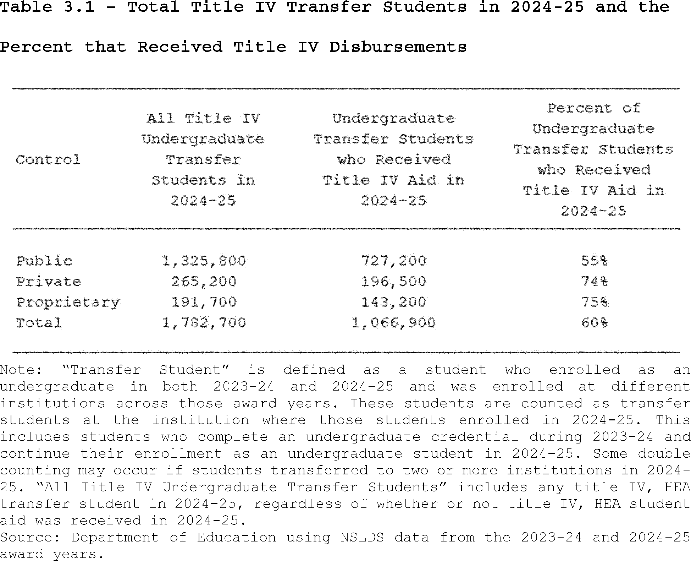
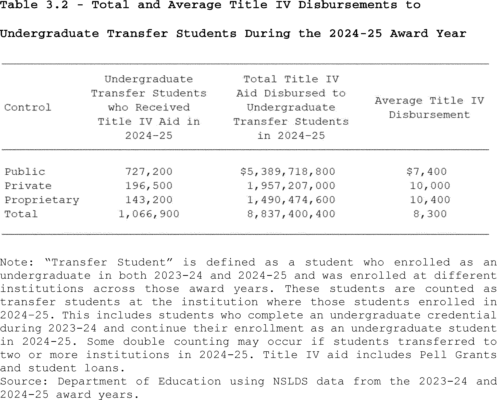
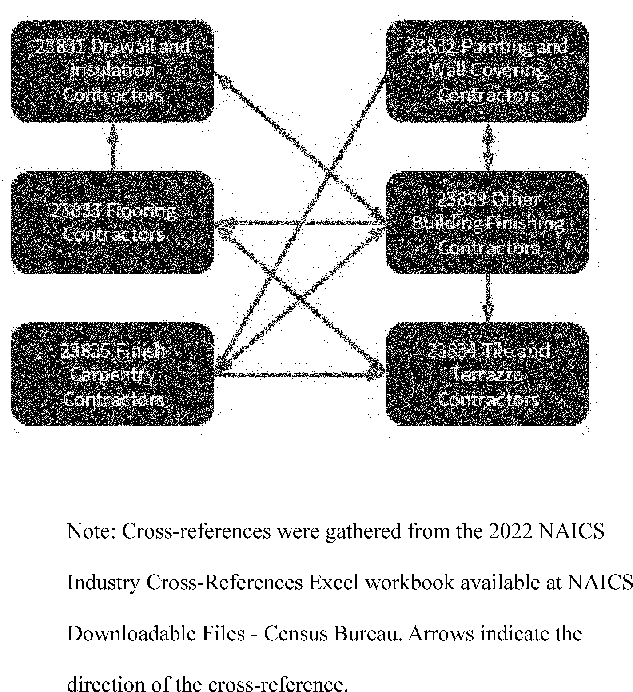
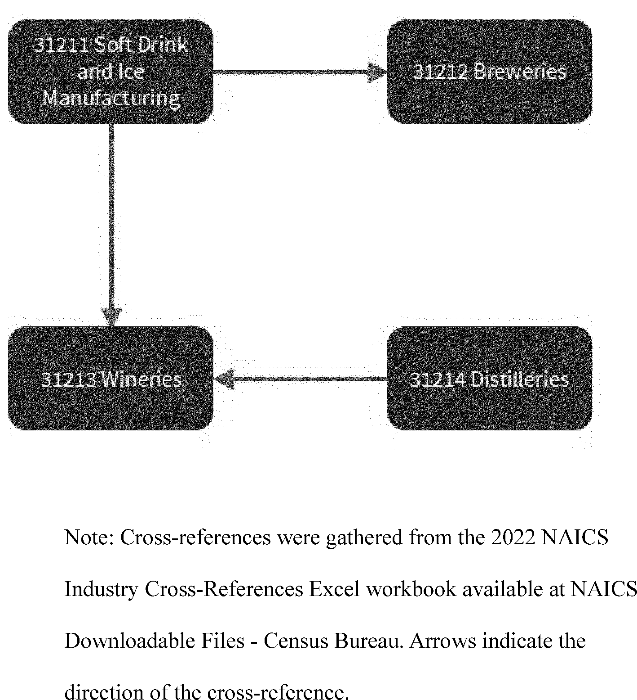
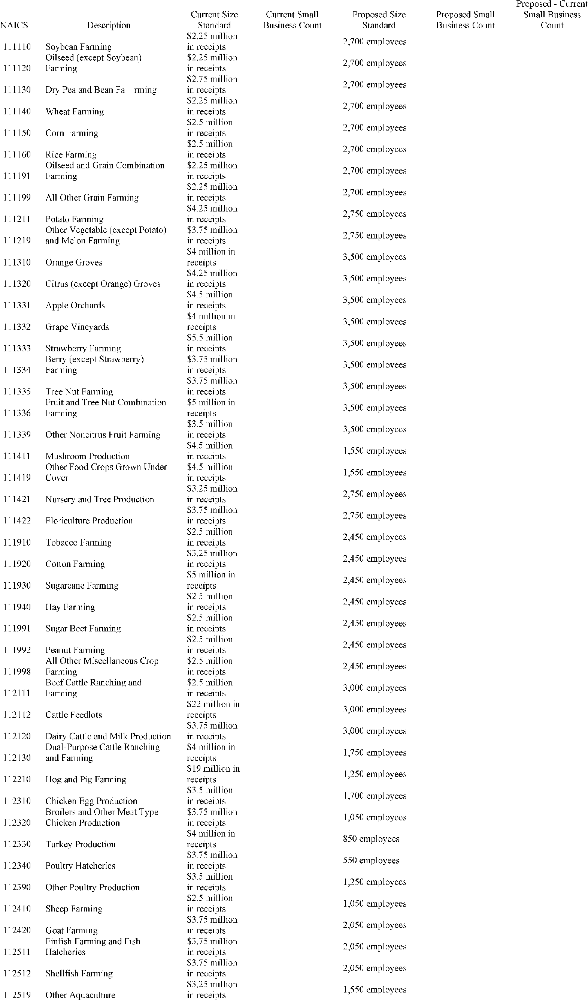
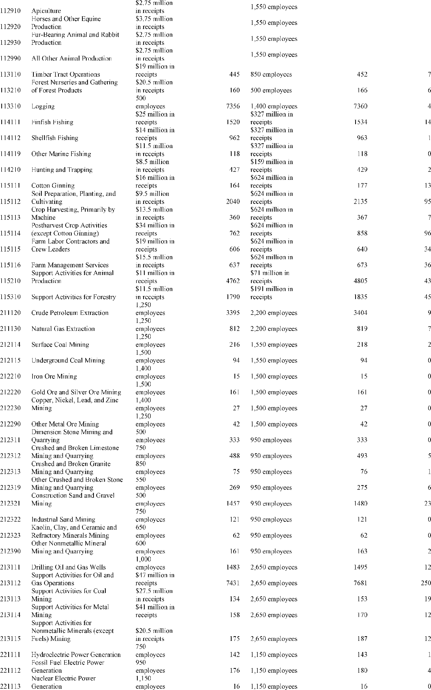

# Daily Digest — 2026-08-20

| | |
|---|---|
| **Digest date** | 2026-08-20 |
| **Data date range** | 2026-08-20 to 2026-08-20 |
| **Generated at** | 2026-08-21T16:55:15Z (UTC) |
| **Pipeline version** | 14137fc |
| **Source watermarks** | CREC: 2026-08-21T11:23:28Z · BILLS: 2026-08-21T08:36:38Z · FR: 2026-08-21T15:07:24Z · USCOURTS: 2026-08-21T02:03:25Z · PLAW: 2026-08-20T14:06:56Z |

[Full observed listing for this day](day/2026-08-20.html) — every item our collectors observed for this publication day, mechanical rules applied, frozen at end of day. This digest is the canonical record.

All items below cite the govinfo package (and granule, where applicable) they
summarize. Selection is mechanical; each item states the rule that included
it. See the Coverage Statement at the end for a full accounting of what was
published, what was summarized, and what was excluded and why.

---

## Contents

- [Day in Review](#day-in-review)
- [1. Congressional Floor Activity](#1-congressional-floor-activity)
- [2. Legislation](#2-legislation)
- [3. Federal Register](#3-federal-register)
- [4. Enacted Laws](#4-enacted-laws)
- [5. Judicial Activity](#5-judicial-activity)
- [6. Agency Announcements](#6-agency-announcements)
- [7. Recorded Votes](#7-recorded-votes)
- [8. Bill Actions](#8-bill-actions)
- [9. Presidential Actions](#9-presidential-actions)
- [Terms Used Today](#terms-used-today)
- [Coverage Statement](#coverage-statement)
- [Methodology](#methodology)

---

## Day in Review

The digest carries four public laws. Public Law 119–101 reforms housing counseling programs, and Public Law 119–102 modifies the Emergency Conservation Program. Public Law 119–92 amends the Small Business Investment Act of 1958 concerning leverage limits, while Public Law 119–95 authorizes determining a mandatory retirement age for Capitol Police members.

Federal agencies issued 12 final rules, 12 proposed rules, and one presidential memorandum, alongside 84 notices. The memorandum established national goals for space transportation. Final rules included FAA airworthiness directives, Justice Department firearm disability relief criteria, and Labor Department employment services staffing. Proposed rules covered USDA's proposal to rescind the 2001 Roadless Area Conservation Rule, and Treasury Department proposals on federal income tax credits.

The digest carries 85 appellate court opinions and one national court opinion. The First Circuit Court of Appeals affirmed a disgorgement judgment and dismissed securities fraud claims. The Fifth Circuit Court of Appeals vacated multiple Food and Drug Administration marketing denial orders, determining a comparative efficacy standard required formal rulemaking. The Tenth and Eleventh Circuits affirmed various convictions and qualified immunity for officers. Other federal appellate courts issued decisions on matters including patent unpatentability, arbitration, and immigration. The United States Court of Federal Claims dismissed a complaint for lack of subject-matter jurisdiction.

*Composed from the summarized items below and the day's mechanical
counts; all specifics are cited in their sections.*

---

## 1. Congressional Floor Activity

No Congressional Record issue was observed on this day. The Record for a day's proceedings is typically published by govinfo the following morning; it appears in the digest for the day it is observed ([how our clocks work](faq.html#fapds-three-clocks)).

### 1.1 Senate

No Senate floor items met the selection thresholds. 0 floor granule(s) are accounted for in the Coverage Statement.

### 1.2 House of Representatives

No House floor items met the selection thresholds. 0 floor granule(s) are accounted for in the Coverage Statement.

### 1.3 Recorded Votes

No recorded votes were published in this issue of the Congressional Record.

---

## 2. Legislation

Source: Congressional Bills (BILLS), text versions published 2026-08-20 to 2026-08-20.

### 2.1 Counts by Stage

| Stage (bill text version) | Count |
|---|---|
| Introduced (ih/is) | 0 |
| Reported (rh/rs) | 0 |
| Engrossed (eh/es) | 0 |
| Enrolled (enr) | 0 |
| Other versions | 0 |
| **Total bill texts published** | **0** |

### 2.2 Bills Listed by Mechanical Rule

Bills below are listed because they matched at least one listing rule; the
matching rule is stated per item. All other bill texts are counted above and
accounted for in the Coverage Statement.

No bill texts published in this range matched a listing rule; all 0 are
accounted for in the Coverage Statement.

---

## 3. Federal Register

Source: Federal Register (FR), issue of 2026-08-20.

### 3.1 Counts by Document Type

| Document type | Count |
|---|---|
| Rules | 12 |
| Proposed rules | 12 |
| Notices | 84 |
| Presidential documents | 0 |
| **Total FR documents** | **108** |

### 3.2 Rules Published

Tags: department of health and human services · environmental protection agency · executive · model keys: airworthiness directives · firearm disabilities · superfund sites

*In plain terms: This section contains 12 final rules, led by new DOJ criteria for relief from firearm disabilities and EPA's deletion of eight Superfund sites; the rest cover airworthiness, environmental plans, and fisheries adjustments.*

#### DEPARTMENT OF COMMERCE

- **Magnuson-Stevens Act Provisions; Fisheries Off West Coast States; Pacific Coast Groundfish Fishery; 2025-2026 Biennial Specifications and Management Measures; Inseason Adjustments** (2026-17003; 50 CFR Part 660) — This final rule announces routine inseason adjustments to management measures in commercial groundfish fisheries. These inseason adjustments will increase sablefish trip limits in the limited entry (LE) and open access (OA) sectors north and south of 36° North latitude (N lat.), and reduce vermilion/sunset rockfish sub-trip limits within the shelf rockfish complex in the LE and OA sectors south of 34°27′ N lat. This action is intended to allow commercial fishing vessels to access more abundant groundfish stocks while protecting overfished and depleted stocks. Action: Final rule; inseason adjustments to biennial groundfish management measures. Dates: This final rule is effective August 20, 2026.
  - *In plain terms:* This rule adjusts commercial groundfish fishery limits by increasing sablefish trip limits and reducing vermilion/sunset rockfish limits to manage fish stocks.
  - Included because: FR-SEL-01 — document type: final rule (all listed)
  - Source: [FR-2026-08-20 / 2026-17003](https://www.govinfo.gov/app/details/FR-2026-08-20/2026-17003)

#### DEPARTMENT OF EDUCATION

- **Final Waiver and Extension of the Project Period With Funding for Arts in Education National Program** (2026-17006; 34 CFR Chapter III) — The Secretary waives the requirements in the Education Department General Administrative Regulations that generally prohibit extensions involving the obligation of additional Federal funds. The waiver and extension enables one project under Assistance Listing Number (ALN) 84.351A to receive funding for an additional period, not to exceed September 30, 2027. Action: Final waiver and extension of project period with funding. Dates: This waiver and extension of the project period is effective August 20, 2026.
  - *In plain terms:* The Secretary is waiving regulations to extend funding for one Arts in Education National Program project until September 30, 2027, allowing additional federal funds.
  - Included because: FR-SEL-01 — document type: final rule (all listed)
  - Source: [FR-2026-08-20 / 2026-17006](https://www.govinfo.gov/app/details/FR-2026-08-20/2026-17006)

#### DEPARTMENT OF HOMELAND SECURITY

- **Special Local Regulation; North East, North East, MD** (2026-17007; 33 CFR Part 100) — The Coast Guard is establishing a temporary special local regulation (SLR) for certain waters of the North East River, near North East, MD. This action is necessary to provide for the safety of life on these navigable waters during a power boat racing event on September 12, 2026 (Rain date: September 13, 2026). This regulation prohibits persons and vessels from entering the regulated area unless specifically authorized by the Captain of the Port Sector Maryland-National Capital Region or their designated representative. Action: Temporary final rule. Dates: This rule is effective from 8 a.m. on September 12, 2026, through 6 p.m. on September 13, 2026. It will only be subject to enforcement, however, from 10 a.m. to 5 p.m. on each of those two days.
  - *In plain terms:* The Coast Guard is setting a temporary local regulation for North East River, MD, on September 12, 2026, to ensure safety during a power boat race.
  - Included because: FR-SEL-01 — document type: final rule (all listed)
  - Source: [FR-2026-08-20 / 2026-17007](https://www.govinfo.gov/app/details/FR-2026-08-20/2026-17007)

#### DEPARTMENT OF HOUSING AND URBAN DEVELOPMENT

- **Revising HUD's Noise Abatement and Control Regulations; Correcting Amendment** (2026-16967; 24 CFR Part 51) — On June 12, 2026, HUD published a final rule revising its noise abatement and control regulations. Due to an amendatory instruction drafting error, codified text of was not revised as HUD intended and continues to reference the Assistant Secretary for Community Planning and Development. This document corrects that text to conform to HUD's intent as described in the preamble to the final rule. Action: Correcting amendment. Dates: Effective August 20, 2026.
  - *In plain terms:* HUD is correcting a June 12, 2026, final rule on noise regulations to fix a drafting error and align the codified text with its original intent.
  - Included because: FR-SEL-01 — document type: final rule (all listed)
  - Source: [FR-2026-08-20 / 2026-16967](https://www.govinfo.gov/app/details/FR-2026-08-20/2026-16967)

#### DEPARTMENT OF JUSTICE

- **Application for Relief From Disabilities Imposed by Federal Laws With Respect to the Acquisition, Receipt, Transfer, Shipment, Transportation, or Possession of Firearms** (2026-16981; 27 CFR Part 478; 28 CFR Parts 0, 25, and 107) — The Department of Justice (“the Department”) is implementing criteria to guide determinations for granting relief from disabilities imposed by federal laws with respect to the acquisition, receipt, transfer, shipment, transportation, or possession of firearms. The criteria are designed to ensure that the fundamental right of the people to keep and bear arms is not unduly infringed, that those people granted relief are not likely to act in a manner dangerous to public safety, and that granting such relief would not be contrary to the public interest. Action: Final rule. Dates: This rule is effective September 21, 2026. Starting on September 21, 2026, the Department will begin soliciting applications from individuals.
  - *In plain terms:* The Department of Justice is setting criteria for granting relief from federal firearm restrictions to ensure public safety and protect the right to keep and bear arms.
  - Included because: FR-SEL-01 — document type: final rule (all listed)
  - Source: [FR-2026-08-20 / 2026-16981](https://www.govinfo.gov/app/details/FR-2026-08-20/2026-16981)

#### DEPARTMENT OF LABOR

- **Wagner-Peyser Act Employment Service Staffing** (2026-16982; 20 CFR Part 652) — The U.S. Department of Labor (DOL or the Department) is removing the requirement that States use State merit staff to provide Wagner-Peyser Employment Service (ES) services. This final rule allows States to use the staffing model that provides the required services with the most efficient and cost-effective model for their State. Action: Final rule. Dates: This final rule is effective on October 19, 2026.
  - *In plain terms:* The Department of Labor is removing the requirement for States to use State merit staff for Wagner-Peyser Employment Service, allowing more efficient, cost-effective staffing models.
  - Included because: FR-SEL-01 — document type: final rule (all listed)
  - Source: [FR-2026-08-20 / 2026-16982](https://www.govinfo.gov/app/details/FR-2026-08-20/2026-16982)

#### DEPARTMENT OF TRANSPORTATION

- **Airworthiness Directives; International Aero Engines AG Engines** (2026-16954; 14 CFR Part 39) — The FAA is adopting a new airworthiness directive (AD) for certain International Aero Engines AG (IAE AG) Model V2522-A5, V2524-A5, V2525-D5, V2527-A5, V2527E-A5, V2527M-A5, V2528-D5, V2530-A5, V2531-E5, and V2533-A5 engines. This AD was prompted by a manufacturer investigation that revealed that certain 3rd stage high pressure compressor (HPC) rotor blades were susceptible to shroud wear and blade failure. This AD requires replacement of affected 3rd stage HPC rotor blades with parts eligible for installation. The FAA is issuing this AD to address the unsafe condition on these products. Action: Final rule. Dates: This AD is effective September 24, 2026.
  - *In plain terms:* The FAA is requiring replacement of certain 3rd stage high pressure compressor rotor blades on specific International Aero Engines AG engines to address an unsafe condition.
  - Included because: FR-SEL-01 — document type: final rule (all listed)
  - Source: [FR-2026-08-20 / 2026-16954](https://www.govinfo.gov/app/details/FR-2026-08-20/2026-16954)

#### ENVIRONMENTAL PROTECTION AGENCY

- **Cypermethrin; Pesticide Tolerance(s)** (2026-16973; 40 CFR Part 180) — This regulation establishes a tolerance action for residues of cypermethrin (CASRN 52315-07-8) in or on the food and feed commodity of cacao, dried bean. Under the Federal Food, Drug, and Cosmetic Act (FFDCA), the National Confectioners Association submitted a petition to EPA requesting that EPA establish a maximum permissible level for residues of this pesticide in or on the identified commodity. Action: Final rule. Dates: This rule is effective on August 20, 2026. Objections and requests for hearings must be received on or before October 19, 2026 and must be filed in accordance with the instructions provided in 40 CFR part 178 (see also Unit I.C. of this document).
  - *In plain terms:* This rule sets a maximum permissible level for cypermethrin pesticide residues on cacao, dried bean, in response to a petition from the National Confectioners Association.
  - Included because: FR-SEL-01 — document type: final rule (all listed)
  - Source: [FR-2026-08-20 / 2026-16973](https://www.govinfo.gov/app/details/FR-2026-08-20/2026-16973)
- **Air Plan Approval; Wisconsin; Moderate Attainment Plan Elements for Wisconsin's 2015 Ozone Standard Areas** (2026-16986; 40 CFR Part 52) — The U.S. Environmental Protection Agency (EPA) is approving portions of Wisconsin's 2015 ozone National Ambient Air Quality Standard (NAAQS or standard) Moderate nonattainment area State Implementation Plan (SIP) submission for the Wisconsin portion of the Chicago, Illinois-Indiana-Wisconsin area (Kenosha County), the Milwaukee, Wisconsin area, and the Sheboygan County, Wisconsin area. The elements of the Moderate SIP submissions include the reasonable further progress (RFP) demonstration and the associated motor vehicle emissions budgets (Budgets) for 2023, the motor vehicle inspection and maintenance (I/M) program, and the nonattainment new source review (NNSR) program. The EPA is also approving the base year emissions inventory as satisfying previous Marginal area requirements for these areas. The EPA is finding adequate and approving the Budgets for these areas. The EPA proposed to approve this action on April 2, 2026, and received no adverse comments. Action: Final rule. Dates: This final rule is effective on September 21, 2026.
  - *In plain terms:* The EPA is approving parts of Wisconsin's 2015 ozone State Implementation Plan for three areas, including 2023 emissions budgets, vehicle inspection, and new source review programs.
  - Included because: FR-SEL-01 — document type: final rule (all listed)
  - Source: [FR-2026-08-20 / 2026-16986](https://www.govinfo.gov/app/details/FR-2026-08-20/2026-16986)
- **Deletion From the National Priorities List** (2026-16988; 40 CFR Part 300) — The Environmental Protection Agency (EPA) announces the deletion of six sites and the partial deletion of two sites, from the Superfund National Priorities List (NPL). The NPL, created under the Comprehensive Environmental Response, Compensation, and Liability Act (CERCLA) of 1980, as amended, is an appendix of the National Oil and Hazardous Substances Pollution Contingency Plan (NCP). In accordance with the NCP, sites may be deleted from the NPL where no further response is appropriate. The EPA and the applicable states, through their designated state agency, have determined that all appropriate response actions under CERCLA have been completed. However, this deletion does not preclude future actions under Superfund. Action: Final rule. Dates: The document is effective August 20, 2026.
  - *In plain terms:* The EPA is deleting six sites and partially deleting two sites from the Superfund National Priorities List, as all required cleanup actions under CERCLA are complete.
  - Included because: FR-SEL-01 — document type: final rule (all listed)
  - Source: [FR-2026-08-20 / 2026-16988](https://www.govinfo.gov/app/details/FR-2026-08-20/2026-16988)
- **Air Plan Approval; Arizona; Attainment Plan for the Hayden SO 2 Nonattainment Area for the 1971 and 2010 Sulfur Dioxide National Ambient Air Quality Standards** (2026-16989; 40 CFR Part 52) — The Environmental Protection Agency (EPA) is finalizing approval of revisions to the Arizona state implementation plan (SIP) for attaining the 1971 and 2010 sulfur dioxide (SO 2 ) national ambient air quality standards (NAAQS or “standards”) in the Hayden SO 2 nonattainment area. These SIP revisions, collectively referred to as the “Hayden SO 2 Plan” or “Plan,” include Arizona's attainment demonstration and other elements required under Clean Air Act (CAA or “Act”) sections 110, 172, 191, and 192. In addition to an attainment demonstration, the revisions address the requirements for meeting reasonable further progress (RFP) toward attainment of the NAAQS, reasonably available control measures and reasonably available control technology (RACM/RACT), base-year and projection-year emissions inventories, nonattainment new source review, emissions limitations necessary to provide for attainment, and contingency measures. The EPA is approving the SIP revisions as meeting the CAA requirements. This action is being taken under the CAA. Action: Final rule. Dates: This rule is effective September 21, 2026.
  - *In plain terms:* The EPA is approving Arizona's plan to meet 1971 and 2010 sulfur dioxide air quality standards in the Hayden area, including control measures, emissions limits, and inventories.
  - Included because: FR-SEL-01 — document type: final rule (all listed)
  - Source: [FR-2026-08-20 / 2026-16989](https://www.govinfo.gov/app/details/FR-2026-08-20/2026-16989)
- **Air Plan Approval; SC; Department Name Change** (2026-16990; 40 CFR Part 52) — The U.S. Environmental Protection Agency (EPA or Agency) is approving a State Implementation Plan (SIP) revision submitted by the State of South Carolina on July 23, 2025. The revision updates references to reflect the restructuring of South Carolina Department of Health and Environmental Control (DHEC) to the South Carolina Department of Public Health and the South Carolina Department of Environmental Services (DES). Action: Final rule. Dates: This rule is effective September 21, 2026.
  - *In plain terms:* The EPA is approving South Carolina's July 23, 2025, State Implementation Plan revision to update department names following the restructuring of DHEC.
  - Included because: FR-SEL-01 — document type: final rule (all listed)
  - Source: [FR-2026-08-20 / 2026-16990](https://www.govinfo.gov/app/details/FR-2026-08-20/2026-16990)

### 3.3 Proposed Rules Published

Tags: department of health and human services · environmental protection agency · executive · model keys: aviation safety · roadless area conservation · sba size standards

*In plain terms: This section outlines 12 proposed rules, led by USDA's plan to rescind the 2001 Roadless Area Conservation Rule and SBA's proposal for new size standards in 338 industries; the rest cover aviation safety, tax, and environmental proposals.*

#### DEPARTMENT OF AGRICULTURE

- **Special Areas; Roadless Area Conservation** (2026-16965; 36 CFR Part 294) — The U.S. Department of Agriculture (USDA or Department) is proposing to rescind the 2001 Roadless Area Conservation Rule (2001 Roadless Rule), which established broad prohibitions on road construction, road reconstruction, and timber harvesting within inventoried roadless areas on National Forest System lands. The intent of this proposed action is to reduce regulatory burden and return decisionmaking for the management of inventoried roadless areas to the land management planning process at the individual national forest level. Rescission of the national-level prohibitions provides responsible officials with flexibility to better guide management of National Forest System lands and respond to changing local resource conditions. The Forest and Rangeland Renewable Resources Planning Act of 1974, as amended by the National Forest Management Act of 1976, and the associated land management planning processes and plans are the appropriate and effective mechanisms to guide sustainable, integrated management of the resources within the plan areas in the context of the broader landscape, giving due consideration to the relative values of the various resources in particular areas. [official summary truncated; see source] Action: Proposed rule; request for public comment. Dates: Comments must be received in writing by September 21, 2026.
  - *In plain terms:* The USDA proposes to withdraw the 2001 Roadless Area Conservation Rule, returning decision-making for managing roadless areas on National Forest System lands to local planning.
  - Included because: FR-SEL-02 — document type: proposed rule (all listed)
  - Source: [FR-2026-08-20 / 2026-16965](https://www.govinfo.gov/app/details/FR-2026-08-20/2026-16965)

#### DEPARTMENT OF EDUCATION

- **Accreditation, Innovation, and Modernization: The Secretary's Recognition of Accrediting Agencies: Institutional Eligibility Under the Higher Education Act of 1965, as Amended, Student Assistance General Provisions** (2026-17001; 34 CFR Parts 600, 602, and 668) — The Department proposes to revise the existing accrediting agency recognition regulations at 34 CFR part 602 to implement the directives set forth in Executive Order 14279, Reforming Accreditation to Strengthen Higher Education, and other Administration priorities, align the regulations more closely with statute, and reduce regulatory burden. Action: Notice of proposed rulemaking (NPRM). Dates: We must receive your comments on or before September 21, 2026.
  - *In plain terms:* The Department of Education proposes to update existing regulations for recognizing accrediting agencies to follow Executive Order 14279, align with law, and reduce burdens.
  - Included because: FR-SEL-02 — document type: proposed rule (all listed)
  - Source: [FR-2026-08-20 / 2026-17001](https://www.govinfo.gov/app/details/FR-2026-08-20/2026-17001)
  -  *Source graphic 1 of 15 from 2026-17001.*
  -  *Source graphic 2 of 15 from 2026-17001.*
  - *Graphics not rendered here: 13 of 15 — see the [source PDF](https://www.govinfo.gov/content/pkg/FR-2026-08-20/pdf/FR-2026-08-20.pdf).*

#### DEPARTMENT OF THE TREASURY

- **Application of the Personal Responsibility and Work Opportunity Reconciliation Act of 1996 to the Refunded Portion of Certain Federal Refundable Tax Credits** (2026-16985; 26 CFR Part 1) — This document contains proposed regulations that would provide that the refunded portion of certain refundable Federal income tax credits available to individuals is a “Federal public benefit” under the Personal Responsibility and Work Opportunity Reconciliation Act of 1996 (PRWORA). As a result, aliens who are not “qualified aliens” under PRWORA would be ineligible to receive the refunded portion of these refundable credits. These regulations would generally affect taxpayers claiming the following Federal income tax credits: the adoption tax credit, the American opportunity tax credit, the child tax credit, and the earned income credit. As required by PRWORA, this document also provides notice to the public and notifies recipients of proposed changes regarding eligibility for the refunded portion of such Federal income tax credits under PRWORA. Action: Notice of proposed rulemaking and notice of public hearing. Dates: Written or electronic comments must be received by October 5, 2026. A public hearing on this proposed regulation has been scheduled for October 14, 2026. Requests to speak and outlines of topics to be discussed at the public hearing must be received by October 5, 2026. If no outlines are received October 5, 2026, the public hearing will be cancelled. Requests to attend the public hearing must be received by 5 p.m. ET on October 9, 2026.
  - *In plain terms:* These proposed regulations classify refunded portions of specific federal tax credits (e.g., child tax credit) as "Federal public benefits," making non-qualified aliens ineligible under PRWORA.
  - Included because: FR-SEL-02 — document type: proposed rule (all listed)
  - Source: [FR-2026-08-20 / 2026-16985](https://www.govinfo.gov/app/details/FR-2026-08-20/2026-16985)
- **Application of Section 250(b)(3)(A)(i)(VII) to Sales or Other Dispositions of Property** (2026-17019; 26 CFR Part 1) — This document contains proposed regulations under section 250 of the Internal Revenue Code (Code) that provide guidance on certain income of a domestic corporation that is excluded in the determination of deduction eligible income. This category of income consists of income and gain from the sale or other disposition of intangible property and any other property of a type that is subject to depreciation, amortization, or depletion. The proposed regulations would affect domestic corporations with foreign-derived deduction eligible income. Action: Notice of proposed rulemaking. Dates: Written or electronic comments must be received by October 5, 2026.
  - *In plain terms:* These proposed regulations provide guidance on excluding certain income and gains from property sales by domestic corporations with foreign-derived income from deduction eligible income.
  - Included because: FR-SEL-02 — document type: proposed rule (all listed)
  - Source: [FR-2026-08-20 / 2026-17019](https://www.govinfo.gov/app/details/FR-2026-08-20/2026-17019)
- **Determination of Target Normal Cost and Funding Target for Single-Employer Defined Benefit Plans** (2026-17021; 26 CFR Part 1) — This document contains proposed regulations that would modify rules in the existing regulations relating to the minimum funding requirement applicable to single-employer defined benefit pension plans. The modifications include changes to the rules relating to the determination of a plan's target normal cost and funding target and would implement certain statutory amendments that have not yet been reflected in the regulations. These proposed regulations would affect participants in, beneficiaries of, employers maintaining, and administrators of single-employer defined benefit plans. Action: Notice of proposed rulemaking. Dates: Written or electronic comments and requests for a public hearing must be received by October 19, 2026.
  - *In plain terms:* These proposed regulations would update minimum funding rules for single-employer defined benefit pension plans, changing how target normal cost and funding targets are determined.
  - Included because: FR-SEL-02 — document type: proposed rule (all listed)
  - Source: [FR-2026-08-20 / 2026-17021](https://www.govinfo.gov/app/details/FR-2026-08-20/2026-17021)

#### DEPARTMENT OF TRANSPORTATION

- **Airworthiness Directives; Rolls-Royce Deutschland Ltd & Co KG Engines** (2026-16956; 14 CFR Part 39) — The FAA proposes to supersede Airworthiness Directive (AD) 2022-11-15, which applies to all Rolls-Royce Deutschland Ltd & Co KG (RRD) Model Trent7000-72 and Trent7000-72C engines. AD 2022-11-15 requires initial and repetitive on-wing borescope inspections (BSIs) of the high-pressure turbine (HPT) blades to detect axial cracking and, depending on the results of the inspections, replacement of the HPT blade set. Since the FAA issued AD 2022-11-15, RRD issued updated service material providing improved instructions for inspection of the HPT blades, removing the reduced life limit for affected HPT blades, and revising the HPT blade limits for axial cracking. This proposed AD would continue to require initial and repetitive on-wing BSIs of the HPT blades to detect axial cracking and, depending on the results of the inspections, replacement of the HPT blade set. This proposed AD would also remove the reduced life limit for affected HPT blades. The FAA is proposing this AD to address the unsafe condition on these products. Action: Notice of proposed rulemaking (NPRM). Dates: The FAA must receive comments on this NPRM by October 5, 2026.
  - *In plain terms:* The FAA proposes to update AD 2022-11-15 for Rolls-Royce Trent7000 engines, continuing required inspections and replacements of turbine blades while removing a reduced life limit.
  - Included because: FR-SEL-02 — document type: proposed rule (all listed)
  - Source: [FR-2026-08-20 / 2026-16956](https://www.govinfo.gov/app/details/FR-2026-08-20/2026-16956)
- **Airworthiness Directives; Dassault Aviation Airplanes** (2026-16961; 14 CFR Part 39) — The FAA proposes to supersede Airworthiness Directive (AD) 2025-13-11, which applies to all Dassault Aviation Model FALCON 7X airplanes. AD 2025-13-11 requires replacing the affected spoiler electrical units (SPECUs) and prohibits the installation of affected parts. Since the FAA issued AD 2025-13-11, it was determined that additional SPECUs are subject to the unsafe condition. This proposed AD would continue to require the actions in AD 2025-13-11 and would require replacing additional SPECUs. This proposed AD would also prohibit the installation of affected parts. The FAA is proposing this AD to address the unsafe condition on these products. Action: Notice of proposed rulemaking (NPRM). Dates: The FAA must receive comments on this proposed AD by October 5, 2026.
  - *In plain terms:* The FAA proposes to update AD 2025-13-11 for Dassault FALCON 7X airplanes, requiring replacement of more spoiler electrical units and prohibiting installation of affected parts.
  - Included because: FR-SEL-02 — document type: proposed rule (all listed)
  - Source: [FR-2026-08-20 / 2026-16961](https://www.govinfo.gov/app/details/FR-2026-08-20/2026-16961)
- **Airworthiness Directives; The Boeing Company Airplanes** (2026-17056; 14 CFR Part 39) — The FAA proposes to adopt a new airworthiness directive (AD) for certain The Boeing Company Model 787-8 airplanes. This proposed AD was prompted by a report that large forward cargo door (LFCD) split frames may have been manufactured with a material that did not conform to type design. This proposed AD would require an inspection of the LFCD split frames for affected batch numbers and applicable on-condition actions. The FAA is proposing this AD to address the unsafe condition on these products. Action: Notice of proposed rulemaking (NPRM). Dates: The FAA must receive comments on this proposed AD by October 5, 2026.
  - *In plain terms:* The FAA proposes a new airworthiness directive for Boeing 787-8 airplanes, requiring inspection of large forward cargo door split frames due to possible non-conforming material.
  - Included because: FR-SEL-02 — document type: proposed rule (all listed)
  - Source: [FR-2026-08-20 / 2026-17056](https://www.govinfo.gov/app/details/FR-2026-08-20/2026-17056)

#### ENVIRONMENTAL PROTECTION AGENCY

- **Receipt of Pesticide Petitions Filed for Residues of Pesticide Chemicals in or on Various Commodities—June 2026** (2026-16976; 40 CFR Parts 174 and 180) — This document announces the Agency's receipt of and solicits public comment on initial filings of pesticide petitions requesting the establishment or modification of regulations for residues of pesticide chemicals in or on various commodities. The Agency is providing this notice in accordance with the Federal Food, Drug, and Cosmetic Act (FFDCA). EPA uses the month and year in the title to identify when the Agency compiled the petitions identified in this notice of filing Unit II. of this document identifies certain petitions received in 2024, 2025, and 2026 that are currently being evaluated by EPA, along with information about each petition, including who submitted the petition and the requested action. Action: Notice of filing of petitions and request for comment. Dates: Comments must be received on or before September 21, 2026.
  - *In plain terms:* The EPA announces receipt of and seeks public comments on pesticide petitions filed in 2024, 2025, and 2026 to change regulations for pesticide residues on various commodities.
  - Included because: FR-SEL-02 — document type: proposed rule (all listed)
  - Source: [FR-2026-08-20 / 2026-16976](https://www.govinfo.gov/app/details/FR-2026-08-20/2026-16976)
- **Proposed Deletion From the National Priorities List** (2026-16994; 40 CFR Part 300) — The Environmental Protection Agency (EPA) is issuing a Notice of Intent to partially delete three sites from the National Priorities List (NPL) and requests public comments on this proposed action. The NPL, promulgated pursuant to the Comprehensive Environmental Response, Compensation, and Liability Act (CERCLA) of 1980, as amended, is an appendix of the National Oil and Hazardous Substances Pollution Contingency Plan (NCP). The EPA and the applicable states, through their designated state agency, have determined that all appropriate response actions under CERCLA have been completed. However, this deletion does not preclude future actions under Superfund. Action: Proposed rule; notice of intent. Dates: Comments regarding this proposed action must be submitted on or before September 21, 2026.
  - *In plain terms:* The EPA proposes to partially delete three sites from the Superfund National Priorities List because cleanup actions under CERCLA are complete, and requests public comments.
  - Included because: FR-SEL-02 — document type: proposed rule (all listed)
  - Source: [FR-2026-08-20 / 2026-16994](https://www.govinfo.gov/app/details/FR-2026-08-20/2026-16994)

#### SMALL BUSINESS ADMINISTRATION

- **Small Business Size Standards: Revised Size Standards Methodology** (2026-17039; 13 CFR Part 121) — The U.S. Small Business Administration (SBA or Agency) advises the public that it has revised its white paper explaining how it establishes, reviews, and modifies small business size standards. The revised white paper provides a detailed description of SBA's size standards methodology, including changes from SBA's 2024 Revised Size Standards Methodology (2024 Methodology, available at www.sba.gov/size ). SBA welcomes comments and feedback on the 2026 Revised Methodology, which SBA has applied to the proposed review of size standards filed concurrently in the Federal Register . Action: Notice of availability of Revised Size Standards Methodology for comments. Dates: SBA must receive comments on the 2026 Revised Methodology on or before September 21, 2026.
  - *In plain terms:* The SBA revised its white paper explaining how it sets small business size standards, detailing changes from the 2024 methodology and welcoming public comments.
  - Included because: FR-SEL-02 — document type: proposed rule (all listed)
  - Source: [FR-2026-08-20 / 2026-17039](https://www.govinfo.gov/app/details/FR-2026-08-20/2026-17039)
  -  *Source graphic 1 of 110 from 2026-17039.*
  -  *Source graphic 2 of 110 from 2026-17039.*
  - *Graphics not rendered here: 108 of 110 — see the [source PDF](https://www.govinfo.gov/content/pkg/FR-2026-08-20/pdf/FR-2026-08-20.pdf).*
- **Small Business Size Standards** (2026-17042; 13 CFR Part 121) — The U.S. Small Business Administration (SBA or the Agency) is proposing new size standards for 338 industry groups and industries. The new size standards are designed to better reflect the nature of the markets in which small businesses compete. SBA seeks comments on its proposed changes to size standards. Action: Proposed rule. Dates: SBA must receive comments on this proposed rule on or before September 21, 2026.
  - *In plain terms:* The SBA proposes new size standards for 338 industry groups to better reflect market competition for small businesses and is seeking public comments.
  - Included because: FR-SEL-02 — document type: proposed rule (all listed)
  - Source: [FR-2026-08-20 / 2026-17042](https://www.govinfo.gov/app/details/FR-2026-08-20/2026-17042)
  -  *Source graphic 1 of 34 from 2026-17042.*
  -  *Source graphic 2 of 34 from 2026-17042.*
  - *Graphics not rendered here: 32 of 34 — see the [source PDF](https://www.govinfo.gov/content/pkg/FR-2026-08-20/pdf/FR-2026-08-20.pdf).*

### 3.4 Notices and Presidential Documents

Notices are summarized only when they match a listing rule; all are counted
in 3.1 and in the Coverage Statement. Presidential documents in the FR are
always listed.

No notices or presidential documents matched a listing rule.

---

## 4. Enacted Laws

Tags: legislative · model keys: conservation program · housing counseling · small business investment

*In plain terms: This section contains 4 new public laws, including the "21st Century ROAD to Housing Act" reforming housing counseling and the "Emergency Conservation Program Improvement Act of 2025"; others address small business and Capitol Police retirement.*

Source: Public and Private Laws (PLAW) published 2026-08-20.

- **Public Law 119–101 — Public Law 119–101: To increase the supply of housing in America, and for other purposes.** — Public Law 119–101, cited as the "21st Century ROAD to Housing Act," amends the Housing and Urban Development Act of 1968. It reforms housing counseling and financial literacy programs by modifying review processes, counselor performance considerations, and conditions for terminating assistance. The law also directs the Secretary of Housing and Urban Development to issue guidelines for point-access block residential buildings, addressing design and cost factors. Approved: 2026-07-11.
  - *In plain terms:* Public Law 119–101 changes the Housing and Urban Development Act of 1968, reforming housing counseling programs and directing HUD to issue guidelines for point-access block residential buildings.
  - Included because: PLAW-SEL-01 — enacted into law (all public and private laws are listed) (document dated 2026-07-11)
  - Source: [PLAW-119publ101](https://www.govinfo.gov/app/details/PLAW-119publ101)
- **Public Law 119–102 — Public Law 119–102: To amend the Agricultural Credit Act of 1978 to remove barriers to agricultural producers in accessing funds to carry out emergency measures under the emergency conservation program, and for other purposes.** — Public Law 119–102, titled the "Emergency Conservation Program Improvement Act of 2025," amends the Agricultural Credit Act of 1978. It modifies the Emergency Conservation Program to allow for advance payments to agricultural producers for emergency measures and extends the period for returning unexpended funds. The law also clarifies that covered wildfires under both the Emergency Conservation Program and the Emergency Forest Restoration Program include those caused by the Federal Government or those that spread due to natural causes. Approved: 2026-07-12.
  - *In plain terms:* Public Law 119–102 amends the Agricultural Credit Act of 1978, letting farmers get advance payments for emergency measures, extending the return period for unspent funds, and clarifying covered wildfires.
  - Included because: PLAW-SEL-01 — enacted into law (all public and private laws are listed) (document dated 2026-07-12)
  - Source: [PLAW-119publ102](https://www.govinfo.gov/app/details/PLAW-119publ102)
- **Public Law 119–92 — Public Law 119–92: To amend the Small Business Investment Act of 1958 to exclude from the limit on leverage certain amounts invested in smaller enterprises located in rural or low-income areas and small businesses in critical technology areas, and for other purposes.** — Public Law 119–92, known as the "Investing in All of America Act of 2025," amends the Small Business Investment Act of 1958. The law modifies the maximum leverage limits for Small Business Investment Companies and revises criteria for "private capital." It establishes exclusions from leverage calculations for investments in small businesses located in low-income or rural areas, those in covered technology categories, or small manufacturers, subject to specific monetary limits. Approved: 2026-05-19.
  - *In plain terms:* Public Law 119–92 changes the Small Business Investment Act of 1958, modifying Small Business Investment Company leverage and private capital rules, and creating leverage exclusions for some investments with monetary limits.
  - Included because: PLAW-SEL-01 — enacted into law (all public and private laws are listed) (document dated 2026-05-19)
  - Source: [PLAW-119publ92](https://www.govinfo.gov/app/details/PLAW-119publ92)
- **Public Law 119–95 — Public Law 119–95: To amend chapters 83 and 84 of title 5, United States Code, to authorize an increase of the retirement age for members of the Capitol Police.** — Public Law 119–95 amends chapters 83 and 84 of title 5, United States Code. The law authorizes the relevant Board to determine the mandatory retirement age for members of the Capitol Police. This age must be not less than 57 years and not more than 62 years, applying to both the Civil Service Retirement System and the Federal Employees' Retirement System. Approved: 2026-05-29.
  - *In plain terms:* Public Law 119–95 changes title 5 of the US Code, letting a Board set the Capitol Police's mandatory retirement age between 57 and 62 years, for both main federal retirement systems.
  - Included because: PLAW-SEL-01 — enacted into law (all public and private laws are listed) (document dated 2026-05-29)
  - Source: [PLAW-119publ95](https://www.govinfo.gov/app/details/PLAW-119publ95)

---

## 5. Judicial Activity

Source: United States Courts Opinions (USCOURTS): opinions observed 2026-08-20
by our collector; each opinion states its own issue date beside its
listing ([how our clocks work](faq.html#fapds-three-clocks)).

Completeness disclosure (standing): USCOURTS carries opinions from
approximately 140 participating appellate, district, bankruptcy, and
national federal courts. Unlike the Congressional Record and the Federal
Register, which are the complete official record of their branches,
USCOURTS is participation-based and is NOT the complete federal judicial
record. Courts post opinions with delay — typically over several days —
so a day's digest carries the opinions that became available that day,
whatever date each was issued.

### 5.1 Appellate and National Court Opinions

Tags: judicial · model keys: appeals court decisions · e-cigarette manufacturers · fda marketing orders

*In plain terms: This section includes 86 judicial actions, notably the Fifth Circuit vacating six FDA marketing denial orders for e-cigarette manufacturers, alongside various other appeals court decisions.*

Appellate and national court opinions are summarized; district and
bankruptcy opinions are counted in 5.2 and in the Coverage Statement.

#### United States Court of Appeals for the Eighth Circuit

- **Rhonda Burnett, et al v. Spring Way Center, LLC, et al** (No. 24-03444; filed 2026-08-19) — The Eighth Circuit Court of Appeals informed counsel that it has issued an opinion and entered judgment in the consolidated case of Rhonda Burnett, et al v. Spring Way Center, LLC, et al. The notice provides instructions on post-submission procedures, including the deadlines and filing requirements for petitions for rehearing and petitions for rehearing en banc.
  - *In plain terms:* The Eighth Circuit issued its decision and judgment in the consolidated Rhonda Burnett case, providing instructions for filing requests for rehearing within set deadlines.
  - Included because: USCOURTS-SEL-01 — appellate court opinion (all listed) (document dated 2026-08-19)
  - Source: [USCOURTS-ca8-24-03444 / USCOURTS-ca8-24-03444-0](https://www.govinfo.gov/app/details/USCOURTS-ca8-24-03444/USCOURTS-ca8-24-03444-0)
- **Rhonda Burnett, et al v. Monty March** (No. 24-03450; filed 2026-08-19) — The United States Court of Appeals for the Eighth Circuit issued an opinion and entered judgment in the case of Rhonda Burnett, et al v. Monty March, case number 24-3450, on August 19, 2026. The document includes instructions to counsel regarding post-submission procedures, specifying a 14-day deadline for petitions for rehearing.
  - *In plain terms:* The Eighth Circuit issued its decision and judgment in Rhonda Burnett v. Monty March on August 19, 2026, including instructions for counsel to file rehearing petitions within 14 days.
  - Included because: USCOURTS-SEL-01 — appellate court opinion (all listed) (document dated 2026-08-19)
  - Source: [USCOURTS-ca8-24-03450 / USCOURTS-ca8-24-03450-0](https://www.govinfo.gov/app/details/USCOURTS-ca8-24-03450/USCOURTS-ca8-24-03450-0)
- **Rhonda Burnett, et al v. Robert Friedman** (No. 24-03451; filed 2026-08-19) — The United States Court of Appeals for the Eighth Circuit issued an opinion and entered judgment in the case of Rhonda Burnett, et al v. Robert Friedman, case number 24-3451, on August 19, 2026. The document includes instructions to counsel regarding post-submission procedures, specifying a 14-day deadline for petitions for rehearing.
  - *In plain terms:* The Eighth Circuit issued its decision and judgment in Rhonda Burnett v. Robert Friedman on August 19, 2026, including instructions for counsel to file rehearing petitions within 14 days.
  - Included because: USCOURTS-SEL-01 — appellate court opinion (all listed) (document dated 2026-08-19)
  - Source: [USCOURTS-ca8-24-03451 / USCOURTS-ca8-24-03451-0](https://www.govinfo.gov/app/details/USCOURTS-ca8-24-03451/USCOURTS-ca8-24-03451-0)
- **Rhonda Burnett, et al v. Benny Cheatham, et al** (No. 24-03527; filed 2026-08-19) — The United States Court of Appeals for the Eighth Circuit issued an opinion and entered judgment in the case of Rhonda Burnett, et al v. Benny Cheatham, et al, case number 24-3527, on August 19, 2026. The document includes instructions to counsel regarding post-submission procedures, specifying a 14-day deadline for petitions for rehearing.
  - *In plain terms:* The Eighth Circuit issued its decision and judgment in Rhonda Burnett v. Benny Cheatham on August 19, 2026, including instructions for counsel to file rehearing petitions within 14 days.
  - Included because: USCOURTS-SEL-01 — appellate court opinion (all listed) (document dated 2026-08-19)
  - Source: [USCOURTS-ca8-24-03527 / USCOURTS-ca8-24-03527-0](https://www.govinfo.gov/app/details/USCOURTS-ca8-24-03527/USCOURTS-ca8-24-03527-0)
- **Rhonda Burnett, et al v. Tanya Monestier** (No. 24-03585; filed 2026-08-19) — The United States Court of Appeals for the Eighth Circuit issued an opinion and entered judgment in the case of Rhonda Burnett, et al v. Tanya Monestier, case number 24-3585, on August 19, 2026. The document includes instructions to counsel regarding post-submission procedures, specifying a 14-day deadline for petitions for rehearing.
  - *In plain terms:* The Eighth Circuit Court of Appeals issued its opinion and judgment in *Rhonda Burnett, et al v. Tanya Monestier* (case 24-3585) on August 19, 2026, setting a 14-day deadline for requests to reconsider the decision.
  - Included because: USCOURTS-SEL-01 — appellate court opinion (all listed) (document dated 2026-08-19)
  - Source: [USCOURTS-ca8-24-03585 / USCOURTS-ca8-24-03585-0](https://www.govinfo.gov/app/details/USCOURTS-ca8-24-03585/USCOURTS-ca8-24-03585-0)
- **Rhonda Burnett, et al v. James Mullis** (No. 24-03619; filed 2026-08-19) — The United States Court of Appeals for the Eighth Circuit issued an opinion and entered judgment in the case of Rhonda Burnett, et al v. James Mullis, case number 24-3619, on August 19, 2026. The document includes instructions to counsel regarding post-submission procedures, specifying a 14-day deadline for petitions for rehearing.
  - *In plain terms:* The Eighth Circuit Court of Appeals issued its opinion and judgment in *Rhonda Burnett, et al v. James Mullis* (case 24-3619) on August 19, 2026, setting a 14-day deadline for requests to reconsider the decision.
  - Included because: USCOURTS-SEL-01 — appellate court opinion (all listed) (document dated 2026-08-19)
  - Source: [USCOURTS-ca8-24-03619 / USCOURTS-ca8-24-03619-0](https://www.govinfo.gov/app/details/USCOURTS-ca8-24-03619/USCOURTS-ca8-24-03619-0)
- **Rhonda Burnett, et al v. Rosalie Doyle, et al** (No. 24-03621; filed 2026-08-19) — The United States Court of Appeals for the Eighth Circuit issued an opinion and entered judgment in the case of Rhonda Burnett, et al v. Rosalie Doyle, et al, case number 24-3621, on August 19, 2026. The document includes instructions to counsel regarding post-submission procedures, specifying a 14-day deadline for petitions for rehearing.
  - *In plain terms:* The Eighth Circuit Court of Appeals issued its opinion and judgment in *Rhonda Burnett, et al v. Rosalie Doyle, et al* (case 24-3621) on August 19, 2026, with a 14-day deadline for rehearing requests.
  - Included because: USCOURTS-SEL-01 — appellate court opinion (all listed) (document dated 2026-08-19)
  - Source: [USCOURTS-ca8-24-03621 / USCOURTS-ca8-24-03621-0](https://www.govinfo.gov/app/details/USCOURTS-ca8-24-03621/USCOURTS-ca8-24-03621-0)
- **Mary Holmes, et al v. Jessica Bax** (No. 25-01987; filed 2026-08-19) — The United States Court of Appeals for the Eighth Circuit announced that it has issued an opinion and entered judgment in the case of *Mary Holmes, et al v. Jessica Bax*. The court also provided guidance to counsel regarding post-submission procedures, including the 14-day deadline for filing petitions for rehearing.
  - *In plain terms:* The Eighth Circuit Court of Appeals issued an opinion and judgment in *Mary Holmes, et al v. Jessica Bax*, including guidance for a 14-day deadline to file petitions for rehearing.
  - Included because: USCOURTS-SEL-01 — appellate court opinion (all listed) (document dated 2026-08-19)
  - Source: [USCOURTS-ca8-25-01987 / USCOURTS-ca8-25-01987-0](https://www.govinfo.gov/app/details/USCOURTS-ca8-25-01987/USCOURTS-ca8-25-01987-0)
- **United States v. Jajuan Jarmon** (No. 25-03094; filed 2026-08-19) — The United States Court of Appeals for the Eighth Circuit announced that it has issued an opinion and entered judgment in the case of *United States v. Jajuan Jarmon*. The court also provided guidance to counsel regarding post-submission procedures, including the 14-day deadline for filing petitions for rehearing.
  - *In plain terms:* The Eighth Circuit Court of Appeals issued an opinion and judgment in *United States v. Jajuan Jarmon*, including guidance for a 14-day deadline to file petitions for rehearing.
  - Included because: USCOURTS-SEL-01 — appellate court opinion (all listed) (document dated 2026-08-19)
  - Source: [USCOURTS-ca8-25-03094 / USCOURTS-ca8-25-03094-0](https://www.govinfo.gov/app/details/USCOURTS-ca8-25-03094/USCOURTS-ca8-25-03094-0)
- **United States v. Michael Bond** (No. 26-01042; filed 2026-08-19) — The United States Court of Appeals for the Eighth Circuit dismissed an appeal in *United States v. Michael Bond*. The court determined that an enforceable appeal waiver covered the issue raised regarding a 110-month sentence for a firearm offense, and found no other non-frivolous issues.
  - *In plain terms:* The Eighth Circuit Court of Appeals dismissed the appeal in *United States v. Michael Bond*, stating an appeal waiver covered the 110-month firearm sentence issue and no other valid issues were found.
  - Included because: USCOURTS-SEL-01 — appellate court opinion (all listed) (document dated 2026-08-19)
  - Source: [USCOURTS-ca8-26-01042 / USCOURTS-ca8-26-01042-0](https://www.govinfo.gov/app/details/USCOURTS-ca8-26-01042/USCOURTS-ca8-26-01042-0)

#### United States Court of Appeals for the Eleventh Circuit

- **Chase Peden, et al v. Glenn Stephens, et al** (No. 24-10178; filed 2026-08-19) — The Eleventh Circuit Court of Appeals affirmed the district court's grant of summary judgment to defendants on procedural due process and defamation claims brought by Chase and Marjorie Peden. The court vacated the grant of summary judgment on the equal protection claim. It remanded the case with instructions to dismiss that claim for lack of standing.
  - *In plain terms:* The Eleventh Circuit Court of Appeals affirmed summary judgment for defendants on procedural due process and defamation claims, but vacated and remanded the equal protection claim for dismissal due to lack of standing.
  - Included because: USCOURTS-SEL-01 — appellate court opinion (all listed) (document dated 2026-08-19)
  - Source: [USCOURTS-ca11-24-10178 / USCOURTS-ca11-24-10178-0](https://www.govinfo.gov/app/details/USCOURTS-ca11-24-10178/USCOURTS-ca11-24-10178-0)
- **USA v. Allen Pendergrass** (No. 25-10834; filed 2026-08-19) — The Eleventh Circuit Court of Appeals affirmed the 30-month sentence of Allen Pendergrass for mail fraud, money laundering conspiracy, and aggravated identity theft. Pendergrass argued the district court erred by not considering home detention for the mandatory minimum sentence. The court found no plain error, noting the absence of controlling authority that home detention satisfies mandatory minimums under 18 U.S.C. § 1028A(a)(1).
  - *In plain terms:* The Eleventh Circuit Court of Appeals affirmed Allen Pendergrass's 30-month sentence for mail fraud and other crimes, finding no error in not considering home detention for mandatory minimums.
  - Included because: USCOURTS-SEL-01 — appellate court opinion (all listed) (document dated 2026-08-19)
  - Source: [USCOURTS-ca11-25-10834 / USCOURTS-ca11-25-10834-0](https://www.govinfo.gov/app/details/USCOURTS-ca11-25-10834/USCOURTS-ca11-25-10834-0)
- **Rockwell Property Inc. v. Century Surety Company, et al** (No. 25-10965; filed 2026-08-19) — The Eleventh Circuit Court of Appeals affirmed the district court's grant of summary judgment to Century Surety Company in an insurance dispute. Rockwell Property Inc. sought business income coverage under a civil authority clause after a fire damaged one of its resort buildings and electricity was shut off. The court determined the civil authority clause was not triggered because the damage occurred to property at the described premises, rather than property other than the described premises as required by the policy.
  - *In plain terms:* The Eleventh Circuit affirmed summary judgment for Century Surety, finding Rockwell Property Inc.'s civil authority insurance clause was not triggered because damage was to the described property, not other property.
  - Included because: USCOURTS-SEL-01 — appellate court opinion (all listed) (document dated 2026-08-19)
  - Source: [USCOURTS-ca11-25-10965 / USCOURTS-ca11-25-10965-0](https://www.govinfo.gov/app/details/USCOURTS-ca11-25-10965/USCOURTS-ca11-25-10965-0)
- **USA v. Joel Fonseca Flores** (No. 25-10983; filed 2026-08-19) — The Eleventh Circuit Court of Appeals affirmed Joel David Fonseca Flores's conviction for conspiracy to distribute and possess with intent to distribute fentanyl that resulted in death. Fonseca challenged the sufficiency of the evidence and several evidentiary rulings. The court determined that reasonable inferences from circumstantial evidence supported the jury's finding, and found no abuse of discretion in the district court's exclusion of employment records or denial of the motion in limine regarding firearms.
  - *In plain terms:* The Eleventh Circuit Court of Appeals affirmed Joel David Fonseca Flores's conviction for fentanyl conspiracy resulting in death, finding sufficient evidence and no abuse of discretion in evidentiary rulings.
  - Included because: USCOURTS-SEL-01 — appellate court opinion (all listed) (document dated 2026-08-19)
  - Source: [USCOURTS-ca11-25-10983 / USCOURTS-ca11-25-10983-0](https://www.govinfo.gov/app/details/USCOURTS-ca11-25-10983/USCOURTS-ca11-25-10983-0)
- **USA v. Joel Fonseca Flores** (No. 25-11936; filed 2026-08-19) — The Eleventh Circuit Court of Appeals affirmed Joel David Fonseca Flores's conviction for conspiracy to distribute and possess with intent to distribute fentanyl that resulted in death. Fonseca challenged the sufficiency of the evidence and several evidentiary rulings. The court determined that reasonable inferences from circumstantial evidence supported the jury's finding, and found no abuse of discretion in the district court's exclusion of employment records or denial of the motion in limine regarding firearms.
  - *In plain terms:* The Eleventh Circuit Court of Appeals affirmed Joel David Fonseca Flores's conviction for fentanyl conspiracy resulting in death, finding sufficient evidence and no abuse of discretion in evidentiary rulings.
  - Included because: USCOURTS-SEL-01 — appellate court opinion (all listed) (document dated 2026-08-19)
  - Source: [USCOURTS-ca11-25-11936 / USCOURTS-ca11-25-11936-0](https://www.govinfo.gov/app/details/USCOURTS-ca11-25-11936/USCOURTS-ca11-25-11936-0)
- **USA v. Wayne Davis** (No. 25-12191; filed 2026-08-19) — The Eleventh Circuit Court of Appeals affirmed the conviction and 210-month sentence of Wayne Davis for possession of ammunition by a convicted felon. Davis argued that 18 U.S.C. § 922(g)(1) was unconstitutional as applied to him and that his sentence was substantively unreasonable. The court stated that recent Supreme Court decisions did not alter its precedent regarding the constitutionality of § 922(g)(1), and found no abuse of discretion in the district court's imposition of a within-guidelines sentence.
  - *In plain terms:* The Eleventh Circuit affirmed Wayne Davis's conviction and 210-month sentence for possessing ammunition as a felon, finding § 922(g)(1) constitutional and his sentence reasonable.
  - Included because: USCOURTS-SEL-01 — appellate court opinion (all listed) (document dated 2026-08-19)
  - Source: [USCOURTS-ca11-25-12191 / USCOURTS-ca11-25-12191-0](https://www.govinfo.gov/app/details/USCOURTS-ca11-25-12191/USCOURTS-ca11-25-12191-0)
- **Jhonny Castiblanco-Manrique, et al v. U.S. Attorney General** (No. 25-13625; filed 2026-08-19) — The Eleventh Circuit affirmed the Board of Immigration Appeals' (BIA) denial of Jhonny Xavier Castiblanco-Manrique and co-petitioners' motion to reopen their removal proceedings. The court determined that the BIA did not abuse its discretion in finding that the petitioners failed to demonstrate reasonable diligence or an extraordinary circumstance to warrant equitable tolling of the filing deadline. Petitioners had not adequately explained delays in seeking new counsel or filing their motion after acquiring relevant information.
  - *In plain terms:* The Eleventh Circuit affirmed the BIA's denial to reopen removal proceedings for Jhonny Xavier Castiblanco-Manrique and others, finding they lacked reasonable diligence for a deadline extension.
  - Included because: USCOURTS-SEL-01 — appellate court opinion (all listed) (document dated 2026-08-19)
  - Source: [USCOURTS-ca11-25-13625 / USCOURTS-ca11-25-13625-0](https://www.govinfo.gov/app/details/USCOURTS-ca11-25-13625/USCOURTS-ca11-25-13625-0)
- **Nickolas Ewing v. Steven Hardy, et al** (No. 25-13657; filed 2026-08-19) — The Eleventh Circuit affirmed the district court's judgment for the defendants in Nickolas L. Ewing's lawsuit alleging excessive force and other claims under 42 U.S.C. section 1983. The court determined that the deputies' use of a K-9 during Ewing's arrest was objectively reasonable under the Fourth Amendment, considering factors such as the severity of the underlying crimes and Ewing's evasion of arrest. Since no constitutional violation occurred with the K-9's deployment, the related failure-to-intervene and supervisory liability claims also failed.
  - *In plain terms:* The Eleventh Circuit affirmed judgment for defendants, finding deputies' K-9 use during Nickolas L. Ewing's arrest was objectively reasonable, thus no constitutional violation occurred for related claims.
  - Included because: USCOURTS-SEL-01 — appellate court opinion (all listed) (document dated 2026-08-19)
  - Source: [USCOURTS-ca11-25-13657 / USCOURTS-ca11-25-13657-0](https://www.govinfo.gov/app/details/USCOURTS-ca11-25-13657/USCOURTS-ca11-25-13657-0)
- **Araceli Roman-Conde v. U.S. Attorney General** (No. 25-13796; filed 2026-08-19) — The Eleventh Circuit dismissed Araceli Roman-Conde's petition for review of an immigration judge's order affirming a negative reasonable fear determination. The court determined it lacked jurisdiction because Roman-Conde stated she was challenging only the immigration judge's decision, not her final order of removal, which had been reinstated in 2019. Under precedent, jurisdiction to review a denial of relief requires a challenge to the final order of removal itself.
  - *In plain terms:* The Eleventh Circuit dismissed Araceli Roman-Conde's petition, lacking jurisdiction to review a negative reasonable fear determination because she challenged only the judge's decision, not her 2019 final removal order.
  - Included because: USCOURTS-SEL-01 — appellate court opinion (all listed) (document dated 2026-08-19)
  - Source: [USCOURTS-ca11-25-13796 / USCOURTS-ca11-25-13796-0](https://www.govinfo.gov/app/details/USCOURTS-ca11-25-13796/USCOURTS-ca11-25-13796-0)
- **USA v. Jason Hazel** (No. 25-13834; filed 2026-08-19) — The Eleventh Circuit granted appointed counsel's motion to withdraw in the criminal appeal of Jason Hazel, where counsel filed an Anders brief asserting no arguable issues of merit. The court's independent review of the record found no arguable issues of merit to support an appeal. The court also noted that claims of ineffective assistance of counsel are generally not addressed on direct appeal without a factual record and are typically better suited for a collateral attack.
  - *In plain terms:* The Eleventh Circuit allowed counsel to withdraw from Jason Hazel's appeal after finding no arguable issues, noting ineffective assistance claims are generally for collateral attack.
  - Included because: USCOURTS-SEL-01 — appellate court opinion (all listed) (document dated 2026-08-19)
  - Source: [USCOURTS-ca11-25-13834 / USCOURTS-ca11-25-13834-0](https://www.govinfo.gov/app/details/USCOURTS-ca11-25-13834/USCOURTS-ca11-25-13834-0)
- **Sam Lewis v. JPMorgan Chase Bank, N.A.** (No. 25-13914; filed 2026-08-19) — The Eleventh Circuit affirmed the district court's dismissal of Sam Lewis's amended complaint against JPMorgan Chase Bank, N.A. for failure to state a claim, and also affirmed the denial of leave to file a second amended complaint. The court determined that Lewis did not allege an actionable claim for breach of the implied covenant of good faith and fair dealing because he failed to identify a breach of an express contractual term, and the contract was not illusory despite Chase's right to close accounts. The request for declaratory relief did not establish an independent cause of action, and further amendment would have been futile.
  - *In plain terms:* The Eleventh Circuit affirmed dismissal of Sam Lewis's complaint against JPMorgan Chase and denied further amendment, finding no actionable breach of good faith because no express contract term was breached.
  - Included because: USCOURTS-SEL-01 — appellate court opinion (all listed) (document dated 2026-08-19)
  - Source: [USCOURTS-ca11-25-13914 / USCOURTS-ca11-25-13914-0](https://www.govinfo.gov/app/details/USCOURTS-ca11-25-13914/USCOURTS-ca11-25-13914-0)
- **USA v. William Filing** (No. 25-13999; filed 2026-08-19) — The Eleventh Circuit affirmed William Jack Filing's 180-month sentence, upholding the district court's application of an obstruction-of-justice enhancement under U.S.S.G. § 3C1.1. The court found that the district court did not clearly err in determining Filing committed perjury during his trial testimony, as it made a general finding of perjury and adopted a presentence investigation report containing specific supporting findings. The district court also expressed concern about Filing's dishonesty while testifying, and the report noted contradictions between his testimony and prior statements or witness accounts.
  - *In plain terms:* The Eleventh Circuit affirmed William Jack Filing's 180-month sentence, upholding an obstruction-of-justice enhancement because the district court found he committed perjury during trial.
  - Included because: USCOURTS-SEL-01 — appellate court opinion (all listed) (document dated 2026-08-19)
  - Source: [USCOURTS-ca11-25-13999 / USCOURTS-ca11-25-13999-0](https://www.govinfo.gov/app/details/USCOURTS-ca11-25-13999/USCOURTS-ca11-25-13999-0)
- **USA v. Kenneth McReynolds, II** (No. 25-14090; filed 2026-08-19) — The Eleventh Circuit Court of Appeals dismissed Kenneth McReynolds, II's appeal of his 90-month sentence for possession of a firearm by a convicted felon. McReynolds had argued the district court erred in applying a sentence enhancement. The court determined that McReynolds knowingly and voluntarily waived his right to appeal as part of his plea agreement.
  - *In plain terms:* The Eleventh Circuit Court of Appeals dismissed Kenneth McReynolds, II's appeal of his 90-month sentence, as he waived his right to appeal in his plea agreement.
  - Included because: USCOURTS-SEL-01 — appellate court opinion (all listed) (document dated 2026-08-19)
  - Source: [USCOURTS-ca11-25-14090 / USCOURTS-ca11-25-14090-0](https://www.govinfo.gov/app/details/USCOURTS-ca11-25-14090/USCOURTS-ca11-25-14090-0)
- **Misty Wallace-Barnes v. Commissioner of Social Security** (No. 25-14106; filed 2026-08-19) — The Eleventh Circuit Court of Appeals affirmed the denial of Social Security benefits for Misty Wallace-Barnes. Wallace-Barnes had challenged the Commissioner's finding that she could perform sedentary work despite her claimed impairments and medication side effects. The court found that the Commissioner's decision was supported by substantial evidence, including the assessment of her testimony against medical records.
  - *In plain terms:* The Eleventh Circuit Court of Appeals affirmed the denial of Social Security benefits for Misty Wallace-Barnes, finding substantial evidence supported the Commissioner's decision about her ability to work.
  - Included because: USCOURTS-SEL-01 — appellate court opinion (all listed) (document dated 2026-08-19)
  - Source: [USCOURTS-ca11-25-14106 / USCOURTS-ca11-25-14106-0](https://www.govinfo.gov/app/details/USCOURTS-ca11-25-14106/USCOURTS-ca11-25-14106-0)
- **USA v. Spirit Hooks** (No. 26-10262; filed 2026-08-19) — The Eleventh Circuit Court of Appeals dismissed Spirit Hooks's appeal of his 175-month sentence for a Hobbs Act robbery. Hooks sought to challenge the reasonableness of his sentence. The court found that Hooks knowingly and voluntarily waived his right to appeal as part of his plea agreement and that his claim did not fall under any exceptions to the waiver.
  - *In plain terms:* The Eleventh Circuit Court of Appeals dismissed Spirit Hooks's appeal of his 175-month sentence for Hobbs Act robbery, finding he waived his appeal rights in a plea agreement.
  - Included because: USCOURTS-SEL-01 — appellate court opinion (all listed) (document dated 2026-08-19)
  - Source: [USCOURTS-ca11-26-10262 / USCOURTS-ca11-26-10262-0](https://www.govinfo.gov/app/details/USCOURTS-ca11-26-10262/USCOURTS-ca11-26-10262-0)
- **Aubrey Bibbs v. American Express National Bank** (No. 26-10334; filed 2026-08-19) — The Eleventh Circuit Court of Appeals dismissed Aubrey Bibbs's appeal against American Express National Bank for lack of jurisdiction. Bibbs had appealed a district court order that compelled arbitration and stayed his case concerning credit card account disputes. The appellate court determined that the district court's order was an unappealable interlocutory ruling under the Federal Arbitration Act.
  - *In plain terms:* The Eleventh Circuit dismissed Aubrey Bibbs's appeal against American Express for lack of jurisdiction, finding the district court's arbitration order was an unappealable interlocutory ruling.
  - Included because: USCOURTS-SEL-01 — appellate court opinion (all listed) (document dated 2026-08-19)
  - Source: [USCOURTS-ca11-26-10334 / USCOURTS-ca11-26-10334-0](https://www.govinfo.gov/app/details/USCOURTS-ca11-26-10334/USCOURTS-ca11-26-10334-0)

#### United States Court of Appeals for the Federal Circuit

- **VDPP, LLC v. Volkswagen Group of America, Inc.** (No. 24-02226; filed 2026-08-19) — The Federal Circuit Court of Appeals affirmed a district court's dismissal of a patent infringement complaint brought by VDPP, LLC against Volkswagen Group of America, Inc. VDPP had alleged infringement of U.S. Patent No. 9,426,452 and appealed the denial of leave to amend its complaint. The court concluded that the proposed amended complaint was futile due to VDPP's failure to plead compliance with patent marking requirements by its licensees.
  - *In plain terms:* The Federal Circuit affirmed dismissal of VDPP, LLC's patent infringement complaint against Volkswagen, finding the amended complaint futile due to VDPP's failure to plead licensee marking compliance.
  - Included because: USCOURTS-SEL-01 — appellate court opinion (all listed) (document dated 2026-08-19)
  - Source: [USCOURTS-ca13-24-02226 / USCOURTS-ca13-24-02226-0](https://www.govinfo.gov/app/details/USCOURTS-ca13-24-02226/USCOURTS-ca13-24-02226-0)
- **10x Genomics, Inc. v. Parse Biosciences, Inc.** (No. 25-01199; filed 2026-08-19) — The Federal Circuit Court of Appeals affirmed decisions by the Patent Trial and Appeal Board (PTAB) that three U.S. patents held by 10x Genomics, Inc., are unpatentable as obvious. Parse Biosciences, Inc. had brought inter partes reviews challenging the patents, which claim methods for analyzing nucleic acids from single cells. The court upheld the PTAB's findings that the patent claims were obvious when considering combinations of prior art references.
  - *In plain terms:* The Federal Circuit affirmed the Patent Trial and Appeal Board's decisions that three 10x Genomics, Inc. patents are unpatentable as obvious, based on combinations of prior art.
  - Included because: USCOURTS-SEL-01 — appellate court opinion (all listed) (document dated 2026-08-19)
  - Source: [USCOURTS-ca13-25-01199 / USCOURTS-ca13-25-01199-0](https://www.govinfo.gov/app/details/USCOURTS-ca13-25-01199/USCOURTS-ca13-25-01199-0)
- **10x Genomics, Inc. v. Parse Biosciences, Inc.** (No. 25-01618; filed 2026-08-19) — The United States Court of Appeals for the Federal Circuit affirmed final written decisions by the Patent Trial and Appeal Board. The Board had determined that all claims of U.S. Patent No. 10,155,981 and specified claims of U.S. Patent Nos. 10,240,197 and 10,697,013 were unpatentable as obvious based on combinations of prior art.
  - *In plain terms:* The Federal Circuit affirmed the Patent Trial and Appeal Board's decisions that claims of U.S. Patent Nos. 10,155,981, 10,240,197, and 10,697,013 are unpatentable as obvious.
  - Included because: USCOURTS-SEL-01 — appellate court opinion (all listed) (document dated 2026-08-19)
  - Source: [USCOURTS-ca13-25-01618 / USCOURTS-ca13-25-01618-0](https://www.govinfo.gov/app/details/USCOURTS-ca13-25-01618/USCOURTS-ca13-25-01618-0)
- **10x Genomics, Inc. v. Parse Biosciences, Inc.** (No. 25-01619; filed 2026-08-19) — The United States Court of Appeals for the Federal Circuit affirmed final written decisions by the Patent Trial and Appeal Board. The Board had determined that all claims of U.S. Patent No. 10,155,981 and specified claims of U.S. Patent Nos. 10,240,197 and 10,697,013 were unpatentable as obvious based on combinations of prior art.
  - *In plain terms:* The Federal Circuit affirmed the Patent Trial and Appeal Board's decisions that claims of U.S. Patent Nos. 10,155,981, 10,240,197, and 10,697,013 are unpatentable as obvious.
  - Included because: USCOURTS-SEL-01 — appellate court opinion (all listed) (document dated 2026-08-19)
  - Source: [USCOURTS-ca13-25-01619 / USCOURTS-ca13-25-01619-0](https://www.govinfo.gov/app/details/USCOURTS-ca13-25-01619/USCOURTS-ca13-25-01619-0)

#### United States Court of Appeals for the Fifth Circuit

- **NicQuid, L.L.C. v. FDA** (No. 24-60272; filed 2026-08-19) — The Fifth Circuit Court of Appeals granted review, vacated a marketing denial order by the Food and Drug Administration (FDA), and remanded the case. The court held that the FDA's "comparative efficacy standard" for premarket tobacco product applications is a substantive rule. As such, it required adoption under the notice-and-comment rulemaking procedures of the Administrative Procedure Act.
  - *In plain terms:* The Fifth Circuit Court of Appeals vacated an FDA marketing denial order and sent the case back, ruling the FDA's "comparative efficacy standard" needed public notice and comment.
  - Included because: USCOURTS-SEL-01 — appellate court opinion (all listed) (document dated 2026-08-19)
  - Source: [USCOURTS-ca5-24-60272 / USCOURTS-ca5-24-60272-0](https://www.govinfo.gov/app/details/USCOURTS-ca5-24-60272/USCOURTS-ca5-24-60272-0)
- **Breeze Smoke, L.L.C. v. FDA** (No. 24-60304; filed 2026-08-19) — The Fifth Circuit Court of Appeals granted review, vacated a marketing denial order by the Food and Drug Administration (FDA), and remanded the case. The court held that the FDA's "comparative efficacy standard" for premarket tobacco product applications is a substantive rule. As such, it required adoption under the notice-and-comment rulemaking procedures of the Administrative Procedure Act.
  - *In plain terms:* The Fifth Circuit Court of Appeals vacated an FDA marketing denial order and sent the case back, ruling the FDA's "comparative efficacy standard" needed public notice and comment.
  - Included because: USCOURTS-SEL-01 — appellate court opinion (all listed) (document dated 2026-08-19)
  - Source: [USCOURTS-ca5-24-60304 / USCOURTS-ca5-24-60304-0](https://www.govinfo.gov/app/details/USCOURTS-ca5-24-60304/USCOURTS-ca5-24-60304-0)
- **Vertigo Vapor, L.L.C. v. FDA** (No. 24-60332; filed 2026-08-19) — The Fifth Circuit Court of Appeals granted review, vacated a marketing denial order by the Food and Drug Administration (FDA), and remanded the case. The court held that the FDA's "comparative efficacy standard" for premarket tobacco product applications is a substantive rule. As such, it required adoption under the notice-and-comment rulemaking procedures of the Administrative Procedure Act.
  - *In plain terms:* The Fifth Circuit Court of Appeals vacated an FDA marketing denial order and sent the case back, ruling the FDA's "comparative efficacy standard" needed public notice and comment.
  - Included because: USCOURTS-SEL-01 — appellate court opinion (all listed) (document dated 2026-08-19)
  - Source: [USCOURTS-ca5-24-60332 / USCOURTS-ca5-24-60332-0](https://www.govinfo.gov/app/details/USCOURTS-ca5-24-60332/USCOURTS-ca5-24-60332-0)
- **Lead by Sales, L.L.C. v. FDA** (No. 24-60424; filed 2026-08-19) — The Fifth Circuit Court of Appeals granted review, vacated a marketing denial order by the Food and Drug Administration (FDA), and remanded the case. The court held that the FDA's "comparative efficacy standard" for premarket tobacco product applications is a substantive rule. As such, it required adoption under the notice-and-comment rulemaking procedures of the Administrative Procedure Act.
  - *In plain terms:* The Fifth Circuit Court of Appeals vacated an FDA marketing denial order and sent the case back, ruling the FDA's "comparative efficacy standard" needed public notice and comment.
  - Included because: USCOURTS-SEL-01 — appellate court opinion (all listed) (document dated 2026-08-19)
  - Source: [USCOURTS-ca5-24-60424 / USCOURTS-ca5-24-60424-0](https://www.govinfo.gov/app/details/USCOURTS-ca5-24-60424/USCOURTS-ca5-24-60424-0)
- **Vapermate, L.L.C. v. FDA** (No. 24-60628; filed 2026-08-19) — The Fifth Circuit Court of Appeals granted review, vacated a marketing denial order by the Food and Drug Administration (FDA), and remanded the case. The court held that the FDA's "comparative efficacy standard" for premarket tobacco product applications is a substantive rule. As such, it required adoption under the notice-and-comment rulemaking procedures of the Administrative Procedure Act.
  - *In plain terms:* The Fifth Circuit Court of Appeals vacated an FDA marketing denial order and sent the case back, ruling the FDA's "comparative efficacy standard" needed public notice and comment.
  - Included because: USCOURTS-SEL-01 — appellate court opinion (all listed) (document dated 2026-08-19)
  - Source: [USCOURTS-ca5-24-60628 / USCOURTS-ca5-24-60628-0](https://www.govinfo.gov/app/details/USCOURTS-ca5-24-60628/USCOURTS-ca5-24-60628-0)
- **Hamm v. Ochsner-Acadia** (No. 25-30603; filed 2026-08-19) — The Fifth Circuit Court of Appeals affirmed a district court's certification of a Rule 23 class action in a case concerning alleged unpaid meal breaks. Hospital support staff sued for violations of the Fair Labor Standards Act and Louisiana state law. The appellate court dismissed the appeal of the FLSA collective certification for lack of jurisdiction, but found no abuse of discretion in the state-law class certification.
  - *In plain terms:* The Fifth Circuit Court of Appeals affirmed a class action certification for state-law claims about unpaid meal breaks but dismissed the appeal for federal law claims due to a lack of jurisdiction.
  - Included because: USCOURTS-SEL-01 — appellate court opinion (all listed) (document dated 2026-08-19)
  - Source: [USCOURTS-ca5-25-30603 / USCOURTS-ca5-25-30603-0](https://www.govinfo.gov/app/details/USCOURTS-ca5-25-30603/USCOURTS-ca5-25-30603-0)
- **USA v. Cope** (No. 25-50658; filed 2026-08-19) — The Fifth Circuit Court of Appeals dismissed Robert Cope's appeal as moot. Cope had challenged discretionary conditions of supervised release (SR) included in his original written judgment but not orally pronounced. Following the revocation of his original SR and imposition of a new sentence, the challenged conditions were not part of the new judgment, and the appeal was dismissed.
  - *In plain terms:* The Fifth Circuit Court of Appeals dismissed an appeal as moot because the challenged supervised release conditions from an earlier judgment were not part of the new judgment after revocation.
  - Included because: USCOURTS-SEL-01 — appellate court opinion (all listed) (document dated 2026-08-19)
  - Source: [USCOURTS-ca5-25-50658 / USCOURTS-ca5-25-50658-0](https://www.govinfo.gov/app/details/USCOURTS-ca5-25-50658/USCOURTS-ca5-25-50658-0)
- **USA v. Gonzalez-Acuna** (No. 25-50926; filed 2026-08-19) — The Fifth Circuit Court of Appeals affirmed the sentence of Alejandro Gonzalez-Acuna, who pleaded guilty to illegal reentry. Gonzalez-Acuna challenged his sentence as procedurally and substantively unreasonable, and argued that supervised release was improperly imposed for a deportable alien. The court reviewed for plain error and found no clear error affecting his substantial rights, noting that his criminal history supported the supervised release term.
  - *In plain terms:* The Fifth Circuit Court of Appeals affirmed a sentence for illegal reentry, finding no plain error in imposing supervised release for a deportable alien given the criminal history.
  - Included because: USCOURTS-SEL-01 — appellate court opinion (all listed) (document dated 2026-08-19)
  - Source: [USCOURTS-ca5-25-50926 / USCOURTS-ca5-25-50926-0](https://www.govinfo.gov/app/details/USCOURTS-ca5-25-50926/USCOURTS-ca5-25-50926-0)
- **Elite Brothers, L.L.C. v. FDA** (No. 25-60098; filed 2026-08-19) — The Fifth Circuit Court of Appeals vacated a Marketing Denial Order issued by the Food and Drug Administration (FDA) to electronic nicotine delivery system manufacturers. The FDA had denied premarket tobacco product applications based on its "comparative-efficacy standard." The court determined that this comparative-efficacy standard is a substantive rule requiring adoption through the Administrative Procedure Act's notice-and-comment rulemaking process. The cases were remanded to the FDA for further proceedings.
  - *In plain terms:* The Fifth Circuit Court of Appeals vacated an FDA marketing denial order for e-cigarettes and sent the cases back, ruling the FDA's "comparative-efficacy standard" required public notice and comment.
  - Included because: USCOURTS-SEL-01 — appellate court opinion (all listed) (document dated 2026-08-19)
  - Source: [USCOURTS-ca5-25-60098 / USCOURTS-ca5-25-60098-0](https://www.govinfo.gov/app/details/USCOURTS-ca5-25-60098/USCOURTS-ca5-25-60098-0)
- **American Vapor Company, L.L.C. v. FDA** (No. 25-60369; filed 2026-08-19) — The Fifth Circuit Court of Appeals vacated a Marketing Denial Order issued by the Food and Drug Administration (FDA) to electronic nicotine delivery system manufacturers. The FDA had denied premarket tobacco product applications based on its "comparative-efficacy standard." The court determined that this comparative-efficacy standard is a substantive rule requiring adoption through the Administrative Procedure Act's notice-and-comment rulemaking process. The cases were remanded to the FDA for further proceedings.
  - *In plain terms:* The Fifth Circuit Court of Appeals vacated an FDA marketing denial order for e-cigarettes and sent the cases back, ruling the FDA's "comparative-efficacy standard" required public notice and comment.
  - Included because: USCOURTS-SEL-01 — appellate court opinion (all listed) (document dated 2026-08-19)
  - Source: [USCOURTS-ca5-25-60369 / USCOURTS-ca5-25-60369-0](https://www.govinfo.gov/app/details/USCOURTS-ca5-25-60369/USCOURTS-ca5-25-60369-0)
- **Montero v. CIR** (No. 26-60162; filed 2026-08-19) — The United States Court of Appeals for the Fifth Circuit affirmed a Tax Court decision regarding Adolfo Sandor Montero's 2018 tax return. The Tax Court's judgment upheld a penalty assessment for frivolous filing and imposed an additional $25,000 sanction. The appellate court rejected Montero's arguments that his private employer wages are not subject to income tax, noting its consistent rejection of such claims.
  - *In plain terms:* The Fifth Circuit Court of Appeals affirmed a Tax Court decision, upholding a penalty and $25,000 sanction for frivolous filing, rejecting claims that private wages are not taxable.
  - Included because: USCOURTS-SEL-01 — appellate court opinion (all listed) (document dated 2026-08-19)
  - Source: [USCOURTS-ca5-26-60162 / USCOURTS-ca5-26-60162-0](https://www.govinfo.gov/app/details/USCOURTS-ca5-26-60162/USCOURTS-ca5-26-60162-0)

#### United States Court of Appeals for the First Circuit

- **Nicholls, et al v. Veolia Water Contract Operations USA, Inc.** (No. 24-01931; filed 2025-07-22) — The First Circuit Court of Appeals certified two questions of Massachusetts law to the Massachusetts Supreme Judicial Court. The case involves a dispute over whether Veolia Water Contract Operations USA, Inc., is obligated to pay employees prevailing wages under the Massachusetts Prevailing Wage Act, as modified by a 1997 special act. The federal court found no controlling precedent for interpreting the relevant state statutes.
  - *In plain terms:* The First Circuit Court asked the Massachusetts Supreme Judicial Court two questions of state law regarding whether Veolia must pay prevailing wages under a 1997 act, as no clear precedent existed.
  - Included because: USCOURTS-SEL-01 — appellate court opinion (all listed) (document dated 2026-08-19)
  - Source: [USCOURTS-ca1-24-01931 / USCOURTS-ca1-24-01931-0](https://www.govinfo.gov/app/details/USCOURTS-ca1-24-01931/USCOURTS-ca1-24-01931-0)
- **Nicholls, et al v. Veolia Water Contract Operations USA, Inc.** (No. 24-01931; filed 2026-08-19) — The First Circuit Court of Appeals reversed a district court's summary judgment after the Massachusetts Supreme Judicial Court answered certified questions. The SJC determined that the Special Act's phrase "construction and design of improvements" does not include ordinary repairs, maintenance, or replacements, and that the Special Act is not incompatible with the Prevailing Wage Act. The First Circuit remanded the case for the district court to resolve remaining issues of fact and law.
  - *In plain terms:* The First Circuit reversed a summary judgment after the Massachusetts Supreme Judicial Court clarified that "construction and design of improvements" does not include ordinary repairs, sending the case back to resolve remaining issues.
  - Included because: USCOURTS-SEL-01 — appellate court opinion (all listed) (document dated 2026-08-19)
  - Source: [USCOURTS-ca1-24-01931 / USCOURTS-ca1-24-01931-1](https://www.govinfo.gov/app/details/USCOURTS-ca1-24-01931/USCOURTS-ca1-24-01931-1)
- **5-Star General Store, et al v. American Express Company, et al** (No. 25-01023; filed 2026-08-19) — The First Circuit Court of Appeals affirmed a district court's denial of American Express's motion to stay litigation and compel arbitration. The district court determined that American Express defaulted under the Federal Arbitration Act and waived its right to compel arbitration by refusing to pay administrative fees in arbitration proceedings, which led to their administrative closure. The appellate court found the district court had the authority to decide whether American Express's failure to pay the arbitration fees constituted a waiver.
  - *In plain terms:* The First Circuit upheld denying American Express's request to stop the lawsuit and force arbitration, finding the company forfeited this right by not paying arbitration fees, leading to case closure.
  - Included because: USCOURTS-SEL-01 — appellate court opinion (all listed) (document dated 2026-08-19)
  - Source: [USCOURTS-ca1-25-01023 / USCOURTS-ca1-25-01023-0](https://www.govinfo.gov/app/details/USCOURTS-ca1-25-01023/USCOURTS-ca1-25-01023-0)
- **SEC v. Gastauer** (No. 25-01194; filed 2026-08-19) — The First Circuit Court of Appeals affirmed a district court's judgment of disgorgement against Raimund Gastauer, a relief defendant in an SEC enforcement action. Following a prior appeal where the First Circuit ruled against imputed personal jurisdiction, Gastauer refused to participate in jurisdictional discovery on remand. The district court imposed sanctions for his non-participation, leading to the reinstatement of summary judgment against him for approximately $3.3 million.
  - *In plain terms:* The First Circuit confirmed a $3.3 million judgment against Raimund Gastauer, a relief defendant, after he refused to participate in jurisdictional discovery following an earlier appeal.
  - Included because: USCOURTS-SEL-01 — appellate court opinion (all listed) (document dated 2026-08-19)
  - Source: [USCOURTS-ca1-25-01194 / USCOURTS-ca1-25-01194-0](https://www.govinfo.gov/app/details/USCOURTS-ca1-25-01194/USCOURTS-ca1-25-01194-0)
- **In Re: Apellis Pharm., Inc. Securities Litigation** (No. 25-01383; filed 2026-08-19) — The First Circuit Court of Appeals affirmed the dismissal of a putative class action alleging securities fraud against Apellis Pharmaceuticals, Inc., and its CEO. Plaintiffs claimed the defendants made misleading statements about clinical trials by omitting information on the trials' design concerning retinal vasculitis detection. The appellate court agreed with the district court's finding that the plaintiffs' allegations did not plausibly support an inference that the challenged statements were materially misleading due to any omission.
  - *In plain terms:* The First Circuit upheld dismissing a securities fraud class action against Apellis Pharmaceuticals, finding plaintiffs did not plausibly show that statements about clinical trials were misleading due to omitted information.
  - Included because: USCOURTS-SEL-01 — appellate court opinion (all listed) (document dated 2026-08-19)
  - Source: [USCOURTS-ca1-25-01383 / USCOURTS-ca1-25-01383-0](https://www.govinfo.gov/app/details/USCOURTS-ca1-25-01383/USCOURTS-ca1-25-01383-0)

#### United States Court of Appeals for the Fourth Circuit

- **Kemar White v. Todd Blanche** (No. 23-01703; filed 2026-08-19) — The Fourth Circuit Court of Appeals granted a petition for review of a Board of Immigration Appeals order that dismissed an appeal and found Kemar Rogelo White ineligible for certain immigration relief. The court remanded the matter to the Board for further consideration of White's eligibility for cancellation of removal, and removability as an aggravated felon, in light of a recent circuit decision.
  - *In plain terms:* The Fourth Circuit granted review of a BIA order, remanding for reconsideration of Kemar Rogelo White's eligibility for cancellation of removal and removability as an aggravated felon.
  - Included because: USCOURTS-SEL-01 — appellate court opinion (all listed) (document dated 2026-08-19)
  - Source: [USCOURTS-ca4-23-01703 / USCOURTS-ca4-23-01703-0](https://www.govinfo.gov/app/details/USCOURTS-ca4-23-01703/USCOURTS-ca4-23-01703-0)
- **Natl Assn of Immigration Judges v. Sirce Owen** (No. 23-02235; filed 2025-06-03) — The Fourth Circuit Court of Appeals vacated the district court's dismissal for lack of subject matter jurisdiction regarding a challenge to a speech policy for immigration judges. The court remanded the case for the district court to determine if the Civil Service Reform Act's administrative and judicial review scheme remains effective as intended.
  - *In plain terms:* The Fourth Circuit vacated dismissal of a challenge to immigration judges' speech policy, remanding for the district court to assess the Civil Service Reform Act's review scheme effectiveness.
  - Included because: USCOURTS-SEL-01 — appellate court opinion (all listed) (document dated 2026-08-19)
  - Source: [USCOURTS-ca4-23-02235 / USCOURTS-ca4-23-02235-0](https://www.govinfo.gov/app/details/USCOURTS-ca4-23-02235/USCOURTS-ca4-23-02235-0)
- **Natl Assn of Immigration Judges v. Sirce Owen** (No. 23-02235; filed 2025-11-20) — The Fourth Circuit Court of Appeals issued an order denying the petition for rehearing en banc in the case of National Association of Immigration Judges v. Sirce Owen. A requested poll of the court failed to produce a majority of judges in regular active service who voted in favor of rehearing en banc.
  - *In plain terms:* The Fourth Circuit Court of Appeals denied the petition for rehearing en banc in National Association of Immigration Judges v. Sirce Owen, as a majority of judges did not vote for it.
  - Included because: USCOURTS-SEL-01 — appellate court opinion (all listed) (document dated 2026-08-19)
  - Source: [USCOURTS-ca4-23-02235 / USCOURTS-ca4-23-02235-1](https://www.govinfo.gov/app/details/USCOURTS-ca4-23-02235/USCOURTS-ca4-23-02235-1)
- **Natl Assn of Immigration Judges v. Sirce Owen** (No. 23-02235; filed 2026-08-19) — On remand from the Supreme Court, the Fourth Circuit Court of Appeals affirmed the district court's ruling that it lacked jurisdiction to consider the plaintiff's claims. The court modified the district court's order to reflect a dismissal without prejudice.
  - *In plain terms:* On remand, the Fourth Circuit affirmed the district court lacked jurisdiction for the plaintiff's claims, modifying the order to a dismissal without prejudice.
  - Included because: USCOURTS-SEL-01 — appellate court opinion (all listed) (document dated 2026-08-19)
  - Source: [USCOURTS-ca4-23-02235 / USCOURTS-ca4-23-02235-2](https://www.govinfo.gov/app/details/USCOURTS-ca4-23-02235/USCOURTS-ca4-23-02235-2)
- **US v. Alan Disomma, Jr.** (No. 24-04558; filed 2026-08-19) — The Fourth Circuit Court of Appeals affirmed the convictions and life sentence of Alan Disomma, Jr., for violations related to attempts to engage in sexual activity with fictitious minors. The court rejected Disomma's arguments, which included claims of outrageous government conduct, the district court's refusal to instruct the jury on entrapment, and various sentencing challenges.
  - *In plain terms:* The Fourth Circuit affirmed Alan Disomma, Jr.'s convictions and life sentence for attempting sexual activity with fictitious minors, rejecting his arguments including entrapment and sentencing challenges.
  - Included because: USCOURTS-SEL-01 — appellate court opinion (all listed) (document dated 2026-08-19)
  - Source: [USCOURTS-ca4-24-04558 / USCOURTS-ca4-24-04558-0](https://www.govinfo.gov/app/details/USCOURTS-ca4-24-04558/USCOURTS-ca4-24-04558-0)
- **Maria Serrano-De Melendez v. Todd Blanche** (No. 25-01541; filed 2026-08-19) — The Fourth Circuit Court of Appeals granted a petition for review by Maria Laura Serrano-De Melendez and her children, vacating an order from the Board of Immigration Appeals (BIA). The BIA's order had dismissed their appeal of an immigration judge's denial of applications for asylum, withholding of removal, and protection under the Convention Against Torture. The court remanded the case, finding that the agency adjudicators had not sufficiently considered the evidence and failed to adequately explain the basis for their denial of relief.
  - *In plain terms:* The Fourth Circuit Court of Appeals vacated an immigration board's denial of asylum applications and sent the case back, finding that the evidence was not sufficiently considered or explained.
  - Included because: USCOURTS-SEL-01 — appellate court opinion (all listed) (document dated 2026-08-19)
  - Source: [USCOURTS-ca4-25-01541 / USCOURTS-ca4-25-01541-0](https://www.govinfo.gov/app/details/USCOURTS-ca4-25-01541/USCOURTS-ca4-25-01541-0)
- **Brian O'Connor v. Fairfax Taxi, Inc.** (No. 25-01699; filed 2026-08-19) — The Fourth Circuit Court of Appeals affirmed the district court's rulings in a negligence case related to a fatal taxi collision. The district court had granted judgment on the pleadings for Fairfax Taxi, Inc., excluded the plaintiffs' accident-reconstruction expert, and issued summary judgment for the taxi driver's estate. The appellate court determined the district court had diversity jurisdiction and correctly applied Virginia law regarding expert testimony and the standard for proving negligence.
  - *In plain terms:* The Fourth Circuit Court of Appeals affirmed the district court's rulings in a negligence case about a fatal taxi collision, finding it properly applied Virginia law and had jurisdiction.
  - Included because: USCOURTS-SEL-01 — appellate court opinion (all listed) (document dated 2026-08-19)
  - Source: [USCOURTS-ca4-25-01699 / USCOURTS-ca4-25-01699-0](https://www.govinfo.gov/app/details/USCOURTS-ca4-25-01699/USCOURTS-ca4-25-01699-0)
- **Sung-Chul Jung v. Fairfax Taxi, Inc.** (No. 25-01702; filed 2026-08-19) — The Fourth Circuit Court of Appeals affirmed the district court's rulings in a negligence case related to a fatal taxi collision. The district court had granted judgment on the pleadings for Fairfax Taxi, Inc., excluded the plaintiffs' accident-reconstruction expert, and issued summary judgment for the taxi driver's estate. The appellate court determined the district court had diversity jurisdiction and correctly applied Virginia law regarding expert testimony and the standard for proving negligence.
  - *In plain terms:* The Fourth Circuit Court of Appeals affirmed the district court's rulings in a negligence case about a fatal taxi collision, finding it properly applied Virginia law and had jurisdiction.
  - Included because: USCOURTS-SEL-01 — appellate court opinion (all listed) (document dated 2026-08-19)
  - Source: [USCOURTS-ca4-25-01702 / USCOURTS-ca4-25-01702-0](https://www.govinfo.gov/app/details/USCOURTS-ca4-25-01702/USCOURTS-ca4-25-01702-0)
- **Nancy Levine v. Yankee Candle Company, Inc.** (No. 25-01733; filed 2026-08-19) — The Fourth Circuit Court of Appeals affirmed the district court's dismissal of Nancy Levine's suit against The Yankee Candle Company, Inc. The district court had dismissed the action because Levine failed to timely serve the defendant, applying Maryland Rule 2-507(b). The appellate court found no error in the district court's determination and rejected Levine's arguments concerning full faith and credit principles.
  - *In plain terms:* The Fourth Circuit Court of Appeals affirmed the dismissal of a lawsuit because the defendant was not served on time, finding no error in the district court's decision.
  - Included because: USCOURTS-SEL-01 — appellate court opinion (all listed) (document dated 2026-08-19)
  - Source: [USCOURTS-ca4-25-01733 / USCOURTS-ca4-25-01733-0](https://www.govinfo.gov/app/details/USCOURTS-ca4-25-01733/USCOURTS-ca4-25-01733-0)
- **US v. Tres Davis** (No. 25-04112; filed 2026-08-19) — The Fourth Circuit Court of Appeals affirmed the denial of Tres Avery Davis's motion to suppress his confession and his subsequent convictions. Davis had pleaded guilty to distributing fentanyl and appealed, arguing his confession was involuntary due to alleged promises of leniency. The appellate court found no reversible error by the district court.
  - *In plain terms:* The Fourth Circuit Court of Appeals affirmed the denial of a motion to suppress a confession and subsequent convictions for distributing fentanyl, finding no reversible error.
  - Included because: USCOURTS-SEL-01 — appellate court opinion (all listed) (document dated 2026-08-19)
  - Source: [USCOURTS-ca4-25-04112 / USCOURTS-ca4-25-04112-0](https://www.govinfo.gov/app/details/USCOURTS-ca4-25-04112/USCOURTS-ca4-25-04112-0)
- **US v. Jelani Jones** (No. 26-04012; filed 2026-08-19) — The Fourth Circuit Court of Appeals affirmed the district court's revocation judgment in *United States v. Jelani A. Jones*. Jones appealed his sentence, arguing the district court did not adequately explain its reasons for imposing a 10-month sentence followed by 26 months’ supervised release after supervised release revocation. The appellate court concluded that the district court sufficiently explained its imposition of the sentence and the additional term of supervised release.
  - *In plain terms:* The Fourth Circuit Court of Appeals affirmed a district court's revocation judgment and sentence, finding the court sufficiently explained the 10-month sentence and 26 months of supervised release.
  - Included because: USCOURTS-SEL-01 — appellate court opinion (all listed) (document dated 2026-08-19)
  - Source: [USCOURTS-ca4-26-04012 / USCOURTS-ca4-26-04012-0](https://www.govinfo.gov/app/details/USCOURTS-ca4-26-04012/USCOURTS-ca4-26-04012-0)

#### United States Court of Appeals for the Ninth Circuit

- **DING V. STRUCTURE THERAPEUTICS, INC., ET AL.** (No. 25-1532; filed 2026-08-19) — The Ninth Circuit Court of Appeals affirmed a district court's order denying a motion to compel arbitration in an action brought under the "Ending Forced Arbitration of Sexual Assault and Sexual Harassment Act of 2021" (EFAA). Dr. Ding Ding, a former employee, initially filed for arbitration on discrimination claims but later withdrew to pursue civil claims under the EFAA after uncovering evidence of sex-based mistreatment during discovery. The court held that the EFAA allows victims to elect to end arbitration and proceed in court if a basis for covered claims is discovered during arbitration.
  - *In plain terms:* The Ninth Circuit upheld not forcing arbitration, confirming the "Ending Forced Arbitration of Sexual Assault and Sexual Harassment Act of 2021" lets victims pursue court claims after finding qualifying evidence.
  - Included because: USCOURTS-SEL-01 — appellate court opinion (all listed) (document dated 2026-08-19)
  - Source: [USCOURTS-ca9-25-1532 / USCOURTS-ca9-25-1532-0](https://www.govinfo.gov/app/details/USCOURTS-ca9-25-1532/USCOURTS-ca9-25-1532-0)
- **VERTHELYI V. PENNYMAC MORTGAGE INVESTMENT TRUST, ET AL.** (No. 25-4458; filed 2026-08-19) — The Ninth Circuit Court of Appeals reversed a district court order regarding a putative class action alleging a violation of California's Unfair Competition Law. The panel determined that a financial institution's contractual fallback provision, which resulted in a fixed dividend rate after the London Inter-Bank Offered Rate (LIBOR) was discontinued, qualified as a "benchmark replacement" under the Adjustable Interest Rate (LIBOR) Act. The court concluded the Act does not require a benchmark replacement to be a floating rate and allows existing contracts with valid replacement provisions to operate as written.
  - *In plain terms:* The Ninth Circuit overturned a lower court's decision, ruling that a fixed dividend rate, which replaced LIBOR under a contract, is a valid "benchmark replacement" under the Adjustable Interest Rate (LIBOR) Act.
  - Included because: USCOURTS-SEL-01 — appellate court opinion (all listed) (document dated 2026-08-19)
  - Source: [USCOURTS-ca9-25-4458 / USCOURTS-ca9-25-4458-0](https://www.govinfo.gov/app/details/USCOURTS-ca9-25-4458/USCOURTS-ca9-25-4458-0)

#### United States Court of Appeals for the Seventh Circuit

- **Public Interest Legal Foundation, Inc. v. Meagan Wolfe, et al** (No. 24-03258; filed 2026-08-19) — The United States Court of Appeals for the Seventh Circuit affirmed the dismissal of a lawsuit brought by the Public Interest Legal Foundation, Inc. against the Wisconsin Elections Commission. The Foundation challenged Wisconsin's exemption from the National Voter Registration Act's public disclosure requirements, which allows the state to redact birth information and charge a higher fee for voter rolls. The court rejected the Foundation's arguments that the exemption violates principles of equal state sovereignty or the congruence and proportionality requirement.
  - *In plain terms:* The Seventh Circuit Court of Appeals affirmed the dismissal of a lawsuit challenging Wisconsin's exemption from voter registration public disclosure rules, rejecting arguments of equal state sovereignty.
  - Included because: USCOURTS-SEL-01 — appellate court opinion (all listed) (document dated 2026-08-19)
  - Source: [USCOURTS-ca7-24-03258 / USCOURTS-ca7-24-03258-0](https://www.govinfo.gov/app/details/USCOURTS-ca7-24-03258/USCOURTS-ca7-24-03258-0)
- **Kevin Smith v. Christopher Price, et al** (No. 25-01041; filed 2026-08-19) — The Seventh Circuit Court of Appeals reviewed a district court's grant of qualified immunity to correctional officers in a case alleging Eighth Amendment violations during inmate transports. The court affirmed in part, vacated in part, and remanded the case for further proceedings. Kevin Smith, an Indiana Department of Correction inmate, had alleged that officers violated his Eighth Amendment rights during two transports in June 2019.
  - *In plain terms:* The Seventh Circuit Court of Appeals affirmed in part, vacated in part, and sent back a decision on qualified immunity for correctional officers regarding alleged Eighth Amendment violations during inmate transports.
  - Included because: USCOURTS-SEL-01 — appellate court opinion (all listed) (document dated 2026-08-19)
  - Source: [USCOURTS-ca7-25-01041 / USCOURTS-ca7-25-01041-0](https://www.govinfo.gov/app/details/USCOURTS-ca7-25-01041/USCOURTS-ca7-25-01041-0)
- **Daniel C. Stovall v. Aramark Correctional Services, LLC** (No. 25-01697; filed 2026-08-19) — The Seventh Circuit Court of Appeals affirmed a district court's summary judgment order rejecting an Eighth Amendment claim by Indiana prisoner Daniel Stovall against Aramark Correctional Services, LLC. Stovall alleged that Aramark's high-soy diet caused him gastrointestinal issues. The district court had concluded that no reasonable jury could find a causal connection between the diet and Stovall's medical condition.
  - *In plain terms:* The Seventh Circuit Court of Appeals affirmed a summary judgment rejecting an inmate's Eighth Amendment claim that a high-soy diet caused health issues, finding no causal link.
  - Included because: USCOURTS-SEL-01 — appellate court opinion (all listed) (document dated 2026-08-19)
  - Source: [USCOURTS-ca7-25-01697 / USCOURTS-ca7-25-01697-0](https://www.govinfo.gov/app/details/USCOURTS-ca7-25-01697/USCOURTS-ca7-25-01697-0)
- **Merchants Bank of Indiana v. David Craik, et al** (No. 25-01798; filed 2026-08-19) — The Seventh Circuit Court of Appeals certified questions of Indiana law to the Indiana Supreme Court in a case involving Merchants Bank of Indiana's efforts to collect on guaranties and foreclose on mortgaged properties. The district court had granted summary judgment to the guarantors, concluding that Indiana Code § 32-30-10-10, Indiana’s "One Action" statute, applied to collections on guaranties and that waivers of its protections were unenforceable as a matter of public policy. The Seventh Circuit found the statute ambiguous on its application to guaranties and the enforceability of such waivers, noting a lack of clear guidance from Indiana courts.
  - *In plain terms:* The Seventh Circuit Court of Appeals asked the Indiana Supreme Court for guidance on whether Indiana's "One Action" statute applies to guaranties and if waivers of its protections are enforceable in a bank collection case.
  - Included because: USCOURTS-SEL-01 — appellate court opinion (all listed) (document dated 2026-08-19)
  - Source: [USCOURTS-ca7-25-01798 / USCOURTS-ca7-25-01798-0](https://www.govinfo.gov/app/details/USCOURTS-ca7-25-01798/USCOURTS-ca7-25-01798-0)
- **Merchants Bank of Indiana v. David Craik, et al** (No. 25-01799; filed 2026-08-19) — The Seventh Circuit Court of Appeals certified questions of Indiana law to the Indiana Supreme Court in a case involving Merchants Bank of Indiana's efforts to collect on guaranties and foreclose on mortgaged properties. The district court had granted summary judgment to the guarantors, concluding that Indiana Code § 32-30-10-10, Indiana’s "One Action" statute, applied to collections on guaranties and that waivers of its protections were unenforceable as a matter of public policy. The Seventh Circuit found the statute ambiguous on its application to guaranties and the enforceability of such waivers, noting a lack of clear guidance from Indiana courts.
  - *In plain terms:* The Seventh Circuit Court of Appeals asked the Indiana Supreme Court for guidance on whether Indiana's "One Action" statute applies to guaranties and if waivers of its protections are enforceable in a bank collection case.
  - Included because: USCOURTS-SEL-01 — appellate court opinion (all listed) (document dated 2026-08-19)
  - Source: [USCOURTS-ca7-25-01799 / USCOURTS-ca7-25-01799-0](https://www.govinfo.gov/app/details/USCOURTS-ca7-25-01799/USCOURTS-ca7-25-01799-0)
- **Adam Raney v. Brian Kolb, et al** (No. 25-02753; filed 2026-08-19) — The Seventh Circuit Court of Appeals affirmed the dismissal of a Wisconsin prisoner's complaint alleging prison employees violated his constitutional rights by denying his grievance. Adam Raney's complaint asserted violations of his First and Fourteenth Amendment rights regarding the prison's grievance process. The district court dismissed the complaint for failure to state a claim, stating that prison grievance procedures do not create an independent constitutional claim.
  - *In plain terms:* The Seventh Circuit upheld the dismissal of a Wisconsin prisoner's complaint, stating that denying a prison grievance does not create an independent constitutional claim under the First and Fourteenth Amendments.
  - Included because: USCOURTS-SEL-01 — appellate court opinion (all listed) (document dated 2026-08-19)
  - Source: [USCOURTS-ca7-25-02753 / USCOURTS-ca7-25-02753-0](https://www.govinfo.gov/app/details/USCOURTS-ca7-25-02753/USCOURTS-ca7-25-02753-0)

#### United States Court of Appeals for the Sixth Circuit

- **USA v. Frank Clay, Jr.** (No. 25-01515; filed 2026-08-19) — The United States Court of Appeals for the Sixth Circuit affirmed the 151-month prison sentence of Frank Clay, Jr. for possessing a firearm as a felon. Clay challenged the application of three sentencing enhancements related to reckless endangerment, possession of a firearm in connection with another felony, and possession of a stolen firearm. The court found no merit in Clay's arguments concerning the enhancements or the district court's decision to impose a consecutive sentence.
  - *In plain terms:* The Sixth Circuit Court of Appeals affirmed a 151-month prison sentence for possessing a firearm as a felon, finding no merit in challenges to sentencing enhancements or the consecutive sentence.
  - Included because: USCOURTS-SEL-01 — appellate court opinion (all listed) (document dated 2026-08-19)
  - Source: [USCOURTS-ca6-25-01515 / USCOURTS-ca6-25-01515-0](https://www.govinfo.gov/app/details/USCOURTS-ca6-25-01515/USCOURTS-ca6-25-01515-0)
- **Laurel Hill Mgmt Services, Inc., et al v. La-Z-boy Inc., et al** (No. 25-01727; filed 2026-08-19) — The United States Court of Appeals for the Sixth Circuit affirmed the dismissal of a lawsuit filed by medical providers against La-Z-Boy Inc. and Blue Cross Blue Shield of Michigan. The providers' state-law claims of negligent misrepresentation and promissory estoppel were based on alleged oral misrepresentations about healthcare reimbursement rates under an ERISA-regulated plan. The court concluded that these claims are preempted by the Employee Retirement Income Security Act of 1974 because they relate to an ERISA plan's reimbursement terms.
  - *In plain terms:* The Sixth Circuit Court of Appeals affirmed the dismissal of a lawsuit by medical providers, ruling their state-law claims about reimbursement rates were preempted by an ERISA-regulated plan.
  - Included because: USCOURTS-SEL-01 — appellate court opinion (all listed) (document dated 2026-08-19)
  - Source: [USCOURTS-ca6-25-01727 / USCOURTS-ca6-25-01727-0](https://www.govinfo.gov/app/details/USCOURTS-ca6-25-01727/USCOURTS-ca6-25-01727-0)
- **Heraclio Torres-Jimenez v. Todd Blanche** (No. 25-04005; filed 2026-08-19) — The United States Court of Appeals for the Sixth Circuit denied Heraclio Torres-Jimenez's petition for judicial review of a Board of Immigration Appeals (BIA) decision. The BIA had denied Torres-Jimenez's motion to reopen and terminate removal proceedings, finding he did not establish a prima facie case for relief. The appellate court affirmed that Torres-Jimenez failed to demonstrate immediate visa availability or prima facie eligibility for adjustment of status, as required for his motion.
  - *In plain terms:* The Sixth Circuit Court of Appeals denied a petition to review a Board of Immigration Appeals decision, finding no proof of eligibility for relief or an available visa to reopen removal proceedings.
  - Included because: USCOURTS-SEL-01 — appellate court opinion (all listed) (document dated 2026-08-19)
  - Source: [USCOURTS-ca6-25-04005 / USCOURTS-ca6-25-04005-0](https://www.govinfo.gov/app/details/USCOURTS-ca6-25-04005/USCOURTS-ca6-25-04005-0)
- **USA v. Steven Neal** (No. 25-05895; filed 2026-08-19) — The United States Court of Appeals for the Sixth Circuit affirmed the 292-month prison sentence of Steven Neal for attempting to entice a minor to engage in illegal sexual activity. Neal challenged the district court's inclusion of two sexual assaults as "relevant conduct" when calculating his sentencing guidelines range. The appellate court concluded that the assaults qualified as relevant conduct because they occurred during the commission of the enticement offense, and found the sentence procedurally and substantively reasonable.
  - *In plain terms:* The Sixth Circuit Court of Appeals affirmed a 292-month sentence for attempting to entice a minor, finding two sexual assaults qualified as "relevant conduct" for sentencing guidelines.
  - Included because: USCOURTS-SEL-01 — appellate court opinion (all listed) (document dated 2026-08-19)
  - Source: [USCOURTS-ca6-25-05895 / USCOURTS-ca6-25-05895-0](https://www.govinfo.gov/app/details/USCOURTS-ca6-25-05895/USCOURTS-ca6-25-05895-0)

#### United States Court of Appeals for the Tenth Circuit

- **Estate of Wilford Deweese v. Hancock, et al** (No. 25-01161; filed 2026-08-19) — The United States Court of Appeals for the Tenth Circuit affirmed a district court's decision granting qualified immunity to officers in the case of Estate of Wilford Deweese v. Hancock, et al. The Estate had sued the officers for excessive force following Deweese's death during an encounter with police. The court found that the alleged constitutional violation was not clearly established at the time the incident occurred.
  - *In plain terms:* The Tenth Circuit affirmed that officers had qualified immunity in a suit alleging excessive force during an encounter, finding the alleged constitutional violation was not clearly established at the time.
  - Included because: USCOURTS-SEL-01 — appellate court opinion (all listed) (document dated 2026-08-19)
  - Source: [USCOURTS-ca10-25-01161 / USCOURTS-ca10-25-01161-0](https://www.govinfo.gov/app/details/USCOURTS-ca10-25-01161/USCOURTS-ca10-25-01161-0)
- **United States v. Martin** (No. 25-03048; filed 2026-08-19) — The United States Court of Appeals for the Tenth Circuit issued an order in United States v. Martin. The order granted the appellant's motion to dismiss the appeal. The appeal was dismissed pursuant to 10th Cir. R. 42.3.
  - *In plain terms:* The Tenth Circuit Court granted the appellant's request to dismiss the appeal in United States v. Martin, ending the appeal.
  - Included because: USCOURTS-SEL-01 — appellate court opinion (all listed) (document dated 2026-08-19)
  - Source: [USCOURTS-ca10-25-03048 / USCOURTS-ca10-25-03048-0](https://www.govinfo.gov/app/details/USCOURTS-ca10-25-03048/USCOURTS-ca10-25-03048-0)
- **M&S Oilfield Service, LLC v. Paccar Financial Group** (No. 26-00012; filed 2026-08-19) — The United States Bankruptcy Appellate Panel of the Tenth Circuit dismissed an appeal from M&S Oilfield Service, LLC. M&S Oilfield Service, LLC had appealed the Bankruptcy Court’s denial of its motion for an order to show cause and/or contempt citation. The panel concluded that M&S Oilfield Service, LLC lacked standing as a "person aggrieved" because its alleged pecuniary harm was indirect.
  - *In plain terms:* The Tenth Circuit Bankruptcy Appellate Panel dismissed M&S Oilfield Service, LLC's appeal of a contempt motion denial, finding it lacked standing due to indirect financial harm.
  - Included because: USCOURTS-SEL-01 — appellate court opinion (all listed) (document dated 2026-08-19)
  - Source: [USCOURTS-ca10-26-00012 / USCOURTS-ca10-26-00012-0](https://www.govinfo.gov/app/details/USCOURTS-ca10-26-00012/USCOURTS-ca10-26-00012-0)
- **Emrit v. Carpenter, et al** (No. 26-01270; filed 2026-08-19) — The United States Court of Appeals for the Tenth Circuit dismissed the appeal in Emrit v. Carpenter, et al. Appellant Ronald Satish Emrit had not filed a response to the court's jurisdictional show cause order. The appeal was dismissed for failure to prosecute, consistent with Tenth Circuit Rule 42.1.
  - *In plain terms:* The Tenth Circuit Court dismissed Ronald Satish Emrit's appeal for failing to prosecute, as he did not respond to the court's order about its jurisdiction.
  - Included because: USCOURTS-SEL-01 — appellate court opinion (all listed) (document dated 2026-08-19)
  - Source: [USCOURTS-ca10-26-01270 / USCOURTS-ca10-26-01270-0](https://www.govinfo.gov/app/details/USCOURTS-ca10-26-01270/USCOURTS-ca10-26-01270-0)
- **United States v. Mesh** (No. 26-05037; filed 2026-08-19) — The United States Court of Appeals for the Tenth Circuit issued an order in United States v. Mesh. The order granted appellant Toni Lee Mesh's unopposed motion for voluntary dismissal. The dismissal was made pursuant to Federal Rule of Appellate Procedure 42(b)(2).
  - *In plain terms:* The Tenth Circuit Court granted Toni Lee Mesh's request to voluntarily dismiss her appeal in United States v. Mesh.
  - Included because: USCOURTS-SEL-01 — appellate court opinion (all listed) (document dated 2026-08-19)
  - Source: [USCOURTS-ca10-26-05037 / USCOURTS-ca10-26-05037-0](https://www.govinfo.gov/app/details/USCOURTS-ca10-26-05037/USCOURTS-ca10-26-05037-0)
- **Riley v. Louthan** (No. 26-06117; filed 2026-08-19) — The Tenth Circuit Court of Appeals dismissed Michael P. Riley's appeal as untimely filed in Riley v. Louthan. The court found that Mr. Riley's notice of appeal was submitted eleven months after the 30-day deadline set for civil cases. It stated that timely filing of a notice of appeal is a mandatory and jurisdictional requirement.
  - *In plain terms:* The Tenth Circuit dismissed Michael P. Riley's appeal as filed eleven months after the 30-day deadline, stating that timely appeal filing is a mandatory requirement for the court's authority.
  - Included because: USCOURTS-SEL-01 — appellate court opinion (all listed) (document dated 2026-08-19)
  - Source: [USCOURTS-ca10-26-06117 / USCOURTS-ca10-26-06117-0](https://www.govinfo.gov/app/details/USCOURTS-ca10-26-06117/USCOURTS-ca10-26-06117-0)
- **Redway v. Walmart** (No. 26-07051; filed 2026-08-19) — The Tenth Circuit Court of Appeals dismissed Tamia Redway's appeal in Redway v. Walmart for lack of jurisdiction. The court determined that the notice of appeal was filed one day after the 30-day deadline. It reiterated that timely filing of an appeal is both mandatory and jurisdictional.
  - *In plain terms:* The Tenth Circuit dismissed Tamia Redway's appeal for lack of jurisdiction, as the notice was filed one day after the 30-day deadline, reaffirming that timely appeal filing is mandatory.
  - Included because: USCOURTS-SEL-01 — appellate court opinion (all listed) (document dated 2026-08-19)
  - Source: [USCOURTS-ca10-26-07051 / USCOURTS-ca10-26-07051-0](https://www.govinfo.gov/app/details/USCOURTS-ca10-26-07051/USCOURTS-ca10-26-07051-0)

#### United States Court of Appeals for the Third Circuit

- **Shanthi Hejamadi, et al v. Midland Funding LLC, et al** (No. 24-02385; filed 2026-08-19) — The Third Circuit Court of Appeals vacated the District Court’s order compelling arbitration in Hejamadi v. Midland Funding, LLC and remanded with instructions to dismiss the complaint. The court determined that appellant Shanthi R. Hejamadi lacked Article III standing. Hejamadi's complaint did not allege a concrete injury-in-fact, as it failed to describe any adverse consequences she suffered from the challenged debt collection letter.
  - *In plain terms:* The Third Circuit canceled a District Court's order to force arbitration and sent the case back to dismiss the complaint because Shanthi Hejamadi's complaint did not show actual harm.
  - Included because: USCOURTS-SEL-01 — appellate court opinion (all listed) (document dated 2026-08-19)
  - Source: [USCOURTS-ca3-24-02385 / USCOURTS-ca3-24-02385-0](https://www.govinfo.gov/app/details/USCOURTS-ca3-24-02385/USCOURTS-ca3-24-02385-0)
- **USA v. Anthony Bressi** (No. 25-01824; filed 2026-08-19) — The Third Circuit Court of Appeals affirmed the District Court's judgment against Anthony D. Bressi in USA v. Anthony Bressi. The court found that the alleged disclosure of grand jury material did not substantially influence the grand jury's decision to indict and thus caused no prejudice. It also determined that Bressi's confession was voluntary and that a mid-trial hearing sufficiently remedied any procedural error regarding the voluntariness determination.
  - *In plain terms:* The Third Circuit upheld the judgment against Anthony D. Bressi, finding that grand jury material disclosure caused no harm, his confession was voluntary, and a mid-trial hearing fixed any procedural errors.
  - Included because: USCOURTS-SEL-01 — appellate court opinion (all listed) (document dated 2026-08-19)
  - Source: [USCOURTS-ca3-25-01824 / USCOURTS-ca3-25-01824-0](https://www.govinfo.gov/app/details/USCOURTS-ca3-25-01824/USCOURTS-ca3-25-01824-0)
- **Lucas Francisco-Gonzalez v. Attorney General United States of America** (No. 25-02063; filed 2026-08-19) — The Third Circuit Court of Appeals denied Lucas Francisco-Gonzalez's petition for review in Francisco-Gonzalez v. Attorney General United States of America. The court found that Francisco-Gonzalez failed to establish a nexus between his fear of persecution and a protected ground (his Mayan race or social group). It also affirmed the denial of his application for post-conclusion voluntary departure, concluding that it lacked jurisdiction to review this discretionary decision.
  - *In plain terms:* The Third Circuit denied Lucas Francisco-Gonzalez's petition for review, finding he did not link his fear of persecution to his Mayan race or social group, and refused to review his voluntary departure request.
  - Included because: USCOURTS-SEL-01 — appellate court opinion (all listed) (document dated 2026-08-19)
  - Source: [USCOURTS-ca3-25-02063 / USCOURTS-ca3-25-02063-0](https://www.govinfo.gov/app/details/USCOURTS-ca3-25-02063/USCOURTS-ca3-25-02063-0)
- **Peter Cresci v. Timothy McNamara, et al** (No. 25-02305; filed 2026-08-19) — The Third Circuit Court of Appeals affirmed the District Court's decision to grant the defendants' motion to dismiss in Cresci v. McNamara. The court determined that appellant Peter Cresci forfeited his arguments by not opposing the motion to dismiss in the District Court. It concluded that the defendants, as employees of the New Jersey Office of Attorney Ethics, held absolute immunity for their conduct in official duties, and any other allegations lacked necessary specificity.
  - *In plain terms:* The Third Circuit upheld dismissing Peter Cresci's case, finding he forfeited arguments by not opposing dismissal, and that defendants, as state employees, had absolute immunity for their official actions.
  - Included because: USCOURTS-SEL-01 — appellate court opinion (all listed) (document dated 2026-08-19)
  - Source: [USCOURTS-ca3-25-02305 / USCOURTS-ca3-25-02305-0](https://www.govinfo.gov/app/details/USCOURTS-ca3-25-02305/USCOURTS-ca3-25-02305-0)
- **Nicole Dubose v. Morrison Healthcare** (No. 25-02778; filed 2026-08-19) — The United States Court of Appeals for the Third Circuit affirmed a District Court's denial of Nicole Dubose's motion to vacate an arbitrator's award in favor of Morrison Healthcare. The appellate court concluded that Dubose's motion was untimely under 9 U.S.C. § 12 and lacked merit under 9 U.S.C. § 10, upholding the District Court's rulings.
  - *In plain terms:* The Third Circuit upheld the denial of Nicole Dubose's request to cancel an arbitrator's award, finding her motion was both filed late and lacked legal basis.
  - Included because: USCOURTS-SEL-01 — appellate court opinion (all listed) (document dated 2026-08-19)
  - Source: [USCOURTS-ca3-25-02778 / USCOURTS-ca3-25-02778-0](https://www.govinfo.gov/app/details/USCOURTS-ca3-25-02778/USCOURTS-ca3-25-02778-0)
- **Jasir Massey-Campbell v. Bridgecrest Acceptance Corp., et al** (No. 26-01026; filed 2026-08-19) — The United States Court of Appeals for the Third Circuit affirmed a District Court's judgment concerning Jasir Massey-Campbell's claims against Bridgecrest Acceptance Corp. and Daniel Gaudreau. The appellate court determined it lacked jurisdiction over the dismissal of the amended complaint due to an untimely appeal and found the appellant's arguments regarding the denial of reconsideration insufficient.
  - *In plain terms:* The Third Circuit upheld a District Court's judgment against Jasir Massey-Campbell, stating it lacked authority over the amended complaint dismissal due to a late appeal and found reconsideration arguments insufficient.
  - Included because: USCOURTS-SEL-01 — appellate court opinion (all listed) (document dated 2026-08-19)
  - Source: [USCOURTS-ca3-26-01026 / USCOURTS-ca3-26-01026-0](https://www.govinfo.gov/app/details/USCOURTS-ca3-26-01026/USCOURTS-ca3-26-01026-0)
- **Marlowe v. Guzman, et al** (No. 26-01166; filed 2026-08-19) — The United States Court of Appeals for the Third Circuit affirmed a District Court's judgment in a case filed by Kevin D. Marlowe against the SBA Administrator, DISA Director, and Senator Patrick J. Toomey, Jr. The appellate court concluded that Marlowe forfeited his challenges to the dismissal of Senator Toomey and the mootness of his remaining claims by not developing arguments in his brief. The court also found no error in the District Court's decision regarding the award of costs.
  - *In plain terms:* The Third Circuit upheld a District Court's judgment against Kevin D. Marlowe, finding he abandoned his challenges by not presenting arguments for the dismissal of Senator Toomey and the irrelevance of his other claims.
  - Included because: USCOURTS-SEL-01 — appellate court opinion (all listed) (document dated 2026-08-19)
  - Source: [USCOURTS-ca3-26-01166 / USCOURTS-ca3-26-01166-0](https://www.govinfo.gov/app/details/USCOURTS-ca3-26-01166/USCOURTS-ca3-26-01166-0)
- **Jason Morgan v. Eric Siegfried, et al** (No. 26-01594; filed 2026-08-19) — The United States Court of Appeals for the Third Circuit affirmed a District Court's grant of summary judgment in favor of police officers Eric Siegfried and Salvatore Cucciuffo, and April Morgan, in a case brought by Jason Morgan. The appellate court determined that April Morgan was not a state actor for the purposes of the claim and that Jason Morgan's claims of false arrest and malicious prosecution against the officers failed due to the existence of probable cause for his arrest.
  - *In plain terms:* The Third Circuit upheld a summary judgment for police officers and April Morgan, finding she was not a state actor and Jason Morgan's false arrest and malicious prosecution claims failed due to probable cause.
  - Included because: USCOURTS-SEL-01 — appellate court opinion (all listed) (document dated 2026-08-19)
  - Source: [USCOURTS-ca3-26-01594 / USCOURTS-ca3-26-01594-0](https://www.govinfo.gov/app/details/USCOURTS-ca3-26-01594/USCOURTS-ca3-26-01594-0)

#### United States Court of Federal Claims

- **KHUC v. USA** (No. 1:26-cv-00885; filed 2026-08-18) — The United States Court of Federal Claims dismissed a complaint in *KHUC v. USA* for lack of subject-matter jurisdiction. The plaintiff sought $10,000,000, alleging it was owed from a contest award and held by the federal government. The court determined that the plaintiff failed to allege facts suggesting government involvement or to identify a money-mandating source of law.
  - *In plain terms:* The U.S. Court of Federal Claims dismissed *KHUC v. USA* for lacking authority to hear the $10,000,000 claim, as the plaintiff showed no government involvement or law requiring payment.
  - Included because: USCOURTS-SEL-02 — national court opinion (all listed) (document dated 2026-08-18)
  - Source: [USCOURTS-cofc-1_26-cv-00885 / USCOURTS-cofc-1_26-cv-00885-0](https://www.govinfo.gov/app/details/USCOURTS-cofc-1_26-cv-00885/USCOURTS-cofc-1_26-cv-00885-0)

### 5.2 Counts by Court Category

| Court category | Opinions |
|---|---|
| Appellate | 85 |
| District | 1543 |
| Bankruptcy | 4 |
| National | 1 |
| **Total opinions extracted** | **1633** |

Archive-window disclosure (rule USCOURTS-FETCH-01): 30064 USCOURTS package(s) have been listed in delta syncs but fell outside the 7-day archive window and were not fetched (global running count across all syncs, not limited to this date).

---

## 6. Agency Announcements

Official press releases and statements the agencies themselves date
on 2026-08-20 (sources listed in the source guide). These are the
agencies' own announcements — official advocacy, quoted and
attributed, not findings of this digest. Agency web content can be
edited or removed without notice; captures and hashes are preserved
per the provenance policy.

#### CFTC Press Releases

- **[CFTC Seeks Public Comments on Proposed Elimination of SEF Order Book Requirement for Permitted Transactions](https://www.cftc.gov/PressRoom/PressReleases/9287-26)** — dated 2026-08-20 by the agency
  - Included because: AGENCYPR-SEL-01 — official agency release dated this day by the agency (all such releases from active sources are listed; titles only in the pilot)

#### CISA Cybersecurity Advisories

- **[CISA Adds Two Known Exploited Vulnerabilities to Catalog](https://www.cisa.gov/news-events/alerts/2026/08/20/cisa-adds-two-known-exploited-vulnerabilities-catalog)** — dated 2026-08-20 by the agency
  - Included because: AGENCYPR-SEL-01 — official agency release dated this day by the agency (all such releases from active sources are listed; titles only in the pilot)
  - Source: agency newsroom (above) · [independent archive](https://web.archive.org/web/20260820182205/https://www.cisa.gov/news-events/alerts/2026/08/20/cisa-adds-two-known-exploited-vulnerabilities-catalog)
- **[Johnson Controls Simplex Incident Manager](https://www.cisa.gov/news-events/ics-advisories/icsa-26-232-01)** — dated 2026-08-20 by the agency
  - Included because: AGENCYPR-SEL-01 — official agency release dated this day by the agency (all such releases from active sources are listed; titles only in the pilot)
  - Source: agency newsroom (above) · [independent archive](https://web.archive.org/web/20260820173852/https://www.cisa.gov/news-events/ics-advisories/icsa-26-232-01)

#### CMS Newsroom (email)

- **[In This Edition: DMEPOS Competitive Bidding Program | Provider Enrollment Conference](https://www.cms.gov/training-education/medicare-learning-network/newsletter/mln-connects-newsletter-august-20-2026#_Toc238018563)** — dated 2026-08-20 by the agency
  - Included because: AGENCYPR-SEL-01 — official agency release dated this day by the agency (all such releases from active sources are listed; titles only in the pilot)
  - Source: agency email bulletin to this project's subscription, captured and DKIM-verified

#### DEA Updates (email)

- **Join DEA Dallas for a Family Summit** — dated 2026-08-20 by the agency
  - Included because: AGENCYPR-SEL-01 — official agency release dated this day by the agency (all such releases from active sources are listed; titles only in the pilot)
  - Source: agency email bulletin to this project's subscription, captured and DKIM-verified (the bulletin named no canonical page)

#### Defense News Releases

- **[Corps of Engineers Modernizes Historic Fort Sill Barracks](https://www.war.gov/News/News-Stories/Article/Article/4578917/corps-of-engineers-modernizes-historic-fort-sill-barracks/)** — dated 2026-08-20 by the agency
  - Included because: AGENCYPR-SEL-01 — official agency release dated this day by the agency (all such releases from active sources are listed; titles only in the pilot)
- **[USS George Washington Celebrates Historic Aircraft Milestone](https://www.war.gov/News/News-Stories/Article/Article/4578782/uss-george-washington-celebrates-historic-aircraft-milestone/)** — dated 2026-08-20 by the agency
  - Included because: AGENCYPR-SEL-01 — official agency release dated this day by the agency (all such releases from active sources are listed; titles only in the pilot)

#### DHS News Releases

- **[DHS Asks Virginia Governor Abigail Spanberger to Not Release Criminal Illegal Alien Charged with Fatally Stabbing a Woman in Fairfax County, Virginia](https://www.dhs.gov/news/2026/08/20/dhs-asks-virginia-governor-abigail-spanberger-not-release-criminal-illegal-alien)** — dated 2026-08-20 by the agency
  - Included because: AGENCYPR-SEL-01 — official agency release dated this day by the agency (all such releases from active sources are listed; titles only in the pilot)
- **[HSI Investigation Leads to Voter Fraud Charges Against Chinese National](https://www.dhs.gov/news/2026/08/20/hsi-investigation-leads-voter-fraud-charges-against-chinese-national)** — dated 2026-08-20 by the agency
  - Included because: AGENCYPR-SEL-01 — official agency release dated this day by the agency (all such releases from active sources are listed; titles only in the pilot)
- **[WORST OF THE WORST: ICE Arrests Murderers, Robbers, Violent Assailants, and Drunk Drivers](https://www.dhs.gov/news/2026/08/20/worst-worst-ice-arrests-murderers-robbers-violent-assailants-and-drunk-drivers)** — dated 2026-08-20 by the agency
  - Included because: AGENCYPR-SEL-01 — official agency release dated this day by the agency (all such releases from active sources are listed; titles only in the pilot)

#### EEOC Newsroom

- **[EEOC Sues Kenosha Nissan for Retaliation](https://www.eeoc.gov/newsroom/eeoc-sues-kenosha-nissan-retaliation)** — dated 2026-08-20 by the agency
  - Included because: AGENCYPR-SEL-01 — official agency release dated this day by the agency (all such releases from active sources are listed; titles only in the pilot)

#### FAA Updates (email)

- **FAA Orders & Notices Update Notification** — dated 2026-08-20 by the agency
  - Included because: AGENCYPR-SEL-01 — official agency release dated this day by the agency (all such releases from active sources are listed; titles only in the pilot)
  - Source: agency email bulletin to this project's subscription, captured and DKIM-verified (the bulletin named no canonical page)
- **FAA Orders & Notices Update Notification** — dated 2026-08-20 by the agency
  - Included because: AGENCYPR-SEL-01 — official agency release dated this day by the agency (all such releases from active sources are listed; titles only in the pilot)
  - Source: agency email bulletin to this project's subscription, captured and DKIM-verified (the bulletin named no canonical page)
- **FAA Orders & Notices Update Notification** — dated 2026-08-20 by the agency
  - Included because: AGENCYPR-SEL-01 — official agency release dated this day by the agency (all such releases from active sources are listed; titles only in the pilot)
  - Source: agency email bulletin to this project's subscription, captured and DKIM-verified (the bulletin named no canonical page)
- **FAA Orders & Notices Update Notification** — dated 2026-08-20 by the agency
  - Included because: AGENCYPR-SEL-01 — official agency release dated this day by the agency (all such releases from active sources are listed; titles only in the pilot)
  - Source: agency email bulletin to this project's subscription, captured and DKIM-verified (the bulletin named no canonical page)
- **FAA Orders & Notices Update Notification** — dated 2026-08-20 by the agency
  - Included because: AGENCYPR-SEL-01 — official agency release dated this day by the agency (all such releases from active sources are listed; titles only in the pilot)
  - Source: agency email bulletin to this project's subscription, captured and DKIM-verified (the bulletin named no canonical page)
- **MMEL Update for EMB-505, Rev. 5, Date -- 8/20/2026** — dated 2026-08-20 by the agency
  - Included because: AGENCYPR-SEL-01 — official agency release dated this day by the agency (all such releases from active sources are listed; titles only in the pilot)
  - Source: agency email bulletin to this project's subscription, captured and DKIM-verified (the bulletin named no canonical page)

#### FDA Email Updates (email)

- **[B. Braun Medical Inc. Issues Voluntary North American Recall of Excel® Lactated Ringers Injection, 1000mL Due to the Presence of Particulate Matter](https://www.fda.gov/safety/recalls-market-withdrawals-safety-alerts/b-braun-medical-inc-issues-voluntary-north-american-recall-excelr-lactated-ringers-injection-1000ml?utm_medium=email&utm_source=govdelivery)** — dated 2026-08-20 by the agency
  - Included because: AGENCYPR-SEL-01 — official agency release dated this day by the agency (all such releases from active sources are listed; titles only in the pilot)
  - Source: agency email bulletin to this project's subscription, captured and DKIM-verified
- **FDA MedWatch - Certain Lots of Compounded Glutathione 200 mg/mL Multi-Dose Vials by Optimal Balance Pharmacy** — dated 2026-08-20 by the agency
  - Included because: AGENCYPR-SEL-01 — official agency release dated this day by the agency (all such releases from active sources are listed; titles only in the pilot)
  - Source: agency email bulletin to this project's subscription, captured and DKIM-verified (the bulletin named no canonical page)
- **FDA MedWatch - Excel Lactated Ringers Injection, 1000 mL by B. Braun Medical** — dated 2026-08-20 by the agency
  - Included because: AGENCYPR-SEL-01 — official agency release dated this day by the agency (all such releases from active sources are listed; titles only in the pilot)
  - Source: agency email bulletin to this project's subscription, captured and DKIM-verified (the bulletin named no canonical page)
- **FDA MedWatch - Medline Issues Correction for Convenience Kits Containing B. Braun Bupivacaine Hydrochloride Components** — dated 2026-08-20 by the agency
  - Included because: AGENCYPR-SEL-01 — official agency release dated this day by the agency (all such releases from active sources are listed; titles only in the pilot)
  - Source: agency email bulletin to this project's subscription, captured and DKIM-verified (the bulletin named no canonical page)
- **[Optimal Balance Pharmacy Issues Voluntary Nationwide Recall of Certain Lots of Compounded Glutathione 200 mg/mL Multi-Dose Vials Due to Elevated Endotoxin Levels](https://www.fda.gov/safety/recalls-market-withdrawals-safety-alerts/optimal-balance-pharmacy-issues-voluntary-nationwide-recall-certain-lots-compounded-glutathione-200?utm_medium=email&utm_source=govdelivery)** — dated 2026-08-20 by the agency
  - Included because: AGENCYPR-SEL-01 — official agency release dated this day by the agency (all such releases from active sources are listed; titles only in the pilot)
  - Source: agency email bulletin to this project's subscription, captured and DKIM-verified
- **[Updated – Grand Central Bakery Seattle Recalls Potato Sourdough Bread Due to Possible Foreign Object](https://www.fda.gov/safety/recalls-market-withdrawals-safety-alerts/updated-grand-central-bakery-seattle-recalls-potato-sourdough-bread-due-possible-foreign-object?utm_medium=email&utm_source=govdelivery)** — dated 2026-08-20 by the agency
  - Included because: AGENCYPR-SEL-01 — official agency release dated this day by the agency (all such releases from active sources are listed; titles only in the pilot)
  - Source: agency email bulletin to this project's subscription, captured and DKIM-verified

#### Federal Reserve Press Releases

- **[Federal Reserve Board announces approval of application by National Westminster Bank Plc](https://www.federalreserve.gov/newsevents/pressreleases/orders20260820a.htm)** — dated 2026-08-20 by the agency
  - Included because: AGENCYPR-SEL-01 — official agency release dated this day by the agency (all such releases from active sources are listed; titles only in the pilot)
  - Source: agency newsroom (above) · [independent archive](https://web.archive.org/web/20260820200309/https://www.federalreserve.gov/newsevents/pressreleases/orders20260820a.htm)
- **[Federal Reserve Board issues enforcement action with SouthPoint Bancshares, Inc. and announces termination of enforcement action with Deutsche Bank AG, DB USA Corporation, and Deutsche Bank AG New Yor](https://www.federalreserve.gov/newsevents/pressreleases/enforcement20260820b.htm)** — dated 2026-08-20 by the agency
  - Included because: AGENCYPR-SEL-01 — official agency release dated this day by the agency (all such releases from active sources are listed; titles only in the pilot)
  - Source: agency newsroom (above) · [independent archive](https://web.archive.org/web/20260820152812/https://www.federalreserve.gov/newsevents/pressreleases/enforcement20260820b.htm)
- **[Federal Reserve Board issues enforcement actions with former employee of Regions Bank and former employee of United Community Bank](https://www.federalreserve.gov/newsevents/pressreleases/enforcement20260820a.htm)** — dated 2026-08-20 by the agency
  - Included because: AGENCYPR-SEL-01 — official agency release dated this day by the agency (all such releases from active sources are listed; titles only in the pilot)
  - Source: agency newsroom (above) · [independent archive](https://web.archive.org/web/20260820152811/https://www.federalreserve.gov/newsevents/pressreleases/enforcement20260820a.htm)

#### FSIS Recalls and Public Health Alerts (email)

- **[FSIS Directive 7120.1 Revision 62](https://www.fsis.usda.gov/policy/fsis-directives/7120.1)** — dated 2026-08-20 by the agency
  - Included because: AGENCYPR-SEL-01 — official agency release dated this day by the agency (all such releases from active sources are listed; titles only in the pilot)
  - Source: agency email bulletin to this project's subscription, captured and DKIM-verified
- **USDA-FSIS Recall Cases, Retail List - Update** — dated 2026-08-20 by the agency
  - Included because: AGENCYPR-SEL-01 — official agency release dated this day by the agency (all such releases from active sources are listed; titles only in the pilot)
  - Source: agency email bulletin to this project's subscription, captured and DKIM-verified (the bulletin named no canonical page)

#### GAO Reports & Testimonies

- **[Army Modernization: Better Schedule and Cost Information Needed to Support Scaling Battlefield Network](https://www.gao.gov/products/gao-26-108019)** — dated 2026-08-20 by the agency
  - Included because: AGENCYPR-SEL-01 — official agency release dated this day by the agency (all such releases from active sources are listed; titles only in the pilot)
- **[Nuclear Fuel: Actions Needed to Enhance Cost Reporting and Economic Analysis for Federal Uranium Supply Efforts](https://www.gao.gov/products/gao-26-107385)** — dated 2026-08-20 by the agency
  - Included because: AGENCYPR-SEL-01 — official agency release dated this day by the agency (all such releases from active sources are listed; titles only in the pilot)
- **[Security Cooperation Workforce: DOD Plans to Fully Implement Reforms by Fiscal Year 2028](https://www.gao.gov/products/gao-26-107976)** — dated 2026-08-20 by the agency
  - Included because: AGENCYPR-SEL-01 — official agency release dated this day by the agency (all such releases from active sources are listed; titles only in the pilot)

#### IRS Newswire (email)

- **[IR-2026-96: Treasury, IRS issue proposed regulations on eligible investments for Trump Accounts under the Working Families Tax Cuts](https://www.irs.gov/newsroom/working-families-tax-cuts)** — dated 2026-08-20 by the agency
  - Included because: AGENCYPR-SEL-01 — official agency release dated this day by the agency (all such releases from active sources are listed; titles only in the pilot)
  - Source: agency email bulletin to this project's subscription, captured and DKIM-verified
- **[IR-2026-97: IRS launches digitally authenticated Tax Compliance Report](https://www.irs.gov/individuals/tax-compliance-report#get)** — dated 2026-08-20 by the agency
  - Included because: AGENCYPR-SEL-01 — official agency release dated this day by the agency (all such releases from active sources are listed; titles only in the pilot)
  - Source: agency email bulletin to this project's subscription, captured and DKIM-verified
- **[UPDATE LINK: IR-2026-96: Treasury, IRS issue proposed regulations on eligible investments for Trump Accounts under the Working Families Tax Cuts](https://www.federalregister.gov/public-inspection/2026-17123/guidance-eligible-investments-for-trump-accounts)** — dated 2026-08-20 by the agency
  - Included because: AGENCYPR-SEL-01 — official agency release dated this day by the agency (all such releases from active sources are listed; titles only in the pilot)
  - Source: agency email bulletin to this project's subscription, captured and DKIM-verified
- **e-News for Tax Professionals 2026-33** — dated 2026-08-20 by the agency
  - Included because: AGENCYPR-SEL-01 — official agency release dated this day by the agency (all such releases from active sources are listed; titles only in the pilot)
  - Source: agency email bulletin to this project's subscription, captured and DKIM-verified (the bulletin named no canonical page)

#### Justice Department News (email)

- **[DOJ OIG Releases Report on Audit of the Drug Enforcement Administration’s Diversion Control Support Task Orders Awarded to Ocean Bay Information and Systems Management, LLC](https://oig.justice.gov/reports/audit-drug-enforcement-administrations-diversion-control-support-task-orders-awarded-ocean?utm_source=govdelivery&utm_medium=email&utm_campaign=report&utm_content=title)** — dated 2026-08-20 by the agency
  - Included because: AGENCYPR-SEL-01 — official agency release dated this day by the agency (all such releases from active sources are listed; titles only in the pilot)
  - Source: agency email bulletin to this project's subscription, captured and DKIM-verified
- **FOIA Reading Room Update** — dated 2026-08-20 by the agency
  - Included because: AGENCYPR-SEL-01 — official agency release dated this day by the agency (all such releases from active sources are listed; titles only in the pilot)
  - Source: agency email bulletin to this project's subscription, captured and DKIM-verified (the bulletin named no canonical page)
- **OIG Ongoing Work Update** — dated 2026-08-20 by the agency
  - Included because: AGENCYPR-SEL-01 — official agency release dated this day by the agency (all such releases from active sources are listed; titles only in the pilot)
  - Source: agency email bulletin to this project's subscription, captured and DKIM-verified (the bulletin named no canonical page)

#### Justice Press Releases

- **[Albany, New York Woman Charged with ISIS-Inspired Terror Plot Targeting New York State Capitol](https://www.justice.gov/opa/pr/albany-new-york-woman-charged-isis-inspired-terror-plot-targeting-new-york-state-capitol)** — dated 2026-08-20 by the agency
  - Included because: AGENCYPR-SEL-01 — official agency release dated this day by the agency (all such releases from active sources are listed; titles only in the pilot)
  - Corroborated: the same release (same canonical URL) also arrived via the agency's email bulletin to this project's subscription, DKIM-verified — one document received through two ingestion channels; listed once, both captures preserved.
- **[Colorado Man Convicted at Trial of Sexually Abusing a Child on Camera And Advertising the Videos for Sale Over the Dark Web](https://www.justice.gov/opa/pr/colorado-man-convicted-trial-sexually-abusing-child-camera-and-advertising-videos-sale-over)** — dated 2026-08-20 by the agency
  - Included because: AGENCYPR-SEL-01 — official agency release dated this day by the agency (all such releases from active sources are listed; titles only in the pilot)
  - Corroborated: the same release (same canonical URL) also arrived via the agency's email bulletin to this project's subscription, DKIM-verified — one document received through two ingestion channels; listed once, both captures preserved.
- **[Four Members of the “War Room” Charged in Connection with $12M Medicaid Fraud Scheme](https://www.justice.gov/opa/pr/four-members-war-room-charged-connection-12m-medicaid-fraud-scheme)** — dated 2026-08-20 by the agency
  - Included because: AGENCYPR-SEL-01 — official agency release dated this day by the agency (all such releases from active sources are listed; titles only in the pilot)
  - Corroborated: the same release (same canonical URL) also arrived via the agency's email bulletin to this project's subscription, DKIM-verified — one document received through two ingestion channels; listed once, both captures preserved.
- **[Pennsylvania Man Indicted for Conspiring to Defraud the United States](https://www.justice.gov/opa/pr/pennsylvania-man-indicted-conspiring-defraud-united-states)** — dated 2026-08-20 by the agency
  - Included because: AGENCYPR-SEL-01 — official agency release dated this day by the agency (all such releases from active sources are listed; titles only in the pilot)
  - Corroborated: the same release (same canonical URL) also arrived via the agency's email bulletin to this project's subscription, DKIM-verified — one document received through two ingestion channels; listed once, both captures preserved.
- **[58-Year-Old Hatillo Man Arrested for Child Exploitation](https://www.justice.gov/usao-pr/pr/58-year-old-hatillo-man-arrested-child-exploitation)** — dated 2026-08-20 by the agency
  - Included because: AGENCYPR-SEL-01 — official agency release dated this day by the agency (all such releases from active sources are listed; titles only in the pilot)
  - Corroborated: the same release (same canonical URL) also arrived via the agency's email bulletin to this project's subscription, DKIM-verified — one document received through two ingestion channels; listed once, both captures preserved.
- **[6 Indicted for Madisonville-Area Drug Distribution Ring Following a Homeland Security Task Force Investigation Led by DEA and MPD](https://www.justice.gov/usao-wdky/pr/6-indicted-madisonville-area-drug-distribution-ring-following-homeland-security-task)** — dated 2026-08-20 by the agency
  - Included because: AGENCYPR-SEL-01 — official agency release dated this day by the agency (all such releases from active sources are listed; titles only in the pilot)
  - Corroborated: the same release (same canonical URL) also arrived via the agency's email bulletin to this project's subscription, DKIM-verified — one document received through two ingestion channels; listed once, both captures preserved.
- **[Agency Village Man Sentenced to Federal Prison for Assault](https://www.justice.gov/usao-sd/pr/agency-village-man-sentenced-federal-prison-assault)** — dated 2026-08-20 by the agency
  - Included because: AGENCYPR-SEL-01 — official agency release dated this day by the agency (all such releases from active sources are listed; titles only in the pilot)
  - Corroborated: the same release (same canonical URL) also arrived via the agency's email bulletin to this project's subscription, DKIM-verified — one document received through two ingestion channels; listed once, both captures preserved.
- **[Albany New York Woman Charged with Attempting to Provide Material Support or Resources to a Designated Foreign Terrorist Organization](https://www.justice.gov/usao-ndny/pr/albany-new-york-woman-charged-attempting-provide-material-support-or-resources)** — dated 2026-08-20 by the agency
  - Included because: AGENCYPR-SEL-01 — official agency release dated this day by the agency (all such releases from active sources are listed; titles only in the pilot)
- **[Baldwin County Man Sentenced For Armed Robbery](https://www.justice.gov/usao-sdal/pr/baldwin-county-man-sentenced-armed-robbery)** — dated 2026-08-20 by the agency
  - Included because: AGENCYPR-SEL-01 — official agency release dated this day by the agency (all such releases from active sources are listed; titles only in the pilot)
- **[Baltimore Man Sentenced for Role in Fentanyl Trafficking Conspiracy](https://www.justice.gov/usao-md/pr/baltimore-man-sentenced-role-fentanyl-trafficking-conspiracy)** — dated 2026-08-20 by the agency
  - Included because: AGENCYPR-SEL-01 — official agency release dated this day by the agency (all such releases from active sources are listed; titles only in the pilot)
  - Corroborated: the same release (same canonical URL) also arrived via the agency's email bulletin to this project's subscription, DKIM-verified — one document received through two ingestion channels; listed once, both captures preserved.
- **[Beaumont felon sentenced to federal prison after leading police on a high-speed chase in a stolen vehicle with a stolen gun](https://www.justice.gov/usao-edtx/pr/beaumont-felon-sentenced-federal-prison-after-leading-police-high-speed-chase-stolen)** — dated 2026-08-20 by the agency
  - Included because: AGENCYPR-SEL-01 — official agency release dated this day by the agency (all such releases from active sources are listed; titles only in the pilot)
- **[Beaumont man sentenced to federal prison following neighborhood shootout](https://www.justice.gov/usao-edtx/pr/beaumont-man-sentenced-federal-prison-following-neighborhood-shootout)** — dated 2026-08-20 by the agency
  - Included because: AGENCYPR-SEL-01 — official agency release dated this day by the agency (all such releases from active sources are listed; titles only in the pilot)
- **[Beech Grove Sex Offender Sentenced to 17 Years in Federal Prison](https://www.justice.gov/usao-sdin/pr/beech-grove-sex-offender-sentenced-17-years-federal-prison)** — dated 2026-08-20 by the agency
  - Included because: AGENCYPR-SEL-01 — official agency release dated this day by the agency (all such releases from active sources are listed; titles only in the pilot)
  - Corroborated: the same release (same canonical URL) also arrived via the agency's email bulletin to this project's subscription, DKIM-verified — one document received through two ingestion channels; listed once, both captures preserved.
- **[Candidate for New York City Public Advocate Pleads Guilty to Wire Fraud](https://www.justice.gov/usao-edny/pr/candidate-new-york-city-public-advocate-pleads-guilty-wire-fraud)** — dated 2026-08-20 by the agency
  - Included because: AGENCYPR-SEL-01 — official agency release dated this day by the agency (all such releases from active sources are listed; titles only in the pilot)
  - Corroborated: the same release (same canonical URL) also arrived via the agency's email bulletin to this project's subscription, DKIM-verified — one document received through two ingestion channels; listed once, both captures preserved.
- **[Car wash commotion results in federal prison sentence for Beaumont convicted felon](https://www.justice.gov/usao-edtx/pr/car-wash-commotion-results-federal-prison-sentence-beaumont-convicted-felon)** — dated 2026-08-20 by the agency
  - Included because: AGENCYPR-SEL-01 — official agency release dated this day by the agency (all such releases from active sources are listed; titles only in the pilot)
- **[Colorado Man Convicted of Sexually Abusing a Minor in Mexico With Wife](https://www.justice.gov/usao-md/pr/colorado-man-convicted-sexually-abusing-minor-mexico-wife)** — dated 2026-08-20 by the agency
  - Included because: AGENCYPR-SEL-01 — official agency release dated this day by the agency (all such releases from active sources are listed; titles only in the pilot)
  - Corroborated: the same release (same canonical URL) also arrived via the agency's email bulletin to this project's subscription, DKIM-verified — one document received through two ingestion channels; listed once, both captures preserved.
- **[Convicted Kidnapper Who Put Hit on Victim Sentenced to 45 years in Prison](https://www.justice.gov/usao-de/pr/convicted-kidnapper-who-put-hit-victim-sentenced-45-years-prison-0)** — dated 2026-08-20 by the agency
  - Included because: AGENCYPR-SEL-01 — official agency release dated this day by the agency (all such releases from active sources are listed; titles only in the pilot)
  - Corroborated: the same release (same canonical URL) also arrived via the agency's email bulletin to this project's subscription, DKIM-verified — one document received through two ingestion channels; listed once, both captures preserved.
- **[Convicted Sexual Predator Sentenced to Federal Prison for Illegal Reentry into the United States After Prior Deportation](https://www.justice.gov/usao-mdfl/pr/convicted-sexual-predator-sentenced-federal-prison-illegal-reentry-united-states-after)** — dated 2026-08-20 by the agency
  - Included because: AGENCYPR-SEL-01 — official agency release dated this day by the agency (all such releases from active sources are listed; titles only in the pilot)
  - Corroborated: the same release (same canonical URL) also arrived via the agency's email bulletin to this project's subscription, DKIM-verified — one document received through two ingestion channels; listed once, both captures preserved.
- **[Country Club Agrees to Pay Over $1 Million to Resolve False Claims Act Allegations of Improper Receipt of Paycheck Protection Program Loan](https://www.justice.gov/usao-dc/pr/country-club-agrees-pay-over-1-million-resolve-false-claims-act-allegations-improper)** — dated 2026-08-20 by the agency
  - Included because: AGENCYPR-SEL-01 — official agency release dated this day by the agency (all such releases from active sources are listed; titles only in the pilot)
  - Corroborated: the same release (same canonical URL) also arrived via the agency's email bulletin to this project's subscription, DKIM-verified — one document received through two ingestion channels; listed once, both captures preserved.
- **[Dallas man indicted for multi-million-dollar bank and wire fraud scheme](https://www.justice.gov/usao-ndtx/pr/dallas-man-indicted-multi-million-dollar-bank-and-wire-fraud-scheme)** — dated 2026-08-20 by the agency
  - Included because: AGENCYPR-SEL-01 — official agency release dated this day by the agency (all such releases from active sources are listed; titles only in the pilot)
- **[Farmington Resident Sentenced to 70 Months in Prison for Distributing and Possessing Child Sexual Abuse Material](https://www.justice.gov/usao-wdpa/pr/farmington-resident-sentenced-70-months-prison-distributing-and-possessing-child)** — dated 2026-08-20 by the agency
  - Included because: AGENCYPR-SEL-01 — official agency release dated this day by the agency (all such releases from active sources are listed; titles only in the pilot)
  - Corroborated: the same release (same canonical URL) also arrived via the agency's email bulletin to this project's subscription, DKIM-verified — one document received through two ingestion channels; listed once, both captures preserved.
- **[Finance Director Charged With Insider Trading](https://www.justice.gov/usao-sdny/pr/finance-director-charged-insider-trading)** — dated 2026-08-20 by the agency
  - Included because: AGENCYPR-SEL-01 — official agency release dated this day by the agency (all such releases from active sources are listed; titles only in the pilot)
  - Corroborated: the same release (same canonical URL) also arrived via the agency's email bulletin to this project's subscription, DKIM-verified — one document received through two ingestion channels; listed once, both captures preserved.
- **[Former Chicago School Principal and Two Others Sentenced to Federal Prison in Connection With Million-Dollar Procurement Fraud Schemes](https://www.justice.gov/usao-ndil/pr/former-chicago-school-principal-and-two-others-sentenced-federal-prison-connection)** — dated 2026-08-20 by the agency
  - Included because: AGENCYPR-SEL-01 — official agency release dated this day by the agency (all such releases from active sources are listed; titles only in the pilot)
- **[Former Georgia Correctional Officer Cadet Sentenced for Meth Smuggling](https://www.justice.gov/usao-mdga/pr/former-georgia-correctional-officer-cadet-sentenced-meth-smuggling)** — dated 2026-08-20 by the agency
  - Included because: AGENCYPR-SEL-01 — official agency release dated this day by the agency (all such releases from active sources are listed; titles only in the pilot)
  - Corroborated: the same release (same canonical URL) also arrived via the agency's email bulletin to this project's subscription, DKIM-verified — one document received through two ingestion channels; listed once, both captures preserved.
- **[Former Immigration Services Officer Charged With Defrauding Union](https://www.justice.gov/usao-ma/pr/former-immigration-services-officer-charged-defrauding-union)** — dated 2026-08-20 by the agency
  - Included because: AGENCYPR-SEL-01 — official agency release dated this day by the agency (all such releases from active sources are listed; titles only in the pilot)
  - Corroborated: the same release (same canonical URL) also arrived via the agency's email bulletin to this project's subscription, DKIM-verified — one document received through two ingestion channels; listed once, both captures preserved.
- **[Former Massachusetts National Guardsman Sentenced to Over Six Years in Prison for Possession and Distribution of Child Sexual Abuse Material](https://www.justice.gov/usao-ma/pr/former-massachusetts-national-guardsman-sentenced-over-six-years-prison-possession-and)** — dated 2026-08-20 by the agency
  - Included because: AGENCYPR-SEL-01 — official agency release dated this day by the agency (all such releases from active sources are listed; titles only in the pilot)
  - Corroborated: the same release (same canonical URL) also arrived via the agency's email bulletin to this project's subscription, DKIM-verified — one document received through two ingestion channels; listed once, both captures preserved.
- **[Former Owner of Telemedicine Companies Sentenced to Two Years in Prison for $110 Million Medicare Fraud Scheme](https://www.justice.gov/usao-ma/pr/former-owner-telemedicine-companies-sentenced-two-years-prison-110-million-medicare)** — dated 2026-08-20 by the agency
  - Included because: AGENCYPR-SEL-01 — official agency release dated this day by the agency (all such releases from active sources are listed; titles only in the pilot)
  - Corroborated: the same release (same canonical URL) also arrived via the agency's email bulletin to this project's subscription, DKIM-verified — one document received through two ingestion channels; listed once, both captures preserved.
- **[Founder Of Fashion Tech Company CaaStle Sentenced To Five Years In Prison For $300 Million Fraud Scheme](https://www.justice.gov/usao-sdny/pr/founder-fashion-tech-company-caastle-sentenced-five-years-prison-300-million-fraud)** — dated 2026-08-20 by the agency
  - Included because: AGENCYPR-SEL-01 — official agency release dated this day by the agency (all such releases from active sources are listed; titles only in the pilot)
  - Corroborated: the same release (same canonical URL) also arrived via the agency's email bulletin to this project's subscription, DKIM-verified — one document received through two ingestion channels; listed once, both captures preserved.
- **[Four Members Of The “War Room” Charged In Connection With $12 Million Medicaid Fraud Scheme](https://www.justice.gov/usao-sdny/pr/four-members-war-room-charged-connection-12-million-medicaid-fraud-scheme)** — dated 2026-08-20 by the agency
  - Included because: AGENCYPR-SEL-01 — official agency release dated this day by the agency (all such releases from active sources are listed; titles only in the pilot)
  - Corroborated: the same release (same canonical URL) also arrived via the agency's email bulletin to this project's subscription, DKIM-verified — one document received through two ingestion channels; listed once, both captures preserved.
- **[Gainesville Man Sentenced to Federal Prison For Unlawful Possession of Firearms](https://www.justice.gov/usao-ndfl/pr/gainesville-man-sentenced-federal-prison-unlawful-possession-firearms)** — dated 2026-08-20 by the agency
  - Included because: AGENCYPR-SEL-01 — official agency release dated this day by the agency (all such releases from active sources are listed; titles only in the pilot)
  - Corroborated: the same release (same canonical URL) also arrived via the agency's email bulletin to this project's subscription, DKIM-verified — one document received through two ingestion channels; listed once, both captures preserved.
- **[Grand Jury for the District of Nebraska - August 2026](https://www.justice.gov/usao-ne/pr/grand-jury-district-nebraska-august-2026)** — dated 2026-08-20 by the agency
  - Included because: AGENCYPR-SEL-01 — official agency release dated this day by the agency (all such releases from active sources are listed; titles only in the pilot)
- **[Guatemalan National Sentenced to a Year and a Day in Prison for Illegally Reentering the United States After Two Deportations](https://www.justice.gov/usao-edpa/pr/guatemalan-national-sentenced-year-and-day-prison-illegally-reentering-united-states)** — dated 2026-08-20 by the agency
  - Included because: AGENCYPR-SEL-01 — official agency release dated this day by the agency (all such releases from active sources are listed; titles only in the pilot)
  - Corroborated: the same release (same canonical URL) also arrived via the agency's email bulletin to this project's subscription, DKIM-verified — one document received through two ingestion channels; listed once, both captures preserved.
- **[Hampton meth trafficker sentenced to over 10 years in prison](https://www.justice.gov/usao-edva/pr/hampton-meth-trafficker-sentenced-over-10-years-prison)** — dated 2026-08-20 by the agency
  - Included because: AGENCYPR-SEL-01 — official agency release dated this day by the agency (all such releases from active sources are listed; titles only in the pilot)
  - Corroborated: the same release (same canonical URL) also arrived via the agency's email bulletin to this project's subscription, DKIM-verified — one document received through two ingestion channels; listed once, both captures preserved.
- **[Homeland Security Task Force: Ten Defendants Sentenced in South Florida Cocaine Trafficking Conspiracy](https://www.justice.gov/usao-sdfl/pr/homeland-security-task-force-ten-defendants-sentenced-south-florida-cocaine)** — dated 2026-08-20 by the agency
  - Included because: AGENCYPR-SEL-01 — official agency release dated this day by the agency (all such releases from active sources are listed; titles only in the pilot)
- **[Illegal Alien from France Indicted After Alleged Discriminatory Threats to a Car Dealership Employee and Bulk Store Employee](https://www.justice.gov/usao-ut/pr/illegal-alien-france-indicted-after-alleged-discriminatory-threats-car-dealership)** — dated 2026-08-20 by the agency
  - Included because: AGENCYPR-SEL-01 — official agency release dated this day by the agency (all such releases from active sources are listed; titles only in the pilot)
  - Corroborated: the same release (same canonical URL) also arrived via the agency's email bulletin to this project's subscription, DKIM-verified — one document received through two ingestion channels; listed once, both captures preserved.
- **[Individual Indicted and Arrested for Carjacking](https://www.justice.gov/usao-pr/pr/individual-indicted-and-arrested-carjacking-0)** — dated 2026-08-20 by the agency
  - Included because: AGENCYPR-SEL-01 — official agency release dated this day by the agency (all such releases from active sources are listed; titles only in the pilot)
  - Corroborated: the same release (same canonical URL) also arrived via the agency's email bulletin to this project's subscription, DKIM-verified — one document received through two ingestion channels; listed once, both captures preserved.
- **[Joint Homeland Security Task Force operation brings down massive multistate drug smuggling ring as last defendant is sentenced to prison](https://www.justice.gov/usao-mt/pr/joint-homeland-security-task-force-operation-brings-down-massive-multistate-drug)** — dated 2026-08-20 by the agency
  - Included because: AGENCYPR-SEL-01 — official agency release dated this day by the agency (all such releases from active sources are listed; titles only in the pilot)
- **[Jury Convicts Erosion Control Company, Executive, and Employee for Roles in $100M Price-Fixing Conspiracy](https://www.justice.gov/opa/pr/jury-convicts-erosion-control-company-executive-and-employee-roles-100m-price-fixing)** — dated 2026-08-20 by the agency
  - Included because: AGENCYPR-SEL-01 — official agency release dated this day by the agency (all such releases from active sources are listed; titles only in the pilot)
- **[Justice Department Awards Nearly $290 Million to Improve Safety](https://www.justice.gov/usao-edla/pr/justice-department-awards-nearly-290-million-improve-safety)** — dated 2026-08-20 by the agency
  - Included because: AGENCYPR-SEL-01 — official agency release dated this day by the agency (all such releases from active sources are listed; titles only in the pilot)
- **[Lake Worth Man Pleads Guilty to Attempting to Entice 15-Year-Old for Sexual Activity](https://www.justice.gov/usao-sdfl/pr/lake-worth-man-pleads-guilty-attempting-entice-15-year-old-sexual-activity)** — dated 2026-08-20 by the agency
  - Included because: AGENCYPR-SEL-01 — official agency release dated this day by the agency (all such releases from active sources are listed; titles only in the pilot)
  - Corroborated: the same release (same canonical URL) also arrived via the agency's email bulletin to this project's subscription, DKIM-verified — one document received through two ingestion channels; listed once, both captures preserved.
- **[Middlesex County Man Admits to Production and Possession of Child Pornography](https://www.justice.gov/usao-nj/pr/middlesex-county-man-admits-production-and-possession-child-pornography)** — dated 2026-08-20 by the agency
  - Included because: AGENCYPR-SEL-01 — official agency release dated this day by the agency (all such releases from active sources are listed; titles only in the pilot)
  - Corroborated: the same release (same canonical URL) also arrived via the agency's email bulletin to this project's subscription, DKIM-verified — one document received through two ingestion channels; listed once, both captures preserved.
- **[Mississippi Man Pleads Guilty to Evading $2M in Taxes](https://www.justice.gov/opa/pr/mississippi-man-pleads-guilty-evading-2m-taxes)** — dated 2026-08-20 by the agency
  - Included because: AGENCYPR-SEL-01 — official agency release dated this day by the agency (all such releases from active sources are listed; titles only in the pilot)
- **[Multi-State Drug Trafficking Operation Dismantled as a Part of the Homeland Security Task Force Initiative](https://www.justice.gov/usao-ndwv/pr/multi-state-drug-trafficking-operation-dismantled-part-homeland-security-task-force)** — dated 2026-08-20 by the agency
  - Included because: AGENCYPR-SEL-01 — official agency release dated this day by the agency (all such releases from active sources are listed; titles only in the pilot)
  - Corroborated: the same release (same canonical URL) also arrived via the agency's email bulletin to this project's subscription, DKIM-verified — one document received through two ingestion channels; listed once, both captures preserved.
- **[Nigerian National Pleads Guilty to Role in Cross-Country Unemployment Insurance Fraud Scheme](https://www.justice.gov/usao-md/pr/nigerian-national-pleads-guilty-role-cross-country-unemployment-insurance-fraud-scheme)** — dated 2026-08-20 by the agency
  - Included because: AGENCYPR-SEL-01 — official agency release dated this day by the agency (all such releases from active sources are listed; titles only in the pilot)
  - Corroborated: the same release (same canonical URL) also arrived via the agency's email bulletin to this project's subscription, DKIM-verified — one document received through two ingestion channels; listed once, both captures preserved.
- **[North Fort Myers Felon Sentenced to 24 Years in Prison for Explosives and Firearms-Related Offenses](https://www.justice.gov/usao-mdfl/pr/north-fort-myers-felon-sentenced-24-years-prison-explosives-and-firearms-related)** — dated 2026-08-20 by the agency
  - Included because: AGENCYPR-SEL-01 — official agency release dated this day by the agency (all such releases from active sources are listed; titles only in the pilot)
  - Corroborated: the same release (same canonical URL) also arrived via the agency's email bulletin to this project's subscription, DKIM-verified — one document received through two ingestion channels; listed once, both captures preserved.
- **[Oahu Man Pleads Guilty to Threatening to Kill Governor of Michigan](https://www.justice.gov/usao-hi/pr/oahu-man-pleads-guilty-threatening-kill-governor-michigan)** — dated 2026-08-20 by the agency
  - Included because: AGENCYPR-SEL-01 — official agency release dated this day by the agency (all such releases from active sources are listed; titles only in the pilot)
  - Corroborated: the same release (same canonical URL) also arrived via the agency's email bulletin to this project's subscription, DKIM-verified — one document received through two ingestion channels; listed once, both captures preserved.
- **[Ohio Man Sentenced to 10 Years in Prison for Federal Drug Crime](https://www.justice.gov/usao-sdwv/pr/ohio-man-sentenced-10-years-prison-federal-drug-crime)** — dated 2026-08-20 by the agency
  - Included because: AGENCYPR-SEL-01 — official agency release dated this day by the agency (all such releases from active sources are listed; titles only in the pilot)
  - Corroborated: the same release (same canonical URL) also arrived via the agency's email bulletin to this project's subscription, DKIM-verified — one document received through two ingestion channels; listed once, both captures preserved.
- **[Omaha Man Sentenced to More Than 19 Years on Methamphetamine Charge](https://www.justice.gov/usao-ne/pr/omaha-man-sentenced-more-19-years-methamphetamine-charge)** — dated 2026-08-20 by the agency
  - Included because: AGENCYPR-SEL-01 — official agency release dated this day by the agency (all such releases from active sources are listed; titles only in the pilot)
- **[OnlyFans Content Creator Sentenced to One Year in Prison for Tax Fraud](https://www.justice.gov/usao-mdfl/pr/onlyfans-content-creator-sentenced-one-year-prison-tax-fraud)** — dated 2026-08-20 by the agency
  - Included because: AGENCYPR-SEL-01 — official agency release dated this day by the agency (all such releases from active sources are listed; titles only in the pilot)
  - Corroborated: the same release (same canonical URL) also arrived via the agency's email bulletin to this project's subscription, DKIM-verified — one document received through two ingestion channels; listed once, both captures preserved.
- **[Orlando Man Sentenced to Federal Prison for Transportation of Child Sexual Abuse Material](https://www.justice.gov/usao-mdfl/pr/orlando-man-sentenced-federal-prison-transportation-child-sexual-abuse-material)** — dated 2026-08-20 by the agency
  - Included because: AGENCYPR-SEL-01 — official agency release dated this day by the agency (all such releases from active sources are listed; titles only in the pilot)
  - Corroborated: the same release (same canonical URL) also arrived via the agency's email bulletin to this project's subscription, DKIM-verified — one document received through two ingestion channels; listed once, both captures preserved.
- **[Over 200,000 Fentanyl Pills Taken Off Utah Streets During Two Separate Unrelated Seizures](https://www.justice.gov/usao-ut/pr/over-200000-fentanyl-pills-taken-utah-streets-during-two-separate-unrelated-seizures)** — dated 2026-08-20 by the agency
  - Included because: AGENCYPR-SEL-01 — official agency release dated this day by the agency (all such releases from active sources are listed; titles only in the pilot)
- **[Owsley County Man Sentenced for Receiving Child Sexual Abuse Material](https://www.justice.gov/usao-edky/pr/owsley-county-man-sentenced-receiving-child-sexual-abuse-material)** — dated 2026-08-20 by the agency
  - Included because: AGENCYPR-SEL-01 — official agency release dated this day by the agency (all such releases from active sources are listed; titles only in the pilot)
  - Corroborated: the same release (same canonical URL) also arrived via the agency's email bulletin to this project's subscription, DKIM-verified — one document received through two ingestion channels; listed once, both captures preserved.
- **[Pittsburgh Man Pleads Guilty to Charges of Attempted Murder and Assault of a Federal Agent and Related Drug and Firearms Violations](https://www.justice.gov/usao-wdpa/pr/pittsburgh-man-pleads-guilty-charges-attempted-murder-and-assault-federal-agent-and)** — dated 2026-08-20 by the agency
  - Included because: AGENCYPR-SEL-01 — official agency release dated this day by the agency (all such releases from active sources are listed; titles only in the pilot)
  - Corroborated: the same release (same canonical URL) also arrived via the agency's email bulletin to this project's subscription, DKIM-verified — one document received through two ingestion channels; listed once, both captures preserved.
- **[Ponte Vedra Beach Man Sentenced to Federal Prison for Fraud Scheme Involving COVID-19 Personal Protective Equipment](https://www.justice.gov/usao-mdfl/pr/ponte-vedra-beach-man-sentenced-federal-prison-fraud-scheme-involving-covid-19)** — dated 2026-08-20 by the agency
  - Included because: AGENCYPR-SEL-01 — official agency release dated this day by the agency (all such releases from active sources are listed; titles only in the pilot)
  - Corroborated: the same release (same canonical URL) also arrived via the agency's email bulletin to this project's subscription, DKIM-verified — one document received through two ingestion channels; listed once, both captures preserved.
- **[Portland Man Sentenced to Federal Prison for Use of a Firearm in Interstate Domestic Violence](https://www.justice.gov/usao-or/pr/portland-man-sentenced-federal-prison-use-firearm-interstate-domestic-violence)** — dated 2026-08-20 by the agency
  - Included because: AGENCYPR-SEL-01 — official agency release dated this day by the agency (all such releases from active sources are listed; titles only in the pilot)
  - Corroborated: the same release (same canonical URL) also arrived via the agency's email bulletin to this project's subscription, DKIM-verified — one document received through two ingestion channels; listed once, both captures preserved.
- **[Raytown Man Sentenced to 74 Months for Using Gun During CVS Robbery](https://www.justice.gov/usao-wdmo/pr/raytown-man-sentenced-74-months-using-gun-during-cvs-robbery)** — dated 2026-08-20 by the agency
  - Included because: AGENCYPR-SEL-01 — official agency release dated this day by the agency (all such releases from active sources are listed; titles only in the pilot)
- **[Real Estate Investor Admits Mortgage Fraud, Covid-19 Relief Program Fraud Schemes](https://www.justice.gov/usao-nj/pr/real-estate-investor-admits-mortgage-fraud-covid-19-relief-program-fraud-schemes)** — dated 2026-08-20 by the agency
  - Included because: AGENCYPR-SEL-01 — official agency release dated this day by the agency (all such releases from active sources are listed; titles only in the pilot)
  - Corroborated: the same release (same canonical URL) also arrived via the agency's email bulletin to this project's subscription, DKIM-verified — one document received through two ingestion channels; listed once, both captures preserved.
- **[Repeat offender sentenced to prison for having firearms as a felon](https://www.justice.gov/usao-ks/pr/repeat-offender-sentenced-prison-having-firearms-felon)** — dated 2026-08-20 by the agency
  - Included because: AGENCYPR-SEL-01 — official agency release dated this day by the agency (all such releases from active sources are listed; titles only in the pilot)
  - Corroborated: the same release (same canonical URL) also arrived via the agency's email bulletin to this project's subscription, DKIM-verified — one document received through two ingestion channels; listed once, both captures preserved.
- **[Restaurateur Sentenced to Two and a Half Years in Federal Prison for $2.8 Million Covid-Relief and Tax Frauds](https://www.justice.gov/usao-ndil/pr/restaurateur-sentenced-two-and-half-years-federal-prison-28-million-covid-relief-and)** — dated 2026-08-20 by the agency
  - Included because: AGENCYPR-SEL-01 — official agency release dated this day by the agency (all such releases from active sources are listed; titles only in the pilot)
- **[Senior Executive Charged With Insider Trading](https://www.justice.gov/usao-sdny/pr/senior-executive-charged-insider-trading)** — dated 2026-08-20 by the agency
  - Included because: AGENCYPR-SEL-01 — official agency release dated this day by the agency (all such releases from active sources are listed; titles only in the pilot)
- **[Serial Felon Sentenced to Federal Prison For Unlawful Possession of Firearm](https://www.justice.gov/usao-ndfl/pr/serial-felon-sentenced-federal-prison-unlawful-possession-firearm)** — dated 2026-08-20 by the agency
  - Included because: AGENCYPR-SEL-01 — official agency release dated this day by the agency (all such releases from active sources are listed; titles only in the pilot)
  - Corroborated: the same release (same canonical URL) also arrived via the agency's email bulletin to this project's subscription, DKIM-verified — one document received through two ingestion channels; listed once, both captures preserved.
- **[Sex Offender Caught in State Park with Children Admits Child Pornography Offense](https://www.justice.gov/usao-edmo/pr/sex-offender-caught-state-park-children-admits-child-pornography-offense)** — dated 2026-08-20 by the agency
  - Included because: AGENCYPR-SEL-01 — official agency release dated this day by the agency (all such releases from active sources are listed; titles only in the pilot)
  - Corroborated: the same release (same canonical URL) also arrived via the agency's email bulletin to this project's subscription, DKIM-verified — one document received through two ingestion channels; listed once, both captures preserved.
- **[Shiprock Man Sentenced for Firing Gun at Passerby](https://www.justice.gov/usao-nm/pr/shiprock-man-sentenced-firing-gun-passerby)** — dated 2026-08-20 by the agency
  - Included because: AGENCYPR-SEL-01 — official agency release dated this day by the agency (all such releases from active sources are listed; titles only in the pilot)
  - Corroborated: the same release (same canonical URL) also arrived via the agency's email bulletin to this project's subscription, DKIM-verified — one document received through two ingestion channels; listed once, both captures preserved.
- **[Sioux Falls Man Sentenced to Over 3 Years in Federal Prison for Possessing a Firearm as a Felon](https://www.justice.gov/usao-sd/pr/sioux-falls-man-sentenced-over-3-years-federal-prison-possessing-firearm-felon)** — dated 2026-08-20 by the agency
  - Included because: AGENCYPR-SEL-01 — official agency release dated this day by the agency (all such releases from active sources are listed; titles only in the pilot)
  - Corroborated: the same release (same canonical URL) also arrived via the agency's email bulletin to this project's subscription, DKIM-verified — one document received through two ingestion channels; listed once, both captures preserved.
- **[Six Defendants Charged With Million Dollar Rental Car And Identity Theft Scheme](https://www.justice.gov/usao-sdny/pr/six-defendants-charged-million-dollar-rental-car-and-identity-theft-scheme)** — dated 2026-08-20 by the agency
  - Included because: AGENCYPR-SEL-01 — official agency release dated this day by the agency (all such releases from active sources are listed; titles only in the pilot)
  - Corroborated: the same release (same canonical URL) also arrived via the agency's email bulletin to this project's subscription, DKIM-verified — one document received through two ingestion channels; listed once, both captures preserved.
- **[South Hero Man Sentenced to 8 Months for Mail Theft](https://www.justice.gov/usao-vt/pr/south-hero-man-sentenced-8-months-mail-theft)** — dated 2026-08-20 by the agency
  - Included because: AGENCYPR-SEL-01 — official agency release dated this day by the agency (all such releases from active sources are listed; titles only in the pilot)
  - Corroborated: the same release (same canonical URL) also arrived via the agency's email bulletin to this project's subscription, DKIM-verified — one document received through two ingestion channels; listed once, both captures preserved.
- **[St. Augustine Man Sentenced to More Than Six Years in Prison for Defrauding Senior of More Than $2 Million](https://www.justice.gov/usao-mdfl/pr/st-augustine-man-sentenced-more-six-years-prison-defrauding-senior-more-2-million)** — dated 2026-08-20 by the agency
  - Included because: AGENCYPR-SEL-01 — official agency release dated this day by the agency (all such releases from active sources are listed; titles only in the pilot)
  - Corroborated: the same release (same canonical URL) also arrived via the agency's email bulletin to this project's subscription, DKIM-verified — one document received through two ingestion channels; listed once, both captures preserved.
- **[Stamford Woman Sentenced to More Than 12 Years in Prison for Selling Drugs and Gun](https://www.justice.gov/usao-ct/pr/stamford-woman-sentenced-more-12-years-prison-selling-drugs-and-gun)** — dated 2026-08-20 by the agency
  - Included because: AGENCYPR-SEL-01 — official agency release dated this day by the agency (all such releases from active sources are listed; titles only in the pilot)
  - Corroborated: the same release (same canonical URL) also arrived via the agency's email bulletin to this project's subscription, DKIM-verified — one document received through two ingestion channels; listed once, both captures preserved.
- **[Tampa Man Sentenced to More Than 21 Years for Producing and Possessing Child Sexual Abuse Material](https://www.justice.gov/usao-mdfl/pr/tampa-man-sentenced-more-21-years-producing-and-possessing-child-sexual-abuse-material)** — dated 2026-08-20 by the agency
  - Included because: AGENCYPR-SEL-01 — official agency release dated this day by the agency (all such releases from active sources are listed; titles only in the pilot)
  - Corroborated: the same release (same canonical URL) also arrived via the agency's email bulletin to this project's subscription, DKIM-verified — one document received through two ingestion channels; listed once, both captures preserved.
- **[Three Alleged Members of Wilmington-Based 6ixers Gang Charged with Federal Robbery Offense](https://www.justice.gov/usao-de/pr/three-alleged-members-wilmington-based-6ixers-gang-charged-federal-robbery-offense)** — dated 2026-08-20 by the agency
  - Included because: AGENCYPR-SEL-01 — official agency release dated this day by the agency (all such releases from active sources are listed; titles only in the pilot)
  - Corroborated: the same release (same canonical URL) also arrived via the agency's email bulletin to this project's subscription, DKIM-verified — one document received through two ingestion channels; listed once, both captures preserved.
- **[Three More Memphis Gang Members Plead Guilty in Racketeering Case](https://www.justice.gov/opa/pr/three-more-memphis-gang-members-plead-guilty-racketeering-case)** — dated 2026-08-20 by the agency
  - Included because: AGENCYPR-SEL-01 — official agency release dated this day by the agency (all such releases from active sources are listed; titles only in the pilot)
- **[Two Massachusetts Men Charged with Drug-Related Shooting Death in Rutland](https://www.justice.gov/usao-vt/pr/two-massachusetts-men-charged-drug-related-shooting-death-rutland)** — dated 2026-08-20 by the agency
  - Included because: AGENCYPR-SEL-01 — official agency release dated this day by the agency (all such releases from active sources are listed; titles only in the pilot)
  - Corroborated: the same release (same canonical URL) also arrived via the agency's email bulletin to this project's subscription, DKIM-verified — one document received through two ingestion channels; listed once, both captures preserved.
- **[Waubay Man Sentenced to 20 Months in Federal Prison for Assault with a Dangerous Weapon](https://www.justice.gov/usao-sd/pr/waubay-man-sentenced-20-months-federal-prison-assault-dangerous-weapon)** — dated 2026-08-20 by the agency
  - Included because: AGENCYPR-SEL-01 — official agency release dated this day by the agency (all such releases from active sources are listed; titles only in the pilot)
  - Corroborated: the same release (same canonical URL) also arrived via the agency's email bulletin to this project's subscription, DKIM-verified — one document received through two ingestion channels; listed once, both captures preserved.
- **[Windsor Man Sentenced for Firearm and Drug Offenses](https://www.justice.gov/usao-me/pr/windsor-man-sentenced-firearm-and-drug-offenses)** — dated 2026-08-20 by the agency
  - Included because: AGENCYPR-SEL-01 — official agency release dated this day by the agency (all such releases from active sources are listed; titles only in the pilot)
  - Corroborated: the same release (same canonical URL) also arrived via the agency's email bulletin to this project's subscription, DKIM-verified — one document received through two ingestion channels; listed once, both captures preserved.

#### Labor News Releases

- **[US Labor Department finds Wisconsin food manufacturer repeatedly exposed workers to safety hazards following 2 incidents, 3 fatalities](http://www.dol.gov/newsroom/releases/osha/osha20260820)** — dated 2026-08-20 by the agency
  - Included because: AGENCYPR-SEL-01 — official agency release dated this day by the agency (all such releases from active sources are listed; titles only in the pilot)
  - Source: agency newsroom (above) · [independent archive](https://web.archive.org/web/20260820200313/https://www.dol.gov/newsroom/releases/osha/osha20260820)
- **[Unemployment Insurance Weekly Claims Report](http://www.dol.gov/newsroom/releases/eta/eta20260820)** — dated 2026-08-20 by the agency
  - Included because: AGENCYPR-SEL-01 — official agency release dated this day by the agency (all such releases from active sources are listed; titles only in the pilot)
  - Source: agency newsroom (above) · [independent archive](https://web.archive.org/web/20260820151831/https://www.dol.gov/sites/dolgov/files/OPA/newsreleases/ui-claims/20261413.pdf)

#### NASA News Releases

- **[APOD: 2026 August 20 – The Elephant’s Trunk in Cepheus](https://science.nasa.gov/image-article/apod/apod-2026-august-20-the-elephants-trunk-in-cepheus/)** — dated 2026-08-20 by the agency
  - Included because: AGENCYPR-SEL-01 — official agency release dated this day by the agency (all such releases from active sources are listed; titles only in the pilot)
  - Source: agency newsroom (above) · [independent archive](https://web.archive.org/web/20260820044529/https://science.nasa.gov/image-article/apod/apod-2026-august-20-the-elephants-trunk-in-cepheus/)
- **[An Uncommon Drifter in the Denmark Strait](https://science.nasa.gov/earth/earth-observatory/an-uncommon-drifter-in-the-denmark-strait/)** — dated 2026-08-20 by the agency
  - Included because: AGENCYPR-SEL-01 — official agency release dated this day by the agency (all such releases from active sources are listed; titles only in the pilot)
  - Source: agency newsroom (above) · [independent archive](https://web.archive.org/web/20260820164539/https://science.nasa.gov/earth/earth-observatory/an-uncommon-drifter-in-the-denmark-strait/)
- **[Artemis Mission Patches](https://www.nasa.gov/image-article/artemis-mission-patches/)** — dated 2026-08-20 by the agency
  - Included because: AGENCYPR-SEL-01 — official agency release dated this day by the agency (all such releases from active sources are listed; titles only in the pilot)
  - Source: agency newsroom (above) · [independent archive](https://web.archive.org/web/20260820151539/https://www.nasa.gov/image-article/artemis-mission-patches/)
- **[NASA Data Feeds River Forecasts as Snow Drought Effects Linger](https://science.nasa.gov/centers-and-facilities/goddard/nasa-river-forecasts-snow-drought/)** — dated 2026-08-20 by the agency
  - Included because: AGENCYPR-SEL-01 — official agency release dated this day by the agency (all such releases from active sources are listed; titles only in the pilot)
  - Source: agency newsroom (above) · [independent archive](https://web.archive.org/web/20260820144538/https://science.nasa.gov/centers-and-facilities/goddard/nasa-river-forecasts-snow-drought/)
- **[NASA Selects University Teams to Help Advance Aviation Research](https://www.nasa.gov/aeronautics/nasa-selects-university-teams-to-help-advance-aviation-research/)** — dated 2026-08-20 by the agency
  - Included because: AGENCYPR-SEL-01 — official agency release dated this day by the agency (all such releases from active sources are listed; titles only in the pilot)
  - Source: agency newsroom (above) · [independent archive](https://web.archive.org/web/20260820145919/https://www.nasa.gov/aeronautics/nasa-selects-university-teams-to-help-advance-aviation-research/)
- **[SmallSat 2026](https://science.nasa.gov/earth/smallsat-2026/)** — dated 2026-08-20 by the agency
  - Included because: AGENCYPR-SEL-01 — official agency release dated this day by the agency (all such releases from active sources are listed; titles only in the pilot)
  - Source: agency newsroom (above) · [independent archive](https://web.archive.org/web/20260820204555/https://science.nasa.gov/earth/smallsat-2026/)
- **[The View from Above: The Gemini Visual Acuity Experiments](https://www.nasa.gov/history/the-view-from-above-the-gemini-visual-acuity-experiments/)** — dated 2026-08-20 by the agency
  - Included because: AGENCYPR-SEL-01 — official agency release dated this day by the agency (all such releases from active sources are listed; titles only in the pilot)
  - Source: agency newsroom (above) · [independent archive](https://web.archive.org/web/20260820143137/https://www.nasa.gov/history/the-view-from-above-the-gemini-visual-acuity-experiments/)

#### NHTSA Press Releases (email)

- **Upcoming | Child Passenger Safety Week is Sept. 20-26** — dated 2026-08-20 by the agency
  - Included because: AGENCYPR-SEL-01 — official agency release dated this day by the agency (all such releases from active sources are listed; titles only in the pilot)
  - Source: agency email bulletin to this project's subscription, captured and DKIM-verified (the bulletin named no canonical page)

#### NOAA News Releases

- **[Testing the waters: A day at the nation’s largest oil spill simulation tank](https://www.noaa.gov/stories/testing-waters-day-at-nations-largest-oil-spill-simulation-tank-ext-0)** — dated 2026-08-20 by the agency
  - Included because: AGENCYPR-SEL-01 — official agency release dated this day by the agency (all such releases from active sources are listed; titles only in the pilot)

#### SSA Press Releases (email)

- **SSA Program Policy Updates** — dated 2026-08-20 by the agency
  - Included because: AGENCYPR-SEL-01 — official agency release dated this day by the agency (all such releases from active sources are listed; titles only in the pilot)
  - Source: agency email bulletin to this project's subscription, captured and DKIM-verified (the bulletin named no canonical page)
- **SSA Program Policy Updates** — dated 2026-08-20 by the agency
  - Included because: AGENCYPR-SEL-01 — official agency release dated this day by the agency (all such releases from active sources are listed; titles only in the pilot)
  - Source: agency email bulletin to this project's subscription, captured and DKIM-verified (the bulletin named no canonical page)

#### Treasury Press Releases (email)

- **[OFAC SDN List Update: Counter Narcotics, Counter Terrorism, Cuba-related, and Iran-related Designations; Issuance of Russia-related General License; Issuance of Associated Frequently Asked Questions](https://ofac.treasury.gov/media/936731/download?inline)** — dated 2026-08-20 by the agency
  - Included because: AGENCYPR-SEL-01 — official agency release dated this day by the agency (all such releases from active sources are listed; titles only in the pilot)
  - Source: agency email bulletin to this project's subscription, captured and DKIM-verified
- **Treasury Increases Sanctions on Hizballah and Targets Network Smuggling Millions in Cash for Hizballah** — dated 2026-08-20 by the agency
  - Included because: AGENCYPR-SEL-01 — official agency release dated this day by the agency (all such releases from active sources are listed; titles only in the pilot)
  - Source: agency email bulletin to this project's subscription, captured and DKIM-verified (the bulletin named no canonical page)
- **Treasury Sanctions Major Ecuador-Based Cocaine Network Linked to Violent Gangs and Mexican Cartels** — dated 2026-08-20 by the agency
  - Included because: AGENCYPR-SEL-01 — official agency release dated this day by the agency (all such releases from active sources are listed; titles only in the pilot)
  - Source: agency email bulletin to this project's subscription, captured and DKIM-verified (the bulletin named no canonical page)
- **U.S. Department of the Treasury Daily Treasury Bill Rates Update** — dated 2026-08-20 by the agency
  - Included because: AGENCYPR-SEL-01 — official agency release dated this day by the agency (all such releases from active sources are listed; titles only in the pilot)
  - Source: agency email bulletin to this project's subscription, captured and DKIM-verified (the bulletin named no canonical page)
- **U.S. Department of the Treasury Daily Treasury Long-Term Rates Update** — dated 2026-08-20 by the agency
  - Included because: AGENCYPR-SEL-01 — official agency release dated this day by the agency (all such releases from active sources are listed; titles only in the pilot)
  - Source: agency email bulletin to this project's subscription, captured and DKIM-verified (the bulletin named no canonical page)
- **U.S. Department of the Treasury Daily Treasury Real Long-Term Rates Update** — dated 2026-08-20 by the agency
  - Included because: AGENCYPR-SEL-01 — official agency release dated this day by the agency (all such releases from active sources are listed; titles only in the pilot)
  - Source: agency email bulletin to this project's subscription, captured and DKIM-verified (the bulletin named no canonical page)
- **U.S. Department of the Treasury Daily Treasury Real Yield Curve Rates Update** — dated 2026-08-20 by the agency
  - Included because: AGENCYPR-SEL-01 — official agency release dated this day by the agency (all such releases from active sources are listed; titles only in the pilot)
  - Source: agency email bulletin to this project's subscription, captured and DKIM-verified (the bulletin named no canonical page)
- **U.S. Department of the Treasury Daily Treasury Yield Curve Rates Update** — dated 2026-08-20 by the agency
  - Included because: AGENCYPR-SEL-01 — official agency release dated this day by the agency (all such releases from active sources are listed; titles only in the pilot)
  - Source: agency email bulletin to this project's subscription, captured and DKIM-verified (the bulletin named no canonical page)
- **U.S. Treasury Proposes Common Sense and Low-Cost Investment Rules for Trump Accounts** — dated 2026-08-20 by the agency
  - Included because: AGENCYPR-SEL-01 — official agency release dated this day by the agency (all such releases from active sources are listed; titles only in the pilot)
  - Source: agency email bulletin to this project's subscription, captured and DKIM-verified (the bulletin named no canonical page)

#### U.S. Attorneys News (email)

- **[Married Couple Indicted for Bribery and Smuggling Drugs into Kern Valley State Prison](https://www.justice.gov/usao-edca/pr/married-couple-indicted-bribery-and-smuggling-drugs-kern-valley-state-prison)** — dated 2026-08-20 by the agency
  - Included because: AGENCYPR-SEL-01 — official agency release dated this day by the agency (all such releases from active sources are listed; titles only in the pilot)
  - Source: agency email bulletin to this project's subscription, captured and DKIM-verified
- **[Three More Memphis Gang Members Plead Guilty in Racketeering Case](https://www.justice.gov/usao-wdtn/pr/three-more-memphis-gang-members-plead-guilty-racketeering-case)** — dated 2026-08-20 by the agency
  - Included because: AGENCYPR-SEL-01 — official agency release dated this day by the agency (all such releases from active sources are listed; titles only in the pilot)
  - Source: agency email bulletin to this project's subscription, captured and DKIM-verified
- **[Two Vallejo Felons Indicted in Separate Possession of a Firearm Cases](https://www.justice.gov/usao-edca/pr/two-vallejo-felons-indicted-separate-possession-firearm-cases)** — dated 2026-08-20 by the agency
  - Included because: AGENCYPR-SEL-01 — official agency release dated this day by the agency (all such releases from active sources are listed; titles only in the pilot)
  - Source: agency email bulletin to this project's subscription, captured and DKIM-verified
- **[West Dallas man arrested for alleged multimillion-dollar Treasury check fraud scheme](https://www.justice.gov/usao-ndtx/pr/west-dallas-man-arrested-alleged-multimillion-dollar-treasury-check-fraud-scheme)** — dated 2026-08-20 by the agency
  - Included because: AGENCYPR-SEL-01 — official agency release dated this day by the agency (all such releases from active sources are listed; titles only in the pilot)
  - Source: agency email bulletin to this project's subscription, captured and DKIM-verified

#### USDA News (email)

- **USDA Daily Radio Newsline - 08/20/2026** — dated 2026-08-20 by the agency
  - Included because: AGENCYPR-SEL-01 — official agency release dated this day by the agency (all such releases from active sources are listed; titles only in the pilot)
  - Source: agency email bulletin to this project's subscription, captured and DKIM-verified (the bulletin named no canonical page)

#### USPS Inspector General (email)

- **[How Are USPS Delivery Operations Doing in the Eugene, OR, Area?](https://www.uspsoig.gov/reports/audit-reports/idaho-montana-oregon-district-delivery-operations-eugene-or-area)** — dated 2026-08-20 by the agency
  - Included because: AGENCYPR-SEL-01 — official agency release dated this day by the agency (all such releases from active sources are listed; titles only in the pilot)
  - Source: agency email bulletin to this project's subscription, captured and DKIM-verified
- **[USPS Contracts Some Mail Delivery and Collection — We Found Ways to Improve It](https://www.uspsoig.gov/reports/audit-reports/evaluation-contract-delivery-services)** — dated 2026-08-20 by the agency
  - Included because: AGENCYPR-SEL-01 — official agency release dated this day by the agency (all such releases from active sources are listed; titles only in the pilot)
  - Source: agency email bulletin to this project's subscription, captured and DKIM-verified

#### VA News Releases

- **[How VA Health Chat helps one Veteran manage care from home](https://news.va.gov/148862/va-health-chat-helps-veteran-manage-care-home/)** — dated 2026-08-20 by the agency
  - Included because: AGENCYPR-SEL-01 — official agency release dated this day by the agency (all such releases from active sources are listed; titles only in the pilot)
  - Source: agency newsroom (above) · [independent archive](https://web.archive.org/web/20260820144421/https://news.va.gov/148862/va-health-chat-helps-veteran-manage-care-home/)
- **[Need a personal record from VA? Here’s the page that gets you there.](https://news.va.gov/148907/need-a-personal-record-from-va-heres-the-page-that-gets-you-there/)** — dated 2026-08-20 by the agency
  - Included because: AGENCYPR-SEL-01 — official agency release dated this day by the agency (all such releases from active sources are listed; titles only in the pilot)
  - Source: agency newsroom (above) · [independent archive](https://web.archive.org/web/20260820115154/https://news.va.gov/148907/need-a-personal-record-from-va-heres-the-page-that-gets-you-there/)
- **[Remembering Gold Star Mother Ann Sherman Walcott, my friend and my hero](https://news.va.gov/148863/remembering-gold-star-mother-ann-sherman-walcott/)** — dated 2026-08-20 by the agency
  - Included because: AGENCYPR-SEL-01 — official agency release dated this day by the agency (all such releases from active sources are listed; titles only in the pilot)
  - Source: agency newsroom (above) · [independent archive](https://web.archive.org/web/20260820134450/https://news.va.gov/148863/remembering-gold-star-mother-ann-sherman-walcott/)

#### VA Updates (email)

- **VA OCONUS Connection | August 2026** — dated 2026-08-20 by the agency
  - Included because: AGENCYPR-SEL-01 — official agency release dated this day by the agency (all such releases from active sources are listed; titles only in the pilot)
  - Source: agency email bulletin to this project's subscription, captured and DKIM-verified (the bulletin named no canonical page)

55 release(s) above arrived through more than one ingestion channel and are each listed once, marked "Corroborated" in place. Every arrival is captured, hashed, and counted in the Coverage Statement — the merge is presentation, not omission.

Also observed this day, not listed above: 13 release(s) the agencies date on other days (feed backfill from newly activated sources). Excluded under AGENCYPR-EX-01; counted in the Coverage Statement; captures preserved.

---

## 7. Recorded Votes

Roll-call votes the chambers themselves record on 2026-08-20, in
vote-number order. Every recorded vote in the window is listed:
selection is by existence, not by importance, and no rule here
prefers one question over another. Tallies and member positions
come from the chamber's own published vote record, captured and
hashed like every other source. This is the chambers' vote record
itself; section 1.3 lists the Congressional Record granules in
which votes were printed.

No recorded votes dated this day were observed.

---

## 8. Bill Actions

What the chambers did with individual measures on 2026-08-20, as the
Library of Congress's own bill-status record states it. Every action
in the ingestion window is listed, in bill-designation order:
selection is by existence, not by importance, and no rule here
prefers one measure over another. Section 2 lists the text of bills
published this day; this section lists what happened to them.

Publication lag: the record dates an action by the day the chamber took it and publishes it the following morning, so this section fills in after the day it describes has ended — the same lag the judicial section carries, and it is restated under Known gaps.

- **[H.R. 309 — National Law Enforcement Officers Remembrance, Support, and Community Outreach Act](https://www.congress.gov/bill/119th-congress/house-bill/309)**
  - Action: Placed on the Union Calendar, Calendar No. 658.
  - 119th Congress · originated in the House
  - Included because: BILLACTIONS-SEL-01 — action the Library of Congress's bill-status record dates on this day (every bill action in the window is listed, in bill-designation order; selection is by existence, not importance)
  - Source: the Library of Congress's bill-status record via the Congress.gov API; the bill page is linked above
- **[H.R. 2406 — National Oceanic and Atmospheric Administration Sexual Harassment and Assault Prevention Improvements Act of 2025](https://www.congress.gov/bill/119th-congress/house-bill/2406)**
  - Action: Placed on the Union Calendar, Calendar No. 662.
  - 119th Congress · originated in the House
  - Included because: BILLACTIONS-SEL-01 — action the Library of Congress's bill-status record dates on this day (every bill action in the window is listed, in bill-designation order; selection is by existence, not importance)
  - Source: the Library of Congress's bill-status record via the Congress.gov API; the bill page is linked above
- **[H.R. 2827 — To provide for the equitable settlement of certain Indian land disputes regarding land in Illinois, and for other purposes.](https://www.congress.gov/bill/119th-congress/house-bill/2827)**
  - Action: Placed on the Union Calendar, Calendar No. 663.
  - 119th Congress · originated in the House
  - Included because: BILLACTIONS-SEL-01 — action the Library of Congress's bill-status record dates on this day (every bill action in the window is listed, in bill-designation order; selection is by existence, not importance)
  - Source: the Library of Congress's bill-status record via the Congress.gov API; the bill page is linked above
- **[H.R. 3276 — Local Communities & Bird Habitat Stewardship Act of 2026](https://www.congress.gov/bill/119th-congress/house-bill/3276)**
  - Action: Placed on the Union Calendar, Calendar No. 659.
  - 119th Congress · originated in the House
  - Included because: BILLACTIONS-SEL-01 — action the Library of Congress's bill-status record dates on this day (every bill action in the window is listed, in bill-designation order; selection is by existence, not importance)
  - Source: the Library of Congress's bill-status record via the Congress.gov API; the bill page is linked above
- **[H.R. 3925 — Yuhaaviatam of San Manuel Nation Land Exchange Act](https://www.congress.gov/bill/119th-congress/house-bill/3925)**
  - Action: Placed on the Union Calendar, Calendar No. 661.
  - 119th Congress · originated in the House
  - Included because: BILLACTIONS-SEL-01 — action the Library of Congress's bill-status record dates on this day (every bill action in the window is listed, in bill-designation order; selection is by existence, not importance)
  - Source: the Library of Congress's bill-status record via the Congress.gov API; the bill page is linked above
- **[H.R. 6893 — Chesapeake Bay Watershed Advancement for Training, Education, Restoration, and Science (WATERS) Act](https://www.congress.gov/bill/119th-congress/house-bill/6893)**
  - Action: Placed on the Union Calendar, Calendar No. 664.
  - 119th Congress · originated in the House
  - Included because: BILLACTIONS-SEL-01 — action the Library of Congress's bill-status record dates on this day (every bill action in the window is listed, in bill-designation order; selection is by existence, not importance)
  - Source: the Library of Congress's bill-status record via the Congress.gov API; the bill page is linked above
- **[H.R. 7889 — AWRC Act of 2025](https://www.congress.gov/bill/119th-congress/house-bill/7889)**
  - Action: Placed on the Union Calendar, Calendar No. 665.
  - 119th Congress · originated in the House
  - Included because: BILLACTIONS-SEL-01 — action the Library of Congress's bill-status record dates on this day (every bill action in the window is listed, in bill-designation order; selection is by existence, not importance)
  - Source: the Library of Congress's bill-status record via the Congress.gov API; the bill page is linked above
- **[H.R. 8476 — No Antisemitism in Education Act of 2026](https://www.congress.gov/bill/119th-congress/house-bill/8476)**
  - Action: Placed on the Union Calendar, Calendar No. 660.
  - 119th Congress · originated in the House
  - Included because: BILLACTIONS-SEL-01 — action the Library of Congress's bill-status record dates on this day (every bill action in the window is listed, in bill-designation order; selection is by existence, not importance)
  - Source: the Library of Congress's bill-status record via the Congress.gov API; the bill page is linked above
- **[H.R. 10118 — To prohibit Members of Congress from signing certain nondisclosure agreements related to data centers, and for other purposes.](https://www.congress.gov/bill/119th-congress/house-bill/10118)**
  - Action: Referred to the House Committee on House Administration.
  - 119th Congress · originated in the House
  - Included because: BILLACTIONS-SEL-01 — action the Library of Congress's bill-status record dates on this day (every bill action in the window is listed, in bill-designation order; selection is by existence, not importance)
  - Source: the Library of Congress's bill-status record via the Congress.gov API; the bill page is linked above
- **[H.R. 10119 — To prohibit the preemption of State or local land-use, zoning, siting, or permitting authority for data centers on non-Federal land, and for other purposes.](https://www.congress.gov/bill/119th-congress/house-bill/10119)**
  - Action: Referred to the House Committee on Energy and Commerce.
  - 119th Congress · originated in the House
  - Included because: BILLACTIONS-SEL-01 — action the Library of Congress's bill-status record dates on this day (every bill action in the window is listed, in bill-designation order; selection is by existence, not importance)
  - Source: the Library of Congress's bill-status record via the Congress.gov API; the bill page is linked above
- **[H.R. 10120 — To establish a National Flood Impact Reduction and Resilience Program to achieve major measurable reductions in the losses of life and property from floods through a coordinated Federal effort, and for other purposes.](https://www.congress.gov/bill/119th-congress/house-bill/10120)**
  - Action: Referred to the House Committee on Transportation and Infrastructure.
  - 119th Congress · originated in the House
  - Included because: BILLACTIONS-SEL-01 — action the Library of Congress's bill-status record dates on this day (every bill action in the window is listed, in bill-designation order; selection is by existence, not importance)
  - Source: the Library of Congress's bill-status record via the Congress.gov API; the bill page is linked above
- **[H.R. 10121 — To obtain and direct the placement in the Capitol or on the Capitol Grounds of a statue to honor American humanitarian and star athlete Roberto Clemente of Puerto Rico.](https://www.congress.gov/bill/119th-congress/house-bill/10121)**
  - Action: Referred to the House Committee on House Administration.
  - 119th Congress · originated in the House
  - Included because: BILLACTIONS-SEL-01 — action the Library of Congress's bill-status record dates on this day (every bill action in the window is listed, in bill-designation order; selection is by existence, not importance)
  - Source: the Library of Congress's bill-status record via the Congress.gov API; the bill page is linked above
- **[H.R. 10122 — To establish a Fortified Roof revolving loan fund to assist State agencies in making grants for the installation of Fortified Roofs, and for other purposes.](https://www.congress.gov/bill/119th-congress/house-bill/10122)**
  - Action: Referred to the House Committee on Transportation and Infrastructure.
  - 119th Congress · originated in the House
  - Included because: BILLACTIONS-SEL-01 — action the Library of Congress's bill-status record dates on this day (every bill action in the window is listed, in bill-designation order; selection is by existence, not importance)
  - Source: the Library of Congress's bill-status record via the Congress.gov API; the bill page is linked above
- **[H.R. 10123 — To require the Administrator of the Federal Motor Carrier Safety Administration to audit the issuance procedures for non-domiciled commercial driver's licenses for each State, and for other purposes.](https://www.congress.gov/bill/119th-congress/house-bill/10123)**
  - Action: Referred to the House Committee on Transportation and Infrastructure.
  - 119th Congress · originated in the House
  - Included because: BILLACTIONS-SEL-01 — action the Library of Congress's bill-status record dates on this day (every bill action in the window is listed, in bill-designation order; selection is by existence, not importance)
  - Source: the Library of Congress's bill-status record via the Congress.gov API; the bill page is linked above
- **[H.R. 10124 — To improve coordination and prosecution of organized mail theft and related fraud offenses, to direct the United States Sentencing Commission to review and amend sentencing guidelines applicable to such offenses, and for other purposes.](https://www.congress.gov/bill/119th-congress/house-bill/10124)**
  - Action: Referred to the House Committee on the Judiciary.
  - 119th Congress · originated in the House
  - Included because: BILLACTIONS-SEL-01 — action the Library of Congress's bill-status record dates on this day (every bill action in the window is listed, in bill-designation order; selection is by existence, not importance)
  - Source: the Library of Congress's bill-status record via the Congress.gov API; the bill page is linked above
- **[H.R. 10125 — To prohibit the purchase or sale of securities while aware of nonpublic information contained in certain social media accounts controlled by Government officials, and for other purposes.](https://www.congress.gov/bill/119th-congress/house-bill/10125)**
  - Action: Referred to the Committee on Financial Services, and in addition to the Committees on Agriculture, and Energy and Commerce, for a period to be subsequently determined by the Speaker, in each case for consideration of such provisions as fall within the jurisdiction of the committee concerned.
  - 119th Congress · originated in the House
  - Included because: BILLACTIONS-SEL-01 — action the Library of Congress's bill-status record dates on this day (every bill action in the window is listed, in bill-designation order; selection is by existence, not importance)
  - Source: the Library of Congress's bill-status record via the Congress.gov API; the bill page is linked above
- **[H.R. 10126 — To direct the Secretary of Defense to include projected demand for foreign military sales into industrial base planning.](https://www.congress.gov/bill/119th-congress/house-bill/10126)**
  - Action: Referred to the Committee on Armed Services, and in addition to the Committee on Foreign Affairs, for a period to be subsequently determined by the Speaker, in each case for consideration of such provisions as fall within the jurisdiction of the committee concerned.
  - 119th Congress · originated in the House
  - Included because: BILLACTIONS-SEL-01 — action the Library of Congress's bill-status record dates on this day (every bill action in the window is listed, in bill-designation order; selection is by existence, not importance)
  - Source: the Library of Congress's bill-status record via the Congress.gov API; the bill page is linked above
- **[H.R. 10127 — To prohibit the use of Federal funds to conduct, support, or fund research that studies the effects of gender-related medical treatment, and for other purposes.](https://www.congress.gov/bill/119th-congress/house-bill/10127)**
  - Action: Referred to the House Committee on Energy and Commerce.
  - 119th Congress · originated in the House
  - Included because: BILLACTIONS-SEL-01 — action the Library of Congress's bill-status record dates on this day (every bill action in the window is listed, in bill-designation order; selection is by existence, not importance)
  - Source: the Library of Congress's bill-status record via the Congress.gov API; the bill page is linked above
- **[H.R. 10128 — To codify Secretary's Order 3434 of the Department of the Interior.](https://www.congress.gov/bill/119th-congress/house-bill/10128)**
  - Action: Referred to the House Committee on Natural Resources.
  - 119th Congress · originated in the House
  - Included because: BILLACTIONS-SEL-01 — action the Library of Congress's bill-status record dates on this day (every bill action in the window is listed, in bill-designation order; selection is by existence, not importance)
  - Source: the Library of Congress's bill-status record via the Congress.gov API; the bill page is linked above
- **[H.R. 10129 — To authorize the Director of the Bureau of Prisons to provide postage stamps to indigent inmates.](https://www.congress.gov/bill/119th-congress/house-bill/10129)**
  - Action: Referred to the House Committee on the Judiciary.
  - 119th Congress · originated in the House
  - Included because: BILLACTIONS-SEL-01 — action the Library of Congress's bill-status record dates on this day (every bill action in the window is listed, in bill-designation order; selection is by existence, not importance)
  - Source: the Library of Congress's bill-status record via the Congress.gov API; the bill page is linked above
- **[H.R. 10130 — To direct the Secretary of the Army to establish an Army Quantum Readiness and Advanced Computing Initiative, and for other purposes.](https://www.congress.gov/bill/119th-congress/house-bill/10130)**
  - Action: Referred to the House Committee on Armed Services.
  - 119th Congress · originated in the House
  - Included because: BILLACTIONS-SEL-01 — action the Library of Congress's bill-status record dates on this day (every bill action in the window is listed, in bill-designation order; selection is by existence, not importance)
  - Source: the Library of Congress's bill-status record via the Congress.gov API; the bill page is linked above
- **[H.R. 10131 — To amend title 44, United States Code, to prohibit the closure of Federal records centers, and for other purposes.](https://www.congress.gov/bill/119th-congress/house-bill/10131)**
  - Action: Referred to the House Committee on Oversight and Government Reform.
  - 119th Congress · originated in the House
  - Included because: BILLACTIONS-SEL-01 — action the Library of Congress's bill-status record dates on this day (every bill action in the window is listed, in bill-designation order; selection is by existence, not importance)
  - Source: the Library of Congress's bill-status record via the Congress.gov API; the bill page is linked above
- **[H.R. 10132 — To provide for congressional approval of national emergency declarations.](https://www.congress.gov/bill/119th-congress/house-bill/10132)**
  - Action: Referred to the Committee on Transportation and Infrastructure, and in addition to the Committees on Foreign Affairs, and Rules, for a period to be subsequently determined by the Speaker, in each case for consideration of such provisions as fall within the jurisdiction of the committee concerned.
  - 119th Congress · originated in the House
  - Included because: BILLACTIONS-SEL-01 — action the Library of Congress's bill-status record dates on this day (every bill action in the window is listed, in bill-designation order; selection is by existence, not importance)
  - Source: the Library of Congress's bill-status record via the Congress.gov API; the bill page is linked above
- **[H.R. 10133 — To amend title XXVII of the Public Health Service Act, the Employee Retirement Income Security Act of 1974, and the Internal Revenue Code of 1986 to ensure cost sharing for a drug does not exceed the nationwide average of consumer purchase prices for such drug.](https://www.congress.gov/bill/119th-congress/house-bill/10133)**
  - Action: Referred to the Committee on Energy and Commerce, and in addition to the Committees on Ways and Means, and Education and Workforce, for a period to be subsequently determined by the Speaker, in each case for consideration of such provisions as fall within the jurisdiction of the committee concerned.
  - 119th Congress · originated in the House
  - Included because: BILLACTIONS-SEL-01 — action the Library of Congress's bill-status record dates on this day (every bill action in the window is listed, in bill-designation order; selection is by existence, not importance)
  - Source: the Library of Congress's bill-status record via the Congress.gov API; the bill page is linked above
- **[H.R. 10134 — To establish an eligibility exception for the drug discount program due to cuts to the Medicaid program.](https://www.congress.gov/bill/119th-congress/house-bill/10134)**
  - Action: Referred to the House Committee on Energy and Commerce.
  - 119th Congress · originated in the House
  - Included because: BILLACTIONS-SEL-01 — action the Library of Congress's bill-status record dates on this day (every bill action in the window is listed, in bill-designation order; selection is by existence, not importance)
  - Source: the Library of Congress's bill-status record via the Congress.gov API; the bill page is linked above
- **[H.R. 10135 — To prohibit the exercise of eminent domain over agricultural land, and for other purposes.](https://www.congress.gov/bill/119th-congress/house-bill/10135)**
  - Action: Referred to the House Committee on the Judiciary.
  - 119th Congress · originated in the House
  - Included because: BILLACTIONS-SEL-01 — action the Library of Congress's bill-status record dates on this day (every bill action in the window is listed, in bill-designation order; selection is by existence, not importance)
  - Source: the Library of Congress's bill-status record via the Congress.gov API; the bill page is linked above
- **[H.R. 10136 — To require the Secretary of Agriculture to convey the Crossett Experimental Forest to the State of Arkansas, and for other purposes.](https://www.congress.gov/bill/119th-congress/house-bill/10136)**
  - Action: Referred to the House Committee on Natural Resources.
  - 119th Congress · originated in the House
  - Included because: BILLACTIONS-SEL-01 — action the Library of Congress's bill-status record dates on this day (every bill action in the window is listed, in bill-designation order; selection is by existence, not importance)
  - Source: the Library of Congress's bill-status record via the Congress.gov API; the bill page is linked above
- **[H.R. 10137 — To direct the Inspector General of the Department of Defense to report to Congress regarding complaints of insider trading on prediction and energy markets during Operation Epic Fury, and for other purposes.](https://www.congress.gov/bill/119th-congress/house-bill/10137)**
  - Action: Referred to the House Committee on Armed Services.
  - 119th Congress · originated in the House
  - Included because: BILLACTIONS-SEL-01 — action the Library of Congress's bill-status record dates on this day (every bill action in the window is listed, in bill-designation order; selection is by existence, not importance)
  - Source: the Library of Congress's bill-status record via the Congress.gov API; the bill page is linked above
- **[H.Res. 1485](https://www.congress.gov/bill/119th-congress/house-resolution/1485)**
  - Action: Referred to the House Committee on Oversight and Government Reform.
  - 119th Congress · originated in the House
  - Included because: BILLACTIONS-SEL-01 — action the Library of Congress's bill-status record dates on this day (every bill action in the window is listed, in bill-designation order; selection is by existence, not importance)
  - Source: the Library of Congress's bill-status record via the Congress.gov API; the bill page is linked above
- **[S. 5123 — Lunar Landing Day Act](https://www.congress.gov/bill/119th-congress/senate-bill/5123)**
  - Action: Held at the desk.
  - 119th Congress · originated in the Senate
  - Included because: BILLACTIONS-SEL-01 — action the Library of Congress's bill-status record dates on this day (every bill action in the window is listed, in bill-designation order; selection is by existence, not importance)
  - Source: the Library of Congress's bill-status record via the Congress.gov API; the bill page is linked above

---

## 9. Presidential Actions

Source: the Executive Office of the President, as published on
whitehouse.gov and observed 2026-08-20. These are the President's own
instruments — executive orders, proclamations, memoranda — carried
here as the White House published them, days before the Federal
Register compiles them into section 3.

Register (GUIDE §2): titles are the publisher's words and appear verbatim; any prose of ours about them is attributed, exactly as it is for agency releases. This section states what the White House published, never whether it was significant.

### 9.1 Executive Orders

No executive orders were observed this day.

### 9.2 Proclamations

No proclamations were observed this day.

### 9.3 Presidential Memoranda

- **[The National Space Transportation Policy](https://www.whitehouse.gov/presidential-actions/2026/08/national-security-presidential-memorandum-nspm-17/)** — This Presidential Memorandum, titled "The National Space Transportation Policy," establishes national goals for space transportation. It directs various federal agencies to improve space launch and reentry infrastructure and capabilities. The policy also mandates the development of a space transportation industrial base strategy and updates to export policies and controls for U.S. space transportation.
  - *In plain terms:* The National Space Transportation Policy memorandum sets national space transportation goals, directing federal agencies to improve infrastructure and capabilities, and to develop a related industrial base strategy and update export controls.
  - Published by the White House 2026-08-20
  - Included because: PRESACT-SEL-03 — presidential memorandum or determination published by the White House (all listed)
  - [independent archive](https://web.archive.org/web/20260820215636/https://www.whitehouse.gov/presidential-actions/2026/08/national-security-presidential-memorandum-nspm-17/)

### 9.4 Other Presidential Actions

No other presidential actions were observed this day.

### 9.5 Nominations and Appointments

No nominations and appointments were observed this day.

---

## Terms Used Today

- *engrossed* — the official text of a bill as passed by one chamber
- *enrolled* — the final text of a bill passed by both chambers, sent to the President
- *notice of proposed rulemaking* — the formal announcement of a draft regulation
- *proposed rule* — a draft regulation published for public comment before adoption
- *state implementation plan* — a state's federally-approved plan for meeting national air quality standards

---

## Coverage Statement

*This section is mandatory and appears in every digest, including days with
no publications. It accounts for every package observed on this digest day
(GUIDE §3, observation-day filing); each package's own date may differ
and is stated where it does. "Excluded" always names the mechanical rule;
there are no unexplained omissions.*

**Sync summary:** BILLS: completed 2026-08-21T16:48:31Z · CREC: completed 2026-08-21T16:48:30Z · FR: completed 2026-08-21T16:48:32Z · PLAW: completed 2026-08-21T16:48:34Z · USCOURTS: completed 2026-08-21T16:48:33Z; last watermarks as listed in the header.

| Collection | Packages observed | Granules/documents | Summarized | Counted only | Excluded by rule |
|---|---|---|---|---|---|
| CREC | 0 | 0 | 0 | 0 | 0 |
| BILLS | 0 | — | 0 | 0 | 0 |
| FR | 1 | 108 | 24 | 84 | 0 |
| USCOURTS | 641 | 1633 | 85 | 1547 | 1 |
| PLAW | 4 | 4 | 4 | 0 | 0 |
| AGENCYPR | 213 | 213 | 0 | 200 | 13 |
| VOTES | 0 | 0 | 0 | 0 | 0 |
| BILLACTIONS | 30 | 30 | 0 | 30 | 0 |
| PRESACT | 1 | 1 | 1 | 0 | 0 |

**Exclusion rules applied today:**

- FR-EX-01: notices counted, not individually summarized — 84 item(s)
- USCOURTS-EX-01: district court opinions counted, not individually summarized — 1543 item(s)
- USCOURTS-EX-02: bankruptcy court opinions counted, not individually summarized — 4 item(s)
- AGENCYPR-EX-01: release dated outside this day by the agency (feed backfill / newly activated source) — counted, not listed — 13 item(s)

**Source graphics:** 159 graphic(s) flagged across today's documents: 159 content graphic(s) (equations, forms, maps, annex pages) and 0 boilerplate (signatures/seals, excluded by rule FR-GPH-01). Of the content graphics, 0 were analyzed via vision pass (vision pass not yet implemented) and 6 embedded above; the remainder are viewable in the cited source PDFs.

**Known gaps:** 15 package(s) were not fetched and are not covered above; courts post opinions with delay; opinions filed on this date may appear in later syncs; the Library of Congress publishes a day's bill actions the following morning; actions taken on this date may appear in later polls.

*Verification: any item above can be checked against its source in one click
via its govinfo link. Totals in this table are reproducible from the stored
extraction records for 2026-08-20.*

---

## Methodology

Selection rules, summarization prompts, and thresholds are versioned in this
repository and identified by the pipeline version in the header (14137fc).
Editorial principles — primary sources only, opinion-agnostic prose, mechanical
party-blind selection, full coverage accounting — are defined in
[GUIDE.md](../GUIDE.md) §2. Ruleset in effect: prompt version 2; plain-language version 2. To reproduce this digest: re-run the
report stage against the extracted records for 2026-08-20; no upstream re-fetch
is required (GUIDE.md §5).

*Filing note (2026-08-06, standing): digests from 2026-08-06 file
govinfo packages under their day of first observation — FAPD's three
clocks are explained in the [FAQ](faq.html#fapds-three-clocks). The
Federal Register files under its cover date, on which it is legally
published. Digests before 2026-08-06 filed by each document's own
date; the two Congressional Record issues observed 2026-08-04/05
(proceedings of 08-03/08-04) fell between the freeze and this change
and appear in no digest — disclosed here, not backfilled.*

*"In plain terms" lines are model-generated restatements of the stored
summaries, derived only from the summary text shown beside them; items
without one had no usable restatement. ALL-CAPS source headings are
case-normalized for display; original casing is preserved at the source
link. Term definitions above are static, repo-versioned prose.*

License: this digest's compilation and prose are
[CC BY 4.0](https://creativecommons.org/licenses/by/4.0/) (credit
"FAPD — Free Agentic Publication Digester"); quoted official
government text is public domain (17 U.S.C. § 105).
