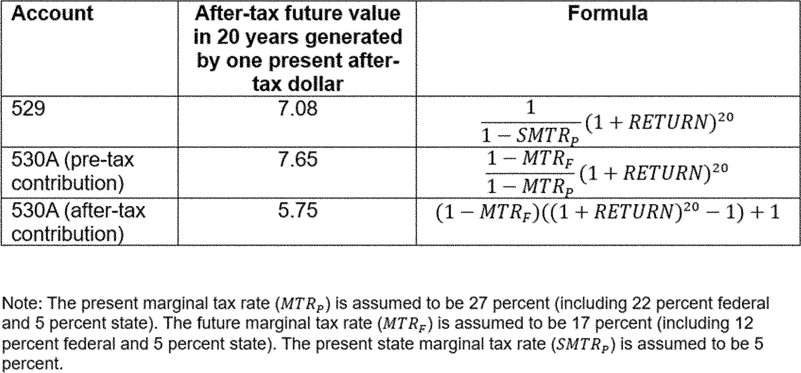

# Daily Digest — 2026-08-24

| | |
|---|---|
| **Digest date** | 2026-08-24 |
| **Data date range** | 2026-08-24 to 2026-08-24 |
| **Generated at** | 2026-08-25T04:11:03Z (UTC) |
| **Pipeline version** | 8edf7aa |
| **Inference** | model layers ran — cli/haiku, opus |
| **Source watermarks** | CREC: 2026-08-21T11:23:28Z · BILLS: 2026-08-22T05:09:31Z · FR: 2026-08-22T04:40:48Z · USCOURTS: 2026-08-25T01:11:26Z · PLAW: 2026-08-20T14:06:56Z |

[Full observed listing for this day](day/2026-08-24.html) — every item our collectors observed for this publication day, mechanical rules applied, frozen at end of day. This digest is the canonical record.

All items below cite the govinfo package (and granule, where applicable) they
summarize. Selection is mechanical; each item states the rule that included
it. See the Coverage Statement at the end for a full accounting of what was
published, what was summarized, and what was excluded and why.

---

## Contents

- [Day in Review](#day-in-review)
- [1. Congressional Floor Activity](#1-congressional-floor-activity)
- [2. Legislation](#2-legislation)
- [3. Federal Register](#3-federal-register)
- [4. Enacted Laws](#4-enacted-laws)
- [5. Judicial Activity](#5-judicial-activity)
- [6. Agency Announcements](#6-agency-announcements)
- [7. Recorded Votes](#7-recorded-votes)
- [8. Bill Actions](#8-bill-actions)
- [9. Presidential Actions](#9-presidential-actions)
- [Terms Used Today](#terms-used-today)
- [Coverage Statement](#coverage-statement)
- [Methodology](#methodology)

---

## Day in Review

The digest carries one presidential document from the Federal Register: a proclamation temporarily suspending, for three days, the additional ad valorem duties on certain imports from Canada imposed by Proclamations 11046, 11047, and 11048 on alcoholic beverages, dairy, and motor vehicles, and amending the effective date of those duties from August 19, 2026. Five final rules appear. The National Park Service revises personal watercraft regulations at Gulf Islands National Seashore, reducing flat wake speed zone distances and codifying existing closures; the Coast Guard establishes a temporary 500-yard moving safety zone around a vessel and tow carrying ship-to-shore cranes at Honolulu; NMFS implements an accountability measure closing commercial harvest of Atlantic migratory group Spanish mackerel in the northern zone for the 2026-2027 fishing year; and the Bureau of Industry and Security removes one entity listed under Turkey and two addresses associated with a Hong Kong entity listed under China from the Entity List. Of five proposed rules, the FAA would supersede an airworthiness directive covering Airbus Helicopters models, the Department of Agriculture opens an environmental impact statement and rulemaking on Forest Service travel management, the Education Department proposes amendments to EDGAR, and two are corrections to proposed rules published August 11, 2026. The digest also carries 73 Federal Register notices and 188 agency press releases.

The digest carries 476 district court opinions; no appellate or national court opinions appear.

*Composed from the summarized items below and the day's mechanical
counts; all specifics are cited in their sections.*

---

## 1. Congressional Floor Activity

No Congressional Record issue was observed on this day. The Record for a day's proceedings is typically published by govinfo the following morning; it appears in the digest for the day it is observed ([how our clocks work](faq.html#fapds-three-clocks)).

### 1.1 Senate

No Senate floor items met the selection thresholds. 0 floor granule(s) are accounted for in the Coverage Statement.

### 1.2 House of Representatives

No House floor items met the selection thresholds. 0 floor granule(s) are accounted for in the Coverage Statement.

### 1.3 Recorded Votes

No recorded votes were published in this issue of the Congressional Record.

---

## 2. Legislation

Source: Congressional Bills (BILLS), text versions published 2026-08-24 to 2026-08-24.

### 2.1 Counts by Stage

| Stage (bill text version) | Count |
|---|---|
| Introduced (ih/is) | 0 |
| Reported (rh/rs) | 0 |
| Engrossed (eh/es) | 0 |
| Enrolled (enr) | 0 |
| Other versions | 0 |
| **Total bill texts published** | **0** |

### 2.2 Bills Listed by Mechanical Rule

Bills below are listed because they matched at least one listing rule; the
matching rule is stated per item. All other bill texts are counted above and
accounted for in the Coverage Statement.

No bill texts published in this range matched a listing rule; all 0 are
accounted for in the Coverage Statement.

---

## 3. Federal Register

Source: Federal Register (FR), issue of 2026-08-24.

### 3.1 Counts by Document Type

| Document type | Count |
|---|---|
| Rules | 5 |
| Proposed rules | 5 |
| Notices | 73 |
| Presidential documents | 1 |
| **Total FR documents** | **84** |

### 3.2 Rules Published

Tags: department of the interior · executive · securities and exchange commission · model keys: commercial fishing · personal watercraft · safety zone

*In plain terms: Five regulations: Gulf Islands seashore personal watercraft rules, Spanish mackerel commercial closure, a temporary Coast Guard safety zone, plus export control Entity List removals.*

#### DEPARTMENT OF COMMERCE

- **Coastal Migratory Pelagic Resources of the Gulf and Atlantic Region; Commercial Closure for Atlantic Spanish Mackerel in the Northern Zone** (2026-17228; 50 CFR Part 622) — NMFS implements an accountability measure (AM) for the commercial harvest of the Atlantic migratory group of Spanish mackerel in the northern zone of the Atlantic exclusive economic zone (EEZ). NMFS projects that landings will soon reach the revised commercial quota for Spanish mackerel in the northern zone of the Atlantic EEZ for the 2026-2027 fishing year. In accordance with the regulations for the Atlantic migratory group of Spanish mackerel, NMFS closes the northern zone for commercial harvest to protect this fishery resource. Action: Temporary rule; closure. Dates: This temporary rule is effective from August 25, 2026, through February 28, 2027.
  - *In plain terms:* NMFS is closing the northern zone of the Atlantic exclusive economic zone to commercial harvest of Spanish mackerel for the 2026-2027 fishing year because landings are expected to reach the quota.
  - Included because: FR-SEL-01 — document type: final rule (all listed)
  - Source: [FR-2026-08-24 / 2026-17228](https://www.govinfo.gov/app/details/FR-2026-08-24/2026-17228)
- **Removal From the Entity List** (2026-17230; 15 CFR Part 744) — In this rule, the Bureau of Industry and Security (BIS) amends the Export Administration Regulations (EAR) by removing one entity from the Entity List under the destination of Turkey. Action: Final rule. Dates: This rule is effective August 21, 2026.
  - *In plain terms:* The Bureau of Industry and Security removed one entity located in Turkey from the Export Administration Regulations' Entity List.
  - Included because: FR-SEL-01 — document type: final rule (all listed)
  - Source: [FR-2026-08-24 / 2026-17230](https://www.govinfo.gov/app/details/FR-2026-08-24/2026-17230)
- **Revisions to the Entity List** (2026-17231; 15 CFR Part 744) — In this rule, the Bureau of Industry and Security (BIS) revises the Export Administration Regulations (EAR) by removing two addresses associated with Arrow Electronics (Hong Kong) Co., Ltd. from the Entity List under the destination of China, People's Republic of (China). This determination follows the removal from the Entity List of Arrow China Electronics Trading Co., Ltd., and the removal of six aliases for Arrow Electronics (Hong Kong) Co., Ltd. in November 2025. Action: Final rule. Dates: This rule is effective August 21, 2026.
  - *In plain terms:* The Bureau of Industry and Security removed two addresses for Arrow Electronics (Hong Kong) Co., Ltd. in China from the Export Administration Regulations' Entity List, following prior removals in November 2025.
  - Included because: FR-SEL-01 — document type: final rule (all listed)
  - Source: [FR-2026-08-24 / 2026-17231](https://www.govinfo.gov/app/details/FR-2026-08-24/2026-17231)

#### DEPARTMENT OF HOMELAND SECURITY

- **Safety Zone; T/V DENISE FOSS (O.N. 1254223), Honolulu, HI** (2026-17217; 33 CFR Part 165) — The Coast Guard is establishing a temporary safety zone for navigable waters within a 500-yard radius of the T/V DENISE FOSS (O.N. 1254223) and its tow, FOSS 3612 (O.N. 1255436). The moving safety zone is needed to protect personnel, vessels, and the marine environment from potential hazards associated with the transportation of three ship-to-shore cranes. Entry of vessels or persons into this zone is prohibited unless specifically authorized by the Captain of the Port, Sector Honolulu, or their designated representative. Action: Temporary final rule. Dates: This rule is effective without actual notice from August 24, 2026 through 9 a.m. on August 25, 2026. For the purposes of enforcement, actual notice will be used from 6 a.m. on August 19, 2026, until August 24, 2026.
  - *In plain terms:* The Coast Guard created a temporary moving safety zone 500 yards around the T/V DENISE FOSS and its tow, FOSS 3612, in Honolulu to protect people, vessels, and the environment during crane transport.
  - Included because: FR-SEL-01 — document type: final rule (all listed)
  - Source: [FR-2026-08-24 / 2026-17217](https://www.govinfo.gov/app/details/FR-2026-08-24/2026-17217)

#### DEPARTMENT OF THE INTERIOR

- **Gulf Islands National Seashore; Personal Watercraft** (2026-17198; 36 CFR Part 7) — The National Park Service revises special regulations governing the use of personal watercraft at Gulf Islands National Seashore. This rule reduces the distance of flat wake speed zones from certain shorelines and codifies existing closures at West Petit Bois Island and the Fort Pickens ferry pier. Action: Final rule. Dates: This rule is effective September 23, 2026.
  - *In plain terms:* The National Park Service revised regulations for personal watercraft at Gulf Islands National Seashore, reducing flat wake speed zones near shorelines and confirming closures at West Petit Bois Island and the Fort Pickens ferry pier.
  - Included because: FR-SEL-01 — document type: final rule (all listed)
  - Source: [FR-2026-08-24 / 2026-17198](https://www.govinfo.gov/app/details/FR-2026-08-24/2026-17198)

### 3.3 Proposed Rules Published

Tags: department of the interior · executive · securities and exchange commission · model keys: air quality · airworthiness directive · travel management

*In plain terms: Five proposed items: Forest Service travel management rulemaking, Airbus helicopter airworthiness directive updates, education regulations amendments, plus corrections to retirement account and air quality rules.*

#### DEPARTMENT OF AGRICULTURE

- **Travel Management; National Forest System Lands** (2026-17211; 36 CFR Parts 212 and 261) — The U.S. Department of Agriculture (USDA) is initiating an environmental impact statement and rulemaking to revise the Forest Service's travel management regulations, 36 CFR part 212. The proposed action would establish a uniform national policy favoring increased access while simplifying regulatory requirements and preserving local decision-making. The proposed access rule would establish a national policy with a presumption that existing roads, trails, airfields, trailheads, and other access routes and points on National Forest System lands are open to appropriate public use unless closure or restriction is required by applicable law, valid existing rights, or another governing instrument, or supported by specific, documented and justifiable reasons based on science-based resource conditions, public safety, conflicts among uses, or maintenance and administrative capacity. [official summary truncated; see source] Action: Notice of intent to prepare an environmental impact statement. Dates: Comments must be received in writing by September 23, 2026.
  - *In plain terms:* The USDA proposes to revise Forest Service travel regulations, creating a national policy that presumes public access to existing routes on National Forest System lands unless specific conditions require closure or restriction.
  - Included because: FR-SEL-02 — document type: proposed rule (all listed)
  - Source: [FR-2026-08-24 / 2026-17211](https://www.govinfo.gov/app/details/FR-2026-08-24/2026-17211)

#### DEPARTMENT OF EDUCATION

- **Education Department General Administrative Regulations** (2026-17239; 2 CFR Parts 3474 and 3485; 34 CFR Parts 75, 76, 77, and 79) — The Secretary of Education proposes to amend the Education Department General Administrative Regulations (EDGAR) and other provisions in 2 CFR parts 3474 and 3485 to update the regulations and better align them with other U.S. Department of Education (Department) regulations and procedures, and to include technical updates from the Office of Management and Budget's Uniform Administrative Requirements, Cost Principles, and Audit Requirements for Federal Awards published in the Federal Register on April 22, 2024. The Department intends to finalize these regulations in late 2026. Action: Notice of proposed rulemaking. Dates: We must receive your comments on or before September 23, 2026.
  - *In plain terms:* The Secretary of Education proposes to amend administrative regulations (EDGAR) and other provisions to update them, align with other Department regulations, and include OMB technical updates from April 22, 2024; finalization is planned for late 2026.
  - Included because: FR-SEL-02 — document type: proposed rule (all listed)
  - Source: [FR-2026-08-24 / 2026-17239](https://www.govinfo.gov/app/details/FR-2026-08-24/2026-17239)

#### DEPARTMENT OF THE TREASURY

- **Employer Contributions to Trump Accounts and Nondiscrimination Rules for Dependent Care Assistance Programs** (C1-2026-16314; 26 CFR Part 1) — This document provides corrections to a proposed rule titled "Employer Contributions to Trump Accounts and Nondiscrimination Rules for Dependent Care Assistance Programs," previously published on August 11, 2026. The corrections involve specific textual revisions on pages 51612 and 51625, and a corrected image on page 51622 of the original proposed rule.
  - *In plain terms:* This document corrects a proposed rule published on August 11, 2026, titled "Employer Contributions to Trump Accounts and Nondiscrimination Rules for Dependent Care Assistance Programs," by making textual revisions and correcting an image.
  - Included because: FR-SEL-02 — document type: proposed rule (all listed)
  - Source: [FR-2026-08-24 / C1-2026-16314](https://www.govinfo.gov/app/details/FR-2026-08-24/C1-2026-16314)

#### DEPARTMENT OF TRANSPORTATION

- **Airworthiness Directives; Airbus Helicopters** (2026-17209; 14 CFR Part 39) — The FAA proposes to supersede Airworthiness Directive (AD) 2025-17-03, which applies to all Airbus Helicopters Model AS332L, AS332L1, AS332L2, and EC225LP helicopters. AD 2025-17-03 requires inspecting the emergency sea anchor and, depending on the result, replacing the emergency sea anchor. Since the FAA issued AD 2025-17-03, it has been determined that an additional inspection of an affected emergency sea anchor must be accomplished. This proposed AD would retain all of the requirements of AD 2025-17-03, would also require an additional inspection, and depending on the result, replacing the emergency sea anchor. The FAA is proposing this AD to address the unsafe condition on these products. Action: Notice of proposed rulemaking (NPRM). Dates: The FAA must receive comments on this NPRM by October 8, 2026.
  - *In plain terms:* The FAA proposes a rule for Airbus Helicopters Models AS332L, AS332L1, AS332L2, and EC225LP, requiring a new inspection of the emergency sea anchor, which may lead to replacement, in addition to existing requirements.
  - Included because: FR-SEL-02 — document type: proposed rule (all listed)
  - Source: [FR-2026-08-24 / 2026-17209](https://www.govinfo.gov/app/details/FR-2026-08-24/2026-17209)
  -  *Source graphic 1 of 1 from 2026-17209.*

#### ENVIRONMENTAL PROTECTION AGENCY

- **Response to Clean Air Act Section 176A Petition From New Hampshire** (C1-2026-16331) — This document issues corrections to a proposed rule titled "Response to Clean Air Act Section 176A Petition From New Hampshire," which was published on August 11, 2026. The corrections modify two dates within the original document, specifically changing "August 18, 2026" to "August 23, 2026" and "August 8, 2026" to "August 18, 2026."
  - *In plain terms:* This document corrects a proposed rule published August 11, 2026, titled "Response to Clean Air Act Section 176A Petition From New Hampshire," by changing two dates: August 18, 2026, to August 23, 2026, and August 8, 2026, to August 18, 2026.
  - Included because: FR-SEL-02 — document type: proposed rule (all listed)
  - Source: [FR-2026-08-24 / C1-2026-16331](https://www.govinfo.gov/app/details/FR-2026-08-24/C1-2026-16331)

### 3.4 Notices and Presidential Documents

Tags: department of the interior · executive · securities and exchange commission · model keys: canadian imports · suspension · tariffs

*In plain terms: One proclamation temporarily suspends additional tariffs on Canadian imports for three days.*

Notices are summarized only when they match a listing rule; all are counted
in 3.1 and in the Coverage Statement. Presidential documents in the FR are
always listed.

- **Temporary Suspension of Additional Duties To Offset Canadian Discrimination Against the Commerce of the United States With Respect to Alcoholic Beverages, Dairy, and Motor Vehicles** (2026-17294) — This Proclamation temporarily suspends additional ad valorem duties previously imposed on certain imports from Canada for a period of three days. The duties were established in Proclamations 11046, 11047, and 11048 to offset Canadian discrimination against U.S. commerce in alcoholic beverages, dairy, and motor vehicles. The effective date for these additional duties is amended from August 19, 2026, to August 22, 2026.
  - *In plain terms:* This Proclamation temporarily suspends additional import taxes on some Canadian alcoholic beverages, dairy, and motor vehicles for three days, amending their effective date from August 19, 2026, to August 22, 2026.
  - Included because: FR-SEL-03 — presidential document (all listed)
  - Source: [FR-2026-08-24 / 2026-17294](https://www.govinfo.gov/app/details/FR-2026-08-24/2026-17294)

---

## 4. Enacted Laws

Source: Public and Private Laws (PLAW) published 2026-08-24.

No laws were published in this range.

---

## 5. Judicial Activity

Source: United States Courts Opinions (USCOURTS): opinions observed 2026-08-24
by our collector; each opinion states its own issue date beside its
listing ([how our clocks work](faq.html#fapds-three-clocks)).

Completeness disclosure (standing): USCOURTS carries opinions from
approximately 140 participating appellate, district, bankruptcy, and
national federal courts. Unlike the Congressional Record and the Federal
Register, which are the complete official record of their branches,
USCOURTS is participation-based and is NOT the complete federal judicial
record. Courts post opinions with delay — typically over several days —
so a day's digest carries the opinions that became available that day,
whatever date each was issued.

### 5.1 Appellate and National Court Opinions

Appellate and national court opinions are summarized; district and
bankruptcy opinions are counted in 5.2 and in the Coverage Statement.

No appellate or national court opinions matched a listing rule for this
date; all opinions are counted in 5.2 and accounted for in the Coverage
Statement.

### 5.2 Counts by Court Category

| Court category | Opinions |
|---|---|
| Appellate | 0 |
| District | 476 |
| Bankruptcy | 0 |
| National | 0 |
| **Total opinions extracted** | **476** |

Archive-window disclosure (rule USCOURTS-FETCH-01): 30364 USCOURTS package(s) have been listed in delta syncs but fell outside the 7-day archive window and were not fetched (global running count across all syncs, not limited to this date).

---

## 6. Agency Announcements

Official press releases and statements the agencies themselves date
on 2026-08-24 (sources listed in the source guide). These are the
agencies' own announcements — official advocacy, quoted and
attributed, not findings of this digest. Agency web content can be
edited or removed without notice; captures and hashes are preserved
per the provenance policy.

#### CISA Cybersecurity Advisories

- **[CISA Adds One Known Exploited Vulnerability to Catalog](https://www.cisa.gov/news-events/alerts/2026/08/24/cisa-adds-one-known-exploited-vulnerability-catalog)** — dated 2026-08-24 by the agency
  - Included because: AGENCYPR-SEL-01 — official agency release dated this day by the agency (all such releases from active sources are listed; titles only in the pilot)
  - Source: agency newsroom (above) · [independent archive](https://web.archive.org/web/20260824191645/https://www.cisa.gov/news-events/alerts/2026/08/24/cisa-adds-one-known-exploited-vulnerability-catalog)

#### Defense News Releases

- **[EOD Airmen Train on Full Spectrum of Explosive Threats](https://www.war.gov/News/News-Stories/Article/Article/4581480/eod-airmen-train-on-full-spectrum-of-explosive-threats/)** — dated 2026-08-24 by the agency
  - Included because: AGENCYPR-SEL-01 — official agency release dated this day by the agency (all such releases from active sources are listed; titles only in the pilot)
- **[Hegseth Greets Troops at Stratcom, Talks Arsenal of Freedom in Wisconsin](https://www.war.gov/News/News-Stories/Article/Article/4581463/hegseth-greets-troops-at-stratcom-talks-arsenal-of-freedom-in-wisconsin/)** — dated 2026-08-24 by the agency
  - Included because: AGENCYPR-SEL-01 — official agency release dated this day by the agency (all such releases from active sources are listed; titles only in the pilot)

#### DHS News Releases

- **[HOME SWEET HAITI: DHS Highlights Criminals Deported Back to Haiti, Including Pedophiles, Gang Members, Drug Traffickers, and Violent Assailants](https://www.dhs.gov/news/2026/08/24/home-sweet-haiti-dhs-highlights-criminals-deported-back-haiti-including-pedophiles)** — dated 2026-08-24 by the agency
  - Included because: AGENCYPR-SEL-01 — official agency release dated this day by the agency (all such releases from active sources are listed; titles only in the pilot)
- **[ICE Operation Safe Community – Washington, D.C. Arrests More Than 1,300 Illegal Aliens Throughout Virginia, Maryland](https://www.dhs.gov/news/2026/08/24/ice-operation-safe-community-washington-dc-arrests-more-1300-illegal-aliens)** — dated 2026-08-24 by the agency
  - Included because: AGENCYPR-SEL-01 — official agency release dated this day by the agency (all such releases from active sources are listed; titles only in the pilot)
- **[WORST OF THE WORST: ICE Arrests Attempted Murderers, Pedophiles, Sexual Assailants, and Drug Traffickers](https://www.dhs.gov/news/2026/08/24/worst-worst-ice-arrests-attempted-murderers-pedophiles-sexual-assailants-and-drug)** — dated 2026-08-24 by the agency
  - Included because: AGENCYPR-SEL-01 — official agency release dated this day by the agency (all such releases from active sources are listed; titles only in the pilot)

#### FDA Email Updates (email)

- **[Everything Sprouts, LLC Recalls Alfalfa Sprouts Due to Potential E. Coli and Salmonella Risk](https://www.fda.gov/safety/recalls-market-withdrawals-safety-alerts/everything-sprouts-llc-recalls-alfalfa-sprouts-due-potential-e-coli-and-salmonella-risk?utm_medium=email&utm_source=govdelivery)** — dated 2026-08-24 by the agency
  - Included because: AGENCYPR-SEL-01 — official agency release dated this day by the agency (all such releases from active sources are listed; titles only in the pilot)
  - Source: agency email bulletin to this project's subscription, captured and DKIM-verified
- **FDA MedWatch - One Lot of Thyroid Tablets USP, 30 mg by Vitruvias Therapeutics** — dated 2026-08-24 by the agency
  - Included because: AGENCYPR-SEL-01 — official agency release dated this day by the agency (all such releases from active sources are listed; titles only in the pilot)
  - Source: agency email bulletin to this project's subscription, captured and DKIM-verified (the bulletin named no canonical page)
- **[Fromm Family Foods Voluntarily Recalls Turkey Pâté Wet Food For Dogs and Diner Classic Milo’s Meatloaf Pâté Wet Food For Dogs Due to Potential Metal Contamination](https://www.fda.gov/safety/recalls-market-withdrawals-safety-alerts/fromm-family-foods-voluntarily-recalls-turkey-pate-wet-food-dogs-and-diner-classic-milos-meatloaf?utm_medium=email&utm_source=govdelivery)** — dated 2026-08-24 by the agency
  - Included because: AGENCYPR-SEL-01 — official agency release dated this day by the agency (all such releases from active sources are listed; titles only in the pilot)
  - Source: agency email bulletin to this project's subscription, captured and DKIM-verified
- **[Vitruvias Therapeutics, Inc Issues Nationwide Recall of One Lot of Thyroid Tablets, USP 30 mg Due to Potential Super Potency](https://www.fda.gov/safety/recalls-market-withdrawals-safety-alerts/vitruvias-therapeutics-inc-issues-nationwide-recall-one-lot-thyroid-tablets-usp-30-mg-due-potential?utm_medium=email&utm_source=govdelivery)** — dated 2026-08-24 by the agency
  - Included because: AGENCYPR-SEL-01 — official agency release dated this day by the agency (all such releases from active sources are listed; titles only in the pilot)
  - Source: agency email bulletin to this project's subscription, captured and DKIM-verified

#### FEMA Press Releases

- **[FEMA Approves Fire Management Assistance Grant for Hawk Fire in Washoe County](https://www.fema.gov/press-release/20260824/fema-approves-fire-management-assistance-grant-hawk-fire-washoe-county)** — dated 2026-08-24 by the agency
  - Included because: AGENCYPR-SEL-01 — official agency release dated this day by the agency (all such releases from active sources are listed; titles only in the pilot)

#### FSIS Recalls and Public Health Alerts (email)

- **Meat, Poultry and Egg Product Inspection Directory** — dated 2026-08-24 by the agency
  - Included because: AGENCYPR-SEL-01 — official agency release dated this day by the agency (all such releases from active sources are listed; titles only in the pilot)
  - Source: agency email bulletin to this project's subscription, captured and DKIM-verified (the bulletin named no canonical page)

#### FTC Press Releases

- **[FTC Secures Order Resolving Antitrust Concerns with Zillow-Redfin Agreement](https://www.ftc.gov/news-events/news/press-releases/2026/08/ftc-secures-order-resolving-antitrust-concerns-zillow-redfin-agreement)** — dated 2026-08-24 by the agency
  - Included because: AGENCYPR-SEL-01 — official agency release dated this day by the agency (all such releases from active sources are listed; titles only in the pilot)
  - Source: agency newsroom (above) · [independent archive](https://web.archive.org/web/20260824131412/https://www.ftc.gov/news-events/news/press-releases/2026/08/ftc-secures-order-resolving-antitrust-concerns-zillow-redfin-agreement)

#### GAO Reports & Testimonies

- **[Opportunity Zones: Effects of Original Tax Incentive Mostly Unknown and Revised Incentive May Offer Improvements](https://www.gao.gov/products/gao-26-108132)** — dated 2026-08-24 by the agency
  - Included because: AGENCYPR-SEL-01 — official agency release dated this day by the agency (all such releases from active sources are listed; titles only in the pilot)

#### IRS Newswire (email)

- **IR-2026-99: IRS reminder: Information return e-file system transitioning to a new platform** — dated 2026-08-24 by the agency
  - Included because: AGENCYPR-SEL-01 — official agency release dated this day by the agency (all such releases from active sources are listed; titles only in the pilot)
  - Source: agency email bulletin to this project's subscription, captured and DKIM-verified (the bulletin named no canonical page)

#### Justice Department News (email)

- **EOIR BIA Decision - Aug. 24, 2026** — dated 2026-08-24 by the agency
  - Included because: AGENCYPR-SEL-01 — official agency release dated this day by the agency (all such releases from active sources are listed; titles only in the pilot)
  - Source: agency email bulletin to this project's subscription, captured and DKIM-verified (the bulletin named no canonical page)

#### Justice Press Releases

- **[AiNET Corp. and Deepak Jain Agree to Pay $1.8M to Resolve Allegations of Submitting False Claims to the U.S. Securities and Exchange Commission for Data Center Services](https://www.justice.gov/opa/pr/ainet-corp-and-deepak-jain-agree-pay-18m-resolve-allegations-submitting-false-claims-us)** — dated 2026-08-24 by the agency
  - Included because: AGENCYPR-SEL-01 — official agency release dated this day by the agency (all such releases from active sources are listed; titles only in the pilot)
  - Corroborated: the same release (same canonical URL) also arrived via the agency's email bulletin to this project's subscription, DKIM-verified — one document received through two ingestion channels; listed once, both captures preserved.
- **[Department of Justice Announces Launch of National Fraud Detection Center to Combat Fraud Against Taxpayer-Funded Programs](https://www.justice.gov/opa/pr/department-justice-announces-launch-national-fraud-detection-center-combat-fraud-against)** — dated 2026-08-24 by the agency
  - Included because: AGENCYPR-SEL-01 — official agency release dated this day by the agency (all such releases from active sources are listed; titles only in the pilot)
  - Corroborated: the same release (same canonical URL) also arrived via the agency's email bulletin to this project's subscription, DKIM-verified — one document received through two ingestion channels; listed once, both captures preserved.
- **[Medicare Advantage Provider Monogram Health Agrees to Pay $2.4M to Settle False Claims Act Suit](https://www.justice.gov/opa/pr/medicare-advantage-provider-monogram-health-agrees-pay-24m-settle-false-claims-act-suit)** — dated 2026-08-24 by the agency
  - Included because: AGENCYPR-SEL-01 — official agency release dated this day by the agency (all such releases from active sources are listed; titles only in the pilot)
  - Corroborated: the same release (same canonical URL) also arrived via the agency's email bulletin to this project's subscription, DKIM-verified — one document received through two ingestion channels; listed once, both captures preserved.
- **[Ringleader of a Multi-State Bank Fraud Scheme Sentenced to Five Years in Prison](https://www.justice.gov/usao-ndal/pr/ringleader-multi-state-bank-fraud-scheme-sentenced-five-years-prison)** — dated 2026-08-24 by the agency
  - Included because: AGENCYPR-SEL-01 — official agency release dated this day by the agency (all such releases from active sources are listed; titles only in the pilot)
  - Corroborated: the same release (same canonical URL) also arrived via the agency's email bulletin to this project's subscription, DKIM-verified — one document received through two ingestion channels; listed once, both captures preserved.
- **[Anchorage businesswoman sentenced to prison for fraudulently obtaining, misusing nearly $1M in COVID-19 relief funds for personal gain](https://www.justice.gov/usao-ak/pr/anchorage-businesswoman-sentenced-prison-fraudulently-obtaining-misusing-nearly-1m-covid)** — dated 2026-08-24 by the agency
  - Included because: AGENCYPR-SEL-01 — official agency release dated this day by the agency (all such releases from active sources are listed; titles only in the pilot)
  - Corroborated: the same release (same canonical URL) also arrived via the agency's email bulletin to this project's subscription, DKIM-verified — one document received through two ingestion channels; listed once, both captures preserved.
- **[Armed Duo Sentenced to Federal Prison for Carmel CVS Robbery](https://www.justice.gov/usao-sdin/pr/armed-duo-sentenced-federal-prison-carmel-cvs-robbery)** — dated 2026-08-24 by the agency
  - Included because: AGENCYPR-SEL-01 — official agency release dated this day by the agency (all such releases from active sources are listed; titles only in the pilot)
  - Corroborated: the same release (same canonical URL) also arrived via the agency's email bulletin to this project's subscription, DKIM-verified — one document received through two ingestion channels; listed once, both captures preserved.
- **[Arms Dealer Sentenced to Prison for Conspiring to Export American Made Ammunition Used in War Against Ukraine](https://www.justice.gov/usao-edny/pr/arms-dealer-sentenced-prison-conspiring-export-american-made-ammunition-used-war)** — dated 2026-08-24 by the agency
  - Included because: AGENCYPR-SEL-01 — official agency release dated this day by the agency (all such releases from active sources are listed; titles only in the pilot)
  - Corroborated: the same release (same canonical URL) also arrived via the agency's email bulletin to this project's subscription, DKIM-verified — one document received through two ingestion channels; listed once, both captures preserved.
- **[Billings man sentenced to 20 months in prison for assaulting, injuring girlfriend](https://www.justice.gov/usao-mt/pr/billings-man-sentenced-20-months-prison-assaulting-injuring-girlfriend)** — dated 2026-08-24 by the agency
  - Included because: AGENCYPR-SEL-01 — official agency release dated this day by the agency (all such releases from active sources are listed; titles only in the pilot)
  - Corroborated: the same release (same canonical URL) also arrived via the agency's email bulletin to this project's subscription, DKIM-verified — one document received through two ingestion channels; listed once, both captures preserved.
- **[Billings man sentenced to over 3 years in prison for possessing stolen gun](https://www.justice.gov/usao-mt/pr/billings-man-sentenced-over-three-years-prison-possessing-stolen-gun)** — dated 2026-08-24 by the agency
  - Included because: AGENCYPR-SEL-01 — official agency release dated this day by the agency (all such releases from active sources are listed; titles only in the pilot)
  - Corroborated: the same release (same canonical URL) also arrived via the agency's email bulletin to this project's subscription, DKIM-verified — one document received through two ingestion channels; listed once, both captures preserved.
- **[Billings man sentenced to prison for posting bonds in exchange for sex](https://www.justice.gov/usao-mt/pr/billings-man-sentenced-prison-posting-bonds-exchange-sex)** — dated 2026-08-24 by the agency
  - Included because: AGENCYPR-SEL-01 — official agency release dated this day by the agency (all such releases from active sources are listed; titles only in the pilot)
  - Corroborated: the same release (same canonical URL) also arrived via the agency's email bulletin to this project's subscription, DKIM-verified — one document received through two ingestion channels; listed once, both captures preserved.
- **[Broome County Man Pleads Guilty to Gun Offense](https://www.justice.gov/usao-ndny/pr/broome-county-man-pleads-guilty-gun-offense)** — dated 2026-08-24 by the agency
  - Included because: AGENCYPR-SEL-01 — official agency release dated this day by the agency (all such releases from active sources are listed; titles only in the pilot)
- **[California man sentenced to more than 3 years for drug trafficking](https://www.justice.gov/usao-mt/pr/california-man-sentenced-more-3-years-drug-trafficking)** — dated 2026-08-24 by the agency
  - Included because: AGENCYPR-SEL-01 — official agency release dated this day by the agency (all such releases from active sources are listed; titles only in the pilot)
  - Corroborated: the same release (same canonical URL) also arrived via the agency's email bulletin to this project's subscription, DKIM-verified — one document received through two ingestion channels; listed once, both captures preserved.
- **[Cerro Gordo County Husband & Wife Sentenced for Conspiracy to Distribute Methamphetamine](https://www.justice.gov/usao-ndia/pr/cerro-gordo-county-husband-wife-sentenced-conspiracy-distribute-methamphetamine)** — dated 2026-08-24 by the agency
  - Included because: AGENCYPR-SEL-01 — official agency release dated this day by the agency (all such releases from active sources are listed; titles only in the pilot)
- **[Chinese National Sentenced to 27 Months in Prison for Possession with Intent to Distribute 94 Kilograms of Marijuana](https://www.justice.gov/usao-ndny/pr/chinese-national-sentenced-27-months-prison-possession-intent-distribute-94-kilograms)** — dated 2026-08-24 by the agency
  - Included because: AGENCYPR-SEL-01 — official agency release dated this day by the agency (all such releases from active sources are listed; titles only in the pilot)
  - Corroborated: the same release (same canonical URL) also arrived via the agency's email bulletin to this project's subscription, DKIM-verified — one document received through two ingestion channels; listed once, both captures preserved.
- **[Drug Trafficker Will Spend Next 24 Years in Federal Prison](https://www.justice.gov/usao-ndwv/pr/drug-trafficker-will-spend-next-24-years-federal-prison)** — dated 2026-08-24 by the agency
  - Included because: AGENCYPR-SEL-01 — official agency release dated this day by the agency (all such releases from active sources are listed; titles only in the pilot)
  - Corroborated: the same release (same canonical URL) also arrived via the agency's email bulletin to this project's subscription, DKIM-verified — one document received through two ingestion channels; listed once, both captures preserved.
- **[Federal Jury Convicts Massachusetts Resident for Attempting to Sex Traffic a Minor at a Manchester Hotel](https://www.justice.gov/usao-nh/pr/federal-jury-convicts-massachusetts-resident-attempting-sex-traffic-minor-manchester)** — dated 2026-08-24 by the agency
  - Included because: AGENCYPR-SEL-01 — official agency release dated this day by the agency (all such releases from active sources are listed; titles only in the pilot)
  - Corroborated: the same release (same canonical URL) also arrived via the agency's email bulletin to this project's subscription, DKIM-verified — one document received through two ingestion channels; listed once, both captures preserved.
- **[Federal Jury in Chicago Convicts Engineer for Stealing Trade Secrets from Philips Medical Systems on Behalf of Chinese Competitor](https://www.justice.gov/opa/pr/federal-jury-chicago-convicts-engineer-stealing-trade-secrets-philips-medical-systems-behalf)** — dated 2026-08-24 by the agency
  - Included because: AGENCYPR-SEL-01 — official agency release dated this day by the agency (all such releases from active sources are listed; titles only in the pilot)
- **[Federal Jury in Chicago Convicts Engineer of Unlawfully Stealing Trade Secrets From Philips Medical Systems on Behalf of Chinese Competitor](https://www.justice.gov/usao-ndil/pr/federal-jury-chicago-convicts-engineer-unlawfully-stealing-trade-secrets-philips)** — dated 2026-08-24 by the agency
  - Included because: AGENCYPR-SEL-01 — official agency release dated this day by the agency (all such releases from active sources are listed; titles only in the pilot)
- **[Felon Sentenced to More Than Two Years in Federal Prison for Illegally Possessing “Machine Gun” in Chicago](https://www.justice.gov/usao-ndil/pr/felon-sentenced-more-two-years-federal-prison-illegally-possessing-machine-gun-chicago)** — dated 2026-08-24 by the agency
  - Included because: AGENCYPR-SEL-01 — official agency release dated this day by the agency (all such releases from active sources are listed; titles only in the pilot)
- **[Flint man sentenced to more than 18 years in federal prison for possessing with intent to distribute heroin](https://www.justice.gov/usao-edmi/pr/flint-man-sentenced-more-18-years-federal-prison-possessing-intent-distribute-heroin)** — dated 2026-08-24 by the agency
  - Included because: AGENCYPR-SEL-01 — official agency release dated this day by the agency (all such releases from active sources are listed; titles only in the pilot)
  - Corroborated: the same release (same canonical URL) also arrived via the agency's email bulletin to this project's subscription, DKIM-verified — one document received through two ingestion channels; listed once, both captures preserved.
- **[Former City Councilmen for Baldwin Park and Compton Sentenced to Federal Prison for Their Roles in Bribery Schemes](https://www.justice.gov/usao-cdca/pr/former-city-councilmen-baldwin-park-and-compton-sentenced-federal-prison-their-roles)** — dated 2026-08-24 by the agency
  - Included because: AGENCYPR-SEL-01 — official agency release dated this day by the agency (all such releases from active sources are listed; titles only in the pilot)
  - Corroborated: the same release (same canonical URL) also arrived via the agency's email bulletin to this project's subscription, DKIM-verified — one document received through two ingestion channels; listed once, both captures preserved.
- **[Former Serviceman Sentenced for Child Sexual Exploitation Crimes](https://www.justice.gov/usao-md/pr/former-serviceman-sentenced-child-sexual-exploitation-crimes)** — dated 2026-08-24 by the agency
  - Included because: AGENCYPR-SEL-01 — official agency release dated this day by the agency (all such releases from active sources are listed; titles only in the pilot)
  - Corroborated: the same release (same canonical URL) also arrived via the agency's email bulletin to this project's subscription, DKIM-verified — one document received through two ingestion channels; listed once, both captures preserved.
- **[Former Washington man who made images of child sexual abuse sentenced to 15 years in prison](https://www.justice.gov/usao-wdwa/pr/former-washington-man-who-made-images-child-sexual-abuse-sentenced-15-years-prison)** — dated 2026-08-24 by the agency
  - Included because: AGENCYPR-SEL-01 — official agency release dated this day by the agency (all such releases from active sources are listed; titles only in the pilot)
  - Corroborated: the same release (same canonical URL) also arrived via the agency's email bulletin to this project's subscription, DKIM-verified — one document received through two ingestion channels; listed once, both captures preserved.
- **[Founder Of Cryptocurrency Trading Fund Convicted Of Defrauding Investors](https://www.justice.gov/usao-ndca/pr/founder-cryptocurrency-trading-fund-convicted-defrauding-investors)** — dated 2026-08-24 by the agency
  - Included because: AGENCYPR-SEL-01 — official agency release dated this day by the agency (all such releases from active sources are listed; titles only in the pilot)
- **[Fresno Man Sentenced to 52 Months in Prison for Operating a $9 Million Real Estate Ponzi Scheme](https://www.justice.gov/usao-edca/pr/fresno-man-sentenced-52-months-prison-operating-9-million-real-estate-ponzi-scheme)** — dated 2026-08-24 by the agency
  - Included because: AGENCYPR-SEL-01 — official agency release dated this day by the agency (all such releases from active sources are listed; titles only in the pilot)
  - Corroborated: the same release (same canonical URL) also arrived via the agency's email bulletin to this project's subscription, DKIM-verified — one document received through two ingestion channels; listed once, both captures preserved.
- **[Gainesville Felon Pleads Guilty to Illegal Possession of Firearm](https://www.justice.gov/usao-ndfl/pr/gainesville-felon-pleads-guilty-illegal-possession-firearm)** — dated 2026-08-24 by the agency
  - Included because: AGENCYPR-SEL-01 — official agency release dated this day by the agency (all such releases from active sources are listed; titles only in the pilot)
  - Corroborated: the same release (same canonical URL) also arrived via the agency's email bulletin to this project's subscription, DKIM-verified — one document received through two ingestion channels; listed once, both captures preserved.
- **[Henderson Drug Kingpin Sentenced to Almost 27 Years in Federal Prison](https://www.justice.gov/usao-ednc/pr/henderson-drug-kingpin-sentenced-almost-27-years-federal-prison)** — dated 2026-08-24 by the agency
  - Included because: AGENCYPR-SEL-01 — official agency release dated this day by the agency (all such releases from active sources are listed; titles only in the pilot)
  - Corroborated: the same release (same canonical URL) also arrived via the agency's email bulletin to this project's subscription, DKIM-verified — one document received through two ingestion channels; listed once, both captures preserved.
- **[Huntington Man Sentenced to 10 Years in Prison for Federal Drug Crime](https://www.justice.gov/usao-sdwv/pr/huntington-man-sentenced-10-years-prison-federal-drug-crime)** — dated 2026-08-24 by the agency
  - Included because: AGENCYPR-SEL-01 — official agency release dated this day by the agency (all such releases from active sources are listed; titles only in the pilot)
  - Corroborated: the same release (same canonical URL) also arrived via the agency's email bulletin to this project's subscription, DKIM-verified — one document received through two ingestion channels; listed once, both captures preserved.
- **[Hutchinson man pleads guilty to producing child pornography](https://www.justice.gov/usao-ks/pr/hutchinson-man-pleads-guilty-producing-child-pornography)** — dated 2026-08-24 by the agency
  - Included because: AGENCYPR-SEL-01 — official agency release dated this day by the agency (all such releases from active sources are listed; titles only in the pilot)
  - Corroborated: the same release (same canonical URL) also arrived via the agency's email bulletin to this project's subscription, DKIM-verified — one document received through two ingestion channels; listed once, both captures preserved.
- **[Illegal Alien Pleads Guilty to Immigration Fraud for Using and Possessing a Counterfeit Document to Obtain Employment](https://www.justice.gov/usao-ndny/pr/illegal-alien-pleads-guilty-immigration-fraud-using-and-possessing-counterfeit)** — dated 2026-08-24 by the agency
  - Included because: AGENCYPR-SEL-01 — official agency release dated this day by the agency (all such releases from active sources are listed; titles only in the pilot)
- **[Independence, Missouri Elementary Substitute Teacher Charged with Child Pornography Offenses](https://www.justice.gov/usao-wdmo/pr/independence-missouri-elementary-substitute-teacher-charged-child-pornography-offenses)** — dated 2026-08-24 by the agency
  - Included because: AGENCYPR-SEL-01 — official agency release dated this day by the agency (all such releases from active sources are listed; titles only in the pilot)
- **[Investiture ceremony marks Kriegshauser leadership](https://www.justice.gov/usao-ks/pr/investiture-ceremony-marks-kriegshauser-leadership)** — dated 2026-08-24 by the agency
  - Included because: AGENCYPR-SEL-01 — official agency release dated this day by the agency (all such releases from active sources are listed; titles only in the pilot)
- **[Jackson Man Sentenced to 8 Years for being a Felon in Possession of a Firearm](https://www.justice.gov/usao-sdms/pr/jackson-man-sentenced-8-years-being-felon-possession-firearm)** — dated 2026-08-24 by the agency
  - Included because: AGENCYPR-SEL-01 — official agency release dated this day by the agency (all such releases from active sources are listed; titles only in the pilot)
  - Corroborated: the same release (same canonical URL) also arrived via the agency's email bulletin to this project's subscription, DKIM-verified — one document received through two ingestion channels; listed once, both captures preserved.
- **[Jury Convicts Fayette County Man of Attempted Sexual Exploitation of a Minor](https://www.justice.gov/usao-sdil/pr/jury-convicts-fayette-county-man-attempted-sexual-exploitation-minor)** — dated 2026-08-24 by the agency
  - Included because: AGENCYPR-SEL-01 — official agency release dated this day by the agency (all such releases from active sources are listed; titles only in the pilot)
- **[Justice Department Sues Ohio Landlord for Sexual Harassment and Retaliation Against Female Tenants](https://www.justice.gov/opa/pr/justice-department-sues-ohio-landlord-sexual-harassment-and-retaliation-against-female)** — dated 2026-08-24 by the agency
  - Included because: AGENCYPR-SEL-01 — official agency release dated this day by the agency (all such releases from active sources are listed; titles only in the pilot)
- **[Mason City Woman Sentenced to More than 11 Years in Federal Prison for Methamphetamine Conspiracy](https://www.justice.gov/usao-ndia/pr/mason-city-woman-sentenced-more-11-years-federal-prison-methamphetamine-conspiracy)** — dated 2026-08-24 by the agency
  - Included because: AGENCYPR-SEL-01 — official agency release dated this day by the agency (all such releases from active sources are listed; titles only in the pilot)
  - Corroborated: the same release (same canonical URL) also arrived via the agency's email bulletin to this project's subscription, DKIM-verified — one document received through two ingestion channels; listed once, both captures preserved.
- **[Medicare Advantage Provider Monogram Health Agrees to Pay $2.4 Million to Settle False Claims Act Lawsuit](https://www.justice.gov/usao-cdca/pr/medicare-advantage-provider-monogram-health-agrees-pay-24-million-settle-false-claims)** — dated 2026-08-24 by the agency
  - Included because: AGENCYPR-SEL-01 — official agency release dated this day by the agency (all such releases from active sources are listed; titles only in the pilot)
  - Corroborated: the same release (same canonical URL) also arrived via the agency's email bulletin to this project's subscription, DKIM-verified — one document received through two ingestion channels; listed once, both captures preserved.
- **[New York Man Sentenced for Bank Fraud Conspiracy Following Homeland Security Task Force Investigation](https://www.justice.gov/usao-me/pr/new-york-man-sentenced-bank-fraud-conspiracy-following-homeland-security-task-force)** — dated 2026-08-24 by the agency
  - Included because: AGENCYPR-SEL-01 — official agency release dated this day by the agency (all such releases from active sources are listed; titles only in the pilot)
  - Corroborated: the same release (same canonical URL) also arrived via the agency's email bulletin to this project's subscription, DKIM-verified — one document received through two ingestion channels; listed once, both captures preserved.
- **[North Carolina Man Who Sought Murder-for-Hire Plot Sentenced to Over 15 Years in Prison](https://www.justice.gov/usao-edpa/pr/north-carolina-man-who-sought-murder-hire-plot-sentenced-over-15-years-prison)** — dated 2026-08-24 by the agency
  - Included because: AGENCYPR-SEL-01 — official agency release dated this day by the agency (all such releases from active sources are listed; titles only in the pilot)
- **[Operation Clean Sweep III Indicts More than 38 Child Predators and Checked 887 Registered Sex Offenders for Compliance](https://www.justice.gov/usao-ndok/pr/operation-clean-sweep-iii-indicts-more-38-child-predators-and-checked-887-registered)** — dated 2026-08-24 by the agency
  - Included because: AGENCYPR-SEL-01 — official agency release dated this day by the agency (all such releases from active sources are listed; titles only in the pilot)
  - Corroborated: the same release (same canonical URL) also arrived via the agency's email bulletin to this project's subscription, DKIM-verified — one document received through two ingestion channels; listed once, both captures preserved.
- **[Persistent Violator: Alien Admits Third Illegal Entry into America](https://www.justice.gov/usao-ndny/pr/persistent-violator-alien-admits-third-illegal-entry-america)** — dated 2026-08-24 by the agency
  - Included because: AGENCYPR-SEL-01 — official agency release dated this day by the agency (all such releases from active sources are listed; titles only in the pilot)
  - Corroborated: the same release (same canonical URL) also arrived via the agency's email bulletin to this project's subscription, DKIM-verified — one document received through two ingestion channels; listed once, both captures preserved.
- **[Pills Sold on Social Media, Overdose Result in Lengthy Sentence for Maryland Man](https://www.justice.gov/usao-ndwv/pr/pills-sold-social-media-overdose-result-lengthy-sentence-maryland-man)** — dated 2026-08-24 by the agency
  - Included because: AGENCYPR-SEL-01 — official agency release dated this day by the agency (all such releases from active sources are listed; titles only in the pilot)
  - Corroborated: the same release (same canonical URL) also arrived via the agency's email bulletin to this project's subscription, DKIM-verified — one document received through two ingestion channels; listed once, both captures preserved.
- **[Pine Ridge Man Convicted After Trial of Federal Drug Conspiracy Charge](https://www.justice.gov/usao-sd/pr/pine-ridge-man-convicted-after-trial-federal-drug-conspiracy-charge)** — dated 2026-08-24 by the agency
  - Included because: AGENCYPR-SEL-01 — official agency release dated this day by the agency (all such releases from active sources are listed; titles only in the pilot)
  - Corroborated: the same release (same canonical URL) also arrived via the agency's email bulletin to this project's subscription, DKIM-verified — one document received through two ingestion channels; listed once, both captures preserved.
- **[Repeat Offender Receives 15 Year Federal Sentence for Child Exploitation Offense and Supervision Violations](https://www.justice.gov/usao-sdin/pr/repeat-offender-receives-15-year-federal-sentence-child-exploitation-offense-and)** — dated 2026-08-24 by the agency
  - Included because: AGENCYPR-SEL-01 — official agency release dated this day by the agency (all such releases from active sources are listed; titles only in the pilot)
  - Corroborated: the same release (same canonical URL) also arrived via the agency's email bulletin to this project's subscription, DKIM-verified — one document received through two ingestion channels; listed once, both captures preserved.
- **[Romanian National Illegally in the United States Makes Initial Appearance for Identity Theft](https://www.justice.gov/usao-nv/pr/romanian-national-illegally-united-states-makes-initial-appearance-identity-theft)** — dated 2026-08-24 by the agency
  - Included because: AGENCYPR-SEL-01 — official agency release dated this day by the agency (all such releases from active sources are listed; titles only in the pilot)
  - Corroborated: the same release (same canonical URL) also arrived via the agency's email bulletin to this project's subscription, DKIM-verified — one document received through two ingestion channels; listed once, both captures preserved.
- **[Shiprock Man Sentenced for Violent Assault](https://www.justice.gov/usao-nm/pr/shiprock-man-sentenced-violent-assault)** — dated 2026-08-24 by the agency
  - Included because: AGENCYPR-SEL-01 — official agency release dated this day by the agency (all such releases from active sources are listed; titles only in the pilot)
  - Corroborated: the same release (same canonical URL) also arrived via the agency's email bulletin to this project's subscription, DKIM-verified — one document received through two ingestion channels; listed once, both captures preserved.
- **[Southern District of Georgia federal indictments include murder, drug- and firearm-related charges and healthcare fraud](https://www.justice.gov/usao-sdga/pr/southern-district-georgia-federal-indictments-include-murder-drug-and-firearm-related)** — dated 2026-08-24 by the agency
  - Included because: AGENCYPR-SEL-01 — official agency release dated this day by the agency (all such releases from active sources are listed; titles only in the pilot)
  - Corroborated: the same release (same canonical URL) also arrived via the agency's email bulletin to this project's subscription, DKIM-verified — one document received through two ingestion channels; listed once, both captures preserved.
- **[St. Louis Bar Co-Owner Admits Fraud](https://www.justice.gov/usao-edmo/pr/st-louis-bar-co-owner-admits-fraud)** — dated 2026-08-24 by the agency
  - Included because: AGENCYPR-SEL-01 — official agency release dated this day by the agency (all such releases from active sources are listed; titles only in the pilot)
- **[Tetra Tech EC Inc. Agrees to Pay $57M to Settle False Claims Act Allegations for Falsifying Soil Test Results at the Hunters Point Naval Shipyard in San Francisco](https://www.justice.gov/opa/pr/tetra-tech-ec-inc-agrees-pay-57m-settle-false-claims-act-allegations-falsifying-soil-test)** — dated 2026-08-24 by the agency
  - Included because: AGENCYPR-SEL-01 — official agency release dated this day by the agency (all such releases from active sources are listed; titles only in the pilot)
  - Corroborated: the same release (same canonical URL) also arrived via the agency's email bulletin to this project's subscription, DKIM-verified — one document received through two ingestion channels; listed once, both captures preserved.
- **[Tetra Tech EC, Inc. Agrees to Pay $57 Million to Settle False Claims Act Allegations for Falsifying Soil Test Results at the Hunters Point Naval Shipyard in San Francisco](https://www.justice.gov/usao-ndca/pr/tetra-tech-ec-inc-agrees-pay-57-million-settle-false-claims-act-allegations-falsifying)** — dated 2026-08-24 by the agency
  - Included because: AGENCYPR-SEL-01 — official agency release dated this day by the agency (all such releases from active sources are listed; titles only in the pilot)
- **[Three Defendants Make Initial Appearances in Homeland Security Task Force Fentanyl Trafficking Case](https://www.justice.gov/usao-nv/pr/three-defendants-make-initial-appearances-homeland-security-task-force-fentanyl)** — dated 2026-08-24 by the agency
  - Included because: AGENCYPR-SEL-01 — official agency release dated this day by the agency (all such releases from active sources are listed; titles only in the pilot)
- **[Tucson Man Indicted for Lying to Obtain Federal Contract Work While on Active Duty with the Air Force](https://www.justice.gov/usao-az/pr/tucson-man-indicted-lying-obtain-federal-contract-work-while-active-duty-air-force)** — dated 2026-08-24 by the agency
  - Included because: AGENCYPR-SEL-01 — official agency release dated this day by the agency (all such releases from active sources are listed; titles only in the pilot)
  - Corroborated: the same release (same canonical URL) also arrived via the agency's email bulletin to this project's subscription, DKIM-verified — one document received through two ingestion channels; listed once, both captures preserved.
- **[Two Lenoir County Women Guilty in $180K COVID Fraud Case](https://www.justice.gov/usao-ednc/pr/two-lenoir-county-women-guilty-180k-covid-fraud-case)** — dated 2026-08-24 by the agency
  - Included because: AGENCYPR-SEL-01 — official agency release dated this day by the agency (all such releases from active sources are listed; titles only in the pilot)
  - Corroborated: the same release (same canonical URL) also arrived via the agency's email bulletin to this project's subscription, DKIM-verified — one document received through two ingestion channels; listed once, both captures preserved.
- **[Wichita men sentenced for bringing cocaine & meth from California to Kansas](https://www.justice.gov/usao-ks/pr/wichita-men-sentenced-bringing-cocaine-meth-california-kansas)** — dated 2026-08-24 by the agency
  - Included because: AGENCYPR-SEL-01 — official agency release dated this day by the agency (all such releases from active sources are listed; titles only in the pilot)
- **[“Operation Last Call” Effort Results in Arrests of 44 for Illegal Firearms and Narcotics Offenses](https://www.justice.gov/usao-mdtn/pr/operation-last-call-effort-results-arrests-44-illegal-firearms-and-narcotics-offenses)** — dated 2026-08-24 by the agency
  - Included because: AGENCYPR-SEL-01 — official agency release dated this day by the agency (all such releases from active sources are listed; titles only in the pilot)
  - Corroborated: the same release (same canonical URL) also arrived via the agency's email bulletin to this project's subscription, DKIM-verified — one document received through two ingestion channels; listed once, both captures preserved.

#### Labor News Releases

- **[US Department of Labor fines Tennessee restaurant franchisee $62K in penalties for employing minors to illegally operate hazardous equipment](http://www.dol.gov/newsroom/releases/whd/whd20260824)** — dated 2026-08-24 by the agency
  - Included because: AGENCYPR-SEL-01 — official agency release dated this day by the agency (all such releases from active sources are listed; titles only in the pilot)
- **[US Department of Labor recovers $101K for 36 workers denied full minimum wage, overtime pay by 3 Baton Rouge area employers](http://www.dol.gov/newsroom/releases/whd/whd20260824-0)** — dated 2026-08-24 by the agency
  - Included because: AGENCYPR-SEL-01 — official agency release dated this day by the agency (all such releases from active sources are listed; titles only in the pilot)
- **[US Department of Labor recovers $618K in back wages for 779 workers denied pay, full tips by South Carolina restaurant group](http://www.dol.gov/newsroom/releases/whd/whd20260824-1)** — dated 2026-08-24 by the agency
  - Included because: AGENCYPR-SEL-01 — official agency release dated this day by the agency (all such releases from active sources are listed; titles only in the pilot)

#### NASA News Releases

- **[APOD: 2026 August 24 – Comet 220P in Outburst](https://science.nasa.gov/image-article/apod/apod-2026-august-24-comet-220p-in-outburst/)** — dated 2026-08-24 by the agency
  - Included because: AGENCYPR-SEL-01 — official agency release dated this day by the agency (all such releases from active sources are listed; titles only in the pilot)
  - Source: agency newsroom (above) · [independent archive](https://web.archive.org/web/20260824194630/https://science.nasa.gov/image-article/apod/apod-2026-august-24-comet-220p-in-outburst/)
- **[MAIA Air Sensor at Work in Addis Ababa](https://science.nasa.gov/photojournal/maia-air-sensor-at-work-in-addis-ababa/)** — dated 2026-08-24 by the agency
  - Included because: AGENCYPR-SEL-01 — official agency release dated this day by the agency (all such releases from active sources are listed; titles only in the pilot)
  - Source: agency newsroom (above) · [independent archive](https://web.archive.org/web/20260824174544/https://science.nasa.gov/photojournal/maia-air-sensor-at-work-in-addis-ababa/)
- **[Mapping Air Pollution With MAIA Sensors in Addis Ababa](https://science.nasa.gov/photojournal/mapping-air-pollution-with-maia-sensors-in-addis-ababa/)** — dated 2026-08-24 by the agency
  - Included because: AGENCYPR-SEL-01 — official agency release dated this day by the agency (all such releases from active sources are listed; titles only in the pilot)
  - Source: agency newsroom (above) · [independent archive](https://web.archive.org/web/20260824174544/https://science.nasa.gov/photojournal/mapping-air-pollution-with-maia-sensors-in-addis-ababa/)
- **[NASA Astronaut Reid Wiseman at Freedom 250 Grand Prix](https://www.nasa.gov/image-article/nasa-astronaut-reid-wiseman-at-freedom-250-grand-prix/)** — dated 2026-08-24 by the agency
  - Included because: AGENCYPR-SEL-01 — official agency release dated this day by the agency (all such releases from active sources are listed; titles only in the pilot)
  - Source: agency newsroom (above) · [independent archive](https://web.archive.org/web/20260824174544/https://www.nasa.gov/image-article/nasa-astronaut-reid-wiseman-at-freedom-250-grand-prix/)
- **[NASA Sets Coverage for Roman Space Telescope Launch from Florida](https://www.nasa.gov/news-release/nasa-sets-coverage-for-roman-space-telescope-launch-from-florida/)** — dated 2026-08-24 by the agency
  - Included because: AGENCYPR-SEL-01 — official agency release dated this day by the agency (all such releases from active sources are listed; titles only in the pilot)
  - Source: agency newsroom (above) · [independent archive](https://web.archive.org/web/20260824204540/https://www.nasa.gov/news-release/nasa-sets-coverage-for-roman-space-telescope-launch-from-florida/)
- **[Perseverance Captures Another Phobos Transit](https://science.nasa.gov/photojournal/perseverance-captures-another-phobos-transit/)** — dated 2026-08-24 by the agency
  - Included because: AGENCYPR-SEL-01 — official agency release dated this day by the agency (all such releases from active sources are listed; titles only in the pilot)
  - Source: agency newsroom (above) · [independent archive](https://web.archive.org/web/20260824184541/https://science.nasa.gov/photojournal/perseverance-captures-another-phobos-transit/)
- **[Starstruck: NASA Research Shows How Sun’s Ancient History Shaped Earth](https://science.nasa.gov/solar-system/starstruck-nasa-research-shows-how-suns-ancient-history-shaped-earth/)** — dated 2026-08-24 by the agency
  - Included because: AGENCYPR-SEL-01 — official agency release dated this day by the agency (all such releases from active sources are listed; titles only in the pilot)
  - Source: agency newsroom (above) · [independent archive](https://web.archive.org/web/20260824184612/https://science.nasa.gov/solar-system/starstruck-nasa-research-shows-how-suns-ancient-history-shaped-earth/)
- **[What Lake Bonneville Left Behind](https://science.nasa.gov/earth/earth-observatory/what-lake-bonneville-left-behind/)** — dated 2026-08-24 by the agency
  - Included because: AGENCYPR-SEL-01 — official agency release dated this day by the agency (all such releases from active sources are listed; titles only in the pilot)
  - Source: agency newsroom (above) · [independent archive](https://web.archive.org/web/20260824044535/https://science.nasa.gov/earth/earth-observatory/what-lake-bonneville-left-behind/)

#### NIH News Releases

- **[Dr. Wendy Weber to serve as director of the National Center for Complementary and Integrative Health](https://www.nih.gov/news-events/news-releases/dr-wendy-weber-serve-director-national-center-complementary-integrative-health)** — dated 2026-08-24 by the agency
  - Included because: AGENCYPR-SEL-01 — official agency release dated this day by the agency (all such releases from active sources are listed; titles only in the pilot)

#### NIST News

- **[NIST Researchers Supersize Quantum Technology to Help Detect Faint Photons](https://www.nist.gov/news-events/news/2026/08/nist-researchers-supersize-quantum-technology-help-detect-faint-photons)** — dated 2026-08-24 by the agency
  - Included because: AGENCYPR-SEL-01 — official agency release dated this day by the agency (all such releases from active sources are listed; titles only in the pilot)
  - Source: agency newsroom (above) · [independent archive](https://web.archive.org/web/20260824182634/https://www.nist.gov/news-events/news/2026/08/nist-researchers-supersize-quantum-technology-help-detect-faint-photons)

#### PBGC Updates (email)

- **Updated Interest Rates** — dated 2026-08-24 by the agency
  - Included because: AGENCYPR-SEL-01 — official agency release dated this day by the agency (all such releases from active sources are listed; titles only in the pilot)
  - Source: agency email bulletin to this project's subscription, captured and DKIM-verified (the bulletin named no canonical page)

#### SSA Press Releases (email)

- **[California | Social Security Administration Closings/Delays](https://govlinks.ssa.gov/CL0/https:%2F%2Fwww.ssa.gov%2Fnumber-card%3Futm_campaign=%26utm_content=%26utm_id=69633539%26utm_medium=govdelemail%26utm_source=usssa%26utm_term=/1/010001a034b9819e-1e94d9c4-4fc1-4777-8979-f30a127b8b1f-000000/BfcqRXov13HwnQlQb6QxjZ0Ms5yimAcFUIf-DtoHWOk=452)** — dated 2026-08-24 by the agency
  - Included because: AGENCYPR-SEL-01 — official agency release dated this day by the agency (all such releases from active sources are listed; titles only in the pilot)
  - Source: agency email bulletin to this project's subscription, captured and DKIM-verified
- **[Georgia | Social Security Administration Closings/Delays](https://govlinks.ssa.gov/CL0/https:%2F%2Fwww.ssa.gov%2Fnumber-card%3Futm_campaign=%26utm_content=%26utm_id=69629029%26utm_medium=govdelemail%26utm_source=usssa%26utm_term=/1/010001a0334d0c1a-831bb228-b754-4c69-96c2-c94c5d494d6b-000000/9LdR-VUFFnt30vvflecCSQhWtxhy1Vs3J4EAv-kLQxs=452)** — dated 2026-08-24 by the agency
  - Included because: AGENCYPR-SEL-01 — official agency release dated this day by the agency (all such releases from active sources are listed; titles only in the pilot)
  - Source: agency email bulletin to this project's subscription, captured and DKIM-verified
- **[Indiana | Social Security Administration Closings/Delays](https://govlinks.ssa.gov/CL0/https:%2F%2Fwww.ssa.gov%2Fnumber-card%3Futm_campaign=%26utm_content=%26utm_id=69629716%26utm_medium=govdelemail%26utm_source=usssa%26utm_term=/1/010001a033b92c84-b2cff2e4-9fff-4741-a89f-7e9436ea4bd3-000000/qqP5-gzqfROwMb92pRQIiMQM6xNBejnXb0Vr48H8eCg=452)** — dated 2026-08-24 by the agency
  - Included because: AGENCYPR-SEL-01 — official agency release dated this day by the agency (all such releases from active sources are listed; titles only in the pilot)
  - Source: agency email bulletin to this project's subscription, captured and DKIM-verified
- **[Iowa | Social Security Administration Closings/Delays](https://govlinks.ssa.gov/CL0/https:%2F%2Fwww.ssa.gov%2Fnumber-card%3Futm_campaign=%26utm_content=%26utm_id=69628873%26utm_medium=govdelemail%26utm_source=usssa%26utm_term=/1/010001a033475563-cc9650c8-3180-4e94-ac59-9579933ba4c3-000000/q8rqF0zsvsH4TdnGoyrnENV9A9OWV9xUmoc8AD51uhw=452)** — dated 2026-08-24 by the agency
  - Included because: AGENCYPR-SEL-01 — official agency release dated this day by the agency (all such releases from active sources are listed; titles only in the pilot)
  - Source: agency email bulletin to this project's subscription, captured and DKIM-verified
- **[Louisiana | Social Security Administration Closings/Delays](https://govlinks.ssa.gov/CL0/https:%2F%2Fwww.ssa.gov%2Fnumber-card%3Futm_campaign=%26utm_content=%26utm_id=69628879%26utm_medium=govdelemail%26utm_source=usssa%26utm_term=/1/010001a0334cd755-cd308cfc-80a8-4bb7-9bb3-890fcad945fa-000000/6MP8XbjHmrl0zG_OdDL7WvyIpLh19Rjr2CJfnS7-eGc=452)** — dated 2026-08-24 by the agency
  - Included because: AGENCYPR-SEL-01 — official agency release dated this day by the agency (all such releases from active sources are listed; titles only in the pilot)
  - Source: agency email bulletin to this project's subscription, captured and DKIM-verified
- **[Michigan | Social Security Administration Closings/Delays](https://govlinks.ssa.gov/CL0/https:%2F%2Fwww.ssa.gov%2Fnumber-card%3Futm_campaign=%26utm_content=%26utm_id=69631662%26utm_medium=govdelemail%26utm_source=usssa%26utm_term=/1/010001a03436a7b3-b66aa9e7-824e-4618-abb1-9fc4f5929523-000000/dRPjO5KLZk2fhNyliUObAFZFn2snT0egEocYdekeg48=452)** — dated 2026-08-24 by the agency
  - Included because: AGENCYPR-SEL-01 — official agency release dated this day by the agency (all such releases from active sources are listed; titles only in the pilot)
  - Source: agency email bulletin to this project's subscription, captured and DKIM-verified
- **[Mississippi | Social Security Administration Closings/Delays](https://govlinks.ssa.gov/CL0/https:%2F%2Fwww.ssa.gov%2Fnumber-card%3Futm_campaign=%26utm_content=%26utm_id=69628875%26utm_medium=govdelemail%26utm_source=usssa%26utm_term=/1/010001a03348f983-1135a5e0-57ec-46cf-9b2d-dd4111d75df9-000000/O8T1BT6rUTGHkD385Thyh-okkK-7ckbMtg8Z_yzqbQo=452)** — dated 2026-08-24 by the agency
  - Included because: AGENCYPR-SEL-01 — official agency release dated this day by the agency (all such releases from active sources are listed; titles only in the pilot)
  - Source: agency email bulletin to this project's subscription, captured and DKIM-verified
- **[New York | Social Security Administration Closings/Delays](https://govlinks.ssa.gov/CL0/https:%2F%2Fwww.ssa.gov%2Fnumber-card%3Futm_campaign=%26utm_content=%26utm_id=69629026%26utm_medium=govdelemail%26utm_source=usssa%26utm_term=/1/010001a03348bdff-1048e391-3f22-4823-bb89-27af8bc5e95c-000000/zhPOPOXVQAB6l80y7hSHbMR6xoJRAkJP0X2rltR1SAQ=452)** — dated 2026-08-24 by the agency
  - Included because: AGENCYPR-SEL-01 — official agency release dated this day by the agency (all such releases from active sources are listed; titles only in the pilot)
  - Source: agency email bulletin to this project's subscription, captured and DKIM-verified
- **[Ohio | Social Security Administration Closings/Delays](https://govlinks.ssa.gov/CL0/https:%2F%2Fwww.ssa.gov%2Fnumber-card%3Futm_campaign=%26utm_content=%26utm_id=69628880%26utm_medium=govdelemail%26utm_source=usssa%26utm_term=/1/010001a0334bb2fe-b294bf9f-94f3-4c29-90af-107e027626c5-000000/aQNCvK33R0W8Yr5LBk-O0jH4U9sIfi9zQXbi6hEaFn8=452)** — dated 2026-08-24 by the agency
  - Included because: AGENCYPR-SEL-01 — official agency release dated this day by the agency (all such releases from active sources are listed; titles only in the pilot)
  - Source: agency email bulletin to this project's subscription, captured and DKIM-verified
- **[Ohio | Social Security Administration Closings/Delays](https://govlinks.ssa.gov/CL0/https:%2F%2Fwww.ssa.gov%2Fnumber-card%3Futm_campaign=%26utm_content=%26utm_id=69631433%26utm_medium=govdelemail%26utm_source=usssa%26utm_term=/1/010001a03428fc25-60f435d1-4e7c-4f39-8973-55c613e8b993-000000/yaHLOtPfHO0bdWqlHNJE_eS8GMI8my6K0QdZaPytoUk=452)** — dated 2026-08-24 by the agency
  - Included because: AGENCYPR-SEL-01 — official agency release dated this day by the agency (all such releases from active sources are listed; titles only in the pilot)
  - Source: agency email bulletin to this project's subscription, captured and DKIM-verified
- **SSA OIG Investigations | Week of August 21, 2026** — dated 2026-08-24 by the agency
  - Included because: AGENCYPR-SEL-01 — official agency release dated this day by the agency (all such releases from active sources are listed; titles only in the pilot)
  - Source: agency email bulletin to this project's subscription, captured and DKIM-verified (the bulletin named no canonical page)
- **SSA Program Policy Updates** — dated 2026-08-24 by the agency
  - Included because: AGENCYPR-SEL-01 — official agency release dated this day by the agency (all such releases from active sources are listed; titles only in the pilot)
  - Source: agency email bulletin to this project's subscription, captured and DKIM-verified (the bulletin named no canonical page)
- **[Texas | Social Security Administration Closings/Delays](https://govlinks.ssa.gov/CL0/https:%2F%2Fwww.ssa.gov%2Fnumber-card%3Futm_campaign=%26utm_content=%26utm_id=69632580%26utm_medium=govdelemail%26utm_source=usssa%26utm_term=/1/010001a03469a376-116d7586-c8ba-4f96-b940-c66625e0114e-000000/5kvGAdXFWzvCnAx9fVn28JreEnzO_gi8vF4RcQR3n5M=452)** — dated 2026-08-24 by the agency
  - Included because: AGENCYPR-SEL-01 — official agency release dated this day by the agency (all such releases from active sources are listed; titles only in the pilot)
  - Source: agency email bulletin to this project's subscription, captured and DKIM-verified
- **[Texas | Social Security Administration Closings/Delays](https://govlinks.ssa.gov/CL0/https:%2F%2Fwww.ssa.gov%2Fnumber-card%3Futm_campaign=%26utm_content=%26utm_id=69629039%26utm_medium=govdelemail%26utm_source=usssa%26utm_term=/1/010001a0334b95c3-020e25bc-d88c-4dd8-81e0-3557915845eb-000000/UhAtDob2Q0hApE7Oni4JMcftQU2Lp7IYdc3_HM3ZnYo=452)** — dated 2026-08-24 by the agency
  - Included because: AGENCYPR-SEL-01 — official agency release dated this day by the agency (all such releases from active sources are listed; titles only in the pilot)
  - Source: agency email bulletin to this project's subscription, captured and DKIM-verified
- **[Texas | Social Security Administration Closings/Delays](https://govlinks.ssa.gov/CL0/https:%2F%2Fwww.ssa.gov%2Fnumber-card%3Futm_campaign=%26utm_content=%26utm_id=69630822%26utm_medium=govdelemail%26utm_source=usssa%26utm_term=/1/010001a03402bb1f-3c99dada-fbd1-41f8-9661-27290e44f979-000000/gzcMl1M_OUlQAZN8EC_jL25ZehwBLmxw-QntVg11TOU=452)** — dated 2026-08-24 by the agency
  - Included because: AGENCYPR-SEL-01 — official agency release dated this day by the agency (all such releases from active sources are listed; titles only in the pilot)
  - Source: agency email bulletin to this project's subscription, captured and DKIM-verified
- **[Washington, D.C. | Social Security Administration Closings/Delays](https://govlinks.ssa.gov/CL0/https:%2F%2Fwww.ssa.gov%2Fnumber-card%3Futm_campaign=%26utm_content=%26utm_id=69629028%26utm_medium=govdelemail%26utm_source=usssa%26utm_term=/1/010001a03347ec45-ae065f36-1ed5-4ba5-9d08-65b759a3e87c-000000/0tF1DO090haCdYS9abgStzv9EOn3iRhWCuwUJPNGmmc=452)** — dated 2026-08-24 by the agency
  - Included because: AGENCYPR-SEL-01 — official agency release dated this day by the agency (all such releases from active sources are listed; titles only in the pilot)
  - Source: agency email bulletin to this project's subscription, captured and DKIM-verified

#### Treasury Press Releases (email)

- **HAPPENING NOW: Secretary Bessent to Host Press Conference at 1 PM EDT** — dated 2026-08-24 by the agency
  - Included because: AGENCYPR-SEL-01 — official agency release dated this day by the agency (all such releases from active sources are listed; titles only in the pilot)
  - Source: agency email bulletin to this project's subscription, captured and DKIM-verified (the bulletin named no canonical page)
- **IRS Auctions** — dated 2026-08-24 by the agency
  - Included because: AGENCYPR-SEL-01 — official agency release dated this day by the agency (all such releases from active sources are listed; titles only in the pilot)
  - Source: agency email bulletin to this project's subscription, captured and DKIM-verified (the bulletin named no canonical page)
- **[OFAC SDN List Update: Removal of Syria's designation as a State Sponsor of Terrorism and Associated Sanctions List Updates; Iran-related Designations; Updates to Iran-related General Licenses](https://ofac.treasury.gov/media/936786/download?inline)** — dated 2026-08-24 by the agency
  - Included because: AGENCYPR-SEL-01 — official agency release dated this day by the agency (all such releases from active sources are listed; titles only in the pilot)
  - Source: agency email bulletin to this project's subscription, captured and DKIM-verified
- **Office of Tribal and Native Affairs Broadcast - August 24, 2026** — dated 2026-08-24 by the agency
  - Included because: AGENCYPR-SEL-01 — official agency release dated this day by the agency (all such releases from active sources are listed; titles only in the pilot)
  - Source: agency email bulletin to this project's subscription, captured and DKIM-verified (the bulletin named no canonical page)
- **Remarks from Secretary of the Treasury Scott Bessent on Operation Economic Outcast against Iran** — dated 2026-08-24 by the agency
  - Included because: AGENCYPR-SEL-01 — official agency release dated this day by the agency (all such releases from active sources are listed; titles only in the pilot)
  - Source: agency email bulletin to this project's subscription, captured and DKIM-verified (the bulletin named no canonical page)
- **Treasury Announces the Quantum-Readiness Task Force** — dated 2026-08-24 by the agency
  - Included because: AGENCYPR-SEL-01 — official agency release dated this day by the agency (all such releases from active sources are listed; titles only in the pilot)
  - Source: agency email bulletin to this project's subscription, captured and DKIM-verified (the bulletin named no canonical page)
- **Treasury Launches Unprecedented Campaign Against Iranian Regime on Economic D-Day** — dated 2026-08-24 by the agency
  - Included because: AGENCYPR-SEL-01 — official agency release dated this day by the agency (all such releases from active sources are listed; titles only in the pilot)
  - Source: agency email bulletin to this project's subscription, captured and DKIM-verified (the bulletin named no canonical page)
- **Treasury and State Departments Deliver Additional Sanctions Relief on Syria** — dated 2026-08-24 by the agency
  - Included because: AGENCYPR-SEL-01 — official agency release dated this day by the agency (all such releases from active sources are listed; titles only in the pilot)
  - Source: agency email bulletin to this project's subscription, captured and DKIM-verified (the bulletin named no canonical page)
- **U.S. Department of the Treasury Daily Treasury Bill Rates Update** — dated 2026-08-24 by the agency
  - Included because: AGENCYPR-SEL-01 — official agency release dated this day by the agency (all such releases from active sources are listed; titles only in the pilot)
  - Source: agency email bulletin to this project's subscription, captured and DKIM-verified (the bulletin named no canonical page)
- **U.S. Department of the Treasury Daily Treasury Long-Term Rates Update** — dated 2026-08-24 by the agency
  - Included because: AGENCYPR-SEL-01 — official agency release dated this day by the agency (all such releases from active sources are listed; titles only in the pilot)
  - Source: agency email bulletin to this project's subscription, captured and DKIM-verified (the bulletin named no canonical page)
- **U.S. Department of the Treasury Daily Treasury Real Long-Term Rates Update** — dated 2026-08-24 by the agency
  - Included because: AGENCYPR-SEL-01 — official agency release dated this day by the agency (all such releases from active sources are listed; titles only in the pilot)
  - Source: agency email bulletin to this project's subscription, captured and DKIM-verified (the bulletin named no canonical page)
- **U.S. Department of the Treasury Daily Treasury Real Yield Curve Rates Update** — dated 2026-08-24 by the agency
  - Included because: AGENCYPR-SEL-01 — official agency release dated this day by the agency (all such releases from active sources are listed; titles only in the pilot)
  - Source: agency email bulletin to this project's subscription, captured and DKIM-verified (the bulletin named no canonical page)
- **U.S. Department of the Treasury Daily Treasury Yield Curve Rates Update** — dated 2026-08-24 by the agency
  - Included because: AGENCYPR-SEL-01 — official agency release dated this day by the agency (all such releases from active sources are listed; titles only in the pilot)
  - Source: agency email bulletin to this project's subscription, captured and DKIM-verified (the bulletin named no canonical page)

#### U.S. Attorneys News (email)

- **[Boyfriend and Girlfriend Plead Guilty to Importing Large Quantity of Ketamine in Luggage](https://www.justice.gov/usao-nv/pr/boyfriend-and-girlfriend-plead-guilty-importing-large-quantity-ketamine-luggage)** — dated 2026-08-24 by the agency
  - Included because: AGENCYPR-SEL-01 — official agency release dated this day by the agency (all such releases from active sources are listed; titles only in the pilot)
  - Source: agency email bulletin to this project's subscription, captured and DKIM-verified
- **[Chautauqua County man pleads guilty to production of child pornography](https://www.justice.gov/usao-wdny/pr/chautauqua-county-man-pleads-guilty-production-child-pornography)** — dated 2026-08-24 by the agency
  - Included because: AGENCYPR-SEL-01 — official agency release dated this day by the agency (all such releases from active sources are listed; titles only in the pilot)
  - Source: agency email bulletin to this project's subscription, captured and DKIM-verified
- **[Employee of LAX Service Provider Charged in Federal Complaint with Possessing 11 Kilograms of Fentanyl in Men’s Bathroom at Airport](https://www.justice.gov/usao-cdca/pr/employee-lax-service-provider-charged-federal-complaint-possessing-11-kilograms)** — dated 2026-08-24 by the agency
  - Included because: AGENCYPR-SEL-01 — official agency release dated this day by the agency (all such releases from active sources are listed; titles only in the pilot)
  - Source: agency email bulletin to this project's subscription, captured and DKIM-verified
- **[Jury Convicts Las Vegas Business Owner of Cryptocurrency Ponzi Scheme](https://www.justice.gov/usao-nv/pr/jury-convicts-las-vegas-business-owner-cryptocurrency-ponzi-scheme)** — dated 2026-08-24 by the agency
  - Included because: AGENCYPR-SEL-01 — official agency release dated this day by the agency (all such releases from active sources are listed; titles only in the pilot)
  - Source: agency email bulletin to this project's subscription, captured and DKIM-verified
- **[Modesto Man Sentenced to 37.5 Years in Prison for Sexual Exploitation of Minors](https://www.justice.gov/usao-edca/pr/modesto-man-sentenced-375-years-prison-sexual-exploitation-minors)** — dated 2026-08-24 by the agency
  - Included because: AGENCYPR-SEL-01 — official agency release dated this day by the agency (all such releases from active sources are listed; titles only in the pilot)
  - Source: agency email bulletin to this project's subscription, captured and DKIM-verified
- **[Orleans Parish Man Indicted on Federal Gun Charges](https://www.justice.gov/usao-edla/pr/orleans-parish-man-indicted-federal-gun-charges)** — dated 2026-08-24 by the agency
  - Included because: AGENCYPR-SEL-01 — official agency release dated this day by the agency (all such releases from active sources are listed; titles only in the pilot)
  - Source: agency email bulletin to this project's subscription, captured and DKIM-verified
- **[Rochester man pleads guilty to receipt of child pornography](https://www.justice.gov/usao-wdny/pr/rochester-man-pleads-guilty-receipt-child-pornography-1)** — dated 2026-08-24 by the agency
  - Included because: AGENCYPR-SEL-01 — official agency release dated this day by the agency (all such releases from active sources are listed; titles only in the pilot)
  - Source: agency email bulletin to this project's subscription, captured and DKIM-verified
- **[Stanislaus Man Pleads Guilty to Distributing Fentanyl in Operation Blue Death](https://www.justice.gov/usao-edca/pr/stanislaus-man-pleads-guilty-distributing-fentanyl-operation-blue-death)** — dated 2026-08-24 by the agency
  - Included because: AGENCYPR-SEL-01 — official agency release dated this day by the agency (all such releases from active sources are listed; titles only in the pilot)
  - Source: agency email bulletin to this project's subscription, captured and DKIM-verified
- **[Two Florida men plead guilty for their roles in multi-million dollar fraud scheme that stretched across the country](https://www.justice.gov/usao-wdny/pr/two-florida-men-plead-guilty-their-roles-multi-million-dollar-fraud-scheme-stretched)** — dated 2026-08-24 by the agency
  - Included because: AGENCYPR-SEL-01 — official agency release dated this day by the agency (all such releases from active sources are listed; titles only in the pilot)
  - Source: agency email bulletin to this project's subscription, captured and DKIM-verified

#### USCIS Updates (email)

- **DHS Proposes Additional H-1B Fee** — dated 2026-08-24 by the agency
  - Included because: AGENCYPR-SEL-01 — official agency release dated this day by the agency (all such releases from active sources are listed; titles only in the pilot)
  - Source: agency email bulletin to this project's subscription, captured and DKIM-verified (the bulletin named no canonical page)

#### USDA News (email)

- **USDA Announces Harvest to Hallways Initiative to Invest in Child Nutrition Programs** — dated 2026-08-24 by the agency
  - Included because: AGENCYPR-SEL-01 — official agency release dated this day by the agency (all such releases from active sources are listed; titles only in the pilot)
  - Source: agency email bulletin to this project's subscription, captured and DKIM-verified (the bulletin named no canonical page)
- **USDA Daily Radio Newsline - 08/24/2026** — dated 2026-08-24 by the agency
  - Included because: AGENCYPR-SEL-01 — official agency release dated this day by the agency (all such releases from active sources are listed; titles only in the pilot)
  - Source: agency email bulletin to this project's subscription, captured and DKIM-verified (the bulletin named no canonical page)

#### USPS Newsroom

- **[U.S. Postal Service Will be Closed in Observance of Labor Day, September 7](https://about.usps.com/newsroom/rssrequest.htm?nr=national-releases/2026/0824-usps-to-close-for-labor-day-on-sept-7.htm)** — dated 2026-08-24 by the agency
  - Included because: AGENCYPR-SEL-01 — official agency release dated this day by the agency (all such releases from active sources are listed; titles only in the pilot)
- **[USPS to honor photographer and activist Linda McCartney](https://about.usps.com/newsroom/rssrequest.htm?nr=national-releases/2026/0824ma-postal-service-to-honor-photographer-and-activist-linda-mccartney.htm)** — dated 2026-08-24 by the agency
  - Included because: AGENCYPR-SEL-01 — official agency release dated this day by the agency (all such releases from active sources are listed; titles only in the pilot)

#### VA News Releases

- **[Claims process streamlined for Veterans affected by 1973 NPRC records fire](https://news.va.gov/148965/claims-process-veterans-1973-nprc-records-fire/)** — dated 2026-08-24 by the agency
  - Included because: AGENCYPR-SEL-01 — official agency release dated this day by the agency (all such releases from active sources are listed; titles only in the pilot)
  - Source: agency newsroom (above) · [independent archive](https://web.archive.org/web/20260824130349/https://news.va.gov/148965/claims-process-veterans-1973-nprc-records-fire/)
- **[Hiring Veterans: Jobs of the week for Aug. 24, 2026](https://news.va.gov/148994/hiring-veterans-jobs-week-aug-24-2026/)** — dated 2026-08-24 by the agency
  - Included because: AGENCYPR-SEL-01 — official agency release dated this day by the agency (all such releases from active sources are listed; titles only in the pilot)
  - Source: agency newsroom (above) · [independent archive](https://web.archive.org/web/20260824140351/https://news.va.gov/148994/hiring-veterans-jobs-week-aug-24-2026/)
- **[Live Whole Health #332: Cauli-fy your pizza night](https://news.va.gov/149013/live-whole-health-332-cauli-fy-your-pizza-night/)** — dated 2026-08-24 by the agency
  - Included because: AGENCYPR-SEL-01 — official agency release dated this day by the agency (all such releases from active sources are listed; titles only in the pilot)
  - Source: agency newsroom (above) · [independent archive](https://web.archive.org/web/20260824211354/https://news.va.gov/149013/live-whole-health-332-cauli-fy-your-pizza-night/)
- **[VA’s One Team approach aims to end Veteran homelessness](https://news.va.gov/148895/one-team-approach-end-veteran-homelessness/)** — dated 2026-08-24 by the agency
  - Included because: AGENCYPR-SEL-01 — official agency release dated this day by the agency (all such releases from active sources are listed; titles only in the pilot)
  - Source: agency newsroom (above) · [independent archive](https://web.archive.org/web/20260824150627/https://news.va.gov/148895/one-team-approach-end-veteran-homelessness/)

39 release(s) above arrived through more than one ingestion channel and are each listed once, marked "Corroborated" in place. Every arrival is captured, hashed, and counted in the Coverage Statement — the merge is presentation, not omission.

Also observed this day, not listed above: 17 release(s) the agencies date on other days (feed backfill from newly activated sources). Excluded under AGENCYPR-EX-01; counted in the Coverage Statement; captures preserved.

---

## 7. Recorded Votes

Roll-call votes the chambers themselves record on 2026-08-24, in
vote-number order. Every recorded vote in the window is listed:
selection is by existence, not by importance, and no rule here
prefers one question over another. Tallies and member positions
come from the chamber's own published vote record, captured and
hashed like every other source. This is the chambers' vote record
itself; section 1.3 lists the Congressional Record granules in
which votes were printed.

No recorded votes dated this day were observed.

---

## 8. Bill Actions

What the chambers did with individual measures on 2026-08-24, as the
Library of Congress's own bill-status record states it. Every action
in the ingestion window is listed, in bill-designation order:
selection is by existence, not by importance, and no rule here
prefers one measure over another. Section 2 lists the text of bills
published this day; this section lists what happened to them.

Publication lag: the record dates an action by the day the chamber took it and publishes it the following morning, so this section fills in after the day it describes has ended — the same lag the judicial section carries, and it is restated under Known gaps.

No bill actions dated this day were observed.

---

## 9. Presidential Actions

Source: the Executive Office of the President, as published on
whitehouse.gov and observed 2026-08-24. These are the President's own
instruments — executive orders, proclamations, memoranda — carried
here as the White House published them, days before the Federal
Register compiles them into section 3.

Register (GUIDE §2): titles are the publisher's words and appear verbatim; any prose of ours about them is attributed, exactly as it is for agency releases. This section states what the White House published, never whether it was significant.

No presidential actions dated this day were observed. The White House publishes on its own schedule; an action taken today may appear in a later digest, and one dated earlier is counted under PRESACT-EX-01 rather than listed as today's news.

---

## Terms Used Today

- *engrossed* — the official text of a bill as passed by one chamber
- *enrolled* — the final text of a bill passed by both chambers, sent to the President
- *notice of proposed rulemaking* — the formal announcement of a draft regulation
- *proposed rule* — a draft regulation published for public comment before adoption
- *safety zone* — a temporary area of water that vessels may not enter without permission

---

## Coverage Statement

*This section is mandatory and appears in every digest, including days with
no publications. It accounts for every package observed on this digest day
(GUIDE §3, observation-day filing); each package's own date may differ
and is stated where it does. "Excluded" always names the mechanical rule;
there are no unexplained omissions.*

**Sync summary:** BILLS: completed 2026-08-25T04:08:53Z · CREC: completed 2026-08-25T04:08:52Z · FR: completed 2026-08-25T04:08:54Z · PLAW: completed 2026-08-25T04:08:56Z · USCOURTS: completed 2026-08-25T04:08:55Z; last watermarks as listed in the header.

| Collection | Packages observed | Granules/documents | Summarized | Counted only | Excluded by rule |
|---|---|---|---|---|---|
| CREC | 0 | 0 | 0 | 0 | 0 |
| BILLS | 0 | — | 0 | 0 | 0 |
| FR | 1 | 84 | 11 | 73 | 0 |
| USCOURTS | 125 | 476 | 0 | 476 | 0 |
| PLAW | 0 | 0 | 0 | 0 | 0 |
| AGENCYPR | 188 | 188 | 0 | 171 | 17 |
| VOTES | 0 | 0 | 0 | 0 | 0 |
| BILLACTIONS | 0 | 0 | 0 | 0 | 0 |
| PRESACT | 0 | 0 | 0 | 0 | 0 |

**Exclusion rules applied today:**

- FR-EX-01: notices counted, not individually summarized — 73 item(s)
- USCOURTS-EX-01: district court opinions counted, not individually summarized — 476 item(s)
- AGENCYPR-EX-01: release dated outside this day by the agency (feed backfill / newly activated source) — counted, not listed — 17 item(s)

**Source graphics:** 2 graphic(s) flagged across today's documents: 1 content graphic(s) (equations, forms, maps, annex pages) and 1 boilerplate (signatures/seals, excluded by rule FR-GPH-01). Of the content graphics, 0 were analyzed via vision pass (vision pass not yet implemented) and 1 embedded above; the remainder are viewable in the cited source PDFs.

**Known gaps:** 1 package(s) were not fetched and are not covered above; courts post opinions with delay; opinions filed on this date may appear in later syncs.

*Verification: any item above can be checked against its source in one click
via its govinfo link. Totals in this table are reproducible from the stored
extraction records for 2026-08-24.*

---

## Methodology

Selection rules, summarization prompts, and thresholds are versioned in this
repository and identified by the pipeline version in the header (8edf7aa).
Editorial principles — primary sources only, opinion-agnostic prose, mechanical
party-blind selection, full coverage accounting — are defined in
[GUIDE.md](../GUIDE.md) §2. Ruleset in effect: prompt version 2; plain-language version 2. To reproduce this digest: re-run the
report stage against the extracted records for 2026-08-24; no upstream re-fetch
is required (GUIDE.md §5).

*Inference (GUIDE §6 r15, standing): The pipeline finalizes every
publication day with or without an inference provider. Model layers
are additive. When no inference was available for a day, the digest
states that fact in its own prose and nothing more; the cause is
operational detail recorded in the day's provenance and operations
report, not in the published digest. The Coverage Statement's
arithmetic reconciles regardless. Items are listed with their
citations whether or not they were summarized. A day finalized
without model layers is frozen like any other day; prose is not
backfilled into a frozen digest.*

*Filing note (2026-08-06, standing): digests from 2026-08-06 file
govinfo packages under their day of first observation — FAPD's three
clocks are explained in the [FAQ](faq.html#fapds-three-clocks). The
Federal Register files under its cover date, on which it is legally
published. Digests before 2026-08-06 filed by each document's own
date; the two Congressional Record issues observed 2026-08-04/05
(proceedings of 08-03/08-04) fell between the freeze and this change
and appear in no digest — disclosed here, not backfilled.*

*"In plain terms" lines are model-generated restatements of the stored
summaries, derived only from the summary text shown beside them; items
without one had no usable restatement. ALL-CAPS source headings are
case-normalized for display; original casing is preserved at the source
link. Term definitions above are static, repo-versioned prose.*

License: this digest's compilation and prose are
[CC BY 4.0](https://creativecommons.org/licenses/by/4.0/) (credit
"FAPD — Free Agentic Publication Digester"); quoted official
government text is public domain (17 U.S.C. § 105).
