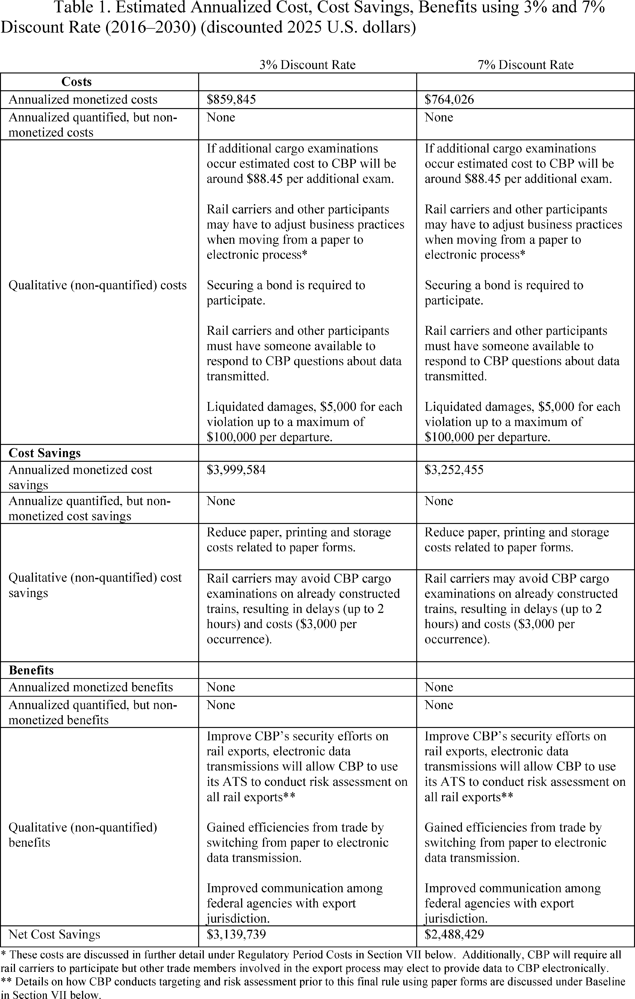
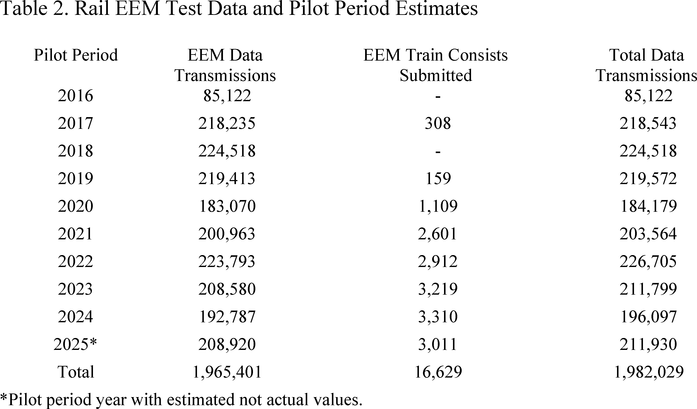

# Daily Digest — 2026-08-26

| | |
|---|---|
| **Digest date** | 2026-08-26 |
| **Data date range** | 2026-08-26 to 2026-08-26 |
| **Generated at** | 2026-08-27T04:55:16Z (UTC) |
| **Pipeline version** | ba7c4dc |
| **Inference** | model layers ran — cli/haiku, opus |
| **Source watermarks** | CREC: 2026-08-25T10:51:20Z · BILLS: 2026-08-27T02:35:56Z · FR: 2026-08-26T15:50:22Z · USCOURTS: 2026-08-27T03:03:54Z · PLAW: 2026-08-25T15:38:01Z |

[Full observed listing for this day](day/2026-08-26.html) — every item our collectors observed for this publication day, mechanical rules applied, frozen at end of day. This digest is the canonical record.

All items below cite the govinfo package (and granule, where applicable) they
summarize. Selection is mechanical; each item states the rule that included
it. See the Coverage Statement at the end for a full accounting of what was
published, what was summarized, and what was excluded and why.

---

## Contents

- [Day in Review](#day-in-review)
- [1. Congressional Floor Activity](#1-congressional-floor-activity)
- [2. Legislation](#2-legislation)
- [3. Federal Register](#3-federal-register)
- [4. Enacted Laws](#4-enacted-laws)
- [5. Judicial Activity](#5-judicial-activity)
- [6. Agency Announcements](#6-agency-announcements)
- [7. Recorded Votes](#7-recorded-votes)
- [8. Bill Actions](#8-bill-actions)
- [9. Presidential Actions](#9-presidential-actions)
- [Terms Used Today](#terms-used-today)
- [Coverage Statement](#coverage-statement)
- [Methodology](#methodology)

---

## Day in Review

Both chambers are absent from this digest: no floor proceedings or recorded votes appear, and the only legislative item observed is a single bill introduced in the House.

On the executive and regulatory side, the digest carries 16 final rules, four proposed rules, 71 notices, and one presidential document from the Federal Register, alongside two executive orders and two proclamations in the presidential-actions collection, and 182 agency press releases. The final rules include Postal Service standards for mailing federal absentee ballots, a Customs and Border Protection requirement for electronic rail export manifests, a Treasury order indefinitely suspending five general licenses under the Iranian sanctions regulations, a DEA temporary Schedule I placement of three mitragynine-related substances, an OPM change to critical position pay caps, and an arts-and-humanities amendment removing disparate-impact liability from its Title VI regulations. The presidential determination approved Finland and Sweden's participation in the ATOMAL Agreement for exchange of Restricted Data. Proposed rules cover controlled-foreign-corporation income allocation, swap execution facility order books, a San Juan Bay anchorage, and a spent fuel cask listing.

Judicial items dominate the day's observations: 724 district court opinions, 85 appellate opinions, and two bankruptcy opinions. The Eleventh Circuit vacated and remanded two judgments finding Georgia's redistricting maps violated Section 2 of the Voting Rights Act, applying the framework from the Supreme Court's April 2026 decision in Louisiana v. Callais. The DC Circuit denied petitions challenging FERC's approval of a Venture Global LNG terminal and pipeline, affirmed a landings-only catch limit for South Atlantic red snapper, and affirmed dismissal of a challenge to the FCC's handling of an $8.6 billion broadcast acquisition. The Tenth Circuit reversed a first-degree murder conviction over an imperfect self-defense instruction; the Fourth Circuit affirmed a machinegun-possession conviction while reversing a serial-number enhancement.

*Composed from the summarized items below and the day's mechanical
counts; all specifics are cited in their sections.*

---

## 1. Congressional Floor Activity

No Congressional Record issue was observed on this day. The Record for a day's proceedings is typically published by govinfo the following morning; it appears in the digest for the day it is observed ([how our clocks work](faq.html#fapds-three-clocks)).

### 1.1 Senate

No Senate floor items met the selection thresholds. 0 floor granule(s) are accounted for in the Coverage Statement.

### 1.2 House of Representatives

No House floor items met the selection thresholds. 0 floor granule(s) are accounted for in the Coverage Statement.

### 1.3 Recorded Votes

No recorded votes were published in this issue of the Congressional Record.

---

## 2. Legislation

Source: Congressional Bills (BILLS), text versions published 2026-08-26 to 2026-08-26.

### 2.1 Counts by Stage

| Stage (bill text version) | Count |
|---|---|
| Introduced (ih/is) | 1 |
| Reported (rh/rs) | 0 |
| Engrossed (eh/es) | 0 |
| Enrolled (enr) | 0 |
| Other versions | 0 |
| **Total bill texts published** | **1** |

### 2.2 Bills Listed by Mechanical Rule

Bills below are listed because they matched at least one listing rule; the
matching rule is stated per item. All other bill texts are counted above and
accounted for in the Coverage Statement.

No bill texts published in this range matched a listing rule; all 1 are
accounted for in the Coverage Statement.

---

## 3. Federal Register

Source: Federal Register (FR), issue of 2026-08-26.

### 3.1 Counts by Document Type

| Document type | Count |
|---|---|
| Rules | 16 |
| Proposed rules | 4 |
| Notices | 71 |
| Presidential documents | 1 |
| **Total FR documents** | **92** |

### 3.2 Rules Published

Tags: department of commerce · department of energy · executive · model keys: coast guard · marine mammals · postal standards

*In plain terms: 16 final rules including three Coast Guard water-safety zones and one special local regulation; also postal ballot standards, agency fee updates, controlled substance scheduling, and trademark classification changes.*

#### DEPARTMENT OF COMMERCE

- **Takes of Marine Mammals Incidental to Specified Activities; Taking Marine Mammals Incidental to the Duckabush Estuary Restoration Project in Washington** (2026-17391; 50 CFR Part 217) — NMFS, upon request from the U.S. Army Corps of Engineers (USACE) issues this final rule pursuant to the Marine Mammal Protection Act (MMPA), to govern the taking of marine mammals incidental to the Duckabush Estuary Restoration Project (DERP) in Hood Canal, Washington over 5 years (2027-2032). This final rule, which allows for the issuance of a 5-year letter of authorization (LOA) allowing for the incidental take of marine mammals during the described activities and timeframes, prescribes the permissible methods of taking and other means of effecting the least practicable adverse impact on marine mammal species and their habitat, and establishes requirements pertaining to the monitoring and reporting of such taking. Action: Final rule; notification of issuance of Letter of Authorization. Dates: Effective from July 9, 2027, through July 8, 2032.
  - *In plain terms:* The National Marine Fisheries Service is permitting the incidental taking of marine mammals during the Duckabush Estuary Restoration Project from 2027 to 2032.
  - Included because: FR-SEL-01 — document type: final rule (all listed)
  - Source: [FR-2026-08-26 / 2026-17391](https://www.govinfo.gov/app/details/FR-2026-08-26/2026-17391)
- **International Trademark Classification Changes** (2026-17437; 37 CFR Part 6) — The United States Patent and Trademark Office (USPTO) issues this final rule to incorporate classification changes adopted by the Nice Agreement Concerning the International Classification of Goods and Services for the Purposes of the Registration of Marks (Nice Agreement). These changes are listed in the International Classification of Goods and Services for the Purposes of the Registration of Marks (13th ed., ver. 2027) (Nice Classification), which is published by the World Intellectual Property Organization (WIPO), and will become effective on January 1, 2027. Action: Final rule. Dates: This rule is effective on January 1, 2027.
  - *In plain terms:* The USPTO is adopting updated international trademark classifications effective January 1, 2027.
  - Included because: FR-SEL-01 — document type: final rule (all listed)
  - Source: [FR-2026-08-26 / 2026-17437](https://www.govinfo.gov/app/details/FR-2026-08-26/2026-17437)

#### DEPARTMENT OF ENERGY

- **Rescinding Regulations for Loans for Minority Business Enterprises Seeking DOE Contracts and Assistance** (2026-17381; 10 CFR Part 800) — The U.S. Department of Energy (DOE) is further extending the effective date of the direct final rule “Rescinding Regulations for Loans for Minority Business Enterprises Seeking DOE Contracts and Assistance,” published on May 16, 2025. Action: Direct final rule; further delay of effective date. Dates: As of August 26, 2026, the effective date of the direct final rule published May 16, 2025, at 90 FR 20769, delayed until September 12, 2025 (90 FR 31137), further delayed until December 9, 2025 (90 FR 43539), again delayed until March 9, 2026 (90 FR 56967) and then June 4, 2026 (91 FR 10954), and then delayed until September 1, 2026 (91 FR 33069) is further delayed until December 24, 2026.
  - *In plain terms:* The Department of Energy is extending the effective date of its rule rescinding regulations for minority business enterprise loans.
  - Included because: FR-SEL-01 — document type: final rule (all listed)
  - Source: [FR-2026-08-26 / 2026-17381](https://www.govinfo.gov/app/details/FR-2026-08-26/2026-17381)

#### DEPARTMENT OF HOMELAND SECURITY

- **Safety Zone; Spring Lake, Fruitport, MI** (2026-17375; 33 CFR Part 165) — The Coast Guard is establishing a temporary safety zone for navigable waters on Spring Lake, in the vicinity of Fruitport, MI. The safety zone is needed to protect personnel, vessels, and the marine environment from potential hazards associated with an overwater aerial drone show. Entry of vessels or persons into this zone is prohibited unless specifically authorized by the Captain of the Port, Sector Lake Michigan, or their designated representative. Action: Temporary final rule. Dates: This rule is effective on August 27, 2026, from 8:30 p.m. to 10 p.m.
  - *In plain terms:* The Coast Guard is temporarily blocking vessel and person entry to part of Spring Lake near Fruitport during an aerial drone show.
  - Included because: FR-SEL-01 — document type: final rule (all listed)
  - Source: [FR-2026-08-26 / 2026-17375](https://www.govinfo.gov/app/details/FR-2026-08-26/2026-17375)
- **Special Local Regulation; Lake Erie, Kelleys Island, OH** (2026-17378; Coast Guard; 33 CFR Part 100) — The Coast Guard is establishing a temporary special local regulation (SLR) for certain navigable waters of Lake Erie near Kelleys Island, OH. The SLR is needed to protect personnel, vessels, and the marine environment from potential hazards created by a sailing race. This rulemaking prohibits persons and vessels from being in the regulated area during the enforcement period unless specifically authorized by the Captain of the Port, Sector Detroit or their designated representative. Action: Final rule. Dates: This rule is effective from 8:30 a.m. through 5 p.m. on August 29, 2026.
  - *In plain terms:* The Coast Guard is temporarily prohibiting vessel and person entry to part of Lake Erie near Kelleys Island during a sailing race.
  - Included because: FR-SEL-01 — document type: final rule (all listed)
  - Source: [FR-2026-08-26 / 2026-17378](https://www.govinfo.gov/app/details/FR-2026-08-26/2026-17378)
- **Safety Zone; Lake St. Clair; New Baltimore, MI** (2026-17389; 33 CFR Part 165) — The Coast Guard is establishing a temporary safety zone for navigable waters of Lake St. Clair within a 420-foot radius of Brandenburg Park on Anchor Bay in Lake St. Clair, New Baltimore, MI for the Anchor Bay Bass, Brew, BBQ fireworks. The safety zone is needed to protect personnel, vessels, and the marine environment from potential hazards during a fireworks event. Entry of vessels or persons into this zone is prohibited unless specifically authorized by the Captain of the Port Detroit or their designated representative. Action: Temporary final rule. Dates: This rule is effective from 9:30 p.m. on August 28, 2026, until 10:30 p.m. on August 29, 2026. This rule will be enforced from 9:30 p.m. until 10:30 p.m. on August 28, 2026. In the event of inclement weather on August 28, 2026, this rule will be enforced from 9:30 p.m. until 10:30 p.m. on August 29, 2026.
  - *In plain terms:* The Coast Guard is temporarily blocking vessel and person entry to a 420-foot radius around Brandenburg Park during a fireworks event.
  - Included because: FR-SEL-01 — document type: final rule (all listed)
  - Source: [FR-2026-08-26 / 2026-17389](https://www.govinfo.gov/app/details/FR-2026-08-26/2026-17389)
- **Automated Commercial Environment (ACE) Electronic Export Manifest for Rail Cargo** (2026-17390; 19 CFR Parts 103, 113, 123, and 192) — U.S. Customs and Border Protection (CBP) is revising its regulations pursuant to the Trade Act of 2002 requiring the transmission of export manifest data electronically in the Automated Commercial Environment (ACE) for cargo transported by rail for any train departing the United States. This rule mandates the electronic transmission of rail export manifest information, identifies the parties eligible to transmit information, and describes the time frames prior to departure in which the information is due. This rule enables CBP to address important cargo security concerns while providing efficiencies to the trade. Action: Final rule. Dates: Effective date: This rule is effective on October 26, 2026. Compliance date: CBP will begin enforcing this rule on October 26, 2027.
  - *In plain terms:* CBP is requiring rail cargo exporters to submit manifest data electronically before trains depart the United States.
  - Included because: FR-SEL-01 — document type: final rule (all listed)
  - Source: [FR-2026-08-26 / 2026-17390](https://www.govinfo.gov/app/details/FR-2026-08-26/2026-17390)
  -  *Source graphic 1 of 33 from 2026-17390.*
  -  *Source graphic 2 of 33 from 2026-17390.*
  - *Graphics not rendered here: 31 of 33 — see the [source PDF](https://www.govinfo.gov/content/pkg/FR-2026-08-26/pdf/FR-2026-08-26.pdf).*

#### DEPARTMENT OF JUSTICE

- **Schedules of Controlled Substances: Temporary Placement of Mitragynine Pseudoindoxyl, MGM-15, and MGM-16 in Schedule I** (2026-17429; 21 CFR Part 1308) — The Drug Enforcement Administration (DEA) is issuing this temporary order to schedule three 7-hydroxymitragynine-related substances (mitragynine pseudoindoxyl, MGM-15, and MGM-16), including their isomers, esters, ethers, salts, and salts of isomers, esters, and ethers, whenever the existence of such isomers, esters, ethers, and salts is possible, in schedule I of the Controlled Substances Act. DEA bases this action on a finding that placing mitragynine pseudoindoxyl, MGM-15, and MGM-16 in schedule I is necessary to avoid an imminent hazard to public safety. This order imposes the regulatory controls and administrative, civil, and criminal sanctions applicable to schedule I controlled substances on persons who handle (manufacture, distribute, reverse distribute, import, export, engage in research, conduct instructional activities or chemical analysis with, or possess) or propose to handle these three 7-hydroxymitragynine-related substances. Action: Temporary amendment; temporary scheduling order. Dates: This temporary order is effective August 26, 2026, until August 26, 2028. If this order is extended or made permanent, DEA will publish a document in the Federal Register .
  - *In plain terms:* The DEA is temporarily placing three mitragynine-related substances in Schedule I due to an imminent public safety hazard.
  - Included because: FR-SEL-01 — document type: final rule (all listed)
  - Source: [FR-2026-08-26 / 2026-17429](https://www.govinfo.gov/app/details/FR-2026-08-26/2026-17429)

#### DEPARTMENT OF THE TREASURY

- **Iranian Transactions and Sanctions Regulations** (2026-17426; 31 CFR Part 560) — The Department of the Treasury's Office of Foreign Assets Control (OFAC) is indefinitely suspending five general licenses issued pursuant to the Iranian Transactions and Sanctions Regulations to align with changes in the foreign policy of the United States towards Iran. Action: Final rule; stay of effectiveness. Dates: Effective August 24, 2026, 31 CFR 560.544, 560.550, and 560.554 are stayed indefinitely. As of August 24, 2026, the effectiveness of the Iran General Licenses F and G, published at 79 FR 11180 and 79 FR 49157, respectively, and available on OFAC's website ( https://ofac.treasury.gov ), are stayed indefinitely.
  - *In plain terms:* The Treasury Department is indefinitely suspending five licenses for Iranian transactions to align with updated U.S. foreign policy toward Iran.
  - Included because: FR-SEL-01 — document type: final rule (all listed)
  - Source: [FR-2026-08-26 / 2026-17426](https://www.govinfo.gov/app/details/FR-2026-08-26/2026-17426)

#### ENVIRONMENTAL PROTECTION AGENCY

- **Significant New Use Rules on Certain Chemical Substances (24-5.5e)** (2026-17400; 40 CFR Part 721) — EPA is issuing significant new use rules (SNURs) under the Toxic Substances Control Act (TSCA) for certain chemical substances that were the subject of premanufacture notices (PMNs) and are also subject to an Order issued by EPA pursuant to TSCA. The SNURs require persons to notify EPA at least 90 days before commencing the manufacture (defined by statute to include import) or processing of any of these chemical substances for an activity that is designated as a significant new use in the SNUR. The required notification initiates EPA's evaluation of the conditions of that use for that chemical substance. In addition, the manufacture or processing for the significant new use may not commence until EPA has conducted a review of the required notification; made an appropriate determination regarding that notification; and taken such actions as required by that determination. Action: Final rule. Dates: This rule is effective on October 26, 2026. For purposes of judicial review, this rule shall be promulgated at 1 p.m. (EST) on September 9, 2026.
  - *In plain terms:* The EPA is requiring manufacturers to notify it at least 90 days before beginning new uses of certain chemicals and must await approval.
  - Included because: FR-SEL-01 — document type: final rule (all listed)
  - Source: [FR-2026-08-26 / 2026-17400](https://www.govinfo.gov/app/details/FR-2026-08-26/2026-17400)

#### FARM CREDIT ADMINISTRATION

- **Loan Performance Categories and Financial Reporting** (2026-17440; 12 CFR Part 621) — The Farm Credit Administration (FCA, we, or our) amends our regulatory high-risk loan performance categories by removing “Formally restructured loans (TDR),” also known as troubled debt restructurings. In 2022, changes in generally accepted accounting principles (GAAP) eliminated the accounting guidance for TDRs, enhanced disclosure requirements for certain loan refinancings and restructurings undertaken when a borrower is experiencing financial difficulty and changed existing vintage year disclosure requirements for public business entities. This final rule removes TDRs from our regulatory loan performance categories to reflect changes in GAAP. Because FCA regulations require Farm Credit System (System) institutions to prepare financial statements and reports in accordance with GAAP, retaining TDRs as a regulatory loan performance category is no longer consistent with current accounting standards. In addition to making conforming technical changes, the rule also makes minor technical and organizational revisions to ensure internal consistency within the regulation. [official summary truncated; see source] Action: Final rule; confirmation of effective date. Dates: The final rule was published on July 24, 2026 (91 FR 46703) and is confirmed as August 24, 2026.
  - *In plain terms:* The Farm Credit Administration is removing troubled debt restructurings from its loan performance categories to align with updated accounting standards.
  - Included because: FR-SEL-01 — document type: final rule (all listed)
  - Source: [FR-2026-08-26 / 2026-17440](https://www.govinfo.gov/app/details/FR-2026-08-26/2026-17440)

#### FEDERAL TRADE COMMISSION

- **Telemarketing Sales Rule Fees** (2026-17428; 16 CFR Part 310) — The Federal Trade Commission (“Commission”) is amending its Telemarketing Sales Rule (“TSR”) by updating the fees charged to entities accessing the National Do Not Call Registry (“Registry”) as required by the Do-Not-Call Registry Fee Extension Act of 2007. Action: Final rule. Dates: The revised fees will become effective October 1, 2026.
  - *In plain terms:* The FTC is updating the fees that organizations must pay to access the National Do Not Call Registry.
  - Included because: FR-SEL-01 — document type: final rule (all listed)
  - Source: [FR-2026-08-26 / 2026-17428](https://www.govinfo.gov/app/details/FR-2026-08-26/2026-17428)

#### NATIONAL FOUNDATION ON THE ARTS AND THE HUMANITIES

- **Rescinding Portions of the National Foundation on the Arts and Humanities Title VI Regulations To Conform More Closely With the Statutory Text and To Implement Executive Order 14281** (2026-17366; 45 CFR Part 1110) — This rule amends the National Foundation on the Arts and the Humanities' (the Foundation) regulations implementing Title VI of the Civil Rights Act of 1964 (Title VI) to eliminate disparate-impact liability. These amendments align the conduct prohibited by the Foundation's regulations with Title VI text, avoid constitutional concerns, reduce compliance costs, and serve the public interest. In addition, these revisions are consistent with Executive Order 14281. Action: Final rule. Dates: These regulations are effective August 26, 2026.
  - *In plain terms:* The Arts and Humanities Foundation is changing its civil rights regulations to remove disparate-impact liability and align with the statute.
  - Included because: FR-SEL-01 — document type: final rule (all listed)
  - Source: [FR-2026-08-26 / 2026-17366](https://www.govinfo.gov/app/details/FR-2026-08-26/2026-17366)

#### NUCLEAR REGULATORY COMMISSION

- **List of Approved Spent Fuel Storage Casks: TN Americas, LLC Standardized NUHOMS® Horizontal Modular Storage System for Irradiated Nuclear Fuel, Certificate of Compliance No. 1004, Renewed Amendment No. 19** (2026-17445; 10 CFR Part 72) — The U.S. Nuclear Regulatory Commission (NRC) is amending its spent fuel storage regulations by revising the TN Americas, LLC Standardized NUHOMS® Horizontal Modular Storage System for Irradiated Nuclear Fuel listing within the “List of approved spent fuel storage casks” to include Amendment No. 19 to Certificate of Compliance (CoC) No. 1004. Amendment No. 19 revises the certificate of compliance to provide for a 61BTH improved basket design using staggered plates similar the 24PTH Type 3 basket approved in CoC 1004 Amendment 18 and similar to the EOS 37PTH and 89BTH baskets approved in CoC 1042. This will simplify construction, reduce weight and improve fabricability. Additional changes are proposed to address editorial corrections, consistency, and terminology clarifications. The NRC is referring to this amendment as “Renewed Amendment No. 19” because it was submitted after the renewal of the TN Americas, LLC Standardized NUHOMS Horizontal Modular Storage System for Irradiated Nuclear Fuel Certificate of Compliance No. 1004 and, therefore, subject to the Aging Management Program requirements of the renewed certificate. Action: Direct final rule. Dates: This direct final rule is effective November 9, 2026, unless significant adverse comments are received by September 25, 2026. If this direct final rule is withdrawn as a result of such comments, timely notice of the withdrawal will be published in the Federal Register . Comments received after this date will be considered if it is practical to do so, but the NRC is able to ensure consideration only for comments received on or before this date. Comments received on this direct final rule will also be considered to be comments on a companion proposed rule published in the Proposed Rules section of this issue of the Federal Register .
  - *In plain terms:* The NRC is updating the approved list for TN Americas' spent fuel storage cask system with an improved basket design.
  - Included because: FR-SEL-01 — document type: final rule (all listed)
  - Source: [FR-2026-08-26 / 2026-17445](https://www.govinfo.gov/app/details/FR-2026-08-26/2026-17445)

#### OFFICE OF PERSONNEL MANAGEMENT

- **Critical Position Pay Authority** (2026-17442; 5 CFR Parts 535 and 752) — The Office of Personnel Management (OPM) is amending its regulations governing the critical position pay (CPP) authority to establish level I of the Executive Schedule as the default maximum critical pay rate, with higher rates subject to written approval by the Director of OPM. The final rule eliminates non-statutory caps and approval criteria; addresses the use of service agreements; clarifies that reductions or terminations of CPP are not adverse actions or subject to grievance or appeal rights; and clarifies the treatment of critical pay rates as basic pay. This final rule simplifies and better aligns OPM's regulations with governing law and delegated authority. Action: Final rule. Dates: Effective date: This regulation is effective August 26, 2026. OPM is waiving the 30-day delayed effective date under 5 U.S.C. 553(d)(1), as this rule relieves restrictions that are not required by statute.
  - *In plain terms:* The OPM is updating critical position pay rules to set a default maximum rate and clarify that pay changes lack grievance rights.
  - Included because: FR-SEL-01 — document type: final rule (all listed)
  - Source: [FR-2026-08-26 / 2026-17442](https://www.govinfo.gov/app/details/FR-2026-08-26/2026-17442)

#### POSTAL SERVICE

- **Ballot Mail for Federal Elections** (2026-17238; 39 CFR Part 111) — The Postal Service is amending the Mailing Standards of the United States Postal Service, Domestic Mail Manual, regarding the transmission of mail-in or absentee ballots for federal elections pursuant to its rulemaking authority. Action: Final rule. Dates: Effective August 21, 2026.
  - *In plain terms:* The Postal Service is updating its rules for how mail-in and absentee ballots are handled for federal elections.
  - Included because: FR-SEL-01 — document type: final rule (all listed)
  - Source: [FR-2026-08-26 / 2026-17238](https://www.govinfo.gov/app/details/FR-2026-08-26/2026-17238)

### 3.3 Proposed Rules Published

Tags: department of commerce · department of energy · executive · model keys: nuclear fuel · swap execution · tax regulations

*In plain terms: Four proposals covering tax regulations on controlled foreign corporations, CFTC swap execution facility order book requirement, Coast Guard anchorage revision, and spent fuel storage.*

#### COMMODITY FUTURES TRADING COMMISSION

- **Swap Execution Facility Order Book Requirement for Permitted Transactions** (2026-17416; 17 CFR Part 37) — The Commodity Futures Trading Commission (“Commission” or “CFTC”) proposes to amend its regulations for swap execution facilities (“SEFs”) to remove the requirement for SEFs to offer an order book for swap transactions that are not subject to trade execution requirement under section 2(h)(8) of the Commodity Exchange Act (“CEA” or “Act”). These types of swap transactions are referred to in the Commission's regulations as “permitted transactions.” Action: Notice of proposed rulemaking. Dates: Comments must be received on or before September 25, 2026.
  - *In plain terms:* The CFTC proposes to remove the requirement for swap execution facilities to provide order books for certain types of swap transactions.
  - Included because: FR-SEL-02 — document type: proposed rule (all listed)
  - Source: [FR-2026-08-26 / 2026-17416](https://www.govinfo.gov/app/details/FR-2026-08-26/2026-17416)

#### DEPARTMENT OF HOMELAND SECURITY

- **Anchorage Regulation; San Juan Bay, San Juan, PR** (2026-17419; 33 CFR Part 110) — The Coast Guard is proposing to amend the special anchorage regulation in the Bahía de San Juan, PR, known as Anchorage D, by revising the anchorage boundaries. The current boundaries of Anchorage D overlap with deep draft commercial vessel traffic routes within the San Antonio Channel, causing a hazard to navigation. The proposed amendment to the special anchorage regulation is necessary to protect personnel, vessels, and the marine environment from hazards associated with vessel traffic transiting the San Antonio Channel. We invite your comments on this proposed rulemaking. Action: Notice of proposed rulemaking. Dates: Comments and related material must be received by the Coast Guard on or before September 25, 2026.
  - *In plain terms:* The Coast Guard proposes to move Anchorage D's boundaries in San Juan Bay to avoid overlap with commercial vessel traffic routes.
  - Included because: FR-SEL-02 — document type: proposed rule (all listed)
  - Source: [FR-2026-08-26 / 2026-17419](https://www.govinfo.gov/app/details/FR-2026-08-26/2026-17419)

#### DEPARTMENT OF THE TREASURY

- **Pro Rata Share of Subpart F Income, Tested Income, or Tested Loss** (2026-17365; 26 CFR Part 1) — This document contains proposed regulations relating to the determination of a United States shareholder's pro rata share of subpart F income, tested income, or tested loss of a controlled foreign corporation. The proposed regulations would affect shareholders of foreign corporations, including United States shareholders of controlled foreign corporations. Action: Notice of proposed rulemaking. Dates: Written or electronic comments and requests for a public hearing must be received by October 26, 2026.
  - *In plain terms:* Proposed rules would determine how U.S. shareholders of foreign companies calculate their share of certain income from those companies.
  - Included because: FR-SEL-02 — document type: proposed rule (all listed)
  - Source: [FR-2026-08-26 / 2026-17365](https://www.govinfo.gov/app/details/FR-2026-08-26/2026-17365)

#### NUCLEAR REGULATORY COMMISSION

- **List of Approved Spent Fuel Storage Casks: TN Americas, LLC Standardized NUHOMS® Horizontal Modular Storage System for Irradiated Nuclear Fuel, Certificate of Compliance No. 1004, Renewed Amendment No. 19** (2026-17446; 10 CFR Part 72) — The U.S. Nuclear Regulatory Commission (NRC) is proposing to amend its spent fuel regulations by revising the TN Americas, LLC Standardized NUHOMS® Horizontal Modular Storage System for Irradiated Nuclear Fuel listing within the “List of approved spent fuel storage casks” to include Renewed Amendment No. 19 to Certificate of Compliance (CoC) No. 1004. The NRC is referring to this amendment as “Renewed Amendment No. 19” because it was submitted after the renewal of the TN Americas, LLC Standardized NUHOMS Horizontal Modular Storage System for Irradiated Nuclear Fuel Certificate of Compliance No. 1004 and, therefore, subject to the Aging Management Program requirements of the renewed certificate. Renewed Amendment No. 19 would amend the certificate of compliance to provide for a 61BTH improved basket design using staggered plates similar the 24PTH Type 3 basket approved in CoC 1004 Amendment 18 and similar to the EOS 37PTH and 89BTH baskets approved in CoC 1042. This would simplify construction, reduce weight and improve fabricability. Additional changes are proposed to address editorial corrections, consistency, and terminology clarifications. Action: Proposed rule. Dates: Submit comments by September 25, 2026. Comments received after this date will be considered if it is practical to do so, but the NRC is able to ensure consideration of only comments received on or before this date.
  - *In plain terms:* The NRC proposes to update the approved list for TN Americas' spent fuel storage cask system with an improved basket design.
  - Included because: FR-SEL-02 — document type: proposed rule (all listed)
  - Source: [FR-2026-08-26 / 2026-17446](https://www.govinfo.gov/app/details/FR-2026-08-26/2026-17446)

### 3.4 Notices and Presidential Documents

Tags: department of commerce · department of energy · executive · model keys: atomic information · international agreement · nato

*In plain terms: Presidential determination approving atomic information exchange with Finland and Sweden as NATO members under the ATOMAL Agreement.*

Notices are summarized only when they match a listing rule; all are counted
in 3.1 and in the Coverage Statement. Presidential documents in the FR are
always listed.

- **Presidential Determination on Provision of Atomic Information to Finland and Sweden** (2026-17477) — The President approved Finland and Sweden's participation in the ATOMAL Agreement, authorizing the exchange of U.S. Restricted Data and Formerly Restricted Data with these NATO members. The Department of War is authorized to implement this cooperation, which was approved under sections 123 and 144b of the Atomic Energy Act of 1954.
  - *In plain terms:* The President authorized the exchange of U.S. atomic information with Finland and Sweden under the ATOMAL Agreement.
  - Included because: FR-SEL-03 — presidential document (all listed)
  - Source: [FR-2026-08-26 / 2026-17477](https://www.govinfo.gov/app/details/FR-2026-08-26/2026-17477)

---

## 4. Enacted Laws

Source: Public and Private Laws (PLAW) published 2026-08-26.

No laws were published in this range.

---

## 5. Judicial Activity

Source: United States Courts Opinions (USCOURTS): opinions observed 2026-08-26
by our collector; each opinion states its own issue date beside its
listing ([how our clocks work](faq.html#fapds-three-clocks)).

Completeness disclosure (standing): USCOURTS carries opinions from
approximately 140 participating appellate, district, bankruptcy, and
national federal courts. Unlike the Congressional Record and the Federal
Register, which are the complete official record of their branches,
USCOURTS is participation-based and is NOT the complete federal judicial
record. Courts post opinions with delay — typically over several days —
so a day's digest carries the opinions that became available that day,
whatever date each was issued.

### 5.1 Appellate and National Court Opinions

Tags: judicial · model keys: criminal convictions · employment discrimination · immigration removal

*In plain terms: 85 federal appeals across circuits including criminal convictions, immigration removal proceedings, civil rights and employment disputes, and regulatory agency challenges.*

Appellate and national court opinions are summarized; district and
bankruptcy opinions are counted in 5.2 and in the Coverage Statement.

#### United States Court of Appeals for the District of Columbia Circuit

- **For a Better Bayou, et al v. FERC** (No. 24-01291; filed 2026-08-25) — The DC Circuit affirmed the Federal Energy Regulatory Commission's approval of Venture Global's LNG export terminal and pipeline project, rejecting eleven alleged errors raised by petitioners under the Natural Gas Act and National Environmental Policy Act.
  - *In plain terms:* The court upheld the Federal Energy Regulatory Commission's approval of Venture Global's liquefied natural gas export terminal and pipeline project, rejecting petitioners' challenges.
  - Included because: USCOURTS-SEL-01 — appellate court opinion (all listed) (document dated 2026-08-25)
  - Source: [USCOURTS-caDC-24-01291 / USCOURTS-caDC-24-01291-0](https://www.govinfo.gov/app/details/USCOURTS-caDC-24-01291/USCOURTS-caDC-24-01291-0)
- **Louisiana Bucket Brigade, et al v. FERC** (No. 24-01292; filed 2026-08-25) — Individuals and advocacy groups petitioned for review of the Federal Energy Regulatory Commission's approval of a liquefied natural gas terminal and pipeline for exportation by Venture Global, alleging eleven errors under the Natural Gas Act and National Environmental Policy Act. The DC Circuit denied the petitions for review, holding that FERC's interpretation and application of the Natural Gas Act's public interest standard was proper and that FERC's environmental analysis, including cumulative effects analysis and assessment of impacts to commercial fishing, was adequate under NEPA.
  - *In plain terms:* The DC Circuit rejected the challenge to the Federal Energy Regulatory Commission's approval of Venture Global's liquefied natural gas terminal and pipeline for export.
  - Included because: USCOURTS-SEL-01 — appellate court opinion (all listed) (document dated 2026-08-25)
  - Source: [USCOURTS-caDC-24-01292 / USCOURTS-caDC-24-01292-0](https://www.govinfo.gov/app/details/USCOURTS-caDC-24-01292/USCOURTS-caDC-24-01292-0)
- **For a Better Bayou, et al v. FERC** (No. 25-01157; filed 2026-08-25) — Individuals and advocacy groups petitioned for review of the Federal Energy Regulatory Commission's approval of a liquefied natural gas terminal and pipeline for exportation by Venture Global, alleging eleven errors under the Natural Gas Act and National Environmental Policy Act. The DC Circuit denied the petitions for review, holding that FERC's interpretation and application of the Natural Gas Act's public interest standard was proper and that FERC's environmental analysis, including cumulative effects analysis and assessment of impacts to commercial fishing, was adequate under NEPA.
  - *In plain terms:* The DC Circuit rejected the challenge to the Federal Energy Regulatory Commission's approval of Venture Global's liquefied natural gas terminal and pipeline for export.
  - Included because: USCOURTS-SEL-01 — appellate court opinion (all listed) (document dated 2026-08-25)
  - Source: [USCOURTS-caDC-25-01157 / USCOURTS-caDC-25-01157-0](https://www.govinfo.gov/app/details/USCOURTS-caDC-25-01157/USCOURTS-caDC-25-01157-0)
- **Slash Creek Waterworks, Inc., et al v. Howard Lutnick, et al** (No. 25-05042; filed 2026-08-25) — Commercial fishers and red snapper buyers challenged regulations establishing an annual catch limit for South Atlantic red snapper based solely on landings (fish brought ashore), arguing the limit must also include dead discards to comply with the Magnuson-Stevens Act's requirement to prevent overfishing. The DC Circuit affirmed the National Marine Fisheries Service's landings-only approach, holding that the term "annual catch limit" does not require the agency to directly restrict dead discards and that prior precedent controls the issue.
  - *In plain terms:* The DC Circuit upheld the National Marine Fisheries Service's use of only landed fish to set the annual red snapper catch limit.
  - Included because: USCOURTS-SEL-01 — appellate court opinion (all listed) (document dated 2026-08-25)
  - Source: [USCOURTS-caDC-25-05042 / USCOURTS-caDC-25-05042-0](https://www.govinfo.gov/app/details/USCOURTS-caDC-25-05042/USCOURTS-caDC-25-05042-0)
- **Norwich Pharmaceuticals, Inc. v. Robert F. Kennedy, Jr., et al** (No. 25-05137; filed 2026-08-25) — The Court of Appeals for the District of Columbia Circuit reversed in part and affirmed in part a district court decision regarding the FDA's interpretation of statutory provisions governing when first-applicant generic drug manufacturers forfeit their 180-day marketing exclusivity. The court found that the FDA correctly interpreted the failure-to-market provision but applied an incorrect causation standard to the failure-to-obtain-tentative-approval provision. The case was remanded to the district court with instructions to remand to the FDA for further proceedings.
  - *In plain terms:* The DC Circuit partially reversed the district court on how the FDA interprets when first-applicant generic drug manufacturers lose their 180-day marketing exclusivity.
  - Included because: USCOURTS-SEL-01 — appellate court opinion (all listed) (document dated 2026-08-25)
  - Source: [USCOURTS-caDC-25-05137 / USCOURTS-caDC-25-05137-0](https://www.govinfo.gov/app/details/USCOURTS-caDC-25-05137/USCOURTS-caDC-25-05137-0)
- **SGCI Holdings III LLC, et al v. FCC, et al** (No. 25-05339; filed 2026-08-25) — The DC Circuit affirmed the district court's dismissal of SGCI Holdings' complaint challenging the FCC's failure to approve its $8.6 billion acquisition of broadcast television company TEGNA within the 450-day contractually specified regulatory review period.
  - *In plain terms:* The court upheld dismissal of SGCI Holdings' complaint that the FCC failed to approve its $8.6 billion acquisition of TEGNA within the contractually specified 450-day review period.
  - Included because: USCOURTS-SEL-01 — appellate court opinion (all listed) (document dated 2026-08-25)
  - Source: [USCOURTS-caDC-25-05339 / USCOURTS-caDC-25-05339-0](https://www.govinfo.gov/app/details/USCOURTS-caDC-25-05339/USCOURTS-caDC-25-05339-0)

#### United States Court of Appeals for the Eighth Circuit

- **United States v. Darius Carter** (No. 24-03418; filed 2026-08-25) — This is a procedural notice from the Eighth Circuit Clerk of Court dated August 25, 2026, notifying counsel that an opinion was issued in United States v. Darius Carter and judgment was entered. The notice advises counsel of the 14-day deadline for filing petitions for rehearing and petitions for rehearing en banc in accordance with Federal Rules of Appellate Procedure.
  - *In plain terms:* A federal appeals court issued an opinion in a criminal case and set a 14-day deadline for requesting rehearing.
  - Included because: USCOURTS-SEL-01 — appellate court opinion (all listed) (document dated 2026-08-25)
  - Source: [USCOURTS-ca8-24-03418 / USCOURTS-ca8-24-03418-0](https://www.govinfo.gov/app/details/USCOURTS-ca8-24-03418/USCOURTS-ca8-24-03418-0)
- **United States v. Jeremy Burton** (No. 25-01006; filed 2026-08-25) — The Eighth Circuit clerk notified counsel that an opinion has been issued and judgment has been entered in United States v. Jeremy Burton. Petitions for rehearing or petitions for rehearing en banc must be filed within 14 days of the date of judgment entry.
  - *In plain terms:* An opinion and judgment were issued; petitions for rehearing must be filed within 14 days.
  - Included because: USCOURTS-SEL-01 — appellate court opinion (all listed) (document dated 2026-08-25)
  - Source: [USCOURTS-ca8-25-01006 / USCOURTS-ca8-25-01006-0](https://www.govinfo.gov/app/details/USCOURTS-ca8-25-01006/USCOURTS-ca8-25-01006-0)
- **Sherry Prunty, et al v. Corey Obregon, et al** (No. 25-02758; filed 2026-08-25) — The Eighth Circuit clerk notified counsel that an opinion has been issued and judgment has been entered in Sherry Prunty, et al v. Corey Obregon, et al. Petitions for rehearing or petitions for rehearing en banc must be filed within 14 days of the date of judgment entry.
  - *In plain terms:* An opinion and judgment were issued; petitions for rehearing must be filed within 14 days.
  - Included because: USCOURTS-SEL-01 — appellate court opinion (all listed) (document dated 2026-08-25)
  - Source: [USCOURTS-ca8-25-02758 / USCOURTS-ca8-25-02758-0](https://www.govinfo.gov/app/details/USCOURTS-ca8-25-02758/USCOURTS-ca8-25-02758-0)
- **Jon Holland, et al v. Martin Simmerman, et al** (No. 25-03020; filed 2026-08-25) — The Eighth Circuit clerk notified counsel that an opinion has been issued and judgment has been entered in Jon Holland, et al v. Martin Simmerman, et al. Petitions for rehearing or petitions for rehearing en banc must be filed within 14 days of the date of judgment entry.
  - *In plain terms:* An opinion and judgment were issued; petitions for rehearing must be filed within 14 days.
  - Included because: USCOURTS-SEL-01 — appellate court opinion (all listed) (document dated 2026-08-25)
  - Source: [USCOURTS-ca8-25-03020 / USCOURTS-ca8-25-03020-0](https://www.govinfo.gov/app/details/USCOURTS-ca8-25-03020/USCOURTS-ca8-25-03020-0)
- **United States v. Bruce Strickland** (No. 25-03221; filed 2026-08-25) — The Eighth Circuit clerk notified counsel that an opinion has been issued and judgment has been entered in United States v. Bruce Strickland. Petitions for rehearing or petitions for rehearing en banc must be filed within 14 days of the date of judgment entry.
  - *In plain terms:* An opinion and judgment were issued; petitions for rehearing must be filed within 14 days.
  - Included because: USCOURTS-SEL-01 — appellate court opinion (all listed) (document dated 2026-08-25)
  - Source: [USCOURTS-ca8-25-03221 / USCOURTS-ca8-25-03221-0](https://www.govinfo.gov/app/details/USCOURTS-ca8-25-03221/USCOURTS-ca8-25-03221-0)
- **United States v. Maleke Goodwin** (No. 26-01698; filed 2026-08-25) — United States v. Maleke Goodwin is an Eighth Circuit appeal challenging the district court's revocation of supervised release and 9-month prison sentence. The court affirmed, finding no abuse of discretion and that the district court adequately considered relevant factors in imposing a sentence within the Sentencing Guidelines based on Goodwin's history on supervised release.
  - *In plain terms:* A court upheld the revocation of a defendant's supervised release and his 9-month prison sentence, finding both were appropriate.
  - Included because: USCOURTS-SEL-01 — appellate court opinion (all listed) (document dated 2026-08-25)
  - Source: [USCOURTS-ca8-26-01698 / USCOURTS-ca8-26-01698-0](https://www.govinfo.gov/app/details/USCOURTS-ca8-26-01698/USCOURTS-ca8-26-01698-0)

#### United States Court of Appeals for the Eleventh Circuit

- **Alpha Phi Alpha Fraternity, Inc., et al v. Secretary, State of Georgia** (No. 23-13914; filed 2026-08-25) — The Eleventh Circuit Court of Appeals vacated and remanded the district court's judgment finding Georgia's redistricting maps violated Section 2 of the Voting Rights Act, following the Supreme Court's April 2026 decision in Louisiana v. Callais modifying the legal framework for Section 2 vote-dilution claims. The new standard requires plaintiffs to show a strong inference of intentional racial discrimination and to account for partisan considerations when proposing alternative redistricting plans.
  - *In plain terms:* An appeals court sent back a case about Georgia's voting districts for reconsideration under a new legal standard requiring proof of intentional racial bias.
  - Included because: USCOURTS-SEL-01 — appellate court opinion (all listed) (document dated 2026-08-25)
  - Source: [USCOURTS-ca11-23-13914 / USCOURTS-ca11-23-13914-0](https://www.govinfo.gov/app/details/USCOURTS-ca11-23-13914/USCOURTS-ca11-23-13914-0)
- **Annie Grant, et al v. Secretary, State of Georgia** (No. 23-13921; filed 2026-08-25) — The Eleventh Circuit Court of Appeals vacated and remanded the district court's judgment finding Georgia's redistricting maps violated Section 2 of the Voting Rights Act, following the Supreme Court's April 2026 decision in Louisiana v. Callais modifying the legal framework for Section 2 vote-dilution claims. The new standard requires plaintiffs to show a strong inference of intentional racial discrimination and to account for partisan considerations when proposing alternative redistricting plans.
  - *In plain terms:* An appeals court sent back a case about Georgia's voting districts for reconsideration under a new legal standard requiring proof of intentional racial bias.
  - Included because: USCOURTS-SEL-01 — appellate court opinion (all listed) (document dated 2026-08-25)
  - Source: [USCOURTS-ca11-23-13921 / USCOURTS-ca11-23-13921-0](https://www.govinfo.gov/app/details/USCOURTS-ca11-23-13921/USCOURTS-ca11-23-13921-0)
- **Jonathan Burton v. Dr. G. Espino** (No. 24-12549; filed 2026-08-25) — The Eleventh Circuit reversed summary judgment for Dr. G. Espino on an inmate's Eighth Amendment claims of deliberate indifference to serious medical needs and First Amendment retaliation claim, finding genuine disputes of material fact regarding allegations that the doctor refused medical treatment within approximately 60 seconds, allegedly in retaliation for the inmate's prior grievances. The case was remanded for further proceedings.
  - *In plain terms:* An appeals court reversed an early dismissal of an inmate's claims that a doctor denied medical care as retaliation for grievances filed.
  - Included because: USCOURTS-SEL-01 — appellate court opinion (all listed) (document dated 2026-08-25)
  - Source: [USCOURTS-ca11-24-12549 / USCOURTS-ca11-24-12549-0](https://www.govinfo.gov/app/details/USCOURTS-ca11-24-12549/USCOURTS-ca11-24-12549-0)
- **Jane Doe v. Carnival Corporation** (No. 24-13159; filed 2026-08-25) — The Eleventh Circuit reversed the district court's partial summary judgment on a false imprisonment claim arising from an alleged assault aboard a Carnival cruise ship and remanded for a new trial on both false imprisonment and sexual assault claims. The court found that contested evidence regarding whether the plaintiff could freely leave the location should have been submitted to the jury rather than decided on summary judgment. A jury had previously found Carnival liable for sexual assault and awarded approximately $10.25 million in damages.
  - *In plain terms:* An appeals court reversed a ruling that kept a false imprisonment claim from trial in a cruise ship assault case and ordered a new trial.
  - Included because: USCOURTS-SEL-01 — appellate court opinion (all listed) (document dated 2026-08-25)
  - Source: [USCOURTS-ca11-24-13159 / USCOURTS-ca11-24-13159-0](https://www.govinfo.gov/app/details/USCOURTS-ca11-24-13159/USCOURTS-ca11-24-13159-0)
- **Rishi Arora v. Miami-Dade County, Florida** (No. 24-13267; filed 2026-08-25) — The Eleventh Circuit vacated the district court's grant of summary judgment on employment discrimination claims brought under Title VII and the Florida Civil Rights Act and remanded for further proceedings. The court found genuine disputes of material fact remained regarding whether the defendant discriminated against the employee based on national origin, race, and religion. The court affirmed dismissal of the employee's retaliation claims.
  - *In plain terms:* An appeals court sent back an employment discrimination case for further proceedings, finding disputed facts about whether the employer discriminated based on national origin, race, or religion.
  - Included because: USCOURTS-SEL-01 — appellate court opinion (all listed) (document dated 2026-08-25)
  - Source: [USCOURTS-ca11-24-13267 / USCOURTS-ca11-24-13267-0](https://www.govinfo.gov/app/details/USCOURTS-ca11-24-13267/USCOURTS-ca11-24-13267-0)
- **Deandre Arnold v. City of Hampton, et al** (No. 25-10123; filed 2026-08-25) — The Eleventh Circuit affirmed the district court's dismissal of a section 1983 lawsuit filed by a pro se plaintiff who failed to appear at scheduled conferences despite repeated warnings. The court also affirmed denial of the plaintiff's motions for electronic filing, appointment of counsel, and recusal of the judge. The dismissal was imposed as a sanction under Federal Rule of Civil Procedure 41(b) for non-compliance with court orders.
  - *In plain terms:* An appeals court upheld the dismissal of a lawsuit after the plaintiff failed to appear at required conferences despite warnings.
  - Included because: USCOURTS-SEL-01 — appellate court opinion (all listed) (document dated 2026-08-25)
  - Source: [USCOURTS-ca11-25-10123 / USCOURTS-ca11-25-10123-0](https://www.govinfo.gov/app/details/USCOURTS-ca11-25-10123/USCOURTS-ca11-25-10123-0)
- **Jonathan Davis v. Telfair County, et al** (No. 25-12765; filed 2026-08-25) — The Eleventh Circuit affirmed dismissal of a section 1983 claim under the doctrine of judicial estoppel after the plaintiff previously discharged medical expenses in bankruptcy and disavowed any potential cause of action in bankruptcy proceedings. The plaintiff later filed a civil action seeking recovery for the same medical expenses against county officials. The court found the plaintiff took inconsistent positions under oath and intended to mislead the bankruptcy court.
  - *In plain terms:* An appeals court upheld dismissal of a medical expense claim after the plaintiff had already discharged those expenses in bankruptcy.
  - Included because: USCOURTS-SEL-01 — appellate court opinion (all listed) (document dated 2026-08-25)
  - Source: [USCOURTS-ca11-25-12765 / USCOURTS-ca11-25-12765-0](https://www.govinfo.gov/app/details/USCOURTS-ca11-25-12765/USCOURTS-ca11-25-12765-0)
- **David Foley, Jr., et al v. Orange County, et al** (No. 25-13092; filed 2026-08-25) — The Eleventh Circuit affirmed the district court's award of attorney's fees against pro se plaintiffs whose claims were barred by res judicata. The court found the claims arose from the same nucleus of operative facts as prior litigation and thus were frivolous. The court also determined that excusable neglect supported allowing a supplemental motion for attorney's fees filed after the local rule deadline.
  - *In plain terms:* An appeals court upheld attorney's fees against plaintiffs whose claims were based on facts already decided in previous litigation.
  - Included because: USCOURTS-SEL-01 — appellate court opinion (all listed) (document dated 2026-08-25)
  - Source: [USCOURTS-ca11-25-13092 / USCOURTS-ca11-25-13092-0](https://www.govinfo.gov/app/details/USCOURTS-ca11-25-13092/USCOURTS-ca11-25-13092-0)
- **USA, et al v. Shelitha Robertson** (No. 25-13246; filed 2026-08-25) — The Eleventh Circuit affirmed the district court's summary judgment and monetary award in a False Claims Act case involving fraudulently obtained Paycheck Protection Program loans guaranteed by the Small Business Administration. The defendant's prior criminal convictions for wire fraud and money laundering estopped her from denying liability under the FCA's estoppel provision, and the court imposed civil penalties and trebled damages totaling approximately $361,000. The court rejected arguments that the monetary award was unconstitutionally excessive or that damages should have been submitted to a jury.
  - *In plain terms:* An appeals court upheld a judgment in a case involving fraudulent pandemic relief loans, imposing civil penalties and trebled damages totaling approximately $361,000.
  - Included because: USCOURTS-SEL-01 — appellate court opinion (all listed) (document dated 2026-08-25)
  - Source: [USCOURTS-ca11-25-13246 / USCOURTS-ca11-25-13246-0](https://www.govinfo.gov/app/details/USCOURTS-ca11-25-13246/USCOURTS-ca11-25-13246-0)
- **Jeremy Ellis v. Sheriff, Hillsborough County Florida** (No. 25-13267; filed 2026-08-25) — Jeremy Ellis, a detention deputy, filed an EEOC charge in December 2021 alleging disability and religious discrimination and retaliation by the Hillsborough County Sheriff's Office. The HCSO terminated him in August 2022, citing false statements in his EEOC charge and failure to report an address change. The Eleventh Circuit affirmed the jury's verdict in Ellis's favor and the district court's denial of the Sheriff's motions for a new trial and judgment as a matter of law.
  - *In plain terms:* An appeals court upheld a jury's verdict in favor of a detention deputy who alleged disability discrimination and retaliation.
  - Included because: USCOURTS-SEL-01 — appellate court opinion (all listed) (document dated 2026-08-25)
  - Source: [USCOURTS-ca11-25-13267 / USCOURTS-ca11-25-13267-0](https://www.govinfo.gov/app/details/USCOURTS-ca11-25-13267/USCOURTS-ca11-25-13267-0)
- **Frederick Silver v. National Credit Systems, Inc.** (No. 25-13390; filed 2026-08-25) — Frederick Silver sued National Credit Systems under the Fair Credit Reporting Act and Fair Debt Collection Practices Act in July 2024 and filed an emergency preliminary injunction motion over a year later. The Eleventh Circuit dismissed his appeal, finding that his renewed motion for preliminary injunction was substantively identical to his initial motion and contained no changed circumstances or new facts that would reset the appeal deadline.
  - *In plain terms:* An appeals court dismissed an appeal after the plaintiff filed an identical motion for preliminary injunction without any new facts or changed circumstances.
  - Included because: USCOURTS-SEL-01 — appellate court opinion (all listed) (document dated 2026-08-25)
  - Source: [USCOURTS-ca11-25-13390 / USCOURTS-ca11-25-13390-0](https://www.govinfo.gov/app/details/USCOURTS-ca11-25-13390/USCOURTS-ca11-25-13390-0)
- **USA v. Jonathan Ortega-Martinez** (No. 25-14481; filed 2026-08-25) — Jonathan Rafael Ortega-Martinez appealed his 120-month sentence, but his plea agreement contained a sentence-appeal waiver. The Eleventh Circuit granted the government's motion to dismiss the appeal based on the valid, knowing and voluntary waiver, as the sentence fell within advisory Sentencing Guidelines and below the statutory maximum.
  - *In plain terms:* An appeals court dismissed an appeal of a prison sentence because the defendant had waived his right to appeal as part of his plea agreement.
  - Included because: USCOURTS-SEL-01 — appellate court opinion (all listed) (document dated 2026-08-25)
  - Source: [USCOURTS-ca11-25-14481 / USCOURTS-ca11-25-14481-0](https://www.govinfo.gov/app/details/USCOURTS-ca11-25-14481/USCOURTS-ca11-25-14481-0)
- **Francis Bestard-Matos v. U.S. Attorney General** (No. 26-11613; filed 2026-08-25) — Francis Bestard-Matos, a Cuban national proceeding pro se, petitioned the Eleventh Circuit for review of the Board of Immigration Appeals' affirmance of a dismissal of his removal proceedings. The court dismissed the petition for lack of jurisdiction because the dismissal order was not a final order of removal.
  - *In plain terms:* An appeals court dismissed a petition challenging an immigration dismissal, finding it lacked authority because the dismissal was not a final removal order.
  - Included because: USCOURTS-SEL-01 — appellate court opinion (all listed) (document dated 2026-08-25)
  - Source: [USCOURTS-ca11-26-11613 / USCOURTS-ca11-26-11613-0](https://www.govinfo.gov/app/details/USCOURTS-ca11-26-11613/USCOURTS-ca11-26-11613-0)

#### United States Court of Appeals for the Fifth Circuit

- **USA v. Newton** (No. 23-30658; filed 2026-08-25) — Malik Quendell Newton appealed his conviction for methamphetamine distribution, challenging the forfeiture of three firearms and ammunition, and the failure to orally pronounce supervised release conditions. The Fifth Circuit affirmed the firearms forfeiture but vacated and remanded for the district court to strike unpronounced conditions from the judgment.
  - *In plain terms:* The court upheld the forfeiture of three firearms and ammunition but ordered the district court to remove from the judgment unpronounced conditions about supervised release.
  - Included because: USCOURTS-SEL-01 — appellate court opinion (all listed) (document dated 2026-08-25)
  - Source: [USCOURTS-ca5-23-30658 / USCOURTS-ca5-23-30658-0](https://www.govinfo.gov/app/details/USCOURTS-ca5-23-30658/USCOURTS-ca5-23-30658-0)
- **USA v. Taylor** (No. 24-30668; filed 2026-08-25) — Blair Taylor appealed his federal conviction for causing a death through the use of a firearm, raising Double Jeopardy and Due Process claims for the first time on appeal. The Fifth Circuit affirmed, finding Taylor failed to demonstrate plain error under existing law, including the rule that successive prosecutions by different sovereigns negate prosecutorial vindictiveness findings.
  - *In plain terms:* The Fifth Circuit upheld Taylor's conviction for causing a death with a firearm, rejecting his Double Jeopardy and Due Process claims.
  - Included because: USCOURTS-SEL-01 — appellate court opinion (all listed) (document dated 2026-08-25)
  - Source: [USCOURTS-ca5-24-30668 / USCOURTS-ca5-24-30668-0](https://www.govinfo.gov/app/details/USCOURTS-ca5-24-30668/USCOURTS-ca5-24-30668-0)
- **USA v. Jyles** (No. 25-30350; filed 2026-08-25) — Abe Jyles' appointed counsel moved to withdraw and filed an Anders brief identifying no nonfrivolous issues for appellate review. The Fifth Circuit granted the motion to withdraw and dismissed the appeal.
  - *In plain terms:* The Fifth Circuit dismissed Jyles's appeal after his attorney found no nonfrivolous issues for review.
  - Included because: USCOURTS-SEL-01 — appellate court opinion (all listed) (document dated 2026-08-25)
  - Source: [USCOURTS-ca5-25-30350 / USCOURTS-ca5-25-30350-0](https://www.govinfo.gov/app/details/USCOURTS-ca5-25-30350/USCOURTS-ca5-25-30350-0)
- **USA v. Taylor** (No. 25-30422; filed 2026-08-25) — Blair Taylor appealed his federal conviction for causing a death through the use of a firearm, raising Double Jeopardy and Due Process claims for the first time on appeal. The Fifth Circuit affirmed, finding Taylor failed to demonstrate plain error under existing law, including the rule that successive prosecutions by different sovereigns negate prosecutorial vindictiveness findings.
  - *In plain terms:* The Fifth Circuit upheld Taylor's conviction for causing a death with a firearm, rejecting his Double Jeopardy and Due Process claims.
  - Included because: USCOURTS-SEL-01 — appellate court opinion (all listed) (document dated 2026-08-25)
  - Source: [USCOURTS-ca5-25-30422 / USCOURTS-ca5-25-30422-0](https://www.govinfo.gov/app/details/USCOURTS-ca5-25-30422/USCOURTS-ca5-25-30422-0)
- **USA v. Salvador** (No. 25-30710; filed 2026-08-25) — Felicia Salvador appealed a 168-month sentence for conspiracy to distribute 50 grams or more of methamphetamine, arguing the district court erred in denying a mitigating role reduction under the sentencing guidelines. The Fifth Circuit affirmed, finding the record supported denying the reduction and that any error was harmless because the court stated it would impose the same sentence regardless.
  - *In plain terms:* The Fifth Circuit upheld Salvador's 168-month sentence for methamphetamine conspiracy, rejecting her request for a mitigating role reduction.
  - Included because: USCOURTS-SEL-01 — appellate court opinion (all listed) (document dated 2026-08-25)
  - Source: [USCOURTS-ca5-25-30710 / USCOURTS-ca5-25-30710-0](https://www.govinfo.gov/app/details/USCOURTS-ca5-25-30710/USCOURTS-ca5-25-30710-0)
- **Herod v. Guerrero** (No. 25-40247; filed 2026-08-25) — Richard Anthony Herod sought federal habeas relief from a conviction for aggravated sexual assault and robbery after the state issued a supplemental DNA report excluding him from evidence that the prosecution had used against him at trial. The district court granted relief on Brady and Napue grounds, but the Fifth Circuit reversed, holding the district court erred in granting relief on the merits.
  - *In plain terms:* The Fifth Circuit reversed the district court's grant of federal habeas relief to Herod from his state conviction for aggravated sexual assault and robbery.
  - Included because: USCOURTS-SEL-01 — appellate court opinion (all listed) (document dated 2026-08-25)
  - Source: [USCOURTS-ca5-25-40247 / USCOURTS-ca5-25-40247-0](https://www.govinfo.gov/app/details/USCOURTS-ca5-25-40247/USCOURTS-ca5-25-40247-0)
- **USA v. Luargas De La Fuente** (No. 25-40507; filed 2026-08-25) — Appointed counsel for Wilfido Venamar Luargas De La Fuente filed an Anders brief concluding the appeal presented no nonfrivolous issues for review. The Fifth Circuit granted counsel's motion to withdraw and dismissed the appeal.
  - *In plain terms:* The Fifth Circuit dismissed Luargas De La Fuente's appeal after his attorney found no nonfrivolous issues for review.
  - Included because: USCOURTS-SEL-01 — appellate court opinion (all listed) (document dated 2026-08-25)
  - Source: [USCOURTS-ca5-25-40507 / USCOURTS-ca5-25-40507-0](https://www.govinfo.gov/app/details/USCOURTS-ca5-25-40507/USCOURTS-ca5-25-40507-0)
- **USA v. Hernandez** (No. 25-40698; filed 2026-08-25) — Oscar Ambrocio Hernandez appealed his sentence for illegal reentry and assaulting a corrections officer, challenging the denial of a mitigating role adjustment. The Fifth Circuit affirmed, finding his conduct of pushing and holding an officer did not establish he was less culpable than the average participant in the offense.
  - *In plain terms:* The court upheld the sentence, finding that pushing and holding an officer did not show he was less responsible than others in the crime.
  - Included because: USCOURTS-SEL-01 — appellate court opinion (all listed) (document dated 2026-08-25)
  - Source: [USCOURTS-ca5-25-40698 / USCOURTS-ca5-25-40698-0](https://www.govinfo.gov/app/details/USCOURTS-ca5-25-40698/USCOURTS-ca5-25-40698-0)
- **Tijerina v. City of San Antonio** (No. 25-50719; filed 2026-08-25) — Maria Tijerina sued the City of San Antonio and three officers after her mother Neida Tijerina was killed by police gunfire during a hostage standoff. The Fifth Circuit affirmed summary judgment for the defendants, finding the officers did not use excessive force when responding to an armed suspect who posed an immediate threat, and qualifying for immunity from the excessive force claims.
  - *In plain terms:* The court upheld judgment for the city and officers, finding they did not use excessive force when responding to an armed suspect who posed an immediate threat.
  - Included because: USCOURTS-SEL-01 — appellate court opinion (all listed) (document dated 2026-08-25)
  - Source: [USCOURTS-ca5-25-50719 / USCOURTS-ca5-25-50719-0](https://www.govinfo.gov/app/details/USCOURTS-ca5-25-50719/USCOURTS-ca5-25-50719-0)
- **Black v. Unibank** (No. 25-50986; filed 2026-08-25) — UniBank appealed a receivership distribution order in a fraud enforcement action against a Ponzi scheme operator. The receiver recommended pro rata distribution to all investor victims, which would impair UniBank's secured claim. The Fifth Circuit vacated the order and remanded for further proceedings regarding the distribution methodology.
  - *In plain terms:* The court set aside the distribution order and sent the case back for further proceedings on how to distribute funds to investor victims in relation to UniBank's secured claim.
  - Included because: USCOURTS-SEL-01 — appellate court opinion (all listed) (document dated 2026-08-25)
  - Source: [USCOURTS-ca5-25-50986 / USCOURTS-ca5-25-50986-0](https://www.govinfo.gov/app/details/USCOURTS-ca5-25-50986/USCOURTS-ca5-25-50986-0)
- **Apex Clearing v. SEC** (No. 25-60330; filed 2026-08-25) — Apex Clearing Corporation, a registered broker-dealer, sought to modify its settlement with the Securities and Exchange Commission for off-channel communications violations after the Commission settled with other firms on more lenient terms. The SEC denied the modification request, and the Fifth Circuit affirmed that denial.
  - *In plain terms:* The Fifth Circuit upheld the SEC's denial of Apex Clearing's request to modify its settlement based on more lenient terms offered to other firms.
  - Included because: USCOURTS-SEL-01 — appellate court opinion (all listed) (document dated 2026-08-25)
  - Source: [USCOURTS-ca5-25-60330 / USCOURTS-ca5-25-60330-0](https://www.govinfo.gov/app/details/USCOURTS-ca5-25-60330/USCOURTS-ca5-25-60330-0)
- **Ortiz v. Blanche** (No. 25-60650; filed 2026-08-25) — Cesar Sandoval Ortiz, a Dominican national, sought review of a removal order based on an aggravated narcotics felony conviction and claimed the immigration court failed to consider material documentation submitted by a third party. The Fifth Circuit held it lacked jurisdiction to review the motion to reopen due to the statutory bar on judicial review of removal orders for aggravated felonies.
  - *In plain terms:* The Fifth Circuit held it lacked authority to review Ortiz's challenge to his removal order based on a narcotics felony conviction.
  - Included because: USCOURTS-SEL-01 — appellate court opinion (all listed) (document dated 2026-08-25)
  - Source: [USCOURTS-ca5-25-60650 / USCOURTS-ca5-25-60650-0](https://www.govinfo.gov/app/details/USCOURTS-ca5-25-60650/USCOURTS-ca5-25-60650-0)
- **USA v. Ghazi** (No. 26-20202; filed 2026-08-25) — Nour Ghazi appealed a district court's order denying his motion for pretrial release in a case charging him with conspiracy to distribute five kilograms or more of cocaine. The Fifth Circuit affirmed, holding that the evidence as a whole supported the detention decision.
  - *In plain terms:* The Fifth Circuit upheld the district court's decision to detain Ghazi while awaiting trial on cocaine distribution charges.
  - Included because: USCOURTS-SEL-01 — appellate court opinion (all listed) (document dated 2026-08-25)
  - Source: [USCOURTS-ca5-26-20202 / USCOURTS-ca5-26-20202-0](https://www.govinfo.gov/app/details/USCOURTS-ca5-26-20202/USCOURTS-ca5-26-20202-0)
- **Rodriguez v. Meta Platforms** (No. 26-30228; filed 2026-08-25) — Rodriguez, a pro se plaintiff, sued 27 defendants including Meta Platforms and various journalists and government entities, alleging surveillance and defamation but providing no factual basis for his claims. The district court dismissed the suit after Rodriguez filed numerous frivolous motions and exceeded filing limitations imposed during an amendment period. The Fifth Circuit affirmed, holding that district courts have inherent authority to manage proceedings and that adverse rulings do not constitute grounds for recusal.
  - *In plain terms:* The Fifth Circuit upheld dismissal of Rodriguez's lawsuit against 27 defendants including Meta Platforms, journalists, and government entities.
  - Included because: USCOURTS-SEL-01 — appellate court opinion (all listed) (document dated 2026-08-25)
  - Source: [USCOURTS-ca5-26-30228 / USCOURTS-ca5-26-30228-0](https://www.govinfo.gov/app/details/USCOURTS-ca5-26-30228/USCOURTS-ca5-26-30228-0)
- **USA v. Mosley** (No. 26-60031; filed 2026-08-25) — Jabreon Deshon Mosley appealed his conviction for possession with intent to distribute methamphetamine, cocaine, and fentanyl, raising ineffective assistance of counsel claims and challenging sentencing adjustments for possessing firearms and misrepresenting fentanyl. The Fifth Circuit affirmed the conviction and sentence.
  - *In plain terms:* The court upheld the conviction for drug possession with intent to distribute and the sentence, rejecting claims about inadequate legal representation.
  - Included because: USCOURTS-SEL-01 — appellate court opinion (all listed) (document dated 2026-08-25)
  - Source: [USCOURTS-ca5-26-60031 / USCOURTS-ca5-26-60031-0](https://www.govinfo.gov/app/details/USCOURTS-ca5-26-60031/USCOURTS-ca5-26-60031-0)

#### United States Court of Appeals for the First Circuit

- **Russo v. New Hampshire Neurospine Institute, P.A., et al** (No. 25-01519; filed 2026-08-25) — The First Circuit addressed an employment discrimination and retaliation case brought by Russo against the New Hampshire Neurospine Institute and surgeon Dr. Ahn. The court affirmed summary judgment for the defendants on Russo's sex discrimination claim but reversed summary judgment on her retaliation claim. The case was remanded for trial on whether the Institute retaliated against Russo for filing a discrimination complaint.
  - *In plain terms:* The court upheld dismissal of a sex discrimination claim but sent back a retaliation claim for trial.
  - Included because: USCOURTS-SEL-01 — appellate court opinion (all listed) (document dated 2026-08-25)
  - Source: [USCOURTS-ca1-25-01519 / USCOURTS-ca1-25-01519-0](https://www.govinfo.gov/app/details/USCOURTS-ca1-25-01519/USCOURTS-ca1-25-01519-0)
- **Bromfield v. Blanche** (No. 25-01556; filed 2026-08-25) — Bromfield v. Blanche is a First Circuit Court of Appeals decision addressing immigration removal proceedings for a Jamaican citizen. The court dismissed the petition regarding the discretionary denial of adjustment of status and the determination that the asylum application was untimely filed, finding it lacked jurisdiction over those claims. The court denied the remainder of the petition challenging denials of withholding of removal and UN Convention Against Torture protection, affirming the Immigration Judge's adverse credibility findings and determinations that Bromfield failed to establish eligibility.
  - *In plain terms:* A court upheld an immigration judge's decision to deny a Jamaican citizen's asylum claim and protection from removal, finding he was not credible and lacked eligibility.
  - Included because: USCOURTS-SEL-01 — appellate court opinion (all listed) (document dated 2026-08-25)
  - Source: [USCOURTS-ca1-25-01556 / USCOURTS-ca1-25-01556-0](https://www.govinfo.gov/app/details/USCOURTS-ca1-25-01556/USCOURTS-ca1-25-01556-0)

#### United States Court of Appeals for the Fourth Circuit

- **Sajjad Ul Hassan v. Todd Blanche** (No. 25-01600; filed 2026-08-25) — Sajjad Ul Hassan, a Pakistani national, petitioned the Fourth Circuit for review of the Board of Immigration Appeals' decision affirming denial of his applications for asylum, withholding of removal, and protection under the Convention Against Torture. The court found substantial evidence supported the immigration judge's determination that Hassan failed to establish the required nexus between a protected ground and his claimed persecution.
  - *In plain terms:* An appeals court upheld an immigration judge's decision to deny asylum and protection from removal to a Pakistani national.
  - Included because: USCOURTS-SEL-01 — appellate court opinion (all listed) (document dated 2026-08-25)
  - Source: [USCOURTS-ca4-25-01600 / USCOURTS-ca4-25-01600-0](https://www.govinfo.gov/app/details/USCOURTS-ca4-25-01600/USCOURTS-ca4-25-01600-0)
- **Peter Gakuba v. Dante Franklin** (No. 25-01979; filed 2026-08-25) — Peter Gakuba appealed a district court order dismissing his civil complaint with prejudice for failure to state a claim against Baltimore city officials and agencies. The Fourth Circuit affirmed the dismissal, finding no reversible error in the district court's judgment.
  - *In plain terms:* An appeals court upheld the dismissal of a civil complaint against Baltimore city officials for failure to state a valid legal claim.
  - Included because: USCOURTS-SEL-01 — appellate court opinion (all listed) (document dated 2026-08-25)
  - Source: [USCOURTS-ca4-25-01979 / USCOURTS-ca4-25-01979-0](https://www.govinfo.gov/app/details/USCOURTS-ca4-25-01979/USCOURTS-ca4-25-01979-0)
- **US v. Markel Smith** (No. 25-04065; filed 2026-08-25) — The Fourth Circuit Court of Appeals issues a corrective order amending its published opinion to correct the spelling of the appellant's name in the decision.
  - *In plain terms:* The Fourth Circuit Court of Appeals fixed a misspelling of the appellant's name in its published opinion.
  - Included because: USCOURTS-SEL-01 — appellate court opinion (all listed) (document dated 2026-08-25)
  - Source: [USCOURTS-ca4-25-04065 / USCOURTS-ca4-25-04065-0](https://www.govinfo.gov/app/details/USCOURTS-ca4-25-04065/USCOURTS-ca4-25-04065-0)
- **US v. Markel Smith** (No. 25-04065; filed 2026-08-25) — The Fourth Circuit affirmed Smith's conviction for unlawful possession of a machinegun but reversed the district court's imposition of a four-level serial number enhancement because only two of the firearm's three serial numbers were modified. The court rejected Smith's Second Amendment challenge to the federal machinegun prohibition, finding machineguns are not in common use for lawful purposes.
  - *In plain terms:* The court upheld the conviction for machinegun possession but canceled the sentence increase because only two of three serial numbers were altered, and rejected the Second Amendment challenge finding machineguns are not commonly used lawfully.
  - Included because: USCOURTS-SEL-01 — appellate court opinion (all listed) (document dated 2026-08-25)
  - Source: [USCOURTS-ca4-25-04065 / USCOURTS-ca4-25-04065-1](https://www.govinfo.gov/app/details/USCOURTS-ca4-25-04065/USCOURTS-ca4-25-04065-1)
- **US v. Omel McLean** (No. 25-06385; filed 2026-08-25) — The Fourth Circuit Court of Appeals denied a certificate of appealability in an appeal brought by Omel McLean challenging the district court's denial of relief on his motion under 28 U.S.C. § 2255. The court concluded that McLean had not made the requisite showing of substantial denial of a constitutional right. The appeal was dismissed without oral argument.
  - *In plain terms:* An appeals court dismissed an appeal challenging a prison sentence, finding no substantial denial of a constitutional right.
  - Included because: USCOURTS-SEL-01 — appellate court opinion (all listed) (document dated 2026-08-25)
  - Source: [USCOURTS-ca4-25-06385 / USCOURTS-ca4-25-06385-0](https://www.govinfo.gov/app/details/USCOURTS-ca4-25-06385/USCOURTS-ca4-25-06385-0)
- **US v. Brandon Mangum** (No. 25-06538; filed 2026-08-25) — The Fourth Circuit denied a certificate of appealability in an appeal brought by federal prisoner Brandon Jowan Mangum challenging the district court's denial of relief on his 28 U.S.C. § 2255 motion. The court determined Mangum had not demonstrated a substantial showing of the denial of a constitutional right. The appeal was dismissed without oral argument.
  - *In plain terms:* An appeals court dismissed an appeal challenging a prison sentence, finding no substantial denial of a constitutional right.
  - Included because: USCOURTS-SEL-01 — appellate court opinion (all listed) (document dated 2026-08-25)
  - Source: [USCOURTS-ca4-25-06538 / USCOURTS-ca4-25-06538-0](https://www.govinfo.gov/app/details/USCOURTS-ca4-25-06538/USCOURTS-ca4-25-06538-0)
- **Jeffrey Tucker v. Leslie Dismukes** (No. 25-06673; filed 2026-08-25) — The Fourth Circuit denied a certificate of appealability in an appeal brought by Jeffrey D. Tucker challenging the district court's dismissal of his 28 U.S.C. § 2254 petition as untimely and for failure to state a claim. The court concluded Tucker had not demonstrated a substantial showing of the denial of a constitutional right. The appeal was dismissed without oral argument.
  - *In plain terms:* An appeals court dismissed an appeal of a dismissed petition challenging a conviction, finding no substantial denial of a constitutional right.
  - Included because: USCOURTS-SEL-01 — appellate court opinion (all listed) (document dated 2026-08-25)
  - Source: [USCOURTS-ca4-25-06673 / USCOURTS-ca4-25-06673-0](https://www.govinfo.gov/app/details/USCOURTS-ca4-25-06673/USCOURTS-ca4-25-06673-0)
- **Amber Masingo v. Chad Beale** (No. 25-06851; filed 2026-08-25) — The Fourth Circuit affirmed the district court's grant of summary judgment in favor of Chad Beale and Isle of Wight Sheriff in Amber Sutton Masingo's civil rights complaint under 42 U.S.C. § 1983. The court reviewed the case de novo and found no reversible error. The district court's order was affirmed without oral argument.
  - *In plain terms:* An appeals court upheld a ruling dismissing a civil rights complaint against a sheriff and county official.
  - Included because: USCOURTS-SEL-01 — appellate court opinion (all listed) (document dated 2026-08-25)
  - Source: [USCOURTS-ca4-25-06851 / USCOURTS-ca4-25-06851-0](https://www.govinfo.gov/app/details/USCOURTS-ca4-25-06851/USCOURTS-ca4-25-06851-0)
- **David Kelly v. State of Maryland** (No. 25-06910; filed 2026-08-25) — The Fourth Circuit dismissed Kelly's appeal of the district court's order denying his federal habeas corpus petition because Kelly failed to demonstrate a substantial showing of denial of constitutional rights required to obtain a certificate of appealability.
  - *In plain terms:* The court dismissed Kelly's appeal because he did not show sufficient evidence of a denial of constitutional rights needed to continue his case.
  - Included because: USCOURTS-SEL-01 — appellate court opinion (all listed) (document dated 2026-08-25)
  - Source: [USCOURTS-ca4-25-06910 / USCOURTS-ca4-25-06910-0](https://www.govinfo.gov/app/details/USCOURTS-ca4-25-06910/USCOURTS-ca4-25-06910-0)
- **Darrell Findley v. South Carolina** (No. 25-06934; filed 2026-08-25) — The Fourth Circuit affirmed the district court's dismissal of Darrell Allen Findley's second amended civil rights complaint under 42 U.S.C. § 1983. Findley forfeited appellate review of several of the district court's dispositive bases by failing to challenge them in his informal brief. The district court's orders were affirmed without oral argument.
  - *In plain terms:* An appeals court upheld the dismissal of a civil rights complaint after the plaintiff failed to properly challenge the lower court's decision in his brief.
  - Included because: USCOURTS-SEL-01 — appellate court opinion (all listed) (document dated 2026-08-25)
  - Source: [USCOURTS-ca4-25-06934 / USCOURTS-ca4-25-06934-0](https://www.govinfo.gov/app/details/USCOURTS-ca4-25-06934/USCOURTS-ca4-25-06934-0)
- **Julie Garrett v. Kathy Campbell** (No. 26-01138; filed 2026-08-25) — The Fourth Circuit affirmed the district court's order affirming the bankruptcy court's grant of summary judgment to Julie A. Garrett in an adversary complaint against Kathy Jean Campbell. The court found no reversible error in the record. The district court's order was affirmed without oral argument.
  - *In plain terms:* An appeals court upheld a bankruptcy court's summary judgment in favor of one party in a dispute with another.
  - Included because: USCOURTS-SEL-01 — appellate court opinion (all listed) (document dated 2026-08-25)
  - Source: [USCOURTS-ca4-26-01138 / USCOURTS-ca4-26-01138-0](https://www.govinfo.gov/app/details/USCOURTS-ca4-26-01138/USCOURTS-ca4-26-01138-0)
- **Najia Rahmani v. Christopher Sadowski** (No. 26-01186; filed 2026-08-25) — The Fourth Circuit dismissed an appeal by Najia Rahmani in her § 1983 action against Deputy Treasurer Christopher J. Sadowski for lack of jurisdiction, finding that the district court case remained pending and the appealed order was neither final nor an appealable interlocutory or collateral order.
  - *In plain terms:* An appeals court dismissed an appeal from an ongoing civil rights case, finding it lacked jurisdiction because the lower court case was still pending.
  - Included because: USCOURTS-SEL-01 — appellate court opinion (all listed) (document dated 2026-08-25)
  - Source: [USCOURTS-ca4-26-01186 / USCOURTS-ca4-26-01186-0](https://www.govinfo.gov/app/details/USCOURTS-ca4-26-01186/USCOURTS-ca4-26-01186-0)
- **Najia Rahmani v. Stanley Dull** (No. 26-01187; filed 2026-08-25) — The Fourth Circuit dismissed Rahmani's appeal of a magistrate judge's order denying her motion for default judgment against defendants Stanley P. Dull and Independence Realty, LLC, finding the court lacked jurisdiction because the order was neither final nor an appealable interlocutory or collateral order.
  - *In plain terms:* An appeals court dismissed an appeal of an order denying default judgment, finding it lacked jurisdiction over the interlocutory order.
  - Included because: USCOURTS-SEL-01 — appellate court opinion (all listed) (document dated 2026-08-25)
  - Source: [USCOURTS-ca4-26-01187 / USCOURTS-ca4-26-01187-0](https://www.govinfo.gov/app/details/USCOURTS-ca4-26-01187/USCOURTS-ca4-26-01187-0)
- **In re: Sherif Philips** (No. 26-01660; filed 2026-08-25) — The Fourth Circuit denied Sherif Antoun Philips's petition for a writ of mandamus seeking to stay enforcement of monetary sanctions awarded against him for repetitive litigation related to an employment dispute that arose in 2005.
  - *In plain terms:* An appeals court denied a request to halt enforcement of monetary sanctions imposed for repeatedly filing related lawsuits.
  - Included because: USCOURTS-SEL-01 — appellate court opinion (all listed) (document dated 2026-08-25)
  - Source: [USCOURTS-ca4-26-01660 / USCOURTS-ca4-26-01660-0](https://www.govinfo.gov/app/details/USCOURTS-ca4-26-01660/USCOURTS-ca4-26-01660-0)
- **Sherif Philips v. Pitt County Memorial Hospital, Inc.** (No. 26-01662; filed 2026-08-25) — The Fourth Circuit affirmed the district court's dismissal of Sherif Antoun Philips's civil complaint against Pitt County Memorial Hospital and others for improper venue and the court's decline to transfer the case in the interest of justice.
  - *In plain terms:* An appeals court upheld the dismissal of a lawsuit for improper venue and affirmed the lower court's refusal to transfer the case.
  - Included because: USCOURTS-SEL-01 — appellate court opinion (all listed) (document dated 2026-08-25)
  - Source: [USCOURTS-ca4-26-01662 / USCOURTS-ca4-26-01662-0](https://www.govinfo.gov/app/details/USCOURTS-ca4-26-01662/USCOURTS-ca4-26-01662-0)
- **In re: Raymond Chestnut** (No. 26-01747; filed 2026-08-25) — The Fourth Circuit denied Ray Edward Chestnut's petition for writ of mandamus alleging undue delay by the district court in ruling on his § 2241 petition, finding the petition moot because the district court had already dismissed the underlying petition.
  - *In plain terms:* The Fourth Circuit rejected Chestnut's request to compel the district court to rule on his petition, finding the request moot because the district court had already dismissed it.
  - Included because: USCOURTS-SEL-01 — appellate court opinion (all listed) (document dated 2026-08-25)
  - Source: [USCOURTS-ca4-26-01747 / USCOURTS-ca4-26-01747-0](https://www.govinfo.gov/app/details/USCOURTS-ca4-26-01747/USCOURTS-ca4-26-01747-0)
- **In re: Amberly Williams** (No. 26-01828; filed 2026-08-25) — The Fourth Circuit denied Amberly M. Williams's petition for writ of mandamus seeking to compel the Eastern District of Virginia to rule on her civil case, hold a hearing on a pending motion to dismiss, and recuse all judges in that district, finding no showing of undue delay or entitlement to mandamus relief.
  - *In plain terms:* The Fourth Circuit rejected Williams's request to compel the Eastern District of Virginia to rule on her civil case, hold a hearing, and recuse its judges.
  - Included because: USCOURTS-SEL-01 — appellate court opinion (all listed) (document dated 2026-08-25)
  - Source: [USCOURTS-ca4-26-01828 / USCOURTS-ca4-26-01828-0](https://www.govinfo.gov/app/details/USCOURTS-ca4-26-01828/USCOURTS-ca4-26-01828-0)
- **In re: Dora Adkins** (No. 26-01924; filed 2026-08-25) — Dora L. Adkins petitioned the Fourth Circuit for a writ of mandamus to compel the district court to rule on her motions for leave to file an emergency complaint and to expedite consideration, and to reassign her case to another judge if ruling was delayed. The court denied the petition, finding no undue delay in the district court's proceedings and ruling that case reassignment is not available through mandamus relief.
  - *In plain terms:* The court denied Adkins' request to force the district court to rule on her motions or reassign her case to another judge, finding no undue delay and that reassignment is unavailable through this type of relief.
  - Included because: USCOURTS-SEL-01 — appellate court opinion (all listed) (document dated 2026-08-25)
  - Source: [USCOURTS-ca4-26-01924 / USCOURTS-ca4-26-01924-0](https://www.govinfo.gov/app/details/USCOURTS-ca4-26-01924/USCOURTS-ca4-26-01924-0)
- **US v. Dennis DeFranco** (No. 26-04030; filed 2026-08-25) — Dennis James DeFranco appealed a district court judgment revoking his supervised release and imposing a nine-month sentence. The Fourth Circuit dismissed the appeal as moot because DeFranco has already completed his sentence and faces no remaining term of supervised release.
  - *In plain terms:* The Fourth Circuit dismissed DeFranco's appeal of his supervised release revocation because he has already completed his nine-month sentence.
  - Included because: USCOURTS-SEL-01 — appellate court opinion (all listed) (document dated 2026-08-25)
  - Source: [USCOURTS-ca4-26-04030 / USCOURTS-ca4-26-04030-0](https://www.govinfo.gov/app/details/USCOURTS-ca4-26-04030/USCOURTS-ca4-26-04030-0)
- **Benjamin Felix v. Warden, USP Lee** (No. 26-06319; filed 2026-08-25) — Benjamin Arellano Felix, a federal prisoner, appealed the denial of relief on a habeas corpus petition challenging the execution of his sentence. The Fourth Circuit affirmed the district court's order after finding no reversible error.
  - *In plain terms:* The Fourth Circuit upheld the district court's rejection of Felix's challenge to his federal prison sentence.
  - Included because: USCOURTS-SEL-01 — appellate court opinion (all listed) (document dated 2026-08-25)
  - Source: [USCOURTS-ca4-26-06319 / USCOURTS-ca4-26-06319-0](https://www.govinfo.gov/app/details/USCOURTS-ca4-26-06319/USCOURTS-ca4-26-06319-0)
- **US v. Contessa Williams** (No. 26-06378; filed 2026-08-25) — Contessa Dee Williams appealed denial of her motion for a sentence reduction pursuant to Amendment 821 to the Sentencing Guidelines. The Fourth Circuit affirmed, finding no abuse of discretion in the district court's determination that sentencing factors weighed against reduction.
  - *In plain terms:* The Fourth Circuit upheld the district court's denial of Williams's request to reduce her sentence under Sentencing Guidelines Amendment 821.
  - Included because: USCOURTS-SEL-01 — appellate court opinion (all listed) (document dated 2026-08-25)
  - Source: [USCOURTS-ca4-26-06378 / USCOURTS-ca4-26-06378-0](https://www.govinfo.gov/app/details/USCOURTS-ca4-26-06378/USCOURTS-ca4-26-06378-0)

#### United States Court of Appeals for the Ninth Circuit

- **COUNTY OF KING, ET AL. V. TURNER, ET AL.** (No. 25-3664; filed 2026-08-25) — Thirty-one cities, counties, and local agencies challenged after-the-fact conditions imposed by the Department of Housing and Urban Development and Department of Transportation on previously awarded federal grants for homeless assistance and transportation. The conditions required grant recipients to certify compliance with federal antidiscrimination law, acknowledge materiality for False Claims Act purposes, and verify immigration status of individual recipients. The Ninth Circuit affirmed a preliminary injunction against most conditions, holding that conditions exceeding Title VI's scope, FCA materiality requirements, and immigration verification requirements exceed the agencies' statutory authority, but remanded to narrow the injunction regarding Title VI compliance conditions.
  - *In plain terms:* The Ninth Circuit upheld a preliminary injunction preventing the federal government from imposing immigration verification and False Claims Act conditions on previously awarded grants.
  - Included because: USCOURTS-SEL-01 — appellate court opinion (all listed) (document dated 2026-08-25)
  - Source: [USCOURTS-ca9-25-3664 / USCOURTS-ca9-25-3664-0](https://www.govinfo.gov/app/details/USCOURTS-ca9-25-3664/USCOURTS-ca9-25-3664-0)

#### United States Court of Appeals for the Seventh Circuit

- **USA v. Divine-Seven El** (No. 24-01408; filed 2026-08-25) — Divine-Seven El was convicted of conspiracy to commit wire fraud, wire fraud (two counts), mail fraud, and unlawful monetary transactions in connection with a $11.5 million scheme involving fraudulent applications for COVID-19 relief funds and pandemic-related loans using a fabricated consulate. He was sentenced to 150 months in prison. The Seventh Circuit affirmed the convictions and sentence after determining that El's pro se waiver was knowing and intelligent, the evidence was sufficient for all charges, and the sentence was reasonable and within guidelines.
  - *In plain terms:* The Seventh Circuit upheld Divine-Seven El's 150-month sentence for an $11.5 million COVID-19 relief fraud scheme using a fabricated consulate.
  - Included because: USCOURTS-SEL-01 — appellate court opinion (all listed) (document dated 2026-08-25)
  - Source: [USCOURTS-ca7-24-01408 / USCOURTS-ca7-24-01408-0](https://www.govinfo.gov/app/details/USCOURTS-ca7-24-01408/USCOURTS-ca7-24-01408-0)
- **James Smith, Jr. v. Gwendolyn Horth, et al** (No. 25-02196; filed 2026-08-25) — James Smith's appeal of a district court dismissal of his 2024 suit regarding the 2018 revocation of his probation was dismissed for lack of merit because his appellate brief failed to engage with the statute of limitations defense on which the dismissal rested.
  - *In plain terms:* The court dismissed the appeal because Smith did not address in his brief the time limit for filing suit that applied to the dismissal.
  - Included because: USCOURTS-SEL-01 — appellate court opinion (all listed) (document dated 2026-08-25)
  - Source: [USCOURTS-ca7-25-02196 / USCOURTS-ca7-25-02196-0](https://www.govinfo.gov/app/details/USCOURTS-ca7-25-02196/USCOURTS-ca7-25-02196-0)
- **Jeffrey House v. Racine County** (No. 25-02232; filed 2026-08-25) — The Seventh Circuit affirmed summary judgment for Racine County, Wisconsin in Jeffrey House's suit alleging violation of procedural due process through the mailing of court hearing notices to an address he could not access while detained, finding House failed to demonstrate an unconstitutional policy or custom.
  - *In plain terms:* The court upheld judgment for Racine County, finding House did not show the county had a policy or practice of mailing hearing notices to addresses detainees could not access.
  - Included because: USCOURTS-SEL-01 — appellate court opinion (all listed) (document dated 2026-08-25)
  - Source: [USCOURTS-ca7-25-02232 / USCOURTS-ca7-25-02232-0](https://www.govinfo.gov/app/details/USCOURTS-ca7-25-02232/USCOURTS-ca7-25-02232-0)
- **Antonio McCladdie El v. UAL, et al** (No. 25-02496; filed 2026-08-25) — The Seventh Circuit affirmed summary judgment against Antonio McCladdie El's Title VII religious discrimination claim against United Airlines because his suit was filed beyond the 90-day deadline following his receipt of an EEOC right-to-sue letter and he failed to exercise due diligence warranting equitable tolling.
  - *In plain terms:* The court upheld judgment against El in his religious discrimination case against United Airlines because he filed beyond the 90-day deadline after receiving permission to sue and failed to act with reasonable effort.
  - Included because: USCOURTS-SEL-01 — appellate court opinion (all listed) (document dated 2026-08-25)
  - Source: [USCOURTS-ca7-25-02496 / USCOURTS-ca7-25-02496-0](https://www.govinfo.gov/app/details/USCOURTS-ca7-25-02496/USCOURTS-ca7-25-02496-0)

#### United States Court of Appeals for the Tenth Circuit

- **United States v. Barker** (No. 24-07100; filed 2026-08-25) — The Tenth Circuit Court of Appeals affirmed Coker Barker's conviction for murder and firearm crimes in Indian Country, rejecting his argument that his Sixth Amendment confrontation rights were violated when prior testimony from an unavailable witness was admitted. The court found the government made reasonable, good-faith efforts to locate the witness as required by law.
  - *In plain terms:* An appeals court upheld Coker Barker's murder and firearm convictions in Indian Country, rejecting his claim that admitting prior testimony from an unavailable witness violated his right to confront witnesses, finding the government made reasonable efforts to locate the witness.
  - Included because: USCOURTS-SEL-01 — appellate court opinion (all listed) (document dated 2026-08-25)
  - Source: [USCOURTS-ca10-24-07100 / USCOURTS-ca10-24-07100-0](https://www.govinfo.gov/app/details/USCOURTS-ca10-24-07100/USCOURTS-ca10-24-07100-0)
- **Ferguson v. Denver Sheriff's Department, et al** (No. 25-01189; filed 2026-08-25) — An appeal brought by Theodore R. Ferguson against the Denver Sheriff's Department and related defendants was dismissed for lack of prosecution.
  - *In plain terms:* An appeal by Theodore R. Ferguson against the Denver Sheriff's Department was dismissed for lack of prosecution.
  - Included because: USCOURTS-SEL-01 — appellate court opinion (all listed) (document dated 2026-08-25)
  - Source: [USCOURTS-ca10-25-01189 / USCOURTS-ca10-25-01189-0](https://www.govinfo.gov/app/details/USCOURTS-ca10-25-01189/USCOURTS-ca10-25-01189-0)
- **Miller v. DeGiusti** (No. 25-06120; filed 2026-08-25) — The Tenth Circuit affirmed the district court's dismissal of Marquise Miller's lawsuit against Federal District Court Chief Judge Timothy DeGiusti, finding that the judge's conduct at issue occurred in his judicial capacity and therefore qualified for absolute judicial immunity from suit.
  - *In plain terms:* The appeals court upheld dismissal of Marquise Miller's lawsuit against Chief Judge Timothy DeGiusti, finding the judge has absolute immunity because the conduct occurred in his judicial capacity.
  - Included because: USCOURTS-SEL-01 — appellate court opinion (all listed) (document dated 2026-08-25)
  - Source: [USCOURTS-ca10-25-06120 / USCOURTS-ca10-25-06120-0](https://www.govinfo.gov/app/details/USCOURTS-ca10-25-06120/USCOURTS-ca10-25-06120-0)
- **United States v. Phillips** (No. 25-07003; filed 2026-08-25) — The Tenth Circuit reversed Thomas Raymond Phillips III's conviction for first-degree murder in Indian Country, finding that the district court committed plain error by failing to instruct the jury that the government must disprove imperfect self-defense beyond a reasonable doubt to support a first-degree murder conviction.
  - *In plain terms:* The appeals court reversed Thomas Raymond Phillips III's first-degree murder conviction in Indian Country, finding the trial court improperly failed to instruct the jury that the government must disprove imperfect self-defense beyond reasonable doubt.
  - Included because: USCOURTS-SEL-01 — appellate court opinion (all listed) (document dated 2026-08-25)
  - Source: [USCOURTS-ca10-25-07003 / USCOURTS-ca10-25-07003-0](https://www.govinfo.gov/app/details/USCOURTS-ca10-25-07003/USCOURTS-ca10-25-07003-0)
- **Martinez-Viguerias v. Blanche** (No. 25-09556; filed 2026-08-25) — The Tenth Circuit reversed the Board of Immigration Appeals' decision to vacate an immigration judge's grant of Convention Against Torture relief. The court found the BIA failed to apply the proper clear-error standard when reviewing the immigration judge's factual findings that the petitioner would face torture if removed to Mexico.
  - *In plain terms:* The court overturned the immigration appeals board's decision to cancel torture relief because the board didn't use the correct standard when reviewing the judge's factual findings.
  - Included because: USCOURTS-SEL-01 — appellate court opinion (all listed) (document dated 2026-08-25)
  - Source: [USCOURTS-ca10-25-09556 / USCOURTS-ca10-25-09556-0](https://www.govinfo.gov/app/details/USCOURTS-ca10-25-09556/USCOURTS-ca10-25-09556-0)
- **Martinez v. Bergman, et al** (No. 26-01047; filed 2026-08-25) — The Tenth Circuit denied a certificate of appealability for a state prisoner's federal habeas corpus petition challenging a 2013 conviction for sexual assault of a child. The court determined the petitioner failed to comply with procedural filing deadlines and did not exhaust available state remedies before petitioning in federal court.
  - *In plain terms:* The court refused to allow the appeal to proceed because the prisoner missed filing deadlines and didn't use all available remedies in state court first.
  - Included because: USCOURTS-SEL-01 — appellate court opinion (all listed) (document dated 2026-08-25)
  - Source: [USCOURTS-ca10-26-01047 / USCOURTS-ca10-26-01047-0](https://www.govinfo.gov/app/details/USCOURTS-ca10-26-01047/USCOURTS-ca10-26-01047-0)
- **Cotto v. United States** (No. 26-01107; filed 2026-08-25) — The Tenth Circuit dismissed an appeal for failure to prosecute after the appellant did not complete the required motion to proceed in forma pauperis, including submitting a certified trust fund statement and authorization to disburse funds.
  - *In plain terms:* The court dismissed the appeal because the appellant didn't complete the required papers to file as a poor person, including a trust fund statement.
  - Included because: USCOURTS-SEL-01 — appellate court opinion (all listed) (document dated 2026-08-25)
  - Source: [USCOURTS-ca10-26-01107 / USCOURTS-ca10-26-01107-0](https://www.govinfo.gov/app/details/USCOURTS-ca10-26-01107/USCOURTS-ca10-26-01107-0)
- **Garcia Ramos v. Baltazar, et al** (No. 26-01251; filed 2026-08-25) — The Tenth Circuit granted respondents' unopposed motion to voluntarily dismiss their appeal.
  - *In plain terms:* The court approved the respondents' unopposed request to withdraw their appeal.
  - Included because: USCOURTS-SEL-01 — appellate court opinion (all listed) (document dated 2026-08-25)
  - Source: [USCOURTS-ca10-26-01251 / USCOURTS-ca10-26-01251-0](https://www.govinfo.gov/app/details/USCOURTS-ca10-26-01251/USCOURTS-ca10-26-01251-0)
- **Yat v. Baltazar, et al** (No. 26-01255; filed 2026-08-25) — An appeal in a case brought by Maria Agustin Yat against federal immigration and detention officials was dismissed after the respondents filed an unopposed motion to voluntarily dismiss.
  - *In plain terms:* An appeal by Maria Agustin Yat against federal immigration and detention officials was dismissed after the officials filed an unopposed motion to voluntarily dismiss.
  - Included because: USCOURTS-SEL-01 — appellate court opinion (all listed) (document dated 2026-08-25)
  - Source: [USCOURTS-ca10-26-01255 / USCOURTS-ca10-26-01255-0](https://www.govinfo.gov/app/details/USCOURTS-ca10-26-01255/USCOURTS-ca10-26-01255-0)
- **Houston v. United States, et al** (No. 26-01262; filed 2026-08-25) — The Tenth Circuit granted the appellant's motion for voluntary dismissal of his appeal.
  - *In plain terms:* The court approved the appellant's request to withdraw his appeal.
  - Included because: USCOURTS-SEL-01 — appellate court opinion (all listed) (document dated 2026-08-25)
  - Source: [USCOURTS-ca10-26-01262 / USCOURTS-ca10-26-01262-0](https://www.govinfo.gov/app/details/USCOURTS-ca10-26-01262/USCOURTS-ca10-26-01262-0)
- **Strader v. City Confidential, et al** (No. 26-03162; filed 2026-08-25) — The Tenth Circuit dismissed the appeal for lack of prosecution.
  - *In plain terms:* The court dismissed the appeal because the appellant failed to prosecute it.
  - Included because: USCOURTS-SEL-01 — appellate court opinion (all listed) (document dated 2026-08-25)
  - Source: [USCOURTS-ca10-26-03162 / USCOURTS-ca10-26-03162-0](https://www.govinfo.gov/app/details/USCOURTS-ca10-26-03162/USCOURTS-ca10-26-03162-0)
- **Leoppard v. Sheriff of Ottawa County, et al** (No. 26-05108; filed 2026-08-25) — An appeal filed by James Clark Leoppard against the Sheriff of Ottawa County and related parties was dismissed by stipulation of the parties.
  - *In plain terms:* An appeal by James Clark Leoppard against the Sheriff of Ottawa County and related parties was dismissed by agreement of the parties.
  - Included because: USCOURTS-SEL-01 — appellate court opinion (all listed) (document dated 2026-08-25)
  - Source: [USCOURTS-ca10-26-05108 / USCOURTS-ca10-26-05108-0](https://www.govinfo.gov/app/details/USCOURTS-ca10-26-05108/USCOURTS-ca10-26-05108-0)

#### United States Court of Appeals for the Third Circuit

- **USA v. Luis Figueroa** (No. 23-01742; filed 2026-08-25) — Luis Figueroa was convicted by jury of kidnapping, aggravated sexual abuse, firearm offenses, assault of a federal employee, and arson following a 2014 incident in Pennsylvania and New Jersey. He appealed claiming his guilty plea withdrawal nullified a statute of limitations waiver and raising challenges to jury instructions and speedy trial rights. The Third Circuit affirmed his conviction and sentence.
  - *In plain terms:* Figueroa was convicted by jury of kidnapping, sexual abuse, firearm crimes, assaulting a federal employee, and arson from a 2014 incident; the appeals court upheld the conviction.
  - Included because: USCOURTS-SEL-01 — appellate court opinion (all listed) (document dated 2026-08-25)
  - Source: [USCOURTS-ca3-23-01742 / USCOURTS-ca3-23-01742-0](https://www.govinfo.gov/app/details/USCOURTS-ca3-23-01742/USCOURTS-ca3-23-01742-0)
- **Eric Harnett v. CDC, et al** (No. 25-01304; filed 2026-08-25) — Eric Harnett filed suit against the CDC and New Jersey officials alleging constitutional violations related to COVID-19 eviction moratoriums imposed during the pandemic. The District Court dismissed the case based on sovereign immunity, and the Third Circuit affirmed, finding the federal agency and state defendants protected from suit under the Eleventh Amendment and federal sovereign immunity doctrines.
  - *In plain terms:* The court upheld dismissal of Harnett's constitutional lawsuit against the CDC and state officials over COVID eviction policies, ruling they were legally protected from suit.
  - Included because: USCOURTS-SEL-01 — appellate court opinion (all listed) (document dated 2026-08-25)
  - Source: [USCOURTS-ca3-25-01304 / USCOURTS-ca3-25-01304-0](https://www.govinfo.gov/app/details/USCOURTS-ca3-25-01304/USCOURTS-ca3-25-01304-0)
- **Jose Mejia-Henriquez v. Attorney General United States of America** (No. 25-02184; filed 2026-08-25) — Jose Mejia-Henriquez petitioned for review of a Board of Immigration Appeals decision denying Convention Against Torture relief from removal to El Salvador. After the Court vacated the administrative stay of removal and Mejia-Henriquez was deported, the Third Circuit dismissed the petition as moot, finding the removal could not be undone and no ongoing injury remained that judicial action could remedy.
  - *In plain terms:* The court dismissed the petition for torture relief because Mejia-Henriquez had already been removed to El Salvador, making the case moot.
  - Included because: USCOURTS-SEL-01 — appellate court opinion (all listed) (document dated 2026-08-25)
  - Source: [USCOURTS-ca3-25-02184 / USCOURTS-ca3-25-02184-0](https://www.govinfo.gov/app/details/USCOURTS-ca3-25-02184/USCOURTS-ca3-25-02184-0)
- **Timofey V, et al v. USA** (No. 25-02487; filed 2026-08-25) — The United States government seized the domain name waronfakes.com and others, asserting they were purchased in violation of international money laundering and economic sanctions statutes and operated by a Russian autonomous nonprofit organization. The appellants' motion for return of the property was denied, and the Third Circuit affirmed, finding they failed to demonstrate lawful entitlement to possess the domain.
  - *In plain terms:* The court upheld the government's seizure of domain names it said violated money laundering and sanctions laws and were operated by Russian entities.
  - Included because: USCOURTS-SEL-01 — appellate court opinion (all listed) (document dated 2026-08-25)
  - Source: [USCOURTS-ca3-25-02487 / USCOURTS-ca3-25-02487-0](https://www.govinfo.gov/app/details/USCOURTS-ca3-25-02487/USCOURTS-ca3-25-02487-0)
- **Bryan Shine v. County of Montgomery, et al** (No. 26-01323; filed 2026-08-25) — Bryan Shine filed a civil rights complaint alleging constitutional violations during his arrest and detention by Pennsylvania officials, which the District Court dismissed with prejudice. After his appeal was dismissed for non-payment of the filing fee, Shine filed a Rule 60(b) motion for relief from the judgment claiming new evidence; the District Court denied the motion and the Third Circuit summarily affirmed.
  - *In plain terms:* The court affirmed the dismissal of Shine's civil rights complaint about his arrest and detention after denying his motion for relief based on claimed new evidence.
  - Included because: USCOURTS-SEL-01 — appellate court opinion (all listed) (document dated 2026-08-25)
  - Source: [USCOURTS-ca3-26-01323 / USCOURTS-ca3-26-01323-0](https://www.govinfo.gov/app/details/USCOURTS-ca3-26-01323/USCOURTS-ca3-26-01323-0)

### 5.2 Counts by Court Category

| Court category | Opinions |
|---|---|
| Appellate | 85 |
| District | 724 |
| Bankruptcy | 2 |
| National | 0 |
| **Total opinions extracted** | **811** |

Archive-window disclosure (rule USCOURTS-FETCH-01): 30581 USCOURTS package(s) have been listed in delta syncs but fell outside the 7-day archive window and were not fetched (global running count across all syncs, not limited to this date).

---

## 6. Agency Announcements

Official press releases and statements the agencies themselves date
on 2026-08-26 (sources listed in the source guide). These are the
agencies' own announcements — official advocacy, quoted and
attributed, not findings of this digest. Agency web content can be
edited or removed without notice; captures and hashes are preserved
per the provenance policy.

#### CISA Cybersecurity Advisories

- **[CISA Adds Six Known Exploited Vulnerabilities to Catalog](https://www.cisa.gov/news-events/alerts/2026/08/26/cisa-adds-six-known-exploited-vulnerabilities-catalog)** — dated 2026-08-26 by the agency
  - Included because: AGENCYPR-SEL-01 — official agency release dated this day by the agency (all such releases from active sources are listed; titles only in the pilot)
  - Source: agency newsroom (above) · [independent archive](https://web.archive.org/web/20260826182752/https://www.cisa.gov/news-events/alerts/2026/08/26/cisa-adds-six-known-exploited-vulnerabilities-catalog)
- **[CISA Vulnerability Review](https://www.cisa.gov/resources-tools/resources/cisa-vulnerability-review)** — dated 2026-08-26 by the agency
  - Included because: AGENCYPR-SEL-01 — official agency release dated this day by the agency (all such releases from active sources are listed; titles only in the pilot)
  - Source: agency newsroom (above) · [independent archive](https://web.archive.org/web/20260826145402/https://www.cisa.gov/resources-tools/resources/cisa-vulnerability-review)

#### Defense News Releases

- **[Army Armaments Center Unveils New Ammo Packaging System](https://www.war.gov/News/News-Stories/Article/Article/4583508/army-armaments-center-unveils-new-ammo-packaging-system/)** — dated 2026-08-26 by the agency
  - Included because: AGENCYPR-SEL-01 — official agency release dated this day by the agency (all such releases from active sources are listed; titles only in the pilot)
- **[Kabul Airport Attack Investigation Uncovers Previously Hidden, Classified Documents](https://www.war.gov/News/News-Stories/Article/Article/4582866/kabul-airport-attack-investigation-uncovers-previously-hidden-classified-docume/)** — dated 2026-08-26 by the agency
  - Included because: AGENCYPR-SEL-01 — official agency release dated this day by the agency (all such releases from active sources are listed; titles only in the pilot)
- **[Marines Receive Upgraded Awards for 2021 Abbey Gate Attack](https://www.war.gov/News/News-Stories/Article/Article/4583445/marines-receive-upgraded-awards-for-2021-abbey-gate-attack/)** — dated 2026-08-26 by the agency
  - Included because: AGENCYPR-SEL-01 — official agency release dated this day by the agency (all such releases from active sources are listed; titles only in the pilot)
- **[Marines Receive Upgraded Awards for 2021 Abbey Gate Attack Response](https://www.war.gov/News/News-Stories/Article/Article/4583445/marines-receive-upgraded-awards-for-2021-abbey-gate-attack-response/)** — dated 2026-08-26 by the agency
  - Included because: AGENCYPR-SEL-01 — official agency release dated this day by the agency (all such releases from active sources are listed; titles only in the pilot)
- **[Review Panel Continues Its Mission as Pentagon Marks Fifth Anniversary of Abbey Gate Bombing](https://www.war.gov/News/News-Stories/Article/Article/4582866/review-panel-continues-its-mission-as-pentagon-marks-fifth-anniversary-of-abbey/)** — dated 2026-08-26 by the agency
  - Included because: AGENCYPR-SEL-01 — official agency release dated this day by the agency (all such releases from active sources are listed; titles only in the pilot)
- **[The Capital's Defenders: Two Centuries After Historic Battle, Citizen-Soldiers are Recognized](https://www.war.gov/News/News-Stories/Article/Article/4583941/the-capitals-defenders-two-centuries-after-historic-battle-citizen-soldiers-are/)** — dated 2026-08-26 by the agency
  - Included because: AGENCYPR-SEL-01 — official agency release dated this day by the agency (all such releases from active sources are listed; titles only in the pilot)

#### DHS News Releases

- **[DEPORTED: DHS Deports Illegal Alien Gang Members, Including Murderers, Sexual Assailants, Kidnappers, and Burglars](https://www.dhs.gov/news/2026/08/26/deported-dhs-deports-illegal-alien-gang-members-including-murderers-sexual)** — dated 2026-08-26 by the agency
  - Included because: AGENCYPR-SEL-01 — official agency release dated this day by the agency (all such releases from active sources are listed; titles only in the pilot)
- **[WORST OF THE WORST: ICE Arrests Pedophiles, Drug Dealers, and Arsonists](https://www.dhs.gov/news/2026/08/26/worst-worst-ice-arrests-pedophiles-drug-dealers-and-arsonists)** — dated 2026-08-26 by the agency
  - Included because: AGENCYPR-SEL-01 — official agency release dated this day by the agency (all such releases from active sources are listed; titles only in the pilot)

#### EEOC Newsroom

- **[EEOC Adopts Updated Strategic Plan Through Fiscal Year 2030](https://www.eeoc.gov/newsroom/eeoc-adopts-updated-strategic-plan-through-fiscal-year-2030)** — dated 2026-08-26 by the agency
  - Included because: AGENCYPR-SEL-01 — official agency release dated this day by the agency (all such releases from active sources are listed; titles only in the pilot)
- **[EEOC Proposes Major Rule Changes to Improve Workplace Discrimination Complaint Process for Federal Employees and Applicants](https://www.eeoc.gov/newsroom/eeoc-proposes-major-rule-changes-improve-workplace-discrimination-complaint-process)** — dated 2026-08-26 by the agency
  - Included because: AGENCYPR-SEL-01 — official agency release dated this day by the agency (all such releases from active sources are listed; titles only in the pilot)
- **[Strategic Plan for Fiscal Years 2026-2030](https://www.eeoc.gov/eeoc-strategic-plan-2026-2030)** — dated 2026-08-26 by the agency
  - Included because: AGENCYPR-SEL-01 — official agency release dated this day by the agency (all such releases from active sources are listed; titles only in the pilot)
- **[proposed rule](https://www.eeoc.gov/sites/default/files/2026-08/%28OLC_to_Exec_Sec_8.26.26_FR%29_NPRM_29_CFR_part_1614_508.pdf)** — dated 2026-08-26 by the agency
  - Included because: AGENCYPR-SEL-01 — official agency release dated this day by the agency (all such releases from active sources are listed; titles only in the pilot)

#### FDA Email Updates (email)

- **[Baxter Issues Voluntary Nationwide Recall for One Lot of 70% Dextrose Injection Due to Potential Presence of Particulate Matter](https://www.fda.gov/safety/recalls-market-withdrawals-safety-alerts/baxter-issues-voluntary-nationwide-recall-one-lot-70-dextrose-injection-due-potential-presence?utm_medium=email&utm_source=govdelivery)** — dated 2026-08-26 by the agency
  - Included because: AGENCYPR-SEL-01 — official agency release dated this day by the agency (all such releases from active sources are listed; titles only in the pilot)
  - Source: agency email bulletin to this project's subscription, captured and DKIM-verified
- **[Baxter Issues Voluntary Nationwide Recall for One Lot of Anticoagulant Sodium Citrate Solution Due to Potential Presence of Particulate Matter](https://www.fda.gov/safety/recalls-market-withdrawals-safety-alerts/baxter-issues-voluntary-nationwide-recall-one-lot-anticoagulant-sodium-citrate-solution-due?utm_medium=email&utm_source=govdelivery)** — dated 2026-08-26 by the agency
  - Included because: AGENCYPR-SEL-01 — official agency release dated this day by the agency (all such releases from active sources are listed; titles only in the pilot)
  - Source: agency email bulletin to this project's subscription, captured and DKIM-verified
- **FDA MedWatch - One Lot of 70% Dextrose Injection by Baxter** — dated 2026-08-26 by the agency
  - Included because: AGENCYPR-SEL-01 — official agency release dated this day by the agency (all such releases from active sources are listed; titles only in the pilot)
  - Source: agency email bulletin to this project's subscription, captured and DKIM-verified (the bulletin named no canonical page)
- **FDA MedWatch - One Lot of Anticoagulant Sodium Citrate Solution by Baxter** — dated 2026-08-26 by the agency
  - Included because: AGENCYPR-SEL-01 — official agency release dated this day by the agency (all such releases from active sources are listed; titles only in the pilot)
  - Source: agency email bulletin to this project's subscription, captured and DKIM-verified (the bulletin named no canonical page)
- **FDA MedWatch - Percutaneous Catheter Recall: Boston Scientific Removes ENROUTE Transcarotid Neuroprotection System** — dated 2026-08-26 by the agency
  - Included because: AGENCYPR-SEL-01 — official agency release dated this day by the agency (all such releases from active sources are listed; titles only in the pilot)
  - Source: agency email bulletin to this project's subscription, captured and DKIM-verified (the bulletin named no canonical page)
- **FDA MedWatch - Two Lots of 0.9% Sodium Chloride Injection by Baxter** — dated 2026-08-26 by the agency
  - Included because: AGENCYPR-SEL-01 — official agency release dated this day by the agency (all such releases from active sources are listed; titles only in the pilot)
  - Source: agency email bulletin to this project's subscription, captured and DKIM-verified (the bulletin named no canonical page)
- **[Jaime’s Foods ATX Issues Allergy Alert on Undeclared Egg Allergen in Jaime’s Spanish Village Jalapeno Ranch](https://www.fda.gov/safety/recalls-market-withdrawals-safety-alerts/jaimes-foods-atx-issues-allergy-alert-undeclared-egg-allergen-jaimes-spanish-village-jalapeno-ranch?utm_medium=email&utm_source=govdelivery)** — dated 2026-08-26 by the agency
  - Included because: AGENCYPR-SEL-01 — official agency release dated this day by the agency (all such releases from active sources are listed; titles only in the pilot)
  - Source: agency email bulletin to this project's subscription, captured and DKIM-verified
- **[Revival Animal Health, LLC Voluntarily Recalls Feline Milk Replacers Due to Inconsistent Levels of Vitamins and Trace Minerals](https://www.fda.gov/safety/recalls-market-withdrawals-safety-alerts/revival-animal-health-llc-voluntarily-recalls-feline-milk-replacers-due-inconsistent-levels-vitamins?utm_medium=email&utm_source=govdelivery)** — dated 2026-08-26 by the agency
  - Included because: AGENCYPR-SEL-01 — official agency release dated this day by the agency (all such releases from active sources are listed; titles only in the pilot)
  - Source: agency email bulletin to this project's subscription, captured and DKIM-verified
- **Weekly FDA Warning Letters** — dated 2026-08-26 by the agency
  - Included because: AGENCYPR-SEL-01 — official agency release dated this day by the agency (all such releases from active sources are listed; titles only in the pilot)
  - Source: agency email bulletin to this project's subscription, captured and DKIM-verified (the bulletin named no canonical page)

#### FDA Press Announcements

- **[FDA Approves First in Class Targeted Therapy for Metastatic Pancreatic Cancer](http://www.fda.gov/news-events/press-announcements/fda-approves-first-class-targeted-therapy-metastatic-pancreatic-cancer)** — dated 2026-08-26 by the agency
  - Included because: AGENCYPR-SEL-01 — official agency release dated this day by the agency (all such releases from active sources are listed; titles only in the pilot)
  - Source: agency newsroom (above) · [independent archive](https://web.archive.org/web/20260826150020/https://www.fda.gov/news-events/press-announcements/fda-approves-first-class-targeted-therapy-metastatic-pancreatic-cancer)
  - Corroborated: the same release (same canonical URL) also arrived via the agency's email bulletin to this project's subscription, DKIM-verified — one document received through two ingestion channels; listed once, both captures preserved.

#### FEMA Press Releases

- **[How to Apply for FEMA Individual Assistance](https://www.fema.gov/press-release/20260826/how-apply-fema-individual-assistance)** — dated 2026-08-26 by the agency
  - Included because: AGENCYPR-SEL-01 — official agency release dated this day by the agency (all such releases from active sources are listed; titles only in the pilot)

#### FSIS Recalls and Public Health Alerts (email)

- **[Shanghai Ravioli Corporation Recalls Not Ready-To-Eat Frozen Buffalo Chicken Products Produced Without the Benefit of Inspection](https://www.fsis.usda.gov/recalls-alerts/shanghai-ravioli-corporation-recalls-not-ready-eat-frozen-buffalo-chicken-products)** — dated 2026-08-26 by the agency
  - Included because: AGENCYPR-SEL-01 — official agency release dated this day by the agency (all such releases from active sources are listed; titles only in the pilot)
  - Source: agency email bulletin to this project's subscription, captured and DKIM-verified

#### FTC Press Releases

- **[FTC Announces 2027 Telemarketer Fees to Access the National Do Not Call Registry](https://www.ftc.gov/news-events/news/press-releases/2026/08/ftc-announces-2027-telemarketer-fees-access-national-do-not-call-registry)** — dated 2026-08-26 by the agency
  - Included because: AGENCYPR-SEL-01 — official agency release dated this day by the agency (all such releases from active sources are listed; titles only in the pilot)
  - Source: agency newsroom (above) · [independent archive](https://web.archive.org/web/20260826185545/https://www.ftc.gov/news-events/news/press-releases/2026/08/ftc-announces-2027-telemarketer-fees-access-national-do-not-call-registry)

#### GAO Reports & Testimonies

- **[DOE Contracting: Risk-Informed Oversight and Clearer Expectations for Assurance Systems Would Improve Accountability](https://www.gao.gov/products/gao-26-107850)** — dated 2026-08-26 by the agency
  - Included because: AGENCYPR-SEL-01 — official agency release dated this day by the agency (all such releases from active sources are listed; titles only in the pilot)
- **[K-12 Education: Improved Oversight Could Help DOD Schools Better Support Students with Literacy and Math Skill Deficits](https://www.gao.gov/products/gao-26-108038)** — dated 2026-08-26 by the agency
  - Included because: AGENCYPR-SEL-01 — official agency release dated this day by the agency (all such releases from active sources are listed; titles only in the pilot)

#### IRS Newswire (email)

- **IR-2026-101: IRS reminder: Extension filers can use IRS Free File this summer** — dated 2026-08-26 by the agency
  - Included because: AGENCYPR-SEL-01 — official agency release dated this day by the agency (all such releases from active sources are listed; titles only in the pilot)
  - Source: agency email bulletin to this project's subscription, captured and DKIM-verified (the bulletin named no canonical page)
- **[Tax Tip 2026-65: Tax transcripts: Know the different types and how to get them](https://www.irs.gov/individuals/transcript-types-for-individuals-and-ways-to-order-them)** — dated 2026-08-26 by the agency
  - Included because: AGENCYPR-SEL-01 — official agency release dated this day by the agency (all such releases from active sources are listed; titles only in the pilot)
  - Source: agency email bulletin to this project's subscription, captured and DKIM-verified

#### Justice Department News (email)

- **[Environmental Crimes Bulletin – July 2026](https://www.justice.gov/enrd/blog/environmental-crimes-bulletin-july-2026)** — dated 2026-08-26 by the agency
  - Included because: AGENCYPR-SEL-01 — official agency release dated this day by the agency (all such releases from active sources are listed; titles only in the pilot)
  - Source: agency email bulletin to this project's subscription, captured and DKIM-verified
- **[Former Missouri Pastor Convicted of All Charges Related to Pandemic, Auto, Personal Loan Fraud](https://www.justice.gov/usao-edmo/pr/former-missouri-pastor-convicted-all-charges-related-pandemic-auto-personal-loan-fraud)** — dated 2026-08-26 by the agency
  - Included because: AGENCYPR-SEL-01 — official agency release dated this day by the agency (all such releases from active sources are listed; titles only in the pilot)
  - Source: agency email bulletin to this project's subscription, captured and DKIM-verified

#### Justice Press Releases

- **[Aryan Brotherhood Associate Convicted of Two Murders](https://www.justice.gov/opa/pr/aryan-brotherhood-associate-convicted-two-murders)** — dated 2026-08-26 by the agency
  - Included because: AGENCYPR-SEL-01 — official agency release dated this day by the agency (all such releases from active sources are listed; titles only in the pilot)
  - Corroborated: the same release (same canonical URL) also arrived via the agency's email bulletin to this project's subscription, DKIM-verified — one document received through two ingestion channels; listed once, both captures preserved.
- **[Cartel Commanders Charged with International Cocaine and Methamphetamine Trafficking Conspiracy and Firearm Offenses](https://www.justice.gov/opa/pr/cartel-commanders-charged-international-cocaine-and-methamphetamine-trafficking-conspiracy)** — dated 2026-08-26 by the agency
  - Included because: AGENCYPR-SEL-01 — official agency release dated this day by the agency (all such releases from active sources are listed; titles only in the pilot)
  - Corroborated: the same release (same canonical URL) also arrived via the agency's email bulletin to this project's subscription, DKIM-verified — one document received through two ingestion channels; listed once, both captures preserved.
- **[DermTech Inc. to Pay Up to $5M to Resolve Allegations It Submitted False Claims to Medicare for Unreliable Skin Cancer Tests](https://www.justice.gov/opa/pr/dermtech-inc-pay-5m-resolve-allegations-it-submitted-false-claims-medicare-unreliable-skin)** — dated 2026-08-26 by the agency
  - Included because: AGENCYPR-SEL-01 — official agency release dated this day by the agency (all such releases from active sources are listed; titles only in the pilot)
  - Corroborated: the same release (same canonical URL) also arrived via the agency's email bulletin to this project's subscription, DKIM-verified — one document received through two ingestion channels; listed once, both captures preserved.
- **[Justice Department and FBI Seize Platforms Operated and Used by China State-Sponsored Hackers to Target U.S. Critical Infrastructure](https://www.justice.gov/opa/pr/justice-department-and-fbi-seize-platforms-operated-and-used-china-state-sponsored-hackers)** — dated 2026-08-26 by the agency
  - Included because: AGENCYPR-SEL-01 — official agency release dated this day by the agency (all such releases from active sources are listed; titles only in the pilot)
  - Corroborated: the same release (same canonical URL) also arrived via the agency's email bulletin to this project's subscription, DKIM-verified — one document received through two ingestion channels; listed once, both captures preserved.
- **[Albuquerque Man Sentenced for Series of Armed Bank Robberies Across Albuquerque and Rio Rancho](https://www.justice.gov/usao-nm/pr/albuquerque-man-sentenced-series-armed-bank-robberies-across-albuquerque-and-rio-rancho)** — dated 2026-08-26 by the agency
  - Included because: AGENCYPR-SEL-01 — official agency release dated this day by the agency (all such releases from active sources are listed; titles only in the pilot)
- **[Alexandria Man Sentenced to Over Four Years in Federal Prison After Concealing Machinegun on 10-Year-Old Child](https://www.justice.gov/usao-wdla/pr/alexandria-man-sentenced-over-four-years-federal-prison-after-concealing-machinegun-10)** — dated 2026-08-26 by the agency
  - Included because: AGENCYPR-SEL-01 — official agency release dated this day by the agency (all such releases from active sources are listed; titles only in the pilot)
- **[Amazon Fraud Defendant Sentenced to More than 16 Years in Federal Prison](https://www.justice.gov/usao-ndga/pr/amazon-fraud-defendant-sentenced-more-16-years-federal-prison)** — dated 2026-08-26 by the agency
  - Included because: AGENCYPR-SEL-01 — official agency release dated this day by the agency (all such releases from active sources are listed; titles only in the pilot)
- **[Armed Bank Robber Indicted in Orlando](https://www.justice.gov/usao-mdfl/pr/armed-bank-robber-indicted-orlando)** — dated 2026-08-26 by the agency
  - Included because: AGENCYPR-SEL-01 — official agency release dated this day by the agency (all such releases from active sources are listed; titles only in the pilot)
- **[Aryan Brotherhood Associate Convicted of Two Murders](https://www.justice.gov/usao-edca/pr/aryan-brotherhood-associate-convicted-two-murders)** — dated 2026-08-26 by the agency
  - Included because: AGENCYPR-SEL-01 — official agency release dated this day by the agency (all such releases from active sources are listed; titles only in the pilot)
- **[Baltimore Man Pleads Guilty to Charges in Connection With Assaulting Federal Law Enforcement Officer](https://www.justice.gov/usao-md/pr/baltimore-man-pleads-guilty-charges-connection-assaulting-federal-law-enforcement)** — dated 2026-08-26 by the agency
  - Included because: AGENCYPR-SEL-01 — official agency release dated this day by the agency (all such releases from active sources are listed; titles only in the pilot)
- **[Baltimore Man Sentenced for Setting Residential Fires](https://www.justice.gov/usao-md/pr/baltimore-man-sentenced-setting-residential-fires)** — dated 2026-08-26 by the agency
  - Included because: AGENCYPR-SEL-01 — official agency release dated this day by the agency (all such releases from active sources are listed; titles only in the pilot)
- **[Brentwood Felon Admits Possessing Firearm](https://www.justice.gov/usao-edmo/pr/brentwood-felon-admits-possessing-firearm)** — dated 2026-08-26 by the agency
  - Included because: AGENCYPR-SEL-01 — official agency release dated this day by the agency (all such releases from active sources are listed; titles only in the pilot)
- **[Bridgeport and Ansonia Resident Charged with Narcotics Distribution and Gun Possession Offenses](https://www.justice.gov/usao-ct/pr/bridgeport-and-ansonia-resident-charged-narcotics-distribution-and-gun-possession)** — dated 2026-08-26 by the agency
  - Included because: AGENCYPR-SEL-01 — official agency release dated this day by the agency (all such releases from active sources are listed; titles only in the pilot)
  - Corroborated: the same release (same canonical URL) also arrived via the agency's email bulletin to this project's subscription, DKIM-verified — one document received through two ingestion channels; listed once, both captures preserved.
- **[Bronx Man Charged With Committing Sex Trafficking, Coercion, And Enticement Crimes Involving Three Minor Victims](https://www.justice.gov/usao-sdny/pr/bronx-man-charged-committing-sex-trafficking-coercion-and-enticement-crimes-involving)** — dated 2026-08-26 by the agency
  - Included because: AGENCYPR-SEL-01 — official agency release dated this day by the agency (all such releases from active sources are listed; titles only in the pilot)
- **[Cazenovia Man Sentenced to 70 Months for Wire Fraud and Aggravated Identity Theft](https://www.justice.gov/usao-ndny/pr/cazenovia-man-sentenced-70-months-wire-fraud-and-aggravated-identity-theft)** — dated 2026-08-26 by the agency
  - Included because: AGENCYPR-SEL-01 — official agency release dated this day by the agency (all such releases from active sources are listed; titles only in the pilot)
- **[Columbia Bookkeeper Sentenced to Federal Prison for Stealing $250K from Local Business](https://www.justice.gov/usao-sc/pr/columbia-bookkeeper-sentenced-federal-prison-stealing-250k-local-business)** — dated 2026-08-26 by the agency
  - Included because: AGENCYPR-SEL-01 — official agency release dated this day by the agency (all such releases from active sources are listed; titles only in the pilot)
  - Corroborated: the same release (same canonical URL) also arrived via the agency's email bulletin to this project's subscription, DKIM-verified — one document received through two ingestion channels; listed once, both captures preserved.
- **[Convictions through Guilty Pleas and Sentencings in Homeland Security Task Force (HSTF) Prosecutions (August 17 through August 21, 2026)](https://www.justice.gov/usao-pr/pr/convictions-through-guilty-pleas-and-sentencings-homeland-security-task-force-hstf-7)** — dated 2026-08-26 by the agency
  - Included because: AGENCYPR-SEL-01 — official agency release dated this day by the agency (all such releases from active sources are listed; titles only in the pilot)
- **[D.C. Man Pleads Guilty in Armed Robbery of Tire Shop](https://www.justice.gov/usao-dc/pr/dc-man-pleads-guilty-armed-robbery-tire-shop)** — dated 2026-08-26 by the agency
  - Included because: AGENCYPR-SEL-01 — official agency release dated this day by the agency (all such releases from active sources are listed; titles only in the pilot)
- **[Dallas medical clinic to pay $7.5 million to resolve COVID-19 testing overbilling allegations](https://www.justice.gov/usao-ndtx/pr/dallas-medical-clinic-pay-75-million-resolve-covid-19-testing-overbilling-allegations)** — dated 2026-08-26 by the agency
  - Included because: AGENCYPR-SEL-01 — official agency release dated this day by the agency (all such releases from active sources are listed; titles only in the pilot)
- **[DermTech Inc. to Pay Up to $5M to Resolve Allegations It Submitted False Claims to Medicare for Unreliable Skin Cancer Tests](https://www.justice.gov/usao-sdca/pr/dermtech-inc-pay-5m-resolve-allegations-it-submitted-false-claims-medicare-unreliable)** — dated 2026-08-26 by the agency
  - Included because: AGENCYPR-SEL-01 — official agency release dated this day by the agency (all such releases from active sources are listed; titles only in the pilot)
- **[Des Moines Man Sentenced to 20 Years in Federal Prison for Child Exploitation and Child Pornography Charges](https://www.justice.gov/usao-sdia/pr/des-moines-man-sentenced-20-years-federal-prison-child-exploitation-and-child)** — dated 2026-08-26 by the agency
  - Included because: AGENCYPR-SEL-01 — official agency release dated this day by the agency (all such releases from active sources are listed; titles only in the pilot)
- **[Drug-Dealing Killer Sentenced to Federal Prison for Possessing Firearm Illegally](https://www.justice.gov/usao-ndga/pr/drug-dealing-killer-sentenced-federal-prison-possessing-firearm-illegally)** — dated 2026-08-26 by the agency
  - Included because: AGENCYPR-SEL-01 — official agency release dated this day by the agency (all such releases from active sources are listed; titles only in the pilot)
- **[Extradited Mexican Citizen Sentenced to Federal Prison for Conspiracy to Distribute Heroin](https://www.justice.gov/usao-or/pr/extradited-mexican-citizen-sentenced-federal-prison-conspiracy-distribute-heroin)** — dated 2026-08-26 by the agency
  - Included because: AGENCYPR-SEL-01 — official agency release dated this day by the agency (all such releases from active sources are listed; titles only in the pilot)
- **[Federal Judge Sentences Man to Six Years in Prison for Illegally Possessing Five Loaded Firearms During High-Speed Chase on Chicago Expressway](https://www.justice.gov/usao-ndil/pr/federal-judge-sentences-man-six-years-prison-illegally-possessing-five-loaded-firearms)** — dated 2026-08-26 by the agency
  - Included because: AGENCYPR-SEL-01 — official agency release dated this day by the agency (all such releases from active sources are listed; titles only in the pilot)
- **[Final Defendant in Nationwide Marijuana and THC Trafficking Organization Pleads Guilty](https://www.justice.gov/usao-ndny/pr/final-defendant-nationwide-marijuana-and-thc-trafficking-organization-pleads-guilty)** — dated 2026-08-26 by the agency
  - Included because: AGENCYPR-SEL-01 — official agency release dated this day by the agency (all such releases from active sources are listed; titles only in the pilot)
  - Corroborated: the same release (same canonical URL) also arrived via the agency's email bulletin to this project's subscription, DKIM-verified — one document received through two ingestion channels; listed once, both captures preserved.
- **[First Assistant U.S. Attorney Sarcone Statement on Online Safety Following Meta Settlement](https://www.justice.gov/usao-ndny/pr/first-assistant-us-attorney-sarcone-statement-online-safety-following-meta-settlement)** — dated 2026-08-26 by the agency
  - Included because: AGENCYPR-SEL-01 — official agency release dated this day by the agency (all such releases from active sources are listed; titles only in the pilot)
- **[Florida Man Arrested for Cyberstalking Capital Region Victims](https://www.justice.gov/usao-ndny/pr/florida-man-arrested-cyberstalking-capital-region-victims)** — dated 2026-08-26 by the agency
  - Included because: AGENCYPR-SEL-01 — official agency release dated this day by the agency (all such releases from active sources are listed; titles only in the pilot)
  - Corroborated: the same release (same canonical URL) also arrived via the agency's email bulletin to this project's subscription, DKIM-verified — one document received through two ingestion channels; listed once, both captures preserved.
- **[Florida man charged with assault of court security officer in Houston](https://www.justice.gov/usao-sdtx/pr/florida-man-charged-assault-court-security-officer-houston)** — dated 2026-08-26 by the agency
  - Included because: AGENCYPR-SEL-01 — official agency release dated this day by the agency (all such releases from active sources are listed; titles only in the pilot)
- **[Former Guam Police Officer Sentenced to 15 Months in Federal Prison for Drug Trafficking](https://www.justice.gov/usao-gu/pr/former-guam-police-officer-sentenced-15-months-federal-prison-drug-trafficking)** — dated 2026-08-26 by the agency
  - Included because: AGENCYPR-SEL-01 — official agency release dated this day by the agency (all such releases from active sources are listed; titles only in the pilot)
- **[Former Tribal Police Officer Indicted for Using Excessive Force and Falsifying a Report](https://www.justice.gov/opa/pr/former-tribal-police-officer-indicted-using-excessive-force-and-falsifying-report)** — dated 2026-08-26 by the agency
  - Included because: AGENCYPR-SEL-01 — official agency release dated this day by the agency (all such releases from active sources are listed; titles only in the pilot)
- **[Fort Bragg Killer Receives Three Life Sentences in Federal Prison](https://www.justice.gov/usao-ednc/pr/fort-bragg-killer-receives-three-life-sentences-federal-prison)** — dated 2026-08-26 by the agency
  - Included because: AGENCYPR-SEL-01 — official agency release dated this day by the agency (all such releases from active sources are listed; titles only in the pilot)
  - Corroborated: the same release (same canonical URL) also arrived via the agency's email bulletin to this project's subscription, DKIM-verified — one document received through two ingestion channels; listed once, both captures preserved.
- **[Four Talladega Men Convicted of Drug-Trafficking Crimes](https://www.justice.gov/usao-ndal/pr/four-talladega-men-convicted-drug-trafficking-crimes)** — dated 2026-08-26 by the agency
  - Included because: AGENCYPR-SEL-01 — official agency release dated this day by the agency (all such releases from active sources are listed; titles only in the pilot)
  - Corroborated: the same release (same canonical URL) also arrived via the agency's email bulletin to this project's subscription, DKIM-verified — one document received through two ingestion channels; listed once, both captures preserved.
- **[Franklin County Man Caught with Over One-Half Pound of Meth Sentenced to 140 Months in Prison](https://www.justice.gov/usao-edmo/pr/franklin-county-man-caught-over-one-half-pound-meth-sentenced-140-months-prison)** — dated 2026-08-26 by the agency
  - Included because: AGENCYPR-SEL-01 — official agency release dated this day by the agency (all such releases from active sources are listed; titles only in the pilot)
- **[Fraudster Who Impersonated DEA Agent Sentenced to Federal Prison](https://www.justice.gov/usao-mdfl/pr/fraudster-who-impersonated-dea-agent-sentenced-federal-prison)** — dated 2026-08-26 by the agency
  - Included because: AGENCYPR-SEL-01 — official agency release dated this day by the agency (all such releases from active sources are listed; titles only in the pilot)
  - Corroborated: the same release (same canonical URL) also arrived via the agency's email bulletin to this project's subscription, DKIM-verified — one document received through two ingestion channels; listed once, both captures preserved.
- **[Guatemalan Illegal Alien Sentenced to 84 Months for Aggravated Identity Theft of Minnesota Man](https://www.justice.gov/usao-wdmo/pr/guatemalan-illegal-alien-sentenced-84-months-aggravated-identity-theft-minnesota-man)** — dated 2026-08-26 by the agency
  - Included because: AGENCYPR-SEL-01 — official agency release dated this day by the agency (all such releases from active sources are listed; titles only in the pilot)
  - Corroborated: the same release (same canonical URL) also arrived via the agency's email bulletin to this project's subscription, DKIM-verified — one document received through two ingestion channels; listed once, both captures preserved.
- **[Hampton drug trafficker sentenced to five years in prison for distributing LSD](https://www.justice.gov/usao-edva/pr/hampton-drug-trafficker-sentenced-five-years-prison-distributing-lsd)** — dated 2026-08-26 by the agency
  - Included because: AGENCYPR-SEL-01 — official agency release dated this day by the agency (all such releases from active sources are listed; titles only in the pilot)
- **[Henrico man sentenced to six years in prison for voluminous collection of child sexual abuse material](https://www.justice.gov/usao-edva/pr/henrico-man-sentenced-six-years-prison-voluminous-collection-child-sexual-abuse)** — dated 2026-08-26 by the agency
  - Included because: AGENCYPR-SEL-01 — official agency release dated this day by the agency (all such releases from active sources are listed; titles only in the pilot)
- **[Homeland Security Task Force: Five Plead Guilty to Importing Thousands of Kilograms of Cocaine into South Florida](https://www.justice.gov/usao-sdfl/pr/homeland-security-task-force-five-plead-guilty-importing-thousands-kilograms-cocaine)** — dated 2026-08-26 by the agency
  - Included because: AGENCYPR-SEL-01 — official agency release dated this day by the agency (all such releases from active sources are listed; titles only in the pilot)
- **[Honduran Illegal Alien Indicted for Illegal Re-Entry of Removed Alien](https://www.justice.gov/usao-edla/pr/honduran-illegal-alien-indicted-illegal-re-entry-removed-alien-0)** — dated 2026-08-26 by the agency
  - Included because: AGENCYPR-SEL-01 — official agency release dated this day by the agency (all such releases from active sources are listed; titles only in the pilot)
- **[Illegal Alien Felon and Georgia Man Sentenced to Federal Prison for Trafficking over 700 Pounds of Methamphetamine Hidden in Cucumber Shipment](https://www.justice.gov/usao-ndga/pr/illegal-alien-felon-and-georgia-man-sentenced-federal-prison-trafficking-over-700)** — dated 2026-08-26 by the agency
  - Included because: AGENCYPR-SEL-01 — official agency release dated this day by the agency (all such releases from active sources are listed; titles only in the pilot)
- **[Illegal Alien Pleads Guilty To Assaulting Federal Officer](https://www.justice.gov/usao-co/pr/illegal-alien-pleads-guilty-assaulting-federal-officer)** — dated 2026-08-26 by the agency
  - Included because: AGENCYPR-SEL-01 — official agency release dated this day by the agency (all such releases from active sources are listed; titles only in the pilot)
  - Corroborated: the same release (same canonical URL) also arrived via the agency's email bulletin to this project's subscription, DKIM-verified — one document received through two ingestion channels; listed once, both captures preserved.
- **[Illegal Alien with Multiple Federal Convictions Sentenced for Another Illegal Re-Entry into the U.S.](https://www.justice.gov/usao-ndms/pr/illegal-alien-multiple-federal-convictions-sentenced-another-illegal-re-entry-us)** — dated 2026-08-26 by the agency
  - Included because: AGENCYPR-SEL-01 — official agency release dated this day by the agency (all such releases from active sources are listed; titles only in the pilot)
- **[Illegal aliens sentenced for immigration violations](https://www.justice.gov/usao-sdga/pr/illegal-aliens-sentenced-immigration-violations)** — dated 2026-08-26 by the agency
  - Included because: AGENCYPR-SEL-01 — official agency release dated this day by the agency (all such releases from active sources are listed; titles only in the pilot)
- **[Inmate Pleads Guilty to Possessing Drugs at FCI Beckley](https://www.justice.gov/usao-sdwv/pr/inmate-pleads-guilty-possessing-drugs-fci-beckley-0)** — dated 2026-08-26 by the agency
  - Included because: AGENCYPR-SEL-01 — official agency release dated this day by the agency (all such releases from active sources are listed; titles only in the pilot)
- **[Jefferson County Man Admits Sextortion of Arkansas Teen](https://www.justice.gov/usao-edmo/pr/jefferson-county-man-admits-sextortion-arkansas-teen)** — dated 2026-08-26 by the agency
  - Included because: AGENCYPR-SEL-01 — official agency release dated this day by the agency (all such releases from active sources are listed; titles only in the pilot)
- **[Justice Department and FBI Seize Platforms Operated and Used by China State-Sponsored Hackers to Target U.S. Critical Infrastructure](https://www.justice.gov/usao-sdca/pr/justice-department-and-fbi-seize-platforms-operated-and-used-china-state-sponsored)** — dated 2026-08-26 by the agency
  - Included because: AGENCYPR-SEL-01 — official agency release dated this day by the agency (all such releases from active sources are listed; titles only in the pilot)
- **[KKR Agrees to Pay Record $250M Penalty for Serial Violations of Federal Premerger Review Law](https://www.justice.gov/opa/pr/kkr-agrees-pay-record-250m-penalty-serial-violations-federal-premerger-review-law)** — dated 2026-08-26 by the agency
  - Included because: AGENCYPR-SEL-01 — official agency release dated this day by the agency (all such releases from active sources are listed; titles only in the pilot)
- **[Life Sentence in Pensacola Federal Murder Case](https://www.justice.gov/usao-ndfl/pr/life-sentence-pensacola-federal-murder-case)** — dated 2026-08-26 by the agency
  - Included because: AGENCYPR-SEL-01 — official agency release dated this day by the agency (all such releases from active sources are listed; titles only in the pilot)
  - Corroborated: the same release (same canonical URL) also arrived via the agency's email bulletin to this project's subscription, DKIM-verified — one document received through two ingestion channels; listed once, both captures preserved.
- **[Loan broker sentenced to 58 months in federal prison for multi-year bank fraud scheme](https://www.justice.gov/usao-ndtx/pr/loan-broker-sentenced-58-months-federal-prison-multi-year-bank-fraud-scheme)** — dated 2026-08-26 by the agency
  - Included because: AGENCYPR-SEL-01 — official agency release dated this day by the agency (all such releases from active sources are listed; titles only in the pilot)
- **[Luverne, Minnesota Man Sentenced to 13 Years in Federal Prison for Conspiracy to Distribute a Controlled Substance](https://www.justice.gov/usao-sd/pr/luverne-minnesota-man-sentenced-13-years-federal-prison-conspiracy-distribute-controlled)** — dated 2026-08-26 by the agency
  - Included because: AGENCYPR-SEL-01 — official agency release dated this day by the agency (all such releases from active sources are listed; titles only in the pilot)
  - Corroborated: the same release (same canonical URL) also arrived via the agency's email bulletin to this project's subscription, DKIM-verified — one document received through two ingestion channels; listed once, both captures preserved.
- **[Maryland Man Sentenced to 198 Months in 2023 Violent Kidnapping and Rape of Former Partner](https://www.justice.gov/usao-dc/pr/maryland-man-sentenced-198-months-2023-violent-kidnapping-and-rape-former-partner)** — dated 2026-08-26 by the agency
  - Included because: AGENCYPR-SEL-01 — official agency release dated this day by the agency (all such releases from active sources are listed; titles only in the pilot)
- **[Mexican Illegal Alien Indicted for Illegal Re-Entry of Removed Alien](https://www.justice.gov/usao-edla/pr/mexican-illegal-alien-indicted-illegal-re-entry-removed-alien)** — dated 2026-08-26 by the agency
  - Included because: AGENCYPR-SEL-01 — official agency release dated this day by the agency (all such releases from active sources are listed; titles only in the pilot)
- **[Montgomery Man Sentenced to 25 Years in Federal Prison for Series of Armed Robberies](https://www.justice.gov/usao-mdal/pr/montgomery-man-sentenced-25-years-federal-prison-series-armed-robberies)** — dated 2026-08-26 by the agency
  - Included because: AGENCYPR-SEL-01 — official agency release dated this day by the agency (all such releases from active sources are listed; titles only in the pilot)
- **[Nevada, Missouri Man Sentenced for Embezzling Approximately $1.5 Million from Employer and Filing a False Tax Return](https://www.justice.gov/usao-wdmo/pr/nevada-missouri-man-sentenced-embezzling-approximately-15-million-employer-and-filing)** — dated 2026-08-26 by the agency
  - Included because: AGENCYPR-SEL-01 — official agency release dated this day by the agency (all such releases from active sources are listed; titles only in the pilot)
- **[Owner of West Camp Dog Fighting Venture Sentenced to More Than 17 Years in Federal Prison for Dog Fighting and Domestic Violence](https://www.justice.gov/usao-ndok/pr/owner-west-camp-dog-fighting-venture-sentenced-more-17-years-federal-prison-dog)** — dated 2026-08-26 by the agency
  - Included because: AGENCYPR-SEL-01 — official agency release dated this day by the agency (all such releases from active sources are listed; titles only in the pilot)
- **[Rapid City Man Sentenced to 5 Years in Federal Prison for Possessing a Firearm and Ammunition as a Felon](https://www.justice.gov/usao-sd/pr/rapid-city-man-sentenced-5-years-federal-prison-possessing-firearm-and-ammunition-felon)** — dated 2026-08-26 by the agency
  - Included because: AGENCYPR-SEL-01 — official agency release dated this day by the agency (all such releases from active sources are listed; titles only in the pilot)
  - Corroborated: the same release (same canonical URL) also arrived via the agency's email bulletin to this project's subscription, DKIM-verified — one document received through two ingestion channels; listed once, both captures preserved.
- **[Rapid City Man Sentenced to Over 2 Years in Federal Prison for Failing to Register as a Sex Offender](https://www.justice.gov/usao-sd/pr/rapid-city-man-sentenced-over-2-years-federal-prison-failing-register-sex-offender-0)** — dated 2026-08-26 by the agency
  - Included because: AGENCYPR-SEL-01 — official agency release dated this day by the agency (all such releases from active sources are listed; titles only in the pilot)
- **[Recidivist Violent Offender Sentenced to Prison for Interstate Threats](https://www.justice.gov/usao-mdfl/pr/recidivist-violent-offender-sentenced-prison-interstate-threats)** — dated 2026-08-26 by the agency
  - Included because: AGENCYPR-SEL-01 — official agency release dated this day by the agency (all such releases from active sources are listed; titles only in the pilot)
  - Corroborated: the same release (same canonical URL) also arrived via the agency's email bulletin to this project's subscription, DKIM-verified — one document received through two ingestion channels; listed once, both captures preserved.
- **[Robstown resident sentenced after fleeing from police in high-speed chase following drug transaction](https://www.justice.gov/usao-sdtx/pr/robstown-resident-sentenced-after-fleeing-police-high-speed-chase-following-drug)** — dated 2026-08-26 by the agency
  - Included because: AGENCYPR-SEL-01 — official agency release dated this day by the agency (all such releases from active sources are listed; titles only in the pilot)
- **[Seaside Postmaster Charged with Distribution & Possession of Child Sexual Abuse Material](https://www.justice.gov/usao-or/pr/seaside-postmaster-charged-distribution-possession-child-sexual-abuse-material)** — dated 2026-08-26 by the agency
  - Included because: AGENCYPR-SEL-01 — official agency release dated this day by the agency (all such releases from active sources are listed; titles only in the pilot)
- **[Sioux Falls Man Sentenced to Over 13 Years in Federal Prison for Conspiracy to Distribute a Controlled Substance and Possessing a Firearm as a Felon](https://www.justice.gov/usao-sd/pr/sioux-falls-man-sentenced-over-13-years-federal-prison-conspiracy-distribute-controlled)** — dated 2026-08-26 by the agency
  - Included because: AGENCYPR-SEL-01 — official agency release dated this day by the agency (all such releases from active sources are listed; titles only in the pilot)
- **[South African Man Living in Jefferson County Sentenced for Distribution and Possession of Child Pornography](https://www.justice.gov/usao-ndny/pr/south-african-man-living-jefferson-county-sentenced-distribution-and-possession-child)** — dated 2026-08-26 by the agency
  - Included because: AGENCYPR-SEL-01 — official agency release dated this day by the agency (all such releases from active sources are listed; titles only in the pilot)
- **[St. Joseph Man Sentenced to 50 Years Imprisonment for Drug & Money Laundering Conspiracy](https://www.justice.gov/usao-wdmo/pr/st-joseph-man-sentenced-50-years-imprisonment-drug-money-laundering-conspiracy)** — dated 2026-08-26 by the agency
  - Included because: AGENCYPR-SEL-01 — official agency release dated this day by the agency (all such releases from active sources are listed; titles only in the pilot)
- **[Sturgis Man Sentenced to Over 6 Years in Federal Prison for Child Pornography Charges](https://www.justice.gov/usao-sd/pr/sturgis-man-sentenced-over-6-years-federal-prison-child-pornography-charges)** — dated 2026-08-26 by the agency
  - Included because: AGENCYPR-SEL-01 — official agency release dated this day by the agency (all such releases from active sources are listed; titles only in the pilot)
- **[Surro Connections Owner, Business Manager, And Spouse Charged With Fraud In Collapse Of Surrogacy Agency](https://www.justice.gov/usao-ndca/pr/surro-connections-owner-business-manager-and-spouse-charged-fraud-collapse-surrogacy)** — dated 2026-08-26 by the agency
  - Included because: AGENCYPR-SEL-01 — official agency release dated this day by the agency (all such releases from active sources are listed; titles only in the pilot)
- **[The Villages Health System LLC Agrees to $541.5M Settlement to Resolve False Claims Act Allegations](https://www.justice.gov/opa/pr/villages-health-system-llc-agrees-5415m-settlement-resolve-false-claims-act-allegations)** — dated 2026-08-26 by the agency
  - Included because: AGENCYPR-SEL-01 — official agency release dated this day by the agency (all such releases from active sources are listed; titles only in the pilot)
- **[Three Men Sentenced for Providing Material Support to Separatists in Cameroon](https://www.justice.gov/usao-wdmo/pr/three-men-sentenced-providing-material-support-separatists-cameroon)** — dated 2026-08-26 by the agency
  - Included because: AGENCYPR-SEL-01 — official agency release dated this day by the agency (all such releases from active sources are listed; titles only in the pilot)
- **[Three Sentenced for Trafficking Large Quantities of Methamphetamine](https://www.justice.gov/usao-ndwv/pr/three-sentenced-trafficking-large-quantities-methamphetamine)** — dated 2026-08-26 by the agency
  - Included because: AGENCYPR-SEL-01 — official agency release dated this day by the agency (all such releases from active sources are listed; titles only in the pilot)
- **[Three illegal aliens, who each returned after removal multiple times and committed other crimes, sentenced in federal court](https://www.justice.gov/usao-wdwa/pr/three-illegal-aliens-who-each-returned-after-removal-multiple-times-and-committed)** — dated 2026-08-26 by the agency
  - Included because: AGENCYPR-SEL-01 — official agency release dated this day by the agency (all such releases from active sources are listed; titles only in the pilot)
- **[Tulsa Man Pleaded Guilty to Manufacturing DMT in his Apartment](https://www.justice.gov/usao-ndok/pr/tulsa-man-pleaded-guilty-manufacturing-dmt-his-apartment)** — dated 2026-08-26 by the agency
  - Included because: AGENCYPR-SEL-01 — official agency release dated this day by the agency (all such releases from active sources are listed; titles only in the pilot)
- **[U.S. Attorney Raybould announces DOJ funding to strengthen regional law enforcement partnerships and support public safety in Tarrant County](https://www.justice.gov/usao-ndtx/pr/us-attorney-raybould-announces-doj-funding-strengthen-regional-law-enforcement)** — dated 2026-08-26 by the agency
  - Included because: AGENCYPR-SEL-01 — official agency release dated this day by the agency (all such releases from active sources are listed; titles only in the pilot)
  - Corroborated: the same release (same canonical URL) also arrived via the agency's email bulletin to this project's subscription, DKIM-verified — one document received through two ingestion channels; listed once, both captures preserved.
- **[U.S. Attorney's Office Welcomes Three Newly Sworn Assistant United States Attorneys](https://www.justice.gov/usao-ednc/pr/us-attorneys-office-welcomes-three-newly-sworn-assistant-united-states-attorneys-0)** — dated 2026-08-26 by the agency
  - Included because: AGENCYPR-SEL-01 — official agency release dated this day by the agency (all such releases from active sources are listed; titles only in the pilot)
- **[United States Files Complaint Against Trinity Public Utilities District for Allegedly Igniting a Wildfire That Burned Hundreds of Acres in Shasta-Trinity National Forest](https://www.justice.gov/usao-edca/pr/united-states-files-complaint-against-trinity-public-utilities-district-allegedly)** — dated 2026-08-26 by the agency
  - Included because: AGENCYPR-SEL-01 — official agency release dated this day by the agency (all such releases from active sources are listed; titles only in the pilot)
  - Corroborated: the same release (same canonical URL) also arrived via the agency's email bulletin to this project's subscription, DKIM-verified — one document received through two ingestion channels; listed once, both captures preserved.
- **[Vinita Man Sentenced for Raping a 16-Year-Old](https://www.justice.gov/usao-ndok/pr/vinita-man-sentenced-raping-16-year-old)** — dated 2026-08-26 by the agency
  - Included because: AGENCYPR-SEL-01 — official agency release dated this day by the agency (all such releases from active sources are listed; titles only in the pilot)
- **[Washington man sentenced to 19 years for trafficking fentanyl into Montana while armed](https://www.justice.gov/usao-mt/pr/washington-man-sentenced-19-years-trafficking-fentanyl-montana-while-armed)** — dated 2026-08-26 by the agency
  - Included because: AGENCYPR-SEL-01 — official agency release dated this day by the agency (all such releases from active sources are listed; titles only in the pilot)
- **[Woman Charged with Health Care Fraud After Submitting False Claims to Utah Medicaid and Receiving Millions in Payout](https://www.justice.gov/usao-ut/pr/woman-charged-health-care-fraud-after-submitting-false-claims-utah-medicaid-and)** — dated 2026-08-26 by the agency
  - Included because: AGENCYPR-SEL-01 — official agency release dated this day by the agency (all such releases from active sources are listed; titles only in the pilot)

#### Labor News Releases

- **[Trump Administration issues guidance on health-contingent wellness programs, including tobacco cessation programs](http://www.dol.gov/newsroom/releases/ebsa/ebsa20260826)** — dated 2026-08-26 by the agency
  - Included because: AGENCYPR-SEL-01 — official agency release dated this day by the agency (all such releases from active sources are listed; titles only in the pilot)
- **[US Department of Labor cites Pennsylvania brick manufacturer for willfully exposing workers to silica hazards, proposes $496K in fines](http://www.dol.gov/newsroom/releases/osha/osha20260826)** — dated 2026-08-26 by the agency
  - Included because: AGENCYPR-SEL-01 — official agency release dated this day by the agency (all such releases from active sources are listed; titles only in the pilot)

#### NASA News Releases

- **[APOD: 2026 August 26 – JWST Images The Lion’s Head Nebula](https://science.nasa.gov/image-article/apod-2026-august-26-jwst-images-the-lions-head-nebula/)** — dated 2026-08-26 by the agency
  - Included because: AGENCYPR-SEL-01 — official agency release dated this day by the agency (all such releases from active sources are listed; titles only in the pilot)
  - Source: agency newsroom (above) · [independent archive](https://web.archive.org/web/20260826044537/https://science.nasa.gov/image-article/apod-2026-august-26-jwst-images-the-lions-head-nebula/)
- **[Building Foresight for Earth Science, featuring Lindsey Jacobson](https://www.nasa.gov/earth/earth-visualization-mapping/building-foresight-for-earth-science-featuring-lindsey-jacobson/)** — dated 2026-08-26 by the agency
  - Included because: AGENCYPR-SEL-01 — official agency release dated this day by the agency (all such releases from active sources are listed; titles only in the pilot)
  - Source: agency newsroom (above) · [independent archive](https://web.archive.org/web/20260826191544/https://www.nasa.gov/earth/earth-visualization-mapping/building-foresight-for-earth-science-featuring-lindsey-jacobson/)
- **[Contractor to Civil Servant: NASA Welcomes Jeret Howard](https://www.nasa.gov/centers-and-facilities/stennis/contractor-to-civil-servant-jeret-howard/)** — dated 2026-08-26 by the agency
  - Included because: AGENCYPR-SEL-01 — official agency release dated this day by the agency (all such releases from active sources are listed; titles only in the pilot)
  - Source: agency newsroom (above) · [independent archive](https://web.archive.org/web/20260826134631/https://www.nasa.gov/centers-and-facilities/stennis/contractor-to-civil-servant-jeret-howard/)
- **[NASA Begins Moon Mission Plume-Surface Interaction Tests](https://www.nasa.gov/missions/artemis/nasa-begins-moon-mission-plume-surface-interaction-tests/)** — dated 2026-08-26 by the agency
  - Included because: AGENCYPR-SEL-01 — official agency release dated this day by the agency (all such releases from active sources are listed; titles only in the pilot)
  - Source: agency newsroom (above) · [independent archive](https://web.archive.org/web/20260826142919/https://www.nasa.gov/missions/artemis/nasa-begins-moon-mission-plume-surface-interaction-tests/)
- **[NASA Johnson Pilots Chase Moon’s Shadow for Eclipse Science](https://www.nasa.gov/centers-and-facilities/johnson/nasa-johnson-pilots-chase-moons-shadow-for-eclipse-science/)** — dated 2026-08-26 by the agency
  - Included because: AGENCYPR-SEL-01 — official agency release dated this day by the agency (all such releases from active sources are listed; titles only in the pilot)
  - Source: agency newsroom (above) · [independent archive](https://web.archive.org/web/20260826181539/https://www.nasa.gov/centers-and-facilities/johnson/nasa-johnson-pilots-chase-moons-shadow-for-eclipse-science/)
- **[NASA Sets Spacewalk for Station Maintenance, Live Coverage Planned](https://www.nasa.gov/news-release/nasa-sets-spacewalk-for-station-maintenance-live-coverage-planned/)** — dated 2026-08-26 by the agency
  - Included because: AGENCYPR-SEL-01 — official agency release dated this day by the agency (all such releases from active sources are listed; titles only in the pilot)
  - Source: agency newsroom (above) · [independent archive](https://web.archive.org/web/20260826142826/https://www.nasa.gov/news-release/nasa-sets-spacewalk-for-station-maintenance-live-coverage-planned/)
- **[Roman Space Telescope Travels to SpaceX Hangar](https://www.nasa.gov/image-article/roman-space-telescope-travels-to-spacex-hangar/)** — dated 2026-08-26 by the agency
  - Included because: AGENCYPR-SEL-01 — official agency release dated this day by the agency (all such releases from active sources are listed; titles only in the pilot)
  - Source: agency newsroom (above) · [independent archive](https://web.archive.org/web/20260826184543/https://www.nasa.gov/image-article/roman-space-telescope-travels-to-spacex-hangar/)

#### SSA Press Releases (email)

- **[California | Social Security Administration Closings/Delays](https://govlinks.ssa.gov/CL0/https:%2F%2Fwww.ssa.gov%2Fnumber-card%3Futm_campaign=%26utm_content=%26utm_id=69656985%26utm_medium=govdelemail%26utm_source=usssa%26utm_term=/1/010001a03ea15653-7b182f50-192e-4785-90f9-72d7e86764b6-000000/L4DznbKVC4STOvZiKnPLvnbyeznbbfH6CQNBhydIZ-4=452)** — dated 2026-08-26 by the agency
  - Included because: AGENCYPR-SEL-01 — official agency release dated this day by the agency (all such releases from active sources are listed; titles only in the pilot)
  - Source: agency email bulletin to this project's subscription, captured and DKIM-verified
- **[New York | Social Security Administration Closings/Delays](https://govlinks.ssa.gov/CL0/https:%2F%2Fwww.ssa.gov%2Fnumber-card%3Futm_campaign=%26utm_content=%26utm_id=69654074%26utm_medium=govdelemail%26utm_source=usssa%26utm_term=/1/010001a03d90b221-73316476-21f3-4915-80b0-8d7a9a2cff39-000000/wbE2yP5md41dI-TwHrSo2Erlp8KxPJGIDqfy07qER9A=452)** — dated 2026-08-26 by the agency
  - Included because: AGENCYPR-SEL-01 — official agency release dated this day by the agency (all such releases from active sources are listed; titles only in the pilot)
  - Source: agency email bulletin to this project's subscription, captured and DKIM-verified
- **September 2026 Monthly Information Package – New Articles Available** — dated 2026-08-26 by the agency
  - Included because: AGENCYPR-SEL-01 — official agency release dated this day by the agency (all such releases from active sources are listed; titles only in the pilot)
  - Source: agency email bulletin to this project's subscription, captured and DKIM-verified (the bulletin named no canonical page)
- **[Texas | Social Security Administration Closings/Delays](https://govlinks.ssa.gov/CL0/https:%2F%2Fwww.ssa.gov%2Fnumber-card%3Futm_campaign=%26utm_content=%26utm_id=69658628%26utm_medium=govdelemail%26utm_source=usssa%26utm_term=/1/010001a03f193b4e-1102488c-3241-4e02-a146-6467bc6db232-000000/TO6fkP9M5PYqoMqyFvGXCFpr-a7acWaKLINxi9OrUOU=452)** — dated 2026-08-26 by the agency
  - Included because: AGENCYPR-SEL-01 — official agency release dated this day by the agency (all such releases from active sources are listed; titles only in the pilot)
  - Source: agency email bulletin to this project's subscription, captured and DKIM-verified
- **[Texas | Social Security Administration Closings/Delays](https://govlinks.ssa.gov/CL0/https:%2F%2Fwww.ssa.gov%2Fnumber-card%3Futm_campaign=%26utm_content=%26utm_id=69659628%26utm_medium=govdelemail%26utm_source=usssa%26utm_term=/1/010001a03f68811e-fc71887f-2151-450e-8be8-5c55d3237517-000000/1KOtBDOye_pofTZGw7F38cqlJE9_prYhmq2cWO3DPkY=452)** — dated 2026-08-26 by the agency
  - Included because: AGENCYPR-SEL-01 — official agency release dated this day by the agency (all such releases from active sources are listed; titles only in the pilot)
  - Source: agency email bulletin to this project's subscription, captured and DKIM-verified

#### Transportation Press Releases (email)

- **USDOT Announces America’s Great Corridors of Commerce Initiative and Seeks Stakeholder Feedback** — dated 2026-08-26 by the agency
  - Included because: AGENCYPR-SEL-01 — official agency release dated this day by the agency (all such releases from active sources are listed; titles only in the pilot)
  - Source: agency email bulletin to this project's subscription, captured and DKIM-verified (the bulletin named no canonical page)

#### Treasury Press Releases (email)

- **IRS Auctions** — dated 2026-08-26 by the agency
  - Included because: AGENCYPR-SEL-01 — official agency release dated this day by the agency (all such releases from active sources are listed; titles only in the pilot)
  - Source: agency email bulletin to this project's subscription, captured and DKIM-verified (the bulletin named no canonical page)
- **[OFAC SDN List Update: Counter Terrorism Designations; Issuance of Counter Terrorism General License; Issuance of Amended Russia-related General License](https://ofac.treasury.gov/media/936791/download?inline)** — dated 2026-08-26 by the agency
  - Included because: AGENCYPR-SEL-01 — official agency release dated this day by the agency (all such releases from active sources are listed; titles only in the pilot)
  - Source: agency email bulletin to this project's subscription, captured and DKIM-verified
- **Treasury Takes Action Against Violent Far-Left Terrorist Networks** — dated 2026-08-26 by the agency
  - Included because: AGENCYPR-SEL-01 — official agency release dated this day by the agency (all such releases from active sources are listed; titles only in the pilot)
  - Source: agency email bulletin to this project's subscription, captured and DKIM-verified (the bulletin named no canonical page)
- **U.S. Department of the Treasury Daily Treasury Bill Rates Update** — dated 2026-08-26 by the agency
  - Included because: AGENCYPR-SEL-01 — official agency release dated this day by the agency (all such releases from active sources are listed; titles only in the pilot)
  - Source: agency email bulletin to this project's subscription, captured and DKIM-verified (the bulletin named no canonical page)
- **U.S. Department of the Treasury Daily Treasury Long-Term Rates Update** — dated 2026-08-26 by the agency
  - Included because: AGENCYPR-SEL-01 — official agency release dated this day by the agency (all such releases from active sources are listed; titles only in the pilot)
  - Source: agency email bulletin to this project's subscription, captured and DKIM-verified (the bulletin named no canonical page)
- **U.S. Department of the Treasury Daily Treasury Real Long-Term Rates Update** — dated 2026-08-26 by the agency
  - Included because: AGENCYPR-SEL-01 — official agency release dated this day by the agency (all such releases from active sources are listed; titles only in the pilot)
  - Source: agency email bulletin to this project's subscription, captured and DKIM-verified (the bulletin named no canonical page)
- **U.S. Department of the Treasury Daily Treasury Real Yield Curve Rates Update** — dated 2026-08-26 by the agency
  - Included because: AGENCYPR-SEL-01 — official agency release dated this day by the agency (all such releases from active sources are listed; titles only in the pilot)
  - Source: agency email bulletin to this project's subscription, captured and DKIM-verified (the bulletin named no canonical page)
- **U.S. Department of the Treasury Daily Treasury Yield Curve Rates Update** — dated 2026-08-26 by the agency
  - Included because: AGENCYPR-SEL-01 — official agency release dated this day by the agency (all such releases from active sources are listed; titles only in the pilot)
  - Source: agency email bulletin to this project's subscription, captured and DKIM-verified (the bulletin named no canonical page)

#### U.S. Attorneys News (email)

- **[Massachusetts State Representative Charged With Pandemic Loan Fraud and Money Laundering](https://www.justice.gov/usao-ma/pr/massachusetts-state-representative-charged-pandemic-loan-fraud-and-money-laundering)** — dated 2026-08-26 by the agency
  - Included because: AGENCYPR-SEL-01 — official agency release dated this day by the agency (all such releases from active sources are listed; titles only in the pilot)
  - Source: agency email bulletin to this project's subscription, captured and DKIM-verified

#### USDA News (email)

- **USDA Daily Radio Newsline - 08/26/2026** — dated 2026-08-26 by the agency
  - Included because: AGENCYPR-SEL-01 — official agency release dated this day by the agency (all such releases from active sources are listed; titles only in the pilot)
  - Source: agency email bulletin to this project's subscription, captured and DKIM-verified (the bulletin named no canonical page)

#### USPS Inspector General (email)

- **[$4.5M Treasury Check Theft Scheme Nearly Flew Under the Radar at JFK](https://www.uspsoig.gov/investigative-work/case-highlights/45m-treasury-check-theft-scheme-nearly-flew-under-radar-jfk)** — dated 2026-08-26 by the agency
  - Included because: AGENCYPR-SEL-01 — official agency release dated this day by the agency (all such releases from active sources are listed; titles only in the pilot)
  - Source: agency email bulletin to this project's subscription, captured and DKIM-verified
- **[Budget Analyst (External)](https://www.uspsoig.gov/work-for-us/budget-analyst-external-2)** — dated 2026-08-26 by the agency
  - Included because: AGENCYPR-SEL-01 — official agency release dated this day by the agency (all such releases from active sources are listed; titles only in the pilot)
  - Source: agency email bulletin to this project's subscription, captured and DKIM-verified
- **[Budget Analyst (Internal)](https://www.uspsoig.gov/work-for-us/budget-analyst-internal-2)** — dated 2026-08-26 by the agency
  - Included because: AGENCYPR-SEL-01 — official agency release dated this day by the agency (all such releases from active sources are listed; titles only in the pilot)
  - Source: agency email bulletin to this project's subscription, captured and DKIM-verified
- **[Technical Operations Officer - Technical and Sensitive Operations (TSO) West (External)](https://www.uspsoig.gov/work-for-us/technical-operations-officer-technical-and-sensitive-operations-tso-west-external-1)** — dated 2026-08-26 by the agency
  - Included because: AGENCYPR-SEL-01 — official agency release dated this day by the agency (all such releases from active sources are listed; titles only in the pilot)
  - Source: agency email bulletin to this project's subscription, captured and DKIM-verified
- **[Technical Operations Officer - Technical and Sensitive Operations (TSO) West (External)](https://www.uspsoig.gov/work-for-us/technical-operations-officer-technical-and-sensitive-operations-tso-west-external-0)** — dated 2026-08-26 by the agency
  - Included because: AGENCYPR-SEL-01 — official agency release dated this day by the agency (all such releases from active sources are listed; titles only in the pilot)
  - Source: agency email bulletin to this project's subscription, captured and DKIM-verified
- **[Technical Operations Officer - Technical and Sensitive Operations (TSO) West (Internal)](https://www.uspsoig.gov/work-for-us/technical-operations-officer-technical-and-sensitive-operations-tso-west-internal-0)** — dated 2026-08-26 by the agency
  - Included because: AGENCYPR-SEL-01 — official agency release dated this day by the agency (all such releases from active sources are listed; titles only in the pilot)
  - Source: agency email bulletin to this project's subscription, captured and DKIM-verified
- **[What is the Status of NC Post Offices Impacted by the 2024 Hurricanes?](https://www.uspsoig.gov/reports/audit-reports/status-north-carolina-post-offices-impacted-2024-hurricanes)** — dated 2026-08-26 by the agency
  - Included because: AGENCYPR-SEL-01 — official agency release dated this day by the agency (all such releases from active sources are listed; titles only in the pilot)
  - Source: agency email bulletin to this project's subscription, captured and DKIM-verified

#### VA News Releases

- **[Florence Standish: The nurse who helped build VA Care in Asheville](https://news.va.gov/149032/florence-standish-nurse-build-va-care-asheville/)** — dated 2026-08-26 by the agency
  - Included because: AGENCYPR-SEL-01 — official agency release dated this day by the agency (all such releases from active sources are listed; titles only in the pilot)
  - Source: agency newsroom (above) · [independent archive](https://web.archive.org/web/20260826151711/https://news.va.gov/149032/florence-standish-nurse-build-va-care-asheville/)
- **[Puppies with a purpose visit VA’s Central Office](https://news.va.gov/148937/puppies-purpose-visit-vas-central-office/)** — dated 2026-08-26 by the agency
  - Included because: AGENCYPR-SEL-01 — official agency release dated this day by the agency (all such releases from active sources are listed; titles only in the pilot)
  - Source: agency newsroom (above) · [independent archive](https://web.archive.org/web/20260826141859/https://news.va.gov/148937/puppies-purpose-visit-vas-central-office/)
- **[Women’s Equality Day honors progress, celebrates service](https://news.va.gov/149012/womens-equality-day-honors-progress-celebrates-service/)** — dated 2026-08-26 by the agency
  - Included because: AGENCYPR-SEL-01 — official agency release dated this day by the agency (all such releases from active sources are listed; titles only in the pilot)
  - Source: agency newsroom (above) · [independent archive](https://web.archive.org/web/20260826131128/https://news.va.gov/149012/womens-equality-day-honors-progress-celebrates-service/)

#### VA Updates (email)

- **VA modernizing health records** — dated 2026-08-26 by the agency
  - Included because: AGENCYPR-SEL-01 — official agency release dated this day by the agency (all such releases from active sources are listed; titles only in the pilot)
  - Source: agency email bulletin to this project's subscription, captured and DKIM-verified (the bulletin named no canonical page)

20 release(s) above arrived through more than one ingestion channel and are each listed once, marked "Corroborated" in place. Every arrival is captured, hashed, and counted in the Coverage Statement — the merge is presentation, not omission.

Also observed this day, not listed above: 17 release(s) the agencies date on other days (feed backfill from newly activated sources). Excluded under AGENCYPR-EX-01; counted in the Coverage Statement; captures preserved.

---

## 7. Recorded Votes

Roll-call votes the chambers themselves record on 2026-08-26, in
vote-number order. Every recorded vote in the window is listed:
selection is by existence, not by importance, and no rule here
prefers one question over another. Tallies and member positions
come from the chamber's own published vote record, captured and
hashed like every other source. This is the chambers' vote record
itself; section 1.3 lists the Congressional Record granules in
which votes were printed.

No recorded votes dated this day were observed.

---

## 8. Bill Actions

What the chambers did with individual measures on 2026-08-26, as the
Library of Congress's own bill-status record states it. Every action
in the ingestion window is listed, in bill-designation order:
selection is by existence, not by importance, and no rule here
prefers one measure over another. Section 2 lists the text of bills
published this day; this section lists what happened to them.

Publication lag: the record dates an action by the day the chamber took it and publishes it the following morning, so this section fills in after the day it describes has ended — the same lag the judicial section carries, and it is restated under Known gaps.

No bill actions dated this day were observed.

---

## 9. Presidential Actions

Source: the Executive Office of the President, as published on
whitehouse.gov and observed 2026-08-26. These are the President's own
instruments — executive orders, proclamations, memoranda — carried
here as the White House published them, days before the Federal
Register compiles them into section 3.

Register (GUIDE §2): titles are the publisher's words and appear verbatim; any prose of ours about them is attributed, exactly as it is for agency releases. This section states what the White House published, never whether it was significant.

1 action(s) below arrived through both whitehouse.gov feeds; each is listed once and marked corroborated, with every observation preserved.

Items marked *listed from the record* are listed without a summary.

### 9.1 Executive Orders

- **[Declaring a National Emergency to Secure the United States Bulk-Power System](https://www.whitehouse.gov/presidential-actions/2026/08/declaring-a-national-emergency-to-secure-the-united-states-bulk-power-system/)** — *listed from the record*
  - Published by the White House 2026-08-26
  - Included because: PRESACT-SEL-01 — executive order published by the White House (all listed)
  - Corroborated: also observed through 1 other White House feed(s)
  - [independent archive](https://web.archive.org/web/20260826210237/https://www.whitehouse.gov/presidential-actions/2026/08/declaring-a-national-emergency-to-secure-the-united-states-bulk-power-system/)

### 9.2 Proclamations

- **[Fifth Anniversary of the Attack at Abbey Gate](https://www.whitehouse.gov/presidential-actions/2026/08/fifth-anniversary-of-the-attack-at-abbey-gate/)** — *listed from the record*
  - Published by the White House 2026-08-26
  - Included because: PRESACT-SEL-02 — presidential proclamation published by the White House (all listed)
  - [independent archive](https://web.archive.org/web/20260826195627/https://www.whitehouse.gov/presidential-actions/2026/08/fifth-anniversary-of-the-attack-at-abbey-gate/)
- **[Further Ensuring Affordable Beef for the American Consumer](https://www.whitehouse.gov/presidential-actions/2026/08/further-ensuring-affordable-beef-for-the-american-consumer/)** — *listed from the record*
  - Published by the White House 2026-08-26
  - Included because: PRESACT-SEL-02 — presidential proclamation published by the White House (all listed)
  - [independent archive](https://web.archive.org/web/20260826215855/https://www.whitehouse.gov/presidential-actions/2026/08/further-ensuring-affordable-beef-for-the-american-consumer/)

### 9.3 Presidential Memoranda

No presidential memoranda were observed this day.

### 9.4 Other Presidential Actions

No other presidential actions were observed this day.

### 9.5 Nominations and Appointments

No nominations and appointments were observed this day.

---

## Terms Used Today

- *certificate of compliance* — an official approval that a specific design meets regulatory requirements
- *direct final rule* — a rule that takes effect automatically unless significant objections arrive
- *engrossed* — the official text of a bill as passed by one chamber
- *enrolled* — the final text of a bill passed by both chambers, sent to the President
- *motion to proceed* — a Senate vote on whether to start considering a bill
- *notice of proposed rulemaking* — the formal announcement of a draft regulation
- *proposed rule* — a draft regulation published for public comment before adoption
- *safety zone* — a temporary area of water that vessels may not enter without permission

---

## Coverage Statement

*This section is mandatory and appears in every digest, including days with
no publications. It accounts for every package observed on this digest day
(GUIDE §3, observation-day filing); each package's own date may differ
and is stated where it does. "Excluded" always names the mechanical rule;
there are no unexplained omissions.*

**Sync summary:** BILLS: completed 2026-08-27T04:04:36Z · CREC: completed 2026-08-27T04:04:35Z · FR: completed 2026-08-27T04:04:37Z · PLAW: completed 2026-08-27T04:52:36Z · USCOURTS: completed 2026-08-27T04:04:38Z; last watermarks as listed in the header.

| Collection | Packages observed | Granules/documents | Summarized | Counted only | Excluded by rule |
|---|---|---|---|---|---|
| CREC | 0 | 0 | 0 | 0 | 0 |
| BILLS | 1 | — | 0 | 1 | 0 |
| FR | 1 | 92 | 21 | 71 | 0 |
| USCOURTS | 537 | 811 | 85 | 726 | 0 |
| PLAW | 0 | 0 | 0 | 0 | 0 |
| AGENCYPR | 182 | 182 | 0 | 165 | 17 |
| VOTES | 0 | 0 | 0 | 0 | 0 |
| BILLACTIONS | 0 | 0 | 0 | 0 | 0 |
| PRESACT | 4 | 4 | 0 | 4 | 0 |

**Exclusion rules applied today:**

- FR-EX-01: notices counted, not individually summarized — 71 item(s)
- USCOURTS-EX-01: district court opinions counted, not individually summarized — 724 item(s)
- USCOURTS-EX-02: bankruptcy court opinions counted, not individually summarized — 2 item(s)
- AGENCYPR-EX-01: release dated outside this day by the agency (feed backfill / newly activated source) — counted, not listed — 17 item(s)

**Source graphics:** 38 graphic(s) flagged across today's documents: 37 content graphic(s) (equations, forms, maps, annex pages) and 1 boilerplate (signatures/seals, excluded by rule FR-GPH-01). Of the content graphics, 0 were analyzed via vision pass (vision pass not yet implemented) and 2 embedded above; the remainder are viewable in the cited source PDFs.

**Known gaps:** 144 package(s) were not fetched and are not covered above; courts post opinions with delay; opinions filed on this date may appear in later syncs.

*Verification: any item above can be checked against its source in one click
via its govinfo link. Totals in this table are reproducible from the stored
extraction records for 2026-08-26.*

---

## Methodology

Selection rules, summarization prompts, and thresholds are versioned in this
repository and identified by the pipeline version in the header (ba7c4dc).
Editorial principles — primary sources only, opinion-agnostic prose, mechanical
party-blind selection, full coverage accounting — are defined in
[GUIDE.md](../GUIDE.md) §2. Ruleset in effect: prompt version 2; plain-language version 2. To reproduce this digest: re-run the
report stage against the extracted records for 2026-08-26; no upstream re-fetch
is required (GUIDE.md §5).

*Inference (GUIDE §6 r15, standing): The pipeline finalizes every
publication day with or without an inference provider. Model layers
are additive. When no inference was available for a day, the digest
states that fact in its own prose and nothing more; the cause is
operational detail recorded in the day's provenance and operations
report, not in the published digest. The Coverage Statement's
arithmetic reconciles regardless. Items are listed with their
citations whether or not they were summarized. A day finalized
without model layers is frozen like any other day; prose is not
backfilled into a frozen digest.*

*Filing note (2026-08-06, standing): digests from 2026-08-06 file
govinfo packages under their day of first observation — FAPD's three
clocks are explained in the [FAQ](faq.html#fapds-three-clocks). The
Federal Register files under its cover date, on which it is legally
published. Digests before 2026-08-06 filed by each document's own
date; the two Congressional Record issues observed 2026-08-04/05
(proceedings of 08-03/08-04) fell between the freeze and this change
and appear in no digest — disclosed here, not backfilled.*

*"In plain terms" lines are model-generated restatements of the stored
summaries, derived only from the summary text shown beside them; items
without one had no usable restatement. ALL-CAPS source headings are
case-normalized for display; original casing is preserved at the source
link. Term definitions above are static, repo-versioned prose.*

License: this digest's compilation and prose are
[CC BY 4.0](https://creativecommons.org/licenses/by/4.0/) (credit
"FAPD — Free Agentic Publication Digester"); quoted official
government text is public domain (17 U.S.C. § 105).
