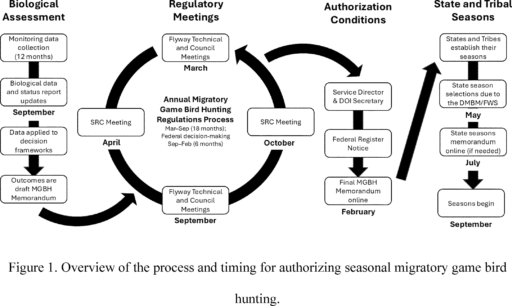
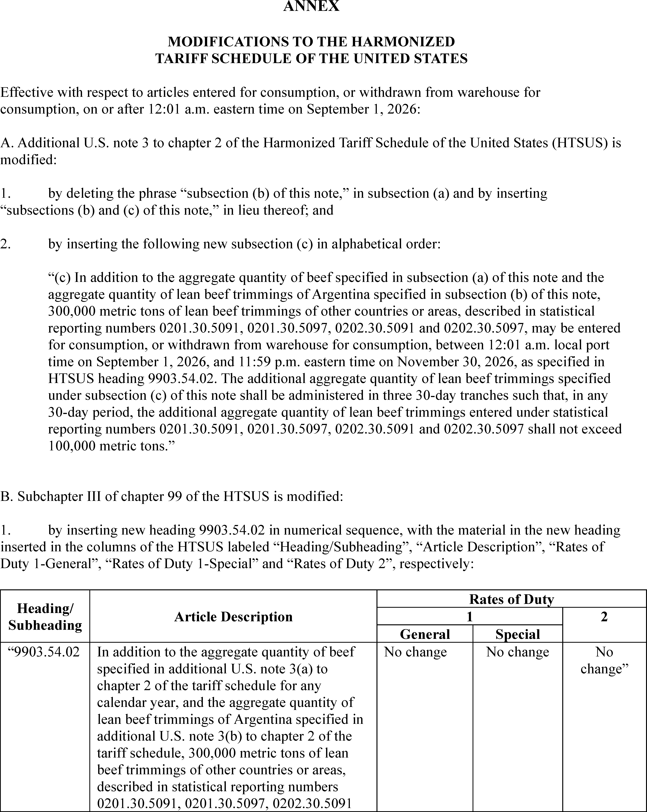
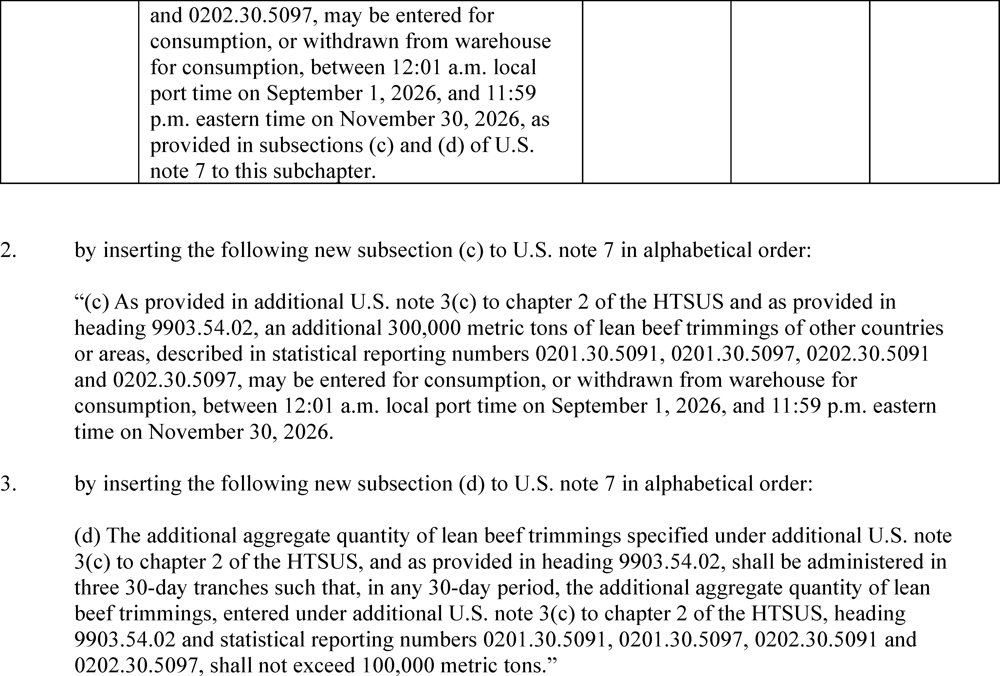

# Daily Digest — 2026-08-31

| | |
|---|---|
| **Digest date** | 2026-08-31 |
| **Data date range** | 2026-08-31 to 2026-08-31 |
| **Generated at** | 2026-09-01T04:05:36Z (UTC) |
| **Pipeline version** | 14c8ac3 |
| **Inference** | model layers ran — cli/haiku, opus |
| **Source watermarks** | CREC: 2026-08-28T11:00:54Z · BILLS: 2026-08-29T02:09:58Z · FR: 2026-08-31T22:20:11Z · USCOURTS: 2026-09-01T01:41:07Z · PLAW: 2026-08-25T15:38:01Z |

[Full observed listing for this day](day/2026-08-31.html) — every item our collectors observed for this publication day, mechanical rules applied, frozen at end of day. This digest is the canonical record.

All items below cite the govinfo package (and granule, where applicable) they
summarize. Selection is mechanical; each item states the rule that included
it. See the Coverage Statement at the end for a full accounting of what was
published, what was summarized, and what was excluded and why.

---

## Contents

- [Day in Review](#day-in-review)
- [1. Congressional Floor Activity](#1-congressional-floor-activity)
- [2. Legislation](#2-legislation)
- [3. Federal Register](#3-federal-register)
- [4. Enacted Laws](#4-enacted-laws)
- [5. Judicial Activity](#5-judicial-activity)
- [6. Agency Announcements](#6-agency-announcements)
- [7. Recorded Votes](#7-recorded-votes)
- [8. Bill Actions](#8-bill-actions)
- [9. Presidential Actions](#9-presidential-actions)
- [Terms Used Today](#terms-used-today)
- [Coverage Statement](#coverage-statement)
- [Methodology](#methodology)

---

## Day in Review

The Federal Register documents observed today include three presidential documents. Proclamation 11058 designates August 26, 2026 as a day marking the fifth anniversary of the 2021 attack at Abbey Gate in Kabul, Afghanistan, naming the 13 service members killed and citing 45 wounded. Proclamation 11059 raises the 2026 tariff-rate quota for lean beef trimmings by 300,000 metric tons across three 30-day tranches from September through November, and directs Agriculture and the U.S. Trade Representative to monitor supply and pricing. Executive Order 14421 declares a national emergency over foreign supply of bulk-power system electric equipment and bars covered transactions the Secretary of Energy finds pose undue risk.

The digest carries 20 final rules and 4 proposed rules. Eleven of the final rules come from the Federal Railroad Administration, covering end-of-car cushioning units, locomotive horn patterns at grade crossings and passenger stations, brake inspection standards, wheel set diameter variations, freight cars over 50 years old, workplace safety requirements, retired forms, and accident reporting. Others rescind Labor's farmworker enforcement-coordination regulations, revise First Step Act time credits, address NHTSA fuel economy authority, and amend asylum referral procedures. The Federal Communications Commission accounts for three of the proposed rules. The digest also carries 94 Federal Register notices and 166 agency press releases.

*Composed from the summarized items below and the day's mechanical
counts; all specifics are cited in their sections.*

---

## 1. Congressional Floor Activity

No Congressional Record issue was observed on this day. The Record for a day's proceedings is typically published by govinfo the following morning; it appears in the digest for the day it is observed ([how our clocks work](faq.html#fapds-three-clocks)).

### 1.1 Senate

No Senate floor items met the selection thresholds. 0 floor granule(s) are accounted for in the Coverage Statement.

### 1.2 House of Representatives

No House floor items met the selection thresholds. 0 floor granule(s) are accounted for in the Coverage Statement.

### 1.3 Recorded Votes

No recorded votes were published in this issue of the Congressional Record.

---

## 2. Legislation

Source: Congressional Bills (BILLS), text versions published 2026-08-31 to 2026-08-31.

### 2.1 Counts by Stage

| Stage (bill text version) | Count |
|---|---|
| Introduced (ih/is) | 0 |
| Reported (rh/rs) | 0 |
| Engrossed (eh/es) | 0 |
| Enrolled (enr) | 0 |
| Other versions | 0 |
| **Total bill texts published** | **0** |

### 2.2 Bills Listed by Mechanical Rule

Bills below are listed because they matched at least one listing rule; the
matching rule is stated per item. All other bill texts are counted above and
accounted for in the Coverage Statement.

No bill texts published in this range matched a listing rule; all 0 are
accounted for in the Coverage Statement.

---

## 3. Federal Register

Source: Federal Register (FR), issue of 2026-08-31.

### 3.1 Counts by Document Type

| Document type | Count |
|---|---|
| Rules | 20 |
| Proposed rules | 4 |
| Notices | 94 |
| Presidential documents | 3 |
| **Total FR documents** | **121** |

### 3.2 Rules Published

Tags: department of the interior · department of transportation · executive · model keys: agency procedures · federal regulations · rulemaking

*In plain terms: 20 final rules include honey assessment rate increase, 10 FRA rail safety amendments, labor coordination rescission, and asylum referral procedures.*

#### DEPARTMENT OF AGRICULTURE

- **Honey Packers and Importers; Increased Assessment Rate** (2026-17715; 7 CFR Part 1212) — This final rule implements a recommendation from the National Honey Board to increase the assessment rate for first handlers and importers from 1.5 cents ($0.015) per pound of assessable honey and honey products to 2 cents ($0.02) per pound of assessable honey and honey products over two fiscal periods. The assessment rate will remain in effect indefinitely until modified or terminated. Action: Final rule. Dates: This final rule is effective September 1, 2026, when the assessment rate will be $0.0175. On and after January 1, 2027, the assessment rate will be $0.02.
  - *In plain terms:* Honey handlers and importers will pay 2 cents per pound in assessment fees instead of 1.5 cents, beginning over two fiscal periods and continuing indefinitely.
  - Included because: FR-SEL-01 — document type: final rule (all listed)
  - Source: [FR-2026-08-31 / 2026-17715](https://www.govinfo.gov/app/details/FR-2026-08-31/2026-17715)

#### DEPARTMENT OF HOMELAND SECURITY

- **Affirmative Asylum Referrals Without Interview** (C3-2026-15190; 8 CFR Part 208) — This correction amends 8 CFR Part 208 to allow U.S. Citizenship and Immigration Services asylum officers to refer affirmative asylum applications to the Executive Office for Immigration Review without conducting an interview, based on the administrative record and other evidence, and removes the requirement to assess applicant credibility in referral letters. The change is intended to reduce processing backlogs and wait times while shifting case development responsibilities to the immigration court system.
  - *In plain terms:* An amendment allows asylum officers to refer applications to immigration courts without conducting interviews, based on existing case materials, and removes the requirement to assess applicant credibility, intended to reduce processing backlogs and wait times.
  - Included because: FR-SEL-01 — document type: final rule (all listed)
  - Source: [FR-2026-08-31 / C3-2026-15190](https://www.govinfo.gov/app/details/FR-2026-08-31/C3-2026-15190)

#### DEPARTMENT OF JUSTICE

- **First Step Act Time Credits—Revisions** (2026-17752; 28 CFR Part 523) — The Bureau of Prisons (BOP) amends its First Step Act (FSA) Time Credits regulation to accord with the best reading of the FSA and to conform with recent case law trends. The first change clarifies when an inmate can begin to earn time credits, and the second change clarifies time credits eligibility for inmates serving a term of imprisonment imposed in a foreign country. Action: Interim final rule; request for comments. Dates: Effective date: This rule is effective September 30, 2026. Comments: Written comments must be postmarked and electronic comments must be submitted on or before September 30, 2026.
  - *In plain terms:* The Bureau of Prisons clarifies when inmates become eligible to earn sentence-reduction time credits and extends eligibility to inmates sentenced in foreign countries.
  - Included because: FR-SEL-01 — document type: final rule (all listed)
  - Source: [FR-2026-08-31 / 2026-17752](https://www.govinfo.gov/app/details/FR-2026-08-31/2026-17752)

#### DEPARTMENT OF LABOR

- **Rescission of Coordinated Enforcement Regulations** (2026-17726; 29 CFR Part 42) — The Department of Labor (Department) is rescinding the regulations that established formal procedures for coordination of enforcement activities among the Wage and Hour Division (WHD), Occupational Safety and Health Administration (OSHA), and Employment and Training Administration (ETA) with respect to migrant and seasonal farmworkers. The Department is rescinding these regulations because they are obsolete, no longer reflect the Department's organizational structure or operational practices, and are not needed for effective coordination among the relevant component agencies. This action will remove unnecessary regulatory burden and align the Department's enforcement strategy with modern, effective, and flexible coordination models already in use. Action: Final rule. Dates: This final rule is effective September 30, 2026.
  - *In plain terms:* The Labor Department eliminates outdated regulations requiring formal coordination of enforcement activities for migrant and seasonal farmworkers.
  - Included because: FR-SEL-01 — document type: final rule (all listed)
  - Source: [FR-2026-08-31 / 2026-17726](https://www.govinfo.gov/app/details/FR-2026-08-31/2026-17726)
- **Modifications to the Regulations Implementing the Vietnam Era Veterans' Readjustment Assistance Act of 1974, as Amended; Correction** (2026-17757; 41 CFR Part 60-300) — The U.S. Department of Labor published a final rule in the Federal Register on August 21, 2026, revising its implementing regulations for the Vietnam Era Veterans' Readjustment Assistance Act of 1974, as amended (VEVRAA). This document corrects amendatory instructions included in the final rule. Action: Final rule; correction. Dates: These corrections are effective September 21, 2026.
  - *In plain terms:* The Labor Department corrects amendatory instructions in its August 21, 2026 final rule revising the Vietnam Era Veterans' Readjustment Assistance Act regulations.
  - Included because: FR-SEL-01 — document type: final rule (all listed)
  - Source: [FR-2026-08-31 / 2026-17757](https://www.govinfo.gov/app/details/FR-2026-08-31/2026-17757)

#### DEPARTMENT OF THE INTERIOR

- **Process for Authorizing Seasonal Migratory Game Bird Hunting** (2026-17733; 50 CFR Part 20) — The U.S. Fish and Wildlife Service (Service or we) is changing the administrative process for authorizing seasonal migratory game bird hunting in the United States. Migratory game bird hunting regulations are currently promulgated annually to provide opportunities for recreation and sustenance; aid Federal, State, and Tribal governments in the management of migratory game birds; and allow harvests at levels compatible with migratory game bird population status and habitat conditions. The Service is adopting a more efficient administrative process for authorizing seasonal migratory game bird hunting. The Service will issue a memorandum to establish the limits and authorize seasonal migratory game bird hunting once every 3 years. The Service will continue to make annual decisions on harvest levels and will update the memorandum sooner than 3 years if changes are prescribed by our decision frameworks. The process eliminates the need for subsequent annual Federal regulation promulgation and rulemaking and is expected to increase efficiency; better meet State, Tribal, and Federal rulemaking constraints; and reduce the complexity and costs. [official summary truncated; see source] Action: Final rule. Dates: This rule takes effect on August 31, 2026.
  - *In plain terms:* The Fish and Wildlife Service will authorize migratory game bird hunting via a memorandum issued once every three years instead of annual Federal regulations, with annual harvest adjustments as needed.
  - Included because: FR-SEL-01 — document type: final rule (all listed)
  - Source: [FR-2026-08-31 / 2026-17733](https://www.govinfo.gov/app/details/FR-2026-08-31/2026-17733)
  -  *Source graphic 1 of 1 from 2026-17733.*

#### DEPARTMENT OF TRANSPORTATION

- **Airspace Designations; Incorporation by Reference** (2026-17689; 14 CFR Part 71) — This action amends 14 CFR part 71 relating to airspace designations to reflect the approval by the Director of the Federal Register of the incorporation by reference of FAA Order JO 7400.11M, Airspace Designations and Reporting Points. This action also explains the procedures the FAA will use to amend the listings of Class A, B, C, D, and E airspace areas; air traffic service routes; and reporting points incorporated by reference. Action: Final rule. Dates: This final rule is effective September 15, 2026, through September 15, 2027. The incorporation by reference of FAA Order JO 7400.11M is approved by the Director of the Federal Register as of September 15, 2026, through September 15, 2027.
  - *In plain terms:* The FAA updates airspace designation rules to officially incorporate updated procedures for Class A through E airspace and reporting points.
  - Included because: FR-SEL-01 — document type: final rule (all listed)
  - Source: [FR-2026-08-31 / 2026-17689](https://www.govinfo.gov/app/details/FR-2026-08-31/2026-17689)
- **Temporary Exemption From Motor Vehicle Safety and Bumper Standards; Extension of Comment Period** (2026-17742; 49 CFR Part 555) — In response to a request from the Alliance for Automotive Innovation (Auto Innovators), NHTSA is announcing a 30-day extension of the public comment period for the interim final rule (IFR) published on July 31, 2026 amending NHTSA's general exemption regulations to remove language limiting the application of temporary exemptions from the Federal Motor Vehicle Safety Standards (FMVSS) and the bumper standard to motor vehicles manufactured on and after the effective date of an exemption, and to align the regulations with the Administrator's statutory discretion to determine the vehicle population covered by a temporary exemption. The notice also removed the requirement that applications for exemption be submitted in three copies and specified an electronic means for submission. The comment period for the notice was originally scheduled to end on August 31, 2026. It will now end on September 30, 2026. Action: Interim final rule; extension of comment period. Dates: The comment period for the IFR published on July 31, 2026 at 91 FR 48307, is extended. Comments should be received on or before September 30, 2026.
  - *In plain terms:* The public comment period for a temporary motor vehicle safety exemption rule is extended from August 31 to September 30, 2026.
  - Included because: FR-SEL-01 — document type: final rule (all listed)
  - Source: [FR-2026-08-31 / 2026-17742](https://www.govinfo.gov/app/details/FR-2026-08-31/2026-17742)
- **Resetting NHTSA's Fuel Economy Program: Commercial Medium- and Heavy-Duty On-Highway Vehicles and Work Trucks** (2026-17756; 49 CFR Parts 523, 534, and 535) — The National Highway Traffic Safety Administration is issuing this interpretive rule regarding the scope of its authority to set fuel economy standards for commercial medium- and heavy-duty on-highway vehicles and work trucks. This rule describes NHTSA's authority to set vehicle standards, which does not include the authority to set separate standards for engines. NHTSA will review its existing standards applicable to commercial medium- and heavy-duty on-highway vehicles and work trucks for consistency with this interpretation in a separate rulemaking. Pending the rulemaking process, NHTSA will exercise its enforcement authority with regard to affected standards in accordance with the interpretation set forth in this rule. Action: Interpretive rule. Dates: This interpretive rule is applicable as of August 31, 2026.
  - *In plain terms:* NHTSA clarifies that its fuel economy authority covers vehicles but not engines for commercial medium- and heavy-duty trucks, pending a separate rulemaking review.
  - Included because: FR-SEL-01 — document type: final rule (all listed)
  - Source: [FR-2026-08-31 / 2026-17756](https://www.govinfo.gov/app/details/FR-2026-08-31/2026-17756)
- **Regulatory Relief for End of Car Cushioning Units** (2026-17782; 49 CFR Part 215) — This rule amends freight car draft arrangement and end-of-car cushioning unit (EOCC) regulations to make permanent relief currently provided by waiver. The amendments will allow a freight car to remain in service if the EOCC is operative and equipped with a unit condition indicator (UCI) that indicates a non-discharged EOCC. This change will permit such EOCCs to remain in service despite the presence of clearly formed oil droplets on the unit. The amendments preserve the requirement to repair or replace an EOCC with clearly formed oil droplets if the unit does not have a UCI. Action: Final rule. Dates: This rule is effective September 30, 2026.
  - *In plain terms:* Freight cars may remain in service with end cushioning units showing oil droplets if equipped with a condition indicator showing the unit is not discharged.
  - Included because: FR-SEL-01 — document type: final rule (all listed)
  - Source: [FR-2026-08-31 / 2026-17782](https://www.govinfo.gov/app/details/FR-2026-08-31/2026-17782)
- **Regulatory Relief From Locomotive Horn Sounding Pattern at Public Highway-Rail Grade Crossings** (2026-17783; 49 CFR Part 222) — This final rule amends safety standards related to use of the locomotive horn to provide regulatory relief from the required pattern of sounding the locomotive horn in two long blasts, one short blast, and one long blast for locomotive engineers operating trains, locomotive consists, or individual locomotives that have stopped in close proximity to a public highway-rail grade crossing. This final rule allows locomotive engineers to vary the locomotive horn sounding pattern to one single blast of the horn as they enter the nearby public highway-rail grade crossing. Action: Final rule. Dates: This rule is effective September 30, 2026.
  - *In plain terms:* Locomotive engineers may use a single horn blast instead of the required two-long-one-short-one-long pattern when stopped near highway-rail grade crossings.
  - Included because: FR-SEL-01 — document type: final rule (all listed)
  - Source: [FR-2026-08-31 / 2026-17783](https://www.govinfo.gov/app/details/FR-2026-08-31/2026-17783)
- **Amendments to Brake System Maintenance and Inspection Requirements** (2026-17784; 49 CFR Parts 229, 232, and 238) — This rule amends mechanical equipment safety standards related to brake inspections for passenger and freight rail equipment and incorporates longstanding waivers for locomotive brake system maintenance and inspection requirements. The amendments are consistent with the mandates of the Infrastructure Investment and Jobs Act (IIJA), which require FRA to review and analyze certain longstanding waivers to determine whether incorporating the waivers into FRA's regulations is justified, and Executive Order 14219, Ensuring Lawful Governance and Implementing the President's “Department of Government Efficiency” Deregulatory Initiative. Action: Final rule. Dates: This rule is effective September 30, 2026.
  - *In plain terms:* The railroad safety agency makes permanent its existing waivers for locomotive brake maintenance and inspection requirements.
  - Included because: FR-SEL-01 — document type: final rule (all listed)
  - Source: [FR-2026-08-31 / 2026-17784](https://www.govinfo.gov/app/details/FR-2026-08-31/2026-17784)
- **Enhancing Railroad Discretion in Sounding Locomotive Horns at Passenger Stations** (2026-17786; 49 CFR Part 222) — This final rule amends safety standards related to the use of the locomotive horn to clarify that no Federal regulation requires a railroad to sound a locomotive horn because of the presence of a passenger station. The final rule clarifies that a railroad has discretion to determine policies for sounding a locomotive horn at a passenger station through railroad operating rules. The final rule also provides that if a railroad decides to sound a locomotive horn at a passenger station, the minimum sound level requirements in FRA's Railroad Locomotive Safety Standards do not apply to the sound produced by the horn. Action: Final rule. Dates: This rule is effective September 30, 2026.
  - *In plain terms:* Federal regulations do not require railroads to sound locomotive horns at passenger stations; railroads may set their own policies through operating rules.
  - Included because: FR-SEL-01 — document type: final rule (all listed)
  - Source: [FR-2026-08-31 / 2026-17786](https://www.govinfo.gov/app/details/FR-2026-08-31/2026-17786)
- **Repealing Special Approval Requirement for Freight Cars More Than 50 Years Old** (2026-17787; 49 CFR Part 215) — This rule amends FRA's freight car safety regulations to repeal the requirement for special approval to place or to continue a freight car in service if it is more than 50 years old or equipped with any design or type component listed in appendix A to part 215. This final rule allows railroads to continue or to place such cars in service with notice to FRA, providing certain information that has previously been required in petitions for special approval. Action: Final rule. Dates: This rule is effective September 30, 2026.
  - *In plain terms:* Railroads no longer need special approval to use freight cars over 50 years old; notice to FRA with required information is sufficient.
  - Included because: FR-SEL-01 — document type: final rule (all listed)
  - Source: [FR-2026-08-31 / 2026-17787](https://www.govinfo.gov/app/details/FR-2026-08-31/2026-17787)
- **Expanding Certain Locomotive Wheel Set Diameter Variations** (2026-17788; 49 CFR Part 229) — This rule amends FRA's locomotive safety regulations to expand the maximum permitted variation in diameter for locomotive wheel sets using alternating current technology, in response to a Class I railroad's May 2019 petition for rulemaking and innovations in traction motor control. Action: Final rule. Dates: This rule is effective September 30, 2026.
  - *In plain terms:* The railroad safety agency expands the permitted diameter variation for locomotive wheel sets using advanced traction motor control technology.
  - Included because: FR-SEL-01 — document type: final rule (all listed)
  - Source: [FR-2026-08-31 / 2026-17788](https://www.govinfo.gov/app/details/FR-2026-08-31/2026-17788)
- **Repealing Outdated Railroad Workplace Safety Requirements and Making Other Improvements** (2026-17789; 49 CFR Part 214) — This rule repeals several roadway workplace safety requirements that have become obsolete. In addition, FRA establishes a new special approval procedure to enable regulated entities, after public notice and FRA approval, to utilize an alternative approach to bridge worker safety that provides for an equivalent or better level of safety. Also, this rule clarifies that the required training for operators of roadway maintenance machines equipped with a crane includes specific aspects such as maintaining vertical clearance. Action: Final rule. Dates: This rule is effective September 30, 2026.
  - *In plain terms:* FRA eliminates obsolete railroad workplace safety rules and creates a process for railroads to use alternative bridge worker safety approaches if equally protective.
  - Included because: FR-SEL-01 — document type: final rule (all listed)
  - Source: [FR-2026-08-31 / 2026-17789](https://www.govinfo.gov/app/details/FR-2026-08-31/2026-17789)
- **Retiring Form FRA F 6180.107 and Form FRA F 6180.150** (2026-17790; 49 CFR Part 225) — This rule retires Form FRA F 6180.107, “Alternative Record for Illnesses Claimed to be Work-Related” (Form 6180.107), and Form FRA F 6180.150, “Highway User Injury Inquiry Form” (Form 6180.150). This rule also changes the record retention period required under FRA's accident reporting regulations and makes other technical corrections. Action: Final rule. Dates: This rule is effective September 30, 2026.
  - *In plain terms:* The railroad safety agency stops using two administrative forms, adjusts how long accident records must be kept, and makes technical corrections.
  - Included because: FR-SEL-01 — document type: final rule (all listed)
  - Source: [FR-2026-08-31 / 2026-17790](https://www.govinfo.gov/app/details/FR-2026-08-31/2026-17790)
- **Miscellaneous Amendments to FRA's Accident Reporting Regulations** (2026-17791; 49 CFR Part 225) — This rule makes miscellaneous amendments to FRA's accident reporting regulations. Specifically, these amendments promote submitting documents to FRA electronically, eliminate redundant regulations, and allow railroads with additional time to complete certain forms. Action: Final rule. Dates: This rule is effective September 30, 2026.
  - *In plain terms:* FRA modernizes accident reporting requirements by promoting electronic submission, removing redundant rules, and allowing extra time to complete certain forms.
  - Included because: FR-SEL-01 — document type: final rule (all listed)
  - Source: [FR-2026-08-31 / 2026-17791](https://www.govinfo.gov/app/details/FR-2026-08-31/2026-17791)
- **Permitting Use of Computer-Based, Three-Dimensional Simulation for Periodic Refresher Training on Brake Systems** (2026-17792; 49 CFR Part 232) — This rule permits railroads to use a simulation that is instructor-led, computer-based, and three-dimensional (3D) to satisfy the hands-on portion of periodic refresher training under FRA's brake system training requirements, consistent with waivers FRA has granted to date. This computer-based 3D simulation training can provide employees with randomized scenarios that may not be readily available for hands-on training and facilitate real-time feedback on performance of duties. Action: Final rule. Dates: This rule is effective September 30, 2026.
  - *In plain terms:* Railroads may use instructor-led three-dimensional computer simulation to fulfill the hands-on portion of brake system training requirements.
  - Included because: FR-SEL-01 — document type: final rule (all listed)
  - Source: [FR-2026-08-31 / 2026-17792](https://www.govinfo.gov/app/details/FR-2026-08-31/2026-17792)

#### SMALL BUSINESS ADMINISTRATION

- **Rescinding Unnecessary Notice and Comment Procedures** (2026-17731; 13 CFR Part 101) — This final rule rescinds the Administration's policy of engaging in notice and comment rulemaking even where the Administrative Procedure Act does not require notice and comment rulemaking. As a result of this final rule, the Administration will follow the default requirements of the Administrative Procedure Act. The Administration will reserve the right to engage in voluntary notice and comment rulemaking even where not required by the Administrative Procedure Act as a matter of policy on a case by case basis. Action: Final rule. Dates: The final rule is effective August 31, 2026.
  - *In plain terms:* The Administration will follow only the Administrative Procedure Act's required notice-and-comment procedures, though it reserves the right to exceed them case-by-case.
  - Included because: FR-SEL-01 — document type: final rule (all listed)
  - Source: [FR-2026-08-31 / 2026-17731](https://www.govinfo.gov/app/details/FR-2026-08-31/2026-17731)

### 3.3 Proposed Rules Published

Tags: department of the interior · department of transportation · executive · model keys: proposed rules · tax policy · telecommunications

*In plain terms: 4 proposed rules tackle USF administration efficiency, rural telehealth expansion, tax credit allocation, and 24 outdated FCC petitions from 2003–2023.*

#### DEPARTMENT OF THE TREASURY

- **Section 898(c) Transition Rule for Allocating Foreign Taxes and Section 960(d)(4) Foreign Tax Credit Disallowance; Correction** (2026-17764; 26 CFR Part 1) — This document contains corrections to the proposed regulations (REG-115145-25), published in the Federal Register on August 3, 2026. These proposed regulations relate to allocating foreign taxes of foreign corporations affected by the repeal of the one-month deferral election and to the disallowance of foreign tax credits on certain distributions of previously taxed earnings and profits. Action: Notice of proposed rulemaking; correction. Dates: Written or electronic comments and requests for a public hearing must be received by September 17, 2026.
  - *In plain terms:* The Treasury corrects proposed regulations on how foreign corporations allocate foreign taxes and claim foreign tax credits after the one-month deferral election's repeal.
  - Included because: FR-SEL-02 — document type: proposed rule (all listed)
  - Source: [FR-2026-08-31 / 2026-17764](https://www.govinfo.gov/app/details/FR-2026-08-31/2026-17764)

#### FEDERAL COMMUNICATIONS COMMISSION

- **Maximizing Efficiencies in Universal Service Administration** (2026-17761; 47 CFR Part 54) — In this document, the Federal Communications Commission (Commission) seeks to improve the administration of the Universal Service Fund (USF or Fund) by seeking comment on four areas related to USF administration: current USF administration processes, i.e., the processes used by Universal Service Administrative Company (USAC) to administer the USF and the Commission's oversight of those processes; the structure of USF administration, that is, USAC's role and responsibilities related to USF administration; operating costs associated with USF administration; and the impact of USAC's Board of Directors on USF administration. Action: Proposed rule. Dates: Comments are due on or before September 30, 2026 and reply comments are due on or before October 30, 2026. If you anticipate that you will be submitting comments but find it difficult to do so within the period of time allowed by this document, you should advise the contact listed below as soon as possible.
  - *In plain terms:* The FCC seeks comment on how the Universal Service Fund is administered, including processes, USAC's role, operating costs, and the board's impact.
  - Included because: FR-SEL-02 — document type: proposed rule (all listed)
  - Source: [FR-2026-08-31 / 2026-17761](https://www.govinfo.gov/app/details/FR-2026-08-31/2026-17761)
- **Promoting Telehealth in Rural America** (2026-17767; 47 CFR Part 54) — In this document, the Federal Communications Commission (Commission) seeks comments on the scope of the similar service and rural area comparability requirements, comments on possible improvements to, or replacements of, our existing cost study method of determining rural telecommunications rates, comments on possible methods of promoting the use of lower-cost technologies intended to provide backup services, comments on a proposal to establish an eligible services list for the Rural Health Care (RHC) Program, comments on whether to adopt performance metrics to expedite the processing of RHC Program funding requests, and comments on whether to eliminate the approval requirement of evergreen contracts and an annual report requirement. Action: Proposed rule. Dates: Comments are due on or before September 30, 2026 and reply comments are due on or before October 30, 2026. If you anticipate that you will be submitting comments but find it difficult to do so within the period of time allowed by this document, you should advise the contact listed below as soon as possible.
  - *In plain terms:* The FCC seeks comment on rural health care telecommunications including service scope, cost studies, backup technology, eligible services, funding timelines, and contract approvals.
  - Included because: FR-SEL-02 — document type: proposed rule (all listed)
  - Source: [FR-2026-08-31 / 2026-17767](https://www.govinfo.gov/app/details/FR-2026-08-31/2026-17767)
- **Consumer and Governmental Affairs Bureau Seeks To Dismiss Twenty-Four Mooted or Outdated Petitions** (2026-17774; 47 CFR Part 64) — In this document, the Federal Communications Commission (Commission) seeks to assess the continuing interest in certain petitions that were filed between 2003 and 2023. The Commission plans to dismiss the petitions with prejudice unless a petitioner or other interested party files a letter in the relevant docket specifying that it objects to the dismissal of the petition and the reason for such objection. Action: Notification. Dates: Petitioners may file a letter in CG Docket Nos. 02-278, 05-338, or 17-59 on or before October 15, 2026.
  - *In plain terms:* The FCC plans to dismiss 24 petitions filed between 2003 and 2023 unless petitioners object by a specified deadline.
  - Included because: FR-SEL-02 — document type: proposed rule (all listed)
  - Source: [FR-2026-08-31 / 2026-17774](https://www.govinfo.gov/app/details/FR-2026-08-31/2026-17774)

### 3.4 Notices and Presidential Documents

Tags: department of the interior · department of transportation · executive · model keys: executive orders · national emergency · tariffs

*In plain terms: 3 presidential actions commemorate Abbey Gate attack anniversary, increase beef tariff quota 300,000 metric tons, and declare emergency on foreign bulk-power equipment.*

Notices are summarized only when they match a listing rule; all are counted
in 3.1 and in the Coverage Statement. Presidential documents in the FR are
always listed.

- **Fifth Anniversary of the Attack at Abbey Gate** (2026-17841) — Proclamation 11058 declares August 26, 2026 as a day commemorating the fifth anniversary of the August 26, 2021 attack at Abbey Gate in Kabul, Afghanistan, in which 13 U.S. service members were killed and 45 wounded. The proclamation identifies by name the deceased service members and calls for Americans to remember their sacrifice and support Gold Star Families.
  - *In plain terms:* A presidential proclamation commemorates the fifth anniversary of the August 26, 2021 attack at Abbey Gate in Kabul that killed 13 U.S. service members.
  - Included because: FR-SEL-03 — presidential document (all listed)
  - Source: [FR-2026-08-31 / 2026-17841](https://www.govinfo.gov/app/details/FR-2026-08-31/2026-17841)
- **Further Ensuring Affordable Beef for the American Consumer** (2026-17842) — Proclamation 11059 increases the tariff-rate quota for lean beef trimmings for calendar year 2026 by 300,000 metric tons, administered in three 30-day tranches between September and November 2026 on a first-come, first-served basis. The proclamation also directs the Secretary of Agriculture and U.S. Trade Representative to monitor the supply and pricing of imported beef trimmings and report on whether products are being sold at 25 percent below market price, with authority to terminate the increase if pricing conditions are not met.
  - *In plain terms:* A presidential proclamation increases the 2026 beef trimmings import quota by 300,000 metric tons in three periods, with monitoring for below-market pricing.
  - Included because: FR-SEL-03 — presidential document (all listed)
  - Source: [FR-2026-08-31 / 2026-17842](https://www.govinfo.gov/app/details/FR-2026-08-31/2026-17842)
  -  *Source graphic 1 of 2 from 2026-17842.*
  -  *Source graphic 2 of 2 from 2026-17842.*
- **Declaring a National Emergency To Secure the United States Bulk-Power System** (2026-17843) — Executive Order 14421 declares a national emergency regarding foreign supply of bulk-power system electric equipment and prohibits acquisitions, imports, transfers, or installations of foreign-produced bulk-power system equipment involving Covered Foreign Entities where the Secretary of Energy determines the transaction poses undue risk to the power system's security, resilience, or national security. The order directs the Secretary to implement prohibitions through regulations within 120 days and to identify risky equipment already in operation, with authority to impose conditions on existing equipment including monitoring, isolation, disconnection, or replacement.
  - *In plain terms:* An executive order declares a national emergency and prohibits buying or installing foreign bulk-power equipment from certain entities the Secretary of Energy deems risky, with regulations due within 120 days and authority over existing equipment.
  - Included because: FR-SEL-03 — presidential document (all listed)
  - Source: [FR-2026-08-31 / 2026-17843](https://www.govinfo.gov/app/details/FR-2026-08-31/2026-17843)

---

## 4. Enacted Laws

Source: Public and Private Laws (PLAW) published 2026-08-31.

No laws were published in this range.

---

## 5. Judicial Activity

Source: United States Courts Opinions (USCOURTS): opinions observed 2026-08-31
by our collector; each opinion states its own issue date beside its
listing ([how our clocks work](faq.html#fapds-three-clocks)).

Completeness disclosure (standing): USCOURTS carries opinions from
approximately 140 participating appellate, district, bankruptcy, and
national federal courts. Unlike the Congressional Record and the Federal
Register, which are the complete official record of their branches,
USCOURTS is participation-based and is NOT the complete federal judicial
record. Courts post opinions with delay — typically over several days —
so a day's digest carries the opinions that became available that day,
whatever date each was issued.

### 5.1 Appellate and National Court Opinions

Appellate and national court opinions are summarized; district and
bankruptcy opinions are counted in 5.2 and in the Coverage Statement.

No appellate or national court opinions matched a listing rule for this
date; all opinions are counted in 5.2 and accounted for in the Coverage
Statement.

### 5.2 Counts by Court Category

| Court category | Opinions |
|---|---|
| Appellate | 0 |
| District | 132 |
| Bankruptcy | 0 |
| National | 0 |
| **Total opinions extracted** | **132** |

Archive-window disclosure (rule USCOURTS-FETCH-01): 32205 USCOURTS package(s) have been listed in delta syncs but fell outside the 7-day archive window and were not fetched (global running count across all syncs, not limited to this date).

---

## 6. Agency Announcements

Official press releases and statements the agencies themselves date
on 2026-08-31 (sources listed in the source guide). These are the
agencies' own announcements — official advocacy, quoted and
attributed, not findings of this digest. Agency web content can be
edited or removed without notice; captures and hashes are preserved
per the provenance policy.

#### CFTC Press Releases

- **[CFTC Further Extends Compliance Date for Amendments to Form PF](https://www.cftc.gov/PressRoom/PressReleases/9290-26)** — dated 2026-08-31 by the agency
  - Included because: AGENCYPR-SEL-01 — official agency release dated this day by the agency (all such releases from active sources are listed; titles only in the pilot)

#### CISA Cybersecurity Advisories

- **[CISA Adds Two Known Exploited Vulnerabilities to Catalog](https://www.cisa.gov/news-events/alerts/2026/08/31/cisa-adds-two-known-exploited-vulnerabilities-catalog)** — dated 2026-08-31 by the agency
  - Included because: AGENCYPR-SEL-01 — official agency release dated this day by the agency (all such releases from active sources are listed; titles only in the pilot)
  - Source: agency newsroom (above) · [independent archive](https://web.archive.org/web/20260831145818/https://www.cisa.gov/news-events/alerts/2026/08/31/cisa-adds-two-known-exploited-vulnerabilities-catalog)

#### DEA Updates (email)

- **Workshop: Social Media Safety and Substance Use Prevention** — dated 2026-08-31 by the agency
  - Included because: AGENCYPR-SEL-01 — official agency release dated this day by the agency (all such releases from active sources are listed; titles only in the pilot)
  - Source: agency email bulletin to this project's subscription, captured and DKIM-verified (the bulletin named no canonical page)

#### Defense News Releases

- **[Michigan National Guard Trains Mission-Ready Pilots Over Lake Huron](https://www.war.gov/News/News-Stories/Article/Article/4586595/michigan-national-guard-trains-mission-ready-pilots-over-lake-huron/)** — dated 2026-08-31 by the agency
  - Included because: AGENCYPR-SEL-01 — official agency release dated this day by the agency (all such releases from active sources are listed; titles only in the pilot)

#### DHS News Releases

- **[U.S. Homeland Security Secretary Mullin, U.S. Transportation Secretary Duffy, White House Fraud Task Force, & Top U.S. Attorneys Launch Historic Interagency Effort to Crack Down on Fraud in Trucking Industry](https://www.dhs.gov/news/2026/08/31/us-homeland-security-secretary-mullin-us-transportation-secretary-duffy-white-house)** — dated 2026-08-31 by the agency
  - Included because: AGENCYPR-SEL-01 — official agency release dated this day by the agency (all such releases from active sources are listed; titles only in the pilot)
- **[WORST OF THE WORST: ICE Arrests Murderers, Pedophiles, Rapists, and Assailants](https://www.dhs.gov/news/2026/08/31/worst-worst-ice-arrests-murderers-pedophiles-rapists-and-assailants)** — dated 2026-08-31 by the agency
  - Included because: AGENCYPR-SEL-01 — official agency release dated this day by the agency (all such releases from active sources are listed; titles only in the pilot)

#### FAA Updates (email)

- **FAA Orders & Notices Update Notification** — dated 2026-08-31 by the agency
  - Included because: AGENCYPR-SEL-01 — official agency release dated this day by the agency (all such releases from active sources are listed; titles only in the pilot)
  - Source: agency email bulletin to this project's subscription, captured and DKIM-verified (the bulletin named no canonical page)
- **FAA Orders & Notices Update Notification** — dated 2026-08-31 by the agency
  - Included because: AGENCYPR-SEL-01 — official agency release dated this day by the agency (all such releases from active sources are listed; titles only in the pilot)
  - Source: agency email bulletin to this project's subscription, captured and DKIM-verified (the bulletin named no canonical page)
- **[NOTICE: Sunsetting AFS-420 Directives & Advisory Circulars website in October.](https://www.faa.gov/about/office_org/headquarters_offices/avs/offices/afx/afs/afs400/afs420/directives_advisory_circulars)** — dated 2026-08-31 by the agency
  - Included because: AGENCYPR-SEL-01 — official agency release dated this day by the agency (all such releases from active sources are listed; titles only in the pilot)
  - Source: agency email bulletin to this project's subscription, captured and DKIM-verified
- **[U.S. Federal Aviation Administration Aeronautical Charting Meeting Update](https://www.faa.gov/air_traffic/flight_info/aeronav/acf/)** — dated 2026-08-31 by the agency
  - Included because: AGENCYPR-SEL-01 — official agency release dated this day by the agency (all such releases from active sources are listed; titles only in the pilot)
  - Source: agency email bulletin to this project's subscription, captured and DKIM-verified
- **U.S. Federal Aviation Administration Airman Testing Update** — dated 2026-08-31 by the agency
  - Included because: AGENCYPR-SEL-01 — official agency release dated this day by the agency (all such releases from active sources are listed; titles only in the pilot)
  - Source: agency email bulletin to this project's subscription, captured and DKIM-verified (the bulletin named no canonical page)

#### FDA Email Updates (email)

- **[Ana Salazar Modela Tu Cuerpo Inc. Issues Nationwide Voluntary Recall of Lipofit Extreme Fat Burner 2.0 Due to Presence of Undeclared Fluoxetine and 2,4-Dinitrophenol (DNP)](https://www.fda.gov/safety/recalls-market-withdrawals-safety-alerts/ana-salazar-modela-tu-cuerpo-inc-issues-nationwide-voluntary-recall-lipofit-extreme-fat-burner-20?utm_medium=email&utm_source=govdelivery)** — dated 2026-08-31 by the agency
  - Included because: AGENCYPR-SEL-01 — official agency release dated this day by the agency (all such releases from active sources are listed; titles only in the pilot)
  - Source: agency email bulletin to this project's subscription, captured and DKIM-verified
- **[Crystal Temptations Issues Allergy Alert on Undeclared Milk in Chocolatey Eyeballs](https://www.fda.gov/safety/recalls-market-withdrawals-safety-alerts/crystal-temptations-issues-allergy-alert-undeclared-milk-chocolatey-eyeballs?utm_medium=email&utm_source=govdelivery)** — dated 2026-08-31 by the agency
  - Included because: AGENCYPR-SEL-01 — official agency release dated this day by the agency (all such releases from active sources are listed; titles only in the pilot)
  - Source: agency email bulletin to this project's subscription, captured and DKIM-verified
- **[Everything Sprouts, LLC Expands Voluntarily Recall to Include Robust Radish Mix Due to Potential E. Coli and Salmonella Risk](https://www.fda.gov/safety/recalls-market-withdrawals-safety-alerts/everything-sprouts-llc-expands-voluntarily-recall-include-robust-radish-mix-due-potential-e-coli-and?utm_medium=email&utm_source=govdelivery)** — dated 2026-08-31 by the agency
  - Included because: AGENCYPR-SEL-01 — official agency release dated this day by the agency (all such releases from active sources are listed; titles only in the pilot)
  - Source: agency email bulletin to this project's subscription, captured and DKIM-verified
- **[LMSI LLC/Kofinas Olive Oil Issues a Voluntary Recall of its Garlic Mediterranean Infused Extra Virgin Olive Oil for Using a Garlic Essential Oil Not Approved for Culinary Use](https://www.fda.gov/safety/recalls-market-withdrawals-safety-alerts/lmsi-llckofinas-olive-oil-issues-voluntary-recall-its-garlic-mediterranean-infused-extra-virgin?utm_medium=email&utm_source=govdelivery)** — dated 2026-08-31 by the agency
  - Included because: AGENCYPR-SEL-01 — official agency release dated this day by the agency (all such releases from active sources are listed; titles only in the pilot)
  - Source: agency email bulletin to this project's subscription, captured and DKIM-verified
- **[Northwest Naturals Voluntarily Recalls Two Raw Pet Food Products Because of Possible Salmonella & Listeria Monocytogenes Health Risk](https://www.fda.gov/safety/recalls-market-withdrawals-safety-alerts/northwest-naturals-voluntarily-recalls-two-raw-pet-food-products-because-possible-salmonella?utm_medium=email&utm_source=govdelivery)** — dated 2026-08-31 by the agency
  - Included because: AGENCYPR-SEL-01 — official agency release dated this day by the agency (all such releases from active sources are listed; titles only in the pilot)
  - Source: agency email bulletin to this project's subscription, captured and DKIM-verified
- **[Panorama Produce Recalls Mangoes Due to Possible Salmonella Contamination](https://www.fda.gov/safety/recalls-market-withdrawals-safety-alerts/panorama-produce-recalls-mangoes-due-possible-salmonella-contamination?utm_medium=email&utm_source=govdelivery)** — dated 2026-08-31 by the agency
  - Included because: AGENCYPR-SEL-01 — official agency release dated this day by the agency (all such releases from active sources are listed; titles only in the pilot)
  - Source: agency email bulletin to this project's subscription, captured and DKIM-verified

#### FEMA Press Releases

- **[FEMA Announces $317 Million for Florida Recovery](https://www.fema.gov/press-release/20260831/fema-announces-317-million-florida-recovery)** — dated 2026-08-31 by the agency
  - Included because: AGENCYPR-SEL-01 — official agency release dated this day by the agency (all such releases from active sources are listed; titles only in the pilot)
- **[FEMA Announces More Than $106 Million for Tennessee Recovery](https://www.fema.gov/press-release/20260831/fema-announces-more-106-million-tennessee-recovery)** — dated 2026-08-31 by the agency
  - Included because: AGENCYPR-SEL-01 — official agency release dated this day by the agency (all such releases from active sources are listed; titles only in the pilot)
- **[FEMA to Evaluate Readiness of the State of Maryland](https://www.fema.gov/press-release/20260831/fema-evaluate-readiness-state-maryland)** — dated 2026-08-31 by the agency
  - Included because: AGENCYPR-SEL-01 — official agency release dated this day by the agency (all such releases from active sources are listed; titles only in the pilot)
- **[Mecosta County Residents Invited to Attend Flood Map Open House](https://www.fema.gov/press-release/20260827/mecosta-county-residents-invited-attend-flood-map-open-house)** — dated 2026-08-31 by the agency
  - Included because: AGENCYPR-SEL-01 — official agency release dated this day by the agency (all such releases from active sources are listed; titles only in the pilot)
- **[One Month Left to Apply for FEMA Assistance after Tropical Storm Arthur](https://www.fema.gov/press-release/20260831/one-month-left-apply-fema-assistance-after-tropical-storm-arthur)** — dated 2026-08-31 by the agency
  - Included because: AGENCYPR-SEL-01 — official agency release dated this day by the agency (all such releases from active sources are listed; titles only in the pilot)
- **[Trump Administration Delivers More Than $100 Million Through FEMA to Help Communities Recover from Disasters and Strengthen Resilience Against Future Disasters in Puerto Rico](https://www.fema.gov/press-release/20260831/trump-administration-delivers-more-100-million-through-fema-help-communities)** — dated 2026-08-31 by the agency
  - Included because: AGENCYPR-SEL-01 — official agency release dated this day by the agency (all such releases from active sources are listed; titles only in the pilot)
- **[Trump Administration Delivers Nearly $117 Million Through FEMA to Help Communities Recover from Recent Disasters and Strengthen Their Resilience in New Jersey and New York](https://www.fema.gov/press-release/20260831/trump-administration-delivers-nearly-117-million-through-fema-help)** — dated 2026-08-31 by the agency
  - Included because: AGENCYPR-SEL-01 — official agency release dated this day by the agency (all such releases from active sources are listed; titles only in the pilot)
- **[Trump Administration Delivers Nearly $28 Million Through FEMA to Help Communities Recover from Recent Disasters and Strengthen Their Resilience Against Future Disasters in the Mid-Atlantic](https://www.fema.gov/press-release/20260831/trump-administration-delivers-nearly-28-million-through-fema-help)** — dated 2026-08-31 by the agency
  - Included because: AGENCYPR-SEL-01 — official agency release dated this day by the agency (all such releases from active sources are listed; titles only in the pilot)

#### FSIS Recalls and Public Health Alerts (email)

- **FSIS Accredited Laboratory Program (ALP) Directory Update** — dated 2026-08-31 by the agency
  - Included because: AGENCYPR-SEL-01 — official agency release dated this day by the agency (all such releases from active sources are listed; titles only in the pilot)
  - Source: agency email bulletin to this project's subscription, captured and DKIM-verified (the bulletin named no canonical page)
- **USDA Food Safety and Inspection Service Eligible Foreign Establishments Update** — dated 2026-08-31 by the agency
  - Included because: AGENCYPR-SEL-01 — official agency release dated this day by the agency (all such releases from active sources are listed; titles only in the pilot)
  - Source: agency email bulletin to this project's subscription, captured and DKIM-verified (the bulletin named no canonical page)
- **USDA-FSIS Recall Cases, Retail List - Update** — dated 2026-08-31 by the agency
  - Included because: AGENCYPR-SEL-01 — official agency release dated this day by the agency (all such releases from active sources are listed; titles only in the pilot)
  - Source: agency email bulletin to this project's subscription, captured and DKIM-verified (the bulletin named no canonical page)

#### FTC Press Releases

- **[FTC, States Sue Amazon Over Secret Ad Surcharge Scheme](https://www.ftc.gov/news-events/news/press-releases/2026/08/ftc-states-sue-amazon-over-secret-ad-surcharge-scheme)** — dated 2026-08-31 by the agency
  - Included because: AGENCYPR-SEL-01 — official agency release dated this day by the agency (all such releases from active sources are listed; titles only in the pilot)
  - Source: agency newsroom (above) · [independent archive](https://web.archive.org/web/20260831190750/https://www.ftc.gov/news-events/news/press-releases/2026/08/ftc-states-sue-amazon-over-secret-ad-surcharge-scheme)

#### GAO Reports & Testimonies

- **[Broadband Deployment: Agencies Should Take Steps to Better Target Underserved Areas and Consider Sustainability](https://www.gao.gov/products/gao-26-107725)** — dated 2026-08-31 by the agency
  - Included because: AGENCYPR-SEL-01 — official agency release dated this day by the agency (all such releases from active sources are listed; titles only in the pilot)
- **[Telecommunications: GSA Should Assess Agencies’ Effectiveness at Preventing Service Disruptions](https://www.gao.gov/products/gao-26-107919)** — dated 2026-08-31 by the agency
  - Included because: AGENCYPR-SEL-01 — official agency release dated this day by the agency (all such releases from active sources are listed; titles only in the pilot)

#### Justice Press Releases

- **[Another out-of-state man heads to federal prison after cross-country narcotics deal](https://www.justice.gov/usao-sdtx/pr/another-out-state-man-heads-federal-prison-after-cross-country-narcotics-deal)** — dated 2026-08-31 by the agency
  - Included because: AGENCYPR-SEL-01 — official agency release dated this day by the agency (all such releases from active sources are listed; titles only in the pilot)
  - Corroborated: the same release (same canonical URL) also arrived via the agency's email bulletin to this project's subscription, DKIM-verified — one document received through two ingestion channels; listed once, both captures preserved.
- **[Area Political Consultant Pleads Guilty to Tax Crimes](https://www.justice.gov/usao-edpa/pr/area-political-consultant-pleads-guilty-tax-crimes)** — dated 2026-08-31 by the agency
  - Included because: AGENCYPR-SEL-01 — official agency release dated this day by the agency (all such releases from active sources are listed; titles only in the pilot)
- **[Aunt and U.S. Airman Nephew Arrested in Immigration Fraud Scheme](https://www.justice.gov/usao-wdmo/pr/aunt-and-us-airman-nephew-arrested-immigration-fraud-scheme)** — dated 2026-08-31 by the agency
  - Included because: AGENCYPR-SEL-01 — official agency release dated this day by the agency (all such releases from active sources are listed; titles only in the pilot)
  - Corroborated: the same release (same canonical URL) also arrived via the agency's email bulletin to this project's subscription, DKIM-verified — one document received through two ingestion channels; listed once, both captures preserved.
- **[Beckley Man Sentenced to Prison for Fentanyl Crime](https://www.justice.gov/usao-sdwv/pr/beckley-man-sentenced-prison-fentanyl-crime-5)** — dated 2026-08-31 by the agency
  - Included because: AGENCYPR-SEL-01 — official agency release dated this day by the agency (all such releases from active sources are listed; titles only in the pilot)
  - Corroborated: the same release (same canonical URL) also arrived via the agency's email bulletin to this project's subscription, DKIM-verified — one document received through two ingestion channels; listed once, both captures preserved.
- **[Bellingham, Washington woman gets ten-month prison term for scheme to kidnap her son](https://www.justice.gov/usao-wdwa/pr/bellingham-washington-woman-gets-ten-month-prison-term-scheme-kidnap-her-son)** — dated 2026-08-31 by the agency
  - Included because: AGENCYPR-SEL-01 — official agency release dated this day by the agency (all such releases from active sources are listed; titles only in the pilot)
  - Corroborated: the same release (same canonical URL) also arrived via the agency's email bulletin to this project's subscription, DKIM-verified — one document received through two ingestion channels; listed once, both captures preserved.
- **[Billings man sentenced to 14 years for trafficking meth with firearm](https://www.justice.gov/usao-mt/pr/billings-man-sentenced-14-years-trafficking-meth-firearm)** — dated 2026-08-31 by the agency
  - Included because: AGENCYPR-SEL-01 — official agency release dated this day by the agency (all such releases from active sources are listed; titles only in the pilot)
  - Corroborated: the same release (same canonical URL) also arrived via the agency's email bulletin to this project's subscription, DKIM-verified — one document received through two ingestion channels; listed once, both captures preserved.
- **[Billings man sentenced to more than 11 years in prison for drug trafficking](https://www.justice.gov/usao-mt/pr/billings-man-sentenced-more-11-years-prison-drug-trafficking)** — dated 2026-08-31 by the agency
  - Included because: AGENCYPR-SEL-01 — official agency release dated this day by the agency (all such releases from active sources are listed; titles only in the pilot)
  - Corroborated: the same release (same canonical URL) also arrived via the agency's email bulletin to this project's subscription, DKIM-verified — one document received through two ingestion channels; listed once, both captures preserved.
- **[Burlington, Vermont Man Sentenced to 72 Months for Trafficking Fentanyl and Cocaine](https://www.justice.gov/usao-vt/pr/burlington-vermont-man-sentenced-72-months-trafficking-fentanyl-and-cocaine)** — dated 2026-08-31 by the agency
  - Included because: AGENCYPR-SEL-01 — official agency release dated this day by the agency (all such releases from active sources are listed; titles only in the pilot)
- **[Cabell County Man Pleads Guilty to Wiretapping after Recording Teen Exchange Student with Hidden Cameras](https://www.justice.gov/usao-sdwv/pr/cabell-county-man-pleads-guilty-wiretapping-after-recording-teen-exchange-student)** — dated 2026-08-31 by the agency
  - Included because: AGENCYPR-SEL-01 — official agency release dated this day by the agency (all such releases from active sources are listed; titles only in the pilot)
  - Corroborated: the same release (same canonical URL) also arrived via the agency's email bulletin to this project's subscription, DKIM-verified — one document received through two ingestion channels; listed once, both captures preserved.
- **[Capitol Hill Armed Robber Gets 16.5 Years in Prison](https://www.justice.gov/usao-dc/pr/capitol-hill-armed-robber-gets-165-years-prison)** — dated 2026-08-31 by the agency
  - Included because: AGENCYPR-SEL-01 — official agency release dated this day by the agency (all such releases from active sources are listed; titles only in the pilot)
- **[Champaign Business Owner Charged with Tax Fraud and Wire Fraud Related to COVID Relief Funds](https://www.justice.gov/usao-cdil/pr/champaign-business-owner-charged-tax-fraud-and-wire-fraud-related-covid-relief-funds)** — dated 2026-08-31 by the agency
  - Included because: AGENCYPR-SEL-01 — official agency release dated this day by the agency (all such releases from active sources are listed; titles only in the pilot)
- **[Columbus man pleads guilty to threatening on social media to kill federal agents](https://www.justice.gov/usao-sdoh/pr/columbus-man-pleads-guilty-threatening-social-media-kill-federal-agents)** — dated 2026-08-31 by the agency
  - Included because: AGENCYPR-SEL-01 — official agency release dated this day by the agency (all such releases from active sources are listed; titles only in the pilot)
  - Corroborated: the same release (same canonical URL) also arrived via the agency's email bulletin to this project's subscription, DKIM-verified — one document received through two ingestion channels; listed once, both captures preserved.
- **[Convicted Felon Fraud Promoter Sentenced to Federal Prison for Scheme Involving $6.5 Million in Stolen Checks](https://www.justice.gov/usao-ndga/pr/convicted-felon-fraud-promoter-sentenced-federal-prison-scheme-involving-65-million)** — dated 2026-08-31 by the agency
  - Included because: AGENCYPR-SEL-01 — official agency release dated this day by the agency (all such releases from active sources are listed; titles only in the pilot)
  - Corroborated: the same release (same canonical URL) also arrived via the agency's email bulletin to this project's subscription, DKIM-verified — one document received through two ingestion channels; listed once, both captures preserved.
- **[Couple Charged in COVID-19 Unemployment Benefits Fraud Conspiracy](https://www.justice.gov/usao-nm/pr/couple-charged-covid-19-unemployment-benefits-fraud-conspiracy)** — dated 2026-08-31 by the agency
  - Included because: AGENCYPR-SEL-01 — official agency release dated this day by the agency (all such releases from active sources are listed; titles only in the pilot)
  - Corroborated: the same release (same canonical URL) also arrived via the agency's email bulletin to this project's subscription, DKIM-verified — one document received through two ingestion channels; listed once, both captures preserved.
- **[Crawfordville Man Sentenced to Ten Years in Federal Prison for Child Exploitation Crimes](https://www.justice.gov/usao-ndfl/pr/crawfordville-man-sentenced-ten-years-federal-prison-child-exploitation-crimes)** — dated 2026-08-31 by the agency
  - Included because: AGENCYPR-SEL-01 — official agency release dated this day by the agency (all such releases from active sources are listed; titles only in the pilot)
  - Corroborated: the same release (same canonical URL) also arrived via the agency's email bulletin to this project's subscription, DKIM-verified — one document received through two ingestion channels; listed once, both captures preserved.
- **[DC Man Convicted of Third Federal Drug-Trafficking Crime](https://www.justice.gov/usao-md/pr/dc-man-convicted-third-federal-drug-trafficking-crime)** — dated 2026-08-31 by the agency
  - Included because: AGENCYPR-SEL-01 — official agency release dated this day by the agency (all such releases from active sources are listed; titles only in the pilot)
  - Corroborated: the same release (same canonical URL) also arrived via the agency's email bulletin to this project's subscription, DKIM-verified — one document received through two ingestion channels; listed once, both captures preserved.
- **[Dunnellon Man Arrested for Threatening Communications to the NAACP](https://www.justice.gov/usao-mdfl/pr/dunnellon-man-arrested-threatening-communications-naacp)** — dated 2026-08-31 by the agency
  - Included because: AGENCYPR-SEL-01 — official agency release dated this day by the agency (all such releases from active sources are listed; titles only in the pilot)
  - Corroborated: the same release (same canonical URL) also arrived via the agency's email bulletin to this project's subscription, DKIM-verified — one document received through two ingestion channels; listed once, both captures preserved.
- **[FBI investigation leads to five Venezuelan nationals pleading guilty to attempting to jackpot Kansas ATMs](https://www.justice.gov/usao-ks/pr/fbi-investigation-leads-five-venezuelan-nationals-plead-guilty-attempting-jackpot-kansas)** — dated 2026-08-31 by the agency
  - Included because: AGENCYPR-SEL-01 — official agency release dated this day by the agency (all such releases from active sources are listed; titles only in the pilot)
  - Corroborated: the same release (same canonical URL) also arrived via the agency's email bulletin to this project's subscription, DKIM-verified — one document received through two ingestion channels; listed once, both captures preserved.
- **[Federal Jury Convicts Dothan Man of Meth Distribution and Illegal Firearm Possession](https://www.justice.gov/usao-mdal/pr/federal-jury-convicts-dothan-man-meth-distribution-and-illegal-firearm-possession)** — dated 2026-08-31 by the agency
  - Included because: AGENCYPR-SEL-01 — official agency release dated this day by the agency (all such releases from active sources are listed; titles only in the pilot)
- **[Final Defendant Pleads Guilty in Hartsville Meth Trafficking Case](https://www.justice.gov/usao-sc/pr/final-defendant-pleads-guilty-hartsville-meth-trafficking-case)** — dated 2026-08-31 by the agency
  - Included because: AGENCYPR-SEL-01 — official agency release dated this day by the agency (all such releases from active sources are listed; titles only in the pilot)
  - Corroborated: the same release (same canonical URL) also arrived via the agency's email bulletin to this project's subscription, DKIM-verified — one document received through two ingestion channels; listed once, both captures preserved.
- **[Former Watertown Housing Authority Executive Director to Repay Funds Stolen from Housing Authority](https://www.justice.gov/usao-ma/pr/former-watertown-housing-authority-executive-director-repay-funds-stolen-housing)** — dated 2026-08-31 by the agency
  - Included because: AGENCYPR-SEL-01 — official agency release dated this day by the agency (all such releases from active sources are listed; titles only in the pilot)
  - Corroborated: the same release (same canonical URL) also arrived via the agency's email bulletin to this project's subscription, DKIM-verified — one document received through two ingestion channels; listed once, both captures preserved.
- **[Fourth Man and Rye Native Pleads Guilty for Role in International Fraudulent Market Survey Conspiracy](https://www.justice.gov/usao-nh/pr/fourth-man-and-rye-native-pleads-guilty-role-international-fraudulent-market-survey)** — dated 2026-08-31 by the agency
  - Included because: AGENCYPR-SEL-01 — official agency release dated this day by the agency (all such releases from active sources are listed; titles only in the pilot)
  - Corroborated: the same release (same canonical URL) also arrived via the agency's email bulletin to this project's subscription, DKIM-verified — one document received through two ingestion channels; listed once, both captures preserved.
- **[Hogansburg Man Arrested for Possession with Intent to Distribute a Controlled Substance](https://www.justice.gov/usao-ndny/pr/hogansburg-man-arrested-possession-intent-distribute-controlled-substance)** — dated 2026-08-31 by the agency
  - Included because: AGENCYPR-SEL-01 — official agency release dated this day by the agency (all such releases from active sources are listed; titles only in the pilot)
- **[Huntington Man Pleads Guilty to Federal Drug Crime](https://www.justice.gov/usao-sdwv/pr/huntington-man-pleads-guilty-federal-drug-crime-35)** — dated 2026-08-31 by the agency
  - Included because: AGENCYPR-SEL-01 — official agency release dated this day by the agency (all such releases from active sources are listed; titles only in the pilot)
  - Corroborated: the same release (same canonical URL) also arrived via the agency's email bulletin to this project's subscription, DKIM-verified — one document received through two ingestion channels; listed once, both captures preserved.
- **[Huntington Man Pleads Guilty to Fentanyl and Gun Crimes](https://www.justice.gov/usao-sdwv/pr/huntington-man-pleads-guilty-fentanyl-and-gun-crimes)** — dated 2026-08-31 by the agency
  - Included because: AGENCYPR-SEL-01 — official agency release dated this day by the agency (all such releases from active sources are listed; titles only in the pilot)
  - Corroborated: the same release (same canonical URL) also arrived via the agency's email bulletin to this project's subscription, DKIM-verified — one document received through two ingestion channels; listed once, both captures preserved.
- **[Illegal Alien Indicted in Marriage-Related Immigration Fraud](https://www.justice.gov/usao-ednc/pr/illegal-alien-indicted-marriage-related-immigration-fraud)** — dated 2026-08-31 by the agency
  - Included because: AGENCYPR-SEL-01 — official agency release dated this day by the agency (all such releases from active sources are listed; titles only in the pilot)
  - Corroborated: the same release (same canonical URL) also arrived via the agency's email bulletin to this project's subscription, DKIM-verified — one document received through two ingestion channels; listed once, both captures preserved.
- **[Incarcerated Ambridge Man Pleads Guilty to Possessing Machinegun and is Sentenced to Five Years of Prison](https://www.justice.gov/usao-wdpa/pr/incarcerated-ambridge-man-pleads-guilty-possessing-machinegun-and-sentenced-five-years)** — dated 2026-08-31 by the agency
  - Included because: AGENCYPR-SEL-01 — official agency release dated this day by the agency (all such releases from active sources are listed; titles only in the pilot)
  - Corroborated: the same release (same canonical URL) also arrived via the agency's email bulletin to this project's subscription, DKIM-verified — one document received through two ingestion channels; listed once, both captures preserved.
- **[Jeannette Man Pleads Guilty to Threatening to Murder Federal Law Enforcement Officers](https://www.justice.gov/usao-wdpa/pr/jeannette-man-pleads-guilty-threatening-murder-federal-law-enforcement-officers)** — dated 2026-08-31 by the agency
  - Included because: AGENCYPR-SEL-01 — official agency release dated this day by the agency (all such releases from active sources are listed; titles only in the pilot)
  - Corroborated: the same release (same canonical URL) also arrived via the agency's email bulletin to this project's subscription, DKIM-verified — one document received through two ingestion channels; listed once, both captures preserved.
- **[Justice Department Secures Denaturalization of Convicted Rapist from India](https://www.justice.gov/opa/pr/justice-department-secures-denaturalization-convicted-rapist-india)** — dated 2026-08-31 by the agency
  - Included because: AGENCYPR-SEL-01 — official agency release dated this day by the agency (all such releases from active sources are listed; titles only in the pilot)
  - Corroborated: the same release (same canonical URL) also arrived via the agency's email bulletin to this project's subscription, DKIM-verified — one document received through two ingestion channels; listed once, both captures preserved.
- **[Kansas City Man Charged with Unlawfully Possessing Ammunition](https://www.justice.gov/usao-wdmo/pr/kansas-city-man-charged-unlawfully-possessing-ammunition)** — dated 2026-08-31 by the agency
  - Included because: AGENCYPR-SEL-01 — official agency release dated this day by the agency (all such releases from active sources are listed; titles only in the pilot)
  - Corroborated: the same release (same canonical URL) also arrived via the agency's email bulletin to this project's subscription, DKIM-verified — one document received through two ingestion channels; listed once, both captures preserved.
- **[Lancaster Man Who Defrauded Investors Out of More Than $750,000 Sentenced to Over Six Years in Prison](https://www.justice.gov/usao-edpa/pr/lancaster-man-who-defrauded-investors-out-more-750000-sentenced-over-six-years-prison)** — dated 2026-08-31 by the agency
  - Included because: AGENCYPR-SEL-01 — official agency release dated this day by the agency (all such releases from active sources are listed; titles only in the pilot)
  - Corroborated: the same release (same canonical URL) also arrived via the agency's email bulletin to this project's subscription, DKIM-verified — one document received through two ingestion channels; listed once, both captures preserved.
- **[Life Sentence for Wilmington Kidnapper and Murderer Affirmed on Appeal](https://www.justice.gov/usao-de/pr/life-sentence-wilmington-kidnapper-and-murderer-affirmed-appeal)** — dated 2026-08-31 by the agency
  - Included because: AGENCYPR-SEL-01 — official agency release dated this day by the agency (all such releases from active sources are listed; titles only in the pilot)
  - Corroborated: the same release (same canonical URL) also arrived via the agency's email bulletin to this project's subscription, DKIM-verified — one document received through two ingestion channels; listed once, both captures preserved.
- **[Man Pleads Guilty to Charges Connected to Role in Technical-Support Fraud Scheme](https://www.justice.gov/usao-md/pr/man-pleads-guilty-charges-connected-role-technical-support-fraud-scheme)** — dated 2026-08-31 by the agency
  - Included because: AGENCYPR-SEL-01 — official agency release dated this day by the agency (all such releases from active sources are listed; titles only in the pilot)
- **[Man Sentenced to 14 Years in Prison for Attempting to Pay Teenage Girls for Sex](https://www.justice.gov/usao-sdca/pr/man-sentenced-14-years-prison-attempting-pay-teenage-girls-sex)** — dated 2026-08-31 by the agency
  - Included because: AGENCYPR-SEL-01 — official agency release dated this day by the agency (all such releases from active sources are listed; titles only in the pilot)
- **[Manchester Man Sentenced to a Decade in Federal Prison for Fentanyl and Cocaine Trafficking](https://www.justice.gov/usao-nh/pr/manchester-man-sentenced-decade-federal-prison-fentanyl-and-cocaine-trafficking)** — dated 2026-08-31 by the agency
  - Included because: AGENCYPR-SEL-01 — official agency release dated this day by the agency (all such releases from active sources are listed; titles only in the pilot)
  - Corroborated: the same release (same canonical URL) also arrived via the agency's email bulletin to this project's subscription, DKIM-verified — one document received through two ingestion channels; listed once, both captures preserved.
- **[Maryland Man Pleads Guilty to Federal Involuntary Manslaughter In Connection With Fatal Crash](https://www.justice.gov/usao-md/pr/maryland-man-pleads-guilty-federal-involuntary-manslaughter-connection-fatal-crash)** — dated 2026-08-31 by the agency
  - Included because: AGENCYPR-SEL-01 — official agency release dated this day by the agency (all such releases from active sources are listed; titles only in the pilot)
  - Corroborated: the same release (same canonical URL) also arrived via the agency's email bulletin to this project's subscription, DKIM-verified — one document received through two ingestion channels; listed once, both captures preserved.
- **[Maryland Union Leader Convicted of Defrauding Union To Enrich Herself](https://www.justice.gov/opa/pr/maryland-union-leader-convicted-defrauding-union-enrich-herself)** — dated 2026-08-31 by the agency
  - Included because: AGENCYPR-SEL-01 — official agency release dated this day by the agency (all such releases from active sources are listed; titles only in the pilot)
- **[Mexican Man Pleads Guilty to Trafficking Methamphetamine and Returning to the United States After Being Removed](https://www.justice.gov/usao-sdms/pr/mexican-man-pleads-guilty-trafficking-methamphetamine-and-returning-united-states)** — dated 2026-08-31 by the agency
  - Included because: AGENCYPR-SEL-01 — official agency release dated this day by the agency (all such releases from active sources are listed; titles only in the pilot)
  - Corroborated: the same release (same canonical URL) also arrived via the agency's email bulletin to this project's subscription, DKIM-verified — one document received through two ingestion channels; listed once, both captures preserved.
- **[Missouri man who had methamphetamine in rental car sentenced to prison](https://www.justice.gov/usao-ks/pr/missouri-man-who-had-methamphetamine-rental-car-sentenced-prison)** — dated 2026-08-31 by the agency
  - Included because: AGENCYPR-SEL-01 — official agency release dated this day by the agency (all such releases from active sources are listed; titles only in the pilot)
  - Corroborated: the same release (same canonical URL) also arrived via the agency's email bulletin to this project's subscription, DKIM-verified — one document received through two ingestion channels; listed once, both captures preserved.
- **[New York Judge Blocks State of New York’s Unconstitutional Climate Superfund Act](https://www.justice.gov/opa/pr/new-york-judge-blocks-state-new-yorks-unconstitutional-climate-superfund-act)** — dated 2026-08-31 by the agency
  - Included because: AGENCYPR-SEL-01 — official agency release dated this day by the agency (all such releases from active sources are listed; titles only in the pilot)
- **[Ohio State University Agrees to $2.1M Settlement to Resolve Allegations that it Failed to Disclose Employees’ Ties to the People’s Republic of China in Applications for Federal Research Funding](https://www.justice.gov/opa/pr/ohio-state-university-agrees-21m-settlement-resolve-allegations-it-failed-disclose-employees)** — dated 2026-08-31 by the agency
  - Included because: AGENCYPR-SEL-01 — official agency release dated this day by the agency (all such releases from active sources are listed; titles only in the pilot)
- **[Oklahoma City Man Sentenced to 18 Years in Federal Prison Following 40-Pound PCP Seizure](https://www.justice.gov/usao-wdok/pr/oklahoma-city-man-sentenced-18-years-federal-prison-following-40-pound-pcp-seizure)** — dated 2026-08-31 by the agency
  - Included because: AGENCYPR-SEL-01 — official agency release dated this day by the agency (all such releases from active sources are listed; titles only in the pilot)
- **[Philadelphia Man Who Robbed Two Banks in One Day Sentenced to 78 Months in Prison](https://www.justice.gov/usao-edpa/pr/philadelphia-man-who-robbed-two-banks-one-day-sentenced-78-months-prison)** — dated 2026-08-31 by the agency
  - Included because: AGENCYPR-SEL-01 — official agency release dated this day by the agency (all such releases from active sources are listed; titles only in the pilot)
- **[Prior felon arrested on gun and drug charges](https://www.justice.gov/usao-wdny/pr/prior-felon-arrested-gun-and-drug-charges-1)** — dated 2026-08-31 by the agency
  - Included because: AGENCYPR-SEL-01 — official agency release dated this day by the agency (all such releases from active sources are listed; titles only in the pilot)
  - Corroborated: the same release (same canonical URL) also arrived via the agency's email bulletin to this project's subscription, DKIM-verified — one document received through two ingestion channels; listed once, both captures preserved.
- **[Rensselaer County Man Indicted in Murder-for-Hire Plot](https://www.justice.gov/usao-ndny/pr/rensselaer-county-man-indicted-murder-hire-plot)** — dated 2026-08-31 by the agency
  - Included because: AGENCYPR-SEL-01 — official agency release dated this day by the agency (all such releases from active sources are listed; titles only in the pilot)
  - Corroborated: the same release (same canonical URL) also arrived via the agency's email bulletin to this project's subscription, DKIM-verified — one document received through two ingestion channels; listed once, both captures preserved.
- **[Santa Maria Labor Recruiter Sentenced to One Year in Prison for Lying to Government, Exploiting Farmworkers in Visa Fraud Scheme](https://www.justice.gov/usao-cdca/pr/santa-maria-labor-recruiter-sentenced-one-year-prison-lying-government-exploiting)** — dated 2026-08-31 by the agency
  - Included because: AGENCYPR-SEL-01 — official agency release dated this day by the agency (all such releases from active sources are listed; titles only in the pilot)
  - Corroborated: the same release (same canonical URL) also arrived via the agency's email bulletin to this project's subscription, DKIM-verified — one document received through two ingestion channels; listed once, both captures preserved.
- **[Sauk County Woman Sentenced to Prison for Straw Purchasing Firearm](https://www.justice.gov/usao-wdwi/pr/sauk-county-woman-sentenced-prison-straw-purchasing-firearm)** — dated 2026-08-31 by the agency
  - Included because: AGENCYPR-SEL-01 — official agency release dated this day by the agency (all such releases from active sources are listed; titles only in the pilot)
- **[Seattle data analytics company to pay more than $1 million to resolve claims that it improperly received a COVID Paycheck Protection Program (PPP) loan](https://www.justice.gov/usao-wdwa/pr/seattle-data-analytics-company-pay-more-1-million-resolve-claims-it-improperly)** — dated 2026-08-31 by the agency
  - Included because: AGENCYPR-SEL-01 — official agency release dated this day by the agency (all such releases from active sources are listed; titles only in the pilot)
  - Corroborated: the same release (same canonical URL) also arrived via the agency's email bulletin to this project's subscription, DKIM-verified — one document received through two ingestion channels; listed once, both captures preserved.
- **[Six Indicted After Homeland Security Task Force Investigation](https://www.justice.gov/usao-wdmo/pr/six-indicted-after-homeland-security-task-force-investigation)** — dated 2026-08-31 by the agency
  - Included because: AGENCYPR-SEL-01 — official agency release dated this day by the agency (all such releases from active sources are listed; titles only in the pilot)
- **[Two Colombian Nationals Charged in Nationwide Jewelry Theft Ring Extradited to the U.S.](https://www.justice.gov/usao-ct/pr/two-colombian-nationals-charged-nationwide-jewelry-theft-ring-extradited-us)** — dated 2026-08-31 by the agency
  - Included because: AGENCYPR-SEL-01 — official agency release dated this day by the agency (all such releases from active sources are listed; titles only in the pilot)
  - Corroborated: the same release (same canonical URL) also arrived via the agency's email bulletin to this project's subscription, DKIM-verified — one document received through two ingestion channels; listed once, both captures preserved.
- **[U.S. Attorney's Office for the District of New Mexico Weekly Immigration and Border Crimes Report](https://www.justice.gov/usao-nm/pr/us-attorneys-office-district-new-mexico-weekly-immigration-and-border-crimes-report-51)** — dated 2026-08-31 by the agency
  - Included because: AGENCYPR-SEL-01 — official agency release dated this day by the agency (all such releases from active sources are listed; titles only in the pilot)
  - Corroborated: the same release (same canonical URL) also arrived via the agency's email bulletin to this project's subscription, DKIM-verified — one document received through two ingestion channels; listed once, both captures preserved.
- **[U.S. Attorneys and Department of Justice Join Departments of Transportation and Homeland Security and White House Fraud Task Force to Launch Historic Interagency Effort to Crack Down on Fraud in Truck](https://www.justice.gov/usao-edmi/pr/us-attorneys-and-department-justice-join-departments-transportation-and-homeland)** — dated 2026-08-31 by the agency
  - Included because: AGENCYPR-SEL-01 — official agency release dated this day by the agency (all such releases from active sources are listed; titles only in the pilot)
- **[U.S. Attorneys and Department of Justice Join Departments of Transportation and Homeland Security and White House Fraud Task Force to Launch Historic Interagency Effort to Crack Down on Fraud in Truck](https://www.justice.gov/opa/pr/us-attorneys-and-department-justice-join-departments-transportation-and-homeland-security)** — dated 2026-08-31 by the agency
  - Included because: AGENCYPR-SEL-01 — official agency release dated this day by the agency (all such releases from active sources are listed; titles only in the pilot)
- **[U.S. Attorney’s Office Collects $13,102,601 in Civil and Criminal Actions in Fiscal Year 2025](https://www.justice.gov/usao-ks/pr/us-attorneys-office-collects-13102601-civil-and-criminal-actions-fiscal-year-2025)** — dated 2026-08-31 by the agency
  - Included because: AGENCYPR-SEL-01 — official agency release dated this day by the agency (all such releases from active sources are listed; titles only in the pilot)
  - Corroborated: the same release (same canonical URL) also arrived via the agency's email bulletin to this project's subscription, DKIM-verified — one document received through two ingestion channels; listed once, both captures preserved.
- **[U.S. Attorney’s Office Partners with City Attorney’s Office, SDSU Football and Aztec Link on Fentanyl Awareness Campaign #BeOnTheSafeSide](https://www.justice.gov/usao-sdca/pr/us-attorneys-office-partners-city-attorneys-office-sdsu-football-and-aztec-link)** — dated 2026-08-31 by the agency
  - Included because: AGENCYPR-SEL-01 — official agency release dated this day by the agency (all such releases from active sources are listed; titles only in the pilot)
  - Corroborated: the same release (same canonical URL) also arrived via the agency's email bulletin to this project's subscription, DKIM-verified — one document received through two ingestion channels; listed once, both captures preserved.
- **[Uintah County Man Sentenced to Over 12 Years’ Imprisonment After Supplying Fentanyl that Resulted in Death](https://www.justice.gov/usao-ut/pr/uintah-county-man-sentenced-over-12-years-imprisonment-after-supplying-fentanyl-resulted)** — dated 2026-08-31 by the agency
  - Included because: AGENCYPR-SEL-01 — official agency release dated this day by the agency (all such releases from active sources are listed; titles only in the pilot)
  - Corroborated: the same release (same canonical URL) also arrived via the agency's email bulletin to this project's subscription, DKIM-verified — one document received through two ingestion channels; listed once, both captures preserved.
- **[Utica Man Sentenced for Role in Ulster County Drug Trafficking Organization](https://www.justice.gov/usao-ndny/pr/utica-man-sentenced-role-ulster-county-drug-trafficking-organization)** — dated 2026-08-31 by the agency
  - Included because: AGENCYPR-SEL-01 — official agency release dated this day by the agency (all such releases from active sources are listed; titles only in the pilot)
  - Corroborated: the same release (same canonical URL) also arrived via the agency's email bulletin to this project's subscription, DKIM-verified — one document received through two ingestion channels; listed once, both captures preserved.
- **[Venezuelan Man Sentenced to Prison for Attacking CBP Officer](https://www.justice.gov/usao-wdmi/pr/2026_0831_Cadena_Duran_Sentencing_PR)** — dated 2026-08-31 by the agency
  - Included because: AGENCYPR-SEL-01 — official agency release dated this day by the agency (all such releases from active sources are listed; titles only in the pilot)
  - Corroborated: the same release (same canonical URL) also arrived via the agency's email bulletin to this project's subscription, DKIM-verified — one document received through two ingestion channels; listed once, both captures preserved.

#### NASA News Releases

- **[APOD: 2026 August 31 – Launch of the Roman Space Telescope](https://science.nasa.gov/image-article/apod-2026-august-31-launch-of-the-roman-space-telescope/)** — dated 2026-08-31 by the agency
  - Included because: AGENCYPR-SEL-01 — official agency release dated this day by the agency (all such releases from active sources are listed; titles only in the pilot)
  - Source: agency newsroom (above) · [independent archive](https://web.archive.org/web/20260831044545/https://science.nasa.gov/image-article/apod-2026-august-31-launch-of-the-roman-space-telescope/)
- **[NASA Welcomes Türkiye as Newest Artemis Accords Signatory](https://www.nasa.gov/organizations/oiir/artemis-accords/nasa-welcomes-turkiye-as-newest-artemis-accords-signatory/)** — dated 2026-08-31 by the agency
  - Included because: AGENCYPR-SEL-01 — official agency release dated this day by the agency (all such releases from active sources are listed; titles only in the pilot)
  - Source: agency newsroom (above) · [independent archive](https://web.archive.org/web/20260831211547/https://www.nasa.gov/organizations/oiir/artemis-accords/nasa-welcomes-turkiye-as-newest-artemis-accords-signatory/)
- **[NASA’s Nancy Grace Roman Space Telescope Launches](https://www.nasa.gov/image-article/nasas-nancy-grace-roman-space-telescope-launches/)** — dated 2026-08-31 by the agency
  - Included because: AGENCYPR-SEL-01 — official agency release dated this day by the agency (all such releases from active sources are listed; titles only in the pilot)
  - Source: agency newsroom (above) · [independent archive](https://web.archive.org/web/20260831141545/https://www.nasa.gov/image-article/nasas-nancy-grace-roman-space-telescope-launches/)
- **[Roman Commissioning](https://science.nasa.gov/missions/roman-space-telescope/roman-commissioning/)** — dated 2026-08-31 by the agency
  - Included because: AGENCYPR-SEL-01 — official agency release dated this day by the agency (all such releases from active sources are listed; titles only in the pilot)
  - Source: agency newsroom (above) · [independent archive](https://web.archive.org/web/20260831124545/https://science.nasa.gov/missions/roman-space-telescope/roman-commissioning/)
- **[September 2026 Satellite Puzzler](https://science.nasa.gov/earth/earth-observatory/september-2026-satellite-puzzler/)** — dated 2026-08-31 by the agency
  - Included because: AGENCYPR-SEL-01 — official agency release dated this day by the agency (all such releases from active sources are listed; titles only in the pilot)
  - Source: agency newsroom (above) · [independent archive](https://web.archive.org/web/20260831194547/https://science.nasa.gov/earth/earth-observatory/september-2026-satellite-puzzler/)

#### SEC Press Releases

- **[SEC and FDA Announce MOU to Bolster Cooperation and Ensure Market Integrity](https://www.sec.gov/newsroom/press-releases/2026-80-sec-fda-announce-mou-bolster-cooperation-ensure-market-integrity)** — dated 2026-08-31 by the agency
  - Included because: AGENCYPR-SEL-01 — official agency release dated this day by the agency (all such releases from active sources are listed; titles only in the pilot)
  - Source: agency newsroom (above) · [independent archive](https://web.archive.org/web/20260831202819/https://www.sec.gov/newsroom/press-releases/2026-80-sec-fda-announce-mou-bolster-cooperation-ensure-market-integrity)

#### SSA Press Releases (email)

- **[Arizona | Social Security Administration Closings/Delays](https://govlinks.ssa.gov/CL0/https:%2F%2Fwww.ssa.gov%2Fnumber-card%3Futm_campaign=%26utm_content=%26utm_id=69709797%26utm_medium=govdelemail%26utm_source=usssa%26utm_term=/1/010001a058478c3b-2fe6dc40-974b-47d9-9ec0-c055c03968cc-000000/6A2tM-dbBvedMQA54YClha3m2Kt8eCvTPWJUvIXcu0A=452)** — dated 2026-08-31 by the agency
  - Included because: AGENCYPR-SEL-01 — official agency release dated this day by the agency (all such releases from active sources are listed; titles only in the pilot)
  - Source: agency email bulletin to this project's subscription, captured and DKIM-verified
- **[New Jersey | Social Security Administration Closings/Delays](https://govlinks.ssa.gov/CL0/https:%2F%2Fwww.ssa.gov%2Fnumber-card%3Futm_campaign=%26utm_content=%26utm_id=69707199%26utm_medium=govdelemail%26utm_source=usssa%26utm_term=/1/010001a057666c97-c009f1d3-6af1-495a-ab7a-cfd567cf159f-000000/JQbPyFpmRPKoZv-XrqBNNBiwqgOXisGZPrv_F86b0_Q=452)** — dated 2026-08-31 by the agency
  - Included because: AGENCYPR-SEL-01 — official agency release dated this day by the agency (all such releases from active sources are listed; titles only in the pilot)
  - Source: agency email bulletin to this project's subscription, captured and DKIM-verified
- **[Ohio | Social Security Administration Closings/Delays](https://govlinks.ssa.gov/CL0/https:%2F%2Fwww.ssa.gov%2Fnumber-card%3Futm_campaign=%26utm_content=%26utm_id=69708698%26utm_medium=govdelemail%26utm_source=usssa%26utm_term=/1/010001a05807b7e1-bceac97b-b9d1-4934-b8aa-9eff04d5c0e6-000000/_yJj9YPyM660rg6cQfkx96c9A6-P7LCSIwbhe_CHBzg=452)** — dated 2026-08-31 by the agency
  - Included because: AGENCYPR-SEL-01 — official agency release dated this day by the agency (all such releases from active sources are listed; titles only in the pilot)
  - Source: agency email bulletin to this project's subscription, captured and DKIM-verified
- **[Ohio | Social Security Administration Closings/Delays](https://govlinks.ssa.gov/CL0/https:%2F%2Fwww.ssa.gov%2Fnumber-card%3Futm_campaign=%26utm_content=%26utm_id=69707383%26utm_medium=govdelemail%26utm_source=usssa%26utm_term=/1/010001a05762d4cf-76adad0a-af9d-494a-9526-a0ac70ea7b8b-000000/bzWeL1rh6KrvyJct00VMQDn1kRrYkV0pJrsA6kk5hAk=452)** — dated 2026-08-31 by the agency
  - Included because: AGENCYPR-SEL-01 — official agency release dated this day by the agency (all such releases from active sources are listed; titles only in the pilot)
  - Source: agency email bulletin to this project's subscription, captured and DKIM-verified
- **SSA OIG Audit Report: Supplemental Security Income Underpayments** — dated 2026-08-31 by the agency
  - Included because: AGENCYPR-SEL-01 — official agency release dated this day by the agency (all such releases from active sources are listed; titles only in the pilot)
  - Source: agency email bulletin to this project's subscription, captured and DKIM-verified (the bulletin named no canonical page)
- **SSA OIG Scam Alert: Protect Your SSN** — dated 2026-08-31 by the agency
  - Included because: AGENCYPR-SEL-01 — official agency release dated this day by the agency (all such releases from active sources are listed; titles only in the pilot)
  - Source: agency email bulletin to this project's subscription, captured and DKIM-verified (the bulletin named no canonical page)
- **[Texas | Social Security Administration Closings/Delays](https://govlinks.ssa.gov/CL0/https:%2F%2Fwww.ssa.gov%2Fnumber-card%3Futm_campaign=%26utm_content=%26utm_id=69707192%26utm_medium=govdelemail%26utm_source=usssa%26utm_term=/1/010001a0576350fc-82c7708d-3de7-4fbe-ae6f-5b04d592184f-000000/6gvZCLqDmprxQEpRRkYe8LlAu1_PHE23t3qD8knCT08=452)** — dated 2026-08-31 by the agency
  - Included because: AGENCYPR-SEL-01 — official agency release dated this day by the agency (all such releases from active sources are listed; titles only in the pilot)
  - Source: agency email bulletin to this project's subscription, captured and DKIM-verified
- **[Wyoming | Social Security Administration Closings/Delays](https://govlinks.ssa.gov/CL0/https:%2F%2Fwww.ssa.gov%2Fnumber-card%3Futm_campaign=%26utm_content=%26utm_id=69710647%26utm_medium=govdelemail%26utm_source=usssa%26utm_term=/1/010001a05887628c-545c247f-7f72-4831-806c-b782070d583f-000000/0810NnM-uV-iBh6naIfGdP24sdj4QyT7qIACUWQfsfI=452)** — dated 2026-08-31 by the agency
  - Included because: AGENCYPR-SEL-01 — official agency release dated this day by the agency (all such releases from active sources are listed; titles only in the pilot)
  - Source: agency email bulletin to this project's subscription, captured and DKIM-verified

#### Treasury Press Releases (email)

- **FPPO: U.S. Secretary of the Treasury Scott Bessent Livestream Schedule for G20 Finance Ministers and Central Bank Governors Plenary Sessions** — dated 2026-08-31 by the agency
  - Included because: AGENCYPR-SEL-01 — official agency release dated this day by the agency (all such releases from active sources are listed; titles only in the pilot)
  - Source: agency email bulletin to this project's subscription, captured and DKIM-verified (the bulletin named no canonical page)
- **Office of Tribal and Native Affairs Broadcast - August 31, 2026** — dated 2026-08-31 by the agency
  - Included because: AGENCYPR-SEL-01 — official agency release dated this day by the agency (all such releases from active sources are listed; titles only in the pilot)
  - Source: agency email bulletin to this project's subscription, captured and DKIM-verified (the bulletin named no canonical page)
- **U.S. Department of the Treasury Daily Treasury Bill Rates Update** — dated 2026-08-31 by the agency
  - Included because: AGENCYPR-SEL-01 — official agency release dated this day by the agency (all such releases from active sources are listed; titles only in the pilot)
  - Source: agency email bulletin to this project's subscription, captured and DKIM-verified (the bulletin named no canonical page)
- **U.S. Department of the Treasury Daily Treasury Long-Term Rates Update** — dated 2026-08-31 by the agency
  - Included because: AGENCYPR-SEL-01 — official agency release dated this day by the agency (all such releases from active sources are listed; titles only in the pilot)
  - Source: agency email bulletin to this project's subscription, captured and DKIM-verified (the bulletin named no canonical page)
- **U.S. Department of the Treasury Daily Treasury Real Long-Term Rates Update** — dated 2026-08-31 by the agency
  - Included because: AGENCYPR-SEL-01 — official agency release dated this day by the agency (all such releases from active sources are listed; titles only in the pilot)
  - Source: agency email bulletin to this project's subscription, captured and DKIM-verified (the bulletin named no canonical page)
- **U.S. Department of the Treasury Daily Treasury Real Yield Curve Rates Update** — dated 2026-08-31 by the agency
  - Included because: AGENCYPR-SEL-01 — official agency release dated this day by the agency (all such releases from active sources are listed; titles only in the pilot)
  - Source: agency email bulletin to this project's subscription, captured and DKIM-verified (the bulletin named no canonical page)
- **U.S. Department of the Treasury Daily Treasury Yield Curve Rates Update** — dated 2026-08-31 by the agency
  - Included because: AGENCYPR-SEL-01 — official agency release dated this day by the agency (all such releases from active sources are listed; titles only in the pilot)
  - Source: agency email bulletin to this project's subscription, captured and DKIM-verified (the bulletin named no canonical page)

#### U.S. Attorneys News (email)

- **[Convicted Felon in Medford Charged with Possessing Firearms, Silencers, and a Destructive Device](https://www.justice.gov/usao-or/pr/convicted-felon-medford-charged-possessing-firearms-silencers-and-destructive-device)** — dated 2026-08-31 by the agency
  - Included because: AGENCYPR-SEL-01 — official agency release dated this day by the agency (all such releases from active sources are listed; titles only in the pilot)
  - Source: agency email bulletin to this project's subscription, captured and DKIM-verified

#### USDA News (email)

- **Secretary Rollins Announces Ranchers First Initiatives to Rebuild the Great American Beef Herd** — dated 2026-08-31 by the agency
  - Included because: AGENCYPR-SEL-01 — official agency release dated this day by the agency (all such releases from active sources are listed; titles only in the pilot)
  - Source: agency email bulletin to this project's subscription, captured and DKIM-verified (the bulletin named no canonical page)
- **USDA Daily Radio Newsline - 08/31/2026** — dated 2026-08-31 by the agency
  - Included because: AGENCYPR-SEL-01 — official agency release dated this day by the agency (all such releases from active sources are listed; titles only in the pilot)
  - Source: agency email bulletin to this project's subscription, captured and DKIM-verified (the bulletin named no canonical page)

#### VA News Releases

- **[Five organizations with Veterans wellness at the heart of their mission](https://news.va.gov/149155/organizations-veterans-wellness-heart-mission/)** — dated 2026-08-31 by the agency
  - Included because: AGENCYPR-SEL-01 — official agency release dated this day by the agency (all such releases from active sources are listed; titles only in the pilot)
  - Source: agency newsroom (above) · [independent archive](https://web.archive.org/web/20260831190206/https://news.va.gov/149155/organizations-veterans-wellness-heart-mission/)
- **[Hiring Veterans: Jobs of the week for Aug. 31, 2026](https://news.va.gov/149151/hiring-veterans-jobs-week-aug-31-2026/)** — dated 2026-08-31 by the agency
  - Included because: AGENCYPR-SEL-01 — official agency release dated this day by the agency (all such releases from active sources are listed; titles only in the pilot)
- **[Live Whole Health #333: Self care and finding time for yourself](https://news.va.gov/149159/live-whole-health-333-self-care-and-finding-time-for-yourself/)** — dated 2026-08-31 by the agency
  - Included because: AGENCYPR-SEL-01 — official agency release dated this day by the agency (all such releases from active sources are listed; titles only in the pilot)
  - Source: agency newsroom (above) · [independent archive](https://web.archive.org/web/20260831210149/https://news.va.gov/149159/live-whole-health-333-self-care-and-finding-time-for-yourself/)
- **[Naloxone saves lives: What Veterans should know](https://news.va.gov/149137/naloxone-saves-lives-what-veterans-should-know/)** — dated 2026-08-31 by the agency
  - Included because: AGENCYPR-SEL-01 — official agency release dated this day by the agency (all such releases from active sources are listed; titles only in the pilot)
  - Source: agency newsroom (above) · [independent archive](https://web.archive.org/web/20260831150204/https://news.va.gov/149137/naloxone-saves-lives-what-veterans-should-know/)

41 release(s) above arrived through more than one ingestion channel and are each listed once, marked "Corroborated" in place. Every arrival is captured, hashed, and counted in the Coverage Statement — the merge is presentation, not omission.

Also observed this day, not listed above: 8 release(s) the agencies date on other days (feed backfill from newly activated sources). Excluded under AGENCYPR-EX-01; counted in the Coverage Statement; captures preserved.

---

## 7. Recorded Votes

Roll-call votes the chambers themselves record on 2026-08-31, in
vote-number order. Every recorded vote in the window is listed:
selection is by existence, not by importance, and no rule here
prefers one question over another. Tallies and member positions
come from the chamber's own published vote record, captured and
hashed like every other source. This is the chambers' vote record
itself; section 1.3 lists the Congressional Record granules in
which votes were printed.

No recorded votes dated this day were observed.

---

## 8. Bill Actions

What the chambers did with individual measures on 2026-08-31, as the
Library of Congress's own bill-status record states it. Every action
in the ingestion window is listed, in bill-designation order:
selection is by existence, not by importance, and no rule here
prefers one measure over another. Section 2 lists the text of bills
published this day; this section lists what happened to them.

Publication lag: the record dates an action by the day the chamber took it and publishes it the following morning, so this section fills in after the day it describes has ended — the same lag the judicial section carries, and it is restated under Known gaps.

No bill actions dated this day were observed.

---

## 9. Presidential Actions

Source: the Executive Office of the President, as published on
whitehouse.gov and observed 2026-08-31. These are the President's own
instruments — executive orders, proclamations, memoranda — carried
here as the White House published them, days before the Federal
Register compiles them into section 3.

Register (GUIDE §2): titles are the publisher's words and appear verbatim; any prose of ours about them is attributed, exactly as it is for agency releases. This section states what the White House published, never whether it was significant.

No presidential actions dated this day were observed. The White House publishes on its own schedule; an action taken today may appear in a later digest, and one dated earlier is counted under PRESACT-EX-01 rather than listed as today's news.

---

## Terms Used Today

- *engrossed* — the official text of a bill as passed by one chamber
- *enrolled* — the final text of a bill passed by both chambers, sent to the President
- *incorporation by reference* — making an outside document legally part of a rule without reprinting it
- *interim final rule* — a rule that takes effect without waiting for public comment, though comments are still accepted
- *notice of proposed rulemaking* — the formal announcement of a draft regulation
- *proposed rule* — a draft regulation published for public comment before adoption

---

## Coverage Statement

*This section is mandatory and appears in every digest, including days with
no publications. It accounts for every package observed on this digest day
(GUIDE §3, observation-day filing); each package's own date may differ
and is stated where it does. "Excluded" always names the mechanical rule;
there are no unexplained omissions.*

**Sync summary:** BILLS: completed 2026-09-01T04:03:52Z · CREC: completed 2026-09-01T04:03:51Z · FR: completed 2026-09-01T04:03:53Z · PLAW: completed 2026-09-01T04:03:55Z · USCOURTS: completed 2026-09-01T04:03:54Z; last watermarks as listed in the header.

| Collection | Packages observed | Granules/documents | Summarized | Counted only | Excluded by rule |
|---|---|---|---|---|---|
| CREC | 0 | 0 | 0 | 0 | 0 |
| BILLS | 0 | — | 0 | 0 | 0 |
| FR | 1 | 121 | 27 | 94 | 0 |
| USCOURTS | 79 | 132 | 0 | 132 | 0 |
| PLAW | 0 | 0 | 0 | 0 | 0 |
| AGENCYPR | 166 | 166 | 0 | 158 | 8 |
| VOTES | 0 | 0 | 0 | 0 | 0 |
| BILLACTIONS | 0 | 0 | 0 | 0 | 0 |
| PRESACT | 0 | 0 | 0 | 0 | 0 |

**Exclusion rules applied today:**

- FR-EX-01: notices counted, not individually summarized — 94 item(s)
- USCOURTS-EX-01: district court opinions counted, not individually summarized — 132 item(s)
- AGENCYPR-EX-01: release dated outside this day by the agency (feed backfill / newly activated source) — counted, not listed — 8 item(s)

**Source graphics:** 30 graphic(s) flagged across today's documents: 27 content graphic(s) (equations, forms, maps, annex pages) and 3 boilerplate (signatures/seals, excluded by rule FR-GPH-01). Of the content graphics, 0 were analyzed via vision pass (vision pass not yet implemented) and 3 embedded above; the remainder are viewable in the cited source PDFs.

**Known gaps:** 3 package(s) were not fetched and are not covered above; courts post opinions with delay; opinions filed on this date may appear in later syncs.

*Verification: any item above can be checked against its source in one click
via its govinfo link. Totals in this table are reproducible from the stored
extraction records for 2026-08-31.*

---

## Methodology

Selection rules, summarization prompts, and thresholds are versioned in this
repository and identified by the pipeline version in the header (14c8ac3).
Editorial principles — primary sources only, opinion-agnostic prose, mechanical
party-blind selection, full coverage accounting — are defined in
[GUIDE.md](../GUIDE.md) §2. Ruleset in effect: prompt version 2; plain-language version 2. To reproduce this digest: re-run the
report stage against the extracted records for 2026-08-31; no upstream re-fetch
is required (GUIDE.md §5).

*Inference (GUIDE §6 r15, standing): The pipeline finalizes every
publication day with or without an inference provider. Model layers
are additive. When no inference was available for a day, the digest
states that fact in its own prose and nothing more; the cause is
operational detail recorded in the day's provenance and operations
report, not in the published digest. The Coverage Statement's
arithmetic reconciles regardless. Items are listed with their
citations whether or not they were summarized. A day finalized
without model layers is frozen like any other day; prose is not
backfilled into a frozen digest.*

*Filing note (2026-08-06, standing): digests from 2026-08-06 file
govinfo packages under their day of first observation — FAPD's three
clocks are explained in the [FAQ](faq.html#fapds-three-clocks). The
Federal Register files under its cover date, on which it is legally
published. Digests before 2026-08-06 filed by each document's own
date; the two Congressional Record issues observed 2026-08-04/05
(proceedings of 08-03/08-04) fell between the freeze and this change
and appear in no digest — disclosed here, not backfilled.*

*"In plain terms" lines are model-generated restatements of the stored
summaries, derived only from the summary text shown beside them; items
without one had no usable restatement. ALL-CAPS source headings are
case-normalized for display; original casing is preserved at the source
link. Term definitions above are static, repo-versioned prose.*

License: this digest's compilation and prose are
[CC BY 4.0](https://creativecommons.org/licenses/by/4.0/) (credit
"FAPD — Free Agentic Publication Digester"); quoted official
government text is public domain (17 U.S.C. § 105).
