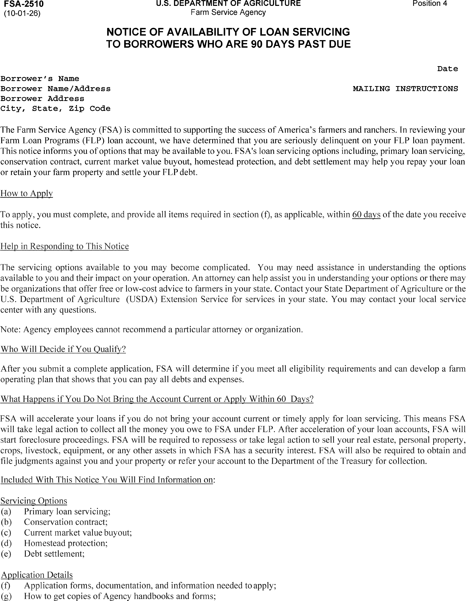
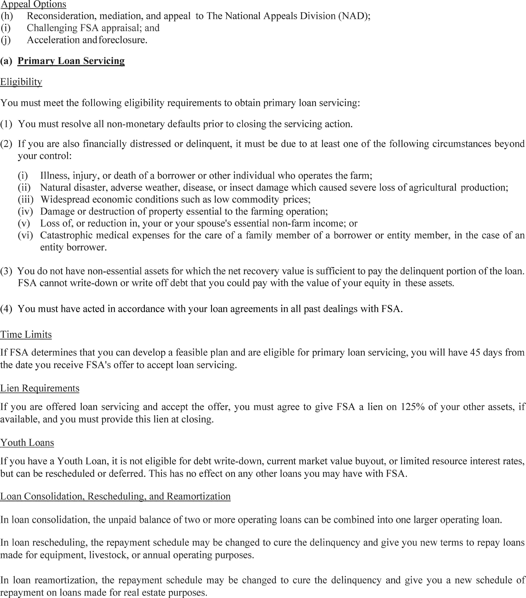
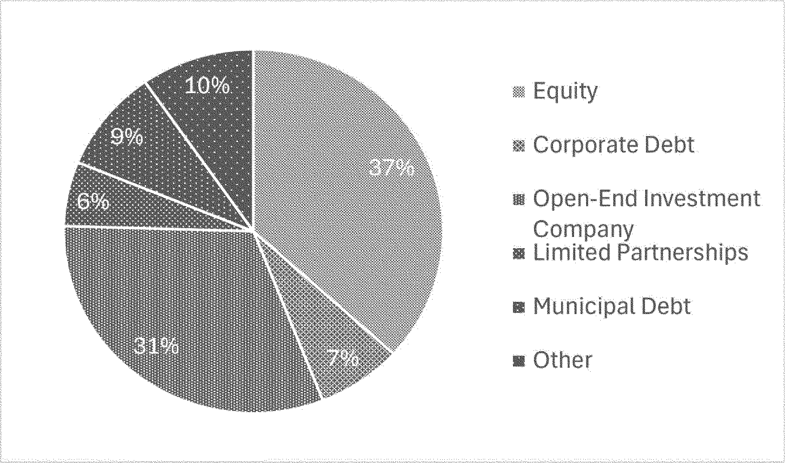
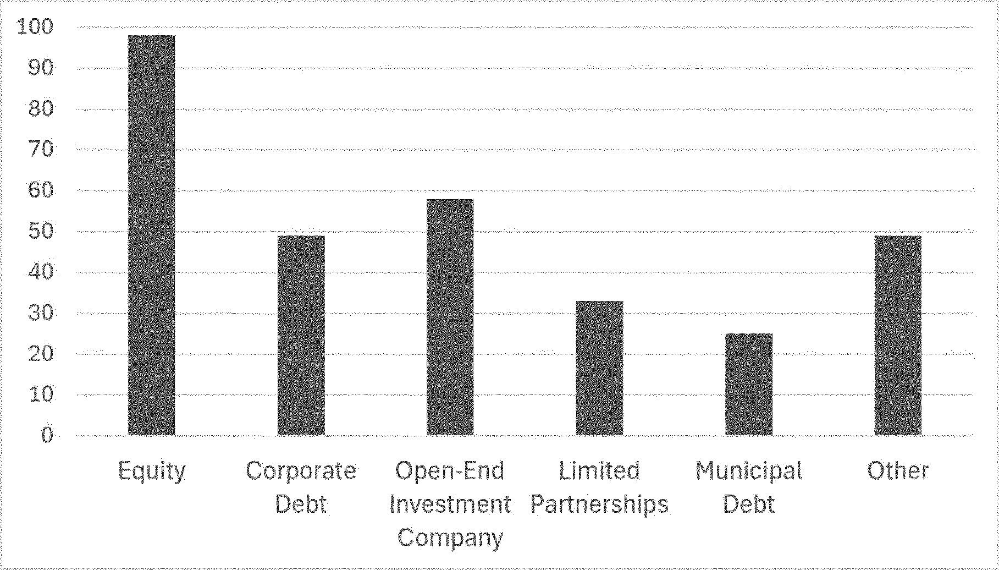

# Daily Digest — 2026-09-04

| | |
|---|---|
| **Digest date** | 2026-09-04 |
| **Data date range** | 2026-09-04 to 2026-09-04 |
| **Generated at** | 2026-09-05T04:51:31Z (UTC) |
| **Pipeline version** | bb0108d |
| **Inference** | model layers ran — cli/haiku, opus |
| **Source watermarks** | CREC: 2026-09-04T15:52:58Z · BILLS: 2026-09-04T08:54:34Z · FR: 2026-09-04T05:39:42Z · USCOURTS: 2026-09-04T23:25:01Z · PLAW: 2026-09-02T16:21:50Z |

[Full observed listing for this day](day/2026-09-04.html) — every item our collectors observed for this publication day, mechanical rules applied, frozen at end of day. This digest is the canonical record.

All items below cite the govinfo package (and granule, where applicable) they
summarize. Selection is mechanical; each item states the rule that included
it. See the Coverage Statement at the end for a full accounting of what was
published, what was summarized, and what was excluded and why.

---

## Contents

- [Day in Review](#day-in-review)
- [1. Congressional Floor Activity](#1-congressional-floor-activity)
- [2. Legislation](#2-legislation)
- [3. Federal Register](#3-federal-register)
- [4. Enacted Laws](#4-enacted-laws)
- [5. Judicial Activity](#5-judicial-activity)
- [6. Agency Announcements](#6-agency-announcements)
- [7. Recorded Votes](#7-recorded-votes)
- [8. Bill Actions](#8-bill-actions)
- [9. Presidential Actions](#9-presidential-actions)
- [Terms Used Today](#terms-used-today)
- [Coverage Statement](#coverage-statement)
- [Methodology](#methodology)

---

## Day in Review

The House floor picture is limited: the digest carries 57 bills introduced in the House, two engrossed in the House, and two reported from committee. The reported measures are H.R. 9329, the SEC Reform and Restructuring Act, which would require the Securities and Exchange Commission to perform cost-benefit analyses and identify the problems addressed before proposing regulations and would set semiannual congressional testimony requirements, and H.R. 9497, the Water Resources Development Act of 2026, which authorizes river, harbor, and water resources work and creates two new Corps of Engineers program offices. No recorded votes appear.

On the executive and regulatory side, the digest carries 69 Federal Register notices, seven proposed rules, seven final rules, and four presidential documents. Proposed rules include Treasury regulations on racial nondiscrimination and private school tax exemption, an EPA revision of a Clean Water Act discharge definition, SEC transfer agent rules, FAA airspace and airman medical certification proposals, and an HHS removal of repatriation regulations. Final rules include a Fish and Wildlife Service finding that nine species are not warranted for listing, an EPA extension of the 2025 Renewable Fuel Standard reporting deadline to October 1, 2026, a Farm Service Agency fast-track loan process, Coast Guard airspace and bridge actions, and a FinCEN geographic targeting order requiring southwest border money services businesses to report currency transactions of $1,000 to $10,000. Two executive orders appear: one directing USDA enforcement of the Packers and Stockyards Act and expanded market access for meat producers, and one directing a 90-day review of regulations affecting ranchers and an Interior assessment of gray wolf and Mexican wolf recovery. The digest also carries 178 agency press releases.

The digest carries 61 appellate opinions, 676 district court opinions, and six bankruptcy opinions. Among them, the Ninth Circuit reversed Hobbs Act robbery and firearm convictions in USA v. Valencia, holding the district court violated the Fifth Amendment by conditioning display of the defendant's tattoos on his testimony, and affirmed judgment for Courthouse News Service, holding Idaho's delay of public access to newly filed civil complaints pending clerk review violates the First Amendment. The Fourth Circuit vacated one MS-13 defendant's convictions over an instruction to disregard his closing argument while affirming two co-defendants. The Fifth Circuit, on remand from the Supreme Court, affirmed dismissal of Konan's postal tort claims but modified it to be without prejudice. The Federal Circuit affirmed a claim construction of "pH between 7.0 and 9.0" in Biofer v. Vifor, and the Sixth Circuit enforced an NLRB order against VNS Federal Services.

*Composed from the summarized items below and the day's mechanical
counts; all specifics are cited in their sections.*

---

## 1. Congressional Floor Activity

Source: Congressional Record (CREC), issue observed 2026-09-04, covering proceedings of 2026-09-03. Published by govinfo 2026-09-04T15:52:58Z; observed by our collector 2026-09-04T16:03:53Z. Total issue size: 0 granule(s).

### 1.1 Senate

No Senate floor items met the selection thresholds. 0 floor granule(s) are accounted for in the Coverage Statement.

### 1.2 House of Representatives

No House floor items met the selection thresholds. 0 floor granule(s) are accounted for in the Coverage Statement.

### 1.3 Recorded Votes

No recorded votes were published in this issue of the Congressional Record.

---

## 2. Legislation

Source: Congressional Bills (BILLS), text versions published 2026-09-04 to 2026-09-04.

### 2.1 Counts by Stage

| Stage (bill text version) | Count |
|---|---|
| Introduced (ih/is) | 57 |
| Reported (rh/rs) | 2 |
| Engrossed (eh/es) | 2 |
| Enrolled (enr) | 0 |
| Other versions | 0 |
| **Total bill texts published** | **61** |

### 2.2 Bills Listed by Mechanical Rule

Tags: legislative · model keys: sec reform · securities law · water resources

*In plain terms: Congress reported two bills: the SEC Reform Act requiring cost-benefit analyses and the Water Resources Development Act authorizing river and harbor improvements.*

Bills below are listed because they matched at least one listing rule; the
matching rule is stated per item. All other bill texts are counted above and
accounted for in the Coverage Statement.

- **H. R. 9329 (rh) — 119 HR 9329 RH: SEC Reform and Restructuring Act** — H.R. 9329, the SEC Reform and Restructuring Act, reported from the House Financial Services Committee, amends securities laws to require the Securities and Exchange Commission to conduct cost-benefit analyses before proposing regulations, clearly identify the problems being addressed, and assess the significance of those problems. The bill establishes requirements for semiannual Congressional testimony from the SEC Chairman regarding Commission activities, mandates a Government Accountability Office audit of SEC information technology infrastructure and data handling, and transfers the Public Company Accounting Oversight Board to the SEC. Additional provisions require assessment of cumulative regulatory effects, designation of post-adoption metrics to measure economic impact of major rules, and minimum public comment periods for SEC regulations.
  - *In plain terms:* The bill requires the SEC to analyze cost-benefit of regulations, assess problems addressed, give semiannual Congressional testimony, undergo technology audits, transfer the Public Company Accounting Oversight Board to it, and provide minimum comment periods.
  - Included because: BILLS-SEL-01 — reached stage: reported/enrolled/calendar (document dated 2026-09-03)
  - Source: [BILLS-119hr9329rh](https://www.govinfo.gov/app/details/BILLS-119hr9329rh)
- **H. R. 9497 (rh) — 106 HR 9497 RH: Water Resources Development Act of 2026** — H.R. 9497, the Water Resources Development Act of 2026, reported from the House Transportation and Infrastructure Committee, authorizes improvements to rivers, harbors, and water resources across the United States. The bill establishes two new Corps of Engineers program offices—the Office of Inland Navigation Construction Management and the Office of Water Supply, Water Conservation, and Drought Resiliency—and authorizes multiple feasibility studies and water infrastructure projects in specific locations nationwide. The act also modifies existing projects, addresses dam safety program amendments, and establishes requirements for dredging coordination, contaminated sediment management, and beneficial use of dredged material from various harbors and waterways.
  - *In plain terms:* The bill authorizes water infrastructure improvements nationwide, establishes two new Army Corps of Engineers offices for inland navigation and water supply, and sets requirements for dredging coordination, sediment management, and dam safety programs.
  - Included because: BILLS-SEL-01 — reached stage: reported/enrolled/calendar (document dated 2026-09-03)
  - Source: [BILLS-119hr9497rh](https://www.govinfo.gov/app/details/BILLS-119hr9497rh)

---

## 3. Federal Register

Source: Federal Register (FR), issue of 2026-09-04.

### 3.1 Counts by Document Type

| Document type | Count |
|---|---|
| Rules | 7 |
| Proposed rules | 7 |
| Notices | 69 |
| Presidential documents | 0 |
| **Total FR documents** | **83** |

### 3.2 Rules Published

Tags: department of commerce · executive · securities and exchange commission · model keys: currency reporting · endangered species · renewable fuel

*In plain terms: Seven rules finalized: EPA extended renewable fuel deadline to October, FinCEN requires border currency reporting, and agencies updated aviation, farm loan, marine, and wildlife regulations.*

#### DEPARTMENT OF AGRICULTURE

- **Driving Efficiency in Farm Loan Delivery** (2026-18164; 7 CFR Parts 761, 762, 763, 764, 765, 766, 767, 768, 770, 772, 773, 774) — The Farm Service Agency (FSA) is amending the Farm Loan Program (FLP) regulations to permanently implement the Application Fast Track (AFT) process, which expedites underwriting for certain direct loan applicants by using financial benchmarks and historical repayment data to identify applicants least likely to default. This rule also includes regulatory changes intended to improve program efficiency and support IT modernization efforts consisting of minor policy changes, clarifications, and technical corrections. These changes are part of FSA's ongoing effort to deliver farmer-focused programs in the most efficient and cost-effective manner possible. Action: Final rule. Dates: Effective date: October 1, 2026.
  - *In plain terms:* The Farm Service Agency is making permanent a faster loan approval process using financial benchmarks to identify low-risk farm loan applicants.
  - Included because: FR-SEL-01 — document type: final rule (all listed)
  - Source: [FR-2026-09-04 / 2026-18164](https://www.govinfo.gov/app/details/FR-2026-09-04/2026-18164)
  -  *Source graphic 1 of 16 from 2026-18164.*
  -  *Source graphic 2 of 16 from 2026-18164.*
  - *Graphics not rendered here: 14 of 16 — see the [source PDF](https://www.govinfo.gov/content/pkg/FR-2026-09-04/pdf/FR-2026-09-04.pdf).*

#### DEPARTMENT OF HOMELAND SECURITY

- **Safety Zone; Ohio Street Beach Swim Course, Lake Michigan, Chicago Harbor, Chicago, IL** (2026-18130; 33 CFR Part 165) — The Coast Guard will enforce a safety zone for the Chicago Masters' Big Shoulders 5K and 2.5K Open Water Swim event to provide for the safety of life on navigable waterways during a swim event. Our regulation for marine events within the Great Lakes Coast Guard District identified the safety zone for this event in Chicago, IL. During the enforcement period, entry into, transiting, or anchoring within the safety zone is prohibited unless authorized by the Captain of the Port Lake Michigan or a designated on-scene representative. Action: Notification of enforcement of regulation. Dates: The regulations in 33 CFR 165.932 will be enforced from 7 a.m. through Noon on September 12, 2026.
  - *In plain terms:* The Coast Guard is enforcing a safety zone during the Chicago Masters' Big Shoulders swim event to protect swimmers on Lake Michigan.
  - Included because: FR-SEL-01 — document type: final rule (all listed)
  - Source: [FR-2026-09-04 / 2026-18130](https://www.govinfo.gov/app/details/FR-2026-09-04/2026-18130)
- **Drawbridge Operation Regulation; Savannah River, Clyo, GA** (2026-18166; 33 CFR Part 117) — The Coast Guard is removing the existing drawbridge operation regulation for the CSX Transportation railroad bridge, mile 60.9, near Clyo, GA. The drawbridge was converted to a fixed bridge in August 2026, and the operating regulation is no longer applicable or necessary. Action: Final rule. Dates: This rule is effective September 4, 2026.
  - *In plain terms:* The Coast Guard is removing operating rules for a railroad bridge near Clyo, GA, which was converted to a fixed bridge in August 2026.
  - Included because: FR-SEL-01 — document type: final rule (all listed)
  - Source: [FR-2026-09-04 / 2026-18166](https://www.govinfo.gov/app/details/FR-2026-09-04/2026-18166)

#### DEPARTMENT OF THE INTERIOR

- **Endangered and Threatened Wildlife and Plants; Nine Species Not Warranted for Listing as Endangered or Threatened Species** (2026-18123; 50 CFR Part 17) — We, the U.S. Fish and Wildlife Service (Service), announce findings that nine species are not warranted for listing as endangered or threatened species under the Endangered Species Act of 1973, as amended (ESA or Act). After a thorough review of the best scientific and commercial data available, we find that it is not warranted at this time to list the Big Bar hesperian ( Vespericola pressleyi ), Chesapeake logperch ( Percina bimaculate ), Kirtland's snake ( Clonophis kirtlandii ), orangefin madtom ( Noturus gilberti ), Shasta chaparral ( Trilobopsis roperi ), Shasta hesperian ( Vespericola shasta ), Shasta sideband ( Monadenia troglodytes troglodytes ), tall western penstemon ( Penstemon hesperius ), and Wintu sideband ( Monadenia troglodytes wintu ). However, we ask the public to submit to us at any time any new information relevant to the status of any of the species mentioned above or their habitats. Action: Notification of findings. Dates: The findings in this document were made on September 4, 2026.
  - *In plain terms:* The U.S. Fish and Wildlife Service found that nine species do not need protection as endangered or threatened under current law.
  - Included because: FR-SEL-01 — document type: final rule (all listed)
  - Source: [FR-2026-09-04 / 2026-18123](https://www.govinfo.gov/app/details/FR-2026-09-04/2026-18123)

#### DEPARTMENT OF THE TREASURY

- **Geographic Targeting Order Imposing Recordkeeping and Reporting Requirements on Certain Money Services Businesses Along the Southwest Border** (2026-18194; 31 CFR Part 1010) — FinCEN is issuing this Geographic Targeting Order, requiring certain money services businesses along the southwest border of the United States to report and retain records of transactions in currency of $1,000 or more, but not more than $10,000, and to verify the identity of persons presenting such transactions. Action: Order. Dates: Effective date: This action is effective September 3, 2026. Compliance date: The compliance date for persons that were not Covered Businesses under the Geographic Targeting Order published by FinCEN on March 10, 2026 (91 FR 11456), is October 3, 2026.
  - *In plain terms:* FinCEN requires money services businesses along the southwest border to report and record currency transactions between $1,000 and $10,000.
  - Included because: FR-SEL-01 — document type: final rule (all listed)
  - Source: [FR-2026-09-04 / 2026-18194](https://www.govinfo.gov/app/details/FR-2026-09-04/2026-18194)

#### DEPARTMENT OF TRANSPORTATION

- **Revocation of Class E Airspace; Point Pleasant, WV** (2026-18126; 14 CFR Part 71) — This action revokes the Class E airspace at Point Pleasant, WV. This action is due to the cancellation of the instrument procedures at Mason County Airport, Point Pleasant, WV. This action brings the airspace into compliance with FAA orders and supports instrument flight rule (IFR) procedures and operations. Action: Final rule. Dates: Effective 0901 UTC, December 24, 2026. The Director of the Federal Register approves this incorporation by reference action under 1 CFR part 51, subject to the annual revision of FAA Order JO 7400.11 and publication of conforming amendments.
  - *In plain terms:* The FAA is removing airspace rules for Mason County Airport in Point Pleasant, WV, after its instrument procedures were canceled.
  - Included because: FR-SEL-01 — document type: final rule (all listed)
  - Source: [FR-2026-09-04 / 2026-18126](https://www.govinfo.gov/app/details/FR-2026-09-04/2026-18126)

#### ENVIRONMENTAL PROTECTION AGENCY

- **Renewable Fuel Standard (RFS) Program: Extension of 2025 Compliance Reporting Deadline** (2026-18132; 40 CFR Part 80) — The U.S. Environmental Protection Agency (EPA) is extending the Renewable Fuel Standard (RFS) compliance reporting deadline for the 2025 compliance year from September 1, 2026, to October 1, 2026. Action: Final rule. Dates: Effective date. This rule is effective on September 4, 2026. Operational date. For operational purposes under the Clean Air Act (CAA), this final rule is effective as of September 1, 2026.
  - *In plain terms:* The EPA is extending the deadline for renewable fuel compliance reporting from September 1 to October 1, 2026.
  - Included because: FR-SEL-01 — document type: final rule (all listed)
  - Source: [FR-2026-09-04 / 2026-18132](https://www.govinfo.gov/app/details/FR-2026-09-04/2026-18132)

### 3.3 Proposed Rules Published

Tags: department of commerce · executive · securities and exchange commission · model keys: discharge standards · medical certification · tax exemption

*In plain terms: Seven proposed rules would relax FAA medical certification for diabetics, update IRS private school tax exemptions, revise EPA discharge standards, and address transfer agents and repatriation streamlining.*

#### DEPARTMENT OF HEALTH AND HUMAN SERVICES

- **Reducing Bureaucracy and Burden for the Repatriation of Mentally Ill Nationals** (2026-18167; 45 CFR Parts 211 and 1390) — The Department of Health and Human Services, Administration for Children and Families proposes to remove the Care and Treatment of Mentally Ill Nationals of the United States, Returned from Foreign Countries regulations to streamline regulations and to renumber it under a different Part. Action: Notice of proposed rulemaking. Dates: In order to be considered, written comments on this proposed rule must be received on or before October 5, 2026.
  - *In plain terms:* The Department of Health and Human Services proposes to remove and reorganize regulations governing the care and return of mentally ill U.S. citizens from abroad.
  - Included because: FR-SEL-02 — document type: proposed rule (all listed)
  - Source: [FR-2026-09-04 / 2026-18167](https://www.govinfo.gov/app/details/FR-2026-09-04/2026-18167)

#### DEPARTMENT OF THE TREASURY

- **Racial Nondiscrimination in Private Schools** (2026-18127; 26 CFR Part 1) — This document contains proposed regulations that would update existing regulations to provide that a private school is not described as an organization exempt from Federal income tax if it discriminates on the basis of race, color, or national or ethnic origin in administration of its educational, admissions, scholarship, athletic, or other policies, based on the fundamental public policy of the United States against such practices. These proposed regulations would affect private schools in taxable years beginning after May 31, 2027, which is after the final regulations are expected to be published. Action: Notice of proposed rulemaking. Dates: Written or electronic comments and requests for a public hearing must be received by November 3, 2026.
  - *In plain terms:* Proposed rules would make private schools ineligible for tax-exempt status if they discriminate by race, color, or national or ethnic origin, starting in 2027.
  - Included because: FR-SEL-02 — document type: proposed rule (all listed)
  - Source: [FR-2026-09-04 / 2026-18127](https://www.govinfo.gov/app/details/FR-2026-09-04/2026-18127)

#### DEPARTMENT OF TRANSPORTATION

- **Establishment of Class E Airspace Over Hardy, VA** (2026-18144; 14 CFR Part 71) — This action proposes to establish new Class E airspace over Hardy, VA. This airspace is necessary to support Instrument Flight Rules (IFR) operations, utilizing new Special Instrument Approach Procedures (SIAPs) serving Carilion Westlake Center Heliport. Action: Notice of proposed rulemaking (NPRM). Dates: Comments must be received on or before October 19, 2026.
  - *In plain terms:* The FAA proposes to establish airspace over Hardy, VA, to support instrument approach procedures for Carilion Westlake Center Heliport.
  - Included because: FR-SEL-02 — document type: proposed rule (all listed)
  - Source: [FR-2026-09-04 / 2026-18144](https://www.govinfo.gov/app/details/FR-2026-09-04/2026-18144)
- **Establishment of Class E Airspace Over Lexington, VA** (2026-18145; 14 CFR Part 71) — This action proposes to establish new Class E airspace over Lexington, VA. This airspace is necessary to support Instrument Flight Rules (IFR) operations, utilizing new Special Instrument Approach Procedures (SIAPs) serving Carilion Rockbridge Community Hospital Heliport. Action: Notice of proposed rulemaking (NPRM). Dates: Comments must be received on or before October 19, 2026.
  - *In plain terms:* The FAA proposes to establish airspace over Lexington, VA, to support instrument approach procedures for Carilion Rockbridge Community Hospital Heliport.
  - Included because: FR-SEL-02 — document type: proposed rule (all listed)
  - Source: [FR-2026-09-04 / 2026-18145](https://www.govinfo.gov/app/details/FR-2026-09-04/2026-18145)
- **Modernizing Medical Standards for Non-Insulin Dependent Diabetes Mellitus Cases** (2026-18162; 14 CFR Part 67) — FAA proposes to amend its regulations to allow applicants with non-insulin dependent diabetes mellitus to apply for airman medical certification that may be issued at the time of their medical examination instead of requiring Special Issuance review by FAA. This action would reduce the burden associated with the process of review for Authorization for Special Issuance while recognizing that modern medical advancements have significantly improved the manageability of certain forms of diabetes. Action: Notice of proposed rulemaking. Dates: Send comments on or before October 5, 2026.
  - *In plain terms:* The FAA proposes to allow people with non-insulin diabetes to get medical certification for flying without requiring special FAA review.
  - Included because: FR-SEL-02 — document type: proposed rule (all listed)
  - Source: [FR-2026-09-04 / 2026-18162](https://www.govinfo.gov/app/details/FR-2026-09-04/2026-18162)

#### ENVIRONMENTAL PROTECTION AGENCY

- **Updates to the National Pollutant Discharge Elimination System Definitions and Exclusions** (2026-18134; 40 CFR Part 122) — The U.S. Environmental Protection Agency (EPA) proposes to revise a regulatory definition under the Clean Water Act (CWA) permitting regulations pertaining to discharges in the contiguous zone and ocean. The proposal would revise the regulatory definition of “discharge of a pollutant” to reflect and faithfully implement the statutory exclusion of vessels and other floating craft that add pollutants in the contiguous zone or the ocean from inclusion in the definition of “discharge of a pollutant” or “discharge”, and thus, from National Pollutant Discharge Elimination System (NPDES) program requirements. The proposed rulemaking would also make conforming and clarifying changes to the NPDES regulatory exclusion for vessels and other floating craft. The effect of these changes would be that the addition of pollutants by a vessel or other floating craft in the contiguous zone or the ocean that is not secured to the seabed would not be a discharge and would not require CWA NPDES permit authorization to add pollutants to those waters. Action: Proposed rule. Dates: Comments must be received on or before October 19, 2026. Please refer to the SUPPLEMENTARY INFORMATION section for additional information on the public hearing.
  - *In plain terms:* The EPA proposes to exclude pollution from vessels and floating craft in the ocean and contiguous zone from Clean Water Act permit rules.
  - Included because: FR-SEL-02 — document type: proposed rule (all listed)
  - Source: [FR-2026-09-04 / 2026-18134](https://www.govinfo.gov/app/details/FR-2026-09-04/2026-18134)

#### SECURITIES AND EXCHANGE COMMISSION

- **Transfer Agent Rules** (2026-18190; 17 CFR Parts 240 and 249b) — The U.S. Securities and Exchange Commission (“SEC” or “Commission”) is proposing to adopt new rules, amend existing rules, amend the existing form for registration with the Commission as a transfer agent (Form TA-1) and the existing form for reporting activities of transfer agents (Form TA-2), and rescind an existing rule governing registered transfer agents. The proposals are designed to modernize the rules governing registered transfer agents. Action: Proposed rule. Dates: This release was published in the Federal Register on September 4, 2026. Comments should be received on or before November 3, 2026.
  - *In plain terms:* The SEC proposes to modernize rules governing registered transfer agents through new and amended regulations and updated registration forms.
  - Included because: FR-SEL-02 — document type: proposed rule (all listed)
  - Source: [FR-2026-09-04 / 2026-18190](https://www.govinfo.gov/app/details/FR-2026-09-04/2026-18190)
  -  *Source graphic 1 of 3 from 2026-18190.*
  -  *Source graphic 2 of 3 from 2026-18190.*
  - *Graphics not rendered here: 1 of 3 — see the [source PDF](https://www.govinfo.gov/content/pkg/FR-2026-09-04/pdf/FR-2026-09-04.pdf).*

### 3.4 Notices and Presidential Documents

Notices are summarized only when they match a listing rule; all are counted
in 3.1 and in the Coverage Statement. Presidential documents in the FR are
always listed.

No notices or presidential documents matched a listing rule.

---

## 4. Enacted Laws

Source: Public and Private Laws (PLAW) published 2026-09-04.

No laws were published in this range.

---

## 5. Judicial Activity

Source: United States Courts Opinions (USCOURTS): opinions observed 2026-09-04
by our collector; each opinion states its own issue date beside its
listing ([how our clocks work](faq.html#fapds-three-clocks)).

Completeness disclosure (standing): USCOURTS carries opinions from
approximately 140 participating appellate, district, bankruptcy, and
national federal courts. Unlike the Congressional Record and the Federal
Register, which are the complete official record of their branches,
USCOURTS is participation-based and is NOT the complete federal judicial
record. Courts post opinions with delay — typically over several days —
so a day's digest carries the opinions that became available that day,
whatever date each was issued.

### 5.1 Appellate and National Court Opinions

Tags: judicial · model keys: civil rights · criminal appeals · drug trafficking

*In plain terms: Sixty-one federal appeals decisions addressed criminal convictions including drug trafficking and violent offenses, prisoner civil rights and employment claims, and administrative and commercial disputes.*

Appellate and national court opinions are summarized; district and
bankruptcy opinions are counted in 5.2 and in the Coverage Statement.

#### United States Court of Appeals for the Eighth Circuit

- **XTO Energy, Inc. v. Commerce and Industry Ins. Co.** (No. 24-03101; filed 2026-09-03) — The Eighth Circuit issued an opinion and entered judgment in this civil dispute between XTO Energy, Inc. and Commerce and Industry Insurance Co. The notice informs counsel of procedural requirements for post-judgment filings, including the 14-day deadline for petitions for rehearing or rehearing en banc.
  - *In plain terms:* The Eighth Circuit decided a dispute between an energy company and an insurance company; parties have 14 days to request reconsideration.
  - Included because: USCOURTS-SEL-01 — appellate court opinion (all listed) (document dated 2026-09-03)
  - Source: [USCOURTS-ca8-24-03101 / USCOURTS-ca8-24-03101-0](https://www.govinfo.gov/app/details/USCOURTS-ca8-24-03101/USCOURTS-ca8-24-03101-0)
- **United States v. Trajuan West** (No. 25-01751; filed 2026-09-03) — The Eighth Circuit issued an opinion and judgment in this federal criminal appeal. The notice advises that petitions for rehearing or rehearing en banc must be received within 14 days of judgment entry.
  - *In plain terms:* The Eighth Circuit decided a federal criminal appeal; parties have 14 days to request reconsideration.
  - Included because: USCOURTS-SEL-01 — appellate court opinion (all listed) (document dated 2026-09-03)
  - Source: [USCOURTS-ca8-25-01751 / USCOURTS-ca8-25-01751-0](https://www.govinfo.gov/app/details/USCOURTS-ca8-25-01751/USCOURTS-ca8-25-01751-0)
- **Pennsylvania Insurance Company v. Federal Express Corporation** (No. 25-01777; filed 2026-09-03) — The Eighth Circuit issued an opinion and judgment in this civil case between Pennsylvania Insurance Company and Federal Express Corporation. Petitions for rehearing or rehearing en banc must be filed within 14 days of judgment entry.
  - *In plain terms:* The Eighth Circuit decided a case between an insurance company and Federal Express; parties have 14 days to request reconsideration.
  - Included because: USCOURTS-SEL-01 — appellate court opinion (all listed) (document dated 2026-09-03)
  - Source: [USCOURTS-ca8-25-01777 / USCOURTS-ca8-25-01777-0](https://www.govinfo.gov/app/details/USCOURTS-ca8-25-01777/USCOURTS-ca8-25-01777-0)
- **Pennsylvania Insurance Company v. Federal Express Corporation** (No. 25-01891; filed 2026-09-03) — The Eighth Circuit issued an opinion and judgment in this civil case between Pennsylvania Insurance Company and Federal Express Corporation. Parties have 14 days from judgment entry to file petitions for rehearing or rehearing en banc.
  - *In plain terms:* The Eighth Circuit decided a case between an insurance company and Federal Express; parties have 14 days to request reconsideration.
  - Included because: USCOURTS-SEL-01 — appellate court opinion (all listed) (document dated 2026-09-03)
  - Source: [USCOURTS-ca8-25-01891 / USCOURTS-ca8-25-01891-0](https://www.govinfo.gov/app/details/USCOURTS-ca8-25-01891/USCOURTS-ca8-25-01891-0)
- **Michael Kioko v. University Health** (No. 25-02242; filed 2026-09-03) — The Eighth Circuit issued an opinion and entered judgment in this civil case brought by Michael Kioko against University Health. The notice sets a 14-day deadline for filing petitions for rehearing or rehearing en banc.
  - *In plain terms:* The Eighth Circuit decided a case brought against University Health; parties have 14 days to request reconsideration.
  - Included because: USCOURTS-SEL-01 — appellate court opinion (all listed) (document dated 2026-09-03)
  - Source: [USCOURTS-ca8-25-02242 / USCOURTS-ca8-25-02242-0](https://www.govinfo.gov/app/details/USCOURTS-ca8-25-02242/USCOURTS-ca8-25-02242-0)
- **BNSF Railway Company v. U.S. Dept. of Labor** (No. 25-02436; filed 2026-09-03) — The Eighth Circuit issued an opinion and entered judgment in these consolidated administrative labor appeal cases involving BNSF Railway Company and the U.S. Department of Labor. Parties have 45 days from judgment entry to file petitions for rehearing or rehearing en banc.
  - *In plain terms:* The Eighth Circuit decided consolidated labor appeal cases between a railroad company and the Department of Labor; parties have 45 days to request reconsideration.
  - Included because: USCOURTS-SEL-01 — appellate court opinion (all listed) (document dated 2026-09-03)
  - Source: [USCOURTS-ca8-25-02436 / USCOURTS-ca8-25-02436-0](https://www.govinfo.gov/app/details/USCOURTS-ca8-25-02436/USCOURTS-ca8-25-02436-0)
- **The Iowa Farm Sanctuary, et al v. Univ. of MO Vet Health Center, et al** (No. 25-02503; filed 2026-09-03) — The Eighth Circuit issued an opinion and entered judgment in The Iowa Farm Sanctuary v. University of Missouri Veterinary Health Center. Petitions for rehearing or rehearing en banc must be filed within 14 days of judgment entry.
  - *In plain terms:* The Eighth Circuit decided a case between the Iowa Farm Sanctuary and the University of Missouri Veterinary Health Center; parties have 14 days to request reconsideration.
  - Included because: USCOURTS-SEL-01 — appellate court opinion (all listed) (document dated 2026-09-03)
  - Source: [USCOURTS-ca8-25-02503 / USCOURTS-ca8-25-02503-0](https://www.govinfo.gov/app/details/USCOURTS-ca8-25-02503/USCOURTS-ca8-25-02503-0)
- **BNSF Railway Company v. U.S. Dept. of Labor** (No. 25-02578; filed 2026-09-03) — The Eighth Circuit issued opinions and entered judgments in two related cases, BNSF Railway Company v. U.S. Department of Labor (Appellate Cases 25-2436 and 25-2578). Petitions for rehearing or rehearing en banc must be filed within 45 days of judgment entry.
  - *In plain terms:* The Eighth Circuit decided two related labor cases between a railroad company and the Department of Labor; parties have 45 days to request reconsideration.
  - Included because: USCOURTS-SEL-01 — appellate court opinion (all listed) (document dated 2026-09-03)
  - Source: [USCOURTS-ca8-25-02578 / USCOURTS-ca8-25-02578-0](https://www.govinfo.gov/app/details/USCOURTS-ca8-25-02578/USCOURTS-ca8-25-02578-0)
- **United States v. Duane Walker, Jr.** (No. 26-01555; filed 2026-09-03) — The Eighth Circuit affirmed the district court's drug offense conviction and sentencing of Duane Walker, Jr., including an obstruction of justice enhancement, and rejected Speedy Trial Act violation claims.
  - *In plain terms:* The Eighth Circuit upheld a drug conviction with an increased sentence for obstruction of justice, and rejected Speedy Trial Act claims.
  - Included because: USCOURTS-SEL-01 — appellate court opinion (all listed) (document dated 2026-09-03)
  - Source: [USCOURTS-ca8-26-01555 / USCOURTS-ca8-26-01555-0](https://www.govinfo.gov/app/details/USCOURTS-ca8-26-01555/USCOURTS-ca8-26-01555-0)
- **United States v. Terrell Alexander** (No. 26-01587; filed 2026-09-03) — The Eighth Circuit issued an opinion and entered judgment in United States v. Terrell Alexander. Petitions for rehearing or rehearing en banc must be filed within 14 days of judgment entry.
  - *In plain terms:* The Eighth Circuit decided United States v. Terrell Alexander; parties have 14 days to request reconsideration.
  - Included because: USCOURTS-SEL-01 — appellate court opinion (all listed) (document dated 2026-09-03)
  - Source: [USCOURTS-ca8-26-01587 / USCOURTS-ca8-26-01587-0](https://www.govinfo.gov/app/details/USCOURTS-ca8-26-01587/USCOURTS-ca8-26-01587-0)

#### United States Court of Appeals for the Eleventh Circuit

- **Waseem Daker v. Gregory Dozier, et al** (No. 24-13122; filed 2026-03-13) — The court affirmed dismissal of Waseem Daker's civil rights complaint for failure to comply with a district court's filing injunction, rejecting his arguments that the injunction was invalid, improperly applied to courts other than the Northern District of Georgia, or that his amended complaint cured the deficiency.
  - *In plain terms:* The court upheld the dismissal of Daker's civil rights case because he violated a filing injunction, rejecting his arguments that it was invalid or wrongly applied.
  - Included because: USCOURTS-SEL-01 — appellate court opinion (all listed) (document dated 2026-09-03)
  - Source: [USCOURTS-ca11-24-13122 / USCOURTS-ca11-24-13122-0](https://www.govinfo.gov/app/details/USCOURTS-ca11-24-13122/USCOURTS-ca11-24-13122-0)
- **Waseem Daker v. Gregory Dozier, et al** (No. 24-13122; filed 2026-09-03) — The court vacated the district court's dismissal with prejudice and remanded with instructions to dismiss without prejudice because the defendants were never served, preventing the district court from exercising personal jurisdiction over them.
  - *In plain terms:* The court reversed the dismissal and remanded because the defendants were never properly served, leaving the court without authority over them.
  - Included because: USCOURTS-SEL-01 — appellate court opinion (all listed) (document dated 2026-09-03)
  - Source: [USCOURTS-ca11-24-13122 / USCOURTS-ca11-24-13122-1](https://www.govinfo.gov/app/details/USCOURTS-ca11-24-13122/USCOURTS-ca11-24-13122-1)
- **Joshua Hubbert v. Kenny Brinley** (No. 24-13756; filed 2026-09-03) — The court granted qualified immunity to county employee Kenny Brinley in a prisoner's Eighth Amendment suit arising from a backhoe injury, holding that although the conduct may have violated constitutional rights, the contours of such a right were not sufficiently clear at the time of the incident.
  - *In plain terms:* The court granted immunity to a county employee in a prisoner's injury case, holding that the right in question was not sufficiently clear at the time of the incident.
  - Included because: USCOURTS-SEL-01 — appellate court opinion (all listed) (document dated 2026-09-03)
  - Source: [USCOURTS-ca11-24-13756 / USCOURTS-ca11-24-13756-0](https://www.govinfo.gov/app/details/USCOURTS-ca11-24-13756/USCOURTS-ca11-24-13756-0)
- **Judson Pankey v. Aetna Life Insurance Company** (No. 25-11338; filed 2026-09-03) — The court affirmed termination of Judson Pankey's long-term disability benefits where the insurer repeatedly requested medical statements and recent tax documentation to verify ongoing disability and the claimant declined to provide them after multiple requests and warnings.
  - *In plain terms:* The court upheld the termination of disability benefits after the insurer repeatedly requested medical and tax documentation, which the claimant declined to provide after multiple requests and warnings.
  - Included because: USCOURTS-SEL-01 — appellate court opinion (all listed) (document dated 2026-09-03)
  - Source: [USCOURTS-ca11-25-11338 / USCOURTS-ca11-25-11338-0](https://www.govinfo.gov/app/details/USCOURTS-ca11-25-11338/USCOURTS-ca11-25-11338-0)
- **USA v. Richard Velasquez** (No. 25-11916; filed 2026-09-03) — The court granted the government's motion to dismiss Richard Velasquez's criminal appeal, enforcing the waiver of appellate rights that Velasquez included in his plea agreement.
  - *In plain terms:* The court dismissed the appeal because Velasquez agreed to waive his appellate rights in his plea agreement.
  - Included because: USCOURTS-SEL-01 — appellate court opinion (all listed) (document dated 2026-09-03)
  - Source: [USCOURTS-ca11-25-11916 / USCOURTS-ca11-25-11916-0](https://www.govinfo.gov/app/details/USCOURTS-ca11-25-11916/USCOURTS-ca11-25-11916-0)
- **Denita Lambou, et al v. Twyla Sketchley, et al** (No. 25-12498; filed 2026-09-03) — The court affirmed dismissal of a civil complaint by the Lambou family alleging RICO and state law claims relating to care of a deceased relative and estate disputes, finding the complaint an impermissible pleading and the RICO allegations insufficient to state a claim, which the appellants did not adequately challenge.
  - *In plain terms:* The court upheld the dismissal of RICO and state law claims about care of a deceased relative and estate disputes, finding the pleading improper and RICO allegations insufficient.
  - Included because: USCOURTS-SEL-01 — appellate court opinion (all listed) (document dated 2026-09-03)
  - Source: [USCOURTS-ca11-25-12498 / USCOURTS-ca11-25-12498-0](https://www.govinfo.gov/app/details/USCOURTS-ca11-25-12498/USCOURTS-ca11-25-12498-0)
- **Nilsa Agrait v. Hillsborough County Public Schools** (No. 25-13552; filed 2026-09-03) — Nilsa Agrait, a speech-language pathologist with multiple sclerosis, was terminated by Hillsborough County Public Schools after requesting indefinite remote work and subsequently attempting to work remotely without authorization. The Eleventh Circuit affirmed summary judgment for the school, finding that physical presence was an essential function of her position under Americans with Disabilities Act law.
  - *In plain terms:* The court upheld the termination of a speech pathologist with multiple sclerosis who requested indefinite remote work and worked remotely without authorization, finding in-person presence was essential.
  - Included because: USCOURTS-SEL-01 — appellate court opinion (all listed) (document dated 2026-09-03)
  - Source: [USCOURTS-ca11-25-13552 / USCOURTS-ca11-25-13552-0](https://www.govinfo.gov/app/details/USCOURTS-ca11-25-13552/USCOURTS-ca11-25-13552-0)
- **USA v. Richardson Bien Aime** (No. 25-13556; filed 2026-09-03) — Richardson Bien Aime appealed his conviction for methamphetamine possession with intent to distribute and possession of a firearm as a convicted felon, claiming his trial counsel had a conflict of interest in representing him while accepting an appeal waiver. The Eleventh Circuit affirmed, finding no actual conflict of interest existed and that any potential conflict did not adversely affect counsel's performance.
  - *In plain terms:* The court affirmed the drug and firearm convictions despite claims that counsel's acceptance of an appeal waiver created a conflict of interest, finding no actual conflict existed.
  - Included because: USCOURTS-SEL-01 — appellate court opinion (all listed) (document dated 2026-09-03)
  - Source: [USCOURTS-ca11-25-13556 / USCOURTS-ca11-25-13556-0](https://www.govinfo.gov/app/details/USCOURTS-ca11-25-13556/USCOURTS-ca11-25-13556-0)
- **USA v. Ronald Phillips** (No. 25-13709; filed 2026-09-03) — The Eleventh Circuit granted the government's motion to dismiss Ronald Darnell Phillips's appeal based on an enforceable appeal waiver in his plea agreement.
  - *In plain terms:* The court dismissed the appeal based on an enforceable appeal waiver in the plea agreement.
  - Included because: USCOURTS-SEL-01 — appellate court opinion (all listed) (document dated 2026-09-03)
  - Source: [USCOURTS-ca11-25-13709 / USCOURTS-ca11-25-13709-0](https://www.govinfo.gov/app/details/USCOURTS-ca11-25-13709/USCOURTS-ca11-25-13709-0)
- **USA v. Juan Sanchez-Suarez** (No. 25-13718; filed 2026-09-03) — The Eleventh Circuit granted the government's motion to dismiss Juan Martin Sanchez-Suarez's appeal based on an appeal waiver in his plea agreement.
  - *In plain terms:* The court dismissed the appeal based on an appeal waiver in the plea agreement.
  - Included because: USCOURTS-SEL-01 — appellate court opinion (all listed) (document dated 2026-09-03)
  - Source: [USCOURTS-ca11-25-13718 / USCOURTS-ca11-25-13718-0](https://www.govinfo.gov/app/details/USCOURTS-ca11-25-13718/USCOURTS-ca11-25-13718-0)
- **USA v. Noe Flores Vasquez** (No. 25-13791; filed 2026-09-03) — Noe Alexander Flores Vasquez pleaded guilty to illegal reentry following multiple deportations and was sentenced to 42 months' imprisonment, an upward variance from the guideline range justified by his repeated entries after removal and prior violent criminal history. The Eleventh Circuit affirmed the sentence as substantively reasonable.
  - *In plain terms:* The court affirmed a 42-month sentence for illegal reentry following deportations, which exceeded guidelines due to repeated entries after removal and prior violent criminal history.
  - Included because: USCOURTS-SEL-01 — appellate court opinion (all listed) (document dated 2026-09-03)
  - Source: [USCOURTS-ca11-25-13791 / USCOURTS-ca11-25-13791-0](https://www.govinfo.gov/app/details/USCOURTS-ca11-25-13791/USCOURTS-ca11-25-13791-0)
- **Dominick Russo, et al v. Secretary, U.S. Department of Commerce, et al** (No. 26-10171; filed 2026-09-03) — Dominick and James Russo challenged a fishery regulation reducing gag grouper catch limits as being promulgated by unconstitutionally appointed Council members under the Magnuson-Stevens Act. The Eleventh Circuit held that while the Gulf of Mexico Fishery Management Council's appointment structure raised Appointments Clause concerns, the specific gag grouper rule was not based on the Council's unconstitutional authority and therefore should not be vacated.
  - *In plain terms:* The court held that while the Council's appointment structure raised constitutional concerns, the specific grouper catch-limit rule was not based on any unconstitutional authority and should not be vacated.
  - Included because: USCOURTS-SEL-01 — appellate court opinion (all listed) (document dated 2026-09-03)
  - Source: [USCOURTS-ca11-26-10171 / USCOURTS-ca11-26-10171-0](https://www.govinfo.gov/app/details/USCOURTS-ca11-26-10171/USCOURTS-ca11-26-10171-0)
- **Kimberly Galvin v. Moliere Dimanche, Jr.** (No. 26-10617; filed 2026-09-03) — The Eleventh Circuit affirmed remand of an unlawful-detainer case to state court, finding that the appellant failed to establish that Florida's vexatious litigant designation constituted a denial of civil rights under 42 U.S.C. § 1981 sufficient to invoke federal removal jurisdiction.
  - *In plain terms:* The court affirmed remand to state court, finding that a vexatious litigant designation does not constitute a civil rights violation under federal law sufficient for federal removal.
  - Included because: USCOURTS-SEL-01 — appellate court opinion (all listed) (document dated 2026-09-03)
  - Source: [USCOURTS-ca11-26-10617 / USCOURTS-ca11-26-10617-0](https://www.govinfo.gov/app/details/USCOURTS-ca11-26-10617/USCOURTS-ca11-26-10617-0)

#### United States Court of Appeals for the Federal Circuit

- **Biofer S.p.A. v. Vifor (International) AG.** (No. 25-01005; filed 2026-09-03) — Patent infringement appeal concerning the claim construction of "pH between 7.0 and 9.0" in U.S. Patent No. 8,759,320, which covers a process for preparing iron/sugar complexes for treating iron deficiency. The district court construed the term to require that pH be maintained within that range throughout the oxidation step of the process. The Federal Circuit affirmed, finding the claim language and patent specification support this interpretation, resulting in a judgment of non-infringement against Vifor.
  - *In plain terms:* The Federal Circuit agreed that a patent claim for iron-deficiency treatment requires pH between 7.0 and 9.0 throughout the production process, so Vifor did not violate the patent.
  - Included because: USCOURTS-SEL-01 — appellate court opinion (all listed) (document dated 2026-09-03)
  - Source: [USCOURTS-ca13-25-01005 / USCOURTS-ca13-25-01005-0](https://www.govinfo.gov/app/details/USCOURTS-ca13-25-01005/USCOURTS-ca13-25-01005-0)
- **Loomis v. Collins** (No. 26-01063; filed 2026-09-03) — Veterans benefits appeal regarding whether a pilot certification course from an FAA-certified pilot school qualifies for educational assistance benefits. The dispute centered on reconciling 38 U.S.C. § 3672(b)(2)(A)(ii), which deems FAA-approved flight training from certified pilot schools as approved, with 38 U.S.C. § 3680A(b), which restricts flight training benefits to courses given by institutions of higher learning for credit toward a college degree. The Federal Circuit affirmed that § 3680A(b) governs and the pilot school course did not qualify.
  - *In plain terms:* The Federal Circuit ruled that veterans' flight training benefits apply only to college courses that count toward a degree, not to FAA-certified pilot school courses.
  - Included because: USCOURTS-SEL-01 — appellate court opinion (all listed) (document dated 2026-09-03)
  - Source: [USCOURTS-ca13-26-01063 / USCOURTS-ca13-26-01063-0](https://www.govinfo.gov/app/details/USCOURTS-ca13-26-01063/USCOURTS-ca13-26-01063-0)

#### United States Court of Appeals for the Fifth Circuit

- **Konan v. USPS** (No. 23-10179; filed 2024-03-20) — Konan sued the United States Postal Service and employees for intentionally refusing to deliver mail to her rental properties. The Fifth Circuit reversed the district court's dismissal, holding that the FTCA's postal-matter exception does not apply to intentional nondelivery because the exception covers only unintentional loss, miscarriage, or negligent transmission. The court found that intentional refusal to deliver mail falls outside the exception's scope.
  - *In plain terms:* The court reversed dismissal, holding that the FTCA's postal exception does not cover intentional mail nondelivery, only unintentional loss or negligent transmission.
  - Included because: USCOURTS-SEL-01 — appellate court opinion (all listed) (document dated 2026-09-03)
  - Source: [USCOURTS-ca5-23-10179 / USCOURTS-ca5-23-10179-0](https://www.govinfo.gov/app/details/USCOURTS-ca5-23-10179/USCOURTS-ca5-23-10179-0)
- **Konan v. USPS** (No. 23-10179; filed 2026-09-03) — On remand from the Supreme Court, which held that the FTCA's postal exception covers intentional nondelivery, the Fifth Circuit affirmed the dismissal of Konan's tort claims but modified the judgment to require dismissal without prejudice. The court held that dismissals based on sovereign immunity must be without prejudice to preserve the plaintiff's right to refile in an appropriate jurisdiction.
  - *In plain terms:* After the Supreme Court ruled the postal exception covers intentional nondelivery, the court affirmed dismissal without prejudice, preserving the plaintiff's right to refile in an appropriate jurisdiction.
  - Included because: USCOURTS-SEL-01 — appellate court opinion (all listed) (document dated 2026-09-03)
  - Source: [USCOURTS-ca5-23-10179 / USCOURTS-ca5-23-10179-1](https://www.govinfo.gov/app/details/USCOURTS-ca5-23-10179/USCOURTS-ca5-23-10179-1)
- **USA v. Escobedo-Gomez** (No. 25-10449; filed 2026-09-03) — Escobedo-Gomez was convicted of illegal reentry following prior removal and challenged the validity of his removal order and evidentiary rulings. The Fifth Circuit affirmed the conviction, holding that expedited removal procedures properly applied to him upon unlawful entry and that any evidentiary errors were harmless based on overwhelming evidence of his guilt.
  - *In plain terms:* The court affirmed the conviction for illegal reentry, holding that expedited removal procedures properly applied and any evidentiary errors were harmless based on overwhelming evidence of guilt.
  - Included because: USCOURTS-SEL-01 — appellate court opinion (all listed) (document dated 2026-09-03)
  - Source: [USCOURTS-ca5-25-10449 / USCOURTS-ca5-25-10449-0](https://www.govinfo.gov/app/details/USCOURTS-ca5-25-10449/USCOURTS-ca5-25-10449-0)
- **USA v. Wooten** (No. 25-11148; filed 2026-09-03) — Appointed counsel filed an Anders brief and moved to withdraw from the appeal. The Fifth Circuit granted the motion and dismissed the appeal, finding no nonfrivolous issues available for appellate review.
  - *In plain terms:* The court granted appointed counsel's motion to withdraw and dismissed the appeal, finding no nonfrivolous issues available for appellate review.
  - Included because: USCOURTS-SEL-01 — appellate court opinion (all listed) (document dated 2026-09-03)
  - Source: [USCOURTS-ca5-25-11148 / USCOURTS-ca5-25-11148-0](https://www.govinfo.gov/app/details/USCOURTS-ca5-25-11148/USCOURTS-ca5-25-11148-0)
- **Moreau v. Harris County** (No. 25-20045; filed 2026-09-03) — Harris County Sheriff's Office lieutenants and captains sued for unpaid overtime under the Fair Labor Standards Act, contending they were improperly classified as exempt employees. The Fifth Circuit affirmed judgment for the county, holding that the plaintiffs qualified as exempt administrative and executive employees and were not entitled to overtime compensation.
  - *In plain terms:* The court affirmed judgment for the county, holding that the officers qualified as exempt administrative and executive employees not entitled to overtime compensation under federal law.
  - Included because: USCOURTS-SEL-01 — appellate court opinion (all listed) (document dated 2026-09-03)
  - Source: [USCOURTS-ca5-25-20045 / USCOURTS-ca5-25-20045-0](https://www.govinfo.gov/app/details/USCOURTS-ca5-25-20045/USCOURTS-ca5-25-20045-0)
- **Transportation Conslt v. Certain Undwr** (No. 25-30372; filed 2026-09-03) — Transportation Consultants disputed hurricane damage insurance coverage with domestic and foreign underwriters under a policy containing arbitration clauses. The Fifth Circuit held that arbitration provisions in insurance contracts with domestic insurers are unenforceable under Louisiana law but the Convention on Foreign Arbitral Awards requires arbitration with foreign insurers. The court remanded for the district court to stay litigation against domestic insurers pending arbitration with foreign insurers.
  - *In plain terms:* The court held that arbitration with domestic insurers is unenforceable under Louisiana law but required with foreign insurers under international treaty, and remanded for management of the stay.
  - Included because: USCOURTS-SEL-01 — appellate court opinion (all listed) (document dated 2026-09-03)
  - Source: [USCOURTS-ca5-25-30372 / USCOURTS-ca5-25-30372-0](https://www.govinfo.gov/app/details/USCOURTS-ca5-25-30372/USCOURTS-ca5-25-30372-0)
- **Mullen v. Mullin** (No. 25-30604; filed 2026-09-03) — The Fifth Circuit affirmed the district court's dismissal of merchant mariner Mullen's appeals concerning the Coast Guard's suspension and revocation proceedings, based on his 2006 forcible rape conviction under 46 U.S.C. § 7511 enacted by Congress in December 2022. The court found the district court lacked subject matter jurisdiction over the suspension and revocation claims and remanded for modification of the judgment; regarding the denial of Mullen's raise of grade application, it disagreed with the jurisdictional finding but affirmed the dismissal on the merits.
  - *In plain terms:* The court affirmed dismissal of the merchant mariner's suspension and revocation appeals based on his prior conviction, partially disagreeing on jurisdictional grounds but affirming on the merits.
  - Included because: USCOURTS-SEL-01 — appellate court opinion (all listed) (document dated 2026-09-03)
  - Source: [USCOURTS-ca5-25-30604 / USCOURTS-ca5-25-30604-0](https://www.govinfo.gov/app/details/USCOURTS-ca5-25-30604/USCOURTS-ca5-25-30604-0)
- **Ramirez v. City of Texas City** (No. 25-40475; filed 2026-09-03) — The Fifth Circuit vacated and remanded after finding the district court erred in denying Ramirez a jury trial on his claims that the city violated his procedural due process rights by demolishing his fire-damaged house. Ramirez's jury request language in documents filed after removal constituted either a proper demand or alternative motion under Federal Rule of Civil Procedure 39(b), requiring the district court to either grant a jury trial or show strong and compelling reasons to deny it. The case is remanded for jury trial on the question of damages.
  - *In plain terms:* A court ruled that a man is entitled to a jury trial to decide damages after the city demolished his fire-damaged house without following proper legal procedures.
  - Included because: USCOURTS-SEL-01 — appellate court opinion (all listed) (document dated 2026-09-03)
  - Source: [USCOURTS-ca5-25-40475 / USCOURTS-ca5-25-40475-0](https://www.govinfo.gov/app/details/USCOURTS-ca5-25-40475/USCOURTS-ca5-25-40475-0)
- **Chandan v. Life Time** (No. 25-50673; filed 2026-09-03) — The Fifth Circuit affirmed summary judgment to Life Time Fitness on Chandan's breach of contract claim, finding the membership agreement explicitly reserved the right to terminate for any reason, including inappropriate conduct. The court also upheld summary judgment on racial and public accommodation discrimination claims because Chandan failed to present evidence that the termination was pretextual, with Life Time citing his interaction with a minor and his Facebook messages to management as independent non-discriminatory reasons. The court affirmed denial of Chandan's motion to compel discovery filed nearly three months after the deadline.
  - *In plain terms:* A court upheld a gym's termination of a member because the membership contract allowed it and there was no evidence the stated reasons were covers for discrimination.
  - Included because: USCOURTS-SEL-01 — appellate court opinion (all listed) (document dated 2026-09-03)
  - Source: [USCOURTS-ca5-25-50673 / USCOURTS-ca5-25-50673-0](https://www.govinfo.gov/app/details/USCOURTS-ca5-25-50673/USCOURTS-ca5-25-50673-0)
- **USA v. Strickland** (No. 26-10144; filed 2026-09-03) — The Fifth Circuit granted summary affirmance of the district court's revocation of Strickland's supervised release and imposition of 24 months imprisonment. Strickland conceded that his arguments challenging the constitutionality of 18 U.S.C. § 3583(g) and the interpretation of § 3583(e) regarding breach of trust were foreclosed by prior Fifth Circuit precedent.
  - *In plain terms:* A court upheld a 24-month prison sentence for violating supervised release terms, finding the defendant's legal arguments had already been rejected in prior cases.
  - Included because: USCOURTS-SEL-01 — appellate court opinion (all listed) (document dated 2026-09-03)
  - Source: [USCOURTS-ca5-26-10144 / USCOURTS-ca5-26-10144-0](https://www.govinfo.gov/app/details/USCOURTS-ca5-26-10144/USCOURTS-ca5-26-10144-0)
- **USA v. Gibbs** (No. 26-10185; filed 2026-09-03) — Joseph Labrone Gibbs appealed his conviction in the United States District Court for the Northern District of Texas to the Fifth Circuit Court of Appeals. Gibbs's appointed counsel filed a motion to withdraw, asserting under Anders v. California that the appeal presented no nonfrivolous issues for review. The Fifth Circuit agreed with counsel's assessment and dismissed the appeal, granting counsel leave to withdraw.
  - *In plain terms:* An appeals court dismissed an appeal after the defendant's lawyer argued the appeal presented no valid legal issues, and the court agreed.
  - Included because: USCOURTS-SEL-01 — appellate court opinion (all listed) (document dated 2026-09-03)
  - Source: [USCOURTS-ca5-26-10185 / USCOURTS-ca5-26-10185-0](https://www.govinfo.gov/app/details/USCOURTS-ca5-26-10185/USCOURTS-ca5-26-10185-0)

#### United States Court of Appeals for the Fourth Circuit

- **Brandy Calhoun v. Commissioner of Social Security** (No. 24-01315; filed 2026-09-03) — The court amended its prior opinion to correct footnote formatting.
  - *In plain terms:* The court amended its prior opinion to correct footnote formatting.
  - Included because: USCOURTS-SEL-01 — appellate court opinion (all listed) (document dated 2026-09-03)
  - Source: [USCOURTS-ca4-24-01315 / USCOURTS-ca4-24-01315-0](https://www.govinfo.gov/app/details/USCOURTS-ca4-24-01315/USCOURTS-ca4-24-01315-0)
- **Brandy Calhoun v. Commissioner of Social Security** (No. 24-01315; filed 2026-09-03) — The Fourth Circuit affirmed denial of supplemental security income to the applicant, finding that the Administrative Law Judge properly evaluated medical and psychological opinions and that substantial evidence supported the finding that she retained the capacity to perform light, unskilled work existing in significant numbers in the national economy.
  - *In plain terms:* The court affirmed denial of supplemental security income, finding substantial evidence that the applicant retained the ability to perform light, unskilled work in significant numbers in the national economy.
  - Included because: USCOURTS-SEL-01 — appellate court opinion (all listed) (document dated 2026-09-03)
  - Source: [USCOURTS-ca4-24-01315 / USCOURTS-ca4-24-01315-1](https://www.govinfo.gov/app/details/USCOURTS-ca4-24-01315/USCOURTS-ca4-24-01315-1)
- **US v. Cristian Arevalo Arias** (No. 24-04308; filed 2026-09-03) — The Fourth Circuit vacated the convictions of one MS-13 defendant and remanded, finding that the trial court's instruction to disregard his entire closing argument constituted a prejudicial abuse of discretion, while affirming the convictions of two co-defendants on charges of racketeering, murder, witness tampering, and drug offenses.
  - *In plain terms:* The court reversed one MS-13 member's convictions and remanded because the trial court wrongly prohibited his entire closing argument, while affirming co-defendants' convictions on racketeering, murder, tampering, and drug charges.
  - Included because: USCOURTS-SEL-01 — appellate court opinion (all listed) (document dated 2026-09-03)
  - Source: [USCOURTS-ca4-24-04308 / USCOURTS-ca4-24-04308-0](https://www.govinfo.gov/app/details/USCOURTS-ca4-24-04308/USCOURTS-ca4-24-04308-0)
- **US v. Marvin Gutierrez** (No. 24-04325; filed 2026-09-03) — The Fourth Circuit vacated the convictions of one MS-13 defendant and remanded, finding that the trial court's instruction to disregard his entire closing argument constituted a prejudicial abuse of discretion, while affirming the convictions of two co-defendants on charges of racketeering, murder, witness tampering, and drug offenses.
  - *In plain terms:* The court reversed one MS-13 member's convictions and remanded because the trial court wrongly prohibited his entire closing argument, while affirming co-defendants' convictions on racketeering, murder, tampering, and drug charges.
  - Included because: USCOURTS-SEL-01 — appellate court opinion (all listed) (document dated 2026-09-03)
  - Source: [USCOURTS-ca4-24-04325 / USCOURTS-ca4-24-04325-0](https://www.govinfo.gov/app/details/USCOURTS-ca4-24-04325/USCOURTS-ca4-24-04325-0)
- **US v. Carlos Turcios Villatoro** (No. 24-04358; filed 2026-09-03) — The Fourth Circuit vacated the convictions of one MS-13 defendant and remanded, finding that the trial court's instruction to disregard his entire closing argument constituted a prejudicial abuse of discretion, while affirming the convictions of two co-defendants on charges of racketeering, murder, witness tampering, and drug offenses.
  - *In plain terms:* The court reversed one MS-13 member's convictions and remanded because the trial court wrongly prohibited his entire closing argument, while affirming co-defendants' convictions on racketeering, murder, tampering, and drug charges.
  - Included because: USCOURTS-SEL-01 — appellate court opinion (all listed) (document dated 2026-09-03)
  - Source: [USCOURTS-ca4-24-04358 / USCOURTS-ca4-24-04358-0](https://www.govinfo.gov/app/details/USCOURTS-ca4-24-04358/USCOURTS-ca4-24-04358-0)

#### United States Court of Appeals for the Ninth Circuit

- **USA V. VALENCIA** (No. 24-3820; filed 2026-09-03) — The Ninth Circuit Court of Appeals reversed Eduardo Valencia's convictions for Hobbs Act robbery and brandishing a firearm, holding that the district court violated his Fifth Amendment right against self-incrimination by requiring him to testify as a condition of displaying his distinctive hand tattoos to the jury as exculpatory evidence. The court applied precedent holding that displaying identifying physical characteristics is non-testimonial and does not compel self-incrimination. The case was remanded for a new trial.
  - *In plain terms:* An appeals court overturned robbery convictions because the trial judge wrongly required the defendant to testify just to show a distinctive hand tattoo that could prove innocence.
  - Included because: USCOURTS-SEL-01 — appellate court opinion (all listed) (document dated 2026-09-03)
  - Source: [USCOURTS-ca9-24-3820 / USCOURTS-ca9-24-3820-0](https://www.govinfo.gov/app/details/USCOURTS-ca9-24-3820/USCOURTS-ca9-24-3820-0)
- **COURTHOUSE NEWS SERVICE V. OMUNDSON** (No. 24-6697; filed 2026-09-03) — The Ninth Circuit Court of Appeals affirmed a district court judgment for Courthouse News Service, holding that Idaho's policy of delaying public access to newly filed civil complaints until after manual clerk review violates the First Amendment right of access to court records. The court found that Idaho failed to demonstrate that its stated interests in preventing clerical errors, reducing public confusion, and protecting confidential information would be substantially impaired by immediate access and that adequate alternative procedures exist that would protect those interests.
  - *In plain terms:* A court ruled that Idaho's policy of delaying public access to newly filed lawsuit documents while staff review them violates the First Amendment right to access court records.
  - Included because: USCOURTS-SEL-01 — appellate court opinion (all listed) (document dated 2026-09-03)
  - Source: [USCOURTS-ca9-24-6697 / USCOURTS-ca9-24-6697-0](https://www.govinfo.gov/app/details/USCOURTS-ca9-24-6697/USCOURTS-ca9-24-6697-0)

#### United States Court of Appeals for the Seventh Circuit

- **Brian Caraba v. Paul Revere Life Insurance Company** (No. 24-02504; filed 2026-09-03) — Brian Caraba, a dentist, applied for disability benefits after developing hip and back impairment, and his insurer paid benefits pending review. Upon learning Caraba earned income from part-time teaching and professional association work, Paul Revere terminated his benefits, finding he did not meet the policy's definition of 'total disability.' The court affirmed summary judgment for Paul Revere, holding that 'gainful occupation' was unambiguous and the record showed Caraba earned sufficient income to be gainfully employed.
  - *In plain terms:* An insurer properly ended a dentist's disability benefits after discovering he was earning income from part-time teaching and professional work despite claiming total disability.
  - Included because: USCOURTS-SEL-01 — appellate court opinion (all listed) (document dated 2026-09-03)
  - Source: [USCOURTS-ca7-24-02504 / USCOURTS-ca7-24-02504-0](https://www.govinfo.gov/app/details/USCOURTS-ca7-24-02504/USCOURTS-ca7-24-02504-0)
- **Stanley Boclair v. Anthony Wills, et al** (No. 24-02580; filed 2026-09-03) — Stanley Boclair, an incarcerated individual at Menard Correctional Center, sued prison officials and a medical provider under section 1983 for allegedly retaliating against him and delaying medical treatment for eczema in violation of his First and Eighth Amendment rights. The district court granted summary judgment for the defendants, and the court affirmed, finding no evidence of deliberate indifference and no material dispute of fact regarding First Amendment retaliation.
  - *In plain terms:* A court upheld dismissal of a prisoner's lawsuit claiming officials retaliated against him and delayed medical treatment for a skin condition.
  - Included because: USCOURTS-SEL-01 — appellate court opinion (all listed) (document dated 2026-09-03)
  - Source: [USCOURTS-ca7-24-02580 / USCOURTS-ca7-24-02580-0](https://www.govinfo.gov/app/details/USCOURTS-ca7-24-02580/USCOURTS-ca7-24-02580-0)
- **Logan Dyjak v. Melanie Kluzek, et al** (No. 25-01497; filed 2026-09-03) — Logan Dyjak, a civil detainee at a mental health facility, challenged summary judgment rejecting claims that officials subjected them to unconstitutional conditions of confinement and violated their rights to free exercise of religion and due process by refusing to provide a nutritious kosher diet. The court affirmed, holding the dietician's response to Dyjak's dietary requests was not objectively unreasonable and the other officials did not demonstrate personal responsibility or knowledge establishing liability.
  - *In plain terms:* A court upheld denial of a mental health patient's claim that officials violated their constitutional rights by refusing to provide a kosher diet.
  - Included because: USCOURTS-SEL-01 — appellate court opinion (all listed) (document dated 2026-09-03)
  - Source: [USCOURTS-ca7-25-01497 / USCOURTS-ca7-25-01497-0](https://www.govinfo.gov/app/details/USCOURTS-ca7-25-01497/USCOURTS-ca7-25-01497-0)
- **Anthony Martin v. Christopher Holcomb, et al** (No. 25-01570; filed 2026-09-03) — Anthony Martin, a state prisoner at Wabash Valley Correctional Facility, sued alleging that prison officials violated his Eighth Amendment rights by failing to respond to a plumbing malfunction that flooded his cell with sewage. The district court dismissed the action as a sanction after finding Martin falsified grievance documents submitted in opposition to summary judgment, and the court affirmed, holding the falsification constituted willful abuse of the judicial process.
  - *In plain terms:* A court upheld dismissal of a prisoner's lawsuit about a sewage flood after finding he had forged documents supporting his case.
  - Included because: USCOURTS-SEL-01 — appellate court opinion (all listed) (document dated 2026-09-03)
  - Source: [USCOURTS-ca7-25-01570 / USCOURTS-ca7-25-01570-0](https://www.govinfo.gov/app/details/USCOURTS-ca7-25-01570/USCOURTS-ca7-25-01570-0)
- **Logan Dyjak v. Melanie Kluzek, et al** (No. 25-01812; filed 2026-09-03) — Logan Dyjak, a civil detainee at a mental health facility, challenged summary judgment rejecting claims that officials subjected them to unconstitutional conditions of confinement and violated their rights to free exercise of religion and due process by refusing to provide a nutritious kosher diet. The court affirmed, holding the dietician's response to Dyjak's dietary requests was not objectively unreasonable and the other officials did not demonstrate personal responsibility or knowledge establishing liability.
  - *In plain terms:* A court upheld denial of a mental health patient's claim that officials violated their constitutional rights by refusing to provide a kosher diet.
  - Included because: USCOURTS-SEL-01 — appellate court opinion (all listed) (document dated 2026-09-03)
  - Source: [USCOURTS-ca7-25-01812 / USCOURTS-ca7-25-01812-0](https://www.govinfo.gov/app/details/USCOURTS-ca7-25-01812/USCOURTS-ca7-25-01812-0)
- **USA v. Gilberto Almanza** (No. 25-02195; filed 2026-09-03) — Gilberto Almanza pleaded guilty to possession with intent to distribute more than 500 grams of cocaine and possession of a firearm in furtherance of drug trafficking. The district court imposed a 120-month sentence of imprisonment and 4 years of supervised release, which satisfied the mandatory minimums required by statute. The court affirmed dismissal of the appeal after appointed counsel identified no arguable issues for appellate review.
  - *In plain terms:* A court upheld a 10-year prison sentence for drug trafficking and firearm possession after the defendant's lawyer found no valid appeal arguments.
  - Included because: USCOURTS-SEL-01 — appellate court opinion (all listed) (document dated 2026-09-03)
  - Source: [USCOURTS-ca7-25-02195 / USCOURTS-ca7-25-02195-0](https://www.govinfo.gov/app/details/USCOURTS-ca7-25-02195/USCOURTS-ca7-25-02195-0)

#### United States Court of Appeals for the Sixth Circuit

- **NLRB v. VNS Federal Services, LLC** (No. 25-01233; filed 2026-09-03) — The Sixth Circuit granted the National Labor Relations Board's petition for enforcement of its order against VNS Federal Services for violating the National Labor Relations Act by terminating Israel Sword in retaliation for his complaint about a side agreement violating the collective bargaining agreement. The Board found VNS violated Section 8(a)(3) and (1) when it permanently laid off Sword after he objected to another operator receiving a guaranteed 40-hour weekly agreement, which conflicted with union bylaws; under the Interboro doctrine, Sword's invocation of his union rights constituted protected concerted activity. The Board's remedial order included reinstatement and backpay.
  - *In plain terms:* A court ordered a company to rehire an employee and pay back wages after finding it illegally fired him for filing a complaint about a union contract violation.
  - Included because: USCOURTS-SEL-01 — appellate court opinion (all listed) (document dated 2026-09-03)
  - Source: [USCOURTS-ca6-25-01233 / USCOURTS-ca6-25-01233-0](https://www.govinfo.gov/app/details/USCOURTS-ca6-25-01233/USCOURTS-ca6-25-01233-0)

#### United States Court of Appeals for the Tenth Circuit

- **Hollers v. Baker, et al** (No. 25-02098; filed 2026-09-03) — A pro se plaintiff appealed the dismissal of his civil rights action under 42 U.S.C. § 1983 alleging a state parks ranger issued him a citation without probable cause and that magistrate court personnel violated his rights during proceedings. The district court dismissed under § 1915(e) screening, and the Tenth Circuit affirmed, finding the court properly applied the screening standard to dismiss claims subject to Eleventh Amendment immunity, judicial immunity, and other affirmative defenses.
  - *In plain terms:* A plaintiff's appeal of his dismissed civil rights case against a state parks ranger and court personnel was rejected because the claims were barred by immunity rules.
  - Included because: USCOURTS-SEL-01 — appellate court opinion (all listed) (document dated 2026-09-03)
  - Source: [USCOURTS-ca10-25-02098 / USCOURTS-ca10-25-02098-0](https://www.govinfo.gov/app/details/USCOURTS-ca10-25-02098/USCOURTS-ca10-25-02098-0)
- **Collins v. Quick** (No. 25-05156; filed 2026-09-03) — An Oklahoma prisoner convicted of first-degree murder and two counts of firearm possession sought a certificate of appealability to challenge his conviction for habeas relief. The Tenth Circuit denied the certificate, holding that procedural defaults were not excused by cause and prejudice or actual innocence, and that the district court's merit-based rejections of the prisoner's remaining claims were not debatable under AEDPA's deferential standard.
  - *In plain terms:* A prisoner's request to appeal his murder and firearm convictions was denied because his legal errors weren't properly excused and his remaining claims didn't meet federal review standards.
  - Included because: USCOURTS-SEL-01 — appellate court opinion (all listed) (document dated 2026-09-03)
  - Source: [USCOURTS-ca10-25-05156 / USCOURTS-ca10-25-05156-0](https://www.govinfo.gov/app/details/USCOURTS-ca10-25-05156/USCOURTS-ca10-25-05156-0)
- **Garner, et al v. Harcros Chemicals, et al** (No. 26-00604; filed 2026-09-03) — Petitioners sought an interlocutory appeal of a district court's April 2026 order under 28 U.S.C. § 1292(b), which the district court certified in July 2026. The Tenth Circuit denied the petition because the standard for permitting an interlocutory appeal—requiring a controlling question of law with substantial grounds for difference of opinion and a likelihood of materially advancing the litigation—was not satisfied.
  - *In plain terms:* The court denied a request to appeal an April 2026 decision before the case concluded, finding the decision didn't meet the criteria for early appeal.
  - Included because: USCOURTS-SEL-01 — appellate court opinion (all listed) (document dated 2026-09-03)
  - Source: [USCOURTS-ca10-26-00604 / USCOURTS-ca10-26-00604-0](https://www.govinfo.gov/app/details/USCOURTS-ca10-26-00604/USCOURTS-ca10-26-00604-0)
- **Moreno v. Nizer, et al** (No. 26-01241; filed 2026-09-03) — This appeal was dismissed for lack of prosecution pursuant to Tenth Circuit Rules 3.3(B) and 42.1.
  - *In plain terms:* The court dismissed this appeal because the plaintiff didn't pursue it.
  - Included because: USCOURTS-SEL-01 — appellate court opinion (all listed) (document dated 2026-09-03)
  - Source: [USCOURTS-ca10-26-01241 / USCOURTS-ca10-26-01241-0](https://www.govinfo.gov/app/details/USCOURTS-ca10-26-01241/USCOURTS-ca10-26-01241-0)
- **In re Jacobo** (No. 26-05088; filed 2026-09-03) — Luis Alfredo Jacobo, convicted of directing a continuing criminal enterprise and unlawful use of a communication facility and sentenced to life imprisonment, petitioned for a writ of mandamus and prohibition. After the direct appeal resulted in vacatur of his drug conspiracy convictions as Double Jeopardy violations and the district court entered an amended judgment, Mr. Jacobo sought further relief; the court denied the petition as an improper substitute for appellate remedies.
  - *In plain terms:* A man convicted of directing a criminal enterprise and sentenced to life sought court relief after convictions were overturned for double jeopardy, but the court said he must use regular appeals.
  - Included because: USCOURTS-SEL-01 — appellate court opinion (all listed) (document dated 2026-09-03)
  - Source: [USCOURTS-ca10-26-05088 / USCOURTS-ca10-26-05088-0](https://www.govinfo.gov/app/details/USCOURTS-ca10-26-05088/USCOURTS-ca10-26-05088-0)
- **United States v. Gomez** (No. 26-06028; filed 2026-09-03) — Oscar Reynaldo Gomez pleaded guilty to arson of the God of No Limits Church in Oklahoma City, resulting in approximately $4 million in losses, and was sentenced to 84 months imprisonment. He appealed on the ground that his sentence was substantively unreasonable, but the Tenth Circuit affirmed, concluding the sentence fell within the range of permissible choices given his history of substance abuse, schizophrenia diagnosis, and the serious nature of the offense.
  - *In plain terms:* A man convicted of burning down a church that caused about $4 million in damage appealed his 7-year sentence, but the court upheld it as reasonable.
  - Included because: USCOURTS-SEL-01 — appellate court opinion (all listed) (document dated 2026-09-03)
  - Source: [USCOURTS-ca10-26-06028 / USCOURTS-ca10-26-06028-0](https://www.govinfo.gov/app/details/USCOURTS-ca10-26-06028/USCOURTS-ca10-26-06028-0)
- **Suchak v. MidFirst Bank** (No. 26-06089; filed 2026-09-03) — The Tenth Circuit dismissed an appeal in Suchak v. MidFirst Bank for lack of prosecution.
  - *In plain terms:* The court dismissed this appeal because the plaintiff didn't pursue it.
  - Included because: USCOURTS-SEL-01 — appellate court opinion (all listed) (document dated 2026-09-03)
  - Source: [USCOURTS-ca10-26-06089 / USCOURTS-ca10-26-06089-0](https://www.govinfo.gov/app/details/USCOURTS-ca10-26-06089/USCOURTS-ca10-26-06089-0)

#### United States Court of Appeals for the Third Circuit

- **Lisa Grattan v. David A Handler PC, et al** (No. 24-01786; filed 2026-09-03) — Grattan sued her former joint attorney Handler for legal malpractice and breach of fiduciary duty, alleging he favored her ex-husband during estate planning and withheld information during their contentious divorce. The Third Circuit affirmed dismissal of the breach-of-fiduciary-duty claim on grounds the argument was forfeited, but reversed summary judgment on the legal malpractice claim, allowing it to proceed to a jury on theories of damages arising from alleged nondisclosure and conflicted representation.
  - *In plain terms:* A woman's case against her former lawyer for malpractice will go to trial on claims he favored her ex-husband and hid information, though her other claim was dismissed.
  - Included because: USCOURTS-SEL-01 — appellate court opinion (all listed) (document dated 2026-09-03)
  - Source: [USCOURTS-ca3-24-01786 / USCOURTS-ca3-24-01786-0](https://www.govinfo.gov/app/details/USCOURTS-ca3-24-01786/USCOURTS-ca3-24-01786-0)
- **USA v. Emerson Pavilus** (No. 25-01233; filed 2026-09-03) — Pavilus, a U.S. Postal Service carrier, was convicted of conspiracy to distribute marijuana, receipt of bribes, and conspiracy to defraud the United States for coordinating marijuana deliveries through the mail in exchange for payments from drug traffickers. The Third Circuit affirmed his conviction, finding sufficient evidence of conspiracy and no error in the trial court's admission of statements made by an alleged co-conspirator under Federal Rule of Evidence 801(d)(2)(E).
  - *In plain terms:* A postal carrier was convicted of coordinating marijuana deliveries through the mail in exchange for bribes from drug traffickers, and the conviction was upheld on appeal.
  - Included because: USCOURTS-SEL-01 — appellate court opinion (all listed) (document dated 2026-09-03)
  - Source: [USCOURTS-ca3-25-01233 / USCOURTS-ca3-25-01233-0](https://www.govinfo.gov/app/details/USCOURTS-ca3-25-01233/USCOURTS-ca3-25-01233-0)
- **Myron Crisdon v. Michael Greenblatt** (No. 25-02578; filed 2026-09-03) — Crisdon sued his former landlord's attorney Greenblatt, alleging the attorney should have reported judicial misconduct by a state court judge. The Third Circuit affirmed dismissal of the complaint, finding Crisdon failed to allege sufficient facts to support claims for fraud upon the court or conspiracy under 42 U.S.C. § 1983.
  - *In plain terms:* A lawsuit against an attorney for failing to report a judge's misconduct was dismissed because the plaintiff didn't provide enough factual basis for his claims.
  - Included because: USCOURTS-SEL-01 — appellate court opinion (all listed) (document dated 2026-09-03)
  - Source: [USCOURTS-ca3-25-02578 / USCOURTS-ca3-25-02578-0](https://www.govinfo.gov/app/details/USCOURTS-ca3-25-02578/USCOURTS-ca3-25-02578-0)
- **Troy Moore, Sr. v. Saajida Walton** (No. 25-03301; filed 2026-09-03) — Moore filed a civil rights lawsuit against a corrections officer arising from a 2013 prison cell incident in which a toilet overflowed, exposing him to human waste. The Third Circuit affirmed summary judgment against Moore on statute of limitations grounds, finding the defendant did not receive notice of the action by the deadline required for the amended complaint to relate back to the original filing.
  - *In plain terms:* A prisoner's lawsuit against a corrections officer over a 2013 cell incident was dismissed because he filed it too late for the claim to go back to the original filing date.
  - Included because: USCOURTS-SEL-01 — appellate court opinion (all listed) (document dated 2026-09-03)
  - Source: [USCOURTS-ca3-25-03301 / USCOURTS-ca3-25-03301-0](https://www.govinfo.gov/app/details/USCOURTS-ca3-25-03301/USCOURTS-ca3-25-03301-0)

### 5.2 Counts by Court Category

| Court category | Opinions |
|---|---|
| Appellate | 61 |
| District | 676 |
| Bankruptcy | 6 |
| National | 0 |
| **Total opinions extracted** | **743** |

Archive-window disclosure (rule USCOURTS-FETCH-01): 32562 USCOURTS package(s) have been listed in delta syncs but fell outside the 7-day archive window and were not fetched (global running count across all syncs, not limited to this date).

---

## 6. Agency Announcements

Official press releases and statements the agencies themselves date
on 2026-09-04 (sources listed in the source guide). These are the
agencies' own announcements — official advocacy, quoted and
attributed, not findings of this digest. Agency web content can be
edited or removed without notice; captures and hashes are preserved
per the provenance policy.

#### CISA Cybersecurity Advisories

- **[CISA Adds One Known Exploited Vulnerability to Catalog](https://www.cisa.gov/news-events/alerts/2026/09/04/cisa-adds-one-known-exploited-vulnerability-catalog)** — dated 2026-09-04 by the agency
  - Included because: AGENCYPR-SEL-01 — official agency release dated this day by the agency (all such releases from active sources are listed; titles only in the pilot)
  - Source: agency newsroom (above) · [independent archive](https://web.archive.org/web/20260904181445/https://www.cisa.gov/news-events/alerts/2026/09/04/cisa-adds-one-known-exploited-vulnerability-catalog)

#### Defense News Releases

- **[Exercise Urgent Response Tests Marine Corps Installation Partnerships](https://www.war.gov/News/News-Stories/Article/Article/4591269/exercise-urgent-response-tests-marine-corps-installation-partnerships/)** — dated 2026-09-04 by the agency
  - Included because: AGENCYPR-SEL-01 — official agency release dated this day by the agency (all such releases from active sources are listed; titles only in the pilot)
- **[GPS-Free Test Flight Success Marks Critical Advance for Aviation, National Security](https://www.war.gov/News/News-Stories/Article/Article/4591661/gps-free-test-flight-success-marks-critical-advance-for-aviation-national-secur/)** — dated 2026-09-04 by the agency
  - Included because: AGENCYPR-SEL-01 — official agency release dated this day by the agency (all such releases from active sources are listed; titles only in the pilot)
- **[Special Operations Forces Tackle Unseen Threat of Blast Exposure](https://www.war.gov/News/News-Stories/Article/Article/4591529/special-operations-forces-tackle-unseen-threat-of-blast-exposure/)** — dated 2026-09-04 by the agency
  - Included because: AGENCYPR-SEL-01 — official agency release dated this day by the agency (all such releases from active sources are listed; titles only in the pilot)

#### DHS News Releases

- **[ICE Lodges Detainer for Illegal Alien Charged in DUI Crash that Killed a Mother and Daughter in Maryland](https://www.dhs.gov/news/2026/09/04/ice-lodges-detainer-illegal-alien-charged-dui-crash-killed-mother-and-daughter-0)** — dated 2026-09-04 by the agency
  - Included because: AGENCYPR-SEL-01 — official agency release dated this day by the agency (all such releases from active sources are listed; titles only in the pilot)
- **[WORST OF THE WORST: ICE Arrests Homicide Offenders, Pedophiles, Attempted Murderers, Kidnappers, and Violent Assailants](https://www.dhs.gov/news/2026/09/04/worst-worst-ice-arrests-homicide-offenders-pedophiles-attempted-murderers)** — dated 2026-09-04 by the agency
  - Included because: AGENCYPR-SEL-01 — official agency release dated this day by the agency (all such releases from active sources are listed; titles only in the pilot)

#### FAA Updates (email)

- **SAFO 26003, Runway Incursions (RI) on Parallel Runways When Exiting via Acute-Angled Taxiways** — dated 2026-09-04 by the agency
  - Included because: AGENCYPR-SEL-01 — official agency release dated this day by the agency (all such releases from active sources are listed; titles only in the pilot)
  - Source: agency email bulletin to this project's subscription, captured and DKIM-verified (the bulletin named no canonical page)
- **U.S. Federal Aviation Administration Coded Instrument Flight Procedures (CIFP) Update** — dated 2026-09-04 by the agency
  - Included because: AGENCYPR-SEL-01 — official agency release dated this day by the agency (all such releases from active sources are listed; titles only in the pilot)
  - Source: agency email bulletin to this project's subscription, captured and DKIM-verified (the bulletin named no canonical page)
- **U.S. Federal Aviation Administration IFP Announcements and Reports Update** — dated 2026-09-04 by the agency
  - Included because: AGENCYPR-SEL-01 — official agency release dated this day by the agency (all such releases from active sources are listed; titles only in the pilot)
  - Source: agency email bulletin to this project's subscription, captured and DKIM-verified (the bulletin named no canonical page)

#### FDA Email Updates (email)

- **FDA MedWatch - 0.9% Sodium Chloride Injection USP, 100 mL, in a 150 mL PAB Container by B. Braun Medical** — dated 2026-09-04 by the agency
  - Included because: AGENCYPR-SEL-01 — official agency release dated this day by the agency (all such releases from active sources are listed; titles only in the pilot)
  - Source: agency email bulletin to this project's subscription, captured and DKIM-verified (the bulletin named no canonical page)
- **FDA MedWatch - Three Lots of Epinephrine Injection USP, 30 mg/ 30 mL (1 mg/mL) by American Reagent** — dated 2026-09-04 by the agency
  - Included because: AGENCYPR-SEL-01 — official agency release dated this day by the agency (all such releases from active sources are listed; titles only in the pilot)
  - Source: agency email bulletin to this project's subscription, captured and DKIM-verified (the bulletin named no canonical page)
- **[Frutas y Hortalizas del Sur S.A. Expands Recall to Include One Lot of Great Value Frozen Organic Triple Berry Blend Because of Potential Contamination with Escherichia coli O145:H28 (E. coli O145)](https://www.fda.gov/safety/recalls-market-withdrawals-safety-alerts/frutas-y-hortalizas-del-sur-sa-expands-recall-include-one-lot-great-value-frozen-organic-triple?utm_medium=email&utm_source=govdelivery)** — dated 2026-09-04 by the agency
  - Included because: AGENCYPR-SEL-01 — official agency release dated this day by the agency (all such releases from active sources are listed; titles only in the pilot)
  - Source: agency email bulletin to this project's subscription, captured and DKIM-verified

#### FDA Press Announcements

- **[FDA Grants Accelerated Approval to a New Breast Cancer Treatment](http://www.fda.gov/news-events/press-announcements/fda-grants-accelerated-approval-new-breast-cancer-treatment)** — dated 2026-09-04 by the agency
  - Included because: AGENCYPR-SEL-01 — official agency release dated this day by the agency (all such releases from active sources are listed; titles only in the pilot)
  - Source: agency newsroom (above) · [independent archive](https://web.archive.org/web/20260904224701/https://www.fda.gov/news-events/press-announcements/fda-grants-accelerated-approval-new-breast-cancer-treatment)
  - Corroborated: the same release (same canonical URL) also arrived via the agency's email bulletin to this project's subscription, DKIM-verified — one document received through two ingestion channels; listed once, both captures preserved.
- **[FDA Takes Steps to Maintain Newborn Access to Life-Saving Starter Nutrition Products](http://www.fda.gov/news-events/press-announcements/fda-takes-steps-maintain-newborn-access-life-saving-starter-nutrition-products)** — dated 2026-09-04 by the agency
  - Included because: AGENCYPR-SEL-01 — official agency release dated this day by the agency (all such releases from active sources are listed; titles only in the pilot)
  - Source: agency newsroom (above) · [independent archive](https://web.archive.org/web/20260904224631/https://www.fda.gov/news-events/press-announcements/fda-takes-steps-maintain-newborn-access-life-saving-starter-nutrition-products)
  - Corroborated: the same release (same canonical URL) also arrived via the agency's email bulletin to this project's subscription, DKIM-verified — one document received through two ingestion channels; listed once, both captures preserved.

#### FDIC Press Releases (email)

- **[Press Release: FDIC Issues List of Banks Examined for CRA Compliance](https://www.fdic.gov/banker-resource-center/monthly-list-banks-examined-cra-compliance-september-2026?source=govdelivery&utm_medium=email&utm_source=govdelivery)** — dated 2026-09-04 by the agency
  - Included because: AGENCYPR-SEL-01 — official agency release dated this day by the agency (all such releases from active sources are listed; titles only in the pilot)
  - Source: agency email bulletin to this project's subscription, captured and DKIM-verified

#### Federal Reserve Press Releases

- **[Federal Reserve Board announces termination of enforcement actions with United Texas Bank, Quontic Bank Acquisition Corp., and Quontic Bank Holdings Corp.](https://www.federalreserve.gov/newsevents/pressreleases/enforcement20260904a.htm)** — dated 2026-09-04 by the agency
  - Included because: AGENCYPR-SEL-01 — official agency release dated this day by the agency (all such releases from active sources are listed; titles only in the pilot)
  - Source: agency newsroom (above) · [independent archive](https://web.archive.org/web/20260904150316/https://www.federalreserve.gov/newsevents/pressreleases/enforcement20260904a.htm)

#### FEMA Press Releases

- **[Preliminary Flood Maps for Grimes County, Texas Ready for Public View](https://www.fema.gov/press-release/20260904/preliminary-flood-maps-grimes-county-texas-ready-public-view)** — dated 2026-09-04 by the agency
  - Included because: AGENCYPR-SEL-01 — official agency release dated this day by the agency (all such releases from active sources are listed; titles only in the pilot)
- **[Trump Administration Delivers Nearly $36 Million Through FEMA to Help Communities Recover from Recent Disasters and Strengthen Their Resilience Against Future Disasters in Michigan, Ohio and Wisconsin](https://www.fema.gov/press-release/20260904/trump-administration-delivers-nearly-36-million-through-fema-help)** — dated 2026-09-04 by the agency
  - Included because: AGENCYPR-SEL-01 — official agency release dated this day by the agency (all such releases from active sources are listed; titles only in the pilot)

#### FinCEN Updates (email)

- **FinCEN Updates: FinCEN Issues Updated FAQs on Its GTO Involving Certain Money Services Businesses Along the U.S. Southwest Border** — dated 2026-09-04 by the agency
  - Included because: AGENCYPR-SEL-01 — official agency release dated this day by the agency (all such releases from active sources are listed; titles only in the pilot)
  - Source: agency email bulletin to this project's subscription, captured and DKIM-verified (the bulletin named no canonical page)

#### FSIS Recalls and Public Health Alerts (email)

- **Constituent Update - September 4, 2026** — dated 2026-09-04 by the agency
  - Included because: AGENCYPR-SEL-01 — official agency release dated this day by the agency (all such releases from active sources are listed; titles only in the pilot)
  - Source: agency email bulletin to this project's subscription, captured and DKIM-verified (the bulletin named no canonical page)

#### FTC Press Releases

- **[Payment Processor Nuvei Must Implement Robust Merchant Screening Practices and Pay $4.85 Million to Settle FTC Charges that the Firm Facilitated Merchant Fraud](https://www.ftc.gov/news-events/news/press-releases/2026/09/payment-processor-nuvei-must-implement-robust-merchant-screening-practices-pay-485-million-settle)** — dated 2026-09-04 by the agency
  - Included because: AGENCYPR-SEL-01 — official agency release dated this day by the agency (all such releases from active sources are listed; titles only in the pilot)
  - Source: agency newsroom (above) · [independent archive](https://web.archive.org/web/20260904182751/https://www.ftc.gov/news-events/news/press-releases/2026/09/payment-processor-nuvei-must-implement-robust-merchant-screening-practices-pay-485-million-settle)

#### GAO Reports & Testimonies

- **[Federal Rulemaking: Agencies Continue to Use Good Cause and Other Mechanisms to Forgo Public Comments](https://www.gao.gov/products/gao-26-108208)** — dated 2026-09-04 by the agency
  - Included because: AGENCYPR-SEL-01 — official agency release dated this day by the agency (all such releases from active sources are listed; titles only in the pilot)

#### IRS Newswire (email)

- **IR-2026-105: IRS reminder: National Payroll Week is time for a paycheck checkup** — dated 2026-09-04 by the agency
  - Included because: AGENCYPR-SEL-01 — official agency release dated this day by the agency (all such releases from active sources are listed; titles only in the pilot)
  - Source: agency email bulletin to this project's subscription, captured and DKIM-verified (the bulletin named no canonical page)
- **[Revenue Procedure 2026-32: provides procedures for obtaining automatic consent of the Commissioner of Internal Revenue to change methods of accounting for research or experimental expenditures](https://www.irs.gov/pub/irs-drop/rp-26-32.pdf)** — dated 2026-09-04 by the agency
  - Included because: AGENCYPR-SEL-01 — official agency release dated this day by the agency (all such releases from active sources are listed; titles only in the pilot)
  - Source: agency email bulletin to this project's subscription, captured and DKIM-verified
- **e-News for Tax Professionals 2026-35** — dated 2026-09-04 by the agency
  - Included because: AGENCYPR-SEL-01 — official agency release dated this day by the agency (all such releases from active sources are listed; titles only in the pilot)
  - Source: agency email bulletin to this project's subscription, captured and DKIM-verified (the bulletin named no canonical page)

#### Justice Department News (email)

- **[Assistant US Attorney (Criminal Division)](https://www.justice.gov/legal-careers/job/assistant-us-attorney-criminal-division-7)** — dated 2026-09-04 by the agency
  - Included because: AGENCYPR-SEL-01 — official agency release dated this day by the agency (all such releases from active sources are listed; titles only in the pilot)
  - Source: agency email bulletin to this project's subscription, captured and DKIM-verified
- **[Assistant United States Trustee](https://www.justice.gov/legal-careers/job/assistant-united-states-trustee-12)** — dated 2026-09-04 by the agency
  - Included because: AGENCYPR-SEL-01 — official agency release dated this day by the agency (all such releases from active sources are listed; titles only in the pilot)
  - Source: agency email bulletin to this project's subscription, captured and DKIM-verified
- **[Assistant United States Trustee](https://www.justice.gov/legal-careers/job/assistant-united-states-trustee-13)** — dated 2026-09-04 by the agency
  - Included because: AGENCYPR-SEL-01 — official agency release dated this day by the agency (all such releases from active sources are listed; titles only in the pilot)
  - Source: agency email bulletin to this project's subscription, captured and DKIM-verified
- **[Assistant United States Trustee](https://www.justice.gov/legal-careers/job/assistant-united-states-trustee-14)** — dated 2026-09-04 by the agency
  - Included because: AGENCYPR-SEL-01 — official agency release dated this day by the agency (all such releases from active sources are listed; titles only in the pilot)
  - Source: agency email bulletin to this project's subscription, captured and DKIM-verified
- **EOIR BIA Decision - Sept. 4, 2026** — dated 2026-09-04 by the agency
  - Included because: AGENCYPR-SEL-01 — official agency release dated this day by the agency (all such releases from active sources are listed; titles only in the pilot)
  - Source: agency email bulletin to this project's subscription, captured and DKIM-verified (the bulletin named no canonical page)
- **EOIR OCAHO Decisions - Sept. 4, 2026** — dated 2026-09-04 by the agency
  - Included because: AGENCYPR-SEL-01 — official agency release dated this day by the agency (all such releases from active sources are listed; titles only in the pilot)
  - Source: agency email bulletin to this project's subscription, captured and DKIM-verified (the bulletin named no canonical page)
- **[Five Charged in Pennsylvania, New Jersey, and Wisconsin with Illegally Voting, Fraudulent Registration in 2022 or 2024 Election](https://www.justice.gov/opa/pr/five-charged-pennsylvania-new-jersey-and-wisconsin-illegally-voting-fraudulent-registration)** — dated 2026-09-04 by the agency
  - Included because: AGENCYPR-SEL-01 — official agency release dated this day by the agency (all such releases from active sources are listed; titles only in the pilot)
  - Source: agency email bulletin to this project's subscription, captured and DKIM-verified
- **[Trial Attorney (Bankruptcy)](https://www.justice.gov/legal-careers/job/trial-attorney-bankruptcy-19)** — dated 2026-09-04 by the agency
  - Included because: AGENCYPR-SEL-01 — official agency release dated this day by the agency (all such releases from active sources are listed; titles only in the pilot)
  - Source: agency email bulletin to this project's subscription, captured and DKIM-verified
- **[Trial Attorney (Bankruptcy)](https://www.justice.gov/legal-careers/job/trial-attorney-bankruptcy-18)** — dated 2026-09-04 by the agency
  - Included because: AGENCYPR-SEL-01 — official agency release dated this day by the agency (all such releases from active sources are listed; titles only in the pilot)
  - Source: agency email bulletin to this project's subscription, captured and DKIM-verified
- **[Trial Attorney (Bankruptcy)](https://www.justice.gov/legal-careers/job/trial-attorney-bankruptcy-17)** — dated 2026-09-04 by the agency
  - Included because: AGENCYPR-SEL-01 — official agency release dated this day by the agency (all such releases from active sources are listed; titles only in the pilot)
  - Source: agency email bulletin to this project's subscription, captured and DKIM-verified
- **[Trial Attorney (Bankruptcy)](https://www.justice.gov/legal-careers/job/trial-attorney-bankruptcy-20)** — dated 2026-09-04 by the agency
  - Included because: AGENCYPR-SEL-01 — official agency release dated this day by the agency (all such releases from active sources are listed; titles only in the pilot)
  - Source: agency email bulletin to this project's subscription, captured and DKIM-verified

#### Justice Press Releases

- **[Illegal Alien from Georgia Charged for Conspiracy to Launder Proceeds of $1.3B Health Care Fraud Scheme](https://www.justice.gov/opa/pr/illegal-alien-georgia-charged-conspiracy-launder-proceeds-13b-health-care-fraud-scheme)** — dated 2026-09-04 by the agency
  - Included because: AGENCYPR-SEL-01 — official agency release dated this day by the agency (all such releases from active sources are listed; titles only in the pilot)
  - Corroborated: the same release (same canonical URL) also arrived via the agency's email bulletin to this project's subscription, DKIM-verified — one document received through two ingestion channels; listed once, both captures preserved.
- **[Justice Department Secures Agreement with Mount Sinai to End Pediatric “Gender-Affirming Care”](https://www.justice.gov/opa/pr/justice-department-secures-agreement-mount-sinai-end-pediatric-gender-affirming-care)** — dated 2026-09-04 by the agency
  - Included because: AGENCYPR-SEL-01 — official agency release dated this day by the agency (all such releases from active sources are listed; titles only in the pilot)
  - Corroborated: the same release (same canonical URL) also arrived via the agency's email bulletin to this project's subscription, DKIM-verified — one document received through two ingestion channels; listed once, both captures preserved.
- **[Ohio Company Pleads Guilty in Worker Death Case](https://www.justice.gov/opa/pr/ohio-company-pleads-guilty-worker-death-case-0)** — dated 2026-09-04 by the agency
  - Included because: AGENCYPR-SEL-01 — official agency release dated this day by the agency (all such releases from active sources are listed; titles only in the pilot)
  - Corroborated: the same release (same canonical URL) also arrived via the agency's email bulletin to this project's subscription, DKIM-verified — one document received through two ingestion channels; listed once, both captures preserved.
- **[Armed Robber Pleads Guilty to 2023 and 2024 Crime Spree](https://www.justice.gov/usao-dc/pr/armed-robber-pleads-guilty-2023-and-2024-crime-spree)** — dated 2026-09-04 by the agency
  - Included because: AGENCYPR-SEL-01 — official agency release dated this day by the agency (all such releases from active sources are listed; titles only in the pilot)
- **[Armed Waterbury Drug Dealer Sentenced to 5 Years in Federal Prison](https://www.justice.gov/usao-ct/pr/armed-waterbury-drug-dealer-sentenced-5-years-federal-prison-2)** — dated 2026-09-04 by the agency
  - Included because: AGENCYPR-SEL-01 — official agency release dated this day by the agency (all such releases from active sources are listed; titles only in the pilot)
  - Corroborated: the same release (same canonical URL) also arrived via the agency's email bulletin to this project's subscription, DKIM-verified — one document received through two ingestion channels; listed once, both captures preserved.
- **[Atlanta Man with Criminal Past Sentenced for Illegally Possessing Firearm](https://www.justice.gov/usao-mdga/pr/atlanta-man-criminal-past-sentenced-illegally-possessing-firearm)** — dated 2026-09-04 by the agency
  - Included because: AGENCYPR-SEL-01 — official agency release dated this day by the agency (all such releases from active sources are listed; titles only in the pilot)
- **[Bozeman men sentenced to prison for trafficking meth from Las Vegas](https://www.justice.gov/usao-mt/pr/bozeman-men-sentenced-prison-trafficking-meth-las-vegas)** — dated 2026-09-04 by the agency
  - Included because: AGENCYPR-SEL-01 — official agency release dated this day by the agency (all such releases from active sources are listed; titles only in the pilot)
- **[Chattanooga Man Sentenced To 25 Years For Exploitation Of A Minor](https://www.justice.gov/usao-edtn/pr/chattanooga-man-sentenced-25-years-exploitation-minor)** — dated 2026-09-04 by the agency
  - Included because: AGENCYPR-SEL-01 — official agency release dated this day by the agency (all such releases from active sources are listed; titles only in the pilot)
- **[Christian Castro Indicted by Grand Jury for Making False Statements](https://www.justice.gov/usao-mn/pr/christian-castro-indicted-grand-jury-making-false-statements)** — dated 2026-09-04 by the agency
  - Included because: AGENCYPR-SEL-01 — official agency release dated this day by the agency (all such releases from active sources are listed; titles only in the pilot)
- **[Clewiston Career Offender Sentenced to More Than 19 Years in Federal Prison for Distributing Fentanyl](https://www.justice.gov/usao-mdfl/pr/clewiston-career-offender-sentenced-more-19-years-federal-prison-distributing-fentanyl)** — dated 2026-09-04 by the agency
  - Included because: AGENCYPR-SEL-01 — official agency release dated this day by the agency (all such releases from active sources are listed; titles only in the pilot)
  - Corroborated: the same release (same canonical URL) also arrived via the agency's email bulletin to this project's subscription, DKIM-verified — one document received through two ingestion channels; listed once, both captures preserved.
- **[Co-Conspirators Sentenced for Directing Fentanyl Distribution While Incarcerated](https://www.justice.gov/usao-mdfl/pr/co-conspirators-sentenced-directing-fentanyl-distribution-while-incarcerated)** — dated 2026-09-04 by the agency
  - Included because: AGENCYPR-SEL-01 — official agency release dated this day by the agency (all such releases from active sources are listed; titles only in the pilot)
  - Corroborated: the same release (same canonical URL) also arrived via the agency's email bulletin to this project's subscription, DKIM-verified — one document received through two ingestion channels; listed once, both captures preserved.
- **[Co-Defendants Sentenced In Fentanyl Trafficking Conspiracy That Resulted In The Deaths Of Three People](https://www.justice.gov/usao-mdpa/pr/co-defendants-sentenced-fentanyl-trafficking-conspiracy-resulted-deaths-three-people)** — dated 2026-09-04 by the agency
  - Included because: AGENCYPR-SEL-01 — official agency release dated this day by the agency (all such releases from active sources are listed; titles only in the pilot)
- **[D.C. Man Sentenced to Two Years in Prison for Strangling His Pregnant Girlfriend in Front of His Mother](https://www.justice.gov/usao-dc/pr/dc-man-sentenced-two-years-prison-strangling-his-pregnant-girlfriend-front-his-mother)** — dated 2026-09-04 by the agency
  - Included because: AGENCYPR-SEL-01 — official agency release dated this day by the agency (all such releases from active sources are listed; titles only in the pilot)
- **[Dent County Caregiver Admits Stealing from Client](https://www.justice.gov/usao-edmo/pr/dent-county-caregiver-admits-stealing-client)** — dated 2026-09-04 by the agency
  - Included because: AGENCYPR-SEL-01 — official agency release dated this day by the agency (all such releases from active sources are listed; titles only in the pilot)
- **[Dillon man sentenced to 18 months for unlawfully possessing firearms](https://www.justice.gov/usao-mt/pr/dillon-man-sentenced-18-months-unlawfully-possessing-firearms)** — dated 2026-09-04 by the agency
  - Included because: AGENCYPR-SEL-01 — official agency release dated this day by the agency (all such releases from active sources are listed; titles only in the pilot)
- **[District of Arizona Charges 265 Individuals for Immigration-Related Criminal Conduct this Week](https://www.justice.gov/usao-az/pr/district-arizona-charges-265-individuals-immigration-related-criminal-conduct-week)** — dated 2026-09-04 by the agency
  - Included because: AGENCYPR-SEL-01 — official agency release dated this day by the agency (all such releases from active sources are listed; titles only in the pilot)
- **[Dog Fighting Investigation Results in Largest Single Property Dog Seizure in South Carolina History, 7 Men Charged](https://www.justice.gov/usao-sc/pr/dog-fighting-investigation-results-largest-single-property-dog-seizure-south-carolina)** — dated 2026-09-04 by the agency
  - Included because: AGENCYPR-SEL-01 — official agency release dated this day by the agency (all such releases from active sources are listed; titles only in the pilot)
  - Corroborated: the same release (same canonical URL) also arrived via the agency's email bulletin to this project's subscription, DKIM-verified — one document received through two ingestion channels; listed once, both captures preserved.
- **[Eustis Man Who Shot at Law Enforcement Drone Sentenced to Federal Prison](https://www.justice.gov/usao-mdfl/pr/eustis-man-who-shot-law-enforcement-drone-sentenced-federal-prison)** — dated 2026-09-04 by the agency
  - Included because: AGENCYPR-SEL-01 — official agency release dated this day by the agency (all such releases from active sources are listed; titles only in the pilot)
- **[Fairbanks man sentenced to 30 years for carrying a machinegun during a drug trafficking crime](https://www.justice.gov/usao-ak/pr/fairbanks-man-sentenced-30-years-carrying-machinegun-during-drug-trafficking-crime)** — dated 2026-09-04 by the agency
  - Included because: AGENCYPR-SEL-01 — official agency release dated this day by the agency (all such releases from active sources are listed; titles only in the pilot)
- **[Federal Court Sentences Former Substitute Teacher to 40 Years in Prison for the Sexual Exploitation of Minors and Receipt of Child Pornography](https://www.justice.gov/usao-edmi/pr/federal-court-sentences-former-substitute-teacher-40-years-prison-sexual-exploitation)** — dated 2026-09-04 by the agency
  - Included because: AGENCYPR-SEL-01 — official agency release dated this day by the agency (all such releases from active sources are listed; titles only in the pilot)
  - Corroborated: the same release (same canonical URL) also arrived via the agency's email bulletin to this project's subscription, DKIM-verified — one document received through two ingestion channels; listed once, both captures preserved.
- **[Federal Fraud Charges Filed Against Former Indianapolis Daycare Operator](https://www.justice.gov/usao-sdin/pr/federal-fraud-charges-filed-against-former-indianapolis-daycare-operator)** — dated 2026-09-04 by the agency
  - Included because: AGENCYPR-SEL-01 — official agency release dated this day by the agency (all such releases from active sources are listed; titles only in the pilot)
  - Corroborated: the same release (same canonical URL) also arrived via the agency's email bulletin to this project's subscription, DKIM-verified — one document received through two ingestion channels; listed once, both captures preserved.
- **[Federal Jury Convicts Two Defendants of Conspiring To Retaliate Against Individuals Who Cooperated With Law Enforcement in Chicago Gang Investigation](https://www.justice.gov/usao-ndil/pr/federal-jury-convicts-two-defendants-conspiring-retaliate-against-individuals-who)** — dated 2026-09-04 by the agency
  - Included because: AGENCYPR-SEL-01 — official agency release dated this day by the agency (all such releases from active sources are listed; titles only in the pilot)
- **[Felon Sentenced to 37 Months in Federal Prison for Illegal Firearm Possession](https://www.justice.gov/usao-dc/pr/felon-sentenced-37-months-federal-prison-illegal-firearm-possession)** — dated 2026-09-04 by the agency
  - Included because: AGENCYPR-SEL-01 — official agency release dated this day by the agency (all such releases from active sources are listed; titles only in the pilot)
- **[Florida Men Sentenced to Prison for $34.8M Health Care Fraud Scheme Targeting Medicare Beneficiaries](https://www.justice.gov/opa/pr/florida-men-sentenced-prison-348m-health-care-fraud-scheme-targeting-medicare-beneficiaries)** — dated 2026-09-04 by the agency
  - Included because: AGENCYPR-SEL-01 — official agency release dated this day by the agency (all such releases from active sources are listed; titles only in the pilot)
- **[Four Convicted Felons Sentenced to Federal Prison for Firearms Trafficking at Memphis Nuisance Hotel](https://www.justice.gov/usao-wdtn/pr/four-convicted-felons-sentenced-federal-prison-firearms-trafficking-memphis-nuisance)** — dated 2026-09-04 by the agency
  - Included because: AGENCYPR-SEL-01 — official agency release dated this day by the agency (all such releases from active sources are listed; titles only in the pilot)
- **[Fugitive Who Stole Dead Man’s Identity Sentenced](https://www.justice.gov/usao-nm/pr/fugitive-who-stole-dead-mans-identity-sentenced)** — dated 2026-09-04 by the agency
  - Included because: AGENCYPR-SEL-01 — official agency release dated this day by the agency (all such releases from active sources are listed; titles only in the pilot)
  - Corroborated: the same release (same canonical URL) also arrived via the agency's email bulletin to this project's subscription, DKIM-verified — one document received through two ingestion channels; listed once, both captures preserved.
- **[Galloway car dealership owner pleads guilty to importing counterfeit air bags](https://www.justice.gov/usao-sdoh/pr/galloway-car-dealership-owner-pleads-guilty-importing-counterfeit-air-bags)** — dated 2026-09-04 by the agency
  - Included because: AGENCYPR-SEL-01 — official agency release dated this day by the agency (all such releases from active sources are listed; titles only in the pilot)
  - Corroborated: the same release (same canonical URL) also arrived via the agency's email bulletin to this project's subscription, DKIM-verified — one document received through two ingestion channels; listed once, both captures preserved.
- **[Georgian National Charged for Conspiracy to Launder Proceeds of $1.3 Billion Health Care Fraud Scheme](https://www.justice.gov/usao-ma/pr/georgian-national-charged-conspiracy-launder-proceeds-13-billion-health-care-fraud)** — dated 2026-09-04 by the agency
  - Included because: AGENCYPR-SEL-01 — official agency release dated this day by the agency (all such releases from active sources are listed; titles only in the pilot)
  - Corroborated: the same release (same canonical URL) also arrived via the agency's email bulletin to this project's subscription, DKIM-verified — one document received through two ingestion channels; listed once, both captures preserved.
- **[Homeland Security Task Force Arrests Owner of Southwest Detroit Business, “La Posada,” on Charges of International Money Laundering Conspiracy](https://www.justice.gov/usao-edmi/pr/homeland-security-task-force-arrests-owner-southwest-detroit-business-la-posada)** — dated 2026-09-04 by the agency
  - Included because: AGENCYPR-SEL-01 — official agency release dated this day by the agency (all such releases from active sources are listed; titles only in the pilot)
- **[Husband And Wife Charged With Alien Voting](https://www.justice.gov/usao-mdpa/pr/husband-and-wife-charged-alien-voting)** — dated 2026-09-04 by the agency
  - Included because: AGENCYPR-SEL-01 — official agency release dated this day by the agency (all such releases from active sources are listed; titles only in the pilot)
- **[Illegal Alien From Mexico Charged With Alien Voting](https://www.justice.gov/usao-mdpa/pr/illegal-alien-mexico-charged-alien-voting)** — dated 2026-09-04 by the agency
  - Included because: AGENCYPR-SEL-01 — official agency release dated this day by the agency (all such releases from active sources are listed; titles only in the pilot)
- **[Illegal Alien from Brazil Pleads Guilty to Illegally Reentering the US After Prior Removal](https://www.justice.gov/usao-me/pr/illegal-alien-brazil-pleads-guilty-illegally-reentering-us-after-prior-removal)** — dated 2026-09-04 by the agency
  - Included because: AGENCYPR-SEL-01 — official agency release dated this day by the agency (all such releases from active sources are listed; titles only in the pilot)
- **[Jamaican Citizen Charged With Illegal Reentry](https://www.justice.gov/usao-mdpa/pr/jamaican-citizen-charged-illegal-reentry)** — dated 2026-09-04 by the agency
  - Included because: AGENCYPR-SEL-01 — official agency release dated this day by the agency (all such releases from active sources are listed; titles only in the pilot)
  - Corroborated: the same release (same canonical URL) also arrived via the agency's email bulletin to this project's subscription, DKIM-verified — one document received through two ingestion channels; listed once, both captures preserved.
- **[Jefferson County man sentenced for bank fraud related to an altered U.S. Treasury check](https://www.justice.gov/usao-edtx/pr/jefferson-county-man-sentenced-bank-fraud-related-altered-us-treasury-check)** — dated 2026-09-04 by the agency
  - Included because: AGENCYPR-SEL-01 — official agency release dated this day by the agency (all such releases from active sources are listed; titles only in the pilot)
- **[Jefferson County man sentenced to 10 years in federal prison for drug trafficking violations in the Eastern District of Texas](https://www.justice.gov/usao-edtx/pr/jefferson-county-man-sentenced-10-years-federal-prison-drug-trafficking-violations)** — dated 2026-09-04 by the agency
  - Included because: AGENCYPR-SEL-01 — official agency release dated this day by the agency (all such releases from active sources are listed; titles only in the pilot)
  - Corroborated: the same release (same canonical URL) also arrived via the agency's email bulletin to this project's subscription, DKIM-verified — one document received through two ingestion channels; listed once, both captures preserved.
- **[Justice Department Reaches Proposed Consent Decree with Pinnacle, One of America’s Largest Landlords, to Resolve Information Sharing and Algorithmic Coordination Claims](https://www.justice.gov/opa/pr/justice-department-reaches-proposed-consent-decree-pinnacle-one-americas-largest-landlords)** — dated 2026-09-04 by the agency
  - Included because: AGENCYPR-SEL-01 — official agency release dated this day by the agency (all such releases from active sources are listed; titles only in the pilot)
- **[Kansas City Man Pleads Guilty to Drug and Firearms Charges](https://www.justice.gov/usao-wdmo/pr/kansas-city-man-pleads-guilty-drug-and-firearms-charges)** — dated 2026-09-04 by the agency
  - Included because: AGENCYPR-SEL-01 — official agency release dated this day by the agency (all such releases from active sources are listed; titles only in the pilot)
- **[Little Rock Man Returns to Federal Prison for Fourth Time to Serve a 10-Year Sentence for Being a Felon in Possession of Firearms](https://www.justice.gov/usao-edar/pr/little-rock-man-returns-federal-prison-fourth-time-serve-10-year-sentence-being-felon)** — dated 2026-09-04 by the agency
  - Included because: AGENCYPR-SEL-01 — official agency release dated this day by the agency (all such releases from active sources are listed; titles only in the pilot)
- **[Man Sentenced to 76 Years in Prison for Violently Robbing or Attempting To Rob Four Banks in Chicago While on Parole for Prior Bank Robberies](https://www.justice.gov/usao-ndil/pr/man-sentenced-76-years-prison-violently-robbing-or-attempting-rob-four-banks-chicago)** — dated 2026-09-04 by the agency
  - Included because: AGENCYPR-SEL-01 — official agency release dated this day by the agency (all such releases from active sources are listed; titles only in the pilot)
- **[McLennan County man sentenced to 15 years in federal prison for supplying fentanyl-laced pills responsible for an overdose in the Eastern District of Texas](https://www.justice.gov/usao-edtx/pr/mclennan-county-man-sentenced-15-years-federal-prison-supplying-fentanyl-laced-pills)** — dated 2026-09-04 by the agency
  - Included because: AGENCYPR-SEL-01 — official agency release dated this day by the agency (all such releases from active sources are listed; titles only in the pilot)
- **[Med Spa Owner Sentenced to 46 Months in Prison for Performing Thousands of Counterfeit Botox and Filler Injections](https://www.justice.gov/usao-ma/pr/med-spa-owner-sentenced-46-months-prison-performing-thousands-counterfeit-botox-and)** — dated 2026-09-04 by the agency
  - Included because: AGENCYPR-SEL-01 — official agency release dated this day by the agency (all such releases from active sources are listed; titles only in the pilot)
- **[Metro Pair Plead Guilty in Fatal Synthetic Opioid Distribution Case](https://www.justice.gov/usao-wdok/pr/metro-pair-plead-guilty-fatal-synthetic-opioid-distribution-case)** — dated 2026-09-04 by the agency
  - Included because: AGENCYPR-SEL-01 — official agency release dated this day by the agency (all such releases from active sources are listed; titles only in the pilot)
- **[Mexican Citizen Charged with Illegally Voting in the 2022 Election](https://www.justice.gov/usao-wdwi/pr/mexican-citizen-charged-illegally-voting-2022-election)** — dated 2026-09-04 by the agency
  - Included because: AGENCYPR-SEL-01 — official agency release dated this day by the agency (all such releases from active sources are listed; titles only in the pilot)
- **[Mexican National Pleads Guilty to Alien Smuggling Conspiracy Using an Underground Tunnel](https://www.justice.gov/opa/pr/mexican-national-pleads-guilty-alien-smuggling-conspiracy-using-underground-tunnel)** — dated 2026-09-04 by the agency
  - Included because: AGENCYPR-SEL-01 — official agency release dated this day by the agency (all such releases from active sources are listed; titles only in the pilot)
- **[Mexican National Pleads Guilty to Laundering More than $1.9M in Drug Trafficking Proceeds](https://www.justice.gov/opa/pr/mexican-national-pleads-guilty-laundering-more-19m-drug-trafficking-proceeds)** — dated 2026-09-04 by the agency
  - Included because: AGENCYPR-SEL-01 — official agency release dated this day by the agency (all such releases from active sources are listed; titles only in the pilot)
- **[Mexican national sentenced to 4 years and 9 months in prison for being a deported alien found in the United States](https://www.justice.gov/usao-edca/pr/mexican-national-sentenced-4-years-and-9-months-prison-being-deported-alien-found)** — dated 2026-09-04 by the agency
  - Included because: AGENCYPR-SEL-01 — official agency release dated this day by the agency (all such releases from active sources are listed; titles only in the pilot)
- **[Minnesota Pool Contractor Sentenced to 60 Months’ Imprisonment for Defrauding 21 Customers](https://www.justice.gov/usao-mn/pr/minnesota-pool-contractor-sentenced-60-months-imprisonment-defrauding-21-customers)** — dated 2026-09-04 by the agency
  - Included because: AGENCYPR-SEL-01 — official agency release dated this day by the agency (all such releases from active sources are listed; titles only in the pilot)
- **[Montgomery Man Sentenced to Federal Prison for Firearm and Drug Trafficking Offenses](https://www.justice.gov/usao-mdal/pr/montgomery-man-sentenced-federal-prison-firearm-and-drug-trafficking-offenses)** — dated 2026-09-04 by the agency
  - Included because: AGENCYPR-SEL-01 — official agency release dated this day by the agency (all such releases from active sources are listed; titles only in the pilot)
  - Corroborated: the same release (same canonical URL) also arrived via the agency's email bulletin to this project's subscription, DKIM-verified — one document received through two ingestion channels; listed once, both captures preserved.
- **[Owner of Tax Prep Business Found Guilty of Conspiring to Defraud the IRS](https://www.justice.gov/usao-edpa/pr/owner-tax-prep-business-found-guilty-conspiring-defraud-irs)** — dated 2026-09-04 by the agency
  - Included because: AGENCYPR-SEL-01 — official agency release dated this day by the agency (all such releases from active sources are listed; titles only in the pilot)
- **[Panama City Beach Felon Pleads Guilty to Gun & Drug Charges](https://www.justice.gov/usao-ndfl/pr/panama-city-beach-felon-pleads-guilty-gun-drug-charges)** — dated 2026-09-04 by the agency
  - Included because: AGENCYPR-SEL-01 — official agency release dated this day by the agency (all such releases from active sources are listed; titles only in the pilot)
- **[Ponchatoula Woman Guilty of Theft from an Organization Receiving Federal Funds](https://www.justice.gov/usao-edla/pr/ponchatoula-woman-guilty-theft-organization-receiving-federal-funds)** — dated 2026-09-04 by the agency
  - Included because: AGENCYPR-SEL-01 — official agency release dated this day by the agency (all such releases from active sources are listed; titles only in the pilot)
- **[Raleigh County Man Sentenced to Prison for Federal Gun Crime](https://www.justice.gov/usao-sdwv/pr/raleigh-county-man-sentenced-prison-federal-gun-crime-8)** — dated 2026-09-04 by the agency
  - Included because: AGENCYPR-SEL-01 — official agency release dated this day by the agency (all such releases from active sources are listed; titles only in the pilot)
- **[Raleigh Drug Ringleader Convicted at Federal Guns and Drugs Trial](https://www.justice.gov/usao-ednc/pr/raleigh-drug-ringleader-convicted-federal-guns-and-drugs-trial)** — dated 2026-09-04 by the agency
  - Included because: AGENCYPR-SEL-01 — official agency release dated this day by the agency (all such releases from active sources are listed; titles only in the pilot)
- **[Repeat Offender Sentenced to 20 Years’ Imprisonment for His Ninth Felony Conviction](https://www.justice.gov/usao-mn/pr/repeat-offender-sentenced-20-years-imprisonment-his-ninth-felony-conviction)** — dated 2026-09-04 by the agency
  - Included because: AGENCYPR-SEL-01 — official agency release dated this day by the agency (all such releases from active sources are listed; titles only in the pilot)
  - Corroborated: the same release (same canonical URL) also arrived via the agency's email bulletin to this project's subscription, DKIM-verified — one document received through two ingestion channels; listed once, both captures preserved.
- **[Romanian fugitive apprehended in Washington state after fleeing prosecution in Georgia](https://www.justice.gov/usao-sdga/pr/romanian-fugitive-apprehended-washington-state-after-fleeing-prosecution-georgia)** — dated 2026-09-04 by the agency
  - Included because: AGENCYPR-SEL-01 — official agency release dated this day by the agency (all such releases from active sources are listed; titles only in the pilot)
- **[San Diego County Man Federally Charged with Mailing to Temecula Mosque Letter Threatening to Perpetrate Mass Murder of Muslims](https://www.justice.gov/usao-cdca/pr/san-diego-county-man-federally-charged-mailing-temecula-mosque-letter-threatening)** — dated 2026-09-04 by the agency
  - Included because: AGENCYPR-SEL-01 — official agency release dated this day by the agency (all such releases from active sources are listed; titles only in the pilot)
  - Corroborated: the same release (same canonical URL) also arrived via the agency's email bulletin to this project's subscription, DKIM-verified — one document received through two ingestion channels; listed once, both captures preserved.
- **[Shiprock Man Convicted of Federal Sexual Abuse and Kidnapping Charges](https://www.justice.gov/usao-nm/pr/shiprock-man-convicted-federal-sexual-abuse-and-kidnapping-charges)** — dated 2026-09-04 by the agency
  - Included because: AGENCYPR-SEL-01 — official agency release dated this day by the agency (all such releases from active sources are listed; titles only in the pilot)
- **[Tampa Fentanyl Trafficker Sentenced to More Than 30 Years](https://www.justice.gov/usao-mdfl/pr/tampa-fentanyl-trafficker-sentenced-more-30-years)** — dated 2026-09-04 by the agency
  - Included because: AGENCYPR-SEL-01 — official agency release dated this day by the agency (all such releases from active sources are listed; titles only in the pilot)
  - Corroborated: the same release (same canonical URL) also arrived via the agency's email bulletin to this project's subscription, DKIM-verified — one document received through two ingestion channels; listed once, both captures preserved.
- **[U.S. Attorney’s Office Committed to Protecting Children in the Digital Age](https://www.justice.gov/usao-ndwv/pr/us-attorneys-office-committed-protecting-children-digital-age)** — dated 2026-09-04 by the agency
  - Included because: AGENCYPR-SEL-01 — official agency release dated this day by the agency (all such releases from active sources are listed; titles only in the pilot)
  - Corroborated: the same release (same canonical URL) also arrived via the agency's email bulletin to this project's subscription, DKIM-verified — one document received through two ingestion channels; listed once, both captures preserved.

#### Labor News Releases

- **[Acting Secretary Sonderling statement on August jobs report](http://www.dol.gov/newsroom/releases/osec/osec20260904)** — dated 2026-09-04 by the agency
  - Included because: AGENCYPR-SEL-01 — official agency release dated this day by the agency (all such releases from active sources are listed; titles only in the pilot)

#### NASA News Releases

- **[A Trio of Tropical Cyclones in the Pacific](https://science.nasa.gov/earth/earth-observatory/a-trio-of-tropical-cyclones-in-the-pacific/)** — dated 2026-09-04 by the agency
  - Included because: AGENCYPR-SEL-01 — official agency release dated this day by the agency (all such releases from active sources are listed; titles only in the pilot)
  - Source: agency newsroom (above) · [independent archive](https://web.archive.org/web/20260904044511/https://science.nasa.gov/earth/earth-observatory/a-trio-of-tropical-cyclones-in-the-pacific/)
- **[APOD: 2026 September 4 – Na Uhane Mahoe Huki Pu i ke Ola](https://science.nasa.gov/image-article/apod-2026-september-4-na-uhane-mahoe-huki-pu-i-ke-ola/)** — dated 2026-09-04 by the agency
  - Included because: AGENCYPR-SEL-01 — official agency release dated this day by the agency (all such releases from active sources are listed; titles only in the pilot)
  - Source: agency newsroom (above) · [independent archive](https://web.archive.org/web/20260904144617/https://science.nasa.gov/image-article/apod-2026-september-4-na-uhane-mahoe-huki-pu-i-ke-ola/)
- **[Lunar Occultation of Venus](https://www.nasa.gov/image-article/lunar-occultation-of-venus/)** — dated 2026-09-04 by the agency
  - Included because: AGENCYPR-SEL-01 — official agency release dated this day by the agency (all such releases from active sources are listed; titles only in the pilot)
  - Source: agency newsroom (above) · [independent archive](https://web.archive.org/web/20260904143651/https://www.nasa.gov/image-article/lunar-occultation-of-venus/)
- **[NASA Ames Fire Department Aircraft Firefighting Training](https://www.nasa.gov/news-release/nasa-ames-fire-department-aircraft-firefighting-training/)** — dated 2026-09-04 by the agency
  - Included because: AGENCYPR-SEL-01 — official agency release dated this day by the agency (all such releases from active sources are listed; titles only in the pilot)
  - Source: agency newsroom (above) · [independent archive](https://web.archive.org/web/20260904200125/https://www.nasa.gov/news-release/nasa-ames-fire-department-aircraft-firefighting-training/)
- **[NASA Hosts Virtual Artemis Webinar for Blind, Low-Vision Community](https://www.nasa.gov/general/nasa-hosts-virtual-artemis-webinar-for-blind-low-vision-community/)** — dated 2026-09-04 by the agency
  - Included because: AGENCYPR-SEL-01 — official agency release dated this day by the agency (all such releases from active sources are listed; titles only in the pilot)
  - Source: agency newsroom (above) · [independent archive](https://web.archive.org/web/20260904170053/https://www.nasa.gov/general/nasa-hosts-virtual-artemis-webinar-for-blind-low-vision-community/)

#### SSA Press Releases (email)

- **[Michigan | Social Security Administration Closings/Delays](https://govlinks.ssa.gov/CL0/https:%2F%2Fwww.ssa.gov%2Fnumber-card%3Futm_campaign=%26utm_content=%26utm_id=69756242%26utm_medium=govdelemail%26utm_source=usssa%26utm_term=/1/010001a06bf32601-17a12be3-6e8a-4c9b-9a6e-88335f317853-000000/44S_KyfUprxiKyr12stjBIVfBmyh2JUwfqpMC066wpo=452)** — dated 2026-09-04 by the agency
  - Included because: AGENCYPR-SEL-01 — official agency release dated this day by the agency (all such releases from active sources are listed; titles only in the pilot)
  - Source: agency email bulletin to this project's subscription, captured and DKIM-verified
- **[Nebraska | Social Security Administration Closings/Delays](https://govlinks.ssa.gov/CL0/https:%2F%2Fwww.ssa.gov%2Fnumber-card%3Futm_campaign=%26utm_content=%26utm_id=69762965%26utm_medium=govdelemail%26utm_source=usssa%26utm_term=/1/010001a06e1796f3-2117bfda-5f92-4478-92a0-85b1ecaaf67a-000000/hV7MYv-xIXkwO5P0qn6VJuPxIEBxleRPrITXDn62yC8=452)** — dated 2026-09-04 by the agency
  - Included because: AGENCYPR-SEL-01 — official agency release dated this day by the agency (all such releases from active sources are listed; titles only in the pilot)
  - Source: agency email bulletin to this project's subscription, captured and DKIM-verified
- **[New York | Social Security Administration Closings/Delays](https://govlinks.ssa.gov/CL0/https:%2F%2Fwww.ssa.gov%2Fnumber-card%3Futm_campaign=%26utm_content=%26utm_id=69756052%26utm_medium=govdelemail%26utm_source=usssa%26utm_term=/1/010001a06bf2ccbc-0ce9e9f4-4965-473d-a5ca-070ccd016b50-000000/PNrR6MCbt5oCyzQKUVHcyprguX5iBWsxFuanJG048eY=452)** — dated 2026-09-04 by the agency
  - Included because: AGENCYPR-SEL-01 — official agency release dated this day by the agency (all such releases from active sources are listed; titles only in the pilot)
  - Source: agency email bulletin to this project's subscription, captured and DKIM-verified
- **[Ohio | Social Security Administration Closings/Delays](https://govlinks.ssa.gov/CL0/https:%2F%2Fwww.ssa.gov%2Fnumber-card%3Futm_campaign=%26utm_content=%26utm_id=69756050%26utm_medium=govdelemail%26utm_source=usssa%26utm_term=/1/010001a06bf3372d-4b899527-61f7-4b4e-906a-f59c80a5bcc8-000000/KOsHkTK9JezohJW9S8zK3zhMg3qulGMF1GAoIpZKytM=452)** — dated 2026-09-04 by the agency
  - Included because: AGENCYPR-SEL-01 — official agency release dated this day by the agency (all such releases from active sources are listed; titles only in the pilot)
  - Source: agency email bulletin to this project's subscription, captured and DKIM-verified
- **[Texas | Social Security Administration Closings/Delays](https://govlinks.ssa.gov/CL0/https:%2F%2Fwww.ssa.gov%2Fnumber-card%3Futm_campaign=%26utm_content=%26utm_id=69757755%26utm_medium=govdelemail%26utm_source=usssa%26utm_term=/1/010001a06caacce6-54eba54c-e1e8-4bf9-96a4-1d0fc0309b7d-000000/ejK8XNy2yx68JCrYzneELbAlMt81EAaGfdO25sjD7YI=452)** — dated 2026-09-04 by the agency
  - Included because: AGENCYPR-SEL-01 — official agency release dated this day by the agency (all such releases from active sources are listed; titles only in the pilot)
  - Source: agency email bulletin to this project's subscription, captured and DKIM-verified
- **[Washington, D.C. | Social Security Administration Closings/Delays](https://govlinks.ssa.gov/CL0/https:%2F%2Fwww.ssa.gov%2Fnumber-card%3Futm_campaign=%26utm_content=%26utm_id=69758035%26utm_medium=govdelemail%26utm_source=usssa%26utm_term=/1/010001a06cb797e8-9e4faaf6-ad92-4257-9f5c-1f0c03d54dcb-000000/wTbkWpOxXcnA9lYkU7QMp1kwFaSee5zurGapumRm4zE=452)** — dated 2026-09-04 by the agency
  - Included because: AGENCYPR-SEL-01 — official agency release dated this day by the agency (all such releases from active sources are listed; titles only in the pilot)
  - Source: agency email bulletin to this project's subscription, captured and DKIM-verified
- **[Wisconsin | Social Security Administration Closings/Delays](https://govlinks.ssa.gov/CL0/https:%2F%2Fwww.ssa.gov%2Fnumber-card%3Futm_campaign=%26utm_content=%26utm_id=69758099%26utm_medium=govdelemail%26utm_source=usssa%26utm_term=/1/010001a06cbb7c6b-0380488c-cee0-4b5d-b4b8-c9ab09a79a5e-000000/n74cg0OSNZHoybQ5UeGJ3Ji3hhkxWVB9X04fCzCsVPY=452)** — dated 2026-09-04 by the agency
  - Included because: AGENCYPR-SEL-01 — official agency release dated this day by the agency (all such releases from active sources are listed; titles only in the pilot)
  - Source: agency email bulletin to this project's subscription, captured and DKIM-verified

#### Treasury Press Releases (email)

- **IRS Auctions** — dated 2026-09-04 by the agency
  - Included because: AGENCYPR-SEL-01 — official agency release dated this day by the agency (all such releases from active sources are listed; titles only in the pilot)
  - Source: agency email bulletin to this project's subscription, captured and DKIM-verified (the bulletin named no canonical page)
- **[OFAC SDN LIst Update: Iran-related Designations; Issuance of Iran-related General License](https://ofac.treasury.gov/media/936881/download?inline)** — dated 2026-09-04 by the agency
  - Included because: AGENCYPR-SEL-01 — official agency release dated this day by the agency (all such releases from active sources are listed; titles only in the pilot)
  - Source: agency email bulletin to this project's subscription, captured and DKIM-verified
- **Treasury Severs Iranian Regime’s Financial Lifelines in Türkiye** — dated 2026-09-04 by the agency
  - Included because: AGENCYPR-SEL-01 — official agency release dated this day by the agency (all such releases from active sources are listed; titles only in the pilot)
  - Source: agency email bulletin to this project's subscription, captured and DKIM-verified (the bulletin named no canonical page)
- **U.S. Department of the Treasury Daily Treasury Bill Rates Update** — dated 2026-09-04 by the agency
  - Included because: AGENCYPR-SEL-01 — official agency release dated this day by the agency (all such releases from active sources are listed; titles only in the pilot)
  - Source: agency email bulletin to this project's subscription, captured and DKIM-verified (the bulletin named no canonical page)
- **U.S. Department of the Treasury Daily Treasury Long-Term Rates Update** — dated 2026-09-04 by the agency
  - Included because: AGENCYPR-SEL-01 — official agency release dated this day by the agency (all such releases from active sources are listed; titles only in the pilot)
  - Source: agency email bulletin to this project's subscription, captured and DKIM-verified (the bulletin named no canonical page)
- **U.S. Department of the Treasury Daily Treasury Real Long-Term Rates Update** — dated 2026-09-04 by the agency
  - Included because: AGENCYPR-SEL-01 — official agency release dated this day by the agency (all such releases from active sources are listed; titles only in the pilot)
  - Source: agency email bulletin to this project's subscription, captured and DKIM-verified (the bulletin named no canonical page)
- **U.S. Department of the Treasury Daily Treasury Real Yield Curve Rates Update** — dated 2026-09-04 by the agency
  - Included because: AGENCYPR-SEL-01 — official agency release dated this day by the agency (all such releases from active sources are listed; titles only in the pilot)
  - Source: agency email bulletin to this project's subscription, captured and DKIM-verified (the bulletin named no canonical page)
- **U.S. Department of the Treasury Daily Treasury Yield Curve Rates Update** — dated 2026-09-04 by the agency
  - Included because: AGENCYPR-SEL-01 — official agency release dated this day by the agency (all such releases from active sources are listed; titles only in the pilot)
  - Source: agency email bulletin to this project's subscription, captured and DKIM-verified (the bulletin named no canonical page)

#### U.S. Attorneys News (email)

- **[Dallas man sentenced to 720 months for sexual exploitation of a minor and offenses committed while a registered sex offender](https://www.justice.gov/usao-ndtx/pr/dallas-man-sentenced-720-months-sexual-exploitation-minor-and-offenses-committed-while)** — dated 2026-09-04 by the agency
  - Included because: AGENCYPR-SEL-01 — official agency release dated this day by the agency (all such releases from active sources are listed; titles only in the pilot)
  - Source: agency email bulletin to this project's subscription, captured and DKIM-verified
- **[Federal authorities charge ex USCIS official and associate in sweeping corruption scheme involving unlawful approval and expedited processing of immigration applications](https://www.justice.gov/usao-ndtx/pr/federal-authorities-charge-ex-uscis-official-and-associate-sweeping-corruption-scheme)** — dated 2026-09-04 by the agency
  - Included because: AGENCYPR-SEL-01 — official agency release dated this day by the agency (all such releases from active sources are listed; titles only in the pilot)
  - Source: agency email bulletin to this project's subscription, captured and DKIM-verified
- **[Husband and Wife Sentenced in International Property Theft Scheme](https://www.justice.gov/usao-sdca/pr/husband-and-wife-sentenced-international-property-theft-scheme)** — dated 2026-09-04 by the agency
  - Included because: AGENCYPR-SEL-01 — official agency release dated this day by the agency (all such releases from active sources are listed; titles only in the pilot)
  - Source: agency email bulletin to this project's subscription, captured and DKIM-verified
- **[New Orleans Man Guilty of Receiving Materials Involving the Sexual Exploitation of Minors](https://www.justice.gov/usao-edla/pr/new-orleans-man-guilty-receiving-materials-involving-sexual-exploitation-minors)** — dated 2026-09-04 by the agency
  - Included because: AGENCYPR-SEL-01 — official agency release dated this day by the agency (all such releases from active sources are listed; titles only in the pilot)
  - Source: agency email bulletin to this project's subscription, captured and DKIM-verified
- **[Panga Boat Pilot Sentenced in Human Smuggling Event that Killed Five](https://www.justice.gov/usao-sdca/pr/panga-boat-pilot-sentenced-human-smuggling-event-killed-five)** — dated 2026-09-04 by the agency
  - Included because: AGENCYPR-SEL-01 — official agency release dated this day by the agency (all such releases from active sources are listed; titles only in the pilot)
  - Source: agency email bulletin to this project's subscription, captured and DKIM-verified
- **[Seventeen Charged in Homeland Security Task Force Investigation of Fentanyl Trafficking Network in San Diego](https://www.justice.gov/usao-sdca/pr/seventeen-charged-homeland-security-task-force-investigation-fentanyl-trafficking)** — dated 2026-09-04 by the agency
  - Included because: AGENCYPR-SEL-01 — official agency release dated this day by the agency (all such releases from active sources are listed; titles only in the pilot)
  - Source: agency email bulletin to this project's subscription, captured and DKIM-verified
- **[South Florida Men Sentenced to Prison for $34.8M Health Care Fraud Scheme Targeting Medicare Beneficiaries](https://www.justice.gov/usao-sdfl/pr/south-florida-men-sentenced-prison-348m-health-care-fraud-scheme-targeting-medicare)** — dated 2026-09-04 by the agency
  - Included because: AGENCYPR-SEL-01 — official agency release dated this day by the agency (all such releases from active sources are listed; titles only in the pilot)
  - Source: agency email bulletin to this project's subscription, captured and DKIM-verified

#### USCIS Updates (email)

- **DHS Announces Rule for Certain Children Born in the United States to Foreign Government Employees** — dated 2026-09-04 by the agency
  - Included because: AGENCYPR-SEL-01 — official agency release dated this day by the agency (all such releases from active sources are listed; titles only in the pilot)
  - Source: agency email bulletin to this project's subscription, captured and DKIM-verified (the bulletin named no canonical page)

#### USDA News (email)

- **President Trump Signs Executive Orders, Cementing Status As Most Pro-Rancher Administration in History** — dated 2026-09-04 by the agency
  - Included because: AGENCYPR-SEL-01 — official agency release dated this day by the agency (all such releases from active sources are listed; titles only in the pilot)
  - Source: agency email bulletin to this project's subscription, captured and DKIM-verified (the bulletin named no canonical page)
- **USDA Daily Radio Newsline - 09/04/2026** — dated 2026-09-04 by the agency
  - Included because: AGENCYPR-SEL-01 — official agency release dated this day by the agency (all such releases from active sources are listed; titles only in the pilot)
  - Source: agency email bulletin to this project's subscription, captured and DKIM-verified (the bulletin named no canonical page)

#### USPS Inspector General (email)

- **[Audit Finds $61 M in Financial Impact from Non-revenue Postal Retail Transactions](https://www.uspsoig.gov/reports/audit-reports/management-and-oversight-non-revenue-transactions)** — dated 2026-09-04 by the agency
  - Included because: AGENCYPR-SEL-01 — official agency release dated this day by the agency (all such releases from active sources are listed; titles only in the pilot)
  - Source: agency email bulletin to this project's subscription, captured and DKIM-verified

#### VA News Releases

- **[Playing from the heart: Finding healing and connection through music](https://news.va.gov/149084/finding-healing-and-connection-through-music/)** — dated 2026-09-04 by the agency
  - Included because: AGENCYPR-SEL-01 — official agency release dated this day by the agency (all such releases from active sources are listed; titles only in the pilot)
- **[Rural community profile: Exploring Fargo, North Dakota](https://news.va.gov/149094/rural-profile-exploring-fargo-north-dakota/)** — dated 2026-09-04 by the agency
  - Included because: AGENCYPR-SEL-01 — official agency release dated this day by the agency (all such releases from active sources are listed; titles only in the pilot)
  - Source: agency newsroom (above) · [independent archive](https://web.archive.org/web/20260904205725/https://news.va.gov/149094/rural-profile-exploring-fargo-north-dakota/)
- **[VA Research Wrap Up: New findings on alcohol use disorder, toxic exposure and rehabilitation](https://news.va.gov/149105/va-research-alcohol-use-disorder-toxic-exposure/)** — dated 2026-09-04 by the agency
  - Included because: AGENCYPR-SEL-01 — official agency release dated this day by the agency (all such releases from active sources are listed; titles only in the pilot)
  - Source: agency newsroom (above) · [independent archive](https://web.archive.org/web/20260904134157/https://news.va.gov/149105/va-research-alcohol-use-disorder-toxic-exposure/)

21 release(s) above arrived through more than one ingestion channel and are each listed once, marked "Corroborated" in place. Every arrival is captured, hashed, and counted in the Coverage Statement — the merge is presentation, not omission.

Also observed this day, not listed above: 27 release(s) the agencies date on other days (feed backfill from newly activated sources). Excluded under AGENCYPR-EX-01; counted in the Coverage Statement; captures preserved.

---

## 7. Recorded Votes

Roll-call votes the chambers themselves record on 2026-09-04, in
vote-number order. Every recorded vote in the window is listed:
selection is by existence, not by importance, and no rule here
prefers one question over another. Tallies and member positions
come from the chamber's own published vote record, captured and
hashed like every other source. This is the chambers' vote record
itself; section 1.3 lists the Congressional Record granules in
which votes were printed.

No recorded votes dated this day were observed.

---

## 8. Bill Actions

What the chambers did with individual measures on 2026-09-04, as the
Library of Congress's own bill-status record states it. Every action
in the ingestion window is listed, in bill-designation order:
selection is by existence, not by importance, and no rule here
prefers one measure over another. Section 2 lists the text of bills
published this day; this section lists what happened to them.

Publication lag: the record dates an action by the day the chamber took it and publishes it the following morning, so this section fills in after the day it describes has ended — the same lag the judicial section carries, and it is restated under Known gaps.

No bill actions dated this day were observed.

---

## 9. Presidential Actions

Source: the Executive Office of the President, as published on
whitehouse.gov and observed 2026-09-04. These are the President's own
instruments — executive orders, proclamations, memoranda — carried
here as the White House published them, days before the Federal
Register compiles them into section 3.

Register (GUIDE §2): titles are the publisher's words and appear verbatim; any prose of ours about them is attributed, exactly as it is for agency releases. This section states what the White House published, never whether it was significant.

2 action(s) below arrived through both whitehouse.gov feeds; each is listed once and marked corroborated, with every observation preserved.

### 9.1 Executive Orders

- **[Promoting Fair Competition In Livestock Markets And Expanding Market Access for American Meat Producers](https://www.whitehouse.gov/presidential-actions/2026/09/promoting-fair-competition-in-livestock-markets-and-expanding-market-access-for-american-meat-producers/)** — Executive order directing the U.S. Department of Agriculture to strengthen enforcement of the Packers and Stockyards Act by expanding investigations into unfair or deceptive practices by packers and increasing investigative resources. The order directs USDA to expand interstate market access for meat products through streamlined state participation in federal inspection programs, technical assistance for small processors, and a new coordinator position. USDA is instructed to establish a guaranteed loan program for small beef processors and submit reports within 60 days on enforcement actions and barriers to interstate meat commerce.
  - *In plain terms:* An order requiring USDA to strengthen packer enforcement, help small meat processors access interstate markets, establish a guaranteed loan program for beef processors, and report within 60 days on enforcement and market barriers.
  - Published by the White House 2026-09-04
  - Included because: PRESACT-SEL-01 — executive order published by the White House (all listed)
  - Corroborated: also observed through 1 other White House feed(s)
  - [independent archive](https://web.archive.org/web/20260904202656/https://www.whitehouse.gov/presidential-actions/2026/09/promoting-fair-competition-in-livestock-markets-and-expanding-market-access-for-american-meat-producers/)
- **[Supporting America’s Ranchers](https://www.whitehouse.gov/presidential-actions/2026/09/supporting-americas-ranchers/)** — Executive order directing a comprehensive review within 90 days of all federal regulations and policies affecting ranchers, along with recommendations for action. The order directs the Secretary of the Interior to assess whether gray wolves and Mexican wolves have met recovery criteria under the Endangered Species Act and, if so, to prepare legislation for delisting or downlisting; it also instructs the Secretary of Agriculture to review authorities for mandatory country-of-origin labeling on beef products. The order directs relevant agencies to consider amending depredation compensation regulations and emergency removal protocols for wolves affecting livestock.
  - *In plain terms:* An order directing a 90-day review of federal regulations affecting ranchers, whether wolves met recovery goals under the Endangered Species Act with possible delisting, and reviews of beef labeling, livestock compensation, and wolf removal policies.
  - Published by the White House 2026-09-04
  - Included because: PRESACT-SEL-01 — executive order published by the White House (all listed)
  - Corroborated: also observed through 1 other White House feed(s)
  - [independent archive](https://web.archive.org/web/20260904202637/https://www.whitehouse.gov/presidential-actions/2026/09/supporting-americas-ranchers/)

### 9.2 Proclamations

No proclamations were observed this day.

### 9.3 Presidential Memoranda

No presidential memoranda were observed this day.

### 9.4 Other Presidential Actions

No other presidential actions were observed this day.

### 9.5 Nominations and Appointments

No nominations and appointments were observed this day.

---

## Terms Used Today

- *discharge* — a motion to pull a measure out of committee for floor consideration
- *engrossed* — the official text of a bill as passed by one chamber
- *enrolled* — the final text of a bill passed by both chambers, sent to the President
- *incorporation by reference* — making an outside document legally part of a rule without reprinting it
- *notice of proposed rulemaking* — the formal announcement of a draft regulation
- *proposed rule* — a draft regulation published for public comment before adoption
- *safety zone* — a temporary area of water that vessels may not enter without permission

---

## Coverage Statement

*This section is mandatory and appears in every digest, including days with
no publications. It accounts for every package observed on this digest day
(GUIDE §3, observation-day filing); each package's own date may differ
and is stated where it does. "Excluded" always names the mechanical rule;
there are no unexplained omissions.*

**Sync summary:** BILLS: completed 2026-09-05T04:03:02Z · CREC: completed 2026-09-05T04:03:01Z · FR: completed 2026-09-05T04:03:03Z · PLAW: completed 2026-09-05T04:47:59Z · USCOURTS: completed 2026-09-05T04:03:04Z; last watermarks as listed in the header.

| Collection | Packages observed | Granules/documents | Summarized | Counted only | Excluded by rule |
|---|---|---|---|---|---|
| CREC | 1 | 0 | 0 | 0 | 0 |
| BILLS | 61 | — | 2 | 59 | 0 |
| FR | 1 | 83 | 14 | 69 | 0 |
| USCOURTS | 536 | 743 | 61 | 682 | 0 |
| PLAW | 0 | 0 | 0 | 0 | 0 |
| AGENCYPR | 178 | 178 | 0 | 151 | 27 |
| VOTES | 0 | 0 | 0 | 0 | 0 |
| BILLACTIONS | 0 | 0 | 0 | 0 | 0 |
| PRESACT | 4 | 4 | 4 | 0 | 0 |

**Exclusion rules applied today:**

- FR-EX-01: notices counted, not individually summarized — 69 item(s)
- USCOURTS-EX-01: district court opinions counted, not individually summarized — 676 item(s)
- USCOURTS-EX-02: bankruptcy court opinions counted, not individually summarized — 6 item(s)
- AGENCYPR-EX-01: release dated outside this day by the agency (feed backfill / newly activated source) — counted, not listed — 27 item(s)

**Source graphics:** 23 graphic(s) flagged across today's documents: 23 content graphic(s) (equations, forms, maps, annex pages) and 0 boilerplate (signatures/seals, excluded by rule FR-GPH-01). Of the content graphics, 0 were analyzed via vision pass (vision pass not yet implemented) and 4 embedded above; the remainder are viewable in the cited source PDFs.

**Known gaps:** 129 package(s) were not fetched and are not covered above; 1 fetched package(s) have no extracted records (extraction failed or pending); courts post opinions with delay; opinions filed on this date may appear in later syncs.

*Verification: any item above can be checked against its source in one click
via its govinfo link. Totals in this table are reproducible from the stored
extraction records for 2026-09-04.*

---

## Methodology

Selection rules, summarization prompts, and thresholds are versioned in this
repository and identified by the pipeline version in the header (bb0108d).
Editorial principles — primary sources only, opinion-agnostic prose, mechanical
party-blind selection, full coverage accounting — are defined in
[GUIDE.md](../GUIDE.md) §2. Ruleset in effect: prompt version 2; plain-language version 2. To reproduce this digest: re-run the
report stage against the extracted records for 2026-09-04; no upstream re-fetch
is required (GUIDE.md §5).

*Inference (GUIDE §6 r15, standing): The pipeline finalizes every
publication day with or without an inference provider. Model layers
are additive. When no inference was available for a day, the digest
states that fact in its own prose and nothing more; the cause is
operational detail recorded in the day's provenance and operations
report, not in the published digest. The Coverage Statement's
arithmetic reconciles regardless. Items are listed with their
citations whether or not they were summarized. A day finalized
without model layers is frozen like any other day; prose is not
backfilled into a frozen digest.*

*Filing note (2026-08-06, standing): digests from 2026-08-06 file
govinfo packages under their day of first observation — FAPD's three
clocks are explained in the [FAQ](faq.html#fapds-three-clocks). The
Federal Register files under its cover date, on which it is legally
published. Digests before 2026-08-06 filed by each document's own
date; the two Congressional Record issues observed 2026-08-04/05
(proceedings of 08-03/08-04) fell between the freeze and this change
and appear in no digest — disclosed here, not backfilled.*

*"In plain terms" lines are model-generated restatements of the stored
summaries, derived only from the summary text shown beside them; items
without one had no usable restatement. ALL-CAPS source headings are
case-normalized for display; original casing is preserved at the source
link. Term definitions above are static, repo-versioned prose.*

License: this digest's compilation and prose are
[CC BY 4.0](https://creativecommons.org/licenses/by/4.0/) (credit
"FAPD — Free Agentic Publication Digester"); quoted official
government text is public domain (17 U.S.C. § 105).
