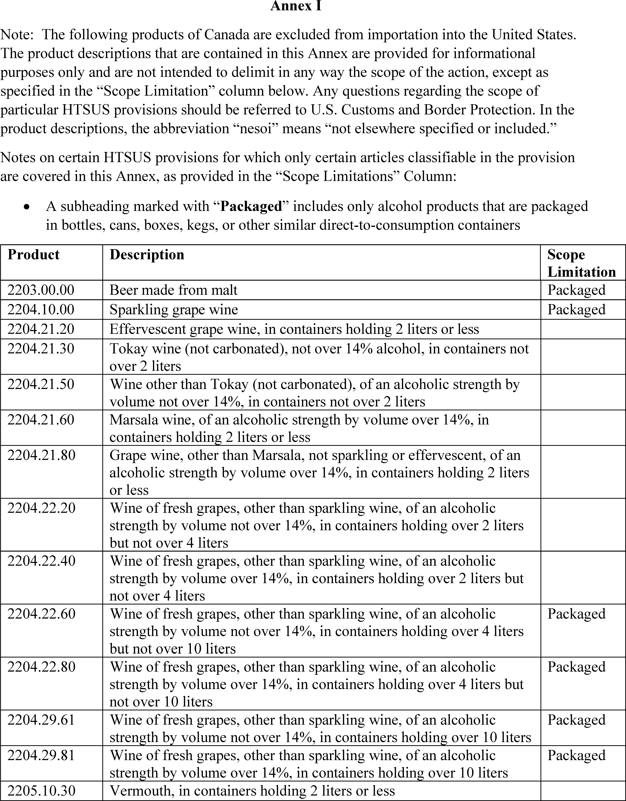
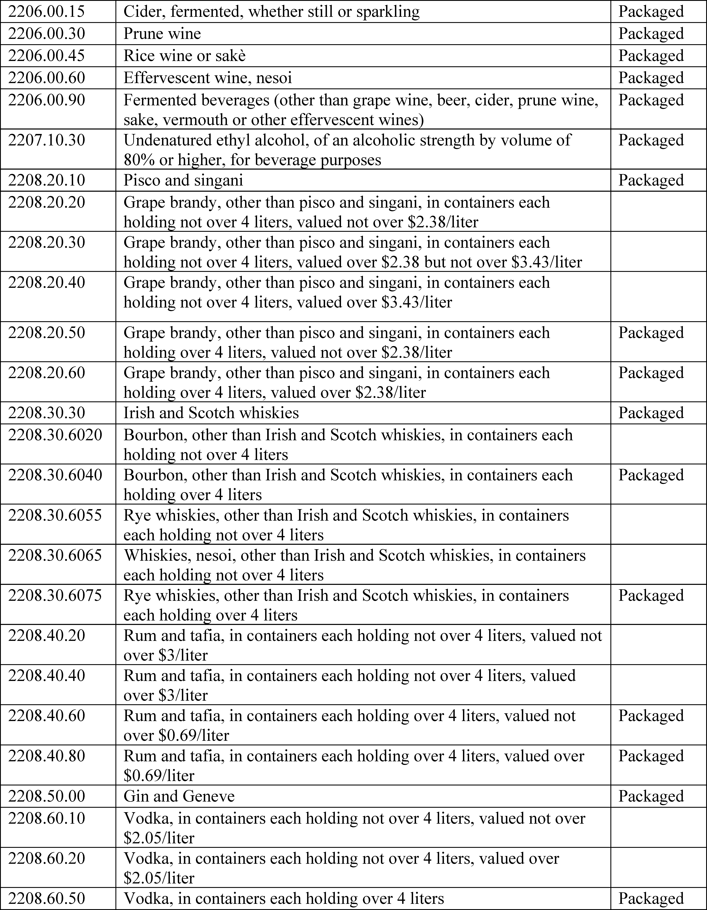
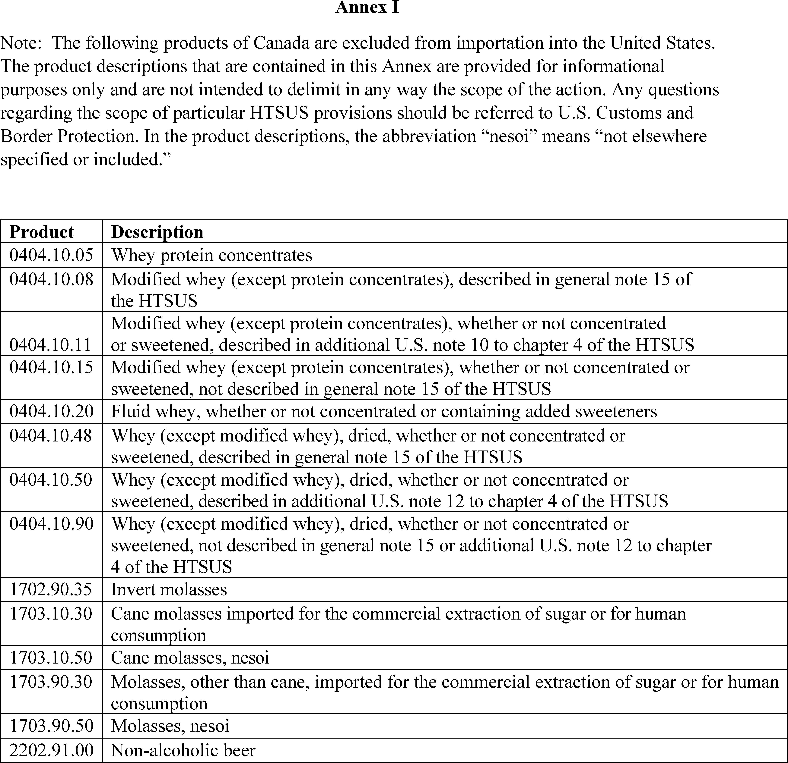
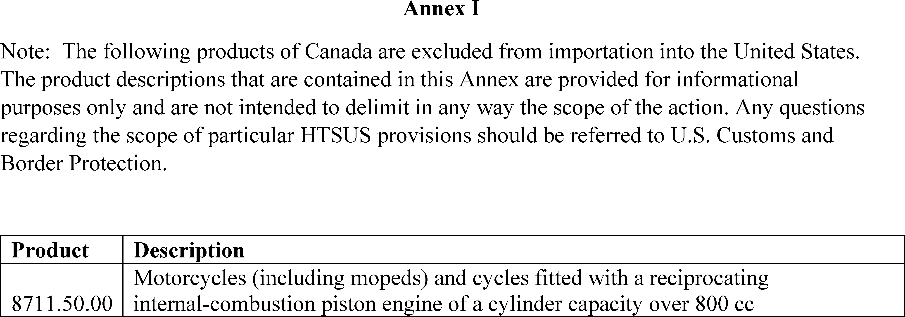
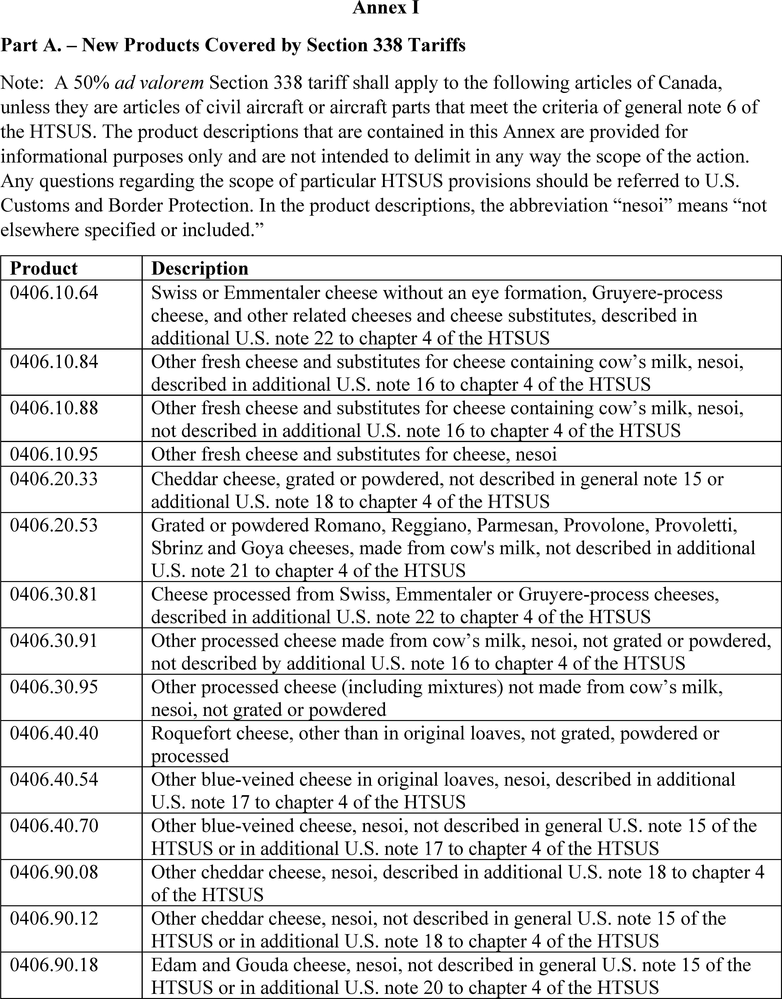
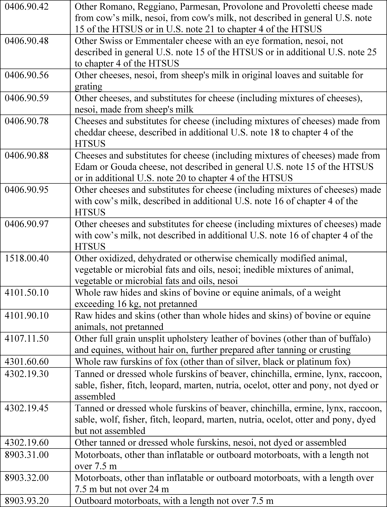
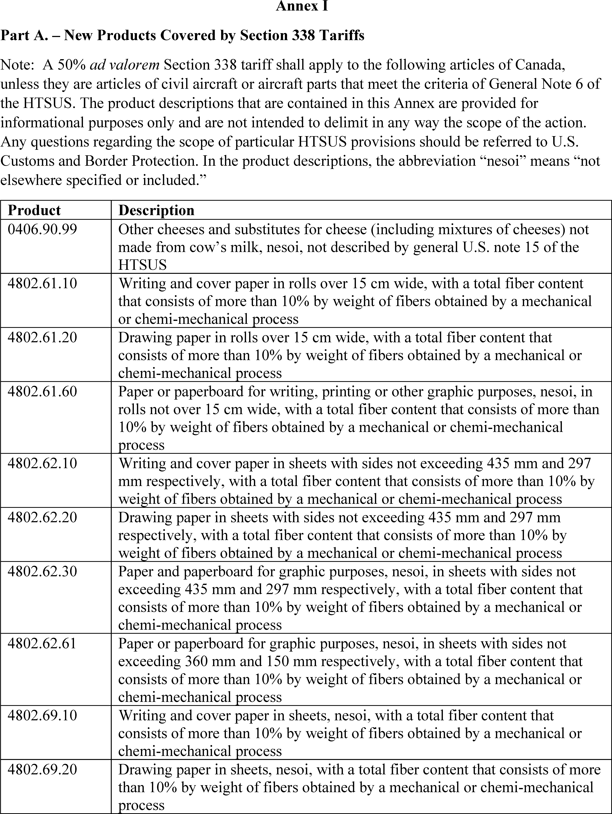
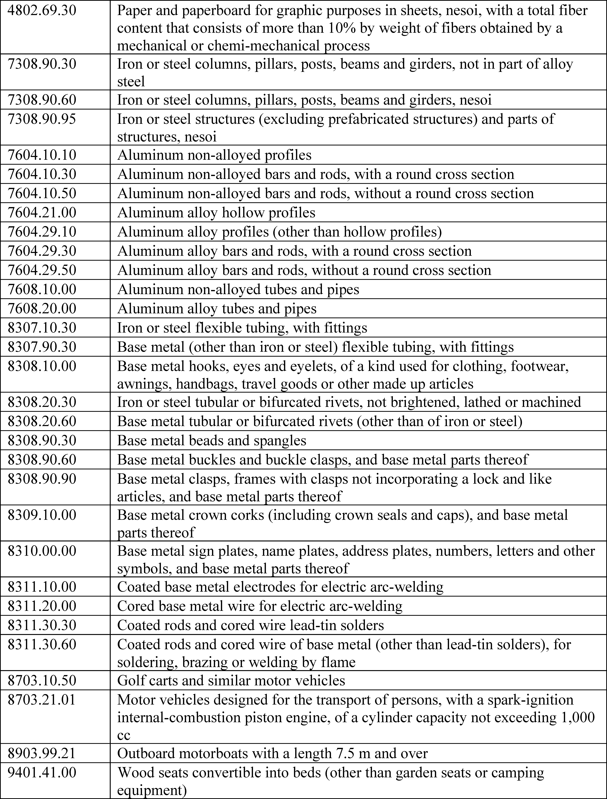

# Daily Digest — 2026-09-14

| | |
|---|---|
| **Digest date** | 2026-09-14 |
| **Data date range** | 2026-09-14 to 2026-09-14 |
| **Generated at** | 2026-09-15T04:03:17Z (UTC) |
| **Pipeline version** | ab38f30 |
| **Inference** | model layers ran — cli/haiku, opus |
| **Source watermarks** | CREC: 2026-09-11T09:35:56Z · BILLS: 2026-09-12T03:58:54Z · FR: 2026-09-14T16:20:15Z · USCOURTS: 2026-09-15T02:05:45Z · PLAW: 2026-09-09T15:30:07Z |

[Full observed listing for this day](day/2026-09-14.html) — every item our collectors observed for this publication day, mechanical rules applied, frozen at end of day. This digest is the canonical record.

All items below cite the govinfo package (and granule, where applicable) they
summarize. Selection is mechanical; each item states the rule that included
it. See the Coverage Statement at the end for a full accounting of what was
published, what was summarized, and what was excluded and why.

---

## Contents

- [Day in Review](#day-in-review)
- [1. Congressional Floor Activity](#1-congressional-floor-activity)
- [2. Legislation](#2-legislation)
- [3. Federal Register](#3-federal-register)
- [4. Enacted Laws](#4-enacted-laws)
- [5. Judicial Activity](#5-judicial-activity)
- [6. Agency Announcements](#6-agency-announcements)
- [7. Recorded Votes](#7-recorded-votes)
- [8. Bill Actions](#8-bill-actions)
- [9. Presidential Actions](#9-presidential-actions)
- [Terms Used Today](#terms-used-today)
- [Coverage Statement](#coverage-statement)
- [Methodology](#methodology)

---

## Day in Review

The digest carries one recorded roll call vote from the congressional floor. Separately, a presidential action observed on September 14 sent 41 nominations to the Senate, including 12 federal district judgeships, one circuit judgeship, one Court of Appeals for Veterans Claims judgeship, two Sentencing Commission reappointments, and 25 executive and diplomatic posts.

Five presidential documents appear in the Federal Register, all proclamations issued under section 338 of the Tariff Act of 1930 concerning Canadian products. Three exclude specified Canadian alcoholic beverages, dairy products, and motor vehicles and parts from importation effective September 29, 2026; two narrow the scope of the 50 percent ad valorem duties imposed under Proclamations 11046 and 11048, effective September 15, 2026. Alongside them the digest carries six final rules, eight proposed rules, 137 notices, and 212 agency press releases. The final rules include a Coast Guard safety zone on Lake Erie, an EPA approval of revised motor vehicle emissions budgets for California's San Joaquin Valley, an FAA sport pilot testing alignment, the FCC's fiscal year 2026 regulatory fee schedule, and a joint OCC, Federal Reserve, and FDIC interim final rule raising the asset threshold for an 18-month examination cycle to $6 billion. The proposed rules are chiefly FAA airworthiness directives and EPA state air quality plan actions.

The digest also carries 407 district court opinions.

*Composed from the summarized items below and the day's mechanical
counts; all specifics are cited in their sections.*

---

## 1. Congressional Floor Activity

No Congressional Record issue was observed on this day. The Record for a day's proceedings is typically published by govinfo the following morning; it appears in the digest for the day it is observed ([how our clocks work](faq.html#fapds-three-clocks)).

### 1.1 Senate

No Senate floor items met the selection thresholds. 0 floor granule(s) are accounted for in the Coverage Statement.

### 1.2 House of Representatives

No House floor items met the selection thresholds. 0 floor granule(s) are accounted for in the Coverage Statement.

### 1.3 Recorded Votes

No recorded votes were published in this issue of the Congressional Record.

---

## 2. Legislation

Source: Congressional Bills (BILLS), text versions published 2026-09-14 to 2026-09-14.

### 2.1 Counts by Stage

| Stage (bill text version) | Count |
|---|---|
| Introduced (ih/is) | 0 |
| Reported (rh/rs) | 0 |
| Engrossed (eh/es) | 0 |
| Enrolled (enr) | 0 |
| Other versions | 0 |
| **Total bill texts published** | **0** |

### 2.2 Bills Listed by Mechanical Rule

Bills below are listed because they matched at least one listing rule; the
matching rule is stated per item. All other bill texts are counted above and
accounted for in the Coverage Statement.

No bill texts published in this range matched a listing rule; all 0 are
accounted for in the Coverage Statement.

---

## 3. Federal Register

Source: Federal Register (FR), issue of 2026-09-14.

### 3.1 Counts by Document Type

| Document type | Count |
|---|---|
| Rules | 6 |
| Proposed rules | 8 |
| Notices | 137 |
| Presidential documents | 5 |
| **Total FR documents** | **156** |

### 3.2 Rules Published

Tags: department of homeland security · executive · securities and exchange commission · model keys: air quality · aviation · banking

*In plain terms: Six final rules include a Lake Erie drone safety zone, California air-quality approval, expanded bank examination cycles, aviation testing standards, FCC fiscal 2026 fees, and E-Rate competitive bidding.*

#### DEPARTMENT OF HOMELAND SECURITY

- **Safety Zone; Lake Erie, Oregon, OH** (2026-18734; 33 CFR Part 165) — The Coast Guard is establishing a temporary safety zone for navigable waters of Lake Erie within a 300-yard radius of an overwater drone display at 41°41′15.9″ N, 83°22′14.7″ W. The safety zone is needed to protect personnel, vessels, and the marine environment from potential hazards associated with an overwater drone display. Entry of vessels or persons into this zone is prohibited unless specifically authorized by the Captain of the Port, Sector Detroit, or their designated representative. Action: Temporary final rule. Dates: This rule is effective from 9 p.m. until 9:45 p.m. on September 12, 2026.
  - *In plain terms:* The Coast Guard is restricting access within 300 yards of a drone display on Lake Erie to protect people and boats.
  - Included because: FR-SEL-01 — document type: final rule (all listed)
  - Source: [FR-2026-09-14 / 2026-18734](https://www.govinfo.gov/app/details/FR-2026-09-14/2026-18734)

#### DEPARTMENT OF THE TREASURY

- **Expanded Examination Cycle for Certain Small Insured Depository Institutions and U.S. Branches and Agencies of Foreign Banks** (2026-18766; 12 CFR Part 4; 12 CFR Parts 208 and 211; 12 CFR Parts 337 and 347) — The OCC, Board, and FDIC (collectively, the Agencies) are jointly issuing and requesting public comment on an interim final rule to implement section 903 of the 21st Century ROAD to Housing Act. The interim final rule raises the asset threshold for certain supervised institutions with less than $6 billion in total assets to qualify for an 18-month on-site examination cycle. The interim final rule also makes parallel changes to the Agencies' regulations governing the on-site examination cycle for U.S. branches and agencies of foreign banks, consistent with the International Banking Act of 1978 (IBA). Action: Joint interim final rule and request for comments. Dates: The interim final rule is effective on September 14, 2026. Comments on the rule must be received by October 14, 2026.
  - *In plain terms:* The OCC, Federal Reserve, and FDIC raise the asset threshold to below $6 billion for banks to qualify for 18-month examination cycles, taking effect while accepting comments.
  - Included because: FR-SEL-01 — document type: final rule (all listed)
  - Source: [FR-2026-09-14 / 2026-18766](https://www.govinfo.gov/app/details/FR-2026-09-14/2026-18766)

#### DEPARTMENT OF TRANSPORTATION

- **Sport Pilot Practical Test Standards Alignment** (2026-18776; 14 CFR Part 61) — FAA revises certain regulations governing airman certification and incorporates three updated sport pilot practical test standards (PTS) by reference. The rule aligns the airman testing standards with newly adopted regulatory requirements in the Modernization of Special Airworthiness Certification (MOSAIC) final rule related to the certification of sport pilots and operation of light-sport category aircraft and updates the PTS to improve airman certification standard materials. Action: Final rule. Dates: Effective date: September 14, 2026. The incorporation by reference of certain publications listed in this rule is approved by the Director of the Federal Register as of September 14, 2026. Compliance date: The compliance date for this final rule is October 14, 2026.
  - *In plain terms:* The FAA updates sport pilot certification testing standards to align with new rules for light-sport aircraft.
  - Included because: FR-SEL-01 — document type: final rule (all listed)
  - Source: [FR-2026-09-14 / 2026-18776](https://www.govinfo.gov/app/details/FR-2026-09-14/2026-18776)

#### ENVIRONMENTAL PROTECTION AGENCY

- **Approval and Promulgation of Implementation Plans; California; San Joaquin Valley, Revisions to Motor Vehicle Emissions Budgets for Ozone** (2026-18748; 40 CFR Part 52) — The U.S. Environmental Protection Agency (EPA or “Agency”) is taking final action to approve a revision to the State of California's state implementation plan (SIP) for the San Joaquin Valley (SJV) area. The revision includes an update to the SJV area's motor vehicle emissions budgets (“budgets”) for nitrogen oxides (NO X ) and volatile organic compounds (VOC) for the 2008 8-hour ozone national ambient air quality standards (NAAQS or “standards”). These updated budgets for 2026, 2029, and 2031 were developed with the latest modeling method approved for California. These updated budgets apply to all subareas within the SJV. Upon the effective date of this rule, the updated budgets will supersede the existing approved SJV subarea budgets for the 2008 ozone NAAQS that were based on an earlier emissions model. The EPA is approving the updated SJV ozone budgets in accordance with the requirements of the Clean Air Act (CAA or “Act”) and the EPA's regulations. Action: Final rule. Dates: This rule is effective October 14, 2026.
  - *In plain terms:* The EPA is approving updated vehicle emissions limits for nitrogen oxides and volatile organic compounds in California's San Joaquin Valley for 2026, 2029, and 2031.
  - Included because: FR-SEL-01 — document type: final rule (all listed)
  - Source: [FR-2026-09-14 / 2026-18748](https://www.govinfo.gov/app/details/FR-2026-09-14/2026-18748)

#### FEDERAL COMMUNICATIONS COMMISSION

- **Review of the Commission's Assessment and Collection of Regulatory Fees for Fiscal Year 2026** (2026-18778; 47 CFR Part 1) — In this document, the Federal Communications Commission (Commission or FCC) adopts its regulatory fee schedule to assess and collect regulatory fees for Fiscal Year 2026 (FY 26). Action: Final rule. Dates: Effective September 14, 2026. To avoid penalties and interest, regulatory fees should be paid by the due date of September 24, 2026.
  - *In plain terms:* The FCC adopts the fee schedule for regulatory fees in fiscal year 2026.
  - Included because: FR-SEL-01 — document type: final rule (all listed)
  - Source: [FR-2026-09-14 / 2026-18778](https://www.govinfo.gov/app/details/FR-2026-09-14/2026-18778)
- **Promoting Fair and Open Competitive Bidding in the E-Rate Program; Schools and Libraries Universal Service Support Mechanism** (2026-18780; 47 CFR Part 54) — In this document, the Federal Communications Commission (Commission) announces that the Office of Management and Budget (OMB) has approved until November 30, 2027 an information collection associated with the rules for the Universal Service Schools and Libraries program contained in the Commission's Promoting Fair and Open Competitive Bidding in the E-Rate Program; Schools and Libraries Universal Service Support Mechanism Report and Order ( Report and Order ), WC Docket No. 21-455, CC Docket No. 02-6; FCC 26-30. This document is consistent with the Report and Order, which stated that the Commission would publish a document in the Federal Register announcing the effective date of the new information collection requirements. Action: Final rule; announcement of effective date. Dates: The amendatory instructions 4 and 5, published at 91 FR 29051, on May 19, 2026 are effective September 14, 2026.
  - *In plain terms:* The FCC announces OMB approval of information collection requirements for E-Rate school and library broadband rules through November 30, 2027.
  - Included because: FR-SEL-01 — document type: final rule (all listed)
  - Source: [FR-2026-09-14 / 2026-18780](https://www.govinfo.gov/app/details/FR-2026-09-14/2026-18780)

### 3.3 Proposed Rules Published

Tags: department of homeland security · executive · securities and exchange commission · model keys: air quality · aircraft safety · firefighting

*In plain terms: Eight proposed rules include FAA airworthiness directives for Bombardier, Dassault, CFM, and Airbus aircraft; EPA air-quality actions for Maryland, Sacramento, and DC; and FAA evaluation of firefighter wildfire transport.*

#### DEPARTMENT OF TRANSPORTATION

- **Airworthiness Directives; Bombardier, Inc., Airplanes** (2026-18746; 14 CFR Part 39) — The FAA proposes to adopt a new airworthiness directive (AD) for all Bombardier, Inc., Model BD-100-1A10 airplanes. This proposed AD was prompted by reports of pitch upset upon autopilot disconnect following engine indication and crew alerting system (EICAS) messages that indicated that the autopilot was holding significant nose up or nose down forces on the elevator. This proposed AD would require revising the existing airplane flight manual (AFM) to change the procedure for the AP STAB TRIM FAIL (C) advisory message from a non-normal procedure to an emergency procedure to provide the flightcrew with emergency procedures to follow to stabilize airspeed in certain conditions. The FAA is proposing this AD to address the unsafe condition on these products. Action: Notice of proposed rulemaking (NPRM). Dates: The FAA must receive comments on this proposed AD by October 29, 2026.
  - *In plain terms:* The FAA proposes requiring Bombardier aircraft flight manuals to treat autopilot trim warnings as emergency procedures after reports of pitch upset when autopilot disconnects.
  - Included because: FR-SEL-02 — document type: proposed rule (all listed)
  - Source: [FR-2026-09-14 / 2026-18746](https://www.govinfo.gov/app/details/FR-2026-09-14/2026-18746)
- **Airworthiness Directives; Dassault Aviation Airplanes** (2026-18749; 14 CFR Part 39) — The FAA proposes to adopt a new airworthiness directive (AD) for all Dassault Aviation Model FALCON 6X and FALCON 7X airplanes, and certain Model FALCON 900EX and FALCON 2000EX airplanes. This proposed AD was prompted by reports of passenger seats sliding without passenger input, which subsequent investigation determined to be caused by the ring brakes and ring brake housing being out of allowed adjustment tolerances, failing to lock the seat in place. This proposed AD would require an inspection of each affected seat for discrepancies and applicable on-condition actions. This proposed AD would also limit the installation of affected seats under certain conditions. The FAA is proposing this AD to address the unsafe condition on these products. Action: Notice of proposed rulemaking (NPRM). Dates: The FAA must receive comments on this proposed AD by October 29, 2026.
  - *In plain terms:* The FAA proposes requiring inspection of passenger seats on certain Dassault aircraft and restricting their installation after reports of seats sliding unexpectedly.
  - Included because: FR-SEL-02 — document type: proposed rule (all listed)
  - Source: [FR-2026-09-14 / 2026-18749](https://www.govinfo.gov/app/details/FR-2026-09-14/2026-18749)
- **RIN 2120-AA64** (2026-18752; 14 CFR Part 39) — The FAA proposes to adopt a new airworthiness directive (AD) for certain CFM International, S.A. (CFM) Model CFM56-5B, CFM56-5C, and CFM56-7B engines with a certain high-pressure turbine (HPT) inner stationary seal installed. This proposed AD was prompted by multiple reports of honeycomb separation from the surface of HPT inner stationary seals. This proposed AD would require initial and repetitive borescope inspections (BSIs) of the rotating air HPT front seal for cracks and, depending on the results, replacement with a part eligible for installation. This proposed AD would also require removal and replacement of the affected HPT inner stationary seal. This proposed AD would also require inspection of the affected HPT inner stationary seal for honeycomb separation and, depending on the results of the inspection, removal and replacement of the rotating air HPT front seal, HPT rotor blades, and No. 3 ball bearing. The FAA is proposing this AD to address the unsafe condition on these products. Action: Notice of proposed rulemaking (NPRM). Dates: The FAA must receive comments on this proposed AD by October 29, 2026.
  - *In plain terms:* The FAA proposes requiring inspections and replacement of parts on certain CFM aircraft engines after reports of inner seal honeycomb damage.
  - Included because: FR-SEL-02 — document type: proposed rule (all listed)
  - Source: [FR-2026-09-14 / 2026-18752](https://www.govinfo.gov/app/details/FR-2026-09-14/2026-18752)
- **Airworthiness Directives; Airbus SAS Airplanes** (2026-18796; 14 CFR Part 39) — The FAA proposes to supersede Airworthiness Directive (AD) 2024-26-06, which applies to certain Airbus SAS Model A330-201, -202, -203, -223, -223F, -243, -243F, -301, -302, -303, -321, -322, -323, -341, -342, -343, and -941 airplanes; and all Airbus SAS Model A340-211, -212, -213, -311, -312, and -313 airplanes. AD 2024-26-06 requires modifying the trimmable horizontal stabilizer actuator (THSA) installation, implementing the electrical load sensing device (ELSD) wiring provisions, and installing and activating the ELSD with revised procedures and also requires additional actions for certain airplanes. Since the FAA issued AD 2024-26-06, it has been determined that additional actions are required on certain airplanes after completion of the modification. This proposed AD would continue to require the actions in AD 2024-26-06 and would require additional work for certain airplanes. The FAA is proposing this AD to address the unsafe condition on these products. Action: Notice of proposed rulemaking (NPRM). Dates: The FAA must receive comments on this proposed AD by October 29, 2026.
  - *In plain terms:* The FAA proposes updating a safety requirement for certain Airbus aircraft to add work beyond what was previously required.
  - Included because: FR-SEL-02 — document type: proposed rule (all listed)
  - Source: [FR-2026-09-14 / 2026-18796](https://www.govinfo.gov/app/details/FR-2026-09-14/2026-18796)
- **Use of Certain Restricted Category Aircraft for the Transport of Firefighters for Wildfire Suppression** (2026-18799; 14 CFR Parts 21, 91, and 119) — FAA is evaluating a future amendment to its regulations to permit firefighters to be transported to and from the site of a wildfire aboard certain restricted category aircraft when the purpose of that transportation is to permit those firefighters to perform ground wildfire suppression. The amendment would apply to civil aircraft operations and public aircraft operations when the restricted category aircraft is owned by a civilian operator. This action responds to a statutory mandate, and FAA has determined it needs additional information to address both the mandate and the assessment of its economic impact. This ANPRM invites public comments on the current availability of firefighter transportation resources, hindrances and needs influencing their transport, and cost-benefit considerations affecting the transport of firefighters on certain aircraft. Action: Advance notice of proposed rulemaking (ANPRM). Dates: Send comments on or before November 13, 2026.
  - *In plain terms:* The FAA is seeking public comment on allowing firefighters to be transported on certain aircraft for wildfire suppression.
  - Included because: FR-SEL-02 — document type: proposed rule (all listed)
  - Source: [FR-2026-09-14 / 2026-18799](https://www.govinfo.gov/app/details/FR-2026-09-14/2026-18799)

#### ENVIRONMENTAL PROTECTION AGENCY

- **Approval and Promulgation of State Air Quality Plans for Designated Facilities and Pollutants; Maryland; Negative Declaration for Existing Other Solid Waste Incinerators** (2026-18750; 40 CFR Part 62) — The Environmental Protection Agency (EPA) is proposing to approve the negative declaration submitted by the Maryland Department of the Environment (MDE) on April 17, 2026. The negative declaration submitted by MDE certifies that there are no existing other solid waste incinerators (OSWI) subject to sections 111(d) and 129 of the Clean Air Act (CAA) within the jurisdiction of the State of Maryland. Action: Proposed rule. Dates: Written comments must be received on or before October 14, 2026.
  - *In plain terms:* The EPA proposes approving Maryland's statement that there are no other solid waste incinerators in the state subject to federal air quality requirements.
  - Included because: FR-SEL-02 — document type: proposed rule (all listed)
  - Source: [FR-2026-09-14 / 2026-18750](https://www.govinfo.gov/app/details/FR-2026-09-14/2026-18750)
- **Clean Data Determination; 1997 8-Hour Ozone Standards; California; Sacramento Metro Area** (2026-18755; 40 CFR Part 52) — The U.S. Environmental Protection Agency (EPA or “Agency”) is proposing to issue a clean data determination (CDD) for the Sacramento Metro, California nonattainment area to reflect our finding that the area is attaining the 1997 8-hour ozone national ambient air quality standards (NAAQS or “standards”). This finding is based on quality-assured and certified ambient air quality monitoring data from 2023 through 2025. If we finalize this CDD, certain Clean Air Act (CAA) requirements that apply to the Sacramento Metro area will be suspended for so long as the area continues to attain the 1997 8-hour ozone NAAQS. We are taking comments on this proposal and plan to follow with a final action. Action: Proposed determination. Dates: Comments must be received on or before October 14, 2026.
  - *In plain terms:* The EPA proposes finding that Sacramento's air meets 1997 ozone standards based on 2023-2025 monitoring data, which would suspend certain requirements if approved.
  - Included because: FR-SEL-02 — document type: proposed rule (all listed)
  - Source: [FR-2026-09-14 / 2026-18755](https://www.govinfo.gov/app/details/FR-2026-09-14/2026-18755)
- **Approval and Promulgation of State Air Quality Plans for Designated Facilities and Pollutants; District of Columbia; Negative Declaration for Existing Other Solid Waste Incinerators** (2026-18759; 40 CFR Part 62) — The Environmental Protection Agency (EPA) is proposing to approve the negative declaration submitted by the District of Columbia Department of Energy and Environment (DCDOEE) on May 21, 2026. The negative declaration submitted by DCDOEE certifies that there are no existing other solid waste incinerators (OSWI) subject to sections 111(d) and 129 of the Clean Air Act (CAA) within the jurisdiction of the District of Columbia (DC). Action: Proposed rule. Dates: Written comments must be received on or before October 14, 2026.
  - *In plain terms:* The EPA proposes approving Washington, D.C.'s statement that there are no other solid waste incinerators in the district subject to federal air quality requirements.
  - Included because: FR-SEL-02 — document type: proposed rule (all listed)
  - Source: [FR-2026-09-14 / 2026-18759](https://www.govinfo.gov/app/details/FR-2026-09-14/2026-18759)

### 3.4 Notices and Presidential Documents

Tags: department of homeland security · executive · securities and exchange commission · model keys: canadian tariffs · trade duties

*In plain terms: Five proclamations on Canadian trade: three exclude beverages, dairy, and motor vehicles from importation effective September 29; two narrow duty scopes on beverages and vehicles effective September 15.*

Notices are summarized only when they match a listing rule; all are counted
in 3.1 and in the Coverage Statement. Presidential documents in the FR are
always listed.

- **Excluding Certain Canadian Products From Importation Into the United States in Response to Continued Discrimination Against the Commerce of the United States With Respect to Alcoholic Beverages** (2026-18835) — The President excludes specified Canadian alcoholic beverages from importation into the United States effective September 29, 2026, following an earlier finding under Proclamation 11046 of Canadian discrimination against U.S. alcoholic beverages. The action is authorized under section 338 of the Tariff Act of 1930.
  - *In plain terms:* The President is excluding specified Canadian alcoholic beverages from importation effective September 29, 2026, in response to Canadian tariff discrimination.
  - Included because: FR-SEL-03 — presidential document (all listed)
  - Source: [FR-2026-09-14 / 2026-18835](https://www.govinfo.gov/app/details/FR-2026-09-14/2026-18835)
  -  *Source graphic 1 of 3 from 2026-18835.*
  -  *Source graphic 2 of 3 from 2026-18835.*
  - *Graphics not rendered here: 1 of 3 — see the [source PDF](https://www.govinfo.gov/content/pkg/FR-2026-09-14/pdf/FR-2026-09-14.pdf).*
- **Excluding Certain Canadian Products From Importation Into the United States in Response to Continued Discrimination Against the Commerce of the United States With Respect to Dairy** (2026-18836) — The President excludes specified Canadian dairy products from importation effective September 29, 2026, following an earlier finding under Proclamation 11047 of Canadian tariff-rate quota discrimination against U.S. dairy. The action is authorized under section 338 of the Tariff Act of 1930.
  - *In plain terms:* The President is excluding specified Canadian dairy products from importation effective September 29, 2026, in response to Canadian tariff discrimination.
  - Included because: FR-SEL-03 — presidential document (all listed)
  - Source: [FR-2026-09-14 / 2026-18836](https://www.govinfo.gov/app/details/FR-2026-09-14/2026-18836)
  -  *Source graphic 1 of 1 from 2026-18836.*
- **Excluding Certain Canadian Products From Importation Into the United States in Response to Continued Discrimination Against the Commerce of the United States With Respect to Motor Vehicles** (2026-18837) — The President excludes specified Canadian motor vehicles and parts from importation effective September 29, 2026, following an earlier finding under Proclamation 11048 of Canadian motor vehicle tariff scheme discrimination against U.S. automotive exports. The action is authorized under section 338 of the Tariff Act of 1930.
  - *In plain terms:* The President is excluding specified Canadian motor vehicles and parts from importation effective September 29, 2026, in response to Canadian tariff discrimination.
  - Included because: FR-SEL-03 — presidential document (all listed)
  - Source: [FR-2026-09-14 / 2026-18837](https://www.govinfo.gov/app/details/FR-2026-09-14/2026-18837)
  -  *Source graphic 1 of 1 from 2026-18837.*
- **Modifying the Scope of Products of Canada Subject to the Additional Duties Imposed To Offset Canadian Discrimination Against the Commerce of the United States With Respect to Alcoholic Beverages** (2026-18838) — This proclamation narrows the scope of Canadian products subject to the 50 percent ad valorem duty under Proclamation 11046, effective September 15, 2026, removing specified alcoholic beverages from duties while retaining others on the restricted list.
  - *In plain terms:* The President narrows the scope of Canadian products subject to 50% tariffs effective September 15, 2026, removing certain alcoholic beverages.
  - Included because: FR-SEL-03 — presidential document (all listed)
  - Source: [FR-2026-09-14 / 2026-18838](https://www.govinfo.gov/app/details/FR-2026-09-14/2026-18838)
  -  *Source graphic 1 of 5 from 2026-18838.*
  -  *Source graphic 2 of 5 from 2026-18838.*
  - *Graphics not rendered here: 3 of 5 — see the [source PDF](https://www.govinfo.gov/content/pkg/FR-2026-09-14/pdf/FR-2026-09-14.pdf).*
- **Modifying the Scope of Products of Canada Subject to the Additional Duties Imposed To Offset Canadian Discrimination Against the Commerce of the United States With Respect to Motor Vehicles** (2026-18839) — This proclamation narrows the scope of Canadian products subject to the 50 percent ad valorem duty under Proclamation 11048, effective September 15, 2026, removing specified motor vehicles and parts from duties while retaining others on the restricted list.
  - *In plain terms:* The President narrows the scope of Canadian products subject to 50% tariffs effective September 15, 2026, removing certain motor vehicles and parts.
  - Included because: FR-SEL-03 — presidential document (all listed)
  - Source: [FR-2026-09-14 / 2026-18839](https://www.govinfo.gov/app/details/FR-2026-09-14/2026-18839)
  -  *Source graphic 1 of 6 from 2026-18839.*
  -  *Source graphic 2 of 6 from 2026-18839.*
  - *Graphics not rendered here: 4 of 6 — see the [source PDF](https://www.govinfo.gov/content/pkg/FR-2026-09-14/pdf/FR-2026-09-14.pdf).*

---

## 4. Enacted Laws

Source: Public and Private Laws (PLAW) published 2026-09-14.

No laws were published in this range.

---

## 5. Judicial Activity

Source: United States Courts Opinions (USCOURTS): opinions observed 2026-09-14
by our collector; each opinion states its own issue date beside its
listing ([how our clocks work](faq.html#fapds-three-clocks)).

Completeness disclosure (standing): USCOURTS carries opinions from
approximately 140 participating appellate, district, bankruptcy, and
national federal courts. Unlike the Congressional Record and the Federal
Register, which are the complete official record of their branches,
USCOURTS is participation-based and is NOT the complete federal judicial
record. Courts post opinions with delay — typically over several days —
so a day's digest carries the opinions that became available that day,
whatever date each was issued.

### 5.1 Appellate and National Court Opinions

Appellate and national court opinions are summarized; district and
bankruptcy opinions are counted in 5.2 and in the Coverage Statement.

No appellate or national court opinions matched a listing rule for this
date; all opinions are counted in 5.2 and accounted for in the Coverage
Statement.

### 5.2 Counts by Court Category

| Court category | Opinions |
|---|---|
| Appellate | 0 |
| District | 407 |
| Bankruptcy | 0 |
| National | 0 |
| **Total opinions extracted** | **407** |

Archive-window disclosure (rule USCOURTS-FETCH-01): 33152 USCOURTS package(s) have been listed in delta syncs but fell outside the 7-day archive window and were not fetched (global running count across all syncs, not limited to this date).

---

## 6. Agency Announcements

Official press releases and statements the agencies themselves date
on 2026-09-14 (sources listed in the source guide). These are the
agencies' own announcements — official advocacy, quoted and
attributed, not findings of this digest. Agency web content can be
edited or removed without notice; captures and hashes are preserved
per the provenance policy.

#### CFTC Press Releases

- **[CFTC Grants Multiple Whistleblower Awards Totaling Over $150 Million](https://www.cftc.gov/PressRoom/PressReleases/9298-26)** — dated 2026-09-14 by the agency
  - Included because: AGENCYPR-SEL-01 — official agency release dated this day by the agency (all such releases from active sources are listed; titles only in the pilot)

#### CISA Cybersecurity Advisories

- **[CISA Adds One Known Exploited Vulnerability to Catalog](https://www.cisa.gov/news-events/alerts/2026/09/14/cisa-adds-one-known-exploited-vulnerability-catalog)** — dated 2026-09-14 by the agency
  - Included because: AGENCYPR-SEL-01 — official agency release dated this day by the agency (all such releases from active sources are listed; titles only in the pilot)

#### DEA Updates (email)

- **Louisiana Community Leadership Intensive** — dated 2026-09-14 by the agency
  - Included because: AGENCYPR-SEL-01 — official agency release dated this day by the agency (all such releases from active sources are listed; titles only in the pilot)
  - Source: agency email bulletin to this project's subscription, captured and DKIM-verified (the bulletin named no canonical page)

#### Defense News Releases

- **[Southern Vanguard 2026 Turns Peruvian Jungle Into a Classroom](https://www.war.gov/News/News-Stories/Article/Article/4600439/southern-vanguard-2026-turns-peruvian-jungle-into-a-classroom/)** — dated 2026-09-14 by the agency
  - Included because: AGENCYPR-SEL-01 — official agency release dated this day by the agency (all such releases from active sources are listed; titles only in the pilot)

#### DHS News Releases

- **[DHS Issues Statement Condemning Judge Who Allowed Illegal Alien to Escape ICE in Her Courtroom](https://www.dhs.gov/news/2026/09/14/dhs-issues-statement-condemning-judge-who-allowed-illegal-alien-escape-ice-her)** — dated 2026-09-14 by the agency
  - Included because: AGENCYPR-SEL-01 — official agency release dated this day by the agency (all such releases from active sources are listed; titles only in the pilot)
- **[ICE Arrests Illegal Alien with a New York-Issued Commercial Driver’s License](https://www.dhs.gov/news/2026/09/14/ice-arrests-illegal-alien-new-york-issued-commercial-drivers-license)** — dated 2026-09-14 by the agency
  - Included because: AGENCYPR-SEL-01 — official agency release dated this day by the agency (all such releases from active sources are listed; titles only in the pilot)
- **[WORST OF THE WORST: ICE Arrests Murderers, Pedophiles, and Drug Traffickers](https://www.dhs.gov/news/2026/09/14/worst-worst-ice-arrests-murderers-pedophiles-and-drug-traffickers)** — dated 2026-09-14 by the agency
  - Included because: AGENCYPR-SEL-01 — official agency release dated this day by the agency (all such releases from active sources are listed; titles only in the pilot)

#### EEOC Newsroom

- **[N.C. Detective Agency to Pay $65,231 to Resolve EEOC Religious Discrimination Charge](https://www.eeoc.gov/newsroom/nc-detective-agency-pay-65231-resolve-eeoc-religious-discrimination-charge)** — dated 2026-09-14 by the agency
  - Included because: AGENCYPR-SEL-01 — official agency release dated this day by the agency (all such releases from active sources are listed; titles only in the pilot)

#### FAA Updates (email)

- **FAA Orders & Notices Update Notification** — dated 2026-09-14 by the agency
  - Included because: AGENCYPR-SEL-01 — official agency release dated this day by the agency (all such releases from active sources are listed; titles only in the pilot)
  - Source: agency email bulletin to this project's subscription, captured and DKIM-verified (the bulletin named no canonical page)
- **FAA Orders & Notices Update Notification** — dated 2026-09-14 by the agency
  - Included because: AGENCYPR-SEL-01 — official agency release dated this day by the agency (all such releases from active sources are listed; titles only in the pilot)
  - Source: agency email bulletin to this project's subscription, captured and DKIM-verified (the bulletin named no canonical page)

#### FDA Email Updates (email)

- **[Centric Compounding Issues Nationwide Recall of Glutathione, Myer’s Cocktail, and Tri-Immune Boost Due to Elevated Endotoxin Levels](https://www.fda.gov/safety/recalls-market-withdrawals-safety-alerts/centric-compounding-issues-nationwide-recall-glutathione-myers-cocktail-and-tri-immune-boost-due?utm_medium=email&utm_source=govdelivery)** — dated 2026-09-14 by the agency
  - Included because: AGENCYPR-SEL-01 — official agency release dated this day by the agency (all such releases from active sources are listed; titles only in the pilot)
  - Source: agency email bulletin to this project's subscription, captured and DKIM-verified
- **FDA MedWatch - Glutathione, Myer’s Cocktail, and Tri-Immune Boost by Centric Compounding** — dated 2026-09-14 by the agency
  - Included because: AGENCYPR-SEL-01 — official agency release dated this day by the agency (all such releases from active sources are listed; titles only in the pilot)
  - Source: agency email bulletin to this project's subscription, captured and DKIM-verified (the bulletin named no canonical page)
- **[Whole Foods Market Issues Allergy Alert on Undeclared Egg in Cabricharme Cheese](https://www.fda.gov/safety/recalls-market-withdrawals-safety-alerts/whole-foods-market-issues-allergy-alert-undeclared-egg-cabricharme-cheese?utm_medium=email&utm_source=govdelivery)** — dated 2026-09-14 by the agency
  - Included because: AGENCYPR-SEL-01 — official agency release dated this day by the agency (all such releases from active sources are listed; titles only in the pilot)
  - Source: agency email bulletin to this project's subscription, captured and DKIM-verified

#### FEMA Press Releases

- **[Recovery Progress Continues Nearly Two Years After Helene](https://www.fema.gov/press-release/20260914/recovery-progress-continues-nearly-two-years-after-helene)** — dated 2026-09-14 by the agency
  - Included because: AGENCYPR-SEL-01 — official agency release dated this day by the agency (all such releases from active sources are listed; titles only in the pilot)
- **[Trump Administration Delivers More Than $33 Million Through FEMA to Help Communities Recover from Recent Disasters and Strengthen Their Resilience Against Future Disasters in Iowa, Kansas, Missouri, and Nebraska](https://www.fema.gov/press-release/20260914/trump-administration-delivers-more-33-million-through-fema-help-communities)** — dated 2026-09-14 by the agency
  - Included because: AGENCYPR-SEL-01 — official agency release dated this day by the agency (all such releases from active sources are listed; titles only in the pilot)
- **[Trump Administration Delivers More Than $350,000 Through FEMA to Help Connecticut Recover from Recent Disasters](https://www.fema.gov/press-release/20260914/trump-administration-delivers-more-350000-through-fema-help-connecticut)** — dated 2026-09-14 by the agency
  - Included because: AGENCYPR-SEL-01 — official agency release dated this day by the agency (all such releases from active sources are listed; titles only in the pilot)
- **[Trump Administration Delivers More Than $39 Million Through FEMA to Help Communities Recover from Recent Disasters and Strengthen Their Resilience Against Future Disasters in Oregon and Washington](https://www.fema.gov/press-release/20260914/trump-administration-delivers-more-39-million-through-fema-help-communities)** — dated 2026-09-14 by the agency
  - Included because: AGENCYPR-SEL-01 — official agency release dated this day by the agency (all such releases from active sources are listed; titles only in the pilot)
- **[Trump Administration Delivers Nearly $1.5 Million Through FEMA to Help Communities Recover from Recent Disasters in New York](https://www.fema.gov/press-release/20260914/trump-administration-delivers-nearly-15-million-through-fema-help)** — dated 2026-09-14 by the agency
  - Included because: AGENCYPR-SEL-01 — official agency release dated this day by the agency (all such releases from active sources are listed; titles only in the pilot)
- **[Trump Administration Delivers Nearly $883,000 Through FEMA to Help Communities Recover from Recent Disasters in Puerto Rico](https://www.fema.gov/press-release/20260914/trump-administration-delivers-nearly-883000-through-fema-help-communities)** — dated 2026-09-14 by the agency
  - Included because: AGENCYPR-SEL-01 — official agency release dated this day by the agency (all such releases from active sources are listed; titles only in the pilot)
- **[Trump Administration Delivers nearly $8.2 Million Through FEMA to Help Communities Recover from Recent Disasters and Strengthen Their Resilience Against Future Disasters in Hawai'i, Nevada, and the Northern Mariana Islands](https://www.fema.gov/press-release/20260914/trump-administration-delivers-nearly-82-million-through-fema-help)** — dated 2026-09-14 by the agency
  - Included because: AGENCYPR-SEL-01 — official agency release dated this day by the agency (all such releases from active sources are listed; titles only in the pilot)

#### FSIS Recalls and Public Health Alerts (email)

- **Meat, Poultry and Egg Product Inspection Directory** — dated 2026-09-14 by the agency
  - Included because: AGENCYPR-SEL-01 — official agency release dated this day by the agency (all such releases from active sources are listed; titles only in the pilot)
  - Source: agency email bulletin to this project's subscription, captured and DKIM-verified (the bulletin named no canonical page)
- **USDA Food Safety and Inspection Service Eligible Foreign Establishments Update** — dated 2026-09-14 by the agency
  - Included because: AGENCYPR-SEL-01 — official agency release dated this day by the agency (all such releases from active sources are listed; titles only in the pilot)
  - Source: agency email bulletin to this project's subscription, captured and DKIM-verified (the bulletin named no canonical page)
- **USDA Food Safety and Inspection Service Eligible U.S. Establishments by Country Update** — dated 2026-09-14 by the agency
  - Included because: AGENCYPR-SEL-01 — official agency release dated this day by the agency (all such releases from active sources are listed; titles only in the pilot)
  - Source: agency email bulletin to this project's subscription, captured and DKIM-verified (the bulletin named no canonical page)

#### GAO Reports & Testimonies

- **[Air Traffic Control Systems: Ambitious New Modernization Effort Needs to Improve Cost and Schedule Planning](https://www.gao.gov/products/gao-26-107992)** — dated 2026-09-14 by the agency
  - Included because: AGENCYPR-SEL-01 — official agency release dated this day by the agency (all such releases from active sources are listed; titles only in the pilot)
- **[COVID-19: Federal Efforts and Stakeholder Views on Expediting the Transportation of Personal Protective Equipment](https://www.gao.gov/products/gao-26-108488)** — dated 2026-09-14 by the agency
  - Included because: AGENCYPR-SEL-01 — official agency release dated this day by the agency (all such releases from active sources are listed; titles only in the pilot)
- **[Federal Real Property: GSA Should Take Additional Steps to Improve Agencies’ Awareness of Meeting Spaces List](https://www.gao.gov/products/gao-26-108669)** — dated 2026-09-14 by the agency
  - Included because: AGENCYPR-SEL-01 — official agency release dated this day by the agency (all such releases from active sources are listed; titles only in the pilot)
- **[K-12 Education: Facility Issues Led About One in Five Districts to Cancel School in 2024-25, Affecting 2 Million Students](https://www.gao.gov/products/gao-26-107970)** — dated 2026-09-14 by the agency
  - Included because: AGENCYPR-SEL-01 — official agency release dated this day by the agency (all such releases from active sources are listed; titles only in the pilot)
- **[National Register of Historic Places: Selected States and Tribes Identified Challenges to Participation](https://www.gao.gov/products/gao-26-107879)** — dated 2026-09-14 by the agency
  - Included because: AGENCYPR-SEL-01 — official agency release dated this day by the agency (all such releases from active sources are listed; titles only in the pilot)
- **[Testing and Evaluation Guide: Best Practices for Commercial Off-the-Shelf Systems (Exposure Draft)](https://www.gao.gov/products/gao-26-108068)** — dated 2026-09-14 by the agency
  - Included because: AGENCYPR-SEL-01 — official agency release dated this day by the agency (all such releases from active sources are listed; titles only in the pilot)

#### IRS Newswire (email)

- **[Tax Tip 2026-69: Estimated taxes aren’t just for the self-employed](https://www.irs.gov/businesses/small-businesses-self-employed/estimated-taxes)** — dated 2026-09-14 by the agency
  - Included because: AGENCYPR-SEL-01 — official agency release dated this day by the agency (all such releases from active sources are listed; titles only in the pilot)
  - Source: agency email bulletin to this project's subscription, captured and DKIM-verified

#### Justice Department News (email)

- **[Assistant U.S. Attorney](https://www.justice.gov/legal-careers/job/assistant-us-attorney-101)** — dated 2026-09-14 by the agency
  - Included because: AGENCYPR-SEL-01 — official agency release dated this day by the agency (all such releases from active sources are listed; titles only in the pilot)
  - Source: agency email bulletin to this project's subscription, captured and DKIM-verified
- **[Attorney-Advisor (General)](https://www.justice.gov/legal-careers/job/attorney-advisor-general-39)** — dated 2026-09-14 by the agency
  - Included because: AGENCYPR-SEL-01 — official agency release dated this day by the agency (all such releases from active sources are listed; titles only in the pilot)
  - Source: agency email bulletin to this project's subscription, captured and DKIM-verified
- **[Consolidated Legal Center (CLC) Attorney](https://www.justice.gov/legal-careers/job/consolidated-legal-center-clc-attorney-40)** — dated 2026-09-14 by the agency
  - Included because: AGENCYPR-SEL-01 — official agency release dated this day by the agency (all such releases from active sources are listed; titles only in the pilot)
  - Source: agency email bulletin to this project's subscription, captured and DKIM-verified
- **[Consolidated Legal Center (CLC) Attorney](https://www.justice.gov/legal-careers/job/consolidated-legal-center-clc-attorney-41)** — dated 2026-09-14 by the agency
  - Included because: AGENCYPR-SEL-01 — official agency release dated this day by the agency (all such releases from active sources are listed; titles only in the pilot)
  - Source: agency email bulletin to this project's subscription, captured and DKIM-verified
- **[Eastern District of Louisiana Joins DOJ Fraud Division, SBA, and SBA OIG in Law Enforcement Surge Takedown Exceeding $245 Million in COVID-19 related Loan Fraud](https://www.justice.gov/usao-edla/pr/eastern-district-louisiana-joins-doj-fraud-division-sba-and-sba-oig-law-enforcement)** — dated 2026-09-14 by the agency
  - Included because: AGENCYPR-SEL-01 — official agency release dated this day by the agency (all such releases from active sources are listed; titles only in the pilot)
  - Source: agency email bulletin to this project's subscription, captured and DKIM-verified
- **[Eastern District of Virginia joins DOJ Fraud Division, SBA, and SBA OIG in surge takedown exceeding $245M in COVID-era loan fraud](https://www.justice.gov/usao-edva/pr/eastern-district-virginia-joins-doj-fraud-division-sba-and-sba-oig-surge-takedown)** — dated 2026-09-14 by the agency
  - Included because: AGENCYPR-SEL-01 — official agency release dated this day by the agency (all such releases from active sources are listed; titles only in the pilot)
  - Source: agency email bulletin to this project's subscription, captured and DKIM-verified
- **[Six Charged in California, Kansas, and Louisiana for Illegally Voting, Fraudulent Voter Registration, and Identity Fraud](https://www.justice.gov/opa/pr/six-charged-california-kansas-and-louisiana-illegally-voting-fraudulent-voter-registration)** — dated 2026-09-14 by the agency
  - Included because: AGENCYPR-SEL-01 — official agency release dated this day by the agency (all such releases from active sources are listed; titles only in the pilot)
  - Source: agency email bulletin to this project's subscription, captured and DKIM-verified
- **[Supervisory Consolidated Legal Center (CLC) Attorney](https://www.justice.gov/legal-careers/job/supervisory-consolidated-legal-center-clc-attorney-0)** — dated 2026-09-14 by the agency
  - Included because: AGENCYPR-SEL-01 — official agency release dated this day by the agency (all such releases from active sources are listed; titles only in the pilot)
  - Source: agency email bulletin to this project's subscription, captured and DKIM-verified
- **[U.S. Attorney’s Office for Western District of Pennsylvania Joins DOJ Fraud Division, SBA, and SBA OIG in Surge Takedown Exceeding $245 Million in COVID-era Loan Fraud](https://www.justice.gov/usao-wdpa/pr/us-attorneys-office-western-district-pennsylvania-joins-doj-fraud-division-sba-and-sba)** — dated 2026-09-14 by the agency
  - Included because: AGENCYPR-SEL-01 — official agency release dated this day by the agency (all such releases from active sources are listed; titles only in the pilot)
  - Source: agency email bulletin to this project's subscription, captured and DKIM-verified
- **[WDKY Joins DOJ Fraud Division, SBA, and SBA OIG in Surge Takedown Exceeding $245 Million in COVID-era Loan Fraud](https://www.justice.gov/usao-wdky/pr/wdky-joins-doj-fraud-division-sba-and-sba-oig-surge-takedown-exceeding-245-million)** — dated 2026-09-14 by the agency
  - Included because: AGENCYPR-SEL-01 — official agency release dated this day by the agency (all such releases from active sources are listed; titles only in the pilot)
  - Source: agency email bulletin to this project's subscription, captured and DKIM-verified

#### Justice Press Releases

- **[California Man Pleads Guilty to Bombing Santa Barbara County Courthouse in Retaliation for Law Enforcement Seizing His Firearms](https://www.justice.gov/opa/pr/california-man-pleads-guilty-bombing-santa-barbara-county-courthouse-retaliation-law)** — dated 2026-09-14 by the agency
  - Included because: AGENCYPR-SEL-01 — official agency release dated this day by the agency (all such releases from active sources are listed; titles only in the pilot)
  - Corroborated: the same release (same canonical URL) also arrived via the agency's email bulletin to this project's subscription, DKIM-verified — one document received through two ingestion channels; listed once, both captures preserved.
- **[Colombian National Pleads Guilty for Role in Dangerous Human Smuggling Organization](https://www.justice.gov/opa/pr/colombian-national-pleads-guilty-role-dangerous-human-smuggling-organization)** — dated 2026-09-14 by the agency
  - Included because: AGENCYPR-SEL-01 — official agency release dated this day by the agency (all such releases from active sources are listed; titles only in the pilot)
  - Corroborated: the same release (same canonical URL) also arrived via the agency's email bulletin to this project's subscription, DKIM-verified — one document received through two ingestion channels; listed once, both captures preserved.
- **[DOJ’s Fraud Division, SBA, and SBA OIG Target $245M in COVID Loan Fraud Enforcement Activity as State Partnerships Continue Expanding](https://www.justice.gov/opa/pr/dojs-fraud-division-sba-and-sba-oig-target-245m-covid-loan-fraud-enforcement-activity-state)** — dated 2026-09-14 by the agency
  - Included because: AGENCYPR-SEL-01 — official agency release dated this day by the agency (all such releases from active sources are listed; titles only in the pilot)
  - Corroborated: the same release (same canonical URL) also arrived via the agency's email bulletin to this project's subscription, DKIM-verified — one document received through two ingestion channels; listed once, both captures preserved.
- **[The USAO-KS Joins DOJ Fraud Division, SBA, and SBA OIG in COVID-Era Loan Takedown Exceeding $245 Million in Fraud](https://www.justice.gov/usao-ks/pr/usao-ks-joins-doj-fraud-division-sba-and-sba-oig-covid-era-loan-takedown-exceeding-245)** — dated 2026-09-14 by the agency
  - Included because: AGENCYPR-SEL-01 — official agency release dated this day by the agency (all such releases from active sources are listed; titles only in the pilot)
  - Corroborated: the same release (same canonical URL) also arrived via the agency's email bulletin to this project's subscription, DKIM-verified — one document received through two ingestion channels; listed once, both captures preserved.
- **[U.S. Attorney’s Office in Chicago Joins DOJ Fraud Division, SBA, and SBA OIG in Announcing Enforcement Surge That Exceeded $245 Million in Covid-Related Loan Fraud](https://www.justice.gov/usao-ndil/pr/us-attorneys-office-chicago-joins-doj-fraud-division-sba-and-sba-oig-announcing)** — dated 2026-09-14 by the agency
  - Included because: AGENCYPR-SEL-01 — official agency release dated this day by the agency (all such releases from active sources are listed; titles only in the pilot)
  - Corroborated: the same release (same canonical URL) also arrived via the agency's email bulletin to this project's subscription, DKIM-verified — one document received through two ingestion channels; listed once, both captures preserved.
- **[United States Attorney’s Office for the Southern District of West Virginia Joins DOJ Fraud Division, SBA, and SBA OIG in Surge Takedown Exceeding $245 Million in COVID-era Loan Fraud](https://www.justice.gov/usao-sdwv/pr/united-states-attorneys-office-southern-district-west-virginia-joins-doj-fraud)** — dated 2026-09-14 by the agency
  - Included because: AGENCYPR-SEL-01 — official agency release dated this day by the agency (all such releases from active sources are listed; titles only in the pilot)
  - Corroborated: the same release (same canonical URL) also arrived via the agency's email bulletin to this project's subscription, DKIM-verified — one document received through two ingestion channels; listed once, both captures preserved.
- **[Abbott Agrees to Pay Over $384 Million to Settle False Claims Act Allegations Related to Powder Infant Formula and Nutritional Therapy Products](https://www.justice.gov/usao-wdmi/pr/2026_0914_Abbott_Settlement_PR)** — dated 2026-09-14 by the agency
  - Included because: AGENCYPR-SEL-01 — official agency release dated this day by the agency (all such releases from active sources are listed; titles only in the pilot)
  - Corroborated: the same release (same canonical URL) also arrived via the agency's email bulletin to this project's subscription, DKIM-verified — one document received through two ingestion channels; listed once, both captures preserved.
- **[Abbott Agrees to Pay Over $384M to Settle Allegations Related to Contaminated Infant Formula](https://www.justice.gov/opa/pr/abbott-agrees-pay-over-384m-settle-allegations-related-contaminated-infant-formula)** — dated 2026-09-14 by the agency
  - Included because: AGENCYPR-SEL-01 — official agency release dated this day by the agency (all such releases from active sources are listed; titles only in the pilot)
- **[Accenture Agrees to Pay $25M to Resolve Alleged Employment Discrimination Violations](https://www.justice.gov/opa/pr/accenture-agrees-pay-25m-resolve-alleged-employment-discrimination-violations)** — dated 2026-09-14 by the agency
  - Included because: AGENCYPR-SEL-01 — official agency release dated this day by the agency (all such releases from active sources are listed; titles only in the pilot)
- **[Bookkeeper of Local Business Admits to Wire and Mail Fraud Charges](https://www.justice.gov/usao-wdva/pr/bookkeeper-local-business-admits-wire-and-mail-fraud-charges)** — dated 2026-09-14 by the agency
  - Included because: AGENCYPR-SEL-01 — official agency release dated this day by the agency (all such releases from active sources are listed; titles only in the pilot)
  - Corroborated: the same release (same canonical URL) also arrived via the agency's email bulletin to this project's subscription, DKIM-verified — one document received through two ingestion channels; listed once, both captures preserved.
- **[Brentwood Woman Sentenced to Federal Prison for $6.9 Million Health Care Fraud Scheme](https://www.justice.gov/usao-mdtn/pr/brentwood-woman-sentenced-federal-prison-69-million-health-care-fraud-scheme)** — dated 2026-09-14 by the agency
  - Included because: AGENCYPR-SEL-01 — official agency release dated this day by the agency (all such releases from active sources are listed; titles only in the pilot)
  - Corroborated: the same release (same canonical URL) also arrived via the agency's email bulletin to this project's subscription, DKIM-verified — one document received through two ingestion channels; listed once, both captures preserved.
- **[Cocaine Trafficker Sentenced to 10 Years in Federal Prison](https://www.justice.gov/usao-ct/pr/cocaine-trafficker-sentenced-10-years-federal-prison-0)** — dated 2026-09-14 by the agency
  - Included because: AGENCYPR-SEL-01 — official agency release dated this day by the agency (all such releases from active sources are listed; titles only in the pilot)
- **[Couple from Commerce Sentenced to Life Imprisonment for Second Degree Murder and Child Neglect](https://www.justice.gov/usao-ndok/pr/couple-commerce-sentenced-life-imprisonment-second-degree-murder-and-child-neglect)** — dated 2026-09-14 by the agency
  - Included because: AGENCYPR-SEL-01 — official agency release dated this day by the agency (all such releases from active sources are listed; titles only in the pilot)
  - Corroborated: the same release (same canonical URL) also arrived via the agency's email bulletin to this project's subscription, DKIM-verified — one document received through two ingestion channels; listed once, both captures preserved.
- **[D.C. Woman Sentenced in PPP Loan Fraud Scheme Uncovered by Fentanyl Trafficking Bust](https://www.justice.gov/usao-dc/pr/dc-woman-sentenced-ppp-loan-fraud-scheme-uncovered-fentanyl-trafficking-bust)** — dated 2026-09-14 by the agency
  - Included because: AGENCYPR-SEL-01 — official agency release dated this day by the agency (all such releases from active sources are listed; titles only in the pilot)
  - Corroborated: the same release (same canonical URL) also arrived via the agency's email bulletin to this project's subscription, DKIM-verified — one document received through two ingestion channels; listed once, both captures preserved.
- **[Defendant Sought More than $4.6M in Fraudulent Refunds from IRS](https://www.justice.gov/usao-id/pr/defendant-sought-more-46m-fraudulent-refunds-irs)** — dated 2026-09-14 by the agency
  - Included because: AGENCYPR-SEL-01 — official agency release dated this day by the agency (all such releases from active sources are listed; titles only in the pilot)
  - Corroborated: the same release (same canonical URL) also arrived via the agency's email bulletin to this project's subscription, DKIM-verified — one document received through two ingestion channels; listed once, both captures preserved.
- **[District of New Mexico Joins DOJ Fraud Division, SBA, and SBA OIG in Surge Takedown Exceeding $245 Million in COVID-era Loan Fraud](https://www.justice.gov/usao-nm/pr/district-new-mexico-joins-doj-fraud-division-sba-and-sba-oig-surge-takedown-exceeding)** — dated 2026-09-14 by the agency
  - Included because: AGENCYPR-SEL-01 — official agency release dated this day by the agency (all such releases from active sources are listed; titles only in the pilot)
  - Corroborated: the same release (same canonical URL) also arrived via the agency's email bulletin to this project's subscription, DKIM-verified — one document received through two ingestion channels; listed once, both captures preserved.
- **[Dulce Man Charged as Habitual Domestic Violence Offender](https://www.justice.gov/usao-nm/pr/dulce-man-charged-habitual-domestic-violence-offender)** — dated 2026-09-14 by the agency
  - Included because: AGENCYPR-SEL-01 — official agency release dated this day by the agency (all such releases from active sources are listed; titles only in the pilot)
  - Corroborated: the same release (same canonical URL) also arrived via the agency's email bulletin to this project's subscription, DKIM-verified — one document received through two ingestion channels; listed once, both captures preserved.
- **[Eastern District of Texas joins DOJ Fraud Division, SBA, and SBA OIG in COVID-Era Loan Takedown Exceeding $245 million in Fraud](https://www.justice.gov/usao-edtx/pr/eastern-district-texas-joins-doj-fraud-division-sba-and-sba-oig-covid-era-loan)** — dated 2026-09-14 by the agency
  - Included because: AGENCYPR-SEL-01 — official agency release dated this day by the agency (all such releases from active sources are listed; titles only in the pilot)
- **[Farmington Man Charged with Four Alleged Sexual Assaults](https://www.justice.gov/usao-nm/pr/farmington-man-charged-four-alleged-sexual-assaults)** — dated 2026-09-14 by the agency
  - Included because: AGENCYPR-SEL-01 — official agency release dated this day by the agency (all such releases from active sources are listed; titles only in the pilot)
  - Corroborated: the same release (same canonical URL) also arrived via the agency's email bulletin to this project's subscription, DKIM-verified — one document received through two ingestion channels; listed once, both captures preserved.
- **[Financial Advisor Sentenced to Federal Prison for Defrauding Elderly Client](https://www.justice.gov/usao-ndga/pr/financial-advisor-sentenced-federal-prison-defrauding-elderly-client)** — dated 2026-09-14 by the agency
  - Included because: AGENCYPR-SEL-01 — official agency release dated this day by the agency (all such releases from active sources are listed; titles only in the pilot)
- **[Five Gainesville Men Indicted for Dog Fighting Offenses](https://www.justice.gov/usao-ndfl/pr/five-gainesville-men-indicted-dog-fighting-offenses)** — dated 2026-09-14 by the agency
  - Included because: AGENCYPR-SEL-01 — official agency release dated this day by the agency (all such releases from active sources are listed; titles only in the pilot)
  - Corroborated: the same release (same canonical URL) also arrived via the agency's email bulletin to this project's subscription, DKIM-verified — one document received through two ingestion channels; listed once, both captures preserved.
- **[Five Prominent Black Axe Members Extradited for Conspiring to Engage in Internet Scams and Money Laundering](https://www.justice.gov/usao-nj/pr/five-prominent-black-axe-members-extradited-conspiring-engage-internet-scams-and-money)** — dated 2026-09-14 by the agency
  - Included because: AGENCYPR-SEL-01 — official agency release dated this day by the agency (all such releases from active sources are listed; titles only in the pilot)
  - Corroborated: the same release (same canonical URL) also arrived via the agency's email bulletin to this project's subscription, DKIM-verified — one document received through two ingestion channels; listed once, both captures preserved.
- **[Florida Man Pleads Guilty to Transporting Illegal Alien](https://www.justice.gov/usao-me/pr/florida-man-pleads-guilty-transporting-illegal-alien)** — dated 2026-09-14 by the agency
  - Included because: AGENCYPR-SEL-01 — official agency release dated this day by the agency (all such releases from active sources are listed; titles only in the pilot)
  - Corroborated: the same release (same canonical URL) also arrived via the agency's email bulletin to this project's subscription, DKIM-verified — one document received through two ingestion channels; listed once, both captures preserved.
- **[Former Attorney Pleads Guilty in Real Estate Fraud Scheme](https://www.justice.gov/usao-mdfl/pr/former-attorney-pleads-guilty-real-estate-fraud-scheme)** — dated 2026-09-14 by the agency
  - Included because: AGENCYPR-SEL-01 — official agency release dated this day by the agency (all such releases from active sources are listed; titles only in the pilot)
- **[Former Fresno County mail carrier indicted for keeping and failing to deliver the mail](https://www.justice.gov/usao-edca/pr/former-fresno-county-mail-carrier-indicted-keeping-and-failing-deliver-mail)** — dated 2026-09-14 by the agency
  - Included because: AGENCYPR-SEL-01 — official agency release dated this day by the agency (all such releases from active sources are listed; titles only in the pilot)
  - Corroborated: the same release (same canonical URL) also arrived via the agency's email bulletin to this project's subscription, DKIM-verified — one document received through two ingestion channels; listed once, both captures preserved.
- **[HSTF Investigation Leads to Criminal Indictment of Prominent Pill Press Company and Arrest of Principal Managers](https://www.justice.gov/usao-az/pr/hstf-investigation-leads-criminal-indictment-prominent-pill-press-company-and-arrest)** — dated 2026-09-14 by the agency
  - Included because: AGENCYPR-SEL-01 — official agency release dated this day by the agency (all such releases from active sources are listed; titles only in the pilot)
  - Corroborated: the same release (same canonical URL) also arrived via the agency's email bulletin to this project's subscription, DKIM-verified — one document received through two ingestion channels; listed once, both captures preserved.
- **[Hartford Group Charged with Kidnapping and Related Offenses](https://www.justice.gov/usao-ct/pr/hartford-group-charged-kidnapping-and-related-offenses)** — dated 2026-09-14 by the agency
  - Included because: AGENCYPR-SEL-01 — official agency release dated this day by the agency (all such releases from active sources are listed; titles only in the pilot)
- **[Hermitage Felon Pleads Guilty to Unlawful Possession of Firearm](https://www.justice.gov/usao-wdpa/pr/hermitage-felon-pleads-guilty-unlawful-possession-firearm)** — dated 2026-09-14 by the agency
  - Included because: AGENCYPR-SEL-01 — official agency release dated this day by the agency (all such releases from active sources are listed; titles only in the pilot)
  - Corroborated: the same release (same canonical URL) also arrived via the agency's email bulletin to this project's subscription, DKIM-verified — one document received through two ingestion channels; listed once, both captures preserved.
- **[Homeland Security Task Force Operation Leads To Three Luzerne County Men Convicted Of Drug Trafficking Offenses](https://www.justice.gov/usao-mdpa/pr/homeland-security-task-force-operation-leads-three-luzerne-county-men-convicted-drug)** — dated 2026-09-14 by the agency
  - Included because: AGENCYPR-SEL-01 — official agency release dated this day by the agency (all such releases from active sources are listed; titles only in the pilot)
- **[Huntington Man Pleads Guilty to Fentanyl Crime](https://www.justice.gov/usao-sdwv/pr/huntington-man-pleads-guilty-fentanyl-crime-21)** — dated 2026-09-14 by the agency
  - Included because: AGENCYPR-SEL-01 — official agency release dated this day by the agency (all such releases from active sources are listed; titles only in the pilot)
  - Corroborated: the same release (same canonical URL) also arrived via the agency's email bulletin to this project's subscription, DKIM-verified — one document received through two ingestion channels; listed once, both captures preserved.
- **[Huntington Man Pleads Guilty to Selling Methamphetamine That Caused Fatal Overdose of 15-Year-Old](https://www.justice.gov/usao-sdwv/pr/huntington-man-pleads-guilty-selling-methamphetamine-caused-fatal-overdose-15-year-old)** — dated 2026-09-14 by the agency
  - Included because: AGENCYPR-SEL-01 — official agency release dated this day by the agency (all such releases from active sources are listed; titles only in the pilot)
- **[Illegal Alien Pleads Guilty to Unlawful Reentry](https://www.justice.gov/usao-ma/pr/illegal-alien-pleads-guilty-unlawful-reentry)** — dated 2026-09-14 by the agency
  - Included because: AGENCYPR-SEL-01 — official agency release dated this day by the agency (all such releases from active sources are listed; titles only in the pilot)
  - Corroborated: the same release (same canonical URL) also arrived via the agency's email bulletin to this project's subscription, DKIM-verified — one document received through two ingestion channels; listed once, both captures preserved.
- **[Las Cruces Man Sentenced for Attempted Bank Robbery](https://www.justice.gov/usao-nm/pr/las-cruces-man-sentenced-attempted-bank-robbery)** — dated 2026-09-14 by the agency
  - Included because: AGENCYPR-SEL-01 — official agency release dated this day by the agency (all such releases from active sources are listed; titles only in the pilot)
  - Corroborated: the same release (same canonical URL) also arrived via the agency's email bulletin to this project's subscription, DKIM-verified — one document received through two ingestion channels; listed once, both captures preserved.
- **[Las Cruces Man Sentenced for Pioneer Bank Robbery](https://www.justice.gov/usao-nm/pr/las-cruces-man-sentenced-pioneer-bank-robbery)** — dated 2026-09-14 by the agency
  - Included because: AGENCYPR-SEL-01 — official agency release dated this day by the agency (all such releases from active sources are listed; titles only in the pilot)
  - Corroborated: the same release (same canonical URL) also arrived via the agency's email bulletin to this project's subscription, DKIM-verified — one document received through two ingestion channels; listed once, both captures preserved.
- **[Man Living Illegally in the U.S. Sentenced for Assaulting a Federal Officer](https://www.justice.gov/usao-sdca/pr/man-living-illegally-us-sentenced-assaulting-federal-officer)** — dated 2026-09-14 by the agency
  - Included because: AGENCYPR-SEL-01 — official agency release dated this day by the agency (all such releases from active sources are listed; titles only in the pilot)
- **[Manassas man sentenced to over two years in prison for $3.5M fraud scheme](https://www.justice.gov/usao-edva/pr/manassas-man-sentenced-over-two-years-prison-35m-fraud-scheme)** — dated 2026-09-14 by the agency
  - Included because: AGENCYPR-SEL-01 — official agency release dated this day by the agency (all such releases from active sources are listed; titles only in the pilot)
  - Corroborated: the same release (same canonical URL) also arrived via the agency's email bulletin to this project's subscription, DKIM-verified — one document received through two ingestion channels; listed once, both captures preserved.
- **[Miramar Man Pleads Guilty to Federal Child Exploitation Charges](https://www.justice.gov/usao-ndfl/pr/miramar-man-pleads-guilty-federal-child-exploitation-charges)** — dated 2026-09-14 by the agency
  - Included because: AGENCYPR-SEL-01 — official agency release dated this day by the agency (all such releases from active sources are listed; titles only in the pilot)
  - Corroborated: the same release (same canonical URL) also arrived via the agency's email bulletin to this project's subscription, DKIM-verified — one document received through two ingestion channels; listed once, both captures preserved.
- **[Months-Long, ATF-Led Operation in Louisville Results in Dozens of Indictments with Significant Firearms and Narcotics Seizures](https://www.justice.gov/usao-wdky/pr/months-long-atf-led-operation-louisville-results-dozens-indictments-significant)** — dated 2026-09-14 by the agency
  - Included because: AGENCYPR-SEL-01 — official agency release dated this day by the agency (all such releases from active sources are listed; titles only in the pilot)
- **[New Jersey Woman Sentenced to 24 Months in Prison for Role in $9.1 Million COVID-19 Relief Fraud Scheme](https://www.justice.gov/usao-de/pr/new-jersey-woman-sentenced-24-months-prison-role-91-million-covid-19-relief-fraud-scheme)** — dated 2026-09-14 by the agency
  - Included because: AGENCYPR-SEL-01 — official agency release dated this day by the agency (all such releases from active sources are listed; titles only in the pilot)
  - Corroborated: the same release (same canonical URL) also arrived via the agency's email bulletin to this project's subscription, DKIM-verified — one document received through two ingestion channels; listed once, both captures preserved.
- **[New Orleans Man Guilty of Conspiracy to Distribute 500 Grams or More of Cocaine](https://www.justice.gov/usao-edla/pr/new-orleans-man-guilty-conspiracy-distribute-500-grams-or-more-cocaine)** — dated 2026-09-14 by the agency
  - Included because: AGENCYPR-SEL-01 — official agency release dated this day by the agency (all such releases from active sources are listed; titles only in the pilot)
  - Corroborated: the same release (same canonical URL) also arrived via the agency's email bulletin to this project's subscription, DKIM-verified — one document received through two ingestion channels; listed once, both captures preserved.
- **[Northern District of Florida Joins DOJ Fraud Division, SBA, and SBA OIG in Surge Takedown Exceeding $245 Million in COVID-era Loan Fraud](https://www.justice.gov/usao-ndfl/pr/northern-district-florida-joins-doj-fraud-division-sba-and-sba-oig-surge-takedown)** — dated 2026-09-14 by the agency
  - Included because: AGENCYPR-SEL-01 — official agency release dated this day by the agency (all such releases from active sources are listed; titles only in the pilot)
  - Corroborated: the same release (same canonical URL) also arrived via the agency's email bulletin to this project's subscription, DKIM-verified — one document received through two ingestion channels; listed once, both captures preserved.
- **[Oklahoma Pastor Pleads Guilty to Diverting Church Funds and Failing to Pay Taxes](https://www.justice.gov/usao-ndok/pr/oklahoma-pastor-pleads-guilty-diverting-church-funds-and-failing-pay-taxes)** — dated 2026-09-14 by the agency
  - Included because: AGENCYPR-SEL-01 — official agency release dated this day by the agency (all such releases from active sources are listed; titles only in the pilot)
- **[Perry Man Sent Back to Federal Prison for Second Drug Trafficking Conviction](https://www.justice.gov/usao-ndfl/pr/perry-man-sent-back-federal-prison-second-drug-trafficking-conviction)** — dated 2026-09-14 by the agency
  - Included because: AGENCYPR-SEL-01 — official agency release dated this day by the agency (all such releases from active sources are listed; titles only in the pilot)
  - Corroborated: the same release (same canonical URL) also arrived via the agency's email bulletin to this project's subscription, DKIM-verified — one document received through two ingestion channels; listed once, both captures preserved.
- **[Registered Sex Offender Sentenced to 10 Years in Federal Prison for Attempted Online Coercion and Enticement of a Minor](https://www.justice.gov/usao-sc/pr/registered-sex-offender-sentenced-10-years-federal-prison-attempted-online-coercion-and)** — dated 2026-09-14 by the agency
  - Included because: AGENCYPR-SEL-01 — official agency release dated this day by the agency (all such releases from active sources are listed; titles only in the pilot)
  - Corroborated: the same release (same canonical URL) also arrived via the agency's email bulletin to this project's subscription, DKIM-verified — one document received through two ingestion channels; listed once, both captures preserved.
- **[Russian National Pleads Guilty to Smuggling U.S. Aerospace Goods to Russia](https://www.justice.gov/opa/pr/russian-national-pleads-guilty-smuggling-us-aerospace-goods-russia)** — dated 2026-09-14 by the agency
  - Included because: AGENCYPR-SEL-01 — official agency release dated this day by the agency (all such releases from active sources are listed; titles only in the pilot)
  - Corroborated: the same release (same canonical URL) also arrived via the agency's email bulletin to this project's subscription, DKIM-verified — one document received through two ingestion channels; listed once, both captures preserved.
- **[Russian National Pleads Guilty to Smuggling U.S. Aerospace Goods to Russia](https://www.justice.gov/usao-dc/pr/russian-national-pleads-guilty-smuggling-us-aerospace-goods-russia)** — dated 2026-09-14 by the agency
  - Included because: AGENCYPR-SEL-01 — official agency release dated this day by the agency (all such releases from active sources are listed; titles only in the pilot)
  - Corroborated: the same release (same canonical URL) also arrived via the agency's email bulletin to this project's subscription, DKIM-verified — one document received through two ingestion channels; listed once, both captures preserved.
- **[Santa Maria Man Pleads Guilty to Bombing Santa Barbara County Courthouse in Retaliation for Law Enforcement Seizing His Firearms](https://www.justice.gov/usao-cdca/pr/santa-maria-man-pleads-guilty-bombing-santa-barbara-county-courthouse-retaliation-law)** — dated 2026-09-14 by the agency
  - Included because: AGENCYPR-SEL-01 — official agency release dated this day by the agency (all such releases from active sources are listed; titles only in the pilot)
- **[Seattle man who recruited and armed juveniles for a string of marijuana dispensary robberies sentenced to 17-years in prison](https://www.justice.gov/usao-wdwa/pr/seattle-man-who-recruited-and-armed-juveniles-string-marijuana-dispensary-robberies)** — dated 2026-09-14 by the agency
  - Included because: AGENCYPR-SEL-01 — official agency release dated this day by the agency (all such releases from active sources are listed; titles only in the pilot)
- **[September Federal Grand Jury 2026-A Indictments Announced](https://www.justice.gov/usao-ndok/pr/september-federal-grand-jury-2026-indictments-announced)** — dated 2026-09-14 by the agency
  - Included because: AGENCYPR-SEL-01 — official agency release dated this day by the agency (all such releases from active sources are listed; titles only in the pilot)
  - Corroborated: the same release (same canonical URL) also arrived via the agency's email bulletin to this project's subscription, DKIM-verified — one document received through two ingestion channels; listed once, both captures preserved.
- **[Significant federal prison sentence handed down for drug-related charges](https://www.justice.gov/usao-sdga/pr/significant-federal-prison-sentence-handed-down-drug-related-charges)** — dated 2026-09-14 by the agency
  - Included because: AGENCYPR-SEL-01 — official agency release dated this day by the agency (all such releases from active sources are listed; titles only in the pilot)
  - Corroborated: the same release (same canonical URL) also arrived via the agency's email bulletin to this project's subscription, DKIM-verified — one document received through two ingestion channels; listed once, both captures preserved.
- **[The U.S. Attorney’s Office for the Western District of Missouri Joins DOJ’s Fraud Division, SBA and SBA OIG in COVID-Era Loan Takedown Targeting $245 Million in COVID Loan Fraud Nationwide](https://www.justice.gov/usao-wdmo/pr/us-attorneys-office-western-district-missouri-joins-dojs-fraud-division-sba-and-sba)** — dated 2026-09-14 by the agency
  - Included because: AGENCYPR-SEL-01 — official agency release dated this day by the agency (all such releases from active sources are listed; titles only in the pilot)
  - Corroborated: the same release (same canonical URL) also arrived via the agency's email bulletin to this project's subscription, DKIM-verified — one document received through two ingestion channels; listed once, both captures preserved.
- **[Theodore Bland of Stowe, Vermont Sentenced to Life Imprisonment for Murdering Two Men During and in Relation to Drug Trafficking](https://www.justice.gov/usao-vt/pr/theodore-bland-stowe-vermont-sentenced-life-imprisonment-murdering-two-men-during-and)** — dated 2026-09-14 by the agency
  - Included because: AGENCYPR-SEL-01 — official agency release dated this day by the agency (all such releases from active sources are listed; titles only in the pilot)
  - Corroborated: the same release (same canonical URL) also arrived via the agency's email bulletin to this project's subscription, DKIM-verified — one document received through two ingestion channels; listed once, both captures preserved.
- **[Three Methamphetamine Traffickers Sentenced to Federal Prison](https://www.justice.gov/usao-id/pr/three-methamphetamine-traffickers-sentenced-federal-prison)** — dated 2026-09-14 by the agency
  - Included because: AGENCYPR-SEL-01 — official agency release dated this day by the agency (all such releases from active sources are listed; titles only in the pilot)
  - Corroborated: the same release (same canonical URL) also arrived via the agency's email bulletin to this project's subscription, DKIM-verified — one document received through two ingestion channels; listed once, both captures preserved.
- **[Truck driver transporting more than 4,700 pounds of methamphetamine sentenced to 15 years and 8 months in prison](https://www.justice.gov/usao-edca/pr/truck-driver-transporting-more-4700-pounds-methamphetamine-sentenced-15-years-and-8)** — dated 2026-09-14 by the agency
  - Included because: AGENCYPR-SEL-01 — official agency release dated this day by the agency (all such releases from active sources are listed; titles only in the pilot)
  - Corroborated: the same release (same canonical URL) also arrived via the agency's email bulletin to this project's subscription, DKIM-verified — one document received through two ingestion channels; listed once, both captures preserved.
- **[Two Companies Agree to Pay $3.9 Million to Resolve False Claims Act Allegations Relating to Paycheck Protection Program Loans](https://www.justice.gov/usao-de/pr/two-companies-agree-pay-39-million-resolve-false-claims-act-allegations-relating)** — dated 2026-09-14 by the agency
  - Included because: AGENCYPR-SEL-01 — official agency release dated this day by the agency (all such releases from active sources are listed; titles only in the pilot)
  - Corroborated: the same release (same canonical URL) also arrived via the agency's email bulletin to this project's subscription, DKIM-verified — one document received through two ingestion channels; listed once, both captures preserved.
- **[Two New Yorkers, Who Are Chinese Nationals, Plead Guilty to Racketeering Conspiracy Involving the Interstate Transportation of Stolen Used Cooking Oil](https://www.justice.gov/usao-sdia/pr/two-new-yorkers-who-are-chinese-nationals-plead-guilty-racketeering-conspiracy)** — dated 2026-09-14 by the agency
  - Included because: AGENCYPR-SEL-01 — official agency release dated this day by the agency (all such releases from active sources are listed; titles only in the pilot)
  - Corroborated: the same release (same canonical URL) also arrived via the agency's email bulletin to this project's subscription, DKIM-verified — one document received through two ingestion channels; listed once, both captures preserved.
- **[U.S. Attorney Matthew L. Harvey Inducted into West Virginia Boys and Girls Club Hall of Fame](https://www.justice.gov/usao-ndwv/pr/us-attorney-matthew-l-harvey-inducted-west-virginia-boys-and-girls-club-hall-fame)** — dated 2026-09-14 by the agency
  - Included because: AGENCYPR-SEL-01 — official agency release dated this day by the agency (all such releases from active sources are listed; titles only in the pilot)
  - Corroborated: the same release (same canonical URL) also arrived via the agency's email bulletin to this project's subscription, DKIM-verified — one document received through two ingestion channels; listed once, both captures preserved.
- **[U.S. Attorney’s Office for the Middle District of Florida Joins DOJ Fraud Division, SBA, and SBA OIG in Surge Takedown Exceeding $245 Million in COVID-era Loan Fraud](https://www.justice.gov/usao-mdfl/pr/us-attorneys-office-middle-district-florida-joins-doj-fraud-division-sba-and-sba-oig)** — dated 2026-09-14 by the agency
  - Included because: AGENCYPR-SEL-01 — official agency release dated this day by the agency (all such releases from active sources are listed; titles only in the pilot)
  - Corroborated: the same release (same canonical URL) also arrived via the agency's email bulletin to this project's subscription, DKIM-verified — one document received through two ingestion channels; listed once, both captures preserved.
- **[United States Attorney’s Office for the Eastern District of Michigan Joins DOJ Fraud Division, SBA, and SBA OIG in Surge Takedown Exceeding $245 Million in COVID-era Loan Fraud](https://www.justice.gov/usao-edmi/pr/united-states-attorneys-office-eastern-district-michigan-joins-doj-fraud-division-sba)** — dated 2026-09-14 by the agency
  - Included because: AGENCYPR-SEL-01 — official agency release dated this day by the agency (all such releases from active sources are listed; titles only in the pilot)
  - Corroborated: the same release (same canonical URL) also arrived via the agency's email bulletin to this project's subscription, DKIM-verified — one document received through two ingestion channels; listed once, both captures preserved.
- **[Washington County Man Pleads Guilty in CARES Act Fraud](https://www.justice.gov/usao-wdva/pr/washington-county-man-pleads-guilty-cares-act-fraud)** — dated 2026-09-14 by the agency
  - Included because: AGENCYPR-SEL-01 — official agency release dated this day by the agency (all such releases from active sources are listed; titles only in the pilot)
  - Corroborated: the same release (same canonical URL) also arrived via the agency's email bulletin to this project's subscription, DKIM-verified — one document received through two ingestion channels; listed once, both captures preserved.
- **[Whiterocks Man Sentenced to Prison for Possessing a Firearm and Ammunition as a Previously Convicted Felon](https://www.justice.gov/usao-ut/pr/whiterocks-man-sentenced-prison-possessing-firearm-and-ammunition-previously-convicted)** — dated 2026-09-14 by the agency
  - Included because: AGENCYPR-SEL-01 — official agency release dated this day by the agency (all such releases from active sources are listed; titles only in the pilot)
  - Corroborated: the same release (same canonical URL) also arrived via the agency's email bulletin to this project's subscription, DKIM-verified — one document received through two ingestion channels; listed once, both captures preserved.
- **[Winter Garden Woman Sentenced to 30 Months for COVID Relief Fraud and Failure to File Tax Returns](https://www.justice.gov/usao-mdfl/pr/winter-garden-woman-sentenced-30-months-covid-relief-fraud-and-failure-file-tax)** — dated 2026-09-14 by the agency
  - Included because: AGENCYPR-SEL-01 — official agency release dated this day by the agency (all such releases from active sources are listed; titles only in the pilot)

#### Labor News Releases

- **[US Department of Labor debars Louisiana employer from H-2A visa program for federal violations](http://www.dol.gov/newsroom/releases/whd/whd20260914)** — dated 2026-09-14 by the agency
  - Included because: AGENCYPR-SEL-01 — official agency release dated this day by the agency (all such releases from active sources are listed; titles only in the pilot)

#### NASA News Releases

- **[APOD: 2026 September 14 – Where Your Elements Came From](https://science.nasa.gov/image-article/apod-2026-september-14-where-your-elements-came-from/)** — dated 2026-09-14 by the agency
  - Included because: AGENCYPR-SEL-01 — official agency release dated this day by the agency (all such releases from active sources are listed; titles only in the pilot)
- **[An Early Look at Fall Color in Canada](https://science.nasa.gov/earth/earth-observatory/an-early-look-at-fall-color-in-canada/)** — dated 2026-09-14 by the agency
  - Included because: AGENCYPR-SEL-01 — official agency release dated this day by the agency (all such releases from active sources are listed; titles only in the pilot)
- **[NASA Kicks Off Inspiration Tour with Steelers vs. Falcons Game](https://www.nasa.gov/image-article/nasa-kicks-off-inspiration-tour-with-steelers-vs-falcons-game/)** — dated 2026-09-14 by the agency
  - Included because: AGENCYPR-SEL-01 — official agency release dated this day by the agency (all such releases from active sources are listed; titles only in the pilot)
- **[NASA Welcomes Djibouti as Newest Artemis Accords Signatory](https://www.nasa.gov/organizations/oiir/artemis-accords/nasa-welcomes-djibouti-as-newest-artemis-accords-signatory/)** — dated 2026-09-14 by the agency
  - Included because: AGENCYPR-SEL-01 — official agency release dated this day by the agency (all such releases from active sources are listed; titles only in the pilot)
- **[New Crops, Health Research Proposals to Help NASA Advance Exploration](https://science.nasa.gov/science-research/biological-physical-sciences/new-crops-health-research-proposals-to-help-nasa-advance-exploration/)** — dated 2026-09-14 by the agency
  - Included because: AGENCYPR-SEL-01 — official agency release dated this day by the agency (all such releases from active sources are listed; titles only in the pilot)
- **[Summer Training: Catching Up With NASA’s Astronaut Candidates](https://www.nasa.gov/centers-and-facilities/johnson/summer-training-catching-up-with-nasas-astronaut-candidates/)** — dated 2026-09-14 by the agency
  - Included because: AGENCYPR-SEL-01 — official agency release dated this day by the agency (all such releases from active sources are listed; titles only in the pilot)
- **[Webinar 9/23: NASA CSDA Program Update 2026](https://science.nasa.gov/science-research/earth-science/webinar-9-23-nasa-csda-program-update-2026/)** — dated 2026-09-14 by the agency
  - Included because: AGENCYPR-SEL-01 — official agency release dated this day by the agency (all such releases from active sources are listed; titles only in the pilot)

#### NIH News Releases

- **[NIH launches $21 million initiative to improve understanding of sex-specific hormonal biology](https://www.nih.gov/news-events/news-releases/nih-launches-21-million-initiative-improve-understanding-sex-specific-hormonal-biology)** — dated 2026-09-14 by the agency
  - Included because: AGENCYPR-SEL-01 — official agency release dated this day by the agency (all such releases from active sources are listed; titles only in the pilot)
- **[Neuroprosthesis for paralysis enables simultaneous speech and body language](https://www.nih.gov/news-events/news-releases/neuroprosthesis-paralysis-enables-simultaneous-speech-body-language)** — dated 2026-09-14 by the agency
  - Included because: AGENCYPR-SEL-01 — official agency release dated this day by the agency (all such releases from active sources are listed; titles only in the pilot)

#### SEC Press Releases

- **[SEC Grants Exemptive Relief from Certain Inline XBRL Filing or Submission Requirements](https://www.sec.gov/newsroom/press-releases/2026-88-sec-grants-exemptive-relief-certain-inline-xbrl-filing-or-submission-requirements)** — dated 2026-09-14 by the agency
  - Included because: AGENCYPR-SEL-01 — official agency release dated this day by the agency (all such releases from active sources are listed; titles only in the pilot)

#### SSA Press Releases (email)

- **[California | Social Security Administration Closings/Delays](https://govlinks.ssa.gov/CL0/https:%2F%2Fwww.ssa.gov%2Fnumber-card%3Futm_campaign=%26utm_content=%26utm_id=69899735%26utm_medium=govdelemail%26utm_source=usssa%26utm_term=/1/010001a0a0e97ee5-b379bdaf-6afa-41f7-af05-7a706915e2c7-000000/kNpk_VxjbZ56rkbv-1KC_bdTVVTuDe6aoeQt6NoZCL8=452)** — dated 2026-09-14 by the agency
  - Included because: AGENCYPR-SEL-01 — official agency release dated this day by the agency (all such releases from active sources are listed; titles only in the pilot)
  - Source: agency email bulletin to this project's subscription, captured and DKIM-verified
- **[Missouri | Social Security Administration Closings/Delays](https://govlinks.ssa.gov/CL0/https:%2F%2Fwww.ssa.gov%2Fnumber-card%3Futm_campaign=%26utm_content=%26utm_id=69892740%26utm_medium=govdelemail%26utm_source=usssa%26utm_term=/1/010001a09f727bae-f91e31d3-5da4-4e13-a4b0-bc8c1e28e236-000000/pAjqrG0aX7QWun-bqrlltuFCfusui494h2sOVuTkiFI=452)** — dated 2026-09-14 by the agency
  - Included because: AGENCYPR-SEL-01 — official agency release dated this day by the agency (all such releases from active sources are listed; titles only in the pilot)
  - Source: agency email bulletin to this project's subscription, captured and DKIM-verified
- **[New York | Social Security Administration Closings/Delays](https://govlinks.ssa.gov/CL0/https:%2F%2Fwww.ssa.gov%2Fnumber-card%3Futm_campaign=%26utm_content=%26utm_id=69894764%26utm_medium=govdelemail%26utm_source=usssa%26utm_term=/1/010001a0a017bf0e-c52691bc-5516-46a6-af3e-81c6d93d046c-000000/AEHvS2VAENAGOf8G8fXh6zspOkyz9WlXvNyrKWE9EB4=452)** — dated 2026-09-14 by the agency
  - Included because: AGENCYPR-SEL-01 — official agency release dated this day by the agency (all such releases from active sources are listed; titles only in the pilot)
  - Source: agency email bulletin to this project's subscription, captured and DKIM-verified
- **[Ohio | Social Security Administration Closings/Delays](https://govlinks.ssa.gov/CL0/https:%2F%2Fwww.ssa.gov%2Fnumber-card%3Futm_campaign=%26utm_content=%26utm_id=69892834%26utm_medium=govdelemail%26utm_source=usssa%26utm_term=/1/010001a09f71e53e-51ca44cc-9cc4-4ab0-887b-2c85f45c640b-000000/4Q4tOLQljv3Cmj5M3Dc9xgQUXXoP78gEQBr3nGQG2-o=452)** — dated 2026-09-14 by the agency
  - Included because: AGENCYPR-SEL-01 — official agency release dated this day by the agency (all such releases from active sources are listed; titles only in the pilot)
  - Source: agency email bulletin to this project's subscription, captured and DKIM-verified
- **[Oklahoma | Social Security Administration Closings/Delays](https://govlinks.ssa.gov/CL0/https:%2F%2Fwww.ssa.gov%2Fnumber-card%3Futm_campaign=%26utm_content=%26utm_id=69894286%26utm_medium=govdelemail%26utm_source=usssa%26utm_term=/1/010001a09ff7d511-a14b2f0d-a804-4d22-9a04-1ffecc6e06b4-000000/Kq5pISGMsg_XXZGLvmjYcU2xfWxHhvkcOy3F3aV_rEA=452)** — dated 2026-09-14 by the agency
  - Included because: AGENCYPR-SEL-01 — official agency release dated this day by the agency (all such releases from active sources are listed; titles only in the pilot)
  - Source: agency email bulletin to this project's subscription, captured and DKIM-verified
- **[Oklahoma | Social Security Administration Closings/Delays](https://govlinks.ssa.gov/CL0/https:%2F%2Fwww.ssa.gov%2Fnumber-card%3Futm_campaign=%26utm_content=%26utm_id=69894485%26utm_medium=govdelemail%26utm_source=usssa%26utm_term=/1/010001a09ffaaddb-206f237b-664f-4b0e-af5d-417b53c6d945-000000/aN3BQtS2ZydXv4crcopJdPZrhpcHDW1mIAOl7sXDLQ0=452)** — dated 2026-09-14 by the agency
  - Included because: AGENCYPR-SEL-01 — official agency release dated this day by the agency (all such releases from active sources are listed; titles only in the pilot)
  - Source: agency email bulletin to this project's subscription, captured and DKIM-verified
- **SSA OIG Scam Alert: Don't Let Anyone Help You Move Your Own Money** — dated 2026-09-14 by the agency
  - Included because: AGENCYPR-SEL-01 — official agency release dated this day by the agency (all such releases from active sources are listed; titles only in the pilot)
  - Source: agency email bulletin to this project's subscription, captured and DKIM-verified (the bulletin named no canonical page)
- **SSA Program Policy Updates** — dated 2026-09-14 by the agency
  - Included because: AGENCYPR-SEL-01 — official agency release dated this day by the agency (all such releases from active sources are listed; titles only in the pilot)
  - Source: agency email bulletin to this project's subscription, captured and DKIM-verified (the bulletin named no canonical page)
- **[Texas | Social Security Administration Closings/Delays](https://govlinks.ssa.gov/CL0/https:%2F%2Fwww.ssa.gov%2Fnumber-card%3Futm_campaign=%26utm_content=%26utm_id=69892744%26utm_medium=govdelemail%26utm_source=usssa%26utm_term=/1/010001a09f7217f0-a41d6f42-cd34-46e3-977a-06101e4dd1a3-000000/7fkyC2reyfQGLRar1WlTPDw_vYlTmhbaCbbhgKPgxv8=452)** — dated 2026-09-14 by the agency
  - Included because: AGENCYPR-SEL-01 — official agency release dated this day by the agency (all such releases from active sources are listed; titles only in the pilot)
  - Source: agency email bulletin to this project's subscription, captured and DKIM-verified
- **W-2 Newsletter** — dated 2026-09-14 by the agency
  - Included because: AGENCYPR-SEL-01 — official agency release dated this day by the agency (all such releases from active sources are listed; titles only in the pilot)
  - Source: agency email bulletin to this project's subscription, captured and DKIM-verified (the bulletin named no canonical page)
- **[Wisconsin | Social Security Administration Closings/Delays](https://govlinks.ssa.gov/CL0/https:%2F%2Fwww.ssa.gov%2Fnumber-card%3Futm_campaign=%26utm_content=%26utm_id=69894289%26utm_medium=govdelemail%26utm_source=usssa%26utm_term=/1/010001a09ff7ce34-220b6e47-3830-4cb3-a34b-786770c554e7-000000/wbdfZyTY8v_DUSwRNOCy611hClXvxsVwdIBuYI_GOfU=452)** — dated 2026-09-14 by the agency
  - Included because: AGENCYPR-SEL-01 — official agency release dated this day by the agency (all such releases from active sources are listed; titles only in the pilot)
  - Source: agency email bulletin to this project's subscription, captured and DKIM-verified
- **[Wisconsin | Social Security Administration Closings/Delays](https://govlinks.ssa.gov/CL0/https:%2F%2Fwww.ssa.gov%2Fnumber-card%3Futm_campaign=%26utm_content=%26utm_id=69892684%26utm_medium=govdelemail%26utm_source=usssa%26utm_term=/1/010001a09f6e80be-6b8057d9-a3aa-45ce-a645-aecad0ee6987-000000/-LEyaoFonyr6UQYI0nX9rVaMLqC1K3Yarjuudt98z24=452)** — dated 2026-09-14 by the agency
  - Included because: AGENCYPR-SEL-01 — official agency release dated this day by the agency (all such releases from active sources are listed; titles only in the pilot)
  - Source: agency email bulletin to this project's subscription, captured and DKIM-verified

#### Treasury Press Releases (email)

- **IRS Auctions** — dated 2026-09-14 by the agency
  - Included because: AGENCYPR-SEL-01 — official agency release dated this day by the agency (all such releases from active sources are listed; titles only in the pilot)
  - Source: agency email bulletin to this project's subscription, captured and DKIM-verified (the bulletin named no canonical page)
- **[OFAC SDN and SSI List Update: Iran-related Designation; Issuance of Amended Venezuela-related General License and Frequently Asked Question](https://ofac.treasury.gov/media/936926/download?inline)** — dated 2026-09-14 by the agency
  - Included because: AGENCYPR-SEL-01 — official agency release dated this day by the agency (all such releases from active sources are listed; titles only in the pilot)
  - Source: agency email bulletin to this project's subscription, captured and DKIM-verified
- **[Operation Economic Outcast Sanctions Major Bank Helping Iran Evade Sanctions](https://www.ecfr.gov/current/title-31/subtitle-B/chapter-V/part-501/appendix-Appendix%20A%20to%20Part%20501)** — dated 2026-09-14 by the agency
  - Included because: AGENCYPR-SEL-01 — official agency release dated this day by the agency (all such releases from active sources are listed; titles only in the pilot)
  - Source: agency email bulletin to this project's subscription, captured and DKIM-verified
- **U.S. Department of the Treasury Daily Treasury Bill Rates Update** — dated 2026-09-14 by the agency
  - Included because: AGENCYPR-SEL-01 — official agency release dated this day by the agency (all such releases from active sources are listed; titles only in the pilot)
  - Source: agency email bulletin to this project's subscription, captured and DKIM-verified (the bulletin named no canonical page)
- **U.S. Department of the Treasury Daily Treasury Long-Term Rates Update** — dated 2026-09-14 by the agency
  - Included because: AGENCYPR-SEL-01 — official agency release dated this day by the agency (all such releases from active sources are listed; titles only in the pilot)
  - Source: agency email bulletin to this project's subscription, captured and DKIM-verified (the bulletin named no canonical page)
- **U.S. Department of the Treasury Daily Treasury Real Long-Term Rates Update** — dated 2026-09-14 by the agency
  - Included because: AGENCYPR-SEL-01 — official agency release dated this day by the agency (all such releases from active sources are listed; titles only in the pilot)
  - Source: agency email bulletin to this project's subscription, captured and DKIM-verified (the bulletin named no canonical page)
- **U.S. Department of the Treasury Daily Treasury Real Yield Curve Rates Update** — dated 2026-09-14 by the agency
  - Included because: AGENCYPR-SEL-01 — official agency release dated this day by the agency (all such releases from active sources are listed; titles only in the pilot)
  - Source: agency email bulletin to this project's subscription, captured and DKIM-verified (the bulletin named no canonical page)
- **U.S. Department of the Treasury Daily Treasury Yield Curve Rates Update** — dated 2026-09-14 by the agency
  - Included because: AGENCYPR-SEL-01 — official agency release dated this day by the agency (all such releases from active sources are listed; titles only in the pilot)
  - Source: agency email bulletin to this project's subscription, captured and DKIM-verified (the bulletin named no canonical page)

#### U.S. Attorneys News (email)

- **[Attorney Who Failed to File Tax Returns and Pay More Than $3.1 Million Owed Sentenced to Prison](https://www.justice.gov/usao-ct/pr/attorney-who-failed-file-tax-returns-and-pay-more-31-million-owed-sentenced-prison)** — dated 2026-09-14 by the agency
  - Included because: AGENCYPR-SEL-01 — official agency release dated this day by the agency (all such releases from active sources are listed; titles only in the pilot)
  - Source: agency email bulletin to this project's subscription, captured and DKIM-verified
- **[DOJ’s Fraud Division, SBA, and SBA OIG Target $245M in COVID Loan Fraud Enforcement Activity as State Partnerships Continue Expanding](https://www.justice.gov/usao-wdtn/pr/dojs-fraud-division-sba-and-sba-oig-target-245m-covid-loan-fraud-enforcement-activity)** — dated 2026-09-14 by the agency
  - Included because: AGENCYPR-SEL-01 — official agency release dated this day by the agency (all such releases from active sources are listed; titles only in the pilot)
  - Source: agency email bulletin to this project's subscription, captured and DKIM-verified
- **[Defendant pleads guilty after forensic genealogy exposes 1988 murder of newborn at Sheppard AFB](https://www.justice.gov/usao-ndtx/pr/defendant-pleads-guilty-after-forensic-genealogy-exposes-1988-murder-newborn-sheppard)** — dated 2026-09-14 by the agency
  - Included because: AGENCYPR-SEL-01 — official agency release dated this day by the agency (all such releases from active sources are listed; titles only in the pilot)
  - Source: agency email bulletin to this project's subscription, captured and DKIM-verified
- **[Former CEO Charged With Fraud](https://www.justice.gov/usao-sdny/pr/former-ceo-charged-fraud)** — dated 2026-09-14 by the agency
  - Included because: AGENCYPR-SEL-01 — official agency release dated this day by the agency (all such releases from active sources are listed; titles only in the pilot)
  - Source: agency email bulletin to this project's subscription, captured and DKIM-verified
- **[Former L.A. County Sheriff's Deputy Sentenced to Nearly 2 Years in Prison for Violating Civil Rights While Providing Off-Duty Security for Crypto Criminal](https://www.justice.gov/usao-cdca/pr/former-la-county-sheriffs-deputy-sentenced-nearly-2-years-prison-violating-civil)** — dated 2026-09-14 by the agency
  - Included because: AGENCYPR-SEL-01 — official agency release dated this day by the agency (all such releases from active sources are listed; titles only in the pilot)
  - Source: agency email bulletin to this project's subscription, captured and DKIM-verified
- **[Former U.S. Navy Sailors Plead Guilty to Selling Fentanyl-Laden Pills to Servicemembers Assigned to the USS Abraham Lincoln](https://www.justice.gov/usao-sdca/pr/former-us-navy-sailors-plead-guilty-selling-fentanyl-laden-pills-servicemembers)** — dated 2026-09-14 by the agency
  - Included because: AGENCYPR-SEL-01 — official agency release dated this day by the agency (all such releases from active sources are listed; titles only in the pilot)
  - Source: agency email bulletin to this project's subscription, captured and DKIM-verified
- **[Las Vegas Man Pleads Guilty to Anabolic Steroid Trafficking and Firearm Charges](https://www.justice.gov/usao-ma/pr/las-vegas-man-pleads-guilty-anabolic-steroid-trafficking-and-firearm-charges)** — dated 2026-09-14 by the agency
  - Included because: AGENCYPR-SEL-01 — official agency release dated this day by the agency (all such releases from active sources are listed; titles only in the pilot)
  - Source: agency email bulletin to this project's subscription, captured and DKIM-verified
- **[Man Extradited from Peru Pleads Guilty to Laundering More than $72 Million in Drug Proceeds](https://www.justice.gov/usao-sdca/pr/man-extradited-peru-pleads-guilty-laundering-more-72-million-drug-proceeds)** — dated 2026-09-14 by the agency
  - Included because: AGENCYPR-SEL-01 — official agency release dated this day by the agency (all such releases from active sources are listed; titles only in the pilot)
  - Source: agency email bulletin to this project's subscription, captured and DKIM-verified
- **[Thornton Man Indicted for Making Online Threats to Kill Federal, State, and Local Law Enforcement Officers](https://www.justice.gov/usao-co/pr/thornton-man-indicted-making-online-threats-kill-federal-state-and-local-law-enforcement)** — dated 2026-09-14 by the agency
  - Included because: AGENCYPR-SEL-01 — official agency release dated this day by the agency (all such releases from active sources are listed; titles only in the pilot)
  - Source: agency email bulletin to this project's subscription, captured and DKIM-verified
- **[U.S. Attorney Seeks Forfeiture Of $61 Million In Cryptocurrency From The Iranian Military’s Black-Market Oil Sales](https://www.justice.gov/usao-sdny/pr/us-attorney-seeks-forfeiture-61-million-cryptocurrency-iranian-militarys-black-market)** — dated 2026-09-14 by the agency
  - Included because: AGENCYPR-SEL-01 — official agency release dated this day by the agency (all such releases from active sources are listed; titles only in the pilot)
  - Source: agency email bulletin to this project's subscription, captured and DKIM-verified
- **[Western District of Oklahoma Joins DOJ Fraud Division, SBA, and SBA OIG in Surge Takedown Exceeding $245 Million in COVID-Era Loan Fraud](https://www.justice.gov/usao-wdok/pr/western-district-oklahoma-joins-doj-fraud-division-sba-and-sba-oig-surge-takedown)** — dated 2026-09-14 by the agency
  - Included because: AGENCYPR-SEL-01 — official agency release dated this day by the agency (all such releases from active sources are listed; titles only in the pilot)
  - Source: agency email bulletin to this project's subscription, captured and DKIM-verified
- **[Western District of Washington joins DOJ Fraud Division, SBA and SBA-OIG in Surge Takedown exceeding $245 million in COVID-era Loan Fraud](https://www.justice.gov/usao-wdwa/pr/western-district-washington-joins-doj-fraud-division-sba-and-sba-oig-surge-takedown)** — dated 2026-09-14 by the agency
  - Included because: AGENCYPR-SEL-01 — official agency release dated this day by the agency (all such releases from active sources are listed; titles only in the pilot)
  - Source: agency email bulletin to this project's subscription, captured and DKIM-verified
- **[Wolf Point woman sentenced to more than 11 years for her part in beating a man to death](https://www.justice.gov/usao-mt/pr/wolf-point-woman-sentenced-more-11-years-her-part-beating-man-death)** — dated 2026-09-14 by the agency
  - Included because: AGENCYPR-SEL-01 — official agency release dated this day by the agency (all such releases from active sources are listed; titles only in the pilot)
  - Source: agency email bulletin to this project's subscription, captured and DKIM-verified
- **[Woman Sentenced in Cross-Border Identity Theft and Immigration Fraud Scheme](https://www.justice.gov/usao-sdca/pr/woman-sentenced-cross-border-identity-theft-and-immigration-fraud-scheme)** — dated 2026-09-14 by the agency
  - Included because: AGENCYPR-SEL-01 — official agency release dated this day by the agency (all such releases from active sources are listed; titles only in the pilot)
  - Source: agency email bulletin to this project's subscription, captured and DKIM-verified

#### USDA News (email)

- **USDA Daily Radio Newsline - 09/14/2026** — dated 2026-09-14 by the agency
  - Included because: AGENCYPR-SEL-01 — official agency release dated this day by the agency (all such releases from active sources are listed; titles only in the pilot)
  - Source: agency email bulletin to this project's subscription, captured and DKIM-verified (the bulletin named no canonical page)

#### USPS Newsroom

- **[USPS Operation Santa Program Is Now Accepting Letters](https://about.usps.com/newsroom/rssrequest.htm?nr=national-releases/2026/0914-usps-operation-santa-program-now-accepting-letters.htm)** — dated 2026-09-14 by the agency
  - Included because: AGENCYPR-SEL-01 — official agency release dated this day by the agency (all such releases from active sources are listed; titles only in the pilot)

#### VA News Releases

- **[Hiring Veterans: Jobs of the week for Sep. 14, 2026](https://news.va.gov/149586/hiring-veterans-jobs-week-for-sep-14-2026/)** — dated 2026-09-14 by the agency
  - Included because: AGENCYPR-SEL-01 — official agency release dated this day by the agency (all such releases from active sources are listed; titles only in the pilot)
- **[Live Whole Health #334: September is National Yoga Awareness Month: Yoga for everybody and all bodies](https://news.va.gov/149620/live-whole-health-334-yoga-for-everybody-and-all-bodies/)** — dated 2026-09-14 by the agency
  - Included because: AGENCYPR-SEL-01 — official agency release dated this day by the agency (all such releases from active sources are listed; titles only in the pilot)
- **[Two generations, one mission: VA police father, son serve Veterans](https://news.va.gov/149559/va-police-father-son-serve-veterans/)** — dated 2026-09-14 by the agency
  - Included because: AGENCYPR-SEL-01 — official agency release dated this day by the agency (all such releases from active sources are listed; titles only in the pilot)
- **[VA ‘Close to Me’ brings cancer care closer to rural Veterans](https://news.va.gov/149339/va-brings-cancer-care-closer-rural-veterans/)** — dated 2026-09-14 by the agency
  - Included because: AGENCYPR-SEL-01 — official agency release dated this day by the agency (all such releases from active sources are listed; titles only in the pilot)
- **[Your next mission: Finding meaningful employment after service](https://news.va.gov/149431/finding-meaningful-employment-after-service/)** — dated 2026-09-14 by the agency
  - Included because: AGENCYPR-SEL-01 — official agency release dated this day by the agency (all such releases from active sources are listed; titles only in the pilot)

47 release(s) above arrived through more than one ingestion channel and are each listed once, marked "Corroborated" in place. Every arrival is captured, hashed, and counted in the Coverage Statement — the merge is presentation, not omission.

Also observed this day, not listed above: 11 release(s) the agencies date on other days (feed backfill from newly activated sources). Excluded under AGENCYPR-EX-01; counted in the Coverage Statement; captures preserved.

---

## 7. Recorded Votes

Roll-call votes the chambers themselves record on 2026-09-14, in
vote-number order. Every recorded vote in the window is listed:
selection is by existence, not by importance, and no rule here
prefers one question over another. Tallies and member positions
come from the chamber's own published vote record, captured and
hashed like every other source. This is the chambers' vote record
itself; section 1.3 lists the Congressional Record granules in
which votes were printed.

#### United States Senate

- **[Vote 232 — PN1093-3: On the Cloture Motion](https://www.senate.gov/legislative/LIS/roll_call_votes/vote1192/vote_119_2_00232.xml)** — Cloture Motion Agreed to (47-46).
  - Motion to Invoke Cloture: Matthew R. Byrne to be U.S. District Judge for the Southern District of Ohio
  - Tally: Yea 47 · Nay 46 · Present 0 · Not Voting 7
  - Included because: VOTES-SEL-01 — recorded vote of this day in a chamber's own roll-call record (every recorded vote is listed, in vote-number order; selection is by existence, not importance)
  - Source: the chamber's own roll-call record (linked above)

---

## 8. Bill Actions

What the chambers did with individual measures on 2026-09-14, as the
Library of Congress's own bill-status record states it. Every action
in the ingestion window is listed, in bill-designation order:
selection is by existence, not by importance, and no rule here
prefers one measure over another. Section 2 lists the text of bills
published this day; this section lists what happened to them.

Publication lag: the record dates an action by the day the chamber took it and publishes it the following morning, so this section fills in after the day it describes has ended — the same lag the judicial section carries, and it is restated under Known gaps.

No bill actions dated this day were observed.

---

## 9. Presidential Actions

Source: the Executive Office of the President, as published on
whitehouse.gov and observed 2026-09-14. These are the President's own
instruments — executive orders, proclamations, memoranda — carried
here as the White House published them, days before the Federal
Register compiles them into section 3.

Register (GUIDE §2): titles are the publisher's words and appear verbatim; any prose of ours about them is attributed, exactly as it is for agency releases. This section states what the White House published, never whether it was significant.

### 9.1 Executive Orders

No executive orders were observed this day.

### 9.2 Proclamations

No proclamations were observed this day.

### 9.3 Presidential Memoranda

No presidential memoranda were observed this day.

### 9.4 Other Presidential Actions

No other presidential actions were observed this day.

### 9.5 Nominations and Appointments

- **[Nominations Sent to the Senate](https://www.whitehouse.gov/presidential-actions/2026/09/nominations-sent-to-the-senate-9fc3/)** — On September 14, 2026, the White House sent 41 nominations to the Senate for federal judgeships, executive positions, and diplomatic assignments. The nominations include 12 federal district judges, 1 circuit court judge, 1 Court of Appeals for Veterans Claims judge, 2 Sentencing Commission positions (both reappointments), and 25 executive and diplomatic officials including ambassadors, cabinet-level officers, and federal attorneys.
  - *In plain terms:* On September 14, 2026, the White House sent 41 nominations to the Senate for federal judgeships, executive offices, and diplomatic posts, including 12 district judges, 1 circuit judge, 1 Veterans Claims judge, 2 reappointments, and 25 other officials.
  - Published by the White House 2026-09-14
  - Included because: PRESACT-SEL-04 — other presidential action published by the White House (all listed)

---

## Terms Used Today

- *cloture* — a Senate vote to end debate so a final vote can happen
- *engrossed* — the official text of a bill as passed by one chamber
- *enrolled* — the final text of a bill passed by both chambers, sent to the President
- *incorporation by reference* — making an outside document legally part of a rule without reprinting it
- *interim final rule* — a rule that takes effect without waiting for public comment, though comments are still accepted
- *notice of proposed rulemaking* — the formal announcement of a draft regulation
- *proposed rule* — a draft regulation published for public comment before adoption
- *safety zone* — a temporary area of water that vessels may not enter without permission
- *state implementation plan* — a state's federally-approved plan for meeting national air quality standards

---

## Coverage Statement

*This section is mandatory and appears in every digest, including days with
no publications. It accounts for every package observed on this digest day
(GUIDE §3, observation-day filing); each package's own date may differ
and is stated where it does. "Excluded" always names the mechanical rule;
there are no unexplained omissions.*

**Sync summary:** BILLS: completed 2026-09-15T04:00:48Z · CREC: completed 2026-09-15T04:00:47Z · FR: completed 2026-09-15T04:00:49Z · PLAW: completed 2026-09-15T04:00:51Z · USCOURTS: completed 2026-09-15T04:00:50Z; last watermarks as listed in the header.

| Collection | Packages observed | Granules/documents | Summarized | Counted only | Excluded by rule |
|---|---|---|---|---|---|
| CREC | 0 | 0 | 0 | 0 | 0 |
| BILLS | 0 | — | 0 | 0 | 0 |
| FR | 1 | 156 | 19 | 137 | 0 |
| USCOURTS | 93 | 407 | 0 | 407 | 0 |
| PLAW | 0 | 0 | 0 | 0 | 0 |
| AGENCYPR | 212 | 212 | 0 | 201 | 11 |
| VOTES | 1 | 1 | 0 | 1 | 0 |
| BILLACTIONS | 0 | 0 | 0 | 0 | 0 |
| PRESACT | 1 | 1 | 1 | 0 | 0 |

**Exclusion rules applied today:**

- FR-EX-01: notices counted, not individually summarized — 137 item(s)
- USCOURTS-EX-01: district court opinions counted, not individually summarized — 407 item(s)
- AGENCYPR-EX-01: release dated outside this day by the agency (feed backfill / newly activated source) — counted, not listed — 11 item(s)

**Source graphics:** 24 graphic(s) flagged across today's documents: 19 content graphic(s) (equations, forms, maps, annex pages) and 5 boilerplate (signatures/seals, excluded by rule FR-GPH-01). Of the content graphics, 0 were analyzed via vision pass (vision pass not yet implemented) and 8 embedded above; the remainder are viewable in the cited source PDFs.

**Known gaps:** 1 package(s) were not fetched and are not covered above; courts post opinions with delay; opinions filed on this date may appear in later syncs.

*Verification: any item above can be checked against its source in one click
via its govinfo link. Totals in this table are reproducible from the stored
extraction records for 2026-09-14.*

---

## Methodology

Selection rules, summarization prompts, and thresholds are versioned in this
repository and identified by the pipeline version in the header (ab38f30).
Editorial principles — primary sources only, opinion-agnostic prose, mechanical
party-blind selection, full coverage accounting — are defined in
[GUIDE.md](../GUIDE.md) §2. Ruleset in effect: prompt version 2; plain-language version 2. To reproduce this digest: re-run the
report stage against the extracted records for 2026-09-14; no upstream re-fetch
is required (GUIDE.md §5).

*Inference (GUIDE §6 r15, standing): The pipeline finalizes every
publication day with or without an inference provider. Model layers
are additive. When no inference was available for a day, the digest
states that fact in its own prose and nothing more; the cause is
operational detail recorded in the day's provenance and operations
report, not in the published digest. The Coverage Statement's
arithmetic reconciles regardless. Items are listed with their
citations whether or not they were summarized. A day finalized
without model layers is frozen like any other day; prose is not
backfilled into a frozen digest.*

*Filing note (2026-08-06, standing): digests from 2026-08-06 file
govinfo packages under their day of first observation — FAPD's three
clocks are explained in the [FAQ](faq.html#fapds-three-clocks). The
Federal Register files under its cover date, on which it is legally
published. Digests before 2026-08-06 filed by each document's own
date; the two Congressional Record issues observed 2026-08-04/05
(proceedings of 08-03/08-04) fell between the freeze and this change
and appear in no digest — disclosed here, not backfilled.*

*"In plain terms" lines are model-generated restatements of the stored
summaries, derived only from the summary text shown beside them; items
without one had no usable restatement. ALL-CAPS source headings are
case-normalized for display; original casing is preserved at the source
link. Term definitions above are static, repo-versioned prose.*

License: this digest's compilation and prose are
[CC BY 4.0](https://creativecommons.org/licenses/by/4.0/) (credit
"FAPD — Free Agentic Publication Digester"); quoted official
government text is public domain (17 U.S.C. § 105).
