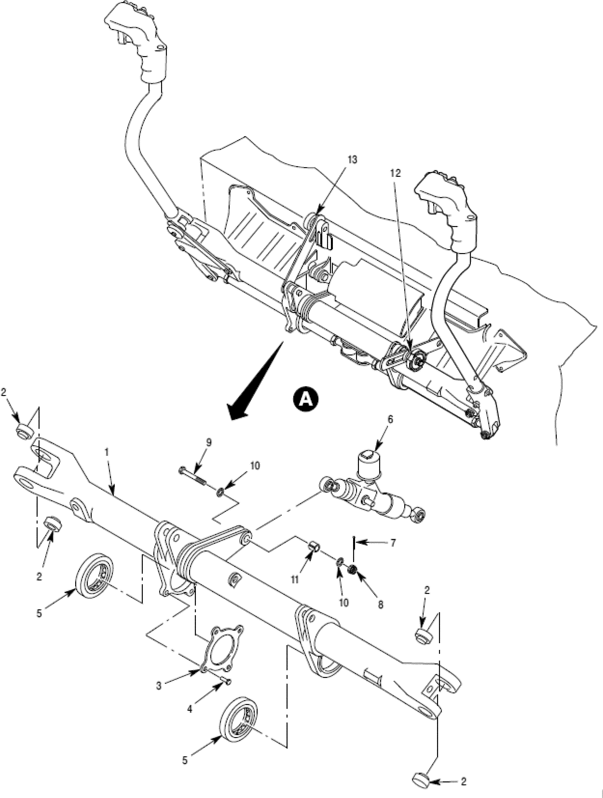

# Daily Digest — 2026-09-15

| | |
|---|---|
| **Digest date** | 2026-09-15 |
| **Data date range** | 2026-09-15 to 2026-09-15 |
| **Generated at** | 2026-09-16T04:17:51Z (UTC) |
| **Pipeline version** | 70bc66b |
| **Inference** | model layers ran — cli/haiku, opus |
| **Source watermarks** | CREC: 2026-09-16T03:36:06Z · BILLS: 2026-09-15T07:39:26Z · FR: 2026-09-15T18:43:12Z · USCOURTS: 2026-09-16T02:36:53Z · PLAW: 2026-09-09T15:30:07Z |

[Full observed listing for this day](day/2026-09-15.html) — every item our collectors observed for this publication day, mechanical rules applied, frozen at end of day. This digest is the canonical record.

All items below cite the govinfo package (and granule, where applicable) they
summarize. Selection is mechanical; each item states the rule that included
it. See the Coverage Statement at the end for a full accounting of what was
published, what was summarized, and what was excluded and why.

---

## Contents

- [Day in Review](#day-in-review)
- [1. Congressional Floor Activity](#1-congressional-floor-activity)
- [2. Legislation](#2-legislation)
- [3. Federal Register](#3-federal-register)
- [4. Enacted Laws](#4-enacted-laws)
- [5. Judicial Activity](#5-judicial-activity)
- [6. Agency Announcements](#6-agency-announcements)
- [7. Recorded Votes](#7-recorded-votes)
- [8. Bill Actions](#8-bill-actions)
- [9. Presidential Actions](#9-presidential-actions)
- [Terms Used Today](#terms-used-today)
- [Coverage Statement](#coverage-statement)
- [Methodology](#methodology)

---

## Day in Review

The House agreed to two measures by recorded vote, approving H.R. 4219 directing the Interior Secretary to establish invasive species strike teams in each Fish and Wildlife Service region, 371 to 33, and H.R. 3276 establishing an Urban Bird Treaty Program, 345 to 60; the digest carries three recorded roll call votes in all. Members debated H. Con. Res. 93, directing removal of U.S. Armed Forces from hostilities with Iran under the War Powers Resolution, and Representative Green of Texas gave notice of intent to raise a privilege question on H. Res. 1486, articles of impeachment against President Trump. Other House business covered the GPO Modernization Act, legislative branch appointment procedures, one-cent coin production, and elder financial fraud grants. In the Senate, Senator Padilla disclosed a whistleblower complaint concerning DHS direction to USCIS employees on noncitizen voting checks; Senator Warren introduced S. 5389 on banking applications tied to senior officials, drawing an objection from Senator Lummis. The digest carries 22 House bills introduced, one reported, and 236 Congressional Record items.

The digest carries 10 final rules, 7 proposed rules, and 103 notices from the Federal Register, including OPM interim rules on shared hiring certificates and a correction to its reduction-in-force rule, FAA airworthiness directives and airspace changes, Coast Guard safety zones in Texas and Louisiana, and fishery catch limits. One presidential document appears: a proclamation designating September 11, 2026, as Patriot Day.

Among 55 appellate opinions, the Ninth Circuit held Cedar Park Assembly of God's challenge to Washington's Reproductive Parity Act fails rational basis review, reversed a conviction for improper entry over denied discovery on Border Patrol witnesses, and held Hyundai and Kia subject to personal jurisdiction in a California theft class action. The Federal Circuit vacated patent judgments involving an oil and gas float tool. The digest also carries 1,084 district court and 9 bankruptcy opinions.

*Composed from the summarized items below and the day's mechanical
counts; all specifics are cited in their sections.*

---

## 1. Congressional Floor Activity

Source: Congressional Record (CREC), issue observed 2026-09-15, covering proceedings of 2026-09-14. Published by govinfo 2026-09-16T03:36:06Z; observed by our collector 2026-09-15T21:47:56Z. Total issue size: 236 granule(s).

### 1.1 Senate

Tags: legislative · model keys: banking corruption · judicial nominations · noncitizen voting

*In plain terms: Senate received a whistleblower complaint about noncitizen voting database access, considered banking corruption prevention legislation, requested an Israel human rights statement, and received judicial nominations.*

- **Elections** — Senator Padilla disclosed a whistleblower complaint alleging that the Department of Homeland Security directed USCIS employees to investigate alleged noncitizen voting by accessing state voter registration databases and creating law enforcement records, with claims that officers have been instructed to process 40 cases per day. Senator Padilla also discussed other matters including voting by mail and fuel prices.
  - *In plain terms:* Senator Padilla disclosed a whistleblower complaint alleging the Department of Homeland Security directed USCIS to investigate noncitizen voting by accessing state voter registration databases.
  - Included because: CREC-SEL-01 — floor item ≥ threshold floor time (35,086 characters) (document dated 2026-09-14)
  - Source: [CREC-2026-09-14 / CREC-2026-09-14-pt1-PgS4641](https://www.govinfo.gov/app/details/CREC-2026-09-14/CREC-2026-09-14-pt1-PgS4641)
- **Unanimous Consent Request--S. 5389 (Executive Calendar)** — Senator Warren introduced S. 5389, the Ending Presidential Corruption in Banking Act, which would prohibit federal banking agencies from approving banking applications when applicants are owned or controlled by senior government officials and would terminate such charters granted since January 20, 2025. The proposal drew objection from Senator Lummis, who raised concerns about the bill's technical specificity regarding the definition of control under banking law.
  - *In plain terms:* S. 5389 would prohibit federal banking agencies from approving banking applications from applicants owned or controlled by senior government officials and terminate such charters granted since January 20, 2025.
  - Included because: CREC-SEL-01 — floor item ≥ threshold floor time (22,082 characters) (document dated 2026-09-14)
  - Source: [CREC-2026-09-14 / CREC-2026-09-14-pt1-PgS4645-2](https://www.govinfo.gov/app/details/CREC-2026-09-14/CREC-2026-09-14-pt1-PgS4645-2)
- **U.S. Government Accountability Office Decision** — The Government Accountability Office concluded that the Bureau of Land Management's Bears Ears National Monument Resource Management Plan constitutes a rule subject to the Congressional Review Act, requiring submission to Congress before taking effect. The RMP designates lands within the monument as available or unavailable for various uses while protecting the monument's historical, cultural, natural, scientific, and paleontological resources.
  - *In plain terms:* The Government Accountability Office concluded that the Bears Ears National Monument Resource Management Plan is a rule requiring Congressional Review Act submission before taking effect.
  - Included because: CREC-SEL-01 — floor item ≥ threshold floor time (20,070 characters) (document dated 2026-09-14)
  - Source: [CREC-2026-09-14 / CREC-2026-09-14-pt1-PgS4651](https://www.govinfo.gov/app/details/CREC-2026-09-14/CREC-2026-09-14-pt1-PgS4651)
- **Executive and Other Communications** — The Senate received executive communications including multiple certifications under the Arms Export Control Act for defense articles and services exports to countries including the Dominican Republic, Norway, Canada, Germany, Japan, Algeria, Ukraine, Mexico, the Netherlands, and Spain. The communications also included regulatory reports from federal agencies on topics including archaeological import restrictions, Medicaid provisions, treasury regulations, and other administrative matters.
  - *In plain terms:* The Senate received executive communications including Arms Export Control Act certifications for defense articles exports to multiple countries and regulatory reports from federal agencies on various matters.
  - Included because: CREC-SEL-01 — floor item ≥ threshold floor time (149,166 characters) (document dated 2026-09-14)
  - Source: [CREC-2026-09-14 / CREC-2026-09-14-pt1-PgS4656-3](https://www.govinfo.gov/app/details/CREC-2026-09-14/CREC-2026-09-14-pt1-PgS4656-3)
- **Reports of Committees** — Senate committees reported on numerous bills including measures regarding tribal land leasing, satellite licensing restrictions, aviation regulations, postal facility designations, and various other matters.
  - *In plain terms:* Senate committees reported on numerous bills covering topics including tribal land leasing, satellite licensing restrictions, aviation regulations, and postal facility designations.
  - Included because: CREC-SEL-01 — floor item ≥ threshold floor time (15,868 characters) (document dated 2026-09-14)
  - Source: [CREC-2026-09-14 / CREC-2026-09-14-pt1-PgS4669](https://www.govinfo.gov/app/details/CREC-2026-09-14/CREC-2026-09-14-pt1-PgS4669)
- **Additional Cosponsors** — Senators were added as cosponsors to pending bills on topics including education funding, immigration enforcement, veterans affairs, healthcare, environmental protection, workplace safety, artificial intelligence governance, and other legislative matters.
  - *In plain terms:* Senators were added as cosponsors to pending bills covering education funding, immigration enforcement, veterans affairs, healthcare, environmental protection, workplace safety, and artificial intelligence governance.
  - Included because: CREC-SEL-01 — floor item ≥ threshold floor time (22,380 characters) (document dated 2026-09-14)
  - Source: [CREC-2026-09-14 / CREC-2026-09-14-pt1-PgS4671](https://www.govinfo.gov/app/details/CREC-2026-09-14/CREC-2026-09-14-pt1-PgS4671)
- **Senate Resolution 852--REQUESTING Information on Israel's Human Rights Practices Pursuant to Section 502B(C) of the For…** — Senate Resolution 852 requests that the Secretary of State submit an unclassified statement on Israel's human rights practices within 30 days, including information on alleged killings of United States citizens, detentions of U.S. persons, and violence in the West Bank. The resolution requests specific documentation of Department of State investigations, communications with Israeli authorities, and information concerning the treatment of Palestinian detainees and civilian casualties.
  - *In plain terms:* Senate Resolution 852 requests the State Department submit an unclassified statement within 30 days on Israel's human rights practices, including alleged killings of U.S. citizens and detentions.
  - Included because: CREC-SEL-01 — floor item ≥ threshold floor time (17,016 characters) (document dated 2026-09-14)
  - Source: [CREC-2026-09-14 / CREC-2026-09-14-pt1-PgS4675-2](https://www.govinfo.gov/app/details/CREC-2026-09-14/CREC-2026-09-14-pt1-PgS4675-2)
- **Foreign Travel Financial Reports** — The Senate Secretary submitted consolidated reports detailing foreign travel expenditures for committee members and employees from April 1 to June 30, 2026, as required by law. The reports enumerate per diem, transportation, and miscellaneous costs for the Committee on U.S. Commission on Security and Cooperation in Europe and the Committee on Appropriations, with amounts recorded in foreign currencies and US dollar equivalents.
  - *In plain terms:* The Senate Secretary submitted consolidated reports on committee members' foreign travel expenditures for April 1 to June 30, 2026, including per diem and transportation costs.
  - Included because: CREC-SEL-01 — floor item ≥ threshold floor time (141,485 characters) (document dated 2026-09-14)
  - Source: [CREC-2026-09-14 / CREC-2026-09-14-pt1-PgS4677-5](https://www.govinfo.gov/app/details/CREC-2026-09-14/CREC-2026-09-14-pt1-PgS4677-5)
- **Nominations** — The Senate received executive nominations for eight United States District Judges, positions on the United States Sentencing Commission, a Court of Appeals for Veterans Claims judge, and various cabinet and sub-cabinet officials spanning the State, Defense, Treasury, and Commerce departments. Nominations included ambassadors to multiple countries, a Commissioner of Food and Drugs, a Chief Financial Officer of NASA, and military officer appointments across service branches. The full slate encompasses judicial, diplomatic, administrative, and military positions.
  - *In plain terms:* The Senate received nominations for eight district judges, veterans claims court judges, sentencing commission members, cabinet officials, ambassadors, and military officers.
  - Included because: CREC-SEL-01 — floor item ≥ threshold floor time (48,621 characters) (document dated 2026-09-14)
  - Source: [CREC-2026-09-14 / CREC-2026-09-14-pt1-PgS4690-4](https://www.govinfo.gov/app/details/CREC-2026-09-14/CREC-2026-09-14-pt1-PgS4690-4)

### 1.2 House of Representatives

Tags: legislative · model keys: elder fraud · federal lands · wildlife refuge

*In plain terms: House bills addressed one-cent coin minting cessation and cash rounding, elder fraud investigations, agency modernization, federal lands management, and wildlife protection; also considered an Iran hostilities resolution.*

- **Notice of Intention to Offer Resolution Raising a Question of the Privileges of the House** — Representative Green of Texas gave notice of intention to raise a House privilege question regarding H. Res. 1486, which would impeach President Donald Trump for high crimes and misdemeanors under Article II, Section 1, Clause 8 of the Constitution, with accompanying articles of impeachment related to conduct by Immigration and Customs Enforcement and Customs and Border Protection.
  - *In plain terms:* Representative Green of Texas raised a privilege question about a House resolution to impeach President Trump based on conduct by immigration and border agencies.
  - Included because: CREC-SEL-01 — floor item ≥ threshold floor time (25,795 characters) (document dated 2026-09-14)
  - Source: [CREC-2026-09-14 / CREC-2026-09-14-pt1-PgH5541-5](https://www.govinfo.gov/app/details/CREC-2026-09-14/CREC-2026-09-14-pt1-PgH5541-5)
- **Gpo Modernization Act of 2026** — H.R. 9342, the GPO Modernization Act of 2026, revises Government Publishing Office authorities regarding document sales, public information programs including the Federal Depository Library Program, and operational modernization, and repeals a requirement for the Congressional Research Service to prepare the Annotated Constitution in hardbound form.
  - *In plain terms:* H.R. 9342 updates Government Publishing Office authorities for document sales and public programs, and removes the requirement for a hardbound Congressional Research Service Annotated Constitution.
  - Included because: CREC-SEL-01 — floor item ≥ threshold floor time (60,004 characters) (document dated 2026-09-14)
  - Source: [CREC-2026-09-14 / CREC-2026-09-14-pt1-PgH5546](https://www.govinfo.gov/app/details/CREC-2026-09-14/CREC-2026-09-14-pt1-PgH5546)
- **Legislative Branch Agencies Clarification Act** — H.R. 10204, the Legislative Branch Agencies Clarification Act, modifies appointment and removal procedures for the Librarian of Congress and Director of the Government Publishing Office, replacing Senate confirmation with commission-based appointment and removal by majority vote of House and Senate leadership.
  - *In plain terms:* H.R. 10204 changes the Librarian of Congress and Government Publishing Office Director from Senate-confirmed positions to commission-appointed roles removable by House and Senate leadership vote.
  - Included because: CREC-SEL-01 — floor item ≥ threshold floor time (62,002 characters) (document dated 2026-09-14)
  - Source: [CREC-2026-09-14 / CREC-2026-09-14-pt1-PgH5551](https://www.govinfo.gov/app/details/CREC-2026-09-14/CREC-2026-09-14-pt1-PgH5551)
- **National Wildlife Refuge System Invasive Species Strike Team Act of 2025** — H.R. 4219, the National Wildlife Refuge System Invasive Species Strike Team Act of 2025, directs the Secretary of the Interior to establish at least one invasive species strike team in each Fish and Wildlife Service region to identify and respond to invasive species threats on and adjacent to National Wildlife Refuge System lands, authorizing $10 million annually through fiscal year 2033.
  - *In plain terms:* H.R. 4219 requires the Interior Secretary to establish invasive species strike teams in each Fish and Wildlife Service region, funded at $10 million annually through fiscal year 2033.
  - Included because: CREC-SEL-01 — floor item ≥ threshold floor time (17,668 characters) (document dated 2026-09-14)
  - Source: [CREC-2026-09-14 / CREC-2026-09-14-pt1-PgH5560](https://www.govinfo.gov/app/details/CREC-2026-09-14/CREC-2026-09-14-pt1-PgH5560)
- **National Oceanic and Atmospheric Administration Sexual Harassment and Assault Prevention Improvements Act of 2025** — H.R. 2406, the National Oceanic and Atmospheric Administration Sexual Harassment and Assault Prevention Improvements Act of 2025, amends the National Defense Authorization Act for Fiscal Year 2017 to strengthen sexual harassment and assault policies for NOAA personnel, requiring mandatory reporting by vessel operators, establishing restricted reporting mechanisms, providing victim privacy protections, and requiring annual reporting to Congress.
  - *In plain terms:* H.R. 2406 strengthens NOAA sexual harassment and assault protections, requiring vessel operators to report incidents, establishing confidential reporting options, and reporting annually to Congress.
  - Included because: CREC-SEL-01 — floor item ≥ threshold floor time (25,252 characters) (document dated 2026-09-14)
  - Source: [CREC-2026-09-14 / CREC-2026-09-14-pt1-PgH5571](https://www.govinfo.gov/app/details/CREC-2026-09-14/CREC-2026-09-14-pt1-PgH5571)
- **National Law Enforcement Officers Remembrance, Support, and Community Outreach Act** — H.R. 309, the National Law Enforcement Officers Remembrance, Support, and Community Outreach Act, authorizes the Secretary of the Interior to award annual grants of $6 million for seven fiscal years to the National Law Enforcement Officers Memorial Fund for operating and enhancing the National Law Enforcement Museum's community outreach, public education, and officer safety and wellness programs.
  - *In plain terms:* H.R. 309 authorizes the Interior Secretary to award $6 million annually for seven fiscal years to the National Law Enforcement Officers Memorial Fund for its programs.
  - Included because: CREC-SEL-01 — floor item ≥ threshold floor time (15,027 characters) (document dated 2026-09-14)
  - Source: [CREC-2026-09-14 / CREC-2026-09-14-pt1-PgH5582](https://www.govinfo.gov/app/details/CREC-2026-09-14/CREC-2026-09-14-pt1-PgH5582)
- **Chesapeake Bay Watershed Advancement for Training, Education, Restoration, and Science (Waters) Act** — The bill reauthorizes the National Oceanic and Atmospheric Administration's Chesapeake Bay Office and establishes programs for education and habitat management in the Chesapeake Bay watershed. The law authorizes integrated coastal observations, education and training initiatives, and support for native oyster research, submerged aquatic vegetation restoration, and other habitat restoration activities.
  - *In plain terms:* The bill reauthorizes NOAA's Chesapeake Bay Office and establishes programs for education, coastal observations, oyster research, and aquatic vegetation restoration in the Chesapeake Bay watershed.
  - Included because: CREC-SEL-01 — floor item ≥ threshold floor time (24,869 characters) (document dated 2026-09-14)
  - Source: [CREC-2026-09-14 / CREC-2026-09-14-pt1-PgH5584](https://www.govinfo.gov/app/details/CREC-2026-09-14/CREC-2026-09-14-pt1-PgH5584)
- **Northern Nevada Economic Development and Conservation Act of 2026** — The bill authorizes the transfer and sale of federal lands across multiple Nevada counties for conservation and economic development purposes. It designates wilderness areas, establishes fire protection provisions for Incline Village, creates a federal complex, and specifies procedures for land conveyances to state and local governments.
  - *In plain terms:* The bill authorizes transfer and sale of federal lands in multiple Nevada counties for conservation and economic development, designates wilderness areas, and establishes fire protection for Incline Village.
  - Included because: CREC-SEL-01 — floor item ≥ threshold floor time (128,957 characters) (document dated 2026-09-14)
  - Source: [CREC-2026-09-14 / CREC-2026-09-14-pt1-PgH5586](https://www.govinfo.gov/app/details/CREC-2026-09-14/CREC-2026-09-14-pt1-PgH5586)
- **Common Cents Act** — The bill directs the Secretary of the Treasury to cease minting one-cent coins for general circulation and establishes procedures for rounding cash transactions to the nearest five cents when exact change cannot be provided. It requires the Federal Reserve to submit reports on the impact of ceasing penny production and the stability of the coin distribution system.
  - *In plain terms:* The bill directs the Treasury to stop minting one-cent coins and rounds cash transactions to the nearest five cents, with the Federal Reserve reporting on the system's impact.
  - Included because: CREC-SEL-01 — floor item ≥ threshold floor time (25,323 characters) (document dated 2026-09-14)
  - Source: [CREC-2026-09-14 / CREC-2026-09-14-pt1-PgH5599-2](https://www.govinfo.gov/app/details/CREC-2026-09-14/CREC-2026-09-14-pt1-PgH5599-2)
- **Guarding Unprotected Aging Retirees from Deception Act of 2026** — The bill authorizes State, local, and Tribal law enforcement agencies to use eligible federal grant funds to investigate elder financial fraud, pig butchering, and financial scams. It permits federal law enforcement agencies to assist with blockchain and related technology tracing tools and requires reporting on fraud prevention efforts and the state of financial fraud in the United States.
  - *In plain terms:* The bill allows state, local, and tribal law enforcement to use federal grant funds to investigate elder financial fraud and related scams using blockchain technology tracing tools.
  - Included because: CREC-SEL-01 — floor item ≥ threshold floor time (23,470 characters) (document dated 2026-09-14)
  - Source: [CREC-2026-09-14 / CREC-2026-09-14-pt1-PgH5602](https://www.govinfo.gov/app/details/CREC-2026-09-14/CREC-2026-09-14-pt1-PgH5602)
- **Fostering the Use of Technology to Uphold Regulatory Effectiveness in Supervision Act** — H.R. 8278 requires federal financial regulators to assess how their technological systems affect their ability to conduct real-time supervision of regulated entities and identify opportunities to streamline procurement practices. The covered agencies must complete assessments within 180 days and submit a joint report to Congress within 18 months detailing their hardware, software, workforce capabilities, and planned technology upgrades.
  - *In plain terms:* H.R. 8278 requires federal banking regulators to assess their technology systems for real-time supervision and submit a joint report to Congress within 18 months on system capabilities.
  - Included because: CREC-SEL-01 — floor item ≥ threshold floor time (33,326 characters) (document dated 2026-09-14)
  - Source: [CREC-2026-09-14 / CREC-2026-09-14-pt1-PgH5605](https://www.govinfo.gov/app/details/CREC-2026-09-14/CREC-2026-09-14-pt1-PgH5605)
- **Directing the President, Pursuant to Section 5(c) of the War Powers Resolution, to Remove United States Armed Forces fr…** — H. Con. Res. 93 directs the President to remove U.S. Armed Forces from hostilities with Iran under Section 5(c) of the War Powers Resolution, except for forces necessary to defend the United States or allies from imminent attack if the President complies with War Powers requirements. Representatives debated the measure on the House floor.
  - *In plain terms:* H. Con. Res. 93 directs the President to remove U.S. Armed Forces from hostilities with Iran, except those necessary to defend the United States or allies from imminent attack.
  - Included because: CREC-SEL-01 — floor item ≥ threshold floor time (46,373 characters) (document dated 2026-09-14)
  - Source: [CREC-2026-09-14 / CREC-2026-09-14-pt1-PgH5609-3](https://www.govinfo.gov/app/details/CREC-2026-09-14/CREC-2026-09-14-pt1-PgH5609-3)
- **Recognizing Trucker Appreciation Week** — Members of the House held a special order hour to recognize National Trucker Appreciation Week and discuss the role of truck drivers in the nation's economy and supply chain. Multiple representatives discussed proposed legislation addressing commercial driver licensing, safety standards, and interstate CDL eligibility.
  - *In plain terms:* Members held a special order hour recognizing National Trucker Appreciation Week and discussing proposed legislation on commercial driver licensing, safety standards, and interstate eligibility.
  - Included because: CREC-SEL-01 — floor item ≥ threshold floor time (21,949 characters) (document dated 2026-09-14)
  - Source: [CREC-2026-09-14 / CREC-2026-09-14-pt1-PgH5615-2](https://www.govinfo.gov/app/details/CREC-2026-09-14/CREC-2026-09-14-pt1-PgH5615-2)
- **Executive Communications, ETC.** — The House received and referred multiple executive communications containing final rules from federal agencies, covering agricultural products, credit union lending practices, transportation safety zones, environmental air quality standards, endangered species protections, and other regulatory matters referred to relevant committees.
  - *In plain terms:* The House received executive communications with final rules from federal agencies covering agricultural products, credit union lending practices, transportation safety, air quality standards, and endangered species protections.
  - Included because: CREC-SEL-01 — floor item ≥ threshold floor time (18,612 characters) (document dated 2026-09-14)
  - Source: [CREC-2026-09-14 / CREC-2026-09-14-pt1-PgH5618-2](https://www.govinfo.gov/app/details/CREC-2026-09-14/CREC-2026-09-14-pt1-PgH5618-2)
- **Public Bills and Resolutions** — The House introduced multiple bills covering topics including higher education policies, small business investment and disaster assistance, foreign sanctions, copyright enforcement, labor standards, healthcare administration, and applications of artificial intelligence technology, with each bill referred to appropriate committees.
  - *In plain terms:* The House introduced multiple bills on topics including higher education policies, small business assistance, foreign sanctions, copyright enforcement, labor standards, healthcare, and artificial intelligence applications.
  - Included because: CREC-SEL-01 — floor item ≥ threshold floor time (16,059 characters) (document dated 2026-09-14)
  - Source: [CREC-2026-09-14 / CREC-2026-09-14-pt1-PgH5620](https://www.govinfo.gov/app/details/CREC-2026-09-14/CREC-2026-09-14-pt1-PgH5620)

### 1.3 Recorded Votes

- **National Wildlife Refuge System Invasive Species Strike Team Act of 2025** — The House approved H.R. 4219, which directs the Secretary of the Interior to establish the National Wildlife Refuge System Invasive Species Strike Team Program. The bill passed by a vote of 371 to 33, with 28 members not voting.
  - *In plain terms:* The House passed H.R. 4219, the invasive species strike team bill, by a vote of 371 to 33, with 28 members not voting.
  - Included because: CREC-SEL-02 — recorded vote (all recorded votes are listed) (document dated 2026-09-14)
  - Source: [CREC-2026-09-14 / CREC-2026-09-14-pt1-PgH5598-5](https://www.govinfo.gov/app/details/CREC-2026-09-14/CREC-2026-09-14-pt1-PgH5598-5)
- **Local Communities & Bird Habitat Stewardship Act of 2026** — The House approved H.R. 3276, directing the Secretary of the Interior to establish the Urban Bird Treaty Program to support urban bird habitat stewardship. The bill passed by a vote of 345 to 60, with 27 members not voting.
  - *In plain terms:* The House passed H.R. 3276, directing the Interior Secretary to establish the Urban Bird Treaty Program for urban bird habitat stewardship, by a vote of 345 to 60.
  - Included because: CREC-SEL-02 — recorded vote (all recorded votes are listed) (document dated 2026-09-14)
  - Source: [CREC-2026-09-14 / CREC-2026-09-14-pt1-PgH5599](https://www.govinfo.gov/app/details/CREC-2026-09-14/CREC-2026-09-14-pt1-PgH5599)

---

## 2. Legislation

Source: Congressional Bills (BILLS), text versions published 2026-09-15 to 2026-09-15.

### 2.1 Counts by Stage

| Stage (bill text version) | Count |
|---|---|
| Introduced (ih/is) | 22 |
| Reported (rh/rs) | 1 |
| Engrossed (eh/es) | 0 |
| Enrolled (enr) | 0 |
| Other versions | 0 |
| **Total bill texts published** | **23** |

### 2.2 Bills Listed by Mechanical Rule

Tags: legislative · model keys: fraud enforcement · house resolution · information sharing

*In plain terms: House Resolution 1530 provides for consideration of bills establishing a National Fraud Enforcement Division and enhancing fraud-detection information-sharing, plus two congressional disapproval resolutions.*

Bills below are listed because they matched at least one listing rule; the
matching rule is stated per item. All other bill texts are counted above and
accounted for in the Coverage Statement.

- **H. RES. 1530 (rh) — 119 HRES 1530 RH: Providing for consideration of the bill (H.R. 9576) to establish the National Fraud Enforcement Division of the Department of Justice; providing for consideration of the bill (H.R. 10326) to enhance information-sharing capabilities between Federal law enforcement and State agencies to detect, investigate, and prosecute fraud in certain Federal programs, and to protect individual privacy; providing for consideration of the joint resolution (H.J. Res. 210) providing for congressional disapproval under chapter 8 of title 5, United States Code, of the rule submitted by the Environmental Protection Agency relating to ‘‘California State Nonroad Engine Pollution Control Standards; Ocean-Going Vessels At-Berth; Notice of Decision''; providing for consideration of the joint resolution (H.J. Res. 213) providing for congressional disapproval under chapter 8 of title 5, United States Code, of the rule issued by the Environmental Protection Agency relating to the ‘‘California State Nonroad Engine Pollution Control Standards; Commercial Harbor Craft Regulations; Notice of Decision''; and providing for consideration of the Senate amendments to the bill (H.R. 5334) to amend the Internal Revenue Code of 1986 to allow early childhood educators to take the educator expense deduction, and for other purposes.** — House Resolution 1530 provides for House consideration of H.R. 9576 establishing the National Fraud Enforcement Division, H.R. 10326 enhancing information-sharing for fraud detection, H.J. Res. 210 and 213 providing for congressional disapproval of EPA rules on California nonroad engine pollution standards, and Senate amendments to H.R. 5334 regarding educator expense deductions. The resolution waives points of order and sets debate parameters for each measure, including one hour of debate and one motion to recommit.
  - *In plain terms:* House Resolution 1530 sets up House debate on measures to establish a fraud enforcement division, enable federal-state law enforcement data-sharing, disapprove EPA pollution standards, and adjust educator expense deductions.
  - Included because: BILLS-SEL-01 — reached stage: reported/enrolled/calendar (document dated 2026-09-14)
  - Source: [BILLS-119hres1530rh](https://www.govinfo.gov/app/details/BILLS-119hres1530rh)

---

## 3. Federal Register

Source: Federal Register (FR), issue of 2026-09-15.

### 3.1 Counts by Document Type

| Document type | Count |
|---|---|
| Rules | 10 |
| Proposed rules | 7 |
| Notices | 103 |
| Presidential documents | 1 |
| **Total FR documents** | **121** |

### 3.2 Rules Published

Tags: department of agriculture · executive · securities and exchange commission · model keys: aircraft airworthiness · federal hiring · maritime safety

*In plain terms: Ten final rules addressed aircraft airworthiness, federal hiring procedures, pesticide exemptions, maritime safety zones for rocket and LNG operations, and fishing limits for marlin and halibut.*

#### DEPARTMENT OF COMMERCE

- **Pacific Island Fisheries; Catch and Retention Limits for Striped Marlin in the Western and Central Pacific Ocean North of the Equator** (2026-18849; 50 CFR Part 665) — This final rule implements a framework for specifying catch limits for all U.S. fisheries and retention limits by U.S. longline fisheries under a Hawaii longline limited entry permit for Western and Central North Pacific Ocean (WCNPO) striped marlin ( Kajikia audax ), consistent with the requirements of Western and Central Pacific Fisheries Commission (WCPFC) Conservation and Management Measure (CMM) 2024-06. If the retention limit is reached, NMFS will prohibit retention of WCNPO striped marlin by longline fishing vessels until the end of the year to prevent the U.S. catch limit from being exceeded. Because the U.S. limit under the framework can change each year, NMFS will specify the updated catch and longline retention limits by notice in the Federal Register early each calendar year. For fishing year 2026, NMFS specifies a U.S. WCNPO striped marlin limit of 393.4 metric tons (mt) (867,300 pounds (lb)) and a U.S. longline retention limit of 381.6 mt (841,300 lb) using the framework. Action: Final rule. Dates: The final rule is effective October 14, 2026.
  - *In plain terms:* NMFS sets a 2026 catch limit of 393.4 metric tons and a longline vessel retention limit of 381.6 metric tons for striped marlin.
  - Included because: FR-SEL-01 — document type: final rule (all listed)
  - Source: [FR-2026-09-15 / 2026-18849](https://www.govinfo.gov/app/details/FR-2026-09-15/2026-18849)
- **Pacific Halibut Fisheries of the West Coast; Inseason Action for the 2026 Area 2A Pacific Halibut Directed Commercial Fishery** (2026-18911; 50 CFR Part 300) — NMFS announces an inseason action for the 2026 Pacific halibut non-Tribal directed commercial fishery in the International Pacific Halibut Commission's (IPHC) regulatory Area 2A. This action adds a fishing period, September 15 through September 17, 2026, with a fishing period catch limit of 5,000 pounds (lb) (2.27 metric tons (mt)) per vessel, dressed weight. This action is intended to provide additional opportunity for the fleet to achieve the 2026 non-Tribal directed commercial fishery allocation. Action: Temporary rule; inseason adjustment. Dates: This rule is effective September 15, 2026, at 8 a.m. Pacific daylight time (PDT), through September 17, 2026, at 6 p.m. PDT.
  - *In plain terms:* NMFS opens Pacific halibut fishing September 15 through 17, 2026, with a 5,000-pound per-vessel limit in Area 2A.
  - Included because: FR-SEL-01 — document type: final rule (all listed)
  - Source: [FR-2026-09-15 / 2026-18911](https://www.govinfo.gov/app/details/FR-2026-09-15/2026-18911)

#### DEPARTMENT OF HOMELAND SECURITY

- **Safety Zone; Rocket Test Site, Rio Grande River, Boca Chica, TX** (2026-18855; 33 CFR Part 165) — The Coast Guard is establishing a temporary safety zone for navigable waters of the Rio Grande River. The safety zone is needed to protect personnel, vessels, and the marine environment from potential hazards created by cryogenics and structural tests of rockets at the Massey's test site. This rulemaking will prohibit persons and vessels from being in the safety zone unless specifically authorized by the Captain of the Port, Sector Corpus Christi. Action: Temporary final rule. Dates: This rule is effective without actual notice from September 15, 2026 through October 31, 2026. For the purposes of enforcement, actual notice will be used from September 4, 2026, until September 15, 2026.
  - *In plain terms:* The Coast Guard establishes a temporary safety zone on the Rio Grande River to protect people and the environment from rocket testing hazards.
  - Included because: FR-SEL-01 — document type: final rule (all listed)
  - Source: [FR-2026-09-15 / 2026-18855](https://www.govinfo.gov/app/details/FR-2026-09-15/2026-18855)
- **Safety Zone; Calcasieu River Channel, Lake Charles, LA** (2026-18856; 33 CFR Part 165) — The Coast Guard is establishing a temporary safety zone for navigable waters on the Calcasieu River Channel near the Cameron LNG turning basin. The safety zone is needed to protect personnel, vessels, and the marine environment from potential hazards created by the installation and removal of the submerged dredge pipeline. Entry of vessels or persons into this zone is prohibited unless specifically authorized by the Captain of the Port, Port Arthur, or their designated representative. Action: Temporary final rule. Dates: This rule is effective without actual notice from September 15, 2026 through October 31, 2026. For the purposes of enforcement, actual notice will be used from September 11, 2026, until September 15, 2026. It will be enforced for four hours on each of two days during this period, depending on the dates the dredge pipeline is installed and removed.
  - *In plain terms:* The Coast Guard establishes a temporary safety zone on Calcasieu River Channel to protect from hazards during dredge pipeline installation and removal.
  - Included because: FR-SEL-01 — document type: final rule (all listed)
  - Source: [FR-2026-09-15 / 2026-18856](https://www.govinfo.gov/app/details/FR-2026-09-15/2026-18856)

#### DEPARTMENT OF TRANSPORTATION

- **Airworthiness Directives; Pilatus Aircraft Ltd. Airplanes** (2026-18848; 14 CFR Part 39) — The FAA is adopting a new airworthiness directive (AD) for certain Pilatus Aircraft Ltd. (Pilatus) Model PC-24 airplanes. This AD was prompted by a report that a solid-state relay (SSR) used in the left-hand (LH) windshield heating system may allow reverse current flow when in the OFF position. This AD requires modification of the airplane and replacement of the affected SSR with a serviceable part. The FAA is issuing this AD to address the unsafe condition on these products. Action: Final rule. Dates: This AD is effective October 20, 2026. The Director of the Federal Register approved the incorporation by reference of a certain publication listed in this AD as of October 20, 2026.
  - *In plain terms:* The FAA requires Pilatus PC-24 airplanes to modify the left windshield heating system relay and replace the affected part.
  - Included because: FR-SEL-01 — document type: final rule (all listed)
  - Source: [FR-2026-09-15 / 2026-18848](https://www.govinfo.gov/app/details/FR-2026-09-15/2026-18848)
- **Amendment of Class D and Class E Airspace Over Hyannis, MA** (2026-18902; 14 CFR Part 71) — This action updates the airport name for Cape Cod Gateway Airport in the Falmouth, MA Class E5 airspace legal description. This action also updates verbiage in the Hyannis, MA Class D airspace legal description to comply with current FAA guidance. This action does not change the airspace boundaries or operating requirements. Action: Final rule. Dates: Effective date 0901 UTC, December 24, 2026. The Director of the Federal Register approves this incorporation by reference action under 1 CFR part 51, subject to the annual revision of FAA Order JO 7400.11 and publication of conforming amendments.
  - *In plain terms:* The FAA updates the airport name and wording in airspace descriptions for Hyannis and Falmouth, Massachusetts to comply with current guidance.
  - Included because: FR-SEL-01 — document type: final rule (all listed)
  - Source: [FR-2026-09-15 / 2026-18902](https://www.govinfo.gov/app/details/FR-2026-09-15/2026-18902)
- **Airworthiness Directives; MD Helicopters, LLC Helicopters** (2026-18927; 14 CFR Part 39) — The FAA is superseding Airworthiness Directive (AD) 2024-23- 06, which applied to certain MD Helicopters, LLC Model 369, 369A, 369D, 369E, 369F, 369FF, 369H, 369HE, 369HM, 369HS, 500N, and 600N helicopters. AD 2024-23-06 required repetitively inspecting the torque tube assembly and roller bearings, and depending on the results, replacing parts or accomplishing additional inspections. Since the FAA issued AD 2024-23-06, the FAA has determined that additional torque tube assemblies are affected by this unsafe condition. This AD continues to require the actions of AD 2024-23-06 and expands the applicability. The FAA is issuing this AD to address the unsafe condition on these products. Action: Final rule. Dates: This AD is effective October 20, 2026.
  - *In plain terms:* The FAA expands an airworthiness directive requiring inspection and possible replacement of torque tube assemblies in certain MD Helicopters.
  - Included because: FR-SEL-01 — document type: final rule (all listed)
  - Source: [FR-2026-09-15 / 2026-18927](https://www.govinfo.gov/app/details/FR-2026-09-15/2026-18927)
  -  *Source graphic 1 of 1 from 2026-18927.*

#### ENVIRONMENTAL PROTECTION AGENCY

- **Bacillus amyloliquefaciens strain AT-332; Exemption From the Requirement of a Pesticide Tolerance** (2026-18830; 40 CFR Part 180) — This regulation establishes an exemption from the requirement of a tolerance for residues of Bacillus amyloliquefaciens strain AT-332 in or on all food and feed commodities when used in accordance with label directions and good agricultural practices. Under the Federal Food, Drug, and Cosmetic Act (FFDCA), Gowan Company, in cooperation with SDS Biotech K.K., c/o Landis International, Inc., submitted a petition to EPA requesting an exemption from the requirement of a tolerance. This regulation eliminates the need to establish a maximum permissible level for residues of this pesticide when used in accordance with the terms of the exemption. Action: Final rule. Dates: This rule is effective on September 15, 2026. Objections and requests for hearings must be received on or before November 16, 2026, and must be filed in accordance with the instructions provided in 40 CFR part 178 (see also Unit I.C. of this document).
  - *In plain terms:* EPA is exempting Bacillus amyloliquefaciens strain AT-332 pesticide from needing a maximum residue level when used according to label directions.
  - Included because: FR-SEL-01 — document type: final rule (all listed)
  - Source: [FR-2026-09-15 / 2026-18830](https://www.govinfo.gov/app/details/FR-2026-09-15/2026-18830)

#### OFFICE OF PERSONNEL MANAGEMENT

- **Reduction in Force; Correction** (2026-18800; 5 CFR Part 330) — The Office of Personnel Management (OPM) is correcting a final rule that appeared in the Federal Register on August 3, 2026, and became effective on September 2, 2026. That rule revised OPM's reduction in force regulations and made related revisions to the Career Transition Assistance Plan (CTAP) regulations. An amendatory instruction in the rule inadvertently resulted in the removal of two paragraphs from the definition of “displaced”. This document restores those paragraphs. Action: Final rule; correcting amendment. Dates: Effective September 15, 2026.
  - *In plain terms:* OPM is restoring two paragraphs to the definition of "displaced" that were accidentally removed from a reduction in force rule.
  - Included because: FR-SEL-01 — document type: final rule (all listed)
  - Source: [FR-2026-09-15 / 2026-18800](https://www.govinfo.gov/app/details/FR-2026-09-15/2026-18800)
- **Shared Certificates and Pooled Hiring Actions** (2026-18828; 5 CFR Parts 302, 332, and 337) — The U.S. Office of Personnel Management (OPM) is issuing an interim rule to improve hiring efficiency across federal agencies, modify provisions pertaining to how an appointing authority ( i.e., the head of a Federal agency or department) may share a competitive certificate with one or more appointing authorities, implement provisions to allow an appointing authority to share an excepted service certificate with one or more appointing authorities, and implement provisions regarding OPM-led hiring actions which allow federal agencies to utilize competitive and excepted service certificates for occupations common to many agencies. Action: Interim rule with request for comments. Dates: Effective date. This interim rule is effective October 15, 2026, Comments due: Comments must be received on or before November 16, 2026.
  - *In plain terms:* OPM is issuing a rule, effective now while public comments are accepted, letting federal agencies share job certificates and use shared hiring pools.
  - Included because: FR-SEL-01 — document type: final rule (all listed)
  - Source: [FR-2026-09-15 / 2026-18828](https://www.govinfo.gov/app/details/FR-2026-09-15/2026-18828)

### 3.3 Proposed Rules Published

Tags: department of agriculture · executive · securities and exchange commission · model keys: aircraft directive · airspace modification · health benefits

*In plain terms: Seven proposed rules included airspace modifications near multiple airports, an Airbus aircraft directive, and inquiries on OPM employee accountability and federal benefits plan optimization.*

#### DEPARTMENT OF TRANSPORTATION

- **Modification of Class D and Class E Airspace Areas; Roberts Field/Redmond Municipal Airport, Redmond, OR** (2026-18804; 14 CFR Part 71) — This action proposes to modify the Class D and Class E airspace area designated as a surface area, modify the Class E airspace area designated as an extension to a Class D or Class E surface area, and modify the Class E airspace area extending upward from 700 feet above the surface at Roberts Field/Redmond Municipal Airport, Redmond, OR. This action would support the safety and management of instrument flight rules (IFR) operations at the airport. Action: Notice of proposed rulemaking (NPRM). Dates: Comments must be received on or before October 30, 2026.
  - *In plain terms:* The FAA proposes modifying airspace around Redmond, Oregon airport to support safety and management of instrument flight operations.
  - Included because: FR-SEL-02 — document type: proposed rule (all listed)
  - Source: [FR-2026-09-15 / 2026-18804](https://www.govinfo.gov/app/details/FR-2026-09-15/2026-18804)
- **Airworthiness Directives; Airbus Defence and Space GmbH Airplanes** (2026-18850; 14 CFR Part 39) — The FAA proposes to adopt a new airworthiness directive (AD) for all Airbus Defence and Space GmbH Model BO-209-150 FF, BO-209-150 FV, BO-209-150 RV, BO-209-160 FV, BO-209-160 RV, and Bölkow Jr. airplanes. This proposed AD was prompted by reports of corrosion damage on the rudder drive. This proposed AD would require repetitive inspections of the rudder drive, corrective actions including replacement if corrosion is detected and the application of a corrosion inhibitor. This proposed AD would also prohibit the installation of affected parts. The FAA is proposing this AD to address the unsafe condition on these products. Action: Notice of proposed rulemaking (NPRM). Dates: The FAA must receive comments on this NPRM by October 30, 2026.
  - *In plain terms:* The FAA proposes requiring certain Airbus and Bölkow aircraft to perform repetitive rudder inspections and replace corroded parts.
  - Included because: FR-SEL-02 — document type: proposed rule (all listed)
  - Source: [FR-2026-09-15 / 2026-18850](https://www.govinfo.gov/app/details/FR-2026-09-15/2026-18850)
- **Establishment of United States Area Navigation Route T-337 and Amendment of Very High Frequency Omnidirectional Range Federal Airways V-101 and V-484 Near Twin Falls, ID** (2026-18860; 14 CFR Part 71) — This action proposes to establish United States Area Navigation (RNAV) route T-337 and amend Very High Frequency (VHF) Omnidirectional Range (VOR) federal airways V-101 and V-484 near Twin Falls, ID. The FAA is proposing this action due to the pending decommissioning of the Hailey, ID, Nondirectional Radio Beacon (NDB)/Distance Measuring Equipment (DME). Action: Notice of proposed rulemaking (NPRM). Dates: Comments must be received on or before October 30, 2026.
  - *In plain terms:* The FAA proposes establishing a new navigation route and amending two airways near Twin Falls, Idaho to replace a decommissioned navigation beacon.
  - Included because: FR-SEL-02 — document type: proposed rule (all listed)
  - Source: [FR-2026-09-15 / 2026-18860](https://www.govinfo.gov/app/details/FR-2026-09-15/2026-18860)
- **Amendment of Class E Airspace Over Pittsfield, ME** (2026-18899; 14 CFR Part 71) — This action proposes to amend E airspace over Pittsfield, ME. This action would modify the dimensions of the Pittsfield, ME Class E5 airspace to appropriately contain Instrument Flight Rules (IFR) operations at the Pittsfield Municipal Airport. This action would also update the geographic coordinates of the airport in the Pittsfield, ME Class E5 airspace legal description. This action would also remove the decommissioned Burnham Non-Directional Beacon (NDB) from the airspace legal description. This action would also remove the exclusion for adjacent Class E5 airspace from the airspace legal description. Action: Notice of proposed rulemaking (NPRM). Dates: Comments must be received on or before October 30, 2026.
  - *In plain terms:* The FAA proposes modifying airspace over Pittsfield, Maine to adjust boundaries, update the airport location, and remove references to a decommissioned beacon.
  - Included because: FR-SEL-02 — document type: proposed rule (all listed)
  - Source: [FR-2026-09-15 / 2026-18899](https://www.govinfo.gov/app/details/FR-2026-09-15/2026-18899)

#### FEDERAL TRADE COMMISSION

- **Petition for Rulemaking of Robert Michael Vanleeuwen** (2026-18854; 16 CFR Part 318) — Please take notice that the Federal Trade Commission (“Commission”) received a petition for rulemaking from Robert Michael Vanleeuwen and has published that petition online at https://www.regulations.gov. The Commission invites written comments concerning the petition. Publication of this petition is pursuant to the Commission's Rules of Practice and Procedure and does not affect the legal status of the petition or its final disposition. Action: Receipt of petition; request for comment. Dates: Comments must identify the petition docket number and be filed by October 15, 2026.
  - *In plain terms:* The FTC received and published a petition for rulemaking from Robert Michael Vanleeuwen and invites public comments.
  - Included because: FR-SEL-02 — document type: proposed rule (all listed)
  - Source: [FR-2026-09-15 / 2026-18854](https://www.govinfo.gov/app/details/FR-2026-09-15/2026-18854)

#### OFFICE OF PERSONNEL MANAGEMENT

- **Promoting Employee Accountability** (2026-18943; 5 CFR Parts 412, 432, 715, and 752) — OPM is reopening the public comment period for additional comments on OPM data and a new report published by a nongovernmental organization. OPM is releasing current data that is relevant to the proposed rule published on July 2, 2026, entitled “Promoting Employee Accountability.” OPM is also interested in receiving public comment on a report published by We the Doers published on August 27, 2026. Accordingly, OPM is reopening the rulemaking for public comment specifically with respect to the proposed rule as informed by the newly released data and the report. The comment period for the proposed rule closed August 3, 2026; it is now reopened for two weeks. Action: Proposed rulemaking; reopening public comment period. Dates: The comment period for the proposed rule published on July 2, 2026 (91 FR 40444) is reopened. Comments must be received on or before September 29, 2026.
  - *In plain terms:* OPM reopened the public comment period for its proposed employee accountability rule for two weeks to allow comments on newly released data.
  - Included because: FR-SEL-02 — document type: proposed rule (all listed)
  - Source: [FR-2026-09-15 / 2026-18943](https://www.govinfo.gov/app/details/FR-2026-09-15/2026-18943)
- **Federal Employees Health Benefits Program: Optimizing FEHB Plan Offerings** (2026-18944; 5 CFR Part 890) — This request for information (RFI) seeks public input on how to optimize health benefits plan options offered in the Federal Employees Health Benefits (FEHB) Program, which includes the Postal Service Health Benefits (PSHB) Program, to give enrollees high value choices at competitive costs while ensuring the appropriate number and distribution of options are available to enrollees. Currently, health benefits plans in the FEHB Program are limited to offering three options or two options and a high-deductible health plan (HDHP) pursuant to 5 CFR 890.201(b)(3)(i). The information gathered through this RFI will inform the Office of Personnel Management (OPM) as to whether modifications to the current FEHB regulations are needed through future notice and comment rulemaking as OPM explores ways to optimize the FEHB and PSHB portfolio and provide enrollees with high value choices at competitive costs. Action: Request for information. Dates: Comments must be received on or before November 16, 2026.
  - *In plain terms:* OPM seeks public input on how to improve health benefits plan choices for federal employees while keeping costs competitive.
  - Included because: FR-SEL-02 — document type: proposed rule (all listed)
  - Source: [FR-2026-09-15 / 2026-18944](https://www.govinfo.gov/app/details/FR-2026-09-15/2026-18944)

### 3.4 Notices and Presidential Documents

Tags: department of agriculture · executive · securities and exchange commission · model keys: patriot day · september 11

*In plain terms: President Trump proclaimed September 11, 2026, as Patriot Day, the 25th anniversary of the September 11 terrorist attacks, directing half-staff flags in honor of the 2,977 victims.*

Notices are summarized only when they match a listing rule; all are counted
in 3.1 and in the Coverage Statement. Presidential documents in the FR are
always listed.

- **Patriot Day 2026, the 25th Anniversary of the September 11 Terrorist Attacks** (2026-18959) — President Trump proclaimed September 11, 2026, as Patriot Day, the 25th Anniversary of the September 11 Terrorist Attacks, directing all federal departments and agencies to display the flag at half-staff in honor of the 2,977 victims. The proclamation invites state governors and interested organizations to participate in the observance.
  - *In plain terms:* President Trump proclaimed September 11, 2026 as Patriot Day, the 25th anniversary of the September 11 attacks, and directed federal agencies to display flags at half-staff.
  - Included because: FR-SEL-03 — presidential document (all listed)
  - Source: [FR-2026-09-15 / 2026-18959](https://www.govinfo.gov/app/details/FR-2026-09-15/2026-18959)

---

## 4. Enacted Laws

Source: Public and Private Laws (PLAW) published 2026-09-15.

No laws were published in this range.

---

## 5. Judicial Activity

Source: United States Courts Opinions (USCOURTS): opinions observed 2026-09-15
by our collector; each opinion states its own issue date beside its
listing ([how our clocks work](faq.html#fapds-three-clocks)).

Completeness disclosure (standing): USCOURTS carries opinions from
approximately 140 participating appellate, district, bankruptcy, and
national federal courts. Unlike the Congressional Record and the Federal
Register, which are the complete official record of their branches,
USCOURTS is participation-based and is NOT the complete federal judicial
record. Courts post opinions with delay — typically over several days —
so a day's digest carries the opinions that became available that day,
whatever date each was issued.

### 5.1 Appellate and National Court Opinions

Tags: judicial · model keys: administrative law · criminal convictions · immigration appeals

*In plain terms: Fifty-five appellate decisions addressed criminal convictions and sentences, immigration appeals, patent disputes, civil rights claims, and administrative law cases across multiple federal circuits.*

Appellate and national court opinions are summarized; district and
bankruptcy opinions are counted in 5.2 and in the Coverage Statement.

#### United States Court of Appeals for the District of Columbia Circuit

- **Michael Jaffe v. Janet Yellen** (No. 26-05136; filed 2026-09-14) — The DC Circuit affirmed dismissal of an appeal as frivolous under 28 U.S.C. § 1915(e)(2)(B)(i) and denied the appellant's motion for counsel appointment.
  - *In plain terms:* A court dismissed a man's appeal as frivolous and refused to appoint him a lawyer.
  - Included because: USCOURTS-SEL-01 — appellate court opinion (all listed) (document dated 2026-09-14)
  - Source: [USCOURTS-caDC-26-05136 / USCOURTS-caDC-26-05136-0](https://www.govinfo.gov/app/details/USCOURTS-caDC-26-05136/USCOURTS-caDC-26-05136-0)
- **Allan Wilson v. Clerk, United States Supreme Court** (No. 26-05154; filed 2026-09-14) — The DC Circuit affirmed dismissal of damages claims against the Supreme Court Clerk based on judicial immunity, holding that the clerk's acceptance or rejection of filings constitutes an integral part of the judicial process.
  - *In plain terms:* A court dismissed a lawsuit against the Supreme Court Clerk because her decisions on accepting filings are part of the judicial process and cannot be sued over.
  - Included because: USCOURTS-SEL-01 — appellate court opinion (all listed) (document dated 2026-09-14)
  - Source: [USCOURTS-caDC-26-05154 / USCOURTS-caDC-26-05154-0](https://www.govinfo.gov/app/details/USCOURTS-caDC-26-05154/USCOURTS-caDC-26-05154-0)

#### United States Court of Appeals for the Eighth Circuit

- **Courtney Bradley v. Kim Evans, et al** (No. 25-03138; filed 2026-09-14) — The Eighth Circuit Court of Appeals issued an opinion in Courtney Bradley v. Kim Evans, et al and entered judgment in accordance with the opinion. Parties may file petitions for rehearing or rehearing en banc within 14 days of judgment entry.
  - *In plain terms:* The Eighth Circuit Court of Appeals issued an opinion and judgment in Courtney Bradley v. Kim Evans, et al; parties may request rehearing within 14 days.
  - Included because: USCOURTS-SEL-01 — appellate court opinion (all listed) (document dated 2026-09-14)
  - Source: [USCOURTS-ca8-25-03138 / USCOURTS-ca8-25-03138-0](https://www.govinfo.gov/app/details/USCOURTS-ca8-25-03138/USCOURTS-ca8-25-03138-0)
- **David Pitlor v. TD Ameritrade, Inc., et al** (No. 25-03500; filed 2026-09-14) — The Eighth Circuit Court of Appeals issued an opinion in David Pitlor v. TD Ameritrade, Inc., et al and entered judgment in accordance with the opinion. Parties may file petitions for rehearing or rehearing en banc within 14 days of judgment entry.
  - *In plain terms:* The Eighth Circuit Court of Appeals issued an opinion and judgment in David Pitlor v. TD Ameritrade, Inc., et al; parties may request rehearing within 14 days.
  - Included because: USCOURTS-SEL-01 — appellate court opinion (all listed) (document dated 2026-09-14)
  - Source: [USCOURTS-ca8-25-03500 / USCOURTS-ca8-25-03500-0](https://www.govinfo.gov/app/details/USCOURTS-ca8-25-03500/USCOURTS-ca8-25-03500-0)

#### United States Court of Appeals for the Eleventh Circuit

- **George Martin v. Commissioner, Alabama Department of Corrections** (No. 24-11986; filed 2026-09-14) — George Martin, convicted of capital murder in his wife's 1995 death, was granted a new trial after discovery of Brady violations in his original prosecution. At his second trial, the trial court precluded him from raising issues concerning the prosecutorial misconduct. Martin sought federal habeas relief, arguing the preclusion violated his Confrontation Clause rights and that evidence was insufficient for the pecuniary-gain aggravating factor, but the Eleventh Circuit affirmed the district court's denial of relief, constrained by the Antiterrorism and Effective Death Penalty Act.
  - *In plain terms:* George Martin received a new murder trial after prosecution errors but was barred from raising issues about those errors; the court rejected his appeal for federal relief.
  - Included because: USCOURTS-SEL-01 — appellate court opinion (all listed) (document dated 2026-09-14)
  - Source: [USCOURTS-ca11-24-11986 / USCOURTS-ca11-24-11986-0](https://www.govinfo.gov/app/details/USCOURTS-ca11-24-11986/USCOURTS-ca11-24-11986-0)
- **USA v. Roger Robinson** (No. 25-10567; filed 2026-09-14) — Appointed counsel for Roger Wayne Robinson moved to withdraw from his direct criminal appeal and filed an Anders brief. The Eleventh Circuit found no arguable issues of merit and affirmed Robinson's conviction and sentence.
  - *In plain terms:* Roger Robinson's lawyer said there were no valid arguments for his appeal, and the court affirmed his conviction and sentence.
  - Included because: USCOURTS-SEL-01 — appellate court opinion (all listed) (document dated 2026-09-14)
  - Source: [USCOURTS-ca11-25-10567 / USCOURTS-ca11-25-10567-0](https://www.govinfo.gov/app/details/USCOURTS-ca11-25-10567/USCOURTS-ca11-25-10567-0)
- **USA v. Rafael Gutierrez** (No. 25-12261; filed 2026-09-14) — Rafael Gutierrez pleaded guilty to conspiracy to distribute methamphetamine from February to October 2022 and received a 108-month sentence. On appeal, he argued for a minor-role participant adjustment under Sentencing Guidelines Section 3B1.2 and claimed the court failed to consider Amendment 833. The Eleventh Circuit affirmed, finding Amendment 833 was substantive and not retroactively applicable, and that the district court did not clearly err in denying the minor-role adjustment.
  - *In plain terms:* Rafael Gutierrez pleaded guilty to methamphetamine conspiracy and received a 108-month sentence; his appeal for a reduced sentence based on minor role was rejected.
  - Included because: USCOURTS-SEL-01 — appellate court opinion (all listed) (document dated 2026-09-14)
  - Source: [USCOURTS-ca11-25-12261 / USCOURTS-ca11-25-12261-0](https://www.govinfo.gov/app/details/USCOURTS-ca11-25-12261/USCOURTS-ca11-25-12261-0)
- **John Lapikas v. Mariner Sands Country Club, Inc.** (No. 25-12417; filed 2026-09-14) — John Lapikas sued Mariner Sands Country Club for age discrimination and defamation following his termination as Greens Superintendent after 21 years, claiming the club told members he had retired. Lapikas failed to timely disclose a key witness, leading the district court to exclude the witness's declaration and award sanctions including attorneys' fees. The Eleventh Circuit affirmed the sanctions and summary judgment on all claims.
  - *In plain terms:* John Lapikas sued a country club for age discrimination and defamation after his termination, but the court dismissed all claims and upheld sanctions for procedural failures.
  - Included because: USCOURTS-SEL-01 — appellate court opinion (all listed) (document dated 2026-09-14)
  - Source: [USCOURTS-ca11-25-12417 / USCOURTS-ca11-25-12417-0](https://www.govinfo.gov/app/details/USCOURTS-ca11-25-12417/USCOURTS-ca11-25-12417-0)
- **Rachel Robledo v. City of Tampa, et al** (No. 25-13685; filed 2026-09-14) — Rachel Robledo appealed pro se a district court's dismissal of her Section 1983 civil rights complaint against Tampa Police Department officers who allegedly illegally seized and detained her after responding to her 911 call, preventing her from taking her dog to a veterinarian, and for failure to intervene, due process denial, and municipal liability based on inadequate training or supervision.
  - *In plain terms:* Rachel Robledo appealed dismissal of her civil rights lawsuit claiming Tampa police illegally detained her after a 911 call.
  - Included because: USCOURTS-SEL-01 — appellate court opinion (all listed) (document dated 2026-09-14)
  - Source: [USCOURTS-ca11-25-13685 / USCOURTS-ca11-25-13685-0](https://www.govinfo.gov/app/details/USCOURTS-ca11-25-13685/USCOURTS-ca11-25-13685-0)
- **USA v. Salim Alsahqani** (No. 25-13957; filed 2026-09-14) — Salim Alsahqani received a 60-month sentence for conspiracy to commit international money laundering, representing a 48-month upward variance from his Sentencing Guidelines range. Alsahqani appealed challenging both the procedural and substantive reasonableness of the sentence, but the Eleventh Circuit affirmed, finding the district court adequately considered the relevant sentencing factors and provided sufficient explanation for the variance.
  - *In plain terms:* Salim Alsahqani received a 60-month sentence for international money laundering conspiracy much higher than guidelines suggested; his appeal claiming the sentence was unreasonable was rejected.
  - Included because: USCOURTS-SEL-01 — appellate court opinion (all listed) (document dated 2026-09-14)
  - Source: [USCOURTS-ca11-25-13957 / USCOURTS-ca11-25-13957-0](https://www.govinfo.gov/app/details/USCOURTS-ca11-25-13957/USCOURTS-ca11-25-13957-0)
- **AIG Property Casualty Company v. ECO Marine Solutions, Inc., et al** (No. 26-10302; filed 2026-09-14) — The Eleventh Circuit affirmed summary judgment for contractors in an insurance dispute over a yacht fire allegedly caused by non-compliant electrical work on a dock. The court held that the 2014 National Electrical Code governed the construction work based on the date the permit was applied for, not when the work was completed or when a newer code edition took effect.
  - *In plain terms:* The court affirmed contractors were not liable in an insurance dispute over a yacht fire, finding the 2014 electrical code applied based on permit date.
  - Included because: USCOURTS-SEL-01 — appellate court opinion (all listed) (document dated 2026-09-14)
  - Source: [USCOURTS-ca11-26-10302 / USCOURTS-ca11-26-10302-0](https://www.govinfo.gov/app/details/USCOURTS-ca11-26-10302/USCOURTS-ca11-26-10302-0)
- **Raziel Ofer v. Laurel Isicoff** (No. 26-11038; filed 2026-09-14) — The Eleventh Circuit dismissed an appeal challenging a district court's denial of a motion to recuse the judge, finding it lacked jurisdiction because the order did not end the underlying litigation and recusal questions are reviewable only upon appeal from final judgment.
  - *In plain terms:* The court dismissed an appeal challenging a judge's refusal to step aside, finding such questions can only be reviewed after cases are fully decided.
  - Included because: USCOURTS-SEL-01 — appellate court opinion (all listed) (document dated 2026-09-14)
  - Source: [USCOURTS-ca11-26-11038 / USCOURTS-ca11-26-11038-0](https://www.govinfo.gov/app/details/USCOURTS-ca11-26-11038/USCOURTS-ca11-26-11038-0)
- **Brian Evans v. StubHub, Inc.** (No. 26-12539; filed 2026-09-14) — The Eleventh Circuit dismissed an appeal of an order compelling arbitration and staying proceedings, finding it lacked jurisdiction under the Federal Arbitration Act, which prohibits appeals from interlocutory orders directing arbitration.
  - *In plain terms:* The court dismissed an appeal of an order requiring the parties to use arbitration instead of court proceedings.
  - Included because: USCOURTS-SEL-01 — appellate court opinion (all listed) (document dated 2026-09-14)
  - Source: [USCOURTS-ca11-26-12539 / USCOURTS-ca11-26-12539-0](https://www.govinfo.gov/app/details/USCOURTS-ca11-26-12539/USCOURTS-ca11-26-12539-0)
- **USA v. Alexander McAfee** (No. 26-12804; filed 2026-09-14) — A pro se defendant appealed district court orders denying his motions to dismiss the indictment and for judicial notice of abuse of discretion, but the Eleventh Circuit dismissed the appeal for lack of jurisdiction because the orders were not final—the defendant had not yet been convicted or sentenced.
  - *In plain terms:* A defendant representing himself appealed orders denying his motions to dismiss charges and claim abuse of discretion, but the appeals court dismissed the case because the orders weren't final until after conviction or sentencing.
  - Included because: USCOURTS-SEL-01 — appellate court opinion (all listed) (document dated 2026-09-14)
  - Source: [USCOURTS-ca11-26-12804 / USCOURTS-ca11-26-12804-0](https://www.govinfo.gov/app/details/USCOURTS-ca11-26-12804/USCOURTS-ca11-26-12804-0)

#### United States Court of Appeals for the Federal Circuit

- **NCS Multistage Inc. v. TCO GROUP AS** (No. 24-02379; filed 2026-09-14) — The Federal Circuit affirmed-in-part and vacated-in-part a judgment in a patent infringement case involving an oil and gas float tool, holding that the appellant forfeited its challenge to a claim construction it had proposed at trial and affirming the contributory infringement finding while addressing issues regarding induced infringement and invalidity claims.
  - *In plain terms:* In a patent case over an oil and gas tool, the court partially upheld and overturned the judgment involving infringement liability.
  - Included because: USCOURTS-SEL-01 — appellate court opinion (all listed) (document dated 2026-09-14)
  - Source: [USCOURTS-ca13-24-02379 / USCOURTS-ca13-24-02379-0](https://www.govinfo.gov/app/details/USCOURTS-ca13-24-02379/USCOURTS-ca13-24-02379-0)
- **NCS Multistage Inc. v. Nine Energy Service, Inc.** (No. 25-01000; filed 2026-09-14) — The Federal Circuit vacated and remanded a patent infringement judgment involving an oil and gas float tool patent, finding errors in the district court's construction of the term 'casing string' and its ruling on prior art, requiring further proceedings on those issues.
  - *In plain terms:* The court overturned a patent infringement judgment over an oil and gas tool and sent it back for retrial due to interpretation errors.
  - Included because: USCOURTS-SEL-01 — appellate court opinion (all listed) (document dated 2026-09-14)
  - Source: [USCOURTS-ca13-25-01000 / USCOURTS-ca13-25-01000-0](https://www.govinfo.gov/app/details/USCOURTS-ca13-25-01000/USCOURTS-ca13-25-01000-0)
- **TexasLDPC Inc. v. Broadcom Inc.** (No. 25-01074; filed 2026-09-14) — The Federal Circuit reversed a district court's dismissal of a patent infringement suit filed by an exclusive licensee without joining the patent owner, determining that the license agreement did not automatically terminate when the licensee shifted focus to enforcement and that the licensee possessed sufficient rights to maintain the suit independently.
  - *In plain terms:* The court allowed a company with exclusive patent rights to sue for infringement on its own without joining the patent owner.
  - Included because: USCOURTS-SEL-01 — appellate court opinion (all listed) (document dated 2026-09-14)
  - Source: [USCOURTS-ca13-25-01074 / USCOURTS-ca13-25-01074-0](https://www.govinfo.gov/app/details/USCOURTS-ca13-25-01074/USCOURTS-ca13-25-01074-0)
- **Butenhoff v. Collins** (No. 25-01868; filed 2026-09-14) — A Marine veteran appealed a Veterans Court dismissal of his appeal from a Board of Veterans' Appeals remand order regarding disability rating claims. The Federal Circuit affirmed the dismissal, holding that the Board's remand directive was not a final decision granting or denying benefits and therefore the Veterans Court lacked jurisdiction to review it.
  - *In plain terms:* The court affirmed dismissal of a Marine veteran's appeal challenging a Veterans Board decision to reconsider his disability rating claim.
  - Included because: USCOURTS-SEL-01 — appellate court opinion (all listed) (document dated 2026-09-14)
  - Source: [USCOURTS-ca13-25-01868 / USCOURTS-ca13-25-01868-0](https://www.govinfo.gov/app/details/USCOURTS-ca13-25-01868/USCOURTS-ca13-25-01868-0)
- **Williams v. BOP** (No. 25-02081; filed 2026-09-14) — A federal correctional officer terminated for violations including contraband possession, giving gifts to inmates, prohibited sexual contact with inmates, and failure to report misconduct appealed an arbitrator's decision upholding his removal. The Federal Circuit affirmed, finding the arbitrator's decision supported by substantial evidence including inmate testimony regarding sexual contact and circumstantial evidence of improper gifts.
  - *In plain terms:* A federal correctional officer fired for bringing contraband into prison, improper contact with inmates, and failing to report misconduct lost his termination appeal.
  - Included because: USCOURTS-SEL-01 — appellate court opinion (all listed) (document dated 2026-09-14)
  - Source: [USCOURTS-ca13-25-02081 / USCOURTS-ca13-25-02081-0](https://www.govinfo.gov/app/details/USCOURTS-ca13-25-02081/USCOURTS-ca13-25-02081-0)
- **Youmans v. US** (No. 26-01350; filed 2026-09-14) — A pro se plaintiff appealed dismissal of a complaint in the Court of Federal Claims alleging various crimes and constitutional violations by state and federal officials and seeking $500 million in relief. The Federal Circuit affirmed the dismissal for lack of subject matter jurisdiction, finding the plaintiff failed to state a non-frivolous claim under the Tucker Act.
  - *In plain terms:* The court affirmed dismissal of a $500 million lawsuit against federal and state officials alleging various crimes and constitutional violations.
  - Included because: USCOURTS-SEL-01 — appellate court opinion (all listed) (document dated 2026-09-14)
  - Source: [USCOURTS-ca13-26-01350 / USCOURTS-ca13-26-01350-0](https://www.govinfo.gov/app/details/USCOURTS-ca13-26-01350/USCOURTS-ca13-26-01350-0)
- **Hooper v. Collins** (No. 26-01406; filed 2026-09-14) — A veteran appealed a Veterans Court dismissal of his appeal from a Board remand order regarding a dental condition service connection claim for treatment purposes. The Federal Circuit affirmed the dismissal, holding that a Board remand is not a final decision and thus outside Veterans Court jurisdiction, and that the remand process did not violate due process rights.
  - *In plain terms:* The court affirmed dismissal of a veteran's appeal challenging a Veterans Board decision to reconsider his claim for dental service connection.
  - Included because: USCOURTS-SEL-01 — appellate court opinion (all listed) (document dated 2026-09-14)
  - Source: [USCOURTS-ca13-26-01406 / USCOURTS-ca13-26-01406-0](https://www.govinfo.gov/app/details/USCOURTS-ca13-26-01406/USCOURTS-ca13-26-01406-0)
- **Navarro Martin v. US** (No. 26-01422; filed 2026-09-14) — A healthcare services provider appealed dismissal of claims against Florida state officials regarding unpaid Medicaid services. The Federal Circuit affirmed the Court of Federal Claims' dismissal for lack of jurisdiction, finding that Medicaid funding obligations are owed by the state, not the federal government, and that the plaintiff's other theories did not establish Tucker Act jurisdiction.
  - *In plain terms:* The court affirmed dismissal of a healthcare provider's lawsuit over unpaid Medicaid services, finding the state rather than federal government owes the money.
  - Included because: USCOURTS-SEL-01 — appellate court opinion (all listed) (document dated 2026-09-14)
  - Source: [USCOURTS-ca13-26-01422 / USCOURTS-ca13-26-01422-0](https://www.govinfo.gov/app/details/USCOURTS-ca13-26-01422/USCOURTS-ca13-26-01422-0)

#### United States Court of Appeals for the Fifth Circuit

- **Megalomedia v. Philadelphia Indemnity** (No. 23-20570; filed 2026-09-14) — A television production company appealed summary judgment in an insurance coverage dispute after its insurer denied coverage for lawsuits arising from the reality show "My 600-lb Life" citing a policy exclusion for reality shows. The Fifth Circuit affirmed, finding Megalomedia forfeited its ambiguity argument by consistently representing in the trial court that the show was a reality show, and that fraud claims failed because Megalomedia knew the policy excluded reality shows.
  - *In plain terms:* A television production company lost its insurance dispute over coverage for lawsuits from the reality show 'My 600-lb Life,' which the policy excluded.
  - Included because: USCOURTS-SEL-01 — appellate court opinion (all listed) (document dated 2026-09-14)
  - Source: [USCOURTS-ca5-23-20570 / USCOURTS-ca5-23-20570-0](https://www.govinfo.gov/app/details/USCOURTS-ca5-23-20570/USCOURTS-ca5-23-20570-0)
- **Ramey v. Bessent** (No. 24-20533; filed 2025-10-22) — The Fifth Circuit Court of Appeals remanded a case in which Ramey, L.L.P. sued the Small Business Administration and Treasury Department over the denial of a Paycheck Protection Program loan application after the district court dismissed the case without stating its reasons. The appellate court held that parties are entitled to know the reasoning behind a final judgment to permit meaningful review and directed the district court to provide written reasons for its dismissal.
  - *In plain terms:* The court sent back a lawsuit over a denied Paycheck Protection Program loan, ordering the district court to explain why it dismissed the case.
  - Included because: USCOURTS-SEL-01 — appellate court opinion (all listed) (document dated 2026-09-14)
  - Source: [USCOURTS-ca5-24-20533 / USCOURTS-ca5-24-20533-0](https://www.govinfo.gov/app/details/USCOURTS-ca5-24-20533/USCOURTS-ca5-24-20533-0)
- **Ramey v. Bessent** (No. 24-20533; filed 2026-09-14) — The Fifth Circuit affirmed the district court's dismissal of Ramey, L.L.P.'s suit challenging the Small Business Administration's denial of its Paycheck Protection Program loan applications and forgiveness application. The law firm, owned by William P. Ramey III who had received a PPP loan during the COVID-19 pandemic, sought judicial review of the SBA's determinations and monetary damages, but the court found no reversible error in the dismissal.
  - *In plain terms:* The court affirmed dismissal of a law firm's lawsuit challenging the Small Business Administration's denial of Paycheck Protection Program loan and forgiveness applications.
  - Included because: USCOURTS-SEL-01 — appellate court opinion (all listed) (document dated 2026-09-14)
  - Source: [USCOURTS-ca5-24-20533 / USCOURTS-ca5-24-20533-1](https://www.govinfo.gov/app/details/USCOURTS-ca5-24-20533/USCOURTS-ca5-24-20533-1)
- **USA v. Khater** (No. 25-11098; filed 2026-09-14) — The Fifth Circuit dismissed the appeal of Khaled Waleed Khater as untimely after his appointed counsel moved to withdraw and filed an Anders brief. The government declined to waive the late notice of appeal, and the court found the untimeliness dispositive.
  - *In plain terms:* The court dismissed Khaled Waleed Khater's appeal because the notice of appeal was filed after the deadline.
  - Included because: USCOURTS-SEL-01 — appellate court opinion (all listed) (document dated 2026-09-14)
  - Source: [USCOURTS-ca5-25-11098 / USCOURTS-ca5-25-11098-0](https://www.govinfo.gov/app/details/USCOURTS-ca5-25-11098/USCOURTS-ca5-25-11098-0)
- **Strange v. U.S. Bank Trust** (No. 25-20558; filed 2026-09-14) — The Fifth Circuit affirmed the district court's dismissal of pro se appellants Robert and Lana Strange's claim regarding the statute of limitations for enforcing a lien on their property and the entry of judgment in favor of the lienholder on its counterclaim for judicial foreclosure. The court noted that the appellants failed to adequately brief their arguments with citations to authority and the record, thereby forfeiting them.
  - *In plain terms:* The court affirmed dismissal of Robert and Lana Strange's lawsuit over a property lien and foreclosure, noting they did not properly present arguments.
  - Included because: USCOURTS-SEL-01 — appellate court opinion (all listed) (document dated 2026-09-14)
  - Source: [USCOURTS-ca5-25-20558 / USCOURTS-ca5-25-20558-0](https://www.govinfo.gov/app/details/USCOURTS-ca5-25-20558/USCOURTS-ca5-25-20558-0)
- **USA v. Gonzalez** (No. 25-40535; filed 2026-09-14) — The Fifth Circuit affirmed the district court's denial of Jorge Arturo Gonzalez's motion to compel production of grand jury materials and his motion for sentence reduction in his cocaine conspiracy conviction case. Although Gonzalez's notice of appeal was untimely, the court determined that remand would be futile because his appeal failed on the merits, as he neither provided evidence of prosecutorial misconduct nor established a particularized need for the grand jury materials.
  - *In plain terms:* The court affirmed denial of Jorge Arturo Gonzalez's requests to release grand jury materials and reduce his cocaine conspiracy sentence.
  - Included because: USCOURTS-SEL-01 — appellate court opinion (all listed) (document dated 2026-09-14)
  - Source: [USCOURTS-ca5-25-40535 / USCOURTS-ca5-25-40535-0](https://www.govinfo.gov/app/details/USCOURTS-ca5-25-40535/USCOURTS-ca5-25-40535-0)
- **USA v. Quiroz** (No. 25-50952; filed 2026-09-14) — The Fifth Circuit granted the government's motion for summary affirmance of Jose Gomez Quiroz's convictions for making a false statement while buying a firearm and receiving a firearm while under indictment, holding that his Second Amendment challenges were barred by the mandate rule from his initial appeal. The court also granted the government's motion to vacate two conditions of supervised release that were determined to be plainly erroneous under federal law.
  - *In plain terms:* The court affirmed Jose Gomez Quiroz's convictions for falsely stating he was eligible to purchase a firearm and receiving a firearm while indicted.
  - Included because: USCOURTS-SEL-01 — appellate court opinion (all listed) (document dated 2026-09-14)
  - Source: [USCOURTS-ca5-25-50952 / USCOURTS-ca5-25-50952-0](https://www.govinfo.gov/app/details/USCOURTS-ca5-25-50952/USCOURTS-ca5-25-50952-0)
- **USA v. Wallace** (No. 25-60538; filed 2026-09-14) — Carlos Wallace appealed his conviction and 210-month sentence for possession with intent to distribute methamphetamine. The Fifth Circuit Court of Appeals dismissed the appeal as untimely filed, as Wallace's notice of appeal did not meet the time requirements established by Federal Rule of Appellate Procedure 4(b).
  - *In plain terms:* The court dismissed Carlos Wallace's appeal of his methamphetamine possession conviction and 210-month sentence because the appeal was filed after the deadline.
  - Included because: USCOURTS-SEL-01 — appellate court opinion (all listed) (document dated 2026-09-14)
  - Source: [USCOURTS-ca5-25-60538 / USCOURTS-ca5-25-60538-0](https://www.govinfo.gov/app/details/USCOURTS-ca5-25-60538/USCOURTS-ca5-25-60538-0)
- **Looney v. Lisch** (No. 26-10360; filed 2026-09-14) — Allen Eugene Looney, proceeding without counsel, sued ninety-five persons for state-law claims including legal malpractice and fraud. The district court dismissed for lack of federal subject matter jurisdiction, and the Fifth Circuit affirmed, finding that Looney's proposed fourth amended complaint would not remedy the jurisdictional defect.
  - *In plain terms:* A man representing himself sued 95 people for legal malpractice and fraud, but the courts dismissed the case because it didn't belong in federal court.
  - Included because: USCOURTS-SEL-01 — appellate court opinion (all listed) (document dated 2026-09-14)
  - Source: [USCOURTS-ca5-26-10360 / USCOURTS-ca5-26-10360-0](https://www.govinfo.gov/app/details/USCOURTS-ca5-26-10360/USCOURTS-ca5-26-10360-0)
- **Aries Marine v. American Longshore** (No. 26-30226; filed 2026-09-14) — Following the capsizing of a liftboat operated by Aries Marine, Fluid Crane and its insurance carrier American Longshore sought to reopen litigation to assert general maritime negligence and subrogation claims. The Fifth Circuit affirmed dismissal, finding these claims were not adequately pleaded initially and were not properly incorporated into the pre-trial order to provide sufficient notice to other parties.
  - *In plain terms:* After a boat capsized, companies sought to add negligence claims to existing litigation but courts upheld dismissal because the claims weren't properly included in the original filing.
  - Included because: USCOURTS-SEL-01 — appellate court opinion (all listed) (document dated 2026-09-14)
  - Source: [USCOURTS-ca5-26-30226 / USCOURTS-ca5-26-30226-0](https://www.govinfo.gov/app/details/USCOURTS-ca5-26-30226/USCOURTS-ca5-26-30226-0)
- **Reyna v. Texas DSHS** (No. 26-50186; filed 2026-09-14) — Joseph Anthony Reyna challenged two Texas Senate bills restricting certain hemp products under the Americans with Disabilities Act, the Religious Freedom Restoration Act, and the U.S. Constitution. The Fifth Circuit affirmed dismissal on sovereign immunity grounds but modified the judgment to dismiss his statutory and constitutional claims without prejudice rather than with prejudice.
  - *In plain terms:* A man challenged Texas hemp restriction laws on disability rights and religious freedom grounds; courts dismissed on sovereign immunity but allowed him to refile without prejudice.
  - Included because: USCOURTS-SEL-01 — appellate court opinion (all listed) (document dated 2026-09-14)
  - Source: [USCOURTS-ca5-26-50186 / USCOURTS-ca5-26-50186-0](https://www.govinfo.gov/app/details/USCOURTS-ca5-26-50186/USCOURTS-ca5-26-50186-0)
- **Jin v. Blanche** (No. 26-60068; filed 2026-09-14) — Hui Jin petitioned for review of a Board of Immigration Appeals decision denying his motion to reopen his immigration case based on claims of ineffective assistance of counsel. The Fifth Circuit denied the petition, finding Jin failed to demonstrate the BIA's decision was capricious or arbitrary under the applicable deferential standard of review.
  - *In plain terms:* An immigrant sought to reopen his immigration case claiming his lawyer was ineffective, but the court denied review finding no evidence the immigration board acted unreasonably.
  - Included because: USCOURTS-SEL-01 — appellate court opinion (all listed) (document dated 2026-09-14)
  - Source: [USCOURTS-ca5-26-60068 / USCOURTS-ca5-26-60068-0](https://www.govinfo.gov/app/details/USCOURTS-ca5-26-60068/USCOURTS-ca5-26-60068-0)
- **Murphy v. Miller** (No. 26-60281; filed 2026-09-14) — Anthony Murphy sued Biloxi police officials under 42 U.S.C. § 1983 for civil rights violations related to his son's death but failed to serve the defendants within required timeframes despite multiple extensions and warnings from the district court. The Fifth Circuit affirmed dismissal for failure to effect service, finding no abuse of discretion given Murphy's pattern of missed deadlines over nearly fifteen months.
  - *In plain terms:* A man sued police over his son's death but the court dismissed the case because he failed to properly serve the defendants despite receiving multiple extensions.
  - Included because: USCOURTS-SEL-01 — appellate court opinion (all listed) (document dated 2026-09-14)
  - Source: [USCOURTS-ca5-26-60281 / USCOURTS-ca5-26-60281-0](https://www.govinfo.gov/app/details/USCOURTS-ca5-26-60281/USCOURTS-ca5-26-60281-0)

#### United States Court of Appeals for the Ninth Circuit

- **Cedar Park Assembly of God of Kirkland, Washington v. Patty Kuderer, et al** (No. 23-35560; filed 2025-03-06) — The Ninth Circuit panel held that Cedar Park Assembly of God lacked standing to challenge Washington's Reproductive Parity Act, which requires insurance carriers to provide coverage for federally approved contraceptives and abortions if maternity care is covered. The court found Cedar Park failed to establish that its claimed injury of not obtaining an abortion-excluding health plan was traceable to the Parity Act or redressable through its invalidation, as nothing in the law prevented insurance companies from offering such plans.
  - *In plain terms:* A church lacked standing to challenge Washington's law requiring insurance to cover contraceptives and abortions if maternity is covered, as companies could still offer other plans.
  - Included because: USCOURTS-SEL-01 — appellate court opinion (all listed) (document dated 2026-09-14)
  - Source: [USCOURTS-ca9-23-35560 / USCOURTS-ca9-23-35560-0](https://www.govinfo.gov/app/details/USCOURTS-ca9-23-35560/USCOURTS-ca9-23-35560-0)
- **Cedar Park Assembly of God of Kirkland, Washington v. Patty Kuderer, et al** (No. 23-35560; filed 2026-09-14) — The Ninth Circuit panel, upon rehearing after the Supreme Court's Diamond Alternative Energy decision, held that Cedar Park Assembly of God has standing to challenge Washington's Reproductive Parity Act and conscience statute but that the laws survive rational basis review. The panel found the laws are neutral, generally applicable, and do not target religious conduct, and therefore do not violate the Free Exercise Clause or the church autonomy doctrine.
  - *In plain terms:* A church can challenge Washington's contraceptive and abortion insurance law, but the court upheld the law as neutral, generally applicable, and not targeting religious practice.
  - Included because: USCOURTS-SEL-01 — appellate court opinion (all listed) (document dated 2026-09-14)
  - Source: [USCOURTS-ca9-23-35560 / USCOURTS-ca9-23-35560-1](https://www.govinfo.gov/app/details/USCOURTS-ca9-23-35560/USCOURTS-ca9-23-35560-1)
- **Cedar Park Assembly of God of Kirkland, Washington v. Patty Kuderer, et al** (No. 23-35585; filed 2025-03-06) — The Ninth Circuit panel held that Cedar Park Assembly of God lacked standing to challenge Washington's Reproductive Parity Act, which requires insurance carriers to provide coverage for all federally approved contraceptives and abortions if maternity care is covered. The court found Cedar Park failed to establish that its claimed injury was traceable to the Parity Act or redressable by striking it down, as insurance companies retained the ability to offer abortion-excluding plans under the state's conscience statute.
  - *In plain terms:* A church lacked standing to challenge Washington's law requiring insurance to cover all federally approved contraceptives and abortions; the state's conscience statute allowed companies to offer other plans.
  - Included because: USCOURTS-SEL-01 — appellate court opinion (all listed) (document dated 2026-09-14)
  - Source: [USCOURTS-ca9-23-35585 / USCOURTS-ca9-23-35585-0](https://www.govinfo.gov/app/details/USCOURTS-ca9-23-35585/USCOURTS-ca9-23-35585-0)
- **Cedar Park Assembly of God of Kirkland, Washington v. Patty Kuderer, et al** (No. 23-35585; filed 2026-09-14) — The Ninth Circuit panel, upon rehearing after the Supreme Court's Diamond Alternative Energy decision, affirmed that Cedar Park Assembly of God has standing to challenge Washington's Reproductive Parity Act and conscience statute. The panel held that the laws are neutral and generally applicable and do not violate the Free Exercise Clause or church autonomy doctrine under rational basis review.
  - *In plain terms:* A church can challenge Washington's contraceptive and abortion insurance law, but the court upheld the law as neutral and generally applicable.
  - Included because: USCOURTS-SEL-01 — appellate court opinion (all listed) (document dated 2026-09-14)
  - Source: [USCOURTS-ca9-23-35585 / USCOURTS-ca9-23-35585-1](https://www.govinfo.gov/app/details/USCOURTS-ca9-23-35585/USCOURTS-ca9-23-35585-1)
- **USA V. TOVAR-DURAN** (No. 24-2328; filed 2026-09-14) — The Ninth Circuit reversed and conditionally vacated Jaime Tovar-Duran's conviction for improper entry into the United States, holding that the magistrate judge abused discretion by denying his requests for discovery regarding Border Patrol witnesses' membership and activity in a Facebook group where offensive material was shared. The court also found the judge erred in admitting prior warrants of removal and written warnings that contained multiple layers of hearsay to prove citizenship status without examining the admissibility of specific statements within those documents.
  - *In plain terms:* A man's improper entry conviction was reversed because the judge wrongly refused to allow him to examine evidence about government agents' social media and improperly admitted hearsay.
  - Included because: USCOURTS-SEL-01 — appellate court opinion (all listed) (document dated 2026-09-14)
  - Source: [USCOURTS-ca9-24-2328 / USCOURTS-ca9-24-2328-0](https://www.govinfo.gov/app/details/USCOURTS-ca9-24-2328/USCOURTS-ca9-24-2328-0)
- **BARMAN V. USA, ET AL.** (No. 24-464; filed 2026-09-14) — The Ninth Circuit affirmed that a statute barring judicial review of decisions on applications for NM-1 status—a special immigration status for certain long-term residents of the Northern Mariana Islands—precludes review of denials made by USCIS in the exercise of delegated authority from the Secretary of Homeland Security.
  - *In plain terms:* Federal law prohibits courts from reviewing government decisions on a special immigration status for certain longtime Northern Mariana Islands residents.
  - Included because: USCOURTS-SEL-01 — appellate court opinion (all listed) (document dated 2026-09-14)
  - Source: [USCOURTS-ca9-24-464 / USCOURTS-ca9-24-464-0](https://www.govinfo.gov/app/details/USCOURTS-ca9-24-464/USCOURTS-ca9-24-464-0)
- **IN RE: KIA HYUNDAI VEHICLE THEFT MARKETING, SALES PRACTICES, AND PRODUCTS LIABILITY LITIGATION: INSU** (No. 24-5219; filed 2026-09-14) — The Ninth Circuit reversed a dismissal and held that Korean vehicle manufacturers Hyundai Motor Company and Kia Corporation are subject to personal jurisdiction in California in a class action where insurance companies allege that particular model years from 2011 to 2022 were defectively designed due to lacking engine immobilizer technology, making them vulnerable to theft.
  - *In plain terms:* Courts can require Hyundai and Kia to defend California litigation where insurers claim specific 2011-2022 models lacked theft-prevention technology, making them vulnerable to theft.
  - Included because: USCOURTS-SEL-01 — appellate court opinion (all listed) (document dated 2026-09-14)
  - Source: [USCOURTS-ca9-24-5219 / USCOURTS-ca9-24-5219-0](https://www.govinfo.gov/app/details/USCOURTS-ca9-24-5219/USCOURTS-ca9-24-5219-0)
- **USA V. TROIANO** (No. 24-6621; filed 2026-09-14) — The Ninth Circuit affirmed the denial of compassionate release, holding that Sentencing Guidelines policy statements validly preclude courts from considering nonretroactive amendments to the Guidelines—whether alone or in combination—as extraordinary and compelling reasons warranting sentence reduction under 18 U.S.C. § 3582(c)(1)(A)(i).
  - *In plain terms:* A prisoner's request for early release was properly denied because policy bars judges from considering sentencing guideline changes that don't apply retroactively when reducing sentences.
  - Included because: USCOURTS-SEL-01 — appellate court opinion (all listed) (document dated 2026-09-14)
  - Source: [USCOURTS-ca9-24-6621 / USCOURTS-ca9-24-6621-0](https://www.govinfo.gov/app/details/USCOURTS-ca9-24-6621/USCOURTS-ca9-24-6621-0)
- **U VISA APPELLANTS V. DIRECTOR, U.S. CITIZENSHIP AND IMMIGRATION SERVICES** (No. 24-6824; filed 2026-09-14) — The Ninth Circuit held that granting advance parole to waitlisted U-visa petitioners is discretionary and that courts lack Administrative Procedure Act jurisdiction to compel USCIS to grant such parole, but remanded for the district court to consider alternative injury-in-fact arguments from petitioners whose U-visa petitions were deemed bona fide.
  - *In plain terms:* The government has discretion whether to grant early release to people awaiting a special crime-witness immigration visa, and courts cannot compel that decision.
  - Included because: USCOURTS-SEL-01 — appellate court opinion (all listed) (document dated 2026-09-14)
  - Source: [USCOURTS-ca9-24-6824 / USCOURTS-ca9-24-6824-0](https://www.govinfo.gov/app/details/USCOURTS-ca9-24-6824/USCOURTS-ca9-24-6824-0)

#### United States Court of Appeals for the Sixth Circuit

- **USA v. Chance York** (No. 25-04032; filed 2026-09-14) — The Sixth Circuit affirmed a 120-month sentence for Chance York's conviction on charges of possessing and distributing child pornography, totaling 99 images and 63 videos. The defendant contested the district court's use of a 75:1 conversion ratio treating each video as 75 still images for sentencing enhancement purposes, but the appellate panel found the application consistent with binding circuit precedent. The court found the sentence procedurally and substantively reasonable based on the district court's consideration of sentencing factors including the nature of the conduct and the defendant's lack of prior criminal history.
  - *In plain terms:* A man received a 10-year prison sentence for possessing and distributing child sexual abuse material, with the court upholding the calculation method used.
  - Included because: USCOURTS-SEL-01 — appellate court opinion (all listed) (document dated 2026-09-14)
  - Source: [USCOURTS-ca6-25-04032 / USCOURTS-ca6-25-04032-0](https://www.govinfo.gov/app/details/USCOURTS-ca6-25-04032/USCOURTS-ca6-25-04032-0)
- **Kenneth Wadkins v. Kristyn Klingshirn** (No. 25-06004; filed 2026-09-14) — Wadkins sued Detective Klingshirn for malicious prosecution after a grand jury declined to indict him for a 2021 homicide, but the Sixth Circuit affirmed that Klingshirn is entitled to qualified immunity even if probable cause for the prosecution was lacking.
  - *In plain terms:* A man sued a detective for malicious prosecution after a grand jury declined to charge him with homicide, but the appeals court ruled the detective is protected from the lawsuit even without enough evidence.
  - Included because: USCOURTS-SEL-01 — appellate court opinion (all listed) (document dated 2026-09-14)
  - Source: [USCOURTS-ca6-25-06004 / USCOURTS-ca6-25-06004-0](https://www.govinfo.gov/app/details/USCOURTS-ca6-25-06004/USCOURTS-ca6-25-06004-0)

#### United States Court of Appeals for the Tenth Circuit

- **United States v. Jackson** (No. 25-01147; filed 2026-09-14) — The Tenth Circuit Court of Appeals upheld a conviction for unlawful firearm possession, finding that police had reasonable suspicion to stop an SUV based on observations of the defendant making furtive movements and people standing near the vehicle at 1:50 a.m. in a high-crime area. The pat-down search conducted following the lawful stop resulted in the recovery of a gun.
  - *In plain terms:* A court upheld a gun possession conviction after police stopped a vehicle based on suspicious movements observed at 1:50 a.m. in a high-crime area and found a firearm.
  - Included because: USCOURTS-SEL-01 — appellate court opinion (all listed) (document dated 2026-09-14)
  - Source: [USCOURTS-ca10-25-01147 / USCOURTS-ca10-25-01147-0](https://www.govinfo.gov/app/details/USCOURTS-ca10-25-01147/USCOURTS-ca10-25-01147-0)
- **Roblero-Roblero, et al v. Blanche** (No. 25-09563; filed 2026-09-14) — The Tenth Circuit denied a petition for review in an immigration case, affirming the Board of Immigration Appeals' dismissal of an asylum applicant's appeal. The board found that the applicant's proposed particular social group—defined as Guatemalan women who are victims of domestic abuse—was improperly characterized by the alleged harm itself and that the applicant waived further challenges.
  - *In plain terms:* A court upheld the dismissal of an asylum appeal, finding that defining a group solely by the harm experienced was improper and the applicant waived further arguments.
  - Included because: USCOURTS-SEL-01 — appellate court opinion (all listed) (document dated 2026-09-14)
  - Source: [USCOURTS-ca10-25-09563 / USCOURTS-ca10-25-09563-0](https://www.govinfo.gov/app/details/USCOURTS-ca10-25-09563/USCOURTS-ca10-25-09563-0)
- **Reuter v. Pierce** (No. 26-01285; filed 2026-09-14) — The Tenth Circuit dismissed an appeal for lack of jurisdiction because the notice of appeal was filed on July 15, 2026, two days after the statutory deadline of 30 days following entry of judgment.
  - *In plain terms:* A court dismissed an appeal because it was filed on July 15, 2026, two days after the 30-day deadline.
  - Included because: USCOURTS-SEL-01 — appellate court opinion (all listed) (document dated 2026-09-14)
  - Source: [USCOURTS-ca10-26-01285 / USCOURTS-ca10-26-01285-0](https://www.govinfo.gov/app/details/USCOURTS-ca10-26-01285/USCOURTS-ca10-26-01285-0)
- **Leigh v. CT Corportaion System, et al** (No. 26-03177; filed 2026-09-14) — The Tenth Circuit dismissed an appeal for lack of prosecution after the appellant failed to respond to the court's order to show cause regarding jurisdiction.
  - *In plain terms:* A court dismissed an appeal after the appellant failed to respond to an order asking why the appeal should continue.
  - Included because: USCOURTS-SEL-01 — appellate court opinion (all listed) (document dated 2026-09-14)
  - Source: [USCOURTS-ca10-26-03177 / USCOURTS-ca10-26-03177-0](https://www.govinfo.gov/app/details/USCOURTS-ca10-26-03177/USCOURTS-ca10-26-03177-0)
- **Molla v. Blanche** (No. 26-09581; filed 2026-09-14) — The Tenth Circuit granted the petitioner's unopposed motion to voluntarily dismiss a pro se petition for review because the petitioner filed a duplicative counseled petition in another case presenting the same issues.
  - *In plain terms:* A court allowed a petitioner to dismiss a self-filed petition because the same issues were already filed in another case with counsel.
  - Included because: USCOURTS-SEL-01 — appellate court opinion (all listed) (document dated 2026-09-14)
  - Source: [USCOURTS-ca10-26-09581 / USCOURTS-ca10-26-09581-0](https://www.govinfo.gov/app/details/USCOURTS-ca10-26-09581/USCOURTS-ca10-26-09581-0)

#### United States Court of Appeals for the Third Circuit

- **USA v. Vincent Chan-Guillen** (No. 23-03183; filed 2026-09-14) — The Third Circuit affirmed a conviction for conspiracy to commit armed robbery, Hobbs Act robbery, brandishing a firearm, and unlawful firearm possession, where surveillance footage and testimony from co-conspirators connected the defendant to nine robberies occurring in New York and New Jersey from August 2018 onward. The court granted counsel's motion to withdraw under Anders v. California, finding no nonfrivolous issues for appeal.
  - *In plain terms:* A court upheld a conviction for armed robbery and firearm charges connected to nine robberies in New York and New Jersey from August 2018 onward based on surveillance footage and co-conspirator testimony.
  - Included because: USCOURTS-SEL-01 — appellate court opinion (all listed) (document dated 2026-09-14)
  - Source: [USCOURTS-ca3-23-03183 / USCOURTS-ca3-23-03183-0](https://www.govinfo.gov/app/details/USCOURTS-ca3-23-03183/USCOURTS-ca3-23-03183-0)
- **USA v. Thomas Traumann** (No. 25-02818; filed 2026-09-14) — Thomas Traumann appealed the district court's denial of his motion for compassionate release under 18 U.S.C. § 3582(c)(1)(A), based on medical conditions and arguments concerning a 2018 statutory amendment to 18 U.S.C. § 2423(b). The court held that Traumann's challenge to the validity of his guilty plea belongs in habeas corpus proceedings, not compassionate release, and that his statutory-amendment argument was meritless and had already been rejected. The court affirmed the district court's denial of compassionate release and denial of reconsideration.
  - *In plain terms:* A court upheld the denial of early-release requests based on medical conditions, finding the guilty-plea challenge belongs in separate proceedings and the statutory-amendment argument had no merit.
  - Included because: USCOURTS-SEL-01 — appellate court opinion (all listed) (document dated 2026-09-14)
  - Source: [USCOURTS-ca3-25-02818 / USCOURTS-ca3-25-02818-0](https://www.govinfo.gov/app/details/USCOURTS-ca3-25-02818/USCOURTS-ca3-25-02818-0)
- **Gina Russomanno v. US District Court for the District of New Jersey, et al** (No. 25-03106; filed 2026-09-14) — Gina Russomanno sought to vacate final judgments from two prior wrongful-termination cases against her former employer by filing a Rule 60(d)(3) action alleging fraud on the court against Judge Freda Wolfson. The district court dismissed claims against the judge and District Court as barred by judicial immunity and dismissed claims against her former employer and the U.S. Attorney General for failure to state a claim. The appellate court affirmed, holding that Rule 60(d)(3) cannot be used as a vehicle to re-litigate disagreements with a court's rulings.
  - *In plain terms:* A court upheld dismissal of a motion to overturn final wrongful-termination judgments, finding that prior court decisions cannot be relitigated through a fraud claim against the judge.
  - Included because: USCOURTS-SEL-01 — appellate court opinion (all listed) (document dated 2026-09-14)
  - Source: [USCOURTS-ca3-25-03106 / USCOURTS-ca3-25-03106-0](https://www.govinfo.gov/app/details/USCOURTS-ca3-25-03106/USCOURTS-ca3-25-03106-0)
- **Rocmoine Linton v. Attorney General New Jersey, et al** (No. 26-01162; filed 2026-09-14) — Rocmoine Linton appealed the dismissal of a civil rights complaint against the New Jersey Office of the Attorney General and a state court employee, alleging violations of his due process and equal protection rights. The court affirmed the dismissals based on Eleventh Amendment sovereign immunity for the state agency and quasi-judicial immunity for the court employee, but modified the order to dismiss without prejudice as required by circuit precedent.
  - *In plain terms:* A court upheld dismissal of a civil rights complaint against a state attorney general's office and court employee, finding them immune from such lawsuits but allowing the case to be refiled.
  - Included because: USCOURTS-SEL-01 — appellate court opinion (all listed) (document dated 2026-09-14)
  - Source: [USCOURTS-ca3-26-01162 / USCOURTS-ca3-26-01162-0](https://www.govinfo.gov/app/details/USCOURTS-ca3-26-01162/USCOURTS-ca3-26-01162-0)

### 5.2 Counts by Court Category

| Court category | Opinions |
|---|---|
| Appellate | 55 |
| District | 1084 |
| Bankruptcy | 9 |
| National | 0 |
| **Total opinions extracted** | **1148** |

Archive-window disclosure (rule USCOURTS-FETCH-01): 33168 USCOURTS package(s) have been listed in delta syncs but fell outside the 7-day archive window and were not fetched (global running count across all syncs, not limited to this date).

---

## 6. Agency Announcements

Official press releases and statements the agencies themselves date
on 2026-09-15 (sources listed in the source guide). These are the
agencies' own announcements — official advocacy, quoted and
attributed, not findings of this digest. Agency web content can be
edited or removed without notice; captures and hashes are preserved
per the provenance policy.

#### CFTC Press Releases

- **[CFTC Secures Court Order Directing Florida Man to Pay Over $6 Million for Options Fraud and Imposing Trading Bans](https://www.cftc.gov/PressRoom/PressReleases/9299-26)** — dated 2026-09-15 by the agency
  - Included because: AGENCYPR-SEL-01 — official agency release dated this day by the agency (all such releases from active sources are listed; titles only in the pilot)

#### CISA Cybersecurity Advisories

- **[CareCam CM2507](https://www.cisa.gov/news-events/ics-advisories/icsa-26-258-08)** — dated 2026-09-15 by the agency
  - Included because: AGENCYPR-SEL-01 — official agency release dated this day by the agency (all such releases from active sources are listed; titles only in the pilot)
- **[Digital Watchdog VMAX DVR and NVR Product Lineups](https://www.cisa.gov/news-events/ics-advisories/icsa-26-258-01)** — dated 2026-09-15 by the agency
  - Included because: AGENCYPR-SEL-01 — official agency release dated this day by the agency (all such releases from active sources are listed; titles only in the pilot)
- **[Protecting Tokens and Assertions from Forgery, Theft, and Misuse: Implementation Recommendations for Agencies and Cloud Service Providers](https://www.cisa.gov/resources-tools/resources/protecting-tokens-and-assertions-forgery-theft-and-misuse-implementation-recommendations-agencies)** — dated 2026-09-15 by the agency
  - Included because: AGENCYPR-SEL-01 — official agency release dated this day by the agency (all such releases from active sources are listed; titles only in the pilot)
- **[Schneider Electric SCADAPack x70 Products](https://www.cisa.gov/news-events/ics-advisories/icsa-26-258-04)** — dated 2026-09-15 by the agency
  - Included because: AGENCYPR-SEL-01 — official agency release dated this day by the agency (all such releases from active sources are listed; titles only in the pilot)
- **[Siemens Mendix SAML](https://www.cisa.gov/news-events/ics-advisories/icsa-26-258-06)** — dated 2026-09-15 by the agency
  - Included because: AGENCYPR-SEL-01 — official agency release dated this day by the agency (all such releases from active sources are listed; titles only in the pilot)
- **[Siemens Reyrolle 7SR5](https://www.cisa.gov/news-events/ics-advisories/icsa-26-258-05)** — dated 2026-09-15 by the agency
  - Included because: AGENCYPR-SEL-01 — official agency release dated this day by the agency (all such releases from active sources are listed; titles only in the pilot)
- **[Siemens Teamcenter](https://www.cisa.gov/news-events/ics-advisories/icsa-26-258-07)** — dated 2026-09-15 by the agency
  - Included because: AGENCYPR-SEL-01 — official agency release dated this day by the agency (all such releases from active sources are listed; titles only in the pilot)
- **[Wärtsilä FOS-Onboard](https://www.cisa.gov/news-events/ics-advisories/icsa-26-258-02)** — dated 2026-09-15 by the agency
  - Included because: AGENCYPR-SEL-01 — official agency release dated this day by the agency (all such releases from active sources are listed; titles only in the pilot)
- **[mySCADA myPRO Manager](https://www.cisa.gov/news-events/ics-advisories/icsa-26-258-03)** — dated 2026-09-15 by the agency
  - Included because: AGENCYPR-SEL-01 — official agency release dated this day by the agency (all such releases from active sources are listed; titles only in the pilot)

#### DEA Updates (email)

- **This School Year, One Choice Can Make All the Difference** — dated 2026-09-15 by the agency
  - Included because: AGENCYPR-SEL-01 — official agency release dated this day by the agency (all such releases from active sources are listed; titles only in the pilot)
  - Source: agency email bulletin to this project's subscription, captured and DKIM-verified (the bulletin named no canonical page)

#### Defense News Releases

- **[Hegseth, German Counterpart Agree to Advance Defense Industrial Cooperation](https://www.war.gov/News/News-Stories/Article/Article/4602094/hegseth-german-counterpart-agree-to-advance-defense-industrial-cooperation/)** — dated 2026-09-15 by the agency
  - Included because: AGENCYPR-SEL-01 — official agency release dated this day by the agency (all such releases from active sources are listed; titles only in the pilot)
- **[Navy Awards First Production Contract for MQ-25A Stingray](https://www.war.gov/News/News-Stories/Article/Article/4601414/navy-awards-first-production-contract-for-mq-25a-stingray/)** — dated 2026-09-15 by the agency
  - Included because: AGENCYPR-SEL-01 — official agency release dated this day by the agency (all such releases from active sources are listed; titles only in the pilot)
- **[USS St. Louis Assumes U.S. Northern Command Mission at Southern Border](https://www.war.gov/News/News-Stories/Article/Article/4601362/uss-st-louis-assumes-us-northern-command-mission-at-southern-border/)** — dated 2026-09-15 by the agency
  - Included because: AGENCYPR-SEL-01 — official agency release dated this day by the agency (all such releases from active sources are listed; titles only in the pilot)

#### DHS News Releases

- **[DEPORTED: ICE Deports Illegal Alien Gang Members, Including Murderers, Rapists, Kidnappers, and Carjackers](https://www.dhs.gov/news/2026/09/15/deported-ice-deports-illegal-alien-gang-members-including-murderers-rapists)** — dated 2026-09-15 by the agency
  - Included because: AGENCYPR-SEL-01 — official agency release dated this day by the agency (all such releases from active sources are listed; titles only in the pilot)
- **[HATEFUL HAITIAN: ICE Deports Haitian Illegal Alien Who Went Viral for Shouting “Biden Forever”](https://www.dhs.gov/news/2026/09/15/hateful-haitian-ice-deports-haitian-illegal-alien-who-went-viral-shouting-biden)** — dated 2026-09-15 by the agency
  - Included because: AGENCYPR-SEL-01 — official agency release dated this day by the agency (all such releases from active sources are listed; titles only in the pilot)
- **[ICE Lodges Detainer Asking Governor Abigail Spanberger to Not Release Illegal Alien Charged After Stabbing Spree That Killed One and Injured Another](https://www.dhs.gov/news/2026/09/15/ice-lodges-detainer-asking-governor-abigail-spanberger-not-release-illegal-alien)** — dated 2026-09-15 by the agency
  - Included because: AGENCYPR-SEL-01 — official agency release dated this day by the agency (all such releases from active sources are listed; titles only in the pilot)
- **[Secretary Mullin Hosts FEMA Roundtable and Meets with Angel Family in Nebraska](https://www.dhs.gov/news/2026/09/15/secretary-mullin-hosts-fema-roundtable-and-meets-angel-family-nebraska)** — dated 2026-09-15 by the agency
  - Included because: AGENCYPR-SEL-01 — official agency release dated this day by the agency (all such releases from active sources are listed; titles only in the pilot)
- **[WORST OF THE WORST: ICE Arrests Kidnappers, Violent Assailants, and Robbers](https://www.dhs.gov/news/2026/09/15/worst-worst-ice-arrests-kidnappers-violent-assailants-and-robbers)** — dated 2026-09-15 by the agency
  - Included because: AGENCYPR-SEL-01 — official agency release dated this day by the agency (all such releases from active sources are listed; titles only in the pilot)

#### EEOC Newsroom

- **[Butterball Resolves EEOC Disability Discrimination Lawsuit for $230,000](https://www.eeoc.gov/newsroom/butterball-resolves-eeoc-disability-discrimination-lawsuit-230000)** — dated 2026-09-15 by the agency
  - Included because: AGENCYPR-SEL-01 — official agency release dated this day by the agency (all such releases from active sources are listed; titles only in the pilot)

#### FAA Updates (email)

- **FAA Advisory Circulars Update Notification** — dated 2026-09-15 by the agency
  - Included because: AGENCYPR-SEL-01 — official agency release dated this day by the agency (all such releases from active sources are listed; titles only in the pilot)
  - Source: agency email bulletin to this project's subscription, captured and DKIM-verified (the bulletin named no canonical page)
- **FAA Advisory Circulars Update Notification** — dated 2026-09-15 by the agency
  - Included because: AGENCYPR-SEL-01 — official agency release dated this day by the agency (all such releases from active sources are listed; titles only in the pilot)
  - Source: agency email bulletin to this project's subscription, captured and DKIM-verified (the bulletin named no canonical page)
- **InFO 26015, Inspections per Title 14 of the Code of Federal Regulations (14 CFR) Part 43, § 43.3** — dated 2026-09-15 by the agency
  - Included because: AGENCYPR-SEL-01 — official agency release dated this day by the agency (all such releases from active sources are listed; titles only in the pilot)
  - Source: agency email bulletin to this project's subscription, captured and DKIM-verified (the bulletin named no canonical page)

#### FDA Press Announcements

- **[FDA Launches Expedited IND Pilot, Begins Accepting Applications](http://www.fda.gov/news-events/press-announcements/fda-launches-expedited-ind-pilot-begins-accepting-applications)** — dated 2026-09-15 by the agency
  - Included because: AGENCYPR-SEL-01 — official agency release dated this day by the agency (all such releases from active sources are listed; titles only in the pilot)
  - Corroborated: the same release (same canonical URL) also arrived via the agency's email bulletin to this project's subscription, DKIM-verified — one document received through two ingestion channels; listed once, both captures preserved.

#### FDIC Press Releases (email)

- **Sunshine Act Notice: FDIC Board of Directors Meeting** — dated 2026-09-15 by the agency
  - Included because: AGENCYPR-SEL-01 — official agency release dated this day by the agency (all such releases from active sources are listed; titles only in the pilot)
  - Source: agency email bulletin to this project's subscription, captured and DKIM-verified (the bulletin named no canonical page)

#### FEMA Press Releases

- **[FEMA Announces Nearly $10 Million for Florida Recovery](https://www.fema.gov/press-release/20260915/fema-announces-nearly-10-million-florida-recovery)** — dated 2026-09-15 by the agency
  - Included because: AGENCYPR-SEL-01 — official agency release dated this day by the agency (all such releases from active sources are listed; titles only in the pilot)
- **[FEMA Approves More Than $39 Million to Help Communities in Arkansas, Louisiana, New Mexico and Texas](https://www.fema.gov/press-release/20260915/fema-approves-more-39-million-help-communities-arkansas-louisiana-new-mexico)** — dated 2026-09-15 by the agency
  - Included because: AGENCYPR-SEL-01 — official agency release dated this day by the agency (all such releases from active sources are listed; titles only in the pilot)
- **[Trump Administration Delivers More Than $90 Million Through FEMA to Help Communities Recover from Recent Disasters and Strengthen Their Resilience Against Future Disasters in Colorado](https://www.fema.gov/press-release/20260915/trump-administration-delivers-more-90-million-through-fema-help-communities)** — dated 2026-09-15 by the agency
  - Included because: AGENCYPR-SEL-01 — official agency release dated this day by the agency (all such releases from active sources are listed; titles only in the pilot)
- **[Trump Administration Delivers Nearly $1 Million Through FEMA to Help Communities Recover from Recent Disasters and Strengthen Their Resilience Against Future Disasters in Pennsylvania and Virginia](https://www.fema.gov/press-release/20260915/trump-administration-delivers-nearly-1-million-through-fema-help-communities)** — dated 2026-09-15 by the agency
  - Included because: AGENCYPR-SEL-01 — official agency release dated this day by the agency (all such releases from active sources are listed; titles only in the pilot)

#### FSIS Recalls and Public Health Alerts (email)

- **[FSIS Directive 7000.6 Revision 2](https://www.fsis.usda.gov/policy/fsis-directives/7000.6)** — dated 2026-09-15 by the agency
  - Included because: AGENCYPR-SEL-01 — official agency release dated this day by the agency (all such releases from active sources are listed; titles only in the pilot)
  - Source: agency email bulletin to this project's subscription, captured and DKIM-verified
- **USDA Food Safety and Inspection Service Humane Handling Enforcement Actions Update** — dated 2026-09-15 by the agency
  - Included because: AGENCYPR-SEL-01 — official agency release dated this day by the agency (all such releases from active sources are listed; titles only in the pilot)
  - Source: agency email bulletin to this project's subscription, captured and DKIM-verified (the bulletin named no canonical page)
- **USDA-FSIS Recall Cases, Retail List - Update** — dated 2026-09-15 by the agency
  - Included because: AGENCYPR-SEL-01 — official agency release dated this day by the agency (all such releases from active sources are listed; titles only in the pilot)
  - Source: agency email bulletin to this project's subscription, captured and DKIM-verified (the bulletin named no canonical page)

#### FTC Press Releases

- **[FTC Publishes Price Transparency FAQs for Auto Dealers](https://www.ftc.gov/news-events/news/press-releases/2026/09/ftc-publishes-price-transparency-faqs-auto-dealers)** — dated 2026-09-15 by the agency
  - Included because: AGENCYPR-SEL-01 — official agency release dated this day by the agency (all such releases from active sources are listed; titles only in the pilot)

#### GAO Reports & Testimonies

- **[Economy Act: An Overview](https://www.gao.gov/products/gao-26-900743)** — dated 2026-09-15 by the agency
  - Included because: AGENCYPR-SEL-01 — official agency release dated this day by the agency (all such releases from active sources are listed; titles only in the pilot)
- **[Federal Workforce: Deferred Resignation Program Largely Responsible for Sixfold Increase in Paid Administrative Leave Salary Costs](https://www.gao.gov/products/gao-26-108477)** — dated 2026-09-15 by the agency
  - Included because: AGENCYPR-SEL-01 — official agency release dated this day by the agency (all such releases from active sources are listed; titles only in the pilot)
- **[Health Insurance Exchanges: Coverage of Non-Excepted Abortion Services by Qualified Health Plans in 2026](https://www.gao.gov/products/gao-26-108995)** — dated 2026-09-15 by the agency
  - Included because: AGENCYPR-SEL-01 — official agency release dated this day by the agency (all such releases from active sources are listed; titles only in the pilot)
- **[Mortgage Insurance: HUD’s Risk-Sharing Program and Its Role in Financing Affordable Rental Housing](https://www.gao.gov/products/gao-26-109028)** — dated 2026-09-15 by the agency
  - Included because: AGENCYPR-SEL-01 — official agency release dated this day by the agency (all such releases from active sources are listed; titles only in the pilot)
- **[U.S. Consolidated Financial Statements: Improvements Needed in Controls over Treasury Preparation Processes](https://www.gao.gov/products/gao-26-109081)** — dated 2026-09-15 by the agency
  - Included because: AGENCYPR-SEL-01 — official agency release dated this day by the agency (all such releases from active sources are listed; titles only in the pilot)

#### IRS Newswire (email)

- **IR-2026-110: IRS announces extension of tax relief for farmers and ranchers affected by drought in 49 states, other regions** — dated 2026-09-15 by the agency
  - Included because: AGENCYPR-SEL-01 — official agency release dated this day by the agency (all such releases from active sources are listed; titles only in the pilot)
  - Source: agency email bulletin to this project's subscription, captured and DKIM-verified (the bulletin named no canonical page)
- **Notice 2026-54 extends replacement period for livestock sales driven by drought** — dated 2026-09-15 by the agency
  - Included because: AGENCYPR-SEL-01 — official agency release dated this day by the agency (all such releases from active sources are listed; titles only in the pilot)
  - Source: agency email bulletin to this project's subscription, captured and DKIM-verified (the bulletin named no canonical page)

#### Justice Department News (email)

- **Antitrust Division Employment Page Update** — dated 2026-09-15 by the agency
  - Included because: AGENCYPR-SEL-01 — official agency release dated this day by the agency (all such releases from active sources are listed; titles only in the pilot)
  - Source: agency email bulletin to this project's subscription, captured and DKIM-verified (the bulletin named no canonical page)
- **[Risk Assessment of the Department of Justice Charge Card Programs](https://oig.justice.gov/reports/risk-assessment-department-justice-charge-card-programs-0?utm_source=govdelivery&utm_medium=email&utm_campaign=report)** — dated 2026-09-15 by the agency
  - Included because: AGENCYPR-SEL-01 — official agency release dated this day by the agency (all such releases from active sources are listed; titles only in the pilot)
  - Source: agency email bulletin to this project's subscription, captured and DKIM-verified
- **[Status of Funds as of August 2026 | Oversight of the $5 Billion Provided to the Federal Bureau of Prisons in Public Law 119-21](https://oig.justice.gov/oversight-supplemental-funding-given-federal-bureau-prisons-bop-through-public-law-119-21?utm_source=govdelivery&utm_medium=email&utm_campaign=fivebillion&utm_content=title)** — dated 2026-09-15 by the agency
  - Included because: AGENCYPR-SEL-01 — official agency release dated this day by the agency (all such releases from active sources are listed; titles only in the pilot)
  - Source: agency email bulletin to this project's subscription, captured and DKIM-verified

#### Justice Press Releases

- **[Butler County Man Charged with Receiving a Firearm and Ammunition With Intent to Commit Terrorism on Behalf of ISIS](https://www.justice.gov/opa/pr/butler-county-man-charged-receiving-firearm-and-ammunition-intent-commit-terrorism-behalf)** — dated 2026-09-15 by the agency
  - Included because: AGENCYPR-SEL-01 — official agency release dated this day by the agency (all such releases from active sources are listed; titles only in the pilot)
  - Corroborated: the same release (same canonical URL) also arrived via the agency's email bulletin to this project's subscription, DKIM-verified — one document received through two ingestion channels; listed once, both captures preserved.
- **[Court Rejects Challenge to Army Corps Permit for Johnson Tract Mineral Exploration Project](https://www.justice.gov/opa/pr/court-rejects-challenge-army-corps-permit-johnson-tract-mineral-exploration-project)** — dated 2026-09-15 by the agency
  - Included because: AGENCYPR-SEL-01 — official agency release dated this day by the agency (all such releases from active sources are listed; titles only in the pilot)
  - Corroborated: the same release (same canonical URL) also arrived via the agency's email bulletin to this project's subscription, DKIM-verified — one document received through two ingestion channels; listed once, both captures preserved.
- **[Dual Resident of California and Virginia Pleads Guilty to Conspiracy to Distribute Child Sexual Abuse Material](https://www.justice.gov/opa/pr/dual-resident-california-and-virginia-pleads-guilty-conspiracy-distribute-child-sexual-abuse)** — dated 2026-09-15 by the agency
  - Included because: AGENCYPR-SEL-01 — official agency release dated this day by the agency (all such releases from active sources are listed; titles only in the pilot)
  - Corroborated: the same release (same canonical URL) also arrived via the agency's email bulletin to this project's subscription, DKIM-verified — one document received through two ingestion channels; listed once, both captures preserved.
- **[Illegal Alien from Guatemala Pleads Guilty to Fraudulently Seeking to Obtain Custody of an Unaccompanied Alien Child](https://www.justice.gov/opa/pr/illegal-alien-guatemala-pleads-guilty-fraudulently-seeking-obtain-custody-unaccompanied)** — dated 2026-09-15 by the agency
  - Included because: AGENCYPR-SEL-01 — official agency release dated this day by the agency (all such releases from active sources are listed; titles only in the pilot)
  - Corroborated: the same release (same canonical URL) also arrived via the agency's email bulletin to this project's subscription, DKIM-verified — one document received through two ingestion channels; listed once, both captures preserved.
- **[Members of Russian Intelligence Services Network Charged with Conspiring to Finance Terrorism and Commit Murder for Hire in the United States](https://www.justice.gov/opa/pr/members-russian-intelligence-services-network-charged-conspiring-finance-terrorism-and)** — dated 2026-09-15 by the agency
  - Included because: AGENCYPR-SEL-01 — official agency release dated this day by the agency (all such releases from active sources are listed; titles only in the pilot)
  - Corroborated: the same release (same canonical URL) also arrived via the agency's email bulletin to this project's subscription, DKIM-verified — one document received through two ingestion channels; listed once, both captures preserved.
- **[Repeat Felon Arrested and Charged in $4.75M Medicare Fraud Scheme](https://www.justice.gov/opa/pr/repeat-felon-arrested-and-charged-475m-medicare-fraud-scheme)** — dated 2026-09-15 by the agency
  - Included because: AGENCYPR-SEL-01 — official agency release dated this day by the agency (all such releases from active sources are listed; titles only in the pilot)
  - Corroborated: the same release (same canonical URL) also arrived via the agency's email bulletin to this project's subscription, DKIM-verified — one document received through two ingestion channels; listed once, both captures preserved.
- **[Twelve Individuals Charged in $10M Home Daycare Fraud Schemes](https://www.justice.gov/opa/pr/twelve-individuals-charged-10m-home-daycare-fraud-schemes)** — dated 2026-09-15 by the agency
  - Included because: AGENCYPR-SEL-01 — official agency release dated this day by the agency (all such releases from active sources are listed; titles only in the pilot)
  - Corroborated: the same release (same canonical URL) also arrived via the agency's email bulletin to this project's subscription, DKIM-verified — one document received through two ingestion channels; listed once, both captures preserved.
- **[Western District of Texas U.S. Attorney’s Office Joins DOJ Fraud Division in Surge Takedown Exceeding $245 Million in COVID-era Loan Fraud](https://www.justice.gov/usao-wdtx/pr/western-district-texas-us-attorneys-office-joins-doj-fraud-division-surge-takedown)** — dated 2026-09-15 by the agency
  - Included because: AGENCYPR-SEL-01 — official agency release dated this day by the agency (all such releases from active sources are listed; titles only in the pilot)
  - Corroborated: the same release (same canonical URL) also arrived via the agency's email bulletin to this project's subscription, DKIM-verified — one document received through two ingestion channels; listed once, both captures preserved.
- **[Abbeville Man Sentenced to 30 Years for Production of Child Pornography; Broussard Man Sentenced to Over 8 Years for Possession of Child Pornography](https://www.justice.gov/usao-wdla/pr/abbeville-man-sentenced-30-years-production-child-pornography-broussard-man-sentenced)** — dated 2026-09-15 by the agency
  - Included because: AGENCYPR-SEL-01 — official agency release dated this day by the agency (all such releases from active sources are listed; titles only in the pilot)
- **[Boston Man Sentenced for Distributing Counterfeit Meth-Laced Pills](https://www.justice.gov/usao-ma/pr/boston-man-sentenced-distributing-counterfeit-meth-laced-pills)** — dated 2026-09-15 by the agency
  - Included because: AGENCYPR-SEL-01 — official agency release dated this day by the agency (all such releases from active sources are listed; titles only in the pilot)
- **[Bronx Man Sentenced To 25 Years In Prison For Sexually Assaulting Two Minors And Production And Possession Of Child Sexual Abuse Material](https://www.justice.gov/usao-sdny/pr/bronx-resident-sentenced-sexually-assaulting-two-minors-and-production-and-possession)** — dated 2026-09-15 by the agency
  - Included because: AGENCYPR-SEL-01 — official agency release dated this day by the agency (all such releases from active sources are listed; titles only in the pilot)
- **[Butler County Man Charged with Receiving a Firearm and Ammunition With Intent to Commit Terrorism on Behalf of ISIS](https://www.justice.gov/usao-wdpa/pr/butler-county-man-charged-receiving-firearm-and-ammunition-intent-commit-terrorism)** — dated 2026-09-15 by the agency
  - Included because: AGENCYPR-SEL-01 — official agency release dated this day by the agency (all such releases from active sources are listed; titles only in the pilot)
  - Corroborated: the same release (same canonical URL) also arrived via the agency's email bulletin to this project's subscription, DKIM-verified — one document received through two ingestion channels; listed once, both captures preserved.
- **[Career offender sentenced to over 21 years in prison for federal drug and firearms crimes](https://www.justice.gov/usao-edva/pr/career-offender-sentenced-over-21-years-prison-federal-drug-and-firearms-crimes)** — dated 2026-09-15 by the agency
  - Included because: AGENCYPR-SEL-01 — official agency release dated this day by the agency (all such releases from active sources are listed; titles only in the pilot)
- **[Chicago Man Who Smuggled Five Firearms Into Mexico Sentenced to Three Years in Federal Prison; Two of the Firearms Were Allegedly Straw Purchased by Chicago Police Officer](https://www.justice.gov/usao-ndil/pr/chicago-man-who-smuggled-five-firearms-mexico-sentenced-three-years-federal-prison-two)** — dated 2026-09-15 by the agency
  - Included because: AGENCYPR-SEL-01 — official agency release dated this day by the agency (all such releases from active sources are listed; titles only in the pilot)
  - Corroborated: the same release (same canonical URL) also arrived via the agency's email bulletin to this project's subscription, DKIM-verified — one document received through two ingestion channels; listed once, both captures preserved.
- **[Conscientious Objector Who Faked Vietnam Combat and Medals Pleads Guilty to Defrauding VA](https://www.justice.gov/usao-wdmo/pr/conscientious-objector-who-faked-vietnam-combat-and-medals-pleads-guilty-defrauding-va)** — dated 2026-09-15 by the agency
  - Included because: AGENCYPR-SEL-01 — official agency release dated this day by the agency (all such releases from active sources are listed; titles only in the pilot)
- **[Criminal Illegal Alien from Honduras, Previously Deported 7 Times, Sent to Federal Prison for Illegal Reentry](https://www.justice.gov/usao-ndfl/pr/criminal-illegal-alien-honduras-previously-deported-7-times-sent-federal-prison)** — dated 2026-09-15 by the agency
  - Included because: AGENCYPR-SEL-01 — official agency release dated this day by the agency (all such releases from active sources are listed; titles only in the pilot)
  - Corroborated: the same release (same canonical URL) also arrived via the agency's email bulletin to this project's subscription, DKIM-verified — one document received through two ingestion channels; listed once, both captures preserved.
- **[District of Oregon’s COVID Fraud Task Force Secures More Than $314 million in Restitution, Forfeitures, and Civil Recoveries](https://www.justice.gov/usao-or/pr/district-oregons-covid-fraud-task-force-secures-more-314-million-restitution-forfeitures)** — dated 2026-09-15 by the agency
  - Included because: AGENCYPR-SEL-01 — official agency release dated this day by the agency (all such releases from active sources are listed; titles only in the pilot)
  - Corroborated: the same release (same canonical URL) also arrived via the agency's email bulletin to this project's subscription, DKIM-verified — one document received through two ingestion channels; listed once, both captures preserved.
- **[Downtown L.A. Residents Arrested on Federal Complaint Alleging Possession of More Than 42 Kilograms of Fentanyl, Small Alligator in Stash House](https://www.justice.gov/usao-cdca/pr/downtown-la-residents-arrested-federal-complaint-alleging-possession-more-42-kilograms)** — dated 2026-09-15 by the agency
  - Included because: AGENCYPR-SEL-01 — official agency release dated this day by the agency (all such releases from active sources are listed; titles only in the pilot)
  - Corroborated: the same release (same canonical URL) also arrived via the agency's email bulletin to this project's subscription, DKIM-verified — one document received through two ingestion channels; listed once, both captures preserved.
- **[Drug Trafficker Engaged in Armed Robbery Sentenced to 10 Years in Federal Prison](https://www.justice.gov/usao-edwa/pr/drug-trafficker-engaged-armed-robbery-sentenced-10-years-federal-prison)** — dated 2026-09-15 by the agency
  - Included because: AGENCYPR-SEL-01 — official agency release dated this day by the agency (all such releases from active sources are listed; titles only in the pilot)
- **[Dual Resident Of California And Virginia Pleads Guilty To Conspiracy To Distribute Child Pornography](https://www.justice.gov/usao-ndca/pr/dual-resident-california-and-virginia-pleads-guilty-conspiracy-distribute-child)** — dated 2026-09-15 by the agency
  - Included because: AGENCYPR-SEL-01 — official agency release dated this day by the agency (all such releases from active sources are listed; titles only in the pilot)
- **[Federal prosecutors crack down on illegal voting: Seven non-citizens charged in sweeping federal election integrity operation](https://www.justice.gov/usao-ndtx/pr/federal-prosecutors-crack-down-illegal-voting-seven-non-citizens-charged-sweeping)** — dated 2026-09-15 by the agency
  - Included because: AGENCYPR-SEL-01 — official agency release dated this day by the agency (all such releases from active sources are listed; titles only in the pilot)
- **[Five Defendants Charged with Defrauding and Exploiting H-2A Visa Program to Smuggle Aliens into the United States](https://www.justice.gov/opa/pr/five-defendants-charged-defrauding-and-exploiting-h-2a-visa-program-smuggle-aliens-united)** — dated 2026-09-15 by the agency
  - Included because: AGENCYPR-SEL-01 — official agency release dated this day by the agency (all such releases from active sources are listed; titles only in the pilot)
- **[Florida Man Indicted for Defrauding Columbia HBCU of $3M in Football Stadium Scheme](https://www.justice.gov/usao-sc/pr/florida-man-indicted-defrauding-columbia-hbcu-3m-football-stadium-scheme)** — dated 2026-09-15 by the agency
  - Included because: AGENCYPR-SEL-01 — official agency release dated this day by the agency (all such releases from active sources are listed; titles only in the pilot)
- **[Former Bullard High School teacher pleads guilty to child exploitation offenses](https://www.justice.gov/usao-edca/pr/former-bullard-high-school-teacher-pleads-guilty-child-exploitation-offenses)** — dated 2026-09-15 by the agency
  - Included because: AGENCYPR-SEL-01 — official agency release dated this day by the agency (all such releases from active sources are listed; titles only in the pilot)
- **[Former Church Elder in Alaska Pleads Guilty to Possessing Child Sexual Abuse Material](https://www.justice.gov/opa/pr/former-church-elder-alaska-pleads-guilty-possessing-child-sexual-abuse-material)** — dated 2026-09-15 by the agency
  - Included because: AGENCYPR-SEL-01 — official agency release dated this day by the agency (all such releases from active sources are listed; titles only in the pilot)
- **[Former Employee of Child Advocacy Nonprofit Pleads Guilty to Embezzling Almost $100,000 of Program Funds](https://www.justice.gov/usao-ndga/pr/former-employee-child-advocacy-nonprofit-pleads-guilty-embezzling-almost-100000)** — dated 2026-09-15 by the agency
  - Included because: AGENCYPR-SEL-01 — official agency release dated this day by the agency (all such releases from active sources are listed; titles only in the pilot)
- **[Former Falls Church youth minister indicted for sexual abuse of children](https://www.justice.gov/usao-edva/pr/former-falls-church-youth-minister-indicted-sexual-abuse-children)** — dated 2026-09-15 by the agency
  - Included because: AGENCYPR-SEL-01 — official agency release dated this day by the agency (all such releases from active sources are listed; titles only in the pilot)
- **[Former Federal Prison Employee Sentenced to More Than Three Years in Prison for Sexually Abusing Two Inmates](https://www.justice.gov/usao-ndil/pr/former-federal-prison-employee-sentenced-more-three-years-prison-sexually-abusing-two)** — dated 2026-09-15 by the agency
  - Included because: AGENCYPR-SEL-01 — official agency release dated this day by the agency (all such releases from active sources are listed; titles only in the pilot)
  - Corroborated: the same release (same canonical URL) also arrived via the agency's email bulletin to this project's subscription, DKIM-verified — one document received through two ingestion channels; listed once, both captures preserved.
- **[Former Middleton Police Officer Sentenced to Federal Prison for Child Pornography Offense](https://www.justice.gov/usao-edwi/pr/former-middleton-police-officer-sentenced-federal-prison-child-pornography-offense)** — dated 2026-09-15 by the agency
  - Included because: AGENCYPR-SEL-01 — official agency release dated this day by the agency (all such releases from active sources are listed; titles only in the pilot)
- **[Gainesville Woman Pleads Guilty to Federal Production and Distribution of Child Pornography Charges](https://www.justice.gov/usao-ndfl/pr/gainesville-woman-pleads-guilty-federal-production-and-distribution-child-pornography)** — dated 2026-09-15 by the agency
  - Included because: AGENCYPR-SEL-01 — official agency release dated this day by the agency (all such releases from active sources are listed; titles only in the pilot)
  - Corroborated: the same release (same canonical URL) also arrived via the agency's email bulletin to this project's subscription, DKIM-verified — one document received through two ingestion channels; listed once, both captures preserved.
- **[Grand Haven Man Gets Prison for Internet Threats](https://www.justice.gov/usao-wdmi/pr/2026_0915_Plyler_Sentencing_PR)** — dated 2026-09-15 by the agency
  - Included because: AGENCYPR-SEL-01 — official agency release dated this day by the agency (all such releases from active sources are listed; titles only in the pilot)
  - Corroborated: the same release (same canonical URL) also arrived via the agency's email bulletin to this project's subscription, DKIM-verified — one document received through two ingestion channels; listed once, both captures preserved.
- **[High-Ranking MS-13 Gang Member Sentenced to 60 Years’ Imprisonment for Racketeering, Seven Murders, Multiple Attempted Murders, Arson, and Firearms Offenses](https://www.justice.gov/usao-edny/pr/high-ranking-ms-13-gang-member-sentenced-60-years-imprisonment-racketeering-seven)** — dated 2026-09-15 by the agency
  - Included because: AGENCYPR-SEL-01 — official agency release dated this day by the agency (all such releases from active sources are listed; titles only in the pilot)
- **[Holliston Man Charged with Sexual Exploitation of Children](https://www.justice.gov/usao-ma/pr/holliston-man-charged-sexual-exploitation-children)** — dated 2026-09-15 by the agency
  - Included because: AGENCYPR-SEL-01 — official agency release dated this day by the agency (all such releases from active sources are listed; titles only in the pilot)
- **[Howell County Man Indicted in Possession of 34 Firearms and Meth](https://www.justice.gov/usao-wdmo/pr/howell-county-man-indicted-possession-34-firearms-and-meth)** — dated 2026-09-15 by the agency
  - Included because: AGENCYPR-SEL-01 — official agency release dated this day by the agency (all such releases from active sources are listed; titles only in the pilot)
- **[Husband and Wife Plead Guilty to Insider Trading Scheme](https://www.justice.gov/usao-dc/pr/husband-and-wife-plead-guilty-insider-trading-scheme)** — dated 2026-09-15 by the agency
  - Included because: AGENCYPR-SEL-01 — official agency release dated this day by the agency (all such releases from active sources are listed; titles only in the pilot)
- **[Ice Trafficker Receives Frosty 14 Year Federal Prison Sentence](https://www.justice.gov/usao-ednc/pr/ice-trafficker-receives-frosty-14-year-federal-prison-sentence)** — dated 2026-09-15 by the agency
  - Included because: AGENCYPR-SEL-01 — official agency release dated this day by the agency (all such releases from active sources are listed; titles only in the pilot)
  - Corroborated: the same release (same canonical URL) also arrived via the agency's email bulletin to this project's subscription, DKIM-verified — one document received through two ingestion channels; listed once, both captures preserved.
- **[Illegal Alien Who Ran Drug Trafficking Operation Sentenced to Over 11 Years in Prison](https://www.justice.gov/usao-ma/pr/illegal-alien-who-ran-drug-trafficking-operation-sentenced-over-11-years-prison)** — dated 2026-09-15 by the agency
  - Included because: AGENCYPR-SEL-01 — official agency release dated this day by the agency (all such releases from active sources are listed; titles only in the pilot)
  - Corroborated: the same release (same canonical URL) also arrived via the agency's email bulletin to this project's subscription, DKIM-verified — one document received through two ingestion channels; listed once, both captures preserved.
- **[Illegal Alien With Felony Drug Conviction Charged for Illegal Reentry](https://www.justice.gov/usao-nv/pr/illegal-alien-felony-drug-conviction-charged-illegal-reentry)** — dated 2026-09-15 by the agency
  - Included because: AGENCYPR-SEL-01 — official agency release dated this day by the agency (all such releases from active sources are listed; titles only in the pilot)
- **[Illegal alien from Mexico sentenced to six years in prison for dealing fentanyl and unlawfully possessing firearms](https://www.justice.gov/usao-wdwa/pr/illegal-alien-mexico-sentenced-six-years-prison-dealing-fentanyl-and-unlawfully)** — dated 2026-09-15 by the agency
  - Included because: AGENCYPR-SEL-01 — official agency release dated this day by the agency (all such releases from active sources are listed; titles only in the pilot)
  - Corroborated: the same release (same canonical URL) also arrived via the agency's email bulletin to this project's subscription, DKIM-verified — one document received through two ingestion channels; listed once, both captures preserved.
- **[Illinois Man Charged with Transporting Minor Across State Lines for Illegal Sexual Activity](https://www.justice.gov/usao-wdky/pr/illinois-man-charged-transporting-minor-across-state-lines-illegal-sexual-activity)** — dated 2026-09-15 by the agency
  - Included because: AGENCYPR-SEL-01 — official agency release dated this day by the agency (all such releases from active sources are listed; titles only in the pilot)
- **[Justice Department Announces Settlement Ending Discrimination Against Jewish Students at Lincoln Memorial University](https://www.justice.gov/opa/pr/justice-department-announces-settlement-ending-discrimination-against-jewish-students)** — dated 2026-09-15 by the agency
  - Included because: AGENCYPR-SEL-01 — official agency release dated this day by the agency (all such releases from active sources are listed; titles only in the pilot)
- **[Kansas inmate sentenced to federal prison for attempted drug smuggling](https://www.justice.gov/usao-ks/pr/kansas-inmate-sentenced-federal-prison-attempted-drug-smuggling)** — dated 2026-09-15 by the agency
  - Included because: AGENCYPR-SEL-01 — official agency release dated this day by the agency (all such releases from active sources are listed; titles only in the pilot)
  - Corroborated: the same release (same canonical URL) also arrived via the agency's email bulletin to this project's subscription, DKIM-verified — one document received through two ingestion channels; listed once, both captures preserved.
- **[Killington, Vermont Man Sentenced to 90 Months in Child Pornography Case](https://www.justice.gov/usao-vt/pr/killington-vermont-man-sentenced-90-months-child-pornography-case)** — dated 2026-09-15 by the agency
  - Included because: AGENCYPR-SEL-01 — official agency release dated this day by the agency (all such releases from active sources are listed; titles only in the pilot)
- **[Las Vegas Felon Sentenced to Over Five Years in Prison for Unlawful Possession of Firearm and Ammunition](https://www.justice.gov/usao-nv/pr/las-vegas-felon-sentenced-over-five-years-prison-unlawful-possession-firearm-and)** — dated 2026-09-15 by the agency
  - Included because: AGENCYPR-SEL-01 — official agency release dated this day by the agency (all such releases from active sources are listed; titles only in the pilot)
- **[Lexington Man Sentenced to More than 18 years in Federal Prison for Drug Distribution](https://www.justice.gov/usao-sc/pr/lexington-man-sentenced-more-18-years-federal-prison-drug-distribution)** — dated 2026-09-15 by the agency
  - Included because: AGENCYPR-SEL-01 — official agency release dated this day by the agency (all such releases from active sources are listed; titles only in the pilot)
  - Corroborated: the same release (same canonical URL) also arrived via the agency's email bulletin to this project's subscription, DKIM-verified — one document received through two ingestion channels; listed once, both captures preserved.
- **[Licking, Mo. Man Pleads Guilty to Child Sexual Exploitation, Meth Trafficking and Firearms Charges](https://www.justice.gov/usao-wdmo/pr/licking-mo-man-pleads-guilty-child-sexual-exploitation-meth-trafficking-and-firearms)** — dated 2026-09-15 by the agency
  - Included because: AGENCYPR-SEL-01 — official agency release dated this day by the agency (all such releases from active sources are listed; titles only in the pilot)
- **[MIDDLE DISTRICT OF LOUISIANA JOINS DOJ FRAUD DIVISION, SBA, AND SBA OIG IN SURGE TAKEDOWN EXCEEDING $245 MILLION IN COVID-ERA LOAN FRAUD](https://www.justice.gov/usao-mdla/pr/middle-district-louisiana-joins-doj-fraud-division-sba-and-sba-oig-surge-takedown)** — dated 2026-09-15 by the agency
  - Included because: AGENCYPR-SEL-01 — official agency release dated this day by the agency (all such releases from active sources are listed; titles only in the pilot)
- **[Maduro Regime Ally Alex Saab Pleads Guilty to Money Laundering Scheme Involving Bribery and Public Contracts for Food and Medicine](https://www.justice.gov/opa/pr/maduro-regime-ally-alex-saab-pleads-guilty-money-laundering-scheme-involving-bribery-and)** — dated 2026-09-15 by the agency
  - Included because: AGENCYPR-SEL-01 — official agency release dated this day by the agency (all such releases from active sources are listed; titles only in the pilot)
- **[Maduro Regime Ally Alex Saab Pleads Guilty to Money Laundering Scheme Involving Bribery and Public Contracts for Food and Medicine](https://www.justice.gov/usao-sdfl/pr/maduro-regime-ally-alex-saab-pleads-guilty-money-laundering-scheme-involving-bribery)** — dated 2026-09-15 by the agency
  - Included because: AGENCYPR-SEL-01 — official agency release dated this day by the agency (all such releases from active sources are listed; titles only in the pilot)
  - Corroborated: the same release (same canonical URL) also arrived via the agency's email bulletin to this project's subscription, DKIM-verified — one document received through two ingestion channels; listed once, both captures preserved.
- **[Mandan, ND, Woman Pleads Guilty to Wire Fraud for Stealing $304,000 from Local Non-Profit Organization](https://www.justice.gov/usao-nd/pr/mandan-nd-woman-pleads-guilty-wire-fraud-stealing-304000-local-non-profit-organization)** — dated 2026-09-15 by the agency
  - Included because: AGENCYPR-SEL-01 — official agency release dated this day by the agency (all such releases from active sources are listed; titles only in the pilot)
- **[Marion Man Pleads Guilty to Murdering S.C. EMS Worker](https://www.justice.gov/usao-sc/pr/marion-man-pleads-guilty-murdering-sc-ems-worker)** — dated 2026-09-15 by the agency
  - Included because: AGENCYPR-SEL-01 — official agency release dated this day by the agency (all such releases from active sources are listed; titles only in the pilot)
  - Corroborated: the same release (same canonical URL) also arrived via the agency's email bulletin to this project's subscription, DKIM-verified — one document received through two ingestion channels; listed once, both captures preserved.
- **[Members Of Russian Intelligence Services Network Charged With Conspiring To Finance Terrorism And Commit Murder For Hire In The United States](https://www.justice.gov/usao-sdny/pr/members-russian-intelligence-services-network-charged-conspiring-finance-terrorism-and)** — dated 2026-09-15 by the agency
  - Included because: AGENCYPR-SEL-01 — official agency release dated this day by the agency (all such releases from active sources are listed; titles only in the pilot)
- **[Mozambican receives lengthy federal prison sentence for money laundering conspiracy in the Eastern District of Texas as part of Homeland Security Task Force investigation](https://www.justice.gov/usao-edtx/pr/mozambican-receives-lengthy-federal-prison-sentence-money-laundering-conspiracy)** — dated 2026-09-15 by the agency
  - Included because: AGENCYPR-SEL-01 — official agency release dated this day by the agency (all such releases from active sources are listed; titles only in the pilot)
  - Corroborated: the same release (same canonical URL) also arrived via the agency's email bulletin to this project's subscription, DKIM-verified — one document received through two ingestion channels; listed once, both captures preserved.
- **[Multiple defendants indicted for immigration violations](https://www.justice.gov/usao-sdga/pr/multiple-defendants-indicted-immigration-violations-0)** — dated 2026-09-15 by the agency
  - Included because: AGENCYPR-SEL-01 — official agency release dated this day by the agency (all such releases from active sources are listed; titles only in the pilot)
  - Corroborated: the same release (same canonical URL) also arrived via the agency's email bulletin to this project's subscription, DKIM-verified — one document received through two ingestion channels; listed once, both captures preserved.
- **[Nigerian Man Previously Ordered Removed from U.S. Convicted of Unlawfully Possessing Firearm](https://www.justice.gov/usao-sdin/pr/nigerian-man-previously-ordered-removed-us-convicted-unlawfully-possessing-firearm)** — dated 2026-09-15 by the agency
  - Included because: AGENCYPR-SEL-01 — official agency release dated this day by the agency (all such releases from active sources are listed; titles only in the pilot)
  - Corroborated: the same release (same canonical URL) also arrived via the agency's email bulletin to this project's subscription, DKIM-verified — one document received through two ingestion channels; listed once, both captures preserved.
- **[Northampton County Man Sentenced to a Year and a Day in Prison for Possession of Unregistered Firearms](https://www.justice.gov/usao-edpa/pr/northampton-county-man-sentenced-year-and-day-prison-possession-unregistered-firearms)** — dated 2026-09-15 by the agency
  - Included because: AGENCYPR-SEL-01 — official agency release dated this day by the agency (all such releases from active sources are listed; titles only in the pilot)
- **[Oklahoma City Man Receives Statutory Maximum Sentence for Illegally Possessing Ammunition Connected to Shooting of Unarmed Man](https://www.justice.gov/usao-wdok/pr/oklahoma-city-man-receives-statutory-maximum-sentence-illegally-possessing-ammunition)** — dated 2026-09-15 by the agency
  - Included because: AGENCYPR-SEL-01 — official agency release dated this day by the agency (all such releases from active sources are listed; titles only in the pilot)
- **[OnlyFans Content Creator Pleads Guilty to Tax Evasion](https://www.justice.gov/usao-ct/pr/onlyfans-content-creator-pleads-guilty-tax-evasion)** — dated 2026-09-15 by the agency
  - Included because: AGENCYPR-SEL-01 — official agency release dated this day by the agency (all such releases from active sources are listed; titles only in the pilot)
  - Corroborated: the same release (same canonical URL) also arrived via the agency's email bulletin to this project's subscription, DKIM-verified — one document received through two ingestion channels; listed once, both captures preserved.
- **[Operator of Fraudulent Prize Insurance Business Pleads Guilty](https://www.justice.gov/usao-ct/pr/operator-fraudulent-prize-insurance-business-pleads-guilty)** — dated 2026-09-15 by the agency
  - Included because: AGENCYPR-SEL-01 — official agency release dated this day by the agency (all such releases from active sources are listed; titles only in the pilot)
  - Corroborated: the same release (same canonical URL) also arrived via the agency's email bulletin to this project's subscription, DKIM-verified — one document received through two ingestion channels; listed once, both captures preserved.
- **[Organizer in $36 million transnational scheme to defraud more than 400 elderly and vulnerable Americans pleads guilty to money laundering conspiracy](https://www.justice.gov/usao-edca/pr/organizer-36-million-transnational-scheme-defraud-more-400-elderly-and-vulnerable)** — dated 2026-09-15 by the agency
  - Included because: AGENCYPR-SEL-01 — official agency release dated this day by the agency (all such releases from active sources are listed; titles only in the pilot)
  - Corroborated: the same release (same canonical URL) also arrived via the agency's email bulletin to this project's subscription, DKIM-verified — one document received through two ingestion channels; listed once, both captures preserved.
- **[Pittsburgh Felon Sentenced to Seven and a Half Years in Prison for Narcotics and Firearm Convictions](https://www.justice.gov/usao-wdpa/pr/pittsburgh-felon-sentenced-seven-and-half-years-prison-narcotics-and-firearm)** — dated 2026-09-15 by the agency
  - Included because: AGENCYPR-SEL-01 — official agency release dated this day by the agency (all such releases from active sources are listed; titles only in the pilot)
- **[Pittsburgh Man Sentenced to Five Years in Prison for Trafficking of Cocaine, Fentanyl, and Other Narcotics](https://www.justice.gov/usao-wdpa/pr/pittsburgh-man-sentenced-five-years-prison-trafficking-cocaine-fentanyl-and-other)** — dated 2026-09-15 by the agency
  - Included because: AGENCYPR-SEL-01 — official agency release dated this day by the agency (all such releases from active sources are listed; titles only in the pilot)
- **[Pocatello Man Sentenced To 10 Years in Federal Prison for Distributing Methamphetamine and Fentanyl](https://www.justice.gov/usao-id/pr/pocatello-man-sentenced-10-years-federal-prison-distributing-methamphetamine-and)** — dated 2026-09-15 by the agency
  - Included because: AGENCYPR-SEL-01 — official agency release dated this day by the agency (all such releases from active sources are listed; titles only in the pilot)
  - Corroborated: the same release (same canonical URL) also arrived via the agency's email bulletin to this project's subscription, DKIM-verified — one document received through two ingestion channels; listed once, both captures preserved.
- **[Prior felon charged with new cocaine charge](https://www.justice.gov/usao-wdny/pr/prior-felon-charged-new-cocaine-charge)** — dated 2026-09-15 by the agency
  - Included because: AGENCYPR-SEL-01 — official agency release dated this day by the agency (all such releases from active sources are listed; titles only in the pilot)
- **[Santa Rosa County Man Pleads Guilty to Conspiring with Others to Share Obscene Child Sexual Abuse Material Online](https://www.justice.gov/usao-ndfl/pr/santa-rosa-county-man-pleads-guilty-conspiring-others-share-obscene-child-sexual-abuse)** — dated 2026-09-15 by the agency
  - Included because: AGENCYPR-SEL-01 — official agency release dated this day by the agency (all such releases from active sources are listed; titles only in the pilot)
  - Corroborated: the same release (same canonical URL) also arrived via the agency's email bulletin to this project's subscription, DKIM-verified — one document received through two ingestion channels; listed once, both captures preserved.
- **[Southbridge Man Sentenced to Eight Years in Prison for Role in Drug Distribution Conspiracy](https://www.justice.gov/usao-ma/pr/southbridge-man-sentenced-eight-years-prison-role-drug-distribution-conspiracy)** — dated 2026-09-15 by the agency
  - Included because: AGENCYPR-SEL-01 — official agency release dated this day by the agency (all such releases from active sources are listed; titles only in the pilot)
  - Corroborated: the same release (same canonical URL) also arrived via the agency's email bulletin to this project's subscription, DKIM-verified — one document received through two ingestion channels; listed once, both captures preserved.
- **[Southern District of Ohio joins DOJ Fraud Division, SBA & SBA OIG in surge takedown exceeding $245 million in COVID-era loan fraud](https://www.justice.gov/usao-sdoh/pr/southern-district-ohio-joins-doj-fraud-division-sba-sba-oig-surge-takedown-exceeding)** — dated 2026-09-15 by the agency
  - Included because: AGENCYPR-SEL-01 — official agency release dated this day by the agency (all such releases from active sources are listed; titles only in the pilot)
- **[St. Albans Man Pleads Guilty to Federal Drug Crime](https://www.justice.gov/usao-sdwv/pr/st-albans-man-pleads-guilty-federal-drug-crime-4)** — dated 2026-09-15 by the agency
  - Included because: AGENCYPR-SEL-01 — official agency release dated this day by the agency (all such releases from active sources are listed; titles only in the pilot)
- **[The Northern District of West Virginia joins DOJ Fraud Division, SBA, and SBA OIG in Surge Takedown Exceeding $245 Million in COVID-era Loan Fraud; Two Morgantown Business Owners Part of National Frau](https://www.justice.gov/usao-ndwv/pr/northern-district-west-virginia-joins-doj-fraud-division-sba-and-sba-oig-surge)** — dated 2026-09-15 by the agency
  - Included because: AGENCYPR-SEL-01 — official agency release dated this day by the agency (all such releases from active sources are listed; titles only in the pilot)
  - Corroborated: the same release (same canonical URL) also arrived via the agency's email bulletin to this project's subscription, DKIM-verified — one document received through two ingestion channels; listed once, both captures preserved.
- **[The U.S. Attorney’s Office for the Western District of Michigan Joins the DOJ’s Fraud Division, SBA and the SBA OIG in COVID-Era Loan Takedown Exceeding $245 Million in Fraud](https://www.justice.gov/usao-wdmi/pr/2026_0915_Heartland_Fraud_Surge_PR)** — dated 2026-09-15 by the agency
  - Included because: AGENCYPR-SEL-01 — official agency release dated this day by the agency (all such releases from active sources are listed; titles only in the pilot)
  - Corroborated: the same release (same canonical URL) also arrived via the agency's email bulletin to this project's subscription, DKIM-verified — one document received through two ingestion channels; listed once, both captures preserved.
- **[Tohatchi Man Charged with Murder in Fatal Shooting](https://www.justice.gov/usao-nm/pr/tohatchi-man-charged-murder-fatal-shooting)** — dated 2026-09-15 by the agency
  - Included because: AGENCYPR-SEL-01 — official agency release dated this day by the agency (all such releases from active sources are listed; titles only in the pilot)
- **[Twelve People Charged in $10 Million Home Daycare Fraud Schemes](https://www.justice.gov/usao-sdca/pr/twelve-people-charged-10-million-home-daycare-fraud-schemes)** — dated 2026-09-15 by the agency
  - Included because: AGENCYPR-SEL-01 — official agency release dated this day by the agency (all such releases from active sources are listed; titles only in the pilot)
- **[Twice Deported Peruvian National Sentenced to 15 Months in Prison for Illegally Reentering U.S.](https://www.justice.gov/usao-ct/pr/twice-deported-peruvian-national-sentenced-15-months-prison-illegally-reentering-us)** — dated 2026-09-15 by the agency
  - Included because: AGENCYPR-SEL-01 — official agency release dated this day by the agency (all such releases from active sources are listed; titles only in the pilot)
- **[Twin Lake Woman Sentenced for Disaster Fraud](https://www.justice.gov/usao-wdmi/pr/2026_0915_Fisher_Sentencing_PR)** — dated 2026-09-15 by the agency
  - Included because: AGENCYPR-SEL-01 — official agency release dated this day by the agency (all such releases from active sources are listed; titles only in the pilot)
- **[Two Robinhood Employees Charged With Fraud](https://www.justice.gov/usao-sdny/pr/two-robinhood-employees-charged-fraud)** — dated 2026-09-15 by the agency
  - Included because: AGENCYPR-SEL-01 — official agency release dated this day by the agency (all such releases from active sources are listed; titles only in the pilot)
  - Corroborated: the same release (same canonical URL) also arrived via the agency's email bulletin to this project's subscription, DKIM-verified — one document received through two ingestion channels; listed once, both captures preserved.
- **[U.S. Attorney’s Office Joins DOJ Fraud Division, SBA, And SBA OIG In Surge Takedown Exceeding $245 Million In COVID-Era Loan Fraud](https://www.justice.gov/usao-ndca/pr/us-attorneys-office-joins-doj-fraud-division-sba-and-sba-oig-surge-takedown-exceeding)** — dated 2026-09-15 by the agency
  - Included because: AGENCYPR-SEL-01 — official agency release dated this day by the agency (all such releases from active sources are listed; titles only in the pilot)
- **[U.S. Attorney’s Office announces convictions in 2 Dayton felon firearms cases](https://www.justice.gov/usao-sdoh/pr/us-attorneys-office-announces-convictions-2-dayton-felon-firearms-cases)** — dated 2026-09-15 by the agency
  - Included because: AGENCYPR-SEL-01 — official agency release dated this day by the agency (all such releases from active sources are listed; titles only in the pilot)
  - Corroborated: the same release (same canonical URL) also arrived via the agency's email bulletin to this project's subscription, DKIM-verified — one document received through two ingestion channels; listed once, both captures preserved.
- **[University of Hawaii Agrees to Resolve Allegations of Insufficient Oversight of AmeriCorps Grants](https://www.justice.gov/usao-dc/pr/university-hawaii-agrees-resolve-allegations-insufficient-oversight-americorps-grants)** — dated 2026-09-15 by the agency
  - Included because: AGENCYPR-SEL-01 — official agency release dated this day by the agency (all such releases from active sources are listed; titles only in the pilot)
- **[Vergennes, Vermont Man Charged with Hobbs Act Robbery](https://www.justice.gov/usao-vt/pr/vergennes-vermont-man-charged-hobbs-act-robbery)** — dated 2026-09-15 by the agency
  - Included because: AGENCYPR-SEL-01 — official agency release dated this day by the agency (all such releases from active sources are listed; titles only in the pilot)
- **[WDNY joins DOJ Fraud Division, SBA, and SBA OIG in surge takedown exceeding $245 million in covid-era loan fraud](https://www.justice.gov/usao-wdny/pr/wdny-joins-doj-fraud-division-sba-and-sba-oig-surge-takedown-exceeding-245-million)** — dated 2026-09-15 by the agency
  - Included because: AGENCYPR-SEL-01 — official agency release dated this day by the agency (all such releases from active sources are listed; titles only in the pilot)
- **[Washington DC Felon Sentenced for Illegally Possessing Firearm](https://www.justice.gov/usao-md/pr/washington-dc-felon-sentenced-illegally-possessing-firearm)** — dated 2026-09-15 by the agency
  - Included because: AGENCYPR-SEL-01 — official agency release dated this day by the agency (all such releases from active sources are listed; titles only in the pilot)
- **[Zuni Woman Charged with Assault](https://www.justice.gov/usao-nm/pr/zuni-woman-charged-assault)** — dated 2026-09-15 by the agency
  - Included because: AGENCYPR-SEL-01 — official agency release dated this day by the agency (all such releases from active sources are listed; titles only in the pilot)

#### Labor News Releases

- **[US Department of Labor investigation finds Chicago construction employer exposed workers to continued safety hazards, proposes $265K in penalties](http://www.dol.gov/newsroom/releases/osha/osha20260915)** — dated 2026-09-15 by the agency
  - Included because: AGENCYPR-SEL-01 — official agency release dated this day by the agency (all such releases from active sources are listed; titles only in the pilot)

#### NASA News Releases

- **[APOD: 2026 September 15 – A Daytime Eclipse: Moon Occults Venus](https://science.nasa.gov/image-article/apod-2026-september-15-a-daytime-eclipse-moon-occults-venus/)** — dated 2026-09-15 by the agency
  - Included because: AGENCYPR-SEL-01 — official agency release dated this day by the agency (all such releases from active sources are listed; titles only in the pilot)
- **[Artemis III Crew Visits NASA Kennedy’s Vehicle Assembly Building](https://www.nasa.gov/image-article/artemis-iii-crew-visits-nasa-kennedys-vehicle-assembly-building/)** — dated 2026-09-15 by the agency
  - Included because: AGENCYPR-SEL-01 — official agency release dated this day by the agency (all such releases from active sources are listed; titles only in the pilot)
- **[Celebrate International Observe the Moon Night with NASA](https://www.nasa.gov/centers-and-facilities/goddard/celebrate-international-observe-the-moon-night-with-nasa/)** — dated 2026-09-15 by the agency
  - Included because: AGENCYPR-SEL-01 — official agency release dated this day by the agency (all such releases from active sources are listed; titles only in the pilot)
- **[NASA Ames Stars of the Month: September 2026](https://www.nasa.gov/general/nasa-ames-stars-of-the-month-september-2026/)** — dated 2026-09-15 by the agency
  - Included because: AGENCYPR-SEL-01 — official agency release dated this day by the agency (all such releases from active sources are listed; titles only in the pilot)
- **[NASA Invites Media to International Observe the Moon Night](https://www.nasa.gov/news-release/nasa-invites-media-to-international-observe-the-moon-night/)** — dated 2026-09-15 by the agency
  - Included because: AGENCYPR-SEL-01 — official agency release dated this day by the agency (all such releases from active sources are listed; titles only in the pilot)
- **[NASA’s Webb Reveals Dynamic Panorama of Star Formation](https://science.nasa.gov/missions/webb/nasas-webb-reveals-dynamic-panorama-of-star-formation/)** — dated 2026-09-15 by the agency
  - Included because: AGENCYPR-SEL-01 — official agency release dated this day by the agency (all such releases from active sources are listed; titles only in the pilot)
- **[Travel](https://www.nasa.gov/centers-and-facilities/nssc/travel/)** — dated 2026-09-15 by the agency
  - Included because: AGENCYPR-SEL-01 — official agency release dated this day by the agency (all such releases from active sources are listed; titles only in the pilot)

#### NIST News

- **[NIST Awards More Than $30 Million for MEP Centers in 11 States and Puerto Rico](https://www.nist.gov/news-events/news/2026/09/nist-awards-more-30-million-mep-centers-11-states-and-puerto-rico)** — dated 2026-09-15 by the agency
  - Included because: AGENCYPR-SEL-01 — official agency release dated this day by the agency (all such releases from active sources are listed; titles only in the pilot)
- **[NIST Finalizes Guidelines on Protecting Online Identity and Access Tokens From Misuse](https://www.nist.gov/news-events/news/2026/09/nist-finalizes-guidelines-protecting-online-identity-and-access-tokens)** — dated 2026-09-15 by the agency
  - Included because: AGENCYPR-SEL-01 — official agency release dated this day by the agency (all such releases from active sources are listed; titles only in the pilot)

#### NOAA News Releases

- **[Congratulations to BOTC 147, NOAA Corps' newest officers](https://www.noaa.gov/stories/congratulations-to-botc-147-noaa-corps-newest-officers-ext)** — dated 2026-09-15 by the agency
  - Included because: AGENCYPR-SEL-01 — official agency release dated this day by the agency (all such releases from active sources are listed; titles only in the pilot)
- **[Pelican rescued at NOAA Fisheries lab](https://www.noaa.gov/stories/knocking-for-help-pelicans-unlikely-rescue-ext)** — dated 2026-09-15 by the agency
  - Included because: AGENCYPR-SEL-01 — official agency release dated this day by the agency (all such releases from active sources are listed; titles only in the pilot)

#### SSA Press Releases (email)

- **[California | Social Security Administration Closings/Delays](https://govlinks.ssa.gov/CL0/https:%2F%2Fwww.ssa.gov%2Fnumber-card%3Futm_campaign=%26utm_content=%26utm_id=69911199%26utm_medium=govdelemail%26utm_source=usssa%26utm_term=/1/010001a0a4a09de1-9d498134-9b5a-4748-9da6-ae300da3fa3c-000000/9CIQQn6Lpiq6r489XYl9LJKrzqniVPlo5fTF-C5tO3o=452)** — dated 2026-09-15 by the agency
  - Included because: AGENCYPR-SEL-01 — official agency release dated this day by the agency (all such releases from active sources are listed; titles only in the pilot)
  - Source: agency email bulletin to this project's subscription, captured and DKIM-verified
- **[Michigan | Social Security Administration Closings/Delays](https://govlinks.ssa.gov/CL0/https:%2F%2Fwww.ssa.gov%2Fnumber-card%3Futm_campaign=%26utm_content=%26utm_id=69910962%26utm_medium=govdelemail%26utm_source=usssa%26utm_term=/1/010001a0a4a0ea0e-3e72892a-95a0-4a36-ba7a-17ca51a2685f-000000/HYLOwkYWhn0BiZWu3HkNX1VFkR13fkBk7ti-bsDkYZ0=452)** — dated 2026-09-15 by the agency
  - Included because: AGENCYPR-SEL-01 — official agency release dated this day by the agency (all such releases from active sources are listed; titles only in the pilot)
  - Source: agency email bulletin to this project's subscription, captured and DKIM-verified
- **[Michigan | Social Security Administration Closings/Delays](https://govlinks.ssa.gov/CL0/https:%2F%2Fwww.ssa.gov%2Fnumber-card%3Futm_campaign=%26utm_content=%26utm_id=69911190%26utm_medium=govdelemail%26utm_source=usssa%26utm_term=/1/010001a0a49c9138-8732128d-ad48-4867-abca-713be5138278-000000/M5XbIcwkuLQwac87WjyKTNlbUp984jKfa3EINrPPF9g=452)** — dated 2026-09-15 by the agency
  - Included because: AGENCYPR-SEL-01 — official agency release dated this day by the agency (all such releases from active sources are listed; titles only in the pilot)
  - Source: agency email bulletin to this project's subscription, captured and DKIM-verified
- **[Michigan | Social Security Administration Closings/Delays](https://govlinks.ssa.gov/CL0/https:%2F%2Fwww.ssa.gov%2Fnumber-card%3Futm_campaign=%26utm_content=%26utm_id=69913238%26utm_medium=govdelemail%26utm_source=usssa%26utm_term=/1/010001a0a56abb9f-4e54a640-801b-460f-9f70-b15015ab3b10-000000/_sSwTkEa89BnNLV6dzxlsIqPt5MpcdBuC2xRL2LVioM=452)** — dated 2026-09-15 by the agency
  - Included because: AGENCYPR-SEL-01 — official agency release dated this day by the agency (all such releases from active sources are listed; titles only in the pilot)
  - Source: agency email bulletin to this project's subscription, captured and DKIM-verified
- **[New York | Social Security Administration Closings/Delays](https://govlinks.ssa.gov/CL0/https:%2F%2Fwww.ssa.gov%2Fnumber-card%3Futm_campaign=%26utm_content=%26utm_id=69910959%26utm_medium=govdelemail%26utm_source=usssa%26utm_term=/1/010001a0a4a0246e-fe393099-444d-4190-9793-b6786c42ba8e-000000/zGc4nJUc4qaKa9eFN6G3N8MpMeS8O8avKQQ4rsdnRPU=452)** — dated 2026-09-15 by the agency
  - Included because: AGENCYPR-SEL-01 — official agency release dated this day by the agency (all such releases from active sources are listed; titles only in the pilot)
  - Source: agency email bulletin to this project's subscription, captured and DKIM-verified
- **[Social Security Administration Actuarial Publications Update](https://govlinks.ssa.gov/CL0/http:%2F%2Fwww.socialsecurity.gov%2Fmyaccount%2F%3Futm_medium=email%26utm_source=govdelivery/1/010001a0a6a4081e-57383aa8-f7c3-47e2-a0cc-831a6f278864-000000/FGYo6uH960JMBnHIBk89KHFXADTroPr6_VHtUla3hCM=452)** — dated 2026-09-15 by the agency
  - Included because: AGENCYPR-SEL-01 — official agency release dated this day by the agency (all such releases from active sources are listed; titles only in the pilot)
  - Source: agency email bulletin to this project's subscription, captured and DKIM-verified
- **[Wisconsin | Social Security Administration Closings/Delays](https://govlinks.ssa.gov/CL0/https:%2F%2Fwww.ssa.gov%2Fnumber-card%3Futm_campaign=%26utm_content=%26utm_id=69910961%26utm_medium=govdelemail%26utm_source=usssa%26utm_term=/1/010001a0a4a105c3-0912f7c3-6638-48d6-8aab-593f459661df-000000/0hVdgiCd83HY7MwARMUP3KbHT2n3dabTlxA1RHoT7Ro=452)** — dated 2026-09-15 by the agency
  - Included because: AGENCYPR-SEL-01 — official agency release dated this day by the agency (all such releases from active sources are listed; titles only in the pilot)
  - Source: agency email bulletin to this project's subscription, captured and DKIM-verified
- **[Wisconsin | Social Security Administration Closings/Delays](https://govlinks.ssa.gov/CL0/https:%2F%2Fwww.ssa.gov%2Fnumber-card%3Futm_campaign=%26utm_content=%26utm_id=69913653%26utm_medium=govdelemail%26utm_source=usssa%26utm_term=/1/010001a0a5924e14-8b6618a0-4299-409a-922e-3b5bf0c5ebc3-000000/H_XxrEaG6ty2mGQa1ihGKBqdp812sV9f_iAxsNeCh1E=452)** — dated 2026-09-15 by the agency
  - Included because: AGENCYPR-SEL-01 — official agency release dated this day by the agency (all such releases from active sources are listed; titles only in the pilot)
  - Source: agency email bulletin to this project's subscription, captured and DKIM-verified

#### Treasury Press Releases (email)

- **IRS Auctions** — dated 2026-09-15 by the agency
  - Included because: AGENCYPR-SEL-01 — official agency release dated this day by the agency (all such releases from active sources are listed; titles only in the pilot)
  - Source: agency email bulletin to this project's subscription, captured and DKIM-verified (the bulletin named no canonical page)
- **IRS Auctions** — dated 2026-09-15 by the agency
  - Included because: AGENCYPR-SEL-01 — official agency release dated this day by the agency (all such releases from active sources are listed; titles only in the pilot)
  - Source: agency email bulletin to this project's subscription, captured and DKIM-verified (the bulletin named no canonical page)
- **IRS Auctions** — dated 2026-09-15 by the agency
  - Included because: AGENCYPR-SEL-01 — official agency release dated this day by the agency (all such releases from active sources are listed; titles only in the pilot)
  - Source: agency email bulletin to this project's subscription, captured and DKIM-verified (the bulletin named no canonical page)
- **IRS Auctions** — dated 2026-09-15 by the agency
  - Included because: AGENCYPR-SEL-01 — official agency release dated this day by the agency (all such releases from active sources are listed; titles only in the pilot)
  - Source: agency email bulletin to this project's subscription, captured and DKIM-verified (the bulletin named no canonical page)
- **IRS Auctions** — dated 2026-09-15 by the agency
  - Included because: AGENCYPR-SEL-01 — official agency release dated this day by the agency (all such releases from active sources are listed; titles only in the pilot)
  - Source: agency email bulletin to this project's subscription, captured and DKIM-verified (the bulletin named no canonical page)
- **Office of Tribal and Native Affairs Broadcast - September 15, 2026** — dated 2026-09-15 by the agency
  - Included because: AGENCYPR-SEL-01 — official agency release dated this day by the agency (all such releases from active sources are listed; titles only in the pilot)
  - Source: agency email bulletin to this project's subscription, captured and DKIM-verified (the bulletin named no canonical page)
- **Statement from Secretary of the Treasury Scott Bessent Before the United States House Committee on Financial Services** — dated 2026-09-15 by the agency
  - Included because: AGENCYPR-SEL-01 — official agency release dated this day by the agency (all such releases from active sources are listed; titles only in the pilot)
  - Source: agency email bulletin to this project's subscription, captured and DKIM-verified (the bulletin named no canonical page)
- **U.S. Department of the Treasury Daily Treasury Bill Rates Update** — dated 2026-09-15 by the agency
  - Included because: AGENCYPR-SEL-01 — official agency release dated this day by the agency (all such releases from active sources are listed; titles only in the pilot)
  - Source: agency email bulletin to this project's subscription, captured and DKIM-verified (the bulletin named no canonical page)
- **U.S. Department of the Treasury Daily Treasury Long-Term Rates Update** — dated 2026-09-15 by the agency
  - Included because: AGENCYPR-SEL-01 — official agency release dated this day by the agency (all such releases from active sources are listed; titles only in the pilot)
  - Source: agency email bulletin to this project's subscription, captured and DKIM-verified (the bulletin named no canonical page)
- **U.S. Department of the Treasury Daily Treasury Real Long-Term Rates Update** — dated 2026-09-15 by the agency
  - Included because: AGENCYPR-SEL-01 — official agency release dated this day by the agency (all such releases from active sources are listed; titles only in the pilot)
  - Source: agency email bulletin to this project's subscription, captured and DKIM-verified (the bulletin named no canonical page)
- **U.S. Department of the Treasury Daily Treasury Real Yield Curve Rates Update** — dated 2026-09-15 by the agency
  - Included because: AGENCYPR-SEL-01 — official agency release dated this day by the agency (all such releases from active sources are listed; titles only in the pilot)
  - Source: agency email bulletin to this project's subscription, captured and DKIM-verified (the bulletin named no canonical page)
- **U.S. Department of the Treasury Daily Treasury Yield Curve Rates Update** — dated 2026-09-15 by the agency
  - Included because: AGENCYPR-SEL-01 — official agency release dated this day by the agency (all such releases from active sources are listed; titles only in the pilot)
  - Source: agency email bulletin to this project's subscription, captured and DKIM-verified (the bulletin named no canonical page)

#### U.S. Attorneys News (email)

- **[Agents seize 18 kilograms of suspected cocaine and a large amount of currency during a significant law enforcement operation in Lubbock](https://www.justice.gov/usao-ndtx/pr/agents-seize-18-kilograms-suspected-cocaine-and-large-amount-currency-during)** — dated 2026-09-15 by the agency
  - Included because: AGENCYPR-SEL-01 — official agency release dated this day by the agency (all such releases from active sources are listed; titles only in the pilot)
  - Source: agency email bulletin to this project's subscription, captured and DKIM-verified
- **[Illegal Immigrant Sentenced to 11 Years in Prison for Multimillion-Dollar Ponzi Scheme](https://www.justice.gov/usao-edmo/pr/illegal-immigrant-sentenced-11-years-prison-multimillion-dollar-ponzi-scheme)** — dated 2026-09-15 by the agency
  - Included because: AGENCYPR-SEL-01 — official agency release dated this day by the agency (all such releases from active sources are listed; titles only in the pilot)
  - Source: agency email bulletin to this project's subscription, captured and DKIM-verified
- **[Missouri Man Sentenced to 51 Months in Prison for Using Stolen Identification to Buy Cars](https://www.justice.gov/usao-edmo/pr/missouri-man-sentenced-51-months-prison-using-stolen-identification-buy-cars)** — dated 2026-09-15 by the agency
  - Included because: AGENCYPR-SEL-01 — official agency release dated this day by the agency (all such releases from active sources are listed; titles only in the pilot)
  - Source: agency email bulletin to this project's subscription, captured and DKIM-verified
- **[Peoria Man Charged with Defrauding AHCCCS](https://www.justice.gov/usao-az/pr/peoria-man-charged-defrauding-ahcccs)** — dated 2026-09-15 by the agency
  - Included because: AGENCYPR-SEL-01 — official agency release dated this day by the agency (all such releases from active sources are listed; titles only in the pilot)
  - Source: agency email bulletin to this project's subscription, captured and DKIM-verified
- **[Pulaski County Man Sentenced for Defrauding Elderly Relative](https://www.justice.gov/usao-edky/pr/pulaski-county-man-sentenced-defrauding-elderly-relative)** — dated 2026-09-15 by the agency
  - Included because: AGENCYPR-SEL-01 — official agency release dated this day by the agency (all such releases from active sources are listed; titles only in the pilot)
  - Source: agency email bulletin to this project's subscription, captured and DKIM-verified
- **U.S. Attorneys News News Update** — dated 2026-09-15 by the agency
  - Included because: AGENCYPR-SEL-01 — official agency release dated this day by the agency (all such releases from active sources are listed; titles only in the pilot)
  - Source: agency email bulletin to this project's subscription, captured and DKIM-verified (the bulletin named no canonical page)

#### USDA News (email)

- **[SAVE THE DATE: February 18–19, 2027 for USDA’s 103rd Agricultural Outlook Forum](https://www.usda.gov/about-usda/general-information/staff-offices/office-chief-economist/agricultural-outlook-forum?utm_medium=email&utm_source=govdelivery)** — dated 2026-09-15 by the agency
  - Included because: AGENCYPR-SEL-01 — official agency release dated this day by the agency (all such releases from active sources are listed; titles only in the pilot)
  - Source: agency email bulletin to this project's subscription, captured and DKIM-verified
- **USDA Daily Radio Newsline - 09/15/2026** — dated 2026-09-15 by the agency
  - Included because: AGENCYPR-SEL-01 — official agency release dated this day by the agency (all such releases from active sources are listed; titles only in the pilot)
  - Source: agency email bulletin to this project's subscription, captured and DKIM-verified (the bulletin named no canonical page)
- **USDA Weekly Radio Features - 09/15/2026** — dated 2026-09-15 by the agency
  - Included because: AGENCYPR-SEL-01 — official agency release dated this day by the agency (all such releases from active sources are listed; titles only in the pilot)
  - Source: agency email bulletin to this project's subscription, captured and DKIM-verified (the bulletin named no canonical page)

#### VA News Releases

- **[Avoid these resume mistakes with help from Talk About It Tuesday (TAIT)](https://news.va.gov/149532/avoid-these-resume-mistakes-with-help-from-talk-about-it-tuesday-tait/)** — dated 2026-09-15 by the agency
  - Included because: AGENCYPR-SEL-01 — official agency release dated this day by the agency (all such releases from active sources are listed; titles only in the pilot)
- **[VRCN partners help Veterans overcome social isolation](https://news.va.gov/149447/help-veterans-overcome-social-isolation/)** — dated 2026-09-15 by the agency
  - Included because: AGENCYPR-SEL-01 — official agency release dated this day by the agency (all such releases from active sources are listed; titles only in the pilot)
- **[Veterans can use their VA-guaranteed home loan benefit more than once](https://news.va.gov/149487/veterans-can-use-their-va-guaranteed-home-loan-benefit-more-than-once/)** — dated 2026-09-15 by the agency
  - Included because: AGENCYPR-SEL-01 — official agency release dated this day by the agency (all such releases from active sources are listed; titles only in the pilot)
- **[‘As many times as It takes’: A Veterans Justice Outreach journey of redemption](https://news.va.gov/149366/veterans-justice-outreach-journey-redemption/)** — dated 2026-09-15 by the agency
  - Included because: AGENCYPR-SEL-01 — official agency release dated this day by the agency (all such releases from active sources are listed; titles only in the pilot)

37 release(s) above arrived through more than one ingestion channel and are each listed once, marked "Corroborated" in place. Every arrival is captured, hashed, and counted in the Coverage Statement — the merge is presentation, not omission.

Also observed this day, not listed above: 24 release(s) the agencies date on other days (feed backfill from newly activated sources). Excluded under AGENCYPR-EX-01; counted in the Coverage Statement; captures preserved.

---

## 7. Recorded Votes

Roll-call votes the chambers themselves record on 2026-09-15, in
vote-number order. Every recorded vote in the window is listed:
selection is by existence, not by importance, and no rule here
prefers one question over another. Tallies and member positions
come from the chamber's own published vote record, captured and
hashed like every other source. This is the chambers' vote record
itself; section 1.3 lists the Congressional Record granules in
which votes were printed.

#### United States Senate

- **[Vote 233 — PN1093-3: On the Nomination](https://www.senate.gov/legislative/LIS/roll_call_votes/vote1192/vote_119_2_00233.xml)** — Nomination Confirmed (52-45).
  - Confirmation: Matthew R. Byrne, of Ohio, to be U.S. District Judge for the Southern District of Ohio
  - Tally: Yea 52 · Nay 45 · Present 0 · Not Voting 3
  - Included because: VOTES-SEL-01 — recorded vote of this day in a chamber's own roll-call record (every recorded vote is listed, in vote-number order; selection is by existence, not importance)
  - Source: the chamber's own roll-call record (linked above)
- **[Vote 234 — H.R. 3633: On Cloture on the Motion to Proceed](https://www.senate.gov/legislative/LIS/roll_call_votes/vote1192/vote_119_2_00234.xml)** — Cloture on the Motion to Proceed Rejected (49-50, 3/5 majority required).
  - Motion to Invoke Cloture: Motion to Proceed to H.R. 3633; To provide for a system of regulation of the offer and sale of digital commodities by the Securities and Exchange Commission and the Commodity Futures Trading Commission, to amend the Federal Reserve Act to prohibit the Federal reserve banks from offering certain products or services directly to an individual, to prohibit the use of central bank digital currency for monetary policy, and for other purposes.
  - Tally: Yea 49 · Nay 50 · Present 0 · Not Voting 1
  - Included because: VOTES-SEL-01 — recorded vote of this day in a chamber's own roll-call record (every recorded vote is listed, in vote-number order; selection is by existence, not importance)
  - Source: the chamber's own roll-call record (linked above)
- **[Vote 235 — S. 4668: On Cloture on the Motion to Proceed](https://www.senate.gov/legislative/LIS/roll_call_votes/vote1192/vote_119_2_00235.xml)** — Cloture on the Motion to Proceed Agreed to (74-24, 3/5 majority required).
  - Motion to Invoke Cloture: Motion to Proceed to S. 4668; A bill to protect the name, image, and likeness rights of, and provide protections for, student athletes and to promote fair competition among intercollegiate athletics, and for other purposes.
  - Tally: Yea 74 · Nay 24 · Present 0 · Not Voting 2
  - Included because: VOTES-SEL-01 — recorded vote of this day in a chamber's own roll-call record (every recorded vote is listed, in vote-number order; selection is by existence, not importance)
  - Source: the chamber's own roll-call record (linked above)

---

## 8. Bill Actions

What the chambers did with individual measures on 2026-09-15, as the
Library of Congress's own bill-status record states it. Every action
in the ingestion window is listed, in bill-designation order:
selection is by existence, not by importance, and no rule here
prefers one measure over another. Section 2 lists the text of bills
published this day; this section lists what happened to them.

Publication lag: the record dates an action by the day the chamber took it and publishes it the following morning, so this section fills in after the day it describes has ended — the same lag the judicial section carries, and it is restated under Known gaps.

No bill actions dated this day were observed.

---

## 9. Presidential Actions

Source: the Executive Office of the President, as published on
whitehouse.gov and observed 2026-09-15. These are the President's own
instruments — executive orders, proclamations, memoranda — carried
here as the White House published them, days before the Federal
Register compiles them into section 3.

Register (GUIDE §2): titles are the publisher's words and appear verbatim; any prose of ours about them is attributed, exactly as it is for agency releases. This section states what the White House published, never whether it was significant.

No presidential actions dated this day were observed. The White House publishes on its own schedule; an action taken today may appear in a later digest, and one dated earlier is counted under PRESACT-EX-01 rather than listed as today's news.

---

## Terms Used Today

- *cloture* — a Senate vote to end debate so a final vote can happen
- *engrossed* — the official text of a bill as passed by one chamber
- *enrolled* — the final text of a bill passed by both chambers, sent to the President
- *incorporation by reference* — making an outside document legally part of a rule without reprinting it
- *joint resolution* — a measure that, like a bill, becomes law if passed and signed
- *motion to proceed* — a Senate vote on whether to start considering a bill
- *notice of proposed rulemaking* — the formal announcement of a draft regulation
- *proposed rule* — a draft regulation published for public comment before adoption
- *safety zone* — a temporary area of water that vessels may not enter without permission

---

## Coverage Statement

*This section is mandatory and appears in every digest, including days with
no publications. It accounts for every package observed on this digest day
(GUIDE §3, observation-day filing); each package's own date may differ
and is stated where it does. "Excluded" always names the mechanical rule;
there are no unexplained omissions.*

**Sync summary:** BILLS: completed 2026-09-16T04:02:02Z · CREC: completed 2026-09-16T04:02:01Z · FR: completed 2026-09-16T04:02:03Z · PLAW: completed 2026-09-16T04:14:23Z · USCOURTS: completed 2026-09-16T04:02:04Z; last watermarks as listed in the header.

| Collection | Packages observed | Granules/documents | Summarized | Counted only | Excluded by rule |
|---|---|---|---|---|---|
| CREC | 1 | 236 | 26 | 71 | 139 |
| BILLS | 23 | — | 1 | 22 | 0 |
| FR | 1 | 121 | 18 | 103 | 0 |
| USCOURTS | 629 | 1148 | 55 | 1093 | 0 |
| PLAW | 0 | 0 | 0 | 0 | 0 |
| AGENCYPR | 231 | 231 | 0 | 207 | 24 |
| VOTES | 3 | 3 | 0 | 3 | 0 |
| BILLACTIONS | 0 | 0 | 0 | 0 | 0 |
| PRESACT | 0 | 0 | 0 | 0 | 0 |

**Exclusion rules applied today:**

- CREC-EX-01: floor granule below floor-time threshold — 139 item(s)
- CREC-EX-02: extensions/daily-digest sections (counted) — 71 item(s)
- FR-EX-01: notices counted, not individually summarized — 103 item(s)
- USCOURTS-EX-01: district court opinions counted, not individually summarized — 1084 item(s)
- USCOURTS-EX-02: bankruptcy court opinions counted, not individually summarized — 9 item(s)
- AGENCYPR-EX-01: release dated outside this day by the agency (feed backfill / newly activated source) — counted, not listed — 24 item(s)

**Source graphics:** 15 graphic(s) flagged across today's documents: 14 content graphic(s) (equations, forms, maps, annex pages) and 1 boilerplate (signatures/seals, excluded by rule FR-GPH-01). Of the content graphics, 0 were analyzed via vision pass (vision pass not yet implemented) and 1 embedded above; the remainder are viewable in the cited source PDFs.

**Known gaps:** 155 package(s) were not fetched and are not covered above; courts post opinions with delay; opinions filed on this date may appear in later syncs.

*Verification: any item above can be checked against its source in one click
via its govinfo link. Totals in this table are reproducible from the stored
extraction records for 2026-09-15.*

---

## Methodology

Selection rules, summarization prompts, and thresholds are versioned in this
repository and identified by the pipeline version in the header (70bc66b).
Editorial principles — primary sources only, opinion-agnostic prose, mechanical
party-blind selection, full coverage accounting — are defined in
[GUIDE.md](../GUIDE.md) §2. Ruleset in effect: prompt version 2; plain-language version 2. To reproduce this digest: re-run the
report stage against the extracted records for 2026-09-15; no upstream re-fetch
is required (GUIDE.md §5).

*Inference (GUIDE §6 r15, standing): The pipeline finalizes every
publication day with or without an inference provider. Model layers
are additive. When no inference was available for a day, the digest
states that fact in its own prose and nothing more; the cause is
operational detail recorded in the day's provenance and operations
report, not in the published digest. The Coverage Statement's
arithmetic reconciles regardless. Items are listed with their
citations whether or not they were summarized. A day finalized
without model layers is frozen like any other day; prose is not
backfilled into a frozen digest.*

*Filing note (2026-08-06, standing): digests from 2026-08-06 file
govinfo packages under their day of first observation — FAPD's three
clocks are explained in the [FAQ](faq.html#fapds-three-clocks). The
Federal Register files under its cover date, on which it is legally
published. Digests before 2026-08-06 filed by each document's own
date; the two Congressional Record issues observed 2026-08-04/05
(proceedings of 08-03/08-04) fell between the freeze and this change
and appear in no digest — disclosed here, not backfilled.*

*"In plain terms" lines are model-generated restatements of the stored
summaries, derived only from the summary text shown beside them; items
without one had no usable restatement. ALL-CAPS source headings are
case-normalized for display; original casing is preserved at the source
link. Term definitions above are static, repo-versioned prose.*

License: this digest's compilation and prose are
[CC BY 4.0](https://creativecommons.org/licenses/by/4.0/) (credit
"FAPD — Free Agentic Publication Digester"); quoted official
government text is public domain (17 U.S.C. § 105).
