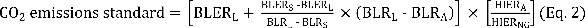
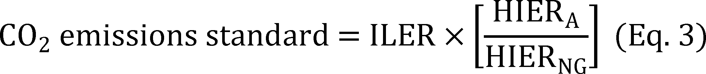

# Daily Digest — 2026-09-17

| | |
|---|---|
| **Digest date** | 2026-09-17 |
| **Data date range** | 2026-09-17 to 2026-09-17 |
| **Generated at** | 2026-09-18T04:23:45Z (UTC) |
| **Pipeline version** | 0cb798b |
| **Inference** | model layers ran — cli/haiku, opus |
| **Source watermarks** | CREC: 2026-09-17T19:35:21Z · BILLS: 2026-09-17T15:33:41Z · FR: 2026-09-17T05:11:54Z · USCOURTS: 2026-09-18T01:22:50Z · PLAW: 2026-09-09T15:30:07Z |

[Full observed listing for this day](day/2026-09-17.html) — every item our collectors observed for this publication day, mechanical rules applied, frozen at end of day. This digest is the canonical record.

All items below cite the govinfo package (and granule, where applicable) they
summarize. Selection is mechanical; each item states the rule that included
it. See the Coverage Statement at the end for a full accounting of what was
published, what was summarized, and what was excluded and why.

---

## Contents

- [Day in Review](#day-in-review)
- [1. Congressional Floor Activity](#1-congressional-floor-activity)
- [2. Legislation](#2-legislation)
- [3. Federal Register](#3-federal-register)
- [4. Enacted Laws](#4-enacted-laws)
- [5. Judicial Activity](#5-judicial-activity)
- [6. Agency Announcements](#6-agency-announcements)
- [7. Recorded Votes](#7-recorded-votes)
- [8. Bill Actions](#8-bill-actions)
- [9. Presidential Actions](#9-presidential-actions)
- [Terms Used Today](#terms-used-today)
- [Coverage Statement](#coverage-statement)
- [Methodology](#methodology)

---

## Day in Review

The House passed 29 measures to engrossment and reported one, while the Senate reported 54 bills and introduced one; nine House-passed measures were referred in the Senate, and twelve bills were introduced in the House. The digest carries three recorded roll call votes. Most Senate-reported measures name Postal Service facilities in specific communities. Other reported bills address long-term leasing on Mashpee Wampanoag and Aquinnah tribal lands, taking about 1,082.63 acres into trust for the Lower Elwha Klallam Tribe, grouping midnight rules in a single resolution of disapproval, FCC satellite licensing restrictions, FAA aviation mental health and medication transparency, and postal delivery performance bonuses.

On the executive side, the digest carries four presidential documents recorded as executive orders — two texts, on recreational saltwater fishing management and on hunting access on federal lands — plus a notice withdrawing five nominations from Senate consideration. The Federal Register items comprise nine final rules, seven proposed rules, and 56 notices, including EPA action repealing most 2024 carbon pollution standards for fossil fuel-fired power plants and a supplemental proposal to rescind the underlying greenhouse gas findings, FAA airworthiness directives, Coast Guard drawbridge and safety zone regulations, and an FDA premarket notification exemption order. The digest also carries 227 agency press releases.

The digest carries 34 appellate opinions, 827 district court opinions, and seven bankruptcy opinions. The First Circuit affirmed rejection of a Second Amendment as-applied challenge to the felon-in-possession statute and a jury verdict for Springfield, Massachusetts fire officials in a Title VII suit. The Third Circuit held that warrantless strip searches incident to arrest outside jails require exigent circumstances but granted qualified immunity, and revived Fourth Amendment claims over a warrantless home entry by New Jersey child protection workers. The Eleventh Circuit reversed a denial of qualified immunity on false arrest claims and affirmed a sex discrimination judgment against Alabama State University; the Fifth, Sixth, and Tenth Circuits affirmed immigration and sentencing decisions, and the Federal Circuit affirmed dismissal of a Navy contract bid protest.

*Composed from the summarized items below and the day's mechanical
counts; all specifics are cited in their sections.*

---

## 1. Congressional Floor Activity

Source: Congressional Record (CREC), issue observed 2026-09-17, covering proceedings of 2026-09-16. Published by govinfo 2026-09-17T19:35:21Z; observed by our collector 2026-09-17T19:38:51Z. Total issue size: 0 granule(s).

### 1.1 Senate

No Senate floor items met the selection thresholds. 0 floor granule(s) are accounted for in the Coverage Statement.

### 1.2 House of Representatives

No House floor items met the selection thresholds. 0 floor granule(s) are accounted for in the Coverage Statement.

### 1.3 Recorded Votes

No recorded votes were published in this issue of the Congressional Record.

---

## 2. Legislation

Source: Congressional Bills (BILLS), text versions published 2026-09-17 to 2026-09-17.

### 2.1 Counts by Stage

| Stage (bill text version) | Count |
|---|---|
| Introduced (ih/is) | 13 |
| Reported (rh/rs) | 55 |
| Engrossed (eh/es) | 29 |
| Enrolled (enr) | 0 |
| Other versions | 9 |
| **Total bill texts published** | **106** |

### 2.2 Bills Listed by Mechanical Rule

Tags: legislative · model keys: postal facilities · religious access · tribal lands

*In plain terms: 55 bills: 38 designate postal facilities; 17 address campus religious access, tribal lands, aviation rules, and federal operations.*

Bills below are listed because they matched at least one listing rule; the
matching rule is stated per item. All other bill texts are counted above and
accounted for in the Coverage Statement.

- **H. R. 1008 (rs) — 119 HR 1008 RS: To designate the facility of the United States Postal Service located at 298 Route 292 in Holmes, New York, as the “Sheriff Adrian Butch Anderson Post Office Building”.** — The bill designates the United States Postal Service facility located at 298 Route 292 in Holmes, New York as the Sheriff Adrian Butch Anderson Post Office Building. All references to the facility in federal law, regulations, or records shall be updated accordingly.
  - *In plain terms:* Names a Postal Service facility in Holmes, New York after Sheriff Adrian Butch Anderson; updates all federal references accordingly.
  - Included because: BILLS-SEL-01 — reached stage: reported/enrolled/calendar (document dated 2026-09-14)
  - Source: [BILLS-119hr1008rs](https://www.govinfo.gov/app/details/BILLS-119hr1008rs)
- **H. R. 1009 (rs) — 119 HR 1009 RS: To designate the facility of the United States Postal Service located at 86 Main Street in Haverstraw, New York, as the “Paul Piperato Post Office Building”.** — The bill designates the United States Postal Service facility located at 86 Main Street in Haverstraw, New York as the Paul Piperato Post Office Building. All references to the facility in federal law, regulations, or records shall be updated accordingly.
  - *In plain terms:* Names a Postal Service facility in Haverstraw, New York after Paul Piperato; updates all federal references accordingly.
  - Included because: BILLS-SEL-01 — reached stage: reported/enrolled/calendar (document dated 2026-09-14)
  - Source: [BILLS-119hr1009rs](https://www.govinfo.gov/app/details/BILLS-119hr1009rs)
- **H. R. 1372 (rs) — 119 HR 1372 RS: To designate the facility of the United States Postal Service located at 300 Macedonia Lane in Knoxville, Tennessee, as the “Reverend Harold Middlebrook Post Office Building”.** — The bill designates the United States Postal Service facility located at 300 Macedonia Lane in Knoxville, Tennessee as the Reverend Harold Middlebrook Post Office Building. All references to the facility in federal law, regulations, or records shall be updated accordingly.
  - *In plain terms:* Names a Postal Service facility in Knoxville, Tennessee after Reverend Harold Middlebrook; updates all federal references accordingly.
  - Included because: BILLS-SEL-01 — reached stage: reported/enrolled/calendar (document dated 2026-09-14)
  - Source: [BILLS-119hr1372rs](https://www.govinfo.gov/app/details/BILLS-119hr1372rs)
- **H. R. 1431 (rs) — 119 HR 1431 RS: To designate the facility of the United States Postal Service located at 2407 State Route 71, Suite 1, in Spring Lake, New Jersey, as the “James J. Howard Post Office”.** — The bill designates the United States Postal Service facility located at 2407 State Route 71, Suite 1, in Spring Lake, New Jersey as the James J. Howard Post Office. All references to the facility in federal law, regulations, or records shall be updated accordingly.
  - *In plain terms:* Names a Postal Service facility in Spring Lake, New Jersey after James J. Howard; updates all federal references accordingly.
  - Included because: BILLS-SEL-01 — reached stage: reported/enrolled/calendar (document dated 2026-09-14)
  - Source: [BILLS-119hr1431rs](https://www.govinfo.gov/app/details/BILLS-119hr1431rs)
- **H. R. 1706 (rs) — 119 HR 1706 RS: To designate the facility of the United States Postal Service located at 1200 William Street, Room 200, in Buffalo, New York, as the “William J. Donovan Post Office Building”.** — The bill designates the United States Postal Service facility located at 1200 William Street, Room 200, in Buffalo, New York as the William J. Donovan Post Office Building. All references to the facility in federal law, regulations, or records shall be updated accordingly.
  - *In plain terms:* Names a Postal Service facility in Buffalo, New York after William J. Donovan; updates all federal references accordingly.
  - Included because: BILLS-SEL-01 — reached stage: reported/enrolled/calendar (document dated 2026-09-14)
  - Source: [BILLS-119hr1706rs](https://www.govinfo.gov/app/details/BILLS-119hr1706rs)
- **H. R. 1830 (rs) — 119 HR 1830 RS: To designate the facility of the United States Postal Service located at 840 Front Street in Casselton, North Dakota, as the “Commander Delbert Austin Olson Post Office”.** — The bill designates the United States Postal Service facility located at 840 Front Street in Casselton, North Dakota as the Commander Delbert Austin Olson Post Office. All references to the facility in federal law, regulations, or records shall be updated accordingly.
  - *In plain terms:* Names a Postal Service facility in Casselton, North Dakota after Commander Delbert Austin Olson; updates all federal references accordingly.
  - Included because: BILLS-SEL-01 — reached stage: reported/enrolled/calendar (document dated 2026-09-14)
  - Source: [BILLS-119hr1830rs](https://www.govinfo.gov/app/details/BILLS-119hr1830rs)
- **H. R. 2175 (rs) — 119 HR 2175 RS: To designate the facility of the United States Postal Service located at 130 South Patterson Avenue in Santa Barbara, California, as the “Brigadier General Frederick R. Lopez Post Office Building”.** — The bill designates the United States Postal Service facility at 130 South Patterson Avenue in Santa Barbara, California as the Brigadier General Frederick R. Lopez Post Office Building. The designation applies to all references to the facility in federal law, regulations, and official records.
  - *In plain terms:* Names a Postal Service facility in Santa Barbara, California after Brigadier General Frederick R. Lopez; updates all federal references accordingly.
  - Included because: BILLS-SEL-01 — reached stage: reported/enrolled/calendar (document dated 2026-09-14)
  - Source: [BILLS-119hr2175rs](https://www.govinfo.gov/app/details/BILLS-119hr2175rs)
- **H. R. 2466 (rs) — 119 HR 2466 RS: To designate the facility of the United States Postal Service located at 5225 Harrison Avenue in Rockford, Illinois, as the “Jay P. Larson Post Office Building”.** — The bill designates the United States Postal Service facility at 5225 Harrison Avenue in Rockford, Illinois as the Jay P. Larson Post Office Building. The designation applies to all references to the facility in federal law, regulations, and official records.
  - *In plain terms:* Names a Postal Service facility in Rockford, Illinois after Jay P. Larson; updates all federal references accordingly.
  - Included because: BILLS-SEL-01 — reached stage: reported/enrolled/calendar (document dated 2026-09-14)
  - Source: [BILLS-119hr2466rs](https://www.govinfo.gov/app/details/BILLS-119hr2466rs)
- **H. R. 323 (rs) — 119 HR 323 RS: To designate the facility of the United States Postal Service located at 80 Prospect Street in Avon, New York, as the “Officer Anthony Mazurkiewicz Memorial Post Office Building”.** — The bill designates the United States Postal Service facility at 80 Prospect Street in Avon, New York as the Officer Anthony Mazurkiewicz Memorial Post Office Building. The designation applies to all references to the facility in federal law, regulations, and official records.
  - *In plain terms:* Names a Postal Service facility in Avon, New York after Officer Anthony Mazurkiewicz; updates all federal references accordingly.
  - Included because: BILLS-SEL-01 — reached stage: reported/enrolled/calendar (document dated 2026-09-14)
  - Source: [BILLS-119hr323rs](https://www.govinfo.gov/app/details/BILLS-119hr323rs)
- **H. R. 3350 (rs) — 119 HR 3350 RS: To designate the facility of the United States Postal Service located at 340 East 1st Street in Tustin, California, as the “Ursula Ellen Kennedy Post Office Building”.** — The bill designates the United States Postal Service facility at 340 East 1st Street in Tustin, California as the Ursula Ellen Kennedy Post Office Building. The designation applies to all references to the facility in federal law, regulations, and official records.
  - *In plain terms:* Names a Postal Service facility in Tustin, California after Ursula Ellen Kennedy; updates all federal references accordingly.
  - Included because: BILLS-SEL-01 — reached stage: reported/enrolled/calendar (document dated 2026-09-14)
  - Source: [BILLS-119hr3350rs](https://www.govinfo.gov/app/details/BILLS-119hr3350rs)
- **H. R. 3393 (rs) — 119 HR 3393 RS: To designate the facility of the United States Postal Service located at 12208 North 19th Avenue in Phoenix, Arizona, as the “Officer Zane T. Coolidge Post Office”.** — The bill designates the United States Postal Service facility at 12208 North 19th Avenue in Phoenix, Arizona as the Officer Zane T. Coolidge Post Office. The designation applies to all references to the facility in federal law, regulations, and official records.
  - *In plain terms:* Names a Postal Service facility in Phoenix, Arizona after Officer Zane T. Coolidge; updates all federal references accordingly.
  - Included because: BILLS-SEL-01 — reached stage: reported/enrolled/calendar (document dated 2026-09-14)
  - Source: [BILLS-119hr3393rs](https://www.govinfo.gov/app/details/BILLS-119hr3393rs)
- **H. R. 4635 (rs) — 119 HR 4635 RS: To designate the facility of the United States Postal Service located at 890 East 152nd Street in Cleveland, Ohio, as the “Technical Sergeant Alma Gladys Minter Post Office Building”.** — The bill designates the United States Postal Service facility at 890 East 152nd Street in Cleveland, Ohio as the Technical Sergeant Alma Gladys Minter Post Office Building. The designation applies to all references to the facility in federal law, regulations, and official records.
  - *In plain terms:* Names a Postal Service facility in Cleveland, Ohio after Technical Sergeant Alma Gladys Minter; updates all federal references accordingly.
  - Included because: BILLS-SEL-01 — reached stage: reported/enrolled/calendar (document dated 2026-09-14)
  - Source: [BILLS-119hr4635rs](https://www.govinfo.gov/app/details/BILLS-119hr4635rs)
- **H. R. 4662 (rs) — 119 HR 4662 RS: To designate the facility of the United States Postal Service located at 6444 San Fernando Road in Glendale, California, as the “Paul Ignatius Post Office”.** — The bill designates the United States Postal Service facility located at 6444 San Fernando Road in Glendale, California as the "Paul Ignatius Post Office." References to the facility in law, regulations, documents, or other federal records will be updated accordingly.
  - *In plain terms:* Names a Postal Service facility in Glendale, California after Paul Ignatius; updates all federal references accordingly.
  - Included because: BILLS-SEL-01 — reached stage: reported/enrolled/calendar (document dated 2026-09-14)
  - Source: [BILLS-119hr4662rs](https://www.govinfo.gov/app/details/BILLS-119hr4662rs)
- **H. R. 5505 (rh) — 119 HR 5505 RH: Equal Campus Access Act of 2026** — The Equal Campus Access Act of 2026 amends the Higher Education Act of 1965 to prohibit public institutions of higher education receiving federal funds from denying religious student organizations the same rights, benefits, facilities access, and official recognition as other student organizations on the basis of the organization's religious beliefs, practices, speech, leadership standards, or conduct standards. The bill was reported from committee with an amendment on September 16, 2026.
  - *In plain terms:* Reported from committee September 16, 2026, this law would prohibit federally funded public colleges from denying religious student organizations equal rights, facility access, and recognition.
  - Included because: BILLS-SEL-01 — reached stage: reported/enrolled/calendar (document dated 2026-09-16)
  - Source: [BILLS-119hr5505rh](https://www.govinfo.gov/app/details/BILLS-119hr5505rh)
- **H. R. 6020 (rs) — 119 HR 6020 RS: To designate the facility of the United States Postal Service located at 14855 South Van Dyke Road in Plainfield, Illinois, as the “Staff Sergeant Jose Dueñez Jr. Post Office Building”.** — The bill designates the United States Postal Service facility located at 14855 South Van Dyke Road in Plainfield, Illinois as the "Staff Sergeant Jose Dueñez Jr. Post Office Building." References to the facility in law, regulations, documents, or other federal records will be updated accordingly.
  - *In plain terms:* Names a Postal Service facility in Plainfield, Illinois after Staff Sergeant Jose Dueñez Jr.; updates all federal references accordingly.
  - Included because: BILLS-SEL-01 — reached stage: reported/enrolled/calendar (document dated 2026-09-14)
  - Source: [BILLS-119hr6020rs](https://www.govinfo.gov/app/details/BILLS-119hr6020rs)
- **H. R. 6247 (rs) — 119 HR 6247 RS: To designate the facility of the United States Postal Service located at 13355 North Lon Adams Road in Marana, Arizona, as the “Mayor Ed Honea Memorial Post Office”.** — The bill designates the United States Postal Service facility located at 13355 North Lon Adams Road in Marana, Arizona as the "Mayor Ed Honea Memorial Post Office." References to the facility in law, regulations, documents, or other federal records will be updated accordingly.
  - *In plain terms:* Names a Postal Service facility in Marana, Arizona after Mayor Ed Honea; updates all federal references accordingly.
  - Included because: BILLS-SEL-01 — reached stage: reported/enrolled/calendar (document dated 2026-09-14)
  - Source: [BILLS-119hr6247rs](https://www.govinfo.gov/app/details/BILLS-119hr6247rs)
- **H. R. 6310 (rs) — 119 HR 6310 RS: To designate the facility of the United States Postal Service located at 3570 Olney Laytonsville Road in Olney, Maryland, as the “Edward L. Ramsey Olney Post Office Building”.** — The bill designates the United States Postal Service facility located at 3570 Olney Laytonsville Road in Olney, Maryland as the "Edward L. Ramsey Olney Post Office Building." References to the facility in law, regulations, documents, or other federal records will be updated accordingly.
  - *In plain terms:* Names a Postal Service facility in Olney, Maryland after Edward L. Ramsey; updates all federal references accordingly.
  - Included because: BILLS-SEL-01 — reached stage: reported/enrolled/calendar (document dated 2026-09-14)
  - Source: [BILLS-119hr6310rs](https://www.govinfo.gov/app/details/BILLS-119hr6310rs)
- **H. R. 6317 (rs) — 119 HR 6317 RS: To designate the facility of the United States Postal Service located at 12109 New Kent Highway in New Kent, Virginia, as the “Patricia Paige Post Office”.** — The bill designates the United States Postal Service facility located at 12109 New Kent Highway in New Kent, Virginia as the "Patricia Paige Post Office." References to the facility in law, regulations, documents, or other federal records will be updated accordingly.
  - *In plain terms:* Names a Postal Service facility in New Kent, Virginia after Patricia Paige; updates all federal references accordingly.
  - Included because: BILLS-SEL-01 — reached stage: reported/enrolled/calendar (document dated 2026-09-14)
  - Source: [BILLS-119hr6317rs](https://www.govinfo.gov/app/details/BILLS-119hr6317rs)
- **H. R. 6332 (rs) — 119 HR 6332 RS: To designate the facility of the United States Postal Service located at 10660 Page Avenue in Fairfax, Virginia, as the “Congressman Gerald E. Connolly Post Office Building”.** — The bill designates the United States Postal Service facility located at 10660 Page Avenue in Fairfax, Virginia as the "Congressman Gerald E. Connolly Post Office Building." References to the facility in law, regulations, documents, or other federal records will be updated accordingly.
  - *In plain terms:* Names a Postal Service facility in Fairfax, Virginia after Congressman Gerald E. Connolly; updates all federal references accordingly.
  - Included because: BILLS-SEL-01 — reached stage: reported/enrolled/calendar (document dated 2026-09-14)
  - Source: [BILLS-119hr6332rs](https://www.govinfo.gov/app/details/BILLS-119hr6332rs)
- **H. R. 6808 (rs) — 119 HR 6808 RS: To designate the facility of the United States Postal Service located at 417 West 7th Street in Columbia, Tennessee, as the “Pharmacist’s Mate First Class John Harlan Willis Post Office Building”.** — The bill designates the U.S. Postal Service facility located at 417 West 7th Street in Columbia, Tennessee, as the "Pharmacist's Mate First Class John Harlan Willis Post Office Building." All references to this facility in federal law, maps, regulations, and documents shall be updated to reflect this designation.
  - *In plain terms:* Names a Postal Service facility in Columbia, Tennessee after Pharmacist's Mate First Class John Harlan Willis; updates all federal references accordingly.
  - Included because: BILLS-SEL-01 — reached stage: reported/enrolled/calendar (document dated 2026-09-14)
  - Source: [BILLS-119hr6808rs](https://www.govinfo.gov/app/details/BILLS-119hr6808rs)
- **H. R. 681 (rs) — 119 HR 681 RS: To amend the Act of August 9, 1955 (commonly known as the “Long-Term Leasing Act”), to authorize leases of up to 99 years for land in the Mashpee Wampanoag Tribe Reservation and land held in trust for the Wampanoag Tribe of Gay Head (Aquinnah), and for other purposes.** — The bill amends the Long-Term Leasing Act to authorize leases of up to 99 years for land in the Mashpee Wampanoag Tribe Reservation and land held in trust for the Wampanoag Tribe of Gay Head (Aquinnah). The amendment adds these tribal lands to the list of locations eligible for such long-term leases under the existing statute.
  - *In plain terms:* Amends the Long-Term Leasing Act to allow leases of up to 99 years for land in the Mashpee Wampanoag and Gay Head Wampanoag tribal reservations.
  - Included because: BILLS-SEL-01 — reached stage: reported/enrolled/calendar (document dated 2026-09-14)
  - Source: [BILLS-119hr681rs](https://www.govinfo.gov/app/details/BILLS-119hr681rs)
- **H. R. 6995 (rs) — 119 HR 6995 RS: To designate the facility of the United States Postal Service located at 825 Highway 198 in Beaumont, Mississippi, as the “Jeremy Malone Post Office”.** — The bill designates the U.S. Postal Service facility located at 825 Highway 198 in Beaumont, Mississippi, as the "Jeremy Malone Post Office." All references to this facility in federal law, maps, regulations, and documents shall be updated to reflect this designation.
  - *In plain terms:* Names a Postal Service facility in Beaumont, Mississippi after Jeremy Malone; updates all federal references accordingly.
  - Included because: BILLS-SEL-01 — reached stage: reported/enrolled/calendar (document dated 2026-09-14)
  - Source: [BILLS-119hr6995rs](https://www.govinfo.gov/app/details/BILLS-119hr6995rs)
- **H. R. 7809 (rs) — 119 HR 7809 RS: To designate the facility of the United States Postal Service located at 201 East Grant Avenue in Georgetown, Ohio, as the “Ulysses S. Grant Post Office Building”.** — The bill designates the U.S. Postal Service facility located at 201 East Grant Avenue in Georgetown, Ohio, as the "Ulysses S. Grant Post Office Building." All references to this facility in federal law, maps, regulations, and documents shall be updated to reflect this designation.
  - *In plain terms:* Names a Postal Service facility in Georgetown, Ohio after Ulysses S. Grant; updates all federal references accordingly.
  - Included because: BILLS-SEL-01 — reached stage: reported/enrolled/calendar (document dated 2026-09-14)
  - Source: [BILLS-119hr7809rs](https://www.govinfo.gov/app/details/BILLS-119hr7809rs)
- **S. 1513 (rs) — 102 S1513 RS: Lower Elwha Klallam Tribe Project Lands Restoration Act** — The bill takes approximately 1,082.63 acres of federal land in Washington State into trust for the Lower Elwha Klallam Tribe and includes it as part of the Lower Elwha Indian Reservation, with a portion of the Elwha River managed in accordance with the Wild and Scenic Rivers Act. The transferred land is exempt from valuation and appraisal requirements and is prohibited from use under the Indian Gaming Regulatory Act, while preserving existing treaty rights.
  - *In plain terms:* Places 1,082.63 acres of federal land in Washington State in trust for the Lower Elwha Klallam Tribe and includes it in their reservation, with river management under the Wild and Scenic Rivers Act.
  - Included because: BILLS-SEL-01 — reached stage: reported/enrolled/calendar (document dated 2026-09-14)
  - Source: [BILLS-119s1513rs](https://www.govinfo.gov/app/details/BILLS-119s1513rs)
- **S. 164 (rs) — 119 S164 RS: Midnight Rules Relief Act of 2025** — The bill amends the Congressional Review Act to allow Congress to consider multiple "midnight rules" (regulations issued during the final year of a President's term) in a single joint resolution of disapproval. The amendment enables legislators to group multiple rules together in one resolution rather than requiring separate votes on each rule.
  - *In plain terms:* Allows Congress to consider multiple regulations issued in a President's final year in a single joint resolution vote instead of voting on each separately.
  - Included because: BILLS-SEL-01 — reached stage: reported/enrolled/calendar (document dated 2026-09-14)
  - Source: [BILLS-119s164rs](https://www.govinfo.gov/app/details/BILLS-119s164rs)
- **S. 1962 (rs) — 119 S1962 RS: Secure Space Act of 2025** — The bill amends the Secure and Trusted Communications Networks Act of 2019 to prohibit the Federal Communications Commission from granting licenses, market access, or earth station authorizations for satellite systems if held or controlled by entities that produce covered communications equipment or their affiliates, as identified on a list published by the FCC.
  - *In plain terms:* Prohibits the FCC from granting licenses to satellite systems held or controlled by entities that produce covered communications equipment as identified on an FCC list.
  - Included because: BILLS-SEL-01 — reached stage: reported/enrolled/calendar (document dated 2026-09-14)
  - Source: [BILLS-119s1962rs](https://www.govinfo.gov/app/details/BILLS-119s1962rs)
- **S. 236 (rs) — 119 S236 RS: To amend the Act of August 9, 1955 (commonly known as the “Long-Term Leasing Act”), to authorize leases of up to 99 years for land in the Mashpee Wampanoag Tribe Reservation and land held in trust for the Wampanoag Tribe of Gay Head (Aquinnah), and for other purposes.** — The bill amends the Act of August 9, 1955 (the Long-Term Leasing Act) to authorize leases of up to 99 years for land in the Mashpee Wampanoag Tribe Reservation and land held in trust for the Wampanoag Tribe of Gay Head (Aquinnah).
  - *In plain terms:* Amends the Long-Term Leasing Act to authorize leases up to 99 years for Mashpee Wampanoag Tribe and Wampanoag Tribe of Gay Head reservation lands.
  - Included because: BILLS-SEL-01 — reached stage: reported/enrolled/calendar (document dated 2026-09-14)
  - Source: [BILLS-119s236rs](https://www.govinfo.gov/app/details/BILLS-119s236rs)
- **S. 2394 (rs) — 119 S2394 RS: To designate the facility of the United States Postal Service located at 505 East 9th Avenue in Amarillo, Texas, as the “Mayor Jerry H. Hodge Post Office Building”.** — The bill designates the United States Postal Service facility located at 505 East 9th Avenue in Amarillo, Texas, as the Mayor Jerry H. Hodge Post Office Building.
  - *In plain terms:* Names the Postal Service facility at 505 East 9th Avenue in Amarillo, Texas the Mayor Jerry H. Hodge Post Office Building.
  - Included because: BILLS-SEL-01 — reached stage: reported/enrolled/calendar (document dated 2026-09-14)
  - Source: [BILLS-119s2394rs](https://www.govinfo.gov/app/details/BILLS-119s2394rs)
- **S. 2432 (rs) — 119 S2432 RS: To designate the facility of the United States Postal Service located at 6444 San Fernando Road in Glendale, California, as the “Paul Ignatius Post Office”.** — The bill designates the United States Postal Service facility located at 6444 San Fernando Road in Glendale, California, as the Paul Ignatius Post Office.
  - *In plain terms:* Names the Postal Service facility at 6444 San Fernando Road in Glendale, California the Paul Ignatius Post Office.
  - Included because: BILLS-SEL-01 — reached stage: reported/enrolled/calendar (document dated 2026-09-14)
  - Source: [BILLS-119s2432rs](https://www.govinfo.gov/app/details/BILLS-119s2432rs)
- **S. 252 (rs) — 119 S252 RS: Guidance Out Of Darkness Act** — The bill, titled the Guidance Out Of Darkness Act (GOOD Act), requires federal agencies to publish guidance documents on a single internet website designated by the Office of Management and Budget within 180 days of enactment, including memoranda, notices, bulletins, directives, news releases, letters, blog posts, no-action letters, and speeches that set forth agency policy or interpretations without having the force of law.
  - *In plain terms:* Requires federal agencies to publish guidance documents on a single website within 180 days, including memoranda, notices, directives, and policy speeches.
  - Included because: BILLS-SEL-01 — reached stage: reported/enrolled/calendar (document dated 2026-09-14)
  - Source: [BILLS-119s252rs](https://www.govinfo.gov/app/details/BILLS-119s252rs)
- **S. 2733 (rs) — 119 S2733 RS: Duplication Scoring Act of 2025** — The bill, titled the Duplication Scoring Act of 2025, requires the Government Accountability Office to analyze reported bills and joint resolutions to identify potential duplication or overlap with existing federal programs and submit findings to the Congressional Budget Office and relevant committees.
  - *In plain terms:* Requires the Government Accountability Office to analyze bills for overlap with existing federal programs and report findings to Congress.
  - Included because: BILLS-SEL-01 — reached stage: reported/enrolled/calendar (document dated 2026-09-14)
  - Source: [BILLS-119s2733rs](https://www.govinfo.gov/app/details/BILLS-119s2733rs)
- **S. 3175 (rs) — 119 S3175 RS: Community Involvement in Zone Improvement Plans Act of 2025** — Establishes a pilot program requiring the Postal Service to consider agreements with state, local, and Tribal governments to defray costs associated with ZIP code boundary changes or realignments. When the Postal Service denies a request based on cost, it must notify the requestor, provide a cost estimate, and allow 30 days to propose a cost-sharing agreement. The bill mandates annual reports to Congress on requests granted and denied and terminates the program after 7 years.
  - *In plain terms:* Establishes a pilot program allowing the Postal Service to cost-share with state, local, and Tribal governments for ZIP code boundary changes, with annual reports and a 7-year term.
  - Included because: BILLS-SEL-01 — reached stage: reported/enrolled/calendar (document dated 2026-09-14)
  - Source: [BILLS-119s3175rs](https://www.govinfo.gov/app/details/BILLS-119s3175rs)
- **S. 3211 (rs) — 119 S3211 RS: Recognizing the Role of Direct Support Professionals Act** — Directs the Director of the Office of Management and Budget to consider establishing a separate occupational code for direct support professionals in the Standard Occupational Classification system during the next revision. If OMB declines to create a separate code, it must submit a report to Congress explaining the decision within 30 days of the revision. The bill authorizes no new appropriations.
  - *In plain terms:* Directs the Office of Management and Budget to consider establishing a separate job classification for direct support professionals during the next revision.
  - Included because: BILLS-SEL-01 — reached stage: reported/enrolled/calendar (document dated 2026-09-14)
  - Source: [BILLS-119s3211rs](https://www.govinfo.gov/app/details/BILLS-119s3211rs)
- **S. 3257 (rs) — 119 S3257 RS: Mental Health in Aviation Act of 2025** — Requires the FAA Administrator to update regulations within 2 years to encourage individuals to seek mental health treatment and disclose mental health conditions, and to implement recommendations from the Mental Health and Aviation Medical Clearances Rulemaking Committee. Authorizes up to $15 million annually for fiscal years 2026-2029 to expand the Office of Aerospace Medicine's capacity, recruit additional aviation medical examiners, and provide enhanced mental health training. Authorizes up to $1.5 million annually for a public information campaign to destigmatize mental health care and improve trust between the FAA and aviation personnel.
  - *In plain terms:* Requires the FAA to update regulations within 2 years to encourage mental health treatment disclosure and implement recommendations, authorizing $15M annually for 2026-2029 and $1.5M for an information campaign.
  - Included because: BILLS-SEL-01 — reached stage: reported/enrolled/calendar (document dated 2026-09-14)
  - Source: [BILLS-119s3257rs](https://www.govinfo.gov/app/details/BILLS-119s3257rs)
- **S. 3258 (rs) — 119 S3258 RS: Aviation Medication Transparency Act of 2025** — Requires the FAA Administrator to publish and maintain a publicly accessible list of medications approved for pilots and air traffic controllers within one year, including those on the "Do Not Issue" and "Do Not Fly" lists. The list must be drafted in consultation with aviation stakeholders, presented in user-friendly format, and updated annually when relevant FAA medical policy changes. The publication serves to inform applicants for medical certification of approved medications and any stabilization periods required.
  - *In plain terms:* Requires the FAA to publish and annually update a public list of medications approved for pilots and air traffic controllers within one year.
  - Included because: BILLS-SEL-01 — reached stage: reported/enrolled/calendar (document dated 2026-09-14)
  - Source: [BILLS-119s3258rs](https://www.govinfo.gov/app/details/BILLS-119s3258rs)
- **S. 3270 (rs) — 119 S3270 RS: To designate the facility of the United States Postal Service located at 3570 Olney Laytonsville Road in Olney, Maryland, as the “Edward L. Ramsey Olney Post Office Building”.** — Designates the Postal Service facility located at 3570 Olney Laytonsville Road in Olney, Maryland, as the "Edward L. Ramsey Olney Post Office Building." Requires that all references to this facility in federal law, regulations, documents, and records use the new official designation.
  - *In plain terms:* Names the Postal Service facility at 3570 Olney Laytonsville Road in Olney, Maryland the Edward L. Ramsey Olney Post Office Building.
  - Included because: BILLS-SEL-01 — reached stage: reported/enrolled/calendar (document dated 2026-09-14)
  - Source: [BILLS-119s3270rs](https://www.govinfo.gov/app/details/BILLS-119s3270rs)
- **S. 3294 (rs) — 119 S3294 RS: To designate the facility of the United States Postal Service located at 10660 Page Avenue in Fairfax, Virginia, as the “Congressman Gerald E. Connolly Post Office Building”.** — Designates the Postal Service facility located at 10660 Page Avenue in Fairfax, Virginia, as the "Congressman Gerald E. Connolly Post Office Building." Requires that all references to this facility in federal law, regulations, documents, and records use the new official designation.
  - *In plain terms:* Names the Postal Service facility at 10660 Page Avenue in Fairfax, Virginia the Congressman Gerald E. Connolly Post Office Building.
  - Included because: BILLS-SEL-01 — reached stage: reported/enrolled/calendar (document dated 2026-09-14)
  - Source: [BILLS-119s3294rs](https://www.govinfo.gov/app/details/BILLS-119s3294rs)
- **S. 3296 (rs) — 119 S3296 RS: Improving Access to Workers’ Compensation for Injured Federal Workers Act of 2025** — This bill amends chapter 81 of title 5, United States Code to include physician assistants and nurse practitioners in coverage for workers' compensation services provided to injured Federal workers. The bill adds conforming amendments throughout the compensation chapter and requires the Secretary of Labor to finalize implementing rules within 6 months of enactment.
  - *In plain terms:* Expands workers' compensation for injured federal workers to include physician assistants and nurse practitioners, with implementation rules due within 6 months.
  - Included because: BILLS-SEL-01 — reached stage: reported/enrolled/calendar (document dated 2026-09-14)
  - Source: [BILLS-119s3296rs](https://www.govinfo.gov/app/details/BILLS-119s3296rs)
- **S. 3331 (rs) — 119 S3331 RS: To designate the facility of the United States Postal Service located at 50 East 100 North in Moab, Utah, as the “2nd Lieutenant Mitch Williams Post Office”.** — This bill designates the United States Postal Service facility located at 50 East 100 North in Moab, Utah as the 2nd Lieutenant Mitch Williams Post Office. All references to this facility in laws, regulations, documents, and records shall use the new designation.
  - *In plain terms:* Names the Postal Service facility at 50 East 100 North in Moab, Utah the 2nd Lieutenant Mitch Williams Post Office.
  - Included because: BILLS-SEL-01 — reached stage: reported/enrolled/calendar (document dated 2026-09-14)
  - Source: [BILLS-119s3331rs](https://www.govinfo.gov/app/details/BILLS-119s3331rs)
- **S. 3373 (rs) — 119 S3373 RS: To designate the facility of the United States Postal Service located at 14855 South Van Dyke Road in Plainfield, Illinois, as the “Staff Sergeant Jose Dueñez Jr. Post Office Building”.** — This bill designates the United States Postal Service facility located at 14855 South Van Dyke Road in Plainfield, Illinois as the Staff Sergeant Jose Dueñez Jr. Post Office Building. All references to this facility in laws, regulations, documents, and records shall use the new designation.
  - *In plain terms:* Names the Postal Service facility at 14855 South Van Dyke Road in Plainfield, Illinois the Staff Sergeant Jose Dueñez Jr. Post Office Building.
  - Included because: BILLS-SEL-01 — reached stage: reported/enrolled/calendar (document dated 2026-09-14)
  - Source: [BILLS-119s3373rs](https://www.govinfo.gov/app/details/BILLS-119s3373rs)
- **S. 3404 (rs) — 119 S3404 RS: Satellite Cybersecurity Act of 2025** — This bill directs the Comptroller General to conduct a study on Federal Government actions supporting commercial satellite system cybersecurity and report findings to Congress within 2 years. It requires the Secretary of Commerce to establish and maintain a public clearinghouse of commercial satellite cybersecurity resources within 180 days and to consolidate voluntary cybersecurity recommendations for satellite systems, and directs submission of a Federal strategy for addressing commercial satellite cybersecurity within 120 days.
  - *In plain terms:* Directs studies on commercial satellite cybersecurity with findings within 2 years, a public resource clearinghouse within 180 days, and a federal strategy within 120 days.
  - Included because: BILLS-SEL-01 — reached stage: reported/enrolled/calendar (document dated 2026-09-14)
  - Source: [BILLS-119s3404rs](https://www.govinfo.gov/app/details/BILLS-119s3404rs)
- **S. 3444 (rs) — 119 S3444 RS: To designate the facility of the United States Postal Service at 1300 East Northwest Highway in Palatine, Illinois, as the “Bernie Bluestein Post Office Building”.** — This bill designates the United States Postal Service facility located at 1300 East Northwest Highway in Palatine, Illinois as the Bernie Bluestein Post Office Building. All references to this facility in laws, regulations, documents, and records shall use the new designation.
  - *In plain terms:* Names the Postal Service facility at 1300 East Northwest Highway in Palatine, Illinois the Bernie Bluestein Post Office Building.
  - Included because: BILLS-SEL-01 — reached stage: reported/enrolled/calendar (document dated 2026-09-14)
  - Source: [BILLS-119s3444rs](https://www.govinfo.gov/app/details/BILLS-119s3444rs)
- **S. 3630 (rs) — 119 S3630 RS: To designate the facility of the United States Postal Service located at 46164 Westlake Drive in Sterling, Virginia, as the “Firefighter Trevor Brown Post Office Building”.** — This bill designates the United States Postal Service facility located at 46164 Westlake Drive in Sterling, Virginia as the Firefighter Trevor Brown Post Office Building. All references to this facility in laws, regulations, documents, and records shall use the new designation.
  - *In plain terms:* Names the Postal Service facility at 46164 Westlake Drive in Sterling, Virginia the Firefighter Trevor Brown Post Office Building.
  - Included because: BILLS-SEL-01 — reached stage: reported/enrolled/calendar (document dated 2026-09-14)
  - Source: [BILLS-119s3630rs](https://www.govinfo.gov/app/details/BILLS-119s3630rs)
- **S. 3700 (rs) — 119 S3700 RS: FAA SMS Compliance Review Act of 2026** — Establishes an independent expert review panel to evaluate the Federal Aviation Administration's Safety Management System (SMS) compliance with FAA orders and policies within 60 days of enactment. The panel shall review SMS components, safety enhancements, effectiveness across FAA lines of business, staff training and communication, voluntary safety reporting programs, and international standards compliance. The Administrator shall publish the panel's findings and recommendations within 180 days and provide explanations for any non-concurred recommendations within six months.
  - *In plain terms:* Establishes an independent panel to review the FAA's Safety Management System compliance within 60 days, with findings published within 180 days.
  - Included because: BILLS-SEL-01 — reached stage: reported/enrolled/calendar (document dated 2026-09-14)
  - Source: [BILLS-119s3700rs](https://www.govinfo.gov/app/details/BILLS-119s3700rs)
- **S. 3791 (rs) — 119 S3791 RS: Regional Ocean Partnerships Reauthorization Act of 2026** — Reauthorizes the Regional Ocean Partnerships program through fiscal year 2031 with updated funding levels for each year. Adds a funding restriction prohibiting Regional Ocean Partnerships from using appropriated funds to develop regulatory proposals, model regulations, or compliance programs.
  - *In plain terms:* Reauthorizes the Regional Ocean Partnerships program through 2031 and prohibits using funds for developing regulatory proposals or compliance programs.
  - Included because: BILLS-SEL-01 — reached stage: reported/enrolled/calendar (document dated 2026-09-14)
  - Source: [BILLS-119s3791rs](https://www.govinfo.gov/app/details/BILLS-119s3791rs)
- **S. 3835 (rs) — 119 S3835 RS: To designate the facility of the United States Postal Service located at 10 East Main Street in Mahaffey, Pennsylvania, as the “Robert Allen Bishop, Sr., Post Office Building”.** — Designates the United States Postal Service facility located at 10 East Main Street in Mahaffey, Pennsylvania, as the Robert Allen Bishop, Sr. Post Office Building. All federal references to this facility shall refer to it by this new designation.
  - *In plain terms:* Names the Postal Service facility at 10 East Main Street in Mahaffey, Pennsylvania the Robert Allen Bishop, Sr. Post Office Building.
  - Included because: BILLS-SEL-01 — reached stage: reported/enrolled/calendar (document dated 2026-09-14)
  - Source: [BILLS-119s3835rs](https://www.govinfo.gov/app/details/BILLS-119s3835rs)
- **S. 4052 (rs) — 119 S4052 RS: To designate the facility of the United States Postal Service located at 203 North Clay Street in Marshfield, Missouri, shall be known and designated as the “Edwin P. Hubble Post Office”.** — Designates the United States Postal Service facility located at 203 North Clay Street in Marshfield, Missouri, as the Edwin P. Hubble Post Office. All federal references to this facility shall refer to it by this new designation.
  - *In plain terms:* Names the Postal Service facility at 203 North Clay Street in Marshfield, Missouri the Edwin P. Hubble Post Office.
  - Included because: BILLS-SEL-01 — reached stage: reported/enrolled/calendar (document dated 2026-09-14)
  - Source: [BILLS-119s4052rs](https://www.govinfo.gov/app/details/BILLS-119s4052rs)
- **S. 4079 (rs) — 119 S4079 RS: Providing Emotional Assistance with Relief and Love Act** — Establishes a three-year pilot program requiring U.S. Customs and Border Protection to adopt dogs from local animal shelters and train them as support dogs for its Support Canine Program. The program shall commence within 60 days of enactment and terminate three years after establishment, with no additional federal funding authorized.
  - *In plain terms:* Establishes a three-year pilot program requiring U.S. Customs and Border Protection to adopt shelter dogs and train them as support animals, starting within 60 days.
  - Included because: BILLS-SEL-01 — reached stage: reported/enrolled/calendar (document dated 2026-09-14)
  - Source: [BILLS-119s4079rs](https://www.govinfo.gov/app/details/BILLS-119s4079rs)
- **S. 4523 (rs) — 119 S4523 RS: To designate the facility of the United States Postal Service located at 111 South Tremont Street in Tremonton, Utah, as the “Sorensen-Estrada Post Office”.** — Designates the United States Postal Service facility located at 111 South Tremont Street in Tremonton, Utah, as the Sorensen-Estrada Post Office. All federal references to this facility shall refer to it by this new designation.
  - *In plain terms:* Names the Postal Service facility at 111 South Tremont Street in Tremonton, Utah the Sorensen-Estrada Post Office.
  - Included because: BILLS-SEL-01 — reached stage: reported/enrolled/calendar (document dated 2026-09-14)
  - Source: [BILLS-119s4523rs](https://www.govinfo.gov/app/details/BILLS-119s4523rs)
- **S. 4623 (rs) — 119 S4623 RS: To designate the facility of the United States Postal Service located at 12109 New Kent Highway in New Kent, Virginia, as the “Patricia Paige Post Office”.** — Senate Bill 4623 designates the United States Postal Service facility at 12109 New Kent Highway in New Kent, Virginia, as the Patricia Paige Post Office. The bill was reported without amendment on September 14, 2026.
  - *In plain terms:* Names the Postal Service facility at 12109 New Kent Highway in New Kent, Virginia the Patricia Paige Post Office.
  - Included because: BILLS-SEL-01 — reached stage: reported/enrolled/calendar (document dated 2026-09-14)
  - Source: [BILLS-119s4623rs](https://www.govinfo.gov/app/details/BILLS-119s4623rs)
- **S. 4745 (rs) — 119 S4745 RS: To designate the facility of the United States Postal Service located at 201 East Grant Avenue in Georgetown, Ohio, as the “Ulysses S. Grant Post Office Building”.** — Senate Bill 4745 designates the United States Postal Service facility at 201 East Grant Avenue in Georgetown, Ohio, as the Ulysses S. Grant Post Office Building. The bill was reported without amendment on September 14, 2026.
  - *In plain terms:* Names the Postal Service facility at 201 East Grant Avenue in Georgetown, Ohio the Ulysses S. Grant Post Office Building.
  - Included because: BILLS-SEL-01 — reached stage: reported/enrolled/calendar (document dated 2026-09-14)
  - Source: [BILLS-119s4745rs](https://www.govinfo.gov/app/details/BILLS-119s4745rs)
- **S. 4830 (rs) — 119 S4830 RS: To designate the facility of the United States Postal Service located at 86–014 Farrington Highway in Waianae, Hawaii, as the “United States Representative Colleen Hanabusa Post Office Building”.** — S. 4830 designates the United States Postal Service facility at 86–014 Farrington Highway in Waianae, Hawaii, as the United States Representative Colleen Hanabusa Post Office Building. All future legal and regulatory references to this facility shall use this designation.
  - *In plain terms:* This bill names a post office in Waianae, Hawaii after United States Representative Colleen Hanabusa.
  - Included because: BILLS-SEL-01 — reached stage: reported/enrolled/calendar (document dated 2026-09-14)
  - Source: [BILLS-119s4830rs](https://www.govinfo.gov/app/details/BILLS-119s4830rs)
- **S. 5163 (rs) — 119 S5163 RS: No Bonuses for Bad Service Act** — S. 5163, the No Bonuses for Bad Service Act, amends federal postal law to prohibit bonuses to the Postmaster General and Deputy Postmaster General when the Postal Service fails to meet 95 percent on-time delivery performance targets for market-dominant products or when the agency experiences deficit increases compared to the prior fiscal year. The bill requires submission of delivery performance reports to the Postal Regulatory Commission.
  - *In plain terms:* This bill stops bonuses for the Postmaster General and Deputy Postmaster General if mail delivery misses 95% on-time targets or the Postal Service's deficit grows, requiring delivery reports to the Postal Regulatory Commission.
  - Included because: BILLS-SEL-01 — reached stage: reported/enrolled/calendar (document dated 2026-09-14)
  - Source: [BILLS-119s5163rs](https://www.govinfo.gov/app/details/BILLS-119s5163rs)
- **S. 829 (rs) — 119 S829 RS: To designate the facility of the United States Postal Service located at 840 Front Street in Casselton, North Dakota, as the “Commander Delbert Austin Olson Post Office”.** — S. 829 designates the United States Postal Service facility at 840 Front Street in Casselton, North Dakota, as the Commander Delbert Austin Olson Post Office. All future legal and regulatory references to this facility shall use this designation.
  - *In plain terms:* This bill names a post office in Casselton, North Dakota after Commander Delbert Austin Olson.
  - Included because: BILLS-SEL-01 — reached stage: reported/enrolled/calendar (document dated 2026-09-14)
  - Source: [BILLS-119s829rs](https://www.govinfo.gov/app/details/BILLS-119s829rs)
- **S. 917 (rs) — 119 S917 RS: To designate the facility of the United States Postal Service located at 620 East Pecan Boulevard in McAllen, Texas, as the “Agent Raul H. Gonzalez Jr. Memorial Post Office”.** — S. 917 designates the United States Postal Service facility at 620 East Pecan Boulevard in McAllen, Texas, as the Agent Raul H. Gonzalez Jr. Memorial Post Office. All future legal and regulatory references to this facility shall use this designation.
  - *In plain terms:* This bill names a post office in McAllen, Texas after Agent Raul H. Gonzalez Jr.
  - Included because: BILLS-SEL-01 — reached stage: reported/enrolled/calendar (document dated 2026-09-14)
  - Source: [BILLS-119s917rs](https://www.govinfo.gov/app/details/BILLS-119s917rs)

---

## 3. Federal Register

Source: Federal Register (FR), issue of 2026-09-17.

### 3.1 Counts by Document Type

| Document type | Count |
|---|---|
| Rules | 9 |
| Proposed rules | 7 |
| Notices | 56 |
| Presidential documents | 0 |
| **Total FR documents** | **72** |

### 3.2 Rules Published

Tags: department of transportation · executive · securities and exchange commission · model keys: airworthiness directives · carbon standards · safety zones

*In plain terms: 9 rules including airworthiness directives for aircraft addressing structural issues; Coast Guard safety zones; and actions on infant bouncer seats, carbon standards, and medical device regulations.*

#### CONSUMER PRODUCT SAFETY COMMISSION

- **Revocation of Obsolete Rules Regarding Infant Bouncer Seats and Stationary Activity Centers** (2026-19065; 16 CFR Part 1500) — The U.S. Consumer Product Safety Commission (Commission or CPSC) is withdrawing a direct final rule that would remove two obsolete rules concerning infant bouncer seats and stationary activity centers that was published in the Federal Register on July 22, 2026, because the Commission received a significant adverse comment. Action: Withdrawal of direct final rule. Dates: The direct final rule published on July 22, 2026 (91 FR 45992) is withdrawn effective September 17, 2026.
  - *In plain terms:* The Consumer Product Safety Commission is withdrawing a rule that would have removed outdated regulations for infant bouncer seats and stationary activity centers.
  - Included because: FR-SEL-01 — document type: final rule (all listed)
  - Source: [FR-2026-09-17 / 2026-19065](https://www.govinfo.gov/app/details/FR-2026-09-17/2026-19065)

#### DEPARTMENT OF HEALTH AND HUMAN SERVICES

- **Medical Devices; Exemption From Premarket Notification: Radiology Computer-Aided Detection and/or Diagnosis Devices and Computer-Aided Triage and Notification Devices** (2026-19074; 21 CFR Part 892) — The Food and Drug Administration (FDA) is publishing an order setting forth its final determination regarding a partial exemption from the premarket notification requirements for radiology computer-aided detection and/or diagnosis devices and computer-aided triage and notification devices that was the subject of a notice published in the Federal Register of December 29, 2025. That notice announced FDA's receipt of a petition that requested exemption from the premarket notification requirements for the following generic device types when certain conditions described in the petition were met: radiological computer-assisted diagnostic software for lesions suspicious of cancer; medical image analyzers; radiological computer aided triage and notification software; and radiological computer-assisted detection and diagnosis software. FDA denied the petition in a response issued to the petitioner on April 1, 2026. FDA is publishing this order in accordance with procedures established by the Federal Food, Drug, and Cosmetic Act (FD&C Act). Action: Final order. Dates: This order is effective September 17, 2026.
  - *In plain terms:* The FDA denied a petition requesting exemption from advance approval requirements for radiology computer-aided detection and diagnosis devices.
  - Included because: FR-SEL-01 — document type: final rule (all listed)
  - Source: [FR-2026-09-17 / 2026-19074](https://www.govinfo.gov/app/details/FR-2026-09-17/2026-19074)

#### DEPARTMENT OF HOMELAND SECURITY

- **Special Local Regulation; Maumee River, Toledo, OH** (2026-19056; 33 CFR Part 100) — The Coast Guard is establishing a temporary special local regulation (SLR) for certain navigable waters of the Maumee River near Toledo, OH. This action is necessary to provide for the safety of life on these navigable waters during the Glass City Regatta occurring on September 19, 2026. This regulation prohibits persons and vessels from entering the regulated area unless specifically authorized by the Captain of the Port, Sector Detroit or their designated representative. Action: Temporary final rule. Dates: This rule is effective from 7 a.m. through 4 p.m. on September 19, 2026.
  - *In plain terms:* The Coast Guard is restricting entry to part of the Maumee River near Toledo on September 19, 2026, for safety during the Glass City Regatta.
  - Included because: FR-SEL-01 — document type: final rule (all listed)
  - Source: [FR-2026-09-17 / 2026-19056](https://www.govinfo.gov/app/details/FR-2026-09-17/2026-19056)
- **Safety Zone; Key West Main Ship Channel, and Fleming Key Cut, Key West, FL** (2026-19060; 33 CFR Part 165) — The Coast Guard is establishing two temporary safety zones to support U.S. military training operations. Zone 1 will encompass the navigable waters of Fleming Key Cut within a 500-foot radius of surface support vessels. Zone 2 will encompass the navigable waters of the Key West Main Ship Channel within a 500-foot radius of surface support vessels. The zones are needed to protect personnel, vessels, and the marine environment from hazards associated with military training operations. Entry into either zone is prohibited unless specifically authorized by the Captain of the Port, Sector Key West, or a designated representative. Action: Temporary final rule. Dates: This rule is effective without actual notice from September 17, 2026, through October 14, 2026. For the purposes of enforcement, actual notice will be used from September 10, 2026, until September 17, 2026.
  - *In plain terms:* The Coast Guard is establishing temporary restricted zones around Fleming Key Cut and Key West Main Ship Channel for U.S. military training operations.
  - Included because: FR-SEL-01 — document type: final rule (all listed)
  - Source: [FR-2026-09-17 / 2026-19060](https://www.govinfo.gov/app/details/FR-2026-09-17/2026-19060)

#### DEPARTMENT OF TRANSPORTATION

- **Airworthiness Directives; Bell Textron Canada Limited Helicopters** (2026-19052; 14 CFR Part 39) — The FAA is adopting a new airworthiness directive (AD) for certain Bell Textron Canada Limited Model 505 helicopters. This AD was prompted by reports that the identification plate affixed to certain tail cone assemblies contains an incorrect part number (P/N), which may not accurately convey the life limit. This AD requires verifying the tail cone assembly part number and, if necessary, replacing the incorrect tail cone assembly identification plate with a new tail cone assembly identification plate containing the correct P/N and updating the existing log book or equivalent record for the helicopter. The FAA is issuing this AD to address the unsafe condition on these products. Action: Final rule. Dates: This AD is effective October 22, 2026. The Director of the Federal Register approved the incorporation by reference of certain publication listed in this AD as of October 22, 2026.
  - *In plain terms:* The FAA requires operators to verify tail cone assembly part numbers on certain Bell 505 helicopters and replace incorrect identification plates with correct information.
  - Included because: FR-SEL-01 — document type: final rule (all listed)
  - Source: [FR-2026-09-17 / 2026-19052](https://www.govinfo.gov/app/details/FR-2026-09-17/2026-19052)
- **Airworthiness Directives; The Boeing Company Airplanes** (2026-19082; 14 CFR Part 39) — The FAA is adopting a new airworthiness directive (AD) for certain The Boeing Company Model 737-8, 737-9, and 737-8200 airplanes. This AD was prompted by reports indicating cracks in the bear strap and stub frame at the forward galley door cutout. This AD requires inspections for existing repairs; an inspection for any crack of the fuselage skin, bear strap, and stub frame; repetitive inspections for any crack of the bear strap and stub frame; and applicable on-condition actions. The FAA is issuing this AD to address the unsafe condition on these products. Action: Final rule. Dates: This AD is effective October 22, 2026. The Director of the Federal Register approved the incorporation by reference of a certain publication listed in this AD as of October 22, 2026.
  - *In plain terms:* The FAA requires operators to inspect certain Boeing 737 airplanes for cracks in the bear strap and stub frame near the galley door.
  - Included because: FR-SEL-01 — document type: final rule (all listed)
  - Source: [FR-2026-09-17 / 2026-19082](https://www.govinfo.gov/app/details/FR-2026-09-17/2026-19082)
- **Airworthiness Directives; The Boeing Company Airplanes** (2026-19083; 14 CFR Part 39) — The FAA is adopting a new airworthiness directive (AD) for certain The Boeing Company Model 767-300F series airplanes. This AD was prompted by a report of a supplier notice of escapement documenting that some titanium cargo track crown fittings had suspect material certifications. This AD requires an X-ray fluorescence (XRF) spectrometer inspection to identify the material composition of the cargo track crown fittings or replacement of all cargo track crown fittings with new cargo track crown fittings, and applicable on-condition actions. The FAA is issuing this AD to address the unsafe condition on these products. Action: Final rule. Dates: This AD is effective October 22, 2026. The Director of the Federal Register approved the incorporation by reference of a certain publication listed in this AD as of October 22, 2026.
  - *In plain terms:* The FAA requires operators to inspect titanium cargo track fittings on certain Boeing 767 freighters for material composition or replace them.
  - Included because: FR-SEL-01 — document type: final rule (all listed)
  - Source: [FR-2026-09-17 / 2026-19083](https://www.govinfo.gov/app/details/FR-2026-09-17/2026-19083)
- **Airworthiness Directives; Airbus SAS Airplanes** (2026-19084; 14 CFR Part 39) — The FAA is adopting a new airworthiness directive (AD) for all Airbus SAS Model A330-243, A330-243F, A330-341, A330-342, and A330-343 airplanes. This AD was prompted by reports of cracked and broken restraint brackets of the anti-ice piccolo tube found during maintenance on certain nacelle inlet cowls. This AD requires, for certain affected parts, modification of the affected part, and for certain other affected parts, repetitive special detailed inspections (SDIs) for discrepancies and, depending on findings, modification of the affected part. This AD also prohibits a certain repair on any affected part and limits the installation of affected parts under certain conditions. The FAA is issuing this AD to address the unsafe condition on these products. Action: Final rule. Dates: This AD is effective October 22, 2026. The Director of the Federal Register approved the incorporation by reference of a certain publication listed in this AD as of October 22, 2026.
  - *In plain terms:* The FAA requires operators to modify or repeatedly inspect anti-ice piccolo tube brackets on certain Airbus A330 airplanes for cracks and breaks.
  - Included because: FR-SEL-01 — document type: final rule (all listed)
  - Source: [FR-2026-09-17 / 2026-19084](https://www.govinfo.gov/app/details/FR-2026-09-17/2026-19084)

#### ENVIRONMENTAL PROTECTION AGENCY

- **Partial Repeal of the Carbon Pollution Standards for Fossil Fuel-Fired Electric Generating Units** (2026-19071; 40 CFR Part 60) — In this final rule, the U.S. Environmental Protection Agency (EPA) is repealing most provisions of the 2024 Carbon Pollution Standards for greenhouse gas (GHG) emissions from fossil fuel-fired electric generating units (EGUs) based on a reevaluation of the best system of emission reduction for the relevant subcategories. Specifically, the EPA is repealing the emission guidelines for existing fossil fuel-fired steam generating units, the carbon capture and sequestration/storage (CCS)-based standards for coal-fired steam generating units undertaking a large modification, and the CCS-based standards for new base load stationary combustion turbines ( i.e., Phase 2 standards). In a separate action published concurrently with this final rule, the EPA is issuing a supplemental proposal soliciting comment on additional reasons to rescind all GHG emission requirements for fossil fuel-fired EGUs to effectuate the best reading of Clean Air Act (CAA) section 111 and ensure consistency with applicable principles of administrative law beyond those reasons on which the EPA solicited comment in the June 2025 notice of proposed rulemaking. Action: Final rule. Dates: This final rule is effective on November 16, 2026. The approval of the Director of the Federal Register (FR) for incorporation by reference (IBR) of certain material listed in this rule expires as of November 16, 2026.
  - *In plain terms:* The EPA is repealing most carbon emission standards for coal and natural gas power plants that were adopted in 2024.
  - Included because: FR-SEL-01 — document type: final rule (all listed)
  - Source: [FR-2026-09-17 / 2026-19071](https://www.govinfo.gov/app/details/FR-2026-09-17/2026-19071)
  -  *Source graphic 1 of 3 from 2026-19071.*
  -  *Source graphic 2 of 3 from 2026-19071.*
  - *Graphics not rendered here: 1 of 3 — see the [source PDF](https://www.govinfo.gov/content/pkg/FR-2026-09-17/pdf/FR-2026-09-17.pdf).*

### 3.3 Proposed Rules Published

Tags: department of transportation · executive · securities and exchange commission · model keys: airworthiness directives · drawbridge schedules · greenhouse gas standards

*In plain terms: 7 proposed regulations: 3 modify drawbridge schedules in Connecticut; 3 propose airworthiness directives for aircraft and engines; EPA supplements greenhouse gas standards repeal proposal.*

#### DEPARTMENT OF HOMELAND SECURITY

- **Drawbridge Operation Regulation; Mystic River, Mystic, CT** (2026-19057; 33 CFR Part 117) — The Coast Guard proposes to modify the operating schedule that governs the Route 1 Bridge across Mystic River, mile 2.8, at Mystic, CT. The bridge owner, Connecticut Department of Transportation (CTDOT), submitted a request on July 10, 2026, to remove the opening restrictions currently in place from November 1 through April 30 and allow the bridge to provide consistent bridge operations throughout the year. We invite your comments on this proposed rulemaking. Action: Notice of proposed rulemaking. Dates: Comments and related material must be received by the Coast Guard on or before October 19, 2026.
  - *In plain terms:* The Coast Guard proposes allowing the Route 1 Bridge across Mystic River to operate year-round instead of having restrictions from November through April.
  - Included because: FR-SEL-02 — document type: proposed rule (all listed)
  - Source: [FR-2026-09-17 / 2026-19057](https://www.govinfo.gov/app/details/FR-2026-09-17/2026-19057)
- **Drawbridge Operation Regulation; Niantic River, Between Waterford and Niantic, CT** (2026-19058; 33 CFR Part 117) — The Coast Guard proposes to modify the operating schedule that governs the Route 156 Bridge across Niantic River, mile 0.1, between Waterford and Niantic, CT. The bridge owner, Connecticut Department of Transportation (CTDOT), submitted a request on July 10, 2026, to remove the opening restrictions currently in place for November 1 through April 30 and allow the bridge to provide consistent bridge operations throughout the year. We invite your comments on this proposed rulemaking. Action: Notice of proposed rulemaking. Dates: Comments and related material must be received by the Coast Guard on or before October 19, 2026.
  - *In plain terms:* The Coast Guard proposes allowing the Route 156 Bridge across Niantic River to operate year-round instead of having restrictions from November through April.
  - Included because: FR-SEL-02 — document type: proposed rule (all listed)
  - Source: [FR-2026-09-17 / 2026-19058](https://www.govinfo.gov/app/details/FR-2026-09-17/2026-19058)
- **Drawbridge Operation Regulation; Connecticut River, East Haddam, CT** (2026-19059; 33 CFR Part 117) — The Coast Guard proposes to modify the operating schedule that governs the Route 82 Bridge across Connecticut River, mile 16.8, at East Haddam, CT. The bridge owner, Connecticut Department of Transportation (CTDOT), submitted a request on July 10, 2026, to remove the opening restrictions currently in place for November 1 through April 30 and allow the bridge to provide consistent bridge operations throughout the year. We invite your comments on this proposed rulemaking. Action: Notice of proposed rulemaking. Dates: Comments and related material must be received by the Coast Guard on or before October 19, 2026.
  - *In plain terms:* The Coast Guard proposes allowing the Route 82 Bridge across Connecticut River to operate year-round instead of having restrictions from November through April.
  - Included because: FR-SEL-02 — document type: proposed rule (all listed)
  - Source: [FR-2026-09-17 / 2026-19059](https://www.govinfo.gov/app/details/FR-2026-09-17/2026-19059)

#### DEPARTMENT OF TRANSPORTATION

- **Airworthiness Directives; ATR-GIE Avions de Transport Régional Airplanes** (2026-19089; 14 CFR Part 39) — The FAA proposes to adopt a new airworthiness directive (AD) for all ATR-GIE Avions de Transport Régional Model ATR42 and ATR72 airplanes. This proposed AD was prompted by reports of uncommanded nose landing gear (NLG) retraction. This proposed AD would require a leakage test of certain landing gear selector valves (LGSVs) and replacement, as applicable. This proposed AD would also limit the installation of affected parts under certain conditions. The FAA is proposing this AD to address the unsafe condition on these products. Action: Notice of proposed rulemaking (NPRM). Dates: The FAA must receive comments on this proposed AD by November 2, 2026.
  - *In plain terms:* The FAA proposes requiring leakage tests of landing gear selector valves and replacement on certain ATR42 and ATR72 airplanes.
  - Included because: FR-SEL-02 — document type: proposed rule (all listed)
  - Source: [FR-2026-09-17 / 2026-19089](https://www.govinfo.gov/app/details/FR-2026-09-17/2026-19089)
- **Airworthiness Directives; Airbus SAS Airplanes** (2026-19090; 14 CFR Part 39) — The FAA proposes to adopt a new airworthiness directive (AD) for all Airbus SAS Model A300 B4-600, B4-600R, and F4-600R series airplanes; and Model A300 C4-605R Variant F airplanes (collectively called Model A300-600 series airplanes). This proposed AD was prompted by a determination that new or more restrictive airworthiness limitations are necessary. This proposed AD would require revising the existing maintenance or inspection program, as applicable, to incorporate new or more restrictive airworthiness limitations. The FAA is proposing this AD to address the unsafe condition on these products. Action: Notice of proposed rulemaking (NPRM). Dates: The FAA must receive comments on this proposed AD by November 2, 2026.
  - *In plain terms:* The FAA proposes requiring operators to update maintenance and inspection programs on certain Airbus A300-600 series airplanes for new safety limits.
  - Included because: FR-SEL-02 — document type: proposed rule (all listed)
  - Source: [FR-2026-09-17 / 2026-19090](https://www.govinfo.gov/app/details/FR-2026-09-17/2026-19090)
- **Airworthiness Directives; Pratt & Whitney Engines** (2026-19094; 14 CFR Part 39) — The FAA proposes to adopt a new airworthiness directive (AD) for all Pratt & Whitney (PW) Model PW1519G, PW1521G, PW1521GA, PW1521G-3, PW1524G, PW1524G-3, PW1525G, PW1525G-3, PW1919G, PW1919G-RC, PW1921G, PW1921G-RC, PW1922G, PW1923G, and PW1923G-A engines with a certain high-pressure compressor (HPC) module installed. This proposed AD was prompted by six reports of clashing found on either the HPC 2nd stage rotor or 3rd stage rotor caused by contact with the corresponding HPC variable stator vanes (VSV). This proposed AD would require initial and repetitive borescope inspections (BSIs) of the HPC 1st stage, 2nd stage, and 3rd stage rotor rear rim surfaces for evidence of wear, scratching, or contact with the corresponding HPC VSV inner locating ring and, depending on the results, removal from service and replacement. This proposed AD would also require replacement of the HPC VSV bushing set as terminating action to the initial and repetitive BSIs of the HPC 1st stage, 2nd stage, and 3rd stage rotor rear rim surfaces. The FAA is proposing this AD to address the unsafe condition on these products. Action: Notice of proposed rulemaking (NPRM). Dates: The FAA must receive comments on this proposed AD by October 19, 2026.
  - *In plain terms:* The FAA proposes requiring inspections and replacement of high-pressure compressor parts on certain Pratt & Whitney engines to prevent rotor damage.
  - Included because: FR-SEL-02 — document type: proposed rule (all listed)
  - Source: [FR-2026-09-17 / 2026-19094](https://www.govinfo.gov/app/details/FR-2026-09-17/2026-19094)

#### ENVIRONMENTAL PROTECTION AGENCY

- **Rescission of the Greenhouse Gas Findings for Fossil Fuel-Fired Power Plants and Repeal of Regulations for Power Plant Greenhouse Gas Emissions Under Clean Air Act Section 111** (2026-19072; 40 CFR Part 60) — In this action, the U.S. Environmental Protection Agency (EPA) is supplementing its proposal to repeal all greenhouse gas (GHG) emission standards for fossil fuel-fired electric generating units (EGUs) to effectuate the best reading of Clean Air Act (CAA) section 111. We propose that CAA section 111 does not authorize the EPA to regulate emissions from power plants in response to global climate change concerns. For the multiple and independent reasons described herein, this additional rationale would also require rescinding the Administrator's contrary findings and determinations in 2015 and repealing all associated 2015 and 2024 GHG standards for the fossil fuel-fired EGU source category. In a separate action published concurrently with this supplemental notice, the EPA is finalizing the repeal of certain 2024 GHG standards for the fossil fuel-fired EGU source category on distinct legal and technical grounds. We are not reopening that final rule. Nor are we soliciting further comment on those issues through this supplemental notice, except to the extent that commenters believe the final rule bears on the distinct questions of statutory authority addressed herein. Action: Supplemental notice of proposed rulemaking. Dates: Comments must be received on or before November 2, 2026. Comments on the information collection provisions submitted to the Office of Management and Budget (OMB) under the Paperwork Reduction Act (PRA) are best assured of consideration by OMB if OMB receives a copy of your comments on or before October 19, 2026. Please refer to the PRA section under “Statutory and E.O. Reviews” in this preamble for specific instructions. Public Hearing. The EPA will hold a virtual public hearing on October 1, 2026. Please refer to the SUPPLEMENTARY INFORMATION section for information on registering for the public hearing.
  - *In plain terms:* The EPA proposes repealing all greenhouse gas emission standards for fossil fuel power plants and the findings that justified them.
  - Included because: FR-SEL-02 — document type: proposed rule (all listed)
  - Source: [FR-2026-09-17 / 2026-19072](https://www.govinfo.gov/app/details/FR-2026-09-17/2026-19072)

### 3.4 Notices and Presidential Documents

Notices are summarized only when they match a listing rule; all are counted
in 3.1 and in the Coverage Statement. Presidential documents in the FR are
always listed.

No notices or presidential documents matched a listing rule.

---

## 4. Enacted Laws

Source: Public and Private Laws (PLAW) published 2026-09-17.

No laws were published in this range.

---

## 5. Judicial Activity

Source: United States Courts Opinions (USCOURTS): opinions observed 2026-09-17
by our collector; each opinion states its own issue date beside its
listing ([how our clocks work](faq.html#fapds-three-clocks)).

Completeness disclosure (standing): USCOURTS carries opinions from
approximately 140 participating appellate, district, bankruptcy, and
national federal courts. Unlike the Congressional Record and the Federal
Register, which are the complete official record of their branches,
USCOURTS is participation-based and is NOT the complete federal judicial
record. Courts post opinions with delay — typically over several days —
so a day's digest carries the opinions that became available that day,
whatever date each was issued.

### 5.1 Appellate and National Court Opinions

Tags: judicial · model keys: employment discrimination · immigration appeals · qualified immunity

*In plain terms: 34 cases including immigration and asylum appeals, criminal sentencing disputes, Title VII employment discrimination, qualified immunity challenges, and various civil rights claims.*

Appellate and national court opinions are summarized; district and
bankruptcy opinions are counted in 5.2 and in the Coverage Statement.

#### United States Court of Appeals for the Eleventh Circuit

- **T. Mueller v. Walmart Corporation, et al** (No. 23-12854; filed 2026-09-16) — Todd Mueller sued Walmart and an employee for violations of federal civil rights statutes and state law claims after a shoplifting incident. The district court dismissed the federal claims and exercised supplemental jurisdiction over some state law claims while declining to hear others. The Eleventh Circuit affirmed the exercise of selective supplemental jurisdiction but reversed the summary judgment on the malicious prosecution claim.
  - *In plain terms:* Todd Mueller sued Walmart over a shoplifting incident; a court of appeals upheld how the lower court handled certain claims but reversed the decision on one claim.
  - Included because: USCOURTS-SEL-01 — appellate court opinion (all listed) (document dated 2026-09-16)
  - Source: [USCOURTS-ca11-23-12854 / USCOURTS-ca11-23-12854-0](https://www.govinfo.gov/app/details/USCOURTS-ca11-23-12854/USCOURTS-ca11-23-12854-0)
- **Telma Hall v. Alabama State University** (No. 23-13573; filed 2026-09-16) — Telma Hall sued Alabama State University for sex discrimination after she was suspended and subsequently terminated as the women's softball team head coach. A jury found that Hall's sex was a motivating factor in her suspension and awarded damages after the district court denied the university's motion for summary judgment. The Eleventh Circuit affirmed the judgment.
  - *In plain terms:* Telma Hall sued Alabama State University for sex discrimination after being suspended and fired as women's softball coach; a court of appeals affirmed the jury's decision.
  - Included because: USCOURTS-SEL-01 — appellate court opinion (all listed) (document dated 2026-09-16)
  - Source: [USCOURTS-ca11-23-13573 / USCOURTS-ca11-23-13573-0](https://www.govinfo.gov/app/details/USCOURTS-ca11-23-13573/USCOURTS-ca11-23-13573-0)
- **Richard Bassett, Jr. v. USA** (No. 25-10869; filed 2026-09-16) — Richard Bassett appealed the denial of his amended 28 U.S.C. § 2255 motion. The Eleventh Circuit dismissed the appeal for lack of jurisdiction because Bassett's notice of appeal was untimely, missing the deadline by more than two months.
  - *In plain terms:* Richard Bassett's appeal was dismissed because he filed his notice of appeal more than two months late.
  - Included because: USCOURTS-SEL-01 — appellate court opinion (all listed) (document dated 2026-09-16)
  - Source: [USCOURTS-ca11-25-10869 / USCOURTS-ca11-25-10869-0](https://www.govinfo.gov/app/details/USCOURTS-ca11-25-10869/USCOURTS-ca11-25-10869-0)
- **Carol Muszik v. Town of Redington Shores, Florida, et al** (No. 25-11269; filed 2026-09-16) — Carol Muszik sued the Town of Redington Shores and its former mayor for First Amendment retaliation under 42 U.S.C. § 1983. The parties agreed to settlement under Federal Rule of Civil Procedure 68, but the district court entered judgment against the town while entering judgment in favor of the former mayor. The Eleventh Circuit vacated and remanded to enter judgment consistent with the parties' agreement.
  - *In plain terms:* Carol Muszik and the town agreed to settle a First Amendment retaliation case, but the appeals court vacated the judgment because it didn't match their agreement.
  - Included because: USCOURTS-SEL-01 — appellate court opinion (all listed) (document dated 2026-09-16)
  - Source: [USCOURTS-ca11-25-11269 / USCOURTS-ca11-25-11269-0](https://www.govinfo.gov/app/details/USCOURTS-ca11-25-11269/USCOURTS-ca11-25-11269-0)
- **Kirk Fields v. Kyle Howse, et al** (No. 25-11639; filed 2026-09-16) — Kirk Fields appealed the denial of qualified immunity to officers on claims of false arrest, excessive force, and destruction of property based on incidents in June 2021 and March 2022. The Eleventh Circuit reversed the denial of qualified immunity on the false arrest claims after bodycam footage showed the officers had arguable probable cause in both incidents. The court remanded for the district court to address whether the alleged violations regarding property destruction and the March 2022 excessive force claim were clearly established at the time.
  - *In plain terms:* Kirk Fields' false arrest claims were reversed on appeal after bodycam footage showed officers had probable cause; the court remanded other excessive force and property claims.
  - Included because: USCOURTS-SEL-01 — appellate court opinion (all listed) (document dated 2026-09-16)
  - Source: [USCOURTS-ca11-25-11639 / USCOURTS-ca11-25-11639-0](https://www.govinfo.gov/app/details/USCOURTS-ca11-25-11639/USCOURTS-ca11-25-11639-0)
- **Karen Lamb v. JG Management Services, Inc.** (No. 25-12445; filed 2026-09-16) — Karen Lamb sued JG Management Services for employment discrimination and retaliation under Title VII following her termination. She alleged she was subjected to harassment based on race and sex and was terminated in retaliation for complaining about the harassment. The Eleventh Circuit affirmed the district court's dismissal of her complaint for failure to state a claim.
  - *In plain terms:* Karen Lamb's Title VII employment discrimination and retaliation case was dismissed after she failed to adequately state her claims.
  - Included because: USCOURTS-SEL-01 — appellate court opinion (all listed) (document dated 2026-09-16)
  - Source: [USCOURTS-ca11-25-12445 / USCOURTS-ca11-25-12445-0](https://www.govinfo.gov/app/details/USCOURTS-ca11-25-12445/USCOURTS-ca11-25-12445-0)
- **USA v. Adalberto Guerrero-Alba** (No. 25-14471; filed 2026-09-16) — The Eleventh Circuit affirmed Adalberto Guerrero-Alba's 24-month sentence for illegal reentry after deportation. The court found the district court adequately explained the upward variance from the 0-6 month guideline range based on Guerrero-Alba's prior illegal reentries and the need for adequate deterrence and public protection.
  - *In plain terms:* Adalberto Guerrero-Alba's 24-month sentence for illegally re-entering the country after deportation was upheld.
  - Included because: USCOURTS-SEL-01 — appellate court opinion (all listed) (document dated 2026-09-16)
  - Source: [USCOURTS-ca11-25-14471 / USCOURTS-ca11-25-14471-0](https://www.govinfo.gov/app/details/USCOURTS-ca11-25-14471/USCOURTS-ca11-25-14471-0)
- **Shannon Olson v. Takeda Pharmaceuticals America, Inc.** (No. 25-14527; filed 2026-09-16) — The Eleventh Circuit affirmed the district court's denial of Shannon Olson's Rule 60(b)(6) motion to reopen an employment discrimination judgment. The court found Olson did not demonstrate extraordinary circumstances justifying relief despite her counsel's failure to respond to summary judgment, as text messages showed her counsel had communicated concerns about the weakness of her claims.
  - *In plain terms:* Shannon Olson's motion to reopen her employment discrimination case was denied because she did not show extraordinary circumstances justifying reopening.
  - Included because: USCOURTS-SEL-01 — appellate court opinion (all listed) (document dated 2026-09-16)
  - Source: [USCOURTS-ca11-25-14527 / USCOURTS-ca11-25-14527-0](https://www.govinfo.gov/app/details/USCOURTS-ca11-25-14527/USCOURTS-ca11-25-14527-0)
- **USA v. Kenneth Phillips** (No. 26-10615; filed 2026-09-16) — The Eleventh Circuit dismissed Kenneth Phillips's appeal in a wire fraud conspiracy case, enforcing the appeal waiver in his plea agreement. Phillips's challenge to the district court's loss calculation and sentence fell outside the three reserved exceptions to the waiver and did not constitute the egregious error required to void an appeal waiver.
  - *In plain terms:* Kenneth Phillips' appeal of his wire fraud conspiracy conviction was dismissed because he had signed an agreement giving up his right to appeal.
  - Included because: USCOURTS-SEL-01 — appellate court opinion (all listed) (document dated 2026-09-16)
  - Source: [USCOURTS-ca11-26-10615 / USCOURTS-ca11-26-10615-0](https://www.govinfo.gov/app/details/USCOURTS-ca11-26-10615/USCOURTS-ca11-26-10615-0)
- **Thomas Pepe v. Christopher DeCosta, et al** (No. 26-10661; filed 2026-09-16) — The Eleventh Circuit dismissed Thomas Pepe's appeal for lack of jurisdiction. The district court's order denying his motion to file a third amended complaint was neither a final appealable order nor an appealable interlocutory order, as it did not end the litigation or resolve any claims on the merits.
  - *In plain terms:* Thomas Pepe's appeal was dismissed because the lower court's order denying permission to file another amended complaint was not appealable.
  - Included because: USCOURTS-SEL-01 — appellate court opinion (all listed) (document dated 2026-09-16)
  - Source: [USCOURTS-ca11-26-10661 / USCOURTS-ca11-26-10661-0](https://www.govinfo.gov/app/details/USCOURTS-ca11-26-10661/USCOURTS-ca11-26-10661-0)
- **Kerry Holyoak v. Citibank, N.A., et al** (No. 26-11853; filed 2026-09-16) — The Eleventh Circuit dismissed Kerry Holyoak's appeal for lack of jurisdiction. An order compelling arbitration and staying proceedings is not a final appealable order when it remains pending and contemplates further status reports, as it does not dispose of the case on the merits.
  - *In plain terms:* Kerry Holyoak's appeal was dismissed because an order compelling arbitration and staying the case is not final and appealable on its own.
  - Included because: USCOURTS-SEL-01 — appellate court opinion (all listed) (document dated 2026-09-16)
  - Source: [USCOURTS-ca11-26-11853 / USCOURTS-ca11-26-11853-0](https://www.govinfo.gov/app/details/USCOURTS-ca11-26-11853/USCOURTS-ca11-26-11853-0)

#### United States Court of Appeals for the Federal Circuit

- **Island Creek Associates, LLC v. US** (No. 25-01140; filed 2026-09-16) — The Federal Circuit affirmed dismissal of Island Creek Associates's bid protest challenging the Navy's January 2024 modification to the SeaPort-NxG MAC contract. Counts challenging the modification as favoring SBA Mentor-Protégé Program joint ventures were moot due to the government's corrective action, and the count challenging a task order award to a competitor was barred by the Federal Acquisition Streamlining Act.
  - *In plain terms:* Island Creek Associates' bid protest of a Navy contract was dismissed; some counts were moot after the government took corrective action and others were barred by law.
  - Included because: USCOURTS-SEL-01 — appellate court opinion (all listed) (document dated 2026-09-16)
  - Source: [USCOURTS-ca13-25-01140 / USCOURTS-ca13-25-01140-0](https://www.govinfo.gov/app/details/USCOURTS-ca13-25-01140/USCOURTS-ca13-25-01140-0)

#### United States Court of Appeals for the Fifth Circuit

- **USA v. Gonzales-Molina** (No. 25-10812; filed 2026-09-16) — Edwin Enrique Gonzales-Molina appealed the denial of a motion to dismiss his indictment for unlawful reentry after removal under 8 U.S.C. § 1326, seeking to challenge the validity of his predicate removal order. He failed to meet the legal requirements for collateral attack of the removal order. The Fifth Circuit affirmed the lower court's decision.
  - *In plain terms:* Edwin Enrique Gonzales-Molina's appeal of his unlawful reentry conviction was denied because he could not challenge his earlier removal order.
  - Included because: USCOURTS-SEL-01 — appellate court opinion (all listed) (document dated 2026-09-16)
  - Source: [USCOURTS-ca5-25-10812 / USCOURTS-ca5-25-10812-0](https://www.govinfo.gov/app/details/USCOURTS-ca5-25-10812/USCOURTS-ca5-25-10812-0)
- **Anderton v. Dallas Independent School** (No. 25-11351; filed 2026-09-16) — Dr. Amy Anderton sued Dallas Independent School District for race and age discrimination under Title VII and the Age Discrimination in Employment Act after her termination as Director of World Languages. DISD terminated her employment based on findings that she violated school policies by using school resources to locate students in foster care and facilitating communication contrary to Child Protective Services restrictions. The Fifth Circuit affirmed the district court's summary judgment for DISD.
  - *In plain terms:* Dr. Amy Anderton lost her race and age discrimination lawsuit against Dallas schools because she violated policies by using school resources improperly.
  - Included because: USCOURTS-SEL-01 — appellate court opinion (all listed) (document dated 2026-09-16)
  - Source: [USCOURTS-ca5-25-11351 / USCOURTS-ca5-25-11351-0](https://www.govinfo.gov/app/details/USCOURTS-ca5-25-11351/USCOURTS-ca5-25-11351-0)
- **Caro v. City of Brownsville** (No. 25-40668; filed 2026-09-16) — John Caro appealed the dismissal of his claims against the City of Brownsville and its police officers for constitutional violations, excessive use of force during arrest, and an Americans with Disabilities Act claim. The district court dismissed his claims after finding he did not identify a specific city policy causing the alleged violations and that his ADA claim lacked legal merit. The Fifth Circuit affirmed the dismissal.
  - *In plain terms:* John Caro's claims of excessive force and constitutional violations against Brownsville police were dismissed because he did not adequately identify a city policy causing the violations.
  - Included because: USCOURTS-SEL-01 — appellate court opinion (all listed) (document dated 2026-09-16)
  - Source: [USCOURTS-ca5-25-40668 / USCOURTS-ca5-25-40668-0](https://www.govinfo.gov/app/details/USCOURTS-ca5-25-40668/USCOURTS-ca5-25-40668-0)
- **Quintana v. Lowe** (No. 25-50530; filed 2026-09-16) — Jorge Quintana appealed the district court's affirmation of a bankruptcy court's denial of his motion to reopen bankruptcy proceedings and sought to proceed in forma pauperis on appeal. The Fifth Circuit determined that Quintana's arguments were barred by res judicata, statutorily moot, and wholly frivolous. The court dismissed the appeal.
  - *In plain terms:* Jorge Quintana's appeal of a bankruptcy court's decision was dismissed as frivolous and barred by prior decisions.
  - Included because: USCOURTS-SEL-01 — appellate court opinion (all listed) (document dated 2026-09-16)
  - Source: [USCOURTS-ca5-25-50530 / USCOURTS-ca5-25-50530-0](https://www.govinfo.gov/app/details/USCOURTS-ca5-25-50530/USCOURTS-ca5-25-50530-0)
- **USA v. Garza-Ruiz** (No. 25-50924; filed 2026-09-16) — Luciano Garza-Ruiz pleaded guilty to illegal reentry into the United States under 8 U.S.C. § 1326. The district court sentenced him to 36 months of imprisonment and three years of supervised release, departing upward from the advisory guidelines range of 8 to 14 months. The Fifth Circuit affirmed the sentence, finding no clear error in the application of statutory sentencing factors.
  - *In plain terms:* Luciano Garza-Ruiz's 36-month sentence for illegally re-entering the country was upheld despite exceeding the recommended sentencing guidelines.
  - Included because: USCOURTS-SEL-01 — appellate court opinion (all listed) (document dated 2026-09-16)
  - Source: [USCOURTS-ca5-25-50924 / USCOURTS-ca5-25-50924-0](https://www.govinfo.gov/app/details/USCOURTS-ca5-25-50924/USCOURTS-ca5-25-50924-0)
- **De Quesada v. Field Office Director** (No. 26-20122; filed 2026-09-16) — Josue De Quesada, a Cuban national, appealed the denial of a habeas petition seeking release from immigration detention and related relief. The Fifth Circuit dismissed the appeal as moot because De Quesada had been removed from the United States, rendering the requested relief impossible to grant.
  - *In plain terms:* Josue De Quesada's habeas petition challenging his immigration detention was dismissed as moot because he had already been removed from the United States.
  - Included because: USCOURTS-SEL-01 — appellate court opinion (all listed) (document dated 2026-09-16)
  - Source: [USCOURTS-ca5-26-20122 / USCOURTS-ca5-26-20122-0](https://www.govinfo.gov/app/details/USCOURTS-ca5-26-20122/USCOURTS-ca5-26-20122-0)

#### United States Court of Appeals for the First Circuit

- **US v. Levasseur** (No. 24-01687; filed 2026-09-16) — Jason Levasseur appealed his conviction for possessing a firearm as a felon in violation of 18 U.S.C. § 922(g)(1), arguing the statute is unconstitutional under the Second Amendment as applied to him. The First Circuit affirmed the district court's rejection of his as-applied constitutional challenge, concluding the statute is consistent with the nation's historical tradition of firearm regulation.
  - *In plain terms:* Levasseur was convicted of illegally possessing a firearm as a felon and appealed claiming the law violates the Second Amendment, but the appeals court upheld the conviction, saying the law fits America's history of firearm rules.
  - Included because: USCOURTS-SEL-01 — appellate court opinion (all listed) (document dated 2026-09-16)
  - Source: [USCOURTS-ca1-24-01687 / USCOURTS-ca1-24-01687-0](https://www.govinfo.gov/app/details/USCOURTS-ca1-24-01687/USCOURTS-ca1-24-01687-0)
- **Savage, et al v. City of Springfield, et al** (No. 24-01720; filed 2026-09-16) — Captain Marc Savage and Lieutenant Randolph Blake, Black firefighters employed by the Springfield Fire Department, appealed a judgment entered against them in their Title VII and state law suit alleging racial and religious discrimination, retaliation, and hostile work environment. The First Circuit affirmed the jury's verdict for the city and fire department defendants, finding no trial errors that misled the jury.
  - *In plain terms:* Two Black firefighters appealed a court judgment against them in their lawsuit claiming racial and religious discrimination and retaliation, but the appeals court upheld the verdict for the city and fire department, finding no trial errors.
  - Included because: USCOURTS-SEL-01 — appellate court opinion (all listed) (document dated 2026-09-16)
  - Source: [USCOURTS-ca1-24-01720 / USCOURTS-ca1-24-01720-0](https://www.govinfo.gov/app/details/USCOURTS-ca1-24-01720/USCOURTS-ca1-24-01720-0)

#### United States Court of Appeals for the Sixth Circuit

- **USA v. Brian Preston** (No. 25-03829; filed 2026-09-16) — The United States Court of Appeals for the Sixth Circuit affirmed an 87-month sentence imposed on Brian Preston for unlawful possession of ammunition as a felon after he fired six shots into the air while leaving a gas station in Cleveland. The district court imposed the sentence above the guidelines range of 51 to 63 months, citing the aggravated nature of Preston's conduct, his lengthy violent criminal history, and his frequent institutional violations. The appellate court found no procedural error in the sentencing process and determined the sentence was substantively reasonable given the sentencing factors and Preston's background.
  - *In plain terms:* Brian Preston's 87-month sentence for illegally possessing ammunition as a felon was upheld, even though it exceeded the recommended guideline range.
  - Included because: USCOURTS-SEL-01 — appellate court opinion (all listed) (document dated 2026-09-16)
  - Source: [USCOURTS-ca6-25-03829 / USCOURTS-ca6-25-03829-0](https://www.govinfo.gov/app/details/USCOURTS-ca6-25-03829/USCOURTS-ca6-25-03829-0)
- **Maribel De Leon-Gonzalez, et al v. Todd Blanche** (No. 25-04009; filed 2026-09-16) — The Sixth Circuit denied Maribel de Leon-Gonzalez's petition for review of a decision denying her application for asylum and related relief from her native Guatemala, where she claimed she feared death if returned due to a man's attempted rape and the threat posed by his father. The Immigration Judge denied her application based on credibility findings stemming from inconsistencies in her testimony, which de Leon-Gonzalez later attributed to a hearing impairment discovered after the proceedings. The court found no due process violation from the alleged lack of accommodation for her hearing impairment and determined the Board of Immigration Appeals did not abuse its discretion in denying her motion to remand based on the new evidence.
  - *In plain terms:* Maribel de Leon-Gonzalez's asylum claim from Guatemala was denied; the court found no due process violation despite her later-discovered hearing impairment affecting her testimony.
  - Included because: USCOURTS-SEL-01 — appellate court opinion (all listed) (document dated 2026-09-16)
  - Source: [USCOURTS-ca6-25-04009 / USCOURTS-ca6-25-04009-0](https://www.govinfo.gov/app/details/USCOURTS-ca6-25-04009/USCOURTS-ca6-25-04009-0)

#### United States Court of Appeals for the Tenth Circuit

- **McCurdy, et al v. Unruh, et al** (No. 25-03156; filed 2026-09-16) — The Tenth Circuit affirmed dismissal of claims by McCurdy and Western Kansas Ag against Unruh and others. The court held that plaintiffs failed to establish a constitutionally protected property interest based on alleged loss of private business opportunities and that qualified immunity protected the defendant because no clearly established right was violated.
  - *In plain terms:* The Tenth Circuit upheld dismissal of McCurdy and Western Kansas Ag's claims against Unruh, finding they lacked a property right based on lost business opportunities and the defendant had legal immunity because no clearly established right was violated.
  - Included because: USCOURTS-SEL-01 — appellate court opinion (all listed) (document dated 2026-09-16)
  - Source: [USCOURTS-ca10-25-03156 / USCOURTS-ca10-25-03156-0](https://www.govinfo.gov/app/details/USCOURTS-ca10-25-03156/USCOURTS-ca10-25-03156-0)
- **Ortiz, et al v. Blanche** (No. 25-09553; filed 2026-09-16) — The Tenth Circuit denied a petition for review of a Board of Immigration Appeals decision denying asylum, withholding of removal, and Convention Against Torture protection for Ortiz. The BIA found that the applicant's harm from FARC dissidents did not reach the level of persecution, that the Colombian government was not unable or unwilling to protect her, and that she did not meet her burden for CAT protection.
  - *In plain terms:* The Tenth Circuit upheld the Board of Immigration Appeals' denial of asylum, removal protection, and torture protection for Ortiz, finding her harm from FARC dissidents was not persecution, Colombia could protect her, and she did not meet the burden for torture protection.
  - Included because: USCOURTS-SEL-01 — appellate court opinion (all listed) (document dated 2026-09-16)
  - Source: [USCOURTS-ca10-25-09553 / USCOURTS-ca10-25-09553-0](https://www.govinfo.gov/app/details/USCOURTS-ca10-25-09553/USCOURTS-ca10-25-09553-0)
- **Perez Acosta v. Venturella, et al** (No. 26-02153; filed 2026-09-16) — The Tenth Circuit granted an unopposed motion to dismiss filed by the appellants and dismissed the appeal.
  - *In plain terms:* The Tenth Circuit granted the unopposed motion to dismiss and dismissed the appeal.
  - Included because: USCOURTS-SEL-01 — appellate court opinion (all listed) (document dated 2026-09-16)
  - Source: [USCOURTS-ca10-26-02153 / USCOURTS-ca10-26-02153-0](https://www.govinfo.gov/app/details/USCOURTS-ca10-26-02153/USCOURTS-ca10-26-02153-0)

#### United States Court of Appeals for the Third Circuit

- **Kindra O'Bryant, et al v. DCP&P, et al** (No. 23-01950; filed 2026-09-16) — The Third Circuit reversed in part and affirmed in part a district court dismissal of claims by O'Bryant, Flanders, and Peoples against the New Jersey Division of Child Protection and Permanency. The court affirmed dismissal of due process claims regarding child removal but reversed dismissal of Fourth Amendment claims regarding warrantless home entry, finding plausible violations of clearly established law.
  - *In plain terms:* The Third Circuit partly reversed and partly upheld the dismissal of claims against New Jersey's child protection agency, upholding dismissal of due process claims about child removal but reversing dismissal of warrantless home entry claims that violated clearly established rights.
  - Included because: USCOURTS-SEL-01 — appellate court opinion (all listed) (document dated 2026-09-16)
  - Source: [USCOURTS-ca3-23-01950 / USCOURTS-ca3-23-01950-0](https://www.govinfo.gov/app/details/USCOURTS-ca3-23-01950/USCOURTS-ca3-23-01950-0)
- **Kindra O'Bryant, et al v. DCP&P, et al** (No. 23-01951; filed 2026-09-16) — The Third Circuit reversed in part and affirmed in part a district court dismissal of claims by O'Bryant, Flanders, and Peoples against the New Jersey Division of Child Protection and Permanency. The court affirmed dismissal of due process claims regarding child removal but reversed dismissal of Fourth Amendment claims regarding warrantless home entry, finding plausible violations of clearly established law.
  - *In plain terms:* The Third Circuit partly reversed and partly upheld the dismissal of claims against New Jersey's child protection agency, upholding dismissal of due process claims about child removal but reversing dismissal of warrantless home entry claims that violated clearly established rights.
  - Included because: USCOURTS-SEL-01 — appellate court opinion (all listed) (document dated 2026-09-16)
  - Source: [USCOURTS-ca3-23-01951 / USCOURTS-ca3-23-01951-0](https://www.govinfo.gov/app/details/USCOURTS-ca3-23-01951/USCOURTS-ca3-23-01951-0)
- **Kindra O'Bryant, et al v. DCP&P, et al** (No. 23-01952; filed 2026-09-16) — The Third Circuit reversed in part and affirmed in part a district court dismissal of claims by O'Bryant, Flanders, and Peoples against the New Jersey Division of Child Protection and Permanency. The court affirmed dismissal of due process claims regarding child removal but reversed dismissal of Fourth Amendment claims regarding warrantless home entry, finding plausible violations of clearly established law.
  - *In plain terms:* The Third Circuit partly reversed and partly upheld the dismissal of claims against New Jersey's child protection agency, upholding dismissal of due process claims about child removal but reversing dismissal of warrantless home entry claims that violated clearly established rights.
  - Included because: USCOURTS-SEL-01 — appellate court opinion (all listed) (document dated 2026-09-16)
  - Source: [USCOURTS-ca3-23-01952 / USCOURTS-ca3-23-01952-0](https://www.govinfo.gov/app/details/USCOURTS-ca3-23-01952/USCOURTS-ca3-23-01952-0)
- **Arianne Bracho Hernandez, et al v. Attorney General United States of America** (No. 25-01741; filed 2026-09-16) — The Third Circuit affirmed the Board of Immigration Appeals' denial of asylum, withholding of removal, and Convention Against Torture protection to four Venezuelan nationals. The court found substantial evidence supported the immigration judge's adverse credibility determination based on inconsistencies and implausibilities in the petitioners' testimony regarding their knowledge of family circumstances, government persecution claims, and explanations for a gas explosion at their apartment.
  - *In plain terms:* The Third Circuit upheld the Board of Immigration Appeals' denial of asylum, removal protection, and torture protection to four Venezuelan nationals, finding the immigration judge's credibility determination was supported by inconsistencies and implausibilities in their testimony about family circumstances, persecution, and a gas explosion.
  - Included because: USCOURTS-SEL-01 — appellate court opinion (all listed) (document dated 2026-09-16)
  - Source: [USCOURTS-ca3-25-01741 / USCOURTS-ca3-25-01741-0](https://www.govinfo.gov/app/details/USCOURTS-ca3-25-01741/USCOURTS-ca3-25-01741-0)
- **Kyle Beatty v. Clinton Gardner** (No. 25-02860; filed 2026-09-16) — The Third Circuit held that officers may not conduct strip searches incident to arrest outside of jails or prisons without a warrant or exigent circumstances supported by probable cause. Although the court found the strip search of Kyle Beatty violated the Fourth Amendment, the officers were shielded from liability by qualified immunity because that limitation on searches incident to arrest was not clearly established at the time.
  - *In plain terms:* The Third Circuit ruled officers cannot conduct strip searches at arrest outside jails without a warrant or exigent circumstances; though Beatty's search violated the Fourth Amendment, the officers had immunity as this rule was not clearly established.
  - Included because: USCOURTS-SEL-01 — appellate court opinion (all listed) (document dated 2026-09-16)
  - Source: [USCOURTS-ca3-25-02860 / USCOURTS-ca3-25-02860-0](https://www.govinfo.gov/app/details/USCOURTS-ca3-25-02860/USCOURTS-ca3-25-02860-0)
- **L.-L., et al v. Attorney General United States of America** (No. 25-03377; filed 2026-09-16) — The Third Circuit affirmed the denial of asylum and withholding of removal for a Salvadoran woman and her children who fled domestic abuse. The court held the abuse constituted a personal relationship conflict rather than persecution based on a protected characteristic, finding that personal conflicts and isolated criminal acts do not constitute persecution based on membership in a social group.
  - *In plain terms:* The Third Circuit upheld denial of asylum and removal protection for a Salvadoran woman and children who fled domestic abuse, ruling that personal relationship conflicts and isolated criminal acts do not constitute persecution based on protected group membership.
  - Included because: USCOURTS-SEL-01 — appellate court opinion (all listed) (document dated 2026-09-16)
  - Source: [USCOURTS-ca3-25-03377 / USCOURTS-ca3-25-03377-0](https://www.govinfo.gov/app/details/USCOURTS-ca3-25-03377/USCOURTS-ca3-25-03377-0)
- **Oyekunle Oyelakin v. Clerk of the Philadelphia Family Court** (No. 26-01009; filed 2026-09-16) — The Third Circuit affirmed the district court's dismissal of a § 1983 civil rights action brought by Oyekunle Oyelakin regarding a child support dispute, but modified the dismissals of claims against the Philadelphia Family Court Clerk and Deputy Court Administrator to be without prejudice due to sovereign immunity.
  - *In plain terms:* The Third Circuit upheld the dismissal of Oyelakin's civil rights action about child support but modified the dismissals against the Philadelphia Family Court Clerk and Deputy Administrator to allow refiling, citing sovereign immunity.
  - Included because: USCOURTS-SEL-01 — appellate court opinion (all listed) (document dated 2026-09-16)
  - Source: [USCOURTS-ca3-26-01009 / USCOURTS-ca3-26-01009-0](https://www.govinfo.gov/app/details/USCOURTS-ca3-26-01009/USCOURTS-ca3-26-01009-0)
- **In Re: Albert Sedges** (No. 26-03175; filed 2026-09-16) — The Third Circuit denied Albert Sedges' mandamus petition as moot after the district court granted his motion to proceed in forma pauperis and dismissed his complaint for failure to state a claim.
  - *In plain terms:* The Third Circuit denied Sedges' petition to compel court action as moot after the district court granted his motion to proceed as a poor person and dismissed his complaint for insufficient legal basis.
  - Included because: USCOURTS-SEL-01 — appellate court opinion (all listed) (document dated 2026-09-16)
  - Source: [USCOURTS-ca3-26-03175 / USCOURTS-ca3-26-03175-0](https://www.govinfo.gov/app/details/USCOURTS-ca3-26-03175/USCOURTS-ca3-26-03175-0)
- **In re: Albert Sedges** (No. 26-03176; filed 2026-09-16) — The Third Circuit denied Albert Sedges' mandamus petition requesting the district court rule on his motion to proceed in forma pauperis, finding no undue delay where the motion had been pending for six weeks, but allowing Sedges to refile if the district court had not acted within six months.
  - *In plain terms:* The Third Circuit denied Sedges' petition to compel a ruling on his motion to proceed as a poor person, finding no unreasonable delay in the six-week pending period, but allowing refiling if the district court did not act within six months.
  - Included because: USCOURTS-SEL-01 — appellate court opinion (all listed) (document dated 2026-09-16)
  - Source: [USCOURTS-ca3-26-03176 / USCOURTS-ca3-26-03176-0](https://www.govinfo.gov/app/details/USCOURTS-ca3-26-03176/USCOURTS-ca3-26-03176-0)

### 5.2 Counts by Court Category

| Court category | Opinions |
|---|---|
| Appellate | 34 |
| District | 827 |
| Bankruptcy | 7 |
| National | 0 |
| **Total opinions extracted** | **868** |

Archive-window disclosure (rule USCOURTS-FETCH-01): 33294 USCOURTS package(s) have been listed in delta syncs but fell outside the 7-day archive window and were not fetched (global running count across all syncs, not limited to this date).

---

## 6. Agency Announcements

Official press releases and statements the agencies themselves date
on 2026-09-17 (sources listed in the source guide). These are the
agencies' own announcements — official advocacy, quoted and
attributed, not findings of this digest. Agency web content can be
edited or removed without notice; captures and hashes are preserved
per the provenance policy.

#### CFTC Press Releases

- **[CFTC Staff Issues No-Action Position to Providers of Passive Software](https://www.cftc.gov/PressRoom/PressReleases/9300-26)** — dated 2026-09-17 by the agency
  - Included because: AGENCYPR-SEL-01 — official agency release dated this day by the agency (all such releases from active sources are listed; titles only in the pilot)

#### CISA Cybersecurity Advisories

- **[ABB Ability Edgenius](https://www.cisa.gov/news-events/ics-advisories/icsa-26-260-06)** — dated 2026-09-17 by the agency
  - Included because: AGENCYPR-SEL-01 — official agency release dated this day by the agency (all such releases from active sources are listed; titles only in the pilot)
- **[Bransys ELD](https://www.cisa.gov/news-events/ics-advisories/icsa-26-260-01)** — dated 2026-09-17 by the agency
  - Included because: AGENCYPR-SEL-01 — official agency release dated this day by the agency (all such releases from active sources are listed; titles only in the pilot)
- **[Hitachi Energy FACTS Control Platform (FCP)](https://www.cisa.gov/news-events/ics-advisories/icsa-26-260-03)** — dated 2026-09-17 by the agency
  - Included because: AGENCYPR-SEL-01 — official agency release dated this day by the agency (all such releases from active sources are listed; titles only in the pilot)
- **[Mitsubishi Electric GX Works3 and Motion Control Settings](https://www.cisa.gov/news-events/ics-advisories/icsa-26-260-02)** — dated 2026-09-17 by the agency
  - Included because: AGENCYPR-SEL-01 — official agency release dated this day by the agency (all such releases from active sources are listed; titles only in the pilot)
- **[Schneider Electric Modicon M340 Controller and Communication Modules](https://www.cisa.gov/news-events/ics-advisories/icsa-26-260-04)** — dated 2026-09-17 by the agency
  - Included because: AGENCYPR-SEL-01 — official agency release dated this day by the agency (all such releases from active sources are listed; titles only in the pilot)
- **[Schneider Electric NetBotz 5 750/755](https://www.cisa.gov/news-events/ics-advisories/icsa-26-260-05)** — dated 2026-09-17 by the agency
  - Included because: AGENCYPR-SEL-01 — official agency release dated this day by the agency (all such releases from active sources are listed; titles only in the pilot)
- **[Schneider Electric PowerChute Serial Shutdown](https://www.cisa.gov/news-events/ics-advisories/icsa-26-260-07)** — dated 2026-09-17 by the agency
  - Included because: AGENCYPR-SEL-01 — official agency release dated this day by the agency (all such releases from active sources are listed; titles only in the pilot)

#### CMS Newsroom (email)

- **In This Edition: ACCESS Model | Rural Health | IRF Final Rule Webinar** — dated 2026-09-17 by the agency
  - Included because: AGENCYPR-SEL-01 — official agency release dated this day by the agency (all such releases from active sources are listed; titles only in the pilot)
  - Source: agency email bulletin to this project's subscription, captured and DKIM-verified (the bulletin named no canonical page)

#### DEA Updates (email)

- **New England Family Summit** — dated 2026-09-17 by the agency
  - Included because: AGENCYPR-SEL-01 — official agency release dated this day by the agency (all such releases from active sources are listed; titles only in the pilot)
  - Source: agency email bulletin to this project's subscription, captured and DKIM-verified (the bulletin named no canonical page)

#### Defense News Releases

- **[Department Releases Guidance on Implementing Testosterone Deficiency Screenings for Male Service Members](https://www.war.gov/News/News-Stories/Article/Article/4604632/department-releases-guidance-on-implementing-testosterone-deficiency-screenings/)** — dated 2026-09-17 by the agency
  - Included because: AGENCYPR-SEL-01 — official agency release dated this day by the agency (all such releases from active sources are listed; titles only in the pilot)
- **[Interagency Effort Enables Airlift Support to Kauai Following Hurricane](https://www.war.gov/News/News-Stories/Article/Article/4604037/interagency-effort-enables-airlift-support-to-kauai-following-hurricane/)** — dated 2026-09-17 by the agency
  - Included because: AGENCYPR-SEL-01 — official agency release dated this day by the agency (all such releases from active sources are listed; titles only in the pilot)
- **[NORAD F-16s Deploy to High North Under Operation Arctic Vanguard](https://www.war.gov/News/News-Stories/Article/Article/4604174/norad-f-16s-deploy-to-high-north-under-operation-arctic-vanguard/)** — dated 2026-09-17 by the agency
  - Included because: AGENCYPR-SEL-01 — official agency release dated this day by the agency (all such releases from active sources are listed; titles only in the pilot)

#### DHS News Releases

- **[ICE HSI Arrests Mexican Alien for Illegally Voting in Past Elections](https://www.dhs.gov/news/2026/09/17/ice-hsi-arrests-mexican-alien-illegally-voting-past-elections)** — dated 2026-09-17 by the agency
  - Included because: AGENCYPR-SEL-01 — official agency release dated this day by the agency (all such releases from active sources are listed; titles only in the pilot)
- **[MAKE AMERICA SAFE AGAIN: ICE Deports Murderers, Pedophiles, and Drunk Drivers](https://www.dhs.gov/news/2026/09/17/make-america-safe-again-ice-deports-murderers-pedophiles-and-drunk-drivers)** — dated 2026-09-17 by the agency
  - Included because: AGENCYPR-SEL-01 — official agency release dated this day by the agency (all such releases from active sources are listed; titles only in the pilot)
- **[WORST OF THE WORST: ICE Arrests Murderers, Pedophiles, and Robbers](https://www.dhs.gov/news/2026/09/17/worst-worst-ice-arrests-murderers-pedophiles-and-robbers)** — dated 2026-09-17 by the agency
  - Included because: AGENCYPR-SEL-01 — official agency release dated this day by the agency (all such releases from active sources are listed; titles only in the pilot)

#### EEOC Newsroom

- **[EEOC Sues Design Cuisine and Elior North America for Religious Discrimination](https://www.eeoc.gov/newsroom/eeoc-sues-design-cuisine-and-elior-north-america-religious-discrimination)** — dated 2026-09-17 by the agency
  - Included because: AGENCYPR-SEL-01 — official agency release dated this day by the agency (all such releases from active sources are listed; titles only in the pilot)

#### FAA Updates (email)

- **AME Minute: AME: Understanding Your Role with the HIMS Program** — dated 2026-09-17 by the agency
  - Included because: AGENCYPR-SEL-01 — official agency release dated this day by the agency (all such releases from active sources are listed; titles only in the pilot)
  - Source: agency email bulletin to this project's subscription, captured and DKIM-verified (the bulletin named no canonical page)

#### FDA Press Announcements

- **[FDA Approves First Gene Therapy for Pediatric Patients with Sanfilippo Syndrome Type A](http://www.fda.gov/news-events/press-announcements/fda-approves-first-gene-therapy-pediatric-patients-sanfilippo-syndrome-type)** — dated 2026-09-17 by the agency
  - Included because: AGENCYPR-SEL-01 — official agency release dated this day by the agency (all such releases from active sources are listed; titles only in the pilot)
  - Corroborated: the same release (same canonical URL) also arrived via the agency's email bulletin to this project's subscription, DKIM-verified — one document received through two ingestion channels; listed once, both captures preserved.

#### FDIC Press Releases (email)

- **FDIC Board of Directors Meeting** — dated 2026-09-17 by the agency
  - Included because: AGENCYPR-SEL-01 — official agency release dated this day by the agency (all such releases from active sources are listed; titles only in the pilot)
  - Source: agency email bulletin to this project's subscription, captured and DKIM-verified (the bulletin named no canonical page)

#### FEMA Press Releases

- **[Fort Peck/FEMA Assistance Center to Close September 30](https://www.fema.gov/press-release/20260917/fort-peckfema-assistance-center-close-september-30)** — dated 2026-09-17 by the agency
  - Included because: AGENCYPR-SEL-01 — official agency release dated this day by the agency (all such releases from active sources are listed; titles only in the pilot)
- **[Preliminary Flood Maps for Scott County, Arkansas, Ready for Public View](https://www.fema.gov/press-release/20260917/preliminary-flood-maps-scott-county-arkansas-ready-public-view)** — dated 2026-09-17 by the agency
  - Included because: AGENCYPR-SEL-01 — official agency release dated this day by the agency (all such releases from active sources are listed; titles only in the pilot)
- **[Public Invited to Review Flood Maps in Berkeley County, West Virginia](https://www.fema.gov/press-release/20260917/public-invited-review-flood-maps-berkeley-county-west-virginia)** — dated 2026-09-17 by the agency
  - Included because: AGENCYPR-SEL-01 — official agency release dated this day by the agency (all such releases from active sources are listed; titles only in the pilot)
- **[Two Weeks Left to Apply for FEMA Assistance after Tropical Storm Arthur](https://www.fema.gov/press-release/20260917/two-weeks-left-apply-fema-assistance-after-tropical-storm-arthur)** — dated 2026-09-17 by the agency
  - Included because: AGENCYPR-SEL-01 — official agency release dated this day by the agency (all such releases from active sources are listed; titles only in the pilot)

#### FSIS Recalls and Public Health Alerts (email)

- **Export Information Update** — dated 2026-09-17 by the agency
  - Included because: AGENCYPR-SEL-01 — official agency release dated this day by the agency (all such releases from active sources are listed; titles only in the pilot)
  - Source: agency email bulletin to this project's subscription, captured and DKIM-verified (the bulletin named no canonical page)
- **[FSIS Directive 9000.1 Revision 3 and 13000.5 Revision 1](https://www.fsis.usda.gov/policy/fsis-directives/9000.1)** — dated 2026-09-17 by the agency
  - Included because: AGENCYPR-SEL-01 — official agency release dated this day by the agency (all such releases from active sources are listed; titles only in the pilot)
  - Source: agency email bulletin to this project's subscription, captured and DKIM-verified
- **[USDA Food Safety and Inspection Service Weekly Residue Repeat Violator Lists- Updated](https://www.fsis.usda.gov/news-events/publications/residue-repeat-violators-list)** — dated 2026-09-17 by the agency
  - Included because: AGENCYPR-SEL-01 — official agency release dated this day by the agency (all such releases from active sources are listed; titles only in the pilot)
  - Source: agency email bulletin to this project's subscription, captured and DKIM-verified

#### FTC Press Releases

- **[FTC Announces Additional Payments to Consumers Stemming from FTC’s Amazon Prime Settlement](https://www.ftc.gov/news-events/news/press-releases/2026/09/ftc-announces-additional-payments-consumers-stemming-ftcs-amazon-prime-settlement)** — dated 2026-09-17 by the agency
  - Included because: AGENCYPR-SEL-01 — official agency release dated this day by the agency (all such releases from active sources are listed; titles only in the pilot)
- **[FTC Takes Historic Action Against Multilevel Marketing Operator Amway for Unfair and Deceptive Business Practices](https://www.ftc.gov/news-events/news/press-releases/2026/09/ftc-takes-historic-action-against-multilevel-marketing-operator-amway-unfair-deceptive-business)** — dated 2026-09-17 by the agency
  - Included because: AGENCYPR-SEL-01 — official agency release dated this day by the agency (all such releases from active sources are listed; titles only in the pilot)
- **[FleetCor Agrees to Pay $100 Million to Resolve Administrative Action After Federal Court Finds that It Violated the FTC Act by Charging Unauthorized Fees](https://www.ftc.gov/news-events/news/press-releases/2026/09/fleetcor-agrees-pay-100-million-resolve-administrative-action-after-federal-court-finds-it-violated)** — dated 2026-09-17 by the agency
  - Included because: AGENCYPR-SEL-01 — official agency release dated this day by the agency (all such releases from active sources are listed; titles only in the pilot)

#### GAO Reports & Testimonies

- **[Cybersecurity: HHS Should Strengthen Oversight and Enhance Security Controls for the 988 Suicide and Crisis Lifeline](https://www.gao.gov/products/gao-26-108836)** — dated 2026-09-17 by the agency
  - Included because: AGENCYPR-SEL-01 — official agency release dated this day by the agency (all such releases from active sources are listed; titles only in the pilot)
- **[DHS Grants: Approach to Terminations and Pauses Disrupted Some Program Activities](https://www.gao.gov/products/gao-26-109097)** — dated 2026-09-17 by the agency
  - Included because: AGENCYPR-SEL-01 — official agency release dated this day by the agency (all such releases from active sources are listed; titles only in the pilot)
- **[Economic Development Administration: Additional Collaboration with Other Agencies Could Reduce Risks Associated with Overlap](https://www.gao.gov/products/gao-26-107826)** — dated 2026-09-17 by the agency
  - Included because: AGENCYPR-SEL-01 — official agency release dated this day by the agency (all such releases from active sources are listed; titles only in the pilot)
- **[Medicaid: Improved Oversight Needed of State Eligibility Error Corrective Action Plans](https://www.gao.gov/products/gao-26-108017)** — dated 2026-09-17 by the agency
  - Included because: AGENCYPR-SEL-01 — official agency release dated this day by the agency (all such releases from active sources are listed; titles only in the pilot)
- **[U.S. Postal Service: Cost-Cutting Initiatives and Other Factors Have Contributed to Declining Service Performance](https://www.gao.gov/products/gao-26-108527)** — dated 2026-09-17 by the agency
  - Included because: AGENCYPR-SEL-01 — official agency release dated this day by the agency (all such releases from active sources are listed; titles only in the pilot)
- **[Unpaid Household Work: Estimated Value and Time Spent on Domestic Tasks and Caregiving](https://www.gao.gov/products/gao-26-107871)** — dated 2026-09-17 by the agency
  - Included because: AGENCYPR-SEL-01 — official agency release dated this day by the agency (all such releases from active sources are listed; titles only in the pilot)
- **[Whistleblower Protection: DHS Should Ensure Timely Resolution of Retaliation Complaints](https://www.gao.gov/products/gao-26-108106)** — dated 2026-09-17 by the agency
  - Included because: AGENCYPR-SEL-01 — official agency release dated this day by the agency (all such releases from active sources are listed; titles only in the pilot)

#### IRS Newswire (email)

- **Notice 2026-57: Update for Weighted Average Interest Rates, Yield Curves, and Segment Rates** — dated 2026-09-17 by the agency
  - Included because: AGENCYPR-SEL-01 — official agency release dated this day by the agency (all such releases from active sources are listed; titles only in the pilot)
  - Source: agency email bulletin to this project's subscription, captured and DKIM-verified (the bulletin named no canonical page)
- **e-News for Tax Professionals 2026-37** — dated 2026-09-17 by the agency
  - Included because: AGENCYPR-SEL-01 — official agency release dated this day by the agency (all such releases from active sources are listed; titles only in the pilot)
  - Source: agency email bulletin to this project's subscription, captured and DKIM-verified (the bulletin named no canonical page)

#### Justice Department News (email)

- **[Arizona woman, Dallas man receive lengthy federal prison sentences as part of Homeland Security Task Force investigation into deadly fentanyl overdose in the Eastern District of Texas](https://www.justice.gov/usao-edtx/pr/arizona-woman-dallas-man-receive-lengthy-federal-prison-sentences-part-homeland)** — dated 2026-09-17 by the agency
  - Included because: AGENCYPR-SEL-01 — official agency release dated this day by the agency (all such releases from active sources are listed; titles only in the pilot)
  - Source: agency email bulletin to this project's subscription, captured and DKIM-verified
- **[DOJ OIG Releases Report on Grants to the City of Anaheim: Anaheim Police Department, Anaheim, California](https://oig.justice.gov/reports/audit-office-justice-programs-bureau-justice-assistance-connect-and-protect-law-enforcement?utm_source=govdelivery&utm_medium=email&utm_campaign=report&utm_content=title)** — dated 2026-09-17 by the agency
  - Included because: AGENCYPR-SEL-01 — official agency release dated this day by the agency (all such releases from active sources are listed; titles only in the pilot)
  - Source: agency email bulletin to this project's subscription, captured and DKIM-verified
- **[DOJ OIG Releases Report on Subgrants to Safe Berks, Reading, Pennsylvania](https://oig.justice.gov/reports/audit-office-justice-programs-victim-assistance-funds-subawarded-pennsylvania-commission-1?utm_source=govdelivery&utm_medium=email&utm_campaign=report&utm_content=title)** — dated 2026-09-17 by the agency
  - Included because: AGENCYPR-SEL-01 — official agency release dated this day by the agency (all such releases from active sources are listed; titles only in the pilot)
  - Source: agency email bulletin to this project's subscription, captured and DKIM-verified
- **[DOJ OIG Releases Report on the Audit of the Bureau of Alcohol, Tobacco, Firearms and Explosives’ Controls Over Personnel-Related Risks Associated with Operating Internationally](https://oig.justice.gov/reports/audit-bureau-alcohol-tobacco-firearms-and-explosives-controls-over-personnel-related-risks?utm_source=govdelivery&utm_medium=email&utm_campaign=report&utm_content=title)** — dated 2026-09-17 by the agency
  - Included because: AGENCYPR-SEL-01 — official agency release dated this day by the agency (all such releases from active sources are listed; titles only in the pilot)
  - Source: agency email bulletin to this project's subscription, captured and DKIM-verified
- **EOIR BIA Decision - Sept. 17, 2026** — dated 2026-09-17 by the agency
  - Included because: AGENCYPR-SEL-01 — official agency release dated this day by the agency (all such releases from active sources are listed; titles only in the pilot)
  - Source: agency email bulletin to this project's subscription, captured and DKIM-verified (the bulletin named no canonical page)

#### Justice Press Releases

- **[Arizona Addiction Treatment Clinic Owner Sentenced to 14 Years in Prison for Leadership Role in $69M Medicaid Fraud Scheme](https://www.justice.gov/opa/pr/arizona-addiction-treatment-clinic-owner-sentenced-14-years-prison-leadership-role-69m)** — dated 2026-09-17 by the agency
  - Included because: AGENCYPR-SEL-01 — official agency release dated this day by the agency (all such releases from active sources are listed; titles only in the pilot)
  - Corroborated: the same release (same canonical URL) also arrived via the agency's email bulletin to this project's subscription, DKIM-verified — one document received through two ingestion channels; listed once, both captures preserved.
- **[Associate Attorney General Stanley E. Woodward Jr. Delivers Remarks at the 53rd Annual Conference on International Antitrust Law and Policy, and Antitrust Economics Workshop at Fordham Law School](https://www.justice.gov/opa/speech/associate-attorney-general-stanley-e-woodward-jr-delivers-remarks-53rd-annual-conference)** — dated 2026-09-17 by the agency
  - Included because: AGENCYPR-SEL-01 — official agency release dated this day by the agency (all such releases from active sources are listed; titles only in the pilot)
  - Corroborated: the same release (same canonical URL) also arrived via the agency's email bulletin to this project's subscription, DKIM-verified — one document received through two ingestion channels; listed once, both captures preserved.
- **[DOJ Sues Georgia Lab Executives for Defrauding Medicare by Targeting Faith-Based Communities and Seniors](https://www.justice.gov/opa/pr/doj-sues-georgia-lab-executives-defrauding-medicare-targeting-faith-based-communities-and)** — dated 2026-09-17 by the agency
  - Included because: AGENCYPR-SEL-01 — official agency release dated this day by the agency (all such releases from active sources are listed; titles only in the pilot)
  - Corroborated: the same release (same canonical URL) also arrived via the agency's email bulletin to this project's subscription, DKIM-verified — one document received through two ingestion channels; listed once, both captures preserved.
- **[Former Syrian Prison Official Sentenced for Torture and Immigration Fraud](https://www.justice.gov/opa/pr/former-syrian-prison-official-sentenced-torture-and-immigration-fraud)** — dated 2026-09-17 by the agency
  - Included because: AGENCYPR-SEL-01 — official agency release dated this day by the agency (all such releases from active sources are listed; titles only in the pilot)
  - Corroborated: the same release (same canonical URL) also arrived via the agency's email bulletin to this project's subscription, DKIM-verified — one document received through two ingestion channels; listed once, both captures preserved.
- **[U.S. Attorney’s Office Joins DOJ Fraud Division, SBA, and SBA OIG in Surge Takedown Exceeding $245 Million in COVID-era Loan Fraud](https://www.justice.gov/usao-sdin/pr/us-attorneys-office-joins-doj-fraud-division-sba-and-sba-oig-surge-takedown-exceeding)** — dated 2026-09-17 by the agency
  - Included because: AGENCYPR-SEL-01 — official agency release dated this day by the agency (all such releases from active sources are listed; titles only in the pilot)
  - Corroborated: the same release (same canonical URL) also arrived via the agency's email bulletin to this project's subscription, DKIM-verified — one document received through two ingestion channels; listed once, both captures preserved.
- **[17 Individuals Charged with Drug Trafficking as part of the Homeland Security Task Force (HSTF) Initiative](https://www.justice.gov/usao-pr/pr/17-individuals-charged-drug-trafficking-part-homeland-security-task-force-hstf)** — dated 2026-09-17 by the agency
  - Included because: AGENCYPR-SEL-01 — official agency release dated this day by the agency (all such releases from active sources are listed; titles only in the pilot)
- **[Addiction Treatment Clinic Owner Sentenced to 14 Years in Prison for $69 Million Medicaid Fraud Scheme](https://www.justice.gov/usao-az/pr/addiction-treatment-clinic-owner-sentenced-14-years-prison-69-million-medicaid-fraud)** — dated 2026-09-17 by the agency
  - Included because: AGENCYPR-SEL-01 — official agency release dated this day by the agency (all such releases from active sources are listed; titles only in the pilot)
- **[Alabama Man Pleads Guilty in Federal Court to Sex Trafficking and Child Pornography Charges](https://www.justice.gov/usao-ndil/pr/alabama-man-pleads-guilty-federal-court-sex-trafficking-and-child-pornography-charges)** — dated 2026-09-17 by the agency
  - Included because: AGENCYPR-SEL-01 — official agency release dated this day by the agency (all such releases from active sources are listed; titles only in the pilot)
- **[Alien Charged with Illegally Voting in Federal Election and Making False Statements While Applying for U.S. Citizenship](https://www.justice.gov/usao-nj/pr/alien-charged-illegally-voting-federal-election-and-making-false-statements-while)** — dated 2026-09-17 by the agency
  - Included because: AGENCYPR-SEL-01 — official agency release dated this day by the agency (all such releases from active sources are listed; titles only in the pilot)
- **[Armed Fentanyl Trafficker Sentenced to Prison](https://www.justice.gov/usao-wdnc/pr/armed-fentanyl-trafficker-sentenced-prison)** — dated 2026-09-17 by the agency
  - Included because: AGENCYPR-SEL-01 — official agency release dated this day by the agency (all such releases from active sources are listed; titles only in the pilot)
- **[Avionics company owner sentenced to prison for thwarting U.S. Customs laws](https://www.justice.gov/usao-ks/pr/avionics-company-owner-sentenced-prison-thwarting-us-customs-laws)** — dated 2026-09-17 by the agency
  - Included because: AGENCYPR-SEL-01 — official agency release dated this day by the agency (all such releases from active sources are listed; titles only in the pilot)
- **[Baltimore Man Pleads Guilty to Drug-Trafficking and Firearm Charges](https://www.justice.gov/usao-md/pr/baltimore-man-pleads-guilty-drug-trafficking-and-firearm-charges)** — dated 2026-09-17 by the agency
  - Included because: AGENCYPR-SEL-01 — official agency release dated this day by the agency (all such releases from active sources are listed; titles only in the pilot)
- **[Beckley Man Pleads Guilty to Federal Gun Crime](https://www.justice.gov/usao-sdwv/pr/beckley-man-pleads-guilty-federal-gun-crime-10)** — dated 2026-09-17 by the agency
  - Included because: AGENCYPR-SEL-01 — official agency release dated this day by the agency (all such releases from active sources are listed; titles only in the pilot)
  - Corroborated: the same release (same canonical URL) also arrived via the agency's email bulletin to this project's subscription, DKIM-verified — one document received through two ingestion channels; listed once, both captures preserved.
- **[Billings man sentenced to 4 years in prison for trying to traffic drugs from his sober living house](https://www.justice.gov/usao-mt/pr/billings-man-sentenced-4-years-prison-trying-traffic-drugs-his-sober-living-house)** — dated 2026-09-17 by the agency
  - Included because: AGENCYPR-SEL-01 — official agency release dated this day by the agency (all such releases from active sources are listed; titles only in the pilot)
- **[Buffalo man arrested on fentanyl charge](https://www.justice.gov/usao-wdny/pr/buffalo-man-arrested-fentanyl-charge)** — dated 2026-09-17 by the agency
  - Included because: AGENCYPR-SEL-01 — official agency release dated this day by the agency (all such releases from active sources are listed; titles only in the pilot)
- **[Chicago Man Sentenced to Eleven and a Half Years in Federal Prison for Robbing Two Postal Carriers and a Food Delivery Driver](https://www.justice.gov/usao-ndil/pr/chicago-man-sentenced-eleven-and-half-years-federal-prison-robbing-two-postal-carriers)** — dated 2026-09-17 by the agency
  - Included because: AGENCYPR-SEL-01 — official agency release dated this day by the agency (all such releases from active sources are listed; titles only in the pilot)
- **[Chinese National Who Applied to U.S. Air Force Indicted in St. Louis](https://www.justice.gov/usao-edmo/pr/chinese-national-who-applied-us-air-force-indicted-st-louis)** — dated 2026-09-17 by the agency
  - Included because: AGENCYPR-SEL-01 — official agency release dated this day by the agency (all such releases from active sources are listed; titles only in the pilot)
- **[Convicted Felon Sentenced to More Than Thirteen Years in Federal Prison for Possessing a Firearm](https://www.justice.gov/usao-mdfl/pr/convicted-felon-sentenced-more-thirteen-years-federal-prison-possessing-firearm)** — dated 2026-09-17 by the agency
  - Included because: AGENCYPR-SEL-01 — official agency release dated this day by the agency (all such releases from active sources are listed; titles only in the pilot)
  - Corroborated: the same release (same canonical URL) also arrived via the agency's email bulletin to this project's subscription, DKIM-verified — one document received through two ingestion channels; listed once, both captures preserved.
- **[D.C. Dentist Sentenced to 24 Months in Prison for Scheme to Defraud D.C. Medicaid of $3.4 Million](https://www.justice.gov/usao-dc/pr/dc-dentist-sentenced-24-months-prison-scheme-defraud-dc-medicaid-34-million)** — dated 2026-09-17 by the agency
  - Included because: AGENCYPR-SEL-01 — official agency release dated this day by the agency (all such releases from active sources are listed; titles only in the pilot)
- **[D.C. Man Sentenced to 25 Years in Prison for Murdering Same Woman He Was Previously Convicted of Assaulting](https://www.justice.gov/usao-dc/pr/dc-man-sentenced-25-years-prison-murdering-same-woman-he-was-previously-convicted)** — dated 2026-09-17 by the agency
  - Included because: AGENCYPR-SEL-01 — official agency release dated this day by the agency (all such releases from active sources are listed; titles only in the pilot)
  - Corroborated: the same release (same canonical URL) also arrived via the agency's email bulletin to this project's subscription, DKIM-verified — one document received through two ingestion channels; listed once, both captures preserved.
- **[DOJ Sues Former Georgia Lab Execs for Defrauding Medicare by Targeting Faith-Based Communities and Seniors](https://www.justice.gov/usao-ndga/pr/doj-sues-former-georgia-lab-execs-defrauding-medicare-targeting-faith-based)** — dated 2026-09-17 by the agency
  - Included because: AGENCYPR-SEL-01 — official agency release dated this day by the agency (all such releases from active sources are listed; titles only in the pilot)
  - Corroborated: the same release (same canonical URL) also arrived via the agency's email bulletin to this project's subscription, DKIM-verified — one document received through two ingestion channels; listed once, both captures preserved.
- **[Defuniak Springs Man Found Guilty of Attempted Enticement of a Minor](https://www.justice.gov/usao-ndfl/pr/defuniak-springs-man-found-guilty-attempted-enticement-minor)** — dated 2026-09-17 by the agency
  - Included because: AGENCYPR-SEL-01 — official agency release dated this day by the agency (all such releases from active sources are listed; titles only in the pilot)
- **[Department of Justice Returns Approximately $29.7M in Proceeds of Fraud, Money Laundering and Tax Evasion Scheme to the Government of Curaçao](https://www.justice.gov/opa/pr/department-justice-returns-approximately-297m-proceeds-fraud-money-laundering-and-tax)** — dated 2026-09-17 by the agency
  - Included because: AGENCYPR-SEL-01 — official agency release dated this day by the agency (all such releases from active sources are listed; titles only in the pilot)
- **[District of Massachusetts Joins DOJ Fraud Division, SBA and SBA-OIG in Nationwide COVID-Era Fraud Enforcement Surge](https://www.justice.gov/usao-ma/pr/district-massachusetts-joins-doj-fraud-division-sba-and-sba-oig-nationwide-covid-era)** — dated 2026-09-17 by the agency
  - Included because: AGENCYPR-SEL-01 — official agency release dated this day by the agency (all such releases from active sources are listed; titles only in the pilot)
- **[Dominican Republic Man Illegally in United States Pleads Guilty to Role in Large Grandparent Fraud Scheme](https://www.justice.gov/usao-wdpa/pr/dominican-republic-man-illegally-united-states-pleads-guilty-role-large-grandparent)** — dated 2026-09-17 by the agency
  - Included because: AGENCYPR-SEL-01 — official agency release dated this day by the agency (all such releases from active sources are listed; titles only in the pilot)
  - Corroborated: the same release (same canonical URL) also arrived via the agency's email bulletin to this project's subscription, DKIM-verified — one document received through two ingestion channels; listed once, both captures preserved.
- **[Dumfries woman sentenced to over 10 years in prison for facilitating narcotics trafficking in her motel](https://www.justice.gov/usao-edva/pr/dumfries-woman-sentenced-over-10-years-prison-facilitating-narcotics-trafficking-her)** — dated 2026-09-17 by the agency
  - Included because: AGENCYPR-SEL-01 — official agency release dated this day by the agency (all such releases from active sources are listed; titles only in the pilot)
- **[Federal Jury Finds North Kingstown Man Guilty of Attempted Sex Trafficking of a Child](https://www.justice.gov/usao-ri/pr/federal-jury-finds-north-kingstown-man-guilty-attempted-sex-trafficking-child)** — dated 2026-09-17 by the agency
  - Included because: AGENCYPR-SEL-01 — official agency release dated this day by the agency (all such releases from active sources are listed; titles only in the pilot)
- **[Federal Jury in Chicago Convicts U.S. Customs and Border Protection Officer on Civil Rights Charges for Sexually Assaulting and Robbing Women](https://www.justice.gov/usao-ndil/pr/federal-jury-chicago-convicts-us-customs-and-border-protection-officer-civil-rights)** — dated 2026-09-17 by the agency
  - Included because: AGENCYPR-SEL-01 — official agency release dated this day by the agency (all such releases from active sources are listed; titles only in the pilot)
  - Corroborated: the same release (same canonical URL) also arrived via the agency's email bulletin to this project's subscription, DKIM-verified — one document received through two ingestion channels; listed once, both captures preserved.
- **[Felon Sentenced for Illegal Gun Possession After Fleeing Police](https://www.justice.gov/usao-dc/pr/felon-sentenced-illegal-gun-possession-after-fleeing-police)** — dated 2026-09-17 by the agency
  - Included because: AGENCYPR-SEL-01 — official agency release dated this day by the agency (all such releases from active sources are listed; titles only in the pilot)
- **[Felon in Possession of an Illegal Firearm Sentenced to Nine Years in Prison](https://www.justice.gov/usao-wdnc/pr/felon-possession-illegal-firearm-sentenced-nine-years-prison)** — dated 2026-09-17 by the agency
  - Included because: AGENCYPR-SEL-01 — official agency release dated this day by the agency (all such releases from active sources are listed; titles only in the pilot)
- **[Five Sentenced to Prison for Large-Scale Interstate Drug Trafficking Operation](https://www.justice.gov/usao-ndoh/pr/five-sentenced-prison-large-scale-interstate-drug-trafficking-operation)** — dated 2026-09-17 by the agency
  - Included because: AGENCYPR-SEL-01 — official agency release dated this day by the agency (all such releases from active sources are listed; titles only in the pilot)
- **[Five-Time Deported Illegal Alien Convicted of Illegal Reentry Into the United States Following Multiple Prior Deportations](https://www.justice.gov/usao-ndfl/pr/five-time-deported-illegal-alien-convicted-illegal-reentry-united-states-following)** — dated 2026-09-17 by the agency
  - Included because: AGENCYPR-SEL-01 — official agency release dated this day by the agency (all such releases from active sources are listed; titles only in the pilot)
  - Corroborated: the same release (same canonical URL) also arrived via the agency's email bulletin to this project's subscription, DKIM-verified — one document received through two ingestion channels; listed once, both captures preserved.
- **[Former Bank Employee Who Targeted Elderly Victims in Identity Theft and Fraud Scheme Sentenced to a Decade in Prison](https://www.justice.gov/usao-ndoh/pr/former-bank-employee-who-targeted-elderly-victims-identity-theft-and-fraud-scheme)** — dated 2026-09-17 by the agency
  - Included because: AGENCYPR-SEL-01 — official agency release dated this day by the agency (all such releases from active sources are listed; titles only in the pilot)
- **[Former Correctional Officer sentenced to four years in prison](https://www.justice.gov/usao-sdga/pr/former-correctional-officer-sentenced-four-years-prison)** — dated 2026-09-17 by the agency
  - Included because: AGENCYPR-SEL-01 — official agency release dated this day by the agency (all such releases from active sources are listed; titles only in the pilot)
- **[Former Investment Adviser Pleads Guilty To Cherry-Picking Scheme](https://www.justice.gov/usao-sdny/pr/former-investment-adviser-pleads-guilty-cherry-picking-scheme)** — dated 2026-09-17 by the agency
  - Included because: AGENCYPR-SEL-01 — official agency release dated this day by the agency (all such releases from active sources are listed; titles only in the pilot)
- **[Former Junction City police officer indicted for soliciting sexual favors from informant](https://www.justice.gov/usao-ks/pr/former-junction-city-police-officer-indicted-soliciting-sexual-favors-informant)** — dated 2026-09-17 by the agency
  - Included because: AGENCYPR-SEL-01 — official agency release dated this day by the agency (all such releases from active sources are listed; titles only in the pilot)
- **[Former Medical Case Management Coordinator Sentenced to 18 Months after Pleading Guilty to Tampering with Prescription Medications](https://www.justice.gov/usao-co/pr/former-medical-case-management-coordinator-sentenced-18-months-after-pleading-guilty)** — dated 2026-09-17 by the agency
  - Included because: AGENCYPR-SEL-01 — official agency release dated this day by the agency (all such releases from active sources are listed; titles only in the pilot)
  - Corroborated: the same release (same canonical URL) also arrived via the agency's email bulletin to this project's subscription, DKIM-verified — one document received through two ingestion channels; listed once, both captures preserved.
- **[Former Syrian Prison Chief Sentenced to 60 Years in Federal Prison for Torturing Inmates and Lying to U.S. Immigration Officials](https://www.justice.gov/usao-cdca/pr/former-syrian-prison-chief-sentenced-60-years-federal-prison-torturing-inmates-and)** — dated 2026-09-17 by the agency
  - Included because: AGENCYPR-SEL-01 — official agency release dated this day by the agency (all such releases from active sources are listed; titles only in the pilot)
  - Corroborated: the same release (same canonical URL) also arrived via the agency's email bulletin to this project's subscription, DKIM-verified — one document received through two ingestion channels; listed once, both captures preserved.
- **[Former USCIS Contractor Faces Charge for Theft of Government Property](https://www.justice.gov/usao-md/pr/former-uscis-contractor-faces-charge-theft-government-property)** — dated 2026-09-17 by the agency
  - Included because: AGENCYPR-SEL-01 — official agency release dated this day by the agency (all such releases from active sources are listed; titles only in the pilot)
- **[Four Deuce Oakland Crip gang member sentenced to 90 months for armed carjacking in Deep Ellum](https://www.justice.gov/usao-ndtx/pr/four-deuce-oakland-crip-gang-member-sentenced-90-months-armed-carjacking-deep-ellum)** — dated 2026-09-17 by the agency
  - Included because: AGENCYPR-SEL-01 — official agency release dated this day by the agency (all such releases from active sources are listed; titles only in the pilot)
- **[Gray Man Pleads Guilty to Fentanyl and Cocaine Conspiracy](https://www.justice.gov/usao-me/pr/gray-man-pleads-guilty-fentanyl-and-cocaine-conspiracy)** — dated 2026-09-17 by the agency
  - Included because: AGENCYPR-SEL-01 — official agency release dated this day by the agency (all such releases from active sources are listed; titles only in the pilot)
- **[Guatemalan national sentenced to over a year in prison for illegally reentering the U.S.](https://www.justice.gov/usao-mt/pr/guatemalan-national-sentenced-over-year-prison-illegally-reentering-us)** — dated 2026-09-17 by the agency
  - Included because: AGENCYPR-SEL-01 — official agency release dated this day by the agency (all such releases from active sources are listed; titles only in the pilot)
- **[High-Ranking Sinaloa Cartel Member Pleads Guilty to Importing Thousands of Kilograms of Cocaine, Laundering Millions of Dollars for Cartel in Homeland Security Task Force Investigation](https://www.justice.gov/usao-sdca/pr/high-ranking-sinaloa-cartel-member-pleads-guilty-importing-thousands-kilograms-cocaine)** — dated 2026-09-17 by the agency
  - Included because: AGENCYPR-SEL-01 — official agency release dated this day by the agency (all such releases from active sources are listed; titles only in the pilot)
- **[Honduran National Charged with Illegally Reentering U.S.](https://www.justice.gov/usao-ct/pr/honduran-national-charged-illegally-reentering-us-2)** — dated 2026-09-17 by the agency
  - Included because: AGENCYPR-SEL-01 — official agency release dated this day by the agency (all such releases from active sources are listed; titles only in the pilot)
- **[Houston resident sentenced for Halloween robbery](https://www.justice.gov/usao-sdtx/pr/houston-resident-sentenced-halloween-robbery)** — dated 2026-09-17 by the agency
  - Included because: AGENCYPR-SEL-01 — official agency release dated this day by the agency (all such releases from active sources are listed; titles only in the pilot)
  - Corroborated: the same release (same canonical URL) also arrived via the agency's email bulletin to this project's subscription, DKIM-verified — one document received through two ingestion channels; listed once, both captures preserved.
- **[Houston-area man receives over 11 years for enticing teenage girl to commit sex acts](https://www.justice.gov/usao-sdtx/pr/houston-area-man-receives-over-11-years-enticing-teenage-girl-commit-sex-acts)** — dated 2026-09-17 by the agency
  - Included because: AGENCYPR-SEL-01 — official agency release dated this day by the agency (all such releases from active sources are listed; titles only in the pilot)
- **[Idaho Man Sentenced to Over Six Years in Prison for Assaulting Two United States Park Rangers in Southern Utah](https://www.justice.gov/usao-ut/pr/idaho-man-sentenced-over-six-years-prison-assaulting-two-united-states-park-rangers)** — dated 2026-09-17 by the agency
  - Included because: AGENCYPR-SEL-01 — official agency release dated this day by the agency (all such releases from active sources are listed; titles only in the pilot)
  - Corroborated: the same release (same canonical URL) also arrived via the agency's email bulletin to this project's subscription, DKIM-verified — one document received through two ingestion channels; listed once, both captures preserved.
- **[Illegal Alien Charged with Possession of Child Pornography; Faces up to 20 Years in Federal Prison](https://www.justice.gov/usao-wdla/pr/illegal-alien-charged-possession-child-pornography-faces-20-years-federal-prison)** — dated 2026-09-17 by the agency
  - Included because: AGENCYPR-SEL-01 — official agency release dated this day by the agency (all such releases from active sources are listed; titles only in the pilot)
- **[Illegal Alien Residing in Leesville Indicted for Possessing a Firearm](https://www.justice.gov/usao-wdla/pr/illegal-alien-residing-leesville-indicted-possessing-firearm)** — dated 2026-09-17 by the agency
  - Included because: AGENCYPR-SEL-01 — official agency release dated this day by the agency (all such releases from active sources are listed; titles only in the pilot)
  - Corroborated: the same release (same canonical URL) also arrived via the agency's email bulletin to this project's subscription, DKIM-verified — one document received through two ingestion channels; listed once, both captures preserved.
- **[Illegal Alien from Mexico and Utah Restaurant Owner Indicted for Drug Trafficking and Immigration Crimes](https://www.justice.gov/usao-ut/pr/illegal-alien-mexico-and-utah-restaurant-owner-indicted-drug-trafficking-and-immigration)** — dated 2026-09-17 by the agency
  - Included because: AGENCYPR-SEL-01 — official agency release dated this day by the agency (all such releases from active sources are listed; titles only in the pilot)
- **[Indian National Illegally in U.S. Convicted at Trial of Drug and Gun Crimes](https://www.justice.gov/usao-edpa/pr/indian-national-illegally-us-convicted-trial-drug-and-gun-crimes)** — dated 2026-09-17 by the agency
  - Included because: AGENCYPR-SEL-01 — official agency release dated this day by the agency (all such releases from active sources are listed; titles only in the pilot)
  - Corroborated: the same release (same canonical URL) also arrived via the agency's email bulletin to this project's subscription, DKIM-verified — one document received through two ingestion channels; listed once, both captures preserved.
- **[Jury Finds D.C. Man Guilty of Manslaughter for Stabbing Co-Worker at Audi Field](https://www.justice.gov/usao-dc/pr/jury-finds-dc-man-guilty-manslaughter-stabbing-co-worker-audi-field)** — dated 2026-09-17 by the agency
  - Included because: AGENCYPR-SEL-01 — official agency release dated this day by the agency (all such releases from active sources are listed; titles only in the pilot)
  - Corroborated: the same release (same canonical URL) also arrived via the agency's email bulletin to this project's subscription, DKIM-verified — one document received through two ingestion channels; listed once, both captures preserved.
- **[Kansas man indicted for having a machine gun](https://www.justice.gov/usao-ks/pr/kansas-man-indicted-having-machine-gun)** — dated 2026-09-17 by the agency
  - Included because: AGENCYPR-SEL-01 — official agency release dated this day by the agency (all such releases from active sources are listed; titles only in the pilot)
- **[MILWAUKEE MAN SENTENCED TO 18 YEARS FOR COMMERCIAL CHILD SEXUAL EXPLOITATION](https://www.justice.gov/usao-edwi/pr/milwaukee-man-sentenced-18-years-commercial-child-sexual-exploitation)** — dated 2026-09-17 by the agency
  - Included because: AGENCYPR-SEL-01 — official agency release dated this day by the agency (all such releases from active sources are listed; titles only in the pilot)
  - Corroborated: the same release (same canonical URL) also arrived via the agency's email bulletin to this project's subscription, DKIM-verified — one document received through two ingestion channels; listed once, both captures preserved.
- **[Marion Woman Sentenced to Prison for Defrauding FEMA After Hurricane Helene](https://www.justice.gov/usao-wdnc/pr/marion-woman-sentenced-prison-defrauding-fema-after-hurricane-helene)** — dated 2026-09-17 by the agency
  - Included because: AGENCYPR-SEL-01 — official agency release dated this day by the agency (all such releases from active sources are listed; titles only in the pilot)
- **[Maryland Long Term Care Pharmacy Pays $5.3M to Settle Allegations of Billing for Drugs Without Valid Prescriptions](https://www.justice.gov/opa/pr/maryland-long-term-care-pharmacy-pays-53m-settle-allegations-billing-drugs-without-valid)** — dated 2026-09-17 by the agency
  - Included because: AGENCYPR-SEL-01 — official agency release dated this day by the agency (all such releases from active sources are listed; titles only in the pilot)
- **[Maryland Nurse Pleads Guilty to Health Care Fraud Conspiracy for Role in $14 Million D.C. Medicaid Scheme](https://www.justice.gov/usao-dc/pr/maryland-nurse-pleads-guilty-health-care-fraud-conspiracy-role-14-million-dc-medicaid)** — dated 2026-09-17 by the agency
  - Included because: AGENCYPR-SEL-01 — official agency release dated this day by the agency (all such releases from active sources are listed; titles only in the pilot)
  - Corroborated: the same release (same canonical URL) also arrived via the agency's email bulletin to this project's subscription, DKIM-verified — one document received through two ingestion channels; listed once, both captures preserved.
- **[Massachusetts Man Sentenced to Prison for Conspiring to Violate the Anti-Kickback Statute](https://www.justice.gov/usao-ma/pr/massachusetts-man-sentenced-prison-conspiring-violate-anti-kickback-statute)** — dated 2026-09-17 by the agency
  - Included because: AGENCYPR-SEL-01 — official agency release dated this day by the agency (all such releases from active sources are listed; titles only in the pilot)
- **[Metairie Man Indicted for Receipt of Child Sexual Abuse Material](https://www.justice.gov/usao-edla/pr/metairie-man-indicted-receipt-child-sexual-abuse-material)** — dated 2026-09-17 by the agency
  - Included because: AGENCYPR-SEL-01 — official agency release dated this day by the agency (all such releases from active sources are listed; titles only in the pilot)
- **[Milwaukee Man Sentenced to 18 Years for Commercial Child Sexual Exploitation](https://www.justice.gov/usao-wdwi/pr/milwaukee-man-sentenced-18-years-commercial-child-sexual-exploitation)** — dated 2026-09-17 by the agency
  - Included because: AGENCYPR-SEL-01 — official agency release dated this day by the agency (all such releases from active sources are listed; titles only in the pilot)
- **[New Orleans Man Sentenced in Homeland Security Task Force Investigation for Violations of the Federal Controlled Substances and Gun Control Acts](https://www.justice.gov/usao-edla/pr/new-orleans-man-sentenced-violations-federal-controlled-substances-and-gun-control-0)** — dated 2026-09-17 by the agency
  - Included because: AGENCYPR-SEL-01 — official agency release dated this day by the agency (all such releases from active sources are listed; titles only in the pilot)
  - Corroborated: the same release (same canonical URL) also arrived via the agency's email bulletin to this project's subscription, DKIM-verified — one document received through two ingestion channels; listed once, both captures preserved.
- **[Newport News man sentenced to 10 years in prison for child sexual abuse material](https://www.justice.gov/usao-edva/pr/newport-news-man-sentenced-10-years-prison-child-sexual-abuse-material)** — dated 2026-09-17 by the agency
  - Included because: AGENCYPR-SEL-01 — official agency release dated this day by the agency (all such releases from active sources are listed; titles only in the pilot)
- **[Norfolk predator sentenced to over 18 years in prison for attempting to sexually exploit children](https://www.justice.gov/usao-edva/pr/norfolk-predator-sentenced-over-18-years-prison-attempting-sexually-exploit-children)** — dated 2026-09-17 by the agency
  - Included because: AGENCYPR-SEL-01 — official agency release dated this day by the agency (all such releases from active sources are listed; titles only in the pilot)
- **[North Texas man receives federal prison sentence for threatening to kill ICE agents](https://www.justice.gov/usao-ndtx/pr/north-texas-man-receives-federal-prison-sentence-threatening-kill-ice-agents)** — dated 2026-09-17 by the agency
  - Included because: AGENCYPR-SEL-01 — official agency release dated this day by the agency (all such releases from active sources are listed; titles only in the pilot)
  - Corroborated: the same release (same canonical URL) also arrived via the agency's email bulletin to this project's subscription, DKIM-verified — one document received through two ingestion channels; listed once, both captures preserved.
- **[Ohio Man Sentenced to 35 Years in Federal Prison for Producing Child Pornography](https://www.justice.gov/usao-ndfl/pr/ohio-man-sentenced-35-years-federal-prison-producing-child-pornography)** — dated 2026-09-17 by the agency
  - Included because: AGENCYPR-SEL-01 — official agency release dated this day by the agency (all such releases from active sources are listed; titles only in the pilot)
  - Corroborated: the same release (same canonical URL) also arrived via the agency's email bulletin to this project's subscription, DKIM-verified — one document received through two ingestion channels; listed once, both captures preserved.
- **[Oregon Man Sentenced to 40 Years for Child Pornography Offenses](https://www.justice.gov/usao-nj/pr/oregon-man-sentenced-40-years-child-pornography-offenses)** — dated 2026-09-17 by the agency
  - Included because: AGENCYPR-SEL-01 — official agency release dated this day by the agency (all such releases from active sources are listed; titles only in the pilot)
  - Corroborated: the same release (same canonical URL) also arrived via the agency's email bulletin to this project's subscription, DKIM-verified — one document received through two ingestion channels; listed once, both captures preserved.
- **[Pensacola Mail Handler Pleads Guilty to Drug and Postal Crimes](https://www.justice.gov/usao-ndfl/pr/pensacola-mail-handler-pleads-guilty-drug-and-postal-crimes)** — dated 2026-09-17 by the agency
  - Included because: AGENCYPR-SEL-01 — official agency release dated this day by the agency (all such releases from active sources are listed; titles only in the pilot)
- **[Pierre Man Sentenced for Failure to Register as a Sex Offender](https://www.justice.gov/usao-sd/pr/pierre-man-sentenced-failure-register-sex-offender-5)** — dated 2026-09-17 by the agency
  - Included because: AGENCYPR-SEL-01 — official agency release dated this day by the agency (all such releases from active sources are listed; titles only in the pilot)
  - Corroborated: the same release (same canonical URL) also arrived via the agency's email bulletin to this project's subscription, DKIM-verified — one document received through two ingestion channels; listed once, both captures preserved.
- **[Pine Ridge Man Sentenced to 8 Years in Federal Prison for Abusive Sexual Contact of a Young Girl](https://www.justice.gov/usao-sd/pr/pine-ridge-man-sentenced-8-years-federal-prison-abusive-sexual-contact-young-girl)** — dated 2026-09-17 by the agency
  - Included because: AGENCYPR-SEL-01 — official agency release dated this day by the agency (all such releases from active sources are listed; titles only in the pilot)
- **[Rawlins man sentenced for role in multi-county drug trafficking ring](https://www.justice.gov/usao-wy/pr/rawlins-man-sentenced-role-multi-county-drug-trafficking-ring)** — dated 2026-09-17 by the agency
  - Included because: AGENCYPR-SEL-01 — official agency release dated this day by the agency (all such releases from active sources are listed; titles only in the pilot)
- **[Recidivist New Castle Felon Sentenced to More Than 17 and a Half Years in Prison for Trafficking Fentanyl, Heroin, and Cocaine While on Federal Supervised Release](https://www.justice.gov/usao-wdpa/pr/recidivist-new-castle-felon-sentenced-more-17-and-half-years-prison-trafficking)** — dated 2026-09-17 by the agency
  - Included because: AGENCYPR-SEL-01 — official agency release dated this day by the agency (all such releases from active sources are listed; titles only in the pilot)
- **[Registered Sex Offender Sentenced to Nine Years in Prison for Distributing Child Sexual Abuse Material](https://www.justice.gov/usao-wdnc/pr/registered-sex-offender-sentenced-nine-years-prison-distributing-child-sexual-abuse)** — dated 2026-09-17 by the agency
  - Included because: AGENCYPR-SEL-01 — official agency release dated this day by the agency (all such releases from active sources are listed; titles only in the pilot)
- **[Richland County Man Sentenced to Nine Years in Prison for Child Sexual Abuse Offenses](https://www.justice.gov/usao-ndoh/pr/richland-county-man-sentenced-nine-years-prison-child-sexual-abuse-offenses)** — dated 2026-09-17 by the agency
  - Included because: AGENCYPR-SEL-01 — official agency release dated this day by the agency (all such releases from active sources are listed; titles only in the pilot)
  - Corroborated: the same release (same canonical URL) also arrived via the agency's email bulletin to this project's subscription, DKIM-verified — one document received through two ingestion channels; listed once, both captures preserved.
- **[Russian National Sentenced for Synthetic Identity Theft Fraud Scheme and Conspiring to Submit Fraudulent Voter Registrations](https://www.justice.gov/usao-mdfl/pr/russian-national-sentenced-synthetic-identity-theft-fraud-scheme-and-conspiring-submit)** — dated 2026-09-17 by the agency
  - Included because: AGENCYPR-SEL-01 — official agency release dated this day by the agency (all such releases from active sources are listed; titles only in the pilot)
  - Corroborated: the same release (same canonical URL) also arrived via the agency's email bulletin to this project's subscription, DKIM-verified — one document received through two ingestion channels; listed once, both captures preserved.
- **[Serial Embezzler Sentenced in San Antonio to 13 Years in Federal Prison](https://www.justice.gov/usao-wdtx/pr/serial-embezzler-sentenced-san-antonio-13-years-federal-prison)** — dated 2026-09-17 by the agency
  - Included because: AGENCYPR-SEL-01 — official agency release dated this day by the agency (all such releases from active sources are listed; titles only in the pilot)
  - Corroborated: the same release (same canonical URL) also arrived via the agency's email bulletin to this project's subscription, DKIM-verified — one document received through two ingestion channels; listed once, both captures preserved.
- **[Stepfather in 2-Month-Old’s Death Arrested and Charged](https://www.justice.gov/usao-dc/pr/stepfather-2-month-olds-death-arrested-and-charged)** — dated 2026-09-17 by the agency
  - Included because: AGENCYPR-SEL-01 — official agency release dated this day by the agency (all such releases from active sources are listed; titles only in the pilot)
- **[Takedown of “Operation Klean Strip” Dismantles Two Methamphetamine Conversion Labs; Nine Arrested, Three Indicted](https://www.justice.gov/usao-edca/pr/takedown-operation-klean-strip-dismantles-two-methamphetamine-conversion-labs-nine)** — dated 2026-09-17 by the agency
  - Included because: AGENCYPR-SEL-01 — official agency release dated this day by the agency (all such releases from active sources are listed; titles only in the pilot)
  - Corroborated: the same release (same canonical URL) also arrived via the agency's email bulletin to this project's subscription, DKIM-verified — one document received through two ingestion channels; listed once, both captures preserved.
- **[Texas Man Sentenced for Distributing and Possessing Child Pornography](https://www.justice.gov/usao-me/pr/texas-man-sentenced-distributing-and-possessing-child-pornography)** — dated 2026-09-17 by the agency
  - Included because: AGENCYPR-SEL-01 — official agency release dated this day by the agency (all such releases from active sources are listed; titles only in the pilot)
  - Corroborated: the same release (same canonical URL) also arrived via the agency's email bulletin to this project's subscription, DKIM-verified — one document received through two ingestion channels; listed once, both captures preserved.
- **[Trax Retail, Inc. Agrees to Pay $3 Million to Resolve Allegations of PPP Loan Fraud](https://www.justice.gov/usao-ma/pr/trax-retail-inc-agrees-pay-3-million-resolve-allegations-ppp-loan-fraud)** — dated 2026-09-17 by the agency
  - Included because: AGENCYPR-SEL-01 — official agency release dated this day by the agency (all such releases from active sources are listed; titles only in the pilot)
- **[Trinitarios Gang Member Sentenced to Over 11 Years in Prison for Racketeering Conspiracy](https://www.justice.gov/usao-ma/pr/trinitarios-gang-member-sentenced-over-11-years-prison-racketeering-conspiracy)** — dated 2026-09-17 by the agency
  - Included because: AGENCYPR-SEL-01 — official agency release dated this day by the agency (all such releases from active sources are listed; titles only in the pilot)
- **[Two Defendants Indicted for COVID-19 Fraud](https://www.justice.gov/usao-wdmo/pr/two-defendants-indicted-covid-19-fraud)** — dated 2026-09-17 by the agency
  - Included because: AGENCYPR-SEL-01 — official agency release dated this day by the agency (all such releases from active sources are listed; titles only in the pilot)
  - Corroborated: the same release (same canonical URL) also arrived via the agency's email bulletin to this project's subscription, DKIM-verified — one document received through two ingestion channels; listed once, both captures preserved.
- **[Washington County Man Sentenced to Five Years’ Imprisonment for Possession of Sexually Explicit AI Photos of Children](https://www.justice.gov/usao-ut/pr/washington-county-man-sentenced-five-years-imprisonment-possession-sexually-explicit-ai)** — dated 2026-09-17 by the agency
  - Included because: AGENCYPR-SEL-01 — official agency release dated this day by the agency (all such releases from active sources are listed; titles only in the pilot)
- **[West Dallas Man Pleads Guilty to $15 Million Bank Fraud](https://www.justice.gov/usao-ndtx/pr/west-dallas-man-pleads-guilty-15-million-bank-fraud-0)** — dated 2026-09-17 by the agency
  - Included because: AGENCYPR-SEL-01 — official agency release dated this day by the agency (all such releases from active sources are listed; titles only in the pilot)
  - Corroborated: the same release (same canonical URL) also arrived via the agency's email bulletin to this project's subscription, DKIM-verified — one document received through two ingestion channels; listed once, both captures preserved.
- **[Western District Celebrates Constitution Day with Naturalization Ceremony Held at the University of Louisiana at Lafayette](https://www.justice.gov/usao-wdla/pr/western-district-celebrates-constitution-day-naturalization-ceremony-held-university)** — dated 2026-09-17 by the agency
  - Included because: AGENCYPR-SEL-01 — official agency release dated this day by the agency (all such releases from active sources are listed; titles only in the pilot)
  - Corroborated: the same release (same canonical URL) also arrived via the agency's email bulletin to this project's subscription, DKIM-verified — one document received through two ingestion channels; listed once, both captures preserved.
- **[Yakima Man Sentenced for Possessing Child Sex Abuse Material](https://www.justice.gov/usao-edwa/pr/yakima-man-sentenced-possessing-child-sex-abuse-material)** — dated 2026-09-17 by the agency
  - Included because: AGENCYPR-SEL-01 — official agency release dated this day by the agency (all such releases from active sources are listed; titles only in the pilot)

#### Labor News Releases

- **[Unemployment Insurance Weekly Claims Report](http://www.dol.gov/newsroom/releases/eta/eta20260917)** — dated 2026-09-17 by the agency
  - Included because: AGENCYPR-SEL-01 — official agency release dated this day by the agency (all such releases from active sources are listed; titles only in the pilot)

#### NASA News Releases

- **[APOD: 2026 September 17 – A Treasure Chest in the Carina Nebula](https://science.nasa.gov/image-article/apod-2026-september-17-a-treasure-chest-in-the-carina-nebula/)** — dated 2026-09-17 by the agency
  - Included because: AGENCYPR-SEL-01 — official agency release dated this day by the agency (all such releases from active sources are listed; titles only in the pilot)
- **[NASA Awards Launch Services for StarBurst Gamma-Ray Detector](https://www.nasa.gov/news-release/nasa-awards-launch-services-for-starburst-gamma-ray-detector/)** — dated 2026-09-17 by the agency
  - Included because: AGENCYPR-SEL-01 — official agency release dated this day by the agency (all such releases from active sources are listed; titles only in the pilot)
- **[NASA Invites Media to SpaceX’s 35th Resupply Launch to Space Station](https://www.nasa.gov/news-release/nasa-invites-media-to-spacexs-35th-resupply-launch-to-space-station/)** — dated 2026-09-17 by the agency
  - Included because: AGENCYPR-SEL-01 — official agency release dated this day by the agency (all such releases from active sources are listed; titles only in the pilot)
- **[NASA Unveils Enterprise, the First Space Shuttle](https://www.nasa.gov/image-article/nasa-unveils-enterprise-the-first-space-shuttle/)** — dated 2026-09-17 by the agency
  - Included because: AGENCYPR-SEL-01 — official agency release dated this day by the agency (all such releases from active sources are listed; titles only in the pilot)
- **[Summer Goes Out With a Heat Dome](https://science.nasa.gov/earth/earth-observatory/summer-goes-out-with-a-heat-dome/)** — dated 2026-09-17 by the agency
  - Included because: AGENCYPR-SEL-01 — official agency release dated this day by the agency (all such releases from active sources are listed; titles only in the pilot)

#### NOAA News Releases

- **[The Great Miami Hurricane of 1926: A century of science advancing warnings from hours to days](https://www.noaa.gov/stories/great-miami-hurricane-of-1926-century-of-science-advancing-warnings-from-hours-to-days)** — dated 2026-09-17 by the agency
  - Included because: AGENCYPR-SEL-01 — official agency release dated this day by the agency (all such releases from active sources are listed; titles only in the pilot)

#### SEC Press Releases

- **[SEC Issues “Innovation Exemption” to Facilitate the Trading of Tokenized NMS Stock and Request for Comment](https://www.sec.gov/newsroom/press-releases/2026-90-sec-issues-innovation-exemption-facilitate-trading-tokenized-nms-stock-request-comment)** — dated 2026-09-17 by the agency
  - Included because: AGENCYPR-SEL-01 — official agency release dated this day by the agency (all such releases from active sources are listed; titles only in the pilot)

#### SSA Press Releases (email)

- **[Florida | Social Security Administration Closings/Delays](https://govlinks.ssa.gov/CL0/https:%2F%2Fwww.ssa.gov%2Fnumber-card%3Futm_campaign=%26utm_content=%26utm_id=69938136%26utm_medium=govdelemail%26utm_source=usssa%26utm_term=/1/010001a0aedd2760-08810f08-82cc-46c2-bf64-d94f071840d1-000000/n9XTCQao2pki6Dl-HK23a5GA38H43K2ML7mbVqrQ04I=452)** — dated 2026-09-17 by the agency
  - Included because: AGENCYPR-SEL-01 — official agency release dated this day by the agency (all such releases from active sources are listed; titles only in the pilot)
  - Source: agency email bulletin to this project's subscription, captured and DKIM-verified
- **[Maine | Social Security Administration Closings/Delays](https://govlinks.ssa.gov/CL0/https:%2F%2Fwww.ssa.gov%2Fnumber-card%3Futm_campaign=%26utm_content=%26utm_id=69940456%26utm_medium=govdelemail%26utm_source=usssa%26utm_term=/1/010001a0afb05a92-467622e7-df94-4990-ab39-02954bb8d714-000000/luwLVabIFPZAp0xYfWbOF0SK25KyezXa3Z8CxZ0eNdI=452)** — dated 2026-09-17 by the agency
  - Included because: AGENCYPR-SEL-01 — official agency release dated this day by the agency (all such releases from active sources are listed; titles only in the pilot)
  - Source: agency email bulletin to this project's subscription, captured and DKIM-verified
- **[Maryland | Social Security Administration Closings/Delays](https://govlinks.ssa.gov/CL0/https:%2F%2Fwww.ssa.gov%2Fnumber-card%3Futm_campaign=%26utm_content=%26utm_id=69943431%26utm_medium=govdelemail%26utm_source=usssa%26utm_term=/1/010001a0b05fba0a-630bb6c0-a287-41d6-b356-cf39ea3f9eb3-000000/kipFzGRqzqutIFiODhX8ez44uF-C_Gl8sDh8yOXlIEE=452)** — dated 2026-09-17 by the agency
  - Included because: AGENCYPR-SEL-01 — official agency release dated this day by the agency (all such releases from active sources are listed; titles only in the pilot)
  - Source: agency email bulletin to this project's subscription, captured and DKIM-verified
- **[Minnesota | Social Security Administration Closings/Delays](https://govlinks.ssa.gov/CL0/https:%2F%2Fwww.ssa.gov%2Fnumber-card%3Futm_campaign=%26utm_content=%26utm_id=69938135%26utm_medium=govdelemail%26utm_source=usssa%26utm_term=/1/010001a0aedc858e-58915b98-5268-45f6-a97b-3c4e1399b565-000000/YpmASUUbiuty8rZWb9oLwtt3i0xyfkuEyrexiWjSoH4=452)** — dated 2026-09-17 by the agency
  - Included because: AGENCYPR-SEL-01 — official agency release dated this day by the agency (all such releases from active sources are listed; titles only in the pilot)
  - Source: agency email bulletin to this project's subscription, captured and DKIM-verified
- **[New Mexico | Social Security Administration Closings/Delays](https://govlinks.ssa.gov/CL0/https:%2F%2Fwww.ssa.gov%2Fnumber-card%3Futm_campaign=%26utm_content=%26utm_id=69938133%26utm_medium=govdelemail%26utm_source=usssa%26utm_term=/1/010001a0aedc7899-9bd40bb5-06c1-4f1c-bead-4558e193efc2-000000/rkPEhHAE7awj8GZSb9m6HZsW06KXZouoGLjtEOmXOBI=452)** — dated 2026-09-17 by the agency
  - Included because: AGENCYPR-SEL-01 — official agency release dated this day by the agency (all such releases from active sources are listed; titles only in the pilot)
  - Source: agency email bulletin to this project's subscription, captured and DKIM-verified
- **SSA OIG Audit Report: Supplemental Security Income Earnings Alerts** — dated 2026-09-17 by the agency
  - Included because: AGENCYPR-SEL-01 — official agency release dated this day by the agency (all such releases from active sources are listed; titles only in the pilot)
  - Source: agency email bulletin to this project's subscription, captured and DKIM-verified (the bulletin named no canonical page)
- **SSA OIG Audit Report: Supplemental Security Income Recipients' Vehicle Ownership** — dated 2026-09-17 by the agency
  - Included because: AGENCYPR-SEL-01 — official agency release dated this day by the agency (all such releases from active sources are listed; titles only in the pilot)
  - Source: agency email bulletin to this project's subscription, captured and DKIM-verified (the bulletin named no canonical page)
- **SSA Program Policy Updates** — dated 2026-09-17 by the agency
  - Included because: AGENCYPR-SEL-01 — official agency release dated this day by the agency (all such releases from active sources are listed; titles only in the pilot)
  - Source: agency email bulletin to this project's subscription, captured and DKIM-verified (the bulletin named no canonical page)
- **[Virginia | Social Security Administration Closings/Delays](https://govlinks.ssa.gov/CL0/https:%2F%2Fwww.ssa.gov%2Fnumber-card%3Futm_campaign=%26utm_content=%26utm_id=69938277%26utm_medium=govdelemail%26utm_source=usssa%26utm_term=/1/010001a0aedcacb4-a0816775-f658-48d5-89a4-59fac07ae1f5-000000/r1_13OgwBvWBQMMnPTdUyhWlqcVdcMf32Pn50FgMXf8=452)** — dated 2026-09-17 by the agency
  - Included because: AGENCYPR-SEL-01 — official agency release dated this day by the agency (all such releases from active sources are listed; titles only in the pilot)
  - Source: agency email bulletin to this project's subscription, captured and DKIM-verified
- **[Wisconsin | Social Security Administration Closings/Delays](https://govlinks.ssa.gov/CL0/https:%2F%2Fwww.ssa.gov%2Fnumber-card%3Futm_campaign=%26utm_content=%26utm_id=69938270%26utm_medium=govdelemail%26utm_source=usssa%26utm_term=/1/010001a0aed8aed3-8ea361e5-481d-4125-b242-715c70e4026a-000000/d8bPO1yhJ1TmRyZmRdqiAKQTX4yAhVE5Y31K_qguj3I=452)** — dated 2026-09-17 by the agency
  - Included because: AGENCYPR-SEL-01 — official agency release dated this day by the agency (all such releases from active sources are listed; titles only in the pilot)
  - Source: agency email bulletin to this project's subscription, captured and DKIM-verified

#### Treasury Press Releases (email)

- **IRS Auctions** — dated 2026-09-17 by the agency
  - Included because: AGENCYPR-SEL-01 — official agency release dated this day by the agency (all such releases from active sources are listed; titles only in the pilot)
  - Source: agency email bulletin to this project's subscription, captured and DKIM-verified (the bulletin named no canonical page)
- **IRS Auctions** — dated 2026-09-17 by the agency
  - Included because: AGENCYPR-SEL-01 — official agency release dated this day by the agency (all such releases from active sources are listed; titles only in the pilot)
  - Source: agency email bulletin to this project's subscription, captured and DKIM-verified (the bulletin named no canonical page)
- **IRS Auctions** — dated 2026-09-17 by the agency
  - Included because: AGENCYPR-SEL-01 — official agency release dated this day by the agency (all such releases from active sources are listed; titles only in the pilot)
  - Source: agency email bulletin to this project's subscription, captured and DKIM-verified (the bulletin named no canonical page)
- **IRS Auctions** — dated 2026-09-17 by the agency
  - Included because: AGENCYPR-SEL-01 — official agency release dated this day by the agency (all such releases from active sources are listed; titles only in the pilot)
  - Source: agency email bulletin to this project's subscription, captured and DKIM-verified (the bulletin named no canonical page)
- **IRS Auctions** — dated 2026-09-17 by the agency
  - Included because: AGENCYPR-SEL-01 — official agency release dated this day by the agency (all such releases from active sources are listed; titles only in the pilot)
  - Source: agency email bulletin to this project's subscription, captured and DKIM-verified (the bulletin named no canonical page)
- **IRS Auctions** — dated 2026-09-17 by the agency
  - Included because: AGENCYPR-SEL-01 — official agency release dated this day by the agency (all such releases from active sources are listed; titles only in the pilot)
  - Source: agency email bulletin to this project's subscription, captured and DKIM-verified (the bulletin named no canonical page)
- **IRS Auctions** — dated 2026-09-17 by the agency
  - Included because: AGENCYPR-SEL-01 — official agency release dated this day by the agency (all such releases from active sources are listed; titles only in the pilot)
  - Source: agency email bulletin to this project's subscription, captured and DKIM-verified (the bulletin named no canonical page)
- **IRS Auctions** — dated 2026-09-17 by the agency
  - Included because: AGENCYPR-SEL-01 — official agency release dated this day by the agency (all such releases from active sources are listed; titles only in the pilot)
  - Source: agency email bulletin to this project's subscription, captured and DKIM-verified (the bulletin named no canonical page)
- **IRS Auctions** — dated 2026-09-17 by the agency
  - Included because: AGENCYPR-SEL-01 — official agency release dated this day by the agency (all such releases from active sources are listed; titles only in the pilot)
  - Source: agency email bulletin to this project's subscription, captured and DKIM-verified (the bulletin named no canonical page)
- **IRS Auctions** — dated 2026-09-17 by the agency
  - Included because: AGENCYPR-SEL-01 — official agency release dated this day by the agency (all such releases from active sources are listed; titles only in the pilot)
  - Source: agency email bulletin to this project's subscription, captured and DKIM-verified (the bulletin named no canonical page)
- **IRS Auctions** — dated 2026-09-17 by the agency
  - Included because: AGENCYPR-SEL-01 — official agency release dated this day by the agency (all such releases from active sources are listed; titles only in the pilot)
  - Source: agency email bulletin to this project's subscription, captured and DKIM-verified (the bulletin named no canonical page)
- **IRS Auctions** — dated 2026-09-17 by the agency
  - Included because: AGENCYPR-SEL-01 — official agency release dated this day by the agency (all such releases from active sources are listed; titles only in the pilot)
  - Source: agency email bulletin to this project's subscription, captured and DKIM-verified (the bulletin named no canonical page)
- **IRS Auctions** — dated 2026-09-17 by the agency
  - Included because: AGENCYPR-SEL-01 — official agency release dated this day by the agency (all such releases from active sources are listed; titles only in the pilot)
  - Source: agency email bulletin to this project's subscription, captured and DKIM-verified (the bulletin named no canonical page)
- **IRS Auctions** — dated 2026-09-17 by the agency
  - Included because: AGENCYPR-SEL-01 — official agency release dated this day by the agency (all such releases from active sources are listed; titles only in the pilot)
  - Source: agency email bulletin to this project's subscription, captured and DKIM-verified (the bulletin named no canonical page)
- **IRS Auctions** — dated 2026-09-17 by the agency
  - Included because: AGENCYPR-SEL-01 — official agency release dated this day by the agency (all such releases from active sources are listed; titles only in the pilot)
  - Source: agency email bulletin to this project's subscription, captured and DKIM-verified (the bulletin named no canonical page)
- **IRS Auctions** — dated 2026-09-17 by the agency
  - Included because: AGENCYPR-SEL-01 — official agency release dated this day by the agency (all such releases from active sources are listed; titles only in the pilot)
  - Source: agency email bulletin to this project's subscription, captured and DKIM-verified (the bulletin named no canonical page)
- **OFAC SDN List Update: Iran-related Designations; Cuba Designations; Belarus-related Designations Removals** — dated 2026-09-17 by the agency
  - Included because: AGENCYPR-SEL-01 — official agency release dated this day by the agency (all such releases from active sources are listed; titles only in the pilot)
  - Source: agency email bulletin to this project's subscription, captured and DKIM-verified (the bulletin named no canonical page)
- **Operation Economic Outcast Disrupts Digital Asset Exchange Enabling the Iranian Regime** — dated 2026-09-17 by the agency
  - Included because: AGENCYPR-SEL-01 — official agency release dated this day by the agency (all such releases from active sources are listed; titles only in the pilot)
  - Source: agency email bulletin to this project's subscription, captured and DKIM-verified (the bulletin named no canonical page)
- **U.S. Department of the Treasury Daily Treasury Bill Rates Update** — dated 2026-09-17 by the agency
  - Included because: AGENCYPR-SEL-01 — official agency release dated this day by the agency (all such releases from active sources are listed; titles only in the pilot)
  - Source: agency email bulletin to this project's subscription, captured and DKIM-verified (the bulletin named no canonical page)
- **U.S. Department of the Treasury Daily Treasury Long-Term Rates Update** — dated 2026-09-17 by the agency
  - Included because: AGENCYPR-SEL-01 — official agency release dated this day by the agency (all such releases from active sources are listed; titles only in the pilot)
  - Source: agency email bulletin to this project's subscription, captured and DKIM-verified (the bulletin named no canonical page)
- **U.S. Department of the Treasury Daily Treasury Real Long-Term Rates Update** — dated 2026-09-17 by the agency
  - Included because: AGENCYPR-SEL-01 — official agency release dated this day by the agency (all such releases from active sources are listed; titles only in the pilot)
  - Source: agency email bulletin to this project's subscription, captured and DKIM-verified (the bulletin named no canonical page)
- **U.S. Department of the Treasury Daily Treasury Real Yield Curve Rates Update** — dated 2026-09-17 by the agency
  - Included because: AGENCYPR-SEL-01 — official agency release dated this day by the agency (all such releases from active sources are listed; titles only in the pilot)
  - Source: agency email bulletin to this project's subscription, captured and DKIM-verified (the bulletin named no canonical page)
- **U.S. Department of the Treasury Daily Treasury Yield Curve Rates Update** — dated 2026-09-17 by the agency
  - Included because: AGENCYPR-SEL-01 — official agency release dated this day by the agency (all such releases from active sources are listed; titles only in the pilot)
  - Source: agency email bulletin to this project's subscription, captured and DKIM-verified (the bulletin named no canonical page)

#### U.S. Attorneys News (email)

- **[Detroit Business Owner Convicted of Possessing Over 42 kilograms of Fentanyl in Basement Stash House](https://www.justice.gov/usao-edmi/pr/detroit-business-owner-convicted-possessing-over-42-kilograms-fentanyl-basement-stash)** — dated 2026-09-17 by the agency
  - Included because: AGENCYPR-SEL-01 — official agency release dated this day by the agency (all such releases from active sources are listed; titles only in the pilot)
  - Source: agency email bulletin to this project's subscription, captured and DKIM-verified
- **[Former Doctor Sentenced to Prison on Charges of Receiving Child Pornography](https://www.justice.gov/usao-edmi/pr/former-doctor-sentenced-prison-charges-receiving-child-pornography)** — dated 2026-09-17 by the agency
  - Included because: AGENCYPR-SEL-01 — official agency release dated this day by the agency (all such releases from active sources are listed; titles only in the pilot)
  - Source: agency email bulletin to this project's subscription, captured and DKIM-verified

#### U.S. Courts News

- **[Judiciary Cites Progress on Case Management, Property Authority, and AI](http://www.uscourts.gov/data-news/judiciary-news/2026/09/17/judiciary-cites-progress-case-management-property-authority-and-ai)** — dated 2026-09-17 by the agency
  - Included because: AGENCYPR-SEL-01 — official agency release dated this day by the agency (all such releases from active sources are listed; titles only in the pilot)

#### USDA News (email)

- **USDA Daily Radio Newsline - 09/17/2026** — dated 2026-09-17 by the agency
  - Included because: AGENCYPR-SEL-01 — official agency release dated this day by the agency (all such releases from active sources are listed; titles only in the pilot)
  - Source: agency email bulletin to this project's subscription, captured and DKIM-verified (the bulletin named no canonical page)
- **USDA Ends Mandatory Farmer Funding of ESG Commitments in Dairy Checkoff** — dated 2026-09-17 by the agency
  - Included because: AGENCYPR-SEL-01 — official agency release dated this day by the agency (all such releases from active sources are listed; titles only in the pilot)
  - Source: agency email bulletin to this project's subscription, captured and DKIM-verified (the bulletin named no canonical page)

#### USPS Inspector General (email)

- **[Criminal Investigator (Entry Level) - Northeast Area Field Office (External)](https://www.uspsoig.gov/work-for-us/criminal-investigator-entry-level-northeast-area-field-office-external-0)** — dated 2026-09-17 by the agency
  - Included because: AGENCYPR-SEL-01 — official agency release dated this day by the agency (all such releases from active sources are listed; titles only in the pilot)
  - Source: agency email bulletin to this project's subscription, captured and DKIM-verified
- **[Criminal Investigator (Entry Level) - Northeast Area Field Office (Internal)](https://www.uspsoig.gov/work-for-us/criminal-investigator-entry-level-northeast-area-field-office-internal-0)** — dated 2026-09-17 by the agency
  - Included because: AGENCYPR-SEL-01 — official agency release dated this day by the agency (all such releases from active sources are listed; titles only in the pilot)
  - Source: agency email bulletin to this project's subscription, captured and DKIM-verified
- **[Our Work on USPS Postage Fraud](https://www.uspsoig.gov/reports/audit-reports/efforts-mitigate-counterfeit-postage)** — dated 2026-09-17 by the agency
  - Included because: AGENCYPR-SEL-01 — official agency release dated this day by the agency (all such releases from active sources are listed; titles only in the pilot)
  - Source: agency email bulletin to this project's subscription, captured and DKIM-verified

#### USPS Newsroom

- **[U.S. Postal Service Celebrates Festival of Lights With New Diwali Stamp](https://about.usps.com/newsroom/rssrequest.htm?nr=national-releases/2026/0917ma-usps-celebrates-festival-of-lights-with-new-diwali-stamp.htm)** — dated 2026-09-17 by the agency
  - Included because: AGENCYPR-SEL-01 — official agency release dated this day by the agency (all such releases from active sources are listed; titles only in the pilot)

#### VA News Releases

- **[Housing stability as suicide prevention: How VA is connecting the dots](https://news.va.gov/149387/housing-stability-suicide-prevention-va/)** — dated 2026-09-17 by the agency
  - Included because: AGENCYPR-SEL-01 — official agency release dated this day by the agency (all such releases from active sources are listed; titles only in the pilot)

#### VA Updates (email)

- **Clarification on GI Bill Messages Earlier Today** — dated 2026-09-17 by the agency
  - Included because: AGENCYPR-SEL-01 — official agency release dated this day by the agency (all such releases from active sources are listed; titles only in the pilot)
  - Source: agency email bulletin to this project's subscription, captured and DKIM-verified (the bulletin named no canonical page)
- **Completing Your GI Bill Journey—What Next?** — dated 2026-09-17 by the agency
  - Included because: AGENCYPR-SEL-01 — official agency release dated this day by the agency (all such releases from active sources are listed; titles only in the pilot)
  - Source: agency email bulletin to this project's subscription, captured and DKIM-verified (the bulletin named no canonical page)
- **I Have My GI Bill Certificate of Eligibility: What Next?** — dated 2026-09-17 by the agency
  - Included because: AGENCYPR-SEL-01 — official agency release dated this day by the agency (all such releases from active sources are listed; titles only in the pilot)
  - Source: agency email bulletin to this project's subscription, captured and DKIM-verified (the bulletin named no canonical page)
- **I’m Early in My GI Bill Journey: What Next?** — dated 2026-09-17 by the agency
  - Included because: AGENCYPR-SEL-01 — official agency release dated this day by the agency (all such releases from active sources are listed; titles only in the pilot)
  - Source: agency email bulletin to this project's subscription, captured and DKIM-verified (the bulletin named no canonical page)
- **I’m Halfway In My GI Bill Journey: What Next?** — dated 2026-09-17 by the agency
  - Included because: AGENCYPR-SEL-01 — official agency release dated this day by the agency (all such releases from active sources are listed; titles only in the pilot)
  - Source: agency email bulletin to this project's subscription, captured and DKIM-verified (the bulletin named no canonical page)

35 release(s) above arrived through more than one ingestion channel and are each listed once, marked "Corroborated" in place. Every arrival is captured, hashed, and counted in the Coverage Statement — the merge is presentation, not omission.

Also observed this day, not listed above: 7 release(s) the agencies date on other days (feed backfill from newly activated sources). Excluded under AGENCYPR-EX-01; counted in the Coverage Statement; captures preserved.

---

## 7. Recorded Votes

Roll-call votes the chambers themselves record on 2026-09-17, in
vote-number order. Every recorded vote in the window is listed:
selection is by existence, not by importance, and no rule here
prefers one question over another. Tallies and member positions
come from the chamber's own published vote record, captured and
hashed like every other source. This is the chambers' vote record
itself; section 1.3 lists the Congressional Record granules in
which votes were printed.

#### United States Senate

- **[Vote 236 — S. 4668: On the Motion to Proceed](https://www.senate.gov/legislative/LIS/roll_call_votes/vote1192/vote_119_2_00236.xml)** — Motion to Proceed Agreed to (77-22).
  - Motion to Proceed to S. 4668; A bill to protect the name, image, and likeness rights of, and provide protections for, student athletes and to promote fair competition among intercollegiate athletics, and for other purposes.
  - Tally: Yea 77 · Nay 22 · Present 0 · Not Voting 1
  - Included because: VOTES-SEL-01 — recorded vote of this day in a chamber's own roll-call record (every recorded vote is listed, in vote-number order; selection is by existence, not importance)
  - Source: the chamber's own roll-call record (linked above)
- **[Vote 237 — PN999-4: On the Cloture Motion](https://www.senate.gov/legislative/LIS/roll_call_votes/vote1192/vote_119_2_00237.xml)** — Cloture Motion Agreed to (49-47).
  - Motion to Invoke Cloture: Kasdin Miller Mitchell to be U.S. District Judge for the Northern District of Texas
  - Tally: Yea 49 · Nay 47 · Present 0 · Not Voting 4
  - Included because: VOTES-SEL-01 — recorded vote of this day in a chamber's own roll-call record (every recorded vote is listed, in vote-number order; selection is by existence, not importance)
  - Source: the chamber's own roll-call record (linked above)
- **[Vote 238 — PN999-4: On the Nomination](https://www.senate.gov/legislative/LIS/roll_call_votes/vote1192/vote_119_2_00238.xml)** — Nomination Confirmed (49-45).
  - Confirmation: Kasdin Miller Mitchell, of Texas, to be U.S. District Judge for the Northern District of Texas
  - Tally: Yea 49 · Nay 45 · Present 0 · Not Voting 6
  - Included because: VOTES-SEL-01 — recorded vote of this day in a chamber's own roll-call record (every recorded vote is listed, in vote-number order; selection is by existence, not importance)
  - Source: the chamber's own roll-call record (linked above)

---

## 8. Bill Actions

What the chambers did with individual measures on 2026-09-17, as the
Library of Congress's own bill-status record states it. Every action
in the ingestion window is listed, in bill-designation order:
selection is by existence, not by importance, and no rule here
prefers one measure over another. Section 2 lists the text of bills
published this day; this section lists what happened to them.

Publication lag: the record dates an action by the day the chamber took it and publishes it the following morning, so this section fills in after the day it describes has ended — the same lag the judicial section carries, and it is restated under Known gaps.

No bill actions dated this day were observed.

---

## 9. Presidential Actions

Source: the Executive Office of the President, as published on
whitehouse.gov and observed 2026-09-17. These are the President's own
instruments — executive orders, proclamations, memoranda — carried
here as the White House published them, days before the Federal
Register compiles them into section 3.

Register (GUIDE §2): titles are the publisher's words and appear verbatim; any prose of ours about them is attributed, exactly as it is for agency releases. This section states what the White House published, never whether it was significant.

2 action(s) below arrived through both whitehouse.gov feeds; each is listed once and marked corroborated, with every observation preserved.

### 9.1 Executive Orders

- **[RESTORING AMERICAN SALTWATER ANGLING AND RECREATION](https://www.whitehouse.gov/presidential-actions/2026/09/restoring-american-saltwater-angling-and-recreation/)** — An executive order modernizes Federal recreational fishing management by directing agencies to develop new data collection infrastructure, including mobile applications for electronic reporting, and to establish procedures for replacing unreliable Marine Recreational Information Program data with state-collected data where appropriate. Agencies are directed to propose modifications to eliminate regulations restricting recreational fishing access and to transition permitting systems to multi-year terms with a presumption of renewal.
  - *In plain terms:* An executive order directs federal agencies to create fishing data systems including mobile apps, eliminate regulations restricting recreational fishing access, and convert fishing permits to multi-year terms that renew automatically.
  - Published by the White House 2026-09-17
  - Included because: PRESACT-SEL-01 — executive order published by the White House (all listed)
  - Corroborated: also observed through 1 other White House feed(s)
- **[Reinvigorating America’s Hunting Heritage](https://www.whitehouse.gov/presidential-actions/2026/09/reinvigorating-americas-hunting-heritage/)** — An executive order directs the Department of the Interior to allow hunting in Castle Mountains National Monument and Craters of the Moon National Monument, and requires multiple agencies to propose modifications expanding hunting and fishing access on Federal lands (except national parks) within 180 days. The order also directs agencies to clarify Federal funding availability for school archery and hunter education programs, support state efforts to expand hunting among youth and veterans, and promote wildlife population management through various land management practices.
  - *In plain terms:* An executive order directs Interior to allow hunting in Castle Mountains and Craters of the Moon national monuments and requires agencies within 180 days to propose changes expanding hunting and fishing access on federal lands.
  - Published by the White House 2026-09-17
  - Included because: PRESACT-SEL-01 — executive order published by the White House (all listed)
  - Corroborated: also observed through 1 other White House feed(s)

### 9.2 Proclamations

No proclamations were observed this day.

### 9.3 Presidential Memoranda

No presidential memoranda were observed this day.

### 9.4 Other Presidential Actions

No other presidential actions were observed this day.

### 9.5 Nominations and Appointments

- **[Withdrawals Sent to the Senate](https://www.whitehouse.gov/presidential-actions/2026/09/withdrawals-sent-to-the-senate/)** — The White House withdrew five previously submitted nominations from Senate consideration on September 17, 2026. The withdrawals included Jeffrey Anderson (U.S. Representative to the International Civil Aviation Organization), John Grunewald II (Farm Credit Administration Board member), Richard Schroyer (Assistant Secretary of Homeland Security), Heidi Semann (Department of Education Inspector General), and Robert Stebbins (Deputy Chief Executive Officer of the U.S. International Development Finance Corporation).
  - *In plain terms:* The White House withdrew five previously submitted nominations from Senate consideration on September 17, 2026, including Jeffrey Anderson, John Grunewald II, Richard Schroyer, Heidi Semann, and Robert Stebbins.
  - Published by the White House 2026-09-17
  - Included because: PRESACT-SEL-04 — other presidential action published by the White House (all listed)

---

## Terms Used Today

- *cloture* — a Senate vote to end debate so a final vote can happen
- *direct final rule* — a rule that takes effect automatically unless significant objections arrive
- *engrossed* — the official text of a bill as passed by one chamber
- *enrolled* — the final text of a bill passed by both chambers, sent to the President
- *incorporation by reference* — making an outside document legally part of a rule without reprinting it
- *joint resolution* — a measure that, like a bill, becomes law if passed and signed
- *motion to proceed* — a Senate vote on whether to start considering a bill
- *notice of proposed rulemaking* — the formal announcement of a draft regulation
- *proposed rule* — a draft regulation published for public comment before adoption
- *safety zone* — a temporary area of water that vessels may not enter without permission

---

## Coverage Statement

*This section is mandatory and appears in every digest, including days with
no publications. It accounts for every package observed on this digest day
(GUIDE §3, observation-day filing); each package's own date may differ
and is stated where it does. "Excluded" always names the mechanical rule;
there are no unexplained omissions.*

**Sync summary:** BILLS: completed 2026-09-18T04:02:39Z · CREC: completed 2026-09-18T04:02:39Z · FR: completed 2026-09-18T04:02:40Z · PLAW: completed 2026-09-18T04:20:14Z · USCOURTS: completed 2026-09-18T04:02:41Z; last watermarks as listed in the header.

| Collection | Packages observed | Granules/documents | Summarized | Counted only | Excluded by rule |
|---|---|---|---|---|---|
| CREC | 1 | 0 | 0 | 0 | 0 |
| BILLS | 109 | — | 55 | 54 | 0 |
| FR | 1 | 72 | 16 | 56 | 0 |
| USCOURTS | 492 | 868 | 34 | 834 | 0 |
| PLAW | 0 | 0 | 0 | 0 | 0 |
| AGENCYPR | 227 | 227 | 0 | 220 | 7 |
| VOTES | 3 | 3 | 0 | 3 | 0 |
| BILLACTIONS | 0 | 0 | 0 | 0 | 0 |
| PRESACT | 5 | 5 | 5 | 0 | 0 |

**Exclusion rules applied today:**

- FR-EX-01: notices counted, not individually summarized — 56 item(s)
- USCOURTS-EX-01: district court opinions counted, not individually summarized — 827 item(s)
- USCOURTS-EX-02: bankruptcy court opinions counted, not individually summarized — 7 item(s)
- AGENCYPR-EX-01: release dated outside this day by the agency (feed backfill / newly activated source) — counted, not listed — 7 item(s)

**Source graphics:** 26 graphic(s) flagged across today's documents: 26 content graphic(s) (equations, forms, maps, annex pages) and 0 boilerplate (signatures/seals, excluded by rule FR-GPH-01). Of the content graphics, 0 were analyzed via vision pass (vision pass not yet implemented) and 2 embedded above; the remainder are viewable in the cited source PDFs.

**Known gaps:** 73 package(s) were not fetched and are not covered above; 4 fetched package(s) have no extracted records (extraction failed or pending); courts post opinions with delay; opinions filed on this date may appear in later syncs.

*Verification: any item above can be checked against its source in one click
via its govinfo link. Totals in this table are reproducible from the stored
extraction records for 2026-09-17.*

---

## Methodology

Selection rules, summarization prompts, and thresholds are versioned in this
repository and identified by the pipeline version in the header (0cb798b).
Editorial principles — primary sources only, opinion-agnostic prose, mechanical
party-blind selection, full coverage accounting — are defined in
[GUIDE.md](../GUIDE.md) §2. Ruleset in effect: prompt version 2; plain-language version 2. To reproduce this digest: re-run the
report stage against the extracted records for 2026-09-17; no upstream re-fetch
is required (GUIDE.md §5).

*Inference (GUIDE §6 r15, standing): The pipeline finalizes every
publication day with or without an inference provider. Model layers
are additive. When no inference was available for a day, the digest
states that fact in its own prose and nothing more; the cause is
operational detail recorded in the day's provenance and operations
report, not in the published digest. The Coverage Statement's
arithmetic reconciles regardless. Items are listed with their
citations whether or not they were summarized. A day finalized
without model layers is frozen like any other day; prose is not
backfilled into a frozen digest.*

*Filing note (2026-08-06, standing): digests from 2026-08-06 file
govinfo packages under their day of first observation — FAPD's three
clocks are explained in the [FAQ](faq.html#fapds-three-clocks). The
Federal Register files under its cover date, on which it is legally
published. Digests before 2026-08-06 filed by each document's own
date; the two Congressional Record issues observed 2026-08-04/05
(proceedings of 08-03/08-04) fell between the freeze and this change
and appear in no digest — disclosed here, not backfilled.*

*"In plain terms" lines are model-generated restatements of the stored
summaries, derived only from the summary text shown beside them; items
without one had no usable restatement. ALL-CAPS source headings are
case-normalized for display; original casing is preserved at the source
link. Term definitions above are static, repo-versioned prose.*

License: this digest's compilation and prose are
[CC BY 4.0](https://creativecommons.org/licenses/by/4.0/) (credit
"FAPD — Free Agentic Publication Digester"); quoted official
government text is public domain (17 U.S.C. § 105).
