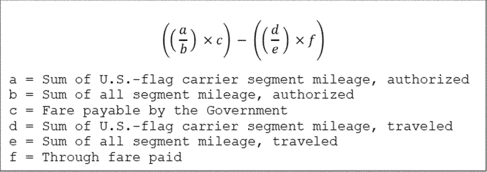
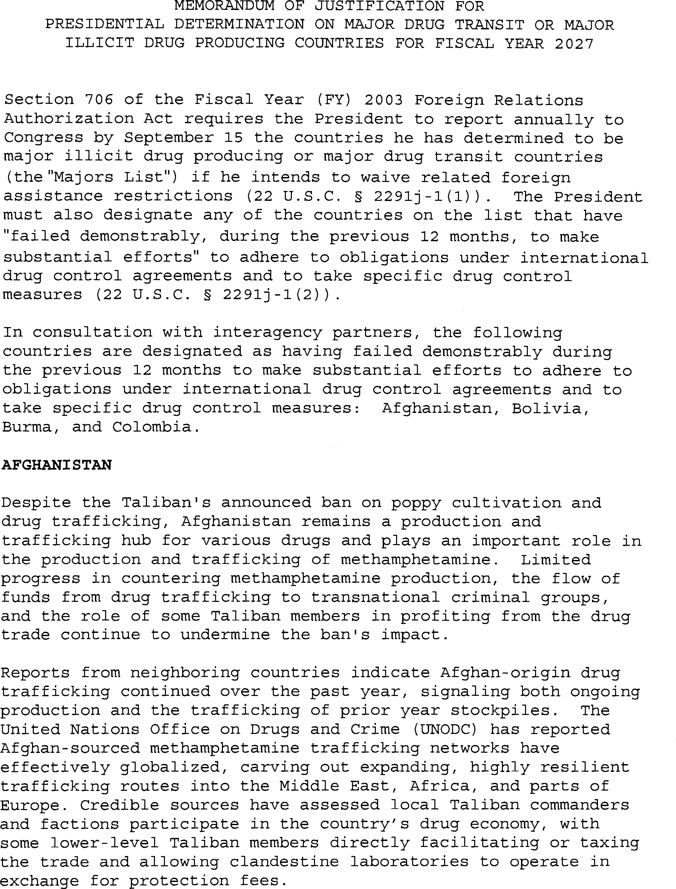
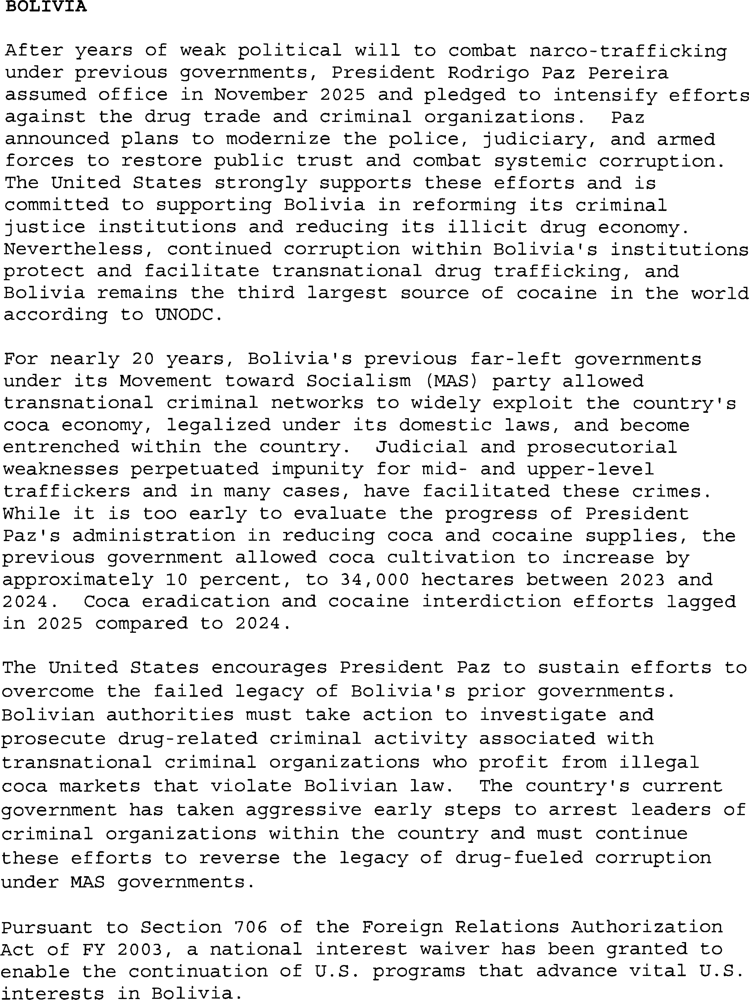

# Daily Digest — 2026-09-18

| | |
|---|---|
| **Digest date** | 2026-09-18 |
| **Data date range** | 2026-09-18 to 2026-09-18 |
| **Generated at** | 2026-09-19T04:09:14Z (UTC) |
| **Pipeline version** | 7eb3699 |
| **Inference** | model layers ran — cli/haiku, opus |
| **Source watermarks** | CREC: 2026-09-18T11:59:45Z · BILLS: 2026-09-19T01:23:16Z · FR: 2026-09-18T20:22:36Z · USCOURTS: 2026-09-19T01:56:56Z · PLAW: 2026-09-09T15:30:07Z |

[Full observed listing for this day](day/2026-09-18.html) — every item our collectors observed for this publication day, mechanical rules applied, frozen at end of day. This digest is the canonical record.

All items below cite the govinfo package (and granule, where applicable) they
summarize. Selection is mechanical; each item states the rule that included
it. See the Coverage Statement at the end for a full accounting of what was
published, what was summarized, and what was excluded and why.

---

## Contents

- [Day in Review](#day-in-review)
- [1. Congressional Floor Activity](#1-congressional-floor-activity)
- [2. Legislation](#2-legislation)
- [3. Federal Register](#3-federal-register)
- [4. Enacted Laws](#4-enacted-laws)
- [5. Judicial Activity](#5-judicial-activity)
- [6. Agency Announcements](#6-agency-announcements)
- [7. Recorded Votes](#7-recorded-votes)
- [8. Bill Actions](#8-bill-actions)
- [9. Presidential Actions](#9-presidential-actions)
- [Terms Used Today](#terms-used-today)
- [Coverage Statement](#coverage-statement)
- [Methodology](#methodology)

---

## Day in Review

The Senate confirmed Kasdin Miller Mitchell of Texas as United States District Judge for the Northern District of Texas by a vote of 49-45, following a 49-47 cloture vote on the nomination, and resumed consideration of S. 4668, the Protect College Sports Act of 2026, with submitted amendments addressing student athlete name, image, and likeness rights, liability exceptions, HBCU sports infrastructure, and a proposed Bring Our Heroes Home Act records collection; senators also delivered Constitution Day remarks. The digest carries 81 Senate and 45 House Congressional Record items, 28 House and 20 Senate bill introductions, 11 Senate committee reports, and six enrolled bills, among them measures on hydropower licensing reports, sanctions relating to Russia, Fort Peck rural water reauthorization, music tourism, vector-borne disease programs, and reporting on delayed or over-budget federal projects.

On the executive side, the digest carries two executive orders on H-1B visa program administration and interagency coordination, one proclamation extending entry restrictions on certain H-1B nonimmigrant workers, and a presidential determination naming 23 major drug transit or illicit drug producing countries for fiscal year 2027. It also carries 11 final rules, including FAA airspace and airworthiness actions, State Department arms-regulation amendments, and a DHS acquisition rule; six proposed rules, four of them Federal Acquisition Regulation overhaul segments; 96 notices; and 198 agency press releases.

Judicial items number 47 appellate opinions, 828 district, 11 bankruptcy, and one national. The Eleventh Circuit reversed suppression of cloud-storage evidence on good-faith grounds; the Federal Circuit affirmed a $3.24 million fee award in a lab-grown diamond patent case and vacated a Patent Trial and Appeal Board claim construction; the Ninth Circuit certified wrongful-termination questions to the Washington Supreme Court and held federal courts may consider alter-ego liability for foreign arbitration awards; the Fifth Circuit affirmed an injunction against a courthouse-grounds nighttime curfew; and the Court of International Trade denied a customs broker's preliminary injunction over a deactivated filer code.

*Composed from the summarized items below and the day's mechanical
counts; all specifics are cited in their sections.*

---

## 1. Congressional Floor Activity

Source: Congressional Record (CREC), issue observed 2026-09-18, covering proceedings of 2026-09-17. Published by govinfo 2026-09-18T11:59:45Z; observed by our collector 2026-09-18T12:07:58Z. Total issue size: 139 granule(s).

### 1.1 Senate

Tags: legislative · model keys: military records · name image likeness · student athletes

*In plain terms: Senate debate on the Protect College Sports Act (student athlete name, image, and likeness rights) and the Bring Our Heroes Home Act (military personnel records), plus Constitution Day remarks.*

- **Legislative Session** — Senators delivered remarks on Constitution Day (September 17) discussing the Constitution's role in government and governance principles; the Senate resumed consideration of S. 4668, the Protect College Sports Act of 2026.
  - *In plain terms:* On Constitution Day (September 17), senators spoke about the Constitution's role in government, then the Senate continued considering the Protect College Sports Act of 2026.
  - Included because: CREC-SEL-01 — floor item ≥ threshold floor time (69,897 characters) (document dated 2026-09-17)
  - Source: [CREC-2026-09-17 / CREC-2026-09-17-pt1-PgS4765-6](https://www.govinfo.gov/app/details/CREC-2026-09-17/CREC-2026-09-17-pt1-PgS4765-6)
- **Legislative Session** — Following invocation of cloture, the Senate resumed legislative session on S. 4668, the Protect College Sports Act of 2026, which establishes protections for student athlete name, image, and likeness rights and sets standards for intercollegiate athletics and sports broadcasting.
  - *In plain terms:* After ending debate, the Senate continued considering the Protect College Sports Act of 2026, which protects student athletes' name, image, and likeness rights and sets rules for college sports and broadcasting.
  - Included because: CREC-SEL-01 — floor item ≥ threshold floor time (143,001 characters) (document dated 2026-09-17)
  - Source: [CREC-2026-09-17 / CREC-2026-09-17-pt1-PgS4777](https://www.govinfo.gov/app/details/CREC-2026-09-17/CREC-2026-09-17-pt1-PgS4777)
- **Text of Amendments** — Senators submitted proposed amendments to S. 4668, the Protect College Sports Act of 2026, including an amendment addressing liability exceptions for civil actions involving physical injury or sexual abuse, and an alternative amendment proposing additional provisions regarding historically Black colleges and universities sports infrastructure and Title IX protections.
  - *In plain terms:* Senators proposed amendments to the Protect College Sports Act, including one on liability in injury and abuse cases and another on historically Black colleges' sports infrastructure and Title IX protections.
  - Included because: CREC-SEL-01 — floor item ≥ threshold floor time (351,013 characters) (document dated 2026-09-17)
  - Source: [CREC-2026-09-17 / CREC-2026-09-17-pt1-PgS4804-3](https://www.govinfo.gov/app/details/CREC-2026-09-17/CREC-2026-09-17-pt1-PgS4804-3)
- **Text of Senate Amendment 6776** — The amendment proposes the Protect College Sports Act of 2026, establishing protections for student athletes' name, image, and likeness rights and setting rules for agent registration and athlete compensation. It creates an Office of the Student Athlete Ombudsman, addresses sports broadcasting access, and establishes a grant program for HBCU sports and media infrastructure.
  - *In plain terms:* This amendment proposes the Protect College Sports Act of 2026, protecting student athletes' name, image, and likeness rights, creating an ombudsman office, and funding historically Black colleges' sports and media facilities.
  - Included because: CREC-SEL-01 — floor item ≥ threshold floor time (90,602 characters) (document dated 2026-09-17)
  - Source: [CREC-2026-09-17 / CREC-2026-09-17-pt1-PgS4804-4](https://www.govinfo.gov/app/details/CREC-2026-09-17/CREC-2026-09-17-pt1-PgS4804-4)
- **Text of Senate Amendment 6791** — The amendment proposes the Bring Our Heroes Home Act, establishing a Missing Armed Forces and Civilian Personnel Records Collection at the National Archives. It creates a review board to oversee disclosure and requires government offices to identify, locate, and transmit records relating to missing armed forces and civilian personnel dating from December 7, 1941 onward.
  - *In plain terms:* The amendment proposes the Bring Our Heroes Home Act, creating a records collection at the National Archives and requiring government offices to find and share records of missing military and civilian personnel since December 7, 1941.
  - Included because: CREC-SEL-01 — floor item ≥ threshold floor time (60,825 characters) (document dated 2026-09-17)
  - Source: [CREC-2026-09-17 / CREC-2026-09-17-pt1-PgS4825](https://www.govinfo.gov/app/details/CREC-2026-09-17/CREC-2026-09-17-pt1-PgS4825)
- **Text of Senate Amendment 6792** — The amendment proposes the Bring Our Heroes Home Act, establishing a Missing Armed Forces and Civilian Personnel Records Collection at the National Archives. It creates a review board to oversee disclosure and requires government offices to identify, locate, and transmit records relating to missing armed forces and civilian personnel dating from December 7, 1941 onward.
  - *In plain terms:* The amendment proposes the Bring Our Heroes Home Act, creating a records collection at the National Archives and requiring government offices to find and share records of missing military and civilian personnel since December 7, 1941.
  - Included because: CREC-SEL-01 — floor item ≥ threshold floor time (60,686 characters) (document dated 2026-09-17)
  - Source: [CREC-2026-09-17 / CREC-2026-09-17-pt1-PgS4830](https://www.govinfo.gov/app/details/CREC-2026-09-17/CREC-2026-09-17-pt1-PgS4830)

### 1.2 House of Representatives

Tags: legislative · model keys: environmental protection · quantum computing · veterans pensions

*In plain terms: House members introduced multiple bills on Sarbanes-Oxley amendments, veterans' pension assistance, Defense quantum computing policy, Medal of Honor identification, environmental protection, and tax policy.*

- **Public Bills and Resolutions** — House members introduced multiple bills addressing topics including amendments to the Sarbanes-Oxley Act, veterans' pension assistance, Department of Defense quantum computing policy, Medal of Honor identification, environmental protection, tax policy, and various other legislative matters; all bills were referred to relevant committees.
  - *In plain terms:* House members introduced bills on topics including Sarbanes-Oxley Act amendments, veterans' pensions, defense quantum computing, Medal of Honor identification, environmental protection, and tax policy, with all bills referred to relevant committees.
  - Included because: CREC-SEL-01 — floor item ≥ threshold floor time (20,121 characters) (document dated 2026-09-17)
  - Source: [CREC-2026-09-17 / CREC-2026-09-17-pt1-PgH5987-8](https://www.govinfo.gov/app/details/CREC-2026-09-17/CREC-2026-09-17-pt1-PgH5987-8)

### 1.3 Recorded Votes

- **Cloture Motion (Executive Session)** — The Senate voted 49-47 to invoke cloture on the nomination of Kasdin Miller Mitchell of Texas to serve as United States District Judge for the Northern District of Texas.
  - *In plain terms:* The Senate voted 49-47 to end debate on Kasdin Miller Mitchell's nomination to be a federal judge for the Northern District of Texas.
  - Included because: CREC-SEL-02 — recorded vote (all recorded votes are listed) (document dated 2026-09-17)
  - Source: [CREC-2026-09-17 / CREC-2026-09-17-pt1-PgS4774-2](https://www.govinfo.gov/app/details/CREC-2026-09-17/CREC-2026-09-17-pt1-PgS4774-2)
- **Vote on Mitchell Nomination (Executive Session)** — The Senate confirmed Kasdin Miller Mitchell of Texas to serve as United States District Judge for the Northern District of Texas by a vote of 49-45.
  - *In plain terms:* The Senate confirmed Kasdin Miller Mitchell as a federal judge for the Northern District of Texas in a 49-45 vote.
  - Included because: CREC-SEL-02 — recorded vote (all recorded votes are listed) (document dated 2026-09-17)
  - Source: [CREC-2026-09-17 / CREC-2026-09-17-pt1-PgS4776-2](https://www.govinfo.gov/app/details/CREC-2026-09-17/CREC-2026-09-17-pt1-PgS4776-2)

---

## 2. Legislation

Source: Congressional Bills (BILLS), text versions published 2026-09-18 to 2026-09-18.

### 2.1 Counts by Stage

| Stage (bill text version) | Count |
|---|---|
| Introduced (ih/is) | 48 |
| Reported (rh/rs) | 11 |
| Engrossed (eh/es) | 14 |
| Enrolled (enr) | 6 |
| Other versions | 22 |
| **Total bill texts published** | **101** |

### 2.2 Bills Listed by Mechanical Rule

Tags: legislative · model keys: federal contracting · fentanyl testing · land transfers

*In plain terms: 23 bills led by fentanyl testing in emergency departments and social media access; the rest include land transfers, federal contracting revisions, border security, resilience standards, and facility designations.*

Bills below are listed because they matched at least one listing rule; the
matching rule is stated per item. All other bill texts are counted above and
accounted for in the Coverage Statement.

- **H. R. 2004 (pcs) — 119 HR 2004 PCS: Tyler’s Law** — The bill directs the Secretary of Health and Human Services to conduct a study within one year on fentanyl testing practices in hospital emergency departments, including testing frequency, costs, and potential benefits and risks. Within six months after study completion, the Secretary shall issue guidance on whether hospitals should implement fentanyl testing as a routine procedure for overdose patients and how hospitals can ensure clinician awareness of substances being tested.
  - *In plain terms:* The bill requires a study of fentanyl testing in hospital emergency rooms within one year, then guidance on routine testing for overdose patients within six months after.
  - Included because: BILLS-SEL-01 — reached stage: reported/enrolled/calendar (document dated 2026-09-16)
  - Source: [BILLS-119hr2004pcs](https://www.govinfo.gov/app/details/BILLS-119hr2004pcs)
- **H. R. 2388 (rs) — 102 HR 2388 RS: Lower Elwha Klallam Tribe Project Lands Restoration Act** — The bill takes approximately 1,082.63 acres of Federal land from Olympic National Park into trust for the Lower Elwha Klallam Tribe in Washington and designates it as part of the Lower Elwha Reservation. The Elwha River portion shall be managed consistent with the Wild and Scenic Rivers Act, and gaming is prohibited on the transferred land.
  - *In plain terms:* The bill transfers about 1,082.63 acres from Olympic National Park to the Lower Elwha Klallam Tribe in Washington as part of their reservation, managing the river portion under the Wild and Scenic Rivers Act and prohibiting gaming there.
  - Included because: BILLS-SEL-01 — reached stage: reported/enrolled/calendar (document dated 2026-09-14)
  - Source: [BILLS-119hr2388rs](https://www.govinfo.gov/app/details/BILLS-119hr2388rs)
- **H. R. 2846 (pcs) — 119 HR 2846 PCS: To amend title II of the Public Health Service Act to include as an additional right or privilege of commissioned officers of the Public Health Service (and their beneficiaries) certain leave provided under title 10, United States Code to commissioned officers of the Army (or their beneficiaries).** — The bill amends the Public Health Service Act to extend leave provisions available to commissioned officers of the Army under title 10 of the United States Code to commissioned officers of the Public Health Service and their beneficiaries. It adds Chapter 40 regarding leave entitlements and repeals section 219.
  - *In plain terms:* The bill gives Public Health Service officers the same leave benefits as Army officers under federal law.
  - Included because: BILLS-SEL-01 — reached stage: reported/enrolled/calendar (document dated 2026-09-16)
  - Source: [BILLS-119hr2846pcs](https://www.govinfo.gov/app/details/BILLS-119hr2846pcs)
- **H. R. 3657 (enr) — HR 3657 ENR: Hydropower Licensing Transparency Act** — The bill amends the Federal Power Act to require the Federal Energy Regulatory Commission to submit annual reports to Congress on the status of pending hydropower licensing applications. Each report shall include application status, anticipated issuance dates, upcoming proceedings, and descriptions of ongoing actions required of relevant parties.
  - *In plain terms:* The bill requires annual reports to Congress on the status and timeline of pending hydropower licensing applications.
  - Included because: BILLS-SEL-01 — reached stage: reported/enrolled/calendar
  - Source: [BILLS-119hr3657enr](https://www.govinfo.gov/app/details/BILLS-119hr3657enr)
- **H. R. 4707 (rs) — 119 HR 4707 RS: To designate the facility of the United States Postal Service located at 1019 Avenue H in Fort Madison, Iowa, as the “Martin L. Graber Post Office”.** — Designates the United States Postal Service facility located at 1019 Avenue H in Fort Madison, Iowa, as the Martin L. Graber Post Office.
  - *In plain terms:* Names the postal facility at 1019 Avenue H in Fort Madison, Iowa, the Martin L. Graber Post Office.
  - Included because: BILLS-SEL-01 — reached stage: reported/enrolled/calendar (document dated 2026-09-14)
  - Source: [BILLS-119hr4707rs](https://www.govinfo.gov/app/details/BILLS-119hr4707rs)
- **H. R. 5058 (rs) — 119 HR 5058 RS: To designate the facility of the United States Postal Service located at 46164 Westlake Drive in Sterling, Virginia, as the “Firefighter Trevor Brown Post Office Building”.** — Designates the United States Postal Service facility located at 46164 Westlake Drive in Sterling, Virginia, as the Firefighter Trevor Brown Post Office Building.
  - *In plain terms:* Names the postal facility at 46164 Westlake Drive in Sterling, Virginia, the Firefighter Trevor Brown Post Office Building.
  - Included because: BILLS-SEL-01 — reached stage: reported/enrolled/calendar (document dated 2026-09-14)
  - Source: [BILLS-119hr5058rs](https://www.govinfo.gov/app/details/BILLS-119hr5058rs)
- **H. R. 5235 (rs) — 106 HR 5235 RS: Skills-Based Federal Contracting Act of 2025** — The bill amends federal contracting law to prohibit minimum educational requirements for contractor personnel unless the contracting officer provides written justification explaining why the agency's needs cannot be met without such a requirement. The Office of Management and Budget must issue implementing guidance within 180 days, and the Government Accountability Office must evaluate compliance within three years.
  - *In plain terms:* The bill bans minimum education requirements for federal contractors unless justified in writing, requires OMB to issue guidance within 180 days, and requires GAO to evaluate compliance within three years.
  - Included because: BILLS-SEL-01 — reached stage: reported/enrolled/calendar (document dated 2026-09-14)
  - Source: [BILLS-119hr5235rs](https://www.govinfo.gov/app/details/BILLS-119hr5235rs)
- **H. R. 5334 (enr) — HR 5334 ENR: Lindsey O. Graham Sanctioning Russia and Iran Act of 2026** — The bill imposes sanctions and restrictions on the Russian Federation and certain persons affiliated with or supporting the Russian government, including officials, entities, and foreign persons providing support to the Russian defense industrial base or military. Provisions include prohibitions on financial transactions, energy sector investments, securities trading, and tariffs on Russian goods, with an extension of the Iran Sanctions Act of 1996.
  - *In plain terms:* The bill imposes financial sanctions, investment restrictions, and tariffs on Russia and officials supporting the Russian military and defense industry.
  - Included because: BILLS-SEL-01 — reached stage: reported/enrolled/calendar
  - Source: [BILLS-119hr5334enr](https://www.govinfo.gov/app/details/BILLS-119hr5334enr)
- **H. R. 5517 (pcs) — 114 HR 5517 PCS: Northern Border Security Enhancement and Review Act** — The bill amends the Northern Border Security Review Act to require the Department of Homeland Security to conduct threat analysis on September 2, 2026, and biennially thereafter. It requires strategy updates within 90 days of each threat analysis submission, classified briefings within 30 days, and development of performance measures for assessing Air and Marine Operations effectiveness at the northern border.
  - *In plain terms:* The bill requires the Department of Homeland Security to analyze northern border threats on September 2, 2026 and every two years after, with updated strategies within 90 days.
  - Included because: BILLS-SEL-01 — reached stage: reported/enrolled/calendar (document dated 2026-09-16)
  - Source: [BILLS-119hr5517pcs](https://www.govinfo.gov/app/details/BILLS-119hr5517pcs)
- **H. R. 5773 (rs) — 119 HR 5773 RS: To designate the facility of the United States Postal Service at 1300 East Northwest Highway in Palatine, Illinois, as the “Bernie Bluestein Post Office Building”.** — Designates the United States Postal Service facility located at 1300 East Northwest Highway in Palatine, Illinois, as the Bernie Bluestein Post Office Building.
  - *In plain terms:* Names the postal facility at 1300 East Northwest Highway in Palatine, Illinois, the Bernie Bluestein Post Office Building.
  - Included because: BILLS-SEL-01 — reached stage: reported/enrolled/calendar (document dated 2026-09-14)
  - Source: [BILLS-119hr5773rs](https://www.govinfo.gov/app/details/BILLS-119hr5773rs)
- **H. R. 5831 (rs) — 119 HR 5831 RS: To designate the facility of the United States Postal Service located at 306 South Main Street in Waupaca, Wisconsin, as the “Master Sergeant Melvin O. Handrich Post Office Building”.** — The Senate reported without amendment a bill designating the United States Postal Service facility at 306 South Main Street in Waupaca, Wisconsin as the Master Sergeant Melvin O. Handrich Post Office Building. The designation applies to all references in federal law, maps, regulations, and documents.
  - *In plain terms:* The Senate approved a bill to name the Waupaca, Wisconsin post office building after Master Sergeant Melvin O. Handrich.
  - Included because: BILLS-SEL-01 — reached stage: reported/enrolled/calendar (document dated 2026-09-14)
  - Source: [BILLS-119hr5831rs](https://www.govinfo.gov/app/details/BILLS-119hr5831rs)
- **H. R. 7250 (enr) — HR 7250 ENR: To reauthorize the Fort Peck Reservation Rural Water System Act of 2000.** — The bill reauthorizes the Fort Peck Reservation Rural Water System Act of 2000 by extending the authorization period from 2026 to 2028.
  - *In plain terms:* The bill extends authorization of the Fort Peck Reservation Rural Water System from 2026 through 2028.
  - Included because: BILLS-SEL-01 — reached stage: reported/enrolled/calendar
  - Source: [BILLS-119hr7250enr](https://www.govinfo.gov/app/details/BILLS-119hr7250enr)
- **H. R. 8454 (pcs) — 119 HR 8454 PCS: To provide for the transfer of administrative jurisdiction over certain Federal land in the State of California, and for other purposes.** — The bill transfers approximately 160 acres of National Forest System land to the Secretary of the Interior for management as part of Yosemite National Park and approximately 170 acres of National Park System land to the Secretary of Agriculture for management as part of Stanislaus National Forest in Tuolumne County, California. The legislation permits minor corrections by mutual agreement and preserves existing rights and authorizations on the transferred land.
  - *In plain terms:* The bill trades 160 acres of national forest land for 170 acres of national park land in Tuolumne County, California, while preserving existing rights and allowing minor corrections by mutual agreement.
  - Included because: BILLS-SEL-01 — reached stage: reported/enrolled/calendar (document dated 2026-09-15)
  - Source: [BILLS-119hr8454pcs](https://www.govinfo.gov/app/details/BILLS-119hr8454pcs)
- **H. R. 979 (pcs) — 119 HR 979 PCS: AM Radio for Every Vehicle Act of 2025** — The Act requires the Secretary of Transportation to establish a rule within one year mandating AM radio capability as standard equipment in passenger motor vehicles, with compliance deadlines of two to four years depending on manufacturer size. Before issuing the rule, the Secretary must evaluate potential safety impacts on automated vehicles, and manufacturers must label interim vehicles without AM access and cannot charge extra fees. The Comptroller General shall study the role of vehicle AM radio access in the federal emergency alert system.
  - *In plain terms:* The act requires automakers to add AM radio to new vehicles within two to four years, with safety evaluation of automated vehicles required and no extra charges allowed.
  - Included because: BILLS-SEL-01 — reached stage: reported/enrolled/calendar (document dated 2026-09-16)
  - Source: [BILLS-119hr979pcs](https://www.govinfo.gov/app/details/BILLS-119hr979pcs)
- **S. 195 (enr) — S195 ENR: American Music Tourism Act of 2025** — The Act amends the Visit America Act to add music tourism to the Assistant Secretary of Commerce for Travel and Tourism's responsibilities. The amendment requires identification and promotion of domestic and international travel to music-related locations, events, festivals, and concerts in the United States.
  - *In plain terms:* The act adds music tourism to the federal government's travel promotion responsibilities, requiring promotion of music-related travel destinations and events.
  - Included because: BILLS-SEL-01 — reached stage: reported/enrolled/calendar
  - Source: [BILLS-119s195enr](https://www.govinfo.gov/app/details/BILLS-119s195enr)
- **S. 2398 (enr) — S2398 ENR: Kay Hagan Tick Reauthorization Act** — The Act extends through fiscal year 2030 the authorization of programs supporting a national strategy and regional centers of excellence for vector-borne diseases. The authorization of enhanced state health department support for addressing tick-borne illnesses is also extended through 2030, with minor amendments to coordination procedures.
  - *In plain terms:* The act extends through 2030 funding for programs addressing vector-borne diseases and tick-borne illnesses, with continued state health support.
  - Included because: BILLS-SEL-01 — reached stage: reported/enrolled/calendar
  - Source: [BILLS-119s2398enr](https://www.govinfo.gov/app/details/BILLS-119s2398enr)
- **S. 24 (rs) — 119 S24 RS: To designate the facility of the United States Postal Service located at 154 First Avenue East in Jerome, Idaho, as the “Representative Maxine Bell Post Office”.** — The Senate reported without amendment a bill designating the United States Postal Service facility at 154 First Avenue East in Jerome, Idaho as the Representative Maxine Bell Post Office. The designation applies to all references in federal law, maps, regulations, and documents.
  - *In plain terms:* The Senate approved a bill to name the Jerome, Idaho post office building after Representative Maxine Bell.
  - Included because: BILLS-SEL-01 — reached stage: reported/enrolled/calendar (document dated 2026-09-14)
  - Source: [BILLS-119s24rs](https://www.govinfo.gov/app/details/BILLS-119s24rs)
- **S. 3618 (rs) — 119 S3618 RS: No Fentanyl on Social Media Act** — The bill requires the Federal Trade Commission, in coordination with the Department of Health and Human Services and Drug Enforcement Administration, to submit a report within one year on minors' ability to access fentanyl through social media platforms, including the prevalence of such access, health impacts, how drug sellers use platforms, and the effectiveness of platform policies addressing the issue.
  - *In plain terms:* The bill requires the FTC with HHS and DEA to report within one year on minors' fentanyl access through social media, including prevalence, health impacts, seller tactics, and platform policy effectiveness.
  - Included because: BILLS-SEL-01 — reached stage: reported/enrolled/calendar (document dated 2026-09-14)
  - Source: [BILLS-119s3618rs](https://www.govinfo.gov/app/details/BILLS-119s3618rs)
- **S. 388 (rs) — 119 S388 RS: Promoting Resilient Buildings Act** — S. 388 amends the Stafford Disaster Relief and Emergency Assistance Act to define "latest published editions" of building codes and establishes a residential resilience retrofit pilot program through FEMA, enabling grants to states and localities for assisting individuals with retrofits such as elevations, floodproofing, and seismic improvements, with a sunset date of September 30, 2030.
  - *In plain terms:* The bill amends disaster relief law to define building code editions, establishes a FEMA pilot program providing grants to states for home retrofits like elevations and seismic improvements, ending September 30, 2030.
  - Included because: BILLS-SEL-01 — reached stage: reported/enrolled/calendar (document dated 2026-09-15)
  - Source: [BILLS-119s388rs](https://www.govinfo.gov/app/details/BILLS-119s388rs)
- **S. 5045 (rs) — 119 S5045 RS: Wildfire Emissions Prevention Act of 2026** — The Act amends the Clean Air Act to classify prescribed fires, including cultural burning activities by Indian tribes, as exceptional events for air quality monitoring and directs the EPA to revise regulations within 270 days to simplify state processes for demonstrating such events. The Act also establishes a competitive grant program to help eligible entities assess and address wildfire smoke hazards in community buildings, with federal funding up to 90 percent.
  - *In plain terms:* The act treats prescribed fires and tribal cultural burning as exceptions to air quality standards, requires EPA to simplify state demonstrations of these exceptions within 270 days, and funds wildfire smoke programs.
  - Included because: BILLS-SEL-01 — reached stage: reported/enrolled/calendar (document dated 2026-09-16)
  - Source: [BILLS-119s5045rs](https://www.govinfo.gov/app/details/BILLS-119s5045rs)
- **S. 58 (rs) — 119 S58 RS: To designate the facility of the United States Postal Service located at 107 North Hoyne Avenue in Fritch, Texas, as the “Chief Zeb Smith Post Office”.** — S. 58 designates the United States Postal Service facility located at 107 North Hoyne Avenue in Fritch, Texas, as the Chief Zeb Smith Post Office.
  - *In plain terms:* Names the postal facility at 107 North Hoyne Avenue in Fritch, Texas, the Chief Zeb Smith Post Office.
  - Included because: BILLS-SEL-01 — reached stage: reported/enrolled/calendar (document dated 2026-09-14)
  - Source: [BILLS-119s58rs](https://www.govinfo.gov/app/details/BILLS-119s58rs)
- **S. 766 (enr) — S766 ENR: Billion Dollar Boondoggle Act of 2025** — The Act requires the Director of the Office of Management and Budget to establish annual reporting procedures for federal projects that are more than five years behind schedule or over budget by at least one billion dollars. Reports must include detailed information on project status, cost changes, contractor information, explanations for delays or cost increases, and any performance awards.
  - *In plain terms:* The act requires the government to report annually on major federal projects that are more than five years behind schedule or over budget by at least one billion dollars.
  - Included because: BILLS-SEL-01 — reached stage: reported/enrolled/calendar
  - Source: [BILLS-119s766enr](https://www.govinfo.gov/app/details/BILLS-119s766enr)
- **S. J. RES. 204 (pcs) — 119 SJ 204 PCS: Providing for congressional disapproval under chapter 8 of title 5, United States Code, of the rule submitted by the United States Fish and Wildlife Service and the National Oceanic and Atmospheric Administration relating to “Rescinding the Definition of Harm Under the Endangered Species Act”.** — SJ Res. 204 provides for congressional disapproval of a rule by the Fish and Wildlife Service and National Oceanic and Atmospheric Administration that rescinded the definition of "harm" under the Endangered Species Act, rendering the rule without force or effect.
  - *In plain terms:* This resolution rejects a rule that removed the definition of harm under the Endangered Species Act, making that rule invalid.
  - Included because: BILLS-SEL-01 — reached stage: reported/enrolled/calendar (document dated 2026-09-15)
  - Source: [BILLS-119sjres204pcs](https://www.govinfo.gov/app/details/BILLS-119sjres204pcs)

---

## 3. Federal Register

Source: Federal Register (FR), issue of 2026-09-18.

### 3.1 Counts by Document Type

| Document type | Count |
|---|---|
| Rules | 11 |
| Proposed rules | 6 |
| Notices | 96 |
| Presidential documents | 1 |
| **Total FR documents** | **114** |

### 3.2 Rules Published

Tags: department of health and human services · executive · securities and exchange commission · model keys: arms regulations · aviation · energy conservation

*In plain terms: 11 rules, led by airspace and aviation amendments; the rest include energy conservation standards, arms regulations updates, milk pricing correction, and procurement requirements.*

#### DEPARTMENT OF AGRICULTURE

- **Milk in the Northeast and Other Marketing Areas; Uniform Pricing Formula Provisions** (2026-19177; 7 CFR Part 1000) — The Agricultural Marketing Service's (AMS) Dairy Program published a final rule in the Federal Register on January 17, 2025, amending the pricing provisions in the 11 Federal Milk Marketing Orders (FMMOs). This document corrects the Class I differential in Morgan County, Ohio, and removes Shannon County, South Dakota, from the Class I Differential table. Action: Final rule; correcting amendment. Dates: Effective September 18, 2026.
  - *In plain terms:* The Agriculture Department corrects federal milk pricing rules by updating one county's rates and removing another county from the table.
  - Included because: FR-SEL-01 — document type: final rule (all listed)
  - Source: [FR-2026-09-18 / 2026-19177](https://www.govinfo.gov/app/details/FR-2026-09-18/2026-19177)

#### DEPARTMENT OF ENERGY

- **Energy Conservation Program: Energy Conservation Standards for Manufactured Housing** (2026-19154; 10 CFR Part 460) — In this notification, the U.S. Department of Energy (“DOE” or “the Department”) is providing notice that the Department's Energy Conservation Standards for Manufactured Housing final rule published in the Federal Register on May 31, 2022, has no legal effect in light of the enactment of the 21st Century ROAD to Housing Act (“ROAD Act”). Action: Notification of legal effect. Dates: The information contained in this notification will be applicable on September 18, 2026 and will remain in effect until further notice.
  - *In plain terms:* The Department of Energy is voiding its 2022 energy efficiency standards for manufactured homes because Congress passed the 21st Century ROAD to Housing Act.
  - Included because: FR-SEL-01 — document type: final rule (all listed)
  - Source: [FR-2026-09-18 / 2026-19154](https://www.govinfo.gov/app/details/FR-2026-09-18/2026-19154)

#### DEPARTMENT OF HOMELAND SECURITY

- **Homeland Security Acquisition Regulation, Make Personal Protective Equipment in America Act Restrictions on Foreign Acquisition (HSAR Case 2024-003)** (2026-19207; 48 CFR Parts 3025 and 3052) — DHS is issuing a final rule to amend the Homeland Security Acquisition Regulation (HSAR) codifying how DHS complies with the requirements of the Make Personal Protective Equipment (PPE) in America Act. These changes are intended to ensure the sustainment and expansion of domestic manufacturing for certain types of PPE critical to the United States' national response to a public health crisis. Action: Final rule. Dates: The final rule is effective October 19, 2026.
  - *In plain terms:* The Department of Homeland Security updates procurement rules to ensure domestic production of certain protective equipment needed during public health emergencies.
  - Included because: FR-SEL-01 — document type: final rule (all listed)
  - Source: [FR-2026-09-18 / 2026-19207](https://www.govinfo.gov/app/details/FR-2026-09-18/2026-19207)

#### DEPARTMENT OF STATE

- **International Traffic in Arms Regulations: Clarifying Policies of Denial, Updating the Major Non-NATO Ally List, and Minor Corrections** (2026-19161; 22 CFR Part 120, 123, 125, and 126) — The Department of State is amending the International Traffic in Arms Regulations (ITAR) to clarify certain policy-of-denial provisions, update country policies for Ethiopia and Somalia, add Saudi Arabia and Peru to the list of major non-NATO allies, and make other miscellaneous corrections. Action: Final rule. Dates: This rule is effective on September 18, 2026.
  - *In plain terms:* The State Department updates arms export regulations, changes policies for Ethiopia and Somalia, and designates Saudi Arabia and Peru as major military allies.
  - Included because: FR-SEL-01 — document type: final rule (all listed)
  - Source: [FR-2026-09-18 / 2026-19161](https://www.govinfo.gov/app/details/FR-2026-09-18/2026-19161)
- **International Traffic in Arms Regulations: Modification of U.S. Munitions List Category XX(a)** (2026-19211; 22 CFR Part 121) — The Department of State (the Department) amends the International Traffic in Arms Regulations (ITAR) to remove from the U.S. Munitions List (USML) certain uncrewed underwater vehicles (UUVs) and make conforming changes to related controls. The Department also requests comments to assist in further refining ITAR controls on UUVs and to identify possible enhancements to the license exemption for certain UUV-related activities. Action: Interim final rule. Dates: Effective date: This rule is effective October 19, 2026. Comment due date: Send comments on or before October 19, 2026.
  - *In plain terms:* The State Department removes certain remote underwater vehicles from arms-control restrictions and seeks comment on further regulatory refinements.
  - Included because: FR-SEL-01 — document type: final rule (all listed)
  - Source: [FR-2026-09-18 / 2026-19211](https://www.govinfo.gov/app/details/FR-2026-09-18/2026-19211)

#### DEPARTMENT OF TRANSPORTATION

- **Amendment of Class E Airspace; Alma, MI** (2026-19143; 14 CFR Part 71) — This action amends the Class E airspace at Alma, MI. This action is due to an airspace review conducted due to the decommissioning of the Mount Pleasant very high frequency omnidirectional range (VOR) as part of the VOR Minimum Operational Network (MON) Program. This action brings the airspace into compliance with FAA orders and supports instrument flight rule (IFR) procedures and operations. Action: Final rule. Dates: Effective 0901 UTC, December 24, 2026. The Director of the Federal Register approves this incorporation by reference action under 1 CFR part 51, subject to the annual revision of FAA Order JO 7400.11 and publication of conforming amendments.
  - *In plain terms:* The FAA updates airspace rules at Alma, Michigan following the shutdown of a navigation facility as part of a federal program.
  - Included because: FR-SEL-01 — document type: final rule (all listed)
  - Source: [FR-2026-09-18 / 2026-19143](https://www.govinfo.gov/app/details/FR-2026-09-18/2026-19143)
- **Standard Instrument Approach Procedures, and Takeoff Minimums and Obstacle Departure Procedures; Miscellaneous Amendments** (2026-19149; 14 CFR Part 97) — This rule establishes, amends, suspends, or removes Standard Instrument Approach Procedures (SIAPS) and associated Takeoff Minimums and Obstacle Departure procedures (ODPs) for operations at certain airports. These regulatory actions are needed because of the adoption of new or revised criteria, or because of changes occurring in the National Airspace System, such as the commissioning of new navigational facilities, adding new obstacles, or changing air traffic requirements. These changes are designed to provide safe and efficient use of the navigable airspace and to promote safe flight operations under instrument flight rules at the affected airports. Action: Final rule. Dates: This rule is effective September 18, 2026. The compliance date for each SIAP, associated Takeoff Minimums, and ODP is specified in the amendatory provisions. The incorporation by reference of certain publications listed in the regulations is approved by the Director of the Federal Register as of September 18, 2026.
  - *In plain terms:* The FAA updates flight approach and departure procedures at certain airports to reflect new navigation equipment, obstacles, or air traffic needs.
  - Included because: FR-SEL-01 — document type: final rule (all listed)
  - Source: [FR-2026-09-18 / 2026-19149](https://www.govinfo.gov/app/details/FR-2026-09-18/2026-19149)
- **Standard Instrument Approach Procedures, and Takeoff Minimums and Obstacle Departure Procedures; Miscellaneous Amendments** (2026-19150; 14 CFR Part 97) — This rule amends, suspends, or removes Standard Instrument Approach Procedures (SIAPs) and associated Takeoff Minimums and Obstacle Departure Procedures for operations at certain airports. These regulatory actions are needed because of the adoption of new or revised criteria, or because of changes occurring in the National Airspace System, such as the commissioning of new navigational facilities, adding new obstacles, or changing air traffic requirements. These changes are designed to provide for the safe and efficient use of the navigable airspace and to promote safe flight operations under instrument flight rules at the affected airports. Action: Final rule. Dates: This rule is effective September 18, 2026. The compliance date for each SIAP, associated Takeoff Minimums, and ODP is specified in the amendatory provisions. The incorporation by reference of certain publications listed in the regulations is approved by the Director of the Federal Register as of September 18, 2026.
  - *In plain terms:* The FAA updates flight approach and departure procedures at certain airports to reflect changes in navigation facilities, obstacles, or traffic requirements.
  - Included because: FR-SEL-01 — document type: final rule (all listed)
  - Source: [FR-2026-09-18 / 2026-19150](https://www.govinfo.gov/app/details/FR-2026-09-18/2026-19150)
- **Airworthiness Directives; Rolls-Royce Deutschland Ltd. & Co. KG Engines** (2026-19171; 14 CFR Part 39) — The FAA is adopting a new airworthiness directive (AD) for all Rolls-Royce Deutschland Ltd. & Co. KG (RRD) Model RB211-Trent 875-17, 877-17, 884-17, 884B-17, 892-17, 892B-17, and 895-17 engines. The FAA previously sent this AD as an emergency AD to all known U.S. owners and operators of these engines. This AD was prompted by reports of non-conformances leading to low oil pressure events on low life oil pumps. This AD requires de-pairing of engines on airplanes with two affected engines installed to ensure no more than one affected oil pump is installed on twin-engine airplanes. The FAA is issuing this AD to address the unsafe condition on these products. Action: Final rule; request for comments. Dates: This AD is effective September 21, 2026. Emergency AD 2026-18-52, issued on September 5, 2026, which contains the requirements of this amendment, was effective with actual notice. The Director of the Federal Register approved the incorporation by reference of a certain publication identified in this AD as of September 21, 2026. The FAA must receive comments on this AD by November 2, 2026.
  - *In plain terms:* The FAA requires operators of certain Rolls-Royce engines to separate affected oil pumps on twin-engine aircraft to prevent low-pressure failures.
  - Included because: FR-SEL-01 — document type: final rule (all listed)
  - Source: [FR-2026-09-18 / 2026-19171](https://www.govinfo.gov/app/details/FR-2026-09-18/2026-19171)
- **Airworthiness Directives; Rolls-Royce Deutschland Ltd. & Co. KG Engines** (2026-19172; 14 CFR Part 39) — The FAA is adopting a new airworthiness directive (AD) for all Rolls-Royce Deutschland Ltd. & Co. KG (RRD) Model RB211 Trent 768-60, 772-60, and 772B-60 engines. The FAA previously sent this AD as an emergency AD to all known U.S. owners and operators of these engines. This AD was prompted by reports of non-conformances leading to low oil pressure events on low life oil pumps. This AD requires de-pairing of engines on airplanes with two affected engines installed to ensure no more than one affected oil pump is installed on twin-engine airplanes. The FAA is issuing this AD to address the unsafe condition on these products. Action: Final rule; request for comments. Dates: This AD is effective September 21, 2026. Emergency AD 2026-18-51, issued on September 5, 2026, which contains the requirements of this amendment, was effective with actual notice. The Director of the Federal Register approved the incorporation by reference of a certain publication identified in this AD as of September 21, 2026. The FAA must receive comments on this AD by November 2, 2026.
  - *In plain terms:* The FAA requires operators of certain Rolls-Royce engines to separate affected oil pumps on twin-engine aircraft to prevent low-pressure events.
  - Included because: FR-SEL-01 — document type: final rule (all listed)
  - Source: [FR-2026-09-18 / 2026-19172](https://www.govinfo.gov/app/details/FR-2026-09-18/2026-19172)
- **Establishment of United States Area Navigation Route T-581 in the Vicinity of Missoula, Montana** (2026-19173; 14 CFR Part 71) — This action corrects a final rule published by the FAA in the Federal Register on August 3, 2026, establishing United States Area Navigation (RNAV) Route T-581 in the vicinity of Missoula, Montana. Specifically, this action corrects the description of the route in the regulatory text of the final rule. Action: Final rule; correction. Dates: The effective date of the final rule published in the Federal Register on August 3, 2026, remains 0901 UTC, October 29, 2026. The Director of the Federal Register approves this incorporation by reference action under 14 CFR part 71, subject to the annual revision of FAA Order JO 7400.11 and publication of conforming amendments.
  - *In plain terms:* The FAA corrects the description of an air navigation route near Missoula, Montana in its August 2026 final rule.
  - Included because: FR-SEL-01 — document type: final rule (all listed)
  - Source: [FR-2026-09-18 / 2026-19173](https://www.govinfo.gov/app/details/FR-2026-09-18/2026-19173)

### 3.3 Proposed Rules Published

Tags: department of health and human services · executive · securities and exchange commission · model keys: employment · federal acquisition · fishery management

*In plain terms: 6 proposed rules, led by a Federal Acquisition Regulation overhaul implementing Executive Order 14275; the rest include coral and shrimp fishery management amendments and employment service changes.*

#### DEPARTMENT OF COMMERCE

- **Coral, Coral Reefs, and Live/Hardbottom Habitats of the South Atlantic and the Shrimp Fishery of the South Atlantic Region; Amendments 11/12** (2026-19182; 50 CFR Part 622) — The South Atlantic Fishery Management Council (Council) has submitted Amendment 11 to the Fishery Management Plan for Coral, Coral Reefs, and Live/Hardbottom Habitats of the South Atlantic (Coral FMP) and Amendment 12 to the Fishery Management Plan for the Shrimp Fishery of the South Atlantic Region (Shrimp FMP; jointly Amendments 11/12) for review, approval, and implementation by NMFS. If approved, Amendments 11/12 would establish a shrimp fishery access area (SFAA) along the eastern boundary of the northern extension of the Oculina Bank Habitat Area of Particular Concern (OHAPC) where trawling for rock shrimp is currently prohibited. The purpose of Amendments 11/12 is to reinstate access to historic rock shrimp fishing grounds, achieve optimum yield (OY) in the rock shrimp fishery, while minimizing impacts to deep-water corals in the OHAPC. Action: Announcement of availability of fishery management plan amendments; request for comments. Dates: Written comments on Amendments 11/12 must be received on or before November 17, 2026.
  - *In plain terms:* The South Atlantic Fishery Council proposes reopening a rock shrimp fishing area near the Oculina Bank while protecting deep-water corals there.
  - Included because: FR-SEL-02 — document type: proposed rule (all listed)
  - Source: [FR-2026-09-18 / 2026-19182](https://www.govinfo.gov/app/details/FR-2026-09-18/2026-19182)

#### OFFICE OF MANAGEMENT AND BUDGET

- **Federal Acquisition Regulation: Revolutionary Federal Acquisition Regulation Overhaul Parts 14, 28, 36, and 52** (2026-19158; 48 CFR Parts 14, 28, 36, and 52) — OFPP, DoD, GSA, and NASA (collectively referred to as the Federal Acquisition Regulatory Council or FAR Council) are proposing to amend the Federal Acquisition Regulation (FAR) to implement Executive Order (E.O.) 14275, Restoring Common Sense to Federal Procurement. The E.O. directs the elimination of excessive acquisition regulations to stop the inefficient use of American taxpayer dollars. The FAR Council is issuing twelve proposed rules that collectively will streamline the FAR in its entirety. This rule proposes revisions to FAR parts 14, 28, 36, and 52. Action: Proposed rule. Dates: Interested parties should submit written comments to the Regulatory Secretariat Division at the address shown below on or before October 19, 2026, to be considered in the formation of the final rule.
  - *In plain terms:* Federal procurement agencies propose streamlining acquisition rules in four sections of federal regulation to reduce wasteful government spending.
  - Included because: FR-SEL-02 — document type: proposed rule (all listed)
  - Source: [FR-2026-09-18 / 2026-19158](https://www.govinfo.gov/app/details/FR-2026-09-18/2026-19158)
- **Federal Acquisition Regulation: Revolutionary Federal Acquisition Regulation Overhaul Parts 9, 27, and 47** (2026-19159; 48 CFR Parts 9, 27, 47, and 52) — OFPP, DoD, GSA, and NASA (collectively referred to as the Federal Acquisition Regulatory Council or FAR Council) are proposing to amend the Federal Acquisition Regulation (FAR) to implement Executive Order (E.O.) 14275, Restoring Common Sense to Federal Procurement. The E.O. directs the elimination of excessive acquisition regulations to stop the inefficient use of American taxpayer dollars. The FAR Council is issuing twelve proposed rules that collectively, if finalized, would streamline the FAR in its entirety. This rule proposes revisions to FAR parts 9, 27, 47, and 52. Action: Proposed rule. Dates: Interested parties should submit written comments to the Regulatory Secretariat Division at the address shown below on or before October 19, 2026, to be considered in the formation of the final rule.
  - *In plain terms:* Federal procurement agencies propose streamlining federal acquisition rules in three sections to reduce inefficiency and cut taxpayer waste.
  - Included because: FR-SEL-02 — document type: proposed rule (all listed)
  - Source: [FR-2026-09-18 / 2026-19159](https://www.govinfo.gov/app/details/FR-2026-09-18/2026-19159)
  -  *Source graphic 1 of 1 from 2026-19159.*
- **Federal Acquisition Regulation: Revolutionary Federal Acquisition Regulation Overhaul Parts 16, 17, and 35** (2026-19160; 48 CFR Parts 16, 17, 35, and 52) — OFPP, DoD, GSA, and NASA (collectively referred to as the Federal Acquisition Regulatory Council or FAR Council) are proposing to amend the Federal Acquisition Regulation (FAR) to implement Executive Order (E.O.) 14275, Restoring Common Sense to Federal Procurement. The E.O. directs the elimination of excessive acquisition regulations to stop the inefficient use of American taxpayer dollars. The FAR Council is issuing twelve proposed rules that collectively, if finalized, would streamline the FAR in its entirety. This rule proposes revisions to FAR part 16, Types of Contracts, part 17, Special Contracting Methods, part 35, Research and Development Contracting, and part 52, Solicitation Provisions and Contract Clauses. Action: Proposed rule. Dates: Interested parties should submit written comments to the Regulatory Secretariat Division at the address shown below on or before October 19, 2026, to be considered in the formation of the final rule.
  - *In plain terms:* Federal procurement agencies propose revising regulations on contract types, contracting methods, and research development contracting to streamline procurement.
  - Included because: FR-SEL-02 — document type: proposed rule (all listed)
  - Source: [FR-2026-09-18 / 2026-19160](https://www.govinfo.gov/app/details/FR-2026-09-18/2026-19160)
- **Federal Acquisition Regulation: Revolutionary FAR Overhaul Parts 8, 12, 13, 15, 38, 44, and 51** (2026-19162; 48 CFR Parts 8, 12, 13, 15, 38, 44, 51, and 52) — OFPP, DoD, GSA, and NASA (collectively referred to as the Federal Acquisition Regulatory Council or FAR Council) are proposing to amend the Federal Acquisition Regulation (FAR) to implement Executive Order (E.O.) 14275, Restoring Common Sense to Federal Procurement. The E.O. directs the elimination of excessive acquisition regulations to stop the inefficient use of American taxpayer dollars. The FAR Council is issuing twelve proposed rules that collectively will streamline the FAR in its entirety. This rule proposes revisions to FAR parts 8, 12, 13, 15, 38, 44, 51, and 52. Action: Proposed rule. Dates: Interested parties should submit written comments to the Regulatory Secretariat Division at the address shown below on or before October 19, 2026, to be considered in the formation of the final rule.
  - *In plain terms:* Federal procurement agencies propose streamlining acquisition rules in seven sections of federal regulation to reduce inefficiency and waste.
  - Included because: FR-SEL-02 — document type: proposed rule (all listed)
  - Source: [FR-2026-09-18 / 2026-19162](https://www.govinfo.gov/app/details/FR-2026-09-18/2026-19162)

#### OFFICE OF PERSONNEL MANAGEMENT

- **Employment in the Excepted Service** (2026-19222; 5 CFR Parts 213, 302, 317, 359, 362, 432, 550, 731, 920, and 930) — The Office of Personnel Management (OPM) proposes to amend its regulations governing the excepted service, Pathways Programs, and administrative law judge (ALJ) appointments. The proposed rule would conform OPM regulations to current excepted-service schedules, including Schedules E, Policy/Career, and G; modernize part 302 procedures while preserving veterans' preference, compensable-injury restoration rights, and other priority placement rights; authorize and clarify Pathways conversions to Schedule Policy/Career; and make related conforming amendments. Action: Proposed rule. Dates: Comments must be received on or before November 17, 2026.
  - *In plain terms:* The Office of Personnel Management proposes updating civil service regulations for hiring, employee conversion, and administrative law judge appointments in federal government.
  - Included because: FR-SEL-02 — document type: proposed rule (all listed)
  - Source: [FR-2026-09-18 / 2026-19222](https://www.govinfo.gov/app/details/FR-2026-09-18/2026-19222)

### 3.4 Notices and Presidential Documents

Tags: department of health and human services · executive · securities and exchange commission · model keys: drug transit · narcotics

*In plain terms: The President designated 23 countries as major drug transit or illicit drug producing nations for fiscal year 2027 based on geographic, commercial, and economic factors.*

Notices are summarized only when they match a listing rule; all are counted
in 3.1 and in the Coverage Statement. Presidential documents in the FR are
always listed.

- **Presidential Determination on Major Drug Transit or Major Illicit Drug Producing Countries for Fiscal Year 2027** (2026-19251) — The President identifies 23 countries as major drug transit or major illicit drug producing countries for fiscal year 2027 based on geographic, commercial, and economic factors facilitating drug transit or production. The determination designates Afghanistan, Bolivia, Burma, and Colombia as having failed demonstrably to make substantial efforts on counternarcotics commitments, and determines that U.S. assistance to Bolivia, Burma, and Colombia is vital to U.S. national interests.
  - *In plain terms:* The President identifies 23 countries as major drug transit or production sites and determines three as vital to U.S. national interests.
  - Included because: FR-SEL-03 — presidential document (all listed)
  - Source: [FR-2026-09-18 / 2026-19251](https://www.govinfo.gov/app/details/FR-2026-09-18/2026-19251)
  -  *Source graphic 1 of 4 from 2026-19251.*
  -  *Source graphic 2 of 4 from 2026-19251.*
  - *Graphics not rendered here: 2 of 4 — see the [source PDF](https://www.govinfo.gov/content/pkg/FR-2026-09-18/pdf/FR-2026-09-18.pdf).*

---

## 4. Enacted Laws

Source: Public and Private Laws (PLAW) published 2026-09-18.

No laws were published in this range.

---

## 5. Judicial Activity

Source: United States Courts Opinions (USCOURTS): opinions observed 2026-09-18
by our collector; each opinion states its own issue date beside its
listing ([how our clocks work](faq.html#fapds-three-clocks)).

Completeness disclosure (standing): USCOURTS carries opinions from
approximately 140 participating appellate, district, bankruptcy, and
national federal courts. Unlike the Congressional Record and the Federal
Register, which are the complete official record of their branches,
USCOURTS is participation-based and is NOT the complete federal judicial
record. Courts post opinions with delay — typically over several days —
so a day's digest carries the opinions that became available that day,
whatever date each was issued.

### 5.1 Appellate and National Court Opinions

Tags: judicial · model keys: administrative appeals · criminal convictions · patent disputes

*In plain terms: 48 federal court opinions, led by criminal convictions for firearms and drug offenses; the rest include patent disputes, contract litigation, and administrative appeals.*

Appellate and national court opinions are summarized; district and
bankruptcy opinions are counted in 5.2 and in the Coverage Statement.

#### United States Court of Appeals for the Eighth Circuit

- **United States v. Daisha Bradshaw** (No. 26-01172; filed 2026-09-17) — The Eighth Circuit affirmed Daisha Bradshaw's 78-month prison sentence for a firearm offense, finding no clear error in the district court's application of a sentencing enhancement based on the firearm being found with methamphetamine, paraphernalia, and ammunition in her satchel. The court determined the sentence was not substantively unreasonable under applicable sentencing guidelines.
  - *In plain terms:* A 78-month sentence for a firearm offense was upheld based on the firearm being found with methamphetamine and drug paraphernalia.
  - Included because: USCOURTS-SEL-01 — appellate court opinion (all listed) (document dated 2026-09-17)
  - Source: [USCOURTS-ca8-26-01172 / USCOURTS-ca8-26-01172-0](https://www.govinfo.gov/app/details/USCOURTS-ca8-26-01172/USCOURTS-ca8-26-01172-0)
- **United States v. Leondraie Johnson** (No. 26-01834; filed 2026-09-17) — The Eighth Circuit affirmed the within-Guidelines-range sentence imposed on Leondraie Johnson for a drug offense, concluding the district court did not abuse its discretion in imposing the sentence. The court found the district court adequately considered relevant sentencing factors and committed no clear error of judgment in weighing them.
  - *In plain terms:* A drug offense sentence within sentencing guidelines was upheld as the judge properly considered all relevant factors.
  - Included because: USCOURTS-SEL-01 — appellate court opinion (all listed) (document dated 2026-09-17)
  - Source: [USCOURTS-ca8-26-01834 / USCOURTS-ca8-26-01834-0](https://www.govinfo.gov/app/details/USCOURTS-ca8-26-01834/USCOURTS-ca8-26-01834-0)

#### United States Court of Appeals for the Eleventh Circuit

- **USA v. Kevan Gibbs, II** (No. 24-12448; filed 2026-09-17) — The Eleventh Circuit reversed a district court's suppression of evidence obtained in a search of a cloud storage account, finding that the detective's affidavit contained sufficient indicia of probable cause to support a warrant and that the good faith exception to the exclusionary rule applied, allowing evidence in a case involving alleged possession of child sexual abuse material.
  - *In plain terms:* A federal appeals court reversed a lower court's ruling and allowed evidence from a cloud storage search to be used against someone charged with possessing child sexual abuse material.
  - Included because: USCOURTS-SEL-01 — appellate court opinion (all listed) (document dated 2026-09-17)
  - Source: [USCOURTS-ca11-24-12448 / USCOURTS-ca11-24-12448-0](https://www.govinfo.gov/app/details/USCOURTS-ca11-24-12448/USCOURTS-ca11-24-12448-0)
- **Shaun Stewart v. Governor of Florida, et al** (No. 25-10980; filed 2026-09-17) — The Eleventh Circuit affirmed the district court's dismissal of a pro se civil rights complaint for failure to prosecute, finding that the plaintiff received ample opportunity to comply with filing requirements and failed to do so despite multiple extensions.
  - *In plain terms:* A federal appeals court upheld the dismissal of a civil rights complaint because the plaintiff failed to meet filing requirements despite multiple chances to do so.
  - Included because: USCOURTS-SEL-01 — appellate court opinion (all listed) (document dated 2026-09-17)
  - Source: [USCOURTS-ca11-25-10980 / USCOURTS-ca11-25-10980-0](https://www.govinfo.gov/app/details/USCOURTS-ca11-25-10980/USCOURTS-ca11-25-10980-0)
- **USA v. Demetrius Bowers** (No. 25-12087; filed 2026-09-17) — The Eleventh Circuit affirmed a district court's partial denial of a compassionate release motion, upholding a sentence reduction from 2,324 months to 749 months imprisonment for Hobbs Act robberies and firearm convictions, finding the reduction appropriate under sentencing guidelines and statutory factors.
  - *In plain terms:* A federal appeals court upheld a sentence reduction from 2,324 months to 749 months for robbery and firearm convictions, finding it appropriate under sentencing rules.
  - Included because: USCOURTS-SEL-01 — appellate court opinion (all listed) (document dated 2026-09-17)
  - Source: [USCOURTS-ca11-25-12087 / USCOURTS-ca11-25-12087-0](https://www.govinfo.gov/app/details/USCOURTS-ca11-25-12087/USCOURTS-ca11-25-12087-0)
- **USA v. George Hughley** (No. 25-14348; filed 2026-09-17) — The Eleventh Circuit affirmed a 151-month sentence for methamphetamine distribution, finding that any guideline errors in applying a stash house enhancement or failing to apply a minor role reduction were harmless because the sentence remained substantively reasonable under applicable factors.
  - *In plain terms:* A federal appeals court upheld a 151-month sentence for methamphetamine distribution, finding any errors in applying sentencing guidelines did not affect the sentence's reasonableness.
  - Included because: USCOURTS-SEL-01 — appellate court opinion (all listed) (document dated 2026-09-17)
  - Source: [USCOURTS-ca11-25-14348 / USCOURTS-ca11-25-14348-0](https://www.govinfo.gov/app/details/USCOURTS-ca11-25-14348/USCOURTS-ca11-25-14348-0)
- **Donnahue George v. Ken Griffin, et al** (No. 26-10435; filed 2026-09-17) — The Eleventh Circuit affirmed the district court's denial of a Rule 60(b) motion for relief from judgment, finding that the plaintiff could not relitigate issues already decided on direct appeal regarding the timeliness of defendants' motions to dismiss in a securities and antitrust case.
  - *In plain terms:* A federal appeals court upheld denial of a motion to overturn a judgment in a securities and antitrust case, finding the issues were already decided on appeal.
  - Included because: USCOURTS-SEL-01 — appellate court opinion (all listed) (document dated 2026-09-17)
  - Source: [USCOURTS-ca11-26-10435 / USCOURTS-ca11-26-10435-0](https://www.govinfo.gov/app/details/USCOURTS-ca11-26-10435/USCOURTS-ca11-26-10435-0)

#### United States Court of Appeals for the Federal Circuit

- **Carnegie Institution of Washington v. Fenix Diamonds LLC** (No. 24-01804; filed 2026-09-17) — The Federal Circuit affirmed a district court's award of $3.24 million in attorney fees and expenses to the defendant in a patent infringement case involving methods for lab-grown diamond production and upheld the denial of pre-judgment interest on that award.
  - *In plain terms:* A federal appeals court upheld an award of $3.24 million in attorney fees to the defendant in a patent case over lab-grown diamond production methods.
  - Included because: USCOURTS-SEL-01 — appellate court opinion (all listed) (document dated 2026-09-17)
  - Source: [USCOURTS-ca13-24-01804 / USCOURTS-ca13-24-01804-0](https://www.govinfo.gov/app/details/USCOURTS-ca13-24-01804/USCOURTS-ca13-24-01804-0)
- **Carnegie Institution of Washington v. Fenix Diamonds LLC** (No. 24-01824; filed 2026-09-17) — Carnegie Institution of Washington and M7D Corporation appealed a district court ruling that found Fenix Diamonds did not infringe two patents related to lab-grown diamond manufacturing through chemical vapor deposition methods. The parties settled their infringement dispute through a consent stipulation, leaving only the question of attorney fees and expenses. The district court awarded Fenix $3,240,669.66 in fees, expenses, and post-judgment interest, and the Federal Circuit affirmed.
  - *In plain terms:* After settling a patent dispute over lab-grown diamond methods, a federal appeals court upheld an award of $3,240,669.66 in attorney fees and expenses to Fenix Diamonds.
  - Included because: USCOURTS-SEL-01 — appellate court opinion (all listed) (document dated 2026-09-17)
  - Source: [USCOURTS-ca13-24-01824 / USCOURTS-ca13-24-01824-0](https://www.govinfo.gov/app/details/USCOURTS-ca13-24-01824/USCOURTS-ca13-24-01824-0)
- **Collier v. MSPB** (No. 25-01339; filed 2026-09-17) — LaDonna Collier petitioned for review of a Merit Systems Protection Board decision dismissing her whistleblower Individual Right of Action appeal for lack of jurisdiction. Collier alleged that the Small Business Administration retaliated against her for making protected disclosures about improper handling of loan files and disagreements with other employees' work. The Federal Circuit affirmed dismissal because Collier failed to nonfrivolously allege that she made protected disclosures under the Whistleblower Protection Act.
  - *In plain terms:* A federal appeals court upheld dismissal of a whistleblower retaliation complaint against the Small Business Administration because the employee failed to allege protected disclosures under law.
  - Included because: USCOURTS-SEL-01 — appellate court opinion (all listed) (document dated 2026-09-17)
  - Source: [USCOURTS-ca13-25-01339 / USCOURTS-ca13-25-01339-0](https://www.govinfo.gov/app/details/USCOURTS-ca13-25-01339/USCOURTS-ca13-25-01339-0)
- **Enanta Pharmaceuticals, Inc. v. Pfizer Inc.** (No. 25-01427; filed 2026-06-23) — Enanta Pharmaceuticals appealed a district court summary judgment that invalidated claims of its patent directed to compounds and methods for inhibiting coronavirus replication. The dispute centered on whether Enanta's patent could claim priority from an earlier provisional application where a chemical formula specification contained "C2-C12" that Enanta later corrected to "C1-C12", which Enanta characterized as an obvious typographical error. The Federal Circuit affirmed the patent was not entitled to the earlier priority date and therefore was anticipated by Pfizer's publicly disclosed compound nirmatrelvir.
  - *In plain terms:* A federal appeals court upheld a ruling that invalidated Enanta's patent for coronavirus-inhibiting compounds because a formula error prevented it from claiming an earlier priority date.
  - Included because: USCOURTS-SEL-01 — appellate court opinion (all listed) (document dated 2026-09-17)
  - Source: [USCOURTS-ca13-25-01427 / USCOURTS-ca13-25-01427-0](https://www.govinfo.gov/app/details/USCOURTS-ca13-25-01427/USCOURTS-ca13-25-01427-0)
- **Enanta Pharmaceuticals, Inc. v. Pfizer Inc.** (No. 25-01427; filed 2026-09-17) — Errata correcting the opinion to specify that the asserted claims invalidated were claims 1, 2, 5, and 7–10, rather than stating "all claims."
  - *In plain terms:* A correction specifying that claims 1, 2, 5, and 7–10 were invalidated rather than all claims.
  - Included because: USCOURTS-SEL-01 — appellate court opinion (all listed) (document dated 2026-09-17)
  - Source: [USCOURTS-ca13-25-01427 / USCOURTS-ca13-25-01427-1](https://www.govinfo.gov/app/details/USCOURTS-ca13-25-01427/USCOURTS-ca13-25-01427-1)
- **Wilson v. OPM** (No. 25-01626; filed 2026-09-17) — Rochelle Wilson petitioned for review of a Merit Systems Protection Board decision affirming her removal from the Office of Personnel Management for unauthorized access to personnel records in the electronic Official Personnel Folder system on 95 separate occasions. Wilson claimed the agency retaliated against her for union activity and whistleblowing, but the Board found her misconduct was serious and unrelated to her protected activities. The Federal Circuit affirmed the removal was justified and supported by substantial evidence.
  - *In plain terms:* A federal appeals court upheld the removal of an Office of Personnel Management employee for unauthorized access to personnel records, finding misconduct unrelated to protected union or whistleblower activity.
  - Included because: USCOURTS-SEL-01 — appellate court opinion (all listed) (document dated 2026-09-17)
  - Source: [USCOURTS-ca13-25-01626 / USCOURTS-ca13-25-01626-0](https://www.govinfo.gov/app/details/USCOURTS-ca13-25-01626/USCOURTS-ca13-25-01626-0)
- **In re: Incept LLC** (No. 25-01900; filed 2026-09-17) — Incept LLC appealed a Patent Trial and Appeal Board decision affirming an examiner's rejection of a patent application claim for a medical catheter with an anchoring strain relief member as obvious over a prior art reference. The central dispute involved the Board's construction of the term "flow barrier" in the claim and whether the prior art taught that feature. The Federal Circuit vacated and remanded, concluding the Board's overly broad construction of "flow barrier" was not supported by the claim language and specification.
  - *In plain terms:* A federal appeals court vacated a patent rejection for a medical catheter, finding the Board's interpretation of "flow barrier" was too broad and not supported by the claim.
  - Included because: USCOURTS-SEL-01 — appellate court opinion (all listed) (document dated 2026-09-17)
  - Source: [USCOURTS-ca13-25-01900 / USCOURTS-ca13-25-01900-0](https://www.govinfo.gov/app/details/USCOURTS-ca13-25-01900/USCOURTS-ca13-25-01900-0)

#### United States Court of Appeals for the Fifth Circuit

- **Rash v. Lafayette County, MS** (No. 24-60558; filed 2026-09-17) — The Fifth Circuit affirmed a permanent injunction prohibiting Lafayette County from enforcing a nighttime curfew provision on courthouse grounds against John Rash's permit application for a nighttime art exhibition, finding the provision an unreasonable time, place, and manner restriction. The court reversed the district court's dismissal for lack of standing on other policy provisions and remanded for further proceedings. The court held that 2024 amendments to the policy did not moot the case.
  - *In plain terms:* A federal appeals court upheld an injunction preventing a county from enforcing a nighttime curfew at a courthouse, finding it unreasonable, and reversed dismissal on other policy challenges.
  - Included because: USCOURTS-SEL-01 — appellate court opinion (all listed) (document dated 2026-09-17)
  - Source: [USCOURTS-ca5-24-60558 / USCOURTS-ca5-24-60558-0](https://www.govinfo.gov/app/details/USCOURTS-ca5-24-60558/USCOURTS-ca5-24-60558-0)
- **USA v. Bell** (No. 25-20208; filed 2026-09-17) — The Fifth Circuit affirmed supervised release conditions imposed on Marquavia Chancenique Bell, finding that the district court satisfied the oral pronouncement requirement where the defendant had an opportunity to object during sentencing.
  - *In plain terms:* A federal appeals court upheld supervised release conditions, finding the court satisfied requirements by announcing them during sentencing when the defendant could object.
  - Included because: USCOURTS-SEL-01 — appellate court opinion (all listed) (document dated 2026-09-17)
  - Source: [USCOURTS-ca5-25-20208 / USCOURTS-ca5-25-20208-0](https://www.govinfo.gov/app/details/USCOURTS-ca5-25-20208/USCOURTS-ca5-25-20208-0)
- **USA v. Williams** (No. 25-20435; filed 2026-09-17) — The Fifth Circuit granted appointed counsel's motion to withdraw from Clyde Williams's appeal, finding no nonfrivolous issues for appellate review and dismissing the appeal.
  - *In plain terms:* A federal appeals court dismissed an appeal, finding no serious issues to review.
  - Included because: USCOURTS-SEL-01 — appellate court opinion (all listed) (document dated 2026-09-17)
  - Source: [USCOURTS-ca5-25-20435 / USCOURTS-ca5-25-20435-0](https://www.govinfo.gov/app/details/USCOURTS-ca5-25-20435/USCOURTS-ca5-25-20435-0)
- **USA v. Lavallais** (No. 25-20454; filed 2026-09-17) — The Fifth Circuit affirmed Rodrick Lavallais's sentence following supervised release revocation, finding no error in the district court's consideration of his arrest and failure to comply with a work requirement.
  - *In plain terms:* A federal appeals court upheld a sentence following supervised release revocation based on the defendant's arrest and failure to comply with a work requirement.
  - Included because: USCOURTS-SEL-01 — appellate court opinion (all listed) (document dated 2026-09-17)
  - Source: [USCOURTS-ca5-25-20454 / USCOURTS-ca5-25-20454-0](https://www.govinfo.gov/app/details/USCOURTS-ca5-25-20454/USCOURTS-ca5-25-20454-0)
- **Triple C Minerals v. X T O Energy** (No. 25-30741; filed 2026-09-17) — The Fifth Circuit affirmed summary judgment for XTO Energy in a dispute over an oil and gas lease Pugh clause, holding that the clause's language did not clearly and unequivocally express intent to apply to compulsory unitization.
  - *In plain terms:* A federal appeals court upheld summary judgment for an oil and gas company, finding the lease clause did not clearly apply to compulsory unitization.
  - Included because: USCOURTS-SEL-01 — appellate court opinion (all listed) (document dated 2026-09-17)
  - Source: [USCOURTS-ca5-25-30741 / USCOURTS-ca5-25-30741-0](https://www.govinfo.gov/app/details/USCOURTS-ca5-25-30741/USCOURTS-ca5-25-30741-0)
- **USA v. Green** (No. 25-50841; filed 2026-09-17) — The Fifth Circuit affirmed Lewis Green III's convictions for firearm possession following a felony conviction and firearm possession in furtherance of drug trafficking, finding Second Amendment challenges foreclosed by circuit precedent.
  - *In plain terms:* A federal appeals court upheld firearm possession convictions, finding Second Amendment challenges were not available under established court precedent.
  - Included because: USCOURTS-SEL-01 — appellate court opinion (all listed) (document dated 2026-09-17)
  - Source: [USCOURTS-ca5-25-50841 / USCOURTS-ca5-25-50841-0](https://www.govinfo.gov/app/details/USCOURTS-ca5-25-50841/USCOURTS-ca5-25-50841-0)
- **Kadyebo v. Centennial Court** (No. 26-10331; filed 2026-09-17) — The Fifth Circuit affirmed dismissal of Samuel Kadyebo's civil rights suit challenging a May 2023 writ of possession, finding the suit filed outside the two-year statute of limitations.
  - *In plain terms:* A federal appeals court upheld dismissal of a civil rights suit challenging a May 2023 eviction order because it was filed after the two-year deadline.
  - Included because: USCOURTS-SEL-01 — appellate court opinion (all listed) (document dated 2026-09-17)
  - Source: [USCOURTS-ca5-26-10331 / USCOURTS-ca5-26-10331-0](https://www.govinfo.gov/app/details/USCOURTS-ca5-26-10331/USCOURTS-ca5-26-10331-0)
- **Rylander v. Frazier** (No. 26-20051; filed 2026-09-17) — The Fifth Circuit affirmed the district court's dismissal of Rylander's federal civil claims against an attorney for a law firm, finding that the attorney acted within the scope of representation in responding to a recusal motion and communicating with the court, and that Rylander failed to allege sufficient facts to support claims under 42 U.S.C. § 1983, § 1985(3), or RICO.
  - *In plain terms:* A federal appeals court upheld dismissal of civil claims against a lawyer, finding the lawyer's actions were within scope of representation and insufficient facts supported the claims.
  - Included because: USCOURTS-SEL-01 — appellate court opinion (all listed) (document dated 2026-09-17)
  - Source: [USCOURTS-ca5-26-20051 / USCOURTS-ca5-26-20051-0](https://www.govinfo.gov/app/details/USCOURTS-ca5-26-20051/USCOURTS-ca5-26-20051-0)
- **Dukes v. Gautreaux** (No. 26-30019; filed 2026-09-17) — The Fifth Circuit dismissed Dukes's appeal for lack of nonfrivolous issues, finding that he failed to present valid challenges to the district court's dismissals of claims against various state actors and the transfer of remaining claims to another district court.
  - *In plain terms:* The court dismissed Dukes's appeal because he didn't raise any valid legal arguments against the lower court's decisions.
  - Included because: USCOURTS-SEL-01 — appellate court opinion (all listed) (document dated 2026-09-17)
  - Source: [USCOURTS-ca5-26-30019 / USCOURTS-ca5-26-30019-0](https://www.govinfo.gov/app/details/USCOURTS-ca5-26-30019/USCOURTS-ca5-26-30019-0)
- **USA v. Flack** (No. 26-30098; filed 2026-09-17) — The Fifth Circuit granted appointed counsel's motion to withdraw and dismissed the criminal appeal after determining that no nonfrivolous issues were presented for appellate review.
  - *In plain terms:* The court dismissed the criminal appeal because no valid legal arguments were available to review.
  - Included because: USCOURTS-SEL-01 — appellate court opinion (all listed) (document dated 2026-09-17)
  - Source: [USCOURTS-ca5-26-30098 / USCOURTS-ca5-26-30098-0](https://www.govinfo.gov/app/details/USCOURTS-ca5-26-30098/USCOURTS-ca5-26-30098-0)

#### United States Court of Appeals for the Fourth Circuit

- **US v. Robin Johnson** (No. 24-04060; filed 2026-09-17) — The Fourth Circuit Court of Appeals affirmed Robin Lee Johnson's convictions for wire fraud (three counts) and uttering or possessing counterfeit securities (six counts), along with her sentences of 46 months and 33 months respectively. Johnson appealed challenging various sentencing guideline rulings, including claims about zero-point offender reductions and enhancement applications. The court found the district court's sentences substantively reasonable under the circumstances.
  - *In plain terms:* A federal appeals court upheld wire fraud and counterfeit securities convictions and sentences of 46 and 33 months, finding the sentences reasonable under the circumstances.
  - Included because: USCOURTS-SEL-01 — appellate court opinion (all listed) (document dated 2026-09-17)
  - Source: [USCOURTS-ca4-24-04060 / USCOURTS-ca4-24-04060-0](https://www.govinfo.gov/app/details/USCOURTS-ca4-24-04060/USCOURTS-ca4-24-04060-0)
- **US v. Robin Johnson** (No. 24-04163; filed 2026-09-17) — The Fourth Circuit Court of Appeals affirmed Robin Lee Johnson's convictions for wire fraud (three counts) and uttering or possessing counterfeit securities (six counts), along with her sentences of 46 months and 33 months respectively. Johnson appealed challenging various sentencing guideline rulings, including claims about zero-point offender reductions and enhancement applications. The court found the district court's sentences substantively reasonable under the circumstances.
  - *In plain terms:* A federal appeals court upheld wire fraud and counterfeit securities convictions and sentences of 46 and 33 months, finding the sentences reasonable under the circumstances.
  - Included because: USCOURTS-SEL-01 — appellate court opinion (all listed) (document dated 2026-09-17)
  - Source: [USCOURTS-ca4-24-04163 / USCOURTS-ca4-24-04163-0](https://www.govinfo.gov/app/details/USCOURTS-ca4-24-04163/USCOURTS-ca4-24-04163-0)
- **US v. Darrell Digsby** (No. 25-04553; filed 2026-09-17) — The Fourth Circuit affirmed Darrell Eugene Digsby's conviction for possession of a firearm by a convicted felon. The court held that police had probable cause to conduct a warrantless vehicle search based on an identified citizen informant's tip regarding a stolen license plate and firearm, combined with independent verification of Digsby's felon status.
  - *In plain terms:* A federal appeals court upheld a firearm possession conviction, finding police had probable cause for a vehicle search based on a tip about a stolen license plate and verification the defendant was a felon.
  - Included because: USCOURTS-SEL-01 — appellate court opinion (all listed) (document dated 2026-09-17)
  - Source: [USCOURTS-ca4-25-04553 / USCOURTS-ca4-25-04553-0](https://www.govinfo.gov/app/details/USCOURTS-ca4-25-04553/USCOURTS-ca4-25-04553-0)
- **US v. Moorthy Ram** (No. 25-06959; filed 2026-09-17) — The Fourth Circuit affirmed the district court's order denying Moorthy Srinivasan Ram's motion to reconsider his request to further reduce scheduled restitution payments.
  - *In plain terms:* A federal appeals court upheld denial of a motion to further reduce restitution payment obligations.
  - Included because: USCOURTS-SEL-01 — appellate court opinion (all listed) (document dated 2026-09-17)
  - Source: [USCOURTS-ca4-25-06959 / USCOURTS-ca4-25-06959-0](https://www.govinfo.gov/app/details/USCOURTS-ca4-25-06959/USCOURTS-ca4-25-06959-0)
- **Arthur Love v. Steven McAdams** (No. 26-01066; filed 2026-09-17) — The Fourth Circuit affirmed the district court's dismissal of Arthur M. Love's First Amendment claim under 42 U.S.C. § 1983 against Defendant Steven McAdams.
  - *In plain terms:* A federal appeals court upheld dismissal of a First Amendment civil rights claim.
  - Included because: USCOURTS-SEL-01 — appellate court opinion (all listed) (document dated 2026-09-17)
  - Source: [USCOURTS-ca4-26-01066 / USCOURTS-ca4-26-01066-0](https://www.govinfo.gov/app/details/USCOURTS-ca4-26-01066/USCOURTS-ca4-26-01066-0)

#### United States Court of Appeals for the Ninth Circuit

- **HEIMBIGNER V. EDGEWATER SERVICES, LLC, ET AL.** (No. 25-2325; filed 2026-09-17) — The Ninth Circuit Court of Appeals certified two questions to the Washington Supreme Court regarding the scope of wrongful termination liability under Washington law: whether such claims may be brought against indirect employers and against individual officers, managers, or supervisors, rather than only direct employers. The certification arose from an appeal by Martin Heimbigner, who was terminated as CFO of Solgen Enterprises after refusing to change his position on accounting practices despite pressure from executives of Edgewater Services, LLC, the company's major investor.
  - *In plain terms:* The Ninth Circuit asked the Washington Supreme Court to clarify whether wrongful termination claims can be brought against indirect employers and individual managers, not just the direct employer.
  - Included because: USCOURTS-SEL-01 — appellate court opinion (all listed) (document dated 2026-09-17)
  - Source: [USCOURTS-ca9-25-2325 / USCOURTS-ca9-25-2325-0](https://www.govinfo.gov/app/details/USCOURTS-ca9-25-2325/USCOURTS-ca9-25-2325-0)
- **THE GOVERNMENT OF THE LAO PEOPLE'S DEMOCRATIC REPUBLIC V. BALDWIN, ET AL.** (No. 25-2562; filed 2026-09-17) — The Ninth Circuit reversed the district court's dismissal and held that federal courts have jurisdiction under the Federal Arbitration Act to consider whether named individuals and corporations may be held liable as alter egos of parties to foreign arbitration awards. The case involves the Government of Lao PDR's efforts to enforce approximately $5 million in awards against American entrepreneurs and related corporations involved in a gaming venture in Laos.
  - *In plain terms:* The court reversed dismissal and held federal courts can decide whether American entrepreneurs and corporations can be held liable for approximately five million dollars in arbitration awards from a Laos gaming venture.
  - Included because: USCOURTS-SEL-01 — appellate court opinion (all listed) (document dated 2026-09-17)
  - Source: [USCOURTS-ca9-25-2562 / USCOURTS-ca9-25-2562-0](https://www.govinfo.gov/app/details/USCOURTS-ca9-25-2562/USCOURTS-ca9-25-2562-0)

#### United States Court of Appeals for the Seventh Circuit

- **Consumers Concrete Corp. v. Central States, SE and SW Areas Pension Fund** (No. 25-01765; filed 2026-09-17) — The Seventh Circuit affirmed that a credit for partial withdrawal liability should be applied after completing all four statutory calculation steps for complete withdrawal liability under the Multiemployer Pension Plan Amendments Act, resolving a dispute over the sequencing of credit application in a pension fund withdrawal case.
  - *In plain terms:* The court confirmed that when calculating pension fund withdrawal payments, a credit for partial withdrawal must be applied after completing all calculation steps.
  - Included because: USCOURTS-SEL-01 — appellate court opinion (all listed) (document dated 2026-09-17)
  - Source: [USCOURTS-ca7-25-01765 / USCOURTS-ca7-25-01765-0](https://www.govinfo.gov/app/details/USCOURTS-ca7-25-01765/USCOURTS-ca7-25-01765-0)
- **Central States, SE and SW Areas Pension Fund, et al v. Consumers Concrete Corp.** (No. 25-01766; filed 2026-09-17) — The Seventh Circuit affirmed that a credit for partial withdrawal liability should be applied after completing all four statutory calculation steps for complete withdrawal liability under the Multiemployer Pension Plan Amendments Act, resolving a dispute over the sequencing of credit application in a pension fund withdrawal case.
  - *In plain terms:* The court confirmed that when calculating pension fund withdrawal payments, a credit for partial withdrawal must be applied after completing all calculation steps.
  - Included because: USCOURTS-SEL-01 — appellate court opinion (all listed) (document dated 2026-09-17)
  - Source: [USCOURTS-ca7-25-01766 / USCOURTS-ca7-25-01766-0](https://www.govinfo.gov/app/details/USCOURTS-ca7-25-01766/USCOURTS-ca7-25-01766-0)
- **Robert Buggs v. Paige McNulty, et al** (No. 25-02516; filed 2026-09-17) — The Seventh Circuit affirmed the dismissal of Robert Buggs's Fourth and Fourteenth Amendment claims arising from his removal from West Side Leadership Academy by emergency manager Dr. Paige McNulty. The court held that public schools may restrict access to individuals after ordering them to leave, and Buggs had no constitutional right to investigate school operations on school property.
  - *In plain terms:* The court upheld dismissal of Buggs's constitutional claims, holding that public schools can restrict access to individuals ordered to leave and Buggs had no right to investigate school operations on school property.
  - Included because: USCOURTS-SEL-01 — appellate court opinion (all listed) (document dated 2026-09-17)
  - Source: [USCOURTS-ca7-25-02516 / USCOURTS-ca7-25-02516-0](https://www.govinfo.gov/app/details/USCOURTS-ca7-25-02516/USCOURTS-ca7-25-02516-0)

#### United States Court of Appeals for the Sixth Circuit

- **UEC Holdings, Inc. v. Steven Hatcher, et al** (No. 25-06123; filed 2026-09-17) — The Sixth Circuit vacated a preliminary injunction requiring defendants to cease work on a customer contract and remanded, finding that the plaintiffs failed to establish irreparable harm and that the injunction was not narrowly tailored to address the claimed trade secret misappropriation.
  - *In plain terms:* The court overturned an order stopping defendants from working on a contract because plaintiffs failed to show serious harm and the order was too broad for addressing claimed trade secret theft.
  - Included because: USCOURTS-SEL-01 — appellate court opinion (all listed) (document dated 2026-09-17)
  - Source: [USCOURTS-ca6-25-06123 / USCOURTS-ca6-25-06123-0](https://www.govinfo.gov/app/details/USCOURTS-ca6-25-06123/USCOURTS-ca6-25-06123-0)

#### United States Court of Appeals for the Tenth Circuit

- **Davison v. Bisignano, et al** (No. 25-01251; filed 2026-09-17) — Daniel Davison appealed the district court's dismissal of his lawsuit against the Social Security Administration for retroactive disability benefits, claiming lack of subject matter jurisdiction. The 10th Circuit affirmed, finding that Davison failed to allege in his complaint that he had completed the required four-step administrative review process and did not adequately develop any legal arguments on appeal.
  - *In plain terms:* Davison's appeal of a Social Security disability case dismissal was denied because he didn't complete required administrative steps or develop legal arguments.
  - Included because: USCOURTS-SEL-01 — appellate court opinion (all listed) (document dated 2026-09-17)
  - Source: [USCOURTS-ca10-25-01251 / USCOURTS-ca10-25-01251-0](https://www.govinfo.gov/app/details/USCOURTS-ca10-25-01251/USCOURTS-ca10-25-01251-0)
- **AstraZeneca Pharmaceuticals v. Weiser, et al** (No. 25-01466; filed 2026-09-17) — The 10th Circuit granted AstraZeneca Pharmaceuticals' motion to dismiss its appeal as moot, with costs allocated per the parties' agreement.
  - *In plain terms:* The court dismissed AstraZeneca's appeal as moot, with each party paying its own costs.
  - Included because: USCOURTS-SEL-01 — appellate court opinion (all listed) (document dated 2026-09-17)
  - Source: [USCOURTS-ca10-25-01466 / USCOURTS-ca10-25-01466-0](https://www.govinfo.gov/app/details/USCOURTS-ca10-25-01466/USCOURTS-ca10-25-01466-0)
- **West v. (LNU), et al** (No. 26-03101; filed 2026-09-17) — The 10th Circuit dismissed Donald West's appeal against staff members at USP Leavenworth for lack of prosecution pursuant to circuit rules.
  - *In plain terms:* The court dismissed West's appeal for failure to prosecute it.
  - Included because: USCOURTS-SEL-01 — appellate court opinion (all listed) (document dated 2026-09-17)
  - Source: [USCOURTS-ca10-26-03101 / USCOURTS-ca10-26-03101-0](https://www.govinfo.gov/app/details/USCOURTS-ca10-26-03101/USCOURTS-ca10-26-03101-0)

#### United States Court of Appeals for the Third Circuit

- **Wascar Reyes v. Attorney General United States of America** (No. 25-02113; filed 2026-09-17) — Wascar Reyes, a Dominican national and former lawful permanent resident, challenged the Board of Immigration Appeals' denial of his motion to reopen removal proceedings after he successfully vacated his 1996 marijuana conviction through state court. The court affirmed the Board's denial as timely under the 90-day deadline and found no obligation to reopen sua sponte, citing the Board's functional unreviewability on such discretionary decisions.
  - *In plain terms:* A former permanent resident's request to reopen his removal case after vacating an old marijuana conviction was denied as untimely.
  - Included because: USCOURTS-SEL-01 — appellate court opinion (all listed) (document dated 2026-09-17)
  - Source: [USCOURTS-ca3-25-02113 / USCOURTS-ca3-25-02113-0](https://www.govinfo.gov/app/details/USCOURTS-ca3-25-02113/USCOURTS-ca3-25-02113-0)
- **Georgia Thompson-El v. Green Brook Township, et al** (No. 25-02659; filed 2026-09-17) — Georgia Thompson-El sued Lawrence Township and Detective Joseph Radlinsky for false arrest and malicious prosecution related to her 2017 arrest on bench warrants for alleged credit card theft, which charges were dismissed in fall 2018. The court granted summary judgment for the defendants, holding that the bench warrant provided probable cause for her arrest and defeating her claims.
  - *In plain terms:* The court ruled against Thompson-El's false arrest claims because a bench warrant gave officers legal reason to arrest her.
  - Included because: USCOURTS-SEL-01 — appellate court opinion (all listed) (document dated 2026-09-17)
  - Source: [USCOURTS-ca3-25-02659 / USCOURTS-ca3-25-02659-0](https://www.govinfo.gov/app/details/USCOURTS-ca3-25-02659/USCOURTS-ca3-25-02659-0)
- **Hayden Holdings Ltd v. Fidelity National Title Insurance Co** (No. 25-02935; filed 2026-09-17) — Hayden Holdings sued title insurer Fidelity National for breach of contract after Fidelity offered $33,000 for losses from a newly discovered parking lot encumbrance but refused Hayden's demand for the full $1.2 million policy limit. A jury awarded Hayden approximately $1.1 million based on expert testimony about diminution in property value, and the court affirmed, rejecting Fidelity's arguments that the property should be valued only based on its existing use as a shopping center.
  - *In plain terms:* A jury found a title insurer owed a property owner approximately $1.1 million for losses from an undiscovered property encumbrance.
  - Included because: USCOURTS-SEL-01 — appellate court opinion (all listed) (document dated 2026-09-17)
  - Source: [USCOURTS-ca3-25-02935 / USCOURTS-ca3-25-02935-0](https://www.govinfo.gov/app/details/USCOURTS-ca3-25-02935/USCOURTS-ca3-25-02935-0)
- **Maria Llerena Pilicita, et al v. Attorney General United States of America** (No. 25-03176; filed 2026-09-17) — The Third Circuit affirmed the Board of Immigration Appeals' dismissal as untimely of a motion to reopen asylum proceedings filed by three Ecuadorian nationals nine months after initial denial, finding that increased general violence in Ecuador did not establish a well-founded fear of persecution based on political affiliation.
  - *In plain terms:* The court upheld dismissal of three Ecuadorian nationals' late request to reopen their asylum case based on increased violence.
  - Included because: USCOURTS-SEL-01 — appellate court opinion (all listed) (document dated 2026-09-17)
  - Source: [USCOURTS-ca3-25-03176 / USCOURTS-ca3-25-03176-0](https://www.govinfo.gov/app/details/USCOURTS-ca3-25-03176/USCOURTS-ca3-25-03176-0)
- **Justin Dynlacht v. Ralph Laughingwell, et al** (No. 25-03407; filed 2026-09-17) — The Third Circuit affirmed dismissal of a Bivens action brought by a pretrial detainee alleging inadequate medical care, finding that such claims arising from pretrial detention present a new legal context outside established Bivens doctrine and that the detainee had access to alternative remedial mechanisms including a grievance process.
  - *In plain terms:* The court dismissed a pretrial detainee's lawsuit for inadequate medical care, finding he had other remedies available.
  - Included because: USCOURTS-SEL-01 — appellate court opinion (all listed) (document dated 2026-09-17)
  - Source: [USCOURTS-ca3-25-03407 / USCOURTS-ca3-25-03407-0](https://www.govinfo.gov/app/details/USCOURTS-ca3-25-03407/USCOURTS-ca3-25-03407-0)
- **USA v. Christopher Williams** (No. 25-03438; filed 2026-09-17) — The Third Circuit affirmed the District Court's denial of compassionate release to a defendant convicted of drug trafficking conspiracy and related firearm charges, finding that claims of rehabilitation, time served, and youth did not constitute extraordinary and compelling reasons and that a Double Jeopardy challenge belongs in a habeas motion, not a compassionate release proceeding.
  - *In plain terms:* A prisoner convicted of drug trafficking and firearm charges was denied compassionate release as rehabilitation and time served don't meet required grounds.
  - Included because: USCOURTS-SEL-01 — appellate court opinion (all listed) (document dated 2026-09-17)
  - Source: [USCOURTS-ca3-25-03438 / USCOURTS-ca3-25-03438-0](https://www.govinfo.gov/app/details/USCOURTS-ca3-25-03438/USCOURTS-ca3-25-03438-0)
- **Sukhrob Khamrokilov v. Attorney General United States of America** (No. 26-01270; filed 2026-09-17) — The Third Circuit denied review of a Board of Immigration Appeals decision dismissing an appeal as untimely, holding that the 30-day appeal period runs from the date an Immigration Judge delivers an oral decision, not from the later mailing of a summary of that decision, and that the petitioner failed to demonstrate extraordinary circumstances warranting equitable tolling.
  - *In plain terms:* An immigration appeal was rejected as late because the deadline runs from when a judge makes an oral decision, not when paperwork arrives.
  - Included because: USCOURTS-SEL-01 — appellate court opinion (all listed) (document dated 2026-09-17)
  - Source: [USCOURTS-ca3-26-01270 / USCOURTS-ca3-26-01270-0](https://www.govinfo.gov/app/details/USCOURTS-ca3-26-01270/USCOURTS-ca3-26-01270-0)
- **Carolyn Smith, et al v. City of Philadelphia, et al** (No. 26-01371; filed 2026-09-17) — The Third Circuit affirmed dismissal of civil rights claims brought against Philadelphia officials by a grandmother and her cousin challenging a state court's transfer of an adoption proceeding between family court branches, finding the claims barred by the Rooker-Feldman doctrine to the extent they sought review of state court orders and that conspiracy allegations lacked factual support for an actual agreement.
  - *In plain terms:* The court dismissed claims against Philadelphia officials over a state court's handling of an adoption case.
  - Included because: USCOURTS-SEL-01 — appellate court opinion (all listed) (document dated 2026-09-17)
  - Source: [USCOURTS-ca3-26-01371 / USCOURTS-ca3-26-01371-0](https://www.govinfo.gov/app/details/USCOURTS-ca3-26-01371/USCOURTS-ca3-26-01371-0)
- **In re: Quentin Jones** (No. 26-02748; filed 2026-09-17) — The Third Circuit dismissed a petition for writ of mandamus as moot after the District Court ruled on the underlying motion to compel in a habeas petition, rendering the requested relief unnecessary.
  - *In plain terms:* A mandamus petition was dismissed as moot after the lower court already ruled on the motion being challenged.
  - Included because: USCOURTS-SEL-01 — appellate court opinion (all listed) (document dated 2026-09-17)
  - Source: [USCOURTS-ca3-26-02748 / USCOURTS-ca3-26-02748-0](https://www.govinfo.gov/app/details/USCOURTS-ca3-26-02748/USCOURTS-ca3-26-02748-0)

#### United States Court of International Trade

- **Forrest Xu v. United States** (No. 1:26-cv-03403; filed 2026-09-16) — The United States Court of International Trade denied a licensed customs broker's motion for a preliminary injunction challenging the U.S. Customs and Border Protection's deactivation of his electronic entry filer code. Customs had issued multiple notices regarding violations and regulatory non-compliance before deactivating the code, citing concerns about importer verification procedures.
  - *In plain terms:* A federal trade court rejected a customs broker's attempt to block the government from shutting down his customs filing access after the government cited violations and importer verification concerns.
  - Included because: USCOURTS-SEL-02 — national court opinion (all listed) (document dated 2026-09-16)
  - Source: [USCOURTS-cit-1_26-cv-03403 / USCOURTS-cit-1_26-cv-03403-0](https://www.govinfo.gov/app/details/USCOURTS-cit-1_26-cv-03403/USCOURTS-cit-1_26-cv-03403-0)

### 5.2 Counts by Court Category

| Court category | Opinions |
|---|---|
| Appellate | 47 |
| District | 828 |
| Bankruptcy | 11 |
| National | 1 |
| **Total opinions extracted** | **887** |

Archive-window disclosure (rule USCOURTS-FETCH-01): 33345 USCOURTS package(s) have been listed in delta syncs but fell outside the 7-day archive window and were not fetched (global running count across all syncs, not limited to this date).

---

## 6. Agency Announcements

Official press releases and statements the agencies themselves date
on 2026-09-18 (sources listed in the source guide). These are the
agencies' own announcements — official advocacy, quoted and
attributed, not findings of this digest. Agency web content can be
edited or removed without notice; captures and hashes are preserved
per the provenance policy.

#### CISA Cybersecurity Advisories

- **[CISA Adds One Known Exploited Vulnerability to Catalog](https://www.cisa.gov/news-events/alerts/2026/09/18/cisa-adds-one-known-exploited-vulnerability-catalog)** — dated 2026-09-18 by the agency
  - Included because: AGENCYPR-SEL-01 — official agency release dated this day by the agency (all such releases from active sources are listed; titles only in the pilot)
- **[CISA Adds Two Known Exploited Vulnerabilities to Catalog](https://www.cisa.gov/news-events/alerts/2026/09/18/cisa-adds-two-known-exploited-vulnerabilities-catalog)** — dated 2026-09-18 by the agency
  - Included because: AGENCYPR-SEL-01 — official agency release dated this day by the agency (all such releases from active sources are listed; titles only in the pilot)

#### Defense News Releases

- **['We've Got Their Back,' Hegseth Tells Parents of Enlistees in Texas](https://www.war.gov/News/News-Stories/Article/Article/4606655/weve-got-their-back-hegseth-tells-parents-of-enlistees-in-texas/)** — dated 2026-09-18 by the agency
  - Included because: AGENCYPR-SEL-01 — official agency release dated this day by the agency (all such releases from active sources are listed; titles only in the pilot)
- **[Hegseth Addresses Team Who Built Sea Drone Used to Rescue Downed Apache Crew](https://www.war.gov/News/News-Stories/Article/Article/4606534/hegseth-addresses-team-who-built-sea-drone-used-to-rescue-downed-apache-crew/)** — dated 2026-09-18 by the agency
  - Included because: AGENCYPR-SEL-01 — official agency release dated this day by the agency (all such releases from active sources are listed; titles only in the pilot)
- **[Hegseth, Caine Honor Nation's POW/MIAs](https://www.war.gov/News/News-Stories/Article/Article/4605196/hegseth-caine-honor-nations-powmias/)** — dated 2026-09-18 by the agency
  - Included because: AGENCYPR-SEL-01 — official agency release dated this day by the agency (all such releases from active sources are listed; titles only in the pilot)

#### DHS News Releases

- **[ICE Arrests Illegal Alien Who Illegally Voted in U.S. Election in Indiana](https://www.dhs.gov/news/2026/09/18/ice-arrests-illegal-alien-who-illegally-voted-us-election-indiana)** — dated 2026-09-18 by the agency
  - Included because: AGENCYPR-SEL-01 — official agency release dated this day by the agency (all such releases from active sources are listed; titles only in the pilot)
- **[ICE Lodges Detainer for Illegal Alien Who Killed Two People While Driving a Semi-Truck](https://www.dhs.gov/news/2026/09/18/ice-lodges-detainer-illegal-alien-who-killed-two-people-while-driving-semi-truck)** — dated 2026-09-18 by the agency
  - Included because: AGENCYPR-SEL-01 — official agency release dated this day by the agency (all such releases from active sources are listed; titles only in the pilot)
- **[WORST OF THE WORST: ICE Arrests Pedophiles, Rapists, and Violent Assailants](https://www.dhs.gov/news/2026/09/18/worst-worst-ice-arrests-pedophiles-rapists-and-violent-assailants)** — dated 2026-09-18 by the agency
  - Included because: AGENCYPR-SEL-01 — official agency release dated this day by the agency (all such releases from active sources are listed; titles only in the pilot)

#### FAA Updates (email)

- **FAA Orders & Notices Update Notification** — dated 2026-09-18 by the agency
  - Included because: AGENCYPR-SEL-01 — official agency release dated this day by the agency (all such releases from active sources are listed; titles only in the pilot)
  - Source: agency email bulletin to this project's subscription, captured and DKIM-verified (the bulletin named no canonical page)
- **FAA Orders & Notices Update Notification** — dated 2026-09-18 by the agency
  - Included because: AGENCYPR-SEL-01 — official agency release dated this day by the agency (all such releases from active sources are listed; titles only in the pilot)
  - Source: agency email bulletin to this project's subscription, captured and DKIM-verified (the bulletin named no canonical page)
- **FAA Orders & Notices Update Notification** — dated 2026-09-18 by the agency
  - Included because: AGENCYPR-SEL-01 — official agency release dated this day by the agency (all such releases from active sources are listed; titles only in the pilot)
  - Source: agency email bulletin to this project's subscription, captured and DKIM-verified (the bulletin named no canonical page)
- **FAA Orders & Notices Update Notification** — dated 2026-09-18 by the agency
  - Included because: AGENCYPR-SEL-01 — official agency release dated this day by the agency (all such releases from active sources are listed; titles only in the pilot)
  - Source: agency email bulletin to this project's subscription, captured and DKIM-verified (the bulletin named no canonical page)

#### FDA Email Updates (email)

- **FDA MedWatch - Sodium Chloride Flush Recall: Spectra Medical Removes Sodium Chloride Injection USP Ampules** — dated 2026-09-18 by the agency
  - Included because: AGENCYPR-SEL-01 — official agency release dated this day by the agency (all such releases from active sources are listed; titles only in the pilot)
  - Source: agency email bulletin to this project's subscription, captured and DKIM-verified (the bulletin named no canonical page)
- **[Saratoga Potato Chips Issues Allergy Alert on Undeclared Soy in J. HIGGS Loaded Bacon and Cheddar Potato Chips](https://www.fda.gov/safety/recalls-market-withdrawals-safety-alerts/saratoga-potato-chips-issues-allergy-alert-undeclared-soy-j-higgs-loaded-bacon-and-cheddar-potato?utm_medium=email&utm_source=govdelivery)** — dated 2026-09-18 by the agency
  - Included because: AGENCYPR-SEL-01 — official agency release dated this day by the agency (all such releases from active sources are listed; titles only in the pilot)
  - Source: agency email bulletin to this project's subscription, captured and DKIM-verified
- **[So Delicious Dairy Free® Issues Voluntary Recall of Salted Caramel Cluster Non-Dairy Frozen Dessert Pints Due to Potential Presence of Foreign Material](https://www.fda.gov/safety/recalls-market-withdrawals-safety-alerts/so-delicious-dairy-freer-issues-voluntary-recall-salted-caramel-cluster-non-dairy-frozen-dessert?utm_medium=email&utm_source=govdelivery)** — dated 2026-09-18 by the agency
  - Included because: AGENCYPR-SEL-01 — official agency release dated this day by the agency (all such releases from active sources are listed; titles only in the pilot)
  - Source: agency email bulletin to this project's subscription, captured and DKIM-verified

#### Federal Reserve Press Releases

- **[Federal Reserve Board announces termination of enforcement action with SNB Bancshares and Bank of Eufaula](https://www.federalreserve.gov/newsevents/pressreleases/enforcement20260918b.htm)** — dated 2026-09-18 by the agency
  - Included because: AGENCYPR-SEL-01 — official agency release dated this day by the agency (all such releases from active sources are listed; titles only in the pilot)
- **[Federal Reserve Board issues enforcement actions with former employee of Northstar Bank, former employee of American Express Travel Related Services Company, Inc., and former employee of Regions Bank](https://www.federalreserve.gov/newsevents/pressreleases/enforcement20260918a.htm)** — dated 2026-09-18 by the agency
  - Included because: AGENCYPR-SEL-01 — official agency release dated this day by the agency (all such releases from active sources are listed; titles only in the pilot)

#### FEMA Press Releases

- **[FEMA Announces Nearly $180 Million to Help Communities Strengthen Their Resilience Against Future Disasters](https://www.fema.gov/press-release/20260918/fema-announces-nearly-180-million-help-communities-strengthen-their-0)** — dated 2026-09-18 by the agency
  - Included because: AGENCYPR-SEL-01 — official agency release dated this day by the agency (all such releases from active sources are listed; titles only in the pilot)
- **[FEMA Announces Nearly $180 Million to Help Communities Strengthen Their Resilience Against Future Disasters](https://www.fema.gov/press-release/20260918/fema-announces-nearly-180-million-help-communities-strengthen-their)** — dated 2026-09-18 by the agency
  - Included because: AGENCYPR-SEL-01 — official agency release dated this day by the agency (all such releases from active sources are listed; titles only in the pilot)

#### FSIS Recalls and Public Health Alerts (email)

- **Constituent Update - September 18, 2026** — dated 2026-09-18 by the agency
  - Included because: AGENCYPR-SEL-01 — official agency release dated this day by the agency (all such releases from active sources are listed; titles only in the pilot)
  - Source: agency email bulletin to this project's subscription, captured and DKIM-verified (the bulletin named no canonical page)
- **USDA Food Safety and Inspection Service Eligible U.S. Establishments by Country Update** — dated 2026-09-18 by the agency
  - Included because: AGENCYPR-SEL-01 — official agency release dated this day by the agency (all such releases from active sources are listed; titles only in the pilot)
  - Source: agency email bulletin to this project's subscription, captured and DKIM-verified (the bulletin named no canonical page)
- **USDA Food Safety and Inspection Service Humane Handling Enforcement Actions Update** — dated 2026-09-18 by the agency
  - Included because: AGENCYPR-SEL-01 — official agency release dated this day by the agency (all such releases from active sources are listed; titles only in the pilot)
  - Source: agency email bulletin to this project's subscription, captured and DKIM-verified (the bulletin named no canonical page)

#### GAO Reports & Testimonies

- **[Coast Guard: Actions to Address Sexual Misconduct Underway but Incomplete](https://www.gao.gov/products/gao-26-109302)** — dated 2026-09-18 by the agency
  - Included because: AGENCYPR-SEL-01 — official agency release dated this day by the agency (all such releases from active sources are listed; titles only in the pilot)
- **[Coast Guard: Opportunities Remain to Improve Access to Housing](https://www.gao.gov/products/gao-26-109300)** — dated 2026-09-18 by the agency
  - Included because: AGENCYPR-SEL-01 — official agency release dated this day by the agency (all such releases from active sources are listed; titles only in the pilot)

#### IRS Newswire (email)

- **IR-2026-112: IRS warns of tax credit scams targeting the tribal community** — dated 2026-09-18 by the agency
  - Included because: AGENCYPR-SEL-01 — official agency release dated this day by the agency (all such releases from active sources are listed; titles only in the pilot)
  - Source: agency email bulletin to this project's subscription, captured and DKIM-verified (the bulletin named no canonical page)
- **[Revenue Ruling 2026-19: October 2026 AFRs](https://www.irs.gov/pub/irs-drop/rr-26-19.pdf)** — dated 2026-09-18 by the agency
  - Included because: AGENCYPR-SEL-01 — official agency release dated this day by the agency (all such releases from active sources are listed; titles only in the pilot)
  - Source: agency email bulletin to this project's subscription, captured and DKIM-verified

#### Justice Department News (email)

- **EOIR BIA Decision - Sept. 18, 2026** — dated 2026-09-18 by the agency
  - Included because: AGENCYPR-SEL-01 — official agency release dated this day by the agency (all such releases from active sources are listed; titles only in the pilot)
  - Source: agency email bulletin to this project's subscription, captured and DKIM-verified (the bulletin named no canonical page)
- **EOIR OCAHO Decisions - Sept. 18, 2026** — dated 2026-09-18 by the agency
  - Included because: AGENCYPR-SEL-01 — official agency release dated this day by the agency (all such releases from active sources are listed; titles only in the pilot)
  - Source: agency email bulletin to this project's subscription, captured and DKIM-verified (the bulletin named no canonical page)

#### Justice Press Releases

- **[DOJ Revises Justice Manual to Strengthen False Claims Act Enforcement](https://www.justice.gov/opa/pr/doj-revises-justice-manual-strengthen-false-claims-act-enforcement)** — dated 2026-09-18 by the agency
  - Included because: AGENCYPR-SEL-01 — official agency release dated this day by the agency (all such releases from active sources are listed; titles only in the pilot)
  - Corroborated: the same release (same canonical URL) also arrived via the agency's email bulletin to this project's subscription, DKIM-verified — one document received through two ingestion channels; listed once, both captures preserved.
- **[Department of Justice Returns Approximately $2.5 Million in Corruption Proceeds for Victims of the Ex-President of The Gambia](https://www.justice.gov/opa/pr/department-justice-returns-approximately-25-million-corruption-proceeds-victims-ex-president)** — dated 2026-09-18 by the agency
  - Included because: AGENCYPR-SEL-01 — official agency release dated this day by the agency (all such releases from active sources are listed; titles only in the pilot)
  - Corroborated: the same release (same canonical URL) also arrived via the agency's email bulletin to this project's subscription, DKIM-verified — one document received through two ingestion channels; listed once, both captures preserved.
- **[Federal Grand Jury Indicts Illegal Alien from Mexico for Voter Fraud, False Statement in Passport Application, Unlawfully Possessing a Firearm, and Other Crimes](https://www.justice.gov/usao-id/pr/federal-grand-jury-indicts-illegal-alien-mexico-voter-fraud-false-statement-passport)** — dated 2026-09-18 by the agency
  - Included because: AGENCYPR-SEL-01 — official agency release dated this day by the agency (all such releases from active sources are listed; titles only in the pilot)
  - Corroborated: the same release (same canonical URL) also arrived via the agency's email bulletin to this project's subscription, DKIM-verified — one document received through two ingestion channels; listed once, both captures preserved.
- **[4 Indicted for Wire Fraud and Counterfeiting Currency](https://www.justice.gov/usao-sc/pr/4-indicted-wire-fraud-and-counterfeiting-currency)** — dated 2026-09-18 by the agency
  - Included because: AGENCYPR-SEL-01 — official agency release dated this day by the agency (all such releases from active sources are listed; titles only in the pilot)
  - Corroborated: the same release (same canonical URL) also arrived via the agency's email bulletin to this project's subscription, DKIM-verified — one document received through two ingestion channels; listed once, both captures preserved.
- **[Baytown man sent to prison following Homeland Security Task Force cocaine investigation](https://www.justice.gov/usao-sdtx/pr/baytown-man-sent-prison-following-homeland-security-task-force-cocaine-investigation)** — dated 2026-09-18 by the agency
  - Included because: AGENCYPR-SEL-01 — official agency release dated this day by the agency (all such releases from active sources are listed; titles only in the pilot)
  - Corroborated: the same release (same canonical URL) also arrived via the agency's email bulletin to this project's subscription, DKIM-verified — one document received through two ingestion channels; listed once, both captures preserved.
- **[Border enforcement efforts result in nearly 250 more cases filed in the Southern District of Texas](https://www.justice.gov/usao-sdtx/pr/border-enforcement-efforts-result-nearly-250-more-cases-filed-southern-district-texas)** — dated 2026-09-18 by the agency
  - Included because: AGENCYPR-SEL-01 — official agency release dated this day by the agency (all such releases from active sources are listed; titles only in the pilot)
  - Corroborated: the same release (same canonical URL) also arrived via the agency's email bulletin to this project's subscription, DKIM-verified — one document received through two ingestion channels; listed once, both captures preserved.
- **[Brockton Man Pleads Guilty to Firearm Charges](https://www.justice.gov/usao-ma/pr/brockton-man-pleads-guilty-firearm-charges)** — dated 2026-09-18 by the agency
  - Included because: AGENCYPR-SEL-01 — official agency release dated this day by the agency (all such releases from active sources are listed; titles only in the pilot)
  - Corroborated: the same release (same canonical URL) also arrived via the agency's email bulletin to this project's subscription, DKIM-verified — one document received through two ingestion channels; listed once, both captures preserved.
- **[Bronx Man Sentenced To 10 Years In Prison In Connection With June 2024 Shooting](https://www.justice.gov/usao-sdny/pr/bronx-man-sentenced-10-years-prison-connection-june-2024-shooting)** — dated 2026-09-18 by the agency
  - Included because: AGENCYPR-SEL-01 — official agency release dated this day by the agency (all such releases from active sources are listed; titles only in the pilot)
  - Corroborated: the same release (same canonical URL) also arrived via the agency's email bulletin to this project's subscription, DKIM-verified — one document received through two ingestion channels; listed once, both captures preserved.
- **[Brooklyn Man Charged with Sex Trafficking, Interstate Prostitution, and Promotion of Prostitution at “Penn Track” in East New York, Brooklyn and Elsewhere](https://www.justice.gov/usao-edny/pr/brooklyn-man-charged-sex-trafficking-interstate-prostitution-and-promotion-0)** — dated 2026-09-18 by the agency
  - Included because: AGENCYPR-SEL-01 — official agency release dated this day by the agency (all such releases from active sources are listed; titles only in the pilot)
  - Corroborated: the same release (same canonical URL) also arrived via the agency's email bulletin to this project's subscription, DKIM-verified — one document received through two ingestion channels; listed once, both captures preserved.
- **[Calhoun County Man Sentenced to Over Ten Years in Prison for Drug Trafficking](https://www.justice.gov/usao-ndal/pr/calhoun-county-man-sentenced-over-ten-years-prison-drug-trafficking)** — dated 2026-09-18 by the agency
  - Included because: AGENCYPR-SEL-01 — official agency release dated this day by the agency (all such releases from active sources are listed; titles only in the pilot)
  - Corroborated: the same release (same canonical URL) also arrived via the agency's email bulletin to this project's subscription, DKIM-verified — one document received through two ingestion channels; listed once, both captures preserved.
- **[Clinic owner imprisoned for health care fraud kickback scheme causing $49 million loss](https://www.justice.gov/usao-sdtx/pr/clinic-owner-imprisoned-health-care-fraud-kickback-scheme-causing-49-million-loss)** — dated 2026-09-18 by the agency
  - Included because: AGENCYPR-SEL-01 — official agency release dated this day by the agency (all such releases from active sources are listed; titles only in the pilot)
  - Corroborated: the same release (same canonical URL) also arrived via the agency's email bulletin to this project's subscription, DKIM-verified — one document received through two ingestion channels; listed once, both captures preserved.
- **[Convicted Felon Sentenced to Nine Years in Federal Prison for Possession of Ammunition](https://www.justice.gov/usao-ndfl/pr/convicted-felon-sentenced-nine-years-federal-prison-possession-ammunition)** — dated 2026-09-18 by the agency
  - Included because: AGENCYPR-SEL-01 — official agency release dated this day by the agency (all such releases from active sources are listed; titles only in the pilot)
  - Corroborated: the same release (same canonical URL) also arrived via the agency's email bulletin to this project's subscription, DKIM-verified — one document received through two ingestion channels; listed once, both captures preserved.
- **[Court Revokes Supervised Release and Sentences Music Producer “Mally Mall” to Prison](https://www.justice.gov/usao-nv/pr/court-revokes-supervised-release-and-sentences-music-producer-mally-mall-prison)** — dated 2026-09-18 by the agency
  - Included because: AGENCYPR-SEL-01 — official agency release dated this day by the agency (all such releases from active sources are listed; titles only in the pilot)
  - Corroborated: the same release (same canonical URL) also arrived via the agency's email bulletin to this project's subscription, DKIM-verified — one document received through two ingestion channels; listed once, both captures preserved.
- **[DOJ Secures Agreements with NYU and UPMC to End Pediatric “Gender-Affirming Care”](https://www.justice.gov/opa/pr/doj-secures-agreements-nyu-and-upmc-end-pediatric-gender-affirming-care)** — dated 2026-09-18 by the agency
  - Included because: AGENCYPR-SEL-01 — official agency release dated this day by the agency (all such releases from active sources are listed; titles only in the pilot)
- **[Department of Justice Charges 16 Individuals for Illegal Voting and Related Election Crimes](https://www.justice.gov/opa/pr/department-justice-charges-16-individuals-illegal-voting-and-related-election-crimes)** — dated 2026-09-18 by the agency
  - Included because: AGENCYPR-SEL-01 — official agency release dated this day by the agency (all such releases from active sources are listed; titles only in the pilot)
- **[Disgraced Former Rocky Mount Cop Sentenced to Almost 4 Years in Federal Prison for Selling Cocaine](https://www.justice.gov/usao-ednc/pr/disgraced-former-rocky-mount-cop-sentenced-almost-4-years-federal-prison-selling)** — dated 2026-09-18 by the agency
  - Included because: AGENCYPR-SEL-01 — official agency release dated this day by the agency (all such releases from active sources are listed; titles only in the pilot)
- **[District of Arizona Charges 289 Individuals for Immigration-Related Criminal Conduct this Week](https://www.justice.gov/usao-az/pr/district-arizona-charges-289-individuals-immigration-related-criminal-conduct-week)** — dated 2026-09-18 by the agency
  - Included because: AGENCYPR-SEL-01 — official agency release dated this day by the agency (all such releases from active sources are listed; titles only in the pilot)
  - Corroborated: the same release (same canonical URL) also arrived via the agency's email bulletin to this project's subscription, DKIM-verified — one document received through two ingestion channels; listed once, both captures preserved.
- **[Eleven accused of auto theft from warehouse in downtown St. Louis](https://www.justice.gov/usao-sdil/pr/eleven-accused-auto-theft-warehouse-downtown-st-louis)** — dated 2026-09-18 by the agency
  - Included because: AGENCYPR-SEL-01 — official agency release dated this day by the agency (all such releases from active sources are listed; titles only in the pilot)
- **[Fayette County Man Sentenced for Armed Methamphetamine and Firearms Trafficking](https://www.justice.gov/usao-edky/pr/fayette-county-man-sentenced-armed-methamphetamine-and-firearms-trafficking)** — dated 2026-09-18 by the agency
  - Included because: AGENCYPR-SEL-01 — official agency release dated this day by the agency (all such releases from active sources are listed; titles only in the pilot)
- **[Federal Judge Sentences Venezuelan Illegal Alien to 48 Months After He Assaulted a Federal Agent and Grabbed His Gun](https://www.justice.gov/usao-edmi/pr/federal-judge-sentences-venezuelan-illegal-alien-48-months-after-he-assaulted-federal)** — dated 2026-09-18 by the agency
  - Included because: AGENCYPR-SEL-01 — official agency release dated this day by the agency (all such releases from active sources are listed; titles only in the pilot)
  - Corroborated: the same release (same canonical URL) also arrived via the agency's email bulletin to this project's subscription, DKIM-verified — one document received through two ingestion channels; listed once, both captures preserved.
- **[Federal grand jury indicts Brooklyn man on charges of production and distribution of child pornography](https://www.justice.gov/usao-wdny/pr/federal-grand-jury-indicts-brooklyn-man-charges-production-and-distribution-child)** — dated 2026-09-18 by the agency
  - Included because: AGENCYPR-SEL-01 — official agency release dated this day by the agency (all such releases from active sources are listed; titles only in the pilot)
  - Corroborated: the same release (same canonical URL) also arrived via the agency's email bulletin to this project's subscription, DKIM-verified — one document received through two ingestion channels; listed once, both captures preserved.
- **[Feds Charge Russian National for Illegally Voting in the 2024 Presidential Election](https://www.justice.gov/usao-edmi/pr/feds-charge-russian-national-illegally-voting-2024-presidential-election)** — dated 2026-09-18 by the agency
  - Included because: AGENCYPR-SEL-01 — official agency release dated this day by the agency (all such releases from active sources are listed; titles only in the pilot)
  - Corroborated: the same release (same canonical URL) also arrived via the agency's email bulletin to this project's subscription, DKIM-verified — one document received through two ingestion channels; listed once, both captures preserved.
- **[Former banker sentenced for defrauding bank through PPP loan scheme](https://www.justice.gov/usao-sdtx/pr/former-banker-sentenced-defrauding-bank-through-ppp-loan-scheme)** — dated 2026-09-18 by the agency
  - Included because: AGENCYPR-SEL-01 — official agency release dated this day by the agency (all such releases from active sources are listed; titles only in the pilot)
  - Corroborated: the same release (same canonical URL) also arrived via the agency's email bulletin to this project's subscription, DKIM-verified — one document received through two ingestion channels; listed once, both captures preserved.
- **[Georgetown Man Sentenced to 30 Years for Production of Child Sexual Assault Material](https://www.justice.gov/usao-edky/pr/georgetown-man-sentenced-30-years-production-child-sexual-assault-material)** — dated 2026-09-18 by the agency
  - Included because: AGENCYPR-SEL-01 — official agency release dated this day by the agency (all such releases from active sources are listed; titles only in the pilot)
  - Corroborated: the same release (same canonical URL) also arrived via the agency's email bulletin to this project's subscription, DKIM-verified — one document received through two ingestion channels; listed once, both captures preserved.
- **[Georgia Man Sentenced for Using Defunct Trucking Company to Steal More Than $170,000 in COVID-19 Relief Funds](https://www.justice.gov/usao-dc/pr/georgia-man-sentenced-using-defunct-trucking-company-steal-more-170000-covid-19-relief)** — dated 2026-09-18 by the agency
  - Included because: AGENCYPR-SEL-01 — official agency release dated this day by the agency (all such releases from active sources are listed; titles only in the pilot)
  - Corroborated: the same release (same canonical URL) also arrived via the agency's email bulletin to this project's subscription, DKIM-verified — one document received through two ingestion channels; listed once, both captures preserved.
- **[Georgia man indicted for traveling to Kansas to have sex with minor](https://www.justice.gov/usao-ks/pr/georgia-man-indicted-traveling-kansas-have-sex-minor)** — dated 2026-09-18 by the agency
  - Included because: AGENCYPR-SEL-01 — official agency release dated this day by the agency (all such releases from active sources are listed; titles only in the pilot)
  - Corroborated: the same release (same canonical URL) also arrived via the agency's email bulletin to this project's subscription, DKIM-verified — one document received through two ingestion channels; listed once, both captures preserved.
- **[Guatemalan National Sentenced to Federal Prison for Attempting to Meet a Minor to Engage in Sexual Activity](https://www.justice.gov/usao-mdfl/pr/guatemalan-national-sentenced-federal-prison-attempting-meet-minor-engage-sexual)** — dated 2026-09-18 by the agency
  - Included because: AGENCYPR-SEL-01 — official agency release dated this day by the agency (all such releases from active sources are listed; titles only in the pilot)
- **[Hartford, Connecticut Man Charged with Distributing Cocaine Base in Brattleboro, Vermont](https://www.justice.gov/usao-vt/pr/hartford-connecticut-man-charged-distributing-cocaine-base-brattleboro-vermont)** — dated 2026-09-18 by the agency
  - Included because: AGENCYPR-SEL-01 — official agency release dated this day by the agency (all such releases from active sources are listed; titles only in the pilot)
  - Corroborated: the same release (same canonical URL) also arrived via the agency's email bulletin to this project's subscription, DKIM-verified — one document received through two ingestion channels; listed once, both captures preserved.
- **[Homeland Security Task Force Investigation Leads to Drug Trafficking Indictment of Pensacola Man](https://www.justice.gov/usao-ndfl/pr/homeland-security-task-force-investigation-leads-drug-trafficking-indictment-pensacola)** — dated 2026-09-18 by the agency
  - Included because: AGENCYPR-SEL-01 — official agency release dated this day by the agency (all such releases from active sources are listed; titles only in the pilot)
- **[Illegal Alien and Aerospace Manufacturer Employee Arrested on Indictment Charging Her with Fraud, False Claims of U.S. Citizenship](https://www.justice.gov/usao-cdca/pr/illegal-alien-and-aerospace-manufacturer-employee-arrested-indictment-charging-her)** — dated 2026-09-18 by the agency
  - Included because: AGENCYPR-SEL-01 — official agency release dated this day by the agency (all such releases from active sources are listed; titles only in the pilot)
  - Corroborated: the same release (same canonical URL) also arrived via the agency's email bulletin to this project's subscription, DKIM-verified — one document received through two ingestion channels; listed once, both captures preserved.
- **[Illegal Immigrant and His Girlfriend Arrested on Federal Complaint Alleging They Forged Judge’s Signature on Court Document](https://www.justice.gov/usao-cdca/pr/illegal-immigrant-and-his-girlfriend-arrested-federal-complaint-alleging-they-forged)** — dated 2026-09-18 by the agency
  - Included because: AGENCYPR-SEL-01 — official agency release dated this day by the agency (all such releases from active sources are listed; titles only in the pilot)
  - Corroborated: the same release (same canonical URL) also arrived via the agency's email bulletin to this project's subscription, DKIM-verified — one document received through two ingestion channels; listed once, both captures preserved.
- **[Indian national sentenced for his role in international drug trafficking ring involving pharmaceuticals following Homeland Security Task Force investigation](https://www.justice.gov/usao-wdny/pr/indian-national-sentenced-his-role-international-drug-trafficking-ring-involving)** — dated 2026-09-18 by the agency
  - Included because: AGENCYPR-SEL-01 — official agency release dated this day by the agency (all such releases from active sources are listed; titles only in the pilot)
  - Corroborated: the same release (same canonical URL) also arrived via the agency's email bulletin to this project's subscription, DKIM-verified — one document received through two ingestion channels; listed once, both captures preserved.
- **[Indictment Unsealed Charging Colombian Citizen With Illegally Registering to Vote and Voting in the 2022 Election](https://www.justice.gov/usao-wdwi/pr/indictment-unsealed-charging-colombian-citizen-illegally-registering-vote-and-voting)** — dated 2026-09-18 by the agency
  - Included because: AGENCYPR-SEL-01 — official agency release dated this day by the agency (all such releases from active sources are listed; titles only in the pilot)
  - Corroborated: the same release (same canonical URL) also arrived via the agency's email bulletin to this project's subscription, DKIM-verified — one document received through two ingestion channels; listed once, both captures preserved.
- **[Inland Empire Man Sentenced to Nearly 22 Years in Federal Prison for Sex Trafficking Minors, Including on L.A.’s Figueroa Corridor](https://www.justice.gov/usao-cdca/pr/inland-empire-man-sentenced-nearly-22-years-federal-prison-sex-trafficking-minors)** — dated 2026-09-18 by the agency
  - Included because: AGENCYPR-SEL-01 — official agency release dated this day by the agency (all such releases from active sources are listed; titles only in the pilot)
- **[JUSTICE DEPARTMENT AWARDS OVER $20 MILLION TO THE LOUISIANA COMMISSION ON LAW ENFORCEMENT TO ASSIST CRIME VICTIMS](https://www.justice.gov/usao-mdla/pr/justice-department-awards-over-20-million-louisiana-commission-law-enforcement-assist)** — dated 2026-09-18 by the agency
  - Included because: AGENCYPR-SEL-01 — official agency release dated this day by the agency (all such releases from active sources are listed; titles only in the pilot)
  - Corroborated: the same release (same canonical URL) also arrived via the agency's email bulletin to this project's subscription, DKIM-verified — one document received through two ingestion channels; listed once, both captures preserved.
- **[Jury convicts Missouri man of sex trafficking minors](https://www.justice.gov/usao-ks/pr/jury-convicts-missouri-man-sex-trafficking-minors)** — dated 2026-09-18 by the agency
  - Included because: AGENCYPR-SEL-01 — official agency release dated this day by the agency (all such releases from active sources are listed; titles only in the pilot)
  - Corroborated: the same release (same canonical URL) also arrived via the agency's email bulletin to this project's subscription, DKIM-verified — one document received through two ingestion channels; listed once, both captures preserved.
- **[Justice Department Concludes Federal Ban on Handgun Sales to 18- to 20-Year-Olds is Unconstitutional and Cannot Be Criminally Enforced](https://www.justice.gov/opa/pr/justice-department-concludes-federal-ban-handgun-sales-18-20-year-olds-unconstitutional-and)** — dated 2026-09-18 by the agency
  - Included because: AGENCYPR-SEL-01 — official agency release dated this day by the agency (all such releases from active sources are listed; titles only in the pilot)
- **[Justice Department Expands Tribal Access Program to Improve the Exchange of Critical Data with Federally Recognized Tribes](https://www.justice.gov/opa/pr/justice-department-expands-tribal-access-program-improve-exchange-critical-data-federally-0)** — dated 2026-09-18 by the agency
  - Included because: AGENCYPR-SEL-01 — official agency release dated this day by the agency (all such releases from active sources are listed; titles only in the pilot)
- **[Kinston Meth Trafficker Gets More Than a Decade Behind Federal Prison Bars](https://www.justice.gov/usao-ednc/pr/kinston-meth-trafficker-gets-more-decade-behind-federal-prison-bars)** — dated 2026-09-18 by the agency
  - Included because: AGENCYPR-SEL-01 — official agency release dated this day by the agency (all such releases from active sources are listed; titles only in the pilot)
- **[Lawrence Man Pleads Guilty to Conspiring to Manufacture and Distribute Counterfeit Pills](https://www.justice.gov/usao-ma/pr/lawrence-man-pleads-guilty-conspiring-manufacture-and-distribute-counterfeit-pills)** — dated 2026-09-18 by the agency
  - Included because: AGENCYPR-SEL-01 — official agency release dated this day by the agency (all such releases from active sources are listed; titles only in the pilot)
  - Corroborated: the same release (same canonical URL) also arrived via the agency's email bulletin to this project's subscription, DKIM-verified — one document received through two ingestion channels; listed once, both captures preserved.
- **[Leesburg Man Sentenced to Federal Prison for Possession With Intent to Distribute Methamphetamine](https://www.justice.gov/usao-mdfl/pr/leesburg-man-sentenced-federal-prison-possession-intent-distribute-methamphetamine)** — dated 2026-09-18 by the agency
  - Included because: AGENCYPR-SEL-01 — official agency release dated this day by the agency (all such releases from active sources are listed; titles only in the pilot)
- **[Litchfield Man Charged with Receipt of Child Pornography](https://www.justice.gov/usao-nh/pr/litchfield-man-charged-receipt-child-pornography)** — dated 2026-09-18 by the agency
  - Included because: AGENCYPR-SEL-01 — official agency release dated this day by the agency (all such releases from active sources are listed; titles only in the pilot)
  - Corroborated: the same release (same canonical URL) also arrived via the agency's email bulletin to this project's subscription, DKIM-verified — one document received through two ingestion channels; listed once, both captures preserved.
- **[Long Beach Man Sentenced to 30 Years in Prison for Role in Gun Murder of Victim Shot and Killed During Inglewood Marijuana Deal](https://www.justice.gov/usao-cdca/pr/long-beach-man-sentenced-30-years-prison-role-gun-murder-victim-shot-and-killed-during)** — dated 2026-09-18 by the agency
  - Included because: AGENCYPR-SEL-01 — official agency release dated this day by the agency (all such releases from active sources are listed; titles only in the pilot)
  - Corroborated: the same release (same canonical URL) also arrived via the agency's email bulletin to this project's subscription, DKIM-verified — one document received through two ingestion channels; listed once, both captures preserved.
- **[Lowell Man Sentenced to Nearly Seven Years in Prison for Drug Distribution and Gun Charges](https://www.justice.gov/usao-ma/pr/lowell-man-sentenced-nearly-seven-years-prison-drug-distribution-and-gun-charges)** — dated 2026-09-18 by the agency
  - Included because: AGENCYPR-SEL-01 — official agency release dated this day by the agency (all such releases from active sources are listed; titles only in the pilot)
  - Corroborated: the same release (same canonical URL) also arrived via the agency's email bulletin to this project's subscription, DKIM-verified — one document received through two ingestion channels; listed once, both captures preserved.
- **[Man Charged with Naturalization Fraud](https://www.justice.gov/usao-wdnc/pr/man-charged-naturalization-fraud)** — dated 2026-09-18 by the agency
  - Included because: AGENCYPR-SEL-01 — official agency release dated this day by the agency (all such releases from active sources are listed; titles only in the pilot)
  - Corroborated: the same release (same canonical URL) also arrived via the agency's email bulletin to this project's subscription, DKIM-verified — one document received through two ingestion channels; listed once, both captures preserved.
- **[Marion County Man Arrested for Possessing Child Sexual Abuse Material](https://www.justice.gov/usao-mdfl/pr/marion-county-man-arrested-possessing-child-sexual-abuse-material)** — dated 2026-09-18 by the agency
  - Included because: AGENCYPR-SEL-01 — official agency release dated this day by the agency (all such releases from active sources are listed; titles only in the pilot)
  - Corroborated: the same release (same canonical URL) also arrived via the agency's email bulletin to this project's subscription, DKIM-verified — one document received through two ingestion channels; listed once, both captures preserved.
- **[Marion County Man Sentenced to Over Eight Years in Federal Prison for Possession with Intent to Distribute Fentanyl, Methamphetamine, and Cocaine](https://www.justice.gov/usao-mdfl/pr/marion-county-man-sentenced-over-eight-years-federal-prison-possession-intent)** — dated 2026-09-18 by the agency
  - Included because: AGENCYPR-SEL-01 — official agency release dated this day by the agency (all such releases from active sources are listed; titles only in the pilot)
- **[Maryland Man Convicted of Child Sex-Exploitation Crimes](https://www.justice.gov/usao-md/pr/maryland-man-convicted-child-sex-exploitation-crimes)** — dated 2026-09-18 by the agency
  - Included because: AGENCYPR-SEL-01 — official agency release dated this day by the agency (all such releases from active sources are listed; titles only in the pilot)
  - Corroborated: the same release (same canonical URL) also arrived via the agency's email bulletin to this project's subscription, DKIM-verified — one document received through two ingestion channels; listed once, both captures preserved.
- **[Maryland Man Sentenced for Drug Distribution Charges in Connection With Death of Teenage Girl](https://www.justice.gov/usao-md/pr/maryland-man-sentenced-drug-distribution-charges-connection-death-teenage-girl)** — dated 2026-09-18 by the agency
  - Included because: AGENCYPR-SEL-01 — official agency release dated this day by the agency (all such releases from active sources are listed; titles only in the pilot)
- **[Mason City Man Sentenced to More Than 25 Years in Federal Prison for Meth and Firearm Convictions](https://www.justice.gov/usao-ndia/pr/mason-city-man-sentenced-more-25-years-federal-prison-meth-and-firearm-convictions)** — dated 2026-09-18 by the agency
  - Included because: AGENCYPR-SEL-01 — official agency release dated this day by the agency (all such releases from active sources are listed; titles only in the pilot)
- **[Member of the Tulalip Tribes sentenced to 17 years in prison for voluntary manslaughter and using a firearm in a crime of violence](https://www.justice.gov/usao-wdwa/pr/member-tulalip-tribes-sentenced-17-years-prison-voluntary-manslaughter-and-using)** — dated 2026-09-18 by the agency
  - Included because: AGENCYPR-SEL-01 — official agency release dated this day by the agency (all such releases from active sources are listed; titles only in the pilot)
  - Corroborated: the same release (same canonical URL) also arrived via the agency's email bulletin to this project's subscription, DKIM-verified — one document received through two ingestion channels; listed once, both captures preserved.
- **[Methamphetamine Trafficker Sentenced to Decade in Prison](https://www.justice.gov/usao-ndwv/pr/methamphetamine-trafficker-sentenced-decade-prison)** — dated 2026-09-18 by the agency
  - Included because: AGENCYPR-SEL-01 — official agency release dated this day by the agency (all such releases from active sources are listed; titles only in the pilot)
  - Corroborated: the same release (same canonical URL) also arrived via the agency's email bulletin to this project's subscription, DKIM-verified — one document received through two ingestion channels; listed once, both captures preserved.
- **[Minnesota Man Sentenced for Assaulting Representative Ilhan Omar During Minneapolis Town Hall on January 27, 2026](https://www.justice.gov/usao-mn/pr/minnesota-man-sentenced-assaulting-representative-ilhan-omar-during-minneapolis-town)** — dated 2026-09-18 by the agency
  - Included because: AGENCYPR-SEL-01 — official agency release dated this day by the agency (all such releases from active sources are listed; titles only in the pilot)
- **[Moncks Corner Man Sentenced to 15 Years in Federal Prison for Selling Fentanyl and a Gun](https://www.justice.gov/usao-sc/pr/moncks-corner-man-sentenced-15-years-federal-prison-selling-fentanyl-and-gun)** — dated 2026-09-18 by the agency
  - Included because: AGENCYPR-SEL-01 — official agency release dated this day by the agency (all such releases from active sources are listed; titles only in the pilot)
- **[More than 260 New Federal Immigration Cases Filed in Western District of Texas](https://www.justice.gov/usao-wdtx/pr/more-260-new-federal-immigration-cases-filed-western-district-texas)** — dated 2026-09-18 by the agency
  - Included because: AGENCYPR-SEL-01 — official agency release dated this day by the agency (all such releases from active sources are listed; titles only in the pilot)
  - Corroborated: the same release (same canonical URL) also arrived via the agency's email bulletin to this project's subscription, DKIM-verified — one document received through two ingestion channels; listed once, both captures preserved.
- **[Non-Citizen Charged with Unlawful Voting in Del Rio](https://www.justice.gov/usao-wdtx/pr/non-citizen-charged-unlawful-voting-del-rio)** — dated 2026-09-18 by the agency
  - Included because: AGENCYPR-SEL-01 — official agency release dated this day by the agency (all such releases from active sources are listed; titles only in the pilot)
  - Corroborated: the same release (same canonical URL) also arrived via the agency's email bulletin to this project's subscription, DKIM-verified — one document received through two ingestion channels; listed once, both captures preserved.
- **[Pharmacist Pleads Guilty to Drug Diversion from National Pharmacy Chain](https://www.justice.gov/usao-ma/pr/pharmacist-pleads-guilty-drug-diversion-national-pharmacy-chain)** — dated 2026-09-18 by the agency
  - Included because: AGENCYPR-SEL-01 — official agency release dated this day by the agency (all such releases from active sources are listed; titles only in the pilot)
  - Corroborated: the same release (same canonical URL) also arrived via the agency's email bulletin to this project's subscription, DKIM-verified — one document received through two ingestion channels; listed once, both captures preserved.
- **[Plainfield Man with Prior Federal Conviction Pleads Guilty to Tax Evasion](https://www.justice.gov/usao-ct/pr/plainfield-man-prior-federal-conviction-pleads-guilty-tax-evasion)** — dated 2026-09-18 by the agency
  - Included because: AGENCYPR-SEL-01 — official agency release dated this day by the agency (all such releases from active sources are listed; titles only in the pilot)
- **[Project Safe Schools: Federal grand jury returns 7-count indictment against elementary school teacher and former principal for conspiracy scheme that endangered children](https://www.justice.gov/usao-ndtx/pr/project-safe-schools-federal-grand-jury-returns-7-count-indictment-against-elementary)** — dated 2026-09-18 by the agency
  - Included because: AGENCYPR-SEL-01 — official agency release dated this day by the agency (all such releases from active sources are listed; titles only in the pilot)
  - Corroborated: the same release (same canonical URL) also arrived via the agency's email bulletin to this project's subscription, DKIM-verified — one document received through two ingestion channels; listed once, both captures preserved.
- **[Rochester Man Charged with Child Exploitation Offenses](https://www.justice.gov/usao-nh/pr/rochester-man-charged-child-exploitation-offenses)** — dated 2026-09-18 by the agency
  - Included because: AGENCYPR-SEL-01 — official agency release dated this day by the agency (all such releases from active sources are listed; titles only in the pilot)
  - Corroborated: the same release (same canonical URL) also arrived via the agency's email bulletin to this project's subscription, DKIM-verified — one document received through two ingestion channels; listed once, both captures preserved.
- **[September term of the Federal Grand Jury returns indictments for kidnapping, firearms, drugs, and immigration charges](https://www.justice.gov/usao-sdga/pr/september-term-federal-grand-jury-returns-indictments-kidnapping-firearms-drugs-and)** — dated 2026-09-18 by the agency
  - Included because: AGENCYPR-SEL-01 — official agency release dated this day by the agency (all such releases from active sources are listed; titles only in the pilot)
- **[Sex offender admits to receiving and possessing child sexual abuse material](https://www.justice.gov/usao-sdtx/pr/sex-offender-admits-receiving-and-possessing-child-sexual-abuse-material)** — dated 2026-09-18 by the agency
  - Included because: AGENCYPR-SEL-01 — official agency release dated this day by the agency (all such releases from active sources are listed; titles only in the pilot)
  - Corroborated: the same release (same canonical URL) also arrived via the agency's email bulletin to this project's subscription, DKIM-verified — one document received through two ingestion channels; listed once, both captures preserved.
- **[Shelton Man Charged with Stealing Government Funds Through Altered U.S. Treasury Tax Refund Checks](https://www.justice.gov/usao-ct/pr/shelton-man-charged-stealing-government-funds-through-altered-us-treasury-tax-refund)** — dated 2026-09-18 by the agency
  - Included because: AGENCYPR-SEL-01 — official agency release dated this day by the agency (all such releases from active sources are listed; titles only in the pilot)
- **[South Bend Man Found Guilty After 4-Day Jury Trial for Controlled Substance and Firearm Offenses Through the efforts of the Homeland Security Task Force](https://www.justice.gov/usao-ndin/pr/south-bend-man-found-guilty-after-4-day-jury-trial-controlled-substance-and-firearm)** — dated 2026-09-18 by the agency
  - Included because: AGENCYPR-SEL-01 — official agency release dated this day by the agency (all such releases from active sources are listed; titles only in the pilot)
  - Corroborated: the same release (same canonical URL) also arrived via the agency's email bulletin to this project's subscription, DKIM-verified — one document received through two ingestion channels; listed once, both captures preserved.
- **[South Texas man sentenced after traveling with minor while in possession of over 2,000 images of child sexual abuse material](https://www.justice.gov/usao-sdtx/pr/south-texas-man-sentenced-after-traveling-minor-while-possession-over-2000-images)** — dated 2026-09-18 by the agency
  - Included because: AGENCYPR-SEL-01 — official agency release dated this day by the agency (all such releases from active sources are listed; titles only in the pilot)
  - Corroborated: the same release (same canonical URL) also arrived via the agency's email bulletin to this project's subscription, DKIM-verified — one document received through two ingestion channels; listed once, both captures preserved.
- **[Sumter County Man Arrested for Distribution of Methamphetamine](https://www.justice.gov/usao-mdfl/pr/sumter-county-man-arrested-distribution-methamphetamine)** — dated 2026-09-18 by the agency
  - Included because: AGENCYPR-SEL-01 — official agency release dated this day by the agency (all such releases from active sources are listed; titles only in the pilot)
- **[Tallahassee Felon Indicted for Federal Drug & Gun Offenses](https://www.justice.gov/usao-ndfl/pr/tallahassee-felon-indicted-federal-drug-gun-offenses)** — dated 2026-09-18 by the agency
  - Included because: AGENCYPR-SEL-01 — official agency release dated this day by the agency (all such releases from active sources are listed; titles only in the pilot)
- **[Texas Man Sentenced for Online Enticement of a Minor](https://www.justice.gov/usao-edky/pr/texas-man-sentenced-online-enticement-minor)** — dated 2026-09-18 by the agency
  - Included because: AGENCYPR-SEL-01 — official agency release dated this day by the agency (all such releases from active sources are listed; titles only in the pilot)
  - Corroborated: the same release (same canonical URL) also arrived via the agency's email bulletin to this project's subscription, DKIM-verified — one document received through two ingestion channels; listed once, both captures preserved.
- **[Three Aliens Charged with Voting in Federal Elections](https://www.justice.gov/usao-ndga/pr/three-aliens-charged-voting-federal-elections)** — dated 2026-09-18 by the agency
  - Included because: AGENCYPR-SEL-01 — official agency release dated this day by the agency (all such releases from active sources are listed; titles only in the pilot)
- **[Two Men Admit Roles in Success Village Apartments Embezzlement Conspiracy](https://www.justice.gov/usao-ct/pr/two-men-admit-roles-success-village-apartments-embezzlement-conspiracy)** — dated 2026-09-18 by the agency
  - Included because: AGENCYPR-SEL-01 — official agency release dated this day by the agency (all such releases from active sources are listed; titles only in the pilot)
  - Corroborated: the same release (same canonical URL) also arrived via the agency's email bulletin to this project's subscription, DKIM-verified — one document received through two ingestion channels; listed once, both captures preserved.
- **[U.S. Attorney Zachary A. Keller and the U.S. Attorney’s Office for the Western District of Louisiana to Host Louisiana Law Enforcement Gun Crime Summit in Shreveport and Lafayette](https://www.justice.gov/usao-wdla/pr/us-attorney-zachary-keller-and-us-attorneys-office-western-district-louisiana-host)** — dated 2026-09-18 by the agency
  - Included because: AGENCYPR-SEL-01 — official agency release dated this day by the agency (all such releases from active sources are listed; titles only in the pilot)
- **[U.S. Attorney’s Office Filed 132 Border-Related Cases This Week](https://www.justice.gov/usao-sdca/pr/us-attorneys-office-filed-132-border-related-cases-week-0)** — dated 2026-09-18 by the agency
  - Included because: AGENCYPR-SEL-01 — official agency release dated this day by the agency (all such releases from active sources are listed; titles only in the pilot)
  - Corroborated: the same release (same canonical URL) also arrived via the agency's email bulletin to this project's subscription, DKIM-verified — one document received through two ingestion channels; listed once, both captures preserved.
- **[U.S. Attorney’s Office Teams with Yolo County District Attorney’s Office to sentence West Sacramento Career criminal to 20 years in prison for drug distribution conspiracy as part of part of the Homel](https://www.justice.gov/usao-edca/pr/us-attorneys-office-teams-yolo-county-district-attorneys-office-sentence-west)** — dated 2026-09-18 by the agency
  - Included because: AGENCYPR-SEL-01 — official agency release dated this day by the agency (all such releases from active sources are listed; titles only in the pilot)
  - Corroborated: the same release (same canonical URL) also arrived via the agency's email bulletin to this project's subscription, DKIM-verified — one document received through two ingestion channels; listed once, both captures preserved.
- **[U.S. to Collect over $1.3 Million after Judgment Ordered in Bribery Case Involving Millions in DOW Contracts in Alaska](https://www.justice.gov/usao-ak/pr/us-collect-over-13-million-after-judgment-ordered-bribery-case-involving-millions-dow)** — dated 2026-09-18 by the agency
  - Included because: AGENCYPR-SEL-01 — official agency release dated this day by the agency (all such releases from active sources are listed; titles only in the pilot)
  - Corroborated: the same release (same canonical URL) also arrived via the agency's email bulletin to this project's subscription, DKIM-verified — one document received through two ingestion channels; listed once, both captures preserved.
- **[“Protecting Houses of Worship” Safety and Grant Training in Macon Next Month](https://www.justice.gov/usao-mdga/pr/protecting-houses-worship-safety-and-grant-training-macon-next-month)** — dated 2026-09-18 by the agency
  - Included because: AGENCYPR-SEL-01 — official agency release dated this day by the agency (all such releases from active sources are listed; titles only in the pilot)
  - Corroborated: the same release (same canonical URL) also arrived via the agency's email bulletin to this project's subscription, DKIM-verified — one document received through two ingestion channels; listed once, both captures preserved.

#### NASA News Releases

- **[APOD: 2026 September 18 – Messier 33: The Triangulum Galaxy](https://science.nasa.gov/image-article/apod-2026-september-18-messier-33-the-triangulum-galaxy/)** — dated 2026-09-18 by the agency
  - Included because: AGENCYPR-SEL-01 — official agency release dated this day by the agency (all such releases from active sources are listed; titles only in the pilot)
- **[COSI Telescope Comes Together](https://www.nasa.gov/image-article/cosi-telescope-comes-together/)** — dated 2026-09-18 by the agency
  - Included because: AGENCYPR-SEL-01 — official agency release dated this day by the agency (all such releases from active sources are listed; titles only in the pilot)
- **[NASA Awards SpaceX Three Crew Flights to Space Station](https://www.nasa.gov/missions/station/commercial-crew/nasa-awards-spacex-three-crew-flights-to-space-station/)** — dated 2026-09-18 by the agency
  - Included because: AGENCYPR-SEL-01 — official agency release dated this day by the agency (all such releases from active sources are listed; titles only in the pilot)
- **[NASA Invites Media to Albania Artemis Accords Signing Ceremony](https://www.nasa.gov/news-release/nasa-invites-media-to-albania-artemis-accords-signing-ceremony/)** — dated 2026-09-18 by the agency
  - Included because: AGENCYPR-SEL-01 — official agency release dated this day by the agency (all such releases from active sources are listed; titles only in the pilot)
- **[NASA-JAXA XRISM Mission Sees Pulsar Gathering Companion’s ‘Wind’](https://science.nasa.gov/missions/xrism/xrism-sees-pulsar-gathering-companions-wind/)** — dated 2026-09-18 by the agency
  - Included because: AGENCYPR-SEL-01 — official agency release dated this day by the agency (all such releases from active sources are listed; titles only in the pilot)
- **[NASA’s Hubble Spots an Out-of-Sync Galaxy](https://science.nasa.gov/uncategorized/nasas-hubble-spots-an-out-of-sync-galaxy/)** — dated 2026-09-18 by the agency
  - Included because: AGENCYPR-SEL-01 — official agency release dated this day by the agency (all such releases from active sources are listed; titles only in the pilot)

#### NIH News Releases

- **[Dr. Jonathan Burke selected as director of the National Institute of Dental and Craniofacial Research](https://www.nih.gov/news-events/news-releases/dr-jonathan-burke-selected-director-national-institute-dental-craniofacial-research)** — dated 2026-09-18 by the agency
  - Included because: AGENCYPR-SEL-01 — official agency release dated this day by the agency (all such releases from active sources are listed; titles only in the pilot)

#### NIST News

- **[NIST Awards More Than $1.7 Million to Support Cybersecurity Workforce Development Across 8 States](https://www.nist.gov/news-events/news/2026/09/nist-awards-more-17-million-support-cybersecurity-workforce-development)** — dated 2026-09-18 by the agency
  - Included because: AGENCYPR-SEL-01 — official agency release dated this day by the agency (all such releases from active sources are listed; titles only in the pilot)

#### SSA Press Releases (email)

- **[Connecticut | Social Security Administration Closings/Delays](https://govlinks.ssa.gov/CL0/https:%2F%2Fwww.ssa.gov%2Fnumber-card%3Futm_campaign=%26utm_content=%26utm_id=69953006%26utm_medium=govdelemail%26utm_source=usssa%26utm_term=/1/010001a0b4b67461-a143e1d6-6aec-4f91-8ecd-e562972175a5-000000/E0FpL350THBsO8HwHneXKCaYyi6Ljk9MCver1ckbV1c=452)** — dated 2026-09-18 by the agency
  - Included because: AGENCYPR-SEL-01 — official agency release dated this day by the agency (all such releases from active sources are listed; titles only in the pilot)
  - Source: agency email bulletin to this project's subscription, captured and DKIM-verified
- **[Connecticut | Social Security Administration Closings/Delays](https://govlinks.ssa.gov/CL0/https:%2F%2Fwww.ssa.gov%2Fnumber-card%3Futm_campaign=%26utm_content=%26utm_id=69953102%26utm_medium=govdelemail%26utm_source=usssa%26utm_term=/1/010001a0b4ba8c19-00c731c7-d85a-4b6e-8c70-9e933e823a0b-000000/_yq-K6kUrXBB5Usvx4-sP-NRpxzE0y8QgBmgrevcZMU=452)** — dated 2026-09-18 by the agency
  - Included because: AGENCYPR-SEL-01 — official agency release dated this day by the agency (all such releases from active sources are listed; titles only in the pilot)
  - Source: agency email bulletin to this project's subscription, captured and DKIM-verified
- **[Maine | Social Security Administration Closings/Delays](https://govlinks.ssa.gov/CL0/https:%2F%2Fwww.ssa.gov%2Fnumber-card%3Futm_campaign=%26utm_content=%26utm_id=69951658%26utm_medium=govdelemail%26utm_source=usssa%26utm_term=/1/010001a0b41703c9-fb2b1e16-49b4-42f8-999b-289b71ce2af6-000000/Vy_mAV10tvLSwlZIEeSsNd-ko-mM_Hvff5nfZ5ERBds=452)** — dated 2026-09-18 by the agency
  - Included because: AGENCYPR-SEL-01 — official agency release dated this day by the agency (all such releases from active sources are listed; titles only in the pilot)
  - Source: agency email bulletin to this project's subscription, captured and DKIM-verified
- **[Maryland | Social Security Administration Closings/Delays](https://govlinks.ssa.gov/CL0/https:%2F%2Fwww.ssa.gov%2Fnumber-card%3Futm_campaign=%26utm_content=%26utm_id=69953223%26utm_medium=govdelemail%26utm_source=usssa%26utm_term=/1/010001a0b4ba95cb-a069743f-3b3c-4933-8bfc-81c8335c71bd-000000/4cgv0npvYmqOqPGDANqtLbj-fuv4jWVQAnSLdiIajZc=452)** — dated 2026-09-18 by the agency
  - Included because: AGENCYPR-SEL-01 — official agency release dated this day by the agency (all such releases from active sources are listed; titles only in the pilot)
  - Source: agency email bulletin to this project's subscription, captured and DKIM-verified

#### Transportation Press Releases (email)

- **Trump’s Transportation Secretary Sean P. Duffy Announces $2.5 Billion Loan for Largest Infrastructure Project in Alabama History** — dated 2026-09-18 by the agency
  - Included because: AGENCYPR-SEL-01 — official agency release dated this day by the agency (all such releases from active sources are listed; titles only in the pilot)
  - Source: agency email bulletin to this project's subscription, captured and DKIM-verified (the bulletin named no canonical page)

#### Treasury Press Releases (email)

- **IRS Auctions** — dated 2026-09-18 by the agency
  - Included because: AGENCYPR-SEL-01 — official agency release dated this day by the agency (all such releases from active sources are listed; titles only in the pilot)
  - Source: agency email bulletin to this project's subscription, captured and DKIM-verified (the bulletin named no canonical page)
- **[OFAC SDN List Update: Expiration of Emergency With Respect to the Situation in Ethiopia; Ethiopia-related Designations Removals; Issuance of Amended Russia-related General License and Associated Frequently Asked Questions](https://ofac.treasury.gov/media/936951/download?inline)** — dated 2026-09-18 by the agency
  - Included because: AGENCYPR-SEL-01 — official agency release dated this day by the agency (all such releases from active sources are listed; titles only in the pilot)
  - Source: agency email bulletin to this project's subscription, captured and DKIM-verified
- **U.S. Department of the Treasury Daily Treasury Bill Rates Update** — dated 2026-09-18 by the agency
  - Included because: AGENCYPR-SEL-01 — official agency release dated this day by the agency (all such releases from active sources are listed; titles only in the pilot)
  - Source: agency email bulletin to this project's subscription, captured and DKIM-verified (the bulletin named no canonical page)
- **U.S. Department of the Treasury Daily Treasury Long-Term Rates Update** — dated 2026-09-18 by the agency
  - Included because: AGENCYPR-SEL-01 — official agency release dated this day by the agency (all such releases from active sources are listed; titles only in the pilot)
  - Source: agency email bulletin to this project's subscription, captured and DKIM-verified (the bulletin named no canonical page)
- **U.S. Department of the Treasury Daily Treasury Real Long-Term Rates Update** — dated 2026-09-18 by the agency
  - Included because: AGENCYPR-SEL-01 — official agency release dated this day by the agency (all such releases from active sources are listed; titles only in the pilot)
  - Source: agency email bulletin to this project's subscription, captured and DKIM-verified (the bulletin named no canonical page)
- **U.S. Department of the Treasury Daily Treasury Real Yield Curve Rates Update** — dated 2026-09-18 by the agency
  - Included because: AGENCYPR-SEL-01 — official agency release dated this day by the agency (all such releases from active sources are listed; titles only in the pilot)
  - Source: agency email bulletin to this project's subscription, captured and DKIM-verified (the bulletin named no canonical page)
- **U.S. Department of the Treasury Daily Treasury Yield Curve Rates Update** — dated 2026-09-18 by the agency
  - Included because: AGENCYPR-SEL-01 — official agency release dated this day by the agency (all such releases from active sources are listed; titles only in the pilot)
  - Source: agency email bulletin to this project's subscription, captured and DKIM-verified (the bulletin named no canonical page)

#### U.S. Attorneys News (email)

- **[Ex-Energy Trader For Vitol Sentenced to 48 Months in Prison for $500 Million International Bribery Scheme](https://www.justice.gov/usao-edny/pr/ex-energy-trader-vitol-sentenced-48-months-prison-500-million-international-bribery)** — dated 2026-09-18 by the agency
  - Included because: AGENCYPR-SEL-01 — official agency release dated this day by the agency (all such releases from active sources are listed; titles only in the pilot)
  - Source: agency email bulletin to this project's subscription, captured and DKIM-verified
- **[Lockport man pleads guilty to lying about hazardous waste dumped in Niagara Falls](https://www.justice.gov/usao-wdny/pr/lockport-man-pleads-guilty-lying-about-hazardous-waste-dumped-niagara-falls)** — dated 2026-09-18 by the agency
  - Included because: AGENCYPR-SEL-01 — official agency release dated this day by the agency (all such releases from active sources are listed; titles only in the pilot)
  - Source: agency email bulletin to this project's subscription, captured and DKIM-verified
- **[Mississippi Man Pled Guilty to Distribution of Fentanyl](https://www.justice.gov/usao-edla/pr/mississippi-man-pled-guilty-distribution-fentanyl)** — dated 2026-09-18 by the agency
  - Included because: AGENCYPR-SEL-01 — official agency release dated this day by the agency (all such releases from active sources are listed; titles only in the pilot)
  - Source: agency email bulletin to this project's subscription, captured and DKIM-verified
- **[Tangipahoa Parish Man Pleads Guilty to Violating the Federal Controlled Substances Act and Federal Gun Control Act](https://www.justice.gov/usao-edla/pr/tangipahoa-parish-man-pleads-guilty-violating-federal-controlled-substances-act-and)** — dated 2026-09-18 by the agency
  - Included because: AGENCYPR-SEL-01 — official agency release dated this day by the agency (all such releases from active sources are listed; titles only in the pilot)
  - Source: agency email bulletin to this project's subscription, captured and DKIM-verified

#### USCIS Updates (email)

- **[Form I-356, Request for Cancellation of Public Charge Bond](https://www.uscis.gov/i-356)** — dated 2026-09-18 by the agency
  - Included because: AGENCYPR-SEL-01 — official agency release dated this day by the agency (all such releases from active sources are listed; titles only in the pilot)
  - Source: agency email bulletin to this project's subscription, captured and DKIM-verified

#### USDA News (email)

- **USDA Daily Radio Newsline - 09/18/2026** — dated 2026-09-18 by the agency
  - Included because: AGENCYPR-SEL-01 — official agency release dated this day by the agency (all such releases from active sources are listed; titles only in the pilot)
  - Source: agency email bulletin to this project's subscription, captured and DKIM-verified (the bulletin named no canonical page)
- **USDA Daily Radio Newsline - 09/29/2026** — dated 2026-09-18 by the agency
  - Included because: AGENCYPR-SEL-01 — official agency release dated this day by the agency (all such releases from active sources are listed; titles only in the pilot)
  - Source: agency email bulletin to this project's subscription, captured and DKIM-verified (the bulletin named no canonical page)
- **[USDA Invests in America’s Beef and Ag Producers with Funding for Value-Added Agriculture](https://www.rd.usda.gov/programs-services/business-programs/value-added-producer-grants-7?utm_medium=email&utm_source=govdelivery)** — dated 2026-09-18 by the agency
  - Included because: AGENCYPR-SEL-01 — official agency release dated this day by the agency (all such releases from active sources are listed; titles only in the pilot)
  - Source: agency email bulletin to this project's subscription, captured and DKIM-verified
- **USDA Welcomes New Mexico into the State Meat and Poultry Inspection Program** — dated 2026-09-18 by the agency
  - Included because: AGENCYPR-SEL-01 — official agency release dated this day by the agency (all such releases from active sources are listed; titles only in the pilot)
  - Source: agency email bulletin to this project's subscription, captured and DKIM-verified (the bulletin named no canonical page)
- **USDA’s Operation SNAP Back Hits the Five Boroughs** — dated 2026-09-18 by the agency
  - Included because: AGENCYPR-SEL-01 — official agency release dated this day by the agency (all such releases from active sources are listed; titles only in the pilot)
  - Source: agency email bulletin to this project's subscription, captured and DKIM-verified (the bulletin named no canonical page)

#### USPS Inspector General (email)

- **[How Are Postal Delivery Operations Doing in Nashville, TN?](https://www.uspsoig.gov/reports/audit-reports/tennessee-district-delivery-operations-nashville-tn-area)** — dated 2026-09-18 by the agency
  - Included because: AGENCYPR-SEL-01 — official agency release dated this day by the agency (all such releases from active sources are listed; titles only in the pilot)
  - Source: agency email bulletin to this project's subscription, captured and DKIM-verified
- **[Student Cooperative - Office of Investigations - Brooklyn, NY](https://www.uspsoig.gov/work-for-us/student-cooperative-office-investigations-brooklyn-ny)** — dated 2026-09-18 by the agency
  - Included because: AGENCYPR-SEL-01 — official agency release dated this day by the agency (all such releases from active sources are listed; titles only in the pilot)
  - Source: agency email bulletin to this project's subscription, captured and DKIM-verified
- **[Student Cooperative - Office of Investigations - San Juan, PR](https://www.uspsoig.gov/work-for-us/student-cooperative-office-investigations-san-juan-pr)** — dated 2026-09-18 by the agency
  - Included because: AGENCYPR-SEL-01 — official agency release dated this day by the agency (all such releases from active sources are listed; titles only in the pilot)
  - Source: agency email bulletin to this project's subscription, captured and DKIM-verified
- **[What We Uncovered in Our USPS Customer Survey Integrity Audit](https://www.uspsoig.gov/reports/audit-reports/customer-survey-integrity)** — dated 2026-09-18 by the agency
  - Included because: AGENCYPR-SEL-01 — official agency release dated this day by the agency (all such releases from active sources are listed; titles only in the pilot)
  - Source: agency email bulletin to this project's subscription, captured and DKIM-verified

#### USPS Newsroom

- **[Postal Service Issues Winter Wreath Stamp](https://about.usps.com/newsroom/rssrequest.htm?nr=national-releases/2026/0918-usps-issues-winter-wreath-stamp.htm)** — dated 2026-09-18 by the agency
  - Included because: AGENCYPR-SEL-01 — official agency release dated this day by the agency (all such releases from active sources are listed; titles only in the pilot)

#### VA News Releases

- **[Merging purpose with profession: VA is hiring radiologists](https://news.va.gov/149537/merging-purpose-with-profession-va-is-hiring-radiologists/)** — dated 2026-09-18 by the agency
  - Included because: AGENCYPR-SEL-01 — official agency release dated this day by the agency (all such releases from active sources are listed; titles only in the pilot)
- **[Secure storage buys time, and time saves lives](https://news.va.gov/149403/secure-storage-buys-time-and-time-saves-lives/)** — dated 2026-09-18 by the agency
  - Included because: AGENCYPR-SEL-01 — official agency release dated this day by the agency (all such releases from active sources are listed; titles only in the pilot)
- **[The story of Marine Corps Veteran Esther Castañeda](https://news.va.gov/149727/the-story-of-marine-corps-veteran-esther-castaneda/)** — dated 2026-09-18 by the agency
  - Included because: AGENCYPR-SEL-01 — official agency release dated this day by the agency (all such releases from active sources are listed; titles only in the pilot)
- **[VA Research Wrap Up: New findings on TBI, COPD and skin cancer](https://news.va.gov/149602/va-research-tbi-copd-skin-cancer/)** — dated 2026-09-18 by the agency
  - Included because: AGENCYPR-SEL-01 — official agency release dated this day by the agency (all such releases from active sources are listed; titles only in the pilot)

51 release(s) above arrived through more than one ingestion channel and are each listed once, marked "Corroborated" in place. Every arrival is captured, hashed, and counted in the Coverage Statement — the merge is presentation, not omission.

Also observed this day, not listed above: 5 release(s) the agencies date on other days (feed backfill from newly activated sources). Excluded under AGENCYPR-EX-01; counted in the Coverage Statement; captures preserved.

---

## 7. Recorded Votes

Roll-call votes the chambers themselves record on 2026-09-18, in
vote-number order. Every recorded vote in the window is listed:
selection is by existence, not by importance, and no rule here
prefers one question over another. Tallies and member positions
come from the chamber's own published vote record, captured and
hashed like every other source. This is the chambers' vote record
itself; section 1.3 lists the Congressional Record granules in
which votes were printed.

No recorded votes dated this day were observed.

---

## 8. Bill Actions

What the chambers did with individual measures on 2026-09-18, as the
Library of Congress's own bill-status record states it. Every action
in the ingestion window is listed, in bill-designation order:
selection is by existence, not by importance, and no rule here
prefers one measure over another. Section 2 lists the text of bills
published this day; this section lists what happened to them.

Publication lag: the record dates an action by the day the chamber took it and publishes it the following morning, so this section fills in after the day it describes has ended — the same lag the judicial section carries, and it is restated under Known gaps.

No bill actions dated this day were observed.

---

## 9. Presidential Actions

Source: the Executive Office of the President, as published on
whitehouse.gov and observed 2026-09-18. These are the President's own
instruments — executive orders, proclamations, memoranda — carried
here as the White House published them, days before the Federal
Register compiles them into section 3.

Register (GUIDE §2): titles are the publisher's words and appear verbatim; any prose of ours about them is attributed, exactly as it is for agency releases. This section states what the White House published, never whether it was significant.

1 action(s) below arrived through both whitehouse.gov feeds; each is listed once and marked corroborated, with every observation preserved.

### 9.1 Executive Orders

- **[Enhancing Program Integrity and Integrity and Interagency Coordination in the Administration of the H-1B Nonimmigrant Visa Program](https://www.whitehouse.gov/presidential-actions/2026/09/enhancing-program-integrity-and-integrity-and-interagency-coordination-in-the-administration-of-the-h-1b-nonimmigrant-visa-program/)** — An executive order directs the Secretaries of State, Labor, and Homeland Security to coordinate with the Secretaries of Commerce and Education and the SBA Administrator in processing H-1B visa petitions to ensure compliance with statutory requirements. The order requires these agencies to consider whether employer sponsors have engaged in layoffs or plan future layoffs affecting similarly situated American workers, and directs the Labor Secretary to review prior labor condition applications within 30 days.
  - *In plain terms:* Federal agencies must coordinate on H-1B visa processing, considering whether employers have laid off or plan to lay off American workers, and the Labor Secretary must review prior applications within 30 days.
  - Published by the White House 2026-09-18
  - Included because: PRESACT-SEL-01 — executive order published by the White House (all listed)
  - Corroborated: also observed through 1 other White House feed(s)

### 9.2 Proclamations

- **[Restriction on Entry of Certain Nonimmigrant Workers](https://www.whitehouse.gov/presidential-actions/2026/09/restriction-on-entry-of-certain-nonimmigrant-workers-faad/)** — A proclamation extends for 12 months restrictions on H-1B nonimmigrant visa entries established by a September 2025 proclamation, maintaining a $100,000 payment requirement for most petitions with limited exceptions. Since the 2025 restrictions took effect, IT staffing and outsourcing firms have reduced combined H-1B registrations by 92 percent, and fiscal year 2027 visa selection data shows a significant shift toward workers with advanced degrees and higher wages.
  - *In plain terms:* H-1B visa restrictions extend 12 months with a $100,000 payment requirement for most petitions; IT firms have reduced registrations 92 percent, and visa selection is shifting toward workers with advanced degrees and higher wages.
  - Published by the White House 2026-09-18
  - Included because: PRESACT-SEL-02 — presidential proclamation published by the White House (all listed)

### 9.3 Presidential Memoranda

No presidential memoranda were observed this day.

### 9.4 Other Presidential Actions

No other presidential actions were observed this day.

### 9.5 Nominations and Appointments

No nominations and appointments were observed this day.

---

## Terms Used Today

- *cloture* — a Senate vote to end debate so a final vote can happen
- *engrossed* — the official text of a bill as passed by one chamber
- *enrolled* — the final text of a bill passed by both chambers, sent to the President
- *incorporation by reference* — making an outside document legally part of a rule without reprinting it
- *interim final rule* — a rule that takes effect without waiting for public comment, though comments are still accepted
- *proposed rule* — a draft regulation published for public comment before adoption

---

## Coverage Statement

*This section is mandatory and appears in every digest, including days with
no publications. It accounts for every package observed on this digest day
(GUIDE §3, observation-day filing); each package's own date may differ
and is stated where it does. "Excluded" always names the mechanical rule;
there are no unexplained omissions.*

**Sync summary:** BILLS: completed 2026-09-19T04:05:42Z · CREC: completed 2026-09-19T04:05:42Z · FR: completed 2026-09-19T04:05:43Z · PLAW: completed 2026-09-19T04:05:45Z · USCOURTS: completed 2026-09-19T04:05:44Z; last watermarks as listed in the header.

| Collection | Packages observed | Granules/documents | Summarized | Counted only | Excluded by rule |
|---|---|---|---|---|---|
| CREC | 1 | 139 | 9 | 13 | 117 |
| BILLS | 101 | — | 23 | 78 | 0 |
| FR | 1 | 114 | 18 | 96 | 0 |
| USCOURTS | 483 | 887 | 48 | 839 | 0 |
| PLAW | 0 | 0 | 0 | 0 | 0 |
| AGENCYPR | 198 | 198 | 0 | 193 | 5 |
| VOTES | 0 | 0 | 0 | 0 | 0 |
| BILLACTIONS | 0 | 0 | 0 | 0 | 0 |
| PRESACT | 3 | 3 | 3 | 0 | 0 |

**Exclusion rules applied today:**

- CREC-EX-01: floor granule below floor-time threshold — 117 item(s)
- CREC-EX-02: extensions/daily-digest sections (counted) — 13 item(s)
- FR-EX-01: notices counted, not individually summarized — 96 item(s)
- USCOURTS-EX-01: district court opinions counted, not individually summarized — 828 item(s)
- USCOURTS-EX-02: bankruptcy court opinions counted, not individually summarized — 11 item(s)
- AGENCYPR-EX-01: release dated outside this day by the agency (feed backfill / newly activated source) — counted, not listed — 5 item(s)

**Source graphics:** 19 graphic(s) flagged across today's documents: 18 content graphic(s) (equations, forms, maps, annex pages) and 1 boilerplate (signatures/seals, excluded by rule FR-GPH-01). Of the content graphics, 0 were analyzed via vision pass (vision pass not yet implemented) and 3 embedded above; the remainder are viewable in the cited source PDFs.

**Known gaps:** 11 package(s) were not fetched and are not covered above; courts post opinions with delay; opinions filed on this date may appear in later syncs.

*Verification: any item above can be checked against its source in one click
via its govinfo link. Totals in this table are reproducible from the stored
extraction records for 2026-09-18.*

---

## Methodology

Selection rules, summarization prompts, and thresholds are versioned in this
repository and identified by the pipeline version in the header (7eb3699).
Editorial principles — primary sources only, opinion-agnostic prose, mechanical
party-blind selection, full coverage accounting — are defined in
[GUIDE.md](../GUIDE.md) §2. Ruleset in effect: prompt version 2; plain-language version 2. To reproduce this digest: re-run the
report stage against the extracted records for 2026-09-18; no upstream re-fetch
is required (GUIDE.md §5).

*Inference (GUIDE §6 r15, standing): The pipeline finalizes every
publication day with or without an inference provider. Model layers
are additive. When no inference was available for a day, the digest
states that fact in its own prose and nothing more; the cause is
operational detail recorded in the day's provenance and operations
report, not in the published digest. The Coverage Statement's
arithmetic reconciles regardless. Items are listed with their
citations whether or not they were summarized. A day finalized
without model layers is frozen like any other day; prose is not
backfilled into a frozen digest.*

*Filing note (2026-08-06, standing): digests from 2026-08-06 file
govinfo packages under their day of first observation — FAPD's three
clocks are explained in the [FAQ](faq.html#fapds-three-clocks). The
Federal Register files under its cover date, on which it is legally
published. Digests before 2026-08-06 filed by each document's own
date; the two Congressional Record issues observed 2026-08-04/05
(proceedings of 08-03/08-04) fell between the freeze and this change
and appear in no digest — disclosed here, not backfilled.*

*"In plain terms" lines are model-generated restatements of the stored
summaries, derived only from the summary text shown beside them; items
without one had no usable restatement. ALL-CAPS source headings are
case-normalized for display; original casing is preserved at the source
link. Term definitions above are static, repo-versioned prose.*

License: this digest's compilation and prose are
[CC BY 4.0](https://creativecommons.org/licenses/by/4.0/) (credit
"FAPD — Free Agentic Publication Digester"); quoted official
government text is public domain (17 U.S.C. § 105).
