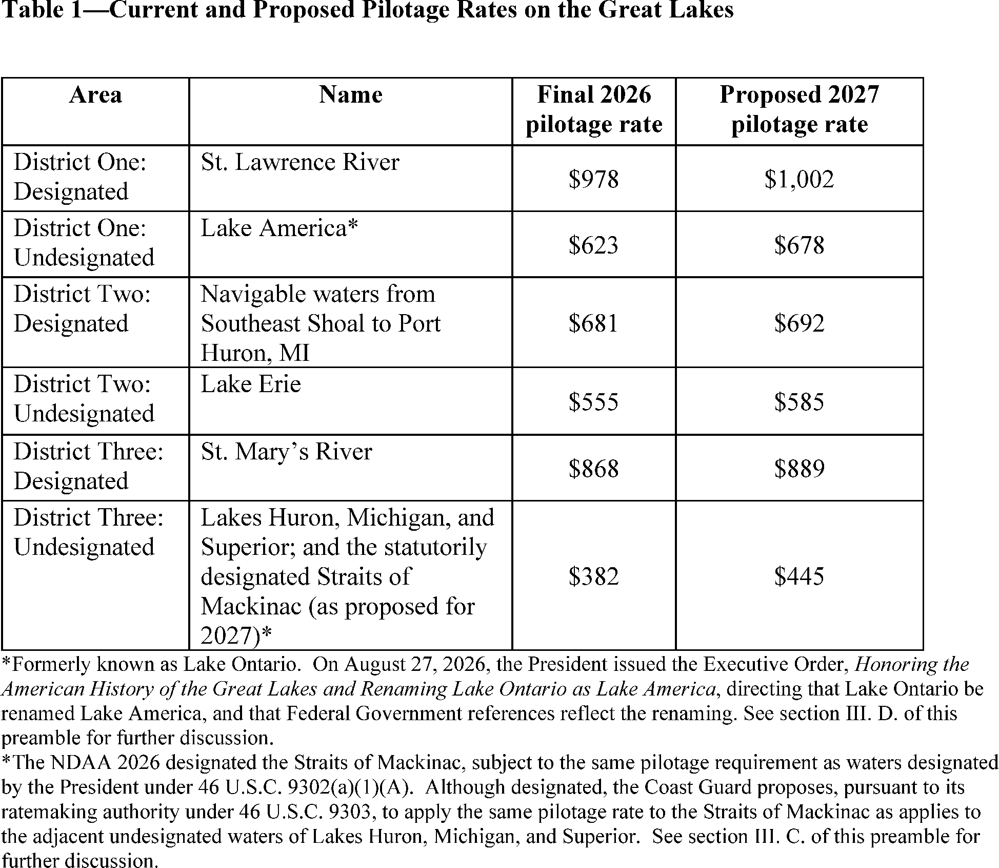
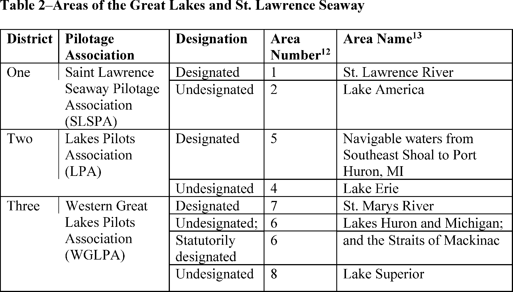
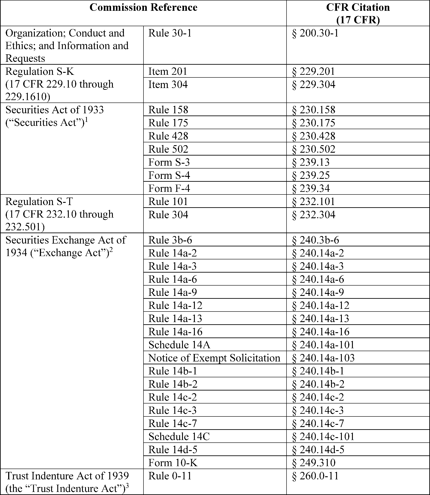
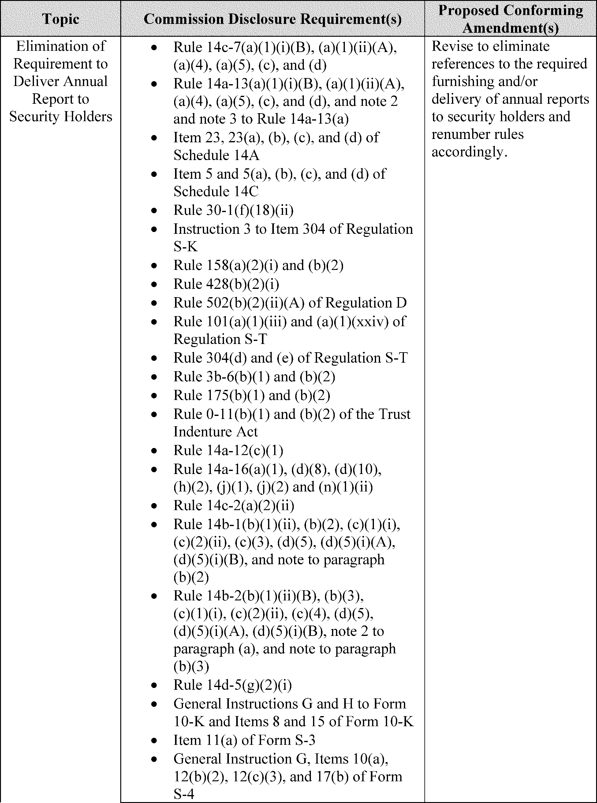
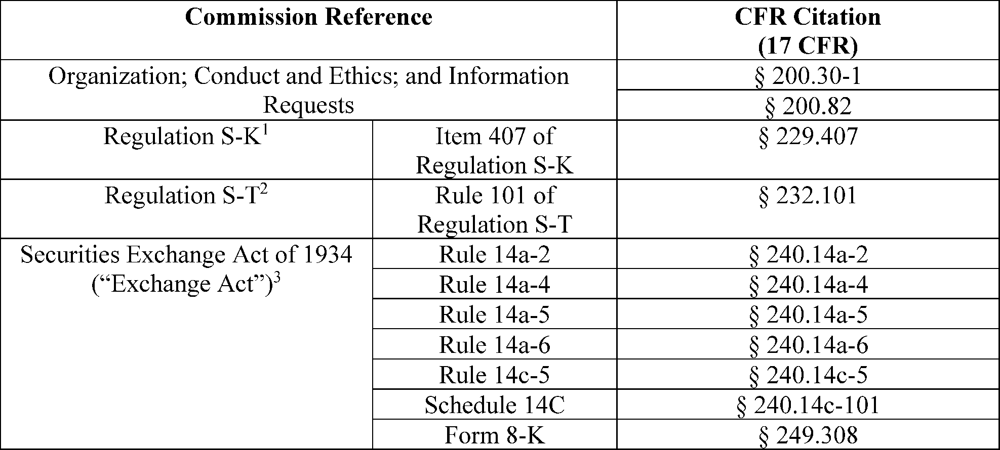
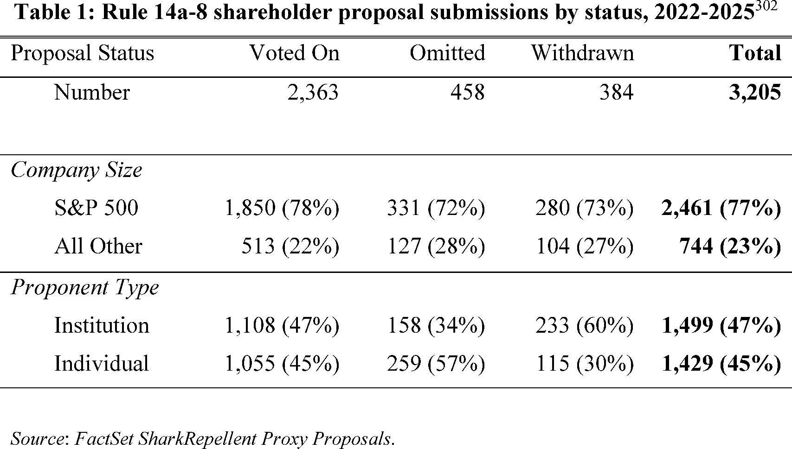

# Daily Digest — 2026-09-21

| | |
|---|---|
| **Digest date** | 2026-09-21 |
| **Data date range** | 2026-09-21 to 2026-09-21 |
| **Generated at** | 2026-09-22T04:03:13Z (UTC) |
| **Pipeline version** | c9f8b95 |
| **Inference** | model layers ran — cli/haiku, opus |
| **Source watermarks** | CREC: 2026-09-19T10:19:24Z · BILLS: 2026-09-19T01:23:16Z · FR: 2026-09-21T19:19:01Z · USCOURTS: 2026-09-22T00:25:13Z · PLAW: 2026-09-21T13:42:22Z |

[Full observed listing for this day](day/2026-09-21.html) — every item our collectors observed for this publication day, mechanical rules applied, frozen at end of day. This digest is the canonical record.

All items below cite the govinfo package (and granule, where applicable) they
summarize. Selection is mechanical; each item states the rule that included
it. See the Coverage Statement at the end for a full accounting of what was
published, what was summarized, and what was excluded and why.

---

## Contents

- [Day in Review](#day-in-review)
- [1. Congressional Floor Activity](#1-congressional-floor-activity)
- [2. Legislation](#2-legislation)
- [3. Federal Register](#3-federal-register)
- [4. Enacted Laws](#4-enacted-laws)
- [5. Judicial Activity](#5-judicial-activity)
- [6. Agency Announcements](#6-agency-announcements)
- [7. Recorded Votes](#7-recorded-votes)
- [8. Bill Actions](#8-bill-actions)
- [9. Presidential Actions](#9-presidential-actions)
- [Terms Used Today](#terms-used-today)
- [Coverage Statement](#coverage-statement)
- [Methodology](#methodology)

---

## Day in Review

No congressional floor proceedings or recorded votes appear in this digest. The congressional material carried is four public laws: Public Law 119–103, making continuing appropriations for fiscal year 2027 at fiscal year 2026 rates through December 11, 2026; Public Law 119–106, amending the Federal Funding Accountability and Transparency Act of 2006 to require other transaction agreements be reported to USAspending.gov; Public Law 119–107, extending the legislative authority of the National Emergency Medical Services Memorial Foundation; and Public Law 119–105, authorizing removal of deed restrictions from a 3.62-acre parcel in Paducah, Kentucky.

The digest carries four presidential documents. Proclamations 11067 and 11068 designate Constitution Week and National POW/MIA Recognition Day. Executive Order 14428 revokes Executive Order 13508 and directs agencies toward direct water quality projects in the Chesapeake Bay watershed, and a memorandum directs the removal of Canadian-origin items from federal procurement where legally permissible. Alongside them are three final rules, on State Department public access regulations, placement of diphenidine in schedule I, and an Illinois River safety zone; eight proposed rules, including Securities and Exchange Commission proposals on proxy solicitation and Rule 14a-8; 61 notices; and 132 agency press releases.

The digest carries 263 district court opinions and one bankruptcy court opinion; no appellate opinions appear.

*Composed from the summarized items below and the day's mechanical
counts; all specifics are cited in their sections.*

---

## 1. Congressional Floor Activity

No Congressional Record issue was observed on this day. The Record for a day's proceedings is typically published by govinfo the following morning; it appears in the digest for the day it is observed ([how our clocks work](faq.html#fapds-three-clocks)).

### 1.1 Senate

No Senate floor items met the selection thresholds. 0 floor granule(s) are accounted for in the Coverage Statement.

### 1.2 House of Representatives

No House floor items met the selection thresholds. 0 floor granule(s) are accounted for in the Coverage Statement.

### 1.3 Recorded Votes

No recorded votes were published in this issue of the Congressional Record.

---

## 2. Legislation

Source: Congressional Bills (BILLS), text versions published 2026-09-21 to 2026-09-21.

### 2.1 Counts by Stage

| Stage (bill text version) | Count |
|---|---|
| Introduced (ih/is) | 0 |
| Reported (rh/rs) | 0 |
| Engrossed (eh/es) | 0 |
| Enrolled (enr) | 0 |
| Other versions | 0 |
| **Total bill texts published** | **0** |

### 2.2 Bills Listed by Mechanical Rule

Bills below are listed because they matched at least one listing rule; the
matching rule is stated per item. All other bill texts are counted above and
accounted for in the Coverage Statement.

No bill texts published in this range matched a listing rule; all 0 are
accounted for in the Coverage Statement.

---

## 3. Federal Register

Source: Federal Register (FR), issue of 2026-09-21.

### 3.1 Counts by Document Type

| Document type | Count |
|---|---|
| Rules | 3 |
| Proposed rules | 8 |
| Notices | 61 |
| Presidential documents | 4 |
| **Total FR documents** | **76** |

### 3.2 Rules Published

Tags: department of health and human services · executive · securities and exchange commission · model keys: controlled substances · information access · safety zones

*In plain terms: Three rules on State information access revision, DEA substance scheduling of diphenidine, and a temporary fireworks safety zone in Illinois.*

#### DEPARTMENT OF HOMELAND SECURITY

- **Safety Zone; Illinois River, Morris, IL** (2026-19270; 33 CFR Part 165) — The Coast Guard is establishing a temporary safety zone in Morris, IL, for the Corn Festival Fireworks on September 26, 2026, to provide for the safety of life on navigable waterways during this fireworks display. The safety zone is needed to protect personnel, vessels, and the marine environment from potential hazards during a fireworks event. Entry of vessels or persons into this zone is prohibited unless specifically authorized by the Captain of the Port Lake Michigan or their designated representative. Action: Temporary final rule. Dates: This rule is effective from 8:30 p.m. until 9:10 p.m. on September 26, 2026.
  - *In plain terms:* The Coast Guard establishes a temporary no-entry zone on the Illinois River near Morris for fireworks on September 26, 2026.
  - Included because: FR-SEL-01 — document type: final rule (all listed)
  - Source: [FR-2026-09-21 / 2026-19270](https://www.govinfo.gov/app/details/FR-2026-09-21/2026-19270)

#### DEPARTMENT OF JUSTICE

- **Schedules of Controlled Substances: Placement of Diphenidine in Schedule I** (2026-19231; 21 CFR Part 1308) — With the issuance of this final rule, the Drug Enforcement Administration places the substance diphenidine (1-(1,2-diphenylethyl)piperidine), including its salts, isomers, and salts of isomers whenever the existence of such salts, isomers, and salts of isomers is possible, in schedule I of the Controlled Substances Act. This action is being taken, in part, to enable the United States to meet its obligations under the 1971 Convention on Psychotropic Substances. This action imposes the regulatory controls and administrative, civil, and criminal sanctions applicable to schedule I controlled substances on persons who handle (manufacture, distribute, reverse distribute, import, export, engage in research, conduct instructional activities or chemical analysis with, or possess) or propose to handle diphenidine. Action: Final rule. Dates: Effective date: October 21, 2026.
  - *In plain terms:* The Drug Enforcement Administration places diphenidine in schedule I controlled substances, applying federal regulatory controls and administrative, civil, and criminal sanctions.
  - Included because: FR-SEL-01 — document type: final rule (all listed)
  - Source: [FR-2026-09-21 / 2026-19231](https://www.govinfo.gov/app/details/FR-2026-09-21/2026-19231)

#### DEPARTMENT OF STATE

- **Public Access to Information** (2026-19223; 22 CFR Part 171) — The Department of State revises its regulations governing the availability to the public of information that is under the control of the Department. This rule reflects changes in the Department's organization and procedures since the last revision of the Department's regulations on public access to information, including relating to the use of email to submit requests for information under this part. Action: Final rule. Dates: The rule is in effect on October 21, 2026.
  - *In plain terms:* The State Department updates its rules on how the public can access information it controls, including how to submit requests by email.
  - Included because: FR-SEL-01 — document type: final rule (all listed)
  - Source: [FR-2026-09-21 / 2026-19223](https://www.govinfo.gov/app/details/FR-2026-09-21/2026-19223)

### 3.3 Proposed Rules Published

Tags: department of health and human services · executive · securities and exchange commission · model keys: aviation safety · proposed rules · securities regulation

*In plain terms: Eight proposed rules led by FAA airworthiness directives for Boeing 737s and SEC proxy solicitation modernization, plus aviation, maritime, and finance updates.*

#### COMMODITY FUTURES TRADING COMMISSION

- **Privacy Act Regulations** (2026-19290; 17 CFR Part 146) — On May 6, 2026, the Commodity Futures Trading Commission published in the Federal Register a notice of proposed rulemaking (“NPRM”), titled Privacy Act Regulations, to amend its Privacy Act regulations to exempt the CFTC-59 Insider Risk Program Records System of Records from certain provisions of the Privacy Act. The comment period for the Proposed Rule closed on June 5, 2026. The Commission is reopening the comment period for this NPRM for an additional ten days. Action: Reopening of comment period. Dates: The comment period for the proposed rule published May 6, 2026, at 91 FR 24377, is reopened. Comments must be received on or before October 1, 2026.
  - *In plain terms:* The Commodity Futures Trading Commission reopens its comment period for an additional ten days on a proposed Privacy Act exemption for insider risk records.
  - Included because: FR-SEL-02 — document type: proposed rule (all listed)
  - Source: [FR-2026-09-21 / 2026-19290](https://www.govinfo.gov/app/details/FR-2026-09-21/2026-19290)

#### DEPARTMENT OF HOMELAND SECURITY

- **Great Lakes Pilotage Rates—2027 Annual Review and Revisions to Methodology** (2026-19254; 46 CFR Parts 401 and 404) — In accordance with the Great Lakes Pilotage Act of 1960, the Coast Guard is proposing pilotage rates for the 2027 shipping season. We are conducting a full ratemaking for 2027. We are requesting comments on the Great Lakes pilotage ratemaking methodology, including one proposed update to that methodology. We also propose the pilotage rate for the Straits of Mackinac, newly designated for pilotage requirements by the National Defense Authorization Act for Fiscal Year 2026. The Coast Guard estimates that this proposed rule would increase operating costs by approximately 10 percent compared to the 2026 season. Action: Notice of proposed rulemaking. Dates: Comments and related material must be received by the Coast Guard on or before October 21, 2026.
  - *In plain terms:* The Coast Guard proposes pilotage rates for the 2027 Great Lakes shipping season, estimated to increase operating costs by 10 percent.
  - Included because: FR-SEL-02 — document type: proposed rule (all listed)
  - Source: [FR-2026-09-21 / 2026-19254](https://www.govinfo.gov/app/details/FR-2026-09-21/2026-19254)
  -  *Source graphic 1 of 57 from 2026-19254.*
  -  *Source graphic 2 of 57 from 2026-19254.*
  - *Graphics not rendered here: 55 of 57 — see the [source PDF](https://www.govinfo.gov/content/pkg/FR-2026-09-21/pdf/FR-2026-09-21.pdf).*

#### DEPARTMENT OF TRANSPORTATION

- **Special Conditions: Skyryse, Robinson Helicopter Company Model R66 Helicopter; Control Margin Awareness** (2026-19228; 14 CFR Part 27) — The FAA published a document in the Federal Register on August 28, 2026, issuing a notice of proposed special conditions for the Robinson Helicopter Company Model R66 helicopter modified by Skyryse with a digital fly-by-wire system. The document references an incorrect notice number and contains three other typographical errors. This document corrects the notice of proposed special conditions. Action: Notice of proposed special conditions; correction. Dates: This correction is effective on September 21, 2026.
  - *In plain terms:* The FAA corrects typographical errors and a citation in a proposed notice about special flight conditions for a Robinson helicopter with digital flight controls.
  - Included because: FR-SEL-02 — document type: proposed rule (all listed)
  - Source: [FR-2026-09-21 / 2026-19228](https://www.govinfo.gov/app/details/FR-2026-09-21/2026-19228)
- **Federal Motor Vehicle Safety Standards; Denial of a Petition for Rulemaking** (2026-19242; 49 CFR Part 571) — This document denies the September 11, 2025, petition for rulemaking submitted by Eric Dauster (“petitioner”). The petitioner requested that the agency initiate rulemaking to establish new standards for a centralized National Map Database (NMD) containing static roadway information and requiring global mapping providers to conform to these standards. The petitioner stated that the NMD standards should apply to entities responsible for the installation and maintenance of road infrastructure, including local municipalities, state transportation agencies, and private contractors. NHTSA is denying the petition based on a lack of information necessary for the agency to take action under the National Traffic and Motor Vehicle Safety Act, as well as the agency's view concerning the efficient allocation of agency resources. Action: Denial of petition for rulemaking. Dates: September 21, 2026.
  - *In plain terms:* The National Highway Traffic Safety Administration denies a petition to establish uniform federal standards for mapping road infrastructure databases.
  - Included because: FR-SEL-02 — document type: proposed rule (all listed)
  - Source: [FR-2026-09-21 / 2026-19242](https://www.govinfo.gov/app/details/FR-2026-09-21/2026-19242)
- **Airworthiness Directives; The Boeing Company Airplanes** (2026-19255; 14 CFR Part 39) — The FAA proposes to adopt a new airworthiness directive (AD) for certain The Boeing Company Model 737-8, 737-9, and 737-8200 airplanes. This proposed AD was prompted by a report that bearings in the elevator buss assembly could have been installed incorrectly (including being installed without the application of sealant) during production. This proposed AD would require detailed inspections of the elevator buss assembly bearings and bearing housings for any crack and indication of sealant application, and applicable on-condition actions. The FAA is proposing this AD to address the unsafe condition on these products. Action: Notice of proposed rulemaking (NPRM). Dates: The FAA must receive comments on this proposed AD by November 5, 2026.
  - *In plain terms:* The FAA proposes inspections and maintenance of elevator assembly bearings on certain Boeing 737 aircraft that may have been installed incorrectly.
  - Included because: FR-SEL-02 — document type: proposed rule (all listed)
  - Source: [FR-2026-09-21 / 2026-19255](https://www.govinfo.gov/app/details/FR-2026-09-21/2026-19255)

#### ENVIRONMENTAL PROTECTION AGENCY

- **Proposed Deletion From the National Priorities List; Correction** (2026-19248; 40 CFR Part 300) — The Environmental Protection Agency is correcting a proposed rule that was published in the Federal Register on August 20, 2026, regarding the proposed partial deletion of three sites from the Superfund National Priorities List (NPL). This action is necessary to correct errors in table 1 and table 2 for the site name and state of one site. Action: Proposed rule; correction. Dates: September 21, 2026.
  - *In plain terms:* The Environmental Protection Agency corrects table errors in a proposed partial removal of three sites from the Superfund list.
  - Included because: FR-SEL-02 — document type: proposed rule (all listed)
  - Source: [FR-2026-09-21 / 2026-19248](https://www.govinfo.gov/app/details/FR-2026-09-21/2026-19248)

#### SECURITIES AND EXCHANGE COMMISSION

- **Proxy Solicitation Modernization** (2026-19259; 17 CFR Parts 200, 229, 230, 232, 239, 240, 249, and 260) — The Securities and Exchange Commission (“Commission”) is proposing amendments to modernize certain rules related to proxy solicitations. The proposed amendments would, among other things, eliminate the requirement that registrants deliver an annual report to security holders, eliminate the delivery deadline when documents are incorporated by reference into a proxy statement, eliminate the requirement to file soliciting material regarding certain exempt solicitations, and shorten the minimum broker search period for proxy solicitations. The proposed amendments are intended to update our rules to account for developments since their adoption or last amendment and to simplify compliance for registrants. Action: Proposed rule. Dates: This release was published in the Federal Register on September 21, 2026. Comments should be submitted on or before November 20, 2026.
  - *In plain terms:* The Securities and Exchange Commission proposes simplifying rules for shareholder voting by mail, including eliminating annual report requirements and shortening contact searches.
  - Included because: FR-SEL-02 — document type: proposed rule (all listed)
  - Source: [FR-2026-09-21 / 2026-19259](https://www.govinfo.gov/app/details/FR-2026-09-21/2026-19259)
  -  *Source graphic 1 of 15 from 2026-19259.*
  -  *Source graphic 2 of 15 from 2026-19259.*
  - *Graphics not rendered here: 13 of 15 — see the [source PDF](https://www.govinfo.gov/content/pkg/FR-2026-09-21/pdf/FR-2026-09-21.pdf).*
- **Rescission of Rule 14a-8's Federal Regulation of Shareholder Proposals and Amendments to Rule 14a-4** (2026-19260; 17 CFR Parts 200, 229, 232, 240, and 249) — The Securities and Exchange Commission (“Commission”) is proposing to rescind Rule 14a-8 under the Securities Exchange Act of 1934 (“Exchange Act”) and leave determinations about the role of shareholder proposals to State law and company governing documents. The Commission also is proposing to amend Rule 14a-4 under the Exchange Act to expand the circumstances under which a company may exercise, with respect to proxies it receives, discretionary voting authority on proposals that will be presented at a shareholder meeting but not included in the company's proxy materials. At the same time, the proposed amendments to Rule 14a-4 would provide shareholders with the means to elect to prevent the company from exercising such authority with respect to their individual shares. Action: Proposed rule. Dates: This release was published in the Federal Register on September 21, 2026. Comments should be received on or before November 20, 2026.
  - *In plain terms:* The Securities and Exchange Commission proposes ending the federal rule that lets shareholders propose resolutions at company meetings, while allowing shareholders to prevent automatic company voting.
  - Included because: FR-SEL-02 — document type: proposed rule (all listed)
  - Source: [FR-2026-09-21 / 2026-19260](https://www.govinfo.gov/app/details/FR-2026-09-21/2026-19260)
  -  *Source graphic 1 of 12 from 2026-19260.*
  -  *Source graphic 2 of 12 from 2026-19260.*
  - *Graphics not rendered here: 10 of 12 — see the [source PDF](https://www.govinfo.gov/content/pkg/FR-2026-09-21/pdf/FR-2026-09-21.pdf).*

### 3.4 Notices and Presidential Documents

Tags: department of health and human services · executive · securities and exchange commission · model keys: constitutional observance · procurement · water quality

*In plain terms: Four presidential actions: Constitution Week designation, Chesapeake Bay water quality refocus, POW/MIA recognition, and Canadian-origin federal procurement review.*

Notices are summarized only when they match a listing rule; all are counted
in 3.1 and in the Coverage Statement. Presidential documents in the FR are
always listed.

- **Constitution Day, Citizenship Day, and Constitution Week, 2026** (2026-19333) — Proclamation 11067 designates September 17–23, 2026, as Constitution Week and commemorates the 239th anniversary of the signing of the U.S. Constitution on September 17, 1787. The proclamation directs teachers, school administrators, and state and local leaders to educate students about the rights and responsibilities of citizenship under the constitutional order.
  - *In plain terms:* A proclamation designates September 17–23, 2026, as Constitution Week and calls on educators to teach students about constitutional rights and citizenship.
  - Included because: FR-SEL-03 — presidential document (all listed)
  - Source: [FR-2026-09-21 / 2026-19333](https://www.govinfo.gov/app/details/FR-2026-09-21/2026-19333)
- **National POW/MIA Recognition Day, 2026** (2026-19334) — Proclamation 11068 designates September 18, 2026, as National POW/MIA Recognition Day to honor prisoners of war and service members missing in action from U.S. military conflicts. The proclamation notes that the Defense POW/MIA Accounting Agency reached its 800th identification of Korean War remains in the previous month.
  - *In plain terms:* A proclamation designates September 18, 2026, as National POW/MIA Recognition Day to honor prisoners of war and missing service members.
  - Included because: FR-SEL-03 — presidential document (all listed)
  - Source: [FR-2026-09-21 / 2026-19334](https://www.govinfo.gov/app/details/FR-2026-09-21/2026-19334)
- **Providing Meaningful Water Quality Improvements Through Collaboration and Oversight of Federal Support** (2026-19335) — Executive Order 14428 revokes Executive Order 13508 (Chesapeake Bay Protection and Restoration) and directs federal agencies to refocus resources on direct water quality improvement projects in the Chesapeake Bay watershed. The order instructs the Environmental Protection Agency to coordinate with jurisdictions to assess financial burdens from stormwater management fees and explore initiatives to achieve environmental health goals without increasing costs to residents.
  - *In plain terms:* An executive order revokes a previous water quality order and directs federal agencies to focus on direct improvements while assessing stormwater fee impacts.
  - Included because: FR-SEL-03 — presidential document (all listed)
  - Source: [FR-2026-09-21 / 2026-19335](https://www.govinfo.gov/app/details/FR-2026-09-21/2026-19335)
- **Restoring Reciprocity in Government Procurement** (2026-19336) — This memorandum directs the Office of Management and Budget and the U.S. Trade Representative to identify Canadian-origin items in federal procurement and remove them where legally permissible, citing Canadian restrictions on U.S. company access to Canadian government procurement markets. The memorandum instructs agencies to notify departments of domestic alternatives and directs the Trade Representative to continue monitoring Canadian procurement policies.
  - *In plain terms:* A memorandum directs federal agencies to identify and remove Canadian-origin items from government procurement where legally possible in response to Canadian trade restrictions.
  - Included because: FR-SEL-03 — presidential document (all listed)
  - Source: [FR-2026-09-21 / 2026-19336](https://www.govinfo.gov/app/details/FR-2026-09-21/2026-19336)

---

## 4. Enacted Laws

Tags: legislative · model keys: appropriations · memorial authority · transparency reporting

*In plain terms: Four laws enacted on fiscal 2027 appropriations, federal spending transparency for other transaction agreements, Kentucky property deed removal, and EMS memorial authority.*

Source: Public and Private Laws (PLAW) published 2026-09-21.

- **Public Law 119–103 — Public Law 119–103: Making continuing appropriations and extensions for fiscal year 2027, and for other purposes.** — Public Law 119-103 appropriates funds for fiscal year 2027 for the federal government at the rate of operations provided in fiscal year 2026 appropriations acts, covering continuing projects and activities across multiple departments and agencies until December 11, 2026, or until superseded by fiscal year 2027 appropriations. The law limits the use of appropriated funds for new production, increased production rates, or new projects not previously funded in fiscal year 2026. Various divisions address extensions for surface transportation, Department of Veterans Affairs, and other purposes. Approved: 2026-09-02.
  - *In plain terms:* Government funding for 2027 continues at the 2026 rate of spending until December 11, 2026 or until superseded by 2027 appropriations.
  - Included because: PLAW-SEL-01 — enacted into law (all public and private laws are listed) (document dated 2026-09-02)
  - Source: [PLAW-119publ103](https://www.govinfo.gov/app/details/PLAW-119publ103)
- **Public Law 119–105 — Public Law 119–105: To remove restrictions from a parcel of land in Paducah, Kentucky.** — The Secretary of Interior is authorized to remove all deed restrictions from a 3.62-acre parcel located at 2956 Park Avenue on the Paducah Memorial Army Reserve Center in Paducah, Kentucky, subject to conditions that the City of Paducah may only transfer the property to the Oscar Cross Boys & Girls Club of Paducah, which must offer it back to the Secretary before transferring it elsewhere, and that any new development must remain compatible with public use or recreation purposes. Approved: 2026-09-11.
  - *In plain terms:* The Interior Secretary can remove deed restrictions from a 3.62-acre Kentucky property, provided it transfers to the Oscar Cross Boys & Girls Club and any development remains compatible with public recreation use.
  - Included because: PLAW-SEL-01 — enacted into law (all public and private laws are listed) (document dated 2026-09-11)
  - Source: [PLAW-119publ105](https://www.govinfo.gov/app/details/PLAW-119publ105)
- **Public Law 119–106 — Public Law 119–106: To amend the Federal Funding Accountability and Transparency Act of 2006 to ensure that other transaction agreements are reported to USAspending.gov, and for other purposes.** — Public Law 119-106 amends the Federal Funding Accountability and Transparency Act of 2006 to require reporting of other transaction agreements to USAspending.gov, with data automatically transmitted and centralized on the website within three years of enactment. The law requires annual reports on unreported federal spending and the reasons for non-reporting, establishes requirements for data accuracy and compliance, and directs inspector general reports on federal agencies' compliance with these requirements. Approved: 2026-09-11.
  - *In plain terms:* Federal agencies must report other transaction agreements to USAspending.gov within three years, with annual compliance reports to inspector generals on unreported federal spending.
  - Included because: PLAW-SEL-01 — enacted into law (all public and private laws are listed) (document dated 2026-09-11)
  - Source: [PLAW-119publ106](https://www.govinfo.gov/app/details/PLAW-119publ106)
- **Public Law 119–107 — Public Law 119–107: To provide for an extension of the legislative authority of the National Emergency Medical Services Memorial Foundation to establish a commemorative work in the District of Columbia and its environs.** — Public Law 119–107 extends the legislative authority of the National Emergency Medical Services Memorial Foundation to establish a commemorative work in the District of Columbia and its environs. The law amends Public Law 115–275, extending the deadline to seven years after the enactment of this act. Approved: 2026-09-11.
  - *In plain terms:* This law gives the National Emergency Medical Services Memorial Foundation seven years from enactment to build a memorial in Washington DC and surrounding areas.
  - Included because: PLAW-SEL-01 — enacted into law (all public and private laws are listed) (document dated 2026-09-11)
  - Source: [PLAW-119publ107](https://www.govinfo.gov/app/details/PLAW-119publ107)

---

## 5. Judicial Activity

Source: United States Courts Opinions (USCOURTS): opinions observed 2026-09-21
by our collector; each opinion states its own issue date beside its
listing ([how our clocks work](faq.html#fapds-three-clocks)).

Completeness disclosure (standing): USCOURTS carries opinions from
approximately 140 participating appellate, district, bankruptcy, and
national federal courts. Unlike the Congressional Record and the Federal
Register, which are the complete official record of their branches,
USCOURTS is participation-based and is NOT the complete federal judicial
record. Courts post opinions with delay — typically over several days —
so a day's digest carries the opinions that became available that day,
whatever date each was issued.

### 5.1 Appellate and National Court Opinions

Appellate and national court opinions are summarized; district and
bankruptcy opinions are counted in 5.2 and in the Coverage Statement.

No appellate or national court opinions matched a listing rule for this
date; all opinions are counted in 5.2 and accounted for in the Coverage
Statement.

### 5.2 Counts by Court Category

| Court category | Opinions |
|---|---|
| Appellate | 0 |
| District | 263 |
| Bankruptcy | 1 |
| National | 0 |
| **Total opinions extracted** | **264** |

Archive-window disclosure (rule USCOURTS-FETCH-01): 33444 USCOURTS package(s) have been listed in delta syncs but fell outside the 7-day archive window and were not fetched (global running count across all syncs, not limited to this date).

---

## 6. Agency Announcements

Official press releases and statements the agencies themselves date
on 2026-09-21 (sources listed in the source guide). These are the
agencies' own announcements — official advocacy, quoted and
attributed, not findings of this digest. Agency web content can be
edited or removed without notice; captures and hashes are preserved
per the provenance policy.

#### CFTC Press Releases

- **[CFTC Innovation Task Force to Host Frontier Forum Series on Innovative Financial Technologies](https://www.cftc.gov/PressRoom/PressReleases/9301-26)** — dated 2026-09-21 by the agency
  - Included because: AGENCYPR-SEL-01 — official agency release dated this day by the agency (all such releases from active sources are listed; titles only in the pilot)

#### CISA Cybersecurity Advisories

- **[CISA Adds One Known Exploited Vulnerability to Catalog](https://www.cisa.gov/news-events/alerts/2026/09/21/cisa-adds-one-known-exploited-vulnerability-catalog)** — dated 2026-09-21 by the agency
  - Included because: AGENCYPR-SEL-01 — official agency release dated this day by the agency (all such releases from active sources are listed; titles only in the pilot)

#### DEA Updates (email)

- **[DEA Highlights the Integral Role of Forensic Science in Addressing the Synthetic Drug Crisis](http://www.dea.gov/national-forensic-science-week?Utm_campaign=20260921&Utm_content=&utm_medium=email&utm_source=govdelivery)** — dated 2026-09-21 by the agency
  - Included because: AGENCYPR-SEL-01 — official agency release dated this day by the agency (all such releases from active sources are listed; titles only in the pilot)
  - Source: agency email bulletin to this project's subscription, captured and DKIM-verified
- **RSVP to Attend the DEA Dallas Family Summit** — dated 2026-09-21 by the agency
  - Included because: AGENCYPR-SEL-01 — official agency release dated this day by the agency (all such releases from active sources are listed; titles only in the pilot)
  - Source: agency email bulletin to this project's subscription, captured and DKIM-verified (the bulletin named no canonical page)

#### Defense News Releases

- **[Air Force, Japan Exercise Tsunami Evacuation Procedures](https://www.war.gov/News/News-Stories/Article/Article/4607156/air-force-japan-exercise-tsunami-evacuation-procedures/)** — dated 2026-09-21 by the agency
  - Included because: AGENCYPR-SEL-01 — official agency release dated this day by the agency (all such releases from active sources are listed; titles only in the pilot)
- **[Military Spouse Commission Holds First Meeting, Identifies Top Issues](https://www.war.gov/News/News-Stories/Article/Article/4607679/military-spouse-commission-holds-first-meeting-identifies-top-issues/)** — dated 2026-09-21 by the agency
  - Included because: AGENCYPR-SEL-01 — official agency release dated this day by the agency (all such releases from active sources are listed; titles only in the pilot)

#### DHS News Releases

- **[DHS Issues Statement After Activist Court in California Orders Illegal Alien MS-13 Member Released from ICE Custody](https://www.dhs.gov/news/2026/09/21/dhs-issues-statement-after-activist-court-california-orders-illegal-alien-ms-13)** — dated 2026-09-21 by the agency
  - Included because: AGENCYPR-SEL-01 — official agency release dated this day by the agency (all such releases from active sources are listed; titles only in the pilot)
- **[DHS Releases Statement After Illegal Alien Sentenced for Child Pornography in Virginia](https://www.dhs.gov/news/2026/09/21/dhs-releases-statement-after-illegal-alien-sentenced-child-pornography-virginia)** — dated 2026-09-21 by the agency
  - Included because: AGENCYPR-SEL-01 — official agency release dated this day by the agency (all such releases from active sources are listed; titles only in the pilot)
- **[HSI Investigation Leads to Conviction of Filipino Alien Who Illegally Voted in Pennsylvania](https://www.dhs.gov/news/2026/09/21/hsi-investigation-leads-conviction-filipino-alien-who-illegally-voted-pennsylvania)** — dated 2026-09-21 by the agency
  - Included because: AGENCYPR-SEL-01 — official agency release dated this day by the agency (all such releases from active sources are listed; titles only in the pilot)
- **[TROUBLE, TROUBLE: Illegal Alien from India Sentenced in Ponzi Scheme That Defrauded Victims of More Than $30 Million](https://www.dhs.gov/news/2026/09/21/trouble-trouble-illegal-alien-india-sentenced-ponzi-scheme-defrauded-victims-more)** — dated 2026-09-21 by the agency
  - Included because: AGENCYPR-SEL-01 — official agency release dated this day by the agency (all such releases from active sources are listed; titles only in the pilot)
- **[WORST OF THE WORST: Over the Weekend, ICE Arrests Murderers, Pedophiles, and Rapists](https://www.dhs.gov/news/2026/09/21/worst-worst-over-weekend-ice-arrests-murderers-pedophiles-and-rapists)** — dated 2026-09-21 by the agency
  - Included because: AGENCYPR-SEL-01 — official agency release dated this day by the agency (all such releases from active sources are listed; titles only in the pilot)

#### EEOC Newsroom

- **[EEOC Sues Blue Bell Creameries for Religious Discrimination and Retaliation](https://www.eeoc.gov/newsroom/eeoc-sues-blue-bell-creameries-religious-discrimination-and-retaliation)** — dated 2026-09-21 by the agency
  - Included because: AGENCYPR-SEL-01 — official agency release dated this day by the agency (all such releases from active sources are listed; titles only in the pilot)

#### FAA Updates (email)

- **FAA Orders & Notices Update Notification** — dated 2026-09-21 by the agency
  - Included because: AGENCYPR-SEL-01 — official agency release dated this day by the agency (all such releases from active sources are listed; titles only in the pilot)
  - Source: agency email bulletin to this project's subscription, captured and DKIM-verified (the bulletin named no canonical page)

#### FDA Press Announcements

- **[FDA Updates Regulations to Advance Innovative Alternatives to Animal Testing](http://www.fda.gov/news-events/press-announcements/fda-updates-regulations-advance-innovative-alternatives-animal-testing)** — dated 2026-09-21 by the agency
  - Included because: AGENCYPR-SEL-01 — official agency release dated this day by the agency (all such releases from active sources are listed; titles only in the pilot)
  - Corroborated: the same release (same canonical URL) also arrived via the agency's email bulletin to this project's subscription, DKIM-verified — one document received through two ingestion channels; listed once, both captures preserved.

#### FEMA Press Releases

- **[FEMA Announces More than $22.6 Million to Support Communities in Arizona, California, Hawai'i and Nevada as They Strengthen Their Resilience Against Future Disasters](https://www.fema.gov/press-release/20260921/fema-announces-more-226-million-support-communities-arizona-california)** — dated 2026-09-21 by the agency
  - Included because: AGENCYPR-SEL-01 — official agency release dated this day by the agency (all such releases from active sources are listed; titles only in the pilot)
- **[FEMA Approves Nearly $12 Million to Help Communities in Arkansas, Louisiana, New Mexico, Oklahoma and Texas as They Strengthen Their Resilience Against Future Disasters](https://www.fema.gov/press-release/20260921/fema-approves-nearly-12-million-help-communities-arkansas-louisiana-new)** — dated 2026-09-21 by the agency
  - Included because: AGENCYPR-SEL-01 — official agency release dated this day by the agency (all such releases from active sources are listed; titles only in the pilot)

#### FSIS Recalls and Public Health Alerts (email)

- **FSIS Notice 34-26 and 35-26** — dated 2026-09-21 by the agency
  - Included because: AGENCYPR-SEL-01 — official agency release dated this day by the agency (all such releases from active sources are listed; titles only in the pilot)
  - Source: agency email bulletin to this project's subscription, captured and DKIM-verified (the bulletin named no canonical page)
- **FSIS Notice 36-26** — dated 2026-09-21 by the agency
  - Included because: AGENCYPR-SEL-01 — official agency release dated this day by the agency (all such releases from active sources are listed; titles only in the pilot)
  - Source: agency email bulletin to this project's subscription, captured and DKIM-verified (the bulletin named no canonical page)
- **Meat, Poultry and Egg Product Inspection Directory** — dated 2026-09-21 by the agency
  - Included because: AGENCYPR-SEL-01 — official agency release dated this day by the agency (all such releases from active sources are listed; titles only in the pilot)
  - Source: agency email bulletin to this project's subscription, captured and DKIM-verified (the bulletin named no canonical page)

#### GAO Reports & Testimonies

- **[Aviation Cybersecurity: Enhanced Air Safety Requires FAA to Better Mitigate Threats to Aircraft Communications](https://www.gao.gov/products/gao-26-108439)** — dated 2026-09-21 by the agency
  - Included because: AGENCYPR-SEL-01 — official agency release dated this day by the agency (all such releases from active sources are listed; titles only in the pilot)
- **[Federal Real Property: Funding and Other Challenges Have Hindered Progress Under a Temporary Disposal Process](https://www.gao.gov/products/gao-26-108451)** — dated 2026-09-21 by the agency
  - Included because: AGENCYPR-SEL-01 — official agency release dated this day by the agency (all such releases from active sources are listed; titles only in the pilot)
- **[Global Aging: Key Implications for U.S. Foreign Policy and Federal Agencies](https://www.gao.gov/products/gao-26-108732)** — dated 2026-09-21 by the agency
  - Included because: AGENCYPR-SEL-01 — official agency release dated this day by the agency (all such releases from active sources are listed; titles only in the pilot)
- **[Medical Devices: FDA Should Strengthen Policies Guiding Audits of Third Party Review Organizations](https://www.gao.gov/products/gao-26-108499)** — dated 2026-09-21 by the agency
  - Included because: AGENCYPR-SEL-01 — official agency release dated this day by the agency (all such releases from active sources are listed; titles only in the pilot)

#### IRS Newswire (email)

- **IR-2026-113: IRS wraps up successful Nationwide Tax Forums with nearly 13,000 attendees** — dated 2026-09-21 by the agency
  - Included because: AGENCYPR-SEL-01 — official agency release dated this day by the agency (all such releases from active sources are listed; titles only in the pilot)
  - Source: agency email bulletin to this project's subscription, captured and DKIM-verified (the bulletin named no canonical page)
- **Notice 2026-61: Extension of the Phase-in Period for the Enforcement and Administration of Section 871(m)** — dated 2026-09-21 by the agency
  - Included because: AGENCYPR-SEL-01 — official agency release dated this day by the agency (all such releases from active sources are listed; titles only in the pilot)
  - Source: agency email bulletin to this project's subscription, captured and DKIM-verified (the bulletin named no canonical page)

#### Justice Department News (email)

- **[ASSISTANT UNITED STATES ATTORNEY - CRIMINAL](https://www.justice.gov/legal-careers/job/assistant-united-states-attorney-criminal-357)** — dated 2026-09-21 by the agency
  - Included because: AGENCYPR-SEL-01 — official agency release dated this day by the agency (all such releases from active sources are listed; titles only in the pilot)
  - Source: agency email bulletin to this project's subscription, captured and DKIM-verified
- **[Report to Congress on Implementation of Section 1001 of the USA PATRIOT Act (as required by Section 1001(3) of Public Law 107-56)](https://oig.justice.gov/reports/report-congress-implementation-section-1001-usa-patriot-act-required-section-10013-public-6?utm_source=govdelivery&utm_medium=email&utm_campaign=report)** — dated 2026-09-21 by the agency
  - Included because: AGENCYPR-SEL-01 — official agency release dated this day by the agency (all such releases from active sources are listed; titles only in the pilot)
  - Source: agency email bulletin to this project's subscription, captured and DKIM-verified

#### Justice Press Releases

- **[Former Bank CEO Sentenced to Over 9 Years in Prison for Multimillion-Dollar Wire Fraud Conspiracy and Venezuela Sanctions Evasion Scheme](https://www.justice.gov/opa/pr/former-bank-ceo-sentenced-over-9-years-prison-multimillion-dollar-wire-fraud-conspiracy-and)** — dated 2026-09-21 by the agency
  - Included because: AGENCYPR-SEL-01 — official agency release dated this day by the agency (all such releases from active sources are listed; titles only in the pilot)
  - Corroborated: the same release (same canonical URL) also arrived via the agency's email bulletin to this project's subscription, DKIM-verified — one document received through two ingestion channels; listed once, both captures preserved.
- **[6 men convicted of federal firearms crimes](https://www.justice.gov/usao-sdoh/pr/6-men-convicted-federal-firearms-crimes)** — dated 2026-09-21 by the agency
  - Included because: AGENCYPR-SEL-01 — official agency release dated this day by the agency (all such releases from active sources are listed; titles only in the pilot)
- **[Carlisle Man Charged with Involuntary Manslaughter for Death of Letterkenny Army Depot U.S. Army Reservist](https://www.justice.gov/usao-mdpa/pr/carlisle-man-charged-involuntary-manslaughter-death-letterkenny-army-depot-us-army)** — dated 2026-09-21 by the agency
  - Included because: AGENCYPR-SEL-01 — official agency release dated this day by the agency (all such releases from active sources are listed; titles only in the pilot)
- **[Contractor Agrees to Pay One of the Largest AbilityOne Program Related False Claims Act Settlements of All Time](https://www.justice.gov/usao-edmi/pr/contractor-agrees-pay-one-largest-abilityone-program-related-false-claims-act)** — dated 2026-09-21 by the agency
  - Included because: AGENCYPR-SEL-01 — official agency release dated this day by the agency (all such releases from active sources are listed; titles only in the pilot)
- **[Convicted Tucson Gang Member Sentenced to 335 Months in Prison for RICO Conspiracy](https://www.justice.gov/usao-az/pr/convicted-tucson-gang-member-sentenced-335-months-prison-rico-conspiracy)** — dated 2026-09-21 by the agency
  - Included because: AGENCYPR-SEL-01 — official agency release dated this day by the agency (all such releases from active sources are listed; titles only in the pilot)
- **[Crown Medical Solutions and Its Owners to Pay $825,000 For Fraudulent Billing Scheme](https://www.justice.gov/opa/pr/crown-medical-solutions-and-its-owners-pay-825000-fraudulent-billing-scheme)** — dated 2026-09-21 by the agency
  - Included because: AGENCYPR-SEL-01 — official agency release dated this day by the agency (all such releases from active sources are listed; titles only in the pilot)
  - Corroborated: the same release (same canonical URL) also arrived via the agency's email bulletin to this project's subscription, DKIM-verified — one document received through two ingestion channels; listed once, both captures preserved.
- **[Federal Jury Convicts Dominican National for Involvement in Multistate Fentanyl Trafficking Conspiracy](https://www.justice.gov/usao-nh/pr/federal-jury-convicts-dominican-national-involvement-multistate-fentanyl-trafficking)** — dated 2026-09-21 by the agency
  - Included because: AGENCYPR-SEL-01 — official agency release dated this day by the agency (all such releases from active sources are listed; titles only in the pilot)
  - Corroborated: the same release (same canonical URL) also arrived via the agency's email bulletin to this project's subscription, DKIM-verified — one document received through two ingestion channels; listed once, both captures preserved.
- **[Former Connecticut Resident Guilty of Operating Websites to Illegally Sell Misbranded and Unapproved Drugs](https://www.justice.gov/usao-ct/pr/former-connecticut-resident-guilty-operating-websites-illegally-sell-misbranded-and)** — dated 2026-09-21 by the agency
  - Included because: AGENCYPR-SEL-01 — official agency release dated this day by the agency (all such releases from active sources are listed; titles only in the pilot)
- **[Former Police Officer Convicted of Depriving Woman of Civil Rights and Obstructing Federal Investigation](https://www.justice.gov/usao-mdal/pr/former-police-officer-convicted-depriving-woman-civil-rights-and-obstructing-federal)** — dated 2026-09-21 by the agency
  - Included because: AGENCYPR-SEL-01 — official agency release dated this day by the agency (all such releases from active sources are listed; titles only in the pilot)
  - Corroborated: the same release (same canonical URL) also arrived via the agency's email bulletin to this project's subscription, DKIM-verified — one document received through two ingestion channels; listed once, both captures preserved.
- **[Fort Walton Beach Physician Pays $300,000 To Resolve Controlled Substances Act Violation Allegations](https://www.justice.gov/usao-ndfl/pr/fort-walton-beach-physician-pays-300000-resolve-controlled-substances-act-violation)** — dated 2026-09-21 by the agency
  - Included because: AGENCYPR-SEL-01 — official agency release dated this day by the agency (all such releases from active sources are listed; titles only in the pilot)
  - Corroborated: the same release (same canonical URL) also arrived via the agency's email bulletin to this project's subscription, DKIM-verified — one document received through two ingestion channels; listed once, both captures preserved.
- **[Gainesville Armed Drug Trafficker Pleads Guilty to Federal Gun & Drug Charges](https://www.justice.gov/usao-ndfl/pr/gainesville-armed-drug-trafficker-pleads-guilty-federal-gun-drug-charges)** — dated 2026-09-21 by the agency
  - Included because: AGENCYPR-SEL-01 — official agency release dated this day by the agency (all such releases from active sources are listed; titles only in the pilot)
- **[Gainesville Armed Drug Trafficker Sentenced to 20 Years in Federal Prison](https://www.justice.gov/usao-ndfl/pr/gainesville-armed-drug-trafficker-sentenced-20-years-federal-prison)** — dated 2026-09-21 by the agency
  - Included because: AGENCYPR-SEL-01 — official agency release dated this day by the agency (all such releases from active sources are listed; titles only in the pilot)
  - Corroborated: the same release (same canonical URL) also arrived via the agency's email bulletin to this project's subscription, DKIM-verified — one document received through two ingestion channels; listed once, both captures preserved.
- **[Lexington Man Sentenced to 27.5 Years for Several Drug Trafficking and Firearms Charges](https://www.justice.gov/usao-edky/pr/lexington-man-sentenced-275-years-several-drug-trafficking-and-firearms-charges)** — dated 2026-09-21 by the agency
  - Included because: AGENCYPR-SEL-01 — official agency release dated this day by the agency (all such releases from active sources are listed; titles only in the pilot)
  - Corroborated: the same release (same canonical URL) also arrived via the agency's email bulletin to this project's subscription, DKIM-verified — one document received through two ingestion channels; listed once, both captures preserved.
- **[Lynn Man Indicted for Transporting Minor to Engage in Prostitution](https://www.justice.gov/usao-ma/pr/lynn-man-indicted-transporting-minor-engage-prostitution)** — dated 2026-09-21 by the agency
  - Included because: AGENCYPR-SEL-01 — official agency release dated this day by the agency (all such releases from active sources are listed; titles only in the pilot)
  - Corroborated: the same release (same canonical URL) also arrived via the agency's email bulletin to this project's subscription, DKIM-verified — one document received through two ingestion channels; listed once, both captures preserved.
- **[Maryland Man Charged With Stealing More Than $1 Million From Dozens of Seniors](https://www.justice.gov/usao-md/pr/maryland-man-charged-stealing-more-1-million-dozens-seniors)** — dated 2026-09-21 by the agency
  - Included because: AGENCYPR-SEL-01 — official agency release dated this day by the agency (all such releases from active sources are listed; titles only in the pilot)
- **[Metairie Man Indicted for Possession of Child Sex Abuse Material and Possession of a Firearm by an Illegal Alien](https://www.justice.gov/usao-edla/pr/metairie-man-indicted-possession-child-sex-abuse-material-and-possession-firearm)** — dated 2026-09-21 by the agency
  - Included because: AGENCYPR-SEL-01 — official agency release dated this day by the agency (all such releases from active sources are listed; titles only in the pilot)
- **[Mexican National Sentenced in Scheme to Bribe Ecuadorian and Mexican Government Officials](https://www.justice.gov/opa/pr/mexican-national-sentenced-scheme-bribe-ecuadorian-and-mexican-government-officials)** — dated 2026-09-21 by the agency
  - Included because: AGENCYPR-SEL-01 — official agency release dated this day by the agency (all such releases from active sources are listed; titles only in the pilot)
- **[Nigerian Man Sentenced to 48 Months’ Imprisonment for Investment Fraud Scheme](https://www.justice.gov/usao-edwi/pr/nigerian-man-sentenced-48-months-imprisonment-investment-fraud-scheme)** — dated 2026-09-21 by the agency
  - Included because: AGENCYPR-SEL-01 — official agency release dated this day by the agency (all such releases from active sources are listed; titles only in the pilot)
  - Corroborated: the same release (same canonical URL) also arrived via the agency's email bulletin to this project's subscription, DKIM-verified — one document received through two ingestion channels; listed once, both captures preserved.
- **[Terrytown, Louisiana Man Indicted for Possession of Child Sex Abuse Material](https://www.justice.gov/usao-edla/pr/terrytown-louisiana-man-indicted-possession-child-sex-abuse-material)** — dated 2026-09-21 by the agency
  - Included because: AGENCYPR-SEL-01 — official agency release dated this day by the agency (all such releases from active sources are listed; titles only in the pilot)
- **[Violent Felon Pleads Guilty to Illegal Possession of Firearms and Machinegun](https://www.justice.gov/usao-wdtn/pr/violent-felon-pleads-guilty-illegal-possession-firearms-and-machinegun)** — dated 2026-09-21 by the agency
  - Included because: AGENCYPR-SEL-01 — official agency release dated this day by the agency (all such releases from active sources are listed; titles only in the pilot)
  - Corroborated: the same release (same canonical URL) also arrived via the agency's email bulletin to this project's subscription, DKIM-verified — one document received through two ingestion channels; listed once, both captures preserved.

#### NASA News Releases

- **[APOD: 2026 September 21 – Cocoon Nebula Wide Field](https://science.nasa.gov/image-article/apod-2026-september-21-cocoon-nebula-wide-field/)** — dated 2026-09-21 by the agency
  - Included because: AGENCYPR-SEL-01 — official agency release dated this day by the agency (all such releases from active sources are listed; titles only in the pilot)
- **[Arctic Melt Season Length Levels Off](https://science.nasa.gov/earth/earth-observatory/arctic-melt-season-length-levels-off/)** — dated 2026-09-21 by the agency
  - Included because: AGENCYPR-SEL-01 — official agency release dated this day by the agency (all such releases from active sources are listed; titles only in the pilot)
- **[Embracing the Equinox](https://science.nasa.gov/solar-system/skywatching/night-sky-network/embracing-the-equinox/)** — dated 2026-09-21 by the agency
  - Included because: AGENCYPR-SEL-01 — official agency release dated this day by the agency (all such releases from active sources are listed; titles only in the pilot)
- **[Johnson Space Center Sparks Curiosity at Houston’s 33rd Annual Japan Festival](https://www.nasa.gov/centers-and-facilities/johnson/johnson-space-center-sparks-curiosity-at-houstons-33rd-annual-japan-festival/)** — dated 2026-09-21 by the agency
  - Included because: AGENCYPR-SEL-01 — official agency release dated this day by the agency (all such releases from active sources are listed; titles only in the pilot)
- **[NASA Astronaut Reid Wiseman Attends Ravens vs. Saints Game](https://www.nasa.gov/image-article/nasa-astronaut-reid-wiseman-attends-ravens-vs-saints-game/)** — dated 2026-09-21 by the agency
  - Included because: AGENCYPR-SEL-01 — official agency release dated this day by the agency (all such releases from active sources are listed; titles only in the pilot)
- **[NASA Discovery Reveals Complex Water Systems on Early Mars](https://www.nasa.gov/solar-system/planets/mars/nasa-discovery-reveals-complex-water-systems-on-early-mars/)** — dated 2026-09-21 by the agency
  - Included because: AGENCYPR-SEL-01 — official agency release dated this day by the agency (all such releases from active sources are listed; titles only in the pilot)
- **[NASA Kicks Off Nationwide Effort to Prepare Tomorrow’s Space Workforce](https://www.nasa.gov/learning-resources/nasa-kicks-off-nationwide-effort-to-prepare-tomorrows-space-workforce/)** — dated 2026-09-21 by the agency
  - Included because: AGENCYPR-SEL-01 — official agency release dated this day by the agency (all such releases from active sources are listed; titles only in the pilot)
- **[NASA Welcomes Albania as Newest Artemis Accords Signatory](https://www.nasa.gov/organizations/oiir/nasa-welcomes-albania-as-newest-artemis-accords-signatory/)** — dated 2026-09-21 by the agency
  - Included because: AGENCYPR-SEL-01 — official agency release dated this day by the agency (all such releases from active sources are listed; titles only in the pilot)
- **[Perseverance’s View of ‘Turquoise Bay’](https://science.nasa.gov/photojournal/perseverances-view-of-turquoise-bay/)** — dated 2026-09-21 by the agency
  - Included because: AGENCYPR-SEL-01 — official agency release dated this day by the agency (all such releases from active sources are listed; titles only in the pilot)
- **[Widely Attended Gatherings (WAGs) Determinations](https://www.nasa.gov/organizations/nasa-ethics-advice-for-widely-attended-gatherings-wags/)** — dated 2026-09-21 by the agency
  - Included because: AGENCYPR-SEL-01 — official agency release dated this day by the agency (all such releases from active sources are listed; titles only in the pilot)

#### NIH News Releases

- **[NIH makes major investments to advance human-based research infrastructure and technologies](https://www.nih.gov/news-events/news-releases/nih-makes-major-investments-advance-human-based-research-infrastructure-technologies)** — dated 2026-09-21 by the agency
  - Included because: AGENCYPR-SEL-01 — official agency release dated this day by the agency (all such releases from active sources are listed; titles only in the pilot)

#### NOAA News Releases

- **[The Great Miami Hurricane of 1926: 100 Years of Hurricane Forecasting and Research](https://www.noaa.gov/heritage/multimedia/video/great-miami-hurricane-of-1926-100-years-of-hurricane-forecasting-and-research)** — dated 2026-09-21 by the agency
  - Included because: AGENCYPR-SEL-01 — official agency release dated this day by the agency (all such releases from active sources are listed; titles only in the pilot)
- **[The Origins of NOAA’s National Ocean Service | NOAA Ocean Podcast: Episode 86](https://www.noaa.gov/heritage/stories/origins-of-noaas-national-ocean-service-noaa-ocean-podcast-episode-86-ext)** — dated 2026-09-21 by the agency
  - Included because: AGENCYPR-SEL-01 — official agency release dated this day by the agency (all such releases from active sources are listed; titles only in the pilot)

#### SSA Press Releases (email)

- **[Florida | Social Security Administration Closings/Delays](https://govlinks.ssa.gov/CL0/https:%2F%2Fwww.ssa.gov%2Fnumber-card%3Futm_campaign=%26utm_content=%26utm_id=69977024%26utm_medium=govdelemail%26utm_source=usssa%26utm_term=/1/010001a0c4006774-7a1675c1-8275-4f84-87e6-8783386b8763-000000/XmkSVxUkDZvqvGrdd7imh0hI4_P46YIdWJrriJ7Edsg=452)** — dated 2026-09-21 by the agency
  - Included because: AGENCYPR-SEL-01 — official agency release dated this day by the agency (all such releases from active sources are listed; titles only in the pilot)
  - Source: agency email bulletin to this project's subscription, captured and DKIM-verified
- **[Louisiana | Social Security Administration Closings/Delays](https://govlinks.ssa.gov/CL0/https:%2F%2Fwww.ssa.gov%2Fnumber-card%3Futm_campaign=%26utm_content=%26utm_id=69977823%26utm_medium=govdelemail%26utm_source=usssa%26utm_term=/1/010001a0c449aca5-00d368a6-455d-4795-a63c-298a9bf8362d-000000/_0zuGznpNzvHGd0gxbAmAbp4tr2VefQrwSwQgQSFWB0=452)** — dated 2026-09-21 by the agency
  - Included because: AGENCYPR-SEL-01 — official agency release dated this day by the agency (all such releases from active sources are listed; titles only in the pilot)
  - Source: agency email bulletin to this project's subscription, captured and DKIM-verified
- **[Maryland | Social Security Administration Closings/Delays](https://govlinks.ssa.gov/CL0/https:%2F%2Fwww.ssa.gov%2Fnumber-card%3Futm_campaign=%26utm_content=%26utm_id=69976242%26utm_medium=govdelemail%26utm_source=usssa%26utm_term=/1/010001a0c37c072c-be250a1c-4ba0-430f-a4fc-de0b29ef8fdd-000000/1NpDd8OwFk6PjB5ZRIcV9ZATN1pV4qOg4VC3SNj_IpA=452)** — dated 2026-09-21 by the agency
  - Included because: AGENCYPR-SEL-01 — official agency release dated this day by the agency (all such releases from active sources are listed; titles only in the pilot)
  - Source: agency email bulletin to this project's subscription, captured and DKIM-verified
- **[Oklahoma | Social Security Administration Closings/Delays](https://govlinks.ssa.gov/CL0/https:%2F%2Fwww.ssa.gov%2Fnumber-card%3Futm_campaign=%26utm_content=%26utm_id=69980807%26utm_medium=govdelemail%26utm_source=usssa%26utm_term=/1/010001a0c51bf880-1d2c3cac-0f7b-4c98-bcc3-d08c246b5434-000000/xOYd9fL0v7uhUyCbL8ggUZfod2GYqDScLDI0Y6_MT0A=452)** — dated 2026-09-21 by the agency
  - Included because: AGENCYPR-SEL-01 — official agency release dated this day by the agency (all such releases from active sources are listed; titles only in the pilot)
  - Source: agency email bulletin to this project's subscription, captured and DKIM-verified
- **SSA OIG Scam Alert: Don’t Pay for Promises of Increased SSA Benefits** — dated 2026-09-21 by the agency
  - Included because: AGENCYPR-SEL-01 — official agency release dated this day by the agency (all such releases from active sources are listed; titles only in the pilot)
  - Source: agency email bulletin to this project's subscription, captured and DKIM-verified (the bulletin named no canonical page)
- **[Wisconsin | Social Security Administration Closings/Delays](https://govlinks.ssa.gov/CL0/https:%2F%2Fwww.ssa.gov%2Fnumber-card%3Futm_campaign=%26utm_content=%26utm_id=69976235%26utm_medium=govdelemail%26utm_source=usssa%26utm_term=/1/010001a0c37bc24b-35d2c918-2067-4ad5-aedf-a7850754b949-000000/POOKa6BR7M99XVQMYM7ms5-yKdN06z4VYTHbRZY1aUk=452)** — dated 2026-09-21 by the agency
  - Included because: AGENCYPR-SEL-01 — official agency release dated this day by the agency (all such releases from active sources are listed; titles only in the pilot)
  - Source: agency email bulletin to this project's subscription, captured and DKIM-verified
- **[Wisconsin | Social Security Administration Closings/Delays](https://govlinks.ssa.gov/CL0/https:%2F%2Fwww.ssa.gov%2Fnumber-card%3Futm_campaign=%26utm_content=%26utm_id=69977117%26utm_medium=govdelemail%26utm_source=usssa%26utm_term=/1/010001a0c40051fd-ec0f5bd9-34ba-4848-8f12-d69cfe286743-000000/34sKY6dKS9xNTuqbED27r3o39Ofo9730TBY0006J-rY=452)** — dated 2026-09-21 by the agency
  - Included because: AGENCYPR-SEL-01 — official agency release dated this day by the agency (all such releases from active sources are listed; titles only in the pilot)
  - Source: agency email bulletin to this project's subscription, captured and DKIM-verified

#### Treasury Press Releases (email)

- **U.S. Department of the Treasury Daily Treasury Bill Rates Update** — dated 2026-09-21 by the agency
  - Included because: AGENCYPR-SEL-01 — official agency release dated this day by the agency (all such releases from active sources are listed; titles only in the pilot)
  - Source: agency email bulletin to this project's subscription, captured and DKIM-verified (the bulletin named no canonical page)
- **U.S. Department of the Treasury Daily Treasury Long-Term Rates Update** — dated 2026-09-21 by the agency
  - Included because: AGENCYPR-SEL-01 — official agency release dated this day by the agency (all such releases from active sources are listed; titles only in the pilot)
  - Source: agency email bulletin to this project's subscription, captured and DKIM-verified (the bulletin named no canonical page)
- **U.S. Department of the Treasury Daily Treasury Real Long-Term Rates Update** — dated 2026-09-21 by the agency
  - Included because: AGENCYPR-SEL-01 — official agency release dated this day by the agency (all such releases from active sources are listed; titles only in the pilot)
  - Source: agency email bulletin to this project's subscription, captured and DKIM-verified (the bulletin named no canonical page)
- **U.S. Department of the Treasury Daily Treasury Real Yield Curve Rates Update** — dated 2026-09-21 by the agency
  - Included because: AGENCYPR-SEL-01 — official agency release dated this day by the agency (all such releases from active sources are listed; titles only in the pilot)
  - Source: agency email bulletin to this project's subscription, captured and DKIM-verified (the bulletin named no canonical page)
- **U.S. Department of the Treasury Daily Treasury Yield Curve Rates Update** — dated 2026-09-21 by the agency
  - Included because: AGENCYPR-SEL-01 — official agency release dated this day by the agency (all such releases from active sources are listed; titles only in the pilot)
  - Source: agency email bulletin to this project's subscription, captured and DKIM-verified (the bulletin named no canonical page)

#### U.S. Attorneys News (email)

- **[Bank Imposter Sentenced for Defrauding Elderly Victims of Hundreds of Thousands of Dollars](https://www.justice.gov/usao-sdca/pr/bank-imposter-sentenced-defrauding-elderly-victims-hundreds-thousands-dollars)** — dated 2026-09-21 by the agency
  - Included because: AGENCYPR-SEL-01 — official agency release dated this day by the agency (all such releases from active sources are listed; titles only in the pilot)
  - Source: agency email bulletin to this project's subscription, captured and DKIM-verified
- **[Career Offender Sentenced to Nearly 13 Years in Prison for Drug Trafficking and Firearms Offenses](https://www.justice.gov/usao-ndoh/pr/career-offender-sentenced-nearly-13-years-prison-drug-trafficking-and-firearms)** — dated 2026-09-21 by the agency
  - Included because: AGENCYPR-SEL-01 — official agency release dated this day by the agency (all such releases from active sources are listed; titles only in the pilot)
  - Source: agency email bulletin to this project's subscription, captured and DKIM-verified
- **[Elite FBI and HSI Team Transports 18 Defendants from Haiti to South Florida to Face Federal Charges in Assassination of Haitian President in HSTF Takedown](https://www.justice.gov/usao-sdfl/pr/elite-fbi-and-hsi-team-transports-18-defendants-haiti-south-florida-face-federal-0)** — dated 2026-09-21 by the agency
  - Included because: AGENCYPR-SEL-01 — official agency release dated this day by the agency (all such releases from active sources are listed; titles only in the pilot)
  - Source: agency email bulletin to this project's subscription, captured and DKIM-verified
- **[Eugene Man Pleads Guilty to Defrauding Property Owners](https://www.justice.gov/usao-or/pr/eugene-man-pleads-guilty-defrauding-property-owners)** — dated 2026-09-21 by the agency
  - Included because: AGENCYPR-SEL-01 — official agency release dated this day by the agency (all such releases from active sources are listed; titles only in the pilot)
  - Source: agency email bulletin to this project's subscription, captured and DKIM-verified
- **[Federal Grand Jury returns Two Indictments in Interstate Cargo Theft Cases Totaling Nearly $600,000 in Losses](https://www.justice.gov/usao-wdtn/pr/federal-grand-jury-returns-two-indictments-interstate-cargo-theft-cases-totaling)** — dated 2026-09-21 by the agency
  - Included because: AGENCYPR-SEL-01 — official agency release dated this day by the agency (all such releases from active sources are listed; titles only in the pilot)
  - Source: agency email bulletin to this project's subscription, captured and DKIM-verified
- **[Five Fresno residents plead guilty to a bank fraud scheme organized on Facebook](https://www.justice.gov/usao-edca/pr/five-fresno-residents-plead-guilty-bank-fraud-scheme-organized-facebook)** — dated 2026-09-21 by the agency
  - Included because: AGENCYPR-SEL-01 — official agency release dated this day by the agency (all such releases from active sources are listed; titles only in the pilot)
  - Source: agency email bulletin to this project's subscription, captured and DKIM-verified
- **[Former Placerville postal employee sentenced to a year in prison for stealing and tampering with the narcotic prescriptions of United States military veterans](https://www.justice.gov/usao-edca/pr/former-placerville-postal-employee-sentenced-year-prison-stealing-and-tampering)** — dated 2026-09-21 by the agency
  - Included because: AGENCYPR-SEL-01 — official agency release dated this day by the agency (all such releases from active sources are listed; titles only in the pilot)
  - Source: agency email bulletin to this project's subscription, captured and DKIM-verified
- **[Former Snohomish County Registered Sex Offender pleads guilty to the sex abuse of two teens he met online](https://www.justice.gov/usao-wdwa/pr/former-snohomish-county-registered-sex-offender-pleads-guilty-sex-abuse-two-teens-he)** — dated 2026-09-21 by the agency
  - Included because: AGENCYPR-SEL-01 — official agency release dated this day by the agency (all such releases from active sources are listed; titles only in the pilot)
  - Source: agency email bulletin to this project's subscription, captured and DKIM-verified
- **[Grand jury indicts 4 in sweeping mortgage $7.3 million fraud scheme targeting FHA and VA programs](https://www.justice.gov/usao-ndtx/pr/grand-jury-indicts-4-sweeping-mortgage-73-million-fraud-scheme-targeting-fha-and-va)** — dated 2026-09-21 by the agency
  - Included because: AGENCYPR-SEL-01 — official agency release dated this day by the agency (all such releases from active sources are listed; titles only in the pilot)
  - Source: agency email bulletin to this project's subscription, captured and DKIM-verified
- **[Illegal alien who fired AR style rifle from crowded Dallas bridge on New Year’s Eve sentenced to 35 months in prison](https://www.justice.gov/usao-ndtx/pr/illegal-alien-who-fired-ar-style-rifle-crowded-dallas-bridge-new-years-eve-sentenced)** — dated 2026-09-21 by the agency
  - Included because: AGENCYPR-SEL-01 — official agency release dated this day by the agency (all such releases from active sources are listed; titles only in the pilot)
  - Source: agency email bulletin to this project's subscription, captured and DKIM-verified
- **[Irvine Woman Sentenced to 18 Months in Federal Prison for Not Reporting $2.6 Million in Income She Obtained via Crypto Criminal](https://www.justice.gov/usao-cdca/pr/irvine-woman-sentenced-18-months-federal-prison-not-reporting-26-million-income-she)** — dated 2026-09-21 by the agency
  - Included because: AGENCYPR-SEL-01 — official agency release dated this day by the agency (all such releases from active sources are listed; titles only in the pilot)
  - Source: agency email bulletin to this project's subscription, captured and DKIM-verified
- **[Knoxville Man Indicted for Making Threats to Injure and Kill ICE Agents](https://www.justice.gov/usao-edtn/pr/knoxville-man-indicted-making-threats-injure-and-kill-ice-agents)** — dated 2026-09-21 by the agency
  - Included because: AGENCYPR-SEL-01 — official agency release dated this day by the agency (all such releases from active sources are listed; titles only in the pilot)
  - Source: agency email bulletin to this project's subscription, captured and DKIM-verified
- **[Las Vegas Man Pleads Guilty to Coercion and Enticement of a Minor](https://www.justice.gov/usao-nv/pr/las-vegas-man-pleads-guilty-coercion-and-enticement-minor)** — dated 2026-09-21 by the agency
  - Included because: AGENCYPR-SEL-01 — official agency release dated this day by the agency (all such releases from active sources are listed; titles only in the pilot)
  - Source: agency email bulletin to this project's subscription, captured and DKIM-verified
- **[Las Vegas Man Sentenced to Over Eight Years in Prison for Distribution and Possession of Massive Collections of Child Sexual Abuse Material](https://www.justice.gov/usao-nv/pr/las-vegas-man-sentenced-over-eight-years-prison-distribution-and-possession-massive)** — dated 2026-09-21 by the agency
  - Included because: AGENCYPR-SEL-01 — official agency release dated this day by the agency (all such releases from active sources are listed; titles only in the pilot)
  - Source: agency email bulletin to this project's subscription, captured and DKIM-verified
- **[Memphis Man Sentenced to Federal Prison for Possessing Water Piks Stolen from Interstate Shipment and Ordered to Pay $420,000 in Restitution](https://www.justice.gov/usao-wdtn/pr/memphis-man-sentenced-federal-prison-possessing-water-piks-stolen-interstate-shipment)** — dated 2026-09-21 by the agency
  - Included because: AGENCYPR-SEL-01 — official agency release dated this day by the agency (all such releases from active sources are listed; titles only in the pilot)
  - Source: agency email bulletin to this project's subscription, captured and DKIM-verified
- **[Monmouth County Man Sentenced to a Year and a Day in Prison for Defrauding Social Security Administration](https://www.justice.gov/usao-nj/pr/monmouth-county-man-sentenced-year-and-day-prison-defrauding-social-security)** — dated 2026-09-21 by the agency
  - Included because: AGENCYPR-SEL-01 — official agency release dated this day by the agency (all such releases from active sources are listed; titles only in the pilot)
  - Source: agency email bulletin to this project's subscription, captured and DKIM-verified
- **[Portage Township Man Indicted for Shooting and Damaging a Firefighting Aircraft that was Actively Fighting a Forest Fire](https://www.justice.gov/usao-mn/pr/portage-township-man-indicted-shooting-and-damaging-firefighting-aircraft-was-actively)** — dated 2026-09-21 by the agency
  - Included because: AGENCYPR-SEL-01 — official agency release dated this day by the agency (all such releases from active sources are listed; titles only in the pilot)
  - Source: agency email bulletin to this project's subscription, captured and DKIM-verified
- **[Roseville man pleads guilty to defrauding employer of more than $2.3 million](https://www.justice.gov/usao-edca/pr/roseville-man-pleads-guilty-defrauding-employer-more-23-million)** — dated 2026-09-21 by the agency
  - Included because: AGENCYPR-SEL-01 — official agency release dated this day by the agency (all such releases from active sources are listed; titles only in the pilot)
  - Source: agency email bulletin to this project's subscription, captured and DKIM-verified
- **[Six Individuals Charged with Drug Conspiracy that Involved Interstate Kidnapping](https://www.justice.gov/usao-nh/pr/six-individuals-charged-drug-conspiracy-involved-interstate-kidnapping)** — dated 2026-09-21 by the agency
  - Included because: AGENCYPR-SEL-01 — official agency release dated this day by the agency (all such releases from active sources are listed; titles only in the pilot)
  - Source: agency email bulletin to this project's subscription, captured and DKIM-verified
- **[U.S. Attorney Pirro Announces Major Public Safety Gains from Summer Crackdown Targeting Violent Crime and Narcotics Trafficking](https://www.justice.gov/usao-dc/pr/us-attorney-pirro-announces-major-public-safety-gains-summer-crackdown-targeting-violent)** — dated 2026-09-21 by the agency
  - Included because: AGENCYPR-SEL-01 — official agency release dated this day by the agency (all such releases from active sources are listed; titles only in the pilot)
  - Source: agency email bulletin to this project's subscription, captured and DKIM-verified
- **[Vermont Man Sentenced to 21 Months in Prison for Failing to Follow Sex Offender Registration Requirements](https://www.justice.gov/usao-nh/pr/vermont-man-sentenced-21-months-prison-failing-follow-sex-offender-registration)** — dated 2026-09-21 by the agency
  - Included because: AGENCYPR-SEL-01 — official agency release dated this day by the agency (all such releases from active sources are listed; titles only in the pilot)
  - Source: agency email bulletin to this project's subscription, captured and DKIM-verified

#### USDA News (email)

- **USDA Announces Actions Marking New Era of Companion Animal Welfare** — dated 2026-09-21 by the agency
  - Included because: AGENCYPR-SEL-01 — official agency release dated this day by the agency (all such releases from active sources are listed; titles only in the pilot)
  - Source: agency email bulletin to this project's subscription, captured and DKIM-verified (the bulletin named no canonical page)
- **USDA Daily Radio Newsline - 09/21/2026** — dated 2026-09-21 by the agency
  - Included because: AGENCYPR-SEL-01 — official agency release dated this day by the agency (all such releases from active sources are listed; titles only in the pilot)
  - Source: agency email bulletin to this project's subscription, captured and DKIM-verified (the bulletin named no canonical page)

#### USPS Inspector General (email)

- **[Curious What Goes into an Audit? Read Our Latest Blog](https://www.uspsoig.gov/focus-areas/blog-post/life-audit)** — dated 2026-09-21 by the agency
  - Included because: AGENCYPR-SEL-01 — official agency release dated this day by the agency (all such releases from active sources are listed; titles only in the pilot)
  - Source: agency email bulletin to this project's subscription, captured and DKIM-verified
- **[OIG Audit Finds USPS in Compliance on Compensation](https://www.uspsoig.gov/reports/audit-reports/compensation-benefits-and-bonus-authority-calendar-year-2025)** — dated 2026-09-21 by the agency
  - Included because: AGENCYPR-SEL-01 — official agency release dated this day by the agency (all such releases from active sources are listed; titles only in the pilot)
  - Source: agency email bulletin to this project's subscription, captured and DKIM-verified

#### VA News Releases

- **[Face the Fight and Starbucks Coffee Co. team up for third year](https://news.va.gov/149710/face-the-fight-and-starbucks-coffee-co-team-up/)** — dated 2026-09-21 by the agency
  - Included because: AGENCYPR-SEL-01 — official agency release dated this day by the agency (all such releases from active sources are listed; titles only in the pilot)
- **[Hiring Veterans: Jobs of the week for Sept. 21, 2026](https://news.va.gov/149707/hiring-veterans-jobs-week-sept-21-2026/)** — dated 2026-09-21 by the agency
  - Included because: AGENCYPR-SEL-01 — official agency release dated this day by the agency (all such releases from active sources are listed; titles only in the pilot)
- **[Live Whole Health #335: The Power of Connection](https://news.va.gov/149628/live-whole-health-335-power-of-connection/)** — dated 2026-09-21 by the agency
  - Included because: AGENCYPR-SEL-01 — official agency release dated this day by the agency (all such releases from active sources are listed; titles only in the pilot)
- **[VA Memphis reopens food hub to fight Veteran food insecurity](https://news.va.gov/149664/memphis-reopens-food-hub-fight-food-insecurity/)** — dated 2026-09-21 by the agency
  - Included because: AGENCYPR-SEL-01 — official agency release dated this day by the agency (all such releases from active sources are listed; titles only in the pilot)

11 release(s) above arrived through more than one ingestion channel and are each listed once, marked "Corroborated" in place. Every arrival is captured, hashed, and counted in the Coverage Statement — the merge is presentation, not omission.

Also observed this day, not listed above: 20 release(s) the agencies date on other days (feed backfill from newly activated sources). Excluded under AGENCYPR-EX-01; counted in the Coverage Statement; captures preserved.

---

## 7. Recorded Votes

Roll-call votes the chambers themselves record on 2026-09-21, in
vote-number order. Every recorded vote in the window is listed:
selection is by existence, not by importance, and no rule here
prefers one question over another. Tallies and member positions
come from the chamber's own published vote record, captured and
hashed like every other source. This is the chambers' vote record
itself; section 1.3 lists the Congressional Record granules in
which votes were printed.

No recorded votes dated this day were observed.

---

## 8. Bill Actions

What the chambers did with individual measures on 2026-09-21, as the
Library of Congress's own bill-status record states it. Every action
in the ingestion window is listed, in bill-designation order:
selection is by existence, not by importance, and no rule here
prefers one measure over another. Section 2 lists the text of bills
published this day; this section lists what happened to them.

Publication lag: the record dates an action by the day the chamber took it and publishes it the following morning, so this section fills in after the day it describes has ended — the same lag the judicial section carries, and it is restated under Known gaps.

No bill actions dated this day were observed.

---

## 9. Presidential Actions

Source: the Executive Office of the President, as published on
whitehouse.gov and observed 2026-09-21. These are the President's own
instruments — executive orders, proclamations, memoranda — carried
here as the White House published them, days before the Federal
Register compiles them into section 3.

Register (GUIDE §2): titles are the publisher's words and appear verbatim; any prose of ours about them is attributed, exactly as it is for agency releases. This section states what the White House published, never whether it was significant.

No presidential actions dated this day were observed. The White House publishes on its own schedule; an action taken today may appear in a later digest, and one dated earlier is counted under PRESACT-EX-01 rather than listed as today's news.

---

## Terms Used Today

- *engrossed* — the official text of a bill as passed by one chamber
- *enrolled* — the final text of a bill passed by both chambers, sent to the President
- *notice of proposed rulemaking* — the formal announcement of a draft regulation
- *proposed rule* — a draft regulation published for public comment before adoption
- *safety zone* — a temporary area of water that vessels may not enter without permission

---

## Coverage Statement

*This section is mandatory and appears in every digest, including days with
no publications. It accounts for every package observed on this digest day
(GUIDE §3, observation-day filing); each package's own date may differ
and is stated where it does. "Excluded" always names the mechanical rule;
there are no unexplained omissions.*

**Sync summary:** BILLS: completed 2026-09-22T04:01:24Z · CREC: completed 2026-09-22T04:01:24Z · FR: completed 2026-09-22T04:01:25Z · PLAW: completed 2026-09-22T04:01:27Z · USCOURTS: completed 2026-09-22T04:01:26Z; last watermarks as listed in the header.

| Collection | Packages observed | Granules/documents | Summarized | Counted only | Excluded by rule |
|---|---|---|---|---|---|
| CREC | 0 | 0 | 0 | 0 | 0 |
| BILLS | 0 | — | 0 | 0 | 0 |
| FR | 1 | 76 | 15 | 61 | 0 |
| USCOURTS | 80 | 264 | 0 | 264 | 0 |
| PLAW | 4 | 4 | 4 | 0 | 0 |
| AGENCYPR | 132 | 132 | 0 | 112 | 20 |
| VOTES | 0 | 0 | 0 | 0 | 0 |
| BILLACTIONS | 0 | 0 | 0 | 0 | 0 |
| PRESACT | 0 | 0 | 0 | 0 | 0 |

**Exclusion rules applied today:**

- FR-EX-01: notices counted, not individually summarized — 61 item(s)
- USCOURTS-EX-01: district court opinions counted, not individually summarized — 263 item(s)
- USCOURTS-EX-02: bankruptcy court opinions counted, not individually summarized — 1 item(s)
- AGENCYPR-EX-01: release dated outside this day by the agency (feed backfill / newly activated source) — counted, not listed — 20 item(s)

**Source graphics:** 88 graphic(s) flagged across today's documents: 84 content graphic(s) (equations, forms, maps, annex pages) and 4 boilerplate (signatures/seals, excluded by rule FR-GPH-01). Of the content graphics, 0 were analyzed via vision pass (vision pass not yet implemented) and 6 embedded above; the remainder are viewable in the cited source PDFs.

**Known gaps:** courts post opinions with delay; opinions filed on this date may appear in later syncs.

*Verification: any item above can be checked against its source in one click
via its govinfo link. Totals in this table are reproducible from the stored
extraction records for 2026-09-21.*

---

## Methodology

Selection rules, summarization prompts, and thresholds are versioned in this
repository and identified by the pipeline version in the header (c9f8b95).
Editorial principles — primary sources only, opinion-agnostic prose, mechanical
party-blind selection, full coverage accounting — are defined in
[GUIDE.md](../GUIDE.md) §2. Ruleset in effect: prompt version 2; plain-language version 2. To reproduce this digest: re-run the
report stage against the extracted records for 2026-09-21; no upstream re-fetch
is required (GUIDE.md §5).

*Inference (GUIDE §6 r15, standing): The pipeline finalizes every
publication day with or without an inference provider. Model layers
are additive. When no inference was available for a day, the digest
states that fact in its own prose and nothing more; the cause is
operational detail recorded in the day's provenance and operations
report, not in the published digest. The Coverage Statement's
arithmetic reconciles regardless. Items are listed with their
citations whether or not they were summarized. A day finalized
without model layers is frozen like any other day; prose is not
backfilled into a frozen digest.*

*Filing note (2026-08-06, standing): digests from 2026-08-06 file
govinfo packages under their day of first observation — FAPD's three
clocks are explained in the [FAQ](faq.html#fapds-three-clocks). The
Federal Register files under its cover date, on which it is legally
published. Digests before 2026-08-06 filed by each document's own
date; the two Congressional Record issues observed 2026-08-04/05
(proceedings of 08-03/08-04) fell between the freeze and this change
and appear in no digest — disclosed here, not backfilled.*

*"In plain terms" lines are model-generated restatements of the stored
summaries, derived only from the summary text shown beside them; items
without one had no usable restatement. ALL-CAPS source headings are
case-normalized for display; original casing is preserved at the source
link. Term definitions above are static, repo-versioned prose.*

License: this digest's compilation and prose are
[CC BY 4.0](https://creativecommons.org/licenses/by/4.0/) (credit
"FAPD — Free Agentic Publication Digester"); quoted official
government text is public domain (17 U.S.C. § 105).
