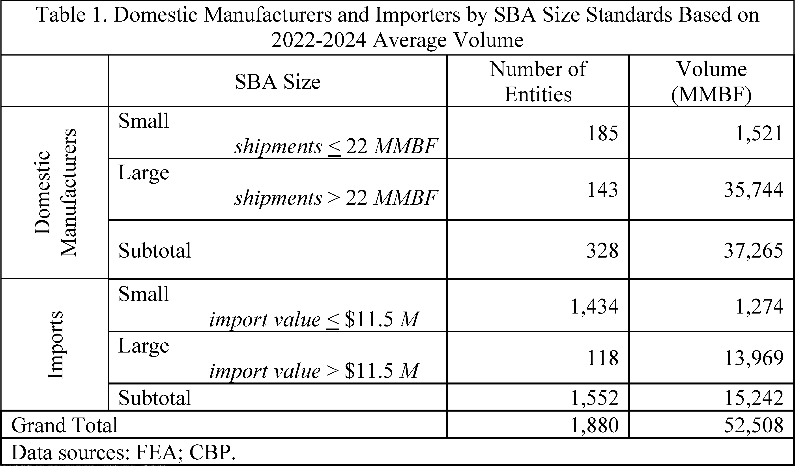
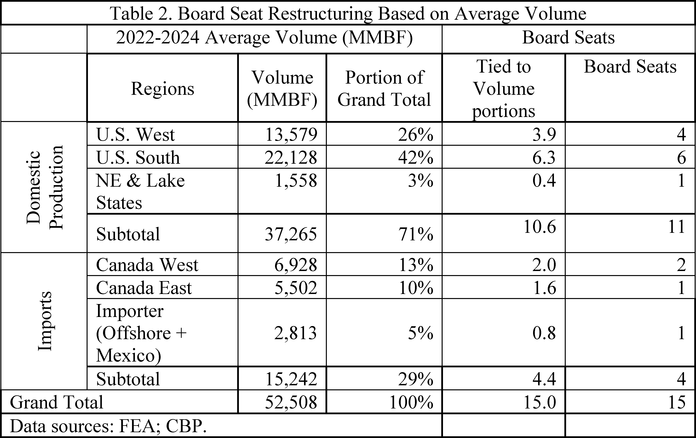
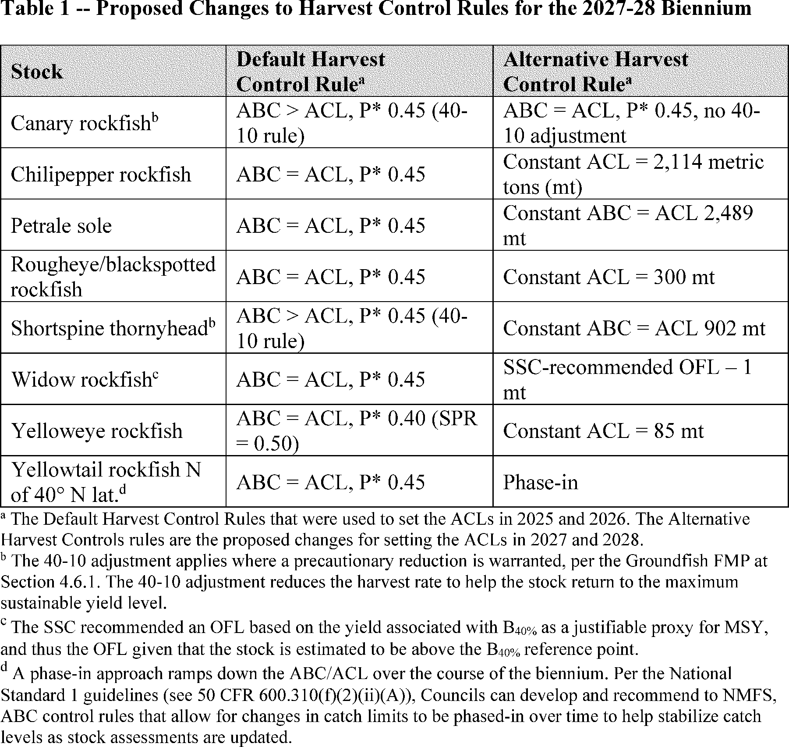
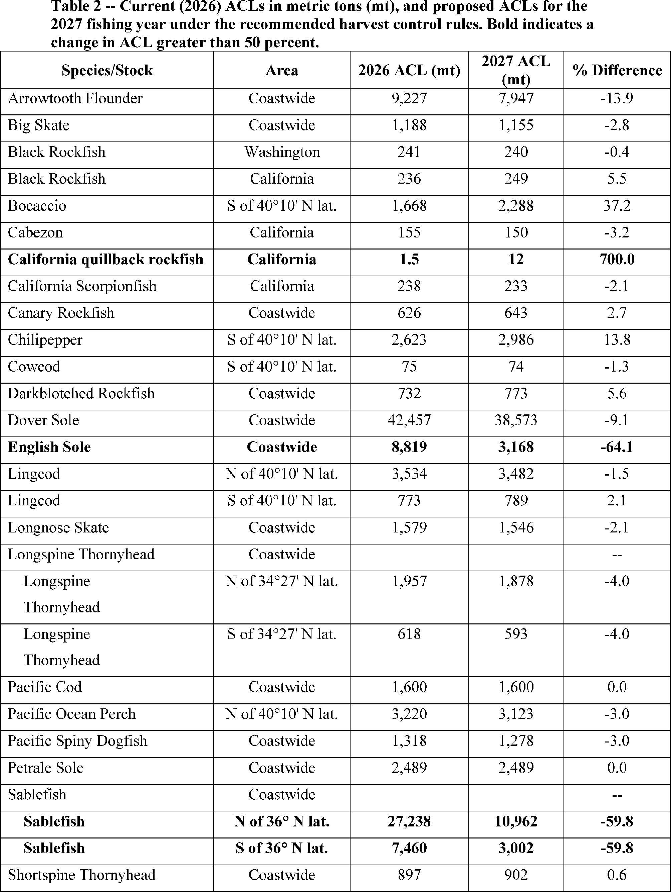

# Daily Digest — 2026-09-22

| | |
|---|---|
| **Digest date** | 2026-09-22 |
| **Data date range** | 2026-09-22 to 2026-09-22 |
| **Generated at** | 2026-09-23T05:29:15Z (UTC) |
| **Pipeline version** | 3dfccee |
| **Inference** | model layers ran — cli/haiku, opus |
| **Source watermarks** | CREC: 2026-09-22T15:32:53Z · BILLS: 2026-09-22T23:47:32Z · FR: 2026-09-22T23:54:03Z · USCOURTS: 2026-09-23T03:37:37Z · PLAW: 2026-09-22T23:50:52Z |

[Full observed listing for this day](day/2026-09-22.html) — every item our collectors observed for this publication day, mechanical rules applied, frozen at end of day. This digest is the canonical record.

All items below cite the govinfo package (and granule, where applicable) they
summarize. Selection is mechanical; each item states the rule that included
it. See the Coverage Statement at the end for a full accounting of what was
published, what was summarized, and what was excluded and why.

---

## Contents

- [Day in Review](#day-in-review)
- [1. Congressional Floor Activity](#1-congressional-floor-activity)
- [2. Legislation](#2-legislation)
- [3. Federal Register](#3-federal-register)
- [4. Enacted Laws](#4-enacted-laws)
- [5. Judicial Activity](#5-judicial-activity)
- [6. Agency Announcements](#6-agency-announcements)
- [7. Recorded Votes](#7-recorded-votes)
- [8. Bill Actions](#8-bill-actions)
- [9. Presidential Actions](#9-presidential-actions)
- [Terms Used Today](#terms-used-today)
- [Coverage Statement](#coverage-statement)
- [Methodology](#methodology)

---

## Day in Review

The digest carries 127 House and four Senate Congressional Record items, 52 Extensions of Remarks, 12 Daily Digest entries, and two recorded votes. The House passed H.R. 2478, which amends the Investment Company Act of 1940 to postpone payment upon redemption of certain securities in cases involving financial exploitation of specified adults, by 414–2. Also carried are 60 House and three Senate bill introductions, five House engrossments, three measures agreed to in the Senate, six reported there — among them the Taxpayer Assistance and Service Act — and three placed on the Senate calendar.

On the executive side the digest carries 78 Federal Register notices, 15 proposed rules, seven final rules, and two presidential documents: Executive Order 14429 on hunting and fishing access on federal lands outside national parks, and Executive Order 14430 on recreational saltwater fishing management. Proposed rules include FDIC actions on bank merger review and out-of-State bank parity, several FAA airworthiness directives, and an FDA substitution of "nonclinical" for "animal" in testing terminology. Two public laws, both facility designations, and 220 agency releases also appear.

Judicial items number 34 appellate opinions, 673 district court opinions, and one bankruptcy opinion. The Federal Circuit held Berkeley*IEOR's profitability-calculation patent claims ineligible under § 101. The Eleventh Circuit reversed the dismissal of OJ Commerce's Sherman Act complaint. The Ninth Circuit affirmed the denial of the government's motion to dismiss in Padilla v. ICE, which concerns bond hearings for detained asylum seekers.

*Composed from the summarized items below and the day's mechanical
counts; all specifics are cited in their sections.*

---

## 1. Congressional Floor Activity

Source: Congressional Record (CREC), issue observed 2026-09-22, covering proceedings of 2026-06-25. Published by govinfo 2026-09-22T11:50:41Z; observed by our collector 2026-09-22T12:25:16Z. Total issue size: 195 granule(s).
Source: Congressional Record (CREC), issue observed 2026-09-22, covering proceedings of 2026-09-21. Published by govinfo 2026-09-22T11:32:34Z; observed by our collector 2026-09-22T11:55:17Z. Total issue size: 195 granule(s).

### 1.1 Senate

No Senate floor items met the selection thresholds. 4 floor granule(s) are accounted for in the Coverage Statement.

### 1.2 House of Representatives

Tags: legislative · model keys: emissions · fiscal policy · housing

*In plain terms: House remarks on the bipartisan ROAD to Housing Act and fiscal policy; bills addressed vehicle emissions, health insurance, food assistance, and labor standards.*

- **Trump Housing Crisis** — Rep. Green of Texas delivered remarks on the 21st Century ROAD to Housing Act, which passed both chambers of Congress with bipartisan support (358 votes in the House, 85–5 in the Senate). He noted that the President declined to sign the legislation.
  - *In plain terms:* The 21st Century ROAD to Housing Act passed both chambers of Congress with bipartisan support (358 votes in the House, 85–5 in the Senate), but the President did not sign it.
  - Included because: CREC-SEL-01 — floor item ≥ threshold floor time (22,598 characters) (document dated 2026-06-25)
  - Source: [CREC-2026-06-25 / CREC-2026-06-25-pt1-PgH4254-6](https://www.govinfo.gov/app/details/CREC-2026-06-25/CREC-2026-06-25-pt1-PgH4254-6)
- **Presenting the Math** — Rep. Schweikert of Arizona delivered remarks on fiscal policy, discussing federal spending priorities, the impact of government borrowing on interest rates and housing affordability, fraud in federal programs, and demographic trends affecting Medicare spending.
  - *In plain terms:* A representative discussed federal spending priorities, how government borrowing affects interest rates and housing costs, fraud in federal programs, and demographic changes impacting Medicare.
  - Included because: CREC-SEL-01 — floor item ≥ threshold floor time (22,211 characters) (document dated 2026-06-25)
  - Source: [CREC-2026-06-25 / CREC-2026-06-25-pt1-PgH4257](https://www.govinfo.gov/app/details/CREC-2026-06-25/CREC-2026-06-25-pt1-PgH4257)
- **Public Bills and Resolutions** — Multiple bills were introduced in the House addressing topics including vehicle emissions regulations, zero-emission vessel deployment, health insurance, food assistance eligibility, labor standards, financial services regulations, military compensation, and other subjects.
  - *In plain terms:* The House introduced several bills addressing vehicle emissions, zero-emission vessels, health insurance, food assistance eligibility, labor standards, financial regulations, and military compensation.
  - Included because: CREC-SEL-01 — floor item ≥ threshold floor time (20,927 characters) (document dated 2026-06-25)
  - Source: [CREC-2026-06-25 / CREC-2026-06-25-pt1-PgH4261-2](https://www.govinfo.gov/app/details/CREC-2026-06-25/CREC-2026-06-25-pt1-PgH4261-2)

### 1.3 Recorded Votes

- **Financial Exploitation Prevention Act of 2025** — The House passed H.R. 2478, which amends the Investment Company Act of 1940 to postpone payment or satisfaction upon redemption of certain securities in cases involving financial exploitation of specified adults, by a vote of 414–2.
  - *In plain terms:* The House passed H.R. 2478 (414–2), which delays payment to investors in cases of financial exploitation of certain adults.
  - Included because: CREC-SEL-02 — recorded vote (all recorded votes are listed) (document dated 2026-06-25)
  - Source: [CREC-2026-06-25 / CREC-2026-06-25-pt1-PgH4251-4](https://www.govinfo.gov/app/details/CREC-2026-06-25/CREC-2026-06-25-pt1-PgH4251-4)

---

## 2. Legislation

Source: Congressional Bills (BILLS), text versions published 2026-09-22 to 2026-09-22.

### 2.1 Counts by Stage

| Stage (bill text version) | Count |
|---|---|
| Introduced (ih/is) | 63 |
| Reported (rh/rs) | 6 |
| Engrossed (eh/es) | 5 |
| Enrolled (enr) | 0 |
| Other versions | 22 |
| **Total bill texts published** | **96** |

### 2.2 Bills Listed by Mechanical Rule

Tags: legislative · model keys: elder fraud · tribal governance · xylazine

*In plain terms: Nine bills addressing tribal governance, xylazine control, elder fraud investigation, prescribed fire expansion on federal lands, and Internal Revenue Service operations reform.*

Bills below are listed because they matched at least one listing rule; the
matching rule is stated per item. All other bill texts are counted above and
accounted for in the Coverage Statement.

- **S. 2442 (rs) — 113 S2442 RS: Northern Cheyenne Lands Act** — The Northern Cheyenne Lands Act directs the Secretary of the Interior to place approximately 1,567 acres of tribal fee land and certain mineral rights into trust for the Northern Cheyenne Tribe and transfers the Northern Cheyenne Trust Fund to the tribe's permanent fund, conditioned on the tribe's waiver of certain legal claims. The act also requires the Secretary to inventory fractionated land interests on the reservation and report periodically on obstacles to land consolidation.
  - *In plain terms:* The Interior Secretary places tribal land and mineral rights into trust for the Northern Cheyenne Tribe, transfers their trust fund, and must report on consolidating fractionated land holdings.
  - Included because: BILLS-SEL-01 — reached stage: reported/enrolled/calendar (document dated 2014-08-26)
  - Source: [BILLS-113s2442rs](https://www.govinfo.gov/app/details/BILLS-113s2442rs)
- **S. 919 (rs) — 113 S919 RS: Department of the Interior Tribal Self-Governance Act of 2013** — This act amends the Indian Self-Determination and Education Assistance Act to expand tribal self-governance, establishing the Tribal Self-Governance Program and authorizing selection of up to 50 tribes annually for participation. It modifies contract funding and audit requirements and directs the Secretary of the Interior to interpret federal laws to maximize tribal self-determination consistent with self-governance contracts.
  - *In plain terms:* The act expands tribal self-governance by establishing a program allowing up to 50 tribes annually to manage their own federal contracts and funding.
  - Included because: BILLS-SEL-01 — reached stage: reported/enrolled/calendar (document dated 2014-08-26)
  - Source: [BILLS-113s919rs](https://www.govinfo.gov/app/details/BILLS-113s919rs)
- **H. R. 1266 (pcs) — 119 HR 1266 PCS: Combating Illicit Xylazine Act** — This bill places xylazine on Schedule III of the Controlled Substances Act, defining the substance and its derivatives. It exempts certain manufacturers from security standard requirements and delays implementation of registration and labeling requirements by 60 days and one year respectively. The bill directs the DEA and FDA to report to Congress on illicit xylazine use within 18 months and again four years after enactment.
  - *In plain terms:* This bill schedules xylazine under the Controlled Substances Act, exempts certain manufacturers from security requirements, delays implementation by 60 days to one year, and requires DEA and FDA reports on illicit xylazine use.
  - Included because: BILLS-SEL-01 — reached stage: reported/enrolled/calendar (document dated 2026-09-16)
  - Source: [BILLS-119hr1266pcs](https://www.govinfo.gov/app/details/BILLS-119hr1266pcs)
- **H. R. 2140 (pcs) — 119 HR 2140 PCS: Diesel Emissions Reduction Act of 2025** — This bill reauthorizes the diesel emissions reduction program through fiscal year 2029.
  - *In plain terms:* This bill continues the diesel emissions reduction program through 2029.
  - Included because: BILLS-SEL-01 — reached stage: reported/enrolled/calendar (document dated 2026-09-16)
  - Source: [BILLS-119hr2140pcs](https://www.govinfo.gov/app/details/BILLS-119hr2140pcs)
- **H. R. 2978 (pcs) — 119 HR 2978 PCS: Guarding Unprotected Aging Retirees from Deception Act of 2026** — This bill permits state, local, and tribal law enforcement agencies receiving specified federal grant funds to use those funds for investigating elder financial fraud, pig butchering, and general financial fraud. It clarifies that federal law enforcement agencies may assist state and local agencies in using blockchain tracing tools for investigations. The bill requires reports to Congress on efforts to combat financial fraud and the state of fraud and scams in the United States.
  - *In plain terms:* This bill allows state, local, and tribal law enforcement to use federal grant funds for investigating elder financial fraud and other fraud schemes, and requires progress reports.
  - Included because: BILLS-SEL-01 — reached stage: reported/enrolled/calendar (document dated 2026-09-16)
  - Source: [BILLS-119hr2978pcs](https://www.govinfo.gov/app/details/BILLS-119hr2978pcs)
- **S. 2015 (rs) — 101 S2015 RS: National Prescribed Fire Act of 2025** — This bill directs the Secretaries of Interior and Agriculture to expand the use of prescribed fire on federal lands, requiring a 10 percent annual increase in treated acreage over the next decade. It establishes a Collaborative Prescribed Fire Program to select and fund prescribed fire projects meeting specified criteria and acknowledges support for cultural burning by Indian tribes and indigenous practitioners. The bill requires annual reports on implementation progress.
  - *In plain terms:* This bill directs the Interior and Agriculture departments to increase prescribed fire use on federal lands by 10 percent annually over a decade, acknowledges support for tribal cultural burning, and requires annual reports.
  - Included because: BILLS-SEL-01 — reached stage: reported/enrolled/calendar (document dated 2026-09-17)
  - Source: [BILLS-119s2015rs](https://www.govinfo.gov/app/details/BILLS-119s2015rs)
- **S. 3135 (rs) — 119 S3135 RS: Cold Weather Diesel Reliability Act of 2025** — This bill directs the Environmental Protection Agency to authorize manufacturers of diesel vehicles and equipment to suspend engine derate or shutdown functions triggered by emissions control system malfunctions when temperatures fall to 20 degrees Fahrenheit or below. It requires the EPA to grant year-round exemptions from diesel exhaust fluid system requirements for agricultural equipment and vehicles primarily operated north of 59 degrees north latitude. The regulations must be finalized within 180 days of enactment.
  - *In plain terms:* This bill permits diesel engine manufacturers to suspend shutdown when temperatures drop to 20 degrees Fahrenheit or below, and exempts agricultural equipment used above 59 degrees north latitude from diesel exhaust fluid requirements.
  - Included because: BILLS-SEL-01 — reached stage: reported/enrolled/calendar (document dated 2026-09-16)
  - Source: [BILLS-119s3135rs](https://www.govinfo.gov/app/details/BILLS-119s3135rs)
- **S. 5249 (rs) — 119 S5249 RS: Modernizing Outdated Regulations to Expand American Fuel Act of 2026** — This bill amends the Atomic Energy Act to align the licensing of uranium enrichment facilities with other fuel cycle facilities, allowing applicants to begin construction after an application is docketed while licensing remains pending. It requires applicants to notify state governors, local government officials, and affected Indian tribes at least 15 days before beginning construction. The Nuclear Regulatory Commission must issue implementing regulations within 180 days of enactment.
  - *In plain terms:* This bill lets uranium enrichment facilities start construction after filing their application while licensing reviews proceed, with required notice to governors, local officials, and Indian tribes 15 days in advance.
  - Included because: BILLS-SEL-01 — reached stage: reported/enrolled/calendar (document dated 2026-09-16)
  - Source: [BILLS-119s5249rs](https://www.govinfo.gov/app/details/BILLS-119s5249rs)
- **S. 5441 (rs) — 119 S5441 RS: Taxpayer Assistance and Service Act** — S. 5441, reported by the Senate Committee on Finance on September 17, 2026, is the Taxpayer Assistance and Service Act, which proposes comprehensive reforms to Internal Revenue Service operations and taxpayer services. The legislation includes provisions for digitizing returns and correspondence, establishing real-time dashboards displaying service backlogs and wait times, expanding electronic access and callback services, modernizing appeals and judicial review procedures, and strengthening the Office of the Taxpayer Advocate. The bill also addresses procedures for Americans abroad, tax return preparer accountability, whistleblower protections and awards, tax relief for hostages and wrongfully detained persons, and small business provisions.
  - *In plain terms:* This bill reforms IRS operations by digitizing returns and correspondence, adding real-time dashboards and callback services, modernizing appeals procedures, and strengthening taxpayer and small business protections.
  - Included because: BILLS-SEL-01 — reached stage: reported/enrolled/calendar (document dated 2026-09-17)
  - Source: [BILLS-119s5441rs](https://www.govinfo.gov/app/details/BILLS-119s5441rs)

---

## 3. Federal Register

Source: Federal Register (FR), issue of 2026-09-22.

### 3.1 Counts by Document Type

| Document type | Count |
|---|---|
| Rules | 7 |
| Proposed rules | 15 |
| Notices | 78 |
| Presidential documents | 2 |
| **Total FR documents** | **102** |

### 3.2 Rules Published

Tags: department of commerce · department of defense · executive · model keys: aircraft · banking · radio

*In plain terms: Seven final rules on radio broadcasting channels, unsafe banking practices, aircraft operations, rockfish retention limits, softwood lumber assessment, and FDA testing terminology.*

#### DEPARTMENT OF AGRICULTURE

- **Softwood Lumber Board Assessment Rate Clarification and Changes to Membership** (2026-19389; 7 CFR Part 1217) — This final rule implements changes to the Softwood Lumber Research, Promotion, Consumer Education and Industry Information Order (Order). The changes include clarifying the assessment rate for softwood lumber imported into the United States and revising the membership of the Softwood Lumber Board (Board or SLB). Action: Final rule. Dates: Effective October 22, 2026.
  - *In plain terms:* This rule clarifies the assessment rate for imported softwood lumber and changes Softwood Lumber Board membership.
  - Included because: FR-SEL-01 — document type: final rule (all listed)
  - Source: [FR-2026-09-22 / 2026-19389](https://www.govinfo.gov/app/details/FR-2026-09-22/2026-19389)
  -  *Source graphic 1 of 2 from 2026-19389.*
  -  *Source graphic 2 of 2 from 2026-19389.*

#### DEPARTMENT OF COMMERCE

- **Fisheries of the Exclusive Economic Zone Off Alaska; “Other Rockfish” in the Aleutian Islands Subarea of the Bering Sea and Aleutian Islands Management Area** (2026-19390; 50 CFR Part 679) — NMFS is prohibiting retention of “other rockfish” in the Aleutian Islands subarea of the Bering Sea and Aleutian Islands management area (BSAI). This action is necessary because the 2026 “other rockfish” total allowable catch (TAC) in the Aleutian Islands subarea of the BSAI will soon be or has been reached. Action: Temporary rule; closure. Dates: Effective 1200 hours, Alaska local time (A.l.t.), September 21, 2026, through 2400 hours, A.l.t., December 31, 2026.
  - *In plain terms:* NMFS is prohibiting retention of other rockfish in the Bering Sea's Aleutian Islands because the catch limit was reached.
  - Included because: FR-SEL-01 — document type: final rule (all listed)
  - Source: [FR-2026-09-22 / 2026-19390](https://www.govinfo.gov/app/details/FR-2026-09-22/2026-19390)

#### DEPARTMENT OF HEALTH AND HUMAN SERVICES

- **Nonclinical Testing Terminology** (2026-19350; 21 CFR Parts 312, 314, 315, 361, and 601) — The Food and Drug Administration (FDA, Agency, or we) is issuing a direct final rule that substitutes references to “animal” tests or studies with “nonclinical” tests or studies, adds a definition of the terms “nonclinical test” and “nonclinical study,” and makes other comparable or conforming amendments in certain safety and reporting sections of its regulations. The direct final rule also substitutes “nonclinical” for “preclinical” and “in vitro” for consistency in terminology. The Agency is issuing these amendments directly as a final rule because we believe they are noncontroversial changes in terminology that are not expected to affect industry practice and FDA anticipates no significant adverse comments. These amendments align with recent amendments to the Federal Food, Drug, and Cosmetic Act (FD&C Act) and the Public Health Service Act (PHS Act) and are intended to remove an emphasis, in certain places, on the use of animal testing as the only scientific methodology to assess the safety of a drug in the nonclinical setting. [official summary truncated; see source] Action: Direct final rule. Dates: This rule is effective February 4, 2027. Either electronic or written comments on the direct final rule or its companion proposed rule must be submitted by December 7, 2026. If FDA receives no significant adverse comments within the specified comment period, the Agency intends to publish a document confirming the effective date of the direct final rule in the Federal Register within 30 days after the comment period on this direct final rule ends. If timely significant adverse comments are received, the Agency will publish a document in the Federal Register withdrawing this direct final rule within 30 days after the comment period on this direct final rule ends.
  - *In plain terms:* The FDA is replacing 'animal' with 'nonclinical' in testing terminology to encourage alternative safety testing methods.
  - Included because: FR-SEL-01 — document type: final rule (all listed)
  - Source: [FR-2026-09-22 / 2026-19350](https://www.govinfo.gov/app/details/FR-2026-09-22/2026-19350)

#### DEPARTMENT OF TRANSPORTATION

- **Establishment of Class E Airspace; Ottawa, IL** (2026-19391; 14 CFR Part 71) — This action establishes Class E airspace at OSF St Francis Medical Center Heliport, Ottawa, IL. This action supports new instrument procedures and instrument flight rule (IFR) operations. Action: Final rule. Dates: Effective 0901 UTC, December 24, 2026. The Director of the Federal Register approves this incorporation by reference action under 1 CFR part 51, subject to the annual revision of FAA Order JO 7400.11 and publication of conforming amendments.
  - *In plain terms:* This establishes a Class E airspace zone at an Ottawa, Illinois medical center heliport for instrument flight operations.
  - Included because: FR-SEL-01 — document type: final rule (all listed)
  - Source: [FR-2026-09-22 / 2026-19391](https://www.govinfo.gov/app/details/FR-2026-09-22/2026-19391)

#### DEPARTMENT OF TREASURY

- **Unsafe or Unsound Practices, Matters Requiring Attention; Correction** (2026-19312; 12 CFR Part 4; 12 CFR Part 305) — The Office of the Comptroller of the Currency (OCC) and the Federal Deposit Insurance Corporation (FDIC) published a final rule in the Federal Register of September 1, 2026, to define the term “unsafe or unsound practice” for purposes of section 8 of the Federal Deposit Insurance Act and to revise the supervisory framework for the issuance of matters requiring attention and other supervisory communications. The document contained an incorrect agency docket number for the OCC. Action: Final rule; correction. Dates: The final rule is effective November 2, 2026.
  - *In plain terms:* This corrects an incorrect agency docket number in the September 1, 2026 rule defining unsafe banking practices.
  - Included because: FR-SEL-01 — document type: final rule (all listed)
  - Source: [FR-2026-09-22 / 2026-19312](https://www.govinfo.gov/app/details/FR-2026-09-22/2026-19312)

#### FEDERAL COMMUNICATIONS COMMISSION

- **Reinstatement of Radio Non-Duplication Rule for Commercial FM Stations; Correction** (2026-19311; 47 CFR Part 73) — This document corrects the final rule portion of a Federal Register document published on July 3, 2024. That document inadvertently included an error in a section heading of regulatory text. This document corrects the final regulations. Action: Correcting amendment. Dates: Effective on September 22, 2026.
  - *In plain terms:* This corrects an error in a section heading from the July 3, 2024 radio non-duplication rule.
  - Included because: FR-SEL-01 — document type: final rule (all listed)
  - Source: [FR-2026-09-22 / 2026-19311](https://www.govinfo.gov/app/details/FR-2026-09-22/2026-19311)
- **Radio Broadcasting Services; Various Locations** (2026-19329; 47 CFR Part 73) — This document amends the Table of FM Allotments, of the Federal Communications Commission's (Commission) rules, by reinstating certain channels as a vacant FM allotment in various communities. The FM allotments were previously removed from the FM Table because a construction permit and/or license was granted. These FM allotments are now considered vacant because of the cancellation of the associated FM authorizations. A staff engineering analysis confirms that all of the vacant FM allotments complies with the minimum distance separation requirements and principle community coverage requirements of the Commission's rules. The window period for filing applications for these vacant FM allotments will not be opened at this time. Instead, the issue of opening these allotments for filing will be addressed by the Commission in subsequent order. Action: Final rule. Dates: Effective September 22, 2026.
  - *In plain terms:* The FCC is reinstating vacant FM radio channels in various communities that were previously removed when licenses were granted.
  - Included because: FR-SEL-01 — document type: final rule (all listed)
  - Source: [FR-2026-09-22 / 2026-19329](https://www.govinfo.gov/app/details/FR-2026-09-22/2026-19329)

### 3.3 Proposed Rules Published

Tags: department of commerce · department of defense · executive · model keys: airworthiness · banking · fisheries

*In plain terms: Fifteen proposed rules including fisheries management for snapper-grouper and groundfish, helicopter and aircraft airworthiness, FDA nonclinical testing terminology, and maritime programs.*

#### DEPARTMENT OF COMMERCE

- **Fisheries of the Caribbean, Gulf of America, and South Atlantic; Snapper-Grouper Fishery of the South Atlantic; Regulatory Amendment 37** (2026-19341; 50 CFR Part 622) — NMFS seeks public comment on proposed regulations to implement Regulatory Amendment 37 under the Fishery Management Plan for the Snapper-Grouper Fishery of the South Atlantic (FMP). If implemented by NMFS, Regulatory Amendment 37 and this proposed rule would revise several management measures for black sea bass in South Atlantic Federal waters. The purpose of these proposed regulatory changes is to immediately address declining abundance and landings of black sea bass while stock assessment updates are completed and separate longer-term actions are developed. Action: Proposed rule; request for comments. Dates: Written comments must be received on or before October 22, 2026.
  - *In plain terms:* NMFS proposes new rules to address declining black sea bass populations in the South Atlantic while developing longer-term solutions.
  - Included because: FR-SEL-02 — document type: proposed rule (all listed)
  - Source: [FR-2026-09-22 / 2026-19341](https://www.govinfo.gov/app/details/FR-2026-09-22/2026-19341)
- **Magnuson-Stevens Act Provisions; Fisheries Off West Coast States; Pacific Coast Groundfish Fishery; Pacific Coast Groundfish Fishery Management Plan; Amendment 38; 2027-28 Biennial Specifications and Management Measures** (2026-19346; 50 CFR Parts 300 and 660) — This rule proposes 2027-28 harvest specifications and management measures for groundfish caught in the U.S. exclusive economic zone seaward of Washington, Oregon, and California, consistent with the Magnuson-Stevens Fishery Conservation and Management Act (Magnuson-Stevens Act or MSA) and the Pacific Coast Groundfish Fishery Management Plan (Groundfish FMP). This rule also includes proposed regulations to implement amendment 38 to the Groundfish FMP, which would remove rebuilding plan requirements for yelloweye rockfish and California quillback rockfish. Lastly, this rule includes proposed regulations to modify select fishery closures that apply to both groundfish and Pacific halibut. Action: Proposed rule; request for comments. Dates: Comments must be received no later than October 22, 2026.
  - *In plain terms:* This proposes 2027-28 catch limits and rules for West Coast groundfish and would remove rebuilding requirements for two rockfish species.
  - Included because: FR-SEL-02 — document type: proposed rule (all listed)
  - Source: [FR-2026-09-22 / 2026-19346](https://www.govinfo.gov/app/details/FR-2026-09-22/2026-19346)
  -  *Source graphic 1 of 22 from 2026-19346.*
  -  *Source graphic 2 of 22 from 2026-19346.*
  - *Graphics not rendered here: 20 of 22 — see the [source PDF](https://www.govinfo.gov/content/pkg/FR-2026-09-22/pdf/FR-2026-09-22.pdf).*

#### DEPARTMENT OF ENERGY

- **Revisions to the Office of Hearings and Appeals Procedural Regulations for the DOE Contractor Employee Protection Program** (2026-19332; 10 CFR Part 708) — The United States (U.S.) Department of Energy (DOE) publishes a proposed rule to amend its regulations, which set forth the policies and procedures for resolving questions concerning protections for DOE contractor employees alleging retaliation by their employers. The proposed revisions would clarify deadlines and tolling practices throughout the regulation; make grammatical changes throughout the rule for consistency with national policies and DOE practices; and update references to DOE officials and offices in order to ensure clarity, consistency, and fairness in DOE's administration of the Contractor Employe Protection Program. Action: Notice of proposed rulemaking and request for comments. Dates: Written comments on this proposed rule must be received on or before October 22, 2026. See section III, Public Participation, for details.
  - *In plain terms:* The Energy Department proposes clarifying deadlines and tolling rules for contractor employee protection complaints.
  - Included because: FR-SEL-02 — document type: proposed rule (all listed)
  - Source: [FR-2026-09-22 / 2026-19332](https://www.govinfo.gov/app/details/FR-2026-09-22/2026-19332)

#### DEPARTMENT OF HEALTH AND HUMAN SERVICES

- **Nonclinical Testing Terminology** (2026-19349; 21 CFR Parts 312, 314, 315, 361, and 601) — The Food and Drug Administration (FDA, Agency, or we) is proposing to substitute references to “animal” tests or studies with “nonclinical” tests or studies, add a definition of the terms “nonclinical test” and “nonclinical study,” and make other comparable or conforming amendments in certain safety and reporting sections of its regulations. The proposed rule would also substitute “nonclinical” for “preclinical” and “in vitro” for consistency in terminology. These proposed amendments align with recent amendments to the Federal Food, Drug, and Cosmetic Act (FD&C Act) and the Public Health Service Act (PHS Act) and are intended to remove an emphasis, in certain places, on the use of animal testing as the only scientific methodology to assess the safety of a drug in the nonclinical setting. These changes may also foster the development and use of scientifically valid new testing methodologies, potentially improving predictive accuracy of product safety testing while replacing, reducing, or refining animal use. The proposed rule would add no new requirements. Action: Proposed rule. Dates: Either electronic or written comments on the proposed rule or its companion direct final rule must be submitted by December 7, 2026. If FDA receives any timely significant adverse comments on this proposed rule or the direct final rule with which this proposed rule is associated, we will publish a document in the Federal Register withdrawing the direct final rule within 30 days after the comment period ends, and we will then proceed to respond to comments under this proposed rule using the usual notice and comment procedures.
  - *In plain terms:* The FDA proposes replacing 'animal' with 'nonclinical' in testing terminology to encourage alternative testing methods and align with new laws.
  - Included because: FR-SEL-02 — document type: proposed rule (all listed)
  - Source: [FR-2026-09-22 / 2026-19349](https://www.govinfo.gov/app/details/FR-2026-09-22/2026-19349)

#### DEPARTMENT OF HOMELAND SECURITY

- **Safety Zone; Neuse River, New Bern, NC** (2026-19352; 33 CFR Part 165) — The Coast Guard is proposing to establish a temporary safety zone for certain navigable waters of the Neuse River in New Bern, North Carolina. The safety zone is needed to protect personnel, vessels, and the marine environment from potential hazards during an aerobatic air show. This proposed rulemaking would prohibit persons and vessels from being in the safety zone unless specifically authorized by the Captain of the Port, North Carolina. We invite your comments on this proposed rulemaking. Action: Notice of proposed rulemaking. Dates: Comments and related material must be received by the Coast Guard on or before October 22, 2026.
  - *In plain terms:* The Coast Guard proposes a temporary restricted zone on the Neuse River in North Carolina during an aerobatic air show.
  - Included because: FR-SEL-02 — document type: proposed rule (all listed)
  - Source: [FR-2026-09-22 / 2026-19352](https://www.govinfo.gov/app/details/FR-2026-09-22/2026-19352)

#### DEPARTMENT OF TRANSPORTATION

- **Airworthiness Directives; Leonardo S.p.a. Helicopters** (2026-19343; 14 CFR Part 39) — The FAA proposes to supersede Airworthiness Directive (AD) 2022-02-12, which applies to all Leonardo S.p.a. Model AB139 and AW139 helicopters. AD 2022-02-12 requires incorporating airworthiness limitations into maintenance records. Since the FAA issued AD 2022-02-12, it was determined that new or more restrictive airworthiness limitations were necessary. This proposed AD would require revising the airworthiness limitations section (ALS) of the existing maintenance manual or instructions for continued airworthiness (ICA) and the existing approved maintenance or inspection program, as applicable. The FAA is proposing this AD to address the unsafe condition on these products. Action: Notice of proposed rulemaking (NPRM). Dates: The FAA must receive comments on this NPRM by November 6, 2026.
  - *In plain terms:* The FAA proposes updating maintenance requirements for Leonardo AB139 and AW139 helicopters due to new safety concerns.
  - Included because: FR-SEL-02 — document type: proposed rule (all listed)
  - Source: [FR-2026-09-22 / 2026-19343](https://www.govinfo.gov/app/details/FR-2026-09-22/2026-19343)
- **Airworthiness Directives; Bell Textron Canada Limited Helicopters** (2026-19345; 14 CFR Part 39) — The FAA proposes to adopt a new airworthiness directive (AD) for certain Bell Textron Canada Limited Model 429 helicopters. This proposed AD was prompted by reports of the sliding doors jamming when opened from the inside of the helicopter, due to the aft lower roller assembly disengaging from the aft lower rail. This proposed AD would require inspecting the lower aft bracket and rail cavity for contact marks and, depending on the findings, performing applicable corrective actions. This proposed AD would also require modifying the roller assembly configuration. The FAA is proposing this AD to address the unsafe condition on these products. Action: Notice of proposed rulemaking (NPRM). Dates: The FAA must receive comments on this NPRM by November 6, 2026.
  - *In plain terms:* The FAA proposes requiring inspections and repairs for Bell 429 helicopter sliding doors that jam when opened from inside.
  - Included because: FR-SEL-02 — document type: proposed rule (all listed)
  - Source: [FR-2026-09-22 / 2026-19345](https://www.govinfo.gov/app/details/FR-2026-09-22/2026-19345)
- **Airworthiness Directives; Airbus SAS Airplanes** (2026-19355; 14 CFR Part 39) — The FAA proposes to adopt a new airworthiness directive (AD) for all Airbus SAS Model A300 series airplanes; Model A300 B4-601, A300 B4-603, and A300 B4-622 airplanes; Model A300 B4-600R series airplanes; Model A300 C4-605R Variant F airplanes; and Model A300 F4-600R series airplanes. This proposed AD was prompted by reports of cracking of the main landing gear (MLG) two-piece cages due to incorrect machining. This proposed AD would require replacing an affected MLG with a serviceable MLG and would limit the installation of an affected MLG under certain conditions. The FAA is proposing this AD to address the unsafe condition on these products. Action: Notice of proposed rulemaking (NPRM). Dates: The FAA must receive comments on this proposed AD by November 6, 2026.
  - *In plain terms:* The FAA proposes requiring replacement of Airbus landing gear that cracked due to incorrect manufacturing.
  - Included because: FR-SEL-02 — document type: proposed rule (all listed)
  - Source: [FR-2026-09-22 / 2026-19355](https://www.govinfo.gov/app/details/FR-2026-09-22/2026-19355)
- **Airworthiness Directives; Airbus SAS Airplanes** (2026-19360; 14 CFR Part 39) — The FAA proposes to adopt a new airworthiness directive (AD) for certain Airbus SAS Model A350-941 airplanes. This proposed AD was prompted by reports of engine health monitoring (EHM) messages requiring premature removal of hydro-mechanical units (HMUs). This proposed AD would require replacing certain HMUs before reaching a reduced life limit and would limit the installation of affected parts under certain conditions. The FAA is proposing this AD to address the unsafe condition on these products. Action: Notice of proposed rulemaking (NPRM). Dates: The FAA must receive comments on this proposed AD by November 6, 2026.
  - *In plain terms:* The FAA proposes requiring earlier replacement of certain hydraulic units in Airbus A350 aircraft.
  - Included because: FR-SEL-02 — document type: proposed rule (all listed)
  - Source: [FR-2026-09-22 / 2026-19360](https://www.govinfo.gov/app/details/FR-2026-09-22/2026-19360)
- **Capital Construction Fund Revision** (2026-19367; 46 CFR Part 390) — MARAD proposes to revise its regulations governing the filing of applications and administration of Capital Construction Fund (CCF) Program accounts. The proposed rule would (i) conform the regulations to recent statutory amendments extending CCF Program application to all U.S. built vessels engaged in United States domestic or foreign commerce, (ii) eliminate limitations on CCF Program availability to certain geographic trades, (iii) clarify the maximum allowable completion time for reconstruction projects, and (iv) provide for funds to be used for acquisitions under certain circumstances. In addition, the NPRM proposes a mechanism to terminate inactive accounts, accounts with a zero balance, and accounts where a CCF Program objective has failed to commence within a 10-year period. The proposed rule would also correct numerous citations, modernize text, update agency contact information, and remove obsolete references. Action: Notice of proposed rulemaking (NPRM), request for comments. Dates: MARAD invites the public to comment on this proposed rule and information collection. Comments should be filed on or before November 23, 2026. Late-filed comments will be considered to the extent practicable.
  - *In plain terms:* The Maritime Administration proposes expanding Capital Construction Fund Program eligibility and modernizing application procedures.
  - Included because: FR-SEL-02 — document type: proposed rule (all listed)
  - Source: [FR-2026-09-22 / 2026-19367](https://www.govinfo.gov/app/details/FR-2026-09-22/2026-19367)
- **Part 572; Anthropomorphic Test Devices; Test Device for Human Occupant Restraint 50th Percentile Adult Male Dummy (THOR-50M)** (2026-19370; 49 CFR Part 572) — This document supplements NHTSA's September 2023 notice of proposed rulemaking to amend NHTSA's regulations to include an advanced crash test dummy (the Test Device for Human Occupant Restraint (THOR) 50th percentile adult male) by requesting comment on specifying an additional spine configuration and an alternative to the face foam, and announcing the availability of additional documents. Action: Supplemental notice of proposed rulemaking (SNPRM). Dates: The documents referenced in this notification will be available in the docket as of September 22, 2026. You should submit your comments early enough to be received not later than October 22, 2026.
  - *In plain terms:* NHTSA is requesting comment on alternative spine and face foam configurations for the THOR crash test dummy.
  - Included because: FR-SEL-02 — document type: proposed rule (all listed)
  - Source: [FR-2026-09-22 / 2026-19370](https://www.govinfo.gov/app/details/FR-2026-09-22/2026-19370)

#### FEDERAL DEPOSIT INSURANCE CORPORATION

- **Merger Transactions** (2026-19308; 12 CFR Parts 303, 314, and 333) — The Federal Deposit Insurance Corporation (FDIC) is inviting comment on a proposed rule that would fundamentally reform important aspects of the FDIC's approach to processing and evaluating merger transactions subject to the Bank Merger Act (BMA). Notable reforms under the proposed rule would include: accounting for credit unions and centrally booked deposits in the initial competitive effects analysis; establishing a letter filing process with “deemed approval” for “ de minimis merger transactions;” tailoring other merger filing requirements to reduce burden and processing times based on the size and risk profile of a merger transaction and the attributes of the acquiring and resulting institution; limiting and clarifying the FDIC's discretion to remove a filing from expedited processing; and codifying the FDIC's reformed approach to evaluating the statutory factors under the BMA. Collectively, the revisions under the proposed rule would improve the speed, certainty, and predictability of the FDIC's bank merger framework in a manner consistent with the BMA. In addition, the proposed rule would modernize the framework to better reflect the competitive environment of the U.S. [official summary truncated; see source] Action: Notice of proposed rulemaking. Dates: Comments must be received on or before November 23, 2026.
  - *In plain terms:* The FDIC is proposing changes to how it reviews bank mergers, including faster processing for small deals and clearer rules for evaluating applications.
  - Included because: FR-SEL-02 — document type: proposed rule (all listed)
  - Source: [FR-2026-09-22 / 2026-19308](https://www.govinfo.gov/app/details/FR-2026-09-22/2026-19308)
- **State Bank Parity** (2026-19310; 12 CFR Part 331) — The FDIC is proposing amendments to its regulations to recognize parity between out-of-State State banks and national banks concerning the application of host State laws when State banks provide services outside of their chartering State. Under the proposed rule, when host State laws do not apply to a national bank, those laws would similarly not apply to an out-of-State State bank providing services in the host State with or without a branch. Specifically, the amendments would provide that, for purposes of section 24(j) of the Federal Deposit Insurance Act, the laws of a host State apply to any branch in the host State of, or any services provided in the host State by, an out-of-State State bank to the same extent such State laws apply to a branch in the host State of, or any services provided in the host State by, an out-of-State national bank. Action: Notice of proposed rulemaking. Dates: Comments must be received no later than November 23, 2026.
  - *In plain terms:* The FDIC proposes making out-of-state state banks follow the same host state laws as national banks.
  - Included because: FR-SEL-02 — document type: proposed rule (all listed)
  - Source: [FR-2026-09-22 / 2026-19310](https://www.govinfo.gov/app/details/FR-2026-09-22/2026-19310)

#### GENERAL SERVICES ADMINISTRATION

- **General Services Administration Acquisition Regulation; GSAR Implementation of Executive Order 14275, Federal Supply Schedule Ordering Procedures** (2026-19331; 48 CFR Part 538) — GSA is proposing to amend the General Services Administration Acquisition Regulation (GSAR) to move Federal Supply Schedule (FSS) ordering procedures from the Federal Acquisition Regulation (FAR) to GSAR part 538. This rule would direct ordering activities to use the FSS ordering procedures established by GSA. Action: Proposed rule. Dates: Interested parties should submit written comments to the Regulatory Secretariat Division at the address shown below on or before October 22, 2026 to be considered in the formation of the final rule.
  - *In plain terms:* GSA proposes moving Federal Supply Schedule ordering procedures from the general federal acquisition rules to GSA-specific rules.
  - Included because: FR-SEL-02 — document type: proposed rule (all listed)
  - Source: [FR-2026-09-22 / 2026-19331](https://www.govinfo.gov/app/details/FR-2026-09-22/2026-19331)

#### POSTAL REGULATORY COMMISSION

- **Periodic Reporting** (2026-19361; 39 CFR Part 3050) — The Commission is acknowledging a recent Postal Service filing requesting the Commission initiate a rulemaking proceeding to consider changes to analytical principles relating to periodic reports. This document informs the public of the filing, invites public comment, and takes other administrative steps. Action: Notice of proposed rulemaking. Dates: Comments are due: October 30, 2026.
  - *In plain terms:* The Postal Regulatory Commission is considering changes to how it analyzes postal service reporting requirements.
  - Included because: FR-SEL-02 — document type: proposed rule (all listed)
  - Source: [FR-2026-09-22 / 2026-19361](https://www.govinfo.gov/app/details/FR-2026-09-22/2026-19361)

### 3.4 Notices and Presidential Documents

Tags: department of commerce · department of defense · executive · model keys: fishing · hunting · marine recreation

*In plain terms: Two executive orders directing federal agencies to expand hunting and fishing access on federal lands and modernize saltwater angling and marine recreation management.*

Notices are summarized only when they match a listing rule; all are counted
in 3.1 and in the Coverage Statement. Presidential documents in the FR are
always listed.

- **Reinvigorating America's Hunting Heritage** (2026-19416) — Executive Order 14429 directs federal agencies to expand hunting and fishing access on federal lands, excluding national parks. Within specified timeframes, agencies must propose modifications to regulations to increase access opportunities, enable infrastructure improvements, reform Forest Service lotteries, and encourage states to expand Sunday hunting. The order also directs agencies to provide guidance on hunter education funding and support hunting programs for veterans.
  - *In plain terms:* Executive Order 14429 directs federal agencies to increase hunting and fishing access on public lands except national parks.
  - Included because: FR-SEL-03 — presidential document (all listed)
  - Source: [FR-2026-09-22 / 2026-19416](https://www.govinfo.gov/app/details/FR-2026-09-22/2026-19416)
- **Restoring American Saltwater Angling and Recreation** (2026-19417) — Executive Order 14430 directs federal agencies to modernize recreational fishing management and marine access. The order requires agencies to transition from traditional survey systems to mobile application-based data collection, evaluate marine recreational fisheries data accuracy, streamline multi-year permitting with presumption of renewal, and establish a program to convert decommissioned offshore structures into artificial reefs. Agencies must also review and revise policies for artificial reef placement in National Marine Sanctuaries and coordinate to address shark and pinniped depredation.
  - *In plain terms:* Executive Order 14430 directs agencies to modernize recreational fishing data systems and marine access policies.
  - Included because: FR-SEL-03 — presidential document (all listed)
  - Source: [FR-2026-09-22 / 2026-19417](https://www.govinfo.gov/app/details/FR-2026-09-22/2026-19417)

---

## 4. Enacted Laws

Tags: legislative · model keys: postal service · veterans affairs

*In plain terms: Two laws designating a Veterans Affairs clinic in Michigan and a Postal Service facility in California.*

Source: Public and Private Laws (PLAW) published 2026-09-22.

- **Public Law 118–12 — Public Law 118–12: To designate the clinic of the Department of Veterans Affairs in Indian River, Michigan, as the “Pfc. Justin T. Paton Department of Veterans Affairs Clinic”.** — Public Law 118–12 designated the Veterans Affairs community-based outpatient clinic at 5739 Highway M–68 in Indian River, Michigan, as the 'Pfc. Justin T. Paton Department of Veterans Affairs Clinic.' The law, enacted July 28, 2023, required that future references to the facility in law, regulation, or government records use the new name. Approved: 2023-07-28.
  - *In plain terms:* The Department of Veterans Affairs clinic in Indian River, Michigan was renamed after Pfc. Justin T. Paton, effective July 28, 2023.
  - Included because: PLAW-SEL-01 — enacted into law (all public and private laws are listed) (document dated 2023-07-28)
  - Source: [PLAW-118publ12](https://www.govinfo.gov/app/details/PLAW-118publ12)
- **Public Law 118–121 — Public Law 118–121: To designate the facility of the United States Postal Service located at 517 Seagaze Drive in Oceanside, California, as the “Charlesetta Reece Allen Post Office Building”.** — Public Law 118–121 designated the United States Postal Service facility at 517 Seagaze Drive in Oceanside, California, as the 'Charlesetta Reece Allen Post Office Building.' The law, enacted November 25, 2024, provided that all future references to the facility in law, regulation, or government records shall use the new name. Approved: 2024-11-25.
  - *In plain terms:* The postal service facility at 517 Seagaze Drive in Oceanside, California was renamed after Charlesetta Reece Allen, effective November 25, 2024.
  - Included because: PLAW-SEL-01 — enacted into law (all public and private laws are listed) (document dated 2024-11-25)
  - Source: [PLAW-118publ121](https://www.govinfo.gov/app/details/PLAW-118publ121)

---

## 5. Judicial Activity

Source: United States Courts Opinions (USCOURTS): opinions observed 2026-09-22
by our collector; each opinion states its own issue date beside its
listing ([how our clocks work](faq.html#fapds-three-clocks)).

Completeness disclosure (standing): USCOURTS carries opinions from
approximately 140 participating appellate, district, bankruptcy, and
national federal courts. Unlike the Congressional Record and the Federal
Register, which are the complete official record of their branches,
USCOURTS is participation-based and is NOT the complete federal judicial
record. Courts post opinions with delay — typically over several days —
so a day's digest carries the opinions that became available that day,
whatever date each was issued.

### 5.1 Appellate and National Court Opinions

Tags: judicial · model keys: immigration · insurance fraud · sentencing

*In plain terms: Thirty-four appellate decisions spanning insurance fraud, immigration, criminal sentencing, civil disputes, and patents, including affirmation of a psychiatrist's 99-month fraud sentence.*

Appellate and national court opinions are summarized; district and
bankruptcy opinions are counted in 5.2 and in the Coverage Statement.

#### United States Court of Appeals for the Eighth Circuit

- **United States v. Andre Griffin, Jr.** (No. 26-01931; filed 2026-09-21) — Andre Griffin appealed the revocation of his supervised release and an 8-month prison sentence imposed after he violated drug testing conditions. The Eighth Circuit affirmed, finding revocation was mandatory under 18 U.S.C. § 3583(g) due to his noncompliance and that the sentencing was reasonable under the guidelines. The court determined any potential error regarding alternative treatment options would have been harmless because the district court indicated it would have imposed a prison sentence regardless of whether revocation was mandatory.
  - *In plain terms:* Andre Griffin's appeal of his supervised release revocation and 8-month prison sentence for violating drug testing conditions was rejected; the court found revocation was required under federal law and the sentence was reasonable.
  - Included because: USCOURTS-SEL-01 — appellate court opinion (all listed) (document dated 2026-09-21)
  - Source: [USCOURTS-ca8-26-01931 / USCOURTS-ca8-26-01931-0](https://www.govinfo.gov/app/details/USCOURTS-ca8-26-01931/USCOURTS-ca8-26-01931-0)
- **Congressman Robert Onder, et al v. Richard von Glahn, et al** (No. 26-02797; filed 2026-09-21) — The United States Court of Appeals for the Eighth Circuit issued an opinion and entered judgment in Congressman Robert Onder and others v. Richard von Glahn and others (26-2797). The notice directs counsel to review applicable appellate procedure rules regarding post-submission filings.
  - *In plain terms:* The Eighth Circuit issued an opinion and judgment in the case of Congressman Robert Onder and others against Richard von Glahn and others, with guidance on filing procedures after the decision.
  - Included because: USCOURTS-SEL-01 — appellate court opinion (all listed) (document dated 2026-09-21)
  - Source: [USCOURTS-ca8-26-02797 / USCOURTS-ca8-26-02797-0](https://www.govinfo.gov/app/details/USCOURTS-ca8-26-02797/USCOURTS-ca8-26-02797-0)
- **Congressman Robert Onder, et al v. State of Missouri, et al** (No. 26-02827; filed 2026-09-21) — The United States Court of Appeals for the Eighth Circuit issued an opinion and entered judgment in Congressman Robert Onder and others v. State of Missouri and others (26-2827). The notice directs counsel to review applicable appellate procedure rules regarding post-submission filings.
  - *In plain terms:* The Eighth Circuit issued an opinion and judgment in the case of Congressman Robert Onder and others against the State of Missouri and others, with guidance on filing procedures after the decision.
  - Included because: USCOURTS-SEL-01 — appellate court opinion (all listed) (document dated 2026-09-21)
  - Source: [USCOURTS-ca8-26-02827 / USCOURTS-ca8-26-02827-0](https://www.govinfo.gov/app/details/USCOURTS-ca8-26-02827/USCOURTS-ca8-26-02827-0)

#### United States Court of Appeals for the Eleventh Circuit

- **OJ Commerce, LLC v. National Christmas Products, LLC., et al** (No. 25-11765; filed 2026-09-21) — OJ Commerce sued National Christmas Products for violating Sherman Act section 1, alleging that agreements with Amazon raised prices for artificial Christmas trees sold online by over 15 percent. The district court dismissed the complaint for inadequate pleading, but the Eleventh Circuit reversed, finding that OJ Commerce plausibly alleged actual anticompetitive effects in the market for online artificial Christmas tree sales in the United States.
  - *In plain terms:* A company's appeal to revive its lawsuit alleging that agreements related to online artificial Christmas trees raised prices by over 15 percent was successful.
  - Included because: USCOURTS-SEL-01 — appellate court opinion (all listed) (document dated 2026-09-21)
  - Source: [USCOURTS-ca11-25-11765 / USCOURTS-ca11-25-11765-0](https://www.govinfo.gov/app/details/USCOURTS-ca11-25-11765/USCOURTS-ca11-25-11765-0)
- **Henry Salazar Delgado, et al v. U.S. Attorney General** (No. 25-12847; filed 2026-09-21) — Henry Alejandro Salazar Delgado, a Venezuelan citizen, petitioned for review of the Board of Immigration Appeals' denial of his application for asylum, withholding of removal, and Convention Against Torture protection, which he sought for himself, his wife, and daughter. The Eleventh Circuit affirmed, finding that substantial evidence supported the immigration judge's adverse credibility determination regarding both Salazar Delgado and his wife's testimony.
  - *In plain terms:* A Venezuelan immigrant's appeal for asylum and related protections was denied because the immigration judge found his and his wife's testimony not credible.
  - Included because: USCOURTS-SEL-01 — appellate court opinion (all listed) (document dated 2026-09-21)
  - Source: [USCOURTS-ca11-25-12847 / USCOURTS-ca11-25-12847-0](https://www.govinfo.gov/app/details/USCOURTS-ca11-25-12847/USCOURTS-ca11-25-12847-0)
- **USA v. Karol Duarte** (No. 25-13489; filed 2026-09-21) — Karol Duarte appealed her 57-month sentence for conspiracy to commit bank fraud, challenging the application of a sentencing enhancement under U.S. Sentencing Guidelines § 2B1.1(b)(11)(A)(i) for device-making equipment and contending the sentence was unreasonable. The Eleventh Circuit affirmed, holding that Duarte received adequate notice of the enhancement and that the district court properly applied it based on evidence that a Raspberry Pi device was used to intercept communications between a bank's server and ATM.
  - *In plain terms:* A 57-month sentence for bank fraud conspiracy was upheld, confirming a sentencing enhancement based on use of a Raspberry Pi device to intercept bank communications.
  - Included because: USCOURTS-SEL-01 — appellate court opinion (all listed) (document dated 2026-09-21)
  - Source: [USCOURTS-ca11-25-13489 / USCOURTS-ca11-25-13489-0](https://www.govinfo.gov/app/details/USCOURTS-ca11-25-13489/USCOURTS-ca11-25-13489-0)
- **Michael Sgro v. Federal Bureau of Investigation (FBI)** (No. 26-10862; filed 2026-09-21) — Michael Sgro filed a petition for review, which the Eleventh Circuit construed as a notice of appeal from a district court order denying him leave to proceed in forma pauperis on appeal in a separate case. The court dismissed the petition for lack of jurisdiction, noting that the proper procedure following such a district court denial is to file a motion in the appellate court.
  - *In plain terms:* A court dismissed a petition because the proper way to appeal a denial of poor-person status is through a motion in the appellate court.
  - Included because: USCOURTS-SEL-01 — appellate court opinion (all listed) (document dated 2026-09-21)
  - Source: [USCOURTS-ca11-26-10862 / USCOURTS-ca11-26-10862-0](https://www.govinfo.gov/app/details/USCOURTS-ca11-26-10862/USCOURTS-ca11-26-10862-0)
- **Richard Hightower v. Jenkins CC Warden, et al** (No. 26-12903; filed 2026-09-21) — The Eleventh Circuit dismissed Richard Hightower's appeal of a district court's denial of his habeas corpus petition because he filed his notice of appeal one day after the statutory 30-day deadline.
  - *In plain terms:* A court dismissed an appeal because it was filed one day after the required 30-day deadline.
  - Included because: USCOURTS-SEL-01 — appellate court opinion (all listed) (document dated 2026-09-21)
  - Source: [USCOURTS-ca11-26-12903 / USCOURTS-ca11-26-12903-0](https://www.govinfo.gov/app/details/USCOURTS-ca11-26-12903/USCOURTS-ca11-26-12903-0)

#### United States Court of Appeals for the Federal Circuit

- **Berkeley*IEOR v. W.W. Grainger Inc.** (No. 24-02353; filed 2026-09-21) — The Federal Circuit reversed a district court judgment finding Berkeley's patents eligible, holding that the asserted claims for methods calculating object-level profitability are patent ineligible under 35 U.S.C. § 101.
  - *In plain terms:* A federal appeals court disagreed with a lower court and ruled that Berkeley's patents for calculating profit by object aren't legally protectable.
  - Included because: USCOURTS-SEL-01 — appellate court opinion (all listed) (document dated 2026-09-21)
  - Source: [USCOURTS-ca13-24-02353 / USCOURTS-ca13-24-02353-0](https://www.govinfo.gov/app/details/USCOURTS-ca13-24-02353/USCOURTS-ca13-24-02353-0)
- **Berkeley*IEOR v. W.W. Grainger Inc.** (No. 25-01009; filed 2026-09-21) — The Federal Circuit reversed a district court judgment finding Berkeley's patents eligible, holding that the asserted claims for methods calculating object-level profitability are patent ineligible under 35 U.S.C. § 101.
  - *In plain terms:* A federal appeals court disagreed with a lower court and ruled that Berkeley's patents for calculating profit by object aren't legally protectable.
  - Included because: USCOURTS-SEL-01 — appellate court opinion (all listed) (document dated 2026-09-21)
  - Source: [USCOURTS-ca13-25-01009 / USCOURTS-ca13-25-01009-0](https://www.govinfo.gov/app/details/USCOURTS-ca13-25-01009/USCOURTS-ca13-25-01009-0)

#### United States Court of Appeals for the Fifth Circuit

- **USA v. Gomez-Torres** (No. 26-10039; filed 2026-09-21) — The Fifth Circuit affirmed a 24-month sentence for illegal reentry, finding the district court provided sufficient reasons for the sentence and rejecting the defendant's argument that the court failed to adequately address his arguments for a lesser sentence.
  - *In plain terms:* A federal appeals court upheld a 24-month prison sentence for illegal reentry, saying the lower court properly explained its reasoning and addressed the defendant's request for less time.
  - Included because: USCOURTS-SEL-01 — appellate court opinion (all listed) (document dated 2026-09-21)
  - Source: [USCOURTS-ca5-26-10039 / USCOURTS-ca5-26-10039-0](https://www.govinfo.gov/app/details/USCOURTS-ca5-26-10039/USCOURTS-ca5-26-10039-0)
- **USA v. Valles** (No. 26-10157; filed 2026-09-21) — The Fifth Circuit granted a motion by Mark Alan Valles's public defender to withdraw, finding no nonfrivolous issues for appellate review, and dismissed the appeal.
  - *In plain terms:* A federal appeals court allowed the defendant's lawyer to withdraw and dismissed the appeal, finding no serious issues to review.
  - Included because: USCOURTS-SEL-01 — appellate court opinion (all listed) (document dated 2026-09-21)
  - Source: [USCOURTS-ca5-26-10157 / USCOURTS-ca5-26-10157-0](https://www.govinfo.gov/app/details/USCOURTS-ca5-26-10157/USCOURTS-ca5-26-10157-0)
- **Hall v. Ellison** (No. 26-20165; filed 2026-09-21) — The Fifth Circuit affirmed dismissal of John E. Hall's claims against the City of Houston, Judge Keith P. Ellison, and municipal officials, finding no reversible error in the district court's decision.
  - *In plain terms:* A federal appeals court upheld dismissal of Hall's lawsuit against the City of Houston and officials, finding no error in the lower court's decision.
  - Included because: USCOURTS-SEL-01 — appellate court opinion (all listed) (document dated 2026-09-21)
  - Source: [USCOURTS-ca5-26-20165 / USCOURTS-ca5-26-20165-0](https://www.govinfo.gov/app/details/USCOURTS-ca5-26-20165/USCOURTS-ca5-26-20165-0)
- **USA v. Silva-Salazar** (No. 26-40023; filed 2026-09-21) — Silva-Salazar appealed the district court's denial of his motion for sentence reduction under 18 U.S.C. § 3582(c)(2), arguing the court failed to consider his eligibility under Amendment 821 to the Sentencing Guidelines. The Fifth Circuit affirmed the denial, finding the district court properly considered the nature and circumstances of the offense and the defendant's characteristics, and that disagreement with the court's findings does not constitute abuse of discretion.
  - *In plain terms:* Silva-Salazar sought to reduce his sentence but the court refused; the Fifth Circuit upheld that decision.
  - Included because: USCOURTS-SEL-01 — appellate court opinion (all listed) (document dated 2026-09-21)
  - Source: [USCOURTS-ca5-26-40023 / USCOURTS-ca5-26-40023-0](https://www.govinfo.gov/app/details/USCOURTS-ca5-26-40023/USCOURTS-ca5-26-40023-0)
- **USA v. Tarnawa** (No. 26-40075; filed 2026-09-21) — Tarnawa appealed the district court's denial of his motion for compassionate release under 18 U.S.C. § 3582(c)(1)(A)(i), arguing the court failed to consider his rehabilitation in prison. The Fifth Circuit affirmed, finding the court reviewed the motion and that disagreement with the court's balancing of sentencing factors does not demonstrate abuse of discretion.
  - *In plain terms:* Tarnawa asked for early release citing rehabilitation but the court refused; the Fifth Circuit upheld that denial.
  - Included because: USCOURTS-SEL-01 — appellate court opinion (all listed) (document dated 2026-09-21)
  - Source: [USCOURTS-ca5-26-40075 / USCOURTS-ca5-26-40075-0](https://www.govinfo.gov/app/details/USCOURTS-ca5-26-40075/USCOURTS-ca5-26-40075-0)
- **USA v. Pineda-Urquia** (No. 26-50068; filed 2026-09-21) — Pineda-Urquia appealed his sentence for illegal reentry under 8 U.S.C. § 1326(a) and (b)(2), arguing that § 1326(b) is unconstitutional because it allows a sentence above the statutory maximum based on facts not alleged in the indictment or found by jury beyond reasonable doubt. The Fifth Circuit granted summary affirmance after finding his sole argument foreclosed by established precedent.
  - *In plain terms:* Pineda-Urquia challenged his illegal reentry sentence as unconstitutional; the Fifth Circuit upheld it, finding precedent settled.
  - Included because: USCOURTS-SEL-01 — appellate court opinion (all listed) (document dated 2026-09-21)
  - Source: [USCOURTS-ca5-26-50068 / USCOURTS-ca5-26-50068-0](https://www.govinfo.gov/app/details/USCOURTS-ca5-26-50068/USCOURTS-ca5-26-50068-0)
- **Molina Canales v. Blanche** (No. 26-60069; filed 2026-09-21) — Molina Canales, a Honduran national, sought review of the Board of Immigration Appeals' dismissal of his Convention Against Torture claim, arguing he faced threats of harm if repatriated. The Fifth Circuit denied the petition, finding substantial evidence supported the agency's determination that he was not likely to be subjected to torture if returned to Honduras.
  - *In plain terms:* Molina Canales sought protection from deportation citing torture risk in Honduras; the Fifth Circuit upheld the finding he wasn't at risk.
  - Included because: USCOURTS-SEL-01 — appellate court opinion (all listed) (document dated 2026-09-21)
  - Source: [USCOURTS-ca5-26-60069 / USCOURTS-ca5-26-60069-0](https://www.govinfo.gov/app/details/USCOURTS-ca5-26-60069/USCOURTS-ca5-26-60069-0)

#### United States Court of Appeals for the First Circuit

- **US v. Kinrys** (No. 24-01592; filed 2026-09-21) — A licensed psychiatrist was convicted of billing multiple health insurers for psychiatric services not rendered between 2015 and 2018 and sentenced to ninety-nine months in prison with restitution of over $6.5 million. The First Circuit affirmed the district court's loss calculation and restitution order on appeal.
  - *In plain terms:* A psychiatrist was convicted of billing health insurers for services not provided from 2015 to 2018, sentenced to 99 months, and ordered to pay over $6.5 million in restitution; the appeals court upheld the decision.
  - Included because: USCOURTS-SEL-01 — appellate court opinion (all listed) (document dated 2026-09-21)
  - Source: [USCOURTS-ca1-24-01592 / USCOURTS-ca1-24-01592-0](https://www.govinfo.gov/app/details/USCOURTS-ca1-24-01592/USCOURTS-ca1-24-01592-0)
- **US v. Kinrys** (No. 24-01716; filed 2026-09-21) — A licensed psychiatrist was convicted of billing multiple health insurers for psychiatric services not rendered between 2015 and 2018 and sentenced to ninety-nine months in prison with restitution of over $6.5 million. The First Circuit affirmed the district court's loss calculation and restitution order on appeal.
  - *In plain terms:* A psychiatrist was convicted of billing health insurers for services not provided from 2015 to 2018, sentenced to 99 months, and ordered to pay over $6.5 million in restitution; the appeals court upheld the decision.
  - Included because: USCOURTS-SEL-01 — appellate court opinion (all listed) (document dated 2026-09-21)
  - Source: [USCOURTS-ca1-24-01716 / USCOURTS-ca1-24-01716-0](https://www.govinfo.gov/app/details/USCOURTS-ca1-24-01716/USCOURTS-ca1-24-01716-0)
- **DiFronzo v. City of Somerville, et al** (No. 25-01210; filed 2026-09-21) — A Somerville police officer sought damages for alleged retaliation in his termination from employment. The First Circuit reversed the trial judgment insofar as it allowed damages based on the city's subsequent decision to place him on paid administrative leave, finding that decision was not alleged in the complaint.
  - *In plain terms:* A police officer's retaliation claim against his termination was partly reversed because damages related to his placement on paid administrative leave were not included in his original complaint.
  - Included because: USCOURTS-SEL-01 — appellate court opinion (all listed) (document dated 2026-09-21)
  - Source: [USCOURTS-ca1-25-01210 / USCOURTS-ca1-25-01210-0](https://www.govinfo.gov/app/details/USCOURTS-ca1-25-01210/USCOURTS-ca1-25-01210-0)

#### United States Court of Appeals for the Ninth Circuit

- **PADILLA, ET AL. V. UNITED STATES IMMIGRATION AND CUSTOMS ENFORCEMENT, ET AL.** (No. 24-2801; filed 2026-09-21) — A certified class of asylum seekers subject to mandatory detention under 8 U.S.C. § 1225(b)(1)(B)(ii) sued challenging the absence of bond hearings, claiming violation of the Fifth Amendment's Due Process Clause. The Ninth Circuit affirmed the district court's denial of the government's motion to dismiss, holding that the court had jurisdiction and the Supreme Court's decision in Department of Homeland Security v. Thuraissigiam does not bar the class's constitutional due process claim.
  - *In plain terms:* Asylum seekers detained by immigration authorities sued over not receiving bond hearings, claiming a violation of their constitutional due process rights; the court allowed their case to proceed.
  - Included because: USCOURTS-SEL-01 — appellate court opinion (all listed) (document dated 2026-09-21)
  - Source: [USCOURTS-ca9-24-2801 / USCOURTS-ca9-24-2801-0](https://www.govinfo.gov/app/details/USCOURTS-ca9-24-2801/USCOURTS-ca9-24-2801-0)

#### United States Court of Appeals for the Sixth Circuit

- **Patience Allotey v. Todd Blanche** (No. 25-04022; filed 2026-09-21) — Allotey, a Ghanaian national, challenged the Board of Immigration Appeals' denial of her cancellation of removal application, which relied on claims of exceptional hardship to her three U.S. citizen children. The Sixth Circuit dismissed the petition, finding it lacked jurisdiction under 8 U.S.C. § 1252(a)(2)(B)(i) to review factual findings underlying the denial.
  - *In plain terms:* Allotey challenged the board's refusal to stop her deportation based on hardship to her children; the Sixth Circuit dismissed the case for lack of jurisdiction.
  - Included because: USCOURTS-SEL-01 — appellate court opinion (all listed) (document dated 2026-09-21)
  - Source: [USCOURTS-ca6-25-04022 / USCOURTS-ca6-25-04022-0](https://www.govinfo.gov/app/details/USCOURTS-ca6-25-04022/USCOURTS-ca6-25-04022-0)

#### United States Court of Appeals for the Tenth Circuit

- **Barrick v. Kasbaum, et al** (No. 25-07082; filed 2026-09-21) — The Tenth Circuit vacated a district court judgment for the defendants in a case brought by the estate of Bobby Dale Barrick and remanded for further proceedings consistent with its Walden v. City of Duncan decision.
  - *In plain terms:* An appeals court overturned a lower court judgment for the defendants in a case brought by Bobby Dale Barrick's estate and sent it back for new proceedings based on prior case law.
  - Included because: USCOURTS-SEL-01 — appellate court opinion (all listed) (document dated 2026-09-21)
  - Source: [USCOURTS-ca10-25-07082 / USCOURTS-ca10-25-07082-0](https://www.govinfo.gov/app/details/USCOURTS-ca10-25-07082/USCOURTS-ca10-25-07082-0)
- **Calderon-Paez, et al v. Blanche** (No. 25-09560; filed 2026-09-21) — The Tenth Circuit affirmed the denial of asylum, withholding of removal, and Convention Against Torture relief for Colombian nationals who fled the United States after alleged persecution by paramilitary groups. The court found substantial evidence supported the immigration judge's determination that the petitioners could safely relocate within Colombia and failed to establish torture claims under applicable standards.
  - *In plain terms:* An appeals court upheld denial of asylum, removal protection, and torture relief for Colombian nationals who fled the United States after alleged persecution, finding they could safely relocate within Colombia.
  - Included because: USCOURTS-SEL-01 — appellate court opinion (all listed) (document dated 2026-09-21)
  - Source: [USCOURTS-ca10-25-09560 / USCOURTS-ca10-25-09560-0](https://www.govinfo.gov/app/details/USCOURTS-ca10-25-09560/USCOURTS-ca10-25-09560-0)
- **Blackburn v. Executive Director of CDOC, et al** (No. 26-01105; filed 2026-09-21) — The Tenth Circuit affirmed dismissal of a prisoner's constitutional claims under 42 U.S.C. § 1983 as untimely, where the plaintiff sued sixteen years after alleged prison rape and retaliation. The court held that Colorado's two-year statute of limitations for personal injury claims had expired and the plaintiff's later discovery of an alleged failure to report the rape to prosecutors did not restart the limitations period.
  - *In plain terms:* The court affirmed dismissal of a prisoner's suit filed sixteen years after alleged prison rape because Colorado's two-year time limit for personal injury claims had expired.
  - Included because: USCOURTS-SEL-01 — appellate court opinion (all listed) (document dated 2026-09-21)
  - Source: [USCOURTS-ca10-26-01105 / USCOURTS-ca10-26-01105-0](https://www.govinfo.gov/app/details/USCOURTS-ca10-26-01105/USCOURTS-ca10-26-01105-0)
- **Aaebo-Akhan v. Kansas Vital Statistics, et al** (No. 26-03171; filed 2026-09-21) — The Tenth Circuit affirmed the district court's dismissal of a pro se plaintiff's complaint for failure to comply with Rule 8 pleading requirements and for jurisdictional and sovereign immunity defects. The complaint, filed in forma pauperis, alleged sex trafficking and human trafficking claims against Kansas Vital Statistics officials based on proceedings in other courts.
  - *In plain terms:* The court affirmed dismissal of sex and human trafficking claims against Kansas officials for failure to follow proper pleading requirements and due to sovereign immunity.
  - Included because: USCOURTS-SEL-01 — appellate court opinion (all listed) (document dated 2026-09-21)
  - Source: [USCOURTS-ca10-26-03171 / USCOURTS-ca10-26-03171-0](https://www.govinfo.gov/app/details/USCOURTS-ca10-26-03171/USCOURTS-ca10-26-03171-0)
- **In re: Hoid** (No. 26-04087; filed 2026-09-21) — The Tenth Circuit dismissed a mandamus petition for failure to prosecute because the petitioner did not provide proof of service on all parties to the underlying district court proceeding as required by Federal Rules of Appellate Procedure.
  - *In plain terms:* The court dismissed a petition for a writ of mandamus because the petitioner failed to provide proof of service to all parties.
  - Included because: USCOURTS-SEL-01 — appellate court opinion (all listed) (document dated 2026-09-21)
  - Source: [USCOURTS-ca10-26-04087 / USCOURTS-ca10-26-04087-0](https://www.govinfo.gov/app/details/USCOURTS-ca10-26-04087/USCOURTS-ca10-26-04087-0)
- **United States v. Xie** (No. 26-06107; filed 2026-09-21) — The Tenth Circuit granted a pro se defendant-appellant's motion to voluntarily dismiss an appeal in a criminal case.
  - *In plain terms:* The court allowed a defendant to withdraw an appeal in a criminal case.
  - Included because: USCOURTS-SEL-01 — appellate court opinion (all listed) (document dated 2026-09-21)
  - Source: [USCOURTS-ca10-26-06107 / USCOURTS-ca10-26-06107-0](https://www.govinfo.gov/app/details/USCOURTS-ca10-26-06107/USCOURTS-ca10-26-06107-0)

#### United States Court of Appeals for the Third Circuit

- **TFB Midatlantic 4 LLC, et al v. The Local Car Wash Inc, et al** (No. 24-02752; filed 2026-09-21) — The Third Circuit vacated and remanded summary judgment on claims of breach of contract, fraud, and negligent misrepresentation in a car wash sale dispute where the buyers alleged the seller overstated the business's finances, finding genuine issues of material fact precluded summary judgment on those claims. The court affirmed summary judgment only on the business conspiracy claim.
  - *In plain terms:* The court overturned summary judgment on breach of contract, fraud, and negligent misrepresentation claims in a car wash sale dispute but upheld summary judgment on conspiracy.
  - Included because: USCOURTS-SEL-01 — appellate court opinion (all listed) (document dated 2026-09-21)
  - Source: [USCOURTS-ca3-24-02752 / USCOURTS-ca3-24-02752-0](https://www.govinfo.gov/app/details/USCOURTS-ca3-24-02752/USCOURTS-ca3-24-02752-0)
- **USA v. Gerald Welch** (No. 25-02562; filed 2026-09-21) — Gerald Welch, a federal prisoner, appealed the denial of his motion for compassionate release, arguing that his prior state drug conviction should not count as a predicate offense due to the 2018 Farm Bill's revision of federal hemp law, and that the First Step Act's reduction of mandatory minimum sentences constituted extraordinary and compelling reasons for relief. The Third Circuit affirmed the denial, holding that the prior state conviction remained valid under federal law at the time it was committed and that sentencing disparities created by statutory changes cannot serve as extraordinary and compelling reasons for sentence reduction.
  - *In plain terms:* A federal prisoner's appeal for early release was denied because his old drug conviction still counts, and changes in sentencing laws don't qualify as unusual reasons for reduction.
  - Included because: USCOURTS-SEL-01 — appellate court opinion (all listed) (document dated 2026-09-21)
  - Source: [USCOURTS-ca3-25-02562 / USCOURTS-ca3-25-02562-0](https://www.govinfo.gov/app/details/USCOURTS-ca3-25-02562/USCOURTS-ca3-25-02562-0)
- **HSBC Bank USA v. Dae Sung Shim, et al** (No. 25-02678; filed 2026-09-21) — Sung Ho Mo appealed the dismissal of his removal of a foreclosure action to federal court and a filing injunction imposed against him. The district court had previously warned Mo not to file further actions without permission; Mo violated this order by attempting another removal without authorization. The Third Circuit affirmed, finding Mo had engaged in a pattern of abusive litigation through repeated frivolous removals and that the filing restrictions were narrowly tailored to address his conduct.
  - *In plain terms:* A man's appeal of court orders restricting his lawsuits was denied; courts found he repeatedly filed frivolous cases and the restrictions were needed to stop his legal abuse.
  - Included because: USCOURTS-SEL-01 — appellate court opinion (all listed) (document dated 2026-09-21)
  - Source: [USCOURTS-ca3-25-02678 / USCOURTS-ca3-25-02678-0](https://www.govinfo.gov/app/details/USCOURTS-ca3-25-02678/USCOURTS-ca3-25-02678-0)
- **Sunshine Shopping Center Inc, et al v. Travelers Excess and Surplus Lines Co** (No. 25-02864; filed 2026-09-21) — Sunshine Shopping Center sued Travelers for breach of a director and officer liability insurance policy after Travelers denied coverage for a shareholder derivative suit brought by owners with more than 5% stakes in the company. The policy contained an exclusion barring coverage for claims brought by shareholders owning more than 5% of the company. The Third Circuit affirmed summary judgment for Travelers, finding the exclusion unambiguous and that application of the exclusion did not render the policy's coverage illusory.
  - *In plain terms:* An insurance company wasn't required to pay for a shareholder lawsuit because the policy clearly excluded coverage for shareholders owning more than 5% of the company.
  - Included because: USCOURTS-SEL-01 — appellate court opinion (all listed) (document dated 2026-09-21)
  - Source: [USCOURTS-ca3-25-02864 / USCOURTS-ca3-25-02864-0](https://www.govinfo.gov/app/details/USCOURTS-ca3-25-02864/USCOURTS-ca3-25-02864-0)
- **Jose Lemus Palma v. Attorney General United States of America** (No. 25-03102; filed 2026-09-21) — Jose Lorenzo Lemus Palma sought review of the Board of Immigration Appeals' dismissal of his Convention Against Torture application for protection from removal to El Salvador. An immigration judge found he was more likely than not to be tortured if removed; the BIA vacated this decision finding clear error. The Third Circuit granted the petition, finding the BIA improperly applied the clear error standard by disregarding the immigration judge's factual findings and substituting its own review of the record, and remanded for reconsideration.
  - *In plain terms:* A man's appeal for protection from removal to El Salvador was sent back for reconsideration because an appeals board wrongly ignored an immigration judge's finding that he'd likely be tortured.
  - Included because: USCOURTS-SEL-01 — appellate court opinion (all listed) (document dated 2026-09-21)
  - Source: [USCOURTS-ca3-25-03102 / USCOURTS-ca3-25-03102-0](https://www.govinfo.gov/app/details/USCOURTS-ca3-25-03102/USCOURTS-ca3-25-03102-0)
- **USA v. Duane Taylor** (No. 25-03163; filed 2026-09-21) — Duane Taylor appealed two sentencing enhancements applied after he kidnapped, transported interstate, and sexually assaulted a 13-year-old girl across multiple locations. He challenged a vulnerable-victim enhancement and an enhancement for a pattern of child sex crimes. The Third Circuit affirmed both enhancements, finding the victim's cognitive defects and developmental delays were known to Taylor and facilitated the crimes, and that the multiple rapes at separate times and locations constituted separate occasions forming a pattern.
  - *In plain terms:* A man's prison sentence for kidnapping and assaulting a child was increased; the increase was upheld because he knew the victim was vulnerable and committed the crimes at multiple times and locations.
  - Included because: USCOURTS-SEL-01 — appellate court opinion (all listed) (document dated 2026-09-21)
  - Source: [USCOURTS-ca3-25-03163 / USCOURTS-ca3-25-03163-0](https://www.govinfo.gov/app/details/USCOURTS-ca3-25-03163/USCOURTS-ca3-25-03163-0)

### 5.2 Counts by Court Category

| Court category | Opinions |
|---|---|
| Appellate | 34 |
| District | 673 |
| Bankruptcy | 1 |
| National | 0 |
| **Total opinions extracted** | **708** |

Archive-window disclosure (rule USCOURTS-FETCH-01): 33518 USCOURTS package(s) have been listed in delta syncs but fell outside the 7-day archive window and were not fetched (global running count across all syncs, not limited to this date).

---

## 6. Agency Announcements

Official press releases and statements the agencies themselves date
on 2026-09-22 (sources listed in the source guide). These are the
agencies' own announcements — official advocacy, quoted and
attributed, not findings of this digest. Agency web content can be
edited or removed without notice; captures and hashes are preserved
per the provenance policy.

#### CFTC Press Releases

- **[CFTC Releases Staff Advisory on Mention Markets](https://www.cftc.gov/PressRoom/PressReleases/9302-26)** — dated 2026-09-22 by the agency
  - Included because: AGENCYPR-SEL-01 — official agency release dated this day by the agency (all such releases from active sources are listed; titles only in the pilot)

#### CISA Cybersecurity Advisories

- **[CISA Adds Four Known Exploited Vulnerabilities to Catalog](https://www.cisa.gov/news-events/alerts/2026/09/22/cisa-adds-four-known-exploited-vulnerabilities-catalog)** — dated 2026-09-22 by the agency
  - Included because: AGENCYPR-SEL-01 — official agency release dated this day by the agency (all such releases from active sources are listed; titles only in the pilot)
- **[OpenPLC Runtime v3](https://www.cisa.gov/news-events/ics-advisories/icsa-26-265-09)** — dated 2026-09-22 by the agency
  - Included because: AGENCYPR-SEL-01 — official agency release dated this day by the agency (all such releases from active sources are listed; titles only in the pilot)
- **[Siemens Desigo CC family](https://www.cisa.gov/news-events/ics-advisories/icsa-26-265-05)** — dated 2026-09-22 by the agency
  - Included because: AGENCYPR-SEL-01 — official agency release dated this day by the agency (all such releases from active sources are listed; titles only in the pilot)
- **[Siemens Industrial Edge Management](https://www.cisa.gov/news-events/ics-advisories/icsa-26-265-06)** — dated 2026-09-22 by the agency
  - Included because: AGENCYPR-SEL-01 — official agency release dated this day by the agency (all such releases from active sources are listed; titles only in the pilot)
- **[Siemens SIMOVE Fleetmanager and SIPLANT](https://www.cisa.gov/news-events/ics-advisories/icsa-26-265-07)** — dated 2026-09-22 by the agency
  - Included because: AGENCYPR-SEL-01 — official agency release dated this day by the agency (all such releases from active sources are listed; titles only in the pilot)
- **[Siemens SIPLUS and SIMATIC Products](https://www.cisa.gov/news-events/ics-advisories/icsa-26-265-04)** — dated 2026-09-22 by the agency
  - Included because: AGENCYPR-SEL-01 — official agency release dated this day by the agency (all such releases from active sources are listed; titles only in the pilot)
- **[Siemens Siveillance Control](https://www.cisa.gov/news-events/ics-advisories/icsa-26-265-03)** — dated 2026-09-22 by the agency
  - Included because: AGENCYPR-SEL-01 — official agency release dated this day by the agency (all such releases from active sources are listed; titles only in the pilot)
- **[Siemens WTV676 and WTV776](https://www.cisa.gov/news-events/ics-advisories/icsa-26-265-08)** — dated 2026-09-22 by the agency
  - Included because: AGENCYPR-SEL-01 — official agency release dated this day by the agency (all such releases from active sources are listed; titles only in the pilot)
- **[lwIP (Lightweight IP)](https://www.cisa.gov/news-events/ics-advisories/icsa-26-265-02)** — dated 2026-09-22 by the agency
  - Included because: AGENCYPR-SEL-01 — official agency release dated this day by the agency (all such releases from active sources are listed; titles only in the pilot)
- **[lwIP TCP/IP Stack MQTT Client Application](https://www.cisa.gov/news-events/ics-advisories/icsa-26-265-01)** — dated 2026-09-22 by the agency
  - Included because: AGENCYPR-SEL-01 — official agency release dated this day by the agency (all such releases from active sources are listed; titles only in the pilot)

#### Defense News Releases

- **[America's Contingency Corps Trains Against Drone Threat, Prepares for Future Battlefields](https://www.war.gov/News/News-Stories/Article/Article/4608907/americas-contingency-corps-trains-against-drone-threat-prepares-for-future-batt/)** — dated 2026-09-22 by the agency
  - Included because: AGENCYPR-SEL-01 — official agency release dated this day by the agency (all such releases from active sources are listed; titles only in the pilot)
- **[Expo Showcases Innovative Energy Technologies That Support Warfighters](https://www.war.gov/News/News-Stories/Article/Article/4608847/expo-showcases-innovative-energy-technologies-that-support-warfighters/)** — dated 2026-09-22 by the agency
  - Included because: AGENCYPR-SEL-01 — official agency release dated this day by the agency (all such releases from active sources are listed; titles only in the pilot)
- **[Pentagon Showcases Dozens of Advanced Energy Projects](https://www.war.gov/News/News-Stories/Article/Article/4609140/pentagon-showcases-dozens-of-advanced-energy-projects/)** — dated 2026-09-22 by the agency
  - Included because: AGENCYPR-SEL-01 — official agency release dated this day by the agency (all such releases from active sources are listed; titles only in the pilot)
- **[USS Stout Departs Norfolk for Deployment Operations](https://www.war.gov/News/News-Stories/Article/Article/4608460/uss-stout-departs-norfolk-for-deployment-operations/)** — dated 2026-09-22 by the agency
  - Included because: AGENCYPR-SEL-01 — official agency release dated this day by the agency (all such releases from active sources are listed; titles only in the pilot)

#### DHS News Releases

- **[CORRECT THE RECORD: DHS Debunks False Narratives About Shooting of Illegal Alien in Austin, Texas](https://www.dhs.gov/news/2026/09/22/correct-record-dhs-debunks-false-narratives-about-shooting-illegal-alien-austin)** — dated 2026-09-22 by the agency
  - Included because: AGENCYPR-SEL-01 — official agency release dated this day by the agency (all such releases from active sources are listed; titles only in the pilot)
- **[DHS Highlights Worst Illegal Aliens Arrested in Texas](https://www.dhs.gov/news/2026/09/22/dhs-highlights-worst-illegal-aliens-arrested-texas)** — dated 2026-09-22 by the agency
  - Included because: AGENCYPR-SEL-01 — official agency release dated this day by the agency (all such releases from active sources are listed; titles only in the pilot)
- **[ICE Lodges Detainers for Two Illegal Aliens Who Allegedly Killed a Man and Injured 3-Year-Old in a Head-On Collision in Texas](https://www.dhs.gov/news/2026/09/22/ice-lodges-detainers-two-illegal-aliens-who-allegedly-killed-man-and-injured-3-year)** — dated 2026-09-22 by the agency
  - Included because: AGENCYPR-SEL-01 — official agency release dated this day by the agency (all such releases from active sources are listed; titles only in the pilot)
- **[WORST OF THE WORST: ICE Arrests Pedophiles, Sexual Predators, and Drug Traffickers](https://www.dhs.gov/news/2026/09/22/worst-worst-ice-arrests-pedophiles-sexual-predators-and-drug-traffickers)** — dated 2026-09-22 by the agency
  - Included because: AGENCYPR-SEL-01 — official agency release dated this day by the agency (all such releases from active sources are listed; titles only in the pilot)

#### EEOC Newsroom

- **[AMC to Pay $56,000 in EEOC Disability Discrimination Suit](https://www.eeoc.gov/newsroom/amc-pay-56000-eeoc-disability-discrimination-suit)** — dated 2026-09-22 by the agency
  - Included because: AGENCYPR-SEL-01 — official agency release dated this day by the agency (all such releases from active sources are listed; titles only in the pilot)
- **[North American Stamping Group to Pay $620,000 in EEOC Sex Harassment and Discrimination Suit](https://www.eeoc.gov/newsroom/north-american-stamping-group-pay-620000-eeoc-sex-harassment-and-discrimination-suit)** — dated 2026-09-22 by the agency
  - Included because: AGENCYPR-SEL-01 — official agency release dated this day by the agency (all such releases from active sources are listed; titles only in the pilot)

#### FDA Email Updates (email)

- **FDA MedWatch - 0.9% Sodium Chloride Injection, USP by Otsuka ICU Medical** — dated 2026-09-22 by the agency
  - Included because: AGENCYPR-SEL-01 — official agency release dated this day by the agency (all such releases from active sources are listed; titles only in the pilot)
  - Source: agency email bulletin to this project's subscription, captured and DKIM-verified (the bulletin named no canonical page)
- **FDA MedWatch - Niwali Tejocote Capsules and Niwali Tejocote Pieces by Global Mix** — dated 2026-09-22 by the agency
  - Included because: AGENCYPR-SEL-01 — official agency release dated this day by the agency (all such releases from active sources are listed; titles only in the pilot)
  - Source: agency email bulletin to this project's subscription, captured and DKIM-verified (the bulletin named no canonical page)
- **FDA MedWatch - Two Lots of Dexmedetomidine HCl in 0.9% Sodium Chloride Injection by Par Health** — dated 2026-09-22 by the agency
  - Included because: AGENCYPR-SEL-01 — official agency release dated this day by the agency (all such releases from active sources are listed; titles only in the pilot)
  - Source: agency email bulletin to this project's subscription, captured and DKIM-verified (the bulletin named no canonical page)
- **[GF Blends Recalls Truly AIP All Purpose Flour and Bread Mix, and EAT G.A.N.G.S.T.E.R. Flat Bread Pizza Mix Due to Potential Undeclared Wheat Gluten](https://www.fda.gov/safety/recalls-market-withdrawals-safety-alerts/gf-blends-recalls-truly-aip-all-purpose-flour-and-bread-mix-and-eat-gangster-flat-bread-pizza-mix?utm_medium=email&utm_source=govdelivery)** — dated 2026-09-22 by the agency
  - Included because: AGENCYPR-SEL-01 — official agency release dated this day by the agency (all such releases from active sources are listed; titles only in the pilot)
  - Source: agency email bulletin to this project's subscription, captured and DKIM-verified
- **[Gias Foods, Inc. Recalls Bettergoods Authentic Italian Lemon Alfredo Fettuccine Because of Possible Health Risk](https://www.fda.gov/safety/recalls-market-withdrawals-safety-alerts/gias-foods-inc-recalls-bettergoods-authentic-italian-lemon-alfredo-fettuccine-because-possible?utm_medium=email&utm_source=govdelivery)** — dated 2026-09-22 by the agency
  - Included because: AGENCYPR-SEL-01 — official agency release dated this day by the agency (all such releases from active sources are listed; titles only in the pilot)
  - Source: agency email bulletin to this project's subscription, captured and DKIM-verified
- **[Global Mix Inc. Recalls Niwali Tejocote Capsules and Niwali Tejocote Pieces Because of Possible Health Risk](https://www.fda.gov/safety/recalls-market-withdrawals-safety-alerts/global-mix-inc-recalls-niwali-tejocote-capsules-and-niwali-tejocote-pieces-because-possible-health?utm_medium=email&utm_source=govdelivery)** — dated 2026-09-22 by the agency
  - Included because: AGENCYPR-SEL-01 — official agency release dated this day by the agency (all such releases from active sources are listed; titles only in the pilot)
  - Source: agency email bulletin to this project's subscription, captured and DKIM-verified
- **[Otsuka ICU Medical LLC Issues Voluntary Nationwide Recall of 0.9% Sodium Chloride Injection, USP Due To a Product Mix-up with 10 mEq Potassium Chloride Injection](https://www.fda.gov/safety/recalls-market-withdrawals-safety-alerts/otsuka-icu-medical-llc-issues-voluntary-nationwide-recall-09-sodium-chloride-injection-usp-due?utm_medium=email&utm_source=govdelivery)** — dated 2026-09-22 by the agency
  - Included because: AGENCYPR-SEL-01 — official agency release dated this day by the agency (all such releases from active sources are listed; titles only in the pilot)
  - Source: agency email bulletin to this project's subscription, captured and DKIM-verified
- **[Par Health Issues Voluntary Nationwide Recall of Two Lots of Dexmedetomidine HCl in 0.9% Sodium Chloride Injection Due to the Presence of Particulate Matter](https://www.fda.gov/safety/recalls-market-withdrawals-safety-alerts/par-health-issues-voluntary-nationwide-recall-two-lots-dexmedetomidine-hcl-09-sodium-chloride?utm_medium=email&utm_source=govdelivery)** — dated 2026-09-22 by the agency
  - Included because: AGENCYPR-SEL-01 — official agency release dated this day by the agency (all such releases from active sources are listed; titles only in the pilot)
  - Source: agency email bulletin to this project's subscription, captured and DKIM-verified

#### Federal Reserve Press Releases

- **[Federal Reserve Board announces approval of application by BancFirst Corporation](https://www.federalreserve.gov/newsevents/pressreleases/orders20260922a.htm)** — dated 2026-09-22 by the agency
  - Included because: AGENCYPR-SEL-01 — official agency release dated this day by the agency (all such releases from active sources are listed; titles only in the pilot)

#### FEMA Press Releases

- **[FEMA Announces More than $44 Million to Support Communities Across the Southeast for Resilience Against Future Disasters](https://www.fema.gov/press-release/20260922/fema-announces-more-44-million-support-communities-across-southeast)** — dated 2026-09-22 by the agency
  - Included because: AGENCYPR-SEL-01 — official agency release dated this day by the agency (all such releases from active sources are listed; titles only in the pilot)
- **[FEMA Announces Nearly $11 Million to Support Communities in New Jersey and New York as They Strengthen Their Resilience Against Future Disasters](https://www.fema.gov/press-release/20260922/fema-announces-nearly-11-million-support-communities-new-jersey-and-new-york)** — dated 2026-09-22 by the agency
  - Included because: AGENCYPR-SEL-01 — official agency release dated this day by the agency (all such releases from active sources are listed; titles only in the pilot)
- **[Public Invited to Appeal or Comment on Flood Maps in Sullivan County, New Hampshire](https://www.fema.gov/press-release/20260922/public-invited-appeal-or-comment-flood-maps-sullivan-county-new-hampshire)** — dated 2026-09-22 by the agency
  - Included because: AGENCYPR-SEL-01 — official agency release dated this day by the agency (all such releases from active sources are listed; titles only in the pilot)
- **[Public Invited to Review Flood Maps in Warren County, New York](https://www.fema.gov/press-release/20260922/public-invited-review-flood-maps-warren-county-new-york)** — dated 2026-09-22 by the agency
  - Included because: AGENCYPR-SEL-01 — official agency release dated this day by the agency (all such releases from active sources are listed; titles only in the pilot)

#### FSIS Recalls and Public Health Alerts (email)

- **Export Information Update** — dated 2026-09-22 by the agency
  - Included because: AGENCYPR-SEL-01 — official agency release dated this day by the agency (all such releases from active sources are listed; titles only in the pilot)
  - Source: agency email bulletin to this project's subscription, captured and DKIM-verified (the bulletin named no canonical page)
- **[Star Meat Delivery Inc. Recalls Raw Pork, Beef, and Goat Products Produced Without the Benefit of Inspection](https://www.fsis.usda.gov/recalls-alerts/star-meat-delivery-inc--recalls-raw-pork-beef-and-goat-products-produced-without)** — dated 2026-09-22 by the agency
  - Included because: AGENCYPR-SEL-01 — official agency release dated this day by the agency (all such releases from active sources are listed; titles only in the pilot)
  - Source: agency email bulletin to this project's subscription, captured and DKIM-verified
- **USDA Food Safety and Inspection Service Humane Handling Enforcement Actions Update** — dated 2026-09-22 by the agency
  - Included because: AGENCYPR-SEL-01 — official agency release dated this day by the agency (all such releases from active sources are listed; titles only in the pilot)
  - Source: agency email bulletin to this project's subscription, captured and DKIM-verified (the bulletin named no canonical page)

#### FTC Press Releases

- **[FTC Endorses Education Department Proposal to Expand Higher Education Accreditation Options](https://www.ftc.gov/news-events/news/press-releases/2026/09/ftc-endorses-education-department-proposal-expand-higher-education-accreditation-options)** — dated 2026-09-22 by the agency
  - Included because: AGENCYPR-SEL-01 — official agency release dated this day by the agency (all such releases from active sources are listed; titles only in the pilot)

#### GAO Reports & Testimonies

- **[Federal Real Property: GSA Should Publicize Accessibility Complaint Process for Its Office Buildings](https://www.gao.gov/products/gao-26-108575)** — dated 2026-09-22 by the agency
  - Included because: AGENCYPR-SEL-01 — official agency release dated this day by the agency (all such releases from active sources are listed; titles only in the pilot)
- **[Telecommunications: Better Information Sharing Needed to Ensure Compliance with Foreign-Sourced Equipment Prohibitions](https://www.gao.gov/products/gao-26-108630)** — dated 2026-09-22 by the agency
  - Included because: AGENCYPR-SEL-01 — official agency release dated this day by the agency (all such releases from active sources are listed; titles only in the pilot)
- **[Tribal Water Infrastructure: Opportunities Exist to Improve Federal Assistance](https://www.gao.gov/products/gao-26-107178)** — dated 2026-09-22 by the agency
  - Included because: AGENCYPR-SEL-01 — official agency release dated this day by the agency (all such releases from active sources are listed; titles only in the pilot)

#### IRS Newswire (email)

- **Notice 2026-55: Request for Additional Comments on Issues under § 1400Z-2 Regarding Investments in Qualified Opportunity Funds and Qualified Opportunity Zone Businesses** — dated 2026-09-22 by the agency
  - Included because: AGENCYPR-SEL-01 — official agency release dated this day by the agency (all such releases from active sources are listed; titles only in the pilot)
  - Source: agency email bulletin to this project's subscription, captured and DKIM-verified (the bulletin named no canonical page)
- **[Tax Tip 2026-70: Caring for a family member or relative? Understand the special tax rules](https://www.irs.gov/businesses/small-businesses-self-employed/family-caregivers-and-self-employment-tax)** — dated 2026-09-22 by the agency
  - Included because: AGENCYPR-SEL-01 — official agency release dated this day by the agency (all such releases from active sources are listed; titles only in the pilot)
  - Source: agency email bulletin to this project's subscription, captured and DKIM-verified

#### Justice Department News (email)

- **[DOJ OIG Releases Report on the Department of Justice’s Efforts to Mitigate the Effects of Ubiquitous Technical Surveillance](https://oig.justice.gov/reports/audit-department-justices-efforts-mitigate-effects-ubiquitous-technical-surveillance?utm_source=govdelivery&utm_medium=email&utm_campaign=report&utm_content=title)** — dated 2026-09-22 by the agency
  - Included because: AGENCYPR-SEL-01 — official agency release dated this day by the agency (all such releases from active sources are listed; titles only in the pilot)
  - Source: agency email bulletin to this project's subscription, captured and DKIM-verified
- **EOIR BIA Decision - Sept. 22, 2026** — dated 2026-09-22 by the agency
  - Included because: AGENCYPR-SEL-01 — official agency release dated this day by the agency (all such releases from active sources are listed; titles only in the pilot)
  - Source: agency email bulletin to this project's subscription, captured and DKIM-verified (the bulletin named no canonical page)
- **[Genalo v. D.C.](https://www.justice.gov/osg/brief/genalo-v-dc)** — dated 2026-09-22 by the agency
  - Included because: AGENCYPR-SEL-01 — official agency release dated this day by the agency (all such releases from active sources are listed; titles only in the pilot)
  - Source: agency email bulletin to this project's subscription, captured and DKIM-verified
- **[Wilcox v. Trump](https://www.justice.gov/osg/brief/wilcox-v-trump)** — dated 2026-09-22 by the agency
  - Included because: AGENCYPR-SEL-01 — official agency release dated this day by the agency (all such releases from active sources are listed; titles only in the pilot)
  - Source: agency email bulletin to this project's subscription, captured and DKIM-verified

#### Justice Press Releases

- **[Chicagoland Man Convicted of Sex Trafficking and Forced Labor](https://www.justice.gov/opa/pr/chicagoland-man-convicted-sex-trafficking-and-forced-labor)** — dated 2026-09-22 by the agency
  - Included because: AGENCYPR-SEL-01 — official agency release dated this day by the agency (all such releases from active sources are listed; titles only in the pilot)
  - Corroborated: the same release (same canonical URL) also arrived via the agency's email bulletin to this project's subscription, DKIM-verified — one document received through two ingestion channels; listed once, both captures preserved.
- **[Court Allows U.S. Government to Exchange Land with SpaceX in South Texas](https://www.justice.gov/opa/pr/court-allows-us-government-exchange-land-spacex-south-texas-0)** — dated 2026-09-22 by the agency
  - Included because: AGENCYPR-SEL-01 — official agency release dated this day by the agency (all such releases from active sources are listed; titles only in the pilot)
  - Corroborated: the same release (same canonical URL) also arrived via the agency's email bulletin to this project's subscription, DKIM-verified — one document received through two ingestion channels; listed once, both captures preserved.
- **[Federal Judge Sentences Former City Councilwoman and Daughters for COVID-19 Loan Fraud](https://www.justice.gov/usao-wdnc/pr/federal-judge-sentences-former-city-councilwoman-and-daughters-covid-19-loan-fraud)** — dated 2026-09-22 by the agency
  - Included because: AGENCYPR-SEL-01 — official agency release dated this day by the agency (all such releases from active sources are listed; titles only in the pilot)
  - Corroborated: the same release (same canonical URL) also arrived via the agency's email bulletin to this project's subscription, DKIM-verified — one document received through two ingestion channels; listed once, both captures preserved.
- **[Former Postal Worker Indicted After Allegedly Disposing of Hundreds of Mail-In Ballots in Utah](https://www.justice.gov/opa/pr/former-postal-worker-indicted-after-allegedly-disposing-hundreds-mail-ballots-utah)** — dated 2026-09-22 by the agency
  - Included because: AGENCYPR-SEL-01 — official agency release dated this day by the agency (all such releases from active sources are listed; titles only in the pilot)
  - Corroborated: the same release (same canonical URL) also arrived via the agency's email bulletin to this project's subscription, DKIM-verified — one document received through two ingestion channels; listed once, both captures preserved.
- **[Iowa Man Sentenced to Life in Prison for Sex Trafficking Three Women, Drug Distribution, and Obstruction](https://www.justice.gov/opa/pr/iowa-man-sentenced-life-prison-sex-trafficking-three-women-drug-distribution-and-obstruction)** — dated 2026-09-22 by the agency
  - Included because: AGENCYPR-SEL-01 — official agency release dated this day by the agency (all such releases from active sources are listed; titles only in the pilot)
  - Corroborated: the same release (same canonical URL) also arrived via the agency's email bulletin to this project's subscription, DKIM-verified — one document received through two ingestion channels; listed once, both captures preserved.
- **[Justice Department Finds UCSF Medical School Discriminates Based on Race in Admissions](https://www.justice.gov/opa/pr/justice-department-finds-ucsf-medical-school-discriminates-based-race-admissions)** — dated 2026-09-22 by the agency
  - Included because: AGENCYPR-SEL-01 — official agency release dated this day by the agency (all such releases from active sources are listed; titles only in the pilot)
  - Corroborated: the same release (same canonical URL) also arrived via the agency's email bulletin to this project's subscription, DKIM-verified — one document received through two ingestion channels; listed once, both captures preserved.
- **[Medical Equipment Sterilizer Agrees to Limits on Destruction of Toxic Ethylene Oxide Emissions to Resolve Clean Air Act Violations in Puerto Rico](https://www.justice.gov/opa/pr/medical-equipment-sterilizer-agrees-limits-destruction-toxic-ethylene-oxide-emissions)** — dated 2026-09-22 by the agency
  - Included because: AGENCYPR-SEL-01 — official agency release dated this day by the agency (all such releases from active sources are listed; titles only in the pilot)
  - Corroborated: the same release (same canonical URL) also arrived via the agency's email bulletin to this project's subscription, DKIM-verified — one document received through two ingestion channels; listed once, both captures preserved.
- **[New York Man Sentenced for Federal Theft Crime](https://www.justice.gov/usao-sdwv/pr/new-york-man-sentenced-federal-theft-crime)** — dated 2026-09-22 by the agency
  - Included because: AGENCYPR-SEL-01 — official agency release dated this day by the agency (all such releases from active sources are listed; titles only in the pilot)
  - Corroborated: the same release (same canonical URL) also arrived via the agency's email bulletin to this project's subscription, DKIM-verified — one document received through two ingestion channels; listed once, both captures preserved.
- **[Armenian National Extradited to the United States Sentenced to Federal Prison for Ransomware Extortion Scheme](https://www.justice.gov/usao-or/pr/armenian-national-extradited-united-states-sentenced-federal-prison-ransomware-extortion)** — dated 2026-09-22 by the agency
  - Included because: AGENCYPR-SEL-01 — official agency release dated this day by the agency (all such releases from active sources are listed; titles only in the pilot)
  - Corroborated: the same release (same canonical URL) also arrived via the agency's email bulletin to this project's subscription, DKIM-verified — one document received through two ingestion channels; listed once, both captures preserved.
- **[Camden County man sentenced to more than 17 years in prison after pleading guilty to possessing and producing child pornography](https://www.justice.gov/usao-sdga/pr/camden-county-man-sentenced-more-17-years-prison-after-pleading-guilty-possessing-and)** — dated 2026-09-22 by the agency
  - Included because: AGENCYPR-SEL-01 — official agency release dated this day by the agency (all such releases from active sources are listed; titles only in the pilot)
- **[Chandlerville Farmer Sentenced to 42 months in Prison for Multimillion Dollar Bank Fraud Discovered in Bankruptcy Court](https://www.justice.gov/usao-cdil/pr/chandlerville-farmer-sentenced-42-months-prison-multimillion-dollar-bank-fraud)** — dated 2026-09-22 by the agency
  - Included because: AGENCYPR-SEL-01 — official agency release dated this day by the agency (all such releases from active sources are listed; titles only in the pilot)
  - Corroborated: the same release (same canonical URL) also arrived via the agency's email bulletin to this project's subscription, DKIM-verified — one document received through two ingestion channels; listed once, both captures preserved.
- **[Charlotte Man Pleads Guilty to Operating a Drone in Prohibited Area Near Charlotte Douglas International Airport](https://www.justice.gov/usao-wdnc/pr/charlotte-man-pleads-guilty-operating-drone-prohibited-area-near-charlotte-douglas)** — dated 2026-09-22 by the agency
  - Included because: AGENCYPR-SEL-01 — official agency release dated this day by the agency (all such releases from active sources are listed; titles only in the pilot)
- **[Chicago Man Sentenced to 12 Years in Federal Prison for Trafficking Fentanyl From Arizona to Illinois](https://www.justice.gov/usao-ndil/pr/chicago-man-sentenced-12-years-federal-prison-trafficking-fentanyl-arizona-illinois)** — dated 2026-09-22 by the agency
  - Included because: AGENCYPR-SEL-01 — official agency release dated this day by the agency (all such releases from active sources are listed; titles only in the pilot)
  - Corroborated: the same release (same canonical URL) also arrived via the agency's email bulletin to this project's subscription, DKIM-verified — one document received through two ingestion channels; listed once, both captures preserved.
- **[Colombian National Charged with Impersonating ICE Official to Extort Food Truck Employee](https://www.justice.gov/usao-sdfl/pr/colombian-national-charged-impersonating-ice-official-extort-food-truck-employee)** — dated 2026-09-22 by the agency
  - Included because: AGENCYPR-SEL-01 — official agency release dated this day by the agency (all such releases from active sources are listed; titles only in the pilot)
  - Corroborated: the same release (same canonical URL) also arrived via the agency's email bulletin to this project's subscription, DKIM-verified — one document received through two ingestion channels; listed once, both captures preserved.
- **[Dallas man sentenced to 12 years in federal prison for ATM crime spree in the Eastern District of Texas](https://www.justice.gov/usao-edtx/pr/dallas-man-sentenced-12-years-federal-prison-atm-crime-spree-eastern-district-texas)** — dated 2026-09-22 by the agency
  - Included because: AGENCYPR-SEL-01 — official agency release dated this day by the agency (all such releases from active sources are listed; titles only in the pilot)
  - Corroborated: the same release (same canonical URL) also arrived via the agency's email bulletin to this project's subscription, DKIM-verified — one document received through two ingestion channels; listed once, both captures preserved.
- **[Defendant Pleads Guilty to Racketeering Activity at Cambria County Prison](https://www.justice.gov/usao-wdpa/pr/defendant-pleads-guilty-racketeering-activity-cambria-county-prison)** — dated 2026-09-22 by the agency
  - Included because: AGENCYPR-SEL-01 — official agency release dated this day by the agency (all such releases from active sources are listed; titles only in the pilot)
  - Corroborated: the same release (same canonical URL) also arrived via the agency's email bulletin to this project's subscription, DKIM-verified — one document received through two ingestion channels; listed once, both captures preserved.
- **[Extradited Nigerian National Pleads Guilty to Money Laundering in Connection with Sextortion and Romance Scams](https://www.justice.gov/opa/pr/extradited-nigerian-national-pleads-guilty-money-laundering-connection-sextortion-and)** — dated 2026-09-22 by the agency
  - Included because: AGENCYPR-SEL-01 — official agency release dated this day by the agency (all such releases from active sources are listed; titles only in the pilot)
- **[Federal Investigators Stop Shipment of Nearly Two Pounds of Fentanyl; Charlotte Man Receives Prison Term](https://www.justice.gov/usao-ndwv/pr/federal-investigators-stop-shipment-nearly-two-pounds-fentanyl-charlotte-man-receives)** — dated 2026-09-22 by the agency
  - Included because: AGENCYPR-SEL-01 — official agency release dated this day by the agency (all such releases from active sources are listed; titles only in the pilot)
- **[Federal grand jury indicts Buffalo man on multiple gun and drug charges](https://www.justice.gov/usao-wdny/pr/federal-grand-jury-indicts-buffalo-man-multiple-gun-and-drug-charges)** — dated 2026-09-22 by the agency
  - Included because: AGENCYPR-SEL-01 — official agency release dated this day by the agency (all such releases from active sources are listed; titles only in the pilot)
- **[Filipino National Pleads Guilty to Unlawfully Voting as an Alien](https://www.justice.gov/usao-hi/pr/filipino-national-pleads-guilty-unlawfully-voting-alien)** — dated 2026-09-22 by the agency
  - Included because: AGENCYPR-SEL-01 — official agency release dated this day by the agency (all such releases from active sources are listed; titles only in the pilot)
  - Corroborated: the same release (same canonical URL) also arrived via the agency's email bulletin to this project's subscription, DKIM-verified — one document received through two ingestion channels; listed once, both captures preserved.
- **[Former City Correctional Sergeant Sentenced to 42 Months in Prison for Violating Inmates’ Civil Rights, Falsifying Use-of-Force Reports](https://www.justice.gov/usao-edpa/pr/former-city-correctional-sergeant-sentenced-42-months-prison-violating-inmates-civil)** — dated 2026-09-22 by the agency
  - Included because: AGENCYPR-SEL-01 — official agency release dated this day by the agency (all such releases from active sources are listed; titles only in the pilot)
  - Corroborated: the same release (same canonical URL) also arrived via the agency's email bulletin to this project's subscription, DKIM-verified — one document received through two ingestion channels; listed once, both captures preserved.
- **[Former Corrections Officer Faces New Drug and Gun Charges After Five-Year Federal Prison Stint](https://www.justice.gov/usao-ndga/pr/former-corrections-officer-faces-new-drug-and-gun-charges-after-five-year-federal)** — dated 2026-09-22 by the agency
  - Included because: AGENCYPR-SEL-01 — official agency release dated this day by the agency (all such releases from active sources are listed; titles only in the pilot)
- **[Former Government Official Sentenced in Bribery Conspiracy](https://www.justice.gov/usao-md/pr/former-government-official-sentenced-bribery-conspiracy)** — dated 2026-09-22 by the agency
  - Included because: AGENCYPR-SEL-01 — official agency release dated this day by the agency (all such releases from active sources are listed; titles only in the pilot)
  - Corroborated: the same release (same canonical URL) also arrived via the agency's email bulletin to this project's subscription, DKIM-verified — one document received through two ingestion channels; listed once, both captures preserved.
- **[Former High School Operations Manager Pleads Guilty To Enticement Of Underage Students](https://www.justice.gov/usao-ndca/pr/former-high-school-operations-manager-pleads-guilty-enticement-underage-students)** — dated 2026-09-22 by the agency
  - Included because: AGENCYPR-SEL-01 — official agency release dated this day by the agency (all such releases from active sources are listed; titles only in the pilot)
  - Corroborated: the same release (same canonical URL) also arrived via the agency's email bulletin to this project's subscription, DKIM-verified — one document received through two ingestion channels; listed once, both captures preserved.
- **[Former IRS Employee Indicted for Filing False Tax Returns for Drug Dealers](https://www.justice.gov/usao-co/pr/former-irs-employee-indicted-filing-false-tax-returns-drug-dealers)** — dated 2026-09-22 by the agency
  - Included because: AGENCYPR-SEL-01 — official agency release dated this day by the agency (all such releases from active sources are listed; titles only in the pilot)
  - Corroborated: the same release (same canonical URL) also arrived via the agency's email bulletin to this project's subscription, DKIM-verified — one document received through two ingestion channels; listed once, both captures preserved.
- **[Former Postal Worker Indicted After Allegedly Disposing of Hundreds of Mail-In Ballots in Utah](https://www.justice.gov/usao-ut/pr/former-postal-worker-indicted-after-allegedly-disposing-hundreds-mail-ballots-utah)** — dated 2026-09-22 by the agency
  - Included because: AGENCYPR-SEL-01 — official agency release dated this day by the agency (all such releases from active sources are listed; titles only in the pilot)
  - Corroborated: the same release (same canonical URL) also arrived via the agency's email bulletin to this project's subscription, DKIM-verified — one document received through two ingestion channels; listed once, both captures preserved.
- **[Former fugitive indicted by grand jury for attempted murder of federal officials](https://www.justice.gov/usao-sdoh/pr/former-fugitive-indicted-grand-jury-attempted-murder-federal-officials)** — dated 2026-09-22 by the agency
  - Included because: AGENCYPR-SEL-01 — official agency release dated this day by the agency (all such releases from active sources are listed; titles only in the pilot)
- **[Fort Erie man going to prison for sneaking meth and fentanyl across the border](https://www.justice.gov/usao-wdny/pr/fort-erie-man-going-prison-sneaking-meth-and-fentanyl-across-border)** — dated 2026-09-22 by the agency
  - Included because: AGENCYPR-SEL-01 — official agency release dated this day by the agency (all such releases from active sources are listed; titles only in the pilot)
  - Corroborated: the same release (same canonical URL) also arrived via the agency's email bulletin to this project's subscription, DKIM-verified — one document received through two ingestion channels; listed once, both captures preserved.
- **[Grand jury indicts prior felon on gun charge](https://www.justice.gov/usao-wdny/pr/grand-jury-indicts-prior-felon-gun-charge)** — dated 2026-09-22 by the agency
  - Included because: AGENCYPR-SEL-01 — official agency release dated this day by the agency (all such releases from active sources are listed; titles only in the pilot)
- **[Haitian National Pleads Guilty to Illegally Voting in 2024 General Election](https://www.justice.gov/usao-sdfl/pr/haitian-national-pleads-guilty-illegally-voting-2024-general-election)** — dated 2026-09-22 by the agency
  - Included because: AGENCYPR-SEL-01 — official agency release dated this day by the agency (all such releases from active sources are listed; titles only in the pilot)
  - Corroborated: the same release (same canonical URL) also arrived via the agency's email bulletin to this project's subscription, DKIM-verified — one document received through two ingestion channels; listed once, both captures preserved.
- **[Illegal Alien Admits Assaulting Federal Agent in St. Louis](https://www.justice.gov/usao-edmo/pr/illegal-alien-admits-assaulting-federal-agent-st-louis)** — dated 2026-09-22 by the agency
  - Included because: AGENCYPR-SEL-01 — official agency release dated this day by the agency (all such releases from active sources are listed; titles only in the pilot)
  - Corroborated: the same release (same canonical URL) also arrived via the agency's email bulletin to this project's subscription, DKIM-verified — one document received through two ingestion channels; listed once, both captures preserved.
- **[Illinois Woman Sentenced for Bomb Hoax](https://www.justice.gov/usao-wdmi/pr/2026_0922_Ferguson_Sentencing_PR)** — dated 2026-09-22 by the agency
  - Included because: AGENCYPR-SEL-01 — official agency release dated this day by the agency (all such releases from active sources are listed; titles only in the pilot)
  - Corroborated: the same release (same canonical URL) also arrived via the agency's email bulletin to this project's subscription, DKIM-verified — one document received through two ingestion channels; listed once, both captures preserved.
- **[Joplin Man Sentenced to 84 Months for Being a Felon in Possession of a Firearm](https://www.justice.gov/usao-wdmo/pr/joplin-man-sentenced-84-months-being-felon-possession-firearm)** — dated 2026-09-22 by the agency
  - Included because: AGENCYPR-SEL-01 — official agency release dated this day by the agency (all such releases from active sources are listed; titles only in the pilot)
  - Corroborated: the same release (same canonical URL) also arrived via the agency's email bulletin to this project's subscription, DKIM-verified — one document received through two ingestion channels; listed once, both captures preserved.
- **[Kyle Man Sentenced to 10 Years in Federal Prison for Abusive Sexual Contact in the Pine Ridge Reservation](https://www.justice.gov/usao-sd/pr/kyle-man-sentenced-10-years-federal-prison-abusive-sexual-contact-pine-ridge-reservation)** — dated 2026-09-22 by the agency
  - Included because: AGENCYPR-SEL-01 — official agency release dated this day by the agency (all such releases from active sources are listed; titles only in the pilot)
- **[Las Cruces Man Accused of Pointing Loaded Rifle at Federal Agents](https://www.justice.gov/usao-nm/pr/las-cruces-man-accused-pointing-loaded-rifle-federal-agents)** — dated 2026-09-22 by the agency
  - Included because: AGENCYPR-SEL-01 — official agency release dated this day by the agency (all such releases from active sources are listed; titles only in the pilot)
  - Corroborated: the same release (same canonical URL) also arrived via the agency's email bulletin to this project's subscription, DKIM-verified — one document received through two ingestion channels; listed once, both captures preserved.
- **[Las Cruces Woman Sentenced for Armed Fentanyl Trafficking](https://www.justice.gov/usao-nm/pr/las-cruces-woman-sentenced-armed-fentanyl-trafficking)** — dated 2026-09-22 by the agency
  - Included because: AGENCYPR-SEL-01 — official agency release dated this day by the agency (all such releases from active sources are listed; titles only in the pilot)
  - Corroborated: the same release (same canonical URL) also arrived via the agency's email bulletin to this project's subscription, DKIM-verified — one document received through two ingestion channels; listed once, both captures preserved.
- **[Lewiston Man Sentenced for Drug Trafficking](https://www.justice.gov/usao-me/pr/lewiston-man-sentenced-drug-trafficking)** — dated 2026-09-22 by the agency
  - Included because: AGENCYPR-SEL-01 — official agency release dated this day by the agency (all such releases from active sources are listed; titles only in the pilot)
  - Corroborated: the same release (same canonical URL) also arrived via the agency's email bulletin to this project's subscription, DKIM-verified — one document received through two ingestion channels; listed once, both captures preserved.
- **[Markham, Illinois Man Sentenced to 15 Years in Prison for Methamphetamine Distribution](https://www.justice.gov/usao-cdil/pr/markham-illinois-man-sentenced-15-years-prison-methamphetamine-distribution)** — dated 2026-09-22 by the agency
  - Included because: AGENCYPR-SEL-01 — official agency release dated this day by the agency (all such releases from active sources are listed; titles only in the pilot)
  - Corroborated: the same release (same canonical URL) also arrived via the agency's email bulletin to this project's subscription, DKIM-verified — one document received through two ingestion channels; listed once, both captures preserved.
- **[Maryland Man Sentenced for Role in Drug-Trafficking Conspiracy HSTF Case](https://www.justice.gov/usao-md/pr/maryland-man-sentenced-role-drug-trafficking-conspiracy-hstf-case)** — dated 2026-09-22 by the agency
  - Included because: AGENCYPR-SEL-01 — official agency release dated this day by the agency (all such releases from active sources are listed; titles only in the pilot)
- **[Mexican gangster sentenced for yet again illegally reentering United States](https://www.justice.gov/usao-sdtx/pr/mexican-gangster-sentenced-yet-again-illegally-reentering-united-states)** — dated 2026-09-22 by the agency
  - Included because: AGENCYPR-SEL-01 — official agency release dated this day by the agency (all such releases from active sources are listed; titles only in the pilot)
- **[New Boston Woman Was Sentenced to 5 Years in Federal Prison in $4.6 Million Child Modeling Fraud Scheme](https://www.justice.gov/usao-edmi/pr/new-boston-woman-was-sentenced-5-years-federal-prison-46-million-child-modeling-fraud)** — dated 2026-09-22 by the agency
  - Included because: AGENCYPR-SEL-01 — official agency release dated this day by the agency (all such releases from active sources are listed; titles only in the pilot)
- **[New Orleans Man Sentenced to 147 Months Imprisonment For Drug and Gun Charges](https://www.justice.gov/usao-edla/pr/new-orleans-man-sentenced-147-months-imprisonment-drug-and-gun-charges)** — dated 2026-09-22 by the agency
  - Included because: AGENCYPR-SEL-01 — official agency release dated this day by the agency (all such releases from active sources are listed; titles only in the pilot)
  - Corroborated: the same release (same canonical URL) also arrived via the agency's email bulletin to this project's subscription, DKIM-verified — one document received through two ingestion channels; listed once, both captures preserved.
- **[Ohio Man Sentenced to 60 Months in Prison for His Role in Car Theft Conspiracy](https://www.justice.gov/usao-edpa/pr/ohio-man-sentenced-60-months-prison-his-role-car-theft-conspiracy)** — dated 2026-09-22 by the agency
  - Included because: AGENCYPR-SEL-01 — official agency release dated this day by the agency (all such releases from active sources are listed; titles only in the pilot)
  - Corroborated: the same release (same canonical URL) also arrived via the agency's email bulletin to this project's subscription, DKIM-verified — one document received through two ingestion channels; listed once, both captures preserved.
- **[Operation Relentless Justice Delivers 20-Year Federal Prison Sentence for Former Corrections Officer](https://www.justice.gov/usao-ndfl/pr/operation-relentless-justice-delivers-20-year-federal-prison-sentence-former)** — dated 2026-09-22 by the agency
  - Included because: AGENCYPR-SEL-01 — official agency release dated this day by the agency (all such releases from active sources are listed; titles only in the pilot)
  - Corroborated: the same release (same canonical URL) also arrived via the agency's email bulletin to this project's subscription, DKIM-verified — one document received through two ingestion channels; listed once, both captures preserved.
- **[Phoenix Man Sentenced to Nine Years for Methamphetamine Distribution on San Carlos Apache Reservation](https://www.justice.gov/usao-az/pr/phoenix-man-sentenced-nine-years-methamphetamine-distribution-san-carlos-apache)** — dated 2026-09-22 by the agency
  - Included because: AGENCYPR-SEL-01 — official agency release dated this day by the agency (all such releases from active sources are listed; titles only in the pilot)
  - Corroborated: the same release (same canonical URL) also arrived via the agency's email bulletin to this project's subscription, DKIM-verified — one document received through two ingestion channels; listed once, both captures preserved.
- **[Pittsburgh Resident Pleads Guilty to Coercing Minor to Engage in Sexual Activity](https://www.justice.gov/usao-wdpa/pr/pittsburgh-resident-pleads-guilty-coercing-minor-engage-sexual-activity)** — dated 2026-09-22 by the agency
  - Included because: AGENCYPR-SEL-01 — official agency release dated this day by the agency (all such releases from active sources are listed; titles only in the pilot)
  - Corroborated: the same release (same canonical URL) also arrived via the agency's email bulletin to this project's subscription, DKIM-verified — one document received through two ingestion channels; listed once, both captures preserved.
- **[Reidsville Man Sentenced for $650,000 Bank Fraud Scheme Involving Stolen Identities](https://www.justice.gov/usao-wdnc/pr/reidsville-man-sentenced-650000-bank-fraud-scheme-involving-stolen-identities)** — dated 2026-09-22 by the agency
  - Included because: AGENCYPR-SEL-01 — official agency release dated this day by the agency (all such releases from active sources are listed; titles only in the pilot)
  - Corroborated: the same release (same canonical URL) also arrived via the agency's email bulletin to this project's subscription, DKIM-verified — one document received through two ingestion channels; listed once, both captures preserved.
- **[Routine Traffic Stop Yields 50 Pounds of Cocaine](https://www.justice.gov/usao-ndok/pr/routine-traffic-stop-yields-50-pounds-cocaine)** — dated 2026-09-22 by the agency
  - Included because: AGENCYPR-SEL-01 — official agency release dated this day by the agency (all such releases from active sources are listed; titles only in the pilot)
  - Corroborated: the same release (same canonical URL) also arrived via the agency's email bulletin to this project's subscription, DKIM-verified — one document received through two ingestion channels; listed once, both captures preserved.
- **[Second Defendant Sentenced in Sex Trafficking Scheme Involving Minor](https://www.justice.gov/usao-mdal/pr/second-defendant-sentenced-sex-trafficking-scheme-involving-minor)** — dated 2026-09-22 by the agency
  - Included because: AGENCYPR-SEL-01 — official agency release dated this day by the agency (all such releases from active sources are listed; titles only in the pilot)
  - Corroborated: the same release (same canonical URL) also arrived via the agency's email bulletin to this project's subscription, DKIM-verified — one document received through two ingestion channels; listed once, both captures preserved.
- **[Sex offender pleads guilty to downloading child pornography](https://www.justice.gov/usao-ks/pr/sex-offender-pleads-guilty-downloading-child-pornography)** — dated 2026-09-22 by the agency
  - Included because: AGENCYPR-SEL-01 — official agency release dated this day by the agency (all such releases from active sources are listed; titles only in the pilot)
  - Corroborated: the same release (same canonical URL) also arrived via the agency's email bulletin to this project's subscription, DKIM-verified — one document received through two ingestion channels; listed once, both captures preserved.
- **[Shiprock Man Charged with Assaulting Victim with Post Hole Digger](https://www.justice.gov/usao-nm/pr/shiprock-man-charged-assaulting-victim-post-hole-digger)** — dated 2026-09-22 by the agency
  - Included because: AGENCYPR-SEL-01 — official agency release dated this day by the agency (all such releases from active sources are listed; titles only in the pilot)
  - Corroborated: the same release (same canonical URL) also arrived via the agency's email bulletin to this project's subscription, DKIM-verified — one document received through two ingestion channels; listed once, both captures preserved.
- **[Shumpert Targeted Young Homeless Women Battling Drug Addiction](https://www.justice.gov/usao-sdia/pr/shumpert-targeted-young-homeless-women-battling-drug-addiction)** — dated 2026-09-22 by the agency
  - Included because: AGENCYPR-SEL-01 — official agency release dated this day by the agency (all such releases from active sources are listed; titles only in the pilot)
  - Corroborated: the same release (same canonical URL) also arrived via the agency's email bulletin to this project's subscription, DKIM-verified — one document received through two ingestion channels; listed once, both captures preserved.
- **[Sioux Falls Man Sentenced to 33 Months in Federal Prison for Conducting a Large-Scale Federal Income Tax Fraud Scheme](https://www.justice.gov/usao-sd/pr/sioux-falls-man-sentenced-33-months-federal-prison-conducting-large-scale-federal-income)** — dated 2026-09-22 by the agency
  - Included because: AGENCYPR-SEL-01 — official agency release dated this day by the agency (all such releases from active sources are listed; titles only in the pilot)
  - Corroborated: the same release (same canonical URL) also arrived via the agency's email bulletin to this project's subscription, DKIM-verified — one document received through two ingestion channels; listed once, both captures preserved.
- **[Suburban Chicago Man Sentenced to a Year in Federal Prison for Threatening Violence Against Federal Immigration Authorities](https://www.justice.gov/usao-ndil/pr/suburban-chicago-man-sentenced-year-federal-prison-threatening-violence-against)** — dated 2026-09-22 by the agency
  - Included because: AGENCYPR-SEL-01 — official agency release dated this day by the agency (all such releases from active sources are listed; titles only in the pilot)
  - Corroborated: the same release (same canonical URL) also arrived via the agency's email bulletin to this project's subscription, DKIM-verified — one document received through two ingestion channels; listed once, both captures preserved.
- **[Summer Immigration Prosecutions Under Operation Take Back America](https://www.justice.gov/usao-ndfl/pr/summer-immigration-prosecutions-under-operation-take-back-america)** — dated 2026-09-22 by the agency
  - Included because: AGENCYPR-SEL-01 — official agency release dated this day by the agency (all such releases from active sources are listed; titles only in the pilot)
  - Corroborated: the same release (same canonical URL) also arrived via the agency's email bulletin to this project's subscription, DKIM-verified — one document received through two ingestion channels; listed once, both captures preserved.
- **[Tallahassee Man Pleads Guilty to Bank Robbery](https://www.justice.gov/usao-ndfl/pr/tallahassee-man-pleads-guilty-bank-robbery)** — dated 2026-09-22 by the agency
  - Included because: AGENCYPR-SEL-01 — official agency release dated this day by the agency (all such releases from active sources are listed; titles only in the pilot)
  - Corroborated: the same release (same canonical URL) also arrived via the agency's email bulletin to this project's subscription, DKIM-verified — one document received through two ingestion channels; listed once, both captures preserved.
- **[Three Admit Role in St. Louis Murder-For-Hire](https://www.justice.gov/usao-edmo/pr/three-admit-role-st-louis-murder-hire)** — dated 2026-09-22 by the agency
  - Included because: AGENCYPR-SEL-01 — official agency release dated this day by the agency (all such releases from active sources are listed; titles only in the pilot)
  - Corroborated: the same release (same canonical URL) also arrived via the agency's email bulletin to this project's subscription, DKIM-verified — one document received through two ingestion channels; listed once, both captures preserved.
- **[Three Individuals Indicted for Illegal Firearms Trafficking](https://www.justice.gov/usao-pr/pr/three-individuals-indicted-illegal-firearms-trafficking)** — dated 2026-09-22 by the agency
  - Included because: AGENCYPR-SEL-01 — official agency release dated this day by the agency (all such releases from active sources are listed; titles only in the pilot)
  - Corroborated: the same release (same canonical URL) also arrived via the agency's email bulletin to this project's subscription, DKIM-verified — one document received through two ingestion channels; listed once, both captures preserved.
- **[Three Men Charged In Violent Midtown Manhattan Kidnapping](https://www.justice.gov/usao-sdny/pr/three-men-charged-violent-midtown-manhattan-kidnapping)** — dated 2026-09-22 by the agency
  - Included because: AGENCYPR-SEL-01 — official agency release dated this day by the agency (all such releases from active sources are listed; titles only in the pilot)
  - Corroborated: the same release (same canonical URL) also arrived via the agency's email bulletin to this project's subscription, DKIM-verified — one document received through two ingestion channels; listed once, both captures preserved.
- **[Three Metro East Men Admit Downtown St. Louis Carjacking](https://www.justice.gov/usao-edmo/pr/three-metro-east-men-admit-downtown-st-louis-carjacking)** — dated 2026-09-22 by the agency
  - Included because: AGENCYPR-SEL-01 — official agency release dated this day by the agency (all such releases from active sources are listed; titles only in the pilot)
- **[Tucson Man Sentenced to 13 Years in Prison for 2022 Hostage Taking](https://www.justice.gov/usao-az/pr/tucson-man-sentenced-13-years-prison-2022-hostage-taking)** — dated 2026-09-22 by the agency
  - Included because: AGENCYPR-SEL-01 — official agency release dated this day by the agency (all such releases from active sources are listed; titles only in the pilot)
- **[Two Alexandria Men Sentenced on Federal Drug and Firearm Offenses](https://www.justice.gov/usao-wdla/pr/two-alexandria-men-sentenced-federal-drug-and-firearm-offenses)** — dated 2026-09-22 by the agency
  - Included because: AGENCYPR-SEL-01 — official agency release dated this day by the agency (all such releases from active sources are listed; titles only in the pilot)
  - Corroborated: the same release (same canonical URL) also arrived via the agency's email bulletin to this project's subscription, DKIM-verified — one document received through two ingestion channels; listed once, both captures preserved.
- **[Two Virginia Men Sentenced for Firearms Trafficking, Possession of Machine Guns and Related Offenses](https://www.justice.gov/usao-nj/pr/two-virginia-men-sentenced-firearms-trafficking-possession-machine-guns-and-related)** — dated 2026-09-22 by the agency
  - Included because: AGENCYPR-SEL-01 — official agency release dated this day by the agency (all such releases from active sources are listed; titles only in the pilot)
  - Corroborated: the same release (same canonical URL) also arrived via the agency's email bulletin to this project's subscription, DKIM-verified — one document received through two ingestion channels; listed once, both captures preserved.
- **[Valdosta Man Convicted of Domestic Violence Faces 15 Years in Prison for Illegally Possessing Firearms](https://www.justice.gov/usao-mdga/pr/valdosta-man-convicted-domestic-violence-faces-15-years-prison-illegally-possessing)** — dated 2026-09-22 by the agency
  - Included because: AGENCYPR-SEL-01 — official agency release dated this day by the agency (all such releases from active sources are listed; titles only in the pilot)
  - Corroborated: the same release (same canonical URL) also arrived via the agency's email bulletin to this project's subscription, DKIM-verified — one document received through two ingestion channels; listed once, both captures preserved.
- **[Veteran Sentenced to 3 Years in Federal Prison for Defrauding Navy Out of More Than $9 Million Via Bid Rigging and False Billing](https://www.justice.gov/usao-cdca/pr/veteran-sentenced-3-years-federal-prison-defrauding-navy-out-more-9-million-bid)** — dated 2026-09-22 by the agency
  - Included because: AGENCYPR-SEL-01 — official agency release dated this day by the agency (all such releases from active sources are listed; titles only in the pilot)
  - Corroborated: the same release (same canonical URL) also arrived via the agency's email bulletin to this project's subscription, DKIM-verified — one document received through two ingestion channels; listed once, both captures preserved.
- **[Washington man sentenced for distributing fentanyl resulting in two fatal overdoses](https://www.justice.gov/usao-ak/pr/washington-man-sentenced-distributing-fentanyl-resulting-two-fatal-overdoses)** — dated 2026-09-22 by the agency
  - Included because: AGENCYPR-SEL-01 — official agency release dated this day by the agency (all such releases from active sources are listed; titles only in the pilot)
  - Corroborated: the same release (same canonical URL) also arrived via the agency's email bulletin to this project's subscription, DKIM-verified — one document received through two ingestion channels; listed once, both captures preserved.
- **[Woman Sentenced to 21 Months’ Imprisonment for Embezzling $1.2 Million from Employer](https://www.justice.gov/usao-mn/pr/woman-sentenced-21-months-imprisonment-embezzling-12-million-employer)** — dated 2026-09-22 by the agency
  - Included because: AGENCYPR-SEL-01 — official agency release dated this day by the agency (all such releases from active sources are listed; titles only in the pilot)
  - Corroborated: the same release (same canonical URL) also arrived via the agency's email bulletin to this project's subscription, DKIM-verified — one document received through two ingestion channels; listed once, both captures preserved.
- **[Zuni Man Pleads Guilty to Assault](https://www.justice.gov/usao-nm/pr/zuni-man-pleads-guilty-assault-1)** — dated 2026-09-22 by the agency
  - Included because: AGENCYPR-SEL-01 — official agency release dated this day by the agency (all such releases from active sources are listed; titles only in the pilot)

#### NASA News Releases

- **[APOD: 2026 September 22 – Chance Triple Alignment: Plane, Space Station, Sun](https://science.nasa.gov/image-article/apod-2026-september-22-chance-triple-alignment-plane-space-station-sun/)** — dated 2026-09-22 by the agency
  - Included because: AGENCYPR-SEL-01 — official agency release dated this day by the agency (all such releases from active sources are listed; titles only in the pilot)
- **[An Epic View of the Seasons](https://science.nasa.gov/earth/earth-observatory/an-epic-view-of-the-seasons/)** — dated 2026-09-22 by the agency
  - Included because: AGENCYPR-SEL-01 — official agency release dated this day by the agency (all such releases from active sources are listed; titles only in the pilot)
- **[Curiosity Blog, Sols 5010-5015: Checking out the Bands](https://science.nasa.gov/blog/curiosity-blog-sols-5010-5015-checking-out-the-bands/)** — dated 2026-09-22 by the agency
  - Included because: AGENCYPR-SEL-01 — official agency release dated this day by the agency (all such releases from active sources are listed; titles only in the pilot)
- **[NASA Astronaut to Answer Questions from New Hampshire Students](https://www.nasa.gov/learning-resources/nasa-astronaut-to-answer-questions-from-new-hampshire-students/)** — dated 2026-09-22 by the agency
  - Included because: AGENCYPR-SEL-01 — official agency release dated this day by the agency (all such releases from active sources are listed; titles only in the pilot)
- **[NASA-Funded Research Finds Complex Life Defying Record Heat](https://science.nasa.gov/earth/nasa-funded-research-finds-complex-life-defying-record-heat/)** — dated 2026-09-22 by the agency
  - Included because: AGENCYPR-SEL-01 — official agency release dated this day by the agency (all such releases from active sources are listed; titles only in the pilot)
- **[NASA’s Chandra Finds Unusual Objects in Pinwheel Galaxy](https://www.nasa.gov/image-article/nasas-chandra-finds-unusual-objects-in-pinwheel-galaxy/)** — dated 2026-09-22 by the agency
  - Included because: AGENCYPR-SEL-01 — official agency release dated this day by the agency (all such releases from active sources are listed; titles only in the pilot)
- **[Risks of Decompression Sickness and Venous Thromboembolism during Spaceflight and Patent Foramen Ovale Implications](https://www.nasa.gov/organizations/ochmo/risks-of-decompression-sickness-and-venous-thromboembolism-during-spaceflight-and-patent-foramen-ovale-implications/)** — dated 2026-09-22 by the agency
  - Included because: AGENCYPR-SEL-01 — official agency release dated this day by the agency (all such releases from active sources are listed; titles only in the pilot)

#### SEC Press Releases

- **[SEC Censures OTC Link LLC for Repeated Compliance Failures Related to Regulation SCI](https://www.sec.gov/newsroom/press-releases/2026-91-sec-censures-otc-link-llc-repeated-compliance-failures-related-regulation-sci)** — dated 2026-09-22 by the agency
  - Included because: AGENCYPR-SEL-01 — official agency release dated this day by the agency (all such releases from active sources are listed; titles only in the pilot)

#### SSA Press Releases (email)

- **[Florida | Social Security Administration Closings/Delays](https://govlinks.ssa.gov/CL0/https:%2F%2Fwww.ssa.gov%2Fnumber-card%3Futm_campaign=%26utm_content=%26utm_id=69987632%26utm_medium=govdelemail%26utm_source=usssa%26utm_term=/1/010001a0c89bbbba-f6295196-99c2-47f5-8c65-c3767e5f8cab-000000/KwDYQz0O4a4K4-0KQNNazvEnX1sQ4pKsuseZo7eillo=452)** — dated 2026-09-22 by the agency
  - Included because: AGENCYPR-SEL-01 — official agency release dated this day by the agency (all such releases from active sources are listed; titles only in the pilot)
  - Source: agency email bulletin to this project's subscription, captured and DKIM-verified
- **[Georgia | Social Security Administration Closings/Delays](https://govlinks.ssa.gov/CL0/https:%2F%2Fwww.ssa.gov%2Fnumber-card%3Futm_campaign=%26utm_content=%26utm_id=69989762%26utm_medium=govdelemail%26utm_source=usssa%26utm_term=/1/010001a0c97b1fab-cf16d0db-c55b-4ae0-8242-6cb50e0b6baf-000000/yk5PSGpmOamdvOF9mL1L54m_-tW8TG-_KQE5ozIzNVw=452)** — dated 2026-09-22 by the agency
  - Included because: AGENCYPR-SEL-01 — official agency release dated this day by the agency (all such releases from active sources are listed; titles only in the pilot)
  - Source: agency email bulletin to this project's subscription, captured and DKIM-verified
- **[Louisiana | Social Security Administration Closings/Delays](https://govlinks.ssa.gov/CL0/https:%2F%2Fwww.ssa.gov%2Fnumber-card%3Futm_campaign=%26utm_content=%26utm_id=69987507%26utm_medium=govdelemail%26utm_source=usssa%26utm_term=/1/010001a0c89ca52f-42da8f91-9a83-4398-8e72-95af564cdaad-000000/Giv9pQ8-RML6SRNxaER3STmypBnyB2m39oxgE8F04ns=452)** — dated 2026-09-22 by the agency
  - Included because: AGENCYPR-SEL-01 — official agency release dated this day by the agency (all such releases from active sources are listed; titles only in the pilot)
  - Source: agency email bulletin to this project's subscription, captured and DKIM-verified
- **[Oklahoma | Social Security Administration Closings/Delays](https://govlinks.ssa.gov/CL0/https:%2F%2Fwww.ssa.gov%2Fnumber-card%3Futm_campaign=%26utm_content=%26utm_id=69987633%26utm_medium=govdelemail%26utm_source=usssa%26utm_term=/1/010001a0c89a8507-2e7a7b27-670c-4067-9f11-75673edc0df8-000000/32qPI8NbQzSrbD4SmUaSuRArzXt6LtkOgI-TfwNPHmM=452)** — dated 2026-09-22 by the agency
  - Included because: AGENCYPR-SEL-01 — official agency release dated this day by the agency (all such releases from active sources are listed; titles only in the pilot)
  - Source: agency email bulletin to this project's subscription, captured and DKIM-verified
- **[Oklahoma | Social Security Administration Closings/Delays](https://govlinks.ssa.gov/CL0/https:%2F%2Fwww.ssa.gov%2Fnumber-card%3Futm_campaign=%26utm_content=%26utm_id=69993318%26utm_medium=govdelemail%26utm_source=usssa%26utm_term=/1/010001a0ca57c29c-216313ce-18a3-4ecb-b8d1-a78fff33bfed-000000/F7QHVaxtEnof6YiDKEbFZYPJFC31r9C2jY5MpXOSwIY=452)** — dated 2026-09-22 by the agency
  - Included because: AGENCYPR-SEL-01 — official agency release dated this day by the agency (all such releases from active sources are listed; titles only in the pilot)
  - Source: agency email bulletin to this project's subscription, captured and DKIM-verified
- **SSA Program Policy Updates** — dated 2026-09-22 by the agency
  - Included because: AGENCYPR-SEL-01 — official agency release dated this day by the agency (all such releases from active sources are listed; titles only in the pilot)
  - Source: agency email bulletin to this project's subscription, captured and DKIM-verified (the bulletin named no canonical page)
- **[Texas | Social Security Administration Closings/Delays](https://govlinks.ssa.gov/CL0/https:%2F%2Fwww.ssa.gov%2Fnumber-card%3Futm_campaign=%26utm_content=%26utm_id=69993319%26utm_medium=govdelemail%26utm_source=usssa%26utm_term=/1/010001a0ca5755ff-a09d3a51-b259-459f-b6ee-30a9d79b3d90-000000/-yCQXKi8Fj0XR95GzZkup8QHu9OgN47FB2S9y3vJTyk=452)** — dated 2026-09-22 by the agency
  - Included because: AGENCYPR-SEL-01 — official agency release dated this day by the agency (all such releases from active sources are listed; titles only in the pilot)
  - Source: agency email bulletin to this project's subscription, captured and DKIM-verified
- **[Wisconsin | Social Security Administration Closings/Delays](https://govlinks.ssa.gov/CL0/https:%2F%2Fwww.ssa.gov%2Fnumber-card%3Futm_campaign=%26utm_content=%26utm_id=69987631%26utm_medium=govdelemail%26utm_source=usssa%26utm_term=/1/010001a0c89b31a9-c7d9c034-289d-40c1-beac-b869dc278954-000000/2McfQ_PEKz_qNDYkcDRyOZPRFQpxN_X3zoKnQYkUCFg=452)** — dated 2026-09-22 by the agency
  - Included because: AGENCYPR-SEL-01 — official agency release dated this day by the agency (all such releases from active sources are listed; titles only in the pilot)
  - Source: agency email bulletin to this project's subscription, captured and DKIM-verified

#### Treasury Press Releases (email)

- **IRS Auctions** — dated 2026-09-22 by the agency
  - Included because: AGENCYPR-SEL-01 — official agency release dated this day by the agency (all such releases from active sources are listed; titles only in the pilot)
  - Source: agency email bulletin to this project's subscription, captured and DKIM-verified (the bulletin named no canonical page)
- **IRS Auctions** — dated 2026-09-22 by the agency
  - Included because: AGENCYPR-SEL-01 — official agency release dated this day by the agency (all such releases from active sources are listed; titles only in the pilot)
  - Source: agency email bulletin to this project's subscription, captured and DKIM-verified (the bulletin named no canonical page)
- **U.S. Department of the Treasury Daily Treasury Bill Rates Update** — dated 2026-09-22 by the agency
  - Included because: AGENCYPR-SEL-01 — official agency release dated this day by the agency (all such releases from active sources are listed; titles only in the pilot)
  - Source: agency email bulletin to this project's subscription, captured and DKIM-verified (the bulletin named no canonical page)
- **U.S. Department of the Treasury Daily Treasury Long-Term Rates Update** — dated 2026-09-22 by the agency
  - Included because: AGENCYPR-SEL-01 — official agency release dated this day by the agency (all such releases from active sources are listed; titles only in the pilot)
  - Source: agency email bulletin to this project's subscription, captured and DKIM-verified (the bulletin named no canonical page)
- **U.S. Department of the Treasury Daily Treasury Real Long-Term Rates Update** — dated 2026-09-22 by the agency
  - Included because: AGENCYPR-SEL-01 — official agency release dated this day by the agency (all such releases from active sources are listed; titles only in the pilot)
  - Source: agency email bulletin to this project's subscription, captured and DKIM-verified (the bulletin named no canonical page)
- **U.S. Department of the Treasury Daily Treasury Real Yield Curve Rates Update** — dated 2026-09-22 by the agency
  - Included because: AGENCYPR-SEL-01 — official agency release dated this day by the agency (all such releases from active sources are listed; titles only in the pilot)
  - Source: agency email bulletin to this project's subscription, captured and DKIM-verified (the bulletin named no canonical page)
- **U.S. Department of the Treasury Daily Treasury Yield Curve Rates Update** — dated 2026-09-22 by the agency
  - Included because: AGENCYPR-SEL-01 — official agency release dated this day by the agency (all such releases from active sources are listed; titles only in the pilot)
  - Source: agency email bulletin to this project's subscription, captured and DKIM-verified (the bulletin named no canonical page)
- **[U.S. Department of the Treasury Financial Stability Oversight Council Update](https://home.treasury.gov/policy-issues/financial-markets-financial-institutions-and-fiscal-service/fsoc/council-meetings)** — dated 2026-09-22 by the agency
  - Included because: AGENCYPR-SEL-01 — official agency release dated this day by the agency (all such releases from active sources are listed; titles only in the pilot)
  - Source: agency email bulletin to this project's subscription, captured and DKIM-verified

#### USDA News (email)

- **USDA Daily Radio Newsline - 09/22/2026** — dated 2026-09-22 by the agency
  - Included because: AGENCYPR-SEL-01 — official agency release dated this day by the agency (all such releases from active sources are listed; titles only in the pilot)
  - Source: agency email bulletin to this project's subscription, captured and DKIM-verified (the bulletin named no canonical page)
- **USDA Weekly Radio Features - 09/22/2026** — dated 2026-09-22 by the agency
  - Included because: AGENCYPR-SEL-01 — official agency release dated this day by the agency (all such releases from active sources are listed; titles only in the pilot)
  - Source: agency email bulletin to this project's subscription, captured and DKIM-verified (the bulletin named no canonical page)

#### USPS Inspector General (email)

- **[Entry Level Criminal Investigator - Mid Atlantic Area Field Office (MAAFO) (External)](https://www.uspsoig.gov/work-for-us/entry-level-criminal-investigator-mid-atlantic-area-field-office-maafo-external)** — dated 2026-09-22 by the agency
  - Included because: AGENCYPR-SEL-01 — official agency release dated this day by the agency (all such releases from active sources are listed; titles only in the pilot)
  - Source: agency email bulletin to this project's subscription, captured and DKIM-verified
- **[Entry Level Criminal Investigator - Mid Atlantic Area Field Office (MAAFO) (Internal)](https://www.uspsoig.gov/work-for-us/entry-level-criminal-investigator-mid-atlantic-area-field-office-maafo-internal)** — dated 2026-09-22 by the agency
  - Included because: AGENCYPR-SEL-01 — official agency release dated this day by the agency (all such releases from active sources are listed; titles only in the pilot)
  - Source: agency email bulletin to this project's subscription, captured and DKIM-verified
- **[Postal Regulatory Commission’s FISMA Compliance for FY 2026 Audit Report](https://www.uspsoig.gov/reports/audit-reports/review-postal-regulatory-commissions-compliance-federal-information-1)** — dated 2026-09-22 by the agency
  - Included because: AGENCYPR-SEL-01 — official agency release dated this day by the agency (all such releases from active sources are listed; titles only in the pilot)
  - Source: agency email bulletin to this project's subscription, captured and DKIM-verified

#### USPS Newsroom

- **[Postal Service Recommends 2026 Holiday Mailing and Shipping Dates](https://about.usps.com/newsroom/rssrequest.htm?nr=national-releases/2026/0922-usps-recommends-2026-holiday-mailing-shipping-dates.htm)** — dated 2026-09-22 by the agency
  - Included because: AGENCYPR-SEL-01 — official agency release dated this day by the agency (all such releases from active sources are listed; titles only in the pilot)

#### VA News Releases

- **[Build your skills at VA: Training programs to explore](https://news.va.gov/149686/build-your-skills-va-training-programs-explore/)** — dated 2026-09-22 by the agency
  - Included because: AGENCYPR-SEL-01 — official agency release dated this day by the agency (all such releases from active sources are listed; titles only in the pilot)
- **[Discover what you can do online with an ‘my Social Security’ account](https://news.va.gov/149721/discover-what-you-can-do-online-with-an-my-social-security-account/)** — dated 2026-09-22 by the agency
  - Included because: AGENCYPR-SEL-01 — official agency release dated this day by the agency (all such releases from active sources are listed; titles only in the pilot)
- **[Finding community as an online military-connected student](https://news.va.gov/149483/finding-community-military-connected-student/)** — dated 2026-09-22 by the agency
  - Included because: AGENCYPR-SEL-01 — official agency release dated this day by the agency (all such releases from active sources are listed; titles only in the pilot)
- **[Six strings and a second chance: How music helped Justin Aguayo heal](https://news.va.gov/149670/six-strings-music-helped-justin-aguayo-heal/)** — dated 2026-09-22 by the agency
  - Included because: AGENCYPR-SEL-01 — official agency release dated this day by the agency (all such releases from active sources are listed; titles only in the pilot)

53 release(s) above arrived through more than one ingestion channel and are each listed once, marked "Corroborated" in place. Every arrival is captured, hashed, and counted in the Coverage Statement — the merge is presentation, not omission.

Also observed this day, not listed above: 18 release(s) the agencies date on other days (feed backfill from newly activated sources). Excluded under AGENCYPR-EX-01; counted in the Coverage Statement; captures preserved.

---

## 7. Recorded Votes

Roll-call votes the chambers themselves record on 2026-09-22, in
vote-number order. Every recorded vote in the window is listed:
selection is by existence, not by importance, and no rule here
prefers one question over another. Tallies and member positions
come from the chamber's own published vote record, captured and
hashed like every other source. This is the chambers' vote record
itself; section 1.3 lists the Congressional Record granules in
which votes were printed.

#### United States Senate

- **[Vote 239 — PN999-1: On the Cloture Motion](https://www.senate.gov/legislative/LIS/roll_call_votes/vote1192/vote_119_2_00239.xml)** — Cloture Motion Agreed to (52-43).
  - Motion to Invoke Cloture: Angela Veronica Colmenero to be U.S. District Judge for the Southern District of Texas
  - Tally: Yea 52 · Nay 43 · Present 0 · Not Voting 5
  - Included because: VOTES-SEL-01 — recorded vote of this day in a chamber's own roll-call record (every recorded vote is listed, in vote-number order; selection is by existence, not importance)
  - Source: the chamber's own roll-call record (linked above)
- **[Vote 240 — S. 4668: On the Cloture Motion](https://www.senate.gov/legislative/LIS/roll_call_votes/vote1192/vote_119_2_00240.xml)** — Cloture Motion Agreed to (70-21, 3/5 majority required).
  - Motion to Invoke Cloture: Cruz Amdt. No. 6776; In the nature of a substitute.
  - Tally: Yea 70 · Nay 21 · Present 0 · Not Voting 9
  - Included because: VOTES-SEL-01 — recorded vote of this day in a chamber's own roll-call record (every recorded vote is listed, in vote-number order; selection is by existence, not importance)
  - Source: the chamber's own roll-call record (linked above)

---

## 8. Bill Actions

What the chambers did with individual measures on 2026-09-22, as the
Library of Congress's own bill-status record states it. Every action
in the ingestion window is listed, in bill-designation order:
selection is by existence, not by importance, and no rule here
prefers one measure over another. Section 2 lists the text of bills
published this day; this section lists what happened to them.

Publication lag: the record dates an action by the day the chamber took it and publishes it the following morning, so this section fills in after the day it describes has ended — the same lag the judicial section carries, and it is restated under Known gaps.

No bill actions dated this day were observed.

---

## 9. Presidential Actions

Source: the Executive Office of the President, as published on
whitehouse.gov and observed 2026-09-22. These are the President's own
instruments — executive orders, proclamations, memoranda — carried
here as the White House published them, days before the Federal
Register compiles them into section 3.

Register (GUIDE §2): titles are the publisher's words and appear verbatim; any prose of ours about them is attributed, exactly as it is for agency releases. This section states what the White House published, never whether it was significant.

No presidential actions dated this day were observed. The White House publishes on its own schedule; an action taken today may appear in a later digest, and one dated earlier is counted under PRESACT-EX-01 rather than listed as today's news.

---

## Terms Used Today

- *cloture* — a Senate vote to end debate so a final vote can happen
- *direct final rule* — a rule that takes effect automatically unless significant objections arrive
- *engrossed* — the official text of a bill as passed by one chamber
- *enrolled* — the final text of a bill passed by both chambers, sent to the President
- *incorporation by reference* — making an outside document legally part of a rule without reprinting it
- *notice of proposed rulemaking* — the formal announcement of a draft regulation
- *proposed rule* — a draft regulation published for public comment before adoption
- *safety zone* — a temporary area of water that vessels may not enter without permission

---

## Coverage Statement

*This section is mandatory and appears in every digest, including days with
no publications. It accounts for every package observed on this digest day
(GUIDE §3, observation-day filing); each package's own date may differ
and is stated where it does. "Excluded" always names the mechanical rule;
there are no unexplained omissions.*

**Sync summary:** BILLS: completed 2026-09-23T04:05:47Z · CREC: completed 2026-09-23T04:05:46Z · FR: completed 2026-09-23T04:05:48Z · PLAW: completed 2026-09-23T02:33:37Z · USCOURTS: completed 2026-09-23T04:05:53Z; last watermarks as listed in the header.

| Collection | Packages observed | Granules/documents | Summarized | Counted only | Excluded by rule |
|---|---|---|---|---|---|
| CREC | 2 | 195 | 4 | 64 | 127 |
| BILLS | 96 | — | 9 | 87 | 0 |
| FR | 1 | 102 | 24 | 78 | 0 |
| USCOURTS | 577 | 708 | 34 | 674 | 0 |
| PLAW | 2 | 2 | 2 | 0 | 0 |
| AGENCYPR | 220 | 220 | 0 | 202 | 18 |
| VOTES | 2 | 2 | 0 | 2 | 0 |
| BILLACTIONS | 0 | 0 | 0 | 0 | 0 |
| PRESACT | 0 | 0 | 0 | 0 | 0 |

**Exclusion rules applied today:**

- CREC-EX-01: floor granule below floor-time threshold — 127 item(s)
- CREC-EX-02: extensions/daily-digest sections (counted) — 64 item(s)
- FR-EX-01: notices counted, not individually summarized — 78 item(s)
- USCOURTS-EX-01: district court opinions counted, not individually summarized — 673 item(s)
- USCOURTS-EX-02: bankruptcy court opinions counted, not individually summarized — 1 item(s)
- AGENCYPR-EX-01: release dated outside this day by the agency (feed backfill / newly activated source) — counted, not listed — 18 item(s)

**Source graphics:** 28 graphic(s) flagged across today's documents: 26 content graphic(s) (equations, forms, maps, annex pages) and 2 boilerplate (signatures/seals, excluded by rule FR-GPH-01). Of the content graphics, 0 were analyzed via vision pass (vision pass not yet implemented) and 4 embedded above; the remainder are viewable in the cited source PDFs.

**Known gaps:** 202 package(s) were not fetched and are not covered above; courts post opinions with delay; opinions filed on this date may appear in later syncs.

*Verification: any item above can be checked against its source in one click
via its govinfo link. Totals in this table are reproducible from the stored
extraction records for 2026-09-22.*

---

## Methodology

Selection rules, summarization prompts, and thresholds are versioned in this
repository and identified by the pipeline version in the header (3dfccee).
Editorial principles — primary sources only, opinion-agnostic prose, mechanical
party-blind selection, full coverage accounting — are defined in
[GUIDE.md](../GUIDE.md) §2. Ruleset in effect: prompt version 2; plain-language version 2. To reproduce this digest: re-run the
report stage against the extracted records for 2026-09-22; no upstream re-fetch
is required (GUIDE.md §5).

*Inference (GUIDE §6 r15, standing): The pipeline finalizes every
publication day with or without an inference provider. Model layers
are additive. When no inference was available for a day, the digest
states that fact in its own prose and nothing more; the cause is
operational detail recorded in the day's provenance and operations
report, not in the published digest. The Coverage Statement's
arithmetic reconciles regardless. Items are listed with their
citations whether or not they were summarized. A day finalized
without model layers is frozen like any other day; prose is not
backfilled into a frozen digest.*

*Filing note (2026-08-06, standing): digests from 2026-08-06 file
govinfo packages under their day of first observation — FAPD's three
clocks are explained in the [FAQ](faq.html#fapds-three-clocks). The
Federal Register files under its cover date, on which it is legally
published. Digests before 2026-08-06 filed by each document's own
date; the two Congressional Record issues observed 2026-08-04/05
(proceedings of 08-03/08-04) fell between the freeze and this change
and appear in no digest — disclosed here, not backfilled.*

*"In plain terms" lines are model-generated restatements of the stored
summaries, derived only from the summary text shown beside them; items
without one had no usable restatement. ALL-CAPS source headings are
case-normalized for display; original casing is preserved at the source
link. Term definitions above are static, repo-versioned prose.*

License: this digest's compilation and prose are
[CC BY 4.0](https://creativecommons.org/licenses/by/4.0/) (credit
"FAPD — Free Agentic Publication Digester"); quoted official
government text is public domain (17 U.S.C. § 105).
