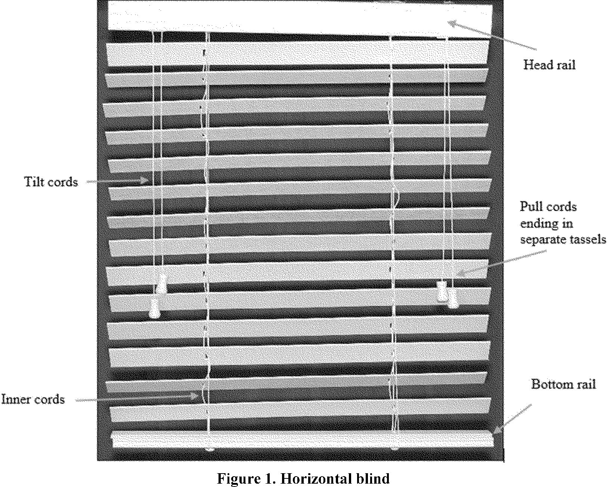
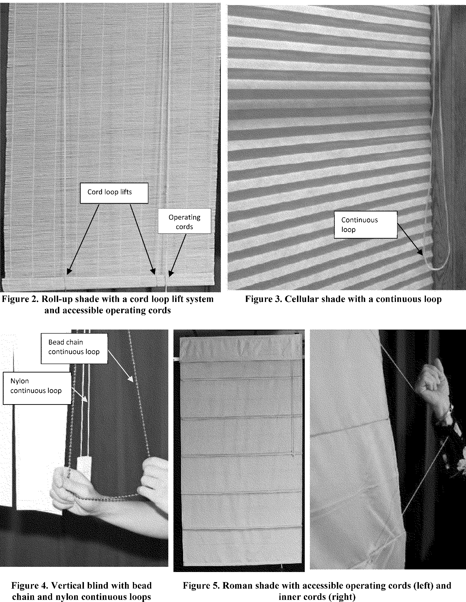

# Daily Digest — 2026-09-24

| | |
|---|---|
| **Digest date** | 2026-09-24 |
| **Data date range** | 2026-09-24 to 2026-09-24 |
| **Generated at** | 2026-09-25T04:16:24Z (UTC) |
| **Pipeline version** | 5fd490c |
| **Inference** | model layers ran in part — gemini/gemini-2.5-flash; not available: item summaries |
| **Source watermarks** | CREC: 2026-09-24T13:56:36Z · BILLS: 2026-09-25T03:20:03Z · FR: 2026-09-24T04:46:32Z · USCOURTS: 2026-09-25T02:14:20Z · PLAW: 2026-09-24T15:18:19Z |

[Full observed listing for this day](day/2026-09-24.html) — every item our collectors observed for this publication day, mechanical rules applied, frozen at end of day. This digest is the canonical record.

All items below cite the govinfo package (and granule, where applicable) they
summarize. Selection is mechanical; each item states the rule that included
it. See the Coverage Statement at the end for a full accounting of what was
published, what was summarized, and what was excluded and why.

---

## Contents

- [Day in Review](#day-in-review)
- [1. Congressional Floor Activity](#1-congressional-floor-activity)
- [2. Legislation](#2-legislation)
- [3. Federal Register](#3-federal-register)
- [4. Enacted Laws](#4-enacted-laws)
- [5. Judicial Activity](#5-judicial-activity)
- [6. Agency Announcements](#6-agency-announcements)
- [7. Recorded Votes](#7-recorded-votes)
- [8. Bill Actions](#8-bill-actions)
- [9. Presidential Actions](#9-presidential-actions)
- [Terms Used Today](#terms-used-today)
- [Coverage Statement](#coverage-statement)
- [Methodology](#methodology)

---

## Day in Review

The digest carries 46 bills introduced in the House and 19 in the Senate, with one bill placed on the Senate calendar. The House reported three bills, including the "Parents Opt-in Protection Act," the "End Transcript Withholding for Veterans Act," and the "Veteran Infection Prevention Act." The Senate reported seven bills, among them the "Indian Health Service Emergency Claims Parity Act" and the "Terrorism Risk Insurance Program Reauthorization Act of 2026." Three enrolled bills are also noted, alongside two public laws designating specific United States Postal Service facilities. The Senate took three rollcall votes, including one confirming a nomination. Proceedings involved consideration of the Protect College Sports Act of 2026 and the introduction of bills concerning voter identification and a strategic fertilizer reserve.

In executive branch activity, the digest includes 208 agency press releases and 95 Federal Register notices. Four final rules were published, with the Department of Commerce enacting measures to restrict stockpiling of polysilicon and its derivatives, and the Environmental Protection Agency approving a State Implementation Plan revision for Alabama on transportation conformity. The Federal Trade Commission issued two final rules, one revising descriptions and another eliminating its post-employment clearance rule. Seven proposed rules appeared, covering topics such as amendments to import requirements for highly pathogenic avian influenza, Medicare Part D pharmacy contracting standards, regulatory enhancements for reactor licensing, and pilot oxygen requirements.

*Composed from the summarized items below and the day's mechanical
counts; all specifics are cited in their sections.*

---

## 1. Congressional Floor Activity

Source: Congressional Record (CREC), issue observed 2026-09-24, covering proceedings of 2026-09-23. Published by govinfo 2026-09-24T13:56:36Z; observed by our collector 2026-09-24T14:02:39Z. Total issue size: 98 granule(s).

### 1.1 Senate

Tags: legislative · model keys: college sports · military nominations · voter id

*In plain terms: The Senate's 14 items include continued consideration of the Protect College Sports Act, new bills on voter ID and a Strategic Fertilizer Reserve, military nominations, and various agency rules received.*

- **Legislative Session** — The Senate resumed consideration of S. 4668, the Protect College Sports Act of 2026, to protect student athletes' name, image, and likeness rights and promote fair competition in intercollegiate athletics. Senator Grassley discussed the Working Families Tax Cut Act of 2025, which made permanent prior tax reforms including reductions to individual and family tax bills, expanded senior relief, increased child tax credits, allowed deduction of car loan interest, eliminated taxation of tips and overtime, and created Trump Accounts, a savings tool for children under 18 that received over $125 million in contributions within five days of opening on July 5, 2026. Senator Schumer paid tribute to retiring AFSCME president Lee Saunders, noting his nearly 50 years of labor advocacy and 14 years as union president, during which he became the first African-American president of the organization.
  - *In plain terms:* The Senate discussed student athlete rights protection, tax reform benefits, and honored a retiring union leader.
  - Included because: CREC-SEL-01 — floor item ≥ threshold floor time (56,250 characters) (document dated 2026-09-23)
  - Source: [CREC-2026-09-23 / CREC-2026-09-23-pt1-PgS4885-8](https://www.govinfo.gov/app/details/CREC-2026-09-23/CREC-2026-09-23-pt1-PgS4885-8)
- **Protect College Sports Act of 2026** — Senator Lee introduced S. 5271 requiring photo identification at voting and proof of citizenship at voter registration, stating the bill aims to make voting easy while making cheating difficult; he cited polling showing 83 percent of Americans support voter ID laws. Senator Padilla objected to unanimous consent, noting that the midterm elections are underway with early voting already occurring in multiple states.
  - *In plain terms:* Senator Lee introduced a bill requiring voter ID and citizenship proof, noting poll support, as Padilla objected citing ongoing midterm elections.
  - Included because: CREC-SEL-01 — floor item ≥ threshold floor time (39,806 characters) (document dated 2026-09-23)
  - Source: [CREC-2026-09-23 / CREC-2026-09-23-pt1-PgS4892-2](https://www.govinfo.gov/app/details/CREC-2026-09-23/CREC-2026-09-23-pt1-PgS4892-2)
- **New Mexico Land Grant-Mercedes Historical or Traditional Use Cooperation and Coordination Act** — S. 1363, the New Mexico Land Grant-Mercedes Historical or Traditional Use Cooperation and Coordination Act, would require a memorandum of understanding between the Secretaries of Agriculture and Interior and the New Mexico Land Grant Council within two years describing types of historical and traditional uses on federal land requiring permits, procedures for obtaining permits, applicable fees and processes for fee waivers or reductions, and permitted use of motorized and nonmotorized vehicles. The bill defines eligible uses to include water use, gathering of herbs, wood, and botanical products in small quantities, grazing, subsistence hunting and fishing, soil and rock gathering, and maintenance of existing monuments, shrines, and cemeteries.
  - *In plain terms:* S. 1363 requires federal and state officials to establish procedures within two years for permits covering land uses like grazing, hunting, gathering, and water.
  - Included because: CREC-SEL-01 — floor item ≥ threshold floor time (34,834 characters) (document dated 2026-09-23)
  - Source: [CREC-2026-09-23 / CREC-2026-09-23-pt1-PgS4898-2](https://www.govinfo.gov/app/details/CREC-2026-09-23/CREC-2026-09-23-pt1-PgS4898-2)
- **Protect College Sports Act of 2026** — Senator McCormick described National Institutes of Health-funded medical research advances, including a gene-editing therapy that saved a child with a rare genetic disorder, and called for increased federal research and development investment, proposing to double the NIH budget to $96 billion over five years while prioritizing merit-based grants and establishing transparency requirements for researcher industry ties. Senator Schatz called for Congress to address potential catastrophic risks from artificial intelligence development and stated he is working with Senator Warner on legislation to address the issue. He also addressed recent hurricanes in Hawaii that destroyed homes and caused widespread power outages, discussed the pattern of increasingly severe storms in recent years, and called for continued federal disaster support.
  - *In plain terms:* Senators discussed federal research funding increases, artificial intelligence risk legislation, and federal disaster support for recent hurricanes.
  - Included because: CREC-SEL-01 — floor item ≥ threshold floor time (76,257 characters) (document dated 2026-09-23)
  - Source: [CREC-2026-09-23 / CREC-2026-09-23-pt1-PgS4902-2](https://www.govinfo.gov/app/details/CREC-2026-09-23/CREC-2026-09-23-pt1-PgS4902-2)
- **Executive and Other Communications** — The Senate received multiple executive communications and regulatory rules transmitted to various committees, including Environmental Protection Agency air quality rules for Indiana and New York, Fish and Wildlife Service rules on migratory bird hunting and endangered species critical habitat designations, Department of Transportation environmental regulations, State Department arms export rules and licenses, Department of Energy proposed legislation on contractor liability, Food and Drug Administration nonclinical testing terminology rules, and various other regulatory reports and proposed legislation from multiple federal agencies.
  - *In plain terms:* The Senate received regulatory rules and proposals from multiple federal agencies covering air quality, endangered species, transportation, arms sales, and other matters.
  - Included because: CREC-SEL-01 — floor item ≥ threshold floor time (17,562 characters) (document dated 2026-09-23)
  - Source: [CREC-2026-09-23 / CREC-2026-09-23-pt1-PgS4918-2](https://www.govinfo.gov/app/details/CREC-2026-09-23/CREC-2026-09-23-pt1-PgS4918-2)
- **Petitions and Memorials** — The Senate received several legislative memorials requesting federal action: Florida urged review of National Guard force structure allocations and establishment of a sovereign wealth fund; Washington requested federal action on universal health care. These memorials were referred to relevant Senate committees.
  - *In plain terms:* The Senate received state requests for federal action on National Guard structure, a sovereign wealth fund, and universal health care.
  - Included because: CREC-SEL-01 — floor item ≥ threshold floor time (78,001 characters) (document dated 2026-09-23)
  - Source: [CREC-2026-09-23 / CREC-2026-09-23-pt1-PgS4919](https://www.govinfo.gov/app/details/CREC-2026-09-23/CREC-2026-09-23-pt1-PgS4919)
- **Executive Reports of Committee** — The Committee on Armed Services reported favorably on military nominations submitted by the President, including promotions to general and flag officer ranks in the Army, Navy, Air Force, and Space Force. The nominations span officers from lists previously entered in the Congressional Record.
  - *In plain terms:* The Armed Services Committee recommended approval of military nominations for promotions to general and flag officer ranks in all service branches.
  - Included because: CREC-SEL-01 — floor item ≥ threshold floor time (27,463 characters) (document dated 2026-09-23)
  - Source: [CREC-2026-09-23 / CREC-2026-09-23-pt1-PgS4926-2](https://www.govinfo.gov/app/details/CREC-2026-09-23/CREC-2026-09-23-pt1-PgS4926-2)
- **Additional Cosponsors** — The Senate Record documents additional senators being added as cosponsors to numerous pending bills. These bills address topics including military benefits, healthcare services, education, agricultural policy, environmental protection, and financial services.
  - *In plain terms:* Senators were added as cosponsors to pending bills covering military benefits, healthcare, education, agriculture, environmental protection, and financial services.
  - Included because: CREC-SEL-01 — floor item ≥ threshold floor time (16,404 characters) (document dated 2026-09-23)
  - Source: [CREC-2026-09-23 / CREC-2026-09-23-pt1-PgS4930-2](https://www.govinfo.gov/app/details/CREC-2026-09-23/CREC-2026-09-23-pt1-PgS4930-2)
- **Statements on Introduced Bills and Joint Resolutions** — Senators Schumer and Klobuchar introduced S. 5461, the Strategic Fertilizer Reserve Act, which requires the Secretary of Agriculture to conduct a feasibility study for establishing a Strategic Fertilizer Reserve for managing fertilizer products and inputs. The bill authorizes creation of an independent Strategic Fertilizer Reserve Agency with a Board of Directors and appropriates funds for study and operations if approved.
  - *In plain terms:* S. 5461 requires a study on establishing a Strategic Fertilizer Reserve and authorizes creation of an independent agency to manage it.
  - Included because: CREC-SEL-01 — floor item ≥ threshold floor time (31,762 characters) (document dated 2026-09-23)
  - Source: [CREC-2026-09-23 / CREC-2026-09-23-pt1-PgS4932](https://www.govinfo.gov/app/details/CREC-2026-09-23/CREC-2026-09-23-pt1-PgS4932)
- **Introductory Statement on S. 5461** — Senators Schumer and Klobuchar introduced S. 5461, the Strategic Fertilizer Reserve Act, which requires the Secretary of Agriculture to conduct a feasibility study for establishing a Strategic Fertilizer Reserve for managing fertilizer products and inputs. The bill authorizes creation of an independent Strategic Fertilizer Reserve Agency with a Board of Directors and appropriates funds for study and operations if approved.
  - *In plain terms:* S. 5461 requires a study on establishing a Strategic Fertilizer Reserve and authorizes creation of an independent agency to manage it.
  - Included because: CREC-SEL-01 — floor item ≥ threshold floor time (29,180 characters) (document dated 2026-09-23)
  - Source: [CREC-2026-09-23 / CREC-2026-09-23-pt1-PgS4932-2](https://www.govinfo.gov/app/details/CREC-2026-09-23/CREC-2026-09-23-pt1-PgS4932-2)
- **Senate Resolution 889--RECOGNIZING the Contributions of Hispanic and Latino Americans to the Musical Heritage of the Un…** — Senate Resolution 889 designates September 2026 as Latin Music Appreciation Month and recognizes the contributions of Hispanic and Latino Americans to the musical heritage of the United States. The resolution details the historical development of various Latin music genres in the United States and acknowledges notable musicians and composers from Mexican, Cuban, Puerto Rican, Dominican, and other Latin American traditions.
  - *In plain terms:* Senate Resolution 889 designates September 2026 as Latin Music Appreciation Month and recognizes Hispanic and Latino contributions to U.S. musical heritage.
  - Included because: CREC-SEL-01 — floor item ≥ threshold floor time (18,898 characters) (document dated 2026-09-23)
  - Source: [CREC-2026-09-23 / CREC-2026-09-23-pt1-PgS4947-2](https://www.govinfo.gov/app/details/CREC-2026-09-23/CREC-2026-09-23-pt1-PgS4947-2)
- **Text of Amendments** — Senator Warnock submitted an amendment to add the "Institutional Grants for New Infrastructure, Technology, and Education for HBCU Excellence Act" to S. 4668, the student athlete rights bill. The amendment would authorize competitive grants to eligible institutions for campus facility improvements, prioritizing those with the greatest facility needs, limited fundraising capacity, and high percentages of Pell Grant-eligible students. Permitted uses include construction, renovations, equipment acquisition, broadband infrastructure, and other campus infrastructure improvements.
  - *In plain terms:* The amendment authorizes grants to colleges with the greatest facility needs and highest shares of low-income students for campus infrastructure improvements.
  - Included because: CREC-SEL-01 — floor item ≥ threshold floor time (37,606 characters) (document dated 2026-09-23)
  - Source: [CREC-2026-09-23 / CREC-2026-09-23-pt1-PgS4952-2](https://www.govinfo.gov/app/details/CREC-2026-09-23/CREC-2026-09-23-pt1-PgS4952-2)
- **Text of Senate Amendment 6825** — Senator Warnock submitted an amendment to add the "Institutional Grants for New Infrastructure, Technology, and Education for HBCU Excellence Act" to S. 4668, the student athlete rights bill. The amendment would authorize competitive grants to eligible institutions for campus facility improvements, prioritizing those with the greatest facility needs, limited fundraising capacity, and high percentages of Pell Grant-eligible students. Permitted uses include construction, renovations, equipment acquisition, broadband infrastructure, and other campus infrastructure improvements.
  - *In plain terms:* The amendment authorizes grants to colleges with the greatest facility needs and highest shares of low-income students for campus infrastructure improvements.
  - Included because: CREC-SEL-01 — floor item ≥ threshold floor time (26,008 characters) (document dated 2026-09-23)
  - Source: [CREC-2026-09-23 / CREC-2026-09-23-pt1-PgS4952-3](https://www.govinfo.gov/app/details/CREC-2026-09-23/CREC-2026-09-23-pt1-PgS4952-3)
- **Satellite Cybersecurity Act of 2025** — S. 3404 requires the Comptroller General to conduct a study and report within two years on Federal Government actions supporting the cybersecurity of commercial satellite systems, including federal agency coordination and reliance on foreign-owned or foreign-located systems. The bill directs the Secretary of Commerce to establish a public clearinghouse within 180 days to provide cybersecurity resources, guidance, frameworks, and voluntary recommendations for commercial satellite operators. The Secretary shall consolidate recommendations addressing risk-based engineering, control retention, protection against unauthorized access and jamming, supply chain security, and vulnerabilities related to foreign ownership or infrastructure.
  - *In plain terms:* S. 3404 requires a study on federal support for satellite cybersecurity and directs Commerce to provide guidance and voluntary recommendations within 180 days.
  - Included because: CREC-SEL-01 — floor item ≥ threshold floor time (15,997 characters) (document dated 2026-09-23)
  - Source: [CREC-2026-09-23 / CREC-2026-09-23-pt1-PgS4956-5](https://www.govinfo.gov/app/details/CREC-2026-09-23/CREC-2026-09-23-pt1-PgS4956-5)

### 1.2 House of Representatives

No House floor items met the selection thresholds. 0 floor granule(s) are accounted for in the Coverage Statement.

### 1.3 Recorded Votes

- **Vote on Colmenero Nomination (Executive Session)** — The Senate confirmed the Colmenero nomination by a vote of 50 to 47.
  - *In plain terms:* The Senate confirmed the Colmenero nomination by a vote of 50 to 47.
  - Included because: CREC-SEL-02 — recorded vote (all recorded votes are listed) (document dated 2026-09-23)
  - Source: [CREC-2026-09-23 / CREC-2026-09-23-pt1-PgS4897-3](https://www.govinfo.gov/app/details/CREC-2026-09-23/CREC-2026-09-23-pt1-PgS4897-3)

---

## 2. Legislation

Source: Congressional Bills (BILLS), text versions published 2026-09-24 to 2026-09-24.

### 2.1 Counts by Stage

| Stage (bill text version) | Count |
|---|---|
| Introduced (ih/is) | 65 |
| Reported (rh/rs) | 10 |
| Engrossed (eh/es) | 6 |
| Enrolled (enr) | 3 |
| Other versions | 6 |
| **Total bill texts published** | **90** |

### 2.2 Bills Listed by Mechanical Rule

Tags: legislative · model keys: land transfer · social security · veteran services

*In plain terms: Today's 11 legislative items include two acts transferring land to the Shingle Springs Band of Miwok Indians, plus other bills addressing veteran services, social security, and fraud enforcement.*

Bills below are listed because they matched at least one listing rule; the
matching rule is stated per item. All other bill texts are counted above and
accounted for in the Coverage Statement.

Items marked *listed from the record* are listed without a summary.

- **H. R. 2302 (rs) — 119 HR 2302 RS: Shingle Springs Band of Miwok Indians Land Transfer Act of 2025** — The Act takes approximately 265 acres of federal land in California into trust for the Shingle Springs Band of Miwok Indians, comprising approximately 80 acres of BLM land and approximately 185 acres of Indian Creek Ranch land. The Secretary of the Interior must conduct a review and perform a survey if necessary within 180 days of enactment. The transferred land becomes part of the Tribe's reservation and is administered under applicable federal trust law; gaming is prohibited on the property.
  - *In plain terms:* The federal government puts 265 acres of California land into trust for the Shingle Springs Band of Miwok Indians, with the Interior Secretary reviewing it within 180 days, and bans gaming on the property.
  - Included because: BILLS-SEL-01 — reached stage: reported/enrolled/calendar (document dated 2026-09-22)
  - Source: [BILLS-119hr2302rs](https://www.govinfo.gov/app/details/BILLS-119hr2302rs)
- **H. R. 4986 (rh) — 119 HR 4986 RH: Parents Opt-in Protection Act** — This reported House bill, titled the "Parents Opt-in Protection Act," proposes amendments to the General Education Provisions Act. It requires prior written consent from a student or their parent for each specific survey, analysis, or evaluation that reveals personal information about the student or their family. This applies to unemancipated minors requiring parental consent, and adult or emancipated minors requiring their own consent.
  - *In plain terms:* This House bill amends the General Education Provisions Act, requiring prior written consent from a student or parent for each survey or evaluation that reveals personal information.
  - Included because: BILLS-SEL-01 — reached stage: reported/enrolled/calendar
  - Source: [BILLS-119hr4986rh](https://www.govinfo.gov/app/details/BILLS-119hr4986rh)
- **H. R. 5345 (enr) — HR 5345 ENR: Improving Social Security’s Service to Victims of Identity Theft Act** — The Act amends the Social Security Act to require the Social Security Administration to establish a single point of contact for individuals whose Social Security account numbers have been misused or whose Social Security cards were lost during transmission. The point of contact shall consist of specially trained employees who coordinate across units to track and resolve cases to completion. The requirement takes effect 180 days after enactment.
  - *In plain terms:* The Social Security Administration must establish one contact with trained employees to help people whose Social Security numbers were misused or whose cards were lost during delivery.
  - Included because: BILLS-SEL-01 — reached stage: reported/enrolled/calendar
  - Source: [BILLS-119hr5345enr](https://www.govinfo.gov/app/details/BILLS-119hr5345enr)
- **H. R. 5436 (rh) — 119 HR 5436 RH: End Transcript Withholding for Veterans Act** — This reported House bill, named the "End Transcript Withholding for Veterans Act," proposes an amendment to title 38, United States Code. The bill states that an educational institution may not withhold the transcript of an individual who attended using Post-9/11 educational assistance solely because that individual owes a debt to the institution.
  - *In plain terms:* This House bill amends title 38, stating that educational institutions cannot withhold transcripts from individuals using Post-9/11 educational assistance solely for institutional debt.
  - Included because: BILLS-SEL-01 — reached stage: reported/enrolled/calendar
  - Source: [BILLS-119hr5436rh](https://www.govinfo.gov/app/details/BILLS-119hr5436rh)
- **H. R. 8052 (rh) — 119 HR 8052 RH: Veteran Infection Prevention Act** — This reported House bill, titled the "Veteran Infection Prevention Act," proposes amendments to title 38, United States Code. It requires sterile processing technicians in the Veterans Health Administration to obtain professional certification within two years of appointment, with provisions for current uncertified employees. The bill also extends the termination date for certain limits on payments of pension from January 31, 2033, to September 30, 2034.
  - *In plain terms:* This House bill amends title 38, requiring VHA sterile processing technicians to get certified within two years and extending pension payment limits from January 31, 2033, to September 30, 2034.
  - Included because: BILLS-SEL-01 — reached stage: reported/enrolled/calendar
  - Source: [BILLS-119hr8052rh](https://www.govinfo.gov/app/details/BILLS-119hr8052rh)
- **H. R. 9576 (pcs) — 119 HR 9576 PCS: National Fraud Enforcement Division Act of 2026** — The Act establishes the National Fraud Enforcement Division within the Department of Justice, headed by an Assistant Attorney General appointed by the President and designated as the Assistant Attorney General for National Fraud Enforcement. The Assistant Attorney General shall perform duties as prescribed by the Attorney General. The division is added to the list of divisions exempt from certain political activity restrictions under federal law.
  - *In plain terms:* The law creates a National Fraud Enforcement Division within the Justice Department, headed by an Assistant Attorney General and exempt from certain political activity restrictions.
  - Included because: BILLS-SEL-01 — reached stage: reported/enrolled/calendar (document dated 2026-09-22)
  - Source: [BILLS-119hr9576pcs](https://www.govinfo.gov/app/details/BILLS-119hr9576pcs)
- **S. 1055 (rs) — 119 S1055 RS: Indian Health Service Emergency Claims Parity Act** — This reported Senate bill, named the "Indian Health Service Emergency Claims Parity Act," proposes an amendment to the Indian Health Care Improvement Act. It establishes a 15-day time limit for notifying the Indian Health Service of emergency medical care or services provided by a non-Service facility or provider to an Indian beneficiary. This 15-day period applies as a condition of payment, with existing provisions for elderly or disabled Indians remaining in effect.
  - *In plain terms:* This Senate bill amends the Indian Health Care Improvement Act, setting a 15-day notice limit to the Indian Health Service for emergency care to Indian beneficiaries for payment.
  - Included because: BILLS-SEL-01 — reached stage: reported/enrolled/calendar (document dated 2026-09-23)
  - Source: [BILLS-119s1055rs](https://www.govinfo.gov/app/details/BILLS-119s1055rs)
- **S. 1514 (rs) — 119 S1514 RS: Quinault Indian Nation Land Transfer Act** — The Act transfers approximately 72 acres of land in Washington from the Forest Service to the Department of the Interior and takes it into trust for the Quinault Indian Nation. Valid existing rights, including easements, rights-of-way, permits, and utility corridors, remain in effect unless modified or terminated under applicable federal law. The land becomes part of the Quinault Indian Reservation and is administered under applicable federal trust law; gaming is prohibited and treaty rights are preserved.
  - *In plain terms:* The federal government transfers 72 acres of Washington land to the Department of Interior for the Quinault Indian Nation, preserving existing easements and rights while banning gaming.
  - Included because: BILLS-SEL-01 — reached stage: reported/enrolled/calendar (document dated 2026-09-22)
  - Source: [BILLS-119s1514rs](https://www.govinfo.gov/app/details/BILLS-119s1514rs)
- **S. 240 (enr) — S240 ENR: Crow Tribe Water Rights Settlement Amendments Act of 2025** — This enrolled bill, cited as the "Crow Tribe Water Rights Settlement Amendments Act of 2025," amends the Crow Tribe Water Rights Settlement Act of 2010. It revises definitions, repeals a section concerning the MR&I System, and modifies the Crow Settlement Fund by establishing an MR&I Projects Account for water infrastructure and land purchases. The act also extends the timeframe for certain Yellowtail Dam related payments from 15 years to 20 years.
  - *In plain terms:* This enrolled bill amends the Crow Tribe Water Rights Settlement Act of 2010, revising definitions, creating an MR&I Projects Account, and extending Yellowtail Dam payments from 15 to 20 years.
  - Included because: BILLS-SEL-01 — reached stage: reported/enrolled/calendar (document dated 2026-09-25)
  - Source: [BILLS-119s240enr](https://www.govinfo.gov/app/details/BILLS-119s240enr)
- **S. 2735 (rs) — 119 S2735 RS: Shingle Springs Band of Miwok Indians Land Transfer Act of 2025** — The Act takes approximately 265 acres of federal land in California into trust for the Shingle Springs Band of Miwok Indians, comprising approximately 80 acres of BLM land and approximately 185 acres of Indian Creek Ranch land. The Secretary of the Interior must conduct a review and perform a survey if necessary within 180 days of enactment. The transferred land becomes part of the Tribe's reservation and is administered under applicable federal trust law; gaming is prohibited on the property.
  - *In plain terms:* The federal government puts 265 acres of California land into trust for the Shingle Springs Band of Miwok Indians, with the Interior Secretary reviewing it within 180 days, and bans gaming on the property.
  - Included because: BILLS-SEL-01 — reached stage: reported/enrolled/calendar (document dated 2026-09-22)
  - Source: [BILLS-119s2735rs](https://www.govinfo.gov/app/details/BILLS-119s2735rs)
- **S. 283 (enr) — S283 ENR: Illegal Red Snapper and Tuna Enforcement Act** — *listed from the record*
  - Included because: BILLS-SEL-01 — reached stage: reported/enrolled/calendar (document dated 2026-09-25)
  - Source: [BILLS-119s283enr](https://www.govinfo.gov/app/details/BILLS-119s283enr)
- **S. 3219 (rs) — 119 S3219 RS: Albuquerque Indian School Act of 2025** — *listed from the record*
  - Included because: BILLS-SEL-01 — reached stage: reported/enrolled/calendar (document dated 2026-09-23)
  - Source: [BILLS-119s3219rs](https://www.govinfo.gov/app/details/BILLS-119s3219rs)
- **S. 3313 (rs) — 119 S3313 RS: Wintergreen Emergency Egress Act** — *listed from the record*
  - Included because: BILLS-SEL-01 — reached stage: reported/enrolled/calendar (document dated 2026-09-23)
  - Source: [BILLS-119s3313rs](https://www.govinfo.gov/app/details/BILLS-119s3313rs)
- **S. 4395 (rs) — 119 S4395 RS: Terrorism Risk Insurance Program Reauthorization Act of 2026** — The Act extends the Terrorism Risk Insurance Program authorized by the Terrorism Risk Insurance Act of 2002 from a termination date of 2027 to 2034. The Act also adjusts the timing of mandatory recoupment provisions, advancing the relevant date ranges by seven years. The amendments maintain the structure of the existing terrorism risk insurance program while extending federal reinsurance coverage for an additional seven years.
  - *In plain terms:* The law extends the Terrorism Risk Insurance Program's expiration from 2027 to 2034 and adjusts mandatory recoupment dates forward by seven years.
  - Included because: BILLS-SEL-01 — reached stage: reported/enrolled/calendar (document dated 2026-09-22)
  - Source: [BILLS-119s4395rs](https://www.govinfo.gov/app/details/BILLS-119s4395rs)

---

## 3. Federal Register

Source: Federal Register (FR), issue of 2026-09-24.

### 3.1 Counts by Document Type

| Document type | Count |
|---|---|
| Rules | 4 |
| Proposed rules | 7 |
| Notices | 95 |
| Presidential documents | 0 |
| **Total FR documents** | **106** |

### 3.2 Rules Published

Tags: department of commerce · environmental protection agency · executive · model keys: air plan · ftc rules · polysilicon imports

*In plain terms: Today's 4 final rules include measures to restrict polysilicon imports, an Alabama air plan approval, and two Federal Trade Commission updates to its rules of practice.*

#### DEPARTMENT OF COMMERCE

- **Measures To Restrict Stockpiling of Polysilicon and Polysilicon Derivatives Under Proclamation 11052** (2026-19537; 15 CFR Part 705) — On August 6, 2026, the President issued Proclamation 11052, “Adjusting Imports of Polysilicon and Its Derivatives Into the United States” (Proclamation 11052), ordering the Secretary of Commerce (Secretary) to take action to restrict imports by a company if he determines the company is stockpiling polysilicon or polysilicon derivatives (Polysilicon Products) in advance of import adjustments that will be effective on December 4, 2026. The Bureau of Industry and Security (BIS), in this temporary final rule (TFR), announces the criteria and process it will use to monitor existing companies for evidence of stockpiling, limit a newly established importer's ability to stockpile, and subject companies that are stockpiling to an import prohibition if necessary. This TFR also establishes the process for such companies to obtain a waiver from any import prohibitions imposed pursuant to this rule, and imposes certain import limitations on new importers that register with U.S. Customs and Border Protection (CBP) on or after August 6, 2026. Action: Temporary final rule. Dates: This rule is effective September 22, 2026, through December 3, 2026.
  - *In plain terms:* New rules establish how companies will be monitored and prohibited from stockpiling polysilicon products before import restrictions take effect on December 4, 2026.
  - Included because: FR-SEL-01 — document type: final rule (all listed)
  - Source: [FR-2026-09-24 / 2026-19537](https://www.govinfo.gov/app/details/FR-2026-09-24/2026-19537)

#### ENVIRONMENTAL PROTECTION AGENCY

- **Air Plan Approval; Alabama; Transportation Conformity** (2026-19566; 40 CFR Part 52) — The U.S. Environmental Protection Agency (EPA or Agency) is approving a State Implementation Plan (SIP) revision submitted by the State of Alabama, through the Alabama Department of Environmental Management (ADEM) on April 7, 2026. The SIP revision replaces the previously approved transportation conformity memorandum of agreement (MOA) with an updated MOA concerning transportation conformity criteria and procedures related to interagency consultation, conflict resolution, public participation, and enforceability of certain transportation-related control and mitigation measures. The SIP revision also makes a minor stylistic change to the Transportation Conformity and General Conformity rules in the Alabama SIP. The EPA has determined that Alabama's April 7, 2026, SIP revision is consistent with the applicable provisions of the Clean Air Act (CAA or Act). Action: Final rule. Dates: This rule is effective October 26, 2026.
  - *In plain terms:* The EPA is approving Alabama's updated plan for how transportation projects will meet clean air standards.
  - Included because: FR-SEL-01 — document type: final rule (all listed)
  - Source: [FR-2026-09-24 / 2026-19566](https://www.govinfo.gov/app/details/FR-2026-09-24/2026-19566)

#### FEDERAL TRADE COMMISSION

- **Rules of Practice** (2026-19597; 16 CFR Chapter I) — The Federal Trade Commission (“Commission” or “FTC”) is amending its rules of practice to revise the description of the FTC's EEO Office and Regional Offices and to update the list of current control numbers assigned by the Director of the Office of Management and Budget (“OMB”) to the Commission's information collection requirements. The Commission is also amending its rules of practice to clarify that FTC staff may consider a variety of relevant issues when modifying a Second Request— i.e., a request for additional information or documentary material relevant to an acquisition the Commission is investigating. In addition, the Commission is amending its rules of practice to clarify the procedures by which Administrative Law Judges (“ALJs”) are assigned to administrative adjudicative proceedings and to restore previously deleted language that provided a page limit for opening briefs. [official summary truncated; see source] Action: Final rule. Dates: This rule is effective on September 24, 2026, except that the Commission may determine that application of amended 16 CFR 2.20 in an investigation pending as of September 24, 2026 would not be feasible or would create an injustice.
  - *In plain terms:* The FTC is updating its procedural rules for staff offices, information collection approvals, investigation requests, and judge assignments, and restoring page limits for legal briefs.
  - Included because: FR-SEL-01 — document type: final rule (all listed)
  - Source: [FR-2026-09-24 / 2026-19597](https://www.govinfo.gov/app/details/FR-2026-09-24/2026-19597)
- **Rules of Practice** (2026-19598; 16 CFR Parts 4 and 5) — The Federal Trade Commission (“Commission” or “FTC”) is amending its rules of practice in order to eliminate the agency's post-employment clearance rule. Action: Final rule. Dates: These rule revisions are effective on September 24, 2026.
  - *In plain terms:* The FTC is removing its requirement that former employees seek clearance before taking outside work.
  - Included because: FR-SEL-01 — document type: final rule (all listed)
  - Source: [FR-2026-09-24 / 2026-19598](https://www.govinfo.gov/app/details/FR-2026-09-24/2026-19598)

### 3.3 Proposed Rules Published

Tags: department of commerce · environmental protection agency · executive · model keys: avian influenza · aviation updates · window coverings

*In plain terms: This section contains 7 proposed rules, including amendments for highly pathogenic avian influenza import requirements, new window covering cord safety standards, and various aviation updates.*

#### CONSUMER PRODUCT SAFETY COMMISSION

- **Substantial Product Hazard List: Amendments to Requirements for Window Covering Cords** (2026-19579; 16 CFR Part 1120) — To address window covering cord strangulation risks, the Commission proposes to designate certain window coverings a substantial product hazard. These include products with: accessible free hanging operating cords longer than 8 inches on custom window coverings; exposed continuous loops with and without tension devices on custom horizontal blinds; exposed continuous loops without tension devices on other custom window coverings; lack of a warning on exposed continuous loops and single retractable cords on custom window coverings; presence of stroke lengths longer than 36 inches on single retractable cord lift systems on custom window coverings; and a cord loop lift system on stock or custom roll up style shades. Action: Notice of proposed rulemaking. Dates: Written comments must be received by November 23, 2026.
  - *In plain terms:* The consumer safety agency proposes to regulate window covering cords with specific design requirements to reduce strangulation risks.
  - Included because: FR-SEL-02 — document type: proposed rule (all listed)
  - Source: [FR-2026-09-24 / 2026-19579](https://www.govinfo.gov/app/details/FR-2026-09-24/2026-19579)
  -  *Source graphic 1 of 16 from 2026-19579.*
  -  *Source graphic 2 of 16 from 2026-19579.*
  - *Graphics not rendered here: 14 of 16 — see the [source PDF](https://www.govinfo.gov/content/pkg/FR-2026-09-24/pdf/FR-2026-09-24.pdf).*

#### DEPARTMENT OF AGRICULTURE

- **Amendments To Import Requirements for Highly Pathogenic Avian Influenza** (2026-19532; 9 CFR Parts 93 and 94) — Current APHIS regulations specify that live birds and other avian commodities may not be exposed to highly pathogenic avian influenza (HPAI) or sourced from premises quarantined for HPAI within the 90 days immediately preceding export to the United States. We are proposing to reduce this timeframe to 28 days preceding export to the United States. This action is necessary to align APHIS regulations with international standards regarding HPAI transmission. This action would allow foreign regions to resume the export of live birds and other avian commodities to the United States sooner following an outbreak of HPAI, while still providing adequate safeguards that the importation of the birds or other avian commodities does not present a risk of disseminating HPAI within the United States. Action: Proposed rule. Dates: We will consider all comments that we receive on or before November 23, 2026.
  - *In plain terms:* Regulations would reduce the required period after an avian flu outbreak from 90 to 28 days before live birds can be exported to the United States.
  - Included because: FR-SEL-02 — document type: proposed rule (all listed)
  - Source: [FR-2026-09-24 / 2026-19532](https://www.govinfo.gov/app/details/FR-2026-09-24/2026-19532)

#### DEPARTMENT OF HEALTH AND HUMAN SERVICES

- **Request for Information; Medicare Part D Reasonable and Relevant Pharmacy Contracting Standards** (2026-19535; 42 CFR Part 423) — This request for information (RFI) solicits input from interested parties for purposes of establishing standards for reasonable and relevant pharmacy contract terms and conditions under the Medicare prescription drug benefit. Section 6223(a) of the Consolidated Appropriations Act, 2026 (CAA, 2026) amends section 1860D-4(b)(1)(A) of the Social Security Act (the Act) to require Part D plan sponsors to permit any pharmacy that meets standard contract terms and conditions under the plan to participate as a network pharmacy of the plan. Section 6223(a) of the CAA, 2026 further requires that, notwithstanding any other provision of law, for plan years beginning January 1, 2029, such standard contract terms and conditions offered by Part D plan sponsors must be reasonable and relevant according to standards established by the Secretary of the Department of Health and Human Services. Finally, section 6223(a) of the CAA, 2026 requires the Secretary to issue this RFI for purposes of establishing such standards. Action: Request for information. Dates: To be assured consideration, comments must be received at one of the addresses provided below, by November 23, 2026.
  - *In plain terms:* The federal government is asking for input on reasonable pharmacy contract standards that Medicare prescription drug plans must offer starting January 1, 2029.
  - Included because: FR-SEL-02 — document type: proposed rule (all listed)
  - Source: [FR-2026-09-24 / 2026-19535](https://www.govinfo.gov/app/details/FR-2026-09-24/2026-19535)

#### DEPARTMENT OF TRANSPORTATION

- **Airworthiness Directives; Bombardier, Inc., Airplanes** (2026-19561; 14 CFR Part 39) — The FAA is revising a notice of proposed rulemaking (NPRM) that would have applied to certain Bombardier, Inc., Model BD-700-2A12 airplanes. This action revises the NPRM by citing new material required for the revision of the existing maintenance or inspection program. The FAA is proposing this airworthiness directive (AD) to address the unsafe condition on these products. Since these actions would impose an additional burden over those in the NPRM, the FAA is requesting comments on this SNPRM. Action: Supplemental notice of proposed rulemaking (SNPRM). Dates: The FAA must receive comments on this SNPRM by October 26, 2026.
  - *In plain terms:* The FAA is proposing revised maintenance requirements for certain Bombardier airplane models and requesting public comments.
  - Included because: FR-SEL-02 — document type: proposed rule (all listed)
  - Source: [FR-2026-09-24 / 2026-19561](https://www.govinfo.gov/app/details/FR-2026-09-24/2026-19561)
- **Flight Operations: Pilot requirements; Use of oxygen** (2026-19584; 14 CFR Parts 91 and 135) — FAA proposes to raise the altitudes at which a pilot is required to don an oxygen mask for commuter and on demand operations, as directed by the FAA Reauthorization Act of 2024, and revise the pilot oxygen mask requirements applicable to general aviation operations in pressurized aircraft. The proposed amendments would allow the operation of airplanes at higher altitudes without requiring at least one pilot at the controls to wear and use an oxygen mask. If adopted, these proposed changes would reduce regulatory and economic burdens on operators by changing certain requirements pertaining to pilots' use of oxygen masks. Action: Notice of proposed rulemaking (NPRM). Dates: Send comments on or before November 23, 2026.
  - *In plain terms:* The FAA proposes to allow pilots to operate airplanes at higher altitudes without requiring an oxygen mask for commuter operations.
  - Included because: FR-SEL-02 — document type: proposed rule (all listed)
  - Source: [FR-2026-09-24 / 2026-19584](https://www.govinfo.gov/app/details/FR-2026-09-24/2026-19584)

#### NUCLEAR REGULATORY COMMISSION

- **Regulatory Enhancements for Reactor Licensing, Decommissioning, and Operational Oversight** (2026-19568; 10 CFR Parts 20, 21, 50, 52, 53, 55, 70, 72, and 75) — Consistent with Executive Order 14300, “Ordering the Reform of the Nuclear Regulatory Commission,” the NRC is conducting a review and wholesale revision of its regulations. This proposed rule primarily aims to provide regulatory enhancements for reactor licensing, decommissioning, and operational oversight and is one effort in the NRC's activities to address the direction in section 5 of Executive Order 14300. Action: Proposed rule and draft regulatory guides; request for comment. Dates: Comments must be submitted electronically using https://www.regulations.gov by 11:59 p.m. eastern time on November 9, 2026.
  - *In plain terms:* The Nuclear Regulatory Commission is proposing changes to licensing, decommissioning, and operational oversight rules as directed by the President.
  - Included because: FR-SEL-02 — document type: proposed rule (all listed)
  - Source: [FR-2026-09-24 / 2026-19568](https://www.govinfo.gov/app/details/FR-2026-09-24/2026-19568)

#### SMALL BUSINESS ADMINISTRATION

- **Small Business Size Standards** (2026-19546; 13 CFR Part 121) — On August 20, 2026, the U.S. Small Business Administration (SBA or the Agency) published a notice of proposed rulemaking and a notice of availability of Revised Size Standards Methodology in the Federal Register to solicit public comments on the revised methodology and proposed Small Business Size Standards. Effective as of filing on September 21, 2026, SBA is extending the comment period for an additional 60 days until November 20, 2026. Action: Extension of comment periods. Dates: The comment periods for the notice of proposed rulemaking published on August 20, 2026 (91 FR 53741) and the Revised Size Standards Methodology published on August 20, 2026 (91 FR 54096) are extended for an additional 60 days from September 21, 2026. Comments must be received on or before November 20, 2026.
  - *In plain terms:* The Small Business Administration is extending the public comment period on new business size standards until November 20, 2026.
  - Included because: FR-SEL-02 — document type: proposed rule (all listed)
  - Source: [FR-2026-09-24 / 2026-19546](https://www.govinfo.gov/app/details/FR-2026-09-24/2026-19546)

### 3.4 Notices and Presidential Documents

Notices are summarized only when they match a listing rule; all are counted
in 3.1 and in the Coverage Statement. Presidential documents in the FR are
always listed.

No notices or presidential documents matched a listing rule.

---

## 4. Enacted Laws

Tags: legislative · model keys: facility designation · postal facilities

*In plain terms: This section contains 2 new public laws designating U.S. Postal Service facilities in Texas and Virginia to honor specific individuals.*

Source: Public and Private Laws (PLAW) published 2026-09-24.

- **Public Law 118–201 — Public Law 118–201: To designate the facility of the United States Postal Service located at 1106 Main Street in Bastrop, Texas, as the “Sergeant Major Billy D. Waugh Post Office”.** — Public Law 118–201 designates the United States Postal Service facility at 1106 Main Street in Bastrop, Texas, as the "Sergeant Major Billy D. Waugh Post Office". The law provides that any reference to this facility in laws, maps, regulations, documents, or official records shall be deemed a reference to the designated post office. Approved: 2024-12-23.
  - *In plain terms:* A federal law officially names the postal service building at 1106 Main Street in Bastrop, Texas the "Sergeant Major Billy D. Waugh Post Office".
  - Included because: PLAW-SEL-01 — enacted into law (all public and private laws are listed) (document dated 2024-12-23)
  - Source: [PLAW-118publ201](https://www.govinfo.gov/app/details/PLAW-118publ201)
- **Public Law 118–213 — Public Law 118–213: To designate the facility of the United States Postal Service located at 220 North Hatcher Avenue in Purcellville, Virginia, as the “Secretary of State Madeleine Albright Post Office Building”.** — Public Law 118–213 designates the United States Postal Service facility at 220 North Hatcher Avenue in Purcellville, Virginia, as the "Secretary of State Madeleine Albright Post Office Building". The law provides that any reference to this facility in laws, maps, regulations, documents, or official records shall be deemed a reference to the designated post office building. Approved: 2025-01-02.
  - *In plain terms:* A federal law officially names the postal service building at 220 North Hatcher Avenue in Purcellville, Virginia the "Secretary of State Madeleine Albright Post Office Building".
  - Included because: PLAW-SEL-01 — enacted into law (all public and private laws are listed) (document dated 2025-01-02)
  - Source: [PLAW-118publ213](https://www.govinfo.gov/app/details/PLAW-118publ213)

---

## 5. Judicial Activity

Source: United States Courts Opinions (USCOURTS): opinions observed 2026-09-24
by our collector; each opinion states its own issue date beside its
listing ([how our clocks work](faq.html#fapds-three-clocks)).

Completeness disclosure (standing): USCOURTS carries opinions from
approximately 140 participating appellate, district, bankruptcy, and
national federal courts. Unlike the Congressional Record and the Federal
Register, which are the complete official record of their branches,
USCOURTS is participation-based and is NOT the complete federal judicial
record. Courts post opinions with delay — typically over several days —
so a day's digest carries the opinions that became available that day,
whatever date each was issued.

### 5.1 Appellate and National Court Opinions

Appellate and national court opinions are summarized; district and
bankruptcy opinions are counted in 5.2 and in the Coverage Statement.

Items marked *listed from the record* are listed without a summary.

#### United States Court of Appeals for the Eighth Circuit

- **John Doe v. Hennepin Healthcare System, Inc., et al** (No. 25-02708; filed 2026-09-23) — *listed from the record*
  - Included because: USCOURTS-SEL-01 — appellate court opinion (all listed) (document dated 2026-09-23)
  - Source: [USCOURTS-ca8-25-02708 / USCOURTS-ca8-25-02708-0](https://www.govinfo.gov/app/details/USCOURTS-ca8-25-02708/USCOURTS-ca8-25-02708-0)
- **United States v. Malik Pratt** (No. 26-01297; filed 2026-09-23) — *listed from the record*
  - Included because: USCOURTS-SEL-01 — appellate court opinion (all listed) (document dated 2026-09-23)
  - Source: [USCOURTS-ca8-26-01297 / USCOURTS-ca8-26-01297-0](https://www.govinfo.gov/app/details/USCOURTS-ca8-26-01297/USCOURTS-ca8-26-01297-0)

#### United States Court of Appeals for the Eleventh Circuit

- **USA v. Carla Jackson, et al** (No. 24-11785; filed 2026-09-23) — *listed from the record*
  - Included because: USCOURTS-SEL-01 — appellate court opinion (all listed) (document dated 2026-09-23)
  - Source: [USCOURTS-ca11-24-11785 / USCOURTS-ca11-24-11785-0](https://www.govinfo.gov/app/details/USCOURTS-ca11-24-11785/USCOURTS-ca11-24-11785-0)
- **USA v. Donald Parr** (No. 25-13652; filed 2026-09-23) — *listed from the record*
  - Included because: USCOURTS-SEL-01 — appellate court opinion (all listed) (document dated 2026-09-23)
  - Source: [USCOURTS-ca11-25-13652 / USCOURTS-ca11-25-13652-0](https://www.govinfo.gov/app/details/USCOURTS-ca11-25-13652/USCOURTS-ca11-25-13652-0)
- **USA v. Orenthal Butler** (No. 25-14431; filed 2026-09-23) — *listed from the record*
  - Included because: USCOURTS-SEL-01 — appellate court opinion (all listed) (document dated 2026-09-23)
  - Source: [USCOURTS-ca11-25-14431 / USCOURTS-ca11-25-14431-0](https://www.govinfo.gov/app/details/USCOURTS-ca11-25-14431/USCOURTS-ca11-25-14431-0)
- **Jenny Lindsay v. Emory University** (No. 26-10048; filed 2026-09-23) — *listed from the record*
  - Included because: USCOURTS-SEL-01 — appellate court opinion (all listed) (document dated 2026-09-23)
  - Source: [USCOURTS-ca11-26-10048 / USCOURTS-ca11-26-10048-0](https://www.govinfo.gov/app/details/USCOURTS-ca11-26-10048/USCOURTS-ca11-26-10048-0)

#### United States Court of Appeals for the Federal Circuit

- **Walker v. Collins** (No. 25-01503; filed 2026-09-23) — *listed from the record*
  - Included because: USCOURTS-SEL-01 — appellate court opinion (all listed) (document dated 2026-09-23)
  - Source: [USCOURTS-ca13-25-01503 / USCOURTS-ca13-25-01503-0](https://www.govinfo.gov/app/details/USCOURTS-ca13-25-01503/USCOURTS-ca13-25-01503-0)

#### United States Court of Appeals for the Fifth Circuit

- **USA v. Chi** (No. 25-40575; filed 2026-09-23) — *listed from the record*
  - Included because: USCOURTS-SEL-01 — appellate court opinion (all listed) (document dated 2026-09-23)
  - Source: [USCOURTS-ca5-25-40575 / USCOURTS-ca5-25-40575-0](https://www.govinfo.gov/app/details/USCOURTS-ca5-25-40575/USCOURTS-ca5-25-40575-0)
- **USA v. Amador** (No. 25-40751; filed 2026-09-23) — *listed from the record*
  - Included because: USCOURTS-SEL-01 — appellate court opinion (all listed) (document dated 2026-09-23)
  - Source: [USCOURTS-ca5-25-40751 / USCOURTS-ca5-25-40751-0](https://www.govinfo.gov/app/details/USCOURTS-ca5-25-40751/USCOURTS-ca5-25-40751-0)
- **USA v. Morales-Gonzalez** (No. 25-50846; filed 2026-09-23) — *listed from the record*
  - Included because: USCOURTS-SEL-01 — appellate court opinion (all listed) (document dated 2026-09-23)
  - Source: [USCOURTS-ca5-25-50846 / USCOURTS-ca5-25-50846-0](https://www.govinfo.gov/app/details/USCOURTS-ca5-25-50846/USCOURTS-ca5-25-50846-0)
- **Mata-Picazo v. Blanche** (No. 25-60658; filed 2026-09-23) — *listed from the record*
  - Included because: USCOURTS-SEL-01 — appellate court opinion (all listed) (document dated 2026-09-23)
  - Source: [USCOURTS-ca5-25-60658 / USCOURTS-ca5-25-60658-0](https://www.govinfo.gov/app/details/USCOURTS-ca5-25-60658/USCOURTS-ca5-25-60658-0)

#### United States Court of Appeals for the First Circuit

- **FOMB, et al v. SIG Structured Products, LLC, et al** (No. 25-01745; filed 2026-09-23) — *listed from the record*
  - Included because: USCOURTS-SEL-01 — appellate court opinion (all listed) (document dated 2026-09-23)
  - Source: [USCOURTS-ca1-25-01745 / USCOURTS-ca1-25-01745-0](https://www.govinfo.gov/app/details/USCOURTS-ca1-25-01745/USCOURTS-ca1-25-01745-0)
- **FOMB, et al v. Assured Guaranty Inc., et al** (No. 25-01748; filed 2026-09-23) — *listed from the record*
  - Included because: USCOURTS-SEL-01 — appellate court opinion (all listed) (document dated 2026-09-23)
  - Source: [USCOURTS-ca1-25-01748 / USCOURTS-ca1-25-01748-0](https://www.govinfo.gov/app/details/USCOURTS-ca1-25-01748/USCOURTS-ca1-25-01748-0)
- **FOMB, et al v. U.S. Bank National Association, et al** (No. 25-01749; filed 2026-09-23) — *listed from the record*
  - Included because: USCOURTS-SEL-01 — appellate court opinion (all listed) (document dated 2026-09-23)
  - Source: [USCOURTS-ca1-25-01749 / USCOURTS-ca1-25-01749-0](https://www.govinfo.gov/app/details/USCOURTS-ca1-25-01749/USCOURTS-ca1-25-01749-0)
- **FOMB, et al v. National Public Finance Guarantee Corporation** (No. 25-01750; filed 2026-09-23) — *listed from the record*
  - Included because: USCOURTS-SEL-01 — appellate court opinion (all listed) (document dated 2026-09-23)
  - Source: [USCOURTS-ca1-25-01750 / USCOURTS-ca1-25-01750-0](https://www.govinfo.gov/app/details/USCOURTS-ca1-25-01750/USCOURTS-ca1-25-01750-0)
- **FOMB, et al v. Goldentree Asset Management LP, et al** (No. 25-01751; filed 2026-09-23) — *listed from the record*
  - Included because: USCOURTS-SEL-01 — appellate court opinion (all listed) (document dated 2026-09-23)
  - Source: [USCOURTS-ca1-25-01751 / USCOURTS-ca1-25-01751-0](https://www.govinfo.gov/app/details/USCOURTS-ca1-25-01751/USCOURTS-ca1-25-01751-0)

#### United States Court of Appeals for the Fourth Circuit

- **US v. Clarence Scranage, Jr.** (No. 24-06090; filed 2026-09-23) — *listed from the record*
  - Included because: USCOURTS-SEL-01 — appellate court opinion (all listed) (document dated 2026-09-23)
  - Source: [USCOURTS-ca4-24-06090 / USCOURTS-ca4-24-06090-0](https://www.govinfo.gov/app/details/USCOURTS-ca4-24-06090/USCOURTS-ca4-24-06090-0)
- **US v. Lamont Turrentine** (No. 25-06186; filed 2026-09-23) — *listed from the record*
  - Included because: USCOURTS-SEL-01 — appellate court opinion (all listed) (document dated 2026-09-23)
  - Source: [USCOURTS-ca4-25-06186 / USCOURTS-ca4-25-06186-0](https://www.govinfo.gov/app/details/USCOURTS-ca4-25-06186/USCOURTS-ca4-25-06186-0)

#### United States Court of Appeals for the Ninth Circuit

- **CANNON V. USA** (No. 24-1317; filed 2026-09-23) — *listed from the record*
  - Included because: USCOURTS-SEL-01 — appellate court opinion (all listed) (document dated 2026-09-23)
  - Source: [USCOURTS-ca9-24-1317 / USCOURTS-ca9-24-1317-0](https://www.govinfo.gov/app/details/USCOURTS-ca9-24-1317/USCOURTS-ca9-24-1317-0)
- **USA V. RIVERA** (No. 24-673; filed 2026-09-23) — *listed from the record*
  - Included because: USCOURTS-SEL-01 — appellate court opinion (all listed) (document dated 2026-09-23)
  - Source: [USCOURTS-ca9-24-673 / USCOURTS-ca9-24-673-0](https://www.govinfo.gov/app/details/USCOURTS-ca9-24-673/USCOURTS-ca9-24-673-0)
- **BANDARY V. DELTA AIR LINES, INC.** (No. 24-7204; filed 2026-09-23) — *listed from the record*
  - Included because: USCOURTS-SEL-01 — appellate court opinion (all listed) (document dated 2026-09-23)
  - Source: [USCOURTS-ca9-24-7204 / USCOURTS-ca9-24-7204-0](https://www.govinfo.gov/app/details/USCOURTS-ca9-24-7204/USCOURTS-ca9-24-7204-0)
- **CODONI, ET AL. V. PORT OF SEATTLE, ET AL.** (No. 25-2830; filed 2026-09-23) — *listed from the record*
  - Included because: USCOURTS-SEL-01 — appellate court opinion (all listed) (document dated 2026-09-23)
  - Source: [USCOURTS-ca9-25-2830 / USCOURTS-ca9-25-2830-0](https://www.govinfo.gov/app/details/USCOURTS-ca9-25-2830/USCOURTS-ca9-25-2830-0)
- **COLLARD V. BISIGNANO** (No. 25-6334; filed 2026-09-23) — *listed from the record*
  - Included because: USCOURTS-SEL-01 — appellate court opinion (all listed) (document dated 2026-09-23)
  - Source: [USCOURTS-ca9-25-6334 / USCOURTS-ca9-25-6334-0](https://www.govinfo.gov/app/details/USCOURTS-ca9-25-6334/USCOURTS-ca9-25-6334-0)

#### United States Court of Appeals for the Seventh Circuit

- **Arthur Jones v. Christine Brannon-Dortch, et al** (No. 24-02614; filed 2026-09-23) — *listed from the record*
  - Included because: USCOURTS-SEL-01 — appellate court opinion (all listed) (document dated 2026-09-23)
  - Source: [USCOURTS-ca7-24-02614 / USCOURTS-ca7-24-02614-0](https://www.govinfo.gov/app/details/USCOURTS-ca7-24-02614/USCOURTS-ca7-24-02614-0)
- **USA v. Lamone Lauderdale** (No. 24-03348; filed 2026-09-23) — *listed from the record*
  - Included because: USCOURTS-SEL-01 — appellate court opinion (all listed) (document dated 2026-09-23)
  - Source: [USCOURTS-ca7-24-03348 / USCOURTS-ca7-24-03348-0](https://www.govinfo.gov/app/details/USCOURTS-ca7-24-03348/USCOURTS-ca7-24-03348-0)
- **Arthur Jones v. Christine Brannon-Dortch, et al** (No. 25-01385; filed 2026-09-23) — *listed from the record*
  - Included because: USCOURTS-SEL-01 — appellate court opinion (all listed) (document dated 2026-09-23)
  - Source: [USCOURTS-ca7-25-01385 / USCOURTS-ca7-25-01385-0](https://www.govinfo.gov/app/details/USCOURTS-ca7-25-01385/USCOURTS-ca7-25-01385-0)
- **James Walker v. Michael Dean, et al** (No. 25-02037; filed 2026-09-23) — *listed from the record*
  - Included because: USCOURTS-SEL-01 — appellate court opinion (all listed) (document dated 2026-09-23)
  - Source: [USCOURTS-ca7-25-02037 / USCOURTS-ca7-25-02037-0](https://www.govinfo.gov/app/details/USCOURTS-ca7-25-02037/USCOURTS-ca7-25-02037-0)
- **James Walker v. Michael Dean, et al** (No. 25-02085; filed 2026-09-23) — *listed from the record*
  - Included because: USCOURTS-SEL-01 — appellate court opinion (all listed) (document dated 2026-09-23)
  - Source: [USCOURTS-ca7-25-02085 / USCOURTS-ca7-25-02085-0](https://www.govinfo.gov/app/details/USCOURTS-ca7-25-02085/USCOURTS-ca7-25-02085-0)
- **Aaron Isby v. Delana Gardner** (No. 25-02770; filed 2026-09-23) — *listed from the record*
  - Included because: USCOURTS-SEL-01 — appellate court opinion (all listed) (document dated 2026-09-23)
  - Source: [USCOURTS-ca7-25-02770 / USCOURTS-ca7-25-02770-0](https://www.govinfo.gov/app/details/USCOURTS-ca7-25-02770/USCOURTS-ca7-25-02770-0)
- **Kansas Gilmore v. St. Bernard Hospital** (No. 25-03088; filed 2026-09-23) — *listed from the record*
  - Included because: USCOURTS-SEL-01 — appellate court opinion (all listed) (document dated 2026-09-23)
  - Source: [USCOURTS-ca7-25-03088 / USCOURTS-ca7-25-03088-0](https://www.govinfo.gov/app/details/USCOURTS-ca7-25-03088/USCOURTS-ca7-25-03088-0)
- **Alexia Knox v. Wisconsin Department of Transportation** (No. 25-03211; filed 2026-09-23) — *listed from the record*
  - Included because: USCOURTS-SEL-01 — appellate court opinion (all listed) (document dated 2026-09-23)
  - Source: [USCOURTS-ca7-25-03211 / USCOURTS-ca7-25-03211-0](https://www.govinfo.gov/app/details/USCOURTS-ca7-25-03211/USCOURTS-ca7-25-03211-0)

#### United States Court of Appeals for the Tenth Circuit

- **Laughrey v. Commandant** (No. 24-03073; filed 2026-09-23) — *listed from the record*
  - Included because: USCOURTS-SEL-01 — appellate court opinion (all listed) (document dated 2026-09-23)
  - Source: [USCOURTS-ca10-24-03073 / USCOURTS-ca10-24-03073-0](https://www.govinfo.gov/app/details/USCOURTS-ca10-24-03073/USCOURTS-ca10-24-03073-0)
- **Johnson v. Reyna, et al** (No. 25-01080; filed 2026-09-23) — *listed from the record*
  - Included because: USCOURTS-SEL-01 — appellate court opinion (all listed) (document dated 2026-09-23)
  - Source: [USCOURTS-ca10-25-01080 / USCOURTS-ca10-25-01080-0](https://www.govinfo.gov/app/details/USCOURTS-ca10-25-01080/USCOURTS-ca10-25-01080-0)
- **Swepson v. Aimbridge Employee Service Corp.** (No. 25-03207; filed 2026-09-23) — *listed from the record*
  - Included because: USCOURTS-SEL-01 — appellate court opinion (all listed) (document dated 2026-09-23)
  - Source: [USCOURTS-ca10-25-03207 / USCOURTS-ca10-25-03207-0](https://www.govinfo.gov/app/details/USCOURTS-ca10-25-03207/USCOURTS-ca10-25-03207-0)
- **Harrell v. Closs, et al** (No. 25-08045; filed 2026-09-23) — *listed from the record*
  - Included because: USCOURTS-SEL-01 — appellate court opinion (all listed) (document dated 2026-09-23)
  - Source: [USCOURTS-ca10-25-08045 / USCOURTS-ca10-25-08045-0](https://www.govinfo.gov/app/details/USCOURTS-ca10-25-08045/USCOURTS-ca10-25-08045-0)
- **In re: Weeks** (No. 26-01306; filed 2026-09-23) — *listed from the record*
  - Included because: USCOURTS-SEL-01 — appellate court opinion (all listed) (document dated 2026-09-23)
  - Source: [USCOURTS-ca10-26-01306 / USCOURTS-ca10-26-01306-0](https://www.govinfo.gov/app/details/USCOURTS-ca10-26-01306/USCOURTS-ca10-26-01306-0)
- **Abdyrakhmanov v. Baltazar, et al** (No. 26-01354; filed 2026-09-23) — *listed from the record*
  - Included because: USCOURTS-SEL-01 — appellate court opinion (all listed) (document dated 2026-09-23)
  - Source: [USCOURTS-ca10-26-01354 / USCOURTS-ca10-26-01354-0](https://www.govinfo.gov/app/details/USCOURTS-ca10-26-01354/USCOURTS-ca10-26-01354-0)
- **United States v. Silva-Cruz** (No. 26-02107; filed 2026-09-23) — *listed from the record*
  - Included because: USCOURTS-SEL-01 — appellate court opinion (all listed) (document dated 2026-09-23)
  - Source: [USCOURTS-ca10-26-02107 / USCOURTS-ca10-26-02107-0](https://www.govinfo.gov/app/details/USCOURTS-ca10-26-02107/USCOURTS-ca10-26-02107-0)
- **Hill v. Salt Lake County Third District Court, et al** (No. 26-04095; filed 2026-09-23) — *listed from the record*
  - Included because: USCOURTS-SEL-01 — appellate court opinion (all listed) (document dated 2026-09-23)
  - Source: [USCOURTS-ca10-26-04095 / USCOURTS-ca10-26-04095-0](https://www.govinfo.gov/app/details/USCOURTS-ca10-26-04095/USCOURTS-ca10-26-04095-0)
- **United States v. Gonzales** (No. 26-06085; filed 2026-09-23) — *listed from the record*
  - Included because: USCOURTS-SEL-01 — appellate court opinion (all listed) (document dated 2026-09-23)
  - Source: [USCOURTS-ca10-26-06085 / USCOURTS-ca10-26-06085-0](https://www.govinfo.gov/app/details/USCOURTS-ca10-26-06085/USCOURTS-ca10-26-06085-0)

#### United States Court of Appeals for the Third Circuit

- **Vestolit GmbH, et al v. Shell Chemical Lp** (No. 25-03549; filed 2026-09-23) — *listed from the record*
  - Included because: USCOURTS-SEL-01 — appellate court opinion (all listed) (document dated 2026-09-23)
  - Source: [USCOURTS-ca3-25-03549 / USCOURTS-ca3-25-03549-0](https://www.govinfo.gov/app/details/USCOURTS-ca3-25-03549/USCOURTS-ca3-25-03549-0)
- **USA v. Jose Santana-Robles** (No. 26-01011; filed 2026-09-23) — *listed from the record*
  - Included because: USCOURTS-SEL-01 — appellate court opinion (all listed) (document dated 2026-09-23)
  - Source: [USCOURTS-ca3-26-01011 / USCOURTS-ca3-26-01011-0](https://www.govinfo.gov/app/details/USCOURTS-ca3-26-01011/USCOURTS-ca3-26-01011-0)
- **In re: Aaron Mazie** (No. 26-02529; filed 2026-09-23) — *listed from the record*
  - Included because: USCOURTS-SEL-01 — appellate court opinion (all listed) (document dated 2026-09-23)
  - Source: [USCOURTS-ca3-26-02529 / USCOURTS-ca3-26-02529-0](https://www.govinfo.gov/app/details/USCOURTS-ca3-26-02529/USCOURTS-ca3-26-02529-0)
- **In re: James Riley, et al** (No. 26-02617; filed 2026-09-23) — *listed from the record*
  - Included because: USCOURTS-SEL-01 — appellate court opinion (all listed) (document dated 2026-09-23)
  - Source: [USCOURTS-ca3-26-02617 / USCOURTS-ca3-26-02617-0](https://www.govinfo.gov/app/details/USCOURTS-ca3-26-02617/USCOURTS-ca3-26-02617-0)

### 5.2 Counts by Court Category

| Court category | Opinions |
|---|---|
| Appellate | 44 |
| District | 749 |
| Bankruptcy | 4 |
| National | 0 |
| **Total opinions extracted** | **797** |

Archive-window disclosure (rule USCOURTS-FETCH-01): 33692 USCOURTS package(s) have been listed in delta syncs but fell outside the 7-day archive window and were not fetched (global running count across all syncs, not limited to this date).

---

## 6. Agency Announcements

Official press releases and statements the agencies themselves date
on 2026-09-24 (sources listed in the source guide). These are the
agencies' own announcements — official advocacy, quoted and
attributed, not findings of this digest. Agency web content can be
edited or removed without notice; captures and hashes are preserved
per the provenance policy.

#### CFTC Press Releases

- **[CFTC Staff Releases Updates to FAQs Concerning Registrants and Registered Entity Activities Relating to Crypto Assets and Blockchain Technologies](https://www.cftc.gov/PressRoom/PressReleases/9303-26)** — dated 2026-09-24 by the agency
  - Included because: AGENCYPR-SEL-01 — official agency release dated this day by the agency (all such releases from active sources are listed; titles only in the pilot)

#### CISA Cybersecurity Advisories

- **[Botslab G980H Dashcams](https://www.cisa.gov/news-events/ics-advisories/icsa-26-267-01)** — dated 2026-09-24 by the agency
  - Included because: AGENCYPR-SEL-01 — official agency release dated this day by the agency (all such releases from active sources are listed; titles only in the pilot)
- **[CISA Adds Two Known Exploited Vulnerabilities to Catalog](https://www.cisa.gov/news-events/alerts/2026/09/24/cisa-adds-two-known-exploited-vulnerabilities-catalog)** — dated 2026-09-24 by the agency
  - Included because: AGENCYPR-SEL-01 — official agency release dated this day by the agency (all such releases from active sources are listed; titles only in the pilot)
- **[Eufy Omni C20, Omni X10 Pro](https://www.cisa.gov/news-events/ics-advisories/icsa-26-267-02)** — dated 2026-09-24 by the agency
  - Included because: AGENCYPR-SEL-01 — official agency release dated this day by the agency (all such releases from active sources are listed; titles only in the pilot)

#### CMS Newsroom (email)

- **[In This Edition: Laboratory Services Rates | Rural Health | Part B Drug Pricing](https://www.cms.gov/training-education/medicare-learning-network/newsletter/mln-connects-newsletter-september-24-2026#_Toc241049415)** — dated 2026-09-24 by the agency
  - Included because: AGENCYPR-SEL-01 — official agency release dated this day by the agency (all such releases from active sources are listed; titles only in the pilot)
  - Source: agency email bulletin to this project's subscription, captured and DKIM-verified

#### Defense News Releases

- **[Idaho Army National Guard Conducts 3 Search, Rescue Missions in 3 Days](https://www.war.gov/News/News-Stories/Article/Article/4610585/idaho-army-national-guard-conducts-3-search-rescue-missions-in-3-days/)** — dated 2026-09-24 by the agency
  - Included because: AGENCYPR-SEL-01 — official agency release dated this day by the agency (all such releases from active sources are listed; titles only in the pilot)

#### DHS News Releases

- **[DHS Announces Release of 2026 Election Infrastructure Security Plan](https://www.dhs.gov/news/2026/09/24/dhs-announces-release-2026-election-infrastructure-security-plan)** — dated 2026-09-24 by the agency
  - Included because: AGENCYPR-SEL-01 — official agency release dated this day by the agency (all such releases from active sources are listed; titles only in the pilot)
- **[DHS Calls on Sanctuary Politicians to Stop Violent Rhetoric Against ICE as Assaults Increase by More Than 1,600%](https://www.dhs.gov/news/2026/09/24/dhs-calls-sanctuary-politicians-stop-violent-rhetoric-against-ice-assaults-increase)** — dated 2026-09-24 by the agency
  - Included because: AGENCYPR-SEL-01 — official agency release dated this day by the agency (all such releases from active sources are listed; titles only in the pilot)
- **[HSI and FBI Arrest Senegalese Alien for Illegally Voting in Past Elections in New Jersey](https://www.dhs.gov/news/2026/09/24/hsi-and-fbi-arrest-senegalese-alien-illegally-voting-past-elections-new-jersey)** — dated 2026-09-24 by the agency
  - Included because: AGENCYPR-SEL-01 — official agency release dated this day by the agency (all such releases from active sources are listed; titles only in the pilot)
- **[U.S. Coast Guard Surpasses 260,000 Total Pounds of Cocaine Seized in Operation Pacific Viper](https://www.dhs.gov/news/2026/09/24/us-coast-guard-surpasses-260000-total-pounds-cocaine-seized-operation-pacific-viper)** — dated 2026-09-24 by the agency
  - Included because: AGENCYPR-SEL-01 — official agency release dated this day by the agency (all such releases from active sources are listed; titles only in the pilot)
- **[WORST OF THE WORST: ICE Arrests Child Predators, Human Traffickers, and Armed Carjackers](https://www.dhs.gov/news/2026/09/24/worst-worst-ice-arrests-child-predators-human-traffickers-and-armed-carjackers)** — dated 2026-09-24 by the agency
  - Included because: AGENCYPR-SEL-01 — official agency release dated this day by the agency (all such releases from active sources are listed; titles only in the pilot)

#### EEOC Newsroom

- **[EEOC Sues Eastern Shipbuilding Group for Disability Discrimination](https://www.eeoc.gov/newsroom/eeoc-sues-eastern-shipbuilding-group-disability-discrimination)** — dated 2026-09-24 by the agency
  - Included because: AGENCYPR-SEL-01 — official agency release dated this day by the agency (all such releases from active sources are listed; titles only in the pilot)
- **[EEOC Sues Summit Hospitality Group for Disability Discrimination](https://www.eeoc.gov/newsroom/eeoc-sues-summit-hospitality-group-disability-discrimination)** — dated 2026-09-24 by the agency
  - Included because: AGENCYPR-SEL-01 — official agency release dated this day by the agency (all such releases from active sources are listed; titles only in the pilot)
- **[Mayo Clinic to Pay $50,000 in EEOC COVID-19 Vaccine Religious Accommodation Suit](https://www.eeoc.gov/newsroom/mayo-clinic-pay-50000-eeoc-covid-19-vaccine-religious-accommodation-suit)** — dated 2026-09-24 by the agency
  - Included because: AGENCYPR-SEL-01 — official agency release dated this day by the agency (all such releases from active sources are listed; titles only in the pilot)

#### FAA Updates (email)

- **From the Flight Deck: Situational Awareness Workshop – Sept. 26, 2 p.m. ET** — dated 2026-09-24 by the agency
  - Included because: AGENCYPR-SEL-01 — official agency release dated this day by the agency (all such releases from active sources are listed; titles only in the pilot)
  - Source: agency email bulletin to this project's subscription, captured and DKIM-verified (the bulletin named no canonical page)

#### Federal Reserve Press Releases

- **[Federal Reserve Board issues enforcement action with former employee of Sandy Spring Bank](https://www.federalreserve.gov/newsevents/pressreleases/enforcement20260924a.htm)** — dated 2026-09-24 by the agency
  - Included because: AGENCYPR-SEL-01 — official agency release dated this day by the agency (all such releases from active sources are listed; titles only in the pilot)
- **[Federal Reserve Board requests public comment on two proposals related to establishing a regulatory framework for Board-supervised payment stablecoin issuers under the GENIUS Act](https://www.federalreserve.gov/newsevents/pressreleases/bcreg20260924a.htm)** — dated 2026-09-24 by the agency
  - Included because: AGENCYPR-SEL-01 — official agency release dated this day by the agency (all such releases from active sources are listed; titles only in the pilot)

#### FEMA Press Releases

- **[FEMA Delivers $18.8 Million to Empower States and Territories to Improve Dam Infrastructure](https://www.fema.gov/press-release/20260924/fema-delivers-188-million-empower-states-and-territories-improve-dam)** — dated 2026-09-24 by the agency
  - Included because: AGENCYPR-SEL-01 — official agency release dated this day by the agency (all such releases from active sources are listed; titles only in the pilot)
- **[FEMA Delivers More Than $1.2 Million to Help Fire Departments and Other First Responder Organizations in Puerto Rico](https://www.fema.gov/press-release/20260924/fema-delivers-more-12-million-help-fire-departments-and-other-first)** — dated 2026-09-24 by the agency
  - Included because: AGENCYPR-SEL-01 — official agency release dated this day by the agency (all such releases from active sources are listed; titles only in the pilot)
- **[FEMA Delivers More Than $14 Million to Help Fire Departments and Other First Responder Organizations in Alaska, Idaho, Oregon and Washington](https://www.fema.gov/press-release/20260924/fema-delivers-more-14-million-help-fire-departments-and-other-first)** — dated 2026-09-24 by the agency
  - Included because: AGENCYPR-SEL-01 — official agency release dated this day by the agency (all such releases from active sources are listed; titles only in the pilot)
- **[FEMA Delivers More Than $72 Million to Help Fire Departments and Other First Responder Organizations Across the Southeast](https://www.fema.gov/press-release/20260924/fema-delivers-more-72-million-help-fire-departments-and-other-first)** — dated 2026-09-24 by the agency
  - Included because: AGENCYPR-SEL-01 — official agency release dated this day by the agency (all such releases from active sources are listed; titles only in the pilot)
- **[FEMA Delivers More than $7.7 Million to Help Fire Departments and Other First Responder Organizations in Region 8](https://www.fema.gov/press-release/20260924/fema-delivers-more-77-million-help-fire-departments-and-other-first)** — dated 2026-09-24 by the agency
  - Included because: AGENCYPR-SEL-01 — official agency release dated this day by the agency (all such releases from active sources are listed; titles only in the pilot)
- **[FEMA Delivers Nearly $20 Million to Help Fire Departments and First Responders in Arkansas, Louisiana, Oklahoma and Texas](https://www.fema.gov/press-release/20260924/fema-delivers-nearly-20-million-help-fire-departments-and-first-responders)** — dated 2026-09-24 by the agency
  - Included because: AGENCYPR-SEL-01 — official agency release dated this day by the agency (all such releases from active sources are listed; titles only in the pilot)
- **[One Week Left to Apply for FEMA Assistance after Tropical Storm Arthur](https://www.fema.gov/press-release/20260924/one-week-left-apply-fema-assistance-after-tropical-storm-arthur)** — dated 2026-09-24 by the agency
  - Included because: AGENCYPR-SEL-01 — official agency release dated this day by the agency (all such releases from active sources are listed; titles only in the pilot)

#### FTC Press Releases

- **[FTC Approves Publication of Federal Register Notices Revising the Commission’s Rules of Practice](https://www.ftc.gov/news-events/news/press-releases/2026/09/ftc-approves-publication-federal-register-notices-revising-commissions-rules-practice)** — dated 2026-09-24 by the agency
  - Included because: AGENCYPR-SEL-01 — official agency release dated this day by the agency (all such releases from active sources are listed; titles only in the pilot)
- **[FTC Seeks Public Comment on Whether to Update Rule on Impersonation of Government and Businesses to Address Platforms’ Role in Promoting Impersonation Scams](https://www.ftc.gov/news-events/news/press-releases/2026/09/ftc-seeks-public-comment-whether-update-rule-impersonation-government-businesses-address-platforms)** — dated 2026-09-24 by the agency
  - Included because: AGENCYPR-SEL-01 — official agency release dated this day by the agency (all such releases from active sources are listed; titles only in the pilot)

#### GAO Reports & Testimonies

- **[FEMA: Billions in Building Resilient Infrastructure and Communities Subgrants Remain Unawarded](https://www.gao.gov/products/gao-26-107774)** — dated 2026-09-24 by the agency
  - Included because: AGENCYPR-SEL-01 — official agency release dated this day by the agency (all such releases from active sources are listed; titles only in the pilot)
- **[Federal Real Property: The Judiciary Should Measure the Utilization of Its Administrative Space](https://www.gao.gov/products/gao-26-108603)** — dated 2026-09-24 by the agency
  - Included because: AGENCYPR-SEL-01 — official agency release dated this day by the agency (all such releases from active sources are listed; titles only in the pilot)
- **[Funding Status: Infrastructure Investment and Jobs and Inflation Reduction Acts at the Departments of Agriculture and Energy](https://www.gao.gov/products/gao-26-109087)** — dated 2026-09-24 by the agency
  - Included because: AGENCYPR-SEL-01 — official agency release dated this day by the agency (all such releases from active sources are listed; titles only in the pilot)
- **[Immigration Detention: Urgent Planning Needed to Avoid Further Waste of Taxpayer Dollars](https://www.gao.gov/products/gao-26-108663)** — dated 2026-09-24 by the agency
  - Included because: AGENCYPR-SEL-01 — official agency release dated this day by the agency (all such releases from active sources are listed; titles only in the pilot)
- **[Maternal Health: Information on and Federal Oversight of Mortality Review Committees](https://www.gao.gov/products/gao-26-108690)** — dated 2026-09-24 by the agency
  - Included because: AGENCYPR-SEL-01 — official agency release dated this day by the agency (all such releases from active sources are listed; titles only in the pilot)
- **[Military Installations: Remote and Isolated Locations Face Challenges Delivering Critical Support Services](https://www.gao.gov/products/gao-26-108231)** — dated 2026-09-24 by the agency
  - Included because: AGENCYPR-SEL-01 — official agency release dated this day by the agency (all such releases from active sources are listed; titles only in the pilot)
- **[Private Health Insurance: Federal and State Oversight of Contraceptive Coverage Requirements](https://www.gao.gov/products/gao-26-108446)** — dated 2026-09-24 by the agency
  - Included because: AGENCYPR-SEL-01 — official agency release dated this day by the agency (all such releases from active sources are listed; titles only in the pilot)

#### IRS Newswire (email)

- **Notice 2026-52: Extension of Relief from Penalty for Failure to Deposit Remittance Excise Tax** — dated 2026-09-24 by the agency
  - Included because: AGENCYPR-SEL-01 — official agency release dated this day by the agency (all such releases from active sources are listed; titles only in the pilot)
  - Source: agency email bulletin to this project's subscription, captured and DKIM-verified (the bulletin named no canonical page)
- **Notice 2026-60: Special per diem rates** — dated 2026-09-24 by the agency
  - Included because: AGENCYPR-SEL-01 — official agency release dated this day by the agency (all such releases from active sources are listed; titles only in the pilot)
  - Source: agency email bulletin to this project's subscription, captured and DKIM-verified (the bulletin named no canonical page)

#### Justice Department News (email)

- **Antitrust Division Employment Page Update** — dated 2026-09-24 by the agency
  - Included because: AGENCYPR-SEL-01 — official agency release dated this day by the agency (all such releases from active sources are listed; titles only in the pilot)
  - Source: agency email bulletin to this project's subscription, captured and DKIM-verified (the bulletin named no canonical page)
- **[DOJ OIG Releases Report on Audit of the Department of Justice’s Orders Awarded Under Expired Procurement Vehicles](https://oig.justice.gov/reports/audit-department-justices-orders-awarded-under-expired-procurement-vehicles?utm_source=govdelivery&utm_medium=email&utm_campaign=report&utm_content=title)** — dated 2026-09-24 by the agency
  - Included because: AGENCYPR-SEL-01 — official agency release dated this day by the agency (all such releases from active sources are listed; titles only in the pilot)
  - Source: agency email bulletin to this project's subscription, captured and DKIM-verified
- **[DOJ OIG Releases Report on the Federal Bureau of Prisons’ Acquisition and Life Cycle Management of Major Equipment Supporting Food Services](https://oig.justice.gov/reports/audit-federal-bureau-prisons-acquisition-and-life-cycle-management-major-equipment?utm_source=govdelivery&utm_medium=email&utm_campaign=report&utm_content=title)** — dated 2026-09-24 by the agency
  - Included because: AGENCYPR-SEL-01 — official agency release dated this day by the agency (all such releases from active sources are listed; titles only in the pilot)
  - Source: agency email bulletin to this project's subscription, captured and DKIM-verified
- **EOIR Operational Status Update - Sept. 24, 2026** — dated 2026-09-24 by the agency
  - Included because: AGENCYPR-SEL-01 — official agency release dated this day by the agency (all such releases from active sources are listed; titles only in the pilot)
  - Source: agency email bulletin to this project's subscription, captured and DKIM-verified (the bulletin named no canonical page)
- **OIG Criminal or Civil Cases Update** — dated 2026-09-24 by the agency
  - Included because: AGENCYPR-SEL-01 — official agency release dated this day by the agency (all such releases from active sources are listed; titles only in the pilot)
  - Source: agency email bulletin to this project's subscription, captured and DKIM-verified (the bulletin named no canonical page)
- **[Press Release – EOIR Announces 47 Immigration Judges and 6 Temporary Immigration Judges](https://www.justice.gov/eoir/notices-and-press-releases)** — dated 2026-09-24 by the agency
  - Included because: AGENCYPR-SEL-01 — official agency release dated this day by the agency (all such releases from active sources are listed; titles only in the pilot)
  - Source: agency email bulletin to this project's subscription, captured and DKIM-verified

#### Justice Press Releases

- **[DOJ Announces $25M “Assisting Neighborhoods and Governments with Enforcement of Laws” (ANGEL) Grant Opportunity for Local Law Enforcement in Honor of Americans Killed by Illegal Aliens and Illicit Dru](https://www.justice.gov/opa/pr/doj-announces-25m-assisting-neighborhoods-and-governments-enforcement-laws-angel-grant)** — dated 2026-09-24 by the agency
  - Included because: AGENCYPR-SEL-01 — official agency release dated this day by the agency (all such releases from active sources are listed; titles only in the pilot)
  - Corroborated: the same release (same canonical URL) also arrived via the agency's email bulletin to this project's subscription, DKIM-verified — one document received through two ingestion channels; listed once, both captures preserved.
- **[Dauphin County Man Sentenced to 10 Years in Prison for Pandemic Unemployment Assistance Scheme](https://www.justice.gov/usao-edpa/pr/dauphin-county-man-sentenced-10-years-prison-pandemic-unemployment-assistance-scheme)** — dated 2026-09-24 by the agency
  - Included because: AGENCYPR-SEL-01 — official agency release dated this day by the agency (all such releases from active sources are listed; titles only in the pilot)
  - Corroborated: the same release (same canonical URL) also arrived via the agency's email bulletin to this project's subscription, DKIM-verified — one document received through two ingestion channels; listed once, both captures preserved.
- **[El Paso Woman Pleads Guilty to Defrauding Paycheck Protection Program of More Than $2 Million](https://www.justice.gov/usao-wdtx/pr/el-paso-woman-pleads-guilty-defrauding-paycheck-protection-program-more-2-million)** — dated 2026-09-24 by the agency
  - Included because: AGENCYPR-SEL-01 — official agency release dated this day by the agency (all such releases from active sources are listed; titles only in the pilot)
  - Corroborated: the same release (same canonical URL) also arrived via the agency's email bulletin to this project's subscription, DKIM-verified — one document received through two ingestion channels; listed once, both captures preserved.
- **[Uzbek National Extradited to the United States to Face Charges for Providing Material Support to Foreign Terrorist Organizations](https://www.justice.gov/opa/pr/uzbek-national-extradited-united-states-face-charges-providing-material-support-foreign)** — dated 2026-09-24 by the agency
  - Included because: AGENCYPR-SEL-01 — official agency release dated this day by the agency (all such releases from active sources are listed; titles only in the pilot)
  - Corroborated: the same release (same canonical URL) also arrived via the agency's email bulletin to this project's subscription, DKIM-verified — one document received through two ingestion channels; listed once, both captures preserved.
- **[Aguadilla Man Indicted and Arrested for Child Exploitation](https://www.justice.gov/usao-pr/pr/aguadilla-man-indicted-and-arrested-child-exploitation-1)** — dated 2026-09-24 by the agency
  - Included because: AGENCYPR-SEL-01 — official agency release dated this day by the agency (all such releases from active sources are listed; titles only in the pilot)
- **[Aliens Charged with Illegally Voting in Federal Election and Making False Statements While Applying for U.S. Citizenship](https://www.justice.gov/usao-nj/pr/aliens-charged-illegally-voting-federal-election-and-making-false-statements-while-0)** — dated 2026-09-24 by the agency
  - Included because: AGENCYPR-SEL-01 — official agency release dated this day by the agency (all such releases from active sources are listed; titles only in the pilot)
  - Corroborated: the same release (same canonical URL) also arrived via the agency's email bulletin to this project's subscription, DKIM-verified — one document received through two ingestion channels; listed once, both captures preserved.
- **[Anderson Man to Serve More Than Four Decades in Federal Prison for Child Sexual Abuse Crimes](https://www.justice.gov/usao-sdin/pr/anderson-man-serve-more-four-decades-federal-prison-child-sexual-abuse-crimes)** — dated 2026-09-24 by the agency
  - Included because: AGENCYPR-SEL-01 — official agency release dated this day by the agency (all such releases from active sources are listed; titles only in the pilot)
- **[Atlantic City Director of Constituent Services Charged for Accepting Bribes Related to a Cannabis Business](https://www.justice.gov/usao-nj/pr/atlantic-city-director-constituent-services-charged-accepting-bribes-related-cannabis)** — dated 2026-09-24 by the agency
  - Included because: AGENCYPR-SEL-01 — official agency release dated this day by the agency (all such releases from active sources are listed; titles only in the pilot)
- **[Brooklyn Man Convicted of Brandishing a Firearm During Bank Robbery](https://www.justice.gov/usao-edny/pr/brooklyn-man-convicted-brandishing-firearm-during-bank-robbery)** — dated 2026-09-24 by the agency
  - Included because: AGENCYPR-SEL-01 — official agency release dated this day by the agency (all such releases from active sources are listed; titles only in the pilot)
  - Corroborated: the same release (same canonical URL) also arrived via the agency's email bulletin to this project's subscription, DKIM-verified — one document received through two ingestion channels; listed once, both captures preserved.
- **[Charlotte Man Charged with Selling Fentanyl, Methamphetamine, Firearms, and a “Glock Switch” Appears in Federal Court](https://www.justice.gov/usao-wdnc/pr/charlotte-man-charged-selling-fentanyl-methamphetamine-firearms-and-glock-switch)** — dated 2026-09-24 by the agency
  - Included because: AGENCYPR-SEL-01 — official agency release dated this day by the agency (all such releases from active sources are listed; titles only in the pilot)
- **[Charlottesville Man, Previously Charged for Sexual Exploitation of Albemarle Teen, Charged in Second Assault of Federal Law Enforcement Officers](https://www.justice.gov/usao-wdva/pr/charlottesville-man-previously-charged-sexual-exploitation-albemarle-teen-charged)** — dated 2026-09-24 by the agency
  - Included because: AGENCYPR-SEL-01 — official agency release dated this day by the agency (all such releases from active sources are listed; titles only in the pilot)
  - Corroborated: the same release (same canonical URL) also arrived via the agency's email bulletin to this project's subscription, DKIM-verified — one document received through two ingestion channels; listed once, both captures preserved.
- **[Chief Operating Officer Pleads Guilty for Role in $500M COVID-19 Test Billing Fraud](https://www.justice.gov/usao-edmi/pr/chief-operating-officer-pleads-guilty-role-500m-covid-19-test-billing-fraud)** — dated 2026-09-24 by the agency
  - Included because: AGENCYPR-SEL-01 — official agency release dated this day by the agency (all such releases from active sources are listed; titles only in the pilot)
  - Corroborated: the same release (same canonical URL) also arrived via the agency's email bulletin to this project's subscription, DKIM-verified — one document received through two ingestion channels; listed once, both captures preserved.
- **[Conehatta Man Pleads Guilty to Transportation of a Minor for Sexual Activity](https://www.justice.gov/usao-sdms/pr/conehatta-man-pleads-guilty-transportation-minor-sexual-activity)** — dated 2026-09-24 by the agency
  - Included because: AGENCYPR-SEL-01 — official agency release dated this day by the agency (all such releases from active sources are listed; titles only in the pilot)
  - Corroborated: the same release (same canonical URL) also arrived via the agency's email bulletin to this project's subscription, DKIM-verified — one document received through two ingestion channels; listed once, both captures preserved.
- **[Criminal Illegal Alien from Mexico Convicted of Unlawful Possession of Ammunition](https://www.justice.gov/usao-ndfl/pr/criminal-illegal-alien-mexico-convicted-unlawful-possession-ammunition)** — dated 2026-09-24 by the agency
  - Included because: AGENCYPR-SEL-01 — official agency release dated this day by the agency (all such releases from active sources are listed; titles only in the pilot)
  - Corroborated: the same release (same canonical URL) also arrived via the agency's email bulletin to this project's subscription, DKIM-verified — one document received through two ingestion channels; listed once, both captures preserved.
- **[District Man Sentenced for Illegal Possession of Firearm and Ammunition Following Stolen Car Crash and Foot Pursuit](https://www.justice.gov/usao-dc/pr/district-man-sentenced-illegal-possession-firearm-and-ammunition-following-stolen-car)** — dated 2026-09-24 by the agency
  - Included because: AGENCYPR-SEL-01 — official agency release dated this day by the agency (all such releases from active sources are listed; titles only in the pilot)
- **[Eight Individuals Charged in Drug Conspiracy, Including Former Federal Prisoner Whose Sentence was Commuted](https://www.justice.gov/usao-mdpa/pr/eight-individuals-charged-drug-conspiracy-including-former-federal-prisoner-whose)** — dated 2026-09-24 by the agency
  - Included because: AGENCYPR-SEL-01 — official agency release dated this day by the agency (all such releases from active sources are listed; titles only in the pilot)
  - Corroborated: the same release (same canonical URL) also arrived via the agency's email bulletin to this project's subscription, DKIM-verified — one document received through two ingestion channels; listed once, both captures preserved.
- **[Federal Judge Sentences Man to 25 Years in Prison for Sex Trafficking and Abusing a Minor](https://www.justice.gov/usao-ndil/pr/federal-judge-sentences-man-25-years-prison-sex-trafficking-and-abusing-minor)** — dated 2026-09-24 by the agency
  - Included because: AGENCYPR-SEL-01 — official agency release dated this day by the agency (all such releases from active sources are listed; titles only in the pilot)
- **[Federal grand jury indicts Cincinnati man allegedly tied to multiple shootings](https://www.justice.gov/usao-sdoh/pr/federal-grand-jury-indicts-cincinnati-man-allegedly-tied-multiple-shootings)** — dated 2026-09-24 by the agency
  - Included because: AGENCYPR-SEL-01 — official agency release dated this day by the agency (all such releases from active sources are listed; titles only in the pilot)
- **[Florida Doctor Sentenced for Making False Statements in Connection with Multi-Million-Dollar Health Care Fraud Scheme](https://www.justice.gov/usao-ma/pr/florida-doctor-sentenced-making-false-statements-connection-multi-million-dollar-health)** — dated 2026-09-24 by the agency
  - Included because: AGENCYPR-SEL-01 — official agency release dated this day by the agency (all such releases from active sources are listed; titles only in the pilot)
  - Corroborated: the same release (same canonical URL) also arrived via the agency's email bulletin to this project's subscription, DKIM-verified — one document received through two ingestion channels; listed once, both captures preserved.
- **[Florida Man Sentenced to 5 Years in Federal Prison for Receipt of Child Pornography](https://www.justice.gov/usao-edwi/pr/florida-man-sentenced-5-years-federal-prison-receipt-child-pornography)** — dated 2026-09-24 by the agency
  - Included because: AGENCYPR-SEL-01 — official agency release dated this day by the agency (all such releases from active sources are listed; titles only in the pilot)
- **[Former Executive Director of Meriden and Groton Housing Authorities Charged with Fraud and Money Laundering Offenses](https://www.justice.gov/usao-ct/pr/former-executive-director-meriden-and-groton-housing-authorities-charged-fraud-and-money)** — dated 2026-09-24 by the agency
  - Included because: AGENCYPR-SEL-01 — official agency release dated this day by the agency (all such releases from active sources are listed; titles only in the pilot)
  - Corroborated: the same release (same canonical URL) also arrived via the agency's email bulletin to this project's subscription, DKIM-verified — one document received through two ingestion channels; listed once, both captures preserved.
- **[Former New Hampshire Residents Indicted For Scheme to Steal and Launder Money Stolen From ATMs](https://www.justice.gov/usao-nh/pr/former-new-hampshire-residents-indicted-scheme-steal-and-launder-money-stolen-atms)** — dated 2026-09-24 by the agency
  - Included because: AGENCYPR-SEL-01 — official agency release dated this day by the agency (all such releases from active sources are listed; titles only in the pilot)
  - Corroborated: the same release (same canonical URL) also arrived via the agency's email bulletin to this project's subscription, DKIM-verified — one document received through two ingestion channels; listed once, both captures preserved.
- **[Fort Mill Man Sentenced to 20 Years in Federal Prison for Transportation of Child Sexual Abuse Material](https://www.justice.gov/usao-sc/pr/fort-mill-man-sentenced-20-years-federal-prison-transportation-child-sexual-abuse)** — dated 2026-09-24 by the agency
  - Included because: AGENCYPR-SEL-01 — official agency release dated this day by the agency (all such releases from active sources are listed; titles only in the pilot)
- **[Four Aliens Charged With Election Fraud](https://www.justice.gov/opa/pr/four-aliens-charged-election-fraud)** — dated 2026-09-24 by the agency
  - Included because: AGENCYPR-SEL-01 — official agency release dated this day by the agency (all such releases from active sources are listed; titles only in the pilot)
- **[Four Massachusetts Men Arrested and Charged for Fraud, Money Laundering Schemes](https://www.justice.gov/usao-ma/pr/four-massachusetts-men-arrested-and-charged-fraud-money-laundering-schemes)** — dated 2026-09-24 by the agency
  - Included because: AGENCYPR-SEL-01 — official agency release dated this day by the agency (all such releases from active sources are listed; titles only in the pilot)
  - Corroborated: the same release (same canonical URL) also arrived via the agency's email bulletin to this project's subscription, DKIM-verified — one document received through two ingestion channels; listed once, both captures preserved.
- **[Grand Jury for the District of Nebraska - September 2026](https://www.justice.gov/usao-ne/pr/grand-jury-district-nebraska-september-2026)** — dated 2026-09-24 by the agency
  - Included because: AGENCYPR-SEL-01 — official agency release dated this day by the agency (all such releases from active sources are listed; titles only in the pilot)
- **[Harlem man sentenced to nearly 3 years for trafficking meth and fentanyl](https://www.justice.gov/usao-mt/pr/harlem-man-sentenced-nearly-3-years-trafficking-meth-and-fentanyl)** — dated 2026-09-24 by the agency
  - Included because: AGENCYPR-SEL-01 — official agency release dated this day by the agency (all such releases from active sources are listed; titles only in the pilot)
  - Corroborated: the same release (same canonical URL) also arrived via the agency's email bulletin to this project's subscription, DKIM-verified — one document received through two ingestion channels; listed once, both captures preserved.
- **[Harrisburg Man Indicted for Failure to Register as a Sex Offender](https://www.justice.gov/usao-mdpa/pr/harrisburg-man-indicted-failure-register-sex-offender-1)** — dated 2026-09-24 by the agency
  - Included because: AGENCYPR-SEL-01 — official agency release dated this day by the agency (all such releases from active sources are listed; titles only in the pilot)
  - Corroborated: the same release (same canonical URL) also arrived via the agency's email bulletin to this project's subscription, DKIM-verified — one document received through two ingestion channels; listed once, both captures preserved.
- **[Harrodsburg Man Sentenced to 160 Months for Distributing Child Pornography](https://www.justice.gov/usao-edky/pr/harrodsburg-man-sentenced-160-months-distributing-child-pornography)** — dated 2026-09-24 by the agency
  - Included because: AGENCYPR-SEL-01 — official agency release dated this day by the agency (all such releases from active sources are listed; titles only in the pilot)
- **[Justice Department Ends Over 50 Half-Century-Old Desegregation Cases Throughout the United States](https://www.justice.gov/opa/pr/justice-department-ends-over-50-half-century-old-desegregation-cases-throughout-united)** — dated 2026-09-24 by the agency
  - Included because: AGENCYPR-SEL-01 — official agency release dated this day by the agency (all such releases from active sources are listed; titles only in the pilot)
- **[Justice Department Sues Minnesota, St. Paul, and Minneapolis Over Firearm Purchase Waiting Period](https://www.justice.gov/opa/pr/justice-department-sues-minnesota-st-paul-and-minneapolis-over-firearm-purchase-waiting)** — dated 2026-09-24 by the agency
  - Included because: AGENCYPR-SEL-01 — official agency release dated this day by the agency (all such releases from active sources are listed; titles only in the pilot)
- **[Kosovar National Pleads Guilty to Operating Cybercrime Marketplace Offering Tools and Products to Cybercriminals](https://www.justice.gov/opa/pr/kosovar-national-pleads-guilty-operating-cybercrime-marketplace-offering-tools-and-products)** — dated 2026-09-24 by the agency
  - Included because: AGENCYPR-SEL-01 — official agency release dated this day by the agency (all such releases from active sources are listed; titles only in the pilot)
- **[Kosovar National Pleads Guilty to Operating Cybercrime Marketplace Offering Tools and Products to Cybercriminals](https://www.justice.gov/usao-wdpa/pr/kosovar-national-pleads-guilty-operating-cybercrime-marketplace-offering-tools-and)** — dated 2026-09-24 by the agency
  - Included because: AGENCYPR-SEL-01 — official agency release dated this day by the agency (all such releases from active sources are listed; titles only in the pilot)
  - Corroborated: the same release (same canonical URL) also arrived via the agency's email bulletin to this project's subscription, DKIM-verified — one document received through two ingestion channels; listed once, both captures preserved.
- **[Las Vegas Woman Charged for Conspiracy to Distribute Fentanyl and Possession of Firearms](https://www.justice.gov/usao-nv/pr/las-vegas-woman-charged-conspiracy-distribute-fentanyl-and-possession-firearms)** — dated 2026-09-24 by the agency
  - Included because: AGENCYPR-SEL-01 — official agency release dated this day by the agency (all such releases from active sources are listed; titles only in the pilot)
  - Corroborated: the same release (same canonical URL) also arrived via the agency's email bulletin to this project's subscription, DKIM-verified — one document received through two ingestion channels; listed once, both captures preserved.
- **[Leicester Man Sentenced to Prison for Distributing Child Sexual Abuse Material](https://www.justice.gov/usao-wdnc/pr/leicester-man-sentenced-prison-distributing-child-sexual-abuse-material)** — dated 2026-09-24 by the agency
  - Included because: AGENCYPR-SEL-01 — official agency release dated this day by the agency (all such releases from active sources are listed; titles only in the pilot)
  - Corroborated: the same release (same canonical URL) also arrived via the agency's email bulletin to this project's subscription, DKIM-verified — one document received through two ingestion channels; listed once, both captures preserved.
- **[Lincoln Man Sentenced for Conspiracy to Distribute Methamphetamine](https://www.justice.gov/usao-ne/pr/lincoln-man-sentenced-conspiracy-distribute-methamphetamine-54)** — dated 2026-09-24 by the agency
  - Included because: AGENCYPR-SEL-01 — official agency release dated this day by the agency (all such releases from active sources are listed; titles only in the pilot)
- **[Macon Man Guilty of Distributing Fentanyl and Meth with a Machine Gun](https://www.justice.gov/usao-mdga/pr/macon-man-guilty-distributing-fentanyl-and-meth-machine-gun)** — dated 2026-09-24 by the agency
  - Included because: AGENCYPR-SEL-01 — official agency release dated this day by the agency (all such releases from active sources are listed; titles only in the pilot)
  - Corroborated: the same release (same canonical URL) also arrived via the agency's email bulletin to this project's subscription, DKIM-verified — one document received through two ingestion channels; listed once, both captures preserved.
- **[Manager of Long Island Company Sentenced to 30 Months in Prison for Embezzling from Customer Credit Accounts](https://www.justice.gov/usao-edny/pr/manager-long-island-company-sentenced-30-months-prison-embezzling-customer-credit)** — dated 2026-09-24 by the agency
  - Included because: AGENCYPR-SEL-01 — official agency release dated this day by the agency (all such releases from active sources are listed; titles only in the pilot)
- **[Maryland Man Sentenced for Sexually Exploiting Ecuadorian Minors](https://www.justice.gov/usao-md/pr/maryland-man-sentenced-sexually-exploiting-ecuadorian-minors)** — dated 2026-09-24 by the agency
  - Included because: AGENCYPR-SEL-01 — official agency release dated this day by the agency (all such releases from active sources are listed; titles only in the pilot)
  - Corroborated: the same release (same canonical URL) also arrived via the agency's email bulletin to this project's subscription, DKIM-verified — one document received through two ingestion channels; listed once, both captures preserved.
- **[Mechanicsburg Man Indicted for Production of Child Pornography](https://www.justice.gov/usao-mdpa/pr/mechanicsburg-man-indicted-production-child-pornography)** — dated 2026-09-24 by the agency
  - Included because: AGENCYPR-SEL-01 — official agency release dated this day by the agency (all such releases from active sources are listed; titles only in the pilot)
  - Corroborated: the same release (same canonical URL) also arrived via the agency's email bulletin to this project's subscription, DKIM-verified — one document received through two ingestion channels; listed once, both captures preserved.
- **[Memphis Man Sentenced to 9 Years in Federal Prison for Armed Robbery of Restaurant](https://www.justice.gov/usao-wdtn/pr/memphis-man-sentenced-9-years-federal-prison-armed-robbery-restaurant)** — dated 2026-09-24 by the agency
  - Included because: AGENCYPR-SEL-01 — official agency release dated this day by the agency (all such releases from active sources are listed; titles only in the pilot)
  - Corroborated: the same release (same canonical URL) also arrived via the agency's email bulletin to this project's subscription, DKIM-verified — one document received through two ingestion channels; listed once, both captures preserved.
- **[Mexican National Charged with Illegal Voting in Midland](https://www.justice.gov/usao-wdtx/pr/mexican-national-charged-illegal-voting-midland)** — dated 2026-09-24 by the agency
  - Included because: AGENCYPR-SEL-01 — official agency release dated this day by the agency (all such releases from active sources are listed; titles only in the pilot)
  - Corroborated: the same release (same canonical URL) also arrived via the agency's email bulletin to this project's subscription, DKIM-verified — one document received through two ingestion channels; listed once, both captures preserved.
- **[Middleboro Man Arrested for Attempted Sex Trafficking of a Child](https://www.justice.gov/usao-ma/pr/middleboro-man-arrested-attempted-sex-trafficking-child)** — dated 2026-09-24 by the agency
  - Included because: AGENCYPR-SEL-01 — official agency release dated this day by the agency (all such releases from active sources are listed; titles only in the pilot)
  - Corroborated: the same release (same canonical URL) also arrived via the agency's email bulletin to this project's subscription, DKIM-verified — one document received through two ingestion channels; listed once, both captures preserved.
- **[Neshoba County Man Pleads Guilty to Causing a Head-On Collision](https://www.justice.gov/usao-sdms/pr/neshoba-county-man-pleads-guilty-causing-head-collision)** — dated 2026-09-24 by the agency
  - Included because: AGENCYPR-SEL-01 — official agency release dated this day by the agency (all such releases from active sources are listed; titles only in the pilot)
  - Corroborated: the same release (same canonical URL) also arrived via the agency's email bulletin to this project's subscription, DKIM-verified — one document received through two ingestion channels; listed once, both captures preserved.
- **[Neshoba County Man Sentenced for Possession with the Intent to Distribute Methamphetamine](https://www.justice.gov/usao-sdms/pr/neshoba-county-man-sentenced-possession-intent-distribute-methamphetamine)** — dated 2026-09-24 by the agency
  - Included because: AGENCYPR-SEL-01 — official agency release dated this day by the agency (all such releases from active sources are listed; titles only in the pilot)
  - Corroborated: the same release (same canonical URL) also arrived via the agency's email bulletin to this project's subscription, DKIM-verified — one document received through two ingestion channels; listed once, both captures preserved.
- **[Northwest Arkansas Man Sentenced to More Than 12 years in Federal Prison for Firearms Offense](https://www.justice.gov/usao-wdar/pr/northwest-arkansas-man-sentenced-more-12-years-federal-prison-firearms-offense)** — dated 2026-09-24 by the agency
  - Included because: AGENCYPR-SEL-01 — official agency release dated this day by the agency (all such releases from active sources are listed; titles only in the pilot)
  - Corroborated: the same release (same canonical URL) also arrived via the agency's email bulletin to this project's subscription, DKIM-verified — one document received through two ingestion channels; listed once, both captures preserved.
- **[Pensacola Felon Sentenced for Federal Gun & Drug Offenses](https://www.justice.gov/usao-ndfl/pr/pensacola-felon-sentenced-federal-gun-drug-offenses)** — dated 2026-09-24 by the agency
  - Included because: AGENCYPR-SEL-01 — official agency release dated this day by the agency (all such releases from active sources are listed; titles only in the pilot)
- **[Previously deported alien residing in Sacramento sentenced to 31 months in prison for illegally possessing firearms and illegal reentry](https://www.justice.gov/usao-edca/pr/previously-deported-alien-residing-sacramento-sentenced-31-months-prison-illegally)** — dated 2026-09-24 by the agency
  - Included because: AGENCYPR-SEL-01 — official agency release dated this day by the agency (all such releases from active sources are listed; titles only in the pilot)
- **[Queens Man Found Guilty of Three Violent Kidnappings](https://www.justice.gov/usao-edny/pr/queens-man-found-guilty-three-violent-kidnappings)** — dated 2026-09-24 by the agency
  - Included because: AGENCYPR-SEL-01 — official agency release dated this day by the agency (all such releases from active sources are listed; titles only in the pilot)
  - Corroborated: the same release (same canonical URL) also arrived via the agency's email bulletin to this project's subscription, DKIM-verified — one document received through two ingestion channels; listed once, both captures preserved.
- **[Queens Resident Sentenced to 42 Months in Federal Prison for Vehicle Theft Scheme](https://www.justice.gov/usao-ct/pr/queens-resident-sentenced-42-months-federal-prison-vehicle-theft-scheme)** — dated 2026-09-24 by the agency
  - Included because: AGENCYPR-SEL-01 — official agency release dated this day by the agency (all such releases from active sources are listed; titles only in the pilot)
- **[Repeat Drug Trafficker Sentenced to 15 Years in Federal Prison for Trafficking Methamphetamine](https://www.justice.gov/usao-wdar/pr/repeat-drug-trafficker-sentenced-15-years-federal-prison-trafficking-methamphetamine)** — dated 2026-09-24 by the agency
  - Included because: AGENCYPR-SEL-01 — official agency release dated this day by the agency (all such releases from active sources are listed; titles only in the pilot)
- **[Roanoke Woman Indicted for COVID Fraud Scheme – Case Advances Fraud Division Crackdown](https://www.justice.gov/usao-wdva/pr/roanoke-woman-indicted-covid-fraud-scheme-case-advances-fraud-division-crackdown)** — dated 2026-09-24 by the agency
  - Included because: AGENCYPR-SEL-01 — official agency release dated this day by the agency (all such releases from active sources are listed; titles only in the pilot)
  - Corroborated: the same release (same canonical URL) also arrived via the agency's email bulletin to this project's subscription, DKIM-verified — one document received through two ingestion channels; listed once, both captures preserved.
- **[Ruston and Monroe Men Sentenced for Methamphetamine Distribution](https://www.justice.gov/usao-wdla/pr/ruston-and-monroe-men-sentenced-methamphetamine-distribution)** — dated 2026-09-24 by the agency
  - Included because: AGENCYPR-SEL-01 — official agency release dated this day by the agency (all such releases from active sources are listed; titles only in the pilot)
- **[Shreveport Man Charged in Violent Carjacking after Escape from Custody and Multi-Agency Manhunt](https://www.justice.gov/usao-wdla/pr/shreveport-man-charged-violent-carjacking-after-escape-custody-and-multi-agency)** — dated 2026-09-24 by the agency
  - Included because: AGENCYPR-SEL-01 — official agency release dated this day by the agency (all such releases from active sources are listed; titles only in the pilot)
  - Corroborated: the same release (same canonical URL) also arrived via the agency's email bulletin to this project's subscription, DKIM-verified — one document received through two ingestion channels; listed once, both captures preserved.
- **[Six Indicted on Drug-Trafficking Charges in Connection with Federal Investigation](https://www.justice.gov/usao-md/pr/six-indicted-drug-trafficking-charges-connection-federal-investigation)** — dated 2026-09-24 by the agency
  - Included because: AGENCYPR-SEL-01 — official agency release dated this day by the agency (all such releases from active sources are listed; titles only in the pilot)
- **[South Portland Man Sentenced for Trafficking Cocaine](https://www.justice.gov/usao-me/pr/south-portland-man-sentenced-trafficking-cocaine)** — dated 2026-09-24 by the agency
  - Included because: AGENCYPR-SEL-01 — official agency release dated this day by the agency (all such releases from active sources are listed; titles only in the pilot)
- **[Springfield Man Sentenced to Seven Years for Illegal Possession of Firearms](https://www.justice.gov/usao-wdmo/pr/springfield-man-sentenced-seven-years-illegal-possession-firearms)** — dated 2026-09-24 by the agency
  - Included because: AGENCYPR-SEL-01 — official agency release dated this day by the agency (all such releases from active sources are listed; titles only in the pilot)
  - Corroborated: the same release (same canonical URL) also arrived via the agency's email bulletin to this project's subscription, DKIM-verified — one document received through two ingestion channels; listed once, both captures preserved.
- **[St. Louis Man Sentenced to 10 Years in Federal Prison for Attempted Enticement of a Minor and Possession of Child Pornography](https://www.justice.gov/usao-sdia/pr/st-louis-man-sentenced-10-years-federal-prison-attempted-enticement-minor-and)** — dated 2026-09-24 by the agency
  - Included because: AGENCYPR-SEL-01 — official agency release dated this day by the agency (all such releases from active sources are listed; titles only in the pilot)
- **[Three California Women Sentenced To Prison For Cross-Country Fraud Scheme](https://www.justice.gov/usao-mdpa/pr/three-california-women-sentenced-prison-cross-country-fraud-scheme)** — dated 2026-09-24 by the agency
  - Included because: AGENCYPR-SEL-01 — official agency release dated this day by the agency (all such releases from active sources are listed; titles only in the pilot)
- **[Two Accused of Using Homeless Persons to Cash Checks Stolen from the Mail](https://www.justice.gov/usao-edmo/pr/two-accused-using-homeless-persons-cash-checks-stolen-mail)** — dated 2026-09-24 by the agency
  - Included because: AGENCYPR-SEL-01 — official agency release dated this day by the agency (all such releases from active sources are listed; titles only in the pilot)
- **[U.S. Attorney Aaron F. Reitz announces strategic priorities for Southern District of Texas](https://www.justice.gov/usao-sdtx/pr/us-attorney-aaron-reitz-announces-strategic-priorities-southern-district-texas)** — dated 2026-09-24 by the agency
  - Included because: AGENCYPR-SEL-01 — official agency release dated this day by the agency (all such releases from active sources are listed; titles only in the pilot)
- **[U.S. Attorney Ryan Raybould meets with Guatemalan leaders to strengthen joint efforts against cartel networks](https://www.justice.gov/usao-ndtx/pr/us-attorney-ryan-raybould-meets-guatemalan-leaders-strengthen-joint-efforts-against)** — dated 2026-09-24 by the agency
  - Included because: AGENCYPR-SEL-01 — official agency release dated this day by the agency (all such releases from active sources are listed; titles only in the pilot)
  - Corroborated: the same release (same canonical URL) also arrived via the agency's email bulletin to this project's subscription, DKIM-verified — one document received through two ingestion channels; listed once, both captures preserved.
- **[United States Files Request to Intervene in Case Brought by X Corp. and Elon Musk Seeking to Annul Decision by European Commission](https://www.justice.gov/opa/pr/united-states-files-request-intervene-case-brought-x-corp-and-elon-musk-seeking-annul)** — dated 2026-09-24 by the agency
  - Included because: AGENCYPR-SEL-01 — official agency release dated this day by the agency (all such releases from active sources are listed; titles only in the pilot)
- **[United States Recovers $375,000 in Fraud Proceeds from a Business Email Compromise Scam](https://www.justice.gov/usao-ndia/pr/united-states-recovers-375000-fraud-proceeds-business-email-compromise-scam)** — dated 2026-09-24 by the agency
  - Included because: AGENCYPR-SEL-01 — official agency release dated this day by the agency (all such releases from active sources are listed; titles only in the pilot)
- **[Uzbek National Extradited to the United States to Face Charges for Providing Material Support to Foreign Terrorist Organizations](https://www.justice.gov/usao-edny/pr/uzbek-national-extradited-united-states-face-charges-providing-material-support)** — dated 2026-09-24 by the agency
  - Included because: AGENCYPR-SEL-01 — official agency release dated this day by the agency (all such releases from active sources are listed; titles only in the pilot)
- **[Vermont Man Indicted for Distribution of Child Sex Abuse Materials](https://www.justice.gov/usao-nh/pr/vermont-man-indicted-distribution-child-sex-abuse-materials)** — dated 2026-09-24 by the agency
  - Included because: AGENCYPR-SEL-01 — official agency release dated this day by the agency (all such releases from active sources are listed; titles only in the pilot)
  - Corroborated: the same release (same canonical URL) also arrived via the agency's email bulletin to this project's subscription, DKIM-verified — one document received through two ingestion channels; listed once, both captures preserved.
- **[York County Man Indicted For Robbery Spree In York](https://www.justice.gov/usao-mdpa/pr/york-county-man-indicted-robbery-spree-york)** — dated 2026-09-24 by the agency
  - Included because: AGENCYPR-SEL-01 — official agency release dated this day by the agency (all such releases from active sources are listed; titles only in the pilot)
  - Corroborated: the same release (same canonical URL) also arrived via the agency's email bulletin to this project's subscription, DKIM-verified — one document received through two ingestion channels; listed once, both captures preserved.
- **[York Drug Trafficker Sentenced To Six Years In Prison](https://www.justice.gov/usao-mdpa/pr/york-drug-trafficker-sentenced-six-years-prison)** — dated 2026-09-24 by the agency
  - Included because: AGENCYPR-SEL-01 — official agency release dated this day by the agency (all such releases from active sources are listed; titles only in the pilot)
  - Corroborated: the same release (same canonical URL) also arrived via the agency's email bulletin to this project's subscription, DKIM-verified — one document received through two ingestion channels; listed once, both captures preserved.
- **[York Tax Preparer Sentenced to 18 Months In Prison In Bank Fraud Scheme For Submission Of Fraudulent PPP Loan Applications](https://www.justice.gov/usao-mdpa/pr/york-tax-preparer-sentenced-18-months-prison-bank-fraud-scheme-submission-fraudulent)** — dated 2026-09-24 by the agency
  - Included because: AGENCYPR-SEL-01 — official agency release dated this day by the agency (all such releases from active sources are listed; titles only in the pilot)
  - Corroborated: the same release (same canonical URL) also arrived via the agency's email bulletin to this project's subscription, DKIM-verified — one document received through two ingestion channels; listed once, both captures preserved.

#### Labor News Releases

- **[US Department of Labor releases new workplace guidance to prepare employers, workers for opioid emergencies](http://www.dol.gov/newsroom/releases/osha/osha20260924)** — dated 2026-09-24 by the agency
  - Included because: AGENCYPR-SEL-01 — official agency release dated this day by the agency (all such releases from active sources are listed; titles only in the pilot)
- **[Unemployment Insurance Weekly Claims Report](http://www.dol.gov/newsroom/releases/eta/eta20260924)** — dated 2026-09-24 by the agency
  - Included because: AGENCYPR-SEL-01 — official agency release dated this day by the agency (all such releases from active sources are listed; titles only in the pilot)

#### NASA News Releases

- **[APOD: 2026 September 24 – The Ghosts of Five Supernovas](https://science.nasa.gov/image-article/apod-2026-september-24-the-ghosts-of-five-supernovas/)** — dated 2026-09-24 by the agency
  - Included because: AGENCYPR-SEL-01 — official agency release dated this day by the agency (all such releases from active sources are listed; titles only in the pilot)
- **[Cloudy Cloak Over the Northwest](https://science.nasa.gov/earth/earth-observatory/cloudy-cloak-over-the-northwest/)** — dated 2026-09-24 by the agency
  - Included because: AGENCYPR-SEL-01 — official agency release dated this day by the agency (all such releases from active sources are listed; titles only in the pilot)
- **[NASA Shares SpaceX Crew-14 Assignments for Space Station Mission](https://www.nasa.gov/news-release/nasa-shares-spacex-crew-14-assignments-for-space-station-mission/)** — dated 2026-09-24 by the agency
  - Included because: AGENCYPR-SEL-01 — official agency release dated this day by the agency (all such releases from active sources are listed; titles only in the pilot)
- **[NASA Unveils Winning Designs for Mars Space Food Systems Challenge](https://www.nasa.gov/directorates/stmd/prizes-challenges-crowdsourcing-program/centennial-challenges/nasa-unveils-winning-designs-for-mars-space-food-systems-challenge/)** — dated 2026-09-24 by the agency
  - Included because: AGENCYPR-SEL-01 — official agency release dated this day by the agency (all such releases from active sources are listed; titles only in the pilot)
- **[NASA Welcomes Côte d’Ivoire as Newest Artemis Accords Signatory](https://www.nasa.gov/organizations/oiir/nasa-welcomes-cote-divoire-as-newest-artemis-accords-signatory/)** — dated 2026-09-24 by the agency
  - Included because: AGENCYPR-SEL-01 — official agency release dated this day by the agency (all such releases from active sources are listed; titles only in the pilot)
- **[NASA to Study Human Health, Performance During Crew-13 Mission](https://www.nasa.gov/humans-in-space/nasa-to-study-human-health-performance-during-crew-13-mission/)** — dated 2026-09-24 by the agency
  - Included because: AGENCYPR-SEL-01 — official agency release dated this day by the agency (all such releases from active sources are listed; titles only in the pilot)
- **[NASA’s Machines for Mars Make Beer Bubbly](https://www.nasa.gov/technology/tech-transfer-spinoffs/nasas-machines-for-mars-make-beer-bubbly/)** — dated 2026-09-24 by the agency
  - Included because: AGENCYPR-SEL-01 — official agency release dated this day by the agency (all such releases from active sources are listed; titles only in the pilot)
- **[Practicing for Safe Landings on the Moon and Beyond](https://www.nasa.gov/image-article/practicing-for-safe-landings-on-the-moon-and-beyond/)** — dated 2026-09-24 by the agency
  - Included because: AGENCYPR-SEL-01 — official agency release dated this day by the agency (all such releases from active sources are listed; titles only in the pilot)
- **[US-India Satellite Captures Time-lapse Video of Volcanic Eruption](https://www.nasa.gov/missions/nisar/us-india-satellite-captures-time-lapse-video-of-volcanic-eruption/)** — dated 2026-09-24 by the agency
  - Included because: AGENCYPR-SEL-01 — official agency release dated this day by the agency (all such releases from active sources are listed; titles only in the pilot)

#### NIH News Releases

- **[NIH launches new PubMed tool to strengthen research replication and reproducibility](https://www.nih.gov/news-events/news-releases/nih-launches-new-pubmed-tool-strengthen-research-replication-reproducibility)** — dated 2026-09-24 by the agency
  - Included because: AGENCYPR-SEL-01 — official agency release dated this day by the agency (all such releases from active sources are listed; titles only in the pilot)

#### PBGC Updates (email)

- **Updated Interest Rates** — dated 2026-09-24 by the agency
  - Included because: AGENCYPR-SEL-01 — official agency release dated this day by the agency (all such releases from active sources are listed; titles only in the pilot)
  - Source: agency email bulletin to this project's subscription, captured and DKIM-verified (the bulletin named no canonical page)

#### SSA Press Releases (email)

- **[Hawaii | Social Security Administration Closings/Delays](https://govlinks.ssa.gov/CL0/https:%2F%2Fwww.ssa.gov%2Fnumber-card%3Futm_campaign=%26utm_content=%26utm_id=70014017%26utm_medium=govdelemail%26utm_source=usssa%26utm_term=/1/010001a0d429249b-732d1fcf-2f84-479c-8109-ce6ecee77ed9-000000/88Pir8ir6JAQQVyNR551ojocC4KvCT3X_PyRoMX1GUs=452)** — dated 2026-09-24 by the agency
  - Included because: AGENCYPR-SEL-01 — official agency release dated this day by the agency (all such releases from active sources are listed; titles only in the pilot)
  - Source: agency email bulletin to this project's subscription, captured and DKIM-verified
- **[Hawaii | Social Security Administration Closings/Delays](https://govlinks.ssa.gov/CL0/https:%2F%2Fwww.ssa.gov%2Fnumber-card%3Futm_campaign=%26utm_content=%26utm_id=70017606%26utm_medium=govdelemail%26utm_source=usssa%26utm_term=/1/010001a0d5370708-3c41545d-c1f3-4f8c-9bce-7214a51c02a0-000000/zIwA_55zeSzlSibmVbZXnPCjDD1FH0bk-Sy8OCtKINI=452)** — dated 2026-09-24 by the agency
  - Included because: AGENCYPR-SEL-01 — official agency release dated this day by the agency (all such releases from active sources are listed; titles only in the pilot)
  - Source: agency email bulletin to this project's subscription, captured and DKIM-verified
- **[Louisiana | Social Security Administration Closings/Delays](https://govlinks.ssa.gov/CL0/https:%2F%2Fwww.ssa.gov%2Fnumber-card%3Futm_campaign=%26utm_content=%26utm_id=70016667%26utm_medium=govdelemail%26utm_source=usssa%26utm_term=/1/010001a0d4daecf1-b964e45d-d45b-4a54-83f7-4de43b459584-000000/ekSMukowqkfW0TiBye8T6bQR5snE4-nGY-gZDdv5KUA=452)** — dated 2026-09-24 by the agency
  - Included because: AGENCYPR-SEL-01 — official agency release dated this day by the agency (all such releases from active sources are listed; titles only in the pilot)
  - Source: agency email bulletin to this project's subscription, captured and DKIM-verified
- **[Nebraska | Social Security Administration Closings/Delays](https://govlinks.ssa.gov/CL0/https:%2F%2Fwww.ssa.gov%2Fnumber-card%3Futm_campaign=%26utm_content=%26utm_id=70016360%26utm_medium=govdelemail%26utm_source=usssa%26utm_term=/1/010001a0d4c851cc-87221022-5b97-4b06-9c87-1e01d5d6f246-000000/5-6QO6Bhkys2zHjJZSIqTP1zrdXkkrbncgQQRi-XU5c=452)** — dated 2026-09-24 by the agency
  - Included because: AGENCYPR-SEL-01 — official agency release dated this day by the agency (all such releases from active sources are listed; titles only in the pilot)
  - Source: agency email bulletin to this project's subscription, captured and DKIM-verified
- **[New Jersey | Social Security Administration Closings/Delays](https://govlinks.ssa.gov/CL0/https:%2F%2Fwww.ssa.gov%2Fnumber-card%3Futm_campaign=%26utm_content=%26utm_id=70010763%26utm_medium=govdelemail%26utm_source=usssa%26utm_term=/1/010001a0d2f13f4b-32a10d09-75ef-493b-8bc6-9aedbce27bf8-000000/cYBzdfKvuwQ0aBpcEdaf3hUH5fLpUj4K_KJE7RvPbmE=452)** — dated 2026-09-24 by the agency
  - Included because: AGENCYPR-SEL-01 — official agency release dated this day by the agency (all such releases from active sources are listed; titles only in the pilot)
  - Source: agency email bulletin to this project's subscription, captured and DKIM-verified
- **SSA OIG Audit Report: Payments to Student Beneficiaries** — dated 2026-09-24 by the agency
  - Included because: AGENCYPR-SEL-01 — official agency release dated this day by the agency (all such releases from active sources are listed; titles only in the pilot)
  - Source: agency email bulletin to this project's subscription, captured and DKIM-verified (the bulletin named no canonical page)
- **SSA Program Policy Updates** — dated 2026-09-24 by the agency
  - Included because: AGENCYPR-SEL-01 — official agency release dated this day by the agency (all such releases from active sources are listed; titles only in the pilot)
  - Source: agency email bulletin to this project's subscription, captured and DKIM-verified (the bulletin named no canonical page)
- **[Virginia | Social Security Administration Closings/Delays](https://govlinks.ssa.gov/CL0/https:%2F%2Fwww.ssa.gov%2Fnumber-card%3Futm_campaign=%26utm_content=%26utm_id=70012015%26utm_medium=govdelemail%26utm_source=usssa%26utm_term=/1/010001a0d3a33d46-b5036a7d-99c4-47c5-959e-0d244e14eb89-000000/A2YTqJyeRIZVA2khQFbsqTkpKLo-voK4blLx_gzi8Qg=452)** — dated 2026-09-24 by the agency
  - Included because: AGENCYPR-SEL-01 — official agency release dated this day by the agency (all such releases from active sources are listed; titles only in the pilot)
  - Source: agency email bulletin to this project's subscription, captured and DKIM-verified
- **[Wisconsin | Social Security Administration Closings/Delays](https://govlinks.ssa.gov/CL0/https:%2F%2Fwww.ssa.gov%2Fnumber-card%3Futm_campaign=%26utm_content=%26utm_id=70012969%26utm_medium=govdelemail%26utm_source=usssa%26utm_term=/1/010001a0d3dff874-976c8a68-b44b-4e60-a22a-b9ab4a01d7d4-000000/v99ZiXljNCCxd06iu1FP3OVnhwcldox-v1qfjf7A4Xk=452)** — dated 2026-09-24 by the agency
  - Included because: AGENCYPR-SEL-01 — official agency release dated this day by the agency (all such releases from active sources are listed; titles only in the pilot)
  - Source: agency email bulletin to this project's subscription, captured and DKIM-verified

#### Treasury Press Releases (email)

- **IRS Auctions** — dated 2026-09-24 by the agency
  - Included because: AGENCYPR-SEL-01 — official agency release dated this day by the agency (all such releases from active sources are listed; titles only in the pilot)
  - Source: agency email bulletin to this project's subscription, captured and DKIM-verified (the bulletin named no canonical page)
- **[Publication of Regulatory Amendments; Publication of Report for Licensing Activities Undertaken Pursuant to the Trade Sanctions Reform and Export Enhancement Act (TSRA)](https://ofac.treasury.gov/media/936981/download?inline)** — dated 2026-09-24 by the agency
  - Included because: AGENCYPR-SEL-01 — official agency release dated this day by the agency (all such releases from active sources are listed; titles only in the pilot)
  - Source: agency email bulletin to this project's subscription, captured and DKIM-verified
- **[SLFRF September 2026 Newsletter | Expenditure Deadlines Information, Reclassification How to Guide, SLFRF Award Closeout, Reporting Tips, Common Questions, Newly Released and Updated Resources and More](https://home.treasury.gov/system/files/136/SLFRF-September-26-Newsletter.pdf)** — dated 2026-09-24 by the agency
  - Included because: AGENCYPR-SEL-01 — official agency release dated this day by the agency (all such releases from active sources are listed; titles only in the pilot)
  - Source: agency email bulletin to this project's subscription, captured and DKIM-verified
- **U.S. Department of the Treasury Daily Treasury Bill Rates Update** — dated 2026-09-24 by the agency
  - Included because: AGENCYPR-SEL-01 — official agency release dated this day by the agency (all such releases from active sources are listed; titles only in the pilot)
  - Source: agency email bulletin to this project's subscription, captured and DKIM-verified (the bulletin named no canonical page)
- **U.S. Department of the Treasury Daily Treasury Long-Term Rates Update** — dated 2026-09-24 by the agency
  - Included because: AGENCYPR-SEL-01 — official agency release dated this day by the agency (all such releases from active sources are listed; titles only in the pilot)
  - Source: agency email bulletin to this project's subscription, captured and DKIM-verified (the bulletin named no canonical page)
- **U.S. Department of the Treasury Daily Treasury Real Long-Term Rates Update** — dated 2026-09-24 by the agency
  - Included because: AGENCYPR-SEL-01 — official agency release dated this day by the agency (all such releases from active sources are listed; titles only in the pilot)
  - Source: agency email bulletin to this project's subscription, captured and DKIM-verified (the bulletin named no canonical page)
- **U.S. Department of the Treasury Daily Treasury Real Yield Curve Rates Update** — dated 2026-09-24 by the agency
  - Included because: AGENCYPR-SEL-01 — official agency release dated this day by the agency (all such releases from active sources are listed; titles only in the pilot)
  - Source: agency email bulletin to this project's subscription, captured and DKIM-verified (the bulletin named no canonical page)
- **U.S. Department of the Treasury Daily Treasury Yield Curve Rates Update** — dated 2026-09-24 by the agency
  - Included because: AGENCYPR-SEL-01 — official agency release dated this day by the agency (all such releases from active sources are listed; titles only in the pilot)
  - Source: agency email bulletin to this project's subscription, captured and DKIM-verified (the bulletin named no canonical page)

#### U.S. Attorneys News (email)

- **[Amherst man pleads guilty to distributing child pornography](https://www.justice.gov/usao-wdny/pr/amherst-man-pleads-guilty-distributing-child-pornography)** — dated 2026-09-24 by the agency
  - Included because: AGENCYPR-SEL-01 — official agency release dated this day by the agency (all such releases from active sources are listed; titles only in the pilot)
  - Source: agency email bulletin to this project's subscription, captured and DKIM-verified
- **[As Part of Operation Take Back America, An Illegal Alien from Mexico Is Sentenced to 12 Years in Federal Prison for Illegally Possessing Firearms](https://www.justice.gov/usao-edar/pr/part-operation-take-back-america-illegal-alien-mexico-sentenced-12-years-federal)** — dated 2026-09-24 by the agency
  - Included because: AGENCYPR-SEL-01 — official agency release dated this day by the agency (all such releases from active sources are listed; titles only in the pilot)
  - Source: agency email bulletin to this project's subscription, captured and DKIM-verified
- **[Dunkirk woman sentenced for theft of government funds involving COVID-19 fraud](https://www.justice.gov/usao-wdny/pr/dunkirk-woman-sentenced-theft-government-funds-involving-covid-19-fraud)** — dated 2026-09-24 by the agency
  - Included because: AGENCYPR-SEL-01 — official agency release dated this day by the agency (all such releases from active sources are listed; titles only in the pilot)
  - Source: agency email bulletin to this project's subscription, captured and DKIM-verified
- **[Feds dismantle interstate drug ring: Colorado woman handed 11-year sentence](https://www.justice.gov/usao-wy/pr/feds-dismantle-interstate-drug-ring-colorado-woman-handed-11-year-sentence)** — dated 2026-09-24 by the agency
  - Included because: AGENCYPR-SEL-01 — official agency release dated this day by the agency (all such releases from active sources are listed; titles only in the pilot)
  - Source: agency email bulletin to this project's subscription, captured and DKIM-verified
- **[Grand Prairie bookkeeper indicted for allegedly embezzling $1.2 million from elderly couple](https://www.justice.gov/usao-ndtx/pr/grand-prairie-bookkeeper-indicted-allegedly-embezzling-12-million-elderly-couple)** — dated 2026-09-24 by the agency
  - Included because: AGENCYPR-SEL-01 — official agency release dated this day by the agency (all such releases from active sources are listed; titles only in the pilot)
  - Source: agency email bulletin to this project's subscription, captured and DKIM-verified
- **[Illegal Alien from Guatemala Sentenced to Federal Prison for Violating Immigration Laws](https://www.justice.gov/usao-wdmo/pr/illegal-alien-guatemala-sentenced-federal-prison-violating-immigration-laws)** — dated 2026-09-24 by the agency
  - Included because: AGENCYPR-SEL-01 — official agency release dated this day by the agency (all such releases from active sources are listed; titles only in the pilot)
  - Source: agency email bulletin to this project's subscription, captured and DKIM-verified
- **[Inland Empire Man Pleads Guilty to His Role in Crime Ring that Fraudulently Obtained $3.5 Million in COVID Business-Relief Loans](https://www.justice.gov/usao-cdca/pr/inland-empire-man-pleads-guilty-his-role-crime-ring-fraudulently-obtained-35-million)** — dated 2026-09-24 by the agency
  - Included because: AGENCYPR-SEL-01 — official agency release dated this day by the agency (all such releases from active sources are listed; titles only in the pilot)
  - Source: agency email bulletin to this project's subscription, captured and DKIM-verified
- **[Jefferson City Man Sentenced to Eight Years for Illegal Possession of a Firearm](https://www.justice.gov/usao-wdmo/pr/jefferson-city-man-sentenced-eight-years-illegal-possession-firearm)** — dated 2026-09-24 by the agency
  - Included because: AGENCYPR-SEL-01 — official agency release dated this day by the agency (all such releases from active sources are listed; titles only in the pilot)
  - Source: agency email bulletin to this project's subscription, captured and DKIM-verified
- **[Kansas City Man Sentenced for Fentanyl Conspiracy](https://www.justice.gov/usao-wdmo/pr/kansas-city-man-sentenced-fentanyl-conspiracy)** — dated 2026-09-24 by the agency
  - Included because: AGENCYPR-SEL-01 — official agency release dated this day by the agency (all such releases from active sources are listed; titles only in the pilot)
  - Source: agency email bulletin to this project's subscription, captured and DKIM-verified
- **[Mobile Man Sentenced in Bank Robbery](https://www.justice.gov/usao-sdal/pr/mobile-man-sentenced-bank-robbery-0)** — dated 2026-09-24 by the agency
  - Included because: AGENCYPR-SEL-01 — official agency release dated this day by the agency (all such releases from active sources are listed; titles only in the pilot)
  - Source: agency email bulletin to this project's subscription, captured and DKIM-verified
- **[Native and citizen of China accused of bilking an elderly victim out of $53,000 denied bond hearing](https://www.justice.gov/usao-wdny/pr/native-and-citizen-china-accused-bilking-elderly-victim-out-53000-denied-bond-hearing)** — dated 2026-09-24 by the agency
  - Included because: AGENCYPR-SEL-01 — official agency release dated this day by the agency (all such releases from active sources are listed; titles only in the pilot)
  - Source: agency email bulletin to this project's subscription, captured and DKIM-verified
- **[SIX MEMBERS OF LOCAL CRIMINAL ORGANIZATION SENTENCED TO FEDERAL PRISON FOR DRUG TRAFFICKING AND FIREARM OFFENSES](https://www.justice.gov/usao-mdla/pr/six-members-local-criminal-organization-sentenced-federal-prison-drug-trafficking-and)** — dated 2026-09-24 by the agency
  - Included because: AGENCYPR-SEL-01 — official agency release dated this day by the agency (all such releases from active sources are listed; titles only in the pilot)
  - Source: agency email bulletin to this project's subscription, captured and DKIM-verified
- **[Two Defendants Sentenced to Prison for Bank Fraud Conspiracy, Aggravated Identity Theft, and Illegal Firearms Possession](https://www.justice.gov/usao-sdal/pr/two-defendants-sentenced-prison-bank-fraud-conspiracy-aggravated-identity-theft-and)** — dated 2026-09-24 by the agency
  - Included because: AGENCYPR-SEL-01 — official agency release dated this day by the agency (all such releases from active sources are listed; titles only in the pilot)
  - Source: agency email bulletin to this project's subscription, captured and DKIM-verified
- **[Two Sisters Accused of Stealing from Federally Funded Tribal Housing Entity](https://www.justice.gov/usao-nm/pr/two-sisters-accused-stealing-federally-funded-tribal-housing-entity)** — dated 2026-09-24 by the agency
  - Included because: AGENCYPR-SEL-01 — official agency release dated this day by the agency (all such releases from active sources are listed; titles only in the pilot)
  - Source: agency email bulletin to this project's subscription, captured and DKIM-verified
- **[U.S. Postal Carrier Charged with Destroying Campaign Mailers](https://www.justice.gov/usao-ndal/pr/us-postal-carrier-charged-destroying-campaign-mailers)** — dated 2026-09-24 by the agency
  - Included because: AGENCYPR-SEL-01 — official agency release dated this day by the agency (all such releases from active sources are listed; titles only in the pilot)
  - Source: agency email bulletin to this project's subscription, captured and DKIM-verified

#### USDA News (email)

- **USDA Daily Radio Newsline - 09/24/2026** — dated 2026-09-24 by the agency
  - Included because: AGENCYPR-SEL-01 — official agency release dated this day by the agency (all such releases from active sources are listed; titles only in the pilot)
  - Source: agency email bulletin to this project's subscription, captured and DKIM-verified (the bulletin named no canonical page)

#### USPS Inspector General (email)

- **[USPS Lost and Found Returned Less Than 1% of Packages to Customers](https://www.uspsoig.gov/reports/audit-reports/evaluating-mail-recovery-center-package-growth)** — dated 2026-09-24 by the agency
  - Included because: AGENCYPR-SEL-01 — official agency release dated this day by the agency (all such releases from active sources are listed; titles only in the pilot)
  - Source: agency email bulletin to this project's subscription, captured and DKIM-verified

#### VA News Releases

- **[Federal EHR speeds up prescriptions for traveling Veteran](https://news.va.gov/149740/federal-ehr-speeds-up-prescriptions-for-traveling-veteran/)** — dated 2026-09-24 by the agency
  - Included because: AGENCYPR-SEL-01 — official agency release dated this day by the agency (all such releases from active sources are listed; titles only in the pilot)
- **[Simple planning turns leftovers into healthy meals](https://news.va.gov/149744/simple-planning-turns-leftovers-healthy-meals/)** — dated 2026-09-24 by the agency
  - Included because: AGENCYPR-SEL-01 — official agency release dated this day by the agency (all such releases from active sources are listed; titles only in the pilot)
- **[Support after suicide loss: TAPS resources for military and Veteran survivors](https://news.va.gov/149768/taps-resources-for-military-veteran-survivors/)** — dated 2026-09-24 by the agency
  - Included because: AGENCYPR-SEL-01 — official agency release dated this day by the agency (all such releases from active sources are listed; titles only in the pilot)

38 release(s) above arrived through more than one ingestion channel and are each listed once, marked "Corroborated" in place. Every arrival is captured, hashed, and counted in the Coverage Statement — the merge is presentation, not omission.

Also observed this day, not listed above: 10 release(s) the agencies date on other days (feed backfill from newly activated sources). Excluded under AGENCYPR-EX-01; counted in the Coverage Statement; captures preserved.

---

## 7. Recorded Votes

Roll-call votes the chambers themselves record on 2026-09-24, in
vote-number order. Every recorded vote in the window is listed:
selection is by existence, not by importance, and no rule here
prefers one question over another. Tallies and member positions
come from the chamber's own published vote record, captured and
hashed like every other source. This is the chambers' vote record
itself; section 1.3 lists the Congressional Record granules in
which votes were printed.

#### United States Senate

- **[Vote 242 — S. 4668: On the Amendment](https://www.senate.gov/legislative/LIS/roll_call_votes/vote1192/vote_119_2_00242.xml)** — Amendment Agreed to (77-23).
  - Amdt. No. 6776; In the nature of a substitute.
  - Tally: Yea 77 · Nay 23 · Present 0 · Not Voting 0
  - Included because: VOTES-SEL-01 — recorded vote of this day in a chamber's own roll-call record (every recorded vote is listed, in vote-number order; selection is by existence, not importance)
  - Source: the chamber's own roll-call record (linked above)
- **[Vote 243 — S. 4668: On the Cloture Motion](https://www.senate.gov/legislative/LIS/roll_call_votes/vote1192/vote_119_2_00243.xml)** — Cloture Motion Agreed to (74-25, 3/5 majority required).
  - Motion to Invoke Cloture: S. 4668, as Amended; A bill to protect the name, image, and likeness rights of, and provide protections for, student athletes and to promote fair competition among intercollegiate athletics, and for other purposes.
  - Tally: Yea 74 · Nay 25 · Present 0 · Not Voting 1
  - Included because: VOTES-SEL-01 — recorded vote of this day in a chamber's own roll-call record (every recorded vote is listed, in vote-number order; selection is by existence, not importance)
  - Source: the chamber's own roll-call record (linked above)
- **[Vote 244 — H.Con.Res. 89: On the Concurrent Resolution](https://www.senate.gov/legislative/LIS/roll_call_votes/vote1192/vote_119_2_00244.xml)** — Concurrent Resolution Rejected (49-50).
  - H. Con. Res. 89; A concurrent resolution directing the President, pursuant to section 5(c) of the War Powers Resolution, to remove United States Armed Forces from hostilities with Iran.
  - Tally: Yea 49 · Nay 50 · Present 0 · Not Voting 1
  - Included because: VOTES-SEL-01 — recorded vote of this day in a chamber's own roll-call record (every recorded vote is listed, in vote-number order; selection is by existence, not importance)
  - Source: the chamber's own roll-call record (linked above)

---

## 8. Bill Actions

What the chambers did with individual measures on 2026-09-24, as the
Library of Congress's own bill-status record states it. Every action
in the ingestion window is listed, in bill-designation order:
selection is by existence, not by importance, and no rule here
prefers one measure over another. Section 2 lists the text of bills
published this day; this section lists what happened to them.

Publication lag: the record dates an action by the day the chamber took it and publishes it the following morning, so this section fills in after the day it describes has ended — the same lag the judicial section carries, and it is restated under Known gaps.

No bill actions dated this day were observed.

---

## 9. Presidential Actions

Source: the Executive Office of the President, as published on
whitehouse.gov and observed 2026-09-24. These are the President's own
instruments — executive orders, proclamations, memoranda — carried
here as the White House published them, days before the Federal
Register compiles them into section 3.

Register (GUIDE §2): titles are the publisher's words and appear verbatim; any prose of ours about them is attributed, exactly as it is for agency releases. This section states what the White House published, never whether it was significant.

No presidential actions dated this day were observed. The White House publishes on its own schedule; an action taken today may appear in a later digest, and one dated earlier is counted under PRESACT-EX-01 rather than listed as today's news.

---

## Terms Used Today

- *cloture* — a Senate vote to end debate so a final vote can happen
- *concurrent resolution* — a measure passed by both chambers that does not go to the President and does not have the force of law
- *engrossed* — the official text of a bill as passed by one chamber
- *enrolled* — the final text of a bill passed by both chambers, sent to the President
- *notice of proposed rulemaking* — the formal announcement of a draft regulation
- *proposed rule* — a draft regulation published for public comment before adoption
- *state implementation plan* — a state's federally-approved plan for meeting national air quality standards

---

## Coverage Statement

*This section is mandatory and appears in every digest, including days with
no publications. It accounts for every package observed on this digest day
(GUIDE §3, observation-day filing); each package's own date may differ
and is stated where it does. "Excluded" always names the mechanical rule;
there are no unexplained omissions.*

**Sync summary:** BILLS: completed 2026-09-25T04:01:10Z · CREC: completed 2026-09-25T04:01:09Z · FR: completed 2026-09-25T04:01:11Z · PLAW: completed 2026-09-25T04:01:15Z · USCOURTS: completed 2026-09-25T04:01:12Z; last watermarks as listed in the header.

| Collection | Packages observed | Granules/documents | Summarized | Counted only | Excluded by rule |
|---|---|---|---|---|---|
| CREC | 1 | 98 | 15 | 7 | 76 |
| BILLS | 91 | — | 11 | 80 | 0 |
| FR | 1 | 106 | 11 | 95 | 0 |
| USCOURTS | 457 | 797 | 0 | 753 | 44 |
| PLAW | 2 | 2 | 2 | 0 | 0 |
| AGENCYPR | 208 | 208 | 0 | 198 | 10 |
| VOTES | 3 | 3 | 0 | 3 | 0 |
| BILLACTIONS | 0 | 0 | 0 | 0 | 0 |
| PRESACT | 0 | 0 | 0 | 0 | 0 |

**Exclusion rules applied today:**

- CREC-EX-01: floor granule below floor-time threshold — 76 item(s)
- CREC-EX-02: extensions/daily-digest sections (counted) — 7 item(s)
- FR-EX-01: notices counted, not individually summarized — 95 item(s)
- USCOURTS-EX-01: district court opinions counted, not individually summarized — 749 item(s)
- USCOURTS-EX-02: bankruptcy court opinions counted, not individually summarized — 4 item(s)
- AGENCYPR-EX-01: release dated outside this day by the agency (feed backfill / newly activated source) — counted, not listed — 10 item(s)

**Source graphics:** 17 graphic(s) flagged across today's documents: 17 content graphic(s) (equations, forms, maps, annex pages) and 0 boilerplate (signatures/seals, excluded by rule FR-GPH-01). Of the content graphics, 0 were analyzed via vision pass (vision pass not yet implemented) and 2 embedded above; the remainder are viewable in the cited source PDFs.

**Known gaps:** 11 package(s) were not fetched and are not covered above; 1 fetched package(s) have no extracted records (extraction failed or pending); courts post opinions with delay; opinions filed on this date may appear in later syncs.

*Verification: any item above can be checked against its source in one click
via its govinfo link. Totals in this table are reproducible from the stored
extraction records for 2026-09-24.*

---

## Methodology

Selection rules, summarization prompts, and thresholds are versioned in this
repository and identified by the pipeline version in the header (5fd490c).
Editorial principles — primary sources only, opinion-agnostic prose, mechanical
party-blind selection, full coverage accounting — are defined in
[GUIDE.md](../GUIDE.md) §2. Ruleset in effect: prompt version 2; plain-language version 2. To reproduce this digest: re-run the
report stage against the extracted records for 2026-09-24; no upstream re-fetch
is required (GUIDE.md §5).

*Inference (GUIDE §6 r15, standing): The pipeline finalizes every
publication day with or without an inference provider. Model layers
are additive. When no inference was available for a day, the digest
states that fact in its own prose and nothing more; the cause is
operational detail recorded in the day's provenance and operations
report, not in the published digest. The Coverage Statement's
arithmetic reconciles regardless. Items are listed with their
citations whether or not they were summarized. A day finalized
without model layers is frozen like any other day; prose is not
backfilled into a frozen digest.*

*Filing note (2026-08-06, standing): digests from 2026-08-06 file
govinfo packages under their day of first observation — FAPD's three
clocks are explained in the [FAQ](faq.html#fapds-three-clocks). The
Federal Register files under its cover date, on which it is legally
published. Digests before 2026-08-06 filed by each document's own
date; the two Congressional Record issues observed 2026-08-04/05
(proceedings of 08-03/08-04) fell between the freeze and this change
and appear in no digest — disclosed here, not backfilled.*

*"In plain terms" lines are model-generated restatements of the stored
summaries, derived only from the summary text shown beside them; items
without one had no usable restatement. ALL-CAPS source headings are
case-normalized for display; original casing is preserved at the source
link. Term definitions above are static, repo-versioned prose.*

License: this digest's compilation and prose are
[CC BY 4.0](https://creativecommons.org/licenses/by/4.0/) (credit
"FAPD — Free Agentic Publication Digester"); quoted official
government text is public domain (17 U.S.C. § 105).
