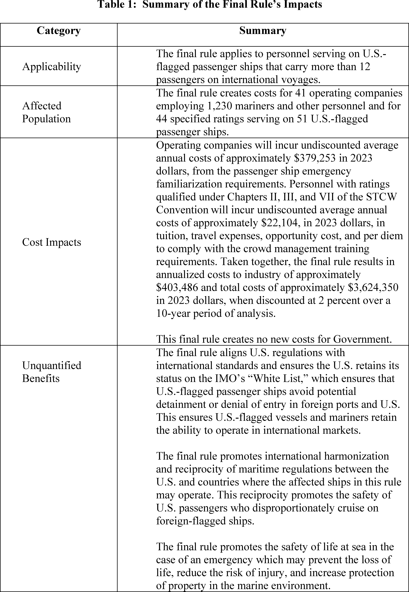
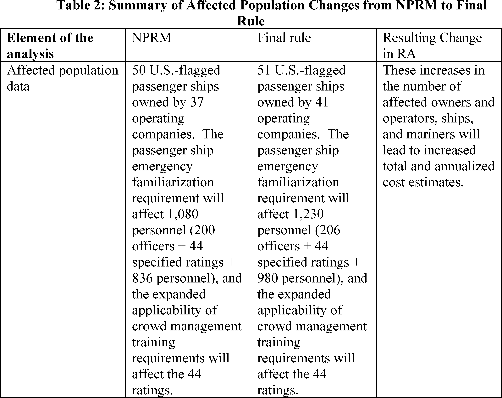

# Daily Digest — 2026-09-25

| | |
|---|---|
| **Digest date** | 2026-09-25 |
| **Data date range** | 2026-09-25 to 2026-09-25 |
| **Generated at** | 2026-09-26T04:23:52Z (UTC) |
| **Pipeline version** | 4bafb92 |
| **Inference** | model layers ran — gemini/gemini-2.5-flash |
| **Source watermarks** | CREC: 2026-09-25T18:00:04Z · BILLS: 2026-09-25T08:08:56Z · FR: 2026-09-25T07:22:05Z · USCOURTS: 2026-09-26T01:49:33Z · PLAW: 2026-09-25T12:51:35Z |

[Full observed listing for this day](day/2026-09-25.html) — every item our collectors observed for this publication day, mechanical rules applied, frozen at end of day. This digest is the canonical record.

All items below cite the govinfo package (and granule, where applicable) they
summarize. Selection is mechanical; each item states the rule that included
it. See the Coverage Statement at the end for a full accounting of what was
published, what was summarized, and what was excluded and why.

---

## Contents

- [Day in Review](#day-in-review)
- [1. Congressional Floor Activity](#1-congressional-floor-activity)
- [2. Legislation](#2-legislation)
- [3. Federal Register](#3-federal-register)
- [4. Enacted Laws](#4-enacted-laws)
- [5. Judicial Activity](#5-judicial-activity)
- [6. Agency Announcements](#6-agency-announcements)
- [7. Recorded Votes](#7-recorded-votes)
- [8. Bill Actions](#8-bill-actions)
- [9. Presidential Actions](#9-presidential-actions)
- [Terms Used Today](#terms-used-today)
- [Coverage Statement](#coverage-statement)
- [Methodology](#methodology)

---

## Day in Review

The Senate resumed consideration of S. 4668, the "PROTECT COLLEGE SPORTS ACT OF 2026," and H. Con. Res. 89 regarding U.S. Armed Forces. The Senate passed S. 3257, the "John A. Hauser Mental Health in Aviation Act." The digest carries one newly enacted public law, Public Law 119–111, which imposes sanctions on the Russian Federation. Thirteen public bills and resolutions were introduced in the House, with twenty-nine bills and one original bill introduced in the Senate.

The digest carries one Presidential Proclamation, designating Gold Star Mother’s and Family’s Day. Sixteen final rules were published, including actions from the Coast Guard on merchant mariner training and the Food and Drug Administration on food additive regulations. The Department of the Treasury revised sanctions and increased an estate tax closing letter user fee. The Environmental Protection Agency approved an air quality plan for Kentucky, and the Department of Transportation finalized program amendments. Eight proposed rules were also published, addressing Department of Justice rulemaking requests and Federal Aviation Administration airspace.

The digest carries 1108 district court opinions and six bankruptcy court opinions, including one from the Tenth Circuit Bankruptcy Appellate Panel dismissing an appeal. Twenty-six appellate court opinions were also observed, with decisions from the Tenth Circuit affirming a prison sentence and the Third Circuit upholding a state act. The Fourth Circuit issued decisions regarding the use of a cell site simulator, and the Ninth Circuit affirmed a settlement approval and reversed an employment discrimination dismissal. The U.S. Court of International Trade issued seven opinions, remanding and sustaining various Department of Commerce determinations on antidumping and countervailing duty orders.

*Composed from the summarized items below and the day's mechanical
counts; all specifics are cited in their sections.*

---

## 1. Congressional Floor Activity

Source: Congressional Record (CREC), issue observed 2026-09-25, covering proceedings of 2026-09-24. Published by govinfo 2026-09-25T18:00:04Z; observed by our collector 2026-09-25T18:07:02Z. Total issue size: 274 granule(s).

### 1.1 Senate

Tags: legislative · model keys: foreign military sale · proposed legislation · resolutions

*In plain terms: The Senate section includes 11 items, such as the passage of the Mental Health in Aviation Act, a proposed F-35 sale to Saudi Arabia, and consideration of a resolution on Iran, plus other introduced legislation.*

- **Legislative Session** — The Senate resumed consideration of S. 4668, the "PROTECT COLLEGE SPORTS ACT OF 2026," and associated amendments. Senator Grassley delivered remarks on healthcare fraud, discussing efforts to address misuse of funds in programs like ObamaCare and Medicaid, and mentioned the introduction of the "Healthcare Fraud Prevention and Improvement Act." Senator Thune then discussed partisanship in Congress, referencing the "Working Families Tax Cuts" and efforts to pass the "Ratepayer Protection Act," and addressed government funding.
  - *In plain terms:* The Senate resumed debating S. 4668, the "PROTECT COLLEGE SPORTS ACT OF 2026," and amendments, while Senators Grassley and Thune discussed healthcare fraud, partisanship, and government funding.
  - Included because: CREC-SEL-01 — floor item ≥ threshold floor time (28,277 characters) (document dated 2026-09-24)
  - Source: [CREC-2026-09-24 / CREC-2026-09-24-pt1-PgS4959-6](https://www.govinfo.gov/app/details/CREC-2026-09-24/CREC-2026-09-24-pt1-PgS4959-6)
- **Directing the President, Pursuant to Section 5(c) of the War Powers Resolution, to Remove United States Armed Forces fr…** — The Senate proceeded to consider H. Con. Res. 89, a concurrent resolution directing the President to remove United States Armed Forces from hostilities with Iran pursuant to section 5(c) of the War Powers Resolution. Senators delivered remarks concerning the resolution.
  - *In plain terms:* The Senate considered H. Con. Res. 89, a resolution directing the President to remove U.S. Armed Forces from hostilities with Iran under the War Powers Resolution.
  - Included because: CREC-SEL-01 — floor item ≥ threshold floor time (93,659 characters) (document dated 2026-09-24)
  - Source: [CREC-2026-09-24 / CREC-2026-09-24-pt1-PgS4962](https://www.govinfo.gov/app/details/CREC-2026-09-24/CREC-2026-09-24-pt1-PgS4962)
- **Arms Sales Notification** — This document notifies Congress of a proposed foreign military sale to the Kingdom of Saudi Arabia, pursuant to the Arms Export Control Act. The sale includes forty-eight F-35 Lightning II Joint Strike Fighter aircraft, forty-nine Pratt & Whitney F135-PW-100 Engines, and associated support, equipment, and services, with an estimated total cost of $24.3 billion.
  - *In plain terms:* This document notifies Congress of a proposed foreign military sale to Saudi Arabia under the Arms Export Control Act, including 48 F-35 aircraft and 49 engines for $24.3 billion.
  - Included because: CREC-SEL-01 — floor item ≥ threshold floor time (16,974 characters) (document dated 2026-09-24)
  - Source: [CREC-2026-09-24 / CREC-2026-09-24-pt1-PgS4976](https://www.govinfo.gov/app/details/CREC-2026-09-24/CREC-2026-09-24-pt1-PgS4976)
- **Executive and Other Communications** — This document lists executive and other communications laid before the Senate and referred to various committees. These communications include reports of rules from federal agencies such as the Drug Enforcement Administration regarding controlled substances, as well as rules from the Federal Bureau of Prisons, Federal Deposit Insurance Corporation, Federal Transit Administration, Federal Communications Commission, U.S. Coast Guard, and Federal Motor Carrier Safety Administration.
  - *In plain terms:* This document lists executive communications and agency rule reports, including those from DEA and FDIC, that were presented to the Senate and sent to various committees.
  - Included because: CREC-SEL-01 — floor item ≥ threshold floor time (48,983 characters) (document dated 2026-09-24)
  - Source: [CREC-2026-09-24 / CREC-2026-09-24-pt1-PgS4984-3](https://www.govinfo.gov/app/details/CREC-2026-09-24/CREC-2026-09-24-pt1-PgS4984-3)
- **Petitions and Memorials** — This document records petitions and memorials referred to Senate committees from Ohio and Arizona legislatures. Ohio resolutions supported a federal advanced air mobility integration pilot program proposal and the relocation of NASA headquarters to Cleveland. The Ohio Senate urged federal action to reduce veterans' disability claim processing times, while Arizona's legislature advocated for streamlining access to critical minerals on federal land withdrawals.
  - *In plain terms:* This document records petitions from Ohio and Arizona legislatures to Senate committees, concerning advanced air mobility, NASA's HQ, veterans' claim times, and critical minerals access on federal land.
  - Included because: CREC-SEL-01 — floor item ≥ threshold floor time (59,341 characters) (document dated 2026-09-24)
  - Source: [CREC-2026-09-24 / CREC-2026-09-24-pt1-PgS4988](https://www.govinfo.gov/app/details/CREC-2026-09-24/CREC-2026-09-24-pt1-PgS4988)
- **Introduction of Bills and Joint Resolutions** — This document lists 29 bills and one original bill introduced in the Senate and referred to various committees. The proposed legislation addresses topics including veterans' affairs, healthcare access and costs, housing, critical infrastructure cybersecurity, election security, retirement savings, and maternal mortality prevention. Other bills concern intellectual property rights, border security, agriculture programs, and an excise tax on digital advertising.
  - *In plain terms:* This document lists 29 bills and one original bill introduced in the Senate, sent to committees, addressing topics like veterans, healthcare, housing, cybersecurity, election security, and maternal mortality prevention.
  - Included because: CREC-SEL-01 — floor item ≥ threshold floor time (24,250 characters) (document dated 2026-09-24)
  - Source: [CREC-2026-09-24 / CREC-2026-09-24-pt1-PgS4993-3](https://www.govinfo.gov/app/details/CREC-2026-09-24/CREC-2026-09-24-pt1-PgS4993-3)
- **Statements on Introduced Bills and Joint Resolutions** — Senate Bill 5515, titled the "Community Access, Resources, and Empowerment for Moms Act" or the "CARE for Moms Act," was introduced. The bill's findings state that maternal mortality rates in the United States increased from 2000 to 2021, exceeding rates in other high-income countries, with over 80 percent of maternal deaths estimated as preventable. It notes racial disparities in mortality, the impact of COVID-19, and outlines the need for standardized federal data collection and a maternal mortalities and morbidities registry and surveillance system.
  - *In plain terms:* Senate Bill 5515, the "CARE for Moms Act," was introduced, noting that U.S. maternal mortality rose from 2000-2021 and proposing standardized data collection and a surveillance system.
  - Included because: CREC-SEL-01 — floor item ≥ threshold floor time (84,339 characters) (document dated 2026-09-24)
  - Source: [CREC-2026-09-24 / CREC-2026-09-24-pt1-PgS4998](https://www.govinfo.gov/app/details/CREC-2026-09-24/CREC-2026-09-24-pt1-PgS4998)
- **Introductory Statement on S. 5515** — Senate Bill 5515, titled the "Community Access, Resources, and Empowerment for Moms Act" or the "CARE for Moms Act," was introduced. The bill's findings state that maternal mortality rates in the United States increased from 2000 to 2021, exceeding rates in other high-income countries, with over 80 percent of maternal deaths estimated as preventable. It notes racial disparities in mortality, the impact of COVID-19, and outlines the need for standardized federal data collection and a maternal mortalities and morbidities registry and surveillance system.
  - *In plain terms:* Senate Bill 5515, the "CARE for Moms Act," was introduced, noting that U.S. maternal mortality rose from 2000-2021 and proposing standardized data collection and a surveillance system.
  - Included because: CREC-SEL-01 — floor item ≥ threshold floor time (63,210 characters) (document dated 2026-09-24)
  - Source: [CREC-2026-09-24 / CREC-2026-09-24-pt1-PgS4998-2](https://www.govinfo.gov/app/details/CREC-2026-09-24/CREC-2026-09-24-pt1-PgS4998-2)
- **Text of Amendments** — This document details several submitted amendments to bills. SA 6830 requires intercollegiate athletic entities to disclose foreign financing exceeding $600 to their athletic association, with annual reports to the Department of Education and public availability. SA 6832 would prohibit the President, Vice President, or Cabinet Members from using official advertisements primarily for self-promotion, while SA 6833, the "Muhammad Ali American Boxing Revival Act of 2026," proposes to establish requirements for unified boxing organizations for enhanced safety, medical care, and anti-doping programs.
  - *In plain terms:* This document details amendments SA 6830, requiring disclosure of foreign financing for college sports, SA 6832 on official advertisements, and SA 6833, proposing boxing organization requirements for safety.
  - Included because: CREC-SEL-01 — floor item ≥ threshold floor time (51,645 characters) (document dated 2026-09-24)
  - Source: [CREC-2026-09-24 / CREC-2026-09-24-pt1-PgS5012](https://www.govinfo.gov/app/details/CREC-2026-09-24/CREC-2026-09-24-pt1-PgS5012)
- **Text of Senate Amendment 6833** — SA 6833, titled the "Muhammad Ali American Boxing Revival Act of 2026," was submitted as an amendment to H.R. 4624. The amendment proposes to modify the Professional Boxing Safety Act of 1996 to establish requirements for unified boxing organizations, providing an alternative system for compliance. It includes provisions for enhanced safety standards, medical examinations for boxers, additional ringside medical care, support services for boxers, and a comprehensive anti-doping program.
  - *In plain terms:* SA 6833, the "Muhammad Ali American Boxing Revival Act of 2026," was submitted to H.R. 4624, proposing requirements for unified boxing organizations to improve safety, medical care, and anti-doping.
  - Included because: CREC-SEL-01 — floor item ≥ threshold floor time (32,734 characters) (document dated 2026-09-24)
  - Source: [CREC-2026-09-24 / CREC-2026-09-24-pt1-PgS5012-5](https://www.govinfo.gov/app/details/CREC-2026-09-24/CREC-2026-09-24-pt1-PgS5012-5)
- **John A. Hauser Mental Health in Aviation Act** — The Senate considered and passed S. 3257, cited as the "John A. Hauser Mental Health in Aviation Act." This legislation requires the Administrator of the Federal Aviation Administration to update regulations and issue guidance to encourage mental health disclosure among aviation personnel. It also directs reviews of the mental health special issuance process, allocates funds to improve the Office of Aerospace Medicine's capacity, and mandates a public information campaign.
  - *In plain terms:* The Senate passed S. 3257, the "John A. Hauser Mental Health in Aviation Act," requiring the FAA to update rules and guidance to encourage mental health disclosure for aviation personnel.
  - Included because: CREC-SEL-01 — floor item ≥ threshold floor time (22,782 characters) (document dated 2026-09-24)
  - Source: [CREC-2026-09-24 / CREC-2026-09-24-pt1-PgS5017-3](https://www.govinfo.gov/app/details/CREC-2026-09-24/CREC-2026-09-24-pt1-PgS5017-3)

### 1.2 House of Representatives

Tags: legislative · model keys: expenditure reports · foreign travel · public bills

*In plain terms: Today's House section lists 2 items, including expenditure reports for foreign travel and newly introduced public bills and resolutions.*

- **Expenditure Reports Concerning Official Foreign Travel** — This document contains expenditure reports for official foreign travel by members and employees of the House of Representatives. The reports detail foreign currencies and U.S. dollars used for travel during the fourth quarter of 2025 and the first, second, and third quarters of 2026, including amended reports for earlier periods. Expenditures are categorized by per diem, transportation, and other purposes, with totals provided for individual travelers and committees.
  - *In plain terms:* This document reports House members' and employees' foreign travel spending in foreign currencies and U.S. dollars for Q4 2025 and Q1-Q3 2026, categorized by purpose and showing totals.
  - Included because: CREC-SEL-01 — floor item ≥ threshold floor time (19,268 characters) (document dated 2026-09-24)
  - Source: [CREC-2026-09-24 / CREC-2026-09-24-pt1-PgH5998-3](https://www.govinfo.gov/app/details/CREC-2026-09-24/CREC-2026-09-24-pt1-PgH5998-3)
- **Public Bills and Resolutions** — This document lists public bills and resolutions introduced in the House of Representatives. Each entry includes the bill number, its title, the sponsoring members, and the committees to which the legislation was referred for consideration.
  - *In plain terms:* This document lists public bills and resolutions introduced in the House, showing each bill's number, title, sponsors, and committees it was sent to for consideration.
  - Included because: CREC-SEL-01 — floor item ≥ threshold floor time (45,265 characters) (document dated 2026-09-24)
  - Source: [CREC-2026-09-24 / CREC-2026-09-24-pt1-PgH6000-2](https://www.govinfo.gov/app/details/CREC-2026-09-24/CREC-2026-09-24-pt1-PgH6000-2)

### 1.3 Recorded Votes

No recorded votes were published in this issue of the Congressional Record.

---

## 2. Legislation

Source: Congressional Bills (BILLS), text versions published 2026-09-25 to 2026-09-25.

### 2.1 Counts by Stage

| Stage (bill text version) | Count |
|---|---|
| Introduced (ih/is) | 13 |
| Reported (rh/rs) | 0 |
| Engrossed (eh/es) | 0 |
| Enrolled (enr) | 0 |
| Other versions | 0 |
| **Total bill texts published** | **13** |

### 2.2 Bills Listed by Mechanical Rule

Bills below are listed because they matched at least one listing rule; the
matching rule is stated per item. All other bill texts are counted above and
accounted for in the Coverage Statement.

No bill texts published in this range matched a listing rule; all 13 are
accounted for in the Coverage Statement.

---

## 3. Federal Register

Source: Federal Register (FR), issue of 2026-09-25.

### 3.1 Counts by Document Type

| Document type | Count |
|---|---|
| Rules | 16 |
| Proposed rules | 8 |
| Notices | 80 |
| Presidential documents | 0 |
| **Total FR documents** | **104** |

### 3.2 Rules Published

Tags: department of health and human services · executive · securities and exchange commission · model keys: final rules · food additives · sanctions regulations

*In plain terms: The Rules section presents 16 items, featuring DOT amendments for Disadvantaged Business Enterprise programs and two ATF final rules implementing the Safe Explosives Act, plus other updates from FDA, EPA, and OFAC.*

#### DEPARTMENT OF AGRICULTURE

- **Driving Efficiency in Farm Loan Delivery; Correction** (2026-19696; 7 CFR Parts 765, 766, 767) — The Farm Service Agency (FSA) is issuing a correction to a final rule published in the Federal Register on September 4, 2026, which will be effective October 1, 2026. The final rule amended FSA's Farm Loan Program (FLP) regulations to permanently implement the Application Fast Track (AFT) process and to make other regulatory changes intended to improve program efficiency and support IT modernization efforts. This document corrects three amendatory instructions. These corrections do not include any substantive changes to the final rule. Action: Final rule; correction. Dates: This correction is effective: October 1, 2026.
  - *In plain terms:* The Farm Service Agency is correcting three instructions in a final rule published September 4, 2026, effective October 1, 2026, which amended Farm Loan Program regulations to implement the Application Fast Track process.
  - Included because: FR-SEL-01 — document type: final rule (all listed)
  - Source: [FR-2026-09-25 / 2026-19696](https://www.govinfo.gov/app/details/FR-2026-09-25/2026-19696)

#### DEPARTMENT OF COMMERCE

- **Atlantic Highly Migratory Species; Atlantic Bluefin Tuna Fisheries; Closure of the General Category September Fishery for 2026** (2026-19681; 50 CFR Part 635) — NMFS closes the General category fishery for Atlantic bluefin tuna (BFT) for the remainder of the September time period. The General category may only retain, possess, or land large medium and giant ( i.e., measuring 73 inches (185 centimeters (cm) curved fork length (CFL) or greater) BFT when the fishery is open. This action also waives the previously scheduled restricted-fishing days (RFDs) for the remainder of the September time period. With the RFDs waived during the closure, fishermen aboard General category permitted vessels and HMS Charter/Headboat permitted vessels may tag and release BFT of all sizes, subject to the requirements of the catch-and- release and tag-and-release programs. On October 1, 2026, the fishery will reopen automatically and previously scheduled RFDs for the October through November time period will resume. Action: Temporary rule; closure. Dates: Effective 11:30 p.m., local time, September 24, 2026, through September 30, 2026.
  - *In plain terms:* NMFS closed the General category Atlantic bluefin tuna fishery for the remainder of September 2026, waiving restricted-fishing days, but it will automatically reopen October 1, 2026.
  - Included because: FR-SEL-01 — document type: final rule (all listed)
  - Source: [FR-2026-09-25 / 2026-19681](https://www.govinfo.gov/app/details/FR-2026-09-25/2026-19681)

#### DEPARTMENT OF HEALTH AND HUMAN SERVICES

- **Food Additives Permitted for Direct Addition to Food for Human Consumption; Vitamin D 2 Inactive Bakers Yeast** (2026-19656; 21 CFR Part 172) — The Food and Drug Administration (FDA or we) is amending the food additive regulations to provide for the safe use of vitamin D 2 inactive bakers yeast as a source of vitamin D 2 in specific food categories. We are taking this action in response to a food additive petition filed by Lallemand Inc. (Lallemand or petitioner). Action: Final amendment; order. Dates: This order is effective September 25, 2026. See section VII for further information on the filing of objections. Either electronic or written objections and requests for a hearing on the final order must be submitted by October 26, 2026.
  - *In plain terms:* The FDA is amending food additive regulations for the safe use of vitamin D2 inactive bakers yeast as a vitamin D2 source in specific foods, following a petition from Lallemand Inc.
  - Included because: FR-SEL-01 — document type: final rule (all listed)
  - Source: [FR-2026-09-25 / 2026-19656](https://www.govinfo.gov/app/details/FR-2026-09-25/2026-19656)

#### DEPARTMENT OF HOMELAND SECURITY

- **Implementation of Training Requirements for Personnel Serving on U.S.-Flagged Passenger Ships That Carry More Than 12 Passengers on International Voyages** (2026-19652; 46 CFR Parts 11 and 12) — The Coast Guard is amending its merchant mariner training regulations to implement amendments to the International Convention on Standards of Training, Certification and Watchkeeping for Seafarers, 1978, and the Seafarers' Training, Certification and Watchkeeping Code, to require personnel serving on U.S.-flagged passenger ships carrying more than 12 passengers on international voyages to complete passenger ship emergency familiarization. This final rule also expands the applicability of the required crowd management training to include specified ratings on passenger ships. These required trainings would promote the safety of life at sea. Action: Final rule. Dates: This final rule is effective October 26, 2026. The incorporation by reference of certain material listed in this rule is approved by the Director of the Federal Register as of October 26, 2026.
  - *In plain terms:* The Coast Guard is changing merchant mariner training regulations to require personnel on U.S.-flagged international passenger ships with over 12 people to complete emergency familiarization and crowd management training.
  - Included because: FR-SEL-01 — document type: final rule (all listed)
  - Source: [FR-2026-09-25 / 2026-19652](https://www.govinfo.gov/app/details/FR-2026-09-25/2026-19652)
  -  *Source graphic 1 of 25 from 2026-19652.*
  -  *Source graphic 2 of 25 from 2026-19652.*
  - *Graphics not rendered here: 23 of 25 — see the [source PDF](https://www.govinfo.gov/content/pkg/FR-2026-09-25/pdf/FR-2026-09-25.pdf).*
- **Special Local Regulation; Milwaukee River and Menomonee River, Milwaukee, WI** (2026-19653; 33 CFR Part 100) — The Coast Guard is establishing a temporary special local regulation (SLR) for certain navigable waters of the Milwaukee River and Menomonee River. This action is necessary to provide for the safety of life on these navigable waters in Milwaukee, WI, during the Milwaukee River Challenge event on October 3, 2026. This regulation prohibits persons and vessels from entering the regulated area unless specifically authorized by the Captain of the Port Sector Lake Michigan or their designated representative. Action: Temporary final rule. Dates: This rule is effective on October 3, 2026, from 8 a.m. to 3:30 p.m.
  - *In plain terms:* The Coast Guard established a temporary local rule for Milwaukee and Menomonee Rivers for safety during the Milwaukee River Challenge on October 3, 2026, banning unauthorized entry.
  - Included because: FR-SEL-01 — document type: final rule (all listed)
  - Source: [FR-2026-09-25 / 2026-19653](https://www.govinfo.gov/app/details/FR-2026-09-25/2026-19653)

#### DEPARTMENT OF JUSTICE

- **Implementing the Safe Explosives Act** (2026-19693; 27 CFR Part 555) — The Bureau of Alcohol, Tobacco, Firearms, and Explosives (“ATF”) is finalizing two Department of Justice (“Department”) interim final rules (“IFRs”) implementing the Safe Explosives Act. This rule formally ends those rules' interim status, responds to public comments from 2003 on the IFRs, rescinds ATF Ruling 2003-5 issued in response to IFR comments, and makes certain revisions to IFR provisions in response to the comments. They clarify when federal licensees/permittees must report changes in responsible persons and authorized employees; eliminate verifying identity of persons accepting delivery on behalf of distributees; and amend regulatory exemption language governing aspects of transporting explosive materials. Action: Final rule. Dates: This rule is effective October 26, 2026.
  - *In plain terms:* The Bureau of Alcohol, Tobacco, Firearms, and Explosives is finalizing two rules that took effect now while public comments were still accepted, implementing the Safe Explosives Act with clarifications on reporting and transport exemptions.
  - Included because: FR-SEL-01 — document type: final rule (all listed)
  - Source: [FR-2026-09-25 / 2026-19693](https://www.govinfo.gov/app/details/FR-2026-09-25/2026-19693)
- **Annual Notices on Explosive Materials Storage Facilities to Local Fire Authority** (2026-19694; 27 CFR Part 555) — The Bureau of Alcohol, Tobacco, Firearms, and Explosives (“ATF”) is amending Department of Justice (“Department”) regulations on reporting explosive materials storage. Currently, any person who stores explosive materials subject to ATF's explosives regulations must notify the authority having jurisdiction for fire safety in that locality when they begin storing explosives at that site. This rule adds a requirement to also submit written notices every 12 months thereafter and when the person ceases storing explosives at that location and to retain copies of the notices for five years. These changes are intended to increase public safety, particularly for first responders. Action: Final rule. Dates: This rule is effective October 26, 2026.
  - *In plain terms:* The Bureau of Alcohol, Tobacco, Firearms, and Explosives is changing regulations for reporting explosive materials storage, requiring annual written notices to local fire authorities and when storage ceases, and retaining copies for five years.
  - Included because: FR-SEL-01 — document type: final rule (all listed)
  - Source: [FR-2026-09-25 / 2026-19694](https://www.govinfo.gov/app/details/FR-2026-09-25/2026-19694)

#### DEPARTMENT OF THE INTERIOR

- **National Wildlife Refuge System; 2026-2027 Station-Specific Hunting and Sport Fishing Regulations; Correction** (2026-19723; 50 CFR Part 71) — We, the U.S. Fish and Wildlife Service (FWS or Service), are correcting a final rule that appeared in the Federal Register on September 1, 2026. The rule opened or expanded hunting opportunities on 111 field stations, including 107 units of the National Wildlife Refuges System (Refuge System or NWRS) and 4 units of the National Fish Hatchery System (Hatchery System or NFHS). Action: Correcting amendments. Dates: This rule is effective September 25, 2026.
  - *In plain terms:* The U.S. Fish and Wildlife Service is correcting a final rule published on September 1, 2026, which opened or expanded hunting opportunities on 111 field stations, including 107 National Wildlife Refuges.
  - Included because: FR-SEL-01 — document type: final rule (all listed)
  - Source: [FR-2026-09-25 / 2026-19723](https://www.govinfo.gov/app/details/FR-2026-09-25/2026-19723)

#### DEPARTMENT OF THE TREASURY

- **Terrorism List Governments Sanctions Regulations** (2026-19657; 31 CFR Part 596) — The Department of the Treasury's Office of Foreign Assets Control (OFAC) is amending the Terrorism List Governments Sanctions Regulations to implement changes resulting from the rescission of the designation of Syria as a State Sponsor of Terrorism. Specifically, OFAC is removing and reserving a Syria-specific general license because the authorization is no longer necessary following the rescission. Action: Final rule. Dates: This rule is effective September 25, 2026.
  - *In plain terms:* OFAC is amending the Terrorism List Governments Sanctions Regulations by removing a Syria-specific license, following Syria's rescission as a State Sponsor of Terrorism.
  - Included because: FR-SEL-01 — document type: final rule (all listed)
  - Source: [FR-2026-09-25 / 2026-19657](https://www.govinfo.gov/app/details/FR-2026-09-25/2026-19657)
- **Estate Tax Closing Letter User Fee Update** (2026-19666; 26 CFR Part 300) — This document contains final regulations relating to the imposition of a user fee on authorized persons requesting the issuance of IRS Letter 627, also referred to as an estate tax closing letter. The final regulations, which adopt without change the text of the proposed regulations, increase the amount of the user fee imposed on a request for the issuance of an estate tax closing letter from $56 to $76. The Independent Offices Appropriations Act of 1952 authorizes the charging of user fees. The final regulations affect persons who request an estate tax closing letter. Action: Final rule. Dates: Effective date: These regulations are effective on October 26, 2026. Applicability date: For date of applicability, see § 300.12(d).
  - *In plain terms:* Final regulations increase the user fee for requesting an IRS estate tax closing letter (Letter 627) from $56 to $76, affecting those who request it.
  - Included because: FR-SEL-01 — document type: final rule (all listed)
  - Source: [FR-2026-09-25 / 2026-19666](https://www.govinfo.gov/app/details/FR-2026-09-25/2026-19666)
- **Sanctions Penalties Regulations** (2026-19678; 31 CFR Part 505) — The Department of the Treasury's Office of Foreign Assets Control (OFAC) is adding the Sanctions Penalties Regulations. These new regulations consolidate previously existing information regarding penalties applicable to multiple sanctions programs implemented by OFAC. Action: Final rule. Dates: This rule is effective September 25, 2026.
  - *In plain terms:* OFAC is adding new Sanctions Penalties Regulations to combine existing information about penalties that apply to its various sanctions programs.
  - Included because: FR-SEL-01 — document type: final rule (all listed)
  - Source: [FR-2026-09-25 / 2026-19678](https://www.govinfo.gov/app/details/FR-2026-09-25/2026-19678)

#### DEPARTMENT OF TRANSPORTATION

- **Disadvantaged Business Enterprise and Airport Concession Disadvantaged Business Enterprise Program Revisions** (2026-19688; 49 CFR Parts 23 and 26) — The U.S. Department of Transportation (DOT or Department) is finalizing amendments to its Disadvantaged Business Enterprise (DBE) and Airport Concession Disadvantaged Business Enterprise (ACDBE) program regulations. With few modifications, this final rule follows the interim final rule (IFR) published on October 3, 2025, which eliminated race- and sex-based presumptions that DOT determined to be unconstitutional. This action completes the transition to a system of individualized determinations of social and economic disadvantage to ensure program constitutional compliance and addresses administrative challenges identified by stakeholders during the public comment period. Action: Final rule. Dates: This rule is effective September 25, 2026.
  - *In plain terms:* The U.S. Department of Transportation is finalizing amendments to its Disadvantaged Business Enterprise programs, following a rule that took effect October 3, 2025, to ensure constitutional compliance by ending race- and sex-based presumptions.
  - Included because: FR-SEL-01 — document type: final rule (all listed)
  - Source: [FR-2026-09-25 / 2026-19688](https://www.govinfo.gov/app/details/FR-2026-09-25/2026-19688)
- **IFR Altitudes; Miscellaneous Amendments** (2026-19722; 14 CFR Part 95) — This amendment adopts miscellaneous amendments to the required IFR (instrument flight rules) altitudes and changeover points for certain Federal airways, jet routes, or direct routes for which a minimum or maximum en-route authorized IFR altitude is prescribed. This regulatory action is needed because of changes occurring in the National Airspace System. These changes are designed to provide for the safe and efficient use of the navigable airspace under instrument conditions in the affected areas. Action: Final rule. Dates: Effective 0901 UTC, October 29, 2026.
  - *In plain terms:* The FAA is changing various rules for required instrument flight rules (IFR) altitudes and changeover points on certain Federal airways due to changes occurring in the National Airspace System.
  - Included because: FR-SEL-01 — document type: final rule (all listed)
  - Source: [FR-2026-09-25 / 2026-19722](https://www.govinfo.gov/app/details/FR-2026-09-25/2026-19722)

#### ENVIRONMENTAL PROTECTION AGENCY

- **Air Plan Approval; Kentucky; Campbell-Clermont Area Maintenance Plan for the 2010 1-Hour SO 2 NAAQS** (2026-19668; 40 CFR Part 52) — The U.S. Environmental Protection Agency (EPA or Agency) is approving a State Implementation Plan (SIP) revision submitted by the Commonwealth of Kentucky, through the Kentucky Division for Air Quality (DAQ), on February 20, 2025. The SIP revision includes the second 10-year maintenance plan for the Kentucky portion of the Campbell-Clermont, Kentucky-Ohio maintenance area (“Campbell-Clermont, KY-OH Area” or “Area”) for the 2010 1-hour sulfur dioxide (SO 2 ) National Ambient Air Quality Standards (NAAQS). The Kentucky portion of the Area is comprised of a part of Campbell County. The EPA is approving Kentucky's second 10-year maintenance plan for the Kentucky portion of the Area because the Commonwealth has demonstrated that it is consistent with the Clean Air Act (CAA or Act). Action: Direct final rule. Dates: This direct final rule is effective November 24, 2026 without further notice, unless EPA receives adverse comment by October 26, 2026. If adverse comments are received, the EPA will publish a timely withdrawal of the direct final rule in the Federal Register informing the public that the rule will not take effect.
  - *In plain terms:* The EPA is approving Kentucky's plan revision, submitted February 20, 2025, to establish a second 10-year maintenance plan for Campbell County's 2010 1-hour sulfur dioxide air quality standards.
  - Included because: FR-SEL-01 — document type: final rule (all listed)
  - Source: [FR-2026-09-25 / 2026-19668](https://www.govinfo.gov/app/details/FR-2026-09-25/2026-19668)
- **Clarifying the Scope of “Applicable Requirements” Under State Operating Permit Programs and the Federal Operating Permit Program** (2026-19671; 40 CFR Parts 70 and 71) — The U.S. Environmental Protection Agency (EPA) is updating the title V operating permit program regulations to codify the Agency's existing interpretations and policies concerning when and whether “applicable requirements” established in other Clean Air Act (CAA) programs may be reviewed, modified, and/or implemented through the title V operating permit program. Specifically, this final rule clarifies the limited situations in which requirements under the New Source Review (NSR) preconstruction permitting program would be reviewed using the EPA's title V oversight authorities. Additionally, this final rule clarifies that requirements related to an owner or operator's general duty to prevent accidental releases of hazardous substances are not “applicable requirements” for title V purposes and are, therefore, not implemented through title V. Action: Final rule. Dates: This final rule is effective on October 26, 2026.
  - *In plain terms:* The EPA is updating title V operating permit program regulations to formalize interpretations on how other Clean Air Act requirements are reviewed and to clarify what is not considered an "applicable requirement."
  - Included because: FR-SEL-01 — document type: final rule (all listed)
  - Source: [FR-2026-09-25 / 2026-19671](https://www.govinfo.gov/app/details/FR-2026-09-25/2026-19671)

#### POSTAL SERVICE

- **National Environmental Policy Act Implementing Procedures** (2026-19720; 39 CFR Part 775) — The United States Postal Service (USPS) is publishing this interim final rule with request for comments to partially rescind and update its remaining National Environmental Policy Act (NEPA) implementing procedures, which were promulgated to implement the now-rescinded Council on Environmental Quality (CEQ) regulations. Action: Interim final rule; request for comments. Dates: This interim final rule is effective September 25, 2026. Comments are due by October 26, 2026.
  - *In plain terms:* The United States Postal Service is publishing a rule that takes effect now while public comments are still accepted, to partially rescind and update its National Environmental Policy Act implementing procedures.
  - Included because: FR-SEL-01 — document type: final rule (all listed)
  - Source: [FR-2026-09-25 / 2026-19720](https://www.govinfo.gov/app/details/FR-2026-09-25/2026-19720)

### 3.3 Proposed Rules Published

Tags: department of health and human services · executive · securities and exchange commission · model keys: color additive petition · explosives storage · proposed rules

*In plain terms: The Proposed Rules section details 8 items, including two ATF proposals on explosives storage and an FDA color additive petition, with other updates to air plans, airspace, and comment periods.*

#### DEPARTMENT OF AGRICULTURE

- **Modernization of Regulations Under 9 CFR Parts 101-118 and 123-124; Extension of Comment Period** (2026-19710; 9 CFR Parts 101 Through 118, 123, and 124) — The U.S. Department of Agriculture (USDA) is extending the public comment period by 20 days on its Request for Information (RFI) to solicit the public's input on regulatory considerations related to 9 CFR parts 101-118, 123-124. Action: Request for Information; extension of comment period. Dates: The comment period for the document originally published on September 11, 2026, (91 FR 57828) is extended 20 days. Comments must be submitted on or before November 2, 2026.
  - *In plain terms:* The U.S. Department of Agriculture is extending the public comment period by 20 days on its request for public input regarding regulatory considerations under 9 CFR parts 101-118 and 123-124.
  - Included because: FR-SEL-02 — document type: proposed rule (all listed)
  - Source: [FR-2026-09-25 / 2026-19710](https://www.govinfo.gov/app/details/FR-2026-09-25/2026-19710)

#### DEPARTMENT OF HEALTH AND HUMAN SERVICES

- **Filing of Color Additive Petition From Doehler GmbH; Request To Amend the Color Additive Regulations To Provide for the Safe Use of Calcium Sulfate in Various Foods at Levels Consistent With Good Manufacturing Practice** (2026-19658; 21 CFR Part 73) — The Food and Drug Administration (FDA or we) is announcing that we have filed a color additive petition, submitted by Doehler GmbH, c/o Hogan Lovells Cadwalader, proposing that we amend our color additive regulations to provide for the safe use of calcium sulfate in various foods at levels consistent with good manufacturing practice. Action: Notification of petition. Dates: The color additive petition was filed on September 10, 2026.
  - *In plain terms:* The FDA announced it has filed a color additive petition from Doehler GmbH, proposing to amend regulations for the safe use of calcium sulfate in various foods.
  - Included because: FR-SEL-02 — document type: proposed rule (all listed)
  - Source: [FR-2026-09-25 / 2026-19658](https://www.govinfo.gov/app/details/FR-2026-09-25/2026-19658)

#### DEPARTMENT OF JUSTICE

- **Department of Justice; Response to Correspondence Requesting Rulemaking** (2026-19642; 8 CFR Chapter V; 27 CFR Chapter II; 28 CFR Chapter I) — This document responds to 10 submissions received by the Department of Justice (“DOJ” or “the Department”) or its components that asked the Department or a component to initiate rulemaking. After reviewing these submissions, the Department declines to initiate rulemakings in response to them. Action: Petitions for rulemaking; denial. Dates: September 25, 2026.
  - *In plain terms:* The Department of Justice responded to 10 submissions requesting new rules but, after review, decided not to start any rulemakings.
  - Included because: FR-SEL-02 — document type: proposed rule (all listed)
  - Source: [FR-2026-09-25 / 2026-19642](https://www.govinfo.gov/app/details/FR-2026-09-25/2026-19642)
- **Explosives Magazine Safety Requirements** (2026-19691; 27 CFR Part 555) — The Bureau of Alcohol, Tobacco, Firearms, and Explosives (“ATF”) proposes amending Department of Justice (“Department”) regulations to streamline requirements for maintaining structures used for storing explosives, called “magazines.” ATF proposes consolidating many requirements from four regulatory sections into one, while eliminating other provisions within those sections. The new section would address three topics: safety requirements outside a magazine, inside a magazine, and storing requirements. This proposal would remove unnecessary provisions and examples confusing to the public; update other provisions; and rescind two regulatory sections. The consolidated regulation would also incorporate ATF guidance authorizing alternative methods for storing explosives within containers. Action: Notice of proposed rulemaking. Dates: Comments must be submitted in writing, and must be submitted on or before (or, if mailed, must be postmarked on or before) November 24, 2026. Commenters should be aware that the federal e-rulemaking portal comment system will not accept comments after midnight Eastern Time on the last day of the comment period.
  - *In plain terms:* The Bureau of Alcohol, Tobacco, Firearms, and Explosives proposes changing regulations to streamline requirements for storing explosives in "magazines" by consolidating four sections into one and removing unnecessary provisions.
  - Included because: FR-SEL-02 — document type: proposed rule (all listed)
  - Source: [FR-2026-09-25 / 2026-19691](https://www.govinfo.gov/app/details/FR-2026-09-25/2026-19691)
- **Revising Requirements and Exceptions for Storing Explosives** (2026-19692; 27 CFR Part 555) — The Bureau of Alcohol, Tobacco, Firearms, and Explosives (“ATF”) proposes amending Department of Justice regulations listing exceptions to the requirement that explosive materials must be stored in locked magazines. Specifically, ATF proposes adding a testing exception; removing restrictions limiting existing exceptions to materials being physically handled or transported to a site for storing or using; excepting materials to be imminently used or transported; and adopting a perforating gun exception. These changes would streamline on-site operations, acknowledge developments in industry practices, increase safety during these activities by reducing how often explosives are moved, and eliminate the requirement for type 3 magazines. Action: Notice of proposed rulemaking. Dates: Comments must be submitted in writing, and must be submitted on or before (or, if mailed, must be postmarked on or before) November 24, 2026. Commenters should be aware that the federal e-rulemaking portal comment system will not accept comments after midnight Eastern Time on the last day of the comment period.
  - *In plain terms:* The Bureau of Alcohol, Tobacco, Firearms, and Explosives proposes changing regulations on exceptions for storing explosives by adding a testing exception, removing restrictions, excepting imminently used materials, and adopting a perforating gun exception.
  - Included because: FR-SEL-02 — document type: proposed rule (all listed)
  - Source: [FR-2026-09-25 / 2026-19692](https://www.govinfo.gov/app/details/FR-2026-09-25/2026-19692)

#### DEPARTMENT OF TRANSPORTATION

- **Amendment of Class E Airspace; Del Rio, TX** (2026-19708; 14 CFR Part 71) — This action proposes to amend the Class E airspace at Del Rio, TX. The FAA is proposing this action as the result of a biennial review of the airspace associated with Laughlin Air Force Base (AFB), Del Rio, TX. This proposal would also update the name and geographic coordinates of Laughlin AFB to coincide with the FAA's aeronautical database. This action would bring the airspace into compliance with FAA orders and support instrument flight rule (IFR) procedures and operations. Action: Notice of proposed rulemaking (NPRM). Dates: Comments must be received on or before November 9, 2026.
  - *In plain terms:* The FAA proposes changing the Class E airspace at Del Rio, TX, and updating Laughlin Air Force Base's name and coordinates after a biennial review, to support instrument flight rule procedures.
  - Included because: FR-SEL-02 — document type: proposed rule (all listed)
  - Source: [FR-2026-09-25 / 2026-19708](https://www.govinfo.gov/app/details/FR-2026-09-25/2026-19708)

#### ENVIRONMENTAL PROTECTION AGENCY

- **Air Plan Approval; Kentucky; Campbell-Clermont Area Maintenance Plan for the 2010 1-Hour SO 2 NAAQS** (2026-19667; 40 CFR Part 52) — The U.S. Environmental Protection Agency (EPA) is proposing to approve a State Implementation Plan (SIP) revision submitted by the Commonwealth of Kentucky on February 20, 2025, for the purpose of establishing a second 10-year maintenance plan for the Kentucky portion of the Campbell-Clermont, Kentucky-Ohio maintenance area for the 2010 1-hour sulfur dioxide National Ambient Air Quality Standards. The EPA is proposing to approve this SIP revision because the Commonwealth has demonstrated that it is consistent with the Clean Air Act. Action: Proposed rule. Dates: Written comments must be received on or before October 26, 2026.
  - *In plain terms:* The EPA proposes to approve Kentucky's plan revision, submitted February 20, 2025, to establish a second 10-year maintenance plan for the Campbell-Clermont area's 2010 1-hour sulfur dioxide air quality standards.
  - Included because: FR-SEL-02 — document type: proposed rule (all listed)
  - Source: [FR-2026-09-25 / 2026-19667](https://www.govinfo.gov/app/details/FR-2026-09-25/2026-19667)

#### FEDERAL COMMUNICATIONS COMMISSION

- **Television Broadcasting Services Norwell, Massachusetts; Correction** (2026-19682; 47 CFR Part 73) — The Federal Communications Commission published a document in the Federal Register of February 10, 2026, concerning the modification of its rules in the Table of Allotments. The document contained an incorrect DA number. Action: Proposed rule; correction. Dates: The proposed rule published February 10, 2026, at 91 FR 5881, is corrected as of September 25, 2026.
  - *In plain terms:* The Federal Communications Commission corrected a document published on February 10, 2026, which modified rules in the Table of Allotments and contained an incorrect DA number.
  - Included because: FR-SEL-02 — document type: proposed rule (all listed)
  - Source: [FR-2026-09-25 / 2026-19682](https://www.govinfo.gov/app/details/FR-2026-09-25/2026-19682)

### 3.4 Notices and Presidential Documents

Notices are summarized only when they match a listing rule; all are counted
in 3.1 and in the Coverage Statement. Presidential documents in the FR are
always listed.

No notices or presidential documents matched a listing rule.

---

## 4. Enacted Laws

Tags: legislative · model keys: public law · russia iran act · sanctions

*In plain terms: The Laws section contains 1 item: Public Law 119–111, the "Lindsey O. Graham Sanctioning Russia and Iran Act of 2026," which imposes sanctions on Russia.*

Source: Public and Private Laws (PLAW) published 2026-09-25.

- **Public Law 119–111 — Public Law 119–111: To impose sanctions and other measures with respect to the Russian Federation, as championed by the late Senator Lindsey O. Graham, and for other purposes.** — Public Law 119–111, titled the "Lindsey O. Graham Sanctioning Russia and Iran Act of 2026," imposes sanctions and other measures with respect to the Russian Federation. The law outlines various sanctions against Russian officials, financial institutions, and other entities, along with prohibitions on certain transfers of funds and investments. It also extends the Iran Sanctions Act of 1996. Approved: 2026-09-18.
  - *In plain terms:* Public Law 119–111 imposes sanctions and other measures against the Russian Federation, including officials and financial institutions, prohibits certain fund transfers, and extends the Iran Sanctions Act of 1996.
  - Included because: PLAW-SEL-01 — enacted into law (all public and private laws are listed) (document dated 2026-09-18)
  - Source: [PLAW-119publ111](https://www.govinfo.gov/app/details/PLAW-119publ111)

---

## 5. Judicial Activity

Source: United States Courts Opinions (USCOURTS): opinions observed 2026-09-25
by our collector; each opinion states its own issue date beside its
listing ([how our clocks work](faq.html#fapds-three-clocks)).

Completeness disclosure (standing): USCOURTS carries opinions from
approximately 140 participating appellate, district, bankruptcy, and
national federal courts. Unlike the Congressional Record and the Federal
Register, which are the complete official record of their branches,
USCOURTS is participation-based and is NOT the complete federal judicial
record. Courts post opinions with delay — typically over several days —
so a day's digest carries the opinions that became available that day,
whatever date each was issued.

### 5.1 Appellate and National Court Opinions

Tags: judicial · model keys: appeal dismissal · appeals court · court cases

*In plain terms: The Judicial section features 33 items, including Fourth Circuit cases on cell site simulator use and Sixth Circuit decisions regarding Tennessee's "Recruitment Provision," along with various appellate affirmations and trade court rulings.*

Appellate and national court opinions are summarized; district and
bankruptcy opinions are counted in 5.2 and in the Coverage Statement.

#### United States Court of Appeals for the Eleventh Circuit

- **Jose Yeyille v. Greenberg Traurig, P.A., et al** (No. 25-12974; filed 2026-09-24) — The Eleventh Circuit Court of Appeals affirmed a district court's orders dismissing a complaint and denying a motion for reconsideration in Jose Yeyille v. Greenberg Traurig, P.A., et al. The appellate court found no abuse of discretion in the district court's determination that the 169-page complaint constituted an impermissible shotgun pleading. The Eleventh Circuit concluded that the dismissal with prejudice was within the district court's authority.
  - *In plain terms:* The Eleventh Circuit Court of Appeals affirmed the dismissal of Jose Yeyille's complaint, finding the 169-page document was a confusing and overly long complaint, and the final dismissal was proper.
  - Included because: USCOURTS-SEL-01 — appellate court opinion (all listed) (document dated 2026-09-24)
  - Source: [USCOURTS-ca11-25-12974 / USCOURTS-ca11-25-12974-0](https://www.govinfo.gov/app/details/USCOURTS-ca11-25-12974/USCOURTS-ca11-25-12974-0)
- **USA v. Miguel Alvarez Garcia** (No. 25-14316; filed 2026-09-24) — The Eleventh Circuit Court of Appeals granted the government's motion to dismiss the appeal in USA v. Miguel Angel Alvarez Garcia. The court determined that Alvarez Garcia's sentence-appeal waiver, included in his plea agreement, was valid and enforceable. Alvarez Garcia had sought to appeal his 90-month sentence for conspiracy to traffic cocaine, arguing it was substantively unreasonable.
  - *In plain terms:* The Eleventh Circuit Court of Appeals granted the government's request to dismiss Miguel Alvarez Garcia's appeal, finding his agreement to give up the right to appeal his 90-month sentence was valid.
  - Included because: USCOURTS-SEL-01 — appellate court opinion (all listed) (document dated 2026-09-24)
  - Source: [USCOURTS-ca11-25-14316 / USCOURTS-ca11-25-14316-0](https://www.govinfo.gov/app/details/USCOURTS-ca11-25-14316/USCOURTS-ca11-25-14316-0)

#### United States Court of Appeals for the Fifth Circuit

- **USA v. Lott** (No. 26-20068; filed 2026-09-24) — The United States Court of Appeals for the Fifth Circuit affirmed the revocation sentence of Rollie Andre Lott. Lott appealed, asserting the district court improperly considered his lack of respect for the law when imposing the sentence. The appellate court found no plain error, concluding the district court's remarks referred to Lott's non-compliance with supervised release conditions rather than a prohibited factor related to the underlying conviction.
  - *In plain terms:* The Fifth Circuit affirmed Rollie Lott's revocation sentence, finding the district court properly considered his non-compliance with supervised release conditions, not a prohibited factor.
  - Included because: USCOURTS-SEL-01 — appellate court opinion (all listed) (document dated 2026-09-24)
  - Source: [USCOURTS-ca5-26-20068 / USCOURTS-ca5-26-20068-0](https://www.govinfo.gov/app/details/USCOURTS-ca5-26-20068/USCOURTS-ca5-26-20068-0)
- **Bourrage v. Sollie** (No. 26-60275; filed 2026-09-24) — The United States Court of Appeals for the Fifth Circuit affirmed the district court's dismissal of Joseph Bourrage's lawsuit against Sheriff Billie Sollie and Deputy Everette Trey Fox, III. The district court had granted summary judgment because Bourrage's claims were untimely. The Fifth Circuit also issued an admonition to Bourrage regarding his repeated submission of briefs containing fabricated or inaccurate citations, warning that future filings of this nature could result in sanctions.
  - *In plain terms:* The Fifth Circuit affirmed dismissing Joseph Bourrage's untimely lawsuit and warned him that future filings with fabricated citations could lead to sanctions.
  - Included because: USCOURTS-SEL-01 — appellate court opinion (all listed) (document dated 2026-09-24)
  - Source: [USCOURTS-ca5-26-60275 / USCOURTS-ca5-26-60275-0](https://www.govinfo.gov/app/details/USCOURTS-ca5-26-60275/USCOURTS-ca5-26-60275-0)

#### United States Court of Appeals for the Fourth Circuit

- **Kerron Andrews v. Baltimore City Police Department** (No. 18-01953; filed 2020-03-27) — The Fourth Circuit Court of Appeals remanded a case involving the Baltimore Police Department's use of a cell site simulator to locate Kerron Andrews. The court determined that the existing record lacked sufficient detail regarding the simulator's operational capabilities and its degree of intrusion on privacy. Further factfinding by the district court was necessary to resolve whether the use of the device, under a pen register order, constituted a search under the Fourth Amendment.
  - *In plain terms:* The Fourth Circuit Court of Appeals sent back a case about the Baltimore Police Department's use of a cell site simulator, needing more facts to determine if locating Kerron Andrews with it was a search.
  - Included because: USCOURTS-SEL-01 — appellate court opinion (all listed) (document dated 2026-09-24)
  - Source: [USCOURTS-ca4-18-01953 / USCOURTS-ca4-18-01953-0](https://www.govinfo.gov/app/details/USCOURTS-ca4-18-01953/USCOURTS-ca4-18-01953-0)
- **Kerron Andrews v. Baltimore City Police Department** (No. 18-01953; filed 2020-03-27) — The Department of Justice issued policy guidance on the use of cell-site simulator technology by law enforcement. The policy states that agencies must now obtain a search warrant supported by probable cause to use these devices, except in exigent or exceptional circumstances. It also explains that the simulators identify cellular devices and their relative signal strength but do not collect communication content or GPS location data.
  - *In plain terms:* The Department of Justice guidance requires law enforcement to get a search warrant for cell-site simulator use, except in urgent cases. These devices identify signal strength but not communication content or GPS.
  - Included because: USCOURTS-SEL-01 — appellate court opinion (all listed) (document dated 2026-09-24)
  - Source: [USCOURTS-ca4-18-01953 / USCOURTS-ca4-18-01953-1](https://www.govinfo.gov/app/details/USCOURTS-ca4-18-01953/USCOURTS-ca4-18-01953-1)
- **Kerron Andrews v. Baltimore City Police Department** (No. 18-01953; filed 2026-09-24) — The Fourth Circuit Court of Appeals affirmed a district court's grant of summary judgment to the Baltimore City Police Department in a case concerning the use of a cell-site simulator. The court determined that the use of the simulator constituted a search under the Fourth Amendment. However, it found the detectives involved were entitled to qualified immunity and state law public official immunity, and the police department was not liable.
  - *In plain terms:* The Fourth Circuit affirmed summary judgment for Baltimore City Police, ruling cell-site simulator use is a Fourth Amendment search but the detectives had immunity, so the department was not liable.
  - Included because: USCOURTS-SEL-01 — appellate court opinion (all listed) (document dated 2026-09-24)
  - Source: [USCOURTS-ca4-18-01953 / USCOURTS-ca4-18-01953-2](https://www.govinfo.gov/app/details/USCOURTS-ca4-18-01953/USCOURTS-ca4-18-01953-2)
- **Jewell Ridge Coal Corporation v. DOWCP** (No. 25-01686; filed 2026-09-24) — The Fourth Circuit Court of Appeals denied Jewell Ridge Coal Corporation's petition for review of a Benefits Review Board decision. The Benefits Review Board had affirmed an Administrative Law Judge's award of black lung benefits. The court concluded that the Benefits Review Board's decision was based on substantial evidence and contained no reversible error.
  - *In plain terms:* The Fourth Circuit denied Jewell Ridge Coal's review petition, finding the Benefits Review Board's affirmation of black lung benefits was based on sufficient evidence and had no reversible error.
  - Included because: USCOURTS-SEL-01 — appellate court opinion (all listed) (document dated 2026-09-24)
  - Source: [USCOURTS-ca4-25-01686 / USCOURTS-ca4-25-01686-0](https://www.govinfo.gov/app/details/USCOURTS-ca4-25-01686/USCOURTS-ca4-25-01686-0)
- **Jay Folse v. Vera McCormick** (No. 26-01036; filed 2026-09-24) — The Fourth Circuit Court of Appeals affirmed a district court's order granting a motion for civil contempt against Jay Folse. The court found that Folse forfeited appellate review by failing to file timely objections to the magistrate judge's recommendation, despite receiving proper notice. It also rejected Folse's arguments on appeal regarding the necessity of an evidentiary hearing and the procedural approach.
  - *In plain terms:* The Fourth Circuit affirmed a civil contempt order against Jay Folse, finding he lost appeal rights by not timely objecting to a magistrate judge's recommendation.
  - Included because: USCOURTS-SEL-01 — appellate court opinion (all listed) (document dated 2026-09-24)
  - Source: [USCOURTS-ca4-26-01036 / USCOURTS-ca4-26-01036-0](https://www.govinfo.gov/app/details/USCOURTS-ca4-26-01036/USCOURTS-ca4-26-01036-0)
- **US v. David Miller** (No. 26-06501; filed 2026-09-24) — The United States Court of Appeals for the Fourth Circuit issued an unpublished per curiam opinion in United States v. David Harris Miller. The court affirmed the district court's denial of Miller’s motions to modify his restitution payment schedule and for an accounting. However, it vacated the district court’s denial of Miller’s motion for early termination of supervised release and remanded for further proceedings, citing the district court's failure to consider specific sentencing guidelines and its reliance on factors not identified in 18 U.S.C. § 3583(e).
  - *In plain terms:* The Fourth Circuit affirmed denying David Miller's motions to change restitution, but sent back his request for early supervised release termination because the district court did not consider specific sentencing guidelines.
  - Included because: USCOURTS-SEL-01 — appellate court opinion (all listed) (document dated 2026-09-24)
  - Source: [USCOURTS-ca4-26-06501 / USCOURTS-ca4-26-06501-0](https://www.govinfo.gov/app/details/USCOURTS-ca4-26-06501/USCOURTS-ca4-26-06501-0)

#### United States Court of Appeals for the Ninth Circuit

- **CHILDS, ET AL. V. SAN DIEGO FAMILY HOUSING, LLC, ET AL.** (No. 24-1256; filed 2026-09-24) — The U.S. Court of Appeals for the Ninth Circuit affirmed a district court's order to remand an action to state court due to a lack of federal jurisdiction. On remand from the Supreme Court, the Ninth Circuit clarified the elements for federal officer removal, concluding the defendants did not demonstrate they were "acting under" a federal officer. The court also found no federal enclave or federal agency jurisdiction for the defendants in the suit concerning military housing issues.
  - *In plain terms:* The Ninth Circuit affirmed remanding a military housing suit to state court due to no federal jurisdiction, finding defendants were not "acting under" a federal officer and lacked other federal jurisdiction.
  - Included because: USCOURTS-SEL-01 — appellate court opinion (all listed) (document dated 2026-09-24)
  - Source: [USCOURTS-ca9-24-1256 / USCOURTS-ca9-24-1256-0](https://www.govinfo.gov/app/details/USCOURTS-ca9-24-1256/USCOURTS-ca9-24-1256-0)
- **NOLEN V. PEOPLECONNECT, INC.** (No. 24-3894; filed 2026-09-24) — The U.S. Court of Appeals for the Ninth Circuit affirmed a district court's order certifying damages and injunctive classes against PeopleConnect, Inc., operator of Classmates.com. The lawsuit alleged the company used individuals' names from digitized yearbooks without consent for advertising purposes, violating California's right-of-publicity statute. The appellate court concluded that common questions predominated and the lead plaintiff adequately represented the classes.
  - *In plain terms:* The Ninth Circuit affirmed certifying damages and injunctive classes against PeopleConnect, Inc. for allegedly using yearbook names without consent for advertising, violating California's right-of-publicity law.
  - Included because: USCOURTS-SEL-01 — appellate court opinion (all listed) (document dated 2026-09-24)
  - Source: [USCOURTS-ca9-24-3894 / USCOURTS-ca9-24-3894-0](https://www.govinfo.gov/app/details/USCOURTS-ca9-24-3894/USCOURTS-ca9-24-3894-0)
- **RIDINGS V. PEACEHEALTH** (No. 24-7282; filed 2026-09-24) — The U.S. Court of Appeals for the Ninth Circuit reversed a district court's dismissal of an employment discrimination action brought by Karly Ridings against PeaceHealth. Ridings alleged failure to accommodate her religious beliefs after being placed on leave for refusing a vaccine. The Ninth Circuit held the district court erred by not considering Ridings' religious exemption letter, which was central to her claim.
  - *In plain terms:* The Ninth Circuit reversed dismissal of Karly Ridings' employment discrimination suit, finding the district court erred by not considering her religious exemption letter for a vaccine refusal.
  - Included because: USCOURTS-SEL-01 — appellate court opinion (all listed) (document dated 2026-09-24)
  - Source: [USCOURTS-ca9-24-7282 / USCOURTS-ca9-24-7282-0](https://www.govinfo.gov/app/details/USCOURTS-ca9-24-7282/USCOURTS-ca9-24-7282-0)
- **LING, ET AL. V. CITY OF LOS ANGELES, ET AL.** (No. 25-249; filed 2026-09-24) — The U.S. Court of Appeals for the Ninth Circuit affirmed a district court's approval of a $38,266,989 settlement in a False Claims Act qui tam action against the City of Los Angeles. The action, brought by relators Mei Ling and the Fair Housing Council, concerned alleged misrepresentations by the City regarding its compliance with federal housing accessibility laws. The court held that a separate Voluntary Compliance Agreement between the City and the Department of Housing and Urban Development was not an "alternate remedy" under the False Claims Act.
  - *In plain terms:* The Ninth Circuit affirmed a $38,266,989 settlement in a False Claims Act case against Los Angeles for misrepresenting federal housing accessibility compliance, ruling a separate agreement was not an "alternate remedy."
  - Included because: USCOURTS-SEL-01 — appellate court opinion (all listed) (document dated 2026-09-24)
  - Source: [USCOURTS-ca9-25-249 / USCOURTS-ca9-25-249-0](https://www.govinfo.gov/app/details/USCOURTS-ca9-25-249/USCOURTS-ca9-25-249-0)

#### United States Court of Appeals for the Sixth Circuit

- **USA v. Tavirus Yarbrough** (No. 25-01767; filed 2026-09-24) — The United States Court of Appeals for the Sixth Circuit affirmed the district court's sentence for Tavirus Jacoy Yarbrough. Yarbrough appealed the calculation of his criminal history score, arguing a prior conviction should have received one point instead of two. The Sixth Circuit concluded that Yarbrough's 2018 sentence was an indeterminate sentence, justifying the two-point assessment under the Sentencing Guidelines.
  - *In plain terms:* The Sixth Circuit affirmed Tavirus Yarbrough's sentence, ruling his 2018 conviction was an indeterminate sentence, justifying a two-point criminal history score under Sentencing Guidelines.
  - Included because: USCOURTS-SEL-01 — appellate court opinion (all listed) (document dated 2026-09-24)
  - Source: [USCOURTS-ca6-25-01767 / USCOURTS-ca6-25-01767-0](https://www.govinfo.gov/app/details/USCOURTS-ca6-25-01767/USCOURTS-ca6-25-01767-0)
- **Elizabeth Koeberer v. Robert Weir, et al** (No. 25-03541; filed 2026-09-24) — The United States Court of Appeals for the Sixth Circuit affirmed the district court's dismissal of Elizabeth Wilson Koeberer's lawsuit. Koeberer had sued a trustee, bank, attorney, and siblings over the handling of her testamentary trust, asserting various federal and state law claims. The appellate court determined that her Bank Secrecy Act claims lacked a private right of action and her Electronic Fund Transfer Act claims were untimely.
  - *In plain terms:* The Sixth Circuit affirmed dismissal of Elizabeth Koeberer's lawsuit, finding her Bank Secrecy Act claims had no private right of action and Electronic Fund Transfer Act claims were untimely.
  - Included because: USCOURTS-SEL-01 — appellate court opinion (all listed) (document dated 2026-09-24)
  - Source: [USCOURTS-ca6-25-03541 / USCOURTS-ca6-25-03541-0](https://www.govinfo.gov/app/details/USCOURTS-ca6-25-03541/USCOURTS-ca6-25-03541-0)
- **Rachel Welty, et al v. Bryant Dunaway, et al** (No. 25-05738; filed 2026-09-24) — The United States Court of Appeals for the Sixth Circuit affirmed the district court's decision in a pre-enforcement suit brought by Rachel Welty and Aftyn Behn. The plaintiffs challenged Tennessee's "Recruitment Provision" of the Underage Abortion Trafficking Act, which criminalizes recruiting unemancipated minors for abortions illegal in Tennessee. The appellate court upheld the district court's finding that the provision violates the First Amendment as viewpoint discrimination and is facially overbroad, also affirming the injunction against its enforcement.
  - *In plain terms:* The Sixth Circuit affirmed a district court ruling that Tennessee's "Recruitment Provision" criminalizing recruiting minors for out-of-state abortions violates the First Amendment and upheld the injunction against its enforcement.
  - Included because: USCOURTS-SEL-01 — appellate court opinion (all listed) (document dated 2026-09-24)
  - Source: [USCOURTS-ca6-25-05738 / USCOURTS-ca6-25-05738-0](https://www.govinfo.gov/app/details/USCOURTS-ca6-25-05738/USCOURTS-ca6-25-05738-0)
- **Rachel Welty, et al v. Bryant Dunaway, et al** (No. 25-05739; filed 2026-09-24) — The U.S. Court of Appeals for the Sixth Circuit affirmed a district court's ruling regarding Tennessee's "Recruitment Provision" from its Underage Abortion Trafficking Act. The district court had found the provision, which criminalizes recruiting minors for abortions that would be illegal in Tennessee, to be unconstitutional viewpoint discrimination as applied and facially overbroad. The Sixth Circuit upheld the injunction preventing enforcement of the provision, electing not to address the vagueness claim.
  - *In plain terms:* The Sixth Circuit affirmed a district court ruling that Tennessee's "Recruitment Provision," which criminalizes recruiting minors for out-of-state abortions, violates the First Amendment, upholding the injunction.
  - Included because: USCOURTS-SEL-01 — appellate court opinion (all listed) (document dated 2026-09-24)
  - Source: [USCOURTS-ca6-25-05739 / USCOURTS-ca6-25-05739-0](https://www.govinfo.gov/app/details/USCOURTS-ca6-25-05739/USCOURTS-ca6-25-05739-0)

#### United States Court of Appeals for the Tenth Circuit

- **United States v. Carley** (No. 25-01240; filed 2026-09-24) — The Tenth Circuit Court of Appeals affirmed a 30-month prison sentence for Allen Lee Carley, who pleaded guilty to being a felon in possession of ammunition. The district court imposed an upward variance from the Sentencing Guidelines range of 15–21 months. The court cited Mr. Carley's criminal history and the circumstances of his offense as reasons for the sentence.
  - *In plain terms:* The Tenth Circuit Court of Appeals affirmed Allen Lee Carley's 30-month prison sentence for being a felon in possession of ammunition, which was higher than suggested, citing his criminal history and offense circumstances.
  - Included because: USCOURTS-SEL-01 — appellate court opinion (all listed) (document dated 2026-09-24)
  - Source: [USCOURTS-ca10-25-01240 / USCOURTS-ca10-25-01240-0](https://www.govinfo.gov/app/details/USCOURTS-ca10-25-01240/USCOURTS-ca10-25-01240-0)
- **Sonya Ferriere v. Fannie Mae** (No. 26-00017; filed 2026-09-24) — The Tenth Circuit Bankruptcy Appellate Panel dismissed an appeal in the case of In Re Sonya Ferriere. The court dismissed the appeal for failure to prosecute after the appellant did not respond to an Order to Show Cause. The dismissal is subject to the appellant's right to cure the deficiency within a fourteen-day rehearing period.
  - *In plain terms:* The Tenth Circuit Bankruptcy Appellate Panel dismissed Sonya Ferriere's appeal for not pursuing the case after she failed to respond to a court order to explain why it shouldn't be dismissed.
  - Included because: USCOURTS-SEL-01 — appellate court opinion (all listed) (document dated 2026-09-24)
  - Source: [USCOURTS-ca10-26-00017 / USCOURTS-ca10-26-00017-0](https://www.govinfo.gov/app/details/USCOURTS-ca10-26-00017/USCOURTS-ca10-26-00017-0)
- **Robledo-Valdez v. Charest, et al** (No. 26-01083; filed 2026-07-08) — The Tenth Circuit Court of Appeals dismissed the appeal in the case of C.S. Robledo-Valdez v. J. Charest, et al. The dismissal was for lack of prosecution. This order stands as the mandate of the court.
  - *In plain terms:* The Tenth Circuit Court of Appeals dismissed the appeal in C.S. Robledo-Valdez v. J. Charest, et al., for not actively pursuing the case, and this order serves as the court's mandate.
  - Included because: USCOURTS-SEL-01 — appellate court opinion (all listed) (document dated 2026-09-24)
  - Source: [USCOURTS-ca10-26-01083 / USCOURTS-ca10-26-01083-0](https://www.govinfo.gov/app/details/USCOURTS-ca10-26-01083/USCOURTS-ca10-26-01083-0)
- **Robledo-Valdez v. Charest, et al** (No. 26-01083; filed 2026-09-24) — The Tenth Circuit Court of Appeals dismissed the appeal in the case of C.S. Robledo-Valdez v. J. Charest, et al. The dismissal occurred due to a lack of prosecution. This action was taken pursuant to Tenth Circuit Rules 3.3(B) and 42.1, with the order serving as the court's mandate.
  - *In plain terms:* The Tenth Circuit Court of Appeals dismissed the appeal in C.S. Robledo-Valdez v. J. Charest, et al., for not actively pursuing the case, consistent with Tenth Circuit Rules 3.3(B) and 42.1.
  - Included because: USCOURTS-SEL-01 — appellate court opinion (all listed) (document dated 2026-09-24)
  - Source: [USCOURTS-ca10-26-01083 / USCOURTS-ca10-26-01083-1](https://www.govinfo.gov/app/details/USCOURTS-ca10-26-01083/USCOURTS-ca10-26-01083-1)
- **People of the State of Colorado v. Reuter** (No. 26-01346; filed 2026-09-24) — The Tenth Circuit Court of Appeals issued an order dismissing the appeal in the case of The People of the State of Colorado v. Dianna Grace Reuter. The court dismissed the appeal due to lack of prosecution. This decision was made consistent with Tenth Circuit Rule 42.1 and stands as the court's mandate.
  - *In plain terms:* The Tenth Circuit Court of Appeals dismissed the appeal in The People of the State of Colorado v. Dianna Grace Reuter due to not actively pursuing the case, consistent with Tenth Circuit Rule 42.1.
  - Included because: USCOURTS-SEL-01 — appellate court opinion (all listed) (document dated 2026-09-24)
  - Source: [USCOURTS-ca10-26-01346 / USCOURTS-ca10-26-01346-0](https://www.govinfo.gov/app/details/USCOURTS-ca10-26-01346/USCOURTS-ca10-26-01346-0)
- **Botanic Tonics, et al v. Pehrson, et al** (No. 26-04060; filed 2026-09-24) — The Tenth Circuit Court of Appeals granted a joint motion from the appellants and appellees to dismiss the appeal in Botanic Tonics, LLC, et al. v. Kelly Pehrson, et al. The court lifted the abatement of the appeal. Costs are to be allocated in accordance with the parties' agreement or, if no agreement, each party shall bear its own costs.
  - *In plain terms:* The Tenth Circuit Court of Appeals granted a joint request to dismiss the appeal in Botanic Tonics, LLC, et al. v. Kelly Pehrson, et al., ending the temporary suspension of the appeal.
  - Included because: USCOURTS-SEL-01 — appellate court opinion (all listed) (document dated 2026-09-24)
  - Source: [USCOURTS-ca10-26-04060 / USCOURTS-ca10-26-04060-0](https://www.govinfo.gov/app/details/USCOURTS-ca10-26-04060/USCOURTS-ca10-26-04060-0)

#### United States Court of Appeals for the Third Circuit

- **USA v. Craig Levin** (No. 25-02802; filed 2026-09-24) — The United States Court of Appeals for the Third Circuit summarily affirmed the District Court's denial of Craig Levin's motion for compassionate release. Levin had appealed based on health concerns, COVID-19 conditions, alleged inmate assaults, and prior detention conditions. The appeals court concluded that the District Court did not abuse its discretion in determining that Levin failed to demonstrate extraordinary and compelling reasons for a sentence reduction.
  - *In plain terms:* The Third Circuit Court of Appeals upheld without detailed explanation the denial of Craig Levin's early release from prison, finding he did not show extraordinary reasons based on health or prison conditions.
  - Included because: USCOURTS-SEL-01 — appellate court opinion (all listed) (document dated 2026-09-24)
  - Source: [USCOURTS-ca3-25-02802 / USCOURTS-ca3-25-02802-0](https://www.govinfo.gov/app/details/USCOURTS-ca3-25-02802/USCOURTS-ca3-25-02802-0)
- **Biazzo Dairy Products Inc v. Pennsylvania Milk Marketing Board, et al** (No. 25-03515; filed 2026-09-24) — The Third Circuit Court of Appeals affirmed a District Court's dismissal of a complaint filed by Biazzo Dairy Products, Inc. Biazzo had challenged Pennsylvania's Milk Producers’ Security Act, which requires milk dealers to post a bond or participate in a security fund. The appellate court agreed that the Act did not violate the dormant Commerce Clause because its requirements applied uniformly to all milk dealers, without discriminating against interstate commerce.
  - *In plain terms:* The Third Circuit Court of Appeals affirmed the dismissal of Biazzo Dairy Products' complaint, finding Pennsylvania's Milk Producers’ Security Act did not violate the constitutional principle limiting state interference with interstate commerce.
  - Included because: USCOURTS-SEL-01 — appellate court opinion (all listed) (document dated 2026-09-24)
  - Source: [USCOURTS-ca3-25-03515 / USCOURTS-ca3-25-03515-0](https://www.govinfo.gov/app/details/USCOURTS-ca3-25-03515/USCOURTS-ca3-25-03515-0)

#### United States Court of International Trade

- **China Cornici Co., Ltd. et al v. United States** (No. 1:23-cv-00216; filed 2025-09-05) — The U.S. Court of International Trade remanded determinations by the Department of Commerce regarding antidumping and countervailing duty orders for wood moulding and millwork products from China. The court found that Commerce's final results for China Cornici Co., Ltd. and RaoPing HongRong Handicrafts Co., Ltd. were unsupported by substantial evidence or not in accordance with law. The case involved issues related to the finality of liquidation and prior disclosure of entry errors in unfair trade proceedings.
  - *In plain terms:* The Court of International Trade sent back Commerce's antidumping and countervailing duty determinations for Chinese wood products, finding results for China Cornici and RaoPing were not supported by evidence or law.
  - Included because: USCOURTS-SEL-02 — national court opinion (all listed) (document dated 2026-09-23)
  - Source: [USCOURTS-cit-1_23-cv-00216 / USCOURTS-cit-1_23-cv-00216-0](https://www.govinfo.gov/app/details/USCOURTS-cit-1_23-cv-00216/USCOURTS-cit-1_23-cv-00216-0)
- **China Cornici Co., Ltd. et al v. United States** (No. 1:23-cv-00216; filed 2026-09-23) — The United States Court of International Trade sustained the Department of Commerce's final results of redetermination regarding countervailing and antidumping duty orders on wood mouldings and millwork products from the People’s Republic of China. Commerce had decided not to rescind administrative reviews for China Cornici Co., Ltd. and RaoPing HongRong Handicrafts Co., Ltd. The court upheld Commerce's decision not to order reliquidation for entries that had already been liquidated, finding the determinations supported by substantial evidence and in accordance with law.
  - *In plain terms:* The Court of International Trade upheld Commerce's final results on Chinese wood product duties, including not rescinding reviews for China Cornici and RaoPing, and not ordering reliquidation of already liquidated entries.
  - Included because: USCOURTS-SEL-02 — national court opinion (all listed) (document dated 2026-09-23)
  - Source: [USCOURTS-cit-1_23-cv-00216 / USCOURTS-cit-1_23-cv-00216-1](https://www.govinfo.gov/app/details/USCOURTS-cit-1_23-cv-00216/USCOURTS-cit-1_23-cv-00216-1)
- **China Cornici Co., Ltd. et al v. United States** (No. 1:23-cv-00217; filed 2025-09-05) — The United States Court of International Trade remanded several decisions by the Department of Commerce concerning countervailing and antidumping duty rates for Chinese wood moulding and millwork products. The court held that Commerce lacked authority to rescind administrative reviews for China Cornici Co., Ltd. and RaoPing HongRong Handicrafts Co., Ltd. solely due to a lack of suspended entries. The court also found Commerce unreasonably denied Chen Chiu Global Corp. a separate antidumping duty rate and ordered reconsideration.
  - *In plain terms:* The Court of International Trade sent back Commerce's duty decisions for Chinese wood products, finding Commerce could not rescind reviews just for lack of suspended entries and unreasonably denied Chen Chiu a separate duty rate.
  - Included because: USCOURTS-SEL-02 — national court opinion (all listed) (document dated 2026-09-23)
  - Source: [USCOURTS-cit-1_23-cv-00217 / USCOURTS-cit-1_23-cv-00217-0](https://www.govinfo.gov/app/details/USCOURTS-cit-1_23-cv-00217/USCOURTS-cit-1_23-cv-00217-0)
- **China Cornici Co., Ltd. et al v. United States** (No. 1:23-cv-00217; filed 2026-09-23) — The United States Court of International Trade sustained the Department of Commerce's final results of redetermination regarding countervailing and antidumping duty orders on wood mouldings and millwork products from the People’s Republic of China. Commerce had decided not to rescind administrative reviews for China Cornici Co., Ltd. and RaoPing HongRong Handicrafts Co., Ltd. The court upheld Commerce's decision not to order reliquidation for entries that had already been liquidated, finding the determinations supported by substantial evidence and in accordance with law.
  - *In plain terms:* The Court of International Trade upheld Commerce's final results on Chinese wood product duties, including not rescinding reviews for China Cornici and RaoPing, and not ordering reliquidation of already liquidated entries.
  - Included because: USCOURTS-SEL-02 — national court opinion (all listed) (document dated 2026-09-23)
  - Source: [USCOURTS-cit-1_23-cv-00217 / USCOURTS-cit-1_23-cv-00217-1](https://www.govinfo.gov/app/details/USCOURTS-cit-1_23-cv-00217/USCOURTS-cit-1_23-cv-00217-1)
- **Coalition of American Manufacturers of Mobile Access Equipment v. United States** (No. 1:24-cv-00219; filed 2026-09-23) — The United States Court of International Trade sustained the Department of Commerce's determination in the first administrative review of an antidumping order on mobile access equipment from China. Zhejiang Dingli Machinery Co., Ltd. had challenged Commerce's selection of Turkey as the primary surrogate country for valuing inputs. The court concluded that Commerce's choice of Turkey as the primary surrogate and Bulgaria as a secondary surrogate was supported by substantial evidence and conformed with law.
  - *In plain terms:* The Court of International Trade upheld Commerce's determination in an antidumping review for Chinese mobile access equipment, finding its choice of Turkey and Bulgaria as surrogate countries was supported by evidence and law.
  - Included because: USCOURTS-SEL-02 — national court opinion (all listed) (document dated 2026-09-23)
  - Source: [USCOURTS-cit-1_24-cv-00219 / USCOURTS-cit-1_24-cv-00219-0](https://www.govinfo.gov/app/details/USCOURTS-cit-1_24-cv-00219/USCOURTS-cit-1_24-cv-00219-0)
- **Zhejiang Dingli Machinery Co., Ltd. v. United States** (No. 1:24-cv-00221; filed 2026-09-23) — The United States Court of International Trade sustained the Department of Commerce's determination in the first administrative review of an antidumping order on mobile access equipment from China. Zhejiang Dingli Machinery Co., Ltd. had challenged Commerce's selection of Turkey as the primary surrogate country for valuing inputs. The court concluded that Commerce's choice of Turkey as the primary surrogate and Bulgaria as a secondary surrogate was supported by substantial evidence and conformed with law.
  - *In plain terms:* The Court of International Trade upheld Commerce's determination in an antidumping review for Chinese mobile access equipment, finding its choice of Turkey and Bulgaria as surrogate countries was supported by evidence and law.
  - Included because: USCOURTS-SEL-02 — national court opinion (all listed) (document dated 2026-09-23)
  - Source: [USCOURTS-cit-1_24-cv-00221 / USCOURTS-cit-1_24-cv-00221-0](https://www.govinfo.gov/app/details/USCOURTS-cit-1_24-cv-00221/USCOURTS-cit-1_24-cv-00221-0)
- **IPG Photonics Corporation v. United States** (No. 1:25-cv-00212; filed 2026-09-23) — The United States Court of International Trade denied IPG Photonics Corporation's motion for judgment on the agency record. IPG had challenged the Department of Commerce’s determination that IPG’s heat sinks are within the scope of antidumping and countervailing duty orders on aluminum extrusions from the People’s Republic of China. The court sustained Commerce's final scope ruling, concluding that the determination was supported by substantial evidence and in accordance with law.
  - *In plain terms:* The Court of International Trade upheld Commerce's ruling that IPG Photonics' heat sinks are subject to antidumping and countervailing duties on Chinese aluminum extrusions, denying IPG's challenge.
  - Included because: USCOURTS-SEL-02 — national court opinion (all listed) (document dated 2026-09-23)
  - Source: [USCOURTS-cit-1_25-cv-00212 / USCOURTS-cit-1_25-cv-00212-0](https://www.govinfo.gov/app/details/USCOURTS-cit-1_25-cv-00212/USCOURTS-cit-1_25-cv-00212-0)

### 5.2 Counts by Court Category

| Court category | Opinions |
|---|---|
| Appellate | 26 |
| District | 1108 |
| Bankruptcy | 6 |
| National | 7 |
| **Total opinions extracted** | **1147** |

Archive-window disclosure (rule USCOURTS-FETCH-01): 33827 USCOURTS package(s) have been listed in delta syncs but fell outside the 7-day archive window and were not fetched (global running count across all syncs, not limited to this date).

---

## 6. Agency Announcements

Official press releases and statements the agencies themselves date
on 2026-09-25 (sources listed in the source guide). These are the
agencies' own announcements — official advocacy, quoted and
attributed, not findings of this digest. Agency web content can be
edited or removed without notice; captures and hashes are preserved
per the provenance policy.

#### CFTC Press Releases

- **[CFTC Charges Cash FX Group S.A., and CEO; Three Others With $950 Million Fraud Scheme](https://www.cftc.gov/PressRoom/PressReleases/9304-26)** — dated 2026-09-25 by the agency
  - Included because: AGENCYPR-SEL-01 — official agency release dated this day by the agency (all such releases from active sources are listed; titles only in the pilot)

#### CISA Cybersecurity Advisories

- **[CISA Adds One Known Exploited Vulnerability to Catalog](https://www.cisa.gov/news-events/alerts/2026/09/25/cisa-adds-one-known-exploited-vulnerability-catalog)** — dated 2026-09-25 by the agency
  - Included because: AGENCYPR-SEL-01 — official agency release dated this day by the agency (all such releases from active sources are listed; titles only in the pilot)
- **[CISA Adds Two Known Exploited Vulnerabilities to Catalog](https://www.cisa.gov/news-events/alerts/2026/09/25/cisa-adds-two-known-exploited-vulnerabilities-catalog)** — dated 2026-09-25 by the agency
  - Included because: AGENCYPR-SEL-01 — official agency release dated this day by the agency (all such releases from active sources are listed; titles only in the pilot)

#### DEA Updates (email)

- **Family Day, Data and Strategies, Take Back Day, and PSA Contest** — dated 2026-09-25 by the agency
  - Included because: AGENCYPR-SEL-01 — official agency release dated this day by the agency (all such releases from active sources are listed; titles only in the pilot)
  - Source: agency email bulletin to this project's subscription, captured and DKIM-verified (the bulletin named no canonical page)

#### Defense News Releases

- **[U.S., Indian Army Snipers Train on Long-Range Marksmanship](https://www.war.gov/News/News-Stories/Article/Article/4611821/us-indian-army-snipers-train-on-long-range-marksmanship/)** — dated 2026-09-25 by the agency
  - Included because: AGENCYPR-SEL-01 — official agency release dated this day by the agency (all such releases from active sources are listed; titles only in the pilot)

#### DHS News Releases

- **[DHS Announces New Appointments to the Homeland Security Advisory Council](https://www.dhs.gov/news/2026/09/25/dhs-announces-new-appointments-homeland-security-advisory-council)** — dated 2026-09-25 by the agency
  - Included because: AGENCYPR-SEL-01 — official agency release dated this day by the agency (all such releases from active sources are listed; titles only in the pilot)
- **[DHS Applauds Supreme Court Decision Permitting Citizenship Verification for Voters](https://www.dhs.gov/news/2026/09/25/dhs-applauds-supreme-court-decision-permitting-citizenship-verification-voters)** — dated 2026-09-25 by the agency
  - Included because: AGENCYPR-SEL-01 — official agency release dated this day by the agency (all such releases from active sources are listed; titles only in the pilot)
- **[HSI Arrests Previously-Deported Illegal Alien Who Attacked an ICE Officer with Vehicle](https://www.dhs.gov/news/2026/09/25/hsi-arrests-previously-deported-illegal-alien-who-attacked-ice-officer-vehicle)** — dated 2026-09-25 by the agency
  - Included because: AGENCYPR-SEL-01 — official agency release dated this day by the agency (all such releases from active sources are listed; titles only in the pilot)
- **[HSI Investigation Leads to Charges Against Man Who Threatened to Kill ICE Officers](https://www.dhs.gov/news/2026/09/25/hsi-investigation-leads-charges-against-man-who-threatened-kill-ice-officers)** — dated 2026-09-25 by the agency
  - Included because: AGENCYPR-SEL-01 — official agency release dated this day by the agency (all such releases from active sources are listed; titles only in the pilot)
- **[WORST OF THE WORST: ICE Arrests Murderers, Sexual Predators, and Robbers](https://www.dhs.gov/news/2026/09/25/worst-worst-ice-arrests-murderers-sexual-predators-and-robbers)** — dated 2026-09-25 by the agency
  - Included because: AGENCYPR-SEL-01 — official agency release dated this day by the agency (all such releases from active sources are listed; titles only in the pilot)

#### EEOC Newsroom

- **[Blue Eagle Contracting to Pay $60,000 in EEOC Religious Discrimination Suit](https://www.eeoc.gov/newsroom/blue-eagle-contracting-pay-60000-eeoc-religious-discrimination-suit)** — dated 2026-09-25 by the agency
  - Included because: AGENCYPR-SEL-01 — official agency release dated this day by the agency (all such releases from active sources are listed; titles only in the pilot)
- **[EEOC Sues Circa Resort & Casino for Religious Discrimination](https://www.eeoc.gov/newsroom/eeoc-sues-circa-resort-casino-religious-discrimination)** — dated 2026-09-25 by the agency
  - Included because: AGENCYPR-SEL-01 — official agency release dated this day by the agency (all such releases from active sources are listed; titles only in the pilot)
- **[EEOC Sues Hunt Forest Products for Disability Discrimination](https://www.eeoc.gov/newsroom/eeoc-sues-hunt-forest-products-disability-discrimination)** — dated 2026-09-25 by the agency
  - Included because: AGENCYPR-SEL-01 — official agency release dated this day by the agency (all such releases from active sources are listed; titles only in the pilot)
- **[EEOC Sues Las Vegas Call Center for Disability Discrimination and Retaliation](https://www.eeoc.gov/newsroom/eeoc-sues-las-vegas-call-center-disability-discrimination-and-retaliation)** — dated 2026-09-25 by the agency
  - Included because: AGENCYPR-SEL-01 — official agency release dated this day by the agency (all such releases from active sources are listed; titles only in the pilot)
- **[EEOC Sues Trancasa USA for Age Discrimination](https://www.eeoc.gov/newsroom/eeoc-sues-trancasa-usa-age-discrimination)** — dated 2026-09-25 by the agency
  - Included because: AGENCYPR-SEL-01 — official agency release dated this day by the agency (all such releases from active sources are listed; titles only in the pilot)
- **[Mile Hi Foods to Pay $1.5 Million in EEOC Race, Sex, and National Origin Discrimination Lawsuit](https://www.eeoc.gov/newsroom/mile-hi-foods-pay-15-million-eeoc-race-sex-and-national-origin-discrimination-lawsuit)** — dated 2026-09-25 by the agency
  - Included because: AGENCYPR-SEL-01 — official agency release dated this day by the agency (all such releases from active sources are listed; titles only in the pilot)

#### FDA Email Updates (email)

- **[Berlin Seeds Recalls Alfalfa Sprouting Seed Because of Possible Health Risk](https://www.fda.gov/safety/recalls-market-withdrawals-safety-alerts/berlin-seeds-recalls-alfalfa-sprouting-seed-because-possible-health-risk?utm_medium=email&utm_source=govdelivery)** — dated 2026-09-25 by the agency
  - Included because: AGENCYPR-SEL-01 — official agency release dated this day by the agency (all such releases from active sources are listed; titles only in the pilot)
  - Source: agency email bulletin to this project's subscription, captured and DKIM-verified
- **[Deano’s Pasta Issue Allergy Alert on Undeclared Lobster in Pear and Pecorino Triangoli Ravioli](https://www.fda.gov/safety/recalls-market-withdrawals-safety-alerts/deanos-pasta-issue-allergy-alert-undeclared-lobster-pear-and-pecorino-triangoli-ravioli?utm_medium=email&utm_source=govdelivery)** — dated 2026-09-25 by the agency
  - Included because: AGENCYPR-SEL-01 — official agency release dated this day by the agency (all such releases from active sources are listed; titles only in the pilot)
  - Source: agency email bulletin to this project's subscription, captured and DKIM-verified
- **[Galil Importing Corp Recalls Lior Cinnamon Ground Seasoning Due to Elevated Lead Levels](https://www.fda.gov/safety/recalls-market-withdrawals-safety-alerts/galil-importing-corp-recalls-lior-cinnamon-ground-seasoning-due-elevated-lead-levels?utm_medium=email&utm_source=govdelivery)** — dated 2026-09-25 by the agency
  - Included because: AGENCYPR-SEL-01 — official agency release dated this day by the agency (all such releases from active sources are listed; titles only in the pilot)
  - Source: agency email bulletin to this project's subscription, captured and DKIM-verified

#### FDIC Press Releases (email)

- **Press Release: Sunwest Bank Assumes All Deposits and Certain Assets of Nano Banc, Irvine, California** — dated 2026-09-25 by the agency
  - Included because: AGENCYPR-SEL-01 — official agency release dated this day by the agency (all such releases from active sources are listed; titles only in the pilot)
  - Source: agency email bulletin to this project's subscription, captured and DKIM-verified (the bulletin named no canonical page)

#### Federal Reserve Press Releases

- **[Federal Reserve Board announces approval of application by Peoples Bancorp Inc.](https://www.federalreserve.gov/newsevents/pressreleases/orders20260925a.htm)** — dated 2026-09-25 by the agency
  - Included because: AGENCYPR-SEL-01 — official agency release dated this day by the agency (all such releases from active sources are listed; titles only in the pilot)

#### FEMA Press Releases

- **[Additional Indiana Counties Now Eligible for FEMA Assistance](https://www.fema.gov/press-release/20260925/additional-indiana-counties-now-eligible-fema-assistance)** — dated 2026-09-25 by the agency
  - Included because: AGENCYPR-SEL-01 — official agency release dated this day by the agency (all such releases from active sources are listed; titles only in the pilot)
- **[FEMA Delivers More Than $47 Million to Help Fire Departments and Other First Responder Organizations in the Mid-Atlantic](https://www.fema.gov/press-release/20260925/fema-delivers-more-47-million-help-fire-departments-and-other-first)** — dated 2026-09-25 by the agency
  - Included because: AGENCYPR-SEL-01 — official agency release dated this day by the agency (all such releases from active sources are listed; titles only in the pilot)
- **[FEMA Delivers Nearly $1.4 Million to Help Fire Departments and Other First Responder Organizations in Vermont](https://www.fema.gov/press-release/20260925/fema-delivers-nearly-1-4-million-help-fire-departments-and-other-first)** — dated 2026-09-25 by the agency
  - Included because: AGENCYPR-SEL-01 — official agency release dated this day by the agency (all such releases from active sources are listed; titles only in the pilot)
- **[Trump Administration Delivers More than $180 Million to Protect American Infrastructure](https://www.fema.gov/press-release/20260925/trump-administration-delivers-more-180-million-protect-american)** — dated 2026-09-25 by the agency
  - Included because: AGENCYPR-SEL-01 — official agency release dated this day by the agency (all such releases from active sources are listed; titles only in the pilot)
- **[Trump Administration Streamlines FEMA Public Assistance to Indiana](https://www.fema.gov/press-release/20260925/trump-administration-streamlines-fema-public-assistance-indiana)** — dated 2026-09-25 by the agency
  - Included because: AGENCYPR-SEL-01 — official agency release dated this day by the agency (all such releases from active sources are listed; titles only in the pilot)

#### FSIS Recalls and Public Health Alerts (email)

- **Constituent Update - September 25, 2026** — dated 2026-09-25 by the agency
  - Included because: AGENCYPR-SEL-01 — official agency release dated this day by the agency (all such releases from active sources are listed; titles only in the pilot)
  - Source: agency email bulletin to this project's subscription, captured and DKIM-verified (the bulletin named no canonical page)
- **[Fontanini Foods LLC Recalls Raw, Frozen Pork Sausage Products Due to Possible Foreign Matter Contamination](https://www.fsis.usda.gov/recalls-alerts/fontanini-foods-llc-recalls-raw-frozen-pork-sausage-products-due-possible-foreign)** — dated 2026-09-25 by the agency
  - Included because: AGENCYPR-SEL-01 — official agency release dated this day by the agency (all such releases from active sources are listed; titles only in the pilot)
  - Source: agency email bulletin to this project's subscription, captured and DKIM-verified
- **Petitions Update** — dated 2026-09-25 by the agency
  - Included because: AGENCYPR-SEL-01 — official agency release dated this day by the agency (all such releases from active sources are listed; titles only in the pilot)
  - Source: agency email bulletin to this project's subscription, captured and DKIM-verified (the bulletin named no canonical page)
- **[Sempio Food Services Inc. Recalls Ready-To-Eat Chicken Stew Products Imported Without the Benefit of Import Reinspection](https://www.fsis.usda.gov/recalls-alerts/sempio-food-services-inc--recalls-ready-eat-chicken-stew-products-imported-without)** — dated 2026-09-25 by the agency
  - Included because: AGENCYPR-SEL-01 — official agency release dated this day by the agency (all such releases from active sources are listed; titles only in the pilot)
  - Source: agency email bulletin to this project's subscription, captured and DKIM-verified

#### GAO Reports & Testimonies

- **[Acquisition Management: Opportunities Exist for GAO to Strengthen Its Policies and Procedures](https://www.gao.gov/products/oig-26-3)** — dated 2026-09-25 by the agency
  - Included because: AGENCYPR-SEL-01 — official agency release dated this day by the agency (all such releases from active sources are listed; titles only in the pilot)
- **[Compacts of Free Association: VA Is Pursuing Partial Implementation of Health Care Authorities in the Freely Associated States](https://www.gao.gov/products/gao-26-109152)** — dated 2026-09-25 by the agency
  - Included because: AGENCYPR-SEL-01 — official agency release dated this day by the agency (all such releases from active sources are listed; titles only in the pilot)
- **[Naval Shipyards: Complete Information Needed for Decision-Making on Multibillion-Dollar, 50-Year Infrastructure Program](https://www.gao.gov/products/gao-26-107830)** — dated 2026-09-25 by the agency
  - Included because: AGENCYPR-SEL-01 — official agency release dated this day by the agency (all such releases from active sources are listed; titles only in the pilot)
- **[Tax Fraud: The Federal Government Loses an Estimated $116 Billion to $304 Billion Annually](https://www.gao.gov/products/gao-26-107810)** — dated 2026-09-25 by the agency
  - Included because: AGENCYPR-SEL-01 — official agency release dated this day by the agency (all such releases from active sources are listed; titles only in the pilot)

#### IRS Newswire (email)

- **IR-2026-114: IRS launches new mobile app, expanding digital services for taxpayers** — dated 2026-09-25 by the agency
  - Included because: AGENCYPR-SEL-01 — official agency release dated this day by the agency (all such releases from active sources are listed; titles only in the pilot)
  - Source: agency email bulletin to this project's subscription, captured and DKIM-verified (the bulletin named no canonical page)
- **e-News for Tax Professionals 2026-38** — dated 2026-09-25 by the agency
  - Included because: AGENCYPR-SEL-01 — official agency release dated this day by the agency (all such releases from active sources are listed; titles only in the pilot)
  - Source: agency email bulletin to this project's subscription, captured and DKIM-verified (the bulletin named no canonical page)

#### Justice Department News (email)

- **EOIR BIA Decision - Sept. 25, 2026** — dated 2026-09-25 by the agency
  - Included because: AGENCYPR-SEL-01 — official agency release dated this day by the agency (all such releases from active sources are listed; titles only in the pilot)
  - Source: agency email bulletin to this project's subscription, captured and DKIM-verified (the bulletin named no canonical page)
- **[Former Jackson Hole bookkeeper sentenced to nearly four years in federal prison for $1.48 million embezzlement and tax fraud scheme](https://www.justice.gov/usao-wy/pr/former-jackson-hole-bookkeeper-sentenced-nearly-four-years-federal-prison-148-million)** — dated 2026-09-25 by the agency
  - Included because: AGENCYPR-SEL-01 — official agency release dated this day by the agency (all such releases from active sources are listed; titles only in the pilot)
  - Source: agency email bulletin to this project's subscription, captured and DKIM-verified

#### Justice Press Releases

- **[Connecticut U.S. Attorney’s Office Announces More Than $9.2 Million in Settlements Connected to PPP Fraud Enforcement Initiative](https://www.justice.gov/usao-ct/pr/connecticut-us-attorneys-office-announces-more-92-million-settlements-connected-ppp)** — dated 2026-09-25 by the agency
  - Included because: AGENCYPR-SEL-01 — official agency release dated this day by the agency (all such releases from active sources are listed; titles only in the pilot)
  - Corroborated: the same release (same canonical URL) also arrived via the agency's email bulletin to this project's subscription, DKIM-verified — one document received through two ingestion channels; listed once, both captures preserved.
- **[Cuban National Convicted for International Alien Smuggling and Money Laundering Conspiracy](https://www.justice.gov/opa/pr/cuban-national-convicted-international-alien-smuggling-and-money-laundering-conspiracy)** — dated 2026-09-25 by the agency
  - Included because: AGENCYPR-SEL-01 — official agency release dated this day by the agency (all such releases from active sources are listed; titles only in the pilot)
  - Corroborated: the same release (same canonical URL) also arrived via the agency's email bulletin to this project's subscription, DKIM-verified — one document received through two ingestion channels; listed once, both captures preserved.
- **[**MEDIA ADVISORY: U.S. Attorney, FBI Announce Formation of Gator Task Force to Strengthen Resources in the Fight Against Violent Crime and Drug Trafficking in North Louisiana](https://www.justice.gov/usao-wdla/pr/media-advisory-us-attorney-fbi-announce-formation-gator-task-force-strengthen)** — dated 2026-09-25 by the agency
  - Included because: AGENCYPR-SEL-01 — official agency release dated this day by the agency (all such releases from active sources are listed; titles only in the pilot)
- **[A McDuffie County man was sentenced to 10 years in prison for drug-related charges](https://www.justice.gov/usao-sdga/pr/mcduffie-county-man-was-sentenced-10-years-prison-drug-related-charges)** — dated 2026-09-25 by the agency
  - Included because: AGENCYPR-SEL-01 — official agency release dated this day by the agency (all such releases from active sources are listed; titles only in the pilot)
  - Corroborated: the same release (same canonical URL) also arrived via the agency's email bulletin to this project's subscription, DKIM-verified — one document received through two ingestion channels; listed once, both captures preserved.
- **[Abbeville Man Who Fled to Mexico Sentenced to Nearly 23 Years in Federal Prison for Drug and Gun Offenses](https://www.justice.gov/usao-mdal/pr/abbeville-man-who-fled-mexico-sentenced-nearly-23-years-federal-prison-drug-and-gun)** — dated 2026-09-25 by the agency
  - Included because: AGENCYPR-SEL-01 — official agency release dated this day by the agency (all such releases from active sources are listed; titles only in the pilot)
  - Corroborated: the same release (same canonical URL) also arrived via the agency's email bulletin to this project's subscription, DKIM-verified — one document received through two ingestion channels; listed once, both captures preserved.
- **[Alabama Man Pleads Guilty to Airport Bomb Threat Hoax](https://www.justice.gov/usao-me/pr/alabama-man-pleads-guilty-airport-bomb-threat-hoax)** — dated 2026-09-25 by the agency
  - Included because: AGENCYPR-SEL-01 — official agency release dated this day by the agency (all such releases from active sources are listed; titles only in the pilot)
- **[Alien smuggler who caused death of grandmother, child and two Mexican nationals during smuggling run sentenced to life in federal prison](https://www.justice.gov/usao-ndtx/pr/alien-smuggler-who-caused-death-grandmother-child-and-two-mexican-nationals-during)** — dated 2026-09-25 by the agency
  - Included because: AGENCYPR-SEL-01 — official agency release dated this day by the agency (all such releases from active sources are listed; titles only in the pilot)
- **[Amherst Man Pleads Guilty to Violent Threats Targeting Law Enforcement and Grocery Store](https://www.justice.gov/usao-ma/pr/amherst-man-pleads-guilty-violent-threats-targeting-law-enforcement-and-grocery-store)** — dated 2026-09-25 by the agency
  - Included because: AGENCYPR-SEL-01 — official agency release dated this day by the agency (all such releases from active sources are listed; titles only in the pilot)
  - Corroborated: the same release (same canonical URL) also arrived via the agency's email bulletin to this project's subscription, DKIM-verified — one document received through two ingestion channels; listed once, both captures preserved.
- **[Annandale man pleads guilty to impersonating an FBI agent at a voting site](https://www.justice.gov/usao-edva/pr/annandale-man-pleads-guilty-impersonating-fbi-agent-voting-site)** — dated 2026-09-25 by the agency
  - Included because: AGENCYPR-SEL-01 — official agency release dated this day by the agency (all such releases from active sources are listed; titles only in the pilot)
- **[Barnhart, Mo. Man Pleads Guilty to Charges in Connection with Tesla Arson](https://www.justice.gov/usao-wdmo/pr/barnhart-mo-man-pleads-guilty-charges-connection-tesla-arson)** — dated 2026-09-25 by the agency
  - Included because: AGENCYPR-SEL-01 — official agency release dated this day by the agency (all such releases from active sources are listed; titles only in the pilot)
- **[Billings man captured in Mexico sentenced to 14 years for trafficking large quantities of narcotics](https://www.justice.gov/usao-mt/pr/billings-man-captured-mexico-sentenced-14-years-trafficking-large-quantities-narcotics)** — dated 2026-09-25 by the agency
  - Included because: AGENCYPR-SEL-01 — official agency release dated this day by the agency (all such releases from active sources are listed; titles only in the pilot)
- **[Boise Man Pleads Guilty To Insider Trading](https://www.justice.gov/usao-id/pr/boise-man-pleads-guilty-insider-trading)** — dated 2026-09-25 by the agency
  - Included because: AGENCYPR-SEL-01 — official agency release dated this day by the agency (all such releases from active sources are listed; titles only in the pilot)
  - Corroborated: the same release (same canonical URL) also arrived via the agency's email bulletin to this project's subscription, DKIM-verified — one document received through two ingestion channels; listed once, both captures preserved.
- **[Bradford County Man Indicted On Drug And Gun Offenses](https://www.justice.gov/usao-mdpa/pr/bradford-county-man-indicted-drug-and-gun-offenses)** — dated 2026-09-25 by the agency
  - Included because: AGENCYPR-SEL-01 — official agency release dated this day by the agency (all such releases from active sources are listed; titles only in the pilot)
- **[Bronx Man Sentenced To 135 Months In Prison For Trafficking More Than 100 Guns To New York City](https://www.justice.gov/usao-sdny/pr/bronx-man-sentenced-135-months-prison-trafficking-more-100-guns-new-york-city)** — dated 2026-09-25 by the agency
  - Included because: AGENCYPR-SEL-01 — official agency release dated this day by the agency (all such releases from active sources are listed; titles only in the pilot)
- **[Cleveland Man Sentenced to 20 Years in Prison for Role in Armed Carjackings](https://www.justice.gov/usao-ndoh/pr/cleveland-man-sentenced-20-years-prison-role-armed-carjackings)** — dated 2026-09-25 by the agency
  - Included because: AGENCYPR-SEL-01 — official agency release dated this day by the agency (all such releases from active sources are listed; titles only in the pilot)
- **[Cuban National Convicted for International Alien Smuggling and Money Laundering Conspiracy](https://www.justice.gov/usao-mdfl/pr/cuban-national-convicted-international-alien-smuggling-and-money-laundering-conspiracy)** — dated 2026-09-25 by the agency
  - Included because: AGENCYPR-SEL-01 — official agency release dated this day by the agency (all such releases from active sources are listed; titles only in the pilot)
  - Corroborated: the same release (same canonical URL) also arrived via the agency's email bulletin to this project's subscription, DKIM-verified — one document received through two ingestion channels; listed once, both captures preserved.
- **[Denham Springs Softball Umpire Sentenced to Over 11 Years in Federal Prison for Receiving Child Pornography](https://www.justice.gov/usao-wdla/pr/denham-springs-softball-umpire-sentenced-over-11-years-federal-prison-receiving-child)** — dated 2026-09-25 by the agency
  - Included because: AGENCYPR-SEL-01 — official agency release dated this day by the agency (all such releases from active sources are listed; titles only in the pilot)
  - Corroborated: the same release (same canonical URL) also arrived via the agency's email bulletin to this project's subscription, DKIM-verified — one document received through two ingestion channels; listed once, both captures preserved.
- **[District of Arizona Charges 379 Individuals for Immigration-Related Criminal Conduct this Week](https://www.justice.gov/usao-az/pr/district-arizona-charges-379-individuals-immigration-related-criminal-conduct-week)** — dated 2026-09-25 by the agency
  - Included because: AGENCYPR-SEL-01 — official agency release dated this day by the agency (all such releases from active sources are listed; titles only in the pilot)
- **[Eleven defendants sentenced to prison in Hampton Roads credit union parking lot scam](https://www.justice.gov/usao-edva/pr/eleven-defendants-sentenced-prison-hampton-roads-credit-union-parking-lot-scam)** — dated 2026-09-25 by the agency
  - Included because: AGENCYPR-SEL-01 — official agency release dated this day by the agency (all such releases from active sources are listed; titles only in the pilot)
- **[FCI Allenwood Inmate Charged With Assaulting Officers](https://www.justice.gov/usao-mdpa/pr/fci-allenwood-inmate-charged-assaulting-officers)** — dated 2026-09-25 by the agency
  - Included because: AGENCYPR-SEL-01 — official agency release dated this day by the agency (all such releases from active sources are listed; titles only in the pilot)
  - Corroborated: the same release (same canonical URL) also arrived via the agency's email bulletin to this project's subscription, DKIM-verified — one document received through two ingestion channels; listed once, both captures preserved.
- **[Federal Jury Convicts Orleans Parish Man of Drug-Trafficking and Firearms Offenses](https://www.justice.gov/usao-edla/pr/federal-jury-convicts-orleans-parish-man-drug-trafficking-and-firearms-offenses)** — dated 2026-09-25 by the agency
  - Included because: AGENCYPR-SEL-01 — official agency release dated this day by the agency (all such releases from active sources are listed; titles only in the pilot)
  - Corroborated: the same release (same canonical URL) also arrived via the agency's email bulletin to this project's subscription, DKIM-verified — one document received through two ingestion channels; listed once, both captures preserved.
- **[Federal Jury Finds Man Guilty of Conspiracy to Distribute and Possession with Intent to Distribute Methamphetamine](https://www.justice.gov/usao-mn/pr/federal-jury-finds-man-guilty-conspiracy-distribute-and-possession-intent-distribute)** — dated 2026-09-25 by the agency
  - Included because: AGENCYPR-SEL-01 — official agency release dated this day by the agency (all such releases from active sources are listed; titles only in the pilot)
- **[Federal grand jury returns indictment against ex USCIS official and associate for scheme involving unlawful approval and expedited processing of immigration applications](https://www.justice.gov/usao-ndtx/pr/federal-grand-jury-returns-indictment-against-ex-uscis-official-and-associate-scheme)** — dated 2026-09-25 by the agency
  - Included because: AGENCYPR-SEL-01 — official agency release dated this day by the agency (all such releases from active sources are listed; titles only in the pilot)
- **[Federal jury convicts two members of multi-state car theft ring](https://www.justice.gov/usao-edva/pr/federal-jury-convicts-two-members-multi-state-car-theft-ring)** — dated 2026-09-25 by the agency
  - Included because: AGENCYPR-SEL-01 — official agency release dated this day by the agency (all such releases from active sources are listed; titles only in the pilot)
  - Corroborated: the same release (same canonical URL) also arrived via the agency's email bulletin to this project's subscription, DKIM-verified — one document received through two ingestion channels; listed once, both captures preserved.
- **[Former U.S. Soldier Sentenced for Hacking and Extortion Scheme That Exposed Sensitive Data of U.S. Government Official](https://www.justice.gov/opa/pr/former-us-soldier-sentenced-hacking-and-extortion-scheme-exposed-sensitive-data-us)** — dated 2026-09-25 by the agency
  - Included because: AGENCYPR-SEL-01 — official agency release dated this day by the agency (all such releases from active sources are listed; titles only in the pilot)
- **[Former U.S. Soldier Sentenced for Hacking and Extortion Scheme That Exposed Sensitive Data of U.S. Government Official](https://www.justice.gov/usao-wdwa/pr/former-us-soldier-sentenced-hacking-and-extortion-scheme-exposed-sensitive-data-us)** — dated 2026-09-25 by the agency
  - Included because: AGENCYPR-SEL-01 — official agency release dated this day by the agency (all such releases from active sources are listed; titles only in the pilot)
- **[Former Veterans Affairs Field Examiner Indicted on Federal Fraud Charge Related to COVID 19 Relief Programs](https://www.justice.gov/usao-sdin/pr/former-veterans-affairs-field-examiner-indicted-federal-fraud-charge-related-covid-19)** — dated 2026-09-25 by the agency
  - Included because: AGENCYPR-SEL-01 — official agency release dated this day by the agency (all such releases from active sources are listed; titles only in the pilot)
- **[Fort Thompson Man Sentenced to 6 Years in Federal Prison For Sexual Abuse Of A Minor](https://www.justice.gov/usao-sd/pr/fort-thompson-man-sentenced-6-years-federal-prison-sexual-abuse-minor)** — dated 2026-09-25 by the agency
  - Included because: AGENCYPR-SEL-01 — official agency release dated this day by the agency (all such releases from active sources are listed; titles only in the pilot)
  - Corroborated: the same release (same canonical URL) also arrived via the agency's email bulletin to this project's subscription, DKIM-verified — one document received through two ingestion channels; listed once, both captures preserved.
- **[Grand jury indicts Buffalo man for his role in mail theft conspiracy](https://www.justice.gov/usao-wdny/pr/grand-jury-indicts-buffalo-man-his-role-mail-theft-conspiracy)** — dated 2026-09-25 by the agency
  - Included because: AGENCYPR-SEL-01 — official agency release dated this day by the agency (all such releases from active sources are listed; titles only in the pilot)
  - Corroborated: the same release (same canonical URL) also arrived via the agency's email bulletin to this project's subscription, DKIM-verified — one document received through two ingestion channels; listed once, both captures preserved.
- **[Greenville Felon Sentenced to 7 Years in Federal Prison for Firearm Offense](https://www.justice.gov/usao-sc/pr/greenville-felon-sentenced-7-years-federal-prison-firearm-offense)** — dated 2026-09-25 by the agency
  - Included because: AGENCYPR-SEL-01 — official agency release dated this day by the agency (all such releases from active sources are listed; titles only in the pilot)
- **[HSTF Investigation Leads to 17 Years in Prison for Tucson's "Queen of the South," Bringing Her Reign to a Close](https://www.justice.gov/usao-az/pr/hstf-investigation-leads-17-years-prison-tucsons-queen-south-bringing-her-reign-close)** — dated 2026-09-25 by the agency
  - Included because: AGENCYPR-SEL-01 — official agency release dated this day by the agency (all such releases from active sources are listed; titles only in the pilot)
  - Corroborated: the same release (same canonical URL) also arrived via the agency's email bulletin to this project's subscription, DKIM-verified — one document received through two ingestion channels; listed once, both captures preserved.
- **[Huron County Man Sentenced to 24 Years in Prison for Receipt and Distribution of Child Sexual Abuse Materials and Firearms Offenses](https://www.justice.gov/usao-ndoh/pr/huron-county-man-sentenced-24-years-prison-receipt-and-distribution-child-sexual-abuse)** — dated 2026-09-25 by the agency
  - Included because: AGENCYPR-SEL-01 — official agency release dated this day by the agency (all such releases from active sources are listed; titles only in the pilot)
- **[Iranian national sentenced for scheme to ship sensitive technology to Iran via China](https://www.justice.gov/usao-wdwa/pr/iranian-national-sentenced-scheme-ship-sensitive-technology-iran-china)** — dated 2026-09-25 by the agency
  - Included because: AGENCYPR-SEL-01 — official agency release dated this day by the agency (all such releases from active sources are listed; titles only in the pilot)
  - Corroborated: the same release (same canonical URL) also arrived via the agency's email bulletin to this project's subscription, DKIM-verified — one document received through two ingestion channels; listed once, both captures preserved.
- **[Justice Department Holds the First Attorney General’s Summit on Victims of Violent Crime](https://www.justice.gov/opa/pr/justice-department-holds-first-attorney-generals-summit-victims-violent-crime)** — dated 2026-09-25 by the agency
  - Included because: AGENCYPR-SEL-01 — official agency release dated this day by the agency (all such releases from active sources are listed; titles only in the pilot)
  - Corroborated: the same release (same canonical URL) also arrived via the agency's email bulletin to this project's subscription, DKIM-verified — one document received through two ingestion channels; listed once, both captures preserved.
- **[Kansas City Man Pled Guilty Unlawfully Possessing an Unregistered Destructive Devices](https://www.justice.gov/usao-wdmo/pr/kansas-city-man-pled-guilty-unlawfully-possessing-unregistered-destructive-devices)** — dated 2026-09-25 by the agency
  - Included because: AGENCYPR-SEL-01 — official agency release dated this day by the agency (all such releases from active sources are listed; titles only in the pilot)
- **[Las Vegas Woman Charged for Conspiracy to Distribute Fentanyl and Possession of Firearms](https://www.justice.gov/opa/pr/las-vegas-woman-charged-conspiracy-distribute-fentanyl-and-possession-firearms)** — dated 2026-09-25 by the agency
  - Included because: AGENCYPR-SEL-01 — official agency release dated this day by the agency (all such releases from active sources are listed; titles only in the pilot)
- **[Lindsay Man Pleads Guilty to Bank Fraud and Money Laundering Charges Related to Failed Bank](https://www.justice.gov/usao-wdok/pr/lindsay-man-pleads-guilty-bank-fraud-and-money-laundering-charges-related-failed-bank)** — dated 2026-09-25 by the agency
  - Included because: AGENCYPR-SEL-01 — official agency release dated this day by the agency (all such releases from active sources are listed; titles only in the pilot)
- **[Man Facing Federal Indictment in Connection With Bank Robberies and Carjacking](https://www.justice.gov/usao-md/pr/man-facing-federal-indictment-connection-bank-robberies-and-carjacking)** — dated 2026-09-25 by the agency
  - Included because: AGENCYPR-SEL-01 — official agency release dated this day by the agency (all such releases from active sources are listed; titles only in the pilot)
- **[Maryland Men Indicted in Connection With Federal Drug-Trafficking Takedown](https://www.justice.gov/usao-md/pr/maryland-men-indicted-connection-federal-drug-trafficking-takedown)** — dated 2026-09-25 by the agency
  - Included because: AGENCYPR-SEL-01 — official agency release dated this day by the agency (all such releases from active sources are listed; titles only in the pilot)
- **[Mexican citizen sentenced to six months for illegally reentering U.S.](https://www.justice.gov/usao-mt/pr/mexican-citizen-sentenced-six-months-illegally-reentering-us)** — dated 2026-09-25 by the agency
  - Included because: AGENCYPR-SEL-01 — official agency release dated this day by the agency (all such releases from active sources are listed; titles only in the pilot)
  - Corroborated: the same release (same canonical URL) also arrived via the agency's email bulletin to this project's subscription, DKIM-verified — one document received through two ingestion channels; listed once, both captures preserved.
- **[Milton Man Indicted on Federal Drug Trafficking and Firearms Charges](https://www.justice.gov/usao-de/pr/milton-man-indicted-federal-drug-trafficking-and-firearms-charges)** — dated 2026-09-25 by the agency
  - Included because: AGENCYPR-SEL-01 — official agency release dated this day by the agency (all such releases from active sources are listed; titles only in the pilot)
  - Corroborated: the same release (same canonical URL) also arrived via the agency's email bulletin to this project's subscription, DKIM-verified — one document received through two ingestion channels; listed once, both captures preserved.
- **[Northeast D.C. Man Sentenced for Distribution of Child Pornography and Sexual Abuse a Child](https://www.justice.gov/usao-dc/pr/northeast-dc-man-sentenced-distribution-child-pornography-and-sexual-abuse-child)** — dated 2026-09-25 by the agency
  - Included because: AGENCYPR-SEL-01 — official agency release dated this day by the agency (all such releases from active sources are listed; titles only in the pilot)
  - Corroborated: the same release (same canonical URL) also arrived via the agency's email bulletin to this project's subscription, DKIM-verified — one document received through two ingestion channels; listed once, both captures preserved.
- **[Northumberland County Man Indicted On Drug Trafficking Offenses](https://www.justice.gov/usao-mdpa/pr/northumberland-county-man-indicted-drug-trafficking-offenses)** — dated 2026-09-25 by the agency
  - Included because: AGENCYPR-SEL-01 — official agency release dated this day by the agency (all such releases from active sources are listed; titles only in the pilot)
- **[Northumberland County Woman Indicted On Drug Offense](https://www.justice.gov/usao-mdpa/pr/northumberland-county-woman-indicted-drug-offense)** — dated 2026-09-25 by the agency
  - Included because: AGENCYPR-SEL-01 — official agency release dated this day by the agency (all such releases from active sources are listed; titles only in the pilot)
- **[OPERATION TAKE BACK AMERICA: Guatemalan National Sentenced to More than 2 Years in Prison for Illegally Re-entering After Being Deported](https://www.justice.gov/usao-ndal/pr/operation-take-back-america-guatemalan-national-sentenced-more-2-years-prison)** — dated 2026-09-25 by the agency
  - Included because: AGENCYPR-SEL-01 — official agency release dated this day by the agency (all such releases from active sources are listed; titles only in the pilot)
- **[Ohio Woman Sentenced to Three Years in Federal Prison in Child Neglect Case on Eglin Air Force Base](https://www.justice.gov/usao-ndfl/pr/ohio-woman-sentenced-three-years-federal-prison-child-neglect-case-eglin-air-force)** — dated 2026-09-25 by the agency
  - Included because: AGENCYPR-SEL-01 — official agency release dated this day by the agency (all such releases from active sources are listed; titles only in the pilot)
  - Corroborated: the same release (same canonical URL) also arrived via the agency's email bulletin to this project's subscription, DKIM-verified — one document received through two ingestion channels; listed once, both captures preserved.
- **[Owner of Semi-truck Business Indicted for Operating $105 Million Fraud Scheme](https://www.justice.gov/usao-mdfl/pr/owner-semi-truck-business-indicted-operating-105-million-fraud-scheme)** — dated 2026-09-25 by the agency
  - Included because: AGENCYPR-SEL-01 — official agency release dated this day by the agency (all such releases from active sources are listed; titles only in the pilot)
  - Corroborated: the same release (same canonical URL) also arrived via the agency's email bulletin to this project's subscription, DKIM-verified — one document received through two ingestion channels; listed once, both captures preserved.
- **[Pensacola Gang Member Found Guilty of Fentanyl Trafficking and Firearm Offenses, Faces Life in Prison](https://www.justice.gov/usao-ndfl/pr/pensacola-gang-member-found-guilty-fentanyl-trafficking-and-firearm-offenses-faces)** — dated 2026-09-25 by the agency
  - Included because: AGENCYPR-SEL-01 — official agency release dated this day by the agency (all such releases from active sources are listed; titles only in the pilot)
  - Corroborated: the same release (same canonical URL) also arrived via the agency's email bulletin to this project's subscription, DKIM-verified — one document received through two ingestion channels; listed once, both captures preserved.
- **[Red Lake Man Indicted for Sexual Abuse of a Minor](https://www.justice.gov/usao-mn/pr/red-lake-man-indicted-sexual-abuse-minor)** — dated 2026-09-25 by the agency
  - Included because: AGENCYPR-SEL-01 — official agency release dated this day by the agency (all such releases from active sources are listed; titles only in the pilot)
- **[Sheboygan Man Sentenced to Six Years in Federal Prison for Receipt of Child Pornography](https://www.justice.gov/usao-edwi/pr/sheboygan-man-sentenced-six-years-federal-prison-receipt-child-pornography)** — dated 2026-09-25 by the agency
  - Included because: AGENCYPR-SEL-01 — official agency release dated this day by the agency (all such releases from active sources are listed; titles only in the pilot)
  - Corroborated: the same release (same canonical URL) also arrived via the agency's email bulletin to this project's subscription, DKIM-verified — one document received through two ingestion channels; listed once, both captures preserved.
- **[Sioux Falls Man Sentenced to Over 3 Years in Federal Prison for Possessing Firearm as Felon and Drug User](https://www.justice.gov/usao-sd/pr/sioux-falls-man-sentenced-over-3-years-federal-prison-possessing-firearm-felon-and-drug)** — dated 2026-09-25 by the agency
  - Included because: AGENCYPR-SEL-01 — official agency release dated this day by the agency (all such releases from active sources are listed; titles only in the pilot)
- **[Sun Prairie Man Sentenced to 6 Years for Illegally Possessing Firearms](https://www.justice.gov/usao-wdwi/pr/sun-prairie-man-sentenced-6-years-illegally-possessing-firearms)** — dated 2026-09-25 by the agency
  - Included because: AGENCYPR-SEL-01 — official agency release dated this day by the agency (all such releases from active sources are listed; titles only in the pilot)
- **[Texas Mental Health Clinic Owner Convicted in $26M Scheme to Defraud Military Health Benefits Program](https://www.justice.gov/opa/pr/texas-mental-health-clinic-owner-convicted-26m-scheme-defraud-military-health-benefits)** — dated 2026-09-25 by the agency
  - Included because: AGENCYPR-SEL-01 — official agency release dated this day by the agency (all such releases from active sources are listed; titles only in the pilot)
- **[Two Former USPS Employees Charged In Connection With Scheme To Steal More Than 200 Gift Cards Out Of The Mail](https://www.justice.gov/usao-sdny/pr/two-former-usps-employees-charged-connection-scheme-steal-more-200-gift-cards-out-mail)** — dated 2026-09-25 by the agency
  - Included because: AGENCYPR-SEL-01 — official agency release dated this day by the agency (all such releases from active sources are listed; titles only in the pilot)
  - Corroborated: the same release (same canonical URL) also arrived via the agency's email bulletin to this project's subscription, DKIM-verified — one document received through two ingestion channels; listed once, both captures preserved.
- **[Two Men Sentenced to Prison for 2023 Armed Crime Spree](https://www.justice.gov/usao-dc/pr/two-men-sentenced-prison-2023-armed-crime-spree)** — dated 2026-09-25 by the agency
  - Included because: AGENCYPR-SEL-01 — official agency release dated this day by the agency (all such releases from active sources are listed; titles only in the pilot)
- **[U.S. Attorney Combs takes part in unprecedented meeting with Guatemalan President and Attorney General to strengthen coordination against transnational crime, accompanies extradited defendants to Texa](https://www.justice.gov/usao-edtx/pr/us-attorney-combs-takes-part-unprecedented-meeting-guatemalan-president-and-attorney)** — dated 2026-09-25 by the agency
  - Included because: AGENCYPR-SEL-01 — official agency release dated this day by the agency (all such releases from active sources are listed; titles only in the pilot)
  - Corroborated: the same release (same canonical URL) also arrived via the agency's email bulletin to this project's subscription, DKIM-verified — one document received through two ingestion channels; listed once, both captures preserved.
- **[U.S. Attorney’s Office Filed 114 Border-Related Cases This Week](https://www.justice.gov/usao-sdca/pr/us-attorneys-office-filed-114-border-related-cases-week-1)** — dated 2026-09-25 by the agency
  - Included because: AGENCYPR-SEL-01 — official agency release dated this day by the agency (all such releases from active sources are listed; titles only in the pilot)
  - Corroborated: the same release (same canonical URL) also arrived via the agency's email bulletin to this project's subscription, DKIM-verified — one document received through two ingestion channels; listed once, both captures preserved.
- **[United States Files Fair Housing Act Lawsuit Against Stagg Group For Failure To Construct Apartment Buildings With Features Accessible To Persons With Disabilities](https://www.justice.gov/usao-sdny/pr/united-states-files-fair-housing-act-lawsuit-against-stagg-group-failure-construct)** — dated 2026-09-25 by the agency
  - Included because: AGENCYPR-SEL-01 — official agency release dated this day by the agency (all such releases from active sources are listed; titles only in the pilot)
- **[Vietnamese National Charged for Role in Massive “Pig Butchering” Cryptocurrency Scam](https://www.justice.gov/usao-wdmo/pr/vietnamese-national-charged-role-massive-pig-butchering-cryptocurrency-scam)** — dated 2026-09-25 by the agency
  - Included because: AGENCYPR-SEL-01 — official agency release dated this day by the agency (all such releases from active sources are listed; titles only in the pilot)
- **[Vinton Man Sentenced for Serial Online Victimization of Minors](https://www.justice.gov/usao-wdva/pr/vinton-man-sentenced-serial-online-victimization-minors)** — dated 2026-09-25 by the agency
  - Included because: AGENCYPR-SEL-01 — official agency release dated this day by the agency (all such releases from active sources are listed; titles only in the pilot)
  - Corroborated: the same release (same canonical URL) also arrived via the agency's email bulletin to this project's subscription, DKIM-verified — one document received through two ingestion channels; listed once, both captures preserved.
- **[Virginia Man is Sentenced to 40 Years in Prison for Exploiting More Than 40 Minor Girls on Snapchat](https://www.justice.gov/opa/pr/virginia-man-sentenced-40-years-prison-exploiting-more-40-minor-girls-snapchat)** — dated 2026-09-25 by the agency
  - Included because: AGENCYPR-SEL-01 — official agency release dated this day by the agency (all such releases from active sources are listed; titles only in the pilot)
- **[Wakpala Man Sentenced to Over 5 Years in Federal Prison for Aggravated Domestic Assault](https://www.justice.gov/usao-sd/pr/wakpala-man-sentenced-over-5-years-federal-prison-aggravated-domestic-assault)** — dated 2026-09-25 by the agency
  - Included because: AGENCYPR-SEL-01 — official agency release dated this day by the agency (all such releases from active sources are listed; titles only in the pilot)
- **[Western District of Texas Adds Over 225 New Immigration Cases This Week](https://www.justice.gov/usao-wdtx/pr/western-district-texas-adds-over-225-new-immigration-cases-week)** — dated 2026-09-25 by the agency
  - Included because: AGENCYPR-SEL-01 — official agency release dated this day by the agency (all such releases from active sources are listed; titles only in the pilot)
  - Corroborated: the same release (same canonical URL) also arrived via the agency's email bulletin to this project's subscription, DKIM-verified — one document received through two ingestion channels; listed once, both captures preserved.
- **[Wilmington Man Charged with Fentanyl Trafficking and Firearm Offenses](https://www.justice.gov/usao-de/pr/wilmington-man-charged-fentanyl-trafficking-and-firearm-offenses)** — dated 2026-09-25 by the agency
  - Included because: AGENCYPR-SEL-01 — official agency release dated this day by the agency (all such releases from active sources are listed; titles only in the pilot)
  - Corroborated: the same release (same canonical URL) also arrived via the agency's email bulletin to this project's subscription, DKIM-verified — one document received through two ingestion channels; listed once, both captures preserved.
- **[Woodbridge predator sentenced to 40 years in prison for sexually exploiting more than 40 minor girls](https://www.justice.gov/usao-edva/pr/woodbridge-predator-sentenced-40-years-prison-sexually-exploiting-more-40-minor-girls)** — dated 2026-09-25 by the agency
  - Included because: AGENCYPR-SEL-01 — official agency release dated this day by the agency (all such releases from active sources are listed; titles only in the pilot)
- **[‘Smart Rings’ CEO Found Guilty of Running $2 Million Ponzi Scheme](https://www.justice.gov/usao-cdca/pr/smart-rings-ceo-found-guilty-running-2-million-ponzi-scheme)** — dated 2026-09-25 by the agency
  - Included because: AGENCYPR-SEL-01 — official agency release dated this day by the agency (all such releases from active sources are listed; titles only in the pilot)

#### Labor News Releases

- **[United States Seeks Mexico’s Review of Alleged Denial of Workers’ Rights at Yokohama Tire Manufacturing Mexico, S.A. de C.V.](http://www.dol.gov/newsroom/releases/ilab/ilab20260925)** — dated 2026-09-25 by the agency
  - Included because: AGENCYPR-SEL-01 — official agency release dated this day by the agency (all such releases from active sources are listed; titles only in the pilot)

#### NASA News Releases

- **[2026-2027 DWU: High School Engineering Challenge](https://www.nasa.gov/aeronautics/aeronautics-stem/2026-2027-dwu-high-school-engineering-challenge/)** — dated 2026-09-25 by the agency
  - Included because: AGENCYPR-SEL-01 — official agency release dated this day by the agency (all such releases from active sources are listed; titles only in the pilot)
- **[2026-2027 DWU: Middle School Design Challenge](https://www.nasa.gov/aeronautics/aeronautics-stem/2026-2027-dwu-middle-school-design-challenge/)** — dated 2026-09-25 by the agency
  - Included because: AGENCYPR-SEL-01 — official agency release dated this day by the agency (all such releases from active sources are listed; titles only in the pilot)
- **[APOD: 2026 September 25 – Globular Star Cluster Omega Centauri](https://science.nasa.gov/image-article/apod-2026-september-25-globular-star-cluster-omega-centauri/)** — dated 2026-09-25 by the agency
  - Included because: AGENCYPR-SEL-01 — official agency release dated this day by the agency (all such releases from active sources are listed; titles only in the pilot)
- **[Explosive Intensification for Hurricane Polo](https://science.nasa.gov/earth/earth-observatory/explosive-intensification-for-hurricane-polo/)** — dated 2026-09-25 by the agency
  - Included because: AGENCYPR-SEL-01 — official agency release dated this day by the agency (all such releases from active sources are listed; titles only in the pilot)
- **[Hubble Spots Chaotic Secret in Galaxy](https://www.nasa.gov/image-article/hubble-spots-chaotic-secret-in-galaxy/)** — dated 2026-09-25 by the agency
  - Included because: AGENCYPR-SEL-01 — official agency release dated this day by the agency (all such releases from active sources are listed; titles only in the pilot)
- **[NASA Tests Dual Mode Propulsion CubeSat Ahead of Launch](https://www.nasa.gov/directorates/rtmd/nasa-tests-dual-mode-propulsion-cubesat-ahead-of-launch/)** — dated 2026-09-25 by the agency
  - Included because: AGENCYPR-SEL-01 — official agency release dated this day by the agency (all such releases from active sources are listed; titles only in the pilot)
- **[NASA Welcomes San Marino Signing the Artemis Accords](https://www.nasa.gov/organizations/oiir/nasa-welcomes-san-marino-signing-the-artemis-accords/)** — dated 2026-09-25 by the agency
  - Included because: AGENCYPR-SEL-01 — official agency release dated this day by the agency (all such releases from active sources are listed; titles only in the pilot)
- **[NASA, Boeing to Provide Update on Starliner Development](https://www.nasa.gov/news-release/nasa-boeing-to-provide-update-on-starliner-development/)** — dated 2026-09-25 by the agency
  - Included because: AGENCYPR-SEL-01 — official agency release dated this day by the agency (all such releases from active sources are listed; titles only in the pilot)
- **[TB 26-07 Aluminum Alloy 2219 Material Guidance](https://www.nasa.gov/centers-and-facilities/nesc/tb-26-07-aluminum-alloy-2219-material-guidance/)** — dated 2026-09-25 by the agency
  - Included because: AGENCYPR-SEL-01 — official agency release dated this day by the agency (all such releases from active sources are listed; titles only in the pilot)

#### NOAA News Releases

- **[Weekend nor’easter likely to bring damaging winds, coastal flooding](https://www.noaa.gov/news/weekend-noreaster-likely-to-bring-damaging-winds-coastal-flooding)** — dated 2026-09-25 by the agency
  - Included because: AGENCYPR-SEL-01 — official agency release dated this day by the agency (all such releases from active sources are listed; titles only in the pilot)

#### SSA Press Releases (email)

- **Is that call from the government...or a scammer?** — dated 2026-09-25 by the agency
  - Included because: AGENCYPR-SEL-01 — official agency release dated this day by the agency (all such releases from active sources are listed; titles only in the pilot)
  - Source: agency email bulletin to this project's subscription, captured and DKIM-verified (the bulletin named no canonical page)
- **[Louisiana | Social Security Administration Closings/Delays](https://govlinks.ssa.gov/CL0/https:%2F%2Fwww.ssa.gov%2Fnumber-card%3Futm_campaign=%26utm_content=%26utm_id=70022402%26utm_medium=govdelemail%26utm_source=usssa%26utm_term=/1/010001a0d812c2a2-8f6b3787-2ac3-4cf5-8a04-3c15b7eeec1e-000000/IPergFj-EbEXGoTHp34gRIGEIsQHskStgHQlmrJ43IU=452)** — dated 2026-09-25 by the agency
  - Included because: AGENCYPR-SEL-01 — official agency release dated this day by the agency (all such releases from active sources are listed; titles only in the pilot)
  - Source: agency email bulletin to this project's subscription, captured and DKIM-verified
- **[Nebraska | Social Security Administration Closings/Delays](https://govlinks.ssa.gov/CL0/https:%2F%2Fwww.ssa.gov%2Fnumber-card%3Futm_campaign=%26utm_content=%26utm_id=70027667%26utm_medium=govdelemail%26utm_source=usssa%26utm_term=/1/010001a0d9bd55ff-a52c77ef-fc3a-4ae5-92dd-5cb15fb637ec-000000/wm2v7B0zCUfQ4elE-A5E52_TBHmUNRuc7D_oYc4eJ3w=452)** — dated 2026-09-25 by the agency
  - Included because: AGENCYPR-SEL-01 — official agency release dated this day by the agency (all such releases from active sources are listed; titles only in the pilot)
  - Source: agency email bulletin to this project's subscription, captured and DKIM-verified
- **[Nebraska | Social Security Administration Closings/Delays](https://govlinks.ssa.gov/CL0/https:%2F%2Fwww.ssa.gov%2Fnumber-card%3Futm_campaign=%26utm_content=%26utm_id=70022413%26utm_medium=govdelemail%26utm_source=usssa%26utm_term=/1/010001a0d8170449-eac89200-1a07-404b-90a0-2dd7283ae494-000000/GcG94bigWq-vNRPrH9m45-ZgrPWFv9GOd0EsDRU3J3A=452)** — dated 2026-09-25 by the agency
  - Included because: AGENCYPR-SEL-01 — official agency release dated this day by the agency (all such releases from active sources are listed; titles only in the pilot)
  - Source: agency email bulletin to this project's subscription, captured and DKIM-verified
- **[Virginia | Social Security Administration Closings/Delays](https://govlinks.ssa.gov/CL0/https:%2F%2Fwww.ssa.gov%2Fnumber-card%3Futm_campaign=%26utm_content=%26utm_id=70022559%26utm_medium=govdelemail%26utm_source=usssa%26utm_term=/1/010001a0d816de39-24069a5c-0537-4cff-98d9-ff4100b59961-000000/72l247QRsNFvPeTUmMipLKjmoFLvylYhNmhtT2p0rgo=452)** — dated 2026-09-25 by the agency
  - Included because: AGENCYPR-SEL-01 — official agency release dated this day by the agency (all such releases from active sources are listed; titles only in the pilot)
  - Source: agency email bulletin to this project's subscription, captured and DKIM-verified
- **[Wisconsin | Social Security Administration Closings/Delays](https://govlinks.ssa.gov/CL0/https:%2F%2Fwww.ssa.gov%2Fnumber-card%3Futm_campaign=%26utm_content=%26utm_id=70022400%26utm_medium=govdelemail%26utm_source=usssa%26utm_term=/1/010001a0d813ae2c-5bdbb28d-7b3e-46e2-88fe-27c1b762286e-000000/l4A8QYyVAfb5gdubmXya6UqlrGWhp-aCSGUtO5hW0_k=452)** — dated 2026-09-25 by the agency
  - Included because: AGENCYPR-SEL-01 — official agency release dated this day by the agency (all such releases from active sources are listed; titles only in the pilot)
  - Source: agency email bulletin to this project's subscription, captured and DKIM-verified

#### Treasury Press Releases (email)

- **U.S. Department of the Treasury Daily Treasury Bill Rates Update** — dated 2026-09-25 by the agency
  - Included because: AGENCYPR-SEL-01 — official agency release dated this day by the agency (all such releases from active sources are listed; titles only in the pilot)
  - Source: agency email bulletin to this project's subscription, captured and DKIM-verified (the bulletin named no canonical page)
- **U.S. Department of the Treasury Daily Treasury Long-Term Rates Update** — dated 2026-09-25 by the agency
  - Included because: AGENCYPR-SEL-01 — official agency release dated this day by the agency (all such releases from active sources are listed; titles only in the pilot)
  - Source: agency email bulletin to this project's subscription, captured and DKIM-verified (the bulletin named no canonical page)
- **U.S. Department of the Treasury Daily Treasury Real Long-Term Rates Update** — dated 2026-09-25 by the agency
  - Included because: AGENCYPR-SEL-01 — official agency release dated this day by the agency (all such releases from active sources are listed; titles only in the pilot)
  - Source: agency email bulletin to this project's subscription, captured and DKIM-verified (the bulletin named no canonical page)
- **U.S. Department of the Treasury Daily Treasury Real Yield Curve Rates Update** — dated 2026-09-25 by the agency
  - Included because: AGENCYPR-SEL-01 — official agency release dated this day by the agency (all such releases from active sources are listed; titles only in the pilot)
  - Source: agency email bulletin to this project's subscription, captured and DKIM-verified (the bulletin named no canonical page)
- **U.S. Department of the Treasury Daily Treasury Yield Curve Rates Update** — dated 2026-09-25 by the agency
  - Included because: AGENCYPR-SEL-01 — official agency release dated this day by the agency (all such releases from active sources are listed; titles only in the pilot)
  - Source: agency email bulletin to this project's subscription, captured and DKIM-verified (the bulletin named no canonical page)

#### U.S. Attorneys News (email)

- **[54-Year-Old Brentwood Man Sentenced To 25 Years In Prison For Producing Child Pornography](https://www.justice.gov/usao-ndca/pr/54-year-old-brentwood-man-sentenced-25-years-prison-producing-child-pornography)** — dated 2026-09-25 by the agency
  - Included because: AGENCYPR-SEL-01 — official agency release dated this day by the agency (all such releases from active sources are listed; titles only in the pilot)
  - Source: agency email bulletin to this project's subscription, captured and DKIM-verified
- **[Alleged Narco-Terrorist Leader “Araña” Extradited from Colombia as Part of Homeland Security Task Force Investigation](https://www.justice.gov/usao-sdca/pr/alleged-narco-terrorist-leader-arana-extradited-colombia-part-homeland-security-task)** — dated 2026-09-25 by the agency
  - Included because: AGENCYPR-SEL-01 — official agency release dated this day by the agency (all such releases from active sources are listed; titles only in the pilot)
  - Source: agency email bulletin to this project's subscription, captured and DKIM-verified
- **[Federal Detainee Convicted of Assaulting Kankakee County Correctional Officers](https://www.justice.gov/usao-cdil/pr/federal-detainee-convicted-assaulting-kankakee-county-correctional-officers)** — dated 2026-09-25 by the agency
  - Included because: AGENCYPR-SEL-01 — official agency release dated this day by the agency (all such releases from active sources are listed; titles only in the pilot)
  - Source: agency email bulletin to this project's subscription, captured and DKIM-verified
- **[Lakeview sex offender pleads guilty to new child pornography charge](https://www.justice.gov/usao-wdny/pr/lakeview-sex-offender-pleads-guilty-new-child-pornography-charge)** — dated 2026-09-25 by the agency
  - Included because: AGENCYPR-SEL-01 — official agency release dated this day by the agency (all such releases from active sources are listed; titles only in the pilot)
  - Source: agency email bulletin to this project's subscription, captured and DKIM-verified
- **[Manchester Property Management Company Enters Settlement Agreement with the United States to Resolve Allegations That It Violated the Fair Housing Act](https://www.justice.gov/usao-nh/pr/manchester-property-management-company-enters-settlement-agreement-united-states-resolve)** — dated 2026-09-25 by the agency
  - Included because: AGENCYPR-SEL-01 — official agency release dated this day by the agency (all such releases from active sources are listed; titles only in the pilot)
  - Source: agency email bulletin to this project's subscription, captured and DKIM-verified
- **[Tampa Men Responsible for Fentanyl Death of University of South Florida Student Sentenced to Life and Over 21 Years in Federal Prison](https://www.justice.gov/usao-mdfl/pr/tampa-men-responsible-fentanyl-death-university-south-florida-student-sentenced-life)** — dated 2026-09-25 by the agency
  - Included because: AGENCYPR-SEL-01 — official agency release dated this day by the agency (all such releases from active sources are listed; titles only in the pilot)
  - Source: agency email bulletin to this project's subscription, captured and DKIM-verified

#### USDA News (email)

- **USDA Daily Radio Newsline - 09/25/2026** — dated 2026-09-25 by the agency
  - Included because: AGENCYPR-SEL-01 — official agency release dated this day by the agency (all such releases from active sources are listed; titles only in the pilot)
  - Source: agency email bulletin to this project's subscription, captured and DKIM-verified (the bulletin named no canonical page)

#### USPS Inspector General (email)

- **[Our Auditors Found Ways to Improve USPS’s Contract Practices and Oversight](https://www.uspsoig.gov/reports/audit-reports/postal-service-contract-practices-and-oversight)** — dated 2026-09-25 by the agency
  - Included because: AGENCYPR-SEL-01 — official agency release dated this day by the agency (all such releases from active sources are listed; titles only in the pilot)
  - Source: agency email bulletin to this project's subscription, captured and DKIM-verified

#### USPS Newsroom

- **[Introducing Linda McCartney Stamps](https://about.usps.com/newsroom/rssrequest.htm?nr=national-releases/2026/0925-introducing-linda-mccartney-stamps.htm)** — dated 2026-09-25 by the agency
  - Included because: AGENCYPR-SEL-01 — official agency release dated this day by the agency (all such releases from active sources are listed; titles only in the pilot)
- **[Squirrels, chipmunks in snow stamps scurry into Post Offices](https://about.usps.com/newsroom/rssrequest.htm?nr=national-releases/2026/0925-squirrels-and-chipmunks-in-snow-stamps.htm)** — dated 2026-09-25 by the agency
  - Included because: AGENCYPR-SEL-01 — official agency release dated this day by the agency (all such releases from active sources are listed; titles only in the pilot)

#### VA News Releases

- **[Fraud Alert: Watch out for phishing scams](https://news.va.gov/149788/fraud-alert-watch-out-phishing-scams/)** — dated 2026-09-25 by the agency
  - Included because: AGENCYPR-SEL-01 — official agency release dated this day by the agency (all such releases from active sources are listed; titles only in the pilot)
- **[On a mission to care: Meet VA Nurse Joey Straw](https://news.va.gov/149689/on-a-mission-to-care-meet-va-nurse-joey-straw/)** — dated 2026-09-25 by the agency
  - Included because: AGENCYPR-SEL-01 — official agency release dated this day by the agency (all such releases from active sources are listed; titles only in the pilot)
- **[Suicide prevention doesn’t have an age limit](https://news.va.gov/149762/suicide-prevention-doesnt-have-an-age-limit/)** — dated 2026-09-25 by the agency
  - Included because: AGENCYPR-SEL-01 — official agency release dated this day by the agency (all such releases from active sources are listed; titles only in the pilot)
- **[VA Research Wrap Up: New findings on hearing assistance, prediabetes and the flu](https://news.va.gov/149701/va-research-hearing-assistance-prediabetes-flu/)** — dated 2026-09-25 by the agency
  - Included because: AGENCYPR-SEL-01 — official agency release dated this day by the agency (all such releases from active sources are listed; titles only in the pilot)

29 release(s) above arrived through more than one ingestion channel and are each listed once, marked "Corroborated" in place. Every arrival is captured, hashed, and counted in the Coverage Statement — the merge is presentation, not omission.

Also observed this day, not listed above: 21 release(s) the agencies date on other days (feed backfill from newly activated sources). Excluded under AGENCYPR-EX-01; counted in the Coverage Statement; captures preserved.

---

## 7. Recorded Votes

Roll-call votes the chambers themselves record on 2026-09-25, in
vote-number order. Every recorded vote in the window is listed:
selection is by existence, not by importance, and no rule here
prefers one question over another. Tallies and member positions
come from the chamber's own published vote record, captured and
hashed like every other source. This is the chambers' vote record
itself; section 1.3 lists the Congressional Record granules in
which votes were printed.

No recorded votes dated this day were observed.

---

## 8. Bill Actions

What the chambers did with individual measures on 2026-09-25, as the
Library of Congress's own bill-status record states it. Every action
in the ingestion window is listed, in bill-designation order:
selection is by existence, not by importance, and no rule here
prefers one measure over another. Section 2 lists the text of bills
published this day; this section lists what happened to them.

Publication lag: the record dates an action by the day the chamber took it and publishes it the following morning, so this section fills in after the day it describes has ended — the same lag the judicial section carries, and it is restated under Known gaps.

- **[H.R. 3657 — Hydropower Licensing Transparency Act](https://www.congress.gov/bill/119th-congress/house-bill/3657)**
  - Action: Signed by President.
  - 119th Congress · originated in the House
  - Included because: BILLACTIONS-SEL-01 — action the Library of Congress's bill-status record dates on this day (every bill action in the window is listed, in bill-designation order; selection is by existence, not importance)
  - Source: the Library of Congress's bill-status record via the Congress.gov API; the bill page is linked above
- **[H.R. 7250 — To reauthorize the Fort Peck Reservation Rural Water System Act of 2000.](https://www.congress.gov/bill/119th-congress/house-bill/7250)**
  - Action: Signed by President.
  - 119th Congress · originated in the House
  - Included because: BILLACTIONS-SEL-01 — action the Library of Congress's bill-status record dates on this day (every bill action in the window is listed, in bill-designation order; selection is by existence, not importance)
  - Source: the Library of Congress's bill-status record via the Congress.gov API; the bill page is linked above
- **[S. 550 — A bill to provide for the equitable settlement of certain Indian land disputes regarding land in Illinois, and for other purposes.](https://www.congress.gov/bill/119th-congress/senate-bill/550)**
  - Action: Signed by President.
  - 119th Congress · originated in the Senate
  - Included because: BILLACTIONS-SEL-01 — action the Library of Congress's bill-status record dates on this day (every bill action in the window is listed, in bill-designation order; selection is by existence, not importance)
  - Source: the Library of Congress's bill-status record via the Congress.gov API; the bill page is linked above
- **[S. 603 — A bill to designate the General George C. Marshall House, in the Commonwealth of Virginia, as an affiliated area of the National Park System, and for other purposes.](https://www.congress.gov/bill/119th-congress/senate-bill/603)**
  - Action: Signed by President.
  - 119th Congress · originated in the Senate
  - Included because: BILLACTIONS-SEL-01 — action the Library of Congress's bill-status record dates on this day (every bill action in the window is listed, in bill-designation order; selection is by existence, not importance)
  - Source: the Library of Congress's bill-status record via the Congress.gov API; the bill page is linked above
- **[S. 759 — Modernizing Access to Our Public Oceans Act](https://www.congress.gov/bill/119th-congress/senate-bill/759)**
  - Action: Signed by President.
  - 119th Congress · originated in the Senate
  - Included because: BILLACTIONS-SEL-01 — action the Library of Congress's bill-status record dates on this day (every bill action in the window is listed, in bill-designation order; selection is by existence, not importance)
  - Source: the Library of Congress's bill-status record via the Congress.gov API; the bill page is linked above
- **[S. 790 — A bill to redesignate the National Historic Trails Interpretive Center in Casper, Wyoming, as the "Barbara L. Cubin National Historic Trails Interpretive Center".](https://www.congress.gov/bill/119th-congress/senate-bill/790)**
  - Action: Signed by President.
  - 119th Congress · originated in the Senate
  - Included because: BILLACTIONS-SEL-01 — action the Library of Congress's bill-status record dates on this day (every bill action in the window is listed, in bill-designation order; selection is by existence, not importance)
  - Source: the Library of Congress's bill-status record via the Congress.gov API; the bill page is linked above

---

## 9. Presidential Actions

Source: the Executive Office of the President, as published on
whitehouse.gov and observed 2026-09-25. These are the President's own
instruments — executive orders, proclamations, memoranda — carried
here as the White House published them, days before the Federal
Register compiles them into section 3.

Register (GUIDE §2): titles are the publisher's words and appear verbatim; any prose of ours about them is attributed, exactly as it is for agency releases. This section states what the White House published, never whether it was significant.

### 9.1 Executive Orders

No executive orders were observed this day.

### 9.2 Proclamations

- **[Gold Star Mother’s And Family’s Day, 2026](https://www.whitehouse.gov/presidential-actions/2026/09/gold-star-mothers-and-familys-day-2026/)** — The President issued a proclamation designating Sunday, September 27, 2026, as Gold Star Mother’s and Family’s Day. The proclamation honors the surviving families of fallen service members. It calls upon government officials to display the United States flag and encourages the American people to hold appropriate ceremonies.
  - *In plain terms:* The President issued an official declaration designating Sunday, September 27, 2026, as Gold Star Mother’s and Family’s Day, honoring surviving families of fallen service members and encouraging flag display and ceremonies.
  - Published by the White House 2026-09-25
  - Included because: PRESACT-SEL-02 — presidential proclamation published by the White House (all listed)

### 9.3 Presidential Memoranda

No presidential memoranda were observed this day.

### 9.4 Other Presidential Actions

No other presidential actions were observed this day.

### 9.5 Nominations and Appointments

No nominations and appointments were observed this day.

---

## Terms Used Today

- *concurrent resolution* — a measure passed by both chambers that does not go to the President and does not have the force of law
- *direct final rule* — a rule that takes effect automatically unless significant objections arrive
- *engrossed* — the official text of a bill as passed by one chamber
- *enrolled* — the final text of a bill passed by both chambers, sent to the President
- *incorporation by reference* — making an outside document legally part of a rule without reprinting it
- *interim final rule* — a rule that takes effect without waiting for public comment, though comments are still accepted
- *notice of proposed rulemaking* — the formal announcement of a draft regulation
- *proposed rule* — a draft regulation published for public comment before adoption
- *state implementation plan* — a state's federally-approved plan for meeting national air quality standards

---

## Coverage Statement

*This section is mandatory and appears in every digest, including days with
no publications. It accounts for every package observed on this digest day
(GUIDE §3, observation-day filing); each package's own date may differ
and is stated where it does. "Excluded" always names the mechanical rule;
there are no unexplained omissions.*

**Sync summary:** BILLS: completed 2026-09-26T04:07:45Z · CREC: completed 2026-09-26T04:07:44Z · FR: completed 2026-09-26T04:07:46Z · PLAW: completed 2026-09-26T04:07:57Z · USCOURTS: completed 2026-09-26T04:07:47Z; last watermarks as listed in the header.

| Collection | Packages observed | Granules/documents | Summarized | Counted only | Excluded by rule |
|---|---|---|---|---|---|
| CREC | 1 | 274 | 13 | 97 | 164 |
| BILLS | 13 | — | 0 | 13 | 0 |
| FR | 1 | 104 | 24 | 80 | 0 |
| USCOURTS | 561 | 1147 | 33 | 1114 | 0 |
| PLAW | 1 | 1 | 1 | 0 | 0 |
| AGENCYPR | 190 | 190 | 0 | 169 | 21 |
| VOTES | 0 | 0 | 0 | 0 | 0 |
| BILLACTIONS | 6 | 6 | 0 | 6 | 0 |
| PRESACT | 1 | 1 | 1 | 0 | 0 |

**Exclusion rules applied today:**

- CREC-EX-01: floor granule below floor-time threshold — 164 item(s)
- CREC-EX-02: extensions/daily-digest sections (counted) — 97 item(s)
- FR-EX-01: notices counted, not individually summarized — 80 item(s)
- USCOURTS-EX-01: district court opinions counted, not individually summarized — 1108 item(s)
- USCOURTS-EX-02: bankruptcy court opinions counted, not individually summarized — 6 item(s)
- AGENCYPR-EX-01: release dated outside this day by the agency (feed backfill / newly activated source) — counted, not listed — 21 item(s)

**Source graphics:** 29 graphic(s) flagged across today's documents: 29 content graphic(s) (equations, forms, maps, annex pages) and 0 boilerplate (signatures/seals, excluded by rule FR-GPH-01). Of the content graphics, 0 were analyzed via vision pass (vision pass not yet implemented) and 2 embedded above; the remainder are viewable in the cited source PDFs.

**Known gaps:** 5 package(s) were not fetched and are not covered above; courts post opinions with delay; opinions filed on this date may appear in later syncs; the Library of Congress publishes a day's bill actions the following morning; actions taken on this date may appear in later polls.

*Verification: any item above can be checked against its source in one click
via its govinfo link. Totals in this table are reproducible from the stored
extraction records for 2026-09-25.*

---

## Methodology

Selection rules, summarization prompts, and thresholds are versioned in this
repository and identified by the pipeline version in the header (4bafb92).
Editorial principles — primary sources only, opinion-agnostic prose, mechanical
party-blind selection, full coverage accounting — are defined in
[GUIDE.md](../GUIDE.md) §2. Ruleset in effect: prompt version 2; plain-language version 2. To reproduce this digest: re-run the
report stage against the extracted records for 2026-09-25; no upstream re-fetch
is required (GUIDE.md §5).

*Inference (GUIDE §6 r15, standing): The pipeline finalizes every
publication day with or without an inference provider. Model layers
are additive. When no inference was available for a day, the digest
states that fact in its own prose and nothing more; the cause is
operational detail recorded in the day's provenance and operations
report, not in the published digest. The Coverage Statement's
arithmetic reconciles regardless. Items are listed with their
citations whether or not they were summarized. A day finalized
without model layers is frozen like any other day; prose is not
backfilled into a frozen digest.*

*Filing note (2026-08-06, standing): digests from 2026-08-06 file
govinfo packages under their day of first observation — FAPD's three
clocks are explained in the [FAQ](faq.html#fapds-three-clocks). The
Federal Register files under its cover date, on which it is legally
published. Digests before 2026-08-06 filed by each document's own
date; the two Congressional Record issues observed 2026-08-04/05
(proceedings of 08-03/08-04) fell between the freeze and this change
and appear in no digest — disclosed here, not backfilled.*

*"In plain terms" lines are model-generated restatements of the stored
summaries, derived only from the summary text shown beside them; items
without one had no usable restatement. ALL-CAPS source headings are
case-normalized for display; original casing is preserved at the source
link. Term definitions above are static, repo-versioned prose.*

License: this digest's compilation and prose are
[CC BY 4.0](https://creativecommons.org/licenses/by/4.0/) (credit
"FAPD — Free Agentic Publication Digester"); quoted official
government text is public domain (17 U.S.C. § 105).
