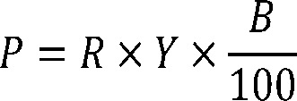

# Daily Digest — 2026-09-28

| | |
|---|---|
| **Digest date** | 2026-09-28 |
| **Data date range** | 2026-09-28 to 2026-09-28 |
| **Generated at** | 2026-09-29T04:12:38Z (UTC) |
| **Pipeline version** | db6a7326 |
| **Inference** | model layers ran — cli/haiku, opus |
| **Source watermarks** | CREC: 2026-09-25T18:00:04Z · BILLS: 2026-09-28T12:29:48Z · FR: 2026-09-28T20:37:13Z · USCOURTS: 2026-09-29T02:41:25Z · PLAW: 2026-09-25T12:51:35Z |

[Full observed listing for this day](day/2026-09-28.html) — every item our collectors observed for this publication day, mechanical rules applied, frozen at end of day. This digest is the canonical record.

All items below cite the govinfo package (and granule, where applicable) they
summarize. Selection is mechanical; each item states the rule that included
it. See the Coverage Statement at the end for a full accounting of what was
published, what was summarized, and what was excluded and why.

---

## Contents

- [Day in Review](#day-in-review)
- [1. Congressional Floor Activity](#1-congressional-floor-activity)
- [2. Legislation](#2-legislation)
- [3. Federal Register](#3-federal-register)
- [4. Enacted Laws](#4-enacted-laws)
- [5. Judicial Activity](#5-judicial-activity)
- [6. Agency Announcements](#6-agency-announcements)
- [7. Recorded Votes](#7-recorded-votes)
- [8. Bill Actions](#8-bill-actions)
- [9. Presidential Actions](#9-presidential-actions)
- [Terms Used Today](#terms-used-today)
- [Coverage Statement](#coverage-statement)
- [Methodology](#methodology)

---

## Day in Review

The digest carries six recorded roll-call votes and 48 bills introduced in the House. No floor summaries are available for this day, so the votes and new bills appear in their own sections without further detail here.

On the executive side, the digest carries 13 Federal Register rules, five proposed rules and 83 notices. Eight of the rules come from the FAA. Seven are airworthiness directives covering Boeing 777 and 787 airplanes, several Airbus and Guimbal helicopter models, a Tecnam airplane and a Safran engine. The eighth announces that the FAA will stop issuing single-pilot training exemptions for certain Cessna aircraft. Other rules incorporate an ASME code edition into the Hazardous Materials Regulations and set HUD's fiscal year 2027 Section 108 loan fee. One expands ocean dredged material disposal sites offshore of Corpus Christi, Texas, and two revise fishery rules: South Atlantic grouper limits and a rebuilding plan for Queets River Chinook salmon. Among the proposed rules, EPA is reconsidering provisions of its 2024 gasoline distribution emission standards. IRS and MARAD published corrections to earlier proposals. The White House sent seventeen nominations to the Senate, including board members, ambassadors, inspectors general and U.S. Marshals. The digest also carries 258 agency press releases.

*Composed from the summarized items below and the day's mechanical
counts; all specifics are cited in their sections.*

---

## 1. Congressional Floor Activity

No Congressional Record issue was observed on this day. The Record for a day's proceedings is typically published by govinfo the following morning; it appears in the digest for the day it is observed ([how our clocks work](faq.html#fapds-three-clocks)).

### 1.1 Senate

No Senate floor items met the selection thresholds. 0 floor granule(s) are accounted for in the Coverage Statement.

### 1.2 House of Representatives

No House floor items met the selection thresholds. 0 floor granule(s) are accounted for in the Coverage Statement.

### 1.3 Recorded Votes

No recorded votes were published in this issue of the Congressional Record.

---

## 2. Legislation

Source: Congressional Bills (BILLS), text versions published 2026-09-28 to 2026-09-28.

### 2.1 Counts by Stage

| Stage (bill text version) | Count |
|---|---|
| Introduced (ih/is) | 48 |
| Reported (rh/rs) | 0 |
| Engrossed (eh/es) | 0 |
| Enrolled (enr) | 0 |
| Other versions | 0 |
| **Total bill texts published** | **48** |

### 2.2 Bills Listed by Mechanical Rule

Bills below are listed because they matched at least one listing rule; the
matching rule is stated per item. All other bill texts are counted above and
accounted for in the Coverage Statement.

No bill texts published in this range matched a listing rule; all 48 are
accounted for in the Coverage Statement.

---

## 3. Federal Register

Source: Federal Register (FR), issue of 2026-09-28.

### 3.1 Counts by Document Type

| Document type | Count |
|---|---|
| Rules | 13 |
| Proposed rules | 5 |
| Notices | 83 |
| Presidential documents | 0 |
| **Total FR documents** | **101** |

### 3.2 Rules Published

Tags: department of defense · department of transportation · executive · model keys: aircraft · airworthiness directives · ocean disposal

*In plain terms: Thirteen final rules including seven FAA airworthiness directives for aircraft and helicopters, EPA ocean disposal site modifications, two fisheries vessel and rebuilding updates, and equipment and lending rules.*

#### DEPARTMENT OF COMMERCE

- **Fisheries of the Caribbean, Gulf of America, and South Atlantic; Snapper-Grouper Fishery of the South Atlantic; Regulatory Amendment 36** (2026-19801; 50 CFR Part 622) — NMFS issues regulations to implement Regulatory Amendment 36 under the Fishery Management Plan for the Snapper-Grouper Fishery of the South Atlantic (Snapper-Grouper FMP). This final rule revises the recreational vessel limits for gag and black grouper. Additionally, this final rule revises the transit storage requirements for commercial on-demand, also known as ropeless, black sea bass pots. The purpose of these regulatory changes is to increase biological benefits to the gag and black grouper stocks, and to allow more practical transit of vessels through certain gear restricted areas with on-demand black sea bass pots on board, consistent with mandates in the Magnuson-Stevens Fishery Conservation and Management Act (Magnuson-Stevens Act). Action: Final rule. Dates: This final rule is effective on October 28, 2026.
  - *In plain terms:* NMFS revises fishing limits for gag and black grouper and allows practical transit of vessels carrying ropeless black sea bass pots through restricted areas.
  - Included because: FR-SEL-01 — document type: final rule (all listed)
  - Source: [FR-2026-09-28 / 2026-19801](https://www.govinfo.gov/app/details/FR-2026-09-28/2026-19801)
- **Fisheries Off West Coast States; West Coast Salmon Fisheries; Rebuilding Plan for the Overfished Queets River Spring/Summer Chinook Salmon Stock** (2026-19813; 50 CFR Part 660) — This final rule will implement the rebuilding plan recommended by the Pacific Fishery Management Council (Council) for the overfished Queets River Spring/Summer Chinook salmon stock (Queets sp/su Chinook salmon). This final rule identifies changes to the regulations to implement the rebuilding plan. Action: Final rule. Dates: Effective October 28, 2026.
  - *In plain terms:* NMFS implements regulatory changes to rebuild the overfished Queets River Spring/Summer Chinook salmon stock.
  - Included because: FR-SEL-01 — document type: final rule (all listed)
  - Source: [FR-2026-09-28 / 2026-19813](https://www.govinfo.gov/app/details/FR-2026-09-28/2026-19813)

#### DEPARTMENT OF HOUSING AND URBAN DEVELOPMENT

- **Section 108 Loan Guarantee Program: Announcement of Fee To Cover Credit Subsidy Costs for FY 2027** (2026-19743; 24 CFR Part 570) — This document announces the fee that HUD will collect from borrowers of loans guaranteed under HUD's Section 108 Loan Guarantee Program (Section 108 Program) to offset the credit subsidy costs of the guaranteed loans pursuant to commitments awarded in Fiscal Year 2027 in the event HUD is required or authorized by statute to do so, notwithstanding subsection (m) of section 108 of the Housing and Community Development Act of 1974. The fee to offset credit subsidy costs is changing from 0.58 percent in Fiscal Year 2026 to 1.05 percent in Fiscal Year 2027. Action: Announcement of fee. Dates: Applicability date: October 28, 2026.
  - *In plain terms:* HUD is increasing the fee borrowers pay for loans guaranteed under the Section 108 Loan Guarantee Program from 0.58 percent to 1.05 percent starting in Fiscal Year 2027.
  - Included because: FR-SEL-01 — document type: final rule (all listed)
  - Source: [FR-2026-09-28 / 2026-19743](https://www.govinfo.gov/app/details/FR-2026-09-28/2026-19743)

#### DEPARTMENT OF TRANSPORTATION

- **Hazardous Materials: Incorporation of ASME Code Section XII and the National Board Inspection Code** (2026-19741; 49 CFR Parts 107, 171, 173, 178, 179, and 180) — PHMSA is amending the Hazardous Materials Regulations (HMR) to incorporate by reference and authorize the use of the 2015 edition of the American Society of Mechanical Engineers (ASME) Boiler and Pressure Vessel Code, Section XII—Rules for Construction and Continued Service of Transport Tanks for the construction and continued service of certain specification cargo tank motor vehicles (CTMVs), cryogenic portable tanks, and multi-unit tank car tanks. PHMSA is also amending the HMR to incorporate by reference and authorize the use of the 2015 edition of the National Board of Boiler and Pressure Vessel Inspectors National Board Inspection Code, Parts 2 and 3 (including Supplement 6) as it applies to the continued service of transport packagings constructed to ASME Section XII standards, as well as for existing CTMVs constructed in accordance with ASME requirements and the HMR. PHMSA finds these updates will result in cost savings and increased regulatory flexibility without compromising safety. Action: Final rule. Dates: Effective date: October 28, 2026. Voluntary compliance date: September 28, 2026. Incorporation by reference date: The incorporation by reference of the publications listed in this rule is approved by the Director of the Federal Register as of October 28, 2026.
  - *In plain terms:* PHMSA allows the use of 2015 editions of the ASME Boiler and Pressure Vessel Code and National Board Inspection Code for certain transport tanks and cargo vehicles.
  - Included because: FR-SEL-01 — document type: final rule (all listed)
  - Source: [FR-2026-09-28 / 2026-19741](https://www.govinfo.gov/app/details/FR-2026-09-28/2026-19741)
- **Airworthiness Directives; The Boeing Company Airplanes** (2026-19751; 14 CFR Part 39) — The FAA is adopting a new airworthiness directive (AD) for all The Boeing Company Model 777-200, -200LR, -300, -300ER, and 777F series airplanes. This AD was prompted by a report of an overheated alternating current motor pump (ACMP) that caused a fire in the main landing gear (MLG) wheel well. This AD requires a records check or inspection for any installed ACMP with a certain part number and applicable on-condition actions. This AD also prohibits the installation of affected parts. The FAA is issuing this AD to address the unsafe condition on these products. Action: Final rule. Dates: This AD is effective November 2, 2026. The Director of the Federal Register approved the incorporation by reference of a certain publication listed in this AD as of November 2, 2026.
  - *In plain terms:* The FAA requires checking Boeing 777 airplanes for a motor pump that can overheat and start fires, and prohibits installing affected pumps.
  - Included because: FR-SEL-01 — document type: final rule (all listed)
  - Source: [FR-2026-09-28 / 2026-19751](https://www.govinfo.gov/app/details/FR-2026-09-28/2026-19751)
- **Airworthiness Directives; The Boeing Company Airplanes** (2026-19754; 14 CFR Part 39) — The FAA is adopting a new airworthiness directive (AD) for certain The Boeing Company Model 787-8, 787-9, and 787-10 airplanes. This AD was prompted by a report that cargo liner joint sealing tape could be missing in particular areas on certain airplanes. The absence of this tape could allow a fire to propagate into the cabin. This AD requires a detailed inspection of these areas for the missing tape, and applicable on-condition actions. The FAA is issuing this AD to address the unsafe condition on these products. Action: Final rule. Dates: This AD is effective November 2, 2026. The Director of the Federal Register approved the incorporation by reference of a certain publication listed in this AD as of November 2, 2026.
  - *In plain terms:* The FAA requires inspecting Boeing 787 airplanes for missing sealing tape in cargo areas that could allow fires to spread into the cabin.
  - Included because: FR-SEL-01 — document type: final rule (all listed)
  - Source: [FR-2026-09-28 / 2026-19754](https://www.govinfo.gov/app/details/FR-2026-09-28/2026-19754)
- **Airworthiness Directives; Airbus Helicopters Deutschland GmbH (AHD) Helicopters** (2026-19757; 14 CFR Part 39) — The FAA is adopting a new airworthiness directive (AD) for all Airbus Helicopters Deutschland GmbH (AHD) Model EC135P1, EC135P2, EC135P2+, EC135P3, EC135T1, EC135T2, EC135T2+, EC135T3, and EC635T2+ helicopters. This AD was prompted by a determination that in cases of loss of oil from the main gearbox (MGB), the low pressure caution or warning light might not activate. This AD requires revising the existing rotorcraft flight manual (RFM) for the helicopter by incorporating updated emergency, malfunction, and normal procedures. The FAA is issuing this AD to address the unsafe condition on these products. Action: Final rule; request for comments. Dates: This AD is effective October 13, 2026. The Director of the Federal Register approved the incorporation by reference of a certain publication listed in this AD as of October 13, 2026. The FAA must receive comments on this AD by November 12, 2026.
  - *In plain terms:* The FAA requires revising flight procedures for certain AHD helicopters because a low-oil warning light might not activate during main gearbox oil loss.
  - Included because: FR-SEL-01 — document type: final rule (all listed)
  - Source: [FR-2026-09-28 / 2026-19757](https://www.govinfo.gov/app/details/FR-2026-09-28/2026-19757)
- **Airworthiness Directives; Airbus Helicopters** (2026-19758; 14 CFR Part 39) — The FAA is adopting a new airworthiness directive (AD) for certain Airbus Helicopters Model EC 130 T2 helicopters. This AD was prompted by the determination that helicopter operators received main rotor blades (MRB) that are not certified to be installed on their helicopters and thus, without instructions for continued airworthiness, cannot be properly maintained. This AD requires replacing the affected parts with serviceable parts and prohibits installing the affected MRBs on Airbus Helicopters Model EC 130 T2 helicopters. The FAA is issuing this AD to address the unsafe condition on these products. Action: Final rule. Dates: This AD is effective November 2, 2026. The Director of the Federal Register approved the incorporation by reference of a certain publication listed in this AD as of November 2, 2026.
  - *In plain terms:* The FAA requires Airbus EC 130 T2 helicopter operators to replace main rotor blades that are not certified for their aircraft.
  - Included because: FR-SEL-01 — document type: final rule (all listed)
  - Source: [FR-2026-09-28 / 2026-19758](https://www.govinfo.gov/app/details/FR-2026-09-28/2026-19758)
- **Airworthiness Directives; Costruzioni Aeronautiche Tecnam S.P.A. Airplanes** (2026-19760; 14 CFR Part 39) — The FAA is adopting a new airworthiness directive (AD) for certain Costruzioni Aeronautiche Tecnam S.p.A. (Tecnam) Model P2006T airplanes. This AD was prompted by a report of partial detachment of the left aileron due to a missing hinge pin. This AD requires a one-time detailed visual inspection of the affected aileron hinges for damage (cracks, warping of the hinges or hinge pin, scratched paint, missing or broken torque stripe, etc.) and cotter pins for improper installation and, depending on the findings, applicable corrective action. The FAA is issuing this AD to address the unsafe condition on these products. Action: Final rule; request for comments. Dates: This AD is effective October 13, 2026. The Director of the Federal Register approved the incorporation by reference of a certain publication listed in this AD as of October 13, 2026. The FAA must receive comments on this AD by November 12, 2026.
  - *In plain terms:* The FAA requires inspecting Tecnam P2006T airplane aileron hinges for missing or damaged pins that could cause partial detachment.
  - Included because: FR-SEL-01 — document type: final rule (all listed)
  - Source: [FR-2026-09-28 / 2026-19760](https://www.govinfo.gov/app/details/FR-2026-09-28/2026-19760)
- **Airworthiness Directives; Hélicoptères Guimbal Helicopters** (2026-19761; 14 CFR Part 39) — The FAA is adopting a new airworthiness directive (AD) for certain Hélicoptères Guimbal (HG) Model Cabri G2 helicopters. This AD was prompted by a report of a potential malfunction of the helicopter emergency locator transmitter (ELT) and subsequent findings of weak ELT signals on 121.5 MHz and 406 MHz frequencies due to improper antenna installation (location). This AD requires revising the existing rotorcraft flight manual (RFM) for the helicopter. The FAA is issuing this AD to address the unsafe condition on these products. Action: Final rule. Dates: This AD is effective November 2, 2026. The Director of the Federal Register approved the incorporation by reference of a certain publication listed in this AD as of November 2, 2026.
  - *In plain terms:* The FAA requires revising flight procedures for Hélicoptères Guimbal Cabri G2 helicopters because improper antenna installation can prevent the emergency locator transmitter from working.
  - Included because: FR-SEL-01 — document type: final rule (all listed)
  - Source: [FR-2026-09-28 / 2026-19761](https://www.govinfo.gov/app/details/FR-2026-09-28/2026-19761)
- **Airworthiness Directives; Safran Helicopter Engines, S.A. Engines** (2026-19762; 14 CFR Part 39) — The FAA is superseding Airworthiness Directive (AD) 2023-15-03 for all Safran Helicopter Engines, S.A. (Safran) Model Arrius 2B2 engines. AD 2023-15-03 required revising the airworthiness limitations section (ALS) of the existing engine maintenance manual (EMM) or instructions for continued airworthiness (ICA) and the existing approved maintenance or inspection program, as applicable, by incorporating the actions and associated thresholds and intervals, including life limits. Since the FAA issued AD 2023-15-03, the manufacturer has revised the ALS of the existing maintenance and overhaul manuals, introducing new and more restrictive instructions and maintenance tasks. This AD requires updating the ALS of the existing EMM or ICA and the existing approved maintenance or inspection program, as applicable, by incorporating the actions and associated thresholds and intervals, including life limits. The FAA is issuing this AD to address the unsafe condition on these products. Action: Final rule. Dates: This AD is effective November 2, 2026. The Director of the Federal Register approved the incorporation by reference of a certain publication listed in this AD as of November 2, 2026.
  - *In plain terms:* The FAA requires Safran Arrius 2B2 engine operators to follow updated maintenance procedures with more restrictive requirements introduced by the manufacturer.
  - Included because: FR-SEL-01 — document type: final rule (all listed)
  - Source: [FR-2026-09-28 / 2026-19762](https://www.govinfo.gov/app/details/FR-2026-09-28/2026-19762)
- **Notice of Policy Change and Rescission of Single-Pilot Training Exemptions for Certain Cessna Aircraft** (2026-19843; 14 CFR Part 91) — Based on safety concerns and a review that revealed widespread non-compliance with the exemptions, the FAA is announcing its decision to cease issuing exemptions that allow certain Cessna aircraft that require two pilots to operate as a single-pilot operation, and notifying current exemption holders that their exemptions will be rescinded by separate action. This notice also serves to inform pilots who obtained single-pilot endorsements from training providers that held exemptions that they must cease single-pilot operations in aircraft that require two pilots under the regulations as they have no relief from the regulations. Action: Policy statement. Dates: The policy described herein is effective September 29, 2026.
  - *In plain terms:* The FAA is stopping exemptions that allowed certain Cessna aircraft to fly with one pilot instead of two due to safety concerns and widespread non-compliance.
  - Included because: FR-SEL-01 — document type: final rule (all listed)
  - Source: [FR-2026-09-28 / 2026-19843](https://www.govinfo.gov/app/details/FR-2026-09-28/2026-19843)

#### ENVIRONMENTAL PROTECTION AGENCY

- **Marine Protection: Modification To Expand Ocean Dredged Material Disposal Sites Offshore of Corpus Christi, Texas** (2026-19745; 40 CFR Part 228) — The Environmental Protection Agency (EPA) is issuing a rule that modifies the existing EPA-designated ocean dredged material disposal sites (ODMDSs) offshore of Corpus Christi, Texas; specifically, the Corpus Christi Ship Channel (CCSC) ODMDS and the Corpus Christi New Work (CCNW) ODMDS to serve the long-term need for locations to dispose of suitable material dredged from the Corpus Christi Bay area. The modified sites will be subject to monitoring and management to ensure continued protection of the marine environment. Action: Final rule. Dates: The final rule is effective on October 28, 2026.
  - *In plain terms:* The EPA expands ocean dredged material disposal sites offshore of Corpus Christi, Texas to handle dredged material from the Corpus Christi Bay area.
  - Included because: FR-SEL-01 — document type: final rule (all listed)
  - Source: [FR-2026-09-28 / 2026-19745](https://www.govinfo.gov/app/details/FR-2026-09-28/2026-19745)

### 3.3 Proposed Rules Published

Tags: department of defense · department of transportation · executive · model keys: airspace · airworthiness directives · emissions standards

*In plain terms: Five proposed rules including an FAA helicopter airworthiness directive, EPA gasoline emissions standards, MARAD maritime program revision, Alaska airspace modification, and tax reporting updates.*

#### DEPARTMENT OF THE TREASURY

- **Information Reporting Regarding Qualified Opportunity Zones and Updated Qualified Opportunity Fund Certification and Decertification Procedures** (C1-2026-18574; 26 CFR Parts 1 and 301) — The Treasury Department's Internal Revenue Service published a correction to its September 11, 2026 proposed rule regarding information reporting procedures and certification requirements for Qualified Opportunity Zones and Qualified Opportunity Funds. The correction revises a compliance deadline in the DATES section of the proposed rule from October 16, 2026, to October 26, 2026.
  - *In plain terms:* The IRS corrects its proposed rule on Qualified Opportunity Zones by moving a compliance deadline from October 16, 2026, to October 26, 2026.
  - Included because: FR-SEL-02 — document type: proposed rule (all listed)
  - Source: [FR-2026-09-28 / C1-2026-18574](https://www.govinfo.gov/app/details/FR-2026-09-28/C1-2026-18574)

#### DEPARTMENT OF TRANSPORTATION

- **Airworthiness Directives; Airbus Helicopters** (2026-19729; 14 CFR Part 39) — The FAA proposes to adopt a new airworthiness directive (AD) for all Airbus Helicopters Model AS 365 N2, AS 365 N3, EC 155 B, EC 155 B1, SA 365 N, and SA 365 N1 helicopters. This proposed AD was prompted by gaps between the seals and engine cowling, which were found during an investigation related to an engine compartment fire. Gaps between the seals and engine cowling could cause inadequate sealing of the engine compartment firewalls leading to fire propagation between engine compartments and reduced effectiveness of the extinguishing agent. This proposed AD would require modifying the engine compartment firewalls by installing angle-brackets along the firewalls. The FAA is proposing this AD to address the unsafe condition on these products. Action: Notice of proposed rulemaking (NPRM). Dates: The FAA must receive comments on this NPRM by November 12, 2026.
  - *In plain terms:* The FAA proposes to require installing angle-brackets to seal engine compartment gaps on certain Airbus helicopters to prevent fires.
  - Included because: FR-SEL-02 — document type: proposed rule (all listed)
  - Source: [FR-2026-09-28 / 2026-19729](https://www.govinfo.gov/app/details/FR-2026-09-28/2026-19729)
- **Capital Construction Fund Revision; Correction** (2026-19786; 46 CFR Part 390) — MARAD published a document in the Federal Register on Tuesday, September 22, 2026, concerning requests for comments to the proposed revision of its Capital Construction Fund (CCF) program regulations and an associated proposed information collection. MARAD already maintains an active information collection under the Office of Management and Budget Information Collection Number 2133-0027 that would provide for all contemplated revisions to the CCF program regulations. Action: Notice of proposed rulemaking (NPRM), request for comments; correction. Dates: September 28, 2026.
  - *In plain terms:* MARAD is proposing revisions to its Capital Construction Fund program regulations and notes that it already has an active information collection process for these changes.
  - Included because: FR-SEL-02 — document type: proposed rule (all listed)
  - Source: [FR-2026-09-28 / 2026-19786](https://www.govinfo.gov/app/details/FR-2026-09-28/2026-19786)
- **Establishment, Modification, and Revocation of Class E Airspace; Alaska, AK** (2026-19815; 14 CFR Part 71) — This action supplements a notice of proposed rulemaking (NPRM) published by the FAA in the Federal Register on June 17, 2025, which proposed to establish Class E domestic en route airspace (Class E6) within a designated landmass and within 12 miles from a designated shoreline associated with the state of Alaska to facilitate the vectoring of instrument flight rules (IFR) aircraft on direct routes where the current en route structure is insufficient or improper within the proposed airspace areas. As revised in this SNPRM, the FAA now proposes to establish five discrete areas of Class E domestic en route airspace over the state. Due to redundancy, the NPRM also proposed to remove two Class E6 airspace areas and modify 101 Class E airspace areas extending upward from at least 700 feet or more above the surface of the earth (Class E5) to remove any portion extending upward from 1,200 feet above the surface. [official summary truncated; see source] Action: Supplemental notice of proposed rulemaking (SNPRM). Dates: Comments must be received on or before November 12, 2026.
  - *In plain terms:* The FAA proposes to establish five new airspace areas over Alaska for aircraft routing, remove two existing areas, and modify 101 others due to redundancy.
  - Included because: FR-SEL-02 — document type: proposed rule (all listed)
  - Source: [FR-2026-09-28 / 2026-19815](https://www.govinfo.gov/app/details/FR-2026-09-28/2026-19815)

#### ENVIRONMENTAL PROTECTION AGENCY

- **National Emission Standards for Hazardous Air Pollutants for Gasoline Distribution Facilities and Standards of Performance for Bulk Gasoline Terminals Reconsideration** (2026-19774; 40 CFR Parts 60 and 63) — On May 8, 2024, the U.S. Environmental Protection Agency (EPA) published the National Emission Standards for Hazardous Air Pollutants (NESHAP): Gasoline Distribution Technology Reviews and New Source Performance Standards (NSPS) Review for Bulk Gasoline Terminals final rule (“2024 Final Rule”). The EPA is reconsidering various provisions of the 2024 Final Rule in this proposed rule, including the operating limits and continuous compliance requirements for air emission control devices, and the vapor tightness requirements for gasoline cargo tanks. The EPA is also reconsidering the modification criteria in the NSPS and proposing other technical corrections and clarifications. The EPA does not anticipate that this proposed action will impact volatile organic compound (VOC) or hazardous air pollutant (HAP) emissions generated by gasoline distribution facilities because the proposed amendments do not impact the stringency of the emission standards set by the 2024 Final Rule. As such, the EPA expects the proposed amendments will have no impact on air quality or overall human health. [official summary truncated; see source] Action: Proposed rule; reconsideration of final rule. Dates: Comments must be received on or before November 12, 2026. Comments on the information collection provisions of the proposed rule under the Paperwork Reduction Act (PRA) must be received by the Office of Management and Budget's Office of Information and Regulatory Affairs (OMB-OIRA) on or before October 28, 2026. Please refer to the PRA section under “Statutory and Executive Order Reviews” in this preamble for specific instructions. Public hearing: If anyone contacts us requesting a public hearing on or before October 5, 2026, we will hold a virtual public hearing. See SUPPLEMENTARY INFORMATION for information on requesting and registering for a public hearing.
  - *In plain terms:* The EPA proposes to reconsider parts of its 2024 emissions rule for gasoline distribution facilities, including operating limits and vapor requirements, without changing overall emission standards.
  - Included because: FR-SEL-02 — document type: proposed rule (all listed)
  - Source: [FR-2026-09-28 / 2026-19774](https://www.govinfo.gov/app/details/FR-2026-09-28/2026-19774)
  -  *Source graphic 1 of 1 from 2026-19774.*

### 3.4 Notices and Presidential Documents

Notices are summarized only when they match a listing rule; all are counted
in 3.1 and in the Coverage Statement. Presidential documents in the FR are
always listed.

No notices or presidential documents matched a listing rule.

---

## 4. Enacted Laws

Source: Public and Private Laws (PLAW) published 2026-09-28.

No laws were published in this range.

---

## 5. Judicial Activity

Source: United States Courts Opinions (USCOURTS): opinions observed 2026-09-28
by our collector; each opinion states its own issue date beside its
listing ([how our clocks work](faq.html#fapds-three-clocks)).

Completeness disclosure (standing): USCOURTS carries opinions from
approximately 140 participating appellate, district, bankruptcy, and
national federal courts. Unlike the Congressional Record and the Federal
Register, which are the complete official record of their branches,
USCOURTS is participation-based and is NOT the complete federal judicial
record. Courts post opinions with delay — typically over several days —
so a day's digest carries the opinions that became available that day,
whatever date each was issued.

### 5.1 Appellate and National Court Opinions

Appellate and national court opinions are summarized; district and
bankruptcy opinions are counted in 5.2 and in the Coverage Statement.

No appellate or national court opinions matched a listing rule for this
date; all opinions are counted in 5.2 and accounted for in the Coverage
Statement.

### 5.2 Counts by Court Category

| Court category | Opinions |
|---|---|
| Appellate | 0 |
| District | 169 |
| Bankruptcy | 0 |
| National | 0 |
| **Total opinions extracted** | **169** |

Archive-window disclosure (rule USCOURTS-FETCH-01): 33959 USCOURTS package(s) have been listed in delta syncs but fell outside the 7-day archive window and were not fetched (global running count across all syncs, not limited to this date).

---

## 6. Agency Announcements

Official press releases and statements the agencies themselves date
on 2026-09-28 (sources listed in the source guide). These are the
agencies' own announcements — official advocacy, quoted and
attributed, not findings of this digest. Agency web content can be
edited or removed without notice; captures and hashes are preserved
per the provenance policy.

#### Agricultural Marketing Service (email)

- **NOP GLOBAL INTEGRITY System Outage** — dated 2026-09-28 by the agency
  - Included because: AGENCYPR-SEL-01 — official agency release dated this day by the agency (all such releases from active sources are listed; titles only in the pilot)
  - Source: agency email bulletin to this project's subscription, captured and DKIM-verified (the bulletin named no canonical page)

#### Agricultural Research Service (email)

- **Building the Digital Infrastructure to Unlock Precision Agriculture for U.S. Farmers** — dated 2026-09-28 by the agency
  - Included because: AGENCYPR-SEL-01 — official agency release dated this day by the agency (all such releases from active sources are listed; titles only in the pilot)
  - Source: agency email bulletin to this project's subscription, captured and DKIM-verified (the bulletin named no canonical page)

#### Animal and Plant Health Inspection Service (email)

- **Reminder: Bird Biosecurity Webinar Sep 29 🐔 Register now!** — dated 2026-09-28 by the agency
  - Included because: AGENCYPR-SEL-01 — official agency release dated this day by the agency (all such releases from active sources are listed; titles only in the pilot)
  - Source: agency email bulletin to this project's subscription, captured and DKIM-verified (the bulletin named no canonical page)

#### Census Bureau (email)

- **Census Partners Newsletter: September 2026 Issue** — dated 2026-09-28 by the agency
  - Included because: AGENCYPR-SEL-01 — official agency release dated this day by the agency (all such releases from active sources are listed; titles only in the pilot)
  - Source: agency email bulletin to this project's subscription, captured and DKIM-verified (the bulletin named no canonical page)
- **Director's Blog: Remembering Vincent Barabba** — dated 2026-09-28 by the agency
  - Included because: AGENCYPR-SEL-01 — official agency release dated this day by the agency (all such releases from active sources are listed; titles only in the pilot)
  - Source: agency email bulletin to this project's subscription, captured and DKIM-verified (the bulletin named no canonical page)
- **U.S. Census Bureau Celebrates 15th Annual Manufacturing Day** — dated 2026-09-28 by the agency
  - Included because: AGENCYPR-SEL-01 — official agency release dated this day by the agency (all such releases from active sources are listed; titles only in the pilot)
  - Source: agency email bulletin to this project's subscription, captured and DKIM-verified (the bulletin named no canonical page)
- **📅 This Week: Manufacturing Day 🏭** — dated 2026-09-28 by the agency
  - Included because: AGENCYPR-SEL-01 — official agency release dated this day by the agency (all such releases from active sources are listed; titles only in the pilot)
  - Source: agency email bulletin to this project's subscription, captured and DKIM-verified (the bulletin named no canonical page)

#### Defense News Releases

- **[Tropic Lightning Division Tests Communication Capabilities Under Combat Conditions](https://www.war.gov/News/News-Stories/Article/Article/4612827/tropic-lightning-division-tests-communication-capabilities-under-combat-conditi/)** — dated 2026-09-28 by the agency
  - Included because: AGENCYPR-SEL-01 — official agency release dated this day by the agency (all such releases from active sources are listed; titles only in the pilot)
- **[U.S., Indian Forces Fly, Fight Together in Combined Air Assault](https://www.war.gov/News/News-Stories/Article/Article/4613123/us-indian-forces-fly-fight-together-in-combined-air-assault/)** — dated 2026-09-28 by the agency
  - Included because: AGENCYPR-SEL-01 — official agency release dated this day by the agency (all such releases from active sources are listed; titles only in the pilot)

#### DHS News Releases

- **[WORST OF THE WORST: Over the Weekend, ICE Arrests Murderers, Pedophiles, and Child Abusers](https://www.dhs.gov/news/2026/09/28/worst-worst-over-weekend-ice-arrests-murderers-pedophiles-and-child-abusers)** — dated 2026-09-28 by the agency
  - Included because: AGENCYPR-SEL-01 — official agency release dated this day by the agency (all such releases from active sources are listed; titles only in the pilot)

#### DOE Critical Minerals and Energy Innovation (email)

- **Action Needed: Stay Connected with CMEI Updates** — dated 2026-09-28 by the agency
  - Included because: AGENCYPR-SEL-01 — official agency release dated this day by the agency (all such releases from active sources are listed; titles only in the pilot)
  - Source: agency email bulletin to this project's subscription, captured and DKIM-verified (the bulletin named no canonical page)

#### EEOC Newsroom

- **[EEOC Sues Continental Inn for Pregnancy Discrimination and Retaliation](https://www.eeoc.gov/newsroom/eeoc-sues-continental-inn-pregnancy-discrimination-and-retaliation)** — dated 2026-09-28 by the agency
  - Included because: AGENCYPR-SEL-01 — official agency release dated this day by the agency (all such releases from active sources are listed; titles only in the pilot)
- **[EEOC Sues Davis Cartage Co. for Sexual Harassment](https://www.eeoc.gov/newsroom/eeoc-sues-davis-cartage-co-sexual-harassment)** — dated 2026-09-28 by the agency
  - Included because: AGENCYPR-SEL-01 — official agency release dated this day by the agency (all such releases from active sources are listed; titles only in the pilot)
- **[EEOC Sues Majestic Developers for Disability Discrimination](https://www.eeoc.gov/newsroom/eeoc-sues-majestic-developers-disability-discrimination)** — dated 2026-09-28 by the agency
  - Included because: AGENCYPR-SEL-01 — official agency release dated this day by the agency (all such releases from active sources are listed; titles only in the pilot)
- **[Reynolds IGA Foodliner to Pay $65,000 in EEOC Religious Discrimination Lawsuit](https://www.eeoc.gov/newsroom/reynolds-iga-foodliner-pay-65000-eeoc-religious-discrimination-lawsuit)** — dated 2026-09-28 by the agency
  - Included because: AGENCYPR-SEL-01 — official agency release dated this day by the agency (all such releases from active sources are listed; titles only in the pilot)
- **[The Rock Snowpark Settles EEOC Religious Discrimination Suit Over Social Media Posts](https://www.eeoc.gov/newsroom/rock-snowpark-settles-eeoc-religious-discrimination-suit-over-social-media-posts)** — dated 2026-09-28 by the agency
  - Included because: AGENCYPR-SEL-01 — official agency release dated this day by the agency (all such releases from active sources are listed; titles only in the pilot)

#### FAA Updates (email)

- **FAA Advisory Circulars Update Notification** — dated 2026-09-28 by the agency
  - Included because: AGENCYPR-SEL-01 — official agency release dated this day by the agency (all such releases from active sources are listed; titles only in the pilot)
  - Source: agency email bulletin to this project's subscription, captured and DKIM-verified (the bulletin named no canonical page)
- **FAA Advisory Circulars Update Notification** — dated 2026-09-28 by the agency
  - Included because: AGENCYPR-SEL-01 — official agency release dated this day by the agency (all such releases from active sources are listed; titles only in the pilot)
  - Source: agency email bulletin to this project's subscription, captured and DKIM-verified (the bulletin named no canonical page)

#### FDA Email Updates (email)

- **[G. L. Mezzetta Inc. Announces Recall of Mezzetta Brand Golden Greek Peperoncini (Medium Heat) Due to Presence of Pest Contaminant in the Jar](https://www.fda.gov/safety/recalls-market-withdrawals-safety-alerts/g-l-mezzetta-inc-announces-recall-mezzetta-brand-golden-greek-peperoncini-medium-heat-due-presence?utm_medium=email&utm_source=govdelivery)** — dated 2026-09-28 by the agency
  - Included because: AGENCYPR-SEL-01 — official agency release dated this day by the agency (all such releases from active sources are listed; titles only in the pilot)
  - Source: agency email bulletin to this project's subscription, captured and DKIM-verified

#### FDA Press Announcements

- **[FDA Approves First Treatment for MCT8 Deficiency](http://www.fda.gov/news-events/press-announcements/fda-approves-first-treatment-mct8-deficiency)** — dated 2026-09-28 by the agency
  - Included because: AGENCYPR-SEL-01 — official agency release dated this day by the agency (all such releases from active sources are listed; titles only in the pilot)
  - Corroborated: the same release (same canonical URL) also arrived via the agency's email bulletin to this project's subscription, DKIM-verified — one document received through two ingestion channels; listed once, both captures preserved.
- **[FDA intends to evaluate changes to the PMTA regulatory framework](http://www.fda.gov/news-events/press-announcements/fda-intends-evaluate-changes-pmta-regulatory-framework)** — dated 2026-09-28 by the agency
  - Included because: AGENCYPR-SEL-01 — official agency release dated this day by the agency (all such releases from active sources are listed; titles only in the pilot)

#### FEC Press Releases

- **[Charitable matching programs](https://www.fec.gov/updates/charitable-matching-programs-tip-2026/)** — dated 2026-09-28 by the agency
  - Included because: AGENCYPR-SEL-01 — official agency release dated this day by the agency (all such releases from active sources are listed; titles only in the pilot)

#### Federal Reserve Board Announcements (email)

- **[Speech by Governor Cook on an update on AI and the economy](https://www.federalreserve.gov/newsevents/speech/cook20260928a.htm)** — dated 2026-09-28 by the agency
  - Included because: AGENCYPR-SEL-01 — official agency release dated this day by the agency (all such releases from active sources are listed; titles only in the pilot)
  - Source: agency email bulletin to this project's subscription, captured and DKIM-verified

#### FEMA Press Releases

- **[FEMA Approves More Than $10 Million Funding to Help Communities Recover from Recent Disasters and Strengthen Their Resilience Against Future Disasters in New England](https://www.fema.gov/press-release/20260928/fema-approves-more-10-million-funding-help-communities-recover-recent)** — dated 2026-09-28 by the agency
  - Included because: AGENCYPR-SEL-01 — official agency release dated this day by the agency (all such releases from active sources are listed; titles only in the pilot)
- **[FEMA Approves More Than $9 Million Funding to Help Communities Recover from Recent Disasters and Strengthen Their Resilience Against Future Disasters in Virginia and West Virginia](https://www.fema.gov/press-release/20260928/fema-approves-more-9-million-funding-help-communities-recover-recent)** — dated 2026-09-28 by the agency
  - Included because: AGENCYPR-SEL-01 — official agency release dated this day by the agency (all such releases from active sources are listed; titles only in the pilot)
- **[FEMA Approves More than $2.4 Million in Funding to Help Montana Recover from Recent Disasters and Strengthen Resilience Against Future Disasters](https://www.fema.gov/press-release/20260928/fema-approves-more-24-million-funding-help-montana-recover-recent-disasters)** — dated 2026-09-28 by the agency
  - Included because: AGENCYPR-SEL-01 — official agency release dated this day by the agency (all such releases from active sources are listed; titles only in the pilot)
- **[FEMA Approves More than $784,000 in Funding to Help Colorado Recover from Recent Disasters](https://www.fema.gov/press-release/20260928/fema-approves-more-784000-funding-help-colorado-recover-recent-disasters)** — dated 2026-09-28 by the agency
  - Included because: AGENCYPR-SEL-01 — official agency release dated this day by the agency (all such releases from active sources are listed; titles only in the pilot)
- **[FEMA Approves Nearly $29 Million in Funding to Help Communities Recover from Recent Disasters and Strengthen Their Resilience Against Future Disasters in Iowa, Kansas, Missouri, and Nebraska](https://www.fema.gov/press-release/20260928/fema-approves-nearly-29-million-funding-help-communities-recover-recent)** — dated 2026-09-28 by the agency
  - Included because: AGENCYPR-SEL-01 — official agency release dated this day by the agency (all such releases from active sources are listed; titles only in the pilot)
- **[FEMA Approves Nearly $33 Million Funding to Help Communities Recover from Recent Disasters and Strengthen Their Resilience Against Future Disasters in New Jersey and New York](https://www.fema.gov/press-release/20260928/fema-approves-nearly-33-million-funding-help-communities-recover-recent)** — dated 2026-09-28 by the agency
  - Included because: AGENCYPR-SEL-01 — official agency release dated this day by the agency (all such releases from active sources are listed; titles only in the pilot)
- **[Trump Administration Delivers $300 Million to Protect Houses of Worship and Other Nonprofit Organizations](https://www.fema.gov/press-release/20260928/trump-administration-delivers-300-million-protect-houses-worship-and-other)** — dated 2026-09-28 by the agency
  - Included because: AGENCYPR-SEL-01 — official agency release dated this day by the agency (all such releases from active sources are listed; titles only in the pilot)

#### FSIS Recalls and Public Health Alerts (email)

- **FSIS Notice 38-26** — dated 2026-09-28 by the agency
  - Included because: AGENCYPR-SEL-01 — official agency release dated this day by the agency (all such releases from active sources are listed; titles only in the pilot)
  - Source: agency email bulletin to this project's subscription, captured and DKIM-verified (the bulletin named no canonical page)

#### FTC Press Releases

- **[FTC, States Win Protections to Lower Pesticide Prices for American Farmers in Antitrust Case Against Corteva](https://www.ftc.gov/news-events/news/press-releases/2026/09/ftc-states-win-protections-lower-pesticide-prices-american-farmers-antitrust-case-against-corteva)** — dated 2026-09-28 by the agency
  - Included because: AGENCYPR-SEL-01 — official agency release dated this day by the agency (all such releases from active sources are listed; titles only in the pilot)

#### GAO Reports & Testimonies

- **[Criminal Justice: Data on Noncitizen Incarcerations, Convictions, Removals, and Costs](https://www.gao.gov/products/gao-26-107448)** — dated 2026-09-28 by the agency
  - Included because: AGENCYPR-SEL-01 — official agency release dated this day by the agency (all such releases from active sources are listed; titles only in the pilot)
- **[Cybersecurity Regulations: Industry Panelists Identify Duplication and Conflicts and Ways to Address Them](https://www.gao.gov/products/gao-26-109197)** — dated 2026-09-28 by the agency
  - Included because: AGENCYPR-SEL-01 — official agency release dated this day by the agency (all such releases from active sources are listed; titles only in the pilot)
- **[Firearms Trafficking to Mexico: Better Data and Performance Monitoring Would Help Agencies Direct Resources to Counter Cartels](https://www.gao.gov/products/gao-26-108061)** — dated 2026-09-28 by the agency
  - Included because: AGENCYPR-SEL-01 — official agency release dated this day by the agency (all such releases from active sources are listed; titles only in the pilot)
- **[IT Systems Annual Assessment: DOD Should Improve IT Fraud Risk Management Practices](https://www.gao.gov/products/gao-26-108596)** — dated 2026-09-28 by the agency
  - Included because: AGENCYPR-SEL-01 — official agency release dated this day by the agency (all such releases from active sources are listed; titles only in the pilot)
- **[Nonimmigrant Visas: State Should Consistently Conduct Global Staffing Needs Assessments to Help Balance Workloads and Address Long Wait Times](https://www.gao.gov/products/gao-26-107902)** — dated 2026-09-28 by the agency
  - Included because: AGENCYPR-SEL-01 — official agency release dated this day by the agency (all such releases from active sources are listed; titles only in the pilot)
- **[Nuclear Power: Actions Needed to Improve NRC’s Assessment of Its Workforce Needs](https://www.gao.gov/products/gao-26-108737)** — dated 2026-09-28 by the agency
  - Included because: AGENCYPR-SEL-01 — official agency release dated this day by the agency (all such releases from active sources are listed; titles only in the pilot)

#### ICE Newsroom

- **[ICE lodges immigration detainer against criminal illegal alien linked to Virginia high school fentanyl overdoses](https://www.ice.gov/news/releases/ice-lodges-immigration-detainer-against-criminal-illegal-alien-linked-virginia-high)** — dated 2026-09-28 by the agency
  - Included because: AGENCYPR-SEL-01 — official agency release dated this day by the agency (all such releases from active sources are listed; titles only in the pilot)

#### IRS Newsroom

- **[Treasury, IRS issue proposed regulations on installment payments for tax on certain farmland sales](https://www.irs.gov/newsroom/treasury-irs-issue-proposed-regulations-on-installment-payments-for-tax-on-certain-farmland-sales)** — dated 2026-09-28 by the agency
  - Included because: AGENCYPR-SEL-01 — official agency release dated this day by the agency (all such releases from active sources are listed; titles only in the pilot)

#### IRS Newswire (email)

- **[IR-2026-115: Treasury, IRS issue proposed regulations on installment payments for tax on certain farmland sales](https://www.federalregister.gov/public-inspection/2026-19888/election-to-pay-in-installments-tax-on-gain-from-certain-farmland-property)** — dated 2026-09-28 by the agency
  - Included because: AGENCYPR-SEL-01 — official agency release dated this day by the agency (all such releases from active sources are listed; titles only in the pilot)
  - Source: agency email bulletin to this project's subscription, captured and DKIM-verified
- **Notice 2026-62: Describing Certain Potentially Abusive Investment Fund Tax Strategies** — dated 2026-09-28 by the agency
  - Included because: AGENCYPR-SEL-01 — official agency release dated this day by the agency (all such releases from active sources are listed; titles only in the pilot)
  - Source: agency email bulletin to this project's subscription, captured and DKIM-verified (the bulletin named no canonical page)
- **[Revenue Ruling 2026-20: Guidance on the treatment of a person who transfers appreciated securities to a newly formed exchange-traded fund](https://www.irs.gov/pub/irs-drop/rr-26-20.pdf)** — dated 2026-09-28 by the agency
  - Included because: AGENCYPR-SEL-01 — official agency release dated this day by the agency (all such releases from active sources are listed; titles only in the pilot)
  - Source: agency email bulletin to this project's subscription, captured and DKIM-verified

#### Justice Department News (email)

- **[DOJ OIG Releases Report on Grants to Family Centered Services of Connecticut, New Haven, Connecticut](https://oig.justice.gov/reports/audit-office-justice-programs-victim-assistance-funds-subawarded-connecticut-judicial-0?utm_source=govdelivery&utm_medium=email&utm_campaign=report&utm_content=title)** — dated 2026-09-28 by the agency
  - Included because: AGENCYPR-SEL-01 — official agency release dated this day by the agency (all such releases from active sources are listed; titles only in the pilot)
  - Source: agency email bulletin to this project's subscription, captured and DKIM-verified
- **[DOJ OIG Releases Report on Grants to Tri-County S.P.E.A.K.S., Charleston, South Carolina](https://oig.justice.gov/reports/audit-office-justice-programs-victim-assistance-funds-subawarded-office-south-carolina?utm_source=govdelivery&utm_medium=email&utm_campaign=report&utm_content=title)** — dated 2026-09-28 by the agency
  - Included because: AGENCYPR-SEL-01 — official agency release dated this day by the agency (all such releases from active sources are listed; titles only in the pilot)
  - Source: agency email bulletin to this project's subscription, captured and DKIM-verified
- **EOIR BIA Decision - Sept. 28, 2026** — dated 2026-09-28 by the agency
  - Included because: AGENCYPR-SEL-01 — official agency release dated this day by the agency (all such releases from active sources are listed; titles only in the pilot)
  - Source: agency email bulletin to this project's subscription, captured and DKIM-verified (the bulletin named no canonical page)

#### Justice Press Releases

- **[Another Federal Judge Strikes Down New York’s Climate Superfund Law as Unconstitutional](https://www.justice.gov/opa/pr/another-federal-judge-strikes-down-new-yorks-climate-superfund-law-unconstitutional)** — dated 2026-09-28 by the agency
  - Included because: AGENCYPR-SEL-01 — official agency release dated this day by the agency (all such releases from active sources are listed; titles only in the pilot)
  - Corroborated: the same release (same canonical URL) also arrived via the agency's email bulletin to this project's subscription, DKIM-verified — one document received through two ingestion channels; listed once, both captures preserved.
- **[Stamford Man Charged in Stolen U.S. Treasury Check Scheme](https://www.justice.gov/usao-ct/pr/stamford-man-charged-stolen-us-treasury-check-scheme)** — dated 2026-09-28 by the agency
  - Included because: AGENCYPR-SEL-01 — official agency release dated this day by the agency (all such releases from active sources are listed; titles only in the pilot)
  - Corroborated: the same release (same canonical URL) also arrived via the agency's email bulletin to this project's subscription, DKIM-verified — one document received through two ingestion channels; listed once, both captures preserved.
- **[Absorkee man sentenced to 15 months in prison for unlawfully possessing handgun](https://www.justice.gov/usao-mt/pr/absorkee-man-sentenced-15-months-prison-unlawfully-possessing-handgun)** — dated 2026-09-28 by the agency
  - Included because: AGENCYPR-SEL-01 — official agency release dated this day by the agency (all such releases from active sources are listed; titles only in the pilot)
  - Corroborated: the same release (same canonical URL) also arrived via the agency's email bulletin to this project's subscription, DKIM-verified — one document received through two ingestion channels; listed once, both captures preserved.
- **[Arlington Man Sentenced to More Than Eight Years in Prison for Drug Conspiracy](https://www.justice.gov/usao-ma/pr/arlington-man-sentenced-more-eight-years-prison-drug-conspiracy)** — dated 2026-09-28 by the agency
  - Included because: AGENCYPR-SEL-01 — official agency release dated this day by the agency (all such releases from active sources are listed; titles only in the pilot)
- **[Beverly Hills Man Sentenced to 24 Months in Federal Prison for Executing Scheme to Defraud $2.3 Million from Taxpayer Funded Pandemic Assistance Program](https://www.justice.gov/usao-edmi/pr/beverly-hills-man-sentenced-24-months-federal-prison-executing-scheme-defraud-23)** — dated 2026-09-28 by the agency
  - Included because: AGENCYPR-SEL-01 — official agency release dated this day by the agency (all such releases from active sources are listed; titles only in the pilot)
- **[Billings woman sentenced to nearly 4 years in prison for stealing handgun](https://www.justice.gov/usao-mt/pr/billings-woman-sentenced-nearly-4-years-prison-stealing-handgun)** — dated 2026-09-28 by the agency
  - Included because: AGENCYPR-SEL-01 — official agency release dated this day by the agency (all such releases from active sources are listed; titles only in the pilot)
  - Corroborated: the same release (same canonical URL) also arrived via the agency's email bulletin to this project's subscription, DKIM-verified — one document received through two ingestion channels; listed once, both captures preserved.
- **[Brookings Man Sentenced to Life in Federal Prison for Aggravated Sexual Abuse of a Child](https://www.justice.gov/usao-sd/pr/brookings-man-sentenced-life-federal-prison-aggravated-sexual-abuse-child)** — dated 2026-09-28 by the agency
  - Included because: AGENCYPR-SEL-01 — official agency release dated this day by the agency (all such releases from active sources are listed; titles only in the pilot)
  - Corroborated: the same release (same canonical URL) also arrived via the agency's email bulletin to this project's subscription, DKIM-verified — one document received through two ingestion channels; listed once, both captures preserved.
- **[Burlington Man Convicted on Drug Charges Following Record Meth Seizure as Part of Homeland Security Task Force Initiative](https://www.justice.gov/usao-mdnc/pr/burlington-man-convicted-drug-charges-following-record-meth-seizure-part-homeland)** — dated 2026-09-28 by the agency
  - Included because: AGENCYPR-SEL-01 — official agency release dated this day by the agency (all such releases from active sources are listed; titles only in the pilot)
- **[Cleveland Drug Trafficker Sentenced to 15 Years in Prison](https://www.justice.gov/usao-ndoh/pr/cleveland-drug-trafficker-sentenced-15-years-prison)** — dated 2026-09-28 by the agency
  - Included because: AGENCYPR-SEL-01 — official agency release dated this day by the agency (all such releases from active sources are listed; titles only in the pilot)
  - Corroborated: the same release (same canonical URL) also arrived via the agency's email bulletin to this project's subscription, DKIM-verified — one document received through two ingestion channels; listed once, both captures preserved.
- **[Columbia Felon Indicted for Illegally Possessing Gun Stored in Baby’s Crib](https://www.justice.gov/usao-sc/pr/columbia-felon-indicted-illegally-possessing-gun-stored-babys-crib-0)** — dated 2026-09-28 by the agency
  - Included because: AGENCYPR-SEL-01 — official agency release dated this day by the agency (all such releases from active sources are listed; titles only in the pilot)
  - Corroborated: the same release (same canonical URL) also arrived via the agency's email bulletin to this project's subscription, DKIM-verified — one document received through two ingestion channels; listed once, both captures preserved.
- **[Connecticut Man Who Attempted to Travel to the Middle East to Join and Fight for ISIS Sentenced to Over Seven Years in Prison](https://www.justice.gov/opa/pr/connecticut-man-who-attempted-travel-middle-east-join-and-fight-isis-sentenced-over-seven)** — dated 2026-09-28 by the agency
  - Included because: AGENCYPR-SEL-01 — official agency release dated this day by the agency (all such releases from active sources are listed; titles only in the pilot)
- **[Criminal Illegal Alien from Guatemala Pleads Guilty to Unlawful Gun Possession](https://www.justice.gov/usao-ndfl/pr/criminal-illegal-alien-guatemala-pleads-guilty-unlawful-gun-possession)** — dated 2026-09-28 by the agency
  - Included because: AGENCYPR-SEL-01 — official agency release dated this day by the agency (all such releases from active sources are listed; titles only in the pilot)
  - Corroborated: the same release (same canonical URL) also arrived via the agency's email bulletin to this project's subscription, DKIM-verified — one document received through two ingestion channels; listed once, both captures preserved.
- **[Cruise Ship Employee Charged with Transportation of Child Pornography](https://www.justice.gov/usao-ma/pr/cruise-ship-employee-charged-transportation-child-pornography)** — dated 2026-09-28 by the agency
  - Included because: AGENCYPR-SEL-01 — official agency release dated this day by the agency (all such releases from active sources are listed; titles only in the pilot)
  - Corroborated: the same release (same canonical URL) also arrived via the agency's email bulletin to this project's subscription, DKIM-verified — one document received through two ingestion channels; listed once, both captures preserved.
- **[DEFENDANTS SENTENCED IN A MULTI-STATE VEHICLE THEFT, OBLITERATING VEHICLE IDENTIFICATION NUMBERS, AND IDENTITY THEFT CONSPIRACY AND ADDITIONAL GUN CHARGES](https://www.justice.gov/usao-mdla/pr/defendants-sentenced-multi-state-vehicle-theft-obliterating-vehicle-identification)** — dated 2026-09-28 by the agency
  - Included because: AGENCYPR-SEL-01 — official agency release dated this day by the agency (all such releases from active sources are listed; titles only in the pilot)
  - Corroborated: the same release (same canonical URL) also arrived via the agency's email bulletin to this project's subscription, DKIM-verified — one document received through two ingestion channels; listed once, both captures preserved.
- **[Detroit Man Pleads Guilty to Role in Huntington-Area Drug Trafficking Conspiracy](https://www.justice.gov/usao-sdwv/pr/detroit-man-admits-role-huntington-area-drug-trafficking-conspiracy)** — dated 2026-09-28 by the agency
  - Included because: AGENCYPR-SEL-01 — official agency release dated this day by the agency (all such releases from active sources are listed; titles only in the pilot)
  - Corroborated: the same release (same canonical URL) also arrived via the agency's email bulletin to this project's subscription, DKIM-verified — one document received through two ingestion channels; listed once, both captures preserved.
- **[Farmington Man Charged with Sexually Abusing Two Children](https://www.justice.gov/usao-nm/pr/farmington-man-charged-sexually-abusing-two-children)** — dated 2026-09-28 by the agency
  - Included because: AGENCYPR-SEL-01 — official agency release dated this day by the agency (all such releases from active sources are listed; titles only in the pilot)
  - Corroborated: the same release (same canonical URL) also arrived via the agency's email bulletin to this project's subscription, DKIM-verified — one document received through two ingestion channels; listed once, both captures preserved.
- **[Federal Judge Adds 35 Years to Houston Man’s 11-Year Imprisonment for His Role in a Fatal Alien Smuggling Operation](https://www.justice.gov/usao-wdtx/pr/federal-judge-adds-35-years-houston-mans-11-year-imprisonment-his-role-fatal-alien)** — dated 2026-09-28 by the agency
  - Included because: AGENCYPR-SEL-01 — official agency release dated this day by the agency (all such releases from active sources are listed; titles only in the pilot)
  - Corroborated: the same release (same canonical URL) also arrived via the agency's email bulletin to this project's subscription, DKIM-verified — one document received through two ingestion channels; listed once, both captures preserved.
- **[Federal Jury Finds Conroe Man Guilty of Enticing a Minor in Del Rio](https://www.justice.gov/usao-wdtx/pr/federal-jury-finds-conroe-man-guilty-enticing-minor-del-rio)** — dated 2026-09-28 by the agency
  - Included because: AGENCYPR-SEL-01 — official agency release dated this day by the agency (all such releases from active sources are listed; titles only in the pilot)
  - Corroborated: the same release (same canonical URL) also arrived via the agency's email bulletin to this project's subscription, DKIM-verified — one document received through two ingestion channels; listed once, both captures preserved.
- **[Flores Family Agrees to Pay Additional $2.5 Million in Civil Penalties for Defrauding United States](https://www.justice.gov/usao-wdtx/pr/flores-family-agrees-pay-additional-25-million-civil-penalties-defrauding-united)** — dated 2026-09-28 by the agency
  - Included because: AGENCYPR-SEL-01 — official agency release dated this day by the agency (all such releases from active sources are listed; titles only in the pilot)
  - Corroborated: the same release (same canonical URL) also arrived via the agency's email bulletin to this project's subscription, DKIM-verified — one document received through two ingestion channels; listed once, both captures preserved.
- **[Former Bank Teller Charged with Bank Fraud](https://www.justice.gov/usao-ndga/pr/former-bank-teller-charged-bank-fraud)** — dated 2026-09-28 by the agency
  - Included because: AGENCYPR-SEL-01 — official agency release dated this day by the agency (all such releases from active sources are listed; titles only in the pilot)
- **[Former MBTA Employee Pleads Guilty to Conspiracies to Falsify Track Inspection Reports and Collecting Fraudulent Overtime Payments](https://www.justice.gov/usao-ma/pr/former-mbta-employee-pleads-guilty-conspiracies-falsify-track-inspection-reports-and)** — dated 2026-09-28 by the agency
  - Included because: AGENCYPR-SEL-01 — official agency release dated this day by the agency (all such releases from active sources are listed; titles only in the pilot)
  - Corroborated: the same release (same canonical URL) also arrived via the agency's email bulletin to this project's subscription, DKIM-verified — one document received through two ingestion channels; listed once, both captures preserved.
- **[Former Tallahassee Postal Employee & Accomplice Sentenced for Federal Crimes](https://www.justice.gov/usao-ndfl/pr/former-tallahassee-postal-employee-accomplice-sentenced-federal-crimes)** — dated 2026-09-28 by the agency
  - Included because: AGENCYPR-SEL-01 — official agency release dated this day by the agency (all such releases from active sources are listed; titles only in the pilot)
- **[Former Texas Detective Pleads Guilty to Five Counts of Attempted Transfer of Obscene Material to Minors](https://www.justice.gov/usao-ndfl/pr/former-texas-detective-pleads-guilty-five-counts-attempted-transfer-obscene-material)** — dated 2026-09-28 by the agency
  - Included because: AGENCYPR-SEL-01 — official agency release dated this day by the agency (all such releases from active sources are listed; titles only in the pilot)
  - Corroborated: the same release (same canonical URL) also arrived via the agency's email bulletin to this project's subscription, DKIM-verified — one document received through two ingestion channels; listed once, both captures preserved.
- **[Four Members and Associates of Paterson Based Gang known as “4K” Sentenced for Violent Crime in Aid of Racketeering for Their Role in a Shooting](https://www.justice.gov/usao-nj/pr/four-members-and-associates-paterson-based-gang-known-4k-sentenced-violent-crime-aid)** — dated 2026-09-28 by the agency
  - Included because: AGENCYPR-SEL-01 — official agency release dated this day by the agency (all such releases from active sources are listed; titles only in the pilot)
  - Corroborated: the same release (same canonical URL) also arrived via the agency's email bulletin to this project's subscription, DKIM-verified — one document received through two ingestion channels; listed once, both captures preserved.
- **[Honduran Illegal Alien Guilty of Illegal Reentry](https://www.justice.gov/usao-edla/pr/honduran-illegal-alien-guilty-illegal-reentry)** — dated 2026-09-28 by the agency
  - Included because: AGENCYPR-SEL-01 — official agency release dated this day by the agency (all such releases from active sources are listed; titles only in the pilot)
  - Corroborated: the same release (same canonical URL) also arrived via the agency's email bulletin to this project's subscription, DKIM-verified — one document received through two ingestion channels; listed once, both captures preserved.
- **[Illegal Alien With Two Prior Deportations and Multiple Felony Convictions Sentenced to Two Years in Prison for Illegally Reentering the United States](https://www.justice.gov/usao-nv/pr/illegal-alien-two-prior-deportations-and-multiple-felony-convictions-sentenced-two-years)** — dated 2026-09-28 by the agency
  - Included because: AGENCYPR-SEL-01 — official agency release dated this day by the agency (all such releases from active sources are listed; titles only in the pilot)
- **[Illinois Man sentenced to 36 Months’ Imprisonment for Stolen Check Negotiating Scheme](https://www.justice.gov/usao-edwi/pr/illinois-man-sentenced-36-months-imprisonment-stolen-check-negotiating-scheme)** — dated 2026-09-28 by the agency
  - Included because: AGENCYPR-SEL-01 — official agency release dated this day by the agency (all such releases from active sources are listed; titles only in the pilot)
  - Corroborated: the same release (same canonical URL) also arrived via the agency's email bulletin to this project's subscription, DKIM-verified — one document received through two ingestion channels; listed once, both captures preserved.
- **[Iowa Attorney Sent to Federal Prison in Medicaid Fraud Scheme Involving His Rolls-Royce Vehicle Collection](https://www.justice.gov/usao-ndia/pr/iowa-attorney-sent-federal-prison-medicaid-fraud-scheme-involving-his-rolls-royce)** — dated 2026-09-28 by the agency
  - Included because: AGENCYPR-SEL-01 — official agency release dated this day by the agency (all such releases from active sources are listed; titles only in the pilot)
  - Corroborated: the same release (same canonical URL) also arrived via the agency's email bulletin to this project's subscription, DKIM-verified — one document received through two ingestion channels; listed once, both captures preserved.
- **[Jacksonville Man Sentenced to 10 Years in Federal Prison for Attempting to Entice and Meet a 13-Year-Old Child for Sexual Activity](https://www.justice.gov/usao-mdfl/pr/jacksonville-man-sentenced-10-years-federal-prison-attempting-entice-and-meet-13-0)** — dated 2026-09-28 by the agency
  - Included because: AGENCYPR-SEL-01 — official agency release dated this day by the agency (all such releases from active sources are listed; titles only in the pilot)
  - Corroborated: the same release (same canonical URL) also arrived via the agency's email bulletin to this project's subscription, DKIM-verified — one document received through two ingestion channels; listed once, both captures preserved.
- **[Justice Department Announces Charges and Guilty Pleas Involving 12 Individuals for Election Crimes](https://www.justice.gov/opa/pr/justice-department-announces-charges-and-guilty-pleas-involving-12-individuals-election)** — dated 2026-09-28 by the agency
  - Included because: AGENCYPR-SEL-01 — official agency release dated this day by the agency (all such releases from active sources are listed; titles only in the pilot)
- **[Little Eagle Man Sentenced to 10 Years in Federal Prison for Sexual Abuse of a Minor](https://www.justice.gov/usao-sd/pr/little-eagle-man-sentenced-10-years-federal-prison-sexual-abuse-minor)** — dated 2026-09-28 by the agency
  - Included because: AGENCYPR-SEL-01 — official agency release dated this day by the agency (all such releases from active sources are listed; titles only in the pilot)
  - Corroborated: the same release (same canonical URL) also arrived via the agency's email bulletin to this project's subscription, DKIM-verified — one document received through two ingestion channels; listed once, both captures preserved.
- **[Marion County Man Pleads Guilty to Multiple Counts of Distribution of Methamphetamine and Fentanyl](https://www.justice.gov/usao-mdfl/pr/marion-county-man-pleads-guilty-multiple-counts-distribution-methamphetamine-and)** — dated 2026-09-28 by the agency
  - Included because: AGENCYPR-SEL-01 — official agency release dated this day by the agency (all such releases from active sources are listed; titles only in the pilot)
  - Corroborated: the same release (same canonical URL) also arrived via the agency's email bulletin to this project's subscription, DKIM-verified — one document received through two ingestion channels; listed once, both captures preserved.
- **[Marshall County Man Admits to Possessing Child Sexual Abuse Material](https://www.justice.gov/usao-ndwv/pr/marshall-county-man-admits-possessing-child-sexual-abuse-material)** — dated 2026-09-28 by the agency
  - Included because: AGENCYPR-SEL-01 — official agency release dated this day by the agency (all such releases from active sources are listed; titles only in the pilot)
  - Corroborated: the same release (same canonical URL) also arrived via the agency's email bulletin to this project's subscription, DKIM-verified — one document received through two ingestion channels; listed once, both captures preserved.
- **[Mexican citizen sentenced to 2 years prison for cocaine trafficking](https://www.justice.gov/usao-mt/pr/mexican-citizen-sentenced-2-years-prison-cocaine-trafficking)** — dated 2026-09-28 by the agency
  - Included because: AGENCYPR-SEL-01 — official agency release dated this day by the agency (all such releases from active sources are listed; titles only in the pilot)
- **[Michigan man sentenced to 10 years prison for trafficking meth](https://www.justice.gov/usao-mt/pr/michigan-man-sentenced-10-years-prison-trafficking-meth)** — dated 2026-09-28 by the agency
  - Included because: AGENCYPR-SEL-01 — official agency release dated this day by the agency (all such releases from active sources are listed; titles only in the pilot)
- **[New Jersey Man Sentenced to 70 Months in Threatening Red Mass Attendees at St. Matthew’s Cathedral](https://www.justice.gov/usao-dc/pr/new-jersey-man-sentenced-70-months-threatening-red-mass-attendees-st-matthews-cathedral)** — dated 2026-09-28 by the agency
  - Included because: AGENCYPR-SEL-01 — official agency release dated this day by the agency (all such releases from active sources are listed; titles only in the pilot)
- **[New Orleans Man Sentenced For Drug-Trafficking and Firearms Offenses](https://www.justice.gov/usao-edla/pr/new-orleans-man-sentenced-drug-trafficking-and-firearms-offenses-1)** — dated 2026-09-28 by the agency
  - Included because: AGENCYPR-SEL-01 — official agency release dated this day by the agency (all such releases from active sources are listed; titles only in the pilot)
- **[New York Man Sentenced to Over 24 Years for Fentanyl and Meth Conspiracy in Southwest Missouri](https://www.justice.gov/usao-wdmo/pr/new-york-man-sentenced-over-24-years-fentanyl-and-meth-conspiracy-southwest-missouri)** — dated 2026-09-28 by the agency
  - Included because: AGENCYPR-SEL-01 — official agency release dated this day by the agency (all such releases from active sources are listed; titles only in the pilot)
  - Corroborated: the same release (same canonical URL) also arrived via the agency's email bulletin to this project's subscription, DKIM-verified — one document received through two ingestion channels; listed once, both captures preserved.
- **[North Dakota woman sentenced to 15 months in prison for drunk driving crash](https://www.justice.gov/usao-mt/pr/north-dakota-woman-sentenced-15-months-prison-drunk-driving-crash)** — dated 2026-09-28 by the agency
  - Included because: AGENCYPR-SEL-01 — official agency release dated this day by the agency (all such releases from active sources are listed; titles only in the pilot)
- **[Ocala Man Pleads Guilty to Multiple Counts of Distributing Methamphetamine and Fentanyl](https://www.justice.gov/usao-mdfl/pr/ocala-man-pleads-guilty-multiple-counts-distributing-methamphetamine-and-fentanyl)** — dated 2026-09-28 by the agency
  - Included because: AGENCYPR-SEL-01 — official agency release dated this day by the agency (all such releases from active sources are listed; titles only in the pilot)
  - Corroborated: the same release (same canonical URL) also arrived via the agency's email bulletin to this project's subscription, DKIM-verified — one document received through two ingestion channels; listed once, both captures preserved.
- **[Pakistani National Charged with Defrauding US Postal Service of Over $100 Million by Selling Counterfeit Postage Online](https://www.justice.gov/usao-sdfl/pr/pakistani-national-charged-defrauding-us-postal-service-over-100-million-selling)** — dated 2026-09-28 by the agency
  - Included because: AGENCYPR-SEL-01 — official agency release dated this day by the agency (all such releases from active sources are listed; titles only in the pilot)
- **[Peoria Man Sentenced to 120 Months in Prison for Distribution of Methamphetamine](https://www.justice.gov/usao-cdil/pr/peoria-man-sentenced-120-months-prison-distribution-methamphetamine)** — dated 2026-09-28 by the agency
  - Included because: AGENCYPR-SEL-01 — official agency release dated this day by the agency (all such releases from active sources are listed; titles only in the pilot)
  - Corroborated: the same release (same canonical URL) also arrived via the agency's email bulletin to this project's subscription, DKIM-verified — one document received through two ingestion channels; listed once, both captures preserved.
- **[Rapid City Man Sentenced to 15 Years in Federal Prison for Conspiracy to Distribute a Controlled Substance](https://www.justice.gov/usao-sd/pr/rapid-city-man-sentenced-15-years-federal-prison-conspiracy-distribute-controlled)** — dated 2026-09-28 by the agency
  - Included because: AGENCYPR-SEL-01 — official agency release dated this day by the agency (all such releases from active sources are listed; titles only in the pilot)
  - Corroborated: the same release (same canonical URL) also arrived via the agency's email bulletin to this project's subscription, DKIM-verified — one document received through two ingestion channels; listed once, both captures preserved.
- **[Recidivist Ohio Drug Trafficker Sentenced to 12 Years in Prison for Cocaine and Methamphetamine Conviction](https://www.justice.gov/usao-wdpa/pr/recidivist-ohio-drug-trafficker-sentenced-12-years-prison-cocaine-and-methamphetamine)** — dated 2026-09-28 by the agency
  - Included because: AGENCYPR-SEL-01 — official agency release dated this day by the agency (all such releases from active sources are listed; titles only in the pilot)
  - Corroborated: the same release (same canonical URL) also arrived via the agency's email bulletin to this project's subscription, DKIM-verified — one document received through two ingestion channels; listed once, both captures preserved.
- **[Roxbury Man Arrested for Kidnapping and Unlawful Possession of Firearm and Ammunition](https://www.justice.gov/usao-ma/pr/roxbury-man-arrested-kidnapping-and-unlawful-possession-firearm-and-ammunition)** — dated 2026-09-28 by the agency
  - Included because: AGENCYPR-SEL-01 — official agency release dated this day by the agency (all such releases from active sources are listed; titles only in the pilot)
  - Corroborated: the same release (same canonical URL) also arrived via the agency's email bulletin to this project's subscription, DKIM-verified — one document received through two ingestion channels; listed once, both captures preserved.
- **[Shiprock Man Charged with Four Alleged Sexual Assaults](https://www.justice.gov/usao-nm/pr/shiprock-man-charged-four-alleged-sexual-assaults)** — dated 2026-09-28 by the agency
  - Included because: AGENCYPR-SEL-01 — official agency release dated this day by the agency (all such releases from active sources are listed; titles only in the pilot)
  - Corroborated: the same release (same canonical URL) also arrived via the agency's email bulletin to this project's subscription, DKIM-verified — one document received through two ingestion channels; listed once, both captures preserved.
- **[Skamania County man charged with possession of child pornography for altering public photos of minors to make it appear they are nude](https://www.justice.gov/usao-wdwa/pr/skamania-county-man-charged-possession-child-pornography-altering-public-photos-minors)** — dated 2026-09-28 by the agency
  - Included because: AGENCYPR-SEL-01 — official agency release dated this day by the agency (all such releases from active sources are listed; titles only in the pilot)
  - Corroborated: the same release (same canonical URL) also arrived via the agency's email bulletin to this project's subscription, DKIM-verified — one document received through two ingestion channels; listed once, both captures preserved.
- **[South Burlington Man Charged with Unlawfully Possessing a Firearm as a Convicted Felon](https://www.justice.gov/usao-vt/pr/south-burlington-man-charged-unlawfully-possessing-firearm-convicted-felon)** — dated 2026-09-28 by the agency
  - Included because: AGENCYPR-SEL-01 — official agency release dated this day by the agency (all such releases from active sources are listed; titles only in the pilot)
- **[TWO MICHIGAN MEN SENTENCED FOR CONSPIRACY TO COMMIT WIRE FRAUD](https://www.justice.gov/usao-mdla/pr/two-michigan-men-sentenced-conspiracy-commit-wire-fraud)** — dated 2026-09-28 by the agency
  - Included because: AGENCYPR-SEL-01 — official agency release dated this day by the agency (all such releases from active sources are listed; titles only in the pilot)
  - Corroborated: the same release (same canonical URL) also arrived via the agency's email bulletin to this project's subscription, DKIM-verified — one document received through two ingestion channels; listed once, both captures preserved.
- **[Tallahassee Man Sentenced to Decade in Federal Prison for Child Exploitation Crimes & Firearm Possession by Felon](https://www.justice.gov/usao-ndfl/pr/tallahassee-man-sentenced-decade-federal-prison-child-exploitation-crimes-firearm)** — dated 2026-09-28 by the agency
  - Included because: AGENCYPR-SEL-01 — official agency release dated this day by the agency (all such releases from active sources are listed; titles only in the pilot)
- **[Three Men Federally Charged in Brutal Assault That Left Victim with Life-Threatening Injuries](https://www.justice.gov/usao-nm/pr/three-men-federally-charged-brutal-assault-left-victim-life-threatening-injuries)** — dated 2026-09-28 by the agency
  - Included because: AGENCYPR-SEL-01 — official agency release dated this day by the agency (all such releases from active sources are listed; titles only in the pilot)
  - Corroborated: the same release (same canonical URL) also arrived via the agency's email bulletin to this project's subscription, DKIM-verified — one document received through two ingestion channels; listed once, both captures preserved.
- **[Two Marion County Residents Charged with Obstruction of Justice](https://www.justice.gov/usao-mdfl/pr/two-marion-county-residents-charged-obstruction-justice)** — dated 2026-09-28 by the agency
  - Included because: AGENCYPR-SEL-01 — official agency release dated this day by the agency (all such releases from active sources are listed; titles only in the pilot)
- **[Two New Haven Men Charged with Offenses Stemming from Armed Robbery of Convenience Stores in Hamden and East Haven](https://www.justice.gov/usao-ct/pr/two-new-haven-men-charged-offenses-stemming-armed-robbery-convenience-stores-hamden-and)** — dated 2026-09-28 by the agency
  - Included because: AGENCYPR-SEL-01 — official agency release dated this day by the agency (all such releases from active sources are listed; titles only in the pilot)
- **[Warren Man Sentenced to More Than 17 Years in Federal Prison for Distributing Child Pornography](https://www.justice.gov/usao-wdar/pr/warren-man-sentenced-more-17-years-federal-prison-distributing-child-pornography)** — dated 2026-09-28 by the agency
  - Included because: AGENCYPR-SEL-01 — official agency release dated this day by the agency (all such releases from active sources are listed; titles only in the pilot)
  - Corroborated: the same release (same canonical URL) also arrived via the agency's email bulletin to this project's subscription, DKIM-verified — one document received through two ingestion channels; listed once, both captures preserved.
- **[West Haven Man Who Attempted to Travel to the Middle East to Join and Fight for ISIS Sentenced to Prison](https://www.justice.gov/usao-ct/pr/west-haven-man-who-attempted-travel-middle-east-join-and-fight-isis-sentenced-prison)** — dated 2026-09-28 by the agency
  - Included because: AGENCYPR-SEL-01 — official agency release dated this day by the agency (all such releases from active sources are listed; titles only in the pilot)
- **[Wyoming Drug Trafficker Sentenced to 135 Months for Dealing Fentanyl & Carfentanil](https://www.justice.gov/usao-wdmi/pr/2026_0928_Earvin_Sentencing_PR)** — dated 2026-09-28 by the agency
  - Included because: AGENCYPR-SEL-01 — official agency release dated this day by the agency (all such releases from active sources are listed; titles only in the pilot)

#### Library of Congress (email)

- **[Superman, Captain America, Kermit the Frog and The Declaration of Independence](https://blogs.loc.gov/loc/2026/09/superman-captain-america-kermit-the-frog-and-the-declaration-of-independence/?loclr=ealocb)** — dated 2026-09-28 by the agency
  - Included because: AGENCYPR-SEL-01 — official agency release dated this day by the agency (all such releases from active sources are listed; titles only in the pilot)
  - Source: agency email bulletin to this project's subscription, captured and DKIM-verified

#### NASA News Releases

- **[APOD: 2026 September 28 – Cosmic Latte: The Average Color of the Universe](https://science.nasa.gov/image-article/apod-2026-september-28-cosmic-latte-the-average-color-of-the-universe/)** — dated 2026-09-28 by the agency
  - Included because: AGENCYPR-SEL-01 — official agency release dated this day by the agency (all such releases from active sources are listed; titles only in the pilot)
- **[Contractor to Civil Servant: NASA Welcomes Kristie Foster](https://www.nasa.gov/centers-and-facilities/stennis/contractor-to-civil-servant-kristie-foster/)** — dated 2026-09-28 by the agency
  - Included because: AGENCYPR-SEL-01 — official agency release dated this day by the agency (all such releases from active sources are listed; titles only in the pilot)
- **[Mars Has Its Charmes](https://science.nasa.gov/blog/mars-has-its-charmes/)** — dated 2026-09-28 by the agency
  - Included because: AGENCYPR-SEL-01 — official agency release dated this day by the agency (all such releases from active sources are listed; titles only in the pilot)
- **[Meet NASA’s Artemis II Crew During Houston Public Event](https://www.nasa.gov/news-release/meet-nasas-artemis-ii-crew-during-houston-public-event/)** — dated 2026-09-28 by the agency
  - Included because: AGENCYPR-SEL-01 — official agency release dated this day by the agency (all such releases from active sources are listed; titles only in the pilot)
- **[NASA Armstrong Celebrates 80 Years of Flight Innovation](https://www.nasa.gov/news-release/nasa-armstrong-celebrates-80-years-of-flight-innovation/)** — dated 2026-09-28 by the agency
  - Included because: AGENCYPR-SEL-01 — official agency release dated this day by the agency (all such releases from active sources are listed; titles only in the pilot)
- **[NASA Celebrates as Artemis Accords Surpasses 75 Signatories](https://www.nasa.gov/news-release/nasa-celebrates-as-artemis-accords-surpasses-75-signatories/)** — dated 2026-09-28 by the agency
  - Included because: AGENCYPR-SEL-01 — official agency release dated this day by the agency (all such releases from active sources are listed; titles only in the pilot)
- **[NASA Highlights Lessons Learned From Swift Boost Mission](https://science.nasa.gov/missions/swift/nasa-highlights-lessons-learned-from-swift-boost-mission/)** — dated 2026-09-28 by the agency
  - Included because: AGENCYPR-SEL-01 — official agency release dated this day by the agency (all such releases from active sources are listed; titles only in the pilot)
- **[NASA ORBIT Challenge 2027](https://www.nasa.gov/directorates/stmd/prizes-challenges-crowdsourcing-program/center-of-excellence-for-collaborative-innovation-coeci/nasa-orbit-challenge-2027/)** — dated 2026-09-28 by the agency
  - Included because: AGENCYPR-SEL-01 — official agency release dated this day by the agency (all such releases from active sources are listed; titles only in the pilot)
- **[NASA, Boeing Share Update on Commercial Starliner Development Plans](https://www.nasa.gov/news-release/nasa-boeing-share-update-on-commercial-starliner-development-plans/)** — dated 2026-09-28 by the agency
  - Included because: AGENCYPR-SEL-01 — official agency release dated this day by the agency (all such releases from active sources are listed; titles only in the pilot)
- **[October’s Night Sky Notes: Spooky Stargazing](https://science.nasa.gov/solar-system/skywatching/night-sky-network/spooky-stargazing/)** — dated 2026-09-28 by the agency
  - Included because: AGENCYPR-SEL-01 — official agency release dated this day by the agency (all such releases from active sources are listed; titles only in the pilot)
- **[Reliable Robots: Meet Johnson’s Dexterous Robotics Team](https://www.nasa.gov/centers-and-facilities/johnson/reliable-robots-meet-johnsons-dexterous-robotics-team/)** — dated 2026-09-28 by the agency
  - Included because: AGENCYPR-SEL-01 — official agency release dated this day by the agency (all such releases from active sources are listed; titles only in the pilot)
- **[Space Station View of Earth at Night](https://www.nasa.gov/image-article/space-station-view-of-earth-at-night/)** — dated 2026-09-28 by the agency
  - Included because: AGENCYPR-SEL-01 — official agency release dated this day by the agency (all such releases from active sources are listed; titles only in the pilot)
- **[Uncovering the Valleys Hidden Below Greenland’s Ice](https://science.nasa.gov/earth/earth-observatory/uncovering-the-valleys-hidden-below-greenlands-ice/)** — dated 2026-09-28 by the agency
  - Included because: AGENCYPR-SEL-01 — official agency release dated this day by the agency (all such releases from active sources are listed; titles only in the pilot)
- **[What You Need to Know About NASA’s SpaceX Crew-13 Mission](https://www.nasa.gov/missions/station/commercial-crew/what-you-need-to-know-about-nasas-spacex-crew-13-mission/)** — dated 2026-09-28 by the agency
  - Included because: AGENCYPR-SEL-01 — official agency release dated this day by the agency (all such releases from active sources are listed; titles only in the pilot)

#### NIST News

- **[NIST Provides Updates on National Construction Safety Team Activities](https://www.nist.gov/news-events/news/2026/09/nist-provides-updates-national-construction-safety-team-activities)** — dated 2026-09-28 by the agency
  - Included because: AGENCYPR-SEL-01 — official agency release dated this day by the agency (all such releases from active sources are listed; titles only in the pilot)

#### OFAC Recent Actions

- **[Issuance of Amended Venezuela General Licenses](https://ofac.treasury.gov/recent-actions/20260928)** — dated 2026-09-28 by the agency
  - Included because: AGENCYPR-SEL-01 — official agency release dated this day by the agency (all such releases from active sources are listed; titles only in the pilot)

#### SEC Press Releases

- **[SEC Charges Registered Investment Adviser Zoe Financial for Failure to Disclose Conflict of Interest](https://www.sec.gov/newsroom/press-releases/2026-94-sec-charges-registered-investment-adviser-zoe-financial-failure-disclose-conflict-interest)** — dated 2026-09-28 by the agency
  - Included because: AGENCYPR-SEL-01 — official agency release dated this day by the agency (all such releases from active sources are listed; titles only in the pilot)

#### SSA Press Releases (email)

- **[Georgia | Social Security Administration Closings/Delays](https://govlinks.ssa.gov/CL0/https:%2F%2Fwww.ssa.gov%2Fnumber-card%3Futm_campaign=%26utm_content=%26utm_id=70051585%26utm_medium=govdelemail%26utm_source=usssa%26utm_term=/1/010001a0e94d2bae-4fe4f914-f63c-47e5-8849-3c5eddfc7c05-000000/b6MlAxXacBlGr1_ESybgix3arfGGejj3u0wN0ba-yDg=452)** — dated 2026-09-28 by the agency
  - Included because: AGENCYPR-SEL-01 — official agency release dated this day by the agency (all such releases from active sources are listed; titles only in the pilot)
  - Source: agency email bulletin to this project's subscription, captured and DKIM-verified
- **[Hawaii | Social Security Administration Closings/Delays](https://govlinks.ssa.gov/CL0/https:%2F%2Fwww.ssa.gov%2Fnumber-card%3Futm_campaign=%26utm_content=%26utm_id=70048943%26utm_medium=govdelemail%26utm_source=usssa%26utm_term=/1/010001a0e8827104-485ff9e6-5ab8-4136-ad99-3d2797239027-000000/zLovDZNjWNVD3KYPuHtZZWGxqoaxzbk7fEYerOxfuCQ=452)** — dated 2026-09-28 by the agency
  - Included because: AGENCYPR-SEL-01 — official agency release dated this day by the agency (all such releases from active sources are listed; titles only in the pilot)
  - Source: agency email bulletin to this project's subscription, captured and DKIM-verified
- **[Hawaii | Social Security Administration Closings/Delays](https://govlinks.ssa.gov/CL0/https:%2F%2Fwww.ssa.gov%2Fnumber-card%3Futm_campaign=%26utm_content=%26utm_id=70046049%26utm_medium=govdelemail%26utm_source=usssa%26utm_term=/1/010001a0e7820c99-19cbc907-96e7-4314-91c7-806f439d8267-000000/JZBjj5RCTOkK3x4p4prYM9Deqy2OoWe5FuyzsWb0QV0=452)** — dated 2026-09-28 by the agency
  - Included because: AGENCYPR-SEL-01 — official agency release dated this day by the agency (all such releases from active sources are listed; titles only in the pilot)
  - Source: agency email bulletin to this project's subscription, captured and DKIM-verified
- **[Louisiana | Social Security Administration Closings/Delays](https://govlinks.ssa.gov/CL0/https:%2F%2Fwww.ssa.gov%2Fnumber-card%3Futm_campaign=%26utm_content=%26utm_id=70050730%26utm_medium=govdelemail%26utm_source=usssa%26utm_term=/1/010001a0e8ff05ea-96585435-460b-474b-877c-a8cf11a64a67-000000/nVEu-PPIbjnpsYqthwQmUwY3ZgglHkM4iGjOXwOGvJ4=452)** — dated 2026-09-28 by the agency
  - Included because: AGENCYPR-SEL-01 — official agency release dated this day by the agency (all such releases from active sources are listed; titles only in the pilot)
  - Source: agency email bulletin to this project's subscription, captured and DKIM-verified
- **[Michigan | Social Security Administration Closings/Delays](https://govlinks.ssa.gov/CL0/https:%2F%2Fwww.ssa.gov%2Fnumber-card%3Futm_campaign=%26utm_content=%26utm_id=70049669%26utm_medium=govdelemail%26utm_source=usssa%26utm_term=/1/010001a0e8c3c202-26630114-d1a4-4b07-8ad4-fe9666bffc48-000000/a4oaPrVXNuKCNvoYW6dm0IsTTj2m19mVWMJt65Xzwm0=452)** — dated 2026-09-28 by the agency
  - Included because: AGENCYPR-SEL-01 — official agency release dated this day by the agency (all such releases from active sources are listed; titles only in the pilot)
  - Source: agency email bulletin to this project's subscription, captured and DKIM-verified
- **[Michigan | Social Security Administration Closings/Delays](https://govlinks.ssa.gov/CL0/https:%2F%2Fwww.ssa.gov%2Fnumber-card%3Futm_campaign=%26utm_content=%26utm_id=70048533%26utm_medium=govdelemail%26utm_source=usssa%26utm_term=/1/010001a0e85d8809-9e3ce36a-d5eb-49c1-afe0-7d9ba339bb96-000000/RrsOO9oncrjOVQmb0xRLLAgR0PBHVRvvOFj67KiX2wc=452)** — dated 2026-09-28 by the agency
  - Included because: AGENCYPR-SEL-01 — official agency release dated this day by the agency (all such releases from active sources are listed; titles only in the pilot)
  - Source: agency email bulletin to this project's subscription, captured and DKIM-verified
- **[Nebraska | Social Security Administration Closings/Delays](https://govlinks.ssa.gov/CL0/https:%2F%2Fwww.ssa.gov%2Fnumber-card%3Futm_campaign=%26utm_content=%26utm_id=70046402%26utm_medium=govdelemail%26utm_source=usssa%26utm_term=/1/010001a0e77e6db4-45752555-cdbf-4772-b3a8-ea801c8a206a-000000/6Dm6k48-ySiUQAvtpbIn72ZRNgNUsOqxg1nsMxoDaQ8=452)** — dated 2026-09-28 by the agency
  - Included because: AGENCYPR-SEL-01 — official agency release dated this day by the agency (all such releases from active sources are listed; titles only in the pilot)
  - Source: agency email bulletin to this project's subscription, captured and DKIM-verified
- **SSA Program Policy Updates** — dated 2026-09-28 by the agency
  - Included because: AGENCYPR-SEL-01 — official agency release dated this day by the agency (all such releases from active sources are listed; titles only in the pilot)
  - Source: agency email bulletin to this project's subscription, captured and DKIM-verified (the bulletin named no canonical page)
- **[Wyoming | Social Security Administration Closings/Delays](https://govlinks.ssa.gov/CL0/https:%2F%2Fwww.ssa.gov%2Fnumber-card%3Futm_campaign=%26utm_content=%26utm_id=70049958%26utm_medium=govdelemail%26utm_source=usssa%26utm_term=/1/010001a0e8cbcf6e-30c7b26e-11da-45cb-be8e-6c246c38ff44-000000/jpypt1FOPe9-AgJ3_URVtMx63ru8DzX1MhhbRuonv08=452)** — dated 2026-09-28 by the agency
  - Included because: AGENCYPR-SEL-01 — official agency release dated this day by the agency (all such releases from active sources are listed; titles only in the pilot)
  - Source: agency email bulletin to this project's subscription, captured and DKIM-verified

#### Treasury Inspector General for Tax Administration (email)

- **Two new reports: Fair Tax Collection Practices and managing AI risks** — dated 2026-09-28 by the agency
  - Included because: AGENCYPR-SEL-01 — official agency release dated this day by the agency (all such releases from active sources are listed; titles only in the pilot)
  - Source: agency email bulletin to this project's subscription, captured and DKIM-verified (the bulletin named no canonical page)

#### Treasury Press Releases (email)

- **[Issuance of Amended Venezuela General Licenses](https://ofac.treasury.gov/media/936996/download?inline)** — dated 2026-09-28 by the agency
  - Included because: AGENCYPR-SEL-01 — official agency release dated this day by the agency (all such releases from active sources are listed; titles only in the pilot)
  - Source: agency email bulletin to this project's subscription, captured and DKIM-verified
- **Office of Tribal and Native Affairs Broadcast - September 28, 2026** — dated 2026-09-28 by the agency
  - Included because: AGENCYPR-SEL-01 — official agency release dated this day by the agency (all such releases from active sources are listed; titles only in the pilot)
  - Source: agency email bulletin to this project's subscription, captured and DKIM-verified (the bulletin named no canonical page)
- **READOUT: Secretary of the Treasury Scott Bessent’s Meeting with Lebanese Prime Minister Nawaf Salam and Minister of Finance Yassine Jaber** — dated 2026-09-28 by the agency
  - Included because: AGENCYPR-SEL-01 — official agency release dated this day by the agency (all such releases from active sources are listed; titles only in the pilot)
  - Source: agency email bulletin to this project's subscription, captured and DKIM-verified (the bulletin named no canonical page)
- **U.S. Department of the Treasury Daily Treasury Bill Rates Update** — dated 2026-09-28 by the agency
  - Included because: AGENCYPR-SEL-01 — official agency release dated this day by the agency (all such releases from active sources are listed; titles only in the pilot)
  - Source: agency email bulletin to this project's subscription, captured and DKIM-verified (the bulletin named no canonical page)
- **U.S. Department of the Treasury Daily Treasury Long-Term Rates Update** — dated 2026-09-28 by the agency
  - Included because: AGENCYPR-SEL-01 — official agency release dated this day by the agency (all such releases from active sources are listed; titles only in the pilot)
  - Source: agency email bulletin to this project's subscription, captured and DKIM-verified (the bulletin named no canonical page)
- **U.S. Department of the Treasury Daily Treasury Real Long-Term Rates Update** — dated 2026-09-28 by the agency
  - Included because: AGENCYPR-SEL-01 — official agency release dated this day by the agency (all such releases from active sources are listed; titles only in the pilot)
  - Source: agency email bulletin to this project's subscription, captured and DKIM-verified (the bulletin named no canonical page)
- **U.S. Department of the Treasury Daily Treasury Real Yield Curve Rates Update** — dated 2026-09-28 by the agency
  - Included because: AGENCYPR-SEL-01 — official agency release dated this day by the agency (all such releases from active sources are listed; titles only in the pilot)
  - Source: agency email bulletin to this project's subscription, captured and DKIM-verified (the bulletin named no canonical page)
- **U.S. Department of the Treasury Daily Treasury Yield Curve Rates Update** — dated 2026-09-28 by the agency
  - Included because: AGENCYPR-SEL-01 — official agency release dated this day by the agency (all such releases from active sources are listed; titles only in the pilot)
  - Source: agency email bulletin to this project's subscription, captured and DKIM-verified (the bulletin named no canonical page)
- **United States Department of the Treasury Announces New Appointment** — dated 2026-09-28 by the agency
  - Included because: AGENCYPR-SEL-01 — official agency release dated this day by the agency (all such releases from active sources are listed; titles only in the pilot)
  - Source: agency email bulletin to this project's subscription, captured and DKIM-verified (the bulletin named no canonical page)

#### U.S. Attorneys News (email)

- **[Biddeford Man Pleads Guilty to Drug Trafficking](https://www.justice.gov/usao-me/pr/biddeford-man-pleads-guilty-drug-trafficking)** — dated 2026-09-28 by the agency
  - Included because: AGENCYPR-SEL-01 — official agency release dated this day by the agency (all such releases from active sources are listed; titles only in the pilot)
  - Source: agency email bulletin to this project's subscription, captured and DKIM-verified
- **[Buffalo man pleads guilty to his role in conspiracy to steal mail](https://www.justice.gov/usao-wdny/pr/buffalo-man-pleads-guilty-his-role-conspiracy-steal-mail)** — dated 2026-09-28 by the agency
  - Included because: AGENCYPR-SEL-01 — official agency release dated this day by the agency (all such releases from active sources are listed; titles only in the pilot)
  - Source: agency email bulletin to this project's subscription, captured and DKIM-verified
- **[Cabell County Man Pleads Guilty to Money Laundering after Embezzling $624,599.86 from Nonprofit Veterinary Clinic](https://www.justice.gov/usao-sdwv/pr/cabell-county-man-pleads-guilty-money-laundering-after-embezzling-62459986-nonprofit)** — dated 2026-09-28 by the agency
  - Included because: AGENCYPR-SEL-01 — official agency release dated this day by the agency (all such releases from active sources are listed; titles only in the pilot)
  - Source: agency email bulletin to this project's subscription, captured and DKIM-verified
- **[Central Valley man sentenced to more than 7 years in prison for a $10 million real estate fraud scheme](https://www.justice.gov/usao-edca/pr/central-valley-man-sentenced-more-7-years-prison-10-million-real-estate-fraud-scheme)** — dated 2026-09-28 by the agency
  - Included because: AGENCYPR-SEL-01 — official agency release dated this day by the agency (all such releases from active sources are listed; titles only in the pilot)
  - Source: agency email bulletin to this project's subscription, captured and DKIM-verified
- **[Columbia Man Pleads Guilty to Conspiracy to Commit Visa Fraud](https://www.justice.gov/usao-sc/pr/columbia-man-pleads-guilty-conspiracy-commit-visa-fraud)** — dated 2026-09-28 by the agency
  - Included because: AGENCYPR-SEL-01 — official agency release dated this day by the agency (all such releases from active sources are listed; titles only in the pilot)
  - Source: agency email bulletin to this project's subscription, captured and DKIM-verified
- **[Convicted Murderer Indicted for Distributing Methamphetamine](https://www.justice.gov/usao-mdfl/pr/convicted-murderer-indicted-distributing-methamphetamine)** — dated 2026-09-28 by the agency
  - Included because: AGENCYPR-SEL-01 — official agency release dated this day by the agency (all such releases from active sources are listed; titles only in the pilot)
  - Source: agency email bulletin to this project's subscription, captured and DKIM-verified
- **[Federal Jury Convicts Mount Pleasant Man for Fentanyl Trafficking and Firearm Offenses](https://www.justice.gov/usao-sc/pr/federal-jury-convicts-mount-pleasant-man-fentanyl-trafficking-and-firearm-offenses)** — dated 2026-09-28 by the agency
  - Included because: AGENCYPR-SEL-01 — official agency release dated this day by the agency (all such releases from active sources are listed; titles only in the pilot)
  - Source: agency email bulletin to this project's subscription, captured and DKIM-verified
- **[Federal jury finds Stanislaus County man guilty of fentanyl trafficking following a Homeland Security Task Force investigation](https://www.justice.gov/usao-edca/pr/federal-jury-finds-stanislaus-county-man-guilty-fentanyl-trafficking-following)** — dated 2026-09-28 by the agency
  - Included because: AGENCYPR-SEL-01 — official agency release dated this day by the agency (all such releases from active sources are listed; titles only in the pilot)
  - Source: agency email bulletin to this project's subscription, captured and DKIM-verified
- **[Former Federal Employee Sentenced for Time-and-Attendance Scheme](https://www.justice.gov/usao-md/pr/former-federal-employee-sentenced-time-and-attendance-scheme)** — dated 2026-09-28 by the agency
  - Included because: AGENCYPR-SEL-01 — official agency release dated this day by the agency (all such releases from active sources are listed; titles only in the pilot)
  - Source: agency email bulletin to this project's subscription, captured and DKIM-verified
- **[Former L.A. County Sheriff’s Deputy Sentenced to Nearly 2 Years in Prison for Violating Rights on Crypto-Criminal’s Behalf, Cheating on Taxes](https://www.justice.gov/usao-cdca/pr/former-la-county-sheriffs-deputy-sentenced-nearly-2-years-prison-violating-rights)** — dated 2026-09-28 by the agency
  - Included because: AGENCYPR-SEL-01 — official agency release dated this day by the agency (all such releases from active sources are listed; titles only in the pilot)
  - Source: agency email bulletin to this project's subscription, captured and DKIM-verified
- **[Heart Butte man sentenced to over 2 years in prison for shooting at family on Blackfeet Indian Reservation](https://www.justice.gov/usao-mt/pr/heart-butte-man-sentenced-over-2-years-prison-shooting-family-blackfeet-indian)** — dated 2026-09-28 by the agency
  - Included because: AGENCYPR-SEL-01 — official agency release dated this day by the agency (all such releases from active sources are listed; titles only in the pilot)
  - Source: agency email bulletin to this project's subscription, captured and DKIM-verified
- **[Huntington Man Pleads Guilty to Federal Drug Crime](https://www.justice.gov/usao-sdwv/pr/huntington-man-pleads-guilty-federal-drug-crime-36)** — dated 2026-09-28 by the agency
  - Included because: AGENCYPR-SEL-01 — official agency release dated this day by the agency (all such releases from active sources are listed; titles only in the pilot)
  - Source: agency email bulletin to this project's subscription, captured and DKIM-verified
- **[Illegal Alien Arrested and Charged for Illegal Reentry](https://www.justice.gov/usao-ma/pr/illegal-alien-arrested-and-charged-illegal-reentry)** — dated 2026-09-28 by the agency
  - Included because: AGENCYPR-SEL-01 — official agency release dated this day by the agency (all such releases from active sources are listed; titles only in the pilot)
  - Source: agency email bulletin to this project's subscription, captured and DKIM-verified
- **[Illegal Alien With Prior Deportations and Felony Convictions Charged for Illegal Reentry](https://www.justice.gov/usao-nv/pr/illegal-alien-prior-deportations-and-felony-convictions-charged-illegal-reentry)** — dated 2026-09-28 by the agency
  - Included because: AGENCYPR-SEL-01 — official agency release dated this day by the agency (all such releases from active sources are listed; titles only in the pilot)
  - Source: agency email bulletin to this project's subscription, captured and DKIM-verified
- **[Irving couple convicted of federal conspiracy charges related to a multi-million-dollar fraud scheme targeting investors in the Eastern District of Texas](https://www.justice.gov/usao-edtx/pr/irving-couple-convicted-federal-conspiracy-charges-related-multi-million-dollar-fraud)** — dated 2026-09-28 by the agency
  - Included because: AGENCYPR-SEL-01 — official agency release dated this day by the agency (all such releases from active sources are listed; titles only in the pilot)
  - Source: agency email bulletin to this project's subscription, captured and DKIM-verified
- **[Man Caught Twice with Kilos of Meth Sentenced to 200 Months in Prison](https://www.justice.gov/usao-edmo/pr/man-caught-twice-kilos-meth-sentenced-200-months-prison)** — dated 2026-09-28 by the agency
  - Included because: AGENCYPR-SEL-01 — official agency release dated this day by the agency (all such releases from active sources are listed; titles only in the pilot)
  - Source: agency email bulletin to this project's subscription, captured and DKIM-verified
- **[New Orleans Man Sentenced to 165 Months Imprisonment For Drug and Gun Charges](https://www.justice.gov/usao-edla/pr/new-orleans-man-sentenced-165-months-imprisonment-drug-and-gun-charges)** — dated 2026-09-28 by the agency
  - Included because: AGENCYPR-SEL-01 — official agency release dated this day by the agency (all such releases from active sources are listed; titles only in the pilot)
  - Source: agency email bulletin to this project's subscription, captured and DKIM-verified
- **[Northern Nevada Man Pleads Guilty to Improperly Using His Government Credit Card for Personal Purchases](https://www.justice.gov/usao-nv/pr/northern-nevada-man-pleads-guilty-improperly-using-his-government-credit-card-personal)** — dated 2026-09-28 by the agency
  - Included because: AGENCYPR-SEL-01 — official agency release dated this day by the agency (all such releases from active sources are listed; titles only in the pilot)
  - Source: agency email bulletin to this project's subscription, captured and DKIM-verified
- **[Ocala Man Indicted for Distributing Methamphetamine, Cocaine, and Illegally Carrying a Firearm](https://www.justice.gov/usao-mdfl/pr/ocala-man-indicted-distributing-methamphetamine-cocaine-and-illegally-carrying-firearm)** — dated 2026-09-28 by the agency
  - Included because: AGENCYPR-SEL-01 — official agency release dated this day by the agency (all such releases from active sources are listed; titles only in the pilot)
  - Source: agency email bulletin to this project's subscription, captured and DKIM-verified
- **[Ocala Man Pleads Guilty to Distribution of Methamphetamine and Cocaine](https://www.justice.gov/usao-mdfl/pr/ocala-man-pleads-guilty-distribution-methamphetamine-and-cocaine)** — dated 2026-09-28 by the agency
  - Included because: AGENCYPR-SEL-01 — official agency release dated this day by the agency (all such releases from active sources are listed; titles only in the pilot)
  - Source: agency email bulletin to this project's subscription, captured and DKIM-verified
- **[Porcupine Man Sentenced to Over 2 Years in Federal Prison for Sexually Abusing a Minor in the Pine Ridge Reservation](https://www.justice.gov/usao-sd/pr/porcupine-man-sentenced-over-2-years-federal-prison-sexually-abusing-minor-pine-ridge)** — dated 2026-09-28 by the agency
  - Included because: AGENCYPR-SEL-01 — official agency release dated this day by the agency (all such releases from active sources are listed; titles only in the pilot)
  - Source: agency email bulletin to this project's subscription, captured and DKIM-verified
- **[Rockford Man Sentenced to More Than Two Years in Federal Prison for Illegally Selling Handgun and “Machine Gun” Conversion Devices](https://www.justice.gov/usao-ndil/pr/rockford-man-sentenced-more-two-years-federal-prison-illegally-selling-handgun-and)** — dated 2026-09-28 by the agency
  - Included because: AGENCYPR-SEL-01 — official agency release dated this day by the agency (all such releases from active sources are listed; titles only in the pilot)
  - Source: agency email bulletin to this project's subscription, captured and DKIM-verified
- **[Salt Lake County Resident Sentenced in a Series of Baggage Thefts at Salt Lake City International Airport](https://www.justice.gov/usao-ut/pr/salt-lake-county-resident-sentenced-series-baggage-thefts-salt-lake-city-international)** — dated 2026-09-28 by the agency
  - Included because: AGENCYPR-SEL-01 — official agency release dated this day by the agency (all such releases from active sources are listed; titles only in the pilot)
  - Source: agency email bulletin to this project's subscription, captured and DKIM-verified
- **[Shiprock Man Pleads Guilty to Second-Degree Murder](https://www.justice.gov/usao-nm/pr/shiprock-man-pleads-guilty-second-degree-murder-0)** — dated 2026-09-28 by the agency
  - Included because: AGENCYPR-SEL-01 — official agency release dated this day by the agency (all such releases from active sources are listed; titles only in the pilot)
  - Source: agency email bulletin to this project's subscription, captured and DKIM-verified
- **[Sioux Falls Man Sentenced to Over 4 Years in Federal Prison for Conspiracy to Distribute Methamphetamine](https://www.justice.gov/usao-sd/pr/sioux-falls-man-sentenced-over-4-years-federal-prison-conspiracy-distribute)** — dated 2026-09-28 by the agency
  - Included because: AGENCYPR-SEL-01 — official agency release dated this day by the agency (all such releases from active sources are listed; titles only in the pilot)
  - Source: agency email bulletin to this project's subscription, captured and DKIM-verified
- **[South Carolina Man Sentenced to 2 Years Imprisonment for Interfering with a Delta Airlines Flight Crew](https://www.justice.gov/usao-ak/pr/south-carolina-man-sentenced-2-years-imprisonment-interfering-delta-airlines-flight-crew)** — dated 2026-09-28 by the agency
  - Included because: AGENCYPR-SEL-01 — official agency release dated this day by the agency (all such releases from active sources are listed; titles only in the pilot)
  - Source: agency email bulletin to this project's subscription, captured and DKIM-verified
- **[Southern Maine Men Plead Guilty to Federal Drug Conspiracy](https://www.justice.gov/usao-me/pr/southern-maine-men-plead-guilty-federal-drug-conspiracy)** — dated 2026-09-28 by the agency
  - Included because: AGENCYPR-SEL-01 — official agency release dated this day by the agency (all such releases from active sources are listed; titles only in the pilot)
  - Source: agency email bulletin to this project's subscription, captured and DKIM-verified
- **[Three Ocala Men Charged with Distribution of Controlled Substances, Including Pounds of Methamphetamine](https://www.justice.gov/usao-mdfl/pr/three-ocala-men-charged-distribution-controlled-substances-including-pounds)** — dated 2026-09-28 by the agency
  - Included because: AGENCYPR-SEL-01 — official agency release dated this day by the agency (all such releases from active sources are listed; titles only in the pilot)
  - Source: agency email bulletin to this project's subscription, captured and DKIM-verified
- **[U.S. Assistant Special Agent in Charge Accused of Stealing Thousands in Fraudulent Disability Payments](https://www.justice.gov/usao-ut/pr/us-assistant-special-agent-charge-accused-stealing-thousands-fraudulent-disability)** — dated 2026-09-28 by the agency
  - Included because: AGENCYPR-SEL-01 — official agency release dated this day by the agency (all such releases from active sources are listed; titles only in the pilot)
  - Source: agency email bulletin to this project's subscription, captured and DKIM-verified
- **[U.S. Attorney, FBI Hold Press Conference to Announce Formation of GATOR Task Force to Fight Violent Crime and Drug Trafficking in Northwest Louisiana](https://www.justice.gov/usao-wdla/pr/us-attorney-fbi-hold-press-conference-announce-formation-gator-task-force-fight)** — dated 2026-09-28 by the agency
  - Included because: AGENCYPR-SEL-01 — official agency release dated this day by the agency (all such releases from active sources are listed; titles only in the pilot)
  - Source: agency email bulletin to this project's subscription, captured and DKIM-verified
- **[U.S. Attorney’s Office Announces Two New Assistant U.S. Attorneys to the Criminal Division](https://www.justice.gov/usao-ri/pr/us-attorneys-office-announces-two-new-assistant-us-attorneys-criminal-division)** — dated 2026-09-28 by the agency
  - Included because: AGENCYPR-SEL-01 — official agency release dated this day by the agency (all such releases from active sources are listed; titles only in the pilot)
  - Source: agency email bulletin to this project's subscription, captured and DKIM-verified
- **[United States Attorney's Office Files Civil Forfeiture Action to Recover Cryptocurrency Involved in an Account Takeover Fraud Scheme](https://www.justice.gov/usao-ma/pr/united-states-attorneys-office-files-civil-forfeiture-action-recover-cryptocurrency-0)** — dated 2026-09-28 by the agency
  - Included because: AGENCYPR-SEL-01 — official agency release dated this day by the agency (all such releases from active sources are listed; titles only in the pilot)
  - Source: agency email bulletin to this project's subscription, captured and DKIM-verified

#### USCIS Newsroom

- **[Cuban Alien Convicted for International Alien Smuggling and Money Laundering Conspiracy](https://www.uscis.gov/newsroom/news-releases/cuban-alien-convicted-for-international-alien-smuggling-and-money-laundering-conspiracy)** — dated 2026-09-28 by the agency
  - Included because: AGENCYPR-SEL-01 — official agency release dated this day by the agency (all such releases from active sources are listed; titles only in the pilot)

#### USDA News (email)

- **USDA Daily Radio Newsline - 09/28/2026** — dated 2026-09-28 by the agency
  - Included because: AGENCYPR-SEL-01 — official agency release dated this day by the agency (all such releases from active sources are listed; titles only in the pilot)
  - Source: agency email bulletin to this project's subscription, captured and DKIM-verified (the bulletin named no canonical page)

#### USDA Rural Development (email)

- **[NEWS RELEASE - USDA Rural Development Announces $40 Million to Support Technical Assistance, Training to Protect, Improve Rural Water and Waste Disposal Systems](https://www.rd.usda.gov/programs-services/water-environmental-programs/water-waste-disposal-technical-assistance-training-grants)** — dated 2026-09-28 by the agency
  - Included because: AGENCYPR-SEL-01 — official agency release dated this day by the agency (all such releases from active sources are listed; titles only in the pilot)
  - Source: agency email bulletin to this project's subscription, captured and DKIM-verified

#### USTR Press Releases

- **[United States and Mexico Announce Successful Resolution of Rapid Response Labor Mechanism Matter at Akwel Juárez México Facility](https://ustr.gov/about/policy-offices/press-office/press-releases/2026/september/united-states-and-mexico-announce-successful-resolution-rapid-response-labor-mechanism-matter-akwel)** — dated 2026-09-28 by the agency
  - Included because: AGENCYPR-SEL-01 — official agency release dated this day by the agency (all such releases from active sources are listed; titles only in the pilot)

#### VA News Releases

- **[Hiring Veterans: Jobs of the week for Sept. 28, 2026](https://news.va.gov/149872/hiring-veterans-jobs-week-sept-28-2026/)** — dated 2026-09-28 by the agency
  - Included because: AGENCYPR-SEL-01 — official agency release dated this day by the agency (all such releases from active sources are listed; titles only in the pilot)
- **[Live Whole Health #336: Spaghetti squash is your fall must-try](https://news.va.gov/149884/live-whole-health-336-spaghetti-squash-is-your-fall-must-try/)** — dated 2026-09-28 by the agency
  - Included because: AGENCYPR-SEL-01 — official agency release dated this day by the agency (all such releases from active sources are listed; titles only in the pilot)
- **[TeleRheumatology helps a Veteran get faster, easier access to care](https://news.va.gov/149834/telerheumatology-faster-easier-access-to-care/)** — dated 2026-09-28 by the agency
  - Included because: AGENCYPR-SEL-01 — official agency release dated this day by the agency (all such releases from active sources are listed; titles only in the pilot)

#### White House Briefing Room

- **[Mined, Melted, and Poured in America: President Trump Reverses Years of Anti-Mining Policy](https://www.whitehouse.gov/releases/2026/09/mined-melted-and-poured-in-america-president-trump-reverses-years-of-anti-mining-policy/)** — dated 2026-09-28 by the agency
  - Included because: AGENCYPR-SEL-01 — official agency release dated this day by the agency (all such releases from active sources are listed; titles only in the pilot)
- **[President Trump Calls on Congress to Save College Sports](https://www.whitehouse.gov/releases/2026/09/president-trump-calls-on-congress-to-save-college-sports/)** — dated 2026-09-28 by the agency
  - Included because: AGENCYPR-SEL-01 — official agency release dated this day by the agency (all such releases from active sources are listed; titles only in the pilot)

37 release(s) above arrived through more than one ingestion channel and are each listed once, marked "Corroborated" in place. Every arrival is captured, hashed, and counted in the Coverage Statement — the merge is presentation, not omission.

Also observed this day, not listed above: 41 release(s) the agencies date on other days (feed backfill from newly activated sources). Excluded under AGENCYPR-EX-01; counted in the Coverage Statement; captures preserved.

---

## 7. Recorded Votes

Roll-call votes the chambers themselves record on 2026-09-28, in
vote-number order. Every recorded vote in the window is listed:
selection is by existence, not by importance, and no rule here
prefers one question over another. Tallies and member positions
come from the chamber's own published vote record, captured and
hashed like every other source. This is the chambers' vote record
itself; section 1.3 lists the Congressional Record granules in
which votes were printed.

#### United States Senate

- **[Vote 245 — S. 4668: On the Amendment](https://www.senate.gov/legislative/LIS/roll_call_votes/vote1192/vote_119_2_00245.xml)** — Amendment Agreed to (96-1).
  - Baldwin Amdt. No. 6828; To modify the provision relating to the relationship of this Act to existing law.
  - Tally: Yea 96 · Nay 1 · Present 0 · Not Voting 3
  - Included because: VOTES-SEL-01 — recorded vote of this day in a chamber's own roll-call record (every recorded vote is listed, in vote-number order; selection is by existence, not importance)
  - Source: the chamber's own roll-call record (linked above)
- **[Vote 246 — S. 4668: On the Amendment](https://www.senate.gov/legislative/LIS/roll_call_votes/vote1192/vote_119_2_00246.xml)** — Amendment Rejected (1-94).
  - Paul Amdt. No. 6758; To improve the bill.
  - Tally: Yea 1 · Nay 94 · Present 0 · Not Voting 5
  - Included because: VOTES-SEL-01 — recorded vote of this day in a chamber's own roll-call record (every recorded vote is listed, in vote-number order; selection is by existence, not importance)
  - Source: the chamber's own roll-call record (linked above)
- **[Vote 247 — S. 4668: On the Amendment](https://www.senate.gov/legislative/LIS/roll_call_votes/vote1192/vote_119_2_00247.xml)** — Amendment Rejected (42-54, 3/5 majority required).
  - Kennedy Amdt. No. 6760; To limit price increases for college athletics tickets.
  - Tally: Yea 42 · Nay 54 · Present 0 · Not Voting 4
  - Included because: VOTES-SEL-01 — recorded vote of this day in a chamber's own roll-call record (every recorded vote is listed, in vote-number order; selection is by existence, not importance)
  - Source: the chamber's own roll-call record (linked above)
- **[Vote 248 — S. 4668: On the Amendment](https://www.senate.gov/legislative/LIS/roll_call_votes/vote1192/vote_119_2_00248.xml)** — Rejected.
  - Booker Amdt. No. 6805; To increase the limitation on funding for post-eligibility insurance and catastrophic injury for student athletes.
  - Included because: VOTES-SEL-01 — recorded vote of this day in a chamber's own roll-call record (every recorded vote is listed, in vote-number order; selection is by existence, not importance)
  - Source: the chamber's own roll-call record (linked above)
- **[Vote 249 — S. 4668: On the Amendment](https://www.senate.gov/legislative/LIS/roll_call_votes/vote1192/vote_119_2_00249.xml)** — Amendment Rejected (47-52).
  - Booker Amdt. No. 6835; To establish certain standards with respect to coaches of varsity sports teams.
  - Tally: Yea 47 · Nay 52 · Present 0 · Not Voting 1
  - Included because: VOTES-SEL-01 — recorded vote of this day in a chamber's own roll-call record (every recorded vote is listed, in vote-number order; selection is by existence, not importance)
  - Source: the chamber's own roll-call record (linked above)
- **[Vote 250 — S. 4668: On Passage of the Bill](https://www.senate.gov/legislative/LIS/roll_call_votes/vote1192/vote_119_2_00250.xml)** — Bill Passed (77-22).
  - S. 4668, as amended; A bill to protect the name, image, and likeness rights of, and provide protections for, student athletes and to promote fair competition among intercollegiate athletics, and for other purposes.
  - Tally: Yea 77 · Nay 22 · Present 0 · Not Voting 1
  - Included because: VOTES-SEL-01 — recorded vote of this day in a chamber's own roll-call record (every recorded vote is listed, in vote-number order; selection is by existence, not importance)
  - Source: the chamber's own roll-call record (linked above)

---

## 8. Bill Actions

What the chambers did with individual measures on 2026-09-28, as the
Library of Congress's own bill-status record states it. Every action
in the ingestion window is listed, in bill-designation order:
selection is by existence, not by importance, and no rule here
prefers one measure over another. Section 2 lists the text of bills
published this day; this section lists what happened to them.

Publication lag: the record dates an action by the day the chamber took it and publishes it the following morning, so this section fills in after the day it describes has ended — the same lag the judicial section carries, and it is restated under Known gaps.

No bill actions dated this day were observed.

---

## 9. Presidential Actions

Source: the Executive Office of the President, as published on
whitehouse.gov and observed 2026-09-28. These are the President's own
instruments — executive orders, proclamations, memoranda — carried
here as the White House published them, days before the Federal
Register compiles them into section 3.

Register (GUIDE §2): titles are the publisher's words and appear verbatim; any prose of ours about them is attributed, exactly as it is for agency releases. This section states what the White House published, never whether it was significant.

### 9.1 Executive Orders

No executive orders were observed this day.

### 9.2 Proclamations

No proclamations were observed this day.

### 9.3 Presidential Memoranda

No presidential memoranda were observed this day.

### 9.4 Other Presidential Actions

No other presidential actions were observed this day.

### 9.5 Nominations and Appointments

- **[Nominations Sent to the Senate](https://www.whitehouse.gov/presidential-actions/2026/09/nominations-sent-to-the-senate-e1fc/)** — The White House sent seventeen nominations to the Senate on September 28, 2026, for positions including Farm Credit Administration Board members, U.S. Ambassadors, Inspectors General, U.S. Marshals, and officials at various federal agencies. The nominees are assigned to positions with terms ranging from completing the current term through multiple years.
  - *In plain terms:* The White House sent seventeen nominations to the Senate on September 28 for Farm Credit Administration members, ambassadors, inspectors general, marshals, and other federal officials.
  - Published by the White House 2026-09-28
  - Included because: PRESACT-SEL-04 — other presidential action published by the White House (all listed)

---

## Terms Used Today

- *engrossed* — the official text of a bill as passed by one chamber
- *enrolled* — the final text of a bill passed by both chambers, sent to the President
- *incorporation by reference* — making an outside document legally part of a rule without reprinting it
- *notice of proposed rulemaking* — the formal announcement of a draft regulation
- *proposed rule* — a draft regulation published for public comment before adoption

---

## Coverage Statement

*This section is mandatory and appears in every digest, including days with
no publications. It accounts for every package observed on this digest day
(GUIDE §3, observation-day filing); each package's own date may differ
and is stated where it does. "Excluded" always names the mechanical rule;
there are no unexplained omissions.*

**Sync summary:** BILLS: completed 2026-09-29T04:10:09Z · CREC: completed 2026-09-29T04:10:09Z · FR: completed 2026-09-29T04:10:10Z · PLAW: completed 2026-09-29T04:10:12Z · USCOURTS: completed 2026-09-29T04:10:11Z; last watermarks as listed in the header.

| Collection | Packages observed | Granules/documents | Summarized | Counted only | Excluded by rule |
|---|---|---|---|---|---|
| CREC | 0 | 0 | 0 | 0 | 0 |
| BILLS | 48 | — | 0 | 48 | 0 |
| FR | 1 | 101 | 18 | 83 | 0 |
| USCOURTS | 71 | 169 | 0 | 169 | 0 |
| PLAW | 0 | 0 | 0 | 0 | 0 |
| AGENCYPR | 258 | 258 | 0 | 217 | 41 |
| VOTES | 6 | 6 | 0 | 6 | 0 |
| BILLACTIONS | 0 | 0 | 0 | 0 | 0 |
| PRESACT | 1 | 1 | 1 | 0 | 0 |

**Exclusion rules applied today:**

- FR-EX-01: notices counted, not individually summarized — 83 item(s)
- USCOURTS-EX-01: district court opinions counted, not individually summarized — 169 item(s)
- AGENCYPR-EX-01: release dated outside this day by the agency (feed backfill / newly activated source) — counted, not listed — 41 item(s)

**Source graphics:** 1 graphic(s) flagged across today's documents: 1 content graphic(s) (equations, forms, maps, annex pages) and 0 boilerplate (signatures/seals, excluded by rule FR-GPH-01). Of the content graphics, 0 were analyzed via vision pass (vision pass not yet implemented) and 1 embedded above; the remainder are viewable in the cited source PDFs.

**Known gaps:** courts post opinions with delay; opinions filed on this date may appear in later syncs.

*Verification: any item above can be checked against its source in one click
via its govinfo link. Totals in this table are reproducible from the stored
extraction records for 2026-09-28.*

---

## Methodology

Selection rules, summarization prompts, and thresholds are versioned in this
repository and identified by the pipeline version in the header (db6a7326).
Editorial principles — primary sources only, opinion-agnostic prose, mechanical
party-blind selection, full coverage accounting — are defined in
[GUIDE.md](../GUIDE.md) §2. Ruleset in effect: prompt version 2; plain-language version 2. To reproduce this digest: re-run the
report stage against the extracted records for 2026-09-28; no upstream re-fetch
is required (GUIDE.md §5).

*Inference (GUIDE §6 r15, standing): The pipeline finalizes every
publication day with or without an inference provider. Model layers
are additive. When no inference was available for a day, the digest
states that fact in its own prose and nothing more; the cause is
operational detail recorded in the day's provenance and operations
report, not in the published digest. The Coverage Statement's
arithmetic reconciles regardless. Items are listed with their
citations whether or not they were summarized. A day finalized
without model layers is frozen like any other day; prose is not
backfilled into a frozen digest.*

*Filing note (2026-08-06, standing): digests from 2026-08-06 file
govinfo packages under their day of first observation — FAPD's three
clocks are explained in the [FAQ](faq.html#fapds-three-clocks). The
Federal Register files under its cover date, on which it is legally
published. Digests before 2026-08-06 filed by each document's own
date; the two Congressional Record issues observed 2026-08-04/05
(proceedings of 08-03/08-04) fell between the freeze and this change
and appear in no digest — disclosed here, not backfilled.*

*"In plain terms" lines are model-generated restatements of the stored
summaries, derived only from the summary text shown beside them; items
without one had no usable restatement. ALL-CAPS source headings are
case-normalized for display; original casing is preserved at the source
link. Term definitions above are static, repo-versioned prose.*

License: this digest's compilation and prose are
[CC BY 4.0](https://creativecommons.org/licenses/by/4.0/) (credit
"FAPD — Free Agentic Publication Digester"); quoted official
government text is public domain (17 U.S.C. § 105).
