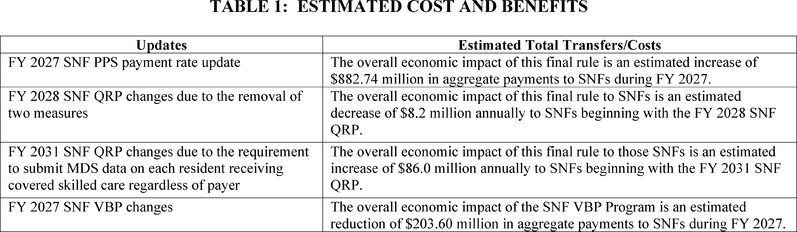
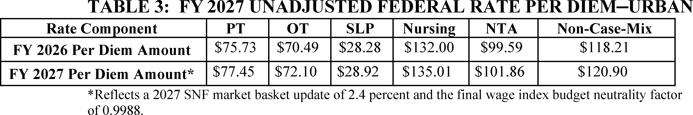
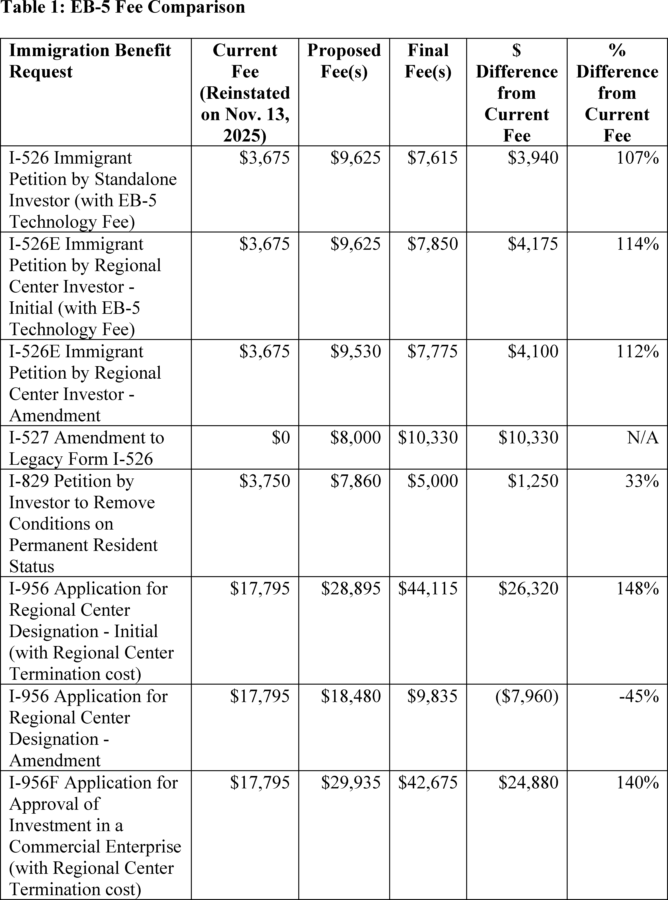
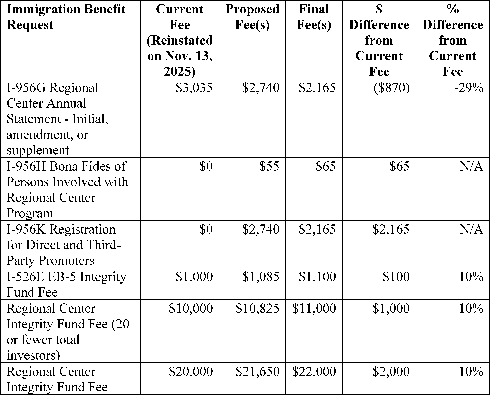
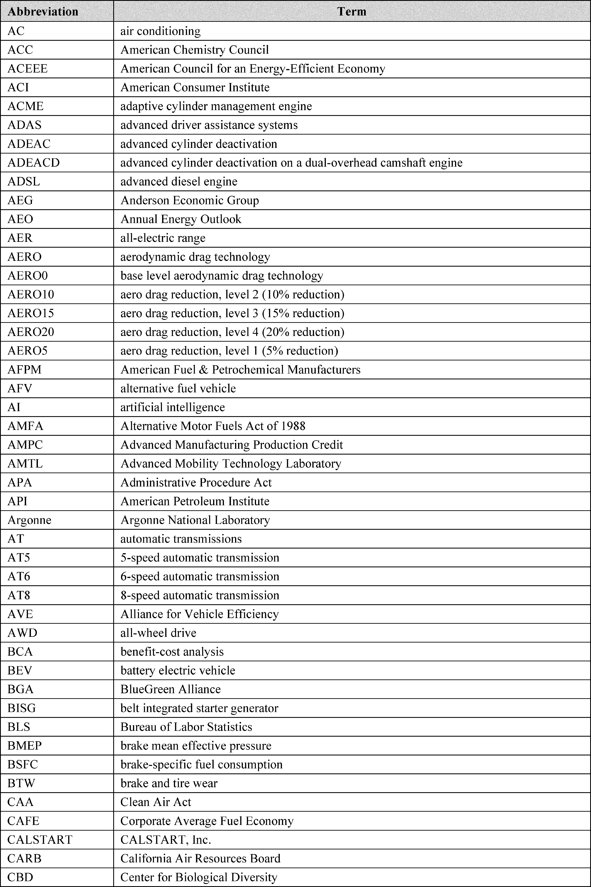
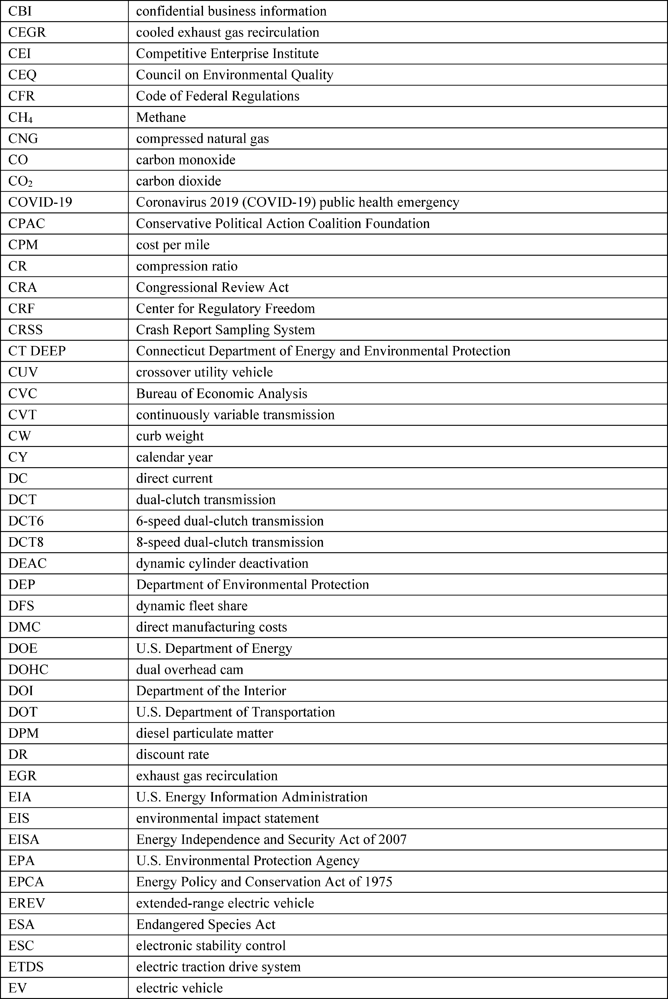

# Daily Digest — 2026-09-30

| | |
|---|---|
| **Digest date** | 2026-09-30 |
| **Data date range** | 2026-09-30 to 2026-09-30 |
| **Generated at** | 2026-10-01T04:02:25Z (UTC) |
| **Pipeline version** | e4f6852f |
| **Inference** | model layers ran — cli/haiku, opus |
| **Source watermarks** | CREC: 2026-09-30T10:39:48Z · BILLS: 2026-10-01T03:08:18Z · FR: 2026-09-30T18:38:28Z · USCOURTS: 2026-10-01T02:06:18Z · PLAW: 2026-09-25T12:51:35Z |

[Full observed listing for this day](day/2026-09-30.html) — every item our collectors observed for this publication day, mechanical rules applied, frozen at end of day. This digest is the canonical record.

All items below cite the govinfo package (and granule, where applicable) they
summarize. Selection is mechanical; each item states the rule that included
it. See the Coverage Statement at the end for a full accounting of what was
published, what was summarized, and what was excluded and why.

---

## Contents

- [Day in Review](#day-in-review)
- [1. Congressional Floor Activity](#1-congressional-floor-activity)
- [2. Legislation](#2-legislation)
- [3. Federal Register](#3-federal-register)
- [4. Enacted Laws](#4-enacted-laws)
- [5. Judicial Activity](#5-judicial-activity)
- [6. Agency Announcements](#6-agency-announcements)
- [7. Recorded Votes](#7-recorded-votes)
- [8. Bill Actions](#8-bill-actions)
- [9. Presidential Actions](#9-presidential-actions)
- [Terms Used Today](#terms-used-today)
- [Coverage Statement](#coverage-statement)
- [Methodology](#methodology)

---

## Day in Review

The Senate floor record carries 82 Senate items and three recorded votes. The Senate voted 48-51 against proceeding to S.J. Res. 197, which would have disapproved an HHS rule on 2027 Affordable Care Act payment parameters. It also voted 47-51 against discharging S. Res. 852, a request for information on Israel's human rights practices. It moved to proceed to H.R. 9340, the Ratepayer Protection Act, on data-center grid costs. It passed the ACT for ALS reauthorization and S. 5045, the Wildfire Emissions Prevention Act of 2026. The digest also lists 37 Senate and 26 House bill introductions.

The Federal Register entries include 23 rules, 10 proposed rules and one presidential document, Proclamation 11070 on Gold Star Mother's and Family's Day. The Treasury's Office of Foreign Assets Control amended its Cuba and Iran regulations and published general licenses for Venezuela and Russia. The Federal Reserve set interest on reserve balances at 3.90 percent. NHTSA recalibrated fuel-economy standards, and USCIS adjusted EB-5 fees.

The digest carries 62 appellate, 15 bankruptcy and 1,472 district court opinions. The en banc Eleventh Circuit held that parents with child-related sex-offense convictions retain a fundamental right to live with their children and remanded for strict-scrutiny review. The Ninth Circuit denied rehearing in the Tonto National Forest land-exchange cases, with dissents, and partly reversed judgments in Hawaii Island Air's WARN Act litigation. The First Circuit upheld an arbitration award for Harvard's graduate students union.

*Composed from the summarized items below and the day's mechanical
counts; all specifics are cited in their sections.*

---

## 1. Congressional Floor Activity

Source: Congressional Record (CREC), issue observed 2026-09-30, covering proceedings of 2026-09-29. Published by govinfo 2026-09-30T10:39:48Z; observed by our collector 2026-09-30T11:03:36Z. Total issue size: 88 granule(s).

### 1.1 Senate

Tags: legislative · model keys: artificial intelligence · medical research · wildfire emissions

*In plain terms: Senate passed bills on Saratoga park redesignation, reauthorized $100 million annually for ALS research, wildfire emissions standards, and created an AI Select Committee.*

- **Legislative Session** — The Senate moved to proceed to H.R. 9340, the Ratepayer Protection Act, which amends the Public Utility Regulatory Policies Act of 1978 to establish federal standards requiring large-load customers such as data centers to pay the full incremental costs of grid upgrades serving them. Senators discussed provisions addressing cost-shifting and economic policies.
  - *In plain terms:* The Senate voted to consider the Ratepayer Protection Act, which would require large electricity customers like data centers to pay the full cost of grid upgrades that serve them.
  - Included because: CREC-SEL-01 — floor item ≥ threshold floor time (53,016 characters) (document dated 2026-09-29)
  - Source: [CREC-2026-09-29 / CREC-2026-09-29-pt1-PgS5132](https://www.govinfo.gov/app/details/CREC-2026-09-29/CREC-2026-09-29-pt1-PgS5132)
- **Strengthening America's Turning Point Act** — The Senate passed H.R. 1550, redesignating Saratoga National Historical Park as Saratoga National Battlefield Park. A bipartisan cancer screening bill, the "Standardizing Cancer Recommendations for Early Evaluation and Navigation of Screening Act" (SCREENS), was introduced to improve access to cancer screening guidelines through accessible, interoperable technology formats.
  - *In plain terms:* The Senate passed a bill redesignating Saratoga National Historical Park as Saratoga National Battlefield Park and introduced a bill to improve cancer screening guidance availability.
  - Included because: CREC-SEL-01 — floor item ≥ threshold floor time (31,139 characters) (document dated 2026-09-29)
  - Source: [CREC-2026-09-29 / CREC-2026-09-29-pt1-PgS5140-3](https://www.govinfo.gov/app/details/CREC-2026-09-29/CREC-2026-09-29-pt1-PgS5140-3)
- **Als** — The Senate passed legislation reauthorizing the ACT for ALS program, authorizing $100 million annually for five years for ALS research and maintaining funding networks. The bill preserves treatment access pathways for patients ineligible for clinical trials.
  - *In plain terms:* The Senate passed legislation authorizing $100 million a year for five years for ALS research and maintaining pathways for patients unable to access clinical trials.
  - Included because: CREC-SEL-01 — floor item ≥ threshold floor time (20,836 characters) (document dated 2026-09-29)
  - Source: [CREC-2026-09-29 / CREC-2026-09-29-pt1-PgS5146](https://www.govinfo.gov/app/details/CREC-2026-09-29/CREC-2026-09-29-pt1-PgS5146)
- **Wildfire Emissions Prevention Act of 2026** — The Senate passed S. 5045, the "Wildfire Emissions Prevention Act of 2026," which amends the Clean Air Act to allow prescribed fires to be treated as exceptional events under air quality regulations. The bill also establishes the Smoke-Ready Communities Program to provide resources for communities to prepare for wildfire smoke.
  - *In plain terms:* The Senate passed the Wildfire Emissions Prevention Act of 2026, allowing controlled fires to be treated as exceptional events under air quality rules and creating a program to help communities prepare for wildfire smoke.
  - Included because: CREC-SEL-01 — floor item ≥ threshold floor time (84,297 characters) (document dated 2026-09-29)
  - Source: [CREC-2026-09-29 / CREC-2026-09-29-pt1-PgS5148](https://www.govinfo.gov/app/details/CREC-2026-09-29/CREC-2026-09-29-pt1-PgS5148)
- **Executive and Other Communications** — The Senate received communications transmitting a draft Veterans Health, Benefits, and Administration Programs Act of 2027; an Inspector General budget request; certifications and notifications regarding defense articles re-export to Ukraine and defense equipment sales to Greece; and multiple Federal Aviation Administration rules regarding airworthiness directives and airspace designations.
  - *In plain terms:* The Senate received a draft Veterans health bill, budget requests, certifications for defense sales, and multiple Federal Aviation Administration airworthiness and airspace rules.
  - Included because: CREC-SEL-01 — floor item ≥ threshold floor time (24,610 characters) (document dated 2026-09-29)
  - Source: [CREC-2026-09-29 / CREC-2026-09-29-pt1-PgS5163-7](https://www.govinfo.gov/app/details/CREC-2026-09-29/CREC-2026-09-29-pt1-PgS5163-7)
- **Petitions and Memorials** — The Idaho Legislature transmitted three joint memorials requesting expedited federal permitting for Camas Creek cleanup, urging state and federal cooperation to streamline permitting for critical mineral development, and commending the Stibnite Gold Project approval while requesting continued federal attention to its permitting and development.
  - *In plain terms:* The Idaho Legislature requested expedited federal permitting for Camas Creek cleanup, streamlined permitting for critical mineral development, and federal attention to the Stibnite Gold Project.
  - Included because: CREC-SEL-01 — floor item ≥ threshold floor time (35,784 characters) (document dated 2026-09-29)
  - Source: [CREC-2026-09-29 / CREC-2026-09-29-pt1-PgS5165](https://www.govinfo.gov/app/details/CREC-2026-09-29/CREC-2026-09-29-pt1-PgS5165)
- **Additional Cosponsors** — Senators were added as cosponsors to bills addressing 403(b) retirement plan modifications, defense article transfers to Baltic states, higher education oversight, wildlife management, health screenings and coverage, congressional financial disclosure, military discrimination, catalytic converter theft, Medicare benefits, and workforce standards.
  - *In plain terms:* Senators were added as cosponsors to bills on retirement plans, defense transfers, education oversight, wildlife, health, disclosure, military discrimination, vehicle theft, Medicare, and labor standards.
  - Included because: CREC-SEL-01 — floor item ≥ threshold floor time (15,367 characters) (document dated 2026-09-29)
  - Source: [CREC-2026-09-29 / CREC-2026-09-29-pt1-PgS5170](https://www.govinfo.gov/app/details/CREC-2026-09-29/CREC-2026-09-29-pt1-PgS5170)
- **Senate Resolution 918--ESTABLISHING the Select Committee on Artificial Intelligence** — Senate Resolution 918 establishes a Select Committee on Artificial Intelligence with up to 13 members to investigate AI development, deployment, and governance; examine implications for national security, economics, consumer protection, critical infrastructure, and federal agency operations; and develop legislative recommendations regarding AI oversight and safeguards.
  - *In plain terms:* Senate Resolution 918 establishes a Select Committee on Artificial Intelligence with up to 13 members to study AI development and recommend oversight rules.
  - Included because: CREC-SEL-01 — floor item ≥ threshold floor time (17,021 characters) (document dated 2026-09-29)
  - Source: [CREC-2026-09-29 / CREC-2026-09-29-pt1-PgS5172-4](https://www.govinfo.gov/app/details/CREC-2026-09-29/CREC-2026-09-29-pt1-PgS5172-4)
- **Text of Amendments** — Amendment SA 6839 modifies federal law to allow federally recognized Indian tribes to grant rights-of-way over tribal land under approved tribal regulations without requiring Secretary of the Interior approval, while maintaining federal oversight of environmental reviews and compliance. Amendment SA 6840 establishes federal requirements for data center load queues, requiring data center owners to pay for electrical grid upgrades and comply with grid interconnection procedures.
  - *In plain terms:* Amendment 6839 allows Indian tribes to grant land rights under tribal rules without Interior Secretary approval, and Amendment 6840 requires data center owners to pay for electrical grid upgrades.
  - Included because: CREC-SEL-01 — floor item ≥ threshold floor time (58,213 characters) (document dated 2026-09-29)
  - Source: [CREC-2026-09-29 / CREC-2026-09-29-pt1-PgS5178-3](https://www.govinfo.gov/app/details/CREC-2026-09-29/CREC-2026-09-29-pt1-PgS5178-3)
- **Text of Senate Amendment 6840** — Amendment SA 6840 defines data centers exceeding 50 megawatts in energy demand and grants the Federal Energy Regulatory Commission authority to establish load queues, rate structures, labor agreement requirements, battery storage mandates, and load flexibility provisions for data center interconnections to manage electrical grid impacts.
  - *In plain terms:* Amendment 6840 defines large data centers as those using over 50 megawatts and gives the Federal Energy Regulatory Commission authority to set load queues and rate structures for their grid connections.
  - Included because: CREC-SEL-01 — floor item ≥ threshold floor time (22,571 characters) (document dated 2026-09-29)
  - Source: [CREC-2026-09-29 / CREC-2026-09-29-pt1-PgS5179](https://www.govinfo.gov/app/details/CREC-2026-09-29/CREC-2026-09-29-pt1-PgS5179)

### 1.2 House of Representatives

No House floor items met the selection thresholds. 0 floor granule(s) are accounted for in the Coverage Statement.

### 1.3 Recorded Votes

- **Providing for Congressional Disapproval Under Chapter 8 of Title 5, United States Code, of the Rule Submitted by the Ce…** — The Senate voted 48-51 to reject a motion to proceed to S.J. Res. 197, a joint resolution providing for congressional disapproval of an HHS rule on Patient Protection and Affordable Care Act benefit and payment parameters for 2027 and the Basic Health Program.
  - *In plain terms:* The Senate voted 48-51 to reject consideration of a resolution to disapprove an HHS rule on health insurance benefits for 2027.
  - Included because: CREC-SEL-02 — recorded vote (all recorded votes are listed) (document dated 2026-09-29)
  - Source: [CREC-2026-09-29 / CREC-2026-09-29-pt1-PgS5139-2](https://www.govinfo.gov/app/details/CREC-2026-09-29/CREC-2026-09-29-pt1-PgS5139-2)
- **Requesting Information on Israel's Human Rights Practices Pursuant to Section 502B(c) of the Foreign Assistance Act of…** — The Senate voted 47-51 to reject a motion to discharge S. Res. 852 from the Committee on Foreign Relations. The resolution requested information on Israel's human rights practices pursuant to the Foreign Assistance Act of 1961.
  - *In plain terms:* The Senate voted 47-51 to reject a resolution requesting information on Israel's human rights record as required by the Foreign Assistance Act of 1961.
  - Included because: CREC-SEL-02 — recorded vote (all recorded votes are listed) (document dated 2026-09-29)
  - Source: [CREC-2026-09-29 / CREC-2026-09-29-pt1-PgS5158](https://www.govinfo.gov/app/details/CREC-2026-09-29/CREC-2026-09-29-pt1-PgS5158)

---

## 2. Legislation

Source: Congressional Bills (BILLS), text versions published 2026-09-30 to 2026-09-30.

### 2.1 Counts by Stage

| Stage (bill text version) | Count |
|---|---|
| Introduced (ih/is) | 63 |
| Reported (rh/rs) | 1 |
| Engrossed (eh/es) | 6 |
| Enrolled (enr) | 0 |
| Other versions | 3 |
| **Total bill texts published** | **73** |

### 2.2 Bills Listed by Mechanical Rule

Tags: legislative · model keys: noaa programs · reauthorization · weather research

*In plain terms: S. 3923 reauthorizes NOAA weather research and forecasting programs through 2030, allocating $166.7 to $173.5 million annually.*

Bills below are listed because they matched at least one listing rule; the
matching rule is stated per item. All other bill texts are counted above and
accounted for in the Coverage Statement.

- **S. 3923 (rs) — 115 S3923 RS: Weather Research and Forecasting Innovation Reauthorization Act of 2026** — S. 3923 reauthorizes NOAA weather research and forecasting programs through fiscal year 2030, allocating specified funding levels ranging from $166.7 million to $173.5 million annually for weather laboratories, research initiatives, and tornado and radar research. The bill establishes new programs including next-generation numerical weather prediction, fire weather services, commercial weather data initiatives, and funding for improvements in forecasting capabilities for hurricanes, atmospheric rivers, coastal flooding, and heat health information systems. The bill also reauthorizes ocean observation systems, harmful algal bloom research, water management information systems, and includes provisions for seafood country-of-origin methodology and academic research fleet cybersecurity.
  - *In plain terms:* S. 3923 reauthorizes NOAA weather research and forecasting through 2030, providing $166.7 to $173.5 million annually for weather services, forecasting improvements, and ocean observation systems.
  - Included because: BILLS-SEL-01 — reached stage: reported/enrolled/calendar (document dated 2026-09-28)
  - Source: [BILLS-119s3923rs](https://www.govinfo.gov/app/details/BILLS-119s3923rs)

---

## 3. Federal Register

Source: Federal Register (FR), issue of 2026-09-30.

### 3.1 Counts by Document Type

| Document type | Count |
|---|---|
| Rules | 23 |
| Proposed rules | 10 |
| Notices | 94 |
| Presidential documents | 1 |
| **Total FR documents** | **128** |

### 3.2 Rules Published

Tags: department of the interior · department of the treasury · executive · model keys: fuel economy standards · sanctions regulations · stablecoin certification

*In plain terms: Rules include recalibration of vehicle fuel economy standards, stablecoin procedures, Cuba and Iran sanctions, EB-5 fee adjustments, Trump accounts, Federal Reserve rate changes, and fisheries allocations.*

#### DEPARTMENT OF COMMERCE

- **Fisheries of the Exclusive Economic Zone Off Alaska; Groundfish Reserves in the Bering Sea and Aleutian Islands Management Area** (2026-20019; 50 CFR Part 679) — NMFS apportions amounts of the non-specified reserve to the initial total allowable catch (ITAC) of Bering Sea (BS) Pacific ocean perch, Bering Sea and Aleutian Islands (BSAI) northern rockfish, and BSAI “other flatfish.” This action is necessary to allow the fisheries to continue operating. It is intended to promote the goals and objectives of the fishery management plan for the BSAI management area. Action: Temporary rule; apportionment of reserves; request for comments. Dates: Effective October 30, 2026, through 2400 hours, Alaska local time, December 31, 2026. Comments must be received at the following address no later than 4:30 p.m., Alaska local time, October 15, 2026.
  - *In plain terms:* NMFS allocates fishing reserves for three groundfish species in Alaska's Bering Sea and Aleutian Islands.
  - Included because: FR-SEL-01 — document type: final rule (all listed)
  - Source: [FR-2026-09-30 / 2026-20019](https://www.govinfo.gov/app/details/FR-2026-09-30/2026-20019)

#### DEPARTMENT OF HEALTH AND HUMAN SERVICES

- **Medicare Program; Prospective Payment System and Consolidated Billing for Skilled Nursing Facilities; Updates to the Quality Reporting Program for Federal Fiscal Year 2027; Correction** (2026-19959; 42 CFR Part 413) — This document corrects technical errors in the final rule that appeared in the July 31, 2026 Federal Register titled “Medicare Program; Prospective Payment System and Consolidated Billing for Skilled Nursing Facilities; Updates to the Quality Reporting Program for Federal Fiscal Year 2027.” Action: Final rule; correction. Dates: This correction is effective October 1, 2026.
  - *In plain terms:* This document corrects technical errors in the previous Medicare skilled nursing facility payment and quality reporting rule.
  - Included because: FR-SEL-01 — document type: final rule (all listed)
  - Source: [FR-2026-09-30 / 2026-19959](https://www.govinfo.gov/app/details/FR-2026-09-30/2026-19959)
  -  *Source graphic 1 of 20 from 2026-19959.*
  -  *Source graphic 2 of 20 from 2026-19959.*
  - *Graphics not rendered here: 18 of 20 — see the [source PDF](https://www.govinfo.gov/content/pkg/FR-2026-09-30/pdf/FR-2026-09-30.pdf).*
- **Medicare Program; FY 2027 Hospice Wage Index and Payment Rate Update and Hospice Quality Reporting Program Requirements; Correction** (2026-20067; 42 CFR Part 418) — This document corrects technical errors in the final rule that appeared in the August 3, 2026 Federal Register titled “Medicare Program; FY 2027 Hospice Wage Index and Payment Rate Update and Hospice Quality Reporting Program Requirements”. Action: Final rule; correction. Dates: This correction is effective October 1, 2026.
  - *In plain terms:* This document fixes technical errors in the August 3 hospice payment rate and wage index rule.
  - Included because: FR-SEL-01 — document type: final rule (all listed)
  - Source: [FR-2026-09-30 / 2026-20067](https://www.govinfo.gov/app/details/FR-2026-09-30/2026-20067)
- **Medical Devices; Gastroenterology-Urology Devices; Classification of the Flushing and Storage Solution for Vascular Autografts at Room Temperature** (2026-20075; 21 CFR Part 876) — The Food and Drug Administration (FDA) is classifying the flushing and storage solution for vascular autografts at room temperature into class II (special controls). The special controls that apply to the device type are identified in this order and will be part of the codified language for classification of the flushing and storage solution for vascular autografts at room temperature. We are taking this action because we have determined that classifying the device into class II will provide a reasonable assurance of the safety and effectiveness of the device. We believe this action will also enhance patients' access to beneficial innovative devices, in part by reducing regulatory burdens. Action: Final amendment; final order. Dates: This order is effective September 30, 2026. The classification was applicable on October 4, 2023.
  - *In plain terms:* The FDA is classifying a flushing and storage solution for blood vessel grafts as a class II medical device subject to special safety controls.
  - Included because: FR-SEL-01 — document type: final rule (all listed)
  - Source: [FR-2026-09-30 / 2026-20075](https://www.govinfo.gov/app/details/FR-2026-09-30/2026-20075)

#### DEPARTMENT OF HOMELAND SECURITY

- **U.S. Citizenship and Immigration Services Employment-Based Immigrant Visa, Fifth Preference (EB-5) Fee Rule** (2026-20016; 8 CFR Parts 106 and 216) — This final rule adjusts the Employment-Based Immigration, Fifth Preference (EB-5) immigration benefit request fees charged by U.S. Citizenship and Immigration Services (USCIS). It also codifies provisions of the EB-5 Reform and Integrity Act of 2022, implements new statutory requirements, and addresses public comments received on the proposed fee rule published on October 23, 2025. Action: Final rule. Dates: This final rule is effective November 30, 2026. Any application, petition, or request postmarked on or after this date must be accompanied by the fees established by this final rule.
  - *In plain terms:* USCIS adjusts EB-5 visa fees and implements provisions of the 2022 EB-5 Reform and Integrity Act.
  - Included because: FR-SEL-01 — document type: final rule (all listed)
  - Source: [FR-2026-09-30 / 2026-20016](https://www.govinfo.gov/app/details/FR-2026-09-30/2026-20016)
  -  *Source graphic 1 of 24 from 2026-20016.*
  -  *Source graphic 2 of 24 from 2026-20016.*
  - *Graphics not rendered here: 22 of 24 — see the [source PDF](https://www.govinfo.gov/content/pkg/FR-2026-09-30/pdf/FR-2026-09-30.pdf).*

#### DEPARTMENT OF THE TREASURY

- **Forms and Procedures for Review of State Certifications by the Stablecoin Certification Review Committee** (2026-19966; 12 CFR Chapter XV) — The Department of the Treasury is issuing this interim final rule on behalf of the Stablecoin Certification Review Committee (Committee). The Committee is adopting interim procedural regulations and forms to implement its responsibilities under section 4(c) of the Guiding and Establishing National Innovation for U.S. Stablecoins Act (GENIUS Act or the Act). The regulations set out a process to facilitate the Committee's approval or denial of certifications submitted by State payment stablecoin regulators under section 4(c)(4) of the GENIUS Act, and prescribe the form of such certifications. This interim final rule will ensure that interim forms and procedural regulations are in place to facilitate submission of certifications by the effective date of the GENIUS Act, and the Committee intends to revise these forms and procedural regulations, as appropriate, following consideration of comments. Action: Interim final rule; request for comments. Dates: Effective date: This interim final rule is effective September 30, 2026; however, certifications will not be accepted until after Paperwork Reduction Act approval of the information collection. Treasury will post a notification on its website as to when certifications will be accepted. Comment date: Comments on this interim final rule must be received on or before November 30, 2026.
  - *In plain terms:* Treasury adopts interim procedures and forms for state stablecoin regulators' certifications under the GENIUS Act.
  - Included because: FR-SEL-01 — document type: final rule (all listed)
  - Source: [FR-2026-09-30 / 2026-19966](https://www.govinfo.gov/app/details/FR-2026-09-30/2026-19966)
- **Cuban Assets Control Regulations** (2026-19973; 31 CFR Part 515) — The Department of the Treasury's Office of Foreign Assets Control (OFAC) is amending the Cuban Assets Control Regulations to implement portions of the President's foreign policy toward Cuba, including as directed by National Security Presidential Memorandum-5, “Reissuance of and Amendments to National Security Presidential Memorandum 5 on Strengthening the Policy of the United States Toward Cuba” (2025 NSPM-5), signed by the President on June 30, 2025. Among other things, this rule adds a prohibition on indirect financial transactions with entities or subentities on the Cuba Restricted List; amends other authorizations related to financial transactions, including removing an authorization for “U-Turn” transactions; and amends authorizations related to travel and related transactions, including removing authorizations for group people-to-people travel and professional meetings in Cuba. Action: Final rule. Dates: This rule is effective September 30, 2026.
  - *In plain terms:* Treasury tightens restrictions on financial transactions with Cuba and removes authorizations for U-Turn transactions, people-to-people travel, and professional meetings.
  - Included because: FR-SEL-01 — document type: final rule (all listed)
  - Source: [FR-2026-09-30 / 2026-19973](https://www.govinfo.gov/app/details/FR-2026-09-30/2026-19973)
- **Cuba Sanctions Regulations** (2026-19977; 31 CFR Part 516) — The Department of the Treasury's Office of Foreign Assets Control (OFAC) is adding regulations to implement a May 1, 2026 Cuba-related Executive order. OFAC intends to supplement these regulations with a more comprehensive set of regulations, which may include additional interpretive guidance and definitions, general licenses, and other regulatory provisions. Action: Final rule. Dates: This rule is effective September 30 2026.
  - *In plain terms:* Treasury adds regulations implementing a May 2026 Cuba-related executive order and plans further regulatory provisions.
  - Included because: FR-SEL-01 — document type: final rule (all listed)
  - Source: [FR-2026-09-30 / 2026-19977](https://www.govinfo.gov/app/details/FR-2026-09-30/2026-19977)
- **Iranian Transactions and Sanctions Regulations** (2026-19978; 31 CFR Part 560) — The Department of the Treasury's Office of Foreign Assets Control (OFAC) is adopting a final rule amending the Iranian Transactions and Sanctions Regulations to implement certain provisions of a January 10, 2020 Iran-related Executive order. This amendment also revises an existing definition and an existing exemption, and incorporates two exemptions from the January 10, 2020 Iran-related Executive order. Action: Final rule. Dates: This rule is effective September 30, 2026.
  - *In plain terms:* Treasury updates Iran sanctions regulations implementing the January 2020 executive order and revises related exemptions.
  - Included because: FR-SEL-01 — document type: final rule (all listed)
  - Source: [FR-2026-09-30 / 2026-19978](https://www.govinfo.gov/app/details/FR-2026-09-30/2026-19978)
- **Publication of Venezuela Sanctions Regulations Web General Licenses 46C, 47A, 48B, 50B, 51B, 52A, and 54A** (2026-20006; 31 CFR Part 591) — The Department of the Treasury's Office of Foreign Assets Control (OFAC) is publishing seven general licenses (GLs) issued pursuant to the Venezuela Sanctions Regulations: GLs 46C, 47A, 48B, 50B, 51B, 52A, and 54A, each of which was previously made available on OFAC's website. Action: Publication of web general licenses. Dates: GL 46C was issued on June 10, 2026. See SUPPLEMENTARY INFORMATION for additional relevant dates.
  - *In plain terms:* Treasury publishes seven Venezuela sanctions general licenses previously available on its website.
  - Included because: FR-SEL-01 — document type: final rule (all listed)
  - Source: [FR-2026-09-30 / 2026-20006](https://www.govinfo.gov/app/details/FR-2026-09-30/2026-20006)
- **Removing Duplicative Penalties Information and Reorganizing Certain Parts** (2026-20007; 31 CFR Parts 510, 525, 526, 528, 535, 536, 539, 544, 546, 547, 548, 549, 551, 552, 553, 555, 558, 560, 561, 562, 566, 569, 570, 576, 578, 579, 582, 583, 584, 586, 587, 588, 589, 590, 591, and 594) — The Department of the Treasury's Office of Foreign Assets Control (OFAC) is removing duplicative regulatory provisions, and adding a provision to those parts directing readers to the Sanctions Penalties Regulations where the information is located. OFAC is also moving to an expanded subpart at the beginning of each part information regarding delegations of authority, recordkeeping and reporting requirements, and the Paperwork Reduction Act within multiple parts of the Office of Foreign Assets Control chapter of the CFR. Action: Final rule. Dates: This rule is effective September 30, 2026.
  - *In plain terms:* Treasury removes duplicate regulations and reorganizes information about delegations and recordkeeping across sanctions regulation parts.
  - Included because: FR-SEL-01 — document type: final rule (all listed)
  - Source: [FR-2026-09-30 / 2026-20007](https://www.govinfo.gov/app/details/FR-2026-09-30/2026-20007)
- **Publication of Venezuela Sanctions Regulations Web General Licenses 52, 53, 54, 55, 56, 57, and 58** (2026-20008; 31 CFR Part 591) — The Department of the Treasury's Office of Foreign Assets Control (OFAC) is publishing seven general licenses (GLs) issued pursuant to the Venezuela Sanctions Regulations: GLs 52, 53, 54, 55, 56, 57, and 58, each of which was previously made available on OFAC's website. Action: Publication of web general licenses. Dates: GL 52 was issued on March 18, 2026. See SUPPLEMENTARY INFORMATION for additional relevant dates.
  - *In plain terms:* Treasury publishes seven Venezuela sanctions general licenses previously available on its website.
  - Included because: FR-SEL-01 — document type: final rule (all listed)
  - Source: [FR-2026-09-30 / 2026-20008](https://www.govinfo.gov/app/details/FR-2026-09-30/2026-20008)
- **Publication of Venezuela Sanctions Regulations Web General Licenses 46D, 47B, 48C, 50C, 51C, 52B, 54B, and 61A** (2026-20009; 31 CFR Part 591) — The Department of the Treasury's Office of Foreign Assets Control (OFAC) is publishing eight general licenses (GLs) issued pursuant to the Venezuela Sanctions Regulations: GLs 46D, 47B, 48C, 50C, 51C, 52B, 54B, and 61A, each of which was previously made available on OFAC's website. Action: Publication of web general licenses. Dates: GL 46D was issued on August 27, 2026. See SUPPLEMENTARY INFORMATION for additional relevant dates.
  - *In plain terms:* Treasury publishes eight Venezuela sanctions general licenses previously available on its website.
  - Included because: FR-SEL-01 — document type: final rule (all listed)
  - Source: [FR-2026-09-30 / 2026-20009](https://www.govinfo.gov/app/details/FR-2026-09-30/2026-20009)
- **Publication of Iran-Related Web General Licenses X and X1** (2026-20010; 31 CFR Parts 544, 560, 561, 562, 587, 589, and 594) — The Department of the Treasury's Office of Foreign Assets Control (OFAC) is publishing two Iran-related general licenses (GLs): GL X and GL X1. These GLs were previously made available on OFAC's website. GL X was revoked and superseded by GL X1. GL X1 has expired. Action: Publication of web general licenses. Dates: GL X was issued on June 21, 2026. See SUPPLEMENTARY INFORMATION for additional relevant dates.
  - *In plain terms:* Treasury publishes two Iran-related general licenses, with one revoked and the other expired.
  - Included because: FR-SEL-01 — document type: final rule (all listed)
  - Source: [FR-2026-09-30 / 2026-20010](https://www.govinfo.gov/app/details/FR-2026-09-30/2026-20010)
- **Publication of Transnational Criminal Organizations Sanctions Regulations Web General License 2** (2026-20011; 31 CFR Part 590) — The Department of the Treasury's Office of Foreign Assets Control (OFAC) is publishing a general license (GL) issued pursuant to the Transnational Criminal Organizations Sanctions Regulations: GL 2. This GL was previously made available on OFAC's website. Action: Publication of a web general license. Dates: GL 2 was issued on June 23, 2026. See SUPPLEMENTARY INFORMATION for additional relevant dates.
  - *In plain terms:* Treasury publishes a transnational criminal organizations sanctions general license previously available on its website.
  - Included because: FR-SEL-01 — document type: final rule (all listed)
  - Source: [FR-2026-09-30 / 2026-20011](https://www.govinfo.gov/app/details/FR-2026-09-30/2026-20011)
- **Publication of Venezuela Sanctions Regulations Web General License 5W** (2026-20012; 31 CFR Part 591) — The Department of the Treasury's Office of Foreign Assets Control (OFAC) is publishing a general license (GL) issued pursuant to the Venezuela Sanctions Regulations: GL 5W, which was previously made available on OFAC's website. Action: Publication of a web general license. Dates: GL 5W was issued on May 4, 2026. See SUPPLEMENTARY INFORMATION for additional relevant dates.
  - *In plain terms:* Treasury publishes a Venezuela sanctions general license previously available on its website.
  - Included because: FR-SEL-01 — document type: final rule (all listed)
  - Source: [FR-2026-09-30 / 2026-20012](https://www.govinfo.gov/app/details/FR-2026-09-30/2026-20012)
- **Publication of Russian Harmful Foreign Activities Sanctions Regulations Web General Licenses 131E, 131F, and 131G** (2026-20014; 31 CFR Part 587) — The Department of the Treasury's Office of Foreign Assets Control (OFAC) is publishing three general licenses (GLs) issued pursuant to the Russian Harmful Foreign Activities Sanctions Regulations: GLs 131E, 131F, and 131G, each of which was previously made available on OFAC's website. Action: Publication of web general licenses. Dates: GL 131E was issued on April 29, 2026. See SUPPLEMENTARY INFORMATION for additional relevant dates.
  - *In plain terms:* Treasury publishes three Russian sanctions general licenses previously available on its website.
  - Included because: FR-SEL-01 — document type: final rule (all listed)
  - Source: [FR-2026-09-30 / 2026-20014](https://www.govinfo.gov/app/details/FR-2026-09-30/2026-20014)
- **Trump Accounts** (2026-20026; 26 CFR Part 1) — This document contains temporary regulations regarding general requirements for Trump accounts, the establishment of an initial Trump account (including automatic enrollment by the Secretary of the Treasury), and qualified general contributions (including qualified stock contributions), which are a special type of contribution made to Trump accounts. These temporary regulations affect trustees of Trump accounts, account beneficiaries of Trump accounts, responsible parties of Trump accounts, and eligible donors who fund qualified general contributions. Action: Temporary regulations. Dates: Effective date: These temporary regulations are effective on September 30, 2026. Applicability date: For applicability and expiration dates, see §§ 1.530A-1T(g) and 1.530A-7T(f).
  - *In plain terms:* Treasury issues temporary Trump account rules covering account establishment and qualified contributions.
  - Included because: FR-SEL-01 — document type: final rule (all listed)
  - Source: [FR-2026-09-30 / 2026-20026](https://www.govinfo.gov/app/details/FR-2026-09-30/2026-20026)

#### DEPARTMENT OF TRANSPORTATION

- **The Safer Affordable Fuel-Efficient (SAFE) Vehicles Rule III for Model Years 2022 to 2031 Passenger Cars and Light Trucks** (2026-19964; 49 CFR Parts 523, 531, 533, 536, 537, and 578) — NHTSA, on behalf of the U.S. Department of Transportation (DOT), is substantially recalibrating the Corporate Average Fuel Economy (CAFE) program to bring the program into compliance with the law and to remove previous regulatory distortions which have induced manufacturers to make design decisions that have neither aligned with market demand and the needs of American families nor have delivered the consistent improvements in the fuel economy performance of manufacturer fleets, as Congress intended. This recalibration finalizes amendments to fuel economy standards for light-duty vehicles for model years 2022-2026 and MYs 2027-2031. This final rule also finalizes amendments to compliance aspects of the program, including to vehicle classification and other compliance pathways. Action: Final rule. Dates: This rule is effective November 30, 2026. The incorporation by reference of certain publications listed in the regulations is approved by the Director of the Federal Register as of November 30, 2026.
  - *In plain terms:* NHTSA recalibrates fuel economy standards for light-duty vehicles for model years 2022-2031 and adjusts compliance pathways.
  - Included because: FR-SEL-01 — document type: final rule (all listed)
  - Source: [FR-2026-09-30 / 2026-19964](https://www.govinfo.gov/app/details/FR-2026-09-30/2026-19964)
  -  *Source graphic 1 of 188 from 2026-19964.*
  -  *Source graphic 2 of 188 from 2026-19964.*
  - *Graphics not rendered here: 186 of 188 — see the [source PDF](https://www.govinfo.gov/content/pkg/FR-2026-09-30/pdf/FR-2026-09-30.pdf).*

#### FEDERAL COMMUNICATIONS COMMISSION

- **Television Broadcasting Services Norwell, Massachusetts** (2026-20039; 47 CFR Part 73) — This document amends the Table of TV Allotments (table) of the Federal Communications Commission's (Commission) rules by substituting channel 10 for channel 36 at Norwell, Massachusetts in response to a Petition for Rulemaking filed by RNN Boston License Co., LLC (RNN), the licensee of WWDP(TV) (WWDP or Station), Norwell, Massachusetts. In support of its channel substitution request, RNN filed comments reaffirming its interest in the proposed channel substitution and stating that it will promptly file an application seeking continued operation on channel 10 at Norwell. The staff engineering analysis finds that the proposal is in compliance with the Commission's principal community coverage and technical requirements, including the interference protection requirements. The substitution of channel 10 for channel 36 in the Table will allow the Station to continue to operate on its licensed channel and provide uninterrupted service to viewers. Action: Final rule. Dates: Effective September 30, 2026.
  - *In plain terms:* The FCC is allowing a Massachusetts television station to switch from channel 36 to channel 10 at Norwell so it can continue providing uninterrupted broadcast service.
  - Included because: FR-SEL-01 — document type: final rule (all listed)
  - Source: [FR-2026-09-30 / 2026-20039](https://www.govinfo.gov/app/details/FR-2026-09-30/2026-20039)

#### FEDERAL RESERVE SYSTEM

- **Regulation A: Extensions of Credit by Federal Reserve Banks** (2026-20036; 12 CFR Part 201) — The Board of Governors of the Federal Reserve System (“Board”) has adopted final amendments to its Regulation A to reflect the Board's approval of an increase in the rate for primary credit at each Federal Reserve Bank. The secondary credit rate at each Reserve Bank automatically increased by formula as a result of the Board's primary credit rate action. Action: Final rule. Dates: Effective date: This rule (amendments to part 201 (Regulation A)) is effective September 30, 2026. Applicability date: The rate changes for primary and secondary credit were applicable on September 17, 2026.
  - *In plain terms:* The Federal Reserve Board raised the primary credit rate at Federal Reserve Banks and automatically raised the secondary credit rate accordingly.
  - Included because: FR-SEL-01 — document type: final rule (all listed)
  - Source: [FR-2026-09-30 / 2026-20036](https://www.govinfo.gov/app/details/FR-2026-09-30/2026-20036)
- **Regulation D: Reserve Requirements of Depository Institutions** (2026-20037; 12 CFR Part 204) — The Board of Governors of the Federal Reserve System (“Board”) has adopted final amendments to its Regulation D to revise the rate of interest paid on balances (“IORB”) maintained at Federal Reserve Banks by or on behalf of eligible institutions. The final amendments specify that IORB is 3.90 percent, a 0.25 percentage point increase from its prior level. The amendment is intended to enhance the role of IORB in maintaining the federal funds rate in the target range established by the Federal Open Market Committee (“FOMC” or “Committee”). Action: Final rule. Dates: Effective date: This rule (amendments to part 204 (Regulation D)) is effective September 30, 2026. Applicability date: The IORB rate change was applicable on September 17, 2026.
  - *In plain terms:* The Federal Reserve Board increased the interest rate it pays on bank deposits at the Fed to 3.90 percent, a 0.25 percentage point increase intended to help maintain short-term borrowing costs in the target range.
  - Included because: FR-SEL-01 — document type: final rule (all listed)
  - Source: [FR-2026-09-30 / 2026-20037](https://www.govinfo.gov/app/details/FR-2026-09-30/2026-20037)

#### NUCLEAR REGULATORY COMMISSION

- **NRC Modernization: Rulemaking Procedure, Federal Advisory Committee Act Alignment, Access, and Security; Correction and Confirmation of Effective Date** (2026-19963; 10 CFR Parts 2, 7, and 10) — The U.S. Nuclear Regulatory Commission (NRC) is correcting a notice that was published in the Federal Register on August 11, 2026. The NRC published a direct final rule amending its regulations by streamlining procedural provisions related to information withholding and post-promulgation comment periods; aligning the NRC's regulations with Committee Management Secretariat Federal Advisory Committee Act standards; and updating national security eligibility criteria. The corrections on the companion proposed rule document are necessary to replace an incorrect citation and incorrect citation date. The NRC is also confirming the effective date of October 26, 2026, for this direct final rule. Action: Direct final rule; correction and confirmation of effective date. Dates: The effective date of October 26, 2026, for the direct final rule published August 11, 2026 (91 FR 51555), is confirmed.
  - *In plain terms:* The NRC corrects a direct final rule streamlining procedures, aligning with committee standards, and updating security criteria, effective October 26, 2026.
  - Included because: FR-SEL-01 — document type: final rule (all listed)
  - Source: [FR-2026-09-30 / 2026-19963](https://www.govinfo.gov/app/details/FR-2026-09-30/2026-19963)

### 3.3 Proposed Rules Published

Tags: department of the interior · department of the treasury · executive · model keys: airworthiness directives · television broadcasting · trump accounts

*In plain terms: The proposals include airworthiness directives for various aircraft models, Trump account regulations and contribution rules, television broadcast service changes for Savannah, and air plan modifications for North Dakota.*

#### DEPARTMENT OF THE TREASURY

- **Employer Contributions to Trump Accounts and Nondiscrimination Rules for Dependent Care Assistance Programs; Hearing** (2026-20021; 26 CFR Part 1) — This document announces that the public hearing scheduled for October 15, 2026, at 10 a.m. ET, for the notice of proposed rulemaking and notice of public hearing (REG-101355-26) published in the Federal Register on August 11, 2026, has been changed to a telephonic-only hearing. These proposed regulations would provide guidance with respect to employer contributions to Trump accounts, including applicable nondiscrimination rules, and the nondiscrimination rules for dependent care assistance programs. Action: Notification of change to telephonic-only public hearing on a proposed rulemaking. Dates: The public hearing scheduled to be held on October 15, 2026, at 10 a.m. ET, has been changed to a telephonic-only hearing.
  - *In plain terms:* The October 15 hearing on Trump account and dependent care assistance nondiscrimination rules changed to telephonic-only.
  - Included because: FR-SEL-02 — document type: proposed rule (all listed)
  - Source: [FR-2026-09-30 / 2026-20021](https://www.govinfo.gov/app/details/FR-2026-09-30/2026-20021)
- **Trump Accounts** (2026-20027; 26 CFR Part 1) — This document contains proposed regulations regarding general requirements for Trump accounts, the establishment of an initial Trump account (including automatic enrollment by the Secretary of the Treasury) and qualified general contributions (including qualified stock contributions), which are a special type of contribution made to Trump accounts. This document also withdraws a prior notice of proposed rulemaking (REG-117270-25) containing proposed regulations regarding the election to establish an initial Trump account and reproposes the regulations as CC-00226466-26. These proposed regulations would affect trustees of Trump accounts, account beneficiaries of Trump accounts, responsible parties of Trump accounts, and eligible donors who fund qualified general contributions. Action: Notice of proposed rulemaking and withdrawal of proposed rulemaking. Dates: Written or electronic comments and requests for a public hearing must be received by November 30, 2026.
  - *In plain terms:* Treasury proposes Trump account regulations covering establishment, automatic enrollment, and qualified contributions.
  - Included because: FR-SEL-02 — document type: proposed rule (all listed)
  - Source: [FR-2026-09-30 / 2026-20027](https://www.govinfo.gov/app/details/FR-2026-09-30/2026-20027)

#### DEPARTMENT OF TRANSPORTATION

- **Airworthiness Directives; Airbus SAS Airplanes** (2026-19960; 14 CFR Part 39) — The FAA proposes to supersede Airworthiness Directive (AD) 2025-17-06, which applies to certain Airbus SAS Model A330-200 series airplanes, A330-200 Freighter series airplanes, A330-300 series airplanes, A330-841 airplanes, and A330-941 airplanes. AD 2025-17-06 requires revising the existing maintenance or inspection program, as applicable, to incorporate new or more restrictive airworthiness limitations. Since the FAA issued AD 2025-17-06, the FAA has determined that new or more restrictive airworthiness limitations are necessary. This proposed AD would require revising the existing maintenance or inspection program, as applicable, to incorporate new or more restrictive airworthiness limitations. The FAA is proposing this AD to address the unsafe condition on these products. Action: Notice of proposed rulemaking (NPRM). Dates: The FAA must receive comments on this proposed AD by November 16, 2026.
  - *In plain terms:* The FAA proposes updating maintenance requirements for certain Airbus A330 aircraft to incorporate new safety limitations.
  - Included because: FR-SEL-02 — document type: proposed rule (all listed)
  - Source: [FR-2026-09-30 / 2026-19960](https://www.govinfo.gov/app/details/FR-2026-09-30/2026-19960)
- **Airworthiness Directives; Bell Textron Canada Limited Helicopters** (2026-19970; 14 CFR Part 39) — The FAA proposes to adopt a new airworthiness directive (AD) for certain Bell Textron Canada Limited (Bell) Model 505 helicopters. This proposed AD was prompted by a determination that new or more restrictive airworthiness limitations are necessary. This proposed AD would require revising the airworthiness limitation schedule (ALS) of the existing maintenance manual (MM) or instructions for continued airworthiness (ICA) and the existing approved maintenance or inspection program, as applicable. The FAA is proposing this AD to address the unsafe condition on these products. Action: Notice of proposed rulemaking (NPRM). Dates: The FAA must receive comments on this NPRM by November 16, 2026.
  - *In plain terms:* The FAA proposes requiring updates to maintenance and airworthiness requirements for certain Bell Model 505 helicopters.
  - Included because: FR-SEL-02 — document type: proposed rule (all listed)
  - Source: [FR-2026-09-30 / 2026-19970](https://www.govinfo.gov/app/details/FR-2026-09-30/2026-19970)
- **Airworthiness Directives; Airbus Helicopters Deutschland GmbH (AHD) Helicopters** (2026-19971; 14 CFR Part 39) — The FAA proposes to adopt a new airworthiness directive (AD) for certain Airbus Helicopters Deutschland GmbH (AHD) Model EC135P1, EC135P2, EC135P2+, EC135P3, EC135T1, EC135T2, EC135T2+, EC135T3, and EC635T2+ helicopters. This proposed AD was prompted by a report of a loss of the tail rotor controls due to a broken control rod of the yaw actuator. This proposed AD would require a one-time inspection of the ball pivot, yaw actuator assembly, and associated parts, and a repetitive inspection of the ball pivot. Depending on the inspection results, this proposed AD would require replacement of affected parts, further inspections, and application of new sealing compound. This proposed AD would also prohibit the installation of an affected part unless it is a serviceable part and certain requirements are met. The FAA is proposing this AD to address the unsafe condition on these products. Action: Notice of proposed rulemaking (NPRM). Dates: The FAA must receive comments on this NPRM by November 16, 2026.
  - *In plain terms:* The FAA proposes requiring inspections and possible repairs of yaw actuator components in certain Airbus helicopters.
  - Included because: FR-SEL-02 — document type: proposed rule (all listed)
  - Source: [FR-2026-09-30 / 2026-19971](https://www.govinfo.gov/app/details/FR-2026-09-30/2026-19971)
- **Airworthiness Directives; Vulcanair S.p.A. Airplanes** (2026-19972; 14 CFR Part 39) — The FAA proposes to adopt a new airworthiness directive (AD) for certain Vulcanair S.p.A. Model P.68 and P.68B airplanes. This proposed AD was prompted by a report of fuel starvation that resulted in an uncommanded in-flight engine shutdown. This proposed AD would require, for certain airplanes, modification of the fuel level indicator and, for all airplanes, calibration of the fuel level indicator, installation of new quantity and warning placards, and updating the aircraft flight manual (AFM) and the aircraft maintenance manual (AMM). The FAA is proposing this AD to address the unsafe condition on these products. Action: Notice of proposed rulemaking (NPRM). Dates: The FAA must receive comments on this NPRM by November 16, 2026.
  - *In plain terms:* The FAA proposes modifying fuel level indicators and updating manuals for certain Vulcanair airplanes.
  - Included because: FR-SEL-02 — document type: proposed rule (all listed)
  - Source: [FR-2026-09-30 / 2026-19972](https://www.govinfo.gov/app/details/FR-2026-09-30/2026-19972)
- **Airworthiness Directives; Airbus Helicopters** (2026-19987; 14 CFR Part 39) — The FAA proposes to supersede Airworthiness Directive (AD) 2026-10-16, which applies to all Airbus Helicopters Model AS355E, AS355F, AS355F1, AS355F2, AS355N, and AS355NP helicopters. AD 2026-10-16 requires revising the airworthiness limitations section (ALS) of the existing maintenance manual (MM) or instructions for continued airworthiness (ICA) and the existing approved maintenance or inspection program, as applicable. Since the FAA issued AD 2026-10-16, a determination was made that new or more restrictive airworthiness limitations and maintenance tasks are necessary. This proposed AD would require incorporating these airworthiness limitations into the ALS of the existing MM or ICA and the existing approved maintenance or inspection program, as applicable. The FAA is proposing this AD to address the unsafe condition on these products. Action: Notice of proposed rulemaking (NPRM). Dates: The FAA must receive comments on this NPRM by November 16, 2026.
  - *In plain terms:* The FAA proposes updating airworthiness and maintenance requirements for certain Airbus helicopters.
  - Included because: FR-SEL-02 — document type: proposed rule (all listed)
  - Source: [FR-2026-09-30 / 2026-19987](https://www.govinfo.gov/app/details/FR-2026-09-30/2026-19987)

#### ENVIRONMENTAL PROTECTION AGENCY

- **Air Plan Approval; Reconsideration and Repeal of Air Plan Partial Approval and Partial Disapproval of North Dakota's Regional Haze State Implementation Plan for the Second Implementation Period; Correction** (2026-20060; 40 CFR Part 52) — On September 9, 2026 the U.S. Environmental Protection Agency (EPA or Agency) proposed to repeal a final rule published in the Federal Register (FR) on December 2, 2024, partially approving and partially disapproving North Dakota's 2022 regional haze State Implementation Plan (SIP) submission for the second implementation period. The EPA proposed in the same action to approve the portions of North Dakota's 2022 SIP submission for the second implementation period that were disapproved in the EPA's 2024 partial approval/partial disapproval. The ADDRESSES section of the proposed rulemaking contained an incorrect Docket Identification Number (Docket ID No.) in the Federal Register . This document corrects an inadvertent typographical error in the Federal Register . This correction does not result in any substantive changes to the proposed rule. Action: Proposed rule; reconsideration of final rule; correction. Dates: Comments are still being accepted and must be received by October 9, 2026.
  - *In plain terms:* The EPA is correcting a typographical error in a September 9 proposal to approve parts of North Dakota's air-quality plan that it previously rejected.
  - Included because: FR-SEL-02 — document type: proposed rule (all listed)
  - Source: [FR-2026-09-30 / 2026-20060](https://www.govinfo.gov/app/details/FR-2026-09-30/2026-20060)

#### FEDERAL COMMUNICATIONS COMMISSION

- **Television Broadcasting Services Savannah, Georgia** (2026-20038; 47 CFR Part 73) — This document proposes to amend the Table of TV Allotments (Table) of the Federal Communications Commission's (Commission) rules in response to a petition for rulemaking filed by Georgia Public Telecommunications Commission (Georgia Public Broadcasting or Petitioner), the licensee of noncommercial educational television station WVAN-TV (WVAN-TV or Station), Savannah, Georgia (Savannah). The Petitioner requests the substitution of UHF channel *18 in place of its current VHF channel *8 at Savannah in the Table, with the technical parameters specified in the Petition. In support of its channel substitution request, the Petitioner asserts that allowing the Station to move to a UHF channel would serve the public interest by improving the community's access to WVAN-TV's locally produced programs. The Petitioner observes that the Commission has recognized that VHF channels have certain characteristics that have posed challenges for their use in providing digital television service, including propagation characteristics allowing undesired signals and noise to be receivable at relatively farther distances. [official summary truncated; see source] Action: Proposed rule. Dates: Comments must be filed on or before October 30, 2026 and reply comments on or before November 16, 2026.
  - *In plain terms:* The FCC proposes allowing a Georgia public television station to move from VHF channel 8 to UHF channel 18 in Savannah to improve local broadcast access.
  - Included because: FR-SEL-02 — document type: proposed rule (all listed)
  - Source: [FR-2026-09-30 / 2026-20038](https://www.govinfo.gov/app/details/FR-2026-09-30/2026-20038)

#### FEDERAL TRADE COMMISSION

- **Petition for Rulemaking of Malik Tony Singleton** (2026-20078; 16 CFR Part 1) — Please take notice that the Federal Trade Commission (“Commission”) received a petition for rulemaking from Malik Tony Singleton, and has published that petition online at https://www.regulations.gov. The Commission invites written comments concerning the petition. Publication of this petition is pursuant to the Commission's Rules of Practice and Procedure and does not affect the legal status of the petition or its final disposition. Action: Receipt of petition; request for comment. Dates: Comments must identify the petition docket number and be filed by October 30, 2026.
  - *In plain terms:* The Federal Trade Commission received and published a rulemaking petition from Malik Tony Singleton and is accepting public written comments on it.
  - Included because: FR-SEL-02 — document type: proposed rule (all listed)
  - Source: [FR-2026-09-30 / 2026-20078](https://www.govinfo.gov/app/details/FR-2026-09-30/2026-20078)

### 3.4 Notices and Presidential Documents

Tags: department of the interior · department of the treasury · executive · model keys: gold star families · military commemoration

*In plain terms: President Trump issued Proclamation 11070 designating September 27, 2026, as Gold Star Mother's and Family's Day to honor families of fallen military members.*

Notices are summarized only when they match a listing rule; all are counted
in 3.1 and in the Coverage Statement. Presidential documents in the FR are
always listed.

- **Gold Star Mother's and Family's Day, 2026** (2026-20093) — President Trump issued Proclamation 11070 on September 25, 2026, designating Sunday, September 27, 2026, as Gold Star Mother's and Family's Day to honor families of fallen military members. The proclamation references the establishment of the Military Spouse Commission to address challenges facing military families and notes the Commission's coordination with the Department of War's Gold Star Advisory Council.
  - *In plain terms:* President Trump declared September 27, 2026, as Gold Star Mother's and Family's Day to honor families who lost members in the military.
  - Included because: FR-SEL-03 — presidential document (all listed)
  - Source: [FR-2026-09-30 / 2026-20093](https://www.govinfo.gov/app/details/FR-2026-09-30/2026-20093)

---

## 4. Enacted Laws

Source: Public and Private Laws (PLAW) published 2026-09-30.

No laws were published in this range.

---

## 5. Judicial Activity

Source: United States Courts Opinions (USCOURTS): opinions observed 2026-09-30
by our collector; each opinion states its own issue date beside its
listing ([how our clocks work](faq.html#fapds-three-clocks)).

Completeness disclosure (standing): USCOURTS carries opinions from
approximately 140 participating appellate, district, bankruptcy, and
national federal courts. Unlike the Congressional Record and the Federal
Register, which are the complete official record of their branches,
USCOURTS is participation-based and is NOT the complete federal judicial
record. Courts post opinions with delay — typically over several days —
so a day's digest carries the opinions that became available that day,
whatever date each was issued.

### 5.1 Appellate and National Court Opinions

Tags: judicial · model keys: circuit court appeals · civil rights · criminal law

*In plain terms: 62 circuit court decisions on criminal, civil rights, employment, and bankruptcy matters, including Harvard's graduate arbitration, sex offender residency, drug crimes, and habeas appeals.*

Appellate and national court opinions are summarized; district and
bankruptcy opinions are counted in 5.2 and in the Coverage Statement.

#### United States Court of Appeals for the District of Columbia Circuit

- **Solon Phillips v. WCP Fund I LLC** (No. 25-07130; filed 2026-09-29) — The D.C. Circuit affirmed the dismissal of federal statutory claims as barred by res judicata but vacated and remanded District of Columbia law claims after finding the district court erred in determining it had diversity jurisdiction over LLC parties. The case involved a real estate developer's dispute with a financer over property purchase, renovation, and subsequent foreclosure of District of Columbia real property.
  - *In plain terms:* A court of appeals upheld dismissal of federal claims but sent back local law claims, finding the lower court wrongly claimed jurisdiction in a real estate dispute.
  - Included because: USCOURTS-SEL-01 — appellate court opinion (all listed) (document dated 2026-09-29)
  - Source: [USCOURTS-caDC-25-07130 / USCOURTS-caDC-25-07130-0](https://www.govinfo.gov/app/details/USCOURTS-caDC-25-07130/USCOURTS-caDC-25-07130-0)

#### United States Court of Appeals for the Eighth Circuit

- **Troy Scheffler v. Megan McKenzie, et al** (No. 26-01455; filed 2026-09-29) — The Eighth Circuit issued an opinion and entered judgment in Scheffler v. McKenzie on September 29, 2026. The clerk's letter notifies Scheffler of the decision and informs him that petitions for rehearing or rehearing en banc must be filed within 14 days of the judgment entry date.
  - *In plain terms:* The appeals court issued its decision in Scheffler v. McKenzie on September 29, 2026; requests to reconsider must be filed within 14 days of the judgment.
  - Included because: USCOURTS-SEL-01 — appellate court opinion (all listed) (document dated 2026-09-29)
  - Source: [USCOURTS-ca8-26-01455 / USCOURTS-ca8-26-01455-0](https://www.govinfo.gov/app/details/USCOURTS-ca8-26-01455/USCOURTS-ca8-26-01455-0)

#### United States Court of Appeals for the Eleventh Circuit

- **Bruce Henry v. Attorney General of the State of Alabama, et al** (No. 24-10139; filed 2025-04-23) — A panel of the Eleventh Circuit held that Alabama Code § 15-20A-11(d)(4), which prohibits sex offenders convicted of child-related offenses from residing with minors including their own children, violates the Fourteenth Amendment's fundamental right to raise one's children as applied to Bruce Henry. Henry was convicted of possessing child pornography in 2013, served his sentence, completed rehabilitation programs, and later had a son. The court vacated the district court's facial injunction invalidating the law entirely but affirmed that the law is unconstitutional as applied to Henry.
  - *In plain terms:* Alabama's law barring sex offenders with child-related convictions from living with minors violates the constitutional right to raise one's children as applied to Bruce Henry.
  - Included because: USCOURTS-SEL-01 — appellate court opinion (all listed) (document dated 2026-09-29)
  - Source: [USCOURTS-ca11-24-10139 / USCOURTS-ca11-24-10139-0](https://www.govinfo.gov/app/details/USCOURTS-ca11-24-10139/USCOURTS-ca11-24-10139-0)
- **Bruce Henry v. Attorney General of the State of Alabama, et al** (No. 24-10139; filed 2026-09-29) — An en banc panel of the Eleventh Circuit held that all parents, including those with child-related sex offense convictions, possess a fundamental right to live with their children. Because Alabama Code § 15-20A-11(d)(4) deprives such individuals of this right, it must survive strict scrutiny to pass constitutional muster. The court remanded the case to determine whether the law is narrowly tailored to serve Alabama's compelling interest in child safety.
  - *In plain terms:* All parents, including those convicted of child-related sex offenses, have a fundamental right to live with their children; Alabama's law must meet the strictest legal test to survive.
  - Included because: USCOURTS-SEL-01 — appellate court opinion (all listed) (document dated 2026-09-29)
  - Source: [USCOURTS-ca11-24-10139 / USCOURTS-ca11-24-10139-1](https://www.govinfo.gov/app/details/USCOURTS-ca11-24-10139/USCOURTS-ca11-24-10139-1)
- **Jonathan Wright v. Social Security Administration, Commissioner** (No. 25-10963; filed 2026-09-29) — Jonathan Wright applied for disability benefits, claiming he was unable to work due to traumatic subdural hematoma with residual headaches and seizures, and depressive and anxiety disorders. An administrative law judge denied his application, finding that medical opinions from Wright's treating physicians were unpersuasive and inconsistent with other evidence showing Wright had responded well to treatment and could engage in activities requiring sustained focus. The Eleventh Circuit affirmed the denial of benefits, finding the ALJ's analysis was supported by substantial evidence.
  - *In plain terms:* A federal appeals court upheld the denial of disability benefits to Jonathan Wright, who claimed he couldn't work due to traumatic brain injury with headaches, seizures, and anxiety disorders.
  - Included because: USCOURTS-SEL-01 — appellate court opinion (all listed) (document dated 2026-09-29)
  - Source: [USCOURTS-ca11-25-10963 / USCOURTS-ca11-25-10963-0](https://www.govinfo.gov/app/details/USCOURTS-ca11-25-10963/USCOURTS-ca11-25-10963-0)
- **USA v. David De Leon-Colon** (No. 25-12430; filed 2026-09-29) — David de Leon-Colon was originally sentenced in 2009 to 121 months for possession with intent to distribute cocaine base near a protected area, later reduced to 100 months. After his release in 2016, his supervised release was revoked due to failed drug tests, and in 2021 he was convicted of trafficking fentanyl. The district court sentenced him to 30 months imprisonment to run consecutively to his state sentence, followed by two years of supervised release, and the Eleventh Circuit affirmed the sentence as procedurally sound and substantively reasonable.
  - *In plain terms:* A federal court upheld David de Leon-Colon's 30-month sentence for fentanyl trafficking after his supervised release was revoked for failed drug tests.
  - Included because: USCOURTS-SEL-01 — appellate court opinion (all listed) (document dated 2026-09-29)
  - Source: [USCOURTS-ca11-25-12430 / USCOURTS-ca11-25-12430-0](https://www.govinfo.gov/app/details/USCOURTS-ca11-25-12430/USCOURTS-ca11-25-12430-0)
- **Laura Loomer v. Cair Florida, Inc., et al** (No. 25-12673; filed 2026-09-29) — Laura Loomer appealed a district court order requiring her to comply with a 2023 settlement agreement in litigation against CAIR Florida and others. The defendants had moved to compel compliance and requested contempt and sanctions, but the magistrate judge took the sanctions request under advisement and the district court affirmed without ruling on contempt. The Eleventh Circuit dismissed the appeal for lack of jurisdiction because the order was not final—it did not dispose of the contempt and sanctions requests.
  - *In plain terms:* A federal appeals court dismissed Laura Loomer's appeal challenging an order requiring her to comply with a settlement agreement, finding it lacked jurisdiction because the order wasn't final.
  - Included because: USCOURTS-SEL-01 — appellate court opinion (all listed) (document dated 2026-09-29)
  - Source: [USCOURTS-ca11-25-12673 / USCOURTS-ca11-25-12673-0](https://www.govinfo.gov/app/details/USCOURTS-ca11-25-12673/USCOURTS-ca11-25-12673-0)
- **Leon Benjamin v. Omaya Gordon, et al** (No. 25-12903; filed 2026-09-29) — Leon Benjamin appealed the dismissal of his 13-count complaint arising from state court child custody proceedings, alleging the district court erred in dismissing it entirely under the Rooker-Feldman doctrine, which bars federal courts from hearing challenges to state court judgments. The Eleventh Circuit held that the district court erred by failing to conduct a claim-by-claim analysis, as some of Benjamin's claims for damages and injunctive relief barring future proceedings do not require reversal of state court judgments. The court vacated and remanded for further proceedings.
  - *In plain terms:* A federal appeals court partially reversed the dismissal of Leon Benjamin's 13-count complaint from child custody proceedings, ruling some claims don't require state court judgment reversal and remanding for trial.
  - Included because: USCOURTS-SEL-01 — appellate court opinion (all listed) (document dated 2026-09-29)
  - Source: [USCOURTS-ca11-25-12903 / USCOURTS-ca11-25-12903-0](https://www.govinfo.gov/app/details/USCOURTS-ca11-25-12903/USCOURTS-ca11-25-12903-0)
- **Darshon Crudup v. City of Atlanta** (No. 25-13892; filed 2026-09-29) — A federal appeals court affirmed dismissal of an employment discrimination suit brought by a former City of Atlanta employee alleging race and age discrimination under Title VII of the Civil Rights Act and the Age Discrimination in Employment Act. The court held the claims were time-barred because the employee filed his lawsuit nearly four months after the 90-day deadline set by the Equal Employment Opportunity Commission's right-to-sue notice. The court also rejected the employee's argument that equitable tolling applied based on asserted mental health conditions.
  - *In plain terms:* A federal court affirmed dismissal of Darshon Crudup's race and age discrimination suit because he filed it nearly four months after the 90-day deadline set by the EEOC.
  - Included because: USCOURTS-SEL-01 — appellate court opinion (all listed) (document dated 2026-09-29)
  - Source: [USCOURTS-ca11-25-13892 / USCOURTS-ca11-25-13892-0](https://www.govinfo.gov/app/details/USCOURTS-ca11-25-13892/USCOURTS-ca11-25-13892-0)
- **USA v. Jorge Mojocoa** (No. 26-10158; filed 2026-09-29) — A federal appeals court affirmed denial of a compassionate release motion filed by a defendant convicted in 2023 of attempted enticement of a minor to engage in sexual activity and sentenced to 121 months' imprisonment. The defendant sought release citing his wife's medical incapacitation and claimed he was her only available caregiver. The court found the defendant failed to submit sufficient medical evidence to establish his wife was incapacitated within the meaning of applicable sentencing guidelines.
  - *In plain terms:* A federal court denied compassionate release to a defendant convicted of attempting to entice a minor into sexual activity, finding insufficient medical evidence that his wife was incapacitated.
  - Included because: USCOURTS-SEL-01 — appellate court opinion (all listed) (document dated 2026-09-29)
  - Source: [USCOURTS-ca11-26-10158 / USCOURTS-ca11-26-10158-0](https://www.govinfo.gov/app/details/USCOURTS-ca11-26-10158/USCOURTS-ca11-26-10158-0)
- **USA v. Sedarious Lawrence** (No. 26-11136; filed 2026-09-29) — A federal appeals court affirmed the revocation of a defendant's supervised release and imposed sentence of one year and one day following a second violation of release conditions. The defendant admitted to testing positive for controlled substances on four occasions and violating a no-contact condition with his spouse by visiting her residence multiple times over a five-month period. The court found the district court properly determined the violations were willful and imposed a reasonable sentence.
  - *In plain terms:* A federal court upheld revocation of a defendant's supervised release and imposed a one-year-one-day sentence for violating release conditions through drug use and unauthorized contact with his spouse.
  - Included because: USCOURTS-SEL-01 — appellate court opinion (all listed) (document dated 2026-09-29)
  - Source: [USCOURTS-ca11-26-11136 / USCOURTS-ca11-26-11136-0](https://www.govinfo.gov/app/details/USCOURTS-ca11-26-11136/USCOURTS-ca11-26-11136-0)
- **Robert Zaino v. Brady Mahone** (No. 26-12919; filed 2026-09-29) — A federal appeals court dismissed an appeal for lack of jurisdiction, holding that remand orders issued by a district court on grounds of lack of subject matter jurisdiction are not reviewable on appeal.
  - *In plain terms:* A federal appeals court dismissed an appeal, ruling that remand orders issued on grounds of lack of subject matter jurisdiction are not reviewable.
  - Included because: USCOURTS-SEL-01 — appellate court opinion (all listed) (document dated 2026-09-29)
  - Source: [USCOURTS-ca11-26-12919 / USCOURTS-ca11-26-12919-0](https://www.govinfo.gov/app/details/USCOURTS-ca11-26-12919/USCOURTS-ca11-26-12919-0)
- **Donald Ward, Jr. v. Secretary, Department of Corrections** (No. 26-12923; filed 2026-09-29) — A federal appeals court dismissed an appeal as untimely, finding that a pro se inmate's notice of appeal was filed approximately six months after the 30-day deadline required by statute and rules governing appeals in federal court.
  - *In plain terms:* A federal appeals court dismissed an appeal as untimely, finding a prisoner's notice of appeal was filed approximately six months after the required 30-day deadline.
  - Included because: USCOURTS-SEL-01 — appellate court opinion (all listed) (document dated 2026-09-29)
  - Source: [USCOURTS-ca11-26-12923 / USCOURTS-ca11-26-12923-0](https://www.govinfo.gov/app/details/USCOURTS-ca11-26-12923/USCOURTS-ca11-26-12923-0)

#### United States Court of Appeals for the Fifth Circuit

- **USA v. Quintana** (No. 25-11264; filed 2026-09-29) — The Fifth Circuit affirmed the district court's denial of a motion to suppress evidence from a vehicle search conducted during a traffic stop. The defendant, who pleaded guilty to possession with intent to distribute cocaine, argued the trooper lacked reasonable suspicion to extend the stop for a K-9 sniff; the court found reasonable suspicion based on inconsistent statements, implausible travel plans, and other circumstances.
  - *In plain terms:* A court of appeals upheld allowing evidence from a vehicle search after a traffic stop because inconsistent statements and implausible travel plans gave the officer reasonable suspicion.
  - Included because: USCOURTS-SEL-01 — appellate court opinion (all listed) (document dated 2026-09-29)
  - Source: [USCOURTS-ca5-25-11264 / USCOURTS-ca5-25-11264-0](https://www.govinfo.gov/app/details/USCOURTS-ca5-25-11264/USCOURTS-ca5-25-11264-0)
- **USA v. Martinez-Herrera** (No. 25-50909; filed 2026-09-29) — The Fifth Circuit affirmed a 24-month sentence for illegal reentry imposed above the guideline range. The defendant argued the district court gave undue weight to prior convictions and insufficient weight to the advisory range; the court found the variance commensurate with individualized, case-specific reasons.
  - *In plain terms:* A court of appeals upheld a 24-month sentence for illegal reentry longer than guideline range, finding it justified by case-specific reasons.
  - Included because: USCOURTS-SEL-01 — appellate court opinion (all listed) (document dated 2026-09-29)
  - Source: [USCOURTS-ca5-25-50909 / USCOURTS-ca5-25-50909-0](https://www.govinfo.gov/app/details/USCOURTS-ca5-25-50909/USCOURTS-ca5-25-50909-0)
- **USA v. Cruz-Ventura** (No. 25-50944; filed 2026-09-29) — The Fifth Circuit granted an appointed attorney's motion to withdraw and dismissed an appeal that presented no nonfrivolous issues for appellate review. The defendant did not file a response to counsel's brief filed under Anders v. California.
  - *In plain terms:* A court of appeals dismissed an appeal because the case presented no valid issues to review and the defendant did not respond to the brief.
  - Included because: USCOURTS-SEL-01 — appellate court opinion (all listed) (document dated 2026-09-29)
  - Source: [USCOURTS-ca5-25-50944 / USCOURTS-ca5-25-50944-0](https://www.govinfo.gov/app/details/USCOURTS-ca5-25-50944/USCOURTS-ca5-25-50944-0)
- **Watts v. Davis** (No. 26-20014; filed 2026-09-29) — The Fifth Circuit dismissed an appeal by a Texas prisoner from a district court's dismissal of his Section 1983 civil rights complaint due to lack of jurisdiction, as no timely notice of appeal was filed.
  - *In plain terms:* A court of appeals threw out a Texas prisoner's civil rights appeal because no timely notice of appeal was filed.
  - Included because: USCOURTS-SEL-01 — appellate court opinion (all listed) (document dated 2026-09-29)
  - Source: [USCOURTS-ca5-26-20014 / USCOURTS-ca5-26-20014-0](https://www.govinfo.gov/app/details/USCOURTS-ca5-26-20014/USCOURTS-ca5-26-20014-0)
- **USA v. Guerrero-Frias** (No. 26-20058; filed 2026-09-29) — The Fifth Circuit granted the Federal Public Defender's motion to withdraw from representation in the criminal appeal and dismissed the case after determining no nonfrivolous issues existed for appellate review.
  - *In plain terms:* A court of appeals dismissed a criminal appeal because no valid issues remained to review and allowed the defense attorney to withdraw.
  - Included because: USCOURTS-SEL-01 — appellate court opinion (all listed) (document dated 2026-09-29)
  - Source: [USCOURTS-ca5-26-20058 / USCOURTS-ca5-26-20058-0](https://www.govinfo.gov/app/details/USCOURTS-ca5-26-20058/USCOURTS-ca5-26-20058-0)
- **Rios v. Wal-Mart Stores Texas** (No. 26-50098; filed 2026-09-29) — The Fifth Circuit affirmed summary judgment for Wal-Mart in a premises liability action, finding the plaintiff failed to present evidence that the store had actual or constructive knowledge of the shopping cart corral misalignment that caused his fall.
  - *In plain terms:* A court of appeals upheld judgment for Walmart because the customer failed to prove the store knew or should have known about the shopping cart misalignment that caused his fall.
  - Included because: USCOURTS-SEL-01 — appellate court opinion (all listed) (document dated 2026-09-29)
  - Source: [USCOURTS-ca5-26-50098 / USCOURTS-ca5-26-50098-0](https://www.govinfo.gov/app/details/USCOURTS-ca5-26-50098/USCOURTS-ca5-26-50098-0)

#### United States Court of Appeals for the First Circuit

- **President and Fellows of Harvard College v. Harvard Graduate Students Union - UAW, Local 5118** (No. 25-01598; filed 2026-09-29) — The First Circuit Court of Appeals affirmed the lower court's decision upholding an arbitration award in favor of Harvard Graduate Students Union in a dispute over bargaining unit membership. The arbitrator and courts determined that psychology doctoral students receiving research funding qualified as "Research Assistants" under the collective bargaining agreement's terms, regardless of their funding source. Harvard's appeal challenging this determination was rejected.
  - *In plain terms:* The appeals court upheld that psychology graduate students receiving research funding qualify as union members under their collective bargaining agreement, rejecting Harvard's challenge to this determination.
  - Included because: USCOURTS-SEL-01 — appellate court opinion (all listed) (document dated 2026-09-29)
  - Source: [USCOURTS-ca1-25-01598 / USCOURTS-ca1-25-01598-0](https://www.govinfo.gov/app/details/USCOURTS-ca1-25-01598/USCOURTS-ca1-25-01598-0)

#### United States Court of Appeals for the Fourth Circuit

- **Colette Cunningham v. Loudoun County Sheriff's Office** (No. 25-01271; filed 2026-09-29) — A federal appeals court issued a mixed ruling on a Title VII sex discrimination claim brought by a female law enforcement officer against the Loudoun County Sheriff's Office. The court affirmed dismissal of the retaliation claim but reversed the district court's grant of summary judgment on claims of disparate treatment based on gender and pay discrimination, remanding those claims for further proceedings. The officer alleged the Sheriff's Office denied her a promotion and comparable pay while she performed station commander duties for nine months without the corresponding rank or title.
  - *In plain terms:* A federal court partially reversed a sex discrimination case, affirming dismissal of retaliation claims but allowing a female officer's pay and promotion discrimination claims to proceed.
  - Included because: USCOURTS-SEL-01 — appellate court opinion (all listed) (document dated 2026-09-29)
  - Source: [USCOURTS-ca4-25-01271 / USCOURTS-ca4-25-01271-0](https://www.govinfo.gov/app/details/USCOURTS-ca4-25-01271/USCOURTS-ca4-25-01271-0)
- **US v. Jalisa Hawkins** (No. 25-04019; filed 2026-09-29) — Jalisa Hawkins was convicted by jury of violating 21 U.S.C. §§ 841(a)(1) and 841(b)(1)(C). She appealed on two grounds: claiming the district court erred in its instructions regarding prior bad act evidence under Federal Rule of Evidence 404(b), and asserting her trial counsel rendered ineffective assistance through an ex parte discussion with the judge. The Fourth Circuit affirmed the conviction, finding no plain error on the Rule 404(b) issue and holding that the ineffective assistance claim cannot be reviewed on direct appeal and must instead be raised through a motion under 28 U.S.C. § 2255.
  - *In plain terms:* A federal court upheld Jalisa Hawkins's drug trafficking conviction, finding no error in the evidence ruling and holding that ineffective counsel claims must be raised separately.
  - Included because: USCOURTS-SEL-01 — appellate court opinion (all listed) (document dated 2026-09-29)
  - Source: [USCOURTS-ca4-25-04019 / USCOURTS-ca4-25-04019-0](https://www.govinfo.gov/app/details/USCOURTS-ca4-25-04019/USCOURTS-ca4-25-04019-0)
- **US v. Whitteney Guyton** (No. 25-04182; filed 2026-09-29) — Whitteney Guyton pleaded guilty to one count of health care fraud in violation of 18 U.S.C. § 1347 and seven counts of making false statements relating to health care matters in violation of 18 U.S.C. § 1035, and received a 66-month sentence, which was 25 months above the applicable Guidelines range of 33 to 41 months. She appealed arguing the sentence was procedurally and substantively unreasonable and that the district court committed error under United States v. Rogers regarding conditions of supervised release. The Fourth Circuit affirmed, finding the upward variance supported by the applicable sentencing factors and that the court properly incorporated the recommended conditions through reference to the presentence investigation report.
  - *In plain terms:* A federal court upheld Whitteney Guyton's 66-month sentence for health care fraud and false statements, finding her 25-month increase above guidelines was procedurally and substantively reasonable.
  - Included because: USCOURTS-SEL-01 — appellate court opinion (all listed) (document dated 2026-09-29)
  - Source: [USCOURTS-ca4-25-04182 / USCOURTS-ca4-25-04182-0](https://www.govinfo.gov/app/details/USCOURTS-ca4-25-04182/USCOURTS-ca4-25-04182-0)
- **US v. Brian Bright** (No. 25-04388; filed 2026-09-29) — Brian Thomas Bright pleaded guilty to conspiracy to possess with intent to distribute 40 grams or more of fentanyl in violation of 21 U.S.C. §§ 841(b)(1)(B) and 846, and received an 87-month sentence on resentencing following a prior appeal. On appeal, his counsel questioned whether the district court properly applied a two-level managerial role enhancement under U.S. Sentencing Guidelines Manual § 3B1.1(c) and whether the sentence was otherwise reasonable. The Fourth Circuit affirmed the sentence, finding no plain error in the application of the enhancement and determining the sentence was procedurally and substantively reasonable.
  - *In plain terms:* A federal court upheld Brian Bright's 87-month sentence for fentanyl conspiracy, finding no error in applying the enhancement for a managerial role.
  - Included because: USCOURTS-SEL-01 — appellate court opinion (all listed) (document dated 2026-09-29)
  - Source: [USCOURTS-ca4-25-04388 / USCOURTS-ca4-25-04388-0](https://www.govinfo.gov/app/details/USCOURTS-ca4-25-04388/USCOURTS-ca4-25-04388-0)
- **John Anaya v. County of Napa** (No. 26-01415; filed 2026-09-29) — John Anaya appealed the district court's order dismissing his civil complaint against the County of Napa and various county officials, denying his motions to amend, and denying his motions for in camera review. The Fourth Circuit reviewed the record and found no reversible error. The court affirmed the district court's order dismissing the complaint.
  - *In plain terms:* A federal appeals court affirmed dismissal of John Anaya's civil complaint against Napa County and county officials, finding no reversible error.
  - Included because: USCOURTS-SEL-01 — appellate court opinion (all listed) (document dated 2026-09-29)
  - Source: [USCOURTS-ca4-26-01415 / USCOURTS-ca4-26-01415-0](https://www.govinfo.gov/app/details/USCOURTS-ca4-26-01415/USCOURTS-ca4-26-01415-0)
- **Ebony Lucas v. McDowell Quail, LLC** (No. 26-01561; filed 2026-09-29) — Ebony Lucas sought to appeal the district court's order denying her motion for reconsideration of a partial dismissal of her claims against various defendants in a civil matter. The Fourth Circuit determined that the order was neither a final order nor an appealable interlocutory or collateral order under 28 U.S.C. §§ 1291 and 1292. The court dismissed the appeal for lack of jurisdiction.
  - *In plain terms:* A federal appeals court dismissed Ebony Lucas's appeal of a partial dismissal of her civil claims, finding the order was neither final nor appealable as an interlocutory order.
  - Included because: USCOURTS-SEL-01 — appellate court opinion (all listed) (document dated 2026-09-29)
  - Source: [USCOURTS-ca4-26-01561 / USCOURTS-ca4-26-01561-0](https://www.govinfo.gov/app/details/USCOURTS-ca4-26-01561/USCOURTS-ca4-26-01561-0)
- **In re: Dorian Burks** (No. 26-01723; filed 2026-09-29) — Dorian Scott Burks petitioned for a writ of mandamus seeking an order directing the district court to accept his 28 U.S.C. § 2255 motion for filing or to grant him additional time to comply with procedural filing requirements. The Fourth Circuit found the mandamus request regarding filing moot because the district court had already accepted Burks's § 2255 motion before he filed the mandamus petition. The court denied the petition, finding Burks had not established entitlement to mandamus relief and noting that mandamus cannot be used as a substitute for appeal.
  - *In plain terms:* A federal appeals court denied Dorian Burks's petition for a court order directing a judge to accept his post-conviction motion, finding the request moot because the court had already accepted it.
  - Included because: USCOURTS-SEL-01 — appellate court opinion (all listed) (document dated 2026-09-29)
  - Source: [USCOURTS-ca4-26-01723 / USCOURTS-ca4-26-01723-0](https://www.govinfo.gov/app/details/USCOURTS-ca4-26-01723/USCOURTS-ca4-26-01723-0)
- **US v. Joseph Rutherford** (No. 26-04081; filed 2026-09-29) — Rutherford pleaded guilty to failure to register as a sex offender and was sentenced to 18 months' imprisonment. He appealed claiming his sentence was procedurally unreasonable because the district court did not adequately explain its reasoning and failed to address the two-year delay in prosecution. The Court of Appeals affirmed, finding the sentence procedurally reasonable and the district court's explanation sufficient.
  - *In plain terms:* A federal court upheld Joseph Rutherford's 18-month sentence for failure to register as a sex offender, finding the sentence procedurally reasonable despite a two-year prosecution delay.
  - Included because: USCOURTS-SEL-01 — appellate court opinion (all listed) (document dated 2026-09-29)
  - Source: [USCOURTS-ca4-26-04081 / USCOURTS-ca4-26-04081-0](https://www.govinfo.gov/app/details/USCOURTS-ca4-26-04081/USCOURTS-ca4-26-04081-0)
- **Jonathan Brown v. Warden of Perry Correctional Institution** (No. 26-06015; filed 2026-09-29) — Brown appealed the district court's denial of his habeas corpus petition and its denial of his motion for reconsideration. The Court of Appeals dismissed the appeal, finding that Brown failed to demonstrate a substantial showing of the denial of a constitutional right required for issuance of a certificate of appealability.
  - *In plain terms:* A federal appeals court dismissed Jonathan Brown's petition challenging his state conviction, finding he failed to show a substantial denial of constitutional rights.
  - Included because: USCOURTS-SEL-01 — appellate court opinion (all listed) (document dated 2026-09-29)
  - Source: [USCOURTS-ca4-26-06015 / USCOURTS-ca4-26-06015-0](https://www.govinfo.gov/app/details/USCOURTS-ca4-26-06015/USCOURTS-ca4-26-06015-0)
- **US v. Antoine Smith** (No. 26-06098; filed 2026-09-29) — Smith appealed the district court's denial of his motion for compassionate release and sentence reduction under 18 U.S.C. § 3582(c). The Court of Appeals affirmed the district court's order, finding no abuse of discretion in the determination that Smith was not entitled to relief.
  - *In plain terms:* A federal appeals court upheld the denial of Antoine Smith's request for compassionate release and sentence reduction, finding no abuse of discretion.
  - Included because: USCOURTS-SEL-01 — appellate court opinion (all listed) (document dated 2026-09-29)
  - Source: [USCOURTS-ca4-26-06098 / USCOURTS-ca4-26-06098-0](https://www.govinfo.gov/app/details/USCOURTS-ca4-26-06098/USCOURTS-ca4-26-06098-0)
- **US v. Gabriel Morrison-Mitchell** (No. 26-06162; filed 2026-09-29) — Morrison-Mitchell appealed from the district court's order granting his motion for sentence reduction under 18 U.S.C. § 3582(c)(2). The Court of Appeals reviewed the record and affirmed the district court's decision to grant the sentence reduction.
  - *In plain terms:* A federal appeals court affirmed the district court's order granting a sentence reduction for Gabriel Morrison-Mitchell under federal sentencing law.
  - Included because: USCOURTS-SEL-01 — appellate court opinion (all listed) (document dated 2026-09-29)
  - Source: [USCOURTS-ca4-26-06162 / USCOURTS-ca4-26-06162-0](https://www.govinfo.gov/app/details/USCOURTS-ca4-26-06162/USCOURTS-ca4-26-06162-0)
- **US v. Gabriel Morrison-Mitchell** (No. 26-06273; filed 2026-09-29) — Morrison-Mitchell appealed the district court's order dismissing his motion as a successive 28 U.S.C. § 2255 motion and finding it lacked jurisdiction. The Court of Appeals affirmed the dismissal, finding that Morrison-Mitchell failed to meet the standard for a certificate of appealability and denying authorization to file a successive § 2255 motion.
  - *In plain terms:* A federal appeals court affirmed dismissal of Gabriel Morrison-Mitchell's successive post-conviction motion, finding he failed to meet standards for further review and authorization to file.
  - Included because: USCOURTS-SEL-01 — appellate court opinion (all listed) (document dated 2026-09-29)
  - Source: [USCOURTS-ca4-26-06273 / USCOURTS-ca4-26-06273-0](https://www.govinfo.gov/app/details/USCOURTS-ca4-26-06273/USCOURTS-ca4-26-06273-0)
- **US v. Deontae Hargrave** (No. 26-06280; filed 2026-09-29) — Hargrave appealed the district court's denial of his second motion for compassionate release. The Court of Appeals affirmed, finding no abuse of discretion in the district court's determination that Hargrave did not assert an extraordinary and compelling basis for compassionate release.
  - *In plain terms:* A federal appeals court upheld denial of Deontae Hargrave's second request for compassionate release, finding no extraordinary and compelling basis for release.
  - Included because: USCOURTS-SEL-01 — appellate court opinion (all listed) (document dated 2026-09-29)
  - Source: [USCOURTS-ca4-26-06280 / USCOURTS-ca4-26-06280-0](https://www.govinfo.gov/app/details/USCOURTS-ca4-26-06280/USCOURTS-ca4-26-06280-0)
- **US v. Joshua Wright** (No. 26-06377; filed 2026-09-29) — The Fourth Circuit affirmed the district court's denial of Wright's motions for compassionate release and sentence reduction under 18 U.S.C. § 3582(c)(1)(A) and (2). The court found no abuse of discretion in the district court's determination that the sentencing factors weighed against reducing his sentence.
  - *In plain terms:* A federal appeals court upheld denial of Joshua Wright's requests for compassionate release and sentence reduction, finding the sentencing factors did not support relief.
  - Included because: USCOURTS-SEL-01 — appellate court opinion (all listed) (document dated 2026-09-29)
  - Source: [USCOURTS-ca4-26-06377 / USCOURTS-ca4-26-06377-0](https://www.govinfo.gov/app/details/USCOURTS-ca4-26-06377/USCOURTS-ca4-26-06377-0)
- **US v. Peter Debbins** (No. 26-06410; filed 2026-09-29) — The Fourth Circuit affirmed the district court's order denying Debbins's motions to amend his 28 U.S.C. § 2255 motion, motions for a new trial, and motions for sentence reduction including under Amendment 821 to the U.S. Sentencing Guidelines. The court found no reversible error in the district court's decision.
  - *In plain terms:* A court of appeals upheld a lower court's decision to reject Debbins's requests to change his conviction appeal, get a new trial, and reduce his sentence.
  - Included because: USCOURTS-SEL-01 — appellate court opinion (all listed) (document dated 2026-09-29)
  - Source: [USCOURTS-ca4-26-06410 / USCOURTS-ca4-26-06410-0](https://www.govinfo.gov/app/details/USCOURTS-ca4-26-06410/USCOURTS-ca4-26-06410-0)
- **Dominique Childs v. Joseph Walters** (No. 26-06443; filed 2026-09-29) — The Fourth Circuit dismissed Childs's appeal as both untimely and duplicative of a prior appeal. The district court had dismissed Childs's 28 U.S.C. § 2254 habeas petition, and Childs filed the notice of appeal in April 2026, more than eleven months after the appeal period expired on June 9, 2025.
  - *In plain terms:* A court of appeals threw out Childs's appeal because she filed it over eleven months late and had already appealed the same decision before.
  - Included because: USCOURTS-SEL-01 — appellate court opinion (all listed) (document dated 2026-09-29)
  - Source: [USCOURTS-ca4-26-06443 / USCOURTS-ca4-26-06443-0](https://www.govinfo.gov/app/details/USCOURTS-ca4-26-06443/USCOURTS-ca4-26-06443-0)
- **US v. Ging-Hwang Tsoa** (No. 26-06492; filed 2026-09-29) — The Fourth Circuit dismissed in part and affirmed in part the district court's order regarding Tsoa's motions. The court dismissed the appeals concerning successive 28 U.S.C. § 2255 motions because Tsoa lacked prefiling authorization from the circuit court, and affirmed the district court's denial of her motions and petitions for writs of error coram nobis.
  - *In plain terms:* A court of appeals dismissed some of Tsoa's appeals because she lacked required permission to file them, and upheld the lower court's rejection of her other requests.
  - Included because: USCOURTS-SEL-01 — appellate court opinion (all listed) (document dated 2026-09-29)
  - Source: [USCOURTS-ca4-26-06492 / USCOURTS-ca4-26-06492-0](https://www.govinfo.gov/app/details/USCOURTS-ca4-26-06492/USCOURTS-ca4-26-06492-0)
- **US v. Ging-Hwang Tsoa** (No. 26-06497; filed 2026-09-29) — The Fourth Circuit dismissed in part and affirmed in part the district court's order regarding Tsoa's motions. The court dismissed the appeals concerning successive 28 U.S.C. § 2255 motions because Tsoa lacked prefiling authorization from the circuit court, and affirmed the district court's denial of her motions and petitions for writs of error coram nobis.
  - *In plain terms:* A court of appeals dismissed some of Tsoa's appeals because she lacked required permission to file them, and upheld the lower court's rejection of her other requests.
  - Included because: USCOURTS-SEL-01 — appellate court opinion (all listed) (document dated 2026-09-29)
  - Source: [USCOURTS-ca4-26-06497 / USCOURTS-ca4-26-06497-0](https://www.govinfo.gov/app/details/USCOURTS-ca4-26-06497/USCOURTS-ca4-26-06497-0)
- **Gabriel Rios v. Levern Cohen** (No. 26-06522; filed 2026-09-29) — The Fourth Circuit dismissed Rios's appeal for lack of jurisdiction because he failed to file a timely notice of appeal. The district court entered its order granting summary judgment to the defendants in Rios's 42 U.S.C. § 1983 civil rights action on March 23, 2026, but Rios filed the notice of appeal on April 23, 2026, one day after the appeal period expired.
  - *In plain terms:* A court of appeals threw out Rios's civil rights appeal because he filed his notice one day after the deadline, which expired April 22, 2026.
  - Included because: USCOURTS-SEL-01 — appellate court opinion (all listed) (document dated 2026-09-29)
  - Source: [USCOURTS-ca4-26-06522 / USCOURTS-ca4-26-06522-0](https://www.govinfo.gov/app/details/USCOURTS-ca4-26-06522/USCOURTS-ca4-26-06522-0)
- **Kamarah Reynolds-Hall v. University of South Carolina** (No. 26-06543; filed 2026-09-29) — The Fourth Circuit dismissed an appeal for lack of jurisdiction. The appellant sought to review a district court order adopting a magistrate judge's recommendation, granting defendants' motion to dismiss in part, and remanding the case for further proceedings. The court held the order was neither final nor an appealable interlocutory or collateral order.
  - *In plain terms:* A court of appeals threw out an appeal because the lower court's order was not final enough to appeal yet and had sent the case back for more proceedings.
  - Included because: USCOURTS-SEL-01 — appellate court opinion (all listed) (document dated 2026-09-29)
  - Source: [USCOURTS-ca4-26-06543 / USCOURTS-ca4-26-06543-0](https://www.govinfo.gov/app/details/USCOURTS-ca4-26-06543/USCOURTS-ca4-26-06543-0)
- **Andrivia Wells v. Ray** (No. 26-06599; filed 2026-09-29) — The Fourth Circuit affirmed the district court's order denying a Rule 60(b) motion for reconsideration. The court found no reversible error in the district court's denial of the motion.
  - *In plain terms:* A court of appeals upheld a lower court's rejection of a request to reconsider its decision.
  - Included because: USCOURTS-SEL-01 — appellate court opinion (all listed) (document dated 2026-09-29)
  - Source: [USCOURTS-ca4-26-06599 / USCOURTS-ca4-26-06599-0](https://www.govinfo.gov/app/details/USCOURTS-ca4-26-06599/USCOURTS-ca4-26-06599-0)
- **Dallas Brand, Jr. v. Leslie Dismukes** (No. 26-06661; filed 2026-09-29) — The Fourth Circuit dismissed an appeal from a district court order dismissing a habeas corpus petition as untimely under the statute of limitations in 28 U.S.C. § 2254. The court determined the appellant had not made a substantial showing of the denial of a constitutional right required to obtain a certificate of appealability.
  - *In plain terms:* A court of appeals threw out an appeal because the petition to challenge a conviction was filed too late and did not show a substantial constitutional violation.
  - Included because: USCOURTS-SEL-01 — appellate court opinion (all listed) (document dated 2026-09-29)
  - Source: [USCOURTS-ca4-26-06661 / USCOURTS-ca4-26-06661-0](https://www.govinfo.gov/app/details/USCOURTS-ca4-26-06661/USCOURTS-ca4-26-06661-0)

#### United States Court of Appeals for the Ninth Circuit

- **KANE, ET AL. V. PACAP AVIATION FINANCE, LLC, ET AL.** (No. 24-5683; filed 2026-09-29) — The Ninth Circuit affirmed in part and reversed in part a district court judgment in consolidated appeals arising from Hawaii Island Air's bankruptcy, involving claims under Hawaii's Dislocated Workers Act and the federal Workers Adjustment and Retraining Notification Act. The panel addressed jurisdictional finality, fiduciary duty claims, the definition of employer liability, and damages.
  - *In plain terms:* A court of appeals partly upheld and partly reversed a judgment in a Hawaii Island Air bankruptcy case involving workers' benefits laws and employer liability questions.
  - Included because: USCOURTS-SEL-01 — appellate court opinion (all listed) (document dated 2026-09-29)
  - Source: [USCOURTS-ca9-24-5683 / USCOURTS-ca9-24-5683-0](https://www.govinfo.gov/app/details/USCOURTS-ca9-24-5683/USCOURTS-ca9-24-5683-0)
- **KANE, ET AL. V. CARBONVIEW LIMITED, LLC, ET AL.** (No. 24-6024; filed 2026-09-29) — The Ninth Circuit affirmed in part and reversed in part a district court judgment in consolidated appeals arising from Hawaii Island Air's bankruptcy, involving claims under Hawaii's Dislocated Workers Act and the federal Workers Adjustment and Retraining Notification Act. The panel addressed jurisdictional finality, fiduciary duty claims, the definition of employer liability, and damages.
  - *In plain terms:* A court of appeals partly upheld and partly reversed a judgment in a Hawaii Island Air bankruptcy case involving workers' benefits laws and employer liability questions.
  - Included because: USCOURTS-SEL-01 — appellate court opinion (all listed) (document dated 2026-09-29)
  - Source: [USCOURTS-ca9-24-6024 / USCOURTS-ca9-24-6024-0](https://www.govinfo.gov/app/details/USCOURTS-ca9-24-6024/USCOURTS-ca9-24-6024-0)
- **KANE, ET AL. V. PACAP AVIATION FINANCE, LLC, ET AL.** (No. 24-6026; filed 2026-09-29) — The Ninth Circuit affirmed in part and reversed in part a district court judgment in consolidated appeals arising from Hawaii Island Air's bankruptcy, involving claims under Hawaii's Dislocated Workers Act and the federal Workers Adjustment and Retraining Notification Act. The panel addressed jurisdictional finality, fiduciary duty claims, the definition of employer liability, and damages.
  - *In plain terms:* A court of appeals partly upheld and partly reversed a judgment in a Hawaii Island Air bankruptcy case involving workers' benefits laws and employer liability questions.
  - Included because: USCOURTS-SEL-01 — appellate court opinion (all listed) (document dated 2026-09-29)
  - Source: [USCOURTS-ca9-24-6026 / USCOURTS-ca9-24-6026-0](https://www.govinfo.gov/app/details/USCOURTS-ca9-24-6026/USCOURTS-ca9-24-6026-0)
- **KANE, ET AL. V. PACAP AVIATION FINANCE, LLC, ET AL.** (No. 24-6290; filed 2026-09-29) — The Ninth Circuit affirmed in part and reversed in part a district court judgment in adversary proceedings brought by the Chapter 7 bankruptcy trustee and unions for Hawaii Island Air, Inc. against former owners and lenders under Hawaii's Dislocated Workers Act and the federal WARN Act. The panel held that entities exercising sufficient control over an establishment may be liable as employers under the DWA even without majority ownership, and that the statute's safe harbor provision applies only when a binding sale agreement exists.
  - *In plain terms:* A court of appeals partly upheld and partly reversed a judgment, holding that entities controlling a business can be liable as employers under workers' laws even without majority ownership.
  - Included because: USCOURTS-SEL-01 — appellate court opinion (all listed) (document dated 2026-09-29)
  - Source: [USCOURTS-ca9-24-6290 / USCOURTS-ca9-24-6290-0](https://www.govinfo.gov/app/details/USCOURTS-ca9-24-6290/USCOURTS-ca9-24-6290-0)
- **KANE, ET AL. V. PACAP AVIATION FINANCE, LLC, ET AL.** (No. 24-6345; filed 2026-09-29) — The Ninth Circuit affirmed in part and reversed in part a district court judgment in consolidated appeals of adversary proceedings brought by the Chapter 7 bankruptcy trustee and unions for Hawaii Island Air, Inc. against former owners and lenders under Hawaii's Dislocated Workers Act and the federal WARN Act. The panel addressed appellate jurisdiction, standing, fiduciary duties, and the definition of employer liability, establishing that sufficient control over an establishment may trigger employer obligations under the DWA independent of ownership percentages.
  - *In plain terms:* A court of appeals partly upheld and partly reversed a judgment, holding that sufficient control over a business can trigger employer obligations under workers' laws without ownership percentages.
  - Included because: USCOURTS-SEL-01 — appellate court opinion (all listed) (document dated 2026-09-29)
  - Source: [USCOURTS-ca9-24-6345 / USCOURTS-ca9-24-6345-0](https://www.govinfo.gov/app/details/USCOURTS-ca9-24-6345/USCOURTS-ca9-24-6345-0)
- **ARIZONA MINING REFORM COALITION, ET AL. V. UNITED STATES FOREST SERVICE, ET AL.** (No. 25-5185; filed 2026-09-29) — The Ninth Circuit denied petitions for panel and en banc rehearing in a case concerning a land exchange mandated by the Southeast Arizona Land Exchange and Conservation Act involving a proposed copper mining project in the Tonto National Forest. Multiple judges dissented from the denial, arguing that a prior en banc decision in Apache Stronghold v. United States incorrectly interpreted the Religious Freedom Restoration Act by finding the mining project does not substantially burden the Western Apache's religious exercise.
  - *In plain terms:* A court of appeals refused to reconsider a land exchange for a copper mining project in Arizona, though judges disagreed on whether the project burdens Western Apache religious exercise.
  - Included because: USCOURTS-SEL-01 — appellate court opinion (all listed) (document dated 2026-09-29)
  - Source: [USCOURTS-ca9-25-5185 / USCOURTS-ca9-25-5185-0](https://www.govinfo.gov/app/details/USCOURTS-ca9-25-5185/USCOURTS-ca9-25-5185-0)
- **SAN CARLOS APACHE TRIBE V. UNITED STATES FOREST SERVICE, ET AL.** (No. 25-5189; filed 2026-09-29) — The Ninth Circuit denied petitions for panel and en banc rehearing in a case concerning a land exchange mandated by the Southeast Arizona Land Exchange and Conservation Act involving a proposed copper mining project in the Tonto National Forest. Multiple judges dissented from the denial, arguing that a prior en banc decision in Apache Stronghold v. United States incorrectly interpreted the Religious Freedom Restoration Act by finding the mining project does not substantially burden the Western Apache's religious exercise.
  - *In plain terms:* A court of appeals refused to reconsider a land exchange for a copper mining project in Arizona, though judges disagreed on whether the project burdens Western Apache religious exercise.
  - Included because: USCOURTS-SEL-01 — appellate court opinion (all listed) (document dated 2026-09-29)
  - Source: [USCOURTS-ca9-25-5189 / USCOURTS-ca9-25-5189-0](https://www.govinfo.gov/app/details/USCOURTS-ca9-25-5189/USCOURTS-ca9-25-5189-0)
- **BROWN LOPEZ, ET AL. V. USA, ET AL.** (No. 25-5197; filed 2026-09-29) — The Ninth Circuit denied petitions for panel and en banc rehearing in a case concerning a land exchange mandated by the Southeast Arizona Land Exchange and Conservation Act involving a proposed copper mining project in the Tonto National Forest. Multiple judges dissented from the denial, arguing that a prior en banc decision in Apache Stronghold v. United States incorrectly interpreted the Religious Freedom Restoration Act by finding the mining project does not substantially burden the Western Apache's religious exercise.
  - *In plain terms:* A court of appeals refused to reconsider a land exchange for a copper mining project in Arizona, though judges disagreed on whether the project burdens Western Apache religious exercise.
  - Included because: USCOURTS-SEL-01 — appellate court opinion (all listed) (document dated 2026-09-29)
  - Source: [USCOURTS-ca9-25-5197 / USCOURTS-ca9-25-5197-0](https://www.govinfo.gov/app/details/USCOURTS-ca9-25-5197/USCOURTS-ca9-25-5197-0)

#### United States Court of Appeals for the Tenth Circuit

- **Hernandez v. Pueblo County, et al** (No. 25-01420; filed 2026-09-29) — The Tenth Circuit issued an order and judgment in the appeal of Hernandez v. Pueblo County.
  - *In plain terms:* The Tenth Circuit resolved an appeal in Hernandez v. Pueblo County.
  - Included because: USCOURTS-SEL-01 — appellate court opinion (all listed) (document dated 2026-09-29)
  - Source: [USCOURTS-ca10-25-01420 / USCOURTS-ca10-25-01420-0](https://www.govinfo.gov/app/details/USCOURTS-ca10-25-01420/USCOURTS-ca10-25-01420-0)
- **Phillips, et al v. Boilermaker-Blacksmith National Pension Trust, et al** (No. 25-03160; filed 2026-09-29) — The Tenth Circuit addressed interpretation of a multi-employer pension plan's early retirement benefits provisions in Phillips v. Boilermaker-Blacksmith National Pension Trust. The court held that boilermakers become eligible for early retirement upon complete withdrawal and avoidance of specified employment categories, not merely by working for any company that contributes to a multi-employer plan. The court also addressed limitations periods for filing benefit claims and breach of fiduciary duty claims, finding that failure to provide proper notice of the two-year filing deadline prevented the plan administrator from relying on timeliness, and that lack of actual knowledge of changed interpretation prevented the three-year limitations period from applying.
  - *In plain terms:* The Tenth Circuit ruled that boilermakers qualify for early retirement upon complete withdrawal and avoiding specified jobs, and that improper notice prevented enforcing filing deadlines.
  - Included because: USCOURTS-SEL-01 — appellate court opinion (all listed) (document dated 2026-09-29)
  - Source: [USCOURTS-ca10-25-03160 / USCOURTS-ca10-25-03160-0](https://www.govinfo.gov/app/details/USCOURTS-ca10-25-03160/USCOURTS-ca10-25-03160-0)
- **Phillips, et al v. Boilermaker-Blacksmith National Pension Trust, et al** (No. 25-03171; filed 2026-09-29) — The Tenth Circuit addressed interpretation of a multi-employer pension plan's early retirement benefits provisions in Phillips v. Boilermaker-Blacksmith National Pension Trust. The court held that boilermakers become eligible for early retirement upon complete withdrawal and avoidance of specified employment categories, not merely by working for any company that contributes to a multi-employer plan. The court also addressed limitations periods for filing benefit claims and breach of fiduciary duty claims, finding that failure to provide proper notice of the two-year filing deadline prevented the plan administrator from relying on timeliness, and that lack of actual knowledge of changed interpretation prevented the three-year limitations period from applying.
  - *In plain terms:* The Tenth Circuit ruled that boilermakers qualify for early retirement upon complete withdrawal and avoiding specified jobs, and that improper notice prevented enforcing filing deadlines.
  - Included because: USCOURTS-SEL-01 — appellate court opinion (all listed) (document dated 2026-09-29)
  - Source: [USCOURTS-ca10-25-03171 / USCOURTS-ca10-25-03171-0](https://www.govinfo.gov/app/details/USCOURTS-ca10-25-03171/USCOURTS-ca10-25-03171-0)
- **United States v. Bailey** (No. 26-01115; filed 2026-09-29) — The Tenth Circuit affirmed a six-month prison sentence imposed for violation of supervised release conditions by failing to register as required by law. The court found the below-Guidelines sentence was substantively reasonable and rejected the defendant's challenge to its length.
  - *In plain terms:* The Tenth Circuit upheld a six-month prison sentence for failing to register as required, finding the sentence reasonable.
  - Included because: USCOURTS-SEL-01 — appellate court opinion (all listed) (document dated 2026-09-29)
  - Source: [USCOURTS-ca10-26-01115 / USCOURTS-ca10-26-01115-0](https://www.govinfo.gov/app/details/USCOURTS-ca10-26-01115/USCOURTS-ca10-26-01115-0)
- **United States v. Bailey** (No. 26-01116; filed 2026-09-29) — The Tenth Circuit affirmed a six-month prison sentence imposed for violation of supervised release conditions by failing to register as required by law. The court found the below-Guidelines sentence was substantively reasonable and rejected the defendant's challenge to its length.
  - *In plain terms:* The Tenth Circuit upheld a six-month prison sentence for failing to register as required, finding the sentence reasonable.
  - Included because: USCOURTS-SEL-01 — appellate court opinion (all listed) (document dated 2026-09-29)
  - Source: [USCOURTS-ca10-26-01116 / USCOURTS-ca10-26-01116-0](https://www.govinfo.gov/app/details/USCOURTS-ca10-26-01116/USCOURTS-ca10-26-01116-0)
- **Sadeghi v. Adams County, Colorado, et al** (No. 26-01304; filed 2026-09-29) — The court dismissed the appeal for lack of prosecution.
  - *In plain terms:* The Tenth Circuit dismissed the appeal because it was not being actively pursued.
  - Included because: USCOURTS-SEL-01 — appellate court opinion (all listed) (document dated 2026-09-29)
  - Source: [USCOURTS-ca10-26-01304 / USCOURTS-ca10-26-01304-0](https://www.govinfo.gov/app/details/USCOURTS-ca10-26-01304/USCOURTS-ca10-26-01304-0)
- **Lawson v. Anderson County, Kansas, et al** (No. 26-03154; filed 2026-09-29) — The Tenth Circuit affirmed a district court's denial of a plaintiff's motion for relief from judgment in a case alleging Americans with Disabilities Act violations. The court held that a Rule 60(b)(6) motion is not an appropriate vehicle to advance new arguments or supporting facts that were available at the time of the original motion.
  - *In plain terms:* The Tenth Circuit upheld the denial of a request to reopen a disability case, ruling that new arguments available at the original hearing cannot be raised later.
  - Included because: USCOURTS-SEL-01 — appellate court opinion (all listed) (document dated 2026-09-29)
  - Source: [USCOURTS-ca10-26-03154 / USCOURTS-ca10-26-03154-0](https://www.govinfo.gov/app/details/USCOURTS-ca10-26-03154/USCOURTS-ca10-26-03154-0)
- **United States v. Bullen** (No. 26-04089; filed 2026-09-29) — The Tenth Circuit granted the government's motion to enforce an appeal waiver in a cocaine possession case. The defendant, through counsel, conceded that his appeal fell within the scope of the waiver, that he had knowingly and voluntarily waived his appellate rights, and that enforcement would not result in a miscarriage of justice.
  - *In plain terms:* The Tenth Circuit enforced the defendant's waiver of his right to appeal a cocaine possession conviction.
  - Included because: USCOURTS-SEL-01 — appellate court opinion (all listed) (document dated 2026-09-29)
  - Source: [USCOURTS-ca10-26-04089 / USCOURTS-ca10-26-04089-0](https://www.govinfo.gov/app/details/USCOURTS-ca10-26-04089/USCOURTS-ca10-26-04089-0)
- **United States v. Mercer** (No. 26-06077; filed 2026-09-29) — The Tenth Circuit denied a certificate of appealability for a prisoner's Rule 60(b)(6) motion seeking to reopen a collateral attack on convictions for accessing child pornography. The court concluded the defendant failed to demonstrate a substantial showing of constitutional violation and found that a six-year delay in filing the motion was unreasonable.
  - *In plain terms:* The Tenth Circuit denied review of a delayed effort to reopen a child pornography conviction, finding no constitutional violation and the delay unreasonable.
  - Included because: USCOURTS-SEL-01 — appellate court opinion (all listed) (document dated 2026-09-29)
  - Source: [USCOURTS-ca10-26-06077 / USCOURTS-ca10-26-06077-0](https://www.govinfo.gov/app/details/USCOURTS-ca10-26-06077/USCOURTS-ca10-26-06077-0)
- **Pink v. Harpe, et al** (No. 26-07060; filed 2026-09-29) — The Tenth Circuit dismissed an appeal for lack of jurisdiction, finding that the district court's order granting a motion to dismiss but allowing the plaintiff to seek leave to amend was not a final judgment. Because the case remained ongoing in the district court, the court was without jurisdiction to consider the appeal.
  - *In plain terms:* The Tenth Circuit dismissed the appeal because the district court's order was not final, with the case still ongoing.
  - Included because: USCOURTS-SEL-01 — appellate court opinion (all listed) (document dated 2026-09-29)
  - Source: [USCOURTS-ca10-26-07060 / USCOURTS-ca10-26-07060-0](https://www.govinfo.gov/app/details/USCOURTS-ca10-26-07060/USCOURTS-ca10-26-07060-0)

#### United States Court of Appeals for the Third Circuit

- **SWN Production Co LLC v. Blue Beck Ltd** (No. 24-02076; filed 2026-09-29) — The Third Circuit vacated a district court's order awarding attorney's fees in a lease dispute case, holding that the court lacked Article III jurisdiction to consider the fees motion because the underlying complaint was unripe. The court determined that when a district court dismisses a claim for lack of subject-matter jurisdiction, it has no authority to grant relief such as attorney's fees.
  - *In plain terms:* The Third Circuit overturned an attorney's fee award, ruling the court could not act on fees when the original case was not yet ready for decision.
  - Included because: USCOURTS-SEL-01 — appellate court opinion (all listed) (document dated 2026-09-29)
  - Source: [USCOURTS-ca3-24-02076 / USCOURTS-ca3-24-02076-0](https://www.govinfo.gov/app/details/USCOURTS-ca3-24-02076/USCOURTS-ca3-24-02076-0)
- **USA v. Antonio Bowie** (No. 25-02057; filed 2026-09-29) — The Third Circuit affirmed Antonio Bowie's conviction for conspiracy to distribute and possess with intent to distribute methamphetamine and his 120-month sentence. After Bowie's counsel filed a motion to withdraw under Anders v. California, the court found no nonfrivolous grounds for appeal, determining the guilty plea was valid and the sentence both procedurally and substantively reasonable.
  - *In plain terms:* The appeals court upheld the conviction for methamphetamine conspiracy and distribution, the 120-month sentence, and found the guilty plea was valid and the sentence reasonable.
  - Included because: USCOURTS-SEL-01 — appellate court opinion (all listed) (document dated 2026-09-29)
  - Source: [USCOURTS-ca3-25-02057 / USCOURTS-ca3-25-02057-0](https://www.govinfo.gov/app/details/USCOURTS-ca3-25-02057/USCOURTS-ca3-25-02057-0)

### 5.2 Counts by Court Category

| Court category | Opinions |
|---|---|
| Appellate | 62 |
| District | 1472 |
| Bankruptcy | 15 |
| National | 0 |
| **Total opinions extracted** | **1549** |

Archive-window disclosure (rule USCOURTS-FETCH-01): 34051 USCOURTS package(s) have been listed in delta syncs but fell outside the 7-day archive window and were not fetched (global running count across all syncs, not limited to this date).

---

## 6. Agency Announcements

Official press releases and statements the agencies themselves date
on 2026-09-30 (sources listed in the source guide). These are the
agencies' own announcements — official advocacy, quoted and
attributed, not findings of this digest. Agency web content can be
edited or removed without notice; captures and hashes are preserved
per the provenance policy.

#### Animal and Plant Health Inspection Service (email)

- **[APHIS Establishes a Mediterranean Fruit Fly (Ceratitis capitata) Quarantine in Puerto Rico](https://www.aphis.usda.gov/plant-pests-diseases/fruit-flies)** — dated 2026-09-30 by the agency
  - Included because: AGENCYPR-SEL-01 — official agency release dated this day by the agency (all such releases from active sources are listed; titles only in the pilot)
  - Source: agency email bulletin to this project's subscription, captured and DKIM-verified

#### Bureau of Transportation Statistics (email)

- **[BTS Updates National Transportation Statistics 9/30/26](https://www.bts.gov/topics/national-transportation-statistics)** — dated 2026-09-30 by the agency
  - Included because: AGENCYPR-SEL-01 — official agency release dated this day by the agency (all such releases from active sources are listed; titles only in the pilot)
  - Source: agency email bulletin to this project's subscription, captured and DKIM-verified
- **Phaseout Deadline for Older Tank Car Types Pass as the Number of Safer Tank Cars Continues Increasing** — dated 2026-09-30 by the agency
  - Included because: AGENCYPR-SEL-01 — official agency release dated this day by the agency (all such releases from active sources are listed; titles only in the pilot)
  - Source: agency email bulletin to this project's subscription, captured and DKIM-verified (the bulletin named no canonical page)

#### CDFI Fund (email)

- **CDFI Fund Seeks Public Comment on Uses of Awards Report Form** — dated 2026-09-30 by the agency
  - Included because: AGENCYPR-SEL-01 — official agency release dated this day by the agency (all such releases from active sources are listed; titles only in the pilot)
  - Source: agency email bulletin to this project's subscription, captured and DKIM-verified (the bulletin named no canonical page)
- **[Request for Public Comment: Annual Certification and Data Collection Report (ACR) and Abbreviated Transaction Level Report (ATLR)](https://www.cdfifund.gov/media/8018771/download?inline)** — dated 2026-09-30 by the agency
  - Included because: AGENCYPR-SEL-01 — official agency release dated this day by the agency (all such releases from active sources are listed; titles only in the pilot)
  - Source: agency email bulletin to this project's subscription, captured and DKIM-verified
- **[Request for Public Comment: Community Development Financial Institution (CDFI) Certification Application](https://www.cdfifund.gov/)** — dated 2026-09-30 by the agency
  - Included because: AGENCYPR-SEL-01 — official agency release dated this day by the agency (all such releases from active sources are listed; titles only in the pilot)
  - Source: agency email bulletin to this project's subscription, captured and DKIM-verified

#### Census Bureau (email)

- **U.S. Parents Gave $26.6 Billion to Their Adult Children in 2024** — dated 2026-09-30 by the agency
  - Included because: AGENCYPR-SEL-01 — official agency release dated this day by the agency (all such releases from active sources are listed; titles only in the pilot)
  - Source: agency email bulletin to this project's subscription, captured and DKIM-verified (the bulletin named no canonical page)

#### CFTC Press Releases

- **[CFTC Secures Court Order Directing Louisiana Man and Arkansas Woman to Pay Over $31 Million for Digital Assets, Precious Metals Fraud](https://www.cftc.gov/PressRoom/PressReleases/9305-26)** — dated 2026-09-30 by the agency
  - Included because: AGENCYPR-SEL-01 — official agency release dated this day by the agency (all such releases from active sources are listed; titles only in the pilot)

#### CISA Cybersecurity Advisories

- **[CISA Adds One Known Exploited Vulnerability to Catalog](https://www.cisa.gov/news-events/alerts/2026/09/30/cisa-adds-one-known-exploited-vulnerability-catalog)** — dated 2026-09-30 by the agency
  - Included because: AGENCYPR-SEL-01 — official agency release dated this day by the agency (all such releases from active sources are listed; titles only in the pilot)

#### Defense News Releases

- **['We Want to Hear From You,' Hegseth Tells Troops at Early Morning PT Session](https://www.war.gov/News/News-Stories/Article/Article/4615109/we-want-to-hear-from-you-hegseth-tells-troops-at-early-morning-pt-session/)** — dated 2026-09-30 by the agency
  - Included because: AGENCYPR-SEL-01 — official agency release dated this day by the agency (all such releases from active sources are listed; titles only in the pilot)
- **[Army Nears Crucial Brain Health Testing Milestone](https://www.war.gov/News/News-Stories/Article/Article/4614910/army-nears-crucial-brain-health-testing-milestone/)** — dated 2026-09-30 by the agency
  - Included because: AGENCYPR-SEL-01 — official agency release dated this day by the agency (all such releases from active sources are listed; titles only in the pilot)
- **[Government AI Models Advancing, Increasing Productivity](https://www.war.gov/News/News-Stories/Article/Article/4615232/government-ai-models-advancing-increasing-productivity/)** — dated 2026-09-30 by the agency
  - Included because: AGENCYPR-SEL-01 — official agency release dated this day by the agency (all such releases from active sources are listed; titles only in the pilot)
- **[Hegseth Delivers 'State of the Force' Address, Outlines Series of New Initiatives](https://www.war.gov/News/News-Stories/Article/Article/4615637/hegseth-delivers-state-of-the-force-address-outlines-series-of-new-initiatives/)** — dated 2026-09-30 by the agency
  - Included because: AGENCYPR-SEL-01 — official agency release dated this day by the agency (all such releases from active sources are listed; titles only in the pilot)

#### DHS News Releases

- **[ICE Arrests Illegal Alien Released by Fairfax County Despite Charges of Sexually Assaulting Children](https://www.dhs.gov/news/2026/09/30/ice-arrests-illegal-alien-released-fairfax-county-despite-charges-sexually)** — dated 2026-09-30 by the agency
  - Included because: AGENCYPR-SEL-01 — official agency release dated this day by the agency (all such releases from active sources are listed; titles only in the pilot)
- **[WORST OF THE WORST: ICE Arrests Child Pedophiles, Sexual Predators, and Violent Assailants](https://www.dhs.gov/news/2026/09/30/worst-worst-ice-arrests-child-pedophiles-sexual-predators-and-violent-assailants)** — dated 2026-09-30 by the agency
  - Included because: AGENCYPR-SEL-01 — official agency release dated this day by the agency (all such releases from active sources are listed; titles only in the pilot)
- **[WOW.DHS.GOV: DHS Adds Another 5,000 Criminal Illegal Aliens to “Worst of the Worst” Website](https://www.dhs.gov/news/2026/09/30/wowdhsgov-dhs-adds-another-5000-criminal-illegal-aliens-worst-worst-website)** — dated 2026-09-30 by the agency
  - Included because: AGENCYPR-SEL-01 — official agency release dated this day by the agency (all such releases from active sources are listed; titles only in the pilot)

#### DOT Inspector General (email)

- **DOT and FAA Need To Strengthen Oversight of Their Purchase Card Programs To Address Internal Control Weaknesses** — dated 2026-09-30 by the agency
  - Included because: AGENCYPR-SEL-01 — official agency release dated this day by the agency (all such releases from active sources are listed; titles only in the pilot)
  - Source: agency email bulletin to this project's subscription, captured and DKIM-verified (the bulletin named no canonical page)

#### EEOC Newsroom

- **[Atlantic Properties and Diversified Funding to Pay $112,000 in EEOC Disability Discrimination Lawsuit](https://www.eeoc.gov/newsroom/atlantic-properties-and-diversified-funding-pay-112000-eeoc-disability-discrimination)** — dated 2026-09-30 by the agency
  - Included because: AGENCYPR-SEL-01 — official agency release dated this day by the agency (all such releases from active sources are listed; titles only in the pilot)
- **[EEOC Sues Bollinger Shipyards for Continuing Disability Discrimination](https://www.eeoc.gov/newsroom/eeoc-sues-bollinger-shipyards-continuing-disability-discrimination)** — dated 2026-09-30 by the agency
  - Included because: AGENCYPR-SEL-01 — official agency release dated this day by the agency (all such releases from active sources are listed; titles only in the pilot)
- **[EEOC Sues Call 4 Health Under Pregnant Workers Fairness Act](https://www.eeoc.gov/newsroom/eeoc-sues-call-4-health-under-pregnant-workers-fairness-act)** — dated 2026-09-30 by the agency
  - Included because: AGENCYPR-SEL-01 — official agency release dated this day by the agency (all such releases from active sources are listed; titles only in the pilot)
- **[EEOC Sues Fred Meyer Stores for Pregnancy Discrimination](https://www.eeoc.gov/newsroom/eeoc-sues-fred-meyer-stores-pregnancy-discrimination)** — dated 2026-09-30 by the agency
  - Included because: AGENCYPR-SEL-01 — official agency release dated this day by the agency (all such releases from active sources are listed; titles only in the pilot)
- **[EEOC Sues Scheels All Sports for Age Discrimination](https://www.eeoc.gov/newsroom/eeoc-sues-scheels-all-sports-age-discrimination)** — dated 2026-09-30 by the agency
  - Included because: AGENCYPR-SEL-01 — official agency release dated this day by the agency (all such releases from active sources are listed; titles only in the pilot)
- **[EEOC Sues Sequoias Tree Expert for Sex Discrimination](https://www.eeoc.gov/newsroom/eeoc-sues-sequoias-tree-expert-sex-discrimination)** — dated 2026-09-30 by the agency
  - Included because: AGENCYPR-SEL-01 — official agency release dated this day by the agency (all such releases from active sources are listed; titles only in the pilot)
- **[EEOC Sues Sibitalent for H-1B Visa-Based National Origin Discrimination](https://www.eeoc.gov/newsroom/eeoc-sues-sibitalent-h-1b-visa-based-national-origin-discrimination)** — dated 2026-09-30 by the agency
  - Included because: AGENCYPR-SEL-01 — official agency release dated this day by the agency (all such releases from active sources are listed; titles only in the pilot)
- **[EEOC Sues St. Louis Arc for Pregnancy Discrimination](https://www.eeoc.gov/newsroom/eeoc-sues-st-louis-arc-pregnancy-discrimination)** — dated 2026-09-30 by the agency
  - Included because: AGENCYPR-SEL-01 — official agency release dated this day by the agency (all such releases from active sources are listed; titles only in the pilot)
- **[EEOC Sues UPS for Disability Discrimination](https://www.eeoc.gov/newsroom/eeoc-sues-ups-disability-discrimination)** — dated 2026-09-30 by the agency
  - Included because: AGENCYPR-SEL-01 — official agency release dated this day by the agency (all such releases from active sources are listed; titles only in the pilot)
- **[EEOC Sues Willow Park Healthcare for Disability Discrimination, Harassment, and Retaliation](https://www.eeoc.gov/newsroom/eeoc-sues-willow-park-healthcare-disability-discrimination-harassment-and-retaliation)** — dated 2026-09-30 by the agency
  - Included because: AGENCYPR-SEL-01 — official agency release dated this day by the agency (all such releases from active sources are listed; titles only in the pilot)
- **[Generac Settles EEOC Charge Involving Religious Accommodation Request](https://www.eeoc.gov/newsroom/generac-settles-eeoc-charge-involving-religious-accommodation-request)** — dated 2026-09-30 by the agency
  - Included because: AGENCYPR-SEL-01 — official agency release dated this day by the agency (all such releases from active sources are listed; titles only in the pilot)
- **[Pediatric Hospital to Pay $650,000 Over Alleged Failure to Accommodate Religious Objection to Performing Sex-Rejecting Medical Procedures](https://www.eeoc.gov/newsroom/pediatric-hospital-pay-650000-over-alleged-failure-accommodate-religious-objection)** — dated 2026-09-30 by the agency
  - Included because: AGENCYPR-SEL-01 — official agency release dated this day by the agency (all such releases from active sources are listed; titles only in the pilot)

#### EPA News Releases (email)

- **EPA Deputy Administrator Fotouhi Visits North Carolina, Joins Water Utility Leaders to Discuss Continued Recovery Efforts from Hurricane Helene** — dated 2026-09-30 by the agency
  - Included because: AGENCYPR-SEL-01 — official agency release dated this day by the agency (all such releases from active sources are listed; titles only in the pilot)
  - Source: agency email bulletin to this project's subscription, captured and DKIM-verified (the bulletin named no canonical page)
- **Trump EPA Tijuana Sewage Crisis Quarterly Update: Phase 2 of River Gates Under Construction, Parallel Gravity Line Completed, South Bay Plant Expansion Contract Awarded** — dated 2026-09-30 by the agency
  - Included because: AGENCYPR-SEL-01 — official agency release dated this day by the agency (all such releases from active sources are listed; titles only in the pilot)
  - Source: agency email bulletin to this project's subscription, captured and DKIM-verified (the bulletin named no canonical page)

#### FAA Updates (email)

- **FAA Aerospace Medicine Publications Alert, 09-30-2026** — dated 2026-09-30 by the agency
  - Included because: AGENCYPR-SEL-01 — official agency release dated this day by the agency (all such releases from active sources are listed; titles only in the pilot)
  - Source: agency email bulletin to this project's subscription, captured and DKIM-verified (the bulletin named no canonical page)
- **FAA Aerospace Medicine Publications Alert, 09-30-2026** — dated 2026-09-30 by the agency
  - Included because: AGENCYPR-SEL-01 — official agency release dated this day by the agency (all such releases from active sources are listed; titles only in the pilot)
  - Source: agency email bulletin to this project's subscription, captured and DKIM-verified (the bulletin named no canonical page)
- **FAA Aerospace Medicine Publications Alert, 09-30-2026** — dated 2026-09-30 by the agency
  - Included because: AGENCYPR-SEL-01 — official agency release dated this day by the agency (all such releases from active sources are listed; titles only in the pilot)
  - Source: agency email bulletin to this project's subscription, captured and DKIM-verified (the bulletin named no canonical page)
- **FAA Aerospace Medicine Publications Alert, 09-30-2026** — dated 2026-09-30 by the agency
  - Included because: AGENCYPR-SEL-01 — official agency release dated this day by the agency (all such releases from active sources are listed; titles only in the pilot)
  - Source: agency email bulletin to this project's subscription, captured and DKIM-verified (the bulletin named no canonical page)

#### FDA Email Updates (email)

- **[Sierra Nevada Cheese Company Recalls Graziers Raw Milk Cheese Because of Possible Health Risk](https://www.fda.gov/safety/recalls-market-withdrawals-safety-alerts/sierra-nevada-cheese-company-recalls-graziers-raw-milk-cheese-because-possible-health-risk?utm_medium=email&utm_source=govdelivery)** — dated 2026-09-30 by the agency
  - Included because: AGENCYPR-SEL-01 — official agency release dated this day by the agency (all such releases from active sources are listed; titles only in the pilot)
  - Source: agency email bulletin to this project's subscription, captured and DKIM-verified
- **Weekly FDA Warning Letters** — dated 2026-09-30 by the agency
  - Included because: AGENCYPR-SEL-01 — official agency release dated this day by the agency (all such releases from active sources are listed; titles only in the pilot)
  - Source: agency email bulletin to this project's subscription, captured and DKIM-verified (the bulletin named no canonical page)

#### FDA Press Announcements

- **[FDA Launches Nationwide Effort to Expand Scientific Expertise and Consumer Voices to Advisory Committees](http://www.fda.gov/news-events/press-announcements/fda-launches-nationwide-effort-expand-scientific-expertise-and-consumer-voices-advisory-committees)** — dated 2026-09-30 by the agency
  - Included because: AGENCYPR-SEL-01 — official agency release dated this day by the agency (all such releases from active sources are listed; titles only in the pilot)
  - Corroborated: the same release (same canonical URL) also arrived via the agency's email bulletin to this project's subscription, DKIM-verified — one document received through two ingestion channels; listed once, both captures preserved.

#### FDIC Press Releases

- **[FDIC Announces Conclusion of Independent Monitorship](https://www.fdic.gov/news/press-releases/2026/fdic-announces-conclusion-independent-monitorship)** — dated 2026-09-30 by the agency
  - Included because: AGENCYPR-SEL-01 — official agency release dated this day by the agency (all such releases from active sources are listed; titles only in the pilot)

#### FDIC Press Releases (email)

- **Press Release: FDIC Announces Conclusion of Independent Monitorship** — dated 2026-09-30 by the agency
  - Included because: AGENCYPR-SEL-01 — official agency release dated this day by the agency (all such releases from active sources are listed; titles only in the pilot)
  - Source: agency email bulletin to this project's subscription, captured and DKIM-verified (the bulletin named no canonical page)

#### Federal Reserve Board Announcements (email)

- **[Speech by Governor Cook on the dual mandate in rural America](https://www.federalreserve.gov/newsevents/speech/cook20260930a.htm)** — dated 2026-09-30 by the agency
  - Included because: AGENCYPR-SEL-01 — official agency release dated this day by the agency (all such releases from active sources are listed; titles only in the pilot)
  - Source: agency email bulletin to this project's subscription, captured and DKIM-verified

#### Federal Reserve Press Releases

- **[Federal Reserve Board finalizes changes to enhance the transparency and public accountability of its stress test and reduce volatility in its stress test-related capital requirements](https://www.federalreserve.gov/newsevents/pressreleases/bcreg20260930a.htm)** — dated 2026-09-30 by the agency
  - Included because: AGENCYPR-SEL-01 — official agency release dated this day by the agency (all such releases from active sources are listed; titles only in the pilot)
  - Corroborated: the same release (same canonical URL) also arrived via the agency's email bulletin to this project's subscription, DKIM-verified — one document received through two ingestion channels; listed once, both captures preserved.

#### FEMA Press Releases

- **[Alaska Survivors: There’s Still Time to Appeal FEMA’s Decision](https://www.fema.gov/press-release/20260930/alaska-survivors-theres-still-time-appeal-femas-decision)** — dated 2026-09-30 by the agency
  - Included because: AGENCYPR-SEL-01 — official agency release dated this day by the agency (all such releases from active sources are listed; titles only in the pilot)
- **[Disaster Assistance Center Opens October 1](https://www.fema.gov/press-release/20260930/disaster-assistance-center-opens-october-1)** — dated 2026-09-30 by the agency
  - Included because: AGENCYPR-SEL-01 — official agency release dated this day by the agency (all such releases from active sources are listed; titles only in the pilot)
- **[FEMA Approves More Than $141.6 Million to Help Communities in Arkansas, Louisiana, New Mexico, Oklahoma and Texas](https://www.fema.gov/press-release/20260930/fema-approves-more-1416-million-help-communities-arkansas-louisiana-new)** — dated 2026-09-30 by the agency
  - Included because: AGENCYPR-SEL-01 — official agency release dated this day by the agency (all such releases from active sources are listed; titles only in the pilot)
- **[FEMA Approves More than $670,000 in Funding to Help South Dakota Recover from Recent Disasters and Strengthen Resilience Against Future Disasters](https://www.fema.gov/press-release/20260930/fema-approves-more-670000-funding-help-south-dakota-recover-recent-disasters)** — dated 2026-09-30 by the agency
  - Included because: AGENCYPR-SEL-01 — official agency release dated this day by the agency (all such releases from active sources are listed; titles only in the pilot)
- **[FEMA Awards $648 Million to More than 1,600 Fire Departments and Other First Responder Organizations Nationwide](https://www.fema.gov/press-release/20260930/fema-awards-648-million-more-1600-fire-departments-and-other-first-responder)** — dated 2026-09-30 by the agency
  - Included because: AGENCYPR-SEL-01 — official agency release dated this day by the agency (all such releases from active sources are listed; titles only in the pilot)
- **[Public Invited to Review Flood Maps in Roanoke County, Virginia, Including the Independent Cities of Roanoke and Salem](https://www.fema.gov/press-release/20260930/public-invited-review-flood-maps-roanoke-county-virginia-including)** — dated 2026-09-30 by the agency
  - Included because: AGENCYPR-SEL-01 — official agency release dated this day by the agency (all such releases from active sources are listed; titles only in the pilot)
- **[Trump Administration Awards $21.2M to the Village of Winnetka, Illinois to Reduce Local Flooding](https://www.fema.gov/press-release/20260930/trump-administration-awards-212m-village-winnetka-illinois-reduce-local)** — dated 2026-09-30 by the agency
  - Included because: AGENCYPR-SEL-01 — official agency release dated this day by the agency (all such releases from active sources are listed; titles only in the pilot)
- **[Trump Administration Provides Additional $11 Million for Disaster Case Management Services for Palisades Fire and California Storm Survivors](https://www.fema.gov/press-release/20260930/trump-administration-provides-additional-11-million-disaster-case-management)** — dated 2026-09-30 by the agency
  - Included because: AGENCYPR-SEL-01 — official agency release dated this day by the agency (all such releases from active sources are listed; titles only in the pilot)

#### GAO Reports & Testimonies

- **[Combatting Illicit Drugs: DOJ and DHS Must Resolve Uncertainties Around Collaboration to Ensure Effective Counternarcotics Investigations](https://www.gao.gov/products/gao-26-107414)** — dated 2026-09-30 by the agency
  - Included because: AGENCYPR-SEL-01 — official agency release dated this day by the agency (all such releases from active sources are listed; titles only in the pilot)
- **[Director of National Intelligence: Status of Open GAO Recommendations](https://www.gao.gov/products/gao-26-109273)** — dated 2026-09-30 by the agency
  - Included because: AGENCYPR-SEL-01 — official agency release dated this day by the agency (all such releases from active sources are listed; titles only in the pilot)
- **[Disaster Assistance: FEMA Actions Needed to Better Support People with Disabilities in Disasters](https://www.gao.gov/products/gao-26-108057)** — dated 2026-09-30 by the agency
  - Included because: AGENCYPR-SEL-01 — official agency release dated this day by the agency (all such releases from active sources are listed; titles only in the pilot)
- **[Foreign Assistance: Agencies Made Broad Changes, but State Lacked Guidance for Decisions](https://www.gao.gov/products/gao-26-108607)** — dated 2026-09-30 by the agency
  - Included because: AGENCYPR-SEL-01 — official agency release dated this day by the agency (all such releases from active sources are listed; titles only in the pilot)
- **[Fraud in Federal Programs: Limited Beneficial Ownership Information Available on Awardees](https://www.gao.gov/products/gao-26-108174)** — dated 2026-09-30 by the agency
  - Included because: AGENCYPR-SEL-01 — official agency release dated this day by the agency (all such releases from active sources are listed; titles only in the pilot)
- **[Internet of Things: OMB Action Needed to Ensure Agencies Secure Their Networked Devices](https://www.gao.gov/products/gao-26-108937)** — dated 2026-09-30 by the agency
  - Included because: AGENCYPR-SEL-01 — official agency release dated this day by the agency (all such releases from active sources are listed; titles only in the pilot)
- **[Supplemental Material for GAO-25-107721: Summary of Key Changes in the 2025 Green Book Revision](https://www.gao.gov/products/gao-26-109325)** — dated 2026-09-30 by the agency
  - Included because: AGENCYPR-SEL-01 — official agency release dated this day by the agency (all such releases from active sources are listed; titles only in the pilot)
- **[VA Health Care: Prevalence Information Needed to Better Understand and Address Harassment Involving Veterans](https://www.gao.gov/products/gao-26-109183)** — dated 2026-09-30 by the agency
  - Included because: AGENCYPR-SEL-01 — official agency release dated this day by the agency (all such releases from active sources are listed; titles only in the pilot)

#### ICE Newsroom

- **[ICE repatriates 58 objects of cultural heritage to the People’s Republic of China](https://www.ice.gov/news/releases/ice-repatriates-58-objects-cultural-heritage-peoples-republic-china)** — dated 2026-09-30 by the agency
  - Included because: AGENCYPR-SEL-01 — official agency release dated this day by the agency (all such releases from active sources are listed; titles only in the pilot)

#### IRS Newswire (email)

- **IR-2026-116: IRS announces new relief for eligible taxpayers affected by ongoing events in Israel: due dates for eligible returns and payments may be postponed to Sept. 30, 2027; additional relief may be available.** — dated 2026-09-30 by the agency
  - Included because: AGENCYPR-SEL-01 — official agency release dated this day by the agency (all such releases from active sources are listed; titles only in the pilot)
  - Source: agency email bulletin to this project's subscription, captured and DKIM-verified (the bulletin named no canonical page)
- **Notice 2026-63 postpones various time-sensitive deadlines for taxpayers affected by the terrorist attacks in Israel throughout 2025 and 2026** — dated 2026-09-30 by the agency
  - Included because: AGENCYPR-SEL-01 — official agency release dated this day by the agency (all such releases from active sources are listed; titles only in the pilot)
  - Source: agency email bulletin to this project's subscription, captured and DKIM-verified (the bulletin named no canonical page)

#### Justice Department News (email)

- **[DOJ OIG Closes Two Priority Recommendations, Designates Two New Priorities](https://oig.justice.gov/news/doj-oig-closes-two-priority-recommendations-designates-two-new-priorities?utm_source=govdelivery&utm_medium=email)** — dated 2026-09-30 by the agency
  - Included because: AGENCYPR-SEL-01 — official agency release dated this day by the agency (all such releases from active sources are listed; titles only in the pilot)
  - Source: agency email bulletin to this project's subscription, captured and DKIM-verified
- **[DOJ OIG Releases Report on Grants to the Center for Hope and Safety, Salem, Oregon](https://oig.justice.gov/reports/audit-office-justice-programs-victim-assistance-funds-subawarded-oregon-department-0?utm_source=govdelivery&utm_medium=email&utm_campaign=report&utm_content=title)** — dated 2026-09-30 by the agency
  - Included because: AGENCYPR-SEL-01 — official agency release dated this day by the agency (all such releases from active sources are listed; titles only in the pilot)
  - Source: agency email bulletin to this project's subscription, captured and DKIM-verified
- **[Momin v. Blanche](https://www.justice.gov/osg/brief/momin-v-blanche)** — dated 2026-09-30 by the agency
  - Included because: AGENCYPR-SEL-01 — official agency release dated this day by the agency (all such releases from active sources are listed; titles only in the pilot)
  - Source: agency email bulletin to this project's subscription, captured and DKIM-verified

#### Justice Press Releases

- **[Announcing Upcoming FOIA Reporting Deadlines](https://www.justice.gov/oip/blog/announcing-upcoming-foia-reporting-deadlines-4)** — dated 2026-09-30 by the agency
  - Included because: AGENCYPR-SEL-01 — official agency release dated this day by the agency (all such releases from active sources are listed; titles only in the pilot)
  - Corroborated: the same release (same canonical URL) also arrived via the agency's email bulletin to this project's subscription, DKIM-verified — one document received through two ingestion channels; listed once, both captures preserved.
- **[Department of Justice Indicts Ten Aliens for Voter Fraud in Minnesota](https://www.justice.gov/opa/video/department-justice-indicts-ten-aliens-voter-fraud-minnesota)** — dated 2026-09-30 by the agency
  - Included because: AGENCYPR-SEL-01 — official agency release dated this day by the agency (all such releases from active sources are listed; titles only in the pilot)
  - Corroborated: the same release (same canonical URL) also arrived via the agency's email bulletin to this project's subscription, DKIM-verified — one document received through two ingestion channels; listed once, both captures preserved.
- **[Justice Department Files Judicial Misconduct Complaint Alleging MN Judges Made Improper and Unethical Comments to the New York Times](https://www.justice.gov/opa/pr/justice-department-files-judicial-misconduct-complaint-alleging-mn-judges-made-improper-and)** — dated 2026-09-30 by the agency
  - Included because: AGENCYPR-SEL-01 — official agency release dated this day by the agency (all such releases from active sources are listed; titles only in the pilot)
  - Corroborated: the same release (same canonical URL) also arrived via the agency's email bulletin to this project's subscription, DKIM-verified — one document received through two ingestion channels; listed once, both captures preserved.
- **[Signal Diagnostics Agrees to Pay over $20M to Settle False Claims Act Allegations for Failing to Refund Overpayments to the HRSA Uninsured Program](https://www.justice.gov/opa/pr/signal-diagnostics-agrees-pay-over-20m-settle-false-claims-act-allegations-failing-refund)** — dated 2026-09-30 by the agency
  - Included because: AGENCYPR-SEL-01 — official agency release dated this day by the agency (all such releases from active sources are listed; titles only in the pilot)
  - Corroborated: the same release (same canonical URL) also arrived via the agency's email bulletin to this project's subscription, DKIM-verified — one document received through two ingestion channels; listed once, both captures preserved.
- **[Alachua County Man Pleads Guilty to Attempting to Transfer Obscene Material to a Minor](https://www.justice.gov/usao-mdfl/pr/alachua-county-man-pleads-guilty-attempting-transfer-obscene-material-minor)** — dated 2026-09-30 by the agency
  - Included because: AGENCYPR-SEL-01 — official agency release dated this day by the agency (all such releases from active sources are listed; titles only in the pilot)
  - Corroborated: the same release (same canonical URL) also arrived via the agency's email bulletin to this project's subscription, DKIM-verified — one document received through two ingestion channels; listed once, both captures preserved.
- **[Alien Charged for Illegally Voting in 2024 Election](https://www.justice.gov/usao-mdfl/pr/alien-charged-illegally-voting-2024-election)** — dated 2026-09-30 by the agency
  - Included because: AGENCYPR-SEL-01 — official agency release dated this day by the agency (all such releases from active sources are listed; titles only in the pilot)
  - Corroborated: the same release (same canonical URL) also arrived via the agency's email bulletin to this project's subscription, DKIM-verified — one document received through two ingestion channels; listed once, both captures preserved.
- **[Arizona Man Sentenced to 30 Years in Federal Prison for Conspiring to Distribute Fentanyl and More Than 150 Pounds of Methamphetamine in the Sioux Falls Area](https://www.justice.gov/usao-sd/pr/arizona-man-sentenced-30-years-federal-prison-conspiring-distribute-fentanyl-and-more)** — dated 2026-09-30 by the agency
  - Included because: AGENCYPR-SEL-01 — official agency release dated this day by the agency (all such releases from active sources are listed; titles only in the pilot)
  - Corroborated: the same release (same canonical URL) also arrived via the agency's email bulletin to this project's subscription, DKIM-verified — one document received through two ingestion channels; listed once, both captures preserved.
- **[Attleboro Man Pleads Guilty to Possession of Child Pornography](https://www.justice.gov/usao-ma/pr/attleboro-man-pleads-guilty-possession-child-pornography)** — dated 2026-09-30 by the agency
  - Included because: AGENCYPR-SEL-01 — official agency release dated this day by the agency (all such releases from active sources are listed; titles only in the pilot)
  - Corroborated: the same release (same canonical URL) also arrived via the agency's email bulletin to this project's subscription, DKIM-verified — one document received through two ingestion channels; listed once, both captures preserved.
- **[Brazilian National Pleads Guilty to Transportation of Child Pornography](https://www.justice.gov/usao-ma/pr/brazilian-national-pleads-guilty-transportation-child-pornography)** — dated 2026-09-30 by the agency
  - Included because: AGENCYPR-SEL-01 — official agency release dated this day by the agency (all such releases from active sources are listed; titles only in the pilot)
  - Corroborated: the same release (same canonical URL) also arrived via the agency's email bulletin to this project's subscription, DKIM-verified — one document received through two ingestion channels; listed once, both captures preserved.
- **[Brockton Man Pleads Guilty to Possessing Machine Gun](https://www.justice.gov/usao-ma/pr/brockton-man-pleads-guilty-possessing-machine-gun)** — dated 2026-09-30 by the agency
  - Included because: AGENCYPR-SEL-01 — official agency release dated this day by the agency (all such releases from active sources are listed; titles only in the pilot)
- **[Buffalo smoke shop owner going to prison on cocaine charge](https://www.justice.gov/usao-wdny/pr/buffalo-smoke-shop-owner-going-prison-cocaine-charge)** — dated 2026-09-30 by the agency
  - Included because: AGENCYPR-SEL-01 — official agency release dated this day by the agency (all such releases from active sources are listed; titles only in the pilot)
  - Corroborated: the same release (same canonical URL) also arrived via the agency's email bulletin to this project's subscription, DKIM-verified — one document received through two ingestion channels; listed once, both captures preserved.
- **[California Man Sentenced to More than Five Years in Prison for Possessing Firearms and Ammunition as a Previously Convicted Felon](https://www.justice.gov/usao-ut/pr/california-man-sentenced-more-five-years-prison-possessing-firearms-and-ammunition)** — dated 2026-09-30 by the agency
  - Included because: AGENCYPR-SEL-01 — official agency release dated this day by the agency (all such releases from active sources are listed; titles only in the pilot)
  - Corroborated: the same release (same canonical URL) also arrived via the agency's email bulletin to this project's subscription, DKIM-verified — one document received through two ingestion channels; listed once, both captures preserved.
- **[Canadian-American Man Pleads Guilty to Drug Conspiracy](https://www.justice.gov/usao-ndny/pr/canadian-american-man-pleads-guilty-drug-conspiracy)** — dated 2026-09-30 by the agency
  - Included because: AGENCYPR-SEL-01 — official agency release dated this day by the agency (all such releases from active sources are listed; titles only in the pilot)
  - Corroborated: the same release (same canonical URL) also arrived via the agency's email bulletin to this project's subscription, DKIM-verified — one document received through two ingestion channels; listed once, both captures preserved.
- **[Columbia Man Indicted for Possession of Gun Fired at Richland County Sheriff’s Deputies](https://www.justice.gov/usao-sc/pr/columbia-man-indicted-possession-gun-fired-richland-county-sheriffs-deputies)** — dated 2026-09-30 by the agency
  - Included because: AGENCYPR-SEL-01 — official agency release dated this day by the agency (all such releases from active sources are listed; titles only in the pilot)
  - Corroborated: the same release (same canonical URL) also arrived via the agency's email bulletin to this project's subscription, DKIM-verified — one document received through two ingestion channels; listed once, both captures preserved.
- **[Columbus man who solicited sexual abuse of non-verbal minor sentenced to 25 years in prison](https://www.justice.gov/usao-sdoh/pr/columbus-man-who-solicited-sexual-abuse-non-verbal-minor-sentenced-25-years-prison)** — dated 2026-09-30 by the agency
  - Included because: AGENCYPR-SEL-01 — official agency release dated this day by the agency (all such releases from active sources are listed; titles only in the pilot)
- **[Convicted Felon Sentenced for Federal Firearm Offense](https://www.justice.gov/usao-ndfl/pr/convicted-felon-sentenced-federal-firearm-offense)** — dated 2026-09-30 by the agency
  - Included because: AGENCYPR-SEL-01 — official agency release dated this day by the agency (all such releases from active sources are listed; titles only in the pilot)
  - Corroborated: the same release (same canonical URL) also arrived via the agency's email bulletin to this project's subscription, DKIM-verified — one document received through two ingestion channels; listed once, both captures preserved.
- **[Dauphin County Man Ordered To Forfeit $180,000 For Distributing Misbranded Drugs And Money Laundering](https://www.justice.gov/usao-mdpa/pr/dauphin-county-man-ordered-forfeit-180000-distributing-misbranded-drugs-and-money)** — dated 2026-09-30 by the agency
  - Included because: AGENCYPR-SEL-01 — official agency release dated this day by the agency (all such releases from active sources are listed; titles only in the pilot)
  - Corroborated: the same release (same canonical URL) also arrived via the agency's email bulletin to this project's subscription, DKIM-verified — one document received through two ingestion channels; listed once, both captures preserved.
- **[DeFuniak Springs Felon Pleads Guilty to Federal Drug & Gun Crimes](https://www.justice.gov/usao-ndfl/pr/defuniak-springs-felon-pleads-guilty-federal-drug-gun-crimes)** — dated 2026-09-30 by the agency
  - Included because: AGENCYPR-SEL-01 — official agency release dated this day by the agency (all such releases from active sources are listed; titles only in the pilot)
- **[Department of Justice Indicts Ten Aliens for Voter Fraud in Minnesota](https://www.justice.gov/opa/pr/department-justice-indicts-ten-aliens-voter-fraud-minnesota)** — dated 2026-09-30 by the agency
  - Included because: AGENCYPR-SEL-01 — official agency release dated this day by the agency (all such releases from active sources are listed; titles only in the pilot)
- **[Dual citizen of UK and South Africa sentenced for violent disruption of flight from Dublin to Seattle](https://www.justice.gov/usao-wdwa/pr/dual-citizen-uk-and-south-africa-sentenced-violent-disruption-flight-dublin-seattle)** — dated 2026-09-30 by the agency
  - Included because: AGENCYPR-SEL-01 — official agency release dated this day by the agency (all such releases from active sources are listed; titles only in the pilot)
  - Corroborated: the same release (same canonical URL) also arrived via the agency's email bulletin to this project's subscription, DKIM-verified — one document received through two ingestion channels; listed once, both captures preserved.
- **[Elberon, Iowa, Man Sent to Federal Prison for Over Six Years for Illegally Possessing Guns](https://www.justice.gov/usao-ndia/pr/elberon-iowa-man-sent-federal-prison-over-six-years-illegally-possessing-guns)** — dated 2026-09-30 by the agency
  - Included because: AGENCYPR-SEL-01 — official agency release dated this day by the agency (all such releases from active sources are listed; titles only in the pilot)
- **[Federal Court Dismisses Another Challenge to Energy Development in Gulf of America](https://www.justice.gov/opa/pr/federal-court-dismisses-another-challenge-energy-development-gulf-america)** — dated 2026-09-30 by the agency
  - Included because: AGENCYPR-SEL-01 — official agency release dated this day by the agency (all such releases from active sources are listed; titles only in the pilot)
- **[Federal Grand Jury Indicts Ten Foreign Nationals for Voter Fraud in Minnesota Elections](https://www.justice.gov/usao-mn/pr/federal-grand-jury-indicts-ten-foreign-nationals-voter-fraud-minnesota-elections)** — dated 2026-09-30 by the agency
  - Included because: AGENCYPR-SEL-01 — official agency release dated this day by the agency (all such releases from active sources are listed; titles only in the pilot)
  - Corroborated: the same release (same canonical URL) also arrived via the agency's email bulletin to this project's subscription, DKIM-verified — one document received through two ingestion channels; listed once, both captures preserved.
- **[Former New York City Police Department Sergeant Pleads Guilty to Impersonating ICE Official](https://www.justice.gov/usao-edny/pr/former-new-york-city-police-department-sergeant-pleads-guilty-impersonating-ice)** — dated 2026-09-30 by the agency
  - Included because: AGENCYPR-SEL-01 — official agency release dated this day by the agency (all such releases from active sources are listed; titles only in the pilot)
- **[Former Police Officer Pleads Guilty to Producing and Possessing Child Sexual Abuse Material](https://www.justice.gov/usao-wdmo/pr/former-police-officer-pleads-guilty-producing-and-possessing-child-sexual-abuse)** — dated 2026-09-30 by the agency
  - Included because: AGENCYPR-SEL-01 — official agency release dated this day by the agency (all such releases from active sources are listed; titles only in the pilot)
  - Corroborated: the same release (same canonical URL) also arrived via the agency's email bulletin to this project's subscription, DKIM-verified — one document received through two ingestion channels; listed once, both captures preserved.
- **[Former St. Louis Tax Preparer Sentenced to 56 Months in Prison for Preparing False Tax Returns](https://www.justice.gov/usao-edmo/pr/former-st-louis-tax-preparer-sentenced-56-months-prison-preparing-false-tax-returns)** — dated 2026-09-30 by the agency
  - Included because: AGENCYPR-SEL-01 — official agency release dated this day by the agency (all such releases from active sources are listed; titles only in the pilot)
  - Corroborated: the same release (same canonical URL) also arrived via the agency's email bulletin to this project's subscription, DKIM-verified — one document received through two ingestion channels; listed once, both captures preserved.
- **[Former State Official Sentenced to 7 Years in Federal Prison for School Construction Extortion and Bribery Scheme](https://www.justice.gov/usao-ct/pr/former-state-official-sentenced-7-years-federal-prison-school-construction-extortion-and)** — dated 2026-09-30 by the agency
  - Included because: AGENCYPR-SEL-01 — official agency release dated this day by the agency (all such releases from active sources are listed; titles only in the pilot)
- **[Fort Walton Beach Felon Indicted for Federal Drug & Gun Crimes](https://www.justice.gov/usao-ndfl/pr/fort-walton-beach-felon-indicted-federal-drug-gun-crimes)** — dated 2026-09-30 by the agency
  - Included because: AGENCYPR-SEL-01 — official agency release dated this day by the agency (all such releases from active sources are listed; titles only in the pilot)
- **[Guatemalan National Pleads Guilty to Illegal Reentry After Being Previously Deported](https://www.justice.gov/usao-wdmo/pr/guatemalan-national-pleads-guilty-illegal-reentry-after-being-previously-deported)** — dated 2026-09-30 by the agency
  - Included because: AGENCYPR-SEL-01 — official agency release dated this day by the agency (all such releases from active sources are listed; titles only in the pilot)
- **[Holland man arrested, charged with threatening to blow up Georgia power plant](https://www.justice.gov/usao-wdny/pr/holland-man-arrested-charged-threatening-blow-georgia-power-plant)** — dated 2026-09-30 by the agency
  - Included because: AGENCYPR-SEL-01 — official agency release dated this day by the agency (all such releases from active sources are listed; titles only in the pilot)
  - Corroborated: the same release (same canonical URL) also arrived via the agency's email bulletin to this project's subscription, DKIM-verified — one document received through two ingestion channels; listed once, both captures preserved.
- **[Homeland Security Task Force investigation results in prison sentence for drug trafficker](https://www.justice.gov/usao-wdwa/pr/homeland-security-task-force-investigation-results-prison-sentence-drug-trafficker)** — dated 2026-09-30 by the agency
  - Included because: AGENCYPR-SEL-01 — official agency release dated this day by the agency (all such releases from active sources are listed; titles only in the pilot)
- **[Homeowners’ associations and private club pay over $2.6M to resolve allegations of fraudulently obtaining pandemic-era loans](https://www.justice.gov/usao-edva/pr/homeowners-associations-and-private-club-pay-over-26m-resolve-allegations-fraudulently)** — dated 2026-09-30 by the agency
  - Included because: AGENCYPR-SEL-01 — official agency release dated this day by the agency (all such releases from active sources are listed; titles only in the pilot)
- **[Illegal Alien Sentenced to Prison for Illegally Working Using Someone Else’s Social Security Number](https://www.justice.gov/usao-ndia/pr/illegal-alien-sentenced-prison-illegally-working-using-someone-elses-social-security)** — dated 2026-09-30 by the agency
  - Included because: AGENCYPR-SEL-01 — official agency release dated this day by the agency (all such releases from active sources are listed; titles only in the pilot)
  - Corroborated: the same release (same canonical URL) also arrived via the agency's email bulletin to this project's subscription, DKIM-verified — one document received through two ingestion channels; listed once, both captures preserved.
- **[Illegal Alien from Honduras and Kansas Woman Plead Guilty to Fraudulently Seeking to Obtain Custody of an Unaccompanied Alien Child](https://www.justice.gov/opa/pr/illegal-alien-honduras-and-kansas-woman-plead-guilty-fraudulently-seeking-obtain-custody)** — dated 2026-09-30 by the agency
  - Included because: AGENCYPR-SEL-01 — official agency release dated this day by the agency (all such releases from active sources are listed; titles only in the pilot)
- **[Illegal Alien who Distributed Cartel Cocaine in St. Louis Area Sentenced to 20 Years in Prison](https://www.justice.gov/usao-edmo/pr/illegal-alien-who-distributed-cartel-cocaine-st-louis-area-sentenced-20-years-prison)** — dated 2026-09-30 by the agency
  - Included because: AGENCYPR-SEL-01 — official agency release dated this day by the agency (all such releases from active sources are listed; titles only in the pilot)
  - Corroborated: the same release (same canonical URL) also arrived via the agency's email bulletin to this project's subscription, DKIM-verified — one document received through two ingestion channels; listed once, both captures preserved.
- **[Independence Blue Cross Agrees to Pay $22.5 Million to Resolve Allegations That It Violated the False Claims Act by Submitting or Failing to Correct Inaccurate Diagnoses for Medicare Advantage Enrolle](https://www.justice.gov/usao-edpa/pr/independence-blue-cross-agrees-pay-225-million-resolve-allegations-it-violated-false)** — dated 2026-09-30 by the agency
  - Included because: AGENCYPR-SEL-01 — official agency release dated this day by the agency (all such releases from active sources are listed; titles only in the pilot)
- **[Independence Blue Cross to Pay $22.5M to Resolve False Claims Act Allegations](https://www.justice.gov/opa/pr/independence-blue-cross-pay-225m-resolve-false-claims-act-allegations)** — dated 2026-09-30 by the agency
  - Included because: AGENCYPR-SEL-01 — official agency release dated this day by the agency (all such releases from active sources are listed; titles only in the pilot)
- **[Jefferson County Sex Offender Charged with Receiving and Possessing Child Pornography](https://www.justice.gov/usao-ndny/pr/jefferson-county-sex-offender-charged-receiving-and-possessing-child-pornography)** — dated 2026-09-30 by the agency
  - Included because: AGENCYPR-SEL-01 — official agency release dated this day by the agency (all such releases from active sources are listed; titles only in the pilot)
  - Corroborated: the same release (same canonical URL) also arrived via the agency's email bulletin to this project's subscription, DKIM-verified — one document received through two ingestion channels; listed once, both captures preserved.
- **[Jury Convicts Las Vegas Man of Armed Robberies and Firearms Violation](https://www.justice.gov/usao-nv/pr/jury-convicts-las-vegas-man-armed-robberies-and-firearms-violation)** — dated 2026-09-30 by the agency
  - Included because: AGENCYPR-SEL-01 — official agency release dated this day by the agency (all such releases from active sources are listed; titles only in the pilot)
- **[Justice Department Announces Arrest and Arraignment of Two Illegal Aliens on Federal Immigration Charges and Failure to Register as a Sex Offender](https://www.justice.gov/usao-wdar/pr/justice-department-announces-arrest-and-arraignment-two-illegal-aliens-federal)** — dated 2026-09-30 by the agency
  - Included because: AGENCYPR-SEL-01 — official agency release dated this day by the agency (all such releases from active sources are listed; titles only in the pilot)
  - Corroborated: the same release (same canonical URL) also arrived via the agency's email bulletin to this project's subscription, DKIM-verified — one document received through two ingestion channels; listed once, both captures preserved.
- **[Kansas City Man Pleads Guilty to Federal Firearms Violation](https://www.justice.gov/usao-wdmo/pr/kansas-city-man-pleads-guilty-federal-firearms-violation)** — dated 2026-09-30 by the agency
  - Included because: AGENCYPR-SEL-01 — official agency release dated this day by the agency (all such releases from active sources are listed; titles only in the pilot)
  - Corroborated: the same release (same canonical URL) also arrived via the agency's email bulletin to this project's subscription, DKIM-verified — one document received through two ingestion channels; listed once, both captures preserved.
- **[Knoxville Automotive Supplier Agrees To Pay $4.2 Million To Settle Paycheck Protection Program False Claims Act Case](https://www.justice.gov/usao-edtn/pr/knoxville-automotive-supplier-agrees-pay-42-million-settle-paycheck-protection-program)** — dated 2026-09-30 by the agency
  - Included because: AGENCYPR-SEL-01 — official agency release dated this day by the agency (all such releases from active sources are listed; titles only in the pilot)
  - Corroborated: the same release (same canonical URL) also arrived via the agency's email bulletin to this project's subscription, DKIM-verified — one document received through two ingestion channels; listed once, both captures preserved.
- **[Las Vegas Man Sentenced to Over 23 Years in Prison for Child Exploitation and Possession of Child Sexual Abuse Material](https://www.justice.gov/usao-nv/pr/las-vegas-man-sentenced-over-23-years-prison-child-exploitation-and-possession-child)** — dated 2026-09-30 by the agency
  - Included because: AGENCYPR-SEL-01 — official agency release dated this day by the agency (all such releases from active sources are listed; titles only in the pilot)
- **[Las Vegas Man Sentenced to Over Four Years in Prison for Distribution of Methamphetamine](https://www.justice.gov/usao-nv/pr/las-vegas-man-sentenced-over-four-years-prison-distribution-methamphetamine)** — dated 2026-09-30 by the agency
  - Included because: AGENCYPR-SEL-01 — official agency release dated this day by the agency (all such releases from active sources are listed; titles only in the pilot)
  - Corroborated: the same release (same canonical URL) also arrived via the agency's email bulletin to this project's subscription, DKIM-verified — one document received through two ingestion channels; listed once, both captures preserved.
- **[Little Eagle Man Sentenced to 2 Years in Federal Prison for Sexually Groping Woman Without Her Permission](https://www.justice.gov/usao-sd/pr/little-eagle-man-sentenced-2-years-federal-prison-sexually-groping-woman-without-her)** — dated 2026-09-30 by the agency
  - Included because: AGENCYPR-SEL-01 — official agency release dated this day by the agency (all such releases from active sources are listed; titles only in the pilot)
  - Corroborated: the same release (same canonical URL) also arrived via the agency's email bulletin to this project's subscription, DKIM-verified — one document received through two ingestion channels; listed once, both captures preserved.
- **[Longmeadow Woman Sentenced to Nearly Two Years in Prison for Massive Commercial Loan Fraud Conspiracy](https://www.justice.gov/usao-ma/pr/longmeadow-woman-sentenced-nearly-two-years-prison-massive-commercial-loan-fraud)** — dated 2026-09-30 by the agency
  - Included because: AGENCYPR-SEL-01 — official agency release dated this day by the agency (all such releases from active sources are listed; titles only in the pilot)
  - Corroborated: the same release (same canonical URL) also arrived via the agency's email bulletin to this project's subscription, DKIM-verified — one document received through two ingestion channels; listed once, both captures preserved.
- **[Lowell Man Sentenced to Six and a Half Years in Prison for Distributing Fentanyl and Crack Cocaine](https://www.justice.gov/usao-ma/pr/lowell-man-sentenced-six-and-half-years-prison-distributing-fentanyl-and-crack-cocaine)** — dated 2026-09-30 by the agency
  - Included because: AGENCYPR-SEL-01 — official agency release dated this day by the agency (all such releases from active sources are listed; titles only in the pilot)
  - Corroborated: the same release (same canonical URL) also arrived via the agency's email bulletin to this project's subscription, DKIM-verified — one document received through two ingestion channels; listed once, both captures preserved.
- **[Luzerne County Man Charged with Illegal Firearm Possession as a Felon](https://www.justice.gov/usao-mdpa/pr/luzerne-county-man-charged-illegal-firearm-possession-felon)** — dated 2026-09-30 by the agency
  - Included because: AGENCYPR-SEL-01 — official agency release dated this day by the agency (all such releases from active sources are listed; titles only in the pilot)
  - Corroborated: the same release (same canonical URL) also arrived via the agency's email bulletin to this project's subscription, DKIM-verified — one document received through two ingestion channels; listed once, both captures preserved.
- **[Luzerne County Man Charged with Illegal Firearm and Cocaine Possession](https://www.justice.gov/usao-mdpa/pr/luzerne-county-man-charged-illegal-firearm-and-cocaine-possession)** — dated 2026-09-30 by the agency
  - Included because: AGENCYPR-SEL-01 — official agency release dated this day by the agency (all such releases from active sources are listed; titles only in the pilot)
  - Corroborated: the same release (same canonical URL) also arrived via the agency's email bulletin to this project's subscription, DKIM-verified — one document received through two ingestion channels; listed once, both captures preserved.
- **[Lycoming County Man Indicted For Possession Of A Firearm And Ammunition](https://www.justice.gov/usao-mdpa/pr/lycoming-county-man-indicted-possession-firearm-and-ammunition)** — dated 2026-09-30 by the agency
  - Included because: AGENCYPR-SEL-01 — official agency release dated this day by the agency (all such releases from active sources are listed; titles only in the pilot)
  - Corroborated: the same release (same canonical URL) also arrived via the agency's email bulletin to this project's subscription, DKIM-verified — one document received through two ingestion channels; listed once, both captures preserved.
- **[Mansfield Man Charged with Sexually Abusing Minors in Haiti During Mission Trips](https://www.justice.gov/usao-wdla/pr/mansfield-man-charged-sexually-abusing-minors-haiti-during-mission-trips)** — dated 2026-09-30 by the agency
  - Included because: AGENCYPR-SEL-01 — official agency release dated this day by the agency (all such releases from active sources are listed; titles only in the pilot)
- **[Maryland Man Sentenced for Sexually Exploiting Minors to Produce CSAM](https://www.justice.gov/usao-md/pr/maryland-man-sentenced-sexually-exploiting-minors-produce-csam)** — dated 2026-09-30 by the agency
  - Included because: AGENCYPR-SEL-01 — official agency release dated this day by the agency (all such releases from active sources are listed; titles only in the pilot)
  - Corroborated: the same release (same canonical URL) also arrived via the agency's email bulletin to this project's subscription, DKIM-verified — one document received through two ingestion channels; listed once, both captures preserved.
- **[Mexican National Sentenced in Federal Court for Illegal Reentry after Deportation](https://www.justice.gov/usao-sd/pr/mexican-national-sentenced-federal-court-illegal-reentry-after-deportation-1)** — dated 2026-09-30 by the agency
  - Included because: AGENCYPR-SEL-01 — official agency release dated this day by the agency (all such releases from active sources are listed; titles only in the pilot)
  - Corroborated: the same release (same canonical URL) also arrived via the agency's email bulletin to this project's subscription, DKIM-verified — one document received through two ingestion channels; listed once, both captures preserved.
- **[Miami Real Estate Developer Sentenced for $89 Million Investor Fraud and Tax Scheme](https://www.justice.gov/usao-sdfl/pr/miami-real-estate-developer-sentenced-89-million-investor-fraud-and-tax-scheme)** — dated 2026-09-30 by the agency
  - Included because: AGENCYPR-SEL-01 — official agency release dated this day by the agency (all such releases from active sources are listed; titles only in the pilot)
  - Corroborated: the same release (same canonical URL) also arrived via the agency's email bulletin to this project's subscription, DKIM-verified — one document received through two ingestion channels; listed once, both captures preserved.
- **[New Haven Man Sentenced to 5 Years in Federal Prison for Trafficking Narcotics from Branford Hotel Room](https://www.justice.gov/usao-ct/pr/new-haven-man-sentenced-5-years-federal-prison-trafficking-narcotics-branford-hotel-room)** — dated 2026-09-30 by the agency
  - Included because: AGENCYPR-SEL-01 — official agency release dated this day by the agency (all such releases from active sources are listed; titles only in the pilot)
  - Corroborated: the same release (same canonical URL) also arrived via the agency's email bulletin to this project's subscription, DKIM-verified — one document received through two ingestion channels; listed once, both captures preserved.
- **[Norman Liquor Store Owner to Serve More Than Six Years in Federal Prison for Possession of Child Pornography](https://www.justice.gov/usao-wdok/pr/norman-liquor-store-owner-serve-more-six-years-federal-prison-possession-child)** — dated 2026-09-30 by the agency
  - Included because: AGENCYPR-SEL-01 — official agency release dated this day by the agency (all such releases from active sources are listed; titles only in the pilot)
  - Corroborated: the same release (same canonical URL) also arrived via the agency's email bulletin to this project's subscription, DKIM-verified — one document received through two ingestion channels; listed once, both captures preserved.
- **[Ohio Man Pleads Guilty to Running a Fake Investment Scheme That Defrauded Victims in Ohio and Florida of Over $3M](https://www.justice.gov/usao-ndoh/pr/ohio-man-pleads-guilty-running-fake-investment-scheme-defrauded-victims-ohio-and)** — dated 2026-09-30 by the agency
  - Included because: AGENCYPR-SEL-01 — official agency release dated this day by the agency (all such releases from active sources are listed; titles only in the pilot)
  - Corroborated: the same release (same canonical URL) also arrived via the agency's email bulletin to this project's subscription, DKIM-verified — one document received through two ingestion channels; listed once, both captures preserved.
- **[Registered Sex Offender Sentenced to 25 Years in Federal Prison for Sexual Exploitation of Minors](https://www.justice.gov/usao-ri/pr/registered-sex-offender-sentenced-25-years-federal-prison-sexual-exploitation-minors)** — dated 2026-09-30 by the agency
  - Included because: AGENCYPR-SEL-01 — official agency release dated this day by the agency (all such releases from active sources are listed; titles only in the pilot)
- **[Roswell Felon Sentenced to 10 Years in Prison After Armed Encounter with Police](https://www.justice.gov/usao-nm/pr/roswell-felon-sentenced-10-years-prison-after-armed-encounter-police)** — dated 2026-09-30 by the agency
  - Included because: AGENCYPR-SEL-01 — official agency release dated this day by the agency (all such releases from active sources are listed; titles only in the pilot)
  - Corroborated: the same release (same canonical URL) also arrived via the agency's email bulletin to this project's subscription, DKIM-verified — one document received through two ingestion channels; listed once, both captures preserved.
- **[Schenectady Drug Trafficking Brothers Plead Guilty to Distribution of Methamphetamine and Crack Cocaine](https://www.justice.gov/usao-ndny/pr/schenectady-drug-trafficking-brothers-plead-guilty-distribution-methamphetamine-and)** — dated 2026-09-30 by the agency
  - Included because: AGENCYPR-SEL-01 — official agency release dated this day by the agency (all such releases from active sources are listed; titles only in the pilot)
  - Corroborated: the same release (same canonical URL) also arrived via the agency's email bulletin to this project's subscription, DKIM-verified — one document received through two ingestion channels; listed once, both captures preserved.
- **[Sioux Falls Man Sentenced to 7 Years in Federal Prison for Possession of a Controlled Substance with the Intent to Distribute](https://www.justice.gov/usao-sd/pr/sioux-falls-man-sentenced-7-years-federal-prison-possession-controlled-substance-intent)** — dated 2026-09-30 by the agency
  - Included because: AGENCYPR-SEL-01 — official agency release dated this day by the agency (all such releases from active sources are listed; titles only in the pilot)
  - Corroborated: the same release (same canonical URL) also arrived via the agency's email bulletin to this project's subscription, DKIM-verified — one document received through two ingestion channels; listed once, both captures preserved.
- **[Sioux Falls Man Sentenced to Over Three Years in Federal Prison for Possessing a Firearm as a Felon](https://www.justice.gov/usao-sd/pr/sioux-falls-man-sentenced-over-three-years-federal-prison-possessing-firearm-felon)** — dated 2026-09-30 by the agency
  - Included because: AGENCYPR-SEL-01 — official agency release dated this day by the agency (all such releases from active sources are listed; titles only in the pilot)
  - Corroborated: the same release (same canonical URL) also arrived via the agency's email bulletin to this project's subscription, DKIM-verified — one document received through two ingestion channels; listed once, both captures preserved.
- **[Six Individuals Charged in Connection with Smash-and-Grab Robberies of Jewelry Stores](https://www.justice.gov/usao-nj/pr/six-individuals-charged-connection-smash-and-grab-robberies-jewelry-stores)** — dated 2026-09-30 by the agency
  - Included because: AGENCYPR-SEL-01 — official agency release dated this day by the agency (all such releases from active sources are listed; titles only in the pilot)
  - Corroborated: the same release (same canonical URL) also arrived via the agency's email bulletin to this project's subscription, DKIM-verified — one document received through two ingestion channels; listed once, both captures preserved.
- **[South Carolina Man Sentenced to 27 Years in Federal Prison for Child Sex Trafficking](https://www.justice.gov/usao-wdtn/pr/south-carolina-man-sentenced-27-years-federal-prison-child-sex-trafficking)** — dated 2026-09-30 by the agency
  - Included because: AGENCYPR-SEL-01 — official agency release dated this day by the agency (all such releases from active sources are listed; titles only in the pilot)
  - Corroborated: the same release (same canonical URL) also arrived via the agency's email bulletin to this project's subscription, DKIM-verified — one document received through two ingestion channels; listed once, both captures preserved.
- **[Two Alleged White Supremacists Charged with Hate Crimes for Attacks at Oceanside Pier; Third Attacker Pleads Guilty](https://www.justice.gov/usao-sdca/pr/two-alleged-white-supremacists-charged-hate-crimes-attacks-oceanside-pier-third)** — dated 2026-09-30 by the agency
  - Included because: AGENCYPR-SEL-01 — official agency release dated this day by the agency (all such releases from active sources are listed; titles only in the pilot)
  - Corroborated: the same release (same canonical URL) also arrived via the agency's email bulletin to this project's subscription, DKIM-verified — one document received through two ingestion channels; listed once, both captures preserved.
- **[U.S. Attorney Matthew L. Harvey Announces “Four Corners of Public Safety” Initiative Highlighting District’s Priorities](https://www.justice.gov/usao-ndwv/pr/us-attorney-matthew-l-harvey-announces-four-corners-public-safety-initiative)** — dated 2026-09-30 by the agency
  - Included because: AGENCYPR-SEL-01 — official agency release dated this day by the agency (all such releases from active sources are listed; titles only in the pilot)
  - Corroborated: the same release (same canonical URL) also arrived via the agency's email bulletin to this project's subscription, DKIM-verified — one document received through two ingestion channels; listed once, both captures preserved.
- **[U.S. Attorney Moore Capito Presents 2026 Law Enforcement Awards](https://www.justice.gov/usao-sdwv/pr/us-attorney-moore-capito-presents-2026-law-enforcement-awards)** — dated 2026-09-30 by the agency
  - Included because: AGENCYPR-SEL-01 — official agency release dated this day by the agency (all such releases from active sources are listed; titles only in the pilot)
- **[‘Pre-IPO’ Boiler Room Operators Sentenced To Prison](https://www.justice.gov/usao-sdny/pr/pre-ipo-boiler-room-operators-sentenced-prison)** — dated 2026-09-30 by the agency
  - Included because: AGENCYPR-SEL-01 — official agency release dated this day by the agency (all such releases from active sources are listed; titles only in the pilot)
  - Corroborated: the same release (same canonical URL) also arrived via the agency's email bulletin to this project's subscription, DKIM-verified — one document received through two ingestion channels; listed once, both captures preserved.

#### Labor News Releases

- **[Former union officials charged with wire fraud, conspiracy to commit wire fraud for embezzling approximately $350K in member funds over 5 years](http://www.dol.gov/newsroom/releases/olms/olms20260930)** — dated 2026-09-30 by the agency
  - Included because: AGENCYPR-SEL-01 — official agency release dated this day by the agency (all such releases from active sources are listed; titles only in the pilot)
- **[US Department of Labor awards $43 million to 7 states to support skills training in shipbuilding, manufacturing, aerospace, other critical industries](http://www.dol.gov/newsroom/releases/eta/eta20260930)** — dated 2026-09-30 by the agency
  - Included because: AGENCYPR-SEL-01 — official agency release dated this day by the agency (all such releases from active sources are listed; titles only in the pilot)
- **[US Labor Department obtains court order naming independent fiduciary for 401(k) plan of defunct WA-based aerospace company](http://www.dol.gov/newsroom/releases/ebsa/ebsa20260930)** — dated 2026-09-30 by the agency
  - Included because: AGENCYPR-SEL-01 — official agency release dated this day by the agency (all such releases from active sources are listed; titles only in the pilot)

#### Library of Congress (email)

- **[‘Speaking of America,’ Featuring Conversations from the Congressional Dialogues Series, Publishes with Duke University Press](https://newsroom.loc.gov/news/-speaking-of-america---featuring-conversations-from-the-congressional-dialogues-series--publishes-wi/s/935f5303-61f4-4b04-bdda-4190af1e92fb?loclr=ealn)** — dated 2026-09-30 by the agency
  - Included because: AGENCYPR-SEL-01 — official agency release dated this day by the agency (all such releases from active sources are listed; titles only in the pilot)
  - Source: agency email bulletin to this project's subscription, captured and DKIM-verified
- **[“East of Eden” Is at the Library; Now It Comes to TV](https://blogs.loc.gov/loc/2026/09/east-of-eden-is-at-the-library-now-it-comes-to-tv/?loclr=ealocb)** — dated 2026-09-30 by the agency
  - Included because: AGENCYPR-SEL-01 — official agency release dated this day by the agency (all such releases from active sources are listed; titles only in the pilot)
  - Source: agency email bulletin to this project's subscription, captured and DKIM-verified

#### NASA News Releases

- **[APOD: 2026 September 30 – Arp 78: Peculiar Galaxy in Aries](https://science.nasa.gov/image-article/apod-2026-september-30-arp-78-peculiar-galaxy-in-aries/)** — dated 2026-09-30 by the agency
  - Included because: AGENCYPR-SEL-01 — official agency release dated this day by the agency (all such releases from active sources are listed; titles only in the pilot)
- **[Curiosity Blog, Sols 5016–5021: Fantastic Minerals and How To Detect Them](https://science.nasa.gov/blog/curiosity-blog-sols-5016-5021-fantastic-minerals-and-how-to-detect-them/)** — dated 2026-09-30 by the agency
  - Included because: AGENCYPR-SEL-01 — official agency release dated this day by the agency (all such releases from active sources are listed; titles only in the pilot)
- **[Help Overlap Zoo Reveal Cosmic Dust](https://science.nasa.gov/get-involved/citizen-science/help-overlap-zoo-reveal-cosmic-dust/)** — dated 2026-09-30 by the agency
  - Included because: AGENCYPR-SEL-01 — official agency release dated this day by the agency (all such releases from active sources are listed; titles only in the pilot)
- **[NASA Adds New Science Investigations for Moon Base](https://www.nasa.gov/news-release/nasa-adds-new-science-investigations-for-moon-base/)** — dated 2026-09-30 by the agency
  - Included because: AGENCYPR-SEL-01 — official agency release dated this day by the agency (all such releases from active sources are listed; titles only in the pilot)
- **[NASA Awards Contract to Develop 5G Communications for Moon](https://www.nasa.gov/news-release/nasa-awards-contract-to-develop-5g-communications-for-moon/)** — dated 2026-09-30 by the agency
  - Included because: AGENCYPR-SEL-01 — official agency release dated this day by the agency (all such releases from active sources are listed; titles only in the pilot)
- **[NASA, International Partners Advance Work on Space Crops](https://science.nasa.gov/science-research/biological-physical-sciences/nasa-international-partners-advance-work-on-space-crops/)** — dated 2026-09-30 by the agency
  - Included because: AGENCYPR-SEL-01 — official agency release dated this day by the agency (all such releases from active sources are listed; titles only in the pilot)
- **[Powerful Storms Continue to Prowl the Pacific](https://science.nasa.gov/earth/earth-observatory/powerful-storms-continue-to-prowl-the-pacific/)** — dated 2026-09-30 by the agency
  - Included because: AGENCYPR-SEL-01 — official agency release dated this day by the agency (all such releases from active sources are listed; titles only in the pilot)
- **[Star Trails](https://www.nasa.gov/image-article/star-trails/)** — dated 2026-09-30 by the agency
  - Included because: AGENCYPR-SEL-01 — official agency release dated this day by the agency (all such releases from active sources are listed; titles only in the pilot)

#### National Institute of Food and Agriculture (email)

- **NIFA Update--Sept. 30, 2026** — dated 2026-09-30 by the agency
  - Included because: AGENCYPR-SEL-01 — official agency release dated this day by the agency (all such releases from active sources are listed; titles only in the pilot)
  - Source: agency email bulletin to this project's subscription, captured and DKIM-verified (the bulletin named no canonical page)

#### NCUA Press Releases

- **[Jackson Area Federal Credit Union Closes; Five Star Credit Union Assumes Members and Shares](https://ncua.gov/newsroom/press-release/2026/jackson-area-federal-credit-union-closes-five-star-credit-union-assumes-members-and-shares)** — dated 2026-09-30 by the agency
  - Included because: AGENCYPR-SEL-01 — official agency release dated this day by the agency (all such releases from active sources are listed; titles only in the pilot)

#### NOAA News Releases

- **[Olive ridley sea turtles nest in California for the first time](https://www.noaa.gov/stories/first-ever-olive-ridley-sea-turtle-nested-in-california-ext)** — dated 2026-09-30 by the agency
  - Included because: AGENCYPR-SEL-01 — official agency release dated this day by the agency (all such releases from active sources are listed; titles only in the pilot)

#### NSF News

- **[Podcast: New quantum-enabled materials](https://www.nsf.gov/news/podcast-new-quantum-enabled-materials)** — dated 2026-09-30 by the agency
  - Included because: AGENCYPR-SEL-01 — official agency release dated this day by the agency (all such releases from active sources are listed; titles only in the pilot)

#### OFAC Recent Actions

- **[Counter Terrorism and Transnational Criminal Organizations Designations; Belarus, Counter Narcotics, and Libya Designations Removals](https://ofac.treasury.gov/recent-actions/20260930)** — dated 2026-09-30 by the agency
  - Included because: AGENCYPR-SEL-01 — official agency release dated this day by the agency (all such releases from active sources are listed; titles only in the pilot)

#### SEC Press Releases

- **[SEC Charges Meyer Global Management and Its CEO With Defrauding Retail Investors in Private Funds That Held Interests in SpaceX and Other Pre-IPO Securities](https://www.sec.gov/newsroom/press-releases/2026-98-sec-charges-meyer-global-management-its-ceo-defrauding-retail-investors-private-funds-held-interests)** — dated 2026-09-30 by the agency
  - Included because: AGENCYPR-SEL-01 — official agency release dated this day by the agency (all such releases from active sources are listed; titles only in the pilot)
- **[SEC Charges Two Individuals With Orchestrating Fraud Scheme That Targeted Veterans](https://www.sec.gov/newsroom/press-releases/2026-97-sec-charges-two-individuals-orchestrating-fraud-scheme-targeted-veterans)** — dated 2026-09-30 by the agency
  - Included because: AGENCYPR-SEL-01 — official agency release dated this day by the agency (all such releases from active sources are listed; titles only in the pilot)
- **[SEC Proposes Amendments to Expand Responsible Retailization of Private Markets](https://www.sec.gov/newsroom/press-releases/2026-96-sec-proposes-amendments-expand-responsible-retailization-private-markets)** — dated 2026-09-30 by the agency
  - Included because: AGENCYPR-SEL-01 — official agency release dated this day by the agency (all such releases from active sources are listed; titles only in the pilot)

#### SSA Press Releases (email)

- **SSA Program Policy Updates** — dated 2026-09-30 by the agency
  - Included because: AGENCYPR-SEL-01 — official agency release dated this day by the agency (all such releases from active sources are listed; titles only in the pilot)
  - Source: agency email bulletin to this project's subscription, captured and DKIM-verified (the bulletin named no canonical page)
- **[Washington, D.C. | Social Security Administration Closings/Delays](https://govlinks.ssa.gov/CL0/https:%2F%2Fwww.ssa.gov%2Fnumber-card%3Futm_campaign=%26utm_content=%26utm_id=70070447%26utm_medium=govdelemail%26utm_source=usssa%26utm_term=/1/010001a0f2333652-64132990-1770-4f46-bc95-476f988bf254-000000/fQv1C6dWMyvc2561JwICMGuSWb1Ebc3LrgZbwscIPbs=452)** — dated 2026-09-30 by the agency
  - Included because: AGENCYPR-SEL-01 — official agency release dated this day by the agency (all such releases from active sources are listed; titles only in the pilot)
  - Source: agency email bulletin to this project's subscription, captured and DKIM-verified

#### Treasury Press Releases (email)

- **OFAC SDN List Update: Counter Terrorism and Transnational Criminal Organizations Designations; Belarus, Counter Narcotics, and Libya Designations Removals** — dated 2026-09-30 by the agency
  - Included because: AGENCYPR-SEL-01 — official agency release dated this day by the agency (all such releases from active sources are listed; titles only in the pilot)
  - Source: agency email bulletin to this project's subscription, captured and DKIM-verified (the bulletin named no canonical page)
- **Treasury Sanctions Financial Network of Foreign Terrorist Organization, Tren de Aragua, After Theft of Millions from U.S. Banks** — dated 2026-09-30 by the agency
  - Included because: AGENCYPR-SEL-01 — official agency release dated this day by the agency (all such releases from active sources are listed; titles only in the pilot)
  - Source: agency email bulletin to this project's subscription, captured and DKIM-verified (the bulletin named no canonical page)
- **U.S. Department of the Treasury Daily Treasury Bill Rates Update** — dated 2026-09-30 by the agency
  - Included because: AGENCYPR-SEL-01 — official agency release dated this day by the agency (all such releases from active sources are listed; titles only in the pilot)
  - Source: agency email bulletin to this project's subscription, captured and DKIM-verified (the bulletin named no canonical page)
- **U.S. Department of the Treasury Daily Treasury Long-Term Rates Update** — dated 2026-09-30 by the agency
  - Included because: AGENCYPR-SEL-01 — official agency release dated this day by the agency (all such releases from active sources are listed; titles only in the pilot)
  - Source: agency email bulletin to this project's subscription, captured and DKIM-verified (the bulletin named no canonical page)
- **U.S. Department of the Treasury Daily Treasury Real Long-Term Rates Update** — dated 2026-09-30 by the agency
  - Included because: AGENCYPR-SEL-01 — official agency release dated this day by the agency (all such releases from active sources are listed; titles only in the pilot)
  - Source: agency email bulletin to this project's subscription, captured and DKIM-verified (the bulletin named no canonical page)
- **U.S. Department of the Treasury Daily Treasury Real Yield Curve Rates Update** — dated 2026-09-30 by the agency
  - Included because: AGENCYPR-SEL-01 — official agency release dated this day by the agency (all such releases from active sources are listed; titles only in the pilot)
  - Source: agency email bulletin to this project's subscription, captured and DKIM-verified (the bulletin named no canonical page)
- **U.S. Department of the Treasury Daily Treasury Yield Curve Rates Update** — dated 2026-09-30 by the agency
  - Included because: AGENCYPR-SEL-01 — official agency release dated this day by the agency (all such releases from active sources are listed; titles only in the pilot)
  - Source: agency email bulletin to this project's subscription, captured and DKIM-verified (the bulletin named no canonical page)
- **[U.S. Department of the Treasury and U.S. Department of Education Launch New Defaulted Loans Support Center](https://studentaid.gov/default-support/)** — dated 2026-09-30 by the agency
  - Included because: AGENCYPR-SEL-01 — official agency release dated this day by the agency (all such releases from active sources are listed; titles only in the pilot)
  - Source: agency email bulletin to this project's subscription, captured and DKIM-verified

#### U.S. Attorneys News (email)

- **[Auto Thief Sentenced for Possession of a Machinegun Conversion Device](https://www.justice.gov/usao-wdtn/pr/auto-thief-sentenced-possession-machinegun-conversion-device)** — dated 2026-09-30 by the agency
  - Included because: AGENCYPR-SEL-01 — official agency release dated this day by the agency (all such releases from active sources are listed; titles only in the pilot)
  - Source: agency email bulletin to this project's subscription, captured and DKIM-verified
- **[Federal jury convicts Dallas man on six counts of interstate threats](https://www.justice.gov/usao-ndtx/pr/federal-jury-convicts-dallas-man-six-counts-interstate-threats)** — dated 2026-09-30 by the agency
  - Included because: AGENCYPR-SEL-01 — official agency release dated this day by the agency (all such releases from active sources are listed; titles only in the pilot)
  - Source: agency email bulletin to this project's subscription, captured and DKIM-verified
- **[Five People Charged with Obstructing Access to Federal Facility in Williston, Vermont](https://www.justice.gov/usao-vt/pr/five-people-charged-obstructing-access-federal-facility-williston-vermont)** — dated 2026-09-30 by the agency
  - Included because: AGENCYPR-SEL-01 — official agency release dated this day by the agency (all such releases from active sources are listed; titles only in the pilot)
  - Source: agency email bulletin to this project's subscription, captured and DKIM-verified
- **[Gloversville Man Sentenced for Drug Trafficking and Firearms Crimes](https://www.justice.gov/usao-ndny/pr/gloversville-man-sentenced-drug-trafficking-and-firearms-crimes)** — dated 2026-09-30 by the agency
  - Included because: AGENCYPR-SEL-01 — official agency release dated this day by the agency (all such releases from active sources are listed; titles only in the pilot)
  - Source: agency email bulletin to this project's subscription, captured and DKIM-verified
- **[Hopkinton Woman Sentenced to Prison for Role in Bank Fraud Ring](https://www.justice.gov/usao-ma/pr/hopkinton-woman-sentenced-prison-role-bank-fraud-ring)** — dated 2026-09-30 by the agency
  - Included because: AGENCYPR-SEL-01 — official agency release dated this day by the agency (all such releases from active sources are listed; titles only in the pilot)
  - Source: agency email bulletin to this project's subscription, captured and DKIM-verified
- **[Illegal Alien from Mexico and Utah Business Owner Admits to Laundering Over $17M in Drug Proceeds, an HSTF Investigation](https://www.justice.gov/usao-ut/pr/illegal-alien-mexico-and-utah-business-owner-admits-laundering-over-17m-drug-proceeds)** — dated 2026-09-30 by the agency
  - Included because: AGENCYPR-SEL-01 — official agency release dated this day by the agency (all such releases from active sources are listed; titles only in the pilot)
  - Source: agency email bulletin to this project's subscription, captured and DKIM-verified
- **[Joint Investigation Results in Guilty Plea of Bloods Gang Member for Armed Drug Trafficking](https://www.justice.gov/usao-nh/pr/joint-investigation-results-guilty-plea-bloods-gang-member-armed-drug-trafficking)** — dated 2026-09-30 by the agency
  - Included because: AGENCYPR-SEL-01 — official agency release dated this day by the agency (all such releases from active sources are listed; titles only in the pilot)
  - Source: agency email bulletin to this project's subscription, captured and DKIM-verified
- **[Lowell Man Sentenced to Prison for Hiding More Than $6 Million in Payroll](https://www.justice.gov/usao-ma/pr/lowell-man-sentenced-prison-hiding-more-6-million-payroll)** — dated 2026-09-30 by the agency
  - Included because: AGENCYPR-SEL-01 — official agency release dated this day by the agency (all such releases from active sources are listed; titles only in the pilot)
  - Source: agency email bulletin to this project's subscription, captured and DKIM-verified
- **[Maryland Felon Sentenced in D.C. for Illegal Possession of Glock Near U Street Corridor](https://www.justice.gov/usao-dc/pr/maryland-felon-sentenced-dc-illegal-possession-glock-near-u-street-corridor)** — dated 2026-09-30 by the agency
  - Included because: AGENCYPR-SEL-01 — official agency release dated this day by the agency (all such releases from active sources are listed; titles only in the pilot)
  - Source: agency email bulletin to this project's subscription, captured and DKIM-verified
- **[Middleton Man Sentenced to 30 Years in Federal Prison for Producing Child Sexual Abuse Material](https://www.justice.gov/usao-id/pr/middleton-man-sentenced-30-years-federal-prison-producing-child-sexual-abuse-material)** — dated 2026-09-30 by the agency
  - Included because: AGENCYPR-SEL-01 — official agency release dated this day by the agency (all such releases from active sources are listed; titles only in the pilot)
  - Source: agency email bulletin to this project's subscription, captured and DKIM-verified
- **[Milford Man Pleads Guilty to Methamphetamine Trafficking and Firearm Charges](https://www.justice.gov/usao-de/pr/milford-man-pleads-guilty-methamphetamine-trafficking-and-firearm-charges)** — dated 2026-09-30 by the agency
  - Included because: AGENCYPR-SEL-01 — official agency release dated this day by the agency (all such releases from active sources are listed; titles only in the pilot)
  - Source: agency email bulletin to this project's subscription, captured and DKIM-verified
- **[New York Man Sentenced for Mortgage Fraud and Maintaining an Illegal Marijuana Grow House Following Homeland Security Task Force Investigation](https://www.justice.gov/usao-me/pr/new-york-man-sentenced-mortgage-fraud-and-maintaining-illegal-marijuana-grow-house)** — dated 2026-09-30 by the agency
  - Included because: AGENCYPR-SEL-01 — official agency release dated this day by the agency (all such releases from active sources are listed; titles only in the pilot)
  - Source: agency email bulletin to this project's subscription, captured and DKIM-verified
- **[Pakistani Nationals residing in Bakersfield and Los Angeles County charged in a scheme to defraud Medicare](https://www.justice.gov/usao-edca/pr/pakistani-nationals-residing-bakersfield-and-los-angeles-county-charged-scheme-defraud)** — dated 2026-09-30 by the agency
  - Included because: AGENCYPR-SEL-01 — official agency release dated this day by the agency (all such releases from active sources are listed; titles only in the pilot)
  - Source: agency email bulletin to this project's subscription, captured and DKIM-verified
- **[Springfield, Missouri Man Pleads Guilty for Being a Felon in Possession of a Firearm](https://www.justice.gov/usao-wdmo/pr/springfield-missouri-man-pleads-guilty-being-felon-possession-firearm)** — dated 2026-09-30 by the agency
  - Included because: AGENCYPR-SEL-01 — official agency release dated this day by the agency (all such releases from active sources are listed; titles only in the pilot)
  - Source: agency email bulletin to this project's subscription, captured and DKIM-verified
- **[Syracuse Woman Charged with Social Security Fraud and Theft of Government Property](https://www.justice.gov/usao-ndny/pr/syracuse-woman-charged-social-security-fraud-and-theft-government-property)** — dated 2026-09-30 by the agency
  - Included because: AGENCYPR-SEL-01 — official agency release dated this day by the agency (all such releases from active sources are listed; titles only in the pilot)
  - Source: agency email bulletin to this project's subscription, captured and DKIM-verified
- **[Three Fraudsters Sentenced to Combined 235 Months in Federal Prison for $16M Student Loan, PPP Fraud Schemes](https://www.justice.gov/usao-edmi/pr/three-fraudsters-sentenced-combined-235-months-federal-prison-16m-student-loan-ppp)** — dated 2026-09-30 by the agency
  - Included because: AGENCYPR-SEL-01 — official agency release dated this day by the agency (all such releases from active sources are listed; titles only in the pilot)
  - Source: agency email bulletin to this project's subscription, captured and DKIM-verified

#### USCIS Updates (email)

- **USCIS Announces FY 2027 Inflation Increase for Certain Immigration-Related Fees** — dated 2026-09-30 by the agency
  - Included because: AGENCYPR-SEL-01 — official agency release dated this day by the agency (all such releases from active sources are listed; titles only in the pilot)
  - Source: agency email bulletin to this project's subscription, captured and DKIM-verified (the bulletin named no canonical page)

#### USDA News (email)

- **USDA Daily Radio Newsline - 09/30/2026** — dated 2026-09-30 by the agency
  - Included because: AGENCYPR-SEL-01 — official agency release dated this day by the agency (all such releases from active sources are listed; titles only in the pilot)
  - Source: agency email bulletin to this project's subscription, captured and DKIM-verified (the bulletin named no canonical page)

#### USDA Rural Development (email)

- **NEWS RELEASE - USDA Rural Development Rural Housing Service Revises Fee Structure for Section 538 Guaranteed Rural Rental Housing Program to Boost Affordable Rural Housing Production** — dated 2026-09-30 by the agency
  - Included because: AGENCYPR-SEL-01 — official agency release dated this day by the agency (all such releases from active sources are listed; titles only in the pilot)
  - Source: agency email bulletin to this project's subscription, captured and DKIM-verified (the bulletin named no canonical page)

#### USPS Inspector General (email)

- **[A New White Paper Examines USPS’s Rural Impact Beyond the Balance Sheet](https://www.uspsoig.gov/reports/white-papers/role-and-value-us-postal-service-rural-america)** — dated 2026-09-30 by the agency
  - Included because: AGENCYPR-SEL-01 — official agency release dated this day by the agency (all such releases from active sources are listed; titles only in the pilot)
  - Source: agency email bulletin to this project's subscription, captured and DKIM-verified
- **[Fourth Report Looks at the OIG’s Oversight of the Delivering for America Plan](https://www.uspsoig.gov/reports/audit-reports/oigs-oversight-us-postal-services-delivering-form-america-plan-volume-4)** — dated 2026-09-30 by the agency
  - Included because: AGENCYPR-SEL-01 — official agency release dated this day by the agency (all such releases from active sources are listed; titles only in the pilot)
  - Source: agency email bulletin to this project's subscription, captured and DKIM-verified

#### USTR Press Releases

- **[Ambassador Greer Delivers Opening Remarks at the 2026 G20 Trade Ministerial](https://ustr.gov/about/policy-offices/press-office/press-releases/2026/september/ambassador-greer-delivers-opening-remarks-2026-g20-trade-ministerial)** — dated 2026-09-30 by the agency
  - Included because: AGENCYPR-SEL-01 — official agency release dated this day by the agency (all such releases from active sources are listed; titles only in the pilot)
- **[Ambassador Greer Issues Statement Following the Ministerial Meeting of the Global Forum on Steel Excess Capacity](https://ustr.gov/about/policy-offices/press-office/press-releases/2026/september/ambassador-greer-issues-statement-following-ministerial-meeting-global-forum-steel-excess-capacity)** — dated 2026-09-30 by the agency
  - Included because: AGENCYPR-SEL-01 — official agency release dated this day by the agency (all such releases from active sources are listed; titles only in the pilot)

#### VA News Releases

- **[A new lens on life: How a gift gave ‘grumpy’ a camera again](https://news.va.gov/149906/new-lens-on-life-how-gift-grumpy-camera-again/)** — dated 2026-09-30 by the agency
  - Included because: AGENCYPR-SEL-01 — official agency release dated this day by the agency (all such releases from active sources are listed; titles only in the pilot)
- **[The 2026 National Veterans Small Business Engagement conference registration is open](https://news.va.gov/149848/2026-national-veterans-small-business-engagement/)** — dated 2026-09-30 by the agency
  - Included because: AGENCYPR-SEL-01 — official agency release dated this day by the agency (all such releases from active sources are listed; titles only in the pilot)
- **[VA awards Optum Serve 10-year contract up to $30 billion to manage community care dental network](https://news.va.gov/149989/va-optum-serve-30-billion-community-care-dental/)** — dated 2026-09-30 by the agency
  - Included because: AGENCYPR-SEL-01 — official agency release dated this day by the agency (all such releases from active sources are listed; titles only in the pilot)
- **[VA awards suicide prevention grants to strengthen community support for Veterans](https://news.va.gov/149775/suicide-prevention-grants-strengthen-support/)** — dated 2026-09-30 by the agency
  - Included because: AGENCYPR-SEL-01 — official agency release dated this day by the agency (all such releases from active sources are listed; titles only in the pilot)

#### VA Updates (email)

- **VA awards $112 million in suicide prevention grants** — dated 2026-09-30 by the agency
  - Included because: AGENCYPR-SEL-01 — official agency release dated this day by the agency (all such releases from active sources are listed; titles only in the pilot)
  - Source: agency email bulletin to this project's subscription, captured and DKIM-verified (the bulletin named no canonical page)

#### White House Briefing Room

- **[Adobe, Amazon, Intel, Starlink, Google, and Zoom partner with First Lady Melania Trump’s Fostering the Future Together](https://www.whitehouse.gov/briefings-statements/2026/09/adobe-amazon-intel-starlink-google-and-zoom-partner-with-first-lady-melania-trumps-fostering-the-future-together/)** — dated 2026-09-30 by the agency
  - Included because: AGENCYPR-SEL-01 — official agency release dated this day by the agency (all such releases from active sources are listed; titles only in the pilot)
- **[Congressional Bill S. 2398 Signed into Law](https://www.whitehouse.gov/briefings-statements/2026/09/congressional-bill-s-2398-signed-into-law/)** — dated 2026-09-30 by the agency
  - Included because: AGENCYPR-SEL-01 — official agency release dated this day by the agency (all such releases from active sources are listed; titles only in the pilot)
- **[ICYMI: President Trump Announces Largest-Ever Steel Plant Coming to Iowa](https://www.whitehouse.gov/releases/2026/09/icymi-president-trump-announces-largest-ever-steel-plant-coming-to-iowa/)** — dated 2026-09-30 by the agency
  - Included because: AGENCYPR-SEL-01 — official agency release dated this day by the agency (all such releases from active sources are listed; titles only in the pilot)

50 release(s) above arrived through more than one ingestion channel and are each listed once, marked "Corroborated" in place. Every arrival is captured, hashed, and counted in the Coverage Statement — the merge is presentation, not omission.

Also observed this day, not listed above: 22 release(s) the agencies date on other days (feed backfill from newly activated sources). Excluded under AGENCYPR-EX-01; counted in the Coverage Statement; captures preserved.

---

## 7. Recorded Votes

Roll-call votes the chambers themselves record on 2026-09-30, in
vote-number order. Every recorded vote in the window is listed:
selection is by existence, not by importance, and no rule here
prefers one question over another. Tallies and member positions
come from the chamber's own published vote record, captured and
hashed like every other source. This is the chambers' vote record
itself; section 1.3 lists the Congressional Record granules in
which votes were printed.

#### United States Senate

- **[Vote 253 — H.R. 7008: On Cloture on the Motion to Proceed](https://www.senate.gov/legislative/LIS/roll_call_votes/vote1192/vote_119_2_00253.xml)** — Cloture on the Motion to Proceed Rejected (53-47, 3/5 majority required).
  - Motion to Invoke Cloture on the Motion to Proceed: H.R. 7008; A bill to amend chapter 131 of title 5 to require certain restrictions on stocks for Members of Congress and their spouses and dependents, and for other purposes.
  - Tally: Yea 53 · Nay 47 · Present 0 · Not Voting 0
  - Included because: VOTES-SEL-01 — recorded vote of this day in a chamber's own roll-call record (every recorded vote is listed, in vote-number order; selection is by existence, not importance)
  - Source: the chamber's own roll-call record (linked above)
- **[Vote 254 — H.R. 9340: On Cloture on the Motion to Proceed](https://www.senate.gov/legislative/LIS/roll_call_votes/vote1192/vote_119_2_00254.xml)** — Cloture on the Motion to Proceed Rejected (57-43, 3/5 majority required).
  - Motion to Invoke Cloture on the Motion to Proceed to H.R. 9340; A bill to amend the Public Utility Regulatory Policies Act of 1978 to establish a Federal standard relating to the recovery of the full, incremental costs of upgrades that serve large-load customers, and for other purposes.
  - Tally: Yea 57 · Nay 43 · Present 0 · Not Voting 0
  - Included because: VOTES-SEL-01 — recorded vote of this day in a chamber's own roll-call record (every recorded vote is listed, in vote-number order; selection is by existence, not importance)
  - Source: the chamber's own roll-call record (linked above)
- **[Vote 255 — PN1129: On the Cloture Motion](https://www.senate.gov/legislative/LIS/roll_call_votes/vote1192/vote_119_2_00255.xml)** — Cloture Motion Agreed to (53-47).
  - Motion to Invoke Cloture: Keith Sonderling to be Secretary of Labor
  - Tally: Yea 53 · Nay 47 · Present 0 · Not Voting 0
  - Included because: VOTES-SEL-01 — recorded vote of this day in a chamber's own roll-call record (every recorded vote is listed, in vote-number order; selection is by existence, not importance)
  - Source: the chamber's own roll-call record (linked above)

---

## 8. Bill Actions

What the chambers did with individual measures on 2026-09-30, as the
Library of Congress's own bill-status record states it. Every action
in the ingestion window is listed, in bill-designation order:
selection is by existence, not by importance, and no rule here
prefers one measure over another. Section 2 lists the text of bills
published this day; this section lists what happened to them.

Publication lag: the record dates an action by the day the chamber took it and publishes it the following morning, so this section fills in after the day it describes has ended — the same lag the judicial section carries, and it is restated under Known gaps.

No bill actions dated this day were observed.

---

## 9. Presidential Actions

Source: the Executive Office of the President, as published on
whitehouse.gov and observed 2026-09-30. These are the President's own
instruments — executive orders, proclamations, memoranda — carried
here as the White House published them, days before the Federal
Register compiles them into section 3.

Register (GUIDE §2): titles are the publisher's words and appear verbatim; any prose of ours about them is attributed, exactly as it is for agency releases. This section states what the White House published, never whether it was significant.

No presidential actions dated this day were observed. The White House publishes on its own schedule; an action taken today may appear in a later digest, and one dated earlier is counted under PRESACT-EX-01 rather than listed as today's news.

---

## Terms Used Today

- *cloture* — a Senate vote to end debate so a final vote can happen
- *direct final rule* — a rule that takes effect automatically unless significant objections arrive
- *discharge* — a motion to pull a measure out of committee for floor consideration
- *engrossed* — the official text of a bill as passed by one chamber
- *enrolled* — the final text of a bill passed by both chambers, sent to the President
- *incorporation by reference* — making an outside document legally part of a rule without reprinting it
- *interim final rule* — a rule that takes effect without waiting for public comment, though comments are still accepted
- *joint resolution* — a measure that, like a bill, becomes law if passed and signed
- *motion to proceed* — a Senate vote on whether to start considering a bill
- *notice of proposed rulemaking* — the formal announcement of a draft regulation
- *proposed rule* — a draft regulation published for public comment before adoption
- *state implementation plan* — a state's federally-approved plan for meeting national air quality standards

---

## Coverage Statement

*This section is mandatory and appears in every digest, including days with
no publications. It accounts for every package observed on this digest day
(GUIDE §3, observation-day filing); each package's own date may differ
and is stated where it does. "Excluded" always names the mechanical rule;
there are no unexplained omissions.*

**Sync summary:** BILLS: completed 2026-10-01T04:00:04Z · CREC: completed 2026-10-01T04:00:03Z · FR: completed 2026-10-01T04:00:05Z · PLAW: completed 2026-10-01T04:00:07Z · USCOURTS: completed 2026-10-01T04:00:06Z; last watermarks as listed in the header.

| Collection | Packages observed | Granules/documents | Summarized | Counted only | Excluded by rule |
|---|---|---|---|---|---|
| CREC | 1 | 88 | 12 | 6 | 70 |
| BILLS | 73 | — | 1 | 72 | 0 |
| FR | 1 | 128 | 34 | 94 | 0 |
| USCOURTS | 762 | 1549 | 62 | 1487 | 0 |
| PLAW | 0 | 0 | 0 | 0 | 0 |
| AGENCYPR | 266 | 266 | 0 | 244 | 22 |
| VOTES | 3 | 3 | 0 | 3 | 0 |
| BILLACTIONS | 0 | 0 | 0 | 0 | 0 |
| PRESACT | 0 | 0 | 0 | 0 | 0 |

**Exclusion rules applied today:**

- CREC-EX-01: floor granule below floor-time threshold — 70 item(s)
- CREC-EX-02: extensions/daily-digest sections (counted) — 6 item(s)
- FR-EX-01: notices counted, not individually summarized — 94 item(s)
- USCOURTS-EX-01: district court opinions counted, not individually summarized — 1472 item(s)
- USCOURTS-EX-02: bankruptcy court opinions counted, not individually summarized — 15 item(s)
- AGENCYPR-EX-01: release dated outside this day by the agency (feed backfill / newly activated source) — counted, not listed — 22 item(s)

**Source graphics:** 236 graphic(s) flagged across today's documents: 235 content graphic(s) (equations, forms, maps, annex pages) and 1 boilerplate (signatures/seals, excluded by rule FR-GPH-01). Of the content graphics, 0 were analyzed via vision pass (vision pass not yet implemented) and 6 embedded above; the remainder are viewable in the cited source PDFs.

**Known gaps:** 14 package(s) were not fetched and are not covered above; courts post opinions with delay; opinions filed on this date may appear in later syncs.

*Verification: any item above can be checked against its source in one click
via its govinfo link. Totals in this table are reproducible from the stored
extraction records for 2026-09-30.*

---

## Methodology

Selection rules, summarization prompts, and thresholds are versioned in this
repository and identified by the pipeline version in the header (e4f6852f).
Editorial principles — primary sources only, opinion-agnostic prose, mechanical
party-blind selection, full coverage accounting — are defined in
[GUIDE.md](../GUIDE.md) §2. Ruleset in effect: prompt version 2; plain-language version 2. To reproduce this digest: re-run the
report stage against the extracted records for 2026-09-30; no upstream re-fetch
is required (GUIDE.md §5).

*Inference (GUIDE §6 r15, standing): The pipeline finalizes every
publication day with or without an inference provider. Model layers
are additive. When no inference was available for a day, the digest
states that fact in its own prose and nothing more; the cause is
operational detail recorded in the day's provenance and operations
report, not in the published digest. The Coverage Statement's
arithmetic reconciles regardless. Items are listed with their
citations whether or not they were summarized. A day finalized
without model layers is frozen like any other day; prose is not
backfilled into a frozen digest.*

*Filing note (2026-08-06, standing): digests from 2026-08-06 file
govinfo packages under their day of first observation — FAPD's three
clocks are explained in the [FAQ](faq.html#fapds-three-clocks). The
Federal Register files under its cover date, on which it is legally
published. Digests before 2026-08-06 filed by each document's own
date; the two Congressional Record issues observed 2026-08-04/05
(proceedings of 08-03/08-04) fell between the freeze and this change
and appear in no digest — disclosed here, not backfilled.*

*"In plain terms" lines are model-generated restatements of the stored
summaries, derived only from the summary text shown beside them; items
without one had no usable restatement. ALL-CAPS source headings are
case-normalized for display; original casing is preserved at the source
link. Term definitions above are static, repo-versioned prose.*

License: this digest's compilation and prose are
[CC BY 4.0](https://creativecommons.org/licenses/by/4.0/) (credit
"FAPD — Free Agentic Publication Digester"); quoted official
government text is public domain (17 U.S.C. § 105).
