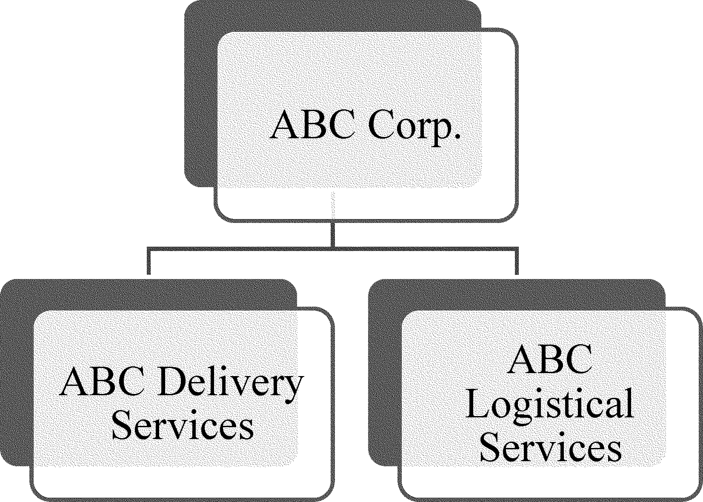
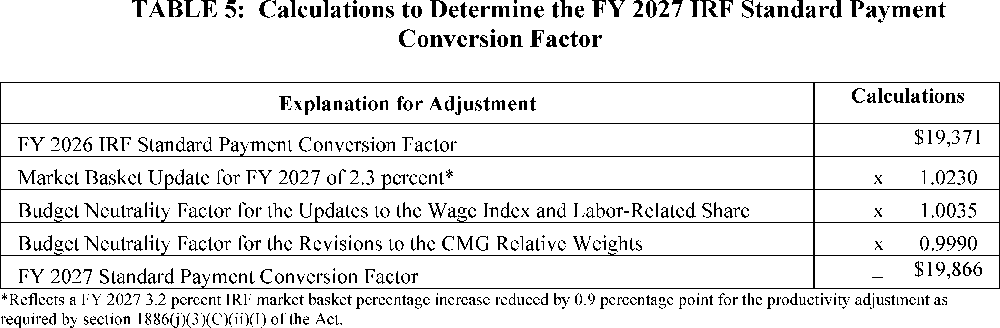
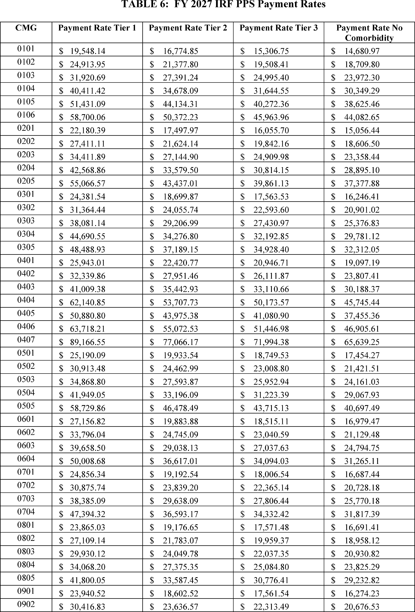
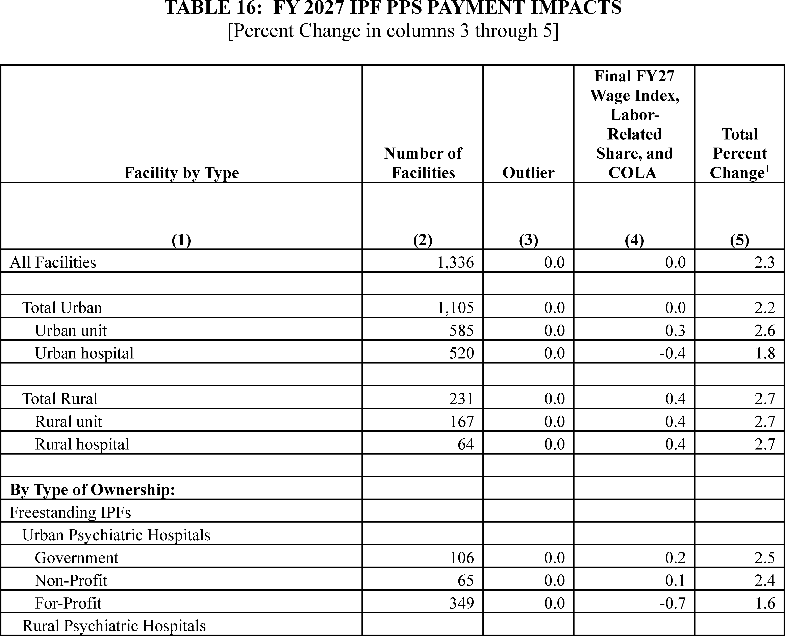
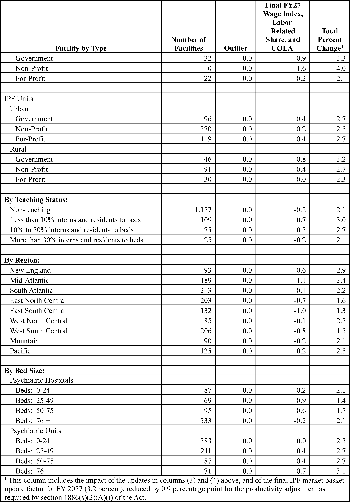

# Daily Digest — 2026-10-01

| | |
|---|---|
| **Digest date** | 2026-10-01 |
| **Data date range** | 2026-10-01 to 2026-10-01 |
| **Generated at** | 2026-10-02T04:24:29Z (UTC) |
| **Pipeline version** | 16cd58b4 |
| **Inference** | model layers ran — cli/haiku, opus |
| **Source watermarks** | CREC: 2026-10-02T03:16:11Z · BILLS: 2026-10-01T10:46:55Z · FR: 2026-10-01T19:30:41Z · USCOURTS: 2026-10-02T02:53:55Z · PLAW: 2026-09-25T12:51:35Z |

[Full observed listing for this day](day/2026-10-01.html) — every item our collectors observed for this publication day, mechanical rules applied, frozen at end of day. This digest is the canonical record.

All items below cite the govinfo package (and granule, where applicable) they
summarize. Selection is mechanical; each item states the rule that included
it. See the Coverage Statement at the end for a full accounting of what was
published, what was summarized, and what was excluded and why.

---

## Contents

- [Day in Review](#day-in-review)
- [1. Congressional Floor Activity](#1-congressional-floor-activity)
- [2. Legislation](#2-legislation)
- [3. Federal Register](#3-federal-register)
- [4. Enacted Laws](#4-enacted-laws)
- [5. Judicial Activity](#5-judicial-activity)
- [6. Agency Announcements](#6-agency-announcements)
- [7. Recorded Votes](#7-recorded-votes)
- [8. Bill Actions](#8-bill-actions)
- [9. Presidential Actions](#9-presidential-actions)
- [Terms Used Today](#terms-used-today)
- [Coverage Statement](#coverage-statement)
- [Methodology](#methodology)

---

## Day in Review

The digest carries 133 Senate items from the Congressional Record, one roll-call vote record, and 12 Senate-engrossed bill versions. Three cloture votes are recorded. The motion to proceed to H.R. 7008, which restricts stock holdings for Members of Congress and their families, failed 53–47. The motion to proceed to H.R. 9340, on utility upgrade costs for large-load customers, failed 57–43. Cloture on the nomination of Keith Sonderling to be Secretary of Labor was agreed to 53–47. The Senate passed the Taxpayer Assistance and Service Act and the License to Drill Act (H.R. 7831). The Record also lists 35 bills introduced on September 30.

On the regulatory side, the digest carries 20 rules, 10 proposed rules and 82 notices. The Department of State removed Syria from the ITAR list of countries subject to a policy of denial. It also proposed revisions to the U.S. Munitions List. EPA extended the South Coast, California PM2.5 attainment date. The FTC proposed a rulemaking on platforms that further impersonation scams. Other entries include FAA airworthiness directives and NMFS fishery actions.

The digest carries 45 appellate, 30 bankruptcy and 1,313 district court opinions. The Third Circuit affirmed that an AI legal research platform infringed Thomson Reuters' copyrighted headnotes and that the use was not fair use. The Ninth Circuit upheld Arizona's Proposition 211 campaign-spending disclosure requirements. The Seventh Circuit affirmed that Union Pacific's fingerprint scanning violated Illinois' Biometric Information Privacy Act. The Federal Circuit dismissed ParkerVision's appeal against Qualcomm for lack of jurisdiction.

*Composed from the summarized items below and the day's mechanical
counts; all specifics are cited in their sections.*

---

## 1. Congressional Floor Activity

Source: Congressional Record (CREC), issue observed 2026-10-01, covering proceedings of 2026-09-30. Published by govinfo 2026-10-01T17:27:34Z; observed by our collector 2026-10-01T17:39:53Z. Total issue size: 140 granule(s).

### 1.1 Senate

Tags: legislative · model keys: cybersecurity · oil-gas · tax

*In plain terms: Thirteen items include bills on tax services, oil-gas drilling, national parks, healthcare cybersecurity, and hostage tax relief, plus 35 new bills introduced with additional cosponsors on 27 existing bills.*

- **Unanimous Consent REQUEST--S. 5438** — Senator Sullivan requested unanimous consent to vote on S. 5438, the Alaska's Right to Produce Act 2.0, which would protect oil and gas development in the coastal plain of the Arctic National Wildlife Refuge (ANWR) and the National Petroleum Reserve in Alaska (NPR-A) from cancellation or reversal by future administrations. The proposal is intended to provide greater certainty for resource development on Alaska's North Slope.
  - *In plain terms:* Senator Sullivan sought a vote on a bill protecting oil and gas development in Alaska's coastal plain from future cancellation or reversal.
  - Included because: CREC-SEL-01 — floor item ≥ threshold floor time (20,857 characters) (document dated 2026-09-30)
  - Source: [CREC-2026-09-30 / CREC-2026-09-30-pt1-PgS5195](https://www.govinfo.gov/app/details/CREC-2026-09-30/CREC-2026-09-30-pt1-PgS5195)
- **National Park System Long-Term Lease Investment Act** — S. 2498, the National Park System Long-Term Lease Investment Act, authorizes the Secretary of the Interior to extend existing leases within National Park System units without competitive bidding, subject to evaluation of competing proposals and congressional notification for extensions exceeding 10 years. S. 2754, the Crystal Reservoir Conveyance Act, directs the Secretary of Agriculture to convey Crystal Reservoir and associated infrastructure in Ouray County, Colorado, to the City of Ouray, subject to requirements that the city maintain the property as open space for public recreation and assume responsibility for dam operation and maintenance.
  - *In plain terms:* The Senate passed a bill allowing the Interior Secretary to extend National Park leases without competitive bidding and a bill conveying Crystal Reservoir to Ouray, Colorado.
  - Included because: CREC-SEL-01 — floor item ≥ threshold floor time (47,628 characters) (document dated 2026-09-30)
  - Source: [CREC-2026-09-30 / CREC-2026-09-30-pt1-PgS5201](https://www.govinfo.gov/app/details/CREC-2026-09-30/CREC-2026-09-30-pt1-PgS5201)
- **Taxpayer Assistance and Service Act** — The Senate passed the Taxpayer Assistance and Service Act containing over 60 tax reforms to improve IRS services, including provisions addressing fraudulent tax preparation, digitizing returns, expanding online services, and enhancing taxpayer rights protections. The Senate also considered S. Res. 934 establishing October 10 as American Girls in Sports Day, which received an objection from Senator Markey before a floor vote could proceed.
  - *In plain terms:* The Senate passed a tax reform bill with over 60 provisions to improve IRS services and considered a resolution establishing October 10 as American Girls in Sports Day.
  - Included because: CREC-SEL-01 — floor item ≥ threshold floor time (153,168 characters) (document dated 2026-09-30)
  - Source: [CREC-2026-09-30 / CREC-2026-09-30-pt1-PgS5207-2](https://www.govinfo.gov/app/details/CREC-2026-09-30/CREC-2026-09-30-pt1-PgS5207-2)
- **License to Drill Act** — The Senate passed the License to Drill Act (H.R. 7831), which extends the Secretary of Interior's authority to collect processing fees for new oil and gas drill permit applications on federal lands through fiscal year 2037 and directs the fees to the Bureau of Land Management Permit Processing Improvement Fund. The Senate also passed H.R. 6380, redesignating Arizona's Chiricahua National Monument as Chiricahua National Park, and H.R. 837, conveying the Pleasant Valley Ranger District Administrative Site in Arizona to Gila County.
  - *In plain terms:* The Senate passed bills extending oil and gas permit processing authority through 2037, redesignating Chiricahua National Monument as a National Park, and conveying a ranger district to Gila County.
  - Included because: CREC-SEL-01 — floor item ≥ threshold floor time (43,244 characters) (document dated 2026-09-30)
  - Source: [CREC-2026-09-30 / CREC-2026-09-30-pt1-PgS5226-4](https://www.govinfo.gov/app/details/CREC-2026-09-30/CREC-2026-09-30-pt1-PgS5226-4)
- **Health Care Cybersecurity and Resiliency Act of 2026** — S. 3315, the Health Care Cybersecurity and Resiliency Act of 2026, requires the HHS Secretary and the Director of the Cybersecurity and Infrastructure Security Agency to coordinate to improve cybersecurity in the healthcare and public health sectors. The bill mandates establishment of a joint cybersecurity capability plan within one year, designation of an HHS representative to lead coordination of cybersecurity resilience efforts, and submission of annual reports to Congress assessing cybersecurity threats, incidents, and improvements in the healthcare sector.
  - *In plain terms:* A bill requires HHS and federal cybersecurity officials to coordinate healthcare sector cybersecurity improvements, including a joint plan within one year and annual threat reports to Congress.
  - Included because: CREC-SEL-01 — floor item ≥ threshold floor time (53,483 characters) (document dated 2026-09-30)
  - Source: [CREC-2026-09-30 / CREC-2026-09-30-pt1-PgS5231](https://www.govinfo.gov/app/details/CREC-2026-09-30/CREC-2026-09-30-pt1-PgS5231)
- **End Tax Penalties on American Hostages Act** — H.R. 9496, the End Tax Penalties on American Hostages Act, amends the Internal Revenue Code to postpone tax deadlines and reimburse paid late fees for United States nationals who are unlawfully or wrongfully detained or held hostage abroad.
  - *In plain terms:* A bill postpones tax deadlines and reimburses late fees for U.S. nationals who are unlawfully detained or held hostage abroad.
  - Included because: CREC-SEL-01 — floor item ≥ threshold floor time (20,486 characters) (document dated 2026-09-30)
  - Source: [CREC-2026-09-30 / CREC-2026-09-30-pt1-PgS5238](https://www.govinfo.gov/app/details/CREC-2026-09-30/CREC-2026-09-30-pt1-PgS5238)
- **Petitions and Memorials** — The Idaho legislature submitted two memorials to Congress urging federal action: the first requests that the U.S. Fish and Wildlife Service curtail pelican populations in Idaho due to documented impacts on fish populations and recreational fishing resources; the second affirms the Supreme Court's decision in Sackett v. Environmental Protection Agency requiring an indistinguishable surface connection standard for Clean Water Act jurisdiction and urges the EPA and Army Corps of Engineers to implement it and Congress to codify it.
  - *In plain terms:* Idaho's legislature urged Congress to reduce pelican populations to protect fish and fishing and to implement a Supreme Court ruling on federal wetland jurisdiction.
  - Included because: CREC-SEL-01 — floor item ≥ threshold floor time (118,096 characters) (document dated 2026-09-30)
  - Source: [CREC-2026-09-30 / CREC-2026-09-30-pt1-PgS5248-6](https://www.govinfo.gov/app/details/CREC-2026-09-30/CREC-2026-09-30-pt1-PgS5248-6)
- **Introduction of Bills and Joint Resolutions** — The Senate introduced 35 bills on September 30, 2026, addressing diverse policy areas including endangered species protection, employee retirement security, immigration and permanent resident status, forestry funding, healthcare and Medicaid administration, patent security, telecommunications infrastructure, higher education, veterans' benefits, energy and environmental matters, and tax policy.
  - *In plain terms:* The Senate introduced 35 bills addressing endangered species, retirement security, immigration, forestry, healthcare, patents, telecommunications, higher education, veterans' benefits, energy, and taxes.
  - Included because: CREC-SEL-01 — floor item ≥ threshold floor time (24,807 characters) (document dated 2026-09-30)
  - Source: [CREC-2026-09-30 / CREC-2026-09-30-pt1-PgS5259-2](https://www.govinfo.gov/app/details/CREC-2026-09-30/CREC-2026-09-30-pt1-PgS5259-2)
- **Additional Cosponsors** — Additional cosponsors were added on September 30, 2026 to 27 previously introduced Senate bills, including measures addressing virtual currency fraud prevention, World War II memorials, renewable natural gas incentives, health insurance coverage requirements, artificial intelligence governance, whistleblower protections, veterans' healthcare and benefits, and various other legislative matters.
  - *In plain terms:* Additional sponsors joined 27 Senate bills addressing virtual currency fraud, World War II memorials, renewable gas, health insurance, artificial intelligence, whistleblower protections, and veterans' benefits.
  - Included because: CREC-SEL-01 — floor item ≥ threshold floor time (18,251 characters) (document dated 2026-09-30)
  - Source: [CREC-2026-09-30 / CREC-2026-09-30-pt1-PgS5262](https://www.govinfo.gov/app/details/CREC-2026-09-30/CREC-2026-09-30-pt1-PgS5262)
- **Text of Amendments** — Senator Markey's amendment to H.R. 9340 establishes Federal Energy Regulatory Commission rules requiring data centers to pay full infrastructure upgrade costs, comply with labor agreements, and ensure 100 percent of peak megawatt demand is met through renewable energy and storage, contributions to a Distributed Renewable Energy Fund, or efficiency improvements. The amendment creates separate interconnection queues by transmission planning region and establishes a fund to provide grants for distributed clean energy resources in low-income and disadvantaged communities.
  - *In plain terms:* An amendment requires data centers to pay full infrastructure upgrade costs, comply with labor agreements, and meet all peak energy demand through renewables or efficiency improvements.
  - Included because: CREC-SEL-01 — floor item ≥ threshold floor time (220,313 characters) (document dated 2026-09-30)
  - Source: [CREC-2026-09-30 / CREC-2026-09-30-pt1-PgS5274-3](https://www.govinfo.gov/app/details/CREC-2026-09-30/CREC-2026-09-30-pt1-PgS5274-3)
- **Text of Senate Amendment 6845** — Senator Markey's amendment to H.R. 9340 establishes Federal Energy Regulatory Commission rules requiring data centers to pay full infrastructure upgrade costs, comply with labor agreements, and ensure 100 percent of peak megawatt demand is met through renewable energy and storage, contributions to a Distributed Renewable Energy Fund, or efficiency improvement technologies. The amendment creates separate interconnection queues by transmission planning region and establishes a fund to provide grants for distributed clean energy resources in low-income and disadvantaged communities.
  - *In plain terms:* An amendment requires data centers to pay full infrastructure upgrade costs, comply with labor agreements, and meet all peak energy demand through renewables or efficiency improvements.
  - Included because: CREC-SEL-01 — floor item ≥ threshold floor time (15,760 characters) (document dated 2026-09-30)
  - Source: [CREC-2026-09-30 / CREC-2026-09-30-pt1-PgS5274-4](https://www.govinfo.gov/app/details/CREC-2026-09-30/CREC-2026-09-30-pt1-PgS5274-4)
- **Text of Senate Amendment 6847** — Amendment 6847 proposes comprehensive Internal Revenue Service and tax administration reforms including digitization of returns and correspondence, real-time public dashboards reporting taxpayer wait times and backlogs, expanded electronic access to return and refund information, automation of refund offset procedures, and elimination of certain installment agreement fees. The amendment also enhances taxpayer advocate authority, modifies tax return preparer penalties and identification requirements, strengthens appeals processes, expands whistleblower protections, and establishes provisions for taxpayers facing economic hardship and individuals wrongfully detained abroad.
  - *In plain terms:* An amendment proposes IRS reforms including digitization of returns, public dashboards for wait times, expanded electronic services, and enhanced protections for struggling taxpayers and the wrongfully detained.
  - Included because: CREC-SEL-01 — floor item ≥ threshold floor time (201,333 characters) (document dated 2026-09-30)
  - Source: [CREC-2026-09-30 / CREC-2026-09-30-pt1-PgS5276-2](https://www.govinfo.gov/app/details/CREC-2026-09-30/CREC-2026-09-30-pt1-PgS5276-2)
- **Nominations** — The Senate received executive nominations for appointment of multiple officers to the rank of Major in the United States Army under Title 10, U.S.C., Section 624.
  - *In plain terms:* The Senate received nominations for military officers to be appointed to the rank of Major in the United States Army.
  - Included because: CREC-SEL-01 — floor item ≥ threshold floor time (63,090 characters) (document dated 2026-09-30)
  - Source: [CREC-2026-09-30 / CREC-2026-09-30-pt1-PgS5301-3](https://www.govinfo.gov/app/details/CREC-2026-09-30/CREC-2026-09-30-pt1-PgS5301-3)

### 1.2 House of Representatives

No House floor items met the selection thresholds. 0 floor granule(s) are accounted for in the Coverage Statement.

### 1.3 Recorded Votes

- **Cloture Motion** — A cloture motion to proceed to H.R. 7008, a bill restricting stock holdings for Members of Congress and their families, failed with 53 yeas and 47 nays, falling short of the 60-vote threshold required to advance debate.
  - *In plain terms:* A vote to end debate on a bill restricting Congress members' stock holdings failed with 53 voting yes and 47 voting no.
  - Included because: CREC-SEL-02 — recorded vote (all recorded votes are listed) (document dated 2026-09-30)
  - Source: [CREC-2026-09-30 / CREC-2026-09-30-pt1-PgS5199](https://www.govinfo.gov/app/details/CREC-2026-09-30/CREC-2026-09-30-pt1-PgS5199)
- **Cloture Motion** — A cloture motion to proceed to H.R. 9340, a bill amending the Public Utility Regulatory Policies Act of 1978 to establish a federal standard for recovery of full, incremental costs of utility upgrades serving large-load customers, failed with 57 yeas and 43 nays, falling short of the 60-vote threshold.
  - *In plain terms:* A vote to end debate on a bill establishing a federal standard for utilities to recover full upgrade costs for large customers failed.
  - Included because: CREC-SEL-02 — recorded vote (all recorded votes are listed) (document dated 2026-09-30)
  - Source: [CREC-2026-09-30 / CREC-2026-09-30-pt1-PgS5199-2](https://www.govinfo.gov/app/details/CREC-2026-09-30/CREC-2026-09-30-pt1-PgS5199-2)
- **Cloture Motion** — A cloture motion to end debate on the nomination of Keith Sonderling of Florida to be Secretary of Labor was agreed to with 53 yeas and 47 nays.
  - *In plain terms:* The Senate voted to end debate on Keith Sonderling's nomination as Secretary of Labor, with 53 voting yes and 47 voting no.
  - Included because: CREC-SEL-02 — recorded vote (all recorded votes are listed) (document dated 2026-09-30)
  - Source: [CREC-2026-09-30 / CREC-2026-09-30-pt1-PgS5199-3](https://www.govinfo.gov/app/details/CREC-2026-09-30/CREC-2026-09-30-pt1-PgS5199-3)

---

## 2. Legislation

Source: Congressional Bills (BILLS), text versions published 2026-10-01 to 2026-10-01.

### 2.1 Counts by Stage

| Stage (bill text version) | Count |
|---|---|
| Introduced (ih/is) | 0 |
| Reported (rh/rs) | 0 |
| Engrossed (eh/es) | 10 |
| Enrolled (enr) | 0 |
| Other versions | 2 |
| **Total bill texts published** | **12** |

### 2.2 Bills Listed by Mechanical Rule

Bills below are listed because they matched at least one listing rule; the
matching rule is stated per item. All other bill texts are counted above and
accounted for in the Coverage Statement.

No bill texts published in this range matched a listing rule; all 12 are
accounted for in the Coverage Statement.

---

## 3. Federal Register

Source: Federal Register (FR), issue of 2026-10-01.

### 3.1 Counts by Document Type

| Document type | Count |
|---|---|
| Rules | 20 |
| Proposed rules | 10 |
| Notices | 82 |
| Presidential documents | 0 |
| **Total FR documents** | **112** |

### 3.2 Rules Published

Tags: department of commerce · department of health and human services · executive · model keys: airworthiness · emissions · navigation

*In plain terms: Twenty adopted rules include FAA airworthiness directives for aircraft and helicopters, EPA air quality and emissions controls, Coast Guard maritime regulations, fisheries management, Medicare payment corrections, and rural energy implementation.*

#### DEPARTMENT OF AGRICULTURE

- **Unleashing American Energy and Economic Prosperity; Rural Energy for America Program (REAP)** (2026-20178; 7 CFR Part 4280) — The Rural Business-Cooperative Service (RBCS or the Agency), an agency of the Rural Development (RD) mission area within the U.S. Department of Agriculture (USDA) is issuing a final rule with comment period. Implementation of this action will simplify and streamline requirements and processes in the Rural Energy for America Program (REAP). Under the new REAP structure, projects must already be fully built and operational before the applicant ever applies. Applicants then apply, submitting actual energy production or savings data for the prior 12 months, alongside 12 months of pre-installation data. The Agency evaluates applications for completeness, eligibility, risk, and merit and will award grants subject to the availability of funds and criteria provided in an annual notice. This new approach changes the program to a post completion, performance validated model. All RES and EEI awards will now be based on actual documented output, energy savings, costs, and system performance. Bottlenecks leading to application processing backlogs such as the technical merit review clearance process have been removed from the Agency's purview. [official summary truncated; see source] Action: Final rule with comment period. Dates: Effective date: This final rule is effective October 16, 2026. Comment date: Comments must be submitted on or before November 2, 2026.
  - *In plain terms:* A rural development agency is changing its energy grant program to require projects to be fully built before applying, then evaluating grants based on actual energy savings.
  - Included because: FR-SEL-01 — document type: final rule (all listed)
  - Source: [FR-2026-10-01 / 2026-20178](https://www.govinfo.gov/app/details/FR-2026-10-01/2026-20178)
  -  *Source graphic 1 of 1 from 2026-20178.*

#### DEPARTMENT OF COMMERCE

- **Fisheries of the Exclusive Economic Zone Off Alaska; Pollock Fishing in the Winter Herring Savings Area of the Bering Sea and Aleutian Islands Management Area** (2026-20135; 50 CFR Part 679) — NMFS is prohibiting directed fishing for pollock by vessels using trawl gear in the Winter Herring Savings Area of the Bering Sea and Aleutian Islands management area (BSAI). This action is required by regulation and is necessary to prevent herring prohibited species catch (bycatch) in the Winter Herring Savings Area by vessels directing fishing for pollock using trawl gear. This action includes prohibiting directed fishing for pollock in the Winter Herring Savings Area by vessels using trawl gear participating in the Community Development Quota Program. Action: Temporary rule; closure. Dates: Effective 1200 hours, Alaska local time (A.l.t.), September 30, 2026, through 1200 hours, A.l.t., March 1, 2027.
  - *In plain terms:* NMFS prohibits fishing for pollock with trawl gear in a specific Bering Sea area to prevent catching herring as bycatch.
  - Included because: FR-SEL-01 — document type: final rule (all listed)
  - Source: [FR-2026-10-01 / 2026-20135](https://www.govinfo.gov/app/details/FR-2026-10-01/2026-20135)
- **Pacific Island Fisheries; Annual Catch Limit and Accountability Measures for Mariana Bottomfish Management Unit Species in the Guam Management Subarea** (2026-20140; 50 CFR Part 665) — NMFS is modifying the annual catch limit (ACL) and accountability measures (AM) for Mariana bottomfish management unit species (MUS) in the Guam Management Subarea (the fishery). The rule increases the ACL from 31,000 pounds (lb) (14,061 kilograms (kg)) to 34,500 lb (15,649 kg), replaces the in-season AM with a post-season overage adjustment if the average catch from the most recent 3 years exceeds the ACL, and removes the higher performance standard that closes the fishery in Federal waters for any overage. The rule is based on the best available scientific, commercial, and other information about the fishery, and supports rebuilding of the fishery. Action: Final rule. Dates: The final rule is effective November 2, 2026.
  - *In plain terms:* NMFS increases the annual catch limit for Mariana bottomfish in Guam waters from 31,000 to 34,500 pounds and modifies overage-adjustment procedures.
  - Included because: FR-SEL-01 — document type: final rule (all listed)
  - Source: [FR-2026-10-01 / 2026-20140](https://www.govinfo.gov/app/details/FR-2026-10-01/2026-20140)
- **Fisheries of the Exclusive Economic Zone Off Alaska; Exchange of Flatfish in the Bering Sea and Aleutian Islands Management Area** (2026-20177; 50 CFR Part 679) — NMFS is exchanging unused yellowfin sole and flathead sole Community Development Quota (CDQ) for rock sole CDQ acceptable biological catch (ABC) reserves in the Bering Sea and Aleutian Islands (BSAI) management area. This action is necessary to allow the CDQ fishery to optimize their total rock sole harvest in the BSAI. Action: Temporary rule; reallocation. Dates: Effective October 1, 2026, through December 31, 2026.
  - *In plain terms:* The National Marine Fisheries Service is exchanging unused fish quota for rock sole quota to help the fishing industry maximize its rock sole harvest in the Bering Sea.
  - Included because: FR-SEL-01 — document type: final rule (all listed)
  - Source: [FR-2026-10-01 / 2026-20177](https://www.govinfo.gov/app/details/FR-2026-10-01/2026-20177)

#### DEPARTMENT OF HEALTH AND HUMAN SERVICES

- **Medicare Program; Inpatient Rehabilitation Facility Prospective Payment System for Federal Fiscal Year 2027 and Updates to the IRF Quality Reporting Program; Correction** (2026-20131; 42 CFR Parts 412 and 414) — This document corrects technical errors in the final rule that appeared in the August 3, 2026 Federal Register titled “Medicare Program; Inpatient Rehabilitation Facility Prospective Payment System for Federal Fiscal Year 2027 and Updates to the IRF Quality Reporting Program”. Action: Final rule; correction. Dates: This correction is effective October 1, 2026.
  - *In plain terms:* This document corrects technical errors in the Medicare inpatient-rehabilitation-facility payment-rates final rule from August 3, 2026.
  - Included because: FR-SEL-01 — document type: final rule (all listed)
  - Source: [FR-2026-10-01 / 2026-20131](https://www.govinfo.gov/app/details/FR-2026-10-01/2026-20131)
  -  *Source graphic 1 of 7 from 2026-20131.*
  -  *Source graphic 2 of 7 from 2026-20131.*
  - *Graphics not rendered here: 5 of 7 — see the [source PDF](https://www.govinfo.gov/content/pkg/FR-2026-10-01/pdf/FR-2026-10-01.pdf).*
- **Medicare Program; FY 2027 Inpatient Psychiatric Facilities Prospective Payment System—Rate Update; Correction** (2026-20134; 42 CFR Part 412) — This document corrects technical errors in the final action that appeared in the July 31, 2026 Federal Register titled “Medicare Program; FY 2027 Inpatient Psychiatric Facilities Prospective Payment System—Rate Update”. Action: Final rule; correction. Dates: This correction is effective October 1, 2026.
  - *In plain terms:* This document corrects technical errors in the Medicare inpatient-psychiatric-facilities payment-rates final rule from July 31, 2026.
  - Included because: FR-SEL-01 — document type: final rule (all listed)
  - Source: [FR-2026-10-01 / 2026-20134](https://www.govinfo.gov/app/details/FR-2026-10-01/2026-20134)
  -  *Source graphic 1 of 2 from 2026-20134.*
  -  *Source graphic 2 of 2 from 2026-20134.*

#### DEPARTMENT OF HOMELAND SECURITY

- **Special Local Regulations; Englewood Beach Offshore Championship; Gulf of America; Englewood, FL** (2026-20121; 33 CFR Part 100) — The Coast Guard will enforce special local regulations for the OPA World Championships to provide for the safety of life on navigable waterways during this event. Our regulation for marine events within the Coast Guard Southeast District's Sector Saint Petersburg identifies the regulated area for this event in Englewood Beach, FL. During the enforcement periods, the operator of any vessel in the regulated area must comply with directions from the Patrol Commander or any designated representative. Action: Notification of enforcement of regulation. Dates: The regulations in 33 CFR 100.703 will be enforced for the OPA World Championships regulated area listed in item 9 in table 1 to § 100.703, each day from 8:00 a.m. until 6:00 p.m. on October 10, 2026 through October 11, 2026.
  - *In plain terms:* The Coast Guard will enforce special safety regulations during the OPA World Championships in Englewood Beach, Florida.
  - Included because: FR-SEL-01 — document type: final rule (all listed)
  - Source: [FR-2026-10-01 / 2026-20121](https://www.govinfo.gov/app/details/FR-2026-10-01/2026-20121)
- **Safety Zone; St. Lawrence River, Massena, NY** (2026-20122; 33 CFR Part 165) — The Coast Guard is establishing two temporary safety zones for U.S. navigable waters on the St. Lawrence River in the vicinity of Massena, New York. The safety zones are needed to protect personnel, vessels, and the marine environment from potential hazards associated with the replacement of overhead electrical transmission wires crossing the St. Lawrence River. Entry of vessels or persons into this zone is prohibited unless specifically authorized by the Captain of the Port, Sector Eastern Great Lakes, or their designated representative. Action: Temporary final rule. Dates: This rule is effective without actual notice from September 30, 2026 through October 3, 2026. For the purposes of enforcement, actual notice will be used from September 29, 2026, until September 30, 2026.
  - *In plain terms:* The Coast Guard establishes temporary safety zones on the St. Lawrence River near Massena, New York to protect against electrical-transmission-wire-replacement hazards.
  - Included because: FR-SEL-01 — document type: final rule (all listed)
  - Source: [FR-2026-10-01 / 2026-20122](https://www.govinfo.gov/app/details/FR-2026-10-01/2026-20122)

#### DEPARTMENT OF STATE

- **International Traffic in Arms Regulations: Syria Country Policy Revision** (2026-20082; 22 CFR Part 126) — The Department of State is amending the International Traffic in Arms Regulations (ITAR) to remove Syria from the list of countries subject to a policy of denial for licenses and other approvals. Action: Final rule. Dates: This rule is effective on October 1, 2026.
  - *In plain terms:* The Department of State is removing Syria from the list of countries denied licenses for arms and defense-related exports.
  - Included because: FR-SEL-01 — document type: final rule (all listed)
  - Source: [FR-2026-10-01 / 2026-20082](https://www.govinfo.gov/app/details/FR-2026-10-01/2026-20082)

#### DEPARTMENT OF TRANSPORTATION

- **Airworthiness Directives; Airbus Helicopters** (2026-20098; 14 CFR Part 39) — The FAA is adopting a new airworthiness directive (AD) for all Airbus Helicopters Model AS355E, AS355F, AS355F1, AS355F2, and AS355N helicopters. This AD was prompted by the determination that the tail rotor drive fan wheels (fan wheels) and the impeller second stage have been incorrectly identified during production. This AD requires verifying the serial number and amendment of the log cards of the affected parts, and depending on the findings, performing a one-time borescope inspection to verify consistency between the log cards and the affected parts. Depending on the results of the inspection, this AD requires replacing or re-identifying certain parts. This AD also prohibits the installation of certain fan wheels and impeller second stages on any helicopter. The FAA is issuing this AD to address the unsafe conditions on these products. Action: Final rule. Dates: This AD is effective November 5, 2026. The Director of the Federal Register approved the incorporation by reference of a certain publication listed in this AD as of November 5, 2026.
  - *In plain terms:* The FAA requires verifying identification of certain helicopter parts and performing borescope inspections, with replacement or re-identification depending on inspection results.
  - Included because: FR-SEL-01 — document type: final rule (all listed)
  - Source: [FR-2026-10-01 / 2026-20098](https://www.govinfo.gov/app/details/FR-2026-10-01/2026-20098)
- **Airworthiness Directives; Leonardo S.p.a. Helicopters** (2026-20100; 14 CFR Part 39) — The FAA is adopting a new airworthiness directive (AD) for certain Leonardo S.p.a. Model AB139 and AW139 helicopters. This AD was prompted by a report of a nozzle exhaust duct clamp separating from the engine nozzle duct and coming to rest on the tail rotor (TR) drive shaft. This AD requires repetitively inspecting certain clamp assemblies and, depending on the results of the inspection, replacing parts. This AD also prohibits the installation of an affected clamp assembly, unless certain requirements are met. The FAA is issuing this AD to address the unsafe condition on these products. Action: Final rule; request for comments. Dates: This AD is effective October 16, 2026. The Director of the Federal Register approved the incorporation by reference of a certain publication listed in this AD as of October 16, 2026. The FAA must receive comments on this AD by November 16, 2026.
  - *In plain terms:* The FAA requires repetitive inspections of exhaust-duct clamps and replacement of affected parts to prevent separation and contact with the tail rotor.
  - Included because: FR-SEL-01 — document type: final rule (all listed)
  - Source: [FR-2026-10-01 / 2026-20100](https://www.govinfo.gov/app/details/FR-2026-10-01/2026-20100)
- **Airworthiness Directives; Airbus Helicopters** (2026-20103; 14 CFR Part 39) — The FAA is adopting a new airworthiness directive (AD) for certain Airbus Helicopters Model AS350B, AS350BA, AS350B1, AS350B2, AS350B3, AS350D, AS355E, AS355F, AS355F1, AS355F2, AS355N, AS355NP, EC120B, and EC130B4 helicopters. This AD was prompted by a determination that the instructions on how to open the sliding door emergency exit on affected helicopters are insufficient. This AD requires installing additional safety labels or replacing existing safety labels, as applicable. The FAA is issuing this AD to address the unsafe condition on these products. Action: Final rule. Dates: This AD is effective November 5, 2026. The Director of the Federal Register approved the incorporation by reference of a certain publication listed in this AD as of November 5, 2026.
  - *In plain terms:* The FAA requires installing or replacing safety labels on helicopter doors to provide clearer emergency-exit instructions.
  - Included because: FR-SEL-01 — document type: final rule (all listed)
  - Source: [FR-2026-10-01 / 2026-20103](https://www.govinfo.gov/app/details/FR-2026-10-01/2026-20103)
- **Standard Instrument Approach Procedures, and Takeoff Minimums and Obstacle Departure Procedures; Miscellaneous Amendments** (2026-20116; 14 CFR Part 97) — This rule establishes, amends, suspends, or removes Standard Instrument Approach Procedures (SIAPS) and associated Takeoff Minimums and Obstacle Departure procedures (ODPs) for operations at certain airports. These regulatory actions are needed because of the adoption of new or revised criteria, or because of changes occurring in the National Airspace System, such as the commissioning of new navigational facilities, adding new obstacles, or changing air traffic requirements. These changes are designed to provide safe and efficient use of the navigable airspace and to promote safe flight operations under instrument flight rules at the affected airports. Action: Final rule. Dates: This rule is effective October 1, 2026. The compliance date for each SIAP, associated Takeoff Minimums, and ODP is specified in the amendatory provisions. The incorporation by reference of certain publications listed in the regulations is approved by the Director of the Federal Register as of October 1, 2026.
  - *In plain terms:* The FAA establishes, modifies, or removes flight-instrument procedures at various airports to reflect new navigation facilities, obstacles, or traffic requirements.
  - Included because: FR-SEL-01 — document type: final rule (all listed)
  - Source: [FR-2026-10-01 / 2026-20116](https://www.govinfo.gov/app/details/FR-2026-10-01/2026-20116)
- **Standard Instrument Approach Procedures, and Takeoff Minimums and Obstacle Departure Procedures; Miscellaneous Amendments** (2026-20117; 14 CFR Part 97) — This rule amends, suspends, or removes Standard Instrument Approach Procedures (SIAPs) and associated Takeoff Minimums and Obstacle Departure Procedures for operations at certain airports. These regulatory actions are needed because of the adoption of new or revised criteria, or because of changes occurring in the National Airspace System, such as the commissioning of new navigational facilities, adding new obstacles, or changing air traffic requirements. These changes are designed to provide for the safe and efficient use of the navigable airspace and to promote safe flight operations under instrument flight rules at the affected airports. Action: Final rule. Dates: This rule is effective October 1, 2026. The compliance date for each SIAP, associated Takeoff Minimums, and ODP is specified in the amendatory provisions. The incorporation by reference of certain publications listed in the regulations is approved by the Director of the Federal Register as of October 1, 2026.
  - *In plain terms:* The FAA amends, suspends, or removes flight-instrument procedures at airports to reflect new criteria, navigation facilities, obstacles, or traffic changes.
  - Included because: FR-SEL-01 — document type: final rule (all listed)
  - Source: [FR-2026-10-01 / 2026-20117](https://www.govinfo.gov/app/details/FR-2026-10-01/2026-20117)
- **Airworthiness Directives; Airbus SAS Airplanes** (2026-20119; 14 CFR Part 39) — The FAA is superseding Airworthiness Directive (AD) 2021-03-08, which applied to certain Airbus SAS Model A350-941 and -1041 airplanes. AD 2021-03-08 required repetitive inspections for migration of the bushings of the horizontal tail plane (HTP) lateral load fittings (LLFs) on the left- and right-hand sides and terminating repair or modification of any affected bushing. Since the FAA issued AD 2021-03-08, new occurrences of bushing migration on HTP LLFs were reported, and a determination was made that certain repairs can no longer be considered terminating action to the repetitive inspections. This AD continues to require the actions in AD 2021-03-08, removes a certain terminating action, and expands the applicability. The FAA is issuing this AD to address the unsafe condition on these products. Action: Final rule. Dates: This AD is effective November 5, 2026. The Director of the Federal Register approved the incorporation by reference of a certain publication listed in this AD as of November 5, 2026.
  - *In plain terms:* The FAA continues requiring repetitive inspections for tail-plane bushing migration on Airbus A350 airplanes, removes a previous repair option, and expands coverage.
  - Included because: FR-SEL-01 — document type: final rule (all listed)
  - Source: [FR-2026-10-01 / 2026-20119](https://www.govinfo.gov/app/details/FR-2026-10-01/2026-20119)
- **Airworthiness Directives; The Boeing Company Airplanes** (2026-20120; 14 CFR Part 39) — The FAA is adopting a new airworthiness directive (AD) for all The Boeing Company Model 757-300 series airplanes. This AD was prompted by a crack growth analysis that indicated that existing maintenance planning data (MPD) and supplemental structural inspection program (SSIP) tasks do not provide adequate inspection opportunities to detect cracks in the upper frames around the uppermost fastener common to the fail-safe chord at the fuselage frame splices. This AD requires an inspection or maintenance record check for existing repairs, repetitive inspections of the upper frames around the uppermost fastener common to the fail-safe chord at the fuselage frame splices for any cracks, and applicable on-condition actions. The FAA is issuing this AD to address the unsafe condition on these products. Action: Final rule. Dates: This AD is effective November 5, 2026. The Director of the Federal Register approved the incorporation by reference of a certain publication listed in this AD as of November 5, 2026.
  - *In plain terms:* The FAA requires inspecting Boeing 757-300 airframes for cracks and checking maintenance records for existing repairs to prevent crack propagation.
  - Included because: FR-SEL-01 — document type: final rule (all listed)
  - Source: [FR-2026-10-01 / 2026-20120](https://www.govinfo.gov/app/details/FR-2026-10-01/2026-20120)

#### ENVIRONMENTAL PROTECTION AGENCY

- **Air Plan Approval; Missouri; Control of NO X Emissions From Large Stationary Internal Combustion Engines** (2026-20096; 40 CFR Part 52) — The U.S. Environmental Protection Agency (EPA) is approving revisions to the Missouri State Implementation Plan (SIP) related to Control of Nitrogen Oxide (NO X ) Emissions From Large Stationary Internal Combustion Engines. The revisions reformat and revise reporting, recordkeeping, and compliance requirements; incorporate other State rules by reference; add definitions specific to the rule; revise unnecessarily restrictive or duplicative language; and make administrative wording changes. The revisions also add an exemption for certain spark-ignited internal combustion engines. The EPA's final approval of this rule revision is being done in accordance with the requirements of the Clean Air Act (CAA). Action: Final rule. Dates: This rule is effective November 2, 2026.
  - *In plain terms:* The EPA approves Missouri's revised air-quality plan for controlling nitrogen-oxide emissions from stationary diesel engines, reformatting reporting and compliance requirements.
  - Included because: FR-SEL-01 — document type: final rule (all listed)
  - Source: [FR-2026-10-01 / 2026-20096](https://www.govinfo.gov/app/details/FR-2026-10-01/2026-20096)
- **Attainment Date Extension for the South Coast, California 2012 Annual PM 2.5 Fine Particulate Matter Nonattainment Area** (2026-20097; 40 CFR Part 52) — The U.S. Environmental Protection Agency (EPA or “Agency”) is granting an extension of the “Serious” area attainment date for the Los Angeles-South Coast Air Basin (“South Coast Air Basin” or “South Coast”) nonattainment area for the 2012 annual fine particulate matter less than or equal to 2.5 µm in diameter (PM 2.5 ) national ambient air quality standards (NAAQS) from December 31, 2025, to December 31, 2030, based on a determination that the State has satisfied the statutory criteria for this extension. Action: Final action. Dates: This action is effective November 2, 2026.
  - *In plain terms:* The EPA extends the deadline for the South Coast air basin to meet federal fine-particle air-quality standards from December 31, 2025 to December 31, 2030.
  - Included because: FR-SEL-01 — document type: final rule (all listed)
  - Source: [FR-2026-10-01 / 2026-20097](https://www.govinfo.gov/app/details/FR-2026-10-01/2026-20097)
- **Administration of Cross-State Air Pollution Rule Trading Program Assurance Provisions for 2025 Control Period** (2026-20191; 40 CFR Part 97) — The U.S. Environmental Protection Agency (EPA) is providing notice of the availability of data on the administration of the assurance provisions of the Cross-State Air Pollution Rule (CSAPR) trading program for the 2025 control period. Virginia units participating in the CSAPR NO X Ozone Season Group 2E Trading Program during the 2025 control period reported total nitrogen oxides (NO X ) emissions that exceeded the State's assurance level under the program. The EPA has posted on the Agency's website a spreadsheet that presents data demonstrating the exceedance and the Agency's final calculations of the additional allowances that owners and operators of certain Virginia units must surrender. Action: Notification of data availability. Dates: October 1, 2026.
  - *In plain terms:* The Environmental Protection Agency is notifying the public that Virginia power units exceeded their nitrogen oxide emission limit for 2025 and must surrender additional pollution allowances.
  - Included because: FR-SEL-01 — document type: final rule (all listed)
  - Source: [FR-2026-10-01 / 2026-20191](https://www.govinfo.gov/app/details/FR-2026-10-01/2026-20191)

#### FEDERAL COMMUNICATIONS COMMISSION

- **[WC Docket Nos. 25-208, 25-209; FCC 26-19; FR ID 370342] Reducing Barriers to Network Improvements and Service Changes, Accelerating Network Modernization** (2026-20192; 47 CFR Parts 51 and 63) — In this document, the Wireline Competition Bureau (Bureau) announces that the Office of Management and Budget (OMB) has approved the information collection associated with the Commission's revised network change disclosure and service discontinuance rules in a Report and Order, which stated that the revised rules would not become effective until OMB completed its review of any information collection requirements under the Paperwork Reduction Act and that the Bureau would announce the effective date for the revised rules by subsequent Public Notice. Action: Final rule; announcement of effective date. Dates: The amendments to §§ 51.329, 51.333, 63.60, 63.62(a), (b), and (d), 63.63, 63.71, and 63.602, published at 91 FR 20913, April 20, 2026, are effective on October 15, 2026.
  - *In plain terms:* The Federal Communications Commission's new rules requiring disclosure when phone companies make network changes can now take effect after the Office of Management and Budget completed its review.
  - Included because: FR-SEL-01 — document type: final rule (all listed)
  - Source: [FR-2026-10-01 / 2026-20192](https://www.govinfo.gov/app/details/FR-2026-10-01/2026-20192)

### 3.3 Proposed Rules Published

Tags: department of commerce · department of health and human services · executive · model keys: air quality · airworthiness · maritime

*In plain terms: Ten proposed regulations include FAA airworthiness directives, EPA air quality approvals, Coast Guard maritime and safety rules, FTC consumer protection rulemaking, and international arms control review.*

#### DEPARTMENT OF HOMELAND SECURITY

- **Clarification of Certain Mariner Training Requirements** (2026-20087; 46 CFR Parts 11 and 12) — The Coast Guard proposes removing six requirements related to endorsements for the International Convention on Standards of Training, Certification, and Watchkeeping for Seafarers, 1978, as amended, and the Seafarer's Training, Certification, and Watchkeeping Code. Changes would affect Masters and Officers in Charge of a Navigational Watch of less than 500 GT in near-coastal waters; Officers in Charge of an Engineering Watch, Designated Duty Engineers, and Electro-technical Ratings of 750 kW/1,000 HP or more. This proposed action includes technical revisions to remove duplicative or outdated language from the regulatory text, reduces regulatory burdens, and promotes equivalent compliance standards with international requirements. Action: Notice of proposed rulemaking. Dates: Comments and related material must be received by the Coast Guard on or before December 30, 2026.
  - *In plain terms:* The Coast Guard proposes removing six endorsement requirements for maritime officers and crew, reducing regulatory burdens while maintaining international training standards.
  - Included because: FR-SEL-02 — document type: proposed rule (all listed)
  - Source: [FR-2026-10-01 / 2026-20087](https://www.govinfo.gov/app/details/FR-2026-10-01/2026-20087)
- **Safety Zone; Sector Mobile Captain of the Port Zone, Mobile, AL** (2026-20124; 33 CFR Part 165) — The Coast Guard is proposing to establish a temporary moving safety zone and two temporary fixed safety zones to support the arrival and dismantling of the EX ENTERPRISE, formerly the USS ENTERPRISE (CVN-65), in the Sector Mobile Captain of the Port Zone. This proposed rulemaking would prohibit persons and vessels from entering these zones unless authorized by the Captain of the Port, Sector Mobile. We invite your comments on this proposed rulemaking. Action: Notice of proposed rulemaking. Dates: Comments and related material must be received by the Coast Guard on or before October 16, 2026.
  - *In plain terms:* The Coast Guard proposes establishing temporary safety zones in Mobile, Alabama to protect the arrival and dismantling of the former USS ENTERPRISE.
  - Included because: FR-SEL-02 — document type: proposed rule (all listed)
  - Source: [FR-2026-10-01 / 2026-20124](https://www.govinfo.gov/app/details/FR-2026-10-01/2026-20124)

#### DEPARTMENT OF JUSTICE

- **Extension of Reexportation Period.** (2026-20084; 21 CFR Part 1312) — This proposed rule would amend the regulations of the Drug Enforcement Administration (DEA) to extend the time allowed for reexports of controlled substances outside of the European Economic Area from 180 days from the date of original release from U.S. Customs and Border Protection to 365 days from that original release date. Action: Notice of Proposed Rulemaking. Dates: Electronic comments must be submitted, and written comments must be postmarked, on or before November 30, 2026. Commenters should be aware that the electronic Federal Docket Management System will not accept any comments after 11:59 p.m. Eastern Time on the last day of the comment period. All comments concerning collections of information under the Paperwork Reduction Act must be submitted to the Office of Management and Budget on or before November 30, 2026.
  - *In plain terms:* The DEA proposes extending the time allowed for reexporting controlled substances outside Europe from 180 days to 365 days.
  - Included because: FR-SEL-02 — document type: proposed rule (all listed)
  - Source: [FR-2026-10-01 / 2026-20084](https://www.govinfo.gov/app/details/FR-2026-10-01/2026-20084)

#### DEPARTMENT OF STATE

- **International Traffic in Arms Regulations (ITAR): Review of the U.S. Munitions List and Related Definitions and License Exemptions** (2026-20079; 22 CFR Parts 120, 121, and 123) — The Department of State (the Department) proposes to amend the International Traffic in Arms Regulations (ITAR) to ensure that the U.S. Munitions List (USML) focuses ITAR controls on the most sensitive technologies, to improve regulatory transparency and clarity, and to reduce regulatory burdens. The revisions proposed in this rule would remove certain items from the USML, update definitions and standardize the regulatory text, and add a new exemption to the licensing requirements of the ITAR. The Department also requests public comments to further refine ITAR controls. Action: Proposed rule; request for comments. Dates: Send comments by November 30, 2026.
  - *In plain terms:* The Department of State proposes revising arms-export regulations to remove certain items from the munitions list, update definitions, and add new licensing exemptions.
  - Included because: FR-SEL-02 — document type: proposed rule (all listed)
  - Source: [FR-2026-10-01 / 2026-20079](https://www.govinfo.gov/app/details/FR-2026-10-01/2026-20079)

#### DEPARTMENT OF THE INTERIOR

- **General Provisions; Revised List of Birds Protected by the Migratory Bird Treaty Act** (2026-20123; 50 CFR Parts 10 and 21) — We, the U.S. Fish and Wildlife Service (Service), propose to revise the List of Birds Protected by the Migratory Bird Treaty Act (MBTA) by both adding and removing species and changing names to conform to accepted use by the scientific community. Reasons for the proposed changes to the list include adding species based on new taxonomy and new evidence of natural occurrence in the United States or U.S. territories, removing species no longer known to occur within the United States or U.S. territories, and changing names to reflect currently accepted taxonomy and nomenclature. The net increase of 25 species (32 added and 7 removed) would bring the total number of species protected by the MBTA to 1,131. We also propose to revise the names of species subject to specific migratory bird permit regulations to reflect currently accepted taxonomy and nomenclature. We are taking this proposed action because an accurate and up-to-date list of species protected by the MBTA is essential for public notification, regulatory, and law-enforcement purposes, and to ensure consistency in the use of common and scientific names across Service regulations. Action: Proposed rule. Dates: We will accept comments received or postmarked on or before November 30, 2026. Comments submitted electronically using the Federal eRulemaking Portal (see ADDRESSES , below) must be received by 11:59 p.m. Eastern Time on the closing date.
  - *In plain terms:* The Fish and Wildlife Service proposes updating the bird-protection list to include 32 new species and remove 7, reflecting current scientific taxonomy.
  - Included because: FR-SEL-02 — document type: proposed rule (all listed)
  - Source: [FR-2026-10-01 / 2026-20123](https://www.govinfo.gov/app/details/FR-2026-10-01/2026-20123)

#### DEPARTMENT OF TRANSPORTATION

- **Airworthiness Directives; Embraer S.A. Airplanes** (2026-20076; 14 CFR Part 39) — The FAA proposes to supersede Airworthiness Directive (AD) 2024-05-13, which applied to all Embraer S.A. Model EMB-545 and EMB-550 airplanes. AD 2024-05-13 requires revising the Limitations and Normal Procedures sections of the existing airplane flight manual (AFM) to incorporate new operational airspeed limitations, and flight control limitations and approach procedures when angle of attack (AOA) limiter protection is engaged. AD 2024-05-13 also requires inspecting records for instances of AOA limiter engagement during a certain phase of flight and reporting findings to the FAA. Since the FAA issued AD 2024-05-13, the manufacturer developed a modification to the flight control computer (FCC) software and related AFM revisions. This proposed AD would continue to require certain actions in AD 2024-05-13. This proposed AD would also require updating the FCC software and incorporating a new revision of the existing AFM, which would terminate the operational airspeed limitations, and flight control limitations and approach procedures when AOA limiter protection is engaged. The FAA is proposing this AD to address the unsafe condition on these products. Action: Notice of proposed rulemaking (NPRM). Dates: The FAA must receive comments on this proposed AD by November 16, 2026.
  - *In plain terms:* The FAA proposes updating an airworthiness directive for Embraer planes with new flight-control-computer software and updated flight manual revisions to eliminate previous operational limitations.
  - Included because: FR-SEL-02 — document type: proposed rule (all listed)
  - Source: [FR-2026-10-01 / 2026-20076](https://www.govinfo.gov/app/details/FR-2026-10-01/2026-20076)
- **Petition for Rulemaking; Notification of Petition for Rulemaking; Invalid Specimen Determinations** (2026-20169; 49 CFR Part 40) — This document announces receipt of a petition for rulemaking received by DOT on February 27, 2026, to initiate a rulemaking to amend 49 CFR part 40. The petitioner's proposed amendments seek to incorporate structured medical verification standards when an employee asserts a plausible medical explanation for abnormal specimen validity findings, including abnormal pH values. Specifically, the petitioner proposes: a defined and finite documentation submission window; required written Medical Review Officer determinations addressing submitted documentation; defined evaluation standards for abnormal urinary chemistry findings; consideration of specialist consultation when diagnosed voiding disorders are asserted; and (5) documented review of medically supported functional voiding disorders prior to verifying refusal determinations based on inability to provide a specimen under direct observation. Through this notification, DOT seeks comment on the petition, as well as any information that could be used in DOT's determination whether to grant the petition. Action: Notification of petition for rulemaking; request for comments. Dates: DOT will accept comments, data, and information with respect to the Darcy Kern Petition until November 2, 2026.
  - *In plain terms:* A transportation department is requesting public comments on a petition asking it to add medical verification procedures when employees claim medical reasons for abnormal test results.
  - Included because: FR-SEL-02 — document type: proposed rule (all listed)
  - Source: [FR-2026-10-01 / 2026-20169](https://www.govinfo.gov/app/details/FR-2026-10-01/2026-20169)

#### ENVIRONMENTAL PROTECTION AGENCY

- **Air Plan Approval; OR; Lane County Title 36 Rule** (2026-20101; 40 CFR Part 52) — The Environmental Protection Agency (EPA) is proposing to approve into the Oregon State Implementation Plan revisions to the rules applicable in Lane County Oregon. The revisions establish procedures related to excess emissions, clarify terminology and enforceability, and update Local regulations to more closely align with State rules. The EPA is proposing to approve these revisions as meeting the requirements of the Clean Air Act. Action: Proposed rule. Dates: Comments must be received on or before November 2, 2026.
  - *In plain terms:* The EPA proposes approving Oregon's revised air-quality plan establishing excess-emissions procedures and updating Lane County regulations to align with state rules.
  - Included because: FR-SEL-02 — document type: proposed rule (all listed)
  - Source: [FR-2026-10-01 / 2026-20101](https://www.govinfo.gov/app/details/FR-2026-10-01/2026-20101)
- **Approval of Implementation Plans for Air Quality Planning Purposes; State of Nevada; Truckee Meadows Second 10-Year Maintenance Plan for the 1987 PM-10 Standard** (2026-20102; 40 CFR Part 52) — The U.S. Environmental Protection Agency (EPA) is proposing to approve the “Second 10-Year Maintenance Plan for the Truckee Meadows 24-Hour PM 10 Attainment Area” (“Truckee Meadows Second PM 10 Maintenance Plan” or “Plan”) as a revision to the Washoe County portion of the State implementation plan (SIP) for the State of Nevada. The Truckee Meadows Second PM 10 Maintenance Plan includes, among other elements, a base year emissions inventory, a maintenance demonstration, contingency provisions, and motor vehicle emissions budgets for use in transportation conformity determinations. With this proposed rulemaking, the EPA is initiating the adequacy process for the 2025, 2030, and 2040 motor vehicle emissions budgets. The EPA is proposing these actions because the SIP revision meets the applicable statutory and regulatory requirements for such plans and motor vehicle emissions budgets. We are taking comments on this proposal and plan to follow with a final action. Action: Proposed rule. Dates: Comments must be received on or before November 2, 2026.
  - *In plain terms:* The EPA proposes approving Nevada's plan to maintain air quality in Truckee Meadows with emissions inventories and vehicle-emissions budgets.
  - Included because: FR-SEL-02 — document type: proposed rule (all listed)
  - Source: [FR-2026-10-01 / 2026-20102](https://www.govinfo.gov/app/details/FR-2026-10-01/2026-20102)

#### FEDERAL TRADE COMMISSION

- **Rule on Impersonation of Government and Businesses** (2026-20143; 16 CFR Part 461) — The Federal Trade Commission (“FTC” or “Commission”) proposes to commence a rulemaking proceeding to prevent certain unfair or deceptive acts or practices by search engine, social media, and other digital marketplace platforms that further government and business impersonation scams to defraud consumers. The Commission is soliciting written comment, data, and arguments concerning the need for such rulemaking. Action: Advance notice of proposed rulemaking (“ANPRM”); request for public comment. Dates: Comments must be received on or before November 30, 2026.
  - *In plain terms:* The FTC proposes a rule to prevent online platforms including search engines and social media from facilitating government and business impersonation scams.
  - Included because: FR-SEL-02 — document type: proposed rule (all listed)
  - Source: [FR-2026-10-01 / 2026-20143](https://www.govinfo.gov/app/details/FR-2026-10-01/2026-20143)

### 3.4 Notices and Presidential Documents

Notices are summarized only when they match a listing rule; all are counted
in 3.1 and in the Coverage Statement. Presidential documents in the FR are
always listed.

No notices or presidential documents matched a listing rule.

---

## 4. Enacted Laws

Source: Public and Private Laws (PLAW) published 2026-10-01.

No laws were published in this range.

---

## 5. Judicial Activity

Source: United States Courts Opinions (USCOURTS): opinions observed 2026-10-01
by our collector; each opinion states its own issue date beside its
listing ([how our clocks work](faq.html#fapds-three-clocks)).

Completeness disclosure (standing): USCOURTS carries opinions from
approximately 140 participating appellate, district, bankruptcy, and
national federal courts. Unlike the Congressional Record and the Federal
Register, which are the complete official record of their branches,
USCOURTS is participation-based and is NOT the complete federal judicial
record. Courts post opinions with delay — typically over several days —
so a day's digest carries the opinions that became available that day,
whatever date each was issued.

### 5.1 Appellate and National Court Opinions

Tags: judicial · model keys: criminal · fraud · sentencing

*In plain terms: Forty-five appellate decisions, mainly affirming criminal convictions in fraud and drug cases, also include patent disputes, civil rights and Title VII claims, immigration appeals, and constitutional firearms questions.*

Appellate and national court opinions are summarized; district and
bankruptcy opinions are counted in 5.2 and in the Coverage Statement.

#### United States Court of Appeals for the District of Columbia Circuit

- **Joseph Zajac, III v. Cmsnr. IRS** (No. 25-01225; filed 2026-09-30) — The D.C. Circuit affirmed the Tax Court's decision sustaining deficiencies assessed by the IRS against Joseph Zajac, holding that the Tax Court properly declined to examine allegations of unlawful IRS conduct predating the deficiency notice and correctly characterized portions of settlement proceeds as taxable income while disallowing moving expense deductions and affirming accuracy-related penalties.
  - *In plain terms:* The court upheld the Tax Court's decision finding Joseph Zajac owed additional taxes, with settlement proceeds counted as income and moving expenses disallowed.
  - Included because: USCOURTS-SEL-01 — appellate court opinion (all listed) (document dated 2026-09-30)
  - Source: [USCOURTS-caDC-25-01225 / USCOURTS-caDC-25-01225-0](https://www.govinfo.gov/app/details/USCOURTS-caDC-25-01225/USCOURTS-caDC-25-01225-0)

#### United States Court of Appeals for the Eleventh Circuit

- **Nicholas Tate v. Warden GDCP** (No. 24-10834; filed 2026-09-30) — The Eleventh Circuit affirmed the denial of habeas corpus relief to Nicholas Tate, who was sentenced to death for murders committed in 2001. The court found that the state court's determinations regarding trial counsel's recommendations and prosecutorial conduct involved no objectively unreasonable application of clearly established federal law.
  - *In plain terms:* The court upheld the denial of relief for an inmate sentenced to death for murders in 2001, finding no legal error.
  - Included because: USCOURTS-SEL-01 — appellate court opinion (all listed) (document dated 2026-09-30)
  - Source: [USCOURTS-ca11-24-10834 / USCOURTS-ca11-24-10834-0](https://www.govinfo.gov/app/details/USCOURTS-ca11-24-10834/USCOURTS-ca11-24-10834-0)
- **USA v. Shannon Wilkerson** (No. 24-13694; filed 2026-09-30) — The Eleventh Circuit affirmed Shannon Wilkerson's conviction for second-degree murder in the 2001 death of Amanda Gonzales, a soldier stationed on a U.S. military base in Germany, and his 360-month sentence. The court found no abuse of discretion in the district court's evidentiary rulings or its rejection of Wilkerson's challenges to the DNA evidence and other trial matters.
  - *In plain terms:* The court upheld the conviction and 360-month sentence for the 2001 murder of a soldier stationed at a U.S. military base in Germany.
  - Included because: USCOURTS-SEL-01 — appellate court opinion (all listed) (document dated 2026-09-30)
  - Source: [USCOURTS-ca11-24-13694 / USCOURTS-ca11-24-13694-0](https://www.govinfo.gov/app/details/USCOURTS-ca11-24-13694/USCOURTS-ca11-24-13694-0)
- **BAMC Development Holding, LLC, et al v. Larry Hyman** (No. 25-11006; filed 2026-09-30) — The Eleventh Circuit dismissed BAMC Development's appeal but affirmed the bankruptcy court's approval of a settlement with foreclosure creditor Wilmington Savings and the subsequent sale of the property. BAMC lacked standing to appeal because only the BAMC trustee, not the company itself, could raise objections on behalf of the bankruptcy estate.
  - *In plain terms:* The court dismissed the company's appeal but confirmed the bankruptcy settlement with the foreclosure creditor and the property sale.
  - Included because: USCOURTS-SEL-01 — appellate court opinion (all listed) (document dated 2026-09-30)
  - Source: [USCOURTS-ca11-25-11006 / USCOURTS-ca11-25-11006-0](https://www.govinfo.gov/app/details/USCOURTS-ca11-25-11006/USCOURTS-ca11-25-11006-0)
- **Marie Jean Charles v. GEO, et al** (No. 25-13080; filed 2026-09-30) — Marie Jean Charles appealed a district court's grant of summary judgment on her Title VII retaliation claim against her former employers, The GEO Group Inc. and BI Inc. The court affirmed, finding that her termination for failing to obtain Department approval before removing electronic monitoring devices lacked a causal relationship to her prior EEOC charge, as six months elapsed between the protected activity and termination and evidence established legitimate, non-retaliatory reasons for dismissal.
  - *In plain terms:* The court rejected a retaliation claim because the employer had a legitimate reason for termination six months after the protected complaint.
  - Included because: USCOURTS-SEL-01 — appellate court opinion (all listed) (document dated 2026-09-30)
  - Source: [USCOURTS-ca11-25-13080 / USCOURTS-ca11-25-13080-0](https://www.govinfo.gov/app/details/USCOURTS-ca11-25-13080/USCOURTS-ca11-25-13080-0)
- **USA v. Oscar Cruz-Baldo** (No. 25-13611; filed 2026-09-30) — Oscar Cruz-Baldo pleaded guilty to unlawfully possessing a firearm as a noncitizen and appealed the substantive reasonableness of his 36-month sentence, which exceeded the guidelines range. The court affirmed, holding that the district court properly imposed an upward variance based on the seriousness of the underlying conduct involving threats with a loaded shotgun.
  - *In plain terms:* The court upheld a 36-month sentence for unlawfully possessing a firearm as a noncitizen despite the sentence exceeding guideline ranges.
  - Included because: USCOURTS-SEL-01 — appellate court opinion (all listed) (document dated 2026-09-30)
  - Source: [USCOURTS-ca11-25-13611 / USCOURTS-ca11-25-13611-0](https://www.govinfo.gov/app/details/USCOURTS-ca11-25-13611/USCOURTS-ca11-25-13611-0)
- **Derremy Walker v. USA** (No. 25-14288; filed 2026-09-30) — Derremy Jerrell Walker's appeal of a district court's denial of his motion to vacate sentence under 28 U.S.C. § 2255 was dismissed for lack of jurisdiction because his notice of appeal was filed more than nine months after the appealed order, exceeding the 60-day statutory filing deadline.
  - *In plain terms:* The appeal was dismissed because the notice of appeal was filed more than nine months after the decision, well past the 60-day deadline.
  - Included because: USCOURTS-SEL-01 — appellate court opinion (all listed) (document dated 2026-09-30)
  - Source: [USCOURTS-ca11-25-14288 / USCOURTS-ca11-25-14288-0](https://www.govinfo.gov/app/details/USCOURTS-ca11-25-14288/USCOURTS-ca11-25-14288-0)
- **Raziel Ofer v. Laurel Isicoff** (No. 26-10626; filed 2026-09-30) — Raziel Ofer appealed the denial of his Rule 60(b)(4) motion seeking to vacate a dismissal of his 42 U.S.C. § 1983 civil rights complaint against U.S. Bankruptcy Judge Laurel Isicoff. The court affirmed, finding that Ofer's motion filed more than two years after the October 2023 dismissal was untimely and that Ofer's own failure to maintain current contact information contributed to the delay.
  - *In plain terms:* The court rejected a motion to overturn an October 2023 dismissal filed more than two years after that date.
  - Included because: USCOURTS-SEL-01 — appellate court opinion (all listed) (document dated 2026-09-30)
  - Source: [USCOURTS-ca11-26-10626 / USCOURTS-ca11-26-10626-0](https://www.govinfo.gov/app/details/USCOURTS-ca11-26-10626/USCOURTS-ca11-26-10626-0)
- **USA v. Juan Mejia Castro** (No. 26-10951; filed 2026-09-30) — Juan Mejia Castro appealed his conviction for possessing a firearm as an illegal alien under 18 U.S.C. § 922(g)(5)(A), arguing the statute unconstitutionally burdened his Second Amendment rights. The court affirmed, holding that controlling precedent established the statute's constitutionality consistent with the Second Amendment's text and history.
  - *In plain terms:* The court upheld a conviction for illegally possessing a firearm and rejected a Second Amendment constitutional challenge.
  - Included because: USCOURTS-SEL-01 — appellate court opinion (all listed) (document dated 2026-09-30)
  - Source: [USCOURTS-ca11-26-10951 / USCOURTS-ca11-26-10951-0](https://www.govinfo.gov/app/details/USCOURTS-ca11-26-10951/USCOURTS-ca11-26-10951-0)
- **Brady Adams v. USA** (No. 26-11833; filed 2026-09-30) — Brady Adams appealed the denial of a Rule 60(b)(4) motion seeking to vacate his kidnapping conviction based on alleged Brady violations. The court affirmed, finding that Adams's motion was in substance a successive 28 U.S.C. § 2255 motion challenging his underlying conviction, which required authorization from the appeals court that Adams failed to obtain.
  - *In plain terms:* The court rejected a motion to overturn a kidnapping conviction because it was a successive legal filing that required court authorization.
  - Included because: USCOURTS-SEL-01 — appellate court opinion (all listed) (document dated 2026-09-30)
  - Source: [USCOURTS-ca11-26-11833 / USCOURTS-ca11-26-11833-0](https://www.govinfo.gov/app/details/USCOURTS-ca11-26-11833/USCOURTS-ca11-26-11833-0)

#### United States Court of Appeals for the Federal Circuit

- **Wang v. Viking Drill & Tool, Inc.** (No. 24-02301; filed 2026-09-30) — The Federal Circuit affirmed a Patent Trial and Appeal Board decision that all challenged claims of Wang's U.S. Patent No. 11,007,583 (a twist drill patent) were unpatentable over a prior art reference. The court held that Wang's earlier patent application did not provide sufficient written description support for the limitation "formed spirally" as required by 35 U.S.C. § 112, and therefore the earlier application was available as prior art.
  - *In plain terms:* The court upheld that a twist drill patent was not patentable because an earlier patent application lacked proper written description.
  - Included because: USCOURTS-SEL-01 — appellate court opinion (all listed) (document dated 2026-09-30)
  - Source: [USCOURTS-ca13-24-02301 / USCOURTS-ca13-24-02301-0](https://www.govinfo.gov/app/details/USCOURTS-ca13-24-02301/USCOURTS-ca13-24-02301-0)
- **Wang v. Viking Drill & Tool, Inc.** (No. 24-02302; filed 2026-09-30) — The Federal Circuit affirmed a Patent Trial and Appeal Board decision that all challenged claims of Wang's U.S. Patent No. 11,007,583 (a twist drill patent) were unpatentable over a prior art reference. The court held that Wang's earlier patent application did not provide sufficient written description support for the limitation "formed spirally" as required by 35 U.S.C. § 112, and therefore the earlier application was available as prior art.
  - *In plain terms:* The court upheld that a twist drill patent was not patentable because an earlier patent application lacked proper written description.
  - Included because: USCOURTS-SEL-01 — appellate court opinion (all listed) (document dated 2026-09-30)
  - Source: [USCOURTS-ca13-24-02302 / USCOURTS-ca13-24-02302-0](https://www.govinfo.gov/app/details/USCOURTS-ca13-24-02302/USCOURTS-ca13-24-02302-0)
- **In re: WSOU Investments LLC** (No. 25-01153; filed 2026-09-30) — The Federal Circuit affirmed a Patent Trial and Appeal Board decision rejecting claims of WSOU's U.S. Patent No. 9,357,014 (a service-based networking patent) as obvious under 35 U.S.C. § 103 over the Traversat prior art reference. The Board determined that WSOU failed to establish that the Traversat reference disclosed all elements of the claimed service connection request message in the manner required by the patent claims.
  - *In plain terms:* The court upheld that a networking patent was not patentable because the claims were obvious based on prior technology.
  - Included because: USCOURTS-SEL-01 — appellate court opinion (all listed) (document dated 2026-09-30)
  - Source: [USCOURTS-ca13-25-01153 / USCOURTS-ca13-25-01153-0](https://www.govinfo.gov/app/details/USCOURTS-ca13-25-01153/USCOURTS-ca13-25-01153-0)
- **Epic Tech, LLC v. Pen-Tech Associates, Inc.** (No. 25-01624; filed 2026-09-30) — The Federal Circuit vacated and remanded a district court's denial of Rule 11 sanctions in a patent infringement suit where the court granted summary judgment of invalidity under 35 U.S.C. § 101. The court found that the district court's order lacked sufficient explanation to permit meaningful appellate review of the defendant's sanctions motion based on the plaintiff's notice of potential invalidity.
  - *In plain terms:* The court sent the case back so the judge could better explain why the losing patent holder should not pay sanctions for the lawsuit.
  - Included because: USCOURTS-SEL-01 — appellate court opinion (all listed) (document dated 2026-09-30)
  - Source: [USCOURTS-ca13-25-01624 / USCOURTS-ca13-25-01624-0](https://www.govinfo.gov/app/details/USCOURTS-ca13-25-01624/USCOURTS-ca13-25-01624-0)
- **ParkerVision, Inc. v. Qualcomm Incorporated** (No. 26-01033; filed 2026-09-30) — The Federal Circuit dismissed ParkerVision's appeal for lack of jurisdiction, holding that a district court's partial final judgment regarding receiver claims of patents was not appealable under Federal Rule of Civil Procedure 54(b) because transmitter claims of the same patents remained unresolved. The court concluded that a cause of action for patent infringement is based on the patent as a whole, not individual patent claims, and therefore cannot be split into separate final judgments.
  - *In plain terms:* The court dismissed the appeal because only part of the patent claim had been decided, leaving other claims unresolved.
  - Included because: USCOURTS-SEL-01 — appellate court opinion (all listed) (document dated 2026-09-30)
  - Source: [USCOURTS-ca13-26-01033 / USCOURTS-ca13-26-01033-0](https://www.govinfo.gov/app/details/USCOURTS-ca13-26-01033/USCOURTS-ca13-26-01033-0)
- **ParkerVision, Inc. v. Qualcomm Incorporated** (No. 26-01035; filed 2026-09-30) — The Federal Circuit dismissed ParkerVision's appeal for lack of jurisdiction, holding that a district court's partial final judgment regarding receiver claims of patents was not appealable under Federal Rule of Civil Procedure 54(b) because transmitter claims of the same patents remained unresolved. The court concluded that a cause of action for patent infringement is based on the patent as a whole, not individual patent claims, and therefore cannot be split into separate final judgments.
  - *In plain terms:* The court dismissed the appeal because only part of the patent claim had been decided, leaving other claims unresolved.
  - Included because: USCOURTS-SEL-01 — appellate court opinion (all listed) (document dated 2026-09-30)
  - Source: [USCOURTS-ca13-26-01035 / USCOURTS-ca13-26-01035-0](https://www.govinfo.gov/app/details/USCOURTS-ca13-26-01035/USCOURTS-ca13-26-01035-0)

#### United States Court of Appeals for the Fifth Circuit

- **USA v. Hidalgo** (No. 25-10992; filed 2026-09-30) — The Fifth Circuit dismissed Rolando Hidalgo's appeal after his appointed counsel found no nonfrivolous issues for appellate review, following the Anders procedure.
  - *In plain terms:* The court dismissed Rolando Hidalgo's appeal after finding no nonfrivolous issues to review.
  - Included because: USCOURTS-SEL-01 — appellate court opinion (all listed) (document dated 2026-09-30)
  - Source: [USCOURTS-ca5-25-10992 / USCOURTS-ca5-25-10992-0](https://www.govinfo.gov/app/details/USCOURTS-ca5-25-10992/USCOURTS-ca5-25-10992-0)
- **Domanic v. Christian Brothers** (No. 25-20486; filed 2026-09-30) — The Fifth Circuit affirmed summary judgment for Christian Brothers Automotive, holding that 42 U.S.C. § 1981 prohibits racial but not religious discrimination, and the company's policy of franchising only to professing Christians was a legitimate, non-pretextual reason for denying Evan Domanic's franchise application.
  - *In plain terms:* The court upheld Christian Brothers' denial of a franchise based on requiring professing Christians, finding civil rights law prohibits racial but not religious discrimination.
  - Included because: USCOURTS-SEL-01 — appellate court opinion (all listed) (document dated 2026-09-30)
  - Source: [USCOURTS-ca5-25-20486 / USCOURTS-ca5-25-20486-0](https://www.govinfo.gov/app/details/USCOURTS-ca5-25-20486/USCOURTS-ca5-25-20486-0)
- **USA v. Amador** (No. 25-40787; filed 2026-09-30) — The Fifth Circuit affirmed the district court's denial of Gabriel Amador's motion for reconsideration of full resentencing, holding that the district court lacked statutory authority under 18 U.S.C. § 3582 to entertain the motion.
  - *In plain terms:* The court upheld the district court's denial of Gabriel Amador's motion for reconsideration of his sentence.
  - Included because: USCOURTS-SEL-01 — appellate court opinion (all listed) (document dated 2026-09-30)
  - Source: [USCOURTS-ca5-25-40787 / USCOURTS-ca5-25-40787-0](https://www.govinfo.gov/app/details/USCOURTS-ca5-25-40787/USCOURTS-ca5-25-40787-0)
- **USA v. Roseberry** (No. 25-50699; filed 2026-09-30) — The Fifth Circuit affirmed Michael J. Roseberry's 168-month sentence for distributing visual depictions of a minor engaged in sexually explicit conduct and the $5,000 Justice for Victims of Trafficking Act assessment.
  - *In plain terms:* The court upheld Michael J. Roseberry's 168-month sentence for distributing images of child sexual abuse and a $5,000 assessment.
  - Included because: USCOURTS-SEL-01 — appellate court opinion (all listed) (document dated 2026-09-30)
  - Source: [USCOURTS-ca5-25-50699 / USCOURTS-ca5-25-50699-0](https://www.govinfo.gov/app/details/USCOURTS-ca5-25-50699/USCOURTS-ca5-25-50699-0)
- **USA v. Frazier** (No. 26-10087; filed 2026-09-30) — The Fifth Circuit dismissed Patrick Wayne Frazier's appeal after his appointed counsel found no nonfrivolous issues for appellate review, following the Anders procedure.
  - *In plain terms:* The court dismissed Patrick Wayne Frazier's appeal after finding no nonfrivolous issues to review.
  - Included because: USCOURTS-SEL-01 — appellate court opinion (all listed) (document dated 2026-09-30)
  - Source: [USCOURTS-ca5-26-10087 / USCOURTS-ca5-26-10087-0](https://www.govinfo.gov/app/details/USCOURTS-ca5-26-10087/USCOURTS-ca5-26-10087-0)
- **USA v. Perez** (No. 26-10278; filed 2026-09-30) — The Fifth Circuit granted the public defender's motion to withdraw from representing Joe Daniel Perez after concluding no nonfrivolous appellate issues remained, and dismissed the appeal.
  - *In plain terms:* The court dismissed Joe Daniel Perez's appeal after determining no nonfrivolous issues remained.
  - Included because: USCOURTS-SEL-01 — appellate court opinion (all listed) (document dated 2026-09-30)
  - Source: [USCOURTS-ca5-26-10278 / USCOURTS-ca5-26-10278-0](https://www.govinfo.gov/app/details/USCOURTS-ca5-26-10278/USCOURTS-ca5-26-10278-0)
- **USA v. Jackson** (No. 26-50182; filed 2026-09-30) — Ronnie Jackson appealed the denial of his compassionate release motion and the denial of reconsideration. The Fifth Circuit dismissed the compassionate release appeal as untimely and affirmed the denial of the reconsideration motion.
  - *In plain terms:* The court dismissed Ronnie Jackson's compassionate release appeal as untimely and upheld the denial of his reconsideration motion.
  - Included because: USCOURTS-SEL-01 — appellate court opinion (all listed) (document dated 2026-09-30)
  - Source: [USCOURTS-ca5-26-50182 / USCOURTS-ca5-26-50182-0](https://www.govinfo.gov/app/details/USCOURTS-ca5-26-50182/USCOURTS-ca5-26-50182-0)
- **Lopez-Martinez v. Blanche** (No. 26-60290; filed 2026-09-30) — Sara Laritza Lopez-Martinez petitioned for review of a Board of Immigration Appeals decision dismissing her appeal as untimely and rejecting her claim for equitable tolling. The Fifth Circuit denied the petition, finding no record evidence of exceptional circumstances warranting tolling.
  - *In plain terms:* The court denied Sara Laritza Lopez-Martinez's petition for review of the dismissal of her immigration appeal as untimely.
  - Included because: USCOURTS-SEL-01 — appellate court opinion (all listed) (document dated 2026-09-30)
  - Source: [USCOURTS-ca5-26-60290 / USCOURTS-ca5-26-60290-0](https://www.govinfo.gov/app/details/USCOURTS-ca5-26-60290/USCOURTS-ca5-26-60290-0)

#### United States Court of Appeals for the First Circuit

- **US v. Pastrana-Roman** (No. 25-01178; filed 2026-09-30) — The First Circuit affirmed a 33-month sentence for a defendant convicted of participating in a COVID-19 relief loan fraud conspiracy involving fraudulent applications to federal small business loan programs. The court found the defendant acted as a manager of the scheme by recruiting others and collecting kickbacks, justifying an upward sentencing adjustment, but determined he was entitled to credit for acceptance of responsibility that the district court incorrectly withheld.
  - *In plain terms:* A court upheld a 33-month sentence for a person convicted of participating in a scheme to fraudulently obtain COVID-19 relief loans, but ordered credit for accepting responsibility that was improperly denied.
  - Included because: USCOURTS-SEL-01 — appellate court opinion (all listed) (document dated 2026-09-30)
  - Source: [USCOURTS-ca1-25-01178 / USCOURTS-ca1-25-01178-0](https://www.govinfo.gov/app/details/USCOURTS-ca1-25-01178/USCOURTS-ca1-25-01178-0)

#### United States Court of Appeals for the Fourth Circuit

- **US v. Trevion Wigfall** (No. 24-04095; filed 2026-09-30) — The Fourth Circuit partially affirmed and partially vacated the conviction following guilty plea, finding the district court erred by failing to advise the defendant during the Rule 11 colloquy of a mandatory minimum sentence enhancement under the Armed Career Criminal Act. The defendant had pleaded guilty to felon in possession of a firearm and other charges without full understanding that the ACCA enhancement would increase his sentencing exposure from 180 months to 240 months. The case was remanded for a new Rule 11 hearing, while other claims were affirmed.
  - *In plain terms:* The court sent back the case because the judge failed to inform the defendant of a mandatory sentence increase before accepting the guilty plea.
  - Included because: USCOURTS-SEL-01 — appellate court opinion (all listed) (document dated 2026-09-30)
  - Source: [USCOURTS-ca4-24-04095 / USCOURTS-ca4-24-04095-0](https://www.govinfo.gov/app/details/USCOURTS-ca4-24-04095/USCOURTS-ca4-24-04095-0)
- **US v. Scotty Simmons** (No. 24-04097; filed 2026-09-30) — The Fourth Circuit affirmed the district court's denial of a mitigating-role reduction and the 151-month sentence imposed on the defendant in a drug trafficking conspiracy case. Although the court may have erred by focusing on the defendant's personal conduct without adequately comparing his role to other participants, any error was harmless because the district court stated it would have imposed the same sentence under alternative sentencing factors. The court considered the defendant's difficult personal circumstances, drug sales, and other criminal conduct.
  - *In plain terms:* The court upheld a 151-month sentence in a drug trafficking case despite possible error in the judge's analysis.
  - Included because: USCOURTS-SEL-01 — appellate court opinion (all listed) (document dated 2026-09-30)
  - Source: [USCOURTS-ca4-24-04097 / USCOURTS-ca4-24-04097-0](https://www.govinfo.gov/app/details/USCOURTS-ca4-24-04097/USCOURTS-ca4-24-04097-0)
- **US v. Lenny Haskins** (No. 24-04683; filed 2026-09-30) — The Fourth Circuit affirmed a district court's order requiring an inmate to apply an inheritance to his outstanding restitution obligation. The inmate received an inheritance of $73,668.61 deposited into his Bureau of Prisons trust account, and the government sought a turnover order to apply the funds toward the inmate's restitution balance of $537,282.80. The court found that federal statute requires application of inherited funds to restitution during incarceration.
  - *In plain terms:* The court upheld an order requiring an inmate to use inherited funds totaling $73,668.61 toward payment of his restitution obligation.
  - Included because: USCOURTS-SEL-01 — appellate court opinion (all listed) (document dated 2026-09-30)
  - Source: [USCOURTS-ca4-24-04683 / USCOURTS-ca4-24-04683-0](https://www.govinfo.gov/app/details/USCOURTS-ca4-24-04683/USCOURTS-ca4-24-04683-0)
- **Samuel Schiccatano v. Joseph Walters** (No. 25-06028; filed 2026-09-30) — The Fourth Circuit dismissed an appeal of a district court's order denying a 28 U.S.C. § 2254 habeas petition. The petitioner failed to obtain a certificate of appealability by demonstrating that reasonable jurists could find the district court's assessment of the constitutional claims debatable or wrong. The court found no substantial showing of the denial of a constitutional right warranting appeal.
  - *In plain terms:* The appeal was dismissed because the person failed to show reasonable basis for appealing the denial of habeas corpus relief.
  - Included because: USCOURTS-SEL-01 — appellate court opinion (all listed) (document dated 2026-09-30)
  - Source: [USCOURTS-ca4-25-06028 / USCOURTS-ca4-25-06028-0](https://www.govinfo.gov/app/details/USCOURTS-ca4-25-06028/USCOURTS-ca4-25-06028-0)
- **Eric Perez v. HHS** (No. 26-01427; filed 2026-09-30) — The Fourth Circuit affirmed the district court's dismissal of Eric Perez's complaint against multiple federal agencies and officials under 28 U.S.C. § 1915(e)(2)(B), finding no reversible error in the dismissal.
  - *In plain terms:* The court upheld dismissal of a lawsuit brought against multiple federal agencies and officials.
  - Included because: USCOURTS-SEL-01 — appellate court opinion (all listed) (document dated 2026-09-30)
  - Source: [USCOURTS-ca4-26-01427 / USCOURTS-ca4-26-01427-0](https://www.govinfo.gov/app/details/USCOURTS-ca4-26-01427/USCOURTS-ca4-26-01427-0)

#### United States Court of Appeals for the Ninth Circuit

- **AMERICANS FOR PROSPERITY, ET AL. V. MEYER, ET AL.** (No. 24-2933; filed 2026-09-30) — The Ninth Circuit affirmed Arizona's Proposition 211, which requires disclosure of the original sources of campaign media spending above specified thresholds, holding that the disclosure requirements survive First Amendment scrutiny as substantially related to the state's important interest in informing the public about campaign spending sources while imposing only modest burdens on speech and association rights.
  - *In plain terms:* The court upheld Arizona's requirement that campaign media spending sources above certain thresholds be disclosed.
  - Included because: USCOURTS-SEL-01 — appellate court opinion (all listed) (document dated 2026-09-30)
  - Source: [USCOURTS-ca9-24-2933 / USCOURTS-ca9-24-2933-0](https://www.govinfo.gov/app/details/USCOURTS-ca9-24-2933/USCOURTS-ca9-24-2933-0)
- **BAKER RANCHES, INC., ET AL. V. BURGUM, ET AL.** (No. 24-5713; filed 2026-09-30) — The Ninth Circuit reversed the district court's dismissal and held that the McCarran Amendment waives the United States' sovereign immunity in a suit to enforce and administer water rights established under Nevada's 1934 Baker-Lehmann Decree, allowing ranchers to proceed with their action against the National Park Service for activities reducing water flow to their downstream rights.
  - *In plain terms:* The court allowed ranchers to proceed with a suit against the National Park Service over water rights established by Nevada's 1934 decree.
  - Included because: USCOURTS-SEL-01 — appellate court opinion (all listed) (document dated 2026-09-30)
  - Source: [USCOURTS-ca9-24-5713 / USCOURTS-ca9-24-5713-0](https://www.govinfo.gov/app/details/USCOURTS-ca9-24-5713/USCOURTS-ca9-24-5713-0)

#### United States Court of Appeals for the Seventh Circuit

- **Ernest Payton, et al v. Union Pacific Railroad Company** (No. 26-01946; filed 2026-09-30) — The Seventh Circuit affirmed that Union Pacific Railroad's fingerprint scanning of truck drivers at intermodal facilities violated Illinois' Biometric Information Privacy Act, holding that a state contractor exemption applies only when biometric collection occurs in the course of performing work under a state contract, not merely when the contractor holds any contract with the state. The court followed Illinois state appellate decisions interpreting the exemption's scope.
  - *In plain terms:* The court upheld that Union Pacific Railroad's fingerprint scanning of truck drivers violated Illinois' biometric privacy law.
  - Included because: USCOURTS-SEL-01 — appellate court opinion (all listed) (document dated 2026-09-30)
  - Source: [USCOURTS-ca7-26-01946 / USCOURTS-ca7-26-01946-0](https://www.govinfo.gov/app/details/USCOURTS-ca7-26-01946/USCOURTS-ca7-26-01946-0)

#### United States Court of Appeals for the Sixth Circuit

- **Dorcas Abayomi v. Oakland County, MI** (No. 25-01525; filed 2026-09-30) — Dorcas Abayomi sued Oakland County under 42 U.S.C. § 1983, alleging the county unconstitutionally retained surplus proceeds from a tax foreclosure in violation of the Fifth Amendment Takings Clause. The Sixth Circuit affirmed dismissal, holding that failure to follow Michigan's statutory procedure for claiming surplus proceeds bars such claims.
  - *In plain terms:* The court upheld dismissal of Dorcas Abayomi's claim that Oakland County violated the Fifth Amendment by retaining tax foreclosure surplus.
  - Included because: USCOURTS-SEL-01 — appellate court opinion (all listed) (document dated 2026-09-30)
  - Source: [USCOURTS-ca6-25-01525 / USCOURTS-ca6-25-01525-0](https://www.govinfo.gov/app/details/USCOURTS-ca6-25-01525/USCOURTS-ca6-25-01525-0)
- **Scott Hyttinen, et al v. Kirby Frantti, et al** (No. 25-02047; filed 2026-09-30) — Michigan State Troopers and city police searched the Hyttinens' home while executing an arrest warrant for Jennifer Vaughan. The Sixth Circuit affirmed summary judgment for the officers, holding they had reasonable belief that Vaughan was present in the home and were entitled to qualified immunity under the Fourth Amendment.
  - *In plain terms:* The court upheld qualified immunity for police officers who searched the Hyttinens' home while executing an arrest warrant.
  - Included because: USCOURTS-SEL-01 — appellate court opinion (all listed) (document dated 2026-09-30)
  - Source: [USCOURTS-ca6-25-02047 / USCOURTS-ca6-25-02047-0](https://www.govinfo.gov/app/details/USCOURTS-ca6-25-02047/USCOURTS-ca6-25-02047-0)
- **USA v. Kane Malone** (No. 26-05233; filed 2026-09-30) — Kane Malone violated supervised release conditions by contacting a prohibited person and testing positive for methamphetamine. The Sixth Circuit affirmed his 12-month sentence, finding the district court's sentence was procedurally reasonable and imposed to ensure compliance with release terms.
  - *In plain terms:* The court upheld Kane Malone's 12-month sentence for violating his supervised release conditions.
  - Included because: USCOURTS-SEL-01 — appellate court opinion (all listed) (document dated 2026-09-30)
  - Source: [USCOURTS-ca6-26-05233 / USCOURTS-ca6-26-05233-0](https://www.govinfo.gov/app/details/USCOURTS-ca6-26-05233/USCOURTS-ca6-26-05233-0)

#### United States Court of Appeals for the Tenth Circuit

- **Mayo v. Performance Property Management, et al** (No. 26-01258; filed 2026-09-30) — The Tenth Circuit affirmed dismissal of a pro se plaintiff's complaint for failure to comply with local procedural rules requiring use of court-approved forms after three separate opportunities and explicit warnings to cure deficiencies. The plaintiff's appellate brief addressed only the merits of her underlying claims and failed to challenge the procedural grounds for dismissal.
  - *In plain terms:* A court upheld dismissal of a complaint because the person filing it failed to use court-required forms despite three chances and warnings to fix it.
  - Included because: USCOURTS-SEL-01 — appellate court opinion (all listed) (document dated 2026-09-30)
  - Source: [USCOURTS-ca10-26-01258 / USCOURTS-ca10-26-01258-0](https://www.govinfo.gov/app/details/USCOURTS-ca10-26-01258/USCOURTS-ca10-26-01258-0)
- **Swint v. Dish Network, et al** (No. 26-01275; filed 2026-09-30) — The Tenth Circuit dismissed an appeal in Swint v. Dish Network, L.L.C., et al. for lack of prosecution pursuant to Tenth Circuit Rule 42.1.
  - *In plain terms:* The Tenth Circuit dismissed an appeal because the appellant did not pursue it.
  - Included because: USCOURTS-SEL-01 — appellate court opinion (all listed) (document dated 2026-09-30)
  - Source: [USCOURTS-ca10-26-01275 / USCOURTS-ca10-26-01275-0](https://www.govinfo.gov/app/details/USCOURTS-ca10-26-01275/USCOURTS-ca10-26-01275-0)
- **Frantz v. Hook** (No. 26-03135; filed 2026-09-30) — The Tenth Circuit denied a certificate of appealability and dismissed a federal habeas petition where the petitioner failed to exhaust available state remedies for several constitutional claims before seeking federal relief. The court found no exception to the exhaustion requirement applied, as unexhausted claims were not procedurally barred in state court and no inordinate delay made state proceedings ineffective.
  - *In plain terms:* A court dismissed a federal habeas petition because the person failed to pursue available remedies in state court first for several claims.
  - Included because: USCOURTS-SEL-01 — appellate court opinion (all listed) (document dated 2026-09-30)
  - Source: [USCOURTS-ca10-26-03135 / USCOURTS-ca10-26-03135-0](https://www.govinfo.gov/app/details/USCOURTS-ca10-26-03135/USCOURTS-ca10-26-03135-0)
- **United States v. Khanya** (No. 26-03137; filed 2026-09-30) — The Tenth Circuit affirmed the district court's denial of Bounsouay Khanya's motion for sentence reduction under Amendment 821 to the Sentencing Guidelines. Because Khanya's existing 120-month sentence falls below the minimum of the amended Guidelines range of 168-210 months, the court held that a reduction was not authorized under the applicable policy statements.
  - *In plain terms:* The court rejected a request to reduce a 120-month sentence because it was already below the new minimum guideline range of 168-210 months.
  - Included because: USCOURTS-SEL-01 — appellate court opinion (all listed) (document dated 2026-09-30)
  - Source: [USCOURTS-ca10-26-03137 / USCOURTS-ca10-26-03137-0](https://www.govinfo.gov/app/details/USCOURTS-ca10-26-03137/USCOURTS-ca10-26-03137-0)
- **Ulusemre, et al v. USD 229 Blue Valley** (No. 26-03166; filed 2026-09-30) — The Tenth Circuit dismissed appeals by Ulusemre and Xu for lack of subject matter jurisdiction. The district court proceedings were not final because Blue Valley's counterclaim for attorney fees remained pending, and a pending counterclaim precludes a determination of finality regardless of its nature.
  - *In plain terms:* The appeals court dismissed the cases because the district court proceedings were not final due to a pending counterclaim.
  - Included because: USCOURTS-SEL-01 — appellate court opinion (all listed) (document dated 2026-09-30)
  - Source: [USCOURTS-ca10-26-03166 / USCOURTS-ca10-26-03166-0](https://www.govinfo.gov/app/details/USCOURTS-ca10-26-03166/USCOURTS-ca10-26-03166-0)

#### United States Court of Appeals for the Third Circuit

- **Christian Toscan Gomez v. Reyna Lopez Ramirez** (No. 25-02128; filed 2026-09-30) — The Third Circuit affirmed a district court's denial of a petition to return a child to Guatemala under the Hague Convention on International Child Abduction. The father filed his petition more than one year after the mother removed the child to Pennsylvania, and the child had become well-settled there through schooling, special education services, and family relationships. The court found the child's age, stability of residence, educational continuity, and connections to the community supported the conclusion that return would not serve the child's interests.
  - *In plain terms:* The court upheld the decision to keep a child in Pennsylvania more than one year after removal, where she became well-settled through school and family.
  - Included because: USCOURTS-SEL-01 — appellate court opinion (all listed) (document dated 2026-09-30)
  - Source: [USCOURTS-ca3-25-02128 / USCOURTS-ca3-25-02128-0](https://www.govinfo.gov/app/details/USCOURTS-ca3-25-02128/USCOURTS-ca3-25-02128-0)
- **Thomson Reuters Enterprise Centre GmbH, et al v. Ross Intelligence Inc** (No. 25-02153; filed 2026-09-30) — The Third Circuit affirmed partial summary judgment that an AI legal research platform infringed copyright by using thousands of copyrighted legal headnotes created by Thomson Reuters to train its system. The court held that the headnotes possessed sufficient originality for copyright protection and that the platform's use was not fair use, as the defendant directly competed with Westlaw by using the headnotes for substantially similar purposes.
  - *In plain terms:* A court upheld a finding that an AI legal platform violated copyright by using Thomson Reuters' copyrighted legal headnotes to train its system without fair use protection.
  - Included because: USCOURTS-SEL-01 — appellate court opinion (all listed) (document dated 2026-09-30)
  - Source: [USCOURTS-ca3-25-02153 / USCOURTS-ca3-25-02153-0](https://www.govinfo.gov/app/details/USCOURTS-ca3-25-02153/USCOURTS-ca3-25-02153-0)
- **Farhan Beig, et al v. Ocugen Inc, et al** (No. 25-02653; filed 2026-09-30) — The Third Circuit abrogated a prior categorical materiality rule that turned on stock price movements and remanded a securities fraud case alleging a pharmaceutical company made false statements about financial forecasts and accounting controls. The court held that materiality must be determined through fact-specific inquiry into whether the alleged misrepresentations would have significantly altered the total mix of information available to reasonable investors.
  - *In plain terms:* A court rejected a rule that used stock price movements to determine materiality and ordered a new trial where a pharmaceutical company allegedly made false statements about forecasts and accounting.
  - Included because: USCOURTS-SEL-01 — appellate court opinion (all listed) (document dated 2026-09-30)
  - Source: [USCOURTS-ca3-25-02653 / USCOURTS-ca3-25-02653-0](https://www.govinfo.gov/app/details/USCOURTS-ca3-25-02653/USCOURTS-ca3-25-02653-0)
- **USA v. Renato Teixera** (No. 25-03528; filed 2026-09-30) — The Third Circuit affirmed suppression of a firearm seized following a stop by Philadelphia police officers who lacked reasonable articulable suspicion to seize the defendant. Officers in an unmarked vehicle approached the defendant on a sidewalk, asked whether he had a gun in his crossbody bag, and when the defendant briefly complied with an order to raise his hands and then fled, officers gave chase. The court found the initial interaction was not a consensual encounter and the defendant's nervous demeanor after an unexpected approach in an unmarked vehicle did not establish reasonable suspicion.
  - *In plain terms:* The court excluded a firearm as evidence because police officers lacked legal justification to stop and approach the person.
  - Included because: USCOURTS-SEL-01 — appellate court opinion (all listed) (document dated 2026-09-30)
  - Source: [USCOURTS-ca3-25-03528 / USCOURTS-ca3-25-03528-0](https://www.govinfo.gov/app/details/USCOURTS-ca3-25-03528/USCOURTS-ca3-25-03528-0)

### 5.2 Counts by Court Category

| Court category | Opinions |
|---|---|
| Appellate | 45 |
| District | 1313 |
| Bankruptcy | 30 |
| National | 0 |
| **Total opinions extracted** | **1388** |

Archive-window disclosure (rule USCOURTS-FETCH-01): 34061 USCOURTS package(s) have been listed in delta syncs but fell outside the 7-day archive window and were not fetched (global running count across all syncs, not limited to this date).

---

## 6. Agency Announcements

Official press releases and statements the agencies themselves date
on 2026-10-01 (sources listed in the source guide). These are the
agencies' own announcements — official advocacy, quoted and
attributed, not findings of this digest. Agency web content can be
edited or removed without notice; captures and hashes are preserved
per the provenance policy.

#### Agricultural Research Service (email)

- **Keeping Pumpkin Season on Track** — dated 2026-10-01 by the agency
  - Included because: AGENCYPR-SEL-01 — official agency release dated this day by the agency (all such releases from active sources are listed; titles only in the pilot)
  - Source: agency email bulletin to this project's subscription, captured and DKIM-verified (the bulletin named no canonical page)

#### Animal and Plant Health Inspection Service (email)

- **USDA Reminds the Public: Help Protect America’s Trees—Buy Firewood Where You Burn It** — dated 2026-10-01 by the agency
  - Included because: AGENCYPR-SEL-01 — official agency release dated this day by the agency (all such releases from active sources are listed; titles only in the pilot)
  - Source: agency email bulletin to this project's subscription, captured and DKIM-verified (the bulletin named no canonical page)

#### Bureau of Justice Statistics (email)

- **BJS Releases 2024 Statistics on Federal Deaths in Custody and During Arrest** — dated 2026-10-01 by the agency
  - Included because: AGENCYPR-SEL-01 — official agency release dated this day by the agency (all such releases from active sources are listed; titles only in the pilot)
  - Source: agency email bulletin to this project's subscription, captured and DKIM-verified (the bulletin named no canonical page)

#### Census Bureau (email)

- **Fall Into Learning With Free October Classroom Resources** — dated 2026-10-01 by the agency
  - Included because: AGENCYPR-SEL-01 — official agency release dated this day by the agency (all such releases from active sources are listed; titles only in the pilot)
  - Source: agency email bulletin to this project's subscription, captured and DKIM-verified (the bulletin named no canonical page)

#### CFTC Press Releases

- **[CFTC Staff Extends Brexit-Related No-Action Positions](https://www.cftc.gov/PressRoom/PressReleases/9306-26)** — dated 2026-10-01 by the agency
  - Included because: AGENCYPR-SEL-01 — official agency release dated this day by the agency (all such releases from active sources are listed; titles only in the pilot)

#### CISA Cybersecurity Advisories

- **[ABB Protection and Control IED Manager PCM600](https://www.cisa.gov/news-events/ics-advisories/icsa-26-274-03)** — dated 2026-10-01 by the agency
  - Included because: AGENCYPR-SEL-01 — official agency release dated this day by the agency (all such releases from active sources are listed; titles only in the pilot)
- **[Armatura LLC Armatura One](https://www.cisa.gov/news-events/ics-advisories/icsa-26-274-01)** — dated 2026-10-01 by the agency
  - Included because: AGENCYPR-SEL-01 — official agency release dated this day by the agency (all such releases from active sources are listed; titles only in the pilot)
- **[CISA Adds One Known Exploited Vulnerability to Catalog](https://www.cisa.gov/news-events/alerts/2026/10/01/cisa-adds-one-known-exploited-vulnerability-catalog)** — dated 2026-10-01 by the agency
  - Included because: AGENCYPR-SEL-01 — official agency release dated this day by the agency (all such releases from active sources are listed; titles only in the pilot)
- **[CISA Malcolm](https://www.cisa.gov/news-events/ics-advisories/icsa-26-254-01)** — dated 2026-10-01 by the agency
  - Included because: AGENCYPR-SEL-01 — official agency release dated this day by the agency (all such releases from active sources are listed; titles only in the pilot)
- **[Johnson Controls EasyIO Neo Series EC and CW Controllers](https://www.cisa.gov/news-events/ics-advisories/icsa-26-274-04)** — dated 2026-10-01 by the agency
  - Included because: AGENCYPR-SEL-01 — official agency release dated this day by the agency (all such releases from active sources are listed; titles only in the pilot)
- **[Johnson Controls EasyIO Neo Series EC and CW Controllers](https://www.cisa.gov/news-events/ics-advisories/icsa-26-274-05)** — dated 2026-10-01 by the agency
  - Included because: AGENCYPR-SEL-01 — official agency release dated this day by the agency (all such releases from active sources are listed; titles only in the pilot)
- **[Meari IoT Cloud Platform OpenAPI Service](https://www.cisa.gov/news-events/ics-advisories/icsa-26-274-06)** — dated 2026-10-01 by the agency
  - Included because: AGENCYPR-SEL-01 — official agency release dated this day by the agency (all such releases from active sources are listed; titles only in the pilot)
- **[Monta monta.app](https://www.cisa.gov/news-events/ics-advisories/icsa-26-274-02)** — dated 2026-10-01 by the agency
  - Included because: AGENCYPR-SEL-01 — official agency release dated this day by the agency (all such releases from active sources are listed; titles only in the pilot)

#### CMS Newsroom (email)

- **[In This Edition: Rural Health | Labs | Medicare & You Handbook](https://www.cms.gov/training-education/medicare-learning-network/newsletter/mln-connects-newsletter-october-1-2026#_Toc241652752)** — dated 2026-10-01 by the agency
  - Included because: AGENCYPR-SEL-01 — official agency release dated this day by the agency (all such releases from active sources are listed; titles only in the pilot)
  - Source: agency email bulletin to this project's subscription, captured and DKIM-verified

#### CPSC Recalls and News (email)

- **RECALLED: Millions of Walmart Grill Brushes, Dollar Tree Ballon Pumps, Hand Warmers and more . . .** — dated 2026-10-01 by the agency
  - Included because: AGENCYPR-SEL-01 — official agency release dated this day by the agency (all such releases from active sources are listed; titles only in the pilot)
  - Source: agency email bulletin to this project's subscription, captured and DKIM-verified (the bulletin named no canonical page)

#### DEA Updates (email)

- **Join the Nation's Largest Drug Prevention Campaign** — dated 2026-10-01 by the agency
  - Included because: AGENCYPR-SEL-01 — official agency release dated this day by the agency (all such releases from active sources are listed; titles only in the pilot)
  - Source: agency email bulletin to this project's subscription, captured and DKIM-verified (the bulletin named no canonical page)

#### Defense News Releases

- **[Kentucky Guardsmen Sharpen Capabilities Alongside NATO Partners](https://www.war.gov/News/News-Stories/Article/Article/4616828/kentucky-guardsmen-sharpen-capabilities-alongside-nato-partners/)** — dated 2026-10-01 by the agency
  - Included because: AGENCYPR-SEL-01 — official agency release dated this day by the agency (all such releases from active sources are listed; titles only in the pilot)
- **[Marines to Support NATO Security Initiative in Baltic Sea](https://www.war.gov/News/News-Stories/Article/Article/4616721/marines-to-support-nato-security-initiative-in-baltic-sea/)** — dated 2026-10-01 by the agency
  - Included because: AGENCYPR-SEL-01 — official agency release dated this day by the agency (all such releases from active sources are listed; titles only in the pilot)
- **[War Department Increases Two Hazard Pays for First Time in Nearly Quarter Century](https://www.war.gov/News/News-Stories/Article/Article/4616621/war-department-increases-two-hazard-pays-for-first-time-in-nearly-quarter-centu/)** — dated 2026-10-01 by the agency
  - Included because: AGENCYPR-SEL-01 — official agency release dated this day by the agency (all such releases from active sources are listed; titles only in the pilot)

#### DHS News Releases

- **[HSI Investigation Leads to Life Sentence for Smuggler Who Killed Four in High-Speed Pursuit While Smuggling Illegal Aliens](https://www.dhs.gov/news/2026/10/01/hsi-investigation-leads-life-sentence-smuggler-who-killed-four-high-speed-pursuit)** — dated 2026-10-01 by the agency
  - Included because: AGENCYPR-SEL-01 — official agency release dated this day by the agency (all such releases from active sources are listed; titles only in the pilot)
- **[Secretary Mullin and Attorney General Blanche Hold Press Conference on Recent Voter Fraud Charges Against Non-Citizens in Minnesota](https://www.dhs.gov/news/2026/10/01/secretary-mullin-and-attorney-general-blanche-hold-press-conference-recent-voter)** — dated 2026-10-01 by the agency
  - Included because: AGENCYPR-SEL-01 — official agency release dated this day by the agency (all such releases from active sources are listed; titles only in the pilot)
- **[WORST OF THE WORST: ICE Arrests Violent Assailants, Robbers, and Other Public Safety Threats](https://www.dhs.gov/news/2026/10/01/worst-worst-ice-arrests-violent-assailants-robbers-and-other-public-safety-threats)** — dated 2026-10-01 by the agency
  - Included because: AGENCYPR-SEL-01 — official agency release dated this day by the agency (all such releases from active sources are listed; titles only in the pilot)

#### DOE Critical Minerals and Energy Innovation (email)

- **$41M To Accelerate Commercialization of American Energy Technologies (CMEI Updates)** — dated 2026-10-01 by the agency
  - Included because: AGENCYPR-SEL-01 — official agency release dated this day by the agency (all such releases from active sources are listed; titles only in the pilot)
  - Source: agency email bulletin to this project's subscription, captured and DKIM-verified (the bulletin named no canonical page)

#### DOT Inspector General (email)

- **FAA's Processes and Procedures for Design Assurance Level Assignment for Ground-Based Navigation Aids Are Insufficient** — dated 2026-10-01 by the agency
  - Included because: AGENCYPR-SEL-01 — official agency release dated this day by the agency (all such releases from active sources are listed; titles only in the pilot)
  - Source: agency email bulletin to this project's subscription, captured and DKIM-verified (the bulletin named no canonical page)

#### E-Verify (email)

- **[E-Verify Records Scheduled for Disposal](https://www.e-verify.gov/e-verify-records-retention-and-disposal-fact-sheet)** — dated 2026-10-01 by the agency
  - Included because: AGENCYPR-SEL-01 — official agency release dated this day by the agency (all such releases from active sources are listed; titles only in the pilot)
  - Source: agency email bulletin to this project's subscription, captured and DKIM-verified
- **E-Verify+ Guidance for Employers and Employees Now Available!** — dated 2026-10-01 by the agency
  - Included because: AGENCYPR-SEL-01 — official agency release dated this day by the agency (all such releases from active sources are listed; titles only in the pilot)
  - Source: agency email bulletin to this project's subscription, captured and DKIM-verified (the bulletin named no canonical page)
- **[October E-Verify & Form I-9 Training Schedule](https://www.e-verify.gov/about-e-verify/e-verify-webinars)** — dated 2026-10-01 by the agency
  - Included because: AGENCYPR-SEL-01 — official agency release dated this day by the agency (all such releases from active sources are listed; titles only in the pilot)
  - Source: agency email bulletin to this project's subscription, captured and DKIM-verified

#### EEOC Newsroom

- **[EEOC Sues Optima Care Fountains for Disability Discrimination](https://www.eeoc.gov/newsroom/eeoc-sues-optima-care-fountains-disability-discrimination)** — dated 2026-10-01 by the agency
  - Included because: AGENCYPR-SEL-01 — official agency release dated this day by the agency (all such releases from active sources are listed; titles only in the pilot)
- **[EEOC Sues Walmart for Disability Discrimination](https://www.eeoc.gov/newsroom/eeoc-sues-walmart-disability-discrimination-10)** — dated 2026-10-01 by the agency
  - Included because: AGENCYPR-SEL-01 — official agency release dated this day by the agency (all such releases from active sources are listed; titles only in the pilot)
- **[Novadoz Pharmaceuticals to Pay $116,666 to Resolve EEOC Charge Alleging National Origin and Other Employment Discrimination](https://www.eeoc.gov/newsroom/novadoz-pharmaceuticals-pay-116666-resolve-eeoc-charge-alleging-national-origin-and-other)** — dated 2026-10-01 by the agency
  - Included because: AGENCYPR-SEL-01 — official agency release dated this day by the agency (all such releases from active sources are listed; titles only in the pilot)

#### Election Assistance Commission (email)

- **October 2026 Newsletter: EAC Updates and Events** — dated 2026-10-01 by the agency
  - Included because: AGENCYPR-SEL-01 — official agency release dated this day by the agency (all such releases from active sources are listed; titles only in the pilot)
  - Source: agency email bulletin to this project's subscription, captured and DKIM-verified (the bulletin named no canonical page)

#### Energy Press Releases

- **[Energy Department Announces Up to $400 Million for Basic Research to Advance the Frontiers of Science](https://www.energy.gov/articles/energy-department-announces-400-million-basic-research-advance-frontiers-science)** — dated 2026-10-01 by the agency
  - Included because: AGENCYPR-SEL-01 — official agency release dated this day by the agency (all such releases from active sources are listed; titles only in the pilot)

#### EPA News Releases (email)

- **TOMORROW: EPA Administrator Lee Zeldin to Visit Bucks County, Pennsylvania** — dated 2026-10-01 by the agency
  - Included because: AGENCYPR-SEL-01 — official agency release dated this day by the agency (all such releases from active sources are listed; titles only in the pilot)
  - Source: agency email bulletin to this project's subscription, captured and DKIM-verified (the bulletin named no canonical page)

#### FAA Updates (email)

- **FAA Advisory Circulars Update Notification** — dated 2026-10-01 by the agency
  - Included because: AGENCYPR-SEL-01 — official agency release dated this day by the agency (all such releases from active sources are listed; titles only in the pilot)
  - Source: agency email bulletin to this project's subscription, captured and DKIM-verified (the bulletin named no canonical page)
- **FAA Advisory Circulars Update Notification** — dated 2026-10-01 by the agency
  - Included because: AGENCYPR-SEL-01 — official agency release dated this day by the agency (all such releases from active sources are listed; titles only in the pilot)
  - Source: agency email bulletin to this project's subscription, captured and DKIM-verified (the bulletin named no canonical page)
- **FAA Orders & Notices Update Notification** — dated 2026-10-01 by the agency
  - Included because: AGENCYPR-SEL-01 — official agency release dated this day by the agency (all such releases from active sources are listed; titles only in the pilot)
  - Source: agency email bulletin to this project's subscription, captured and DKIM-verified (the bulletin named no canonical page)
- **U.S. Federal Aviation Administration IFP Announcements and Reports Update** — dated 2026-10-01 by the agency
  - Included because: AGENCYPR-SEL-01 — official agency release dated this day by the agency (all such releases from active sources are listed; titles only in the pilot)
  - Source: agency email bulletin to this project's subscription, captured and DKIM-verified (the bulletin named no canonical page)

#### FDA Press Announcements

- **[FDA Approves First Heart Valve Designed to Grow with Children](http://www.fda.gov/news-events/press-announcements/fda-approves-first-heart-valve-designed-grow-children)** — dated 2026-10-01 by the agency
  - Included because: AGENCYPR-SEL-01 — official agency release dated this day by the agency (all such releases from active sources are listed; titles only in the pilot)
  - Corroborated: the same release (same canonical URL) also arrived via the agency's email bulletin to this project's subscription, DKIM-verified — one document received through two ingestion channels; listed once, both captures preserved.

#### FEC Press Releases

- **[Statistical Summary of 18-Month Campaign Activity of the 2025-2026 Election Cycle](https://www.fec.gov/updates/statistical-summary-of-18-month-campaign-activity-of-the-2025-2026-election-cycle/)** — dated 2026-10-01 by the agency
  - Included because: AGENCYPR-SEL-01 — official agency release dated this day by the agency (all such releases from active sources are listed; titles only in the pilot)

#### Federal Reserve Board Announcements (email)

- **[Speech by Governor Waller on Federal Reserve economic data](https://www.federalreserve.gov/newsevents/speech/waller20261001a.htm)** — dated 2026-10-01 by the agency
  - Included because: AGENCYPR-SEL-01 — official agency release dated this day by the agency (all such releases from active sources are listed; titles only in the pilot)
  - Source: agency email bulletin to this project's subscription, captured and DKIM-verified
- **[Speech by Vice Chair Jefferson on the U.S. economy and monetary policy](https://www.federalreserve.gov/newsevents/speech/jefferson20261001a.htm)** — dated 2026-10-01 by the agency
  - Included because: AGENCYPR-SEL-01 — official agency release dated this day by the agency (all such releases from active sources are listed; titles only in the pilot)
  - Source: agency email bulletin to this project's subscription, captured and DKIM-verified
- **[Speech by Vice Chair for Supervision Bowman on modernizing financial regulation](https://www.federalreserve.gov/newsevents/speech/bowman20261001a.htm)** — dated 2026-10-01 by the agency
  - Included because: AGENCYPR-SEL-01 — official agency release dated this day by the agency (all such releases from active sources are listed; titles only in the pilot)
  - Source: agency email bulletin to this project's subscription, captured and DKIM-verified

#### FEMA Press Releases

- **[FEMA Delivers Additional $10.5 Million to Help Fire Departments and Other First Responder Organizations in Kansas, Missouri, and Nebraska](https://www.fema.gov/press-release/20261001/fema-delivers-additional-105-million-help-fire-departments-and-other-first)** — dated 2026-10-01 by the agency
  - Included because: AGENCYPR-SEL-01 — official agency release dated this day by the agency (all such releases from active sources are listed; titles only in the pilot)
- **[FEMA Delivers Additional $10.9 Million to Help Fire Departments and Other First Responder Organizations in New Jersey and New York](https://www.fema.gov/press-release/20261001/fema-delivers-additional-109-million-help-fire-departments-and-other-first)** — dated 2026-10-01 by the agency
  - Included because: AGENCYPR-SEL-01 — official agency release dated this day by the agency (all such releases from active sources are listed; titles only in the pilot)
- **[FEMA Delivers Additional $2.8 Million to Help Fire Departments and Other First Responder Organizations in Colorado](https://www.fema.gov/press-release/20261001/fema-delivers-additional-28-million-help-fire-departments-and-other-first)** — dated 2026-10-01 by the agency
  - Included because: AGENCYPR-SEL-01 — official agency release dated this day by the agency (all such releases from active sources are listed; titles only in the pilot)
- **[FEMA Delivers Additional $64.9 Million to Help Fire Departments and Other First Responders in Louisiana, Oklahoma and Texas](https://www.fema.gov/press-release/20261001/fema-delivers-additional-649-million-help-fire-departments-and-other-first)** — dated 2026-10-01 by the agency
  - Included because: AGENCYPR-SEL-01 — official agency release dated this day by the agency (all such releases from active sources are listed; titles only in the pilot)
- **[FEMA Delivers Additional $9 Million to Help Fire Departments and Other First Responder Organizations in Idaho, Oregon and Washington](https://www.fema.gov/press-release/20261001/fema-delivers-additional-9-million-help-fire-departments-and-other-first)** — dated 2026-10-01 by the agency
  - Included because: AGENCYPR-SEL-01 — official agency release dated this day by the agency (all such releases from active sources are listed; titles only in the pilot)
- **[Last Day to Apply for FEMA Assistance after Tropical Storm Arthur](https://www.fema.gov/press-release/20261001/last-day-apply-fema-assistance-after-tropical-storm-arthur)** — dated 2026-10-01 by the agency
  - Included because: AGENCYPR-SEL-01 — official agency release dated this day by the agency (all such releases from active sources are listed; titles only in the pilot)
- **[Trump Administration Provides Additional $50.6 Million to Help Fire Departments and Other First Responder Organizations in Arizona and California](https://www.fema.gov/press-release/20261001/trump-administration-provides-additional-506-million-help-fire-departments)** — dated 2026-10-01 by the agency
  - Included because: AGENCYPR-SEL-01 — official agency release dated this day by the agency (all such releases from active sources are listed; titles only in the pilot)

#### FinCEN Updates (email)

- **[FinCEN Updates: Operation Economic Outcast Takes Unprecedented Action Against Sanctions Evasion Network Used by Iran](https://www.fincen.gov/system/files/2026-10/FinCEN-Alert-A7-Network.pdf)** — dated 2026-10-01 by the agency
  - Included because: AGENCYPR-SEL-01 — official agency release dated this day by the agency (all such releases from active sources are listed; titles only in the pilot)
  - Source: agency email bulletin to this project's subscription, captured and DKIM-verified

#### Food and Nutrition Service (email)

- **FY 2027 CACFP and SFSP Area Eligibility Data Now Available** — dated 2026-10-01 by the agency
  - Included because: AGENCYPR-SEL-01 — official agency release dated this day by the agency (all such releases from active sources are listed; titles only in the pilot)
  - Source: agency email bulletin to this project's subscription, captured and DKIM-verified (the bulletin named no canonical page)

#### GAO Reports & Testimonies

- **[Flood Insurance: Congressional Action Could Help Increase Coverage for At-Risk Properties](https://www.gao.gov/products/gao-27-108012)** — dated 2026-10-01 by the agency
  - Included because: AGENCYPR-SEL-01 — official agency release dated this day by the agency (all such releases from active sources are listed; titles only in the pilot)
- **[Public Health Preparedness: Action Needed to Address National and Biosecurity Risks Associated with Disposal of Federal Laboratory Equipment](https://www.gao.gov/products/gao-26-107729)** — dated 2026-10-01 by the agency
  - Included because: AGENCYPR-SEL-01 — official agency release dated this day by the agency (all such releases from active sources are listed; titles only in the pilot)
- **[State Department: Fly America Act’s Effects on Travel Costs and Personnel Experience](https://www.gao.gov/products/gao-27-108631)** — dated 2026-10-01 by the agency
  - Included because: AGENCYPR-SEL-01 — official agency release dated this day by the agency (all such releases from active sources are listed; titles only in the pilot)
- **[Supplemental Nutrition Assistance Program: Federal Actions Needed to Help Veterans Access Benefits](https://www.gao.gov/products/gao-27-108111)** — dated 2026-10-01 by the agency
  - Included because: AGENCYPR-SEL-01 — official agency release dated this day by the agency (all such releases from active sources are listed; titles only in the pilot)
- **[Tobacco Products: FDA Should Monitor Timeliness of Application Reviews](https://www.gao.gov/products/gao-26-108195)** — dated 2026-10-01 by the agency
  - Included because: AGENCYPR-SEL-01 — official agency release dated this day by the agency (all such releases from active sources are listed; titles only in the pilot)

#### GSA News Releases

- **[The Federal Reserve Taps GSA to Lead HQ Renovations as Chairman Warsh Moves to Rein in Costs](https://www.gsa.gov/about-gsa/newsroom/news-releases/the-federal-reserve-taps-gsa-to-lead-hq-renovations-as-chairman-warsh-moves-to-r-10012026)** — dated 2026-10-01 by the agency
  - Included because: AGENCYPR-SEL-01 — official agency release dated this day by the agency (all such releases from active sources are listed; titles only in the pilot)

#### HUD Inspector General (email)

- **HUD OIG Finds $2.7B in Improper Housing Payments** — dated 2026-10-01 by the agency
  - Included because: AGENCYPR-SEL-01 — official agency release dated this day by the agency (all such releases from active sources are listed; titles only in the pilot)
  - Source: agency email bulletin to this project's subscription, captured and DKIM-verified (the bulletin named no canonical page)

#### ICE Newsroom

- **[Illegal alien from Peru passes away in ICE custody in Louisiana](https://www.ice.gov/news/releases/illegal-alien-peru-passes-away-ice-custody-louisiana)** — dated 2026-10-01 by the agency
  - Included because: AGENCYPR-SEL-01 — official agency release dated this day by the agency (all such releases from active sources are listed; titles only in the pilot)

#### IRS Newsroom

- **[The IRS seeks community partners and volunteers to support free tax services](https://www.irs.gov/newsroom/the-irs-seeks-community-partners-and-volunteers-to-support-free-tax-services)** — dated 2026-10-01 by the agency
  - Included because: AGENCYPR-SEL-01 — official agency release dated this day by the agency (all such releases from active sources are listed; titles only in the pilot)
- **[The Trump administration advances the establishment of America’s first nationwide school choice program](https://www.irs.gov/newsroom/the-trump-administration-advances-the-establishment-of-americas-first-nationwide-school-choice-program)** — dated 2026-10-01 by the agency
  - Included because: AGENCYPR-SEL-01 — official agency release dated this day by the agency (all such releases from active sources are listed; titles only in the pilot)

#### IRS Newswire (email)

- **: The IRS seeks community partners and volunteers to support free tax services** — dated 2026-10-01 by the agency
  - Included because: AGENCYPR-SEL-01 — official agency release dated this day by the agency (all such releases from active sources are listed; titles only in the pilot)
  - Source: agency email bulletin to this project's subscription, captured and DKIM-verified (the bulletin named no canonical page)
- **: The IRS seeks community partners and volunteers to support free tax services** — dated 2026-10-01 by the agency
  - Included because: AGENCYPR-SEL-01 — official agency release dated this day by the agency (all such releases from active sources are listed; titles only in the pilot)
  - Source: agency email bulletin to this project's subscription, captured and DKIM-verified (the bulletin named no canonical page)
- **: The IRS seeks community partners and volunteers to support free tax services** — dated 2026-10-01 by the agency
  - Included because: AGENCYPR-SEL-01 — official agency release dated this day by the agency (all such releases from active sources are listed; titles only in the pilot)
  - Source: agency email bulletin to this project's subscription, captured and DKIM-verified (the bulletin named no canonical page)
- **: The IRS seeks community partners and volunteers to support free tax services** — dated 2026-10-01 by the agency
  - Included because: AGENCYPR-SEL-01 — official agency release dated this day by the agency (all such releases from active sources are listed; titles only in the pilot)
  - Source: agency email bulletin to this project's subscription, captured and DKIM-verified (the bulletin named no canonical page)
- **IR-2026-117: The Trump administration advances the establishment of America’s first nationwide school choice program** — dated 2026-10-01 by the agency
  - Included because: AGENCYPR-SEL-01 — official agency release dated this day by the agency (all such releases from active sources are listed; titles only in the pilot)
  - Source: agency email bulletin to this project's subscription, captured and DKIM-verified (the bulletin named no canonical page)
- **IR-2026-118: The IRS seeks community partners and volunteers to support free tax services** — dated 2026-10-01 by the agency
  - Included because: AGENCYPR-SEL-01 — official agency release dated this day by the agency (all such releases from active sources are listed; titles only in the pilot)
  - Source: agency email bulletin to this project's subscription, captured and DKIM-verified (the bulletin named no canonical page)
- **[Tax Tip 2026-72: Fall has arrived, but the Security Summit summer series information is relevant year round](https://www.irs.gov/newsroom/irs-security-summit-remind-tax-pros-they-need-a-written-information-security-plan-to-protect-client-data)** — dated 2026-10-01 by the agency
  - Included because: AGENCYPR-SEL-01 — official agency release dated this day by the agency (all such releases from active sources are listed; titles only in the pilot)
  - Source: agency email bulletin to this project's subscription, captured and DKIM-verified
- **e-News for Tax Professionals 2026-39** — dated 2026-10-01 by the agency
  - Included because: AGENCYPR-SEL-01 — official agency release dated this day by the agency (all such releases from active sources are listed; titles only in the pilot)
  - Source: agency email bulletin to this project's subscription, captured and DKIM-verified (the bulletin named no canonical page)

#### Justice Department News (email)

- **[California Man Arrested for Smuggling More Than $300 Million in Export-Controlled Computer Servers to China](https://www.justice.gov/opa/pr/california-man-arrested-smuggling-more-300-million-export-controlled-computer-servers-china)** — dated 2026-10-01 by the agency
  - Included because: AGENCYPR-SEL-01 — official agency release dated this day by the agency (all such releases from active sources are listed; titles only in the pilot)
  - Source: agency email bulletin to this project's subscription, captured and DKIM-verified
- **EOIR BIA Decision - Oct. 1, 2026** — dated 2026-10-01 by the agency
  - Included because: AGENCYPR-SEL-01 — official agency release dated this day by the agency (all such releases from active sources are listed; titles only in the pilot)
  - Source: agency email bulletin to this project's subscription, captured and DKIM-verified (the bulletin named no canonical page)
- **[United States Attorney’s Office Announces Creation of Interagency Fraud Task Force in the Eastern District of Pennsylvania](https://www.justice.gov/usao-edpa/pr/united-states-attorneys-office-announces-creation-interagency-fraud-task-force-eastern)** — dated 2026-10-01 by the agency
  - Included because: AGENCYPR-SEL-01 — official agency release dated this day by the agency (all such releases from active sources are listed; titles only in the pilot)
  - Source: agency email bulletin to this project's subscription, captured and DKIM-verified

#### Justice Press Releases

- **[Assistant Attorney General Colin M. McDonald Issues Memorandum on the National Fraud Enforcement Division’s Corporate Enforcement Priorities](https://www.justice.gov/opa/pr/assistant-attorney-general-colin-m-mcdonald-issues-memorandum-national-fraud-enforcement-0)** — dated 2026-10-01 by the agency
  - Included because: AGENCYPR-SEL-01 — official agency release dated this day by the agency (all such releases from active sources are listed; titles only in the pilot)
  - Corroborated: the same release (same canonical URL) also arrived via the agency's email bulletin to this project's subscription, DKIM-verified — one document received through two ingestion channels; listed once, both captures preserved.
- **[Justice Department Files Complaint Against the State of Maryland, Prince George’s County, MD and Montgomery County, MD Challenging Mask Ban and Identification Requirements for Federal Officers](https://www.justice.gov/opa/pr/justice-department-files-complaint-against-state-maryland-prince-georges-county-md-and)** — dated 2026-10-01 by the agency
  - Included because: AGENCYPR-SEL-01 — official agency release dated this day by the agency (all such releases from active sources are listed; titles only in the pilot)
  - Corroborated: the same release (same canonical URL) also arrived via the agency's email bulletin to this project's subscription, DKIM-verified — one document received through two ingestion channels; listed once, both captures preserved.
- **[Ninth Circuit Leaves Resolution Copper Ruling in Place](https://www.justice.gov/opa/pr/ninth-circuit-leaves-resolution-copper-ruling-place)** — dated 2026-10-01 by the agency
  - Included because: AGENCYPR-SEL-01 — official agency release dated this day by the agency (all such releases from active sources are listed; titles only in the pilot)
  - Corroborated: the same release (same canonical URL) also arrived via the agency's email bulletin to this project's subscription, DKIM-verified — one document received through two ingestion channels; listed once, both captures preserved.
- **[The Department of Justice Files Complaint Against the University of Delaware Challenging Policies that Provide In-State Tuition to Illegal Aliens](https://www.justice.gov/opa/pr/department-justice-files-complaint-against-university-delaware-challenging-policies-provide)** — dated 2026-10-01 by the agency
  - Included because: AGENCYPR-SEL-01 — official agency release dated this day by the agency (all such releases from active sources are listed; titles only in the pilot)
  - Corroborated: the same release (same canonical URL) also arrived via the agency's email bulletin to this project's subscription, DKIM-verified — one document received through two ingestion channels; listed once, both captures preserved.
- **[Three Members of Violent Memphis Street Gang Sentenced for Attempted Murder in Aid of Racketeering and Firearm Charges](https://www.justice.gov/opa/pr/three-members-violent-memphis-street-gang-sentenced-attempted-murder-aid-racketeering-and)** — dated 2026-10-01 by the agency
  - Included because: AGENCYPR-SEL-01 — official agency release dated this day by the agency (all such releases from active sources are listed; titles only in the pilot)
  - Corroborated: the same release (same canonical URL) also arrived via the agency's email bulletin to this project's subscription, DKIM-verified — one document received through two ingestion channels; listed once, both captures preserved.
- **[Two Minnesota Men Plead Guilty to Defrauding Medicaid Housing Services Program](https://www.justice.gov/opa/pr/two-minnesota-men-plead-guilty-defrauding-medicaid-housing-services-program)** — dated 2026-10-01 by the agency
  - Included because: AGENCYPR-SEL-01 — official agency release dated this day by the agency (all such releases from active sources are listed; titles only in the pilot)
  - Corroborated: the same release (same canonical URL) also arrived via the agency's email bulletin to this project's subscription, DKIM-verified — one document received through two ingestion channels; listed once, both captures preserved.
- **[$4.6 Million in Federal Grants Coming to Oregon to Improve Public Safety](https://www.justice.gov/usao-or/pr/46-million-federal-grants-coming-oregon-improve-public-safety)** — dated 2026-10-01 by the agency
  - Included because: AGENCYPR-SEL-01 — official agency release dated this day by the agency (all such releases from active sources are listed; titles only in the pilot)
  - Corroborated: the same release (same canonical URL) also arrived via the agency's email bulletin to this project's subscription, DKIM-verified — one document received through two ingestion channels; listed once, both captures preserved.
- **[25 Year-Old Man Indicted and Arrested for Child Exploitation](https://www.justice.gov/usao-pr/pr/25-year-old-man-indicted-and-arrested-child-exploitation)** — dated 2026-10-01 by the agency
  - Included because: AGENCYPR-SEL-01 — official agency release dated this day by the agency (all such releases from active sources are listed; titles only in the pilot)
  - Corroborated: the same release (same canonical URL) also arrived via the agency's email bulletin to this project's subscription, DKIM-verified — one document received through two ingestion channels; listed once, both captures preserved.
- **[4 Illegal Aliens Arrested on Federal Charges that They Stole Social Security Numbers to Run Up Large Retail Credit Card Debts Then Filed for Bankruptcy](https://www.justice.gov/usao-cdca/pr/4-illegal-aliens-arrested-federal-charges-they-stole-social-security-numbers-run-large)** — dated 2026-10-01 by the agency
  - Included because: AGENCYPR-SEL-01 — official agency release dated this day by the agency (all such releases from active sources are listed; titles only in the pilot)
  - Corroborated: the same release (same canonical URL) also arrived via the agency's email bulletin to this project's subscription, DKIM-verified — one document received through two ingestion channels; listed once, both captures preserved.
- **[Adair County Resident Sentenced For Illegally Possessing Firearm](https://www.justice.gov/usao-edok/pr/adair-county-resident-sentenced-illegally-possessing-firearm)** — dated 2026-10-01 by the agency
  - Included because: AGENCYPR-SEL-01 — official agency release dated this day by the agency (all such releases from active sources are listed; titles only in the pilot)
- **[Afghan citizen pleads guilty to, sentenced for Visa fraud](https://www.justice.gov/usao-wdny/pr/afghan-citizen-pleads-guilty-sentenced-visa-fraud)** — dated 2026-10-01 by the agency
  - Included because: AGENCYPR-SEL-01 — official agency release dated this day by the agency (all such releases from active sources are listed; titles only in the pilot)
- **[Afghan national residing in Arlington sentenced to 35 years in federal prison in child exploitation case](https://www.justice.gov/usao-ndtx/pr/afghan-national-residing-arlington-sentenced-35-years-federal-prison-child)** — dated 2026-10-01 by the agency
  - Included because: AGENCYPR-SEL-01 — official agency release dated this day by the agency (all such releases from active sources are listed; titles only in the pilot)
  - Corroborated: the same release (same canonical URL) also arrived via the agency's email bulletin to this project's subscription, DKIM-verified — one document received through two ingestion channels; listed once, both captures preserved.
- **[Alien Charged with Illegal Voting in 2024 Federal Election](https://www.justice.gov/usao-edwi/pr/alien-charged-illegal-voting-2024-federal-election)** — dated 2026-10-01 by the agency
  - Included because: AGENCYPR-SEL-01 — official agency release dated this day by the agency (all such releases from active sources are listed; titles only in the pilot)
  - Corroborated: the same release (same canonical URL) also arrived via the agency's email bulletin to this project's subscription, DKIM-verified — one document received through two ingestion channels; listed once, both captures preserved.
- **[Artifact Spotlight: Loan from the National Archives and Records Administration](https://www.justice.gov/history/blog/artifact-spotlight-loan-national-archives-and-records-administration)** — dated 2026-10-01 by the agency
  - Included because: AGENCYPR-SEL-01 — official agency release dated this day by the agency (all such releases from active sources are listed; titles only in the pilot)
- **[Benton Woman Sentenced to Two Years in Federal Prison for Stealing Money from Her Employer](https://www.justice.gov/usao-edar/pr/benton-woman-sentenced-two-years-federal-prison-stealing-money-her-employer)** — dated 2026-10-01 by the agency
  - Included because: AGENCYPR-SEL-01 — official agency release dated this day by the agency (all such releases from active sources are listed; titles only in the pilot)
- **[Billings man sentenced to more than 14 years in prison for trafficking meth as part of drug ring](https://www.justice.gov/usao-mt/pr/billings-man-sentenced-more-14-years-prison-trafficking-meth-part-drug-ring)** — dated 2026-10-01 by the agency
  - Included because: AGENCYPR-SEL-01 — official agency release dated this day by the agency (all such releases from active sources are listed; titles only in the pilot)
  - Corroborated: the same release (same canonical URL) also arrived via the agency's email bulletin to this project's subscription, DKIM-verified — one document received through two ingestion channels; listed once, both captures preserved.
- **[Borger man arrested on federal child pornography charge](https://www.justice.gov/usao-ndtx/pr/borger-man-arrested-federal-child-pornography-charge)** — dated 2026-10-01 by the agency
  - Included because: AGENCYPR-SEL-01 — official agency release dated this day by the agency (all such releases from active sources are listed; titles only in the pilot)
  - Corroborated: the same release (same canonical URL) also arrived via the agency's email bulletin to this project's subscription, DKIM-verified — one document received through two ingestion channels; listed once, both captures preserved.
- **[Boston Man Pleads Guilty to Role in Bank Fraud Ring](https://www.justice.gov/usao-ma/pr/boston-man-pleads-guilty-role-bank-fraud-ring)** — dated 2026-10-01 by the agency
  - Included because: AGENCYPR-SEL-01 — official agency release dated this day by the agency (all such releases from active sources are listed; titles only in the pilot)
  - Corroborated: the same release (same canonical URL) also arrived via the agency's email bulletin to this project's subscription, DKIM-verified — one document received through two ingestion channels; listed once, both captures preserved.
- **[D.C. Man Gets 10 Years in Prison for November 2025 Shooting at Power Nightclub](https://www.justice.gov/usao-dc/pr/dc-man-gets-10-years-prison-november-2025-shooting-power-nightclub)** — dated 2026-10-01 by the agency
  - Included because: AGENCYPR-SEL-01 — official agency release dated this day by the agency (all such releases from active sources are listed; titles only in the pilot)
  - Corroborated: the same release (same canonical URL) also arrived via the agency's email bulletin to this project's subscription, DKIM-verified — one document received through two ingestion channels; listed once, both captures preserved.
- **[D.C. Man Pleads Guilty to Shooting Toddler to Death in Southeast](https://www.justice.gov/usao-dc/pr/dc-man-pleads-guilty-shooting-toddler-death-southeast)** — dated 2026-10-01 by the agency
  - Included because: AGENCYPR-SEL-01 — official agency release dated this day by the agency (all such releases from active sources are listed; titles only in the pilot)
  - Corroborated: the same release (same canonical URL) also arrived via the agency's email bulletin to this project's subscription, DKIM-verified — one document received through two ingestion channels; listed once, both captures preserved.
- **[Department of Energy Employee Arrested in Washington State on Charges of Attempted Material Support to Houthis](https://www.justice.gov/usao-edwa/pr/department-energy-employee-arrested-washington-state-charges-attempted-material)** — dated 2026-10-01 by the agency
  - Included because: AGENCYPR-SEL-01 — official agency release dated this day by the agency (all such releases from active sources are listed; titles only in the pilot)
  - Corroborated: the same release (same canonical URL) also arrived via the agency's email bulletin to this project's subscription, DKIM-verified — one document received through two ingestion channels; listed once, both captures preserved.
- **[Department of Energy Employee Arrested in Washington State on Charges of Attempted Material Support to Houthis](https://www.justice.gov/opa/pr/department-energy-employee-arrested-washington-state-charges-attempted-material-support)** — dated 2026-10-01 by the agency
  - Included because: AGENCYPR-SEL-01 — official agency release dated this day by the agency (all such releases from active sources are listed; titles only in the pilot)
- **[Drug Trafficker Armed with Machinegun Sentenced to Prison](https://www.justice.gov/usao-wdnc/pr/drug-trafficker-armed-machinegun-sentenced-prison)** — dated 2026-10-01 by the agency
  - Included because: AGENCYPR-SEL-01 — official agency release dated this day by the agency (all such releases from active sources are listed; titles only in the pilot)
  - Corroborated: the same release (same canonical URL) also arrived via the agency's email bulletin to this project's subscription, DKIM-verified — one document received through two ingestion channels; listed once, both captures preserved.
- **[Dubach Man Sentenced to 17 Years in Federal Prison for Methamphetamine Distribution Conspiracy](https://www.justice.gov/usao-wdla/pr/dubach-man-sentenced-17-years-federal-prison-methamphetamine-distribution-conspiracy)** — dated 2026-10-01 by the agency
  - Included because: AGENCYPR-SEL-01 — official agency release dated this day by the agency (all such releases from active sources are listed; titles only in the pilot)
  - Corroborated: the same release (same canonical URL) also arrived via the agency's email bulletin to this project's subscription, DKIM-verified — one document received through two ingestion channels; listed once, both captures preserved.
- **[Dutch National Indicted and Arrested for Unauthorized Computer Access Conspiracy](https://www.justice.gov/usao-pr/pr/dutch-national-indicted-and-arrested-unauthorized-computer-access-conspiracy)** — dated 2026-10-01 by the agency
  - Included because: AGENCYPR-SEL-01 — official agency release dated this day by the agency (all such releases from active sources are listed; titles only in the pilot)
  - Corroborated: the same release (same canonical URL) also arrived via the agency's email bulletin to this project's subscription, DKIM-verified — one document received through two ingestion channels; listed once, both captures preserved.
- **[Enterprise Technology Solutions, Inc. Agrees to Pay $2.25 Million to Settle Allegations of Small Business Program Fraud](https://www.justice.gov/usao-dc/pr/enterprise-technology-solutions-inc-agrees-pay-225-million-settle-allegations-small)** — dated 2026-10-01 by the agency
  - Included because: AGENCYPR-SEL-01 — official agency release dated this day by the agency (all such releases from active sources are listed; titles only in the pilot)
  - Corroborated: the same release (same canonical URL) also arrived via the agency's email bulletin to this project's subscription, DKIM-verified — one document received through two ingestion channels; listed once, both captures preserved.
- **[Federal Jury Convicts Margate Man in Murder-For-Hire Plot, Co-Conspirator Sentenced to Life in Federal Prison](https://www.justice.gov/usao-sdfl/pr/federal-jury-convicts-margate-man-murder-hire-plot-co-conspirator-sentenced-life)** — dated 2026-10-01 by the agency
  - Included because: AGENCYPR-SEL-01 — official agency release dated this day by the agency (all such releases from active sources are listed; titles only in the pilot)
  - Corroborated: the same release (same canonical URL) also arrived via the agency's email bulletin to this project's subscription, DKIM-verified — one document received through two ingestion channels; listed once, both captures preserved.
- **[Flushing, NY Man Pleads Guilty in Transnational Fraud Scheme Targeting Elderly Victims](https://www.justice.gov/usao-ri/pr/flushing-ny-man-pleads-guilty-transnational-fraud-scheme-targeting-elderly-victims)** — dated 2026-10-01 by the agency
  - Included because: AGENCYPR-SEL-01 — official agency release dated this day by the agency (all such releases from active sources are listed; titles only in the pilot)
  - Corroborated: the same release (same canonical URL) also arrived via the agency's email bulletin to this project's subscription, DKIM-verified — one document received through two ingestion channels; listed once, both captures preserved.
- **[Former Ada Resident Sentenced For Involuntary Manslaughter](https://www.justice.gov/usao-edok/pr/former-ada-resident-sentenced-involuntary-manslaughter)** — dated 2026-10-01 by the agency
  - Included because: AGENCYPR-SEL-01 — official agency release dated this day by the agency (all such releases from active sources are listed; titles only in the pilot)
  - Corroborated: the same release (same canonical URL) also arrived via the agency's email bulletin to this project's subscription, DKIM-verified — one document received through two ingestion channels; listed once, both captures preserved.
- **[Former CEO of Illinois Railcar Management Company Charged With Embezzling More Than $22 Million](https://www.justice.gov/usao-ndil/pr/former-ceo-illinois-railcar-management-company-charged-embezzling-more-22-million)** — dated 2026-10-01 by the agency
  - Included because: AGENCYPR-SEL-01 — official agency release dated this day by the agency (all such releases from active sources are listed; titles only in the pilot)
- **[Former Immigration Officer Sentenced to a Year and a Day in Prison for Accepting $6,000 Bribe](https://www.justice.gov/usao-edpa/pr/former-immigration-officer-sentenced-year-and-day-prison-accepting-6000-bribe)** — dated 2026-10-01 by the agency
  - Included because: AGENCYPR-SEL-01 — official agency release dated this day by the agency (all such releases from active sources are listed; titles only in the pilot)
  - Corroborated: the same release (same canonical URL) also arrived via the agency's email bulletin to this project's subscription, DKIM-verified — one document received through two ingestion channels; listed once, both captures preserved.
- **[Former Restaurant Chain Cooperative’s CEO and Brother Charged in $80 Million Bribery and Money-Laundering Scheme Affecting Thousands of Restaurant Franchisees](https://www.justice.gov/usao-sdfl/pr/former-restaurant-chain-cooperatives-ceo-and-brother-charged-80-million-bribery-and-0)** — dated 2026-10-01 by the agency
  - Included because: AGENCYPR-SEL-01 — official agency release dated this day by the agency (all such releases from active sources are listed; titles only in the pilot)
  - Corroborated: the same release (same canonical URL) also arrived via the agency's email bulletin to this project's subscription, DKIM-verified — one document received through two ingestion channels; listed once, both captures preserved.
- **[Harlan County Man Sentenced for Production of Child Pornography](https://www.justice.gov/usao-edky/pr/harlan-county-man-sentenced-production-child-pornography)** — dated 2026-10-01 by the agency
  - Included because: AGENCYPR-SEL-01 — official agency release dated this day by the agency (all such releases from active sources are listed; titles only in the pilot)
- **[Homeland Security Task Force Arrests Riverview Man for Possession with Intent to Distribute 22 Kilos of Narcotics and Unlawful Possession of 14 Firearms](https://www.justice.gov/usao-mdfl/pr/homeland-security-task-force-arrests-riverview-man-possession-intent-distribute-22)** — dated 2026-10-01 by the agency
  - Included because: AGENCYPR-SEL-01 — official agency release dated this day by the agency (all such releases from active sources are listed; titles only in the pilot)
- **[Hot Springs Trio Sentenced to More Than 46 Years Combined in Federal Prison for Distribution of Methamphetamine](https://www.justice.gov/usao-wdar/pr/hot-springs-trio-sentenced-more-46-years-combined-federal-prison-distribution)** — dated 2026-10-01 by the agency
  - Included because: AGENCYPR-SEL-01 — official agency release dated this day by the agency (all such releases from active sources are listed; titles only in the pilot)
- **[Human Trafficker Sentenced To Eight Years For Crimes On The Oakland Blade](https://www.justice.gov/usao-ndca/pr/human-trafficker-sentenced-eight-years-crimes-oakland-blade)** — dated 2026-10-01 by the agency
  - Included because: AGENCYPR-SEL-01 — official agency release dated this day by the agency (all such releases from active sources are listed; titles only in the pilot)
  - Corroborated: the same release (same canonical URL) also arrived via the agency's email bulletin to this project's subscription, DKIM-verified — one document received through two ingestion channels; listed once, both captures preserved.
- **[Illegal Alien Admits Nationwide Sleight-of-Hand Fraud](https://www.justice.gov/usao-edmo/pr/illegal-alien-admits-nationwide-sleight-hand-fraud)** — dated 2026-10-01 by the agency
  - Included because: AGENCYPR-SEL-01 — official agency release dated this day by the agency (all such releases from active sources are listed; titles only in the pilot)
  - Corroborated: the same release (same canonical URL) also arrived via the agency's email bulletin to this project's subscription, DKIM-verified — one document received through two ingestion channels; listed once, both captures preserved.
- **[Illegal Aliens Sentenced For Scheme To Make And Cash Fraudulent Payroll Checks](https://www.justice.gov/usao-edok/pr/illegal-aliens-sentenced-scheme-make-and-cash-fraudulent-payroll-checks)** — dated 2026-10-01 by the agency
  - Included because: AGENCYPR-SEL-01 — official agency release dated this day by the agency (all such releases from active sources are listed; titles only in the pilot)
- **[Justice Department Finds UCLA Law School Discriminates Based on Race in Admissions](https://www.justice.gov/opa/pr/justice-department-finds-ucla-law-school-discriminates-based-race-admissions)** — dated 2026-10-01 by the agency
  - Included because: AGENCYPR-SEL-01 — official agency release dated this day by the agency (all such releases from active sources are listed; titles only in the pilot)
- **[Lackawanna man convicted by a federal jury of attempting to force his sister to marry in Yemen going to prison](https://www.justice.gov/usao-wdny/pr/lackawanna-man-convicted-federal-jury-attempting-force-his-sister-marry-yemen-going)** — dated 2026-10-01 by the agency
  - Included because: AGENCYPR-SEL-01 — official agency release dated this day by the agency (all such releases from active sources are listed; titles only in the pilot)
- **[Laconia Man Sentenced to More Than 13 Years in Prison for Role in Cross-State Drug Trafficking Conspiracy](https://www.justice.gov/usao-nh/pr/laconia-man-sentenced-more-13-years-prison-role-cross-state-drug-trafficking-conspiracy)** — dated 2026-10-01 by the agency
  - Included because: AGENCYPR-SEL-01 — official agency release dated this day by the agency (all such releases from active sources are listed; titles only in the pilot)
- **[Loretto Man Sentenced to 20 Years in Federal Prison for Sexual Exploitation of a Minor](https://www.justice.gov/usao-mdtn/pr/loretto-man-sentenced-20-years-federal-prison-sexual-exploitation-minor)** — dated 2026-10-01 by the agency
  - Included because: AGENCYPR-SEL-01 — official agency release dated this day by the agency (all such releases from active sources are listed; titles only in the pilot)
  - Corroborated: the same release (same canonical URL) also arrived via the agency's email bulletin to this project's subscription, DKIM-verified — one document received through two ingestion channels; listed once, both captures preserved.
- **[Member of Lummi Nation pleads guilty to illegal firearm possession and killing two bald eagles](https://www.justice.gov/usao-wdwa/pr/member-lummi-nation-pleads-guilty-illegal-firearm-possession-and-killing-two-bald)** — dated 2026-10-01 by the agency
  - Included because: AGENCYPR-SEL-01 — official agency release dated this day by the agency (all such releases from active sources are listed; titles only in the pilot)
- **[Minneapolis Daycare Worker Pleads Guilty to Production and Distribution of Child Pornography](https://www.justice.gov/usao-mn/pr/minneapolis-daycare-worker-pleads-guilty-production-and-distribution-child-pornography)** — dated 2026-10-01 by the agency
  - Included because: AGENCYPR-SEL-01 — official agency release dated this day by the agency (all such releases from active sources are listed; titles only in the pilot)
- **[Mobile Florist Sentenced to Life in Prison for Sexually Exploiting Children](https://www.justice.gov/usao-sdal/pr/mobile-florist-sentenced-life-prison-sexually-exploiting-children)** — dated 2026-10-01 by the agency
  - Included because: AGENCYPR-SEL-01 — official agency release dated this day by the agency (all such releases from active sources are listed; titles only in the pilot)
  - Corroborated: the same release (same canonical URL) also arrived via the agency's email bulletin to this project's subscription, DKIM-verified — one document received through two ingestion channels; listed once, both captures preserved.
- **[Montgomery Man Sentenced to Over 21 Years for Federal Drug Trafficking](https://www.justice.gov/usao-mdal/pr/montgomery-man-sentenced-over-21-years-federal-drug-trafficking)** — dated 2026-10-01 by the agency
  - Included because: AGENCYPR-SEL-01 — official agency release dated this day by the agency (all such releases from active sources are listed; titles only in the pilot)
  - Corroborated: the same release (same canonical URL) also arrived via the agency's email bulletin to this project's subscription, DKIM-verified — one document received through two ingestion channels; listed once, both captures preserved.
- **[New Orleans Man Indicted for being Felon in Possession of Firearm and Possession of a Machinegun](https://www.justice.gov/usao-edla/pr/new-orleans-man-indicted-being-felon-possession-firearm-and-possession-machinegun)** — dated 2026-10-01 by the agency
  - Included because: AGENCYPR-SEL-01 — official agency release dated this day by the agency (all such releases from active sources are listed; titles only in the pilot)
  - Corroborated: the same release (same canonical URL) also arrived via the agency's email bulletin to this project's subscription, DKIM-verified — one document received through two ingestion channels; listed once, both captures preserved.
- **[New York Man Sentenced for Cyberstalking](https://www.justice.gov/usao-me/pr/new-york-man-sentenced-cyberstalking)** — dated 2026-10-01 by the agency
  - Included because: AGENCYPR-SEL-01 — official agency release dated this day by the agency (all such releases from active sources are listed; titles only in the pilot)
  - Corroborated: the same release (same canonical URL) also arrived via the agency's email bulletin to this project's subscription, DKIM-verified — one document received through two ingestion channels; listed once, both captures preserved.
- **[Northumberland County Man Sentenced to More Than 10 Years’ Imprisonment for Possessing Firearms](https://www.justice.gov/usao-mdpa/pr/northumberland-county-man-sentenced-more-10-years-imprisonment-possessing-firearms)** — dated 2026-10-01 by the agency
  - Included because: AGENCYPR-SEL-01 — official agency release dated this day by the agency (all such releases from active sources are listed; titles only in the pilot)
  - Corroborated: the same release (same canonical URL) also arrived via the agency's email bulletin to this project's subscription, DKIM-verified — one document received through two ingestion channels; listed once, both captures preserved.
- **[Orleans Parish Resident Sentenced for Violating the Controlled Substances Act and Gun Control Act](https://www.justice.gov/usao-edla/pr/orleans-parish-resident-sentenced-violating-controlled-substances-act-and-gun-control)** — dated 2026-10-01 by the agency
  - Included because: AGENCYPR-SEL-01 — official agency release dated this day by the agency (all such releases from active sources are listed; titles only in the pilot)
- **[Pensacola Armed Drug Trafficker Pleads Guilty to Federal Crimes](https://www.justice.gov/usao-ndfl/pr/pensacola-armed-drug-trafficker-pleads-guilty-federal-crimes)** — dated 2026-10-01 by the agency
  - Included because: AGENCYPR-SEL-01 — official agency release dated this day by the agency (all such releases from active sources are listed; titles only in the pilot)
  - Corroborated: the same release (same canonical URL) also arrived via the agency's email bulletin to this project's subscription, DKIM-verified — one document received through two ingestion channels; listed once, both captures preserved.
- **[Portland Man Sentenced for Firearms Offenses](https://www.justice.gov/usao-me/pr/portland-man-sentenced-firearms-offenses)** — dated 2026-10-01 by the agency
  - Included because: AGENCYPR-SEL-01 — official agency release dated this day by the agency (all such releases from active sources are listed; titles only in the pilot)
  - Corroborated: the same release (same canonical URL) also arrived via the agency's email bulletin to this project's subscription, DKIM-verified — one document received through two ingestion channels; listed once, both captures preserved.
- **[Portsmouth drug trafficker sentenced to 10 years in prison](https://www.justice.gov/usao-edva/pr/portsmouth-drug-trafficker-sentenced-10-years-prison)** — dated 2026-10-01 by the agency
  - Included because: AGENCYPR-SEL-01 — official agency release dated this day by the agency (all such releases from active sources are listed; titles only in the pilot)
  - Corroborated: the same release (same canonical URL) also arrived via the agency's email bulletin to this project's subscription, DKIM-verified — one document received through two ingestion channels; listed once, both captures preserved.
- **[Providence Man Pleads Guilty to Transporting Child Pornography](https://www.justice.gov/usao-ma/pr/providence-man-pleads-guilty-transporting-child-pornography)** — dated 2026-10-01 by the agency
  - Included because: AGENCYPR-SEL-01 — official agency release dated this day by the agency (all such releases from active sources are listed; titles only in the pilot)
  - Corroborated: the same release (same canonical URL) also arrived via the agency's email bulletin to this project's subscription, DKIM-verified — one document received through two ingestion channels; listed once, both captures preserved.
- **[Quincy Felon Indicted for Unlawful Gun Possession](https://www.justice.gov/usao-ndfl/pr/quincy-felon-indicted-unlawful-gun-possession)** — dated 2026-10-01 by the agency
  - Included because: AGENCYPR-SEL-01 — official agency release dated this day by the agency (all such releases from active sources are listed; titles only in the pilot)
  - Corroborated: the same release (same canonical URL) also arrived via the agency's email bulletin to this project's subscription, DKIM-verified — one document received through two ingestion channels; listed once, both captures preserved.
- **[Recidivist Insider Trading Defendant Charged With Luxury Watch Scheme And Impersonating A Federal Officer](https://www.justice.gov/usao-sdny/pr/recidivist-insider-trading-defendant-charged-luxury-watch-scheme-and-impersonating)** — dated 2026-10-01 by the agency
  - Included because: AGENCYPR-SEL-01 — official agency release dated this day by the agency (all such releases from active sources are listed; titles only in the pilot)
  - Corroborated: the same release (same canonical URL) also arrived via the agency's email bulletin to this project's subscription, DKIM-verified — one document received through two ingestion channels; listed once, both captures preserved.
- **[Registered sex offender arrested on charges involving 12-year-old victim](https://www.justice.gov/usao-sdoh/pr/registered-sex-offender-arrested-charges-involving-12-year-old-victim)** — dated 2026-10-01 by the agency
  - Included because: AGENCYPR-SEL-01 — official agency release dated this day by the agency (all such releases from active sources are listed; titles only in the pilot)
  - Corroborated: the same release (same canonical URL) also arrived via the agency's email bulletin to this project's subscription, DKIM-verified — one document received through two ingestion channels; listed once, both captures preserved.
- **[San Antonio Area Man Charged with a Firearm Offense After Allegedly Threatening State Capitol](https://www.justice.gov/usao-wdtx/pr/san-antonio-area-man-charged-firearm-offense-after-allegedly-threatening-state-capitol)** — dated 2026-10-01 by the agency
  - Included because: AGENCYPR-SEL-01 — official agency release dated this day by the agency (all such releases from active sources are listed; titles only in the pilot)
  - Corroborated: the same release (same canonical URL) also arrived via the agency's email bulletin to this project's subscription, DKIM-verified — one document received through two ingestion channels; listed once, both captures preserved.
- **[San Gabriel Man Arrested on Federal Charges Alleging He Smuggled to China More Than $300 Million in Export-Controlled Computer Servers](https://www.justice.gov/usao-cdca/pr/san-gabriel-man-arrested-federal-charges-alleging-he-smuggled-china-more-300-million)** — dated 2026-10-01 by the agency
  - Included because: AGENCYPR-SEL-01 — official agency release dated this day by the agency (all such releases from active sources are listed; titles only in the pilot)
  - Corroborated: the same release (same canonical URL) also arrived via the agency's email bulletin to this project's subscription, DKIM-verified — one document received through two ingestion channels; listed once, both captures preserved.
- **[Second Montgomery Man Receives 25 Year Prison Sentence for Role in Series of Armed Robberies](https://www.justice.gov/usao-mdal/pr/second-montgomery-man-receives-25-year-prison-sentence-role-series-armed-robberies)** — dated 2026-10-01 by the agency
  - Included because: AGENCYPR-SEL-01 — official agency release dated this day by the agency (all such releases from active sources are listed; titles only in the pilot)
  - Corroborated: the same release (same canonical URL) also arrived via the agency's email bulletin to this project's subscription, DKIM-verified — one document received through two ingestion channels; listed once, both captures preserved.
- **[Seneca Falls man arrested, charged with production and possession of child pornography](https://www.justice.gov/usao-wdny/pr/seneca-falls-man-arrested-charged-production-and-possession-child-pornography)** — dated 2026-10-01 by the agency
  - Included because: AGENCYPR-SEL-01 — official agency release dated this day by the agency (all such releases from active sources are listed; titles only in the pilot)
- **[St. Paul Man Sentenced to 33 Months’ Imprisonment for Defrauding $1.6 Million in Federal Child Nutrition Program Funds as Part of the Feeding Our Future Fraud Scheme](https://www.justice.gov/usao-mn/pr/st-paul-man-sentenced-33-months-imprisonment-defrauding-16-million-federal-child)** — dated 2026-10-01 by the agency
  - Included because: AGENCYPR-SEL-01 — official agency release dated this day by the agency (all such releases from active sources are listed; titles only in the pilot)
  - Corroborated: the same release (same canonical URL) also arrived via the agency's email bulletin to this project's subscription, DKIM-verified — one document received through two ingestion channels; listed once, both captures preserved.
- **[Steinhatchee Man Pleads Guilty to Federal Drug & Gun Crimes](https://www.justice.gov/usao-ndfl/pr/steinhatchee-man-pleads-guilty-federal-drug-gun-crimes)** — dated 2026-10-01 by the agency
  - Included because: AGENCYPR-SEL-01 — official agency release dated this day by the agency (all such releases from active sources are listed; titles only in the pilot)
- **[Tanzanian national sentenced to 40 months in prison for conspiring to defraud a Dallas-based financial institution](https://www.justice.gov/usao-ndtx/pr/tanzanian-national-sentenced-40-months-prison-conspiring-defraud-dallas-based)** — dated 2026-10-01 by the agency
  - Included because: AGENCYPR-SEL-01 — official agency release dated this day by the agency (all such releases from active sources are listed; titles only in the pilot)
- **[Three Members of Violent Memphis Street Gang Sentenced for Attempted Murder in Aid of Racketeering and Firearm Charges](https://www.justice.gov/usao-wdtn/pr/three-members-violent-memphis-street-gang-sentenced-attempted-murder-aid-racketeering)** — dated 2026-10-01 by the agency
  - Included because: AGENCYPR-SEL-01 — official agency release dated this day by the agency (all such releases from active sources are listed; titles only in the pilot)
- **[Three Men Charged With Trafficking Nearly 100 Firearms In New York City](https://www.justice.gov/usao-sdny/pr/three-men-charged-trafficking-nearly-100-firearms-new-york-city)** — dated 2026-10-01 by the agency
  - Included because: AGENCYPR-SEL-01 — official agency release dated this day by the agency (all such releases from active sources are listed; titles only in the pilot)
- **[Three Sentenced for Bank Fraud Conspiracy Involving Checks Stolen from the Mail](https://www.justice.gov/usao-edmo/pr/three-sentenced-bank-fraud-conspiracy-involving-checks-stolen-mail)** — dated 2026-10-01 by the agency
  - Included because: AGENCYPR-SEL-01 — official agency release dated this day by the agency (all such releases from active sources are listed; titles only in the pilot)
  - Corroborated: the same release (same canonical URL) also arrived via the agency's email bulletin to this project's subscription, DKIM-verified — one document received through two ingestion channels; listed once, both captures preserved.
- **[Two Charged in Fraud Scheme to Steal Hundreds of Thousands of Dollars from Vulnerable Wards](https://www.justice.gov/usao-edmi/pr/two-charged-fraud-scheme-steal-hundreds-thousands-dollars-vulnerable-wards)** — dated 2026-10-01 by the agency
  - Included because: AGENCYPR-SEL-01 — official agency release dated this day by the agency (all such releases from active sources are listed; titles only in the pilot)
  - Corroborated: the same release (same canonical URL) also arrived via the agency's email bulletin to this project's subscription, DKIM-verified — one document received through two ingestion channels; listed once, both captures preserved.
- **[Two Men Linked to Overdose Death Sentenced to More Than 20 Years Combined in Federal Prison](https://www.justice.gov/usao-wdar/pr/two-men-linked-overdose-death-sentenced-more-20-years-combined-federal-prison)** — dated 2026-10-01 by the agency
  - Included because: AGENCYPR-SEL-01 — official agency release dated this day by the agency (all such releases from active sources are listed; titles only in the pilot)
- **[Two Minnesota Men Plead Guilty to Defrauding Medicaid Housing Services Program](https://www.justice.gov/usao-mn/pr/two-minnesota-men-plead-guilty-defrauding-medicaid-housing-services-program)** — dated 2026-10-01 by the agency
  - Included because: AGENCYPR-SEL-01 — official agency release dated this day by the agency (all such releases from active sources are listed; titles only in the pilot)
- **[U.S. Attorney’s Office for the District of New Hampshire Launches Federal Government Pro Bono Program and Holds Fair to Highlight Volunteer Opportunities for Federal Employees](https://www.justice.gov/usao-nh/pr/us-attorneys-office-district-new-hampshire-launches-federal-government-pro-bono-program)** — dated 2026-10-01 by the agency
  - Included because: AGENCYPR-SEL-01 — official agency release dated this day by the agency (all such releases from active sources are listed; titles only in the pilot)
  - Corroborated: the same release (same canonical URL) also arrived via the agency's email bulletin to this project's subscription, DKIM-verified — one document received through two ingestion channels; listed once, both captures preserved.
- **[U.S. Attorney’s Office for the Northern District of Florida Observes Domestic Violence Awareness Month](https://www.justice.gov/usao-ndfl/pr/us-attorneys-office-northern-district-florida-observes-domestic-violence-awareness)** — dated 2026-10-01 by the agency
  - Included because: AGENCYPR-SEL-01 — official agency release dated this day by the agency (all such releases from active sources are listed; titles only in the pilot)
  - Corroborated: the same release (same canonical URL) also arrived via the agency's email bulletin to this project's subscription, DKIM-verified — one document received through two ingestion channels; listed once, both captures preserved.
- **[Worcester Man Indicted for Snap Fraud](https://www.justice.gov/usao-ma/pr/worcester-man-indicted-snap-fraud)** — dated 2026-10-01 by the agency
  - Included because: AGENCYPR-SEL-01 — official agency release dated this day by the agency (all such releases from active sources are listed; titles only in the pilot)
  - Corroborated: the same release (same canonical URL) also arrived via the agency's email bulletin to this project's subscription, DKIM-verified — one document received through two ingestion channels; listed once, both captures preserved.
- **[Yonkers Tax Preparer Pleads Guilty After Causing Nearly $6 Million In Tax Loss](https://www.justice.gov/usao-sdny/pr/yonkers-tax-preparer-pleads-guilty-after-causing-nearly-6-million-tax-loss)** — dated 2026-10-01 by the agency
  - Included because: AGENCYPR-SEL-01 — official agency release dated this day by the agency (all such releases from active sources are listed; titles only in the pilot)
- **[York County Man Sentenced to 78 Months’ Imprisonment for Receiving Child Pornography](https://www.justice.gov/usao-mdpa/pr/york-county-man-sentenced-78-months-imprisonment-receiving-child-pornography)** — dated 2026-10-01 by the agency
  - Included because: AGENCYPR-SEL-01 — official agency release dated this day by the agency (all such releases from active sources are listed; titles only in the pilot)
  - Corroborated: the same release (same canonical URL) also arrived via the agency's email bulletin to this project's subscription, DKIM-verified — one document received through two ingestion channels; listed once, both captures preserved.

#### Labor News Releases

- **[US Department of Labor awards $10.2 million to 67 organizations to promote workplace safety and health training](http://www.dol.gov/newsroom/releases/osha/osha20261001-0)** — dated 2026-10-01 by the agency
  - Included because: AGENCYPR-SEL-01 — official agency release dated this day by the agency (all such releases from active sources are listed; titles only in the pilot)
- **[US Labor Department finds railroad illegally terminated employee who refused to work during severe weather](http://www.dol.gov/newsroom/releases/osha/osha20261001)** — dated 2026-10-01 by the agency
  - Included because: AGENCYPR-SEL-01 — official agency release dated this day by the agency (all such releases from active sources are listed; titles only in the pilot)
- **[Unemployment Insurance Weekly Claims Report](http://www.dol.gov/newsroom/releases/eta/eta20261001)** — dated 2026-10-01 by the agency
  - Included because: AGENCYPR-SEL-01 — official agency release dated this day by the agency (all such releases from active sources are listed; titles only in the pilot)

#### NASA News Releases

- **[10 Things: Movie Night](https://science.nasa.gov/solar-system/10-things-movie-night/)** — dated 2026-10-01 by the agency
  - Included because: AGENCYPR-SEL-01 — official agency release dated this day by the agency (all such releases from active sources are listed; titles only in the pilot)
- **[APOD: 2026 October 1 – Harvest Moon with Erupting Mount Etna](https://science.nasa.gov/image-article/apod-2026-october-1-harvest-moon-with-belt-of-venus-and-erupting-mount-etna/)** — dated 2026-10-01 by the agency
  - Included because: AGENCYPR-SEL-01 — official agency release dated this day by the agency (all such releases from active sources are listed; titles only in the pilot)
- **[An Agricultural “Island” in the Saskatchewan River Delta](https://science.nasa.gov/earth/earth-observatory/an-agricultural-island-in-the-saskatchewan-river-delta/)** — dated 2026-10-01 by the agency
  - Included because: AGENCYPR-SEL-01 — official agency release dated this day by the agency (all such releases from active sources are listed; titles only in the pilot)
- **[NASA Awards Enterprise Logistics Support Services Agreements](https://www.nasa.gov/news-release/nasa-awards-enterprise-logistics-support-services-agreements/)** — dated 2026-10-01 by the agency
  - Included because: AGENCYPR-SEL-01 — official agency release dated this day by the agency (all such releases from active sources are listed; titles only in the pilot)
- **[NASA’s SpaceX Crew-13 Launches](https://www.nasa.gov/image-article/nasas-spacex-crew-13-launches/)** — dated 2026-10-01 by the agency
  - Included because: AGENCYPR-SEL-01 — official agency release dated this day by the agency (all such releases from active sources are listed; titles only in the pilot)
- **[NASA’s SpaceX Crew-13 Launches to International Space Station](https://www.nasa.gov/news-release/nasas-spacex-crew-13-launches-to-international-space-station/)** — dated 2026-10-01 by the agency
  - Included because: AGENCYPR-SEL-01 — official agency release dated this day by the agency (all such releases from active sources are listed; titles only in the pilot)
- **[NASA’s Webb Provides Crash Course on Planet-Shattering Collisions](https://science.nasa.gov/missions/webb/nasas-webb-provides-crash-course-on-planet-shattering-collisions/)** — dated 2026-10-01 by the agency
  - Included because: AGENCYPR-SEL-01 — official agency release dated this day by the agency (all such releases from active sources are listed; titles only in the pilot)
- **[What’s Up: October 2026 Skywatching Tips from NASA](https://science.nasa.gov/solar-system/skywatching/whats-up-october-2026-skywatching-tips-from-nasa/)** — dated 2026-10-01 by the agency
  - Included because: AGENCYPR-SEL-01 — official agency release dated this day by the agency (all such releases from active sources are listed; titles only in the pilot)

#### OFAC Recent Actions

- **[Iran-related Designations and Designations Updates; Transnational Criminal Organizations Designation; Publication of Iran-related Determination; Publication of Amended Iran-related Frequently Asked Question](https://ofac.treasury.gov/recent-actions/20261001)** — dated 2026-10-01 by the agency
  - Included because: AGENCYPR-SEL-01 — official agency release dated this day by the agency (all such releases from active sources are listed; titles only in the pilot)

#### SEC Press Releases

- **[SEC Proposal Would Address How Investment Advisers and Funds Can Custody Crypto Assets Under the Federal Securities Laws](https://www.sec.gov/newsroom/press-releases/2026-100-sec-proposal-would-address-how-investment-advisers-funds-can-custody-crypto-assets-under-federal)** — dated 2026-10-01 by the agency
  - Included because: AGENCYPR-SEL-01 — official agency release dated this day by the agency (all such releases from active sources are listed; titles only in the pilot)
- **[SEC’s Division of Examinations Announces New Exam Handbook](https://www.sec.gov/newsroom/press-releases/2026-99-secs-division-examinations-announces-new-exam-handbook)** — dated 2026-10-01 by the agency
  - Included because: AGENCYPR-SEL-01 — official agency release dated this day by the agency (all such releases from active sources are listed; titles only in the pilot)

#### SSA Press Releases (email)

- **[California | Social Security Administration Closings/Delays](https://govlinks.ssa.gov/CL0/https:%2F%2Fwww.ssa.gov%2Fnumber-card%3Futm_campaign=%26utm_content=%26utm_id=70087871%26utm_medium=govdelemail%26utm_source=usssa%26utm_term=/1/010001a0f8abe2e6-6790ba26-fe99-4943-afc4-81054e64fe92-000000/unzJDcuIyy3MDGkNLZoa22Q5pOGiYjWB10w7pxONVow=452)** — dated 2026-10-01 by the agency
  - Included because: AGENCYPR-SEL-01 — official agency release dated this day by the agency (all such releases from active sources are listed; titles only in the pilot)
  - Source: agency email bulletin to this project's subscription, captured and DKIM-verified
- **Did You Know Certain Life Changes Can Affect Your SSI Payments?** — dated 2026-10-01 by the agency
  - Included because: AGENCYPR-SEL-01 — official agency release dated this day by the agency (all such releases from active sources are listed; titles only in the pilot)
  - Source: agency email bulletin to this project's subscription, captured and DKIM-verified (the bulletin named no canonical page)
- **[Florida | Social Security Administration Closings/Delays](https://govlinks.ssa.gov/CL0/https:%2F%2Fwww.ssa.gov%2Fnumber-card%3Futm_campaign=%26utm_content=%26utm_id=70084146%26utm_medium=govdelemail%26utm_source=usssa%26utm_term=/1/010001a0f7d2cdb0-10dde7d3-8864-407e-90c6-01cbc1faafe2-000000/NNy8_-Y69-3crGtixhzL8RLQKyn7wxOt_d1g0_8Ob7U=452)** — dated 2026-10-01 by the agency
  - Included because: AGENCYPR-SEL-01 — official agency release dated this day by the agency (all such releases from active sources are listed; titles only in the pilot)
  - Source: agency email bulletin to this project's subscription, captured and DKIM-verified
- **How to Spot Social Security Scams** — dated 2026-10-01 by the agency
  - Included because: AGENCYPR-SEL-01 — official agency release dated this day by the agency (all such releases from active sources are listed; titles only in the pilot)
  - Source: agency email bulletin to this project's subscription, captured and DKIM-verified (the bulletin named no canonical page)
- **[Mississippi | Social Security Administration Closings/Delays](https://govlinks.ssa.gov/CL0/https:%2F%2Fwww.ssa.gov%2Fnumber-card%3Futm_campaign=%26utm_content=%26utm_id=70086031%26utm_medium=govdelemail%26utm_source=usssa%26utm_term=/1/010001a0f837416c-dddd6808-25ce-407b-826c-f63028da761c-000000/Iu3k5T4XCiXVUdRdxh0dGT8dpF9w5XWR8ToYBxFRmKk=452)** — dated 2026-10-01 by the agency
  - Included because: AGENCYPR-SEL-01 — official agency release dated this day by the agency (all such releases from active sources are listed; titles only in the pilot)
  - Source: agency email bulletin to this project's subscription, captured and DKIM-verified
- **[Northern Mariana Islands | Social Security Administration Closings/Delays](https://govlinks.ssa.gov/CL0/https:%2F%2Fwww.ssa.gov%2Fnumber-card%3Futm_campaign=%26utm_content=%26utm_id=70089057%26utm_medium=govdelemail%26utm_source=usssa%26utm_term=/1/010001a0f8f79008-4bf2dace-b108-4330-bd51-52cdf3e7b852-000000/HNCCARlKYOE1G3PawftWHdsBl0emXLKEiMpJ0KKJfLY=452)** — dated 2026-10-01 by the agency
  - Included because: AGENCYPR-SEL-01 — official agency release dated this day by the agency (all such releases from active sources are listed; titles only in the pilot)
  - Source: agency email bulletin to this project's subscription, captured and DKIM-verified
- **Recently Published SSA OIG Audit Reports** — dated 2026-10-01 by the agency
  - Included because: AGENCYPR-SEL-01 — official agency release dated this day by the agency (all such releases from active sources are listed; titles only in the pilot)
  - Source: agency email bulletin to this project's subscription, captured and DKIM-verified (the bulletin named no canonical page)
- **SSA OIG Scam Alert: Think Before You Scan - Beware of QR Code Phishing** — dated 2026-10-01 by the agency
  - Included because: AGENCYPR-SEL-01 — official agency release dated this day by the agency (all such releases from active sources are listed; titles only in the pilot)
  - Source: agency email bulletin to this project's subscription, captured and DKIM-verified (the bulletin named no canonical page)
- **Time to report your wages** — dated 2026-10-01 by the agency
  - Included because: AGENCYPR-SEL-01 — official agency release dated this day by the agency (all such releases from active sources are listed; titles only in the pilot)
  - Source: agency email bulletin to this project's subscription, captured and DKIM-verified (the bulletin named no canonical page)
- **[Washington, D.C. | Social Security Administration Closings/Delays](https://govlinks.ssa.gov/CL0/https:%2F%2Fwww.ssa.gov%2Fnumber-card%3Futm_campaign=%26utm_content=%26utm_id=70081884%26utm_medium=govdelemail%26utm_source=usssa%26utm_term=/1/010001a0f6f648c2-f1f58bb0-1e55-4b51-951e-9d8dd2005f87-000000/d7iQRQvXeWLZ-qKPXXNxoiL58e6wDcDd3ZA9C999wtY=452)** — dated 2026-10-01 by the agency
  - Included because: AGENCYPR-SEL-01 — official agency release dated this day by the agency (all such releases from active sources are listed; titles only in the pilot)
  - Source: agency email bulletin to this project's subscription, captured and DKIM-verified

#### Transportation Press Releases (email)

- **Release 24 of the National Address Database is published** — dated 2026-10-01 by the agency
  - Included because: AGENCYPR-SEL-01 — official agency release dated this day by the agency (all such releases from active sources are listed; titles only in the pilot)
  - Source: agency email bulletin to this project's subscription, captured and DKIM-verified (the bulletin named no canonical page)

#### Treasury Press Releases (email)

- **OFAC SDN List Update: Iran-related Designations and Designations Updates; Transnational Criminal Organizations Designation; Publication of Iran-related Determination; Publication of Amended Iran-related Frequently Asked Question** — dated 2026-10-01 by the agency
  - Included because: AGENCYPR-SEL-01 — official agency release dated this day by the agency (all such releases from active sources are listed; titles only in the pilot)
  - Source: agency email bulletin to this project's subscription, captured and DKIM-verified (the bulletin named no canonical page)
- **Operation Economic Outcast Targets Iran’s Remaining Industrial Lifelines** — dated 2026-10-01 by the agency
  - Included because: AGENCYPR-SEL-01 — official agency release dated this day by the agency (all such releases from active sources are listed; titles only in the pilot)
  - Source: agency email bulletin to this project's subscription, captured and DKIM-verified (the bulletin named no canonical page)
- **READOUT: Secretary of the Treasury Scott Bessent’s Meeting with Iraq Minister of Foreign Affairs Fuad Hussein** — dated 2026-10-01 by the agency
  - Included because: AGENCYPR-SEL-01 — official agency release dated this day by the agency (all such releases from active sources are listed; titles only in the pilot)
  - Source: agency email bulletin to this project's subscription, captured and DKIM-verified (the bulletin named no canonical page)
- **The Trump Administration Advances the Establishment of America’s First Nationwide School Choice Program** — dated 2026-10-01 by the agency
  - Included because: AGENCYPR-SEL-01 — official agency release dated this day by the agency (all such releases from active sources are listed; titles only in the pilot)
  - Source: agency email bulletin to this project's subscription, captured and DKIM-verified (the bulletin named no canonical page)
- **Treasury Announces the Completion of Automatic Enrollment Today for Trump Accounts** — dated 2026-10-01 by the agency
  - Included because: AGENCYPR-SEL-01 — official agency release dated this day by the agency (all such releases from active sources are listed; titles only in the pilot)
  - Source: agency email bulletin to this project's subscription, captured and DKIM-verified (the bulletin named no canonical page)
- **U.S. Department of the Treasury Daily Treasury Bill Rates Update** — dated 2026-10-01 by the agency
  - Included because: AGENCYPR-SEL-01 — official agency release dated this day by the agency (all such releases from active sources are listed; titles only in the pilot)
  - Source: agency email bulletin to this project's subscription, captured and DKIM-verified (the bulletin named no canonical page)
- **U.S. Department of the Treasury Daily Treasury Long-Term Rates Update** — dated 2026-10-01 by the agency
  - Included because: AGENCYPR-SEL-01 — official agency release dated this day by the agency (all such releases from active sources are listed; titles only in the pilot)
  - Source: agency email bulletin to this project's subscription, captured and DKIM-verified (the bulletin named no canonical page)
- **U.S. Department of the Treasury Daily Treasury Real Long-Term Rates Update** — dated 2026-10-01 by the agency
  - Included because: AGENCYPR-SEL-01 — official agency release dated this day by the agency (all such releases from active sources are listed; titles only in the pilot)
  - Source: agency email bulletin to this project's subscription, captured and DKIM-verified (the bulletin named no canonical page)
- **U.S. Department of the Treasury Daily Treasury Real Yield Curve Rates Update** — dated 2026-10-01 by the agency
  - Included because: AGENCYPR-SEL-01 — official agency release dated this day by the agency (all such releases from active sources are listed; titles only in the pilot)
  - Source: agency email bulletin to this project's subscription, captured and DKIM-verified (the bulletin named no canonical page)
- **U.S. Department of the Treasury Daily Treasury Yield Curve Rates Update** — dated 2026-10-01 by the agency
  - Included because: AGENCYPR-SEL-01 — official agency release dated this day by the agency (all such releases from active sources are listed; titles only in the pilot)
  - Source: agency email bulletin to this project's subscription, captured and DKIM-verified (the bulletin named no canonical page)

#### U.S. Attorneys News (email)

- **[4 Illegal Aliens Arrested on Federal Charges that They Stole Social Security Numbers to Run Up Retail Large Credit Card Debts Then Filed for Bankruptcy](https://www.justice.gov/usao-cdca/pr/4-illegal-aliens-arrested-federal-charges-they-stole-social-security-numbers-run)** — dated 2026-10-01 by the agency
  - Included because: AGENCYPR-SEL-01 — official agency release dated this day by the agency (all such releases from active sources are listed; titles only in the pilot)
  - Source: agency email bulletin to this project's subscription, captured and DKIM-verified
- **[Alleged Leader, Members of Kensington DTO Charged by Superseding Indictment With Conspiracy to Distribute Fentanyl, Distribution of Fentanyl Resulting in Death, and Related Offenses](https://www.justice.gov/usao-edpa/pr/alleged-leader-members-kensington-dto-charged-superseding-indictment-conspiracy)** — dated 2026-10-01 by the agency
  - Included because: AGENCYPR-SEL-01 — official agency release dated this day by the agency (all such releases from active sources are listed; titles only in the pilot)
  - Source: agency email bulletin to this project's subscription, captured and DKIM-verified
- **[Career Criminal Sentenced to 10 Years in Federal Prison for Possession with Intent to Distribute Meth](https://www.justice.gov/usao-or/pr/career-criminal-sentenced-10-years-federal-prison-possession-intent-distribute-meth)** — dated 2026-10-01 by the agency
  - Included because: AGENCYPR-SEL-01 — official agency release dated this day by the agency (all such releases from active sources are listed; titles only in the pilot)
  - Source: agency email bulletin to this project's subscription, captured and DKIM-verified
- **[Fifteen Alleged Members and Associates of the Untouchable Gorilla Stone Nation Charged in Bank Fraud Conspiracy](https://www.justice.gov/usao-ndny/pr/fifteen-alleged-members-and-associates-untouchable-gorilla-stone-nation-charged-bank)** — dated 2026-10-01 by the agency
  - Included because: AGENCYPR-SEL-01 — official agency release dated this day by the agency (all such releases from active sources are listed; titles only in the pilot)
  - Source: agency email bulletin to this project's subscription, captured and DKIM-verified
- **[Henryetta Resident Sentenced For Methamphetamine Distribution](https://www.justice.gov/usao-edok/pr/henryetta-resident-sentenced-methamphetamine-distribution-0)** — dated 2026-10-01 by the agency
  - Included because: AGENCYPR-SEL-01 — official agency release dated this day by the agency (all such releases from active sources are listed; titles only in the pilot)
  - Source: agency email bulletin to this project's subscription, captured and DKIM-verified
- **[Kansas man heads to prison for role in human smuggling organization involving transportation of over 100 illegal aliens](https://www.justice.gov/usao-sdtx/pr/kansas-man-heads-prison-role-human-smuggling-organization-involving-transportation)** — dated 2026-10-01 by the agency
  - Included because: AGENCYPR-SEL-01 — official agency release dated this day by the agency (all such releases from active sources are listed; titles only in the pilot)
  - Source: agency email bulletin to this project's subscription, captured and DKIM-verified
- **[Lexington County Man Caught Shipping Fentanyl Sentenced to 10 Years in Federal Prison](https://www.justice.gov/usao-sc/pr/lexington-county-man-caught-shipping-fentanyl-sentenced-10-years-federal-prison)** — dated 2026-10-01 by the agency
  - Included because: AGENCYPR-SEL-01 — official agency release dated this day by the agency (all such releases from active sources are listed; titles only in the pilot)
  - Source: agency email bulletin to this project's subscription, captured and DKIM-verified
- **[Luzerne County Man Sentenced To 135 Months Imprisonment for Drug Trafficking and Firearm Offenses](https://www.justice.gov/usao-mdpa/pr/luzerne-county-man-sentenced-135-months-imprisonment-drug-trafficking-and-firearm)** — dated 2026-10-01 by the agency
  - Included because: AGENCYPR-SEL-01 — official agency release dated this day by the agency (all such releases from active sources are listed; titles only in the pilot)
  - Source: agency email bulletin to this project's subscription, captured and DKIM-verified
- **[MEDIA ADVISORY – News Conference](https://www.justice.gov/usao-ndny/pr/media-advisory-news-conference)** — dated 2026-10-01 by the agency
  - Included because: AGENCYPR-SEL-01 — official agency release dated this day by the agency (all such releases from active sources are listed; titles only in the pilot)
  - Source: agency email bulletin to this project's subscription, captured and DKIM-verified
- **[Native Of Belize Indicted on Drug Trafficking and Illegal Reentry Charges](https://www.justice.gov/usao-mdpa/pr/native-belize-indicted-drug-trafficking-and-illegal-reentry-charges)** — dated 2026-10-01 by the agency
  - Included because: AGENCYPR-SEL-01 — official agency release dated this day by the agency (all such releases from active sources are listed; titles only in the pilot)
  - Source: agency email bulletin to this project's subscription, captured and DKIM-verified
- **[Philadelphia Woman Sentenced for Election Fraud Offense](https://www.justice.gov/usao-edpa/pr/philadelphia-woman-sentenced-election-fraud-offense)** — dated 2026-10-01 by the agency
  - Included because: AGENCYPR-SEL-01 — official agency release dated this day by the agency (all such releases from active sources are listed; titles only in the pilot)
  - Source: agency email bulletin to this project's subscription, captured and DKIM-verified
- **[Previously convicted offender returning to prison for possession child sexual abuse material](https://www.justice.gov/usao-edva/pr/previously-convicted-offender-returning-prison-possession-child-sexual-abuse-material)** — dated 2026-10-01 by the agency
  - Included because: AGENCYPR-SEL-01 — official agency release dated this day by the agency (all such releases from active sources are listed; titles only in the pilot)
  - Source: agency email bulletin to this project's subscription, captured and DKIM-verified
- **[Rapid City Man Convicted of Child Pornography Charge Sentenced to 5 Years in Federal Prison](https://www.justice.gov/usao-sd/pr/rapid-city-man-convicted-child-pornography-charge-sentenced-5-years-federal-prison)** — dated 2026-10-01 by the agency
  - Included because: AGENCYPR-SEL-01 — official agency release dated this day by the agency (all such releases from active sources are listed; titles only in the pilot)
  - Source: agency email bulletin to this project's subscription, captured and DKIM-verified
- **[Salvadoran National Pleads Guilty to Illegally Reentering U.S.](https://www.justice.gov/usao-ct/pr/salvadoran-national-pleads-guilty-illegally-reentering-us)** — dated 2026-10-01 by the agency
  - Included because: AGENCYPR-SEL-01 — official agency release dated this day by the agency (all such releases from active sources are listed; titles only in the pilot)
  - Source: agency email bulletin to this project's subscription, captured and DKIM-verified
- **[Tampa Sex Offender Sentenced to More Than 27 Years for Distribution and Possession of Child Sex Abuse Material and Escape](https://www.justice.gov/usao-mdfl/pr/tampa-sex-offender-sentenced-more-27-years-distribution-and-possession-child-sex-abuse)** — dated 2026-10-01 by the agency
  - Included because: AGENCYPR-SEL-01 — official agency release dated this day by the agency (all such releases from active sources are listed; titles only in the pilot)
  - Source: agency email bulletin to this project's subscription, captured and DKIM-verified
- **[Texas Woman Sentenced to 18 Months in Prison for Wire Fraud](https://www.justice.gov/usao-cdil/pr/texas-woman-sentenced-18-months-prison-wire-fraud)** — dated 2026-10-01 by the agency
  - Included because: AGENCYPR-SEL-01 — official agency release dated this day by the agency (all such releases from active sources are listed; titles only in the pilot)
  - Source: agency email bulletin to this project's subscription, captured and DKIM-verified
- **[Three Former Daycare Providers Charged After Allegedly Assaulting Young Children at Hill Air Force Base Daycare Center](https://www.justice.gov/usao-ut/pr/three-former-daycare-providers-charged-after-allegedly-assaulting-young-children-hill)** — dated 2026-10-01 by the agency
  - Included because: AGENCYPR-SEL-01 — official agency release dated this day by the agency (all such releases from active sources are listed; titles only in the pilot)
  - Source: agency email bulletin to this project's subscription, captured and DKIM-verified
- **[Three Utah Men Charged After Credit Union is Allegedly Robbed with a Hoax Explosive Device](https://www.justice.gov/usao-ut/pr/three-utah-men-charged-after-credit-union-allegedly-robbed-hoax-explosive-device)** — dated 2026-10-01 by the agency
  - Included because: AGENCYPR-SEL-01 — official agency release dated this day by the agency (all such releases from active sources are listed; titles only in the pilot)
  - Source: agency email bulletin to this project's subscription, captured and DKIM-verified
- **[U.S. Attorney's Office Announces Over $14 Million in Latest Award of Justice Department Grants](https://www.justice.gov/usao-az/pr/us-attorneys-office-announces-over-14-million-latest-award-justice-department-grants)** — dated 2026-10-01 by the agency
  - Included because: AGENCYPR-SEL-01 — official agency release dated this day by the agency (all such releases from active sources are listed; titles only in the pilot)
  - Source: agency email bulletin to this project's subscription, captured and DKIM-verified
- **[Wayne County Man Sentenced to 51 Months’ Imprisonment for Accessing Child Pornography](https://www.justice.gov/usao-mdpa/pr/wayne-county-man-sentenced-51-months-imprisonment-accessing-child-pornography)** — dated 2026-10-01 by the agency
  - Included because: AGENCYPR-SEL-01 — official agency release dated this day by the agency (all such releases from active sources are listed; titles only in the pilot)
  - Source: agency email bulletin to this project's subscription, captured and DKIM-verified
- **[Wichita business owner indicted for Covid-era loan fraud](https://www.justice.gov/usao-ks/pr/wichita-business-owner-indicted-covid-era-loan-fraud)** — dated 2026-10-01 by the agency
  - Included because: AGENCYPR-SEL-01 — official agency release dated this day by the agency (all such releases from active sources are listed; titles only in the pilot)
  - Source: agency email bulletin to this project's subscription, captured and DKIM-verified

#### U.S. Courts News

- **[Chief Justice Names Conference Committee Chairs](http://www.uscourts.gov/data-news/judiciary-news/2026/10/01/chief-justice-names-conference-committee-chairs)** — dated 2026-10-01 by the agency
  - Included because: AGENCYPR-SEL-01 — official agency release dated this day by the agency (all such releases from active sources are listed; titles only in the pilot)

#### USDA News (email)

- **USDA Daily Radio Newsline - 10/01/2026** — dated 2026-10-01 by the agency
  - Included because: AGENCYPR-SEL-01 — official agency release dated this day by the agency (all such releases from active sources are listed; titles only in the pilot)
  - Source: agency email bulletin to this project's subscription, captured and DKIM-verified (the bulletin named no canonical page)
- **USDA Highlights the Ways Cooperatives Support Trump Administration Priorities During National Cooperative Month** — dated 2026-10-01 by the agency
  - Included because: AGENCYPR-SEL-01 — official agency release dated this day by the agency (all such releases from active sources are listed; titles only in the pilot)
  - Source: agency email bulletin to this project's subscription, captured and DKIM-verified (the bulletin named no canonical page)

#### USDA Rural Development (email)

- **[News Release - USDA Rural Development Announces $6 Million in Relending Program Funds for Six Native Community Development Financial Institutions in Five States](https://www.rd.usda.gov/programs-services/single-family-housing-programs/native-community-development-financial-institution-relending-demonstration-program)** — dated 2026-10-01 by the agency
  - Included because: AGENCYPR-SEL-01 — official agency release dated this day by the agency (all such releases from active sources are listed; titles only in the pilot)
  - Source: agency email bulletin to this project's subscription, captured and DKIM-verified
- **[News Release - USDA Rural Development Highlights Preservation at Forrest Hills Apartments in Crawford, Georgia](https://www.rd.usda.gov/)** — dated 2026-10-01 by the agency
  - Included because: AGENCYPR-SEL-01 — official agency release dated this day by the agency (all such releases from active sources are listed; titles only in the pilot)
  - Source: agency email bulletin to this project's subscription, captured and DKIM-verified

#### USPS Inspector General (email)

- **[Our New Audit Examines USPS’s Mail Theft Mitigation in Las Vegas, NV](https://www.uspsoig.gov/reports/audit-reports/mail-theft-mitigation-and-response-las-vegas-nv)** — dated 2026-10-01 by the agency
  - Included because: AGENCYPR-SEL-01 — official agency release dated this day by the agency (all such releases from active sources are listed; titles only in the pilot)
  - Source: agency email bulletin to this project's subscription, captured and DKIM-verified

#### VA News Releases

- **[Opening doors: VRCN partners connect Veterans experiencing homelessness to support](https://news.va.gov/149928/vrcn-partners-veterans-homelessness-support/)** — dated 2026-10-01 by the agency
  - Included because: AGENCYPR-SEL-01 — official agency release dated this day by the agency (all such releases from active sources are listed; titles only in the pilot)
- **[The 2026 Veterans Benefits Guide is now available online](https://news.va.gov/149864/2026-veterans-benefits-guide-available-online/)** — dated 2026-10-01 by the agency
  - Included because: AGENCYPR-SEL-01 — official agency release dated this day by the agency (all such releases from active sources are listed; titles only in the pilot)
- **[The hidden path to homelessness: Understanding where Veterans go](https://news.va.gov/149954/homelessness-understanding-where-veterans-go/)** — dated 2026-10-01 by the agency
  - Included because: AGENCYPR-SEL-01 — official agency release dated this day by the agency (all such releases from active sources are listed; titles only in the pilot)
- **[Veterans regain hand function, thanks to adaptive technology](https://news.va.gov/149852/veterans-regain-hand-function-adaptive-technology/)** — dated 2026-10-01 by the agency
  - Included because: AGENCYPR-SEL-01 — official agency release dated this day by the agency (all such releases from active sources are listed; titles only in the pilot)

#### VA Updates (email)

- **Veterans Benefits Newsletter | October 2026** — dated 2026-10-01 by the agency
  - Included because: AGENCYPR-SEL-01 — official agency release dated this day by the agency (all such releases from active sources are listed; titles only in the pilot)
  - Source: agency email bulletin to this project's subscription, captured and DKIM-verified (the bulletin named no canonical page)

#### White House Briefing Room

- **[Nearly Two Years In, President Trump Is Still Stacking Historic Wins at Record Speed](https://www.whitehouse.gov/releases/2026/10/nearly-two-years-in-president-trump-is-still-stacking-historic-wins-at-record-speed/)** — dated 2026-10-01 by the agency
  - Included because: AGENCYPR-SEL-01 — official agency release dated this day by the agency (all such releases from active sources are listed; titles only in the pilot)
- **[New Report: DSA Policies Would Cost Americans Trillions](https://www.whitehouse.gov/releases/2026/10/new-report-dsa-policies-would-cost-americans-trillions/)** — dated 2026-10-01 by the agency
  - Included because: AGENCYPR-SEL-01 — official agency release dated this day by the agency (all such releases from active sources are listed; titles only in the pilot)
- **[The Real Cost of Socialism in America](https://www.whitehouse.gov/research/2026/10/52069/)** — dated 2026-10-01 by the agency
  - Included because: AGENCYPR-SEL-01 — official agency release dated this day by the agency (all such releases from active sources are listed; titles only in the pilot)

52 release(s) above arrived through more than one ingestion channel and are each listed once, marked "Corroborated" in place. Every arrival is captured, hashed, and counted in the Coverage Statement — the merge is presentation, not omission.

Also observed this day, not listed above: 14 release(s) the agencies date on other days (feed backfill from newly activated sources). Excluded under AGENCYPR-EX-01; counted in the Coverage Statement; captures preserved.

---

## 7. Recorded Votes

Roll-call votes the chambers themselves record on 2026-10-01, in
vote-number order. Every recorded vote in the window is listed:
selection is by existence, not by importance, and no rule here
prefers one question over another. Tallies and member positions
come from the chamber's own published vote record, captured and
hashed like every other source. This is the chambers' vote record
itself; section 1.3 lists the Congressional Record granules in
which votes were printed.

No recorded votes dated this day were observed.

Also observed this day, not listed above: 1 recorded vote(s) the chambers date on other days (the index lookback window reaches back further than one day). Excluded under VOTES-EX-01; counted in the Coverage Statement; captures preserved.

---

## 8. Bill Actions

What the chambers did with individual measures on 2026-10-01, as the
Library of Congress's own bill-status record states it. Every action
in the ingestion window is listed, in bill-designation order:
selection is by existence, not by importance, and no rule here
prefers one measure over another. Section 2 lists the text of bills
published this day; this section lists what happened to them.

Publication lag: the record dates an action by the day the chamber took it and publishes it the following morning, so this section fills in after the day it describes has ended — the same lag the judicial section carries, and it is restated under Known gaps.

No bill actions dated this day were observed.

---

## 9. Presidential Actions

Source: the Executive Office of the President, as published on
whitehouse.gov and observed 2026-10-01. These are the President's own
instruments — executive orders, proclamations, memoranda — carried
here as the White House published them, days before the Federal
Register compiles them into section 3.

Register (GUIDE §2): titles are the publisher's words and appear verbatim; any prose of ours about them is attributed, exactly as it is for agency releases. This section states what the White House published, never whether it was significant.

No presidential actions dated this day were observed. The White House publishes on its own schedule; an action taken today may appear in a later digest, and one dated earlier is counted under PRESACT-EX-01 rather than listed as today's news.

---

## Terms Used Today

- *cloture* — a Senate vote to end debate so a final vote can happen
- *engrossed* — the official text of a bill as passed by one chamber
- *enrolled* — the final text of a bill passed by both chambers, sent to the President
- *incorporation by reference* — making an outside document legally part of a rule without reprinting it
- *motion to proceed* — a Senate vote on whether to start considering a bill
- *notice of proposed rulemaking* — the formal announcement of a draft regulation
- *proposed rule* — a draft regulation published for public comment before adoption
- *safety zone* — a temporary area of water that vessels may not enter without permission
- *state implementation plan* — a state's federally-approved plan for meeting national air quality standards

---

## Coverage Statement

*This section is mandatory and appears in every digest, including days with
no publications. It accounts for every package observed on this digest day
(GUIDE §3, observation-day filing); each package's own date may differ
and is stated where it does. "Excluded" always names the mechanical rule;
there are no unexplained omissions.*

**Sync summary:** BILLS: completed 2026-10-02T04:00:58Z · CREC: completed 2026-10-02T04:00:03Z · FR: completed 2026-10-02T04:00:59Z · PLAW: completed 2026-10-02T04:01:19Z · USCOURTS: completed 2026-10-02T04:01:01Z; last watermarks as listed in the header.

| Collection | Packages observed | Granules/documents | Summarized | Counted only | Excluded by rule |
|---|---|---|---|---|---|
| CREC | 1 | 140 | 16 | 7 | 117 |
| BILLS | 12 | — | 0 | 12 | 0 |
| FR | 1 | 112 | 30 | 82 | 0 |
| USCOURTS | 830 | 1388 | 45 | 1343 | 0 |
| PLAW | 0 | 0 | 0 | 0 | 0 |
| AGENCYPR | 283 | 283 | 0 | 269 | 14 |
| VOTES | 1 | 1 | 0 | 0 | 1 |
| BILLACTIONS | 0 | 0 | 0 | 0 | 0 |
| PRESACT | 0 | 0 | 0 | 0 | 0 |

**Exclusion rules applied today:**

- CREC-EX-01: floor granule below floor-time threshold — 117 item(s)
- CREC-EX-02: extensions/daily-digest sections (counted) — 7 item(s)
- FR-EX-01: notices counted, not individually summarized — 82 item(s)
- USCOURTS-EX-01: district court opinions counted, not individually summarized — 1313 item(s)
- USCOURTS-EX-02: bankruptcy court opinions counted, not individually summarized — 30 item(s)
- AGENCYPR-EX-01: release dated outside this day by the agency (feed backfill / newly activated source) — counted, not listed — 14 item(s)
- VOTES-EX-01: recorded vote the chamber dates on another day (inside the index lookback window) — counted, not listed — 1 item(s)

**Source graphics:** 10 graphic(s) flagged across today's documents: 10 content graphic(s) (equations, forms, maps, annex pages) and 0 boilerplate (signatures/seals, excluded by rule FR-GPH-01). Of the content graphics, 0 were analyzed via vision pass (vision pass not yet implemented) and 5 embedded above; the remainder are viewable in the cited source PDFs.

**Known gaps:** 89 package(s) were not fetched and are not covered above; courts post opinions with delay; opinions filed on this date may appear in later syncs.

*Verification: any item above can be checked against its source in one click
via its govinfo link. Totals in this table are reproducible from the stored
extraction records for 2026-10-01.*

---

## Methodology

Selection rules, summarization prompts, and thresholds are versioned in this
repository and identified by the pipeline version in the header (16cd58b4).
Editorial principles — primary sources only, opinion-agnostic prose, mechanical
party-blind selection, full coverage accounting — are defined in
[GUIDE.md](../GUIDE.md) §2. Ruleset in effect: prompt version 2; plain-language version 2. To reproduce this digest: re-run the
report stage against the extracted records for 2026-10-01; no upstream re-fetch
is required (GUIDE.md §5).

*Inference (GUIDE §6 r15, standing): The pipeline finalizes every
publication day with or without an inference provider. Model layers
are additive. When no inference was available for a day, the digest
states that fact in its own prose and nothing more; the cause is
operational detail recorded in the day's provenance and operations
report, not in the published digest. The Coverage Statement's
arithmetic reconciles regardless. Items are listed with their
citations whether or not they were summarized. A day finalized
without model layers is frozen like any other day; prose is not
backfilled into a frozen digest.*

*Filing note (2026-08-06, standing): digests from 2026-08-06 file
govinfo packages under their day of first observation — FAPD's three
clocks are explained in the [FAQ](faq.html#fapds-three-clocks). The
Federal Register files under its cover date, on which it is legally
published. Digests before 2026-08-06 filed by each document's own
date; the two Congressional Record issues observed 2026-08-04/05
(proceedings of 08-03/08-04) fell between the freeze and this change
and appear in no digest — disclosed here, not backfilled.*

*"In plain terms" lines are model-generated restatements of the stored
summaries, derived only from the summary text shown beside them; items
without one had no usable restatement. ALL-CAPS source headings are
case-normalized for display; original casing is preserved at the source
link. Term definitions above are static, repo-versioned prose.*

License: this digest's compilation and prose are
[CC BY 4.0](https://creativecommons.org/licenses/by/4.0/) (credit
"FAPD — Free Agentic Publication Digester"); quoted official
government text is public domain (17 U.S.C. § 105).
