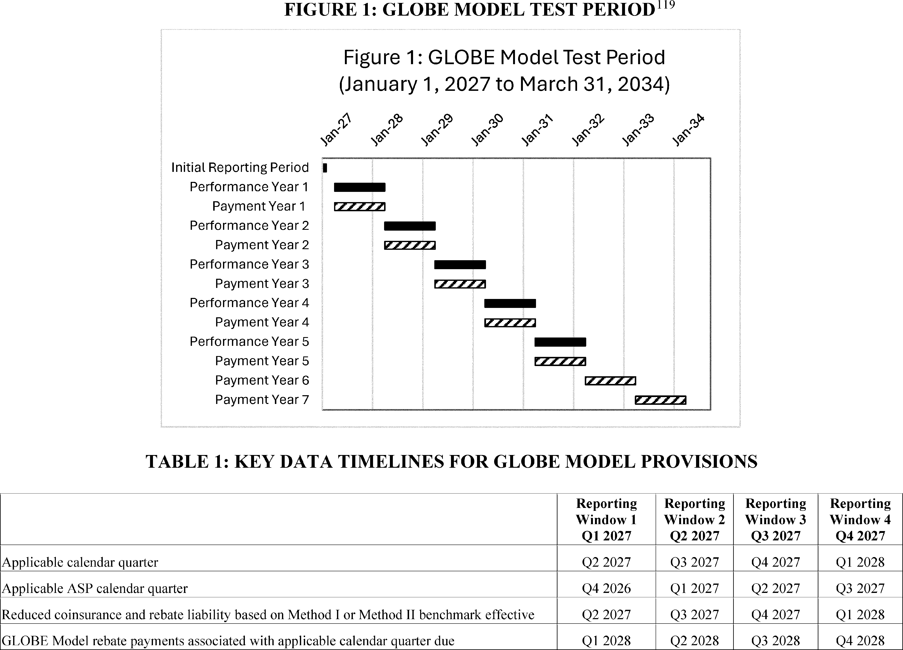
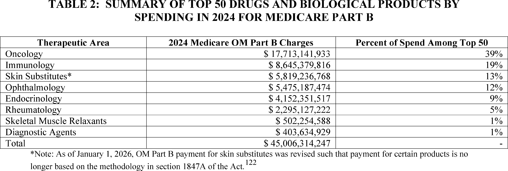
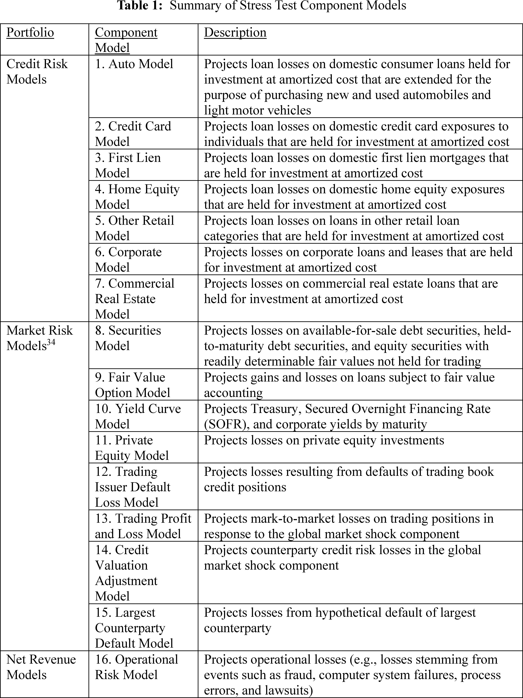
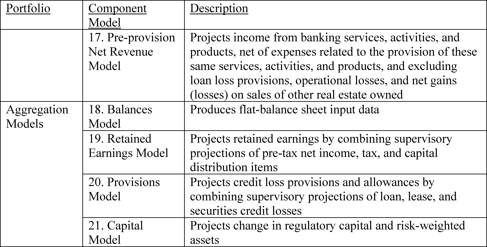

# Daily Digest — 2026-10-02

| | |
|---|---|
| **Digest date** | 2026-10-02 |
| **Data date range** | 2026-10-02 to 2026-10-02 |
| **Generated at** | 2026-10-03T04:24:32Z (UTC) |
| **Pipeline version** | 9652dae7 |
| **Inference** | model layers ran — cli/haiku, opus |
| **Source watermarks** | CREC: 2026-10-02T11:14:58Z · BILLS: 2026-10-03T03:57:22Z · FR: 2026-10-02T06:15:17Z · USCOURTS: 2026-10-03T01:04:16Z · PLAW: 2026-10-02T16:52:52Z |

[Full observed listing for this day](day/2026-10-02.html) — every item our collectors observed for this publication day, mechanical rules applied, frozen at end of day. This digest is the canonical record.

All items below cite the govinfo package (and granule, where applicable) they
summarize. Selection is mechanical; each item states the rule that included
it. See the Coverage Statement at the end for a full accounting of what was
published, what was summarized, and what was excluded and why.

---

## Contents

- [Day in Review](#day-in-review)
- [1. Congressional Floor Activity](#1-congressional-floor-activity)
- [2. Legislation](#2-legislation)
- [3. Federal Register](#3-federal-register)
- [4. Enacted Laws](#4-enacted-laws)
- [5. Judicial Activity](#5-judicial-activity)
- [6. Agency Announcements](#6-agency-announcements)
- [7. Recorded Votes](#7-recorded-votes)
- [8. Bill Actions](#8-bill-actions)
- [9. Presidential Actions](#9-presidential-actions)
- [Terms Used Today](#terms-used-today)
- [Coverage Statement](#coverage-statement)
- [Methodology](#methodology)

---

## Day in Review

The digest carries 98 House and 4 Senate entries from the Congressional Record, plus 55 Extensions of Remarks and 6 Daily Digest entries. It lists 56 bills introduced in the House and 32 in the Senate. It also lists nine measures agreed to in the Senate and one considered and passed there. H.R. 6993, reported in the House, would create a Veterans Affairs grant program for research on brain injury treatment. S. 239, reported in the Senate, provides for mineral-interest transfers involving the Crow Tribe of Montana. Five public laws appear:

- annual reports to Congress on hydropower relicensing
- a Fort Peck water system reauthorization through 2028
- a Court of Federal Claims path for a Miami Tribe of Oklahoma land claim
- an affiliated-area designation for the George C. Marshall House
- the renaming of an interpretive center in Casper, Wyoming

The digest carries five presidential documents. One sets a refugee admissions ceiling of 17,500 for fiscal year 2027. Three are executive orders: one establishes America.gov, one directs tick and mosquito suppression, and one replaces "Artificial Intelligence" with "Super Intelligence" in official usage. The fifth continues the Syria national emergency. A proclamation names National Manufacturing Day. There are 11 final rules, including Federal Reserve changes to the stress capital buffer and stress testing, an SEC quorum amendment, and Medicare's GLOBE drug pricing model. There are also three proposed rules and 75 notices.

The digest carries 39 appellate, 705 district, and 6 bankruptcy opinions. The Tenth Circuit reversed a denial of suppression in a vehicle search case. The Federal Circuit reversed an indefiniteness ruling in Satius v. Samsung but affirmed invalidity on enablement grounds. The Sixth Circuit affirmed judgment for the defendants in a case about ADA entrance accessibility. The Fifth Circuit affirmed the denial of habeas relief in Mata v. Guerrero.

*Composed from the summarized items below and the day's mechanical
counts; all specifics are cited in their sections.*

---

## 1. Congressional Floor Activity

Source: Congressional Record (CREC), issue observed 2026-10-02, covering proceedings of 2026-10-01. Published by govinfo 2026-10-02T11:14:58Z; observed by our collector 2026-10-02T11:51:13Z. Total issue size: 163 granule(s).

### 1.1 Senate

No Senate floor items met the selection thresholds. 4 floor granule(s) are accounted for in the Coverage Statement.

### 1.2 House of Representatives

Tags: legislative · model keys: healthcare · taxation · veterans benefits

*In plain terms: House bills introduced October 1 address healthcare, taxation, veterans' benefits, labor law, foreign policy, and federal programs.*

- **Public Bills and Resolutions** — This entry records the introduction and committee referral of multiple House bills on October 1, 2026, addressing diverse policy areas including healthcare, taxation, veterans' benefits, labor law, foreign policy, and federal program amendments. Each bill was referred to the relevant House committee or committees based on subject matter jurisdiction. The bills were introduced by individual members or groups of co-sponsors.
  - *In plain terms:* On October 1, 2026, House members introduced multiple bills on healthcare, taxation, veterans' benefits, labor law, foreign policy, and federal programs, each sent to the relevant committee.
  - Included because: CREC-SEL-01 — floor item ≥ threshold floor time (42,257 characters) (document dated 2026-10-01)
  - Source: [CREC-2026-10-01 / CREC-2026-10-01-pt1-PgH6015-2](https://www.govinfo.gov/app/details/CREC-2026-10-01/CREC-2026-10-01-pt1-PgH6015-2)

### 1.3 Recorded Votes

No recorded votes were published in this issue of the Congressional Record.

---

## 2. Legislation

Source: Congressional Bills (BILLS), text versions published 2026-10-02 to 2026-10-02.

### 2.1 Counts by Stage

| Stage (bill text version) | Count |
|---|---|
| Introduced (ih/is) | 88 |
| Reported (rh/rs) | 2 |
| Engrossed (eh/es) | 0 |
| Enrolled (enr) | 0 |
| Other versions | 11 |
| **Total bill texts published** | **101** |

### 2.2 Bills Listed by Mechanical Rule

Tags: legislative · model keys: brain injury research · tribal land · veterans

*In plain terms: 2 bills fund veterans' brain injury research and transfer mineral interests to the Crow Tribe.*

Bills below are listed because they matched at least one listing rule; the
matching rule is stated per item. All other bill texts are counted above and
accounted for in the Coverage Statement.

- **H. R. 6993 (rh) — 119 HR 6993 RH: Veterans TBI Breakthrough Exploration of Adaptive Care Opportunities Nationwide Act of 2026** — Establishes the TBI Innovation Grant Program within the Department of Veterans Affairs to award grants up to $5 million annually to eligible entities for conducting clinical research on neurorehabilitation treatments for chronic mild traumatic brain injury in veterans, with authorization of $10 million for fiscal years 2026 through 2028. The bill also creates a separate research grant program for independent third-party studies on supplemental neurorehabilitation approaches. Both programs require coordination with Veterans Health Administration facilities and grantees must provide annual reports on outcomes, including mental health improvements and reductions in suicide risk factors among participating veterans.
  - *In plain terms:* The bill creates Veterans Affairs grant programs to fund research on brain injury treatment in veterans, awarding up to $5 million annually through 2028, with required reporting on mental health and suicide risk outcomes.
  - Included because: BILLS-SEL-01 — reached stage: reported/enrolled/calendar (document dated 2026-10-01)
  - Source: [BILLS-119hr6993rh](https://www.govinfo.gov/app/details/BILLS-119hr6993rh)
- **S. 239 (rs) — 119 S239 RS: Crow Revenue Act** — Authorizes the transfer of approximately 4,660 acres of mineral interests from the Hope Family Trust to the Crow Tribe of Montana, to be held in federal trust and exempt from state taxation, and transfers approximately 4,530 acres of federal mineral interests to the Hope Family Trust upon relinquishment of the Bull Mountains Lease. The bill also provides for an exchange of surface interests between Musselshell Resources LLC and the Secretary of the Interior. Before conveyance, the Crow Tribe and Hope Family Trust must agree on a formula for sharing future revenue from development of the mineral interests.
  - *In plain terms:* The bill transfers mineral and surface interests among the Crow Tribe, Hope Family Trust, and Musselshell Resources, requiring a revenue-sharing agreement on the mineral interests before the transfers take effect.
  - Included because: BILLS-SEL-01 — reached stage: reported/enrolled/calendar (document dated 2026-09-28)
  - Source: [BILLS-119s239rs](https://www.govinfo.gov/app/details/BILLS-119s239rs)

---

## 3. Federal Register

Source: Federal Register (FR), issue of 2026-10-02.

### 3.1 Counts by Document Type

| Document type | Count |
|---|---|
| Rules | 11 |
| Proposed rules | 3 |
| Notices | 75 |
| Presidential documents | 5 |
| **Total FR documents** | **94** |

### 3.2 Rules Published

Tags: department of commerce · executive · securities and exchange commission · model keys: banking · fisheries · marine safety

*In plain terms: 11 final rules regulate fisheries, marine safety, financial institutions, tax credits, and other federal matters.*

#### DEPARTMENT OF COMMERCE

- **Fisheries Off West Coast States; Coastal Pelagic Species Fisheries; Annual Specifications; 2026-2027 Annual Specifications and Management Measures for Pacific Sardine** (2026-20234; 50 CFR Part 660) — NMFS is implementing annual harvest specifications and management measures for the northern subpopulation of Pacific sardine (hereafter, Pacific sardine), for the fishing year from July 1, 2026, through June 30, 2027. This rule prohibits most directed commercial fishing for Pacific sardine off the coasts of Washington, Oregon, and California. Pacific sardine harvest is allowed for use only as live bait, in minor directed fisheries, as incidental catch in other fisheries, or as authorized under exempted fishing permits (EFPs). The incidental harvest of Pacific sardine will be limited to 20 percent by weight of all fish per trip when caught with other stocks managed under the Coastal Pelagic Species (CPS) Fishery Management Plan (FMP), or up to 2 metric tons (mt) per trip when caught with non-CPS stocks. The harvest specifications for 2026-2027 include an overfishing limit (OFL) of 4,645 mt, an acceptable biological catch (ABC) of 3,613 mt, an annual catch limit (ACL) of 2,200 mt, and an annual catch target (ACT) of 2,100 mt. This final rule is intended to conserve, manage, and rebuild the Pacific sardine stock off the coasts of Washington, Oregon, and California. Action: Final rule. Dates: Effective October 2, 2026.
  - *In plain terms:* The National Marine Fisheries Service restricts Pacific sardine fishing off Washington, Oregon, and California from July 2026 through June 2027, with some harvest allowed as bait and incidental catch.
  - Included because: FR-SEL-01 — document type: final rule (all listed)
  - Source: [FR-2026-10-02 / 2026-20234](https://www.govinfo.gov/app/details/FR-2026-10-02/2026-20234)

#### DEPARTMENT OF HEALTH AND HUMAN SERVICES

- **Global Benchmark for Efficient Drug Pricing (GLOBE) Model** (2026-20281; 42 CFR Part 513) — This final rule implements the Global Benchmark for Efficient Drug Pricing Model (GLOBE Model), a new mandatory Medicare payment model under section 1115A of the Social Security Act. The GLOBE Model will test whether a payment model that uses an alternative method for calculating Medicare Part B drug inflation rebate amounts for certain separately payable Medicare Part B drugs and biological products reduces costs for Original Medicare (OM) beneficiaries and the Medicare program while preserving quality of care. The term OM has the same meaning as Medicare fee-for-service and the traditional Medicare program. Action: Final rule. Dates: These regulations are effective on November 30, 2026.
  - *In plain terms:* Medicare will test a new payment method for drugs that uses a different formula to calculate automatic price reductions for expensive medications.
  - Included because: FR-SEL-01 — document type: final rule (all listed)
  - Source: [FR-2026-10-02 / 2026-20281](https://www.govinfo.gov/app/details/FR-2026-10-02/2026-20281)
  -  *Source graphic 1 of 21 from 2026-20281.*
  -  *Source graphic 2 of 21 from 2026-20281.*
  - *Graphics not rendered here: 19 of 21 — see the [source PDF](https://www.govinfo.gov/content/pkg/FR-2026-10-02/pdf/FR-2026-10-02.pdf).*

#### DEPARTMENT OF HOMELAND SECURITY

- **Special Local Regulations; Marine Events Within the USCG East District—Philadelphia, PA** (2026-20223; 33 CFR Part 100) — The Coast Guard will enforce special local regulations for the Philadelphia Cup Regatta on October 3, 2026, to provide for the safety of life on navigable waterways during the event. Our regulation for marine events within the USCG East District identifies the regulated area for this event in Philadelphia, PA. During the enforcement period, the operator of any vessel in the regulate area must comply with directions from the Patrol Commander or any Official Patrol displaying a Coast Guard ensign. Action: Notification of enforcement of regulation. Dates: The regulations in 33 CFR 100.501 will be enforced for the special local regulations listed in Table 1 to Paragraph (i)(1) of § 100.501 for the Philadelphia Cup Regatta from 9 a.m. through 5 p.m. on October 3, 2026.
  - *In plain terms:* The Coast Guard will enforce special safety rules in Philadelphia waters during the Philadelphia Cup Regatta on October 3, 2026.
  - Included because: FR-SEL-01 — document type: final rule (all listed)
  - Source: [FR-2026-10-02 / 2026-20223](https://www.govinfo.gov/app/details/FR-2026-10-02/2026-20223)
- **Special Local Regulations; Marine Events Within the USCG East District—Ocean City, NJ** (2026-20224; 33 CFR Part 100) — The Coast Guard will enforce special local regulations for the Ocean City Chase Race on October 3, 2026, to provide for the safety of life on navigable waterways during this event. Our regulation for marine events within the USCG East District identifies the regulated area for this event in Ocean City, NJ. During the enforcement period, the operator of any vessel in the regulated area must comply with directions from the Patrol Commander or any Official Patrol displaying a Coast Guard ensign. Action: Notification of enforcement of regulation. Dates: The regulations in 33 CFR 100.501 will be enforced for the special local regulations listed in Table 1 to Paragraph (i)(1) of § 100.501 for the Ocean City Chase Race from 7:00 a.m. through 2:00 p.m. on October 3, 2026.
  - *In plain terms:* The Coast Guard will enforce special safety rules in Ocean City, New Jersey waters during the Ocean City Chase Race on October 3, 2026.
  - Included because: FR-SEL-01 — document type: final rule (all listed)
  - Source: [FR-2026-10-02 / 2026-20224](https://www.govinfo.gov/app/details/FR-2026-10-02/2026-20224)
- **Special Local Regulations; Southern California Annual Marine Events for the San Diego Captain of the Port Zone, San Diego Sharkfest Swim, San Diego Bay, San Diego, CA** (2026-20225; Coast Guard; 33 CFR Part 100) — The Coast Guard will enforce special local regulations for the San Diego Sharkfest Swim on October 18, 2026, to provide for the safety of life on navigable waterways during this event. Our regulation for marine events within the Southwest Coast Guard District identifies the regulated area for this event in the San Diego Bay. During the enforcement periods, the operator of any vessel in the regulated area must comply with directions from the Patrol Commander or any Official Patrol displaying a Coast Guard ensign. Action: Notification of enforcement of regulation. Dates: The regulation in 33 CFR 100.1101, Table 1 to § 100.1101, Item No. 7, will be enforced from 9 a.m. until 10 a.m. on October 18, 2026.
  - *In plain terms:* The Coast Guard will enforce special safety rules in San Diego Bay during the San Diego Sharkfest Swim on October 18, 2026.
  - Included because: FR-SEL-01 — document type: final rule (all listed)
  - Source: [FR-2026-10-02 / 2026-20225](https://www.govinfo.gov/app/details/FR-2026-10-02/2026-20225)

#### DEPARTMENT OF THE TREASURY

- **Federal Scholarship Tax Credit** (2026-20264; 26 CFR Part 1) — This document contains temporary regulations that address the new nonrefundable Federal tax credit for qualified contributions to scholarship granting organizations made in 2027 and later taxable years to fund qualified elementary and secondary education scholarships. The temporary regulations implement certain requirements and procedures for States that make elections to participate in this Federal tax credit and organizations that have been certified as scholarship granting organizations by one or more participating States. The temporary regulations affect such States and organizations, and individuals who make qualified contributions to scholarship granting organizations. Action: Temporary regulations. Dates: Effective date: These temporary regulations are effective on December 1, 2026. Applicability date: For dates of applicability, see §§ 1.25F-1T(b), 1.25F-4T(f), and 1.25F-5T(f).
  - *In plain terms:* Temporary tax regulations establish procedures for individuals and states to participate in a federal tax credit for contributions to organizations that fund school scholarships starting in 2027.
  - Included because: FR-SEL-01 — document type: final rule (all listed)
  - Source: [FR-2026-10-02 / 2026-20264](https://www.govinfo.gov/app/details/FR-2026-10-02/2026-20264)

#### ENVIRONMENTAL PROTECTION AGENCY

- **Phosphatidylcholine in Pesticide Formulations; Exemption From the Requirement for a Tolerance** (2026-20219; 40 CFR Part 180) — This regulation establishes an exemption from the requirement of a tolerance for residues of phosphatidylcholine (CAS Reg. No. 97281-47-5) when used as an inert ingredient (adjuvant/carrier) in pesticide contraceptive formulations applied to cervid, porcine, raccoon, and bovine. Compliance Services International on behalf of SpayVac-for-Wildlife, Inc., submitted a petition to EPA under the Federal Food, Drug, and Cosmetic Act (FFDCA), requesting establishment of an exemption from the requirement of a tolerance. This regulation eliminates the need to establish a maximum permissible level for residues of phosphatidylcholine, when used in accordance with the terms of that exemption. Action: Final rule. Dates: This regulation is effective October 2, 2026. Objections and requests for hearings must be received on or before December 1, 2026 and must be filed in accordance with the instructions provided in 40 CFR part 178 (see also Unit I.C. of this document).
  - *In plain terms:* EPA exempts phosphatidylcholine from tolerance requirements when used as an ingredient in pesticide contraceptives for wildlife.
  - Included because: FR-SEL-01 — document type: final rule (all listed)
  - Source: [FR-2026-10-02 / 2026-20219](https://www.govinfo.gov/app/details/FR-2026-10-02/2026-20219)

#### FEDERAL RESERVE SYSTEM

- **Modifications to the Capital Plan Rule and Stress Capital Buffer Requirement** (2026-20246; 12 CFR Parts 225, 238, and 252) — The Board is adopting a final rule to amend the calculation of the Board's stress capital buffer requirement applicable to certain large bank holding companies, savings and loan holding companies, U.S. intermediate holding companies of foreign banking organizations, and nonbank financial companies supervised by the Board to reduce the volatility of the stress capital buffer requirement. The final rule uses the average of the maximum common equity tier 1 capital ratio declines projected in each of the Board's prior two annual supervisory stress tests to inform a firm's stress capital buffer requirement. The final rule also extends the annual effective date of the stress capital buffer requirement by one quarter, to January 1, to provide additional time for firms to comply with the requirement. In addition, the Board is adopting changes to the FR Y-14A/Q/M reports to collect additional net income data that would improve the accuracy of the stress capital buffer requirement calculation. The final rule also amends the Stress Testing Policy Statement to remove the phase-in of highly material supervisory model changes. Action: Final rule. Dates: The final rule is effective December 1, 2026.
  - *In plain terms:* The Federal Reserve modifies how banks calculate required capital buffers by averaging results from the previous two years' stress tests and delays implementation to January 1.
  - Included because: FR-SEL-01 — document type: final rule (all listed)
  - Source: [FR-2026-10-02 / 2026-20246](https://www.govinfo.gov/app/details/FR-2026-10-02/2026-20246)
- **Enhanced Transparency and Public Accountability of the Supervisory Stress Test Models and Scenarios; Modifications to the Capital Planning and Stress Capital Buffer Requirement Rule, Enhanced Prudential Standards Rule, and Regulation LL** (2026-20247; 12 CFR Parts 225, 238, and 252) — The Board of Governors of the Federal Reserve System (Board) has adopted final amendments to Regulations Y, LL, and YY to enhance the transparency and public accountability of the Board's stress testing framework. The Board is also finalizing amendments to the Policy Statement on the Scenario Design Framework for Stress Testing and the Stress Testing Policy Statement. The Board is also announcing that it is finalizing models for the 2027 stress test and proposing for public input additional changes to the stress test models for the 2027 stress test. Finally, the Board is finalizing changes to the stress test data collection (FR Y-14A/Q/M). Action: Final rule; amendments to policy statements. Dates: This final rule and policy statements are effective November 2, 2026.
  - *In plain terms:* The Federal Reserve will make its stress testing process more transparent by publishing detailed information about the models and scenarios used to evaluate bank strength.
  - Included because: FR-SEL-01 — document type: final rule (all listed)
  - Source: [FR-2026-10-02 / 2026-20247](https://www.govinfo.gov/app/details/FR-2026-10-02/2026-20247)
  -  *Source graphic 1 of 20 from 2026-20247.*
  -  *Source graphic 2 of 20 from 2026-20247.*
  - *Graphics not rendered here: 18 of 20 — see the [source PDF](https://www.govinfo.gov/content/pkg/FR-2026-10-02/pdf/FR-2026-10-02.pdf).*

#### NUCLEAR REGULATORY COMMISSION

- **State of Indiana: Discontinuance of Certain Commission Regulatory Authority Within the State, Notice of Agreement Between the Nuclear Regulatory Commission and the State of Indiana** (2026-20276; 10 CFR Part 150) — This notice is announcing that on September 24, 2026, Ho K. Nieh, Chairman of the U.S. Nuclear Regulatory Commission (NRC or Commission), and Governor Michael Braun of the State of Indiana, signed an Agreement as authorized by Section 274b. of the Atomic Energy Act of 1954, as amended (the Act or AEA). Under the Agreement, the Commission discontinues its regulatory authority, and the State of Indiana assumes regulatory authority over byproduct materials, source materials, and special nuclear materials in quantities not sufficient to form a critical mass, as defined in Sections 11e.(1), 11e.(3), and 11e(4) of the AEA. Action: Final state agreement. Dates: The effective date of the Agreement is September 30, 2026.
  - *In plain terms:* The Nuclear Regulatory Commission transferred its authority over certain types of nuclear materials to Indiana, effective with an agreement signed September 24, 2026.
  - Included because: FR-SEL-01 — document type: final rule (all listed)
  - Source: [FR-2026-10-02 / 2026-20276](https://www.govinfo.gov/app/details/FR-2026-10-02/2026-20276)

#### SECURITIES AND EXCHANGE COMMISSION

- **Commission Quorum Requirement** (2026-20262; 17 CFR Part 200) — The Securities and Exchange Commission (“Commission”) is amending its rules concerning the circumstances under which a quorum of the Commission is present. The amendments are designed to promote flexibility and finality of agency rulemaking. Action: Final rule. Dates: This rule is effective on October 2, 2026.
  - *In plain terms:* The Securities and Exchange Commission amends its rules about when enough commissioners are present to make official decisions.
  - Included because: FR-SEL-01 — document type: final rule (all listed)
  - Source: [FR-2026-10-02 / 2026-20262](https://www.govinfo.gov/app/details/FR-2026-10-02/2026-20262)

### 3.3 Proposed Rules Published

Tags: department of commerce · executive · securities and exchange commission · model keys: airspace · education tax credits · off-road vehicles

*In plain terms: 3 proposed rules amend airspace regulations, revise off-road vehicle policies, and detail education tax credits.*

#### DEPARTMENT OF THE INTERIOR

- **Big Cypress National Preserve; Off-Road Motor Vehicles** (2026-20251; 36 CFR Part 7) — The National Park Service proposes to amend special regulations for Big Cypress National Preserve that regulate the use of motorized vehicles off roads. The current regulations refer to a map that identifies areas within the National Preserve where motorized vehicles can be used unless closed by the Superintendent. This map is outdated and does not depict the current boundary of the National Preserve, which was expanded in 1988 by approximately 147,000 acres. This rule would replace references to the outdated map with references to a map showing the current boundary of the National Preserve, with the effect of expanding the areas within the National Preserve where motorized vehicle use could occur, subject to the discretion of the Superintendent. Action: Proposed rule. Dates: Comments must be received by 11:59 p.m. EDT on December 1, 2026.
  - *In plain terms:* The National Park Service proposes to update motorized vehicle regulations for Big Cypress National Preserve to reflect the park's 1988 boundary expansion.
  - Included because: FR-SEL-02 — document type: proposed rule (all listed)
  - Source: [FR-2026-10-02 / 2026-20251](https://www.govinfo.gov/app/details/FR-2026-10-02/2026-20251)

#### DEPARTMENT OF THE TREASURY

- **Federal Scholarship Tax Credit** (2026-20277; 26 CFR Part 1) — This document contains proposed regulations regarding the nonrefundable Federal tax credit for qualified contributions to scholarship granting organizations to fund qualified elementary and secondary school education scholarships. The proposed regulations would affect taxpayers who make such qualified contributions, States that elect to participate by certifying organizations as scholarship granting organizations, and the organizations that have been certified as scholarship granting organizations by one or more electing States. This document also provides notice of a public hearing on the proposed regulations. Action: Notice of proposed rulemaking and public hearing. Dates: Written or electronic comments must be received by December 1, 2026. The public hearing is being held on Tuesday, December 15, 2026, at 10 a.m. Eastern Time (ET). Requests to speak and outlines of topics to be discussed at the public hearing must be received by December 1, 2026. If no outlines are received by December 1, 2026, the public hearing will be cancelled. Requests to attend the public hearing must be received by 5 p.m. ET on Thursday, December 10, 2026.
  - *In plain terms:* The Treasury Department proposes tax regulations and procedures for a federal credit for donations to organizations that fund school scholarships.
  - Included because: FR-SEL-02 — document type: proposed rule (all listed)
  - Source: [FR-2026-10-02 / 2026-20277](https://www.govinfo.gov/app/details/FR-2026-10-02/2026-20277)

#### DEPARTMENT OF TRANSPORTATION

- **Amendment of Class D and E Airspace, Revocation of Class E Airspace; Montgomery, AL** (2026-20202; 14 CFR Part 71) — This action proposes to amend Class D airspace for Maxwell Air Force Base (AFB), Montgomery, AL, by making administrative updates. It also proposes to amend Class E airspace from 700 feet by expanding it by 0.5 NM from a 7-mile to a 7.5-mile radius around Maxwell AFB to contain IFR departures, along with making administrative changes. Finally, it proposes to revoke Class E airspace from the surface around Maxwell AFB, as the airport no longer meets the qualifications for Class E surface area airspace. Controlled airspace is necessary for the safety and management of instrument flight rules (IFR) operations in the area. Action: Notice of proposed rulemaking (NPRM). Dates: Comments must be received on or before November 16, 2026.
  - *In plain terms:* The FAA proposes to update airspace regulations around Maxwell Air Force Base by expanding one area and revoking another to manage instrument flight operations.
  - Included because: FR-SEL-02 — document type: proposed rule (all listed)
  - Source: [FR-2026-10-02 / 2026-20202](https://www.govinfo.gov/app/details/FR-2026-10-02/2026-20202)

### 3.4 Notices and Presidential Documents

Tags: department of commerce · executive · securities and exchange commission · model keys: digital services · pest control · refugee admissions

*In plain terms: 5 executive orders authorize refugee admissions, establish a digital government portal, direct pest control efforts, rename AI terminology, and extend the Syria emergency.*

Notices are summarized only when they match a listing rule; all are counted
in 3.1 and in the Coverage Statement. Presidential documents in the FR are
always listed.

- **Presidential Determination on Refugee Admissions for Fiscal Year 2027** (2026-20318) — The President authorized the admission of up to 17,500 refugees during Fiscal Year 2027, with primary allocation to Afrikaners from South Africa pursuant to Executive Order 14204. The admissions are subject to requirements including stringent identification verification, entry restrictions under Executive Order 14163, and national interest determinations by the Secretaries of State and Homeland Security.
  - *In plain terms:* The President authorized admission of up to 17,500 refugees in fiscal year 2027, with priority given to Afrikaners from South Africa.
  - Included because: FR-SEL-03 — presidential document (all listed)
  - Source: [FR-2026-10-02 / 2026-20318](https://www.govinfo.gov/app/details/FR-2026-10-02/2026-20318)
- **Streamlining Access to Government Services Through America.gov** (2026-20319) — Executive Order 14432 directs the establishment of America.gov as a unified digital entry point for Americans to access and complete federal services online. Agencies shall integrate covered services using Login.gov for authentication, while preserving individual agency custody of records and maintaining existing service methods including in-person, telephone, and mail access. Implementation begins with an OMB memorandum to be issued within 90 days.
  - *In plain terms:* An executive order directs federal agencies to integrate their online services through a new unified website called America.gov, starting with an OMB memo due in 90 days.
  - Included because: FR-SEL-03 — presidential document (all listed)
  - Source: [FR-2026-10-02 / 2026-20319](https://www.govinfo.gov/app/details/FR-2026-10-02/2026-20319)
  - Corroborated across time: the same document was first published by the White House on [2026-09-29](https://www.whitehouse.gov/presidential-actions/2026/09/streamlining-access-to-government-services-through-america-gov/), days before the Federal Register compiled it. Listed here as the official record of this day — the earlier publication is referenced, not suppressed; both observations are preserved and counted.
- **Eliminating Disease-Carrying Pests and Restoring Enjoyment of the Great Outdoors** (2026-20320) — Executive Order 14433 directs federal agencies to suppress tick and mosquito populations using smart land management, natural controls, and advanced technologies. A coordinated campaign across Washington, D.C. aims to reduce invasive mosquito populations by 90 percent and tick populations by 50 percent by 2028. The order also directs the Department of Health and Human Services and Department of Agriculture to issue prize competitions for developing diagnostics, treatments, and prevention methods for tick- and mosquito-borne diseases.
  - *In plain terms:* An executive order directs federal agencies to reduce tick and mosquito populations by 50 to 90 percent by 2028 and fund competitions for disease prevention methods.
  - Included because: FR-SEL-03 — presidential document (all listed)
  - Source: [FR-2026-10-02 / 2026-20320](https://www.govinfo.gov/app/details/FR-2026-10-02/2026-20320)
  - Corroborated across time: the same document was first published by the White House on [2026-09-29](https://www.whitehouse.gov/presidential-actions/2026/09/eliminating-disease-carrying-pests-and-restoring-enjoyment-of-the-great-outdoors/), days before the Federal Register compiled it. Listed here as the official record of this day — the earlier publication is referenced, not suppressed; both observations are preserved and counted.
- **Inaugurating the Era of Super Intelligence** (2026-20321) — Executive Order 14434 directs the executive branch to use the terms 'Super Intelligence' and 'SI' in place of 'Artificial Intelligence' and 'AI' in official communications, public documents, websites, and reports. The order does not require alteration of previously issued regulations or historical documents. The Assistant to the President for Science and Technology shall propose legislative language establishing a federal definition of 'Super Intelligence' within 60 days.
  - *In plain terms:* An executive order directs federal agencies to use the term "Super Intelligence" instead of "Artificial Intelligence" in official communications and documents going forward.
  - Included because: FR-SEL-03 — presidential document (all listed)
  - Source: [FR-2026-10-02 / 2026-20321](https://www.govinfo.gov/app/details/FR-2026-10-02/2026-20321)
  - Corroborated across time: the same document was first published by the White House on [2026-09-29](https://www.whitehouse.gov/presidential-actions/2026/09/inaugurating-the-era-of-super-intelligence/), days before the Federal Register compiled it. Listed here as the official record of this day — the earlier publication is referenced, not suppressed; both observations are preserved and counted.
- **Continuation of the National Emergency With Respect to the Situation in and in Relation to Syria** (2026-20322) — The President continued for one year the national emergency declared in Executive Order 13894 regarding the situation in and related to Syria. The emergency, expanded in scope by Executive Order 14312 to address accountability for war crimes and narcotics trafficking networks, remains in effect beyond October 14, 2026 to protect U.S. national security and foreign policy interests.
  - *In plain terms:* The President extended for one year the national emergency declared regarding Syria to protect U.S. national security interests, effective beyond October 14, 2026.
  - Included because: FR-SEL-03 — presidential document (all listed)
  - Source: [FR-2026-10-02 / 2026-20322](https://www.govinfo.gov/app/details/FR-2026-10-02/2026-20322)

---

## 4. Enacted Laws

Tags: legislative · model keys: federal property · hydropower · native american land

*In plain terms: 5 laws mandate hydropower relicensing reports, settle Native American water and land disputes, and designate federal properties.*

Source: Public and Private Laws (PLAW) published 2026-10-02.

- **Public Law 119–112 — Public Law 119–112: To amend the Federal Power Act to require the Federal Energy Regulatory Commission to annually submit to Congress a report on the status of ongoing hydropower relicensing applications.** — Public Law 119–112 amends the Federal Power Act to require the Federal Energy Regulatory Commission to submit an annual report to Congress on ongoing hydropower relicensing applications. The report must include notice dates, docket numbers, application status, anticipated issuance dates, upcoming proceedings, and descriptions of actions required by relevant parties. Approved: 2026-09-25.
  - *In plain terms:* The Federal Energy Regulatory Commission must submit annual reports to Congress describing the status of ongoing hydropower relicensing applications, including their docket numbers, status, expected completion dates, and required actions.
  - Included because: PLAW-SEL-01 — enacted into law (all public and private laws are listed) (document dated 2026-09-25)
  - Source: [PLAW-119publ112](https://www.govinfo.gov/app/details/PLAW-119publ112)
- **Public Law 119–113 — Public Law 119–113: To reauthorize the Fort Peck Reservation Rural Water System Act of 2000.** — Public Law 119–113 reauthorizes the Fort Peck Reservation Rural Water System Act of 2000 by extending the authorization deadline from 2026 to 2028. Approved: 2026-09-25.
  - *In plain terms:* The Fort Peck Reservation Rural Water System Act is reauthorized with its deadline extended from 2026 to 2028.
  - Included because: PLAW-SEL-01 — enacted into law (all public and private laws are listed) (document dated 2026-09-25)
  - Source: [PLAW-119publ113](https://www.govinfo.gov/app/details/PLAW-119publ113)
- **Public Law 119–114 — Public Law 119–114: To provide for the equitable settlement of certain Indian land disputes regarding land in Illinois, and for other purposes.** — Public Law 119–114 grants the United States Court of Federal Claims jurisdiction to hear a land claim by the Miami Tribe of Oklahoma regarding its Treaty of Grouseland, without regard to statutes of limitation. The law extinguishes all other land claims the tribe may have in Illinois and sets a one-year deadline for filing the authorized claim. Approved: 2026-09-25.
  - *In plain terms:* The Miami Tribe of Oklahoma may bring a land claim to federal court based on its Treaty of Grouseland, ignoring normal time limits, with all other Illinois claims dismissed and a one-year filing deadline.
  - Included because: PLAW-SEL-01 — enacted into law (all public and private laws are listed) (document dated 2026-09-25)
  - Source: [PLAW-119publ114](https://www.govinfo.gov/app/details/PLAW-119publ114)
- **Public Law 119–115 — Public Law 119–115: To designate the General George C. Marshall House, in the Commonwealth of Virginia, as an affiliated area of the National Park System, and for other purposes.** — Public Law 119–115 establishes the General George C. Marshall House in Virginia as an affiliated area of the National Park System. The George C. Marshall International Center is designated as the management entity, and the Secretary of the Interior is authorized to provide technical assistance and enter into cooperative agreements for the property's preservation and interpretation. Approved: 2026-09-25.
  - *In plain terms:* The General George C. Marshall House in Virginia becomes an affiliated area of the National Park System, managed by the George C. Marshall International Center with potential Interior Department technical assistance.
  - Included because: PLAW-SEL-01 — enacted into law (all public and private laws are listed) (document dated 2026-09-25)
  - Source: [PLAW-119publ115](https://www.govinfo.gov/app/details/PLAW-119publ115)
- **Public Law 119–117 — Public Law 119–117: To redesignate the National Historic Trails Interpretive Center in Casper, Wyoming, as the “Barbara L. Cubin National Historic Trails Interpretive Center”.** — Public Law 119–117 redesignates the interpretive center in Casper, Wyoming, previously known as the National Historic Trails Interpretive Center, to the 'Barbara L. Cubin National Historic Trails Interpretive Center.' The law updates all corresponding references in federal law, maps, regulations, and documents. Approved: 2026-09-25.
  - *In plain terms:* The National Historic Trails Interpretive Center in Casper, Wyoming is redesignated the 'Barbara L. Cubin National Historic Trails Interpretive Center,' and all federal references are updated accordingly.
  - Included because: PLAW-SEL-01 — enacted into law (all public and private laws are listed) (document dated 2026-09-25)
  - Source: [PLAW-119publ117](https://www.govinfo.gov/app/details/PLAW-119publ117)

---

## 5. Judicial Activity

Source: United States Courts Opinions (USCOURTS): opinions observed 2026-10-02
by our collector; each opinion states its own issue date beside its
listing ([how our clocks work](faq.html#fapds-three-clocks)).

Completeness disclosure (standing): USCOURTS carries opinions from
approximately 140 participating appellate, district, bankruptcy, and
national federal courts. Unlike the Congressional Record and the Federal
Register, which are the complete official record of their branches,
USCOURTS is participation-based and is NOT the complete federal judicial
record. Courts post opinions with delay — typically over several days —
so a day's digest carries the opinions that became available that day,
whatever date each was issued.

### 5.1 Appellate and National Court Opinions

Tags: judicial · model keys: civil rights · criminal appeals · habeas corpus

*In plain terms: 39 appellate decisions address criminal sentences, civil rights claims, bankruptcy, patents, and habeas corpus proceedings.*

Appellate and national court opinions are summarized; district and
bankruptcy opinions are counted in 5.2 and in the Coverage Statement.

#### United States Court of Appeals for the Eighth Circuit

- **Nersius Artisani v. NaphCare, Inc., et al** (No. 25-02898; filed 2026-10-01) — The Eighth Circuit Court of Appeals issued an opinion and entered judgment in Nersius Artisani v. NaphCare, Inc., et al. The court notified the appellant of procedural requirements for filing petitions for rehearing, which must be received within 14 days of the judgment entry date.
  - *In plain terms:* A court issued an opinion and notified the appellant of procedures for filing a rehearing petition within 14 days.
  - Included because: USCOURTS-SEL-01 — appellate court opinion (all listed) (document dated 2026-10-01)
  - Source: [USCOURTS-ca8-25-02898 / USCOURTS-ca8-25-02898-0](https://www.govinfo.gov/app/details/USCOURTS-ca8-25-02898/USCOURTS-ca8-25-02898-0)
- **Nabor Garcia Ortiz v. Todd Blanche** (No. 25-03343; filed 2026-10-01) — The Eighth Circuit Court of Appeals issued an opinion and entered judgment in Nabor Garcia Ortiz v. Todd Blanche. The court notified counsel of procedural requirements for filing petitions for rehearing, which must be received within 45 days of the judgment entry date.
  - *In plain terms:* A court issued an opinion and notified counsel of procedures for filing a rehearing petition within 45 days.
  - Included because: USCOURTS-SEL-01 — appellate court opinion (all listed) (document dated 2026-10-01)
  - Source: [USCOURTS-ca8-25-03343 / USCOURTS-ca8-25-03343-0](https://www.govinfo.gov/app/details/USCOURTS-ca8-25-03343/USCOURTS-ca8-25-03343-0)
- **United States v. Dominique Ball** (No. 26-01233; filed 2026-10-01) — The Eighth Circuit Court of Appeals dismissed Dominique Ball's appeal from his firearm offense sentence, finding that his appeal waiver in the plea agreement was valid and enforceable. The court determined the appeal waiver applied to all issues raised and that there were no non-frivolous issues outside the waiver's scope.
  - *In plain terms:* A court dismissed an appeal from a firearm offense sentence, finding the appeal waiver in the plea agreement was valid and enforceable.
  - Included because: USCOURTS-SEL-01 — appellate court opinion (all listed) (document dated 2026-10-01)
  - Source: [USCOURTS-ca8-26-01233 / USCOURTS-ca8-26-01233-0](https://www.govinfo.gov/app/details/USCOURTS-ca8-26-01233/USCOURTS-ca8-26-01233-0)

#### United States Court of Appeals for the Eleventh Circuit

- **Johnson & Dixie, LLC v. Office of the U.S. Trustee, et al** (No. 25-13756; filed 2026-10-01) — Johnson & Dixie, LLC, a reorganized debtor with Hollywood, Florida properties, appealed the dismissal of its Chapter 11 bankruptcy case after failing to timely file required quarterly operating reports despite court warning. The Eleventh Circuit affirmed the dismissal, finding unexcused failure to file reports constituted statutory cause for dismissal, and also affirmed the denial of a motion for rehearing.
  - *In plain terms:* A bankruptcy court dismissed a company's Chapter 11 case for failing to file required quarterly reports despite being warned, and an appeals court upheld that dismissal.
  - Included because: USCOURTS-SEL-01 — appellate court opinion (all listed) (document dated 2026-10-01)
  - Source: [USCOURTS-ca11-25-13756 / USCOURTS-ca11-25-13756-0](https://www.govinfo.gov/app/details/USCOURTS-ca11-25-13756/USCOURTS-ca11-25-13756-0)
- **USA v. Dawann Haseeb** (No. 25-13993; filed 2026-10-01) — Dawann Haseeb appealed his conviction in the Southern District of Alabama, but the Eleventh Circuit granted the government's motion to dismiss the appeal based on an appeal waiver contained in Haseeb's plea agreement.
  - *In plain terms:* An appeals court dismissed a defendant's appeal of his conviction because he had agreed in his plea deal to waive the right to appeal.
  - Included because: USCOURTS-SEL-01 — appellate court opinion (all listed) (document dated 2026-10-01)
  - Source: [USCOURTS-ca11-25-13993 / USCOURTS-ca11-25-13993-0](https://www.govinfo.gov/app/details/USCOURTS-ca11-25-13993/USCOURTS-ca11-25-13993-0)

#### United States Court of Appeals for the Federal Circuit

- **Truinject Corp. v. Galderma S.A.** (No. 25-01268; filed 2026-10-01) — Truinject Corporation sued Galderma for tortious interference, breach of contract, and trade secret misappropriation stemming from a failed business partnership negotiation over a dermal injection training system. The district court dismissed the tortious interference claim and granted summary judgment on remaining claims, finding Truinject could not establish that Galderma's alleged breaches caused a loss of a potential business deal with Allergan. The Federal Circuit affirmed.
  - *In plain terms:* A company's lawsuit against another company over a failed partnership deal regarding a dermal injection training system failed when courts found it didn't prove damages from the alleged breaches.
  - Included because: USCOURTS-SEL-01 — appellate court opinion (all listed) (document dated 2026-10-01)
  - Source: [USCOURTS-ca13-25-01268 / USCOURTS-ca13-25-01268-0](https://www.govinfo.gov/app/details/USCOURTS-ca13-25-01268/USCOURTS-ca13-25-01268-0)
- **In re: Satius Holding, Inc.** (No. 25-01444; filed 2026-10-01) — Satius Holding appealed a Patent Trial and Appeal Board decision rejecting a patent claim as obvious in an ex parte reexamination proceeding. The Federal Circuit dismissed the appeal as moot after concluding the same patent claim was invalid in a related case.
  - *In plain terms:* An appeals court dismissed a patent claim appeal as moot after the same patent was found invalid in another related case.
  - Included because: USCOURTS-SEL-01 — appellate court opinion (all listed) (document dated 2026-10-01)
  - Source: [USCOURTS-ca13-25-01444 / USCOURTS-ca13-25-01444-0](https://www.govinfo.gov/app/details/USCOURTS-ca13-25-01444/USCOURTS-ca13-25-01444-0)
- **Satius Holding, LLC v. Samsung Electronics Co., Ltd.** (No. 25-01446; filed 2026-10-01) — Satius Holding, LLC appealed a district court judgment finding claims 1, 11, and 18 of U.S. Patent No. 6,711,385 indefinite and invalid. The Federal Circuit reversed the indefiniteness ruling, finding the claims clear despite reciting a scientifically impossible element, but affirmed the invalidity judgment on the ground that the claims fail to satisfy the enablement requirement of 35 U.S.C. § 112(a).
  - *In plain terms:* A federal appeals court reversed a ruling that patent claims were indefinite but upheld the judgment that they are invalid under patent law.
  - Included because: USCOURTS-SEL-01 — appellate court opinion (all listed) (document dated 2026-10-01)
  - Source: [USCOURTS-ca13-25-01446 / USCOURTS-ca13-25-01446-0](https://www.govinfo.gov/app/details/USCOURTS-ca13-25-01446/USCOURTS-ca13-25-01446-0)

#### United States Court of Appeals for the Fifth Circuit

- **Mata v. Guerrero** (No. 25-10526; filed 2026-10-01) — Desirae Mata, a Texas prisoner serving a life sentence for capital murder, appealed the denial of federal habeas relief based on claims under Napue v. Illinois and Brady v. Maryland concerning testimony by a jailhouse informant. The Fifth Circuit affirmed the denial, finding the state court's rejection of both claims was not an unreasonable application of clearly established federal law.
  - *In plain terms:* An appeals court upheld the denial of federal release for a capital murder prisoner who challenged her conviction based on jailhouse informant testimony.
  - Included because: USCOURTS-SEL-01 — appellate court opinion (all listed) (document dated 2026-10-01)
  - Source: [USCOURTS-ca5-25-10526 / USCOURTS-ca5-25-10526-0](https://www.govinfo.gov/app/details/USCOURTS-ca5-25-10526/USCOURTS-ca5-25-10526-0)
- **Johnson v. Tarrant County** (No. 25-10923; filed 2026-10-01) — Cassandra Johnson and Aryanna Stafford sued Tarrant County and Keefe Commissary Network following Trelynn D'Maun Wormley's death from a fentanyl overdose in county jail, alleging constitutional and state law violations. The Fifth Circuit affirmed the district court's dismissal, finding the plaintiffs failed to allege a de facto policy of allowing drugs into the jail and failed to plausibly allege negligent supervision by Keefe.
  - *In plain terms:* An appeals court upheld dismissal of a lawsuit over a prisoner's fentanyl overdose death in jail, finding insufficient evidence of a policy allowing drugs or negligent supervision.
  - Included because: USCOURTS-SEL-01 — appellate court opinion (all listed) (document dated 2026-10-01)
  - Source: [USCOURTS-ca5-25-10923 / USCOURTS-ca5-25-10923-0](https://www.govinfo.gov/app/details/USCOURTS-ca5-25-10923/USCOURTS-ca5-25-10923-0)
- **USA v. Quezada** (No. 26-10132; filed 2026-10-01) — The Fifth Circuit dismissed Virginio Ernestro Quezada's criminal appeal, granting the Federal Public Defender's motion to withdraw after finding the appeal presented no nonfrivolous issue for appellate review.
  - *In plain terms:* An appeals court dismissed a criminal defendant's appeal after finding no substantial legal issue worth reviewing.
  - Included because: USCOURTS-SEL-01 — appellate court opinion (all listed) (document dated 2026-10-01)
  - Source: [USCOURTS-ca5-26-10132 / USCOURTS-ca5-26-10132-0](https://www.govinfo.gov/app/details/USCOURTS-ca5-26-10132/USCOURTS-ca5-26-10132-0)
- **USA v. Ross** (No. 26-10143; filed 2026-10-01) — The Fifth Circuit granted appointed counsel's motion to withdraw and dismissed the criminal appeal, concluding that the appeal presented no nonfrivolous issues for review.
  - *In plain terms:* A court let the defendant's attorney withdraw and dismissed the criminal appeal, finding it raised no serious legal issues worth reviewing.
  - Included because: USCOURTS-SEL-01 — appellate court opinion (all listed) (document dated 2026-10-01)
  - Source: [USCOURTS-ca5-26-10143 / USCOURTS-ca5-26-10143-0](https://www.govinfo.gov/app/details/USCOURTS-ca5-26-10143/USCOURTS-ca5-26-10143-0)
- **USA v. Larson** (No. 26-10189; filed 2026-10-01) — The Fifth Circuit dismissed Travis Robert Larson's criminal appeal after his appointed counsel moved to withdraw and filed an Anders brief, finding the appeal presented no nonfrivolous issue for appellate review.
  - *In plain terms:* An appeals court dismissed a criminal defendant's appeal after finding no substantial legal issue worth reviewing.
  - Included because: USCOURTS-SEL-01 — appellate court opinion (all listed) (document dated 2026-10-01)
  - Source: [USCOURTS-ca5-26-10189 / USCOURTS-ca5-26-10189-0](https://www.govinfo.gov/app/details/USCOURTS-ca5-26-10189/USCOURTS-ca5-26-10189-0)

#### United States Court of Appeals for the Fourth Circuit

- **US v. Tristan Gray** (No. 25-04580; filed 2026-10-01) — Tristan Gray pleaded guilty to felon in possession of a firearm and received a 100-month sentence. The Fourth Circuit affirmed, finding the sentence both procedurally and substantively reasonable, as the court properly calculated guidelines, considered required sentencing factors, and adequately justified an upward variance based on evidence that Gray fired multiple shots into an occupied apartment.
  - *In plain terms:* An appeals court upheld a 100-month sentence for a man convicted of having a gun as a felon, finding the sentence fair after he fired multiple shots into an occupied apartment.
  - Included because: USCOURTS-SEL-01 — appellate court opinion (all listed) (document dated 2026-10-01)
  - Source: [USCOURTS-ca4-25-04580 / USCOURTS-ca4-25-04580-0](https://www.govinfo.gov/app/details/USCOURTS-ca4-25-04580/USCOURTS-ca4-25-04580-0)
- **Tyrone Perry v. Wallace Terri** (No. 25-06438; filed 2026-10-01) — Tyrone Perry appealed a district court order denying his 42 U.S.C. § 1983 civil rights complaint against prison officials regarding medical treatment of his blood pressure. The Fourth Circuit affirmed, finding the district court properly dismissed claims for failure to state relief and granted summary judgment based on Perry's failure to exhaust administrative remedies and evidence that medical staff did not act with deliberate indifference.
  - *In plain terms:* An appeals court upheld dismissal of a prisoner's lawsuit over blood pressure medical care because he hadn't pursued available prison grievance procedures first.
  - Included because: USCOURTS-SEL-01 — appellate court opinion (all listed) (document dated 2026-10-01)
  - Source: [USCOURTS-ca4-25-06438 / USCOURTS-ca4-25-06438-0](https://www.govinfo.gov/app/details/USCOURTS-ca4-25-06438/USCOURTS-ca4-25-06438-0)
- **US v. Daryl Bank** (No. 25-06797; filed 2026-10-01) — The Fourth Circuit Court of Appeals dismissed Daryl G. Bank's appeal of the district court's denial of relief on his 28 U.S.C. § 2255 motion. The court found that Bank did not make the necessary showing for a certificate of appealability, as reasonable jurists could not find the district court's assessment debatable or wrong.
  - *In plain terms:* An appeals court dismissed a prisoner's appeal of a motion for relief from his sentence because reasonable jurists could not find the decision debatable.
  - Included because: USCOURTS-SEL-01 — appellate court opinion (all listed) (document dated 2026-10-01)
  - Source: [USCOURTS-ca4-25-06797 / USCOURTS-ca4-25-06797-0](https://www.govinfo.gov/app/details/USCOURTS-ca4-25-06797/USCOURTS-ca4-25-06797-0)
- **Walter Beasley v. Larry Leabough** (No. 25-06839; filed 2026-10-01) — The Fourth Circuit Court of Appeals affirmed the district court's dismissal of Walter Ray Beasley's civil rights complaint alleging violations under the Religious Land Use and Institutionalized Persons Act and the First Amendment. The court found the RLUIPA claim moot due to Beasley's transfer from the facility and determined he failed to state a plausible First Amendment Free Exercise claim.
  - *In plain terms:* An appeals court upheld dismissal of a prisoner's religious freedom lawsuit, finding his claim moot because he had transferred facilities and failed to state a valid claim.
  - Included because: USCOURTS-SEL-01 — appellate court opinion (all listed) (document dated 2026-10-01)
  - Source: [USCOURTS-ca4-25-06839 / USCOURTS-ca4-25-06839-0](https://www.govinfo.gov/app/details/USCOURTS-ca4-25-06839/USCOURTS-ca4-25-06839-0)
- **Kayla McClary v. UPS** (No. 26-01360; filed 2026-10-01) — The Fourth Circuit affirmed a district court's grant of summary judgment on an employee's Title VII retaliation and hostile work environment claims against her former employer. The court concluded that the plaintiff's complaints did not constitute actionable protected activity and that the alleged harassment did not meet the legal threshold for a hostile work environment.
  - *In plain terms:* A court upheld a decision dismissing an employee's retaliation and hostile workplace claims, finding her complaints weren't legally protected activity and the harassment didn't meet legal standards.
  - Included because: USCOURTS-SEL-01 — appellate court opinion (all listed) (document dated 2026-10-01)
  - Source: [USCOURTS-ca4-26-01360 / USCOURTS-ca4-26-01360-0](https://www.govinfo.gov/app/details/USCOURTS-ca4-26-01360/USCOURTS-ca4-26-01360-0)
- **Ronald Emrit v. Barack Obama** (No. 26-01407; filed 2026-10-01) — The Fourth Circuit dismissed an appeal for lack of jurisdiction because the appellant filed notice of appeal before the district court entered a final order in the civil case.
  - *In plain terms:* A court dismissed an appeal because the appellant filed it before the lower court had finished the case and issued a final decision.
  - Included because: USCOURTS-SEL-01 — appellate court opinion (all listed) (document dated 2026-10-01)
  - Source: [USCOURTS-ca4-26-01407 / USCOURTS-ca4-26-01407-0](https://www.govinfo.gov/app/details/USCOURTS-ca4-26-01407/USCOURTS-ca4-26-01407-0)
- **Presidential Candidate Number P60005535 v. Abigail Spanberger** (No. 26-01428; filed 2026-10-01) — The Fourth Circuit dismissed an appeal for lack of jurisdiction because the appellant filed notice of appeal approximately one month after filing his complaint but before the district court entered any orders.
  - *In plain terms:* A court dismissed an appeal because the appellant filed it about a month after starting the case but before the lower court issued any decisions.
  - Included because: USCOURTS-SEL-01 — appellate court opinion (all listed) (document dated 2026-10-01)
  - Source: [USCOURTS-ca4-26-01428 / USCOURTS-ca4-26-01428-0](https://www.govinfo.gov/app/details/USCOURTS-ca4-26-01428/USCOURTS-ca4-26-01428-0)
- **Presidential Candidate Number P60005535 v. Shaquille O'Neal** (No. 26-01433; filed 2026-10-01) — The Fourth Circuit dismissed an appeal for lack of jurisdiction because the appellant filed notice of appeal approximately one month after filing his complaint but before the district court entered any orders.
  - *In plain terms:* A court dismissed an appeal because the appellant filed it about a month after starting the case but before the lower court issued any decisions.
  - Included because: USCOURTS-SEL-01 — appellate court opinion (all listed) (document dated 2026-10-01)
  - Source: [USCOURTS-ca4-26-01433 / USCOURTS-ca4-26-01433-0](https://www.govinfo.gov/app/details/USCOURTS-ca4-26-01433/USCOURTS-ca4-26-01433-0)

#### United States Court of Appeals for the Sixth Circuit

- **Darma Canter v. HSD II, LLC, et al** (No. 25-02008; filed 2026-10-01) — Darma Canter sued Crue Hair, Inc. and its landlord HSD II, LLC under the Americans with Disabilities Act, alleging that the barber shop violated the 60% Rule by having only one fully accessible entrance of two public entrances. The Sixth Circuit Court of Appeals affirmed the district court's judgment for the defendants, holding that the 60% Rule requires 60 percent of public entrances to have doors, doorways, and gates compliant with accessibility regulations, but does not require those entrances to be fully accessible or include accessible routes leading to them.
  - *In plain terms:* An appeals court upheld that a barber shop satisfied disability access law by having doors and gates at 60 percent of its public entrances meet accessibility standards.
  - Included because: USCOURTS-SEL-01 — appellate court opinion (all listed) (document dated 2026-10-01)
  - Source: [USCOURTS-ca6-25-02008 / USCOURTS-ca6-25-02008-0](https://www.govinfo.gov/app/details/USCOURTS-ca6-25-02008/USCOURTS-ca6-25-02008-0)

#### United States Court of Appeals for the Tenth Circuit

- **Rivers v. State of Colorado, et al** (No. 25-01344; filed 2026-10-01) — Bernard Kenneth Rivers appealed district court orders denying post-judgment relief and imposing filing restrictions on his pro se filings. The Tenth Circuit dismissed the appeal challenging the post-judgment relief denial as untimely and affirmed the filing restrictions, which require Rivers to obtain court permission and provide sworn certification that his documents are not duplicative or frivolous before filing.
  - *In plain terms:* A court upheld restrictions requiring Rivers to get permission and prove his filings aren't duplicative or frivolous before submitting them.
  - Included because: USCOURTS-SEL-01 — appellate court opinion (all listed) (document dated 2026-10-01)
  - Source: [USCOURTS-ca10-25-01344 / USCOURTS-ca10-25-01344-0](https://www.govinfo.gov/app/details/USCOURTS-ca10-25-01344/USCOURTS-ca10-25-01344-0)
- **United States v. Washington** (No. 25-01349; filed 2026-10-01) — The Tenth Circuit reversed the district court's denial of Kevin Washington's motion to suppress evidence from a protective sweep of his vehicle during a traffic stop. The court found that officers lacked reasonable suspicion to conduct the search, despite Washington's criminal history and possible gang affiliation, citing mitigating factors including his cooperative demeanor, his infant son in the vehicle, and the well-lit public location of the stop.
  - *In plain terms:* A court reversed a ruling and threw out evidence from a vehicle search during a traffic stop where officers lacked reasonable suspicion.
  - Included because: USCOURTS-SEL-01 — appellate court opinion (all listed) (document dated 2026-10-01)
  - Source: [USCOURTS-ca10-25-01349 / USCOURTS-ca10-25-01349-0](https://www.govinfo.gov/app/details/USCOURTS-ca10-25-01349/USCOURTS-ca10-25-01349-0)
- **Serpik Family v. Webb, et al** (No. 25-06026; filed 2026-10-01) — The Tenth Circuit affirmed the district court's dismissal of Roman Vladimirovich Serpik's civil lawsuit against state officials and dismissed his appeal of a denied temporary restraining order as moot. Serpik's claims, based on sovereign citizen arguments asserting he was beyond state jurisdiction, were found frivolous and not based on cognizable legal theory.
  - *In plain terms:* A court upheld the dismissal of a lawsuit against state officials based on sovereign citizen arguments that the court found frivolous.
  - Included because: USCOURTS-SEL-01 — appellate court opinion (all listed) (document dated 2026-10-01)
  - Source: [USCOURTS-ca10-25-06026 / USCOURTS-ca10-25-06026-0](https://www.govinfo.gov/app/details/USCOURTS-ca10-25-06026/USCOURTS-ca10-25-06026-0)
- **Serpik v. Webb, et al** (No. 25-06110; filed 2026-10-01) — The Tenth Circuit affirmed the district court's dismissal of Roman Vladimirovich Serpik's civil lawsuit against state officials and affirmed an award of attorney's fees against him. Serpik's claims were premised on sovereign citizen arguments asserting he was beyond state jurisdiction, which the court found frivolous and not based on cognizable legal theory.
  - *In plain terms:* A court upheld dismissal of a lawsuit against state officials and upheld an attorney's fees award based on frivolous sovereign citizen arguments.
  - Included because: USCOURTS-SEL-01 — appellate court opinion (all listed) (document dated 2026-10-01)
  - Source: [USCOURTS-ca10-25-06110 / USCOURTS-ca10-25-06110-0](https://www.govinfo.gov/app/details/USCOURTS-ca10-25-06110/USCOURTS-ca10-25-06110-0)
- **United States v. Wanjiku** (No. 25-06117; filed 2026-10-01) — The Tenth Circuit affirmed the district court's denial of Erick Gachuhi Wanjiku's motion for a new trial based on newly discovered evidence of a recusal in his prior state criminal proceeding. Wanjiku, convicted of assaulting two ICE officers, argued the recusal proved judicial bias that would invalidate his state conviction and federal charges, but the court found the evidence immaterial.
  - *In plain terms:* A court upheld the denial of a new trial motion based on evidence of a judge's recusal in a prior state proceeding.
  - Included because: USCOURTS-SEL-01 — appellate court opinion (all listed) (document dated 2026-10-01)
  - Source: [USCOURTS-ca10-25-06117 / USCOURTS-ca10-25-06117-0](https://www.govinfo.gov/app/details/USCOURTS-ca10-25-06117/USCOURTS-ca10-25-06117-0)
- **United States v. Ransburg** (No. 25-06154; filed 2026-10-01) — The Tenth Circuit affirmed the 24-month supervised release revocation sentence imposed consecutively to Malyk Jajuan Ransburg's 324-month sentence for federal convictions. Ransburg was revoked for violations including shooting two people during an argument and possessing methamphetamine with intent to distribute.
  - *In plain terms:* A court upheld a 24-month supervised release revocation sentence for violations including shooting two people and possessing methamphetamine with intent to distribute.
  - Included because: USCOURTS-SEL-01 — appellate court opinion (all listed) (document dated 2026-10-01)
  - Source: [USCOURTS-ca10-25-06154 / USCOURTS-ca10-25-06154-0](https://www.govinfo.gov/app/details/USCOURTS-ca10-25-06154/USCOURTS-ca10-25-06154-0)
- **Serpik v. Webb, et al** (No. 25-06156; filed 2026-10-01) — Roman Vladimirovich Serpik appealed his conviction and subsequent civil suit against state officials, arguing that he and the government are fictitious entities beyond state jurisdiction. The court of appeals affirmed the district court's dismissal of the suit as frivolous, finding that Serpik's sovereign citizen arguments lacked legal merit and were not made in good faith.
  - *In plain terms:* A court upheld dismissal of a lawsuit against state officials, finding the plaintiff's sovereign citizen arguments lacked legal merit and weren't made in good faith.
  - Included because: USCOURTS-SEL-01 — appellate court opinion (all listed) (document dated 2026-10-01)
  - Source: [USCOURTS-ca10-25-06156 / USCOURTS-ca10-25-06156-0](https://www.govinfo.gov/app/details/USCOURTS-ca10-25-06156/USCOURTS-ca10-25-06156-0)
- **Triplet v. Ninh, et al** (No. 25-06201; filed 2026-10-01) — Steven Montrail Triplet, a state prisoner, appealed the dismissal of his civil rights complaint against police officers and Midwest City, alleging unlawful entry, false arrest, and fabricated affidavit. The court affirmed dismissal, finding that Triplet waived appellate review by failing to timely object to the magistrate judge's recommendation and that his claims were barred by the Heck doctrine.
  - *In plain terms:* A court upheld dismissal of a civil rights complaint against police officers, finding the plaintiff waived review and his claims were barred by the Heck doctrine.
  - Included because: USCOURTS-SEL-01 — appellate court opinion (all listed) (document dated 2026-10-01)
  - Source: [USCOURTS-ca10-25-06201 / USCOURTS-ca10-25-06201-0](https://www.govinfo.gov/app/details/USCOURTS-ca10-25-06201/USCOURTS-ca10-25-06201-0)
- **United States v. Williams** (No. 25-06203; filed 2026-10-01) — Robert Williams pleaded guilty to indecent exposure committed at a federal prison transfer center and was sentenced to 96 months imprisonment to run consecutively to his current term. The court of appeals affirmed, finding the plea knowing and voluntary and the sentence reasonable given Williams's extensive criminal history and substantial prior prison misconduct.
  - *In plain terms:* A court upheld a 96-month sentence for indecent exposure at a federal prison transfer center, running consecutively to the defendant's current term.
  - Included because: USCOURTS-SEL-01 — appellate court opinion (all listed) (document dated 2026-10-01)
  - Source: [USCOURTS-ca10-25-06203 / USCOURTS-ca10-25-06203-0](https://www.govinfo.gov/app/details/USCOURTS-ca10-25-06203/USCOURTS-ca10-25-06203-0)
- **Torres-Roldan, et al v. Blanche** (No. 25-09562; filed 2026-10-01) — Rosa Deniss Torres-Roldan and her minor son, fleeing persecution in Peru, appealed the denial of their asylum, withholding of removal, and Convention Against Torture protection applications. The court vacated and remanded for a new hearing, finding that the immigration judge violated regulations by failing to ask the petitioners whether they desired legal representation and that this error prejudiced their case.
  - *In plain terms:* A court ordered a new hearing for asylum applicants, finding the immigration judge violated regulations by not asking if they wanted legal representation.
  - Included because: USCOURTS-SEL-01 — appellate court opinion (all listed) (document dated 2026-10-01)
  - Source: [USCOURTS-ca10-25-09562 / USCOURTS-ca10-25-09562-0](https://www.govinfo.gov/app/details/USCOURTS-ca10-25-09562/USCOURTS-ca10-25-09562-0)
- **Montgomery v. Stancil** (No. 26-01224; filed 2026-10-01) — Kenneth Montgomery, a Colorado state prisoner, petitioned for federal habeas relief challenging the Colorado Department of Corrections' calculation of his earned time credits and parole eligibility date. The court denied his request for a certificate of appealability, finding that the district court's procedural grounds for dismissal—exhaustion failure and untimeliness—were not debatable among jurists of reason.
  - *In plain terms:* A federal court denied a petition challenging the state's calculation of earned time credits and parole eligibility, finding the dismissal grounds were not debatable.
  - Included because: USCOURTS-SEL-01 — appellate court opinion (all listed) (document dated 2026-10-01)
  - Source: [USCOURTS-ca10-26-01224 / USCOURTS-ca10-26-01224-0](https://www.govinfo.gov/app/details/USCOURTS-ca10-26-01224/USCOURTS-ca10-26-01224-0)
- **Hilton v. Pina** (No. 26-01297; filed 2026-10-01) — The court dismissed Paul William Hilton's appeal from his civil rights complaint against an Otero County sheriff's sergeant for failure to prosecute.
  - *In plain terms:* A court dismissed an appeal from a civil rights complaint for failure to prosecute.
  - Included because: USCOURTS-SEL-01 — appellate court opinion (all listed) (document dated 2026-10-01)
  - Source: [USCOURTS-ca10-26-01297 / USCOURTS-ca10-26-01297-0](https://www.govinfo.gov/app/details/USCOURTS-ca10-26-01297/USCOURTS-ca10-26-01297-0)
- **In re: Joseph** (No. 26-01333; filed 2026-10-01) — Francis F. Joseph petitioned the Tenth Circuit for a writ of mandamus to compel the recusal of a district judge presiding over his § 2255 motion following his conviction for embezzlement and wire fraud. The district judge denied Joseph's recusal motion, finding no evidence of bias or partiality. The Tenth Circuit affirmed, holding that Joseph failed to demonstrate a clear and indisputable right to the judge's recusal.
  - *In plain terms:* A court upheld a district judge's denial of a recusal motion, finding the plaintiff failed to show a clear and indisputable right to recusal.
  - Included because: USCOURTS-SEL-01 — appellate court opinion (all listed) (document dated 2026-10-01)
  - Source: [USCOURTS-ca10-26-01333 / USCOURTS-ca10-26-01333-0](https://www.govinfo.gov/app/details/USCOURTS-ca10-26-01333/USCOURTS-ca10-26-01333-0)
- **United States v. Steele, Jr.** (No. 26-03145; filed 2026-10-01) — The Tenth Circuit dismissed Lamar Ray Steele, Jr.'s appeal for lack of prosecution pursuant to Tenth Circuit Rules 3.3(B) and 42.1.
  - *In plain terms:* A court dismissed an appeal for lack of prosecution.
  - Included because: USCOURTS-SEL-01 — appellate court opinion (all listed) (document dated 2026-10-01)
  - Source: [USCOURTS-ca10-26-03145 / USCOURTS-ca10-26-03145-0](https://www.govinfo.gov/app/details/USCOURTS-ca10-26-03145/USCOURTS-ca10-26-03145-0)
- **United States v. Rogers** (No. 26-05063; filed 2026-10-01) — Tyler Dewayne Rogers pleaded guilty to conspiracy to commit wire fraud and received a 51-month sentence; his plea agreement included an appeal waiver. The government moved to enforce the waiver, and the Tenth Circuit granted the motion and dismissed the appeal, finding Rogers knowingly and voluntarily waived his appellate rights and that enforcing the waiver would not constitute a miscarriage of justice.
  - *In plain terms:* A court enforced an appeal waiver in a guilty plea, dismissing the defendant's appeal from a 51-month sentence for wire fraud conspiracy.
  - Included because: USCOURTS-SEL-01 — appellate court opinion (all listed) (document dated 2026-10-01)
  - Source: [USCOURTS-ca10-26-05063 / USCOURTS-ca10-26-05063-0](https://www.govinfo.gov/app/details/USCOURTS-ca10-26-05063/USCOURTS-ca10-26-05063-0)
- **United States v. Richards** (No. 26-06079; filed 2026-10-01) — The Tenth Circuit dismissed Brandon Lee Richards's appeal pursuant to 10th Circuit Rule 42.3.
  - *In plain terms:* A court dismissed an appeal.
  - Included because: USCOURTS-SEL-01 — appellate court opinion (all listed) (document dated 2026-10-01)
  - Source: [USCOURTS-ca10-26-06079 / USCOURTS-ca10-26-06079-0](https://www.govinfo.gov/app/details/USCOURTS-ca10-26-06079/USCOURTS-ca10-26-06079-0)

#### United States Court of Appeals for the Third Circuit

- **USA v. William Welsh** (No. 25-03570; filed 2026-10-01) — William Welsh pleaded guilty to production of child pornography and received a 360-month sentence within the Guidelines range. He appealed, challenging both the procedural and substantive reasonableness of his sentence, but the Third Circuit affirmed, finding the district court properly considered the required sentencing factors and that no reasonable court would have imposed a different sentence.
  - *In plain terms:* A court upheld a 360-month sentence for child pornography production, finding the district court properly considered required sentencing factors.
  - Included because: USCOURTS-SEL-01 — appellate court opinion (all listed) (document dated 2026-10-01)
  - Source: [USCOURTS-ca3-25-03570 / USCOURTS-ca3-25-03570-0](https://www.govinfo.gov/app/details/USCOURTS-ca3-25-03570/USCOURTS-ca3-25-03570-0)

### 5.2 Counts by Court Category

| Court category | Opinions |
|---|---|
| Appellate | 39 |
| District | 705 |
| Bankruptcy | 6 |
| National | 0 |
| **Total opinions extracted** | **750** |

Archive-window disclosure (rule USCOURTS-FETCH-01): 34118 USCOURTS package(s) have been listed in delta syncs but fell outside the 7-day archive window and were not fetched (global running count across all syncs, not limited to this date).

---

## 6. Agency Announcements

Official press releases and statements the agencies themselves date
on 2026-10-02 (sources listed in the source guide). These are the
agencies' own announcements — official advocacy, quoted and
attributed, not findings of this digest. Agency web content can be
edited or removed without notice; captures and hashes are preserved
per the provenance policy.

#### Alcohol and Tobacco Tax and Trade Bureau (email)

- **TTB Newsletter for October 2, 2026** — dated 2026-10-02 by the agency
  - Included because: AGENCYPR-SEL-01 — official agency release dated this day by the agency (all such releases from active sources are listed; titles only in the pilot)
  - Source: agency email bulletin to this project's subscription, captured and DKIM-verified (the bulletin named no canonical page)

#### Animal and Plant Health Inspection Service (email)

- **Find Your Future With Us at USDA's Animal and Plant Health Inspection Service** — dated 2026-10-02 by the agency
  - Included because: AGENCYPR-SEL-01 — official agency release dated this day by the agency (all such releases from active sources are listed; titles only in the pilot)
  - Source: agency email bulletin to this project's subscription, captured and DKIM-verified (the bulletin named no canonical page)

#### Bureau of Transportation Statistics (email)

- **[September 2026 U.S. Transportation Sector Unemployment (4.7%) Rises Above the September 2025 Level (4.3%)](https://data.bts.gov/stories/s/Unemployment-Rates-U-S-Transportation-Sector-or-Oc/28xr-p3t9)** — dated 2026-10-02 by the agency
  - Included because: AGENCYPR-SEL-01 — official agency release dated this day by the agency (all such releases from active sources are listed; titles only in the pilot)
  - Source: agency email bulletin to this project's subscription, captured and DKIM-verified

#### CISA Cybersecurity Advisories

- **[CISA Adds Two Known Exploited Vulnerabilities to Catalog](https://www.cisa.gov/news-events/alerts/2026/10/02/cisa-adds-two-known-exploited-vulnerabilities-catalog)** — dated 2026-10-02 by the agency
  - Included because: AGENCYPR-SEL-01 — official agency release dated this day by the agency (all such releases from active sources are listed; titles only in the pilot)

#### CPSC Recalls and News (email)

- **[RECALLED: Millions of Walmart Grill Brushes, Dollar Tree Ballon Pumps, Hand Warmers and more . . .](https://www.cpsc.gov/Recalls/2027/Walmart-Recalls-Over-4-4-Million-Expert-Grill-Brushes-Due-to-Ingestion-Hazard?utm_campaign=&utm_content=&utm_medium=email&utm_source=govdelivery&utm_term=20261002)** — dated 2026-10-02 by the agency
  - Included because: AGENCYPR-SEL-01 — official agency release dated this day by the agency (all such releases from active sources are listed; titles only in the pilot)
  - Source: agency email bulletin to this project's subscription, captured and DKIM-verified

#### Defense News Releases

- **[Between Jumps: The Work Behind a 2-Hour Airborne Mission](https://www.war.gov/News/News-Stories/Article/Article/4618028/between-jumps-the-work-behind-a-2-hour-airborne-mission/)** — dated 2026-10-02 by the agency
  - Included because: AGENCYPR-SEL-01 — official agency release dated this day by the agency (all such releases from active sources are listed; titles only in the pilot)
- **[Marine Corps Achieves FY26 Recruiting Mission, Secures Strong Start for FY27](https://www.war.gov/News/News-Stories/Article/Article/4617895/marine-corps-achieves-fy26-recruiting-mission-secures-strong-start-for-fy27/)** — dated 2026-10-02 by the agency
  - Included because: AGENCYPR-SEL-01 — official agency release dated this day by the agency (all such releases from active sources are listed; titles only in the pilot)
- **[Navy High-Speed Wi-Fi Reaches Milestone for Global Unaccompanied Housing](https://www.war.gov/News/News-Stories/Article/Article/4617133/navy-high-speed-wi-fi-reaches-milestone-for-global-unaccompanied-housing/)** — dated 2026-10-02 by the agency
  - Included because: AGENCYPR-SEL-01 — official agency release dated this day by the agency (all such releases from active sources are listed; titles only in the pilot)

#### DHS News Releases

- **[DEPORTED: ICE Removes Worst of the Worst Illegal Alien Murderers, Human Traffickers, Pedophiles, Rapists, and Arsonists](https://www.dhs.gov/news/2026/10/02/deported-ice-removes-worst-worst-illegal-alien-murderers-human-traffickers)** — dated 2026-10-02 by the agency
  - Included because: AGENCYPR-SEL-01 — official agency release dated this day by the agency (all such releases from active sources are listed; titles only in the pilot)
- **[WORST OF THE WORST: ICE Arrests Pedophiles, Sexual Predators, and Other Dangerous Illegal Aliens Across the Country](https://www.dhs.gov/news/2026/10/02/worst-worst-ice-arrests-pedophiles-sexual-predators-and-other-dangerous-illegal)** — dated 2026-10-02 by the agency
  - Included because: AGENCYPR-SEL-01 — official agency release dated this day by the agency (all such releases from active sources are listed; titles only in the pilot)

#### DOE Office of Indian Energy (email)

- **[Alternative Fuels and Feedstocks Office NOFO, New Tribal Workforce Resources and Opportunities Webpage](https://www.energy.gov/cmei/fuels/articles/does-alternative-fuels-and-feedstocks-office-announces-58-million-promote)** — dated 2026-10-02 by the agency
  - Included because: AGENCYPR-SEL-01 — official agency release dated this day by the agency (all such releases from active sources are listed; titles only in the pilot)
  - Source: agency email bulletin to this project's subscription, captured and DKIM-verified

#### DOT Inspector General (email)

- **DOT Complied With Geospatial Data Act Requirements for Covered Agencies But Gaps in Privacy and Confidentiality Remain** — dated 2026-10-02 by the agency
  - Included because: AGENCYPR-SEL-01 — official agency release dated this day by the agency (all such releases from active sources are listed; titles only in the pilot)
  - Source: agency email bulletin to this project's subscription, captured and DKIM-verified (the bulletin named no canonical page)

#### EPA News Releases (email)

- **EPA Announces $272 Million WIFIA Loan to Support Drinking Water in Columbia, Tennessee** — dated 2026-10-02 by the agency
  - Included because: AGENCYPR-SEL-01 — official agency release dated this day by the agency (all such releases from active sources are listed; titles only in the pilot)
  - Source: agency email bulletin to this project's subscription, captured and DKIM-verified (the bulletin named no canonical page)
- **EPA Deputy Administrator Fotouhi Announces Over $90 million for Restoration and Clean Water in Chesapeake Bay Watershed** — dated 2026-10-02 by the agency
  - Included because: AGENCYPR-SEL-01 — official agency release dated this day by the agency (all such releases from active sources are listed; titles only in the pilot)
  - Source: agency email bulletin to this project's subscription, captured and DKIM-verified (the bulletin named no canonical page)
- **EPA Notifies States of Potential Designations for the Biden EPA’s Flawed 2024 Air Quality Standard Following Appealed Court Order** — dated 2026-10-02 by the agency
  - Included because: AGENCYPR-SEL-01 — official agency release dated this day by the agency (all such releases from active sources are listed; titles only in the pilot)
  - Source: agency email bulletin to this project's subscription, captured and DKIM-verified (the bulletin named no canonical page)
- **TODAY: EPA Administrator Lee Zeldin to Visit Bucks County, Pennsylvania** — dated 2026-10-02 by the agency
  - Included because: AGENCYPR-SEL-01 — official agency release dated this day by the agency (all such releases from active sources are listed; titles only in the pilot)
  - Source: agency email bulletin to this project's subscription, captured and DKIM-verified (the bulletin named no canonical page)
- **TOMORROW: EPA Administrator Lee Zeldin to Visit Charleston, South Carolina** — dated 2026-10-02 by the agency
  - Included because: AGENCYPR-SEL-01 — official agency release dated this day by the agency (all such releases from active sources are listed; titles only in the pilot)
  - Source: agency email bulletin to this project's subscription, captured and DKIM-verified (the bulletin named no canonical page)

#### FAA Updates (email)

- **FAA Orders & Notices Update Notification** — dated 2026-10-02 by the agency
  - Included because: AGENCYPR-SEL-01 — official agency release dated this day by the agency (all such releases from active sources are listed; titles only in the pilot)
  - Source: agency email bulletin to this project's subscription, captured and DKIM-verified (the bulletin named no canonical page)
- **U.S. Federal Aviation Administration Coded Instrument Flight Procedures (CIFP) Update** — dated 2026-10-02 by the agency
  - Included because: AGENCYPR-SEL-01 — official agency release dated this day by the agency (all such releases from active sources are listed; titles only in the pilot)
  - Source: agency email bulletin to this project's subscription, captured and DKIM-verified (the bulletin named no canonical page)
- **U.S. Federal Aviation Administration IFP Announcements and Reports Update** — dated 2026-10-02 by the agency
  - Included because: AGENCYPR-SEL-01 — official agency release dated this day by the agency (all such releases from active sources are listed; titles only in the pilot)
  - Source: agency email bulletin to this project's subscription, captured and DKIM-verified (the bulletin named no canonical page)

#### FDA Email Updates (email)

- **FDA MedWatch - Compounded Glutathione by Greenwich Rx** — dated 2026-10-02 by the agency
  - Included because: AGENCYPR-SEL-01 — official agency release dated this day by the agency (all such releases from active sources are listed; titles only in the pilot)
  - Source: agency email bulletin to this project's subscription, captured and DKIM-verified (the bulletin named no canonical page)
- **[Frutas y Hortalizas del Sur S.A. Expands Recalls to Include Additional Lots of Great Value Frozen Organic Triple Berry Blend 10 OZ, Great Value Frozen Organic Blueberries 10 OZ and One Lot of Trader Joe’s Frozen Organic Mixed Berry Blend 12 OZ Because of Potential Contamination with E. coli O145](https://www.fda.gov/safety/recalls-market-withdrawals-safety-alerts/frutas-y-hortalizas-del-sur-sa-expands-recalls-include-additional-lots-great-value-frozen-organic?utm_medium=email&utm_source=govdelivery)** — dated 2026-10-02 by the agency
  - Included because: AGENCYPR-SEL-01 — official agency release dated this day by the agency (all such releases from active sources are listed; titles only in the pilot)
  - Source: agency email bulletin to this project's subscription, captured and DKIM-verified
- **[Gias Foods, Inc. Recalls Bettergoods Authentic Italian Lemon Alfredo Fettuccine Because of Possible Health Risk](https://www.fda.gov/safety/recalls-market-withdrawals-safety-alerts/gias-foods-inc-recalls-bettergoods-authentic-italian-lemon-alfredo-fettuccine-because-possible-0?utm_medium=email&utm_source=govdelivery)** — dated 2026-10-02 by the agency
  - Included because: AGENCYPR-SEL-01 — official agency release dated this day by the agency (all such releases from active sources are listed; titles only in the pilot)
  - Source: agency email bulletin to this project's subscription, captured and DKIM-verified
- **[Greenwich Rx Issues Voluntary Nationwide Recall of Compounded Glutathione Due to Elevated Endotoxin Levels](https://www.fda.gov/safety/recalls-market-withdrawals-safety-alerts/greenwich-rx-issues-voluntary-nationwide-recall-compounded-glutathione-due-elevated-endotoxin-levels?utm_medium=email&utm_source=govdelivery)** — dated 2026-10-02 by the agency
  - Included because: AGENCYPR-SEL-01 — official agency release dated this day by the agency (all such releases from active sources are listed; titles only in the pilot)
  - Source: agency email bulletin to this project's subscription, captured and DKIM-verified

#### FEC Press Releases

- **[Week of September 28 – October 2, 2026](https://www.fec.gov/updates/week-of-september-28-october-2-2026/)** — dated 2026-10-02 by the agency
  - Included because: AGENCYPR-SEL-01 — official agency release dated this day by the agency (all such releases from active sources are listed; titles only in the pilot)

#### Federal Reserve Press Releases

- **[Federal Reserve Board announces approval of application by Fleur Capital Corporation](https://www.federalreserve.gov/newsevents/pressreleases/orders20261002a.htm)** — dated 2026-10-02 by the agency
  - Included because: AGENCYPR-SEL-01 — official agency release dated this day by the agency (all such releases from active sources are listed; titles only in the pilot)
  - Corroborated: the same release (same canonical URL) also arrived via the agency's email bulletin to this project's subscription, DKIM-verified — one document received through two ingestion channels; listed once, both captures preserved.
- **[Federal Reserve Board announces it will extend, until November 4, the comment period on its proposal to modernize Regulation O](https://www.federalreserve.gov/newsevents/pressreleases/bcreg20261002a.htm)** — dated 2026-10-02 by the agency
  - Included because: AGENCYPR-SEL-01 — official agency release dated this day by the agency (all such releases from active sources are listed; titles only in the pilot)
  - Corroborated: the same release (same canonical URL) also arrived via the agency's email bulletin to this project's subscription, DKIM-verified — one document received through two ingestion channels; listed once, both captures preserved.
- **[Federal Reserve Board issues enforcement action with Ontario Bancorporation, Inc.](https://www.federalreserve.gov/newsevents/pressreleases/enforcement20261002a.htm)** — dated 2026-10-02 by the agency
  - Included because: AGENCYPR-SEL-01 — official agency release dated this day by the agency (all such releases from active sources are listed; titles only in the pilot)
  - Corroborated: the same release (same canonical URL) also arrived via the agency's email bulletin to this project's subscription, DKIM-verified — one document received through two ingestion channels; listed once, both captures preserved.

#### FEMA Press Releases

- **[FEMA Delivers Additional $4 Million to Help Fire Departments and Other First Responder Organizations in Massachusetts](https://www.fema.gov/press-release/20261002/fema-delivers-additional-4-million-help-fire-departments-and-other-first)** — dated 2026-10-02 by the agency
  - Included because: AGENCYPR-SEL-01 — official agency release dated this day by the agency (all such releases from active sources are listed; titles only in the pilot)
- **[FEMA Delivers Additional $47 Million to Help Fire Departments and Other First Responder Organizations in the Mid-Atlantic](https://www.fema.gov/press-release/20261002/fema-delivers-additional-47-million-help-fire-departments-and-other-first)** — dated 2026-10-02 by the agency
  - Included because: AGENCYPR-SEL-01 — official agency release dated this day by the agency (all such releases from active sources are listed; titles only in the pilot)
- **[FEMA Updates Flood Maps in Pima County, Arizona](https://www.fema.gov/press-release/20261002/fema-updates-flood-maps-pima-county-arizona)** — dated 2026-10-02 by the agency
  - Included because: AGENCYPR-SEL-01 — official agency release dated this day by the agency (all such releases from active sources are listed; titles only in the pilot)
- **[President Donald J. Trump Approves Major Disaster Declaration for Ohio](https://www.fema.gov/press-release/20261002/president-donald-j-trump-approves-major-disaster-declaration-ohio)** — dated 2026-10-02 by the agency
  - Included because: AGENCYPR-SEL-01 — official agency release dated this day by the agency (all such releases from active sources are listed; titles only in the pilot)

#### FSIS Recalls and Public Health Alerts (email)

- **Constituent Update - October 2, 2026** — dated 2026-10-02 by the agency
  - Included because: AGENCYPR-SEL-01 — official agency release dated this day by the agency (all such releases from active sources are listed; titles only in the pilot)
  - Source: agency email bulletin to this project's subscription, captured and DKIM-verified (the bulletin named no canonical page)
- **[Inexport Logistics LLC Recalls Ineligible Pork Cracklings Products Imported From The Republic of Colombia](https://www.fsis.usda.gov/recalls-alerts/inexport-logistics-llc-recalls-ineligible-pork-cracklings-products-imported-republic)** — dated 2026-10-02 by the agency
  - Included because: AGENCYPR-SEL-01 — official agency release dated this day by the agency (all such releases from active sources are listed; titles only in the pilot)
  - Source: agency email bulletin to this project's subscription, captured and DKIM-verified

#### FTC Press Releases

- **[FTC Secures Settlement that Protects Small Businesses from Illegal Price Discrimination](https://www.ftc.gov/news-events/news/press-releases/2026/10/ftc-secures-settlement-protects-small-businesses-illegal-price-discrimination)** — dated 2026-10-02 by the agency
  - Included because: AGENCYPR-SEL-01 — official agency release dated this day by the agency (all such releases from active sources are listed; titles only in the pilot)
- **[FTC, States Sue Lens.com for Misrepresenting the Price of Contact Lenses in Search Ads and on Its Website](https://www.ftc.gov/news-events/news/press-releases/2026/10/ftc-states-sue-lenscom-misrepresenting-price-contact-lenses-search-ads-its-website)** — dated 2026-10-02 by the agency
  - Included because: AGENCYPR-SEL-01 — official agency release dated this day by the agency (all such releases from active sources are listed; titles only in the pilot)

#### GAO Reports & Testimonies

- **[Innovation in Action: Getting You Up to Speed on Manufacturing](https://www.gao.gov/products/gao-27-109056)** — dated 2026-10-02 by the agency
  - Included because: AGENCYPR-SEL-01 — official agency release dated this day by the agency (all such releases from active sources are listed; titles only in the pilot)
- **[U.S. Interagency Council on Homelessness: Staff Placed on Administrative Leave Have Returned and Await Direction](https://www.gao.gov/products/gao-27-108779)** — dated 2026-10-02 by the agency
  - Included because: AGENCYPR-SEL-01 — official agency release dated this day by the agency (all such releases from active sources are listed; titles only in the pilot)

#### HUD Inspector General (email)

- **HUD OIG Releases Audits Identifying Improper Payments and Safety Risks at Major Public Housing Authorities** — dated 2026-10-02 by the agency
  - Included because: AGENCYPR-SEL-01 — official agency release dated this day by the agency (all such releases from active sources are listed; titles only in the pilot)
  - Source: agency email bulletin to this project's subscription, captured and DKIM-verified (the bulletin named no canonical page)

#### IRS Newsroom

- **[IRS reminder: Cybersecurity Awareness Month offers simple steps to protect tax data](https://www.irs.gov/newsroom/irs-reminder-cybersecurity-awareness-month-offers-simple-steps-to-protect-tax-data)** — dated 2026-10-02 by the agency
  - Included because: AGENCYPR-SEL-01 — official agency release dated this day by the agency (all such releases from active sources are listed; titles only in the pilot)

#### IRS Newswire (email)

- **IRS reminder: Cybersecurity Awareness Month offers simple steps to protect tax data** — dated 2026-10-02 by the agency
  - Included because: AGENCYPR-SEL-01 — official agency release dated this day by the agency (all such releases from active sources are listed; titles only in the pilot)
  - Source: agency email bulletin to this project's subscription, captured and DKIM-verified (the bulletin named no canonical page)

#### Justice Department News (email)

- **EOIR BIA Decision - Oct. 2, 2026** — dated 2026-10-02 by the agency
  - Included because: AGENCYPR-SEL-01 — official agency release dated this day by the agency (all such releases from active sources are listed; titles only in the pilot)
  - Source: agency email bulletin to this project's subscription, captured and DKIM-verified (the bulletin named no canonical page)
- **EOIR BIA Decision - Oct. 2, 2026** — dated 2026-10-02 by the agency
  - Included because: AGENCYPR-SEL-01 — official agency release dated this day by the agency (all such releases from active sources are listed; titles only in the pilot)
  - Source: agency email bulletin to this project's subscription, captured and DKIM-verified (the bulletin named no canonical page)
- **EOIR OCAHO Decisions - Oct. 2, 2026** — dated 2026-10-02 by the agency
  - Included because: AGENCYPR-SEL-01 — official agency release dated this day by the agency (all such releases from active sources are listed; titles only in the pilot)
  - Source: agency email bulletin to this project's subscription, captured and DKIM-verified (the bulletin named no canonical page)
- **[Magnolia woman fraudulently bills Medicaid for nonexistent mental health services](https://www.justice.gov/usao-sdtx/pr/magnolia-woman-fraudulently-bills-medicaid-nonexistent-mental-health-services)** — dated 2026-10-02 by the agency
  - Included because: AGENCYPR-SEL-01 — official agency release dated this day by the agency (all such releases from active sources are listed; titles only in the pilot)
  - Source: agency email bulletin to this project's subscription, captured and DKIM-verified
- **[Naturalized citizen from Nigeria and former professor sentenced in student financial aid fraud scheme](https://www.justice.gov/usao-sdtx/pr/naturalized-citizen-nigeria-and-former-professor-sentenced-student-financial-aid-fraud)** — dated 2026-10-02 by the agency
  - Included because: AGENCYPR-SEL-01 — official agency release dated this day by the agency (all such releases from active sources are listed; titles only in the pilot)
  - Source: agency email bulletin to this project's subscription, captured and DKIM-verified

#### Justice Press Releases

- **[Apprehended Venezuelan Tren de Aragua Leader on FBI’s 10 Most Wanted Fugitives List Appears in Nebraska Court Following Homeland Security Task Force Investigation](https://www.justice.gov/opa/pr/apprehended-venezuelan-tren-de-aragua-leader-fbis-top-10-most-wanted-list-appears-nebraska)** — dated 2026-10-02 by the agency
  - Included because: AGENCYPR-SEL-01 — official agency release dated this day by the agency (all such releases from active sources are listed; titles only in the pilot)
  - Corroborated: the same release (same canonical URL) also arrived via the agency's email bulletin to this project's subscription, DKIM-verified — one document received through two ingestion channels; listed once, both captures preserved.
- **[Coordinated Arrests and Charges Dismantle Hamas Terror Finance Network Raising Funds from the United States](https://www.justice.gov/usao-edla/pr/coordinated-arrests-and-charges-dismantle-hamas-terror-finance-network-raising-funds)** — dated 2026-10-02 by the agency
  - Included because: AGENCYPR-SEL-01 — official agency release dated this day by the agency (all such releases from active sources are listed; titles only in the pilot)
  - Corroborated: the same release (same canonical URL) also arrived via the agency's email bulletin to this project's subscription, DKIM-verified — one document received through two ingestion channels; listed once, both captures preserved.
- **[Coordinated Arrests and Charges Dismantle Hamas Terror Finance Network Raising Funds from the United States](https://www.justice.gov/opa/pr/coordinated-arrests-and-charges-dismantle-hamas-terror-finance-network-raising-funds-united)** — dated 2026-10-02 by the agency
  - Included because: AGENCYPR-SEL-01 — official agency release dated this day by the agency (all such releases from active sources are listed; titles only in the pilot)
  - Corroborated: the same release (same canonical URL) also arrived via the agency's email bulletin to this project's subscription, DKIM-verified — one document received through two ingestion channels; listed once, both captures preserved.
- **[Social Adult Day Care Owner Pleads Guilty to $65M Medicaid Fraud](https://www.justice.gov/opa/pr/social-adult-day-care-owner-pleads-guilty-65m-medicaid-fraud)** — dated 2026-10-02 by the agency
  - Included because: AGENCYPR-SEL-01 — official agency release dated this day by the agency (all such releases from active sources are listed; titles only in the pilot)
  - Corroborated: the same release (same canonical URL) also arrived via the agency's email bulletin to this project's subscription, DKIM-verified — one document received through two ingestion channels; listed once, both captures preserved.
- **[Three Sentenced for Multi-State Bank Fraud Scheme Involving Fake U.S. Military IDs](https://www.justice.gov/usao-sdin/pr/three-sentenced-multi-state-bank-fraud-scheme-involving-fake-us-military-ids)** — dated 2026-10-02 by the agency
  - Included because: AGENCYPR-SEL-01 — official agency release dated this day by the agency (all such releases from active sources are listed; titles only in the pilot)
  - Corroborated: the same release (same canonical URL) also arrived via the agency's email bulletin to this project's subscription, DKIM-verified — one document received through two ingestion channels; listed once, both captures preserved.
- **[Billings man sentenced to 3 years in prison for unlawfully possessing a handgun](https://www.justice.gov/usao-mt/pr/billings-man-sentenced-3-years-prison-unlawfully-possessing-handgun)** — dated 2026-10-02 by the agency
  - Included because: AGENCYPR-SEL-01 — official agency release dated this day by the agency (all such releases from active sources are listed; titles only in the pilot)
- **[Broome County Man Pleads Guilty to Sending Threats to Kill and Injure Federal Officials](https://www.justice.gov/usao-ndny/pr/broome-county-man-pleads-guilty-sending-threats-kill-and-injure-federal-officials)** — dated 2026-10-02 by the agency
  - Included because: AGENCYPR-SEL-01 — official agency release dated this day by the agency (all such releases from active sources are listed; titles only in the pilot)
  - Corroborated: the same release (same canonical URL) also arrived via the agency's email bulletin to this project's subscription, DKIM-verified — one document received through two ingestion channels; listed once, both captures preserved.
- **[Canadian Citizen Sentenced for Transportation of Child Pornography](https://www.justice.gov/usao-ndny/pr/canadian-citizen-sentenced-transportation-child-pornography)** — dated 2026-10-02 by the agency
  - Included because: AGENCYPR-SEL-01 — official agency release dated this day by the agency (all such releases from active sources are listed; titles only in the pilot)
  - Corroborated: the same release (same canonical URL) also arrived via the agency's email bulletin to this project's subscription, DKIM-verified — one document received through two ingestion channels; listed once, both captures preserved.
- **[Carjacking and use of a firearm results in more than 13 years in prison for Savannah man](https://www.justice.gov/usao-sdga/pr/carjacking-and-use-firearm-results-more-13-years-prison-savannah-man)** — dated 2026-10-02 by the agency
  - Included because: AGENCYPR-SEL-01 — official agency release dated this day by the agency (all such releases from active sources are listed; titles only in the pilot)
  - Corroborated: the same release (same canonical URL) also arrived via the agency's email bulletin to this project's subscription, DKIM-verified — one document received through two ingestion channels; listed once, both captures preserved.
- **[Coordinated Arrests and Charges Dismantle Hamas Terror Finance Network Raising Funds from the United States](https://www.justice.gov/usao-mdfl/pr/coordinated-arrests-and-charges-dismantle-hamas-terror-finance-network-raising-funds)** — dated 2026-10-02 by the agency
  - Included because: AGENCYPR-SEL-01 — official agency release dated this day by the agency (all such releases from active sources are listed; titles only in the pilot)
  - Corroborated: the same release (same canonical URL) also arrived via the agency's email bulletin to this project's subscription, DKIM-verified — one document received through two ingestion channels; listed once, both captures preserved.
- **[D.C. Felon Sentenced for Possession of a P90 ‘Ghost Gun’](https://www.justice.gov/usao-dc/pr/dc-felon-sentenced-possession-p90-ghost-gun)** — dated 2026-10-02 by the agency
  - Included because: AGENCYPR-SEL-01 — official agency release dated this day by the agency (all such releases from active sources are listed; titles only in the pilot)
  - Corroborated: the same release (same canonical URL) also arrived via the agency's email bulletin to this project's subscription, DKIM-verified — one document received through two ingestion channels; listed once, both captures preserved.
- **[District Man Sentenced to 20-Year Prison Term for Killing Man in Southeast](https://www.justice.gov/usao-dc/pr/district-man-sentenced-20-year-prison-term-killing-man-southeast)** — dated 2026-10-02 by the agency
  - Included because: AGENCYPR-SEL-01 — official agency release dated this day by the agency (all such releases from active sources are listed; titles only in the pilot)
  - Corroborated: the same release (same canonical URL) also arrived via the agency's email bulletin to this project's subscription, DKIM-verified — one document received through two ingestion channels; listed once, both captures preserved.
- **[Doctor Convicted for Conspiring to Distribute Over 2 Million Stimulant Pills](https://www.justice.gov/opa/pr/doctor-convicted-conspiring-distribute-over-2-million-stimulant-pills)** — dated 2026-10-02 by the agency
  - Included because: AGENCYPR-SEL-01 — official agency release dated this day by the agency (all such releases from active sources are listed; titles only in the pilot)
- **[Federal Jury Finds Former Soldier Guilty of 9 Counts Related to Sexual Abuse of 2 Minors](https://www.justice.gov/usao-wdtx/pr/federal-jury-finds-former-soldier-guilty-9-counts-related-sexual-abuse-2-minors)** — dated 2026-10-02 by the agency
  - Included because: AGENCYPR-SEL-01 — official agency release dated this day by the agency (all such releases from active sources are listed; titles only in the pilot)
  - Corroborated: the same release (same canonical URL) also arrived via the agency's email bulletin to this project's subscription, DKIM-verified — one document received through two ingestion channels; listed once, both captures preserved.
- **[Felon Sentenced to 50 Months After Surge Task Force Finds Stolen Gun, Cocaine Base During Traffic Stop](https://www.justice.gov/usao-dc/pr/felon-sentenced-50-months-after-surge-task-force-finds-stolen-gun-cocaine-base-during)** — dated 2026-10-02 by the agency
  - Included because: AGENCYPR-SEL-01 — official agency release dated this day by the agency (all such releases from active sources are listed; titles only in the pilot)
  - Corroborated: the same release (same canonical URL) also arrived via the agency's email bulletin to this project's subscription, DKIM-verified — one document received through two ingestion channels; listed once, both captures preserved.
- **[Final Two Defendants Sentenced in Interstate Auto Theft Conspiracy](https://www.justice.gov/usao-mdpa/pr/final-two-defendants-sentenced-interstate-auto-theft-conspiracy)** — dated 2026-10-02 by the agency
  - Included because: AGENCYPR-SEL-01 — official agency release dated this day by the agency (all such releases from active sources are listed; titles only in the pilot)
  - Corroborated: the same release (same canonical URL) also arrived via the agency's email bulletin to this project's subscription, DKIM-verified — one document received through two ingestion channels; listed once, both captures preserved.
- **[Foreign National Among Defendants Charged in Seven-Count Housing and Social Security Fraud Scheme](https://www.justice.gov/usao-dc/pr/foreign-national-among-defendants-charged-seven-count-housing-and-social-security-fraud)** — dated 2026-10-02 by the agency
  - Included because: AGENCYPR-SEL-01 — official agency release dated this day by the agency (all such releases from active sources are listed; titles only in the pilot)
  - Corroborated: the same release (same canonical URL) also arrived via the agency's email bulletin to this project's subscription, DKIM-verified — one document received through two ingestion channels; listed once, both captures preserved.
- **[Former Boilermakers executive headed to prison](https://www.justice.gov/usao-ks/pr/former-boilermakers-executive-headed-prison)** — dated 2026-10-02 by the agency
  - Included because: AGENCYPR-SEL-01 — official agency release dated this day by the agency (all such releases from active sources are listed; titles only in the pilot)
  - Corroborated: the same release (same canonical URL) also arrived via the agency's email bulletin to this project's subscription, DKIM-verified — one document received through two ingestion channels; listed once, both captures preserved.
- **[Former San Jose Police Department Employee Sentenced To 60 Months For Possession Of Child Pornography](https://www.justice.gov/usao-ndca/pr/former-san-jose-police-department-employee-sentenced-60-months-possession-child)** — dated 2026-10-02 by the agency
  - Included because: AGENCYPR-SEL-01 — official agency release dated this day by the agency (all such releases from active sources are listed; titles only in the pilot)
  - Corroborated: the same release (same canonical URL) also arrived via the agency's email bulletin to this project's subscription, DKIM-verified — one document received through two ingestion channels; listed once, both captures preserved.
- **[Former US Congressman Sentenced to 10 Years in Federal Prison for Secretly Acting as Agent of Venezuelan Government](https://www.justice.gov/usao-sdfl/pr/former-us-congressman-sentenced-10-years-federal-prison-secretly-acting-agent)** — dated 2026-10-02 by the agency
  - Included because: AGENCYPR-SEL-01 — official agency release dated this day by the agency (all such releases from active sources are listed; titles only in the pilot)
  - Corroborated: the same release (same canonical URL) also arrived via the agency's email bulletin to this project's subscription, DKIM-verified — one document received through two ingestion channels; listed once, both captures preserved.
- **[Four Sentenced for Conspiring with Annandale-Based Doctor to Illegally Distribute Oxycodone and other Controlled Substances](https://www.justice.gov/usao-wdva/pr/four-sentenced-conspiring-annandale-based-doctor-illegally-distribute-oxycodone-and)** — dated 2026-10-02 by the agency
  - Included because: AGENCYPR-SEL-01 — official agency release dated this day by the agency (all such releases from active sources are listed; titles only in the pilot)
  - Corroborated: the same release (same canonical URL) also arrived via the agency's email bulletin to this project's subscription, DKIM-verified — one document received through two ingestion channels; listed once, both captures preserved.
- **[Guatemalan National Sentenced to Nearly 22 Years in Federal Prison for Leading Massive Human Smuggling Ring, Holding Migrants Hostage](https://www.justice.gov/usao-cdca/pr/guatemalan-national-sentenced-nearly-22-years-federal-prison-leading-massive-human)** — dated 2026-10-02 by the agency
  - Included because: AGENCYPR-SEL-01 — official agency release dated this day by the agency (all such releases from active sources are listed; titles only in the pilot)
  - Corroborated: the same release (same canonical URL) also arrived via the agency's email bulletin to this project's subscription, DKIM-verified — one document received through two ingestion channels; listed once, both captures preserved.
- **[Haitian National Found Guilty of Conspiring to Distribute Methamphetamine](https://www.justice.gov/usao-ndny/pr/haitian-national-found-guilty-conspiring-distribute-methamphetamine)** — dated 2026-10-02 by the agency
  - Included because: AGENCYPR-SEL-01 — official agency release dated this day by the agency (all such releases from active sources are listed; titles only in the pilot)
  - Corroborated: the same release (same canonical URL) also arrived via the agency's email bulletin to this project's subscription, DKIM-verified — one document received through two ingestion channels; listed once, both captures preserved.
- **[Illegal Alien from Italy Charged with Voting in 2024 General Election and Lying About It](https://www.justice.gov/usao-mdfl/pr/illegal-alien-italy-charged-voting-2024-general-election-and-lying-about-it)** — dated 2026-10-02 by the agency
  - Included because: AGENCYPR-SEL-01 — official agency release dated this day by the agency (all such releases from active sources are listed; titles only in the pilot)
- **[Illegal alien used stolen identity for federal and state public assistance benefits](https://www.justice.gov/usao-ks/pr/illegal-alien-used-stolen-identity-federal-and-state-public-assistance-benefits)** — dated 2026-10-02 by the agency
  - Included because: AGENCYPR-SEL-01 — official agency release dated this day by the agency (all such releases from active sources are listed; titles only in the pilot)
- **[Jefferson County felon sentenced for firearms violation following burglary](https://www.justice.gov/usao-edtx/pr/jefferson-county-felon-sentenced-firearms-violation-following-burglary)** — dated 2026-10-02 by the agency
  - Included because: AGENCYPR-SEL-01 — official agency release dated this day by the agency (all such releases from active sources are listed; titles only in the pilot)
  - Corroborated: the same release (same canonical URL) also arrived via the agency's email bulletin to this project's subscription, DKIM-verified — one document received through two ingestion channels; listed once, both captures preserved.
- **[Jefferson County felon sentenced to federal prison for firearms violation](https://www.justice.gov/usao-edtx/pr/jefferson-county-felon-sentenced-federal-prison-firearms-violation-1)** — dated 2026-10-02 by the agency
  - Included because: AGENCYPR-SEL-01 — official agency release dated this day by the agency (all such releases from active sources are listed; titles only in the pilot)
- **[Jefferson County felon sentenced to federal prison for firearms violation in Jasper](https://www.justice.gov/usao-edtx/pr/jefferson-county-felon-sentenced-federal-prison-firearms-violation-jasper)** — dated 2026-10-02 by the agency
  - Included because: AGENCYPR-SEL-01 — official agency release dated this day by the agency (all such releases from active sources are listed; titles only in the pilot)
  - Corroborated: the same release (same canonical URL) also arrived via the agency's email bulletin to this project's subscription, DKIM-verified — one document received through two ingestion channels; listed once, both captures preserved.
- **[Kansas City Man Pleads Guilty to Federal Firearms Violation](https://www.justice.gov/usao-wdmo/pr/kansas-city-man-pleads-guilty-federal-firearms-violation-0)** — dated 2026-10-02 by the agency
  - Included because: AGENCYPR-SEL-01 — official agency release dated this day by the agency (all such releases from active sources are listed; titles only in the pilot)
  - Corroborated: the same release (same canonical URL) also arrived via the agency's email bulletin to this project's subscription, DKIM-verified — one document received through two ingestion channels; listed once, both captures preserved.
- **[Las Vegas Business Owner Pleads Guilty to $90,000 Insurance Fraud Scheme](https://www.justice.gov/usao-nv/pr/las-vegas-business-owner-pleads-guilty-90000-insurance-fraud-scheme)** — dated 2026-10-02 by the agency
  - Included because: AGENCYPR-SEL-01 — official agency release dated this day by the agency (all such releases from active sources are listed; titles only in the pilot)
  - Corroborated: the same release (same canonical URL) also arrived via the agency's email bulletin to this project's subscription, DKIM-verified — one document received through two ingestion channels; listed once, both captures preserved.
- **[Man Admits Shooting Two During St. Louis Drug Deal Gone Wrong](https://www.justice.gov/usao-edmo/pr/man-admits-shooting-two-during-st-louis-drug-deal-gone-wrong)** — dated 2026-10-02 by the agency
  - Included because: AGENCYPR-SEL-01 — official agency release dated this day by the agency (all such releases from active sources are listed; titles only in the pilot)
  - Corroborated: the same release (same canonical URL) also arrived via the agency's email bulletin to this project's subscription, DKIM-verified — one document received through two ingestion channels; listed once, both captures preserved.
- **[Maryland Felon Sentenced in D.C. for Possession of Glock Pistol While on Supervised Release](https://www.justice.gov/usao-dc/pr/maryland-felon-sentenced-dc-possession-glock-pistol-while-supervised-release)** — dated 2026-10-02 by the agency
  - Included because: AGENCYPR-SEL-01 — official agency release dated this day by the agency (all such releases from active sources are listed; titles only in the pilot)
- **[Massachusetts Man Convicted of Laundering $1.2M from Internet-Enabled Romance Scams](https://www.justice.gov/usao-nj/pr/massachusetts-man-convicted-laundering-12m-internet-enabled-romance-scams)** — dated 2026-10-02 by the agency
  - Included because: AGENCYPR-SEL-01 — official agency release dated this day by the agency (all such releases from active sources are listed; titles only in the pilot)
  - Corroborated: the same release (same canonical URL) also arrived via the agency's email bulletin to this project's subscription, DKIM-verified — one document received through two ingestion channels; listed once, both captures preserved.
- **[Mequon Doctor Sentenced to Federal Prison for Unlawful Prescribing](https://www.justice.gov/usao-edwi/pr/mequon-doctor-sentenced-federal-prison-unlawful-prescribing)** — dated 2026-10-02 by the agency
  - Included because: AGENCYPR-SEL-01 — official agency release dated this day by the agency (all such releases from active sources are listed; titles only in the pilot)
  - Corroborated: the same release (same canonical URL) also arrived via the agency's email bulletin to this project's subscription, DKIM-verified — one document received through two ingestion channels; listed once, both captures preserved.
- **[New Orleans Man Indicted for Sex Trafficking of a Minor, and Distribution of Materials Involving the Sexual Exploitation of a Minor](https://www.justice.gov/usao-edla/pr/new-orleans-man-indicted-sex-trafficking-minor-and-distribution-materials-involving)** — dated 2026-10-02 by the agency
  - Included because: AGENCYPR-SEL-01 — official agency release dated this day by the agency (all such releases from active sources are listed; titles only in the pilot)
  - Corroborated: the same release (same canonical URL) also arrived via the agency's email bulletin to this project's subscription, DKIM-verified — one document received through two ingestion channels; listed once, both captures preserved.
- **[North Braddock Man Charged with Carrying Out Six-Year Social Security Fraud](https://www.justice.gov/usao-wdpa/pr/north-braddock-man-charged-carrying-out-six-year-social-security-fraud)** — dated 2026-10-02 by the agency
  - Included because: AGENCYPR-SEL-01 — official agency release dated this day by the agency (all such releases from active sources are listed; titles only in the pilot)
  - Corroborated: the same release (same canonical URL) also arrived via the agency's email bulletin to this project's subscription, DKIM-verified — one document received through two ingestion channels; listed once, both captures preserved.
- **[October Begins with Nearly 300 New Federal Immigration Cases in Western District of Texas](https://www.justice.gov/usao-wdtx/pr/october-begins-nearly-300-new-federal-immigration-cases-western-district-texas)** — dated 2026-10-02 by the agency
  - Included because: AGENCYPR-SEL-01 — official agency release dated this day by the agency (all such releases from active sources are listed; titles only in the pilot)
- **[Ohio Man Charged for Possessing Dangerous Biological Weapon](https://www.justice.gov/usao-ndoh/pr/ohio-man-charged-possessing-dangerous-biological-weapon)** — dated 2026-10-02 by the agency
  - Included because: AGENCYPR-SEL-01 — official agency release dated this day by the agency (all such releases from active sources are listed; titles only in the pilot)
  - Corroborated: the same release (same canonical URL) also arrived via the agency's email bulletin to this project's subscription, DKIM-verified — one document received through two ingestion channels; listed once, both captures preserved.
- **[Okmulgee Resident Sentenced For Illegally Possessing Firearm](https://www.justice.gov/usao-edok/pr/okmulgee-resident-sentenced-illegally-possessing-firearm)** — dated 2026-10-02 by the agency
  - Included because: AGENCYPR-SEL-01 — official agency release dated this day by the agency (all such releases from active sources are listed; titles only in the pilot)
  - Corroborated: the same release (same canonical URL) also arrived via the agency's email bulletin to this project's subscription, DKIM-verified — one document received through two ingestion channels; listed once, both captures preserved.
- **[Oneida County Man Sentenced for Possessing Child Pornography](https://www.justice.gov/usao-ndny/pr/oneida-county-man-sentenced-possessing-child-pornography)** — dated 2026-10-02 by the agency
  - Included because: AGENCYPR-SEL-01 — official agency release dated this day by the agency (all such releases from active sources are listed; titles only in the pilot)
  - Corroborated: the same release (same canonical URL) also arrived via the agency's email bulletin to this project's subscription, DKIM-verified — one document received through two ingestion channels; listed once, both captures preserved.
- **[Oneida County Man Sentenced to Four Years in Federal Prison for Possessing Child Pornography](https://www.justice.gov/usao-ndny/pr/oneida-county-man-sentenced-four-years-federal-prison-possessing-child-pornography)** — dated 2026-10-02 by the agency
  - Included because: AGENCYPR-SEL-01 — official agency release dated this day by the agency (all such releases from active sources are listed; titles only in the pilot)
  - Corroborated: the same release (same canonical URL) also arrived via the agency's email bulletin to this project's subscription, DKIM-verified — one document received through two ingestion channels; listed once, both captures preserved.
- **[Operation Thunder Hole: New Jersey Woman, Colombian Lover Convicted in $13M Federal Program Fraud Scheme](https://www.justice.gov/opa/pr/operation-thunder-hole-new-jersey-woman-colombian-lover-convicted-13m-federal-program-fraud)** — dated 2026-10-02 by the agency
  - Included because: AGENCYPR-SEL-01 — official agency release dated this day by the agency (all such releases from active sources are listed; titles only in the pilot)
- **[Previously Convicted Felon Sentenced to More Than Three Years in Prison for Firearm and Ammunition Offense](https://www.justice.gov/usao-ma/pr/previously-convicted-felon-sentenced-more-three-years-prison-firearm-and-ammunition)** — dated 2026-10-02 by the agency
  - Included because: AGENCYPR-SEL-01 — official agency release dated this day by the agency (all such releases from active sources are listed; titles only in the pilot)
  - Corroborated: the same release (same canonical URL) also arrived via the agency's email bulletin to this project's subscription, DKIM-verified — one document received through two ingestion channels; listed once, both captures preserved.
- **[Prison sentences handed down to nine members of Salina drug trafficking ring](https://www.justice.gov/usao-ks/pr/prison-sentences-handed-down-nine-members-salina-drug-trafficking-ring)** — dated 2026-10-02 by the agency
  - Included because: AGENCYPR-SEL-01 — official agency release dated this day by the agency (all such releases from active sources are listed; titles only in the pilot)
- **[Rensselaer Woman Indicted in $668,884 Social Security and NYS Pension Fraud Scheme](https://www.justice.gov/usao-ndny/pr/rensselaer-woman-indicted-668884-social-security-and-nys-pension-fraud-scheme)** — dated 2026-10-02 by the agency
  - Included because: AGENCYPR-SEL-01 — official agency release dated this day by the agency (all such releases from active sources are listed; titles only in the pilot)
  - Corroborated: the same release (same canonical URL) also arrived via the agency's email bulletin to this project's subscription, DKIM-verified — one document received through two ingestion channels; listed once, both captures preserved.
- **[Schenectady Man Sentenced to 240 Months for Distribution and Possession of Child Pornography](https://www.justice.gov/usao-ndny/pr/schenectady-man-sentenced-240-months-distribution-and-possession-child-pornography)** — dated 2026-10-02 by the agency
  - Included because: AGENCYPR-SEL-01 — official agency release dated this day by the agency (all such releases from active sources are listed; titles only in the pilot)
- **[St. Lawrence County Man Charged with Possessing Child Pornography](https://www.justice.gov/usao-ndny/pr/st-lawrence-county-man-charged-possessing-child-pornography)** — dated 2026-10-02 by the agency
  - Included because: AGENCYPR-SEL-01 — official agency release dated this day by the agency (all such releases from active sources are listed; titles only in the pilot)
  - Corroborated: the same release (same canonical URL) also arrived via the agency's email bulletin to this project's subscription, DKIM-verified — one document received through two ingestion channels; listed once, both captures preserved.
- **[Stephenville man sentenced to 160 months in federal prison for wire fraud and identity theft](https://www.justice.gov/usao-ndtx/pr/stephenville-man-sentenced-160-months-federal-prison-wire-fraud-and-identity-theft)** — dated 2026-10-02 by the agency
  - Included because: AGENCYPR-SEL-01 — official agency release dated this day by the agency (all such releases from active sources are listed; titles only in the pilot)
  - Corroborated: the same release (same canonical URL) also arrived via the agency's email bulletin to this project's subscription, DKIM-verified — one document received through two ingestion channels; listed once, both captures preserved.
- **[Stilwell Resident Sentenced For Illegally Possessing Ammunition](https://www.justice.gov/usao-edok/pr/stilwell-resident-sentenced-illegally-possessing-ammunition-0)** — dated 2026-10-02 by the agency
  - Included because: AGENCYPR-SEL-01 — official agency release dated this day by the agency (all such releases from active sources are listed; titles only in the pilot)
  - Corroborated: the same release (same canonical URL) also arrived via the agency's email bulletin to this project's subscription, DKIM-verified — one document received through two ingestion channels; listed once, both captures preserved.
- **[Three D.C. Men Found Guilty of Murder for November 2021 Shooting](https://www.justice.gov/usao-dc/pr/three-dc-men-found-guilty-murder-november-2021-shooting)** — dated 2026-10-02 by the agency
  - Included because: AGENCYPR-SEL-01 — official agency release dated this day by the agency (all such releases from active sources are listed; titles only in the pilot)
- **[Three Men Plead Guilty to Poaching More than 40 Bobcats and Exporting them to Canada](https://www.justice.gov/usao-nh/pr/three-men-plead-guilty-poaching-more-40-bobcats-and-exporting-them-canada)** — dated 2026-10-02 by the agency
  - Included because: AGENCYPR-SEL-01 — official agency release dated this day by the agency (all such releases from active sources are listed; titles only in the pilot)
  - Corroborated: the same release (same canonical URL) also arrived via the agency's email bulletin to this project's subscription, DKIM-verified — one document received through two ingestion channels; listed once, both captures preserved.
- **[Two D.C. Men Arrested for August Murder in Northwest](https://www.justice.gov/usao-dc/pr/two-dc-men-arrested-august-murder-northwest)** — dated 2026-10-02 by the agency
  - Included because: AGENCYPR-SEL-01 — official agency release dated this day by the agency (all such releases from active sources are listed; titles only in the pilot)
- **[Two Individuals Plead to Roles in $11 Million Bank Fraud Conspiracy](https://www.justice.gov/usao-nj/pr/two-individuals-plead-roles-11-million-bank-fraud-conspiracy)** — dated 2026-10-02 by the agency
  - Included because: AGENCYPR-SEL-01 — official agency release dated this day by the agency (all such releases from active sources are listed; titles only in the pilot)
  - Corroborated: the same release (same canonical URL) also arrived via the agency's email bulletin to this project's subscription, DKIM-verified — one document received through two ingestion channels; listed once, both captures preserved.
- **[Two Men Sentenced for Causing Explosion on Harvard Medical School Campus](https://www.justice.gov/usao-ma/pr/two-men-sentenced-causing-explosion-harvard-medical-school-campus)** — dated 2026-10-02 by the agency
  - Included because: AGENCYPR-SEL-01 — official agency release dated this day by the agency (all such releases from active sources are listed; titles only in the pilot)
  - Corroborated: the same release (same canonical URL) also arrived via the agency's email bulletin to this project's subscription, DKIM-verified — one document received through two ingestion channels; listed once, both captures preserved.
- **[U.S. Attorney's Office for the District of New Mexico Weekly Immigration and Border Crimes Report](https://www.justice.gov/usao-nm/pr/us-attorneys-office-district-new-mexico-weekly-immigration-and-border-crimes-report-52)** — dated 2026-10-02 by the agency
  - Included because: AGENCYPR-SEL-01 — official agency release dated this day by the agency (all such releases from active sources are listed; titles only in the pilot)
  - Corroborated: the same release (same canonical URL) also arrived via the agency's email bulletin to this project's subscription, DKIM-verified — one document received through two ingestion channels; listed once, both captures preserved.
- **[U.S. Attorney’s Office Filed 112 Border-Related Cases This Week](https://www.justice.gov/usao-sdca/pr/us-attorneys-office-filed-112-border-related-cases-week)** — dated 2026-10-02 by the agency
  - Included because: AGENCYPR-SEL-01 — official agency release dated this day by the agency (all such releases from active sources are listed; titles only in the pilot)
  - Corroborated: the same release (same canonical URL) also arrived via the agency's email bulletin to this project's subscription, DKIM-verified — one document received through two ingestion channels; listed once, both captures preserved.
- **[U.S. Attorney’s Office Marks Domestic Violence Awareness Month, Highlights Federal Funding for New Mexico Victim Services](https://www.justice.gov/usao-nm/pr/us-attorneys-office-marks-domestic-violence-awareness-month-highlights-federal-funding)** — dated 2026-10-02 by the agency
  - Included because: AGENCYPR-SEL-01 — official agency release dated this day by the agency (all such releases from active sources are listed; titles only in the pilot)
  - Corroborated: the same release (same canonical URL) also arrived via the agency's email bulletin to this project's subscription, DKIM-verified — one document received through two ingestion channels; listed once, both captures preserved.

#### Labor News Releases

- **[Secretary Sonderling statement on September jobs report](http://www.dol.gov/newsroom/releases/osec/osec20261002)** — dated 2026-10-02 by the agency
  - Included because: AGENCYPR-SEL-01 — official agency release dated this day by the agency (all such releases from active sources are listed; titles only in the pilot)

#### NASA News Releases

- **[APOD: 2026 October 2 – The Complete Sharpless Catalog: 313 Nebulas](https://science.nasa.gov/image-article/apod-2026-october-2-the-complete-sharpless-catalog-313-nebulae/)** — dated 2026-10-02 by the agency
  - Included because: AGENCYPR-SEL-01 — official agency release dated this day by the agency (all such releases from active sources are listed; titles only in the pilot)
- **[Heading Home: NASA’s SpaceX Crew-12 Concludes Station Science Mission](https://www.nasa.gov/missions/station/iss-research/heading-home-nasas-spacex-crew-12-concludes-station-science-mission/)** — dated 2026-10-02 by the agency
  - Included because: AGENCYPR-SEL-01 — official agency release dated this day by the agency (all such releases from active sources are listed; titles only in the pilot)
- **[La NASA abre solicitudes para próxima promoción de directores de vuelo](https://www.nasa.gov/news-release/la-nasa-abre-solicitudes-para-proxima-promocion-de-directores-de-vuelo/)** — dated 2026-10-02 by the agency
  - Included because: AGENCYPR-SEL-01 — official agency release dated this day by the agency (all such releases from active sources are listed; titles only in the pilot)
- **[NASA Astronaut Christina Koch to Join NFL Fans in Philadelphia](https://www.nasa.gov/news-release/nasa-astronaut-christina-koch-to-join-nfl-fans-in-philadelphia/)** — dated 2026-10-02 by the agency
  - Included because: AGENCYPR-SEL-01 — official agency release dated this day by the agency (all such releases from active sources are listed; titles only in the pilot)
- **[NASA Campaign Explores Clouds Spawned by Wildfires](https://science.nasa.gov/earth/natural-disasters/wildfires/nasa-campaign-explores-clouds-spawned-by-wildfires/)** — dated 2026-10-02 by the agency
  - Included because: AGENCYPR-SEL-01 — official agency release dated this day by the agency (all such releases from active sources are listed; titles only in the pilot)
- **[NASA Model Wing Lights Up During First Pressure Sensitive Paint Tests](https://www.nasa.gov/centers-and-facilities/langley/nasa-model-wing-lights-up-during-first-pressure-sensitive-paint-tests/)** — dated 2026-10-02 by the agency
  - Included because: AGENCYPR-SEL-01 — official agency release dated this day by the agency (all such releases from active sources are listed; titles only in the pilot)
- **[NASA Opens Applications for Next Class of Flight Directors](https://www.nasa.gov/news-release/nasa-opens-applications-for-next-class-of-flight-directors/)** — dated 2026-10-02 by the agency
  - Included because: AGENCYPR-SEL-01 — official agency release dated this day by the agency (all such releases from active sources are listed; titles only in the pilot)
- **[NASA’s DAVINCI Probe Can Stand the Heat](https://www.nasa.gov/image-article/nasas-davinci-probe-can-stand-the-heat/)** — dated 2026-10-02 by the agency
  - Included because: AGENCYPR-SEL-01 — official agency release dated this day by the agency (all such releases from active sources are listed; titles only in the pilot)
- **[Rains Swamp the Gandak River](https://science.nasa.gov/earth/earth-observatory/rains-swamp-the-gandak-river/)** — dated 2026-10-02 by the agency
  - Included because: AGENCYPR-SEL-01 — official agency release dated this day by the agency (all such releases from active sources are listed; titles only in the pilot)

#### National Institute of Food and Agriculture (email)

- **[Now Available: Small Business Innovation Research and Small Business Technology Transfer Programs Phase II NOFO](https://www.nifa.usda.gov/grants/programs/sbir-sttr?utm_content=&utm_medium=email&utm_name=&utm_source=govdelivery&utm_term=)** — dated 2026-10-02 by the agency
  - Included because: AGENCYPR-SEL-01 — official agency release dated this day by the agency (all such releases from active sources are listed; titles only in the pilot)
  - Source: agency email bulletin to this project's subscription, captured and DKIM-verified

#### OFAC Recent Actions

- **[Counter Terrorism Designations](https://ofac.treasury.gov/recent-actions/20261002)** — dated 2026-10-02 by the agency
  - Included because: AGENCYPR-SEL-01 — official agency release dated this day by the agency (all such releases from active sources are listed; titles only in the pilot)

#### SSA Press Releases (email)

- **[California | Social Security Administration Closings/Delays](https://govlinks.ssa.gov/CL0/https:%2F%2Fwww.ssa.gov%2Fnumber-card%3Futm_campaign=%26utm_content=%26utm_id=70094981%26utm_medium=govdelemail%26utm_source=usssa%26utm_term=/1/010001a0fc1a54d8-f343ab10-d1bd-40cb-beb3-1cbd7f39c6f4-000000/c_IiiCyTOKjv_ceD7FeGUVcJ5jxUJvfm-r0lxFDTv5g=452)** — dated 2026-10-02 by the agency
  - Included because: AGENCYPR-SEL-01 — official agency release dated this day by the agency (all such releases from active sources are listed; titles only in the pilot)
  - Source: agency email bulletin to this project's subscription, captured and DKIM-verified
- **[Florida | Social Security Administration Closings/Delays](https://govlinks.ssa.gov/CL0/https:%2F%2Fwww.ssa.gov%2Fnumber-card%3Futm_campaign=%26utm_content=%26utm_id=70094786%26utm_medium=govdelemail%26utm_source=usssa%26utm_term=/1/010001a0fc1c1360-957f2ca0-3992-4968-9482-5f7379ff1db9-000000/vA4hURDDCajwqXyFJO0l2ekEldP5iSSQ2MXfGoN2z68=452)** — dated 2026-10-02 by the agency
  - Included because: AGENCYPR-SEL-01 — official agency release dated this day by the agency (all such releases from active sources are listed; titles only in the pilot)
  - Source: agency email bulletin to this project's subscription, captured and DKIM-verified
- **[Georgia | Social Security Administration Closings/Delays](https://govlinks.ssa.gov/CL0/https:%2F%2Fwww.ssa.gov%2Fnumber-card%3Futm_campaign=%26utm_content=%26utm_id=70096752%26utm_medium=govdelemail%26utm_source=usssa%26utm_term=/1/010001a0fcdcdeca-5da3e926-20c6-4ec7-b979-5b85521e18c5-000000/Zovb-r2vmJaEL9p79gAGCa0s_5BdWtglMptWQGyKzkI=452)** — dated 2026-10-02 by the agency
  - Included because: AGENCYPR-SEL-01 — official agency release dated this day by the agency (all such releases from active sources are listed; titles only in the pilot)
  - Source: agency email bulletin to this project's subscription, captured and DKIM-verified
- **[Maine | Social Security Administration Closings/Delays](https://govlinks.ssa.gov/CL0/https:%2F%2Fwww.ssa.gov%2Fnumber-card%3Futm_campaign=%26utm_content=%26utm_id=70102575%26utm_medium=govdelemail%26utm_source=usssa%26utm_term=/1/010001a0fe4a8e95-c521020f-737a-45b7-86e5-5afd590c6f80-000000/lAfD0uBOePUDek0TOwzu5DoeGut3uda2k_lphGSyOxM=452)** — dated 2026-10-02 by the agency
  - Included because: AGENCYPR-SEL-01 — official agency release dated this day by the agency (all such releases from active sources are listed; titles only in the pilot)
  - Source: agency email bulletin to this project's subscription, captured and DKIM-verified
- **[Maine | Social Security Administration Closings/Delays](https://govlinks.ssa.gov/CL0/https:%2F%2Fwww.ssa.gov%2Fnumber-card%3Futm_campaign=%26utm_content=%26utm_id=70096018%26utm_medium=govdelemail%26utm_source=usssa%26utm_term=/1/010001a0fca44abe-22a03705-9c75-4151-8807-145c23494d66-000000/h0u5-2hjpygqYGrDZjy7jrOSBOxCWjP0yTKdY6lcvNw=452)** — dated 2026-10-02 by the agency
  - Included because: AGENCYPR-SEL-01 — official agency release dated this day by the agency (all such releases from active sources are listed; titles only in the pilot)
  - Source: agency email bulletin to this project's subscription, captured and DKIM-verified
- **[Maine | Social Security Administration Closings/Delays](https://govlinks.ssa.gov/CL0/https:%2F%2Fwww.ssa.gov%2Fnumber-card%3Futm_campaign=%26utm_content=%26utm_id=70095837%26utm_medium=govdelemail%26utm_source=usssa%26utm_term=/1/010001a0fca0b415-0a74c393-958d-4c89-861a-03bb54e30dc9-000000/iFPMntmrgjwJUKYQQ0ocaMCKHyMGNIRdrK_Hx414sx4=452)** — dated 2026-10-02 by the agency
  - Included because: AGENCYPR-SEL-01 — official agency release dated this day by the agency (all such releases from active sources are listed; titles only in the pilot)
  - Source: agency email bulletin to this project's subscription, captured and DKIM-verified
- **[Mississippi | Social Security Administration Closings/Delays](https://govlinks.ssa.gov/CL0/https:%2F%2Fwww.ssa.gov%2Fnumber-card%3Futm_campaign=%26utm_content=%26utm_id=70094983%26utm_medium=govdelemail%26utm_source=usssa%26utm_term=/1/010001a0fc1bab0a-61457987-d711-40b0-927a-a1bfab7aec0d-000000/sFNKQhe3oNzvtcFnnjH4LkGNVsb_hANuRQHf4C4Bn_Y=452)** — dated 2026-10-02 by the agency
  - Included because: AGENCYPR-SEL-01 — official agency release dated this day by the agency (all such releases from active sources are listed; titles only in the pilot)
  - Source: agency email bulletin to this project's subscription, captured and DKIM-verified
- **[Ohio | Social Security Administration Closings/Delays](https://govlinks.ssa.gov/CL0/https:%2F%2Fwww.ssa.gov%2Fnumber-card%3Futm_campaign=%26utm_content=%26utm_id=70096017%26utm_medium=govdelemail%26utm_source=usssa%26utm_term=/1/010001a0fca4a700-81fe56d7-e9a2-4fdf-8317-20b2f7e99c24-000000/M4ia9dTVqosrUxBK6ZorpRzLeX4sRgY0mIyjIxja4tg=452)** — dated 2026-10-02 by the agency
  - Included because: AGENCYPR-SEL-01 — official agency release dated this day by the agency (all such releases from active sources are listed; titles only in the pilot)
  - Source: agency email bulletin to this project's subscription, captured and DKIM-verified
- **SSA OIG Investigations | Week of October 2, 2026** — dated 2026-10-02 by the agency
  - Included because: AGENCYPR-SEL-01 — official agency release dated this day by the agency (all such releases from active sources are listed; titles only in the pilot)
  - Source: agency email bulletin to this project's subscription, captured and DKIM-verified (the bulletin named no canonical page)

#### Treasury Inspector General for Tax Administration (email)

- **Just in: Three new reports** — dated 2026-10-02 by the agency
  - Included because: AGENCYPR-SEL-01 — official agency release dated this day by the agency (all such releases from active sources are listed; titles only in the pilot)
  - Source: agency email bulletin to this project's subscription, captured and DKIM-verified (the bulletin named no canonical page)

#### Treasury Press Releases (email)

- **IRS Auctions** — dated 2026-10-02 by the agency
  - Included because: AGENCYPR-SEL-01 — official agency release dated this day by the agency (all such releases from active sources are listed; titles only in the pilot)
  - Source: agency email bulletin to this project's subscription, captured and DKIM-verified (the bulletin named no canonical page)
- **IRS Auctions** — dated 2026-10-02 by the agency
  - Included because: AGENCYPR-SEL-01 — official agency release dated this day by the agency (all such releases from active sources are listed; titles only in the pilot)
  - Source: agency email bulletin to this project's subscription, captured and DKIM-verified (the bulletin named no canonical page)
- **OFAC SDN List Update: Counter Terrorism Designations** — dated 2026-10-02 by the agency
  - Included because: AGENCYPR-SEL-01 — official agency release dated this day by the agency (all such releases from active sources are listed; titles only in the pilot)
  - Source: agency email bulletin to this project's subscription, captured and DKIM-verified (the bulletin named no canonical page)
- **The Financial Literacy and Education Commission Releases the 2026 Update to the U.S. National Strategy for Financial Literacy** — dated 2026-10-02 by the agency
  - Included because: AGENCYPR-SEL-01 — official agency release dated this day by the agency (all such releases from active sources are listed; titles only in the pilot)
  - Source: agency email bulletin to this project's subscription, captured and DKIM-verified (the bulletin named no canonical page)
- **Treasury Dismantles Major Hamas Financing Network** — dated 2026-10-02 by the agency
  - Included because: AGENCYPR-SEL-01 — official agency release dated this day by the agency (all such releases from active sources are listed; titles only in the pilot)
  - Source: agency email bulletin to this project's subscription, captured and DKIM-verified (the bulletin named no canonical page)
- **U.S. Department of the Treasury Daily Treasury Bill Rates Update** — dated 2026-10-02 by the agency
  - Included because: AGENCYPR-SEL-01 — official agency release dated this day by the agency (all such releases from active sources are listed; titles only in the pilot)
  - Source: agency email bulletin to this project's subscription, captured and DKIM-verified (the bulletin named no canonical page)
- **U.S. Department of the Treasury Daily Treasury Long-Term Rates Update** — dated 2026-10-02 by the agency
  - Included because: AGENCYPR-SEL-01 — official agency release dated this day by the agency (all such releases from active sources are listed; titles only in the pilot)
  - Source: agency email bulletin to this project's subscription, captured and DKIM-verified (the bulletin named no canonical page)
- **U.S. Department of the Treasury Daily Treasury Real Long-Term Rates Update** — dated 2026-10-02 by the agency
  - Included because: AGENCYPR-SEL-01 — official agency release dated this day by the agency (all such releases from active sources are listed; titles only in the pilot)
  - Source: agency email bulletin to this project's subscription, captured and DKIM-verified (the bulletin named no canonical page)
- **U.S. Department of the Treasury Daily Treasury Real Yield Curve Rates Update** — dated 2026-10-02 by the agency
  - Included because: AGENCYPR-SEL-01 — official agency release dated this day by the agency (all such releases from active sources are listed; titles only in the pilot)
  - Source: agency email bulletin to this project's subscription, captured and DKIM-verified (the bulletin named no canonical page)
- **U.S. Department of the Treasury Daily Treasury Yield Curve Rates Update** — dated 2026-10-02 by the agency
  - Included because: AGENCYPR-SEL-01 — official agency release dated this day by the agency (all such releases from active sources are listed; titles only in the pilot)
  - Source: agency email bulletin to this project's subscription, captured and DKIM-verified (the bulletin named no canonical page)
- **URIF Approves Additional Investments and Partnerships in Energy and Critical Minerals** — dated 2026-10-02 by the agency
  - Included because: AGENCYPR-SEL-01 — official agency release dated this day by the agency (all such releases from active sources are listed; titles only in the pilot)
  - Source: agency email bulletin to this project's subscription, captured and DKIM-verified (the bulletin named no canonical page)

#### U.S. Attorneys News (email)

- **[Apprehended Venezuelan Tren de Aragua Leader on FBI’s Top 10 Most Wanted List Appears in Nebraska Court Following Homeland Security Task Force Investigation](https://www.justice.gov/usao-ne/pr/apprehended-venezuelan-tren-de-aragua-leader-fbis-top-10-most-wanted-list-appears)** — dated 2026-10-02 by the agency
  - Included because: AGENCYPR-SEL-01 — official agency release dated this day by the agency (all such releases from active sources are listed; titles only in the pilot)
  - Source: agency email bulletin to this project's subscription, captured and DKIM-verified
- **[Baltimore Man Pleads Guilty in Cross-Country Drug-Trafficking HSTF Case](https://www.justice.gov/usao-md/pr/baltimore-man-pleads-guilty-cross-country-drug-trafficking-hstf-case)** — dated 2026-10-02 by the agency
  - Included because: AGENCYPR-SEL-01 — official agency release dated this day by the agency (all such releases from active sources are listed; titles only in the pilot)
  - Source: agency email bulletin to this project's subscription, captured and DKIM-verified
- **[Bristol Man Sentenced for Fentanyl Distribution](https://www.justice.gov/usao-wdva/pr/bristol-man-sentenced-fentanyl-distribution)** — dated 2026-10-02 by the agency
  - Included because: AGENCYPR-SEL-01 — official agency release dated this day by the agency (all such releases from active sources are listed; titles only in the pilot)
  - Source: agency email bulletin to this project's subscription, captured and DKIM-verified
- **[Chautauqua County man going to prison for possession of child pornography](https://www.justice.gov/usao-wdny/pr/chautauqua-county-man-going-prison-possession-child-pornography)** — dated 2026-10-02 by the agency
  - Included because: AGENCYPR-SEL-01 — official agency release dated this day by the agency (all such releases from active sources are listed; titles only in the pilot)
  - Source: agency email bulletin to this project's subscription, captured and DKIM-verified
- **[Depew man going to prison for 30 years for production and possession of child pornography](https://www.justice.gov/usao-wdny/pr/depew-man-going-prison-30-years-production-and-possession-child-pornography)** — dated 2026-10-02 by the agency
  - Included because: AGENCYPR-SEL-01 — official agency release dated this day by the agency (all such releases from active sources are listed; titles only in the pilot)
  - Source: agency email bulletin to this project's subscription, captured and DKIM-verified
- **[District of Arizona Charges 374 Individuals for Immigration-Related Criminal Conduct this Week](https://www.justice.gov/usao-az/pr/district-arizona-charges-374-individuals-immigration-related-criminal-conduct-week)** — dated 2026-10-02 by the agency
  - Included because: AGENCYPR-SEL-01 — official agency release dated this day by the agency (all such releases from active sources are listed; titles only in the pilot)
  - Source: agency email bulletin to this project's subscription, captured and DKIM-verified
- **[Duck Valley Shoshone-Paiute Tribal Member Sentenced to Prison for Assaulting a Federal Officer](https://www.justice.gov/usao-id/pr/duck-valley-shoshone-paiute-tribal-member-sentenced-prison-assaulting-federal-officer)** — dated 2026-10-02 by the agency
  - Included because: AGENCYPR-SEL-01 — official agency release dated this day by the agency (all such releases from active sources are listed; titles only in the pilot)
  - Source: agency email bulletin to this project's subscription, captured and DKIM-verified
- **[Federal court sentences West Texas man to life in federal prison for child exploitation offenses](https://www.justice.gov/usao-ndtx/pr/federal-court-sentences-west-texas-man-life-federal-prison-child-exploitation-offenses)** — dated 2026-10-02 by the agency
  - Included because: AGENCYPR-SEL-01 — official agency release dated this day by the agency (all such releases from active sources are listed; titles only in the pilot)
  - Source: agency email bulletin to this project's subscription, captured and DKIM-verified
- **[Former Haverhill Man Sentenced for Receiving Stolen Government Money](https://www.justice.gov/usao-ma/pr/former-haverhill-man-sentenced-receiving-stolen-government-money)** — dated 2026-10-02 by the agency
  - Included because: AGENCYPR-SEL-01 — official agency release dated this day by the agency (all such releases from active sources are listed; titles only in the pilot)
  - Source: agency email bulletin to this project's subscription, captured and DKIM-verified
- **[Former Immigration Services Officer Pleads Guilty to Defrauding Union](https://www.justice.gov/usao-ma/pr/former-immigration-services-officer-pleads-guilty-defrauding-union)** — dated 2026-10-02 by the agency
  - Included because: AGENCYPR-SEL-01 — official agency release dated this day by the agency (all such releases from active sources are listed; titles only in the pilot)
  - Source: agency email bulletin to this project's subscription, captured and DKIM-verified
- **[Gloversville and Johnstown Residents Detained Following Drug Arrests](https://www.justice.gov/usao-ndny/pr/gloversville-and-johnstown-residents-detained-following-drug-arrests)** — dated 2026-10-02 by the agency
  - Included because: AGENCYPR-SEL-01 — official agency release dated this day by the agency (all such releases from active sources are listed; titles only in the pilot)
  - Source: agency email bulletin to this project's subscription, captured and DKIM-verified
- **[Hot Springs Man Sentenced to over 14 Years in Federal Prison for Methamphetamine Offense](https://www.justice.gov/usao-wdar/pr/hot-springs-man-sentenced-over-14-years-federal-prison-methamphetamine-offense)** — dated 2026-10-02 by the agency
  - Included because: AGENCYPR-SEL-01 — official agency release dated this day by the agency (all such releases from active sources are listed; titles only in the pilot)
  - Source: agency email bulletin to this project's subscription, captured and DKIM-verified
- **[Houma Man Indicted for Receipt of Materials Involving the Sexual Exploitation of Minors](https://www.justice.gov/usao-edla/pr/houma-man-indicted-receipt-materials-involving-sexual-exploitation-minors)** — dated 2026-10-02 by the agency
  - Included because: AGENCYPR-SEL-01 — official agency release dated this day by the agency (all such releases from active sources are listed; titles only in the pilot)
  - Source: agency email bulletin to this project's subscription, captured and DKIM-verified
- **[Justice Department Awards Federal Grants to Combat Domestic Violence in Northern District of Florida](https://www.justice.gov/usao-ndfl/pr/justice-department-awards-federal-grants-combat-domestic-violence-northern-district)** — dated 2026-10-02 by the agency
  - Included because: AGENCYPR-SEL-01 — official agency release dated this day by the agency (all such releases from active sources are listed; titles only in the pilot)
  - Source: agency email bulletin to this project's subscription, captured and DKIM-verified
- **[Kailua Fentanyl Dealer Sentenced to 70 Months in Prison](https://www.justice.gov/usao-hi/pr/kailua-fentanyl-dealer-sentenced-70-months-prison)** — dated 2026-10-02 by the agency
  - Included because: AGENCYPR-SEL-01 — official agency release dated this day by the agency (all such releases from active sources are listed; titles only in the pilot)
  - Source: agency email bulletin to this project's subscription, captured and DKIM-verified
- **[Libya native convicted by a federal jury of threatening two WDNY judges](https://www.justice.gov/usao-wdny/pr/libya-native-convicted-federal-jury-threatening-two-wdny-judges)** — dated 2026-10-02 by the agency
  - Included because: AGENCYPR-SEL-01 — official agency release dated this day by the agency (all such releases from active sources are listed; titles only in the pilot)
  - Source: agency email bulletin to this project's subscription, captured and DKIM-verified
- **[Lynn Man Arrested and Charged for Receipt of Child Pornography](https://www.justice.gov/usao-ma/pr/lynn-man-arrested-and-charged-receipt-child-pornography)** — dated 2026-10-02 by the agency
  - Included because: AGENCYPR-SEL-01 — official agency release dated this day by the agency (all such releases from active sources are listed; titles only in the pilot)
  - Source: agency email bulletin to this project's subscription, captured and DKIM-verified
- **[Maryland Man Indicted for Possessing, Transporting Child Sex Abuse Material](https://www.justice.gov/usao-md/pr/maryland-man-indicted-possessing-transporting-child-sex-abuse-material)** — dated 2026-10-02 by the agency
  - Included because: AGENCYPR-SEL-01 — official agency release dated this day by the agency (all such releases from active sources are listed; titles only in the pilot)
  - Source: agency email bulletin to this project's subscription, captured and DKIM-verified
- **[Maui Man Admits to Selling Methamphetamine and Cocaine](https://www.justice.gov/usao-hi/pr/maui-man-admits-selling-methamphetamine-and-cocaine)** — dated 2026-10-02 by the agency
  - Included because: AGENCYPR-SEL-01 — official agency release dated this day by the agency (all such releases from active sources are listed; titles only in the pilot)
  - Source: agency email bulletin to this project's subscription, captured and DKIM-verified
- **[Monessen Woman Pleads Guilty to More Than $1.8 Million Bank Fraud Scheme](https://www.justice.gov/usao-wdpa/pr/monessen-woman-pleads-guilty-more-18-million-bank-fraud-scheme)** — dated 2026-10-02 by the agency
  - Included because: AGENCYPR-SEL-01 — official agency release dated this day by the agency (all such releases from active sources are listed; titles only in the pilot)
  - Source: agency email bulletin to this project's subscription, captured and DKIM-verified
- **[New Jersey Woman, Colombian Lover Convicted in $13 Million Federal Program Fraud Scheme](https://www.justice.gov/usao-ndny/pr/new-jersey-woman-colombian-lover-convicted-13-million-federal-program-fraud-scheme)** — dated 2026-10-02 by the agency
  - Included because: AGENCYPR-SEL-01 — official agency release dated this day by the agency (all such releases from active sources are listed; titles only in the pilot)
  - Source: agency email bulletin to this project's subscription, captured and DKIM-verified
- **[New Jersey man convicted of soliciting child pornography in southern Illinois](https://www.justice.gov/usao-sdil/pr/new-jersey-man-convicted-soliciting-child-pornography-southern-illinois)** — dated 2026-10-02 by the agency
  - Included because: AGENCYPR-SEL-01 — official agency release dated this day by the agency (all such releases from active sources are listed; titles only in the pilot)
  - Source: agency email bulletin to this project's subscription, captured and DKIM-verified
- **[New Orleans Man Sentenced For Being Felon in Possession of Firearm](https://www.justice.gov/usao-edla/pr/new-orleans-man-sentenced-being-felon-possession-firearm-12)** — dated 2026-10-02 by the agency
  - Included because: AGENCYPR-SEL-01 — official agency release dated this day by the agency (all such releases from active sources are listed; titles only in the pilot)
  - Source: agency email bulletin to this project's subscription, captured and DKIM-verified
- **[New Orleans Man Sentenced to 137 Months For Possession of Drugs and Gun](https://www.justice.gov/usao-edla/pr/new-orleans-man-sentenced-137-months-possession-drugs-and-gun)** — dated 2026-10-02 by the agency
  - Included because: AGENCYPR-SEL-01 — official agency release dated this day by the agency (all such releases from active sources are listed; titles only in the pilot)
  - Source: agency email bulletin to this project's subscription, captured and DKIM-verified
- **[Norristown Man, 20, Pleads Guilty to a Spree of January 2025 Carjackings, Attempted Carjackings, and Related Offenses](https://www.justice.gov/usao-edpa/pr/norristown-man-20-pleads-guilty-spree-january-2025-carjackings-attempted-carjackings)** — dated 2026-10-02 by the agency
  - Included because: AGENCYPR-SEL-01 — official agency release dated this day by the agency (all such releases from active sources are listed; titles only in the pilot)
  - Source: agency email bulletin to this project's subscription, captured and DKIM-verified
- **[Oklahoma Resident Sentenced for Threatening to Murder a Member of Congress](https://www.justice.gov/usao-ndok/pr/oklahoma-resident-sentenced-threatening-murder-member-congress)** — dated 2026-10-02 by the agency
  - Included because: AGENCYPR-SEL-01 — official agency release dated this day by the agency (all such releases from active sources are listed; titles only in the pilot)
  - Source: agency email bulletin to this project's subscription, captured and DKIM-verified
- **[Pair Sentenced for Roles in Business Email Fraud Scheme](https://www.justice.gov/usao-wdva/pr/pair-sentenced-roles-business-email-fraud-scheme)** — dated 2026-10-02 by the agency
  - Included because: AGENCYPR-SEL-01 — official agency release dated this day by the agency (all such releases from active sources are listed; titles only in the pilot)
  - Source: agency email bulletin to this project's subscription, captured and DKIM-verified
- **[Pensacola Man Sentenced to Federal Prison for Providing False Statements to Pensacola Credit Unions](https://www.justice.gov/usao-ndfl/pr/pensacola-man-sentenced-federal-prison-providing-false-statements-pensacola-credit)** — dated 2026-10-02 by the agency
  - Included because: AGENCYPR-SEL-01 — official agency release dated this day by the agency (all such releases from active sources are listed; titles only in the pilot)
  - Source: agency email bulletin to this project's subscription, captured and DKIM-verified
- **[Prison Term Handed Down to D.C. Man for February 2020 Chinatown Murder and Shooting at Police During Chase](https://www.justice.gov/usao-dc/pr/prison-term-handed-down-dc-man-february-2020-chinatown-murder-and-shooting-police-during)** — dated 2026-10-02 by the agency
  - Included because: AGENCYPR-SEL-01 — official agency release dated this day by the agency (all such releases from active sources are listed; titles only in the pilot)
  - Source: agency email bulletin to this project's subscription, captured and DKIM-verified
- **[Saratoga Springs Man Sentenced to 210 Months for Distribution and Possession of Child Pornography](https://www.justice.gov/usao-ndny/pr/saratoga-springs-man-sentenced-210-months-distribution-and-possession-child)** — dated 2026-10-02 by the agency
  - Included because: AGENCYPR-SEL-01 — official agency release dated this day by the agency (all such releases from active sources are listed; titles only in the pilot)
  - Source: agency email bulletin to this project's subscription, captured and DKIM-verified
- **[Sex Offender Convicted of Sexually Exploiting a Child](https://www.justice.gov/usao-ndny/pr/sex-offender-convicted-sexually-exploiting-child)** — dated 2026-10-02 by the agency
  - Included because: AGENCYPR-SEL-01 — official agency release dated this day by the agency (all such releases from active sources are listed; titles only in the pilot)
  - Source: agency email bulletin to this project's subscription, captured and DKIM-verified
- **[Stillwater Man Sentenced to 180 Months for Receipt of Child Pornography](https://www.justice.gov/usao-ndny/pr/stillwater-man-sentenced-180-months-receipt-child-pornography)** — dated 2026-10-02 by the agency
  - Included because: AGENCYPR-SEL-01 — official agency release dated this day by the agency (all such releases from active sources are listed; titles only in the pilot)
  - Source: agency email bulletin to this project's subscription, captured and DKIM-verified
- **[Tallahassee Felon Convicted, Sentenced for Unlawful Gun Possession](https://www.justice.gov/usao-ndfl/pr/tallahassee-felon-convicted-sentenced-unlawful-gun-possession)** — dated 2026-10-02 by the agency
  - Included because: AGENCYPR-SEL-01 — official agency release dated this day by the agency (all such releases from active sources are listed; titles only in the pilot)
  - Source: agency email bulletin to this project's subscription, captured and DKIM-verified
- **[Telfair County man sentenced to 20 years in prison for the illegal transportation of a minor](https://www.justice.gov/usao-sdga/pr/telfair-county-man-sentenced-20-years-prison-illegal-transportation-minor)** — dated 2026-10-02 by the agency
  - Included because: AGENCYPR-SEL-01 — official agency release dated this day by the agency (all such releases from active sources are listed; titles only in the pilot)
  - Source: agency email bulletin to this project's subscription, captured and DKIM-verified
- **[Three Northeast Louisiana Defendants Sentenced in Separate Federal Firearms and Narcotics Cases](https://www.justice.gov/usao-wdla/pr/three-northeast-louisiana-defendants-sentenced-separate-federal-firearms-and-narcotics)** — dated 2026-10-02 by the agency
  - Included because: AGENCYPR-SEL-01 — official agency release dated this day by the agency (all such releases from active sources are listed; titles only in the pilot)
  - Source: agency email bulletin to this project's subscription, captured and DKIM-verified
- **[Trumbull County Man Sentenced to 23+ Years in Prison for Child Sexual Abuse Offenses](https://www.justice.gov/usao-ndoh/pr/trumbull-county-man-sentenced-23-years-prison-child-sexual-abuse-offenses)** — dated 2026-10-02 by the agency
  - Included because: AGENCYPR-SEL-01 — official agency release dated this day by the agency (all such releases from active sources are listed; titles only in the pilot)
  - Source: agency email bulletin to this project's subscription, captured and DKIM-verified
- **[Two Men Plead Guilty to Multiple Armed Carjackings Committed During December 2022 Spree](https://www.justice.gov/usao-dc/pr/two-men-plead-guilty-multiple-armed-carjackings-committed-during-december-2022-spree)** — dated 2026-10-02 by the agency
  - Included because: AGENCYPR-SEL-01 — official agency release dated this day by the agency (all such releases from active sources are listed; titles only in the pilot)
  - Source: agency email bulletin to this project's subscription, captured and DKIM-verified
- **[Wanted Senegalese Man Arrested Illegally Crossing Border](https://www.justice.gov/usao-vt/pr/wanted-senegalese-man-arrested-illegally-crossing-border)** — dated 2026-10-02 by the agency
  - Included because: AGENCYPR-SEL-01 — official agency release dated this day by the agency (all such releases from active sources are listed; titles only in the pilot)
  - Source: agency email bulletin to this project's subscription, captured and DKIM-verified
- **[Warren County Fraudster Sentenced to 10 Years’ Imprisonment](https://www.justice.gov/usao-ndny/pr/warren-county-fraudster-sentenced-10-years-imprisonment)** — dated 2026-10-02 by the agency
  - Included because: AGENCYPR-SEL-01 — official agency release dated this day by the agency (all such releases from active sources are listed; titles only in the pilot)
  - Source: agency email bulletin to this project's subscription, captured and DKIM-verified

#### USCIS Newsroom

- **[Federal Grand Jury Indicts Ten Aliens for Voter Fraud in Minnesota Elections](https://www.uscis.gov/newsroom/news-releases/federal-grand-jury-indicts-ten-aliens-for-voter-fraud-in-minnesota-elections)** — dated 2026-10-02 by the agency
  - Included because: AGENCYPR-SEL-01 — official agency release dated this day by the agency (all such releases from active sources are listed; titles only in the pilot)
- **[Former Syrian Prison Official Sentenced for Torture and Immigration Fraud](https://www.uscis.gov/newsroom/news-releases/former-syrian-prison-official-sentenced-for-torture-and-immigration-fraud)** — dated 2026-10-02 by the agency
  - Included because: AGENCYPR-SEL-01 — official agency release dated this day by the agency (all such releases from active sources are listed; titles only in the pilot)

#### USDA News (email)

- **MEDIA ADVISORY: Secretary Rollins to Hold a Press Conference at Cannon Enterprises on Seed Sovereignty** — dated 2026-10-02 by the agency
  - Included because: AGENCYPR-SEL-01 — official agency release dated this day by the agency (all such releases from active sources are listed; titles only in the pilot)
  - Source: agency email bulletin to this project's subscription, captured and DKIM-verified (the bulletin named no canonical page)
- **USDA Daily Radio Newsline - 10/02/2026** — dated 2026-10-02 by the agency
  - Included because: AGENCYPR-SEL-01 — official agency release dated this day by the agency (all such releases from active sources are listed; titles only in the pilot)
  - Source: agency email bulletin to this project's subscription, captured and DKIM-verified (the bulletin named no canonical page)
- **[USDA Issues Final Rule with Comment Period Ahead of Opening the Application Window for Rural Energy for America Program](https://www.govinfo.gov/content/pkg/FR-2026-10-01/pdf/2026-20178.pdf?utm_medium=email&utm_source=govdelivery)** — dated 2026-10-02 by the agency
  - Included because: AGENCYPR-SEL-01 — official agency release dated this day by the agency (all such releases from active sources are listed; titles only in the pilot)
  - Source: agency email bulletin to this project's subscription, captured and DKIM-verified

#### USDA NRCS (email)

- **Fridays on the Farm: Thinking Big, Growing Local** — dated 2026-10-02 by the agency
  - Included because: AGENCYPR-SEL-01 — official agency release dated this day by the agency (all such releases from active sources are listed; titles only in the pilot)
  - Source: agency email bulletin to this project's subscription, captured and DKIM-verified (the bulletin named no canonical page)

#### USPS Inspector General (email)

- **[Our Auditors Found Ways USPS Can Save Money on Its Facility Leases](https://www.uspsoig.gov/reports/audit-reports/facility-lease-management)** — dated 2026-10-02 by the agency
  - Included because: AGENCYPR-SEL-01 — official agency release dated this day by the agency (all such releases from active sources are listed; titles only in the pilot)
  - Source: agency email bulletin to this project's subscription, captured and DKIM-verified
- **[Our New Capping Report on Postal Delivery Operations in the Baltimore Area](https://www.uspsoig.gov/reports/audit-reports/maryland-district-delivery-operations-baltimore-area)** — dated 2026-10-02 by the agency
  - Included because: AGENCYPR-SEL-01 — official agency release dated this day by the agency (all such releases from active sources are listed; titles only in the pilot)
  - Source: agency email bulletin to this project's subscription, captured and DKIM-verified

#### USPS Newsroom

- **[New Christmas Stamp Now Available From USPS](https://about.usps.com/newsroom/rssrequest.htm?nr=national-releases/2026/1002-new-christmas-stamp-now-available-from-usps.htm)** — dated 2026-10-02 by the agency
  - Included because: AGENCYPR-SEL-01 — official agency release dated this day by the agency (all such releases from active sources are listed; titles only in the pilot)

#### USTR Press Releases

- **[Ambassador Greer Commends Trade Ministers Signing on to Statement Eliminating Forced Labor in Global Supply Chains](https://ustr.gov/about/policy-offices/press-office/press-releases/2026/october/ambassador-greer-commends-trade-ministers-signing-statement-eliminating-forced-labor-global-supply)** — dated 2026-10-02 by the agency
  - Included because: AGENCYPR-SEL-01 — official agency release dated this day by the agency (all such releases from active sources are listed; titles only in the pilot)
- **[Ambassador Greer Issues a Statement on G20 Trade Ministers Reaching Consensus on Condemning the Weaponization of Food through Coercive Trade Actions](https://ustr.gov/about/policy-offices/press-office/press-releases/2026/october/ambassador-greer-issues-statement-g20-trade-ministers-reaching-consensus-condemning-weaponization)** — dated 2026-10-02 by the agency
  - Included because: AGENCYPR-SEL-01 — official agency release dated this day by the agency (all such releases from active sources are listed; titles only in the pilot)
- **[Chair’s Statement of the G20 Trade Ministerial](https://ustr.gov/about/policy-offices/press-office/press-releases/2026/october/chairs-statement-g20-trade-ministerial)** — dated 2026-10-02 by the agency
  - Included because: AGENCYPR-SEL-01 — official agency release dated this day by the agency (all such releases from active sources are listed; titles only in the pilot)
- **[USTR Seeks Public Comment on the 2027 Joint Review of USMCA](https://ustr.gov/about/policy-offices/press-office/press-releases/2026/october/ustr-seeks-public-comment-2027-joint-review-usmca)** — dated 2026-10-02 by the agency
  - Included because: AGENCYPR-SEL-01 — official agency release dated this day by the agency (all such releases from active sources are listed; titles only in the pilot)
- **[United States and Mexico Announce Course of Remediation at Corporación de Occidente Facility](https://ustr.gov/about/policy-offices/press-office/press-releases/2026/october/united-states-and-mexico-announce-course-remediation-corporacion-de-occidente-facility)** — dated 2026-10-02 by the agency
  - Included because: AGENCYPR-SEL-01 — official agency release dated this day by the agency (all such releases from active sources are listed; titles only in the pilot)

#### VA News Releases

- **[Project GROW: How gardening helped a Veteran heal](https://news.va.gov/149902/project-grow-gardening-helped-veteran-heal/)** — dated 2026-10-02 by the agency
  - Included because: AGENCYPR-SEL-01 — official agency release dated this day by the agency (all such releases from active sources are listed; titles only in the pilot)
- **[VA Research Wrap Up: New findings on autoimmune treatment, pain management and diabetes](https://news.va.gov/149856/va-research-wrap-up-autoimmune-pain-diabetes/)** — dated 2026-10-02 by the agency
  - Included because: AGENCYPR-SEL-01 — official agency release dated this day by the agency (all such releases from active sources are listed; titles only in the pilot)
- **[VA’s Hillary Garcia receives Service to the Citizen award](https://news.va.gov/149835/vas-hillary-garcia-service-to-the-citizen-award/)** — dated 2026-10-02 by the agency
  - Included because: AGENCYPR-SEL-01 — official agency release dated this day by the agency (all such releases from active sources are listed; titles only in the pilot)

#### White House Briefing Room

- **[Presidential Message on Down Syndrome Awareness Month](https://www.whitehouse.gov/briefings-statements/2026/10/presidential-message-on-down-syndrome-awareness-month-b663/)** — dated 2026-10-02 by the agency
  - Included because: AGENCYPR-SEL-01 — official agency release dated this day by the agency (all such releases from active sources are listed; titles only in the pilot)
- **[Presidential Message on National Breast Cancer Awareness Month](https://www.whitehouse.gov/briefings-statements/2026/10/presidential-message-on-national-breast-cancer-awareness-month-a680/)** — dated 2026-10-02 by the agency
  - Included because: AGENCYPR-SEL-01 — official agency release dated this day by the agency (all such releases from active sources are listed; titles only in the pilot)
- **[Presidential Message on National Cybersecurity Awareness Month](https://www.whitehouse.gov/briefings-statements/2026/10/presidential-message-on-national-cybersecurity-awareness-month/)** — dated 2026-10-02 by the agency
  - Included because: AGENCYPR-SEL-01 — official agency release dated this day by the agency (all such releases from active sources are listed; titles only in the pilot)
- **[Presidential Message on National Domestic Violence Awareness Month](https://www.whitehouse.gov/briefings-statements/2026/10/presidential-message-on-national-domestic-violence-awareness-month/)** — dated 2026-10-02 by the agency
  - Included because: AGENCYPR-SEL-01 — official agency release dated this day by the agency (all such releases from active sources are listed; titles only in the pilot)

48 release(s) above arrived through more than one ingestion channel and are each listed once, marked "Corroborated" in place. Every arrival is captured, hashed, and counted in the Coverage Statement — the merge is presentation, not omission.

Also observed this day, not listed above: 6 release(s) the agencies date on other days (feed backfill from newly activated sources). Excluded under AGENCYPR-EX-01; counted in the Coverage Statement; captures preserved.

---

## 7. Recorded Votes

Roll-call votes the chambers themselves record on 2026-10-02, in
vote-number order. Every recorded vote in the window is listed:
selection is by existence, not by importance, and no rule here
prefers one question over another. Tallies and member positions
come from the chamber's own published vote record, captured and
hashed like every other source. This is the chambers' vote record
itself; section 1.3 lists the Congressional Record granules in
which votes were printed.

No recorded votes dated this day were observed.

---

## 8. Bill Actions

What the chambers did with individual measures on 2026-10-02, as the
Library of Congress's own bill-status record states it. Every action
in the ingestion window is listed, in bill-designation order:
selection is by existence, not by importance, and no rule here
prefers one measure over another. Section 2 lists the text of bills
published this day; this section lists what happened to them.

Publication lag: the record dates an action by the day the chamber took it and publishes it the following morning, so this section fills in after the day it describes has ended — the same lag the judicial section carries, and it is restated under Known gaps.

No bill actions dated this day were observed.

---

## 9. Presidential Actions

Source: the Executive Office of the President, as published on
whitehouse.gov and observed 2026-10-02. These are the President's own
instruments — executive orders, proclamations, memoranda — carried
here as the White House published them, days before the Federal
Register compiles them into section 3.

Register (GUIDE §2): titles are the publisher's words and appear verbatim; any prose of ours about them is attributed, exactly as it is for agency releases. This section states what the White House published, never whether it was significant.

### 9.1 Executive Orders

No executive orders were observed this day.

### 9.2 Proclamations

- **[National Manufacturing Day, 2026](https://www.whitehouse.gov/presidential-actions/2026/10/national-manufacturing-day-2026/)** — The President proclaims October 2, 2026, as National Manufacturing Day to honor American manufacturing workers. The proclamation cites $11.2 trillion in secured investments across manufacturing, infrastructure, and technology; 72,000 new manufacturing jobs added in 2026; and the enactment of the Working Families Tax Cuts Act, which makes the Small Business Tax Deduction permanent and allows immediate expensing of factory and equipment investments. The President notes that real wages for manufacturing workers have increased by $2,500 annually since taking office.
  - *In plain terms:* The President proclaims October 2, 2026, as National Manufacturing Day, noting $11.2 trillion in secured investments, 72,000 new manufacturing jobs in 2026, and a $2,500 annual wage increase for manufacturing workers.
  - Published by the White House 2026-10-02
  - Included because: PRESACT-SEL-02 — presidential proclamation published by the White House (all listed)

### 9.3 Presidential Memoranda

No presidential memoranda were observed this day.

### 9.4 Other Presidential Actions

No other presidential actions were observed this day.

### 9.5 Nominations and Appointments

No nominations and appointments were observed this day.

---

## Terms Used Today

- *engrossed* — the official text of a bill as passed by one chamber
- *enrolled* — the final text of a bill passed by both chambers, sent to the President
- *notice of proposed rulemaking* — the formal announcement of a draft regulation
- *proposed rule* — a draft regulation published for public comment before adoption

---

## Coverage Statement

*This section is mandatory and appears in every digest, including days with
no publications. It accounts for every package observed on this digest day
(GUIDE §3, observation-day filing); each package's own date may differ
and is stated where it does. "Excluded" always names the mechanical rule;
there are no unexplained omissions.*

**Sync summary:** BILLS: completed 2026-10-03T04:00:03Z · CREC: completed 2026-10-03T04:00:02Z · FR: completed 2026-10-03T04:00:32Z · PLAW: completed 2026-10-03T01:11:38Z · USCOURTS: completed 2026-10-03T04:00:33Z; last watermarks as listed in the header.

| Collection | Packages observed | Granules/documents | Summarized | Counted only | Excluded by rule |
|---|---|---|---|---|---|
| CREC | 1 | 163 | 1 | 61 | 101 |
| BILLS | 101 | — | 2 | 99 | 0 |
| FR | 1 | 94 | 19 | 75 | 0 |
| USCOURTS | 483 | 750 | 39 | 711 | 0 |
| PLAW | 5 | 5 | 5 | 0 | 0 |
| AGENCYPR | 250 | 250 | 0 | 244 | 6 |
| VOTES | 0 | 0 | 0 | 0 | 0 |
| BILLACTIONS | 0 | 0 | 0 | 0 | 0 |
| PRESACT | 1 | 1 | 1 | 0 | 0 |

**Exclusion rules applied today:**

- CREC-EX-01: floor granule below floor-time threshold — 101 item(s)
- CREC-EX-02: extensions/daily-digest sections (counted) — 61 item(s)
- FR-EX-01: notices counted, not individually summarized — 75 item(s)
- USCOURTS-EX-01: district court opinions counted, not individually summarized — 705 item(s)
- USCOURTS-EX-02: bankruptcy court opinions counted, not individually summarized — 6 item(s)
- AGENCYPR-EX-01: release dated outside this day by the agency (feed backfill / newly activated source) — counted, not listed — 6 item(s)

**Source graphics:** 49 graphic(s) flagged across today's documents: 44 content graphic(s) (equations, forms, maps, annex pages) and 5 boilerplate (signatures/seals, excluded by rule FR-GPH-01). Of the content graphics, 0 were analyzed via vision pass (vision pass not yet implemented) and 4 embedded above; the remainder are viewable in the cited source PDFs.

**Known gaps:** 74 package(s) were not fetched and are not covered above; courts post opinions with delay; opinions filed on this date may appear in later syncs.

*Verification: any item above can be checked against its source in one click
via its govinfo link. Totals in this table are reproducible from the stored
extraction records for 2026-10-02.*

---

## Methodology

Selection rules, summarization prompts, and thresholds are versioned in this
repository and identified by the pipeline version in the header (9652dae7).
Editorial principles — primary sources only, opinion-agnostic prose, mechanical
party-blind selection, full coverage accounting — are defined in
[GUIDE.md](../GUIDE.md) §2. Ruleset in effect: prompt version 2; plain-language version 2. To reproduce this digest: re-run the
report stage against the extracted records for 2026-10-02; no upstream re-fetch
is required (GUIDE.md §5).

*Inference (GUIDE §6 r15, standing): The pipeline finalizes every
publication day with or without an inference provider. Model layers
are additive. When no inference was available for a day, the digest
states that fact in its own prose and nothing more; the cause is
operational detail recorded in the day's provenance and operations
report, not in the published digest. The Coverage Statement's
arithmetic reconciles regardless. Items are listed with their
citations whether or not they were summarized. A day finalized
without model layers is frozen like any other day; prose is not
backfilled into a frozen digest.*

*Filing note (2026-08-06, standing): digests from 2026-08-06 file
govinfo packages under their day of first observation — FAPD's three
clocks are explained in the [FAQ](faq.html#fapds-three-clocks). The
Federal Register files under its cover date, on which it is legally
published. Digests before 2026-08-06 filed by each document's own
date; the two Congressional Record issues observed 2026-08-04/05
(proceedings of 08-03/08-04) fell between the freeze and this change
and appear in no digest — disclosed here, not backfilled.*

*"In plain terms" lines are model-generated restatements of the stored
summaries, derived only from the summary text shown beside them; items
without one had no usable restatement. ALL-CAPS source headings are
case-normalized for display; original casing is preserved at the source
link. Term definitions above are static, repo-versioned prose.*

License: this digest's compilation and prose are
[CC BY 4.0](https://creativecommons.org/licenses/by/4.0/) (credit
"FAPD — Free Agentic Publication Digester"); quoted official
government text is public domain (17 U.S.C. § 105).
