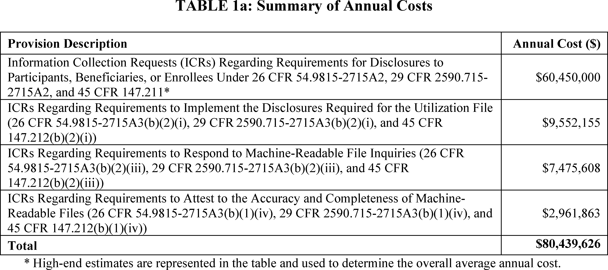
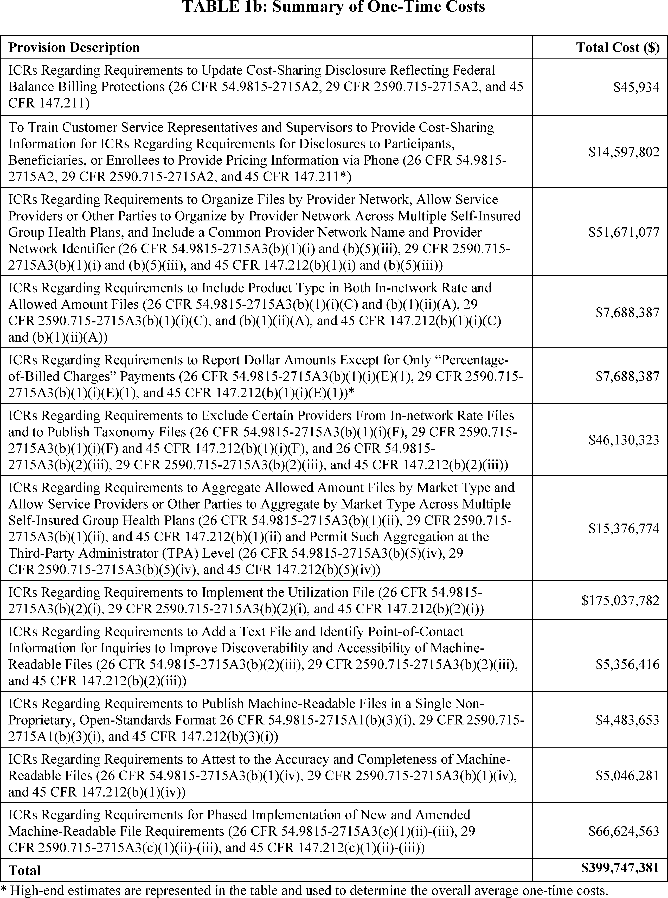
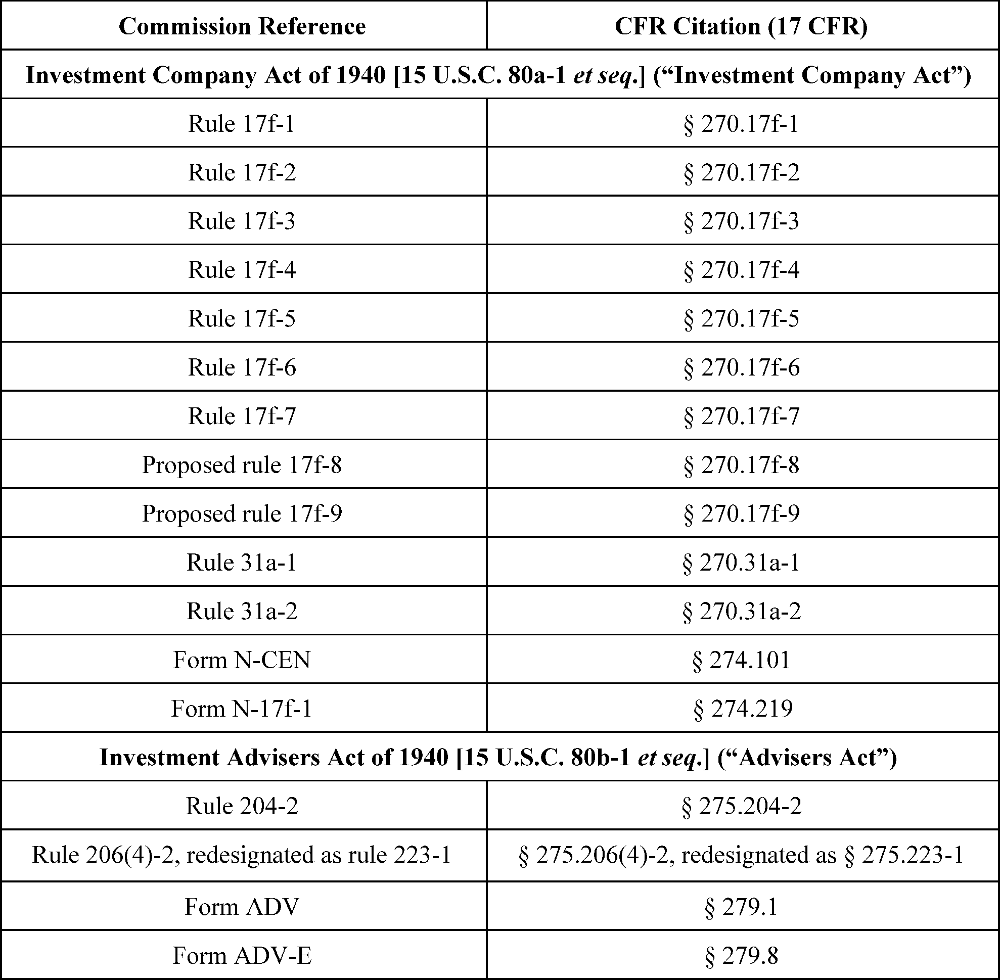
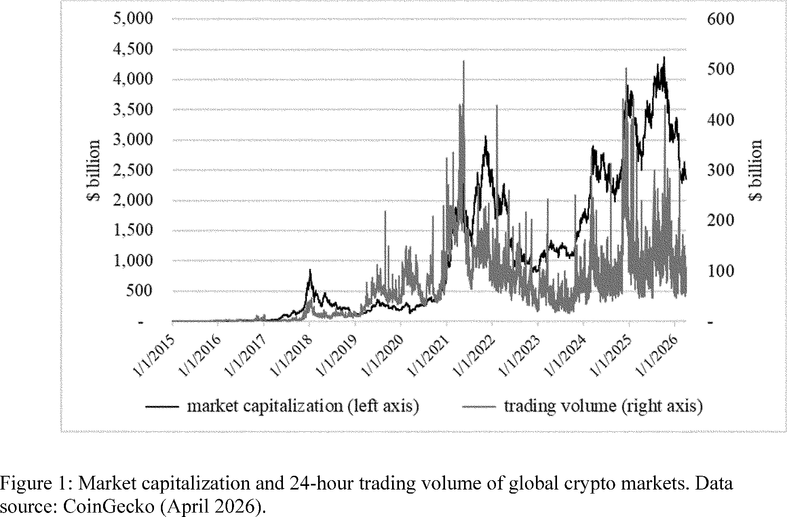
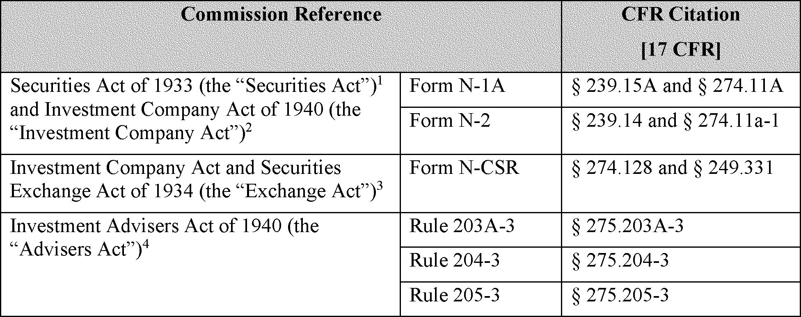
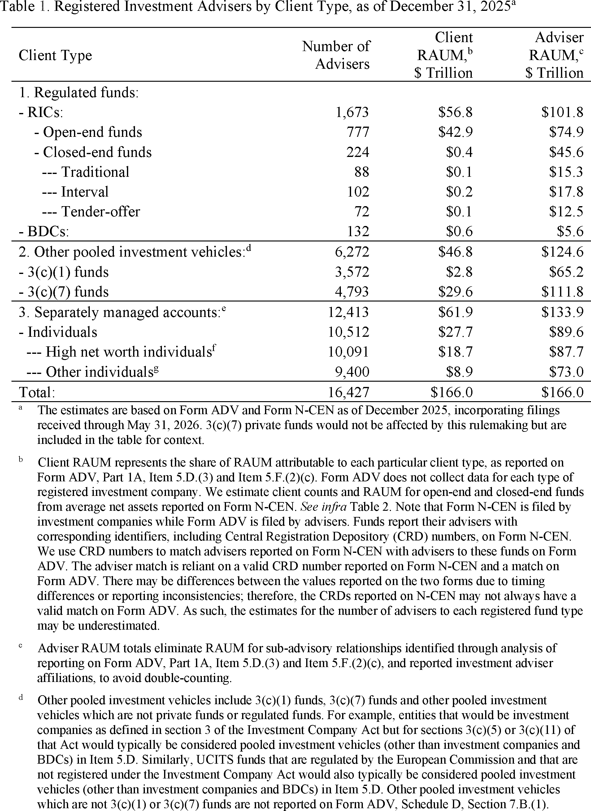

# Daily Digest — 2026-10-06

| | |
|---|---|
| **Digest date** | 2026-10-06 |
| **Data date range** | 2026-10-06 to 2026-10-06 |
| **Generated at** | 2026-10-07T04:03:17Z (UTC) |
| **Pipeline version** | 97eae2e7 |
| **Inference** | model layers ran — cli/haiku, opus |
| **Source watermarks** | CREC: 2026-10-06T20:55:07Z · BILLS: 2026-10-07T03:59:11Z · FR: 2026-10-06T20:57:20Z · USCOURTS: 2026-10-07T02:21:26Z · PLAW: 2026-10-06T20:48:39Z |

[Full observed listing for this day](day/2026-10-06.html) — the items our collectors observed for this publication day, mechanical rules applied, frozen at end of day; releases their publishers date on other days are counted there, not listed. This digest is the canonical record.

All items below cite the govinfo package (and granule, where applicable) they
summarize. Selection is mechanical; each item states the rule that included
it. See the Coverage Statement at the end for a full accounting of what was
published, what was summarized, and what was excluded and why.

---

## Contents

- [Day in Review](#day-in-review)
- [1. Congressional Floor Activity](#1-congressional-floor-activity)
- [2. Legislation](#2-legislation)
- [3. Federal Register](#3-federal-register)
- [4. Enacted Laws](#4-enacted-laws)
- [5. Judicial Activity](#5-judicial-activity)
- [6. Agency Announcements](#6-agency-announcements)
- [7. Recorded Votes](#7-recorded-votes)
- [8. Bill Actions](#8-bill-actions)
- [9. Presidential Actions](#9-presidential-actions)
- [Terms Used Today](#terms-used-today)
- [Coverage Statement](#coverage-statement)
- [Methodology](#methodology)

---

## Day in Review

The digest carries 85 House and 20 Senate entries from the Congressional Record, along with 74 Extensions of Remarks and 11 Daily Digest entries. It also carries 51 bills introduced in the House, 22 introduced in the Senate and 15 agreed to in the Senate. One House bill was reported: H.R. 2283, which authorizes a three-year Veterans Affairs grant pilot for outpatient mental health care for veterans. Two Senate bills were placed on the calendar. One bars federal funds for a structure at Memorial Circle in Lady Bird Johnson Park, and the other bars demolishing Presidential memorials designated by Congress unless Congress authorizes it.

On the executive and regulatory side, the digest carries 13 rules, 8 proposed rules, 73 notices, 3 Statements of Administration Policy and Public Law 119–118, which reauthorizes the Kay Hagan Tick Act. FinCEN withdrew two proposed rulemakings on convertible virtual currency. The SEC proposed crypto custody rules, and the FDA classified three medical device types into class II.

The digest carries 49 appellate, 2 national, 906 district and 8 bankruptcy court opinions. The Tenth Circuit held that judicial review is not barred for the mandatory step of terminating refugee status. It also held that a district court should have abstained from enjoining a state psilocybin prosecution. The Third Circuit held that a New Jersey labor statute does not fall under the Class Action Fairness Act. The Ninth Circuit reversed summary judgment in antitrust suits against Align Technology. The Court of Federal Claims addressed two bid protests.

*Composed from the summarized items below and the day's mechanical
counts; all specifics are cited in their sections.*

---

## 1. Congressional Floor Activity

Source: Congressional Record (CREC), issue observed 2026-10-06, covering proceedings of 2026-04-02. Published by govinfo 2026-10-06T20:55:07Z; observed by our collector 2026-10-06T21:08:36Z. Total issue size: 190 granule(s).
Source: Congressional Record (CREC), issue observed 2026-10-06, covering proceedings of 2026-10-05. Published by govinfo 2026-10-06T11:24:20Z; observed by our collector 2026-10-06T11:53:11Z. Total issue size: 190 granule(s).

### 1.1 Senate

No Senate floor items met the selection thresholds. 20 floor granule(s) are accounted for in the Coverage Statement.

### 1.2 House of Representatives

Tags: legislative · model keys: behavioral health · bills · mineral leasing

*In plain terms: The House introduced 30 bills, led by mineral leasing and behavioral health training proposals; others address diverse policy areas.*

- **Public Bills and Resolutions** — The House introduced 30 bills covering diverse policy areas including mineral leasing, behavioral health workforce training, bilateral crime response with Mexico, bankruptcy exceptions, Medicare supplements and Alzheimer's disease coverage, Medicaid limits, child care supply, federal election trading restrictions, and other legislative matters. Each bill was referred to appropriate committees per House procedure. The bills were sponsored by members from both parties, often in bipartisan groupings.
  - *In plain terms:* The House introduced 30 bills covering mineral leasing, behavioral health training, crime response with Mexico, bankruptcy, Medicare, Medicaid, child care, and federal election trading, with sponsors from both parties.
  - Included because: CREC-SEL-01 — floor item ≥ threshold floor time (16,659 characters) (document dated 2026-10-05)
  - Source: [CREC-2026-10-05 / CREC-2026-10-05-pt1-PgH6025-2](https://www.govinfo.gov/app/details/CREC-2026-10-05/CREC-2026-10-05-pt1-PgH6025-2)

### 1.3 Recorded Votes

No recorded votes were published in this issue of the Congressional Record.

---

## 2. Legislation

Source: Congressional Bills (BILLS), text versions published 2026-10-06 to 2026-10-06.

### 2.1 Counts by Stage

| Stage (bill text version) | Count |
|---|---|
| Introduced (ih/is) | 73 |
| Reported (rh/rs) | 1 |
| Engrossed (eh/es) | 0 |
| Enrolled (enr) | 0 |
| Other versions | 17 |
| **Total bill texts published** | **91** |

### 2.2 Bills Listed by Mechanical Rule

Tags: legislative · model keys: memorials · mental health · veterans

*In plain terms: Three bills authorize veterans' mental health grants, protect presidential memorials from demolition, and restrict federal funding at a DC memorial.*

Bills below are listed because they matched at least one listing rule; the
matching rule is stated per item. All other bill texts are counted above and
accounted for in the Coverage Statement.

- **H. R. 2283 (rh) — 119 HR 2283 RH: RECOVER Act** — H.R. 2283 authorizes a three-year pilot program under the Department of Veterans Affairs to award grants to eligible outpatient mental health facilities for providing evidence-based mental health care to veterans, with a maximum grant of $1.5 million per facility annually and $20 million total authorization for fiscal years 2027-2029. Grant recipients may not charge eligible veterans fees, must prioritize geographic distribution across rural and urban areas, and must report program outcomes to Congress within 180 days of completion. The bill also amends the date for a veterans' housing loan fee provision from June 9, 2034 to July 24, 2034.
  - *In plain terms:* The bill funds a three-year pilot program awarding grants to mental health clinics serving veterans without charging them fees, allocating $20 million through 2029 and adjusting a veterans' housing loan fee date.
  - Included because: BILLS-SEL-01 — reached stage: reported/enrolled/calendar (document dated 2026-10-05)
  - Source: [BILLS-119hr2283rh](https://www.govinfo.gov/app/details/BILLS-119hr2283rh)
- **S. 5602 (pcs) — 119 S5602 PCS: No Funds for Trump’s Illegal Arch Act** — The bill prohibits the use of Federal funds for planning, design, engineering, permitting, or construction of any structure or monument at Memorial Circle within Lady Bird Johnson Park in the District of Columbia. The prohibition does not apply to structures or monuments expressly authorized under the Commemorative Works Act or related federal law.
  - *In plain terms:* The bill prevents federal funding for building structures or monuments at Memorial Circle in Lady Bird Johnson Park, except those already authorized under the Commemorative Works Act.
  - Included because: BILLS-SEL-01 — reached stage: reported/enrolled/calendar (document dated 2026-09-30)
  - Source: [BILLS-119s5602pcs](https://www.govinfo.gov/app/details/BILLS-119s5602pcs)
- **S. 5603 (pcs) — 119 S5603 PCS: Protecting Presidential Memorials Act** — The bill prohibits the demolition of Presidential memorials designated by an Act of Congress unless authorized by Congress. The legislation defines demolition as the intentional razing, destroying, or wrecking of an entire building or structure or a substantial portion thereof.
  - *In plain terms:* The bill prohibits demolishing presidential memorials that Congress designated, unless Congress approves it, and defines demolition as intentionally razing or destroying an entire building or major part of one.
  - Included because: BILLS-SEL-01 — reached stage: reported/enrolled/calendar (document dated 2026-09-30)
  - Source: [BILLS-119s5603pcs](https://www.govinfo.gov/app/details/BILLS-119s5603pcs)

---

## 3. Federal Register

Source: Federal Register (FR), issue of 2026-10-06.

### 3.1 Counts by Document Type

| Document type | Count |
|---|---|
| Rules | 13 |
| Proposed rules | 8 |
| Notices | 73 |
| Presidential documents | 0 |
| **Total FR documents** | **94** |

### 3.2 Rules Published

Tags: department of energy · executive · securities and exchange commission · model keys: insurance transparency · medical devices · regulations

*In plain terms: 13 final rules, led by FDA medical device classifications and insurance price transparency; others finalize SEC's EDGAR updates, FCC broadcasting, security zones, and 911 program obsolescence.*

#### DEPARTMENT OF COMMERCE

- **Reef Fish Fishery of the Gulf of America; Amendment 62** (2026-20435; 50 CFR Part 622) — NMFS issues regulations to implement management measures described in Amendment 62 to the Fishery Management Plan for the Reef Fish Resources of the Gulf (FMP), as prepared and submitted by the Gulf Council (Council). This final rule and Amendment 62 revise the catch limits and sector allocations for Gulf of America (Gulf) red grouper, based on the best scientific information available. Additionally, this final rule removes the shallow-water grouper (SWG) recreational seasonal closure, from February 1 through March 31, in Gulf Federal waters seaward of the 20-fathom boundary. Action: Final rule. Dates: This final rule is effective October 2, 2026.
  - *In plain terms:* The rule updates red grouper catch limits for the Gulf of Mexico and eliminates the February-March recreational fishing closure in federal waters.
  - Included because: FR-SEL-01 — document type: final rule (all listed)
  - Source: [FR-2026-10-06 / 2026-20435](https://www.govinfo.gov/app/details/FR-2026-10-06/2026-20435)
- **Eliminating Obsolete Regulations Related to the 911 Grant Program** (2026-20493; 47 CFR Chapter IV) — In this action, NTIA and NHTSA are removing regulations related to the 911 Grant Program because the program is no longer active and there have been no new appropriations to revive or extend it. This removal is intended to eliminate obsolete regulatory language, ensure that the Code of Federal Regulations is accurate and up-to-date, and minimize the risk of confusion regarding the availability of grant funds. Action: Final rule. Dates: The rule is effective October 6, 2026.
  - *In plain terms:* NTIA and NHTSA are removing regulations for the defunct 911 Grant Program to eliminate outdated language and prevent confusion about funding.
  - Included because: FR-SEL-01 — document type: final rule (all listed)
  - Source: [FR-2026-10-06 / 2026-20493](https://www.govinfo.gov/app/details/FR-2026-10-06/2026-20493)

#### DEPARTMENT OF HEALTH AND HUMAN SERVICES

- **Medical Devices; General and Plastic Surgery Devices; Classification of the Focused Ultrasound System for Non-Thermal, Mechanical Tissue Ablation** (2026-20440; 21 CFR Part 878) — The Food and Drug Administration (FDA) is classifying the focused ultrasound system for non-thermal, mechanical tissue ablation into class II (special controls). The special controls that apply to the device type are identified in this order and will be part of the codified language for classification of the focused ultrasound system for non-thermal, mechanical tissue ablation. We are taking this action because we have determined that classifying the device into class II will provide a reasonable assurance of the safety and effectiveness of the device. We believe this action will also enhance patients' access to beneficial innovative devices, in part by reducing regulatory burdens. Action: Final amendment; final order. Dates: This order is effective October 6, 2026. The classification was applicable on October 6, 2023.
  - *In plain terms:* The FDA is classifying focused ultrasound devices for tissue ablation as class II, requiring special controls while reducing regulatory burdens.
  - Included because: FR-SEL-01 — document type: final rule (all listed)
  - Source: [FR-2026-10-06 / 2026-20440](https://www.govinfo.gov/app/details/FR-2026-10-06/2026-20440)
- **Medical Devices; Cardiovascular Devices; Classification of the Hyperoxia Monitoring Device Adjunct to Pulse Oximetry** (2026-20441; 21 CFR Part 870) — The Food and Drug Administration (FDA) is classifying the hyperoxia monitoring device adjunct to pulse oximetry into class II (special controls). The special controls that apply to the device type are identified in this order and will be part of the codified language for classification of the hyperoxia monitoring device adjunct to pulse oximetry. We are taking this action because we have determined that classifying the device into class II will provide a reasonable assurance of the safety and effectiveness of the device. We believe this action will also enhance patients' access to beneficial innovative devices, in part by reducing regulatory burdens. Action: Final amendment; final order. Dates: This order is effective October 6, 2026. The classification was applicable on October 12, 2023.
  - *In plain terms:* The FDA is classifying a hyperoxia monitoring device adjunct to pulse oximetry as class II with special controls.
  - Included because: FR-SEL-01 — document type: final rule (all listed)
  - Source: [FR-2026-10-06 / 2026-20441](https://www.govinfo.gov/app/details/FR-2026-10-06/2026-20441)
- **Medical Devices; Immunology and Microbiology Devices; Classification of the High Throughput DNA Sequencing for Hereditary Cancer Predisposition Assessment Test System** (2026-20443; 21 CFR Part 866) — The Food and Drug Administration (FDA) is classifying the high throughput DNA sequencing for hereditary cancer predisposition assessment test system into class II (special controls). The special controls that apply to the device type are identified in this order and will be part of the codified language for classification of the high throughput DNA sequencing for hereditary cancer predisposition assessment test system. We are taking this action because we have determined that classifying the device into class II will provide a reasonable assurance of the safety and effectiveness of the device. We believe this action will also enhance patients' access to beneficial innovative devices, in part by reducing regulatory burdens. Action: Final amendment; final order. Dates: This order is effective October 6, 2026. The classification was applicable on September 29, 2023.
  - *In plain terms:* The FDA is classifying DNA sequencing tests for assessing hereditary cancer risk as class II with special controls.
  - Included because: FR-SEL-01 — document type: final rule (all listed)
  - Source: [FR-2026-10-06 / 2026-20443](https://www.govinfo.gov/app/details/FR-2026-10-06/2026-20443)
- **Medical Devices; Exemptions From Premarket Notification: Class II Devices; Certain Clinical Toxicology Test Systems** (2026-20448; 21 CFR Part 862) — The Food and Drug Administration (FDA) is publishing an order setting forth its final determination to exempt certain class II clinical toxicology test systems from premarket notification (510(k)) requirements, subject to certain limitations. This exemption from 510(k) requirements, subject to certain limitations, is immediately in effect for such devices. This exemption will decrease regulatory burdens on the medical device industry and will eliminate private costs and expenditures required to comply with certain Federal regulations. FDA is amending the classification language within the Code of Federal Regulations (CFR) for certain class II clinical toxicology test systems to reflect this final determination. FDA is publishing this order in accordance with the Federal Food, Drug, and Cosmetic Act (FD&C Act). Action: Final amendment; final order. Dates: This order is effective October 6, 2026.
  - *In plain terms:* The FDA is exempting certain clinical toxicology test systems from premarket notification requirements, effective immediately, to reduce regulatory burdens.
  - Included because: FR-SEL-01 — document type: final rule (all listed)
  - Source: [FR-2026-10-06 / 2026-20448](https://www.govinfo.gov/app/details/FR-2026-10-06/2026-20448)

#### DEPARTMENT OF HOMELAND SECURITY

- **Security Zone; Patapsco River, Baltimore, MD** (2026-20477; 33 CFR Part 165) — The Coast Guard is establishing a temporary security zone for certain navigable waters of the Patapsco River. The security zone is needed to protect persons, including those under the protection of the United States Secret Service (USSS), and property from terrorist acts and incidents and to prevent terrorist acts or incidents during a high-ranking public official visit. Entry of vessels or persons into this zone is prohibited unless specifically authorized by the Captain of the Port, Sector Maryland-National Capital Region or a designated representative. Action: Temporary final rule. Dates: This rule is effective from 1 p.m. until 7 p.m. on October 6, 2026.
  - *In plain terms:* The Coast Guard is establishing a temporary security zone on the Patapsco River to protect a high-ranking public official and property.
  - Included because: FR-SEL-01 — document type: final rule (all listed)
  - Source: [FR-2026-10-06 / 2026-20477](https://www.govinfo.gov/app/details/FR-2026-10-06/2026-20477)

#### DEPARTMENT OF THE TREASURY

- **Transparency in Coverage** (2026-20447; 26 CFR Part 54; 29 CFR Part 2590; 45 CFR Part 147) — These final rules set forth requirements that amend the regulations under the Public Health Service Act, the Employee Retirement Income Security Act of 1974, and the Internal Revenue Code regarding price transparency reporting requirements for non-grandfathered group health plans and health insurance issuers offering non-grandfathered group and individual health insurance coverage. [official summary truncated; see source] Action: Final rule. Dates: These regulations are effective on December 7, 2026.
  - *In plain terms:* The rules require health plans and insurers to provide price transparency information for non-grandfathered health coverage.
  - Included because: FR-SEL-01 — document type: final rule (all listed)
  - Source: [FR-2026-10-06 / 2026-20447](https://www.govinfo.gov/app/details/FR-2026-10-06/2026-20447)
  -  *Source graphic 1 of 50 from 2026-20447.*
  -  *Source graphic 2 of 50 from 2026-20447.*
  - *Graphics not rendered here: 48 of 50 — see the [source PDF](https://www.govinfo.gov/content/pkg/FR-2026-10-06/pdf/FR-2026-10-06.pdf).*
- **Privacy Act Exemptions** (2026-20469; 31 CFR Part 1) — In accordance with the Privacy Act of 1974, as amended (Privacy Act), the Department of the Treasury (Treasury) is issuing a final rule, exempting a new system of records entitled “Department of the Treasury, Treasury .032—Federal Program Waste, Fraud, and Abuse Tip Intake and Referral Records” from certain provisions of the Privacy Act. This system of records is established to support the receipt, maintenance, review, triage, and referral of tips, complaints, allegations, leads, supporting information, and related correspondence concerning suspected waste, fraud, abuse, improper payments, misuse of Federal funds, or other misconduct affecting Federal programs. The exemption is intended to protect investigatory material compiled for law enforcement purposes. Action: Final rule. Dates: This rule is effective on November 5, 2026.
  - *In plain terms:* Treasury is exempting its tip intake system for reporting waste, fraud, and abuse from Privacy Act provisions to protect investigatory materials.
  - Included because: FR-SEL-01 — document type: final rule (all listed)
  - Source: [FR-2026-10-06 / 2026-20469](https://www.govinfo.gov/app/details/FR-2026-10-06/2026-20469)

#### DEPARTMENT OF TRANSPORTATION

- **Establishment of Class E Airspace; Peoria, IL** (2026-20479; 14 CFR Part 71) — This action establishes Class E airspace at OSF St Francis Medical Center Heliport, Peoria, IL. This action supports new instrument procedures and instrument flight rule (IFR) operations. Action: Final rule. Dates: Effective 0901 UTC, December 24, 2026. The Director of the Federal Register approves this incorporation by reference action under 1 CFR part 51, subject to the annual revision of FAA Order JO 7400.11 and publication of conforming amendments.
  - *In plain terms:* The FAA is establishing Class E airspace at OSF St Francis Medical Center Heliport in Peoria, Illinois for instrument flight operations.
  - Included because: FR-SEL-01 — document type: final rule (all listed)
  - Source: [FR-2026-10-06 / 2026-20479](https://www.govinfo.gov/app/details/FR-2026-10-06/2026-20479)

#### FEDERAL COMMUNICATIONS COMMISSION

- **Radio Broadcasting Services; Whitehall, Michigan** (2026-20463; 47 CFR Part 73) — This document amends the Table of FM Allotments, of the Federal Communications Commission's (Commission) rules, by substituting Channel 258A for vacant Channel 248A at Whitehall, Michigan. A staff engineering analysis determines that Channel 258A can be allotted to Whitehall consistent with the Commission's minimum distance separation requirements, with a site restriction of 13 kilometers (8.1 miles) northwest of the community. The reference coordinates are 43-28-30 NL and 86-27-38 WL. The window period for filing applications for Channel 258A at Whitehall, Michigan will not be opened at this time. Instead, the issue of opening this allotment for filing will be addressed by the Commission in subsequent order. See SUPPLEMENTARY INFORMATION . Action: Final rule. Dates: Effective November 12, 2026.
  - *In plain terms:* The FCC is assigning FM Channel 258A to Whitehall, Michigan with a site restriction 13 kilometers northwest, but will not open filing applications at this time.
  - Included because: FR-SEL-01 — document type: final rule (all listed)
  - Source: [FR-2026-10-06 / 2026-20463](https://www.govinfo.gov/app/details/FR-2026-10-06/2026-20463)
- **Radio Broadcasting Services; Selmer, Tennessee** (2026-20464; 47 CFR Part 73) — This document amends the Table of FM Allotments, of the Federal Communications Commission's (Commission) rules, by deleting vacant Channel 288A at Selmer, Tennessee, because it does not comply with the minimum distance separation requirements of the Commission's rules. Channel 288A at Selmer, Tennessee is short-spaced to Station WVNA-FM by nine kilometers, and there are no alternate channels available to alleviate the existing spacing conflict that would comply with the Commission's spacing requirements. The deletion of vacant Channel 288A at Selmer is consistent with the Commission's policy that we will not retain a vacant FM channel that does not comply with the Commission's spacing requirements. Action: Final rule. Dates: Effective November 12, 2026.
  - *In plain terms:* The FCC is deleting FM Channel 288A at Selmer, Tennessee because it does not meet minimum spacing requirements with nearby Station WVNA-FM.
  - Included because: FR-SEL-01 — document type: final rule (all listed)
  - Source: [FR-2026-10-06 / 2026-20464](https://www.govinfo.gov/app/details/FR-2026-10-06/2026-20464)

#### SECURITIES AND EXCHANGE COMMISSION

- **Adoption of Updated EDGAR Filer Manual** (2026-20461) — The Securities and Exchange Commission (“Commission”) is adopting amendments to Volume II of the Electronic Data Gathering, Analysis, and Retrieval system Filer Manual (“EDGAR Filer Manual” or “Filer Manual”) and related rules and forms. EDGAR Release 26.3 will be deployed in the EDGAR system on September 14, 2026. Action: Final rule. Dates: Effective date: October 6, 2026. The incorporation by reference of the revised Filer Manual volumes is approved by the Director of the Federal Register as of October 6, 2026.
  - *In plain terms:* The SEC is updating the EDGAR filing manual and related rules, deploying Release 26.3 on September 14, 2026.
  - Included because: FR-SEL-01 — document type: final rule (all listed)
  - Source: [FR-2026-10-06 / 2026-20461](https://www.govinfo.gov/app/details/FR-2026-10-06/2026-20461)

### 3.3 Proposed Rules Published

Tags: department of energy · executive · securities and exchange commission · model keys: cryptocurrency · federal agencies · federal regulations

*In plain terms: 8 proposals, led by FinCEN withdrawing virtual currency rules and SEC proposing crypto custody requirements; others from EPA, FAA, water commission, and Coast Guard.*

#### DELAWARE RIVER BASIN COMMISSION

- **Basin Regulations; Water Code** (2026-20480; 18 CFR Part 410) — The Commission proposes to amend its Water Code and Comprehensive Plan to require water supply systems serving the public (purveyors) to report water use by their largest customers. Action: Notice of proposed rulemaking; public hearing. Dates: Written comments: Written comments will be accepted through 5:00 p.m. EST on Friday, December 4, 2026. Public hearing: A public hearing will be held remotely via Zoom on Wednesday, November 4, 2026, beginning at 1:30 p.m. and ending no later than 3:00 p.m. EST. Details about accessing the hearing are available on the Commission's website, www.drbc.gov.
  - *In plain terms:* The water commission is proposing to require water suppliers to report usage data from their largest customers.
  - Included because: FR-SEL-02 — document type: proposed rule (all listed)
  - Source: [FR-2026-10-06 / 2026-20480](https://www.govinfo.gov/app/details/FR-2026-10-06/2026-20480)

#### DEPARTMENT OF HOMELAND SECURITY

- **Safety Zone; Red Bull Flugtag, Intercoastal Waterway, Biscayne Bay, Miami, FL** (2026-20491; 33 CFR Part 165) — The Coast Guard is proposing to establish a temporary safety zone for certain navigable waters on the Intercoastal Waterway portion of Biscayne Bay in Miami, FL. The safety zone is needed to protect spectators, vessels, and the marine environment from potential hazards associated with event proceedings. This proposed rulemaking would prohibit persons and vessels from being in the safety zone unless specifically authorized by the Captain of the Port, Sector Miami. We invite your comments on this proposed rulemaking. Action: Notice of proposed rulemaking. Dates: Comments and related material must be received by the Coast Guard on or before October 21, 2026.
  - *In plain terms:* The Coast Guard is proposing a temporary safety zone on Biscayne Bay's Intercoastal Waterway in Miami to protect event spectators and vessels.
  - Included because: FR-SEL-02 — document type: proposed rule (all listed)
  - Source: [FR-2026-10-06 / 2026-20491](https://www.govinfo.gov/app/details/FR-2026-10-06/2026-20491)

#### DEPARTMENT OF THE TREASURY

- **Proposal of Special Measure Regarding Convertible Virtual Currency Mixing, as a Class of Transactions of Primary Money Laundering Concern; Withdrawal** (2026-20429; 31 CFR Part 1010) — FinCEN is withdrawing its finding and proposed rulemaking, pursuant to section 311 of the USA PATRIOT Act, that international Convertible Virtual Currency (CVC) mixing is a class of transactions of primary money laundering concern and that a special measure requiring enhanced recordkeeping and reporting requirements should be imposed regarding this class of transactions. Action: Withdrawal of finding and notice of proposed rulemaking. Dates: FinCEN is withdrawing the proposed rulemaking published at 88 FR 72701 (October 23, 2023), as of October 6, 2026.
  - *In plain terms:* FinCEN is withdrawing its proposal to treat cryptocurrency mixing transactions as a money laundering concern and impose reporting requirements.
  - Included because: FR-SEL-02 — document type: proposed rule (all listed)
  - Source: [FR-2026-10-06 / 2026-20429](https://www.govinfo.gov/app/details/FR-2026-10-06/2026-20429)
- **Requirements for Certain Transactions Involving Convertible Virtual Currency or Digital Assets; Withdrawal** (2026-20430; 31 CFR Parts 1010, 1020, and 1022) — FinCEN is withdrawing a notice of proposed rulemaking (NPRM) that proposed requiring banks and money service businesses (MSBs) to submit reports, keep records, and verify the identity of customers in relation to transactions involving convertible virtual currency (CVC) or digital assets with legal tender status (LTDA) held in unhosted wallets or in wallets hosted in a jurisdiction identified by FinCEN. FinCEN will not take any further action on this NPRM. Action: Proposed rule; withdrawal. Dates: FinCEN is withdrawing the proposed rule published at 85 FR 83840 (December 23, 2020), as of October 6, 2026.
  - *In plain terms:* FinCEN is withdrawing its proposal to require banks to report, record, and verify customer identities for certain cryptocurrency and digital asset transactions.
  - Included because: FR-SEL-02 — document type: proposed rule (all listed)
  - Source: [FR-2026-10-06 / 2026-20430](https://www.govinfo.gov/app/details/FR-2026-10-06/2026-20430)

#### DEPARTMENT OF TRANSPORTATION

- **Modification of Class E Airspace; Gunnison-Crested Butte Regional Airport, Gunnison, CO** (2026-20473; 14 CFR Part 71) — This action proposes to modify the Class E airspace designated as a surface area, the Class E airspace area designated as an extension to a Class E surface area, and the Class E airspace area extending upward from 700 feet above the surface at Gunnison-Crested Butte Regional Airport, Gunnison, CO. These actions would support the safety and management of instrument flight rules (IFR) operations at the airport. Action: Notice of proposed rulemaking (NPRM). Dates: Comments must be received on or before November 20, 2026.
  - *In plain terms:* The FAA is proposing to modify Class E airspace around Gunnison-Crested Butte Regional Airport in Colorado to support instrument flight operations.
  - Included because: FR-SEL-02 — document type: proposed rule (all listed)
  - Source: [FR-2026-10-06 / 2026-20473](https://www.govinfo.gov/app/details/FR-2026-10-06/2026-20473)

#### ENVIRONMENTAL PROTECTION AGENCY

- **Initial Air Quality Designations for the 2024 Revised Primary Annual Fine Particle (PM 2.5 ) National Ambient Air Quality Standards (NAAQS)** (2026-20468; 40 CFR Part 81) — The U.S. Environmental Protection Agency (EPA) is providing notice of the Agency's intended approach for area designations for the 2024 primary annual fine particulate matter (PM 2.5 ) National Ambient Air Quality Standard (NAAQS) (the 2024 annual PM 2.5 NAAQS) under Clean Air Act (CAA) section 107(d). Details regarding these designations, as well as the EPA's notifications to States, territories, and Tribes regarding their initial area designations are accessible via the Agency's website and public electronic docket. With this notice, the EPA is providing an opportunity for public comment on its intended approach for finalizing area designations during the comment period specified in the DATES section. The EPA sent notifications directly to applicable States, territories, and Tribes regarding their initial area designations on or about October 2, 2026, and anticipates promulgating final designations consistent with CAA requirements. Action: Notice of availability; opportunity for public comment. Dates: Comments must be received on or before November 5, 2026.
  - *In plain terms:* The EPA is accepting public comments on its approach for designating areas for the 2024 air quality standard for fine particles, with final designations expected soon.
  - Included because: FR-SEL-02 — document type: proposed rule (all listed)
  - Source: [FR-2026-10-06 / 2026-20468](https://www.govinfo.gov/app/details/FR-2026-10-06/2026-20468)

#### SECURITIES AND EXCHANGE COMMISSION

- **Adviser and Regulated Fund Custody Rules; Crypto Custody Rules** (2026-20466; 17 CFR Parts 270, 274, 275, and 279) — The Securities and Exchange Commission (the “Commission” or the “SEC”) is proposing new custody rules under the Investment Company Act of 1940 (the “Investment Company Act”) and amendments to related reporting and recordkeeping requirements to address how regulated investment companies may custody crypto securities and similar investments, and amendments to the custody rule and related reporting and recordkeeping rules under the Investment Advisers Act of 1940 (the “Advisers Act”) to address how registered investment advisers may custody client crypto funds and securities. We are also proposing to amend the current custody rules to modernize their requirements, to better address current industry practices and feedback, and to implement certain conforming amendments. We are also proposing amendments to the recordkeeping rules under the Investment Company Act and Advisers Act related to these proposed modernization amendments to the custody rules. [official summary truncated; see source] Action: Proposed rule. Dates: This release was published in the Federal Register on October 6, 2026. Comments should be received on or before December 7, 2026.
  - *In plain terms:* The SEC is proposing new custody rules for how investment firms and advisers may hold cryptocurrency assets, updating requirements to reflect current practices.
  - Included because: FR-SEL-02 — document type: proposed rule (all listed)
  - Source: [FR-2026-10-06 / 2026-20466](https://www.govinfo.gov/app/details/FR-2026-10-06/2026-20466)
  -  *Source graphic 1 of 50 from 2026-20466.*
  -  *Source graphic 2 of 50 from 2026-20466.*
  - *Graphics not rendered here: 48 of 50 — see the [source PDF](https://www.govinfo.gov/content/pkg/FR-2026-10-06/pdf/FR-2026-10-06.pdf).*
- **Investment Adviser Performance-Based Compensation Modernization** (2026-20474; 17 CFR Parts 239, 249, 274, and 275) — The Securities and Exchange Commission (the “Commission”) is proposing to amend the rule under the Investment Advisers Act of 1940 that provides an exemption from the statutory prohibition on registered investment advisers receiving compensation on the basis of a share of capital gains in or capital appreciation of an advisory client's account. Specifically, the proposed amendments would expand the ability of investment advisers to receive this compensation from clients that are registered management investment companies and business development companies (collectively, “regulated funds”), subject to certain conditions. The proposal would relatedly amend certain regulated fund registration and reporting forms to require separate disclosure of all performance-based compensation paid by regulated funds to their investment adviser. The proposed rule amendments would also allow investment advisers to receive this compensation from additional clients by revising the rule's “qualified client” definition to include investors that meet the “accredited investor” definition in Regulation D under the Securities Act of 1933. [official summary truncated; see source] Action: Proposed rule. Dates: This release was published in the Federal Register on October 6, 2026. Comments should be received on or before December 7, 2026.
  - *In plain terms:* The SEC is proposing to expand when investment advisers may receive performance-based compensation from regulated funds and accredited investors under certain conditions.
  - Included because: FR-SEL-02 — document type: proposed rule (all listed)
  - Source: [FR-2026-10-06 / 2026-20474](https://www.govinfo.gov/app/details/FR-2026-10-06/2026-20474)
  -  *Source graphic 1 of 14 from 2026-20474.*
  -  *Source graphic 2 of 14 from 2026-20474.*
  - *Graphics not rendered here: 12 of 14 — see the [source PDF](https://www.govinfo.gov/content/pkg/FR-2026-10-06/pdf/FR-2026-10-06.pdf).*

### 3.4 Notices and Presidential Documents

Notices are summarized only when they match a listing rule; all are counted
in 3.1 and in the Coverage Statement. Presidential documents in the FR are
always listed.

No notices or presidential documents matched a listing rule.

---

## 4. Enacted Laws

Tags: legislative · model keys: public health · reauthorization · tick-borne diseases

*In plain terms: Public Law 119–118 reauthorizes programs addressing tick-borne and vector-borne diseases and extends authorization for the National Strategy and Regional Centers of Excellence.*

Source: Public and Private Laws (PLAW) published 2026-10-06.

- **Public Law 119–118 — Public Law 119–118: To reauthorize the Kay Hagan Tick Act, and for other purposes.** — Public Law 119–118 reauthorizes programs under the Public Health Service Act addressing tick-borne and vector-borne diseases. The law extends authorization for the National Strategy and Regional Centers of Excellence in Vector-borne Diseases and Enhanced Support to Assist Health Departments programs through 2030, and modifies the composition and operational structure of the Tick-Borne Disease Working Group. Approved: 2026-09-30.
  - *In plain terms:* This law extends federal programs addressing tick-borne and vector-borne diseases through 2030 and changes how the Tick-Borne Disease Working Group operates.
  - Included because: PLAW-SEL-01 — enacted into law (all public and private laws are listed) (document dated 2026-09-30)
  - Source: [PLAW-119publ118](https://www.govinfo.gov/app/details/PLAW-119publ118)

---

## 5. Judicial Activity

Source: United States Courts Opinions (USCOURTS): opinions observed 2026-10-06
by our collector; each opinion states its own issue date beside its
listing ([how our clocks work](faq.html#fapds-three-clocks)).

Completeness disclosure (standing): USCOURTS carries opinions from
approximately 140 participating appellate, district, bankruptcy, and
national federal courts. Unlike the Congressional Record and the Federal
Register, which are the complete official record of their branches,
USCOURTS is participation-based and is NOT the complete federal judicial
record. Courts post opinions with delay — typically over several days —
so a day's digest carries the opinions that became available that day,
whatever date each was issued.

### 5.1 Appellate and National Court Opinions

Tags: judicial · model keys: criminal sentencing · federal appeals · immigration

*In plain terms: 51 court decisions from federal circuits, led by immigration refugee status and criminal sentencing appeals; others addressed bankruptcy, civil rights, patents, and administrative matters.*

Appellate and national court opinions are summarized; district and
bankruptcy opinions are counted in 5.2 and in the Coverage Statement.

#### United States Court of Appeals for the Eighth Circuit

- **Sophia Wilansky v. Morton County, et al** (No. 24-03132; filed 2026-10-05) — The Eighth Circuit Court of Appeals issued an opinion and entered judgment in Sophia Wilansky v. Morton County, et al on October 5, 2026. Counsel are notified that petitions for rehearing must be received within 14 days of judgment entry.
  - *In plain terms:* The Eighth Circuit appeals court decided the case on October 5, 2026; requests to reconsider it must arrive within 14 days.
  - Included because: USCOURTS-SEL-01 — appellate court opinion (all listed) (document dated 2026-10-05)
  - Source: [USCOURTS-ca8-24-03132 / USCOURTS-ca8-24-03132-0](https://www.govinfo.gov/app/details/USCOURTS-ca8-24-03132/USCOURTS-ca8-24-03132-0)
- **Jane Does, et al v. David Flannigan, et al** (No. 25-01892; filed 2026-10-05) — The Eighth Circuit Court of Appeals issued an opinion and entered judgment in Jane Does, et al v. David Flannigan, et al on October 5, 2026. Counsel are notified that petitions for rehearing must be received within 14 days of judgment entry.
  - *In plain terms:* The Eighth Circuit appeals court decided the case on October 5, 2026; requests to reconsider it must arrive within 14 days.
  - Included because: USCOURTS-SEL-01 — appellate court opinion (all listed) (document dated 2026-10-05)
  - Source: [USCOURTS-ca8-25-01892 / USCOURTS-ca8-25-01892-0](https://www.govinfo.gov/app/details/USCOURTS-ca8-25-01892/USCOURTS-ca8-25-01892-0)
- **United States v. Lynell Noble** (No. 25-02131; filed 2026-10-05) — The Eighth Circuit Court of Appeals issued an opinion and entered judgment in United States v. Lynell Noble. The court notified counsel of post-submission procedures and the 14-day deadline for filing petitions for rehearing or rehearing en banc.
  - *In plain terms:* The Eighth Circuit decided United States v. Lynell Noble, giving counsel 14 days to request a rehearing.
  - Included because: USCOURTS-SEL-01 — appellate court opinion (all listed) (document dated 2026-10-05)
  - Source: [USCOURTS-ca8-25-02131 / USCOURTS-ca8-25-02131-0](https://www.govinfo.gov/app/details/USCOURTS-ca8-25-02131/USCOURTS-ca8-25-02131-0)
- **United States v. Harshkumar Patel** (No. 25-02159; filed 2026-10-05) — The Eighth Circuit Court of Appeals issued an opinion and entered judgment in United States v. Harshkumar Patel. The court notified the defendant of post-submission procedures and the 14-day deadline for filing petitions for rehearing or rehearing en banc.
  - *In plain terms:* The Eighth Circuit decided United States v. Harshkumar Patel, giving the defendant 14 days to request a rehearing.
  - Included because: USCOURTS-SEL-01 — appellate court opinion (all listed) (document dated 2026-10-05)
  - Source: [USCOURTS-ca8-25-02159 / USCOURTS-ca8-25-02159-0](https://www.govinfo.gov/app/details/USCOURTS-ca8-25-02159/USCOURTS-ca8-25-02159-0)
- **United States v. Lucian Celestine** (No. 26-02206; filed 2026-10-05) — The Eighth Circuit Court of Appeals affirmed the district court's revocation of supervised release and sentencing to 9 months in prison and 1 year of supervised release in United States v. Lucian Celestine. The court rejected the defendant's argument that his supervised release term had expired and found the violations were proven by a preponderance of the evidence. The court concluded the sentencing was not substantively unreasonable.
  - *In plain terms:* The Eighth Circuit upheld the district court's decision to cancel supervised release and impose 9 months in prison plus 1 year of supervised release.
  - Included because: USCOURTS-SEL-01 — appellate court opinion (all listed) (document dated 2026-10-05)
  - Source: [USCOURTS-ca8-26-02206 / USCOURTS-ca8-26-02206-0](https://www.govinfo.gov/app/details/USCOURTS-ca8-26-02206/USCOURTS-ca8-26-02206-0)

#### United States Court of Appeals for the Eleventh Circuit

- **James Bussey v. McCalla Raymer Leibert Pierce, LLC, et al** (No. 25-10436; filed 2026-10-05) — The Eleventh Circuit affirmed dismissal of Bussey and Rey's complaint as a shotgun pleading for failing to meet federal pleading standards. The court rejected claims that the district judge demonstrated bias warranting recusal and found post-judgment filings moot after the case was dismissed with prejudice.
  - *In plain terms:* A court upheld dismissal of a complaint for failing to meet federal pleading standards, rejected recusal claims, and found later filings moot.
  - Included because: USCOURTS-SEL-01 — appellate court opinion (all listed) (document dated 2026-10-05)
  - Source: [USCOURTS-ca11-25-10436 / USCOURTS-ca11-25-10436-0](https://www.govinfo.gov/app/details/USCOURTS-ca11-25-10436/USCOURTS-ca11-25-10436-0)
- **Colleen McGuigan v. Thomas Murray, et al** (No. 25-11698; filed 2026-10-05) — The Eleventh Circuit affirmed dismissal of McGuigan's suit against her brother for fraud, finding res judicata barred the claims based on identical issues decided in prior Delaware litigation and applying laches to time-bar her counterclaims.
  - *In plain terms:* A court upheld dismissal of a fraud lawsuit because an identical case was already decided and counterclaims were too late to file.
  - Included because: USCOURTS-SEL-01 — appellate court opinion (all listed) (document dated 2026-10-05)
  - Source: [USCOURTS-ca11-25-11698 / USCOURTS-ca11-25-11698-0](https://www.govinfo.gov/app/details/USCOURTS-ca11-25-11698/USCOURTS-ca11-25-11698-0)
- **Gene Chambers v. Progressive Select Insurance Company** (No. 25-12392; filed 2026-10-05) — The Eleventh Circuit affirmed summary judgment for Progressive Insurance, holding that Florida's safe-harbor statute protected the insurer from a bad-faith claim because it tendered the policy limit and demanded amount within ninety days of receiving notice of the claim.
  - *In plain terms:* A court upheld summary judgment for an insurance company that paid the policy limit within ninety days of receiving notice.
  - Included because: USCOURTS-SEL-01 — appellate court opinion (all listed) (document dated 2026-10-05)
  - Source: [USCOURTS-ca11-25-12392 / USCOURTS-ca11-25-12392-0](https://www.govinfo.gov/app/details/USCOURTS-ca11-25-12392/USCOURTS-ca11-25-12392-0)
- **USA v. Rey Gabriel-Zamorano** (No. 26-10470; filed 2026-10-05) — The Eleventh Circuit dismissed Gabriel-Zamorano's appeal of his 108-month drug conspiracy sentence, enforcing a valid appeal waiver in his plea agreement that barred review of his sentencing challenges.
  - *In plain terms:* A court dismissed a drug conspiracy appeal because the defendant had waived his right to appeal in his plea agreement.
  - Included because: USCOURTS-SEL-01 — appellate court opinion (all listed) (document dated 2026-10-05)
  - Source: [USCOURTS-ca11-26-10470 / USCOURTS-ca11-26-10470-0](https://www.govinfo.gov/app/details/USCOURTS-ca11-26-10470/USCOURTS-ca11-26-10470-0)
- **Ramon Blanco v. USA** (No. 26-10665; filed 2026-10-05) — The Eleventh Circuit affirmed dismissal of Blanco's successive Section 2255 motion for lack of subject matter jurisdiction, holding that while the Supreme Court's Bowe decision allows federal prisoners to raise previously-litigated claims in authorization motions, authorization from the court remains required before filing successive motions.
  - *In plain terms:* A court upheld dismissal of a prisoner's motion to reduce his sentence for lacking required authorization to file successive motions.
  - Included because: USCOURTS-SEL-01 — appellate court opinion (all listed) (document dated 2026-10-05)
  - Source: [USCOURTS-ca11-26-10665 / USCOURTS-ca11-26-10665-0](https://www.govinfo.gov/app/details/USCOURTS-ca11-26-10665/USCOURTS-ca11-26-10665-0)
- **Michael Hunter v. Warden** (No. 26-12669; filed 2026-10-05) — The Eleventh Circuit dismissed Hunter's Section 2254 habeas appeal as untimely, as the notice was not filed until July 2026, over five years after the 30-day appeal deadline following the November 2020 judgment.
  - *In plain terms:* A court dismissed a prisoner's appeal as too late because it was filed more than five years after the deadline.
  - Included because: USCOURTS-SEL-01 — appellate court opinion (all listed) (document dated 2026-10-05)
  - Source: [USCOURTS-ca11-26-12669 / USCOURTS-ca11-26-12669-0](https://www.govinfo.gov/app/details/USCOURTS-ca11-26-12669/USCOURTS-ca11-26-12669-0)

#### United States Court of Appeals for the Federal Circuit

- **Alexsam, Inc. v. Simon Property Group, L.P.** (No. 25-01138; filed 2026-10-05) — The Federal Circuit reversed a district court's dismissal of a third-party indemnification claim as moot, holding that the motion should have been treated as a Rule 60(b) motion available within the appeal period. The court found the district court erred in determining the indemnification claim was mooted by summary judgment of noninfringement in the underlying patent suit and remanded with instructions to dismiss the claim without prejudice under the supplemental jurisdiction statute.
  - *In plain terms:* The Federal Circuit reversed a lower court's dismissal of a third-party indemnification claim as moot and sent the case back to handle it differently.
  - Included because: USCOURTS-SEL-01 — appellate court opinion (all listed) (document dated 2026-10-05)
  - Source: [USCOURTS-ca13-25-01138 / USCOURTS-ca13-25-01138-0](https://www.govinfo.gov/app/details/USCOURTS-ca13-25-01138/USCOURTS-ca13-25-01138-0)
- **O'Reilly Winship LLC v. Snaprays LLC** (No. 25-01422; filed 2026-10-05) — The Federal Circuit reversed a district court's grant of summary judgment of noninfringement in a lighted cover-plate patent case, finding the court had improperly narrowed the construction of the claim term "joined" beyond what the patent language and specification support. The court determined the term should receive a broader construction consistent with its ordinary meaning and remanded for further proceedings.
  - *In plain terms:* The Federal Circuit overturned a lower court's decision of no patent infringement for a lighted cover-plate, saying the court wrongly narrowed how to interpret the claim term "joined" and sent the case back for more review.
  - Included because: USCOURTS-SEL-01 — appellate court opinion (all listed) (document dated 2026-10-05)
  - Source: [USCOURTS-ca13-25-01422 / USCOURTS-ca13-25-01422-0](https://www.govinfo.gov/app/details/USCOURTS-ca13-25-01422/USCOURTS-ca13-25-01422-0)

#### United States Court of Appeals for the Fifth Circuit

- **Gann v. Depositors Insurance** (No. 25-11291; filed 2026-10-05) — Dwight Gann and Sage Management sued Depositors Insurance over disputed hail damage to a commercial property. The Fifth Circuit affirmed summary judgment for Depositors, holding that Gann's four-year delay in reporting the claim and over five-year delay in providing evidence of an earlier date of loss violated the insurance policy's prompt notice requirement and prejudiced the insurer's ability to investigate.
  - *In plain terms:* A court upheld judgment for an insurance company because the policyholder delayed reporting a hail damage claim and providing evidence.
  - Included because: USCOURTS-SEL-01 — appellate court opinion (all listed) (document dated 2026-10-05)
  - Source: [USCOURTS-ca5-25-11291 / USCOURTS-ca5-25-11291-0](https://www.govinfo.gov/app/details/USCOURTS-ca5-25-11291/USCOURTS-ca5-25-11291-0)
- **Archer Western v. McDonnel Group** (No. 25-30739; filed 2026-10-05) — Archer Western Contractors and McDonnel Group disputed their joint venture agreement for a construction project after McDonnel refused capital contributions and brokered a separate settlement. The Fifth Circuit affirmed denial of attorneys' fees to McDonnel, holding that the joint venture agreement required a judicial determination of actual breach to trigger fee-shifting, and the jury's finding that McDonnel did not breach on capital contributions did not constitute an adjudication of Archer's breach.
  - *In plain terms:* A court upheld denial of legal fees because the joint venture agreement required a judicial determination of breach to award them.
  - Included because: USCOURTS-SEL-01 — appellate court opinion (all listed) (document dated 2026-10-05)
  - Source: [USCOURTS-ca5-25-30739 / USCOURTS-ca5-25-30739-0](https://www.govinfo.gov/app/details/USCOURTS-ca5-25-30739/USCOURTS-ca5-25-30739-0)
- **USA v. Nova-Carrillo** (No. 25-50921; filed 2026-10-05) — Francisco Nova-Carrillo pleaded guilty to illegal reentry in violation of 8 U.S.C. § 1326(a) and (b). The district court imposed a 72-month sentence followed by three years of supervised release, above the guideline range of 46 to 57 months. The Fifth Circuit affirmed the appeal, finding no abuse of discretion in the sentencing.
  - *In plain terms:* A court upheld a 72-month sentence for illegal reentry above the recommended range, finding no abuse of discretion.
  - Included because: USCOURTS-SEL-01 — appellate court opinion (all listed) (document dated 2026-10-05)
  - Source: [USCOURTS-ca5-25-50921 / USCOURTS-ca5-25-50921-0](https://www.govinfo.gov/app/details/USCOURTS-ca5-25-50921/USCOURTS-ca5-25-50921-0)
- **USA v. Braziel** (No. 26-30161; filed 2026-10-05) — Kordarrien Braziel was convicted of conspiracy to commit wire fraud and objected to a sophisticated-means enhancement in his sentencing guidelines calculation. The district court sentenced him to 12 months and one day, stating it would impose the same sentence regardless of the enhancement's applicability. The Fifth Circuit affirmed, finding any error harmless.
  - *In plain terms:* A court upheld a sentence for wire fraud conspiracy, finding any error in a sentencing enhancement harmless.
  - Included because: USCOURTS-SEL-01 — appellate court opinion (all listed) (document dated 2026-10-05)
  - Source: [USCOURTS-ca5-26-30161 / USCOURTS-ca5-26-30161-0](https://www.govinfo.gov/app/details/USCOURTS-ca5-26-30161/USCOURTS-ca5-26-30161-0)
- **Clark v. Bisignano** (No. 26-30270; filed 2026-10-05) — Tykita Clark appealed the district court's affirmance of the denial of her Social Security benefits claim. Her principal brief contained no citations to the record or supporting authorities, and her reply brief did not cure this deficiency. The Fifth Circuit affirmed, finding Clark forfeited her arguments through inadequate briefing and that substantial evidence supported the Commissioner's decision.
  - *In plain terms:* A court upheld denial of Social Security benefits because the appellant's brief lacked required legal support and the evidence supported denial.
  - Included because: USCOURTS-SEL-01 — appellate court opinion (all listed) (document dated 2026-10-05)
  - Source: [USCOURTS-ca5-26-30270 / USCOURTS-ca5-26-30270-0](https://www.govinfo.gov/app/details/USCOURTS-ca5-26-30270/USCOURTS-ca5-26-30270-0)
- **Davis v. Salay** (No. 26-30352; filed 2026-10-05) — Derek Anthony Davis sued New Orleans police officers under 42 U.S.C. § 1983, alleging they violated his due process rights by declining to enforce a restraining order against his former partner. The Fifth Circuit affirmed the district court's dismissal, holding that Davis had no constitutionally protected property interest in the enforcement of the restraining order under Town of Castle Rock v. Gonzales.
  - *In plain terms:* A court upheld dismissal of a lawsuit alleging police violated due process rights by declining to enforce a restraining order.
  - Included because: USCOURTS-SEL-01 — appellate court opinion (all listed) (document dated 2026-10-05)
  - Source: [USCOURTS-ca5-26-30352 / USCOURTS-ca5-26-30352-0](https://www.govinfo.gov/app/details/USCOURTS-ca5-26-30352/USCOURTS-ca5-26-30352-0)
- **USA v. Jimenez-Solorio** (No. 26-50073; filed 2026-10-05) — Rolando Jimenez-Solorio pleaded guilty to illegal reentry and received a 30-month above-guidelines sentence. He appealed, arguing the sentence was procedurally unreasonable due to insufficient explanation and substantively unreasonable due to the extent of variance. The Fifth Circuit affirmed, finding no procedural error and no abuse of discretion in the substantive reasonableness calculation.
  - *In plain terms:* A court upheld a 30-month sentence for illegal reentry above the recommended range, finding it procedurally and substantively reasonable.
  - Included because: USCOURTS-SEL-01 — appellate court opinion (all listed) (document dated 2026-10-05)
  - Source: [USCOURTS-ca5-26-50073 / USCOURTS-ca5-26-50073-0](https://www.govinfo.gov/app/details/USCOURTS-ca5-26-50073/USCOURTS-ca5-26-50073-0)

#### United States Court of Appeals for the Fourth Circuit

- **US v. Frederick Brown** (No. 25-04054; filed 2026-10-05) — Frederick Bishop Brown appealed his conviction for distribution of methamphetamine under 21 U.S.C. § 841(a)(1) after pleading guilty. The Fourth Circuit affirmed the conviction, finding no plain error in the district court's acceptance of the guilty plea and concluding the sentence was procedurally and substantively reasonable.
  - *In plain terms:* A court upheld a methamphetamine distribution conviction, finding the guilty plea was properly accepted and the sentence was reasonable.
  - Included because: USCOURTS-SEL-01 — appellate court opinion (all listed) (document dated 2026-10-05)
  - Source: [USCOURTS-ca4-25-04054 / USCOURTS-ca4-25-04054-0](https://www.govinfo.gov/app/details/USCOURTS-ca4-25-04054/USCOURTS-ca4-25-04054-0)
- **In re: Troy Green** (No. 26-01801; filed 2026-10-05) — Troy J. Green filed three consolidated petitions for a writ of mandamus seeking to compel a district judge's recusal from his pending civil lawsuits. The Fourth Circuit denied the petitions, holding that Green failed to demonstrate a clear and indisputable right to the relief sought.
  - *In plain terms:* A court denied a prisoner's petitions to force a judge's recusal from civil lawsuits, finding he had no clear right to recusal.
  - Included because: USCOURTS-SEL-01 — appellate court opinion (all listed) (document dated 2026-10-05)
  - Source: [USCOURTS-ca4-26-01801 / USCOURTS-ca4-26-01801-0](https://www.govinfo.gov/app/details/USCOURTS-ca4-26-01801/USCOURTS-ca4-26-01801-0)
- **In re: Troy Green** (No. 26-01802; filed 2026-10-05) — Troy J. Green filed three consolidated petitions for a writ of mandamus seeking to compel a district judge's recusal from his pending civil lawsuits. The Fourth Circuit denied the petitions, holding that Green failed to demonstrate a clear and indisputable right to the relief sought.
  - *In plain terms:* A court denied a prisoner's petitions to force a judge's recusal from civil lawsuits, finding he had no clear right to recusal.
  - Included because: USCOURTS-SEL-01 — appellate court opinion (all listed) (document dated 2026-10-05)
  - Source: [USCOURTS-ca4-26-01802 / USCOURTS-ca4-26-01802-0](https://www.govinfo.gov/app/details/USCOURTS-ca4-26-01802/USCOURTS-ca4-26-01802-0)
- **In re: Troy Green** (No. 26-01803; filed 2026-10-05) — Troy J. Green filed three consolidated petitions for a writ of mandamus seeking to compel a district judge's recusal from his pending civil lawsuits. The Fourth Circuit denied the petitions, holding that Green failed to demonstrate a clear and indisputable right to the relief sought.
  - *In plain terms:* A court denied a prisoner's petitions to force a judge's recusal from civil lawsuits, finding he had no clear right to recusal.
  - Included because: USCOURTS-SEL-01 — appellate court opinion (all listed) (document dated 2026-10-05)
  - Source: [USCOURTS-ca4-26-01803 / USCOURTS-ca4-26-01803-0](https://www.govinfo.gov/app/details/USCOURTS-ca4-26-01803/USCOURTS-ca4-26-01803-0)

#### United States Court of Appeals for the Ninth Circuit

- **SIMON AND SIMON, PC, ET AL. V. ALIGN TECHNOLOGY, INC.** (No. 24-1703; filed 2026-10-05) — The Ninth Circuit reversed summary judgment in antitrust class actions against Align Technology, manufacturer of Invisalign dental aligners and iTero scanners, over allegations that it violated Sherman Act Section 2 by terminating digital interoperability with a competing scanner made by 3Shape. The court determined that plaintiffs presented sufficient evidence of genuine disputes regarding whether Align's stated business justification was legitimate or pretextual, warranting remand for trial.
  - *In plain terms:* A court reversed summary judgment in antitrust lawsuits against Align Technology over allegations it violated antitrust law by ending digital interoperability.
  - Included because: USCOURTS-SEL-01 — appellate court opinion (all listed) (document dated 2026-10-05)
  - Source: [USCOURTS-ca9-24-1703 / USCOURTS-ca9-24-1703-0](https://www.govinfo.gov/app/details/USCOURTS-ca9-24-1703/USCOURTS-ca9-24-1703-0)
- **SNOW, ET AL. V. ALIGN TECHNOLOGY, INC.** (No. 24-1783; filed 2026-10-05) — The Ninth Circuit reversed summary judgment in antitrust class actions against Align Technology, manufacturer of Invisalign dental aligners and iTero scanners, over allegations that it violated Sherman Act Section 2 by terminating digital interoperability with a competing scanner made by 3Shape. The court determined that plaintiffs presented sufficient evidence of genuine disputes regarding whether Align's stated business justification was legitimate or pretextual, warranting remand for trial.
  - *In plain terms:* A court reversed summary judgment in antitrust lawsuits against Align Technology over allegations it violated antitrust law by ending digital interoperability.
  - Included because: USCOURTS-SEL-01 — appellate court opinion (all listed) (document dated 2026-10-05)
  - Source: [USCOURTS-ca9-24-1783 / USCOURTS-ca9-24-1783-0](https://www.govinfo.gov/app/details/USCOURTS-ca9-24-1783/USCOURTS-ca9-24-1783-0)
- **USA V. SO** (No. 24-5085; filed 2026-10-05) — The Ninth Circuit affirmed Hyoung Nam "Brian" So's conviction for conspiracy to commit federal funds bribery, rejecting his argument that the indictment was untimely filed. The court held that a 2020 tolling order issued under 18 U.S.C. § 3292 properly extended the statute of limitations for the conspiracy charge based on a pending foreign government investigation, and that the conspiracy offense was covered by the tolling order even though it was not explicitly named in the court's order or the government's application.
  - *In plain terms:* A court upheld a bribery conspiracy conviction, finding the statute of limitations was properly extended by a tolling order issued for a foreign investigation.
  - Included because: USCOURTS-SEL-01 — appellate court opinion (all listed) (document dated 2026-10-05)
  - Source: [USCOURTS-ca9-24-5085 / USCOURTS-ca9-24-5085-0](https://www.govinfo.gov/app/details/USCOURTS-ca9-24-5085/USCOURTS-ca9-24-5085-0)
- **SCHMIDT V. CITY OF PASADENA, ET AL.** (No. 25-488; filed 2026-10-05) — The Ninth Circuit affirmed the dismissal of Jonathan Schmidt's civil rights action against the City of Pasadena and individual city employees challenging a COVID-19 vaccination policy that required unvaccinated employees to undergo weekly testing and wear masks in shared spaces. The court held that the defendants are immune from Schmidt's claims under the Public Readiness and Emergency Preparedness (PREP) Act, which provides immunity from federal and state law claims relating to the administration of medical countermeasures during a declared public health emergency.
  - *In plain terms:* A federal appeals court upheld dismissal of a lawsuit challenging a city's COVID-19 vaccination policy requiring unvaccinated employees to test weekly and wear masks, citing federal immunity law for medical measures during health emergencies.
  - Included because: USCOURTS-SEL-01 — appellate court opinion (all listed) (document dated 2026-10-05)
  - Source: [USCOURTS-ca9-25-488 / USCOURTS-ca9-25-488-0](https://www.govinfo.gov/app/details/USCOURTS-ca9-25-488/USCOURTS-ca9-25-488-0)

#### United States Court of Appeals for the Seventh Circuit

- **USA v. Marquette Neal** (No. 25-01403; filed 2026-10-05) — The Seventh Circuit affirmed a felony conviction for possessing a firearm as a felon in violation of 18 U.S.C. § 922(g)(1), rejecting the defendant's Second Amendment challenge based on binding precedent from the court's recent decision in United States v. Prince.
  - *In plain terms:* A court upheld a felon in possession of firearm conviction, rejecting a Second Amendment challenge under established precedent.
  - Included because: USCOURTS-SEL-01 — appellate court opinion (all listed) (document dated 2026-10-05)
  - Source: [USCOURTS-ca7-25-01403 / USCOURTS-ca7-25-01403-0](https://www.govinfo.gov/app/details/USCOURTS-ca7-25-01403/USCOURTS-ca7-25-01403-0)
- **USA v. Carl Hall** (No. 25-02443; filed 2026-10-05) — The Seventh Circuit affirmed a felony conviction for possessing a firearm as a felon in violation of 18 U.S.C. § 922(g)(1), rejecting the defendant's Second Amendment challenge based on binding precedent from United States v. Prince.
  - *In plain terms:* A court upheld a felon in possession of firearm conviction, rejecting a Second Amendment challenge under established precedent.
  - Included because: USCOURTS-SEL-01 — appellate court opinion (all listed) (document dated 2026-10-05)
  - Source: [USCOURTS-ca7-25-02443 / USCOURTS-ca7-25-02443-0](https://www.govinfo.gov/app/details/USCOURTS-ca7-25-02443/USCOURTS-ca7-25-02443-0)
- **USA v. Jarmarco Moore** (No. 26-01081; filed 2026-10-05) — The Seventh Circuit affirmed the district court's denial of a federal prisoner's fourth motion for compassionate release under 18 U.S.C. § 3582(c)(1)(A), finding that the prisoner presented no new extraordinary and compelling circumstances warranting release and no abuse of discretion in the lower court's decision.
  - *In plain terms:* A court denied a federal prisoner's motion for compassionate release, finding no new extraordinary circumstances warranting release.
  - Included because: USCOURTS-SEL-01 — appellate court opinion (all listed) (document dated 2026-10-05)
  - Source: [USCOURTS-ca7-26-01081 / USCOURTS-ca7-26-01081-0](https://www.govinfo.gov/app/details/USCOURTS-ca7-26-01081/USCOURTS-ca7-26-01081-0)

#### United States Court of Appeals for the Sixth Circuit

- **USA v. Deangelo Smith** (No. 25-03998; filed 2026-10-05) — Deangelo Smith pleaded guilty to felon in possession of a firearm and entered into a plea agreement providing for a three-level reduction for acceptance of responsibility. While detained pending sentencing, Smith was involved in an incident where he possessed a prohibited weapon that contributed to another inmate's death. The district court determined this conduct was related to his underlying offense, released the government from the plea agreement, and imposed a 96-month sentence above the guidelines; the Sixth Circuit affirmed, finding the conduct sufficiently related to deny the acceptance-of-responsibility reduction.
  - *In plain terms:* A court upheld a 96-month sentence for felon in possession of firearm, finding related conduct while detained justified denying a sentencing reduction.
  - Included because: USCOURTS-SEL-01 — appellate court opinion (all listed) (document dated 2026-10-05)
  - Source: [USCOURTS-ca6-25-03998 / USCOURTS-ca6-25-03998-0](https://www.govinfo.gov/app/details/USCOURTS-ca6-25-03998/USCOURTS-ca6-25-03998-0)
- **Sherry Cunningham, et al v. Allegan County, MI, et al** (No. 26-01060; filed 2026-10-05) — The Sixth Circuit reversed a district court dismissal of a class action lawsuit brought by Michigan residents against Allegan County over surplus proceeds from tax foreclosure sales, holding that Michigan's tolling rules should apply to determine whether the statute of limitations was extended during the earlier related class action. The court remanded for determination of whether the county had sufficient notice of the earlier lawsuit to toll the limitations period.
  - *In plain terms:* A court reversed dismissal of a class action lawsuit over tax foreclosure surplus proceeds, finding Michigan's tolling rules may apply.
  - Included because: USCOURTS-SEL-01 — appellate court opinion (all listed) (document dated 2026-10-05)
  - Source: [USCOURTS-ca6-26-01060 / USCOURTS-ca6-26-01060-0](https://www.govinfo.gov/app/details/USCOURTS-ca6-26-01060/USCOURTS-ca6-26-01060-0)

#### United States Court of Appeals for the Tenth Circuit

- **Mukantagara, et al v. Mullin, et al** (No. 24-04071; filed 2026-01-12) — The Tenth Circuit held that 8 U.S.C. § 1252(a)(2)(B)(ii), which bars judicial review of certain immigration agency discretionary actions, does not apply to the nondiscretionary portion of refugee status termination decisions under 8 U.S.C. § 1157(c)(4). The court determined that termination involves two steps: a mandatory eligibility determination of whether the alien met the refugee definition at admission, and a discretionary decision to terminate, with only the latter subject to the jurisdiction-stripping statute.
  - *In plain terms:* The court ruled that courts can review whether someone qualified as a refugee when admitted, even if they cannot review the decision to end their status.
  - Included because: USCOURTS-SEL-01 — appellate court opinion (all listed) (document dated 2026-10-05)
  - Source: [USCOURTS-ca10-24-04071 / USCOURTS-ca10-24-04071-0](https://www.govinfo.gov/app/details/USCOURTS-ca10-24-04071/USCOURTS-ca10-24-04071-0)
- **Mukantagara, et al v. Mullin, et al** (No. 24-04071; filed 2026-10-05) — The Tenth Circuit affirmed that 8 U.S.C. § 1252(a)(2)(B)(ii) does not bar district court review of USCIS's mandatory determination that an individual was not a refugee when admitted to the United States. Refugee status termination under 8 U.S.C. § 1157(c)(4) involves two distinct decisions: a mandatory eligibility determination and a discretionary termination decision, with only the latter subject to the jurisdiction-stripping provision.
  - *In plain terms:* Courts may review the mandatory determination that someone was not a refugee when admitted, even though they cannot review the decision to terminate refugee status.
  - Included because: USCOURTS-SEL-01 — appellate court opinion (all listed) (document dated 2026-10-05)
  - Source: [USCOURTS-ca10-24-04071 / USCOURTS-ca10-24-04071-1](https://www.govinfo.gov/app/details/USCOURTS-ca10-24-04071/USCOURTS-ca10-24-04071-1)
- **Ranta, et al v. Krigsman, et al** (No. 25-01360; filed 2025-10-16) — The Tenth Circuit dismissed an appeal in a bankruptcy matter for lack of prosecution pursuant to appellate rules.
  - *In plain terms:* The appeals court dismissed the bankruptcy appeal because the person appealing failed to pursue the case.
  - Included because: USCOURTS-SEL-01 — appellate court opinion (all listed) (document dated 2026-10-05)
  - Source: [USCOURTS-ca10-25-01360 / USCOURTS-ca10-25-01360-0](https://www.govinfo.gov/app/details/USCOURTS-ca10-25-01360/USCOURTS-ca10-25-01360-0)
- **Ranta, et al v. Krigsman, et al** (No. 25-01360; filed 2026-10-05) — The Tenth Circuit granted a voluntary dismissal motion in a bankruptcy appeal and vacated the scheduled oral argument.
  - *In plain terms:* The court granted voluntary dismissal of the bankruptcy appeal and canceled the scheduled oral argument.
  - Included because: USCOURTS-SEL-01 — appellate court opinion (all listed) (document dated 2026-10-05)
  - Source: [USCOURTS-ca10-25-01360 / USCOURTS-ca10-25-01360-1](https://www.govinfo.gov/app/details/USCOURTS-ca10-25-01360/USCOURTS-ca10-25-01360-1)
- **Jensen, et al v. Utah County, et al** (No. 25-04115; filed 2026-10-05) — The Tenth Circuit held that a federal district court erred in enjoining state criminal prosecution of a religious leader for possession of psilocybin used in religious ceremonies, finding the district court should have abstained under the Younger doctrine. The court further held that a state's allowance of psilocybin for medical research while prohibiting religious use does not violate the Free Exercise Clause of the First Amendment.
  - *In plain terms:* The court ruled a lower court should not have blocked a state criminal case and that allowing psilocybin for medical research while prohibiting religious use doesn't violate the First Amendment.
  - Included because: USCOURTS-SEL-01 — appellate court opinion (all listed) (document dated 2026-10-05)
  - Source: [USCOURTS-ca10-25-04115 / USCOURTS-ca10-25-04115-0](https://www.govinfo.gov/app/details/USCOURTS-ca10-25-04115/USCOURTS-ca10-25-04115-0)
- **Dean v. Stryker Employment Company** (No. 25-06105; filed 2026-10-05) — The appeal filed by Bradley Carl Dean against Stryker Employment Company, LLC was dismissed upon the joint stipulation of both parties. The court granted the motion to dismiss in accordance with Federal Rules of Appellate Procedure.
  - *In plain terms:* The appeal by Bradley Carl Dean against Stryker Employment Company was dismissed because both sides agreed to it.
  - Included because: USCOURTS-SEL-01 — appellate court opinion (all listed) (document dated 2026-10-05)
  - Source: [USCOURTS-ca10-25-06105 / USCOURTS-ca10-25-06105-0](https://www.govinfo.gov/app/details/USCOURTS-ca10-25-06105/USCOURTS-ca10-25-06105-0)
- **Sanders v. Aerotek, et al** (No. 25-06170; filed 2026-10-05) — The Tenth Circuit affirmed dismissal of claims based on an Oklahoma statute limiting civil liability for COVID-19 exposure, holding that the statute creates a limitation on liability rather than a private right of action. The statute shields persons and their agents from liability in civil actions when their conduct was in compliance or consistent with federal or state regulations, executive orders, or applicable guidance related to COVID-19 exposure.
  - *In plain terms:* Oklahoma's law shields people and their agents from civil lawsuits when they followed federal or state COVID-19 regulations or guidance.
  - Included because: USCOURTS-SEL-01 — appellate court opinion (all listed) (document dated 2026-10-05)
  - Source: [USCOURTS-ca10-25-06170 / USCOURTS-ca10-25-06170-0](https://www.govinfo.gov/app/details/USCOURTS-ca10-25-06170/USCOURTS-ca10-25-06170-0)
- **Laham v. City of Maize, et al** (No. 26-03152; filed 2026-10-05) — The Tenth Circuit affirmed the district court's dismissal of Adam Dean Laham's civil rights claims challenging his 2021 arrest. Laham failed to file specific written objections to the magistrate judge's report within the required timeframe, resulting in waiver of appellate review under the firm waiver rule. The court declined to review the dismissal of his claims.
  - *In plain terms:* Adam Dean Laham's civil rights claims about his 2021 arrest were dismissed because he failed to file required written objections on time, and the court refused to review the dismissal.
  - Included because: USCOURTS-SEL-01 — appellate court opinion (all listed) (document dated 2026-10-05)
  - Source: [USCOURTS-ca10-26-03152 / USCOURTS-ca10-26-03152-0](https://www.govinfo.gov/app/details/USCOURTS-ca10-26-03152/USCOURTS-ca10-26-03152-0)
- **Calder v. Zweber, et al** (No. 26-04051; filed 2026-10-05) — The Tenth Circuit affirmed the dismissal of Leland Calder's federal civil rights suit in which he claimed workers at a Budweiser facility assaulted him and a law firm sent an intimidating cease-and-desist letter intended to suppress his speech. The court found that even when construing his complaint liberally, Calder failed to allege the necessary elements of his assault, negligent supervision, emotional distress, and conspiracy claims.
  - *In plain terms:* The court upheld dismissal because Calder failed to adequately allege assault, negligent supervision, emotional distress, and conspiracy claims.
  - Included because: USCOURTS-SEL-01 — appellate court opinion (all listed) (document dated 2026-10-05)
  - Source: [USCOURTS-ca10-26-04051 / USCOURTS-ca10-26-04051-0](https://www.govinfo.gov/app/details/USCOURTS-ca10-26-04051/USCOURTS-ca10-26-04051-0)
- **United States v. Baucom** (No. 26-06086; filed 2026-10-05) — Kenyetta Romell Baucom pleaded guilty to being a felon in possession of a firearm and was sentenced to 166 months in prison, within the advisory guidelines range. The Tenth Circuit granted the government's motion to enforce the appeal waiver in his plea agreement and dismissed his appeal.
  - *In plain terms:* Baucom pleaded guilty to illegal firearm possession and was sentenced to 166 months in prison; his appeal was dismissed.
  - Included because: USCOURTS-SEL-01 — appellate court opinion (all listed) (document dated 2026-10-05)
  - Source: [USCOURTS-ca10-26-06086 / USCOURTS-ca10-26-06086-0](https://www.govinfo.gov/app/details/USCOURTS-ca10-26-06086/USCOURTS-ca10-26-06086-0)
- **United States v. Cornelio-Legarda** (No. 26-08016; filed 2026-10-05) — The Tenth Circuit dismissed the appeal filed by Esteban Cornelio-Legarda as untimely, finding he failed to establish good cause or excusable neglect for filing his notice of appeal more than fourteen days after the district court's orders. The court determined it lacked jurisdiction to consider the appeal and granted the government's motion to dismiss.
  - *In plain terms:* Esteban Cornelio-Legarda's appeal was dismissed because he filed more than fourteen days after the district court's orders without showing good cause or excusable neglect.
  - Included because: USCOURTS-SEL-01 — appellate court opinion (all listed) (document dated 2026-10-05)
  - Source: [USCOURTS-ca10-26-08016 / USCOURTS-ca10-26-08016-0](https://www.govinfo.gov/app/details/USCOURTS-ca10-26-08016/USCOURTS-ca10-26-08016-0)

#### United States Court of Appeals for the Third Circuit

- **Daniel Newberg v. Pennsylvania Department of Corrections, et al** (No. 25-02479; filed 2026-10-05) — Daniel Newberg, an inmate with a documented psychiatric history and suicidal ideation on multiple medications, sued Pennsylvania prison healthcare providers alleging deliberate indifference after attempting suicide six days after his arrival when delayed access prevented him from obtaining his psychiatric medications. The Third Circuit dismissed factual disputes on interlocutory appeal but vacated and remanded for determination whether the constitutional right to protection from suicide vulnerability was clearly established at the time of the alleged violations.
  - *In plain terms:* An inmate who attempted suicide after delayed access to medications sued; the court ordered review of whether the constitutional right was clearly established law at the time.
  - Included because: USCOURTS-SEL-01 — appellate court opinion (all listed) (document dated 2026-10-05)
  - Source: [USCOURTS-ca3-25-02479 / USCOURTS-ca3-25-02479-0](https://www.govinfo.gov/app/details/USCOURTS-ca3-25-02479/USCOURTS-ca3-25-02479-0)
- **Walter Reyes-Ayala, et al v. Attorney General United States of America** (No. 25-03170; filed 2026-10-05) — Three Salvadoran nationals sought asylum and protection based on gang violence but were denied by an immigration judge, with the Board of Immigration Appeals affirming in August 2024. The Third Circuit affirmed the BIA's denial of two motions to reopen removal proceedings, finding the petitioners failed to show reasonable diligence during multi-month gaps between learning of the BIA's decision and filing their subsequent motions to reopen.
  - *In plain terms:* The court upheld asylum denial for three Salvadoran nationals who waited too long between learning of the denial and filing to reopen their cases.
  - Included because: USCOURTS-SEL-01 — appellate court opinion (all listed) (document dated 2026-10-05)
  - Source: [USCOURTS-ca3-25-03170 / USCOURTS-ca3-25-03170-0](https://www.govinfo.gov/app/details/USCOURTS-ca3-25-03170/USCOURTS-ca3-25-03170-0)
- **Zenith Smith v. The Independent Order of Foresters** (No. 25-03538; filed 2026-10-05) — Zenith Smith purchased a life insurance policy on Shaun Davis using her own contact information and bank account while falsely representing they belonged to Davis; The Independent Order of Foresters rescinded the policy based on these material misrepresentations. The Third Circuit affirmed summary judgment for the insurer, finding the misrepresentations concerning the identity and financial control of the insured were material to the insurer's decision to issue the policy.
  - *In plain terms:* A woman who bought life insurance for someone else using false information saw the insurer's policy cancellation upheld.
  - Included because: USCOURTS-SEL-01 — appellate court opinion (all listed) (document dated 2026-10-05)
  - Source: [USCOURTS-ca3-25-03538 / USCOURTS-ca3-25-03538-0](https://www.govinfo.gov/app/details/USCOURTS-ca3-25-03538/USCOURTS-ca3-25-03538-0)
- **Jarvis v. Amazon.com Inc, et al** (No. 26-08040; filed 2026-10-05) — New Jersey's Commissioner of Labor sued Amazon on behalf of Amazon Delivery Partners under a state statute, and Amazon sought to characterize the suit as a class action under the Class Action Fairness Act. The Third Circuit held that the New Jersey statute lacks the defining characteristics of Federal Rule of Civil Procedure 23, including certification procedures, opt-out rights, and prerequisites such as numerosity and commonality, and therefore does not qualify as a class action under CAFA.
  - *In plain terms:* New Jersey's labor commissioner sued Amazon for delivery partners, but the court ruled the state law doesn't create the kind of class action governed by federal law.
  - Included because: USCOURTS-SEL-01 — appellate court opinion (all listed) (document dated 2026-10-05)
  - Source: [USCOURTS-ca3-26-08040 / USCOURTS-ca3-26-08040-0](https://www.govinfo.gov/app/details/USCOURTS-ca3-26-08040/USCOURTS-ca3-26-08040-0)
- **Jarvis v. Amazon.com Inc, et al** (No. 26-08040; filed 2026-10-05) — The Third Circuit Court of Appeals denied Amazon's petition for leave to appeal in a case brought by New Jersey's Commissioner of Labor on behalf of Amazon Delivery Partners. The court held that the New Jersey statute under which the Commissioner sued lacks the defining characteristics of Federal Rule 23 class actions and therefore does not fall within the Class Action Fairness Act's jurisdictional scope. The District Court correctly remanded the case because it lacked subject matter jurisdiction.
  - *In plain terms:* The appeals court affirmed that the New Jersey law doesn't qualify as a federal class action, so the case belongs in state court.
  - Included because: USCOURTS-SEL-01 — appellate court opinion (all listed) (document dated 2026-10-05)
  - Source: [USCOURTS-ca3-26-08040 / USCOURTS-ca3-26-08040-1](https://www.govinfo.gov/app/details/USCOURTS-ca3-26-08040/USCOURTS-ca3-26-08040-1)

#### United States Court of Federal Claims

- **PATRIOT FIRST PROFESSIONAL SERVICES, INC. v. USA** (No. 1:25-cv-01037; filed 2026-10-03) — The Court of Federal Claims addressed a bid protest concerning the Department of Veterans Affairs' cancellation of a solicitation for Contracted Emergency Residential Services for homeless veterans after multiple prior protests and remands. The case follows earlier protests in which the court found the agency's corrective actions and explanations for proceeding with the solicitation as originally issued to be inadequate, leading to the cancellation.
  - *In plain terms:* The Court of Federal Claims heard a bid protest over the Veterans Affairs Department's cancellation of a solicitation for emergency housing services for homeless veterans after earlier protests found the agency's explanations inadequate.
  - Included because: USCOURTS-SEL-02 — national court opinion (all listed) (document dated 2026-10-03)
  - Source: [USCOURTS-cofc-1_25-cv-01037 / USCOURTS-cofc-1_25-cv-01037-0](https://www.govinfo.gov/app/details/USCOURTS-cofc-1_25-cv-01037/USCOURTS-cofc-1_25-cv-01037-0)
- **22ND CENTURY NETWORKS, INC. v. USA** (No. 1:26-cv-00718; filed 2026-10-03) — A post-award bid protest challenged the Defense Information Systems Agency's award of a contract for browser isolation services to By Light Professional IT Services in response to an RFP for a Menlo Security cloud-based solution. The protestor alleged that DISA's requirement for offerors to use Menlo's proprietary service agreements and licensing arrangements compromised fair competition and gave the awardee a pricing advantage.
  - *In plain terms:* A bid protester challenged the Defense Information Systems Agency's award of a browser-isolation-services contract to By Light Professional IT Services, saying the agency's requirement that bidders use Menlo Security's proprietary agreements gave the winner an unfair pricing advantage.
  - Included because: USCOURTS-SEL-02 — national court opinion (all listed) (document dated 2026-10-03)
  - Source: [USCOURTS-cofc-1_26-cv-00718 / USCOURTS-cofc-1_26-cv-00718-0](https://www.govinfo.gov/app/details/USCOURTS-cofc-1_26-cv-00718/USCOURTS-cofc-1_26-cv-00718-0)

### 5.2 Counts by Court Category

| Court category | Opinions |
|---|---|
| Appellate | 49 |
| District | 906 |
| Bankruptcy | 8 |
| National | 2 |
| **Total opinions extracted** | **965** |

Archive-window disclosure (rule USCOURTS-FETCH-01): 34266 USCOURTS package(s) have been listed in delta syncs but fell outside the 7-day archive window and were not fetched (global running count across all syncs, not limited to this date).

---

## 6. Agency Announcements

Official press releases and statements the agencies themselves date
on 2026-10-06 (sources listed in the source guide). These are the
agencies' own announcements — official advocacy, quoted and
attributed, not findings of this digest. Agency web content can be
edited or removed without notice; captures and hashes are preserved
per the provenance policy.

#### Agricultural Research Service (email)

- **Unlocking Wheat’s Natural Defenses Against Greenbugs** — dated 2026-10-06 by the agency
  - Included because: AGENCYPR-SEL-01 — official agency release dated this day by the agency (all such releases from active sources are listed; titles only in the pilot)
  - Source: agency email bulletin to this project's subscription, captured and DKIM-verified (the bulletin named no canonical page)

#### Animal and Plant Health Inspection Service (email)

- **Quarterly Review Update: APHIS Issues Revised New World Screwworm Response Playbook and Supplemental Materials** — dated 2026-10-06 by the agency
  - Included because: AGENCYPR-SEL-01 — official agency release dated this day by the agency (all such releases from active sources are listed; titles only in the pilot)
  - Source: agency email bulletin to this project's subscription, captured and DKIM-verified (the bulletin named no canonical page)
- **[Texas Modifies New World Screwworm Infested Zone](https://www.aphis.usda.gov/sites/default/files/nws-response-playbook.pdf)** — dated 2026-10-06 by the agency
  - Included because: AGENCYPR-SEL-01 — official agency release dated this day by the agency (all such releases from active sources are listed; titles only in the pilot)
  - Source: agency email bulletin to this project's subscription, captured and DKIM-verified

#### CISA Cybersecurity Advisories

- **[Hitachi Energy Asset Suite](https://www.cisa.gov/news-events/ics-advisories/icsa-26-279-03)** — dated 2026-10-06 by the agency
  - Included because: AGENCYPR-SEL-01 — official agency release dated this day by the agency (all such releases from active sources are listed; titles only in the pilot)
- **[Hitachi Energy REB500](https://www.cisa.gov/news-events/ics-advisories/icsa-26-279-05)** — dated 2026-10-06 by the agency
  - Included because: AGENCYPR-SEL-01 — official agency release dated this day by the agency (all such releases from active sources are listed; titles only in the pilot)
- **[Hitachi Energy RTU500](https://www.cisa.gov/news-events/ics-advisories/icsa-26-279-06)** — dated 2026-10-06 by the agency
  - Included because: AGENCYPR-SEL-01 — official agency release dated this day by the agency (all such releases from active sources are listed; titles only in the pilot)
- **[Hitachi Energy SOI](https://www.cisa.gov/news-events/ics-advisories/icsa-26-279-04)** — dated 2026-10-06 by the agency
  - Included because: AGENCYPR-SEL-01 — official agency release dated this day by the agency (all such releases from active sources are listed; titles only in the pilot)
- **[Johnson Controls EasyIO FG](https://www.cisa.gov/news-events/ics-advisories/icsa-26-279-01)** — dated 2026-10-06 by the agency
  - Included because: AGENCYPR-SEL-01 — official agency release dated this day by the agency (all such releases from active sources are listed; titles only in the pilot)
- **[Savannah lwIP SMTP client](https://www.cisa.gov/news-events/ics-advisories/icsa-26-279-02)** — dated 2026-10-06 by the agency
  - Included because: AGENCYPR-SEL-01 — official agency release dated this day by the agency (all such releases from active sources are listed; titles only in the pilot)

#### DEA Updates (email)

- **You're Invited: DEA Detroit Hosts Family Summit** — dated 2026-10-06 by the agency
  - Included because: AGENCYPR-SEL-01 — official agency release dated this day by the agency (all such releases from active sources are listed; titles only in the pilot)
  - Source: agency email bulletin to this project's subscription, captured and DKIM-verified (the bulletin named no canonical page)

#### Defense News Releases

- **[Air Test, Evaluation Squadron Provides Integral Capabilities During Exercise Gray Flag](https://www.war.gov/News/News-Stories/Article/Article/4620153/air-test-evaluation-squadron-provides-integral-capabilities-during-exercise-gra/)** — dated 2026-10-06 by the agency
  - Included because: AGENCYPR-SEL-01 — official agency release dated this day by the agency (all such releases from active sources are listed; titles only in the pilot)
- **[Marines Enhance Anti-Ship Tactics in Hawaii](https://www.war.gov/News/News-Stories/Article/Article/4620059/marines-enhance-anti-ship-tactics-in-hawaii/)** — dated 2026-10-06 by the agency
  - Included because: AGENCYPR-SEL-01 — official agency release dated this day by the agency (all such releases from active sources are listed; titles only in the pilot)
- **[New Clinical Guideline Helps Keep Women 'Optimized for the Fight'](https://www.war.gov/News/News-Stories/Article/Article/4620347/new-clinical-guideline-helps-keep-women-optimized-for-the-fight/)** — dated 2026-10-06 by the agency
  - Included because: AGENCYPR-SEL-01 — official agency release dated this day by the agency (all such releases from active sources are listed; titles only in the pilot)
- **[Trump, Hegseth Announce New Maryland Shipyard](https://www.war.gov/News/News-Stories/Article/Article/4620633/trump-hegseth-announce-new-maryland-shipyard/)** — dated 2026-10-06 by the agency
  - Included because: AGENCYPR-SEL-01 — official agency release dated this day by the agency (all such releases from active sources are listed; titles only in the pilot)

#### DHS News Releases

- **[DHS Issues Statement After Two Illegal Aliens Stab Off-Duty NYPD Detective; Suspects Remain At-Large](https://www.dhs.gov/news/2026/10/06/dhs-issues-statement-after-two-illegal-aliens-stab-duty-nypd-detective-suspects)** — dated 2026-10-06 by the agency
  - Included because: AGENCYPR-SEL-01 — official agency release dated this day by the agency (all such releases from active sources are listed; titles only in the pilot)
- **[WORST OF THE WORST: ICE Arrests Pedophiles, Money Launderers, and Drug Traffickers](https://www.dhs.gov/news/2026/10/06/worst-worst-ice-arrests-pedophiles-money-launderers-and-drug-traffickers)** — dated 2026-10-06 by the agency
  - Included because: AGENCYPR-SEL-01 — official agency release dated this day by the agency (all such releases from active sources are listed; titles only in the pilot)

#### EEOC Newsroom

- **[Hungry Ghost Coffee Settles EEOC Religious Discrimination and Retaliation Suit](https://www.eeoc.gov/newsroom/hungry-ghost-coffee-settles-eeoc-religious-discrimination-and-retaliation-suit)** — dated 2026-10-06 by the agency
  - Included because: AGENCYPR-SEL-01 — official agency release dated this day by the agency (all such releases from active sources are listed; titles only in the pilot)
- **[Warehouse Logistics Company to Pay $500,000 to Settle EEOC Sex Discrimination Charge](https://www.eeoc.gov/newsroom/warehouse-logistics-company-pay-500000-settle-eeoc-sex-discrimination-charge)** — dated 2026-10-06 by the agency
  - Included because: AGENCYPR-SEL-01 — official agency release dated this day by the agency (all such releases from active sources are listed; titles only in the pilot)

#### EPA News Releases (email)

- **EPA Administrator Zeldin Proposes Approving Another Innovative Plan in Maricopa County to Help Manufacturing and Economic Growth While Ensuring Clean Air** — dated 2026-10-06 by the agency
  - Included because: AGENCYPR-SEL-01 — official agency release dated this day by the agency (all such releases from active sources are listed; titles only in the pilot)
  - Source: agency email bulletin to this project's subscription, captured and DKIM-verified (the bulletin named no canonical page)

#### FEC Press Releases

- **[FEC to host post-election webinar for candidates (2026)](https://www.fec.gov/updates/fec-to-host-post-election-webinar-for-candidates-2026/)** — dated 2026-10-06 by the agency
  - Included because: AGENCYPR-SEL-01 — official agency release dated this day by the agency (all such releases from active sources are listed; titles only in the pilot)

#### Federal Reserve Board Announcements (email)

- **[Speech by Vice Chair for Supervision Bowman on modernizing regulation and supervision](https://www.federalreserve.gov/newsevents/speech/bowman20261006a.htm)** — dated 2026-10-06 by the agency
  - Included because: AGENCYPR-SEL-01 — official agency release dated this day by the agency (all such releases from active sources are listed; titles only in the pilot)
  - Source: agency email bulletin to this project's subscription, captured and DKIM-verified

#### FEMA Press Releases

- **[Missaukee County Residents Invited to Attend Flood Map Open House](https://www.fema.gov/press-release/20261006/missaukee-county-residents-invited-attend-flood-map-open-house)** — dated 2026-10-06 by the agency
  - Included because: AGENCYPR-SEL-01 — official agency release dated this day by the agency (all such releases from active sources are listed; titles only in the pilot)
- **[Public Invited to Review Flood Maps in Howard County, Maryland](https://www.fema.gov/press-release/20261006/public-invited-review-flood-maps-howard-county-maryland)** — dated 2026-10-06 by the agency
  - Included because: AGENCYPR-SEL-01 — official agency release dated this day by the agency (all such releases from active sources are listed; titles only in the pilot)
- **[Public Invited to Review Flood Maps in Mecklenburg County, Virginia](https://www.fema.gov/press-release/20261006/public-invited-review-flood-maps-mecklenburg-county-virginia)** — dated 2026-10-06 by the agency
  - Included because: AGENCYPR-SEL-01 — official agency release dated this day by the agency (all such releases from active sources are listed; titles only in the pilot)

#### Fogarty International Center (email)

- **[Funding news for global health researchers: October 5, 2026](https://www.fic.nih.gov/News/GlobalHealthMatters/Pages/default.aspx?utm_source=funding-news&utm_medium=email&utm_campaign=funding-news)** — dated 2026-10-06 by the agency
  - Included because: AGENCYPR-SEL-01 — official agency release dated this day by the agency (all such releases from active sources are listed; titles only in the pilot)
  - Source: agency email bulletin to this project's subscription, captured and DKIM-verified

#### FSIS Recalls and Public Health Alerts (email)

- **[FSIS Issues Public Health Alert for Ineligible Chicken Vienna-Style Sausage Products Illegally Imported From Jamaica](https://www.fsis.usda.gov/recalls-alerts/fsis-issues-public-health-alert-ineligible-chicken-vienna-style-sausage-products)** — dated 2026-10-06 by the agency
  - Included because: AGENCYPR-SEL-01 — official agency release dated this day by the agency (all such releases from active sources are listed; titles only in the pilot)
  - Source: agency email bulletin to this project's subscription, captured and DKIM-verified

#### FTC Press Releases

- **[FTC Issues Redress Payments to Consumers Impacted by GOAT’s Deceptive Shipping, Refund Policies](https://www.ftc.gov/news-events/news/press-releases/2026/10/ftc-issues-redress-payments-consumers-impacted-goats-deceptive-shipping-refund-policies)** — dated 2026-10-06 by the agency
  - Included because: AGENCYPR-SEL-01 — official agency release dated this day by the agency (all such releases from active sources are listed; titles only in the pilot)

#### GAO Reports & Testimonies

- **[Disability Employment: DOL Should Enhance Monitoring and Guidance for Federal Contractors](https://www.gao.gov/products/gao-26-107937)** — dated 2026-10-06 by the agency
  - Included because: AGENCYPR-SEL-01 — official agency release dated this day by the agency (all such releases from active sources are listed; titles only in the pilot)
- **[Mortgage Lending: Newly Enacted Restrictions May Help Curb Unwanted Solicitations While Preserving Comparison Shopping](https://www.gao.gov/products/gao-27-108874)** — dated 2026-10-06 by the agency
  - Included because: AGENCYPR-SEL-01 — official agency release dated this day by the agency (all such releases from active sources are listed; titles only in the pilot)
- **[Quantum Computing: Federal Actions Needed to Prepare for Emerging Cyber Threat](https://www.gao.gov/products/gao-27-108740)** — dated 2026-10-06 by the agency
  - Included because: AGENCYPR-SEL-01 — official agency release dated this day by the agency (all such releases from active sources are listed; titles only in the pilot)
- **[Rural Health Transformation Program: Early Implementation Actions and Monitoring Plans](https://www.gao.gov/)** — dated 2026-10-06 by the agency
  - Included because: AGENCYPR-SEL-01 — official agency release dated this day by the agency (all such releases from active sources are listed; titles only in the pilot)
- **[Rural Health Transformation Program: Early Implementation Actions and Monitoring Plans](https://www.gao.gov/products/gao-27-108853)** — dated 2026-10-06 by the agency
  - Included because: AGENCYPR-SEL-01 — official agency release dated this day by the agency (all such releases from active sources are listed; titles only in the pilot)

#### HUD Inspector General (email)

- **HUD OIG Announces Results of Operation Clean House: Multi-city Enforcement Initiative Results in 491 Arrests** — dated 2026-10-06 by the agency
  - Included because: AGENCYPR-SEL-01 — official agency release dated this day by the agency (all such releases from active sources are listed; titles only in the pilot)
  - Source: agency email bulletin to this project's subscription, captured and DKIM-verified (the bulletin named no canonical page)

#### ICE Newsroom

- **[ICE Washington, DC arrests criminal illegal alien charged with felony sex crimes in Virginia](https://www.ice.gov/news/releases/ice-washington-dc-arrests-criminal-illegal-alien-charged-felony-sex-crimes-virginia)** — dated 2026-10-06 by the agency
  - Included because: AGENCYPR-SEL-01 — official agency release dated this day by the agency (all such releases from active sources are listed; titles only in the pilot)

#### IRS Newswire (email)

- **Rev. Proc. 2026-20 Fixed Investment Trust Staking** — dated 2026-10-06 by the agency
  - Included because: AGENCYPR-SEL-01 — official agency release dated this day by the agency (all such releases from active sources are listed; titles only in the pilot)
  - Source: agency email bulletin to this project's subscription, captured and DKIM-verified (the bulletin named no canonical page)

#### Justice Department News (email)

- **[Assistant United States Attorney (AUSA) - OC](https://www.justice.gov/legal-careers/job/assistant-united-states-attorney-ausa-oc-2)** — dated 2026-10-06 by the agency
  - Included because: AGENCYPR-SEL-01 — official agency release dated this day by the agency (all such releases from active sources are listed; titles only in the pilot)
  - Source: agency email bulletin to this project's subscription, captured and DKIM-verified
- **[Beaird v. United States](https://www.justice.gov/osg/brief/beaird-v-united-states-0)** — dated 2026-10-06 by the agency
  - Included because: AGENCYPR-SEL-01 — official agency release dated this day by the agency (all such releases from active sources are listed; titles only in the pilot)
  - Source: agency email bulletin to this project's subscription, captured and DKIM-verified
- **[Commonwealth of Ky v. EPA / Chamber of Commerce v. EPA](https://www.justice.gov/osg/brief/commonwealth-ky-v-epa-chamber-commerce-v-epa)** — dated 2026-10-06 by the agency
  - Included because: AGENCYPR-SEL-01 — official agency release dated this day by the agency (all such releases from active sources are listed; titles only in the pilot)
  - Source: agency email bulletin to this project's subscription, captured and DKIM-verified
- **EOIR BIA Decision - Oct. 6, 2026** — dated 2026-10-06 by the agency
  - Included because: AGENCYPR-SEL-01 — official agency release dated this day by the agency (all such releases from active sources are listed; titles only in the pilot)
  - Source: agency email bulletin to this project's subscription, captured and DKIM-verified (the bulletin named no canonical page)
- **[Former Connecticut Resident Pleads Guilty to Health Care Fraud Charge](https://www.justice.gov/usao-ct/pr/former-connecticut-resident-pleads-guilty-health-care-fraud-charge)** — dated 2026-10-06 by the agency
  - Included because: AGENCYPR-SEL-01 — official agency release dated this day by the agency (all such releases from active sources are listed; titles only in the pilot)
  - Source: agency email bulletin to this project's subscription, captured and DKIM-verified
- **[Investigative Summary: Findings of Misconduct by a Then Senior Official of the United States Marshals Service for Engaging in an Intimate Relationship with a Subordinate and Related Misconduct](https://oig.justice.gov/reports/investigative-summary-findings-misconduct-then-senior-official-united-states-marshals?utm_source=govdelivery&utm_medium=email&utm_campaign=report)** — dated 2026-10-06 by the agency
  - Included because: AGENCYPR-SEL-01 — official agency release dated this day by the agency (all such releases from active sources are listed; titles only in the pilot)
  - Source: agency email bulletin to this project's subscription, captured and DKIM-verified
- **[Law Student Volunteer, Summer 2027](https://www.justice.gov/legal-careers/job/law-student-volunteer-summer-2027-2)** — dated 2026-10-06 by the agency
  - Included because: AGENCYPR-SEL-01 — official agency release dated this day by the agency (all such releases from active sources are listed; titles only in the pilot)
  - Source: agency email bulletin to this project's subscription, captured and DKIM-verified
- **[Wassily v. Blanche, Velasquez Arreaga v. Blanche](https://www.justice.gov/osg/brief/wassily-v-blanche-velasquez-arreaga-v-blanche)** — dated 2026-10-06 by the agency
  - Included because: AGENCYPR-SEL-01 — official agency release dated this day by the agency (all such releases from active sources are listed; titles only in the pilot)
  - Source: agency email bulletin to this project's subscription, captured and DKIM-verified

#### Justice Press Releases

- **[Former TD Bank Employee Pleads Guilty to Accepting Bribes, Laundering $4.8 Million to Colombia](https://www.justice.gov/opa/pr/former-td-bank-employee-pleads-guilty-accepting-bribes-laundering-48-million-colombia)** — dated 2026-10-06 by the agency
  - Included because: AGENCYPR-SEL-01 — official agency release dated this day by the agency (all such releases from active sources are listed; titles only in the pilot)
  - Corroborated: the same release (same canonical URL) also arrived via the agency's email bulletin to this project's subscription, DKIM-verified — one document received through two ingestion channels; listed once, both captures preserved.
- **[AIDS Healthcare Foundation Agrees to Pay $1.44M to Settle False Claims Act Allegations](https://www.justice.gov/opa/pr/aids-healthcare-foundation-agrees-pay-144m-settle-false-claims-act-allegations)** — dated 2026-10-06 by the agency
  - Included because: AGENCYPR-SEL-01 — official agency release dated this day by the agency (all such releases from active sources are listed; titles only in the pilot)
- **[Aiken Felon Sentenced to Federal Prison for Illegally Possessing Gun Following Five Points Traffic Stop](https://www.justice.gov/usao-sc/pr/aiken-felon-sentenced-federal-prison-illegally-possessing-gun-following-five-points)** — dated 2026-10-06 by the agency
  - Included because: AGENCYPR-SEL-01 — official agency release dated this day by the agency (all such releases from active sources are listed; titles only in the pilot)
  - Corroborated: the same release (same canonical URL) also arrived via the agency's email bulletin to this project's subscription, DKIM-verified — one document received through two ingestion channels; listed once, both captures preserved.
- **[Broward County Gang Leader Sentenced to 90 Months in Federal Prison for Illegal Firearms, Attempt to Smuggle Narcotics into Jail](https://www.justice.gov/usao-sdfl/pr/broward-county-gang-leader-sentenced-90-months-federal-prison-illegal-firearms-0)** — dated 2026-10-06 by the agency
  - Included because: AGENCYPR-SEL-01 — official agency release dated this day by the agency (all such releases from active sources are listed; titles only in the pilot)
  - Corroborated: the same release (same canonical URL) also arrived via the agency's email bulletin to this project's subscription, DKIM-verified — one document received through two ingestion channels; listed once, both captures preserved.
- **[Butler County Man Indicted for Receiving Firearm and Ammunition With Intent to Commit Terrorism on Behalf of ISIS](https://www.justice.gov/usao-wdpa/pr/butler-county-man-indicted-receiving-firearm-and-ammunition-intent-commit-terrorism)** — dated 2026-10-06 by the agency
  - Included because: AGENCYPR-SEL-01 — official agency release dated this day by the agency (all such releases from active sources are listed; titles only in the pilot)
  - Corroborated: the same release (same canonical URL) also arrived via the agency's email bulletin to this project's subscription, DKIM-verified — one document received through two ingestion channels; listed once, both captures preserved.
- **[Convicted Felon on State Probation Sentenced to 10 Years on Drug and Gun Charges](https://www.justice.gov/usao-wdnc/pr/convicted-felon-state-probation-sentenced-10-years-drug-and-gun-charges-0)** — dated 2026-10-06 by the agency
  - Included because: AGENCYPR-SEL-01 — official agency release dated this day by the agency (all such releases from active sources are listed; titles only in the pilot)
  - Corroborated: the same release (same canonical URL) also arrived via the agency's email bulletin to this project's subscription, DKIM-verified — one document received through two ingestion channels; listed once, both captures preserved.
- **[Davis man sentenced to 10 years in prison and ordered to forfeit $2 million for a drug trafficking conspiracy in the United States and Canada](https://www.justice.gov/usao-edca/pr/davis-man-sentenced-10-years-prison-and-ordered-forfeit-2-million-drug-trafficking)** — dated 2026-10-06 by the agency
  - Included because: AGENCYPR-SEL-01 — official agency release dated this day by the agency (all such releases from active sources are listed; titles only in the pilot)
  - Corroborated: the same release (same canonical URL) also arrived via the agency's email bulletin to this project's subscription, DKIM-verified — one document received through two ingestion channels; listed once, both captures preserved.
- **[Felon Sentenced to 15 Years in Federal Prison for Illegally Possessing Handgun and Using It To Fatally Shoot Man in Chicago](https://www.justice.gov/usao-ndil/pr/felon-sentenced-15-years-federal-prison-illegally-possessing-handgun-and-using-it)** — dated 2026-10-06 by the agency
  - Included because: AGENCYPR-SEL-01 — official agency release dated this day by the agency (all such releases from active sources are listed; titles only in the pilot)
  - Corroborated: the same release (same canonical URL) also arrived via the agency's email bulletin to this project's subscription, DKIM-verified — one document received through two ingestion channels; listed once, both captures preserved.
- **[Fentanyl and Cocaine Trafficker Sentenced to 27 Years in Prison](https://www.justice.gov/usao-ndoh/pr/fentanyl-and-cocaine-trafficker-sentenced-27-years-prison)** — dated 2026-10-06 by the agency
  - Included because: AGENCYPR-SEL-01 — official agency release dated this day by the agency (all such releases from active sources are listed; titles only in the pilot)
  - Corroborated: the same release (same canonical URL) also arrived via the agency's email bulletin to this project's subscription, DKIM-verified — one document received through two ingestion channels; listed once, both captures preserved.
- **[Former Federal Employee Pleads Guilty to Defrauding the Federal Government of Approximately $194 Million](https://www.justice.gov/opa/pr/former-federal-employee-pleads-guilty-defrauding-federal-government-approximately-194)** — dated 2026-10-06 by the agency
  - Included because: AGENCYPR-SEL-01 — official agency release dated this day by the agency (all such releases from active sources are listed; titles only in the pilot)
- **[Former TD Bank Employee Pleads Guilty to Accepting Bribes, Laundering $4.8 Million to Colombia](https://www.justice.gov/usao-nj/pr/former-td-bank-employee-pleads-guilty-accepting-bribes-laundering-48-million-colombia)** — dated 2026-10-06 by the agency
  - Included because: AGENCYPR-SEL-01 — official agency release dated this day by the agency (all such releases from active sources are listed; titles only in the pilot)
  - Corroborated: the same release (same canonical URL) also arrived via the agency's email bulletin to this project's subscription, DKIM-verified — one document received through two ingestion channels; listed once, both captures preserved.
- **[Former sheriff’s deputy sentenced for sexually assaulting woman after traffic stop](https://www.justice.gov/usao-sdtx/pr/former-sheriffs-deputy-sentenced-sexually-assaulting-woman-after-traffic-stop-0)** — dated 2026-10-06 by the agency
  - Included because: AGENCYPR-SEL-01 — official agency release dated this day by the agency (all such releases from active sources are listed; titles only in the pilot)
  - Corroborated: the same release (same canonical URL) also arrived via the agency's email bulletin to this project's subscription, DKIM-verified — one document received through two ingestion channels; listed once, both captures preserved.
- **[Grand jury indicts Mexican illegal alien sex offender with illegally reentering United States](https://www.justice.gov/usao-sdoh/pr/grand-jury-indicts-mexican-illegal-alien-sex-offender-illegally-reentering-united)** — dated 2026-10-06 by the agency
  - Included because: AGENCYPR-SEL-01 — official agency release dated this day by the agency (all such releases from active sources are listed; titles only in the pilot)
  - Corroborated: the same release (same canonical URL) also arrived via the agency's email bulletin to this project's subscription, DKIM-verified — one document received through two ingestion channels; listed once, both captures preserved.
- **[Homeland Security Task Force Investigation Leads to Federal Firearm Conviction for Tallahassee Serial Felon](https://www.justice.gov/usao-ndfl/pr/homeland-security-task-force-investigation-leads-federal-firearm-conviction)** — dated 2026-10-06 by the agency
  - Included because: AGENCYPR-SEL-01 — official agency release dated this day by the agency (all such releases from active sources are listed; titles only in the pilot)
- **[Justice Department and USDA Reaffirm and Expand their Partnership to Protect Competition in Agricultural Inputs](https://www.justice.gov/opa/pr/justice-department-and-usda-reaffirm-and-expand-their-partnership-protect-competition)** — dated 2026-10-06 by the agency
  - Included because: AGENCYPR-SEL-01 — official agency release dated this day by the agency (all such releases from active sources are listed; titles only in the pilot)
- **[Las Vegas Man Sentenced to Prison for Distribution of Methamphetamine](https://www.justice.gov/usao-nv/pr/las-vegas-man-sentenced-prison-distribution-methamphetamine)** — dated 2026-10-06 by the agency
  - Included because: AGENCYPR-SEL-01 — official agency release dated this day by the agency (all such releases from active sources are listed; titles only in the pilot)
  - Corroborated: the same release (same canonical URL) also arrived via the agency's email bulletin to this project's subscription, DKIM-verified — one document received through two ingestion channels; listed once, both captures preserved.
- **[Meridian Man Pleads Guilty to Being a Convicted Felon in Possession of a Firearm](https://www.justice.gov/usao-sdms/pr/meridian-man-pleads-guilty-being-convicted-felon-possession-firearm)** — dated 2026-10-06 by the agency
  - Included because: AGENCYPR-SEL-01 — official agency release dated this day by the agency (all such releases from active sources are listed; titles only in the pilot)
  - Corroborated: the same release (same canonical URL) also arrived via the agency's email bulletin to this project's subscription, DKIM-verified — one document received through two ingestion channels; listed once, both captures preserved.
- **[Mexican national sentenced to 40 years in federal prison for methamphetamine trafficking conspiracy as a result of Homeland Security Task Force Investigation](https://www.justice.gov/usao-ndtx/pr/mexican-national-sentenced-40-years-federal-prison-methamphetamine-trafficking-3)** — dated 2026-10-06 by the agency
  - Included because: AGENCYPR-SEL-01 — official agency release dated this day by the agency (all such releases from active sources are listed; titles only in the pilot)
  - Corroborated: the same release (same canonical URL) also arrived via the agency's email bulletin to this project's subscription, DKIM-verified — one document received through two ingestion channels; listed once, both captures preserved.
- **[Ohio Man Indicted for Stealing Employee 401(k) Funds and Client Investments, and Using Others’ Identities to Obtain a Home Loan](https://www.justice.gov/usao-ndoh/pr/ohio-man-indicted-stealing-employee-401k-funds-and-client-investments-and-using-others)** — dated 2026-10-06 by the agency
  - Included because: AGENCYPR-SEL-01 — official agency release dated this day by the agency (all such releases from active sources are listed; titles only in the pilot)
  - Corroborated: the same release (same canonical URL) also arrived via the agency's email bulletin to this project's subscription, DKIM-verified — one document received through two ingestion channels; listed once, both captures preserved.
- **[Pace Man Pleads Guilty to Theft of National Park Signs](https://www.justice.gov/usao-ndfl/pr/pace-man-pleads-guilty-theft-national-park-signs)** — dated 2026-10-06 by the agency
  - Included because: AGENCYPR-SEL-01 — official agency release dated this day by the agency (all such releases from active sources are listed; titles only in the pilot)
  - Corroborated: the same release (same canonical URL) also arrived via the agency's email bulletin to this project's subscription, DKIM-verified — one document received through two ingestion channels; listed once, both captures preserved.
- **[Pensacola Felon Sentenced to Federal Prison For Federal Firearms Crimes](https://www.justice.gov/usao-ndfl/pr/pensacola-felon-sentenced-federal-prison-federal-firearms-crimes)** — dated 2026-10-06 by the agency
  - Included because: AGENCYPR-SEL-01 — official agency release dated this day by the agency (all such releases from active sources are listed; titles only in the pilot)
  - Corroborated: the same release (same canonical URL) also arrived via the agency's email bulletin to this project's subscription, DKIM-verified — one document received through two ingestion channels; listed once, both captures preserved.
- **[Pickaway County man sentenced to more than 22 years in prison for federal gun, drug crimes involving multiple kilograms of narcotics seized from Hilliard hotel](https://www.justice.gov/usao-sdoh/pr/pickaway-county-man-sentenced-more-22-years-prison-federal-gun-drug-crimes-involving)** — dated 2026-10-06 by the agency
  - Included because: AGENCYPR-SEL-01 — official agency release dated this day by the agency (all such releases from active sources are listed; titles only in the pilot)
  - Corroborated: the same release (same canonical URL) also arrived via the agency's email bulletin to this project's subscription, DKIM-verified — one document received through two ingestion channels; listed once, both captures preserved.
- **[Previously Deported Illegal Alien Charged with Attempting to Smuggle Illegal Aliens Through Newport Beach Harbor](https://www.justice.gov/usao-cdca/pr/previously-deported-illegal-alien-charged-attempting-smuggle-illegal-aliens-through)** — dated 2026-10-06 by the agency
  - Included because: AGENCYPR-SEL-01 — official agency release dated this day by the agency (all such releases from active sources are listed; titles only in the pilot)
  - Corroborated: the same release (same canonical URL) also arrived via the agency's email bulletin to this project's subscription, DKIM-verified — one document received through two ingestion channels; listed once, both captures preserved.
- **[Previously convicted Petersburg felon returning to prison for latest firearm crime](https://www.justice.gov/usao-edva/pr/previously-convicted-petersburg-felon-returning-prison-latest-firearm-crime)** — dated 2026-10-06 by the agency
  - Included because: AGENCYPR-SEL-01 — official agency release dated this day by the agency (all such releases from active sources are listed; titles only in the pilot)
  - Corroborated: the same release (same canonical URL) also arrived via the agency's email bulletin to this project's subscription, DKIM-verified — one document received through two ingestion channels; listed once, both captures preserved.
- **[Richmond Man and Woman Sentenced for Methamphetamine Trafficking Conspiracy](https://www.justice.gov/usao-edky/pr/richmond-man-and-woman-sentenced-methamphetamine-trafficking-conspiracy)** — dated 2026-10-06 by the agency
  - Included because: AGENCYPR-SEL-01 — official agency release dated this day by the agency (all such releases from active sources are listed; titles only in the pilot)
  - Corroborated: the same release (same canonical URL) also arrived via the agency's email bulletin to this project's subscription, DKIM-verified — one document received through two ingestion channels; listed once, both captures preserved.
- **[Savannah man sentenced to more than 8 years in prison for illegal possession of a firearm](https://www.justice.gov/usao-sdga/pr/savannah-man-sentenced-more-8-years-prison-illegal-possession-firearm)** — dated 2026-10-06 by the agency
  - Included because: AGENCYPR-SEL-01 — official agency release dated this day by the agency (all such releases from active sources are listed; titles only in the pilot)
  - Corroborated: the same release (same canonical URL) also arrived via the agency's email bulletin to this project's subscription, DKIM-verified — one document received through two ingestion channels; listed once, both captures preserved.
- **[Serial Armed Robber Who Targeted Convenience Stores Near I-75 Sentenced to 28 Years](https://www.justice.gov/usao-mdfl/pr/serial-armed-robber-who-targeted-convenience-stores-near-i-75-sentenced-28-years)** — dated 2026-10-06 by the agency
  - Included because: AGENCYPR-SEL-01 — official agency release dated this day by the agency (all such releases from active sources are listed; titles only in the pilot)
  - Corroborated: the same release (same canonical URL) also arrived via the agency's email bulletin to this project's subscription, DKIM-verified — one document received through two ingestion channels; listed once, both captures preserved.
- **[Settlement Agreement Reached with Central Florida Pain Management to Improve Services to Patients with Communication Disabilities](https://www.justice.gov/usao-mdfl/pr/settlement-agreement-reached-central-florida-pain-management-improve-services-patients)** — dated 2026-10-06 by the agency
  - Included because: AGENCYPR-SEL-01 — official agency release dated this day by the agency (all such releases from active sources are listed; titles only in the pilot)
  - Corroborated: the same release (same canonical URL) also arrived via the agency's email bulletin to this project's subscription, DKIM-verified — one document received through two ingestion channels; listed once, both captures preserved.
- **[Three Individuals Extradited from Costa Rica and Charged with Conspiring to Distribute Cocaine for the Purpose of Importing it to the United States](https://www.justice.gov/usao-mdfl/pr/three-individuals-extradited-costa-rica-and-charged-conspiring-distribute-cocaine)** — dated 2026-10-06 by the agency
  - Included because: AGENCYPR-SEL-01 — official agency release dated this day by the agency (all such releases from active sources are listed; titles only in the pilot)
  - Corroborated: the same release (same canonical URL) also arrived via the agency's email bulletin to this project's subscription, DKIM-verified — one document received through two ingestion channels; listed once, both captures preserved.
- **[Tremont Man Pleads Guilty to Several Motor Vehicle Violations After Crash in Acadia National Park](https://www.justice.gov/usao-me/pr/tremont-man-pleads-guilty-several-motor-vehicle-violations-after-crash-acadia-national)** — dated 2026-10-06 by the agency
  - Included because: AGENCYPR-SEL-01 — official agency release dated this day by the agency (all such releases from active sources are listed; titles only in the pilot)
  - Corroborated: the same release (same canonical URL) also arrived via the agency's email bulletin to this project's subscription, DKIM-verified — one document received through two ingestion channels; listed once, both captures preserved.
- **[Twenty Atlanta Residents Charged with Federal Crimes Arising from Massive Gun Heists and Gang-Related Drug Trafficking](https://www.justice.gov/usao-ndga/pr/twenty-atlanta-residents-charged-federal-crimes-arising-massive-gun-heists-and-gang)** — dated 2026-10-06 by the agency
  - Included because: AGENCYPR-SEL-01 — official agency release dated this day by the agency (all such releases from active sources are listed; titles only in the pilot)
  - Corroborated: the same release (same canonical URL) also arrived via the agency's email bulletin to this project's subscription, DKIM-verified — one document received through two ingestion channels; listed once, both captures preserved.
- **[Webster Man Sentenced to Five Years in Prison for Building and Detonating Pipe Bombs in Weare in 2023](https://www.justice.gov/usao-nh/pr/webster-man-sentenced-five-years-prison-building-and-detonating-pipe-bombs-weare-2023)** — dated 2026-10-06 by the agency
  - Included because: AGENCYPR-SEL-01 — official agency release dated this day by the agency (all such releases from active sources are listed; titles only in the pilot)
  - Corroborated: the same release (same canonical URL) also arrived via the agency's email bulletin to this project's subscription, DKIM-verified — one document received through two ingestion channels; listed once, both captures preserved.

#### NASA News Releases

- **[APOD: 2026 October 6 – A Complete Auroral Oval from SMILE](https://science.nasa.gov/image-article/apod-2026-october-6-a-complete-auroral-oval-from-smile/)** — dated 2026-10-06 by the agency
  - Included because: AGENCYPR-SEL-01 — official agency release dated this day by the agency (all such releases from active sources are listed; titles only in the pilot)
- **[Astronomers Solve Cosmic Cold Case with NASA Hubble Data](https://www.nasa.gov/image-article/astronomers-solve-cosmic-cold-case-with-nasa-hubble-data/)** — dated 2026-10-06 by the agency
  - Included because: AGENCYPR-SEL-01 — official agency release dated this day by the agency (all such releases from active sources are listed; titles only in the pilot)
- **[Lunar Grounding Challenge](https://www.nasa.gov/directorates/stmd/prizes-challenges-crowdsourcing-program/center-of-excellence-for-collaborative-innovation-coeci/lunar-grounding-challenge/)** — dated 2026-10-06 by the agency
  - Included because: AGENCYPR-SEL-01 — official agency release dated this day by the agency (all such releases from active sources are listed; titles only in the pilot)
- **[NASA Glenn Invites Phase 1 Proposals for Aerospace Power Systems Laboratory](https://www.nasa.gov/news-release/nasa-glenn-invites-phase-1-proposals-for-aerospace-power-systems-laboratory/)** — dated 2026-10-06 by the agency
  - Included because: AGENCYPR-SEL-01 — official agency release dated this day by the agency (all such releases from active sources are listed; titles only in the pilot)
- **[NASA to Cover Northrop Grumman CRS-24 Spacecraft Departure](https://www.nasa.gov/news-release/nasa-to-cover-northrop-grumman-crs-24-spacecraft-departure/)** — dated 2026-10-06 by the agency
  - Included because: AGENCYPR-SEL-01 — official agency release dated this day by the agency (all such releases from active sources are listed; titles only in the pilot)
- **[NASA’s Curiosity Rover Catches Stunning Martian Dawn](https://www.nasa.gov/missions/mars-science-laboratory/curiosity-rover/nasas-curiosity-rover-catches-stunning-martian-dawn/)** — dated 2026-10-06 by the agency
  - Included because: AGENCYPR-SEL-01 — official agency release dated this day by the agency (all such releases from active sources are listed; titles only in the pilot)
- **[NASA’s Webb Captures Commotion From Nebula’s Stellar Jets](https://science.nasa.gov/missions/webb/nasas-webb-captures-commotion-from-nebulas-stellar-jets/)** — dated 2026-10-06 by the agency
  - Included because: AGENCYPR-SEL-01 — official agency release dated this day by the agency (all such releases from active sources are listed; titles only in the pilot)
- **[October 2026 Satellite Puzzler](https://science.nasa.gov/earth/earth-observatory/october-2026-satellite-puzzler/)** — dated 2026-10-06 by the agency
  - Included because: AGENCYPR-SEL-01 — official agency release dated this day by the agency (all such releases from active sources are listed; titles only in the pilot)
- **[The Beaver Brown Waters of Rupert Bay](https://science.nasa.gov/earth/earth-observatory/the-beaver-brown-waters-of-rupert-bay/)** — dated 2026-10-06 by the agency
  - Included because: AGENCYPR-SEL-01 — official agency release dated this day by the agency (all such releases from active sources are listed; titles only in the pilot)

#### NHTSA (email)

- **Upcoming | Teen Driver Safety Week is Oct. 18-24** — dated 2026-10-06 by the agency
  - Included because: AGENCYPR-SEL-01 — official agency release dated this day by the agency (all such releases from active sources are listed; titles only in the pilot)
  - Source: agency email bulletin to this project's subscription, captured and DKIM-verified (the bulletin named no canonical page)

#### NLRB News Releases

- **[Jamal R. Allen Appointed Associate General Counsel in the Ethics Office and the Agency’s Designated Agency Ethics Official (DAEO)](https://www.nlrb.gov/news-outreach/news-story/jamal-r-allen-appointed-associate-general-counsel-in-the-ethics-office-and)** — dated 2026-10-06 by the agency
  - Included because: AGENCYPR-SEL-01 — official agency release dated this day by the agency (all such releases from active sources are listed; titles only in the pilot)

#### NSF News

- **[Podcast: Could holographic 3D printing be real?](https://www.nsf.gov/news/podcast-could-holographic-3d-printing-be-real)** — dated 2026-10-06 by the agency
  - Included because: AGENCYPR-SEL-01 — official agency release dated this day by the agency (all such releases from active sources are listed; titles only in the pilot)

#### SEC Press Releases

- **[SEC Seeks Final Judgment Against Former Western Asset Co-CIO Ken Leech in Cherry Picking Case](https://www.sec.gov/newsroom/press-releases/2026-103-sec-seeks-final-judgment-against-former-western-asset-co-cio-ken-leech-cherry-picking-case)** — dated 2026-10-06 by the agency
  - Included because: AGENCYPR-SEL-01 — official agency release dated this day by the agency (all such releases from active sources are listed; titles only in the pilot)
- **[SEC to Host Virtual National Compliance Outreach Seminar for Investment Companies and Investment Advisers](https://www.sec.gov/newsroom/press-releases/2026-102-sec-host-virtual-national-compliance-outreach-seminar-investment-companies-investment-advisers)** — dated 2026-10-06 by the agency
  - Included because: AGENCYPR-SEL-01 — official agency release dated this day by the agency (all such releases from active sources are listed; titles only in the pilot)

#### SSA Press Releases (email)

- **[Arizona | Social Security Administration Closings/Delays](https://govlinks.ssa.gov/CL0/https:%2F%2Fwww.ssa.gov%2Fnumber-card%3Futm_campaign=%26utm_content=%26utm_id=70138554%26utm_medium=govdelemail%26utm_source=usssa%26utm_term=/1/010001a112eeda4d-c6eb2912-150e-40b3-92e7-f6e42c5d45e3-000000/ATd3Ek8hzAvU5mGuuAsiV984cx9wrhNw70B3U9gkTYE=452)** — dated 2026-10-06 by the agency
  - Included because: AGENCYPR-SEL-01 — official agency release dated this day by the agency (all such releases from active sources are listed; titles only in the pilot)
  - Source: agency email bulletin to this project's subscription, captured and DKIM-verified
- **[Arizona | Social Security Administration Closings/Delays](https://govlinks.ssa.gov/CL0/https:%2F%2Fwww.ssa.gov%2Fnumber-card%3Futm_campaign=%26utm_content=%26utm_id=70138571%26utm_medium=govdelemail%26utm_source=usssa%26utm_term=/1/010001a112f35de3-b6ff8f56-ae81-48ea-b395-bd973f8c58fd-000000/vWPf5p3q5Povyjv2csUFnycmOqK8TG9EhptIhX_TRo8=452)** — dated 2026-10-06 by the agency
  - Included because: AGENCYPR-SEL-01 — official agency release dated this day by the agency (all such releases from active sources are listed; titles only in the pilot)
  - Source: agency email bulletin to this project's subscription, captured and DKIM-verified
- **[Arkansas | Social Security Administration Closings/Delays](https://govlinks.ssa.gov/CL0/https:%2F%2Fwww.ssa.gov%2Fnumber-card%3Futm_campaign=%26utm_content=%26utm_id=70132137%26utm_medium=govdelemail%26utm_source=usssa%26utm_term=/1/010001a110b020ab-5124fb7f-236d-4aa4-aac9-641c07fa5d40-000000/LXfKkNbGNi9QAGgRr9Axr0grbNm8tjfk4cNA5y8KGaM=452)** — dated 2026-10-06 by the agency
  - Included because: AGENCYPR-SEL-01 — official agency release dated this day by the agency (all such releases from active sources are listed; titles only in the pilot)
  - Source: agency email bulletin to this project's subscription, captured and DKIM-verified
- **[California | Social Security Administration Closings/Delays](https://govlinks.ssa.gov/CL0/https:%2F%2Fwww.ssa.gov%2Fnumber-card%3Futm_campaign=%26utm_content=%26utm_id=70132087%26utm_medium=govdelemail%26utm_source=usssa%26utm_term=/1/010001a110b2822d-fc857646-6f07-455b-9b7a-177301e989d2-000000/6uYg7EUc0D0YWtOwr4gZZFhK-aLW9Fm6f_PKThFxzE0=452)** — dated 2026-10-06 by the agency
  - Included because: AGENCYPR-SEL-01 — official agency release dated this day by the agency (all such releases from active sources are listed; titles only in the pilot)
  - Source: agency email bulletin to this project's subscription, captured and DKIM-verified
- **[Kansas | Social Security Administration Closings/Delays](https://govlinks.ssa.gov/CL0/https:%2F%2Fwww.ssa.gov%2Fnumber-card%3Futm_campaign=%26utm_content=%26utm_id=70136310%26utm_medium=govdelemail%26utm_source=usssa%26utm_term=/1/010001a11244e276-6bc3efa9-e39d-44f0-a0b1-4c3d620b34d3-000000/4UGBphrMjmfCrL45zaXU-FYphl2MlXA0L9xR1hNTi3Q=452)** — dated 2026-10-06 by the agency
  - Included because: AGENCYPR-SEL-01 — official agency release dated this day by the agency (all such releases from active sources are listed; titles only in the pilot)
  - Source: agency email bulletin to this project's subscription, captured and DKIM-verified
- **[Kansas | Social Security Administration Closings/Delays](https://govlinks.ssa.gov/CL0/https:%2F%2Fwww.ssa.gov%2Fnumber-card%3Futm_campaign=%26utm_content=%26utm_id=70136299%26utm_medium=govdelemail%26utm_source=usssa%26utm_term=/1/010001a112463242-438b85b0-a8fa-4bf4-ac8e-6deafb4ee665-000000/jWN8IIq6aHiY_nMZ7q6Ia_48r9hJbqp7AbE66TxmL_8=452)** — dated 2026-10-06 by the agency
  - Included because: AGENCYPR-SEL-01 — official agency release dated this day by the agency (all such releases from active sources are listed; titles only in the pilot)
  - Source: agency email bulletin to this project's subscription, captured and DKIM-verified
- **[Maine | Social Security Administration Closings/Delays](https://govlinks.ssa.gov/CL0/https:%2F%2Fwww.ssa.gov%2Fnumber-card%3Futm_campaign=%26utm_content=%26utm_id=70132088%26utm_medium=govdelemail%26utm_source=usssa%26utm_term=/1/010001a110afd59c-72105a84-5385-47ac-886b-499fc5ca532e-000000/yVCAp0nuzmhpgaXpknqiZGclcxdlGMUW1WcbGKqVgsw=452)** — dated 2026-10-06 by the agency
  - Included because: AGENCYPR-SEL-01 — official agency release dated this day by the agency (all such releases from active sources are listed; titles only in the pilot)
  - Source: agency email bulletin to this project's subscription, captured and DKIM-verified
- **[Minnesota | Social Security Administration Closings/Delays](https://govlinks.ssa.gov/CL0/https:%2F%2Fwww.ssa.gov%2Fnumber-card%3Futm_campaign=%26utm_content=%26utm_id=70132089%26utm_medium=govdelemail%26utm_source=usssa%26utm_term=/1/010001a110b15b87-0a04c210-96e3-451b-9d2c-ed95f3de9dd7-000000/l5fxmRFCGn_6kkTm7j6nmvAPSHHL12kGPmjSofT8h6g=452)** — dated 2026-10-06 by the agency
  - Included because: AGENCYPR-SEL-01 — official agency release dated this day by the agency (all such releases from active sources are listed; titles only in the pilot)
  - Source: agency email bulletin to this project's subscription, captured and DKIM-verified
- **[New York | Social Security Administration Closings/Delays](https://govlinks.ssa.gov/CL0/https:%2F%2Fwww.ssa.gov%2Fnumber-card%3Futm_campaign=%26utm_content=%26utm_id=70136371%26utm_medium=govdelemail%26utm_source=usssa%26utm_term=/1/010001a1124aec5c-ad5f0a26-64a3-4fde-9970-7a63fc696dec-000000/FkkBJFW1c84xAvRldMvSofrPxS3qPtUCSmLwxtVZKtY=452)** — dated 2026-10-06 by the agency
  - Included because: AGENCYPR-SEL-01 — official agency release dated this day by the agency (all such releases from active sources are listed; titles only in the pilot)
  - Source: agency email bulletin to this project's subscription, captured and DKIM-verified
- **[Ohio | Social Security Administration Closings/Delays](https://govlinks.ssa.gov/CL0/https:%2F%2Fwww.ssa.gov%2Fnumber-card%3Futm_campaign=%26utm_content=%26utm_id=70132140%26utm_medium=govdelemail%26utm_source=usssa%26utm_term=/1/010001a110b1635e-054f2c27-51fc-4d73-b799-1abd4461fcda-000000/jYeou2lW6-TJCpJOj0V9xJWgVLsaFyK13PSImXf7mOI=452)** — dated 2026-10-06 by the agency
  - Included because: AGENCYPR-SEL-01 — official agency release dated this day by the agency (all such releases from active sources are listed; titles only in the pilot)
  - Source: agency email bulletin to this project's subscription, captured and DKIM-verified
- **[Texas | Social Security Administration Closings/Delays](https://govlinks.ssa.gov/CL0/https:%2F%2Fwww.ssa.gov%2Fnumber-card%3Futm_campaign=%26utm_content=%26utm_id=70136298%26utm_medium=govdelemail%26utm_source=usssa%26utm_term=/1/010001a112480a50-540c05c2-8e25-4719-a415-8fb881c47ebc-000000/owt5EU_Bx3p5jCHI2wt2Ti-c8j7UQ5ErNA6UVjeVdhU=452)** — dated 2026-10-06 by the agency
  - Included because: AGENCYPR-SEL-01 — official agency release dated this day by the agency (all such releases from active sources are listed; titles only in the pilot)
  - Source: agency email bulletin to this project's subscription, captured and DKIM-verified
- **[Virginia | Social Security Administration Closings/Delays](https://govlinks.ssa.gov/CL0/https:%2F%2Fwww.ssa.gov%2Fnumber-card%3Futm_campaign=%26utm_content=%26utm_id=70136591%26utm_medium=govdelemail%26utm_source=usssa%26utm_term=/1/010001a11260b0aa-c524bb83-395a-4fbc-ae1f-2c44b042d40b-000000/at6dtC1VD5qtexOvs0KB5QyjtM3GnUS7vbUJpW8uXkQ=452)** — dated 2026-10-06 by the agency
  - Included because: AGENCYPR-SEL-01 — official agency release dated this day by the agency (all such releases from active sources are listed; titles only in the pilot)
  - Source: agency email bulletin to this project's subscription, captured and DKIM-verified
- **[Wyoming | Social Security Administration Closings/Delays](https://govlinks.ssa.gov/CL0/https:%2F%2Fwww.ssa.gov%2Fnumber-card%3Futm_campaign=%26utm_content=%26utm_id=70132090%26utm_medium=govdelemail%26utm_source=usssa%26utm_term=/1/010001a110b11781-f2b24b51-81c3-4dbd-9bd5-e8adf26de1d7-000000/XCKLeeq80o9ozyCyo1RXPjr_P1X6mGClBUh1_d4vTSo=452)** — dated 2026-10-06 by the agency
  - Included because: AGENCYPR-SEL-01 — official agency release dated this day by the agency (all such releases from active sources are listed; titles only in the pilot)
  - Source: agency email bulletin to this project's subscription, captured and DKIM-verified

#### Treasury Press Releases (email)

- **Treasury Reports Major Progress in Preventing Fraud and Improper Payments** — dated 2026-10-06 by the agency
  - Included because: AGENCYPR-SEL-01 — official agency release dated this day by the agency (all such releases from active sources are listed; titles only in the pilot)
  - Source: agency email bulletin to this project's subscription, captured and DKIM-verified (the bulletin named no canonical page)
- **[Tribal Consultation: Trump Accounts Temporary Regulations](https://www.federalregister.gov/documents/2026/09/30/2026-20026/trump-accounts)** — dated 2026-10-06 by the agency
  - Included because: AGENCYPR-SEL-01 — official agency release dated this day by the agency (all such releases from active sources are listed; titles only in the pilot)
  - Source: agency email bulletin to this project's subscription, captured and DKIM-verified
- **U.S. Department of the Treasury Daily Treasury Bill Rates Update** — dated 2026-10-06 by the agency
  - Included because: AGENCYPR-SEL-01 — official agency release dated this day by the agency (all such releases from active sources are listed; titles only in the pilot)
  - Source: agency email bulletin to this project's subscription, captured and DKIM-verified (the bulletin named no canonical page)
- **U.S. Department of the Treasury Daily Treasury Long-Term Rates Update** — dated 2026-10-06 by the agency
  - Included because: AGENCYPR-SEL-01 — official agency release dated this day by the agency (all such releases from active sources are listed; titles only in the pilot)
  - Source: agency email bulletin to this project's subscription, captured and DKIM-verified (the bulletin named no canonical page)
- **U.S. Department of the Treasury Daily Treasury Real Long-Term Rates Update** — dated 2026-10-06 by the agency
  - Included because: AGENCYPR-SEL-01 — official agency release dated this day by the agency (all such releases from active sources are listed; titles only in the pilot)
  - Source: agency email bulletin to this project's subscription, captured and DKIM-verified (the bulletin named no canonical page)
- **U.S. Department of the Treasury Daily Treasury Real Yield Curve Rates Update** — dated 2026-10-06 by the agency
  - Included because: AGENCYPR-SEL-01 — official agency release dated this day by the agency (all such releases from active sources are listed; titles only in the pilot)
  - Source: agency email bulletin to this project's subscription, captured and DKIM-verified (the bulletin named no canonical page)
- **U.S. Department of the Treasury Daily Treasury Yield Curve Rates Update** — dated 2026-10-06 by the agency
  - Included because: AGENCYPR-SEL-01 — official agency release dated this day by the agency (all such releases from active sources are listed; titles only in the pilot)
  - Source: agency email bulletin to this project's subscription, captured and DKIM-verified (the bulletin named no canonical page)

#### U.S. Attorneys News (email)

- **[Baltimore County Softball Coach Pleads Guilty to Child Sex Crimes](https://www.justice.gov/usao-md/pr/baltimore-county-softball-coach-pleads-guilty-child-sex-crimes)** — dated 2026-10-06 by the agency
  - Included because: AGENCYPR-SEL-01 — official agency release dated this day by the agency (all such releases from active sources are listed; titles only in the pilot)
  - Source: agency email bulletin to this project's subscription, captured and DKIM-verified
- **[Bellingham resident charged with conspiring to commit murder in connection with school shooting in Tumbler Ridge, B.C.](https://www.justice.gov/usao-wdwa/pr/bellingham-resident-charged-conspiring-commit-murder-connection-school-shooting)** — dated 2026-10-06 by the agency
  - Included because: AGENCYPR-SEL-01 — official agency release dated this day by the agency (all such releases from active sources are listed; titles only in the pilot)
  - Source: agency email bulletin to this project's subscription, captured and DKIM-verified
- **[Brockton Man Pleads Guilty to Making False Statements to Law Enforcement About Firearms Recovered at Crime Scenes](https://www.justice.gov/usao-ma/pr/brockton-man-pleads-guilty-making-false-statements-law-enforcement-about-firearms)** — dated 2026-10-06 by the agency
  - Included because: AGENCYPR-SEL-01 — official agency release dated this day by the agency (all such releases from active sources are listed; titles only in the pilot)
  - Source: agency email bulletin to this project's subscription, captured and DKIM-verified
- **[CONVICTED FELON INDICTED FOR POSSESSION OF A FIREARM AND POSSESSION OF A STOLEN FIREARM](https://www.justice.gov/usao-mdla/pr/convicted-felon-indicted-possession-firearm-and-possession-stolen-firearm)** — dated 2026-10-06 by the agency
  - Included because: AGENCYPR-SEL-01 — official agency release dated this day by the agency (all such releases from active sources are listed; titles only in the pilot)
  - Source: agency email bulletin to this project's subscription, captured and DKIM-verified
- **[Court Sentences Baldwin County Man For Possessing a Firearm as a Convicted Felon](https://www.justice.gov/usao-sdal/pr/court-sentences-baldwin-county-man-possessing-firearm-convicted-felon)** — dated 2026-10-06 by the agency
  - Included because: AGENCYPR-SEL-01 — official agency release dated this day by the agency (all such releases from active sources are listed; titles only in the pilot)
  - Source: agency email bulletin to this project's subscription, captured and DKIM-verified
- **[D.C. Woman Sentenced in Kidnapping and Violent Armed Robbery of Two Women Lured for a Fake ‘Babysitting’ Job](https://www.justice.gov/usao-dc/pr/dc-woman-sentenced-kidnapping-and-violent-armed-robbery-two-women-lured-fake-babysitting)** — dated 2026-10-06 by the agency
  - Included because: AGENCYPR-SEL-01 — official agency release dated this day by the agency (all such releases from active sources are listed; titles only in the pilot)
  - Source: agency email bulletin to this project's subscription, captured and DKIM-verified
- **[District Man Sentenced to 33 Months for Role in Southeast Washington Fentanyl Trafficking Conspiracy](https://www.justice.gov/usao-dc/pr/district-man-sentenced-33-months-role-southeast-washington-fentanyl-trafficking)** — dated 2026-10-06 by the agency
  - Included because: AGENCYPR-SEL-01 — official agency release dated this day by the agency (all such releases from active sources are listed; titles only in the pilot)
  - Source: agency email bulletin to this project's subscription, captured and DKIM-verified
- **[Eastern District of Texas prosecutes multiple defendants as part of Homeland Security Task Force investigations in September 2026](https://www.justice.gov/usao-edtx/pr/eastern-district-texas-prosecutes-multiple-defendants-part-homeland-security-task-1)** — dated 2026-10-06 by the agency
  - Included because: AGENCYPR-SEL-01 — official agency release dated this day by the agency (all such releases from active sources are listed; titles only in the pilot)
  - Source: agency email bulletin to this project's subscription, captured and DKIM-verified
- **[Fargo Man Pleads Guilty to Stealing Money from the Social Security Administration](https://www.justice.gov/usao-nd/pr/fargo-man-pleads-guilty-stealing-money-social-security-administration)** — dated 2026-10-06 by the agency
  - Included because: AGENCYPR-SEL-01 — official agency release dated this day by the agency (all such releases from active sources are listed; titles only in the pilot)
  - Source: agency email bulletin to this project's subscription, captured and DKIM-verified
- **[Florida Woman Convicted of Bankruptcy Fraud Following Federal Bench Trial](https://www.justice.gov/usao-de/pr/florida-woman-convicted-bankruptcy-fraud-following-federal-bench-trial)** — dated 2026-10-06 by the agency
  - Included because: AGENCYPR-SEL-01 — official agency release dated this day by the agency (all such releases from active sources are listed; titles only in the pilot)
  - Source: agency email bulletin to this project's subscription, captured and DKIM-verified
- **[Former President Of 26 U.S.C. § 501(C)(3) Non-Profit Organization Pleads Guilty To Using Organization To Defraud Charitable Matching Programs And To Falsifying Tax Returns](https://www.justice.gov/usao-ndca/pr/former-president-26-usc-ss-501c3-non-profit-organization-pleads-guilty-using)** — dated 2026-10-06 by the agency
  - Included because: AGENCYPR-SEL-01 — official agency release dated this day by the agency (all such releases from active sources are listed; titles only in the pilot)
  - Source: agency email bulletin to this project's subscription, captured and DKIM-verified
- **[Former Rockaway Beach Man Sentenced to 21 Years for Receipt and Distribution of Child Pornography](https://www.justice.gov/usao-wdmo/pr/former-rockaway-beach-man-sentenced-21-years-receipt-and-distribution-child)** — dated 2026-10-06 by the agency
  - Included because: AGENCYPR-SEL-01 — official agency release dated this day by the agency (all such releases from active sources are listed; titles only in the pilot)
  - Source: agency email bulletin to this project's subscription, captured and DKIM-verified
- **[Former Shelby County Commissioner Edmund Ford, Jr. Sentenced to Two Years in Prison for Tax Evasion](https://www.justice.gov/usao-wdtn/pr/former-shelby-county-commissioner-edmund-ford-jr-sentenced-two-years-prison-tax)** — dated 2026-10-06 by the agency
  - Included because: AGENCYPR-SEL-01 — official agency release dated this day by the agency (all such releases from active sources are listed; titles only in the pilot)
  - Source: agency email bulletin to this project's subscription, captured and DKIM-verified
- **[Former federal employee pleads guilty to defrauding the federal government of approximately $194M](https://www.justice.gov/usao-edva/pr/former-federal-employee-pleads-guilty-defrauding-federal-government-approximately-194m)** — dated 2026-10-06 by the agency
  - Included because: AGENCYPR-SEL-01 — official agency release dated this day by the agency (all such releases from active sources are listed; titles only in the pilot)
  - Source: agency email bulletin to this project's subscription, captured and DKIM-verified
- **[Guatemalan National Sentenced for Illegal Possession of a Firearm by an Illegal Immigrant and Illegally Entering the United States](https://www.justice.gov/usao-wdmo/pr/guatemalan-national-sentenced-illegal-possession-firearm-illegal-immigrant-and)** — dated 2026-10-06 by the agency
  - Included because: AGENCYPR-SEL-01 — official agency release dated this day by the agency (all such releases from active sources are listed; titles only in the pilot)
  - Source: agency email bulletin to this project's subscription, captured and DKIM-verified
- **[Illegal Alien from Mexico Pleads Guilty to Illegally Reentering the Country](https://www.justice.gov/usao-me/pr/illegal-alien-mexico-pleads-guilty-illegally-reentering-country)** — dated 2026-10-06 by the agency
  - Included because: AGENCYPR-SEL-01 — official agency release dated this day by the agency (all such releases from active sources are listed; titles only in the pilot)
  - Source: agency email bulletin to this project's subscription, captured and DKIM-verified
- **[Jackson County Drug Trafficking Ring Dismantled, Sentenced to Federal Prison](https://www.justice.gov/usao-ndfl/pr/jackson-county-drug-trafficking-ring-dismantled-sentenced-federal-prison)** — dated 2026-10-06 by the agency
  - Included because: AGENCYPR-SEL-01 — official agency release dated this day by the agency (all such releases from active sources are listed; titles only in the pilot)
  - Source: agency email bulletin to this project's subscription, captured and DKIM-verified
- **[Jackson Man Pleads Guilty to Armed Bank Robbery](https://www.justice.gov/usao-sdms/pr/jackson-man-pleads-guilty-armed-bank-robbery)** — dated 2026-10-06 by the agency
  - Included because: AGENCYPR-SEL-01 — official agency release dated this day by the agency (all such releases from active sources are listed; titles only in the pilot)
  - Source: agency email bulletin to this project's subscription, captured and DKIM-verified
- **[Kentucky Man Charged with Producing Child Pornography of Louisiana Child](https://www.justice.gov/usao-wdla/pr/kentucky-man-charged-producing-child-pornography-louisiana-child)** — dated 2026-10-06 by the agency
  - Included because: AGENCYPR-SEL-01 — official agency release dated this day by the agency (all such releases from active sources are listed; titles only in the pilot)
  - Source: agency email bulletin to this project's subscription, captured and DKIM-verified
- **[Lawful Permanent Resident from Cuba Arrested for Unlawful Voting by an Alien](https://www.justice.gov/usao-wdmo/pr/lawful-permanent-resident-cuba-arrested-unlawful-voting-alien)** — dated 2026-10-06 by the agency
  - Included because: AGENCYPR-SEL-01 — official agency release dated this day by the agency (all such releases from active sources are listed; titles only in the pilot)
  - Source: agency email bulletin to this project's subscription, captured and DKIM-verified
- **[Local physician indicted in $30 million COVID-19 fraud scheme](https://www.justice.gov/usao-sdtx/pr/local-physician-indicted-30-million-covid-19-fraud-scheme)** — dated 2026-10-06 by the agency
  - Included because: AGENCYPR-SEL-01 — official agency release dated this day by the agency (all such releases from active sources are listed; titles only in the pilot)
  - Source: agency email bulletin to this project's subscription, captured and DKIM-verified
- **[Loxley Man Sentenced For Making Interstate Threats](https://www.justice.gov/usao-sdal/pr/loxley-man-sentenced-making-interstate-threats)** — dated 2026-10-06 by the agency
  - Included because: AGENCYPR-SEL-01 — official agency release dated this day by the agency (all such releases from active sources are listed; titles only in the pilot)
  - Source: agency email bulletin to this project's subscription, captured and DKIM-verified
- **[MS-13 Member Sentenced to Life in Federal Prison for Participating in Two Murders of Fellow Gangsters](https://www.justice.gov/usao-cdca/pr/ms-13-member-sentenced-life-federal-prison-participating-two-murders-fellow-gangsters)** — dated 2026-10-06 by the agency
  - Included because: AGENCYPR-SEL-01 — official agency release dated this day by the agency (all such releases from active sources are listed; titles only in the pilot)
  - Source: agency email bulletin to this project's subscription, captured and DKIM-verified
- **[Maui Man Admits to Mailing Packages of Methamphetamine and Cocaine from California to Maui](https://www.justice.gov/usao-hi/pr/maui-man-admits-mailing-packages-methamphetamine-and-cocaine-california-maui)** — dated 2026-10-06 by the agency
  - Included because: AGENCYPR-SEL-01 — official agency release dated this day by the agency (all such releases from active sources are listed; titles only in the pilot)
  - Source: agency email bulletin to this project's subscription, captured and DKIM-verified
- **[North Carolina Man Sentenced To 18 Months In Prison For Super Intelligence-Assisted Music Streaming Fraud](https://www.justice.gov/usao-sdny/pr/north-carolina-man-sentenced-18-months-prison-super-intelligence-assisted-music)** — dated 2026-10-06 by the agency
  - Included because: AGENCYPR-SEL-01 — official agency release dated this day by the agency (all such releases from active sources are listed; titles only in the pilot)
  - Source: agency email bulletin to this project's subscription, captured and DKIM-verified
- **[Prior Drug Trafficker Sentenced to 22 ½ Years in Prison for Selling Methamphetamine and Guns](https://www.justice.gov/usao-wdnc/pr/prior-drug-trafficker-sentenced-22-12-years-prison-selling-methamphetamine-and-guns)** — dated 2026-10-06 by the agency
  - Included because: AGENCYPR-SEL-01 — official agency release dated this day by the agency (all such releases from active sources are listed; titles only in the pilot)
  - Source: agency email bulletin to this project's subscription, captured and DKIM-verified
- **[San Antonio Tax Preparer Sentenced to Federal Prison for Filing False Tax Returns, Over $3.8 Million in Restitution](https://www.justice.gov/usao-wdtx/pr/san-antonio-tax-preparer-sentenced-federal-prison-filing-false-tax-returns-over-38)** — dated 2026-10-06 by the agency
  - Included because: AGENCYPR-SEL-01 — official agency release dated this day by the agency (all such releases from active sources are listed; titles only in the pilot)
  - Source: agency email bulletin to this project's subscription, captured and DKIM-verified
- **[San Antonio human smuggler admits lying about identity during federal prosecution](https://www.justice.gov/usao-sdtx/pr/san-antonio-human-smuggler-admits-lying-about-identity-during-federal-prosecution)** — dated 2026-10-06 by the agency
  - Included because: AGENCYPR-SEL-01 — official agency release dated this day by the agency (all such releases from active sources are listed; titles only in the pilot)
  - Source: agency email bulletin to this project's subscription, captured and DKIM-verified
- **[Springfield Man Sentenced to 153 Months in Federal Prison for Submitting False Documents to the Missouri Department of Revenue](https://www.justice.gov/usao-wdmo/pr/springfield-man-sentenced-153-months-federal-prison-submitting-false-documents)** — dated 2026-10-06 by the agency
  - Included because: AGENCYPR-SEL-01 — official agency release dated this day by the agency (all such releases from active sources are listed; titles only in the pilot)
  - Source: agency email bulletin to this project's subscription, captured and DKIM-verified
- **[Ten-Time Convicted Scammer Pleads Guilty to $1.8 Million Romance Fraud Scheme Targeting Two Elderly Women](https://www.justice.gov/usao-sdca/pr/ten-time-convicted-scammer-pleads-guilty-18-million-romance-fraud-scheme-targeting-two)** — dated 2026-10-06 by the agency
  - Included because: AGENCYPR-SEL-01 — official agency release dated this day by the agency (all such releases from active sources are listed; titles only in the pilot)
  - Source: agency email bulletin to this project's subscription, captured and DKIM-verified
- **[Transcontinental Fentanyl Trafficker 'Fat Bags' Sentenced to 128 Months in Wide-Ranging Narcotics Conspiracy](https://www.justice.gov/usao-dc/pr/transcontinental-fentanyl-trafficker-fat-bags-sentenced-128-months-wide-ranging)** — dated 2026-10-06 by the agency
  - Included because: AGENCYPR-SEL-01 — official agency release dated this day by the agency (all such releases from active sources are listed; titles only in the pilot)
  - Source: agency email bulletin to this project's subscription, captured and DKIM-verified
- **[Tucson Income Tax Preparer Found Guilty on 22 Counts of Filing False Federal Income Tax Returns](https://www.justice.gov/usao-az/pr/tucson-income-tax-preparer-found-guilty-22-counts-filing-false-federal-income-tax)** — dated 2026-10-06 by the agency
  - Included because: AGENCYPR-SEL-01 — official agency release dated this day by the agency (all such releases from active sources are listed; titles only in the pilot)
  - Source: agency email bulletin to this project's subscription, captured and DKIM-verified
- **[Two Defendants Charged In March 2023 Drug-Related Robbery And Murder](https://www.justice.gov/usao-sdny/pr/two-defendants-charged-march-2023-drug-related-robbery-and-murder)** — dated 2026-10-06 by the agency
  - Included because: AGENCYPR-SEL-01 — official agency release dated this day by the agency (all such releases from active sources are listed; titles only in the pilot)
  - Source: agency email bulletin to this project's subscription, captured and DKIM-verified
- **[U.S. Attorney Jason A. Reding Quiñones Receives League of Prosecutors’ President’s Award](https://www.justice.gov/usao-sdfl/pr/us-attorney-jason-reding-quinones-receives-league-prosecutors-presidents-award)** — dated 2026-10-06 by the agency
  - Included because: AGENCYPR-SEL-01 — official agency release dated this day by the agency (all such releases from active sources are listed; titles only in the pilot)
  - Source: agency email bulletin to this project's subscription, captured and DKIM-verified
- **[Virginia Man Pleads Guilty to Illegal Possession of a Firearm by a Felon](https://www.justice.gov/usao-dc/pr/virginia-man-pleads-guilty-illegal-possession-firearm-felon)** — dated 2026-10-06 by the agency
  - Included because: AGENCYPR-SEL-01 — official agency release dated this day by the agency (all such releases from active sources are listed; titles only in the pilot)
  - Source: agency email bulletin to this project's subscription, captured and DKIM-verified

#### USDA News (email)

- **MEDIA ADVISORY: Secretary Rollins Celebrates H.R. 1, the Working Families Tax Cuts wins for Agriculture in North Carolina** — dated 2026-10-06 by the agency
  - Included because: AGENCYPR-SEL-01 — official agency release dated this day by the agency (all such releases from active sources are listed; titles only in the pilot)
  - Source: agency email bulletin to this project's subscription, captured and DKIM-verified (the bulletin named no canonical page)
- **MEDIA ADVISORY: Secretary Rollins and Rep. Nunn to tour Animal Rescue League of Iowa, TODAY** — dated 2026-10-06 by the agency
  - Included because: AGENCYPR-SEL-01 — official agency release dated this day by the agency (all such releases from active sources are listed; titles only in the pilot)
  - Source: agency email bulletin to this project's subscription, captured and DKIM-verified (the bulletin named no canonical page)
- **USDA Announces $180 Million Seed Sovereignty Initiative to Strengthen U.S. Agricultural Security** — dated 2026-10-06 by the agency
  - Included because: AGENCYPR-SEL-01 — official agency release dated this day by the agency (all such releases from active sources are listed; titles only in the pilot)
  - Source: agency email bulletin to this project's subscription, captured and DKIM-verified (the bulletin named no canonical page)
- **USDA Daily Radio Newsline - 10/06/2026** — dated 2026-10-06 by the agency
  - Included because: AGENCYPR-SEL-01 — official agency release dated this day by the agency (all such releases from active sources are listed; titles only in the pilot)
  - Source: agency email bulletin to this project's subscription, captured and DKIM-verified (the bulletin named no canonical page)
- **USDA Weekly Radio Features - 10/06/2026** — dated 2026-10-06 by the agency
  - Included because: AGENCYPR-SEL-01 — official agency release dated this day by the agency (all such releases from active sources are listed; titles only in the pilot)
  - Source: agency email bulletin to this project's subscription, captured and DKIM-verified (the bulletin named no canonical page)

#### USDA Rural Development (email)

- **NEWS RELEASE - USDA Invests $25 Billion to Strengthen Rural Communities** — dated 2026-10-06 by the agency
  - Included because: AGENCYPR-SEL-01 — official agency release dated this day by the agency (all such releases from active sources are listed; titles only in the pilot)
  - Source: agency email bulletin to this project's subscription, captured and DKIM-verified (the bulletin named no canonical page)

#### USPS Inspector General (email)

- **[The OIG Focuses on USPS Postage Fraud](https://www.uspsoig.gov/focus-areas/focus-on/focus-on-usps-postage-fraud)** — dated 2026-10-06 by the agency
  - Included because: AGENCYPR-SEL-01 — official agency release dated this day by the agency (all such releases from active sources are listed; titles only in the pilot)
  - Source: agency email bulletin to this project's subscription, captured and DKIM-verified

#### USPS Newsroom

- **[Know the Facts About Fentanyl Semipostal Stamp Issued](https://about.usps.com/newsroom/rssrequest.htm?nr=national-releases/2026/1006-know-the-facts-about-fentanyl-semipostal-stamp-issued.htm)** — dated 2026-10-06 by the agency
  - Included because: AGENCYPR-SEL-01 — official agency release dated this day by the agency (all such releases from active sources are listed; titles only in the pilot)

#### VA News Releases

- **[Boston VA workshop tests AI’s potential for Veteran care](https://news.va.gov/150085/boston-workshop-tests-ais-potential-for-care/)** — dated 2026-10-06 by the agency
  - Included because: AGENCYPR-SEL-01 — official agency release dated this day by the agency (all such releases from active sources are listed; titles only in the pilot)
- **[Lower interest rates for Native American home loans](https://news.va.gov/150164/lower-interest-rates-native-american-home-loans/)** — dated 2026-10-06 by the agency
  - Included because: AGENCYPR-SEL-01 — official agency release dated this day by the agency (all such releases from active sources are listed; titles only in the pilot)
- **[More Veterans are choosing VA healthcare. Find out what VA can offer you](https://news.va.gov/150077/veterans-choosing-va-healthcare-find-out/)** — dated 2026-10-06 by the agency
  - Included because: AGENCYPR-SEL-01 — official agency release dated this day by the agency (all such releases from active sources are listed; titles only in the pilot)
- **[Vets to Drones helps Veterans take the next step toward drone careers](https://news.va.gov/149994/vets-to-drones-helps-veterans-drone-careers/)** — dated 2026-10-06 by the agency
  - Included because: AGENCYPR-SEL-01 — official agency release dated this day by the agency (all such releases from active sources are listed; titles only in the pilot)

#### VA Updates (email)

- **In Case You Missed It: Veterans Benefits Newsletter | October 2026** — dated 2026-10-06 by the agency
  - Included because: AGENCYPR-SEL-01 — official agency release dated this day by the agency (all such releases from active sources are listed; titles only in the pilot)
  - Source: agency email bulletin to this project's subscription, captured and DKIM-verified (the bulletin named no canonical page)

#### White House Briefing Room

- **[Presidential Message on German American Day](https://www.whitehouse.gov/briefings-statements/2026/10/presidential-message-on-german-american-day/)** — dated 2026-10-06 by the agency
  - Included because: AGENCYPR-SEL-01 — official agency release dated this day by the agency (all such releases from active sources are listed; titles only in the pilot)
- **[WHAT THEY ARE SAYING: President Trump Delivers Immediate Diesel Relief, Saving Americans Up to $100 Per Fill](https://www.whitehouse.gov/releases/2026/10/what-they-are-saying-president-trump-delivers-immediate-diesel-relief-saving-americans-up-to-100-per-fill/)** — dated 2026-10-06 by the agency
  - Included because: AGENCYPR-SEL-01 — official agency release dated this day by the agency (all such releases from active sources are listed; titles only in the pilot)

28 release(s) above arrived through more than one ingestion channel and are each listed once, marked "Corroborated" in place. Every arrival is captured, hashed, and counted in the Coverage Statement — the merge is presentation, not omission.

Also observed this day, not listed above: 18 release(s) the agencies date on other days (feed backfill from newly activated sources). Excluded under AGENCYPR-EX-01; counted in the Coverage Statement; captures preserved.

---

## 7. Recorded Votes

Roll-call votes the chambers themselves record on 2026-10-06, in
vote-number order. Every recorded vote in the window is listed:
selection is by existence, not by importance, and no rule here
prefers one question over another. Tallies and member positions
come from the chamber's own published vote record, captured and
hashed like every other source. This is the chambers' vote record
itself; section 1.3 lists the Congressional Record granules in
which votes were printed.

No recorded votes dated this day were observed.

---

## 8. Bill Actions

What the chambers did with individual measures on 2026-10-06, as the
Library of Congress's own bill-status record states it. Every action
in the ingestion window is listed, in bill-designation order:
selection is by existence, not by importance, and no rule here
prefers one measure over another. Section 2 lists the text of bills
published this day; this section lists what happened to them.

Publication lag: the record dates an action by the day the chamber took it and publishes it the following morning, so this section fills in after the day it describes has ended — the same lag the judicial section carries, and it is restated under Known gaps.

No bill actions dated this day were observed.

---

## 9. Presidential Actions

Source: the Executive Office of the President, as published on
whitehouse.gov and observed 2026-10-06. These are the President's own
instruments — executive orders, proclamations, memoranda — carried
here as the White House published them, days before the Federal
Register compiles them into section 3.

Register (GUIDE §2): titles are the publisher's words and appear verbatim; any prose of ours about them is attributed, exactly as it is for agency releases. This section states what the White House published, never whether it was significant.

No presidential actions dated this day were observed. The White House publishes on its own schedule; an action taken today may appear in a later digest, and one dated earlier is counted under PRESACT-EX-01 rather than listed as today's news.

---

## Terms Used Today

- *engrossed* — the official text of a bill as passed by one chamber
- *enrolled* — the final text of a bill passed by both chambers, sent to the President
- *incorporation by reference* — making an outside document legally part of a rule without reprinting it
- *notice of proposed rulemaking* — the formal announcement of a draft regulation
- *proposed rule* — a draft regulation published for public comment before adoption
- *safety zone* — a temporary area of water that vessels may not enter without permission

---

## Coverage Statement

*This section is mandatory and appears in every digest, including days with
no publications. It accounts for every package observed on this digest day
(GUIDE §3, observation-day filing); each package's own date may differ
and is stated where it does. "Excluded" always names the mechanical rule;
there are no unexplained omissions.*

**Sync summary:** BILLS: completed 2026-10-07T04:00:06Z · CREC: completed 2026-10-07T04:00:05Z · FR: completed 2026-10-07T04:00:51Z · PLAW: completed 2026-10-07T04:00:53Z · USCOURTS: completed 2026-10-07T04:00:52Z; last watermarks as listed in the header.

| Collection | Packages observed | Granules/documents | Summarized | Counted only | Excluded by rule |
|---|---|---|---|---|---|
| CREC | 2 | 190 | 1 | 85 | 104 |
| BILLS | 91 | — | 3 | 88 | 0 |
| FR | 1 | 94 | 21 | 73 | 0 |
| USCOURTS | 449 | 965 | 51 | 914 | 0 |
| PLAW | 1 | 1 | 1 | 0 | 0 |
| AGENCYPR | 205 | 205 | 0 | 187 | 18 |
| VOTES | 0 | 0 | 0 | 0 | 0 |
| BILLACTIONS | 0 | 0 | 0 | 0 | 0 |
| PRESACT | 0 | 0 | 0 | 0 | 0 |

**Exclusion rules applied today:**

- CREC-EX-01: floor granule below floor-time threshold — 104 item(s)
- CREC-EX-02: extensions/daily-digest sections (counted) — 85 item(s)
- FR-EX-01: notices counted, not individually summarized — 73 item(s)
- USCOURTS-EX-01: district court opinions counted, not individually summarized — 906 item(s)
- USCOURTS-EX-02: bankruptcy court opinions counted, not individually summarized — 8 item(s)
- AGENCYPR-EX-01: release dated outside this day by the agency (feed backfill / newly activated source) — counted, not listed — 18 item(s)

**Source graphics:** 121 graphic(s) flagged across today's documents: 121 content graphic(s) (equations, forms, maps, annex pages) and 0 boilerplate (signatures/seals, excluded by rule FR-GPH-01). Of the content graphics, 0 were analyzed via vision pass (vision pass not yet implemented) and 6 embedded above; the remainder are viewable in the cited source PDFs.

**Known gaps:** 10 package(s) were not fetched and are not covered above; courts post opinions with delay; opinions filed on this date may appear in later syncs.

*Verification: any item above can be checked against its source in one click
via its govinfo link. Totals in this table are reproducible from the stored
extraction records for 2026-10-06.*

---

## Methodology

Selection rules, summarization prompts, and thresholds are versioned in this
repository and identified by the pipeline version in the header (97eae2e7).
Editorial principles — primary sources only, opinion-agnostic prose, mechanical
party-blind selection, full coverage accounting — are defined in
[GUIDE.md](../GUIDE.md) §2. Ruleset in effect: prompt version 2; plain-language version 2. To reproduce this digest: re-run the
report stage against the extracted records for 2026-10-06; no upstream re-fetch
is required (GUIDE.md §5).

*Inference (GUIDE §6 r15, standing): The pipeline finalizes every
publication day with or without an inference provider. Model layers
are additive. When no inference was available for a day, the digest
states that fact in its own prose and nothing more; the cause is
operational detail recorded in the day's provenance and operations
report, not in the published digest. The Coverage Statement's
arithmetic reconciles regardless. Items are listed with their
citations whether or not they were summarized. A day finalized
without model layers is frozen like any other day; prose is not
backfilled into a frozen digest.*

*Filing note (2026-08-06, standing): digests from 2026-08-06 file
govinfo packages under their day of first observation — FAPD's three
clocks are explained in the [FAQ](faq.html#fapds-three-clocks). The
Federal Register files under its cover date, on which it is legally
published. Digests before 2026-08-06 filed by each document's own
date; the two Congressional Record issues observed 2026-08-04/05
(proceedings of 08-03/08-04) fell between the freeze and this change
and appear in no digest — disclosed here, not backfilled.*

*"In plain terms" lines are model-generated restatements of the stored
summaries, derived only from the summary text shown beside them; items
without one had no usable restatement. ALL-CAPS source headings are
case-normalized for display; original casing is preserved at the source
link. Term definitions above are static, repo-versioned prose.*

License: this digest's compilation and prose are
[CC BY 4.0](https://creativecommons.org/licenses/by/4.0/) (credit
"FAPD — Free Agentic Publication Digester"); quoted official
government text is public domain (17 U.S.C. § 105).
