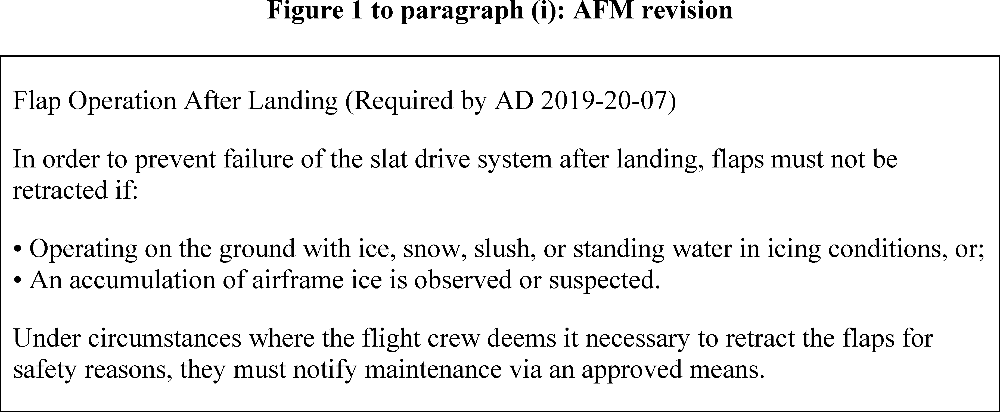
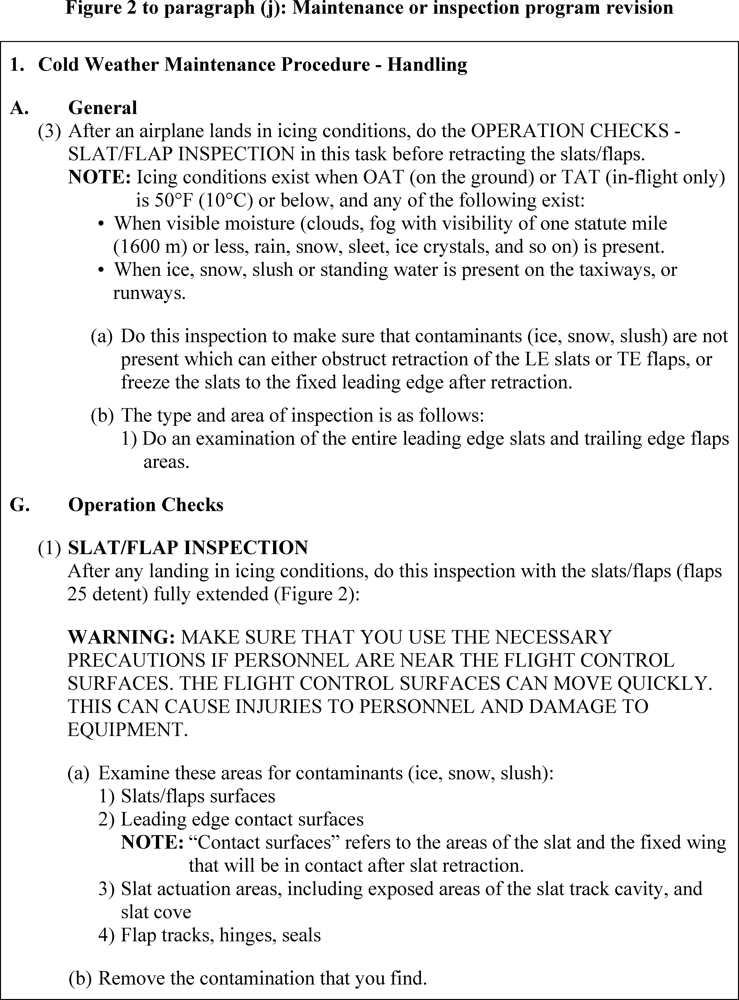
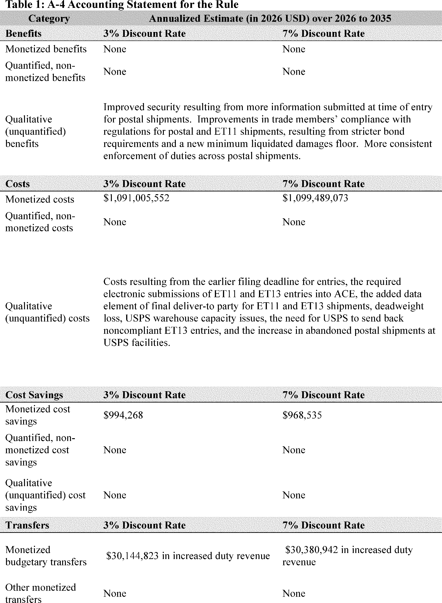
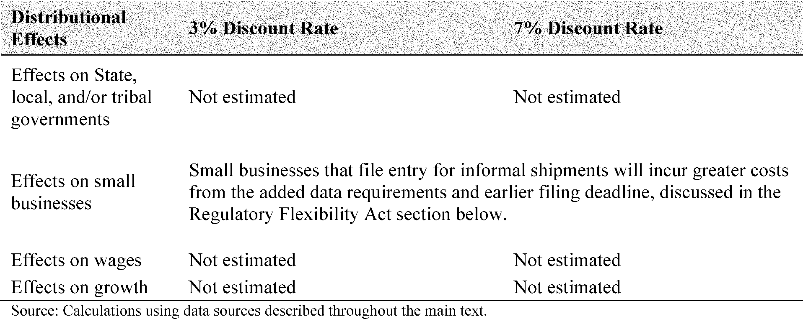
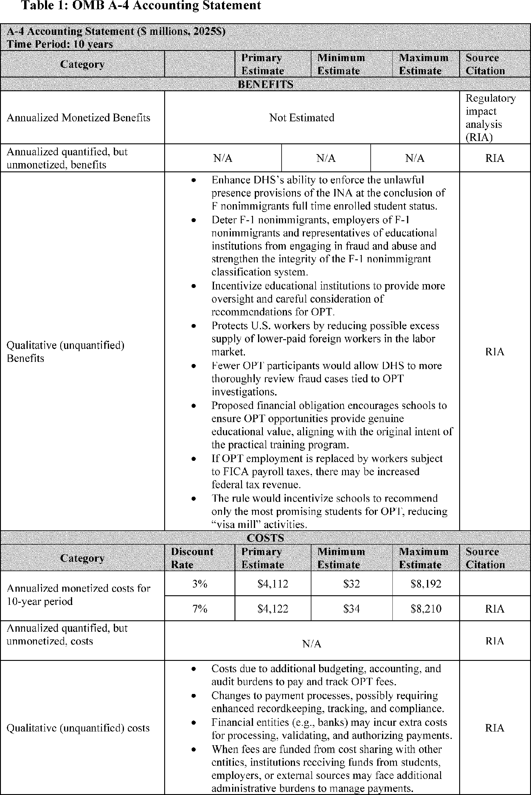
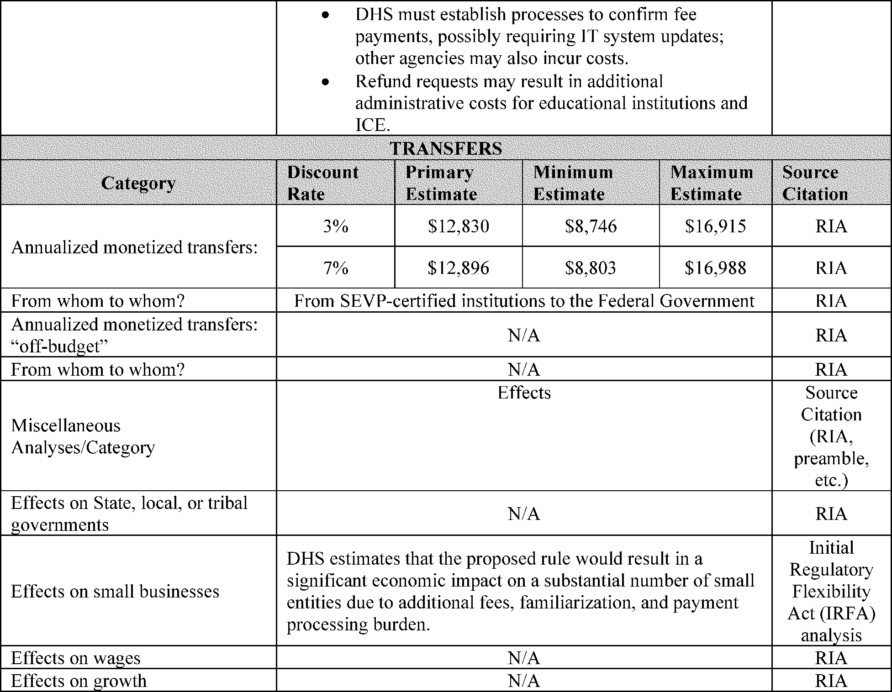
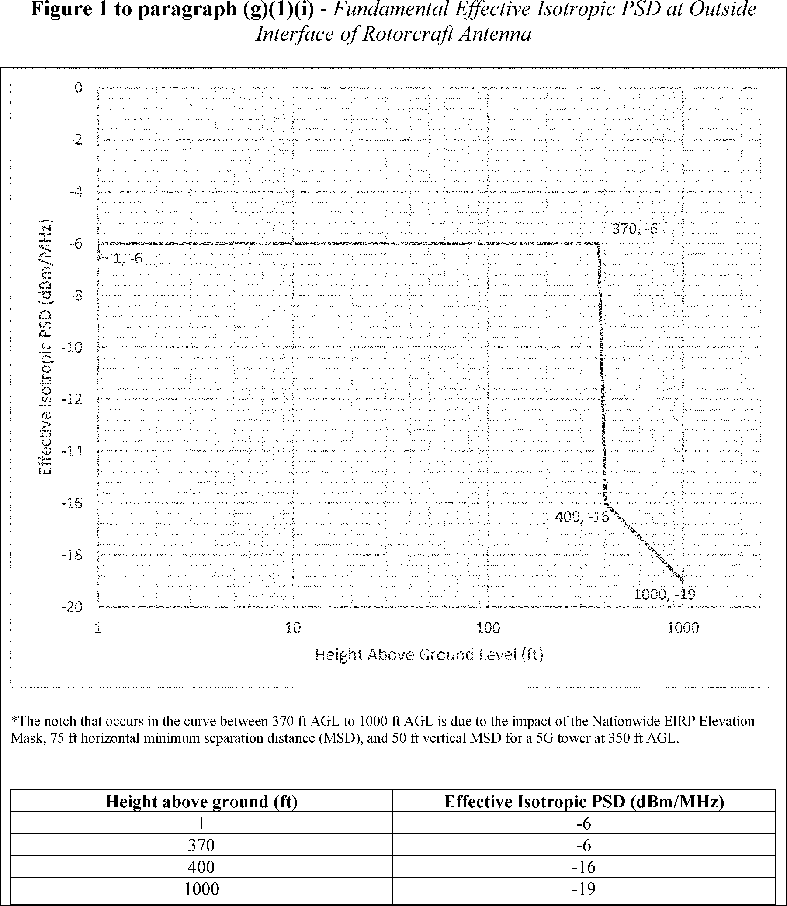
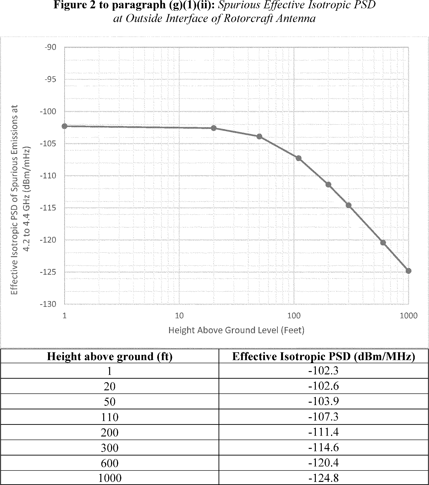

# Daily Digest — 2026-10-08

| | |
|---|---|
| **Digest date** | 2026-10-08 |
| **Data date range** | 2026-10-08 to 2026-10-08 |
| **Generated at** | 2026-10-09T04:03:06Z (UTC) |
| **Pipeline version** | 1da5f55c |
| **Inference** | model layers ran — cli/haiku, opus |
| **Source watermarks** | CREC: 2026-10-07T10:43:05Z · BILLS: 2026-10-09T03:23:25Z · FR: 2026-10-08T17:10:31Z · USCOURTS: 2026-10-09T01:16:49Z · PLAW: 2026-10-07T20:27:22Z |

[Full observed listing for this day](day/2026-10-08.html) — the items our collectors observed for this publication day, mechanical rules applied, frozen at end of day; releases their publishers date on other days are counted there, not listed. This digest is the canonical record.

All items below cite the govinfo package (and granule, where applicable) they
summarize. Selection is mechanical; each item states the rule that included
it. See the Coverage Statement at the end for a full accounting of what was
published, what was summarized, and what was excluded and why.

---

## Contents

- [Day in Review](#day-in-review)
- [1. Congressional Floor Activity](#1-congressional-floor-activity)
- [2. Legislation](#2-legislation)
- [3. Federal Register](#3-federal-register)
- [4. Enacted Laws](#4-enacted-laws)
- [5. Judicial Activity](#5-judicial-activity)
- [6. Agency Announcements](#6-agency-announcements)
- [7. Recorded Votes](#7-recorded-votes)
- [8. Bill Actions](#8-bill-actions)
- [9. Presidential Actions](#9-presidential-actions)
- [Terms Used Today](#terms-used-today)
- [Coverage Statement](#coverage-statement)
- [Methodology](#methodology)

---

## Day in Review

The digest carries no floor proceedings or recorded votes from either chamber. It does carry 22 enrolled bills, along with 11 House and 24 Senate introductions. The enrolled measures include the Common Cents Act, which directs the Treasury to stop producing one-cent coins for general circulation. Others raise bankruptcy eligibility debt thresholds, reauthorize the U.S. Commission on International Religious Freedom through 2028, and redesignate Chiricahua National Monument as a national park. Several convey federal land, including to the Lower Elwha Klallam Tribe.

The digest carries 15 final rules, 8 proposed rules and 110 notices, with no presidential documents. Among the proposals are fees of $70,000 for initial and $30,000 for subsequent Optional Practical Training for F-1 students. Another would revise Customs and Border Protection filing requirements for informal entries valued at $2,500 or less. The final rules consist mostly of EPA approvals of state air plans for six states, along with fisheries actions and aircraft directives.

The digest includes 43 appellate and 7 national court opinions, plus 808 district and 8 bankruptcy opinions. The Third Circuit reinstated Sandoz's contract and tortious-interference claims against United Therapeutics and affirmed dismissal of its antitrust claims. On remand from the Supreme Court, the Eleventh Circuit affirmed summary judgment for the United States on Federal Tort Claims Act claims but reversed qualified immunity for an FBI agent. The Court of International Trade's seven hardwood plywood antidumping opinions include an order excluding two companies at zero duty rates.

*Composed from the summarized items below and the day's mechanical
counts; all specifics are cited in their sections.*

---

## 1. Congressional Floor Activity

No Congressional Record issue was observed on this day. The Record for a day's proceedings is typically published by govinfo the following morning; it appears in the digest for the day it is observed ([how our clocks work](faq.html#fapds-three-clocks)).

### 1.1 Senate

No Senate floor items met the selection thresholds. 0 floor granule(s) are accounted for in the Coverage Statement.

### 1.2 House of Representatives

No House floor items met the selection thresholds. 0 floor granule(s) are accounted for in the Coverage Statement.

### 1.3 Recorded Votes

No recorded votes were published in this issue of the Congressional Record.

---

## 2. Legislation

Source: Congressional Bills (BILLS), text versions published 2026-10-08 to 2026-10-08.

### 2.1 Counts by Stage

| Stage (bill text version) | Count |
|---|---|
| Introduced (ih/is) | 35 |
| Reported (rh/rs) | 0 |
| Engrossed (eh/es) | 0 |
| Enrolled (enr) | 22 |
| Other versions | 0 |
| **Total bill texts published** | **57** |

### 2.2 Bills Listed by Mechanical Rule

Tags: legislative · model keys: federal land transfer · medicare wheelchairs · penny production

*In plain terms: 22 bills include halting penny production, updating Medicare wheelchair payments, raising bankruptcy thresholds, and routine park redesignations and federal land transfers.*

Bills below are listed because they matched at least one listing rule; the
matching rule is stated per item. All other bill texts are counted above and
accounted for in the Coverage Statement.

- **H. R. 10159 (enr) — HR 10159 ENR: To authorize the Secretary of the Army to convey to the State of North Carolina a certain parcel of real property located at Fort Bragg, North Carolina, on which the State shall construct a veterans’ State home, and for other purposes.** — Authorizes the Secretary of the Army to convey approximately 20 acres of property at Fort Bragg in Harnett County, North Carolina, to the State of North Carolina without consideration for the construction of a veterans' state home. The State shall cover all conveyance costs, and the Secretary retains reversionary interest if the property is not used for state home activities.
  - *In plain terms:* The Army transfers about 20 acres at Fort Bragg to North Carolina for building a veterans' home, with the state covering costs and the Army retaining the right to reclaim it if not used accordingly.
  - Included because: BILLS-SEL-01 — reached stage: reported/enrolled/calendar (document dated 2026-10-09)
  - Source: [BILLS-119hr10159enr](https://www.govinfo.gov/app/details/BILLS-119hr10159enr)
- **H. R. 10167 (enr) — HR 10167 ENR: Common Cents Act** — Directs the Secretary of the Treasury to cease production of one-cent coins for general circulation, while permitting them to remain legal tender. Permits cash transactions to be rounded to the nearest five cents according to specified rounding rules, and requires the Federal Reserve Board to develop and report on a strategic plan for maintaining penny distribution system stability.
  - *In plain terms:* Stop making pennies for circulation but keep them legal, allow rounding cash transactions to the nearest nickel, and the Federal Reserve must develop a plan to keep the penny distribution system stable.
  - Included because: BILLS-SEL-01 — reached stage: reported/enrolled/calendar (document dated 2026-10-09)
  - Source: [BILLS-119hr10167enr](https://www.govinfo.gov/app/details/BILLS-119hr10167enr)
- **H. R. 1190 (enr) — HR 1190 ENR: Expanding Access to Capital for Rural Job Creators Act** — Amends the Securities Exchange Act of 1934 to expand access to capital for rural-area small businesses. The amendment adds rural-area small businesses to capital access provisions previously applied to women-owned small businesses.
  - *In plain terms:* The law expands access to capital for small businesses in rural areas, adding them to provisions that previously applied only to women-owned small businesses.
  - Included because: BILLS-SEL-01 — reached stage: reported/enrolled/calendar (document dated 2026-10-09)
  - Source: [BILLS-119hr1190enr](https://www.govinfo.gov/app/details/BILLS-119hr1190enr)
- **H. R. 1550 (enr) — HR 1550 ENR: Strengthening America’s Turning Point Act** — Redesignates Saratoga National Historical Park as Saratoga National Battlefield Park. The Act updates all references to the park in federal law and records to reflect the new designation.
  - *In plain terms:* This redesignates Saratoga National Historical Park as Saratoga National Battlefield Park and updates all federal references to reflect the new name.
  - Included because: BILLS-SEL-01 — reached stage: reported/enrolled/calendar (document dated 2026-10-09)
  - Source: [BILLS-119hr1550enr](https://www.govinfo.gov/app/details/BILLS-119hr1550enr)
- **H. R. 1703 (enr) — HR 1703 ENR: Choices for Increased Mobility Act of 2026** — Amends the Medicare program to clarify payment rules for ultralightweight manual wheelchairs beginning January 1, 2028. The Secretary must establish separate HCPCS codes for wheelchair bases depending on construction materials, and sets specific payment and beneficiary charge rules for wheelchairs with titanium or carbon fiber components.
  - *In plain terms:* Starting January 1, 2028, Medicare clarifies payment rules for ultralightweight manual wheelchairs, requiring separate billing codes based on construction materials and setting payment rates for titanium and carbon fiber wheelchairs.
  - Included because: BILLS-SEL-01 — reached stage: reported/enrolled/calendar (document dated 2026-10-09)
  - Source: [BILLS-119hr1703enr](https://www.govinfo.gov/app/details/BILLS-119hr1703enr)
- **H. R. 1744 (enr) — HR 1744 ENR: United States Commission on International Religious Freedom Reauthorization Act of 2026** — Extends authorization of annual appropriations for the United States Commission on International Religious Freedom through December 31, 2028. Amends the International Religious Freedom Act of 1998 to extend the Commission's authorization period.
  - *In plain terms:* This extends funding authorization for the U.S. Commission on International Religious Freedom through December 31, 2028, under the International Religious Freedom Act of 1998.
  - Included because: BILLS-SEL-01 — reached stage: reported/enrolled/calendar (document dated 2026-10-09)
  - Source: [BILLS-119hr1744enr](https://www.govinfo.gov/app/details/BILLS-119hr1744enr)
- **H. R. 1945 (enr) — HR 1945 ENR: America's National Churchill Museum National Historic Landmark Act** — The Act designates the America's National Churchill Museum at Westminster College in Fulton, Missouri as a National Historic Landmark. The Secretary of the Interior may enter into cooperative agreements for site protection and educational programs, and is directed to conduct a study evaluating national significance and feasibility of National Park System designation.
  - *In plain terms:* The America's National Churchill Museum in Fulton, Missouri becomes a National Historic Landmark, and the Interior Secretary must study whether it should become part of the National Park System.
  - Included because: BILLS-SEL-01 — reached stage: reported/enrolled/calendar (document dated 2026-10-09)
  - Source: [BILLS-119hr1945enr](https://www.govinfo.gov/app/details/BILLS-119hr1945enr)
- **H. R. 227 (enr) — HR 227 ENR: Clergy Act** — The Act allows ordained, commissioned, or licensed members of the clergy, members of religious orders, and Christian Science practitioners to revoke their prior exemptions from Social Security coverage. Revocations must be filed by the due date of the Federal income tax return for the applicant's second taxable year beginning after December 31, 2028, and the Act directs the IRS and Social Security Administration to develop a plan to inform eligible individuals of this opportunity.
  - *In plain terms:* Clergy members, religious order members, and Christian Science practitioners can revoke their past exemptions from Social Security, with applications due by the second tax return date after December 31, 2028.
  - Included because: BILLS-SEL-01 — reached stage: reported/enrolled/calendar (document dated 2026-10-09)
  - Source: [BILLS-119hr227enr](https://www.govinfo.gov/app/details/BILLS-119hr227enr)
- **H. R. 2388 (enr) — HR 2388 ENR: Lower Elwha Klallam Tribe Project Lands Restoration Act** — The Act transfers approximately 1,082.63 acres of Federal land in Washington to the Lower Elwha Klallam Tribe as part of the Lower Elwha Indian Reservation. The transferred land is subject to Wild and Scenic Rivers Act management standards where applicable, gaming is prohibited on the property, and the Act preserves treaty rights under the Treaty of Point No Point.
  - *In plain terms:* About 1,082.63 acres of federal land in Washington transfer to the Lower Elwha Klallam Tribe for their reservation, subject to river protection standards, with no gaming allowed and treaty rights preserved.
  - Included because: BILLS-SEL-01 — reached stage: reported/enrolled/calendar (document dated 2026-10-09)
  - Source: [BILLS-119hr2388enr](https://www.govinfo.gov/app/details/BILLS-119hr2388enr)
- **H. R. 3620 (enr) — HR 3620 ENR: Southcentral Foundation Land Transfer Act of 2025** — The Act directs the Secretary of Health and Human Services to convey approximately 3.372 acres of Federal property in Anchorage, Alaska to the Southcentral Foundation for health and social services programs. The conveyance is by warranty deed with no consideration required, no imposed conditions, and no reversionary interest, while the Secretary retains a necessary easement and liability for environmental contamination occurring before the transfer.
  - *In plain terms:* Health and Human Services transfers about 3.372 acres of federal property in Anchorage, Alaska to the Southcentral Foundation for health services, with no payment required and no reversionary interest.
  - Included because: BILLS-SEL-01 — reached stage: reported/enrolled/calendar (document dated 2026-10-09)
  - Source: [BILLS-119hr3620enr](https://www.govinfo.gov/app/details/BILLS-119hr3620enr)
- **H. R. 4307 (enr) — HR 4307 ENR: Enhancing Detection of Human Trafficking Act** — The Act directs the Secretary of Labor to establish a training program for Department employees on identifying human trafficking and assisting law enforcement. Training must begin within 180 days and cover detection methods, identification of trafficking victims and suspected traffickers, and referral procedures, with annual reports to Congress required on program activities and cases referred to the Department of Justice.
  - *In plain terms:* The Labor Department must create a training program for identifying human trafficking and assisting law enforcement, starting within 180 days and requiring annual reports to Congress.
  - Included because: BILLS-SEL-01 — reached stage: reported/enrolled/calendar (document dated 2026-10-09)
  - Source: [BILLS-119hr4307enr](https://www.govinfo.gov/app/details/BILLS-119hr4307enr)
- **H. R. 5235 (enr) — HR 5235 ENR: Skills-Based Federal Contracting Act of 2025** — The Act prohibits federal contracting officers from setting minimum education requirements in contract solicitations unless they provide written justification explaining why agency needs cannot be met without such requirements. The Office of Management and Budget must issue implementation guidance within 180 days, and the Government Accountability Office must evaluate agency compliance within three years.
  - *In plain terms:* Federal contracting officers cannot require minimum education in contracts without written justification explaining why needed; OMB must issue guidance within 180 days and GAO must evaluate compliance within three years.
  - Included because: BILLS-SEL-01 — reached stage: reported/enrolled/calendar (document dated 2026-10-09)
  - Source: [BILLS-119hr5235enr](https://www.govinfo.gov/app/details/BILLS-119hr5235enr)
- **H. R. 5284 (enr) — HR 5284 ENR: Claiming Age Clarity Act** — This law requires the Social Security Administration to replace certain terminology in its materials by January 1, 2027, including changing 'early eligibility age' to 'minimum monthly benefit age,' replacing 'full retirement age' and 'normal retirement age' with 'standard monthly benefit age,' and removing references to 'delayed retirement credit' in favor of 'maximum monthly benefit age.'
  - *In plain terms:* Social Security must change terminology by January 1, 2027: 'early eligibility age' becomes 'minimum monthly benefit age,' 'full retirement age' becomes 'standard monthly benefit age,' and remove 'delayed retirement credit' references.
  - Included because: BILLS-SEL-01 — reached stage: reported/enrolled/calendar (document dated 2026-10-09)
  - Source: [BILLS-119hr5284enr](https://www.govinfo.gov/app/details/BILLS-119hr5284enr)
- **H. R. 6380 (enr) — HR 6380 ENR: Chiricahua National Park Act** — This law redesignates Chiricahua National Monument in Arizona as Chiricahua National Park with existing boundaries unchanged. It requires the Secretary of the Interior to protect traditional cultural and religious sites within the park and to provide Indian Tribes access for traditional uses, with authority to temporarily close specific areas as needed.
  - *In plain terms:* Chiricahua National Monument in Arizona becomes Chiricahua National Park with the same boundaries, and the Interior Secretary must protect tribal cultural sites and allow tribal access for traditional uses.
  - Included because: BILLS-SEL-01 — reached stage: reported/enrolled/calendar (document dated 2026-10-09)
  - Source: [BILLS-119hr6380enr](https://www.govinfo.gov/app/details/BILLS-119hr6380enr)
- **H. R. 7022 (enr) — HR 7022 ENR: Mystic Alerts Act** — This law establishes a framework allowing mobile service providers to transmit emergency alerts by satellite to subscribers. Providers must file election notices with the FCC, comply with technical standards, provide opt-out options, and offer the service at no additional charge, with the FCC required to issue implementing regulations within 18 months.
  - *In plain terms:* Mobile service providers can send emergency alerts by satellite after notifying the FCC, meeting technical standards, providing opt-out options, and charging no extra fee; FCC must issue implementing rules within 18 months.
  - Included because: BILLS-SEL-01 — reached stage: reported/enrolled/calendar (document dated 2026-10-09)
  - Source: [BILLS-119hr7022enr](https://www.govinfo.gov/app/details/BILLS-119hr7022enr)
- **H. R. 7730 (enr) — HR 7730 ENR: Bankruptcy Threshold Adjustment Act** — This law increases debt thresholds for bankruptcy eligibility, raising the small business threshold to $7,500,000 and the consumer Chapter 13 threshold to $2,750,000, with these changes applicable to bankruptcy cases filed after enactment.
  - *In plain terms:* Bankruptcy debt limits increase: small business threshold rises to $7,500,000 and Chapter 13 consumer threshold to $2,750,000, applying to cases filed after enactment.
  - Included because: BILLS-SEL-01 — reached stage: reported/enrolled/calendar (document dated 2026-10-09)
  - Source: [BILLS-119hr7730enr](https://www.govinfo.gov/app/details/BILLS-119hr7730enr)
- **H. R. 7831 (enr) — HR 7831 ENR: License to Drill Act** — This law extends the deadline for the Department of Interior to collect fees for oil and gas drilling permit applications under the Mineral Leasing Act from 2026 to 2037, with collected fees during fiscal years 2027-2037 transferred to the BLM Permit Processing Improvement Fund.
  - *In plain terms:* The Interior Department can collect oil and gas drilling permit application fees through 2037 instead of 2026, with collected fees during 2027-2037 going to BLM permit processing.
  - Included because: BILLS-SEL-01 — reached stage: reported/enrolled/calendar (document dated 2026-10-09)
  - Source: [BILLS-119hr7831enr](https://www.govinfo.gov/app/details/BILLS-119hr7831enr)
- **H. R. 8205 (enr) — HR 8205 ENR: Accelerating Access to Critical Therapies for ALS Reauthorization Act of 2026** — This law extends the Accelerating Access to Critical Therapies for ALS Act reauthorization through 2031, adds requirements for safety data review during grant renewals, mandates reporting of serious adverse events to grant-making institutions, and requires the FDA to develop and report on an action plan for rare neurodegenerative disease initiatives within specified timeframes.
  - *In plain terms:* The Accelerating Access to Critical Therapies for ALS Act extends through 2031 with added requirements for safety reviews during renewals, adverse event reporting, and FDA action plan for rare neurodegenerative diseases.
  - Included because: BILLS-SEL-01 — reached stage: reported/enrolled/calendar (document dated 2026-10-09)
  - Source: [BILLS-119hr8205enr](https://www.govinfo.gov/app/details/BILLS-119hr8205enr)
- **H. R. 8352 (enr) — HR 8352 ENR: Criminal History Access Act of 2026** — The Criminal History Access Act of 2026 amends federal law to authorize state peace officer standards and training agencies to access criminal history records. The Attorney General is required to update federal regulations within 180 days to implement the law.
  - *In plain terms:* State peace officer training agencies gain access to criminal history records, with the Attorney General updating federal regulations within 180 days to implement the law.
  - Included because: BILLS-SEL-01 — reached stage: reported/enrolled/calendar (document dated 2026-10-09)
  - Source: [BILLS-119hr8352enr](https://www.govinfo.gov/app/details/BILLS-119hr8352enr)
- **H. R. 837 (enr) — HR 837 ENR: To require the Secretary of Agriculture to convey the Pleasant Valley Ranger District Administrative Site to Gila County, Arizona.** — The bill requires the Secretary of Agriculture to convey approximately 232.9 acres of National Forest System land in Arizona's Tonto National Forest to Gila County if the county requests conveyance within 180 days and pays all associated costs. The conveyed land must be used exclusively for serving and supporting veterans of the Armed Forces, with the land reverting to the United States if used otherwise.
  - *In plain terms:* Agriculture Secretary must convey about 232.9 acres of Arizona National Forest land to Gila County if requested within 180 days and the county pays costs, for exclusively serving veterans.
  - Included because: BILLS-SEL-01 — reached stage: reported/enrolled/calendar (document dated 2026-10-09)
  - Source: [BILLS-119hr837enr](https://www.govinfo.gov/app/details/BILLS-119hr837enr)
- **H. R. 9496 (enr) — HR 9496 ENR: End Tax Penalties on American Hostages Act** — The End Tax Penalties on American Hostages Act amends the Internal Revenue Code to postpone tax deadlines and waive penalties and interest for U.S. nationals unlawfully detained or held hostage abroad. The law requires federal agencies to identify eligible individuals and establishes a program to refund previously paid penalties and interest for eligible individuals covering tax periods from January 1, 2021 forward.
  - *In plain terms:* Tax deadlines are postponed and penalties waived for U.S. nationals unlawfully detained or held hostage abroad, with refunds of previously paid penalties covering tax periods from January 1, 2021 forward.
  - Included because: BILLS-SEL-01 — reached stage: reported/enrolled/calendar (document dated 2026-10-09)
  - Source: [BILLS-119hr9496enr](https://www.govinfo.gov/app/details/BILLS-119hr9496enr)
- **H. R. 997 (enr) — HR 997 ENR: National Taxpayer Advocate Enhancement Act of 2025** — The National Taxpayer Advocate Enhancement Act of 2025 amends the Internal Revenue Code to authorize the National Taxpayer Advocate to appoint counsel in the Office of the Taxpayer Advocate to report directly to the Advocate. The amendment conforms the law to Congressional intent from the 1998 IRS Restructuring and Reform Act.
  - *In plain terms:* The National Taxpayer Advocate can appoint counsel to the Office of the Taxpayer Advocate reporting directly to the Advocate, confirming Congressional intent from the 1998 IRS Restructuring and Reform Act.
  - Included because: BILLS-SEL-01 — reached stage: reported/enrolled/calendar (document dated 2026-10-09)
  - Source: [BILLS-119hr997enr](https://www.govinfo.gov/app/details/BILLS-119hr997enr)

---

## 3. Federal Register

Source: Federal Register (FR), issue of 2026-10-08.

### 3.1 Counts by Document Type

| Document type | Count |
|---|---|
| Rules | 15 |
| Proposed rules | 8 |
| Notices | 110 |
| Presidential documents | 0 |
| **Total FR documents** | **133** |

### 3.2 Rules Published

Tags: department of energy · executive · securities and exchange commission · model keys: air quality · airworthiness directives · fisheries

*In plain terms: 15 final rules include six state air quality approvals, two fisheries quota adjustments, two FAA airworthiness directives, and regulatory updates for Coast Guard, Indian Health Services, and education programs.*

#### DEPARTMENT OF AGRICULTURE

- **Cut Flowers Regulations; Removal of Chrysanthemum White Rust-Related Provisions** (2026-20630; 7 CFR Parts 319) — We are amending the regulations governing the importation of fresh cut flowers to remove requirements for the importation of specific types of cut flowers from the regulations, and to list them in the U.S. Department of Agriculture database called the Agricultural Commodity Import Requirements instead. We are also removing entirely any restrictions on the importation of fresh cut flowers of the genera Chrysanthemum, Leucanthemella, and Nipponanthemum from countries in which chrysanthemum white rust ( Puccinia horiana P. Henn., CWR) is known to exist. This rule will allow us to use a notice-based, streamlined approach to update the import requirements for cut flowers and remove CWR-specific restrictions on the importation of fresh cut flowers. Action: Final rule. Dates: Effective November 9, 2026.
  - *In plain terms:* This removes specific flower import restrictions from regulations, moving them to a database, and eliminates restrictions on importing certain flowers from countries with a particular rust disease.
  - Included because: FR-SEL-01 — document type: final rule (all listed)
  - Source: [FR-2026-10-08 / 2026-20630](https://www.govinfo.gov/app/details/FR-2026-10-08/2026-20630)

#### DEPARTMENT OF COMMERCE

- **Fisheries of the Exclusive Economic Zone Off Alaska; Pacific Cod by Vessels Using Pot Gear in the Central Regulatory Area of the Gulf of Alaska** (2026-20637; 50 CFR Part 679) — NMFS is prohibiting directed fishing for Pacific cod by vessels using pot gear in the Central Regulatory Area of the Gulf of Alaska (GOA). This action is necessary to prevent exceeding the 2026 total allowable catch (TAC) of Pacific cod allocated to vessels using pot gear in the Central Regulatory Area of the GOA. Action: Temporary rule; closure. Dates: Effective 1200 hours, Alaska local time (A.l.t.), October 7, 2026, through 2400 hours, A.l.t., December 31, 2026.
  - *In plain terms:* The fishing agency is prohibiting directed fishing for Pacific cod using pot gear in Alaska's central Gulf to prevent exceeding the 2026 catch limit.
  - Included because: FR-SEL-01 — document type: final rule (all listed)
  - Source: [FR-2026-10-08 / 2026-20637](https://www.govinfo.gov/app/details/FR-2026-10-08/2026-20637)
- **Atlantic Highly Migratory Species; Atlantic Bluefin Tuna Fisheries; General Category October Through November Quota Transfer and Adjustment** (2026-20652; 50 CFR Part 635) — NMFS is adjusting the Atlantic bluefin tuna (BFT) General category October through November 2026 time period subquota by transferring 70.2 metric tons (mt) of quota from the Reserve category. Simultaneously, NMFS is adding 16.7 mt of subquota remaining from the June through August time period to the General category October through November time period. This action results in a total adjusted General category October through November time period subquota of 192.9 mt and an adjusted Reserve category of 42 mt. This action would affect Atlantic Tunas General category (commercial) permitted vessels and Highly Migratory Species (HMS) Charter/Headboat permitted vessels with a commercial sale endorsement when fishing commercially for BFT. Action: Temporary rule; quota transfer and adjustment. Dates: The quota transfer and adjustment is effective October 6, 2026, through November 30, 2026.
  - *In plain terms:* The fishing agency is adjusting the October-November 2026 Atlantic bluefin tuna quota by moving catch allowance between categories and adding unused quota.
  - Included because: FR-SEL-01 — document type: final rule (all listed)
  - Source: [FR-2026-10-08 / 2026-20652](https://www.govinfo.gov/app/details/FR-2026-10-08/2026-20652)

#### DEPARTMENT OF EDUCATION

- **Impact Aid Programs** (2026-20687; 34 CFR Part 222) — The U.S. Department of Education (Department) amends the regulations that govern Impact Aid Programs (IAP) to make technical changes, to include correcting grammatical, spelling, and typographical errors; correcting or updating statutory authority citations and regulatory cross-references; and updating mailing and delivery methods. The technical amendments described in this document do not add or change any regulatory, recordkeeping, or reporting requirement or change interpretation of any regulation. Action: Final regulations. Dates: These regulations are effective November 9, 2026.
  - *In plain terms:* The Department of Education is correcting grammar, spelling, and citation errors in Impact Aid program regulations.
  - Included because: FR-SEL-01 — document type: final rule (all listed)
  - Source: [FR-2026-10-08 / 2026-20687](https://www.govinfo.gov/app/details/FR-2026-10-08/2026-20687)

#### DEPARTMENT OF HEALTH AND HUMAN SERVICES

- **Removal of Obsolete/Suspended Regulations** (2026-20684; 42 CFR Part 136a) — The Indian Health Service (IHS) of the Department of Health and Human Services (HHS or “the Department”) is issuing this final rule to remove regulations appearing in the Code of Federal Regulations (CFR). The regulations duplicate other regulations in the CFR, and have never been implemented by the IHS, and were referred to as “suspended” in a 1999 Federal Register Notice. Removing these regulations will not change the IHS's existing practices or authorities. Action: Final rule. Dates: This final rule is effective on December 7, 2026.
  - *In plain terms:* The Indian Health Service is removing rules from federal regulations that duplicate existing rules and were never put into practice.
  - Included because: FR-SEL-01 — document type: final rule (all listed)
  - Source: [FR-2026-10-08 / 2026-20684](https://www.govinfo.gov/app/details/FR-2026-10-08/2026-20684)
- **Removal of Obsolete Portion of Regulation Relating to Care and Treatment of Ineligible Individuals** (2026-20685; 42 CFR Part 136) — The Indian Health Service (IHS) of the Department of Health and Human Services (HHS or “the Department”) is issuing this final rule to remove obsolete language appearing in the Code of Federal Regulations (CFR). The language refers to an outdated process for determining what the IHS will charge for care to non-IHS-beneficiaries. Eliminating this obsolete language will not change IHS's existing practices or authorities. Action: Final rule. Dates: This rule is effective on December 7, 2026.
  - *In plain terms:* The Indian Health Service is removing outdated language from rules about charging non-beneficiaries for care.
  - Included because: FR-SEL-01 — document type: final rule (all listed)
  - Source: [FR-2026-10-08 / 2026-20685](https://www.govinfo.gov/app/details/FR-2026-10-08/2026-20685)

#### DEPARTMENT OF HOMELAND SECURITY

- **Special Local Regulations; San Francisco Bay Navy Fleet Week Parade of Ships and Blue Angels Demonstration, San Francisco, CA** (2026-20632; 33 CFR Part 100) — The Coast Guard will enforce the special local regulation in the navigable waters of the San Francisco Bay for the San Francisco Bay Navy Fleet Week Parade of Ships and Blue Angels survey flight and demonstration days from October 8 through October 11, 2026. This action is necessary to ensure the safety of event participants and spectators. During the enforcement period, unauthorized persons or vessels are prohibited from entering into, transiting through, or anchoring in the regulated area unless authorized by the Patrol Commander (PATCOM). This notification of enforcement (NOE) announces the dates and times for enforcement. Action: Notification of enforcement of regulation. Dates: The regulations in 33 CFR 100.1105 will be enforced from noon until 6 p.m. on October 8, 2026, and from 9 a.m. until 7 p.m. on October 9 through October 11, 2026, for the regulated areas as identified in the SUPPLEMENTARY INFORMATION section below for the dates and times specified.
  - *In plain terms:* The Coast Guard will enforce regulations from October 8-11, 2026, in San Francisco Bay for Navy Fleet Week, prohibiting unauthorized vessels from entering the area.
  - Included because: FR-SEL-01 — document type: final rule (all listed)
  - Source: [FR-2026-10-08 / 2026-20632](https://www.govinfo.gov/app/details/FR-2026-10-08/2026-20632)

#### DEPARTMENT OF TRANSPORTATION

- **Airworthiness Directives; Engine Alliance Engines** (2026-20666; 14 CFR Part 39) — The FAA is adopting a new airworthiness directive (AD) for certain Engine Alliance (EA) Model GP7270, GP7272, and GP7277 engines. This AD was prompted by a report of an aborted takeoff that resulted from an uncontained failure of the high-pressure turbine (HPT) interstage seal. This AD requires removal from service and replacement of the HPT interstage seal with a part eligible for installation. The FAA is issuing this AD to address the unsafe condition on these products. Action: Final rule; request for comments. Dates: This AD is effective October 23, 2026. The Director of the Federal Register approved the incorporation by reference of a certain publication listed in this AD as of October 23, 2026. The FAA must receive comments on this AD by November 23, 2026.
  - *In plain terms:* The FAA is requiring replacement of turbine seals in certain Engine Alliance engines to address failure risk.
  - Included because: FR-SEL-01 — document type: final rule (all listed)
  - Source: [FR-2026-10-08 / 2026-20666](https://www.govinfo.gov/app/details/FR-2026-10-08/2026-20666)
- **Airworthiness Directives; The Boeing Company Airplanes** (2026-20680; 14 CFR Part 39) — The FAA is superseding Airworthiness Directive (AD) 2019-20-07, which applied to The Boeing Company Model 787-8, 787-9, and 787-10 airplanes. AD 2019-20-07 required repetitive operational checks of the leading edge (LE) outboard (OB) slats and applicable on-condition actions. AD 2019-20-07 also required revising the airplane flight manual (AFM) to prohibit flap retraction under icing conditions after landing and revising the existing maintenance or inspection program, as applicable, to incorporate a new operation check. This AD was prompted by the manufacturer developing further actions to address the unsafe condition. This AD continues to require all requirements of AD 2019-20-07. This AD would also require replacing the LE outboard geared rotary actuator (GRA) with a LE outboard lockout actuator (LEOLA) at leading edge OB slat locations and revising the existing maintenance or inspection program, as applicable, to incorporate a new certification maintenance requirement (CMR), which terminates the retained requirements of AD 2019-20-07. This AD also removes airplanes from the applicability. The FAA is issuing this AD to address the unsafe condition on these products. Action: Final rule. Dates: This AD is effective November 12, 2026. The Director of the Federal Register approved the incorporation by reference of a certain publication listed in this AD as of November 12, 2026. The Director of the Federal Register approved the incorporation by reference of a certain other publication listed in this AD as of October 11, 2019 (84 FR 54765, October 11, 2019).
  - *In plain terms:* The FAA is replacing a prior directive with updated requirements including replacing wing slat parts and updating maintenance procedures for Boeing 787 airplanes.
  - Included because: FR-SEL-01 — document type: final rule (all listed)
  - Source: [FR-2026-10-08 / 2026-20680](https://www.govinfo.gov/app/details/FR-2026-10-08/2026-20680)
  -  *Source graphic 1 of 6 from 2026-20680.*
  -  *Source graphic 2 of 6 from 2026-20680.*
  - *Graphics not rendered here: 4 of 6 — see the [source PDF](https://www.govinfo.gov/content/pkg/FR-2026-10-08/pdf/FR-2026-10-08.pdf).*

#### ENVIRONMENTAL PROTECTION AGENCY

- **Air Plan Approval; Missouri; Construction Permit Exemptions** (2026-20634; 40 CFR Part 52) — The U.S. Environmental Protection Agency (EPA) is approving revisions to the Missouri State Implementation Plan (SIP) received on February 10, 2026. The submission revises Missouri's regulation on construction permit exemptions in its Minor New Source Review (NSR) program. These revisions refine exemptions for emergency generators, update references to other rules, and update recordkeeping requirements. The EPA's final approval of this rule revision is being done in accordance with the requirements of the Clean Air Act (CAA). Action: Final rule. Dates: This rule is effective November 9, 2026.
  - *In plain terms:* The EPA is approving Missouri's updated rules that refine which sources need construction permits, including changes to emergency generator exemptions and recordkeeping requirements.
  - Included because: FR-SEL-01 — document type: final rule (all listed)
  - Source: [FR-2026-10-08 / 2026-20634](https://www.govinfo.gov/app/details/FR-2026-10-08/2026-20634)
- **Air Plan Approval; Maryland; Reasonably Available Control Technology for Municipal Waste Combustors** (2026-20635; 40 CFR Part 52) — The U.S. Environmental Protection Agency (EPA) is approving state implementation plan (SIP) revisions submitted by the State of Maryland. The SIP revisions consist of a regulation that implements statewide reasonably available control technology (RACT) requirements by limiting air emissions of oxides of nitrogen (NO X ) from municipal waste combustors (MWCs) in Maryland. This action is being taken under the Clean Air Act (CAA). Action: Final rule. Dates: This final rule is effective on November 9, 2026.
  - *In plain terms:* The EPA is approving Maryland's rules that limit nitrogen oxide pollution from garbage-burning power plants.
  - Included because: FR-SEL-01 — document type: final rule (all listed)
  - Source: [FR-2026-10-08 / 2026-20635](https://www.govinfo.gov/app/details/FR-2026-10-08/2026-20635)
- **Air Plan Approval; GA; Removal of Nonattainment Area New Source Review** (2026-20636; 40 CFR Part 52) — The U.S. Environmental Protection Agency (EPA or Agency) is approving a State Implementation Plan (SIP) revision submitted by the State of Georgia through the Georgia Environmental Protection Division (EPD) on June 27, 2024. The revision removes permitting requirements related to nonattainment, including nonattainment new source review (NNSR), from Georgia's SIP as obsolete, removes certain provisions related to the use of emission reduction credits (ERCs), and makes other changes based upon the lack of any areas designated as nonattainment for the National Ambient Air Quality Standards (NAAQS) in Georgia. The EPA is approving these changes pursuant to the Clean Air Act (CAA or Act). Action: Final rule. Dates: This rule is effective November 9, 2026.
  - *In plain terms:* The EPA is approving Georgia's removal of permitting rules for nonattainment areas since Georgia no longer has areas that fail to meet air quality standards.
  - Included because: FR-SEL-01 — document type: final rule (all listed)
  - Source: [FR-2026-10-08 / 2026-20636](https://www.govinfo.gov/app/details/FR-2026-10-08/2026-20636)
- **Approval and Promulgation of State Implementation Plans; New Jersey; RACT Certifications for the 2008 and 2015 Ozone National Ambient Air Quality Standards** (2026-20638; 40 CFR Part 52) — The Environmental Protection Agency (EPA) is approving a State Implementation Plan (SIP) revision submitted by the State of New Jersey for purposes of certifying and meeting the requirements for Reasonably Available Control Technology (RACT) for the Serious classification of the 2008 and the Moderate classification of the 2015 8-hour ozone National Ambient Air Quality Standards (NAAQS). The EPA is also approving that the SIP revisions fulfill SIP requirements pertaining to the Ozone Transport Region (OTR) for the 2015 ozone NAAQS. These actions are being taken in accordance with the requirements of the Clean Air Act (CAA). Action: Final rule. Dates: This final rule is effective on November 9, 2026.
  - *In plain terms:* The EPA is approving New Jersey's certification that it uses required pollution control technology to meet federal ozone standards.
  - Included because: FR-SEL-01 — document type: final rule (all listed)
  - Source: [FR-2026-10-08 / 2026-20638](https://www.govinfo.gov/app/details/FR-2026-10-08/2026-20638)
- **Air Plan Approval; Oklahoma; Interstate Transport Requirements for the 2010 SO 2 NAAQS** (2026-20640; 40 CFR Part 52) — Pursuant to the Federal Clean Air Act (CAA or the Act), the U.S. Environmental Protection Agency (EPA) is approving portions of the State Implementation Plan (SIP) submittal from the State of Oklahoma demonstrating that the State satisfies the interstate transport requirements of the CAA for the 2010 1-hour sulfur dioxide (SO 2 ) primary National Ambient Air Quality Standard (NAAQS). This provision requires each State's implementation plan to contain adequate requirements prohibiting the interstate transport of air pollution in amounts that will contribute significantly to nonattainment, or interfere with maintenance, of a NAAQS in any other State. Action: Final rule. Dates: This rule is effective on November 9, 2026.
  - *In plain terms:* The EPA is approving Oklahoma's demonstration that its plan prevents its pollution from traveling to and harming air quality in other states.
  - Included because: FR-SEL-01 — document type: final rule (all listed)
  - Source: [FR-2026-10-08 / 2026-20640](https://www.govinfo.gov/app/details/FR-2026-10-08/2026-20640)
- **Air Plan Approval; Kentucky; Louisville Area Limited Maintenance Plan for the 1997 8-Hour Ozone NAAQS** (2026-20641; 40 CFR Part 52) — The U.S. Environmental Protection Agency (EPA or Agency) is approving a State Implementation Plan (SIP) revision submitted by the Commonwealth of Kentucky through the Energy and Environment Cabinet (Cabinet) on behalf of the Louisville Metro Air Pollution Control District (District) via a letter dated June 3, 2024. The SIP revision consists of a Limited Maintenance Plan (LMP) for the Kentucky portion of the bi-state Louisville, Kentucky-Indiana 1997 8-hour ozone maintenance area (the “bi-state Louisville Area”). The Kentucky portion of the bi-state Louisville Area is comprised of Bullitt, Jefferson, and Oldham Counties in Kentucky (the “Louisville Area”). The EPA is approving the Louisville Area's LMP because it provides for the maintenance of the 1997 8-hour ozone National Ambient Air Quality Standards (NAAQS) within the bi-state Louisville Area through the end of the second 10-year portion of the maintenance period. The effect of this action is to make certain commitments related to maintenance of the 1997 8-hour ozone NAAQS in the Louisville Area federally enforceable as part of the Kentucky SIP. Action: Final rule. Dates: This rule is effective November 9, 2026.
  - *In plain terms:* The EPA is approving Kentucky's plan maintaining ozone air quality in the Louisville area through the end of the second 10-year maintenance period.
  - Included because: FR-SEL-01 — document type: final rule (all listed)
  - Source: [FR-2026-10-08 / 2026-20641](https://www.govinfo.gov/app/details/FR-2026-10-08/2026-20641)

### 3.3 Proposed Rules Published

Tags: department of energy · executive · securities and exchange commission · model keys: air quality · airworthiness directives · student visa fees

*In plain terms: 8 proposed rules include OPT fees for F-1 students and EPA air quality standards, plus three FAA airworthiness directives and amendments to clinical, customs, and agricultural regulations.*

#### DEPARTMENT OF AGRICULTURE

- **Almonds Grown in California; Amendment to the Marketing Order** (2026-20622; 7 CFR Part 981) — This rulemaking proposes an amendment to Marketing Order No. 981, which regulates the handling of almonds grown in California. The proposed amendment would establish the authority to borrow funds from a commercial lending institution. Action: Proposed rule and referendum order. Dates: The referendum will be conducted from November 2 through November 20, 2026. The representative period for the referendum is August 1, 2025, through July 31, 2026.
  - *In plain terms:* This proposes allowing the almond marketing program to borrow money from commercial lenders.
  - Included because: FR-SEL-02 — document type: proposed rule (all listed)
  - Source: [FR-2026-10-08 / 2026-20622](https://www.govinfo.gov/app/details/FR-2026-10-08/2026-20622)

#### DEPARTMENT OF HEALTH AND HUMAN SERVICES

- **Clinical Laboratory Improvement Amendments of 1988 (CLIA); Virtual Access, Gynecologic Cytology Proficiency Testing (PT), Personnel Qualifications, and Other Changes** (2026-20613; 42 CFR Part 493) — This proposed rule would amend the Clinical Laboratory Improvement Amendments of 1988 (CLIA) regulations to allow for virtual access under the CLIA certificate of the primary testing laboratory that generated the data, with the exception of the subspecialty of cytology, and the use of digital images for gynecologic cytology proficiency testing. This proposed rule also includes proposed changes to personnel qualification requirements and other proposed changes pertaining to SARS-CoV-2 reporting requirements, certificate requirements, test reporting requirements, enforcement requirements, public consultation requirements, and editorial and technical updates. These proposed updates aim to strengthen the Federal oversight of clinical laboratories and ensure accurate and reliable patient test results while adapting to modern technological capabilities and industry needs, including workforce shortages. Action: Proposed rule. Dates: To be assured consideration, comments must be received at one of the addresses provided below, by December 7, 2026.
  - *In plain terms:* This proposes allowing clinical laboratories to use virtual access and digital images for certain testing while updating personnel rules and other requirements.
  - Included because: FR-SEL-02 — document type: proposed rule (all listed)
  - Source: [FR-2026-10-08 / 2026-20613](https://www.govinfo.gov/app/details/FR-2026-10-08/2026-20613)

#### DEPARTMENT OF HOMELAND SECURITY

- **Low-Value Shipments** (2026-20650; 19 CFR Parts 113, 128, 141, 143, 145) — This document proposes to amend the U.S. Customs and Border Protection regulations to modify filing requirements for informal entries of goods valued at $2,500 or less and to establish a new electronic informal entry type for merchandise entering through the mail environment. This document also proposes other related changes such as requiring an additional data element for carriers pertaining to mail shipments and imposing bonding requirements for certain informal entries. Action: Notice of proposed rulemaking. Dates: Comments on the rule must be received on or before December 7, 2026.
  - *In plain terms:* This proposes simplifying filing requirements for goods worth $2,500 or less and creating a new electronic entry option for mail shipments.
  - Included because: FR-SEL-02 — document type: proposed rule (all listed)
  - Source: [FR-2026-10-08 / 2026-20650](https://www.govinfo.gov/app/details/FR-2026-10-08/2026-20650)
  -  *Source graphic 1 of 22 from 2026-20650.*
  -  *Source graphic 2 of 22 from 2026-20650.*
  - *Graphics not rendered here: 20 of 22 — see the [source PDF](https://www.govinfo.gov/content/pkg/FR-2026-10-08/pdf/FR-2026-10-08.pdf).*
- **Optional Practical Training Fees** (2026-20660; 8 CFR Part 214) — This rule proposes new fees for Optional Practical Training (OPT) to combat fraud, strengthen the integrity of the immigration system, and protect U.S. workers. The following fees would apply for each F-1 nonimmigrant student to engage in OPT through a Student and Exchange Visitor Program-certified institution: $70,000 for initial OPT; and $30,000 for any subsequent OPT. Action: Notice of proposed rulemaking (NPRM). Dates: Comments must be received on or before November 9, 2026. Information collection comment period: Comments on the information collection described in the Paperwork Reduction Act section below must be received by December 7, 2026.
  - *In plain terms:* This proposes charging F-1 student visa holders $70,000 for initial job training authorization and $30,000 for additional training periods.
  - Included because: FR-SEL-02 — document type: proposed rule (all listed)
  - Source: [FR-2026-10-08 / 2026-20660](https://www.govinfo.gov/app/details/FR-2026-10-08/2026-20660)
  -  *Source graphic 1 of 18 from 2026-20660.*
  -  *Source graphic 2 of 18 from 2026-20660.*
  - *Graphics not rendered here: 16 of 18 — see the [source PDF](https://www.govinfo.gov/content/pkg/FR-2026-10-08/pdf/FR-2026-10-08.pdf).*

#### DEPARTMENT OF TRANSPORTATION

- **Airworthiness Directives; Various Helicopters** (2026-20677; 14 CFR Part 39) — The FAA proposes to adopt a new airworthiness directive (AD) for all helicopters equipped with a radio (also known as radar) altimeter. This proposed AD was prompted by the determination that radio altimeters cannot be relied upon to perform their intended function if they experience interference from wireless broadband operations in the 3.7 to 3.98 GHz frequency band (5G Lower C-Band) while operating in Canadian airspace. This proposed AD would require revising the existing rotorcraft flight manual (RFM) for the helicopter to incorporate limitations prohibiting certain operations requiring radio altimeter data when operating within Canadian airspace. The FAA is proposing this AD to address the unsafe condition on these products. Action: Notice of proposed rulemaking (NPRM). Dates: The FAA must receive comments on this proposed AD by November 23, 2026.
  - *In plain terms:* The FAA proposes requiring helicopters to update flight manuals prohibiting certain operations in Canadian airspace where radio altimeters may not work due to wireless interference.
  - Included because: FR-SEL-02 — document type: proposed rule (all listed)
  - Source: [FR-2026-10-08 / 2026-20677](https://www.govinfo.gov/app/details/FR-2026-10-08/2026-20677)
  -  *Source graphic 1 of 3 from 2026-20677.*
  -  *Source graphic 2 of 3 from 2026-20677.*
  - *Graphics not rendered here: 1 of 3 — see the [source PDF](https://www.govinfo.gov/content/pkg/FR-2026-10-08/pdf/FR-2026-10-08.pdf).*
- **Airworthiness Directives; Airbus SAS Airplanes** (2026-20700; 14 CFR Part 39) — The FAA proposes to adopt a new airworthiness directive (AD) for all Airbus SAS Model A318, A319, A320, and A321 series airplanes. This proposed AD was prompted by a finding that severe corrosion could occur on affected slotted nuts located at the wing thrust spigots. This proposed AD would require repetitive inspections of the affected slotted nuts and applicable corrective actions. This proposed AD would also prohibit the installation of affected parts. The FAA is proposing this AD to address the unsafe condition on these products. Action: Notice of proposed rulemaking (NPRM). Dates: The FAA must receive comments on this proposed AD by November 23, 2026.
  - *In plain terms:* The FAA proposes requiring inspection and repair of corrosion-prone nuts on Airbus A318-321 series aircraft.
  - Included because: FR-SEL-02 — document type: proposed rule (all listed)
  - Source: [FR-2026-10-08 / 2026-20700](https://www.govinfo.gov/app/details/FR-2026-10-08/2026-20700)
- **Airworthiness Directives; Airbus SAS Airplanes** (2026-20701; 14 CFR Part 39) — The FAA proposes to adopt a new airworthiness directive (AD) for all Airbus SAS Model A350-941 and -1041 airplanes. This proposed AD was prompted by a girt bar fitting safety hook on an airplane in the production line was found stuck in the upward position due to excessive sealant applied between the girt bar fitting and door mat. This proposed AD would require a detailed inspection of each affected part and applicable corrective actions, and provide additional requirements for maintenance. The FAA is proposing this AD to address the unsafe condition on these products. Action: Notice of proposed rulemaking (NPRM). Dates: The FAA must receive comments on this proposed AD by November 23, 2026.
  - *In plain terms:* The FAA proposes requiring inspection and repair of a door fitting issue in Airbus A350 aircraft.
  - Included because: FR-SEL-02 — document type: proposed rule (all listed)
  - Source: [FR-2026-10-08 / 2026-20701](https://www.govinfo.gov/app/details/FR-2026-10-08/2026-20701)

#### ENVIRONMENTAL PROTECTION AGENCY

- **Air Quality Plan; Arizona; Maricopa County Air Quality Department; New Source Review; Emission Reduction Credits—Rule 204** (2026-20612; 40 CFR Part 52) — The U.S. Environmental Protection Agency (EPA) is proposing to approve a revision to the Maricopa County Air Quality Department (MCAQD or “Department”) portion of the Arizona State Implementation Plan (SIP). This revision establishes a federally enforceable program allowing nonroad engine fleet owners/operators to generate emission reduction credits (ERCs) by either retrofitting their nonroad engines or replacing their nonroad engines with lower-emitting nonroad engines while meeting other Clean Air Act (CAA or “Act”) requirements. These ERCs are intended for use as offsets for major stationary sources under the Department's Nonattainment New Source Review (NNSR) program. We are proposing to approve a local rule to allow for the generation of ERCs through voluntary nonroad engine emission reductions under the CAA. Action: Proposed rule. Dates: Comments must be received on or before November 9, 2026.
  - *In plain terms:* The EPA is proposing to approve a program allowing nonroad engine fleet owners to generate emission reduction credits by upgrading or replacing their engines for use in major source permitting.
  - Included because: FR-SEL-02 — document type: proposed rule (all listed)
  - Source: [FR-2026-10-08 / 2026-20612](https://www.govinfo.gov/app/details/FR-2026-10-08/2026-20612)

### 3.4 Notices and Presidential Documents

Notices are summarized only when they match a listing rule; all are counted
in 3.1 and in the Coverage Statement. Presidential documents in the FR are
always listed.

No notices or presidential documents matched a listing rule.

---

## 4. Enacted Laws

Source: Public and Private Laws (PLAW) published 2026-10-08.

No laws were published in this range.

---

## 5. Judicial Activity

Source: United States Courts Opinions (USCOURTS): opinions observed 2026-10-08
by our collector; each opinion states its own issue date beside its
listing ([how our clocks work](faq.html#fapds-three-clocks)).

Completeness disclosure (standing): USCOURTS carries opinions from
approximately 140 participating appellate, district, bankruptcy, and
national federal courts. Unlike the Congressional Record and the Federal
Register, which are the complete official record of their branches,
USCOURTS is participation-based and is NOT the complete federal judicial
record. Courts post opinions with delay — typically over several days —
so a day's digest carries the opinions that became available that day,
whatever date each was issued.

### 5.1 Appellate and National Court Opinions

Tags: judicial · model keys: antidumping duties · appellate opinions · hardwood plywood

*In plain terms: 50 appellate opinions include decisions affirming and reversing convictions and civil cases across multiple courts, with six addressing antidumping duties on Chinese hardwood plywood.*

Appellate and national court opinions are summarized; district and
bankruptcy opinions are counted in 5.2 and in the Coverage Statement.

#### United States Court of Appeals for the Eighth Circuit

- **Curtis Pronk v. City of Rochester, et al** (No. 25-01327; filed 2026-10-07) — The Eighth Circuit Court of Appeals issued an opinion and entered judgment in Curtis Pronk v. City of Rochester, et al. Counsel are notified that petitions for rehearing must be received in the clerk's office within 14 days of judgment entry.
  - *In plain terms:* The Eighth Circuit Court of Appeals decided the case Curtis Pronk v. City of Rochester, with rehearing requests due to the clerk within 14 days.
  - Included because: USCOURTS-SEL-01 — appellate court opinion (all listed) (document dated 2026-10-07)
  - Source: [USCOURTS-ca8-25-01327 / USCOURTS-ca8-25-01327-0](https://www.govinfo.gov/app/details/USCOURTS-ca8-25-01327/USCOURTS-ca8-25-01327-0)
- **United States v. Robert Manley, Jr.** (No. 25-01813; filed 2026-10-07) — The Eighth Circuit Court of Appeals issued an opinion and entered judgment in United States v. Robert Manley, Jr. Counsel are notified that petitions for rehearing must be received in the clerk's office within 14 days of judgment entry.
  - *In plain terms:* The Eighth Circuit Court of Appeals decided the case United States v. Robert Manley, Jr., with rehearing requests due to the clerk within 14 days.
  - Included because: USCOURTS-SEL-01 — appellate court opinion (all listed) (document dated 2026-10-07)
  - Source: [USCOURTS-ca8-25-01813 / USCOURTS-ca8-25-01813-0](https://www.govinfo.gov/app/details/USCOURTS-ca8-25-01813/USCOURTS-ca8-25-01813-0)

#### United States Court of Appeals for the Eleventh Circuit

- **Charles Jones v. USA** (No. 20-13365; filed 2023-09-14) — The Eleventh Circuit Court of Appeals ruled that the Supreme Court has not announced a new rule of constitutional law applicable to the "residual clause" of the federal three-strikes law, 18 U.S.C. § 3559. As a result, the district court lacked jurisdiction to consider Charles Jones's second motion to vacate his life sentence under 28 U.S.C. § 2255. The court vacated the district court's order and remanded for dismissal of Jones's motion for lack of jurisdiction.
  - *In plain terms:* The Eleventh Circuit ruled the Supreme Court did not announce a new constitutional rule for part of the federal three-strikes law, so the lower court lacked authority to hear Charles Jones's motion and ordered its dismissal.
  - Included because: USCOURTS-SEL-01 — appellate court opinion (all listed) (document dated 2026-10-07)
  - Source: [USCOURTS-ca11-20-13365 / USCOURTS-ca11-20-13365-0](https://www.govinfo.gov/app/details/USCOURTS-ca11-20-13365/USCOURTS-ca11-20-13365-0)
- **Charles Jones v. USA** (No. 20-13365; filed 2026-10-07) — The Eleventh Circuit Court of Appeals vacated the district court's order denying Charles Jones's motion to vacate his sentence. The Supreme Court had granted certiorari, vacated the Eleventh Circuit's prior opinion, and remanded the case for further consideration. The case was remanded to the district court for reconsideration in light of the government's October 9, 2024, brief.
  - *In plain terms:* The Eleventh Circuit canceled the lower court's order denying Charles Jones's motion to cancel his sentence, sending it back for reconsideration due to a Supreme Court review and the government's October 9, 2024 brief.
  - Included because: USCOURTS-SEL-01 — appellate court opinion (all listed) (document dated 2026-10-07)
  - Source: [USCOURTS-ca11-20-13365 / USCOURTS-ca11-20-13365-1](https://www.govinfo.gov/app/details/USCOURTS-ca11-20-13365/USCOURTS-ca11-20-13365-1)
- **Curtrina Martin, et al v. USA, et al** (No. 23-10062; filed 2024-04-22) — The Eleventh Circuit Court of Appeals affirmed the district court's dismissal of an action brought by Curtrina Martin and others. The plaintiffs alleged Fourth Amendment violations and sought damages under the Federal Tort Claims Act and Georgia law, stemming from federal agents' mistaken execution of a search warrant at their home. The court upheld the summary judgment granted to the FBI agents and the United States.
  - *In plain terms:* The Eleventh Circuit upheld the lower court's dismissal of Curtrina Martin's lawsuit alleging Fourth Amendment violations and seeking damages after federal agents mistakenly executed a search warrant.
  - Included because: USCOURTS-SEL-01 — appellate court opinion (all listed) (document dated 2026-10-07)
  - Source: [USCOURTS-ca11-23-10062 / USCOURTS-ca11-23-10062-0](https://www.govinfo.gov/app/details/USCOURTS-ca11-23-10062/USCOURTS-ca11-23-10062-0)
- **Curtrina Martin, et al v. USA, et al** (No. 23-10062; filed 2026-10-07) — The Eleventh Circuit Court of Appeals affirmed the district court's grant of summary judgment to the United States on Federal Tort Claims Act (FTCA) claims, but reversed the grant of qualified immunity to an FBI agent. This case was remanded from the Supreme Court, which abrogated prior Eleventh Circuit precedent and clarified the application of the FTCA's law enforcement proviso and the absence of a Supremacy Clause defense. The claims arose from a mistaken-house raid by federal agents.
  - *In plain terms:* The Eleventh Circuit upheld judgment for the US but overturned an FBI agent's qualified immunity, as a Supreme Court decision clarified law for claims from federal agents' mistaken-house raid.
  - Included because: USCOURTS-SEL-01 — appellate court opinion (all listed) (document dated 2026-10-07)
  - Source: [USCOURTS-ca11-23-10062 / USCOURTS-ca11-23-10062-1](https://www.govinfo.gov/app/details/USCOURTS-ca11-23-10062/USCOURTS-ca11-23-10062-1)
- **Allen Martin v. Easyknock LLC, et al** (No. 25-11703; filed 2026-10-07) — The Eleventh Circuit Court of Appeals dismissed an appeal filed by Allen Martin for lack of jurisdiction. Martin had sought to enjoin an eviction and sale related to a property. The court determined the appeal was moot because the property had already been sold and Martin had been evicted, making it impossible to grant the requested relief.
  - *In plain terms:* The Eleventh Circuit dismissed Allen Martin's appeal, ruling it lacked authority because the property had already been sold and Martin evicted, making it impossible to provide the requested relief.
  - Included because: USCOURTS-SEL-01 — appellate court opinion (all listed) (document dated 2026-10-07)
  - Source: [USCOURTS-ca11-25-11703 / USCOURTS-ca11-25-11703-0](https://www.govinfo.gov/app/details/USCOURTS-ca11-25-11703/USCOURTS-ca11-25-11703-0)
- **USA v. Justin Culmo** (No. 25-11896; filed 2026-10-07) — The Eleventh Circuit Court of Appeals affirmed the 75-year sentence imposed on Justin Culmo. Culmo had pleaded guilty to several counts related to the production, distribution, and possession of child pornography. The court found that the district court did not abuse its discretion in weighing the sentencing factors, noting Culmo's prolonged involvement in these activities.
  - *In plain terms:* The Eleventh Circuit upheld Justin Culmo's 75-year sentence for child pornography offenses, finding the lower court did not make an unreasonable decision in weighing sentencing factors, given his prolonged involvement.
  - Included because: USCOURTS-SEL-01 — appellate court opinion (all listed) (document dated 2026-10-07)
  - Source: [USCOURTS-ca11-25-11896 / USCOURTS-ca11-25-11896-0](https://www.govinfo.gov/app/details/USCOURTS-ca11-25-11896/USCOURTS-ca11-25-11896-0)
- **Saleem Williams v. Dixon** (No. 25-12307; filed 2026-10-07) — The Eleventh Circuit Court of Appeals dismissed an appeal challenging a district court's summary judgment ruling, finding the appeal was untimely filed. The court affirmed the district court's denial of the plaintiff-appellant's Federal Rule of Civil Procedure 60(b) motion. The plaintiff, a Georgia prisoner, had alleged a First Amendment violation against a prison official for mail handling.
  - *In plain terms:* The Eleventh Circuit dismissed a Georgia prisoner's appeal challenging a lower court's judgment and denial of a motion, finding the appeal was filed too late and upholding the motion denial.
  - Included because: USCOURTS-SEL-01 — appellate court opinion (all listed) (document dated 2026-10-07)
  - Source: [USCOURTS-ca11-25-12307 / USCOURTS-ca11-25-12307-0](https://www.govinfo.gov/app/details/USCOURTS-ca11-25-12307/USCOURTS-ca11-25-12307-0)
- **R. Bush, et al v. Nationwide Mutual Insurance Company** (No. 25-13471; filed 2026-10-07) — The Eleventh Circuit Court of Appeals affirmed a district court's order confirming an arbitration award in a case involving an insurance agent and Nationwide Mutual Insurance Company. The court determined that the agent had waived the right to invoke contractual forum selection clauses, which designated Ohio as the venue for disputes. The agent had initially filed the action in a Georgia district court and had opposed a transfer to Ohio.
  - *In plain terms:* The Eleventh Circuit upheld an order confirming an arbitration award between an agent and Nationwide, as the agent gave up the right to use contract clauses designating Ohio as the dispute venue.
  - Included because: USCOURTS-SEL-01 — appellate court opinion (all listed) (document dated 2026-10-07)
  - Source: [USCOURTS-ca11-25-13471 / USCOURTS-ca11-25-13471-0](https://www.govinfo.gov/app/details/USCOURTS-ca11-25-13471/USCOURTS-ca11-25-13471-0)
- **USA v. Luis Lopez** (No. 25-14510; filed 2026-10-07) — The Eleventh Circuit Court of Appeals affirmed Luis Dominguez Lopez's 151-month prison sentence for methamphetamine distribution. The court applied the invited error doctrine, noting that Dominguez Lopez had requested a sentence at the low end of his guideline range. He had argued on appeal that the district court placed undue weight on prior convictions.
  - *In plain terms:* The Eleventh Circuit upheld Luis Dominguez Lopez's 151-month sentence for methamphetamine distribution, applying the invited error doctrine because he asked for a low-end sentence, despite later arguments.
  - Included because: USCOURTS-SEL-01 — appellate court opinion (all listed) (document dated 2026-10-07)
  - Source: [USCOURTS-ca11-25-14510 / USCOURTS-ca11-25-14510-0](https://www.govinfo.gov/app/details/USCOURTS-ca11-25-14510/USCOURTS-ca11-25-14510-0)
- **Steven Everett v. Wyatt McCall** (No. 26-10834; filed 2026-10-07) — The Eleventh Circuit Court of Appeals affirmed a district court's grant of summary judgment and qualified immunity to a police sergeant in a malicious prosecution lawsuit. The court determined that the sergeant's affidavit provided probable cause for an arrest warrant, which charged the plaintiff with misdemeanor stalking. The plaintiff had alleged the affidavit lacked sufficient facts for an independent probable cause finding.
  - *In plain terms:* The Eleventh Circuit upheld a lower court's judgment and official protection for a sergeant in a malicious prosecution lawsuit, finding his sworn statement provided enough reason for an arrest warrant.
  - Included because: USCOURTS-SEL-01 — appellate court opinion (all listed) (document dated 2026-10-07)
  - Source: [USCOURTS-ca11-26-10834 / USCOURTS-ca11-26-10834-0](https://www.govinfo.gov/app/details/USCOURTS-ca11-26-10834/USCOURTS-ca11-26-10834-0)
- **USA v. Bermun McGhee** (No. 26-12607; filed 2026-10-07) — The Eleventh Circuit Court of Appeals dismissed Bermun De'Amon McGhee's appeal of orders denying his motions for pretrial release. The court determined it lacked jurisdiction because the appeal was moot. McGhee's subsequent conviction meant the court could not provide meaningful relief regarding the pretrial orders.
  - *In plain terms:* The Eleventh Circuit dismissed Bermun McGhee's appeal of denied pretrial release motions, because it lacked authority as the appeal was no longer relevant after his conviction, preventing meaningful relief.
  - Included because: USCOURTS-SEL-01 — appellate court opinion (all listed) (document dated 2026-10-07)
  - Source: [USCOURTS-ca11-26-12607 / USCOURTS-ca11-26-12607-0](https://www.govinfo.gov/app/details/USCOURTS-ca11-26-12607/USCOURTS-ca11-26-12607-0)

#### United States Court of Appeals for the Federal Circuit

- **Ulik-Pritchard v. Collins** (No. 25-02158; filed 2026-10-07) — The United States Court of Appeals for the Federal Circuit dismissed an appeal from Ellen J. Pritchard for lack of jurisdiction. Ms. Pritchard had appealed a Veterans Court decision that vacated a Board of Veterans' Appeals finding regarding her status as a veteran's surviving spouse. The Federal Circuit determined that the appeal challenged factual findings rather than legal determinations, and the Veterans Court's remand order was non-final.
  - *In plain terms:* The Federal Circuit dismissed Ellen Pritchard's appeal for lack of authority, as it challenged factual findings, not legal ones, and the Veterans Court's order sending the case back was not final.
  - Included because: USCOURTS-SEL-01 — appellate court opinion (all listed) (document dated 2026-10-07)
  - Source: [USCOURTS-ca13-25-02158 / USCOURTS-ca13-25-02158-0](https://www.govinfo.gov/app/details/USCOURTS-ca13-25-02158/USCOURTS-ca13-25-02158-0)
- **In re: Gamble** (No. 26-01126; filed 2026-10-07) — The U.S. Court of Appeals for the Federal Circuit affirmed a decision by the Patent Trial and Appeal Board regarding Oliver Wendel Gamble's patent application. The Board had affirmed an examiner's rejection of certain claims as indefinite under 35 U.S.C. § 112(b) and newly rejected other claims on the same grounds. The Federal Circuit concluded that Gamble forfeited arguments by failing to present them adequately before the Board and in his opening brief to the court.
  - *In plain terms:* The Federal Circuit upheld the Patent Trial and Appeal Board's rejection of Oliver Gamble's patent claims as unclear, because Gamble lost the right to argue by not presenting his points adequately.
  - Included because: USCOURTS-SEL-01 — appellate court opinion (all listed) (document dated 2026-10-07)
  - Source: [USCOURTS-ca13-26-01126 / USCOURTS-ca13-26-01126-0](https://www.govinfo.gov/app/details/USCOURTS-ca13-26-01126/USCOURTS-ca13-26-01126-0)
- **Bautista v. Collins** (No. 26-01128; filed 2026-10-07) — The U.S. Court of Appeals for the Federal Circuit affirmed the U.S. Court of Appeals for Veterans Claims' decision denying Remegia G. Bautista's petition for a writ of mandamus. Bautista sought to compel the Department of Veterans Affairs to assign an earlier effective date for Dependency and Indemnity Compensation benefits. The court found that Bautista had adequate alternative avenues of relief available and therefore was not entitled to mandamus.
  - *In plain terms:* The Federal Circuit upheld the Veterans Claims court's denial of Remegia Bautista's request for a court order compelling the VA to assign an earlier effective date for benefits, as other relief was available.
  - Included because: USCOURTS-SEL-01 — appellate court opinion (all listed) (document dated 2026-10-07)
  - Source: [USCOURTS-ca13-26-01128 / USCOURTS-ca13-26-01128-0](https://www.govinfo.gov/app/details/USCOURTS-ca13-26-01128/USCOURTS-ca13-26-01128-0)
- **Myer v. US** (No. 26-01302; filed 2026-10-07) — The U.S. Court of Appeals for the Federal Circuit affirmed the U.S. Court of Federal Claims' dismissal of a complaint filed by Turner Myer III. The trial court had dismissed the complaint for failure to prosecute after Myer did not file a required transfer or amended complaint by extended deadlines. The Federal Circuit found that the trial court had not abused its discretion, as it had repeatedly ordered the document and warned of dismissal.
  - *In plain terms:* The Federal Circuit upheld the Federal Claims court's dismissal of Turner Myer III's complaint because he failed to file required documents by deadlines, finding the lower court did not make an unreasonable decision.
  - Included because: USCOURTS-SEL-01 — appellate court opinion (all listed) (document dated 2026-10-07)
  - Source: [USCOURTS-ca13-26-01302 / USCOURTS-ca13-26-01302-0](https://www.govinfo.gov/app/details/USCOURTS-ca13-26-01302/USCOURTS-ca13-26-01302-0)

#### United States Court of Appeals for the Fifth Circuit

- **USA v. Ciancia** (No. 24-50874; filed 2026-10-07) — The U.S. Court of Appeals for the Fifth Circuit affirmed Thomas Robert Ciancia's conviction for knowingly possessing child pornography. Ciancia had appealed the district court's denial of his motion to withdraw his guilty plea, alleging he misunderstood the meaning of "knowingly." The Fifth Circuit found that Ciancia's plea was knowing and voluntary and supported by evidence, and that the district court did not abuse its discretion in denying the plea withdrawal.
  - *In plain terms:* The Fifth Circuit upheld Thomas Ciancia's child pornography conviction, finding his guilty plea voluntary and the lower court did not make an unreasonable decision denying his request to withdraw it.
  - Included because: USCOURTS-SEL-01 — appellate court opinion (all listed) (document dated 2026-10-07)
  - Source: [USCOURTS-ca5-24-50874 / USCOURTS-ca5-24-50874-0](https://www.govinfo.gov/app/details/USCOURTS-ca5-24-50874/USCOURTS-ca5-24-50874-0)
- **Narro v. Sukhwinder** (No. 25-11288; filed 2026-10-07) — The U.S. Court of Appeals for the Fifth Circuit affirmed a jury verdict in favor of Ruben Narro against Sukhwinder Singh and S. Chahal Trucking, Incorporated. The jury had awarded Narro damages following a vehicle collision where Singh's negligence caused the crash. The appellate court found no reversible error in the district court's judgment.
  - *In plain terms:* The Fifth Circuit upheld a jury verdict awarding Ruben Narro damages against Sukhwinder Singh and S. Chahal Trucking after a vehicle collision, finding no error in the lower court's judgment.
  - Included because: USCOURTS-SEL-01 — appellate court opinion (all listed) (document dated 2026-10-07)
  - Source: [USCOURTS-ca5-25-11288 / USCOURTS-ca5-25-11288-0](https://www.govinfo.gov/app/details/USCOURTS-ca5-25-11288/USCOURTS-ca5-25-11288-0)
- **USA v. Carrizal** (No. 25-50878; filed 2026-10-07) — The Fifth Circuit Court of Appeals affirmed the sentences imposed on Edson Alexis Carrizal. Carrizal had pleaded guilty to illegal reentry and challenged the procedural and substantive reasonableness of his above-guidelines sentence and his consecutive supervised release revocation sentence. The court found that the district court did not plainly err in explaining the upward variance and that Carrizal did not show the sentences were substantively unreasonable.
  - *In plain terms:* The Fifth Circuit upheld Edson Carrizal's sentences for illegal reentry, finding no clear error in the higher-than-recommended sentence explanation, and Carrizal did not show the sentences were unreasonable.
  - Included because: USCOURTS-SEL-01 — appellate court opinion (all listed) (document dated 2026-10-07)
  - Source: [USCOURTS-ca5-25-50878 / USCOURTS-ca5-25-50878-0](https://www.govinfo.gov/app/details/USCOURTS-ca5-25-50878/USCOURTS-ca5-25-50878-0)
- **USA v. Carrizal** (No. 25-50880; filed 2026-10-07) — The Fifth Circuit Court of Appeals affirmed the sentences imposed on Edson Alexis Carrizal. Carrizal had pleaded guilty to illegal reentry and challenged the procedural and substantive reasonableness of his above-guidelines sentence and his consecutive supervised release revocation sentence. The court found that the district court did not plainly err in explaining the upward variance and that Carrizal did not show the sentences were substantively unreasonable.
  - *In plain terms:* The Fifth Circuit upheld Edson Carrizal's sentences for illegal reentry, finding no clear error in the higher-than-recommended sentence explanation, and Carrizal did not show the sentences were unreasonable.
  - Included because: USCOURTS-SEL-01 — appellate court opinion (all listed) (document dated 2026-10-07)
  - Source: [USCOURTS-ca5-25-50880 / USCOURTS-ca5-25-50880-0](https://www.govinfo.gov/app/details/USCOURTS-ca5-25-50880/USCOURTS-ca5-25-50880-0)
- **Deras v. Johnson & Johnson** (No. 26-10362; filed 2026-10-07) — The Fifth Circuit Court of Appeals affirmed the district court's denial of Francisco Deras's motion to reopen his case. Deras's case against Johnson & Johnson Services, Incorporated, was dismissed due to his attorney's failure to appoint local counsel as required by a local rule. The court concluded that the district court did not abuse its discretion in determining that the attorney's inadvertent mistake or ignorance of rules was insufficient for relief under Federal Rule of Civil Procedure 60(b)(1).
  - *In plain terms:* The Fifth Circuit upheld the denial of Francisco Deras's motion to reopen his case, dismissed because his attorney failed to appoint local counsel, finding the attorney's mistake insufficient.
  - Included because: USCOURTS-SEL-01 — appellate court opinion (all listed) (document dated 2026-10-07)
  - Source: [USCOURTS-ca5-26-10362 / USCOURTS-ca5-26-10362-0](https://www.govinfo.gov/app/details/USCOURTS-ca5-26-10362/USCOURTS-ca5-26-10362-0)
- **USA v. Kasali** (No. 26-20375; filed 2026-10-07) — The Fifth Circuit Court of Appeals granted the motion of Lola Shalewa Barbara Kasali's appointed attorney to withdraw from representation. Counsel filed a brief stating there were no nonfrivolous issues for appellate review. The court reviewed the brief and record, concurred with counsel's assessment, and dismissed the appeal.
  - *In plain terms:* The Fifth Circuit allowed Lola Kasali's attorney to withdraw, agreeing after review that the appeal presented no real issues to argue, and therefore dismissed it.
  - Included because: USCOURTS-SEL-01 — appellate court opinion (all listed) (document dated 2026-10-07)
  - Source: [USCOURTS-ca5-26-20375 / USCOURTS-ca5-26-20375-0](https://www.govinfo.gov/app/details/USCOURTS-ca5-26-20375/USCOURTS-ca5-26-20375-0)
- **USA v. Johnson** (No. 26-40102; filed 2026-10-07) — The Fifth Circuit Court of Appeals dismissed Corey Johnson's appeal of a district court order restricting his pro se filings. Johnson, convicted of sex trafficking offenses and awaiting sentencing, had been limited to filing only motions or documents pertaining to sentencing. The court concluded it lacked jurisdiction over the interlocutory appeal because the order related to the conduct of litigation and did not present irreparable consequences.
  - *In plain terms:* The Fifth Circuit dismissed Corey Johnson's appeal of an order restricting his self-filed documents because it lacked authority over the non-final decision, as the order related to case conduct without irreversible harm.
  - Included because: USCOURTS-SEL-01 — appellate court opinion (all listed) (document dated 2026-10-07)
  - Source: [USCOURTS-ca5-26-40102 / USCOURTS-ca5-26-40102-0](https://www.govinfo.gov/app/details/USCOURTS-ca5-26-40102/USCOURTS-ca5-26-40102-0)
- **USA v. Sandoval-Linan** (No. 26-50069; filed 2026-10-07) — The Fifth Circuit Court of Appeals affirmed Adan Sandoval-Linan's sentence for illegal reentry. Sandoval-Linan argued that 8 U.S.C. § 1326(b) is unconstitutional because it allows sentences above the statutory maximum based on certain facts. The court found this argument was foreclosed by precedent and granted the government's motion for summary affirmance.
  - *In plain terms:* The Fifth Circuit upheld Adan Sandoval-Linan's sentence for illegal reentry, finding his argument about the law allowing higher sentences was already decided by previous rulings, and quickly upheld the sentence.
  - Included because: USCOURTS-SEL-01 — appellate court opinion (all listed) (document dated 2026-10-07)
  - Source: [USCOURTS-ca5-26-50069 / USCOURTS-ca5-26-50069-0](https://www.govinfo.gov/app/details/USCOURTS-ca5-26-50069/USCOURTS-ca5-26-50069-0)
- **USA v. De Luna-Torres** (No. 26-50120; filed 2026-10-07) — The Fifth Circuit Court of Appeals granted counsel's motion to withdraw in USA v. De Luna-Torres. The court reviewed the Anders brief and relevant record portions, concurring that the appeal presented no nonfrivolous issues for appellate review. The appeal was therefore dismissed.
  - *In plain terms:* The Fifth Circuit allowed the attorney to withdraw in USA v. De Luna-Torres, agreeing after review that the appeal presented no real issues to argue, and therefore dismissed it.
  - Included because: USCOURTS-SEL-01 — appellate court opinion (all listed) (document dated 2026-10-07)
  - Source: [USCOURTS-ca5-26-50120 / USCOURTS-ca5-26-50120-0](https://www.govinfo.gov/app/details/USCOURTS-ca5-26-50120/USCOURTS-ca5-26-50120-0)

#### United States Court of Appeals for the Fourth Circuit

- **US v. Gordon Swartz, IV** (No. 26-06054; filed 2026-10-07) — The U.S. Court of Appeals for the Fourth Circuit affirmed a district court order denying Gordon Lloyd Swartz, IV's motion for compassionate release. Swartz's motion was brought pursuant to 18 U.S.C. § 3582(c)(1)(A). The appellate court concluded that the district court had not abused its discretion in denying the motion on remand.
  - *In plain terms:* The Fourth Circuit upheld a lower court's denial of Gordon Swartz, IV's request for early release from prison due to serious circumstances, finding the lower court did not make an unreasonable decision.
  - Included because: USCOURTS-SEL-01 — appellate court opinion (all listed) (document dated 2026-10-07)
  - Source: [USCOURTS-ca4-26-06054 / USCOURTS-ca4-26-06054-0](https://www.govinfo.gov/app/details/USCOURTS-ca4-26-06054/USCOURTS-ca4-26-06054-0)

#### United States Court of Appeals for the Sixth Circuit

- **USA v. Nathan Goddard** (No. 24-03841; filed 2026-10-07) — The Sixth Circuit Court of Appeals affirmed the convictions and sentences of Nathan Goddard and Cahke Cortner. Goddard and Cortner had appealed their convictions for killing a federal officer and various drug and gun offenses, challenging evidentiary rulings, jury instructions, and the sufficiency of the evidence. The court rejected all their arguments.
  - *In plain terms:* The Sixth Circuit Court of Appeals upheld Nathan Goddard and Cahke Cortner's guilty verdicts and penalties for killing a federal officer and drug/gun offenses, rejecting all their appeal arguments.
  - Included because: USCOURTS-SEL-01 — appellate court opinion (all listed) (document dated 2026-10-07)
  - Source: [USCOURTS-ca6-24-03841 / USCOURTS-ca6-24-03841-0](https://www.govinfo.gov/app/details/USCOURTS-ca6-24-03841/USCOURTS-ca6-24-03841-0)
- **USA v. Cahke Cortner** (No. 24-03844; filed 2026-10-07) — The Sixth Circuit Court of Appeals affirmed the convictions and sentences of Nathan Goddard and Cahke Cortner. Cortner and Goddard had appealed their convictions for killing a federal officer and various drug and gun offenses, challenging evidentiary rulings, jury instructions, and the sufficiency of the evidence. The court rejected all their arguments.
  - *In plain terms:* The Sixth Circuit Court of Appeals upheld Nathan Goddard and Cahke Cortner's guilty verdicts and penalties for killing a federal officer and drug/gun offenses, rejecting all their appeal arguments.
  - Included because: USCOURTS-SEL-01 — appellate court opinion (all listed) (document dated 2026-10-07)
  - Source: [USCOURTS-ca6-24-03844 / USCOURTS-ca6-24-03844-0](https://www.govinfo.gov/app/details/USCOURTS-ca6-24-03844/USCOURTS-ca6-24-03844-0)
- **Trustees Main/270, LLC v. ApplianceSmart, Inc., et al** (No. 25-03889; filed 2026-10-07) — The Sixth Circuit Court of Appeals affirmed a district court judgment in favor of Trustees Main/270, LLC against ApplianceSmart, Inc. and its guarantor JanOne, Inc. ApplianceSmart had argued that Trustees Main failed to mitigate damages by rejecting alternative tenants after ApplianceSmart defaulted on a commercial lease. The court concluded that Ohio law does not require lessors to mitigate damages by dealing with parties shown to be unreliable.
  - *In plain terms:* The Sixth Circuit Court of Appeals upheld a judgment for Trustees Main/270, LLC against ApplianceSmart, Inc. and JanOne, Inc., stating Ohio law allows landlords to reject unreliable tenants without reducing losses after a lease default.
  - Included because: USCOURTS-SEL-01 — appellate court opinion (all listed) (document dated 2026-10-07)
  - Source: [USCOURTS-ca6-25-03889 / USCOURTS-ca6-25-03889-0](https://www.govinfo.gov/app/details/USCOURTS-ca6-25-03889/USCOURTS-ca6-25-03889-0)

#### United States Court of Appeals for the Tenth Circuit

- **Viegas, et al v. Rojas, et al** (No. 25-01234; filed 2026-10-07) — The Tenth Circuit affirmed dismissal of a civil rights complaint in which plaintiffs challenged Colorado's nonjudicial foreclosure procedures as unconstitutional. The court also declined to impose filing restrictions on the plaintiffs despite their history of multiple foreclosure-related lawsuits.
  - *In plain terms:* A court upheld dismissal of a lawsuit questioning Colorado's non-court foreclosure process and refused to limit the plaintiffs' future lawsuits.
  - Included because: USCOURTS-SEL-01 — appellate court opinion (all listed) (document dated 2026-10-07)
  - Source: [USCOURTS-ca10-25-01234 / USCOURTS-ca10-25-01234-0](https://www.govinfo.gov/app/details/USCOURTS-ca10-25-01234/USCOURTS-ca10-25-01234-0)
- **Reed v. Drummond, et al** (No. 25-06185; filed 2026-10-07) — The Tenth Circuit affirmed dismissal of a prisoner's civil rights complaint alleging prosecutorial misconduct and requesting that the Attorney General seek a new trial. The court held the claims barred by the Heck doctrine, which prohibits civil rights suits challenging convictions unless the conviction has been overturned.
  - *In plain terms:* A court upheld dismissal of a prisoner's lawsuit claiming prosecutorial wrongdoing because legal rules prevent such suits unless the conviction itself is overturned.
  - Included because: USCOURTS-SEL-01 — appellate court opinion (all listed) (document dated 2026-10-07)
  - Source: [USCOURTS-ca10-25-06185 / USCOURTS-ca10-25-06185-0](https://www.govinfo.gov/app/details/USCOURTS-ca10-25-06185/USCOURTS-ca10-25-06185-0)
- **United States v. Whitehead** (No. 25-06192; filed 2026-10-07) — The Tenth Circuit denied a certificate of appealability for a § 2255 motion in which a defendant convicted of felon in possession of a firearm claimed actual innocence, Brady violations, and ineffective assistance of counsel. The court found the claims either procedurally barred or lacking merit.
  - *In plain terms:* A court refused to allow appeal of a claim that the defendant was innocent, prosecutors hid evidence, and he received poor legal help.
  - Included because: USCOURTS-SEL-01 — appellate court opinion (all listed) (document dated 2026-10-07)
  - Source: [USCOURTS-ca10-25-06192 / USCOURTS-ca10-25-06192-0](https://www.govinfo.gov/app/details/USCOURTS-ca10-25-06192/USCOURTS-ca10-25-06192-0)
- **Gray v. United States** (No. 25-07081; filed 2026-10-07) — David Gray, a market maker in feeder cattle put options on the Chicago Mercantile Exchange, sued the United States under the Federal Tort Claims Act after the Federal Crop Insurance Corporation approved 2020 changes to its Livestock Risk Protection program, including deferred premium payments and increased subsidies, which he alleged diverted cattle producers from buying put options and reduced demand for his trading services. The government moved to dismiss based on the discretionary function exception to FTCA liability. The Tenth Circuit Court of Appeals affirmed the dismissal, holding that the Board's approval of the program modifications involved discretionary judgment grounded in policy considerations.
  - *In plain terms:* A cattle put option market maker sued the government after 2020 Livestock Risk Protection program changes with deferred premiums and higher subsidies reduced trading demand, but a court dismissed the case as involving policy discretion.
  - Included because: USCOURTS-SEL-01 — appellate court opinion (all listed) (document dated 2026-10-07)
  - Source: [USCOURTS-ca10-25-07081 / USCOURTS-ca10-25-07081-0](https://www.govinfo.gov/app/details/USCOURTS-ca10-25-07081/USCOURTS-ca10-25-07081-0)
- **Celis-Nino, et al v. Blanche** (No. 25-09521; filed 2026-10-07) — The Tenth Circuit granted the government's motion to dismiss a petition for review filed 120 days after a removal order was issued, exceeding the 30-day statutory deadline. The court found the petitioners failed to demonstrate entitlement to equitable tolling despite submitting their petition via FedEx within the deadline, as they did not reasonably monitor shipping status.
  - *In plain terms:* A court dismissed a petition challenging a removal order because it was filed 90 days late, and the petitioners didn't prove they deserved a deadline extension.
  - Included because: USCOURTS-SEL-01 — appellate court opinion (all listed) (document dated 2026-10-07)
  - Source: [USCOURTS-ca10-25-09521 / USCOURTS-ca10-25-09521-0](https://www.govinfo.gov/app/details/USCOURTS-ca10-25-09521/USCOURTS-ca10-25-09521-0)
- **United States v. Helton** (No. 26-01072; filed 2026-10-07) — The Tenth Circuit granted the government's motion to enforce an appeal waiver contained in a defendant's plea agreement for a fentanyl distribution conviction. The court found the waiver valid and enforceable and dismissed the appeal.
  - *In plain terms:* A court enforced a clause in a guilty plea agreement preventing appeal of a fentanyl distribution conviction.
  - Included because: USCOURTS-SEL-01 — appellate court opinion (all listed) (document dated 2026-10-07)
  - Source: [USCOURTS-ca10-26-01072 / USCOURTS-ca10-26-01072-0](https://www.govinfo.gov/app/details/USCOURTS-ca10-26-01072/USCOURTS-ca10-26-01072-0)
- **Germany v. City of Colorado Springs, et al** (No. 26-01369; filed 2026-10-07) — The Tenth Circuit granted the appellant's notice of voluntary dismissal of appeal.
  - *In plain terms:* A court allowed the appellant to voluntarily withdraw their appeal.
  - Included because: USCOURTS-SEL-01 — appellate court opinion (all listed) (document dated 2026-10-07)
  - Source: [USCOURTS-ca10-26-01369 / USCOURTS-ca10-26-01369-0](https://www.govinfo.gov/app/details/USCOURTS-ca10-26-01369/USCOURTS-ca10-26-01369-0)

#### United States Court of Appeals for the Third Circuit

- **Sandoz Inc, et al v. United Therapeutics Corporation, et al** (No. 24-03067; filed 2026-10-07) — The Third Circuit Court of Appeals addressed a dispute between pharmaceutical companies Sandoz and United Therapeutics over the launch of generic treprostinil. The court reversed summary judgment on Sandoz's breach-of-contract claim and a tortious interference claim, remanding both for further proceedings, while affirming dismissal of antitrust claims after finding UTC demonstrated procompetitive justifications. The lower court had previously awarded Sandoz $61.6 million in damages.
  - *In plain terms:* A court sent back a contract breach and interference case to trial, rejected antitrust claims as justified by competition, overturning a $61.6 million judgment.
  - Included because: USCOURTS-SEL-01 — appellate court opinion (all listed) (document dated 2026-10-07)
  - Source: [USCOURTS-ca3-24-03067 / USCOURTS-ca3-24-03067-0](https://www.govinfo.gov/app/details/USCOURTS-ca3-24-03067/USCOURTS-ca3-24-03067-0)
- **Sandoz Inc, et al v. United Therapeutics Corp, et al** (No. 24-03116; filed 2026-10-07) — The Third Circuit Court of Appeals addressed a dispute between pharmaceutical companies Sandoz and United Therapeutics over the launch of generic treprostinil. The court reversed summary judgment on Sandoz's breach-of-contract claim and a tortious interference claim, remanding both for further proceedings, while affirming dismissal of antitrust claims after finding UTC demonstrated procompetitive justifications. The lower court had previously awarded Sandoz $61.6 million in damages.
  - *In plain terms:* A court sent back a contract breach and interference case to trial, rejected antitrust claims as justified by competition, overturning a $61.6 million judgment.
  - Included because: USCOURTS-SEL-01 — appellate court opinion (all listed) (document dated 2026-10-07)
  - Source: [USCOURTS-ca3-24-03116 / USCOURTS-ca3-24-03116-0](https://www.govinfo.gov/app/details/USCOURTS-ca3-24-03116/USCOURTS-ca3-24-03116-0)
- **Sandoz Inc, et al v. United Therapeutics Corp, et al** (No. 24-03146; filed 2026-10-07) — The Third Circuit Court of Appeals addressed a dispute between pharmaceutical companies Sandoz and United Therapeutics over the launch of generic treprostinil. The court reversed summary judgment on Sandoz's breach-of-contract claim and a tortious interference claim, remanding both for further proceedings, while affirming dismissal of antitrust claims after finding UTC demonstrated procompetitive justifications. The lower court had previously awarded Sandoz $61.6 million in damages.
  - *In plain terms:* A court sent back a contract breach and interference case to trial, rejected antitrust claims as justified by competition, overturning a $61.6 million judgment.
  - Included because: USCOURTS-SEL-01 — appellate court opinion (all listed) (document dated 2026-10-07)
  - Source: [USCOURTS-ca3-24-03146 / USCOURTS-ca3-24-03146-0](https://www.govinfo.gov/app/details/USCOURTS-ca3-24-03146/USCOURTS-ca3-24-03146-0)
- **Maurice Muhammad v. National Association of Realtors, et al** (No. 25-02568; filed 2026-10-07) — Maurice Muhammad, a licensed realtor whose access to the National Association of Realtors' multiple listing service was terminated for nonpayment of fees and failure to comply with a code of ethics, appealed the dismissal of his lawsuit. Muhammad asserted claims under federal antitrust law, the Fair Housing Act, civil rights statutes, and Pennsylvania consumer protection law, alleging racial discrimination during disciplinary proceedings. The Third Circuit affirmed the dismissal, finding his complaint lacked sufficient factual allegations to state a plausible claim under any statute he invoked.
  - *In plain terms:* A court upheld dismissal of a realtor's racial discrimination lawsuit after his property listing service access was cut off for unpaid fees and ethics violations.
  - Included because: USCOURTS-SEL-01 — appellate court opinion (all listed) (document dated 2026-10-07)
  - Source: [USCOURTS-ca3-25-02568 / USCOURTS-ca3-25-02568-0](https://www.govinfo.gov/app/details/USCOURTS-ca3-25-02568/USCOURTS-ca3-25-02568-0)
- **Xin Yu v. Attorney General United States of America** (No. 25-03343; filed 2026-10-07) — Xin Kai Yu, a Chinese national ordered removed from the United States, filed a motion to reopen removal proceedings after converting to Christianity, asserting he would face persecution if returned to China. The Board of Immigration Appeals denied the motion as untimely and concluded that Yu presented insufficient evidence to demonstrate changed country conditions regarding China's treatment of unsanctioned Christian groups. The Third Circuit denied Yu's petition for review, finding no abuse of discretion by the Board.
  - *In plain terms:* A court rejected a Chinese citizen's request to reopen deportation proceedings based on conversion to Christianity, finding insufficient proof of persecution risk in China.
  - Included because: USCOURTS-SEL-01 — appellate court opinion (all listed) (document dated 2026-10-07)
  - Source: [USCOURTS-ca3-25-03343 / USCOURTS-ca3-25-03343-0](https://www.govinfo.gov/app/details/USCOURTS-ca3-25-03343/USCOURTS-ca3-25-03343-0)
- **In re: Wendy Palmer** (No. 26-03173; filed 2026-10-07) — Wendy N. Palmer petitioned the Third Circuit for a writ of mandamus seeking to compel various actions by the district court in her pending civil litigation arising from a mortgage and foreclosure matter, including rulings on pending motions and clarification of filing restrictions. The district court had previously denied Palmer's request to proceed in forma pauperis and revoked her electronic filing privileges. The Third Circuit denied the mandamus petition, finding that Palmer had not demonstrated the extraordinary circumstances required for such relief.
  - *In plain terms:* A court denied a foreclosure plaintiff's petition to force a lower court to rule on pending motions and clarify filing restrictions.
  - Included because: USCOURTS-SEL-01 — appellate court opinion (all listed) (document dated 2026-10-07)
  - Source: [USCOURTS-ca3-26-03173 / USCOURTS-ca3-26-03173-0](https://www.govinfo.gov/app/details/USCOURTS-ca3-26-03173/USCOURTS-ca3-26-03173-0)

#### United States Court of International Trade

- **Linyi Chengen Import and Export Co., Ltd. v. United States** (No. 1:18-cv-00002; filed 2019-06-03) — The Court of International Trade sustained in part and remanded in part the Department of Commerce's final antidumping duty determination on hardwood plywood products from China. The court reviewed issues including Commerce's valuation methodologies, administrative record procedures, and the calculation of dumping margins for various respondents.
  - *In plain terms:* The Court of International Trade partially upheld and partially sent back the Commerce Department's antidumping decision on Chinese hardwood plywood, reviewing valuation methods, procedures, and margin calculations.
  - Included because: USCOURTS-SEL-02 — national court opinion (all listed) (document dated 2026-10-05)
  - Source: [USCOURTS-cit-1_18-cv-00002 / USCOURTS-cit-1_18-cv-00002-0](https://www.govinfo.gov/app/details/USCOURTS-cit-1_18-cv-00002/USCOURTS-cit-1_18-cv-00002-0)
- **Linyi Chengen Import and Export Co., Ltd. v. United States** (No. 1:18-cv-00002; filed 2020-02-20) — The Court of International Trade remanded the Department of Commerce's redetermination, finding that Commerce's conclusion that Linyi Chengen failed to apply the Chinese National Standard for log volume calculations was not supported by substantial evidence. The court determined that Commerce had prevented Linyi Chengen from submitting a complete document that could provide relevant factual information.
  - *In plain terms:* The Court sent back Commerce's decision because the finding that Linyi Chengen didn't follow China's log calculation standard lacked sufficient evidence, and Commerce blocked submission of supporting documents.
  - Included because: USCOURTS-SEL-02 — national court opinion (all listed) (document dated 2026-10-05)
  - Source: [USCOURTS-cit-1_18-cv-00002 / USCOURTS-cit-1_18-cv-00002-1](https://www.govinfo.gov/app/details/USCOURTS-cit-1_18-cv-00002/USCOURTS-cit-1_18-cv-00002-1)
- **Linyi Chengen Import and Export Co., Ltd. v. United States** (No. 1:18-cv-00002; filed 2020-12-21) — The Court of International Trade sustained in part and remanded in part the Department of Commerce's second remand redetermination regarding dumping margins in the hardwood plywood antidumping investigation. The court reviewed Commerce's revised margin calculations for Linyi Chengen and separate rate plaintiffs.
  - *In plain terms:* The Court partially upheld and partially sent back Commerce's revised dumping margin calculations for the hardwood plywood investigation affecting Linyi Chengen and other companies.
  - Included because: USCOURTS-SEL-02 — national court opinion (all listed) (document dated 2026-10-05)
  - Source: [USCOURTS-cit-1_18-cv-00002 / USCOURTS-cit-1_18-cv-00002-2](https://www.govinfo.gov/app/details/USCOURTS-cit-1_18-cv-00002/USCOURTS-cit-1_18-cv-00002-2)
- **Linyi Chengen Import and Export Co., Ltd. v. United States** (No. 1:18-cv-00002; filed 2021-09-24) — The Court of International Trade remanded the Department of Commerce's third remand determination in the hardwood plywood antidumping investigation. The court found that the all-others separate rate assigned to non-examined companies that qualified for separate rate status was not supported by substantial evidence.
  - *In plain terms:* The Court sent back Commerce's decision because the single rate applied to unexamined companies qualified for separate rates lacked sufficient supporting evidence.
  - Included because: USCOURTS-SEL-02 — national court opinion (all listed) (document dated 2026-10-05)
  - Source: [USCOURTS-cit-1_18-cv-00002 / USCOURTS-cit-1_18-cv-00002-3](https://www.govinfo.gov/app/details/USCOURTS-cit-1_18-cv-00002/USCOURTS-cit-1_18-cv-00002-3)
- **Linyi Chengen Import and Export Co., Ltd. v. United States** (No. 1:18-cv-00002; filed 2022-12-21) — The United States Court of International Trade remanded the Department of Commerce's Fourth Remand Determination in an antidumping duty investigation of hardwood plywood from China. The court held that Commerce's all-others separate rate determination for non-examined companies was not supported by substantial evidence.
  - *In plain terms:* The Court sent back Commerce's fourth decision on the Chinese hardwood plywood investigation because the blanket rate for unexamined companies lacked sufficient evidence.
  - Included because: USCOURTS-SEL-02 — national court opinion (all listed) (document dated 2026-10-05)
  - Source: [USCOURTS-cit-1_18-cv-00002 / USCOURTS-cit-1_18-cv-00002-4](https://www.govinfo.gov/app/details/USCOURTS-cit-1_18-cv-00002/USCOURTS-cit-1_18-cv-00002-4)
- **Linyi Chengen Import and Export Co., Ltd. v. United States** (No. 1:18-cv-00002; filed 2023-10-10) — The United States Court of International Trade issued an opinion addressing the Fifth Remand Determination in the antidumping duty investigation of hardwood plywood from China. The opinion examined issues related to voluntary respondent status and Commerce's examination methodology for certain exporters.
  - *In plain terms:* The Court issued an opinion on the fifth determination in the Chinese hardwood plywood investigation, examining voluntary respondent status and how Commerce examined certain exporters.
  - Included because: USCOURTS-SEL-02 — national court opinion (all listed) (document dated 2026-10-05)
  - Source: [USCOURTS-cit-1_18-cv-00002 / USCOURTS-cit-1_18-cv-00002-5](https://www.govinfo.gov/app/details/USCOURTS-cit-1_18-cv-00002/USCOURTS-cit-1_18-cv-00002-5)
- **Linyi Chengen Import and Export Co., Ltd. v. United States** (No. 1:18-cv-00002; filed 2026-10-05) — The United States Court of International Trade denied the Department of Commerce's motion for extension of time to reopen the record. The court held that Jiangyang Wood and Dehua TB must be excluded from the Antidumping Duty Order on Hardwood Plywood from China and assessed zero duty rates for both companies.
  - *In plain terms:* The Court denied Commerce's request for more time to reopen the record and ordered Jiangyang Wood and Dehua TB excluded from the antidumping order with zero duties.
  - Included because: USCOURTS-SEL-02 — national court opinion (all listed) (document dated 2026-10-05)
  - Source: [USCOURTS-cit-1_18-cv-00002 / USCOURTS-cit-1_18-cv-00002-6](https://www.govinfo.gov/app/details/USCOURTS-cit-1_18-cv-00002/USCOURTS-cit-1_18-cv-00002-6)

### 5.2 Counts by Court Category

| Court category | Opinions |
|---|---|
| Appellate | 43 |
| District | 808 |
| Bankruptcy | 8 |
| National | 7 |
| **Total opinions extracted** | **866** |

Archive-window disclosure (rule USCOURTS-FETCH-01): 34329 USCOURTS package(s) have been listed in delta syncs but fell outside the 7-day archive window and were not fetched (global running count across all syncs, not limited to this date).

---

## 6. Agency Announcements

Official press releases and statements the agencies themselves date
on 2026-10-08 (sources listed in the source guide). These are the
agencies' own announcements — official advocacy, quoted and
attributed, not findings of this digest. Agency web content can be
edited or removed without notice; captures and hashes are preserved
per the provenance policy.

#### Agricultural Research Service (email)

- **Safe Feed, Less Waste: Crickets Clean Up Contaminated Corn** — dated 2026-10-08 by the agency
  - Included because: AGENCYPR-SEL-01 — official agency release dated this day by the agency (all such releases from active sources are listed; titles only in the pilot)
  - Source: agency email bulletin to this project's subscription, captured and DKIM-verified (the bulletin named no canonical page)

#### Animal and Plant Health Inspection Service (email)

- **USDA Confirms Highly Pathogenic Avian Influenza in Two Dairy Herds in Washington** — dated 2026-10-08 by the agency
  - Included because: AGENCYPR-SEL-01 — official agency release dated this day by the agency (all such releases from active sources are listed; titles only in the pilot)
  - Source: agency email bulletin to this project's subscription, captured and DKIM-verified (the bulletin named no canonical page)

#### Census Bureau (email)

- **[New Economic and Social Science Research Published in the CES Working Paper Series](https://www.census.gov/library/working-papers/series/ces-wp.html?utm_campaign=20261008research&utm_medium=email&utm_source=govdelivery)** — dated 2026-10-08 by the agency
  - Included because: AGENCYPR-SEL-01 — official agency release dated this day by the agency (all such releases from active sources are listed; titles only in the pilot)
  - Source: agency email bulletin to this project's subscription, captured and DKIM-verified

#### CISA Cybersecurity Advisories

- **[Chinese Government-linked Cyber Threat Actors Combine Automated and Hands-on Hacking Tools to Steal Sensitive Data](https://www.cisa.gov/news-events/cybersecurity-advisories/aa26-281a)** — dated 2026-10-08 by the agency
  - Included because: AGENCYPR-SEL-01 — official agency release dated this day by the agency (all such releases from active sources are listed; titles only in the pilot)
- **[Grid Protection Alliance openPDC and openHistorian](https://www.cisa.gov/news-events/ics-advisories/icsa-26-281-02)** — dated 2026-10-08 by the agency
  - Included because: AGENCYPR-SEL-01 — official agency release dated this day by the agency (all such releases from active sources are listed; titles only in the pilot)
- **[Red Lion Controls N-Tron 700 Series](https://www.cisa.gov/news-events/ics-advisories/icsa-26-281-01)** — dated 2026-10-08 by the agency
  - Included because: AGENCYPR-SEL-01 — official agency release dated this day by the agency (all such releases from active sources are listed; titles only in the pilot)
- **[Satel Netco Design](https://www.cisa.gov/news-events/ics-advisories/icsa-26-281-03)** — dated 2026-10-08 by the agency
  - Included because: AGENCYPR-SEL-01 — official agency release dated this day by the agency (all such releases from active sources are listed; titles only in the pilot)

#### CMS Newsroom (email)

- **[In This Edition: DMEPOS Competitive Bidding Program | Drug Payment Model | Price Transparency](https://www.cms.gov/training-education/medicare-learning-network/newsletter/mln-connects-newsletter-october-8-2026#_Toc242186221)** — dated 2026-10-08 by the agency
  - Included because: AGENCYPR-SEL-01 — official agency release dated this day by the agency (all such releases from active sources are listed; titles only in the pilot)
  - Source: agency email bulletin to this project's subscription, captured and DKIM-verified

#### CPSC Recalls and News (email)

- **RECALLED: Pacearth Swing Seats, DR Power Equipment Pilot and Premier Trimmer Mowers, Romorgniz Dressers, and more . . .** — dated 2026-10-08 by the agency
  - Included because: AGENCYPR-SEL-01 — official agency release dated this day by the agency (all such releases from active sources are listed; titles only in the pilot)
  - Source: agency email bulletin to this project's subscription, captured and DKIM-verified (the bulletin named no canonical page)

#### DEA Updates (email)

- **DEA to Host 31st National Prescription Drug Take Back Day on Saturday, October 24th** — dated 2026-10-08 by the agency
  - Included because: AGENCYPR-SEL-01 — official agency release dated this day by the agency (all such releases from active sources are listed; titles only in the pilot)
  - Source: agency email bulletin to this project's subscription, captured and DKIM-verified (the bulletin named no canonical page)
- **Unused Medications? Bring Them to Take Back Day!** — dated 2026-10-08 by the agency
  - Included because: AGENCYPR-SEL-01 — official agency release dated this day by the agency (all such releases from active sources are listed; titles only in the pilot)
  - Source: agency email bulletin to this project's subscription, captured and DKIM-verified (the bulletin named no canonical page)

#### Defense News Releases

- **[Army Reserve Unit Supports Local Junior ROTC Raider Challenge](https://www.war.gov/News/News-Stories/Article/Article/4622475/army-reserve-unit-supports-local-junior-rotc-raider-challenge/)** — dated 2026-10-08 by the agency
  - Included because: AGENCYPR-SEL-01 — official agency release dated this day by the agency (all such releases from active sources are listed; titles only in the pilot)
- **[DPAA Identifies Record Number of Missing Service Members](https://www.war.gov/News/News-Stories/Article/Article/4622813/dpaa-identifies-record-number-of-missing-service-members/)** — dated 2026-10-08 by the agency
  - Included because: AGENCYPR-SEL-01 — official agency release dated this day by the agency (all such releases from active sources are listed; titles only in the pilot)
- **[USS Lincoln Leadership Sets Record Straight on Quality-of-Life Concerns](https://www.war.gov/News/News-Stories/Article/Article/4623041/uss-lincoln-leadership-sets-record-straight-on-quality-of-life-concerns/)** — dated 2026-10-08 by the agency
  - Included because: AGENCYPR-SEL-01 — official agency release dated this day by the agency (all such releases from active sources are listed; titles only in the pilot)

#### DHS News Releases

- **[HSTF Investigation Leads to Sentencing of Illegal Alien Drug Trafficker to 20 Years in Prison](https://www.dhs.gov/news/2026/10/08/hstf-investigation-leads-sentencing-illegal-alien-drug-trafficker-20-years-prison)** — dated 2026-10-08 by the agency
  - Included because: AGENCYPR-SEL-01 — official agency release dated this day by the agency (all such releases from active sources are listed; titles only in the pilot)
- **[MAKE AMERICA SAFE AGAIN: ICE Deports Illegal Alien Gang Members, Murderers, Pedophiles, Violent Assailants, Burglars, and Drunk Drivers](https://www.dhs.gov/news/2026/10/08/make-america-safe-again-ice-deports-illegal-alien-gang-members-murderers-pedophiles)** — dated 2026-10-08 by the agency
  - Included because: AGENCYPR-SEL-01 — official agency release dated this day by the agency (all such releases from active sources are listed; titles only in the pilot)
- **[WORST OF THE WORST: ICE Arrests Murderers, Sexual Predators, and Kidnappers](https://www.dhs.gov/news/2026/10/08/worst-worst-ice-arrests-murderers-sexual-predators-and-kidnappers)** — dated 2026-10-08 by the agency
  - Included because: AGENCYPR-SEL-01 — official agency release dated this day by the agency (all such releases from active sources are listed; titles only in the pilot)

#### Energy Press Releases

- **[Energy Department Announces New Genesis Mission Awards to Advance Super Intelligence for Science](https://www.energy.gov/articles/energy-department-announces-new-genesis-mission-awards-advance-super-intelligence-science)** — dated 2026-10-08 by the agency
  - Included because: AGENCYPR-SEL-01 — official agency release dated this day by the agency (all such releases from active sources are listed; titles only in the pilot)
- **[Energy Department Launches Genesis Mission Graduate Fellowship to Advance American Scientific Leadership](https://www.energy.gov/articles/energy-department-launches-genesis-mission-graduate-fellowship-advance-american-scientific)** — dated 2026-10-08 by the agency
  - Included because: AGENCYPR-SEL-01 — official agency release dated this day by the agency (all such releases from active sources are listed; titles only in the pilot)
- **[U.S. Department of Energy Awards $96 Million to 67 Early Career Scientists](https://www.energy.gov/articles/us-department-energy-awards-96-million-67-early-career-scientists)** — dated 2026-10-08 by the agency
  - Included because: AGENCYPR-SEL-01 — official agency release dated this day by the agency (all such releases from active sources are listed; titles only in the pilot)

#### FAA Updates (email)

- **FAA Orders & Notices Update Notification** — dated 2026-10-08 by the agency
  - Included because: AGENCYPR-SEL-01 — official agency release dated this day by the agency (all such releases from active sources are listed; titles only in the pilot)
  - Source: agency email bulletin to this project's subscription, captured and DKIM-verified (the bulletin named no canonical page)
- **FAA Orders & Notices Update Notification** — dated 2026-10-08 by the agency
  - Included because: AGENCYPR-SEL-01 — official agency release dated this day by the agency (all such releases from active sources are listed; titles only in the pilot)
  - Source: agency email bulletin to this project's subscription, captured and DKIM-verified (the bulletin named no canonical page)
- **US Federal Aviation Administration - Suspected Unapproved Parts Notification (UPN) Posting** — dated 2026-10-08 by the agency
  - Included because: AGENCYPR-SEL-01 — official agency release dated this day by the agency (all such releases from active sources are listed; titles only in the pilot)
  - Source: agency email bulletin to this project's subscription, captured and DKIM-verified (the bulletin named no canonical page)

#### FDA Email Updates (email)

- **FDA MedWatch - One Lot of Babies' Magic Tea Brand Baby Sleep Gripe Water Dietary Supplement by Pacific Health Sciences** — dated 2026-10-08 by the agency
  - Included because: AGENCYPR-SEL-01 — official agency release dated this day by the agency (all such releases from active sources are listed; titles only in the pilot)
  - Source: agency email bulletin to this project's subscription, captured and DKIM-verified (the bulletin named no canonical page)
- **FDA MedWatch - RAPTURE Preworkout by Leader Formulas** — dated 2026-10-08 by the agency
  - Included because: AGENCYPR-SEL-01 — official agency release dated this day by the agency (all such releases from active sources are listed; titles only in the pilot)
  - Source: agency email bulletin to this project's subscription, captured and DKIM-verified (the bulletin named no canonical page)

#### Federal Reserve Board Announcements (email)

- **[Speech by Governor Waller on the economic outlook](https://www.federalreserve.gov/newsevents/speech/waller20261008a.htm)** — dated 2026-10-08 by the agency
  - Included because: AGENCYPR-SEL-01 — official agency release dated this day by the agency (all such releases from active sources are listed; titles only in the pilot)
  - Source: agency email bulletin to this project's subscription, captured and DKIM-verified

#### Federal Reserve Press Releases

- **[Federal Reserve Board announces enforcement action against American Express Company to address, among other things, the firm’s failure to sufficiently detect and report certain suspicious activity rel](https://www.federalreserve.gov/newsevents/pressreleases/enforcement20261008a.htm)** — dated 2026-10-08 by the agency
  - Included because: AGENCYPR-SEL-01 — official agency release dated this day by the agency (all such releases from active sources are listed; titles only in the pilot)
  - Corroborated: the same release (same canonical URL) also arrived via the agency's email bulletin to this project's subscription, DKIM-verified — one document received through two ingestion channels; listed once, both captures preserved.

#### FEMA Press Releases

- **[FEMA Urges Residents to Prepare for Hurricane Isaias](https://www.fema.gov/press-release/20261008/fema-urges-residents-prepare-hurricane-isaias)** — dated 2026-10-08 by the agency
  - Included because: AGENCYPR-SEL-01 — official agency release dated this day by the agency (all such releases from active sources are listed; titles only in the pilot)
- **[President Donald J. Trump Approves Major Disaster Declaration for Hawaii](https://www.fema.gov/press-release/20261008/president-donald-j-trump-approves-major-disaster-declaration-hawaii-0)** — dated 2026-10-08 by the agency
  - Included because: AGENCYPR-SEL-01 — official agency release dated this day by the agency (all such releases from active sources are listed; titles only in the pilot)
- **[President Donald J. Trump Approves Major Disaster Declaration for Hawaii](https://www.fema.gov/press-release/20261008/president-donald-j-trump-approves-major-disaster-declaration-hawaii)** — dated 2026-10-08 by the agency
  - Included because: AGENCYPR-SEL-01 — official agency release dated this day by the agency (all such releases from active sources are listed; titles only in the pilot)
- **[President Donald J. Trump Approves Major Disaster Declaration for New Hampshire](https://www.fema.gov/press-release/20261008/president-donald-j-trump-approves-major-disaster-declaration-new-hampshire)** — dated 2026-10-08 by the agency
  - Included because: AGENCYPR-SEL-01 — official agency release dated this day by the agency (all such releases from active sources are listed; titles only in the pilot)
- **[President Donald J. Trump Approves Major Disaster Declaration for Utah](https://www.fema.gov/press-release/20261008/president-donald-j-trump-approves-major-disaster-declaration-utah)** — dated 2026-10-08 by the agency
  - Included because: AGENCYPR-SEL-01 — official agency release dated this day by the agency (all such releases from active sources are listed; titles only in the pilot)
- **[President Donald J. Trump Approves Major Disaster Declaration for the Pueblo of Zuni](https://www.fema.gov/press-release/20261008/president-donald-j-trump-approves-major-disaster-declaration-pueblo-zuni)** — dated 2026-10-08 by the agency
  - Included because: AGENCYPR-SEL-01 — official agency release dated this day by the agency (all such releases from active sources are listed; titles only in the pilot)
- **[President Donald J. Trump Increases Federal Cost Share for the Native Village of Kipnuk](https://www.fema.gov/press-release/20261008/president-donald-j-trump-increases-federal-cost-share-native-village-kipnuk)** — dated 2026-10-08 by the agency
  - Included because: AGENCYPR-SEL-01 — official agency release dated this day by the agency (all such releases from active sources are listed; titles only in the pilot)

#### Fogarty International Center (email)

- **[Fogarty/NIH News September/October 2026: FOCUS on Local Support; autism research in South Africa; Southeast Asia tackles TB; Arab region training](https://www.fic.nih.gov/News/GlobalHealthMatters/september-october-2026/Pages/global-cancer-research-control-seminar-series.aspx?utm_campaign=ghm&utm_medium=email&utm_source=ghm2026oct)** — dated 2026-10-08 by the agency
  - Included because: AGENCYPR-SEL-01 — official agency release dated this day by the agency (all such releases from active sources are listed; titles only in the pilot)
  - Source: agency email bulletin to this project's subscription, captured and DKIM-verified

#### FSIS Recalls and Public Health Alerts (email)

- **FSIS Notice 41-26** — dated 2026-10-08 by the agency
  - Included because: AGENCYPR-SEL-01 — official agency release dated this day by the agency (all such releases from active sources are listed; titles only in the pilot)
  - Source: agency email bulletin to this project's subscription, captured and DKIM-verified (the bulletin named no canonical page)

#### FTC Press Releases

- **[FTC Returns More than $15.8 Million to Consumers Misled by Cash Advance App Company Cleo AI](https://www.ftc.gov/news-events/news/press-releases/2026/10/ftc-returns-more-158-million-consumers-misled-cash-advance-app-company-cleo-ai)** — dated 2026-10-08 by the agency
  - Included because: AGENCYPR-SEL-01 — official agency release dated this day by the agency (all such releases from active sources are listed; titles only in the pilot)
- **[FTC Secures Fair Pricing Protections by Taking Action Against Major Wholesale T-Shirt Distributors](https://www.ftc.gov/news-events/news/press-releases/2026/10/ftc-secures-fair-pricing-protections-taking-action-against-major-wholesale-t-shirt-distributors)** — dated 2026-10-08 by the agency
  - Included because: AGENCYPR-SEL-01 — official agency release dated this day by the agency (all such releases from active sources are listed; titles only in the pilot)
- **[FTC Secures Settlement with Auto Dealership Group in Price Transparency Win for Consumers](https://www.ftc.gov/news-events/news/press-releases/2026/10/ftc-secures-settlement-auto-dealership-group-price-transparency-win-consumers)** — dated 2026-10-08 by the agency
  - Included because: AGENCYPR-SEL-01 — official agency release dated this day by the agency (all such releases from active sources are listed; titles only in the pilot)

#### GAO Reports & Testimonies

- **[Army Corps of Engineers: Determinations That Projects Do Not Need Environmental Mitigation Should Be Clarified](https://www.gao.gov/products/gao-27-108551)** — dated 2026-10-08 by the agency
  - Included because: AGENCYPR-SEL-01 — official agency release dated this day by the agency (all such releases from active sources are listed; titles only in the pilot)
- **[Geothermal Energy: Bureau of Land Management Should Improve Permitting Process as Development Demand Grows on Federal Lands](https://www.gao.gov/products/gao-26-108040)** — dated 2026-10-08 by the agency
  - Included because: AGENCYPR-SEL-01 — official agency release dated this day by the agency (all such releases from active sources are listed; titles only in the pilot)

#### IRS Newswire (email)

- **e-News for Tax Professionals 2026-40** — dated 2026-10-08 by the agency
  - Included because: AGENCYPR-SEL-01 — official agency release dated this day by the agency (all such releases from active sources are listed; titles only in the pilot)
  - Source: agency email bulletin to this project's subscription, captured and DKIM-verified (the bulletin named no canonical page)

#### Justice Department News (email)

- **[Justice Department and FBI Seize Vulnerability Scanning and Spear Phishing Tools Operated and Used by China-State Sponsored Hackers](https://www.justice.gov/opa/pr/justice-department-and-fbi-seize-vulnerability-scanning-and-spear-phishing-tools-operated)** — dated 2026-10-08 by the agency
  - Included because: AGENCYPR-SEL-01 — official agency release dated this day by the agency (all such releases from active sources are listed; titles only in the pilot)
  - Source: agency email bulletin to this project's subscription, captured and DKIM-verified
- **[Ukrainian-Russian Dual Citizen Pleads Guilty to Running International Money Laundering Organization for Cybercriminals](https://www.justice.gov/opa/pr/ukrainian-russian-dual-citizen-pleads-guilty-running-international-money-laundering)** — dated 2026-10-08 by the agency
  - Included because: AGENCYPR-SEL-01 — official agency release dated this day by the agency (all such releases from active sources are listed; titles only in the pilot)
  - Source: agency email bulletin to this project's subscription, captured and DKIM-verified

#### Justice Press Releases

- **[Assistant Attorney General Colin M. McDonald Issues Memorandum on the National Fraud Enforcement Division’s Comprehensive Approach in the Fight Against Fraud](https://www.justice.gov/opa/pr/assistant-attorney-general-colin-m-mcdonald-issues-memorandum-national-fraud-enforcement-1)** — dated 2026-10-08 by the agency
  - Included because: AGENCYPR-SEL-01 — official agency release dated this day by the agency (all such releases from active sources are listed; titles only in the pilot)
  - Corroborated: the same release (same canonical URL) also arrived via the agency's email bulletin to this project's subscription, DKIM-verified — one document received through two ingestion channels; listed once, both captures preserved.
- **[Attorney General Blanche Hosts Roundtable on Violent Crime Reduction Efforts](https://www.justice.gov/opa/video/attorney-general-blanche-hosts-roundtable-violent-crime-reduction-efforts)** — dated 2026-10-08 by the agency
  - Included because: AGENCYPR-SEL-01 — official agency release dated this day by the agency (all such releases from active sources are listed; titles only in the pilot)
  - Corroborated: the same release (same canonical URL) also arrived via the agency's email bulletin to this project's subscription, DKIM-verified — one document received through two ingestion channels; listed once, both captures preserved.
- **[Justice Department Files Complaint Against the City and County of Denver, Colorado Challenging Mask Ban and Identification Requirements for Federal Officers](https://www.justice.gov/opa/pr/justice-department-files-complaint-against-city-and-county-denver-colorado-challenging-mask)** — dated 2026-10-08 by the agency
  - Included because: AGENCYPR-SEL-01 — official agency release dated this day by the agency (all such releases from active sources are listed; titles only in the pilot)
  - Corroborated: the same release (same canonical URL) also arrived via the agency's email bulletin to this project's subscription, DKIM-verified — one document received through two ingestion channels; listed once, both captures preserved.
- **[Minnesota Woman Convicted in $3.6M Scheme to Defraud Medicaid Housing Services Program](https://www.justice.gov/opa/pr/minnesota-woman-convicted-36m-scheme-defraud-medicaid-housing-services-program)** — dated 2026-10-08 by the agency
  - Included because: AGENCYPR-SEL-01 — official agency release dated this day by the agency (all such releases from active sources are listed; titles only in the pilot)
  - Corroborated: the same release (same canonical URL) also arrived via the agency's email bulletin to this project's subscription, DKIM-verified — one document received through two ingestion channels; listed once, both captures preserved.
- **[New Update to the Department of Justice Guide to the Freedom of Information Act](https://www.justice.gov/oip/blog/new-update-department-justice-guide-freedom-information-act)** — dated 2026-10-08 by the agency
  - Included because: AGENCYPR-SEL-01 — official agency release dated this day by the agency (all such releases from active sources are listed; titles only in the pilot)
  - Corroborated: the same release (same canonical URL) also arrived via the agency's email bulletin to this project's subscription, DKIM-verified — one document received through two ingestion channels; listed once, both captures preserved.
- **[Rockford Woman Pleads Guilty to Defrauding the Government of More Than $2 Million in Federal Unemployment Benefits](https://www.justice.gov/usao-ndil/pr/rockford-woman-pleads-guilty-defrauding-government-more-2-million-federal-unemployment)** — dated 2026-10-08 by the agency
  - Included because: AGENCYPR-SEL-01 — official agency release dated this day by the agency (all such releases from active sources are listed; titles only in the pilot)
  - Corroborated: the same release (same canonical URL) also arrived via the agency's email bulletin to this project's subscription, DKIM-verified — one document received through two ingestion channels; listed once, both captures preserved.
- **[23 Skid Row Drug Dealers Arrested as Part of Homeland Security Task Force Takedown Targeting High-Crime Areas of Los Angeles](https://www.justice.gov/usao-cdca/pr/23-skid-row-drug-dealers-arrested-part-homeland-security-task-force-takedown-targeting)** — dated 2026-10-08 by the agency
  - Included because: AGENCYPR-SEL-01 — official agency release dated this day by the agency (all such releases from active sources are listed; titles only in the pilot)
  - Corroborated: the same release (same canonical URL) also arrived via the agency's email bulletin to this project's subscription, DKIM-verified — one document received through two ingestion channels; listed once, both captures preserved.
- **[Armed Foley Methamphetamine Trafficker Sentenced to 15 Years in Prison in Homeland Security Task Force Case](https://www.justice.gov/usao-sdal/pr/armed-foley-methamphetamine-trafficker-sentenced-15-years-prison-homeland-security)** — dated 2026-10-08 by the agency
  - Included because: AGENCYPR-SEL-01 — official agency release dated this day by the agency (all such releases from active sources are listed; titles only in the pilot)
- **[Baltimore Felon Sentenced to More Than Six Years in Federal Prison for Firearm Possession Charges](https://www.justice.gov/usao-md/pr/baltimore-felon-sentenced-more-six-years-federal-prison-firearm-possession-charges)** — dated 2026-10-08 by the agency
  - Included because: AGENCYPR-SEL-01 — official agency release dated this day by the agency (all such releases from active sources are listed; titles only in the pilot)
- **[Baltimore Man Sentenced to 40 Years in Connection With Murder-for-Hire Plot](https://www.justice.gov/usao-md/pr/baltimore-man-sentenced-40-years-connection-murder-hire-plot)** — dated 2026-10-08 by the agency
  - Included because: AGENCYPR-SEL-01 — official agency release dated this day by the agency (all such releases from active sources are listed; titles only in the pilot)
  - Corroborated: the same release (same canonical URL) also arrived via the agency's email bulletin to this project's subscription, DKIM-verified — one document received through two ingestion channels; listed once, both captures preserved.
- **[Brookfield Man Sentenced to 84 Months for Money Laundering Conspiracy](https://www.justice.gov/usao-edwi/pr/brookfield-man-sentenced-84-months-money-laundering-conspiracy)** — dated 2026-10-08 by the agency
  - Included because: AGENCYPR-SEL-01 — official agency release dated this day by the agency (all such releases from active sources are listed; titles only in the pilot)
- **[COLVILLE MAN SENTENCED TO 82 MONTHS IN FEDERAL PRISON FOR ATTEMPTED KIDNAPPING AT THE SPOKANE TRIBE CASINO](https://www.justice.gov/usao-edwa/pr/colville-man-sentenced-82-months-federal-prison-attempted-kidnapping-spokane-tribe)** — dated 2026-10-08 by the agency
  - Included because: AGENCYPR-SEL-01 — official agency release dated this day by the agency (all such releases from active sources are listed; titles only in the pilot)
- **[California man sexually exploited children online across at least 18 states](https://www.justice.gov/usao-ks/pr/california-man-sexually-exploited-children-online-across-least-18-states)** — dated 2026-10-08 by the agency
  - Included because: AGENCYPR-SEL-01 — official agency release dated this day by the agency (all such releases from active sources are listed; titles only in the pilot)
  - Corroborated: the same release (same canonical URL) also arrived via the agency's email bulletin to this project's subscription, DKIM-verified — one document received through two ingestion channels; listed once, both captures preserved.
- **[Career Criminal Netted by Homeland Security Task Force Investigation Sentenced on Federal Drug Charges](https://www.justice.gov/usao-edla/pr/career-criminal-netted-homeland-security-task-force-investigation-sentenced-federal)** — dated 2026-10-08 by the agency
  - Included because: AGENCYPR-SEL-01 — official agency release dated this day by the agency (all such releases from active sources are listed; titles only in the pilot)
- **[Charlotte Man Sentenced to Prison for Transporting Child Sexual Abuse Material Including Videos and Images of Infant Torture](https://www.justice.gov/usao-wdnc/pr/charlotte-man-sentenced-prison-transporting-child-sexual-abuse-material-including)** — dated 2026-10-08 by the agency
  - Included because: AGENCYPR-SEL-01 — official agency release dated this day by the agency (all such releases from active sources are listed; titles only in the pilot)
  - Corroborated: the same release (same canonical URL) also arrived via the agency's email bulletin to this project's subscription, DKIM-verified — one document received through two ingestion channels; listed once, both captures preserved.
- **[Clermont Woman Pleads Guilty to $3.9 Million Embezzlement Scheme](https://www.justice.gov/usao-mdfl/pr/clermont-woman-pleads-guilty-39-million-embezzlement-scheme)** — dated 2026-10-08 by the agency
  - Included because: AGENCYPR-SEL-01 — official agency release dated this day by the agency (all such releases from active sources are listed; titles only in the pilot)
  - Corroborated: the same release (same canonical URL) also arrived via the agency's email bulletin to this project's subscription, DKIM-verified — one document received through two ingestion channels; listed once, both captures preserved.
- **[Court of Appeals affirms convictions, life imprisonment of 2 defendants, including shooter, involved in 2019 murder of DEA task force officer](https://www.justice.gov/usao-sdoh/pr/court-appeals-affirms-convictions-life-imprisonment-2-defendants-including-shooter)** — dated 2026-10-08 by the agency
  - Included because: AGENCYPR-SEL-01 — official agency release dated this day by the agency (all such releases from active sources are listed; titles only in the pilot)
  - Corroborated: the same release (same canonical URL) also arrived via the agency's email bulletin to this project's subscription, DKIM-verified — one document received through two ingestion channels; listed once, both captures preserved.
- **[Dominican National Previously Convicted of Drug Trafficking Offense Sentenced to 21 Months in Prison for Illegally Reentering U.S.](https://www.justice.gov/usao-ct/pr/dominican-national-previously-convicted-drug-trafficking-offense-sentenced-21-months)** — dated 2026-10-08 by the agency
  - Included because: AGENCYPR-SEL-01 — official agency release dated this day by the agency (all such releases from active sources are listed; titles only in the pilot)
  - Corroborated: the same release (same canonical URL) also arrived via the agency's email bulletin to this project's subscription, DKIM-verified — one document received through two ingestion channels; listed once, both captures preserved.
- **[Drug Trafficker Sentenced to More Than 22 years in Federal Prison for Distributing Methamphetamine Near Fayetteville Softball Complex](https://www.justice.gov/usao-wdar/pr/drug-trafficker-sentenced-more-22-years-federal-prison-distributing-methamphetamine)** — dated 2026-10-08 by the agency
  - Included because: AGENCYPR-SEL-01 — official agency release dated this day by the agency (all such releases from active sources are listed; titles only in the pilot)
- **[Drug Trafficking Duo Sentenced to Federal Prison for Fentanyl Conspiracy](https://www.justice.gov/usao-ndfl/pr/drug-trafficking-duo-sentenced-federal-prison-fentanyl-conspiracy)** — dated 2026-10-08 by the agency
  - Included because: AGENCYPR-SEL-01 — official agency release dated this day by the agency (all such releases from active sources are listed; titles only in the pilot)
- **[Federal Guilty Plea by Armed Tallahassee Drug Trafficker](https://www.justice.gov/usao-ndfl/pr/federal-guilty-plea-armed-tallahassee-drug-trafficker)** — dated 2026-10-08 by the agency
  - Included because: AGENCYPR-SEL-01 — official agency release dated this day by the agency (all such releases from active sources are listed; titles only in the pilot)
  - Corroborated: the same release (same canonical URL) also arrived via the agency's email bulletin to this project's subscription, DKIM-verified — one document received through two ingestion channels; listed once, both captures preserved.
- **[Federal Jury Convicts El Paso Man for Fentanyl Trafficking](https://www.justice.gov/usao-wdtx/pr/federal-jury-convicts-el-paso-man-fentanyl-trafficking)** — dated 2026-10-08 by the agency
  - Included because: AGENCYPR-SEL-01 — official agency release dated this day by the agency (all such releases from active sources are listed; titles only in the pilot)
- **[Florida Man Sentenced to Six Years in Federal Prison for Role in Multi-State Cocaine Trafficking; Lafayette Storage Facility Used as Stash Location](https://www.justice.gov/usao-wdla/pr/florida-man-sentenced-six-years-federal-prison-role-multi-state-cocaine-trafficking)** — dated 2026-10-08 by the agency
  - Included because: AGENCYPR-SEL-01 — official agency release dated this day by the agency (all such releases from active sources are listed; titles only in the pilot)
- **[Former Medical Doctor Convicted of Naturalization Fraud](https://www.justice.gov/usao-ndoh/pr/former-medical-doctor-convicted-naturalization-fraud)** — dated 2026-10-08 by the agency
  - Included because: AGENCYPR-SEL-01 — official agency release dated this day by the agency (all such releases from active sources are listed; titles only in the pilot)
- **[Fort Walton Beach Woman Pleads Guilty to Cocaine Trafficking](https://www.justice.gov/usao-ndfl/pr/fort-walton-beach-woman-pleads-guilty-cocaine-trafficking)** — dated 2026-10-08 by the agency
  - Included because: AGENCYPR-SEL-01 — official agency release dated this day by the agency (all such releases from active sources are listed; titles only in the pilot)
  - Corroborated: the same release (same canonical URL) also arrived via the agency's email bulletin to this project's subscription, DKIM-verified — one document received through two ingestion channels; listed once, both captures preserved.
- **[Guatemalan National Pleads Guilty to Transporting Illegal Aliens](https://www.justice.gov/usao-wdmo/pr/guatemalan-national-pleads-guilty-transporting-illegal-aliens)** — dated 2026-10-08 by the agency
  - Included because: AGENCYPR-SEL-01 — official agency release dated this day by the agency (all such releases from active sources are listed; titles only in the pilot)
  - Corroborated: the same release (same canonical URL) also arrived via the agency's email bulletin to this project's subscription, DKIM-verified — one document received through two ingestion channels; listed once, both captures preserved.
- **[Homeland Security Task Force investigation leads to 19 arrests in Alice cocaine conspiracy](https://www.justice.gov/usao-sdtx/pr/homeland-security-task-force-investigation-leads-19-arrests-alice-cocaine-conspiracy)** — dated 2026-10-08 by the agency
  - Included because: AGENCYPR-SEL-01 — official agency release dated this day by the agency (all such releases from active sources are listed; titles only in the pilot)
- **[Hopkinton Man Indicted for Unlawful Possession of Ghost Guns and Almost 3,000 Rounds of Ammunition](https://www.justice.gov/usao-nh/pr/hopkinton-man-indicted-unlawful-possession-ghost-guns-and-almost-3000-rounds-ammunition)** — dated 2026-10-08 by the agency
  - Included because: AGENCYPR-SEL-01 — official agency release dated this day by the agency (all such releases from active sources are listed; titles only in the pilot)
  - Corroborated: the same release (same canonical URL) also arrived via the agency's email bulletin to this project's subscription, DKIM-verified — one document received through two ingestion channels; listed once, both captures preserved.
- **[ILLEGAL ALIEN PLEADS GUILTY IN FEDERAL COURT TO POSSESSION WITH INTENT TO DISTRIBUTE 361 POUNDS OF METHAMPHETAMINE](https://www.justice.gov/usao-mdla/pr/illegal-alien-pleads-guilty-federal-court-possession-intent-distribute-361-pounds)** — dated 2026-10-08 by the agency
  - Included because: AGENCYPR-SEL-01 — official agency release dated this day by the agency (all such releases from active sources are listed; titles only in the pilot)
- **[Illegal Alien Pleads Guilty To Unlawful Reentry](https://www.justice.gov/usao-edok/pr/illegal-alien-pleads-guilty-unlawful-reentry-37)** — dated 2026-10-08 by the agency
  - Included because: AGENCYPR-SEL-01 — official agency release dated this day by the agency (all such releases from active sources are listed; titles only in the pilot)
- **[Illegal Alien Sentenced to Over 6 Years in Federal Prison for Assaulting, Resisting a Federal Officer](https://www.justice.gov/usao-wdtx/pr/illegal-alien-sentenced-over-6-years-federal-prison-assaulting-resisting-federal)** — dated 2026-10-08 by the agency
  - Included because: AGENCYPR-SEL-01 — official agency release dated this day by the agency (all such releases from active sources are listed; titles only in the pilot)
- **[Illegal alien from El Salvador sentenced to prison after three previous deportations](https://www.justice.gov/usao-edva/pr/illegal-alien-el-salvador-sentenced-prison-after-three-previous-deportations)** — dated 2026-10-08 by the agency
  - Included because: AGENCYPR-SEL-01 — official agency release dated this day by the agency (all such releases from active sources are listed; titles only in the pilot)
- **[Illinois Woman Sentenced to 31 Months in Prison for Distributing and Conspiring to Create and Distribute Sexual Torture and Mutilation Videos of Baby Monkeys](https://www.justice.gov/usao-wdpa/pr/illinois-woman-sentenced-31-months-prison-distributing-and-conspiring-create-and)** — dated 2026-10-08 by the agency
  - Included because: AGENCYPR-SEL-01 — official agency release dated this day by the agency (all such releases from active sources are listed; titles only in the pilot)
  - Corroborated: the same release (same canonical URL) also arrived via the agency's email bulletin to this project's subscription, DKIM-verified — one document received through two ingestion channels; listed once, both captures preserved.
- **[Jury Convicts Trio for Conspiracy to Commit Murder-for-Hire](https://www.justice.gov/usao-mdfl/pr/jury-convicts-trio-conspiracy-commit-murder-hire)** — dated 2026-10-08 by the agency
  - Included because: AGENCYPR-SEL-01 — official agency release dated this day by the agency (all such releases from active sources are listed; titles only in the pilot)
  - Corroborated: the same release (same canonical URL) also arrived via the agency's email bulletin to this project's subscription, DKIM-verified — one document received through two ingestion channels; listed once, both captures preserved.
- **[Jury finds repeat offender guilty of illegally possessing firearm](https://www.justice.gov/usao-sdoh/pr/jury-finds-repeat-offender-guilty-illegally-possessing-firearm)** — dated 2026-10-08 by the agency
  - Included because: AGENCYPR-SEL-01 — official agency release dated this day by the agency (all such releases from active sources are listed; titles only in the pilot)
- **[Justice Department Files Motions Defending a Rule Rescinding the Regulatory Definitions of “Harm” As It Relates to the Endangered Species Act](https://www.justice.gov/opa/pr/justice-department-files-motions-defending-rule-rescinding-regulatory-definitions-harm-it)** — dated 2026-10-08 by the agency
  - Included because: AGENCYPR-SEL-01 — official agency release dated this day by the agency (all such releases from active sources are listed; titles only in the pilot)
- **[Justice Department and FBI Seize Vulnerability Scanning and Spear Phishing Tools Operated and Used by China-State Sponsored Hackers](https://www.justice.gov/usao-wdpa/pr/justice-department-and-fbi-seize-vulnerability-scanning-and-spear-phishing-tools)** — dated 2026-10-08 by the agency
  - Included because: AGENCYPR-SEL-01 — official agency release dated this day by the agency (all such releases from active sources are listed; titles only in the pilot)
- **[Kansas City Man Sentenced to 28 Years for Hobbs Act Robbery and Firearm Violations](https://www.justice.gov/usao-wdmo/pr/kansas-city-man-sentenced-28-years-hobbs-act-robbery-and-firearm-violations)** — dated 2026-10-08 by the agency
  - Included because: AGENCYPR-SEL-01 — official agency release dated this day by the agency (all such releases from active sources are listed; titles only in the pilot)
  - Corroborated: the same release (same canonical URL) also arrived via the agency's email bulletin to this project's subscription, DKIM-verified — one document received through two ingestion channels; listed once, both captures preserved.
- **[Kearney Man Sentenced to More Than 26 Years for Child Pornography Charges](https://www.justice.gov/usao-ne/pr/kearney-man-sentenced-more-26-years-child-pornography-charges)** — dated 2026-10-08 by the agency
  - Included because: AGENCYPR-SEL-01 — official agency release dated this day by the agency (all such releases from active sources are listed; titles only in the pilot)
  - Corroborated: the same release (same canonical URL) also arrived via the agency's email bulletin to this project's subscription, DKIM-verified — one document received through two ingestion channels; listed once, both captures preserved.
- **[Las Vegas Man Sentenced to 70 Months in Prison for Committing Three Armed Bank Robberies](https://www.justice.gov/usao-nv/pr/las-vegas-man-sentenced-70-months-prison-committing-three-armed-bank-robberies)** — dated 2026-10-08 by the agency
  - Included because: AGENCYPR-SEL-01 — official agency release dated this day by the agency (all such releases from active sources are listed; titles only in the pilot)
- **[Last Defendant in Interstate Theft Conspiracy Sentenced](https://www.justice.gov/usao-edca/pr/last-defendant-interstate-theft-conspiracy-sentenced)** — dated 2026-10-08 by the agency
  - Included because: AGENCYPR-SEL-01 — official agency release dated this day by the agency (all such releases from active sources are listed; titles only in the pilot)
- **[Leader of Global Violent Extremist Network ‘764’ Pleads Guilty to Conspiracy to Sexually Exploit Minors](https://www.justice.gov/usao-dc/pr/leader-global-violent-extremist-network-764-pleads-guilty-conspiracy-sexually-exploit)** — dated 2026-10-08 by the agency
  - Included because: AGENCYPR-SEL-01 — official agency release dated this day by the agency (all such releases from active sources are listed; titles only in the pilot)
- **[Man Sentenced to One Year Probation and $1,000 Fine for Interfering with Federal Officers Performing Official Duties and Related Offenses](https://www.justice.gov/usao-wdnc/pr/man-sentenced-one-year-probation-and-1000-fine-interfering-federal-officers-performing)** — dated 2026-10-08 by the agency
  - Included because: AGENCYPR-SEL-01 — official agency release dated this day by the agency (all such releases from active sources are listed; titles only in the pilot)
  - Corroborated: the same release (same canonical URL) also arrived via the agency's email bulletin to this project's subscription, DKIM-verified — one document received through two ingestion channels; listed once, both captures preserved.
- **[Maryland man sentenced for robbing U.S. Postal Service mail carrier](https://www.justice.gov/usao-edva/pr/maryland-man-sentenced-robbing-us-postal-service-mail-carrier)** — dated 2026-10-08 by the agency
  - Included because: AGENCYPR-SEL-01 — official agency release dated this day by the agency (all such releases from active sources are listed; titles only in the pilot)
  - Corroborated: the same release (same canonical URL) also arrived via the agency's email bulletin to this project's subscription, DKIM-verified — one document received through two ingestion channels; listed once, both captures preserved.
- **[Mason City Man Sentenced to 22 Years in Prison for Child Exploitation and Gun Crimes](https://www.justice.gov/usao-ndia/pr/mason-city-man-sentenced-22-years-prison-child-exploitation-and-gun-crimes)** — dated 2026-10-08 by the agency
  - Included because: AGENCYPR-SEL-01 — official agency release dated this day by the agency (all such releases from active sources are listed; titles only in the pilot)
- **[Massachusetts Doctor Sentenced to 36 Months in Prison for Participation in Multimillion-Dollar Medicare Fraud Scheme and for Violating the Federal Anti-Kickback Statute](https://www.justice.gov/usao-nj/pr/massachusetts-doctor-sentenced-36-months-prison-participation-multimillion-dollar)** — dated 2026-10-08 by the agency
  - Included because: AGENCYPR-SEL-01 — official agency release dated this day by the agency (all such releases from active sources are listed; titles only in the pilot)
  - Corroborated: the same release (same canonical URL) also arrived via the agency's email bulletin to this project's subscription, DKIM-verified — one document received through two ingestion channels; listed once, both captures preserved.
- **[McAlester Resident Pleads Guilty To Assault By Strangling](https://www.justice.gov/usao-edok/pr/mcalester-resident-pleads-guilty-assault-strangling)** — dated 2026-10-08 by the agency
  - Included because: AGENCYPR-SEL-01 — official agency release dated this day by the agency (all such releases from active sources are listed; titles only in the pilot)
- **[Mental health counselor sentenced to 30 years in prison for exploiting children online](https://www.justice.gov/usao-edva/pr/mental-health-counselor-sentenced-30-years-prison-exploiting-children-online)** — dated 2026-10-08 by the agency
  - Included because: AGENCYPR-SEL-01 — official agency release dated this day by the agency (all such releases from active sources are listed; titles only in the pilot)
- **[Mexican National Pleads Guilty to Eluding Immigration Inspection](https://www.justice.gov/usao-me/pr/mexican-national-pleads-guilty-eluding-immigration-inspection)** — dated 2026-10-08 by the agency
  - Included because: AGENCYPR-SEL-01 — official agency release dated this day by the agency (all such releases from active sources are listed; titles only in the pilot)
- **[Minnesota Woman Convicted in $3.6M Scheme to Defraud Medicaid Housing Services Program](https://www.justice.gov/usao-mn/pr/minnesota-woman-convicted-36m-scheme-defraud-medicaid-housing-services-program)** — dated 2026-10-08 by the agency
  - Included because: AGENCYPR-SEL-01 — official agency release dated this day by the agency (all such releases from active sources are listed; titles only in the pilot)
- **[Mississippi Man Sentenced to Federal Prison for Possession of a Firearm by a Prohibited Person](https://www.justice.gov/usao-sd/pr/mississippi-man-sentenced-federal-prison-possession-firearm-prohibited-person)** — dated 2026-10-08 by the agency
  - Included because: AGENCYPR-SEL-01 — official agency release dated this day by the agency (all such releases from active sources are listed; titles only in the pilot)
  - Corroborated: the same release (same canonical URL) also arrived via the agency's email bulletin to this project's subscription, DKIM-verified — one document received through two ingestion channels; listed once, both captures preserved.
- **[Moroccan Stowaway Indicted](https://www.justice.gov/usao-edla/pr/moroccan-stowaway-indicted)** — dated 2026-10-08 by the agency
  - Included because: AGENCYPR-SEL-01 — official agency release dated this day by the agency (all such releases from active sources are listed; titles only in the pilot)
- **[Mother and daughter guilty of transporting illegal alien through South Texas](https://www.justice.gov/usao-sdtx/pr/mother-and-daughter-guilty-transporting-illegal-alien-through-south-texas)** — dated 2026-10-08 by the agency
  - Included because: AGENCYPR-SEL-01 — official agency release dated this day by the agency (all such releases from active sources are listed; titles only in the pilot)
  - Corroborated: the same release (same canonical URL) also arrived via the agency's email bulletin to this project's subscription, DKIM-verified — one document received through two ingestion channels; listed once, both captures preserved.
- **[Muskogee Resident Sentenced For Failing To Register As Sex Offender](https://www.justice.gov/usao-edok/pr/muskogee-resident-sentenced-failing-register-sex-offender-1)** — dated 2026-10-08 by the agency
  - Included because: AGENCYPR-SEL-01 — official agency release dated this day by the agency (all such releases from active sources are listed; titles only in the pilot)
- **[Nashua Man Arrested for Production of Child Sex Abuse Material](https://www.justice.gov/usao-nh/pr/nashua-man-arrested-production-child-sex-abuse-material)** — dated 2026-10-08 by the agency
  - Included because: AGENCYPR-SEL-01 — official agency release dated this day by the agency (all such releases from active sources are listed; titles only in the pilot)
  - Corroborated: the same release (same canonical URL) also arrived via the agency's email bulletin to this project's subscription, DKIM-verified — one document received through two ingestion channels; listed once, both captures preserved.
- **[New York Physical Therapist Sentenced to 15 Months in Prison for Role in $11 Million Scheme to Defraud the Amtrak Health Care Plan](https://www.justice.gov/usao-nj/pr/new-york-physical-therapist-sentenced-15-months-prison-role-11-million-scheme-defraud)** — dated 2026-10-08 by the agency
  - Included because: AGENCYPR-SEL-01 — official agency release dated this day by the agency (all such releases from active sources are listed; titles only in the pilot)
  - Corroborated: the same release (same canonical URL) also arrived via the agency's email bulletin to this project's subscription, DKIM-verified — one document received through two ingestion channels; listed once, both captures preserved.
- **[Nicolás Maduro Moros And Cilia Adela Flores De Maduro Charged With Torture](https://www.justice.gov/usao-sdny/pr/nicolas-maduro-moros-and-cilia-adela-flores-de-maduro-charged-torture)** — dated 2026-10-08 by the agency
  - Included because: AGENCYPR-SEL-01 — official agency release dated this day by the agency (all such releases from active sources are listed; titles only in the pilot)
- **[Nicolás Maduro Moros and Cilia Adela Flores de Maduro Charged with Torture](https://www.justice.gov/opa/pr/nicolas-maduro-moros-and-cilia-adela-flores-de-maduro-charged-torture)** — dated 2026-10-08 by the agency
  - Included because: AGENCYPR-SEL-01 — official agency release dated this day by the agency (all such releases from active sources are listed; titles only in the pilot)
- **[Nigerian national sentenced for role in email scam](https://www.justice.gov/usao-sdtx/pr/nigerian-national-sentenced-role-email-scam)** — dated 2026-10-08 by the agency
  - Included because: AGENCYPR-SEL-01 — official agency release dated this day by the agency (all such releases from active sources are listed; titles only in the pilot)
  - Corroborated: the same release (same canonical URL) also arrived via the agency's email bulletin to this project's subscription, DKIM-verified — one document received through two ingestion channels; listed once, both captures preserved.
- **[Non-Citizens Charged with Election Crimes](https://www.justice.gov/usao-sdal/pr/non-citizens-charged-election-crimes)** — dated 2026-10-08 by the agency
  - Included because: AGENCYPR-SEL-01 — official agency release dated this day by the agency (all such releases from active sources are listed; titles only in the pilot)
  - Corroborated: the same release (same canonical URL) also arrived via the agency's email bulletin to this project's subscription, DKIM-verified — one document received through two ingestion channels; listed once, both captures preserved.
- **[OIP Announces New FOIA Training Dates for Fiscal Year 2027](https://www.justice.gov/oip/blog/oip-announces-new-foia-training-dates-fiscal-year-2027)** — dated 2026-10-08 by the agency
  - Included because: AGENCYPR-SEL-01 — official agency release dated this day by the agency (all such releases from active sources are listed; titles only in the pilot)
- **[Ohio Man Sentenced to 40 Years for Attempting to Entice Nine-Year-Old for Sexual Activity](https://www.justice.gov/usao-sdfl/pr/ohio-man-sentenced-40-years-attempting-entice-nine-year-old-sexual-activity)** — dated 2026-10-08 by the agency
  - Included because: AGENCYPR-SEL-01 — official agency release dated this day by the agency (all such releases from active sources are listed; titles only in the pilot)
  - Corroborated: the same release (same canonical URL) also arrived via the agency's email bulletin to this project's subscription, DKIM-verified — one document received through two ingestion channels; listed once, both captures preserved.
- **[Oklahoma Resident Sentenced For Felony Assault](https://www.justice.gov/usao-edok/pr/oklahoma-resident-sentenced-felony-assault)** — dated 2026-10-08 by the agency
  - Included because: AGENCYPR-SEL-01 — official agency release dated this day by the agency (all such releases from active sources are listed; titles only in the pilot)
  - Corroborated: the same release (same canonical URL) also arrived via the agency's email bulletin to this project's subscription, DKIM-verified — one document received through two ingestion channels; listed once, both captures preserved.
- **[Okmulgee Resident Sentenced For Assault With Intent To Commit Murder](https://www.justice.gov/usao-edok/pr/okmulgee-resident-sentenced-assault-intent-commit-murder)** — dated 2026-10-08 by the agency
  - Included because: AGENCYPR-SEL-01 — official agency release dated this day by the agency (all such releases from active sources are listed; titles only in the pilot)
- **[Orleans Resident Charged with Violating the Federal Firearm and Controlled Substances Acts](https://www.justice.gov/usao-edla/pr/orleans-resident-charged-violating-federal-firearm-and-controlled-substances-acts)** — dated 2026-10-08 by the agency
  - Included because: AGENCYPR-SEL-01 — official agency release dated this day by the agency (all such releases from active sources are listed; titles only in the pilot)
- **[PROLIFIC NORTENOGANG MEMBER AND DRUG TRAFFICKER SENTENCED TO 12 YEARS IN FEDERAL PRISON](https://www.justice.gov/usao-edwa/pr/prolific-nortenogang-member-and-drug-trafficker-sentenced-12-years-federal-prison)** — dated 2026-10-08 by the agency
  - Included because: AGENCYPR-SEL-01 — official agency release dated this day by the agency (all such releases from active sources are listed; titles only in the pilot)
- **[Raleigh Crack Dealing Gang Banger Sentenced to 25 Years in Federal Prison](https://www.justice.gov/usao-ednc/pr/raleigh-crack-dealing-gang-banger-sentenced-25-years-federal-prison)** — dated 2026-10-08 by the agency
  - Included because: AGENCYPR-SEL-01 — official agency release dated this day by the agency (all such releases from active sources are listed; titles only in the pilot)
  - Corroborated: the same release (same canonical URL) also arrived via the agency's email bulletin to this project's subscription, DKIM-verified — one document received through two ingestion channels; listed once, both captures preserved.
- **[Sioux Falls Man Sentenced to Over 2 Years in Federal Prison for Failure to Register as a Sex Offender](https://www.justice.gov/usao-sd/pr/sioux-falls-man-sentenced-over-2-years-federal-prison-failure-register-sex-offender)** — dated 2026-10-08 by the agency
  - Included because: AGENCYPR-SEL-01 — official agency release dated this day by the agency (all such releases from active sources are listed; titles only in the pilot)
- **[Sioux Falls Man Sentenced to Over 3 Years in Federal Prison for Possession of a Firearm by a Prohibited Person](https://www.justice.gov/usao-sd/pr/sioux-falls-man-sentenced-over-3-years-federal-prison-possession-firearm-prohibited)** — dated 2026-10-08 by the agency
  - Included because: AGENCYPR-SEL-01 — official agency release dated this day by the agency (all such releases from active sources are listed; titles only in the pilot)
  - Corroborated: the same release (same canonical URL) also arrived via the agency's email bulletin to this project's subscription, DKIM-verified — one document received through two ingestion channels; listed once, both captures preserved.
- **[Sioux Falls Woman Sentenced to 20 Years in Federal Prison for Distribution of Fentanyl Resulting in Death](https://www.justice.gov/usao-sd/pr/sioux-falls-woman-sentenced-20-years-federal-prison-distribution-fentanyl-resulting)** — dated 2026-10-08 by the agency
  - Included because: AGENCYPR-SEL-01 — official agency release dated this day by the agency (all such releases from active sources are listed; titles only in the pilot)
  - Corroborated: the same release (same canonical URL) also arrived via the agency's email bulletin to this project's subscription, DKIM-verified — one document received through two ingestion channels; listed once, both captures preserved.
- **[South Carolina Men Admit to Selling Fentanyl, Meth in Ohio Valley](https://www.justice.gov/usao-ndwv/pr/south-carolina-men-admit-selling-fentanyl-meth-ohio-valley)** — dated 2026-10-08 by the agency
  - Included because: AGENCYPR-SEL-01 — official agency release dated this day by the agency (all such releases from active sources are listed; titles only in the pilot)
- **[Springfield Company Agrees to Pay $1.24 Million to Resolve Allegations of PPP Loan Fraud](https://www.justice.gov/usao-ma/pr/springfield-company-agrees-pay-124-million-resolve-allegations-ppp-loan-fraud)** — dated 2026-10-08 by the agency
  - Included because: AGENCYPR-SEL-01 — official agency release dated this day by the agency (all such releases from active sources are listed; titles only in the pilot)
- **[St. Paul Man Sentenced to 120 Months’ Imprisonment for Role in Large-Scale Drug Trafficking Operation Responsible for Over 210 Pounds of Methamphetamine](https://www.justice.gov/usao-mn/pr/st-paul-man-sentenced-120-months-imprisonment-role-large-scale-drug-trafficking)** — dated 2026-10-08 by the agency
  - Included because: AGENCYPR-SEL-01 — official agency release dated this day by the agency (all such releases from active sources are listed; titles only in the pilot)
- **[Statement of the Department of Justice Antitrust Division on the Closing of Its Investigation of Arrive AS’s Proposed Acquisition of Passport Labs Inc.](https://www.justice.gov/opa/pr/statement-department-justice-antitrust-division-closing-its-investigation-arrive-ass)** — dated 2026-10-08 by the agency
  - Included because: AGENCYPR-SEL-01 — official agency release dated this day by the agency (all such releases from active sources are listed; titles only in the pilot)
- **[Venezuelan National Gets More than 12 Years for Drug Trafficking, Firearms, and Meth Deal While on Bond](https://www.justice.gov/usao-sdfl/pr/venezuelan-national-gets-more-12-years-drug-trafficking-firearms-and-meth-deal-while)** — dated 2026-10-08 by the agency
  - Included because: AGENCYPR-SEL-01 — official agency release dated this day by the agency (all such releases from active sources are listed; titles only in the pilot)
  - Corroborated: the same release (same canonical URL) also arrived via the agency's email bulletin to this project's subscription, DKIM-verified — one document received through two ingestion channels; listed once, both captures preserved.

#### Labor News Releases

- **[Unemployment Insurance Weekly Claims Report](http://www.dol.gov/newsroom/releases/eta/eta20261008)** — dated 2026-10-08 by the agency
  - Included because: AGENCYPR-SEL-01 — official agency release dated this day by the agency (all such releases from active sources are listed; titles only in the pilot)

#### Library of Congress (email)

- **[Join Us for an Evening with Dana Bash and Kelly O’Donnell](https://blogs.loc.gov/bookmarked/2026/10/08/join-us-for-an-evening-with-dana-bash-and-kelly-odonnell/?loclr=eabook)** — dated 2026-10-08 by the agency
  - Included because: AGENCYPR-SEL-01 — official agency release dated this day by the agency (all such releases from active sources are listed; titles only in the pilot)
  - Source: agency email bulletin to this project's subscription, captured and DKIM-verified

#### NASA News Releases

- **[APOD: 2026 October 8 – The Saturn System Smörgåsbord](https://science.nasa.gov/image-article/apod-2026-october-8-the-saturn-system-smorgasbord/)** — dated 2026-10-08 by the agency
  - Included because: AGENCYPR-SEL-01 — official agency release dated this day by the agency (all such releases from active sources are listed; titles only in the pilot)
- **[Crew-12 Returns to Earth](https://www.nasa.gov/image-article/crew-12-returns-to-earth/)** — dated 2026-10-08 by the agency
  - Included because: AGENCYPR-SEL-01 — official agency release dated this day by the agency (all such releases from active sources are listed; titles only in the pilot)
- **[Fighting Drought in Texas Cotton Country](https://science.nasa.gov/earth/earth-observatory/fighting-drought-in-texas-cotton-country/)** — dated 2026-10-08 by the agency
  - Included because: AGENCYPR-SEL-01 — official agency release dated this day by the agency (all such releases from active sources are listed; titles only in the pilot)
- **[NASA Advances LISA Mission Contributions With New Test Telescope](https://science.nasa.gov/missions/lisa/nasa-advances-lisa-mission-contributions-with-new-test-telescope/)** — dated 2026-10-08 by the agency
  - Included because: AGENCYPR-SEL-01 — official agency release dated this day by the agency (all such releases from active sources are listed; titles only in the pilot)
- **[NASA Announces Bold Science Initiatives for America’s Golden Age Summit](https://www.nasa.gov/news-release/nasa-announces-bold-science-initiatives-for-americas-golden-age-summit/)** — dated 2026-10-08 by the agency
  - Included because: AGENCYPR-SEL-01 — official agency release dated this day by the agency (all such releases from active sources are listed; titles only in the pilot)
- **[NASA Briefing to Highlight Contributions to Martian Moons Mission](https://www.nasa.gov/news-release/nasa-briefing-to-highlight-contributions-to-martian-moons-mission/)** — dated 2026-10-08 by the agency
  - Included because: AGENCYPR-SEL-01 — official agency release dated this day by the agency (all such releases from active sources are listed; titles only in the pilot)
- **[NASA, Energy Department Advance New Era of Nuclear-Powered Exploration](https://www.nasa.gov/news-release/nasa-energy-department-advance-new-era-of-nuclear-powered-exploration/)** — dated 2026-10-08 by the agency
  - Included because: AGENCYPR-SEL-01 — official agency release dated this day by the agency (all such releases from active sources are listed; titles only in the pilot)
- **[NASA’s SPHEREx Telescope Sees Menagerie of Brown Dwarfs](https://www.nasa.gov/missions/spherex/nasas-spherex-telescope-sees-menagerie-of-brown-dwarfs/)** — dated 2026-10-08 by the agency
  - Included because: AGENCYPR-SEL-01 — official agency release dated this day by the agency (all such releases from active sources are listed; titles only in the pilot)
- **[NASA’s SSPICY Mission to Demonstrate In-Space Inspection Technologies](https://www.nasa.gov/centers-and-facilities/ames/nasas-sspicy-mission-to-demonstrate-in-space-inspection-technologies/)** — dated 2026-10-08 by the agency
  - Included because: AGENCYPR-SEL-01 — official agency release dated this day by the agency (all such releases from active sources are listed; titles only in the pilot)
- **[NASA’s SpaceX Crew‑12 Splashes Down, Sets Briefing to Discuss Mission](https://www.nasa.gov/news-release/nasas-spacex-crew-12-splashes-down-sets-briefing-to-discuss-mission/)** — dated 2026-10-08 by the agency
  - Included because: AGENCYPR-SEL-01 — official agency release dated this day by the agency (all such releases from active sources are listed; titles only in the pilot)
- **[Webb Measures Distance to Farthest Fast Radio Burst, Suggesting Origin](https://science.nasa.gov/missions/webb/webb-measures-distance-to-farthest-fast-radio-burst-suggesting-origin/)** — dated 2026-10-08 by the agency
  - Included because: AGENCYPR-SEL-01 — official agency release dated this day by the agency (all such releases from active sources are listed; titles only in the pilot)

#### NHTSA (email)

- **Happening Now | Pedestrian Safety Month** — dated 2026-10-08 by the agency
  - Included because: AGENCYPR-SEL-01 — official agency release dated this day by the agency (all such releases from active sources are listed; titles only in the pilot)
  - Source: agency email bulletin to this project's subscription, captured and DKIM-verified (the bulletin named no canonical page)

#### NIH News Releases

- **[NIH announces record number of grants to support early career investigators, launches new recruitment initiative for intramural research](https://www.nih.gov/news-events/news-releases/nih-announces-record-number-grants-support-early-career-investigators-launches-new-recruitment-initiative-intramural-research)** — dated 2026-10-08 by the agency
  - Included because: AGENCYPR-SEL-01 — official agency release dated this day by the agency (all such releases from active sources are listed; titles only in the pilot)

#### NIST News

- **[NIST Joins White House Effort to Drive ‘A New Golden Age of Science’](https://www.nist.gov/news-events/news/2026/10/nist-joins-white-house-effort-drive-new-golden-age-science)** — dated 2026-10-08 by the agency
  - Included because: AGENCYPR-SEL-01 — official agency release dated this day by the agency (all such releases from active sources are listed; titles only in the pilot)
- **[NIST Study Shows How the Toxic Substances Mixed Into Fentanyl Vary Across the U.S. and Change Over Time](https://www.nist.gov/news-events/news/2026/10/nist-study-shows-how-toxic-substances-mixed-fentanyl-vary-across-us-and)** — dated 2026-10-08 by the agency
  - Included because: AGENCYPR-SEL-01 — official agency release dated this day by the agency (all such releases from active sources are listed; titles only in the pilot)

#### NLRB News Releases

- **[Danielle Lucido Named Regional Attorney of Region 32- Oakland](https://www.nlrb.gov/news-outreach/news-story/danielle-lucido-named-regional-attorney-of-region-32-oakland)** — dated 2026-10-08 by the agency
  - Included because: AGENCYPR-SEL-01 — official agency release dated this day by the agency (all such releases from active sources are listed; titles only in the pilot)

#### NSF News

- **[NSF lays the foundation for the next generation of technologies and support for American talent](https://www.nsf.gov/news/nsf-lays-foundation-next-generation-technologies-support)** — dated 2026-10-08 by the agency
  - Included because: AGENCYPR-SEL-01 — official agency release dated this day by the agency (all such releases from active sources are listed; titles only in the pilot)
- **[NSF–UKRI metascience statement](https://www.nsf.gov/news/nsf-ukri-metascience-statement)** — dated 2026-10-08 by the agency
  - Included because: AGENCYPR-SEL-01 — official agency release dated this day by the agency (all such releases from active sources are listed; titles only in the pilot)

#### OCC News Releases

- **[OCC Allows National Banks and Federal Savings Associations in Alabama, Florida, and Mississippi Affected by Hurricane Isaias to Close](https://www.occ.gov/news-issuances/news-releases/2026/nr-occ-2026-88.html)** — dated 2026-10-08 by the agency
  - Included because: AGENCYPR-SEL-01 — official agency release dated this day by the agency (all such releases from active sources are listed; titles only in the pilot)
- **[OCC Assesses $350 Million Civil Money Penalty Against American Express](https://www.occ.gov/news-issuances/news-releases/2026/nr-occ-2026-87.html)** — dated 2026-10-08 by the agency
  - Included because: AGENCYPR-SEL-01 — official agency release dated this day by the agency (all such releases from active sources are listed; titles only in the pilot)

#### OFAC Recent Actions

- **[Iran-related Designations; Issuance of Iran-related General License; Issuance of Amended Russia-related General License](https://ofac.treasury.gov/recent-actions/20261008)** — dated 2026-10-08 by the agency
  - Included because: AGENCYPR-SEL-01 — official agency release dated this day by the agency (all such releases from active sources are listed; titles only in the pilot)

#### SSA Press Releases (email)

- **[Alabama | Social Security Administration Closings/Delays](https://govlinks.ssa.gov/CL0/https:%2F%2Fwww.ssa.gov%2Fnumber-card%3Futm_campaign=%26utm_content=%26utm_id=70153919%26utm_medium=govdelemail%26utm_source=usssa%26utm_term=/1/010001a11c21c321-ab78ed37-e706-40b9-95f3-5fa90e2de186-000000/HD0Au_c6Z52nYEuTr7mcrXgAWEkbiPA6LB5pLvPwK1I=452)** — dated 2026-10-08 by the agency
  - Included because: AGENCYPR-SEL-01 — official agency release dated this day by the agency (all such releases from active sources are listed; titles only in the pilot)
  - Source: agency email bulletin to this project's subscription, captured and DKIM-verified
- **[Alabama | Social Security Administration Closings/Delays](https://govlinks.ssa.gov/CL0/https:%2F%2Fwww.ssa.gov%2Fnumber-card%3Futm_campaign=%26utm_content=%26utm_id=70157956%26utm_medium=govdelemail%26utm_source=usssa%26utm_term=/1/010001a11d2dde8c-c0695228-130e-433f-838f-561e2a79d88d-000000/eCe46O0XM1RT513EWf6FH6cosY6rLrInTxLICDBfnNc=452)** — dated 2026-10-08 by the agency
  - Included because: AGENCYPR-SEL-01 — official agency release dated this day by the agency (all such releases from active sources are listed; titles only in the pilot)
  - Source: agency email bulletin to this project's subscription, captured and DKIM-verified
- **[Alabama | Social Security Administration Closings/Delays](https://govlinks.ssa.gov/CL0/https:%2F%2Fwww.ssa.gov%2Fnumber-card%3Futm_campaign=%26utm_content=%26utm_id=70153828%26utm_medium=govdelemail%26utm_source=usssa%26utm_term=/1/010001a11c2b3b47-6c007562-b9df-4c37-8b7b-9c5f13809693-000000/1RRU-LHHc14C3jP7Ml7PAsfrl3PEsPxz1tj8tMgvwbc=452)** — dated 2026-10-08 by the agency
  - Included because: AGENCYPR-SEL-01 — official agency release dated this day by the agency (all such releases from active sources are listed; titles only in the pilot)
  - Source: agency email bulletin to this project's subscription, captured and DKIM-verified
- **[California | Social Security Administration Closings/Delays](https://govlinks.ssa.gov/CL0/https:%2F%2Fwww.ssa.gov%2Fnumber-card%3Futm_campaign=%26utm_content=%26utm_id=70156415%26utm_medium=govdelemail%26utm_source=usssa%26utm_term=/1/010001a11cc47b45-5abdefdc-6c0c-4f05-89eb-9cb659d45e6a-000000/neRDnNjFNFutL5q6661CMRmWheXh5_NoGZ2odj6AC6Y=452)** — dated 2026-10-08 by the agency
  - Included because: AGENCYPR-SEL-01 — official agency release dated this day by the agency (all such releases from active sources are listed; titles only in the pilot)
  - Source: agency email bulletin to this project's subscription, captured and DKIM-verified
- **[Florida | Social Security Administration Closings/Delays](https://govlinks.ssa.gov/CL0/https:%2F%2Fwww.ssa.gov%2Fnumber-card%3Futm_campaign=%26utm_content=%26utm_id=70152418%26utm_medium=govdelemail%26utm_source=usssa%26utm_term=/1/010001a11bc37cac-7b4526cb-3ff6-41fa-a07e-ed47295b5152-000000/qFF3XrZZVqckHGzpieBymzQVpIcaAgmGuwake8IzorI=452)** — dated 2026-10-08 by the agency
  - Included because: AGENCYPR-SEL-01 — official agency release dated this day by the agency (all such releases from active sources are listed; titles only in the pilot)
  - Source: agency email bulletin to this project's subscription, captured and DKIM-verified
- **[Florida | Social Security Administration Closings/Delays](https://govlinks.ssa.gov/CL0/https:%2F%2Fwww.ssa.gov%2Fnumber-card%3Futm_campaign=%26utm_content=%26utm_id=70152836%26utm_medium=govdelemail%26utm_source=usssa%26utm_term=/1/010001a11bd85bb7-ff61ac65-7002-4039-9d0d-273227b54e47-000000/GN2eMjQX_RSJtGMfdHGTdbG5vlGBxoIeG6_hi6jfJz0=452)** — dated 2026-10-08 by the agency
  - Included because: AGENCYPR-SEL-01 — official agency release dated this day by the agency (all such releases from active sources are listed; titles only in the pilot)
  - Source: agency email bulletin to this project's subscription, captured and DKIM-verified
- **[Florida | Social Security Administration Closings/Delays](https://govlinks.ssa.gov/CL0/https:%2F%2Fwww.ssa.gov%2Fnumber-card%3Futm_campaign=%26utm_content=%26utm_id=70152212%26utm_medium=govdelemail%26utm_source=usssa%26utm_term=/1/010001a11bb41353-5856b22e-b760-411a-9ea9-3b0437e07a6b-000000/pgtj1ad-58Z9gDtzOTP3fyCAUdgg0ath_QU5vACNMqI=452)** — dated 2026-10-08 by the agency
  - Included because: AGENCYPR-SEL-01 — official agency release dated this day by the agency (all such releases from active sources are listed; titles only in the pilot)
  - Source: agency email bulletin to this project's subscription, captured and DKIM-verified
- **[Iowa | Social Security Administration Closings/Delays](https://govlinks.ssa.gov/CL0/https:%2F%2Fwww.ssa.gov%2Fnumber-card%3Futm_campaign=%26utm_content=%26utm_id=70151130%26utm_medium=govdelemail%26utm_source=usssa%26utm_term=/1/010001a11af9461f-899de9c7-d70c-4a6a-bc9d-bce07c5f6501-000000/67XNa4agZokUlHdhy871ZA3mET70qe1i2pBMnhxJq0g=452)** — dated 2026-10-08 by the agency
  - Included because: AGENCYPR-SEL-01 — official agency release dated this day by the agency (all such releases from active sources are listed; titles only in the pilot)
  - Source: agency email bulletin to this project's subscription, captured and DKIM-verified
- **[Michigan | Social Security Administration Closings/Delays](https://govlinks.ssa.gov/CL0/https:%2F%2Fwww.ssa.gov%2Fnumber-card%3Futm_campaign=%26utm_content=%26utm_id=70151050%26utm_medium=govdelemail%26utm_source=usssa%26utm_term=/1/010001a11af86d26-6a1e9e58-c33f-40e6-aa07-3d28119741aa-000000/lmacQvjXZXRB8hF9oI6UIvCip_VejUgPxI7LUp6_SBc=452)** — dated 2026-10-08 by the agency
  - Included because: AGENCYPR-SEL-01 — official agency release dated this day by the agency (all such releases from active sources are listed; titles only in the pilot)
  - Source: agency email bulletin to this project's subscription, captured and DKIM-verified
- **[Minnesota | Social Security Administration Closings/Delays](https://govlinks.ssa.gov/CL0/https:%2F%2Fwww.ssa.gov%2Fnumber-card%3Futm_campaign=%26utm_content=%26utm_id=70157852%26utm_medium=govdelemail%26utm_source=usssa%26utm_term=/1/010001a11d3b2a77-2e92f94e-8ce2-4196-b806-0822a28456ee-000000/FfV4P7a1ftSzjVJ6uPgpP01iHFe-76YkW36yYmtNSB4=452)** — dated 2026-10-08 by the agency
  - Included because: AGENCYPR-SEL-01 — official agency release dated this day by the agency (all such releases from active sources are listed; titles only in the pilot)
  - Source: agency email bulletin to this project's subscription, captured and DKIM-verified
- **[Mississippi | Social Security Administration Closings/Delays](https://govlinks.ssa.gov/CL0/https:%2F%2Fwww.ssa.gov%2Fnumber-card%3Futm_campaign=%26utm_content=%26utm_id=70153689%26utm_medium=govdelemail%26utm_source=usssa%26utm_term=/1/010001a11c1dcaf2-cb1595fc-730b-4074-8545-d771eed8bd8b-000000/kJaa6YuITdXuLRVoNbtpugv3ye4hwryiWvKImS9GYyA=452)** — dated 2026-10-08 by the agency
  - Included because: AGENCYPR-SEL-01 — official agency release dated this day by the agency (all such releases from active sources are listed; titles only in the pilot)
  - Source: agency email bulletin to this project's subscription, captured and DKIM-verified
- **[Mississippi | Social Security Administration Closings/Delays](https://govlinks.ssa.gov/CL0/https:%2F%2Fwww.ssa.gov%2Fnumber-card%3Futm_campaign=%26utm_content=%26utm_id=70153604%26utm_medium=govdelemail%26utm_source=usssa%26utm_term=/1/010001a11c0e7637-93f731b9-85f0-4570-9b74-0af27e065088-000000/EKCRa2yyylIAeVc9MKOUBBHSXkJ9fjGqGKU9zki4YzU=452)** — dated 2026-10-08 by the agency
  - Included because: AGENCYPR-SEL-01 — official agency release dated this day by the agency (all such releases from active sources are listed; titles only in the pilot)
  - Source: agency email bulletin to this project's subscription, captured and DKIM-verified
- **[Oregon | Social Security Administration Closings/Delays](https://govlinks.ssa.gov/CL0/https:%2F%2Fwww.ssa.gov%2Fnumber-card%3Futm_campaign=%26utm_content=%26utm_id=70151140%26utm_medium=govdelemail%26utm_source=usssa%26utm_term=/1/010001a11af810ca-6fa494ca-21aa-40b7-90c3-c253dc8a0a00-000000/DYHnZDaWL49bd7en6wvXoR2RLnA6Q_gLaWaHUlT1ue4=452)** — dated 2026-10-08 by the agency
  - Included because: AGENCYPR-SEL-01 — official agency release dated this day by the agency (all such releases from active sources are listed; titles only in the pilot)
  - Source: agency email bulletin to this project's subscription, captured and DKIM-verified
- **[Wisconsin | Social Security Administration Closings/Delays](https://govlinks.ssa.gov/CL0/https:%2F%2Fwww.ssa.gov%2Fnumber-card%3Futm_campaign=%26utm_content=%26utm_id=70153231%26utm_medium=govdelemail%26utm_source=usssa%26utm_term=/1/010001a11c02c314-01af7ebe-643b-4179-b55c-4e2c253e5ebb-000000/JgXjwun0ICTWkrWSanSAUA7J7kS-fR5lPzf4CJJuYtE=452)** — dated 2026-10-08 by the agency
  - Included because: AGENCYPR-SEL-01 — official agency release dated this day by the agency (all such releases from active sources are listed; titles only in the pilot)
  - Source: agency email bulletin to this project's subscription, captured and DKIM-verified

#### Transportation Press Releases (email)

- **[REGISTER TODAY: Veteran-owned Small Business Summit, Washington, DC, November 19, 2026](https://www.transportation.gov/mission/administrations/office-small-and-disadvantaged-business-utilization/VOSB%2520Summit)** — dated 2026-10-08 by the agency
  - Included because: AGENCYPR-SEL-01 — official agency release dated this day by the agency (all such releases from active sources are listed; titles only in the pilot)
  - Source: agency email bulletin to this project's subscription, captured and DKIM-verified

#### Treasury Press Releases (email)

- **[OFAC SDN List Update: Iran-related Designations; Issuance of Iran-related General License; Issuance of Amended Russia-related General License](https://ofac.treasury.gov/media/937101/download?inline)** — dated 2026-10-08 by the agency
  - Included because: AGENCYPR-SEL-01 — official agency release dated this day by the agency (all such releases from active sources are listed; titles only in the pilot)
  - Source: agency email bulletin to this project's subscription, captured and DKIM-verified
- **Operation Economic Outcast Neutralizes Iranian Regime’s Remaining Shadow Fleet Network** — dated 2026-10-08 by the agency
  - Included because: AGENCYPR-SEL-01 — official agency release dated this day by the agency (all such releases from active sources are listed; titles only in the pilot)
  - Source: agency email bulletin to this project's subscription, captured and DKIM-verified (the bulletin named no canonical page)
- **U.S. Department of the Treasury Daily Treasury Bill Rates Update** — dated 2026-10-08 by the agency
  - Included because: AGENCYPR-SEL-01 — official agency release dated this day by the agency (all such releases from active sources are listed; titles only in the pilot)
  - Source: agency email bulletin to this project's subscription, captured and DKIM-verified (the bulletin named no canonical page)
- **U.S. Department of the Treasury Daily Treasury Long-Term Rates Update** — dated 2026-10-08 by the agency
  - Included because: AGENCYPR-SEL-01 — official agency release dated this day by the agency (all such releases from active sources are listed; titles only in the pilot)
  - Source: agency email bulletin to this project's subscription, captured and DKIM-verified (the bulletin named no canonical page)
- **U.S. Department of the Treasury Daily Treasury Real Long-Term Rates Update** — dated 2026-10-08 by the agency
  - Included because: AGENCYPR-SEL-01 — official agency release dated this day by the agency (all such releases from active sources are listed; titles only in the pilot)
  - Source: agency email bulletin to this project's subscription, captured and DKIM-verified (the bulletin named no canonical page)
- **U.S. Department of the Treasury Daily Treasury Real Yield Curve Rates Update** — dated 2026-10-08 by the agency
  - Included because: AGENCYPR-SEL-01 — official agency release dated this day by the agency (all such releases from active sources are listed; titles only in the pilot)
  - Source: agency email bulletin to this project's subscription, captured and DKIM-verified (the bulletin named no canonical page)
- **U.S. Department of the Treasury Daily Treasury Yield Curve Rates Update** — dated 2026-10-08 by the agency
  - Included because: AGENCYPR-SEL-01 — official agency release dated this day by the agency (all such releases from active sources are listed; titles only in the pilot)
  - Source: agency email bulletin to this project's subscription, captured and DKIM-verified (the bulletin named no canonical page)

#### U.S. Attorneys News (email)

- **[144 Suspects Arrested Following Las Vegas Homeland Security Task Force Investigations](https://www.justice.gov/usao-nv/pr/144-suspects-arrested-following-las-vegas-homeland-security-task-force-investigations)** — dated 2026-10-08 by the agency
  - Included because: AGENCYPR-SEL-01 — official agency release dated this day by the agency (all such releases from active sources are listed; titles only in the pilot)
  - Source: agency email bulletin to this project's subscription, captured and DKIM-verified
- **[Ardmore Resident Pleads Guilty To Possessing Child Sexual Exploitation Material](https://www.justice.gov/usao-edok/pr/ardmore-resident-pleads-guilty-possessing-child-sexual-exploitation-material)** — dated 2026-10-08 by the agency
  - Included because: AGENCYPR-SEL-01 — official agency release dated this day by the agency (all such releases from active sources are listed; titles only in the pilot)
  - Source: agency email bulletin to this project's subscription, captured and DKIM-verified
- **[Armed drug dealer pleads guilty following Homeland Security Task Force investigation](https://www.justice.gov/usao-wdny/pr/armed-drug-dealer-pleads-guilty-following-homeland-security-task-force-investigation)** — dated 2026-10-08 by the agency
  - Included because: AGENCYPR-SEL-01 — official agency release dated this day by the agency (all such releases from active sources are listed; titles only in the pilot)
  - Source: agency email bulletin to this project's subscription, captured and DKIM-verified
- **[Boston Public Official Charged with Pandemic Fraud](https://www.justice.gov/usao-ma/pr/boston-public-official-charged-pandemic-fraud)** — dated 2026-10-08 by the agency
  - Included because: AGENCYPR-SEL-01 — official agency release dated this day by the agency (all such releases from active sources are listed; titles only in the pilot)
  - Source: agency email bulletin to this project's subscription, captured and DKIM-verified
- **[Cass County registered sex offender sentenced to 10 years in federal prison for child pornography violations](https://www.justice.gov/usao-edtx/pr/cass-county-registered-sex-offender-sentenced-10-years-federal-prison-child)** — dated 2026-10-08 by the agency
  - Included because: AGENCYPR-SEL-01 — official agency release dated this day by the agency (all such releases from active sources are listed; titles only in the pilot)
  - Source: agency email bulletin to this project's subscription, captured and DKIM-verified
- **[Companies Operated by New York Man Agree to $1 Million Settlement Over Alleged False Claims and Use of Chinese‑Made Components](https://www.justice.gov/usao-mdal/pr/companies-operated-new-york-man-agree-1-million-settlement-over-alleged-false-claims)** — dated 2026-10-08 by the agency
  - Included because: AGENCYPR-SEL-01 — official agency release dated this day by the agency (all such releases from active sources are listed; titles only in the pilot)
  - Source: agency email bulletin to this project's subscription, captured and DKIM-verified
- **[Dallas man indicted for flying drone into protected airspace surrounding two major airports](https://www.justice.gov/usao-ndtx/pr/dallas-man-indicted-flying-drone-protected-airspace-surrounding-two-major-airports)** — dated 2026-10-08 by the agency
  - Included because: AGENCYPR-SEL-01 — official agency release dated this day by the agency (all such releases from active sources are listed; titles only in the pilot)
  - Source: agency email bulletin to this project's subscription, captured and DKIM-verified
- **[Former College Basketball Player Admits to Fraud](https://www.justice.gov/usao-ndwv/pr/former-college-basketball-player-admits-fraud)** — dated 2026-10-08 by the agency
  - Included because: AGENCYPR-SEL-01 — official agency release dated this day by the agency (all such releases from active sources are listed; titles only in the pilot)
  - Source: agency email bulletin to this project's subscription, captured and DKIM-verified
- **[Georgia man going to prison for scamming victims out of tens of thousands of dollars](https://www.justice.gov/usao-wdny/pr/georgia-man-going-prison-scamming-victims-out-tens-thousands-dollars)** — dated 2026-10-08 by the agency
  - Included because: AGENCYPR-SEL-01 — official agency release dated this day by the agency (all such releases from active sources are listed; titles only in the pilot)
  - Source: agency email bulletin to this project's subscription, captured and DKIM-verified
- **[Grants Pass Man Pleads Guilty to Felon in Possession of a Firearm](https://www.justice.gov/usao-or/pr/grants-pass-man-pleads-guilty-felon-possession-firearm)** — dated 2026-10-08 by the agency
  - Included because: AGENCYPR-SEL-01 — official agency release dated this day by the agency (all such releases from active sources are listed; titles only in the pilot)
  - Source: agency email bulletin to this project's subscription, captured and DKIM-verified
- **[HSTF Prosecution Sends Career Drug Trafficker to Federal Prison for 20 Years](https://www.justice.gov/usao-wdtx/pr/hstf-prosecution-sends-career-drug-trafficker-federal-prison-20-years)** — dated 2026-10-08 by the agency
  - Included because: AGENCYPR-SEL-01 — official agency release dated this day by the agency (all such releases from active sources are listed; titles only in the pilot)
  - Source: agency email bulletin to this project's subscription, captured and DKIM-verified
- **[Kingston Man Indicted for Threatening Employee of the Social Security Administration](https://www.justice.gov/usao-nh/pr/kingston-man-indicted-threatening-employee-social-security-administration)** — dated 2026-10-08 by the agency
  - Included because: AGENCYPR-SEL-01 — official agency release dated this day by the agency (all such releases from active sources are listed; titles only in the pilot)
  - Source: agency email bulletin to this project's subscription, captured and DKIM-verified
- **[Level 3 sex offender going to prison on new child pornography charge](https://www.justice.gov/usao-wdny/pr/level-3-sex-offender-going-prison-new-child-pornography-charge)** — dated 2026-10-08 by the agency
  - Included because: AGENCYPR-SEL-01 — official agency release dated this day by the agency (all such releases from active sources are listed; titles only in the pilot)
  - Source: agency email bulletin to this project's subscription, captured and DKIM-verified
- **[Long Island Tax Preparer Sentenced to 48 Months in Prison for Nearly $12 Million Tax Fraud Scheme](https://www.justice.gov/usao-edny/pr/long-island-tax-preparer-sentenced-48-months-prison-nearly-12-million-tax-fraud-scheme)** — dated 2026-10-08 by the agency
  - Included because: AGENCYPR-SEL-01 — official agency release dated this day by the agency (all such releases from active sources are listed; titles only in the pilot)
  - Source: agency email bulletin to this project's subscription, captured and DKIM-verified
- **[Mexican national illegally residing in Stanislaus County charged with federal firearms offense after train heist of firearms](https://www.justice.gov/usao-edca/pr/mexican-national-illegally-residing-stanislaus-county-charged-federal-firearms-offense)** — dated 2026-10-08 by the agency
  - Included because: AGENCYPR-SEL-01 — official agency release dated this day by the agency (all such releases from active sources are listed; titles only in the pilot)
  - Source: agency email bulletin to this project's subscription, captured and DKIM-verified
- **[North Carolina Man Arraigned in Federal Court for Voting More Than Once in a Single Election](https://www.justice.gov/usao-ndal/pr/north-carolina-man-arraigned-federal-court-voting-more-once-single-election-0)** — dated 2026-10-08 by the agency
  - Included because: AGENCYPR-SEL-01 — official agency release dated this day by the agency (all such releases from active sources are listed; titles only in the pilot)
  - Source: agency email bulletin to this project's subscription, captured and DKIM-verified
- **[Ohio Man Sentenced to Prison for Fentanyl Crime](https://www.justice.gov/usao-sdwv/pr/ohio-man-sentenced-prison-fentanyl-crime-2)** — dated 2026-10-08 by the agency
  - Included because: AGENCYPR-SEL-01 — official agency release dated this day by the agency (all such releases from active sources are listed; titles only in the pilot)
  - Source: agency email bulletin to this project's subscription, captured and DKIM-verified
- **[Spring Hill Men Indicted For 2018 Murder in Hernando County](https://www.justice.gov/usao-mdfl/pr/spring-hill-men-indicted-2018-murder-hernando-county)** — dated 2026-10-08 by the agency
  - Included because: AGENCYPR-SEL-01 — official agency release dated this day by the agency (all such releases from active sources are listed; titles only in the pilot)
  - Source: agency email bulletin to this project's subscription, captured and DKIM-verified
- **[St. Charles County Residents Sentenced to Prison in Forced Labor Case](https://www.justice.gov/usao-edmo/pr/st-charles-county-residents-sentenced-prison-forced-labor-case)** — dated 2026-10-08 by the agency
  - Included because: AGENCYPR-SEL-01 — official agency release dated this day by the agency (all such releases from active sources are listed; titles only in the pilot)
  - Source: agency email bulletin to this project's subscription, captured and DKIM-verified
- **[Three Dominican Nationals Indicted for Role in Maritime Human Smuggling Venture that Resulted in Three Deaths](https://www.justice.gov/usao-pr/pr/three-dominican-nationals-indicted-role-maritime-human-smuggling-venture-resulted-three)** — dated 2026-10-08 by the agency
  - Included because: AGENCYPR-SEL-01 — official agency release dated this day by the agency (all such releases from active sources are listed; titles only in the pilot)
  - Source: agency email bulletin to this project's subscription, captured and DKIM-verified
- **[Three Individuals Indicted on Firearm Charges After One Allegedly Made Threats of Violence](https://www.justice.gov/usao-ndal/pr/three-individuals-indicted-firearm-charges-after-one-allegedly-made-threats-violence)** — dated 2026-10-08 by the agency
  - Included because: AGENCYPR-SEL-01 — official agency release dated this day by the agency (all such releases from active sources are listed; titles only in the pilot)
  - Source: agency email bulletin to this project's subscription, captured and DKIM-verified
- **[Tucson Man Criminally Charged for Bomb Threat Against the White House](https://www.justice.gov/usao-az/pr/tucson-man-criminally-charged-bomb-threat-against-white-house)** — dated 2026-10-08 by the agency
  - Included because: AGENCYPR-SEL-01 — official agency release dated this day by the agency (all such releases from active sources are listed; titles only in the pilot)
  - Source: agency email bulletin to this project's subscription, captured and DKIM-verified
- **[Tuftonboro Man Indicted for Possessing Fentanyl Analogue and Methamphetamine with Intent to Distribute](https://www.justice.gov/usao-nh/pr/tuftonboro-man-indicted-possessing-fentanyl-analogue-and-methamphetamine-intent)** — dated 2026-10-08 by the agency
  - Included because: AGENCYPR-SEL-01 — official agency release dated this day by the agency (all such releases from active sources are listed; titles only in the pilot)
  - Source: agency email bulletin to this project's subscription, captured and DKIM-verified
- **[Ukrainian-Russian Dual Citizen Pleads Guilty to Running International Money Laundering Organization for Cybercriminals](https://www.justice.gov/usao-wdnc/pr/ukrainian-russian-dual-citizen-pleads-guilty-running-international-money-laundering)** — dated 2026-10-08 by the agency
  - Included because: AGENCYPR-SEL-01 — official agency release dated this day by the agency (all such releases from active sources are listed; titles only in the pilot)
  - Source: agency email bulletin to this project's subscription, captured and DKIM-verified

#### USDA News (email)

- **Rollins Urges Federal Land Ranchers to Put June Grazing Directive to Work** — dated 2026-10-08 by the agency
  - Included because: AGENCYPR-SEL-01 — official agency release dated this day by the agency (all such releases from active sources are listed; titles only in the pilot)
  - Source: agency email bulletin to this project's subscription, captured and DKIM-verified (the bulletin named no canonical page)
- **USDA Announces $1.8 Billion in 2026 Conservation Program Payments** — dated 2026-10-08 by the agency
  - Included because: AGENCYPR-SEL-01 — official agency release dated this day by the agency (all such releases from active sources are listed; titles only in the pilot)
  - Source: agency email bulletin to this project's subscription, captured and DKIM-verified (the bulletin named no canonical page)
- **USDA Daily Radio Newsline - 10/08/2026** — dated 2026-10-08 by the agency
  - Included because: AGENCYPR-SEL-01 — official agency release dated this day by the agency (all such releases from active sources are listed; titles only in the pilot)
  - Source: agency email bulletin to this project's subscription, captured and DKIM-verified (the bulletin named no canonical page)

#### USDA Rural Development (email)

- **[NEWS RELEASE - USDA Announces $56 Million in Community Facilities Direct Loan for Ohio Northern University](https://www.rd.usda.gov/programs-services/community-facilities/community-facilities-direct-loan-grant-program)** — dated 2026-10-08 by the agency
  - Included because: AGENCYPR-SEL-01 — official agency release dated this day by the agency (all such releases from active sources are listed; titles only in the pilot)
  - Source: agency email bulletin to this project's subscription, captured and DKIM-verified

#### USPS Inspector General (email)

- **Share Your Thoughts About the Efficiency of Postal Maintenance Operations** — dated 2026-10-08 by the agency
  - Included because: AGENCYPR-SEL-01 — official agency release dated this day by the agency (all such releases from active sources are listed; titles only in the pilot)
  - Source: agency email bulletin to this project's subscription, captured and DKIM-verified (the bulletin named no canonical page)

#### USTR Press Releases

- **[United States Seeks Mexico’s Review of Alleged Denial of Workers’ Rights at GLM Components Mexico](https://ustr.gov/about/policy-offices/press-office/press-releases/2026/october/united-states-seeks-mexicos-review-alleged-denial-workers-rights-glm-components-mexico)** — dated 2026-10-08 by the agency
  - Included because: AGENCYPR-SEL-01 — official agency release dated this day by the agency (all such releases from active sources are listed; titles only in the pilot)

#### VA News Releases

- **[Gold Star Mother reflects on Miami VAMC named after her son](https://news.va.gov/150122/gold-star-mother-reflects-on-miami-vamc-named-after-her-son/)** — dated 2026-10-08 by the agency
  - Included because: AGENCYPR-SEL-01 — official agency release dated this day by the agency (all such releases from active sources are listed; titles only in the pilot)
- **[Privacy and security in genetic research](https://news.va.gov/150096/privacy-and-security-in-genetic-research/)** — dated 2026-10-08 by the agency
  - Included because: AGENCYPR-SEL-01 — official agency release dated this day by the agency (all such releases from active sources are listed; titles only in the pilot)

#### White House Briefing Room

- **[Fact Sheet: Trump Administration Announces the Most Ambitious Set of Science Initiatives This Century](https://www.whitehouse.gov/fact-sheets/2026/10/fact-sheet-trump-administration-announces-the-most-ambitious-set-of-science-initiatives-this-century/)** — dated 2026-10-08 by the agency
  - Included because: AGENCYPR-SEL-01 — official agency release dated this day by the agency (all such releases from active sources are listed; titles only in the pilot)
- **[President Trump Is Putting American Industry, Jobs, and Paychecks Back on the Map](https://www.whitehouse.gov/releases/2026/10/president-trump-is-putting-american-industry-jobs-and-paychecks-back-on-the-map/)** — dated 2026-10-08 by the agency
  - Included because: AGENCYPR-SEL-01 — official agency release dated this day by the agency (all such releases from active sources are listed; titles only in the pilot)
- **[President Trump Presents National Medals of Science and National Medals of Technology and Innovation](https://www.whitehouse.gov/releases/2026/10/president-trump-presents-national-medals-of-science-and-national-medals-of-technology-and-innovation/)** — dated 2026-10-08 by the agency
  - Included because: AGENCYPR-SEL-01 — official agency release dated this day by the agency (all such releases from active sources are listed; titles only in the pilot)

37 release(s) above arrived through more than one ingestion channel and are each listed once, marked "Corroborated" in place. Every arrival is captured, hashed, and counted in the Coverage Statement — the merge is presentation, not omission.

Also observed this day, not listed above: 27 release(s) the agencies date on other days (feed backfill from newly activated sources). Excluded under AGENCYPR-EX-01; counted in the Coverage Statement; captures preserved.

---

## 7. Recorded Votes

Roll-call votes the chambers themselves record on 2026-10-08, in
vote-number order. Every recorded vote in the window is listed:
selection is by existence, not by importance, and no rule here
prefers one question over another. Tallies and member positions
come from the chamber's own published vote record, captured and
hashed like every other source. This is the chambers' vote record
itself; section 1.3 lists the Congressional Record granules in
which votes were printed.

No recorded votes dated this day were observed.

---

## 8. Bill Actions

What the chambers did with individual measures on 2026-10-08, as the
Library of Congress's own bill-status record states it. Every action
in the ingestion window is listed, in bill-designation order:
selection is by existence, not by importance, and no rule here
prefers one measure over another. Section 2 lists the text of bills
published this day; this section lists what happened to them.

Publication lag: the record dates an action by the day the chamber took it and publishes it the following morning, so this section fills in after the day it describes has ended — the same lag the judicial section carries, and it is restated under Known gaps.

No bill actions dated this day were observed.

---

## 9. Presidential Actions

Source: the Executive Office of the President, as published on
whitehouse.gov and observed 2026-10-08. These are the President's own
instruments — executive orders, proclamations, memoranda — carried
here as the White House published them, days before the Federal
Register compiles them into section 3.

Register (GUIDE §2): titles are the publisher's words and appear verbatim; any prose of ours about them is attributed, exactly as it is for agency releases. This section states what the White House published, never whether it was significant.

No presidential actions dated this day were observed. The White House publishes on its own schedule; an action taken today may appear in a later digest, and one dated earlier is counted under PRESACT-EX-01 rather than listed as today's news.

---

## Terms Used Today

- *engrossed* — the official text of a bill as passed by one chamber
- *enrolled* — the final text of a bill passed by both chambers, sent to the President
- *incorporation by reference* — making an outside document legally part of a rule without reprinting it
- *notice of proposed rulemaking* — the formal announcement of a draft regulation
- *proposed rule* — a draft regulation published for public comment before adoption
- *state implementation plan* — a state's federally-approved plan for meeting national air quality standards

---

## Coverage Statement

*This section is mandatory and appears in every digest, including days with
no publications. It accounts for every package observed on this digest day
(GUIDE §3, observation-day filing); each package's own date may differ
and is stated where it does. "Excluded" always names the mechanical rule;
there are no unexplained omissions.*

**Sync summary:** BILLS: completed 2026-10-09T04:00:05Z · CREC: completed 2026-10-09T04:00:05Z · FR: completed 2026-10-09T04:00:06Z · PLAW: completed 2026-10-09T04:00:08Z · USCOURTS: completed 2026-10-09T04:00:07Z; last watermarks as listed in the header.

| Collection | Packages observed | Granules/documents | Summarized | Counted only | Excluded by rule |
|---|---|---|---|---|---|
| CREC | 0 | 0 | 0 | 0 | 0 |
| BILLS | 57 | — | 22 | 35 | 0 |
| FR | 1 | 133 | 23 | 110 | 0 |
| USCOURTS | 456 | 866 | 50 | 816 | 0 |
| PLAW | 0 | 0 | 0 | 0 | 0 |
| AGENCYPR | 263 | 263 | 0 | 236 | 27 |
| VOTES | 0 | 0 | 0 | 0 | 0 |
| BILLACTIONS | 0 | 0 | 0 | 0 | 0 |
| PRESACT | 0 | 0 | 0 | 0 | 0 |

**Exclusion rules applied today:**

- FR-EX-01: notices counted, not individually summarized — 110 item(s)
- USCOURTS-EX-01: district court opinions counted, not individually summarized — 808 item(s)
- USCOURTS-EX-02: bankruptcy court opinions counted, not individually summarized — 8 item(s)
- AGENCYPR-EX-01: release dated outside this day by the agency (feed backfill / newly activated source) — counted, not listed — 27 item(s)

**Source graphics:** 60 graphic(s) flagged across today's documents: 60 content graphic(s) (equations, forms, maps, annex pages) and 0 boilerplate (signatures/seals, excluded by rule FR-GPH-01). Of the content graphics, 0 were analyzed via vision pass (vision pass not yet implemented) and 8 embedded above; the remainder are viewable in the cited source PDFs.

**Known gaps:** 2 package(s) were not fetched and are not covered above; courts post opinions with delay; opinions filed on this date may appear in later syncs.

*Verification: any item above can be checked against its source in one click
via its govinfo link. Totals in this table are reproducible from the stored
extraction records for 2026-10-08.*

---

## Methodology

Selection rules, summarization prompts, and thresholds are versioned in this
repository and identified by the pipeline version in the header (1da5f55c).
Editorial principles — primary sources only, opinion-agnostic prose, mechanical
party-blind selection, full coverage accounting — are defined in
[GUIDE.md](../GUIDE.md) §2. Ruleset in effect: prompt version 2; plain-language version 2. To reproduce this digest: re-run the
report stage against the extracted records for 2026-10-08; no upstream re-fetch
is required (GUIDE.md §5).

*Inference (GUIDE §6 r15, standing): The pipeline finalizes every
publication day with or without an inference provider. Model layers
are additive. When no inference was available for a day, the digest
states that fact in its own prose and nothing more; the cause is
operational detail recorded in the day's provenance and operations
report, not in the published digest. The Coverage Statement's
arithmetic reconciles regardless. Items are listed with their
citations whether or not they were summarized. A day finalized
without model layers is frozen like any other day; prose is not
backfilled into a frozen digest.*

*Filing note (2026-08-06, standing): digests from 2026-08-06 file
govinfo packages under their day of first observation — FAPD's three
clocks are explained in the [FAQ](faq.html#fapds-three-clocks). The
Federal Register files under its cover date, on which it is legally
published. Digests before 2026-08-06 filed by each document's own
date; the two Congressional Record issues observed 2026-08-04/05
(proceedings of 08-03/08-04) fell between the freeze and this change
and appear in no digest — disclosed here, not backfilled.*

*"In plain terms" lines are model-generated restatements of the stored
summaries, derived only from the summary text shown beside them; items
without one had no usable restatement. ALL-CAPS source headings are
case-normalized for display; original casing is preserved at the source
link. Term definitions above are static, repo-versioned prose.*

License: this digest's compilation and prose are
[CC BY 4.0](https://creativecommons.org/licenses/by/4.0/) (credit
"FAPD — Free Agentic Publication Digester"); quoted official
government text is public domain (17 U.S.C. § 105).
