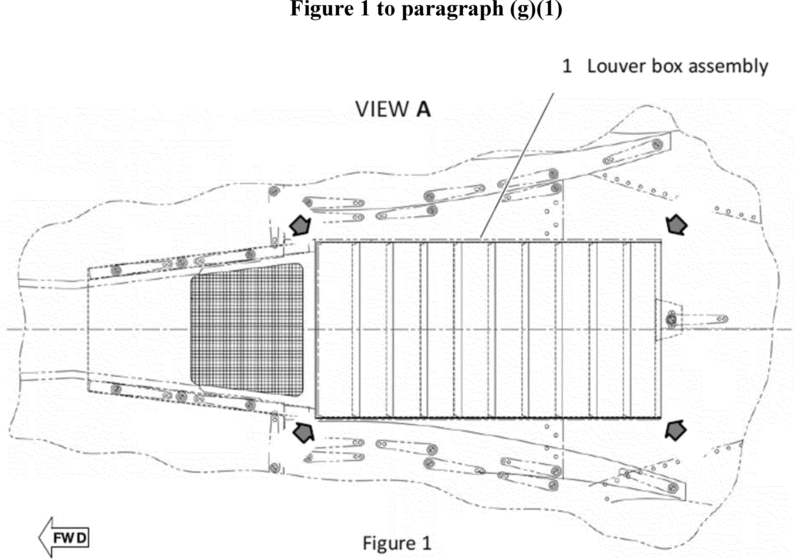

# Daily Digest — 2026-10-09

| | |
|---|---|
| **Digest date** | 2026-10-09 |
| **Data date range** | 2026-10-09 to 2026-10-09 |
| **Generated at** | 2026-10-10T04:02:27Z (UTC) |
| **Pipeline version** | 35b1bad1 |
| **Inference** | model layers ran — cli/haiku, opus |
| **Source watermarks** | CREC: 2026-10-07T10:43:05Z · BILLS: 2026-10-09T03:23:25Z · FR: 2026-10-09T14:51:53Z · USCOURTS: 2026-10-10T03:16:53Z · PLAW: 2026-10-07T20:27:22Z |

[Full observed listing for this day](day/2026-10-09.html) — the items our collectors observed for this publication day, mechanical rules applied, frozen at end of day; releases their publishers date on other days are counted there, not listed. This digest is the canonical record.

All items below cite the govinfo package (and granule, where applicable) they
summarize. Selection is mechanical; each item states the rule that included
it. See the Coverage Statement at the end for a full accounting of what was
published, what was summarized, and what was excluded and why.

---

## Contents

- [Day in Review](#day-in-review)
- [1. Congressional Floor Activity](#1-congressional-floor-activity)
- [2. Legislation](#2-legislation)
- [3. Federal Register](#3-federal-register)
- [4. Enacted Laws](#4-enacted-laws)
- [5. Judicial Activity](#5-judicial-activity)
- [6. Agency Announcements](#6-agency-announcements)
- [7. Recorded Votes](#7-recorded-votes)
- [8. Bill Actions](#8-bill-actions)
- [9. Presidential Actions](#9-presidential-actions)
- [Terms Used Today](#terms-used-today)
- [Coverage Statement](#coverage-statement)
- [Methodology](#methodology)

---

## Day in Review

The digest carries one presidential document and one presidential memorandum. Executive Order 14435 directs the Secretary of the Treasury to defer diesel fuel excise tax payments and provide penalty relief for farmers and truckers from October 5 through December 31, 2026. The memorandum establishes a Committee of Inquiry to investigate allegations that Federal Reserve Governor Lisa D. Cook made false statements in connection with mortgage instruments. Among nine final rules, FDA classified three device types into class II, DEA revoked exempted status for inactive butalbital products, and EPA issued a clean data determination for two Michigan ozone areas. The three proposed-rule items include an FDIC comment-period extension to November 4, 2026, and cancellation of an IRS hearing on proposed PRWORA regulations. The digest also carries 76 notices and 184 agency press releases.

The digest carries 46 appellate opinions, two national court opinions, 1,152 district court opinions and 13 bankruptcy opinions. The Eleventh Circuit vacated an Endangered Species Act judgment against Florida's Department of Environmental Protection after the Fish and Wildlife Service rescinded the definition of "harm" on which it relied. The Federal Circuit held that federal law bars a veteran from additional dependent compensation once the child elects educational assistance benefits. The Fifth Circuit found Winter Storm Uri a force majeure event in a natural gas contract dispute. The Court of International Trade remanded a Commerce Department scope determination on chassis from China.

*Composed from the summarized items below and the day's mechanical
counts; all specifics are cited in their sections.*

---

## 1. Congressional Floor Activity

No Congressional Record issue was observed on this day. The Record for a day's proceedings is typically published by govinfo the following morning; it appears in the digest for the day it is observed ([how our clocks work](faq.html#fapds-three-clocks)).

### 1.1 Senate

No Senate floor items met the selection thresholds. 0 floor granule(s) are accounted for in the Coverage Statement.

### 1.2 House of Representatives

No House floor items met the selection thresholds. 0 floor granule(s) are accounted for in the Coverage Statement.

### 1.3 Recorded Votes

No recorded votes were published in this issue of the Congressional Record.

---

## 2. Legislation

Source: Congressional Bills (BILLS), text versions published 2026-10-09 to 2026-10-09.

### 2.1 Counts by Stage

| Stage (bill text version) | Count |
|---|---|
| Introduced (ih/is) | 0 |
| Reported (rh/rs) | 0 |
| Engrossed (eh/es) | 0 |
| Enrolled (enr) | 0 |
| Other versions | 0 |
| **Total bill texts published** | **0** |

### 2.2 Bills Listed by Mechanical Rule

Bills below are listed because they matched at least one listing rule; the
matching rule is stated per item. All other bill texts are counted above and
accounted for in the Coverage Statement.

No bill texts published in this range matched a listing rule; all 0 are
accounted for in the Coverage Statement.

---

## 3. Federal Register

Source: Federal Register (FR), issue of 2026-10-09.

### 3.1 Counts by Document Type

| Document type | Count |
|---|---|
| Rules | 9 |
| Proposed rules | 3 |
| Notices | 76 |
| Presidential documents | 1 |
| **Total FR documents** | **89** |

### 3.2 Rules Published

Tags: department of health and human services · executive · securities and exchange commission · model keys: air quality · controlled substances · medical devices

*In plain terms: Nine rules span FAA helicopter directive, three FDA medical device classifications, EPA Michigan air quality determination, two DEA controlled substance actions, agriculture raisins order, and fisheries date correction.*

#### DEPARTMENT OF AGRICULTURE

- **Raisins Produced From Grapes Grown in California; Order Amending Marketing Order No. 989** (2026-20792; 7 CFR Part 989) — This final rule amends Marketing Order No. 989, which regulates the handling of raisins produced from grapes grown in California. The Department of Agriculture approves and adopts amendments proposed by the Raisin Administrative Committee (Committee) after due consideration of a public hearing record, and after California raisin producers voted in favor of such amendments in a referendum. This rule reduces the Committee membership size from 47 to 21, removes producer district representation and adds an unaffiliated producer member seat, eliminates the designated cooperative bargaining association member seat, and lowers quorum requirements from 25 to 14; removes the requirement for separate member and alternate member position nominations for independent and small cooperative producers; removes factor 4 and part of factor 5 for establishing marketing policy and adds language clarifying the quality of reconditioned raisins; and adds authority to accept voluntary contributions and language regarding ownership of intellectual property. In addition, this action makes necessary changes to the marketing order to conform to the amendments adopted. Action: Final rule. Dates: This rule is effective November 9, 2026.
  - *In plain terms:* USDA amends raisin marketing rules to reduce committee from 47 to 21 members and adjust operations.
  - Included because: FR-SEL-01 — document type: final rule (all listed)
  - Source: [FR-2026-10-09 / 2026-20792](https://www.govinfo.gov/app/details/FR-2026-10-09/2026-20792)

#### DEPARTMENT OF COMMERCE

- **Fisheries of the Exclusive Economic Zone Off Alaska; Groundfish Reserves in the Bering Sea and Aleutian Islands Management Area** (C1-2026-20019; 50 CFR Part 679) — This document corrects a date in the fisheries rule for groundfish reserves in the Bering Sea and Aleutian Islands Management Area. The correction changes the date reference in the DATES section from October 30, 2026 to September 30, 2026.
  - *In plain terms:* Corrects a fisheries rule date from October 30 to September 30, 2026.
  - Included because: FR-SEL-01 — document type: final rule (all listed)
  - Source: [FR-2026-10-09 / C1-2026-20019](https://www.govinfo.gov/app/details/FR-2026-10-09/C1-2026-20019)

#### DEPARTMENT OF HEALTH AND HUMAN SERVICES

- **Medical Devices; Immunology and Microbiology Devices; Classification of the Hematopoietic Cell Enrichment Kit** (2026-20725; 21 CFR Part 866) — The Food and Drug Administration (FDA) is classifying the hematopoietic cell enrichment kit into class II (special controls). The special controls that apply to the device type are identified in this order and will be part of the codified language for classification of the hematopoietic cell enrichment kit. We are taking this action because we have determined that classifying the device into class II will provide a reasonable assurance of the safety and effectiveness of the device. We believe this action will also enhance patients' access to beneficial innovative devices, in part by reducing regulatory burdens. Action: Final amendment; final order. Dates: This order is effective October 9, 2026. The classification was applicable on November 6, 2023.
  - *In plain terms:* FDA places hematopoietic cell enrichment kit in Class II, requiring special controls to ensure device safety and effectiveness.
  - Included because: FR-SEL-01 — document type: final rule (all listed)
  - Source: [FR-2026-10-09 / 2026-20725](https://www.govinfo.gov/app/details/FR-2026-10-09/2026-20725)
- **Medical Devices; Cardiovascular Devices; Classification of the Infant Pulse Rate and Oxygen Saturation Monitor for Over-the-Counter Use** (2026-20726; 21 CFR Part 870) — The Food and Drug Administration (FDA) is classifying the infant pulse rate and oxygen saturation monitor for over-the-counter use into class II (special controls). The special controls that apply to the device type are identified in this order and will be part of the codified language for classification of the infant pulse rate and oxygen saturation monitor for over-the-counter use. We are taking this action because we have determined that classifying the device into class II will provide a reasonable assurance of the safety and effectiveness of the device. We believe this action will also enhance patients' access to beneficial innovative devices, in part by reducing regulatory burdens. Action: Final amendment; final order. Dates: This order is effective October 9, 2026. The classification was applicable on November 8, 2023.
  - *In plain terms:* FDA places infant pulse rate and oxygen saturation monitor for over-the-counter use in Class II, requiring special safety controls.
  - Included because: FR-SEL-01 — document type: final rule (all listed)
  - Source: [FR-2026-10-09 / 2026-20726](https://www.govinfo.gov/app/details/FR-2026-10-09/2026-20726)
- **Medical Devices; Immunology and Microbiology Devices; Classification of the System for Detection of Nucleic Acid From Non-Viral Microorganism(s) Causing Sexually Transmitted Infections Using Home-Collected Specimens** (2026-20727; 21 CFR Part 866) — The Food and Drug Administration (FDA) is classifying the system for detection of nucleic acid from non-viral microorganism(s) causing sexually transmitted infections using home-collected specimens into class II (special controls). The special controls that apply to the device type are identified in this order and will be part of the codified language for classification of the system for detection of nucleic acid from non-viral microorganism(s) causing sexually transmitted infections using home-collected specimens. We are taking this action because we have determined that classifying the device into class II will provide a reasonable assurance of the safety and effectiveness of the device. We believe this action will also enhance patients' access to beneficial innovative devices, in part by reducing regulatory burdens. Action: Final amendment; final order. Dates: This order is effective October 9, 2026. The classification was applicable on November 15, 2023.
  - *In plain terms:* FDA places system for detecting sexually transmitted infections from home-collected samples in Class II, requiring special safety controls.
  - Included because: FR-SEL-01 — document type: final rule (all listed)
  - Source: [FR-2026-10-09 / 2026-20727](https://www.govinfo.gov/app/details/FR-2026-10-09/2026-20727)

#### DEPARTMENT OF JUSTICE

- **Schedules of Controlled Substances: Placement of O-Desmethyltramadol in Schedule I; Correction** (2026-20748; 21 CFR Part 1308) — On August 12, 2026, the Drug Enforcement Administration (DEA) published a temporary order placing O -desmethyltramadol (other names: O -DSMT; desmetramadol; 3-[(1 R, 2 R )-2-[(dimethylamino)methyl]-1-hydroxycyclohexyl]phenol), including its salts, isomers, and salts of isomers whenever the existence of such salts, isomers, and salts of isomers are possible, in schedule I of the Controlled Substances Act. DEA published this temporary order that specifically noted in the summary that the control of O -desmethyltramadol included its salts, isomers, and salts of isomers whenever the existence of such salts, isomers, and salts of isomers are possible, however inadvertently omitted the correct language that should have been included. This document corrects that error, adding the correct language. Action: Correcting amendment. Dates: This correcting amendment is effective October 9, 2026, until August 12, 2028, and applicable beginning August 12, 2026.
  - *In plain terms:* DEA corrects its order placing O-desmethyltramadol in Schedule I to include proper language about salts and isomers.
  - Included because: FR-SEL-01 — document type: final rule (all listed)
  - Source: [FR-2026-10-09 / 2026-20748](https://www.govinfo.gov/app/details/FR-2026-10-09/2026-20748)
- **Schedules of Controlled Substances; Removal of Exemption Status for Inactive Butalbital Products** (2026-20757; 21 CFR Part 1308) — The Drug Enforcement Administration (DEA) is revoking the exempted status for certain nonnarcotic prescription products that are currently on DEA's Table of Exempted Prescription Products, but whose National Drug Codes (NDC) are inactive because they are no longer available and/or the company that applied for the exemption no longer exists. These products will be removed from DEA's Table of Exempted Prescription Products and will no longer be considered exempt prescription products under the Controlled Substances Act. This action does not impact exempted prescription products with active NDC numbers. Action: Final determination. Dates: This final determination is effective on November 9, 2026.
  - *In plain terms:* DEA removes exempt status for inactive butalbital prescription products that are no longer available.
  - Included because: FR-SEL-01 — document type: final rule (all listed)
  - Source: [FR-2026-10-09 / 2026-20757](https://www.govinfo.gov/app/details/FR-2026-10-09/2026-20757)

#### DEPARTMENT OF TRANSPORTATION

- **Airworthiness Directives; Airbus Helicopters Deutschland GmbH (AHD) Helicopters** (2026-20722; 14 CFR Part 39) — The FAA is adopting a new airworthiness directive (AD) for all Airbus Helicopters Deutschland GmbH (AHD) Model MBB-BK 117 C-1 helicopters. This AD was prompted by a report of a louver box assembly detaching in flight due to incorrect installation. This AD requires repetitively accomplishing a play check of the affected louver box assembly and, depending on the results of the check, accomplishing corrective actions. The FAA is issuing this AD to address the unsafe condition on these products. Action: Final rule; request for comments. Dates: This AD is effective October 26, 2026. The FAA must receive comments on this AD by November 23, 2026.
  - *In plain terms:* FAA requires Airbus helicopter operators to repeatedly check louver box assembly and make repairs if needed to prevent detachment.
  - Included because: FR-SEL-01 — document type: final rule (all listed)
  - Source: [FR-2026-10-09 / 2026-20722](https://www.govinfo.gov/app/details/FR-2026-10-09/2026-20722)
  -  *Source graphic 1 of 1 from 2026-20722.*

#### ENVIRONMENTAL PROTECTION AGENCY

- **Air Plan Approval; Michigan; Clean Data Determination for the Berrien, MI and Muskegon, MI Areas for the 2015 Ozone Standards** (2026-20736; 40 CFR Part 52) — The U.S. Environmental Protection Agency (EPA) is determining under the Clean Air Act (CAA) that the Berrien County and Muskegon County, Michigan nonattainment areas have attained the 2015 ozone National Ambient Air Quality Standards (NAAQS). This determination, informally known as a clean data determination, is based upon complete, quality assured, and certified ambient air monitoring data for the 2023-2025 design value period showing that the areas achieved attainment of the 2015 ozone NAAQS. This clean data determination also relies upon the Michigan Department of Environment, Great Lakes, and Energy's (EGLE's) exceptional events request submitted to the EPA on December 26, 2025, and which the EPA concurred on January 12, 2026. [official summary truncated; see source] Action: Final rule. Dates: This final rule is effective on October 9, 2026.
  - *In plain terms:* EPA determines Michigan's Berrien and Muskegon counties met the 2015 ozone air quality standards based on 2023-2025 monitoring data.
  - Included because: FR-SEL-01 — document type: final rule (all listed)
  - Source: [FR-2026-10-09 / 2026-20736](https://www.govinfo.gov/app/details/FR-2026-10-09/2026-20736)

### 3.3 Proposed Rules Published

Tags: department of health and human services · executive · securities and exchange commission · model keys: food traceability · insider credit · tax regulations

*In plain terms: FDA announces draft food traceability guidance; FDIC extends comment period for insider credit rule; hearing canceled on tax credit regulation proposal.*

#### DEPARTMENT OF HEALTH AND HUMAN SERVICES

- **Requirements for Additional Traceability Records for Certain Foods: Enforcement Policy for Certain Retail Food Establishments and Restaurants; Draft Guidance for Industry; Availability** (2026-20721; 21 CFR Part 1) — The Food and Drug Administration (FDA, we, or the Agency) is announcing the availability of a draft guidance for industry titled “Requirements for Additional Traceability Records for Certain Foods: Enforcement Policy for Certain Retail Food Establishments and Restaurants.” The draft guidance states that, at this time and based on our current understanding of the risks, FDA does not intend to enforce certain regulatory requirements as they apply to certain entities and/or activities. The applicable requirements are established in our regulation titled “Requirements for Additional Traceability Records for Certain Foods.” Action: Notification of availability. Dates: Submit either electronic or written comments on the draft guidance by November 23, 2026 to ensure that the Agency considers your comment on this draft guidance before it begins work on the final version of the guidance.
  - *In plain terms:* FDA won't enforce certain food traceability requirements for some retail food establishments and restaurants at this time.
  - Included because: FR-SEL-02 — document type: proposed rule (all listed)
  - Source: [FR-2026-10-09 / 2026-20721](https://www.govinfo.gov/app/details/FR-2026-10-09/2026-20721)

#### DEPARTMENT OF THE TREASURY

- **Application of the Personal Responsibility and Work Opportunity Reconciliation Act of 1996 to the Refunded Portion of Certain Federal Refundable Tax Credits; Hearing Cancellation** (2026-20790; 26 CFR Part 1) — This document cancels a public hearing on proposed regulations (REG-119882-25) published in the Federal Register on August 20, 2026. The proposed regulations would provide that the refunded portion of certain refundable Federal income tax credits available to individuals is a “Federal public benefit” under the Personal Responsibility and Work Opportunity Reconciliation Act of 1996 (PRWORA). Action: Cancellation of a notice of public hearing on a proposed rulemaking. Dates: The public hearing scheduled for October 14, 2026, at 10 a.m. ET is cancelled.
  - *In plain terms:* This cancels a public hearing on proposed regulations treating certain refundable tax credits as federal benefits.
  - Included because: FR-SEL-02 — document type: proposed rule (all listed)
  - Source: [FR-2026-10-09 / 2026-20790](https://www.govinfo.gov/app/details/FR-2026-10-09/2026-20790)

#### FEDERAL DEPOSIT INSURANCE CORPORATION

- **Extensions of Credit to Insiders** (2026-20735; 12 CFR Part 337) — The FDIC is extending the public comment period on the proposed rule “Extensions of Credit to Insiders,” which was published in the Federal Register on August 6, 2026. The FDIC is extending the public comment period from October 5, 2026, to November 4, 2026, to provide interested parties with additional time to analyze the proposal and prepare comments. Action: Notice of proposed rulemaking; extension of comment period. Dates: Comments must be received on or before November 4, 2026.
  - *In plain terms:* FDIC extends the public comment period on insider credit rules from October 5 to November 4, 2026.
  - Included because: FR-SEL-02 — document type: proposed rule (all listed)
  - Source: [FR-2026-10-09 / 2026-20735](https://www.govinfo.gov/app/details/FR-2026-10-09/2026-20735)

### 3.4 Notices and Presidential Documents

Tags: department of health and human services · executive · securities and exchange commission · model keys: diesel tax · farmers · tax relief

*In plain terms: Executive Order 14435 directs Treasury to defer diesel fuel excise taxes and provide penalty relief for farmers and truckers through December 31, 2026.*

Notices are summarized only when they match a listing rule; all are counted
in 3.1 and in the Coverage Statement. Presidential documents in the FR are
always listed.

- **Emergency Tax Relief on Diesel Fuel** (2026-20855) — Executive Order 14435 directs the Secretary of the Treasury to defer diesel fuel excise tax payments and provide penalty relief for farmers and truckers during the period from October 5 through December 31, 2026. The order instructs the Secretaries of Agriculture and Transportation, along with other officials, to coordinate implementation of the relief measures and directs the Treasury to explore avenues, including legislation, to eliminate the obligation to pay the deferred amounts.
  - *In plain terms:* Executive Order 14435 delays diesel fuel excise tax payments for farmers and truckers through December 31, 2026.
  - Included because: FR-SEL-03 — presidential document (all listed)
  - Source: [FR-2026-10-09 / 2026-20855](https://www.govinfo.gov/app/details/FR-2026-10-09/2026-20855)
  - Corroborated across time: the same document was first published by the White House on [2026-10-05](https://www.whitehouse.gov/presidential-actions/2026/10/emergency-tax-relief-on-diesel-fuel/), days before the Federal Register compiled it. Listed here as the official record of this day — the earlier publication is referenced, not suppressed; both observations are preserved and counted.

---

## 4. Enacted Laws

Source: Public and Private Laws (PLAW) published 2026-10-09.

No laws were published in this range.

---

## 5. Judicial Activity

Source: United States Courts Opinions (USCOURTS): opinions observed 2026-10-09
by our collector; each opinion states its own issue date beside its
listing ([how our clocks work](faq.html#fapds-three-clocks)).

Completeness disclosure (standing): USCOURTS carries opinions from
approximately 140 participating appellate, district, bankruptcy, and
national federal courts. Unlike the Congressional Record and the Federal
Register, which are the complete official record of their branches,
USCOURTS is participation-based and is NOT the complete federal judicial
record. Courts post opinions with delay — typically over several days —
so a day's digest carries the opinions that became available that day,
whatever date each was issued.

### 5.1 Appellate and National Court Opinions

Tags: judicial · model keys: child pornography · drug trafficking · sentencing

*In plain terms: Forty-eight appellate decisions include a 300-month child pornography sentence and three cocaine trafficking convictions involving 623 kilograms; remaining cases address civil rights, immigration, employment, and other matters.*

Appellate and national court opinions are summarized; district and
bankruptcy opinions are counted in 5.2 and in the Coverage Statement.

#### United States Court of Appeals for the Eighth Circuit

- **Calvin Williams v. Moberly Correctional Center, et al** (No. 25-01599; filed 2026-10-08) — The Eighth Circuit Court of Appeals issued an opinion in Calvin Williams v. Moberly Correctional Center et al., with judgment entered accordingly. Counsel was notified that petitions for rehearing or rehearing en banc must be filed electronically within 14 days of judgment entry.
  - *In plain terms:* The Eighth Circuit issued a decision; parties have 14 days to request reconsideration electronically.
  - Included because: USCOURTS-SEL-01 — appellate court opinion (all listed) (document dated 2026-10-08)
  - Source: [USCOURTS-ca8-25-01599 / USCOURTS-ca8-25-01599-0](https://www.govinfo.gov/app/details/USCOURTS-ca8-25-01599/USCOURTS-ca8-25-01599-0)
- **United States v. James Colquhoun** (No. 25-02458; filed 2026-10-08) — The Eighth Circuit Court of Appeals issued an opinion in United States v. James Colquhoun, with judgment entered accordingly. Counsel was notified that petitions for rehearing or rehearing en banc must be filed electronically within 14 days of judgment entry.
  - *In plain terms:* The Eighth Circuit issued a decision; parties have 14 days to request reconsideration electronically.
  - Included because: USCOURTS-SEL-01 — appellate court opinion (all listed) (document dated 2026-10-08)
  - Source: [USCOURTS-ca8-25-02458 / USCOURTS-ca8-25-02458-0](https://www.govinfo.gov/app/details/USCOURTS-ca8-25-02458/USCOURTS-ca8-25-02458-0)
- **United States v. Christopher Grays** (No. 25-02631; filed 2026-10-08) — The Eighth Circuit Court of Appeals issued an opinion in United States v. Christopher Grays, with judgment entered accordingly. Counsel was notified that petitions for rehearing or rehearing en banc must be filed electronically within 14 days of judgment entry.
  - *In plain terms:* The Eighth Circuit issued a decision; parties have 14 days to request reconsideration electronically.
  - Included because: USCOURTS-SEL-01 — appellate court opinion (all listed) (document dated 2026-10-08)
  - Source: [USCOURTS-ca8-25-02631 / USCOURTS-ca8-25-02631-0](https://www.govinfo.gov/app/details/USCOURTS-ca8-25-02631/USCOURTS-ca8-25-02631-0)
- **Maria Alvarenga, et al v. Todd Blanche** (No. 25-02780; filed 2026-10-08) — The Eighth Circuit Court of Appeals issued an opinion in Maria Alvarenga et al. v. Todd Blanche, with judgment entered accordingly. Counsel was notified that petitions for rehearing or rehearing en banc must be filed electronically within 45 days of judgment entry.
  - *In plain terms:* The Eighth Circuit issued a decision; parties have 45 days to request reconsideration electronically.
  - Included because: USCOURTS-SEL-01 — appellate court opinion (all listed) (document dated 2026-10-08)
  - Source: [USCOURTS-ca8-25-02780 / USCOURTS-ca8-25-02780-0](https://www.govinfo.gov/app/details/USCOURTS-ca8-25-02780/USCOURTS-ca8-25-02780-0)
- **Canary Reed v. The Kinetic Group, et al** (No. 25-02886; filed 2026-10-08) — The Eighth Circuit Court of Appeals issued an opinion in Canary Reed v. The Kinetic Group et al., with judgment entered accordingly. Counsel was notified that petitions for rehearing or rehearing en banc must be filed electronically within 14 days of judgment entry.
  - *In plain terms:* The Eighth Circuit issued a decision; parties have 14 days to request reconsideration electronically.
  - Included because: USCOURTS-SEL-01 — appellate court opinion (all listed) (document dated 2026-10-08)
  - Source: [USCOURTS-ca8-25-02886 / USCOURTS-ca8-25-02886-0](https://www.govinfo.gov/app/details/USCOURTS-ca8-25-02886/USCOURTS-ca8-25-02886-0)
- **United States v. David Negrete** (No. 25-03409; filed 2026-10-08) — The court issued an opinion and entered judgment in United States v. David Negrete (8th Circuit, Case No. 25-3409). Counsel was informed that petitions for rehearing must be filed electronically within 14 days of judgment entry pursuant to Federal Rules of Appellate Procedure.
  - *In plain terms:* The Eighth Circuit issued a decision; parties have 14 days to request reconsideration electronically.
  - Included because: USCOURTS-SEL-01 — appellate court opinion (all listed) (document dated 2026-10-08)
  - Source: [USCOURTS-ca8-25-03409 / USCOURTS-ca8-25-03409-0](https://www.govinfo.gov/app/details/USCOURTS-ca8-25-03409/USCOURTS-ca8-25-03409-0)
- **United States v. David Marrowbone** (No. 25-03446; filed 2026-10-08) — The court issued an opinion and entered judgment in United States v. David Marrowbone (8th Circuit, Case No. 25-3446). Counsel was informed that petitions for rehearing must be filed electronically within 14 days of judgment entry pursuant to Federal Rules of Appellate Procedure.
  - *In plain terms:* The Eighth Circuit issued a decision; parties have 14 days to request reconsideration electronically.
  - Included because: USCOURTS-SEL-01 — appellate court opinion (all listed) (document dated 2026-10-08)
  - Source: [USCOURTS-ca8-25-03446 / USCOURTS-ca8-25-03446-0](https://www.govinfo.gov/app/details/USCOURTS-ca8-25-03446/USCOURTS-ca8-25-03446-0)
- **United States v. Anthony Pennell** (No. 26-01189; filed 2026-10-08) — The court issued an opinion and entered judgment in United States v. Anthony Pennell (8th Circuit, Case No. 26-1189). Counsel was informed that petitions for rehearing must be filed electronically within 14 days of judgment entry pursuant to Federal Rules of Appellate Procedure.
  - *In plain terms:* The Eighth Circuit issued a decision; parties have 14 days to request reconsideration electronically.
  - Included because: USCOURTS-SEL-01 — appellate court opinion (all listed) (document dated 2026-10-08)
  - Source: [USCOURTS-ca8-26-01189 / USCOURTS-ca8-26-01189-0](https://www.govinfo.gov/app/details/USCOURTS-ca8-26-01189/USCOURTS-ca8-26-01189-0)

#### United States Court of Appeals for the Eleventh Circuit

- **USA v. Junior Chirino-Lovera** (No. 23-13262; filed 2026-10-08) — Appellate court affirmed the conviction of three defendants for drug trafficking on the high seas after the Coast Guard discovered 623 kilograms of cocaine on their vessel. The court rejected the defendants' challenge to federal jurisdiction, finding the district court properly credited Coast Guard officer testimony regarding questions about vessel nationality.
  - *In plain terms:* An appeals court upheld convictions of three defendants for drug trafficking after the Coast Guard discovered 623 kilograms of cocaine and rejected a jurisdiction challenge.
  - Included because: USCOURTS-SEL-01 — appellate court opinion (all listed) (document dated 2026-10-08)
  - Source: [USCOURTS-ca11-23-13262 / USCOURTS-ca11-23-13262-0](https://www.govinfo.gov/app/details/USCOURTS-ca11-23-13262/USCOURTS-ca11-23-13262-0)
- **USA v. Jose Palencia** (No. 23-13307; filed 2026-10-08) — Appellate court affirmed the conviction of three defendants for drug trafficking on the high seas after the Coast Guard discovered 623 kilograms of cocaine on their vessel. The court rejected the defendants' challenge to federal jurisdiction, finding the district court properly credited Coast Guard officer testimony regarding questions about vessel nationality.
  - *In plain terms:* An appeals court upheld convictions of three defendants for drug trafficking after the Coast Guard discovered 623 kilograms of cocaine and rejected a jurisdiction challenge.
  - Included because: USCOURTS-SEL-01 — appellate court opinion (all listed) (document dated 2026-10-08)
  - Source: [USCOURTS-ca11-23-13307 / USCOURTS-ca11-23-13307-0](https://www.govinfo.gov/app/details/USCOURTS-ca11-23-13307/USCOURTS-ca11-23-13307-0)
- **USA v. Antonio Brown** (No. 23-13326; filed 2026-10-08) — Appellate court vacated and remanded for resentencing after finding the district court plainly erred in imposing a sentencing enhancement for physically restraining robbery victims, which was amended and made retroactively inapplicable after sentencing. The court found no breach of the defendant's plea agreement.
  - *In plain terms:* An appeals court threw out a punishment increase made invalid retroactively and remanded for resentencing, finding no plea deal breach.
  - Included because: USCOURTS-SEL-01 — appellate court opinion (all listed) (document dated 2026-10-08)
  - Source: [USCOURTS-ca11-23-13326 / USCOURTS-ca11-23-13326-0](https://www.govinfo.gov/app/details/USCOURTS-ca11-23-13326/USCOURTS-ca11-23-13326-0)
- **USA v. Alejandro Guerrero** (No. 23-13333; filed 2026-10-08) — Appellate court affirmed the conviction of three defendants for drug trafficking on the high seas after the Coast Guard discovered 623 kilograms of cocaine on their vessel. The court rejected the defendants' challenge to federal jurisdiction, finding the district court properly credited Coast Guard officer testimony regarding questions about vessel nationality.
  - *In plain terms:* An appeals court upheld convictions of three defendants for drug trafficking after the Coast Guard discovered 623 kilograms of cocaine and rejected a jurisdiction challenge.
  - Included because: USCOURTS-SEL-01 — appellate court opinion (all listed) (document dated 2026-10-08)
  - Source: [USCOURTS-ca11-23-13333 / USCOURTS-ca11-23-13333-0](https://www.govinfo.gov/app/details/USCOURTS-ca11-23-13333/USCOURTS-ca11-23-13333-0)
- **Auto-Owners Insurance Company, et al v. Benjamin Johnson, et al** (No. 24-13530; filed 2026-10-08) — Appellate court affirmed summary judgment for an insurance company seeking a declaratory judgment of no duty to defend or indemnify homeowners for a dispute with neighbors. The court found the homeowners breached mandatory prompt-notice provisions of their insurance policies that constituted conditions precedent to coverage.
  - *In plain terms:* An appeals court upheld that an insurance company doesn't have to defend or pay homeowners who failed to notify it promptly under their policy.
  - Included because: USCOURTS-SEL-01 — appellate court opinion (all listed) (document dated 2026-10-08)
  - Source: [USCOURTS-ca11-24-13530 / USCOURTS-ca11-24-13530-0](https://www.govinfo.gov/app/details/USCOURTS-ca11-24-13530/USCOURTS-ca11-24-13530-0)
- **Bear Warriors United, Inc. v. Secretary, Florida Department of Environmental Pro** (No. 25-11612; filed 2026-10-08) — Appellate court vacated and remanded a district court judgment and permanent injunction holding that the Florida Department of Environmental Protection violated the Endangered Species Act through its wastewater regulatory scheme. The court vacated because the U.S. Fish and Wildlife Service rescinded during the appeal the definition of 'harm' on which the judgment relied.
  - *In plain terms:* An appeals court set aside a judgment requiring Florida to change its wastewater rules under endangered species law because the federal wildlife agency changed the definition of 'harm' that the judgment relied on.
  - Included because: USCOURTS-SEL-01 — appellate court opinion (all listed) (document dated 2026-10-08)
  - Source: [USCOURTS-ca11-25-11612 / USCOURTS-ca11-25-11612-0](https://www.govinfo.gov/app/details/USCOURTS-ca11-25-11612/USCOURTS-ca11-25-11612-0)
- **Bear Warriors United, Inc. v. Secretary, FL Dept. of Environmental Protection** (No. 25-11821; filed 2026-10-08) — Bear Warriors United, Inc. appealed a district court judgment in its favor regarding alleged violations of the Endangered Species Act by Florida's Department of Environmental Protection. The Eleventh Circuit vacated the judgment and injunction after the U.S. Fish and Wildlife Service rescinded the regulatory definition of "harm" that the district court relied upon, and remanded for reevaluation under the new rule.
  - *In plain terms:* An appeals court set aside a judgment requiring Florida to change its wastewater rules under endangered species law because the federal wildlife agency changed the definition of 'harm' that the judgment relied on.
  - Included because: USCOURTS-SEL-01 — appellate court opinion (all listed) (document dated 2026-10-08)
  - Source: [USCOURTS-ca11-25-11821 / USCOURTS-ca11-25-11821-0](https://www.govinfo.gov/app/details/USCOURTS-ca11-25-11821/USCOURTS-ca11-25-11821-0)
- **Tawana Carter v. Wells Fargo Bank** (No. 25-14443; filed 2026-10-08) — Tawana Carter appealed a district court dismissal of her wrongful foreclosure complaint against Wells Fargo, her seventh lawsuit on the subject. The Eleventh Circuit affirmed the dismissal, finding her claims barred by res judicata from prior litigation and that she failed to adequately challenge the sufficiency of the dismissed claims.
  - *In plain terms:* An appeals court upheld dismissal of a woman's wrongful foreclosure lawsuit against Wells Fargo, finding it blocked by prior cases on the same subject.
  - Included because: USCOURTS-SEL-01 — appellate court opinion (all listed) (document dated 2026-10-08)
  - Source: [USCOURTS-ca11-25-14443 / USCOURTS-ca11-25-14443-0](https://www.govinfo.gov/app/details/USCOURTS-ca11-25-14443/USCOURTS-ca11-25-14443-0)
- **Kelvin Stephens v. Fulton County Jail** (No. 25-14467; filed 2026-10-08) — Kelvin Stephens appealed a district court dismissal of his civil rights complaint for failure to pay the filing fee after being denied in forma pauperis status under the Prison Litigation Reform Act's three-strikes provision. The Eleventh Circuit affirmed, finding Stephens abandoned his argument regarding the three-strikes determination by not raising it in his opening brief.
  - *In plain terms:* An appeals court upheld dismissal of a prisoner's lawsuit because he didn't pay the filing fee and failed to challenge that in his main brief.
  - Included because: USCOURTS-SEL-01 — appellate court opinion (all listed) (document dated 2026-10-08)
  - Source: [USCOURTS-ca11-25-14467 / USCOURTS-ca11-25-14467-0](https://www.govinfo.gov/app/details/USCOURTS-ca11-25-14467/USCOURTS-ca11-25-14467-0)
- **USA v. Anthony Brewer** (No. 26-10745; filed 2026-10-08) — Anthony Brewer appealed his 24-month federal sentence for theft of Department of Veterans Affairs funds, challenging the district court's procedural explanation and substantive upward variance from the Guidelines range. The Eleventh Circuit affirmed, finding the district court adequately explained its sentencing rationale and decision to impose the sentence consecutively to Brewer's state sentence.
  - *In plain terms:* An appeals court upheld a 24-month federal sentence for stealing VA funds, finding the judge properly explained sentencing decisions and ordered it consecutive to state prison time.
  - Included because: USCOURTS-SEL-01 — appellate court opinion (all listed) (document dated 2026-10-08)
  - Source: [USCOURTS-ca11-26-10745 / USCOURTS-ca11-26-10745-0](https://www.govinfo.gov/app/details/USCOURTS-ca11-26-10745/USCOURTS-ca11-26-10745-0)

#### United States Court of Appeals for the Federal Circuit

- **Ortiz v. Collins** (No. 26-01066; filed 2026-10-08) — The Federal Circuit affirmed that 38 U.S.C. § 3562 bars a disabled veteran from receiving additional compensation under 38 U.S.C. § 1115 for a dependent child once the child elects to receive Survivors' and Dependents' Educational Assistance benefits. The court held that both benefits provide support on account of the same dependent, making concurrent receipt duplicative, and rejected the veteran's argument that he and the child receiving different benefits presents no duplication.
  - *In plain terms:* A disabled veteran cannot receive extra money for a dependent child who is already getting educational assistance benefits, since both provide support for the same child.
  - Included because: USCOURTS-SEL-01 — appellate court opinion (all listed) (document dated 2026-10-08)
  - Source: [USCOURTS-ca13-26-01066 / USCOURTS-ca13-26-01066-0](https://www.govinfo.gov/app/details/USCOURTS-ca13-26-01066/USCOURTS-ca13-26-01066-0)
- **Thorogood v. MSPB** (No. 26-01588; filed 2026-10-08) — The Federal Circuit affirmed the Merit Systems Protection Board's dismissal of an administrative appeal as moot after an agency rescinded an employee's removal and reinstated him to his prior status with restored benefits and cleared personnel records. The court held that mootness can arise at any stage of litigation and that substantial evidence supported the Board's finding that the agency had returned the employee to status quo ante.
  - *In plain terms:* An appeal was dismissed because it no longer had a live dispute after the agency cancelled the employee's removal and returned him to his job with restored benefits and cleared records.
  - Included because: USCOURTS-SEL-01 — appellate court opinion (all listed) (document dated 2026-10-08)
  - Source: [USCOURTS-ca13-26-01588 / USCOURTS-ca13-26-01588-0](https://www.govinfo.gov/app/details/USCOURTS-ca13-26-01588/USCOURTS-ca13-26-01588-0)
- **Avery v. US** (No. 26-01632; filed 2026-10-08) — The Federal Circuit affirmed dismissal of a veteran's suit seeking the Airman's Medal and increased retirement pay under the doctrine of res judicata, as the claim was barred by an identical prior 2020 judgment involving the same parties and operative facts. The court also confirmed it lacked jurisdiction because the Airman's Medal award is a discretionary military matter and the veteran cited no money-mandating statute conferring jurisdiction.
  - *In plain terms:* The court dismissed a veteran's lawsuit for an Airman's Medal and higher pay because a prior 2020 judgment already decided it and the court lacked jurisdiction to award the medal.
  - Included because: USCOURTS-SEL-01 — appellate court opinion (all listed) (document dated 2026-10-08)
  - Source: [USCOURTS-ca13-26-01632 / USCOURTS-ca13-26-01632-0](https://www.govinfo.gov/app/details/USCOURTS-ca13-26-01632/USCOURTS-ca13-26-01632-0)

#### United States Court of Appeals for the Fifth Circuit

- **Moss v. Martin** (No. 24-10848; filed 2026-10-08) — In Moss v. Martin, the Fifth Circuit affirmed the district court's denial of Brian Martin's motion to set aside an $18.6 million judgment from a partnership dispute. Martin argued his co-defendant's attorney lacked authorization to represent him and that this constituted fraud on the court, but the court found he failed to prove fraud on the court by the required clear and convincing evidence.
  - *In plain terms:* An appeals court upheld an $18.6 million judgment from a partnership dispute, finding the man failed to prove fraud on the court with certainty.
  - Included because: USCOURTS-SEL-01 — appellate court opinion (all listed) (document dated 2026-10-08)
  - Source: [USCOURTS-ca5-24-10848 / USCOURTS-ca5-24-10848-0](https://www.govinfo.gov/app/details/USCOURTS-ca5-24-10848/USCOURTS-ca5-24-10848-0)
- **Mieco v. Pioneer Natural Resources** (No. 25-11204; filed 2026-10-08) — In Mieco v. Pioneer Natural Resources, the Fifth Circuit affirmed judgment in favor of Pioneer in a breach-of-contract dispute over natural gas sales. The court found that Winter Storm Uri constituted a force majeure event excusing Pioneer's nonperformance and that Pioneer exercised due diligence in its obligations.
  - *In plain terms:* An appeals court upheld judgment for a natural gas company in a contract dispute, finding a winter storm was an unforeseeable event that excused the company's nonperformance.
  - Included because: USCOURTS-SEL-01 — appellate court opinion (all listed) (document dated 2026-10-08)
  - Source: [USCOURTS-ca5-25-11204 / USCOURTS-ca5-25-11204-0](https://www.govinfo.gov/app/details/USCOURTS-ca5-25-11204/USCOURTS-ca5-25-11204-0)
- **Fischer v. Phillips** (No. 25-11267; filed 2026-10-08) — In Fischer v. Phillips, the Fifth Circuit affirmed dismissal of a civil rights suit for excessive force brought by the mother of Jesse Fischer against Arlington Police Officer Robert Phillips. The court found Officer Phillips entitled to qualified immunity because no clearly established law forbade his use of deadly force against Jesse, who was engaged in a vehicle chase and drove toward police officers blocking his path.
  - *In plain terms:* An appeals court upheld dismissal of a lawsuit against a police officer for using deadly force during a vehicle chase, finding no clear rule forbade that action.
  - Included because: USCOURTS-SEL-01 — appellate court opinion (all listed) (document dated 2026-10-08)
  - Source: [USCOURTS-ca5-25-11267 / USCOURTS-ca5-25-11267-0](https://www.govinfo.gov/app/details/USCOURTS-ca5-25-11267/USCOURTS-ca5-25-11267-0)
- **USA v. Alvarez** (No. 25-40343; filed 2026-10-08) — In USA v. Alvarez, the Fifth Circuit affirmed in part and vacated in part a criminal sentence for Brandon Roy Alvarez, who pleaded guilty to enticing a minor to engage in sexual activity. The court found a conflict between the oral pronouncement and written judgment regarding electronic device restrictions and remanded for the written judgment to conform to the oral sentence.
  - *In plain terms:* An appeals court partially upheld and partially reversed a sentence, remanding because the written judgment conflicted with the judge's spoken sentence.
  - Included because: USCOURTS-SEL-01 — appellate court opinion (all listed) (document dated 2026-10-08)
  - Source: [USCOURTS-ca5-25-40343 / USCOURTS-ca5-25-40343-0](https://www.govinfo.gov/app/details/USCOURTS-ca5-25-40343/USCOURTS-ca5-25-40343-0)
- **Navejas v. City of El Paso** (No. 25-51061; filed 2026-10-08) — In Navejas v. City of El Paso, the Fifth Circuit affirmed summary judgment on qualified immunity grounds in a case brought by the estate of a 70-year-old man who died after being tased by police officer Steven Jaso during a domestic violence call. The court found that no clearly established law forbade Jaso's single taser use against the actively resisting suspect.
  - *In plain terms:* An appeals court upheld dismissal of a lawsuit by a man's estate after he died from taser use, finding no clear rule forbade the action.
  - Included because: USCOURTS-SEL-01 — appellate court opinion (all listed) (document dated 2026-10-08)
  - Source: [USCOURTS-ca5-25-51061 / USCOURTS-ca5-25-51061-0](https://www.govinfo.gov/app/details/USCOURTS-ca5-25-51061/USCOURTS-ca5-25-51061-0)
- **Islam v. Blanche** (No. 25-60702; filed 2026-10-08) — In Islam v. Blanche, the Fifth Circuit denied Mohammad Islam's petition for review of the Board of Immigration Appeals' dismissal of his removal proceeding appeal. The court upheld the BIA's finding that Islam failed to establish good cause for missing the filing deadline for his asylum application due to insufficient evidentiary support.
  - *In plain terms:* An appeals court upheld an immigration board's dismissal of an asylum appeal, finding the applicant didn't show good cause for missing the filing deadline.
  - Included because: USCOURTS-SEL-01 — appellate court opinion (all listed) (document dated 2026-10-08)
  - Source: [USCOURTS-ca5-25-60702 / USCOURTS-ca5-25-60702-0](https://www.govinfo.gov/app/details/USCOURTS-ca5-25-60702/USCOURTS-ca5-25-60702-0)
- **Stanford v. England Logistics** (No. 26-10019; filed 2026-10-08) — A Fifth Circuit Court of Appeals panel affirmed a district court decision in an appeal by Jason Stanford against England Logistics and related entities. The court found no reversible error in its review of the parties' briefs and record.
  - *In plain terms:* An appeals court upheld a lower court's decision in a dispute between Jason Stanford and England Logistics.
  - Included because: USCOURTS-SEL-01 — appellate court opinion (all listed) (document dated 2026-10-08)
  - Source: [USCOURTS-ca5-26-10019 / USCOURTS-ca5-26-10019-0](https://www.govinfo.gov/app/details/USCOURTS-ca5-26-10019/USCOURTS-ca5-26-10019-0)
- **Sanders v. Richardson** (No. 26-10182; filed 2026-10-08) — A Fifth Circuit panel affirmed the district court's grant of summary judgment on employment retaliation claims filed by Ivana Sanders against FedEx Office and related defendants. The court held that Sanders's complaints to HR and management did not constitute protected activity under Title VII, the Civil Rights Act, or Texas law because they did not allege conduct based on race or sex discrimination.
  - *In plain terms:* An appeals court upheld dismissal of an employment retaliation lawsuit, finding the complaints to management weren't about discrimination and therefore weren't legally protected activity.
  - Included because: USCOURTS-SEL-01 — appellate court opinion (all listed) (document dated 2026-10-08)
  - Source: [USCOURTS-ca5-26-10182 / USCOURTS-ca5-26-10182-0](https://www.govinfo.gov/app/details/USCOURTS-ca5-26-10182/USCOURTS-ca5-26-10182-0)

#### United States Court of Appeals for the First Circuit

- **US v. Monteiro** (No. 24-02020; filed 2026-10-08) — Robert Monteiro appealed his conviction for conspiracy to distribute and possess with intent to distribute controlled substances and his sixty-nine month sentence. The First Circuit Court of Appeals reviewed his challenges to the admission of lay opinion testimony from law enforcement officers, evidence from co-conspirator parcels, and claims regarding sufficiency of evidence. The court affirmed both the conviction and sentence.
  - *In plain terms:* Robert Monteiro appealed his drug conspiracy conviction and 69-month sentence; the First Circuit reviewed challenges to evidence and testimony, then upheld both.
  - Included because: USCOURTS-SEL-01 — appellate court opinion (all listed) (document dated 2026-10-08)
  - Source: [USCOURTS-ca1-24-02020 / USCOURTS-ca1-24-02020-0](https://www.govinfo.gov/app/details/USCOURTS-ca1-24-02020/USCOURTS-ca1-24-02020-0)

#### United States Court of Appeals for the Fourth Circuit

- **US v. Lloyd Rhodes, II** (No. 25-04145; filed 2026-10-08) — Lloyd Rhodes appealed his resentencing after the district court vacated his 18 U.S.C. § 924(c) conviction and resentenced him on Hobbs Act robbery convictions, maintaining his 480-month aggregate sentence. The Fourth Circuit enforced his appeal waiver in the plea agreement and affirmed the resentencing.
  - *In plain terms:* An appeals court enforced the defendant's appeal waiver in his plea deal and upheld his resentencing on robbery convictions after a firearms conviction was set aside.
  - Included because: USCOURTS-SEL-01 — appellate court opinion (all listed) (document dated 2026-10-08)
  - Source: [USCOURTS-ca4-25-04145 / USCOURTS-ca4-25-04145-0](https://www.govinfo.gov/app/details/USCOURTS-ca4-25-04145/USCOURTS-ca4-25-04145-0)
- **In re: Bobby Rawlings** (No. 26-01654; filed 2026-10-08) — Bobby Lee Rawlings petitioned for a writ of mandamus seeking review of a district court's denial of his motion for compassionate release under 18 U.S.C. § 3582(c)(1)(A). The Fourth Circuit denied the petition, finding Rawlings failed to establish entitlement to this extraordinary remedy.
  - *In plain terms:* An appeals court denied a prisoner's extraordinary request to review a lower court's refusal to release him on compassionate grounds.
  - Included because: USCOURTS-SEL-01 — appellate court opinion (all listed) (document dated 2026-10-08)
  - Source: [USCOURTS-ca4-26-01654 / USCOURTS-ca4-26-01654-0](https://www.govinfo.gov/app/details/USCOURTS-ca4-26-01654/USCOURTS-ca4-26-01654-0)

#### United States Court of Appeals for the Second Circuit

- **United States of America v. McClain** (No. 22-01691; filed 2026-10-08) — The United States Court of Appeals for the Second Circuit affirmed a 188-month prison sentence imposed on Melissa McClain for conspiracy to commit kidnapping. McClain appealed on grounds that the district court failed to read Standard Conditions aloud in full and failed to announce reasons for imposing each condition; the appeals court rejected both arguments, finding that an oral cross-reference to the general order satisfies pronouncement requirements and that explanations for standard sentencing conditions are not required.
  - *In plain terms:* A court upheld Melissa McClain's 188-month prison sentence for conspiracy to commit kidnapping, rejecting her claim that the court should have fully read aloud and separately explained each sentencing condition.
  - Included because: USCOURTS-SEL-01 — appellate court opinion (all listed) (document dated 2026-10-08)
  - Source: [USCOURTS-ca2-22-01691 / USCOURTS-ca2-22-01691-0](https://www.govinfo.gov/app/details/USCOURTS-ca2-22-01691/USCOURTS-ca2-22-01691-0)

#### United States Court of Appeals for the Seventh Circuit

- **Tajinder Singh v. Todd W. Blanche** (No. 25-01521; filed 2026-10-08) — A Seventh Circuit panel denied a petition for review of immigration proceedings, finding that substantial evidence supported the immigration judge's adverse credibility finding against an applicant claiming persecution in India. The court also upheld the determination that the applicant failed to provide sufficient corroborating evidence for his asylum claim.
  - *In plain terms:* An appeals court denied review of an immigration case, upholding an adverse finding about the applicant's credibility and insufficient supporting evidence for an asylum claim.
  - Included because: USCOURTS-SEL-01 — appellate court opinion (all listed) (document dated 2026-10-08)
  - Source: [USCOURTS-ca7-25-01521 / USCOURTS-ca7-25-01521-0](https://www.govinfo.gov/app/details/USCOURTS-ca7-25-01521/USCOURTS-ca7-25-01521-0)
- **USA v. Michael Abramson** (No. 25-02571; filed 2026-10-08) — Michael Abramson, a Chicago lawyer, directed his companies to pay expenses for his mistress from 2006 to 2014 and falsely classified these payments in corporate tax returns filed with the IRS. A jury convicted him of tax fraud, witness tampering after he provided his bookkeeper with altered testimony transcripts, and contempt of court; he was sentenced to 30 months in prison in 2025. The U.S. Court of Appeals for the Seventh Circuit affirmed his convictions, finding no error in jury instructions and sufficient evidence to support the guilty verdicts.
  - *In plain terms:* An appeals court upheld convictions of a Chicago lawyer for tax fraud and witness tampering after he falsely classified personal expenses as business costs and provided altered testimony.
  - Included because: USCOURTS-SEL-01 — appellate court opinion (all listed) (document dated 2026-10-08)
  - Source: [USCOURTS-ca7-25-02571 / USCOURTS-ca7-25-02571-0](https://www.govinfo.gov/app/details/USCOURTS-ca7-25-02571/USCOURTS-ca7-25-02571-0)

#### United States Court of Appeals for the Sixth Circuit

- **USA v. Tristan Murphy** (No. 25-02153; filed 2026-10-08) — A Sixth Circuit panel affirmed a district court's decision declining to apply a 2023 Sentencing Guidelines amendment at a supervised release violation hearing for Tristan Murphy. The court found that the district court properly deferred to the Guidelines commentary in determining Murphy's criminal history category for sentencing purposes.
  - *In plain terms:* An appeals court upheld a decision not to apply a 2023 sentencing guideline change to a hearing about violating supervised release.
  - Included because: USCOURTS-SEL-01 — appellate court opinion (all listed) (document dated 2026-10-08)
  - Source: [USCOURTS-ca6-25-02153 / USCOURTS-ca6-25-02153-0](https://www.govinfo.gov/app/details/USCOURTS-ca6-25-02153/USCOURTS-ca6-25-02153-0)
- **USA v. Charles Mixon** (No. 25-05443; filed 2026-10-08) — A Sixth Circuit panel affirmed a conviction for carjacking and firearms crimes, rejecting the defendant's Commerce Clause challenge as foreclosed by precedent, upholding the classification of prior burglary convictions as violent felonies under the Armed Career Criminal Act, and finding that the admission of evidence about a prior robbery was proper.
  - *In plain terms:* An appeals court upheld convictions for carjacking and firearms crimes, rejecting a challenge to the court's authority and upholding the use of prior convictions in sentencing.
  - Included because: USCOURTS-SEL-01 — appellate court opinion (all listed) (document dated 2026-10-08)
  - Source: [USCOURTS-ca6-25-05443 / USCOURTS-ca6-25-05443-0](https://www.govinfo.gov/app/details/USCOURTS-ca6-25-05443/USCOURTS-ca6-25-05443-0)
- **Jennifer Byrum v. Knox County, TN, et al** (No. 25-05830; filed 2026-10-08) — A Sixth Circuit panel reversed in part the dismissal of a civil rights claim by a woman suing Knox County after her father died of a drug overdose while in pretrial detention. The court found that allegations that jail staff failed to recognize and respond to the man's medical emergency stated a plausible claim for municipal liability based on failure to train, though it affirmed dismissal of the plaintiff's other municipal liability theories.
  - *In plain terms:* An appeals court partially reversed dismissal of a woman's lawsuit, allowing a claim based on failure to train after her father died of an overdose in county detention.
  - Included because: USCOURTS-SEL-01 — appellate court opinion (all listed) (document dated 2026-10-08)
  - Source: [USCOURTS-ca6-25-05830 / USCOURTS-ca6-25-05830-0](https://www.govinfo.gov/app/details/USCOURTS-ca6-25-05830/USCOURTS-ca6-25-05830-0)

#### United States Court of Appeals for the Tenth Circuit

- **United States v. Weber** (No. 25-03201; filed 2026-10-08) — Jeremy Alan Weber appealed a 300-month sentence for transporting and possessing child pornography, including altered images created using artificial intelligence to add the faces of family, friends, and coworkers. The Tenth Circuit affirmed the sentence, finding the district court properly weighed sentencing factors in varying upward from the guideline range based on the nature and impact of the offenses.
  - *In plain terms:* Jeremy Weber appealed his 300-month sentence for child pornography crimes involving AI-altered images, and the appeals court upheld the increase above sentencing guidelines based on the offenses' nature and impact.
  - Included because: USCOURTS-SEL-01 — appellate court opinion (all listed) (document dated 2026-10-08)
  - Source: [USCOURTS-ca10-25-03201 / USCOURTS-ca10-25-03201-0](https://www.govinfo.gov/app/details/USCOURTS-ca10-25-03201/USCOURTS-ca10-25-03201-0)
- **United States v. Phillips** (No. 26-05085; filed 2026-10-08) — Michael Lamont Phillips's criminal appeal was dismissed pursuant to his motion to dismiss the appeal.
  - *In plain terms:* Michael Phillips's criminal appeal was dismissed because he requested the dismissal.
  - Included because: USCOURTS-SEL-01 — appellate court opinion (all listed) (document dated 2026-10-08)
  - Source: [USCOURTS-ca10-26-05085 / USCOURTS-ca10-26-05085-0](https://www.govinfo.gov/app/details/USCOURTS-ca10-26-05085/USCOURTS-ca10-26-05085-0)

#### United States Court of Appeals for the Third Circuit

- **Layee Sanoe v. Attorney General United States of America** (No. 25-01531; filed 2026-10-08) — The U.S. Court of Appeals for the Third Circuit denied Layee Sanoe's petition for review of an order removing him based on a 2021 aggravated assault conviction. Sanoe, a lawful permanent resident from Liberia, sought deferral of removal under the Convention Against Torture, but the immigration judge denied the claim, finding he would not face torture as legally defined. The appellate court affirmed the denial of Convention Against Torture relief and upheld the removal order.
  - *In plain terms:* A lawful permanent resident from Liberia was ordered removed based on an aggravated assault conviction, and the court rejected his claim that he would face torture if sent back.
  - Included because: USCOURTS-SEL-01 — appellate court opinion (all listed) (document dated 2026-10-08)
  - Source: [USCOURTS-ca3-25-01531 / USCOURTS-ca3-25-01531-0](https://www.govinfo.gov/app/details/USCOURTS-ca3-25-01531/USCOURTS-ca3-25-01531-0)
- **PMAI, et al v. Eshai Corp, et al** (No. 25-02657; filed 2026-10-08) — The Third Circuit affirmed the district court's denial of a motion to pierce the corporate veil of Eshai Corporation under Pennsylvania's alter ego theory. The court concluded that evidence of informal corporate practices and shareholder distributions did not satisfy the required clear and convincing evidence standard for piercing the veil.
  - *In plain terms:* The appeals court upheld the lower court's decision not to disregard Eshai Corporation's separate legal status, finding the evidence didn't meet Pennsylvania law's strict standard.
  - Included because: USCOURTS-SEL-01 — appellate court opinion (all listed) (document dated 2026-10-08)
  - Source: [USCOURTS-ca3-25-02657 / USCOURTS-ca3-25-02657-0](https://www.govinfo.gov/app/details/USCOURTS-ca3-25-02657/USCOURTS-ca3-25-02657-0)
- **USA v. Robert Pennington** (No. 25-02993; filed 2026-10-08) — Robert Pennington's resentenced term of 372 months imprisonment for Hobbs Act robbery and firearms offenses was affirmed by the Third Circuit. The court found the district court properly calculated the sentencing guidelines range and meaningfully considered statutory sentencing factors.
  - *In plain terms:* Robert Pennington's 372-month prison sentence for Hobbs Act robbery and firearms offenses was upheld because the lower court properly calculated it and considered required sentencing factors.
  - Included because: USCOURTS-SEL-01 — appellate court opinion (all listed) (document dated 2026-10-08)
  - Source: [USCOURTS-ca3-25-02993 / USCOURTS-ca3-25-02993-0](https://www.govinfo.gov/app/details/USCOURTS-ca3-25-02993/USCOURTS-ca3-25-02993-0)
- **Shamel Jones v. John Wetzel, et al** (No. 25-03020; filed 2026-10-08) — The Third Circuit affirmed summary judgment against Shamel Jones in his civil rights lawsuit against Pennsylvania prison officials and FedEx. The court found Jones failed to exhaust administrative remedies on his retaliation claim and that his remaining constitutional claims for conditions of confinement and property loss lacked merit.
  - *In plain terms:* The appeals court upheld judgment against Shamel Jones in his civil rights lawsuit, finding he didn't complete required administrative steps and his claims lacked legal merit.
  - Included because: USCOURTS-SEL-01 — appellate court opinion (all listed) (document dated 2026-10-08)
  - Source: [USCOURTS-ca3-25-03020 / USCOURTS-ca3-25-03020-0](https://www.govinfo.gov/app/details/USCOURTS-ca3-25-03020/USCOURTS-ca3-25-03020-0)
- **Maria Martinez, et al v. Attorney General United States of America** (No. 25-03421; filed 2026-10-08) — The Third Circuit denied Maria Martinez and Lucio Valdez Colima's petition for review of a Board of Immigration Appeals decision denying their motion to remand. The court found they failed to establish that evidence of their son's autism diagnosis would materially affect their application for cancellation of removal.
  - *In plain terms:* The appeals court denied Maria Martinez and Lucio Valdez Colima's appeal of a Board of Immigration Appeals decision, finding their son's autism diagnosis wouldn't change the outcome.
  - Included because: USCOURTS-SEL-01 — appellate court opinion (all listed) (document dated 2026-10-08)
  - Source: [USCOURTS-ca3-25-03421 / USCOURTS-ca3-25-03421-0](https://www.govinfo.gov/app/details/USCOURTS-ca3-25-03421/USCOURTS-ca3-25-03421-0)
- **Dellisa Richardson v. Cascade Skating Rink, et al** (No. 26-02133; filed 2026-10-08) — Dellisa Richardson appealed the District Court's order denying her Rule 60(b) motion for relief from a summary judgment entered in August 2024. Richardson filed her motion for relief in September 2025, more than a year after the judgment was entered. The Third Circuit affirmed the District Court's denial, holding the motion untimely under Rules 60(b)(1)-(3) and that Richardson failed to demonstrate the judgment was void under Rule 60(b)(4) or that extraordinary circumstances existed under Rule 60(b)(6).
  - *In plain terms:* The appeals court upheld rejection of Dellisa Richardson's request to overturn an August 2024 judgment, filed over a year later, holding it was untimely and didn't meet grounds for relief.
  - Included because: USCOURTS-SEL-01 — appellate court opinion (all listed) (document dated 2026-10-08)
  - Source: [USCOURTS-ca3-26-02133 / USCOURTS-ca3-26-02133-0](https://www.govinfo.gov/app/details/USCOURTS-ca3-26-02133/USCOURTS-ca3-26-02133-0)

#### United States Court of International Trade

- **Pitts Enterprises, Inc. v. United States** (No. 1:24-cv-00030; filed 2025-10-08) — The Court of International Trade reviewed the U.S. Department of Commerce's final scope determination for antidumping and countervailing duty orders on certain chassis and subassemblies from the People's Republic of China. The court found that the plain language of the order scope does not support Commerce's determination and remanded the matter for reconsideration.
  - *In plain terms:* The Court of International Trade found the tariff rules didn't clearly support Commerce's decision about what's covered and sent it back to reconsider.
  - Included because: USCOURTS-SEL-02 — national court opinion (all listed) (document dated 2026-10-07)
  - Source: [USCOURTS-cit-1_24-cv-00030 / USCOURTS-cit-1_24-cv-00030-0](https://www.govinfo.gov/app/details/USCOURTS-cit-1_24-cv-00030/USCOURTS-cit-1_24-cv-00030-0)
- **Pitts Enterprises, Inc. v. United States** (No. 1:24-cv-00030; filed 2026-10-07) — Following a prior remand order, the U.S. Department of Commerce issued final results determining that unfinished landing gear and running gear subassemblies assembled from Chinese-origin components in Vietnam are within the scope of antidumping and countervailing duty orders on chassis from the People's Republic of China. The Court of International Trade reviewed the agency's redetermination.
  - *In plain terms:* After remand, Commerce ruled that unfinished Vietnamese-assembled landing and running gear subassemblies from Chinese components fall under the chassis tariff orders; the Court reviewed this.
  - Included because: USCOURTS-SEL-02 — national court opinion (all listed) (document dated 2026-10-07)
  - Source: [USCOURTS-cit-1_24-cv-00030 / USCOURTS-cit-1_24-cv-00030-1](https://www.govinfo.gov/app/details/USCOURTS-cit-1_24-cv-00030/USCOURTS-cit-1_24-cv-00030-1)

### 5.2 Counts by Court Category

| Court category | Opinions |
|---|---|
| Appellate | 46 |
| District | 1152 |
| Bankruptcy | 13 |
| National | 2 |
| **Total opinions extracted** | **1213** |

Archive-window disclosure (rule USCOURTS-FETCH-01): 34460 USCOURTS package(s) have been listed in delta syncs but fell outside the 7-day archive window and were not fetched (global running count across all syncs, not limited to this date).

---

## 6. Agency Announcements

Official press releases and statements the agencies themselves date
on 2026-10-09 (sources listed in the source guide). These are the
agencies' own announcements — official advocacy, quoted and
attributed, not findings of this digest. Agency web content can be
edited or removed without notice; captures and hashes are preserved
per the provenance policy.

#### Alcohol and Tobacco Tax and Trade Bureau (email)

- **TTB Newsletter for October 9, 2026** — dated 2026-10-09 by the agency
  - Included because: AGENCYPR-SEL-01 — official agency release dated this day by the agency (all such releases from active sources are listed; titles only in the pilot)
  - Source: agency email bulletin to this project's subscription, captured and DKIM-verified (the bulletin named no canonical page)

#### Animal and Plant Health Inspection Service (email)

- **[APHIS Issues New Host List for Regulated Articles for West Indian Fruit Fly (Anastrepha obliqua) for Federal Quarantines in the United States](https://www.aphis.usda.gov/aphis/ourfocus/planthealth/plant-pest-and-disease-programs/pests-and-diseases/fruit-flies)** — dated 2026-10-09 by the agency
  - Included because: AGENCYPR-SEL-01 — official agency release dated this day by the agency (all such releases from active sources are listed; titles only in the pilot)
  - Source: agency email bulletin to this project's subscription, captured and DKIM-verified

#### Bureau of Justice Statistics (email)

- **[BJS Releases Update and Victimization Estimates from the Redesigned NCVS Instrument](https://bjs.ojp.gov/library/publications/victimization-estimates-redesigned-ncvs-instrument-2024?utm_medium=email&utm_source=govdelivery)** — dated 2026-10-09 by the agency
  - Included because: AGENCYPR-SEL-01 — official agency release dated this day by the agency (all such releases from active sources are listed; titles only in the pilot)
  - Source: agency email bulletin to this project's subscription, captured and DKIM-verified

#### Bureau of Transportation Statistics (email)

- **July 2026 U.S. Airline Traffic Data Down 1.8% from the Same Month Last Year** — dated 2026-10-09 by the agency
  - Included because: AGENCYPR-SEL-01 — official agency release dated this day by the agency (all such releases from active sources are listed; titles only in the pilot)
  - Source: agency email bulletin to this project's subscription, captured and DKIM-verified (the bulletin named no canonical page)

#### Census Bureau (email)

- **📊 Data Viz Newsletter: Manufacturing 🏭** — dated 2026-10-09 by the agency
  - Included because: AGENCYPR-SEL-01 — official agency release dated this day by the agency (all such releases from active sources are listed; titles only in the pilot)
  - Source: agency email bulletin to this project's subscription, captured and DKIM-verified (the bulletin named no canonical page)

#### CFTC Press Releases

- **[CFTC Issues Interim Final Rule Excluding Certain Activity from the Definition of Swap](https://www.cftc.gov/PressRoom/PressReleases/9309-26)** — dated 2026-10-09 by the agency
  - Included because: AGENCYPR-SEL-01 — official agency release dated this day by the agency (all such releases from active sources are listed; titles only in the pilot)
- **[CFTC Seeks Public Comment on Notice of Proposed Rulemaking Concerning the Inclusion of Certain Event Contracts in the Definition of Swap](https://www.cftc.gov/PressRoom/PressReleases/9310-26)** — dated 2026-10-09 by the agency
  - Included because: AGENCYPR-SEL-01 — official agency release dated this day by the agency (all such releases from active sources are listed; titles only in the pilot)

#### Children's Bureau — News From CB (email)

- **Proposed Rule - Reforming Federal Reporting and Assessments in Child Welfare** — dated 2026-10-09 by the agency
  - Included because: AGENCYPR-SEL-01 — official agency release dated this day by the agency (all such releases from active sources are listed; titles only in the pilot)
  - Source: agency email bulletin to this project's subscription, captured and DKIM-verified (the bulletin named no canonical page)

#### CPSC Recalls and News (email)

- **[RECALLED: Pacearth Swing Seats, DR Power Equipment Pilot and Premier Trimmer Mowers, Romorgniz Dressers, and more . . .](https://www.cpsc.gov/Recalls/2027/DR-Power-Equipment-Recalls-Pilot-and-Premier-Trimmer-Mowers-Due-to-Risk-of-Serious-Injury-or-Death-from-Fire-and-Burn-Hazards?utm_campaign=&utm_content=&utm_medium=email&utm_source=govdelivery&utm_term=20261009)** — dated 2026-10-09 by the agency
  - Included because: AGENCYPR-SEL-01 — official agency release dated this day by the agency (all such releases from active sources are listed; titles only in the pilot)
  - Source: agency email bulletin to this project's subscription, captured and DKIM-verified

#### DEA Updates (email)

- **Drug Alert, Red Ribbon, Community Events, and International Perspectives** — dated 2026-10-09 by the agency
  - Included because: AGENCYPR-SEL-01 — official agency release dated this day by the agency (all such releases from active sources are listed; titles only in the pilot)
  - Source: agency email bulletin to this project's subscription, captured and DKIM-verified (the bulletin named no canonical page)

#### Defense News Releases

- **[Autonomous Surface Craft Help Patrol Panamanian Waters](https://www.war.gov/News/News-Stories/Article/Article/4623298/autonomous-surface-craft-help-patrol-panamanian-waters/)** — dated 2026-10-09 by the agency
  - Included because: AGENCYPR-SEL-01 — official agency release dated this day by the agency (all such releases from active sources are listed; titles only in the pilot)
- **[USS Abraham Lincoln Returns to San Diego After 10-Month Combat Deployment](https://www.war.gov/News/News-Stories/Article/Article/4623577/uss-abraham-lincoln-returns-to-san-diego-after-10-month-combat-deployment/)** — dated 2026-10-09 by the agency
  - Included because: AGENCYPR-SEL-01 — official agency release dated this day by the agency (all such releases from active sources are listed; titles only in the pilot)

#### DHS News Releases

- **[DHS Debunks New York Sanctuary Politicians’ Lies About ICE Shooting of Illegal Alien Gang Member, Condemns Sanctuary New York for Refusing to Honor Nearly 15,000 ICE Detainers](https://www.dhs.gov/news/2026/10/09/dhs-debunks-new-york-sanctuary-politicians-lies-about-ice-shooting-illegal-alien)** — dated 2026-10-09 by the agency
  - Included because: AGENCYPR-SEL-01 — official agency release dated this day by the agency (all such releases from active sources are listed; titles only in the pilot)
- **[DHS Highlights Worst Illegal Aliens Arrested in Syracuse, New York](https://www.dhs.gov/news/2026/10/09/dhs-highlights-worst-illegal-aliens-arrested-syracuse-new-york)** — dated 2026-10-09 by the agency
  - Included because: AGENCYPR-SEL-01 — official agency release dated this day by the agency (all such releases from active sources are listed; titles only in the pilot)
- **[MAKE AMERICA SAFE AGAIN: DHS Deports Illegal Alien Gangsters, Including Attempted Murderers, Violent Assailants, Robbers, and Drunk Drivers](https://www.dhs.gov/news/2026/10/09/make-america-safe-again-dhs-deports-illegal-alien-gangsters-including-attempted)** — dated 2026-10-09 by the agency
  - Included because: AGENCYPR-SEL-01 — official agency release dated this day by the agency (all such releases from active sources are listed; titles only in the pilot)
- **[WORST OF THE WORST: ICE Arrests Murderers, Pedophiles, and Rapists](https://www.dhs.gov/news/2026/10/09/worst-worst-ice-arrests-murderers-pedophiles-and-rapists)** — dated 2026-10-09 by the agency
  - Included because: AGENCYPR-SEL-01 — official agency release dated this day by the agency (all such releases from active sources are listed; titles only in the pilot)

#### EEOC Newsroom

- **[Garden City Jeep to Pay $175,000 in EEOC Sexual Harassment Lawsuit](https://www.eeoc.gov/newsroom/garden-city-jeep-pay-175000-eeoc-sexual-harassment-lawsuit)** — dated 2026-10-09 by the agency
  - Included because: AGENCYPR-SEL-01 — official agency release dated this day by the agency (all such releases from active sources are listed; titles only in the pilot)
- **[Renovation Flooring and Payfin Enterprises to Pay $175,000 in EEOC Sexual Harassment and Retaliation Suit](https://www.eeoc.gov/newsroom/renovation-flooring-and-payfin-enterprises-pay-175000-eeoc-sexual-harassment-and)** — dated 2026-10-09 by the agency
  - Included because: AGENCYPR-SEL-01 — official agency release dated this day by the agency (all such releases from active sources are listed; titles only in the pilot)
- **[San Antonio Car Dealerships to Pay $430,000 in EEOC Sex Discrimination and Harassment Suit](https://www.eeoc.gov/newsroom/san-antonio-car-dealerships-pay-430000-eeoc-sex-discrimination-and-harassment-suit)** — dated 2026-10-09 by the agency
  - Included because: AGENCYPR-SEL-01 — official agency release dated this day by the agency (all such releases from active sources are listed; titles only in the pilot)
- **[Sunrooms and More Design Center to Pay $150,000 in EEOC Sexual Harassment and Retaliation Lawsuit](https://www.eeoc.gov/newsroom/sunrooms-and-more-design-center-pay-150000-eeoc-sexual-harassment-and-retaliation-lawsuit)** — dated 2026-10-09 by the agency
  - Included because: AGENCYPR-SEL-01 — official agency release dated this day by the agency (all such releases from active sources are listed; titles only in the pilot)

#### EPA News Releases (email)

- **EPA Deputy Administrator Fotouhi Wraps Two-Day Swing in Virginia, Joins Representative Kiggans to Announce Over $90 Million for Chesapeake Bay Program** — dated 2026-10-09 by the agency
  - Included because: AGENCYPR-SEL-01 — official agency release dated this day by the agency (all such releases from active sources are listed; titles only in the pilot)
  - Source: agency email bulletin to this project's subscription, captured and DKIM-verified (the bulletin named no canonical page)
- **MEDIA ADVISORY: EPA Administrator Lee Zeldin to Visit Iowa over Columbus Day Weekend** — dated 2026-10-09 by the agency
  - Included because: AGENCYPR-SEL-01 — official agency release dated this day by the agency (all such releases from active sources are listed; titles only in the pilot)
  - Source: agency email bulletin to this project's subscription, captured and DKIM-verified (the bulletin named no canonical page)

#### FAA Updates (email)

- **FAA Orders & Notices Update Notification** — dated 2026-10-09 by the agency
  - Included because: AGENCYPR-SEL-01 — official agency release dated this day by the agency (all such releases from active sources are listed; titles only in the pilot)
  - Source: agency email bulletin to this project's subscription, captured and DKIM-verified (the bulletin named no canonical page)
- **Future of Flight** — dated 2026-10-09 by the agency
  - Included because: AGENCYPR-SEL-01 — official agency release dated this day by the agency (all such releases from active sources are listed; titles only in the pilot)
  - Source: agency email bulletin to this project's subscription, captured and DKIM-verified (the bulletin named no canonical page)
- **U.S. Federal Aviation Administration Coded Instrument Flight Procedures (CIFP) Update** — dated 2026-10-09 by the agency
  - Included because: AGENCYPR-SEL-01 — official agency release dated this day by the agency (all such releases from active sources are listed; titles only in the pilot)
  - Source: agency email bulletin to this project's subscription, captured and DKIM-verified (the bulletin named no canonical page)

#### FDA Email Updates (email)

- **FDA MedWatch - Early Alert: Diagnostic Ultrasound System Issue from Philips** — dated 2026-10-09 by the agency
  - Included because: AGENCYPR-SEL-01 — official agency release dated this day by the agency (all such releases from active sources are listed; titles only in the pilot)
  - Source: agency email bulletin to this project's subscription, captured and DKIM-verified (the bulletin named no canonical page)

#### FEC Press Releases

- **[Week of October 5 – 9, 2026](https://www.fec.gov/updates/week-of-october-5-9-2026/)** — dated 2026-10-09 by the agency
  - Included because: AGENCYPR-SEL-01 — official agency release dated this day by the agency (all such releases from active sources are listed; titles only in the pilot)

#### Federal Reserve Press Releases

- **[Federal Reserve Board releases results of the 2025 Survey of Consumer Finances, which provides the public and policymakers with detailed insights into the economic condition of American families](https://www.federalreserve.gov/newsevents/pressreleases/other20261009a.htm)** — dated 2026-10-09 by the agency
  - Included because: AGENCYPR-SEL-01 — official agency release dated this day by the agency (all such releases from active sources are listed; titles only in the pilot)
  - Corroborated: the same release (same canonical URL) also arrived via the agency's email bulletin to this project's subscription, DKIM-verified — one document received through two ingestion channels; listed once, both captures preserved.

#### FEMA Press Releases

- **[By the Numbers – Typhoon Halong – One Year Later](https://www.fema.gov/press-release/20261009/numbers-typhoon-halong-one-year-later)** — dated 2026-10-09 by the agency
  - Included because: AGENCYPR-SEL-01 — official agency release dated this day by the agency (all such releases from active sources are listed; titles only in the pilot)
- **[By the Numbers – Typhoon Halong – One Year Later](https://www.fema.gov/press-release/20261009/numbers-typhoon-halong-one-year-later-0)** — dated 2026-10-09 by the agency
  - Included because: AGENCYPR-SEL-01 — official agency release dated this day by the agency (all such releases from active sources are listed; titles only in the pilot)
- **[FEMA Strategically Positions Personnel and Resources to Support State and Local Officials as Hurricane Isaias Strengthens](https://www.fema.gov/press-release/20261009/fema-strategically-positions-personnel-and-resources-support-state-and-local)** — dated 2026-10-09 by the agency
  - Included because: AGENCYPR-SEL-01 — official agency release dated this day by the agency (all such releases from active sources are listed; titles only in the pilot)

#### FSIS Recalls and Public Health Alerts (email)

- **Constituent Update - October 9, 2026** — dated 2026-10-09 by the agency
  - Included because: AGENCYPR-SEL-01 — official agency release dated this day by the agency (all such releases from active sources are listed; titles only in the pilot)
  - Source: agency email bulletin to this project's subscription, captured and DKIM-verified (the bulletin named no canonical page)

#### Justice Department News (email)

- **[California Businessman Sentenced to Three and a Half Years in Federal Prison for Orchestrating $14 Million Covid-Relief Fraud](https://www.justice.gov/usao-ndil/pr/california-businessman-sentenced-three-and-half-years-federal-prison-orchestrating-14)** — dated 2026-10-09 by the agency
  - Included because: AGENCYPR-SEL-01 — official agency release dated this day by the agency (all such releases from active sources are listed; titles only in the pilot)
  - Source: agency email bulletin to this project's subscription, captured and DKIM-verified
- **EOIR BIA Decision - Oct. 9, 2026** — dated 2026-10-09 by the agency
  - Included because: AGENCYPR-SEL-01 — official agency release dated this day by the agency (all such releases from active sources are listed; titles only in the pilot)
  - Source: agency email bulletin to this project's subscription, captured and DKIM-verified (the bulletin named no canonical page)
- **[Illinois Woman Sentenced to 31 Months in Prison for Distributing and Conspiring to Create and Distribute Sexual Torture and Mutilation Videos of Baby Monkeys](https://www.justice.gov/opa/pr/illinois-woman-sentenced-31-months-prison-distributing-and-conspiring-create-and-distribute)** — dated 2026-10-09 by the agency
  - Included because: AGENCYPR-SEL-01 — official agency release dated this day by the agency (all such releases from active sources are listed; titles only in the pilot)
  - Source: agency email bulletin to this project's subscription, captured and DKIM-verified

#### Justice Press Releases

- **[Department of Justice Announces Updates to Emergency Scheduling Actions for 7-OH and Related Opioid Substances](https://www.justice.gov/opa/pr/department-justice-announces-updates-emergency-scheduling-actions-7-oh-and-related-opioid)** — dated 2026-10-09 by the agency
  - Included because: AGENCYPR-SEL-01 — official agency release dated this day by the agency (all such releases from active sources are listed; titles only in the pilot)
  - Corroborated: the same release (same canonical URL) also arrived via the agency's email bulletin to this project's subscription, DKIM-verified — one document received through two ingestion channels; listed once, both captures preserved.
- **[Ex-Postal Worker Admits to Stealing Checks in Massive $34 Million Fraud Scheme](https://www.justice.gov/usao-sdin/pr/ex-postal-worker-admits-stealing-checks-massive-34-million-fraud-scheme)** — dated 2026-10-09 by the agency
  - Included because: AGENCYPR-SEL-01 — official agency release dated this day by the agency (all such releases from active sources are listed; titles only in the pilot)
  - Corroborated: the same release (same canonical URL) also arrived via the agency's email bulletin to this project's subscription, DKIM-verified — one document received through two ingestion channels; listed once, both captures preserved.
- **[Medical Supply Company Owner Sentenced to 14 Years in Prison for $30M Medicare, TRICARE, and CHAMPVA Fraud](https://www.justice.gov/opa/pr/medical-supply-company-owner-sentenced-14-years-prison-30m-medicare-tricare-and-champva)** — dated 2026-10-09 by the agency
  - Included because: AGENCYPR-SEL-01 — official agency release dated this day by the agency (all such releases from active sources are listed; titles only in the pilot)
  - Corroborated: the same release (same canonical URL) also arrived via the agency's email bulletin to this project's subscription, DKIM-verified — one document received through two ingestion channels; listed once, both captures preserved.
- **[Azerbaijani National Pleads Guilty to $1 Million Wire Fraud and Money Laundering Scheme Against the United States Postal Service](https://www.justice.gov/usao-mdfl/pr/azerbaijani-national-pleads-guilty-1-million-wire-fraud-and-money-laundering-scheme)** — dated 2026-10-09 by the agency
  - Included because: AGENCYPR-SEL-01 — official agency release dated this day by the agency (all such releases from active sources are listed; titles only in the pilot)
  - Corroborated: the same release (same canonical URL) also arrived via the agency's email bulletin to this project's subscription, DKIM-verified — one document received through two ingestion channels; listed once, both captures preserved.
- **[Canadian Citizen Charged with Federal Election Offense](https://www.justice.gov/usao-wdky/pr/canadian-citizen-charged-federal-election-offense)** — dated 2026-10-09 by the agency
  - Included because: AGENCYPR-SEL-01 — official agency release dated this day by the agency (all such releases from active sources are listed; titles only in the pilot)
  - Corroborated: the same release (same canonical URL) also arrived via the agency's email bulletin to this project's subscription, DKIM-verified — one document received through two ingestion channels; listed once, both captures preserved.
- **[Canadian Man Sentenced to Prison for Participation in “Grandparent Scam”](https://www.justice.gov/usao-vt/pr/canadian-man-sentenced-prison-participation-grandparent-scam)** — dated 2026-10-09 by the agency
  - Included because: AGENCYPR-SEL-01 — official agency release dated this day by the agency (all such releases from active sources are listed; titles only in the pilot)
  - Corroborated: the same release (same canonical URL) also arrived via the agency's email bulletin to this project's subscription, DKIM-verified — one document received through two ingestion channels; listed once, both captures preserved.
- **[Davenport Man Sentenced to Five Years in Federal Prison for Firearm Charges](https://www.justice.gov/usao-sdia/pr/davenport-man-sentenced-five-years-federal-prison-firearm-charges)** — dated 2026-10-09 by the agency
  - Included because: AGENCYPR-SEL-01 — official agency release dated this day by the agency (all such releases from active sources are listed; titles only in the pilot)
  - Corroborated: the same release (same canonical URL) also arrived via the agency's email bulletin to this project's subscription, DKIM-verified — one document received through two ingestion channels; listed once, both captures preserved.
- **[Final Two Defendants Sentenced in Fentanyl Distribution Resulting in Overdose Death](https://www.justice.gov/usao-edky/pr/final-two-defendants-sentenced-fentanyl-distribution-resulting-overdose-death)** — dated 2026-10-09 by the agency
  - Included because: AGENCYPR-SEL-01 — official agency release dated this day by the agency (all such releases from active sources are listed; titles only in the pilot)
  - Corroborated: the same release (same canonical URL) also arrived via the agency's email bulletin to this project's subscription, DKIM-verified — one document received through two ingestion channels; listed once, both captures preserved.
- **[First-Time Offender Sentenced to 27 Years in Federal Prison for Attempted Coercion of a Minor](https://www.justice.gov/usao-mdfl/pr/first-time-offender-sentenced-27-years-federal-prison-attempted-coercion-minor)** — dated 2026-10-09 by the agency
  - Included because: AGENCYPR-SEL-01 — official agency release dated this day by the agency (all such releases from active sources are listed; titles only in the pilot)
  - Corroborated: the same release (same canonical URL) also arrived via the agency's email bulletin to this project's subscription, DKIM-verified — one document received through two ingestion channels; listed once, both captures preserved.
- **[Former Bank Employee Sentenced for Stealing More Than $125,000 from Elderly Customer with Dementia](https://www.justice.gov/usao-ri/pr/former-bank-employee-sentenced-stealing-more-125000-elderly-customer-dementia)** — dated 2026-10-09 by the agency
  - Included because: AGENCYPR-SEL-01 — official agency release dated this day by the agency (all such releases from active sources are listed; titles only in the pilot)
  - Corroborated: the same release (same canonical URL) also arrived via the agency's email bulletin to this project's subscription, DKIM-verified — one document received through two ingestion channels; listed once, both captures preserved.
- **[Former attorney sentenced to two years in prison for stealing from estate he was to probate](https://www.justice.gov/usao-wdwa/pr/former-attorney-sentenced-two-years-prison-stealing-estate-he-was-probate)** — dated 2026-10-09 by the agency
  - Included because: AGENCYPR-SEL-01 — official agency release dated this day by the agency (all such releases from active sources are listed; titles only in the pilot)
  - Corroborated: the same release (same canonical URL) also arrived via the agency's email bulletin to this project's subscription, DKIM-verified — one document received through two ingestion channels; listed once, both captures preserved.
- **[Gainesville Man Pleads Guilty to Convenience Store Robbery](https://www.justice.gov/usao-ndfl/pr/gainesville-man-pleads-guilty-convenience-store-robbery)** — dated 2026-10-09 by the agency
  - Included because: AGENCYPR-SEL-01 — official agency release dated this day by the agency (all such releases from active sources are listed; titles only in the pilot)
  - Corroborated: the same release (same canonical URL) also arrived via the agency's email bulletin to this project's subscription, DKIM-verified — one document received through two ingestion channels; listed once, both captures preserved.
- **[Jury Convicts Lake City Woman in $2.9 Million Fraud Case](https://www.justice.gov/usao-mdfl/pr/jury-convicts-lake-city-woman-29-million-fraud-case-0)** — dated 2026-10-09 by the agency
  - Included because: AGENCYPR-SEL-01 — official agency release dated this day by the agency (all such releases from active sources are listed; titles only in the pilot)
  - Corroborated: the same release (same canonical URL) also arrived via the agency's email bulletin to this project's subscription, DKIM-verified — one document received through two ingestion channels; listed once, both captures preserved.
- **[Leader of Global Violent Extremist Network ‘764’ Pleads Guilty to Conspiracy to Sexually Exploit Minors](https://www.justice.gov/opa/pr/leader-global-violent-extremist-network-764-pleads-guilty-conspiracy-sexually-exploit-minors)** — dated 2026-10-09 by the agency
  - Included because: AGENCYPR-SEL-01 — official agency release dated this day by the agency (all such releases from active sources are listed; titles only in the pilot)
  - Corroborated: the same release (same canonical URL) also arrived via the agency's email bulletin to this project's subscription, DKIM-verified — one document received through two ingestion channels; listed once, both captures preserved.
- **[Leader of Global Violent Extremist Network ‘764’ Pleads Guilty to Conspiracy to Sexually Exploit Minors](https://www.justice.gov/usao-mdnc/pr/leader-global-violent-extremist-network-764-pleads-guilty-conspiracy-sexually-exploit)** — dated 2026-10-09 by the agency
  - Included because: AGENCYPR-SEL-01 — official agency release dated this day by the agency (all such releases from active sources are listed; titles only in the pilot)
  - Corroborated: the same release (same canonical URL) also arrived via the agency's email bulletin to this project's subscription, DKIM-verified — one document received through two ingestion channels; listed once, both captures preserved.
- **[Louisville Man Charged with Escape from Federal Custody and Possession of a Firearm by a Prohibited Person](https://www.justice.gov/usao-wdky/pr/louisville-man-charged-escape-federal-custody-and-possession-firearm-prohibited-person)** — dated 2026-10-09 by the agency
  - Included because: AGENCYPR-SEL-01 — official agency release dated this day by the agency (all such releases from active sources are listed; titles only in the pilot)
  - Corroborated: the same release (same canonical URL) also arrived via the agency's email bulletin to this project's subscription, DKIM-verified — one document received through two ingestion channels; listed once, both captures preserved.
- **[Maryland Man Facing Federal Indictment for Role in COVID-19 Healthcare Fraud Scheme Totaling More Than $100M](https://www.justice.gov/usao-md/pr/maryland-man-facing-federal-indictment-role-covid-19-healthcare-fraud-scheme-totaling)** — dated 2026-10-09 by the agency
  - Included because: AGENCYPR-SEL-01 — official agency release dated this day by the agency (all such releases from active sources are listed; titles only in the pilot)
  - Corroborated: the same release (same canonical URL) also arrived via the agency's email bulletin to this project's subscription, DKIM-verified — one document received through two ingestion channels; listed once, both captures preserved.
- **[Methamphetamine trafficker who led law enforcement on a high-speed pursuit sentenced to 230 months in federal prison](https://www.justice.gov/usao-ndtx/pr/methamphetamine-trafficker-who-led-law-enforcement-high-speed-pursuit-sentenced-230)** — dated 2026-10-09 by the agency
  - Included because: AGENCYPR-SEL-01 — official agency release dated this day by the agency (all such releases from active sources are listed; titles only in the pilot)
  - Corroborated: the same release (same canonical URL) also arrived via the agency's email bulletin to this project's subscription, DKIM-verified — one document received through two ingestion channels; listed once, both captures preserved.
- **[New York cocaine trafficker sentenced to six years in prison](https://www.justice.gov/usao-edva/pr/new-york-cocaine-trafficker-sentenced-six-years-prison)** — dated 2026-10-09 by the agency
  - Included because: AGENCYPR-SEL-01 — official agency release dated this day by the agency (all such releases from active sources are listed; titles only in the pilot)
  - Corroborated: the same release (same canonical URL) also arrived via the agency's email bulletin to this project's subscription, DKIM-verified — one document received through two ingestion channels; listed once, both captures preserved.
- **[Rock Island Men Sentenced to Federal Prison for Drug and Gun Charges](https://www.justice.gov/usao-sdia/pr/rock-island-men-sentenced-federal-prison-drug-and-gun-charges)** — dated 2026-10-09 by the agency
  - Included because: AGENCYPR-SEL-01 — official agency release dated this day by the agency (all such releases from active sources are listed; titles only in the pilot)
  - Corroborated: the same release (same canonical URL) also arrived via the agency's email bulletin to this project's subscription, DKIM-verified — one document received through two ingestion channels; listed once, both captures preserved.
- **[Tallahassee Man Sentenced to Over 20 Years for Distribution of Methamphetamine and Cocaine](https://www.justice.gov/usao-ndfl/pr/tallahassee-man-sentenced-over-20-years-distribution-methamphetamine-and-cocaine)** — dated 2026-10-09 by the agency
  - Included because: AGENCYPR-SEL-01 — official agency release dated this day by the agency (all such releases from active sources are listed; titles only in the pilot)
  - Corroborated: the same release (same canonical URL) also arrived via the agency's email bulletin to this project's subscription, DKIM-verified — one document received through two ingestion channels; listed once, both captures preserved.
- **[Tijeras Man Indicted for Attempting to Cast Deceased Wife’s Absentee Ballot in 2024 Election](https://www.justice.gov/usao-nm/pr/tijeras-man-indicted-attempting-cast-deceased-wifes-absentee-ballot-2024-election)** — dated 2026-10-09 by the agency
  - Included because: AGENCYPR-SEL-01 — official agency release dated this day by the agency (all such releases from active sources are listed; titles only in the pilot)
- **[Two Dominican Republic Nationals Extradited to Face Cyberstalking and Sextortion Conspiracy Charges in Puerto Rico](https://www.justice.gov/usao-pr/pr/two-dominican-republic-nationals-extradited-face-cyberstalking-and-sextortion-conspiracy)** — dated 2026-10-09 by the agency
  - Included because: AGENCYPR-SEL-01 — official agency release dated this day by the agency (all such releases from active sources are listed; titles only in the pilot)
  - Corroborated: the same release (same canonical URL) also arrived via the agency's email bulletin to this project's subscription, DKIM-verified — one document received through two ingestion channels; listed once, both captures preserved.
- **[Two Women Charged with Helping Violent Inmates Escape from DeKalb County Jail](https://www.justice.gov/usao-ndga/pr/two-women-charged-helping-violent-inmates-escape-dekalb-county-jail)** — dated 2026-10-09 by the agency
  - Included because: AGENCYPR-SEL-01 — official agency release dated this day by the agency (all such releases from active sources are listed; titles only in the pilot)
  - Corroborated: the same release (same canonical URL) also arrived via the agency's email bulletin to this project's subscription, DKIM-verified — one document received through two ingestion channels; listed once, both captures preserved.
- **[Worcester Man Indicted on Firearm and Drug Distribution Charges](https://www.justice.gov/usao-ma/pr/worcester-man-indicted-firearm-and-drug-distribution-charges)** — dated 2026-10-09 by the agency
  - Included because: AGENCYPR-SEL-01 — official agency release dated this day by the agency (all such releases from active sources are listed; titles only in the pilot)
  - Corroborated: the same release (same canonical URL) also arrived via the agency's email bulletin to this project's subscription, DKIM-verified — one document received through two ingestion channels; listed once, both captures preserved.

#### Labor News Releases

- **[Keith Sonderling sworn in as 31st US Secretary of Labor](http://www.dol.gov/newsroom/releases/osec/osec20261009)** — dated 2026-10-09 by the agency
  - Included because: AGENCYPR-SEL-01 — official agency release dated this day by the agency (all such releases from active sources are listed; titles only in the pilot)

#### NASA News Releases

- **[APOD: 2026 October 9 – Stickney Crater](https://science.nasa.gov/image-article/apod-2026-october-9-stickney-crater/)** — dated 2026-10-09 by the agency
  - Included because: AGENCYPR-SEL-01 — official agency release dated this day by the agency (all such releases from active sources are listed; titles only in the pilot)
- **[Cosmic House of Mirrors](https://www.nasa.gov/image-article/cosmic-house-of-mirrors/)** — dated 2026-10-09 by the agency
  - Included because: AGENCYPR-SEL-01 — official agency release dated this day by the agency (all such releases from active sources are listed; titles only in the pilot)
- **[Floodwaters Overwhelm Thailand](https://science.nasa.gov/earth/earth-observatory/floodwaters-overwhelm-thailand/)** — dated 2026-10-09 by the agency
  - Included because: AGENCYPR-SEL-01 — official agency release dated this day by the agency (all such releases from active sources are listed; titles only in the pilot)
- **[NASA Demonstrates Next-Generation Heat Shield Technologies](https://www.nasa.gov/centers-and-facilities/ames/nasa-demonstrates-next-generation-heat-shield-technologies/)** — dated 2026-10-09 by the agency
  - Included because: AGENCYPR-SEL-01 — official agency release dated this day by the agency (all such releases from active sources are listed; titles only in the pilot)
- **[NASA Seeks US Industry Plans for Commercial Space Stations](https://www.nasa.gov/news-release/nasa-seeks-us-industry-plans-for-commercial-space-stations/)** — dated 2026-10-09 by the agency
  - Included because: AGENCYPR-SEL-01 — official agency release dated this day by the agency (all such releases from active sources are listed; titles only in the pilot)

#### NHTSA (email)

- **Upcoming | Halloween Impaired Driving Prevention Material** — dated 2026-10-09 by the agency
  - Included because: AGENCYPR-SEL-01 — official agency release dated this day by the agency (all such releases from active sources are listed; titles only in the pilot)
  - Source: agency email bulletin to this project's subscription, captured and DKIM-verified (the bulletin named no canonical page)

#### NIH News Releases

- **[Deep learning model using ECGs during sleep studies can predict cardiovascular outcomes](https://www.nih.gov/news-events/news-releases/deep-learning-model-using-ecgs-during-sleep-studies-can-predict-cardiovascular-outcomes)** — dated 2026-10-09 by the agency
  - Included because: AGENCYPR-SEL-01 — official agency release dated this day by the agency (all such releases from active sources are listed; titles only in the pilot)

#### OFAC Recent Actions

- **[Issuance of Russia-related General License](https://ofac.treasury.gov/recent-actions/20261009_33)** — dated 2026-10-09 by the agency
  - Included because: AGENCYPR-SEL-01 — official agency release dated this day by the agency (all such releases from active sources are listed; titles only in the pilot)
- **[Settlement Agreement between the U.S. Department of the Treasury's Office of Foreign Assets Control and Pegasus Worldwide Logistics; International Criminal Court Designation and General Licenses; Burma-related Designation Removal](https://ofac.treasury.gov/recent-actions/20261009)** — dated 2026-10-09 by the agency
  - Included because: AGENCYPR-SEL-01 — official agency release dated this day by the agency (all such releases from active sources are listed; titles only in the pilot)

#### Office of Justice Programs (email)

- **[Apply for Funding to Provide Services to Human Trafficking Victims](https://ovc.ojp.gov/funding/opportunities/o-ovc-2026-172695?utm_content=default&utm_medium=email&utm_source=govdelivery)** — dated 2026-10-09 by the agency
  - Included because: AGENCYPR-SEL-01 — official agency release dated this day by the agency (all such releases from active sources are listed; titles only in the pilot)
  - Source: agency email bulletin to this project's subscription, captured and DKIM-verified

#### SEC Press Releases

- **[SEC Proposes Expanding Securities Eligible for Cross Trading by Registered Funds](https://www.sec.gov/newsroom/press-releases/2026-104-sec-proposes-expanding-securities-eligible-cross-trading-registered-funds)** — dated 2026-10-09 by the agency
  - Included because: AGENCYPR-SEL-01 — official agency release dated this day by the agency (all such releases from active sources are listed; titles only in the pilot)

#### SSA Press Releases (email)

- **[Alabama | Social Security Administration Closings/Delays](https://govlinks.ssa.gov/CL0/https:%2F%2Fwww.ssa.gov%2Fnumber-card%3Futm_campaign=%26utm_content=%26utm_id=70162239%26utm_medium=govdelemail%26utm_source=usssa%26utm_term=/1/010001a120cfc50a-59e36a79-3cfd-418a-929e-9b3674d7db8b-000000/mYO125INP41Hwp1fHq5Myz5g_FeVFAWYoHYSeEr-tK8=452)** — dated 2026-10-09 by the agency
  - Included because: AGENCYPR-SEL-01 — official agency release dated this day by the agency (all such releases from active sources are listed; titles only in the pilot)
  - Source: agency email bulletin to this project's subscription, captured and DKIM-verified
- **[Connecticut | Social Security Administration Closings/Delays](https://govlinks.ssa.gov/CL0/https:%2F%2Fwww.ssa.gov%2Fnumber-card%3Futm_campaign=%26utm_content=%26utm_id=70163369%26utm_medium=govdelemail%26utm_source=usssa%26utm_term=/1/010001a1212d7fef-6ae161b2-853c-4990-861e-97c65ac166ba-000000/mpz0-w7IXwxzxpL5vYee-dbz0O35w8h73hkps3kMs7Q=452)** — dated 2026-10-09 by the agency
  - Included because: AGENCYPR-SEL-01 — official agency release dated this day by the agency (all such releases from active sources are listed; titles only in the pilot)
  - Source: agency email bulletin to this project's subscription, captured and DKIM-verified
- **[Connecticut | Social Security Administration Closings/Delays](https://govlinks.ssa.gov/CL0/https:%2F%2Fwww.ssa.gov%2Fnumber-card%3Futm_campaign=%26utm_content=%26utm_id=70163554%26utm_medium=govdelemail%26utm_source=usssa%26utm_term=/1/010001a1213224d3-551ddddd-99ab-466c-9242-9a0474b5c0d0-000000/4V9MebM2Xv3Rivx3Xzk9PkHhe2gZ3rY6gziCzr8k0CY=452)** — dated 2026-10-09 by the agency
  - Included because: AGENCYPR-SEL-01 — official agency release dated this day by the agency (all such releases from active sources are listed; titles only in the pilot)
  - Source: agency email bulletin to this project's subscription, captured and DKIM-verified
- **[Florida | Social Security Administration Closings/Delays](https://govlinks.ssa.gov/CL0/https:%2F%2Fwww.ssa.gov%2Fnumber-card%3Futm_campaign=%26utm_content=%26utm_id=70161886%26utm_medium=govdelemail%26utm_source=usssa%26utm_term=/1/010001a120ae3e39-faf44892-3742-4dc4-859f-fc5fc17c4721-000000/3aBaajxAX4kz7KlwakSITiYui9VDsdjpf4D3Yir7LME=452)** — dated 2026-10-09 by the agency
  - Included because: AGENCYPR-SEL-01 — official agency release dated this day by the agency (all such releases from active sources are listed; titles only in the pilot)
  - Source: agency email bulletin to this project's subscription, captured and DKIM-verified
- **[Florida | Social Security Administration Closings/Delays](https://govlinks.ssa.gov/CL0/https:%2F%2Fwww.ssa.gov%2Fnumber-card%3Futm_campaign=%26utm_content=%26utm_id=70163081%26utm_medium=govdelemail%26utm_source=usssa%26utm_term=/1/010001a12117b6e2-901a93fe-b40e-4474-ae5e-68c08fe4fd15-000000/zC-NC2YFYToEAyrkqaUGAxbKA306npXwWhTGGk-BNAU=452)** — dated 2026-10-09 by the agency
  - Included because: AGENCYPR-SEL-01 — official agency release dated this day by the agency (all such releases from active sources are listed; titles only in the pilot)
  - Source: agency email bulletin to this project's subscription, captured and DKIM-verified
- **[Florida | Social Security Administration Closings/Delays](https://govlinks.ssa.gov/CL0/https:%2F%2Fwww.ssa.gov%2Fnumber-card%3Futm_campaign=%26utm_content=%26utm_id=70163492%26utm_medium=govdelemail%26utm_source=usssa%26utm_term=/1/010001a12138905c-fdd204ef-05dc-4491-b543-ccb51386b7cd-000000/Nr973BESDQHIvTvkvwMh1XUrwL1Dp0bMhfxBU3MYy_w=452)** — dated 2026-10-09 by the agency
  - Included because: AGENCYPR-SEL-01 — official agency release dated this day by the agency (all such releases from active sources are listed; titles only in the pilot)
  - Source: agency email bulletin to this project's subscription, captured and DKIM-verified
- **[Florida | Social Security Administration Closings/Delays](https://govlinks.ssa.gov/CL0/https:%2F%2Fwww.ssa.gov%2Fnumber-card%3Futm_campaign=%26utm_content=%26utm_id=70161556%26utm_medium=govdelemail%26utm_source=usssa%26utm_term=/1/010001a1202aaca9-b31082ce-86d1-461b-abd8-3c81b3df345b-000000/YAZfQLXNFRfbf-XVRY2koQyx4gSNhSL2nfaHGxCk7Y0=452)** — dated 2026-10-09 by the agency
  - Included because: AGENCYPR-SEL-01 — official agency release dated this day by the agency (all such releases from active sources are listed; titles only in the pilot)
  - Source: agency email bulletin to this project's subscription, captured and DKIM-verified
- **[Florida | Social Security Administration Closings/Delays](https://govlinks.ssa.gov/CL0/https:%2F%2Fwww.ssa.gov%2Fnumber-card%3Futm_campaign=%26utm_content=%26utm_id=70163370%26utm_medium=govdelemail%26utm_source=usssa%26utm_term=/1/010001a1212dda85-ad158966-34a9-4d87-ab80-7cd2fcd60acb-000000/bAXKrwahoOp7HK1pdjKlz5bxjgp8drAi0itajKLaVbI=452)** — dated 2026-10-09 by the agency
  - Included because: AGENCYPR-SEL-01 — official agency release dated this day by the agency (all such releases from active sources are listed; titles only in the pilot)
  - Source: agency email bulletin to this project's subscription, captured and DKIM-verified
- **[Georgia | Social Security Administration Closings/Delays](https://govlinks.ssa.gov/CL0/https:%2F%2Fwww.ssa.gov%2Fnumber-card%3Futm_campaign=%26utm_content=%26utm_id=70165363%26utm_medium=govdelemail%26utm_source=usssa%26utm_term=/1/010001a121bdd45b-dfeb81f9-f8c4-4e0e-91b9-b4f1527aa5fd-000000/6Oy0b0CMB3YHnRQY8WUeWfIWhyyKugZTYvO6-9r18ss=452)** — dated 2026-10-09 by the agency
  - Included because: AGENCYPR-SEL-01 — official agency release dated this day by the agency (all such releases from active sources are listed; titles only in the pilot)
  - Source: agency email bulletin to this project's subscription, captured and DKIM-verified
- **[Minnesota | Social Security Administration Closings/Delays](https://govlinks.ssa.gov/CL0/https:%2F%2Fwww.ssa.gov%2Fnumber-card%3Futm_campaign=%26utm_content=%26utm_id=70162565%26utm_medium=govdelemail%26utm_source=usssa%26utm_term=/1/010001a120f2bccf-0d271884-c1ff-4e41-b28d-997d98478678-000000/t9r8FD_HTwCks6W23rsmbzmYXEQTxuUR5HBt0MrjgCY=452)** — dated 2026-10-09 by the agency
  - Included because: AGENCYPR-SEL-01 — official agency release dated this day by the agency (all such releases from active sources are listed; titles only in the pilot)
  - Source: agency email bulletin to this project's subscription, captured and DKIM-verified
- **[Minnesota | Social Security Administration Closings/Delays](https://govlinks.ssa.gov/CL0/https:%2F%2Fwww.ssa.gov%2Fnumber-card%3Futm_campaign=%26utm_content=%26utm_id=70161557%26utm_medium=govdelemail%26utm_source=usssa%26utm_term=/1/010001a1202a46b5-c94fe683-70cc-4bd5-bdea-a4e89a8e74ef-000000/V1FKyTa_CgaRsZQ3uD6JhCounXLIxl_XDk2jNfaNO4c=452)** — dated 2026-10-09 by the agency
  - Included because: AGENCYPR-SEL-01 — official agency release dated this day by the agency (all such releases from active sources are listed; titles only in the pilot)
  - Source: agency email bulletin to this project's subscription, captured and DKIM-verified
- **[Minnesota | Social Security Administration Closings/Delays](https://govlinks.ssa.gov/CL0/https:%2F%2Fwww.ssa.gov%2Fnumber-card%3Futm_campaign=%26utm_content=%26utm_id=70163230%26utm_medium=govdelemail%26utm_source=usssa%26utm_term=/1/010001a1211af280-d36ece37-9460-4a4f-b54c-a1f761dbb295-000000/SXV0BY62TrMQGH4_iO7QDpK3N8p8tbpU0BD8jp9i1C8=452)** — dated 2026-10-09 by the agency
  - Included because: AGENCYPR-SEL-01 — official agency release dated this day by the agency (all such releases from active sources are listed; titles only in the pilot)
  - Source: agency email bulletin to this project's subscription, captured and DKIM-verified
- **[Utah | Social Security Administration Closings/Delays](https://govlinks.ssa.gov/CL0/https:%2F%2Fwww.ssa.gov%2Fnumber-card%3Futm_campaign=%26utm_content=%26utm_id=70163574%26utm_medium=govdelemail%26utm_source=usssa%26utm_term=/1/010001a121315ccc-a927c560-4649-47c3-96e2-e233b295b9df-000000/HJ-WfUZNwZ9WoK-CTQWEH9fTUROJtINz2zJV7hb0ua4=452)** — dated 2026-10-09 by the agency
  - Included because: AGENCYPR-SEL-01 — official agency release dated this day by the agency (all such releases from active sources are listed; titles only in the pilot)
  - Source: agency email bulletin to this project's subscription, captured and DKIM-verified
- **[Utah | Social Security Administration Closings/Delays](https://govlinks.ssa.gov/CL0/https:%2F%2Fwww.ssa.gov%2Fnumber-card%3Futm_campaign=%26utm_content=%26utm_id=70163208%26utm_medium=govdelemail%26utm_source=usssa%26utm_term=/1/010001a121173373-1ddf7d5d-cf81-4337-aca2-7176648f1e42-000000/nqXydeH6KyI4WUThSEyy4J1h7-u63UVs-PGDXFkDWrc=452)** — dated 2026-10-09 by the agency
  - Included because: AGENCYPR-SEL-01 — official agency release dated this day by the agency (all such releases from active sources are listed; titles only in the pilot)
  - Source: agency email bulletin to this project's subscription, captured and DKIM-verified
- **[Utah | Social Security Administration Closings/Delays](https://govlinks.ssa.gov/CL0/https:%2F%2Fwww.ssa.gov%2Fnumber-card%3Futm_campaign=%26utm_content=%26utm_id=70163061%26utm_medium=govdelemail%26utm_source=usssa%26utm_term=/1/010001a121124f33-937a999c-f504-45fd-b6d1-9582e169e266-000000/FBmUuLhqK3DTORNhUjFQWjvLc7H-iQQmK9PzfidMjMQ=452)** — dated 2026-10-09 by the agency
  - Included because: AGENCYPR-SEL-01 — official agency release dated this day by the agency (all such releases from active sources are listed; titles only in the pilot)
  - Source: agency email bulletin to this project's subscription, captured and DKIM-verified
- **[Utah | Social Security Administration Closings/Delays](https://govlinks.ssa.gov/CL0/https:%2F%2Fwww.ssa.gov%2Fnumber-card%3Futm_campaign=%26utm_content=%26utm_id=70163303%26utm_medium=govdelemail%26utm_source=usssa%26utm_term=/1/010001a1212acb56-a02ebc44-187b-4d42-bfa6-e81980b87a82-000000/wlo9Ow2Ip9ES-4n2VAf1jJlwTg5prnY9tU26dJDBwlA=452)** — dated 2026-10-09 by the agency
  - Included because: AGENCYPR-SEL-01 — official agency release dated this day by the agency (all such releases from active sources are listed; titles only in the pilot)
  - Source: agency email bulletin to this project's subscription, captured and DKIM-verified
- **[Vermont | Social Security Administration Closings/Delays](https://govlinks.ssa.gov/CL0/https:%2F%2Fwww.ssa.gov%2Fnumber-card%3Futm_campaign=%26utm_content=%26utm_id=70163104%26utm_medium=govdelemail%26utm_source=usssa%26utm_term=/1/010001a1211ae8b9-ff6fdb83-cf13-4a6b-8d02-c2f96250ecc6-000000/2RsBRy1GbZYlJqG4RYC90C7lj9NACQ5MQW3hI_u8kiw=452)** — dated 2026-10-09 by the agency
  - Included because: AGENCYPR-SEL-01 — official agency release dated this day by the agency (all such releases from active sources are listed; titles only in the pilot)
  - Source: agency email bulletin to this project's subscription, captured and DKIM-verified
- **[Vermont | Social Security Administration Closings/Delays](https://govlinks.ssa.gov/CL0/https:%2F%2Fwww.ssa.gov%2Fnumber-card%3Futm_campaign=%26utm_content=%26utm_id=70163317%26utm_medium=govdelemail%26utm_source=usssa%26utm_term=/1/010001a1211f5239-355e9d16-7fd1-468a-acdf-52880fbcbb0f-000000/aDrD9YPXRoHlf4JLPmU9cdHXUJb4sA78zxR-maj1J3Q=452)** — dated 2026-10-09 by the agency
  - Included because: AGENCYPR-SEL-01 — official agency release dated this day by the agency (all such releases from active sources are listed; titles only in the pilot)
  - Source: agency email bulletin to this project's subscription, captured and DKIM-verified
- **[Wisconsin | Social Security Administration Closings/Delays](https://govlinks.ssa.gov/CL0/https:%2F%2Fwww.ssa.gov%2Fnumber-card%3Futm_campaign=%26utm_content=%26utm_id=70161558%26utm_medium=govdelemail%26utm_source=usssa%26utm_term=/1/010001a12026d67f-15f0a1e0-71ae-4afe-bbca-700195177e88-000000/BxWHw-EeJRA8vU4Np-ukzg23mZFp6Q5ivQuatQwMMN8=452)** — dated 2026-10-09 by the agency
  - Included because: AGENCYPR-SEL-01 — official agency release dated this day by the agency (all such releases from active sources are listed; titles only in the pilot)
  - Source: agency email bulletin to this project's subscription, captured and DKIM-verified
- **[Wisconsin | Social Security Administration Closings/Delays](https://govlinks.ssa.gov/CL0/https:%2F%2Fwww.ssa.gov%2Fnumber-card%3Futm_campaign=%26utm_content=%26utm_id=70163304%26utm_medium=govdelemail%26utm_source=usssa%26utm_term=/1/010001a1212d8e29-d5639152-826a-487b-bda7-a5c676f0880b-000000/abXT1L_I-_73bvG7oNtBfaqYi5xKSwcyDg86JIzs6ww=452)** — dated 2026-10-09 by the agency
  - Included because: AGENCYPR-SEL-01 — official agency release dated this day by the agency (all such releases from active sources are listed; titles only in the pilot)
  - Source: agency email bulletin to this project's subscription, captured and DKIM-verified
- **[Wyoming | Social Security Administration Closings/Delays](https://govlinks.ssa.gov/CL0/https:%2F%2Fwww.ssa.gov%2Fnumber-card%3Futm_campaign=%26utm_content=%26utm_id=70163368%26utm_medium=govdelemail%26utm_source=usssa%26utm_term=/1/010001a1212d3c28-4ff580cf-6c42-4a92-b8ab-db99aff7d9b6-000000/hND3lbxPt5t7DVsoGPagrvQ0gdmgnjkyyE74kkmhKbU=452)** — dated 2026-10-09 by the agency
  - Included because: AGENCYPR-SEL-01 — official agency release dated this day by the agency (all such releases from active sources are listed; titles only in the pilot)
  - Source: agency email bulletin to this project's subscription, captured and DKIM-verified
- **[Wyoming | Social Security Administration Closings/Delays](https://govlinks.ssa.gov/CL0/https:%2F%2Fwww.ssa.gov%2Fnumber-card%3Futm_campaign=%26utm_content=%26utm_id=70163425%26utm_medium=govdelemail%26utm_source=usssa%26utm_term=/1/010001a121325d02-8d2a7df6-49af-4f66-9bcb-477fcd29431c-000000/0lgfWr3oFEo1lI0aV4ZD2v-loBd9_SjZJVK7HC4876A=452)** — dated 2026-10-09 by the agency
  - Included because: AGENCYPR-SEL-01 — official agency release dated this day by the agency (all such releases from active sources are listed; titles only in the pilot)
  - Source: agency email bulletin to this project's subscription, captured and DKIM-verified

#### Treasury Press Releases (email)

- **[Issuance of Russia-related General License](https://ofac.treasury.gov/media/937216/download?inline)** — dated 2026-10-09 by the agency
  - Included because: AGENCYPR-SEL-01 — official agency release dated this day by the agency (all such releases from active sources are listed; titles only in the pilot)
  - Source: agency email bulletin to this project's subscription, captured and DKIM-verified
- **[OFAC SDN List Update: Settlement Agreement between the U.S. Department of the Treasury's Office of Foreign Assets Control and Pegasus Worldwide Logistics; International Criminal Court Designation and General Licenses; Burma-related Designation Removal](https://ofac.treasury.gov/media/937186/download?inline)** — dated 2026-10-09 by the agency
  - Included because: AGENCYPR-SEL-01 — official agency release dated this day by the agency (all such releases from active sources are listed; titles only in the pilot)
  - Source: agency email bulletin to this project's subscription, captured and DKIM-verified
- **U.S. Department of the Treasury Daily Treasury Bill Rates Update** — dated 2026-10-09 by the agency
  - Included because: AGENCYPR-SEL-01 — official agency release dated this day by the agency (all such releases from active sources are listed; titles only in the pilot)
  - Source: agency email bulletin to this project's subscription, captured and DKIM-verified (the bulletin named no canonical page)
- **U.S. Department of the Treasury Daily Treasury Long-Term Rates Update** — dated 2026-10-09 by the agency
  - Included because: AGENCYPR-SEL-01 — official agency release dated this day by the agency (all such releases from active sources are listed; titles only in the pilot)
  - Source: agency email bulletin to this project's subscription, captured and DKIM-verified (the bulletin named no canonical page)
- **U.S. Department of the Treasury Daily Treasury Real Long-Term Rates Update** — dated 2026-10-09 by the agency
  - Included because: AGENCYPR-SEL-01 — official agency release dated this day by the agency (all such releases from active sources are listed; titles only in the pilot)
  - Source: agency email bulletin to this project's subscription, captured and DKIM-verified (the bulletin named no canonical page)
- **U.S. Department of the Treasury Daily Treasury Real Yield Curve Rates Update** — dated 2026-10-09 by the agency
  - Included because: AGENCYPR-SEL-01 — official agency release dated this day by the agency (all such releases from active sources are listed; titles only in the pilot)
  - Source: agency email bulletin to this project's subscription, captured and DKIM-verified (the bulletin named no canonical page)
- **U.S. Department of the Treasury Daily Treasury Yield Curve Rates Update** — dated 2026-10-09 by the agency
  - Included because: AGENCYPR-SEL-01 — official agency release dated this day by the agency (all such releases from active sources are listed; titles only in the pilot)
  - Source: agency email bulletin to this project's subscription, captured and DKIM-verified (the bulletin named no canonical page)
- **United States Department of the Treasury Announces New Appointment** — dated 2026-10-09 by the agency
  - Included because: AGENCYPR-SEL-01 — official agency release dated this day by the agency (all such releases from active sources are listed; titles only in the pilot)
  - Source: agency email bulletin to this project's subscription, captured and DKIM-verified (the bulletin named no canonical page)

#### U.S. Attorneys News (email)

- **[Alien Illegally and Unlawfully in the U.S. Sentenced to 10 Years in Prison for Distribution of Cocaine and Firearm Offenses](https://www.justice.gov/usao-wdky/pr/alien-illegally-and-unlawfully-us-sentenced-10-years-prison-distribution-cocaine-and)** — dated 2026-10-09 by the agency
  - Included because: AGENCYPR-SEL-01 — official agency release dated this day by the agency (all such releases from active sources are listed; titles only in the pilot)
  - Source: agency email bulletin to this project's subscription, captured and DKIM-verified
- **[California Man Sentenced for Fentanyl Trafficking](https://www.justice.gov/usao-edky/pr/california-man-sentenced-fentanyl-trafficking)** — dated 2026-10-09 by the agency
  - Included because: AGENCYPR-SEL-01 — official agency release dated this day by the agency (all such releases from active sources are listed; titles only in the pilot)
  - Source: agency email bulletin to this project's subscription, captured and DKIM-verified
- **[D.C. Fentanyl Dealer Sentenced for Role in Narcotics Trafficking Conspiracy](https://www.justice.gov/usao-dc/pr/dc-fentanyl-dealer-sentenced-role-narcotics-trafficking-conspiracy)** — dated 2026-10-09 by the agency
  - Included because: AGENCYPR-SEL-01 — official agency release dated this day by the agency (all such releases from active sources are listed; titles only in the pilot)
  - Source: agency email bulletin to this project's subscription, captured and DKIM-verified
- **[D.C. Man Sentenced to 65.5 Years in Prison for Sexually Assaulting Two Victims in 2024](https://www.justice.gov/usao-dc/pr/dc-man-sentenced-655-years-prison-sexually-assaulting-two-victims-2024)** — dated 2026-10-09 by the agency
  - Included because: AGENCYPR-SEL-01 — official agency release dated this day by the agency (all such releases from active sources are listed; titles only in the pilot)
  - Source: agency email bulletin to this project's subscription, captured and DKIM-verified
- **[Department of Justice Announces Federal Grants For Ulster and Clinton Counties](https://www.justice.gov/usao-ndny/pr/department-justice-announces-federal-grants-ulster-and-clinton-counties)** — dated 2026-10-09 by the agency
  - Included because: AGENCYPR-SEL-01 — official agency release dated this day by the agency (all such releases from active sources are listed; titles only in the pilot)
  - Source: agency email bulletin to this project's subscription, captured and DKIM-verified
- **[District of Arizona Charges 345 Individuals for Immigration-Related Criminal Conduct this Week](https://www.justice.gov/usao-az/pr/district-arizona-charges-345-individuals-immigration-related-criminal-conduct-week)** — dated 2026-10-09 by the agency
  - Included because: AGENCYPR-SEL-01 — official agency release dated this day by the agency (all such releases from active sources are listed; titles only in the pilot)
  - Source: agency email bulletin to this project's subscription, captured and DKIM-verified
- **[Former National Guard task force member sentenced for illegal firearm possession offenses that came to light during an investigation into leaks of sensitive operational information](https://www.justice.gov/usao-edca/pr/former-national-guard-task-force-member-sentenced-illegal-firearm-possession-offenses)** — dated 2026-10-09 by the agency
  - Included because: AGENCYPR-SEL-01 — official agency release dated this day by the agency (all such releases from active sources are listed; titles only in the pilot)
  - Source: agency email bulletin to this project's subscription, captured and DKIM-verified
- **[Four Additional Defendants Plead Guilty in Gun Trafficking Conspiracy](https://www.justice.gov/usao-nh/pr/four-additional-defendants-plead-guilty-gun-trafficking-conspiracy)** — dated 2026-10-09 by the agency
  - Included because: AGENCYPR-SEL-01 — official agency release dated this day by the agency (all such releases from active sources are listed; titles only in the pilot)
  - Source: agency email bulletin to this project's subscription, captured and DKIM-verified
- **[Illegal Alien Convicted at Trial of Child Pornography Charge](https://www.justice.gov/usao-mn/pr/illegal-alien-convicted-trial-child-pornography-charge)** — dated 2026-10-09 by the agency
  - Included because: AGENCYPR-SEL-01 — official agency release dated this day by the agency (all such releases from active sources are listed; titles only in the pilot)
  - Source: agency email bulletin to this project's subscription, captured and DKIM-verified
- **[Illegal Alien Indicted for Unlawful Reentry](https://www.justice.gov/usao-ma/pr/illegal-alien-indicted-unlawful-reentry-1)** — dated 2026-10-09 by the agency
  - Included because: AGENCYPR-SEL-01 — official agency release dated this day by the agency (all such releases from active sources are listed; titles only in the pilot)
  - Source: agency email bulletin to this project's subscription, captured and DKIM-verified
- **[Jacksonville Man Sentenced to 12 Years in Prison for Distribution, Receipt, and Possession of Child Pornography](https://www.justice.gov/usao-cdil/pr/jacksonville-man-sentenced-12-years-prison-distribution-receipt-and-possession-child)** — dated 2026-10-09 by the agency
  - Included because: AGENCYPR-SEL-01 — official agency release dated this day by the agency (all such releases from active sources are listed; titles only in the pilot)
  - Source: agency email bulletin to this project's subscription, captured and DKIM-verified
- **[Jefferson County Man Charged With Threatening FBI Agents When Agents Attempted to Interview Him About Disturbing Calls Made to a Jewish Charity Threatening to “…Put All the Jews in a Gas Chamber and Kill Them”](https://www.justice.gov/usao-ndny/pr/jefferson-county-man-charged-threatening-fbi-agents-when-agents-attempted-interview)** — dated 2026-10-09 by the agency
  - Included because: AGENCYPR-SEL-01 — official agency release dated this day by the agency (all such releases from active sources are listed; titles only in the pilot)
  - Source: agency email bulletin to this project's subscription, captured and DKIM-verified
- **[Leader of Violent Chicago Street Gang Sentenced to Life in Federal Prison](https://www.justice.gov/usao-ndil/pr/leader-violent-chicago-street-gang-sentenced-life-federal-prison)** — dated 2026-10-09 by the agency
  - Included because: AGENCYPR-SEL-01 — official agency release dated this day by the agency (all such releases from active sources are listed; titles only in the pilot)
  - Source: agency email bulletin to this project's subscription, captured and DKIM-verified
- **[Liberian Child Rapist Convicted of Naturalization Fraud, Denaturalized, and Judicially Ordered Removed from the U.S.](https://www.justice.gov/usao-ednc/pr/liberian-child-rapist-convicted-naturalization-fraud-denaturalized-and-judicially)** — dated 2026-10-09 by the agency
  - Included because: AGENCYPR-SEL-01 — official agency release dated this day by the agency (all such releases from active sources are listed; titles only in the pilot)
  - Source: agency email bulletin to this project's subscription, captured and DKIM-verified
- **[Local man sentenced to 33 months in federal prison for threatening the President and federal law enforcement officers](https://www.justice.gov/usao-ndtx/pr/local-man-sentenced-33-months-federal-prison-threatening-president-and-federal-law)** — dated 2026-10-09 by the agency
  - Included because: AGENCYPR-SEL-01 — official agency release dated this day by the agency (all such releases from active sources are listed; titles only in the pilot)
  - Source: agency email bulletin to this project's subscription, captured and DKIM-verified
- **[Long Island Tax Preparer Convicted of Defrauding The Internal Revenue Service](https://www.justice.gov/usao-edny/pr/long-island-tax-preparer-convicted-defrauding-internal-revenue-service)** — dated 2026-10-09 by the agency
  - Included because: AGENCYPR-SEL-01 — official agency release dated this day by the agency (all such releases from active sources are listed; titles only in the pilot)
  - Source: agency email bulletin to this project's subscription, captured and DKIM-verified
- **[Louisville Man Sentenced for Fentanyl Trafficking](https://www.justice.gov/usao-edky/pr/louisville-man-sentenced-fentanyl-trafficking)** — dated 2026-10-09 by the agency
  - Included because: AGENCYPR-SEL-01 — official agency release dated this day by the agency (all such releases from active sources are listed; titles only in the pilot)
  - Source: agency email bulletin to this project's subscription, captured and DKIM-verified
- **[Man Indicted in Federal Court for Allegedly Aiming Laser Pointer at Chicago Police Helicopter](https://www.justice.gov/usao-ndil/pr/man-indicted-federal-court-allegedly-aiming-laser-pointer-chicago-police-helicopter)** — dated 2026-10-09 by the agency
  - Included because: AGENCYPR-SEL-01 — official agency release dated this day by the agency (all such releases from active sources are listed; titles only in the pilot)
  - Source: agency email bulletin to this project's subscription, captured and DKIM-verified
- **[Man Sentenced for Role in Smuggling Organization that Kidnapped Migrants and Extorted Their Families; One Dead, Another Missing After Families Paid Ransoms in Vain](https://www.justice.gov/usao-sdca/pr/man-sentenced-role-smuggling-organization-kidnapped-migrants-and-extorted-their)** — dated 2026-10-09 by the agency
  - Included because: AGENCYPR-SEL-01 — official agency release dated this day by the agency (all such releases from active sources are listed; titles only in the pilot)
  - Source: agency email bulletin to this project's subscription, captured and DKIM-verified
- **[Menands Man Sentenced to Nine Years’ Imprisonment for Child Pornography Offenses](https://www.justice.gov/usao-ndny/pr/menands-man-sentenced-nine-years-imprisonment-child-pornography-offenses)** — dated 2026-10-09 by the agency
  - Included because: AGENCYPR-SEL-01 — official agency release dated this day by the agency (all such releases from active sources are listed; titles only in the pilot)
  - Source: agency email bulletin to this project's subscription, captured and DKIM-verified
- **[Mexican National Arrested for Harboring Illegal Aliens](https://www.justice.gov/usao-az/pr/mexican-national-arrested-harboring-illegal-aliens)** — dated 2026-10-09 by the agency
  - Included because: AGENCYPR-SEL-01 — official agency release dated this day by the agency (all such releases from active sources are listed; titles only in the pilot)
  - Source: agency email bulletin to this project's subscription, captured and DKIM-verified
- **[Minnesota Man Sentenced to More Than 8 Years for Travelling to Engage in Sex With a Minor](https://www.justice.gov/usao-wdwi/pr/minnesota-man-sentenced-more-8-years-travelling-engage-sex-minor)** — dated 2026-10-09 by the agency
  - Included because: AGENCYPR-SEL-01 — official agency release dated this day by the agency (all such releases from active sources are listed; titles only in the pilot)
  - Source: agency email bulletin to this project's subscription, captured and DKIM-verified
- **[New Orleans Man Sentenced to 15 Years in Prison After Shooting at Victim with a Machinegun](https://www.justice.gov/usao-edla/pr/new-orleans-man-sentenced-15-years-prison-after-shooting-victim-machinegun)** — dated 2026-10-09 by the agency
  - Included because: AGENCYPR-SEL-01 — official agency release dated this day by the agency (all such releases from active sources are listed; titles only in the pilot)
  - Source: agency email bulletin to this project's subscription, captured and DKIM-verified
- **[North Hollywood Man Sentenced to Over 5 Years in Federal Prison for COVID-19 Fraud](https://www.justice.gov/usao-cdca/pr/north-hollywood-man-sentenced-over-5-years-federal-prison-covid-19-fraud)** — dated 2026-10-09 by the agency
  - Included because: AGENCYPR-SEL-01 — official agency release dated this day by the agency (all such releases from active sources are listed; titles only in the pilot)
  - Source: agency email bulletin to this project's subscription, captured and DKIM-verified
- **[Oneida County Man Sentenced for Possessing Child Pornography](https://www.justice.gov/usao-ndny/pr/oneida-county-man-sentenced-possessing-child-pornography-1)** — dated 2026-10-09 by the agency
  - Included because: AGENCYPR-SEL-01 — official agency release dated this day by the agency (all such releases from active sources are listed; titles only in the pilot)
  - Source: agency email bulletin to this project's subscription, captured and DKIM-verified
- **[Polish National Charged with Unlawfully Voting as an Alien](https://www.justice.gov/usao-hi/pr/polish-national-charged-unlawfully-voting-alien)** — dated 2026-10-09 by the agency
  - Included because: AGENCYPR-SEL-01 — official agency release dated this day by the agency (all such releases from active sources are listed; titles only in the pilot)
  - Source: agency email bulletin to this project's subscription, captured and DKIM-verified
- **[Previously Removed Illegal Alien Sentenced to 10 Years in Federal Prison for Methamphetamine Trafficking and Ammunition Offense](https://www.justice.gov/usao-cdca/pr/previously-removed-illegal-alien-sentenced-10-years-federal-prison-methamphetamine)** — dated 2026-10-09 by the agency
  - Included because: AGENCYPR-SEL-01 — official agency release dated this day by the agency (all such releases from active sources are listed; titles only in the pilot)
  - Source: agency email bulletin to this project's subscription, captured and DKIM-verified
- **[Santa Clarita Man Charged with Federal Arson Offense Alleging He Set Wildfire that Burned Over 1,000 Acres of National Forest Land](https://www.justice.gov/usao-cdca/pr/santa-clarita-man-charged-federal-arson-offense-alleging-he-set-wildfire-burned-over)** — dated 2026-10-09 by the agency
  - Included because: AGENCYPR-SEL-01 — official agency release dated this day by the agency (all such releases from active sources are listed; titles only in the pilot)
  - Source: agency email bulletin to this project's subscription, captured and DKIM-verified
- **[Schoharie County Woman Sentenced for $200,000 Fraud](https://www.justice.gov/usao-ndny/pr/schoharie-county-woman-sentenced-200000-fraud)** — dated 2026-10-09 by the agency
  - Included because: AGENCYPR-SEL-01 — official agency release dated this day by the agency (all such releases from active sources are listed; titles only in the pilot)
  - Source: agency email bulletin to this project's subscription, captured and DKIM-verified
- **[Shelbyville Man Pleads Guilty to Receipt of Child Sexual Abuse Material and Other Charges](https://www.justice.gov/usao-edky/pr/shelbyville-man-pleads-guilty-receipt-child-sexual-abuse-material-and-other-charges)** — dated 2026-10-09 by the agency
  - Included because: AGENCYPR-SEL-01 — official agency release dated this day by the agency (all such releases from active sources are listed; titles only in the pilot)
  - Source: agency email bulletin to this project's subscription, captured and DKIM-verified
- **[Shooting on the Grounds of Watkins Elementary School Yields 32 Years in Prison for D.C. Man](https://www.justice.gov/usao-dc/pr/shooting-grounds-watkins-elementary-school-yields-32-years-prison-dc-man)** — dated 2026-10-09 by the agency
  - Included because: AGENCYPR-SEL-01 — official agency release dated this day by the agency (all such releases from active sources are listed; titles only in the pilot)
  - Source: agency email bulletin to this project's subscription, captured and DKIM-verified
- **[Slidell Man Guilty of Attempted Transfer of Obscene Material to a Minor](https://www.justice.gov/usao-edla/pr/slidell-man-guilty-attempted-transfer-obscene-material-minor)** — dated 2026-10-09 by the agency
  - Included because: AGENCYPR-SEL-01 — official agency release dated this day by the agency (all such releases from active sources are listed; titles only in the pilot)
  - Source: agency email bulletin to this project's subscription, captured and DKIM-verified
- **[Syracuse Man Charged With Receiving Child Pornography](https://www.justice.gov/usao-ndny/pr/syracuse-man-charged-receiving-child-pornography)** — dated 2026-10-09 by the agency
  - Included because: AGENCYPR-SEL-01 — official agency release dated this day by the agency (all such releases from active sources are listed; titles only in the pilot)
  - Source: agency email bulletin to this project's subscription, captured and DKIM-verified
- **[Tioga County Man Sentenced to 15 Years in Federal Prison for Sexual Exploitation of a Child and Transportation of Child Pornography](https://www.justice.gov/usao-ndny/pr/tioga-county-man-sentenced-15-years-federal-prison-sexual-exploitation-child-and)** — dated 2026-10-09 by the agency
  - Included because: AGENCYPR-SEL-01 — official agency release dated this day by the agency (all such releases from active sources are listed; titles only in the pilot)
  - Source: agency email bulletin to this project's subscription, captured and DKIM-verified
- **[Total of Four Defendants Plead Guilty in Connection with Widespread Child Exploitation Conspiracy](https://www.justice.gov/usao-ndny/pr/total-four-defendants-plead-guilty-connection-widespread-child-exploitation-conspiracy)** — dated 2026-10-09 by the agency
  - Included because: AGENCYPR-SEL-01 — official agency release dated this day by the agency (all such releases from active sources are listed; titles only in the pilot)
  - Source: agency email bulletin to this project's subscription, captured and DKIM-verified
- **[U.S. Attorney’s Office Filed 99 Border-Related Cases This Week](https://www.justice.gov/usao-sdca/pr/us-attorneys-office-filed-99-border-related-cases-week)** — dated 2026-10-09 by the agency
  - Included because: AGENCYPR-SEL-01 — official agency release dated this day by the agency (all such releases from active sources are listed; titles only in the pilot)
  - Source: agency email bulletin to this project's subscription, captured and DKIM-verified
- **[Wales murder investigation remains active some 25 years after fatal shooting](https://www.justice.gov/usao-wdwa/pr/wales-murder-investigation-remains-active-some-25-years-after-fatal-shooting)** — dated 2026-10-09 by the agency
  - Included because: AGENCYPR-SEL-01 — official agency release dated this day by the agency (all such releases from active sources are listed; titles only in the pilot)
  - Source: agency email bulletin to this project's subscription, captured and DKIM-verified

#### USCIS Newsroom

- **[Cuban Alien Arrested for Unlawfully Voting](https://www.uscis.gov/newsroom/news-releases/cuban-alien-arrested-for-unlawfully-voting)** — dated 2026-10-09 by the agency
  - Included because: AGENCYPR-SEL-01 — official agency release dated this day by the agency (all such releases from active sources are listed; titles only in the pilot)
- **[Former Medical Doctor Convicted of Naturalization Fraud](https://www.uscis.gov/newsroom/news-releases/former-medical-doctor-convicted-of-naturalization-fraud)** — dated 2026-10-09 by the agency
  - Included because: AGENCYPR-SEL-01 — official agency release dated this day by the agency (all such releases from active sources are listed; titles only in the pilot)

#### USDA News (email)

- **USDA Daily Radio Newsline - 10/09/2026** — dated 2026-10-09 by the agency
  - Included because: AGENCYPR-SEL-01 — official agency release dated this day by the agency (all such releases from active sources are listed; titles only in the pilot)
  - Source: agency email bulletin to this project's subscription, captured and DKIM-verified (the bulletin named no canonical page)
- **USDA Encourages Producers and Residents to Prepare for Hurricane Isaias** — dated 2026-10-09 by the agency
  - Included because: AGENCYPR-SEL-01 — official agency release dated this day by the agency (all such releases from active sources are listed; titles only in the pilot)
  - Source: agency email bulletin to this project's subscription, captured and DKIM-verified (the bulletin named no canonical page)
- **Updated News from USDA Radio - 10/09/2026** — dated 2026-10-09 by the agency
  - Included because: AGENCYPR-SEL-01 — official agency release dated this day by the agency (all such releases from active sources are listed; titles only in the pilot)
  - Source: agency email bulletin to this project's subscription, captured and DKIM-verified (the bulletin named no canonical page)

#### USDA Rural Development (email)

- **[News Release - USDA Rural Development Announces $28 Million in Mutual Self-Help Housing Technical Assistance Grants for Fiscal Year 2026](https://www.rd.usda.gov/programs-services/single-family-housing-programs/mutual-self-help-housing-technical-assistance-grants)** — dated 2026-10-09 by the agency
  - Included because: AGENCYPR-SEL-01 — official agency release dated this day by the agency (all such releases from active sources are listed; titles only in the pilot)
  - Source: agency email bulletin to this project's subscription, captured and DKIM-verified

#### USPS Inspector General (email)

- **[Student Cooperative PAID - Mid-Atlantic Area Field Office (External)](https://www.uspsoig.gov/work-for-us/student-cooperative-paid-mid-atlantic-area-field-office-external)** — dated 2026-10-09 by the agency
  - Included because: AGENCYPR-SEL-01 — official agency release dated this day by the agency (all such releases from active sources are listed; titles only in the pilot)
  - Source: agency email bulletin to this project's subscription, captured and DKIM-verified

#### USTR Press Releases

- **[Ambassador Greer to Tour Utah’s Advanced Manufacturing Plants](https://ustr.gov/about/policy-offices/press-office/press-releases/2026/october/ambassador-greer-tour-utahs-advanced-manufacturing-plants)** — dated 2026-10-09 by the agency
  - Included because: AGENCYPR-SEL-01 — official agency release dated this day by the agency (all such releases from active sources are listed; titles only in the pilot)

#### VA News Releases

- **[Hurricane Isaias threatens Gulf Coast: VA activates national response to protect Veterans and families](https://news.va.gov/150247/hurricane-isaias-va-activates-national-response/)** — dated 2026-10-09 by the agency
  - Included because: AGENCYPR-SEL-01 — official agency release dated this day by the agency (all such releases from active sources are listed; titles only in the pilot)
- **[Take a bite out of VA’s excellent employee benefits with a career in food service](https://news.va.gov/150037/vas-employee-benefits-career-food-service/)** — dated 2026-10-09 by the agency
  - Included because: AGENCYPR-SEL-01 — official agency release dated this day by the agency (all such releases from active sources are listed; titles only in the pilot)
- **[VA Research Wrap Up: New findings on kidney disease, TBI and diabetes](https://news.va.gov/150043/va-research-wrap-up-kidney-disease-tbi-diabetes/)** — dated 2026-10-09 by the agency
  - Included because: AGENCYPR-SEL-01 — official agency release dated this day by the agency (all such releases from active sources are listed; titles only in the pilot)
- **[Youth volunteers bring meaningful connections to Veterans](https://news.va.gov/150114/youth-volunteers-meaningful-connection-veterans/)** — dated 2026-10-09 by the agency
  - Included because: AGENCYPR-SEL-01 — official agency release dated this day by the agency (all such releases from active sources are listed; titles only in the pilot)

#### White House Briefing Room

- **[Congressional Bills S. 195 Signed into Law](https://www.whitehouse.gov/briefings-statements/2026/10/congressional-bills-s-195-signed-into-law/)** — dated 2026-10-09 by the agency
  - Included because: AGENCYPR-SEL-01 — official agency release dated this day by the agency (all such releases from active sources are listed; titles only in the pilot)
- **[Presidential Message on Leif Erikson Day](https://www.whitehouse.gov/briefings-statements/2026/10/presidential-message-on-leif-erikson-day/)** — dated 2026-10-09 by the agency
  - Included because: AGENCYPR-SEL-01 — official agency release dated this day by the agency (all such releases from active sources are listed; titles only in the pilot)
- **[Remarks by Director Michael Kratsios at the Science: A New Golden Age Summit](https://www.whitehouse.gov/remarks/2026/10/remarks-by-director-michael-kratsios-at-the-science-a-new-golden-age-summit/)** — dated 2026-10-09 by the agency
  - Included because: AGENCYPR-SEL-01 — official agency release dated this day by the agency (all such releases from active sources are listed; titles only in the pilot)

25 release(s) above arrived through more than one ingestion channel and are each listed once, marked "Corroborated" in place. Every arrival is captured, hashed, and counted in the Coverage Statement — the merge is presentation, not omission.

Also observed this day, not listed above: 5 release(s) the agencies date on other days (feed backfill from newly activated sources). Excluded under AGENCYPR-EX-01; counted in the Coverage Statement; captures preserved.

---

## 7. Recorded Votes

Roll-call votes the chambers themselves record on 2026-10-09, in
vote-number order. Every recorded vote in the window is listed:
selection is by existence, not by importance, and no rule here
prefers one question over another. Tallies and member positions
come from the chamber's own published vote record, captured and
hashed like every other source. This is the chambers' vote record
itself; section 1.3 lists the Congressional Record granules in
which votes were printed.

No recorded votes dated this day were observed.

---

## 8. Bill Actions

What the chambers did with individual measures on 2026-10-09, as the
Library of Congress's own bill-status record states it. Every action
in the ingestion window is listed, in bill-designation order:
selection is by existence, not by importance, and no rule here
prefers one measure over another. Section 2 lists the text of bills
published this day; this section lists what happened to them.

Publication lag: the record dates an action by the day the chamber took it and publishes it the following morning, so this section fills in after the day it describes has ended — the same lag the judicial section carries, and it is restated under Known gaps.

No bill actions dated this day were observed.

---

## 9. Presidential Actions

Source: the Executive Office of the President, as published on
whitehouse.gov and observed 2026-10-09. These are the President's own
instruments — executive orders, proclamations, memoranda — carried
here as the White House published them, days before the Federal
Register compiles them into section 3.

Register (GUIDE §2): titles are the publisher's words and appear verbatim; any prose of ours about them is attributed, exactly as it is for agency releases. This section states what the White House published, never whether it was significant.

No presidential actions dated this day were observed. The White House publishes on its own schedule; an action taken today may appear in a later digest, and one dated earlier is counted under PRESACT-EX-01 rather than listed as today's news.

1 presidential action(s) the White House dates on another day were observed today and are counted under PRESACT-EX-01 in the Coverage Statement, not listed above.

---

## Terms Used Today

- *engrossed* — the official text of a bill as passed by one chamber
- *enrolled* — the final text of a bill passed by both chambers, sent to the President
- *interim final rule* — a rule that takes effect without waiting for public comment, though comments are still accepted
- *notice of proposed rulemaking* — the formal announcement of a draft regulation
- *proposed rule* — a draft regulation published for public comment before adoption

---

## Coverage Statement

*This section is mandatory and appears in every digest, including days with
no publications. It accounts for every package observed on this digest day
(GUIDE §3, observation-day filing); each package's own date may differ
and is stated where it does. "Excluded" always names the mechanical rule;
there are no unexplained omissions.*

**Sync summary:** BILLS: completed 2026-10-10T04:00:04Z · CREC: completed 2026-10-10T04:00:04Z · FR: completed 2026-10-10T04:00:05Z · PLAW: completed 2026-10-10T04:00:07Z · USCOURTS: completed 2026-10-10T04:00:07Z; last watermarks as listed in the header.

| Collection | Packages observed | Granules/documents | Summarized | Counted only | Excluded by rule |
|---|---|---|---|---|---|
| CREC | 0 | 0 | 0 | 0 | 0 |
| BILLS | 0 | — | 0 | 0 | 0 |
| FR | 1 | 89 | 13 | 76 | 0 |
| USCOURTS | 427 | 1213 | 48 | 1165 | 0 |
| PLAW | 0 | 0 | 0 | 0 | 0 |
| AGENCYPR | 184 | 184 | 0 | 179 | 5 |
| VOTES | 0 | 0 | 0 | 0 | 0 |
| BILLACTIONS | 0 | 0 | 0 | 0 | 0 |
| PRESACT | 1 | 1 | 1 | -1 | 1 |

**Exclusion rules applied today:**

- FR-EX-01: notices counted, not individually summarized — 76 item(s)
- USCOURTS-EX-01: district court opinions counted, not individually summarized — 1152 item(s)
- USCOURTS-EX-02: bankruptcy court opinions counted, not individually summarized — 13 item(s)
- AGENCYPR-EX-01: release dated outside this day by the agency (feed backfill / newly activated source) — counted, not listed — 5 item(s)
- PRESACT-EX-01: presidential action the White House dated outside this day (feed backfill / newly activated source) — counted, not listed — 1 item(s)

**Source graphics:** 2 graphic(s) flagged across today's documents: 1 content graphic(s) (equations, forms, maps, annex pages) and 1 boilerplate (signatures/seals, excluded by rule FR-GPH-01). Of the content graphics, 0 were analyzed via vision pass (vision pass not yet implemented) and 1 embedded above; the remainder are viewable in the cited source PDFs.

**Known gaps:** 12 package(s) were not fetched and are not covered above; courts post opinions with delay; opinions filed on this date may appear in later syncs.

*Verification: any item above can be checked against its source in one click
via its govinfo link. Totals in this table are reproducible from the stored
extraction records for 2026-10-09.*

---

## Methodology

Selection rules, summarization prompts, and thresholds are versioned in this
repository and identified by the pipeline version in the header (35b1bad1).
Editorial principles — primary sources only, opinion-agnostic prose, mechanical
party-blind selection, full coverage accounting — are defined in
[GUIDE.md](../GUIDE.md) §2. Ruleset in effect: prompt version 2; plain-language version 2. To reproduce this digest: re-run the
report stage against the extracted records for 2026-10-09; no upstream re-fetch
is required (GUIDE.md §5).

*Inference (GUIDE §6 r15, standing): The pipeline finalizes every
publication day with or without an inference provider. Model layers
are additive. When no inference was available for a day, the digest
states that fact in its own prose and nothing more; the cause is
operational detail recorded in the day's provenance and operations
report, not in the published digest. The Coverage Statement's
arithmetic reconciles regardless. Items are listed with their
citations whether or not they were summarized. A day finalized
without model layers is frozen like any other day; prose is not
backfilled into a frozen digest.*

*Filing note (2026-08-06, standing): digests from 2026-08-06 file
govinfo packages under their day of first observation — FAPD's three
clocks are explained in the [FAQ](faq.html#fapds-three-clocks). The
Federal Register files under its cover date, on which it is legally
published. Digests before 2026-08-06 filed by each document's own
date; the two Congressional Record issues observed 2026-08-04/05
(proceedings of 08-03/08-04) fell between the freeze and this change
and appear in no digest — disclosed here, not backfilled.*

*"In plain terms" lines are model-generated restatements of the stored
summaries, derived only from the summary text shown beside them; items
without one had no usable restatement. ALL-CAPS source headings are
case-normalized for display; original casing is preserved at the source
link. Term definitions above are static, repo-versioned prose.*

License: this digest's compilation and prose are
[CC BY 4.0](https://creativecommons.org/licenses/by/4.0/) (credit
"FAPD — Free Agentic Publication Digester"); quoted official
government text is public domain (17 U.S.C. § 105).
